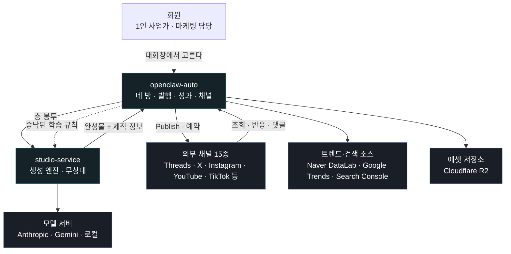
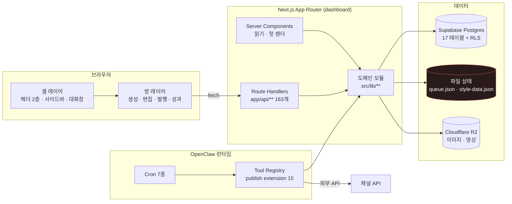
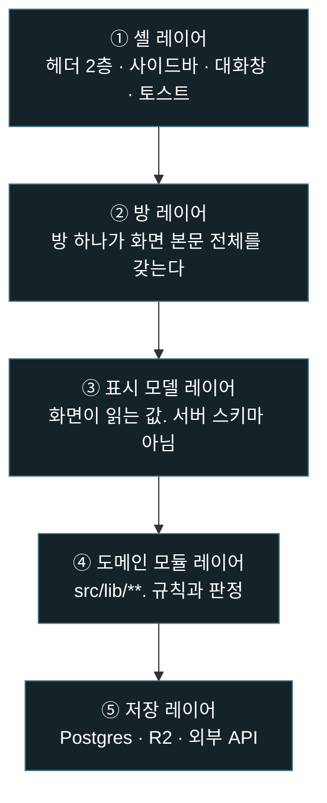
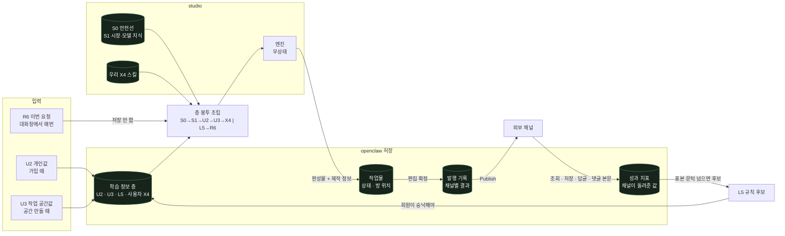
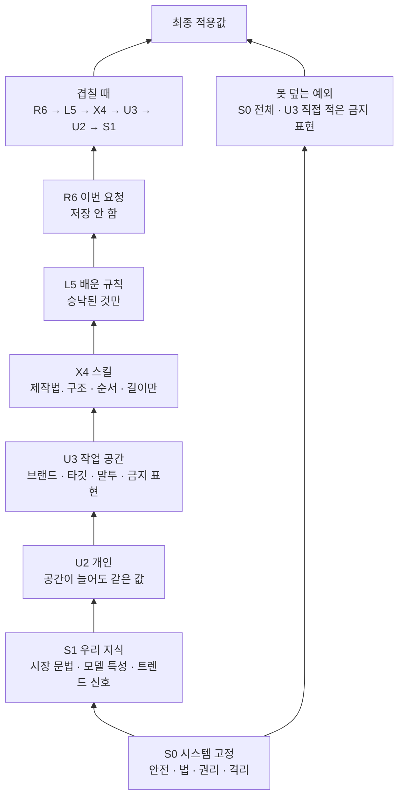

<!--
STAMP | openclaw-auto 아키텍처 | v1.0.0 | 2026-08-27 KST
model: claude-opus-5[1m] | agent: tech-architect (서브에이전트)
기반 산출물 (버전 핀):
  docs/prototype/openclaw-auto-4room-v61.html (design 미승인 · 이번 판 입력)
  docs/requests/회장-확정-요구사항-대장.md (2026-08-27 판 · R01~R200 전량)
  docs/user-flow.md (v55 증분판)
  docs/사업계획-osmu-v1.0.md §3.2 §3.3 §3.4
  DESIGN.md v29
  실구현: dashboard/src/** (API route 163개 · db/schema.sql 17테이블)
  studio 라인: studio/docs/fdd-studio-v5.0.md · api-contract-studio-v5.0.md · erd-studio-생성-v3.0.md
기반 포맷: studio/docs/fdd-studio-v5.0.md 의 절 구성(용어 → 아키텍처 → ADR → 벤치마크)을 상속했다.
고민한 것: 이 문서가 "새 아키텍처를 짓는 문서"가 되면 R127·R141·R148·R170·R174 가 다섯 번
  반복해 지적한 재창조를 기술설계 층에서 되풀이하는 것이다. 그래서 이 문서는 실구현 163개 route 와
  17개 테이블을 진실원으로 놓고, 그 위에 네 방이 무엇을 더 필요로 하는지만 얹는다.
-->

# openclaw-auto 시스템 아키텍처 v1.0.0

## 목차
- [1. 범위와 용어](#범위)
- [2. 시스템 맥락 (C4 Level 1)](#맥락)
- [3. 컨테이너 구성 (C4 Level 2)](#컨테이너)
- [4. 레이어 계약](#레이어)
- [5. 데이터 흐름 — 한 편이 도는 길](#데이터흐름)
- [6. 학습 정보 7층과 조립](#층계)
- [7. 도메인 경계](#도메인)
- [8. 아키텍처 결정 (ADR)](#adr)
- [9. 벤치마크 실조사](#벤치마크)
- [10. 오픈 이슈](#오픈)
- [11. 개정 이력](#이력)

> **TL;DR** openclaw-auto 는 Next.js App Router 단일 배치 안에 **네 방(생성실·편집실·발행실·성과실) 화면층**, **openclaw 도메인층(발행·성과·채널·학습 정보)**, **studio 엔진 어댑터층**을 담는다. 콘텐츠를 만드는 지식은 studio 가, 플랫폼·마케팅 지식은 openclaw 가 갖는다(R132). 이 문서는 실구현 API route 163개와 `db/schema.sql` 17개 테이블을 진실원으로 삼고, 네 방이 추가로 요구하는 것만 얹는다. 새 테이블·새 계약은 이 문서가 **확정하지 않는다** — 되돌리기 비싼 것은 전부 `docs/eng-design-openclaw-선택지-v1.0.md` 로 넘겼다.

---

## 1. 범위와 용어 <a id="범위"></a>

### 1.1 이 문서가 다루는 것

| 다룬다 | 안 다룬다 | 어디에 있나 |
|---|---|---|
| openclaw-auto 대시보드(Next.js)의 레이어·도메인·데이터 흐름 | studio 엔진 내부 구조 | `studio/docs/fdd-studio-v5.0.md` |
| 네 방 화면이 요구하는 서버 능력 | 화면의 시각 규격 | `DESIGN.md` v29 |
| 기존 163개 route 의 역할 분류 | 각 route 의 요청·응답 전문 | 확정 전. §10 오픈 이슈 |
| 테이블이 있어야 하는 자리의 **식별** | 테이블 스키마 확정 | `docs/eng-design-openclaw-선택지-v1.0.md` |

### 1.2 고정 용어

이 용어는 회장 확정 자산이다. 에이전트가 바꾸지 않는다(R136 · R49 위반 이력).

| 용어 | 뜻 | 바꾸면 안 되는 이유 |
|---|---|---|
| **학습 정보** | S0~R6 일곱 층의 총칭 | R136. v49 가 "선택 기록"으로 개명해 반려됨 |
| **디스플레이** | 사용자와 담당이 같이 보는 가운데 화면 | R75. 고르는 자리가 아니다(R177) |
| **대화창** | 오른쪽(390 은 아래) 상시 담당 대화면 | R101 · R81 |
| **방** | 생성실 · 편집실 · 발행실 · 성과실 | R08 · v61 확정 이름세트 A |
| **작업물** | 한 편의 콘텐츠. 방을 옮겨 다니는 단위 | R09 · R16 |
| **채널 운영** | 좋아요 · 정형 답글 · 자유 답글 · 내리기 넷으로만 정의 | R152. `docs/prd-openclaw-운영-v1.0.md:595` |
| **Publish** | 발행 실행 동작. 한국어로 의역하지 않는다 | 표준 용어 규율. 정본 코드도 그렇게 쓴다 |

---

## 2. 시스템 맥락 (C4 Level 1) <a id="맥락"></a>



**경계 한 문장.** studio 는 회원이 누구인지 모른다. 받은 봉투만 보고 만든다(층계 계약 §10). 그래서 studio 를 개발자용으로 따로 팔 때 손댈 곳이 없다(R71).

---

## 3. 컨테이너 구성 (C4 Level 2) <a id="컨테이너"></a>



**빨간 칸(`queue.json` · `style-data.json`)은 레거시다.** Flask 병행기(Phase 1)의 잔재이고 `CLAUDE.md` 로드맵이 Phase 2 에서 Next.js API 로 흡수하기로 했다. 네 방은 이 파일 상태를 **직접 읽지 않는다.** 읽으면 테넌트 격리(RLS)가 뚫린다.

### 3.1 배치 단위

| 단위 | 무엇 | 배포 |
|---|---|---|
| `dashboard` | Next.js. 화면 + Route Handler + 도메인 모듈 | 단일 컨테이너 |
| `dashboard/legacy` | Flask 호환층 | Phase 3 삭제 대상 |
| `openclaw` + `extensions/*` | 크론 · Tool Registry · 채널 publish 확장 15종 | 별도 프로세스 |
| Supabase | Postgres + RLS | 관리형 |

---

## 4. 레이어 계약 <a id="레이어"></a>

**이 절이 이번 기술설계의 핵심이다.** 프로토타입에서 반복해 되살아난 결함 다수가 "이 요소가 어느 층에 사는가"가 안 정해져서 생겼다(자체 감사 A1 · A3 · A5).



### 4.1 각 층이 소유하는 것과 금지되는 것

| 층 | 소유 | 금지 | 근거 |
|---|---|---|---|
| ① 셸 | 헤더 2층(1층=나와 내 것, 2층=지금 일감), 사이드바(유저 흐름), 대화창, 전역 토스트 | 방마다 다른 내용을 담는 것. 방 이름 표시줄 | R102 · R176 · R79 · v61 확정 |
| ② 방 | 그 방의 디스플레이 전체 | 선택 단추(R157) · 설명 문장(R173 · R158 · R135) · 진행 멘트(R179) · 안내 뱃지(R188) | R177 |
| ③ 표시 모델 | 화면이 읽는 필드 이름과 단위 | 저장 레이어의 테이블·컬럼 이름이 이 층을 통과하는 것 | 자체 감사 A5 |
| ④ 도메인 | 상태 전이 판정, 문턱 판정, 채널 규격 판정, 권한 판정 | Route Handler 안에 규칙을 직접 쓰는 것 | 아래 §4.3 |
| ⑤ 저장 | 영속화, RLS, 외부 호출 | 화면 문구를 만드는 것 | |

### 4.2 대화창이 어느 층인가 — 못박는다

**대화창은 ① 셸 레이어다.** 방 본문이 아니다.

근거 셋.
1. 선택을 전부 대화창에서 한다(R177). 방을 옮겨도 사라지면 안 된다.
2. R101 "챗봇은 접지 않고 화면 오른쪽에 항상 띄운다"가 방 단위 규칙이면 방마다 다르게 구현된다.
3. v60 사고가 정확히 이것 때문이었다. `.device.vp390 .chat-dock{position:static}` 이라 방 본문 흐름에 딸려 들어가 **화면 아래 913px 밖**으로 밀렸다. 방 본문이 길어지면 대화창이 사라지는 구조였다.

폭에 따른 자리는 셸이 정한다.

| 폭 | 자리 | 접힘 |
|---|---|---|
| 1440 · 1024 | 화면 오른쪽 고정 기둥 | 없음 (R101) |
| 390 | 화면 아래 상시 시트. peek 148px | 없음. peek → half → full 세 걸음 |

### 4.3 Route Handler 는 얇다

실구현 163개 route 중 다수가 규칙을 자기 안에 갖고 있다. 새로 만드는 것부터 아래를 지킨다.

```
Route Handler = 인증 · 입력 검증 · 도메인 모듈 호출 · 표시 모델 변환
도메인 모듈   = 규칙과 판정 (테스트가 여기에 붙는다)
```

근거: Next.js App Router 에서 Route Handler 를 과하게 쓰면 "프론트엔드 안의 작은 백엔드"가 되고 DTO 가 샌다([Feature-Sliced Design · Next.js App Router Guide](https://feature-sliced.design/blog/nextjs-app-router-guide)). 우리 A5(DB 테이블 이름이 화면에 노출)가 그 샘의 실제 사례다.

---

## 5. 데이터 흐름 — 한 편이 도는 길 <a id="데이터흐름"></a>

**어떤 값이 어디서 만들어져 어디에 저장되고 누구에게 나가는지**를 그린다.



### 5.1 이 그림에서 반드시 지켜야 하는 다섯 가지

| # | 규칙 | 근거 | 어기면 |
|---|---|---|---|
| 1 | `R6` 는 저장하지 않는다 | 층계 계약 §2 | 이번 요청이 다음 편에 새어 들어간다 |
| 2 | 조립 순서를 바꾸는 변경은 **원가 변경**이다 | 층계 계약 §9 | 앞부분 재사용 이득이 사라져 같은 내용에 값만 몇 배 |
| 3 | `L5` 는 **승낙한 것만** 담긴다 | R168 · R98 | 회원이 동의 안 한 규칙이 다음 생성을 지배한다 |
| 4 | 표본이 문턱(같은 선택 3회 또는 성과 5건)을 못 넘으면 **근거 부족**을 붙이고 단정하지 않는다 | R98 | 없는 판정을 지어내 이 방의 신뢰가 무너진다 |
| 5 | 값을 못 받은 칸은 `0` 이 아니라 **미수집** | DESIGN.md · v61 확정 | `0` 은 "아무도 안 봤다"가 되어 없는 사실을 만든다 |

### 5.2 값이 어디서 만들어지나 — 출처 표

| 값 | 만드는 곳 | 저장 | 화면에 나가는 곳 |
|---|---|---|---|
| 제안 카드 3장 | studio 엔진 | 작업물(후보) | 생성실 1단계 |
| 저해상도 후보 3개 | studio 엔진 | 작업물(후보) | 생성실 2단계 |
| 고해상도 완성본 | studio 엔진 | 작업물 + R2 | 생성실 3단계 → 편집실 |
| 컷 길이 · 자막 · 비율 | 편집실(값만 바꿔 재렌더) | 작업물 revision | 편집실 |
| 채널별 제목 · 캡션 · 해시태그 · 첫 댓글 | **미확정 (G07)** | 미확정 | 발행실 미리보기 칸 |
| 발행 결과 증거 | 채널 API 응답 | 발행 기록 | 발행실 · 성과실 |
| 조회 · 저장 · 답글 · 팔로워 | 채널 API (크론) | 성과 지표 | 성과실 |
| 댓글 본문 | 채널 API (크론) | **미확정 (G09-d)** | 성과실 달린 반응 |
| 판정 문장 | openclaw 도메인 모듈 | 저장 안 함(파생) | 성과실 맨 위 |

---

## 6. 학습 정보 7층과 조립 <a id="층계"></a>

**정본은 `docs/사업계획-osmu-v1.0.md` §3.4 이다.** 층계 계약 v2.1 이 아니다. 이유는 §10 오픈 이슈 G08 에 적었다.



**개인 U2 와 작업 공간 U3 를 가르는 문장은 하나다.** 작업 공간을 하나 더 만들면 이 값이 바뀌는가. 안 바뀌면 U2, 바뀌면 U3(R85 · 브랜드 층은 따로 만들지 않는다).

**스킬은 층이지만 전권이 아니다.** 구조 · 장면 순서 · 길이 · 컷 수 · 화면 비율만 정한다. 말투 · 어휘 · 브랜드 사실 · 금지 표현은 못 건드린다. 조립할 때 영역 밖 문장은 걸러낸다.

---

## 7. 도메인 경계 <a id="도메인"></a>

### 7.1 두 서비스가 무엇을 갖나 (R132 기준)

**기준은 "그 지식이 어느 DB 에 사는가"다.** 작업 흐름이 어디서 이어지느냐로 정하면 네 번 뒤집힌다(R31 → R38 → R88 → R132 이력).

| 지식 | 소유 | 근거 |
|---|---|---|
| 콘텐츠 생성 · 편집 지식 | studio | R132 |
| 플랫폼 규격 · 마케팅 지식 · 해시태그 성과 · 댓글 관행 | openclaw | R132 |
| 채널 계정과 토큰 | openclaw | R65 · R175 |
| 발행 전략 | openclaw | R58 |
| 성과 관찰 기록 | openclaw. L5 후보도 openclaw 가 뽑는다 | 층계 계약 §10 |

### 7.2 openclaw 안에서 어느 방이 갖나

| 일 | 방 | 근거 |
|---|---|---|
| 채널별 제목 · 캡션 · 해시태그 · 첫 댓글을 **고치는 자리** | 발행실. 그것도 **미리보기 칸 그 자리에서** | R124 · R184 · R197 |
| 댓글 관리와 반응 | **성과실** | R185 |
| 채널 로그인 · 연결 | **왼쪽 사이드바의 그 채널** | R175 · R171 · R151 · R128 |
| 승인 인박스 · 발행 캘린더 | **헤더**. 발행실 안에 남기지 않는다 | R193 · R199 |
| 원본 내려받기 | 편집실 | R125 |
| 발행 이력 | 어느 방에도 없다. 헤더 작업물 전체가 갖는다 | R183 |

### 7.3 채널 능력 모델 (실구현 계승)

`dashboard/src/lib/channel-capabilities.ts` 가 진실원이다. 새로 만들지 않는다.

| 갈래 | 탭 | 비활성 | 제거 |
|---|---|---|---|
| Threads | queue · analytics · growth · popular · settings | 없음 | 없음 |
| 일반 텍스트 소셜 9종 | 다섯 전부 | growth · popular | 없음 |
| Instagram | 다섯 + editor | growth · popular | 없음 |
| 영상 2종 | 다섯 전부 | growth · popular | 없음 |
| Messaging | settings 만 | 없음 | queue · analytics · growth · popular |

**모든 플랫폼이 같은 다섯을 보여주고 못 쓰는 것만 흐리게 둔다(R150, 31번째 지시).** 탭을 지우는 것은 Messaging 갈래뿐이고 그것은 코드 정본이 이미 그렇게 정해 두었다.

---

## 8. 아키텍처 결정 (ADR) <a id="adr"></a>

각 결정은 **확정한 것**과 **회장께 올리는 것**을 구분한다.

### ADR-001 실구현 163 route · 17 테이블을 진실원으로 삼는다 — 확정

- **맥락:** R127 · R141 · R148 · R149 · R170 · R171 · R174 가 "기존 구현을 무시하고 새로 만든다"를 일곱 번 지적했다.
- **결정:** 새 능력이 필요할 때 먼저 기존 route · 테이블 · 컴포넌트를 찾고, 없을 때만 신설을 **선택지로** 올린다.
- **결과:** 이 기술설계는 `api-contract.md` 와 `erd.md` 를 **쓰지 않는다.** 신설 후보는 전부 선택지 문서로 갔다.

### ADR-002 대화창은 셸 레이어다 — 확정

- §4.2 참조. v60 의 390 사고가 이 결정의 부재에서 나왔다.

### ADR-003 표시 모델 층을 둔다 — 확정

- **맥락:** 화면에 `published_posts` 가 노출된 사고(자체 감사 A5). v61 에서 문자열은 지웠지만 **구조는 그대로다.**
- **결정:** 저장 레이어의 이름이 방 레이어에 도달하지 못하게 `src/lib/view/**` 에 표시 모델 변환을 둔다. 테이블명 · 컬럼명 · 크론 잡 이름(`threads-generate-drafts` 같은 것)은 이 층을 통과할 수 없다.
- **미해소:** v61 성과실 담당 로그에 크론 잡 이름 `threads-generate-drafts · a047` 이 아직 화면 문구로 남아 있다(실측). 갭 G05 로 올렸다.

### ADR-004 방 하나 = 렌더 경로 하나 — 확정

- **맥락:** 대장이 실측한 되살아나는 병의 뿌리. 같은 방을 그리는 함수가 둘씩 있어 "고쳤다"가 한 경로에만 적용됐다.
- **결정:** 한 방에 도달 가능한 렌더 경로는 정확히 하나다. 코드에서 방 컴포넌트는 파일 하나에 default export 하나이고, 조건 분기(빈 상태 · 갈래 등)는 **그 파일 안에서** 갈린다. 래핑해서 덮어쓰는 방식(`var base=roomPerf; roomPerf=function(){...}`)을 금지한다.
- **검증:** 테스트로 강제한다(`docs/test-cases.md` TC-ARCH-01).

### ADR-005 발행은 채널별 작업으로 쪼갠다 — **선택지. 확정 아님**

- 부분 실패가 정상이라는 것은 업계 합의다(§9 벤치마크 ①). 다만 작업 단위 · 멱등 키 · 재시도 정책은 되돌리기 비싸므로 회장 합의 전에 못 정한다. 선택지 문서 D-03.

### ADR-006 학습 정보 층의 저장 위치 — **선택지. 확정 아님**

- 선택지 문서 D-02.

---

## 9. 벤치마크 실조사 <a id="벤치마크"></a>

### ① 멀티채널 발행 API 설계 (2026 실조사)

- 출처: [bundle.social · Social Media API Integration Guide (2026)](https://bundle.social/blog/social-media-api-integration-guide) · [Mallary · Social Media Posting API Developer's Guide 2026](https://mallary.ai/blog/social-media-posting-api)
- **확인한 것:** 플랫폼이 멱등 장치를 주면 쓴다(Mastodon 은 `Idempotency-Key` 를 1시간 기억). 클라이언트가 만든 멱등 키를 **정규화한 요청 지문에 묶는다.** 부분 실패는 정상 상태로 취급하고 **플랫폼·계정마다 상태 한 줄**을 둔다. 지수 백오프는 멱등을 전제하는데 발행은 대개 멱등이 아니므로, 재시도는 일시 오류만 겨냥하고 **이미 올라갔는지 먼저 확인한 뒤** 시도한다. 스키마는 `publish_jobs`(멱등 키 · 네트워크 · 상태 · 시도 횟수)와 `publish_results`(게시 주소 · 네트워크 게시 ID · 오류 코드)를 나눈다.
- **가져온 것:** ①부분 실패를 정상 상태로 두는 것 ②채널별 상태 한 줄 ③"이미 올라갔는지 확인 후 재시도". 우리 `types/queue.ts` 의 `channels: Record<string, ChannelStatus>` 가 이미 ②를 갖고 있다. 계승한다.
- **버린 것:** 작업과 결과를 두 테이블로 나누는 것을 **여기서 확정하지 않았다.** 되돌리기 비싼 결정이라 선택지 D-03 으로 올렸다.

### ② Next.js App Router 아키텍처 (2026 실조사)

- 출처: [Feature-Sliced Design · The Ultimate Next.js App Router Architecture](https://feature-sliced.design/blog/nextjs-app-router-guide) · [FSD · Usage with Next.js](https://feature-sliced.design/docs/guides/tech/with-nextjs)
- **확인한 것:** Route Handler 를 과하게 쓰면 프론트엔드 안에 작은 백엔드가 생기고 **DTO 가 샌다.** 서버 전용 모듈이 슬라이스의 `index.ts` 로 나가면 클라이언트 모듈 그래프에 부작용이 전파돼 빌드가 깨진다. `index.server.ts` 로 공개 API 를 갈라야 한다. 서버 어댑터를 `external/`(DTO · handler · service · repository · client)로 두면 백엔드 구현을 갈아 끼워도 기능·훅·컴포넌트는 안 건드린다.
- **가져온 것:** ①서버/클라이언트 공개 API 분리 ②어댑터 층으로 studio 엔진 교체 가능성 확보 ③DTO 누출을 아키텍처 결함으로 취급(ADR-003).
- **버린 것:** FSD 의 전면 슬라이스 재편(`entities/` · `features/` · `widgets/`). 우리 실구현이 이미 `components/{도메인}` + `lib/{도메인}` 관습을 갖고 있고(R156 계승 규율), 폴더를 통째로 갈아엎는 것 자체가 회장이 일곱 번 지적한 재창조다. **관습을 지키고 규칙만 얹는다.**

### ③ 산업 표준 크로스워크

이 문서는 **arc42** 12장 구조와 **C4 model** 의 context/container 뷰를 따랐다. 요구↔설계↔테스트 추적은 **ISO/IEC/IEEE 29148** 의 RTM 방식으로 `docs/test-cases.md` 에 뒀다.

---

## 10. 오픈 이슈 <a id="오픈"></a>

| # | 무엇 | 어디로 |
|---|---|---|
| G05 | 크론 잡 이름이 화면 문구로 남아 있다 | `docs/fdd-openclaw-4room-v1.0.md` §매핑 갭 |
| G07 | 채널별 문구를 누가 만드나 — user-flow 와 R132 가 정면 충돌 | 갭. 디자인 되돌림 아님 · **회장 회수** |
| G08 | 학습 정보 층계 정본이 둘이다 | 선택지 D-02 |
| — | 163 route 각각의 요청·응답 전문 | 선택지 확정 후 `api-contract.md` 에서 |
| — | 테이블 신설 여부와 스키마 | 선택지 D-02 · D-03 확정 후 `erd.md` 에서 |

---

## 11. 개정 이력 <a id="이력"></a>

| 판 | 날짜 | 무엇 | 작성 |
|---|---|---|---|
| v1.0.0 | 2026-08-27 | 초판. 실구현 진실원 위에 네 방 레이어 계약을 얹음 | tech-architect / claude-opus-5[1m] |

---

RUBRIC_SCORE: 완결5 정밀4 벤치5 추적4 톤5 total=23/25
WEAKEST_LINE: "163개 route 의 역할 분류는 이 문서에 표로 없다. §3 컨테이너 그림이 '163개'라는 숫자만 말하고 어느 route 가 어느 도메인 모듈에 붙는지는 FDD 매핑표에 위임했다."
