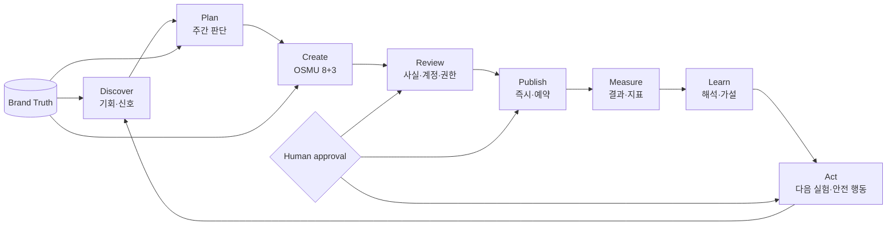

# OSMU Marketing Agent PRD — Product Requirements Document

<!--
STAMP
created_at: 2026-08-06 23:20 KST
model: gpt-codex/gpt-5.6-sol
agent: prd-architect / marketing_agent_prd_v61
skills: 없음 — 설치된 스킬 중 PRD 기획 전용 매칭 없음; planning.md + doc-review.md 템플릿 적용
evidence: current wiki/code audit + official Buffer/Hootsuite/Sprout/Later sources
deliberation: critic MAJOR4에 따라 2주 proof를 source1·campaign1·Threads1·permalink1의 가장 얇은 선으로 줄이고, 넓은 Marketing Agent target은 roadmap으로 분리했다.
-->

| 항목 | 값 |
|---|---|
| 버전 | v6.1.0 (MAJOR — 제품 목적을 Publisher에서 Marketing Agent로 재정의) |
| 작성일 | 2026-08-06 |
| 작성자/모델 | prd-architect / gpt-codex/gpt-5.6-sol |
| 상태 | in-review — critic0 전, 구현·디자인 입력 금지 |
| 상류 산출물 | [Marketing Hub PRD v5.2.0](./openclaw-auto-marketing-hub-prd-v5.2.0-gpt-codex.md), [Marketing Hub surface map](../wiki/product/marketing-hub-surface-map.md), `pipeline-state.md` plan in-progress |
| 승인 게이트 | plan-critic MAJOR 0 + 회장 `/approve plan` 후 버전 핀 |
| 증거 경계 | 코드 존재=`근거 확인`; Chrome 관찰=`관찰됨`; provider·운영 왕복은 별도 E2E 없으면 `미검증` |

## 목차

- [0. TL;DR](#0-tldr)
- [1. 목적과 문제 정의](#1-목적과-문제-정의)
- [2. 범위·비범위·보존 계약](#2-범위비범위보존-계약)
- [3. 페르소나와 JTBD](#3-페르소나와-jtbd)
- [4. One Thing](#4-one-thing)
- [5. 제품 원칙·용어·자율성](#5-제품-원칙용어자율성)
- [6. 전체 Marketing Agent 루프](#6-전체-marketing-agent-루프)
- [7. MVP 5개](#7-mvp-5개)
- [8. 원요구 레저와 현재 상태](#8-원요구-레저와-현재-상태)
- [9. 기능 요구사항](#9-기능-요구사항)
- [10. 비기능·운영·법적 요구](#10-비기능운영법적-요구)
- [11. 수용기준·테스트 추적](#11-수용기준테스트-추적)
- [12. UI·정보구조 계약](#12-ui정보구조-계약)
- [13. 지표·2주 appetite·로드맵](#13-지표2주-appetite로드맵)
- [14. BM·운영부하·자기잠식](#14-bm운영부하자기잠식)
- [15. 벤치마크](#15-벤치마크)
- [16. 리스크·premortem·kill criteria](#16-리스크premortemkill-criteria)
- [17. 레드팀·셀프심문](#17-레드팀셀프심문)
- [18. 오픈 이슈·개정 이력](#18-오픈-이슈개정-이력)
- [19. 품질 판정·출처](#19-품질-판정출처)

## 0. TL;DR

반복 사용 증거 전 OSMU의 시장 포지션은 **브랜드 사실에 근거한 publisher + assisted weekly loop**다. 2주 proof는 internal 1 + external 최대 3 workspace에서 `fact source1 → opportunity source1 → campaign1 → L2 draft → per-post 승인 → Threads1 실발행 → permalink1 → native metric1 또는 sample-hold → experiment approve/hold1`만 닫는다. 장기 목표는 `Discover → Plan → Create → Review → Publish → Measure → Learn → Act` Marketing Agent지만, source4·text8+video3 신규 구현·universal listening·cross-provider analytics·alerts·일반 tenant learning은 반복 의향이 증명될 때까지 roadmap으로 보류한다.

## 1. 목적과 문제 정의

### 1.1 실제 고객 문제

기존 v5.2는 잘못된 계정 발행, false-success, 중복 발행, 502 복구라는 신뢰 문제를 강하게 해결했지만, 고객이 매주 돈을 내는 이유를 “안전하게 여러 채널에 올린다”로 축소했다. 1인 사업자의 더 큰 일은 **이번 주에 무엇을 누구에게 왜 말해야 하는지 판단하고, 실제 반응을 보고 다음 주 행동을 바꾸는 것**이다. 발행은 폐루프의 한 단계이며 목적이 아니다.

현재 제품에는 브랜드 wiki retrieval, Studio 생성, Queue/Inbox/Calendar, text/video 발행 경로, Threads 검색·인기·성장·style RAG, analytics API와 홈 지표가 흩어져 있다. 그러나 다음 단절이 있다.

1. 발견 신호가 “이번 주 무엇을 할 것인가”라는 계획으로 수렴하지 않는다.
2. 목표·고객·오퍼·캠페인이라는 마케팅 맥락이 원본/파생 콘텐츠와 함께 추적되지 않는다.
3. Studio 결과, 승인, 발행, permalink, 성과, 다음 실험이 하나의 campaign lineage로 이어진다고 증명할 수 없다.
4. Threads legacy/local 학습을 모든 테넌트·모든 채널의 학습처럼 말할 위험이 있다.
5. 자동 행동은 irreversible boundary가 불분명해 계정·브랜드·법적 위험을 만든다.

### 1.2 제품 목적

OSMU가 고객 대신 “마케팅을 끝까지 해준다”는 과장 대신, 증거가 있는 신호를 요약하고, 목표에 맞는 주간 계획과 초안을 추천하며, 고객 승인 후 실행하고, 실제 결과를 다음 실험으로 환류하는 **evidence-backed marketing operating loop**를 제공한다.

### 1.3 현재 구현 판정 규칙

| 판정 | 의미 | PRD 처리 |
|---|---|---|
| 이미구현 | current code/wiki에 해당 행위의 직접 경로가 있음 | 재구현 금지; command center 연결·truth 보강 |
| 부분구현 | 일부 채널·legacy/local·분리된 surface만 존재 | 범위를 정직하게 표시하고 tenant-scoped bridge 구축 |
| 미구현 | 제품 surface·workflow·데이터 lineage 근거 없음 | MVP/로드맵의 target으로 명시 |
| 미검증 | 코드/테스트가 있어도 실제 provider·운영 경로를 직접 관찰하지 않음 | 완료 주장 금지; production evidence gate 유지 |

## 2. 범위·비범위·보존 계약

### 2.1 Two-week in scope — proof slice only

- cohort: internal workspace 1 + external workspace 최대 3.
- brand fact source: **기존 경로 1개만** 선택해 confirmed fact와 citation을 만든다. 기본 fixture는 GitHub repo/paste 중 실제 작동 경로이며 source4 통합은 하지 않는다.
- opportunity source: **Threads Popular 또는 owned native metric 중 건강한 1개만** 선택한다.
- weekly plan: campaign 정확히 1개, 7일 window, goal/audience/offer/hypothesis를 L1 추천 후 사람이 승인한다.
- create/review: 현재 Studio 경로를 재사용한 L2 draft와 **게시물별 승인**. implicit generate/edit/save는 외부 adapter call 0이다.
- publish: direct provider **Threads 1개**, selected account adapter call 1, other adapters 0, 실제 permalink 1개.
- measure/learn/act: Threads native metric 1개를 출처·수집시각과 기록하거나, 수치 threshold 없이 `sample-hold`; experiment는 approve/hold 1개를 다음 plan에 연결한다.
- v5.2 발행 신뢰 계약과 current 25 route·26 sidebar·Studio/Video/Images/Blog/Search/Keyword/Settings·SVG/theme/role fidelity를 deletion/rename/move 0으로 보존한다.

### 2.2 Deferred until repeat proof

- website/GitHub/paste/fact-editor source4의 신규 통합 구현.
- text8+video3 전체를 새 campaign object로 재구현하거나 모든 target을 direct publish로 확대.
- universal listening, cross-provider metric normalization/analytics, general alerts/action automation.
- Threads legacy/local style/popular를 일반 tenant-scoped learning engine으로 마이그레이션.
- L3 autonomy의 일반화. 2주 slice는 L2 default + per-post approval이며, irreversible approval policy는 roadmap 요구이지 design blocker가 아니다.
- Command Center의 신규 route/대규모 IA. `/` additive summary만 허용한다.

### 2.3 Explicit non-goals

- 광고 예산·입찰·캠페인 spend의 생성/증액/감액/이체.
- 대량 DM, 대량 댓글, mass mention/tag, follow/unfollow 등 스팸성 성장 자동화.
- 사람 승인 없는 게시물·계정·자산·댓글 삭제. 현행 Threads `cleanup_low_engagement`는 legacy 위험 기능으로 기본 비활성·target 정책 밖이다.
- 가짜 reach·follower·engagement·conversion, 결측치를 0으로 채우거나 다른 provider 평균을 대신 표시하는 행위.
- 지원되지 않는 채널을 “연결됨/발행 가능/분석 가능”으로 보이게 하는 UI.
- provider 네이티브 광고·CRM·customer support suite 전체 대체.
- 정본 wiki·디자인·기술 스키마를 plan 승인 전에 확정하는 것.

### 2.4 Preservation contract — additive, not replacement

1. current 25 page routes와 customer sidebar 26 destinations는 삭제·병합·rename하지 않는다.
2. Threads generic+Growth+Popular, Instagram Editor, Messaging credential-only, Data disabled/setup, Video `/videos`, Blog 별도 queue라는 provider family를 강제로 동일 탭으로 만들지 않는다.
3. Studio visual7, direct4, text adapter8, video3, extension15를 서로 다른 inventory로 유지한다.
4. customer 8 Settings tabs, operator-only Video/TTS 포함 9 tabs, public/customer/operator shell, AuthGate blocked states를 보존한다.
5. `getChannelIcon` SVG, semantic light/dark tokens, ThemeToggle, FOUC 초기화, 기존 assets를 재사용한다. 새 디자인은 critic0 이후 design stage 소유다.
6. Agent Command Center는 `/`의 진화 또는 승인된 새 진입점으로 기존 surface를 deep-link하고, Weekly Plan은 Studio/Inbox/Calendar/Analytics를 대체하지 않는다. 정확한 route 결정은 design/eng-design 전에 회장 합의 대상이다.

## 3. 페르소나와 JTBD

### 3.1 Primary persona — 김민서, 38세, 1인 브랜드 운영자

김민서는 서울에서 소규모 교육·컨설팅 사업을 혼자 운영한다. 상품 설계, 상담, 수업, 고객 응대, 회계까지 직접 하며 마케팅 전담자는 없다. Threads와 Instagram은 매주 올려야 한다는 사실을 알지만, 월요일마다 “이번 주엔 무슨 말을 하지?”에서 멈춘다. 업계 뉴스와 경쟁자 글을 북마크하고 Google Search Console 숫자를 가끔 보지만, 어떤 신호가 자기 상품과 고객에게 중요한지 판단하기 어렵다. ChatGPT로 초안을 만들면 브랜드가 실제로 제공하지 않는 혜택이나 오래된 가격을 그럴듯하게 쓰는 일이 있어, 결국 회사 소개·FAQ·수업 노트를 다시 대조한다. 채널마다 길이와 문법이 달라 복사·수정에 2~4시간이 들고, 예약 후 실제로 게시됐는지 확인하려고 앱을 다시 연다. OAuth 연결 화면에서 다른 계정이 보이거나 “연결 완료” 뒤 Settings가 미연결이면 가장 무섭다. 잘못된 브랜드 계정에 게시하는 한 번의 사고는 한 달치 시간 절감보다 손해가 크기 때문이다. 성과 화면의 0이 “진짜 0”인지 “권한 부족”인지도 구분하지 못해 숫자를 믿지 않는다. 민서는 완전 자율 AI를 원하지 않는다. 대신 AI가 출처와 이유를 보여주며 이번 주 기회 3개와 실행안 1개를 추천하고, 사실·말투·발행 계정·예약시각을 자신이 마지막으로 확인한 뒤 실행되기를 원한다. 다음 목요일에는 “무엇이 먹혔고, 그래서 다음 주 무엇을 바꿀지”가 한 문장과 근거 링크로 남아야 한다. 성공은 더 많은 콘텐츠가 아니라, 주 1회 45분 안에 계획→승인까지 끝내고 잘못된 사실·계정·중복 발행 없이 최소 1개의 학습이 다음 주 실험으로 이어지는 상태다.

### 3.2 JTBD

> 월요일에 마케팅 시간이 45분밖에 없을 때, 내 브랜드 사실과 지난 성과에 근거한 이번 주 우선순위를 고르고 채널별 실행안을 승인해두어, 나머지 주에는 발행 여부를 쫓지 않고 사업과 고객에 집중하고 싶다.

### 3.3 Anti-persona

- 하루 수백 계정에 무승인 자동 댓글/DM을 보내려는 growth hacker.
- 광고비 자동 최적화와 attribution warehouse를 즉시 요구하는 enterprise paid-media team.
- provider policy를 우회하거나 가짜 참여를 원하는 사용자.

### 3.4 Persona 근거

`wiki/product/vision.md`의 “코딩/자동화 구축 능력이 없는 일반인·자영업자, API 토큰 병목”, 2026-08-01 OAuth/Studio/Settings/502 실고객 관찰, `wiki/marketing/feedback-loop.md`의 주간 triage 운영 요구에 기반한다. 정량 시간절감 baseline은 아직 사용자 인터뷰로 검증되지 않았으므로 KPI의 baseline은 `미측정`이다.

## 4. One Thing

### 4.1 후보와 함정

| 후보 | 매력 | 잘못된 답 함정 | 판정 |
|---|---|---|---|
| “글 하나 넣으면 전 채널로” | 이해가 빠르고 현행 OSMU와 연결 | 제작·발행기만 최적화해 Discover/Measure/Learn을 주변 기능으로 밀어냄 | 탈락 |
| “AI가 마케팅을 전부 대신한다” | 강한 자동화 약속 | 사실·권한·provider 한계·사람 책임을 숨기고 irreversible action 위험 | 탈락 |
| “모든 채널 성과를 한 화면에” | 분석 니즈를 강조 | 결측·metric 차이를 가짜 비교로 만들고 행동까지 이어지지 않음 | 탈락 |
| “매주 하나의 근거 있는 마케팅 판단을 실행하고 다음 판단으로 학습” | 장기 폐루프를 묶음 | 첫 2주에 suite 재구축·가짜 agent claim 위험 | target roadmap; proof 전 시장 포지션 아님 |
| “확인한 사실 1개로 Threads 게시물 1개를 승인·실발행하고 결과로 다음 실험을 결정” | 가장 얇은 반복가치 증명 | provider/source breadth를 의도적으로 포기 | 2주 One Thing으로 채택 |

### 4.2 One Thing

> **OSMU는 고객이 확인한 브랜드 사실 1개로 Threads 게시물 1개를 승인·실발행하고, 실제 결과 또는 표본 보류를 다음 주 실험 결정으로 되돌리게 한다.**

이 문장이 2주 proof다. 반복 의향이 확인되기 전 public positioning은 “grounded publisher + assisted weekly loop”이며 “전 채널 자율 Marketing Agent”로 광고하지 않는다.

## 5. 제품 원칙·용어·자율성

### 5.1 제품 원칙

1. **Evidence before advice:** 모든 기회·인사이트·추천은 source, collected_at, scope, sample, confidence를 보인다.
2. **Truth before fluency:** 유창한 카피보다 확인된 브랜드 사실을 우선한다. 미확인 주장은 발행 근거가 될 수 없다.
3. **Human owns irreversible actions:** 외부 공개, 삭제, 계정 변경, 지출은 사람 승인 없이는 실행하지 않는다.
4. **Platform-specific, campaign-coherent:** 채널 차이는 보존하되 campaign goal·message·lineage는 공유한다.
5. **No false zero / no false success:** 결측·권한부족·지연은 0이나 성공으로 표시하지 않는다.
6. **Tenant isolation by construction:** 학습·사실·성과·추천은 workspace 경계를 넘지 않는다. private 서비스 데이터는 analytics에 혼합하지 않는다.
7. **Current truth wins:** 코드 존재와 운영 성공을 구분하고, capability snapshot이 false면 CTA도 false다.

### 5.2 Glossary

| 용어 | 정의 |
|---|---|
| Campaign | 하나의 goal·audience·offer·message·기간 아래 연결된 opportunity, source, content variants, publication results, metrics, experiments의 논리 단위 |
| Marketing Brief | goal, audience, offer, desired action, constraints, channels, date range를 사람이 승인한 입력 |
| Opportunity | 외부 trend/keyword/popular 또는 owned performance/customer signal에서 나온 검토 가능한 후보; 사실이 아니라 판단 입력 |
| Brand Fact | 고객이 입력·sync·확인했고 source와 updated_at이 있는 검증 정보 |
| Inference | source fact/signal로부터 AI가 도출한 해석; 근거와 confidence를 표시 |
| Unverified | 출처·권한·표본이 불충분하여 계획·발행의 사실 근거로 사용할 수 없는 항목 |
| Publication Result | provider account, external post ID, permalink, terminal status, published_at, correlation을 갖는 발행 결과 |
| Experiment | hypothesis, changed variable 1개, baseline, target metric, window, decision rule을 가진 다음 행동 |
| Safe Action | 외부 공개·삭제·지출·계정 권한 변경 없이 되돌릴 수 있는 내부 action |
| Approval Boundary | agent가 제안/초안까지만 가능한 지점과 사람이 실행을 승인하는 지점 |

### 5.3 Autonomy levels

| Level | Agent 권한 | 허용 예 | 금지/승인 경계 | 기본 대상 |
|---|---|---|---|---|
| L0 Observe | 읽고 상태만 요약 | metric/연결/오류 수집, source health | 외부·내부 mutation 전부 금지 | 신규 workspace |
| L1 Recommend | 옵션·이유·예상효과 제시 | 기회 rank, weekly plan, next experiment | 계획 적용·콘텐츠 생성은 사람 선택 | 첫 2주 |
| L2 Draft | 가역 내부 초안 생성·수정 | brief draft, campaign, text/video script, schedule draft | publish/schedule activation/delete/account change 금지 | 기본 권장 |
| L3 Execute | 사전 승인된 정책·범위 안의 실행 | 승인된 publication의 지정시각 발행, metric collection, 내부 alert | 새 외부 공개·재발행·삭제·지출·계정/권한 변경은 건별 승인 | 검증 cohort opt-in |

Autonomy는 workspace별·action class별로 별도 설정한다. 전체를 한 토글로 L3로 올릴 수 없다. L3라도 `account_id, content hash, schedule instant, channels, approval actor, expiry`가 승인 기록과 일치하지 않으면 실행하지 않는다.

### 5.4 Irreversible-action approval policy

| Action | 자동 허용 | 필요한 승인 | 실패/만료 정책 |
|---|---|---|---|
| source read, metric collect, internal summary | L0+ | 없음 | source unavailable로 표시 |
| internal opportunity/brief/content draft | L2+ | 없음; 사실은 confirmed만 사용 | draft에 unverified blocker 표시 |
| schedule draft 생성 | L2+ | 없음 | inactive 상태 |
| 외부 publish / active schedule | L3 + 건별 승인 | target account·content·time·channels 확인 | 내용/계정 변경 시 승인 무효 |
| confirmed failure 재시도 | 자동 금지 | 건별 승인 또는 사전 정의된 1회 정책 | uncertain이면 reconcile-first, adapter call 0 |
| comment/reply/DM | 자동 금지 | 건별 승인 | mass operation 금지 |
| post/comment/media/account 삭제 | 자동 금지 | 건별 명시 승인 + 영향 확인 | 승인 15분 만료, audit 필수 |
| 광고비·billing·credential·role 변경 | 자동 금지 | 이 PRD 범위 밖; 별도 설계/승인 | 실행 경로 제공하지 않음 |

## 6. 전체 Marketing Agent 루프

### 6.1 Stage contract

| Stage | Customer job | Agent action | Human approval boundary | Inputs → outputs | Data/source truth | UI surfaces | Current code evidence | Target gap | Failure/recovery | Success metric |
|---|---|---|---|---|---|---|---|---|---|---|
| Discover | 이번 주에 반응할 가치가 있는 신호를 놓치지 않는다 | trend/keyword/popular/owned performance를 모아 relevance·freshness·confidence로 rank | opportunity 채택 전 L1 추천만; 사실로 승격은 사람 확인 | sources, goal, audience → opportunity cards 3~10 | URL/provider, collected_at, sample, tenant scope; missing≠0 | Command Center, Opportunity Inbox, 기존 Keyword/GSC/Popular deep-link | Threads search, keyword planner, GSC/analytics routes 존재 | Threads/local 편중, 통합 inbox·campaign relevance 없음 | source별 unavailable/rate-limit/permission; stale badge·manual refresh | 주간 plan에 채택된 opportunity ≥1, source attribution 100% |
| Plan | 45분 안에 이번 주 우선순위와 7일 실행안을 정한다 | brief와 opportunity를 결합해 weekly plan·campaign 1~3개·가설 제안 | 사람이 goal/audience/offer/claim/channels/window 승인 | brand facts + opportunities + last results → approved weekly plan | confirmed fact/inference/unverified 분리 | Command Center, Weekly Plan, Calendar deep-link | guide/keywords/suggestions·queue calendar 부분 존재 | goal/audience/offer/campaign/experiment 계약 없음 | 근거 부족이면 “계획 보류”; 임의 채움 금지 | plan approval median ≤45분, fact blocker 0 after approval |
| Create | 원본 하나를 각 채널에 맞게 만들되 브랜드 사실을 지킨다 | brief에서 text8+video3 variants와 asset/script 생성·검증 | L2 draft까지; unverified claim 존재 시 Review 진입 차단 | approved brief + facts + source → 11 output candidates | used facts/citations, model, prompt source, capability snapshot | Studio, `/videos`, Instagram Editor, media galleries | Studio visual7/direct4, text API, video workbench, wiki retrieval | text8 UI 완결·campaign lineage·citation visible 미완 | generation 502는 draft 보존·retry; source missing은 blocker | 11 inventory truth 100%, unsupported CTA 0, citation coverage 100% |
| Review | 무엇이 어디 계정으로 언제 나가는지 한 번에 확인한다 | fact diff, limit, policy, duplicate, account/status, media readiness 검사 | 공개·schedule activation은 건별 승인 | variants + account + time → approval record / revision | canonical account readback, content hash, capability version | Inbox + campaign workspace + Settings deep-link | Inbox legacy queue, account selector, per-card edit 존재 | campaign review·approval expiry·all-surface status bridge 없음 | stale account/capability/content면 approval invalidate | wrong account approval 0, blocked reason actionability 100% |
| Publish | 승인한 그대로 한 번만 나가고 결과를 안심하고 확인한다 | 즉시/예약 dispatch, idempotency, provider readback, permalink, partial result | 승인된 action만 L3; retry/repair는 정책표 준수 | approval + job intent → publication results | job ledger authority; queue/calendar projection | Studio card, Calendar, Inbox, channel, alerts | `/api/publish`, schedule/publish-due, published_posts, permalink 일부 | universal lineage·uncertain/reconcile UI·production evidence 미완 | confirmed failure retry; uncertain reconcile-first; repair persistence | duplicate external post 0, result terminalization ≥95%, permalink 100% where provider supplies |
| Measure | 숫자가 무엇을 뜻하고 얼마나 믿을 수 있는지 안다 | campaign/post/channel metrics 수집·정의·freshness·coverage 표시 | read-only; metric normalization rule 변경은 사람 승인 | publication results + provider metrics → campaign report | native metric name, definition, source, collected_at, backfill/permission | Performance, channel Analytics/Growth/Popular, campaign analytics | Threads insights/growth, analytics API, blog/GSC 부분 존재 | cross-channel campaign attribution·truth contract 미완 | permission/rate-limit/delay를 NA로 표시, fabricated 0 금지 | metric provenance 100%, stale/NA reason 100% |
| Learn | 결과에서 다음에 바꿀 한 가지를 이해한다 | top/bottom pattern, audience/topic/format/time hypothesis 생성 | inference를 fact로 승격 금지; 실험 채택은 사람 | campaign report + prior baseline → insight + confidence + evidence | tenant-scoped sample; minimum sample/period; correlation≠causation | Campaign Analytics, Insight drawer, Threads Popular deep-link | Threads viral→popular/style local legacy 존재 | Studio와 tenant 통합 학습 단절, 다채널 학습 없음 | 표본 미달이면 “판정 보류”; model hallucination은 citation audit | 주간 insight ≥1 or explicit hold, unsupported causal claim 0 |
| Act | 배운 것을 다음 주의 검증 가능한 행동으로 바꾼다 | changed variable 1개의 experiment와 safe action 추천·계획 반영 | next experiment 승인; 외부 reply/delete/spend는 별도 승인/비범위 | insight → experiment / alert / plan delta | hypothesis, baseline, target, window, stop rule | Command Center action queue, Weekly Plan, alerts | alert routes, Threads auto actions legacy 존재 | safe action taxonomy·approval·experiment lineage 없음 | conflicting insight는 옵션 제시; irreversible auto action 0 | insight→experiment conversion ≥50%, approved experiment execution ≥80% |

### 6.2 Weekly operating rhythm

| 시점 | Agent | Human | 산출 |
|---|---|---|---|
| 월요일 | 지난 7일 결과·새 기회 3~10개·주간 plan draft 생성 | 45분 안에 opportunity 1~3개, claim, channel, schedule 승인 | Weekly Plan vN |
| 화~수 | 승인된 campaign variants 생성, blockers/approvals 알림 | 사실·표현·계정·일정 검수 | Approved content set |
| 주중 | 승인 intent 실행, result/permalink 수집, 장애 분류 | uncertain/repair/delete 등 예외만 결정 | Publication ledger |
| 목요일 | campaign report와 insight/experiment draft 생성 | 다음 실험 1개 채택·보류 | Experiment decision |
| 금요일 | 다음 주 opportunity seed와 source health 요약 | 필요 시 source/brand fact 보정 | Loop closure record |

## 7. MVP 5개

MVP는 새 suite 기능 5개가 아니라 기존 경로를 연결해 proof 한 줄을 닫는 5개 checkpoint다.

| MVP | One Thing 연결 | 포함 | 제외/제약 | 종료증거 |
|---|---|---|---|---|
| M1 Fact1 | 근거 입력 | cohort가 current brand source 1개로 fact 1개를 확인하고 citation을 고정 | source4 통합·fact editor 신규 구현 보류 | confirmed fact1 + citation1 |
| M2 Opportunity1+Plan1 | 주간 판단 | Threads Popular 또는 owned metric 1개→campaign1의 7일 plan | universal Opportunity Inbox·campaign 1–3 보류 | opportunity1 + approved plan1 |
| M3 Current Studio Card1 | 실행 초안 | current Studio에서 Threads card1 생성·편집·저장, L2 default | text8+video3 신규 workspace 재구축 보류 | card1; generate/edit/save adapter0 |
| M4 Per-post approval→Threads1 | 안전한 외부 결과 | 정확한 Threads account1, per-post approval, selected adapter1/others0, permalink1 | L3 일반화·multi-provider 확장 보류 | provider link1, wrong/duplicate0 |
| M5 Metric-or-hold→Decision1 | 다음 판단 | native metric1 또는 reasoned sample-hold, insight evidence, experiment approve/hold1, next plan link | cross-provider analytics·numeric threshold·general learning 보류 | loop lineage bidirectional 100% |

### 7.1 Proof arithmetic — overbuild blocker

`workspace ≤4 × fact source1 × opportunity source1 × campaign1 × direct provider1 × card1 × approval1 × permalink1 × metric-or-hold1 × experiment decision1`. 이 범위를 넘기는 source/provider/output/automation 추가는 R5 roadmap이며 2주 MVP acceptance에 포함하지 않는다.

## 8. 원요구 레저와 현재 상태

### 8.1 원요구 master ledger

각 행의 “현재”는 2026-08-06 wiki/code truth다. `이미구현`도 운영 완료가 아니라 source-level 근거일 수 있다.

| Ledger | 원요구·실패 | 현재 | 위키/코드 출처 | v6 disposition |
|---|---|---|---|---|
| L-01 | GitHub repo URL을 HTTPS/.git/SSH/tree/blob 형태 그대로 붙여넣기 | 이미구현·운영 미검증 | `wiki/reference/brand-grounding.md`; `github-repo-input.ts` | M1에 보존, URL 정규화와 실제 sync E2E |
| L-02 | repo/branch/folder/file/PAT 403·404·rate-limit·secret-key 오류를 정확히 구분 | 부분구현 | brand-grounding 오류 계약 | Opportunity/Brand source health로 승격 |
| L-03 | PAT·Markdown·secret 원문 노출 금지 | 부분구현·운영 미검증 | brand-grounding, session-state | tenant audit + UI/trace redaction gate |
| L-04 | GitHub 없는 고객의 사이트 내 사실 입력·수정·확인 | 미구현 | brand-grounding은 paste adapter만 기술; 완결 editor 증거 없음 | M1 fact editor must |
| L-05 | AI 자동채움은 사실·추론·미확인 분리, 사람 확인 전 근거 사용 금지 | 미구현 | 원요구 레저; brand-grounding에 분류 UI 없음 | M1 must |
| L-06 | 생성물에 목표 계정·사용 사실·source/grounding citation 표시 | 부분구현 | `wiki-retrieve.ts`, Studio prompt는 사실 주입하나 citation UI 없음 | M1/M3 must |
| L-07 | BYOK Anthropic + shared credit/usage truth | 부분구현 | brand-grounding hybrid backend; usage code | 비용·사용량 표시, actual billing은 later |
| L-08 | Threads 글자수, 채널별 본문 한도에서 silent truncation 금지 | 이미구현·운영 미검증 | `channel-text-limits.ts`, Studio source | M3 regression |
| L-09 | 영상/TTS provider 불가·무음·권리·비용을 정직 표시 | 부분구현 | session-state P1-8; `/videos` split | M3 capability truth; direct publish 과장 금지 |
| L-10 | provider ID/permalink 없으면 “발행됨” 금지 | 부분구현 | surface map, publish code, v5.2 FR-024 | M4 hard invariant |
| L-11 | tenant/account 잘못 입력·cross-tenant read/write/publish 0 | 부분구현·production 미검증 | v5.2 FR-001~009; RLS/wiki | M1~M5 전역 invariant |
| L-12 | Threads OAuth가 기존 잘못된 계정을 보여도 올바른 계정 전환→callback→handle 확인 | 미구현/관찰 FAIL | session-state P0-6 | M4 release blocker |
| L-13 | OAuth callback false-success 금지 | 부분구현/관찰 FAIL | surface map open issue | canonical readback 전 success 금지 |
| L-14 | callback 뒤 Threads/Instagram/Settings/Studio/channel status 동일 | 부분구현/관찰 FAIL | surface map; session-state | M4 SSOT diff=0 |
| L-15 | OAuth와 manual Graph token이 두 정본처럼 노출되지 않음 | 부분구현/관찰 FAIL | surface map Instagram issue | OAuth primary, manual advanced recovery |
| L-16 | Settings에 account handle/state/verified_at/action을 사실대로 표시 | 부분구현 | Settings code + surface map | M4 shared status component target |
| L-17 | platform별 IA 차이는 보존하되 연결→초안→검수→발행 core flow 예측 가능 | 부분구현 | surface map provider families | campaign lineage/deep-link로 연결; uniform tabs 금지 |
| L-18 | OSMU 원본→카드별 생성·독립편집·검증·발행 | 부분구현 | Studio visual7/direct4, text API | M3 text8+video3 truth 완결 |
| L-19 | 즉시/벌크/예약 create-change-cancel-due, Inbox/Calendar bridge | 부분구현 | publish/schedule routes; legacy Inbox/Calendar | M4 job authority bridge |
| L-20 | success/failed/partial/uncertain/repair/reconcile 분리 | 부분구현 | v5.2 recovery contract, current code 일부 | M4 must |
| L-21 | 운영 502 후 health 200을 해소로 간주 금지; 단계·correlation·upstream·version 추적 | 미구현/관찰 FAIL | surface map, session-state 502 | M4/M5 production evidence |
| L-22 | text8=Threads/X/Facebook/Instagram/Telegram/Discord/Slack/LINE | 부분구현 | surface map: API inventory8, Studio UI는 7/direct4 | M3 inventory, capability false 표시 |
| L-23 | video3=Shorts/Reels/TikTok, `/videos` handoff; Studio direct publish처럼 보이지 않음 | 부분구현 | surface map; Studio code | M3 truthful handoff |
| L-24 | Analytics/Growth/Popular은 metric·출처·수집시각·표본/권한을 정직 표시 | 부분구현 | analytics API, Threads pages | M5 provenance contract |
| L-25 | 성과를 다음 주제/전략에 활용 | 부분구현·legacy local only | feedback-loop; Threads style/popular | tenant-scoped M5 target, no current overclaim |
| L-26 | Discover/Plan과 goal/audience/offer/campaign | 미구현 | vision에는 개념, product surface 증거 없음 | M1/M2 must |
| L-27 | trend/keyword opportunity inbox와 weekly plan | 미구현 | Threads search/keyword routes는 분리 | M2 must |
| L-28 | alert, insight→next experiment, safe action | 부분구현 | alerts + legacy Threads auto actions | M5 taxonomy/approval must |
| L-29 | current 25 routes/26 sidebar/provider families 보존 | 이미구현 baseline | surface map + UI audit | additive command center hard gate |
| L-30 | 실제 icons/assets/design tokens/theme 보존 | 이미구현 baseline | `channel-icons.tsx`, `globals.css`, ThemeToggle | design regression hard gate |
| L-31 | public/customer/operator role fidelity, Settings 8/9 | 이미구현 baseline | surface map, AuthGate/Sidebar/Settings | hard gate |
| L-32 | 390 alternative nav, overflow0, target≥44, focus-visible | 부분구현/관찰 FAIL | surface map: nav missing, videos14px, search-console89px | NFR release gate |
| L-33 | production evidence: secret window OAuth→state→draft→review→real publish permalink, 5xx/console0 | 미검증 | session-state, v5.2 FR-048 | QA hard gate |
| L-34 | ads budget, spam DM/comment, deletion without approval, fake metrics 금지 | 현행 legacy auto actions와 충돌 | Threads insights auto-reply/cleanup code | non-goal + policy blocker |

### 8.2 Current-state summary by lifecycle

| Lifecycle | 판정 | 근거 | 정직한 제품 문구 |
|---|---|---|---|
| Discover | 부분구현 | Threads search, keywords, GSC/GA 일부; fetch-trending example disabled | “Threads 중심 신호와 연결된 데이터 소스를 읽을 수 있음” |
| Plan | 부분구현 | guide/keywords/suggestions는 있으나 weekly plan/campaign 없음 | “아이디어·가이드 지원”이지 “주간 전략 수립 완료” 아님 |
| Create | 부분구현 | Studio visual7/direct4, text generation, video workspace | “지원 capability에 따라 초안/미리보기/hand-off” |
| Review | 부분구현 | legacy Inbox, per-card edit | 하나의 campaign approval lineage는 target |
| Publish | 부분구현·운영 미검증 | adapters, now/schedule, DB records; OAuth/502 open | channel별 검증 상태를 분리 표시 |
| Measure | 부분구현 | Threads insights/growth, analytics/blog/GSC 일부 | metric availability varies; NA reason 표시 |
| Learn | 부분구현·legacy/local | Threads viral→popular/style files | tenant-scoped Studio 학습은 target; 현행으로 주장 금지 |
| Act | 부분구현·위험 | alerts, Threads auto-like/reply/delete 코드 | safe internal action만 MVP; 외부 자동행동 기본 금지 |

## 9. 기능 요구사항

> Atomic requirement: 설명·현재·fit criterion·AC·TC는 같은 번호를 쓴다. 데이터/API/DB 물리 계약은 eng-design 합의 전 확정하지 않는다.

### 9.1 Brand truth, identity, governance

| FR | 요구 | 현재/출처 | Fit Criterion | Priority |
|---|---|---|---|---|
| FR-MA-001 | workspace tenant isolation을 모든 fact/signal/campaign/learning에 강제 | 부분구현; brand-grounding, analytics RLS | A로 B ID read/write/learn/publish 100회 시 leak 0, 403/audit | Must |
| FR-MA-002 | existing brand sources를 보존하고 proof source1을 선택 | 부분구현; brand-grounding repo/paste/wizard | selected source1 fact/citation; existing paths deletion0; source4 통합은 R5 | Must |
| FR-MA-003 | fact/inference/unverified를 생성 전 분류·확인 | 미구현; ledger L-05 | confirmed fact만 publishable claim으로 사용, 위반 0 | Must |
| FR-MA-004 | 생성·추천마다 grounding citation과 used-fact lineage 노출 | 부분구현; wiki retrieval | factual claim 100%에 clickable source/path 또는 unverified blocker | Must |
| FR-MA-005 | GitHub sync 오류·rate limit·permission·secret 오류를 분리 | 부분구현; brand-grounding | fixture 8종이 서로 다른 reason/action, secret 원문 0 | Must |
| FR-MA-006 | canonical channel account/status를 Settings/Studio/channel/Review가 공유 | 부분구현/관찰 FAIL; surface map | 네 surface account/state/verified_at diff 0 | Must |
| FR-MA-007 | wrong-account OAuth에서 target identity readback 전 connected 금지 | 미구현/관찰 FAIL; session-state | target B publish call1, old A call0; mismatch는 reconnect_required | Must |
| FR-MA-008 | manual token은 OAuth와 동급 정본이 아닌 advanced recovery | 부분구현/관찰 FAIL | primary CTA 1개, manual은 이유·scope·mask·verify 표시 | Must |
| FR-MA-009 | 자율성 level과 action-class policy를 workspace별 표시·감사 | 미구현 | every action에 requested/effective level·actor·approval 기록 100% | Must |
| FR-MA-010 | proof의 Threads 게시물은 content/account/time/channel hash 건별 승인 | 미구현 | hash delta 시 execution0·approval invalidated; general irreversible policy는 R5 | Must |

### 9.2 Discover and Plan

| FR | 요구 | 현재/출처 | Fit Criterion | Priority |
|---|---|---|---|---|
| FR-MA-011 | Threads Popular 또는 owned metric 중 opportunity source1을 사용 | 부분구현; search/keyword/analytics 분리 | source1의 time/scope/evidence; universal inbox는 R5 | Must |
| FR-MA-012 | source 결측·권한부족·지연을 zero와 구분 | 부분구현 | NA/permission/stale/rate-limit fixture가 0으로 렌더 0건 | Must |
| FR-MA-013 | opportunity를 goal/audience/offer relevance로 rank하고 이유 제시 | 미구현 | top 10 모두 evidence links≥1, explanation, confidence | Must |
| FR-MA-014 | Marketing Brief가 goal/audience/offer/desired action/constraint/channel/window를 보유 | 미구현 | 7 fields 중 누락 시 plan approval blocked | Must |
| FR-MA-015 | proof Weekly Plan이 7일 campaign1, hypothesis·owner·status를 관리 | 미구현 | campaign exactly1; target 1–3은 repeat 후 R5 | Must |
| FR-MA-016 | 근거 부족이면 AI가 계획을 보류하고 필요한 fact/source를 요청 | 미구현 | unverified required claim 시 auto-fill0, blocker+next action | Must |
| FR-MA-017 | Command Center가 plan/approval/failure/result/next-action 우선순위를 요약 | 부분구현; current home cards | due/blocked/uncertain/action cards deep-link success 100% | Must |

### 9.3 Create and Review

| FR | 요구 | 현재/출처 | Fit Criterion | Priority |
|---|---|---|---|---|
| FR-MA-018 | current Studio/Factory output inventory를 보존하고 Threads card1을 생성 | 부분구현; Studio/API/video | card1 proof; visual7/direct4/text8/video3 truth deletion0; new 11 workspace는 R5 | Must |
| FR-MA-019 | provider-specific length/format/media validation, silent mutation 금지 | 이미구현 일부; channel limits | invalid card만 blocked, original text byte-for-byte 유지 | Must |
| FR-MA-020 | card별 독립 편집·저장·reload·conflict 처리 | 부분구현 | one card edit가 other 10 diff0; stale edit conflict terminal | Must |
| FR-MA-021 | fact→opportunity→plan→card→approval→result→metric/hold→insight→experiment decision→next plan lineage 유지 | 미구현 | proof chain 전 노드가 양방향 deep-link, orphan0 | Must |
| FR-MA-022 | Review에 fact citations, target account, capability, schedule, preview 표시 | 부분구현 | 5 groups 누락0; stale account/capability면 approve disabled | Must |
| FR-MA-023 | exact provenance 4종을 보존 | 부분구현; v5.2 | `card_publish/legacy_bulk/card_schedule/bulk_schedule` 외 값0, Inbox label 100% | Must |
| FR-MA-024 | video3는 `/videos` handoff·readiness·return status를 명시 | 부분구현 | Studio direct-publish CTA0 for false capability; return status deep-link | Must |

### 9.4 Publish and recovery

| FR | 요구 | 현재/출처 | Fit Criterion | Priority |
|---|---|---|---|---|
| FR-MA-025 | approved explicit item IDs와 selected account만 now/schedule execute | 부분구현 | selected adapter1, others0; implicit generate/edit/save adapter0 | Must |
| FR-MA-026 | 동일 intent concurrency 20에도 external post≤1 | 부분구현; due claim, v5.2 | 20 parallel request external call≤1, same result readback | Must |
| FR-MA-027 | publication result는 external ID/permalink/terminal state 전 published 금지 | 부분구현 | missing external proof→published label0 | Must |
| FR-MA-028 | bulk explicit IDs를 독립 처리하고 partial success 보존 | 부분구현 | success items 보존; failed_confirmed item만 retry, uncertain retry0 | Must |
| FR-MA-029 | pre-dispatch 502만 confirmed retry 허용 | 미구현/부분 | confirmed failure만 retry CTA; unknown adapter call0 | Must |
| FR-MA-030 | timeout/unknown은 uncertain+reconcile-first | 부분구현 계약 | reconcile 전 retry call0; found result links without repost | Must |
| FR-MA-031 | provider success+persistence fail은 repair_required+adapter0 repair | 부분구현 | repair does not issue new external post; result persisted once | Must |
| FR-MA-032 | single+bulk schedule create/change/cancel/due를 item별 처리 | 부분구현 | explicit IDs, provenance 2종, DST/CAS/lease/revoke; partial independent | Must |
| FR-MA-033 | 502/5xx에 correlation, phase, upstream class, deploy version, impact 제공 | 미구현/관찰 FAIL | customer safe message + operator trace fields 100%, secret0 | Must |

### 9.5 Measure, Learn, Act

| FR | 요구 | 현재/출처 | Fit Criterion | Priority |
|---|---|---|---|---|
| FR-MA-034 | campaign/post/channel metric에 native name·definition·source·collected_at 표시 | 부분구현 | displayed metric provenance completeness 100% | Must |
| FR-MA-035 | proof 중 cross-provider aggregation을 만들지 않음 | 미구현 | Threads native metric1 only; incompatible/cross-provider aggregation0 | Later/R5 |
| FR-MA-036 | campaign goal metric과 publication lineage 연결 | 미구현 | every report maps to campaign goal + window | Must |
| FR-MA-037 | sample minimum·period·confidence를 가진 insight 생성 | 부분구현 legacy | below threshold→hold; causal certainty claim0 | Must |
| FR-MA-038 | legacy/local Threads learning을 일반 tenant learning으로 과장하지 않음 | 미구현; legacy local files | current legacy label; proof mutation0; migration/isolation engine은 R5 | Later/R5 |
| FR-MA-039 | insight를 variable 1개의 next experiment로 변환 | 미구현 | hypothesis/baseline/target/window/decision rule 5 fields | Must |
| FR-MA-040 | approved experiment를 다음 Weekly Plan에 lineage로 반영 | 미구현 | insight→experiment→plan bidirectional links 100% | Must |
| FR-MA-041 | current alerts를 보존하되 general agent alerts를 추가하지 않음 | 부분구현; alert routes | existing action deletion0; new alert taxonomy0 in proof | Later/R5 |
| FR-MA-042 | safe internal action만 정책 범위에서 자동 실행 | 부분구현·legacy 위험 | external reply/DM/delete/spend/account change auto calls0 | Must |

### 9.6 Shell, fidelity, evidence

| FR | 요구 | 현재/출처 | Fit Criterion | Priority |
|---|---|---|---|---|
| FR-MA-043 | current 25 routes/26 sidebar와 provider family 보존 | 이미구현; surface map | 25 route manifest + 26 click/key destinations diff0 | Must |
| FR-MA-044 | Agent Command Center/Weekly Plan은 기존 surface deep-link하는 additive layer | 미구현 | current route owner replacement0; dead-end action0 | Must |
| FR-MA-045 | icon/assets/tokens/theme/role Settings fidelity 보존 | 이미구현 baseline | getChannelIcon parity, light/dark, public/customer/operator, tabs8/9 diff0 | Must |
| FR-MA-046 | 390/1024 responsive navigation·overflow·touch·focus | 부분구현/관찰 FAIL | 25 routes overflow0, 26 nav click/key, target≥44px, focus visible | Must |
| FR-MA-047 | loading/empty/error/permission/disabled/external terminal states | 부분구현 | infinite loading0, unsupported action CTA0, terminal fixture all routes | Must |
| FR-MA-048 | production evidence가 없으면 complete/live claim 금지 | 미검증 | real secret-window provider E2E + permalink + 5xx/console0 before release | Must |

## 10. 비기능·운영·법적 요구

| ID | 범주 | 요구 | Fit Criterion |
|---|---|---|---|
| NFR-MA-01 | 보안·격리 | secret은 암호화 저장·mask·log redaction; private tier는 public analytics와 물리/논리 혼합 금지 | secret substring scan0, A/B leak0, private row in public aggregation0 |
| NFR-MA-02 | 승인·감사 | 모든 외부 action은 actor, action, target account, content hash, time, result, correlation을 추적 | audit completeness 100%, approval mutation replay0 |
| NFR-MA-03 | 신뢰성 | job/result가 queue UI보다 authority이며 idempotent | concurrency20 external≤1; projection drift visible |
| NFR-MA-04 | 가용성·복구 | 502/timeout/provider success+DB fail이 고객 데이터 유실·중복발행으로 이어지지 않음 | draft loss0; duplicate0; recovery terminalization≥95% |
| NFR-MA-05 | 성능 | Command Center의 cached first usable summary | warm p95≤2s, cold/source refresh는 progress+cancel, endless load0 |
| NFR-MA-06 | 접근성 | keyboard, focus, contrast, target size, screen-reader label | WCAG 2.2 AA 주요 flow; interactive target≥44px |
| NFR-MA-07 | 반응형 | 390·1024·1440에서 navigation과 핵심 flow 완결 | horizontal overflow0, hidden destination0 |
| NFR-MA-08 | explainability | 추천/인사이트에 evidence, assumption, confidence, limitations | advice card provenance completeness 100% |
| NFR-MA-09 | 데이터 보존 | campaign lineage와 metric retention은 고객에게 명시; 삭제는 승인·정책에 따름 | retention copy 100%, unapproved destructive job0 |
| NFR-MA-10 | provider policy | rate limit·scope·terms를 우회하지 않고 spam 자동화를 제공하지 않음 | policy violation fixture blocked 100% |
| NFR-MA-11 | 저작권·퍼블리시티 | trend/popular 원문은 아이디어 근거로만 사용, 장문 복제·무권리 asset 금지 | source excerpt limit·asset license state; blocked if unknown |
| NFR-MA-12 | 개인정보·통신 | DM/comment 본문을 필요 이상 수집하지 않으며 opt-out을 즉시 존중 | mass DM0, opt-out override0, retention 최소화 |
| NFR-MA-13 | 정직한 지표 | fake metric·false zero·unsupported cross-provider normalization 금지 | metric truth fixtures 100% |
| NFR-MA-14 | 운영부하 | source/provider failure가 사람에게 actionability 높은 단일 alert로 합쳐짐 | same incident duplicate alert≤1/30m, owner/next action 100% |
| NFR-MA-15 | 변경 안전 | product code/design/API/DB는 plan critic0·approve 전 착수 금지 | pipeline plan approved 이전 downstream write0 |

## 11. 수용기준·테스트 추적

### 11.1 RTM — Requirement ↔ AC ↔ TC 1:1

아래 각 행은 happy(H)와 failure(F)를 모두 포함한다. `E=`는 종료 시 남겨야 할 증거이며 mock PASS만으로 production claim을 허용하지 않는다.

| FR | AC | TC — Given / When / Then / Evidence |
|---|---|---|
| FR-MA-001 | AC-MA-001 tenant isolation | **MA-V61-TC-001 H:** Given A workspace facts/signals/campaigns, When A reads/learns/publishes, Then A rows only. **F:** Given B IDs, When A attempts read/write/learn/publish, Then 403, adapter0, leak0. **E:** DB/RLS trace+API body+DOM+audit. |
| FR-MA-002 | AC-MA-002 source1+preservation | **MA-V61-TC-002 H:** Given selected current source1, When fact confirms, Then citation/time recorded. **F:** existing repo/paste/wizard route deleted/renamed/moved or source invalid, Then preservation fail/actionable error. **E:** source1 browser trace+existing route manifest. |
| FR-MA-003 | AC-MA-003 truth classes | **MA-V61-TC-003 H:** Given confirmed fact, When drafting, Then claim may be used with citation. **F:** Given inference/unverified claim, When approval attempted, Then blocked until confirmation/removal. **E:** fact-state audit+review DOM. |
| FR-MA-004 | AC-MA-004 citations | **MA-V61-TC-004 H:** Given 3 source facts, When content/recommendation renders, Then every factual claim links source/path. **F:** Given missing citation, Then unverified blocker and publish disabled. **E:** claim-citation matrix+DOM links. |
| FR-MA-005 | AC-MA-005 source errors | **MA-V61-TC-005 H:** Given valid repo/token/ref, When sync, Then files and timestamp. **F:** Given 403/404/rate-limit/bad ref/no-md/decrypt/network/secret-key faults, Then 8 distinct reason/action, raw secret0. **E:** fixture responses+log scan+screens. |
| FR-MA-006 | AC-MA-006 account truth diff0 | **MA-V61-TC-006 H:** Given canonical B connected, When Settings/Studio/channel/Review load, Then B/state/time diff0. **F:** Given stale projection, Then refresh/reconnect_required, never false connected. **E:** four-surface screenshots+API diff. |
| FR-MA-007 | AC-MA-007 wrong account | **MA-V61-TC-007 H:** Given provider session A and target B, When user reauthenticates and callback completes, Then canonical B, B adapter1, A0. **F:** cancel/mismatch retains prior state and shows reconnect action. **E:** secret-window video+provider handle+trace. |
| FR-MA-008 | AC-MA-008 manual recovery | **MA-V61-TC-008 H:** Given OAuth unavailable and user opens Advanced, When valid token verifies, Then one canonical account masked. **F:** invalid token produces failed reason, raw token0, OAuth truth unchanged. **E:** DOM+network+redaction scan. |
| FR-MA-009 | AC-MA-009 autonomy audit | **MA-V61-TC-009 H:** Given L2 workspace, When agent drafts, Then internal draft allowed and audit records requested/effective level. **F:** publish attempt at L2 yields adapter0. **E:** policy matrix tests+audit. |
| FR-MA-010 | AC-MA-010 per-post approval | **MA-V61-TC-010 H:** Given L2 draft and human-approved account/content/time/channel hash, When the one post executes, Then exactly approved intent. **F:** mutate any field/expire approval, Then invalidated and adapter0. **E:** approval record+hash diff+adapter spy. |
| FR-MA-011 | AC-MA-011 opportunity1 | **MA-V61-TC-011 H:** Given Threads Popular or owned metric source1, When selected, Then evidence/time/scope recorded. **F:** source absent/stale, Then sample/source hold, invented opportunity0. **E:** source payload+plan link. |
| FR-MA-012 | AC-MA-012 no false zero | **MA-V61-TC-012 H:** Given native metric=0, When shown, Then zero with source/time. **F:** permission/stale/rate-limit/NA, Then named state not numeric zero. **E:** 5 fixture screenshots+API payloads. |
| FR-MA-013 | AC-MA-013 explainable rank | **MA-V61-TC-013 H:** Given goal/audience/offer and 10 opportunities, When ranked, Then every card has evidence and relevance reason. **F:** evidence missing, Then card unverified and cannot top-rank. **E:** rank table+citations. |
| FR-MA-014 | AC-MA-014 brief completeness | **MA-V61-TC-014 H:** Given all 7 brief fields, When approve, Then immutable approved version. **F:** any required field blank, Then field error and approval0. **E:** browser form+record diff. |
| FR-MA-015 | AC-MA-015 weekly plan1 | **MA-V61-TC-015 H:** Given approved brief/opportunity1, When proof plan generates, Then 7-day window, campaign1, hypothesis/owner/status. **F:** campaign count≠1 or outside window, Then revise required. **E:** plan artifact+DOM. |
| FR-MA-016 | AC-MA-016 honest hold | **MA-V61-TC-016 H:** Given sufficient confirmed facts, When plan drafts, Then cited claims only. **F:** required price/outcome unverified, Then plan holds and requests confirmation, invented value0. **E:** generated JSON+fact audit. |
| FR-MA-017 | AC-MA-017 command center | **MA-V61-TC-017 H:** Given due approval/failure/result/action, When dashboard loads, Then priority cards deep-link to owners. **F:** target missing/permission denied, Then terminal message not dead-end. **E:** click/key route log+screens. |
| FR-MA-018 | AC-MA-018 current card+inventory | **MA-V61-TC-018 H:** Given approved plan1, When current Studio creates Threads card1, Then editable draft and current inventory labels remain. **F:** visual7/direct4/text8/video3 truth deleted/renamed or unsupported CTA enabled, Then fail. **E:** card trace+before/after manifest. |
| FR-MA-019 | AC-MA-019 validation no mutation | **MA-V61-TC-019 H:** Given valid variants, When validate, Then per-provider pass. **F:** overlimit/media fault, Then only that card blocked and original unchanged. **E:** byte diff+validation UI. |
| FR-MA-020 | AC-MA-020 isolated edits | **MA-V61-TC-020 H:** Given 11 variants, When one edits/saves/reloads, Then one diff and persistence. **F:** stale version save, Then conflict terminal, overwrite0. **E:** before/after payload+DOM. |
| FR-MA-021 | AC-MA-021 lineage | **MA-V61-TC-021 H:** Given fact→opportunity→plan→card→approval→publish→permalink→metric/NA→insight/hold→experiment decision→next plan, When any node opens, Then bidirectional navigation. **F:** orphan node, Then reconcile label, fabricated parent0. **E:** lineage graph+route log. |
| FR-MA-022 | AC-MA-022 review completeness | **MA-V61-TC-022 H:** Given ready card, When review opens, Then citations/account/capability/time/preview present. **F:** stale account/capability, Then approval disabled with remediation. **E:** review checklist DOM+API timestamp. |
| FR-MA-023 | AC-MA-023 exact provenance | **MA-V61-TC-023 H:** Given four action types, When recorded, Then exact `card_publish/legacy_bulk/card_schedule/bulk_schedule`. **F:** fifth/blank origin, Then reject. **E:** seeded ledger+Inbox labels. |
| FR-MA-024 | AC-MA-024 video handoff | **MA-V61-TC-024 H:** Given video3 draft, When handoff, Then `/videos` receives script/asset and returns readiness. **F:** provider/TTS unavailable, Then no publish CTA and actionable reason. **E:** browser route/state trace. |
| FR-MA-025 | AC-MA-025 approved execute | **MA-V61-TC-025 H:** Given explicit IDs, approved Threads account B, When publish, Then B adapter1 and all others0. **F:** generate/edit/save or missing/mutated approval, Then every adapter0. **E:** ledger+per-adapter trace. |
| FR-MA-026 | AC-MA-026 idempotency20 | **MA-V61-TC-026 H:** Given one intent, When 20 concurrent requests, Then one external call and shared result. **F:** replay after success, Then call0 and stored result. **E:** concurrency trace+provider fixture count. |
| FR-MA-027 | AC-MA-027 published proof | **MA-V61-TC-027 H:** Given provider success+readback, When result renders, Then external ID/permalink/time. **F:** response lacks proof, Then not “published”; uncertain/failed label. **E:** provider response+DOM link. |
| FR-MA-028 | AC-MA-028 bulk partial truth | **MA-V61-TC-028 H:** Given explicit IDs A/B/C with A/B success and C confirmed fail, When results load, Then A/B links preserved and only C retryable. **F:** C uncertain or hidden list selection, Then retry/dispatch0. **E:** request IDs+results+adapter counts. |
| FR-MA-029 | AC-MA-029 confirmed retry | **MA-V61-TC-029 H:** Given pre-dispatch 502 proven, When user approves retry, Then one new attempt. **F:** phase unknown, Then retry disabled and adapter0. **E:** phase trace+button state+call count. |
| FR-MA-030 | AC-MA-030 reconcile first | **MA-V61-TC-030 H:** Given timeout/uncertain, When reconcile finds provider post, Then link recorded without repost. **F:** user presses retry before reconcile, Then blocked/call0. **E:** provider lookup+ledger+call count. |
| FR-MA-031 | AC-MA-031 repair no repost | **MA-V61-TC-031 H:** Given provider success/DB fail, When repair, Then existing external result persisted. **F:** repair path tries publish adapter, Then test fail/call0. **E:** fault injection+DB row+adapter spy. |
| FR-MA-032 | AC-MA-032 schedule safety | **MA-V61-TC-032 H:** Given single and bulk explicit IDs, When create/change/cancel/due, Then each item independent with `card_schedule`/`bulk_schedule`, latest version executes≤1. **F:** DST gap/fold/revoke/lease loss, Then confirmation or adapter0. **E:** four-action matrix+clock/lease trace. |
| FR-MA-033 | AC-MA-033 incident trace | **MA-V61-TC-033 H:** Given 502, When surfaced, Then safe customer message+correlation; operator sees phase/upstream/version/impact. **F:** secret/external body appears, Then redaction test fails release. **E:** screen+structured log+secret scan. |
| FR-MA-034 | AC-MA-034 metric provenance | **MA-V61-TC-034 H:** Given collected metric, When displayed, Then native name/definition/source/time. **F:** any provenance field missing, Then metric hidden or NA. **E:** report schema+DOM. |
| FR-MA-035 | AC-MA-035 no cross-provider aggregate | **MA-V61-TC-035 H:** Given Threads native metric1, When shown, Then native definition only. **F:** any cross-provider/normalized aggregate appears, Then proof fails. **E:** report DOM+query inventory. |
| FR-MA-036 | AC-MA-036 campaign analytics | **MA-V61-TC-036 H:** Given campaign publications, When report opens, Then goal metric/window and per-post lineage. **F:** orphan metric, Then excluded with reason. **E:** campaign report+lineage query. |
| FR-MA-037 | AC-MA-037 sample-aware insight | **MA-V61-TC-037 H:** Given threshold-met sample, When learn runs, Then evidence/confidence/limitation. **F:** below threshold, Then “판정 보류”, causal claim0. **E:** sample fixtures+generated insight audit. |
| FR-MA-038 | AC-MA-038 no learning overclaim | **MA-V61-TC-038 H:** Given current Threads style/popular, When surfaced, Then legacy/local label and mutation0. **F:** UI claims general tenant learning, Then copy audit fail. **E:** label screenshot+file/query diff0. |
| FR-MA-039 | AC-MA-039 experiment fields | **MA-V61-TC-039 H:** Given insight, When experiment drafts, Then hypothesis/baseline/target/window/one variable. **F:** two changed variables/missing rule, Then approval blocked. **E:** experiment record+form errors. |
| FR-MA-040 | AC-MA-040 loop closure | **MA-V61-TC-040 H:** Given approved experiment, When next plan drafts, Then experiment linked and scheduled. **F:** rejected/expired experiment, Then no automatic plan mutation. **E:** bidirectional links+audit. |
| FR-MA-041 | AC-MA-041 alert preservation/defer | **MA-V61-TC-041 H:** Given current alert route, When smoke-tested, Then current action/state preserved. **F:** new general agent alert or existing action deletion, Then scope/fidelity fail. **E:** route/action diff. |
| FR-MA-042 | AC-MA-042 safe actions only | **MA-V61-TC-042 H:** Given approved internal plan update/metric refresh, When policy permits, Then executed/audited. **F:** auto reply/DM/delete/spend/account change, Then blocked/call0. **E:** policy test+external adapter spies. |
| FR-MA-043 | AC-MA-043 route preservation | **MA-V61-TC-043 H:** Given 1024 shell, When 26 destinations click+keyboard, Then current 25-route owners resolve. **F:** missing/renamed/collapsed owner, Then manifest test fails. **E:** route manifest+video+logs. |
| FR-MA-044 | AC-MA-044 additive IA | **MA-V61-TC-044 H:** Given Command Center action, When opened, Then deep-links existing owner with context. **F:** generic replacement panel or dead-end, Then fidelity test fails. **E:** before/after owner map+route log. |
| FR-MA-045 | AC-MA-045 visual/role fidelity | **MA-V61-TC-045 H:** Given light/dark and three roles, When surfaces render, Then icons/tokens/shells/tabs8/9 parity. **F:** customer sees operator Video/TTS or generic icon, Then fail. **E:** paired screenshots+DOM inventory. |
| FR-MA-046 | AC-MA-046 responsive access | **MA-V61-TC-046 H:** Given 390/1024, When 25 routes and 26 nav exercised, Then overflow0, target≥44, focus visible. **F:** hidden nav/overflow/dead-end, Then release blocked. **E:** Playwright measurements+videos. |
| FR-MA-047 | AC-MA-047 terminal states | **MA-V61-TC-047 H:** Given loading/empty/error/permission/disabled/external fixtures, When route loads, Then named terminal/action. **F:** loading exceeds timeout/no action, Then fail. **E:** route-state matrix+screens. |
| FR-MA-048 | AC-MA-048 production gate | **MA-V61-TC-048 H:** Given deployed external cohort workspace, When confirmed brand fact→sourced opportunity→approved weekly plan→Threads card→per-post approval→real publish→permalink→native metric or explicit NA/sample-hold→evidence-backed insight/hold→experiment approve/hold→next plan, Then every node is bidirectionally linked. **F:** any missing link, wrong account, false-success, duplicate, invented metric/insight or unresolved 5xx blocks release. **E:** timestamped browser video, real provider link, metric provenance, insight evidence, decision record, deployed SHA. |

### 11.2 Coverage statement

- Functional requirements: **48/48** have exactly one same-number AC and TC.
- Every TC has happy and failure branches plus required evidence.
- NFRs are cross-cutting acceptance constraints attached to all applicable TCs; they do not create shadow features.
- V6 test plans are registered as `MA-V61-TC-001..048` in `docs/qa-tracker.md`; all begin ⬜ and must not inherit v5.2 PASS.

## 12. UI·정보구조 계약

### 12.1 Additive IA

| Layer | 역할 | Existing surface 관계 |
|---|---|---|
| Agent Command Center | 이번 주 goal, top opportunities, approvals, incidents, results, next experiment | `/`의 current performance cards를 보존·연결; route 확정은 design 합의 |
| Weekly Marketing Plan | proof=7-day campaign1; target=1–3 after repeat | Calendar를 대체하지 않고 scheduled actions로 deep-link |
| Opportunity Inbox | source별 discovery candidates | Keyword Planner/GSC/Threads Popular/Google Trends를 원 owner로 deep-link |
| Campaign Workspace | brief + OSMU variants + lineage | Studio/Instagram Editor/`/videos`/Images를 연결; provider family를 평탄화하지 않음 |
| Campaign Analytics | goal→publication→metric→insight | current Performance/channel analytics/blog performance를 source로 연결 |
| Agent Action Queue | approval, recovery, alert, experiment | Inbox의 legacy draft와 origin label로 공존 |

2주 slice는 위 target IA 전체를 만들지 않는다. critic recommendation에 따라 **O-1=`/` additive summary**를 default로 적용하고 current route owner를 이동하지 않는다.

### 12.2 v5.2 version-pinned 25-route owner/action/API/state preservation matrix

정본 핀: `docs/openclaw-auto-marketing-hub-prd-v5.2.0-gpt-codex.md` v5.2.0, `pipeline-state.md` SHA-256 `17cd5174f735be5b9abb1693644e20321063553719fbf4d5e9404faa2e6f16d5`. 아래 route는 **deletion/rename/move 0**이며 TC-043에서 action/API/state도 함께 비교한다.

| Route | Owner | Current primary action/API | State truth to preserve |
|---|---|---|---|
| `/` | Performance Home | overview/activity/alerts/weekly/usage/errors APIs | auth에 따라 landing/customer; additive summary only |
| `/studio` | OSMU Studio | studio text/drafts/brand, sourcing, publish, schedule | existing9 manifest below; visual7/direct4 truth |
| `/inbox` | Approval Inbox | queue draft seed/approve/delete | legacy queue origin, campaign으로 위조 금지 |
| `/calendar` | Publishing Calendar | queue all/date list | read-only queue projection, schedule SSOT claim 금지 |
| `/channels/[channel]` | Provider dispatcher | provider accounts/config/queue/analytics | provider family-specific tabs/states |
| `/videos` | Video workbench | upload/generate/repurpose/refine/publish/status | longform manifest below, external readiness truth |
| `/images` | Image gallery | images list/delete/copy URL | tenant gallery loading/empty/error |
| `/blog` | Blog queue/editor | blog CRUD/approve/guide/keywords | separate blog domain |
| `/blog-performance` | Blog analytics | blog-stats | API-dependent, missing≠0 |
| `/search-console` | GSC | gsc-analytics | credential/cache/error; current 89px defect tracked |
| `/keyword-planner` | Keyword research | keyword-research/bank | API/error dependent |
| `/google-analytics` | Data placeholder | no customer GA4 action | disabled/unavailable truth |
| `/naver-trends` | Data placeholder | no tenant action | disabled/unavailable truth |
| `/search-advisor` | Data placeholder | no tenant action | disabled/unavailable truth |
| `/google-trends` | External guide | external Google Trends link | external, integrated claim0 |
| `/performance` | Compatibility | redirect `/` | redirect preserved |
| `/services` | Service switcher | tenants list/switch/create | ready/empty/error/permission terminal |
| `/settings` | Role-aware Settings | channels/AI/storage/design/notifications/tokens/keywords/video/system | customer8/operator9 |
| `/operator` | Operator auth | operator token `/api/me` | separate Admin shell |
| `/operator/customers` | Customer admin | customer pause/resume/AI/credential operations | timed secret reveal/audit; customer access0 |
| `/login` | Customer auth | Google login | public shell |
| `/signup` | Compatibility | redirect `/login` | redirect preserved |
| `/privacy` | Legal | static | public shell |
| `/terms` | Legal | static | public shell |
| `/data-deletion` | Legal | instructions | operational fulfillment unverified |

### 12.3 Studio existing9 + Factory/video/media/data preservation manifest

| Surface | Existing capability groups that must remain | v6.1 rule |
|---|---|---|
| Studio existing9 | ①idea input ②brand guide/wizard ③GitHub RepoConnect ④wiki-grounded text generation ⑤image generation ⑥video generation ⑦visual7 preview+per-card edit ⑧draft/history/local restore ⑨direct4 publish+schedule/account selection/result | delete/rename/move0; proof uses current Threads card only |
| Videos longform | file upload + YouTube URL → external clipper handoff → OSMU wiki/brand refinement → video3 variants + text cross-post | full path preserved; 2주 신규 구현/실 provider completion requirement 아님 |
| Images | tenant list/delete/copy URL, loading/empty | route/action/state preserved |
| Blog | queue/editor/approve/guide/keywords + Blog Performance | separate domain preserved |
| Search/Keyword | Search Console, Keyword Planner, disabled GA4/Naver/Search Advisor, external Google Trends | disabled/external/credential truth preserved |
| Settings | channels OAuth, AI/BYOK, storage, design, notifications, fork token, keywords, system, operator Video/TTS | customer8/operator9 and action ownership preserved |

Public product naming is **OSMU**; current factory surface/copy may use **OSMU 팩토리**. SoloClaw or invented replacement brand0. `getChannelIcon` actual provider SVGs, Sidebar inline marks, current semantic light/dark tokens, ThemeToggle/FOUC, public/customer/operator shells and AuthGate blocked states are fidelity authority.

### 12.4 Action/provenance invariants

| Action | Exact provenance | External call contract | Result contract |
|---|---|---|---|
| single immediate card | `card_publish` | selected account adapter1, all other adapters0 | one independent result/permalink or named failure |
| legacy bulk immediate | `legacy_bulk` | explicit bulk item IDs; each selected item/account independent | success items preserved when one fails; failed_confirmed only retry |
| single schedule | `card_schedule` | create/change/cancel/due each target exact item; implicit create/edit/save call0 | independent scheduled/result lineage |
| bulk schedule | `bulk_schedule` | explicit bulk item IDs; create/change/cancel/due independent per ID | partial success preserved; per-item retry only confirmed failure |

Implicit generation, edit, save, preview, validation and approval-record creation make **external adapter calls 0**. Bulk is never “current filtered list” or hidden selection; request/approval/result all carry explicit item IDs. `uncertain` is reconcile-first and retry adapter0; provider-success/persistence-fail is repair with adapter0.

### 12.5 Platform capability contract

| Output group | Target names | Current truth | v6 UI rule |
|---|---|---|---|
| Text 8 | Threads, X, Facebook, Instagram, Telegram, Discord, Slack, LINE | text adapters inventory; Studio direct4만 확인 | 8 cards/names, capability별 draft/publish/schedule truth; false는 disabled/external/handoff |
| Video 3 | YouTube Shorts, Instagram Reels, TikTok | Studio preview3 + `/videos` workbench | script/asset handoff and readiness; direct publish proof 없으면 CTA0 |
| Current visual baseline | Threads/X/Facebook/Instagram/Shorts/Reels/TikTok | visual7 | remove/rename 금지; new text cards additive |
| Current direct baseline | Threads/X/Facebook/Instagram | direct4 | 실 provider 검증 전 확장 claim 금지 |

### 12.6 Responsive, theme, asset, role hard gates

- 390px: customer destination 26/26에 alternative navigation, 25 route overflow 0, touch target≥44px, keyboard focus visible.
- 1024px: sidebar 26/26 click+keyboard, route owner and action label parity.
- Theme: current semantic light/dark values, `.card`, active border, ThemeToggle, FOUC initialization preserved.
- Asset: `getChannelIcon(key)` SVG와 current inline navigation marks 사용; emoji/letter generic replacement 금지.
- Role: unauthenticated/public, customer, operator shells 분리; customer Settings8, operator9; operator capability customer 노출0.
- State: loading/empty/error/permission/disabled/external each terminal; `/services` infinite loading0.

## 13. 지표·2주 appetite·로드맵

### 13.1 North Star and guardrails

| 지표 | 현재 | 2주 target | 측정 |
|---|---|---|---|
| Weekly Evidence-to-Action Loop Completion | 미측정 | eligible cohort의 ≥50%가 opportunity→approved plan→publication/result→insight/hold→experiment decision 1회 | tenant event lineage; private/public 분리 |
| Median weekly planning time | 미측정 | ≤45분 | plan opened→approved, idle 제외 |
| Brand fact citation coverage | 부분구현·UI 미완 | factual claims 100% | claim-citation audit |
| Publication terminalization | 미측정 | ≥95% within 24h | job/result ledger |
| Insight→experiment decision | 미측정 | completed loops의 ≥50% | linked records |
| Wrong-account publish | open production risk | 0 | provider account+adapter trace |
| Duplicate external publish | 미검증 | 0 | intent/external ID audit |
| Unsupported/fake metric claim | open risk | 0 | metric truth fixtures+report audit |

### 13.2 Two-week appetite

범위는 **internal1 + external 최대3 / fact source1 / opportunity source1(Threads Popular 또는 owned metric) / campaign1 / direct provider Threads1 / L2 default+per-post approval / real permalink1 / native metric1 또는 sample-hold / experiment approve-or-hold1**로 고정한다. Week1은 current source와 Studio를 연결해 fact→opportunity→approved plan→card→approval까지, Week2는 Threads 실발행→permalink→metric/NA→insight/hold→experiment decision→next plan lineage를 닫는다. source4/text8+video3 신규 구현, universal listening, cross-provider analytics, alerts, general tenant learning, L3 일반화는 success에 포함하지 않는다.

### 13.3 Roadmap

| Phase | Scope | Entry | Exit |
|---|---|---|---|
| R0 Plan | PRD v6.1 + critic | current file | MAJOR0 + reversible defaults accepted + approve plan |
| R1 Thin-slice trust | fact source1, Threads account truth, L2 per-post approval | plan approved | wrong/false-success0, review truth |
| R2 Assisted weekly proof | opportunity1, plan1, current Studio card1, full lineage | R1 | plan≤45m, card approved |
| R3 Real result | Threads1 publish/permalink/native metric-or-hold | R2 | real provider link, duplicate/wrong0 |
| R4 Decision proof | evidence insight/sample-hold, experiment approve/hold, next plan | R3 | one complete loop and repeat intent |
| R5 Target expansion | source4, text8+video3 new integration, listening, cross-provider analytics, alerts, tenant learning, L3 | repeat proof + separate approval | provider/source-by-source production evidence |

## 14. BM·운영부하·자기잠식

### 14.1 Business model hypothesis

가격은 아직 수요 검증 전 가설이며 이번 gate에서 금액을 확정하지 않는다.

| Package hypothesis | Value meter | 포함 가설 | 주의 |
|---|---|---|---|
| Starter | workspace 1 + connected profiles + monthly agent loops | L0–L2, weekly plan, drafts, basic report | cheap publisher와 가격경쟁 금지; loop completion으로 가치 증명 |
| Operator | workspace/brand sets + higher usage | L3 approved execution, campaign analytics, alerts | provider cost/BYOK 분리 표시 |
| Self-host/open-core | deployment/support | core publishing/brand truth, paid support/managed connectors | secrets, upgrades, provider policy 운영비 반영 |

수익 driver 후보는 workspace/brand set, connected profile, generation/video usage, managed operations다. 게시물 수만 과금하면 “더 많이 발행”을 유도해 One Thing과 충돌하므로 주 value meter로 쓰지 않는다. 결제 도입은 2주 cohort에서 loop repeat intent와 willingness-to-pay 인터뷰가 생긴 뒤 별도 결정한다.

### 14.2 운영 부하

| 부하 | 원인 | 완화 | Owner |
|---|---|---|---|
| OAuth/provider support | 계정 세션·scope·review·rate limit | canonical state/reason, provider runbook, source health | operator |
| Source quality | website/repo changes, permission | health/freshness, manual fact fallback | customer+agent |
| AI claim review | hallucination/old fact | fact classes/citation/blocker | customer approval |
| Incident/reconciliation | 502/timeout/partial | correlation, coalesced alerts, repair/reconcile | operator |
| Metric disputes | native UI와 API 차이 | definition/source/time/backfill limitation | product/operator |
| Connector QA | provider별 변화 | capability snapshot and per-provider release gate | eng/QA |

운영 kill signal은 cohort당 주당 사람 개입 >60분이 2주 연속이거나, 같은 provider 연결 문의가 workspace당 2회 이상 반복되는 경우다. 이때 신규 provider 확장을 중단하고 onboarding/reason contract를 우선한다.

### 14.3 Six-business cannibalization

OSMU는 ZERO-ONE/D-EDU/해낼게/JOGON/관계 서비스군의 브랜드 전략·교육 curriculum·community operations를 대체하지 않는다. 공통으로 재사용하는 것은 brand facts→campaign→publication→learning이라는 마케팅 운영 인프라다. 각 벤처 고유 고객 데이터·특히 private relationship service 데이터는 OSMU public analytics나 타 tenant learning에 섞지 않는다. 자기잠식 위험은 각 사업의 마케팅 판단을 범용 인기글 템플릿으로 평준화하는 것이다; 방어는 workspace별 fact/audience/offer/learning 격리와 human approval이다.

## 15. 벤치마크

| Official benchmark | 차용 | 변경/차별화 |
|---|---|---|
| [Buffer AI Assistant](https://support.buffer.com/article/583-using-buffers-ai-assistant) | idea/business/audience 기반 생성, channel-aware adaptation, human fact-check 경고 | OSMU는 URL을 못 읽는 일반 assistant가 아니라 tenant fact citations와 approval blocker를 계약화 |
| [Buffer Insights](https://support.buffer.com/article/950-using-insights-in-buffer) / [Analyze](https://support.buffer.com/article/955-using-buffer-analyze) | post/channel performance, AI takeaway→composer, metric limitation/backfill 공개 | takeaway를 evidence/confidence/experiment decision까지 추적; fake cross-provider aggregate 금지 |
| [Hootsuite Listening](https://www.hootsuite.com/platform/listening) | mention/trend/sentiment opportunity와 real-time alert 개념 | enterprise-scale listening을 즉시 복제하지 않고 source scope를 명시한 Opportunity Inbox로 축소 |
| [Hootsuite Analytics](https://www.hootsuite.com/platform/analytics) | cross-network/post-level report, best-time/competitive context | paid ads/budget optimization은 비범위; owned campaign lineage와 metric truth 우선 |
| [Sprout Analyze Topics by AI Assist](https://support.sproutsocial.com/hc/en-us/articles/25985921255309-Analyze-Topics-by-AI-Assist-for-Listening) | 최대 sample과 대표 메시지 공개, minimum messages, user feedback | insight에 sample/threshold/representative evidence를 고정하고 표본 미달은 hold |
| [Later Social Sets](https://help.later.com/hc/en-us/articles/360044369654-Create-Manage-Social-Sets) | brand/identity별 profile grouping과 permission distinction | workspace/canonical account를 전 surface truth로 쓰되 current provider family/IA는 유지 |
| [Later Analytics by Plan](https://help.later.com/hc/en-us/articles/32581160979479-Later-s-Analytics-Data-by-Plan) | plan/provider별 available analytics를 명시 | capability false를 업셀 숫자/가짜 0으로 숨기지 않고 NA reason 표시 |

Benchmark conclusion: 선도 제품은 creation, publishing, listening, analytics를 한 suite에 넣지만, OSMU의 차별화는 더 많은 feature count가 아니라 **tenant brand truth와 승인된 action, publication proof, evidence-backed next experiment를 한 lineage로 묶는 것**이다. enterprise social listening 규모를 뇌피셜로 약속하지 않는다.

## 16. 리스크·premortem·kill-criteria

### 16.1 Risk register

| Risk | Likelihood/Impact | Early signal | Mitigation |
|---|---|---|---|
| OAuth wrong account/false success | High/Critical | callback success 뒤 surface mismatch | target identity readback, four-surface diff0, production blocker |
| AI hallucinated fact | Medium/Critical | citation missing/unverified claim | fact classes, citation 100%, approval block |
| Duplicate publish after 502 | Medium/Critical | uncertain followed by retry | phase classification, reconcile-first, idempotency20 |
| Fake analytics confidence | High/Major | NA rendered 0, incompatible aggregation | metric dictionary/provenance/sample hold |
| Tenant learning leakage | Low/Critical | A language/fact appears in B draft | tenant-scoped store, isolation tests, private segregation |
| Provider policy/spam | Medium/Critical | bulk actions, rate-limit warnings | non-goals, L3 approval, external auto-action0 |
| Scope explosion | High/Major | all providers/listening/video demanded in 2 weeks | M1–M5 loop, provider-by-provider evidence |
| Operator overload | High/Major | >60 min support/cohort/week | reason/action UI, alert coalescing, provider expansion stop |
| Customer does not repeat | Medium/Critical | week2 plan not opened | kill pivot to assisted workflow or publisher core |
| Copyright/publicity | Medium/Major | long competitor text reused | excerpt/source/license checks, human review |

### 16.2 Steelman opposition

Buffer/Hootsuite/Later/Sprout already provide creation, scheduling, listening, analytics and increasingly AI takeaways; customers may prefer a mature connector suite over a smaller tool with operational risk. In that strongest alternative, OSMU should remain a reliable grounded content layer feeding an incumbent publisher instead of recreating every connector. This PRD therefore makes provider breadth conditional and defines lineage/brand truth/approval as the wedge; if customers do not value the loop, “Marketing Agent” positioning must be abandoned rather than defended by more features.

### 16.3 Premortem

Six months later the product failed because the Command Center produced impressive but generic weekly plans, while users still spent hours correcting facts and did not return after week one. The load-bearing cause was assuming scattered signals automatically create valuable strategy; mitigation is citation coverage, 45-minute planning, week-over-week loop completion and repeat intent as primary metrics—not content volume.

A second failure scenario is one wrong-account or duplicate public post after a 502. Customers then disable automation regardless of AI quality. The release must remain blocked until target account provider evidence, external permalink, concurrency idempotency and reconcile/repair paths are directly observed; health 200 and unit tests do not close this risk.

### 16.4 Kill criteria and circuit breakers

- **Product hypothesis kill/pivot:** by day14, fewer than 2 of 3 eligible external workspaces complete one full evidence-to-action loop, or fewer than 50% intend to repeat next week → stop broad Marketing Agent build; interview and choose assisted planning vs grounded publisher wedge.
- **Value kill:** median plan approval >45 minutes or ≥30% factual claims require correction → stop autonomy expansion; fix truth/brief UX.
- **Trust circuit breaker:** one cross-tenant/private leak, wrong-account external call, unapproved irreversible action, fake metric, or duplicate same-intent post → cohort flag off immediately; RCA+fix+production re-verification before resume.
- **Operations kill:** >60 operator minutes per active workspace per week for 2 weeks → freeze new providers/cohort.
- **Capability kill:** publication terminalization <95% or recovery <90% by day14 → keep L3 off, retain L0–L2 only.

## 17. 레드팀·셀프심문

### 17.1 Red-team attack and revision

**회의적 고객:** “AI가 내 마케팅을 안다고 말하지만 사실 Threads 파일 몇 개와 끊긴 분석 화면뿐이다.” 공격은 유효하다. 그래서 current truth를 8 stages마다 already/partial/missing으로 명시하고, Threads style/popular를 tenant learning으로 과장하지 않으며, source·sample·confidence 없는 insight는 hold로 바꿨다.

**경쟁자:** “48개 요구는 2주 MVP가 아니라 suite 전체 재구축이다.” 이 공격도 유효하다. 2주 appetite를 direct-supported provider 한 곳 이상의 end-to-end proof와 M1–M5 최소 loop로 제한했고, provider breadth/listening depth/video direct publish는 R5 conditional expansion으로 밀었다.

**투자자:** “사람 승인 때문에 agent가 아니라 workflow tool이다.” 반박은 agent의 가치가 무승인 실행이 아니라 증거를 모으고 판단 초안과 안전한 실행을 이어 반복 학습하는 데 있다는 것이다. 승인 없는 삭제·광고비·스팸이 moat가 될 수 없으며, 신뢰가 확보된 action class만 L3로 점진 승격한다.

### 17.2 Self-question

**이 결론이 틀렸다면 가장 그럴듯한 이유는?** 고객의 핵심 pain이 전략 판단이 아니라 단순 제작 시간일 수 있고, 주간 planning surface가 오히려 추가 업무가 될 수 있다. 가장 load-bearing한 가정은 “고객이 evidence-backed weekly decision에 반복 가치를 느낀다”이다. 따라서 content count나 route coverage가 아니라 45분 내 승인, full-loop completion, next-week repeat intent로 2주 안에 반증하고, 실패하면 grounded OSMU publisher로 축소한다.

## 18. 오픈 이슈·개정 이력

### 18.1 Critic recommendation defaults applied

| # | 결정 | 추천안 | 선택 시 결과 | 미선택 리스크 |
|---|---|---|---|---|
| O-1 | Command Center route | **적용: `/` additive** | route25/sidebar26 유지 | proof 중 신규 route 금지 |
| O-2 | 첫 provider | **적용: Threads fixture/real account 1개** | single-provider evidence | Instagram 병행하지 않음 |
| O-3 | autonomy | **적용: L2 default + per-post approval** | external action human-owned | L3/irreversible gates는 later roadmap, design blocker 아님 |
| O-4 | website prototype | **적용: selected URL≤20**, 단 thin slice source1만 사용 | crawl 오염/비용 제한 | source4 통합은 deferred |
| O-5 | metric sample | **적용: numeric threshold 없음; sample-hold** | 임의 숫자 대신 provenance와 보류 | provider dictionary는 later eng-design |

Irreversible action policy는 target governance로 유지하되 2주 proof UI/architecture의 선행 blocker가 아니다. 이번 design은 L2와 per-post approval만 표현한다.

### 18.2 Revision history

| 버전 | 날짜 | 변경 | 작성자 |
|---|---|---|---|
| v6.1.0 | 2026-08-06 | critic MAJOR4 retake: proof slice1, v5.2 matrix+Factory manifest, provenance/bulk/schedule contracts, production full-lineage TC, O1–O5 defaults | prd-architect/gpt-codex |

## 19. 품질 판정·출처

### 19.1 planning.md 7원칙

| # | 원칙 | PASS/FAIL | 증거 |
|---:|---|---|---|
| 1 | 용어 통일 | PASS | Campaign/Fact/Inference/Result/Experiment/Approval 정의 |
| 2 | 구체화 | PASS | 8 stages, text8+video3, route25/sidebar26, 48 FR, 45분, 2주 |
| 3 | 입출력 분리 | PASS | 각 stage Inputs→outputs 명시 |
| 4 | 정합성 | PASS | One Thing→MVP5→FR48→AC48→TC48 |
| 5 | 정책 상세 | PASS | OAuth, 502, uncertain, repair, DST, revoke, approval hash, NA metric |
| 6 | 추출 철저 | PASS | Discover→Plan→Create→Review→Publish→Measure→Learn→Act 전 단계 계약 |
| 7 | 논리 영역 | PASS | 감상 대신 fit criterion·evidence·kill criteria |

### 19.2 Gate status

- plan-critic: **미실행 (critic0 대기)**.
- O-1..O-5: **critic 권고 기본값으로 채택됨**. 모두 가역적 design default이며 추가 회장 결정 blocker가 아니다.
- irreversible implementation/cohort gates: 실제 외부 publish enable, provider credential/비용, cohort start는 해당 downstream stage에서 별도 승인한다.
- design/eng-design/build/QA/ship: **plan-critic MAJOR0와 `/approve plan` 전 진입 불가**.
- MA-V61 TC 48: **계획 등록만, 전부 미실행**.

---

RUBRIC_SCORE: 완결성=5/5 정밀성=5/5 벤치마크=5/5 추적성=5/5 전문성=4/5 total=24/25
WEAKEST_LINE: “native metric 1개 또는 sample-hold” — provider 실제 표본이 없으므로 numeric threshold를 만들지 않았고 production proof에서 provenance와 보류 사유로 판정해야 한다.
SKILLS_USED: 없음 — 설치된 스킬 목록에 PRD/제품기획 전용 매칭 스킬이 없어 `planning.md`, `doc-review.md`, PRD template을 직접 적용함
SKILLS_SKIPPED: 없음 — 매칭 스킬 없음
SOURCES: `CLAUDE.md`; `AGENTS.md`; `/Users/sj/sj_code_master/postAGI/CLAUDE.md`; `pipeline-state.md`; `docs/openclaw-auto-marketing-hub-prd-v5.2.0-gpt-codex.md`; `tasks/osmu-full-ui-code-audit.output`; `wiki/product/{marketing-hub-surface-map,vision}.md`; `wiki/marketing/feedback-loop.md`; `wiki/reference/brand-grounding.md`; `wiki/ops/session-state.md`; current `dashboard/src/{app,components,lib}` Studio/Sidebar/AuthGate/Settings/publish/schedule/analytics/wiki-retrieve sources; `extensions/threads-{search,insights,growth,style}`; Buffer AI Assistant/Insights/Analyze official help; Hootsuite Listening/Analytics official product pages; Sprout Social Analyze Topics official support; Later Social Sets/Analytics official help; ISO/IEC/IEEE 29148; Volere; Gherkin; `/Users/sj/.claude/standards/{planning,doc-review,benchmarks}.md`
MODEL: gpt-codex/gpt-5.6-sol
