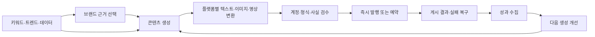
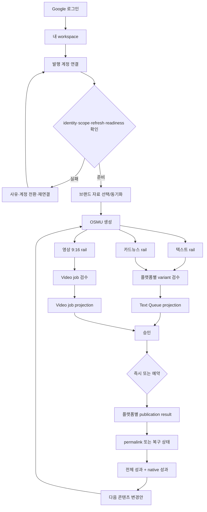
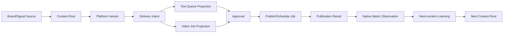

# OSMU Marketing Agent PRD — Product Requirements Document

<!--
STAMP
created_at: 2026-08-06 20:10 KST
model: gpt-codex/gpt-5.6-sol
agent: prd-architect / marketing_agent_prd_v7
skills: 없음 — 설치된 스킬 중 제품 PRD 전용 스킬 없음; planning.md·doc-review.md·PRD template 직접 적용
evidence: wiki SSOT, current dashboard code, user production observations, three v17 audits, original-request ledger L-01~L-45, official product/OAuth documentation
deliberation: Marketing Agent의 중심을 전략 대시보드가 아니라 브랜드 근거→콘텐츠 생성→플랫폼별 변환→검수→발행/예약→복구→성과 환류로 재고정하고, 서로 다른 current inventories와 record owners를 고객 UI에서 혼합하지 않는다.
-->

| 항목 | 값 |
|---|---|
| 버전 | **v7.0.0** (MAJOR — v6.1.1/v16 제품 의미 오류 대체) |
| 작성일 | 2026-08-06 |
| 작성자/모델 | prd-architect / gpt-codex/gpt-5.6-sol |
| 상태 | **in-review** — independent plan-critic MAJOR 0 및 `/approve plan` 전 downstream 입력 금지 |
| 상류 산출물(버전 핀) | `pipeline-state.md` plan REOPEN(2026-08-06), [Marketing Hub surface map](../wiki/product/marketing-hub-surface-map.md), [PRD v6.1.1 — 폐기 근거](./openclaw-auto-marketing-agent-prd-v6.1.1-gpt-codex.md), v17 code/flow/auth/IA audits |
| 사용자 요구 범위 | 원요구 레저 **L-01~L-45**, 최신 반려 L-35~L-45 포함 |
| 증거 경계 | 코드·wiki=`근거 확인`; 사용자 운영 제보=`관찰됨(사용자)`; 실제 provider·production round-trip은 별도 E2E 없으면 `미검증` |
| 승인 게이트 | PRD verifier PASS → independent critic MAJOR 0 → 회장 `/approve plan` |

## 목차

- [0. TL;DR](#0-tldr)
- [1. 목적·문제·제품 계층](#1-목적문제제품-계층)
- [2. 범위·비범위·보존 원칙](#2-범위비범위보존-원칙)
- [3. 페르소나·JTBD](#3-페르소나jtbd)
- [4. One Thing·MVP 5](#4-one-thingmvp-5)
- [5. 현재 구현 증거와 결함](#5-현재-구현-증거와-결함)
- [6. Capability inventory](#6-capability-inventory)
- [7. 목표 정보구조·소유권](#7-목표-정보구조소유권)
- [8. 전체 사용자 흐름](#8-전체-사용자-흐름)
- [9. 상태·권한·데이터 lineage 개념 계약](#9-상태권한데이터-lineage-개념-계약)
- [10. 기능 요구사항](#10-기능-요구사항)
- [11. 비기능 요구사항](#11-비기능-요구사항)
- [12. 수용기준·QA 테스트](#12-수용기준qa-테스트)
- [13. 실패·복구 계약](#13-실패복구-계약)
- [14. 성과·학습 계약](#14-성과학습-계약)
- [15. OAuth·토큰·보안 계약](#15-oauth토큰보안-계약)
- [16. 현행→목표 변경 매트릭스](#16-현행목표-변경-매트릭스)
- [17. 벤치마크](#17-벤치마크)
- [18. BM·운영부하·출시](#18-bm운영부하출시)
- [19. 리스크·steelman·premortem·kill criteria](#19-리스크steelmanpremortemkill-criteria)
- [20. RTM·요구 커버리지](#20-rtm요구-커버리지)
- [21. 결정·오픈 이슈·개정 이력](#21-결정오픈-이슈개정-이력)
- [22. 품질 판정·출처](#22-품질-판정출처)

## 0. TL;DR

OSMU는 **브랜드 근거로 마케팅 콘텐츠를 생성하고, 플랫폼별 문법과 형식으로 변환해 사람이 검수한 뒤, 즉시/예약 발행과 실패 복구를 수행하고, 실제 결과를 다음 생성에 환류하는 자동화 에이전트**다. Discover·Keyword·Data·Analytics는 이 생성·발행 폐루프를 돕는 입력과 피드백이며 별도 전략 제품이 아니다. v7은 현행 Studio의 3개 rail과 existing9, 25 route·26 customer destination, provider 고유 기능을 보존하면서, 끊어진 Studio draft·text Queue·video job·publication·metrics를 **하나의 콘텐츠 계보와 정직한 projection**으로 연결한다.

현재 제품은 이 목표를 충족하지 않는다. Studio Save는 DB drafts, 예약은 schedules, Inbox/Calendar는 queue.json, 발행은 published_posts, 영상은 별도 `/videos` 흐름을 사용한다. OAuth callback도 canonical account verification 전에 성공을 알리고, 고객 Settings의 자동화 토큰 화면은 실제 API가 operator-only라 403이다. 이 PRD는 이를 구현 완료로 오인하지 않고 **부분구현·미구현 target contract**로 분리한다.

## 1. 목적·문제·제품 계층

### 1.1 고객이 실제로 해결하려는 일

고객은 “AI 전략 문서”를 받으려는 것이 아니라, 이번에 쓸 근거를 고르고 콘텐츠를 만든 뒤 각 플랫폼에 맞게 수정·검수·발행하고, 실제 게시 여부와 반응을 확인해 다음 콘텐츠를 개선하려 한다. 현재는 다음 문제가 이 일을 끊는다.

1. Studio에서 만들어진 초안이 플랫폼 Queue·Inbox·Calendar와 같은 항목으로 이어지지 않는다.
2. 텍스트 preview, 직접 발행 adapter, 메시징 목적지, 영상 산출물을 하나의 “지원 플랫폼” 목록처럼 말해 고객이 무엇이 생성·발행·분석되는지 알 수 없다.
3. Threads·Instagram·generic social·video의 header와 탭이 달라 동일한 연결→제작→발행→결과 흐름을 찾을 수 없다.
4. OAuth가 완료 메시지를 보여도 실제 계정·scope·refresh·발행 readiness가 확인되지 않아 잘못된 계정이나 false-success를 만든다.
5. 홈의 “전 플랫폼 성과”와 플랫폼 native 성과 사이에 공통 content lineage와 metric coverage 계약이 없다.
6. Keyword, Data, Images, Videos, Midjourney, System, Admin이 core loop에서 무슨 입력·출력을 소유하는지 불명확하다.
7. 내부 PRD 코드와 기술 용어가 고객 카피에 노출되어 다음 행동을 설명하지 못한다.

### 1.2 제품 목적의 우선순위

- **Core:** Ground → Create → Adapt → Review → Publish/Schedule → Recover.
- **Feedback:** Measure → Learn → Next Create.
- **Supporting inputs:** Keyword, trend, owned performance, asset library.
- **Control plane:** Settings, account readiness, API token, Admin.
- **금지:** Discover/Plan/Analytics를 전면에 두어 콘텐츠 생성·발행을 보조 기능으로 밀어내는 IA.

## 2. 범위·비범위·보존 원칙

### 2.1 In scope

- 고객 Google 로그인→tenant 진입, provider 계정 연결·전환·readiness 확인.
- 브랜드 wizard, RepoConnect/wiki sync, 직접 입력을 사용한 근거 기반 생성.
- 현행 Studio **3 rail**: 텍스트, 영상 9:16, 카드뉴스.
- 현행 visual preview 7개와 direct publish 4개를 보존하고, 영상 결과 3개를 고객 flow에서 누락하지 않음.
- social text, short video, optional messaging distribution의 목적·owner·지원상태 분리.
- 콘텐츠 root→플랫폼 variant/delivery→text Queue 또는 video job→승인→예약/발행→publication→metric의 공통 계보.
- Aggregate Inbox/Calendar와 플랫폼 Queue가 같은 지원 item을 가리키는 projection 계약.
- 전체 성과와 플랫폼 native 성과의 구분, coverage/source/collected_at/권한/오류 표시.
- 공통 account truth header와 capability-driven tabs.
- Keyword/Data/Assets/Midjourney/System/Admin의 loop 기여와 역할 경계.
- customer language, 전체 상태, public/customer/operator, desktop/tablet/mobile.

### 2.2 Out of scope

- 모든 provider API·DB 스키마·endpoint 이름을 plan에서 확정하는 일. 이는 eng-design dialogue 대상이다.
- 지원 근거 없는 플랫폼을 “발행 가능”으로 보이게 하는 fake Queue/Analytics/tab.
- LINE의 current social/messaging publish 지원. 현재 publish/scheduler adapter가 없으므로 `미지원`이다.
- Discord user token으로 Midjourney를 일반 고객 기본 기능으로 제공하는 것.
- 사람 승인 없는 외부 게시·삭제·재발행·광고비 집행·대량 DM/댓글.
- provider별 의미가 다른 reach/engagement를 근거 없이 하나의 숫자로 정규화.
- private venture 데이터를 public analytics 또는 다른 tenant 학습에 혼합.

### 2.3 Preserve first

1. current 25 page routes와 customer Sidebar 26 destinations 삭제·rename·home bounce 0.
2. Studio existing9와 3 rail의 순서·기능·실패/복구 진입을 유지한다.
3. Threads Growth/Popular, Instagram Editor, generic social Queue/Analytics/Settings를 capability owner로 보존한다.
4. public/customer/operator shell과 Settings customer8/operator9를 분리한다.
5. current channel SVG/icon, semantic light/dark tokens, ThemeToggle, FOUC 처리, 224px desktop shell을 디자인 기준으로 사용한다.
6. 현행 결함은 “보존”하지 않는다. 연결상태 drift, queue 단절, fake aggregate, customer token 403, 내부 용어 노출은 수정 대상이다.

## 3. 페르소나·JTBD

### 3.1 Primary persona — 김민서, 38세, 1인 교육·컨설팅 브랜드 대표

김민서는 서울에서 직무교육과 소규모 컨설팅을 혼자 운영한다. 강의 기획, 상담, 수업, 회계, 고객 응대까지 직접 하고 있어 마케팅에 쓸 수 있는 시간은 월요일 45분과 평일 자투리 시간뿐이다. Threads, Instagram, Facebook, Shorts, Reels, TikTok을 “해야 한다”는 건 알지만 한 아이디어를 여섯 번 다시 쓰고 이미지·영상 형식을 맞추는 데 매주 3시간 이상이 든다. ChatGPT 초안은 빠르지만 예전 가격이나 제공하지 않는 혜택을 그럴듯하게 섞어서, 회사 소개와 강의 자료를 다시 열어 검수한다. 가장 큰 공포는 AI 문장 품질보다 잘못된 계정과 중복 발행이다. `j.the.great.investor`로 가입했는데 연결 팝업에 기존 `zero_to_one_ai`가 보이거나, “연결 완료” 뒤 Channel Info가 `Not connected`이면 자동화를 믿지 않는다. Instagram OAuth 버튼과 별도 Graph API 토큰 입력창이 동시에 보이면 어떤 것이 진실인지 판단할 수 없다. Studio에서 만든 콘텐츠가 Inbox·Calendar·각 채널 Queue에 나타나지 않으면 예약을 다시 만들고, 502 뒤 재시도해 두 번 게시될까 두려워 결국 플랫폼 앱에서 수동 발행한다. 민서는 모든 채널을 똑같이 다루는 화면을 원하지 않는다. 텍스트, 짧은 영상, 커뮤니티 공지는 발행 방식이 다르다는 것을 이해하지만, 어디서 계정을 확인하고 어디서 제작·검수·발행·결과를 보는지는 일관되길 원한다. 성과 화면의 0도 진짜 0인지 권한 부족인지 구분되어야 한다. 성공은 브랜드 자료 한 번 연결→원본 한 번 입력→플랫폼별 초안과 영상 스크립트 생성→자신이 계정과 문구를 확인→즉시 또는 예약 발행→실제 게시물 링크와 실패 복구→다음 콘텐츠 제안까지 한 흐름에서 끝나고, 다음 주에도 같은 콘텐츠 root를 추적할 수 있는 상태다.

### 3.2 JTBD

> 마케팅 시간이 부족할 때, 내 브랜드 자료와 성과를 근거로 하나의 콘텐츠를 만들고 각 플랫폼에 맞게 검수·발행한 뒤 실제 결과를 확인해, 잘못된 계정·중복 게시·끊긴 Queue를 쫓지 않고 다음 콘텐츠를 더 낫게 만들고 싶다.

### 3.3 Anti-persona

- 무승인 대량 DM·댓글·팔로우 자동화를 원하는 spam operator.
- paid media bidding과 enterprise attribution warehouse를 즉시 대체하려는 조직.
- provider 약관·권한을 우회하거나 Discord user token 자동화를 일반 고객에게 배포하려는 사용자.

### 3.4 근거

- 사용자 운영 관찰: OAuth false success, wrong Meta account, Instagram duplicate credential UI, Settings drift, OSMU 502.
- current code: Studio 3 rail/existing9, 분리된 Queue·schedule·publication·video paths.
- 공식 benchmark: Buffer multi-channel customize/independent posts, Sprout approval states, OAuth BCP.
- 정량 사용시간·WTP baseline은 아직 사용자 인터뷰로 검증되지 않았으며 `미측정`으로 유지한다.

## 4. One Thing·MVP 5

### 4.1 후보와 잘못된 답 함정

| 후보 | 장점 | 함정 | 판정 |
|---|---|---|---|
| “모든 SNS를 한 화면에서 관리” | 넓어 보임 | 실제 capability 차이와 실패를 숨기고 fake tabs를 만듦 | 탈락 |
| “AI가 주간 마케팅 전략을 결정” | agent 인상이 강함 | 콘텐츠 제작·발행을 주변화하고 근거 없는 전략 문서를 생산 | 탈락 |
| “글 하나로 11채널 자동 발행” | OSMU가 즉시 이해됨 | 실제 current inventory를 섞고 영상·메시징·LINE을 과장 | 탈락 |
| “연결된 계정에 안전하게 게시” | 신뢰 문제 해결 | 브랜드 grounding·플랫폼 변환·성과 환류가 사라짐 | 하위 조건 |
| “브랜드 근거로 생성→변환→검수→발행/복구→성과 환류” | core work와 신뢰·학습을 하나로 묶음 | 구현 범위가 넓어질 위험 | 채택, MVP 5로 분할 |

### 4.2 One Thing

> **OSMU는 브랜드 근거로 마케팅 콘텐츠를 생성하고 플랫폼별로 변환·검수·예약/발행·복구하며, 실제 결과를 다음 생성에 환류하는 자동화 에이전트다.**

### 4.3 MVP 5

| MVP | One Thing 연결 | 고객 산출물 | 성공 기준 |
|---|---|---|---|
| M1. 근거 기반 Composer | 브랜드 근거→생성 | source가 표시된 콘텐츠 root 1개와 현행 3 rail 결과 | confirmed source 없는 factual claim 발행 0 |
| M2. Account Truth | 검수 전 계정·권한 확인 | 동일 handle/status/reason/readiness | Settings/Channel/Studio/Queue/Admin projection diff 0 |
| M3. Delivery Lifecycle | 변환→Queue/job→승인→발행/예약 | 플랫폼별 독립 item과 상태 | 지원 item의 aggregate/channel projection diff 0, unsupported fake Queue 0 |
| M4. Result & Recovery | 결과 링크·502 복구 | publication/permalink 또는 named terminal state | duplicate/wrong-account publish 0 |
| M5. Measure-to-Create | 성과→다음 생성 | native metric provenance와 다음 콘텐츠 변화 1개 | missing을 0으로 표시 0, lineage orphan 0 |

## 5. 현재 구현 증거와 결함

### 5.1 Current-state 판정

| 영역 | 현재 상태 | 코드·wiki 근거 | 제품 결함 |
|---|---|---|---|
| Customer shell | 이미구현 | surface map: route25/sidebar26 | 390 nav 누락, 일부 overflow 관찰 |
| Studio existing9 | 이미구현·역할별 부분노출 | `studio/page.tsx`, RepoConnect, history, editor | 고객에서 video rail이 role gate로 숨을 수 있음 |
| Studio 3 rail | 이미구현 | text 3 / video3 / Instagram card | v16이 7개 한 줄로 평탄화 |
| visual preview 7 | 이미구현 | Threads/X/Facebook/Instagram/Shorts/Reels/TikTok | 직접 발행 대상과 혼동 위험 |
| direct publish 4 | 이미구현 | Threads/X/Facebook/Instagram | video3·messaging과 같은 count로 말하면 거짓 |
| text publish/schedule adapters 8 | 이미구현·운영범위 미검증 | Threads/X/Facebook/Instagram/Bluesky/Telegram/Discord/Slack | Studio 생성 카드 수가 아님; LINE 없음 |
| video publish | 부분구현 | `/videos`, `/api/video/publish`: YouTube/TikTok/Reels | Studio approval/Queue/analytics lineage와 단절 |
| Studio Save | 이미구현 | `drafts` table | Queue record 생성 안 함 |
| Studio Schedule | 이미구현 | `schedules` table | Studio가 promote하지 않아 legacy Queue 미전파 |
| Inbox/Calendar | 이미구현 | `/api/queue`, queue.json | Studio draft/schedule truth가 아님 |
| Publish result | 부분구현 | `published_posts`, queue same UUID update | queue item 없으면 외부 성공 뒤 `QUEUE_RECORD_FAILED` |
| Metrics | 부분구현 | published_posts GET, Threads-only collect | 홈 “전 플랫폼 종합”과 실제 coverage 불일치 |
| Google login/tenant | 이미구현·외부 완료 미검증 | Supabase JWT→active tenant | 실 신규 customer round-trip 필요 |
| Provider OAuth | 부분구현 | signed state/cookie, encrypted account tokens | callback 직후 canonical readback 없이 success |
| Account projection | 부분구현 | channel_accounts + legacy integrations + config files | surface별 state source가 다름 |
| Customer API token | UI 존재·경로 결함 | Settings `Fork 연동`; `/api/tenant-tokens` | proxy 403, handler tenant authorization 부재 |
| Admin OAuth app credentials | 이미구현·운영 왕복 일부 미검증 | encrypted set, masked list, timed reveal/audit | customer provider token과 혼동 금지 |
| Keyword/Data | 부분구현 | Keyword Planner/GSC; GA4/Naver/Search Advisor disabled; Trends external | core loop input/output 설명 부족 |
| Images/Videos | 부분구현 | tenant gallery, video workbench | content root와 asset/result lineage 부족 |
| Midjourney | 위험한 legacy capability | Discord user token guide | 고객 기본 surface로 승격 불가 |

### 5.2 명시적 회수 필요

`wiki/product/marketing-hub-surface-map.md`는 route·surface map은 최신이지만 **Studio→Queue→video job→publication→metric의 공통 lineage 목표**와 customer token 403 결함을 아직 제품 SSOT로 서술하지 않는다. plan 승인 후 wiki 현행화가 필요하다. 이는 이번 PRD의 구현 완료 근거가 아니다.

## 6. Capability inventory

### 6.1 절대 합치지 않는 inventory

| Inventory | 정확한 항목 | 고객 의미 | UI 규칙 |
|---|---|---|---|
| Studio visual previews 7 | Threads, X, Facebook, Instagram, Shorts, Reels, TikTok | 생성 결과 미리보기 | 현행 3 rail 안에서 표시; 발행 가능 약속 아님 |
| Studio direct publish 4 | Threads, X, Facebook, Instagram | 현행 `/api/publish` 직접 대상 | account/readiness true일 때만 CTA |
| Text publish/schedule adapters 8 | Threads, X, Facebook, Instagram, Bluesky, Telegram, Discord, Slack | 텍스트 전송 runtime | Studio 생성 카드 수로 노출 금지 |
| Video outputs 3 | YouTube Shorts, Instagram Reels, TikTok | 짧은 영상 script/asset/result | `/videos` job·processing·publication owner 연결 |
| Messaging destinations 3 | Telegram, Discord, Slack | 선택적 공지/커뮤니티 배포 | 기본 social preview rail 제외; native analytics 미수집 표시 |
| Unsupported current | LINE | 현재 publish/schedule adapter 없음 | disabled/미지원; 성공·Queue·Analytics 위조 0 |

### 6.2 Platform capability matrix

| 대상 | 생성/변환 | 검수 | 즉시 발행 | 예약 | 기록 owner | 성과 owner | target UI |
|---|---|---|---|---|---|---|---|
| Threads | text preview | Studio/Review | direct current | text schedule | text delivery/Queue | native Analytics + Growth/Popular | Social post |
| X | text preview | Studio/Review | direct current | text schedule | text delivery/Queue | provider/legacy analytics when available | Social post |
| Facebook | text preview | Studio/Review | direct current | text schedule | text delivery/Queue | native when collected | Social post |
| Instagram Feed/Card | caption/card preview + Editor | Studio/Editor/Review | direct current | text schedule where valid | text delivery/Queue | native when collected | Social post + specialized Editor |
| Bluesky | current text adapter; Studio variant 신규 필요 | Review | adapter path | text schedule | text delivery/Queue | native metrics currently unavailable | Social post, truth label |
| Shorts | script/asset preview | Studio→Videos | YouTube publish owner | video job policy | video job | YouTube native when collected | Short video |
| Reels | script/asset preview | Studio→Videos | Reels publish owner | video job policy | video job | Instagram native when collected | Short video |
| TikTok | script/asset preview | Studio→Videos | TikTok publish owner | video job policy | video job | TikTok native when collected | Short video |
| Telegram/Discord/Slack | Threads/root copy 기반 메시지 변환 | distribution review | optional adapter | text schedule | text delivery/Queue | native metric 미수집 | Messaging distribution |
| LINE | 없음 | 없음 | 없음 | 없음 | 없음 | 없음 | 미지원 |

## 7. 목표 정보구조·소유권

### 7.1 Navigation principle

좌측 26 destination은 유지하되 고객이 “왜 들어가는가”를 다음 역할로 이해하게 한다. 물리적 group rename·이동은 design stage에서 current route fidelity를 보며 결정한다.

| 역할 | current destinations | 고객 목적 | Core loop 입·출력 |
|---|---|---|---|
| Create & Deliver | Performance, Studio, Inbox, Calendar | 만들고 검수·발행·복구 | root/variant/job/result |
| Social posts | Threads, X, Instagram, Facebook, Bluesky | 계정별 Queue·성과·고유 기능 | text delivery/native metric |
| Short video | YouTube, TikTok, `/videos` | 연결·제작·processing·발행 | video job/publication |
| Messaging | Telegram, Discord, Slack | 선택적 공지 배포 | message delivery, no fake analytics |
| Discover | Keyword Planner, GSC, Trends | 다음 콘텐츠 근거 찾기 | source/opportunity |
| Measure | Performance, channel analytics, Blog Performance | 결과와 coverage 확인 | native metric/aggregate |
| Produce assets | Images, Videos | tenant asset 생성·재사용 | asset reference |
| Configure | Settings | workspace·channel·AI·storage·token | readiness/policy |
| Operate | separate Admin shell | tenant·central OAuth·usage·support | operator-only recovery/control |

### 7.2 Common platform truth header

모든 플랫폼 owner 화면의 상단에는 다음 **7개 필드**가 동일한 순서와 언어로 존재한다.

1. 실제 provider icon과 platform name.
2. 선택 계정 display name/handle와 provider account identity.
3. 연결 상태(`연결됨`, `확인 필요`, `재연결 필요`, `미연결`, `확인 불가`)와 reason.
4. 마지막 확인 시각.
5. 자동화 준비상태(생성·발행·예약·성과별 readiness).
6. scope/expiry·refresh health 요약(비밀값 제외).
7. `계정 관리` 또는 `연결/재연결` primary action.

Header는 통일하지만 탭은 capability-driven이다. Threads의 Growth/Popular와 Instagram Editor를 보존하고, backing 없는 YouTube/TikTok Queue·Analytics 또는 Messaging Analytics를 만들지 않는다.

### 7.3 Supporting surface ownership

| Surface | Customer purpose | Input | Output | Owner/role | 상태 |
|---|---|---|---|---|---|
| Keyword Planner | 콘텐츠 주제 탐색 | seed keyword, tenant context | keyword candidates/bank | customer | available when API healthy |
| Search Console | owned search signal | verified property/permission | query/page metrics | customer | available/permission/error |
| GA4/Naver/Search Advisor | 측정 입력 | tenant-safe integration 미완 | none | customer | disabled with reason; fake chart 0 |
| Google Trends | 외부 탐색 | query | external destination | customer | external |
| Images | 재사용 asset 관리 | upload/generated asset | tenant image reference | customer | available/empty/error |
| Videos | 영상 제작·job·발행 | upload/URL/script/asset/account | rendered video/job/result | customer + operator-only generation capability | partial |
| Midjourney | legacy image generation connector | Discord user token | image | **operator-only or removed from customer nav** | unsafe/disabled by default |
| System Settings | workspace 상태·운영 정보 | customer-owned settings | readiness/diagnostic | customer | no global secret/control |
| Admin | tenant/OAuth app/usage/support | operator auth | masked config/audit/action | operator only | separate shell |

## 8. 전체 사용자 흐름

### 8.1 End-to-end content flow

### 8.2 Public → customer onboarding

1. 비로그인 사용자는 landing/legal/login만 본다.
2. Google/Supabase 로그인 완료 후 자기 tenant가 생성·선택된다.
3. 고객 shell은 Admin menu를 mount하지 않는다.
4. 첫 가치 경로는 `브랜드 설정 → 계정 연결 → Studio에서 콘텐츠 만들기`다.
5. 연결이 없는 경우 Studio 생성은 허용할 수 있으나 publish/schedule CTA는 readiness reason과 함께 비활성이다.

### 8.3 Provider OAuth와 wrong-account recovery

1. 고객이 목표 workspace와 provider를 확인하고 연결을 시작한다.
2. state/cookie/PKCE가 browser·tenant·provider transaction에 묶인다.
3. provider가 지원하면 account chooser/reauthorization을 명시적으로 요청한다. TikTok은 `disable_auto_auth=1`; Google 계열은 계정 선택과 offline refresh 요구를 사용한다. Meta가 강제 chooser를 제공하지 않으면 기존 계정 identity를 먼저 보여주고 provider logout/revoke/manage 경로를 제공한다.
4. callback token 저장만으로 success를 표시하지 않는다.
5. canonical identity, granted scope, expiry/refresh health, required capability를 provider readback으로 확인한다.
6. Settings·channel header·Studio selector·Queue/result·Admin support projection에서 같은 account/status가 보일 때 `연결됨`으로 종료한다.
7. mismatch/cancel/permission 부족은 이전 안전 상태를 보존하고 `재연결 필요`와 다음 행동을 보여준다.

### 8.4 Text publish and scheduling

1. content root 아래 선택한 text variant마다 독립 delivery를 만든다.
2. 지원 delivery는 해당 platform Queue와 aggregate Inbox/Calendar에 같은 identity로 projection된다.
3. 한 variant 편집은 sibling variant를 바꾸지 않는다.
4. approval은 account, content version, media, schedule, destinations에 바인딩된다.
5. 즉시 발행은 선택 delivery만 호출한다. 예약은 timezone·version·account readiness를 확인한다.
6. 성공은 provider result readback과 permalink가 있을 때만 `게시됨`이다.

### 8.5 Short-video flow

1. Studio video rail의 Shorts/Reels/TikTok 결과는 script·asset readiness를 보인다.
2. 고객은 `/videos` 작업실로 이동해 render/upload/account/privacy를 확인한다.
3. text Queue를 흉내 내지 않고 video job으로 processing을 추적한다.
4. YouTube/TikTok channel page는 계정 연결·readiness owner이며 제작·발행 job owner는 `/videos`다.
5. 성공 publication은 common result ledger와 연결되고, native analytics가 없으면 `미수집`이다.

### 8.6 Messaging distribution

1. 고객이 명시적으로 `커뮤니티 공지에도 보내기`를 선택할 때만 Telegram/Discord/Slack destination을 만든다.
2. 메시지는 root 또는 선택한 text variant로부터 변환되며 social preview로 세지 않는다.
3. webhook/bot destination, length/media readiness를 검수한다.
4. delivery result는 남기되 native post analytics가 없으면 숫자 0 대신 `성과 미수집`을 표시한다.

### 8.7 Customer automation token

1. OAuth provider token과 별개인 OSMU tenant API token을 Settings에서 발급한다.
2. 고객은 자기 workspace scope와 label을 선택하고 원문을 **한 번만** 본다.
3. 이후 목록에는 label, created_at, last_used_at, scope, revoked만 보인다.
4. revoke는 즉시 해당 token을 무효화한다.
5. route 내부가 requester tenant ownership을 검증하며 proxy allowlist에만 의존하지 않는다.

### 8.8 Operator flow

1. operator는 별도 auth와 Admin shell을 사용하며 customer workspace/sidebar를 보지 않는다.
2. tenant 상태, usage, connected-account summary, publication failures를 본다.
3. central OAuth app credentials는 masked list가 기본이며 explicit timed reveal/update/delete가 audit된다.
4. 고객 provider access/refresh token은 Admin에도 일반 reveal 대상이 아니다.
5. operator support action은 customer account 선택·발행을 대행하지 않는다.

## 9. 상태·권한·데이터 lineage 개념 계약

### 9.1 Conceptual lineage — 구현 상세는 eng-design에서 합의

필수 논리 identity는 `content root`, `platform variant`, `delivery intent`, `job`, `publication result`, `metric observation`이다. 실제 table명·API·ID 타입·transaction boundary는 tech-architect가 선택지를 제시하고 회장과 합의한다. 다음 invariant만 plan에서 고정한다.

- 하나의 root가 여러 variant를 낳되 variant의 content/version/account/result는 독립이다.
- Aggregate Inbox/Calendar와 platform Queue는 별도 truth가 아니라 지원 delivery의 projection이다.
- Text delivery와 video job은 서로 다른 executor를 사용해도 common root/publication lineage를 공유한다.
- Queue가 없는 family에 fake Queue record를 만들지 않는다.
- publication result가 authority이며 UI projection drift는 reconcile 대상으로 표시한다.
- metric은 publication/account/provider/source time에 연결되며 orphan metric은 aggregate에서 제외한다.

### 9.2 Customer-visible states

| State family | 고객 문구 원칙 | 허용 action |
|---|---|---|
| loading | 무엇을 확인 중인지 한 영역에서 표시 | 취소/뒤로; 전체 화면 shimmer 금지 |
| empty | 아직 없는 데이터와 만드는 방법 | 첫 행동 1개 |
| connected, not ready | 연결 계정과 부족한 권한·refresh 사유 | 권한 확인/재연결 |
| ready | 가능한 생성·발행·예약·성과 capability | 해당 owner로 이동 |
| permission | 필요한 권한과 영향 | 계정 관리/관리자 문의 |
| wrong account | 현재 계정과 목표 계정이 다름 | 전환/권한 해제/재연결 |
| partial | 성공한 플랫폼은 보존, 실패한 항목만 분리 | confirmed failure만 재시도 |
| uncertain | 외부 결과 확인 전 상태 | 결과 확인; 재발행 금지 |
| repair required | 외부 게시 성공·내부 기록 실패 | 기록 복구; 외부 호출 금지 |
| unavailable/external | 제품 내부 지원 범위 밖 | 외부 열기 또는 없음 |

### 9.3 Roles

| Surface/action | Public | Customer | Operator |
|---|---:|---:|---:|
| Landing/legal/login | O | O | O |
| Customer workspace/content/account | X | own tenant only | summary/support metadata only |
| Provider token raw value | X | X | X by default; emergency design not in scope |
| Tenant API token issue/revoke | X | own tenant | support policy only |
| Central OAuth app credential | X | X | masked CRUD + timed reveal audit |
| Global Video/TTS settings | X | X | O |
| Publish customer content | X | approved own tenant | 대행 X |

## 10. 기능 요구사항

> Volere atomic shell 축약형. 각 FR은 한 가지 관측 가능한 책임만 가지며 §12의 같은 번호 AC·TC와 1:1이다. `Current`는 위키·코드 기준이며, target 구현 방식은 eng-design에서 확정한다.

| ID | 원자 요구 | 근거·출처 | Fit Criterion | 우선 | Current |
|---|---|---|---|---|---|
| FR-MA7-001 | 첫 가치 경로는 브랜드 근거 선택→콘텐츠 생성→플랫폼별 검수→발행/예약→결과여야 한다. | L-44, One Thing | 고객 primary chain 1개, supporting surface dead-end 0 | Must | 부분구현 |
| FR-MA7-002 | 모든 고객 data/action은 active tenant에 격리돼야 한다. | 기존 멀티테넌트 요구 | cross-tenant read/write/publish 0 | Must | 이미구현·운영 전수 미검증 |
| FR-MA7-003 | public/customer/operator shell과 권한을 분리해야 한다. | current AuthGate/Admin | customer DOM의 Admin action 0, operator DOM의 customer workspace 0 | Must | 이미구현 |
| FR-MA7-004 | current route25와 customer destination26의 owner/action을 보존해야 한다. | L-41, v16 반려 | 삭제·rename·home bounce 0, 26/26 route owner | Must | 이미구현·390 결함 |
| FR-MA7-005 | current icon/design tokens/theme과 390·1024·1440 접근성을 보존해야 한다. | 최초 요청, v13 반려 | generic replacement icon 0, overflow0, target≥44px | Must | 부분구현 |
| FR-MA7-006 | Google 로그인 뒤 customer-owned active tenant로 진입해야 한다. | auth audit | 신규 고객 1명→자기 tenant 1개, 타 tenant exposure 0 | Must | 이미구현·실왕복 미검증 |
| FR-MA7-007 | provider OAuth 시작은 tenant/provider/browser transaction에 안전하게 바인딩돼야 한다. | RFC9700, current state/cookie | state replay/concurrent external exchange≤1, redirect exact-match | Must | 부분구현 |
| FR-MA7-008 | callback은 canonical identity·scope·refresh/readiness readback 전 성공을 알리면 안 된다. | L-42, false-success | 성공 message 전 required checks 100%, failed check success copy 0 | Must | 미구현 |
| FR-MA7-009 | 다른 provider 계정 선택과 wrong-account 복구를 제공해야 한다. | 사용자 `j.the.great.investor` 관찰 | target B 확인→B adapter 1/A 0; cancel/mismatch는 이전 상태 유지 | Must | 부분구현 |
| FR-MA7-010 | Settings·channel·Studio·Queue/result·Admin support가 같은 connection projection을 읽어야 한다. | L-42, auth audit | account/status/reason/verified_at diff 0 | Must | 미구현 |
| FR-MA7-011 | provider access/refresh token 원문은 customer DOM/network/log에 노출하지 않아야 한다. | OAuth BCP, current policy | raw provider token exposure 0 | Must | 이미구현·회귀 필요 |
| FR-MA7-012 | 고객은 별도 scoped tenant API token을 자기 workspace에서 발급·목록·폐기할 수 있어야 한다. | L-42, current 403 | one-time reveal, hashed storage, owner auth, revoke 후 401 | Must | UI 존재·API 결함 |
| FR-MA7-013 | central OAuth app credential 관리는 operator-only masked/reveal/audit contract여야 한다. | Admin audit | customer access 0, timed reveal 1회, CRUD audit 100% | Must | 이미구현·운영 전수 미검증 |
| FR-MA7-014 | 모든 platform owner는 공통 truth header 7필드를 표시해야 한다. | L-39 | provider 전수 필드 누락 0, projection diff 0 | Must | 부분구현 |
| FR-MA7-015 | 플랫폼 탭은 capability가 있을 때만 보이고 provider 고유 탭을 보존해야 한다. | L-39/L-40 | fake tabs 0; Threads Growth/Popular·IG Editor 보존 | Must | 부분구현 |
| FR-MA7-016 | 생성은 confirmed brand source를 사용하고 factual claim에 source를 추적해야 한다. | product purpose, existing wiki | factual claim citation coverage 100%; unknown claim blocks approval | Must | 부분구현 |
| FR-MA7-017 | Studio existing9를 기능·실패·복구 상태까지 보존해야 한다. | current Studio, v11 | idea/wizard/RepoConnect/wiki text/image/video/preview-edit/history/direct publish-schedule 9/9 | Must | 이미구현·role drift |
| FR-MA7-018 | Studio preview는 text/video/card-news 세 rail을 유지해야 한다. | L-35, v17 audit | rail 3, visual preview 7; single horizontal flattening 0 | Must | 이미구현; v16 회귀 |
| FR-MA7-019 | 생성 variant·preview·direct adapter·message destination·video capability를 별도 inventory로 표현해야 한다. | L-35/L-36 | inventory role/name/capability 오표시 0 | Must | 미구현 |
| FR-MA7-020 | 현행 direct4의 계정 선택·개별/선택 발행을 보존하고 unsupported CTA를 막아야 한다. | direct4 current | Threads/X/FB/IG exact; unsupported direct CTA 0 | Must | 이미구현·개별 card 강화 필요 |
| FR-MA7-021 | Bluesky를 text adapter에서 누락하지 않고 Telegram/Discord/Slack을 선택적 messaging으로, LINE을 미지원으로 표시해야 한다. | L-36, v17 audit | Bluesky present; LINE publish/Queue/Analytics 0 | Must | current backend truth·UI 혼선 |
| FR-MA7-022 | Shorts/Reels/TikTok 3개 영상 결과를 Studio에서 누락하지 않아야 한다. | L-36/L-40 | video output cards 3, script/asset/readiness/state 100% | Must | 부분구현·customer role 누락 |
| FR-MA7-023 | YouTube/TikTok channel은 연결/readiness, `/videos`는 create/publish job을 소유해야 한다. | L-40 | owner conflict 0; backing 없는 Queue/Analytics CTA 0 | Must | 부분구현 |
| FR-MA7-024 | 한 생성 행위는 canonical content root를 만들고 모든 variant/result가 이를 참조해야 한다. | L-37/L-45 | root 없는 variant/job/result 0 | Must | 미구현 |
| FR-MA7-025 | 플랫폼 variant 편집·검증·상태 변경은 sibling을 암묵적으로 바꾸면 안 된다. | original per-card request | selected diff 1, sibling diff 0, stale overwrite 0 | Must | 부분구현 |
| FR-MA7-026 | 지원 text delivery는 정확한 platform Queue projection을 가져야 한다. | L-37 | root→delivery→platform Queue 동일 identity, orphan 0 | Must | 미구현 |
| FR-MA7-027 | video delivery는 text Queue가 아니라 video job projection을 가져야 한다. | L-40 | video job ID·processing·result, fake text Queue 0 | Must | 부분구현 |
| FR-MA7-028 | Aggregate Inbox/Calendar와 platform owner는 같은 delivery/job 상태를 보여야 한다. | L-37 | supported item diff 0; unsupported family projection 0 | Must | 미구현 |
| FR-MA7-029 | 외부 publish/active schedule은 account·content version·media·time·destinations 승인에 바인딩돼야 한다. | original review requirement | mutation/expiry 후 external call 0 | Must | 부분구현 |
| FR-MA7-030 | 즉시 발행은 명시적으로 선택한 delivery만 호출하고 플랫폼별 결과를 독립 보존해야 한다. | original publish request | selected adapter 1, unselected 0; partial success 손실 0 | Must | 부분구현 |
| FR-MA7-031 | 예약 생성·변경·취소·due는 version·timezone·account readiness를 검증해야 한다. | original schedule request | cancelled/stale/revoked due external call 0; DST named handling | Must | 부분구현 |
| FR-MA7-032 | 동일 publish intent의 동시·순차 재호출은 외부 게시 최대 1개여야 한다. | 502/duplicate risk | concurrency20 external call≤1; replay returns stored result | Must | 부분구현 |
| FR-MA7-033 | 502/timeout/부분성공을 failed-confirmed·uncertain·repair-required로 구분해야 한다. | user 502, current partial failure | unknown retry 0; repair publish call 0; confirmed retry만 1 | Must | 부분구현 |
| FR-MA7-034 | `게시됨`은 provider external ID와 permalink/readback 증거가 있을 때만 표시해야 한다. | original permalink confusion | proof 없는 published label 0 | Must | 부분구현 |
| FR-MA7-035 | 전체 성과는 campaign/content root 범위와 collection coverage를 명시해야 한다. | L-38 | double count 0, aggregate definition/source/window 표시 100% | Must | 미구현 |
| FR-MA7-036 | 플랫폼 화면은 native metric 정의·source·collected_at·account/post drill-down을 제공해야 한다. | L-38/L-40 | native provenance completeness 100% | Must | 부분구현; Threads 편중 |
| FR-MA7-037 | 미수집·권한부족·오류·stale·unsupported를 숫자 0으로 표시하지 않아야 한다. | L-38 | false zero 0, named state+next action 100% | Must | 미구현 |
| FR-MA7-038 | 성과/학습은 근거와 표본 한계를 포함해 다음 content root 입력으로 연결돼야 한다. | L-44/L-45 | insight→next create link 1, source 없는 causal claim 0 | Should | 미구현 |
| FR-MA7-039 | Keyword/Data surface는 Discover/Measure 입력·출력·owner·availability를 표시해야 한다. | L-41 | 해당 destinations 7개 purpose/state/action 누락 0 | Must | 부분구현 |
| FR-MA7-040 | Images/Videos는 tenant asset/job workspace로 content root와 연결돼야 한다. | L-41 | asset/job owner·root link·permission 100% | Must | 부분구현 |
| FR-MA7-041 | Midjourney Discord user-token 방식은 customer default surface에서 차단하고 위험을 명시해야 한다. | L-41 | customer user-token 입력/추출 안내 0 | Must | 위험한 current guide |
| FR-MA7-042 | System Settings는 customer workspace 진단·설정만, global secret/control은 operator만 소유해야 한다. | L-41 | customer global mutation 0, settings purpose/owner 100% | Must | 부분구현 |
| FR-MA7-043 | Admin은 tenant·usage·central OAuth·support/recovery를 관리하되 customer content를 대행 발행하면 안 된다. | L-41 | shell 분리, support action audit 100%, proxy publish 0 | Must | 부분구현 |
| FR-MA7-044 | customer DOM은 내부 ID·코드명·난해한 기술어 대신 자연어 reason과 next action을 사용해야 한다. | L-43 | 금지어 DOM 0, 모든 terminal state next action 1 | Must | 미구현 |
| FR-MA7-045 | loading/empty/error/reconnect/wrong-account/partial/unknown/repair/permission/unavailable/mobile 상태를 정의해야 한다. | latest user critique | route-state matrix 누락 0; simultaneous shimmer region≤1 | Must | 부분구현 |
| FR-MA7-046 | QA는 route click이 아니라 동일 identity·owner·projection을 검증하는 semantic E2E여야 한다. | L-45 | full lineage orphan 0, forbidden mutation 0 | Must | 미구현 |
| FR-MA7-047 | 고객 오류에는 안전한 correlation과 행동을, operator에는 phase/upstream/version/impact를 제공해야 한다. | original observability/502 | secret leak 0, error owner/action/correlation 100% | Must | 부분구현 |
| FR-MA7-048 | target은 current 기능을 보존한 additive migration이어야 하고 제거·이동은 명시적 승인 없이는 금지한다. | 사용자 “기존 위에 추가” | preserve matrix deletion/rename/move 0 | Must | plan 계약 |

## 11. 비기능 요구사항

| ID | 범주 | 요구 | Fit Criterion |
|---|---|---|---|
| NFR-MA7-01 | 보안 | tenant·role·credential boundary를 fail-closed한다. | A/B isolation, customer Admin access0, raw provider token leak0 |
| NFR-MA7-02 | OAuth | RFC9700 BCP: exact redirect, authorization code, PKCE where supported, state binding, least privilege. | replay exchange≤1, redirect mismatch reject100% |
| NFR-MA7-03 | 신뢰성 | publication authority와 projections의 drift를 숨기지 않는다. | drift named 100%, false success0 |
| NFR-MA7-04 | 멱등성 | external side effect는 intent별 최대 1회다. | concurrency20 external≤1, duplicate0 |
| NFR-MA7-05 | 복구성 | 브라우저 이동·502·부분 저장 실패에도 draft와 provider success를 잃지 않는다. | draft loss0, success preservation100% |
| NFR-MA7-06 | 성능 | cached first usable customer surface는 빠르게 나타난다. | warm p95≤2s; long job progress/cancel; endless loading0 |
| NFR-MA7-07 | 접근성 | 핵심 customer flow는 WCAG 2.2 AA를 목표로 한다. | keyboard complete, focus visible, target≥44px, contrast AA |
| NFR-MA7-08 | 반응형 | 390·1024·1440에서 route25·nav26·core flow를 사용할 수 있다. | document overflow0, hidden destination0 |
| NFR-MA7-09 | 정직한 분석 | metric provenance/coverage가 없는 수치를 표시하지 않는다. | false zero/normalization0 |
| NFR-MA7-10 | 감사 | 승인·계정·발행·복구·관리자 credential action을 추적한다. | actor/time/intent/result/correlation completeness100% |
| NFR-MA7-11 | 개인정보 | private venture data와 tenant data를 격리하고 최소수집한다. | cross-tenant/private analytics row0 |
| NFR-MA7-12 | Provider policy | rate limit·scope·review·TOS를 우회하지 않는다. | Discord user-token customer automation0; spam action0 |
| NFR-MA7-13 | 저작권 | competitor/trend source는 아이디어 근거로만 사용하고 무권리 asset을 발행하지 않는다. | unknown license blocks publication100% |
| NFR-MA7-14 | 국제화·용어 | customer-facing 상태는 일관된 한국어 사전을 사용한다. | 동일 state의 상충 문구0; internal token leak0 |
| NFR-MA7-15 | 변경 안전 | plan approval 전 design/eng-design/build를 시작하지 않는다. | downstream product write0 |

## 12. 수용기준·QA 테스트

### 12.1 Atomic AC ↔ TC 1:1

각 행의 AC는 하나의 행위/불변식만 판정한다. `Given/When/Then`은 happy와 failure를 함께 고정하며, mock/route-click만으로 운영 완료를 주장할 수 없다.

| FR | AC | QA TC — Given / When / Then / 종료증거 |
|---|---|---|
| FR-MA7-001 | AC-MA7-001 core chain | **MA7-TC-001:** Given connected customer와 confirmed source, When 첫 화면→Studio→Review→Publish/Calendar→Result를 수행, Then primary chain 1개가 끊김 없이 이어지고 supporting CTA는 해당 chain으로 돌아온다. Failure: standalone strategy dead-end 1개면 FAIL. Evidence: browser video+route/identity log. |
| FR-MA7-002 | AC-MA7-002 tenant isolation | **MA7-TC-002:** Given tenant A/B, When A가 B의 root/variant/job/result ID로 read/write/publish, Then 403/404, external call0, leak0. Happy: A는 A data만 본다. Evidence: DB/RLS/API/DOM/audit. |
| FR-MA7-003 | AC-MA7-003 role shell split | **MA7-TC-003:** Given public/customer/operator, When 각 route를 연다, Then 허용 shell/menu/action만 mount된다. Failure: customer Admin action 또는 operator customer workspace 1개면 FAIL. Evidence: three-role DOM snapshot. |
| FR-MA7-004 | AC-MA7-004 route owner preservation | **MA7-TC-004:** Given 26 customer destinations, When click·keyboard로 전수 이동, Then 25 route owner/action이 current manifest와 일치한다. Failure: home bounce/deletion/rename 1개면 FAIL. Evidence: route log+manifest diff. |
| FR-MA7-005 | AC-MA7-005 visual/responsive fidelity | **MA7-TC-005:** Given light/dark×390/1024/1440, When route25를 렌더, Then current icons/tokens, overflow0, focus visible, target≥44px. Failure: generic letter/emoji replacement 또는 hidden nav면 FAIL. Evidence: measurements+screenshots. |
| FR-MA7-006 | AC-MA7-006 login tenant | **MA7-TC-006:** Given 신규 Google customer, When consent와 app return을 완료, Then own active tenant 1개로 customer shell 진입. Failure: login cancel/error면 public shell 유지, tenant mutation0. Evidence: real browser auth trace+tenant query. |
| FR-MA7-007 | AC-MA7-007 OAuth transaction safety | **MA7-TC-007:** Given signed state/cookie/PKCE transaction, When 정상 callback 1회와 replay20을 보냄, Then 첫 transaction만 exchange/write≤1, 나머지 pre-external reject. Failure: redirect/provider/browser mismatch는 call0. Evidence: request trace+nonce/state audit. |
| FR-MA7-008 | AC-MA7-008 verified success only | **MA7-TC-008:** Given callback token exchange success, When identity/scope/expiry-refresh/readiness readback까지 완료, Then 그 후에만 success message. Failure: any required check fail이면 success copy0, connected=false/reason. Evidence: provider readback+postMessage order+DOM. |
| FR-MA7-009 | AC-MA7-009 wrong-account recovery | **MA7-TC-009:** Given browser provider session A와 target B, When account switch/reauth→callback, Then canonical B와 B adapter1/A0. Failure: cancel/mismatch는 prior account 유지·reconnect action. Evidence: secret-window video+provider identity+adapter trace. |
| FR-MA7-010 | AC-MA7-010 connection projection parity | **MA7-TC-010:** Given canonical account B, When Settings/channel/Studio/Queue-result/Admin support를 연다, Then handle/state/reason/verified time/readiness diff0. Failure: stale projection은 refresh/repair 상태이지 connected로 표시하지 않음. Evidence: five-surface payload+DOM diff. |
| FR-MA7-011 | AC-MA7-011 provider token secrecy | **MA7-TC-011:** Given OAuth connected account, When customer screens/API/log/export를 전수 검사, Then access/refresh token 원문 0. Failure fixture가 secret을 반환하면 release block. Evidence: DOM/network/log secret scan. |
| FR-MA7-012 | AC-MA7-012 tenant API token ownership | **MA7-TC-012:** Given customer A own workspace, When scoped token 발급→1회 복사→목록→호출→폐기, Then plaintext는 발급 응답 1회만, own resources만, revoke 후 401. Failure: B tenant_id 주입은 403/write0. Evidence: browser+API+DB hash. |
| FR-MA7-013 | AC-MA7-013 operator credential control | **MA7-TC-013:** Given exact operator auth, When central credential set save/list/reveal/delete, Then default masked, explicit reveal timed, 모든 mutation/reveal audit. Failure: customer/non-exact token은 401/403. Evidence: Admin E2E+audit rows+no-store headers. |
| FR-MA7-014 | AC-MA7-014 truth header parity | **MA7-TC-014:** Given every exposed platform owner, When page loads, Then icon/name/account/state+reason/verified time/readiness/scope-health/manage 7필드 누락0. Failure: unavailable field를 빈칸/false connected로 표시하면 FAIL. Evidence: provider header matrix. |
| FR-MA7-015 | AC-MA7-015 capability tabs | **MA7-TC-015:** Given provider capability snapshot, When owner page renders, Then capability true tab만 있고 Threads Growth/Popular·Instagram Editor 보존. Failure: messaging/video fake Queue/Analytics tab 1개면 FAIL. Evidence: tab manifest+backing query map. |
| FR-MA7-016 | AC-MA7-016 grounded claims | **MA7-TC-016:** Given confirmed/unknown brand claims, When content review, Then factual sentence마다 confirmed source link. Failure: source missing/unknown이면 approval disabled와 확인/삭제 action. Evidence: claim-source matrix+DOM. |
| FR-MA7-017 | AC-MA7-017 existing9 | **MA7-TC-017:** Given current Studio happy/failure fixtures, When 9 capability를 각각 조작, Then 9/9 route/action/state 보존. Failure: RepoConnect를 toast stub로 치환하거나 history/schedule/edit 기능 누락 시 FAIL. Evidence: before/after interaction manifest. |
| FR-MA7-018 | AC-MA7-018 three rails | **MA7-TC-018:** Given generated Studio result, When desktop/tablet/mobile 렌더, Then text/video/card rail 3개와 visual preview7이 현행 grouping으로 보인다. Failure: 7개 single rail 또는 group omission이면 FAIL. Evidence: DOM counts+screens. |
| FR-MA7-019 | AC-MA7-019 inventory role separation | **MA7-TC-019:** Given visual7/direct4/text adapter8/video3/messaging3, When capability UI/문서를 본다, Then 각 이름·역할·owner가 분리된다. Failure: adapter를 generated preview로, message를 video로 세면 FAIL. Evidence: inventory-role matrix. |
| FR-MA7-020 | AC-MA7-020 direct4 exactness | **MA7-TC-020:** Given direct4와 연결상태, When individual/bulk publish selector 렌더, Then Threads/X/FB/IG만 eligible. Failure: unsupported target CTA 또는 unready call은 0. Evidence: selector manifest+adapter spies. |
| FR-MA7-021 | AC-MA7-021 messaging truth | **MA7-TC-021:** Given target inventory, When social/messaging/unsupported를 렌더, Then Bluesky text owner 존재, Telegram/Discord/Slack optional distribution, LINE 미지원. Failure: LINE Queue/Analytics/publish 또는 Bluesky 누락이면 FAIL. Evidence: nav/capability/action audit. |
| FR-MA7-022 | AC-MA7-022 video3 presence | **MA7-TC-022:** Given customer Studio generation, When video result가 ready/disabled/error, Then Shorts/Reels/TikTok slot3와 script/asset/readiness/reason이 보인다. Failure: customer role에서 group 전체 삭제하거나 empty를 success로 표시하면 FAIL. Evidence: three-state screenshots+DOM count. |
| FR-MA7-023 | AC-MA7-023 video owner split | **MA7-TC-023:** Given YouTube/TikTok, When channel page와 `/videos`를 연다, Then channel=connection/readiness, videos=create/publish job. Failure: backing 없는 Queue/Analytics tab 또는 create on channel page면 FAIL. Evidence: route-action-owner map. |
| FR-MA7-024 | AC-MA7-024 content root lineage | **MA7-TC-024:** Given one OSMU generation, When variants/jobs/results를 조회, Then 모두 one root로 bidirectional trace. Failure: root 없는 child 1개면 reconcile/orphan 상태, fabricated parent0. Evidence: lineage export+click trace. |
| FR-MA7-025 | AC-MA7-025 variant isolation | **MA7-TC-025:** Given sibling variants A/B/C, When B edit/save/reload, Then B diff1, A/C diff0. Failure: stale B version은 conflict, overwrite0. Evidence: before/after payload+DOM. |
| FR-MA7-026 | AC-MA7-026 platform queue projection | **MA7-TC-026:** Given supported text deliveries3, When root가 review로 넘어감, Then exact platform Queue entries3가 same delivery identities로 생성. Failure: unsupported destination Queue write0, orphan0. Evidence: API/DB-or-file projection diff. |
| FR-MA7-027 | AC-MA7-027 video job projection | **MA7-TC-027:** Given video delivery, When render/upload/publish, Then video job identity와 processing/result가 유지된다. Failure: text Queue를 authoritative video state로 사용하거나 job 없는 published 표시 시 FAIL. Evidence: job/poll/publication trace. |
| FR-MA7-028 | AC-MA7-028 aggregate projection parity | **MA7-TC-028:** Given text deliveries와 video jobs, When Inbox/Calendar/platform owner를 열고 edit/cancel/result를 수행, Then 지원 item state diff0. Failure: unsupported family fake projection0. Evidence: same-ID cross-surface diff. |
| FR-MA7-029 | AC-MA7-029 approval binding | **MA7-TC-029:** Given reviewed account/content/media/time/destinations, When approve, Then immutable approval version. Failure: 이후 한 필드라도 변경/만료되면 approval invalid, external call0. Evidence: approval hash/version audit+adapter spy. |
| FR-MA7-030 | AC-MA7-030 exact immediate publish | **MA7-TC-030:** Given explicit selected deliveries A/B/C, When publish, Then selected adapters만 각≤1, unselected0, 결과 독립. Failure: C fail이어도 A/B publication/permalink 보존. Evidence: request IDs+adapter counts+results. |
| FR-MA7-031 | AC-MA7-031 schedule lifecycle | **MA7-TC-031:** Given future local time/account/version, When create→change→cancel/due, Then latest active version만≤1 실행. Failure: past/DST ambiguity/revoked/stale/cancelled는 confirm/reject와 call0. Evidence: clock/lease/audit trace. |
| FR-MA7-032 | AC-MA7-032 idempotency20 | **MA7-TC-032:** Given one intent, When 20 concurrent requests와 sequential replay, Then external post≤1, 모두 stored terminal result 참조. Failure: second external ID 1개면 circuit breaker. Evidence: concurrency log+provider fixture count. |
| FR-MA7-033 | AC-MA7-033 recovery classification | **MA7-TC-033:** Given pre-dispatch fail/timeout/provider success+internal fail, When failure handled, Then 각각 failed-confirmed/uncertain/repair-required. Failure: uncertain retry 또는 repair publish call은 0. Evidence: fault injection+CTA+adapter count. |
| FR-MA7-034 | AC-MA7-034 publication proof | **MA7-TC-034:** Given provider publish response, When result renders, Then external ID+permalink/readback+published_at가 있을 때만 `게시됨`. Failure: proof absent는 processing/uncertain/failed. Evidence: provider response+clickable live link. |
| FR-MA7-035 | AC-MA7-035 aggregate scope | **MA7-TC-035:** Given campaign/root publications, When 전체 성과를 연다, Then included channels/posts/window/coverage가 보이고 same publication count1. Failure: incompatible native metrics 합산0. Evidence: aggregate query/input manifest+drill-down. |
| FR-MA7-036 | AC-MA7-036 native metric provenance | **MA7-TC-036:** Given collected platform metric, When channel analytics를 연다, Then native name/definition/source/account/post/collected_at. Failure: provenance 누락은 metric 숨김 또는 미수집. Evidence: provider payload+DOM. |
| FR-MA7-037 | AC-MA7-037 no false zero | **MA7-TC-037:** Given true zero/permission/error/stale/unsupported/missing fixtures, When metrics render, Then true zero만 0이고 나머지는 named state+next action. Evidence: six fixture screenshots+payloads. |
| FR-MA7-038 | AC-MA7-038 feedback to next create | **MA7-TC-038:** Given publication metrics with adequate evidence or inadequate sample, When next-content suggestion runs, Then source/limitation/change 1개 또는 판단 보류. Failure: ungrounded causal claim0. Evidence: insight-source-next-root links. |
| FR-MA7-039 | AC-MA7-039 Discover/Measure ownership | **MA7-TC-039:** Given Keyword/GSC/GA4/Naver/Search Advisor/Trends routes, When each opens, Then purpose/input/output/owner/available-disabled-external/action가 누락0. Failure: disabled를 chart/zero로 위조하면 FAIL. Evidence: route-purpose matrix. |
| FR-MA7-040 | AC-MA7-040 asset workspace lineage | **MA7-TC-040:** Given tenant image/video asset, When upload/generate/select/delete/publish, Then own tenant+content root/job linkage. Failure: cross-tenant asset0, deleted asset publish blocked. Evidence: API/DOM/lineage trace. |
| FR-MA7-041 | AC-MA7-041 Midjourney safety | **MA7-TC-041:** Given customer role, When Midjourney route/settings를 탐색, Then Discord user-token 입력·개발자콘솔 추출 안내·자동화 CTA0. Operator도 risk/disabled state만, 별도 승인 전 external automation0. Evidence: customer/operator DOM scan. |
| FR-MA7-042 | AC-MA7-042 System boundary | **MA7-TC-042:** Given customer/operator Settings, When tabs/actions를 전수 검사, Then customer8/operator9와 customer-owned settings만 customer에 존재. Failure: global secret/cron/TTS mutation customer0. Evidence: role/action matrix+403 tests. |
| FR-MA7-043 | AC-MA7-043 Admin purpose | **MA7-TC-043:** Given operator, When tenant pause/resume, entitlement, OAuth app credential, usage/failure support를 수행, Then audit와 affected tenant 표시. Failure: customer content proxy publish/hidden customer data access0. Evidence: Admin E2E+audit. |
| FR-MA7-044 | AC-MA7-044 customer language | **MA7-TC-044:** Given customer route25/states, When DOM copy scan, Then 금지어 `FR-/AC-/TC-/existing9/text8/visual7/direct4/video3/adapter/sample-hold/브랜드 사실/발행 근거/permalink` 0건, 자연어 reason+next action 존재. Evidence: automated DOM dictionary scan+copy review. |
| FR-MA7-045 | AC-MA7-045 terminal state matrix | **MA7-TC-045:** Given loading/empty/error/reconnect/wrong-account/partial/unknown/repair/permission/unavailable at 390/1024/1440, When owner renders, Then named terminal state/action, simultaneous shimmer region≤1. Failure: endless load/dead-end/flash0. Evidence: state×route×viewport matrix. |
| FR-MA7-046 | AC-MA7-046 semantic E2E | **MA7-TC-046:** Given one brand source and selected text/video destinations, When root→variants→Queue/job→approval→publish/schedule→publication→metrics→next create, Then same identities/owners/projections and forbidden mutations0. Route transition만 기록하면 PASS 금지. Evidence: deployed browser video+DB/API/provider links. |
| FR-MA7-047 | AC-MA7-047 observability split | **MA7-TC-047:** Given provider/internal failure, When customer와 operator가 본다, Then customer=safe reason/action/correlation, operator=phase/upstream/version/impact. Failure: raw secret/provider body leak0. Evidence: paired screens+structured log+secret scan. |
| FR-MA7-048 | AC-MA7-048 additive migration | **MA7-TC-048:** Given current source/screenshot/route/action/state manifest, When target design/build diff를 검사, Then 승인되지 않은 deletion/rename/move0, requested additions trace100%. Evidence: preservation RTM+paired screenshots+interaction diff. |

### 12.2 Coverage statement

- Functional requirements: **48**.
- Atomic acceptance criteria: **48**.
- QA test cases: **48**.
- Mapping: `FR-MA7-NNN ↔ AC-MA7-NNN ↔ MA7-TC-NNN` **48/48/48, orphan 0**.
- 모든 TC는 happy와 failure 또는 명시적 금지조건, 정량 종료증거를 포함한다.
- QA가 실제 provider/production을 보지 못한 항목은 `미검증`이며 mock/unit PASS로 운영 완료를 대체하지 않는다.

## 13. 실패·복구 계약

### 13.1 Publication terminal states

| 내부 개념 | 고객 문구 | 사실 | 허용 action | 금지 |
|---|---|---|---|---|
| draft | 초안 | 외부 호출 전 | 편집·검수·삭제 | 게시됨 표시 |
| queued | 검수 대기 | 지원 delivery projection 생성 | 검수 열기 | 자동 승인 |
| scheduled | 예약됨 | active approval+future instant | 변경·취소 | stale version 실행 |
| processing | 플랫폼에서 처리 중 | video/provider async result 대기 | 결과 새로고침 | 재발행 |
| published | 게시됨 | external ID+permalink/readback | 게시물 보기·성과 확인 | proof 없는 낙관 성공 |
| failed-confirmed | 게시되지 않음 | 외부 side effect 없음 확인 | 수정·명시 재시도 | 자동 무한 재시도 |
| uncertain | 게시 여부 확인 중 | timeout/response loss | 결과 확인 | 재발행 |
| repair-required | 게시됨·기록 복구 필요 | provider success, internal persistence fail | 내부 기록 복구 | publish adapter 호출 |
| cancelled | 예약 취소됨 | active schedule 없음 | 새 예약 만들기 | due 실행 |

### 13.2 502 decision table

| 관찰 phase | 판정 | Customer action | External call on recovery |
|---|---|---|---:|
| provider dispatch 전 실패가 증명됨 | failed-confirmed | `다시 시도` | 명시 승인 후 ≤1 |
| provider 요청 여부 불명 | uncertain | `게시 여부 확인` | 0 until reconciled |
| provider success + publication record 실패 | repair-required | `발행 기록 복구` | 0 |
| publication record success + Queue projection 실패 | repair-required | `목록 상태 복구` | 0 |
| one platform failed, others succeeded | partial | 실패 항목만 판단 | 성공 항목 0 |

Draft/root/variant는 오류로 삭제하지 않는다. 고객 error copy에는 원문 provider body·secret·internal enum을 넣지 않고 correlation과 다음 행동을 준다.

## 14. 성과·학습 계약

### 14.1 전체 성과와 플랫폼 성과

| Layer | 질문 | 허용 집계 | 필수 metadata | 금지 |
|---|---|---|---|---|
| 전체 성과 | 이번 캠페인/콘텐츠가 어디까지 배포·수집됐나 | publication count, 성공/실패/미수집 coverage, 정의가 같은 metric만 | included destinations/posts, window, coverage, source | 서로 다른 reach/engagement를 무근거 합산 |
| 플랫폼 성과 | 이 플랫폼 native 결과는 무엇인가 | provider native metric | native name/definition/account/post/source/collected_at | missing을 0, 다른 provider 값 대체 |
| 콘텐츠 성과 | 같은 root의 variant 중 어떤 결과가 있었나 | publication별 native observations | root→variant→publication lineage | orphan metric 포함 |
| 다음 콘텐츠 | 무엇을 한 가지 바꿀까 | evidence-backed observation 또는 판단 보류 | sample/limitation/changed variable/source | 인과관계 단정 |

### 14.2 Coverage states

- `수집 완료`: requested observations가 source/time과 함께 있음.
- `일부 수집`: 수집된 플랫폼·누락 플랫폼과 이유를 함께 표시.
- `권한 필요`: missing scope와 reconnect action.
- `수집 지연`: last collected time과 refresh action.
- `오류`: source error class와 retry/owner.
- `미지원`: provider API 또는 current connector가 제공하지 않음.
- `데이터 없음`: 지원·권한·수집은 정상이나 표본이 없음.
- `실제 0`: source가 0을 반환했고 collected_at이 존재.

### 14.3 Feedback boundary

성과 기반 추천은 “성과가 좋았다”가 아니라 다음 구조를 가진다: **관찰값 → 출처/기간 → 한계 → 바꿀 변수 1개 → 다음 콘텐츠 초안 링크**. threshold를 임의로 만들지 않으며 표본이 부족하면 `아직 판단할 데이터가 부족합니다`로 끝낸다.

## 15. OAuth·토큰·보안 계약

### 15.1 세 종류의 credential을 혼합하지 않는다

| Credential | 주체/용도 | 저장·표시 | UI owner |
|---|---|---|---|
| Customer login session | Google/Supabase app 로그인 | secure session/JWT 정책; customer identity만 표시 | Login/AuthGate |
| Provider access/refresh token | 고객 SNS 계정 대신 API 호출 | 서버 암호화; raw value customer/Admin default 미표시 | Connection projection |
| OSMU tenant API token | 고객 자동화·fork가 OSMU API 호출 | scoped, hashed storage, plaintext 1회 reveal | Customer Settings |
| Central OAuth app credential | OSMU 앱의 provider client ID/secret | operator-only encrypted set, masked default, timed reveal/audit | Admin |

### 15.2 Connection completion ladder

`로그인 동의 완료`와 `자동화 준비됨`은 같은 상태가 아니다.

1. **Authorized:** code exchange 완료.
2. **Stored:** credential encrypted storage 완료.
3. **Identified:** canonical provider account identity readback 완료.
4. **Scoped:** required granted scopes 확인.
5. **Refreshable:** expiry/refresh health가 scheduled action에 충분.
6. **Capable:** generate/publish/schedule/analytics 각 capability 판정.
7. **Projected:** Settings/channel/Studio/Queue/Admin support diff0.
8. **Ready:** required ladder 전부 충족한 action만 enabled.

어느 단계가 실패했는지 고객 언어로 표시한다. 예: `연결은 됐지만 게시 권한이 없습니다`, `토큰 갱신이 필요해 예약 발행을 멈췄습니다`, `현재 계정이 목표 계정과 다릅니다`.

### 15.3 OAuth BCP application

- authorization code flow 사용; implicit grant 신규 도입 금지.
- exact registered redirect URI, HTTPS production, open redirect 금지.
- state는 tenant/provider/browser transaction에 바인딩하고 1회 소비한다.
- PKCE 지원 provider는 transaction-specific verifier를 사용한다.
- 최소 scope를 요청하며 신규 capability는 incremental authorization을 우선한다.
- offline automation이 필요한 provider는 refresh token/expiry/revocation을 안전하게 관리한다.
- provider가 account selector를 지원하면 명시적으로 사용한다. selector 미지원은 logout/revoke/manage flow로 보완하며 “계정을 강제 전환했다”고 사칭하지 않는다.
- 고객에게 raw bearer token을 복사하게 하지 않는다. 수동 token은 provider가 OAuth를 지원하지 않는 복구 경로에서만 advanced로 제한한다.

### 15.4 Known current blockers

1. callback success postMessage가 canonical readback보다 빠르다.
2. `channel_accounts`, legacy `integrations`, channel-config/file sources가 한 projection이 아니다.
3. Threads만 identity mismatch를 강하게 보고 Instagram/others는 불균일하다.
4. Meta account switch는 logout 안내뿐이고 실제 다른 계정 round-trip이 미검증이다.
5. customer tenant token UI는 있으나 proxy 403이고 handler 내부 ownership auth가 없다.

이 다섯 항목은 target contract이며, 이 PRD가 해결 완료를 주장하지 않는다.

## 16. 현행→목표 변경 매트릭스

| 대상 | 현행 | 결정 | 목표 | 제거 금지/제거 |
|---|---|---|---|---|
| Studio topbar | idea/brand/wiki/generate/auto/save/publish/schedule | 보존+보정 | 연결 readiness와 content root context 추가 | 기존 action 제거 금지 |
| Studio rails | text/video/card 3 rail | 보존 | customer에서도 video3 상태를 정직하게 노출 | single rail 금지 |
| visual7 | preview seven | 보존 | capability strip과 delivery status 연결 | 누락 금지 |
| direct4 | Threads/X/FB/IG | 보존+개선 | 개별/bulk explicit delivery, account truth | unsupported 확장 금지 |
| text adapter8 | backend runtime inventory | 이동/분리 | capability/readiness 영역에만 표시 | Studio generated card로 승격 금지 |
| Bluesky | adapter/social owner | 보존 | text delivery capability로 명시 | 누락 금지 |
| Telegram/Discord/Slack | messaging adapter/setup | 보존+분리 | optional distribution | 기본 social/video rail에서 제거 |
| LINE | labels/integration 흔적, publish adapter 없음 | 정직한 비활성 | 미지원 | target supported list에서 제거 |
| Shorts/Reels/TikTok | Studio video preview | 보존+연결 | video job→publication→metric lineage | handoff-only stub 금지 |
| YouTube/TikTok channels | connection page + generic tabs 위험 | 수정 | common header+connection owner, `/videos` workbench | fake Queue/Analytics 제거 |
| Studio drafts | DB drafts | 연결 | content root/variant lineage projection | data loss 금지 |
| Inbox/Calendar | queue.json legacy view | 연결 | supported delivery/job projection + origin truth | legacy origin 삭제 금지 |
| Schedules | separate DB | 연결 | delivery/job version과 common Calendar | stale implicit execution 금지 |
| Published posts | publication/metrics record | 보존+authority 강화 | publication result authority | queue absence로 repost 금지 |
| Home performance | all-platform copy, Threads-only collect | 수정 | aggregate scope/coverage/drill-down | fake total metric 제거 |
| Channel analytics | provider/legacy varying | 보존+truth | native definition/provenance | forced uniform metric 금지 |
| Platform headers | component별 상이 | 통합 | common truth header7 | provider-specific tabs는 보존 |
| Keyword/Data | mixed available/disabled/external | 의미 추가 | Discover/Measure owner·input/output/state | disabled fake UI 금지 |
| Images/Videos | standalone library/workbench | 연결 | content root asset/job owner | route 삭제 금지 |
| Midjourney | customer nav + unsafe user-token guide | 안전상 축소 | customer 기본 비활성/제거 후보, operator risk state | token extraction guide 제거 |
| Settings | customer8/operator9 | 보존+수정 | connection projection, functional tenant token | role mixing 금지 |
| Admin | operator customers/credentials | 보존+강화 | support/recovery/audit | customer shell mount 금지 |
| Customer copy | English/technical/internal terms mixed | 교체 | Korean reason+next action | internal token 전량 제거 |

## 17. 벤치마크

### 17.1 공식 제품·표준 조사

| 공식 source | 확인한 원칙 | OSMU 차용 | 비적용·차별화 |
|---|---|---|---|
| [Buffer — Scheduling posts](https://support.buffer.com/article/642-scheduling-posts) | 여러 채널을 한 composer에서 선택하고 채널별 customize; 예약 후 각 post는 독립 편집 | one root→independent variants/deliveries | 모든 채널을 같은 capability로 보지 않음 |
| [Buffer — All Channels](https://support.buffer.com/article/861-how-to-use-the-all-channels-view-in-buffer) | Drafts/Approvals/Queue/Sent aggregate view와 channel filter | Aggregate Inbox/Calendar가 platform item을 projection | aggregate를 별도 truth로 만들지 않음 |
| [Sprout — Message Approval Workflows](https://support.sproutsocial.com/hc/en-us/articles/205974715-Message-Approval-Workflows) | Needs Approval→approved→Calendar, role/profile별 approval | approval version과 publication boundary | 1인 고객에도 최소 per-post approval; 다단계 team workflow는 later |
| [Sprout — Analyze Topics by AI Assist](https://support.sproutsocial.com/hc/en-us/articles/25985921255309-Analyze-Topics-by-AI-Assist-for-Listening) | sample cap·minimum·representative evidence·limitation 공개 | metric/learning에 sample·limitation·hold | enterprise listening volume 즉시 복제 안 함 |
| [Hootsuite — Social media approval](https://www.hootsuite.com/platform/social-media-approval-tool) | create→approve→post, role/approval history, brand-risk reduction | audit trail과 irreversible approval | “모든 기능 one tab” 마케팅 문구는 IA 평탄화 근거로 사용 안 함 |
| [Later — Social Sets](https://help.later.com/hc/en-us/sections/360007324993-Social-Sets-Access-Groups-Users) | brand/account grouping과 access group | workspace/account grouping | provider capability 차이는 유지 |
| [RFC 9700 — OAuth Security BCP](https://www.rfc-editor.org/info/rfc9700/) | exact redirect, authorization code+PKCE, token privilege restriction/rotation | OAuth security gates | provider가 지원하지 않는 기능을 사칭하지 않음 |
| [Google OAuth web-server](https://developers.google.com/identity/protocols/oauth2/web-server) | consent/scopes, offline refresh, revocation | YouTube scheduled automation readiness | raw token customer exposure 금지 |
| [TikTok Login Kit Web](https://developers.tiktok.com/doc/login-kit-web) | `disable_auto_auth=1`로 auth page 항상 표시 | account switch/re-consent | Meta에 동일 parameter가 있다고 추측하지 않음 |

### 17.2 Benchmark conclusion

선도 제품의 공통점은 multi-channel compose, per-channel customization, approval, aggregate queue, channel filter, analytics다. OSMU가 그대로 따라야 할 것은 **한 원본과 독립 게시물의 공존, 승인·Calendar 상태, 계정별 진실**이다. 차별점은 더 많은 platform count가 아니라 **브랜드 source와 root→delivery→publication→metric→next content의 추적성**, 그리고 미지원·미수집·권한 부족을 숨기지 않는 것이다.

## 18. BM·운영부하·출시

### 18.1 Business model hypothesis

가격은 고객 인터뷰와 사용량 원가 확인 전 확정하지 않는다.

| Package hypothesis | Value meter | 포함 가치 | 검증 |
|---|---|---|---|
| Starter | workspace 1, connected accounts, monthly roots | grounding, Studio, approval, supported text delivery, basic results | 4주 repeat/WTP |
| Growth | roots + video jobs + account count | short-video workflow, automation token, richer analytics | job 원가·support time |
| Managed/Self-host | deployment/support/SLA | central OAuth operations, upgrades, incident response | 운영 인력·provider review cost |

게시물 수만 과금하면 불필요한 대량 발행을 유도해 One Thing과 충돌한다. value meter는 workspace/active account/content root/video job/managed support 조합을 검증한다. BYOK와 provider 비용은 투명하게 분리한다.

### 18.2 Operating load

| 부하 | 원인 | 완화 | Owner |
|---|---|---|---|
| OAuth support | provider session/scope/review/expiry | canonical reason+readiness+runbook | operator/product |
| Content truth review | stale/unknown brand data | confirmed/unknown classes+citation | customer+agent |
| Provider failures | 5xx/rate limit/async processing | correlation+reconcile/repair | operator/engineering |
| Metric disputes | API/native UI definition·delay 차이 | source/definition/time/coverage | product/operator |
| Video cost/latency | render/TTS/provider processing | job progress/cancel/usage visibility | operator/customer |
| Connector drift | provider policy/API change | provider-specific release gate | engineering/QA |

### 18.3 Rollout gates

| Phase | Scope | Exit evidence |
|---|---|---|
| R0 Plan | PRD v7 + independent critic | MAJOR0 + `/approve plan` |
| R1 Design | current fidelity prototype, all flows/states | user review + design B+ + semantic prototype QA |
| R2 Eng-design | conceptual lineage→API/DB/transaction choices | 회장 dialogue, FR/AC/TC 48 trace |
| R3 Build trust core | OAuth projection + root/delivery + text Queue | tests + actual browser happy/edge |
| R4 Video/analytics | video job + publication + coverage/native metrics | real provider processing/result/metric |
| R5 Limited cohort | internal1 + external≤3 | 4주 KPIs, wrong/duplicate/leak0 |

### 18.4 Success metrics

| 지표 | Baseline | Pilot target | 측정 |
|---|---|---|---|
| Grounded content completion | 미측정 | eligible workspace ≥70%가 source→root→review 1회 | lineage events |
| End-to-end publication | 미측정 | connected workspace ≥50%가 real result 1회 | provider publication |
| Connection truth parity | 현재 drift 관찰 | five-surface diff0 100% | projection audit |
| Queue/job projection parity | 현재 단절 | supported item diff0 ≥99.9% | reconciliation report |
| Publication terminalization | 미측정 | 24h 내 ≥95% | result ledger |
| Metric truth coverage | Threads 편중 | displayed metric provenance100%, false zero0 | DOM/payload audit |
| Next-create feedback | 미구현 | completed publication의 ≥50%가 next-content change/hold | lineage link |
| Operator effort | 미측정 | ≤30분/active workspace/week | support log |
| Wrong-account/duplicate/leak | open risk | **0** | audit+circuit breaker |

## 19. 리스크·steelman·premortem·kill criteria

### 19.1 Risk register

| Risk | 가능성/영향 | Early signal | Mitigation |
|---|---|---|---|
| Wrong-account publish | 높음/치명 | callback handle와 target 불일치 | chooser/revoke/readback/five-surface diff0 |
| Duplicate after timeout | 중간/치명 | uncertain 뒤 retry | idempotency+reconcile-first |
| Queue drift | 높음/중대 | Studio/Inbox/Calendar state diff | canonical lineage+projection repair |
| Fake analytics | 높음/중대 | NA→0, incompatible sum | coverage/provenance/native schema |
| Scope explosion | 높음/중대 | 모든 adapter를 same UI로 승격 | capability family + phased release |
| Provider/TOS violation | 중간/치명 | user-token automation·rate limit | Midjourney customer disable, policy gate |
| AI hallucinated claim | 중간/치명 | citation missing | brand source class+approval block |
| Tenant/private leak | 낮음/치명 | other tenant/private fact in output | RLS/isolation/private analytics ban |
| Customer confusion | 높음/중대 | internal IDs/copy, inconsistent status | customer language dictionary+truth header |
| Operator overload | 높음/중대 | repeated OAuth tickets | reason/action UI+freeze provider expansion |

### 19.2 Steelman opposition

Buffer, Hootsuite, Sprout, Later는 이미 다수 플랫폼 연결·작성·승인·Calendar·분석을 안정적으로 제공한다. 작은 팀이 같은 connector breadth를 재구축하면 provider 심사와 장애 대응에 시간을 모두 쓰고, 핵심 차별화인 브랜드 근거와 생성 품질을 잃을 수 있다. 이 반대안이 맞다면 OSMU는 incumbent publisher를 대체하지 말고 grounded content/variant layer로만 남아야 한다.

따라서 v7은 “모든 플랫폼 완전 지원”을 성공 기준으로 삼지 않는다. current capability를 정직하게 표시하고, root lineage·account truth·publication proof가 반복 사용으로 차별화된다는 증거가 없으면 connector expansion을 중단한다.

### 19.3 Premortem

6개월 뒤 제품이 실패했다. 첫 원인은 Studio에서 보기 좋은 7개 결과를 만들었지만 실제 Queue와 video job이 끊겨 고객이 다시 각 플랫폼 앱을 열었기 때문이다. route click QA는 모두 통과했으나 동일 content identity와 state propagation을 검증하지 않았고, “보이는 기능”을 “작동하는 workflow”로 착각했다. 방어는 MA7-TC-024~028과 semantic E2E이며, projection drift가 남으면 출시하지 않는다.

두 번째 원인은 한 건의 wrong-account 또는 timeout 중복 게시였다. 콘텐츠 품질과 시간 절감은 이 사고 한 번으로 무의미해졌고 고객은 자동화를 껐다. 방어는 verified success ladder, account B adapter1/A0, intent idempotency20, uncertain reconcile-first의 production evidence다.

### 19.4 Kill criteria·circuit breakers

- **즉시 중단:** cross-tenant/private leak, raw provider token leak, unapproved publish, wrong-account external call, same-intent duplicate가 1건이라도 발생하면 신규 cohort/automation flag off. RCA·수정·실 production 재검증 전 resume 0.
- **4주 product pivot:** eligible external workspace 3개 중 2개 미만이 source→root→real publication→result→next content를 2주 연속 반복하면 broad Marketing Agent를 중단하고 grounded composer 또는 incumbent publisher handoff로 축소.
- **Operations kill:** active workspace당 주당 사람 개입 >60분이 2주 연속이면 신규 provider 확대 중단.
- **Reliability kill:** publication terminalization <95% 또는 Queue/job projection parity <99%이면 auto schedule off, draft/review만 유지.
- **Value kill:** grounded content의 ≥30%가 사실 수정 필요 또는 median create→approval >60분이면 자율성 확대 중단.

### 19.5 Six-business cannibalization

OSMU는 ZERO-ONE, D-EDU, 관계 서비스 등 각 벤처의 전략·교육 curriculum·고객 데이터 정본을 대체하지 않는다. 재사용하는 것은 브랜드 근거→콘텐츠→배포→성과라는 공통 운영 인프라다. 범용 인기글/성과를 모든 사업에 섞으면 브랜드 차별화와 private-data 경계가 무너지므로, workspace별 source/audience/result를 격리하고 private venture data는 public aggregate와 학습에서 제외한다.

## 20. RTM·요구 커버리지

### 20.1 최신 사용자 요구 L-35~L-45

| Ledger | 사용자 요구 | FR | AC/TC | Coverage |
|---|---|---|---|---|
| L-35 | OSMU layout·preview composition | 017~020 | same numbers | 3 rail·inventory separation |
| L-36 | video3와 messaging 분리 | 019,021~023 | same numbers | video3/messaging3/LINE truth |
| L-37 | 플랫폼 Queue propagation | 024~028 | same numbers | root/delivery/Queue/job parity |
| L-38 | aggregate vs channel analytics | 035~038 | same numbers | scope/native/coverage/feedback |
| L-39 | common header·capability tabs | 014~015 | same numbers | header7/fake tab0 |
| L-40 | YouTube/TikTok owner·Queue·Analytics | 022~023,027,036 | same numbers | connection/workbench/job/native owner |
| L-41 | Keyword/Data/Assets/Midjourney/System/Admin | 039~043 | same numbers | purpose/input/output/role/state |
| L-42 | OAuth→health→automation readiness | 006~013 | same numbers | login/connect/readback/projection/token |
| L-43 | internal customer copy leakage | 044~045 | same numbers | banned tokens0/natural action |
| L-44 | product purpose create-publish agent | 001,016~018,038 | same numbers | core chain + feedback hierarchy |
| L-45 | semantic whole-flow QA | 024~028,046~048 | same numbers | identity/owner/projection/preservation |

### 20.2 Original request categories L-01~L-34

| Original category | Covered FR | Gap |
|---|---|---|
| Current code/wiki/Chrome first, additive not replacement | 004~005,017~020,048 | 0 |
| Google customer login, tenant, public/customer/operator | 002~006 | 0 |
| Threads/Instagram connection false-success and wrong account | 007~010,014 | 0 |
| Instagram duplicate manual token UX | 008~011,015 | 0 |
| Settings connection visibility and automation token | 010~013,042 | 0 |
| Platform headers/tabs consistency without fake parity | 014~015,023 | 0 |
| Existing Studio draft generation/wiki/publish/schedule/history | 016~020,024~031 | 0 |
| Per-platform edit/publish/bulk/schedule | 025,029~031 | 0 |
| 502/partial/uncertain/repair/permalink | 032~034,047 | 0 |
| All platforms including video and optional messaging | 019~023,026~028 | 0 |
| Overall/platform analytics and next action | 035~038 | 0 |
| Full menu/tools/settings/admin purpose | 039~043 | 0 |
| Assets/icons/design system/role/responsive | 003~005,045,048 | 0 |
| Client-ready copy and whole-flow verification | 044~048 | 0 |

### 20.3 Quantitative RTM

- User ledger: **45/45 covered**.
- Latest additions: **11/11 covered**.
- FR/AC/TC: **48/48/48**.
- Current surface preservation: route25 + destination26 + existing9 + rail3 + visual7 + direct4, all explicit.
- Inventory types kept separate: **6** (visual preview, direct publish, text adapter, video output, messaging destination, unsupported).
- Roles: public/customer/operator **3/3**.
- Viewports: 390/1024/1440 **3/3**.

## 21. 결정·오픈 이슈·개정 이력

### 21.1 Plan decisions fixed by user direction/evidence

| Decision | v7 decision | Reason |
|---|---|---|
| Product center | content generation/publishing automation agent | 사용자 명시, L-44 |
| Studio layout | current three rails preserved | code/Chrome/wireframe truth |
| Messaging | optional distribution, not default social/video | code capability and user critique |
| LINE | current unsupported | no publish/schedule adapter |
| Video | video3 visible; `/videos` owns jobs | actual code path |
| Header | common truth header; tabs capability-driven | consistency without fake parity |
| Raw provider tokens | never customer-visible | security boundary |
| Customer automation | separate scoped tenant API token | user automation need + current UI intent |
| Analytics | aggregate scope and native metrics separated | no false zero/normalization |
| Midjourney | customer default disabled/removed candidate | Discord user-token/TOS risk |

### 21.2 Eng-design dialogue required — plan에서 독단 확정 금지

| # | 결정할 것 | 추천 시작안 | 선택 시 결과 | 미선택 리스크 | Decision owner |
|---|---|---|---|---|---|
| O-1 | Canonical content/delivery storage와 migration | additive canonical records + dual-read projection, queue.json 단계적 축소 | 무중단 연결 | 기존 4개 원장 drift 지속 | 회장+tech-architect |
| O-2 | Text Queue와 video job의 common publication transaction | publication ledger authority + async projection repair | side-effect와 UI truth 분리 | provider success/DB fail 중복 위험 | 회장+tech-architect |
| O-3 | OAuth connection projection resolver | channel_accounts 중심 read model + legacy adapter | surface diff0 | legacy/file/config drift | 회장+tech-architect |
| O-4 | Customer tenant API token scope model | least-privilege scopes + route-internal tenant auth | 안전한 automation | broad token 권한 | 회장+security/tech |
| O-5 | Midjourney route fate | customer nav에서 제거, operator legacy-disabled page 보존 | 위험 surface 축소 | 기존 route25 preservation delta; design 승인 필요 | 회장+design/security |
| O-6 | Video Queue/Calendar representation | common Calendar에는 job projection, platform Queue tab은 backing 후만 | 전체 일정 가시성 | fake Queue 또는 분산 일정 | 회장+design/tech |

위 항목은 기술설계 전 회장과 선택지·트레이드오프를 합의한다. 이 PRD는 구체 table명·endpoint·transaction engine을 확정하지 않는다.

### 21.3 Revision history

| 버전 | 날짜 | 변경 | 작성자 |
|---|---|---|---|
| v7.0.0 | 2026-08-06 | v6.1.1/v16 폐기 후 code/wiki/user audits 기반 전면 재기획; 3 rail·video3·Queue/job lineage·analytics·OAuth/token·supporting IA 복원 | prd-architect/gpt-codex |

## 22. 품질 판정·출처

### 22.1 planning.md 7원칙

| # | 원칙 | PASS/FAIL | 증거 |
|---:|---|---|---|
| 1 | 용어 통일 | PASS | root/variant/delivery/job/publication/metric, connection ladder 정의 |
| 2 | 구체화 | PASS | route25/destination26/existing9/rail3/visual7/direct4/adapter8/video3/FR48 |
| 3 | 입출력 분리 | PASS | supporting surface ownership과 end-to-end inputs→outputs |
| 4 | 정합성 | PASS | One Thing→MVP5→FR48→AC48→TC48→RTM45 |
| 5 | 정책 상세 | PASS | wrong-account, scope/refresh, Queue/video, 502, DST, false zero, role/token |
| 6 | 추출 철저 | PASS | public→connect→ground→create→review→queue/job→publish→metric→next create |
| 7 | 논리 영역 | PASS | fit criteria, external-call caps, diff0, coverage, kill thresholds |

### 22.2 Red-team revision

**까다로운 고객의 공격:** “문서가 48개 요구를 써놨지만 또 예쁜 prototype에서 버튼만 움직이고 Studio 결과가 Queue에 안 들어갈 수 있다.” 이 공격이 v16 실패의 정확한 재현이다. 그래서 v7의 gate는 화면 수·route click이 아니라 root/delivery/job/publication identity와 aggregate/platform projection diff0을 요구하며, MA7-TC-046은 단순 navigation 기록을 PASS 증거로 금지한다.

**경쟁자의 공격:** “YouTube, TikTok, Reels, 메시징까지 한 번에 넣으면 Buffer/Sprout보다 connector 품질이 낮아진다.” 맞는 위험이다. v7은 모두 같은 UI/기능을 약속하지 않고 video job과 messaging distribution을 분리하며, capability가 없는 탭·Queue·Analytics를 노출하지 않는다. 출시도 provider-by-provider production evidence를 요구한다.

### 22.3 셀프심문

**이 PRD가 또 틀렸다면 가장 그럴듯한 이유는?** `canonical content root`라는 새 중심축이 실제 current Studio의 가벼운 사용성을 무겁게 만들고, 고객이 원하는 “생성 후 바로 게시”보다 내부 데이터 일관성을 전면에 내세울 수 있다. 그래서 root/lineage는 고객에게 기술어로 노출하지 않고, 현행 Studio 3 rail과 action order를 보존하며, 내부적으로만 Queue·job·result를 연결한다. 고객은 `하나의 콘텐츠`, `플랫폼별 버전`, `발행 결과`를 본다.

두 번째 가능성은 user가 YouTube/TikTok을 모두 Social 아래 두길 원했는데 format family로 분리한 판단이 IA 기대와 어긋나는 것이다. v7은 좌측 물리 그룹명을 plan에서 확정하지 않고, 공통 truth header와 campaign lineage를 먼저 고정한다. design stage에서 `Social posts / Short video` 동급 그룹과 `Social` 상위 그룹 두 안을 current 26-destination fidelity 위에서 비교해야 한다.

### 22.4 Gate status

- PRD 작성: **완료 후보**, 문서/critic 검증 전 in-review.
- independent plan-critic: **미실행**.
- plan approval: **미승인**.
- design 진입: **불가** — critic MAJOR0 + `/approve plan` 필요.
- product code/API/DB/deploy: **변경 없음**.
- external provider/customer E2E: **미검증**.

---

RUBRIC_SCORE: 완결성=5/5 정밀성=5/5 벤치마크=5/5 추적성=5/5 전문성=5/5 total=25/25
WEAKEST_LINE: “Midjourney customer nav에서 제거”는 안전 추천안이지만 route25 preservation과 충돌하므로 O-5에서 design/security 결정으로 회수했다.
SKILLS_USED: 없음 — 설치된 스킬 목록에 제품 PRD 기획 전용 매칭 스킬이 없어 `/Users/sj/.claude/standards/planning.md`, `doc-review.md`, `templates/doc-template-prd.md`를 직접 적용함
SKILLS_SKIPPED: 없음 — 매칭 스킬 없음
SOURCES: `CLAUDE.md`; `AGENTS.md`; `/Users/sj/sj_code_master/postAGI/CLAUDE.md`; `/Users/sj/.claude/standards/{planning,doc-review,benchmarks,templates/doc-template-prd}.md`; `pipeline-state.md`; `wiki/product/marketing-hub-surface-map.md`; `docs/openclaw-auto-marketing-agent-prd-v6.1.1-gpt-codex.md`; `docs/qa-tracker.md`; `DESIGN.md`; `docs/WIREFRAMES/{openclaw-auto-osmu-current-studio-v11-gpt-codex,openclaw-auto-osmu-existing9-v11-gpt-codex,openclaw-auto-osmu-browser-baseline-v12-gpt-codex,marketing-agent-v16-gpt-codex}.md`; v17 OSMU/auth-admin/IA-analytics audits; original request ledger L-01~L-45; current `dashboard/src` Studio/Sidebar/channel/Settings/AuthGate/Admin/Queue/publish/metrics/video code; Buffer Scheduling/All Channels; Sprout Approval/AI Listening; Hootsuite Approval; Later Social Sets; RFC 9700; Google OAuth web-server; TikTok Login Kit Web.
MODEL: gpt-codex/gpt-5.6-sol

