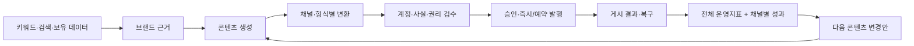
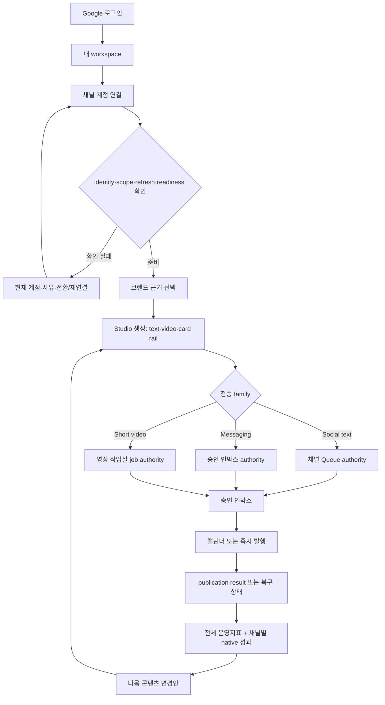

# OSMU Marketing Agent PRD — v7.1 Product Requirements Document

<!--
STAMP
created_at: 2026-08-06 17:36 KST
model: gpt-codex/gpt-5.6-sol
agent: prd-architect / marketing_agent_prd_v7
skills: 없음 — 제품 PRD 전용 매칭 스킬 없음; planning.md·doc-review.md·benchmarks.md·PRD template 직접 적용
evidence: PRD v7.0.0, independent critic RETAKE-MAJOR 7건, wiki/current dashboard code, v17 audits, user ledger L-01~L-45, official Buffer/Sprout/Later/Hootsuite/OAuth documentation
deliberation: 화면 제작자가 다시 의미를 추측하지 않도록 network·format·executor·authority·projection을 분리하고, family별 mutation owner와 전체 성과 whitelist를 plan에서 확정한다.
-->

| 항목 | 값 |
|---|---|
| 버전 | **v7.1.0** — v7.0.0 critic MAJOR 7건 closure |
| 작성일 | 2026-08-06 |
| 작성자/모델 | prd-architect / gpt-codex/gpt-5.6-sol |
| 상태 | **in-review** — independent critic MAJOR 0 및 `/approve plan` 전 downstream 입력 금지 |
| 상류 산출물 | `openclaw-auto-marketing-agent-prd-v7.0.0-gpt-codex.md`; `tasks/marketing-agent-plan-critic-v7.output`; `wiki/product/marketing-hub-surface-map.md` |
| 요구 범위 | 사용자 ledger L-01~L-45 + critic MAJOR-1~7·MINOR-1~4 |
| 증거 경계 | 코드·wiki=`근거 확인`; 사용자 제보=`관찰됨(사용자)`; provider production 왕복=`미검증` |
| 게이트 | verifier PASS → independent critic MAJOR 0 → 회장 `/approve plan` |

## 목차

- [0. TL;DR](#0-tldr)
- [1. 목적·One Thing·범위](#1-목적one-thing범위)
- [2. 현재 상태·증거 경계](#2-현재-상태증거-경계)
- [3. 페르소나·JTBD](#3-페르소나jtbd)
- [4. 고객용 용어집·정규 매핑](#4-고객용-용어집정규-매핑)
- [5. 제품 계층·MVP 5](#5-제품-계층mvp-5)
- [6. 현행 IA 보존 manifest](#6-현행-ia-보존-manifest)
- [7. Family별 authority·projection·mutation owner](#7-family별-authorityprojectionmutation-owner)
- [8. 전체 사용자 흐름](#8-전체-사용자-흐름)
- [9. 계정 연결·공통 헤더](#9-계정-연결공통-헤더)
- [10. 고객 자동화 토큰·Midjourney](#10-고객-자동화-토큰midjourney)
- [11. 영상 작업실 보존 계약](#11-영상-작업실-보존-계약)
- [12. 전체 성과·플랫폼별 성과](#12-전체-성과플랫폼별-성과)
- [13. Pilot metric dictionary·비용 상한](#13-pilot-metric-dictionary비용-상한)
- [14. 기능 요구사항](#14-기능-요구사항)
- [15. 비기능 요구사항](#15-비기능-요구사항)
- [16. 원자 수용기준·QA TC](#16-원자-수용기준qa-tc)
- [17. Release coverage N/M](#17-release-coverage-nm)
- [18. 실패·복구·권한 계약](#18-실패복구권한-계약)
- [19. 현행→목표 변경 매트릭스](#19-현행목표-변경-매트릭스)
- [20. 벤치마크](#20-벤치마크)
- [21. BM·운영·출시](#21-bm운영출시)
- [22. 리스크·steelman·premortem·kill criteria](#22-리스크steelmanpremortemkill-criteria)
- [23. Critic closure·RTM](#23-critic-closurertm)
- [24. 결정·오픈 이슈·품질 판정](#24-결정오픈-이슈품질-판정)

## 0. TL;DR

OSMU는 **한 번의 브랜드 근거 입력을 채널별로 검수 가능한 콘텐츠와 증명 가능한 발행 결과로 바꾸고, 그 결과를 다음 생성에 되돌리는 마케팅 자동화 에이전트**다. v7.1은 현행 Studio 3개 rail·기존 기능 9종·sidebar 26개·route entry 25개와 `/videos`의 세부 기능을 보존한다. 동시에 Social text, Messaging, Short video가 같은 Queue를 가진 것처럼 보였던 오류를 없애고 각 family의 최종 authority와 mutation owner를 고정한다.

- **Social text:** 각 채널 Queue가 delivery authority다. 승인 인박스와 캘린더는 같은 항목의 aggregate projection이다.
- **Messaging:** 승인 인박스·캘린더가 authority이며 destination result를 남긴다. 메시징 채널에 가짜 Queue·Analytics는 없다.
- **Short video:** `/videos` job이 authority다. 승인 인박스·캘린더에는 같은 job을 projection하고 채널 페이지에는 가짜 Queue를 만들지 않는다.
- **전체 성과:** 발행 시도·성공·실패·처리중, coverage, 콘텐츠당 publication 수, readiness만 합산한다. 조회·도달·노출·참여·팔로워는 MVP에서 provider 간 합산하지 않는다.
- **제품 결정 폐쇄:** Midjourney route/nav는 보존하되 안전상 현재 미제공 상태만 표시한다. 고객 자동화 토큰 권한은 콘텐츠 읽기, 초안 생성·수정, 발행 요청, 성과 읽기로 확정하며 발행 요청은 기본 꺼짐이다.

## 1. 목적·One Thing·범위

### 1.1 고객이 완료하려는 일

고객은 브랜드 자료를 다시 찾고, 같은 아이디어를 여러 채널 문법으로 다시 쓰고, 계정·권한·예약·실제 게시 결과를 각각 확인하는 반복 노동을 줄이려 한다. 제품은 전략 보고서가 아니라 **근거 선택 → 생성 → 채널별 검수 → 승인 → 즉시/예약 발행 → 결과·복구 → 다음 생성**을 한 번의 추적 가능한 흐름으로 제공해야 한다.

### 1.2 One Thing 후보와 함정

| 후보 | 판정 | 이유 |
|---|---|---|
| 모든 SNS를 한 화면에서 관리 | 탈락 | capability 없는 Queue·Analytics parity를 만든다. |
| AI가 주간 전략을 자동 결정 | 탈락 | 생성·검수·발행이라는 실제 일을 주변화한다. |
| 글 하나를 11개 채널에 자동 발행 | 탈락 | preview·executor·video format·message destination을 한 숫자로 섞는다. |
| 브랜드 근거를 검수 가능한 콘텐츠와 증명 가능한 발행 결과로 전환 | **채택** | 고객 산출물, 신뢰, 반복 단위를 함께 설명한다. |

> **One Thing: 한 번의 브랜드 근거 입력을 채널별로 검수 가능한 콘텐츠와 증명 가능한 발행 결과로 바꾸고, 그 결과를 다음 생성에 되돌리는 마케팅 자동화 에이전트.**

### 1.3 In scope

- Google/Supabase customer login→own tenant, provider account 연결·전환·readiness.
- Studio 3 rail: Social text, Short video 9:16, Instagram card news.
- 현행 preview 7, direct publish 4, text executor 8, video output 3, optional messaging 3의 역할 분리.
- content root→variant/delivery→family authority→approval/schedule→publication→native metric→next content lineage.
- 전체 성과 whitelist와 채널별 native metric.
- Keyword/Data/Assets/System/Admin을 core loop의 입력·측정·통제면으로 연결.
- public/customer/operator, 390/1024/1440, loading/empty/error/recovery states.

### 1.4 Out of scope

- API endpoint·DB table·transaction engine·scope encoding 확정. 제품 의미는 이 문서에서 닫고 저장 방식만 eng-design에서 합의한다.
- LINE publish/schedule, backing 없는 Queue/Analytics/tab.
- provider 간 views/reach/impressions/engagement/followers 합산.
- Discord user token을 이용한 Midjourney 고객 자동화.
- 사람 승인 없는 외부 게시·삭제·재발행·광고비 집행·대량 DM/댓글.
- private tenant/venture data를 public analytics나 다른 tenant 학습에 혼합.

## 2. 현재 상태·증거 경계

| 영역 | 현재 판정 | 근거 | v7.1 target |
|---|---|---|---|
| Customer shell | 이미구현 | route25/sidebar26 | 390 nav·overflow 보정, 삭제0 |
| Studio 3 rail·기존9 | 이미구현·role drift | `studio/page.tsx` | 고객에게 video3 slot 항상 표시 |
| preview7/direct4/text executor8 | 이미구현 | Studio·publish constants | 서로 다른 inventory로 유지 |
| Messaging3 | 실행경로 존재·UI 의미 혼선 | publish/schedule adapters | aggregate authority, fake Queue0 |
| Short video3 | 부분구현 | Studio + `/videos` | job authority와 aggregate projection |
| Studio draft/schedule | 분리 구현 | drafts/schedules | family authority로 handoff |
| Inbox/Calendar | legacy queue view | `queue-store` | family별 canonical projection |
| Publish result | 부분구현 | `published_posts`; queue same UUID update | publication proof authority |
| Metrics | Threads 편중·false aggregate 위험 | analytics/metrics routes | aggregate whitelist/native only |
| OAuth | callback false-success 위험 | callback before full readback | verified completion ladder |
| Customer API token | UI 있으나 403/ownership 결함 | Settings/proxy/handler | fixed product scopes+tenant auth |
| Midjourney | unsafe legacy guide | customer route/user-token guide | route 보존, 안전상 미제공 |
| `/videos` | 풍부한 current workbench | library/upload/generate/repurpose/publish | 원자 action 보존 |

`wiki/product/marketing-hub-surface-map.md`는 current 구현 SSOT다. 다만 target lineage·family authority·token scope는 v7.1 plan 승인 뒤 wiki에 반영해야 하며, 현재 구현 완료 근거가 아니다.

## 3. 페르소나·JTBD

### 3.1 Primary persona — 김민서, 38세, 1인 교육·컨설팅 브랜드 대표

김민서는 서울에서 직무교육과 소규모 컨설팅을 혼자 운영한다. 강의 기획, 상담, 수업, 회계, 고객 응대까지 직접 하므로 마케팅에 쓸 수 있는 시간은 월요일 45분과 평일 자투리 시간뿐이다. Threads, Instagram Feed, Facebook, YouTube Shorts, Instagram Reels, TikTok을 운영하지만 같은 아이디어를 여섯 번 다시 쓰고 매체 규격과 계정을 확인하는 시간이 부담스럽다. AI 초안은 빠르지만 예전 가격이나 존재하지 않는 혜택을 섞을 수 있어 강의자료와 회사소개를 다시 열어 확인한다. 가장 큰 공포는 문장 품질보다 잘못된 계정과 중복 발행이다. `j.the.great.investor`로 가입했는데 연결 팝업에 기존 `zero_to_one_ai`가 보이거나, 연결 완료 뒤에도 상태가 미연결이면 자동화를 믿지 않는다. Studio에서 만든 콘텐츠가 승인 인박스·캘린더·해당 채널 Queue 또는 영상 작업실 중 약속된 위치에 나타나지 않으면 동일 예약을 다시 만들고, 502 뒤 재시도해 두 번 게시될까 두려워 각 앱에서 수동 발행한다. 민서는 모든 채널이 같은 화면을 가져야 한다고 생각하지 않는다. Social text, 짧은 영상, 커뮤니티 공지는 준비물과 발행 방식이 다르지만, 계정 확인→생성→검수→승인→예약/발행→결과라는 순서와 상태 언어는 일관되길 원한다. 전체 성과의 숫자는 진짜 합산 가능한 운영지표만 보여야 하며 조회수나 도달은 채널별 정의로 확인하고 싶다. 성공은 브랜드 자료 한 번 선택→채널별 초안과 영상 slot 생성→자신이 계정·문구·권리·공개범위를 확인→명시 승인→실제 게시물 링크 또는 복구 상태→다음 콘텐츠 변경안까지 한 흐름에서 끝나고, 다음 주에도 같은 콘텐츠를 찾을 수 있는 상태다. 현재 수작업 3시간, 게시 빈도, 지불의사는 가설이며 pilot 인터뷰 전 `미측정`이다.

### 3.2 JTBD

> 마케팅 시간이 부족할 때, 내 브랜드 자료로 하나의 콘텐츠를 만들고 각 채널과 형식에 맞게 검수·발행한 뒤 실제 결과를 확인해, 잘못된 계정·중복 게시·끊긴 목록을 쫓지 않고 다음 콘텐츠를 더 낫게 만들고 싶다.

### 3.3 Anti-persona

- 무승인 대량 DM·댓글·팔로우 자동화를 원하는 spam operator.
- provider 약관·권한을 우회하거나 user token 자동화를 배포하려는 사용자.
- enterprise attribution warehouse나 paid media bidding을 즉시 대체하려는 조직.

## 4. 고객용 용어집·정규 매핑

### 4.1 용어집

| 용어 | 고객에게 보이는 뜻 | 내부 설계에서의 정확한 뜻 | 혼용 금지 |
|---|---|---|---|
| 채널 계정 | 연결한 Threads·Instagram·YouTube 등의 실제 계정 | network/provider의 canonical account identity | Shorts·Reels를 계정으로 부르지 않음 |
| 콘텐츠 형식 | 피드 글, 카드뉴스, 짧은 영상, 커뮤니티 공지 | provider가 받는 media/post format | network와 같은 뜻으로 쓰지 않음 |
| 생성 결과 칸 | Studio에서 생성 직후 보이는 결과 | generated slot; 발행 가능 약속이 아님 | executor·Queue와 혼용 금지 |
| 전송 방식 | 실제 외부 API·webhook 실행 경로 | delivery executor | 고객 UI에는 기술 adapter명 노출 금지 |
| 승인 위치 | 게시 전 승인·반려하는 화면 | approval mutation owner | content/job authority와 구분 |
| 작업 기준 위치 | 수정·상태의 최종 기준 화면 | family별 authority | aggregate projection을 별도 truth로 만들지 않음 |
| 발행 결과 | 외부 채널이 인정한 게시 결과 | provider account + external publication ID | permalink만으로 identity를 대체하지 않음 |
| 채널별 성과 | 각 채널 정의 그대로의 수치 | native analytics owner와 observation | 다른 provider 값과 합산 금지 |
| 전체 성과 | 여러 채널을 가로지르는 운영 상태 | whitelist된 delivery/readiness KPI | 조회·도달·참여 합계 금지 |

이 문서에서 단독 `플랫폼`이라는 표현은 사용하지 않는다. 문맥에 따라 **채널 계정, 콘텐츠 형식, 생성 결과 칸, 전송 방식, 작업 기준 위치, 발행 결과, 채널별 성과** 중 하나를 사용한다.

### 4.2 Canonical capability mapping

| Network/provider account | Content format | Studio generated slot | Delivery executor | Approval owner | Queue/job authority | Publication key | Analytics owner | Customer label |
|---|---|---|---|---|---|---|---|---|
| Threads account | social text/thread | Threads text slot | Threads text executor | 승인 인박스 | Threads Queue | account + Threads post ID | Threads native | Threads 글 |
| X account | social text/thread | X text slot | X text executor | 승인 인박스 | X Queue | account + X post ID | X native when collected | X 글 |
| Facebook Page | feed text/media | Facebook text slot | Facebook text executor | 승인 인박스 | Facebook Queue | Page + Facebook post ID | Facebook native when collected | Facebook 게시물 |
| Instagram account | Feed caption/card | Instagram card/text slot | Instagram Feed executor | 승인 인박스 | Instagram Queue | account + Instagram media ID | Instagram native | Instagram 피드 |
| Instagram account | Reels short video | Reels video slot | `instagram_reels` video executor | 승인 인박스 | `/videos` job | account + Instagram media ID | Instagram Reels native | Instagram 릴스 |
| YouTube channel | Shorts short video | Shorts video slot | YouTube video executor | 승인 인박스 | `/videos` job | channel + YouTube video ID | YouTube native | YouTube 쇼츠 |
| TikTok account | TikTok short video | TikTok video slot | TikTok video executor | 승인 인박스 | `/videos` job | account + TikTok publish/video ID | TikTok native | TikTok 영상 |
| Bluesky account | social text | no current Studio slot; review-created variant | Bluesky text executor | 승인 인박스 | Bluesky Queue | DID/account + post URI | 미수집 또는 Bluesky native | Bluesky 글 |
| Telegram destination | community message | optional message variant | bot executor | 승인 인박스 | 승인 인박스·캘린더 | chat + message ID | 성과 미수집 | Telegram 공지 |
| Discord destination | community message | optional message variant | webhook/bot executor | 승인 인박스 | 승인 인박스·캘린더 | destination + message ID | 성과 미수집 | Discord 공지 |
| Slack destination | community message | optional message variant | webhook/bot executor | 승인 인박스 | 승인 인박스·캘린더 | workspace/channel + message timestamp | 성과 미수집 | Slack 공지 |
| LINE | unsupported | 없음 | 없음 | 없음 | 없음 | 없음 | 없음 | 현재 미지원 |

### 4.3 Inventory counts — 서로 합산하지 않는다

| Inventory | Items | 의미 |
|---|---|---|
| Studio visual preview | Threads, X, Facebook, Instagram, Shorts, Reels, TikTok = 7 | 생성 결과 미리보기 |
| Studio direct publish selector | Threads, X, Facebook, Instagram = 4 | 현행 Studio 직접 선택 대상 |
| Text executor | Threads, X, Facebook, Instagram, Bluesky, Telegram, Discord, Slack = 8 | runtime 전송 경로 |
| Short-video output | YouTube Shorts, Instagram Reels, TikTok = 3 | video format/result |
| Optional messaging destination | Telegram, Discord, Slack = 3 | 커뮤니티 공지 배포 |
| Unsupported | LINE = 1 | success·Queue·Analytics 없음 |

## 5. 제품 계층·MVP 5

| MVP | One Thing 연결 | 고객 산출물 | 성공 기준 |
|---|---|---|---|
| M1. 근거 기반 Composer | 근거→생성 | source가 표시된 콘텐츠 1개와 3 rail | unknown factual claim 승인0 |
| M2. Account Truth | 검수 전 계정 확인 | 모든 surface의 동일 identity/readiness | projection diff0 |
| M3. Family Delivery | 변환→authority→승인/예약 | social Queue, messaging aggregate, video job | authority/projection 오표시0 |
| M4. Result & Recovery | 게시 증명·502 복구 | external ID/link 또는 named recovery | wrong/duplicate publish0 |
| M5. Measure-to-Create | 결과→다음 생성 | whitelist KPI, native metric, 변경안1 | false aggregate/false zero0 |

Discover·Keyword·Data·Analytics는 이 폐루프의 입력과 피드백이며 별도 전략 제품이 아니다.

## 6. 현행 IA 보존 manifest

### 6.1 Customer sidebar 26 destinations — exact manifest

| Group | Customer destination | Route/owner | 보존·target |
|---|---|---|---|
| Overview | 성과 | `/` | aggregate whitelist+native drill-down |
| Overview | OSMU Studio | `/studio` | 3 rail·기존9 |
| Overview | 승인 인박스 | `/inbox` | family별 approval projection/authority |
| Overview | 발행 캘린더 | `/calendar` | schedule mutation owner/projection |
| Social | Threads | `/channels/threads` | Queue/Analytics/Settings/Growth/Popular |
| Social | X | `/channels/x` | capability-backed tabs |
| Social | Instagram | `/channels/instagram` | Queue/Editor/Settings |
| Social | Facebook | `/channels/facebook` | capability-backed tabs |
| Social | Bluesky | `/channels/bluesky` | text Queue, analytics 미수집 truth |
| Messaging | Telegram | `/channels/telegram` | setup only; fake Queue/Analytics0 |
| Messaging | Discord | `/channels/discord` | setup only; fake Queue/Analytics0 |
| Messaging | Slack | `/channels/slack` | setup only; fake Queue/Analytics0 |
| Video | YouTube | `/channels/youtube` | account/readiness; create/publish는 `/videos` |
| Video | TikTok | `/channels/tiktok` | account/readiness; create/publish는 `/videos` |
| Data | Blog Performance | `/blog-performance` | native blog statistics |
| Data | Search Console | `/search-console` | permission/source/time truth |
| Data | Google Analytics | `/google-analytics` | disabled reason; fake chart0 |
| Keyword | Keyword Planner | `/keyword-planner` | research+bank |
| Keyword | Search Advisor | `/search-advisor` | disabled reason |
| Keyword | Naver Trends | `/naver-trends` | disabled reason |
| Keyword | Google Trends | `/google-trends` | external destination |
| Custom | Blog | `/blog` | separate blog queue/editor |
| Assets | Images | `/images` | tenant asset library |
| Assets | Videos | `/videos` | video job authority/workbench |
| Assets | Midjourney | `/channels/midjourney` | route 보존, 안전상 현재 미제공 |
| System | Settings | `/settings` | customer8/operator9 boundary |

Sidebar destination 26개는 삭제·rename·home bounce 없이 유지한다. 물리 group rename은 design에서 비교할 수 있으나 destination·owner·기능 의미는 이 표를 바꾸지 않는다.

### 6.2 Route entry 25 — exact manifest

| # | Route | Current purpose | v7.1 preservation check |
|---:|---|---|---|
| 1 | `/` | customer performance home | onboarding·account banner·whitelist KPI·activity/error |
| 2 | `/studio` | assisted composition | 3 rail·기존9·family handoff |
| 3 | `/inbox` | approval list | approve/reject owner, family identity |
| 4 | `/calendar` | schedule list | create/change/cancel schedule owner |
| 5 | `/channels/[channel]` | provider dispatcher | common header+capability tabs |
| 6 | `/videos` | video workbench | §11 원자 manifest 전부 |
| 7 | `/images` | image library | tenant assets·rights |
| 8 | `/blog` | blog queue/editor/guide | separate domain 유지 |
| 9 | `/blog-performance` | blog statistics | source/time truth |
| 10 | `/search-console` | GSC table | permission/error/overflow 보정 |
| 11 | `/keyword-planner` | keyword research/bank | available state |
| 12 | `/google-analytics` | unavailable customer panel | disabled reason |
| 13 | `/naver-trends` | unavailable panel | disabled reason |
| 14 | `/search-advisor` | unavailable panel | disabled reason |
| 15 | `/google-trends` | external guidance | external truth |
| 16 | `/performance` | compatibility redirect | `/` redirect 유지 |
| 17 | `/services` | tenant/service switch | auth/loading/error 유지 |
| 18 | `/settings` | role-aware configuration | customer8/operator9 |
| 19 | `/operator` | operator login/token | customer shell 미노출 |
| 20 | `/operator/customers` | tenant/OAuth/usage support | operator audit |
| 21 | `/login` | Google login | cancel/error/success |
| 22 | `/signup` | compatibility redirect | `/login` redirect 유지 |
| 23 | `/privacy` | privacy policy | static route 유지 |
| 24 | `/terms` | terms | static route 유지 |
| 25 | `/data-deletion` | deletion instructions | operational owner/action 명시 |

Route click은 위 manifest의 **navigation regression**만 증명한다. OAuth, 발행, projection, metric의 semantic PASS 근거로 사용할 수 없다.

## 7. Family별 authority·projection·mutation owner

### 7.1 Final product decision

| Family | Final authority | Aggregate projection | Channel owner surface | Fake surface 금지 |
|---|---|---|---|---|
| Social text | 해당 채널 Queue | 승인 인박스·캘린더 | account header + Queue + native Analytics when backed | 별도 aggregate truth, unsupported Queue |
| Messaging | 승인 인박스·캘린더 | 동일 authority의 목록/일정 view | setup/readiness + destination result link | channel Queue·Analytics |
| Short video | `/videos` job | 승인 인박스·캘린더 | YouTube/TikTok/Instagram account readiness only | channel text Queue, backing 없는 Analytics |

이 표는 plan의 최종 제품 결정이며 v7 O-6은 폐쇄한다. authority를 어떤 table/file/event store로 구현할지는 eng-design에서 합의한다.

### 7.2 시점별 노출과 mutation owner

| Family | 생성 직후 | 검수·수정 | 승인·반려 | 예약·변경·취소 | 즉시 발행·복구 | 결과 |
|---|---|---|---|---|---|---|
| Social text | Studio slot→선택 시 채널 Queue draft 생성; Inbox에 승인대기 projection | 채널 Queue detail이 content edit owner | 승인 인박스가 decision owner | 캘린더가 schedule mutation owner | 채널 Queue/result detail이 publish-now·reconcile owner | 채널 Queue Sent/result + aggregate status projection |
| Messaging | 선택한 destination만 승인 인박스 draft 생성 | 승인 인박스 delivery detail | 승인 인박스가 decision owner | 캘린더가 mutation owner | 승인 인박스 delivery detail이 send-now·confirmed retry owner | destination result; channel setup에는 status summary만 |
| Short video | Studio slot은 상태/스크립트/asset 필요를 표시; handoff 시 `/videos` job 생성 | `/videos`가 media·metadata·account edit owner | 승인 인박스가 decision owner, job에 결과 반영 | 캘린더가 schedule mutation owner, job에 결과 반영 | `/videos`가 upload/publish/poll/reconcile owner | `/videos` publication result + aggregate status projection |

### 7.3 Lifecycle invariants

1. aggregate surface는 authority와 같은 identity/version을 읽으며 독립 상태를 만들지 않는다.
2. 승인 인박스 외의 화면은 승인 결정을 직접 바꾸지 않는다.
3. 캘린더 외의 화면은 active schedule을 직접 변경·취소하지 않고 캘린더 flow를 연다.
4. family authority가 없는 item을 aggregate projection이 만들어내지 않는다.
5. Social text Queue에 video/message record를 authoritative item으로 넣지 않는다.
6. provider success 뒤 internal projection 실패는 재발행이 아니라 repair다.

## 8. 전체 사용자 흐름

### 8.1 End-to-end

### 8.2 Public→customer onboarding

1. 비로그인 사용자는 landing/legal/login만 본다.
2. Google/Supabase 완료 뒤 customer-owned active tenant 1개로 진입한다.
3. customer shell은 Admin action을 mount하지 않는다.
4. 첫 가치 경로는 `브랜드 근거 확인 → 계정 연결 → Studio에서 만들기`다.
5. 계정 미연결이어도 생성은 가능하지만 publish/schedule은 reason과 함께 비활성이다.

### 8.3 Ground→create→review

1. 고객은 confirmed/unknown/expired source를 구분해 선택한다.
2. Studio는 Social text, Short video, Instagram card rail을 유지한다.
3. 고객 role에서도 Shorts/Reels/TikTok 생성 결과 칸 3개는 항상 존재한다. 생성 권한이나 asset이 없으면 칸 자체를 숨기지 않고 실제 상태와 다음 행동을 표시한다.
4. 고객이 family/destination을 선택할 때만 §7 authority item을 만든다.
5. 사실 claim, asset license, 인물 동의, 연결 계정, scope/readiness가 검수 항목이다.

### 8.4 Publish/schedule/result

1. 승인 decision은 account, content/media version, destination, time, rights에 바인딩된다.
2. 승인 뒤 한 필드라도 바뀌면 approval은 무효이며 외부 호출 0이다.
3. 즉시 발행은 선택한 delivery/job만 실행한다.
4. 예약의 생성·변경·취소는 캘린더에서만 수행하며 timezone/DST/version/readiness를 확인한다.
5. `게시됨`은 provider external ID, account, published_at, permalink/readback 증거가 있을 때만 표시한다.
6. timeout은 결과 확인 전 재발행하지 않는다. provider success+internal failure는 기록 복구만 한다.

## 9. 계정 연결·공통 헤더

### 9.1 Verified connection ladder

1. **동의 완료:** authorization code exchange 완료.
2. **안전 저장:** provider credential server-side encrypted storage 완료.
3. **계정 확인:** canonical provider account identity readback 완료.
4. **권한 확인:** 필요한 granted scopes 확인.
5. **지속 가능:** expiry·refresh·revocation health 확인.
6. **기능 확인:** 생성·발행·예약·성과 capability별 readiness 판정.
7. **화면 동기화:** Settings·channel header·Studio selector·authority/result·Admin support diff0.
8. **사용 가능:** 해당 action에 필요한 단계가 모두 준비된 경우에만 CTA enabled.

Callback은 7단계 전부가 필요한 action 기준으로 확인되기 전에 성공 메시지를 보내지 않는다.

### 9.2 Wrong-account recovery

- transaction은 tenant/provider/browser에 묶이고 state·PKCE/nonce는 1회 소비한다.
- provider가 selector를 지원하면 사용한다. TikTok은 `disable_auto_auth=1`, Google 계열은 account selection/offline consent를 적용한다.
- Meta가 강제 selector를 보장하지 않으면 현재 canonical identity를 먼저 보여주고 logout/revoke/manage→재연결 경로를 제공한다.
- 목표 계정 B를 선택한 뒤 B identity와 B executor1/A executor0을 실제 trace로 확인한다.
- cancel/mismatch/permission 부족은 이전 안전 상태를 보존한다.
- provider별 wrong-account release coverage는 §17에서 각각 N/M으로 기록한다.

### 9.3 Common truth header — 7 fields

| 순서 | 필드 | 고객 copy | N/A 규칙 |
|---:|---|---|---|
| 1 | 채널 | 실제 icon + network/provider name | N/A 없음 |
| 2 | 계정 | display name/handle + canonical identity | 미연결이면 `연결된 계정 없음` |
| 3 | 상태 | 연결됨/확인 필요/재연결 필요/미연결/확인 불가 + reason | 빈칸 금지 |
| 4 | 확인 시각 | 마지막 canonical verification | 없으면 `아직 확인하지 않음` |
| 5 | 자동화 준비 | 생성·발행·예약·성과별 readiness | 지원하지 않음은 명시 |
| 6 | 권한·갱신 | scope/expiry/refresh health, 비밀값 제외 | webhook=`해당 없음 — 웹훅 연결`; bot=`해당 없음 — 봇 자격증명`; external=`해당 없음 — 외부 도구` |
| 7 | 행동 | 계정 관리/연결/재연결/권한 확인 | 행동이 없으면 이유와 지원 경로 |

N/A는 빈칸·오류·미연결로 표현하지 않는다. `해당 없음 — <왜 적용되지 않는지>` 형식을 사용한다.

### 9.4 Capability-driven tabs

- Threads: Queue, Analytics, Settings, Growth, Popular 유지.
- Instagram: Queue, Editor, Settings 유지; Reels job은 `/videos`가 소유.
- generic Social text: backing이 있는 Queue/Analytics/Settings만.
- YouTube/TikTok channel: account/readiness/manage만; create/publish는 `/videos`.
- Telegram/Discord/Slack: setup/readiness/result link만; Queue·Analytics tab 0.
- capability가 없는 탭을 통일감 목적으로 만들지 않는다.

## 10. 고객 자동화 토큰·Midjourney

### 10.1 Credential boundary

| Credential | 용도 | 저장·표시 | Owner |
|---|---|---|---|
| Customer login session | app login/tenant | secure session; identity only | AuthGate |
| Provider access/refresh token | 고객 채널 API 호출 | server encrypted; raw customer/Admin 기본노출0 | connection service |
| OSMU tenant API token | 고객 automation이 OSMU API 호출 | hashed; plaintext 발급 1회 | Customer Settings |
| Central OAuth app credential | OSMU provider client credential | operator encrypted/masked/timed reveal/audit | Admin |

### 10.2 Tenant API token product scopes — final decision

| 고객 label | 제품 의미 | 기본값 | 안전 경계 |
|---|---|---:|---|
| 콘텐츠 읽기 | own tenant의 root·variant·status 조회 | ON | 다른 tenant 0 |
| 초안 생성·수정 | own tenant draft 생성·수정 | OFF | 외부 side effect 0 |
| 발행 요청 | approval item 또는 publish request 생성 | **OFF** | 승인 우회·직접 provider call 0 |
| 성과 읽기 | whitelist KPI와 own native metric 조회 | OFF | raw provider credential/private 다른 tenant 0 |

고객이 label·scope를 선택하고 plaintext는 한 번만 본다. 목록에는 label, created_at, last_used_at, scopes, revoked만 보인다. revoke 뒤 즉시 401이어야 한다. scope claim/DB/API encoding만 eng-design에서 결정한다. `발행 요청`은 외부 자동 발행 권한이 아니며 §7 approval owner를 우회하지 않는다.

### 10.3 Midjourney final state — additive safety decision

- `/channels/midjourney` route와 sidebar destination은 **보존**한다.
- 고객 화면에는 `현재 안전하게 제공하지 않습니다`와 이유, 안전한 Images 대체 경로만 표시한다.
- Discord user token 입력, 개발자 도구 token 추출 안내, background automation, connected 뱃지 위조는 **0**이다.
- 별도 회장 명시 승인과 provider/TOS/security 검토 전 route/nav 삭제도 **0**이다.
- operator는 legacy configuration 존재 여부와 risk state만 볼 수 있으며 customer token을 입력·대행하지 않는다.

## 11. 영상 작업실 보존 계약

### 11.1 `/videos` atomic action/state manifest

| ID | Current action/state | Role | v7.1 보존·보정 |
|---|---|---|---|
| V-01 | video library/list | customer | own tenant asset/job list 유지 |
| V-02 | file upload | customer | provenance·rights 입력과 연결 |
| V-03 | slide/video generation | operator-only current | customer에 fake generate0; 실제 role state 표시 |
| V-04 | long-video URL/file repurpose | customer | external source·rights·failure 유지 |
| V-05 | clip candidate list | customer | empty/loading/error 유지 |
| V-06 | clip refine hook/caption | customer | selected clip only mutation |
| V-07 | candidate ranking | customer | 추천 근거/보장 아님 표시 |
| V-08 | add one/all clips to library | customer | duplicate/idempotency·rights 유지 |
| V-09 | text fanout option | customer | Social text Queue 생성과 video job 혼동0 |
| V-10 | multi-account YouTube selection | customer | canonical identity/readiness |
| V-11 | multi-account TikTok selection | customer | canonical identity/readiness |
| V-12 | YouTube title | customer | required/length/provider validation |
| V-13 | YouTube description | customer | provider validation |
| V-14 | YouTube tags | customer | provider validation |
| V-15 | TikTok privacy level | customer | creator-info allowed values only |
| V-16 | TikTok comment control | customer | provider-disabled constraint 보존 |
| V-17 | TikTok duet control | customer | provider-disabled constraint 보존 |
| V-18 | TikTok stitch control | customer | provider-disabled constraint 보존 |
| V-19 | TikTok AI-generated disclosure | customer | explicit value·audit |
| V-20 | TikTok async publish/poll | customer | publish ID·processing·terminal result |
| V-21 | Reels connection/readiness | customer | account/media readiness reason |
| V-22 | YouTube/Reels/TikTok individual publish | customer | 선택 executor만≤1 |
| V-23 | publication result/permalink | customer | provider proof 없으면 published0 |
| V-24 | asset source/license/person consent | customer | unknown이면 approval/publish block |

### 11.2 Studio video3 states

Shorts, Reels, TikTok 생성 결과 칸은 customer에게 항상 3/3 보인다. 각 칸은 다음 중 하나의 실제 상태를 사용한다.

| State | 고객 의미 | Action |
|---|---|---|
| 현재 미지원 | tenant/role에 생성 방식 없음 | 업로드 또는 지원 안내 |
| 운영자 생성 기능 | 생성은 operator-only | 업로드로 계속 또는 관리자 문의 |
| 업로드 필요 | script 있으나 asset 없음 | `/videos` upload 열기 |
| 계정 연결 필요 | asset 있으나 target account 없음 | channel connect 열기 |
| 확인 필요 | scope/privacy/rights/metadata 부족 | 해당 검수 열기 |
| 준비됨 | job 생성 가능 | 영상 작업실에서 계속 |
| 처리 중 | provider/render async | job 상태 보기; 재발행 금지 |
| 실패/복구 필요 | named failure | confirmed retry 또는 reconcile/repair |

칸을 숨기거나 반짝이는 loading placeholder만 계속 보여주는 것은 금지한다.

### 11.3 Asset provenance and rights

모든 uploaded/generated/repurposed asset은 source type, source reference, uploader/generator, created_at, license/usage-right, person consent, AI-generated disclosure, content root/job link를 가진다. license 또는 인물 동의가 unknown이고 상업 발행에 필요하면 승인·발행을 막는다. 실제 법률 판단은 별도 법률 검토 대상으로 표시한다.

## 12. 전체 성과·플랫폼별 성과

### 12.1 Aggregate KPI whitelist — MVP final decision

전체 성과에서 합산 가능한 항목은 다음뿐이다.

| KPI | Definition | 허용 집계 | Drill-down |
|---|---|---|---|
| 발행 시도 | 승인된 delivery/job가 executor dispatch를 시작 | count by family/channel/time | intent→result |
| 발행 성공 | publication proof가 존재 | count | external publication |
| 발행 실패 | side effect 없음이 확인된 terminal failure | count | reason/owner/action |
| 처리 중 | async/uncertain/reconcile 상태 | count, age bucket | job/intent |
| 수집 coverage | metric eligible publication 중 current observation 상태 | state counts/ratio | channel/post/source |
| 콘텐츠당 publication 수 | root에 연결된 proof publication count | distribution·median | root→publications |
| 계정 readiness | connected account capability state | ready/not-ready counts | account/reason |

### 12.2 MVP prohibited aggregate

`views`, `reach`, `impressions`, `engagement`, `likes`, `replies`, `reposts`, `followers`는 provider 간 **합산 금지**다. 전체 화면에서는 채널별 native 표와 root drill-down만 제공한다. 향후 합산은 metric-equivalence ADR에 event semantics, denominator, API version, validation evidence를 쓰고 회장의 명시 승인 뒤에만 추가한다.

### 12.3 Native metric dictionary minimum fields

| Field | Requirement |
|---|---|
| native metric name | provider가 반환한 이름 |
| definition | provider 정의와 API version |
| value | raw/derived 여부 포함 |
| account/publication | canonical owner identity |
| observation window | 시작·종료·timezone |
| collected_at | 실제 수집 시각 |
| source owner | provider endpoint/collector |
| coverage state | collected/permission/delayed/error/unsupported/no-data |

### 12.4 Six metric states

| State | 표시 | 0 허용 |
|---|---|---:|
| collected | source/time/value; provider가 실제 0이면 `0` | O |
| no data / partial | 수집된 범위·누락 범위·이유 | X |
| permission required | missing scope와 reconnect | X |
| delayed / stale | last collected time과 refresh | X |
| error | safe reason·correlation·retry/owner | X |
| unsupported | 현재 API/connector가 제공하지 않음 | X |

## 13. Pilot metric dictionary·비용 상한

아래 숫자는 외부 수요·원가 검증 전 **(unsourced hypothesis)**인 pilot 기본값이다. minimum sample 전에는 exploratory로 표시하고 GO/KILL에 단독 사용하지 않는다.

#### Metric definitions

| Metric | Event | Numerator | Denominator | Eligibility | Source owner |
|---|---|---|---|---|---|
| 반복 가치 | full loop completion | 2회 이상 loop 완료 workspace | eligible active workspace | source+supported account+2주 사용 가능 | lineage+pilot log |
| 근거 기반 완료 | approved grounded root | source citation을 가진 approved root | root creation attempt | confirmed source≥1 | root/approval ledger |
| 실제 발행 완료 | proof publication | proof publication≥1인 workspace | connected eligible workspace | required readiness 충족 | publication ledger |
| Projection parity | authority와 projection 동일 item | exact-match projection | projection-eligible delivery/job | family authority item 존재 | reconciliation report |
| Terminalization | 24h 내 terminal | terminal result intents | provider-accepted intents | accepted/reconciliable | job/publication ledger |
| 사실 수정률 | material factual correction | corrected factual claims | reviewed factual claims | source-bound claim | claim-source review |
| 다음 생성 환류 | evidence-linked next root | next root with observation/change | eligible terminal publication | metric/source available | lineage |
| Safety incident | prohibited external/security event | incident count | eligible external intents/requests | production-like flow | security/publication audit |
| Support time | human support minutes | measured support minutes | active workspace-week | ≥1 customer action/week | support timer |
| Text root variable cost | LLM+image+storage KRW | per-root cost sum | completed text roots | cost record complete | usage ledger |
| Video job variable cost | render/TTS/storage/API KRW | per-job cost sum | completed video jobs | cost record complete | usage ledger |
| Provider expansion cost | cash+ops setup | monthly incremental cost | added provider | one new connector | finance+ops log |

#### Decision rules

| Metric | Minimum sample | Window | Excluded | Pilot decision default |
|---|---|---|---|---|
| 반복 가치 | 3 workspace, 각 publication≥2 | 28일 | 휴면·연결불가·중도 철회 | 3개 중 ≥2; 미달 composer/handoff 축소 (hypothesis) |
| 근거 기반 완료 | root≥20 | 28일 | generate 전 user-abandoned | ≥70% (hypothesis) |
| 실제 발행 완료 | workspace3, accepted intent≥20 | 28일 | provider review outage | workspace≥50%+terminalization gate |
| Projection parity | pilot 전수+item≥30; production 판단≥100 | 28일 | unsupported family surface | pilot100%; drift1이면 release block |
| Terminalization | intent≥20 | rolling 28일 | declared global outage 별도 보고 | ≥95%; 미달 auto schedule off (hypothesis) |
| 사실 수정률 | claims≥20 | 28일 | style-only edits | ≤30%; 초과 자율성 중단 (hypothesis) |
| 다음 생성 환류 | publications≥20 | 28일 | unsupported analytics | ≥50% (hypothesis) |
| Safety incident | 1 event부터 | continuous | 없음 | 1건 즉시 kill |
| Support time | workspace-weeks≥6 | weekly, 2주 연속 | planned onboarding 교육 | >60분 expansion stop; 목표≤30분 (hypothesis) |
| Text root variable cost | root≥20 | 28일 | fixed engineering | median≤₩2,000, p95≤₩5,000 (hypothesis) |
| Video job variable cost | job≥10 | 28일 | customer-provided compute | p95≤₩15,000 (hypothesis) |
| Provider expansion cost | one provider-month | monthly | shared fixed infra | ≤₩150,000 and ≤8h first month (hypothesis) |

### 13.1 Demand evidence gap

Buffer/Sprout/Later/Hootsuite는 workflow 설계 근거이지 OSMU의 구매 수요 증거가 아니다. pilot 시작 전에 고객 3명에 대해 현재 주간 수작업 시간, 월 게시 빈도, 기존 도구 월비용, wrong-account/Queue drift 빈도, 월 지불의사, 현재 content→result 반복률을 baseline으로 기록한다. baseline이 없으면 시간절감·WTP·차별화 주장을 `미측정`으로 유지한다.

## 14. 기능 요구사항

| FR | Requirement | Basis | Fit criterion | Current state |
|---|---|---|---|---|
| FR-MA71-001 | 첫 가치 경로는 근거 선택→생성→family authority→승인→발행/예약→결과여야 한다. | One Thing | primary chain1, dead-end0 | 부분구현 |
| FR-MA71-002 | 모든 customer data/action은 active tenant에 격리돼야 한다. | multi-tenant rule | cross-tenant read/write/publish0 | 이미구현·전수 미검증 |
| FR-MA71-003 | public/customer/operator shell과 action을 분리해야 한다. | AuthGate/Admin | role DOM/action leak0 | 이미구현 |
| FR-MA71-004 | route entry25의 purpose/action/state를 §6.2대로 보존해야 한다. | critic M5/minor1 | deletion/rename/home-bounce0 | 부분구현 |
| FR-MA71-005 | customer sidebar26을 §6.1대로 보존해야 한다. | user additive request | destination26/26 | 이미구현 |
| FR-MA71-006 | 390px에서 destination26과 core action을 사용할 수 있어야 한다. | observed defect | hidden nav0, overflow0 | 미구현 |
| FR-MA71-007 | 1024px에서 route25 core action을 사용할 수 있어야 한다. | responsive contract | overflow0, dead-end0 | 부분구현 |
| FR-MA71-008 | 1440px에서 current density와 hierarchy를 보존해야 한다. | current baseline | content loss0 | 이미구현·회귀 필요 |
| FR-MA71-009 | current icon/theme/token과 keyboard/focus/44px target을 보존해야 한다. | design system | generic replacement0, a11y pass | 부분구현 |
| FR-MA71-010 | 모든 채널 계정 owner는 common truth header 7필드를 가져야 한다. | user consistency | field omission0 | 부분구현 |
| FR-MA71-011 | 적용되지 않는 header field는 `해당 없음 — 이유`로 표시해야 한다. | critic minor2 | blank/fake error0 | 미구현 |
| FR-MA71-012 | tabs는 capability가 있을 때만 보이고 provider 고유 기능을 보존해야 한다. | user consistency | fake tab0 | 부분구현 |
| FR-MA71-013 | Google 로그인 뒤 customer-owned tenant 1개로 진입해야 한다. | auth audit | wrong tenant0 | 이미구현·실왕복 미검증 |
| FR-MA71-014 | OAuth transaction은 tenant/provider/browser에 바인딩되고 1회 소비돼야 한다. | RFC9700 | replay20 exchange≤1 | 부분구현 |
| FR-MA71-015 | callback은 identity·scope·refresh·capability·projection 확인 뒤에만 성공이어야 한다. | false-success | premature success0 | 미구현 |
| FR-MA71-016 | OAuth-capable provider별 wrong-account 전환·취소·불일치 복구를 제공해야 한다. | user Meta incident | target B executor1/A0 | 부분구현 |
| FR-MA71-017 | Settings·header·Studio·authority/result·Admin support가 같은 account projection을 읽어야 한다. | auth audit | identity/readiness diff0 | 미구현 |
| FR-MA71-018 | provider access/refresh token 원문은 customer DOM/network/log에 노출하지 않아야 한다. | OAuth BCP | raw token leak0 | 이미구현·회귀 필요 |
| FR-MA71-019 | tenant API token은 §10.2의 product scope 4종을 제공하고 발행 요청은 default-off여야 한다. | critic M2 | exact labels/default | UI만 부분구현 |
| FR-MA71-020 | own tenant token은 1회 reveal·hashed list·revoke·tenant auth를 가져야 한다. | current 403/auth gap | revoke 후401, cross-tenant0 | 미구현 |
| FR-MA71-021 | Midjourney route/nav는 보존하고 안전상 현재 미제공 상태만 제공해야 한다. | critic M2 | user-token UI0, route deletion0 | 위험 legacy |
| FR-MA71-022 | factual claim은 confirmed source와 연결되고 unknown이면 approval을 막아야 한다. | product purpose | citation coverage100% | 부분구현 |
| FR-MA71-023 | Studio 기존 기능 9종을 happy/failure/recovery까지 보존해야 한다. | current Studio | 9/9 | 이미구현·role drift |
| FR-MA71-024 | Studio는 Social text·Short video·Instagram card의 3 rail을 유지해야 한다. | current truth | rail3, single-row flatten0 | 이미구현; v16 회귀 |
| FR-MA71-025 | customer에게 Shorts·Reels·TikTok 생성 결과 칸 3개를 항상 보여주고 실제 상태를 표시해야 한다. | critic M5 | slot3/3, hidden0 | 미구현 |
| FR-MA71-026 | §4.2 account/format/slot/executor/authority/publication/analytics mapping을 모든 화면과 문서에서 따라야 한다. | critic M4 | semantic mismatch0 | 미구현 |
| FR-MA71-027 | 한 생성은 root를 만들고 variant/delivery/job/publication/metric이 이를 참조해야 한다. | lineage | orphan0 | 미구현 |
| FR-MA71-028 | 한 variant 편집은 sibling을 암묵 변경하지 않아야 한다. | per-card request | selected diff1/sibling0 | 부분구현 |
| FR-MA71-029 | Social text 선택 시 해당 채널 Queue draft와 aggregate approval projection을 같은 identity로 만들어야 한다. | critic M1 | eligible projection N/N | 미구현 |
| FR-MA71-030 | Social text content edit는 해당 채널 Queue detail만 mutation owner여야 한다. | §7.2 | competing edit owner0 | 미구현 |
| FR-MA71-031 | Social text 승인·반려는 승인 인박스만 mutation owner여야 한다. | §7.2 | decision owner1 | 미구현 |
| FR-MA71-032 | Social text 예약 생성·변경·취소는 캘린더만 mutation owner여야 한다. | §7.2 | schedule owner1 | 미구현 |
| FR-MA71-033 | Social text 즉시 발행·결과확인은 해당 채널 Queue/result detail이 소유해야 한다. | §7.2 | selected executor≤1 | 부분구현 |
| FR-MA71-034 | Messaging destination 선택 시 승인 인박스 draft만 authority item으로 만들어야 한다. | critic M1 | channel Queue write0 | 미구현 |
| FR-MA71-035 | Messaging 승인과 예약은 각각 승인 인박스와 캘린더가 mutation owner여야 한다. | §7.2 | owner diff0 | 미구현 |
| FR-MA71-036 | Messaging 즉시 전송과 confirmed retry는 delivery detail이 소유하고 destination result를 남겨야 한다. | §7.2 | result preserved | 부분구현 |
| FR-MA71-037 | Telegram/Discord/Slack channel owner에 Queue·Analytics tab을 만들지 않아야 한다. | critic M1 | fake surface0 | current setup truth |
| FR-MA71-038 | Studio video handoff는 `/videos` job을 만들고 aggregate approval projection을 연결해야 한다. | critic M1 | job/projection same identity | 미구현 |
| FR-MA71-039 | video media·metadata·account 수정은 `/videos`만 mutation owner여야 한다. | §7.2 | competing owner0 | 부분구현 |
| FR-MA71-040 | video 승인·반려는 승인 인박스가 decision owner이고 결과를 job에 반영해야 한다. | §7.2 | decision diff0 | 미구현 |
| FR-MA71-041 | video 예약 생성·변경·취소는 캘린더가 mutation owner이고 job에 반영해야 한다. | §7.2 | schedule diff0 | 미구현 |
| FR-MA71-042 | video upload/publish/poll/reconcile과 publication result는 `/videos`가 소유해야 한다. | critic M1/M5 | job→proof trace | 부분구현 |
| FR-MA71-043 | YouTube/TikTok/Instagram channel owner에 video text Queue를 만들지 않아야 한다. | critic M1 | fake Queue0 | 부분구현 |
| FR-MA71-044 | family authority와 승인 인박스·캘린더 projection은 identity/version/state diff0이어야 한다. | critic M1 | eligible item diff0 | 미구현 |
| FR-MA71-045 | 즉시 발행은 명시 선택한 delivery/job만 호출하고 비선택 executor는 0이어야 한다. | publish safety | selected≤1/unselected0 | 부분구현 |
| FR-MA71-046 | approval은 account/content/media/destination/time/rights version에 바인딩돼야 한다. | approval safety | mutation 후 call0 | 부분구현 |
| FR-MA71-047 | 동일 publish intent의 동시20·순차 replay는 외부 게시 최대1이어야 한다. | idempotency | external≤1 | 부분구현 |
| FR-MA71-048 | failure를 failed-confirmed·uncertain·repair-required·partial로 구분해야 한다. | user 502 | unsafe retry0 | 부분구현 |
| FR-MA71-049 | `게시됨`은 account+external ID+time+permalink/readback 증거가 있을 때만 표시해야 한다. | publication truth | false published0 | 부분구현 |
| FR-MA71-050 | `/videos` library·upload·operator-generate role boundary를 보존해야 한다. | critic M5 V01~03 | action/state3/3 | 이미구현·회귀 필요 |
| FR-MA71-051 | long-video repurpose·refine·ranking·library add를 보존해야 한다. | critic M5 V04~08 | action/state5/5 | 이미구현·회귀 필요 |
| FR-MA71-052 | text fanout과 YouTube/TikTok multi-account selection을 보존해야 한다. | critic M5 V09~11 | action/state3/3 | 이미구현·회귀 필요 |
| FR-MA71-053 | TikTok privacy·comment·duet·stitch·AI disclosure·poll controls를 보존해야 한다. | policy risk | control6/6 | 이미구현·회귀 필요 |
| FR-MA71-054 | YouTube title·description·tags를 보존하고 provider validation을 해야 한다. | critic M5 | metadata3/3 | 부분구현 |
| FR-MA71-055 | Reels는 Instagram account/media readiness reason을 보여줘야 한다. | critic M5 | false ready0 | 부분구현 |
| FR-MA71-056 | asset source·license·person consent·AI disclosure가 unknown이면 필요한 발행을 막아야 한다. | legal/policy | unknown-right publish0 | 미구현 |
| FR-MA71-057 | 전체 성과는 §12.1 whitelist만 합산해야 한다. | critic M3 | whitelist-only100% | 미구현 |
| FR-MA71-058 | provider 간 views/reach/impressions/engagement/followers 합산은 ADR+승인 전 금지해야 한다. | critic M3 | prohibited aggregate0 | current 결함 |
| FR-MA71-059 | 채널별 성과는 native definition/source/window/collected_at/account/publication을 제공해야 한다. | analytics truth | provenance100% | 부분구현 |
| FR-MA71-060 | metric 6개 상태를 구분하고 collected true-zero만 0을 허용해야 한다. | critic M3/M6 | false zero0 | 미구현 |
| FR-MA71-061 | 성과 기반 다음 생성은 관찰값·출처·기간·한계·변수1개를 가져야 한다. | One Thing | causal claim0 | 미구현 |
| FR-MA71-062 | Keyword/Data destination은 purpose/input/output/owner/availability/action을 표시해야 한다. | user tools question | destination7 completeness100% | 부분구현 |
| FR-MA71-063 | Images/Videos는 tenant asset/job과 root lineage를 제공해야 한다. | asset ownership | orphan/cross-tenant0 | 부분구현 |
| FR-MA71-064 | Settings는 customer-owned 설정, Admin은 global/support만 소유해야 한다. | role boundary | customer global mutation0 | 부분구현 |
| FR-MA71-065 | customer DOM은 내부 ID·코드명 대신 자연어 reason과 next action을 사용해야 한다. | user copy critique | banned term0 | 미구현 |
| FR-MA71-066 | loading/empty/error/reconnect/wrong-account/partial/uncertain/repair/permission/unavailable 상태와 shimmer cap을 지켜야 한다. | user loading critique | dead-end0, simultaneous shimmer≤1 | 부분구현 |
| FR-MA71-067 | customer error는 safe correlation/action, operator는 phase/upstream/version/impact를 제공해야 한다. | operations | secret leak0 | 부분구현 |
| FR-MA71-068 | semantic QA는 §17 provider/family/phase/state/viewport N/M을 각각 판정해야 한다. | critic M6 | aggregate mega PASS0 | 미구현 |
| FR-MA71-069 | target은 additive migration이며 승인 없는 기능 삭제·rename·move를 금지해야 한다. | user preservation | unapproved delta0 | plan contract |

## 15. 비기능 요구사항

| ID | 범주 | 요구 | Fit criterion |
|---|---|---|---|
| NFR-MA71-01 | 보안 | tenant·role·credential boundary fail-closed | leak/cross-tenant0 |
| NFR-MA71-02 | OAuth | RFC9700 exact redirect·code·PKCE/state·least privilege | replay/redirect fixtures100% |
| NFR-MA71-03 | 신뢰성 | authority와 projection drift를 숨기지 않음 | false success0, drift named100% |
| NFR-MA71-04 | 멱등성 | intent별 external side effect≤1 | concurrency20 duplicate0 |
| NFR-MA71-05 | 복구성 | draft/provider success 보존 | data loss0, unsafe retry0 |
| NFR-MA71-06 | 성능 | cached usable surface와 long-job progress | warm p95≤2s hypothesis, endless loading0 |
| NFR-MA71-07 | 접근성 | WCAG 2.2 AA 목표 | keyboard/focus/contrast/44px |
| NFR-MA71-08 | 반응형 | 390·1024·1440 각각 release check | overflow/hidden destination0 |
| NFR-MA71-09 | 분석 정직성 | whitelist/native/coverage 계약 | false aggregate/zero0 |
| NFR-MA71-10 | 감사 | approval/account/publish/recovery/admin action 추적 | actor/time/intent/result100% |
| NFR-MA71-11 | 개인정보 | tenant/private data 최소수집·격리·삭제/export owner | cross-tenant row0 |
| NFR-MA71-12 | Provider policy | scope/rate/TOS/disclosure 우회 금지 | user-token/spam0 |
| NFR-MA71-13 | 권리 | source/license/consent unknown block | unknown-right publish0 |
| NFR-MA71-14 | 용어 | §4 glossary와 customer Korean copy | semantic/banned-token mismatch0 |
| NFR-MA71-15 | 변경안전 | 승인 전 downstream product write 금지 | design/code write0 |

## 16. 원자 수용기준·QA TC

각 행은 하나의 product invariant만 판정한다. provider/family/viewport/state 반복은 §17의 독립 release case로 분해하며 한 사례의 PASS를 전체 PASS로 올리지 않는다.

| FR | Atomic AC | QA TC — Given / When / Then / Evidence |
|---|---|---|
| FR-MA71-001 | AC-MA71-001 core chain | **MA71-TC-001:** Given connected customer+confirmed source, When root를 생성, Then family 선택부터 proof result까지 owner가 끊기지 않는다. Evidence: identity trace; supporting dead-end0. |
| FR-MA71-002 | AC-MA71-002 tenant isolation | **MA71-TC-002:** Given tenant A/B, When A가 B identity로 read/write/publish, Then 403/404·external0·DOM leak0. Evidence: API/DB/audit. |
| FR-MA71-003 | AC-MA71-003 role shell | **MA71-TC-003:** Given public/customer/operator, When 각 shell 진입, Then 허용 menu/action만 mount. Evidence: three-role DOM/action snapshot. |
| FR-MA71-004 | AC-MA71-004 route25 manifest | **MA71-TC-004:** Given §6.2 manifest, When 25 entry action/state diff, Then unapproved deletion/rename/bounce0. Evidence: navigation manifest diff; semantic claim 금지. |
| FR-MA71-005 | AC-MA71-005 sidebar26 manifest | **MA71-TC-005:** Given customer shell, When sidebar desktop/mobile open, Then destination26/26 exact owner로 이동. Evidence: nav count+route owner. |
| FR-MA71-006 | AC-MA71-006 viewport390 | **MA71-TC-006:** Given 390px customer, When destination26→core CTA 조작, Then hidden nav0·document overflow0·target≥44px. Evidence: RC-VP-390. |
| FR-MA71-007 | AC-MA71-007 viewport1024 | **MA71-TC-007:** Given 1024px customer, When route25 core CTA 조작, Then overflow0·dead-end0. Evidence: RC-VP-1024. |
| FR-MA71-008 | AC-MA71-008 viewport1440 | **MA71-TC-008:** Given 1440px customer, When baseline compare, Then content/action loss0. Evidence: RC-VP-1440 paired screens. |
| FR-MA71-009 | AC-MA71-009 design/a11y | **MA71-TC-009:** Given light/dark keyboard user, When core flow, Then current icons/tokens·visible focus·AA contrast·44px. Evidence: token/a11y audit. |
| FR-MA71-010 | AC-MA71-010 header7 | **MA71-TC-010:** Given each exposed channel account owner, When header render, Then fields7/7 same order/projection. Evidence: header matrix. |
| FR-MA71-011 | AC-MA71-011 header N/A | **MA71-TC-011:** Given webhook/bot/external destination, When scope-health field render, Then `해당 없음 — 이유`; blank/error0. Evidence: three N/A fixtures. |
| FR-MA71-012 | AC-MA71-012 capability tabs | **MA71-TC-012:** Given capability manifest, When owner render, Then true tabs only; Threads Growth/Popular·IG Editor 보존. Evidence: tab→backing map. |
| FR-MA71-013 | AC-MA71-013 login tenant | **MA71-TC-013:** Given new Google customer, When auth complete/cancel, Then success=own tenant1; cancel=public shell·tenant mutation0. Evidence: real browser auth+tenant query. |
| FR-MA71-014 | AC-MA71-014 OAuth transaction | **MA71-TC-014:** Given signed state/PKCE transaction, When valid1+replay20+mismatch, Then exchange/write≤1 and mismatch pre-external reject. Evidence: request trace. |
| FR-MA71-015 | AC-MA71-015 verified success | **MA71-TC-015:** Given code exchange success, When ladder step3~7 중 하나 fail, Then success copy0; all pass 뒤에만 connected. Evidence: postMessage/readback order. |
| FR-MA71-016 | AC-MA71-016 wrong account | **MA71-TC-016:** Given provider session A+target B, When switch/cancel/mismatch, Then B executor1/A0 또는 prior safe state. Evidence: RC-OAUTH provider별 trace. |
| FR-MA71-017 | AC-MA71-017 account projection | **MA71-TC-017:** Given canonical account B, When five surfaces open, Then identity/reason/verified_at/readiness diff0. Evidence: payload+DOM diff. |
| FR-MA71-018 | AC-MA71-018 token secrecy | **MA71-TC-018:** Given connected account, When customer API/DOM/log/export scan, Then provider bearer/refresh plaintext0. Evidence: seeded secret scan. |
| FR-MA71-019 | AC-MA71-019 product scopes | **MA71-TC-019:** Given tenant token form, When first render, Then scope labels4 exact and 발행 요청 OFF. Evidence: DOM/form payload. |
| FR-MA71-020 | AC-MA71-020 token lifecycle | **MA71-TC-020:** Given customer A, When issue→copy→list→call→revoke and B injection, Then plaintext1회·hash only·revoke401·B403. Evidence: browser/API/DB. |
| FR-MA71-021 | AC-MA71-021 Midjourney safe route | **MA71-TC-021:** Given customer/operator, When route/nav inspect, Then route exists; customer disabled explanation; user-token input/extraction/automation0. Evidence: role DOM scan. |
| FR-MA71-022 | AC-MA71-022 grounded claims | **MA71-TC-022:** Given confirmed/unknown claim, When review, Then confirmed has source; unknown approval disabled+verify/delete action. Evidence: claim-source matrix. |
| FR-MA71-023 | AC-MA71-023 Studio existing9 | **MA71-TC-023:** Given happy/failure fixtures, When 9 functions operate, Then 9/9 current action+recovery. Evidence: before/after interaction manifest. |
| FR-MA71-024 | AC-MA71-024 rails3 | **MA71-TC-024:** Given generated result, When render, Then text/video/card rail3 and single horizontal seven-row0. Evidence: DOM group counts. |
| FR-MA71-025 | AC-MA71-025 video slots3 | **MA71-TC-025:** Given customer role and each slot state, When Studio render, Then Shorts/Reels/TikTok3/3 visible with reason/action. Evidence: state screenshots. |
| FR-MA71-026 | AC-MA71-026 canonical mapping | **MA71-TC-026:** Given §4.2 row, When UI/payload/result inspect, Then account/format/slot/executor/authority/publication/analytics mismatch0. Evidence: canonical mapping audit. |
| FR-MA71-027 | AC-MA71-027 root lineage | **MA71-TC-027:** Given one generation, When children/results/metrics query, Then one root로 bidirectional trace; orphan0. Evidence: lineage export. |
| FR-MA71-028 | AC-MA71-028 variant isolation | **MA71-TC-028:** Given sibling A/B/C, When B edit/save/reload or stale save, Then B diff1·A/C0; stale overwrite0. Evidence: payload diff. |
| FR-MA71-029 | AC-MA71-029 social draft projection | **MA71-TC-029:** Given one selected Social text channel, When `검수 시작`, Then exact channel Queue draft1+Inbox projection1 same identity. Evidence: authority/projection diff. |
| FR-MA71-030 | AC-MA71-030 social edit owner | **MA71-TC-030:** Given promoted Social draft, When edit attempted from Queue and other surface, Then Queue succeeds; other opens Queue/no competing mutation. Evidence: command trace. |
| FR-MA71-031 | AC-MA71-031 social approval owner | **MA71-TC-031:** Given pending Social delivery, When approve/reject attempted, Then Inbox command1; other surfaces command0. Evidence: audit actor/surface. |
| FR-MA71-032 | AC-MA71-032 social schedule owner | **MA71-TC-032:** Given approved Social delivery, When create/change/cancel schedule, Then Calendar command only and Queue projection diff0. Evidence: schedule audit. |
| FR-MA71-033 | AC-MA71-033 social publish owner | **MA71-TC-033:** Given approved selected Social delivery, When publish now, Then its Queue/result executor≤1 and proof/terminal result. Evidence: RC-R3 direct4+Bluesky cases. |
| FR-MA71-034 | AC-MA71-034 message draft authority | **MA71-TC-034:** Given optional destination selected, When review begins, Then Inbox delivery1 and channel Queue write0. Evidence: RC-R3 messaging cases. |
| FR-MA71-035 | AC-MA71-035 message approval/schedule | **MA71-TC-035:** Given message draft, When approve and schedule mutate, Then decision=Inbox, time=Calendar, competing commands0. Evidence: two command audit rows. |
| FR-MA71-036 | AC-MA71-036 message send/result | **MA71-TC-036:** Given approved destination, When send now/confirmed retry, Then selected destination call≤1 and destination result preserved. Evidence: adapter count+result. |
| FR-MA71-037 | AC-MA71-037 message fake surfaces | **MA71-TC-037:** Given Telegram/Discord/Slack owner, When tabs/actions inspect, Then Queue/Analytics0 and setup/readiness/result link only. Evidence: DOM/backing audit. |
| FR-MA71-038 | AC-MA71-038 video handoff | **MA71-TC-038:** Given ready Studio video slot, When continue to workbench, Then `/videos` job1+Inbox projection1 same identity. Evidence: job/projection trace. |
| FR-MA71-039 | AC-MA71-039 video edit owner | **MA71-TC-039:** Given video job, When media/metadata/account edit, Then `/videos` command1 and other surface command0. Evidence: mutation audit. |
| FR-MA71-040 | AC-MA71-040 video approval owner | **MA71-TC-040:** Given review-ready job, When approve/reject, Then Inbox decision1 and job version/state same decision. Evidence: job/approval diff. |
| FR-MA71-041 | AC-MA71-041 video schedule owner | **MA71-TC-041:** Given approved job, When schedule create/change/cancel, Then Calendar command1 and job projection exact. Evidence: schedule/job diff. |
| FR-MA71-042 | AC-MA71-042 video execution owner | **MA71-TC-042:** Given approved due/now job, When publish/poll/reconcile, Then `/videos` owns call/result and proof traces to job. Evidence: RC-R4 video3 cases. |
| FR-MA71-043 | AC-MA71-043 video fake Queue | **MA71-TC-043:** Given YouTube/TikTok/Instagram account owners, When UI/storage inspect, Then video text Queue item/tab0. Evidence: route+record audit. |
| FR-MA71-044 | AC-MA71-044 projection parity | **MA71-TC-044:** Given each eligible family item, When authority changes, Then Inbox/Calendar projection identity/version/state exact within SLA; drift named. Evidence: RC-AGG N/M. |
| FR-MA71-045 | AC-MA71-045 exact selection | **MA71-TC-045:** Given selected A/B and unselected C, When publish, Then A/B each≤1, C0; partial results independent. Evidence: executor spies+publication rows. |
| FR-MA71-046 | AC-MA71-046 approval binding | **MA71-TC-046:** Given approved version, When account/content/media/time/rights mutates, Then approval invalid and external0. Evidence: version/hash audit. |
| FR-MA71-047 | AC-MA71-047 idempotency20 | **MA71-TC-047:** Given one intent, When concurrent20+sequential replay, Then external publication≤1 and all responses same terminal record. Evidence: concurrency count. |
| FR-MA71-048 | AC-MA71-048 recovery class | **MA71-TC-048:** Given pre-dispatch fail/timeout/provider success+internal fail/partial, When handled, Then correct named class/action; uncertain/repair external retry0. Evidence: fault injection. |
| FR-MA71-049 | AC-MA71-049 publication proof | **MA71-TC-049:** Given executor response, When result render, Then proof complete만 게시됨; missing proof는 processing/uncertain/failed. Evidence: live link+provider readback. |
| FR-MA71-050 | AC-MA71-050 basic video actions | **MA71-TC-050:** Given customer/operator, When library/upload/generate inspect, Then V01~03 action/state exact and role bypass0. Evidence: three-action manifest. |
| FR-MA71-051 | AC-MA71-051 repurpose actions | **MA71-TC-051:** Given long source, When repurpose→refine→rank→add, Then V04~08 results persist and selected clip only mutates. Evidence: five-action trace. |
| FR-MA71-052 | AC-MA71-052 fanout/accounts | **MA71-TC-052:** Given clip+multiple accounts, When text fanout/account select, Then text Queue and video job identities 분리, chosen account only. Evidence: V09~11 trace. |
| FR-MA71-053 | AC-MA71-053 TikTok controls | **MA71-TC-053:** Given creator capability, When publish form→poll, Then privacy/comment/duet/stitch/AI values exact and provider-disabled override0. Evidence: request+provider status. |
| FR-MA71-054 | AC-MA71-054 YouTube metadata | **MA71-TC-054:** Given Shorts job, When title/description/tags invalid/valid, Then invalid external0 and valid exact payload. Evidence: validation+request. |
| FR-MA71-055 | AC-MA71-055 Reels readiness | **MA71-TC-055:** Given IG absent/scope missing/media invalid/ready, When Reels slot/job render, Then named state/action and only ready enables publish. Evidence: four fixtures. |
| FR-MA71-056 | AC-MA71-056 rights block | **MA71-TC-056:** Given unknown license/consent and confirmed rights, When approve, Then unknown disabled·confirmed allowed. Evidence: asset provenance+approval log. |
| FR-MA71-057 | AC-MA71-057 KPI whitelist | **MA71-TC-057:** Given aggregate input, When Performance render, Then only seven §12.1 KPI families; formulas match dictionary. Evidence: query manifest+DOM. |
| FR-MA71-058 | AC-MA71-058 no native sum | **MA71-TC-058:** Given two providers with views/reach/engagement, When aggregate render, Then cross-provider sums0; channel rows/drill-down only. Evidence: seeded unequal metrics. |
| FR-MA71-059 | AC-MA71-059 native provenance | **MA71-TC-059:** Given collected native metric, When channel/root drill-down, Then definition/source/window/time/account/publication complete. Evidence: provider payload+DOM. |
| FR-MA71-060 | AC-MA71-060 metric states | **MA71-TC-060:** Given six §12.4 fixtures, When render, Then collected actual0만 숫자0; 나머지 named state/action. Evidence: RC-METRIC 6/6. |
| FR-MA71-061 | AC-MA71-061 evidence feedback | **MA71-TC-061:** Given adequate/inadequate observations, When next suggestion, Then observation/source/window/limit/change1 또는 판단보류. Evidence: insight→next-root trace. |
| FR-MA71-062 | AC-MA71-062 Keyword/Data ownership | **MA71-TC-062:** Given seven destinations, When open, Then purpose/input/output/owner/state/action complete; disabled fake chart0. Evidence: route-purpose matrix. |
| FR-MA71-063 | AC-MA71-063 asset/job lineage | **MA71-TC-063:** Given tenant A/B asset/job, When root link/read/delete/publish, Then own lineage exact·cross-tenant0·deleted publish0. Evidence: API/lineage. |
| FR-MA71-064 | AC-MA71-064 Settings/Admin boundary | **MA71-TC-064:** Given customer/operator, When settings/support actions inspect, Then customer own-only, operator global/support; proxy publish0. Evidence: role/action matrix. |
| FR-MA71-065 | AC-MA71-065 customer language | **MA71-TC-065:** Given customer route25 terminal copy, When dictionary scan, Then internal FR/AC/TC/inventory/DB/permalink jargon0 and reason/action present. Evidence: DOM scan+copy review. |
| FR-MA71-066 | AC-MA71-066 UI state contract | **MA71-TC-066:** Given ten named state fixtures on core owners, When render, Then terminal copy/action, endless load0, simultaneous shimmer region≤1. Evidence: state case matrix; aggregate mega PASS 금지. |
| FR-MA71-067 | AC-MA71-067 observability split | **MA71-TC-067:** Given same failure, When customer/operator view, Then customer safe correlation/action, operator phase/upstream/version/impact; secret0. Evidence: paired screens/log. |
| FR-MA71-068 | AC-MA71-068 release N/M | **MA71-TC-068:** Given §17 required cases, When release decision, Then each row M=N separately; unrun/blocked는 PASS 아님. Evidence: signed N/M report. |
| FR-MA71-069 | AC-MA71-069 additive migration | **MA71-TC-069:** Given current manifest+target diff, When design/build compare, Then unapproved deletion/rename/move0 and requested additions trace100%. Evidence: paired interaction diff. |

### 16.1 Coverage statement

- Functional requirements: **69**.
- Atomic acceptance criteria: **69**.
- Base QA test contracts: **69**, `FR-MA71-NNN ↔ AC-MA71-NNN ↔ MA71-TC-NNN` 1:1, orphan0.
- 반복 가능한 provider/family/state/viewport는 §17에서 별도 release case ID와 N/M을 가진다.
- 단순 route click·mock·HTTP 2xx는 navigation/unit 증거일 뿐 production semantic 완료 근거가 아니다.

## 17. Release coverage N/M

`N`은 필수 case 수, `M`은 실제 PASS 수다. 현재 plan 단계에서는 모두 `M=0`; build/QA가 실제 evidence를 채운다. 한 행의 실패·미실행을 다른 행 PASS로 상쇄하지 않는다.

### 17.1 R3 — Social text + Messaging trust core

| Case group | Independent cases | N | M now | Exit evidence |
|---|---|---:|---:|---|
| RC-R3-DIRECT4 | Threads, X, Facebook, Instagram Feed 각각 draft→edit→approve→now/schedule→proof | 4 | 0 | real/test-provider account별 identity+executor+proof |
| RC-R3-BLUESKY | Bluesky draft→Queue→approve→schedule/publish→result | 1 | 0 | own account/URI result |
| RC-R3-MSG3 | Telegram, Discord, Slack 각각 Inbox→approve→Calendar/now→destination result | 3 | 0 | destination별 call/result; channel Queue0 |
| RC-R3-AGG-TEXT | direct4+Bluesky authority↔Inbox↔Calendar parity | 5 | 0 | item별 same identity/version/state |
| RC-R3-AGG-MSG | messaging3 authority/schedule/result parity | 3 | 0 | item별 same identity/version/state |
| RC-R3-IDEMPOTENCY | text1+message1 concurrent20/replay | 2 | 0 | external≤1/case |
| RC-R3-RECOVERY | failed-confirmed, uncertain, repair-required, partial | 4 | 0 | fault injection+forbidden retry0 |

R3 exit: 위 **22/22**와 safety incident0. Video/analytics 미완료는 R3를 막지 않지만 fake video success를 표시하면 R3도 FAIL이다.

### 17.2 R4 — Short video + Analytics

| Case group | Independent cases | N | M now | Exit evidence |
|---|---|---:|---:|---|
| RC-R4-VIDEO3 | YouTube Shorts, Instagram Reels, TikTok 각각 job→approval→schedule/now→processing→proof | 3 | 0 | real provider/job/publication trace |
| RC-R4-AGG-VIDEO | video3 job↔Inbox↔Calendar projection | 3 | 0 | identity/version/state diff0 |
| RC-R4-VIDEO-ACTIONS | V01~V24 atomic preservation | 24 | 0 | action/state manifest evidence |
| RC-R4-KPI | aggregate whitelist seven KPI families | 7 | 0 | query/formula/DOM |
| RC-R4-METRIC6 | collected, no-data/partial, permission, delayed/stale, error, unsupported | 6 | 0 | each fixture; false zero0 |
| RC-R4-NATIVE3 | YouTube, Instagram, TikTok native provenance | 3 | 0 | provider definition/source/window |
| RC-R4-FEEDBACK | adequate evidence + insufficient sample | 2 | 0 | change1/hold1 |

R4 exit: 위 **48/48**, accepted intent/sample minimum은 §13에 미달하면 exploratory로 표기한다. 실제 provider 계정이 없어 실행하지 못한 case는 `blocked`, PASS 아님이다.

### 17.3 OAuth wrong-account — provider별

| Case | Provider/account family | N | M now | Required evidence |
|---|---|---:|---:|---|
| RC-OAUTH-THREADS | Meta Threads identity switch | 1 | 0 | B identity+B executor1/A0 |
| RC-OAUTH-INSTAGRAM | Meta Instagram identity switch | 1 | 0 | B identity+B executor1/A0 |
| RC-OAUTH-FACEBOOK | Meta Facebook Page selection | 1 | 0 | target Page only |
| RC-OAUTH-X | X account switch/re-consent | 1 | 0 | target account only |
| RC-OAUTH-YOUTUBE | Google/YouTube account+channel selection | 1 | 0 | target channel+offline readiness |
| RC-OAUTH-TIKTOK | TikTok `disable_auto_auth=1` switch | 1 | 0 | target account+creator readiness |

각 case는 success, cancel, mismatch를 별도 fixture로 실행한다. Release summary는 provider별 `3/3 fixtures`; 전체 **18/18**이어야 한다.

### 17.4 Viewport·state coverage

| Group | Matrix | N | M now | Purpose |
|---|---|---:|---:|---|
| RC-VP | 390, 1024, 1440 | 3 | 0 | navigation/layout regression only |
| RC-STATE-OWNER | Studio, Social Queue, Inbox, Calendar, `/videos`, Settings | 6 owners × 10 states | 60 | 0 | owner별 terminal state; semantic publish 대체 금지 |
| RC-HEADER | social5+messaging3+video2+Midjourney | 11 | 0 | header7/N/A/capability truth |

Viewport PASS는 OAuth·Queue/job·발행·metric semantic PASS를 대신하지 않는다.

## 18. 실패·복구·권한 계약

### 18.1 Publication states

| State | 고객 문구 | 사실 | 허용 action | 금지 |
|---|---|---|---|---|
| draft | 초안 | 외부 호출 전 | edit/review/delete | 게시됨 표시 |
| awaiting approval | 승인 대기 | authority item+Inbox projection | approve/reject owner로 이동 | 자동 승인 |
| scheduled | 예약됨 | active approval+future time | Calendar change/cancel | stale version 실행 |
| processing | 채널에서 처리 중 | async result 대기 | result refresh/reconcile | 재발행 |
| published | 게시됨 | account+external ID+time+link/readback | 게시물 보기·성과 | proof 없는 낙관 성공 |
| failed-confirmed | 게시되지 않음 | side effect 없음 확인 | 명시 재시도 | 자동 무한 재시도 |
| uncertain | 게시 여부 확인 중 | timeout/response loss | 결과 확인 | 재발행 |
| repair-required | 게시됨·기록 복구 필요 | provider success/internal fail | internal repair | executor 재호출 |
| partial | 일부만 게시됨 | destination별 독립 결과 | 실패 항목만 판단 | 성공 항목 재호출 |
| cancelled | 예약 취소됨 | active schedule 없음 | 새 예약 | due 실행 |

### 18.2 502 recovery decision

| 관찰 phase | 판정 | Customer action | Recovery external call |
|---|---|---|---:|
| dispatch 전 실패 증명 | failed-confirmed | 다시 시도 | 명시 승인 후≤1 |
| provider 요청 여부 불명 | uncertain | 게시 여부 확인 | 0 until reconciled |
| provider success+publication 저장 실패 | repair-required | 발행 기록 복구 | 0 |
| authority success+aggregate projection 실패 | repair-required | 목록 상태 복구 | 0 |
| 일부 destination만 실패 | partial | 실패 항목 검토 | 성공 항목0 |

### 18.3 Roles and irreversible actions

| Action | Customer | Operator | Approval |
|---|---|---|---|
| own content/asset/account read | own tenant | support summary only | tenant isolation |
| content edit | family mutation owner | 대행 X | versioned |
| publish request | own tenant, token scope optional | 대행 X | Inbox required |
| publish external | approved own tenant | 대행 X | bound approval |
| provider token raw | X | X by default | emergency design out of scope |
| central OAuth credential | X | masked CRUD/timed reveal | audit required |
| tenant pause/entitlement/support | X | O | operator audit |

## 19. 현행→목표 변경 매트릭스

| Surface | Current | v7.1 decision | Target | Forbidden regression |
|---|---|---|---|---|
| Studio rail | text/video/card | preserve | customer video slot3 always truthful | one horizontal row/hidden rail |
| preview7 | generated cards | preserve | §4 mapping/link authority | publish promise로 오인 |
| direct4 | Threads/X/FB/IG | preserve | provider별 R3 case | unsupported expansion |
| Bluesky | executor/channel | connect | Social Queue authority | omission |
| Messaging3 | executor/setup | separate | Inbox/Calendar authority+result | channel Queue/Analytics |
| LINE | label traces | unsupported | disabled truth | success/Queue/Analytics |
| YouTube Shorts | Studio slot+video publish | connect | YouTube account→Shorts→job | Shorts를 account로 표현 |
| Instagram Reels | Studio slot+video publish | connect | Instagram account→Reels→job | separate fake channel |
| TikTok | account+short video | clarify | TikTok account→short video→job | privacy/disclosure 삭제 |
| `/videos` | V01~V24 | preserve atomically | job authority+rights | card-only replacement |
| Inbox | legacy draft queue | expand by family | approval owner/authority where messaging | independent duplicate truth |
| Calendar | legacy queue dates | expand by family | sole schedule mutation owner | hidden schedule writes |
| Channel Queue | generic Social | preserve for Social text only | text authority | message/video fake rows |
| Performance | false aggregate risk | restrict | seven whitelist KPI+native table | cross-provider native sum |
| Midjourney | unsafe customer guide | safe disable | route/nav+explanation | user token UI or deletion |
| Customer token | UI+403/auth gap | repair | four product scopes, publish OFF | provider token confusion |
| Header/tabs | inconsistent | common truth/capability | header7+N/A | blank/fake parity |
| Settings/Admin | role-aware partial | preserve boundary | customer own/operator global | role mixing |

## 20. 벤치마크

### 20.1 공식 제품·표준 조사

| Official source | 확인한 원칙 | OSMU 차용 | 비적용·차별화 |
|---|---|---|---|
| [Buffer — Scheduling posts](https://support.buffer.com/article/642-scheduling-posts) | 한 composer, network별 customize, 예약 후 독립 post | root→independent Social deliveries | capability를 동일하게 만들지 않음 |
| [Buffer — All Channels](https://support.buffer.com/article/861-how-to-use-the-all-channels-view-in-buffer) | Draft/Approval/Queue/Sent aggregate와 channel filter | authority item의 aggregate projection | aggregate를 별도 truth로 만들지 않음 |
| [Sprout — Message Approval Workflows](https://support.sproutsocial.com/hc/en-us/articles/205974715-Message-Approval-Workflows) | Needs Approval·Calendar·activity·expired approval no-publish | sole approval owner, version/audit | enterprise multi-step은 pilot 후 |
| [Sprout — AI Listening](https://support.sproutsocial.com/hc/en-us/articles/25985921255309-Analyze-Topics-by-AI-Assist-for-Listening) | sample minimum/cap/limitation 공개 | metric minimum sample·hold | listening breadth 복제 안 함 |
| [Hootsuite — Approval](https://www.hootsuite.com/platform/social-media-approval-tool) | create→approve→post·role/history | irreversible decision audit | one-tab marketing을 IA 근거로 쓰지 않음 |
| [Later — Social Sets](https://help.later.com/hc/en-us/sections/360007324993-Social-Sets-Access-Groups-Users) | brand/account grouping·access | tenant/account grouping | provider capability 차이 유지 |
| [RFC 9700](https://www.rfc-editor.org/info/rfc9700/) | exact redirect·code/PKCE·transaction/token privilege | OAuth safety gates | unsupported selector 추측 안 함 |
| [Google OAuth web-server](https://developers.google.com/identity/protocols/oauth2/web-server) | consent·offline refresh·revocation | YouTube automation readiness | raw token customer exposure0 |
| [TikTok Login Kit Web](https://developers.tiktok.com/doc/login-kit-web) | `disable_auto_auth=1` | account switch/re-consent | Meta에 같은 parameter 사칭0 |

### 20.2 Benchmark conclusion

선도 제품에서 차용하는 것은 multi-channel compose, per-channel customization, approval, aggregate view, channel filter다. v7.1의 차별화 가설은 **브랜드 source와 authority→publication→metric→next content lineage**이며 아직 구매 증거가 아니다. demand baseline과 cost ceiling을 통과하지 못하면 incumbent publisher를 대체하지 않고 grounded composer/export handoff로 축소한다.

## 21. BM·운영·출시

### 21.1 Business model hypothesis

| Package hypothesis | Value meter | 포함 가치 | Evidence required |
|---|---|---|---|
| Starter | workspace+active account+text roots | grounding, Studio, Social/message approval, result | 28-day repeat+WTP |
| Growth | roots+video jobs+accounts | `/videos`, tenant token, native analytics | cost ceiling+support time |
| Managed/Self-host | deployment/support/SLA | central OAuth ops, incident response | operator load+provider review cost |

가격은 인터뷰 전 확정하지 않는다. 게시물 수만 과금하면 무의미한 대량 발행을 유도하므로 workspace/account/root/video job/managed support 조합을 검증한다. BYOK/provider cost는 투명하게 분리한다.

### 21.2 Operating load

| Load | Trigger | Owner | Measured by | Stop/mitigation |
|---|---|---|---|---|
| OAuth support | account/scope/expiry/review | operator | support minutes/workspace-week | reason+runbook, >60m expansion stop |
| Content truth | unknown/stale claims | customer+agent | factual correction rate | citation/block |
| Provider failure | 5xx/rate/async | engineering/operator | terminalization+age | reconcile/repair |
| Metric dispute | API/native definition lag | product/operator | coverage/error tickets | provenance/native only |
| Video cost | render/TTS/storage | product/operator | job variable cost | p95 ceiling |
| Connector expansion | review/dev/ops cash | product | provider-month cost+hours | ceiling 초과 add stop |

### 21.3 Rollout gates

| Phase | Scope | Exit |
|---|---|---|
| R0 Plan | v7.1+critic | verifier PASS+MAJOR0+`/approve plan` |
| R1 Design | current fidelity+all states | design B+; authority/mutation owner prototype; user review |
| R2 Eng-design | storage/API/transaction/encoding | 회장 dialogue; FR/AC/TC trace |
| R3 Text trust core | direct4+Bluesky+messaging3+OAuth | §17.1 22/22 + §17.3 applicable18/18 + safety0 |
| R4 Video+analytics | video3/V01~24/KPI/native | §17.2 48/48 + §17.4 applicable coverage |
| R5 Pilot | internal1+external3 | §13 minimum sample·cost·repeat-value report |

R3와 R4는 분리한다. R3 text PASS로 video/analytics 완료를 주장하거나 R4 aggregate PASS로 provider별 case를 덮지 않는다.

## 22. 리스크·steelman·premortem·kill criteria

### 22.1 Risk register

| Risk | Early signal | Mitigation/owner |
|---|---|---|
| wrong-account publish | target/current identity mismatch | verified ladder+provider case; operator/product |
| duplicate after timeout | uncertain 뒤 retry | idempotency+reconcile-first; engineering |
| authority/projection drift | Queue/job/Inbox/Calendar diff | named drift+repair; engineering/operator |
| false aggregate | native metrics 큰 합계 | whitelist+no-sum; product |
| scope explosion | fake tabs/provider breadth | family contract+phase gate; product |
| provider/TOS violation | user-token/privacy/disclosure omission | Midjourney disable+provider controls; security |
| rights violation | source/license/consent unknown | provenance block; customer/product |
| hallucinated claim | citation missing | grounded claim block; customer/agent |
| tenant/private leak | other tenant data | isolation/private analytics ban; security |
| demand/cost failure | low repeat/high support | §13 metric/cost kill; founder |

### 22.2 Steelman opposition

가장 강한 반대안은 OSMU가 publisher 전체를 재구축하지 않고 브랜드 근거 기반 composer와 검수 가능한 export/handoff만 제공하는 것이다. Buffer·Sprout·Later는 이미 연결·승인·Calendar·분석을 운영하며, 작은 팀은 provider 심사와 장애대응에 차별화 시간을 소진할 수 있다.

따라서 connector breadth는 성공지표가 아니다. external 3 workspace에서 source→proof publication→next content 반복, support time, variable cost가 §13 가설 기준을 못 넘으면 publisher 기능 확대를 중단하고 이 축소안을 채택한다.

### 22.3 Premortem

6개월 뒤 실패했다. 첫 원인은 Studio 카드와 메뉴는 멀쩡했지만 Social Queue·Messaging Inbox·Video job·Calendar가 서로 다른 identity를 가져 고객이 다시 각 앱에서 확인했기 때문이다. 방어는 family별 authority 결정, sole mutation owner, §17 N/M projection evidence이며 navigation click PASS로 대체하지 않는다.

두 번째 원인은 wrong-account 또는 timeout duplicate 1건으로 자동화 신뢰를 잃은 것이다. 방어는 provider별 account-switch 18 fixtures, intent concurrency20, uncertain reconcile-first, repair external0이며 한 건이면 automation/cohort를 즉시 중단한다.

세 번째 원인은 고객이 grounded feedback에 돈을 내지 않는데 connector 운영비만 커진 것이다. 방어는 WTP baseline, repeat-value minimum sample, support/cash/time cost ceiling이며 미달 시 grounded composer/handoff로 축소한다.

### 22.4 Kill criteria

- **Safety:** cross-tenant/private leak, raw provider token leak, unapproved/wrong-account publish, same-intent duplicate 중 1건 → automation·new cohort 즉시 off. RCA+production revalidation 전 resume0.
- **Repeat value (hypothesis):** eligible external workspace3 중 2 미만이 각 publication≥2의 full loop를 28일에 완료 → broad publisher expansion 중단.
- **Operations (hypothesis):** support >60분/active workspace-week가 workspace-weeks≥6에서 2주 연속 → new provider expansion 중단.
- **Reliability (hypothesis):** accepted intents≥20/28일에서 terminalization<95% 또는 eligible projections≥30에서 parity<100% → auto schedule off.
- **Cost (hypothesis):** text root/video job/provider expansion이 §13 ceiling 초과 → 해당 generation/connector 확대 중단.
- **Content truth (hypothesis):** factual claims≥20에서 material correction>30% → 자율성 확대 중단.

### 22.5 Six-business cannibalization

OSMU는 각 venture의 전략·고객 데이터·브랜드 정본을 대체하지 않는다. 공유 범위는 source→content→delivery→result 운영 인프라뿐이며 workspace별 source/audience/private metric을 격리한다. 가장 큰 자기잠식은 connector 운영이 회장과 6개 사업의 콘텐츠 시간을 빼앗는 것이므로 provider 확대는 주간 운영시간과 repeat-value gate를 통과해야 한다.

## 23. Critic closure·RTM

### 23.1 MAJOR 7 closure

| Critic | Closure in v7.1 | FR | AC/TC | Residual |
|---|---|---|---|---|
| M1 authority/projection conflict | §7 family final authority+phase mutation owner; O-6 closed | 029~044 | same IDs+RC-R3/R4-AGG | storage only eng-design |
| M2 Midjourney/token product decisions | route 보존 safe-disable; scopes4+publish OFF | 019~021 | same IDs | encoding only eng-design |
| M3 false aggregate | whitelist7; native sum MVP ban; future ADR+approval | 057~061 | same IDs+RC-R4-KPI/METRIC | demand evidence open |
| M4 terminology | §4 glossary+canonical mapping; network/format/slot/executor 분리 | 026 | TC026 | provider API naming eng-design |
| M5 `/videos` preservation | §11 V01~V24+video slot3 always | 025,050~056 | same IDs+RC-R4-VIDEO-ACTIONS | external production unverified |
| M6 mega TC | provider/family/phase/state/viewport N/M; R3/R4 split | 006~008,016,033~044,060,068 | §17 independent cases | M=0 until QA |
| M7 denominator/sample/cost | §13 event/numerator/denominator/eligibility/sample/window/exclusion/source/cost | rollout/kill | metric ledger evidence | values hypothesis |

### 23.2 MINOR closure

| Minor | Closure |
|---|---|
| M1 glossary/current manifest | §4 glossary, §6 sidebar26/route25 exact manifests |
| M2 header N/A | §9.3 `해당 없음 — 이유` rules+FR/TC011 |
| M3 inflated self-score | §24.4 conservative 23/25, independent critic separate |
| M4 demand/cost gap | §13 demand baseline+unsourced cost ceilings |

### 23.3 User ledger L-35~L-45

| Ledger | Coverage | FR/TC |
|---|---|---|
| L35 OSMU layout/preview | rail3·slot/format mapping | 023~026 |
| L36 video3/messaging separation | canonical mapping+family authority | 025~026,034~043 |
| L37 Queue propagation | Social Queue, Message Inbox, Video job+aggregate projections | 029~044 |
| L38 aggregate/native analytics | whitelist/no-sum/native states | 057~061 |
| L39 header/tabs consistency | header7/N/A/capability tabs | 010~012 |
| L40 YouTube/TikTok owner | account header vs `/videos` job; native owner | 025,038~043,053~055 |
| L41 Keyword/Data/Assets/MJ/System/Admin | purpose/owner/safety/role | 021,062~064 |
| L42 OAuth/readiness/token | verified ladder/wrong-account/scopes | 013~020 |
| L43 internal copy leakage | glossary/customer copy/state | 011,065~067 |
| L44 create-publish agent purpose | One Thing/core loop/feedback | 001,022~027,061 |
| L45 semantic whole-flow QA | atomic TC+release N/M | 068+§17 |

### 23.4 Quantitative RTM

- User ledger: **45/45 category coverage**; latest L35~L45 **11/11**.
- Critic MAJOR: **7/7 product closure**, MINOR **4/4 addressed**.
- FR/AC/base TC: **69/69/69**, orphan0.
- Release cases: R3 **22**, R4 **48**, OAuth fixtures **18**, viewport **3**, owner-state **60**, header **11**; current M=0 until QA.
- Exact preservation: route entry25, sidebar26, Studio existing9, rails3, preview7, direct4, video actions V01~V24.

## 24. 결정·오픈 이슈·품질 판정

### 24.1 Product decisions fixed

| Decision | v7.1 final |
|---|---|
| Product center | grounded content create/review/publish/result/feedback agent |
| Social text authority | channel Queue; Inbox/Calendar projection |
| Messaging authority | Inbox/Calendar+destination result; channel Queue/Analytics0 |
| Video authority | `/videos` job; Inbox/Calendar projection; channel Queue0 |
| Approval mutation owner | 승인 인박스 only |
| Schedule mutation owner | 캘린더 only |
| Aggregate KPI | §12.1 whitelist7 only |
| Native engagement | provider 간 sum0 until equivalence ADR+explicit approval |
| Midjourney | route/nav preserve+safe disabled explanation |
| Tenant token scopes | four labels; 발행 요청 default-off and approval required |
| Video preservation | Studio slot3 always+V01~V24 |

### 24.2 Eng-design dialogue required

| # | Technical choice | Product invariant not negotiable |
|---|---|---|
| O-1 | canonical storage/migration/dual read | §7 authority/projection/mutation owner |
| O-2 | publication transaction/idempotency/reconcile implementation | external≤1, repair external0 |
| O-3 | OAuth projection resolver/cache | verified ladder+five-surface diff0 |
| O-4 | tenant scope claim/DB/API encoding | four product scopes+publish OFF+approval required |
| O-5 | metric storage/query versioning | whitelist/no-sum/native provenance |

v7.0의 legacy open issue였던 O-4 scope set, O-5 Midjourney route fate, O-6 video projection은 v7.1에서 폐쇄됐다. 위 표의 O-1~O-5는 제품 의미가 아닌 구현 선택지만 회수한다.

### 24.3 Red-team revision

**까다로운 고객:** 화면은 좋아졌지만 생성한 항목이 어디에 들어가는지 여전히 설명 못 하면 실패다. v7.1은 Social=채널 Queue, Message=Inbox/Calendar, Video=`/videos` job을 authority로 확정하고 action별 sole mutation owner를 지정했다.

**회의적 투자자:** 69개 TC와 수많은 release case가 고객 수요를 만들지는 않는다. 맞다. 그래서 workflow benchmark와 demand evidence를 분리하고 3-workspace baseline, repeat-value, support/cost ceiling 미달 시 composer/handoff 축소를 명시했다.

**경쟁자:** provider breadth가 낮다. v7.1은 breadth를 성공 기준으로 삼지 않고 wrong-account/duplicate/leak0와 lineage repeat를 먼저 검증한다.

### 24.4 셀프심문·보수적 자가채점

**이 결론이 틀렸다면 가장 그럴듯한 이유는?** sole mutation owner가 고객에게 불필요한 화면 이동을 만들 수 있다. 그러나 여러 surface가 같은 승인·예약을 직접 수정하면 drift가 재발한다. design은 projection에서 owner action을 즉시 여는 deep link를 제공하되 mutation authority는 하나로 유지해야 한다.

두 번째 이유는 pilot 기본값이 실제 원가와 사용량에 맞지 않을 수 있다는 점이다. 모든 수치에 (unsourced hypothesis), event/denominator/minimum sample/source owner를 붙였고 baseline 수집 뒤 MINOR revision으로 조정한다. 숫자를 검증된 시장 사실로 출고하지 않는다.

### 24.5 Gate status

- PRD v7.1 작성: **완료 후보**, independent verification 전 in-review.
- Critic MAJOR 7 closure: 문서상 7/7; **재critic 미실행**.
- Plan approval: 미승인.
- Design 진입: verifier PASS+independent critic MAJOR0+`/approve plan` 전 불가.
- Product code/API/DB/wiki/pipeline: 변경 없음.
- Provider/customer E2E: 미검증; §17 M=0.

---

RUBRIC_SCORE: 완결성=5/5 정밀성=5/5 벤치마크=5/5 추적성=5/5 전문성=3/5 total=23/25
WEAKEST_LINE: Pilot 비용 상한과 반복가치 기준은 실행 가능한 기본값이지만 외부 고객·실원가 자료가 없어 (unsourced hypothesis)이며 baseline 뒤 재조정해야 한다.
SKILLS_USED: 없음 — 설치된 skill catalog에 제품 PRD 기획 전용 매칭 skill이 없어 planning.md·doc-review.md·benchmarks.md·PRD template을 직접 적용함
SKILLS_SKIPPED: 없음 — 매칭 skill 없음
SOURCES: `/Users/sj/sj_code_master/postAGI/CLAUDE.md`; repo `CLAUDE.md`·injected `AGENTS.md`; `pipeline-state.md`; `wiki/product/marketing-hub-surface-map.md`; `docs/openclaw-auto-marketing-agent-prd-v7.0.0-gpt-codex.md`; `tasks/marketing-agent-plan-critic-v7.output`; `tasks/marketing-agent-prd-v7.output`; `docs/qa-tracker.md`; `DESIGN.md`; v11/v12/v16 wireframes; current dashboard Studio/Sidebar/constants/channel/Settings/Auth/Admin/Queue/publish/schedule/analytics/metrics/video code; v17 audits; user ledger L-01~L-45; Buffer Scheduling/All Channels; Sprout Approval/AI Listening; Hootsuite Approval; Later Social Sets; RFC9700; Google OAuth web-server; TikTok Login Kit Web.
MODEL: gpt-codex/gpt-5.6-sol
