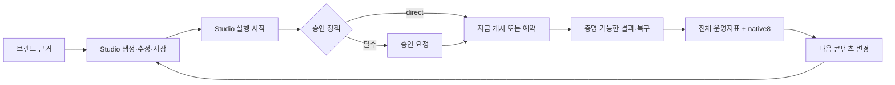
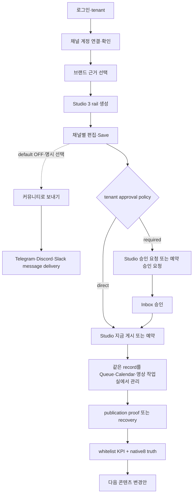

# OSMU Marketing Agent PRD — v7.2.1 Product Requirements Document

<!--
STAMP
created_at: 2026-08-06 18:35 KST
model: gpt-codex/gpt-5.6-sol
agent: prd-architect / marketing_agent_prd_v7
skills: 없음 — 제품 PRD 전용 매칭 스킬 없음; planning.md·doc-review.md·benchmarks.md·PRD template 적용
evidence: PRD v7.2.0, independent critic v7.2 major0/minor4, current Studio direct actions/rail3, wiki/current manifests, official Buffer/Sprout workflow
deliberation: v7.2의 제품 방향은 보존하고 approval policy의 설정 소유권, Messaging의 post-review handoff, unsupported native N/A provenance, per-card edit release tally만 수직 패치한다.
-->

| 항목 | 값 |
|---|---|
| 버전 | **v7.2.1** — v7.2 critic MAJOR0·MINOR4 PATCH closure |
| 작성일 | 2026-08-06 |
| 작성자/모델 | prd-architect / gpt-codex/gpt-5.6-sol |
| 상태 | **GO candidate** — verifier PASS+`/approve plan` 전 downstream 금지 |
| 상류 입력 | PRD v7.2.0; `tasks/marketing-agent-plan-critic-v7.2.output`; current Studio/analytics code audits |
| 유지 계약 | v7.1 glossary·OAuth/token·Midjourney·video V01~V24·KPI whitelist·metric sample/cost·customer copy |
| 증거 경계 | code/wiki=`근거 확인`; user report=`관찰됨`; provider production=`미검증` |

## 목차

- [0. TL;DR](#0-tldr)
- [1. 목적·One Thing·범위](#1-목적one-thing범위)
- [2. 현재 상태·증거 경계](#2-현재-상태증거-경계)
- [3. 페르소나·JTBD](#3-페르소나jtbd)
- [4. 고객용 용어집·정규 매핑](#4-고객용-용어집정규-매핑)
- [5. 제품 계층·MVP 5](#5-제품-계층mvp-5)
- [6. 현행 보존 manifest·목표 IA](#6-현행-보존-manifest목표-ia)
- [7. Canonical authority·management view·initiation surface](#7-canonical-authoritymanagement-viewinitiation-surface)
- [8. 전체 사용자 흐름](#8-전체-사용자-흐름)
- [9. 계정 연결·공통 헤더](#9-계정-연결공통-헤더)
- [10. 고객 자동화 토큰·Midjourney](#10-고객-자동화-토큰midjourney)
- [11. 영상 작업실 보존 계약](#11-영상-작업실-보존-계약)
- [12. 전체 성과·채널별 성과](#12-전체-성과채널별-성과)
- [13. Pilot metric dictionary·비용 상한](#13-pilot-metric-dictionary비용-상한)
- [14. 기능 요구사항](#14-기능-요구사항)
- [15. 비기능 요구사항](#15-비기능-요구사항)
- [16. 원자 수용기준·QA TC](#16-원자-수용기준qa-tc)
- [17. Release coverage N/M](#17-release-coverage-nm)
- [18. 실패·복구·권한 계약](#18-실패복구권한-계약)
- [19. 현행→목표 변경 매트릭스](#19-현행목표-변경-매트릭스)
- [20. 벤치마크](#20-벤치마크)
- [21. BM·운영·출시](#21-bm운영출시)
- [22. 리스크·steelman·premortem·kill criteria](#22-리스크steelmanpremortemkill-criteria)
- [23. Critic closure·RTM](#23-critic-closurertm)
- [24. 결정·오픈 이슈·품질 판정](#24-결정오픈-이슈품질-판정)

## 0. TL;DR

OSMU는 **한 번의 브랜드 근거 입력을 채널별로 검수 가능한 콘텐츠와 증명 가능한 발행 결과로 바꾸고, 그 결과를 다음 생성에 되돌리는 마케팅 자동화 에이전트**다. Studio는 기존 `저장`, 선택 항목 `지금 게시`, `예약`과 채널별 카드 편집을 그대로 제공한다. 안정성을 위해 버튼을 다른 화면으로 옮기지 않고, Studio·승인 인박스·캘린더·채널 Queue·영상 작업실이 **같은 canonical identity/version/approval/idempotency/audit command**를 호출한다.

- `canonical data authority`는 하나의 논리 record/command contract다. 화면이 아니다.
- `management view`는 승인 인박스, 캘린더, 채널 Queue, `/videos`처럼 상세·복구·결과를 관리하는 전용 화면이다.
- `UI initiation surface`는 Studio 또는 management view에서 같은 canonical command를 시작하는 버튼이다.
- 승인 필수 tenant의 Studio `Publish`는 `승인 요청`, direct 허용 tenant는 `지금 게시`다. 예약도 각각 `예약 승인 요청` 또는 `예약`으로 정확히 분기한다.
- 승인 정책은 workspace owner가 Settings에서 관리하는 tenant/customer setting이다. 신규 외부 pilot은 `승인 필요`, 기존 workspace는 명시 전환 전 현재 direct 정책을 유지한다. readiness는 실행 가능 여부만 막는다.
- Messaging의 record authority는 하나의 logical `message delivery`; Studio 3 rail에는 넣지 않고 기본 OFF인 `커뮤니티로 보내기` handoff에서만 Telegram/Discord/Slack을 고른다.
- R4는 Threads, X, Facebook, Instagram Feed, Bluesky, YouTube Shorts, Instagram Reels, TikTok **8 destination-format** 각각을 collected 또는 명시적 not-collected/unsupported truth로 검증한다.
- 목표 IA는 기존 unique destination26/route25를 유지하면서 상위 `Social` 아래 `게시물`과 `짧은 영상` subgroup을 둔다. Messaging은 별도다.

## 1. 목적·One Thing·범위

### 1.1 고객이 완료하려는 일

브랜드 자료를 고르고 하나의 아이디어를 여러 채널 형식으로 만든 뒤, 같은 Studio 흐름에서 저장·검수·즉시 게시 또는 예약하고 실제 결과를 확인해 다음 콘텐츠를 개선한다. 제품은 관리 화면을 순회시키는 SNS dashboard가 아니라 생성에서 실행까지 시간을 줄이는 agent다.

### 1.2 One Thing 후보와 함정

| 후보 | 판정 | 이유 |
|---|---|---|
| 모든 작업을 전용 화면에서만 수행 | 탈락 | 정보 구조가 고객 완료시간을 이긴다. |
| 모든 SNS를 한 화면에서 동일 관리 | 탈락 | capability 없는 fake parity를 만든다. |
| 11개 채널 자동 발행 | 탈락 | slot·executor·format·destination을 섞는다. |
| 브랜드 근거→검수 가능한 콘텐츠→증명 가능한 결과→다음 생성 | **채택** | 고객 산출물과 반복가치를 설명한다. |

> **One Thing: 한 번의 브랜드 근거 입력을 채널별로 검수 가능한 콘텐츠와 증명 가능한 발행 결과로 바꾸고, 그 결과를 다음 생성에 되돌리는 마케팅 자동화 에이전트.**

### 1.3 In scope

- Google/Supabase login→own tenant, provider account identity/scope/refresh/readiness.
- Studio 3 rail, 기존 기능9, preview7, direct4, video3 slot, Save/Publish/Schedule 보존.
- Social text, Messaging, Short video별 canonical record와 management projection.
- Studio와 management view의 동일 command contract, approval policy 분기, external side effect≤1.
- 전체 KPI whitelist와 destination-format8 native truth.
- Keyword/Data/Assets/System/Admin, public/customer/operator, 390/1024/1440, recovery states.

### 1.4 Out of scope

- DB table/API endpoint/event-store/scope encoding 확정. 이는 eng-design dialogue 대상이다.
- LINE publish/schedule, fake Queue/Analytics/tab, provider 간 native engagement 합산.
- Discord user token Midjourney automation, 무승인 external publish/delete/ads/spam.
- private tenant/venture data의 public/other-tenant analytics 혼합.

## 2. 현재 상태·증거 경계

| Area | Current judgement | Wiki/current source | Defect | v7.2.1 target |
|---|---|---|---|---|
| Studio actions | **이미구현·회귀보존** | `wiki/product/marketing-hub-surface-map.md`; `studio/page.tsx` | v7.1이 exclusive management owner로 오해 | actions 그대로+canonical command |
| Studio rail | **부분구현** | same wiki; Studio/constants | customer video slot 숨김 가능 | slot3 always truthful |
| Queue/Inbox/Calendar | **부분구현** | same wiki; queue-store/current views | same item identity 없음 | logical authority+projections |
| Messaging | **부분구현** | same wiki; publish/schedule adapters | Inbox+Calendar가 두 authority처럼 읽힘 | message delivery authority1 |
| `/videos` | **이미구현·연결 필요** | same wiki; `/videos` current workbench | common approval/schedule/result 단절 | V01~V24 보존+clients/projections |
| Analytics | **부분구현·현행 결함** | same wiki; analytics/metrics routes | Threads 편중·Social truth 누락·false zero | native8 truth+no-sum |
| OAuth | **부분구현·외부 미검증** | same wiki; callback/readback paths | false-success/wrong account risk | verified ladder+provider cases |
| Tenant token | **부분구현** | same wiki; Settings/proxy/handler | proxy403·product scope/ownership gap | scopes4+publish OFF+tenant auth |
| Midjourney | **이미구현·위험 legacy** | same wiki; customer route/user-token guide | TOS/security | route preserve+safe disabled |
| Studio multi-surface command equality | **미구현** | v7.1 critic+current code diff | screen별 command drift/duplicate risk | same identity/version/approval/idempotency/audit |
| Native destination-format8 | **미구현(Threads 일부만)** | same wiki; analytics/metrics routes | Social5/video3 truth denominator 없음 | 8/8 explicit truth |
| Approval policy setting | **미구현** | v7.2 critic; current Settings/Studio diff | policy source/default/owner 없음 | workspace owner setting+migration rule |
| Messaging community handoff | **미구현** | v7.2 critic; Studio current rail3 | optional destination 위치 모호 | rail 밖·default OFF·post-review only |

`wiki/product/marketing-hub-surface-map.md`를 current 구현 SSOT로 사용했다. code 확인은 이 wiki의 Studio action·analytics 설명이 낡지 않았는지 좁게 대조한 보조 증거다. source presence는 production/provider 작동을 증명하지 않으며 §17 M은 실제 QA 전 모두 0이다.

## 3. 페르소나·JTBD

### 3.1 Primary persona — 김민서, 38세, 1인 교육·컨설팅 브랜드 대표

김민서는 서울에서 직무교육과 소규모 컨설팅을 혼자 운영한다. 수업·상담·회계·고객응대까지 직접 하므로 마케팅 시간은 월요일 45분과 평일 자투리 시간뿐이다. Threads, Instagram Feed, Facebook, YouTube Shorts, Instagram Reels, TikTok을 운영하지만 같은 아이디어를 여러 번 다시 쓰고 계정·형식·공개범위를 확인하는 시간이 부담스럽다. AI 초안은 예전 가격이나 존재하지 않는 혜택을 섞을 수 있어 회사소개와 강의자료를 다시 연다. 가장 큰 공포는 잘못된 계정과 중복 발행이다. `j.the.great.investor`로 가입했는데 연결 팝업에 기존 `zero_to_one_ai`가 보이거나 연결 완료 뒤 미연결이면 자동화를 믿지 않는다. Studio에서 콘텐츠를 만들었는데 `Publish`와 `예약`이 사라져 Queue·Inbox·Calendar를 순회해야 하면 기능이 후퇴했다고 느낀다. 반대로 여러 화면의 버튼이 별도 record를 만들어 두 번 게시되는 것도 원하지 않는다. 필요한 것은 Studio에서 채널별 카드를 수정하고 저장한 뒤, 자신의 승인 정책에 맞춰 `지금 게시`, `승인 요청`, `예약`, `예약 승인 요청`을 정확히 실행하는 것이다. 이후 동일 항목을 승인 인박스·캘린더·채널 Queue·영상 작업실에서 찾아 복구와 결과를 관리하고 싶다. 전체 성과는 발행 상태 같은 합산 가능한 운영지표만 보고, 조회·도달·참여는 Threads/X/Facebook/Instagram Feed/Bluesky/Shorts/Reels/TikTok 각각의 실제 수집 또는 미수집 상태로 보고 싶다. 성공은 브랜드 근거 선택→Studio 생성·수정→Save→즉시/예약 initiation→필요 시 승인→증명 가능한 게시 결과→native observation→다음 콘텐츠 변경안까지 한 흐름에서 끝나고 다음 주에도 같은 identity로 찾는 상태다. 수작업 시간·게시빈도·WTP는 아직 미측정 가설이다.

### 3.2 JTBD

> 마케팅 시간이 부족할 때, 내 브랜드 자료로 채널별 콘텐츠를 만들고 Studio에서 바로 저장·승인 요청·게시·예약한 뒤 동일 항목의 실제 결과를 확인해 잘못된 계정·중복 게시·끊긴 목록 없이 다음 콘텐츠를 개선하고 싶다.

### 3.3 Anti-persona

- 무승인 대량 DM·댓글·팔로우 자동화 operator.
- provider 약관·권한·AI disclosure를 우회하려는 사용자.
- enterprise attribution warehouse/paid media bidding을 즉시 대체하려는 조직.

## 4. 고객용 용어집·정규 매핑

### 4.1 세 가지 핵심 용어

| Term | Exact definition | Example | Not this |
|---|---|---|---|
| Canonical data authority | identity, version, approval, schedule, idempotency, audit, terminal result를 가진 논리 record/command contract 하나 | social delivery, message delivery, video job | 특정 화면·별도 UI 저장소 |
| Management view | canonical record를 조회하고 전문 관리 action을 시작하는 화면 | Inbox approval, Calendar schedule, Queue recovery/result, `/videos` job detail | data authority 자체 |
| UI initiation surface | 같은 canonical command를 시작하는 고객 버튼/패널 | Studio Save·지금 게시·승인 요청·예약, management buttons | 별도 record/command 구현 |

### 4.2 고객 용어

| 고객 label | Exact meaning | 혼용 금지 |
|---|---|---|
| 채널 계정 | canonical provider account identity | Shorts/Reels format |
| 콘텐츠 형식 | 피드 글·카드·짧은 영상·공지 | network account |
| 생성 결과 칸 | Studio preview slot | publish capability promise |
| 전송 방식 | provider API/webhook executor | customer copy의 adapter jargon |
| 승인 관리 | Inbox view/client | approval data authority 별도 생성 |
| 일정 관리 | Calendar view/client | schedule data authority 별도 생성 |
| 상세·복구·결과 | channel Queue 또는 `/videos` view | exclusive initiation location |
| 채널별 성과 | destination-format native truth | cross-provider total |

단독 `플랫폼`은 사용하지 않고 account, format, slot, executor, record, management view, publication, native observation 중 정확한 말을 쓴다.

### 4.3 Canonical capability mapping

| Account | Format | Studio slot | Executor | Canonical record | Management views | Publication key | Analytics truth |
|---|---|---|---|---|---|---|---|
| Threads | text/thread | Threads | Threads text | social delivery | Queue+Inbox+Calendar | account+post ID | Threads collected/not-collected |
| X | text/thread | X | X text | social delivery | Queue+Inbox+Calendar | account+post ID | X collected/not-collected |
| Facebook Page | feed | Facebook | Facebook text/media | social delivery | Queue+Inbox+Calendar | Page+post ID | Facebook collected/not-collected |
| Instagram | Feed/card | Instagram | Instagram Feed | social delivery | Queue+Inbox+Calendar | account+media ID | Feed collected/not-collected |
| Bluesky | text | review-created variant | Bluesky text | social delivery | Queue+Inbox+Calendar | DID+URI | Bluesky collected/not-collected |
| YouTube channel | Shorts | Shorts | YouTube video | video job | `/videos`+Inbox+Calendar | channel+video ID | Shorts collected/not-collected |
| Instagram | Reels | Reels | instagram_reels | video job | `/videos`+Inbox+Calendar | account+media ID | Reels collected/not-collected |
| TikTok | short video | TikTok | TikTok video | video job | `/videos`+Inbox+Calendar | account+publish/video ID | TikTok collected/not-collected |
| Telegram | community message | post-review handoff only | bot | message delivery | Inbox+Calendar+result | chat+message ID | explicit not-collected |
| Discord | community message | post-review handoff only | webhook/bot | message delivery | Inbox+Calendar+result | destination+message ID | explicit not-collected |
| Slack | community message | post-review handoff only | webhook/bot | message delivery | Inbox+Calendar+result | channel+timestamp | explicit not-collected |
| LINE | unsupported | 없음 | 없음 | 없음 | 없음 | 없음 | unsupported |

Inventory counts는 preview7, direct4, text executor8, video3, messaging3, unsupported LINE으로 유지하고 합산하지 않는다.

## 5. 제품 계층·MVP 5



| MVP | Customer output | Success |
|---|---|---|
| M1 Grounded Composer | source-linked root+3 rail | unknown claim approval0 |
| M2 Account Truth | same account/readiness in all views | diff0 |
| M3 Canonical Execution | Studio initiation+one record+management views | duplicate0, action preservation |
| M4 Result/Recovery | proof or named recovery | wrong/unsafe retry0 |
| M5 Measure-to-Create | whitelist KPI+native8+change1 | false aggregate/zero0 |

## 6. 현행 보존 manifest·목표 IA

### 6.1 Route25·destination26 preservation

Route entry25는 `/`, `/studio`, `/inbox`, `/calendar`, `/channels/[channel]`, `/videos`, `/images`, `/blog`, `/blog-performance`, `/search-console`, `/keyword-planner`, `/google-analytics`, `/naver-trends`, `/search-advisor`, `/google-trends`, `/performance`, `/services`, `/settings`, `/operator`, `/operator/customers`, `/login`, `/signup`, `/privacy`, `/terms`, `/data-deletion`이다. 삭제·rename·home bounce0.

Unique customer destination26은 Performance, Studio, Inbox, Calendar; Social5; Messaging3; YouTube, TikTok; Data3; Keyword4; Blog; Images, Videos, Midjourney; Settings다. unique owner/route는 그대로 유지한다.

### 6.2 Physical IA — target design input final

```text
Overview
  성과 / OSMU Studio / 승인 인박스 / 발행 캘린더
Social
  게시물
    Threads / X / Instagram Feed / Facebook / Bluesky
  짧은 영상
    YouTube Shorts / Instagram Reels / TikTok
Messaging
  Telegram / Discord / Slack
Data & Analytics / Keyword Research / Blog / Assets & Tools / System
```

- 기존 unique route/destination은 유지한다.
- Instagram account owner는 `/channels/instagram` 하나다. `Instagram Reels`는 같은 account의 format child/link로 `/videos` Reels filter를 열며 새 provider account나 27번째 unique destination을 만들지 않는다.
- YouTube와 TikTok의 기존 channel route는 account/readiness를 유지하고 표시 label을 Shorts/TikTok short-video task와 연결한다.
- Messaging은 Social 밖의 별도 top-level group이다.
- route25×viewport3 navigation regression denominator는 §17에서 N75다.

### 6.3 Studio existing actions

기존9, rail3, preview7, direct4와 함께 다음을 삭제·이동하지 않는다: 채널별 카드 edit, Save, selected Publish, 예약 button, SchedulePanel, draft/history/wiki/RepoConnect. Management view 추가는 이 primary flow를 대체하지 않는다. Messaging은 이 3 rail의 네 번째 rail·가로 preview row가 아니며 review 완료 뒤 별도 `커뮤니티로 보내기` handoff로만 연다.

## 7. Canonical authority·management view·initiation surface

### 7.1 Family contract

| Family | Canonical data authority | Management views | UI initiation surfaces | Fake surface0 |
|---|---|---|---|---|
| Social text | social delivery record/command | channel Queue detail/result, Inbox approval, Calendar schedule | Studio+각 management view | unsupported Queue |
| Messaging | message delivery record/command | Inbox approval/detail, Calendar schedule, destination result | post-review `커뮤니티로 보내기` handoff+Inbox+Calendar | Studio rail·channel Queue/Analytics |
| Short video | video job record/command | `/videos` detail/recovery/result, Inbox approval, Calendar schedule | Studio video slot+`/videos`+Inbox+Calendar | channel text Queue |

### 7.2 Command invariants

모든 initiation surface는 동일 `canonical_record_id`, `content_version`, `account/destination`, `approval_policy/version`, `schedule_version`, `intent/idempotency key`, `actor`, `audit correlation`을 사용한다. 같은 intent를 Studio와 management view에서 동시에 시작해도 external side effect≤1이다. 화면별 독립 record·approval·schedule·retry contract는 금지한다.

### 7.3 Studio before→after action contract

| Current Studio action | v7.2.1 target copy | Canonical command | Immediate result | Management projection |
|---|---|---|---|---|
| Save | `저장` | save root/variants same version contract | external0, saved confirmation | Social Queue draft/message detail/video job as selected |
| selected Publish; direct tenant | `지금 게시` | publish request with approved/direct policy | eligible executor≤1 | result appears Queue or `/videos`, aggregate status |
| selected Publish; approval-required tenant | `승인 요청` | submit same record/version for approval | external0, awaiting approval | Inbox item+source Studio link |
| 예약; direct tenant | `예약` | set canonical schedule from Studio panel | active schedule1 | Calendar management entry+family view status |
| 예약; approval-required tenant | `예약 승인 요청` | set requested schedule+submit approval | external0 until approved | Inbox approval+Calendar requested state |
| per-card edit | current natural label | update selected variant/job version | selected diff1, sibling0; approval invalidates | all views same new version |

### 7.4 Approval policy source·default·migration

| Concern | Product contract | Customer-visible behavior |
|---|---|---|
| Source | `approval_policy`는 tenant/customer setting | Settings에 `게시 전 승인 필요` 상태·설명 표시 |
| Owner | workspace owner만 Settings에서 변경 | 일반 member는 현재 정책 read-only |
| New external pilot default | **승인 필요** | `승인 요청`·`예약 승인 요청`; 승인 전 external0 |
| Existing workspace migration | 현재 direct 정책 유지 | 명시적 owner 전환 전 버튼·실행 의미를 조용히 변경하지 않음 |
| Readiness | account/scope/media/provider 실행 eligibility gate | 미준비면 기존 정책 copy를 바꾸지 않고 버튼 disabled+이유+해결 action |
| Audit | actor/time/before/after/policy version | 변경 뒤 새 command부터 적용; 이미 승인된 version은 재검증 |

Readiness가 false인 direct workspace의 버튼은 `승인 요청`으로 변하지 않는다. 예: `지금 게시`를 disabled 상태로 유지하고 `Instagram 권한이 만료되었습니다 · 다시 연결`을 보여준다. approval policy 전환은 Settings 저장 confirmation과 audit 뒤에만 적용한다.

### 7.5 Management responsibilities

- Inbox: approval queue, approve/reject/comment/activity management client. Studio can submit; Inbox does not create a second record.
- Calendar: canonical schedule create/change/cancel management client. Studio can initiate a schedule; Calendar manages it afterward.
- Social Queue: social delivery detail/edit/recovery/result management view. Studio can Save/Publish/Schedule the same record.
- `/videos`: video job metadata/media/publish/poll/recovery/result management view. Studio slot initiates the same job.
- Messaging detail: review 뒤 사용자가 `커뮤니티로 보내기`를 켜고 destination을 명시 선택한 경우에만 message delivery를 만든다. 이후 Inbox가 edit/send/recovery/result를, Calendar가 schedule을 관리한다.

## 8. 전체 사용자 흐름

### 8.1 Primary flow



### 8.2 Approval policy flows

| Tenant policy | Studio publish copy | Studio schedule copy | External call before approval | Result |
|---|---|---|---:|---|
| direct allowed | 지금 게시 | 예약 | publish now≤1; schedule due≤1 | result or scheduled state |
| approval required | 승인 요청 | 예약 승인 요청 | 0 | awaiting approval; approval 후 same intent 실행 |

Policy는 workspace owner가 Settings에서 관리하는 tenant/customer setting이며 버튼을 숨기지 않는다. 신규 외부 pilot은 `승인 필요`가 기본이고 기존 workspace는 owner의 명시적 전환 전 현재 direct 정책을 유지한다. readiness는 command eligibility gate일 뿐 policy source가 아니다. readiness 실패 시 정책별 copy를 유지한 채 disabled+reason+next action을 표시한다.

### 8.3 Family exposure

- Social: Studio Save가 social delivery를 만들거나 갱신하고 Queue/Inbox/Calendar가 동일 identity를 본다.
- Messaging: Studio 3 rail에 포함하지 않고 기본 OFF로 둔다. 사용자가 Social text/Short video/Card review를 마친 뒤 `커뮤니티로 보내기`를 명시 선택했을 때만 Telegram/Discord/Slack destination picker를 열고, 선택한 destination에만 message delivery를 만든다. Inbox/Calendar clients가 승인·일정을 관리하며 channel Queue0이다.
- Video: customer에게 Shorts/Reels/TikTok slot3가 항상 보이고 Studio handoff가 video job을 만들거나 갱신한다. `/videos`가 상세·복구·결과를 관리한다.

### 8.4 Result/recovery

`게시됨`은 account+external ID+published_at+permalink/readback이 있을 때만 표시한다. failed-confirmed만 명시 retry, uncertain은 reconcile, provider success/internal fail은 repair external0이다. partial success는 성공 destination을 보존한다.

## 9. 계정 연결·공통 헤더

### 9.1 Verified ladder

Authorized→Stored→Identified→Scoped→Refreshable→Capable→Projected→Ready 순서다. callback은 필요한 단계가 확인되기 전에 success를 postMessage하지 않는다. Settings, header, Studio selector, canonical record/results, Admin support는 same account/status/reason/verified_at/readiness를 본다.

### 9.2 Wrong-account

- state/PKCE/nonce는 tenant/provider/browser transaction에 묶고 1회 소비한다.
- TikTok `disable_auto_auth=1`, Google account/channel selection+offline readiness를 사용한다.
- Meta selector 미보장은 current identity→logout/revoke/manage→reconnect로 정직하게 복구한다.
- target B는 B identity+B executor1/A executor0, cancel/mismatch는 prior safe state다.
- provider별 success/cancel/mismatch N/M은 §17에 18 cases로 유지한다.

### 9.3 Common header7·N/A

실제 icon/name, canonical account, connection state+reason, verified time, action readiness, scope/expiry/refresh health, manage/reconnect action 7필드를 같은 순서로 둔다. webhook=`해당 없음 — 웹훅 연결`, bot=`해당 없음 — 봇 자격증명`, external=`해당 없음 — 외부 도구`; blank/fake error0.

Tabs는 capability-driven이다. Threads Growth/Popular, Instagram Editor를 보존하고 Messaging Queue/Analytics, YouTube/TikTok fake Queue는 만들지 않는다.

## 10. 고객 자동화 토큰·Midjourney

### 10.1 Credential separation

Provider access/refresh token은 server encrypted, raw customer/Admin default 노출0이다. OSMU tenant API token은 별도 hashed credential이며 plaintext는 issue response 1회만 보인다. Central OAuth app credential은 operator-only masked/timed reveal/audit다.

### 10.2 Tenant token scopes final

| Customer scope | Meaning | Default | Boundary |
|---|---|---:|---|
| 콘텐츠 읽기 | own root/variant/status read | ON | other tenant0 |
| 초안 생성·수정 | own draft create/update | OFF | external0 |
| 발행 요청 | canonical publish/approval request initiation | **OFF** | tenant policy·approval bypass0 |
| 성과 읽기 | whitelist KPI+own native truth | OFF | raw provider token0 |

List에는 label/created_at/last_used_at/scopes/revoked만, revoke 후401, cross-tenant403이다. claim/DB encoding은 eng-design.

### 10.3 Midjourney final

`/channels/midjourney` route/nav를 보존하고 customer에게 `현재 안전하게 제공하지 않습니다`와 Images 대체 경로를 표시한다. Discord user-token input/extraction/automation/connected 위조0. 별도 명시 승인+TOS/security 검토 전 route 삭제0.

## 11. 영상 작업실 보존 계약

### 11.1 V01~V24

| ID | Preserved action/state | Safety/owner |
|---|---|---|
| V01 | library/list | own tenant job/asset |
| V02 | upload | provenance/rights |
| V03 | operator-only generate | customer fake generate0 |
| V04 | long-video URL/file repurpose | source/rights/error |
| V05 | candidate list | loading/empty/error |
| V06 | refine hook/caption | selected clip only |
| V07 | ranking | recommendation not guarantee |
| V08 | add one/all library | idempotency |
| V09 | text fanout | social delivery≠video job |
| V10 | multi-account YouTube | canonical channel |
| V11 | multi-account TikTok | canonical account |
| V12 | YouTube title | provider validation |
| V13 | YouTube description | provider validation |
| V14 | YouTube tags | provider validation |
| V15 | TikTok privacy | allowed values only |
| V16 | TikTok comment | capability constraint |
| V17 | TikTok duet | capability constraint |
| V18 | TikTok stitch | capability constraint |
| V19 | TikTok AI disclosure | explicit/audit |
| V20 | TikTok async poll | publish ID/terminal |
| V21 | Reels readiness | IG account/media reason |
| V22 | individual publish video3 | selected executor≤1 |
| V23 | proof/result | false published0 |
| V24 | source/license/person consent | unknown blocks |

### 11.2 Studio video3 states

Shorts/Reels/TikTok slot3는 customer에게 항상 보이며 미지원, operator generation, upload needed, account needed, review needed, ready, processing, failed/recovery 중 실제 state+action을 표시한다. slot 숨김·endless shimmer0.

### 11.3 Asset rights

source type/reference, uploader/generator, created_at, license/right, person consent, AI disclosure, root/job link가 필요하다. 상업 발행에 필요한 권리가 unknown이면 approval/publish0.

## 12. 전체 성과·채널별 성과

### 12.1 Aggregate whitelist

전체 성과는 발행 시도, 성공, 실패, 처리중, metric coverage, root당 proof publication 수, account readiness만 합산한다. views/reach/impressions/engagement/likes/replies/reposts/followers의 cross-provider sum은 equivalence ADR+explicit approval 전 0이다.

### 12.2 Native destination-format8 truth

| Case | Destination-format | Required outcome |
|---:|---|---|
| 1 | Threads text/thread | collected 또는 explicit not-collected/unsupported |
| 2 | X text/thread | collected 또는 explicit not-collected/unsupported |
| 3 | Facebook feed | collected 또는 explicit not-collected/unsupported |
| 4 | Instagram Feed/card | collected 또는 explicit not-collected/unsupported |
| 5 | Bluesky text | collected 또는 explicit not-collected/unsupported |
| 6 | YouTube Shorts | collected 또는 explicit not-collected/unsupported |
| 7 | Instagram Reels | collected 또는 explicit not-collected/unsupported |
| 8 | TikTok short video | collected 또는 explicit not-collected/unsupported |

각 case는 다음 둘 중 하나의 schema를 완전하게 제공하고 false-zero0이어야 한다. Feed와 Reels는 Meta account가 같아도 별도 format case다.

| Native outcome | Required provenance | N/A rule |
|---|---|---|
| collected | native definition, provider/API source, observation window, collected_at, account, publication, capability/state | 해당 없음 없음 |
| explicit not-collected/unsupported | capability source, checked_at, reason, next action, account, capability/state | observation window=`해당 없음 — 미수집`; collected_at=`해당 없음 — 미수집`; publication=`해당 없음 — 미수집` |

Unsupported를 숫자0, 가짜 publication, 가짜 collected_at으로 채우지 않는다. 다음 action은 `권한 연결`, `connector 준비 중`, `provider 미지원 — 다른 성과 확인`처럼 실제 복구 가능성을 반영한다.

### 12.3 Metric states6

collected, no-data/partial, permission, delayed/stale, error, unsupported 6종이다. 숫자0은 collected source가 실제0을 반환한 경우만 허용한다.

### 12.4 Feedback

관찰값→source/window→limitation→changed variable1→next root로 연결한다. Social5 중 3개 이상이 permanent unsupported이거나 eligible publication≥20에서 evidence-linked next change<50%면 성과 환류를 핵심 판매 문구에서 내린다.

## 13. Pilot metric dictionary·비용 상한

모든 숫자는 baseline 전 **(unsourced hypothesis)**다.

### 13.1 Definitions

| Metric | Event | Numerator | Denominator | Eligibility | Source owner |
|---|---|---|---|---|---|
| Repeat value | full Studio→proof→next loop | ≥2 loops workspace | eligible active workspace | source+account+28일 | lineage/pilot log |
| Projection parity | same record exact projection | matching projection | eligible record projection | canonical record exists | reconciliation |
| Terminalization | terminal≤24h | terminal intents | provider-accepted intents | accepted/reconciliable | job/publication ledger |
| Factual correction | material corrected claims | corrected claims | reviewed factual claims | source-bound claim | review ledger |
| Feedback | evidence-linked next root | qualifying next root | eligible publication | native truth available | lineage |
| Safety incident | prohibited event | incidents | external intents/requests | production-like | security audit |
| Support time | human minutes | support minutes | active workspace-week | action≥1/week | support log |
| Text cost | variable KRW | cost sum | completed text roots | complete usage | usage ledger |
| Video cost | variable KRW | cost sum | completed jobs | complete usage | usage ledger |
| Provider expansion | cash+ops | incremental cost/time | provider-month | new connector | finance/ops |

### 13.2 Decision rules

| Metric | Minimum/window | Excluded | Pilot default |
|---|---|---|---|
| Repeat value | workspace3, each publication≥2/28d | dormant/withdrawn/unconnectable | ≥2/3; else composer/handoff |
| Projection parity | pilot all+N≥30/28d; production N≥100 | unsupported projection | 100%, drift1 release block |
| Terminalization | accepted≥20/28d | declared global outage separate | ≥95%, else auto schedule off |
| Factual correction | claims≥20/28d | style edit | ≤30% |
| Feedback | publications≥20/28d | native unsupported | ≥50% |
| Safety | event1/continuous | none | one event kill |
| Support | workspace-week≥6/2 weeks | planned onboarding | >60m expansion stop; target≤30m |
| Text cost | roots≥20/28d | fixed engineering | median≤₩2k, p95≤₩5k |
| Video cost | jobs≥10/28d | customer compute | p95≤₩15k |
| Provider expansion | provider-month1 | shared fixed infra | ≤₩150k and≤8h first month |

Pilot 전 고객3의 manual hours, monthly posts, current tool cost, wrong-account/drift frequency, WTP를 baseline으로 수집한다. 없으면 demand/value claim은 `미측정`이다.

## 14. 기능 요구사항

| FR | Requirement | Fit criterion | Current |
|---|---|---|---|
| FR-MA72-001 | Ground→Studio→initiation→approval/publish/schedule→proof→native truth→next flow를 제공한다. | chain1/dead-end0 | 부분 |
| FR-MA72-002 | customer data/action은 active tenant에 격리한다. | cross-tenant0 | 부분검증 |
| FR-MA72-003 | public/customer/operator shell/action을 분리한다. | role leak0 | 구현 |
| FR-MA72-004 | route25 purpose/action/state를 보존한다. | 25/25 | 부분 |
| FR-MA72-005 | unique customer destination26을 보존한다. | 26/26 | 구현 |
| FR-MA72-006 | route25×390/1024/1440 navigation을 각각 검증한다. | N75/M75 | 미검증 |
| FR-MA72-007 | current icon/theme/token·keyboard/focus/44px를 보존한다. | replacement0/a11y | 부분 |
| FR-MA72-008 | 모든 account owner에 header7 same projection을 표시한다. | fields7/7 | 부분 |
| FR-MA72-009 | non-applicable header field는 `해당 없음 — 이유`로 표시한다. | blank/fake error0 | 미구현 |
| FR-MA72-010 | capability-backed tabs와 Threads Growth/Popular·IG Editor를 보존한다. | fake tab0 | 부분 |
| FR-MA72-011 | Google login 뒤 own tenant1로 진입한다. | wrong tenant0 | 외부 미검증 |
| FR-MA72-012 | OAuth transaction을 tenant/provider/browser에 bind·one-time consume한다. | replay20 exchange≤1 | 부분 |
| FR-MA72-013 | identity/scope/refresh/capability/projection 확인 뒤에만 connection success다. | premature success0 | 미구현 |
| FR-MA72-014 | provider별 wrong-account switch/cancel/mismatch를 복구한다. | B executor1/A0 | 부분 |
| FR-MA72-015 | Settings/header/Studio/record/result/Admin account projection diff0을 보장한다. | five-view diff0 | 미구현 |
| FR-MA72-016 | raw provider bearer/refresh token의 customer DOM/network/log 노출을 금지한다. | leak0 | 회귀 필요 |
| FR-MA72-017 | tenant token scopes4와 발행 요청 default-off를 제공한다. | exact labels/default | UI 부분 |
| FR-MA72-018 | tenant token 1회 reveal/hash/list/revoke/tenant auth를 제공한다. | revoke401/cross0 | 미구현 |
| FR-MA72-019 | Midjourney route/nav를 보존하고 safe-disabled explanation만 제공한다. | user-token UI0/deletion0 | 위험 legacy |
| FR-MA72-020 | factual claim을 confirmed source에 bind하고 unknown approval을 막는다. | coverage100% | 부분 |
| FR-MA72-021 | Studio 기존9·Save·Publish·예약·SchedulePanel을 보존한다. | action deletion/move0 | 구현·회귀 |
| FR-MA72-022 | Studio Social text/Short video/Card 3 rail을 보존한다. | rail3 | 구현 |
| FR-MA72-023 | customer Shorts/Reels/TikTok slot3를 항상 실제 상태로 표시한다. | visible3/3 | 미구현 |
| FR-MA72-024 | account/format/slot/executor/record/publication/analytics mapping을 따른다. | mismatch0 | 미구현 |
| FR-MA72-025 | root→variant/record/job/publication/metric lineage orphan0을 보장한다. | trace100% | 미구현 |
| FR-MA72-026 | selected variant edit는 sibling을 바꾸지 않는다. | selected1/sibling0 | 부분 |
| FR-MA72-027 | Social 아래 게시물/짧은 영상 subgroup, Messaging 별도 IA를 §6.2대로 사용한다. | target hierarchy exact | 미구현 |
| FR-MA72-028 | canonical authority·management view·initiation surface를 분리한다. | screen-specific authority0 | plan 결정 |
| FR-MA72-029 | Studio Save는 same root/variant canonical save command를 호출한다. | external0/same IDs | 부분 |
| FR-MA72-030 | Studio per-card edit는 selected canonical version만 갱신한다. | diff1/sibling0 | 부분 |
| FR-MA72-031 | Studio publish copy/command/result는 Settings의 tenant approval policy를 따르고 readiness는 eligibility만 판정한다. | policy copy 유지/disabled reason | 미구현 |
| FR-MA72-032 | Studio schedule은 신규 pilot approval-required default와 기존 workspace direct 유지 migration을 따른다. | silent policy change0 | 부분 |
| FR-MA72-033 | Studio와 management view는 same identity/version/approval/idempotency/audit command를 호출한다. | command diff0 | 미구현 |
| FR-MA72-034 | Social delivery는 canonical record1, Queue/Inbox/Calendar는 management clients/projections다. | duplicate truth0 | 미구현 |
| FR-MA72-035 | Inbox approval과 Calendar schedule management는 Studio initiation record를 그대로 관리한다. | record/version diff0 | 미구현 |
| FR-MA72-036 | Messaging은 logical message delivery authority1을 사용한다. | authority1 | 미구현 |
| FR-MA72-037 | Messaging은 Studio rail 밖 default-OFF `커뮤니티로 보내기` handoff와 Inbox/Calendar에서 same message delivery command를 쓴다. | rail4=0/explicit selection | 미구현 |
| FR-MA72-038 | Messaging channel Queue/Analytics를 만들지 않는다. | fake surface0 | setup truth |
| FR-MA72-039 | Video는 canonical job1, `/videos`/Inbox/Calendar는 management clients/projections다. | duplicate job0 | 부분 |
| FR-MA72-040 | Studio video initiation과 `/videos` edit/publish/recovery는 same job/version/intent다. | command diff0 | 미구현 |
| FR-MA72-041 | Video channel owner에 text Queue를 만들지 않는다. | fake Queue0 | 부분 |
| FR-MA72-042 | 모든 eligible record projection identity/version/approval/schedule/result diff0을 보장한다. | N/N | 미구현 |
| FR-MA72-043 | 선택 delivery/job만 executor≤1, 비선택0으로 호출한다. | exact selection | 부분 |
| FR-MA72-044 | approval을 account/content/media/destination/time/rights version에 bind한다. | mutation 후 external0 | 부분 |
| FR-MA72-045 | 동일 intent의 multi-surface concurrent20/replay external≤1을 보장한다. | duplicate0 | 부분 |
| FR-MA72-046 | failed-confirmed/uncertain/repair-required/partial을 분리한다. | unsafe retry0 | 부분 |
| FR-MA72-047 | proof complete일 때만 `게시됨`을 표시한다. | false published0 | 부분 |
| FR-MA72-048 | `/videos` library/upload/operator-generate V01~03을 보존한다. | 3/3 | 구현 |
| FR-MA72-049 | repurpose/refine/rank/library V04~08을 보존한다. | 5/5 | 구현 |
| FR-MA72-050 | text fanout+YouTube/TikTok multi-account V09~11을 보존한다. | 3/3 | 구현 |
| FR-MA72-051 | TikTok privacy/comment/duet/stitch/AI/poll V15~20을 보존한다. | 6/6 | 구현 |
| FR-MA72-052 | YouTube title/description/tags V12~14를 보존·검증한다. | 3/3 | 부분 |
| FR-MA72-053 | Reels readiness V21을 account/media reason으로 표시한다. | false ready0 | 부분 |
| FR-MA72-054 | asset source/license/consent/AI disclosure V24가 unknown이면 발행을 막는다. | unknown publish0 | 미구현 |
| FR-MA72-055 | aggregate는 whitelist7만 합산한다. | prohibited KPI0 | 미구현 |
| FR-MA72-056 | provider 간 native engagement 합산을 ADR+승인 전 금지한다. | cross-sum0 | current 결함 |
| FR-MA72-057 | destination-format8 각각 collected 또는 explicit not-collected/unsupported truth를 제공한다. | native8 N/M | Threads만 부분 |
| FR-MA72-058 | collected와 unsupported native truth는 §12.2의 서로 다른 provenance/N/A schema와 false-zero0을 가진다. | schema completeness100% | 미구현 |
| FR-MA72-059 | evidence-linked observation→limitation→change1→next root를 제공한다. | causal claim0 | 미구현 |
| FR-MA72-060 | Keyword/Data7 purpose/input/output/owner/state/action을 표시한다. | completeness100% | 부분 |
| FR-MA72-061 | Images/Videos tenant asset/job/root lineage와 rights를 제공한다. | cross/orphan0 | 부분 |
| FR-MA72-062 | Settings는 workspace owner의 approval policy 변경·audit와 customer-owned 설정을, Admin은 global/support boundary를 지킨다. | non-owner/global mutation0 | 부분 |
| FR-MA72-063 | customer DOM은 internal IDs/jargon 대신 state+reason+next action을 쓴다. | banned0 | 미구현 |
| FR-MA72-064 | owner별 10 states와 simultaneous shimmer≤1을 제공한다. | dead-end0 | 부분 |
| FR-MA72-065 | customer safe correlation/action, operator phase/upstream/version/impact를 제공한다. | secret0 | 부분 |
| FR-MA72-066 | semantic QA는 exact N/M denominator를 모두 채워야 한다. | conditional PASS0 | 미구현 |
| FR-MA72-067 | additive migration으로 승인 없는 delete/rename/move를 금지한다. | delta0 | plan |

## 15. 비기능 요구사항

| ID | Requirement | Fit |
|---|---|---|
| NFR-MA72-01 | tenant/role/credential fail-closed | leak0 |
| NFR-MA72-02 | RFC9700 exact redirect/code/PKCE/state/least privilege | replay/mismatch100% |
| NFR-MA72-03 | canonical record/projection drift named, hidden0 | false success0 |
| NFR-MA72-04 | multi-surface intent idempotency | external≤1 |
| NFR-MA72-05 | draft/provider success preservation | loss0/unsafe retry0 |
| NFR-MA72-06 | warm usable surface+long-job progress | p95≤2s hypothesis/endless0 |
| NFR-MA72-07 | WCAG2.2 AA target | keyboard/focus/contrast/44px |
| NFR-MA72-08 | route25×viewport3 | N75/M75 |
| NFR-MA72-09 | whitelist/native truth | false sum/zero0 |
| NFR-MA72-10 | actor/time/record/version/intent/result audit | completeness100% |
| NFR-MA72-11 | private/tenant data isolation+retention/delete/export owner | cross0 |
| NFR-MA72-12 | provider policy/rate/disclosure no bypass | violation0 |
| NFR-MA72-13 | asset rights unknown block | publish0 |
| NFR-MA72-14 | glossary/Korean copy consistency | mismatch0 |
| NFR-MA72-15 | plan approval before downstream write | write0 |

## 16. 원자 수용기준·QA TC

| FR | Atomic AC | Given/When/Then TC |
|---|---|---|
| FR-MA72-001 | AC-MA72-001 core flow | **MA72-TC-001:** Given source+account, When Studio→initiation→proof→native→next, Then same root/record가 끊김 없이 trace. |
| FR-MA72-002 | AC-MA72-002 tenant | **MA72-TC-002:** Given tenant A/B, When A uses B IDs, Then read/write/external/leak0. |
| FR-MA72-003 | AC-MA72-003 shells | **MA72-TC-003:** Given public/customer/operator, When render/action, Then allowed DOM/action only. |
| FR-MA72-004 | AC-MA72-004 routes | **MA72-TC-004:** Given route25 manifest, When navigation/action diff, Then unapproved deletion/rename/bounce0. |
| FR-MA72-005 | AC-MA72-005 destinations | **MA72-TC-005:** Given customer nav, When unique target audit, Then destination26/26 same owner. |
| FR-MA72-006 | AC-MA72-006 viewport75 | **MA72-TC-006:** Given 25 routes×3 viewports, When each opens, Then N75/M75, hidden nav/overflow0. |
| FR-MA72-007 | AC-MA72-007 design/a11y | **MA72-TC-007:** Given light/dark+keyboard, When core flow, Then current icon/token+focus+AA+44px. |
| FR-MA72-008 | AC-MA72-008 header7 | **MA72-TC-008:** Given 11 account/destination owners, When header, Then fields7/7 same projection. |
| FR-MA72-009 | AC-MA72-009 N/A copy | **MA72-TC-009:** Given webhook/bot/external, When health field, Then `해당 없음 — 이유`, blank/error0. |
| FR-MA72-010 | AC-MA72-010 tabs | **MA72-TC-010:** Given capability manifest, When tabs, Then true tabs only+Threads/IG specialties preserved. |
| FR-MA72-011 | AC-MA72-011 login | **MA72-TC-011:** Given new Google customer, When success/cancel, Then own tenant1 or public shell+mutation0. |
| FR-MA72-012 | AC-MA72-012 OAuth transaction | **MA72-TC-012:** Given valid transaction, When valid1+replay20+mismatch, Then exchange/write≤1. |
| FR-MA72-013 | AC-MA72-013 verified success | **MA72-TC-013:** Given exchange success, When any ladder check fails, Then success copy0; all pass only connected. |
| FR-MA72-014 | AC-MA72-014 wrong account | **MA72-TC-014:** Given session A+target B, When switch/cancel/mismatch, Then B executor1/A0 or prior safe state. |
| FR-MA72-015 | AC-MA72-015 account projection | **MA72-TC-015:** Given account B, When five views open, Then identity/reason/time/readiness diff0. |
| FR-MA72-016 | AC-MA72-016 token secrecy | **MA72-TC-016:** Given connected account, When DOM/network/log/export scan, Then raw provider token0. |
| FR-MA72-017 | AC-MA72-017 product scopes | **MA72-TC-017:** Given tenant token form, When render, Then scopes4 exact and 발행 요청 OFF. |
| FR-MA72-018 | AC-MA72-018 token lifecycle | **MA72-TC-018:** Given customer A/B, When issue→list→revoke→cross use, Then plaintext1/hash/revoke401/B403. |
| FR-MA72-019 | AC-MA72-019 Midjourney | **MA72-TC-019:** Given customer route, When inspect, Then route exists+safe explanation+user-token automation0. |
| FR-MA72-020 | AC-MA72-020 grounded claims | **MA72-TC-020:** Given confirmed/unknown claim, When review, Then source present or approval blocked. |
| FR-MA72-021 | AC-MA72-021 Studio actions | **MA72-TC-021:** Given current baseline, When Studio render, Then existing9+Save+Publish+예약+SchedulePanel present and interactive. |
| FR-MA72-022 | AC-MA72-022 rails3 | **MA72-TC-022:** Given generation, When render, Then rail3 and single-flat-row0. |
| FR-MA72-023 | AC-MA72-023 video slots | **MA72-TC-023:** Given customer each state, When render, Then slots3/3+reason/action. |
| FR-MA72-024 | AC-MA72-024 mapping | **MA72-TC-024:** Given §4 row, When UI/payload/result inspect, Then semantic mismatch0. |
| FR-MA72-025 | AC-MA72-025 lineage | **MA72-TC-025:** Given one generation, When export, Then root↔children/results/metrics and orphan0. |
| FR-MA72-026 | AC-MA72-026 variant isolation | **MA72-TC-026:** Given A/B/C, When B edit/stale save, Then B1,A/C0,stale overwrite0. |
| FR-MA72-027 | AC-MA72-027 target IA | **MA72-TC-027:** Given sidebar, When hierarchy inspect, Then Social>게시물/짧은 영상, Messaging separate, unique destination26. |
| FR-MA72-028 | AC-MA72-028 three-layer terms | **MA72-TC-028:** Given each family, When architecture/UI spec inspect, Then authority1, management views, initiation surfaces separately named. |
| FR-MA72-029 | AC-MA72-029 Studio Save | **MA72-TC-029:** Given edited variants, When Save, Then same canonical IDs/version persisted, external0. |
| FR-MA72-030 | AC-MA72-030 Studio edit | **MA72-TC-030:** Given per-card B, When edit/save, Then selected version increments, siblings0, previous approval invalid. |
| FR-MA72-031 | AC-MA72-031 Studio publish policies | **MA72-TC-031:** Given direct/required policy×ready/unready fixtures, When Publish renders, Then copy=`지금 게시`/`승인 요청` stays policy-derived; ready external≤1/0, unready disabled+reason+action and policy mutation0. |
| FR-MA72-032 | AC-MA72-032 Studio schedule policies | **MA72-TC-032:** Given new external pilot+existing direct workspace, When owner has not changed Settings, Then copy=`예약 승인 요청`/`예약`; new external0 before approval, existing direct active schedule1, silent transition0. |
| FR-MA72-033 | AC-MA72-033 command equality | **MA72-TC-033:** Given same record initiated Studio+management concurrently, When command20, Then identity/version/approval/audit same and external≤1. |
| FR-MA72-034 | AC-MA72-034 social authority | **MA72-TC-034:** Given social Save, When Queue/Inbox/Calendar open, Then canonical social delivery1+projections; duplicate record0. |
| FR-MA72-035 | AC-MA72-035 social management | **MA72-TC-035:** Given Studio-initiated social record, When Inbox approve/Calendar reschedule/Queue recover, Then same record/version/result. |
| FR-MA72-036 | AC-MA72-036 message authority | **MA72-TC-036:** Given message selection, When created, Then logical message delivery1; Inbox/Calendar stores0. |
| FR-MA72-037 | AC-MA72-037 community handoff | **MA72-TC-037:** Given reviewed rail3 content, When default state renders, Then Messaging rail/delivery0; When `커뮤니티로 보내기` ON+destination selected, Then selected message delivery1 and Inbox/Calendar same ID/version/approval/schedule. |
| FR-MA72-038 | AC-MA72-038 no message fake | **MA72-TC-038:** Given Telegram/Discord/Slack pages, When inspect, Then channel Queue/Analytics0. |
| FR-MA72-039 | AC-MA72-039 video authority | **MA72-TC-039:** Given Studio handoff, When `/videos`/Inbox/Calendar open, Then video job1+same projections. |
| FR-MA72-040 | AC-MA72-040 video commands | **MA72-TC-040:** Given same video job, When Studio+`/videos` initiate, Then same version/intent and external≤1. |
| FR-MA72-041 | AC-MA72-041 no video Queue | **MA72-TC-041:** Given YouTube/TikTok/Instagram owners, When inspect, Then video text Queue0. |
| FR-MA72-042 | AC-MA72-042 projection parity | **MA72-TC-042:** Given eligible canonical record, When state changes, Then projection identity/version/approval/schedule/result diff0. |
| FR-MA72-043 | AC-MA72-043 exact selection | **MA72-TC-043:** Given selected A/B and unselected C, When execute, Then A/B≤1,C0,partial preserved. |
| FR-MA72-044 | AC-MA72-044 approval binding | **MA72-TC-044:** Given approved version, When account/content/media/time/rights changes, Then approval invalid+external0. |
| FR-MA72-045 | AC-MA72-045 multi-surface idempotency | **MA72-TC-045:** Given one intent, When Studio+Queue/Calendar `/videos` concurrent20/replay, Then publication≤1. |
| FR-MA72-046 | AC-MA72-046 recovery | **MA72-TC-046:** Given four fault classes, When handle, Then correct state/action and uncertain/repair external0. |
| FR-MA72-047 | AC-MA72-047 proof | **MA72-TC-047:** Given executor result, When render, Then complete proof only published; otherwise named non-published state. |
| FR-MA72-048 | AC-MA72-048 video basic | **MA72-TC-048:** Given customer/operator, When V01~03, Then library/upload preserved and generate role bypass0. |
| FR-MA72-049 | AC-MA72-049 repurpose | **MA72-TC-049:** Given long source, When V04~08, Then candidates/refine/rank/add persist and selected mutation only. |
| FR-MA72-050 | AC-MA72-050 fanout/accounts | **MA72-TC-050:** Given clip+multi account, When V09~11, Then text/video records separate and chosen account only. |
| FR-MA72-051 | AC-MA72-051 TikTok controls | **MA72-TC-051:** Given creator capability, When V15~20 submit/poll, Then exact allowed controls and overrides0. |
| FR-MA72-052 | AC-MA72-052 YouTube metadata | **MA72-TC-052:** Given valid/invalid V12~14, When publish, Then invalid external0, valid exact payload. |
| FR-MA72-053 | AC-MA72-053 Reels readiness | **MA72-TC-053:** Given account/scope/media fixtures, When V21 render, Then actual reason/action and ready-only publish. |
| FR-MA72-054 | AC-MA72-054 rights | **MA72-TC-054:** Given unknown/confirmed V24 rights, When approve, Then unknown block/confirmed allow. |
| FR-MA72-055 | AC-MA72-055 whitelist | **MA72-TC-055:** Given aggregate input, When Performance, Then whitelist7 only/formulas exact. |
| FR-MA72-056 | AC-MA72-056 no native sum | **MA72-TC-056:** Given two provider native values, When aggregate, Then cross-sums0, rows/drill-down only. |
| FR-MA72-057 | AC-MA72-057 native8 coverage | **MA72-TC-057:** Given destination-format8, When R4 audit, Then each collected or explicit not-collected/unsupported; M=8 required. |
| FR-MA72-058 | AC-MA72-058 native truth | **MA72-TC-058:** Given collected+unsupported fixtures for native8, When render, Then collected has full provenance; unsupported has capability source+checked_at+reason+next action and three fields=`해당 없음 — 미수집`; false-zero/fake timestamp/publication0. |
| FR-MA72-059 | AC-MA72-059 feedback | **MA72-TC-059:** Given adequate/inadequate truth, When next suggestion, Then evidence+limit+change1 or hold. |
| FR-MA72-060 | AC-MA72-060 tools ownership | **MA72-TC-060:** Given Keyword/Data7, When open, Then purpose/input/output/owner/state/action complete. |
| FR-MA72-061 | AC-MA72-061 asset lineage | **MA72-TC-061:** Given tenant A/B asset/job, When read/delete/publish, Then own lineage, cross0, deleted publish0. |
| FR-MA72-062 | AC-MA72-062 settings/admin | **MA72-TC-062:** Given owner/member/operator, When approval policy changes, Then owner write+audit1, member write0, operator support has customer proxy publish0 and global boundary intact. |
| FR-MA72-063 | AC-MA72-063 customer copy | **MA72-TC-063:** Given customer DOM, When banned-term scan, Then internal IDs/jargon0 and state+reason+action. |
| FR-MA72-064 | AC-MA72-064 owner states | **MA72-TC-064:** Given 6 owners×10 states, When render, Then exact N60/M60, endless0, shimmer≤1. |
| FR-MA72-065 | AC-MA72-065 observability | **MA72-TC-065:** Given same failure, When customer/operator view, Then safe vs detailed split, secret0. |
| FR-MA72-066 | AC-MA72-066 release tally | **MA72-TC-066:** Given §17 exact denominators, When release, Then every M=N; blocked/unrun PASS0. |
| FR-MA72-067 | AC-MA72-067 additive migration | **MA72-TC-067:** Given current manifest, When target diff, Then unapproved delete/rename/move0. |

### 16.1 Coverage

- FR/AC/base TC: **67/67/67**, 1:1, orphan0.
- Provider/family/policy/state/viewport repetitions use §17 independent IDs and exact denominators.
- Route click proves navigation only; mock/2xx cannot prove OAuth/publish/analytics.

## 17. Release coverage N/M

현재 plan 단계 M=0. `applicable`, conditional denominator, partial PASS는 금지한다.

### 17.1 R3 Social text+Messaging+Studio commands

| Group | Independent cases | N | M now |
|---|---|---:|---:|
| RC-R3-DIRECT4 | Threads, X, Facebook, Instagram Feed lifecycle each | 4 | 0 |
| RC-R3-BLUESKY | Bluesky lifecycle | 1 | 0 |
| RC-R3-MSG3 | Telegram, Discord, Slack lifecycle each | 3 | 0 |
| RC-R3-AGG-TEXT | Social5 record↔Queue/Inbox/Calendar parity | 5 | 0 |
| RC-R3-AGG-MSG | message3 record↔Inbox/Calendar/result parity | 3 | 0 |
| RC-R3-IDEMPOTENCY | social1+message1 concurrent20/replay | 2 | 0 |
| RC-R3-RECOVERY | failed-confirmed/uncertain/repair/partial | 4 | 0 |
| RC-R3-STUDIO | Save; per-card edit; publish-direct; publish-approval; schedule-direct; schedule-approval | 6 | 0 |
| RC-R3-DUAL-INIT | Studio+Queue publish same intent; Studio+Calendar schedule same intent | 2 | 0 |

R3 exact exit: **30/30**, safety incident0. Save·per-card edit·`Publish now`·`Schedule`은 각각 독립 semantic case이며 external side effect≤1이다.

### 17.2 R4 Video+Analytics

| Group | Independent cases | N | M now |
|---|---|---:|---:|
| RC-R4-VIDEO3 | Shorts, Reels, TikTok job→approval→schedule/now→proof | 3 | 0 |
| RC-R4-AGG-VIDEO | job3↔Inbox↔Calendar parity | 3 | 0 |
| RC-R4-VIDEO-ACTIONS | V01~V24 each | 24 | 0 |
| RC-R4-KPI | aggregate whitelist7 each | 7 | 0 |
| RC-R4-METRIC6 | metric states6 each | 6 | 0 |
| RC-R4-NATIVE8 | Threads, X, Facebook, Instagram Feed, Bluesky, YouTube Shorts, Instagram Reels, TikTok | 8 | 0 |
| RC-R4-FEEDBACK | adequate evidence+insufficient sample | 2 | 0 |

R4 exact exit: **53/53**. Native8 collected는 full provenance, explicit not-collected/unsupported는 capability source+checked_at+reason+next action과 세 필드 N/A가 완전하고 false-zero0이면 PASS다.

### 17.3 OAuth exact denominator

Threads, Instagram, Facebook, X, YouTube, TikTok provider account마다 success/cancel/mismatch 3 fixtures: **N18/M0**, release **18/18**.

### 17.4 Navigation·owner-state·header exact denominator

| Group | Independent cases | N | M now | Meaning |
|---|---|---:|---:|---|
| RC-VP75 | route25×390/1024/1440 | 75 | 0 | navigation/layout only |
| RC-STATE60 | 6 owners×10 states | 60 | 0 | Studio, Social Queue, Inbox, Calendar, `/videos`, Settings |
| RC-HEADER11 | social5+messaging3+video2+Midjourney | 11 | 0 | header7/N/A/capability truth |

Denominator는 항상 N75/N60/N11이며 provider account 부재나 미지원은 blocked가 아니라 기대 truth state를 검증한다.

## 18. 실패·복구·권한 계약

| State | Customer copy | Fact | Allowed | Forbidden |
|---|---|---|---|---|
| draft | 초안 | external 전 | edit/save/submit | published |
| awaiting approval | 승인 대기 | same record submitted | Inbox approve/reject | auto approval |
| scheduled/requested | 예약됨/예약 승인 대기 | canonical schedule state | Calendar manage | hidden duplicate schedule |
| processing | 처리 중 | async/provider unknown | poll/reconcile | republish |
| published | 게시됨 | proof complete | open/metrics | optimistic label |
| failed-confirmed | 게시되지 않음 | external0 confirmed | explicit retry | auto loop |
| uncertain | 게시 여부 확인 중 | result unknown | reconcile | retry |
| repair-required | 게시됨·기록 복구 필요 | provider success/internal fail | internal repair | external call |
| partial | 일부 게시됨 | independent results | failed-only review | success recall |
| cancelled | 예약 취소 | active schedule0 | new request | due execute |

Studio와 management view 어디서 command를 시작해도 같은 transition table, approval/version check, idempotency, audit를 사용한다.

## 19. 현행→목표 변경 매트릭스

| Surface | Current | v7.2.1 target | Forbidden |
|---|---|---|---|
| Studio Save | draft save | same canonical root/variant save | link-only replacement |
| Studio Publish | selected direct call | `지금 게시` or `승인 요청` by policy | button removal/ambiguous `Publish` |
| Studio Schedule | button+panel | `예약` or `예약 승인 요청` same record | Calendar-only initiation |
| Per-card edit | existing | selected canonical version update | sibling mutation |
| Queue | Social detail | management view/projection | exclusive initiation claim |
| Inbox | legacy approval list | approval client/projection | independent authority record |
| Calendar | legacy dates | schedule client/projection | independent schedule truth |
| Messaging | setup/executor | rail 밖 post-review handoff+message delivery1+clients | fourth rail/default ON/two authorities |
| Video | `/videos` workbench | job1+clients; V01~V24 | Studio button removal/fake Queue |
| IA | Social5+Video2 groups | Social>게시물/짧은 영상; Messaging separate | new unique account/route |
| Performance | false total risk | whitelist7+native8 truth | native cross-sum/false0 |
| Settings approval | setting 없음 | owner-managed; new pilot required; existing direct preserved | readiness-derived/silent migration |
| Unsupported metric | provenance 모호 | capability source+checked_at+reason+action+three N/A fields | fake0/fake time/publication |
| OAuth/token/MJ | v7.1 decisions | preserved | raw token/user-token/regression |

## 20. 벤치마크

| Official source | Observed pattern | Applied | Not copied |
|---|---|---|---|
| [Buffer Scheduling](https://support.buffer.com/article/642-scheduling-posts) | composer customize+Now/Set Date | Studio initiation+independent records | same capability fiction |
| [Buffer Agency Permissions](https://support.buffer.com/article/667-using-buffer-as-an-agency) | owner/admin/full/requires-approval permission 분리 | approval policy는 readiness가 아닌 customer setting | Buffer role model verbatim |
| [Buffer All Channels](https://support.buffer.com/article/861-how-to-use-the-all-channels-view-in-buffer) | Draft/Approval/Queue/Sent aggregate | management views/projections | second truth store |
| [Sprout Approval](https://support.sproutsocial.com/hc/en-us/articles/205974715-Message-Approval-Workflows) | Compose submit→Needs Approval→Calendar/activity | approval-required policy flow | enterprise steps forced on all |
| [Later Social Sets](https://help.later.com/hc/en-us/sections/360007324993-Social-Sets-Access-Groups-Users) | account grouping/access | tenant/account grouping | visual assets/copy |
| [Hootsuite Approval](https://www.hootsuite.com/platform/social-media-approval-tool) | role/history | audit contract | one-tab IA marketing |
| [RFC9700](https://www.rfc-editor.org/info/rfc9700/) | exact redirect/code/PKCE/token privilege | OAuth gate | unsupported provider claims |
| [Google OAuth](https://developers.google.com/identity/protocols/oauth2/web-server) | offline refresh/revoke | YouTube readiness | raw token UI |
| [TikTok Login Kit](https://developers.tiktok.com/doc/login-kit-web) | disable_auto_auth | account switch | same parameter on Meta |

Benchmark는 workflow safety 근거이지 grounded feedback 구매수요 증거가 아니다. demand/cost는 §13 pilot로 검증한다.

## 21. BM·운영·출시

### 21.1 BM hypothesis

Starter=workspace/account/text roots, Growth=video jobs+tenant token+native truth, Managed=deployment/support/SLA 조합을 검증한다. 가격 확정 전 WTP와 variable/provider cost를 수집한다. Post count-only 과금은 spam incentive라 사용하지 않는다.

### 21.2 Operating load

OAuth support, content truth review, provider failure, metric disputes, video cost, connector expansion을 support minutes·terminalization·correction rate·coverage tickets·job cost·provider-month로 측정한다. Support>60m/workspace-week 또는 provider expansion ceiling 초과 시 expansion을 멈춘다.

### 21.3 Rollout gates

| Phase | Scope | Exact exit |
|---|---|---|
| R0 Plan | v7.2.1 | verifier PASS+critic MAJOR0+approve |
| R1 Design | current fidelity+policy flows | Studio actions preserved, physical IA, states, score B+ |
| R2 Eng-design | storage/API/command encoding | dialogue+FR67 trace |
| R3 Trust core | Social5+Messaging3+Studio commands+OAuth | R3 **30/30**, OAuth **18/18**, safety0 |
| R4 Video+Analytics | video3/V24/KPI/native8 | R4 **53/53**, VP75/state60/header11 where required |
| R5 Pilot | internal1+external3 | §13 sample/cost/repeat report |

## 22. 리스크·steelman·premortem·kill criteria

### 22.1 Risks

| Risk | Early signal | Mitigation |
|---|---|---|
| multi-surface duplicate | same intent two buttons | canonical idempotency+audit |
| approval bypass | required tenant external before approval | policy command gate |
| policy/readiness 혼용 | readiness failure changes approval copy | Settings source+eligibility separation |
| messaging rail 회귀 | fourth rail/default-on destination | rail3 lock+post-review explicit handoff |
| wrong account | target/current mismatch | verified ladder+18 cases |
| record/projection drift | Studio/Queue/Inbox/Calendar diff | record authority1+repair |
| false analytics | Social missing→0 | native8 truth+false-zero0 |
| fake unsupported provenance | unsupported에 timestamp/publication 생성 | capability source+checked_at+reason+action+N/A3 |
| provider/TOS/right | user token/privacy/license unknown | safe disable+V24 block |
| low demand/high cost | low repeat/high support | §13 kill/pivot |

### 22.2 Steelman opposition

가장 강한 반대안은 모든 publish/schedule initiation을 Queue/Inbox/Calendar에만 두면 중복과 권한 우회가 줄어든다는 것이다. 하지만 current Studio primary action을 제거하는 전략 변경은 승인되지 않았다. 동일 canonical command·approval version·idempotency·audit를 공유하면 Studio 편의와 management 전문성을 함께 유지할 수 있다.

두 번째 반대안은 Social analytics connector가 없으니 R4 N에서 빼는 것이 정직하다는 것이다. 실제 숫자가 없으면 collected를 요구하지 않고 explicit not-collected/unsupported+source/capability truth+false-zero0을 요구한다. N에서 제외하면 제품 의무 자체가 사라진다.

### 22.3 Premortem

6개월 뒤 실패했다면 readiness 장애를 approval policy로 오해해 버튼 문구가 바뀌었거나, Messaging이 네 번째 rail로 돌아왔거나, unsupported metric에 가짜 timestamp를 채웠을 가능성이 크다. 방어는 Settings policy matrix, rail3+post-review handoff, collected/unsupported schema, Studio6+dual-init2, native8 exact N/M이다.

### 22.4 Kill criteria

- tenant/private/raw token/wrong-account/unapproved/duplicate incident1 → automation/cohort 즉시 off.
- workspace3 중 <2가 28일 내 Studio→now/schedule→proof→next loop2회 → composer/handoff 축소.
- eligible publication≥20에서 evidence-linked next change<50% 또는 Social5 중 permanent unsupported≥3 → 성과 환류를 핵심 판매 문구에서 제거.
- accepted≥20 terminalization<95%, projection N≥30 parity<100%, support>60m, cost ceiling 초과 → 해당 automation/provider expansion off.

### 22.5 Six-business boundary

공유는 source→content→record→result execution layer뿐이다. 각 venture source/audience/account/policy/native data는 tenant 격리한다. OKgram의 Instagram specialty, 교육의 LMS/curriculum 등 product surface는 합치지 않는다. Connector 운영이 6사업 콘텐츠 시간을 잠식하면 provider expansion을 멈춘다.

## 23. Critic closure·RTM

### 23.1 v7.2 critic MINOR4 closure

| Finding | v7.2.1 closure | FR/TC | Quantitative evidence |
|---|---|---|---|
| MINOR1 policy source 혼용 | owner-managed Settings source; readiness eligibility only; new/existing migration | 031/032/062 | policy×readiness fixtures, silent transition0 |
| MINOR2 Messaging 위치 | rail3 밖·default OFF·post-review `커뮤니티로 보내기` | 037/038 | rail4=0, selected delivery1 |
| MINOR3 unsupported provenance | collected full schema vs unsupported capability/N/A schema | 057/058 | native8 false-zero/fake-time0 |
| MINOR4 edit release 누락 | RC-R3-STUDIO에 per-card edit 추가 | 030/066 | Studio6, R3 total30 |

### 23.2 v7.1 critic closure regression

| Finding | v7.2.1 retained closure | FR/TC | Quantitative evidence |
|---|---|---|---|
| MAJOR1 authority vs Studio actions | three terms; before→after; approval policies; message authority1; same command | 028~045 | R3 Studio6+dual2, R3 total30 |
| MAJOR2 Social analytics omitted | destination-format8 truth incl Feed/Reels split | 057~059 | R4 native8, total53 |
| MINOR1 physical IA | Social>게시물/짧은 영상; Messaging separate | 027 | destination26 preserved |
| MINOR2 Messaging terminology | message delivery authority1, Inbox/Calendar clients | 036~038 | message3 parity cases |
| MINOR3 viewport denominator | route25×viewport3 | 006 | N75/M0 |
| MINOR4 broken state tally | exact 5-column row | 064/066 | N60/M0, conditional0 |

### 23.3 v7 original closure regression check

| Original area | v7.2.1 evidence |
|---|---|
| glossary/mapping | §4 incl three new terms |
| family record/projection | §7 record authority1+clients |
| Midjourney/token | §10 unchanged product decisions |
| aggregate KPI/no-sum | §12.1 maintained |
| `/videos` preservation | V01~V24 maintained |
| atomic N/M | R3 30/R4 53/OAuth18/VP75/state60/header11 |
| metric denominator/sample/cost | §13 maintained |

### 23.4 User ledger L35~L45

| Ledger | Coverage |
|---|---|
| L35 layout | rail3, Studio actions, slots mapping |
| L36 video/messaging | video job vs message delivery |
| L37 Queue propagation | one record+management projections |
| L38 aggregate/native | whitelist7+native8 |
| L39 headers/tabs | header7/N/A/capability |
| L40 YouTube/TikTok | Social>짧은 영상+account/job/native truth |
| L41 tools/admin | Keyword/Data/Assets/MJ/Settings/Admin |
| L42 OAuth/token | ladder/wrong-account/scopes |
| L43 customer copy | state+reason+action |
| L44 agent purpose | Studio→execution→result→feedback |
| L45 whole-flow QA | exact N/M/dual initiation |

### 23.5 Quantitative RTM

- User ledger45/45; latest11/11.
- v7.1 critic MAJOR2/2·MINOR4/4와 v7.2 critic MINOR4/4 addressed.
- FR/AC/base TC **67/67/67**.
- R3 **30**, R4 **53**, OAuth **18**, navigation **75**, owner-state **60**, header **11**; current M=0.
- Preserve: route25, unique destination26, Studio existing9+Save/Publish/Schedule, rail3, preview7, direct4, V01~V24.

## 24. 결정·오픈 이슈·품질 판정

### 24.1 Product decisions final

| Decision | Final |
|---|---|
| Studio primary actions | Save+per-card edit+Publish+Schedule preserved |
| Approval policy | Settings workspace-owner setting; new pilot required; existing direct unchanged until explicit switch; readiness eligibility only |
| Data authority | logical canonical record/command, not screen |
| Management views | Inbox approval, Calendar schedule, Queue or `/videos` detail/recovery/result |
| Message | logical message delivery authority1; Studio rail 밖 default-OFF post-review handoff |
| Physical IA | Social>게시물/짧은 영상; Messaging separate |
| Analytics | aggregate whitelist7+native8 truth/no-sum; unsupported capability provenance+three N/A fields |
| OAuth/token/MJ/video | v7.1 decisions preserved |

### 24.2 Eng-design dialogue only

Storage table/event design, command endpoint/transaction, idempotency key derivation, projection SLA/repair engine, tenant scope encoding, metric version storage를 합의한다. Studio action 존재·copy·policy semantics, record authority1, native8 denominator는 변경할 수 없다.

### 24.3 Red-team revision

레드팀: 여러 initiation surface는 중복을 만든다는 공격을 받아들여 모든 화면의 자유 command를 허용하지 않았다. Studio의 current primary actions와 management clients만 같은 record/version/approval/idempotency/audit contract를 사용하고 dual-init semantic test에서 external≤1을 요구한다.

### 24.4 셀프심문·보수적 자가채점

**이 결론이 틀렸다면 가장 그럴듯한 이유는?** 신규 pilot approval-required default가 1인 고객의 첫 발행 시간을 늘려 반복가치를 낮출 수 있다. 그러나 외부 pilot은 안전 증거가 없고 기존 workspace는 direct 정책을 유지하므로, 신규 cohort에서 승인 이탈률과 support time을 측정한 뒤 default를 재판정하는 것이 silent migration보다 안전하다.

두 번째 이유는 native8 중 많은 case가 unsupported라 성과 환류 가치가 약할 수 있다는 점이다. 그 사실을 N에서 빼지 않고 explicit truth로 드러내며 Social5 permanent unsupported≥3이면 판매 문구를 내리는 kill criterion을 둔다.

### 24.5 기획 7원칙 판정

| # | 원칙 | v7.2.1 evidence | 판정 |
|---:|---|---|---|
| 1 | 용어 통일 | authority/view/initiation, policy/readiness, collected/unsupported schema 분리 | PASS |
| 2 | 구체화 | FR67, native8, R3 30, R4 53, N75/N60/N11 | PASS |
| 3 | 입출력 분리 | source·setting·review 입력과 record·publication·truth 출력 구분 | PASS |
| 4 | 정합성 | critic MINOR4→FR/TC→release→RTM 수직 대조 | PASS |
| 5 | 정책 상세 | 신규/기존 migration, readiness disabled, Messaging default OFF, unsupported N/A | PASS |
| 6 | 추출 철저 | Studio primary+community branch+management+feedback flow | PASS |
| 7 | 논리 영역 | external≤1, silent transition0, rail4=0, false-zero/fake-time0 | PASS |

### 24.6 Gate status

- v7.2.1 PATCH 작성: 완료 후보/GO candidate.
- v7.2 critic: major_findings0; MINOR4 문서상4/4 closure.
- plan approval: 미승인; provider E2E M=0.
- design entry: verifier PASS+`/approve plan` 전 불가.
- v7.0/v7.1/v7.2.0/pipeline/wiki/code 변경 없음.

---

RUBRIC_SCORE: 완결성=5/5 정밀성=5/5 벤치마크=5/5 추적성=5/5 전문성=3/5 total=23/25
WEAKEST_LINE: 신규 외부 pilot의 approval-required default는 안전 우선 결정이며 첫 발행 전환율에 미치는 영향은 pilot에서 검증해야 한다.
SKILLS_USED: 없음 — 제품 PRD 전용 매칭 skill이 없어 planning.md·doc-review.md·benchmarks.md·PRD template 적용
SKILLS_SKIPPED: 없음 — 매칭 skill 없음
SOURCES: `docs/openclaw-auto-marketing-agent-prd-v7.2.0-gpt-codex.md`; `tasks/marketing-agent-plan-critic-v7.2.output`; current Studio/publish/analytics/metrics/Sidebar/constants/videos code; wiki surface map; planning/doc-review/benchmarks/template; Buffer Scheduling/Agency/All Channels; Sprout Approval; Later; Hootsuite; RFC9700; Google OAuth; TikTok Login Kit.
MODEL: gpt-codex/gpt-5.6-sol
