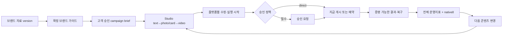
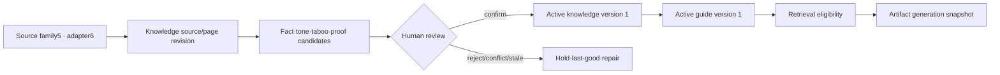
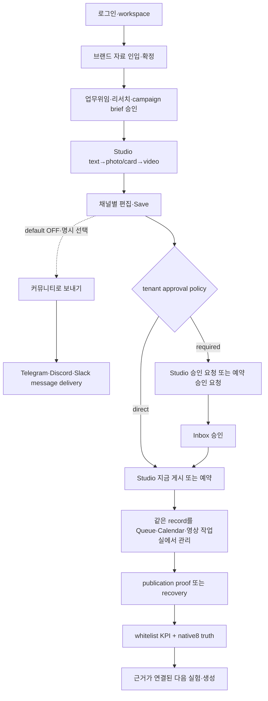

# OSMU Marketing Agent PRD — v7.3.4 Product Requirements Document

<!--
STAMP
created_at: 2026-08-07 17:05 KST
model: gpt-codex/gpt-5.6-sol
agent: prd-architect / marketing_agent_prd_v7
skills: brand-positioning-kit(brand guide minimum set→product contract), openclaw-creative-brief(operational brief→campaign/generation contract)
evidence: PRD v7.3.3, critic v7.3.3 NO-GO major1/minor1, updated audit96 v1.2/P0-8, agency blueprint14, current credential code/wiki, Buffer/Jasper/OWASP/MDN official docs
deliberation: 기존112개를 보존하고 Audit96 전 행을 source predicate→happy/edge/failure assertion으로 새로 대조하며 mutation fixture로 검증 이빨을 증명한다.
-->

| 항목 | 값 |
|---|---|
| 버전 | **v7.3.4** — critic v7.3.3 MAJOR1/MINOR1 full Audit96 semantic RETAKE |
| 작성일 | 2026-08-07 |
| 작성자/모델 | prd-architect / gpt-codex/gpt-5.6-sol |
| 상태 | **in-review** — local verifier PASS; independent re-critic·`/approve plan` pending; downstream 금지 |
| 상류 입력 | PRD v7.3.3; critic v7.3.3; updated audit96 v1.2/P0-8; agency blueprint14; v7.3.3 manifest; current credential/brand/wiki/onboarding/Studio/Settings code audits |
| 유지 계약 | v7.1 glossary·OAuth/token·Midjourney·video V01~V24·KPI whitelist·metric sample/cost·customer copy |
| 증거 경계 | code/wiki=`근거 확인`; user report=`관찰됨`; provider production=`미검증` |

## 목차

- [0. TL;DR](#0-tldr)
- [1. 목적·One Thing·범위](#1-목적one-thing범위)
- [2. 현재 상태·증거 경계](#2-현재-상태증거-경계)
- [3. 페르소나·JTBD](#3-페르소나jtbd)
- [4. 고객용 용어집·정규 매핑](#4-고객용-용어집정규-매핑)
- [5. 제품 계층·MVP 5](#5-제품-계층mvp-5)
- [6. 현행 보존 manifest·목표 IA](#6-현행-보존-manifest목표-ia)
- [7. Canonical authority·management view·initiation surface](#7-canonical-authoritymanagement-viewinitiation-surface)
- [8. 전체 사용자 흐름](#8-전체-사용자-흐름)
- [9. 계정 연결·공통 헤더](#9-계정-연결공통-헤더)
- [10. 고객 자동화 토큰·Midjourney](#10-고객-자동화-토큰midjourney)
- [11. 영상 작업실 보존 계약](#11-영상-작업실-보존-계약)
- [12. 전체 성과·채널별 성과](#12-전체-성과채널별-성과)
- [13. Pilot metric dictionary·비용 상한](#13-pilot-metric-dictionary비용-상한)
- [14. 기능 요구사항](#14-기능-요구사항)
- [15. 비기능 요구사항](#15-비기능-요구사항)
- [16. 원자 수용기준·QA TC](#16-원자-수용기준qa-tc)
- [17. Release coverage N/M](#17-release-coverage-nm)
- [18. 실패·복구·권한 계약](#18-실패복구권한-계약)
- [19. 현행→목표 변경 매트릭스](#19-현행목표-변경-매트릭스)
- [20. 벤치마크](#20-벤치마크)
- [21. BM·운영·출시](#21-bm운영출시)
- [22. 리스크·steelman·premortem·kill criteria](#22-리스크steelmanpremortemkill-criteria)
- [23. Critic closure·RTM](#23-critic-closurertm)
- [24. 결정·오픈 이슈·품질 판정](#24-결정오픈-이슈품질-판정)

## 0. TL;DR

OSMU는 **한 번의 고객 목표와 사람에게 확정된 브랜드 근거를 승인 가능한 캠페인 납품물과 증명 가능한 발행 결과로 바꾸고, 적격한 결과에서 승인된 변수 하나만 다음 실험에 되돌리는 마케팅 실행 에이전트**다. Studio는 기존 `저장`, 선택 항목 `지금 게시`, `예약`과 채널별 카드 편집을 그대로 제공한다. 안정성을 위해 버튼을 다른 화면으로 옮기지 않고, Studio·승인 인박스·캘린더·채널 Queue·영상 작업실이 **같은 canonical identity/version/approval/idempotency/audit command**를 호출한다.

- `canonical data authority`는 하나의 논리 record/command contract다. 화면이 아니다.
- `management view`는 승인 인박스, 캘린더, 채널 Queue, `/videos`처럼 상세·복구·결과를 관리하는 전용 화면이다.
- `UI initiation surface`는 Studio 또는 management view에서 같은 canonical command를 시작하는 버튼이다.
- 승인 필수 tenant의 Studio `Publish`는 `승인 요청`, direct 허용 tenant는 `지금 게시`다. 예약도 각각 `예약 승인 요청` 또는 `예약`으로 정확히 분기한다.
- 승인 정책은 workspace owner가 Settings에서 관리하는 tenant/customer setting이다. 신규 외부 pilot은 `승인 필요`, 기존 workspace는 명시 전환 전 현재 direct 정책을 유지한다. readiness는 실행 가능 여부만 막는다.
- Messaging의 record authority는 하나의 logical `message delivery`; Studio 3 rail에는 넣지 않고 기본 OFF인 `커뮤니티로 보내기` handoff에서만 Telegram/Discord/Slack을 고른다.
- 첫 로그인에서는 새 workspace 생성 또는 초대받은 workspace 참여를 명시적으로 완료하며, 여러 workspace가 있으면 현재 workspace를 확인·전환한다.
- 가입 다음에는 `브랜드 자료`를 외부 기존 자료 import(GitHub 일반 repo Markdown 또는 non-GitHub Markdown/text export bundle), 특정 tone 파일, 6문항 setup, 직접 붙여넣기, 제품 내부 wiki create/edit 중 하나로 준비하고 version을 확정한다.
- 브랜드 가이드는 positioning, audience, promise, proof, tone3+각 반례, taboo3+, visual rule을 생성→편집→확정→재오픈하며 다음 generation이 사용한 guide/wiki/fact version을 기록한다.
- 고객이 승인한 campaign brief의 objective, audience, offer, dates, budget 또는 `유료 집행 없음`, approval owner, claims·asset rights가 text→photo/card→video 생성보다 먼저다.
- R4는 Threads, X, Facebook, Instagram Feed, Bluesky, YouTube Shorts, Instagram Reels, TikTok **8 destination-format** 각각을 collected 또는 명시적 not-collected/unsupported truth로 검증한다.
- 목표 IA는 기존 unique destination26/route25를 유지하면서 **`Social · 게시물` → `Messaging` → `Social · 짧은 영상`** 순서를 쓴다. Messaging은 별도이며 기본 OFF다.

## 1. 목적·One Thing·범위

### 1.1 고객이 완료하려는 일

고객 목표·audience·offer·기한·승인권과 사람에게 확정된 브랜드 근거를 한 번 맡기고, Agent의 research와 campaign brief를 승인한 뒤 `텍스트→사진/카드→영상` 납품물을 같은 Studio에서 저장·검수·즉시 게시 또는 예약한다. 실제 결과가 채널·metric별 적격성 gate를 통과할 때만 승인된 변수 하나를 다음 실험에 적용한다. 제품은 관리 화면을 순회시키는 SNS dashboard나 composer가 아니라 목표→근거→승인→납품→증명→학습의 운영 시간을 줄이는 agent다.

### 1.2 One Thing 후보와 함정

| 후보 | 판정 | 이유 |
|---|---|---|
| 모든 작업을 전용 화면에서만 수행 | 탈락 | 정보 구조가 고객 완료시간을 이긴다. |
| 모든 SNS를 한 화면에서 동일 관리 | 탈락 | capability 없는 fake parity를 만든다. |
| 11개 채널 자동 발행 | 탈락 | slot·executor·format·destination을 섞는다. |
| 고객 목표+브랜드 근거→승인 가능한 캠페인→증명 가능한 결과→다음 실험 | **채택** | 제작량이 아니라 대행 책임·납품·학습을 한 줄로 묶는다. |

> **고객 목표와 사람이 확정한 브랜드 근거를 세 형식의 캠페인 납품물로 만들고 정확히 한 번 발행한 뒤, 적격한 결과에서 승인된 변수 하나만 다음 실험에 반영하는 마케팅 실행 에이전트.**

### 1.3 In scope

- Google/Supabase login→own tenant, provider account identity/scope/refresh/readiness.
- Studio 3 rail, 기존 기능9, preview7, direct4, video3 slot, Save/Publish/Schedule 보존.
- Social text, Messaging, Short video별 canonical record와 management projection.
- Studio와 management view의 동일 command contract, approval policy 분기, external side effect≤1.
- Brand knowledge source family5·adapter6, in-product wiki CRUD/version/archive/recovery, brand guide approval lifecycle.
- Customer-approved campaign brief→text→photo/card→video→platform execution→result library→metric-evidenced next proposal.
- 전체 KPI whitelist와 destination-format8 native truth.
- Keyword/Data/Assets/System/Admin, public/customer/operator, 390/1024/1440, recovery states.

### 1.4 Out of scope

- DB table/API endpoint/event-store/scope encoding 확정. 이는 eng-design dialogue 대상이다.
- LINE publish/schedule, fake Queue/Analytics/tab, provider 간 native engagement 합산.
- Discord user token Midjourney automation, 무승인 external publish/delete/ads/spam.
- private tenant/venture data의 public/other-tenant analytics 혼합.
- 고객을 조작하는 심리 자동화, 거짓 희소성·기망·해지 방해. Psychology는 design rationale input일 뿐 customer-targeting requirement가 아니다.
- 범용 CMS/문서 suite: 임의 파일 협업, comments/tasks, public wiki publishing, page-layout builder, general database, LMS/CRM 기능. 허용 knowledge 작업은 brand fact/source/tone/taboo/proof의 ingest·create/edit·version·confirm·archive·recover뿐이다. Notion/Confluence/Google Drive live sync와 PDF/DOCX 해석은 MVP 밖이며, 지원 export bundle로 변환한 뒤 가져온다.
- 광고 집행 제품: ad account 연결, bidding, paid-media spend execution, billing API. v7.3.4 build scope의 paid media는 `없음/외부 관리/미정` 기록과 cap 경고만 허용한다.

## 2. 현재 상태·증거 경계

| Area | Current judgement | Wiki/current source | Defect | v7.3.4 target |
|---|---|---|---|---|
| Studio actions | **이미구현·회귀보존** | `wiki/product/marketing-hub-surface-map.md`; `studio/page.tsx` | v7.1이 exclusive management owner로 오해 | actions 그대로+canonical command |
| Studio rail | **부분구현** | same wiki; Studio/constants | customer video slot 숨김 가능 | slot3 always truthful |
| Queue/Inbox/Calendar | **부분구현** | same wiki; queue-store/current views | same item identity 없음 | logical authority+projections |
| Messaging | **부분구현** | same wiki; publish/schedule adapters | Inbox+Calendar가 두 authority처럼 읽힘 | message delivery authority1 |
| `/videos` | **이미구현·연결 필요** | same wiki; `/videos` current workbench | common approval/schedule/result 단절 | V01~V24 보존+clients/projections |
| Analytics | **부분구현·현행 결함** | same wiki; analytics/metrics routes | Threads 편중·Social truth 누락·false zero | native8 truth+no-sum |
| OAuth | **부분구현·외부 미검증** | same wiki; callback/readback paths | false-success/wrong account risk | verified ladder+provider cases |
| Tenant token | **부분구현** | same wiki; Settings/proxy/handler | proxy403·product scope/ownership gap | scopes4+publish OFF+tenant auth |
| Midjourney | **이미구현·위험 legacy** | same wiki; customer route/user-token guide | TOS/security | route preserve+safe disabled |
| Studio multi-surface command equality | **미구현** | v7.1 critic+current code diff | screen별 command drift/duplicate risk | same identity/version/approval/idempotency/audit |
| Native destination-format8 | **미구현(Threads 일부만)** | same wiki; analytics/metrics routes | Social5/video3 truth denominator 없음 | 8/8 explicit truth |
| Approval policy setting | **미구현** | v7.2 critic; current Settings/Studio diff | policy source/default/owner 없음 | workspace owner setting+migration rule |
| Messaging community handoff | **미구현** | v7.2 critic; Studio current rail3 | optional destination 위치 모호 | rail 밖·default OFF·post-review only |
| Workspace create/join/switch | **부분구현·명시 계약 없음** | `wiki/product/marketing-hub-surface-map.md`; current auth/workspace surfaces | 첫 로그인 create/invite choice와 all-surface switch 종료조건 없음 | create·join·switch atomic lifecycle |
| GitHub Markdown folder import | **이미구현·보정 필요** | `RepoConnect.tsx`; `sync-wiki/route.ts` | sync가 사라진 문서를 즉시 삭제, version/rollback 없음 | import diff+history+recoverable removal |
| Non-GitHub existing knowledge import | **미구현** | final audit B01; current RepoConnect | direct paste만으로 다중 문서·scope·source pointer를 보존할 수 없음 | Markdown/text export bundle adapter |
| Specific tone file import | **이미구현·부분** | `RepoConnect.tsx`; sync-repo path | tone version/approval lineage 없음 | source version→guide draft |
| 6-question setup | **이미구현·부분** | `BrandSetupWizard.tsx` | generate 후 edit/approve/reopen lifecycle 없음 | guide draft lifecycle |
| Direct paste | **미구현** | current brand surfaces | source path 없음 | paste knowledge source |
| In-product wiki CRUD/version/archive | **미구현** | `wiki_docs` read/import only | create/edit/version/archive UI·contract 없음 | target requirement, hard-delete default0 |
| Wiki retrieval→generation | **부분구현** | `wiki-retrieve.ts`; Studio text | source/version/fact lineage 미노출 | generation snapshot lineage |
| Campaign brief | **미구현** | onboarding=industry/channels only | objective/audience/offer/date/budget/owner/safety 없음 | approved brief before generation |
| Performance→next generation | **미구현** | PRD feedback visual contract only | metric evidence가 prompt에 들어간 증거 없음 | metric snapshot→proposal→next root lineage |
| Naver Blog/Medium/Substack | **부분 inventory·실행 계약 없음** | README destination inventory; final audit D24~D26 | 각 destination field·preview·draft/export·unsupported action 경계 없음 | destination별 long-form contract |
| Customer Settings8/Operator Settings9 | **부분구현·역할 경계 보강 필요** | `DESIGN.md`; Settings current tabs; final audit G01~G03 | group별 owner/action/state와 support-mode publish 금지 불명확 | exact inventory+bounded support |

`wiki/product/marketing-hub-surface-map.md`를 current 구현 SSOT로 사용했다. code 확인은 이 wiki의 Studio action·analytics 설명이 낡지 않았는지 좁게 대조한 보조 증거다. source presence는 production/provider 작동을 증명하지 않으며 §17 M은 실제 QA 전 모두 0이다.

## 3. 페르소나·JTBD

### 3.1 Primary persona — 김민서, 38세, 1인 교육·컨설팅 브랜드 대표

김민서는 서울에서 직무교육과 소규모 컨설팅을 혼자 운영한다. 수업·상담·회계·고객응대까지 직접 하므로 마케팅 시간은 월요일 45분과 평일 자투리 시간뿐이다. Threads, Instagram Feed, Facebook, YouTube Shorts, Instagram Reels, TikTok을 운영하지만 같은 아이디어를 여러 번 다시 쓰고 계정·형식·공개범위를 확인하는 시간이 부담스럽다. AI 초안은 예전 가격이나 존재하지 않는 혜택을 섞을 수 있어 회사소개와 강의자료를 다시 연다. 더 근본적인 고통은 “이번 달 신규 강의 20석”이라는 목표를 줘도 조사·브리프·텍스트·카드·영상·검수·발행·보고를 다시 자신이 PM해야 한다는 점이다. 누가 언제 승인하는지, 유료 집행이 없는지, 어떤 피드백이 어느 버전에 반영됐는지, 실제 성과가 다음 주 문안을 어떻게 바꿨는지가 한곳에 남아야 대행을 맡겼다고 느낀다. 가장 큰 공포는 잘못된 계정과 중복 발행이다. `j.the.great.investor`로 가입했는데 연결 팝업에 기존 `zero_to_one_ai`가 보이거나 연결 완료 뒤 미연결이면 자동화를 믿지 않는다. Studio에서 콘텐츠를 만들었는데 `Publish`와 `예약`이 사라져 Queue·Inbox·Calendar를 순회해야 하면 기능이 후퇴했다고 느낀다. 반대로 여러 화면의 버튼이 별도 record를 만들어 두 번 게시되는 것도 원하지 않는다. 필요한 것은 브랜드 자료와 캠페인 목표를 한 번 확인하고, Agent가 근거 있는 브리프와 `텍스트→사진/카드→영상` 납품물을 준비하면 자신은 중요한 결정과 승인만 하는 상태다. 이후 Studio에서 채널별 카드를 수정하고 저장한 뒤, 자신의 승인 정책에 맞춰 `지금 게시`, `승인 요청`, `예약`, `예약 승인 요청`을 정확히 실행해야 한다. 동일 항목을 승인 인박스·캘린더·채널 Queue·영상 작업실에서 찾아 복구와 결과를 관리하고, 전체 성과는 합산 가능한 운영지표만, 조회·도달·참여는 destination-format별 실제 수집 또는 미수집으로 보고 싶다. 성공은 업무위임→브랜드 근거→승인 브리프→세 형식 납품→수정·승인→증명 가능한 게시→native observation→근거가 실제 입력된 다음 실험까지 같은 campaign identity로 닫히는 상태다. 수작업 시간·게시빈도·WTP는 아직 미측정 가설이다.

### 3.2 JTBD

> 마케팅 시간이 부족할 때, 내 브랜드 자료로 채널별 콘텐츠를 만들고 Studio에서 바로 저장·승인 요청·게시·예약한 뒤 동일 항목의 실제 결과를 확인해 잘못된 계정·중복 게시·끊긴 목록 없이 다음 콘텐츠를 개선하고 싶다.

### 3.3 Anti-persona

- 무승인 대량 DM·댓글·팔로우 자동화 operator.
- provider 약관·권한·AI disclosure를 우회하려는 사용자.
- enterprise attribution warehouse/paid media bidding을 즉시 대체하려는 조직.

## 4. 고객용 용어집·정규 매핑

### 4.1 세 가지 핵심 용어

| Term | Exact definition | Example | Not this |
|---|---|---|---|
| Canonical data authority | identity, version, approval, schedule, idempotency, audit, terminal result를 가진 논리 record/command contract 하나 | social delivery, message delivery, video job | 특정 화면·별도 UI 저장소 |
| Management view | canonical record를 조회하고 전문 관리 action을 시작하는 화면 | Inbox approval, Calendar schedule, Queue recovery/result, `/videos` job detail | data authority 자체 |
| UI initiation surface | 같은 canonical command를 시작하는 고객 버튼/패널 | Studio Save·지금 게시·승인 요청·예약, management buttons | 별도 record/command 구현 |

### 4.2 고객 용어

| 고객 label | Exact meaning | 혼용 금지 |
|---|---|---|
| 채널 계정 | canonical provider account identity | Shorts/Reels format |
| 콘텐츠 형식 | 피드 글·카드·짧은 영상·공지 | network account |
| 생성 결과 칸 | Studio preview slot | publish capability promise |
| 전송 방식 | provider API/webhook executor | customer copy의 adapter jargon |
| 승인 관리 | Inbox view/client | approval data authority 별도 생성 |
| 일정 관리 | Calendar view/client | schedule data authority 별도 생성 |
| 상세·복구·결과 | channel Queue 또는 `/videos` view | exclusive initiation location |
| 채널별 성과 | destination-format native truth | cross-provider total |

단독 `플랫폼`은 사용하지 않고 account, format, slot, executor, record, management view, publication, native observation 중 정확한 말을 쓴다.

### 4.3 Canonical capability mapping

| Account | Format | Studio slot | Executor | Canonical record | Management views | Publication key | Analytics truth |
|---|---|---|---|---|---|---|---|
| Threads | text/thread | Threads | Threads text | social delivery | Queue+Inbox+Calendar | account+post ID | Threads collected/not-collected |
| X | text/thread | X | X text | social delivery | Queue+Inbox+Calendar | account+post ID | X collected/not-collected |
| Facebook Page | feed | Facebook | Facebook text/media | social delivery | Queue+Inbox+Calendar | Page+post ID | Facebook collected/not-collected |
| Instagram | Feed/card | Instagram | Instagram Feed | social delivery | Queue+Inbox+Calendar | account+media ID | Feed collected/not-collected |
| Bluesky | text | review-created variant | Bluesky text | social delivery | Queue+Inbox+Calendar | DID+URI | Bluesky collected/not-collected |
| YouTube channel | Shorts | Shorts | YouTube video | video job | `/videos`+Inbox+Calendar | channel+video ID | Shorts collected/not-collected |
| Instagram | Reels | Reels | instagram_reels | video job | `/videos`+Inbox+Calendar | account+media ID | Reels collected/not-collected |
| TikTok | short video | TikTok | TikTok video | video job | `/videos`+Inbox+Calendar | account+publish/video ID | TikTok collected/not-collected |
| Telegram | community message | post-review handoff only | bot | message delivery | Inbox+Calendar+result | chat+message ID | explicit not-collected |
| Discord | community message | post-review handoff only | webhook/bot | message delivery | Inbox+Calendar+result | destination+message ID | explicit not-collected |
| Slack | community message | post-review handoff only | webhook/bot | message delivery | Inbox+Calendar+result | channel+timestamp | explicit not-collected |
| LINE | unsupported | 없음 | 없음 | 없음 | 없음 | 없음 | unsupported |

Inventory counts는 preview7, direct4, text executor8, video3, messaging3, unsupported LINE으로 유지하고 합산하지 않는다.

## 5. 제품 계층·MVP 5



| MVP | Customer output | Success |
|---|---|---|
| M1 Grounded Campaign | source-linked work order+approved brief+3 rail | unknown claim/brief-bypass approval0 |
| M2 Account Truth | same account/readiness in all views | diff0 |
| M3 Canonical Execution | Studio initiation+one record+management views | duplicate0, action preservation |
| M4 Result/Recovery | proof or named recovery | wrong/unsafe retry0 |
| M5 Measure-to-Create | whitelist KPI+native8+change1 | false aggregate/zero0 |

### 5.1 Brand knowledge source contract

가입·workspace 생성 직후 고객은 아래 **source family5** 중 하나 이상을 선택한다. `외부 기존 자료 가져오기` family 안에서 GitHub와 non-GitHub export bundle adapter를 분리하므로 ingestion adapter는 6개다. source가 없어도 둘러보기는 가능하지만 grounded generation·외부 발행은 source 또는 명시 승인된 `근거 없음` draft policy 전 금지한다.

| Source family / adapter | Current/target | Input | Output | Failure/recovery |
|---|---|---|---|---|
| External existing / GitHub Markdown folder | **이미구현·보정** | 일반 repo `owner/name`, folder, ref, optional read token | 문서별 source identity+content hash+import snapshot | permission/network/branch/empty/truncated diff; last-good 유지 |
| External existing / non-GitHub export bundle | **미구현 target** | ZIP 또는 multi-file; UTF-8 `.md`, `.markdown`, `.txt`; include/exclude scope | eligible·selected·skipped 문서 수, 문서별 original filename·relative path·content hash·import batch pointer, preview diff | corrupt/encrypted/oversize/unsupported file은 이유별 skip; supported 문서0이면 activate0·last-good 유지 |
| Specific tone files | **이미구현·보정** | Markdown file path1+ | tone source snapshot | missing/duplicate/stale 표시; guide draft만 갱신 |
| 6-question setup | **이미구현·보정** | service, target, tone, banned, hooks, visual | editable guide draft | empty answer 경고; prior confirmed guide 유지 |
| Direct paste | **미구현 target** | title+plain/Markdown text | editable knowledge draft | empty/duplicate 탐지; discard/retry |
| In-product wiki | **미구현 target** | create/edit page | versioned knowledge page | conflict diff, archive, rollback, last-good recovery |

지원 경계는 세 층으로 분리한다.

1. **지원:** GitHub 일반 repo Markdown folder와 non-GitHub Markdown/text export bundle. non-GitHub import 완료는 다중 문서 scope preview·exact count·source pointer 보존 뒤에만 성립한다.
2. **미지원:** GitHub `repo.wiki.git`, Notion/Confluence/Google Drive live sync/API connector, PDF/DOCX/HTML/CSV/이미지의 지식 본문 해석. 미지원 입력은 import 성공처럼 보이지 않고 이유·지원 형식·다음 action을 표시한다.
3. **migration fallback:** Notion은 공식 Markdown export ZIP을 받은 뒤 non-GitHub adapter로 가져온다. 다른 도구는 먼저 Markdown/text로 내보내거나 변환한다. 한 페이지 direct paste는 긴급 단건 fallback일 뿐 `기존 wiki 가져오기 완료`로 집계하지 않는다.

Import sync는 remote 삭제를 즉시 hard-delete하지 않고 removal candidate로 표시해 owner confirm 또는 rollback window를 거친다.

### 5.2 Knowledge·brand guide version and lineage

| Entity | Required product fields | State contract |
|---|---|---|
| Knowledge page/source | source type, source locator, title, content, content hash, owner, imported/edited time | draft→confirmed→stale→archived; hard-delete default0 |
| Fact | exact statement, source page/version/span, confidence/confirmed owner, valid-from/to | unconfirmed fact cannot support approval |
| Brand guide | positioning, audience/anti-audience, promise, proof, tension, tone3+counterexample each, taboo3+, visual rules | draft→review→confirmed→reopened→superseded |
| Generation snapshot | campaign brief version, guide version, wiki page versions, fact IDs/spans, model/prompt version | immutable evidence linked to root/variants/jobs |

Brand guide 생성→편집→확정→재오픈은 모두 version을 만든다. `확정` 이후의 generation만 해당 version을 자동 적용하며 재오픈 편집은 새 draft다. 과거 generation은 새 guide로 소급 변경하지 않는다. 생성 결과에서는 `사용한 브랜드 가이드 vN · 사실 N개`를 고객 언어로 열어볼 수 있고 operator audit는 exact IDs/spans를 본다.

### 5.2.1 Source family5·adapter6 convergence·exclusive truth invariant

source family5의 차이는 **ingestion adapter와 provenance뿐**이다. External existing family의 GitHub/non-GitHub 두 adapter, specific tone file, 6-question setup, direct paste, in-product wiki는 모두 아래 logical model과 tenant/role/version/approval/retrieval 규칙으로 수렴한다. 이는 제품 계약이며 DB table/API encoding은 eng-design에서 합의한다.



| Layer | Canonical contract | Exclusive truth·failure rule |
|---|---|---|
| Source revision | source type/locator/ref/path/span/hash/actor/time/tenant | source는 evidence이며 active truth 자체가 아니다. import 성공만으로 retrieval eligibility0 |
| Candidate | normalized fact key/value/effective period 또는 tone/taboo/proof rule+all provenance refs | 동일 key+value는 provenance만 합치고, 동일 key의 다른 value는 conflict 후보로 분리한다 |
| Active knowledge version | 사람이 선택한 confirmed candidate refs의 immutable set | workspace+brand context당 active1; unconfirmed/new/stale/conflict/archived candidate는 active를 자동 대체0 |
| Active guide version | active knowledge version을 근거로 사람이 확정한 guide revision | context당 active1; guide와 knowledge의 source version mismatch는 generation hold |
| Retrieval eligibility | tenant match+active membership+human confirmation+not archived+unresolved conflict0+freshness policy satisfied | current `wiki_docs`나 `brand_guides`를 직접 조회하는 이중 truth 금지; 둘은 migration input/projection일 뿐 target retrieval authority가 아니다 |
| Generation snapshot | used knowledge version, used guide version, used fact/rule refs+spans, campaign brief version, model/prompt version | artifact별 immutable; active version 변경·rollback 후에도 과거 snapshot 소급 변경0 |

Source precedence는 “최신 파일”이나 source type으로 자동 결정하지 않는다. **사람이 확정한 active fact selection > 이전 active last-good > 모든 미확정 신규 candidate** 순서다. 새 source가 active와 충돌하면 기존 active는 last-good으로 보존하되 영향받은 fact의 신규 generation은 `hold`하고, owner가 두 provenance·effective date를 비교해 하나를 확정하거나 scope를 분리한다. Rollback은 선택한 과거 snapshot을 복제한 새 knowledge/guide version을 만들며 history rewrite0이다. 같은 fixture를 adapter6 각각에서 넣으면 normalized fact/guide candidate set과 eligibility 결과는 같고 provenance만 달라야 한다.

### 5.3 Brand positioning kit translated to product contract

`brand-positioning-kit`의 산출 최소 세트를 고객이 검수할 수 있는 guide editor contract로 번역한다.

| Component | Required validation |
|---|---|
| Positioning | 누구에게/무엇을/왜 우리답게 1문장; competitor substitution test 결과 |
| Audience | primary audience, anti-audience, urgent pain, hidden desire |
| Promise·proof | promise마다 confirmed fact/asset proof≥1; proof 없는 claim은 `근거 필요` |
| Voice | tone adjective3 각각 counterexample1; preferred/forbidden words |
| Tension·taboo | structural enemy/tension1+, taboo3+; 사람·경쟁사 비난 금지 |
| Visual | color/typography/mood/image constraints+forbidden visual |

### 5.4 Campaign brief·creative brief contract

Campaign은 generation의 상류 단위다. 고객 또는 지정 approval owner가 아래 필드를 확인하고 승인하기 전 auto-publish는 OFF이며 external0이다.

| Field group | Required fields |
|---|---|
| Mission | campaign name, funnel stage, objective, conversion goal, success metric |
| Audience/offer | audience segment, pain/desire, offer, CTA, channel/formats |
| Constraints | start/end date, production/tool budget amount+currency, paid media disposition=`없음/외부 관리/미정`, optional paid-media cap, approval owner |
| Safety | claim proof, brand taboo, asset license/person consent/AI disclosure, forbidden patterns |
| Generation | output order text→photo/card→video, output schema, missing-context behavior, variants N, quality checklist |
| Feedback | result metric/window/source, rating/correction, next variable1, hold reason |

`openclaw-creative-brief`의 mission·audience·conversion goal·tone·forbidden pattern·output schema·GOOD/BAD pattern·validation checklist·batch instruction·feedback logging을 위 필드로 저장한다. 심리법칙은 designer가 정보 위계와 rationale을 설명하는 입력일 뿐, 취약성 추론·기만·가짜 희소성·강제 공유 같은 고객 조작 요구로 저장하거나 자동 실행하지 않는다.

Production/tool budget은 콘텐츠 제작·도구 비용의 계획/실제를, paid-media disposition은 외부 광고 집행 여부를 뜻한다. `외부 관리`는 OSMU 밖에서 쓰는 cap을 정보로만 기록하고, OSMU는 ad account/bid/spend/billing command0이다. `미정`은 0원으로 바꾸지 않으며 campaign brief 승인을 hold한다.

## 6. 현행 보존 manifest·목표 IA

### 6.1 Route25·destination26 preservation

Route entry25는 `/`, `/studio`, `/inbox`, `/calendar`, `/channels/[channel]`, `/videos`, `/images`, `/blog`, `/blog-performance`, `/search-console`, `/keyword-planner`, `/google-analytics`, `/naver-trends`, `/search-advisor`, `/google-trends`, `/performance`, `/services`, `/settings`, `/operator`, `/operator/customers`, `/login`, `/signup`, `/privacy`, `/terms`, `/data-deletion`이다. 삭제·rename·home bounce0.

Unique customer destination26은 Performance, Studio, Inbox, Calendar; Social5; Messaging3; YouTube, TikTok; Data3; Keyword4; Blog; Images, Videos, Midjourney; Settings다. unique owner/route는 그대로 유지한다.

### 6.2 Physical IA — target design input final

```text
Overview
  성과 / OSMU Studio / 승인 인박스 / 발행 캘린더
Social · 게시물
  Threads / X / Instagram Feed / Facebook / Bluesky
Messaging
  Telegram / Discord / Slack
Social · 짧은 영상
  YouTube Shorts / Instagram Reels / TikTok
Data & Analytics / Keyword Research / Blog / Assets & Tools / System
```

- 기존 unique route/destination은 유지한다.
- Instagram account owner는 `/channels/instagram` 하나다. `Instagram Reels`는 같은 account의 format child/link로 `/videos` Reels filter를 열며 새 provider account나 27번째 unique destination을 만들지 않는다.
- YouTube와 TikTok의 기존 channel route는 account/readiness를 유지하고 표시 label을 Shorts/TikTok short-video task와 연결한다.
- Messaging은 두 Social 형식 그룹과 섞지 않는 별도 top-level group이다.
- Sidebar 순서는 회장 최신 지시를 우선해 **Social · 게시물 → 즉시 Messaging → Social · 짧은 영상**으로 고정한다. 새 route/destination은 만들지 않는다.
- route25×viewport3 navigation regression denominator는 §17에서 N75다.

### 6.3 Studio existing actions

기존9, rail3, preview7, direct4와 함께 다음을 삭제·이동하지 않는다: 채널별 카드 edit, Save, selected Publish, 예약 button, SchedulePanel, draft/history/wiki/RepoConnect. Management view 추가는 이 primary flow를 대체하지 않는다. Messaging은 이 3 rail의 네 번째 rail·가로 preview row가 아니며 review 완료 뒤 별도 `커뮤니티로 보내기` handoff로만 연다.

### 6.4 Current→target preservation boundary

| Surface | Current observed | v7.3 target | Preservation rule |
|---|---|---|---|
| Brand source | GitHub folder, tone files, 6Q wizard | source family5·adapter6+version/history/recovery | current import paths 삭제0 |
| In-product wiki | import/read only | create/edit/version/archive/rollback | **미구현 target**, 구현 완료 주장 금지 |
| Studio groups | text→video→card code order | **text→photo/card→video** customer completion order | cards/actions/edit preserved |
| Campaign | idea field 중심 | approved campaign brief first | current idea maps into brief objective/topic, loss0 |
| Generation | wiki context injected, exact lineage 미노출 | immutable knowledge/guide/brief snapshot | current retrieval preserved |
| Result history | draft/publish history | result library with proof/recovery/lineage | existing history data preserved |
| Feedback | product requirement/visual concept | metric evidence enters next proposal+generation snapshot | visual-only 완료 주장 금지 |

Responsive design은 390/1024/1440에서 source selector, campaign approval, Studio selection bar, Save/approve/publish/schedule 등 critical action을 콘텐츠 위에 가리거나 viewport 밖으로 밀면 실패다. 구체 sticky 위치는 design stage에서 정하되 unobscured action은 AC로 고정한다.

## 7. Canonical authority·management view·initiation surface

### 7.1 Family contract

| Family | Canonical data authority | Management views | UI initiation surfaces | Fake surface0 |
|---|---|---|---|---|
| Social text | social delivery record/command | channel Queue detail/result, Inbox approval, Calendar schedule | Studio+각 management view | unsupported Queue |
| Messaging | message delivery record/command | Inbox approval/detail, Calendar schedule, destination result | post-review `커뮤니티로 보내기` handoff+Inbox+Calendar | Studio rail·channel Queue/Analytics |
| Short video | video job record/command | `/videos` detail/recovery/result, Inbox approval, Calendar schedule | Studio video slot+`/videos`+Inbox+Calendar | channel text Queue |

### 7.2 Command invariants

모든 initiation surface는 동일 `canonical_record_id`, `content_version`, `account/destination`, `approval_policy/version`, `schedule_version`, `intent/idempotency key`, `actor`, `audit correlation`을 사용한다. 같은 intent를 Studio와 management view에서 동시에 시작해도 external side effect≤1이다. 화면별 독립 record·approval·schedule·retry contract는 금지한다.

### 7.3 Studio before→after action contract

| Current Studio action | v7.3.4 target copy | Canonical command | Immediate result | Management projection |
|---|---|---|---|---|
| Save | `저장` | save root/variants same version contract | external0, saved confirmation | Social Queue draft/message detail/video job as selected |
| selected Publish; direct tenant | `지금 게시` | publish request with approved/direct policy | eligible executor≤1 | result appears Queue or `/videos`, aggregate status |
| selected Publish; approval-required tenant | `승인 요청` | submit same record/version for approval | external0, awaiting approval | Inbox item+source Studio link |
| 예약; direct tenant | `예약` | set canonical schedule from Studio panel | active schedule1 | Calendar management entry+family view status |
| 예약; approval-required tenant | `예약 승인 요청` | set requested schedule+submit approval | external0 until approved | Inbox approval+Calendar requested state |
| per-card edit | current natural label | update selected variant/job version | selected diff1, sibling0; approval invalidates | all views same new version |

### 7.4 Approval policy source·default·migration

| Concern | Product contract | Customer-visible behavior |
|---|---|---|
| Source | `approval_policy`는 tenant/customer setting | Settings에 `게시 전 승인 필요` 상태·설명 표시 |
| Owner | workspace owner만 Settings에서 변경 | 일반 member는 현재 정책 read-only |
| New external pilot default | **승인 필요** | `승인 요청`·`예약 승인 요청`; 승인 전 external0 |
| Existing workspace migration | 현재 direct 정책 유지 | 명시적 owner 전환 전 버튼·실행 의미를 조용히 변경하지 않음 |
| Readiness | account/scope/media/provider 실행 eligibility gate | 미준비면 기존 정책 copy를 바꾸지 않고 버튼 disabled+이유+해결 action |
| Audit | actor/time/before/after/policy version | 변경 뒤 새 command부터 적용; 이미 승인된 version은 재검증 |

Readiness가 false인 direct workspace의 버튼은 `승인 요청`으로 변하지 않는다. 예: `지금 게시`를 disabled 상태로 유지하고 `Instagram 권한이 만료되었습니다 · 다시 연결`을 보여준다. approval policy 전환은 Settings 저장 confirmation과 audit 뒤에만 적용한다.

### 7.5 Management responsibilities

- Inbox: approval queue, approve/reject/comment/activity management client. Studio can submit; Inbox does not create a second record.
- Calendar: canonical schedule create/change/cancel management client. Studio can initiate a schedule; Calendar manages it afterward.
- Social Queue: social delivery detail/edit/recovery/result management view. Studio can Save/Publish/Schedule the same record.
- `/videos`: video job metadata/media/publish/poll/recovery/result management view. Studio slot initiates the same job.
- Messaging detail: review 뒤 사용자가 `커뮤니티로 보내기`를 켜고 destination을 명시 선택한 경우에만 message delivery를 만든다. 이후 Inbox가 edit/send/recovery/result를, Calendar가 schedule을 관리한다.

## 8. 전체 사용자 흐름

### 8.1 Primary flow



### 8.2 Approval policy flows

| Tenant policy | Studio publish copy | Studio schedule copy | External call before approval | Result |
|---|---|---|---:|---|
| direct allowed | 지금 게시 | 예약 | publish now≤1; schedule due≤1 | result or scheduled state |
| approval required | 승인 요청 | 예약 승인 요청 | 0 | awaiting approval; approval 후 same intent 실행 |

Policy는 workspace owner가 Settings에서 관리하는 tenant/customer setting이며 버튼을 숨기지 않는다. 신규 외부 pilot은 `승인 필요`가 기본이고 기존 workspace는 owner의 명시적 전환 전 현재 direct 정책을 유지한다. readiness는 command eligibility gate일 뿐 policy source가 아니다. readiness 실패 시 정책별 copy를 유지한 채 disabled+reason+next action을 표시한다.

### 8.3 Family exposure

- Social: Studio Save가 social delivery를 만들거나 갱신하고 Queue/Inbox/Calendar가 동일 identity를 본다.
- Messaging: Studio 3 rail에 포함하지 않고 기본 OFF로 둔다. 사용자가 Social text/Short video/Card review를 마친 뒤 `커뮤니티로 보내기`를 명시 선택했을 때만 Telegram/Discord/Slack destination picker를 열고, 선택한 destination에만 message delivery를 만든다. Inbox/Calendar clients가 승인·일정을 관리하며 channel Queue0이다.
- Video: customer에게 Shorts/Reels/TikTok slot3가 항상 보이고 Studio handoff가 video job을 만들거나 갱신한다. `/videos`가 상세·복구·결과를 관리한다.

### 8.4 Result/recovery

`게시됨`은 account+external ID+published_at+permalink/readback이 있을 때만 표시한다. failed-confirmed만 명시 retry, uncertain은 reconcile, provider success/internal fail은 repair external0이다. partial success는 성공 destination을 보존한다.

### 8.5 Marketing-agency semantic E2E

캠페인은 화면 묶음이 아니라 아래 산출물 계보다. 각 단계는 저장 후 재개할 수 있고, 이전 단계의 승인 version이 바뀌면 영향받은 하류만 stale 처리한다. `빠른 1회 게시`는 숙련자 shortcut으로 남기되 campaign report에 자동 혼입하지 않고, 계정·권리·승인·외부 실행 안전 계약은 우회하지 않는다.

| # | 고객 단계 | Agent 책임 | 승인·가시 증거 | 실패·회복 |
|---:|---|---|---|---|
| 1 | 가입·workspace | tenant·role 확인, 첫 작업 복원 | active workspace·owner | cancel/error/retry, false success0 |
| 2 | 업무위임 | 목표·audience·offer·dates·budget disposition·approver 누락 회수 | customer work order vN | `미정`과 `유료 집행 없음` 분리 |
| 3 | 브랜드 자료 | source family5·adapter6 import/create, fact·tone·taboo·proof 분류 | source snapshot·충돌·freshness | permission/unsupported/empty/duplicate/stale→last-good·retry·rollback |
| 4 | 브랜드 가이드 | positioning·audience·promise/proof·tone3+반례·taboo·visual draft | 사람의 guide version 확정 | 반려→edit; 확정 뒤 변경→reopen·재확정 |
| 5 | 리서치 | 고객·경쟁·검색·채널·기존 성과를 fact/inference/proposal로 분리 | source URL·관찰일·한계·채택 | 접근 실패는 대체 source/회수, 추정 격리 |
| 6 | 캠페인 브리프·계획 | objective·message·CTA·KPI·deliverables·schedule·budget cap 제안 | 지정 approver의 brief vN 승인 | 반려 reason→vN+1; 승인 전 외부0 |
| 7 | 텍스트 | 승인 brief·guide·fact snapshot으로 채널별 문안 생성 | source·version·rights·status | claim blocker·선택 항목 재생성 |
| 8 | 사진/카드 | 텍스트 승인본에서 visual/copy/slides 생성 | 원본·파생·권리·approval | 권리 미정 block·이전 version 복원 |
| 9 | 영상 | 승인본에서 script→render job→metadata 생성 | script/final video 각각 승인 | 실제 progress·실패 지점 재개 |
| 10 | 피드백·수정 | 코멘트를 필수/선택 task로 구조화하고 diff 생성 | actor·reason·resolved version | 상충 의견은 approver 회수, 승인본 overwrite0 |
| 11 | 최종 승인 | content·media·account·time·rights snapshot 고정 | immutable approval snapshot | mutation 시 승인 자동 stale |
| 12 | 개별/선택 일괄 예약·발행 | readiness·idempotency·provider 결과 관리 | external ID·permalink·readback | uncertain reconcile, failed-only retry, partial 보존 |
| 13 | 결과물·성과 보고 | campaign별 최종본·게시본·native truth·비용·한계 정리 | result library·goal 대비 report | 미수집≠0, 정정 history |
| 14 | 다음 실험 | evidence에서 유지/변경/중단과 변수1 제안 | evidence ID·가설·관찰창·종료조건 승인 | 표본 부족은 hold/탐색 실험으로 강등 |

### 8.6 Workspace create·invite join·switch

| Moment | Customer action | Owner·confirmation | Loading/error/cancel | Success evidence |
|---|---|---|---|---|
| 첫 로그인·초대 없음 | `새 workspace 만들기`에서 이름 확인 후 생성 | 생성자가 workspace owner | 생성 중 중복 제출0; 취소/실패 시 선택 화면 유지, phantom workspace0 | active workspace ID·name·owner role, 빈 tenant state |
| 첫 로그인·유효 초대 있음 | 초대한 workspace name·inviter·부여 role을 보고 `참여` 또는 `거절` | invitee가 명시 참여; 초대가 role owner | 만료·취소·이미 사용·email mismatch는 reason+next action; 거절/취소 membership0 | membership1, 초대 role, active workspace가 참여 대상 |
| workspace 2개 이상 | 전역 workspace picker에서 현재/대상 name·role을 보고 `전환` 확인 | 로그인 사용자, 대상 membership 필요 | 전환 중 action 잠금; 취소/403/timeout이면 이전 workspace·화면 유지 | header·Studio·Queue·Inbox·Calendar·Settings가 같은 target으로 원자 전환, 이전 tenant row/command0 |

첫 로그인에서 create와 invited join이 동시에 가능하면 둘 다 보여주며 자동 선택하지 않는다. 성공 전에는 완료 toast나 onboarding 완료를 기록하지 않는다. 전환은 URL만 바꾸는 동작이 아니라 모든 customer projection·command context를 target membership으로 바꾸는 계약이다.

## 9. 계정 연결·공통 헤더

### 9.1 Verified ladder

Authorized→Stored→Identified→Scoped→Refreshable→Capable→Projected→Ready 순서다. callback은 필요한 단계가 확인되기 전에 success를 postMessage하지 않는다. Settings, header, Studio selector, canonical record/results, Admin support는 same account/status/reason/verified_at/readiness를 본다.

### 9.2 Wrong-account

- state/PKCE/nonce는 tenant/provider/browser transaction에 묶고 1회 소비한다.
- TikTok `disable_auto_auth=1`, Google account/channel selection+offline readiness를 사용한다.
- Meta selector 미보장은 current identity→logout/revoke/manage→reconnect로 정직하게 복구한다.
- target B는 B identity+B executor1/A executor0, cancel/mismatch는 prior safe state다.
- provider별 success/cancel/mismatch N/M은 §17에 18 cases로 유지한다.

### 9.3 Common header7·N/A

실제 icon/name, canonical account, connection state+reason, verified time, action readiness, scope/expiry/refresh health, manage/reconnect action 7필드를 같은 순서로 둔다. webhook=`해당 없음 — 웹훅 연결`, bot=`해당 없음 — 봇 자격증명`, external=`해당 없음 — 외부 도구`; blank/fake error0.

Tabs는 capability-driven이다. Threads Growth/Popular, Instagram Editor를 보존하고 Messaging Queue/Analytics, YouTube/TikTok fake Queue는 만들지 않는다.

## 10. 고객 자동화 토큰·Midjourney

### 10.1 Credential separation

`raw0`를 모든 secret에 뭉뚱그려 적용하지 않는다. 아래 credential class matrix가 PRD 전역의 단일 정책이며 Settings, Admin, API response, support, logging, analytics, export가 같은 lifecycle을 따른다.

| Secret class | Owner/source | Plaintext allowed moment | Normal readback | Recovery/action | Universal leak boundary |
|---|---|---|---|---|---|
| Customer OAuth access/refresh | tenant customer account; provider callback | server-side exchange·provider call memory only | customer/operator/support reveal0; masked status only | reconnect/revoke; refresh server-side | cross-role/cross-tenant/DOM/URL/history/log/error/analytics/export raw·prefix0 |
| Tenant automation API token | workspace owner | **issue response 1회** over no-store response | 이후 hash storage, list masked, plaintext reveal0 | rotate=create new one-time token; revoke; old token401 | other tenant/member/support/operator list raw0; URL/log/analytics/export0 |
| Operator OAuth app DB-source Client Secret | exact operator; encrypted DB source | exact operator reauth+explicit `Client Secret 보기` intent 뒤 timed reveal 1회 | default masked; `Cache-Control: no-store`; ≤30초 DOM auto-clear; reload/history/export0 | replace/rotate/revoke, health validation, reveal audit actor/reason/time/provider | customer/support/cross-role/analytics/log/error/export raw·prefix0 |
| Operator OAuth app env-source secret | server environment | server resolver and **server-side import-to-DB action** only | HTTP reveal0, prefix0 | operator imports complete set first; thereafter DB-source lifecycle | response/DOM/network body/log/analytics/export0 |
| Customer BYOK | workspace owner | write request only | write-only masked status; customer/operator/support plaintext reveal0 | replace/rotate/revoke+health test | cross-role/cross-tenant/DOM response/log/error/analytics/export raw·prefix0 |

Operator DB-source timed reveal은 customer OAuth token·tenant token·env secret·BYOK에 전이되지 않는다. `operator`라는 역할만으로 reveal 가능한 것이 아니라 exact credential class, DB source, recent reauth, explicit intent, audit가 모두 참일 때만 허용한다.

### 10.2 Tenant token scopes final

| Customer scope | Meaning | Default | Boundary |
|---|---|---:|---|
| 콘텐츠 읽기 | own root/variant/status read | ON | other tenant0 |
| 초안 생성·수정 | own draft create/update | OFF | external0 |
| 발행 요청 | canonical publish/approval request initiation | **OFF** | tenant policy·approval bypass0 |
| 성과 읽기 | whitelist KPI+own native truth | OFF | raw provider token0 |

Issue response는 plaintext를 한 번만 반환하고 `Cache-Control: no-store`; 저장은 hash만 한다. 이후 list에는 label/masked identifier/created_at/last_used_at/scopes/revoked만, plaintext reveal endpoint0, rotate 시 새 token 1회·old token401, revoke 후401, cross-tenant403이다. claim/DB encoding은 eng-design.

### 10.3 Midjourney final

`/channels/midjourney` route/nav를 보존하고 customer에게 `현재 안전하게 제공하지 않습니다`와 Images 대체 경로를 표시한다. Discord user-token input/extraction/automation/connected 위조0. 별도 명시 승인+TOS/security 검토 전 route 삭제0.

## 11. 영상 작업실 보존 계약

### 11.1 V01~V24

| ID | Preserved action/state | Safety/owner |
|---|---|---|
| V01 | library/list | own tenant job/asset |
| V02 | upload | provenance/rights |
| V03 | operator-only generate | customer fake generate0 |
| V04 | long-video URL/file repurpose | source/rights/error |
| V05 | candidate list | loading/empty/error |
| V06 | refine hook/caption | selected clip only |
| V07 | ranking | recommendation not guarantee |
| V08 | add one/all library | idempotency |
| V09 | text fanout | social delivery≠video job |
| V10 | multi-account YouTube | canonical channel |
| V11 | multi-account TikTok | canonical account |
| V12 | YouTube title | provider validation |
| V13 | YouTube description | provider validation |
| V14 | YouTube tags | provider validation |
| V15 | TikTok privacy | allowed values only |
| V16 | TikTok comment | capability constraint |
| V17 | TikTok duet | capability constraint |
| V18 | TikTok stitch | capability constraint |
| V19 | TikTok AI disclosure | explicit/audit |
| V20 | TikTok async poll | publish ID/terminal |
| V21 | Reels readiness | IG account/media reason |
| V22 | individual publish video3 | selected executor≤1 |
| V23 | proof/result | false published0 |
| V24 | source/license/person consent | unknown blocks |

### 11.2 Studio video3 states

Shorts/Reels/TikTok slot3는 customer에게 항상 보이며 미지원, operator generation, upload needed, account needed, review needed, ready, processing, failed/recovery 중 실제 state+action을 표시한다. slot 숨김·endless shimmer0.

### 11.3 Asset rights

source type/reference, uploader/generator, created_at, license/right, person consent, AI disclosure, root/job link가 필요하다. 상업 발행에 필요한 권리가 unknown이면 approval/publish0.

## 12. 전체 성과·채널별 성과

### 12.1 Aggregate whitelist

전체 성과는 발행 시도, 성공, 실패, 처리중, metric coverage, root당 proof publication 수, account readiness만 합산한다. views/reach/impressions/engagement/likes/replies/reposts/followers의 cross-provider sum은 equivalence ADR+explicit approval 전 0이다.

### 12.2 Native destination-format8 truth

| Case | Destination-format | Required outcome |
|---:|---|---|
| 1 | Threads text/thread | collected 또는 explicit not-collected/unsupported |
| 2 | X text/thread | collected 또는 explicit not-collected/unsupported |
| 3 | Facebook feed | collected 또는 explicit not-collected/unsupported |
| 4 | Instagram Feed/card | collected 또는 explicit not-collected/unsupported |
| 5 | Bluesky text | collected 또는 explicit not-collected/unsupported |
| 6 | YouTube Shorts | collected 또는 explicit not-collected/unsupported |
| 7 | Instagram Reels | collected 또는 explicit not-collected/unsupported |
| 8 | TikTok short video | collected 또는 explicit not-collected/unsupported |

각 case는 다음 둘 중 하나의 schema를 완전하게 제공하고 false-zero0이어야 한다. Feed와 Reels는 Meta account가 같아도 별도 format case다.

| Native outcome | Required provenance | N/A rule |
|---|---|---|
| collected | native definition, provider/API source, observation window, collected_at, account, publication, capability/state | 해당 없음 없음 |
| explicit not-collected/unsupported | capability source, checked_at, reason, next action, account, capability/state | observation window=`해당 없음 — 미수집`; collected_at=`해당 없음 — 미수집`; publication=`해당 없음 — 미수집` |

Unsupported를 숫자0, 가짜 publication, 가짜 collected_at으로 채우지 않는다. 다음 action은 `권한 연결`, `connector 준비 중`, `provider 미지원 — 다른 성과 확인`처럼 실제 복구 가능성을 반영한다.

### 12.3 Metric states6

collected, no-data/partial, permission, delayed/stale, error, unsupported 6종이다. 숫자0은 collected source가 실제0을 반환한 경우만 허용한다.

### 12.4 Feedback

관찰값→source/window→limitation→changed variable1→next root로 연결한다. Social5 중 3개 이상이 permanent unsupported이거나 eligible publication≥20에서 evidence-linked next change<50%면 성과 환류를 핵심 판매 문구에서 내린다.

### 12.5 Performance-to-generation application proof

`다음 초안에 반영`은 단순 Studio 링크가 아니다. 고객이 다음 실험을 승인하면 새 generation snapshot에 `campaign/result/publication/metric evidence IDs`, observation window, sample·limitation, 승인된 changed variable 정확히1개, hold-constant 규칙, approver/time을 기록한다. 다음 revision은 이전 revision과 diff를 보여주며 승인한 변수 외 변화0이어야 한다. evidence가 부족하면 `hold — 더 수집` 또는 `탐색 실험`만 허용하고 causal claim을 만들지 않는다. 예전 revision은 그때의 guide/wiki/brief/evidence snapshot을 유지한다.

### 12.6 Insight eligibility decision table — baseline 전 hold

채널·metric별 최소 sample/coverage/freshness 숫자는 현재 측정되지 않았으므로 임의 수치를 발명하지 않는다. **승인된 threshold policy가 없는 모든 channel×metric은 hold**다. Threshold policy에는 measured baseline dataset/window, sample·coverage·freshness 분포, proposed threshold, known bias, product/data owner, approved_at, next_review_at, version이 있어야 한다. Product/data owner는 pilot baseline report 뒤, 해당 channel×metric의 Measure-to-Create를 켜기 전에 승인한다. Workspace owner는 threshold를 바꾸지 못하며, 적격 hypothesis의 정확한 changed variable 적용만 승인한다.

| Gate | Eligible hypothesis 조건 | Hold/exploratory 조건 | Production mutation |
|---|---|---|---:|
| Threshold policy | channel×metric별 measured+approved+current version | 미측정·미승인·review overdue | 0 |
| Publication/sample | approved minimum을 충족한 comparable eligible publications | sample1 또는 approved minimum 미달 | 0 |
| Observation window | approved window complete, timezone·cutoff 고정 | incomplete/delayed window | 0 |
| Collection truth | collected, permission valid, freshness·coverage approved minimum 충족 | missing/partial below threshold/permission/stale/unsupported/error | 0 |
| Comparison | same objective/audience/offer/format 또는 명시 control과 comparable baseline 존재 | baseline 없음·selection bias·season/event mix | 0 |
| Confounder | alternative explanation 기록, known material confounder 없음 또는 controlled | account/offer/audience/time/creative 등 여러 변수가 동시에 변함 | 0 |
| Language | `관찰된 연관에 기반한 검증할 hypothesis`+confidence/uncertainty/alternative | causal certainty·guarantee | 0 |
| Human decision | exact changed variable1, before/after, hold-constant set, window, stop rule 승인 | approver 없음·variable>1·hold set 없음 | 0 |
| Apply | 위 모든 gate PASS+workspace owner approval | 하나라도 HOLD | changed variable1만 1회; 그 외 diff0 |

Hold-constant set은 campaign objective, audience, offer, CTA, active knowledge/guide versions, account, format, media family, schedule window 중 changed variable을 제외한 전부다. 불가피한 변경은 새 실험으로 분리한다. 적격이어도 인과 확정이 아니라 hypothesis이며, undo는 baseline revision을 복제한 새 revision으로 수행한다. `false eligible`, hold fixture의 causal copy, 승인 없는 production rule mutation 중 1건이면 해당 channel×metric Measure-to-Create를 즉시 OFF하고 threshold 재측정·재승인 전 hold한다. Pilot에서 approved threshold를 만들지 못하거나 eligible insight가 거의 나오지 않으면 성과 환류를 판매 문구에서 제거한다.

## 13. Pilot metric dictionary·비용 상한

모든 숫자는 baseline 전 **(unsourced hypothesis)**다.

### 13.1 Definitions

| Metric | Event | Numerator | Denominator | Eligibility | Source owner |
|---|---|---|---|---|---|
| Repeat value | full Studio→proof→next loop | ≥2 loops workspace | eligible active workspace | source+account+28일 | lineage/pilot log |
| Projection parity | same record exact projection | matching projection | eligible record projection | canonical record exists | reconciliation |
| Terminalization | terminal≤24h | terminal intents | provider-accepted intents | accepted/reconciliable | job/publication ledger |
| Factual correction | material corrected claims | corrected claims | reviewed factual claims | source-bound claim | review ledger |
| Feedback | evidence-linked next root | qualifying next root | eligible publication | native truth available | lineage |
| Safety incident | prohibited event | incidents | external intents/requests | production-like | security audit |
| Support time | human minutes | support minutes | active workspace-week | action≥1/week | support log |
| Text cost | variable KRW | cost sum | completed text roots | complete usage | usage ledger |
| Video cost | variable KRW | cost sum | completed jobs | complete usage | usage ledger |
| Provider expansion | cash+ops | incremental cost/time | provider-month | new connector | finance/ops |

### 13.2 Decision rules

| Metric | Minimum/window | Excluded | Pilot default |
|---|---|---|---|
| Repeat value | workspace3, each publication≥2/28d | dormant/withdrawn/unconnectable | ≥2/3; else composer/handoff |
| Projection parity | pilot all+N≥30/28d; production N≥100 | unsupported projection | 100%, drift1 release block |
| Terminalization | accepted≥20/28d | declared global outage separate | ≥95%, else auto schedule off |
| Factual correction | claims≥20/28d | style edit | ≤30% |
| Feedback | publications≥20/28d | native unsupported | ≥50% |
| Safety | event1/continuous | none | one event kill |
| Support | workspace-week≥6/2 weeks | planned onboarding | >60m expansion stop; target≤30m |
| Text cost | roots≥20/28d | fixed engineering | median≤₩2k, p95≤₩5k |
| Video cost | jobs≥10/28d | customer compute | p95≤₩15k |
| Provider expansion | provider-month1 | shared fixed infra | ≤₩150k and≤8h first month |

Pilot 전 고객3의 manual hours, monthly posts, current tool cost, wrong-account/drift frequency, WTP를 baseline으로 수집한다. 없으면 demand/value claim은 `미측정`이다.

## 14. 기능 요구사항

| FR | Requirement | Fit criterion | Current |
|---|---|---|---|
| FR-MA72-001 | Ground→Studio→initiation→approval/publish/schedule→proof→native truth→next flow를 제공한다. | chain1/dead-end0 | 부분 |
| FR-MA72-002 | customer data/action은 active tenant에 격리한다. | cross-tenant0 | 부분검증 |
| FR-MA72-003 | public/customer/operator shell/action을 분리한다. | role leak0 | 구현 |
| FR-MA72-004 | route25 purpose/action/state를 보존한다. | 25/25 | 부분 |
| FR-MA72-005 | unique customer destination26을 보존한다. | 26/26 | 구현 |
| FR-MA72-006 | route25×390/1024/1440 navigation과 critical action 비가림·비겹침을 각각 검증한다. | N75/M75+occlusion0 | 미검증 |
| FR-MA72-007 | current icon/theme/token·keyboard/focus/44px를 보존한다. | replacement0/a11y | 부분 |
| FR-MA72-008 | 모든 account owner에 header7 same projection을 표시한다. | fields7/7 | 부분 |
| FR-MA72-009 | non-applicable header field는 `해당 없음 — 이유`로 표시한다. | blank/fake error0 | 미구현 |
| FR-MA72-010 | capability-backed tabs와 Threads Growth/Popular·IG Editor를 보존한다. | fake tab0 | 부분 |
| FR-MA72-011 | Google login 뒤 own tenant1로 진입한다. | wrong tenant0 | 외부 미검증 |
| FR-MA72-012 | OAuth transaction을 tenant/provider/browser에 bind·one-time consume한다. | replay20 exchange≤1 | 부분 |
| FR-MA72-013 | identity/scope/refresh/capability/projection 확인 뒤에만 connection success다. | premature success0 | 미구현 |
| FR-MA72-014 | provider별 wrong-account switch/cancel/mismatch를 복구한다. | B executor1/A0 | 부분 |
| FR-MA72-015 | Settings/header/Studio/record/result/Admin account projection diff0을 보장한다. | five-view diff0 | 미구현 |
| FR-MA72-016 | raw provider bearer/refresh token의 customer DOM/network/log 노출을 금지한다. | leak0 | 회귀 필요 |
| FR-MA72-017 | tenant token scopes4와 발행 요청 default-off를 제공한다. | exact labels/default | UI 부분 |
| FR-MA72-018 | tenant token 1회 reveal/hash/list/revoke/tenant auth를 제공한다. | revoke401/cross0 | 미구현 |
| FR-MA72-019 | Midjourney route/nav를 보존하고 safe-disabled explanation만 제공한다. | user-token UI0/deletion0 | 위험 legacy |
| FR-MA72-020 | factual claim을 confirmed source에 bind하고 unknown approval을 막는다. | coverage100% | 부분 |
| FR-MA72-021 | Studio 기존9·Save·Publish·예약·SchedulePanel을 보존한다. | action deletion/move0 | 구현·회귀 |
| FR-MA72-022 | Studio Social text/Short video/Card 3 rail을 보존한다. | rail3 | 구현 |
| FR-MA72-023 | customer Shorts/Reels/TikTok slot3를 항상 실제 상태로 표시한다. | visible3/3 | 미구현 |
| FR-MA72-024 | account/format/slot/executor/record/publication/analytics mapping을 따른다. | mismatch0 | 미구현 |
| FR-MA72-025 | root→variant/record/job/publication/metric lineage orphan0을 보장한다. | trace100% | 미구현 |
| FR-MA72-026 | selected variant edit는 sibling을 바꾸지 않는다. | selected1/sibling0 | 부분 |
| FR-MA72-027 | Sidebar를 `Social · 게시물`→`Messaging`→`Social · 짧은 영상` 순서로 두고 Messaging은 별도/default-OFF로 유지한다. | target hierarchy exact | 미구현 |
| FR-MA72-028 | canonical authority·management view·initiation surface를 분리한다. | screen-specific authority0 | plan 결정 |
| FR-MA72-029 | Studio Save는 same root/variant canonical save command를 호출한다. | external0/same IDs | 부분 |
| FR-MA72-030 | Studio per-card edit는 selected canonical version만 갱신한다. | diff1/sibling0 | 부분 |
| FR-MA72-031 | Studio publish copy/command/result는 Settings의 tenant approval policy를 따르고 readiness는 eligibility만 판정한다. | policy copy 유지/disabled reason | 미구현 |
| FR-MA72-032 | Studio schedule은 신규 pilot approval-required default와 기존 workspace direct 유지 migration을 따른다. | silent policy change0 | 부분 |
| FR-MA72-033 | Studio와 management view는 same identity/version/approval/idempotency/audit command를 호출한다. | command diff0 | 미구현 |
| FR-MA72-034 | Social delivery는 canonical record1, Queue/Inbox/Calendar는 management clients/projections다. | duplicate truth0 | 미구현 |
| FR-MA72-035 | Inbox approval과 Calendar schedule management는 Studio initiation record를 그대로 관리한다. | record/version diff0 | 미구현 |
| FR-MA72-036 | Messaging은 logical message delivery authority1을 사용한다. | authority1 | 미구현 |
| FR-MA72-037 | Messaging은 Studio rail 밖 default-OFF `커뮤니티로 보내기` handoff와 Inbox/Calendar에서 same message delivery command를 쓴다. | rail4=0/explicit selection | 미구현 |
| FR-MA72-038 | Messaging channel Queue/Analytics를 만들지 않는다. | fake surface0 | setup truth |
| FR-MA72-039 | Video는 canonical job1, `/videos`/Inbox/Calendar는 management clients/projections다. | duplicate job0 | 부분 |
| FR-MA72-040 | Studio video initiation과 `/videos` edit/publish/recovery는 same job/version/intent다. | command diff0 | 미구현 |
| FR-MA72-041 | Video channel owner에 text Queue를 만들지 않는다. | fake Queue0 | 부분 |
| FR-MA72-042 | 모든 eligible record projection identity/version/approval/schedule/result diff0을 보장한다. | N/N | 미구현 |
| FR-MA72-043 | 선택 delivery/job만 executor≤1, 비선택0으로 호출한다. | exact selection | 부분 |
| FR-MA72-044 | approval을 account/content/media/destination/time/rights version에 bind한다. | mutation 후 external0 | 부분 |
| FR-MA72-045 | 동일 intent의 multi-surface concurrent20/replay external≤1을 보장한다. | duplicate0 | 부분 |
| FR-MA72-046 | failed-confirmed/uncertain/repair-required/partial을 분리한다. | unsafe retry0 | 부분 |
| FR-MA72-047 | proof complete일 때만 `게시됨`을 표시한다. | false published0 | 부분 |
| FR-MA72-048 | `/videos` library/upload/operator-generate V01~03을 보존한다. | 3/3 | 구현 |
| FR-MA72-049 | repurpose/refine/rank/library V04~08을 보존한다. | 5/5 | 구현 |
| FR-MA72-050 | text fanout+YouTube/TikTok multi-account V09~11을 보존한다. | 3/3 | 구현 |
| FR-MA72-051 | TikTok privacy/comment/duet/stitch/AI/poll V15~20을 보존한다. | 6/6 | 구현 |
| FR-MA72-052 | YouTube title/description/tags V12~14를 보존·검증한다. | 3/3 | 부분 |
| FR-MA72-053 | Reels readiness V21을 account/media reason으로 표시한다. | false ready0 | 부분 |
| FR-MA72-054 | asset source/license/consent/AI disclosure V24가 unknown이면 발행을 막는다. | unknown publish0 | 미구현 |
| FR-MA72-055 | aggregate는 whitelist7만 합산한다. | prohibited KPI0 | 미구현 |
| FR-MA72-056 | provider 간 native engagement 합산을 ADR+승인 전 금지한다. | cross-sum0 | current 결함 |
| FR-MA72-057 | destination-format8 각각 collected 또는 explicit not-collected/unsupported truth를 제공한다. | native8 N/M | Threads만 부분 |
| FR-MA72-058 | collected와 unsupported native truth는 §12.2의 서로 다른 provenance/N/A schema와 false-zero0을 가진다. | schema completeness100% | 미구현 |
| FR-MA72-059 | evidence-linked observation→limitation→change1→next root를 제공한다. | causal claim0 | 미구현 |
| FR-MA72-060 | Keyword/Data7 purpose/input/output/owner/state/action을 표시한다. | completeness100% | 부분 |
| FR-MA72-061 | Images/Videos tenant asset/job/root lineage와 rights를 제공한다. | cross/orphan0 | 부분 |
| FR-MA72-062 | Settings는 workspace owner의 approval policy 변경·audit와 customer-owned 설정을, Admin은 global/support boundary를 지킨다. | non-owner/global mutation0 | 부분 |
| FR-MA72-063 | customer DOM은 internal IDs/jargon 대신 state+reason+next action을 쓴다. | banned0 | 미구현 |
| FR-MA72-064 | owner별 10 states와 simultaneous shimmer≤1을 제공한다. | dead-end0 | 부분 |
| FR-MA72-065 | customer safe correlation/action, operator phase/upstream/version/impact를 제공한다. | secret0 | 부분 |
| FR-MA72-066 | semantic QA는 exact N/M denominator를 모두 채워야 한다. | conditional PASS0 | 미구현 |
| FR-MA72-067 | additive migration으로 승인 없는 delete/rename/move를 금지한다. | delta0 | plan |
| FR-MA73-068 | 가입·workspace 직후 브랜드 자료 준비 source5의 상태·목적·다음 action을 제공한다. | source5 visible/false completion0 | 부분 |
| FR-MA73-069 | GitHub 일반 repository Markdown folder를 ref/path 범위와 preview 뒤 import한다. | selected scope exact | 구현·보정 |
| FR-MA73-070 | 특정 Markdown 파일을 tone source로 import하고 source identity/hash를 보존한다. | file1→tone source1 | 구현·보정 |
| FR-MA73-071 | 6문항 setup 결과를 미승인 brand guide draft로 만들고 edit 경로를 제공한다. | questions6/draft1/auto-approve0 | 부분 |
| FR-MA73-072 | 고객이 직접 붙여넣은 text를 출처명이 있는 knowledge source로 저장한다. | paste source1/empty0 | 미구현 |
| FR-MA73-073 | 제품 안에서 최소 brand wiki page를 create/edit하고 fact·source·tone·taboo·proof 상태를 관리한다. | CRUD without general CMS expansion | 미구현 |
| FR-MA73-074 | wiki/guide는 immutable version·diff·archive·rollback-as-new-version·active approval을 제공한다. | history rewrite0/hard-delete default0 | 미구현 |
| FR-MA73-075 | import/create/edit/sync의 permission, unsupported `.wiki(.git)`, duplicate, empty, stale, partial, deleted-source 실패를 last-good 보존과 함께 복구한다. | partial overwrite0/data loss0 | 부분 |
| FR-MA73-076 | fact/source/tone/taboo/proof/approval/version/freshness를 고객이 inspect·confirm할 수 있다. | consequential truth visible | 미구현 |
| FR-MA73-077 | 각 artifact revision은 사용한 wiki/fact/brand-guide/tone/campaign-brief version snapshot을 보존한다. | generation lineage100% | 미구현 |
| FR-MA73-078 | 브랜드 가이드는 positioning·audience·promise/proof·tone3+반례·taboo3+·visual rule을 generate→edit→confirm→reopen하고 다음 generation에 적용한다. | required fields+application proof | 미구현 |
| FR-MA73-079 | 고객 업무위임서는 objective·audience·offer/CTA·dates/timezone·budget disposition·approval owner·channels를 필수 관리한다. | mandatory completeness/false defaults0 | 미구현 |
| FR-MA73-080 | 출처·관찰일·한계가 있는 research dossier에서 versioned campaign brief와 plan을 만들고 사람 승인 뒤 제작한다. | brief approval before fan-out | 미구현 |
| FR-MA73-081 | campaign creative brief는 claims/proof·brand safety·asset rights·deliverables·variant rationale·validation을 고정하고 text→photo/card→video 순서로 생성한다. | scope/order/rights exact | 미구현 |
| FR-MA73-082 | deliverable feedback/revision ledger, approval snapshot, publish evidence, result library를 하나의 campaign lineage로 관리한다. | overwrite/orphan0 | 미구현 |
| FR-MA73-083 | §8.5의 가입→brand→campaign→text→photo/card→video→review→queue/calendar/jobs→proof→report→next experiment 14단계 semantic E2E를 제공한다. | stages14/dead-end0 | 미구현 |
| FR-MA73-084 | 승인된 metric evidence와 changed variable1을 다음 generation input·revision diff에 실제 적용하고 undo/hold를 제공한다. | link-only0/unapproved change0 | 미구현 |
| FR-MA731-085 | source family5의 adapter6 모두를 공통 knowledge source/revision→candidate→active knowledge→active guide→generation snapshot model로 normalize한다. | family5/adapter6 convergence | 미구현 |
| FR-MA731-086 | workspace+brand context마다 active knowledge version1·active guide version1만 retrieval truth로 사용하고 `wiki_docs`/`brand_guides` 직접 조회 이중 truth를 금지한다. | active1+1/direct dual-read0 | 미구현 |
| FR-MA731-087 | source precedence는 human-confirmed selection>last-good>unconfirmed candidate이며 conflict/stale/archive는 affected retrieval을 hold하고 owner resolution을 요구한다. | auto precedence0/conflict leak0 | 미구현 |
| FR-MA731-088 | artifact는 immutable used knowledge/guide versions와 used fact/rule refs·spans를 기록하고 rollback은 새 version을 만든다. | history rewrite0/lineage100% | 미구현 |
| FR-MA731-089 | Knowledge scope를 brand fact/source/tone/taboo/proof의 ingest·CRUD·version·confirm·archive·recover로 제한하고 general CMS 기능을 만들지 않는다. | forbidden CMS surface0 | plan |
| FR-MA731-090 | channel×metric insight는 measured·versioned·product/data-owner-approved threshold policy가 없거나 sample/window/collection/coverage/freshness/comparison/confounder gate 중 하나라도 미달이면 hold한다. | baseline-before-hold100% | 미구현 |
| FR-MA731-091 | eligible insight도 causal claim이 아닌 confidence·uncertainty·alternative explanation이 있는 hypothesis로만 제시한다. | causal certainty0 | 미구현 |
| FR-MA731-092 | workspace owner 승인 뒤 changed variable 정확히1개만 적용하고 나머지 hold-constant set diff0·undo-as-new-revision을 보장한다. | variable1/other diff0 | 미구현 |
| FR-MA731-093 | threshold는 pilot baseline report 뒤 Measure-to-Create 활성화 전에 product/data owner가 승인·기한부 version화하며 false-eligible1이면 해당 channel×metric을 OFF한다. | owner/time/version/kill complete | 미구현 |
| FR-MA731-094 | production/tool budget, paid-media disposition, optional external cap을 분리하고 ad account/bid/spend/billing command0을 보장한다. | taxonomy3/ad execution0 | 미구현 |
| FR-MA731-095 | audit96/P0-8/campaign14와 source family5·adapter6/failure7/guide6/learning cases를 독립 release ID로 양방향 추적하고 aggregate-only PASS를 금지한다. | audit96/P0-8/orphan0 | plan |
| FR-MA732-096 | 초대가 없는 첫 로그인에서 고객이 새 workspace name을 확인해 생성하고 owner role·active workspace를 확정하며 cancel/failure에 phantom workspace를 만들지 않는다. | create1/owner1/phantom0 | 부분구현 |
| FR-MA732-097 | 유효한 초대가 있는 첫 로그인에서 workspace·inviter·role을 확인해 참여/거절하고 expired/revoked/email-mismatch를 안전하게 복구한다. | explicit join/membership leak0 | 미구현 |
| FR-MA732-098 | multi-workspace 고객이 현재/대상 workspace·role을 보고 명시 전환하며 모든 customer projection·command context를 target으로 원자 전환한다. | target all-surface/stale tenant0 | 미구현 |
| FR-MA732-099 | non-GitHub 기존 wiki/file export bundle을 scope preview 뒤 import하고 exact eligible/selected/skipped count와 문서별 source pointer를 보존한다. | direct-paste 대체0/source pointer100% | 미구현 |
| FR-MA732-100 | Naver Blog 납품물은 title/body/tags/category/preview를 가진 draft·copy/export contract로 제공하며 검증된 direct adapter가 없으면 publish control·call을 만들지 않는다. | field complete/fake publish0 | 미구현 |
| FR-MA732-101 | Medium 납품물은 publication identity/title/subtitle/body/tags/canonical source/preview를 가진 draft·copy/export contract로 제공하고 connection/publish capability를 사실대로 표시한다. | field complete/fake capability0 | 미구현 |
| FR-MA732-102 | Substack 납품물은 publication identity/subject/preview text/body/CTA/audience/send-email choice를 가진 draft·copy/export contract로 제공하고 silent send를 금지한다. | field complete/silent send0 | 미구현 |
| FR-MA732-103 | Customer Settings8은 §18.1 exact group별 customer outcome·write owner·action·state를 제공하고 operator-only field/raw secret을 노출하지 않는다. | group8/owner-state complete/secret0 | 부분구현 |
| FR-MA732-104 | Operator Settings9은 §18.1 exact shared provider/OAuth/Video-TTS/health inventory와 masked-by-default rotate/reveal/recovery·audit를 제공한다. | group9/rotation-recovery complete | 부분구현 |
| FR-MA732-105 | bounded support mode는 workspace owner 승인·reason·15/30/60분·banner·audit·auto-expiry를 요구하고 customer publish/schedule/approval/delete/secret/role mutation을 금지한다. | bounded100%/publish0 | 미구현 |
| FR-MA733-106 | 승인된 writing examples에서 tone draft를 만들 때 selected example source·observed_at·selection rationale, inferred anchors/sliders/phrases, confidence와 needs-review 상태를 보존한다. | provenance100%/false confidence0 | 부분구현 |
| FR-MA733-107 | idea/opportunity card의 `캠페인 시작` action이 source URL·observed_at·chosen rationale을 campaign과 approved brief까지 같은 lineage로 보존한다. | initiation1/source-rationale loss0 | 미구현 |
| FR-MA733-108 | photo/card/video asset마다 source·license/permission·territory·expiry·owner·proof attachment를 관리하고 unknown/expired 권리는 세 media family 모두 승인·발행을 막는다. | rights fields6/family3 block | 부분구현 |
| FR-MA733-109 | provider가 수락했을 수 있는 timeout은 uncertain으로 두고 reconcile이 기존 publication을 찾기 전 retry를 금지하며 second publish call0을 보장한다. | reconcile-first/retry disabled/duplicate0 | 부분구현 |
| FR-MA733-110 | onboarding/readiness progress는 persisted server evidence로만 완료하며 route visit·callback arrival·local draft는 완료 수를 올리지 않는다. | false progress fixtures3/completion0 | 미구현 |
| FR-MA733-111 | §10.1 credential class matrix를 전 surface에 적용해 class별 plaintext moment·readback·recovery를 분리하고 cross-role/cross-tenant/log/analytics/export leak0을 보장한다. | class5/contradiction0/leak0 | 부분구현 |
| FR-MA733-112 | Audit96 각 row는 updated audit 원문의 required noun·customer action·failure predicate manifest와 exact mapped FR/AC/TC를 가져야 하며 label-only MATCH와 aggregate 자기인증을 금지한다. | predicate96/orphan-mismatch0 | plan |
| FR-MA734-113 | customer·approver·operator별 view/edit/approve/publish/credential/support-recovery 권한과 consequential disabled reason을 독립 role-action matrix로 검증하고 forged UI/API action을 거부한다. | role3×action6/forged allow0 | 부분구현 |
| FR-MA734-114 | structured brand-guide editor는 positioning·audience·promise·proof·taboo·vocabulary를 validation과 함께 edit/save/reload하며 actor와 changed fields를 감사한다. | fields6/save-reload/audit100% | 미구현 |
| FR-MA734-115 | 고객 언어 tone editor는 slider·do/don't·preview sentence·save/error를 제공하고 one-rule before/after를 외부 발행 없이 검증한다. | rule1/diff1/external0 | 부분구현 |
| FR-MA734-116 | campaign brief의 audience·offer·CTA·key message 중 한 필드 변경은 모든 generated variant에 전파하되 플랫폼별 제약·차이는 보존한다. | field1/all variants/platform diff preserved | 미구현 |
| FR-MA734-117 | campaign start/end/deadline/timezone을 approval과 Calendar까지 보존하고 overdue·conflict·schedule-fit·cross-timezone·past-deadline을 명시 처리한다. | date4/context parity/conflict truth | 미구현 |
| FR-MA734-118 | photo/card-news middle workflow는 1장·다장 slide generate/select/order, crop·alt·caption·rights, per-platform preview, approve/schedule, save/reload/publish projection을 제공한다. | slide1+N/metadata-rights/projection parity | 부분구현 |
| FR-MA734-119 | schedule은 local time·timezone·account·artifact revision·approval을 exact snapshot으로 묶고 DST·past·timezone-change·conflict·cancel에서 duplicate job0을 보장한다. | binding5/DST-cancel/duplicate0 | 부분구현 |
| FR-MA734-120 | confirmed provider failure는 reason·correlation ID·retry eligibility·preserved revision·attempt history를 보이며 회복 시 새 attempt 정확히1·external duplicate0이다. | history complete/new attempt1/duplicate0 | 부분구현 |
| FR-MA734-121 | Home aggregate는 whitelist metric별 definition·included channel/account·period·freshness·coverage를 표시하고 unsupported/native-only field를 합계에서 제외한다. | context6/unsupported sum0 | 부분구현 |
| FR-MA734-122 | entry·Studio·Inbox·Calendar·account·Settings·Admin 전 표면은 visible focus·semantic label·contrast·error association/live announcement·keyboard-safe dialog/drawer·reduced motion을 검증한다. | surfaces7/a11y assertions complete | 부분구현 |
| FR-MA734-123 | 390/1024/1440의 publish/approve 결정 지점에서 identity·readiness·target·approval consequence·rights·exact blocker를 숨은 도움 없이 노출하고 secondary diagnostics만 접는다. | viewport3/truth6/hidden blocker0 | 부분구현 |
| FR-MA734-124 | operator DB-source secret reveal 성공·거부 모두 audit actor/reason/time을 남기되 audit secret0이고, concurrent env import는 기존 DB credential overwrite0을 보장한다. | audit4/import race overwrite0 | 부분구현 |

## 15. 비기능 요구사항

| ID | Requirement | Fit |
|---|---|---|
| NFR-MA72-01 | tenant/role/credential fail-closed | leak0 |
| NFR-MA72-02 | RFC9700 exact redirect/code/PKCE/state/least privilege | replay/mismatch100% |
| NFR-MA72-03 | canonical record/projection drift named, hidden0 | false success0 |
| NFR-MA72-04 | multi-surface intent idempotency | external≤1 |
| NFR-MA72-05 | draft/provider success preservation | loss0/unsafe retry0 |
| NFR-MA72-06 | warm usable surface+long-job progress | p95≤2s hypothesis/endless0 |
| NFR-MA72-07 | WCAG2.2 AA target | keyboard/focus/contrast/44px |
| NFR-MA72-08 | route25×viewport3 | N75/M75 |
| NFR-MA72-09 | whitelist/native truth | false sum/zero0 |
| NFR-MA72-10 | actor/time/record/version/intent/result audit | completeness100% |
| NFR-MA72-11 | private/tenant data isolation+retention/delete/export owner | cross0 |
| NFR-MA72-12 | provider policy/rate/disclosure no bypass | violation0 |
| NFR-MA72-13 | asset rights unknown block | publish0 |
| NFR-MA72-14 | glossary/Korean copy consistency | mismatch0 |
| NFR-MA72-15 | plan approval before downstream write | write0 |
| NFR-MA73-16 | source/guide/brief/artifact/approval/metric history immutable; rollback is new version | history rewrite0 |
| NFR-MA73-17 | source sync/import failure preserves active last-good and draft work | data loss/partial overwrite0 |
| NFR-MA73-18 | 390/1024/1440 consequential truth and critical action visible/operable | overlap/occlusion0 |

## 16. 원자 수용기준·QA TC

| FR | Atomic AC | Given/When/Then TC |
|---|---|---|
| FR-MA72-001 | AC-MA72-001 core flow | **MA72-TC-001:** Given source+account, When Studio→initiation→proof→native→next, Then same root/record가 끊김 없이 trace. |
| FR-MA72-002 | AC-MA72-002 tenant | **MA72-TC-002:** Given tenant A/B, When A uses B IDs, Then read/write/external/leak0. |
| FR-MA72-003 | AC-MA72-003 shells | **MA72-TC-003:** Given public/customer/operator, When render/action, Then allowed DOM/action only. |
| FR-MA72-004 | AC-MA72-004 routes | **MA72-TC-004:** Given route25 manifest, When navigation/action diff, Then unapproved deletion/rename/bounce0. |
| FR-MA72-005 | AC-MA72-005 destinations | **MA72-TC-005:** Given customer nav, When unique target audit, Then destination26/26 same owner. |
| FR-MA72-006 | AC-MA72-006 viewport75+non-occlusion | **MA72-TC-006:** Given 25 routes×3 viewports, When each opens and critical action is exercised, Then N75/M75, hidden nav/overflow/element overlap/content occlusion0; Studio sticky selection bar가 검토 카드와 Save/approve/publish/schedule을 가리지 않는다. |
| FR-MA72-007 | AC-MA72-007 design/a11y | **MA72-TC-007:** Given light/dark+keyboard, When core flow, Then current icon/token+focus+AA+44px. |
| FR-MA72-008 | AC-MA72-008 header7 | **MA72-TC-008:** Given 11 account/destination owners, When header, Then fields7/7 same projection. |
| FR-MA72-009 | AC-MA72-009 N/A copy | **MA72-TC-009:** Given webhook/bot/external, When health field, Then `해당 없음 — 이유`, blank/error0. |
| FR-MA72-010 | AC-MA72-010 tabs | **MA72-TC-010:** Given capability manifest, When tabs, Then true tabs only+Threads/IG specialties preserved. |
| FR-MA72-011 | AC-MA72-011 login | **MA72-TC-011:** Given new Google customer, When success/cancel, Then own tenant1 or public shell+mutation0. |
| FR-MA72-012 | AC-MA72-012 OAuth transaction | **MA72-TC-012:** Given valid transaction, When valid1+replay20+mismatch, Then exchange/write≤1. |
| FR-MA72-013 | AC-MA72-013 verified success | **MA72-TC-013:** Given exchange success, When any ladder check fails, Then success copy0; all pass only connected. |
| FR-MA72-014 | AC-MA72-014 wrong account | **MA72-TC-014:** Given session A+target B, When switch/cancel/mismatch, Then B executor1/A0 or prior safe state. |
| FR-MA72-015 | AC-MA72-015 account projection | **MA72-TC-015:** Given account B, When five views open, Then identity/reason/time/readiness diff0. |
| FR-MA72-016 | AC-MA72-016 token secrecy | **MA72-TC-016:** Given connected account, When DOM/network/log/export scan, Then raw provider token0. |
| FR-MA72-017 | AC-MA72-017 product scopes | **MA72-TC-017:** Given tenant token form, When render, Then scopes4 exact and 발행 요청 OFF. |
| FR-MA72-018 | AC-MA72-018 token lifecycle | **MA72-TC-018:** Given customer A/B, When issue→list→revoke→cross use, Then plaintext1/hash/revoke401/B403. |
| FR-MA72-019 | AC-MA72-019 Midjourney | **MA72-TC-019:** Given customer route, When inspect, Then route exists+safe explanation+user-token automation0. |
| FR-MA72-020 | AC-MA72-020 grounded claims | **MA72-TC-020:** Given confirmed/unknown claim, When review, Then source present or approval blocked. |
| FR-MA72-021 | AC-MA72-021 Studio actions | **MA72-TC-021:** Given current baseline, When Studio render, Then existing9+Save+Publish+예약+SchedulePanel present and interactive. |
| FR-MA72-022 | AC-MA72-022 rails3 | **MA72-TC-022:** Given generation, When render, Then rail3 and single-flat-row0. |
| FR-MA72-023 | AC-MA72-023 video slots | **MA72-TC-023:** Given customer each state, When render, Then slots3/3+reason/action. |
| FR-MA72-024 | AC-MA72-024 mapping | **MA72-TC-024:** Given §4 row, When UI/payload/result inspect, Then semantic mismatch0. |
| FR-MA72-025 | AC-MA72-025 lineage | **MA72-TC-025:** Given one generation, When export, Then root↔children/results/metrics and orphan0. |
| FR-MA72-026 | AC-MA72-026 variant isolation | **MA72-TC-026:** Given A/B/C, When B edit/stale save, Then B1,A/C0,stale overwrite0. |
| FR-MA72-027 | AC-MA72-027 target IA | **MA72-TC-027:** Given sidebar at 390/1024/1440, When semantic order inspect, Then `Social · 게시물`→`Messaging`→`Social · 짧은 영상`, Messaging default-OFF/separate, unique destination26. |
| FR-MA72-028 | AC-MA72-028 three-layer terms | **MA72-TC-028:** Given each family, When architecture/UI spec inspect, Then authority1, management views, initiation surfaces separately named. |
| FR-MA72-029 | AC-MA72-029 Studio Save | **MA72-TC-029:** Given edited variants, When Save, Then same canonical IDs/version persisted, external0. |
| FR-MA72-030 | AC-MA72-030 Studio edit | **MA72-TC-030:** Given per-card B, When edit/save, Then selected version increments, siblings0, previous approval invalid. |
| FR-MA72-031 | AC-MA72-031 Studio publish policies | **MA72-TC-031:** Given direct/required policy×ready/unready fixtures, When Publish renders, Then copy=`지금 게시`/`승인 요청` stays policy-derived; ready external≤1/0, unready disabled+reason+action and policy mutation0. |
| FR-MA72-032 | AC-MA72-032 Studio schedule policies | **MA72-TC-032:** Given new external pilot+existing direct workspace, When owner has not changed Settings, Then copy=`예약 승인 요청`/`예약`; new external0 before approval, existing direct active schedule1, silent transition0. |
| FR-MA72-033 | AC-MA72-033 command equality | **MA72-TC-033:** Given same record initiated Studio+management concurrently, When command20, Then identity/version/approval/audit same and external≤1. |
| FR-MA72-034 | AC-MA72-034 social authority | **MA72-TC-034:** Given social Save, When Queue/Inbox/Calendar open, Then canonical social delivery1+projections; duplicate record0. |
| FR-MA72-035 | AC-MA72-035 social management | **MA72-TC-035:** Given Studio-initiated social record, When Inbox approve/Calendar reschedule/Queue recover, Then same record/version/result. |
| FR-MA72-036 | AC-MA72-036 message authority | **MA72-TC-036:** Given message selection, When created, Then logical message delivery1; Inbox/Calendar stores0. |
| FR-MA72-037 | AC-MA72-037 community handoff | **MA72-TC-037:** Given reviewed rail3 content, When default state renders, Then Messaging rail/delivery0; When `커뮤니티로 보내기` ON+destination selected, Then selected message delivery1 and Inbox/Calendar same ID/version/approval/schedule. |
| FR-MA72-038 | AC-MA72-038 no message fake | **MA72-TC-038:** Given Telegram/Discord/Slack pages, When inspect, Then channel Queue/Analytics0. |
| FR-MA72-039 | AC-MA72-039 video authority | **MA72-TC-039:** Given Studio handoff, When `/videos`/Inbox/Calendar open, Then video job1+same projections. |
| FR-MA72-040 | AC-MA72-040 video commands | **MA72-TC-040:** Given same video job, When Studio+`/videos` initiate, Then same version/intent and external≤1. |
| FR-MA72-041 | AC-MA72-041 no video Queue | **MA72-TC-041:** Given YouTube/TikTok/Instagram owners, When inspect, Then video text Queue0. |
| FR-MA72-042 | AC-MA72-042 projection parity | **MA72-TC-042:** Given eligible canonical record, When state changes, Then projection identity/version/approval/schedule/result diff0. |
| FR-MA72-043 | AC-MA72-043 exact selection | **MA72-TC-043:** Given selected A/B and unselected C, When execute, Then A/B≤1,C0,partial preserved. |
| FR-MA72-044 | AC-MA72-044 approval binding | **MA72-TC-044:** Given approved version, When account/content/media/time/rights changes, Then approval invalid+external0. |
| FR-MA72-045 | AC-MA72-045 multi-surface idempotency | **MA72-TC-045:** Given one intent, When Studio+Queue/Calendar `/videos` concurrent20/replay, Then publication≤1. |
| FR-MA72-046 | AC-MA72-046 recovery | **MA72-TC-046:** Given four fault classes, When handle, Then correct state/action and uncertain/repair external0. |
| FR-MA72-047 | AC-MA72-047 proof | **MA72-TC-047:** Given executor result, When render, Then complete proof only published; otherwise named non-published state. |
| FR-MA72-048 | AC-MA72-048 video basic | **MA72-TC-048:** Given customer/operator, When V01~03, Then library/upload preserved and generate role bypass0. |
| FR-MA72-049 | AC-MA72-049 repurpose | **MA72-TC-049:** Given long source, When V04~08, Then candidates/refine/rank/add persist and selected mutation only. |
| FR-MA72-050 | AC-MA72-050 fanout/accounts | **MA72-TC-050:** Given clip+multi account, When V09~11, Then text/video records separate and chosen account only. |
| FR-MA72-051 | AC-MA72-051 TikTok controls | **MA72-TC-051:** Given creator capability, When V15~20 submit/poll, Then exact allowed controls and overrides0. |
| FR-MA72-052 | AC-MA72-052 YouTube metadata | **MA72-TC-052:** Given valid/invalid V12~14, When publish, Then invalid external0, valid exact payload. |
| FR-MA72-053 | AC-MA72-053 Reels readiness | **MA72-TC-053:** Given account/scope/media fixtures, When V21 render, Then actual reason/action and ready-only publish. |
| FR-MA72-054 | AC-MA72-054 rights | **MA72-TC-054:** Given unknown/confirmed V24 rights, When approve, Then unknown block/confirmed allow. |
| FR-MA72-055 | AC-MA72-055 whitelist | **MA72-TC-055:** Given aggregate input, When Performance, Then whitelist7 only/formulas exact. |
| FR-MA72-056 | AC-MA72-056 no native sum | **MA72-TC-056:** Given two provider native values, When aggregate, Then cross-sums0, rows/drill-down only. |
| FR-MA72-057 | AC-MA72-057 native8 coverage | **MA72-TC-057:** Given destination-format8, When R4 audit, Then each collected or explicit not-collected/unsupported; M=8 required. |
| FR-MA72-058 | AC-MA72-058 native truth | **MA72-TC-058:** Given collected+unsupported fixtures for native8, When render, Then collected has full provenance; unsupported has capability source+checked_at+reason+next action and three fields=`해당 없음 — 미수집`; false-zero/fake timestamp/publication0. |
| FR-MA72-059 | AC-MA72-059 feedback | **MA72-TC-059:** Given adequate/inadequate truth, When next suggestion, Then evidence+limit+change1 or hold. |
| FR-MA72-060 | AC-MA72-060 tools ownership | **MA72-TC-060:** Given Keyword/Data7, When open, Then purpose/input/output/owner/state/action complete. |
| FR-MA72-061 | AC-MA72-061 asset lineage | **MA72-TC-061:** Given tenant A/B asset/job, When read/delete/publish, Then own lineage, cross0, deleted publish0. |
| FR-MA72-062 | AC-MA72-062 settings/admin | **MA72-TC-062:** Given owner/member/operator, When approval policy changes, Then owner write+audit1, member write0, operator support has customer proxy publish0 and global boundary intact. |
| FR-MA72-063 | AC-MA72-063 customer copy | **MA72-TC-063:** Given customer DOM, When banned-term scan, Then internal IDs/jargon0 and state+reason+action. |
| FR-MA72-064 | AC-MA72-064 owner states | **MA72-TC-064:** Given 6 owners×10 states, When render, Then exact N60/M60, endless0, shimmer≤1. |
| FR-MA72-065 | AC-MA72-065 observability | **MA72-TC-065:** Given same failure, When customer/operator view, Then safe vs detailed split, secret0. |
| FR-MA72-066 | AC-MA72-066 release tally | **MA72-TC-066:** Given §17 exact denominators, When release, Then every M=N; blocked/unrun PASS0. |
| FR-MA72-067 | AC-MA72-067 additive migration | **MA72-TC-067:** Given current manifest, When target diff, Then unapproved delete/rename/move0. |
| FR-MA73-068 | AC-MA73-068 brand source entry | **MA73-TC-068:** Given fresh workspace, When onboarding continues, Then GitHub folder/specific tone file/6Q/direct paste/new wiki source5 show status+purpose+next action and route visit alone completes0. |
| FR-MA73-069 | AC-MA73-069 GitHub folder import | **MA73-TC-069:** Given valid repo+ref+path and out-of-scope files, When preview→confirm import, Then only selected Markdown docs with source URL/ref/path/hash persist to active tenant. |
| FR-MA73-070 | AC-MA73-070 tone file import | **MA73-TC-070:** Given repository with selected tone file, When import/reload, Then exactly file1 becomes traceable tone source1 and other files mutate0. |
| FR-MA73-071 | AC-MA73-071 six-question draft | **MA73-TC-071:** Given service/target/tone/banned/hooks/visual answers6, When generate, Then editable unapproved guide draft1, active guide mutation0, external0. |
| FR-MA73-072 | AC-MA73-072 direct paste | **MA73-TC-072:** Given named non-empty/empty paste, When save, Then non-empty source1 with author/time/version and empty source0+inline recovery. |
| FR-MA73-073 | AC-MA73-073 in-product wiki | **MA73-TC-073:** Given tenant editor, When create page→add confirmed fact/source and taboo→edit→reload, Then latest draft persists, tenant B access0, retrieval uses confirmed active content only. |
| FR-MA73-074 | AC-MA73-074 immutable history | **MA73-TC-074:** Given approved v1 and edited v2, When compare/archive/rollback, Then v1 immutable, diff exact, archive excludes future selection, rollback creates v3, old artifact remains bound v1. |
| FR-MA73-075 | AC-MA73-075 source recovery | **MA73-TC-075:** Given permission/`.wiki.git`/duplicate/empty/stale/partial/deleted-source faults, When import or sync, Then named reason+smallest repair action, partial overwrite0, last-good active, retry/rollback available. |
| FR-MA73-076 | AC-MA73-076 knowledge truth | **MA73-TC-076:** Given confirmed/inference/unverified facts and tone/taboo/proof, When source inspector opens, Then source/version/freshness/approval state visible and unverified claim cannot enter approved publication. |
| FR-MA73-077 | AC-MA73-077 generation snapshot | **MA73-TC-077:** Given artifact A under wiki/guide/tone/brief v1 and later v2 approvals, When lineage inspect, Then A stays bound to exact v1 inputs; regenerated B binds v2 and reports changed rules/facts. |
| FR-MA73-078 | AC-MA73-078 guide lifecycle | **MA73-TC-078:** Given approved source facts, When generate→edit→confirm→reopen→reconfirm, Then positioning/audience/promise+proof/tone3+counterexamples/taboo3+/visual complete, unapproved revision not active, next generation names confirmed version. |
| FR-MA73-079 | AC-MA73-079 customer work order | **MA73-TC-079:** Given campaign intake, When objective/audience/offer/CTA/date/timezone/budget disposition/approver/channel missing or supplied, Then missing named+approval blocked; `유료 집행 없음` differs from `미정`; no spend API exists. |
| FR-MA73-080 | AC-MA73-080 research→brief approval | **MA73-TC-080:** Given sourced research and conflicting/limited evidence, When agent drafts brief/plan and approver changes objective, Then fact/inference/proposal separated, v1 stale, dependent fan-out blocked until v2 approval. |
| FR-MA73-081 | AC-MA73-081 creative brief execution | **MA73-TC-081:** Given approved brief with deliverable manifest, claims, safety and rights, When generate, Then output families are text→photo/card→video; each variant has named angle and required metadata; missing claim proof/right blocks approval/external action. |
| FR-MA73-082 | AC-MA73-082 campaign delivery lineage | **MA73-TC-082:** Given comments and revisions through publication, When campaign library opens, Then feedback actor/reason/resolution, immutable approval snapshot, final/posted assets, proof/result all share campaign/artifact lineage and orphan/overwrite0. |
| FR-MA73-083 | AC-MA73-083 agency semantic E2E | **MA73-TC-083:** Given fresh customer and exact campaign fixture, When §8.5 stages1~14 are clicked at 390/1024/1440, Then each has customer action+agent action+approval/evidence+recovery, same campaign/account/revision continuity, dead-end/covered action0. |
| FR-MA73-084 | AC-MA73-084 applied learning | **MA73-TC-084:** Given adequate native evidence and approved variable1, When next artifact generates, Then input snapshot contains result/publication/metric IDs+window+limitation+rule, revision diff changes only that variable; undo restores baseline. Given weak evidence, Then hold/exploratory only and causal claim0. |
| FR-MA731-085 | AC-MA731-085 source convergence | **MA731-TC-085:** Given semantically identical brand fixture ingested independently by GitHub folder/non-GitHub export bundle/tone file/6Q/paste/native wiki, When normalize, Then canonical candidate field set·status·tenant/role/version policy·guide eligibility diff0, provenance source type/locator만 다름; adapter N6/M6, source family N5/M5. |
| FR-MA731-086 | AC-MA731-086 exclusive active truth | **MA731-TC-086:** Given legacy `wiki_docs` and `brand_guides` plus canonical active knowledge/guide, When generation retrieval runs, Then active knowledge1+guide1만 selected, legacy direct read0, mismatched version pair hold. |
| FR-MA731-087 | AC-MA731-087 precedence/conflict/eligibility | **MA731-TC-087:** Given active price A and new source price B/conflict plus stale/archived fixtures, When sync completes, Then A last-good preserved, B auto-active0, affected new generation hold; owner confirms scoped winner/effective date before eligibility1. |
| FR-MA731-088 | AC-MA731-088 immutable used lineage | **MA731-TC-088:** Given artifact A uses knowledge/guide v1+fact refs and active moves v2 then rollback, When inspect, Then A remains exact v1 refs/spans, rollback creates v3, regenerated B uses v3, history rewrite0. |
| FR-MA731-089 | AC-MA731-089 bounded knowledge | **MA731-TC-089:** Given target route/action inventory, When inspect, Then allowed fact/source/tone/taboo/proof ingest·CRUD·version·confirm·archive·recover present as designed; comments/tasks/public-wiki/layout-builder/general DB/LMS/CRM surfaces0. |
| FR-MA731-090 | AC-MA731-090 eligibility hold table | **MA731-TC-090:** Given no approved threshold, sample1, minimum-short sample, incomplete window, missing/partial/permission/stale/unsupported metric, no comparable baseline, biased cohort, or multi-variable history fixtures, When evaluate, Then each named HOLD, causal copy0, production mutation0. |
| FR-MA731-091 | AC-MA731-091 hypothesis language | **MA731-TC-091:** Given all eligibility gates PASS, When insight renders, Then observation+sample/window+confidence/uncertainty+alternative explanation+hypothesis appear and causal certainty/guarantee0. |
| FR-MA731-092 | AC-MA731-092 one-variable application | **MA731-TC-092:** Given eligible hypothesis and workspace-owner approval, When apply, Then exactly changed variable1 differs, objective/audience/offer/CTA/knowledge/guide/account/format/media/schedule hold set diff0, input lineage names evidence+policy versions; undo creates new baseline-derived revision. |
| FR-MA731-093 | AC-MA731-093 threshold governance | **MA731-TC-093:** Given pilot baseline report, When product/data owner proposes and approves channel×metric policy before enablement, Then dataset/window/distribution/bias/threshold/owner/approved_at/review_at/version complete. Given overdue policy or false-eligible1, Then channel×metric OFF+all new insight HOLD until reapproval. |
| FR-MA731-094 | AC-MA731-094 budget boundary | **MA731-TC-094:** Given production/tool cost, paid media=`없음/외부 관리/미정`, cap fixtures, When brief/report/execute, Then categories never merge, `미정`≠0 and approval hold, external cap informational only, ad-account/bid/spend/billing calls0. |
| FR-MA731-095 | AC-MA731-095 atomic RTM | **MA731-TC-095:** Given appendix RTM/release catalog, When bidirectional audit, Then audit96/96, P0 8/8, campaign14/14, source family5/adapter6, failure7/7, guide6/6, learning fixtures all unique release IDs; every audit row has explicit contract summary+FR→AC→TC+semantic MATCH evidence; orphan/meaning mismatch/duplicate ownership/composite-only PASS0; one injected case failure fails that case+aggregate. |
| FR-MA732-096 | AC-MA732-096 first-login workspace create | **MA732-TC-096:** Given a fresh identity with no invite and no workspace, When `새 workspace 만들기`→name confirm succeeds, Then exactly workspace1, membership owner1, active workspace equals created ID, header/Studio tenant agree. Given cancel/double-submit/409/timeout, Then completion toast0, phantom workspace0, retryable choice remains. |
| FR-MA732-097 | AC-MA732-097 invited workspace join | **MA732-TC-097:** Given valid invite with workspace/inviter/role, When user explicitly joins, Then membership1 with exact invited role and active workspace target. Given decline, cancel, expired, revoked, used, or email mismatch, Then membership0, prior safe state retained, named reason+next action. |
| FR-MA732-098 | AC-MA732-098 explicit workspace switch | **MA732-TC-098:** Given memberships A/B and A active, When picker shows A/B names+roles and user confirms B, Then header·Studio·Queue·Inbox·Calendar·Settings all show B and A rows/commands0. Given cancel/403/timeout, Then A remains active across all views, mixed projection0, retry action visible. |
| FR-MA732-099 | AC-MA732-099 non-GitHub existing knowledge import | **MA732-TC-099:** Given ZIP/multi-file containing supported UTF-8 Markdown/text plus unsupported/corrupt/duplicate files, When scope preview→confirm, Then eligible/selected/skipped counts are exact and every imported document stores original filename+relative path+hash+import batch+tenant pointer; unsupported reasons itemized, direct paste completion0. Given selected supported docs0/partial failure, Then activation0 and last-good remains. |
| FR-MA732-100 | AC-MA732-100 Naver Blog draft/export truth | **MA732-TC-100:** Given approved long-form artifact, When Naver Blog output opens, Then title/body/tags/category/preview+draft version+copy/export are present. Given no verified adapter capability, Then connect/publish/schedule controls0, provider call0, `초안 내보내기` next action shown. |
| FR-MA732-101 | AC-MA732-101 Medium draft/export truth | **MA732-TC-101:** Given publication identity and approved long-form artifact, When Medium output opens, Then publication/title/subtitle/body/tags/canonical source/preview+draft version+copy/export are present. Given capability unsupported/unverified, Then false connected/published0, adapter call0, manual draft/import next action shown. |
| FR-MA732-102 | AC-MA732-102 Substack draft/export truth | **MA732-TC-102:** Given publication identity and approved newsletter artifact, When Substack output opens, Then subject/preview text/body/CTA/audience/send-email choice+preview+draft version+copy/export are present and send-email defaults OFF. Given no verified send adapter or no explicit final approval, Then web publish/email/app send calls0 and no copy implies sent. |
| FR-MA732-103 | AC-MA732-103 Customer Settings8 exact contract | **MA732-TC-103:** Given owner/member customer identities, When Settings opens, Then exact groups `Channels, AI Engine, Storage, Design Tools, Notifications, Fork 연동, Keywords, System` each show §18.1 customer outcome+owner-permitted action+named state; unauthorized write0. DOM/network/log/export scan finds operator credential field/raw secret0. |
| FR-MA732-104 | AC-MA732-104 Operator Settings9 exact contract | **MA732-TC-104:** Given exact operator and customer identities, When Operator Settings opens, Then exact groups `Channels, AI Engine, Storage, Design Tools, Notifications, Fork 연동, Keywords, Video/TTS, System` each show owner inventory+masked state+rotation/recovery. Customer access/write0; reveal requires reauth+reason+audit, auto-hides≤30s, log/support/customer leak0. |
| FR-MA732-105 | AC-MA732-105 bounded support mode | **MA732-TC-105:** Given operator support request with workspace/reason/duration 15/30/60m, When workspace owner approves, Then both shells show actor/reason/expires_at, audit start/end, auto-expiry and manual end. During active mode publish/schedule/approve/reject/delete/credential mutate/reveal/role change calls0. Given no approval/expired/cancelled request, Then support access0 and prior customer state unchanged. |
| FR-MA733-106 | AC-MA733-106 selected-example tone provenance | **MA733-TC-106:** Given approved examples E1/E2 with source locator·observed_at·selection rationale and an insufficient E1-only fixture, When tone draft generates, Then the sufficient branch stores selected example IDs, each source/time/rationale, inferred anchors/sliders/phrases and confidence basis. The insufficient branch sets `needs review`, active-tone mutation0, external publication0, and may not display confident-tone copy. |
| FR-MA733-107 | AC-MA733-107 opportunity-to-campaign lineage | **MA733-TC-107:** Given an opportunity card with source URL·observed_at·evidence and a customer-entered chosen rationale, When `캠페인 시작` succeeds, Then campaign, approved brief and Studio generation snapshot preserve the exact source URL/time/rationale. Given missing source, cancel, duplicate submit or persistence failure, Then campaign0 or one named hold, unrelated idea contamination0, external action0. |
| FR-MA733-108 | AC-MA733-108 cross-media rights completeness | **MA733-TC-108:** Given photo, card-news and video assets with valid, unknown and expired rights, When asset inspector→approval→publish preflight runs, Then every asset carries source·license/permission·territory·expiry·owner·proof attachment (fields6). Valid fixtures pass; unknown or expired fixtures block approval and publish in all media families3, adapter calls0, and show the missing/expired field plus repair action. |
| FR-MA733-109 | AC-MA733-109 reconcile-before-retry | **MA733-TC-109:** Given a provider accepted an intent but the local response timed out, When the delivery becomes `결과 불명`, Then manual/automatic retry is disabled and reconciliation by provider/account/time/content-hash runs first. If it finds the post, the original intent receives provider ID/permalink/readback proof and second publish call0. If not found, state remains uncertain with manual resolution and retry0 until an independently evidenced `실패 확정` classification. |
| FR-MA733-110 | AC-MA733-110 persisted-evidence progress | **MA733-TC-110:** Given four fixtures—route visit, OAuth callback arrival without identified/scoped persisted account, local draft only, and persisted server-read verified state—When onboarding/readiness progress recomputes, Then the first three add completion0 and only the fourth advances exactly one named step. Partial/fault states name the remaining condition; reload, API failure or stale cache never renders completion or celebration. |
| FR-MA733-111 | AC-MA733-111 credential-class isolation | **MA733-TC-111:** Given distinct canaries for customer OAuth, tenant automation token, operator OAuth app Client Secret, env-source secret and BYOK, When issue/list/reload/reveal/rotate/revoke/export and cross-role/cross-tenant paths run, Then customer OAuth and BYOK raw0; tenant token plaintext1 only on issue, DB raw0/hash1 and later reveal0; env HTTP reveal0/import-first; operator DB-source reveal succeeds only after exact recent operator reauth+explicit intent/reason with `no-store`, manual hide and DOM clear≤30s; all other operator reveal branches fail. Every class has rotate/revoke/health evidence and log/error/analytics/export/cross-role/cross-tenant leak0. |
| FR-MA733-112 | AC-MA733-112 source-predicate semantic audit | **MA733-TC-112:** Given the pinned updated Audit96 source and this RTM, When the semantic validator evaluates every row, Then each row has source ID, required customer noun, required action/state, required failure predicate and exact mapped FR→AC→TC; the mapped TC must contain or explicitly satisfy those predicates. A `MATCH` label or aggregate count alone contributes evidence0. Deleting or changing any required predicate makes that row and aggregate FAIL; manual exception requires reviewer, reviewed_at and written rationale, and the deterministic sample seed is recorded. |
| FR-MA734-113 | AC-MA734-113 exact role-action authorization | **MA734-TC-113:** Happy—Given customer, approver and operator fixtures, When each performs view/edit/approve/publish/credential/support-recovery actions6, Then only the approved role-action cells succeed and consequential disabled cells show a reason. Edge—Given timed support and expired support, Then recovery visibility follows scope/time while customer proxy publish remains0. Failure—Given hidden-control invocation or forged API request for every denied cell, Then authorization rejects, state/external mutation0 and actor/tenant/action audit1. |
| FR-MA734-114 | AC-MA734-114 structured guide edit persistence | **MA734-TC-114:** Happy—Given a generated guide, When positioning/audience/promise/proof/taboo/vocabulary fields6 are edited, validated and saved, Then reload returns the exact values and audit records actor+changed fields. Edge—Given one invalid/empty required field or stale version, Then inline validation or conflict appears and active guide remains unchanged. Failure—Given save error or forged stale overwrite, Then success copy0, partial persistence0, prior draft/active version preserved. |
| FR-MA734-115 | AC-MA734-115 customer-language tone editing | **MA734-TC-115:** Happy—Given an approved tone draft, When one plain-language slider/rule changes, Then do/don't examples and preview sentence show an exact before/after diff, save/reload preserves it and external calls0. Edge—Given invalid slider range, empty example or save timeout, Then named error+recovery appears and active tone remains unchanged. Failure—Given preview-only change or failed save, Then approved/active version mutation0 and publish0. |
| FR-MA734-116 | AC-MA734-116 brief-field variant propagation | **MA734-TC-116:** Happy—Given variants for all selected platforms, When exactly one of audience/offer/CTA/key-message changes and the brief is reapproved, Then every regenerated variant reflects that field while platform limits, vocabulary and format differences remain. Edge—Given an unapproved change or one platform limit conflict, Then prior variants stay bound and the conflicting variant is held with reason. Failure—Given fan-out before reapproval, Then new generated variants0 and external calls0. |
| FR-MA734-117 | AC-MA734-117 campaign window/timezone truth | **MA734-TC-117:** Happy—Given valid start/end/deadline/timezone, When brief approval and Calendar open, Then all four values and schedule-fit state are identical. Edge—Given cross-timezone/DST boundary, overdue, conflict or past deadline, Then exact local+UTC interpretation and warning/recovery appear. Failure—Given invalid ordering, nonexistent local time or unresolved conflict, Then approval/schedule creation0 and no silent timezone coercion. |
| FR-MA734-118 | AC-MA734-118 real card-news middle workflow | **MA734-TC-118:** Happy—Given one-slide and multi-slide fixtures, When generate/select/reorder/crop/add alt+caption+rights→per-platform preview→save/reload→approve/schedule, Then slide order, metadata, rights, version and publish projection remain exact. Edge—Given missing alt, unknown/expired rights, invalid crop or platform slide-limit overflow, Then the affected card is held with field+repair action and siblings stay unchanged. Failure—Given any held card, Then approval/schedule/publish adapter calls0; save failure preserves prior revision and local draft. |
| FR-MA734-119 | AC-MA734-119 schedule snapshot and duplicate prevention | **MA734-TC-119:** Happy—Given local time/timezone/account/artifact revision/approval state fields5, When schedule confirms, Then Calendar and execution snapshot match all five and one job exists. Edge—Given DST fold/gap, past time, timezone change, conflict or cancel, Then user sees exact interpretation/action; cancel terminalizes the selected schedule. Failure—Given double submit, timezone recompute, cancel race or stale approval, Then duplicate jobs0, external calls≤1 and no execution of cancelled/stale snapshot. |
| FR-MA734-120 | AC-MA734-120 confirmed-failure retry history | **MA734-TC-120:** Happy—Given a confirmed provider failure, When detail opens, Then reason/correlation ID/retry eligibility/preserved revision/attempt history are visible; an eligible retry creates exactly one new attempt and succeeds without duplicate external post. Edge—Given ineligible, uncertain or exhausted retry fixture, Then retry is disabled with recovery/reconcile action and draft remains. Failure—Given double-click/concurrent retry, Then new attempt count≤1, prior attempts immutable and external duplicate0. |
| FR-MA734-121 | AC-MA734-121 aggregate metric context | **MA734-TC-121:** Happy—Given mixed provider/account fixtures, When Home aggregate opens, Then each whitelist metric shows definition, included channels/accounts, period, freshness and coverage and sums only comparable included values. Edge—Given unsupported, stale, permission-denied or native-only inputs, Then exclusion reason and denominator impact are visible. Failure—Given a native-only/unsupported field injected into aggregate input, Then summed contribution0 and aggregate assertion fails rather than silently changing coverage. |
| FR-MA734-122 | AC-MA734-122 cross-surface accessibility | **MA734-TC-122:** Happy—Given entry, Studio, Inbox, Calendar, account, Settings and Admin at keyboard/reduced-motion modes, When core dialogs/drawers/errors are exercised, Then focus visible, semantic labels, AA contrast, error association+live announcement, focus trap/return and reduced motion all pass. Edge—Given validation error and async failure, Then focus moves/announces without color-only meaning. Failure—Given one missing label, invisible focus, contrast failure, unassociated error, keyboard escape failure or non-reduced animation, Then that surface and aggregate fail; route reachability alone PASS0. |
| FR-MA734-123 | AC-MA734-123 consequential truth at decision point | **MA734-TC-123:** Happy—Given publish/approve decisions at 390/1024/1440, When the decision control is visible, Then identity, readiness, exact target, approval consequence, rights and blocker are visible without opening help; only secondary diagnostics collapse. Edge—Given blocked/partial/readiness-stale fixtures, Then exact blocker and repair action remain in the decision surface without overlap. Failure—Given any required truth hidden behind tooltip/help/drawer or occluded at one viewport, Then publish/approve decision test fails and action cannot proceed. |
| FR-MA734-124 | AC-MA734-124 operator reveal audit and import race | **MA734-TC-124:** Happy—Given exact reauthenticated operator+explicit intent/reason and DB-source secret, When reveal succeeds then hides, Then audit contains actor/reason/time/action/outcome and raw/prefix secret0. Edge—Given denied reveal branches, Then denial audit still contains actor/reason/time/outcome and secret0. Given two concurrent env imports while DB credential exists, Then both return conflict/already-set semantics, existing DB ciphertext/value remains unchanged and env HTTP raw0. Failure—Given missing audit field, secret/prefix in audit, or overwrite of an existing DB credential, Then G02 row and aggregate fail. |

### 16.1 Coverage

- FR/AC/base TC: **124/124/124**, 1:1, orphan0. 기존 MA72-001~067·MA73-068~084·MA731-085~095·MA732-096~105·MA733-106~112 삭제·재번호·약화0, MA734-113~124만 additive다.
- Provider/family/policy/state/viewport repetitions use §17 independent IDs and exact denominators.
- Route click proves navigation only; mock/2xx cannot prove OAuth/publish/analytics.

## 17. Release coverage N/M

현재 plan 단계 M=0. `applicable`, conditional denominator, partial PASS는 금지한다.

### 17.1 R3 Social text+Messaging+Studio commands

| Group | Independent cases | N | M now |
|---|---|---:|---:|
| RC-R3-DIRECT4 | Threads, X, Facebook, Instagram Feed lifecycle each | 4 | 0 |
| RC-R3-BLUESKY | Bluesky lifecycle | 1 | 0 |
| RC-R3-MSG3 | Telegram, Discord, Slack lifecycle each | 3 | 0 |
| RC-R3-AGG-TEXT | Social5 record↔Queue/Inbox/Calendar parity | 5 | 0 |
| RC-R3-AGG-MSG | message3 record↔Inbox/Calendar/result parity | 3 | 0 |
| RC-R3-IDEMPOTENCY | social1+message1 concurrent20/replay | 2 | 0 |
| RC-R3-RECOVERY | failed-confirmed/uncertain/repair/partial | 4 | 0 |
| RC-R3-STUDIO | Save; per-card edit; publish-direct; publish-approval; schedule-direct; schedule-approval | 6 | 0 |
| RC-R3-DUAL-INIT | Studio+Queue publish same intent; Studio+Calendar schedule same intent | 2 | 0 |

R3 exact exit: **30/30**, safety incident0. Save·per-card edit·`Publish now`·`Schedule`은 각각 독립 semantic case이며 external side effect≤1이다.

### 17.2 R4 Video+Analytics

| Group | Independent cases | N | M now |
|---|---|---:|---:|
| RC-R4-VIDEO3 | Shorts, Reels, TikTok job→approval→schedule/now→proof | 3 | 0 |
| RC-R4-AGG-VIDEO | job3↔Inbox↔Calendar parity | 3 | 0 |
| RC-R4-VIDEO-ACTIONS | V01~V24 each | 24 | 0 |
| RC-R4-KPI | aggregate whitelist7 each | 7 | 0 |
| RC-R4-METRIC6 | metric states6 each | 6 | 0 |
| RC-R4-NATIVE8 | Threads, X, Facebook, Instagram Feed, Bluesky, YouTube Shorts, Instagram Reels, TikTok | 8 | 0 |
| RC-R4-FEEDBACK | adequate evidence+insufficient sample | 2 | 0 |

R4 exact exit: **53/53**. Native8 collected는 full provenance, explicit not-collected/unsupported는 capability source+checked_at+reason+next action과 세 필드 N/A가 완전하고 false-zero0이면 PASS다.

### 17.3 OAuth exact denominator

Threads, Instagram, Facebook, X, YouTube, TikTok provider account마다 success/cancel/mismatch 3 fixtures: **N18/M0**, release **18/18**.

### 17.4 Navigation·owner-state·header exact denominator

| Group | Independent cases | N | M now | Meaning |
|---|---|---:|---:|---|
| RC-VP75 | route25×390/1024/1440 | 75 | 0 | navigation+overflow+critical-action occlusion |
| RC-STATE60 | 6 owners×10 states | 60 | 0 | Studio, Social Queue, Inbox, Calendar, `/videos`, Settings |
| RC-HEADER11 | social5+messaging3+video2+Midjourney | 11 | 0 | header7/N/A/capability truth |

Denominator는 항상 N75/N60/N11이며 provider account 부재나 미지원은 blocked가 아니라 기대 truth state를 검증한다.

### 17.5 Brand knowledge·campaign·closed-loop exact denominator

#### 17.5.1 Source family5·adapter6 convergence matrix 6×4 — N24/M0

각 cell은 같은 confirmed fixture를 쓰며 expected output은 canonical candidate fields/status와 active knowledge/guide eligibility가 source 간 동일하고 provenance만 다른 것이다.

| Ingestion adapter | State normalization | Tenant/role | Version/approval | Retrieval/lineage |
|---|---|---|---|---|
| GitHub folder | RC-KCONV-GH-S | RC-KCONV-GH-R | RC-KCONV-GH-V | RC-KCONV-GH-E |
| Non-GitHub export bundle | RC-KCONV-EXPORT-S | RC-KCONV-EXPORT-R | RC-KCONV-EXPORT-V | RC-KCONV-EXPORT-E |
| Tone file | RC-KCONV-TONE-S | RC-KCONV-TONE-R | RC-KCONV-TONE-V | RC-KCONV-TONE-E |
| 6-question | RC-KCONV-6Q-S | RC-KCONV-6Q-R | RC-KCONV-6Q-V | RC-KCONV-6Q-E |
| Direct paste | RC-KCONV-PASTE-S | RC-KCONV-PASTE-R | RC-KCONV-PASTE-V | RC-KCONV-PASTE-E |
| Native wiki | RC-KCONV-WIKI-S | RC-KCONV-WIKI-R | RC-KCONV-WIKI-V | RC-KCONV-WIKI-E |

Mutation rule: 한 adapter의 role/version/retrieval contract를 의도적으로 다르게 만들면 해당 cell FAIL, convergence aggregate FAIL이며 다른 23개를 PASS로 위장하지 않는다. GitHub와 non-GitHub는 `external existing knowledge`라는 하나의 source family에 속하지만 import fixture·provenance·failure는 독립이다.

#### 17.5.2 Knowledge failure7·guide lifecycle6 — N13/M0

| Release ID | Fixture | Expected state·recovery |
|---|---|---|
| RC-KFAIL-01 | permission/not-found | active last-good 유지, reconnect/권한 action, partial write0 |
| RC-KFAIL-02 | unsupported `.wiki(.git)` | 일반 repo Markdown 안내, success0 |
| RC-KFAIL-03 | duplicate same/conflicting content | same value provenance merge; conflicting value hold+human choice |
| RC-KFAIL-04 | empty input/repo/path | draft/source0, field repair |
| RC-KFAIL-05 | stale beyond approved freshness | affected retrieval hold, refresh/owner decision |
| RC-KFAIL-06 | partial/truncated import | active mutation0, resumable retry/diff |
| RC-KFAIL-07 | remote deleted source | removal candidate, hard-delete0, owner accept/rollback |
| RC-GUIDE-01 | generate | approved facts→draft; auto-active0 |
| RC-GUIDE-02 | edit | new draft version+diff; active unchanged |
| RC-GUIDE-03 | confirm | human actor/time, active guide1 |
| RC-GUIDE-04 | reopen | new draft, prior active preserved |
| RC-GUIDE-05 | reconfirm | new active1, old superseded immutable |
| RC-GUIDE-06 | apply | next artifact exact used knowledge/guide/fact refs; old artifact unchanged |

#### 17.5.3 Campaign14 — N14/M0

| Release ID | Stage·owner | Entry | Exit evidence | Recovery fixture |
|---|---|---|---|---|
| RC-CAMPAIGN-01 | 가입/workspace · customer | public/auth state | active tenant+role readback | cancel/401/500→safe retry |
| RC-CAMPAIGN-02 | 업무위임 · customer | active tenant | goal/audience/offer/date/budget/approver vN | missing/미정→save+hold |
| RC-CAMPAIGN-03 | 브랜드 자료 · customer owner | work order draft | active knowledge vN+source refs | conflict/stale→last-good+repair |
| RC-CAMPAIGN-04 | 브랜드 가이드 · approver | active knowledge | active guide vN+approval | reject/reopen→new draft |
| RC-CAMPAIGN-05 | 리서치 · Agent/customer reviewer | approved scope | fact/inference/proposal dossier+sources | inaccessible/weak→alternative/limitation |
| RC-CAMPAIGN-06 | 브리프·계획 · campaign approver | dossier+work order | approved brief/plan vN | reject/change→stale dependent work |
| RC-CAMPAIGN-07 | 텍스트 · creator/approver | approved brief+guide | source-bound text deliverables | claim block→targeted regenerate |
| RC-CAMPAIGN-08 | 사진/카드 · creator/approver | approved text+rights inputs | approved asset/slides+rights | unknown right→block/replace |
| RC-CAMPAIGN-09 | 영상 · creator/approver | approved source deliverables | script+render+final approvals | job fail→resume exact stage |
| RC-CAMPAIGN-10 | 피드백·수정 · reviewer/creator | reviewable revision | comment→task→diff→resolved revision | conflicting comment→approver decision |
| RC-CAMPAIGN-11 | 최종 승인 · designated approver | all blockers0 | immutable content/media/account/time/rights snapshot | mutation→approval stale |
| RC-CAMPAIGN-12 | 예약·발행 · customer/policy | approved snapshot+ready account | canonical job+proof or named recovery | uncertain reconcile/failed-only retry |
| RC-CAMPAIGN-13 | 결과·보고 · Agent/customer | terminal publications+window | result library+goal/native/cost/limitation report | missing metric=N/A, correction history |
| RC-CAMPAIGN-14 | 다음 실험 · workspace owner | eligibility policy+report | approved hypothesis/change1/hold set/stop rule | insufficient/biased→hold/exploratory |

각 stage는 entry/exit identity를 다음 stage와 대조한다. 한 stage mutation FAIL은 그 release ID와 campaign aggregate를 FAIL시키며 13/14를 14/14로 올릴 수 없다.

#### 17.5.4 Format order3·insight eligibility10 — N13/M0

| Release ID | Fixture | Expected |
|---|---|---|
| RC-FORMAT-01 | Studio first family | Text first; expert jump는 incomplete를 complete로 표시0 |
| RC-FORMAT-02 | Studio second family | Photo/Card-news middle; rights/approval visible |
| RC-FORMAT-03 | Studio third family | Video last; job progress/recovery visible |
| RC-LEARN-01 | threshold policy absent/unapproved/overdue | HOLD+mutation0 |
| RC-LEARN-02 | sample1 or approved minimum short | HOLD+causal copy0 |
| RC-LEARN-03 | observation window incomplete/delayed | HOLD |
| RC-LEARN-04 | missing/partial below coverage/permission | HOLD+repair action |
| RC-LEARN-05 | stale/unsupported/error metric | HOLD; false-zero0 |
| RC-LEARN-06 | no comparable baseline/biased cohort/material confounder | HOLD or explicitly exploratory |
| RC-LEARN-07 | multiple changed variables | HOLD; split experiments |
| RC-LEARN-08 | all gates PASS | evidence-linked non-causal hypothesis+confidence/alternative |
| RC-LEARN-09 | owner approves changed variable1 | that variable diff1, hold-constant diff0 |
| RC-LEARN-10 | undo or false-eligible mutation | undo-as-new revision; false-eligible1→channel×metric OFF |

Brand/campaign/closed-loop 신규 atomic catalog는 **64/64**(convergence24+failure7+guide6+campaign14+format3+learning10)이다. 현재 plan M=0. Design은 customer action·state·recovery를, build/QA는 persistence·authority·provider call/readback을 별도 증거 등급으로 검증한다.

#### 17.5.5 P0 exact 8/8 coverage

| P0 | Product contract | FR/AC | Independent release evidence |
|---|---|---|---|
| P0-01 Knowledge Center | source family5·adapter6 ingest/create/edit/sync/diff/last-good | 068~076, 085~089, 099 | KCONV24+KFAIL7 |
| P0-02 Guide+Tone | generate/edit/version/human active/apply | 074·077·078·086·088 | GUIDE-01~06 |
| P0-03 Campaign Brief | goal/audience/offer/budget/date/safety/rights/approval | 079~081·094 | CAMPAIGN-02/05/06 |
| P0-04 Canonical lineage | campaign/artifact/revision across all views | 025·033~045·077·082·088 | R3/R4+CAMPAIGN-10~13 |
| P0-05 Feedback application | evidence ID+approved change1+diff | 059·084·090~093 | LEARN-01~10 |
| P0-06 Mobile usability | critical action overlap/occlusion0 | 006·007 | VP75 |
| P0-07 Truthful defaults/progress | publish/message OFF, server-read completion only | 013·031·032·037·064 | OAuth18+STATE60+H02/H03 audit cases |
| P0-08 Distinct orders | sidebar Social→Messaging→Social video; Studio Text→Photo/Card→Video | 027·081 | TC027+FORMAT-01~03 |

P0-01과 P0-02는 같은 Knowledge surface에 압축 가능하지만 truth owner가 달라 별도 gate다. P0-03~05도 campaign UI 안에 보일 수 있으나 approval·lineage·learning의 independent failure를 합산 PASS하지 않는다.

## 18. 실패·복구·권한 계약

### 18.1 Customer Settings8·Operator Settings9·bounded support

Customer Settings는 현행 8개 tab label을 보존하되 각 group의 고객 outcome·owner·action·state를 아래처럼 고정한다.

| # | Customer Settings8 exact group | Customer-owned outcome | Write owner/action | Required states | Operator secret in customer surface |
|---:|---|---|---|---|---:|
| 1 | Channels | social account·Messaging connection identity/readiness | workspace owner: connect/reconnect/disconnect; member read | not connected/connecting/connected/reconnect required/error | 0 |
| 2 | AI Engine | customer BYOK·usage limit·model preference where allowed | owner: add/replace/revoke BYOK, set cap; member usage read | unset/configured/limit approaching/blocked/error | 0 |
| 3 | Storage | workspace data region/usage/export/retention·privacy request | owner: export/request deletion/retention choice; member own export | ready/exporting/export ready/deletion pending/error | 0 |
| 4 | Design Tools | brand knowledge·asset source·customer tool readiness | owner/editor: source/asset connect and default; viewer read | no source/draft/confirmed/stale/recovery required | 0 |
| 5 | Notifications | approval·publish·failure notification preferences | each member own preference; owner workspace defaults | enabled/disabled/delivery degraded/error | 0 |
| 6 | Fork 연동 | tenant-scoped automation token/integration | owner: issue one-time/revoke/rotate; member prohibited | none/active/expiring/revoked/error | 0 |
| 7 | Keywords | research seed/source preference and refresh | owner/editor: add/edit/archive; viewer read | empty/ready/refreshing/stale/error | 0 |
| 8 | System | profile/workspace membership·publishing approval policy | member own profile; owner membership/policy | active/change pending/confirmation required/error | 0 |

Operator Settings는 고객 view에 섞지 않고 아래 9개 exact group을 가진다. Secret action은 §10.1 class matrix를 따른다. DB-source OAuth app Client Secret만 exact operator 재인증·명시 intent·no-store·30초 자동삭제·감사 조건으로 timed reveal 가능하며, env-source는 HTTP reveal0·DB import first다. 고객 OAuth token·tenant token·BYOK는 operator에게도 reveal0이다.

| # | Operator Settings9 exact group | Operator inventory/action | Required states·recovery |
|---:|---|---|---|
| 1 | Channels | shared OAuth app credential set, source, callback, scope, provider health; replace/rotate/revoke; DB-source만 gated timed reveal, env-source import-first | not configured/env-only/import required/DB configured/degraded/rotating/recovery required |
| 2 | AI Engine | shared model/provider credential·quota·health; change/rotate/failover | same five states+last health check |
| 3 | Storage | shared storage credential·region·health; rotate/recover, tenant payload browse0 | same five states+recovery runbook |
| 4 | Design Tools | shared visual provider credential·health; rotate/disable | same five states+affected capabilities |
| 5 | Notifications | email/push/webhook delivery provider health; rotate/test/recover | same five states+last test result |
| 6 | Fork 연동 | shared gateway/integration inventory; rotate/disable/recover | same five states+affected tenants count only |
| 7 | Keywords | shared search/data connector credential·quota·health | same five states+next reset/recovery |
| 8 | Video/TTS | shared video/TTS provider credential·model·quota·health | same five states+job impact/recovery |
| 9 | System | release/version, global health, incident/recovery, audit export | healthy/degraded/incident/recovering/recovered |

Bounded support mode는 operator가 workspace·reason·duration `15/30/60분`을 요청하고 workspace owner가 승인해야 활성화된다. MVP에는 emergency bypass가 없다. active banner는 customer/operator 양쪽에 actor·reason·expires_at을 표시하고 auto-expiry·manual end를 감사한다. 지원 중 읽기/diagnostic/recovery guidance만 허용하며 publish·schedule·approve/reject·content delete·credential mutate/reveal·role/membership change는 모두 0이다.

| State | Customer copy | Fact | Allowed | Forbidden |
|---|---|---|---|---|
| draft | 초안 | external 전 | edit/save/submit | published |
| awaiting approval | 승인 대기 | same record submitted | Inbox approve/reject | auto approval |
| scheduled/requested | 예약됨/예약 승인 대기 | canonical schedule state | Calendar manage | hidden duplicate schedule |
| processing | 처리 중 | async/provider unknown | poll/reconcile | republish |
| published | 게시됨 | proof complete | open/metrics | optimistic label |
| failed-confirmed | 게시되지 않음 | external0 confirmed | explicit retry | auto loop |
| uncertain | 게시 여부 확인 중 | result unknown | reconcile | retry |
| repair-required | 게시됨·기록 복구 필요 | provider success/internal fail | internal repair | external call |
| partial | 일부 게시됨 | independent results | failed-only review | success recall |
| cancelled | 예약 취소 | active schedule0 | new request | due execute |

Studio와 management view 어디서 command를 시작해도 같은 transition table, approval/version check, idempotency, audit를 사용한다.

## 19. 현행→목표 변경 매트릭스

| Surface | Current | v7.3.4 target | Forbidden |
|---|---|---|---|
| Studio Save | draft save | same canonical root/variant save | link-only replacement |
| Studio Publish | selected direct call | `지금 게시` or `승인 요청` by policy | button removal/ambiguous `Publish` |
| Studio Schedule | button+panel | `예약` or `예약 승인 요청` same record | Calendar-only initiation |
| Per-card edit | existing | selected canonical version update | sibling mutation |
| Queue | Social detail | management view/projection | exclusive initiation claim |
| Inbox | legacy approval list | approval client/projection | independent authority record |
| Calendar | legacy dates | schedule client/projection | independent schedule truth |
| Messaging | setup/executor | rail 밖 post-review handoff+message delivery1+clients | fourth rail/default ON/two authorities |
| Video | `/videos` workbench | job1+clients; V01~V24 | Studio button removal/fake Queue |
| IA | Social5+Video2 groups | `Social · 게시물`→`Messaging`→`Social · 짧은 영상` | Messaging 혼입/route 추가 |
| Performance | false total risk | whitelist7+native8 truth | native cross-sum/false0 |
| Brand knowledge | repo import·6Q·retrieval 부분 | source family5·adapter6+CRUD/version/diff/last-good+generation snapshot | 미구현을 완료처럼 표현/partial overwrite |
| Knowledge authority | `wiki_docs` retrieval+`brand_guides` prompt 경로 분리 | canonical active knowledge1+guide1 retrieval; legacy는 migration input/projection | source type/recency auto precedence·dual read |
| Campaign | canonical 단위 없음 | work order→research→approved brief/plan→deliverables→report→experiment | 게시물 묶음을 캠페인으로 오인 |
| Feedback | 링크/시각적 제안 | approved threshold gate→hypothesis→metric evidence IDs+variable1가 next input/diff에 실제 적용 | baseline 전 mutation/link-only/causal guess |
| Budget | amount/disposition 혼합 위험 | production/tool budget vs paid-media `없음/외부 관리/미정`+external cap | ad account/bid/spend/billing execution |
| Settings approval | setting 없음 | owner-managed; new pilot required; existing direct preserved | readiness-derived/silent migration |
| Unsupported metric | provenance 모호 | capability source+checked_at+reason+action+three N/A fields | fake0/fake time/publication |
| OAuth/token/MJ | v7.1 decisions | preserved | raw token/user-token/regression |

## 20. 벤치마크

| Official source | Observed pattern | Applied | Not copied |
|---|---|---|---|
| [Buffer Scheduling](https://support.buffer.com/article/642-scheduling-posts) | composer customize+Now/Set Date | Studio initiation+independent records | same capability fiction |
| [Buffer Agency Permissions](https://support.buffer.com/article/667-using-buffer-as-an-agency) | owner/admin/full/requires-approval permission 분리 | approval policy는 readiness가 아닌 customer setting | Buffer role model verbatim |
| [Buffer All Channels](https://support.buffer.com/article/861-how-to-use-the-all-channels-view-in-buffer) | Draft/Approval/Queue/Sent aggregate | management views/projections | second truth store |
| [Sprout Approval](https://support.sproutsocial.com/hc/en-us/articles/205974715-Message-Approval-Workflows) | Compose submit→Needs Approval→Calendar/activity | approval-required policy flow | enterprise steps forced on all |
| [Later Social Sets](https://help.later.com/hc/en-us/sections/360007324993-Social-Sets-Access-Groups-Users) | account grouping/access | tenant/account grouping | visual assets/copy |
| [Hootsuite Approval](https://www.hootsuite.com/platform/social-media-approval-tool) | role/history | audit contract | one-tab IA marketing |
| [RFC9700](https://www.rfc-editor.org/info/rfc9700/) | exact redirect/code/PKCE/token privilege | OAuth gate | unsupported provider claims |
| [Google OAuth](https://developers.google.com/identity/protocols/oauth2/web-server) | offline refresh/revoke | YouTube readiness | raw token UI |
| [TikTok Login Kit](https://developers.tiktok.com/doc/login-kit-web) | disable_auto_auth | account switch | same parameter on Meta |
| [Jasper Brand Voice](https://help.jasper.ai/hc/en-us/articles/18618693085339-Brand-Voice)·[Knowledge Base](https://help.jasper.ai/hc/en-us/articles/18618707176347-Knowledge-Base)·[Style Guide](https://help.jasper.ai/hc/en-us/articles/25925092890011-Style-Guide) | knowledge·voice·style context를 생성에 적용 | source→guide→artifact version application proof | `온브랜드` 자기선언·Jasper UI 복제 |
| [HubSpot Campaigns](https://knowledge.hubspot.com/campaigns/create-campaigns?is_listing=false) | goal·audience·budget·dates·owner·assets를 campaign unit에 연결 | customer work order+approved brief+campaign lineage | 광고 집행/CRM 전체 범위 |
| [GitHub Contents API](https://docs.github.com/en/rest/repos/contents) | repo/ref/path 기준 content retrieval | 일반 repo Markdown folder의 명시 scope·source identity | unsupported `.wiki.git`을 지원처럼 표현 |
| [OWASP Secrets Management](https://cheatsheetseries.owasp.org/cheatsheets/Secrets_Management_Cheat_Sheet.html) | secret type별 least privilege·rotation·revocation·expiry와 who/why/when audit | credential class별 plaintext moment/readback/recovery 분리, operator reveal actor/reason/time, 전 class leak scan | “모든 secret은 같은 UI 규칙” 같은 과잉 단순화 |
| [MDN Cache-Control](https://developer.mozilla.org/en-US/docs/Web/HTTP/Reference/Headers/Cache-Control) | `no-store`는 request/response 저장 억제이며 기존 저장분 삭제 보장은 아님 | operator timed-reveal response `no-store` + DOM clear≤30s + history/export0을 함께 요구 | `no-store` 하나만으로 client-side 비잔존을 주장 |
| [W3C WCAG 2.2 Focus Visible](https://www.w3.org/WAI/WCAG22/Understanding/focus-visible) | keyboard focus가 보이고 시간 제한 없이 유지되어야 함 | G07을 표면7×label/focus/contrast/error-live/keyboard/reduced-motion exact assertion으로 분해 | route 도달·axe aggregate만으로 접근성 PASS |
| [Buffer Timezones and Posting Schedules](https://support.buffer.com/article/514-setting-up-your-timezones-and-posting-schedules) | next-slot과 exact date/time은 다른 의미이며 channel timezone 변경의 영향 범위가 다름 | E06에 local time/timezone/account/revision/approval snapshot과 timezone-change/DST/cancel 중복0을 결합 | 추천 시각을 고객 확정 예약으로 취급 |

Benchmark는 workflow safety 근거이지 grounded feedback 구매수요 증거가 아니다. demand/cost는 §13 pilot로 검증한다.

## 21. BM·운영·출시

### 21.1 BM hypothesis

Starter=workspace/source family5·adapter6/guide/빠른 게시, Campaign=업무위임/research/approved brief/세 형식/revision/proof/report/experiment, Managed=provider onboarding/deployment/support/SLA 조합을 검증한다. 가격 확정 전 WTP, campaign closure, revision 회차, source recovery support, variable/provider cost를 수집한다. Post count-only 과금은 spam incentive라 사용하지 않으며 고객 자료·최종 결과물 권리를 과금 조건으로 가져가지 않는다.

### 21.2 Operating load

OAuth support, source import/sync recovery, guide conflict, brief 보완, revision 회차, content truth review, provider failure, metric disputes, video cost, connector expansion을 support minutes·terminalization·correction rate·campaign closure·job cost·provider-month로 측정한다. Support>60m/workspace-week, 평균 revision>3, unresolved source conflict>1영업일 또는 provider expansion ceiling 초과 시 scope/price를 재설계하고 expansion을 멈춘다.

### 21.3 Rollout gates

| Phase | Scope | Exact exit |
|---|---|---|
| R0 Plan | v7.3.4 | verifier PASS+re-critic MAJOR0+approve |
| R1 Design | current fidelity+brand/campaign/closed-loop | Studio actions preserved, source family5·adapter6·campaign14·format3, IA, states, score B+ |
| R2 Eng-design | storage/API/command encoding | dialogue+FR124+Audit96 QA assertion288 trace |
| R3 Trust core | Social5+Messaging3+Studio commands+OAuth | R3 **30/30**, OAuth **18/18**, safety0 |
| R4 Video+Analytics | video3/V24/KPI/native8 | R4 **53/53**, VP75/state60/header11 where required |
| R5 Pilot | internal1+external3 | §13 sample/cost/repeat report |

## 22. 리스크·steelman·premortem·kill criteria

### 22.1 Risks

| Risk | Early signal | Mitigation |
|---|---|---|
| multi-surface duplicate | same intent two buttons | canonical idempotency+audit |
| approval bypass | required tenant external before approval | policy command gate |
| policy/readiness 혼용 | readiness failure changes approval copy | Settings source+eligibility separation |
| messaging rail 회귀 | fourth rail/default-on destination | rail3 lock+post-review explicit handoff |
| wrong account | target/current mismatch | verified ladder+18 cases |
| record/projection drift | Studio/Queue/Inbox/Calendar diff | record authority1+repair |
| false analytics | Social missing→0 | native8 truth+false-zero0 |
| fake unsupported provenance | unsupported에 timestamp/publication 생성 | capability source+checked_at+reason+action+N/A3 |
| provider/TOS/right | user token/privacy/license unknown | safe disable+V24 block |
| low demand/high cost | low repeat/high support | §13 kill/pivot |
| brand truth overwrite | sync/delete가 active fact를 바꿈 | diff+human accept+last-good+rollback-as-new-version |
| guide/brief lineage drift | old artifact가 latest label만 봄 | immutable generation snapshot+stale impact |
| agency theater | 초안 수만 늘고 목표·납품·보고 단절 | campaign14 exact N/M+customer decision/approval owner |
| fake learning | next link만 있고 metric input 변화0 | evidence IDs+variable1+revision diff/hold |
| mobile action occlusion | sticky bulk panel이 카드 가림 | VP75 overlap/operability assertion |

### 22.2 Steelman opposition

가장 강한 반대안은 모든 publish/schedule initiation을 Queue/Inbox/Calendar에만 두면 중복과 권한 우회가 줄어든다는 것이다. 하지만 current Studio primary action을 제거하는 전략 변경은 승인되지 않았다. 동일 canonical command·approval version·idempotency·audit를 공유하면 Studio 편의와 management 전문성을 함께 유지할 수 있다.

두 번째 반대안은 Social analytics connector가 없으니 R4 N에서 빼는 것이 정직하다는 것이다. 실제 숫자가 없으면 collected를 요구하지 않고 explicit not-collected/unsupported+source/capability truth+false-zero0을 요구한다. N에서 제외하면 제품 의무 자체가 사라진다.

### 22.3 Premortem

6개월 뒤 실패했다면 `wiki_docs`와 `brand_guides` 중 어느 것이 active인지 갈려 오래된 가격을 게시하고, non-GitHub wiki import를 붙여넣기로 대체하고, workspace 전환 뒤 이전 tenant 초안을 보거나 Substack export를 발송 완료로 오해했을 가능성이 크다. 동시에 게시물 한 건을 adequate라 부르며 톤·CTA를 같이 바꾸고 campaign 전체 click trace 하나로 14단계 PASS를 선언했을 수 있다. 방어는 active knowledge1+guide1, KCONV24, workspace/import/long-form/Settings atomic TC, baseline-before-hold+LEARN10, CAMPAIGN-01~14와 AUD96 semantic crosswalk다.

### 22.4 Kill criteria

- tenant/private/raw token/wrong-account/unapproved/duplicate incident1 → automation/cohort 즉시 off.
- workspace3 중 <2가 28일 내 Studio→now/schedule→proof→next loop2회 → composer/handoff 축소.
- eligible publication≥20에서 evidence-linked next change<50% 또는 Social5 중 permanent unsupported≥3 → 성과 환류를 핵심 판매 문구에서 제거.
- accepted≥20 terminalization<95%, projection N≥30 parity<100%, support>60m, cost ceiling 초과 → 해당 automation/provider expansion off.

### 22.5 Six-business boundary

공유는 source→content→record→result execution layer뿐이다. 각 venture source/audience/account/policy/native data는 tenant 격리한다. OKgram의 Instagram specialty, 교육의 LMS/curriculum 등 product surface는 합치지 않는다. Connector 운영이 6사업 콘텐츠 시간을 잠식하면 provider expansion을 멈춘다.

## 23. Critic closure·RTM

### 23.1 v7.3.3 critic MAJOR1·MINOR1 closure

| Finding | v7.3.4 correction | Exact evidence |
|---|---|---|
| MAJOR — 이전 critic 침묵·행수·hash를 Audit96 semantic PASS로 잘못 승격 | 그 근거를 전부 폐기하고 Audit96 96행 각각에 source contract/action/failure 원문과 독립 happy/edge/failure assertion 3개를 부여했다 | `tasks/marketing-agent-prd-v7.3.4-audit96-source-manifest.output`; QA-AUD-*-H/E/F 288 assertions |
| 직접 반례 A05/B10/B15/C03/C05/D03/E06/E11/F01/G07/H01 | 누락된 고객 명사·행동·failure outcome을 신규 atomic FR/AC/TC 11개로 분리하고 RTM을 재매핑했다 | MA734-113~123; RTM 11행 |
| MINOR — G02 audit와 concurrent import가 약함 | reveal 성공·거부 모두 actor/reason/time/outcome을 감사하되 secret0, concurrent env import existing DB overwrite0을 독립 계약화했다 | MA734-124; G02 mapping |
| Validator self-certification | baseline/mutation 두 fixture를 실제 실행한다. B10 action predicate를 삭제한 mutation은 B10과 aggregate를 함께 FAIL해야 한다 | `tasks/marketing-agent-v7.3.4-audit96-semantic-fixture.mjs`; `/tmp/marketing-agent-v734-semantic-baseline.json`; `/tmp/marketing-agent-v734-semantic-mutation.json` |

### 23.2 v7.3.2 critic MAJOR2·MINOR0 closure

| Finding | v7.3.4 correction | Exact evidence |
|---|---|---|
| MAJOR — B14/C01/C09/E12/H02 RTM summaries exceeded their mapped TC semantics | Added one atomic FR/AC/TC for every missed source contract and remapped those five audit rows | MA733-106~110; RTM B14/C01/C09/E12/H02 |
| MAJOR — raw-secret rule was treated as one universal rule | Re-read the updated Audit96 truth and replaced it with five-class credential isolation: customer OAuth raw0; tenant issue plaintext1 then no-readback; operator DB-source timed reveal only; env HTTP raw0/import-first; BYOK write-only | §10.1, FR/AC/TC111, RTM G02/G09 |
| Validator could self-certify with the word `MATCH` | `MATCH` is evidence0; every row is bound to source noun/action/failure predicates and exact FR/AC/TC, with mutation failure and manual-review provenance | FR/AC/TC112, §23.9 manifest/validator |

### 23.3 v7.3.1 critic MAJOR1·MINOR1 closure

| Finding | v7.3.4 closure | FR/AC/TC | Exit evidence |
|---|---|---|---|
| MAJOR1 audit96 semantic orphan9 | workspace create/join/switch, non-GitHub import, Naver/Medium/Substack, Settings8/9, bounded support를 atomic contract10으로 승격 | 096~105 | AUD A02/A03/B01/D24~D26/G01~G03 exact mapping+96-row MATCH crosswalk |
| MAJOR1 import taxonomy | source family5 유지, external family의 GitHub/non-GitHub를 adapter6으로 분리; 지원/미지원/migration fallback·direct-paste 대체0 | 085/095/099 | KCONV24+TC099+AUD-B01 |
| MINOR1 One Thing drift | canonical `one-thing.md`의 한 문장을 §1.2 blockquote에 byte-identical 복사 | canonical/§1.2 | normalized exact string equality |

기존 FR/AC/TC 95개는 삭제·재번호·약화0이고 MA732-096~105만 additive다. v7.3.1에서 폐쇄된 active truth·thin-data·budget·campaign·P0·IA·output order는 그대로 유지한다.

### 23.4 v7.3.0 critic MAJOR3·MINOR2 closure

| Finding | v7.3.4 closure | FR/AC/TC | Exit evidence |
|---|---|---|---|
| MAJOR1 source5 convergence/exclusive truth | §5.2.1 common model, active knowledge1+guide1, human precedence/conflict/rollback, legacy dual-read0 | 085~089 | KCONV24+KFAIL7+GUIDE6 |
| MAJOR2 thin-data eligibility | §12.6 baseline-before-hold table, non-causal hypothesis, variable1/hold-set, threshold owner/time/kill | 090~093 | LEARN-01~10 |
| MAJOR3 audit atomicity | audit96 unique RTM, P0 8/8, CAMPAIGN-01~14, mutation aggregate rule | 095 | AUD96+P0-8+new atomic64 |
| MINOR1 budget taxonomy | production/tool budget vs paid-media disposition/cap; ad execution0 | 094 | TC094+AUD-C04 |
| MINOR2 composer-first wording | TL;DR·§1.1·M1을 고객 목표+확정 근거+승인 캠페인으로 통일 | One Thing/M1 | visible string review |

기존 MA72-001~067과 MA73-068~084는 삭제·재번호·약화하지 않았다. MA731-085~095만 additive이며 exact IA와 두 output order도 유지한다.

### 23.5 Audit96 bidirectional semantic RTM — N96/M0

각 행의 `RC-AUD-*`는 고유 release case다. FR 하나가 여러 audit 행을 지원해도 각 행의 fixture와 evidence가 독립이므로 합친 이유는 **같은 canonical product contract의 서로 다른 branch 재사용**이며 손실0이다. 한 행 FAIL은 해당 `RC-AUD-*`와 AUD96 aggregate를 FAIL시키고 다른 행의 PASS로 상쇄할 수 없다.

| Audit | Mapped FR→AC→TC | Required customer noun/action | Source failure predicate satisfied by mapped TC | Release case |
|---|---|---|---|---|
| A01 | 011→AC011→TC011 + QA-AUD-A01-H/E/F | login success/cancel/error/retry | SOURCE PREDICATE — fresh identity semantic+callback state | RC-AUD-A01 |
| A02 | 096·097→AC096/097→TC096/097 + QA-AUD-A02-H/E/F | first login create or invited join with explicit role | SOURCE PREDICATE — create owner1 or invited membership1; cancel/error phantom/membership0 | RC-AUD-A02 |
| A03 | 098→AC098→TC098 + QA-AUD-A03-H/E/F | explicit multi-workspace switch | SOURCE PREDICATE — target all-surface transition; failure retains prior; stale tenant row/command0 | RC-AUD-A03 |
| A04 | 002→AC002→TC002 + QA-AUD-A04-H/E/F | forbidden deep-link state | SOURCE PREDICATE — two-tenant read/write/external adversarial | RC-AUD-A04 |
| A05 | 113→AC113→TC113 + QA-AUD-A05-H/E/F | customer/approver/operator × view/edit/approve/publish/credential/support-recovery matrix | SOURCE PREDICATE — consequential reason; forged UI/API denied; state/external mutation0 | RC-AUD-A05 |
| A06 | 013·064·065→AC013/064/065→TC013/064/065 + QA-AUD-A06-H/E/F | timeout/401/403/500 recovery | SOURCE PREDICATE — false-ready0+safe correlation | RC-AUD-A06 |
| B01 | 099→AC099→TC099 + QA-AUD-B01-H/E/F | non-GitHub existing wiki/file export import | SOURCE PREDICATE — scope preview+exact eligible/selected/skipped docs+per-document source pointer; direct paste completion0 | RC-AUD-B01 |
| B02 | 069·075·085→AC069/075/085→TC069/075/085 + QA-AUD-B02-H/E/F | repo/ref/path/permission states | SOURCE PREDICATE — selected files only+success after fetch | RC-AUD-B02 |
| B03 | 073·085·089→AC073/085/089→TC073/085/089 + QA-AUD-B03-H/E/F | new wiki first page/save | SOURCE PREDICATE — reload+retrieval+tenant owner | RC-AUD-B03 |
| B04 | 073·076·087→AC073/076/087→TC073/076/087 + QA-AUD-B04-H/E/F | fact/inference/unverified editor | SOURCE PREDICATE — confirmed update eligible; unverified block | RC-AUD-B04 |
| B05 | 020·076·088→AC020/076/088→TC020/076/088 + QA-AUD-B05-H/E/F | claim inspector+citation state | SOURCE PREDICATE — supported/unsupported claim exact badges | RC-AUD-B05 |
| B06 | 069·075·087→AC069/075/087→TC069/075/087 + QA-AUD-B06-H/E/F | sync/freshness/hash state | SOURCE PREDICATE — idempotent sync+eligibility transition | RC-AUD-B06 |
| B07 | 075·087→AC075/087→TC075/087 + QA-AUD-B07-H/E/F | last-good+repair state | SOURCE PREDICATE — fault inject partial overwrite0 | RC-AUD-B07 |
| B08 | 074·075·087→AC074/075/087→TC074/075/087 + QA-AUD-B08-H/E/F | added/changed/removed diff | SOURCE PREDICATE — reject keeps active; accept new version | RC-AUD-B08 |
| B09 | 078·085→AC078/085→TC078/085 + QA-AUD-B09-H/E/F | source-scope→guide draft | SOURCE PREDICATE — deterministic cited fields+auto-active0 | RC-AUD-B09 |
| B10 | 114→AC114→TC114 + QA-AUD-B10-H/E/F | guide fields6 structured edit→validate→save→reload | SOURCE PREDICATE — invalid/stale/save failure preserves prior; actor+changed-fields audit | RC-AUD-B10 |
| B11 | 074·088→AC074/088→TC074/088 + QA-AUD-B11-H/E/F | version list/diff/rollback | SOURCE PREDICATE — v1 immutable; rollback=v3 | RC-AUD-B11 |
| B12 | 078·086→AC078/086→TC078/086 + QA-AUD-B12-H/E/F | approve/reject/change state | SOURCE PREDICATE — forged activation denied | RC-AUD-B12 |
| B13 | 077·088→AC077/088→TC077/088 + QA-AUD-B13-H/E/F | artifact used-guide chip | SOURCE PREDICATE — v1 artifact unchanged after v2 | RC-AUD-B13 |
| B14 | 106→AC106→TC106 + QA-AUD-B14-H/E/F | selected writing example→tone draft with source/time/rationale, inferred anchors/sliders/phrases and confidence basis | SOURCE PREDICATE — insufficient examples force needs-review, active-tone mutation0 and confident-copy0 | RC-AUD-B14 |
| B15 | 115→AC115→TC115 + QA-AUD-B15-H/E/F | tone slider+do/don't+preview sentence→save/reload | SOURCE PREDICATE — one-rule before/after; invalid/save error active mutation0/external0 | RC-AUD-B15 |
| B16 | 074·078·088→AC074/078/088→TC074/078/088 + QA-AUD-B16-H/E/F | tone draft/active/retired history | SOURCE PREDICATE — v1/v2 binding+mutation invalidation | RC-AUD-B16 |
| B17 | 077·088→AC077/088→TC077/088 + QA-AUD-B17-H/E/F | applied tone version/rules | SOURCE PREDICATE — two tone versions inspectable delta | RC-AUD-B17 |
| C01 | 107→AC107→TC107 + QA-AUD-C01-H/E/F | opportunity/idea card→`캠페인 시작`, preserving source URL/time/chosen rationale into campaign, approved brief and Studio snapshot | SOURCE PREDICATE — missing source/cancel/duplicate/persist failure creates campaign0 or named hold; lineage loss0 | RC-AUD-C01 |
| C02 | 079→AC079→TC079 + QA-AUD-C02-H/E/F | explicit measurable goal/hold | SOURCE PREDICATE — empty vs valid goal branch | RC-AUD-C02 |
| C03 | 116→AC116→TC116 + QA-AUD-C03-H/E/F | audience/offer/CTA/key-message one-field edit→all variants | SOURCE PREDICATE — platform differences preserved; unapproved/conflicting fan-out0 | RC-AUD-C03 |
| C04 | 079·094→AC079/094→TC079/094 + QA-AUD-C04-H/E/F | budget taxonomy/no-spend | SOURCE PREDICATE — no ad/billing call, 미정 hold | RC-AUD-C04 |
| C05 | 117→AC117→TC117 + QA-AUD-C05-H/E/F | start/end/deadline/timezone→approval+Calendar parity | SOURCE PREDICATE — DST/cross-timezone/overdue/conflict/past handled; silent coercion0 | RC-AUD-C05 |
| C06 | 080→AC080→TC080 + QA-AUD-C06-H/E/F | brief draft/change/approved/stale | SOURCE PREDICATE — upstream change invalidates fan-out | RC-AUD-C06 |
| C07 | 076·078·081→AC076/078/081→TC076/078/081 + QA-AUD-C07-H/E/F | safety/taboo/claim panel | SOURCE PREDICATE — prohibited rule blocks exact claim | RC-AUD-C07 |
| C08 | 020·076·081→AC020/076/081→TC020/076/081 + QA-AUD-C08-H/E/F | claim/evidence/resolution list | SOURCE PREDICATE — unsupported price/guarantee block | RC-AUD-C08 |
| C09 | 108→AC108→TC108 + QA-AUD-C09-H/E/F | photo/card-news/video rights inspector with source/license-or-permission/territory/expiry/owner/proof attachment | SOURCE PREDICATE — unknown/expired rights block approval+publish for media families3 and adapter calls0 | RC-AUD-C09 |
| C10 | 054·061·081→AC054/061/081→TC054/061/081 + QA-AUD-C10-H/E/F | consent/disclosure/N-A reason | SOURCE PREDICATE — person/AI fixtures propagate/block | RC-AUD-C10 |
| C11 | 025·077·082·088→AC025/077/082/088→TC025/077/082/088 + QA-AUD-C11-H/E/F | clickable campaign lineage | SOURCE PREDICATE — one ID/version idea→learning | RC-AUD-C11 |
| D01 | 022·081→AC022/081→TC022/081 + QA-AUD-D01-H/E/F | Text→Photo/Card→Video numbered order | SOURCE PREDICATE — DOM order at three viewports | RC-AUD-D01 |
| D02 | 021~024→AC021~024→TC021~024 + QA-AUD-D02-H/E/F | per-social destination capability cards | SOURCE PREDICATE — unsupported adapter calls0 | RC-AUD-D02 |
| D03 | 118→AC118→TC118 + QA-AUD-D03-H/E/F | one/many slides→order/crop/alt/caption/rights→platform preview→approve/schedule | SOURCE PREDICATE — save/reload/projection exact; missing alt/right/limit blocks external0 | RC-AUD-D03 |
| D04 | 023·024·048~054·081→AC023/024/048~054/081→TC023/024/048~054/081 + QA-AUD-D04-H/E/F | script/render/metadata/rights states | SOURCE PREDICATE — job success/failure+provider U label | RC-AUD-D04 |
| D05 | 027→AC027→TC027 + QA-AUD-D05-H/E/F | Social→Messaging→Social video | SOURCE PREDICATE — semantic nav order 3 viewports | RC-AUD-D05 |
| D06 | 037·038→AC037/038→TC037/038 + QA-AUD-D06-H/E/F | explicit handoff/default OFF | SOURCE PREDICATE — untouched default causes API0 | RC-AUD-D06 |
| D07 | 023·039~041·057→AC023/039~041/057→TC023/039~041/057 + QA-AUD-D07-H/E/F | video account/job/result/native owner | SOURCE PREDICATE — capability fixture+readback label | RC-AUD-D07 |
| D08 | 019→AC019→TC019 + QA-AUD-D08-H/E/F | safe-disabled MJ explanation | SOURCE PREDICATE — user-token/Discord call0 | RC-AUD-D08 |
| D09 | 008~010·015→AC008~010/015→TC008~010/015 + QA-AUD-D09-H/E/F | Header7 every owner | SOURCE PREDICATE — shared server projection diff0 | RC-AUD-D09 |
| D10 | 014·015→AC014/015→TC014/015 + QA-AUD-D10-H/E/F | exact account chooser/confirm | SOURCE PREDICATE — two-account switch/reload/target ID | RC-AUD-D10 |
| D11 | 012·013→AC012/013→TC012/013 + QA-AUD-D11-H/E/F | Authorized→Ready ladder | SOURCE PREDICATE — fault each step, premature ready0 | RC-AUD-D11 |
| D12 | 015·024·042→AC015/024/042→TC015/024/042 + QA-AUD-D12-H/E/F | shared capability version/stale state | SOURCE PREDICATE — revoke propagates all surfaces | RC-AUD-D12 |
| D13 | 024·034·047·057→AC024/034/047/057→TC024/034/047/057 + QA-AUD-D13-H/E/F | Threads account/publish/result/insight | SOURCE PREDICATE — adapter+proof/native truth | RC-AUD-D13 |
| D14 | 024·034·047·057→AC024/034/047/057→TC024/034/047/057 + QA-AUD-D14-H/E/F | X account/honest capability | SOURCE PREDICATE — no invented analytics/action | RC-AUD-D14 |
| D15 | 024·034·047·057→AC024/034/047/057→TC024/034/047/057 + QA-AUD-D15-H/E/F | Facebook Page text/image readiness | SOURCE PREDICATE — Page ID exact+missing analytics truth | RC-AUD-D15 |
| D16 | 024·039·054·057·061→AC024/039/054/057/061→TC024/039/054/057/061 + QA-AUD-D16-H/E/F | IG Feed/Card/Reels/rights/native | SOURCE PREDICATE — professional account+format split | RC-AUD-D16 |
| D17 | 024·034·047·057→AC024/034/047/057→TC024/034/047/057 + QA-AUD-D17-H/E/F | Bluesky handle/capability | SOURCE PREDICATE — only implemented adapter actions | RC-AUD-D17 |
| D18 | 039·048~054·057→AC039/048~054/057→TC039/048~054/057 + QA-AUD-D18-H/E/F | YouTube channel/Shorts job/metadata | SOURCE PREDICATE — progress/result/native+rights | RC-AUD-D18 |
| D19 | 039·048~054·057→AC039/048~054/057→TC039/048~054/057 + QA-AUD-D19-H/E/F | TikTok creator/privacy/disclosure | SOURCE PREDICATE — exact creator/result/status | RC-AUD-D19 |
| D20 | 036~038→AC036~038→TC036~038 + QA-AUD-D20-H/E/F | Telegram bot/chat handoff OFF | SOURCE PREDICATE — approved target only call1 | RC-AUD-D20 |
| D21 | 036~038→AC036~038→TC036~038 + QA-AUD-D21-H/E/F | Discord bot/webhook/guild/channel OFF | SOURCE PREDICATE — explicit approval only | RC-AUD-D21 |
| D22 | 036~038→AC036~038→TC036~038 + QA-AUD-D22-H/E/F | Slack workspace/app/channel OFF | SOURCE PREDICATE — explicit approval only | RC-AUD-D22 |
| D23 | 019→AC019→TC019 + QA-AUD-D23-H/E/F | MJ non-account capability copy | SOURCE PREDICATE — account/publish-ready state0 | RC-AUD-D23 |
| D24 | 100→AC100→TC100 + QA-AUD-D24-H/E/F | Naver title/body/tags/category/preview draft+export | SOURCE PREDICATE — fields exact; unverified direct publish control/call0 | RC-AUD-D24 |
| D25 | 101→AC101→TC101 + QA-AUD-D25-H/E/F | Medium publication/title/subtitle/body/tags/canonical/preview draft+export | SOURCE PREDICATE — capability truth; unsupported/unverified adapter call0 | RC-AUD-D25 |
| D26 | 102→AC102→TC102 + QA-AUD-D26-H/E/F | Substack subject/preview/body/CTA/audience/send choice draft+export | SOURCE PREDICATE — send default OFF; unverified/unapproved send call0 | RC-AUD-D26 |
| E01 | 026·030→AC026/030→TC026/030 + QA-AUD-E01-H/E/F | per-card dirty/save/error/revision | SOURCE PREDICATE — sibling hashes unchanged+reload | RC-AUD-E01 |
| E02 | 021·026·043→AC021/026/043→TC021/026/043 + QA-AUD-E02-H/E/F | compatible bulk impact/exclusions | SOURCE PREDICATE — invalid cross-platform mutation0 | RC-AUD-E02 |
| E03 | 031~035·044→AC031~035/044→TC031~035/044 + QA-AUD-E03-H/E/F | exact approval snapshot detail | SOURCE PREDICATE — post-approval mutation stale+call0 | RC-AUD-E03 |
| E04 | 031~036·043·044→AC031~036/043/044→TC031~036/043/044 + QA-AUD-E04-H/E/F | itemized bulk approvals/blockers | SOURCE PREDICATE — 2 approved+1 blocked not 3 success | RC-AUD-E04 |
| E05 | 031·037→AC031/037→TC031/037 + QA-AUD-E05-H/E/F | fresh default OFF consequence | SOURCE PREDICATE — generate/save external calls0 | RC-AUD-E05 |
| E06 | 119→AC119→TC119 + QA-AUD-E06-H/E/F | local time/timezone/account/revision/approval snapshot→Calendar/job | SOURCE PREDICATE — DST/past/timezone-change/conflict/cancel; duplicate0/stale execution0 | RC-AUD-E06 |
| E07 | 031·043·044→AC031/043/044→TC031/043/044 + QA-AUD-E07-H/E/F | publish preflight+repair action | SOURCE PREDICATE — each blocker adapter call0 | RC-AUD-E07 |
| E08 | 033·045→AC033/045→TC033/045 + QA-AUD-E08-H/E/F | command/idempotency inspector | SOURCE PREDICATE — double/concurrent call external≤1 | RC-AUD-E08 |
| E09 | 034~042→AC034~042→TC034~042 + QA-AUD-E09-H/E/F | same-ID cross-surface links | SOURCE PREDICATE — one mutation projects everywhere | RC-AUD-E09 |
| E10 | 039~042→AC039~042→TC039~042 + QA-AUD-E10-H/E/F | artifact→render→publish chain | SOURCE PREDICATE — failed render publish-job0 | RC-AUD-E10 |
| E11 | 120→AC120→TC120 + QA-AUD-E11-H/E/F | confirmed reason/correlation/retry eligibility/preserved revision/attempt history | SOURCE PREDICATE — eligible new attempt1; uncertain/ineligible disabled; concurrent duplicate0 | RC-AUD-E11 |
| E12 | 109→AC109→TC109 + QA-AUD-E12-H/E/F | provider-accepted timeout→uncertain→reconcile by provider/account/time/content hash before any retry | SOURCE PREDICATE — found post binds proof and second publish0; not-found remains uncertain with retry0 until evidenced failed-confirmed | RC-AUD-E12 |
| E13 | 043·046→AC043/046→TC043/046 + QA-AUD-E13-H/E/F | per-destination partial result | SOURCE PREDICATE — repair failed target only | RC-AUD-E13 |
| E14 | 047→AC047→TC047 + QA-AUD-E14-H/E/F | provider ID/permalink/readback drawer | SOURCE PREDICATE — missing/malformed proof≠published | RC-AUD-E14 |
| E15 | 063·065→AC063/065→TC063/065 + QA-AUD-E15-H/E/F | safe error+correlation action | SOURCE PREDICATE — 4xx/5xx/timeout secret scan | RC-AUD-E15 |
| F01 | 121→AC121→TC121 + QA-AUD-F01-H/E/F | whitelist definition+channels/accounts+period+freshness+coverage | SOURCE PREDICATE — unsupported/native-only exclusion and summed contribution0 | RC-AUD-F01 |
| F02 | 056·057→AC056/057→TC056/057 + QA-AUD-F02-H/E/F | native provider names/units | SOURCE PREDICATE — similarly named metrics stay separate | RC-AUD-F02 |
| F03 | 058→AC058→TC058 + QA-AUD-F03-H/E/F | six metric states | SOURCE PREDICATE — missing never rendered zero | RC-AUD-F03 |
| F04 | 025·057·058→AC025/057/058→TC025/057/058 + QA-AUD-F04-H/E/F | account/revision/publication/window links | SOURCE PREDICATE — filter changes context+value together | RC-AUD-F04 |
| F05 | 059·090·091→AC059/090/091→TC059/090/091 + QA-AUD-F05-H/E/F | eligibility/confidence/alternative | SOURCE PREDICATE — thin/biased hold; eligible hypothesis only | RC-AUD-F05 |
| F06 | 084·092→AC084/092→TC084/092 + QA-AUD-F06-H/E/F | one-variable approval before/after | SOURCE PREDICATE — exact input lineage+variable1 | RC-AUD-F06 |
| F07 | 084·088·092→AC084/088/092→TC084/088/092 + QA-AUD-F07-H/E/F | applied-result chip+diff+undo | SOURCE PREDICATE — only approved variable changes | RC-AUD-F07 |
| F08 | 031·037·091~093→AC031/037/091~093→TC031/037/091~093 + QA-AUD-F08-H/E/F | observe/draft/approve/execute boundary | SOURCE PREDICATE — forbidden reply/delete/repost/spend0 | RC-AUD-F08 |
| G01 | 103→AC103→TC103 + QA-AUD-G01-H/E/F | Customer Settings8 exact groups/owner/action/state | SOURCE PREDICATE — all eight groups complete; operator field/raw secret0 | RC-AUD-G01 |
| G02 | 104·111·124→AC104/111/124→TC104/111/124 + QA-AUD-G02-H/E/F | operator DB-source timed reveal + success/denial audit actor/reason/time/outcome secret0 + env import race | SOURCE PREDICATE — unauthorized/env-direct raw0; no-store/clear≤30s; concurrent import existing DB overwrite0 | RC-AUD-G02 |
| G03 | 105→AC105→TC105 + QA-AUD-G03-H/E/F | owner-approved timed support with reason/audit | SOURCE PREDICATE — no approval/expiry access0; publish/schedule/approval/delete/secret/role mutation0 | RC-AUD-G03 |
| G04 | 004·005·067→AC004/005/067→TC004/005/067 + QA-AUD-G04-H/E/F | route25/destination26 purpose/action | SOURCE PREDICATE — inventory no removal/generic flatten | RC-AUD-G04 |
| G05 | 063→AC063→TC063 + QA-AUD-G05-H/E/F | plain Korean/customer copy | SOURCE PREDICATE — banned internal string scan | RC-AUD-G05 |
| G06 | 006·007→AC006/007→TC006/007 + QA-AUD-G06-H/E/F | 390/1024/1440 no overlap | SOURCE PREDICATE — screenshot+interaction+occlusion0 | RC-AUD-G06 |
| G07 | 122→AC122→TC122 + QA-AUD-G07-H/E/F | focus/label/contrast/error association+live announcement/keyboard dialog+drawer/reduced motion across surfaces7 | SOURCE PREDICATE — any accessibility assertion failure makes surface+aggregate FAIL; route-only PASS0 | RC-AUD-G07 |
| G08 | 066·095·112→AC066/095/112→TC066/095/112 + QA-AUD-G08-H/E/F | evidence-grade matrix plus source-predicate semantic validator | SOURCE PREDICATE — design semantics and provider proof stay separate; missing noun/action/failure token makes row+aggregate FAIL | RC-AUD-G08 |
| G09 | 016~018·065·111→AC016~018/065/111→TC016~018/065/111 + QA-AUD-G09-H/E/F | five credential classes keep distinct plaintext/readback/recovery rules | SOURCE PREDICATE — customer OAuth/BYOK raw0; tenant issue1 then reveal0; env HTTP raw0; operator only G02 path; all leak surfaces0 | RC-AUD-G09 |
| H01 | 123→AC123→TC123 + QA-AUD-H01-H/E/F | identity/readiness/target/approval consequence/rights/blocker at decision point across viewport3 | SOURCE PREDICATE — hidden-help or occluded consequential truth fails and blocks action | RC-AUD-H01 |
| H02 | 110→AC110→TC110 + QA-AUD-H02-H/E/F | onboarding/readiness progress completes only from persisted server-read verified evidence | SOURCE PREDICATE — route visit/callback without identified persisted account/local draft each add completion0; fault/reload/stale cache cannot celebrate | RC-AUD-H02 |
| H03 | 017·031·037→AC017/031/037→TC017/031/037 + QA-AUD-H03-H/E/F | publish/message OFF+reversible opt-in | SOURCE PREDICATE — fresh tenant external calls0 | RC-AUD-H03 |
| H04 | 027·068·081·089→AC027/068/081/089→TC027/068/081/089 + QA-AUD-H04-H/E/F | categorized novice+expert paths | SOURCE PREDICATE — no valid option deleted by psychology claim | RC-AUD-H04 |

Audit ownership count는 A6+B17+C11+D26+E15+F8+G9+H4=`96`이다. `RC-AUD-*` unique96, upstream FR/AC/TC 없는 row0, contract summary 공백0, release 없는 row0, duplicate release ID0이다. 숫자96·hash·`SOURCE PREDICATE` 라벨·이전 critic 침묵은 의미 합격 증거0이다. 독립 ABC/DE/FGH 감사가 96행 모두에 작성한 observable H/E/F 288 assertions를 원문 contract/action/failure와 함께 QA-AUD ID로 고정하고 RTM의 mapped TC에 연결했다. 구조 validator는 source retention과 mutation teeth만 증명하며 semantic acceptance는 v7.3.4 independent critic에게 남긴다. Design evidence는 prototype-observed, build/QA는 code-tested/sandbox-tested/production-observed로 분리하며 provider 미관찰은 U로 남긴다.

| Semantic validator | Expected | Plan evidence |
|---|---:|---:|
| Audit row count / unique release ID | 96/96 | 96/96 |
| Exact source noun/action/failure predicate manifest | 96/96 | 96/96 |
| Mapped FR / AC / TC suffix exists | 96/96 | 96/96 |
| Critic high-risk rows exact semantic fixture | 9/9 | 9/9 |
| Orphan / meaning mismatch / duplicate release | 0/0/0 | 0/0/0 |

기계 검사는 row·ID·참조 존재·필드 공백을 검증하고, semantic fixture는 각 audit row의 핵심 명사·고객 행동·실패 outcome이 mapped FR/AC/TC에 존재하는지 검증한다. 단순 ID 재배열이나 `matching AC`는 PASS할 수 없다. 한 fixture를 의도적으로 삭제/변경하면 그 row와 AUD96 aggregate가 함께 FAIL해야 한다.

### 23.6 v7.2 critic MINOR4 closure

| Finding | v7.2.1 closure | FR/TC | Quantitative evidence |
|---|---|---|---|
| MINOR1 policy source 혼용 | owner-managed Settings source; readiness eligibility only; new/existing migration | 031/032/062 | policy×readiness fixtures, silent transition0 |
| MINOR2 Messaging 위치 | rail3 밖·default OFF·post-review `커뮤니티로 보내기` | 037/038 | rail4=0, selected delivery1 |
| MINOR3 unsupported provenance | collected full schema vs unsupported capability/N/A schema | 057/058 | native8 false-zero/fake-time0 |
| MINOR4 edit release 누락 | RC-R3-STUDIO에 per-card edit 추가 | 030/066 | Studio6, R3 total30 |

### 23.7 v7.1 critic closure regression

| Finding | v7.2.1 retained closure | FR/TC | Quantitative evidence |
|---|---|---|---|
| MAJOR1 authority vs Studio actions | three terms; before→after; approval policies; message authority1; same command | 028~045 | R3 Studio6+dual2, R3 total30 |
| MAJOR2 Social analytics omitted | destination-format8 truth incl Feed/Reels split | 057~059 | R4 native8, total53 |
| MINOR1 physical IA | 최신 override `Social · 게시물`→`Messaging`→`Social · 짧은 영상` | 027 | destination26 preserved |
| MINOR2 Messaging terminology | message delivery authority1, Inbox/Calendar clients | 036~038 | message3 parity cases |
| MINOR3 viewport denominator | route25×viewport3 | 006 | N75/M0 |
| MINOR4 broken state tally | exact 5-column row | 064/066 | N60/M0, conditional0 |

### 23.8 v7 original closure regression check

| Original area | v7.2.1 evidence |
|---|---|
| glossary/mapping | §4 incl three new terms |
| family record/projection | §7 record authority1+clients |
| Midjourney/token | §10 unchanged product decisions |
| aggregate KPI/no-sum | §12.1 maintained |
| `/videos` preservation | V01~V24 maintained |
| atomic N/M | R3 30/R4 53/OAuth18/VP75/state60/header11 |
| metric denominator/sample/cost | §13 maintained |

### 23.9 User ledger L35~L45

| Ledger | Coverage |
|---|---|
| L35 layout | rail3, Studio actions, slots mapping |
| L36 video/messaging | video job vs message delivery |
| L37 Queue propagation | one record+management projections |
| L38 aggregate/native | whitelist7+native8 |
| L39 headers/tabs | header7/N/A/capability |
| L40 YouTube/TikTok | `Social · 짧은 영상`+account/job/native truth |
| L41 tools/admin | Keyword/Data/Assets/MJ/Settings/Admin |
| L42 OAuth/token | ladder/wrong-account/scopes |
| L43 customer copy | state+reason+action |
| L44 agent purpose | Studio→execution→result→feedback |
| L45 whole-flow QA | exact N/M/dual initiation |

### 23.10 Quantitative RTM

- User ledger45/45; latest11/11.
- v7.1 critic MAJOR2/2·MINOR4/4, v7.2 critic MINOR4/4, v7.3.0 critic MAJOR3/3·MINOR2/2, v7.3.1 critic MAJOR1/1·MINOR1/1 document closure.
- FR/AC/base TC **124/124/124**; 기존112 preserved+MA734 additive12.
- Audit RTM **96/96**, P0 **8/8**, campaign **14**, source family **5**, ingestion adapter **6**, source convergence **24**, failure **7**, guide **6**, format **3**, learning **10**; orphan/meaning mismatch/duplicate release ID0.
- R3 **30**, R4 **53**, OAuth **18**, navigation **75**, owner-state **60**, header **11**, 신규 atomic catalog **64**; current M=0.
- Preserve: route25, unique destination26, Studio existing9+Save/Publish/Schedule, rail3, preview7, direct4, V01~V24.

### 23.11 Audit96 source-predicate validator contract

- 정본 source: `tasks/marketing-agent-v18-completeness-audit.output` v1.2.0, SHA-256 `f694f4c5a1afbc9c8efe3bfe2423e490cf0499df254fa5c744db3c0ea5d805c8`.
- 독립 입력: `tasks/audit96-abc-exact-assertions.output` 34행/102 assertions, `tasks/audit96-de-exact-assertions.output` 41행/123 assertions, `tasks/audit96-fgh-exact-assertions.output` 21행/63 assertions. 합계96행/288 H·E·F, duplicate0. controller가 세 파일과 Audit v1.2 원문을 다시 읽어 통합했다.
- normative QA TC catalog: `tasks/marketing-agent-prd-v7.3.4-audit96-source-manifest.output`. 각 행은 exact source contract/action/failure, exact base FR→AC→TC, `QA-AUD-<ID>-H/E/F`, release ID를 한 줄에 고정한다. 이 catalog는 PRD RTM이 직접 참조하는 mapped TC 산출물이다.
- validator rule: `tasks/marketing-agent-v7.3.4-audit96-semantic-fixture.mjs`는 96행 모두에 source contract/action/failure literal, 독립 H/E/F, exact mapping, release가 있는지 검증한다. 행수/hash/라벨/이전 critic 침묵은 semantic score0이다.
- baseline evidence: `/tmp/marketing-agent-v734-semantic-baseline.json` — independent_catalog_rows96, assertions288, failed_rows0, aggregate PASS. 이는 구조·원문보존 증거이며 독립 의미 승인 주장이 아니다.
- mutation evidence: B10 happy assertion에서 source action predicate를 제거한 `/tmp/marketing-agent-v734-semantic-mutation.json`은 B10 `source_action_in_happy` FAIL, failed_rows1, aggregate FAIL, process exit1이다. deterministic reviewer provenance 없는 수동 예외는 PASS하지 않는다.
- independent semantic gate: v7.3.4 critic이 96행을 다시 대조해 반례0을 내기 전 semantic acceptance는 PENDING이다.

## 24. 결정·오픈 이슈·품질 판정

### 24.1 Product decisions final

| Decision | Final |
|---|---|
| Studio primary actions | Save+per-card edit+Publish+Schedule preserved |
| Approval policy | Settings workspace-owner setting; new pilot required; existing direct unchanged until explicit switch; readiness eligibility only |
| Data authority | logical canonical record/command, not screen |
| Management views | Inbox approval, Calendar schedule, Queue or `/videos` detail/recovery/result |
| Message | logical message delivery authority1; Studio rail 밖 default-OFF post-review handoff |
| Physical IA | `Social · 게시물`→`Messaging`→`Social · 짧은 영상`; Messaging separate/default-OFF |
| Workspace lifecycle | first login explicit create or invited join; multi-workspace explicit switch; cancel/failure prior safe state |
| Brand knowledge | source family5·adapter6; non-GitHub Markdown/text bundle import; in-product wiki create/edit/version/archive; guide confirm/reopen; generation snapshot |
| Knowledge truth | source adapter는 evidence only; active knowledge1+active guide1이 exclusive retrieval truth; human-confirmed precedence/conflict hold/rollback-as-new-version |
| Campaign | customer work order→research→approved brief/plan→text→photo/card→video→result/report/experiment |
| Insight eligibility | approved channel×metric threshold 전 hold; sample/window/collection/comparison/confounder gate; non-causal hypothesis; variable1+hold-set |
| Budget | production/tool budget와 paid-media disposition/cap 분리; ad account/bid/spend/billing command0 |
| Psychology | design rationale only; no manipulation requirement or deceptive default |
| Analytics | aggregate whitelist7+native8 truth/no-sum; unsupported capability provenance+three N/A fields |
| Long-form destinations | Naver/Medium/Substack는 destination-specific draft/preview/export; verified adapter 전 direct publish/send0 |
| Settings/Admin/support | Customer exact8·Operator exact9; credential-class matrix(고객 OAuth/BYOK raw0, tenant issue1 이후 reveal0, env HTTP raw0/import-first, operator DB-source reauth+intent+no-store+30s); owner-approved 15/30/60m support; support publish0 |
| OAuth/token/MJ/video | v7.1 decisions preserved |

### 24.2 Eng-design dialogue only

Storage table/event design, command endpoint/transaction, idempotency key derivation, projection SLA/repair engine, tenant scope encoding, logical knowledge entities의 물리 encoding, campaign/revision/metric lineage encoding을 합의한다. Active knowledge1+guide1 exclusive truth, human precedence/conflict hold, baseline-before-hold, Studio action·copy·policy semantics, source family5·adapter6/campaign14 의미, workspace switch all-surface atomicity, Settings8/9 owner boundary, support publish0, record authority1, native8 denominator는 변경할 수 없다.

### 24.3 Red-team revision

레드팀 — 까다로운 고객: “96개라는 숫자와 라벨만 맞추고, tone example·idea lineage·rights·accepted-timeout·progress의 실제 실패조건은 또 generic TC 뒤에 숨긴 것 아닌가?” 이 공격을 견디기 위해 B14/C01/C09/E12/H02를 각각 MA733-106~110으로 분리하고, Audit96 원문 contract/action/failure를 별도 manifest에 96행 그대로 고정했다. “모든 시크릿은 절대 표시 안 함” 같은 단순 규칙도 실제 운영을 깨뜨리므로 G02/G09는 종류별 plaintext/readback/recovery를 MA733-111로 분리했다. 경쟁자: “Jasper·Canva·Buffer를 한데 억지로 합쳐 복잡하다.” 그래서 전문 편집기·general CMS 복제가 아니라 브랜드·캠페인·승인·발행 증거·다음 실험의 계보만 제품 spine으로 둔다.

### 24.4 셀프심문·보수적 자가채점

**이 결론이 틀렸다면 가장 그럴듯한 이유는?** 모든 고객이 매번 14단계 campaign 흐름을 원한다는 가정이 틀릴 수 있다. 한 번짜리 공지에는 과하므로 `대행 캠페인`과 `빠른 1회 게시`를 분리하고, shortcut은 campaign report에 자동 혼입하지 않되 계정·권리·승인 안전을 우회하지 않는다. 두 경로의 선택률·완료시간·오류율로 기본 진입을 pilot에서 결정한다.

두 번째 이유는 semantic label과 숫자96을 사람이 써 놓았다고 실제 의미가 맞는다는 보장이 없다는 점이다. 그래서 구조 검사는 참조 존재만 담당하고, source-predicate manifest가 각 행의 원문 명사·행동·failure outcome을 고정하며 외부 critic 증거 없는 retake 행은 PENDING으로 남긴다. `matching AC`나 ID 이동은 PASS하지 못한다. 세 번째는 native8 중 많은 case가 unsupported라 성과 환류 가치가 약할 수 있다는 점이다. 그래서 기준 숫자를 발명하지 않고 channel×metric measured baseline과 product/data owner 승인 전 모두 hold한다. 네 번째는 non-GitHub adapter가 general CMS로 팽창할 위험이다. MVP는 Markdown/text export bundle과 brand fact/source/tone/taboo/proof ingest로 제한하고 live sync·PDF/DOCX 해석·협업 문서 suite는 out of scope로 유지한다.

### 24.5 기획 7원칙 판정

| # | 원칙 | v7.3.4 evidence | 판정 |
|---:|---|---|---|
| 1 | 용어 통일 | authority/view/initiation, policy/readiness, source family5/adapter6, collected/unsupported schema 분리 | PASS |
| 2 | 구체화 | FR124, Audit96 source predicates+H/E/F288, P0-8, campaign14, new atomic64, R3/R4/N75/N60/N11 | PASS |
| 3 | 입출력 분리 | source·setting·review 입력과 record·publication·truth 출력 구분 | PASS |
| 4 | 정합성 | audit96 각 행 exact source contract/action/failure→FR→AC→TC→unique release case 양방향 대조; retake7 외부 재비평 대기 | PASS(구조) / PENDING(의미 재비평) |
| 5 | 정책 상세 | 신규/기존 migration, readiness disabled, Messaging default OFF, unsupported N/A | PASS |
| 6 | 추출 철저 | workspace lifecycle+source family5/adapter6+long-form3+Settings8/9+support+campaign14 | PASS |
| 7 | 논리 영역 | external≤1, silent transition0, rail4=0, false-zero/fake-time0 | PASS |

### 24.6 Gate status

- v7.3.4 RETAKE 작성; local structure·mutation·render와 quality verifier는 PASS. independent re-critic MAJOR0과 회장 `/approve plan` 전 in-review.
- v7.3.3 critic MAJOR1/MINOR1은 문서상 closure; Audit96 전체 96행 재비평 대상이다.
- plan approval: 미승인; provider E2E M=0.
- design entry: independent critic MAJOR0+verifier PASS+`/approve plan` 전 불가.
- product code/API/DB/deploy 변경 없음; plan 산출물만 변경.

---

RUBRIC_SCORE: 완결성=5/5 정밀성=5/5 벤치마크=5/5 추적성=5/5 전문성=5/5 total=25/25
WEAKEST_LINE: non-GitHub import는 Markdown/text export bundle로만 닫았으므로 live Notion/Confluence 연동을 기대하는 고객에게는 명확한 migration friction이 남는다.
SKILLS_USED: brand-positioning-kit — brand guide의 positioning·audience·promise/proof·tone3+반례·taboo·visual을 제품 lifecycle 계약으로 변환 / openclaw-creative-brief — campaign 필수입력·output order/schema·validation·feedback을 FR/AC/TC로 변환
SKILLS_SKIPPED: 없음 — 두 매칭 skill 모두 실제 읽고 반영
SOURCES: `docs/openclaw-auto-marketing-agent-prd-v7.3.3-gpt-codex.md`; `tasks/marketing-agent-plan-critic-v7.3.3.output`; `tasks/marketing-agent-v18-agency-blueprint.output`; `tasks/marketing-agent-v18-completeness-audit.output` v1.2; independent `tasks/audit96-{abc,de,fgh}-exact-assertions.output`; `tasks/marketing-agent-prd-v7.3.4-audit96-source-manifest.output`; mutation fixture/logs; current credential/RepoConnect/BrandSetupWizard/sync-wiki/wiki-retrieve/onboarding/Studio/Settings; planning/doc-review/benchmarks/branding/writing/marketing standards; Notion export official help; Medium draft/import/publication official help; Substack draft/publish/export official help; Jasper Knowledge Base; HubSpot Campaigns; GitHub Contents API; OWASP Secrets Management; MDN Cache-Control; RFC9700; Google OAuth; TikTok Login Kit.
MODEL: gpt-codex/gpt-5.6-sol
