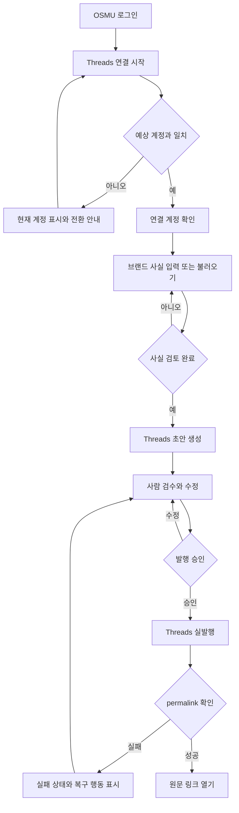

# OSMU 고객 발행 활성화 PRD

| 항목 | 값 |
|---|---|
| 문서 버전 | `2.1.0` |
| 작성 시각 | `2026-08-01 22:28 KST` |
| 작성자 / 모델 | `prd-architect / gpt-codex/gpt-5.6-sol` |
| 작업 라인 | `openclaw-auto-osmu` |
| 상태 | `plan 게이트 심사 후보 — 회장 결정 3건 및 /approve plan 전` |
| 상류 산출물 버전 핀 | [실패본 PRD v2.0.0](prd-osmu-customer-publishing-flow-v2.0.0.md) `sha256:9449812def93`; [pipeline-state plan 재개본](../pipeline-state.md) `2026-08-01, sha256:b9ba15e8bd61`; [QA tracker 관찰본](qa-tracker.md) `2026-08-01, sha256:5c2886305834`; [상류 계획](</Users/sj/.claude/plans/wiki-1-mellow-wadler.md>) `2026-07-30` |
| 저장소 기준점 | `git a7b2b435e7ea` — 위 3개 입력은 작업 트리 파일 해시로 별도 고정 |

## 목차

- [경영진 요약](#executive-summary)
- [1. 목적과 배경](#purpose-background)
- [2. 범위와 비범위](#scope-non-goals)
- [3. 용어 정의](#glossary)
- [4. 사용자 실관찰](#observations)
- [5. 핵심 유저플로우](#user-flow)
- [6. 페르소나와 JTBD](#persona-jtbd)
- [7. One Thing 결정](#one-thing)
- [8. MVP 기능 5개](#mvp-five)
- [9. 릴리스 범위](#release-scope)
- [10. 요구사항 29개 추적성](#requirements)
- [11. 성공지표와 종료 조건](#metrics-kill)
- [12. 비즈니스 모델과 운영](#bm-operations)
- [13. 리스크와 법무](#risks-legal)
- [14. 경쟁 대안](#alternatives)
- [15. 제품 기능 벤치마크](#product-benchmarks)
- [16. 문서 양식 벤치마크](#document-benchmarks)
- [17. 오픈 이슈와 회장 결정](#open-decisions)
- [18. 레드팀과 셀프심문](#red-team)
- [19. Planning 7원칙 판정](#planning-principles)
- [20. Stage Gate와 개정 이력](#stage-gate-history)
- [출처·모델·품질 푸터](#artifact-footer)

## 경영진 요약

OSMU의 지금 문제는 “AI가 글을 못 쓴다”가 아니라, 외부 고객이 자기 소셜 계정을 연결했다고 믿은 뒤에도 실제 연결 계정·브랜드 근거·발행 결과를 한 흐름에서 확인할 수 없다는 것이다. 본 PRD는 기능을 더 넓히기 전에 고객 1명이 자기 Threads 계정 1개를 명시적으로 확인하고, 고객이 확인한 브랜드 사실을 근거로 초안 1건을 사람의 검수 후 실발행하여 실제 permalink 1개를 여는 순간을 R1의 One Thing으로 고정한다. 현재 QA의 7개 실관찰과 502 운영 관찰을 9개 신규 요구로 전환하고, 기존 13개 및 백로그 7개와 합쳐 29개 요구 각각에 증거상태·owner·원자 AC·QA TC를 1:1로 부여했다. 다만 런타임 방식, R1 채널 범위, 초기 AI 비용은 회장 결정 전까지 열어 두며 이 문서는 제품 코드·API·DB·배포 결정을 확정하지 않는다.

## 1. 목적과 배경

### 1.1 목적

외부 고객의 OSMU 첫 가치 도달을 “화면상 연결됨”이나 “발행 요청 성공”이 아니라, 고객이 직접 열 수 있는 소셜 원문 permalink로 증명한다. 고객 행동, 제품 상태, 운영 증거가 같은 완료 정의를 사용하게 만드는 것이 이 PRD의 목적이다.

### 1.2 배경

- `2026-08-01` 시크릿 창 실사용 점검에서 Threads·Instagram 연결 상태와 CTA가 실제 계정 상태와 어긋났다.
- Threads 동의 화면에는 다른 OSMU 계정명이 노출되어 tenant·계정 귀속 신뢰가 깨졌다.
- 현재 운영 기록에는 502와 복구 경로 부재가 남아 있어, 고객이 실패 이유와 다음 행동을 알기 어렵다.
- 기존 PRD v2.0.0은 문제와 요구를 넓게 담았지만 상단 버전 핀·클릭 목차·문서 양식 벤치마크·원자 AC/TC 1:1이 부족하여 client-ready 정본으로 승인될 수 없었다.
- OSMU는 postAGI의 다른 서비스와 분리된 제품·포트·DB 경계를 유지해야 하며, private 서비스 데이터를 `postAGI-analytics`에 섞지 않는다.

### 1.3 제품 원칙

1. **연결 성공은 계정 정체성으로 증명한다.** 토큰 저장이나 callback 수신만으로 성공을 표시하지 않는다.
2. **생성 근거는 고객이 확인한다.** 브랜드 사실과 AI 추론을 섞지 않는다.
3. **발행 성공은 permalink로 증명한다.** 작업 큐 진입이나 2xx 응답은 성공의 대리지표일 뿐이다.
4. **사람이 마지막 승인자다.** 고객 승인 없이 외부 채널에 게시하지 않는다.
5. **tenant와 데이터 경계를 보존한다.** 다른 고객의 계정·콘텐츠·운영데이터를 노출하거나 analytics에 혼합하지 않는다.

## 2. 범위와 비범위

### 2.1 범위

- 외부 고객 로그인 후 Threads 연결 시작, 연결 계정 확인, 잘못된 계정 전환 안내
- 브랜드 사실의 입력·불러오기·고객 확인 및 사실/추론/미확인 구분
- Threads 초안 1건 생성, 사람 검수, 명시적 발행 승인
- 실제 발행 후 permalink 확인과 고객·운영자 공통 실패 상태
- GitHub 원천 동기화의 기존 경로 보존 및 고객 친화적 오류·rate-limit 안내
- 고객 권한·tenant 분리·AI 사용량·운영 추적 요구
- R0/R1/R2/Backlog 단계와 29개 요구의 인수·QA 추적

### 2.2 비범위

- Instagram을 R1에 함께 넣을지의 확정 — 회장 결정 2번 전 미정
- 외부 SaaS 또는 내부 인프라의 선택, 배포 대상, 포트, 네트워크, API 계약, DB 스키마
- 완전 자동 무검수 발행, 대량 캠페인, 광고 집행, 댓글·DM 자동화
- ElevenLabs TTS와 영상 생성의 R1 구현
- Midjourney 실행 방식과 Slack 분류 계약의 R1 구현
- private 서비스 데이터를 `postAGI-analytics`로 복제하거나 섞는 설계
- 시크릿 실값, OAuth token, API key, 고객 비공개 콘텐츠의 문서 기록
- 제품 코드, 디자인 산출물, 100B 파일의 변경

## 3. 용어 정의

| 용어 | 이 문서의 고정 정의 |
|---|---|
| 고객 | 자기 사업체의 브랜드 정보와 소셜 계정을 관리하는 외부 OSMU 사용자 |
| 연결 | provider가 확인한 채널명·handle·상태를 OSMU가 고객에게 제시하고 고객이 예상 계정과 일치함을 확인한 상태 |
| 연결 시도 | OAuth 시작·callback·token 입력 등 연결을 향한 과정. 연결과 동일하지 않음 |
| 브랜드 사실 | 고객이 직접 입력하거나 원천에서 불러온 뒤 고객이 사실로 확인한 문장 |
| 추론 | AI가 사실을 조합해 제안했으나 고객이 사실로 확정하지 않은 내용 |
| 초안 | 외부 채널에 아직 게시되지 않아 고객이 수정·폐기할 수 있는 콘텐츠 |
| 발행 승인 | 고객이 대상 계정과 최종 본문을 확인한 뒤 실행하는 명시적 행위 |
| 발행 성공 | 대상 채널에 게시물이 존재하며 OSMU가 고객에게 실제 permalink를 제시한 상태 |
| permalink | 고객이 해당 provider의 원문 게시물로 이동해 직접 확인할 수 있는 고유 URL |
| R0 | 신뢰 훼손·보안·거짓 상태를 먼저 막는 복구 범위 |
| R1 | One Thing을 끝까지 검증하는 최소 고객 활성화 범위 |
| R2 | R1 증거가 선 뒤 확장하는 편의·확장 범위 |
| Backlog | 가치 후보이나 R1·R2의 필수조건이 아닌 항목 |
| 증거상태 | `사용자 관찰`, `운영 관찰`, `테스트됨`, `문서 근거`, `미검증` 중 하나. 구현완료 상태와 동일하지 않음 |

## 4. 사용자 실관찰

아래 7개는 아이디어가 아니라 `2026-08-01` 시크릿 창에서 실제 관찰된 실패다. 관찰 주체는 내부 운영자이므로 외부 고객 수요를 완전히 대표하지 않으며, R1에서 외부 고객 10명 코호트로 재검증한다.

| 관찰 ID | 실제 관찰 | 제품 의미 | 요구 연결 |
|---|---|---|---|
| O-01 | Threads OAuth를 마친 뒤에도 연결되지 않음으로 보였다 | callback 처리와 고객 표시 사이의 진실원이 어긋남 | N-01 |
| O-02 | Instagram OAuth 이후에도 연결 CTA가 남았다 | 상태와 다음 행동이 모순됨 | N-01 |
| O-03 | 근거 없이 Instagram 재연결을 요구했다 | 고객이 잘못한 것처럼 보이고 복구 이유가 없음 | N-07 |
| O-04 | OAuth 흐름 옆에 빈 Graph API token 입력이 노출됐다 | 기본 경로와 고급 복구 경로가 경쟁함 | N-03 |
| O-05 | Settings에서 연결 계정을 찾을 수 없었다 | 연결 후 계정 정체성을 재확인할 장소가 없음 | N-04 |
| O-06 | Threads와 Instagram 정보구조가 다르고 초안→검수→발행 경로가 없었다 | 채널별 설정과 공통 핵심 여정이 분리되지 않음 | N-05, N-06 |
| O-07 | Threads 동의 화면에 다른 OSMU 계정 `zero_to_one_ai`가 보였다 | tenant·provider 계정 귀속을 신뢰할 수 없음 | L-12, N-02 |

추가 운영 관찰: upstream 502에서 고객 복구 행동과 운영 추적 식별자가 함께 제공되지 않았다. 이는 N-09로 관리한다. N-08은 GitHub 공식 rate-limit 계약을 기존 동기화 경로에 적용하는 신규 예방 요구다.

## 5. 핵심 유저플로우

### 5.1 상태 전이

`미연결 → 연결 시도 → 계정 확인 대기 → 연결 확인 → 사실 확인 → 초안 → 검수 → 발행 승인 → 발행 확인 → permalink 제공`

`연결 시도`, `발행 요청`, `발행 확인`은 각각 별도 상태다. 앞 상태가 발생했다고 뒤 상태를 성공으로 승격하지 않는다.

## 6. 페르소나와 JTBD

### 6.1 핵심 페르소나 — 김민서, 34세, 1인 지식서비스 운영자

김민서는 직장 경력에서 얻은 전문성을 온라인 클래스와 소규모 상담 상품으로 판매하는 1인 사업자다. 별도 마케팅팀이나 개발자가 없고, 상품 설계·고객 상담·결제 확인·콘텐츠 제작을 혼자 담당한다. 매주 Threads와 Instagram에 글을 올려야 신규 문의가 유지된다는 사실은 알지만, 한 편을 쓰기 위해 과거 강의안과 고객 질문을 뒤지고 채널 말투를 맞춘 뒤 게시 결과까지 확인하는 과정이 반복되어 본업의 집중 시간을 잠식한다. 김민서에게 AI 글 생성 자체는 낯설지 않다. 문제는 생성된 글이 자기 브랜드의 실제 약속과 어긋나거나, 어느 계정에 연결됐는지 확신할 수 없거나, 발행 버튼을 눌렀는데 원문이 보이지 않을 때 이를 스스로 진단할 수 없다는 점이다. OAuth, token, callback, rate limit 같은 용어를 이해하는 것이 자신의 일이 아니라고 생각하며, “연결됨”이라는 표시를 보면 실제 계정 handle과 게시 가능 상태까지 검증됐다고 기대한다. 잘못된 계정에 게시되면 브랜드 신뢰와 고객 개인정보가 동시에 훼손될 수 있어 자동화보다 통제권을 더 중요하게 본다. 그래서 초안은 자동으로 받아도 브랜드 사실·대상 계정·최종 문구는 직접 확인하고 싶어 한다. 성공 경험은 대시보드의 초록색 배지가 아니라, 자신이 승인한 글의 실제 Threads 원문을 새 창에서 열고 고객에게 공유할 수 있는 순간이다. 초기 설정에 15분 이상 걸리거나 개발자 도움을 요청해야 하면 도입을 미루고 기존 메모장 복사·붙여넣기로 돌아간다. 월 사용료를 지불할 의향은 생성량보다 “잘못 게시될까 확인하는 시간”과 “실패 원인을 찾는 시간”이 줄어드는지에 좌우된다. 이 페르소나는 내부 운영자의 7개 실관찰과 Buffer·Postiz·Jasper의 공개 제품 계약을 조합한 검증 가설이며, 아직 외부 고객 인터뷰로 확정된 사실은 아니다.

**Pain 한 줄:** SNS 운영을 줄이려고 자동화를 샀는데, 연결 계정·브랜드 사실·실발행 여부를 믿을 수 없어 결국 시스템 관리자 역할까지 떠안는다.

### 6.2 JTBD

- **상황:** 새 강의나 상담 상품을 알리기 위해 오늘 Threads 글을 발행해야 할 때
- **동기:** 기술 용어를 배우지 않고도 내 계정과 내 브랜드 사실이 적용됐음을 확인하고 싶다.
- **기대 결과:** 검수한 초안을 안전하게 게시하고 실제 원문 링크를 열어 15분 안에 발행 증거를 확보한다.
- **전환 장벽:** 잘못된 계정 게시, AI의 사실 왜곡, 발행 실패의 불투명성, 추가 운영자 개입
- **현재 대안:** 메모장·ChatGPT에서 초안 작성 후 소셜 앱에 직접 복사·붙여넣기

## 7. One Thing 결정

### 7.1 후보와 잘못된 답의 함정

| 후보 | 매력 | 잘못된 답의 함정 | 판정 |
|---|---|---|---|
| A. AI가 글 1건을 생성한다 | 데모가 빠르고 눈에 보임 | 계정·사실·발행 증거가 없어 고객 가치가 끝나지 않음 | 탈락 |
| B. Threads와 Instagram에 동시에 예약한다 | OSMU 이름과 잘 맞아 보임 | 두 provider의 오류와 계정 혼선을 한 번에 늘려 R1 학습을 흐림 | 탈락 |
| C. OAuth callback을 성공시킨다 | 구현 상태를 측정하기 쉬움 | callback 성공은 실제 연결 계정과 게시 가능성의 대리지표 | 탈락 |
| D. 고객이 승인한 글의 Threads permalink를 연다 | 고객 결과와 운영 증거가 하나로 닫힘 | 초기에는 채널 확장성이 작아 보임 | 채택 |

### 7.2 최종 One Thing

> **외부 고객 1명이 자기 Threads 계정 1개를 확인하고, 고객이 확인한 브랜드 사실로 초안 1건을 검수·실발행해 실제 permalink 1개를 여는 것.**

### 7.3 One Thing 경계

- 숫자 단위는 `고객 1명 · Threads 계정 1개 · 확인된 브랜드 사실 1세트 · 초안 1건 · permalink 1개`다.
- AI 생성만, callback만, publish API 2xx만, 큐 등록만으로는 달성되지 않는다.
- 계정 불일치나 permalink 부재가 하나라도 있으면 해당 시도는 실패로 집계한다.

## 8. MVP 기능 5개

| MVP | 기능 | One Thing 연결 | 사용자 입력 | 사용자에게 보이는 출력 | 실패 시 |
|---|---|---|---|---|---|
| M1 | 연결 계정 확인 | “자기 Threads 계정 1개”를 보증 | OAuth 동의와 예상 계정 확인 | channel name, handle, 연결 상태 | 현재 계정과 전환 행동을 표시하고 연결 확정 금지 |
| M2 | 브랜드 사실 확인 | “고객이 확인한 브랜드 사실”을 보증 | 직접 입력 또는 원천 선택 후 확인 | 사실·추론·미확인 구분과 적용 중인 사실 | 미확인 사실은 생성 근거에서 제외 |
| M3 | Threads 초안 생성 | “초안 1건”을 만든다 | 주제와 확인된 브랜드 사실 | 미발행 상태의 초안 1건 | 생성 실패를 발행 실패와 분리 |
| M4 | 사람 검수와 승인 | “검수·실발행”의 통제권을 보증 | 본문 수정과 명시적 승인 | 최종 본문, 대상 handle, 승인 상태 | 승인 전 외부 발행 금지 |
| M5 | permalink 검증 | “실제 permalink 1개”로 완료를 증명 | 없음 | provider 원문 URL과 발행 확인 상태 | 성공 표시 금지, 복구 행동과 추적 식별자 제공 |

## 9. 릴리스 범위

| 단계 | 목표 | 요구 수 | 종료 증거 |
|---|---|---:|---|
| R0 | 거짓 연결·거짓 발행·tenant 혼선·고객 금지 동작을 먼저 차단 | 15 | 시크릿 창에서 잘못된 상태가 성공으로 표시되지 않고 권한·오류 계약이 재현됨 |
| R1 | One Thing을 외부 고객 10명 코호트에서 검증 | 5 | 각 성공 시도에 고객 확인 계정·확인 사실·승인 기록·실제 permalink가 함께 존재 |
| R2 | 원천·비용·콘텐츠 능력을 확장 | 7 | R1 성공률과 운영 부하를 악화시키지 않고 각 요구 TC 통과 |
| Backlog | R1/R2 뒤의 운영 정리와 부가 채널 | 2 | 별도 우선순위 승인 전 착수 금지 |

### 9.1 단계 간 규칙

- R0와 회장 결정 3건이 닫히기 전 R1 디자인 게이트를 통과시키지 않는다.
- R1에서 외부 고객 실사용 증거가 없으면 R2를 넓히지 않는다.
- 아래 29개 요구는 마스터 범위이며, R1 MVP 기능 수 5개와 혼동하지 않는다.

## 10. 요구사항 29개 추적성

### 10.1 추적 규칙

- 마스터 요구 1개마다 원자 Acceptance Criterion 1개와 QA Test Case 1개를 둔다.
- `Given–When–Then`의 Then은 한 가지 판정 가능한 결과만 갖는다.
- 증거상태는 현 시점 근거를 뜻하며 완료 선언이 아니다.
- owner는 구현 조직이 아니라 다음 단계에서 책임질 기능 owner다. 구체 API·DB·아키텍처는 eng-design 합의 전 확정하지 않는다.

### 10.2 마스터 요구–AC–TC 매트릭스

| ID | 단계 | 요구 | 증거상태 | Owner | 원자 AC | QA TC |
|---|---|---|---|---|---|---|
| L-01 | R0 | 고객은 GitHub URL을 원천으로 등록할 수 있다 | 테스트됨 — 기존 QA | Product | **Given** 로그인한 고객과 유효한 공개 저장소 URL이 있고 **When** 원천 등록을 확정하면 **Then** 원천 목록에 해당 URL 1개가 표시된다. | TC-L01: 시크릿 창에서 공개 저장소 URL 등록 후 목록 1행을 확인한다. |
| L-02 | R0 | 동기화 실패는 성공과 구분되고 재시도 행동을 제공한다 | 운영 관찰 | Content Ops | **Given** 등록 원천의 동기화가 실패했고 **When** 고객이 원천 상태를 열면 **Then** 실패 상태와 재시도 행동 1개가 함께 표시된다. | TC-L02: 동기화 실패를 유도해 실패 라벨과 재시도 CTA를 확인한다. |
| L-03 | R0 | private 저장소 접근 실패는 인증 필요 원인을 숨기지 않는다 | 문서 근거 — GitHub | Integration | **Given** 고객에게 접근 권한이 없는 private 저장소이고 **When** 동기화를 시도하면 **Then** 일반 404 성공이 아니라 인증 또는 권한 확인 안내가 표시된다. | TC-L03: 권한 없는 private 저장소로 동기화해 인증·권한 안내를 확인한다. |
| L-04 | R0 | Markdown 원천은 실행 가능한 콘텐츠가 아니라 데이터로 취급한다 | 문서 근거 — 내부 보안 원칙 | Security | **Given** 원천 Markdown에 실행 지시나 HTML script가 있고 **When** 미리보기를 열면 **Then** 해당 내용은 실행되지 않고 텍스트로만 표시된다. | TC-L04: script 포함 Markdown을 동기화해 브라우저 실행이 없음을 관찰한다. |
| L-05 | R1 | 고객은 GitHub 없이 브랜드 사실을 직접 입력할 수 있다 | 미검증 | Product | **Given** GitHub 원천이 없는 고객이고 **When** 브랜드 사실 1개를 저장하면 **Then** 확인 대기 사실 목록에 해당 문장 1개가 표시된다. | TC-L05: 원천 없이 사실 1개를 입력해 확인 대기 목록을 확인한다. |
| L-06 | R1 | 생성 화면은 적용 중인 연결 계정과 브랜드 사실을 보여준다 | 사용자 관찰에서 필요 확인 | Product | **Given** 계정 1개와 사실 1세트가 확인됐고 **When** 초안 생성을 열면 **Then** 대상 handle과 적용 사실 요약이 같은 화면에 표시된다. | TC-L06: 확인 완료 후 생성 화면에서 handle과 사실 요약을 대조한다. |
| L-07 | R2 | AI 보조입력은 자동 확정하지 않고 검토 후보로 저장한다 | 미검증 | AI Product | **Given** 고객이 브랜드 보조입력을 요청했고 **When** AI가 문장을 제안하면 **Then** 제안은 확인된 사실이 아닌 검토 후보로 표시된다. | TC-L07: AI 제안 생성 후 상태가 확인 전임을 확인한다. |
| L-08 | R0 | 고객은 다른 고객의 거래·운영 데이터를 볼 수 없다 | 문서 근거 — multi-tenant 정책 | Security | **Given** 고객 A로 로그인했고 **When** 고객 B의 금지된 자원에 접근하면 **Then** 데이터 없이 403 상태가 표시된다. | TC-L08: 고객 A 세션으로 고객 B 자원 접근 시 본문 노출 없는 403을 확인한다. |
| L-09 | R0 | 채널 화면은 실제 지원 능력과 제한을 구분해 표시한다 | 사용자 관찰 | Product | **Given** 선택 채널에 미지원 기능이 있고 **When** 고객이 채널 능력을 열면 **Then** 미지원 기능은 사용 가능 CTA 없이 제한으로 표시된다. | TC-L09: 제한 채널에서 미지원 기능 CTA 부재와 제한 문구를 확인한다. |
| L-10 | R2 | 영상·TTS는 실제 실행 가능한 provider만 사용 가능으로 표시한다 | 미검증 | Media Product | **Given** 영상 또는 TTS provider가 구성되지 않았고 **When** 고객이 미디어 기능을 열면 **Then** 해당 기능은 사용 가능이 아닌 준비 중 상태로 표시된다. | TC-L10: provider 미구성 환경에서 준비 중 상태를 확인한다. |
| L-11 | R0 | 발행 요청과 발행 성공을 별도 상태로 표시한다 | 운영 관찰 | Publishing | **Given** 발행 요청이 접수됐지만 원문 확인이 안 됐고 **When** 고객이 게시 상태를 보면 **Then** 성공이 아닌 발행 확인 중으로 표시된다. | TC-L11: 원문 확인을 지연시켜 발행 확인 중 상태를 확인한다. |
| L-12 | R0 | Threads 연결은 tenant와 확인된 provider 계정에 귀속된다 | 사용자 관찰 O-07 | OAuth | **Given** 고객 A의 연결 흐름이고 **When** provider 계정 확인을 완료하면 **Then** 연결 레코드는 고객 A와 화면에 표시된 handle의 조합으로만 보인다. | TC-L12: 고객 A 연결 후 고객 B 세션에 해당 handle이 나타나지 않음을 확인한다. |
| L-13 | R2 | 고객은 AI 플랜·사용량·token 소비를 같은 단위로 확인한다 | 미검증 | Billing Product | **Given** AI 기능을 1회 사용했고 **When** 사용량 화면을 열면 **Then** 현재 플랜과 누적 사용량이 정의된 한 단위로 표시된다. | TC-L13: AI 1회 사용 전후 누적 사용량 차이를 확인한다. |
| N-01 | R0 | OAuth 결과와 채널 연결 CTA는 같은 계정 상태를 반영한다 | 사용자 관찰 O-01 | OAuth | **Given** Threads 계정 확인이 끝났고 **When** 채널 화면으로 돌아오면 **Then** 연결 CTA가 확인된 handle이 포함된 연결 상태로 바뀐다. | TC-N01: Threads OAuth 완료 후 복귀 화면의 CTA와 handle을 확인한다. |
| N-02 | R0 | provider 계정 전환은 현재 계정과 전환 절차를 명시한다 | 사용자 관찰 O-07 | OAuth | **Given** 브라우저의 활성 계정이 예상 계정과 다르고 **When** 연결을 시작하면 **Then** 현재 계정과 계정 전환 안내가 연결 확정 전에 표시된다. | TC-N02: 다른 활성 계정으로 연결해 전환 안내가 먼저 나오는지 확인한다. |
| N-03 | R0 | OAuth를 기본 경로로 두고 수동 token은 고급 복구로만 분리한다 | 사용자 관찰 O-04 | Product | **Given** 일반 고객이 채널 연결 화면을 열고 **When** 고급 복구를 펼치지 않으면 **Then** 수동 token 입력은 보이지 않는다. | TC-N03: 기본 연결 화면에서 token 입력 미노출을 확인한다. |
| N-04 | R0 | Settings에서 연결 계정의 발견과 재확인이 가능하다 | 사용자 관찰 O-05 | Product | **Given** 채널 계정이 확인됐고 **When** 고객이 Settings를 열면 **Then** 연결된 channel name과 handle이 표시된다. | TC-N04: 연결 후 Settings에서 동일 handle을 확인한다. |
| N-05 | R0 | 채널 공통 핵심 여정과 채널별 능력 차이를 분리한다 | 사용자 관찰 O-06 | Product | **Given** 고객이 서로 다른 채널 화면을 열고 **When** 연결·초안·검수·발행 단계를 비교하면 **Then** 공통 단계명과 순서는 동일하게 표시된다. | TC-N05: Threads와 Instagram 화면의 공통 단계명·순서를 대조한다. |
| N-06 | R1 | Threads에서 초안→검수→승인→실발행→permalink 흐름이 닫힌다 | 사용자 관찰 O-06 | Publishing | **Given** 확인 계정과 확인 사실이 있고 **When** 고객이 초안을 승인해 발행하면 **Then** 실제 Threads permalink 1개가 표시된다. | TC-N06: 외부 고객 시나리오로 승인 후 permalink를 열어 원문을 확인한다. |
| N-07 | R0 | 고객 오류는 한국어 원인과 다음 행동을 함께 제공한다 | 사용자 관찰 O-03 | Product | **Given** 고객 행동으로 복구 가능한 오류가 발생했고 **When** 오류를 표시하면 **Then** 한국어 원인과 실행 가능한 다음 행동 1개가 함께 보인다. | TC-N07: 복구 가능 오류를 유도해 원인과 CTA를 확인한다. |
| N-08 | R2 | GitHub rate limit은 reset 또는 retry-after에 맞춰 재시도를 통제한다 | 문서 근거 — GitHub 공식 | Integration | **Given** GitHub가 403 또는 429와 대기 정보를 반환했고 **When** 동기화가 제한되면 **Then** 대기 종료 전 자동 재시도가 중단된다. | TC-N08: rate-limit 응답을 재현해 대기 구간의 추가 요청이 없음을 확인한다. |
| N-09 | R0 | upstream 502는 고객 복구 행동과 운영 추적 식별자를 제공한다 | 운영 관찰 — 502 | Operations | **Given** upstream 502가 발생했고 **When** 오류 화면을 표시하면 **Then** 고객 재시도 행동과 비밀값 없는 추적 식별자가 함께 표시된다. | TC-N09: 502를 유도해 재시도 CTA와 추적 식별자를 확인한다. |
| B-01 | R1 | 고객은 사이트에서 브랜드 사실을 직접 수정하고 확인할 수 있다 | 미검증 | Product | **Given** 저장된 사실 1개가 있고 **When** 고객이 문장을 수정해 확인하면 **Then** 수정된 문장만 확인된 사실로 표시된다. | TC-B01: 사실 수정·확인 후 이전 문장이 적용 목록에서 사라졌는지 확인한다. |
| B-02 | R2 | AI 보조입력은 원천과 불확실성을 함께 표시한다 | 미검증 | AI Product | **Given** AI가 원천에서 사실 후보를 추출했고 **When** 후보를 제시하면 **Then** 후보마다 원천과 확인 전 상태가 표시된다. | TC-B02: AI 후보의 원천 링크와 확인 전 라벨을 확인한다. |
| B-03 | R2 | AI 비용은 BYOK와 운영자 제공 크레딧 중 승인된 정책을 따른다 | 회장 결정 대기 | Billing Product | **Given** 승인된 비용 정책과 잔여 사용량이 있고 **When** 고객이 AI 생성을 요청하면 **Then** 승인 정책의 사용량만 1회 차감된다. | TC-B03: 선택 정책에서 생성 1회 전후 차감 단위를 대조한다. |
| B-04 | R1 | 생성 전 고객은 사실·추론·미확인 정보를 구분해 본다 | 문서 근거 — brand grounding | AI Product | **Given** 세 상태의 브랜드 항목이 있고 **When** 고객이 생성 근거를 열면 **Then** 각 항목이 사실·추론·미확인 중 하나로 구분돼 표시된다. | TC-B04: 세 상태 항목을 준비해 라벨과 생성 포함 여부를 대조한다. |
| B-05 | R2 | ElevenLabs TTS는 provider 연결과 사용 동의가 있을 때만 실행된다 | 미검증 | Media Product | **Given** TTS provider 연결이나 고객 동의가 없고 **When** 음성 생성을 시도하면 **Then** 생성은 시작되지 않는다. | TC-B05: 연결 또는 동의가 없는 상태에서 생성 차단을 확인한다. |
| B-06 | Backlog | Midjourney 운영은 수동 docker exec에 의존하지 않는 경로로만 전환한다 | 운영 문서 근거 | Operations | **Given** 승인된 대체 실행 경로가 없고 **When** 운영자가 이미지 작업을 시작하면 **Then** 수동 docker exec 실행은 제공되지 않는다. | TC-B06: 운영 UI와 runbook에서 docker exec 실행 진입점 부재를 확인한다. |
| B-07 | Backlog | Slack 입력은 분류 계약과 실패 상태가 정의된 뒤에만 콘텐츠 원천으로 사용한다 | 미검증 | Integration | **Given** Slack 메시지의 분류 결과가 미확정이고 **When** 수집이 발생하면 **Then** 해당 메시지는 생성 가능한 사실 원천으로 승격되지 않는다. | TC-B07: 미분류 메시지가 생성 원천 목록에 나타나지 않음을 확인한다. |

### 10.3 수량 및 추적성 대조

| 분류 | 요구 ID | 개수 | AC | QA TC |
|---|---|---:|---:|---:|
| 기존 | L-01–L-13 | 13 | 13 | 13 |
| 신규 | N-01–N-09 | 9 | 9 | 9 |
| 백로그 계열 | B-01–B-07 | 7 | 7 | 7 |
| **합계** | **L+N+B** | **29** | **29** | **29** |

| 릴리스 | 요구 수 |
|---|---:|
| R0 | 15 |
| R1 | 5 |
| R2 | 7 |
| Backlog | 2 |
| **합계** | **29** |

## 11. 성공지표와 종료 조건

### 11.1 R1 성공지표

아래 목표값은 외부 고객 데이터가 아직 없는 **초기 검증 가설(unsourced)**이며 회장 승인 후 첫 10명 코호트에 적용한다.

| 지표 | 정의 | R1 목표 | 증거 |
|---|---|---:|---|
| Verified Publish Activation | 시작 고객 중 확인 계정·확인 사실·승인·permalink까지 도달한 고객 비율 | 10명 중 8명 이상 | 고객별 완료 증거 묶음 |
| Time to Verifiable Publish | 로그인부터 고객이 permalink를 여는 시점까지 | 중앙값 15분 이하 | 이벤트 시각과 고객 관찰 |
| Wrong-account incident | 예상하지 않은 provider 계정으로 연결·발행된 건수 | 0건 | 계정 확인 기록과 permalink |
| False-success incident | permalink 없이 성공으로 표시된 건수 | 0건 | 상태 전이와 실제 원문 대조 |
| Operator intervention | 시작부터 permalink까지 운영자가 수동 개입한 고객 수 | 10명 중 2명 이하 | 지원 기록 |
| Brand fact correction | 초안 검수에서 사실 오류로 수정된 게시물 비율 | 20% 이하 | 수정 사유 분류 |

### 11.2 Kill criteria

첫 외부 고객 10명 중 5명 이상이 운영자 개입 없이 permalink에 도달하지 못하거나, 잘못된 계정 발행이 1건이라도 발생하면 R2 확장을 즉시 중단하고 R0/R1 문제정의로 되돌아간다. 예를 들어 OAuth callback은 성공했지만 10명 중 6명이 다른 handle을 보거나 원문 링크를 못 열었다면 “연결 기능은 완성됐다”는 판단을 폐기하고 계정 확인 계약부터 재설계한다.

또한 10명 중 5명 이상이 “직접 복사·붙여넣기가 더 빠르다”고 실제 행동으로 이탈하거나, 중앙값 15분을 두 번의 개선 루프 뒤에도 넘으면 OSMU 자동발행 가치가 아니라 검수·원천 정리 도구로 포지셔닝을 재검토한다. 이는 제품 폐기만을 뜻하지 않으며, 발행 자동화가 고객의 가장 큰 병목이라는 가정을 죽이는 기준이다.

### 11.3 R1 졸업 조건

- 회장 결정 3건이 기록되고 plan 게이트가 `/approve plan`으로 통과한다.
- R0 15개 TC가 설계·QA 단계에서 실행 가능한 형태로 승인된다.
- 외부 고객 10명 코호트의 성공·실패 분모가 누락 없이 기록된다.
- 성공 1건마다 확인 handle, 확인 사실 버전, 고객 승인, 실제 permalink가 연결된다.
- private 서비스 데이터는 OSMU tenant 경계 안에 남고 `postAGI-analytics`에는 집계 정의가 승인된 비식별 지표만 별도 전송한다. 현재는 전송 설계 자체를 확정하지 않는다.

## 12. 비즈니스 모델과 운영

### 12.1 BM 가설

| 안 | 고객 가치 | 수익 구조 | 운영·리스크 | 판정 |
|---|---|---|---|---|
| A. 월 구독 + 운영자 제공 AI 크레딧 | 시작이 가장 쉽다 | 좌석 또는 브랜드당 구독 + 포함량 초과 과금 | 원가 변동과 남용 통제가 필요 | 첫 10명 검증에 추천, 회장 결정 전 미확정 |
| B. 월 구독 + BYOK | AI 원가가 고객에게 귀속 | 소프트웨어 구독 중심 | key 입력 장벽과 지원 부하가 큼 | R2 후보 |
| C. 하이브리드 | 낮은 진입장벽과 고사용량 전환을 함께 제공 | 기본 크레딧 + BYOK 선택 | 정책·청구 설명이 복잡 | R1 증거 후 후보 |

가격 숫자는 willingness-to-pay와 실제 AI 원가가 없으므로 이 문서에서 확정하지 않는다. 첫 10명은 과금 전환율보다 Verified Publish Activation과 운영개입을 먼저 측정한다.

### 12.2 운영 부하 예산

| 운영 사건 | 고객 셀프 복구 | 운영자 책임 | R1 허용선 |
|---|---|---|---:|
| 잘못된 활성 계정 | 현재 handle 확인과 전환 안내 | provider 정책 변경 점검 | 실제 오발행 0건 |
| OAuth 만료·권한 누락 | 재연결 이유와 CTA | scope·callback 상태 점검 | 수동 개입 2/10 이하 |
| GitHub rate limit | reset 시각 이후 재시도 | 반복 제한 원인 확인 | 대기 중 요청 0건 |
| upstream 502 | 재시도와 추적 식별자 보관 | 식별자로 원인 추적 | 원인 없는 고객 응답 0건 |
| AI 사실 오류 | 확인 사실만 포함하고 고객 수정 | 오류 유형 분류 | 사실 수정률 20% 이하 |
| 발행 미확인 | 성공 표시 없이 검수로 복귀 | provider 결과 대조 | false-success 0건 |

### 12.3 서비스·포트·DB 경계

- OSMU는 `/Users/sj/sj_code_master/openclaw-auto`의 독립 서비스 경계를 유지한다.
- postAGI 루트 서비스의 포트·DB를 재사용하거나 충돌시키지 않는다. 구체 런타임·포트·DB 계약은 회장 결정 1번과 eng-design에서 합의한다.
- tenant 데이터는 OSMU의 PostgreSQL·RLS 원칙을 따른다. 이 문서는 새 엔티티나 스키마를 확정하지 않는다.
- private 서비스 데이터는 `postAGI-analytics`에 혼합하지 않는다. 향후 지표 연동이 필요하면 비식별 집계 정의·권리·보존기간을 별도 결정한다.
- 시크릿 실값은 문서·로그·analytics·permalink 메타데이터에 기록하지 않는다.

## 13. 리스크와 법무

### 13.1 리스크 레지스터

| 분야 | 구체 시나리오 | 가능성 | 영향 | 완화 | Owner | Gate |
|---|---|---:|---:|---|---|---|
| 시장 | 고객이 자동발행보다 직접 복사·붙여넣기를 선호 | 중 | 상 | 10명 행동 코호트와 kill criteria | Product | R1 |
| 계정 | 브라우저의 다른 Meta 계정이 연결·발행됨 | 중 | 치명 | handle 사전 확인, 오발행 0 기준 | OAuth | R0 |
| 신뢰 | AI가 사실이 아닌 약속을 게시 | 중 | 치명 | 사실·추론 분리, 사람 승인 | AI Product | R1 |
| 기술 | callback 성공 후 실제 연결·발행 확인 실패 | 중 | 상 | 상태 분리, permalink 확인 | Publishing | R0 |
| 외부의존 | Meta 정책·scope·token 조건 변경 | 중 | 상 | 공식문서 점검, 재연결 계약, 기능 제한 표시 | OAuth | 지속 |
| 외부의존 | GitHub 403/429 반복 재시도로 차단 악화 | 중 | 중 | reset·retry-after 준수, 지수 백오프 | Integration | R2 |
| 운영 | 502를 고객이 해결하지 못해 지원 요청 폭증 | 중 | 중 | 고객 행동 + 추적 식별자 | Operations | R0 |
| 데이터 | tenant 또는 private 서비스 데이터가 analytics에 섞임 | 하 | 치명 | 물리·논리 경계, 비식별 집계만 별도 승인 | Security | R0 |
| 비용 | 운영자 AI 크레딧 남용으로 고객별 마진이 음수 | 중 | 상 | 사용량 가시성, 첫 10명 상한, 정책 결정 | Billing | 결정 3 |
| 일정 | Instagram 동시 범위로 R1 검증이 지연 | 상 | 중 | Threads 단일 경로 추천, 결정 후 핀 | Product | 결정 2 |

### 13.2 법무·정책 체크

- **OAuth와 provider 약관:** 공식 OAuth·권한 범위 안에서만 연결하고, 지원되지 않는 계정 선택 파라미터나 비공식 우회를 사용하지 않는다.
- **개인정보와 권리:** 계정 식별자·게시물·원천 콘텐츠의 수집 목적, 보존기간, 삭제·연결해제 경로, subprocessors를 개인정보처리방침과 동의 화면에서 고지한다.
- **콘텐츠 권리:** 고객은 입력 원천과 업로드 자료를 사용할 권리를 보유해야 하며, AI 출력은 게시 전 고객이 검수한다.
- **표시·광고:** 사실 확인 없는 성능 주장, 허위 후기, 존재하지 않는 희소성은 생성·발행하지 않는다.
- **민감정보:** 시크릿·token·고객 비공개 자료를 오류 메시지·추적 식별자·analytics에 넣지 않는다.
- **삭제와 연결해제:** provider 연결해제와 OSMU 데이터 삭제의 범위·효과·소요시간은 디자인 전 정책 결정이 필요하다. 이 PRD는 값을 자가확정하지 않는다.

## 14. 경쟁 대안

| 대안 | 고객이 선택하는 이유 | OSMU가 이겨야 할 지점 | OSMU가 지는 조건 |
|---|---|---|---|
| 직접 복사·붙여넣기 | 무료, 계정이 확실함, 실패가 눈에 보임 | 확인 사실 재사용과 검수 시간을 줄이면서 통제권 보존 | 15분 이상 걸리거나 계정을 믿을 수 없음 |
| Buffer | 연결·예약·발행의 익숙한 운영 경험 | 브랜드 사실 근거와 검수 증거를 한 흐름에 결합 | 게시 운영만 필요하고 grounding이 불필요 |
| Postiz | 연결 계정과 draft/schedule 상태를 구조적으로 관리 | 실제 permalink와 사람 승인, tenant 신뢰를 더 분명히 제공 | OSMU 상태 계약이 더 모호함 |
| Jasper + 수동 게시 | Knowledge·Brand Voice 품질과 비교 미리보기 | 확인 사실에서 Threads 발행 증거까지 왕복을 제거 | 생성 품질만 중요하고 수동 게시가 부담이 아님 |
| 범용 ChatGPT | 빠른 초안과 낮은 학습비용 | 계정·사실·게시 증거가 반복 가능한 시스템으로 남음 | 고객이 매번 prompt와 복붙을 선호 |

**자기잠식·시너지:** OSMU가 postAGI의 교육·마케팅 운영을 대신하는 공용 콘텐츠 레이어가 되면 시너지가 있지만, 각 사업체의 private 운영데이터를 중앙 analytics에 모으면 기존 서비스의 데이터 권리 경계를 잠식한다. 따라서 제품 경험은 재사용하되 tenant 원본 데이터는 분리하고, 공유가 필요한 경우에만 승인된 비식별 집계를 사용한다.

## 15. 제품 기능 벤치마크

| 1차 소스 | 확인한 공개 계약 | 차용 | 변경·차별화 |
|---|---|---|---|
| [Buffer — Using Threads](https://support.buffer.com/article/857-using-threads-with-buffer) | 브라우저에서 현재 활성인 Threads 계정이 연결되며, API가 단일 Meta 로그인 아래 전체 Threads 계정 목록을 제공하지 않아 사전 계정 전환이 필요 | 현재 계정과 전환 절차를 연결 전에 명시 | OSMU는 연결 뒤에도 handle을 고객이 확인해야만 생성·발행으로 진행 |
| [Postiz — List Integrations](https://docs.postiz.com/public-api/integrations/list), [Managing Posts](https://docs.postiz.com/cli/managing-posts) | 연결 계정을 조회하고 post 상태를 draft와 schedule 사이에서 전환 | 계정 정체성과 콘텐츠 상태를 분리하고 draft를 발행 큐와 구분 | OSMU는 schedule 진입이 아니라 실제 permalink 확인을 완료 기준으로 사용 |
| [Jasper — Knowledge Base](https://help.jasper.ai/hc/en-us/articles/18618707176347-Knowledge-Base), [Brand Voice](https://help.jasper.ai/hc/en-us/articles/18618693085339-Brand-Voice) | URL·파일·텍스트 등의 지식을 자산으로 저장하고, 브랜드 보이스 적용 전후를 비교 | 원천·브랜드 컨텍스트를 생성 전에 보이고 미리보기로 검수 | OSMU는 컨텍스트를 사실·추론·미확인으로 나누고 확인 사실만 발행 근거로 승격 |
| [GitHub — REST API rate limits](https://docs.github.com/en/rest/using-the-rest-api/rate-limits-for-the-rest-api?apiVersion=2022-11-28) | 403/429, remaining, reset, retry-after, 지수 백오프 계약 | 대기시간과 재시도 통제 | 기술 헤더 대신 고객에게 다음 가능 시점과 행동을 한국어로 제공 |
| [Meta 공식 Threads API workspace](https://www.postman.com/meta/threads/overview), [Authorization](https://www.postman.com/meta/threads/folder/34203612-e0373e84-de6b-46f1-b90d-3fea76ba6782) | OAuth 2.0, 사용자 권한 승인, token 권한·만료 확인이 연결의 정책 경계 | 공식 지원 범위만 사용하고 수동 token을 기본 UX에서 분리 | 계정 handle 확인과 permalink를 제품 완료 증거로 추가하며, 공식문서로 확인 못 한 파라미터는 채택하지 않음 |

벤치마크는 기능 복제를 위한 목록이 아니다. Buffer의 계정 세션 제약, Postiz의 상태 분리, Jasper의 브랜드 컨텍스트, GitHub의 복구 계약을 One Thing의 네 구간인 `계정 확인 → 사실 확인 → 사람 승인 → permalink`에 맞게 재조합했다.

## 16. 문서 양식 벤치마크

| 공개 1차 소스 | 문서 구조·의사결정·추적성에서 차용 | OSMU에 맞춘 변경 |
|---|---|---|
| [Kubernetes KEP Template](https://github.com/kubernetes/enhancements/blob/master/keps/NNNN-kep-template/README.md) | Summary, Goals/Non-Goals, user story, risks, test plan, graduation criteria, production readiness, alternatives, history | plan 문서에는 제품 판단·QA seed까지만 두고 API·DB·아키텍처는 eng-design으로 넘김. Graduation Criteria는 R1 졸업과 kill criteria로 변환 |
| [GitLab Product Development Flow](https://handbook.gitlab.com/handbook/product-development/how-we-work/product-development-flow/) | 문제 검증 뒤 design 진입, SSOT, DRI, 명시적 성공·실패 기준, validation/build 분리 | `pipeline-state.md`를 단계 SSOT로 유지하고 본 문서에 증거상태·owner·R0/R1/R2를 부여. `/approve` 전 design 진입을 금지 |
| [Go Change Proposal Process](https://go.dev/talks/2015/how-go-was-made.slide) | issue → template 기반 design document → review → acceptance → implementation 순서, rationale·tradeoff·history 기록 | 구현 전 회장 결정 3건을 오픈 이슈로 노출하고, 결정되지 않은 런타임·채널·비용을 문서가 대신 확정하지 않음 |
| [Linear Method — Scope Projects Down](https://linear.app/method/scope-projects) | 큰 프로젝트를 작게 자르고 다음 범위를 단계적으로 내림 | 전체 29개는 보존하되 R1을 고객 1·계정 1·사실 1세트·글 1·링크 1로 제한 |

문서 벤치마크와 제품 기능 벤치마크는 분리했다. 전자는 “어떻게 결정·검증·인계할지”, 후자는 “사용자가 어떤 제품 계약을 기대하는지”의 근거다.

## 17. 오픈 이슈와 회장 결정

### 결정 1 — R1 런타임을 어디에 둘 것인가

- **추천:** 외부 고객 10명 검증은 운영 증거를 가장 빨리 얻는 관리형 외부 SaaS를 우선 검토하되, private 원본 데이터의 저장 위치·subprocessor·삭제 계약을 확인한 뒤 승인한다.
- **외부 SaaS 선택 시:** 초기 운영 부하는 낮지만 비용·데이터 처리자·provider 종속이 생긴다.
- **내부 인프라 선택 시:** 데이터·네트워크 통제는 높지만 배포·모니터링·장애 대응이 R1 학습보다 앞설 수 있다.
- **미선택 시 리스크:** design과 eng-design이 실행 환경 전제를 고정할 수 없어 downstream 진입 불가.
- **상태:** 회장 결정 대기. 이 문서에서 배포 대상·포트·DB를 확정하지 않음.

### 결정 2 — R1을 Threads 단일 채널로 고정할 것인가

- **추천:** Threads 단일 채널로 R1을 고정하고 Instagram은 R2 조건부로 내린다.
- **선택 시:** wrong-account와 permalink 계약을 한 provider에서 먼저 증명해 학습 속도가 빨라진다.
- **Instagram 병행 시:** 채널 공통 여정을 조기에 검증할 수 있지만 현재 두 채널 상태 모순이 동시에 범위에 들어온다.
- **미선택 시 리스크:** 디자인 화면 수와 QA 매트릭스 범위가 고정되지 않음.
- **상태:** 회장 결정 대기.

### 결정 3 — 첫 외부 고객 10명의 AI 비용을 누가 부담할 것인가

- **추천:** 고객별 상한이 있는 운영자 제공 크레딧으로 마찰을 낮추고, 실제 사용량·원가를 기록한 뒤 BYOK 또는 하이브리드를 R2에서 결정한다.
- **운영자 크레딧 선택 시:** 활성화 검증은 깨끗하지만 원가 상한과 남용 차단이 필요하다.
- **BYOK 선택 시:** 원가는 분리되지만 key 설정이 One Thing 도달률을 왜곡할 수 있다.
- **미선택 시 리스크:** B-03의 AC와 BM 실험 비용을 실행할 수 없음.
- **상태:** 회장 결정 대기. 가격·금액·provider는 미확정.

### 그 밖의 오픈 이슈

- 외부 고객 인터뷰와 실제 willingness-to-pay 증거가 없다.
- 개인정보 보존·삭제 SLA와 subprocessor 목록이 확정되지 않았다.
- Meta Developer 문서 일부는 조사 시점에 직접 접근이 실패했으나 Meta 공식 Postman workspace에서 OAuth·권한·token 만료 계약을 교차 확인했다. eng-design 전 공식 App Dashboard의 실제 앱 설정과 scope를 다시 대조해야 한다.
- R1의 이벤트 집계가 필요해도 private 서비스 데이터를 analytics에 보내지 않는 별도 비식별 집계 계약이 필요하다.

## 18. 레드팀과 셀프심문

### 18.1 Steelman — 가장 강한 반대안

가장 강한 반대안은 “OSMU를 만들지 말고 Jasper에서 초안을 만든 뒤 Buffer 또는 소셜 앱에 직접 게시하자”다. 이미 검증된 도구 조합은 계정 연결과 생성 품질을 각각 잘 해결하며, 외부 고객 10명 규모에서는 복사·붙여넣기의 비용이 새 시스템의 연결·장애·법무 부하보다 작을 수 있다.

이 반대안을 이기려면 OSMU가 단순 생성량이 아니라 확인된 브랜드 사실과 게시 증거를 한 번에 재사용해 고객의 검수·진단 시간을 줄여야 한다. 그래서 R1은 다채널·영상·완전자동화가 아니라 15분 내 verifiable publish와 운영자 개입 2/10 이하를 검증하며, 실패하면 발행 자동화 가정을 폐기한다.

### 18.2 Pre-mortem

1년 뒤 이 제품이 실패했다면 첫째 이유는 OAuth와 provider 제약을 과소평가해 고객이 연결 상태를 믿지 못했고, 팀이 callback 2xx를 성공으로 착각했기 때문이다. 둘째 이유는 고객이 원하는 것이 “더 많은 AI 글”이라고 가정해 브랜드 사실 검수와 원문 증거를 뒤로 미루고, 잘못 게시될 위험을 고객에게 떠넘겼기 때문이다.

그 실패를 막기 위해 R0에서 wrong-account와 false-success를 0으로 두고, R1 성공을 실제 permalink로만 인정한다. 또한 첫 10명 중 절반 이상이 복사·붙여넣기를 선택하면 기능을 더 쌓지 않고 문제정의와 포지셔닝을 재개한다.

### 18.3 회의적 투자자 공격과 수정

- **공격:** “29개 요구는 MVP가 아니라 기존 결함을 한 문서에 감춘 대형 프로젝트다.”
- **수정:** 마스터 요구는 회귀와 운영부채를 잃지 않기 위한 추적 목록으로 유지하되 R1의 고객 가치 기능은 5개로 제한했다. R0 15개는 신뢰·권한·거짓 상태 차단이며, R2와 Backlog 9개는 R1 증거 전 착수하지 않는다.
- **공격:** “10명 중 8명, 15분은 근거 없는 숫자다.”
- **수정:** 목표를 외부 데이터가 없는 unsourced 검증 가설로 명시하고, 두 번의 개선 루프 뒤에도 실패하면 가정을 죽이는 기준으로 사용한다. 시장 사실로 포장하지 않는다.

### 18.4 셀프심문

**이 결론이 틀렸다면 가장 그럴듯한 이유는?** 고객의 가장 큰 pain이 계정·발행 신뢰가 아니라 꾸준히 쓸 만한 콘텐츠 주제와 배포 성과일 수 있다. 내부 운영자의 7개 실관찰은 UX 결함을 강하게 증명하지만 외부 고객의 구매 이유를 증명하지는 않는다.

**수정:** 페르소나를 확정 사실이 아닌 검증 가설로 표시하고, R1에서 외부 고객 10명의 실제 선택과 이탈 이유를 기록한다. Verified Publish Activation이 높아도 유료 전환 의향과 반복 사용이 없으면 BM과 One Thing을 재검토한다.

## 19. Planning 7원칙 판정

| # | 원칙 | 판정 | 근거 |
|---|---|---|---|
| 1 | 용어 통일 | PASS | 연결·연결 시도·사실·추론·발행 성공·permalink를 §3에서 고정 |
| 2 | 구체화 | PASS | 고객 1·계정 1·사실 1세트·초안 1·링크 1, 요구 29, 코호트 10명 명시 |
| 3 | 입출력 분리 | PASS | MVP 5개마다 사용자 입력·사용자 출력·실패 결과를 분리 |
| 4 | 정합성 | PASS | One Thing, MVP 5개, R1 5개 요구, 성공지표가 같은 완료 정의를 사용 |
| 5 | 정책 상세 | PASS | 잘못된 계정, 미확인 사실, 403/429, 502, permalink 부재, 권한 경계 명시 |
| 6 | 추출 철저 | PASS | 유저플로우 각 단계가 M1–M5 및 R0/R1 요구에 연결 |
| 7 | 논리 영역 | PASS | “편리함” 대신 15분, 8/10, 오발행 0, 운영개입 2/10으로 판정 가능 |

## 20. Stage Gate와 개정 이력

### 20.1 Gate 상태

| Gate 항목 | 상태 | 종료 증거 |
|---|---|---|
| 내부 기준·상류 입력 정독 | 충족 | 본문 링크·해시·SOURCES |
| 외부 문서 양식 3개 이상 조사 | 충족 | Kubernetes·GitLab·Go·Linear 1차 소스와 차용/변경 표 |
| 제품 기능 벤치마크 분리 | 충족 | Buffer·Postiz·Jasper·GitHub·Meta 표 |
| 페르소나 600자 이상 | 충족 | §6.1 단일 페르소나 |
| One Thing 후보·함정·최종 1문장 | 충족 | §7 |
| MVP 기능 5개 연결 | 충족 | §8 |
| 요구 29 / AC 29 / TC 29 | 충족 | `/tmp/osmu-prd-v2.1-validation.log` 12/12 PASS |
| Obsidian 열기 | 관찰됨 | `open -a Obsidian ...` exit 0. sandbox가 창 조회·화면 캡처는 거부해 시각 내용은 미검증 |
| 회장 결정 3건 | **미통과** | §17 결정 필요 |
| plan 승인 | **미통과** | `/approve plan` 필요 |
| design 진입 | **불가** | 위 두 항목 통과 후 가능 |

### 20.2 개정 이력

| 버전 | 날짜 | 작성자 | 변경 |
|---|---|---|---|
| 2.0.0 | 2026-08-01 | 이전 plan worker | 문제·페르소나·요구 29개 초안. client-ready 구조와 원자 추적성 부족으로 실패본 유지 |
| 2.1.0 | 2026-08-01 | prd-architect / gpt-codex | 새 파일로 전면 재작성. 스탬프·클릭 목차·공식 문서 벤치마크·R0/R1/R2·29/29 AC/TC·회장 결정·법무·운영·레드팀 추가 |

## 출처·모델·품질 푸터

### STAMP

- 생성시각: `2026-08-01 22:28 KST`
- 모델: `gpt-codex/gpt-5.6-sol`
- 에이전트: `prd-architect`
- 스킬: 매칭되는 범용 PRD 스킬 없음; planning·doc-review 품질헌법 직접 적용
- 근거 URL: Kubernetes KEP, GitLab Product Development Flow, Go Proposal Process, Linear Method, Buffer, Postiz, Jasper, GitHub, Meta 공식 문서
- 고민 한 줄: 29개 마스터 요구를 잃지 않으면서도 R1 고객 가치를 5개 기능과 실제 permalink 한 점으로 얼마나 강하게 좁힐 것인가.

### SKILLS

SKILLS_USED: 없음 — 현재 세션의 available skills에 범용 PRD 작성 스킬이 없어 `/Users/sj/.claude/standards/planning.md`와 `doc-review.md`의 방법론을 직접 적용했다.

SKILLS_SKIPPED: `brand-positioning-kit`, `course-offer-packager`, `landing-page-conversion-copy` 등은 OSMU Stage Controller plan PRD와 산출물 종류가 달라 사용하지 않았다.

### SOURCES

내부 출처:

- [AGENTS.md](../AGENTS.md)
- [CLAUDE.md](../CLAUDE.md)
- [README.md](../README.md)
- [pipeline-state.md](../pipeline-state.md)
- [docs/qa-tracker.md](qa-tracker.md)
- [실패본 PRD v2.0.0](prd-osmu-customer-publishing-flow-v2.0.0.md)
- [docs/USERFLOW.md](USERFLOW.md)
- [docs/feature-spec.md](feature-spec.md)
- [docs/channel-ui-spec.md](channel-ui-spec.md)
- [wiki/product/vision.md](../wiki/product/vision.md)
- [wiki/product/studio.md](../wiki/product/studio.md)
- [wiki/ops/multi-tenant.md](../wiki/ops/multi-tenant.md)
- [wiki/decisions/004-social-connect-oauth-not-passwords.md](../wiki/decisions/004-social-connect-oauth-not-passwords.md)
- [wiki/architecture/overview.md](../wiki/architecture/overview.md)
- [wiki/architecture/system-architecture.md](../wiki/architecture/system-architecture.md)
- [wiki/reference/brand-grounding.md](../wiki/reference/brand-grounding.md)
- [wiki/reference/channel-status.md](../wiki/reference/channel-status.md)
- [wiki/marketing/brand.md](../wiki/marketing/brand.md)
- [wiki/marketing/positioning.md](../wiki/marketing/positioning.md)
- [wiki/marketing/competitors.md](../wiki/marketing/competitors.md)
- [postAGI root CLAUDE.md](</Users/sj/sj_code_master/postAGI/CLAUDE.md>)
- [planning.md](</Users/sj/.claude/standards/planning.md>)
- [writing.md](</Users/sj/.claude/standards/writing.md>)
- [benchmarks.md](</Users/sj/.claude/standards/benchmarks.md>)
- [doc-review.md](</Users/sj/.claude/standards/doc-review.md>)
- [artifact-stamp.md](</Users/sj/.claude/standards/artifact-stamp.md>)
- [상류 계획](</Users/sj/.claude/plans/wiki-1-mellow-wadler.md>)

외부 1차 출처:

- [Kubernetes Enhancement Proposal Template](https://github.com/kubernetes/enhancements/blob/master/keps/NNNN-kep-template/README.md)
- [GitLab Product Development Flow](https://handbook.gitlab.com/handbook/product-development/how-we-work/product-development-flow/)
- [Go Change Proposal Process](https://go.dev/talks/2015/how-go-was-made.slide)
- [Linear Method — Scope Projects Down](https://linear.app/method/scope-projects)
- [Buffer — Using Threads](https://support.buffer.com/article/857-using-threads-with-buffer)
- [Postiz — List Integrations](https://docs.postiz.com/public-api/integrations/list)
- [Postiz — Managing Posts](https://docs.postiz.com/cli/managing-posts)
- [Jasper — Knowledge Base](https://help.jasper.ai/hc/en-us/articles/18618707176347-Knowledge-Base)
- [Jasper — Brand Voice](https://help.jasper.ai/hc/en-us/articles/18618693085339-Brand-Voice)
- [GitHub — REST API rate limits](https://docs.github.com/en/rest/using-the-rest-api/rate-limits-for-the-rest-api?apiVersion=2022-11-28)
- [Meta — Threads tokens and permissions](https://developers.facebook.com/docs/threads/get-started/get-access-tokens-and-permissions)
- [Meta — Instagram API with Instagram Login](https://developers.facebook.com/docs/instagram-platform/instagram-api-with-instagram-login)
- [Meta 공식 Postman workspace — Threads API](https://www.postman.com/meta/threads/overview)
- [Meta 공식 Postman workspace — Authorization](https://www.postman.com/meta/threads/folder/34203612-e0373e84-de6b-46f1-b90d-3fea76ba6782)

MODEL: `gpt-codex/gpt-5.6-sol`

RUBRIC_SCORE: completeness=5/5 precision=5/5 benchmark=5/5 traceability=5/5 professionalism=4/5 total=24/25

WEAKEST_LINE: “첫 10명 중 8명·중앙값 15분”은 아직 외부 고객 데이터가 없는 검증 가설이며, 첫 코호트 관찰 뒤 유지·수정해야 한다.
