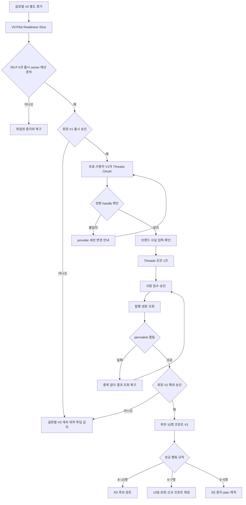

# OSMU 고객 발행 활성화 PRD

| 항목 | 값 |
|---|---|
| 문서 버전 | `2.3.0` — plan-gate retake |
| 작성 시각 | `2026-08-02 16:42 KST` |
| 작성자 / 모델 | `prd-architect / gpt-codex/gpt-5.6-sol` |
| 작업 라인 | `openclaw-auto-osmu` |
| 상태 | `plan 재심사 후보 — /approve plan 전 미확정` |
| Discussion / decision log | [v2.2 독립 비평 transcript](../tasks/osmu-prd-v2.2-critic.output#판정-go-with-changes--retake-major) `sha256:f3bfbe468f44` · [최신 회장 결정·리테이크 정본](../pipeline-state.md#2026-08-02-plan-결정-반영--v22-독립-비평) `sha256:e2580fd29377` |
| 상류 요구 정본 | [PRD v2.0.0](prd-osmu-customer-publishing-flow-v2.0.0.md) `sha256:9449812def93` |
| 구조 후보 | [PRD v2.1.0](openclaw-auto-osmu-prd-v2.1-gpt-codex.md) `sha256:140a5d47710c` |
| 직전 산출물 핀 | [PRD v2.2.0](openclaw-auto-osmu-prd-v2.2-gpt-codex.md) `sha256:ee3e832e51b1` |
| 독립 비평 핀 | [v2.2 critic output](../tasks/osmu-prd-v2.2-critic.output) `sha256:f3bfbe468f44` — 마지막 판정 `GO-with-changes — RETAKE-MAJOR`, 19/25 |
| QA 기준점 | [docs/qa-tracker.md](qa-tracker.md) `sha256:5c2886305834` |
| Pipeline 기준점 | [pipeline-state.md](../pipeline-state.md#2026-08-02-plan-결정-반영--v22-독립-비평) `sha256:e2580fd29377` — `plan in-progress`, `artifacts_ok:false`, 승인 산출물 없음 |

## 목차

- [경영진 요약](#executive-summary)
- [1. 문제·목적·범위](#purpose-scope)
- [2. 용어 정의](#glossary)
- [3. 페르소나와 JTBD](#persona-jtbd)
- [4. One Thing과 MVP 5개](#one-thing-mvp)
- [5. 제품 비전 선후와 핵심 플로우](#vision-flow)
- [6. 릴리스 lane과 성공 규칙](#release-metrics)
- [7. 공급자·운영 방식 비교](#provider-options)
- [8. BM·크레딧·운영 부하](#business-operations)
- [9. 변경 불가 요구 원문 인벤토리](#source-requirements)
- [10. 원자 AC→실제 QA 추적 매트릭스](#traceability)
- [11. 법무·개인정보·데이터 경계](#legal-data)
- [12. 리스크·모니터링·롤백](#risk-monitoring-rollback)
- [13. 결정·DRI·기한](#decisions-dri)
- [14. 벤치마크 반영](#benchmarks)
- [15. Steelman·Premortem·셀프심문](#red-team)
- [16. Planning 7원칙·INVEST·Stage Gate](#quality-gate)
- [17. 개정 이력](#history)
- [출처·모델·품질 푸터](#artifact-footer)

## 경영진 요약

OSMU의 글로벌 제품 비전 **V0는 그대로 유지**한다. 이번 PRD가 닫는 범위는 그 전체가 아니라 **`V0-Pilot Readiness Slice`**다. 이 slice는 외부 고객 1명이 자기 Threads 계정 1개와 고객이 확인한 브랜드 사실을 사용해 초안 1건을 사람 검수 후 발행하고 실제 permalink 1개를 여는 경로의 파일럿 준비도만 판정한다. slice 통과는 글로벌 V0 완료가 아니며 V1 전환을 자동 허용하지 않는다. Instagram의 기존 운영 증거는 과거 회귀 baseline으로 보존하되 신규 고객의 연결·상태 회귀는 R0-R, 신규 image publish 확대는 R2로 분리한다.

v2.1의 가장 큰 결함은 마스터 ID 29개를 보존했다고 주장하면서 상류 의미를 바꾸고, 문서 안에 만든 `TC-*` 문장을 실제 QA tracker 연결로 오인한 것이다. v2.3은 v2.0의 요구 문구 **29개를 변경 불가 열로 보존**하고, L-03과 L-04를 다시 원자화해 총 **73개 원자 AC**로 분해한다. 실제 `docs/qa-tracker.md`에 존재하는 ID·heading만 링크한다. v2.2에서 이관한 **59개 신규 QA seed**와 v2.3 원자화로 추가된 6개를 합쳐 **65개 AC가 `신규 QA seed — 미등록`** 상태다. plan 승인은 이 seed들의 qa-tracker 등록 승인이 아니다. 등록 owner는 `qa-verifier`, 기한은 design 승인 전이며, 미등록이면 build 승인 NO-GO다.

첫 외부 실험은 외부 SaaS를 우선 검토한다. 후보는 Postiz Cloud, Postiz self-hosted, 현 OSMU 직접 운영이다. Postiz Cloud Standard는 공식 가격 기준 USD 29/월이고 빠르지만 홍콩·미국 법인 및 여러 국가 subprocessor로 데이터가 이전될 수 있어 DPA·정확한 저장지역·삭제·export를 계약 전에 확인해야 한다. self-hosted는 소프트웨어 USD 0/월이지만 PostgreSQL·Redis·Temporal·storage와 2~4 vCPU/2~8GB 운영이 필요하다. 현 OSMU는 증분 라이선스 비용이 없으나 하드웨어·전력·운영시간 원가가 미산정이고, 502·OAuth·복구 부하가 수요 실험을 삼킬 수 있다. **최종 공급자 계약·배포는 eng-design 전 회장 승인 대상**이다.

첫 10명은 고객당 최대 USD 5, AI 비용 총 USD 50의 초대 운영 크레딧을 실험 상한으로 둔다 `(unsourced experiment cap)`. Postiz Cloud 월 USD 29 후보를 더한 파일럿 총예산 appetite는 **USD 79 + 법률 자문/운영 인건비 미확정**이며, 회장 승인 전 지출은 NO-GO다. 주당 운영시간 상한은 **4시간 `(unsourced experiment cap)`**이고, 초과 시 신규 모집을 즉시 중단하고 수동 운영 범위를 축소한다. 개인정보 primary DRI는 **회장(SJ)/서비스 운영자**다. backup DRI와 법률 자문자는 외부 출시 전 실명 지정이 없으면 NO-GO이며, 미지정 상태를 완료로 쓰지 않는다.

## 1. 문제·목적·범위

### 1.1 문제

- 2026-08-01 시크릿 창에서 Threads·Instagram OAuth 뒤 연결 상태와 CTA가 실제 계정 상태와 모순됐다.
- 다른 OSMU 고객으로 로그인해도 Threads 동의 화면에 기존 `zero_to_one_ai` 세션이 표시됐다.
- 고객이 초안→검수→실발행 경로를 찾지 못했고 운영 502 뒤 고객 복구와 운영 추적 증거가 남지 않았다.
- v2.1은 L-04를 Markdown script 문제로, L-08을 cross-tenant 403으로, L-09를 미지원 capability로, B-07을 Slack 메시지 분류로 바꾸는 등 상류 요구의 의미를 교체했다.
- v2.1의 `29/29/29`은 문서 내부 행 수였으며 실제 qa-tracker에 대응 ID가 없었다.

### 1.2 목적

고객 가치·제품 상태·운영 증거가 모두 `확인된 계정 → 확인된 사실 → 사람 승인 → 실제 permalink`라는 하나의 완료 정의를 사용하도록 한다. 이 PRD는 어떤 기능이 파일럿을 막고, 어떤 회귀는 기능 게이트로 격리해 병렬 처리할지를 결정한다.

### 1.3 범위

- Threads 계정 확인, 브랜드 사실 확인, 초안, 사람 검수, 실발행 permalink의 R1 계약
- Instagram 연결 CTA·상태·계정 표시 회귀 차단; 이미지 발행은 R2
- 마스터 요구 29개와 원자 AC 73개의 추적성
- pilot blocker와 non-blocking regression lane 분리
- Postiz Cloud/self-hosted/현 OSMU 직접 운영의 비용·데이터 위치·exit 비교
- 첫 10명 크레딧·BYOK·반복가치 뒤 결제 순서
- 개인정보·법무 gate, DRI, 모니터링, rollback, 결정기한

### 1.4 비범위

- API URL·payload·HTTP contract, DB table·column·entity, 구체 시스템 아키텍처
- 공급자 계약 체결, 배포 대상·포트·네트워크 확정
- 화면 레이아웃·component·design token·최종 microcopy
- Instagram 이미지 발행, 영상/TTS, Midjourney, Slack 후속 작업의 R1 구현
- self-service 결제·환불 시스템 구현
- private 서비스 데이터를 `postAGI-analytics`로 전송하는 설계
- 제품 코드·디자인·API·DB·100B 파일 변경

## 2. 용어 정의

| 용어 | 고정 정의 |
|---|---|
| provider | Threads·Instagram·Postiz 등 OSMU가 연결하거나 발행을 요청하는 외부 서비스 제공자 |
| tenant | 고객 데이터·권한·비용·연결 계정의 소유 및 격리 단위 |
| callback | provider 동의 뒤 OSMU로 제어가 돌아오는 단계. callback 수신만으로 연결 성공이 아니다 |
| 연결 | provider가 확인한 계정 식별자를 OSMU가 표시하고 고객이 목표 계정과 일치함을 확인한 상태 |
| 브랜드 사실 | 고객이 직접 입력하거나 원천에서 불러온 뒤 사실로 확인한 문장 |
| 추론 | AI가 제안했으나 고객이 사실로 확인하지 않은 내용 |
| 발행 성공 | provider 원문이 존재하고 목표 handle의 실제 permalink를 고객이 열 수 있는 상태 |
| BYOK | Bring Your Own Key. AI provider key와 사용료를 고객이 소유·부담하는 선택 경로 |
| RLS | Row Level Security. PostgreSQL에서 tenant 간 행 접근을 격리하는 정책 |
| subprocessor | OSMU 또는 주 processor를 대신해 개인정보를 추가 처리하는 재수탁자 |
| DRI | Directly Responsible Individual. 결과와 기한을 직접 소유하는 단일 책임자 |
| R0-P | 기능 on/off와 무관하게 외부 pilot을 시작하기 전에 반드시 닫아야 하는 계정·tenant·secret leakage·false-success·복구 hard stop |
| R0-R | pilot 전체를 막지 않고 해당 기능을 비활성화한 채 병렬로 닫는 회귀 lane |
| R1 | Threads One Thing을 운영자→유료 1명→외부 10명 순으로 검증하는 범위 |
| R2 | 반복가치 뒤 여는 Instagram 이미지·AI 자동채움·billing·media 확장 |
| V0-Pilot Readiness Slice | 글로벌 V0 안에서 Threads 첫 고객 경로의 파일럿 준비도만 판정하는 좁은 slice. 통과해도 글로벌 V0 완료·V1 자동 전환이 아님 |
| supersession | 과거 QA 증거를 삭제하지 않고, 새 범위·새 표본·새 종료증거가 무엇을 대체하는지 명시하는 규칙 |

## 3. 페르소나와 JTBD

### 3.1 핵심 페르소나 — 김민서, 34세, 1인 지식서비스 운영자

김민서는 직장 경력에서 얻은 전문성을 온라인 클래스와 1:1 상담 상품으로 판매한다. 별도 마케팅팀이나 개발자가 없고, 상품 설계·상담·정산·고객응대·콘텐츠 제작을 혼자 맡는다. Threads와 Instagram이 신규 문의에 영향을 준다는 사실은 알지만 매번 강의안, 가격표, 과거 공지, 고객 질문을 다시 찾아 AI에 붙여 넣고 채널 말투에 맞춘 뒤 실제 게시 여부까지 확인하는 과정이 본업 시간을 끊는다. 김민서에게 AI 글 생성은 신기한 기능이 아니다. 더 큰 불안은 생성 문장이 현재 상품의 실제 약속과 어긋나는지, 브라우저에 로그인된 개인 계정과 사업 계정 중 어느 쪽에 연결됐는지, 발행 버튼 뒤 실제 원문이 생겼는지를 스스로 진단할 수 없다는 점이다.

OAuth, callback, RLS, rate limit, access token은 김민서가 배우고 싶은 지식이 아니다. `연결됨`을 보면 OSMU가 provider에서 계정 handle과 게시 가능 상태까지 확인했다고 기대한다. 잘못된 계정에 상담 가격이나 고객 사례가 올라가면 브랜드 신뢰와 개인정보가 동시에 훼손될 수 있어 완전자동화보다 마지막 통제권을 중시한다. 그래서 초안은 자동으로 받아도 이번 글에 사용된 브랜드 사실, 발행 대상 handle, 최종 문장은 직접 확인하고 싶다. 실패하면 raw code보다 “현재 Threads 계정이 목표 계정과 다름”, “외부 서비스 응답 확인 중”, “다시 누르면 중복 게시하지 않고 기존 결과를 조회함”처럼 다음 행동을 원한다.

성공 장면은 초록 배지가 아니다. 고객이 확인한 사실이 들어간 글을 승인하고, `@minseo_money에 발행됨` 옆 실제 Threads URL을 열어 원문을 보는 순간이다. 첫 설정에 개발자 도움이 필요하거나 잘못된 성공 표시가 한 번이라도 나오면 메모장·ChatGPT·소셜 앱 복사붙여넣기로 돌아간다. 반대로 첫 게시가 안전하게 끝나고 14일 안에 두 번째 게시도 같은 사실 기반으로 빠르게 끝나면 월 구독을 검토한다. 이 페르소나의 연령·업종·행동은 내부 운영자의 실관찰과 Buffer·Postiz·Jasper의 공개 제품 계약을 조합한 가설이며, 외부 고객 인터뷰 전에는 시장 사실로 사용하지 않는다.

**Pain 한 줄:** SNS를 줄이려고 자동화를 도입했는데 연결 계정·브랜드 사실·실발행을 믿을 수 없어 결국 시스템 관리자 역할까지 떠안는다.

### 3.2 JTBD

> 오늘 사업 공지를 Threads에 올려야 할 때, 기술 용어를 배우거나 잘못된 계정을 걱정하지 않고 내 브랜드 사실이 적용된 초안을 확인·승인해 실제 원문 링크까지 확보하고 싶다.

### 3.3 근거와 검증 공백

- 근거 확인: [제품 비전](../wiki/product/vision.md)은 비개발자·자영업자와 API token 병목을 1차 타깃으로 둔다.
- 사용자 관찰: [2026-08-01 신규 고객 NG](qa-tracker.md#2026-08-01--ng--시크릿-창-신규고객-채널-연결핵심-플로우-전체-실패).
- 시장 계약: Buffer는 현재 활성 브라우저 Threads 계정이 연결되고 전체 계정 목록을 API로 받을 수 없다고 안내한다.
- 미검증: 외부 고객 구매 이유·지불의향·14일 반복 사용. V1/V2 코호트에서 검증한다.

## 4. One Thing과 MVP 5개

### 4.1 후보와 잘못된 답의 함정

| 후보 | 매력 | 잘못된 답의 함정 | 판정 |
|---|---|---|---|
| A. Threads와 Instagram에 동시에 자동발행 | OSMU의 멀티채널 이미지를 강하게 보임 | 서로 다른 OAuth·미디어 조건이 실패 원인을 섞고 R1 학습을 늦춤 | 탈락; Instagram image는 R2 |
| B. AI가 브랜드 글 1건을 생성 | 데모가 빠름 | 계정·사실·발행 증거가 없어 고객 결과가 끝나지 않음 | 탈락 |
| C. OAuth 뒤 `연결됨` 표시 | 구현 지표가 간단함 | callback을 실제 계정 확인과 게시 가능성으로 오인 | 탈락 |
| D. 20개 채널을 한 IA로 통합 | 기능 폭이 커 보임 | GitHub·공통 IA·미디어 회귀가 첫 고객 실험을 전부 막음 | 탈락 |
| E. 본인 Threads 계정에서 확인 사실 기반 글의 실제 permalink를 연다 | 고객 결과와 QA 증거가 동일 | 초기 채널 폭이 작아 보임 | 채택 |

### 4.2 최종 One Thing

> **외부 고객 1명이 자기 Threads 계정 1개를 확인하고, 고객이 확인한 브랜드 사실로 초안 1건을 검수·실발행해 실제 permalink 1개를 여는 것.**

### 4.3 MVP 기능 5개

| MVP | 기능 | One Thing 연결 | 사용자 입력 | 사용자 출력 | 주요 요구 |
|---|---|---|---|---|---|
| M1 | Threads 계정 확인 | 자기 계정 1개 | OAuth 동의·반환 handle 확인 | provider·handle·확인 상태 | L-12, N-02-A |
| M2 | 브랜드 사실 확인 | 확인된 사실 | 직접 입력·수정·확인 | 사실·출처·확인 상태 | L-05, B-01, B-04 |
| M3 | Threads 초안 1건 | 초안 1건 | 주제·확인 사실 | 적용 사실과 출처가 보이는 초안 | L-06, N-06 |
| M4 | 사람 검수·승인 | 검수·실발행 통제 | 본문 수정·대상 handle 재확인·승인 | 최종본·승인 상태 | N-06, L-09 |
| M5 | permalink 검증·복구 | 실제 permalink 1개 | 발행 승인 | 원문 URL 또는 중복 없는 복구 행동 | L-11, N-09-A, SNS-009/010/012/013 회귀 |

Instagram은 R0-R에서 연결 CTA·상태·Settings 회귀를 닫는다. R1 성공 분모와 MVP 5개에는 포함하지 않으며 이미지 발행은 R2다.

## 5. 제품 비전 선후와 핵심 플로우

### 5.1 증거 선후

| 게이트 | 대상 | 목적 | 종료 증거 | 통과가 허용하지 않는 것 |
|---|---|---|---|---|
| 글로벌 V0 | 서비스 운영자 1명 | [제품 비전](../wiki/product/vision.md)의 텍스트·이미지·영상·롱폼 클리핑·멀티채널·위키 톤·복구 가능성 전체를 안정적으로 직접 운영 | 제품 비전 V0 성공 기준 전량의 실제 운영 증거 | Threads slice만으로 완료 선언 금지 |
| V0-Pilot Readiness Slice | 서비스 운영자 1명 | Threads One Thing 경로와 R0-P hard stop, 개인정보·예산·운영 준비도 검증 | 본인 Threads 계정·확인 사실·승인·permalink, R0-P 0건, QA seed 등록, 출시 gate owner 실명 | 글로벌 V0 완료 선언·V1 모집·외부 데이터 투입 자동 허용 금지 |
| V1 출시 승인 | 회장 | 글로벌 V0와 slice를 함께 검토해 실제 유료 사용자 1명 투입 여부 결정 | 글로벌 V0 별도 승인 + slice QA 승인 + 법률 자문·backup DRI 실명 + 예산 지출 승인 | 승인 없이 외부 유료 사용자 초대 금지 |
| V1 관찰 | 실제 유료 사용자 1명 | 돈 또는 자기 사용량을 부담할 반복 의지 증명 | 실제 결제 또는 사전 합의한 자기 사용량 부담 + 첫 permalink | V2 cohort 자동 확대 금지 |
| V2 관찰 | 외부 고객 총 10명 | 활성화·지원부하·반복가치 분포 검증 | 10명 분모, 행동규칙 적용, 고객별 증거 묶음 | 반복가치 미통과 상태의 R2 확대 금지 |

내부 교육사업 dogfood와 서비스 운영자는 외부 코호트 분모에서 제외한다. V1 유료 사용자 1명은 외부 10명 코호트의 첫 번째 고객으로 포함해 선후는 유지하되 표본을 중복 계수하지 않는다.

### 5.2 핵심 유저플로우

**Mermaid 검증 상태:** 출고 전 로컬 Mermaid CLI 렌더와 구조 검사를 수행하며, 결과는 §16.3에 기록한다.

## 6. 릴리스 lane과 성공 규칙

### 6.1 lane 정의

| lane | 범위 | 파일럿 차단 여부 | 운영 규칙 |
|---|---|---|---|
| R0-P Hard Stop | wrong-account, cross-tenant, secret leakage, false-success, 중복발행, permalink 부재, 502 재개·추적 | 차단 | 기능 on/off와 무관하게 1건이라도 열려 있으면 외부 고객 데이터·발행 중지 |
| R0-R Regression | GitHub sync, Instagram 신규고객 연결·상태, Settings, 공통 IA, 글자수, 고객 금지 operator call | 전체 파일럿 비차단 | 해당 capability를 숨기거나 비활성화하고 병렬 수정; pilot 경로 회귀는 금지 |
| R1 Threads | M1~M5 | 핵심 | 글로벌 V0와 회장 V1 출시 승인을 건너뛰지 않고 증거 확장 |
| R2 | Instagram image, AI autofill, BYOK/credit self-service, TTS/media | 반복가치 전 차단 | 첫 permalink가 아니라 14일 내 두 번째 permalink 증거 뒤 검토 |
| Backlog | Midjourney exec 제거, Slack 계약 정리 | 비차단 | 별도 우선순위 승인 전 착수 금지 |

### 6.2 요구 배치

| lane | 마스터 요구 |
|---|---|
| R0-P | L-04 전 원자 AC, L-11, L-12, N-02-A, N-07, N-09-A/B |
| R0-R | L-01~03, L-08~09, N-01, N-02-B, N-03~05 |
| R1 | L-05~06, N-06, B-01, B-04 |
| R2 | L-07, L-10, L-13, N-08, B-02~05 |
| Backlog | B-06~07 |

N-01과 N-02처럼 하나의 master 안에 서로 다른 provider 계약이 있으면 atomic AC별 lane이 다르다. master ID는 유지하되 pilot 차단 여부는 AC 단위로 판정한다.

### 6.3 Instagram QA supersession 규칙

1. [qa-tracker의 기존 Instagram 운영 증거](qa-tracker.md)는 삭제·무효화하지 않고 **과거 회귀 baseline**으로 보존한다. 당시 계정·빌드·운영자 경로에서 관찰된 사실만 증명하며 신규 고객 activation 완료를 대신하지 않는다.
2. 2026-08-01 종료증거 중 Instagram의 신규 고객 `연결→동일 상태 표시` 구간은 **R0-R**로 승계한다. 이 회귀가 열려 있으면 Instagram capability를 숨기거나 비활성화하지만 Threads V0-Pilot Readiness Slice 전체를 자동 차단하지 않는다.
3. Instagram의 `초안→image publish→permalink` 신규 확대는 **R2**로 supersede한다. R1의 성공 분모·MVP에는 포함하지 않는다.
4. 단, Instagram 경로에서 cross-tenant, secret leakage, wrong-account 외부 게시, false-success가 1건이라도 관찰되면 기능 lane과 무관하게 **R0-P hard stop**으로 즉시 승격한다.
5. 새 QA 증거는 과거 행을 덮어쓰지 않고 날짜·tenant 유형·provider 계정·build·종료증거를 새 행으로 추가한다. “과거 PASS”와 “신규 고객 미검증”을 동시에 유지한다.

### 6.4 성공지표와 행동 규칙

**선행 수요 kill:** 2주 동안 외부 자격고객 100명에게 구체적인 파일럿 제안을 보냈는데 참여 동의가 3명 미만이면 개발 확대를 중단한다. 페르소나·pain·제안을 다시 검증하기 전 신규 기능·공급자 계약·V2 모집을 금지한다. `100명/3명/2주`는 `(unsourced experiment threshold)`이며 시장 평균으로 주장하지 않는다.

| 결과 | 행동 | R2·결제 영향 |
|---|---|---|
| 8~10/10 성공 | activation 가설 통과. 반복가치 3/10 이상을 별도 확인 | 반복가치 통과 시에만 Instagram image·self-service 결제 후보 검토 |
| **6~7/10 성공** | **조건부 RETAKE. R2를 동결하고 최대 14일·1회 보정 cycle에서 가장 큰 이탈 단계 하나만 수정한다. 기존 성공자를 재학습 표본으로 재사용하지 않고 신규 외부 10명 코호트로 다시 측정한다.** | self-service 결제·채널 확대 금지; 새 회장 승인 없이 추가 예산 집행 금지 |
| 3~5/10 성공 | NO-GO. 자동발행 가정을 plan에서 재개하고 고객 인터뷰·대안 행동을 재검증 | R2·결제 중지; 수동 검수/원천 정리 제품으로의 reposition 검토 |
| 0~2/10 성공 | 기존 kill-criteria 발동. 개발 확대 중단 | 신규 기능·공급자 계약 중지 |

공통 hard stop: wrong-account, cross-tenant read/write, false-success, 중복 외부 게시가 1건이라도 발생하면 성공자 수와 무관하게 즉시 중단한다.

### 6.5 반복가치

첫 10명 중 3명 미만이 첫 permalink 후 14일 안에 두 번째 실제 permalink를 만들면 self-service 결제, Instagram image, 영상/TTS를 열지 않는다 `(unsourced experiment threshold)`. 첫 유료 사용자도 두 번째 발행이 없으면 “결제 의향”이 아니라 “일회성 지원 구매”로 분류한다.

## 7. 공급자·운영 방식 비교

### 7.1 비교표

| 후보 | 월 비용·출처 | 데이터 위치 | 운영 부하 | Exit 경로 | 판정 |
|---|---|---|---|---|---|
| **Postiz Cloud Standard** | **USD 29/월**, 5 channels, 공식 월간 가격. 7-day trial. [Postiz Pricing](https://postiz.com/pricing) | Postiz 정책상 계약·계정 controller는 홍콩 Gitroom Limited, OAuth integration은 미국 Gitroom LLC. subprocessors는 미국·EU·영국·기타 국가를 사용할 수 있다. 정확한 storage region·고객 선택권은 공개 정책에서 확인되지 않음. [Privacy Policy](https://postiz.com/privacy-policy) | 가장 낮음. 다만 DPA, OAuth app approval 범위, 장애·지원 SLA 확인 필요 | Public API로 지원 범위의 integration/post를 회수하고 OAuth revoke·account deletion. 전체 export 보장은 공개 문서에서 확인되지 않아 계약 확인 필요; live 삭제 최대 90일, backup roll-off 30~90일 정책 | **속도 우선 1순위 검토**, 법률·DPA·region·export 확인 전 실데이터 금지 |
| **Postiz self-hosted** | 소프트웨어 **USD 0/월**(공식 pricing의 “open-source on your cloud for free”) + 인프라 변동비. 공식 권장 4 vCPU/8GB/50GB, 최소 2 vCPU/2GB/20GB. [System Requirements](https://docs.postiz.com/installation/system-requirements) | 선택한 우리 서버·PostgreSQL·storage에 저장. Docker Compose는 Postgres·Redis·Temporal을 포함하며 local/R2 storage 선택 가능. [Docker Compose](https://docs.postiz.com/installation/docker-compose) | 중~상. Temporal·DB·Redis·storage·backup·upgrade·OAuth app 운영 필요 | DB·upload volume·config export 후 다른 host로 이동 가능. 소스는 현재 공식 repo의 AGPL-3.0이나, 수정·공개 SaaS 사용 시 license 의무는 법률 검토 필요. [License](https://github.com/gitroomhq/postiz-app/blob/main/LICENSE) | 통제·exit 우수, R1 속도는 Cloud보다 느림 |
| **현 OSMU 직접 운영** | 증분 SaaS license **USD 0/월**. Proxmox·Cloudflare Tunnel·self-hosted runner의 하드웨어 감가·전력·운영시간은 **미산정**; 0원 총원가 주장 금지. 내부 근거: [multi-tenant 운영](../wiki/ops/multi-tenant.md) | 현재 OSMU PostgreSQL/RLS, Docker volume/R2 경계 안. private 원본은 analytics 밖에 유지 | 가장 높음. OAuth·502·publish reconciliation·monitoring을 직접 소유 | Git repo, PostgreSQL, volume/R2를 직접 소유하므로 기술적 exit는 가장 강함. 단 운영자 지식·현재 인프라 의존을 runbook으로 분리해야 함 | 장기 통제 후보; 첫 수요 실험 primary로 쓰면 운영부하가 학습을 지연할 위험 |

### 7.2 추천과 승인 경계

**추천:** 법률·DPA·storage region·export/delete 확인을 조건으로 Postiz Cloud를 첫 외부 고객 파일럿의 발행 실행 후보 1순위로 검증하고, OSMU는 브랜드 사실·사람 검수·permalink 증거를 소유한다. Postiz Cloud가 법률 gate를 통과하지 못하면 Postiz self-hosted를 2순위로 평가한다. 현 OSMU 직접 운영은 장기 주도권·exit 후보로 유지하되 R1 수요 검증을 502/OAuth 운영 개선과 묶지 않는다.

이 추천은 계약·배포 확정이 아니다. provider·tenant·callback·데이터 흐름·비용·exit를 eng-design에서 비교한 뒤 회장이 승인해야 한다. white-label/resale 권리는 Postiz Terms에서 일반 허용으로 확인되지 않으므로 별도 서면 계약 없이는 OSMU 고객에게 재판매하지 않는다.

## 8. BM·크레딧·운영 부하

### 8.1 BM 순서

1. V0 운영자: 내부 비용, 외부 activation 분모 제외.
2. V1 실제 유료 사용자 1명: 월 구독 또는 자기 사용량 부담을 사전에 합의하고 실제 사용.
3. V2 외부 10명: 초대 운영 크레딧으로 activation과 지원부하 측정.
4. 반복가치 통과 뒤: BYOK·기본 credit·self-service 결제의 최종 조합 결정.

### 8.2 첫 10명 크레딧 정책

| 항목 | 정책 |
|---|---|
| 고객당 상한 | USD 5 상당 `(unsourced experiment cap)` |
| 코호트 총상한 | USD 50 상당 `(unsourced experiment cap)` |
| 차감 | 고객이 사용할 수 있는 결과가 성공으로 반환된 요청만 1회 차감 |
| 실패·취소 | 고객 크레딧 차감 0. 실제 provider가 원가를 청구해도 회사 실험비로 분리 |
| 중복·retry | 동일 고객 행동의 retry는 성공 결과 1건에만 1회 차감 |
| BYOK | 선택 경로. 비개발자에게 기본으로 강제하지 않음 |
| self-service 결제 | 첫 10명 중 반복가치 3명 이상과 실제 원가 계산 뒤 검토 |
| 확정 비용 주장 | 금지. provider별 단가·세금·환율·실패과금은 eng-design/운영 원가표 전 미검증 |

### 8.3 파일럿 총예산 appetite와 지출 gate

| 비용 항목 | appetite | 상태 | 집행 규칙 |
|---|---:|---|---|
| AI 운영 크레딧 | USD 50 | 회장 채택 `(unsourced experiment cap)` | 고객당 USD 5·코호트 총 USD 50 이내 |
| Postiz Cloud Standard 후보 | USD 29/월 | [공식 가격](https://postiz.com/pricing) 확인, 공급자 미선정 | DPA·region·export/delete·resale 검토와 회장 승인 전 결제 NO-GO |
| 법률 자문 | 미확정 | 자문자 실명·견적 미지정 | 외부 출시 전 실명·범위·견적 승인 없으면 NO-GO |
| 운영 인건비 | 미확정 | 실제 시간당 원가 미산정 | 주당 4시간 cap으로 먼저 제한; 확대 전 실제 시간×원가 산정 |
| **파일럿 총예산 appetite** | **USD 79 + 법률/인건비 미확정** | **미승인** | **회장 승인 전 어떤 신규 지출도 NO-GO** |

USD 79는 AI USD 50과 Postiz Cloud 후보 USD 29의 산술합일 뿐 법률·인건비를 0으로 본 총원가가 아니다. Postiz를 선택하지 않더라도 남은 USD 29를 다른 비용으로 자동 전용하지 않는다.

### 8.4 BM 가설

- 고객은 생성 token 자체가 아니라 확인된 브랜드 사실, 잘못된 계정 방지, 검수·복구·permalink 증거에 돈을 낸다.
- 기본 구독 후보는 브랜드/workspace와 검증된 발행 workflow다. AI·영상 변동원가는 BYOK 또는 credit로 분리한다.
- 구체 가격·포함량·환불 회계는 V1 유료 사용자 행동과 V2 실제 원가 전 확정하지 않는다.

### 8.5 운영 부하 예산

주당 운영시간 상한은 **4시간 `(unsourced experiment cap)`**이다. 모집·온보딩·연결 복구·발행 복구·개인정보 요청·증거 정리를 모두 포함해 어느 주든 4시간을 초과하면 즉시 신규 모집을 중단하고, 수동 운영은 기존 고객의 안전한 종료·삭제·복구에 필요한 범위로 축소한다. 2주 연속 4시간을 넘기거나 고객당 수동 개입이 2/10을 초과하면 자동화 확대가 아니라 운영 모델과 가격 가정을 plan에서 재개한다.

| 사건 | 고객 셀프복구 | Monitoring owner | 파일럿 허용선 |
|---|---|---|---|
| 잘못된 provider 계정 | 현재 handle 확인·세션 변경 안내 | 서비스 운영자 | 오발행 0건 |
| callback/권한 실패 | 이유·재연결 행동 | 서비스 운영자 | 수동 개입 2/10 이하 |
| 502/timeout | 같은 요청 결과 조회·안전 재시도 | 서비스 운영자 | 추적 ID 누락 0건, 중복 0건 |
| permalink 지연 | 성공 승격 금지·기존 결과 조회 | 서비스 운영자 | false-success 0건 |
| AI 실패·취소 | 차감 0 표시 | 서비스 운영자 | 고객 차감 오류 0건 |
| 개인정보 요청 | 연결해제·삭제 요청 접수 | 서비스 운영자, 회장 최종 승인 | 법정·정책 기한 누락 0건 |

## 9. 변경 불가 요구 원문 인벤토리

아래 `상류 요구 원문`은 v2.0.0 매트릭스의 요구 열을 **철자까지 그대로** 옮긴 변경 불가 값이다. 하류 AC가 이 문구의 의미를 축소·교체할 수 없다.

| Master ID | 상류 요구 원문 — 변경 불가 | 기본 lane |
|---|---|---|
| L-01 | GitHub 주소 그대로 입력 | R0-R |
| L-02 | sync 오류 표시 | R0-R |
| L-03 | fine-grained PAT 404 분리 | R0-R |
| L-04 | md 저장·보안 | R0-P hard stop |
| L-05 | GitHub 없는 고객 대안 | R1 |
| L-06 | 계정·생성 근거 표시 | R1 |
| L-07 | 브랜드 AI 자동채움 | R2 |
| L-08 | 고객 transactions 403 제거 | R0-R |
| L-09 | 채널 글자수 | R0-R |
| L-10 | 영상 생성/TTS 정직성 | R2 |
| L-11 | 발행 거짓 성공 차단 | R0-P |
| L-12 | Threads tenant·계정 오기입 차단 | R0-P |
| L-13 | AI 플랜·사용량·토큰 | R2 |
| N-01 | OAuth 성공 뒤 상태·CTA 정합 | R0-R |
| N-02 | provider별 계정 전환 계약 | R0-P(A) / R0-R(B) |
| N-03 | OAuth 기본·빈 수동 토큰 기본 비노출 | R0-R |
| N-04 | Settings discoverability·동일 상태 | R0-R |
| N-05 | 공통 핵심 여정·capability 차이 | R0-R |
| N-06 | Threads 초안→검수→실발행 | R1 |
| N-07 | 고객 상태·오류 한글 계약 | R0-P |
| N-08 | GitHub rate-limit | R2 |
| N-09 | 502 고객 복구·운영 추적 분리 | R0-P |
| B-01 | 사이트 내 위키 에디터 | R1 |
| B-02 | 브랜드 AI 자동채움 | R2 |
| B-03 | BYOK+credit | R2 |
| B-04 | grounding 표시 | R1 |
| B-05 | ElevenLabs TTS | R2 |
| B-06 | Midjourney `docker exec` 제거 | Backlog |
| B-07 | Slack 분류 계약 정정 | Backlog |

## 10. 원자 AC→실제 QA 추적 매트릭스

### 10.1 QA 참조 규칙

- `실재 ID`는 현재 [qa-tracker](qa-tracker.md)에 실제 존재하는 식별자다.
- `실재 heading`은 관찰·회귀 섹션은 존재하지만 정규 TC ID가 없다는 뜻이다. 연결 증거로는 참고하되 QA 등록 완료로 세지 않는다.
- `신규 QA seed — 미등록`은 PRD가 제안한 TC 이름일 뿐, qa-tracker 연결 완료가 아니다.
- 기존 운영 PASS는 해당 과거 결함의 증거이며 신규 외부 고객 R1의 완료를 대신하지 않는다.
- **plan 승인 ≠ QA seed 등록 승인**이다. 신규 seed 등록 owner는 `qa-verifier`, due는 **design 승인 전**이다. 한 건이라도 미등록이면 build 승인 NO-GO다.

### 10.2 L 요구

| 상류 요구 원문 — 변경 불가 | ID / Atomic AC | Given–When–Then | 실제 qa-tracker 연결 |
|---|---|---|---|
| GitHub 주소 그대로 입력 | L-01-A | **Given** 지원 GitHub URL **When** sync 전 확인 **Then** repo/ref/path가 각각 표시된다. | [2026-07-31 위키 GitHub 레포 주소 붙여넣기](qa-tracker.md#2026-07-31-위키-github-레포-주소-붙여넣기) — 실재 heading, 정규 TC ID 없음; `QA-SEED-L01-A` 신규 QA seed — 미등록 |
| GitHub 주소 그대로 입력 | L-01-B | **Given** 비-GitHub host·userinfo·경로순회 입력 **When** 확인 **Then** 외부 호출 전에 거부된다. | 같은 실재 heading; `QA-SEED-L01-B` 신규 QA seed — 미등록 |
| sync 오류 표시 | L-02-A | **Given** sync 외부 실패 **When** 종료 **Then** 성공 banner가 표시되지 않는다. | 같은 실재 heading; `QA-SEED-L02-A` 신규 QA seed — 미등록 |
| sync 오류 표시 | L-02-B | **Given** sync 외부 실패 **When** 고객이 결과를 연다 **Then** 한글 원인과 다음 행동이 표시된다. | 같은 실재 heading; `QA-SEED-L02-B` 신규 QA seed — 미등록 |
| fine-grained PAT 404 분리 | L-03-REPO | **Given** 요청한 저장소가 실제로 존재하지 않음 **When** sync 진단 **Then** 원인은 `repo 없음` 하나로만 분류되고 PERMISSION·BRANCH·KEY·WIKI·RATE_LIMIT과 동시에 성립하지 않는다. | 같은 실재 heading; `QA-SEED-L03-REPO` 신규 QA seed — 미등록 |
| fine-grained PAT 404 분리 | L-03-PERMISSION | **Given** 저장소는 존재하지만 PAT에 대상 저장소 또는 `Contents: read` 권한이 없음 **When** 403/404 진단 **Then** 원인은 `권한 없음` 하나로만 분류된다. | 같은 실재 heading; `QA-SEED-L03-PERMISSION` 신규 QA seed — 미등록 |
| fine-grained PAT 404 분리 | L-03-BRANCH | **Given** 저장소·권한·key는 유효하지만 요청 branch가 없음 **When** 404 진단 **Then** 원인은 `브랜치 없음` 하나로만 분류된다. | 같은 실재 heading; `QA-SEED-L03-BRANCH` 신규 QA seed — 미등록 |
| fine-grained PAT 404 분리 | L-03-KEY | **Given** 저장 PAT 복호화 key가 없거나 불일치함 **When** sync 진단 **Then** 원인은 `암호화 키 오류` 하나로만 분류되고 PAT 원문은 응답·로그에 0건이다. | 같은 실재 heading; `QA-SEED-L03-KEY` 신규 QA seed — 미등록 |
| fine-grained PAT 404 분리 | L-03-WIKI | **Given** 입력이 GitHub Wiki 저장소 방식임 **When** sync 진단 **Then** 원인은 `GitHub Wiki 미지원` 하나로만 분류되고 일반 repo 사용 대안이 표시된다. | 같은 실재 heading; `QA-SEED-L03-WIKI` 신규 QA seed — 미등록 |
| fine-grained PAT 404 분리 | L-03-RATE-LIMIT | **Given** 저장소·권한·branch·key·Wiki 조건은 정상이고 호출 한도만 소진됨 **When** 403/429 진단 **Then** 원인은 `호출 한도` 하나로만 분류되고 재시도 가능 시각이 표시된다. | `QA-SEED-L03-RATE-LIMIT` 신규 QA seed — 미등록 |
| md 저장·보안 | L-04-MD-CROSS-TENANT | **Given** tenant A의 Markdown 원문 **When** tenant B 권한으로 모든 조회·검색·생성 경로를 호출 **Then** tenant A Markdown 원문 노출은 0건이다. | [SNS-007](qa-tracker.md#결함-관리-원장--2026-07-17)은 계정 격리 baseline일 뿐 md 전용 증거 아님; `QA-SEED-L04-MD-CROSS-TENANT` 신규 QA seed — 미등록; **R0-P** |
| md 저장·보안 | L-04-MD-RESPONSE | **Given** Markdown을 저장·sync·생성에 사용 **When** 정상 본인 편집 조회가 아닌 성공·실패·메타데이터 HTTP 응답을 전수 검사 **Then** Markdown 원문 노출은 0건이다. | `QA-SEED-L04-MD-RESPONSE` 신규 QA seed — 미등록; **R0-P** |
| md 저장·보안 | L-04-MD-LOG | **Given** Markdown을 저장·sync·생성에 사용 **When** application·proxy·job 로그 전수 검사 **Then** Markdown 원문 노출은 0건이다. | `QA-SEED-L04-MD-LOG` 신규 QA seed — 미등록; **R0-P** |
| md 저장·보안 | L-04-MD-ANALYTICS | **Given** Markdown을 저장·sync·생성에 사용 **When** analytics event 전수 검사 **Then** Markdown 원문과 외부 계정 식별자 필드는 0건이다. | `QA-SEED-L04-MD-ANALYTICS` 신규 QA seed — 미등록; **R0-P** |
| md 저장·보안 | L-04-PAT-CROSS-TENANT | **Given** tenant A의 PAT **When** tenant B 권한으로 모든 조회·sync 경로를 호출 **Then** tenant A PAT 원문·복호화 결과 노출은 0건이다. | `QA-SEED-L04-PAT-CROSS-TENANT` 신규 QA seed — 미등록; **R0-P secret leakage** |
| md 저장·보안 | L-04-PAT-RESPONSE | **Given** PAT 저장·검증·sync 성공 또는 실패 **When** HTTP 응답 전수 검사 **Then** PAT 원문 노출은 0건이다. | GitHub 실재 heading의 token 직렬화 0건은 과거 baseline; `QA-SEED-L04-PAT-RESPONSE` 신규 QA seed — 미등록; **R0-P secret leakage** |
| md 저장·보안 | L-04-PAT-LOG | **Given** PAT 저장·복호화·sync 성공 또는 실패 **When** application·proxy·job 로그 전수 검사 **Then** PAT 원문 노출은 0건이다. | `QA-SEED-L04-PAT-LOG` 신규 QA seed — 미등록; **R0-P secret leakage** |
| md 저장·보안 | L-04-PAT-ANALYTICS | **Given** PAT 관련 고객 행동 **When** analytics event 전수 검사 **Then** PAT 원문·부분값·복호화 결과 필드는 0건이다. | `QA-SEED-L04-PAT-ANALYTICS` 신규 QA seed — 미등록; **R0-P secret leakage** |
| GitHub 없는 고객 대안 | L-05 | **Given** GitHub 없는 외부 고객 **When** 브랜드 사실 1개를 입력·확인 **Then** Threads 초안 근거로 선택 가능하다. | `QA-SEED-L05` 신규 QA seed — 미등록 |
| 계정·생성 근거 표시 | L-06-A | **Given** 확인 계정 1개 **When** 초안 생성 화면을 연다 **Then** 목표 handle이 표시된다. | [2026-08-01 신규고객 NG](qa-tracker.md#2026-08-01--ng--시크릿-창-신규고객-채널-연결핵심-플로우-전체-실패) 실재 heading; `QA-SEED-L06-A` 신규 QA seed — 미등록 |
| 계정·생성 근거 표시 | L-06-B | **Given** 확인 사실 1개 **When** 초안 생성 **Then** 사용 사실과 출처가 표시된다. | `QA-SEED-L06-B` 신규 QA seed — 미등록 |
| 브랜드 AI 자동채움 | L-07-A | **Given** URL 또는 답변 **When** AI 자동채움 **Then** 사실 후보가 별도 표시된다. | `QA-SEED-L07-A` 신규 QA seed — 미등록 |
| 브랜드 AI 자동채움 | L-07-B | **Given** 같은 자동채움 **When** 결과 표시 **Then** 추론과 미확인이 사실과 분리된다. | `QA-SEED-L07-B` 신규 QA seed — 미등록 |
| 브랜드 AI 자동채움 | L-07-C | **Given** 미확인 후보 **When** 초안 생성 **Then** 사람 확인 전 발행 근거로 쓰이지 않는다. | `QA-SEED-L07-C` 신규 QA seed — 미등록 |
| 고객 transactions 403 제거 | L-08-A | **Given** 일반 고객 **When** Studio 진입 **Then** operator 거래 API 요청이 0건이다. | [2026-07-29 고객 운영 플로우 차단 결함](qa-tracker.md#2026-07-29-고객-운영-플로우-차단-결함--독립-qa) 실재 heading, 정규 TC ID 없음; `QA-SEED-L08-A` 신규 QA seed — 미등록 |
| 고객 transactions 403 제거 | L-08-B | **Given** 일반 고객 Studio **When** network·console을 확인 **Then** operator 거래 API 403이 0건이다. | 같은 실재 heading; `QA-SEED-L08-B` 신규 QA seed — 미등록 |
| 채널 글자수 | L-09-A | **Given** Threads 초안 **When** 검수 **Then** 현재 글자수와 provider 상한이 표시된다. | [2026-07-30 배치 D](qa-tracker.md#2026-07-30-배치-d--채널-한도내레이션-표기사용량-db-원장) 실재 heading; `QA-SEED-L09-A` 신규 QA seed — 미등록 |
| 채널 글자수 | L-09-B | **Given** provider 상한 초과 **When** 발행 시도 **Then** provider 호출 전에 차단된다. | 같은 실재 heading; `QA-SEED-L09-B` 신규 QA seed — 미등록 |
| 영상 생성/TTS 정직성 | L-10-A | **Given** TTS 불가 **When** 영상 생성 **Then** 무음과 원인이 표시된다. | 같은 실재 heading; `QA-SEED-L10-A` 신규 QA seed — 미등록 |
| 영상 생성/TTS 정직성 | L-10-B | **Given** 무음 결과 **When** 사용량 집계 **Then** 음성 성공으로 집계되지 않는다. | 같은 실재 heading; `QA-SEED-L10-B` 신규 QA seed — 미등록 |
| 발행 거짓 성공 차단 | L-11-A | **Given** provider 실패 또는 부분성공 **When** 종료 **Then** `발행됨`으로 표시되지 않는다. | [SNS-009](qa-tracker.md#결함-관리-원장--2026-07-17), [SNS-010](qa-tracker.md#결함-관리-원장--2026-07-17) 실재 ID |
| 발행 거짓 성공 차단 | L-11-B | **Given** 외부 성공·내부 기록 실패 **When** 종료 **Then** permalink·reconciliation 상태를 보존하고 자동 재발행을 막는다. | [2026-07-29 발행 부분성공 계약](qa-tracker.md#2026-07-29-기존-oauth-env-자격증명-확인--발행-부분성공-계약) 실재 heading; [SNS-012](qa-tracker.md#결함-관리-원장--2026-07-17) 실재 ID |
| 발행 거짓 성공 차단 | L-11-C | **Given** 완료 표시 **When** 고객이 결과를 연다 **Then** 실제 permalink가 존재한다. | [SNS-013](qa-tracker.md#결함-관리-원장--2026-07-17) 실재 ID |
| Threads tenant·계정 오기입 차단 | L-12-A | **Given** 타 Threads 세션 **When** OAuth 반환 **Then** handle 확인 전 연결 완료가 아니다. | [SNS-001](qa-tracker.md#결함-관리-원장--2026-07-17) 실재 ID; [2026-08-01 재제보](qa-tracker.md#2026-08-01--ng-재제보--신규-고객-threads-연결에-code_zero_to_one-노출) 실재 heading |
| Threads tenant·계정 오기입 차단 | L-12-B | **Given** tenant A 연결 **When** tenant B가 조회·발행 **Then** A 계정 read/write는 0건이다. | [SNS-007](qa-tracker.md#결함-관리-원장--2026-07-17) 실재 ID — 단 실제 2계정 provider 왕복은 미검증 |
| AI 플랜·사용량·토큰 | L-13-A | **Given** BYOK 또는 credit 선택 **When** 실행 전 **Then** 비용 주체가 표시된다. | `QA-SEED-L13-A` 신규 QA seed — 미등록 |
| AI 플랜·사용량·토큰 | L-13-B | **Given** AI 실행 1회 **When** 완료 **Then** token/usage가 정의된 단위로 표시된다. | [2026-07-30 배치 D](qa-tracker.md#2026-07-30-배치-d--채널-한도내레이션-표기사용량-db-원장) 실재 heading; `QA-SEED-L13-B` 신규 QA seed — 미등록 |
| AI 플랜·사용량·토큰 | L-13-C | **Given** 성공 실행 **When** 사용량 확정 **Then** 같은 사건은 1회만 차감된다. | `QA-SEED-L13-C` 신규 QA seed — 미등록 |
| AI 플랜·사용량·토큰 | L-13-D | **Given** 실패·취소·retry **When** 정산 **Then** 차감 0 또는 환불이 중복 없이 반영된다. | `QA-SEED-L13-D` 신규 QA seed — 미등록 |

### 10.3 N 요구

| 상류 요구 원문 — 변경 불가 | ID / Atomic AC | Given–When–Then | 실제 qa-tracker 연결 |
|---|---|---|---|
| OAuth 성공 뒤 상태·CTA 정합 | N-01-A | **Given** Instagram identity 검증 성공 **When** callback 복귀 **Then** OAuth CTA가 사라지고 확인 계정과 초안 CTA가 표시된다. | [2026-08-01 신규고객 NG](qa-tracker.md#2026-08-01--ng--시크릿-창-신규고객-채널-연결핵심-플로우-전체-실패) 실재 heading; `QA-SEED-N01-A` 신규 QA seed — 미등록 |
| OAuth 성공 뒤 상태·CTA 정합 | N-01-B | **Given** 저장 token과 provider 검증 장애 **When** 화면 표시 **Then** 근거 없는 `재연결 필요` 대신 `확인 불가`와 재시도가 표시된다. | 같은 실재 heading; `QA-SEED-N01-B` 신규 QA seed — 미등록 |
| provider별 계정 전환 계약 | N-02-A | **Given** Threads 목표 외 세션 **When** 재OAuth **Then** provider 세션 변경 안내 후 반환 handle 확인으로 끝난다. | [SNS-001](qa-tracker.md#결함-관리-원장--2026-07-17) 실재 ID; 실브라우저 종료증거 미검증 |
| provider별 계정 전환 계약 | N-02-B | **Given** Instagram 연결 **When** 계정 선택·재인증 **Then** Threads 가정을 복사하지 않고 공식 계약·실계정으로 승인된 흐름만 사용한다. | [SNS-002](qa-tracker.md#결함-관리-원장--2026-07-17) 실재 ID는 OTP 제한만 다룸; `QA-SEED-N02-B` 신규 QA seed — 미등록 |
| OAuth 기본·빈 수동 토큰 기본 비노출 | N-03-A | **Given** Instagram 기본 연결 화면 **When** 진입 **Then** 빈 Graph API token form은 0개다. | [2026-08-01 신규고객 NG](qa-tracker.md#2026-08-01--ng--시크릿-창-신규고객-채널-연결핵심-플로우-전체-실패) 실재 heading; `QA-SEED-N03-A` 신규 QA seed — 미등록 |
| OAuth 기본·빈 수동 토큰 기본 비노출 | N-03-B | **Given** 고급 복구를 명시적으로 엶 **When** token 경로 표시 **Then** 적용범위·위험·취소가 각각 보인다. | `QA-SEED-N03-B` 신규 QA seed — 미등록 |
| Settings discoverability·동일 상태 | N-04-A | **Given** provider identity 검증 성공 **When** Settings 진입 **Then** 같은 handle이 표시된다. | [SNS-007](qa-tracker.md#결함-관리-원장--2026-07-17) 실재 ID — 운영 단일계정 UI 관찰 |
| Settings discoverability·동일 상태 | N-04-B | **Given** 같은 계정 **When** 채널 화면과 Settings를 비교 **Then** 같은 상태가 표시된다. | `QA-SEED-N04-B` 신규 QA seed — 미등록 |
| Settings discoverability·동일 상태 | N-04-C | **Given** 같은 계정 **When** Settings 진입 **Then** 마지막 확인시각과 관리 진입점이 표시된다. | `QA-SEED-N04-C` 신규 QA seed — 미등록 |
| 공통 핵심 여정·capability 차이 | N-05-A | **Given** Threads와 Instagram **When** 비교 **Then** 연결→초안→검수→발행의 단계명은 같다. | [2026-08-01 신규고객 NG](qa-tracker.md#2026-08-01--ng--시크릿-창-신규고객-채널-연결핵심-플로우-전체-실패) 실재 heading; `QA-SEED-N05-A` 신규 QA seed — 미등록 |
| 공통 핵심 여정·capability 차이 | N-05-B | **Given** provider별 capability 차이 **When** 비교 **Then** 단계 순서와 전용 기능이 혼합되지 않고 별도 표시된다. | `QA-SEED-N05-B` 신규 QA seed — 미등록 |
| Threads 초안→검수→실발행 | N-06 | **Given** 확인 Threads 계정·사실 **When** 생성→수정/승인→발행 **Then** 목표 handle의 실제 permalink가 열린다. | [SNS-009](qa-tracker.md#결함-관리-원장--2026-07-17), [SNS-010](qa-tracker.md#결함-관리-원장--2026-07-17), [SNS-012](qa-tracker.md#결함-관리-원장--2026-07-17), [SNS-013](qa-tracker.md#결함-관리-원장--2026-07-17) 실재 ID — 기존 운영계정 증거이며 신규 고객 전체 여정은 미검증 |
| 고객 상태·오류 한글 계약 | N-07-A | **Given** 고객 오류 **When** 표시 **Then** `무슨 일이 발생했는지`가 한국어로 표시된다. | `QA-SEED-N07-A` 신규 QA seed — 미등록 |
| 고객 상태·오류 한글 계약 | N-07-B | **Given** 같은 오류 **When** 표시 **Then** 고객·운영자·provider 중 조치 소유자가 표시된다. | `QA-SEED-N07-B` 신규 QA seed — 미등록 |
| 고객 상태·오류 한글 계약 | N-07-C | **Given** 같은 오류 **When** 표시 **Then** 실행 가능한 다음 행동이 1개 이상 표시된다. | `QA-SEED-N07-C` 신규 QA seed — 미등록 |
| GitHub rate-limit | N-08-A | **Given** remaining=0 또는 retry-after **When** sync 실패 **Then** repo 없음과 다른 원인으로 분류한다. | `QA-SEED-N08-A` 신규 QA seed — 미등록 |
| GitHub rate-limit | N-08-B | **Given** reset 전 **When** scheduler가 재시도 판단 **Then** 자동 반복 요청은 0건이다. | `QA-SEED-N08-B` 신규 QA seed — 미등록 |
| 502 고객 복구·운영 추적 분리 | N-09-A | **Given** 발행 중 502/timeout **When** 고객 재진입·재시도 **Then** 기존 외부 결과를 조회하고 중복 게시 0건이다. | [SNS-012](qa-tracker.md#결함-관리-원장--2026-07-17) 실재 ID는 순차 중복 방지를 다룸; 502 고객 재개는 `QA-SEED-N09-A` 신규 QA seed — 미등록 |
| 502 고객 복구·운영 추적 분리 | N-09-B | **Given** 사건 상관 ID **When** 운영자 조회 **Then** 시각·영향 요청·실패 단계·upstream·배포버전이 추적된다. | `QA-SEED-N09-B` 신규 QA seed — 미등록 |

### 10.4 B 요구

| 상류 요구 원문 — 변경 불가 | ID / Atomic AC | Given–When–Then | 실제 qa-tracker 연결 |
|---|---|---|---|
| 사이트 내 위키 에디터 | B-01 | **Given** 외부 고객 **When** 사실 1개 생성·수정·확인 **Then** tenant 안에서 출처와 함께 다음 초안에 선택된다. | `QA-SEED-B01` 신규 QA seed — 미등록 |
| 브랜드 AI 자동채움 | B-02-A | **Given** URL/답변 **When** 자동채움 **Then** 사실 후보에 원천이 표시된다. | `QA-SEED-B02-A` 신규 QA seed — 미등록 |
| 브랜드 AI 자동채움 | B-02-B | **Given** 자동채움 결과 **When** 표시 **Then** 추론과 미확인이 사실과 분리된다. | `QA-SEED-B02-B` 신규 QA seed — 미등록 |
| 브랜드 AI 자동채움 | B-02-C | **Given** 미확인 결과 **When** 고객이 확인하지 않음 **Then** 정본으로 승격되지 않는다. | `QA-SEED-B02-C` 신규 QA seed — 미등록 |
| BYOK+credit | B-03-A | **Given** 고객이 모드 선택 **When** 생성 전 **Then** 비용 주체와 잔여 한도가 표시된다. | `QA-SEED-B03-A` 신규 QA seed — 미등록 |
| BYOK+credit | B-03-B | **Given** 성공 생성 **When** 종료 **Then** 승인된 모드에서 1회만 차감된다. | `QA-SEED-B03-B` 신규 QA seed — 미등록 |
| BYOK+credit | B-03-C | **Given** 실패·취소 **When** 종료 **Then** 고객 크레딧 차감은 0이다. | `QA-SEED-B03-C` 신규 QA seed — 미등록 |
| BYOK+credit | B-03-D | **Given** retry·환불 **When** 원장 조회 **Then** 중복 차감·중복 환불이 0건이다. | `QA-SEED-B03-D` 신규 QA seed — 미등록 |
| grounding 표시 | B-04-A | **Given** 확인 사실·추론·미확인 **When** 생성 근거를 연다 **Then** 세 상태가 분리 표시된다. | `QA-SEED-B04-A` 신규 QA seed — 미등록 |
| grounding 표시 | B-04-B | **Given** 확인 사실 1개 **When** Threads 초안 생성 **Then** 출처와 실제 적용 여부가 표시된다. | `QA-SEED-B04-B` 신규 QA seed — 미등록 |
| ElevenLabs TTS | B-05-A | **Given** 유효 권리·provider·잔액 **When** TTS 실행 **Then** 음성 결과가 확인된다. | `QA-SEED-B05-A` 신규 QA seed — 미등록 |
| ElevenLabs TTS | B-05-B | **Given** TTS 실패 **When** 무음 fallback **Then** 고객의 명시 동의 전 결과가 성공으로 승격되지 않는다. | [2026-07-30 배치 D](qa-tracker.md#2026-07-30-배치-d--채널-한도내레이션-표기사용량-db-원장) 실재 heading; `QA-SEED-B05-B` 신규 QA seed — 미등록 |
| Midjourney `docker exec` 제거 | B-06 | **Given** 생성 서비스 재시작 **When** 이미지 요청 **Then** shell 접속 없이 지원 경로의 결과 또는 설명 가능한 실패가 나온다. | `QA-SEED-B06` 신규 QA seed — 미등록 |
| Slack 분류 계약 정정 | B-07-A | **Given** Slack capability 조회 **When** 문서·화면 표시 **Then** 실제 OAuth 또는 webhook 방식이 구현과 일치한다. | [2026-07-29 고객 운영 플로우 차단 결함](qa-tracker.md#2026-07-29-고객-운영-플로우-차단-결함--독립-qa) 실재 heading은 notification fail-closed만 다룸; `QA-SEED-B07-A` 신규 QA seed — 미등록 |
| Slack 분류 계약 정정 | B-07-B | **Given** 같은 capability **When** 준비 절차 표시 **Then** 실제 구현 방식에 맞는 단계만 제공된다. | `QA-SEED-B07-B` 신규 QA seed — 미등록 |

### 10.5 추적성 수량·정직한 상태

| 항목 | 수량 | 판정 |
|---|---:|---|
| 마스터 요구 | 29 | v2.0 변경 불가 문구 29/29 복원 |
| 원자 AC | 73 | L-03 6개 상호배타 진단 + L-04 2자산×4노출면을 포함해 분해 |
| qa-tracker 실재 ID가 연결된 AC | 11 | SNS-001/002/007/009/010/012/013 등 기존 증거와 연결; 일부는 요구 전체가 아니라 일부 경계만 증명 |
| 실재 heading을 참조한 AC | 25 | 참고 증거이지 QA 등록 완료가 아님 |
| **v2.2 이관 신규 QA seed** | **59** | plan 승인 시 등록 승인으로 간주하지 않음 |
| **v2.3 원자화 추가 seed** | **6** | L-03 +1, L-04 +5 |
| **신규 QA seed — 미등록을 포함한 AC** | **65** | owner=`qa-verifier`, due=`design 승인 전`; 미등록이면 build 승인 NO-GO |

하나의 AC가 실재 ID·heading·신규 seed를 함께 가질 수 있어 열별 합은 73을 초과할 수 있다. `65개 AC에 신규 seed`가 남아 있으므로 이 PRD는 “AC↔실제 TC 전체 연결 완료”를 주장하지 않는다. plan gate는 요구와 seed 설계를 승인할 수 있을 뿐, qa-tracker 등록·실행을 대신하지 않는다.

## 11. 법무·개인정보·데이터 경계

### 11.1 책임

- 개인정보 보존·삭제·국외이전 정책의 **primary DRI는 회장(SJ)/서비스 운영자**다.
- 정책·공급자 계약·외부 출시의 **최종 승인자도 회장(SJ)**이다.
- **backup DRI는 미지정**이다. 외부 출시 전 실명 지정이 없으면 NO-GO다.
- 외부 고객 데이터가 provider 또는 AI subprocessor에 들어가기 전 **법률 검토 gate**를 통과해야 한다.
- **법률 자문자는 미지정**이다. 외부 출시 전 실명·검토범위·의견서가 없으면 NO-GO다. 미지정 상태는 완료가 아니다.

### 11.2 외부 출시 전 법률 gate

| Gate | 종료 증거 | 상태 |
|---|---|---|
| 처리 역할 | OSMU·고객·Postiz·AI provider·Meta의 controller/processor/subprocessor 역할표 승인 | 미통과 |
| 처리 목적·항목 | account ID, OAuth token, post/wiki content, usage/log의 목적·최소항목 승인 | 미통과 |
| 보존·삭제 | live·backup·log·billing별 보존기간, 연결해제·계정삭제 SLA, 게시물 영향 승인 | 미통과 |
| 국외이전 | 이전 국가·수령자·목적·항목·시점·방법·기간·거부 영향의 고지/동의 또는 적법 근거 승인 | 미통과 |
| 재위탁 | subprocessor 목록·변경고지·DPA·보안조치 승인 | 미통과 |
| 권리·콘텐츠 | 고객 원천 이용권한, AI input 학습/보존, 생성물 저작권·상표·초상권 책임 승인 | 미통과 |
| Meta 정책 | App Review·scope·professional account·privacy URL·삭제 callback 확인 | 미통과 |
| Exit | export 형식·OAuth revoke·삭제 확인·backup roll-off 증거 합의 | 미통과 |
| 책임자 실명 | primary=회장(SJ)/서비스 운영자, backup DRI·법률 자문자 실명과 연락 경로 승인 | **primary만 지정; backup·자문자 미지정으로 미통과** |

한국 개인정보 보호법 제28조의8은 국외 제공·처리위탁·보관을 국외이전으로 보고 적법 근거와 고지 등을 요구한다. 시행령 제29조의10은 안전조치·분쟁해결·계약 반영을 요구한다. 본 문서는 법률 의견이 아니며, 실제 고객 출시 전 한국 법률 전문가 검토가 필요하다.

### 11.3 Analytics 하드라인

- 고객 원문, 위키, 초안, social handle, token, permalink는 tenant-scoped이며 analytics payload에 넣지 않는다.
- 제품 funnel은 가명 사건 ID, 단계, 성공 여부, 지연시간, 오류 분류만 수집 후보로 둔다.
- private 서비스 데이터는 원문·식별자·집계 모두 `postAGI-analytics`에 섞지 않는다.
- public 서비스 집계도 목적·권리·보존기간과 schema가 승인되기 전에는 전송하지 않는다.

### 11.4 postAGI 서비스·포트·DB 정합성

- OSMU는 `openclaw-auto` 독립 레포다. PostAGI-public/private와 git history를 합치지 않는다.
- Romeo `8080/42080`, Dark-Cupid `9090/42090`, Yeon `8083/18080`, OKgram `8084/18084`, Polyamory `8085/18086` 포트를 재사용하지 않는다.
- 현 OSMU는 외부 `18789` 라우팅과 독립 PostgreSQL/RLS 경계를 유지한다. 새 runtime·port·DB는 eng-design과 회장 승인 전 확정하지 않는다.
- PostAGI 서비스의 MySQL/MariaDB에 OSMU token·wiki·usage를 복제하지 않는다.
- 시크릿 실값은 PRD·wiki·git·log·analytics에 기록하지 않는다.

## 12. 리스크·모니터링·롤백

### 12.1 리스크 레지스터

| 분야 | 실패 시나리오 | 영향 | 완화 | DRI | Gate |
|---|---|---|---|---|---|
| 계정 | 기존 Meta 세션이 다른 handle로 발행 | 치명 | handle 확인, wrong-account 1건 hard stop | 서비스 운영자 | R0-P |
| tenant·secret | 다른 고객 account/wiki/draft 또는 PAT 노출 | 치명 | L-04 2×4 전수 AC, tenant/RLS·교차 E2E, analytics 원문 금지 | 회장(SJ)/서비스 운영자 | R0-P |
| 발행 | 2xx 뒤 permalink 없음·중복 게시 | 치명 | 완료 상태 분리, idempotent 조회·복구 | 서비스 운영자 | R0-P |
| 공급자 | Postiz Cloud region/export/delete 불명 | 상 | DPA·지역·삭제·exit 계약 전 실데이터 금지 | 서비스 운영자→회장 | 법률 |
| 비용 | AI·Postiz 합계 USD 79 초과 또는 법률/인건비 무승인 지출 | 상 | 항목별 cap, 회장 사전 승인, daily ledger | 회장(SJ)/서비스 운영자 | 출시 |
| 시장 | 고객이 복사붙여넣기를 더 빠르게 선택 | 상 | 100명 제안 수요 kill, 6~7/10 행동규칙, 3~5/10 plan reopen | 회장(SJ)/서비스 운영자 | V1/V2 |
| 운영 | 주 4시간 초과 또는 외부 SaaS 장애·현 OSMU 502로 학습 지연 | 상 | 신규 모집 중단, 수동 운영 축소, 공급자 health·correlation·rollback | 회장(SJ)/서비스 운영자 | 지속 |
| 법무 | 국외이전·subprocessor 고지 미비 | 치명 | 외부 출시 전 법률 자문자 실명·의견서 gate | 회장(SJ)/서비스 운영자 | 출시 |
| license | self-hosted 수정본 공개 제공의 AGPL 의무 위반 | 상 | 법률 검토·source 제공 의무 확인 | 서비스 운영자→회장 | 계약 |

### 12.2 Monitoring

**Monitoring primary owner: 회장(SJ)/서비스 운영자.** backup owner는 미지정이며, V1 외부 출시 전 실명 지정이 없으면 NO-GO다.

| 지표·사건 | 경보 기준 | 데이터 최소화 | 대응 |
|---|---|---|---|
| wrong-account/cross-tenant/false-success/duplicate | 1건 | pseudonymous tenant 사건 ID, 원문·handle 제외 | 즉시 publish 중단·회장 보고 |
| callback→handle 확인 실패 | 10분 rolling 2건 또는 고객 1명 2회 | provider·단계·error class | 해당 provider 신규 연결 중지 |
| 5xx/timeout | 5분 2건 또는 5% 초과 | correlation ID·배포버전·upstream class | 공급자 상태 확인·rollback 판단 |
| permalink 미회수 | publish 성공 후보의 1건 | external ID hash·상태 | 성공 승격 금지·결과 조회 |
| credit 이상 | 고객 USD 5 또는 cohort USD 50 접근 80% | 금액·사건 ID, prompt 원문 제외 | 신규 생성 경고·상한 도달 시 중지 |
| 총예산·운영시간 | USD 79 접근 80% 또는 주 4시간 도달 | 항목별 금액·분 단위 시간, 고객 원문 제외 | 신규 모집 중단·수동 운영 축소·회장 재승인 |
| legal/deletion SLA | 기한 50% 경과 미처리 | 요청 ID·기한·상태 | 서비스 운영자 escalation |

### 12.3 Rollback 계약

Rollback trigger는 wrong-account, cross-tenant, false-success, duplicate publish 1건, 법률 gate 위반, 또는 provider 장애로 5xx가 5분 5%를 넘는 경우다.

1. 신규 OAuth·발행·scheduled job을 중지하고 초안은 보존한다.
2. 이미 발행된 외부 결과는 삭제를 자동 가정하지 않고 고객·운영자가 permalink로 확인한다.
3. Postiz Cloud이면 OAuth를 revoke하고 지원되는 export를 회수한 뒤 account deletion·backup roll-off 증거를 요청한다.
4. Postiz self-hosted이면 container를 중지하고 DB·upload·config snapshot을 보존한다. public modified service의 source 제공 의무를 법률 검토한다.
5. 현 OSMU이면 마지막 승인 version으로 되돌리고 DB/volume은 destructive rollback하지 않는다. 중복 방지용 publication 기록을 보존한다.
6. 사고 원인·영향·고객 통지·재개 조건을 회장이 승인하기 전 발행을 재개하지 않는다.

구체 명령·API·DB rollback 절차는 eng-design 산출물에서 회장과 합의한다.

## 13. 결정·DRI·기한

| 결정 | 추천안 | DRI | 최종 승인 | 결정기한 | 미결정 시 |
|---|---|---|---|---|---|
| Threads R1 | Threads 단독, Instagram image R2 | 서비스 운영자 | 회장 | **확정됨 — 본 PRD 입력** | 해당 없음 |
| 공급자 shortlist | Postiz Cloud → 법률 fail이면 self-hosted → 현 OSMU 장기 | 서비스 운영자 | 회장 | 2026-08-05 18:00 KST 또는 eng-design 착수 전 중 빠른 시점 | eng-design 진입·계약·배포 금지; 승인된 plan 뒤 design은 provider 비확정 상태로 진행 가능 |
| 첫 10명 credit | USD 5/명·USD 50 총 cap, 실패 0차감, BYOK 선택 | 서비스 운영자 | 회장 | **확정됨 — 본 PRD 입력** | 해당 없음 |
| 파일럿 총예산 | USD 79 + 법률/인건비 미확정; 승인 전 지출 0 | 회장(SJ)/서비스 운영자 | 회장 | 첫 신규 지출 전 | 지출·외부 모집 금지 |
| 주당 운영시간 | 4시간 cap; 초과 시 신규 모집 중단·수동 운영 축소 | 회장(SJ)/서비스 운영자 | 회장 | 파일럿 운영 시작 전 | 외부 모집 금지 |
| 개인정보 정책 | 보존·삭제·국외이전·subprocessor 정책표 | 회장(SJ)/서비스 운영자 | 회장 | 2026-08-07 18:00 KST 초안, 외부 고객 데이터 전 최종 승인 | 외부 출시 금지 |
| 법률 자문자 | 한국 개인정보·SaaS 자문 가능 전문가 **실명 지정** | 회장(SJ)/서비스 운영자 | 회장 | 외부 출시 전 | **미지정이면 NO-GO** |
| Monitoring backup | 운영자 부재 시 대응자 1명 지정 | 회장 | 회장 | V1 유료 사용자 초대 전 | 외부 파일럿 금지 |
| QA seed 등록 | v2.2 이관 59개 + v2.3 추가 6개를 qa-tracker 실제 ID로 등록 | qa-verifier | QA 책임자/회장 gate | design 승인 전 | 미등록이면 build 승인 NO-GO |
| Postiz contract/white-label | DPA·region·export·delete·resale 서면 확인 | 서비스 운영자 | 회장 | 계약 서명 전 | Postiz Cloud 실데이터·재판매 금지 |

Discussion과 결정 이력은 [v2.2 critic의 마지막 판정·인계](../tasks/osmu-prd-v2.2-critic.output#판정-go-with-changes--retake-major), [pipeline-state 최신 durable 결정](../pipeline-state.md#2026-08-02-plan-결정-반영--v22-독립-비평), 이 문서 개정 이력에 남긴다. API·DB·아키텍처·배포 결정은 본 표로 자가확정하지 않는다.

## 14. 벤치마크 반영

### 14.1 제품·운영 벤치마크

| 1차 소스 | 확인한 계약 | 차용 | OSMU 변경·차별화 |
|---|---|---|---|
| [Buffer — Threads](https://support.buffer.com/article/857-using-threads-with-buffer) | 현재 활성 브라우저 계정 연결, 전체 Threads 계정 목록 API 부재 | 계정 전환 제약을 숨기지 않음 | callback 뒤 반환 handle을 고객이 확인해야 다음 단계 진행 |
| [Buffer — Instagram 연결](https://support.buffer.com/article/568-connecting-your-instagram-business-or-creator-account-to-buffer) | 현재 활성 브라우저 Instagram 계정이 연결되며 다중계정은 private window·명시적 로그아웃/재로그인을 안내 | 신규 고객 연결·상태 회귀를 과거 운영 발행 증거와 분리 | Instagram 연결은 R0-R, 신규 image publish는 R2로 supersede |
| [Postiz Pricing](https://postiz.com/pricing) | Cloud USD 29/월부터, self-host software free, 다채널 publish | 외부 SaaS로 발행 인프라를 빠르게 검증 | 브랜드 사실·사람 승인·permalink 증거는 OSMU가 소유 |
| [Postiz System Requirements](https://docs.postiz.com/installation/system-requirements) | Postgres·Redis·Temporal·storage, 2~4 vCPU/2~8GB | self-host 운영부하를 실제 구성요소로 계산 | “무료”를 총원가 0으로 포장하지 않음 |
| [Postiz Privacy](https://postiz.com/privacy-policy) | 홍콩·미국 법인, 여러 국가 subprocessor, token/content/analytics 처리, 90일 삭제·backup 30~90일 | 데이터 위치·exit·DPA를 계약 gate로 둠 | 외부 고객 데이터 전 한국 국외이전 법률 검토 추가 |
| [Jasper Knowledge](https://help.jasper.ai/hc/en-us/articles/18618707176347-Knowledge-Base) | URL·file·text 기반 knowledge | 생성 근거를 고객이 확인 | 사실·추론·미확인을 분리하고 확인 사실만 사용 |
| [GitHub rate limits](https://docs.github.com/en/rest/using-the-rest-api/rate-limits-for-the-rest-api?apiVersion=2022-11-28) | remaining/reset/retry-after, 제한 중 반복 요청 금지 | rate limit을 repo 없음과 분리 | 한글 다음 시각·대안 제공 |

### 14.2 문서 양식 벤치마크

| 1차 소스 | 차용 | 적용 결과 |
|---|---|---|
| [Kubernetes KEP Template](https://github.com/kubernetes/enhancements/blob/master/keps/NNNN-kep-template/README.md) | goals/non-goals, graduation, monitoring, rollback, risks, alternatives | §1·6·7·12에 분리 반영; Mermaid는 로컬 CLI render 증거를 별도 기록 |
| [GitLab Product Development Flow](https://handbook.gitlab.com/handbook/product-development/how-we-work/product-development-flow/) | problem validation, SSOT, DRI, 단계별 증거 | team label 대신 서비스 운영자 DRI·회장 최종 승인·기한 명시 |
| [Go Proposal Process](https://go.googlesource.com/proposal/+/master/README.md) | discussion과 review 뒤 accepted/implementation | Discussion link·open decisions·stage gate 추가 |
| [Go Design Template](https://go.googlesource.com/proposal/+/master/design/TEMPLATE.md) | author, discussion, rationale, compatibility, who/when, open issues | v2.1의 2015 발표자료를 현행 정본으로 교체; DRI·기한·호환성 추가 |
| [Linear Method — Scope Projects Down](https://linear.app/method/scope-projects) | scope를 작은 결과로 절단 | 29개 master는 보존하되 R1은 Threads One Thing과 MVP 5개로 제한 |

### 14.3 차용하지 않은 것

- Postiz의 30+ channel 폭을 R1 가치로 복제하지 않는다.
- 외부 SaaS를 쓴다는 이유로 데이터 권리·삭제·국외이전 책임을 supplier에 전가하지 않는다.
- KEP나 Go 양식을 형식적으로 복제해 API·DB·아키텍처를 plan에서 확정하지 않는다.

## 15. Steelman·Premortem·셀프심문

### 15.1 Steelman — “Postiz를 그대로 쓰면 OSMU가 필요 없다”

회의적 고객의 가장 강한 반론은 Postiz Cloud USD 29/월이 이미 Threads 연결·draft·schedule·publish를 제공하므로 OSMU가 같은 발행 인프라를 다시 만드는 것은 낭비라는 것이다. 첫 10명 규모에서 Postiz+ChatGPT+수동 승인 조합은 OSMU의 현재 502·OAuth 복구 부하보다 싸고 안정적일 수 있다.

이 반론을 견디는 유일한 답은 OSMU가 scheduler가 아니라 **확인된 브랜드 사실, 대상 계정, 사람 승인, 실제 permalink를 하나의 감사 가능한 사건으로 묶는 층**이라는 증거다. Postiz를 backend 후보로 써도 이 층에 돈을 내지 않으면 OSMU 독립 제품 가정을 중단하고 internal operating layer로 축소한다.

### 15.2 Premortem — 1년 뒤 실패했다면

첫째, Postiz Cloud를 빨리 붙였지만 데이터 위치·subprocessor·export를 확인하지 않아 한국 고객의 국외이전 고지가 틀리고 계약을 중단했을 수 있다. 이 시나리오는 법률 gate 전 실데이터 금지, DPA·region·delete·exit 서면 확인으로 막는다.

둘째, 10명 중 6~7명이 겨우 성공했는데 “과반 성공”으로 포장해 Instagram·결제를 열고 지원부하가 폭증했을 수 있다. 그래서 6~7명은 GO가 아니라 14일·1회 보정 뒤 **신규 10명 코호트**로 다시 측정하며, R2와 추가 예산 집행을 동결한다.

셋째, 기존 SNS-009~013의 운영 PASS를 신규 고객 전체 여정 PASS로 오인해 wrong-account가 실제 고객에게 발생했을 수 있다. 기존 ID는 회귀 증거로만 쓰고 V0/V1/V2의 고객별 handle·사실·승인·permalink 증거를 별도로 요구한다.

넷째, Threads slice 성공을 글로벌 V0 완료로 오인해 이미지·영상·롱폼·멀티채널 복구가 불안정한 상태에서 V1을 열었을 수 있다. 이를 막기 위해 글로벌 V0와 `V0-Pilot Readiness Slice`를 별도 gate로 유지하고, 둘의 승인과 출시 owner 실명·예산 승인을 모두 갖추기 전 외부 유료 사용자를 초대하지 않는다.

### 15.3 까다로운 고객 공격과 수정

**공격:** “실패 요청은 내 credit에서 안 빼도 내 시간은 이미 날아갔다.”

**수정:** credit 환불만으로 복구 완료를 주장하지 않는다. 실패 원인·소유자·다음 행동, 중복 없는 재개, 운영 개입 시간을 함께 측정한다.

**공격:** “Postiz Cloud에 내 token·콘텐츠가 어느 나라에 저장되는지도 모르는데 왜 연결해야 하나.”

**수정:** 정확한 region·DPA·subprocessor·삭제·export가 서면 확인되지 않으면 Cloud 후보를 탈락시키고 self-hosted로 전환한다.

### 15.4 셀프심문

**이 결론이 틀렸다면 가장 그럴듯한 이유는?** 고객의 가장 큰 pain이 발행 신뢰가 아니라 매번 좋은 주제를 찾고 성과를 내는 것일 수 있다. permalink 성공률이 높아도 두 번째 발행과 결제가 없다면 One Thing은 기술적 성취일 뿐 구매가치가 아니다.

**답과 수정:** V1을 실제 유료 사용자 1명으로 두고, V2에서 첫 permalink와 14일 내 두 번째 permalink를 분리한다. 3/10 미만 반복이면 credit·Instagram·영상 확장을 막고, 브랜드 전략·주제 discovery를 새 plan 가설로 재검토한다.

## 16. Planning 7원칙·INVEST·Stage Gate

### 16.1 Planning 7원칙

| # | 원칙 | 판정 | 근거 |
|---|---|---|---|
| 1 | 용어 통일 | PASS | provider·tenant·callback·BYOK·RLS·subprocessor 포함 §2 정의 |
| 2 | 구체화 | PASS | 29 master·73 AC·USD 79+미확정 비용·주 4시간 cap·100명/3명 수요 kill·6~7 행동 규칙 |
| 3 | 입출력 분리 | PASS | MVP 5개에 입력·출력·실패 의미 분리 |
| 4 | 정합성 | PASS | 글로벌 V0와 slice 분리, Threads One Thing, Instagram baseline/R0-R/R2 supersession, R0-P hard stop 일치 |
| 5 | 정책 상세 | PASS | 실패 차감·retry·rollback·법률·data exit·예산/시간 중단·QA seed owner/due 명시 |
| 6 | 추출 철저 | PASS | v2.0 요구 29/29 복원, L-03 6분할·L-04 2×4 포함 73 AC로 분해 |
| 7 | 논리 영역 | PASS | `좋은 UX` 대신 hard stop·cohort·기한·증거를 사용 |

### 16.2 INVEST

- Independent: account, fact, draft, approval, permalink와 regression lane을 분리했다.
- Negotiable: 화면/API/DB/architecture/provider contract는 하류 합의로 남겼다.
- Valuable: R1의 모든 기능은 One Thing의 한 구절에 직접 연결된다.
- Estimable: master 29와 atomic AC 73으로 하류 추정 단위를 제공한다.
- Small: R1은 Threads 한 채널·고객 1명부터 시작한다.
- Testable: 모든 atomic AC에 Given–When–Then과 QA 상태를 붙였다.

### 16.3 Gate 상태

| Gate 항목 | 상태 | 종료 증거 |
|---|---|---|
| 상류 4종·내부 기준 정독 | 근거 확인 | 버전 핀·SOURCES |
| 제품·문서 벤치마크 | 근거 확인 | Postiz·Buffer·Jasper·GitHub·KEP·GitLab·Go 현행 1차 소스 |
| 페르소나 600자+ | 충족 | §3 단일 페르소나 |
| One Thing·MVP 5 | 충족 | §4 |
| 요구 의미 보존 | 충족 | §9 원문 29/29, §10 73 AC |
| QA seed 등록 | **후속 gate 미통과 — plan blocker 아님** | v2.2 이관 59개 + v2.3 추가 6개; owner=qa-verifier, due=design 승인 전, 미등록이면 build 승인 NO-GO |
| 공급자·법률 결정 | **하류 gate 미통과** | 공급자=eng-design 전, 법률=외부 고객 데이터 전 회장 승인 필요; plan이 대신 확정하지 않음 |
| Mermaid 구조·렌더 | 검증 예정 | 로컬 Mermaid CLI render와 TOC·anchor 기계검사를 출고 전 실행 |
| 독립 plan-critic 재심사 | **미통과** | v2.2 대상 재비평 필요 |
| `/approve plan` | **미통과** | 승인 로그·approved_artifacts pin 없음 |
| design 진입 | **현재 불가** | 독립 plan-critic 재심사와 `/approve plan` 뒤 가능; QA seed 등록은 design 승인 전 별도 종료 |

### 16.4 AI 코드생성 5단 스펙 경계

1단 목적과 2단 고객 입출력·수용기준만 이 PRD가 확정한다. 3단 schema, 4단 API contract는 기술설계 티키타카 전 확정하지 않는다. 5단 test case는 QA seed와 기존 actual ID의 추적까지만 제공하며 fixture·endpoint·field는 eng-design/QA 승인 산출물에서 확정한다.

## 17. 개정 이력

| 버전 | 날짜 | 변경 |
|---|---|---|
| 2.0.0 | 2026-08-01 | 상류 요구 29개·페르소나·One Thing 초안 |
| 2.1.0 | 2026-08-01 | client-ready 구조 추가. 요구 의미 변형·가상 QA 연결로 critic 13/25 RETAKE-MAJOR |
| 2.2.0 | 2026-08-02 | 상류 문구 29개 복원, 67 atomic AC, actual QA/seed 분리, R0-P/R0-R, V0→V1→V2, 6~7 행동규칙, Postiz 3안, USD 5/50 cap, 법률 gate, monitoring/rollback/DRI/기한, Go 현행 출처 반영 |
| 2.3.0 | 2026-08-02 | 글로벌 V0와 V0-Pilot Readiness Slice 분리, L-03 6분할, L-04 2×4 전수화, security R0-P, Instagram QA supersession, demand/repeat kill, USD 79+미확정 비용·주 4시간 cap, DRI·QA seed gate 보강 |

## 출처·모델·품질 푸터

### STAMP

🏷 STAMP | line: openclaw-auto-osmu | 생성: 2026-08-02 16:42 KST | model: gpt-codex/gpt-5.6-sol | agent: prd-architect

skills: 범용 PRD 매칭 스킬 없음 — planning.md·doc-review.md·benchmarks.md·artifact-stamp.md 직접 적용

근거: v2.0 요구 정본·v2.2 직전 산출물·v2.2 critic 마지막 판정/인계·pipeline 최신 결정·qa-tracker 실제 ID, Postiz/Buffer/Jasper/GitHub/KEP/GitLab/Go/PIPC 1차 출처

고민: Threads One Thing을 유지하되 이를 글로벌 V0 완료로 승격하지 않고, 기능 회귀와 cross-tenant·secret hard stop을 원자 AC 수준에서 분리했다.

### SKILLS

SKILLS_USED: 없음 — 현재 available skills에 범용 제품 PRD 작성 스킬이 없어 지정된 품질헌법을 직접 적용했다.

SKILLS_SKIPPED: `brand-positioning-kit`, `course-offer-packager`, `landing-page-conversion-copy` 등은 제품 요구–AC–QA 추적 PRD와 산출물 종류가 달라 사용하지 않았다.

### SOURCES

내부 정본·기준:

- [postAGI root CLAUDE.md](</Users/sj/sj_code_master/postAGI/CLAUDE.md>)
- [AGENTS.md](../AGENTS.md), [CLAUDE.md](../CLAUDE.md), [README.md](../README.md), [pipeline-state.md](../pipeline-state.md)
- [상류 PRD v2.0.0](prd-osmu-customer-publishing-flow-v2.0.0.md), [직전 PRD v2.2.0](openclaw-auto-osmu-prd-v2.2-gpt-codex.md)
- [v2.2 독립 critic](../tasks/osmu-prd-v2.2-critic.output), [QA tracker](qa-tracker.md), [pipeline 최신 결정](../pipeline-state.md#2026-08-02-plan-결정-반영--v22-독립-비평)
- [제품 비전](../wiki/product/vision.md), [Studio](../wiki/product/studio.md), [multi-tenant](../wiki/ops/multi-tenant.md)
- [OAuth ADR](../wiki/decisions/004-social-connect-oauth-not-passwords.md), [brand](../wiki/marketing/brand.md), [positioning](../wiki/marketing/positioning.md), [competitors](../wiki/marketing/competitors.md)
- `/Users/sj/.claude/standards/{planning,doc-review,benchmarks,artifact-stamp}.md`

외부 1차 출처:

- [Postiz Pricing](https://postiz.com/pricing)
- [Postiz Privacy Policy](https://postiz.com/privacy-policy)
- [Postiz Terms of Service](https://postiz.com/terms-of-service)
- [Postiz System Requirements](https://docs.postiz.com/installation/system-requirements)
- [Postiz Docker Compose](https://docs.postiz.com/installation/docker-compose)
- [Postiz Public API](https://docs.postiz.com/public-api/introduction)
- [Postiz AGPL-3.0 License](https://github.com/gitroomhq/postiz-app/blob/main/LICENSE)
- [Buffer — Using Threads](https://support.buffer.com/article/857-using-threads-with-buffer)
- [Buffer — Connecting Instagram](https://support.buffer.com/article/568-connecting-your-instagram-business-or-creator-account-to-buffer)
- [Jasper Knowledge Base](https://help.jasper.ai/hc/en-us/articles/18618707176347-Knowledge-Base)
- [GitHub REST rate limits](https://docs.github.com/en/rest/using-the-rest-api/rate-limits-for-the-rest-api?apiVersion=2022-11-28)
- [Kubernetes KEP Template](https://github.com/kubernetes/enhancements/blob/master/keps/NNNN-kep-template/README.md)
- [GitLab Product Development Flow](https://handbook.gitlab.com/handbook/product-development/how-we-work/product-development-flow/)
- [Go Proposal Process](https://go.googlesource.com/proposal/+/master/README.md)
- [Go Design Template](https://go.googlesource.com/proposal/+/master/design/TEMPLATE.md)
- [Linear Method](https://linear.app/method/scope-projects)
- [개인정보 보호법 제28조의8](https://www.law.go.kr/lsLinkCommonInfo.do?chrClsCd=010202&lsJoLnkSeq=1029334953)
- [개인정보 보호법 시행령 제29조의10](https://law.go.kr/LSW/lsLinkCommonInfo.do?chrClsCd=010202&lspttninfSeq=182203)
- [개인정보보호위원회 2026 처리방침 지침 개정안](https://www.pipc.go.kr/np/cop/bbs/selectBoardArticle.do?bbsId=BS061&mCode=C010010000&nttId=11977)

MODEL: `gpt-codex/gpt-5.6-sol`

RUBRIC_SCORE: completeness=5/5 precision=5/5 benchmark=5/5 traceability=5/5 professionalism=4/5 total=24/25

WEAKEST_LINE: “Postiz Cloud를 첫 외부 고객 파일럿의 발행 실행 후보 1순위로 검증한다.” — 공개 자료만으로 정확한 storage region·전체 export·white-label 권리를 확인하지 못했으므로 계약·법률 gate 전에는 추천을 실행할 수 없다.
