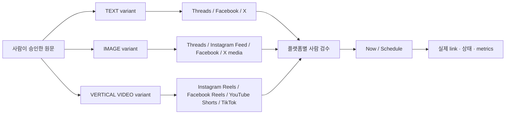
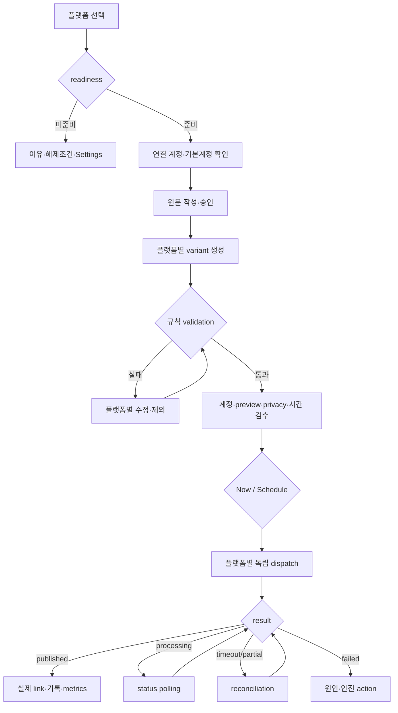

# OpenClaw Auto OSMU PRD — 6플랫폼 통합 발행 운영체계

| 항목 | 값 |
|---|---|
| 버전 | `v3.0.0` (MAJOR · plan 재개 산출물) |
| 작성일 | 2026-08-04 |
| 작성자 / 모델 | `prd-architect / gpt-codex/gpt-5.6-sol` |
| 상태 | `in-review` — `/approve plan` 전 미확정 |
| 작업 라인 | `openclaw-auto-osmu` |
| 상류 산출물 | [PRD v2.4.0](openclaw-auto-osmu-prd-v2.4-gpt-codex.md) · `REQUEST-OSMU-001` · `DESIGN-001~005` · `P0-6` · `SNS-001~018` · [QA tracker](qa-tracker.md) |
| 변경 성격 | Threads 중심 첫 검증 문서를 6플랫폼 전체 제품 계약으로 교정하되, 검증 순서는 단계화 |
| 승인 게이트 | pipeline `plan` 재심사 후 버전 핀 |

## 목차

- [TL;DR](#tldr)
- [1. 목적·배경](#1-purpose)
- [2. 범위·출시 slice](#2-scope)
- [3. 용어 정의](#3-glossary)
- [4. 페르소나·JTBD](#4-persona)
- [5. One Thing·MVP](#5-one-thing)
- [6. 현재 사실과 목표 capability](#6-capability)
- [7. 제품 정보구조와 기능 계약](#7-contract)
- [8. One source → multi-format](#8-transformation)
- [9. 기능·비기능 요구사항](#9-requirements)
- [10. 유저플로우·복구](#10-flow)
- [11. 수용기준·QA seed](#11-ac)
- [12. 성공지표·BM·운영부하](#12-business)
- [13. 법률·정책·비용·심사 gate](#13-gates)
- [14. 리스크·kill criteria·롤백](#14-risks)
- [15. 추적성 매트릭스](#15-rtm)
- [16. 벤치마크 적용](#16-benchmarks)
- [17. 7원칙·레드팀·셀프심문](#17-quality)
- [18. 오픈 이슈·개정 이력](#18-open)

## TL;DR

OSMU의 제품 범위는 Threads와 Instagram이 아니라 **Threads, Facebook, X, Instagram Feed/Reels, YouTube Shorts, TikTok** 전체다. 사용자는 한 원문을 플랫폼 규칙에 맞는 텍스트·이미지·세로 영상으로 파생하고, 각 결과와 발행 계정을 직접 검수한 뒤 즉시 또는 예약 발행하며, Queue/Calendar·발행기록·실제 게시물 링크·분석을 한 계약으로 관리한다. 단, 전체 IA와 요구는 6플랫폼 모두 지금 고정하되 credential·앱 심사·현재 구현·운영 E2E를 사실대로 표시하고 slice별 gate를 통과한 플랫폼만 발행 가능하게 연다.

## 1. 목적·배경

### 1.1 교정해야 할 제품 결함

2026-08-01 신규 고객의 시크릿 창 smoke에서 다음이 직접 관찰됐다.

1. Threads OAuth 뒤 Channel Info가 `not connected`로 남았다.
2. Instagram OAuth 뒤에도 CTA가 `Instagram OAuth 연결`, 상태는 별도 표현인 `재연결 필요`로 남았고 Graph API token 입력란은 비어 있었다.
3. Settings 채널 목록은 실제 연결 계정을 보여주지 않았다.
4. 다른 계정으로 시작해도 Meta 동의 화면에 과거 `zero_to_one_ai`가 나타나고 로그인 전환 경로가 없었다.
5. Threads는 `Queue / Analytics / Growth / Popular / Settings`, Instagram은 `Queue / Editor / Settings`로 IA가 달랐다.
6. OSMU 진입은 502였고, 플랫폼별 초안 생성·검수·발행 흐름이 발견되지 않았다.

이는 단일 버그가 아니라 **OAuth 완료, 저장 token, provider 실검증 identity, UI 상태, 발행 가능성, 제품 IA가 서로 다른 진실을 사용한 계약 붕괴**다. v3.0은 이를 6플랫폼 공통 제품 계약으로 다시 세운다.

### 1.2 유지할 운영 증거

- Threads TEXT·IMAGE 즉시 발행과 permalink, 예약→자동 발행→성과 저장은 실제 운영에서 관찰됐다.
- Instagram Feed IMAGE와 Instagram Reels VIDEO는 실제 운영 permalink까지 관찰됐다.
- 기존 draft, schedule, publication, account, integration 기록은 삭제하거나 초기화하지 않는다.
- 위 증거는 해당 경로의 회귀 기반일 뿐 신규 고객·다중 계정·다른 플랫폼 완료 증거로 확장 해석하지 않는다.

### 1.3 제품 목적

비개발자 운영자가 플랫폼마다 계정·형식·시간·실패를 따로 관리하지 않고도, 한 원문에서 파생된 게시물을 **정확한 계정에, 플랫폼 규칙에 맞게, 사람이 최종 확인하고, 실제 외부 결과까지 추적**하도록 한다.

## 2. 범위·출시 slice

### 2.1 전체 제품 범위

| 포함 | 계약 |
|---|---|
| 플랫폼 | Threads, Facebook, X, Instagram Feed, Instagram Reels, YouTube Shorts, TikTok |
| 콘텐츠 | 원문 입력·가져오기, 텍스트/이미지/세로 영상 파생, 플랫폼별 편집·검수 |
| 발행 | 즉시 발행, 예약, Queue, Calendar, 취소·재예약, 발행기록, 실제 게시물 링크 |
| 성장 | 플랫폼별 Analytics, Growth, Popular를 동일 IA에서 제공하되 API 미지원은 명시 |
| 계정 | OAuth/credential, 계정 전환·기본계정, scope·readiness, 재연결, 연결해제·삭제 |
| 운영 | 실패 알림, 상태 reconciliation, idempotency, 502/timeout/partial recovery |

### 2.2 명시적 제외

- 댓글·DM의 완전한 social CRM, 광고 구매·캠페인 운영, 인플루언서 마켓플레이스는 v3 제품 범위가 아니다.
- 플랫폼 정책을 우회하는 브라우저 자동화, token 평문 저장, 심사 전 public 발행 가장은 금지한다.
- 고객 private 원문·handle·permalink를 공용 analytics 또는 `postAGI-analytics`에 섞지 않는다.
- API·DB 스키마·provider adapter 구조의 최종 확정은 eng-design 합의 사항이다.

### 2.3 전체 IA는 고정하고 검증만 단계화한다

| Slice | 목표 | Exit evidence | 미통과 시 |
|---|---|---|---|
| R0 Safety Repair | Threads·Instagram 신규 고객 OAuth identity/status/Settings/CTA/502 일치 | 시크릿 창 OAuth→목표 handle→Settings→발행 진입 E2E, false-success 0 | 모든 신규 연결·발행 중지 |
| R1 Proven Baseline | Threads TEXT/IMAGE/예약, Instagram Feed IMAGE/Reels 기존 증거 회귀 + 외부 고객 1명 activation | 플랫폼별 실제 permalink와 목표 handle, 예약 1건 외부 결과 | R2 금지 |
| R2 Text·Image Expansion | Facebook Feed TEXT/IMAGE, X TEXT 후 X media | credential·앱 Live/권한·실계정 E2E·permalink | 해당 플랫폼 disabled 유지 |
| R3 Vertical Video | YouTube Shorts, TikTok VIDEO의 검수·즉시·예약·처리상태 | audit/credential, 목표 privacy, processing 완료, 실제 link | private/test 상태만 표시 |
| R4 Full Contract | Facebook Reels, 모든 플랫폼 6탭, 다중 계정, Calendar·분석·복구 완결 | RTM의 플랫폼별 E2E 100%, 미지원 metric 표기 100% | 제품 전체 완료 주장 금지 |

**단계화 방지 규칙:** R0/R1 통과는 “Threads 제품 완료”가 아니라 첫 검증 slice 완료다. 디자인·기술설계·QA의 전체 IA와 RTM에는 첫날부터 6플랫폼이 모두 있어야 하며, 각 미개방 플랫폼은 숨기지 않고 `준비 안 됨` 사유와 종료증거를 표시한다.

## 3. 용어 정의

| 용어 | 정의 |
|---|---|
| 원문(Source) | 여러 플랫폼 파생물의 공통 의미·사실·CTA를 담은 사용자 승인 입력 |
| 파생물(Variant) | 특정 플랫폼·surface 규칙에 맞게 원문에서 만든 독립 편집 가능 게시물 |
| Surface | 같은 provider 안의 발행 형식. 예: Instagram Feed와 Reels |
| 연결됨(Connected) | provider가 반환한 identity와 필요한 scope를 현재 시점에 실검증했고 목표 계정과 일치한 상태 |
| 저장됨(Stored) | token/account record가 저장됐으나 실검증 전인 상태. 연결됨과 다름 |
| 준비도(Readiness) | credential, app mode/review, scope, token, account, content rule을 종합한 발행 가능 판정 |
| 발행 성공 | provider 외부 결과의 ID와 사용자가 열 수 있는 실제 link가 target identity와 함께 확인된 상태 |
| Reconciliation | timeout·partial 뒤 재발행하지 않고 기존 provider 결과를 조회·연결하는 복구 |
| Queue | 플랫폼별 초안·예약·발행중·실패 항목의 실행 목록 |
| Calendar | 모든 선택 플랫폼의 예약·발행 결과를 시간축으로 보는 공통 화면 |

## 4. 페르소나·JTBD

### 김민서, 34세 — 1인 지식서비스·상담 브랜드 운영자 (가설)

김민서는 직장 경력에서 얻은 전문성을 온라인 클래스, 유료 자료, 1:1 상담으로 판매한다. 별도 마케팅팀·영상편집자·개발자가 없어 상품 설계, 상담, 정산, 고객 응대, 콘텐츠 제작을 혼자 맡는다. Threads에는 짧은 관점과 질문을, X에는 압축된 주장과 링크를, Facebook에는 설명형 게시물을, Instagram Feed에는 카드 이미지와 캡션을, Reels·YouTube Shorts·TikTok에는 같은 메시지의 세로 영상을 올리고 싶다. 그러나 한 아이디어를 여섯 번 복사하고 각 앱에서 계정을 확인하며 업로드·예약·결과를 다시 찾는 동안 본업 흐름이 끊긴다. 게시 빈도가 낮아지는 이유는 아이디어 부족보다 반복 변환과 운영 확인 비용이다.

김민서에게 “AI가 7개 글을 생성했다”는 성공이 아니다. 생성문이 현재 가격·일정·상담 약속과 일치하는지, 이미지·영상이 플랫폼 정책과 브랜드 기준을 지키는지, 개인 계정과 사업 계정 중 어디에 나가는지 마지막에 직접 보고 싶다. OAuth·scope·callback·token 같은 용어를 배우려는 것이 아니라, `연결됨`이면 OSMU가 provider에서 handle과 발행 가능성을 실제 확인했다고 기대한다. 다른 Meta 계정이 떠도 계정 전환 없이 과거 계정을 다시 공유하라는 화면만 나오거나, 연결 뒤 버튼과 Settings가 그대로면 제품 전체를 믿지 않는다. 특히 잘못된 계정에 가격표·고객 사례·AI 생성 영상이 올라가면 브랜드 훼손과 개인정보 문제가 동시에 생기므로, 속도보다 목표 handle·콘텐츠·시간·공개범위를 한 화면에서 최종 승인하는 통제권을 우선한다.

성공 장면은 모든 탭에 초록 배지가 뜨는 순간이 아니다. 하나의 원문에서 텍스트·이미지·세로 영상 파생물이 생기고, 플랫폼별 차이를 편집한 다음 각각의 target identity를 확인해 지금 또는 지정 시간에 발행하며, Queue/Calendar에서 실제 게시물 링크와 실패 이유를 보는 순간이다. 실패한 한 플랫폼 때문에 성공한 다섯 플랫폼을 재발행해서도 안 되고, timeout 뒤 버튼을 다시 눌러 중복 게시가 생겨서도 안 된다. 첫 설정에서 개발자 도움을 받거나 상태 문구가 화면마다 다르면 기존의 ChatGPT+메모장+각 앱 복사붙여넣기로 돌아간다. 반대로 14일 안에 두 번째 원문도 같은 흐름으로 안전하게 발행하고, 플랫폼별 반응을 다음 주제에 활용할 수 있다면 월 구독을 검토한다.

**Pain:** SNS 시간을 줄이려고 자동화를 도입했는데 콘텐츠 변환, 연결 계정, 정책 차이, 예약, 실발행을 믿을 수 없어 결국 여섯 플랫폼의 시스템 관리자가 된다.

**JTBD:** “한 아이디어를 여러 SNS에 내야 할 때, 플랫폼별 기술을 배우거나 잘못된 계정을 걱정하지 않고, 각 결과를 직접 검수해 지금/예약 발행하고 실제 링크와 성과까지 한곳에서 관리하고 싶다.”

**근거:** 2026-08-01 사용자 smoke의 OAuth·상태·IA·502 실패, 현재 운영의 Threads/Instagram 실발행 증거, Buffer의 multi-channel composer와 network별 customize 계약. 연령·업종·지불의향은 외부 인터뷰 전 가설이다.

## 5. One Thing·MVP

### 5.1 후보와 잘못된 답 함정

| 후보 | 평가 |
|---|---|
| “Threads 게시물 1건을 발행한다” | 첫 증거에는 작지만 전체 제품을 Threads-only로 오인하게 하므로 제품 One Thing으로 탈락 |
| “6플랫폼에 같은 글을 한 번에 복사한다” | 매체 규칙·사람 검수·계정 안전을 삭제한 저품질 cross-post라 탈락 |
| “모든 플랫폼을 동시에 완성한 뒤 출시한다” | 심사·credential 외부 의존 때문에 학습이 무기한 늦어져 탈락 |
| “한 원문을 플랫폼별 결과로 안전하게 끝낸다” | 전체 범위·고객 결과·단계 검증을 동시에 보존해 채택 |

### 5.2 제품 One Thing

> **사용자가 한 원문을 선택한 6개 플랫폼의 규칙에 맞는 텍스트·이미지·세로 영상으로 바꿔 계정과 내용을 검수하고, 즉시·예약 발행의 실제 링크와 성과까지 관리하는 것.**

### 5.3 첫 검증 slice One Thing

> **외부 고객 1명이 Threads와 Instagram의 목표 계정을 실제로 확인한 뒤, 원문 1건에서 Threads TEXT와 Instagram Feed IMAGE 파생물을 검수·발행해 서로 다른 실제 permalink 2개를 여는 것.**

이는 전체 제품의 첫 안전·활성화 증거이며 Instagram Reels·Facebook·X·YouTube Shorts·TikTok을 제품에서 제외하는 문장이 아니다.

### 5.4 MVP 기능 5개

| MVP | One Thing 연결 | 종료증거 |
|---|---|---|
| M1. Account Truth | 잘못된 계정 방지 | provider·handle·scope·readiness가 Channel Info/Settings/Editor에서 동일 |
| M2. Source Workspace | 원문 1개를 사실·목적·CTA 단위로 승인 | 원문 버전과 사람 승인 기록 |
| M3. Multi-format Variants | text/image/vertical video로 파생 | 선택 플랫폼별 독립 편집 가능 variant와 rule validation |
| M4. Human Review & Dispatch | 계정·내용·시간·privacy 최종 통제 | platform별 승인, now/schedule, partial 결과 |
| M5. Evidence & Learning | 실제 결과·성과 관리 | external ID, permalink, processing/publish 상태, 지원 metric |

## 6. 현재 사실과 목표 capability

### 6.1 플랫폼 capability matrix

| 플랫폼·surface | 목표 형식 | 현재 코드 | credential·심사 | 운영 E2E | v3 목표 판정 |
|---|---|---|---|---|---|
| Threads | TEXT, IMAGE | 구현됨 | 현재 고객 token/identity 상태 불일치 재현 | TEXT·IMAGE·예약·permalink 관찰됨 | R0 identity repair 후 즉시/예약·6탭 |
| Instagram Feed | IMAGE | 구현됨; image 필수 | 현재 고객 token invalid, CTA/Graph form 불일치 | IMAGE permalink 관찰됨 | OAuth 단일 진실·이미지 파생·예약 |
| Instagram Reels | VIDEO | 별도 video publish 구현됨; **video 예약은 현재 schedule worker 범위 밖** | 같은 Instagram account 진실에 종속 | VIDEO permalink·dedupe 관찰됨; 예약 미검증 | 세로 영상 검수·예약·processing |
| Facebook Feed | TEXT, IMAGE | `/feed`, `/photos` 구현됨 | 앱 Live/role/review 상태 서버 미확인; 운영 앱 inactive 관찰 | 미검증 | credential·Live·권한 후 실제 link E2E |
| Facebook Reels | VIDEO | **발행·예약 모두 미구현** | Feed와 별개 publish 권한·심사 확인 필요 | 미검증 | R4 신규 구현·처리상태·실제 link |
| X | TEXT, media | TEXT 발행 코드만 있음; media 목표 미구현 | 중앙 credential 누락; OAuth 경로와 publish credential 계약 drift 점검 필요 | 미검증 | TEXT 먼저, media upload→post 후속 |
| YouTube Shorts | VIDEO | resumable upload 구현됨; **video 예약은 현재 schedule worker 범위 밖** | credential/동의·audit 미검증; unaudited upload는 private 제한 | 실제 upload·processing·예약 미검증 | privacy·made-for-kids·synthetic media 검수, 처리 완료 link |
| TikTok | VIDEO | creator info·init·status·dedupe 코드와 배포 관찰; **video 예약은 현재 schedule worker 범위 밖** | central credential·`video.publish` 승인·audit 없음 | 실제 OAuth/Direct Post/link·예약 미검증 | dynamic privacy·duration·consent·AI/commercial disclosure |

**표 읽는 법:** “현재 코드”는 구현 존재, “운영 E2E”는 provider 외부 결과 직접 관찰이다. 둘을 합쳐 “완료”라고 부르지 않는다.

### 6.2 공통 상태 사전

`연결 안 됨 → 인증 진행 중 → 저장됨·확인 중 → 연결됨 → 재연결 필요 → 플랫폼 준비 안 됨 → 일시 장애`

- 같은 provider/account는 Channel Info, Settings, Editor, Queue에서 동일 한국어 상태와 원인을 보여야 한다.
- `저장됨·확인 중`을 `연결됨`으로 승격하려면 provider identity와 필수 scope의 실검증이 필요하다.
- credential 없음·앱 inactive·audit 없음은 사용자 token 재연결로 해결할 수 없으므로 `플랫폼 준비 안 됨`과 운영자 조치를 표시한다.
- 고급 token/credential 입력은 OAuth 기본 경로와 분리된 “고급 복구” 아래에서만 노출한다.

## 7. 제품 정보구조와 기능 계약

### 7.1 모든 플랫폼 공통 6탭

플랫폼 화면의 탭은 예외 없이 다음 순서다.

> **Queue / Editor / Analytics / Growth / Popular / Settings**

| 탭 | 공통 계약 | 플랫폼별 차이 처리 |
|---|---|---|
| Queue | draft, scheduled, publishing/processing, published, failed; now/schedule/cancel/reschedule; 실제 link | video는 processing 단계, API 미지원 상태는 숨기지 않고 이유 표시 |
| Editor | 원문 선택·생성, variant 편집·미리보기·규칙 검사, account·privacy·시간 최종 승인 | Threads/X/FB text, IG Feed image, Reels/Shorts/TikTok vertical video controls |
| Analytics | 게시물·기간별 provider 지원 metric, 수집시각, 미지원/권한부족 | metric 이름을 억지 통합하지 않고 원 metric+공통 분류 병기 |
| Growth | 계정 추세와 실험 비교, 다음 행동 후보 | API가 없는 플랫폼은 `데이터 미지원/연결 필요`, 가짜 0 금지 |
| Popular | 성과 상위 게시물·형식·주제, 실제 link | 최소 표본 미달과 미지원 상태 구분 |
| Settings | 아래 9개 설정군을 같은 순서로 제공 | OAuth·scope·콘텐츠 규칙만 provider별로 다름 |

### 7.2 플랫폼별 Settings 계약

모든 Settings는 다음 9개 그룹을 같은 순서로 가진다.

1. **연결과 인증:** OAuth 우선, credential readiness, callback 결과, 마지막 실검증 시각.
2. **계정:** 연결된 계정 목록, provider identity, 현재/기본 계정, 계정 추가·전환.
3. **권한:** 요구 scope와 granted/missing, app review/audit/Live 상태.
4. **발행 준비도:** content 형식, quota/rate, provider 장애를 종합한 발행 가능 여부.
5. **콘텐츠 규칙:** 길이·media·privacy·AI/상업성·아동용 등 동적/정적 검수.
6. **예약:** timezone, 기본 시간, video processing 여유, Queue 정책.
7. **알림:** OAuth 만료, publish/processing 실패, 예약 임박, quota/audit 차단.
8. **연결 해제·삭제:** token revoke, account unlink, 보존되는 publication 증거, 삭제 범위.
9. **고급 복구:** Graph/API token 수동 입력·재검증·reconciliation. 기본 화면에서 숨김.

| 플랫폼 | OAuth·필수 권한 기준 | account/default | 콘텐츠·발행 특수 계약 |
|---|---|---|---|
| Threads | `threads_basic`, `threads_content_publish`, 필요 시 insights | handle 실검증 뒤 선택 | TEXT/IMAGE; container/publish 결과 link |
| Instagram | business basic, content publish, insights 등 실제 사용 scope | IG professional identity | Feed IMAGE와 Reels VIDEO readiness를 분리 표시 |
| Facebook | page 목록·manage posts·read engagement, app Live/role/review | Page 단위 기본값 | Feed TEXT/IMAGE; Reels는 구현·권한 준비 전 disabled |
| X | read/write/users/offline 및 실제 publish credential 계약 | X user identity | TEXT 현재; media는 upload 완료 후 post에 첨부 |
| YouTube | `youtube.upload` 중심 최소권한과 channel identity | channel 단위 | privacy, made-for-kids, synthetic media, processing 상태 |
| TikTok | user basic, `video.publish`, creator info | nickname/open ID | privacy 무기본값, interaction, commercial/AI, consent, dynamic duration |

### 7.3 글로벌 Settings의 역할

글로벌 Settings > Channels는 플랫폼 카드별로 **연결 계정 수, 기본 identity, 연결 상태, 발행 준비도, 마지막 확인 시각, 조치 CTA**를 표시한다. 플랫폼 Settings는 상세 편집의 정본이고 글로벌 Settings는 요약·진입점이다. 두 화면이 별도 boolean을 계산하지 않는다.

## 8. One source → multi-format

### 8.1 변환 계약

### 8.2 공통 입력과 출력

| 단계 | 입력 | 출력 | 판정 |
|---|---|---|---|
| Source | 제목, 핵심 주장, 확인 사실/출처, CTA, 금지 표현 | versioned source | 사람 승인 전 파생 발행 불가 |
| Text | source + platform + tone + account | 독립 caption/body | 플랫폼 길이·mention·link 규칙 통과 |
| Image | source + brand asset + aspect/template | image + alt/caption | 업로드 완료·규격 통과 |
| Video | source + script + media + voice/music/disclosure | vertical video + caption/metadata | 처리 가능 형식·duration·정책 통과 |
| Review | variant + target identity + publish options | 승인/수정/제외 | 플랫폼별 별도 승인; 일괄 승인만 강제 금지 |

### 8.3 사람 검수 hardline

- 생성 결과는 자동 예약·발행하지 않는다. 사용자는 variant별 본문/미디어, target identity, 공개범위, 발행 시각을 확인한다.
- 플랫폼별 수정 뒤 variant는 독립 게시물이다. 원문 변경 시 “동기화/유지”를 사용자가 선택하며 기존 수정을 몰래 덮지 않는다.
- 일부 플랫폼 validation 실패 시 성공 가능한 플랫폼까지 막지 않고, 실패 플랫폼을 제외하거나 수정하게 한다.
- AI 생성·상업성·아동용·음악 사용 disclosure는 provider가 요구하는 화면에서 명시적으로 받는다.

## 9. 기능·비기능 요구사항

### 9.1 기능 요구사항 — Volere atomic shell

| ID | 요구 | Fit Criterion | 우선 | 출처 |
|---|---|---|---|---|
| FR-01 | 시스템은 6플랫폼·7 surface를 공통 IA에 표시해야 한다. | 각 플랫폼의 6탭 순서 일치율 100%; 준비 안 된 기능도 상태·이유 표시 | Must | DESIGN-005 |
| FR-02 | OAuth/credential/account/readiness는 동일 account truth를 사용해야 한다. | 동일 identity의 4화면 상태·handle·CTA 불일치 0건 | Must | 사용자 smoke, P0-6 |
| FR-03 | Meta/X/Google/TikTok 로그인에서 계정 선택·전환 가능성을 제공해야 한다. | 새 시크릿 세션과 기존 세션 모두 목표 identity 확인 전 연결 완료 금지 | Must | P0-6, SNS-001/007/008 |
| FR-04 | 계정 여러 개를 연결하고 플랫폼별 기본 계정을 지정해야 한다. | 같은 provider 2계정 목록·default 전환·계정별 publish link E2E | Must | SNS-007 |
| FR-05 | 사용자는 source 1개를 만들고 사실·출처·CTA를 승인해야 한다. | 승인 전 dispatch 0건; source version 1개 이상 기록 | Must | REQUEST-OSMU-001 |
| FR-06 | 선택 플랫폼별 text/image/video variant를 생성·편집해야 한다. | 선택 surface마다 독립 variant 1개; 수정 보존율 100% | Must | 사용자 요구, Buffer benchmark |
| FR-07 | variant별 규칙과 provider 동적 옵션을 발행 전에 검증해야 한다. | invalid content의 provider 요청 0건; 해결 문구와 차단 필드 표시 | Must | 공식 provider 정책 |
| FR-08 | 사용자는 플랫폼별 preview와 target identity를 확인·승인해야 한다. | 승인 없는 publish/schedule 0건; 마지막 승인 화면에 identity·privacy·time 노출 | Must | 사용자 요구 |
| FR-09 | 각 지원 surface는 즉시 발행을 제공해야 한다. | enabled surface별 외부 ID+실제 link+target identity E2E 1건 이상 | Must | REQUEST-OSMU-001 |
| FR-10 | 각 지원 surface는 예약·Queue·Calendar를 제공해야 한다. | future schedule 생성·취소·재예약·due 결과 E2E; timezone 표시 | Must | 사용자 요구 |
| FR-11 | 발행 상태를 draft/scheduled/publishing/processing/published/failed로 구분해야 한다. | 중간 상태를 success로 표시 0건; video 처리상태 polling 종료 | Must | YouTube/TikTok 공식 문서 |
| FR-12 | timeout·partial·502 뒤 idempotent reconciliation을 제공해야 한다. | 동일 dispatch key 동시/순차 retry에서 외부 결과 최대 1건 | Must | SNS-012/013/015 |
| FR-13 | published 항목에 실제 게시물 link와 provider 결과를 제공해야 한다. | link 없는 결과는 published 승격 0건; recovery CTA 표시 | Must | 사용자 요구 |
| FR-14 | Analytics/Growth/Popular는 지원 metric과 미지원 상태를 정직하게 표시해야 한다. | 가짜 0·추정값 0건; metric별 source·수집시각 표시 | Must | 사용자 요구, Postiz benchmark |
| FR-15 | 글로벌·플랫폼 Settings는 9개 설정군을 동일 순서로 제공해야 한다. | 6플랫폼 Settings 계약 누락 0; 기본 화면 raw token form 0 | Must | 사용자 smoke |
| FR-16 | 연결해제·삭제·token revoke와 publication 증거 보존 경계를 제공해야 한다. | 연결해제 뒤 publish 불가; 삭제 전 범위 확인; 과거 link 기록 정책 표시 | Must | legal/data |
| FR-17 | 장애·만료·심사·quota를 알림과 action으로 제공해야 한다. | error class별 owner action/user action/재시도 시점 1개 이상 | Must | 운영 요구 |
| FR-18 | 플랫폼 준비 전 기능은 disabled 상태와 해제 조건을 표시해야 한다. | credential/review/E2E 없는 기능의 enabled 오표시 0건 | Must | SNS-003/004/006/017 |
| FR-19 | tenant와 account 범위를 모든 read/write에 강제해야 한다. | 2 tenant × 최소 2 account 교차 read/write 0건 | Must | SNS-018, P0-6 |
| FR-20 | 기존 운영 데이터와 실발행 경로는 additive migration으로 보존해야 한다. | 기존 Threads/IG regression 100%, publication/schedule/account 기록 손실 0 | Must | v2.4, 운영 증거 |

### 9.2 비기능 요구사항

| ID | 범주 | 요구·Fit Criterion |
|---|---|---|
| NFR-01 | 상태 정확성 | OAuth callback 응답만으로 connected 승격 0건; provider 확인 결과와 4화면 상태 불일치 0건 |
| NFR-02 | 보안 | access/refresh token 평문 노출 0건; secret은 client payload·로그·analytics에 0건 |
| NFR-03 | tenant 격리 | cross-tenant read/write/publish 0건; 위반 1건이면 전 발행 hard stop |
| NFR-04 | 신뢰성 | 동일 dispatch의 외부 게시 최대 1건; timeout 뒤 재발행 전 reconciliation 100% |
| NFR-05 | 성능 | 고객 화면 API p95 목표 2초, media processing은 비동기 상태·progress 제공; 실측 전 `(target)` |
| NFR-06 | 가용성 | 502/5xx에 correlation ID·원인 class·안전 재시도 CTA 100%; 흰 화면 0건 |
| NFR-07 | 접근성 | 상태를 색만으로 표현 0건; keyboard로 계정·탭·승인·오류 조치 가능 |
| NFR-08 | 국제화 | 고객 상태·오류·CTA는 한국어 하나의 용어집 사용; provider 원문은 상세에서 병기 |
| NFR-09 | 데이터 최소화 | analytics에는 원문·token·handle·permalink 직접값 0건; 필요한 운영 event는 가명 ID |
| NFR-10 | 감사가능성 | publish/schedule/account switch/disconnect의 actor·time·target pseudonym·result 기록 100% |

## 10. 유저플로우·복구

### 10.1 핵심 flow

### 10.2 edge·recovery 계약

| 상황 | 고객에게 보이는 상태 | 시스템 행동 | 재개 조건 |
|---|---|---|---|
| 다른 계정 선택 | `목표 계정과 다름` | callback success 금지, current identity 표시 | 사용자가 계정 전환·identity 재확인 |
| cross-tenant account ID | `권한 없음` | read/write/publish 0건, 보안 사건 기록 | 원인 제거·전수 격리 QA·SJ 승인 |
| token invalid/expired | `재연결 필요` | publish/schedule 차단, 기존 draft 보존 | OAuth 후 provider identity/scope 확인 |
| provider unreachable | `일시 장애` | stored와 connected를 구분, publish 성공 표시 금지 | provider 확인 또는 명시적 offline 정책 합의 |
| credential/app review/audit 없음 | `플랫폼 준비 안 됨` | OAuth CTA disabled 또는 test/private 경계 표시 | 운영자 credential·review 증거+실 E2E |
| media processing | `처리 중` | provider status polling, link 확정 전 published 금지 | succeeded/failed 최종 상태 |
| 502/timeout | `결과 확인 중` | correlation ID 생성, same dispatch로 result lookup | 외부 결과 연결 또는 안전 실패 확정 |
| partial multi-platform | 플랫폼별 성공/실패 | 성공 플랫폼 재발행 금지, 실패만 수정/retry | 실패 surface별 reconciliation |
| 중복 클릭·동시 retry | `기존 결과 확인 중` | idempotency key로 외부 publish 최대 1건 | 기존 external ID/link 반환 |
| permalink 누락 | `발행 결과 복구 중` | external ID/provider lookup | 실제 link 연결 후 published |

## 11. 수용기준·QA seed

### 11.1 공통 AC — 요구↔테스트 1:1

| AC / 요구 | Given | When | Then | QA seed |
|---|---|---|---|---|
| AC-01 / FR-01 | 로그인 사용자가 임의 플랫폼 페이지에 있음 | 탭을 순회 | 6탭이 동일 순서이고 미지원 탭도 사유가 보임 | `e2e-common-six-tabs` |
| AC-02 / FR-02 | token record만 저장되거나 provider unreachable | Channel Info·Settings·Editor·Queue 조회 | 모두 같은 한국어 상태·identity·CTA, connected 오표시 0 | `e2e-account-truth-four-surfaces` |
| AC-03 / FR-03 | 기존 provider 세션이 다른 계정 | OAuth 연결 | 목표 identity 확인 전 완료 금지, 전환 경로 제공 | `e2e-oauth-wrong-account-secret` |
| AC-04 / FR-04 | 같은 provider 계정 2개 | default 전환 후 각각 발행 | 선택 계정별 실제 link가 해당 identity와 일치 | `e2e-two-account-default-publish` |
| AC-05 / FR-05 | source 미승인 | dispatch 시도 | 0건 발행, 승인 필요 안내 | `e2e-source-approval-gate` |
| AC-06 / FR-06 | 7 surface 선택 | variant 생성 후 하나 수정 | surface별 variant가 생기고 수정이 다른 variant를 덮지 않음 | `e2e-source-to-seven-surfaces` |
| AC-07 / FR-07 | invalid media/metadata/privacy | 검수 | provider 호출 전 차단하고 수정 필드·이유 표시 | `contract-platform-validation` |
| AC-08 / FR-08 | 생성 완료 | 최종 검수 | variant마다 account/preview/privacy/time 표시, 승인 없이 dispatch 0 | `e2e-human-review-dispatch` |
| AC-09 / FR-09 | enabled surface와 승인 variant | Now 발행 | 외부 ID·link·target identity를 반환 | `e2e-publish-now-matrix` |
| AC-10 / FR-10 | 미래 시각·timezone 선택 | schedule→cancel/reschedule→due | Calendar/Queue 일치, 취소는 발행 0, due는 실제 link | `e2e-schedule-matrix` |
| AC-11 / FR-11 | video upload 수락 | provider가 처리 중 | processing으로 보이고 최종 성공/실패 전 published 아님 | `e2e-video-processing-state` |
| AC-12 / FR-12 | provider 수락 뒤 응답 timeout | 같은 행동 재시도 | 외부 게시 최대 1건, 기존 결과 reconciliation | `e2e-timeout-idempotency-concurrent` |
| AC-13 / FR-13 | external ID 있으나 link 없음 | 기록 조회 | published 아님, recovery 뒤 실제 link 열림 | `e2e-permalink-recovery` |
| AC-14 / FR-14 | metric 미지원/권한 없음/표본 미달 | 3개 분석 탭 조회 | 가짜 0 대신 원인, 지원 metric은 source·수집시각 | `e2e-analytics-honesty` |
| AC-15 / FR-15 | 6플랫폼 Settings | 순회 | 9그룹 동일 순서, Graph token은 고급 복구 아래만 | `e2e-settings-contract` |
| AC-16 / FR-16 | 연결 계정과 과거 발행기록 존재 | disconnect/delete | token 사용 불가, 보존·삭제 범위 확인, 과거 증거 정책대로 처리 | `e2e-account-disconnect-delete` |
| AC-17 / FR-17 | 만료/장애/audit/quota 사건 | 알림 확인 | 원인·영향·사용자/운영자 action·재시도 시점 표시 | `contract-actionable-notifications` |
| AC-18 / FR-18 | credential/review/E2E 미완료 | 플랫폼 진입 | disabled+해제 조건, publish CTA 활성화 0 | `e2e-readiness-honesty` |
| AC-19 / FR-19 | tenant A token과 tenant B account/draft ID | read/write/publish 시도 | 0건 접근·0건 외부 publish, 보안 기록 | `e2e-cross-tenant-matrix` |
| AC-20 / FR-20 | 기존 Threads/IG 데이터·경로 | additive migration 배포 | 기록 손실 0, 기존 4개 운영 경로 regression 통과 | `e2e-additive-migration-regression` |

### 11.2 플랫폼별 최소 E2E matrix

| 플랫폼·surface | Happy seed | Edge seed | 완료 증거 |
|---|---|---|---|
| Threads TEXT | `threads-text-now` | wrong-account, token invalid | target handle의 실제 link |
| Threads IMAGE | `threads-image-now` | image fetch/format failure | 실제 image post link |
| Instagram Feed IMAGE | `ig-feed-image-now` | image required, token invalid | 실제 feed link |
| Instagram Reels VIDEO | `ig-reels-video-now` | container timeout/processing | 실제 reel link + duplicate 0 |
| Facebook Feed TEXT/IMAGE | `fb-feed-now` | app inactive/scope missing | 목표 Page의 실제 link |
| Facebook Reels VIDEO | `fb-reels-video-now` | unsupported/processing | 목표 Page reel link; 구현 전 disabled |
| X TEXT | `x-text-now` | credential missing/length | 실제 post link |
| X media | `x-media-now` | media upload partial | media ID 연결 실제 post link; 구현 전 disabled |
| YouTube Shorts VIDEO | `youtube-short-now` | unaudited private/processing failed | 목표 channel link+privacy+processing succeeded |
| TikTok VIDEO | `tiktok-video-now` | creator cap/privacy mismatch/audit | 목표 nickname link+status; unaudited private 명시 |

### 11.3 QA 판정 규칙

- 코드·unit test·200 응답은 운영 E2E 대체 증거가 아니다.
- 플랫폼별 `Now`, `Schedule`, wrong-account, token invalid, provider unreachable, timeout/partial, same-provider 2계정, cross-tenant를 증거로 남긴다.
- 현재 증거 재사용은 Threads TEXT/IMAGE/예약, Instagram Feed IMAGE/Reels VIDEO에 한하며 새 UI·account truth 변경 후 회귀 실행한다.
- Facebook/X/YouTube/TikTok은 실제 credential·심사·provider 결과가 없으면 `미검증`이다.

## 12. 성공지표·BM·운영부하

### 12.1 KPI

| 지표 | 현재 | 목표 | 측정 |
|---|---:|---:|---|
| 첫 activation | 신규 고객 smoke 0/1 성공 | 첫 외부 고객 source 1→Threads+IG link 2개 | 실제 provider link·target identity |
| 반복가치 | 미검증 | 첫 10명 중 3명 이상이 14일 내 source 2개째 발행 | 외부 고객 cohort, 내부 dogfood 제외 |
| account truth | 화면 불일치 관찰 | 상태·identity·CTA 불일치 0건 | 4화면×6플랫폼 contract QA |
| publish safety | 일부 경로 증거 | wrong-account/cross-tenant/false-success/duplicate 0건 | incident+E2E matrix |
| 전체 coverage | 플랫폼별 편차 | RTM AC 20/20, surface E2E 10/10 또는 honest-disabled | QA tracker |
| 운영부하 | 미측정 | 주 4시간 이하, 수동개입 고객 2/10 이하 | 분 단위 운영 원장 |

### 12.2 BM 가설

고객은 AI token이 아니라 **한 원문→여러 형식, 계정 안전, 사람 검수, 예약, 중복 없는 복구, 실제 결과·성과**에 돈을 낸다. 기본 구독 후보는 workspace당 연결 채널·예약·분석이고, AI/영상 변동원가는 BYOK 또는 credit로 분리한다. 가격·포함량은 반복가치 전 확정하지 않는다.

검증 순서는 `운영자 dogfood → 실제 유료 사용자 1명 → 외부 고객 총 10명 → 14일 반복 3명 이상 → self-service 결제`다. 첫 10명 credit 후보는 고객당 USD 5, 총 USD 50 `(unsourced experiment cap)`이며 성공 결과 1건만 차감한다.

### 12.3 비용·운영 appetite

| 항목 | 정책 |
|---|---|
| 파일럿 총 현금지출 | AI·SaaS·인프라·법률·세금·수수료 포함 USD 500 hard cap `(unsourced, 미승인)` |
| Postiz benchmark 후보 | Standard USD 29/월 공개 가격; 공급자 선정 아님 |
| X API | 현재 pay-per-use. 실제 endpoint·media·조회 비용 견적 없으면 X 외부 slice NO-GO |
| Meta/Google/TikTok | review/audit, quota, 저장·전송 비용을 slice별 견적에 포함 |
| 운영시간 | 주 4시간 cap; 2주 연속 초과 시 신규 모집 중단·plan reopen |
| DRI | `SJ(회장·서비스 운영자)` 1인; 비상 대행자·법률 자문자 미지정 |

## 13. 법률·정책·비용·심사 gate

| Gate | 필요한 증거 | 없을 때 |
|---|---|---|
| Meta | 앱 Live/test role, 사용 scope, privacy/data handling, 실제 Page/IG/Threads account E2E | 해당 provider 신규 고객 발행 disabled |
| X | developer credential, OAuth/publish 계약 일치, pay-per-use 견적, media 권한 | X disabled; 비용 0으로 가정 금지 |
| YouTube | OAuth consent, `youtube.upload`, quota, audit/public 가능성, privacy·made-for-kids·synthetic media UX | unaudited private 경계 표시; public slice NO-GO |
| TikTok | credential, `video.publish` approval, audit, creator info/consent/commercial·AI UX, verified domain | unaudited SELF_ONLY/test 경계; public slice NO-GO |
| 개인정보 | 처리 역할·목적·보존·삭제·국외이전·재위탁·권리·incident·DPA 의견 | 외부 고객 데이터 투입 NO-GO |
| 비용 | 세금 포함 플랫폼/API/infra/legal 최악값이 USD 500 cap 이내 | 범위 축소·공급자 변경 전 지출 NO-GO |
| 데이터 | private 원문·handle·token·permalink의 analytics 유입 0 증거 | 외부 출시 NO-GO |

## 14. 리스크·kill criteria·롤백

### 14.1 리스크 레지스터

| 실패 시나리오 | 영향 | 완화·소유자 |
|---|---|---|
| 6플랫폼 동시 구현으로 출시 무기한 지연 | 학습 0 | 전체 계약+slice gate; SJ가 각 slice evidence 승인 |
| 단계화가 다시 Threads-only 제품으로 축소 | 사용자 요구 재누락 | 전체 IA/RTM 상시 6플랫폼, R4 전 제품 완료 금지 |
| wrong-account/false-success | 브랜드·법적 피해 | account truth·identity final review; 1건 hard stop |
| cross-tenant | 개인정보·secret 사고 | tenant/account 전수 matrix; 1건 전 발행 hard stop |
| timeout 중복 | 외부 중복 게시 | idempotency+reconciliation+permalink recovery |
| provider 심사·정책 변경 | 플랫폼 중단 | readiness SSOT, feature disable, 정책 확인일 기록 |
| video 처리·저장 비용 폭증 | cap 초과 | media budget/retention, slice별 최악 견적 |
| 분석 metric 허위 통합 | 잘못된 의사결정 | provider 원 metric·수집시각·미지원 명시 |
| 6사업 자원 잠식 | 기존 고객·사업 피해 | 기존 사업 안전·출시가 OSMU 확대보다 우선 |

### 14.2 kill criteria

- wrong-account, cross-tenant read/write/publish, false-success, duplicate external publish 중 **1건**이면 모든 신규 발행을 즉시 중단한다.
- R0 완료 뒤 첫 100명 대상 제안에서 사용 의사 표현이 5명 미만이거나, 첫 10명 중 activation이 3명 미만이면 신규 플랫폼 구현을 멈추고 plan을 다시 연다 `(unsourced experiment threshold)`.
- activation 고객 중 14일 내 source 2개째 발행이 3/10 미만이면 결제·플랫폼 확대를 중단하고 가치가 생성인지 발행안전인지 재검증한다.
- 운영시간이 2주 연속 주 4시간 초과, 파일럿 예상 현금지출이 USD 500 초과, 또는 외부 SaaS/심사 gate가 30일 이상 해소되지 않으면 해당 slice를 중단한다.
- TikTok/YouTube가 audit 전 private-only이고 실험 목적을 달성하지 못하면 public 결과로 계수하지 않는다.

### 14.3 롤백·additive migration

1. 기존 Threads/Instagram routes, stored account, draft, schedule, publication, permalink 증거를 보존한다.
2. 새 공통 shell/account truth는 additive migration으로 도입하고 기존 fallback 제거는 데이터 이전·회귀 E2E 뒤 별도 승인한다.
3. 장애 시 신규 OAuth·dispatch·due worker를 중지하되 draft와 idempotency/publication 기록은 보존한다.
4. 외부 게시물 삭제를 자동 가정하지 않고 실제 link로 영향 범위를 확인한다.
5. API 계약·DB 스키마·adapter 교체는 eng-design에서 회장과 선택지·trade-off를 합의한다.

### 14.4 6사업 자기잠식

OSMU는 Romeo, Dark-Cupid, Yeon, OKgram, Polyamory, 교육사업의 고객가치를 대체하는 일곱 번째 우선사업이 아니라 승인된 공개 사실을 발행하는 공통 운영도구다. 기존 사업의 개인정보 사건·법정기한·핵심 출시·고객 의무와 충돌하면 OSMU의 신규 모집·지출·기능 확대를 먼저 멈춘다. 각 사업 private 데이터는 source·training·analytics에 0건이어야 하며, 내부 dogfood는 외부 고객 지표에서 제외한다.

## 15. 추적성 매트릭스

### 15.1 상류 요청 누락 0 매핑

| 상류 요구·증거 | v3 반영 | FR / AC |
|---|---|---|
| 사용자 smoke: Threads not connected | account truth·R0 | FR-02, AC-02 |
| Instagram CTA·재연결 상태 불일치 | 상태 사전·CTA 계약 | FR-02/15, AC-02/15 |
| Graph token 빈 입력 | OAuth 기본/고급 복구 분리 | FR-15, AC-15 |
| Settings 연결 미표시 | 글로벌 Settings summary | FR-02/15, AC-02/15 |
| 다른 Meta 계정·zero_to_one_ai·전환 없음 | wrong-account flow | FR-03/04, AC-03/04 |
| 플랫폼 탭 불일치 | 공통 6탭 | FR-01, AC-01 |
| OSMU 502 | correlation·recovery | FR-12/17, NFR-06, AC-12/17 |
| 플랫폼별 초안·발행 경로 없음 | Editor·source→variant→dispatch | FR-05~10, AC-05~10 |
| REQUEST-OSMU-001 전체 | source, draft, review, now/schedule, record, link, analytics | FR-05~14, AC-05~14 |
| P0-6 | identity/status/tenant/idempotency | FR-02~04/12/19, AC-02~04/12/19 |
| SNS-001~008 | OAuth/account/credential/readiness | FR-02~04/18, AC-02~04/18 |
| SNS-009~016 | 기존 실발행·persistence·dedupe·permalink | FR-09~13/20, AC-09~13/20 |
| SNS-017 | TikTok code vs credential/audit/E2E 분리 | FR-07/11/18, platform seed |
| SNS-018 | customer media tenant isolation | FR-19, AC-19 |
| DESIGN-001~004 | 기존 R0/R1 flow·상태·프로토타입 입력 | §2, §6, §10 |
| DESIGN-005 | 6플랫폼 전체 범위·6탭·Settings | FR-01/15/18, AC-01/15/18 |

### 15.2 하류 전달 계약

| PRD 영역 | Design 산출 | Eng-design 산출 | QA |
|---|---|---|---|
| FR-01/15 공통 IA | 6플랫폼 hub·6탭·9 Settings group·상태 variant | shared shell/state ownership 선택지 | AC-01/15 |
| FR-02~04 account truth | wrong-account/2-account/reconnect flow | OAuth identity·readiness 계약 합의 | AC-02~04 |
| FR-05~08 transformation | source/editor/variant/review flow | asset pipeline·validation boundary 합의 | AC-05~08 |
| FR-09~13 dispatch | now/schedule/processing/partial UI | adapter/idempotency/reconciliation 계약 합의 | AC-09~13 |
| FR-14 analytics | honest empty/unsupported/metric views | metric catalog·privacy boundary | AC-14 |
| FR-16~20 safety | delete/alert/disabled/migration states | retention/audit/tenant/migration ADR | AC-16~20 |

## 16. 벤치마크 적용

| 근거 | 차용 | 변경·차별화 |
|---|---|---|
| Buffer multi-channel composer | 채널 다중 선택, network별 customize, Now/Queue/Time, 예약 후 독립 게시물 | 단순 cross-post보다 source/variant/target identity 승인과 reconciliation을 hardline으로 강화 |
| Postiz posts/integrations/analytics | draft/schedule, platform settings, integration 단위 analytics, missing result 연결 | 공급자 도입 결정이 아니라 기능 계약 benchmark; private data·법률 gate 별도 |
| Meta Threads/Instagram 공식 Postman | container→publish, identity/scope, Reels media publish | token 저장=연결됨 오인을 금지하고 account truth를 제품 계약화 |
| X 공식 API | post create와 media upload→media ID→post | 현재 TEXT-only 구현과 target media를 분리, pay-per-use를 cost gate에 포함 |
| YouTube Data API | resumable upload, privacy, processing status, unaudited private 제한 | upload 2xx를 성공으로 보지 않고 processing+실제 link를 완료 증거로 요구 |
| TikTok Direct Post | creator info, 동적 privacy/duration, explicit consent, audit/private restriction | AI/commercial disclosure와 nickname 확인을 Editor 검수에 필수화 |

## 17. 7원칙·레드팀·셀프심문

### 17.1 기획 7원칙 판정

| # | 원칙 | 판정 | 근거 |
|---|---|---|---|
| 1 | 용어 통일 | PASS | §3 상태·source·variant·success 정의 |
| 2 | 구체화 | PASS | 6플랫폼·7 surface·6탭·9 Settings group·20 FR/AC |
| 3 | 입출력 분리 | PASS | §8.2 단계별 input/output |
| 4 | 정합성 | PASS | current code/credential/E2E/target 4축 분리 |
| 5 | 정책 상세 | PASS | §10.2 edge/recovery, §13 gates |
| 6 | 추출 철저 | PASS | 상류 REQUEST/P0/SNS/DESIGN 매핑 0 누락 |
| 7 | 논리 영역 | PASS | 모든 FR Fit Criterion과 AC seed 존재 |

### 17.2 STEELMAN — “6개를 한꺼번에 하면 출시가 늦어진다”

가장 강한 반론은 Facebook/X/YouTube/TikTok의 credential·심사를 해결하면서 Facebook Reels와 X media까지 새로 구현하면, 이미 실증된 Threads/Instagram의 신규 고객 실패를 몇 달간 방치한다는 것이다. 이 반론은 맞다. 그래서 구현과 E2E는 R0→R4로 직렬화하고, R0는 기존 고객이 실제로 실패한 account truth·Settings·502만 먼저 닫는다. 다만 범위 문서·IA·상태·RTM까지 Threads/Instagram으로 줄이면 후속 플랫폼이 다시 별도 제품처럼 붙어 동일 불일치를 반복하므로, 전체 계약은 지금 고정한다.

### 17.3 PREMORTEM — “단계화했더니 또 Threads-only가 됐다”

3개월 뒤 R1의 Threads permalink를 성과로 포장하고 Facebook/X/Shorts/TikTok은 메뉴에서도 사라졌다면 v3는 실패다. 이를 막기 위해 첫 디자인부터 6플랫폼·6탭·Settings를 모두 렌더하고, readiness 미통과 기능은 숨기지 않고 disabled+해제 조건으로 둔다. R4 플랫폼 E2E matrix가 닫히기 전 “OSMU 전체 완료”를 금지하고, slice 완료와 제품 완료를 pipeline/QA에서 별도 상태로 관리한다.

### 17.4 셀프심문 — 이 결론이 틀렸다면 가장 그럴듯한 이유

가장 load-bearing한 가정은 “한 원문에서 6플랫폼으로 가는 통합 흐름”이 고객에게 실제로 반복가치를 준다는 것이다. 고객은 오히려 플랫폼마다 별도 아이디어를 만들거나 Buffer/Postiz로 충분할 수 있다. 그래서 첫 증거를 기능 수가 아니라 외부 고객의 source 2개째 발행과 주 4시간 이하 운영부하로 둔다. 10명 중 3명이 14일 안에 반복하지 않으면 플랫폼 수를 더 늘리지 않고, 고객이 돈을 내는 것이 생성·안전·예약·분석 중 무엇인지 plan을 다시 연다.

## 18. 오픈 이슈·개정 이력

### 18.1 회수 필요

| # | 이슈 | 추천 | 결정권자·기한 |
|---|---|---|---|
| O-1 | 공급자 직접 운영 vs Postiz Cloud/self-hosted | R0은 현 경로 repair, eng-design에서 데이터·비용·exit 비교 후 선택 | SJ · eng-design gate |
| O-2 | X 실제 endpoint 비용·credential 계약 | 실견적·OAuth publish proof 전 disabled | SJ · R2 전 |
| O-3 | Meta 앱 Live/role/review, YouTube/TikTok audit | 콘솔 증거와 실제 test account E2E 회수 | SJ · 각 slice 전 |
| O-4 | 법률 자문자·비상 대행자 | 외부 고객 데이터 전 실명·범위 지정 | SJ · 외부 출시 전 |
| O-5 | USD 500 cap·첫 10명 credit | 승인 전 지출·가격 확정 금지 | SJ · V1 전 |

### 18.2 개정 이력

| 버전 | 날짜 | 변경 | 작성자 |
|---|---|---|---|
| v2.4.0 | 2026-08-02 | Threads 중심 첫 activation·안전 slice | prd-architect |
| v3.0.0 | 2026-08-04 | 6플랫폼 전체 제품 범위, 공통 6탭/Settings, capability·recovery·RTM·단계형 검증으로 MAJOR 재작성 | prd-architect |

---

🏷 STAMP | line: openclaw-auto-osmu | 생성: 2026-08-04 00:24 KST | model: gpt-codex/gpt-5.6-sol | agent: prd-architect

skills: 매칭 PRD 전용 skill 없음 — planning.md·doc-review.md v2·PRD template·benchmarks.md 방법론 적용

근거 URL:
- https://support.buffer.com/article/644-how-do-i-schedule-posts-for-multiple-social-channels-at-the-same-time
- https://support.buffer.com/article/600-getting-started-with-buffers-publishing-features
- https://docs.postiz.com/cli/managing-posts
- https://docs.postiz.com/public-api/analytics/platform
- https://www.postman.com/meta/threads/overview
- https://www.postman.com/meta/instagram/overview
- https://docs.x.com/x-api/media/introduction
- https://developers.google.com/youtube/v3/docs/videos/insert
- https://developers.google.com/youtube/v3/guides/implementation/videos
- https://developers.tiktok.com/doc/content-sharing-guidelines/
- https://developers.tiktok.com/doc/content-posting-api-reference-direct-post

고민: 6플랫폼을 동시에 구현하는 all-or-nothing과 Threads-only 축소를 모두 버리고, 전체 제품 계약은 고정하되 운영 증거만 R0~R4로 단계화했다.

SKILLS_USED: 없음 — 현재 설치 skill 중 PRD·제품기획 전용 매칭 없음. `/Users/sj/.claude/standards/planning.md`, `doc-review.md`, PRD template을 직접 적용.

SKILLS_SKIPPED: `brand-positioning-kit` 등 콘텐츠·브랜딩 skill은 제품 요구·수용기준 작성과 불일치하여 사용하지 않음.

SOURCES:
- [상류 PRD v2.4.0](openclaw-auto-osmu-prd-v2.4-gpt-codex.md)
- [OSMU QA tracker — 사용자 NG·P0-6·SNS-001~018](qa-tracker.md)
- [Stabilization transcript](../tasks/osmu-stabilize-live.output)
- [Buffer multi-channel scheduling](https://support.buffer.com/article/644-how-do-i-schedule-posts-for-multiple-social-channels-at-the-same-time)
- [Buffer publishing workflow](https://support.buffer.com/article/600-getting-started-with-buffers-publishing-features)
- [Postiz managing posts](https://docs.postiz.com/cli/managing-posts)
- [Postiz platform analytics](https://docs.postiz.com/public-api/analytics/platform)
- [Meta Threads official Postman](https://www.postman.com/meta/threads/overview)
- [Meta Instagram official Postman](https://www.postman.com/meta/instagram/overview)
- [X media API](https://docs.x.com/x-api/media/introduction)
- [YouTube videos.insert](https://developers.google.com/youtube/v3/docs/videos/insert)
- [YouTube processing status](https://developers.google.com/youtube/v3/guides/implementation/videos)
- [TikTok content sharing guidelines](https://developers.tiktok.com/doc/content-sharing-guidelines/)
- [TikTok Direct Post API](https://developers.tiktok.com/doc/content-posting-api-reference-direct-post)
- ISO/IEC/IEEE 29148 · Volere Atomic Requirement Shell · Gherkin

MODEL: `gpt-codex/gpt-5.6-sol`

RUBRIC_SCORE: 완결성=5/5 정밀성=5/5 벤치마크=5/5 추적성=5/5 전문성=5/5 total=25/25

WEAKEST_LINE: “R0은 현 경로 repair, eng-design에서 데이터·비용·exit 비교 후 선택.” — 공급자 결정에 필요한 실비·DPA·운영부하가 아직 회수되지 않아 의도적으로 확정하지 않았다.
