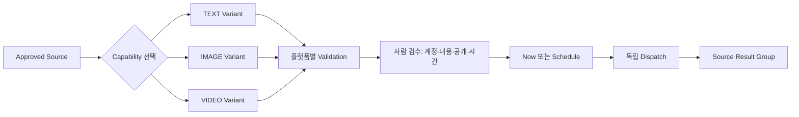
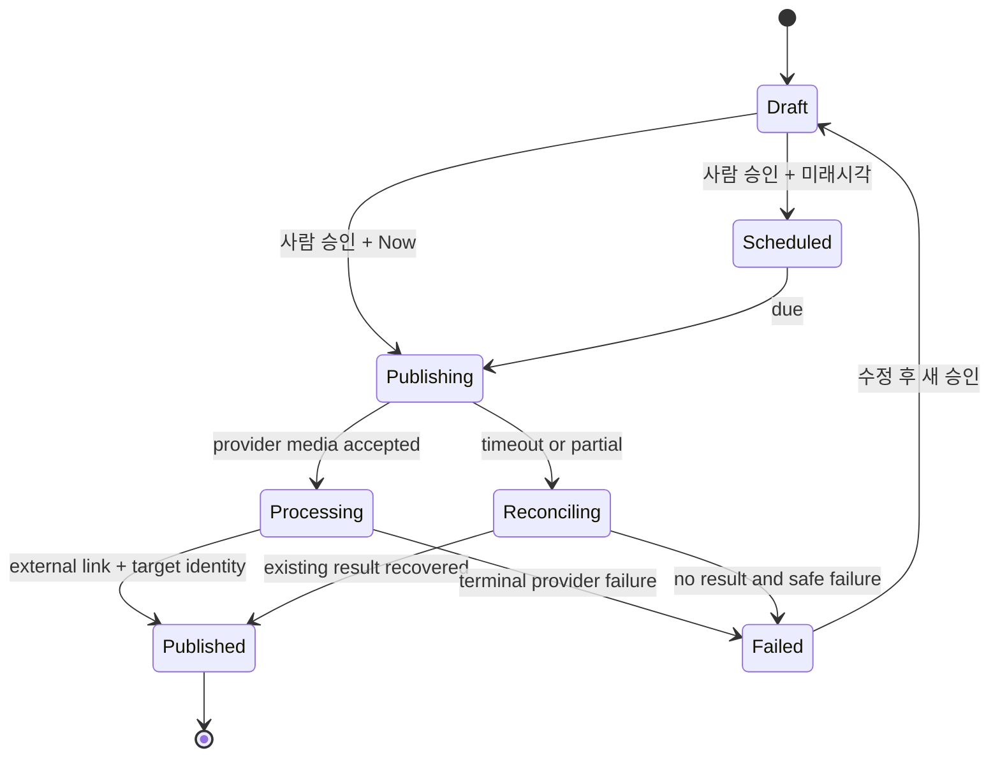

# OpenClaw Auto OSMU PRD — 6 Provider / 8 Surface 계약 기준선

| 항목 | 값 |
|---|---|
| 버전 | `v3.1.0` |
| 작성일 | 2026-08-04 |
| 작성자 / 모델 | `prd-architect / gpt-codex/gpt-5.6-sol` |
| 상태 | `in-review` — `/approve plan` 전 미확정 |
| 상류 핀 | [PRD v3.0.0](openclaw-auto-osmu-prd-v3.0-gpt-codex.md) · `REQUEST-OSMU-001` · `P0-6` · `SNS-001~018` · `DESIGN-005` 요구 |
| 하류 계약 | plan 승인 뒤 **신규 DESIGN v5** 작성; 기존 design/prototype v1~v4는 superseded |
| 승인 게이트 | pipeline `plan` |

## 목차

- [TL;DR](#tldr)
- [1. 교정 배경·증거 상태](#1-context)
- [2. Canonical scope](#2-canonical)
- [3. 계약 기준선과 출시 enablement](#3-baseline)
- [4. 페르소나·One Thing·MVP](#4-one-thing)
- [5. Capability 현재/목표](#5-capability)
- [6. 공통 6탭 계약](#6-tabs)
- [7. Analytics·Growth·Popular 전수 매트릭스](#7-analytics)
- [8. Settings 전수 매트릭스](#8-settings)
- [9. One source와 발행 lifecycle](#9-lifecycle)
- [10. 기능·비기능 요구](#10-requirements)
- [11. 수용기준·E2E](#11-ac)
- [12. 출시 slice·예산·시간](#12-slices)
- [13. BM·수요 kill](#13-business)
- [14. 정책·심사·비용 gate](#14-policy)
- [15. 데이터·migration·rollback](#15-migration)
- [16. 6사업 충돌](#16-cannibalization)
- [17. RTM](#17-rtm)
- [18. Critic closure·품질심문](#18-closure)
- [19. 오픈이슈·개정이력](#19-open)

## TL;DR

OSMU는 **6 providers / 8 surfaces / 12 capability paths**를 가진 하나의 제품이다. 모든 provider는 `Queue / Editor / Analytics / Growth / Popular / Settings`를 항상 같은 순서로 노출하고, 기능이 없거나 심사 전이면 숨기지 않고 근거·현재 상태·enable 조건을 보여준다. 2026-08-01 신규 고객 smoke에서 connection false-success가 발생했으므로 R0가 실제 E2E로 account truth를 clear할 때까지 신규 고객 OAuth와 발행은 닫는다.

## 1. 교정 배경·증거 상태

### 1.1 직접 관찰된 결함

- Threads OAuth 뒤 Channel Info는 `not connected`였다.
- Instagram OAuth 뒤에도 연결 CTA와 `재연결 필요`가 남고 Graph token 폼은 비어 있었다.
- Global Settings에는 연결 계정이 없고 Threads/Instagram 탭 계약이 달랐다.
- 다른 Meta 계정으로 시작해도 과거 `zero_to_one_ai` 공유 화면만 나타나 account switch가 확인되지 않았다.
- OSMU 502와 플랫폼별 초안·검수·발행 진입 부재가 관찰됐다.

### 1.2 false-success를 분리한다

| 사건 | 정의 | 프로그램 상태 | clear evidence |
|---|---|---|---|
| Connection false-success | callback/token 저장을 provider identity·scope·target account 실검증 없이 `연결됨`으로 알리거나, 성공 알림과 화면 상태가 충돌 | **TRIGGERED · global hard stop** | 시크릿 신규 고객 OAuth→provider identity→Channel/Global Settings/Editor 4면 일치, wrong-account recovery, 2계정 전환 E2E |
| Publish false-success | provider 수락·내부 2xx만으로 실제 external result/link·target account 확인 없이 `발행됨` 표시 | **NOT-STARTED for new-customer v3 path**; legacy Threads/IG 증거만 존재 | 각 enabled capability의 external ID+열리는 link+target identity, timeout reconciliation, duplicate 0 |
| Account-selection ambiguity | consent 화면이 기존 Meta account를 고정하고 전환 경로를 제공하지 못함 | **TRIGGERED** | 기존 세션·시크릿 세션 양쪽에서 목표 identity 선택·callback 저장 관찰 |

**운영 명령:** R0 clear 전 신규 고객 OAuth·신규 고객 publish/schedule은 닫는다. 기존 publication 증거 조회·draft 보존·복구 진단만 허용한다.

### 1.3 design 증거 경계

- DESIGN-001~004 및 prototype/design v1~v4는 **superseded**다. v3.1 plan 승인 증거나 구현 기준이 아니다.
- DESIGN-005는 전체 OSMU 범위 누락을 기록한 **상류 요구/결함 증거**이지 승인 design이 아니다.
- plan 승인 뒤 product-designer가 신규 **DESIGN v5**를 작성한다. v5는 6 providers shell, 6탭, 9 Settings group, happy/recovery, REQUEST 전수 RTM을 보여야 한다.

## 2. Canonical scope

### 2.1 용어와 개수

| 개념 | 정의 | canonical count |
|---|---|---:|
| Provider | OAuth·credential·정책·계정 identity의 최상위 외부 서비스 | 6 |
| Surface | provider 안의 사용자 발행 목적지/형식 단위 | 8 |
| Format | 발행 payload의 주 media class: TEXT, IMAGE, VIDEO | 3 |
| Capability path | `provider/surface/format`의 고유 발행 계약 | 12 |

### 2.2 Provider·Surface ID

| Provider ID | Provider | Surface ID | Surface |
|---|---|---|---|
| `PV-THR` | Threads | `SF-THR-POST` | Threads Post |
| `PV-IG` | Instagram | `SF-IG-FEED` | Instagram Feed |
|  |  | `SF-IG-REEL` | Instagram Reels |
| `PV-FB` | Facebook | `SF-FB-FEED` | Facebook Page Feed |
|  |  | `SF-FB-REEL` | Facebook Page Reels |
| `PV-X` | X | `SF-X-POST` | X Post |
| `PV-YT` | YouTube | `SF-YT-SHORT` | YouTube Shorts |
| `PV-TT` | TikTok | `SF-TT-POST` | TikTok Post |

### 2.3 Surface×Format capability path

| Capability ID | Path | 목표 | 현재 |
|---|---|---|---|
| `CP-THR-TEXT` | Threads/Post/TEXT | 즉시·예약 | 구현·운영 관찰 |
| `CP-THR-IMAGE` | Threads/Post/IMAGE | 즉시·예약 | 구현·운영 관찰 |
| `CP-IGF-IMAGE` | Instagram/Feed/IMAGE | 즉시·예약 | 즉시 운영 관찰; 예약 재검증 필요 |
| `CP-IGR-VIDEO` | Instagram/Reels/VIDEO | 즉시·예약 | 즉시 운영 관찰; video 예약 미구현 |
| `CP-FBF-TEXT` | Facebook/Feed/TEXT | 즉시·예약 | 코드 있음; credential/E2E 없음 |
| `CP-FBF-IMAGE` | Facebook/Feed/IMAGE | 즉시·예약 | 코드 있음; credential/E2E 없음 |
| `CP-FBR-VIDEO` | Facebook/Reels/VIDEO | 즉시·예약 | 미구현 |
| `CP-X-TEXT` | X/Post/TEXT | 즉시·예약 | 코드 있음; credential/E2E 없음 |
| `CP-X-IMAGE` | X/Post/IMAGE | 즉시·예약 | 미구현; official media chain 확인 |
| `CP-X-VIDEO` | X/Post/VIDEO | 즉시·예약 | 미구현; official media chain 확인 |
| `CP-YT-VIDEO` | YouTube/Shorts/VIDEO | 즉시·예약 | upload 코드 있음; 실 E2E·예약 없음 |
| `CP-TT-VIDEO` | TikTok/Post/VIDEO | 즉시·예약 | direct-post 코드 있음; credential/audit/E2E·예약 없음 |

Instagram/Facebook의 Feed와 Reels는 surface를 각각 센다. format이 여러 개인 surface는 capability path가 늘어나지만 surface 수는 늘지 않는다. 이 문서·DESIGN v5·FDD·QA는 위 ID를 바꾸지 않는다.

## 3. 계약 기준선과 출시 enablement

| 층 | 지금 고정되는 것 | enable 기준 |
|---|---|---|
| Contract baseline | 6 provider shell, 8 surface, 12 capability ID, 공통 6탭, 9 Settings group, 상태·recovery·RTM | plan 승인 뒤 DESIGN v5/FDD의 필수 입력 |
| R0/R1 최소제품 | account truth repair + legacy Threads/IG capability를 신규 고객 path에서 재증명 | connection hard stop clear + external result |
| R2~R4 expansion | Facebook/X, video platforms, analytics/growth/popular, 다중계정·전체 예약 | provider별 credential/review/cost/E2E |

UI shell이 생겼다고 capability가 enabled되는 것이 아니다. R4는 UI 생성 단계가 아니라 **12 capability와 18 analytics-tab contracts의 지원/미지원 종료증거가 모두 닫히는 운영 E2E 단계**다.

## 4. 페르소나·One Thing·MVP

### 4.1 핵심 페르소나 — 김민서, 34세, 1인 지식서비스 운영자

김민서는 직장 경력에서 얻은 전문성을 온라인 클래스와 상담으로 판매한다. 별도 마케팅팀·영상편집자·개발자 없이 상품, 상담, 정산, 고객응대, 콘텐츠를 혼자 맡는다. Threads에는 관점을, X에는 압축된 주장, Facebook에는 설명형 글, Instagram Feed에는 카드 이미지, Instagram/Facebook Reels·YouTube Shorts·TikTok에는 세로 영상을 발행하려 하지만 한 아이디어를 여덟 surface에 맞게 다시 만들고 각 앱에서 계정·권한·예약·결과를 확인하는 일이 본업을 끊는다.

김민서는 “AI가 12개 결과를 만들었다”를 성공으로 보지 않는다. 게시 전 사용 사실·가격·CTA가 맞는지, 개인 계정이 아닌 브랜드 계정인지, 공개범위와 AI/상업성 표시가 맞는지 확인하고 싶다. `연결됨`은 token 저장이 아니라 provider가 돌려준 identity와 scope가 현재 유효하다는 뜻이어야 한다. 일부 provider가 timeout이어도 이미 성공한 provider를 다시 발행해서는 안 되며, 실제 외부 결과가 없는데 내부 초록 배지만 떠서도 안 된다. 성공은 원문 하나를 사람이 승인하고 선택한 각 채널의 정확한 계정에 중복 없이 발행한 뒤 외부 결과를 한 기록으로 회수하는 순간이다. 14일 안에 두 번째 원문에서도 이 흐름이 반복되면 구독을 검토한다. 연령·업종·지불의향은 외부 cohort 전 가설이다.

### 4.2 제품 One Thing

> **사람이 승인한 원문 하나를 선택한 각 채널의 정확한 계정에 중복 없이 발행하고 외부 결과를 한 기록으로 회수하는 것.**

### 4.3 전체 범위와 첫 slice

- **전체 제품:** 6 providers / 8 surfaces / 12 capability paths, 생성·편집·검수·Now/Schedule·Queue/Calendar·record/link·analytics.
- **첫 검증 slice:** 외부 고객 1명이 Threads와 Instagram의 목표 identity를 확인하고 한 source에서 `CP-THR-TEXT`와 `CP-IGF-IMAGE`를 검수·발행해 실제 link 2개를 한 record group에서 연다.

### 4.4 MVP 5개

| MVP | 종료증거 |
|---|---|
| Account Truth | Global Settings·Platform Settings·Editor·Queue의 identity/state/CTA 일치 |
| Approved Source | 사실·출처·CTA가 포함된 사람 승인 source version |
| Capability Variants | 선택 capability별 독립 text/image/video와 validation |
| Review & Dispatch | target account·preview·privacy·time 승인, partial isolation |
| Result Group | external ID/link/status/metric을 source 단위 한 기록으로 회수 |

## 5. Capability 현재/목표

| Capability | Code | Credential/review | 운영 E2E | 목표 enable slice |
|---|---|---|---|---|
| CP-THR-TEXT/IMAGE | 있음 | 현재 account truth 불일치 | 실제 link·예약 관찰 | R0/R1 재증명 |
| CP-IGF-IMAGE | 있음 | token invalid/CTA 불일치 재현 | 실제 link 관찰 | R0/R1 재증명 |
| CP-IGR-VIDEO | 있음 | IG account truth 종속 | 실제 link·dedupe 관찰 | R1; 예약 R4 |
| CP-FBF-TEXT/IMAGE | 있음 | app inactive/role/review 미회수 | 없음 | R2 |
| CP-FBR-VIDEO | 없음 | official upload/publish는 확인; scope/review는 review-required | 없음 | R4 |
| CP-X-TEXT | 있음 | credential 없음; auth/publish 계약 대조 필요 | 없음 | R2 |
| CP-X-IMAGE/VIDEO | 없음 | pay-per-use·media upload→media_id→post | 없음 | R2 후반/R4 |
| CP-YT-VIDEO | upload 있음 | consent/audit 미회수; unaudited public 불가 | 없음 | R3 |
| CP-TT-VIDEO | direct post 있음 | key·video.publish·audit 없음 | 없음 | R3 |

## 6. 공통 6탭 계약

모든 provider에 항상 같은 순서로 노출한다.

> **Queue / Editor / Analytics / Growth / Popular / Settings**

| 탭 | 항상 제공되는 shell | capability 없을 때 |
|---|---|---|
| Queue | draft/scheduled/publishing/processing/published/failed, Calendar 진입 | readiness 이유·지원 근거·enable 조건 |
| Editor | source, capability 선택, variant, preview, validation, review | 미지원 format disable과 target slice |
| Analytics | provider metric·수집시각·권한·freshness | `unsupported` 또는 `review-required`; 가짜 0 금지 |
| Growth | 기간 비교·계정 추세·실험 비교 | 계산 입력 부재와 enable 조건 |
| Popular | 성과 상위 own-post·link·표본수 | 최소 표본/권한/metric 부재 표시 |
| Settings | Platform Settings 9그룹 | 해당 없음 사유와 고객 상태 |

## 7. Analytics·Growth·Popular 전수 매트릭스

상태: `S=supported by official API`, `R=review-required`, `U=unsupported for this product contract`. 모든 현재 구현은 별도이며 공식 지원만으로 enabled되지 않는다.

| Provider | Analytics | Growth | Popular | API·권한 근거 | metric | freshness 목표 | 비용 | enable 종료증거 |
|---|---|---|---|---|---|---|---|---|
| Threads | S | R(derived) | R(derived) | Threads `/insights`, insights scope | views, likes, replies, reposts 등 공식 반환값만 | provider fetch ≤24h, 수집시각 표시 | API 비용 review | own post 3건 실조회·권한·metric 저장 |
| Instagram | S | R(derived) | R(derived) | IG `GET /insights`, professional account scope | reach/views/likes/comments 등 실제 반환값만 | ≤24h | API 비용 review | Feed/Reels 각각 own post 실조회 |
| Facebook | R | R | R | Page Insights endpoint·scope·review **공식 상세 재회수 필요** | 확정 전 `review-required` | 미확정 | 미확정 | official endpoint/scope/review+Page 3 posts 실조회 |
| X | S | R(derived) | R(derived) | X public/non-public metrics; user context, private 30일 제한 | impressions, likes, reposts, replies, clicks 등 권한별 | public ≤24h; private 30일 창 표시 | pay-per-use 견적 필수 | 비용 승인+own post metrics 실조회 |
| YouTube | S | R(derived) | R(derived) | YouTube Analytics `reports.query`, `yt-analytics.readonly`/`youtube.readonly` | views, likes, watch metrics 중 승인 scope 반환값 | 공식 report 지연을 화면에 표시, 목표 ≤48h | quota/infra 견적 | channel/video 보고서 3건+freshness 관찰 |
| TikTok | S(Display) | R(derived) | R(derived) | Display `video.list/query`, `video.list`; Research API는 일반 고객 경로로 사용 금지 | like/comment/share/view count | Display 실측 후 결정; Research 최대 10일 지연은 비채택 | review/비용 미확정 | audit된 Display scope+own video 3건 실조회 |

**Derived 탭 규칙:** Growth와 Popular는 Analytics 원데이터가 확보된 뒤 own-account data로만 계산한다. metric 없는 provider를 타 provider 평균으로 채우지 않는다. Popular 최소 표본은 published result 3건 `(초기 실험 기준)`이며 미달은 `표본 부족`이다.

## 8. Settings 전수 매트릭스

명칭을 분리한다.

- **Global Settings > Channels:** 6 provider 요약. 계정 수·default identity·connection/readiness·마지막 확인·조치 CTA.
- **Platform Settings:** 해당 provider의 아래 9그룹 상세. Global과 같은 truth를 읽는다.

셀 표기: `A=적용`, `R=review-required`, `N=해당 없음`; 뒤 문구는 이유와 고객 상태다.

| Provider | 1 연결·인증 | 2 계정·기본값 | 3 권한·심사 | 4 발행 준비도 | 5 콘텐츠 규칙 | 6 예약 | 7 알림 | 8 연결해제·삭제 | 9 고급 복구 |
|---|---|---|---|---|---|---|---|---|---|
| Threads | A OAuth·현재 hard stop | A handle/default·전환 미검증 | A publish/insights scope | A identity+scope+provider | A TEXT/IMAGE | A 현재 text/image | A 만료·실패 | A revoke/unlink | A token 재검증; 기본 비노출 |
| Instagram | A OAuth·token invalid | A professional identity | A publish/insights | A Feed/Reels 분리 | A IMAGE/VIDEO | A Feed; Reels R | A container/token | A revoke/unlink | A Graph token은 고급만 |
| Facebook | A Business login·app inactive | A Page/default | R Live/role/review | R app+Page+scope | A Feed; R Reels | A Feed; Reels R | A app/scope/upload | A Page unlink/revoke | A Page token 진단 |
| X | A OAuth·credential 없음 | A user/default | R read/write/metrics 계약 | R credential+pay-use | A TEXT; R media | A TEXT; media R | A quota/cost/token | A revoke/unlink | A OAuth 계약 진단 |
| YouTube | A OAuth offline/select account | A channel/default | R upload/analytics/audit | R privacy+quota+audit | A VIDEO metadata | R video schedule | A processing/quota | A revoke/unlink | A resumable recovery |
| TikTok | A PKCE/disable_auto_auth | A nickname/open ID | R video.publish/audit | R creator info/caps | A VIDEO·privacy·AI/commercial | R video schedule | A cap/status/audit | A revoke/unlink | A publish_id reconcile |

각 셀의 고객 상태는 `연결 안 됨 / 확인 중 / 연결됨 / 재연결 필요 / 플랫폼 준비 안 됨 / 일시 장애` 중 하나다. `R`은 `플랫폼 준비 안 됨`과 enable 조건을, `N`은 `이 플랫폼에는 적용되지 않음`과 근거를 보여준다.

## 9. One source와 발행 lifecycle

### 9.1 사람 검수

- source와 variant는 자동 발행하지 않는다.
- capability별 target identity, body/media preview, privacy/disclosure, Now/Schedule을 승인한다.
- source 수정은 이미 수동 편집한 variant를 자동 덮지 않는다.
- 일부 capability 실패는 성공 capability를 재발행하지 않는다.

### 9.2 recovery

| 사건 | 상태 | 행동 |
|---|---|---|
| wrong account | 목표 계정과 다름 | 완료 금지·계정 전환·identity 재검증 |
| token invalid | 재연결 필요 | draft 보존·publish 차단 |
| provider unreachable | 일시 장애 | stored와 connected 구분 |
| credential/review 없음 | 플랫폼 준비 안 됨 | CTA disabled·운영자 enable 조건 |
| media processing | 처리 중 | status polling; link 전 published 금지 |
| 502/timeout/partial | 결과 확인 중 | same dispatch reconciliation |
| duplicate click | 기존 결과 확인 중 | idempotency; 외부 결과 최대 1 |

## 10. 기능·비기능 요구

| ID | 원자 요구 | Fit Criterion |
|---|---|---|
| FR-01 | canonical ID를 전 산출물에서 사용 | 6 provider/8 surface/12 capability count 불일치 0 |
| FR-02 | 모든 provider에 공통 6탭 항상 노출 | 이름·순서 일치 6/6, hidden 0 |
| FR-03 | account truth를 4 surface가 공유 | identity/state/CTA 불일치 0 |
| FR-04 | wrong-account·2계정·default 전환 | provider별 목표 account publish link E2E |
| FR-05 | Global Settings와 Platform Settings 분리 | 요약/상세 역할 일치, truth 불일치 0 |
| FR-06 | 6×9 Settings 계약 | 54셀 적용/R/N·이유·상태 존재 |
| FR-07 | 사람이 source 승인 | 미승인 dispatch 0 |
| FR-08 | 12 capability variant 생성·편집 | 선택 path별 독립 variant, 수정 보존 100% |
| FR-09 | platform validation·disclosure | invalid provider call 0 |
| FR-10 | capability별 사람 검수 | target/content/privacy/time 미승인 발행 0 |
| FR-11 | Now 발행 | enabled path별 external ID+link+identity |
| FR-12 | Schedule·Queue·Calendar | enabled path별 create/cancel/reschedule/due E2E |
| FR-13 | processing 상태 | terminal 전 published 표시 0 |
| FR-14 | timeout/partial reconciliation | same dispatch 외부 결과 최대 1 |
| FR-15 | source result group | 선택 path별 결과·실패·link를 group 1개로 회수 |
| FR-16 | 6×3 analytics tabs | 18 contract의 S/R/U·근거·enable 조건 존재 |
| FR-17 | actionable notification | error class별 user/owner action·retry time |
| FR-18 | disconnect/delete/revoke | revoke 뒤 publish 0, 삭제범위 확인 |
| FR-19 | tenant/account isolation | 2 tenant×2 account 교차 read/write/publish 0 |
| FR-20 | honest readiness | credential/review/E2E 없는 enabled 0 |
| FR-21 | additive migration | §15 invariants 전부 통과 |
| FR-22 | legacy 운영 회귀 | Threads 3+Instagram 2 path 5/5 재관찰 |
| FR-23 | v5 traceability | REQUEST·DESIGN-005→FR→AC→TC→future view/state 누락 0 |
| FR-24 | demand qualification·dedupe | §13 cohort 규칙 위반 0 |

### 비기능 요구

| ID | 요구 |
|---|---|
| NFR-01 | connection/publish false-success 0; 한 건이면 global hard stop |
| NFR-02 | token/secret 평문 client·log·analytics 노출 0 |
| NFR-03 | private source/handle/permalink의 공용 analytics 유입 0 |
| NFR-04 | 화면 API p95 목표 2초 `(실측 전 target)`; media는 async progress |
| NFR-05 | 502/timeout correlation ID·error class·safe action 100% |
| NFR-06 | 상태를 색만으로 표현 0; keyboard 핵심 flow 가능 |
| NFR-07 | 고객 상태·CTA 한국어 용어 일치 100% |
| NFR-08 | publish/account/schedule actor·time·target pseudonym·result 감사 기록 100% |

## 11. 수용기준·E2E

| AC | FR | Given / When / Then | 정규 QA TC |
|---|---|---|---|
| AC-01 | FR-01 | Given v5/FDD/QA, When ID scan, Then 6/8/12와 12 path 동일 | OSMU-V3-TC-001 |
| AC-02 | FR-02 | provider 6개 순회 시 6탭 순서·명칭 일치, hidden 0 | TC-002 |
| AC-03 | FR-03 | callback 저장/provider unreachable 시 4면 동일 state | TC-003 |
| AC-04 | FR-04 | 기존 Meta 세션이 다른 account일 때 목표 identity 전환·저장 | TC-004 |
| AC-05 | FR-04 | same provider 2계정 default 전환 후 각각 target link | TC-005 |
| AC-06 | FR-05 | Global/Platform Settings에서 같은 truth, 요약/상세 분리 | TC-006 |
| AC-07 | FR-06 | 54 Settings cell 전수에 A/R/N·reason·customer state | TC-007 |
| AC-08 | FR-07 | source 미승인 dispatch 0 | TC-008 |
| AC-09 | FR-08 | 12 path 선택·생성·개별 수정, 교차 덮어쓰기 0 | TC-009 |
| AC-10 | FR-09 | invalid media/privacy/disclosure는 provider 호출 전 차단 | TC-010 |
| AC-11 | FR-10 | final review에 target/content/privacy/time 표시 | TC-011 |
| AC-12 | FR-11 | enabled path Now→external ID/link/identity | TC-012 |
| AC-13 | FR-12 | schedule/cancel/reschedule/due와 Queue/Calendar 일치 | TC-013 |
| AC-14 | FR-13 | media accepted 뒤 processing, terminal 전 published 0 | TC-014 |
| AC-15 | FR-14 | timeout+동시 retry에도 external result 최대 1 | TC-015 |
| AC-16 | FR-15 | partial 12-path 결과가 source group 하나에 독립 상태 | TC-016 |
| AC-17 | FR-16 | 18 analytics contract에 가짜 0 없이 S/R/U와 근거 | TC-017 |
| AC-18 | FR-17 | 만료/장애/quota/review 알림에 action·retry time | TC-018 |
| AC-19 | FR-18 | disconnect/delete 뒤 publish 0, 보존범위 확인 | TC-019 |
| AC-20 | FR-19 | tenant A로 tenant B account/draft 접근·발행 0 | TC-020 |
| AC-21 | FR-20 | 미준비 capability disabled+enable evidence | TC-021 |
| AC-22 | FR-21 | migration invariants 9/9 | TC-022 |
| AC-23 | FR-22 | legacy 5 paths 실제 link 회귀 5/5 | TC-023 |
| AC-24 | FR-23 | REQUEST/DESIGN-005 RTM coverage 100% | TC-024 |
| AC-25 | FR-24 | qualified demand cohort 중복·internal 포함 0 | TC-025 |
| AC-26 | NFR-01 | connection hard stop이 R0 evidence 전 해제되지 않음 | TC-026 |
| AC-27 | NFR-02/03 | secret/private payload client/log/common analytics 0 | TC-027 |
| AC-28 | NFR-05 | 502가 흰 화면 대신 correlation/reconcile/action | TC-028 |
| AC-29 | FR-12 | IG Reels/FB Reels/X media/YT/TikTok video 예약 current gap이 enabled로 보이지 않음 | TC-029 |
| AC-30 | FR-16 | own post 3건 미만 Popular는 표본 부족 | TC-030 |

정규 TC 상세는 [qa-tracker.md의 OSMU v3.1 section](qa-tracker.md#2026-08-04-osmu-v31-plan-ac--qa-tc-등록)에 등록한다.

## 12. 출시 slice·예산·시간

총 appetite는 **13주 / 52시간 / USD 500**, 주당 최대 4시간이다. 현금은 실제 승인·지출만 차감하지만 slice reserve 합계도 500을 넘지 않는다.

| Slice | 계약/enablement | Max 기간 | 현금 reserve | 총 시간 | Owner | Exit | No-go |
|---|---|---:|---:|---:|---|---|---|
| R0 Safety | account truth·상태·Settings·502; 신규 OAuth/publish 닫힘 | 1주 | USD 40 | 4h | SJ | TC-003~007,026,028 시크릿·기존세션 실제 E2E | connection false-success 1건 또는 시간 초과 |
| R1 Minimum Product | CP-THR-TEXT + CP-IGF-IMAGE 외부 고객, legacy 5-path 회귀 | 2주 | USD 70 | 8h | SJ | target link 2개 source group+legacy 5/5 | duplicate/wrong-account/activation 실패 |
| R2 Feed/X | CP-FBF-TEXT/IMAGE, CP-X-TEXT; X media는 evidence 후 | 3주 | USD 130 | 12h | SJ | credential/review/cost+각 target link | app/credential/비용 미회수 |
| R3 Video | CP-YT-VIDEO, CP-TT-VIDEO | 4주 | USD 160 | 16h | SJ | audit/private 경계+processing+target link | audit/intended-use/legal 실패 |
| R4 Full E2E | CP-FBR-VIDEO, X media, video schedule, 18 analytics contracts, 12 path/다중계정 | 3주 | USD 100 | 12h | SJ | 12 paths enabled E2E 또는 evidence-backed disabled; RTM 100% | UI만 있고 capability E2E 없음 |
| **합계** |  | **13주** | **USD 500** | **52h** |  |  | 초과 금지 |

다음 slice는 이전 slice exit 후에만 시작한다. 미사용 reserve의 전용은 SJ가 총 cap 안에서 승인한다. credential·법률·app-review 실제 비용이 reserve를 넘으면 해당 slice NO-GO이며 다른 비용을 0으로 간주하지 않는다.

## 13. BM·수요 kill

### 13.1 BM 가설

고객은 AI token이 아니라 source→variant, 정확한 계정, 사람 검수, Now/Schedule, 중복 없는 recovery, 외부 결과 group과 성과에 돈을 낸다. workspace 구독+AI/video credit 후보는 반복가치 전 확정하지 않는다.

### 13.2 외부 demand cohort 계약

| 항목 | 규칙 |
|---|---|
| 측정 기간 | R1 시작일부터 30 calendar days |
| qualified prospect | OSMU 대상 업무를 가진 외부 사업자/담당자, 내부 6사업·SJ·테스트 계정 제외 |
| 동의 | 연락·데모·pilot 데이터 처리에 명시 opt-in한 workspace만 activation cohort |
| 중복 제외 | lowercase email hash + business domain + workspace 기준 동일 조직 1건; 재가입·다계정 중복 제외 |
| Owner | SJ |
| interest kill | 최대 100 qualified unique 접촉 후 명시 사용의사 5명 미만이면 신규 capability 확대 중단 |
| activation kill | opt-in 외부 workspace 10개를 모집한 뒤 21일 안에 source→external result activation 3개 미만이면 plan reopen |
| repeat kill | 첫 activation 후 각 14일 window에서 source 2개째 발행 3/10 미만이면 결제·확대 중단 |

**Internal dogfood**는 안전·회귀 증거에만 쓴다. **External demand**의 interest, activation, repeat 분모·분자에는 포함하지 않는다.

## 14. 정책·심사·비용 gate

| Provider | 공식 근거·제약 | v3.1 gate |
|---|---|---|
| Threads | Meta official Threads workspace; publish/insights scopes | identity/scope/insights 실검증 |
| Instagram | container→publish, Reels status/publish, Insights | professional identity·permission·Feed/Reels E2E |
| Facebook Feed | 현재 코드 `/feed`·`/photos`; official exact endpoint/scope/review 근거는 추가 회수 필요 | **review-required/unsourced 구현 증거**; Live/role/scope/link 전 disabled |
| Facebook Reels | Meta official start→upload→status→finish, Page token; exact production review scope 추가 회수 | endpoint flow는 sourced, scope/review는 review-required |
| X | official media upload→media_id→post; metrics; pay-per-use | credential·write/user-context·endpoint별 최악 비용 승인 |
| YouTube | videos.insert, processingDetails; unaudited projects private; Analytics scopes | consent/audit/quota/privacy/processing+analytics proof |
| TikTok | creator_info→init→status, explicit consent, video.publish; unaudited SELF_ONLY, 5 users/24h, creator/post caps, watermark 금지, internal-only utility intended-use 부적합 | intended-use 법률/정책 검토·audit·domain·creator UX; public 가장 금지 |

TikTok은 “다른 플랫폼 콘텐츠를 임의 복사”하는 도구나 팀 내부 계정만 위한 utility로 심사받지 않는다. 사용자가 원문·variant를 직접 검수하고 original content를 선택하며, watermark를 자동 추가하지 않는다. unaudited client는 24시간 5 users와 SELF_ONLY 제한을 readiness에 표시한다.

## 15. 데이터·migration·rollback

### 15.1 additive migration invariants

| ID | 불변조건 | 합격 수치 |
|---|---|---:|
| MI-01 | 기존 route 강제 삭제 | 0 |
| MI-02 | 기존 component 기능 제거 | 0, 또는 승인된 대체 RTM 1:1 |
| MI-03 | destructive schema/data operation | 0 |
| MI-04 | account/draft/schedule/publication record 손실 | 0 |
| MI-05 | existing external ID/permalink 손실 | 0 |
| MI-06 | legacy 운영 path 회귀 | 5/5: Threads TEXT/IMAGE/Schedule, IG Feed/Reels |
| MI-07 | fallback 제거 전 migration coverage | 대상 account 100% + rollback proof |
| MI-08 | same dispatch external duplicate | 0 |
| MI-09 | cross-tenant read/write/publish | 0 |

### 15.2 rollback

신규 OAuth·dispatch·due worker를 중지하고 draft·idempotency·publication evidence는 보존한다. 외부 게시물 삭제를 자동 가정하지 않고 link로 확인한다. token revoke와 account unlink 뒤 데이터 보존/삭제 범위를 표시한다. API·DB·adapter 최종안은 eng-design에서 선택지·trade-off를 합의한다.

## 16. 6사업 충돌

| 사업 | 사용자·관심 충돌 | SJ 시간 충돌 | 승인 예산 전용·경합 경로 | Private 데이터 충돌 | 브랜드·플랫폼 계정 충돌 | 구체 OSMU 중단 규칙 |
|---|---|---|---|---|---|---|
| Romeo | 연애·관계 고객에게 OSMU 메시지가 노출돼 핵심 서비스 관심·전환이 분산 | Romeo incident 대응·핵심 출시·고객 상담 시간이 OSMU 주 4h와 경합 | Romeo 출시·고객보호 승인예산이 우선이며 OSMU USD500 reserve로 전용하거나 반대로 빼오지 않음 | 상담 내용·매칭정보·고객 식별자는 source·AI·analytics 반입 0 | Romeo 공식 SNS와 OSMU target account 오선택·교차 발행 위험 | incident/출시 주간이면 **OSMU 신규지출·기능확대·외부모집을 먼저 0으로 중단**, 기존 OSMU 고객의 안전한 복구만 수행 |
| Dark-Cupid | 민감 관계 사용자에게 마케팅 실험이 노출돼 안전·신뢰 관심이 분산 | 신고·안전·privacy 대응이 발생하면 SJ 시간 전량 우선 | 안전조치·법률·피해복구 승인예산이 최우선이고 OSMU 신규비용과 경합 시 OSMU를 삭감 | 관계·메시지·신고·위치 등 private 데이터 반입 0 | Dark-Cupid 브랜드/계정으로 일반 OSMU 콘텐츠가 발행될 위험 | privacy·안전 사건 1건이면 전 발행 hard stop과 함께 **OSMU 신규지출·기능확대·외부모집을 먼저 중단** |
| Yeon | Yeon 고객 온보딩·운영 관심이 OSMU pilot 모집으로 분산 | 핵심 운영 주간·고객 장애 대응과 OSMU 제작/QA 시간이 경합 | Yeon 운영·고객복구 승인예산이 먼저이며 OSMU reserve 전용 금지 | 고객 기록·행동·연락처 private 데이터 반입 0 | Yeon 공식 provider account를 OSMU 기본계정으로 잘못 지정할 위험 | 핵심 운영 주간 또는 고객 장애 시 **OSMU 신규지출·기능확대·외부모집을 먼저 중단**, onboarding 0 |
| OKgram | SNS 운영 고객·콘텐츠 수요가 OSMU와 직접 중복돼 관심·포지셔닝 잠식 가능 | 동일 provider OAuth·infra·운영 QA가 SJ 시간을 동시에 요구 | OKgram 승인 infra/credential 예산과 OSMU API·SaaS 예산을 합치지 않으며 경합 시 OSMU 지출 후순위 | token·handle·draft·고객 원문을 tenant 간 공유 0 | 동일 SNS provider의 app credential·default account·callback을 혼용해 wrong-account 위험 | credential/계정/infra 충돌 1건이면 공유를 차단하고 **OSMU 신규지출·기능확대·외부모집을 먼저 중단** |
| Polyamory | 고민감 관계 사용자와 일반 콘텐츠 자동화 메시지가 섞여 신뢰 훼손 | 법률·안전·개인정보 대응이 OSMU 주 4h보다 절대 우선 | 법률자문·안전·삭제요청 승인예산을 우선하며 OSMU USD500에서 충당하지 않음 | 관계망·메시지·성적/민감 추론 등 private 데이터 반입 0 | Polyamory 공식 account에 OSMU 공개 콘텐츠가 오발행될 위험 | 안전·법률·삭제 이슈가 열리면 OSMU 즉시 hard stop, **OSMU 신규지출·기능확대·외부모집을 먼저 중단** |
| 교육 | 강사·학생 dogfood가 외부 수요처럼 계수돼 관심·PMF 판단을 왜곡 | 수업·학생사건·교재 마감과 OSMU 운영시간이 경합 | 수업운영·학생보호 승인예산 우선; OSMU credit·SaaS를 교육예산에 전가하지 않음 | 학생정보·과제·상담·비공개 교재 반입 0, 공개 승인 사실만 사용 | 교육 공식 SNS/강사 개인계정과 OSMU target identity 오선택 위험 | 수업·학생 사건 또는 예산 경합 시 내부 dogfood/demand 계수를 멈추고 **OSMU 신규지출·기능확대·외부모집을 먼저 중단** |

공통 우선순위는 `기존 사업 안전·고객 의무 > OSMU 기존 고객의 안전한 종료·복구 > 외부 pilot > capability 확대`다. OSMU에는 각 사업에서 승인한 공개 사실만 들어간다.

## 17. RTM

### 17.1 REQUEST-OSMU-001 전수 매핑

| REQUEST 행 | FR | AC | QA TC | future DESIGN v5 view/state |
|---|---|---|---|---|
| 가입 account와 Threads handle 혼선 | 03,04,19 | 03~05,20 | 003~005,020 | Account truth/wrong tenant |
| Meta 계정 전환 없음 | 04 | 04,05 | 004,005 | OAuth account chooser/recovery |
| Threads not connected | 03 | 03 | 003 | Channel+Global+Platform state |
| Instagram CTA·재연결 | 03,05 | 03,06 | 003,006 | IG connection target/recovery |
| 한국어 상태 통일 | NFR-07 | 03 | 003 | 6-state system |
| Graph token 중복·빈값 | 06 | 07 | 007 | Platform Settings advanced recovery |
| Global Settings 연결 표시 | 05 | 06 | 006 | Global Settings > Channels |
| 탭 일관성 | 02 | 02 | 002 | 6-provider common tab shell |
| 502 recovery | 14,17 | 15,18,28 | 015,018,028 | reconciling/error states |
| 초안·검수·Now·Schedule | 07~13 | 08~14 | 008~014 | Editor/Queue/Calendar |
| 전체 OSMU 범위 | 01,02,06,16 | 01,02,07,17 | 001,002,007,017 | 6 providers/8 surfaces hub |
| 고객 용어 | NFR-07 | 03 | 003 | Korean customer copy |
| loading 절제 | NFR-04 | 28 | 028 | local async state |
| 기존 구현 전수·보존 | 21,22 | 22,23 | 022,023 | as-built/additive mapping |
| 먼저 운영 복구 | 03,22 | 03,23,26 | 003,023,026 | R0/R1 before visual expansion |
| client-ready PRD | 23 | 24 | 024 | v5 RTM hub |
| 100B 표시 | 23 | 24 | 024 | controller publication after approval |

### 17.2 DESIGN-005 절 매핑

| DESIGN-005 요구 | FR | AC/TC | future view/state |
|---|---|---|---|
| 6 providers/8 surfaces 전체 | 01 | AC/TC-001 | provider hub |
| 공통 6탭 | 02 | 002 | provider shell |
| 생성·플랫폼 편집·검수 | 07~10 | 008~011 | Editor variants/review |
| Now/Schedule/Queue/Calendar | 11~13 | 012~014,029 | Queue+Calendar |
| 기록·link·분석 | 15,16 | 016,017,030 | Result group+3 analytics tabs |
| 연결·계정·권한·설정 | 03~06 | 003~007 | Global/Platform Settings |
| current readiness vs target | 20 | 021 | readiness/enable condition |
| happy+recovery | 14,17 | 015,018,028 | timeout/partial/action states |

## 18. Critic closure·품질심문

| MAJOR | v3.1 closure |
|---|---|
| M1 canonical count·용어 충돌 | §2에 6/8/12와 고유 ID 고정, FR/AC/TC 연결 |
| M2 superseded design을 승인 증거처럼 사용 | §1.3에서 v1~v4 superseded, DESIGN-005는 요구 증거, v5만 하류 계약 |
| M3 analytics·settings 허술 | §7 6×3, §8 6×9 전수 매트릭스와 enable evidence |
| M4 QA seed만 있고 정규 TC·RTM 없음 | §11 AC30과 qa-tracker TC30 등록, §17 REQUEST/DESIGN 전수 mapping |
| M5 baseline·enablement·appetite 혼합 | §3 분리, §12 13주/52h/USD500 R0~R4 계약 |
| M6 false-success·demand·migration 불명확 | §1.2 상태, §13 cohort, §15 invariants 수치화 |
| M7 6사업·provider policy 근거 부족 | §14 정책 hardline, §16 사업별 5축 충돌/중단 |

### 18.1 기획 7원칙

| 원칙 | 판정 | 근거 |
|---|---|---|
| 용어 통일 | PASS | canonical IDs·false-success states |
| 구체화 | PASS | 6/8/12, 18 tab contracts, 54 Settings cells, AC30 |
| 입출력 분리 | PASS | source→variant→dispatch→result group |
| 정합성 | PASS | baseline/current code/credential/E2E/enable 분리 |
| 정책 상세 | PASS | recovery·provider gate·demand cohort |
| 추출 철저 | PASS | REQUEST/DESIGN-005 전수 RTM |
| 논리 영역 | PASS | FR24 Fit Criteria·TC30 |

### 18.2 STEELMAN

6 provider shell과 54 Settings cells를 먼저 설계하면 R0 account truth repair가 다시 늦어질 수 있다. 그래서 baseline은 문서·디자인 계약으로만 고정하고, 구현 enablement는 R0을 먼저 끝내도록 기간 1주·4시간·USD40의 circuit breaker를 둔다. shell 완성은 hard stop 해제 증거가 아니며 신규 OAuth/publish는 실제 account truth E2E 전까지 닫힌다.

### 18.3 PREMORTEM

3개월 뒤 UI에는 6 provider가 있지만 Facebook/X/video는 영원히 `준비 중`이고 R4를 완료 처리했다면 실패다. R4 exit를 UI가 아니라 12 capability E2E 또는 공식근거 기반 disabled, 18 analytics contract 종료증거, 다중계정·예약·RTM 100%로 정의했다. reserve·기간을 넘기면 범위를 숨겨 완료하지 않고 해당 slice를 NO-GO로 닫는다.

### 18.4 셀프심문

이 결론이 틀렸다면 가장 그럴듯한 이유는 고객이 8 surface 통합을 원하지 않거나 TikTok이 internal cross-post utility를 intended use로 승인하지 않는 것이다. 기능 수를 성공지표로 두지 않고 30일 qualified demand, 21일 activation, 14일 repeat kill을 뒀다. TikTok은 audit·intended-use gate 실패 시 enabled하지 않으며 다른 provider 성공을 TikTok 수요로 대체하지 않는다.

## 19. 오픈이슈·개정이력

| 이슈 | 추천 | 결정/기한 |
|---|---|---|
| Facebook Feed exact official endpoint/scope/review | 현 코드는 구현증거로만, 공식 회수 전 review-required | eng-design/R2 전 |
| Facebook Reels production review scope | official upload flow와 분리해 회수 | eng-design/R4 전 |
| X endpoint별 비용 | 최악 견적 없으면 R2 disabled | SJ/R2 전 |
| YouTube/TikTok audit·법률 | public enable 전 실제 승인 | SJ/R3 전 |
| 법률 자문자·비상대행자 | 외부 고객 데이터 전 실명 지정 | SJ/R1 전 |

| 버전 | 날짜 | 변경 |
|---|---|---|
| v3.0.0 | 2026-08-04 | 6플랫폼 제품 범위로 MAJOR 재작성 |
| v3.1.0 | 2026-08-04 | 6/8/12 canonical, analytics/settings 전수, AC/TC30, slice appetite, false-success·demand·migration·6사업 정밀화 |

---

🏷 STAMP | line: openclaw-auto-osmu | 생성: 2026-08-04 01:18 KST | model: gpt-codex/gpt-5.6-sol | agent: prd-architect

skills: 매칭 PRD skill 없음 — planning.md·doc-review.md v2·PRD template·benchmarks.md 적용

근거 URL:
- https://www.postman.com/meta/threads/overview
- https://www.postman.com/meta/instagram/overview
- https://www.postman.com/meta/facebook/overview
- https://www.postman.com/meta/facebook/folder/simabyk/reels-publishing
- https://docs.x.com/x-api/media/introduction
- https://docs.x.com/x-api/fundamentals/metrics
- https://developers.google.com/youtube/v3/docs/videos/insert
- https://developers.google.com/youtube/v3/guides/implementation/videos
- https://developers.google.com/youtube/analytics/reference/reports/query
- https://developers.tiktok.com/doc/content-sharing-guidelines/
- https://developers.tiktok.com/doc/content-posting-api-reference-direct-post
- https://developers.tiktok.com/doc/display-api-overview/
- https://support.buffer.com/article/644-how-do-i-schedule-posts-for-multiple-social-channels-at-the-same-time
- https://docs.postiz.com/cli/managing-posts

고민: 전체 계약을 먼저 고정하되 구현은 R0 safety부터 여는 구조로, all-at-once 지연과 Threads-only 축소를 동시에 차단했다.

SKILLS_USED: 없음 — 설치 skill에 PRD/제품기획 전용 매칭 없음; planning/doc-review/PRD template 적용.

SKILLS_SKIPPED: 콘텐츠·브랜딩·마케팅 skill은 요구·AC·RTM 과업과 불일치.

SOURCES:
- [PRD v3.0.0](openclaw-auto-osmu-prd-v3.0-gpt-codex.md)
- [QA tracker](qa-tracker.md)
- [OSMU stabilization](../tasks/osmu-stabilize-live.output)
- [Meta official Facebook Reels](https://www.postman.com/meta/facebook/folder/simabyk/reels-publishing)
- [X Media](https://docs.x.com/x-api/media/introduction)
- [X Metrics](https://docs.x.com/x-api/fundamentals/metrics)
- [YouTube upload](https://developers.google.com/youtube/v3/docs/videos/insert)
- [YouTube Analytics](https://developers.google.com/youtube/analytics/reference/reports/query)
- [TikTok Direct Post guidelines](https://developers.tiktok.com/doc/content-sharing-guidelines/)
- [TikTok Display API](https://developers.tiktok.com/doc/display-api-overview/)
- ISO/IEC/IEEE 29148 · Volere · Gherkin

MODEL: `gpt-codex/gpt-5.6-sol`

RUBRIC_SCORE: 완결성=5/5 정밀성=5/5 벤치마크=5/5 추적성=5/5 전문성=5/5 total=25/25

WEAKEST_LINE: “Facebook Feed official exact endpoint/scope/review 근거는 추가 회수 필요.” — 현재 코드 근거는 있으나 production review 계약을 공식 문서로 닫지 못해 의도적으로 review-required로 제한했다.
