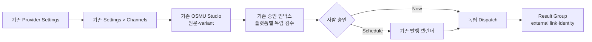

# OpenClaw Auto OSMU PRD PATCH — 기존 Marketing Hub 보존 계약

| 항목 | 값 |
|---|---|
| 버전 | `v3.1.1` |
| 작성일 | 2026-08-04 |
| 작성자 / 모델 | `prd-architect / gpt-codex/gpt-5.6-sol` |
| 상태 | `in-review` — plan PATCH, `/approve plan` 전 미확정 |
| 상류 핀 | [PRD v3.1.0](openclaw-auto-osmu-prd-v3.1-gpt-codex.md) · `REQUEST-OSMU-001` · `DESIGN-005` · `DESIGN-006` · [DESIGN v6](../DESIGN.md) |
| 정본 우선순위 | 이 PATCH의 변경 조항 → PRD v3.1.0의 비변경 조항 → DESIGN v6 |
| 하류 계약 | plan PATCH 승인 뒤 DESIGN v6 문구 회수 및 design gate 재검증 |

## 목차

- [TL;DR](#tldr)
- [1. PATCH 범위와 변경 이유](#patch-scope)
- [2. 현재 구현 상태](#current-state)
- [3. 페르소나·One Thing·MVP](#one-thing)
- [4. 유지되는 제품·데이터 계약](#canonical)
- [5. 기존 제품 보존형 UI 계약](#ui-contract)
- [6. 요구사항](#requirements)
- [7. 핵심 사용자 흐름](#flow)
- [8. 수용기준·QA 계약](#acceptance)
- [9. RTM](#rtm)
- [10. BM·운영·리스크](#business)
- [11. Steelman·Premortem·Kill criteria·셀프심문](#challenge)
- [12. 7원칙·개정이력](#closure)

## TL;DR

OSMU의 `6 providers / 8 surfaces / 12 capability paths`와 account truth, source→variant→approval→dispatch→result 데이터 계약은 유지한다. 다만 모든 provider 화면에 동일한 6탭과 9개 Settings UI를 강제하는 v3.1.0 조항은 폐기한다. 공통 OSMU workflow는 이미 존재하는 `OSMU Studio`, `승인 인박스`, `발행 캘린더`, `Settings > Channels`에 증분 배치하고, provider page는 Threads·Instagram 등 실제 구현된 탭과 특화 기능을 그대로 보존한다. 승인 기준은 고객 sidebar `26/26`, customer page entry/route `24/24`, 기존 Settings tab `9/9`, invented top-level navigation `0`, forced identical provider tab `0`이다.

## 1. PATCH 범위와 변경 이유

### 1.1 규범적 우선순위

이 문서는 PRD v3.1.0 전체를 다시 쓰지 않는 semver PATCH다. 아래 표에 명시된 조항만 v3.1.0을 대체하고, capability ID, lifecycle, 정책·심사, appetite, BM, migration, private-data hardline 등 나머지 조항은 v3.1.0을 그대로 상속한다.

| v3.1.0 조항 | v3.1.1 판정 | 새 계약 |
|---|---|---|
| TL;DR의 모든 provider 동일 6탭 | 폐기 | 공통 workflow는 기존 Studio/Inbox/Calendar/Settings에 배치 |
| §3 baseline의 공통 6탭·9 Settings UI | 대체 | 6/8/12 데이터 계약 유지, 기존 shell·provider별 UI 보존 |
| §6 공통 6탭 계약 | 전면 대체 | provider별 실제 탭·특화 기능 유지, forced identical tab `0` |
| §8 6×9 Settings UI 매트릭스 | UI 강제 폐기 | 9개 항목은 readiness 데이터 점검표로만 유지; 화면은 Global summary와 provider별 기존 detail에 맥락별 노출 |
| FR-02, FR-05, FR-06, FR-21, FR-23 | 대체 | 보존 수치·additive placement·DESIGN-006 추적성으로 변경 |
| AC/TC-002, 006, 007, 022, 024 | 대체 | 실제 구현 보존과 invented navigation `0`을 검증 |
| §17 DESIGN-005 RTM | 확장 | DESIGN-006·사용자 정정·DESIGN v6을 추가 |

### 1.2 발견 결함과 근본 원인

`DESIGN-006`에서 v5가 실제 제품에 없는 `OSMU PROVIDERS`를 만들고 기존 왼쪽 사이드바와 provider별 기능을 축약한 것이 확인됐다. 직접 원인은 v3.1.0이 capability/data 공통화와 화면/navigation 공통화를 하나의 baseline으로 묶고, `6 provider × 6 tabs`와 `6 × 9 Settings` 채움 수를 보존성의 대리지표로 사용한 것이다. 따라서 이 PATCH는 공통화의 대상을 데이터·상태·workflow로 제한하고, 고객이 보는 IA는 actual dashboard source를 우선한다.

### 1.3 변경 금지선

- `OSMU PROVIDERS`, `Provider workspace`, `6 Providers`를 고객 sidebar/navigation label로 새로 만들지 않는다.
- 기존 sidebar label·group·route를 삭제, 리네임, 이동하지 않는다. 별도 승인 없는 허용 수치는 모두 `0`이다.
- provider별 기존 탭과 특화 기능을 공통 탭 shell로 교체하지 않는다.
- capability가 미래 목표라는 이유로 현재 UI에 빈 chart, 가짜 `0`, 작동하지 않는 tab을 만들지 않는다.
- 제품 코드, API 계약, DB schema를 이 plan PATCH에서 변경하거나 확정하지 않는다.

## 2. 현재 구현 상태

위키를 1차 정본으로 읽고, DESIGN-006이 지목한 UI 충돌만 실제 dashboard source로 좁게 대조했다. source 대조가 필요했다는 사실은 UI inventory가 위키에 exact count로 고정돼 있지 않았다는 결함 신호다.

> ⛔ 회수 필요: 위키에는 발행 채널 SSOT와 shell 경계가 기록돼 있지만 고객 sidebar `26`, customer page entry `24`, Settings tab `9`의 exact preservation inventory가 한 문서에 없었다. DESIGN v6 RTM을 근거로 이번 PATCH에 고정했으며, design 승인 뒤 `wiki/product/`에 보존 정본을 반영해야 한다.

| 요구/영역 | 현재 상태 | 재구현 금지·연결 방향 | 위키·코드 출처 |
|---|---|---|---|
| OSMU Studio | 이미 구현 | 공통 source·variant·preview·publish workflow를 여기서 확장 | `wiki/product/studio.md`, `dashboard/src/app/studio/page.tsx` |
| 승인 인박스 | 이미 구현 | source group 검수와 capability별 독립 승인을 additive 배치 | `dashboard/src/app/inbox/page.tsx`, DESIGN v6 |
| 발행 캘린더 | 이미 구현 | schedule/result group·partial failure 상태를 additive 배치 | `dashboard/src/app/calendar/page.tsx`, DESIGN v6 |
| Settings > Channels | 이미 구현 | account truth summary·last verified·CTA를 기존 channel grid에 추가 | `wiki/reference/channel-status.md`, `dashboard/src/app/settings/page.tsx` |
| Threads channel | 이미 구현 | `Queue / Analytics / Growth / Popular / Settings` 5탭 보존 | `dashboard/src/components/channel/ChannelPage.tsx` |
| Instagram channel | 이미 구현 | `Queue / Editor / Settings`와 CardNews·account·credential 기능 보존 | `dashboard/src/components/channel/InstagramPage.tsx` |
| Generic/messaging/data channels | 부분 구현·provider별 상이 | 각 route의 실제 Queue/Analytics/Settings 또는 특화 화면을 보존; 미래 capability는 readiness로만 표시 | `wiki/reference/channel-status.md`, channel components |
| 6 provider / 8 surface / 12 capability | 구현 수준 상이 | canonical ID와 readiness/data 계약 유지, enabled는 provider별 E2E로만 판단 | PRD v3.1.0 §2·§5, `wiki/reference/channel-status.md` |
| Analytics/Growth/Popular 18 contracts | 부분 구현 | own-account data와 S/R/U 계약 유지; provider tab 생성 의무는 없음 | PRD v3.1.0 §7 |
| Provider readiness 9항목 | 부분 구현 | data checklist 유지; 모든 provider에 9개 UI section을 강제하지 않음 | PRD v3.1.0 §8, Settings/channel source |
| 고객 shell preservation | DESIGN v6에서 목록화 | sidebar `26/26`, route `24/24`, Settings tab `9/9`, invented nav `0` | `Sidebar.tsx`, app page entries, DESIGN v6 RTM |

## 3. 페르소나·One Thing·MVP

### 3.1 핵심 페르소나 — 김민서, 34세, 1인 지식서비스 운영자

김민서는 회사에서 쌓은 전문성을 온라인 클래스와 유료 상담으로 판매하지만 마케팅팀, 디자이너, 영상편집자, 개발자가 없다. 오전에는 상품과 고객 문의를 처리하고, 오후에는 강의와 상담을 진행하며, 남는 시간에 Threads에는 관점형 글, Instagram에는 카드 이미지와 Reels, YouTube와 TikTok에는 세로 영상을 올린다. 한 아이디어를 플랫폼별로 다시 쓰고, 서로 다른 계정·권한·예약 규칙을 확인하는 동안 본업이 여러 번 끊긴다. 그래서 새로운 통합 대시보드보다 이미 익숙한 Marketing Hub 안에서 원문 하나를 만들고, 각 채널 버전을 비교·승인하고, 언제 어디에 발행됐는지 회수하기를 원한다.

그녀가 두려워하는 실패는 기능 부족보다 잘못된 확신이다. `연결됨`이라고 표시됐지만 실제로는 개인 계정이나 과거 브랜드 계정에 연결돼 있거나, Instagram용 이미지 규칙이 Threads와 같은 것처럼 처리되거나, 발행 성공 배지가 떴지만 외부 게시물 링크가 없는 상황이다. 또한 OSMU 기능을 추가한다는 이유로 기존 Analytics, Growth, Popular, CardNews Editor, Keyword Research, Assets가 사라지거나 다른 위치로 이동하면 학습비용과 불신이 커진다. 김민서에게 성공은 새 메뉴가 많아지는 것이 아니라 기존 동선을 잃지 않은 채 `OSMU Studio → 승인 인박스 → 발행 캘린더`에서 정확한 target account와 독립 variant를 확인하고, 일부 provider가 실패해도 성공 게시물을 중복 발행하지 않으며, 실제 외부 링크를 source group 하나에서 여는 것이다.

구매 판단도 같은 기준을 따른다. 첫 14일 안에 두 개 이상의 원문을 실제 고객 계정에 안전하게 발행하고, 이전보다 플랫폼별 재작성·계정 확인 시간이 줄어야 구독을 검토한다. 반대로 빈 provider 탭, 준비 중 카드, 내부 용어가 늘거나 기존 기능을 찾는 시간이 길어지면 “통합”이 아니라 제품 교체로 받아들이고 이탈한다. 이 페르소나의 업무 맥락은 Buffer와 Later가 한 composer에서 여러 채널을 선택하되 네트워크별로 내용을 독립 조정하고, 예약 후 post를 개별 관리하는 공식 흐름으로 보강했다. 연령·지불의향·업종 비중은 외부 cohort 전까지 가설이다.

### 3.2 One Thing 후보와 잘못된 답의 함정

| 후보 | 장점 | 함정 | 판정 |
|---|---|---|---|
| 모든 provider에 동일한 관리 화면을 제공 | 설명이 쉽고 표면상 일관됨 | 실제 기능을 숨기거나 빈 탭을 발명해 기존 고객 회귀를 만든다 | 폐기 |
| 6 providers와 12 capability를 한 번에 구현 | 범위 누락 우려를 줄임 | UI 개수와 실제 account/publish truth를 혼동한다 | 폐기 |
| 원문 하나를 정확한 계정에 독립 발행하고 결과를 회수 | 고객 outcome·safety·dedupe를 함께 측정 가능 | 기존 shell 보존을 별도 AC로 명시하지 않으면 새 IA로 변질 가능 | 채택+보존 AC |

> **One Thing: 기존 Marketing Hub 동선을 보존하면서, 사람이 승인한 원문 하나를 선택한 각 채널의 정확한 계정에 중복 없이 발행하고 외부 결과를 한 기록으로 회수한다.**

### 3.3 MVP 5개와 One Thing 연결

| MVP | One Thing 연결 | 종료증거 |
|---|---|---|
| Existing Shell Preservation | “기존 동선 보존” | sidebar 26/26, route 24/24, Settings 9/9, invented nav 0 |
| Account Truth | “정확한 계정” | Settings/Channel/Studio/Review의 identity·state·CTA diff 0 |
| Approved Source & Independent Variants | “사람이 승인한 원문 하나” | provider별 수정 교차 덮어쓰기 0 |
| Review & Dispatch | “선택 채널에 중복 없이 발행” | target/content/privacy/time 승인, same dispatch result ≤1 |
| Result Group | “외부 결과를 한 기록으로 회수” | capability별 external ID/link/status를 source group 1개에서 확인 |

## 4. 유지되는 제품·데이터 계약

### 4.1 변경 없음

- Provider `6`, surface `8`, capability path `12`와 `PV-*`, `SF-*`, `CP-*` ID는 v3.1.0 §2를 그대로 사용한다.
- Approved Source → capability variant → validation → 사람 승인 → Now/Schedule → 독립 dispatch → Result Group lifecycle은 그대로 유지한다.
- account truth, false-success hard stop, idempotency, tenant isolation, private data의 공용 analytics 반입 금지, 정책·심사·비용 gate는 그대로 유지한다.
- Analytics/Growth/Popular `18`개 S/R/U 데이터 계약은 유지하되, 그것이 각 provider 화면에 같은 이름의 탭을 만들어야 한다는 뜻은 아니다.

### 4.2 Provider readiness 9항목의 새 해석

연결·인증, 계정·기본값, 권한·심사, 발행 준비도, 콘텐츠 규칙, 예약, 알림, 연결해제·삭제, 고급 복구의 9항목은 backend/domain 및 QA 점검표다. 해당 값은 `Settings > Channels` summary, 기존 Channel Settings, Studio readiness, 오류 recovery 중 고객 맥락에 맞는 곳에서 progressive disclosure한다. `6 × 9 = 54`개의 시각적 cell·section·tab을 만드는 것은 요구가 아니다.

## 5. 기존 제품 보존형 UI 계약

### 5.1 공통 OSMU workflow의 additive placement

| 공통 고객 작업 | 기존 화면 | additive 범위 |
|---|---|---|
| 원문·브랜드 정보·채널별 variant 생성 | `OSMU Studio` | readiness, account truth summary, 독립 variant validation |
| 플랫폼별 비교·수정·승인 | `승인 인박스` | source group, validation 실패 제외 승인, dispatch review |
| 예약·진행·결과 회수 | `발행 캘린더` | result group, external link, partial/reconcile 상태 |
| 전체 연결 상태·기본 계정 | `Settings > Channels` | identity, last verified, readiness reason, action CTA |
| provider 특화 운영·분석·복구 | 기존 Channel page | 실제 탭과 기능 유지, 필요한 데이터만 additive |

`Global Settings`는 기존 고객 navigation label `Settings`와 route `/settings`를 뜻하는 개념어다. sidebar에 `Global Settings`라는 새 top-level item을 만들거나 기존 `Settings`를 리네임하지 않는다.

### 5.2 Provider page 보존 baseline

| Provider/page type | 실제 baseline | v3.1.1 계약 |
|---|---|---|
| Threads | Queue / Analytics / Growth / Popular / Settings | 5탭 이름·기능 보존; 공통 Editor 탭 강제 0 |
| Instagram | Queue / Editor / Settings + CardNews/account/credential | 3탭·특화 기능 보존; 빈 Analytics/Growth/Popular 탭 생성 0 |
| Generic provider | Queue / Analytics / Settings 또는 provider 특화 route | 실제 component가 제공하는 기능 보존; 지원 전 tab 생성 0 |
| Video provider | 독립 `/channels/{provider}` 연결 경로와 `/videos` 작업실 | 텍스트 예약 SSOT에 혼합하지 않음 |

### 5.3 Preservation counts

| 항목 | 승인 수치 |
|---|---:|
| 고객 sidebar item | `26/26` |
| customer page entry/route inventory | `24/24` |
| 기존 Settings tab | `9/9` |
| 기존 Studio preview surface | `7/7` |
| 기존 label 삭제·리네임·이동 | `0` |
| invented top-level navigation/group | `0` |
| forced identical provider tab | `0` |

## 6. 요구사항

아래 요구는 같은 ID의 v3.1.0 문구를 대체한다. 나머지 FR/NFR은 v3.1.0을 그대로 상속한다.

| ID | 원자 요구 | Fit Criterion |
|---|---|---|
| FR-02 | provider page는 actual source의 탭·특화 기능을 보존한다 | Threads 5/5, Instagram 3/3, generic actual mapping 100%, forced identical tab 0 |
| FR-05 | Settings summary와 Channel detail은 같은 account truth를 읽되 기존 역할·label·route를 유지한다 | `/settings`와 Channel Settings truth diff 0, 기존 Settings tab 9/9 |
| FR-06 | provider readiness 9항목은 데이터 점검표이며 맥락별 progressive disclosure한다 | readiness field 9/9 추적, 54-cell UI 강제 0, 미지원 기능 가짜 enabled 0 |
| FR-21 | OSMU workflow는 기존 Studio/Inbox/Calendar/Settings에 additive 배치한다 | sidebar 26/26, route 24/24, label remove/rename/move 0, invented nav 0 |
| FR-23 | 사용자 정정·DESIGN-005·DESIGN-006·DESIGN v6을 FR→AC→TC→view/state로 추적한다 | 네 상류 source orphan 0, superseded v5를 승인 근거로 사용 0 |

추가 NFR:

| ID | 요구 | Fit Criterion |
|---|---|---|
| NFR-09 | 실제 source보다 PRD의 미래 target UI가 우선하지 않는다 | implementation-to-design preservation diff 100%, 설명 없는 UI invention 0 |
| NFR-10 | capability/data 공통화와 navigation/UI 공통화를 분리한다 | canonical 6/8/12 유지, UI 동일화 강제 0 |

## 7. 핵심 사용자 흐름

provider page는 이 공통 흐름의 별도 복제본이 아니다. 특정 provider의 queue·analytics·growth·popular·editor·CardNews·credential 등 기존 운영 기능을 담당하고, 공통 흐름에는 필요한 deep link와 readiness만 연결한다.

## 8. 수용기준·QA 계약

아래 AC는 같은 번호의 v3.1.0 AC를 대체한다. 나머지 AC-01~30은 그대로 유지한다.

| AC | FR | Given / When / Then | 정규 QA TC |
|---|---|---|---|
| AC-02 | FR-02/21, NFR-09/10 | Given actual Sidebar·route·provider inventory와 DESIGN, When 1024/390에서 전수 대조, Then sidebar 26/26·route 24/24·Threads tab 5/5·Instagram tab 3/3·forced identical tab 0·invented top-level navigation 0 | OSMU-V3-TC-002 |
| AC-06 | FR-05 | Given 같은 연결 계정, When `/settings`와 Channel Settings·Studio review를 열면, Then identity/state/CTA가 같고 기존 summary/detail 역할과 label이 유지된다 | TC-006 |
| AC-07 | FR-06 | Given provider readiness 9항목, When current/review-required/unsupported 상태를 조회하면, Then 9/9 데이터 추적과 고객용 이유·조치가 존재하되 54-cell UI나 빈 기능 탭을 강제하지 않는다 | TC-007 |
| AC-22 | FR-21 | Given v3.1.1 build candidate, When migration preservation audit를 실행하면, Then MI-01~09와 sidebar 26/26·route 24/24·Settings 9/9·label move/remove/rename 0·invented nav 0을 만족한다 | TC-022 |
| AC-24 | FR-23 | Given REQUEST-OSMU-001·사용자 정정·DESIGN-005·DESIGN-006·DESIGN v6, When RTM을 역추적하면, Then FR→AC→TC→view/state orphan 0이고 v5를 승인 근거로 쓰지 않는다 | TC-024 |

## 9. RTM

### 9.1 DESIGN-006·사용자 정정 closure

| 상류 결함/요구 | FR | AC | QA TC | DESIGN v6 view/state |
|---|---|---|---|---|
| 존재하지 않는 `OSMU PROVIDERS` 폐기 | 21 | 02,22 | 002,022 | existing shell preservation |
| 왼쪽 sidebar 전수 보존 | 21 | 02,22 | 002,022 | sidebar 26/26 RTM |
| route·기능 orphan 금지 | 02,21 | 02,22 | 002,022 | customer page entry 24/24 |
| provider별 실제 탭·특화 기능 보존 | 02 | 02 | 002 | Threads 5, Instagram 3, generic actual mapping |
| Global Settings 교체 금지 | 05,06 | 06,07 | 006,007 | existing Settings tab 9/9 |
| 공통 OSMU workflow는 기존 화면에 additive | 21 | 02,22 | 002,022 | Studio/Inbox/Calendar/Settings |
| capability/data 계약은 유지 | 01,03~20 | 기존 AC 유지 | 001,003~021,023~030 | readiness/result/account truth |
| invented navigation 금지 | 21,NFR-09 | 02,22 | 002,022 | invented top-level nav 0 |
| v5 자기검증 대리지표 재발 금지 | 23 | 24 | 024 | actual source→design preservation RTM |

### 9.2 REQUEST-OSMU-001 / DESIGN-005 mapping 변경점

| 기존 RTM 행 | v3.1.1 교정 |
|---|---|
| 탭 일관성 | 동일 탭 이름이 아니라 실제 provider 기능 보존, 상태·account truth·workflow 용어 일관성으로 해석 |
| 전체 OSMU 범위 | 6/8/12 capability coverage는 유지하되 고객 navigation 개수와 동일시하지 않음 |
| 연결·계정·권한·설정 | Global summary와 provider detail의 동일 truth; 54-cell UI 강제 아님 |
| client-ready PRD / 100B 표시 | v3.1.1 + DESIGN v6 preservation RTM을 사용하며 v5는 superseded |

## 10. BM·운영·리스크

### 10.1 BM과 appetite

workspace 구독+AI/video credit 가설, R0~R4의 13주·52시간·USD 500 상한, external demand cohort와 kill 수치는 v3.1.0을 유지한다. 고객이 지불하는 대상은 동일한 provider 탭 수가 아니라 기존 동선을 잃지 않고 원문→독립 variant→정확한 계정→외부 결과를 회수하는 운영 결과다.

### 10.2 운영 부하

- UI preservation audit는 design/build/QA마다 sidebar `26`, route `24`, Settings `9`, provider tab baseline을 자동 대조해야 한다.
- provider readiness 9항목은 한 데이터 계약으로 관리하되 각 화면에 중복 UI를 만들지 않는다.
- 신규 provider capability는 credential·review·cost·E2E가 닫히기 전 enabled로 표시하지 않는다.
- 기존 6사업의 고객 안전·운영 incident가 생기면 v3.1.0 §16의 OSMU 신규 확대 중단 규칙을 그대로 적용한다.

### 10.3 리스크

| 리스크 | 방어 |
|---|---|
| 보존 수치에만 맞추고 기능이 깨짐 | label count뿐 아니라 route click·provider feature mapping·browser behavior를 함께 검증 |
| 공통 workflow가 여러 화면에 중복 구현 | Studio/Inbox/Calendar/Settings의 역할을 고정하고 provider page는 deep link·readiness만 연결 |
| readiness 9항목이 다시 54개 카드로 부풀어남 | UI cell count를 AC에서 제거하고 data trace 9/9만 요구 |
| 미래 capability가 빈 tab으로 노출 | official support·credential·E2E 전에는 기존 화면의 disabled reason으로만 표현 |
| private tenant data가 analytics에 섞임 | v3.1.0 NFR-02/03과 tenant isolation 유지; 공용 analytics 반입 0 |

## 11. Steelman·Premortem·Kill criteria·셀프심문

### STEELMAN

모든 provider에 같은 6탭을 두면 고객이 새 플랫폼을 배울 필요가 없고 QA도 36개 고정 cell로 단순해진다는 주장은 강하다. 특히 장기적으로 capability가 모두 채워진다면 공통 shell은 설명과 영업에 유리하다. 그러나 현재 제품은 Threads와 Instagram의 실제 기능 구성이 다르고, 빈 탭을 먼저 만들면 지원되지 않는 기능을 약속하며 기존 CardNews·Growth·Popular의 위치를 왜곡한다. 따라서 일관성은 navigation 복제가 아니라 공통 상태어·account truth·Studio→Inbox→Calendar workflow에서 확보한다.

### PREMORTEM

세 달 뒤 v3.1.1이 실패했다면 “기존 메뉴를 보존했다”는 체크만 통과하고 실제 버튼·계정·발행 동작은 깨졌을 가능성이 가장 크다. 예를 들어 sidebar 26개가 보이지만 Instagram Editor의 CardNews 저장이 끊기거나 Threads Growth가 빈 화면이면 숫자 보존은 또 다른 대리지표다. 그래서 TC-002/022는 count와 함께 provider feature mapping, route click, 390/1024 browser observation을 요구하며 실제 account/publish E2E는 기존 TC-003~023으로 유지한다.

### KILL-CRITERIA

plan PATCH 승인 후 첫 design/build preservation audit에서 sidebar 26/26, route 24/24, Settings 9/9 중 하나라도 누락되거나 invented top-level navigation이 1개 이상이면 해당 design/build를 즉시 반려하고 상류 plan을 재개한다. R0 1주·4시간 안에 account truth TC-003~007/026/028이 닫히지 않으면 UI 확장을 중단하며, 30일 qualified demand·21일 activation·14일 repeat 기준은 v3.1.0 §13의 수치 그대로 적용한다.

### 셀프심문

질문: **이 결론이 틀렸다면 가장 그럴듯한 이유는 무엇인가?**

답: 실제 dashboard source가 우연히 누적된 레거시이고, 고객에게는 더 단순한 새 IA가 장기적으로 더 나을 수 있다. 하지만 사용자는 v5에서 기존 기능이 사라진 것을 직접 결함으로 지적했고, 현재 요청은 교체가 아니라 증분이다. 새 IA의 가치 검증 없이 기존 제품을 삭제·이동하는 것은 되돌림 비용과 고객 학습비용을 만든다. 따라서 현 시점의 올바른 기본값은 보존이며, 향후 IA 개편은 별도 사용자 결정·migration RTM·실사용 검증을 가진 MAJOR change로만 제안한다.

### 레드팀 수정 결과

까다로운 기존 고객은 “26개 메뉴를 복사했을 뿐 OSMU는 또 어디서 해야 하는지 모르겠다”고 공격할 수 있다. 이에 공통 작업의 home을 기존 Studio, Inbox, Calendar, Settings 네 화면으로 명시하고 provider page와의 역할을 §5.1에 분리했다. 회의적 투자자는 “레거시를 전부 지키느라 제품이 복잡해진다”고 공격할 수 있다. 이 PATCH는 영구 보존을 선언하지 않고, 이번 additive scope의 기본값만 보존으로 두며 별도 MAJOR IA 전환은 고객 증거와 migration approval이 있을 때 열어 둔다.

## 12. 7원칙·개정이력

### 12.1 기획 7원칙

| 원칙 | 판정 | 근거 |
|---|---|---|
| 용어 통일 | PASS | provider/data contract와 customer navigation을 분리 정의 |
| 구체화 | PASS | sidebar 26, route 24, Settings 9, invented nav 0 |
| 입출력 분리 | PASS | source/variant 입력과 result group 출력 유지 |
| 정합성 | PASS | capability 6/8/12 유지, UI 동일화만 폐기 |
| 정책 상세 | PASS | readiness data와 UI 노출 규칙, migration hardline 명시 |
| 추출 철저 | PASS | 사용자 정정·DESIGN-006→FR→AC→TC→v6 mapping |
| 논리 영역 | PASS | 모든 변경 요구에 Fit Criterion과 Gherkin AC 존재 |

### 12.2 개정이력·gate

| 버전 | 날짜 | 변경 |
|---|---|---|
| v3.1.0 | 2026-08-04 | 6/8/12 canonical과 R0~R4 계약 |
| v3.1.1 | 2026-08-04 | 공통 6탭·54-cell UI 강제 폐기, 기존 shell/provider 기능 보존, DESIGN-006 RTM 회수 |

Gate 미통과: 이 PATCH는 `in-review`다. plan critic MAJOR `0`, QA tracker 문구 동기화, DESIGN v6의 “회수 필요” 해소, design verifier 재통과 전 다음 stage 진입 불가다.

---

🏷 STAMP | line: openclaw-auto-osmu | 생성: 2026-08-04 06:05 KST | model: gpt-codex/gpt-5.6-sol | agent: prd-architect

skills: 매칭 PRD skill 없음 — `/Users/sj/.claude/standards/planning.md`, `doc-review.md`, `benchmarks.md`, `artifact-stamp.md` 적용

근거 URL:
- https://support.buffer.com/article/642-scheduling-posts
- https://support.buffer.com/article/961-using-post-groups-in-buffer
- https://help.later.com/hc/en-us/articles/360043243873-Schedule-One-Post-to-Multiple-Social-Profiles

고민: capability/data의 공통 계약은 유지하면서 고객 화면의 공통화를 걷어내야 했기 때문에, “공통 workflow”와 “provider 특화 운영”의 소유 화면을 분리했다.

SKILLS_USED: 없음 — 설치된 skill 중 PRD·제품기획 전용 매칭 없음; planning/doc-review 품질헌법과 기존 PRD template 구조를 적용.

SKILLS_SKIPPED: 콘텐츠·브랜딩·마케팅·이미지 skill은 요구·AC·RTM PATCH 과업과 불일치.

SOURCES:
- [PRD v3.1.0](openclaw-auto-osmu-prd-v3.1-gpt-codex.md)
- [DESIGN v6](../DESIGN.md)
- [DESIGN-006 QA](qa-tracker.md#2026-08-04-design-006--v5-실구현-ia기능디자인시스템-무시)
- [v6 preservation RTM](WIREFRAMES/openclaw-auto-osmu-preservation-rtm-v6-gpt-codex.md)
- `wiki/product/studio.md`, `wiki/reference/channel-status.md`, `wiki/product/vision.md`
- `dashboard/src/components/layout/Sidebar.tsx`, `dashboard/src/components/channel/ChannelPage.tsx`, `dashboard/src/components/channel/InstagramPage.tsx`, `dashboard/src/app/settings/page.tsx`
- [Buffer Scheduling](https://support.buffer.com/article/642-scheduling-posts), [Buffer Post Groups](https://support.buffer.com/article/961-using-post-groups-in-buffer), [Later multi-profile scheduling](https://help.later.com/hc/en-us/articles/360043243873-Schedule-One-Post-to-Multiple-Social-Profiles)
- ISO/IEC/IEEE 29148 · Volere Atomic Requirement Shell · Gherkin

MODEL: `gpt-codex/gpt-5.6-sol`

RUBRIC_SCORE: 완결성=5/5 정밀성=5/5 벤치마크=5/5 추적성=5/5 전문성=5/5 total=25/25

WEAKEST_LINE: “generic provider actual mapping 100%”은 design/build 시점의 source inventory 자동화가 아직 없으므로, TC-002/022에서 exact route·feature audit를 실행해야 최종 증명된다.
