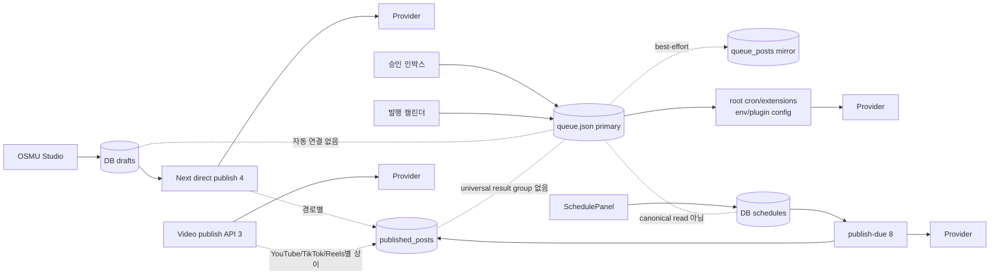
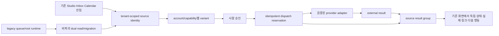

# openclaw-auto OSMU PRD v4.0.0 — 실제 런타임 수렴

> **상태:** PLAN-007 MAJOR retake · 승인 전 · DESIGN v6 입력 사용 금지  
> **제품 판단:** 현재 제품에는 하나의 연속된 `Studio → 승인 인박스 → 캘린더 → 결과 그룹`이 없다. 서로 다른 저장소와 실행기가 같은 화면 안에 공존한다. v4의 일은 새 메뉴를 발명하는 것이 아니라 이 분리를 고객이 잃거나 중복 발행하지 않는 하나의 source-to-result 계약으로 수렴시키는 것이다.

| STAMP | 값 |
|---|---|
| line | `openclaw-auto-osmu` |
| artifact | `prd` |
| version | `4.0.0` (MAJOR) |
| created | `2026-08-04 23:06 KST` |
| model | `gpt-codex/gpt-5.6-sol` |
| agent | `prd-architect` |
| skills | 매칭 PRD skill 없음; planning/doc-review 기준 직접 적용 |
| evidence URLs | Buffer Post Groups, Later multi-profile scheduling/help (하단 SOURCES) |
| 고민 한 줄 | 기존 UI의 이름이 같다는 사실과 같은 데이터 흐름이라는 주장을 분리하고, 코드가 있는 것과 운영에서 되는 것도 분리했다. |

## 목차

1. [결정 요약](#1-결정-요약)
2. [정본과 폐기 근거](#2-정본과-폐기-근거)
3. [현재 상태 분류법](#3-현재-상태-분류법)
4. [핵심 페르소나](#4-핵심-페르소나)
5. [One Thing](#5-one-thing)
6. [As-is source-to-result](#6-as-is-source-to-result)
7. [채널 구현 지도](#7-채널-구현-지도)
8. [Target outcome](#8-target-outcome)
9. [MVP 기능 5개](#9-mvp-기능-5개)
10. [기능 요구사항](#10-기능-요구사항)
11. [비기능 요구사항](#11-비기능-요구사항)
12. [기술부채 우선순위](#12-기술부채-우선순위)
13. [비파괴 이관 슬라이스](#13-비파괴-이관-슬라이스)
14. [BM·운영 부하](#14-bm운영-부하)
15. [법적·시장·기술 리스크](#15-법적시장기술-리스크)
16. [6사업 자기잠식](#16-6사업-자기잠식)
17. [수용기준과 테스트](#17-수용기준과-테스트)
18. [요구 추적표](#18-요구-추적표)
19. [Steelman·Premortem·Kill criteria](#19-steelmanpremortemkill-criteria)
20. [셀프심문·레드팀 반영](#20-셀프심문레드팀-반영)
21. [Gate](#21-gate)

## 1. 결정 요약

- v3.1.1과 DESIGN v6는 `PLAN-007` 때문에 승인 불가다. 보존성 QA의 실패 증거로만 사용한다.
- 실제 고객 런타임은 ① Studio DB draft와 Next direct publish, ② `queue.json` 중심 Inbox/Calendar와 root extension, ③ DB schedule worker, ④ 별도 video publish로 갈라져 있다.
- 텍스트 publish/schedule 대상은 8개, Studio direct 대상은 4개, Studio preview는 7개, video target은 3개, root publish extension은 15개다. 숫자가 같은 ‘지원 플랫폼’ 한 목록은 현재 존재하지 않는다.
- 구현 코드의 존재, 부분 구현, 미구현, 운영 장애, 운영 미검증을 별도 상태로 기록한다. `extension directory exists`는 고객 발행 가능의 증거가 아니다.
- 목표는 source 하나가 tenant·account·capability별 독립 dispatch와 외부 결과를 공유 식별자로 묶고, timeout/재시도에서도 이미 성공한 외부 발행을 반복하지 않게 만드는 것이다.
- 구체 DB table/API/schema는 eng-design에서 회장과 합의한다. 이 PRD는 필요한 행동·불변식·종료증거만 확정한다.

## 2. 정본과 폐기 근거

### 2.1 읽은 정본

| 우선 | 출처 | 확인한 사실 |
|---|---|---|
| 1 | `pipeline-state.md`, `wiki/ops/session-state.md`, `docs/qa-tracker.md` | PLAN-007, 운영 OAuth/account 장애, 승인 artifact 상태 |
| 1 | `CHANGELOG.md` 2026-04-07~14 | Instagram queue/editor/settings, carousel·R2 과거 검증, queue schema/editor 흐름 |
| 2 | `dashboard/src/lib/constants.ts` | text 8, Studio/Video 상수 drift, plugin 목록 |
| 3 | `dashboard/src/app/studio/page.tsx`, `dashboard/src/app/api/studio/drafts/route.ts` | Studio DB draft, direct 4, preview 7 |
| 4 | `dashboard/src/app/inbox/page.tsx`, `calendar/page.tsx`, `lib/queue-store.ts` | Inbox/Calendar는 queue JSON view, DB는 best-effort mirror |
| 5 | publish/schedule/video API와 `dashboard/db/schema.sql` | idempotency·result persistence가 경로별로 불균일 |
| 6 | root `extensions/*-publish` | 15개 extension의 코드 존재와 별도 env/plugin runtime |

### 2.2 폐기·보류

- `docs/openclaw-auto-osmu-prd-v3.1.1-gpt-codex.md`: **rejected evidence**. 존재하지 않는 end-to-end 연속성을 전제했다.
- `DESIGN.md` v6: **rejected evidence**. Sidebar 보존 감사에는 참고하되 target workflow의 근거로 쓰지 않는다.
- `docs/openclaw-auto-osmu-prd-v3.1-gpt-codex.md`: 시장·페르소나 가설 중 코드와 충돌하지 않는 항목만 재검증해 계승한다.

## 3. 현재 상태 분류법

| 상태 | 뜻 | 제품 문구 원칙 |
|---|---|---|
| 운영 관찰 | 실제 provider/account/link를 직접 확인 | `운영 확인` 가능; 증거시각·계정 범주 명시 |
| 구현·테스트 | 코드와 자동/로컬 테스트가 있으나 실제 provider E2E는 별도 | `지원` 단정 금지, 환경별 readiness 표시 |
| 부분 구현 | happy path 일부 또는 저장/복구가 경로별 상이 | 가능한 범위와 빠진 경계를 같이 표시 |
| 미구현 | 필요한 code path/contract 없음 | disabled와 enable 조건 표시 |
| 운영 장애 | 구현 유무와 별개로 현재 실제 계정 흐름이 실패 | 고객 CTA를 닫고 owner/action 표시 |
| 운영 미검증 | 코드 존재만 확인, 실 provider 결과 미관찰 | `코드 존재·운영 미검증`으로 표기 |

**금지:** `연결됨`, `발행됨`, `지원됨`은 token 저장·HTTP 2xx·extension 디렉터리·내부 row만으로 표시하지 않는다.

## 4. 핵심 페르소나

김민서(34)는 강의와 컨설팅을 판매하는 1인 지식사업자다. 별도 마케팅팀, 영상 편집자, 개발자 없이 상품 제작·상담·정산·고객 응대까지 맡아, 한 아이디어를 여러 채널에 옮기는 시간이 곧 매출 활동의 손실이다. Threads와 X에는 관점형 글, Facebook에는 설명형 글, Instagram Feed에는 카드나 이미지, Reels·Shorts·TikTok에는 세로 영상을 내고 싶지만, 플랫폼마다 계정·권한·심사·미디어 규칙·예약 방식이 달라 매번 앱을 오간다. 그가 원하는 것은 AI가 8개 문안을 생성했다는 숫자가 아니라, 자신이 승인한 원문이 정확한 브랜드 계정에 한 번만 발행되고 실제 게시물 링크가 돌아오는 확신이다.

현재 화면에서 `OSMU Studio`, `승인 인박스`, `발행 캘린더`라는 이름을 보면 하나의 작업이 이어질 것으로 기대한다. 그러나 Studio 초안은 DB에 있고 Inbox/Calendar는 `queue.json`을 읽으며 schedule과 video도 별도 경로여서, Studio에서 만든 것이 Inbox에 안 보이거나 성공한 게시물이 한 결과로 모이지 않을 수 있다. 이때 김민서는 자기 실수인지 제품 결함인지 판단하지 못해 각 provider를 열어 중복 여부를 확인한다. 특히 Meta 로그인 세션에 다른 개인/브랜드 계정이 남아 있으면 ‘연결됨’이라는 초록 상태를 믿지 못한다. timeout 후 재시도를 눌렀다가 동일 게시물이 두 번 올라가는 것이 가장 두렵고, 반대로 실제 발행은 됐는데 내부 저장만 실패해 실패로 표시되는 것도 원치 않는다.

김민서는 게시 전 각 채널의 account identity, 변환된 본문·미디어, 공개범위, 예약시간을 검수하고 특정 채널만 제외하거나 수정하고 싶다. 일부 채널이 실패해도 성공 채널은 다시 보내지 않고 실패 채널만 안전하게 회수·재시도하기를 원한다. 성공한 결과는 provider가 돌려준 ID와 열리는 permalink로 확인하고, 처리 중이면 임의의 성공 표시가 아니라 다음 확인 시각을 보고 싶다. 첫 설정에 개발자 도움이 필요하거나 Settings·채널 화면·Editor의 계정명이 다르면 기존 복사붙여넣기로 돌아간다. 두 번째 원문에서도 같은 흐름을 반복해 총 운영시간과 확인 불안을 줄였을 때만 유료 구독을 검토한다. 연령·가격·전환율은 아직 외부 cohort로 검증되지 않은 가설이다.

**Pain:** 같은 제품 안의 분리된 저장소와 실행기를 고객이 직접 대조해야 해서, 자동화를 샀는데도 계정 관리자·중복 감시자·장애 복구자가 된다.

**JTBD:** “원문 하나를 승인했을 때 선택 계정별 결과를 독립적으로 보내고, 중복 없이 실제 외부 결과를 한 기록에서 확인·회수하고 싶다.”

## 5. One Thing

### 후보와 잘못된 답의 함정

| 후보 | 장점 | 함정/판정 |
|---|---|---|
| A. 모든 플랫폼 탭을 동일하게 만든다 | 표면 일관성 | 실제 capability·기존 탭을 덮어쓴 DESIGN-006 반복. **탈락** |
| B. 15개 extension을 전부 대시보드에 연결한다 | 넓은 로고 수 | 운영 미검증·불완전 코드까지 제품 지원으로 오인. **탈락** |
| C. Threads 하나를 완벽히 발행한다 | 빠른 E2E | OSMU 범위와 분리 런타임의 구조 문제를 가린다. 실험 slice로만 사용 |
| D. source identity와 account별 dispatch/result 계약을 통일한다 | UI 이름이 아니라 데이터·복구를 연결 | 이관 난도가 있으나 모든 채널에 재사용. **채택** |
| E. 새 OSMU PROVIDERS 메뉴를 만든다 | 발견성 | 존재하지 않는 IA를 발명하고 기존 Sidebar를 훼손. **금지** |

### 한 문장

> **사람이 승인한 원문 하나가 모든 기존 발행 경로에서 같은 source identity를 공유하고, 선택한 계정별 독립 dispatch와 실제 외부 결과를 tenant 범위의 한 기록 묶음에서 중복 없이 회수되게 한다.**

## 6. As-is source-to-result

### 현재 끊김

1. Studio DB draft는 Inbox/Calendar의 `queue.json` item과 자동으로 같은 source가 아니다.
2. `queue_posts`는 정본이 아니라 best-effort shadow라 JSON write 이후 DB mirror 실패를 삼킨다.
3. text direct publish는 UUID draft의 순차 재시도 dedupe는 있지만 외부 호출 전 공통 reservation이 없다. draft가 없거나 동시 요청이면 중복 가능성이 남는다.
4. Threads/Instagram 일부만 permalink recovery가 있고, 모든 provider가 공유하는 result recovery·result-group retry는 없다.
5. schedule worker의 row claim과 video TikTok/Reels reservation은 유효한 구현이지만 다른 경로의 안전을 대변하지 않는다.
6. OAuth state는 tenant·provider·10분 만료 검증이 있으나 같은 provider state의 one-time consumption이 TODO다.

## 7. 채널 구현 지도

### 7.1 Text/feed 8

| 채널 | Next `/api/publish` | DB schedule worker | Studio direct | root extension | 결과·복구 현재 | 상태 |
|---|---|---|---|---|---|---|
| Threads | 있음 | 있음 | 있음 | 있음 | `published_posts`; permalink recovery 일부 | 부분 구현·운영 provider 장애 이력 |
| X | 있음 | 있음 | 있음 | 있음 | draft 기반 sequential dedupe, universal recovery 없음 | 구현·운영 미검증 |
| Facebook | 있음 | 있음 | 있음 | 있음 | 공통 result row, universal recovery 없음 | 구현·운영 미검증 |
| Instagram Feed | 있음 | 있음 | 있음 | 있음 | `published_posts`; permalink recovery 일부 | 과거 carousel/R2 운영 검증 기록 + 현재 OAuth/account 운영 장애 |
| Bluesky | 있음 | 있음 | 없음 | 있음 | 공통 result row, universal recovery 없음 | 구현·운영 미검증 |
| Telegram | 있음 | 있음 | 없음 | 있음 | 공통 result row, universal recovery 없음 | 구현·운영 미검증 |
| Discord | 있음 | 있음 | 없음 | 있음 | 공통 result row, universal recovery 없음 | 구현·운영 미검증 |
| Slack | 있음 | 있음 | 없음 | 있음 | 공통 result row, universal recovery 없음 | 구현·운영 미검증 |

**정확한 count:** Next text 8 / DB schedule 8 / Studio direct 4. Studio preview 7은 publish support 수가 아니라 Threads·X·Facebook·Instagram·Shorts·Reels·TikTok의 렌더 프리뷰 수다.

### 7.2 Video 3

| target | Next video path | 현재 persistence/idempotency | root extension과 관계 | 상태·gap |
|---|---|---|---|---|
| YouTube Shorts | upload code 있음 | 외부 URL 반환, `published_posts` 일관 기록 없음 | root YouTube tool은 video file 필요로 항상 실패 반환 | 부분 구현·운영 미검증 |
| TikTok | init/status code 있음 | `in_progress` reservation과 polling 있음 | root TikTok은 text schema+pull URL 불완전 | 부분 구현·audit/operational 미검증 |
| Instagram Reels | publish code 있음 | unique reservation, published/failed 기록 있음 | root Instagram은 image/carousel feed 중심 | 부분 구현·OAuth/account 장애 영향 |

### 7.3 root publish extension 15

| # | extension | Next 중복/별도 | v4 disposition |
|---:|---|---|---|
| 1 | threads-publish | Next text와 중복 | 하나의 dispatch contract 뒤 adapter 후보; 그 전 독립 운영 |
| 2 | x-publish | Next text와 중복 | 동일 |
| 3 | facebook-publish | Next text와 중복 | 동일 |
| 4 | instagram-publish | Next Feed와 부분 중복 | Feed와 Reels capability 분리 |
| 5 | bluesky-publish | Next text와 중복 | adapter 후보 |
| 6 | telegram-publish | Next text와 중복 | adapter 후보 |
| 7 | discord-publish | Next text와 중복 | adapter 후보 |
| 8 | slack-publish | Next text와 중복 | adapter 후보 |
| 9 | line-publish | root-only | 운영 증거 전 dashboard disabled |
| 10 | linkedin-publish | root-only | 운영 증거 전 dashboard disabled |
| 11 | naver-blog-publish | root-only | 운영 증거 전 dashboard disabled |
| 12 | pinterest-publish | root-only | 운영 증거 전 dashboard disabled |
| 13 | tumblr-publish | root-only | 운영 증거 전 dashboard disabled |
| 14 | tiktok-publish | Next video와 이름 중복, 구현 계약 불완전 | 제품 지원 근거로 사용 금지; repair/retire 결정 필요 |
| 15 | youtube-publish | Next video와 이름 중복, root는 실제 upload 미수행 | 제품 지원 근거로 사용 금지; retire/replace 결정 필요 |

`midjourney`는 plugin 목록에는 있으나 publish extension 15개 count에는 포함하지 않는다. M5 전까지 root-only 5와 불완전 2를 고객용 ‘연결 가능’으로 승격하지 않는다.

## 8. Target outcome

Target은 기존 Sidebar·route를 유지한다. 새 top-level `OSMU PROVIDERS`를 만들지 않는다. Studio·Inbox·Calendar가 같은 source를 읽는다는 요구는 target이며, 현재 구현 주장과 분리한다.

## 9. MVP 기능 5개

| MVP | One Thing 연결 | 고객 결과 | 제외 |
|---|---|---|---|
| M1. Current Truth & Route Contract | 잘못된 지원 약속 제거 | 채널/account/capability별 현재 상태·이유·다음 행동 | 15 extension 일괄 활성화 |
| M2. Shared Source Identity & Read Convergence | 모든 경로가 같은 원문을 참조 | 기존 Studio·Inbox·Calendar에서 같은 source·변경을 확인 | Big-bang JSON 삭제 |
| M3. Account Truth & OAuth Safety | 정확한 tenant/account에만 dispatch | 동일 handle/state/CTA, one-time OAuth state, explicit target | provider 계정 자동 추측 |
| M4. Idempotent Dispatch & Recovery | 선택 계정별 한 번만 외부 호출 | 동시·timeout·부분 실패에서 success 재발행 0 | provider 성공을 내부 2xx로 추정 |
| M5. Result Group & Workflow Projection | 외부 결과를 한 묶음으로 회수 | source별 독립 상태·provider ID·실제 link·재시도 action | 가짜 permalink/home URL |

## 10. 기능 요구사항

| ID | 요구 | 현재 상태 | 현재 출처 | v4 종료증거 |
|---|---|---|---|---|
| FR-01 | 8 text·3 video·15 extension을 서로 다른 범주로 유지한다 | 부분 | constants, routes, extensions | count diff 0; readiness 독립 |
| FR-02 | 기존 Sidebar·route·provider별 실제 탭을 보존한다 | 구현됨(현 shell) | Sidebar, DESIGN-006 | 삭제/리네임/이동 0 또는 승인 migration |
| FR-03 | source에 tenant-scoped stable identity를 부여한다 | 부분·경로 분리 | drafts/queue/schedules schema | 네 경로가 같은 source 참조 가능 |
| FR-04 | Studio DB draft와 queue item의 explicit provenance/link를 둔다 | 미구현 | Studio/queue audit | 자동·수동 bridge가 traceable, orphan 0 |
| FR-05 | Inbox·Calendar가 canonical source/dispatch 상태를 읽도록 단계 이관한다 | 미구현 | pages, queue-store | dual-read parity 후 canonical read switch |
| FR-06 | queue JSON write와 DB mirror 불일치를 검출·복구한다 | 부분 | queue-store | silent mirror failure 0, reconciliation report |
| FR-07 | provider/account/capability별 variant와 승인상태를 독립 보존한다 | 부분 | Studio, schedules | 한 target 수정이 다른 target overwrite 0 |
| FR-08 | OAuth state를 tenant·provider·expiry뿐 아니라 1회만 소비한다 | 부분 | social-connect TODO | 같은 state 두 번째 callback 거절 |
| FR-09 | 연결 상태가 실제 identity/scope/verified-at/CTA와 네 surface에서 일치한다 | 운영 장애 | QA request ledger | Global/Channel/Editor/Queue diff 0 |
| FR-10 | dispatch 전 source·target account·capability·payload hash를 고정한다 | 미구현(일부 video만) | publish/video audit | 동일 intent의 공통 idempotency key |
| FR-11 | 외부 호출 전에 동시 요청을 막는 reservation을 확보한다 | 부분 | schedule/TikTok/Reels 있음, generic text 없음 | no-draft 포함 concurrent external result ≤1 |
| FR-12 | 외부 성공/내부 저장 실패를 `republish`와 분리해 repair한다 | 부분 | publish reconciliation | persistence-only repair로 duplicate 0 |
| FR-13 | timeout 후 provider result를 조회해 실제 ID/link를 회수한다 | 부분(Threads/IG) | publish route | enabled adapter 전부 recovery contract |
| FR-14 | multi-target 결과를 source result group으로 조회한다 | 미구현 | PLAN-007 | success/processing/failed 독립 상태·실 link |
| FR-15 | 실패 target만 재시도하고 성공 target은 재발행하지 않는다 | 미구현(경로별 dedupe 일부) | publish/schedule audit | partial retry duplicate 0 |
| FR-16 | processing video는 terminal 전 published로 표시하지 않는다 | 부분 | video route/status | accepted→processing→published/failed timeline |
| FR-17 | YouTube 결과도 다른 target과 같은 persistence/recovery 계약을 따른다 | 미구현 | video audit | provider ID/link/status row+recovery |
| FR-18 | root extension은 tenant/account/result 계약을 만족한 것만 adapter로 승격한다 | 미구현 | extensions audit | 15개 각각 integrate/repair/retire 결정+proof |
| FR-19 | 운영 미검증/장애 target은 disabled reason/action/owner를 보여준다 | 부분 | settings/readiness | false enabled 0 |
| FR-20 | disconnect/revoke/delete 후 새 dispatch를 막고 기존 evidence 보존 범위를 알린다 | 부분 | integration routes | revoked external call 0; evidence policy 표시 |
| FR-21 | 실제 provider ID/permalink가 없으면 home URL을 결과 링크로 대체하지 않는다 | 부분·Studio fallback 존재 | Studio `POST_URL` | 가짜 result link 0 |
| FR-22 | source/dispatch/result의 운영 감사와 correlation을 제공한다 | 부분 | DB rows/logs | incident 1건을 source→external까지 추적 |
| FR-23 | legacy queue/root 경로는 parity·rollback 증거 전 제거하지 않는다 | 구현 필요 | queue-store | destructive delete 0; fallback rehearsal |
| FR-24 | private service data를 공용 analytics에 섞지 않는다 | 정책 요구 | root constitution | raw source/token/handle/permalink leak 0 |

## 11. 비기능 요구사항

| ID | 요구 | 합격선 |
|---|---|---|
| NFR-01 Tenant isolation | read/write/dispatch/result 모든 key가 tenant 범위 | 2 tenant×2 account 교차 접근/호출 0 |
| NFR-02 Idempotency | 동일 intent 동시 20회와 timeout retry | 외부 result ≤1, 나머지 동일 결과 회수 |
| NFR-03 Recoverability | provider success 후 DB/JSON/log 장애 | republish 없이 15분 내 reconciled 또는 actionable |
| NFR-04 Truthfulness | connected/published/supported 표시 | 실 identity·scope·provider ID/link 없는 false-success 0 |
| NFR-05 Privacy | secret/private payload/log/analytics | 원문·token·handle·permalink raw leak 0 |
| NFR-06 Migration safety | dual-write/read-switch/rollback | record loss 0, destructive schema op 0 |
| NFR-07 Observability | source→dispatch→provider correlation | 실패 단계·owner·다음 행동 1분 내 식별 |
| NFR-08 UI preservation | 기존 navigation과 디자인시스템 | Sidebar/route/settings/provider tab orphan 0 |

## 12. 기술부채 우선순위

| 순위 | 부채 | 지금 위험 | 선행 종료증거 |
|---:|---|---|---|
| D0 | account truth·OAuth same-provider replay | wrong-account·state 재사용은 보안/신뢰 사고 | FR-08/09, TC-005~007 |
| D1 | 공통 source identity 부재·queue JSON primary | 화면 간 orphan과 silent mirror drift | FR-03~06, TC-008~011 |
| D2 | generic text/no-draft concurrent reservation 부재 | 실제 중복 게시 | FR-10~12, TC-012~014 |
| D3 | universal result/permalink recovery·group retry 부재 | 성공을 실패로 보고 재발행 | FR-13~15/21, TC-015~018 |
| D4 | video 3개 persistence/state 불일치 | Shorts/Reels/TikTok 결과 신뢰 불가 | FR-16/17, TC-019~021 |
| D5 | root 15 extension과 Next runtime의 중복·격리 | 지원 과장·credential/tenant 혼선 | FR-18, TC-022 |

D0는 현재 신규 외부 연결 hard stop이다. D1~D3은 ‘하나의 OSMU’의 필수 기반이며 로고 수 확대보다 먼저다.

## 13. 비파괴 이관 슬라이스

| Slice | 범위 | Exit | Rollback/stop |
|---|---|---|---|
| R0 Truth freeze | v4 matrix·feature flags·운영 장애 CTA, 기존 shell snapshot | 8/3/15 count, false-enabled 0, sidebar/route baseline | UI flag만 이전 상태로; 데이터 변경 없음 |
| R1 Account safety | one-time OAuth state, identity/scope/CTA 일치, 2-account 선택 | replay 거절, wrong-account 0, four-surface diff 0 | 신규 OAuth/dispatch off; 기존 token 원문 노출 금지 |
| R2 Source convergence | stable source ID, queue provenance, reconciliation, dual read | Studio/Inbox/Calendar 동일 source parity; orphan/drift 0 | JSON read fallback 유지; destructive delete 0 |
| R3 Text dispatch | 8 text adapter의 reservation·persistence repair·recovery·group retry | enabled adapter별 concurrent/retry/link E2E; duplicate 0 | target별 feature flag off; success evidence 보존 |
| R4 Video convergence | YouTube·TikTok·Reels 공통 state/result contract | 3 target terminal/result/retry parity | target별 off; provider result 삭제 자동화 금지 |
| R5 Extension disposition | root 15를 integrate/repair/retire로 판정 | 15/15 owner·proof·decision; 운영 미검증 승격 0 | 기존 root cron 유지 가능, dashboard exposure rollback |
| R6 External cohort | 외부 opt-in customer 반복 사용·지불 가설 | 아래 BM/kill threshold 충족 | cohort 신규 모집·지출 중단; 데이터 export 제공 |

각 slice는 이전 slice의 exit가 관찰되기 전 다음 capability를 고객에게 enabled하지 않는다. 정확한 schema/API 선택은 eng-design 대화 게이트에서 확정한다.

## 14. BM·운영 부하

### 14.1 BM 가설

- 고객이 지불하는 대상은 생성 token 수가 아니라 account-safe approval, 중복 없는 dispatch, 실제 결과 회수에 드는 운영시간 절감이다.
- 가설 패키지: workspace 구독 + 고비용 AI/video usage credit. 가격과 원가 배분은 외부 cohort 전 확정하지 않는다.
- benchmark에서 차용: Buffer의 post group처럼 그룹 안의 각 채널 결과를 독립 편집·삭제·재예약하는 모델, Later의 multi-profile 작성 중 프로필별 customization과 미지원 미디어 비활성화. 변경점은 우리 제품에서 group의 기준을 UI 묶음이 아니라 source/dispatch/result의 복구 가능한 계약으로 둔 것이다.

### 14.2 운영 appetite 후보(회장 승인 전)

| 항목 | 제안 상한 | 포함 |
|---|---:|---|
| 기간 | 13주 | R0~R6, provider 심사 대기 제외 |
| SJ 직접 시간 | 52h, 주 4h | 계정 승인·운영 증거·회장 결정 |
| 신규 현금 | USD 500 | API/infra/test media/review reserve |

X 사용료, Meta/TikTok/YouTube review, storage/egress, 법률 비용을 0으로 가정하지 않는다. 상한을 넘으면 다른 사업 예산을 전용하지 않고 해당 target/slice를 disabled로 남긴다.

### 14.3 운영 부하

| 부하 | Owner | 상한/자동화 목표 |
|---|---|---|
| OAuth/app review·scope 변경 | SJ | 주 1회 readiness review; 장애 시 신규 연결 off |
| reconciliation queue | 운영자 | 평시 미해결 0, 장애 후 15분 내 action 분류 |
| provider policy/quota | 제품 운영 | 월 1회+공식 변경 알림; 근거시각 저장 |
| duplicate/wrong-account incident | SJ 즉시 | 1건이면 전체 affected dispatch hard stop |
| extension 15 inventory | tech owner | R5에서 15/15 disposition, 미검증 자동 승격 0 |

## 15. 법적·시장·기술 리스크

| 유형 | 리스크 | 방어/증거 |
|---|---|---|
| 법적/플랫폼 | 권한·심사·공개범위·AI/상업성 표시 위반 | capability별 공식 근거시각, 미충족 disabled, 사람 final review |
| 개인정보 | private 원문·token·handle·permalink의 공용 analytics 유입 | tenant/private store 분리, raw leak scan 0 |
| 계정 권리 | 잘못된 브랜드 계정 발행 | explicit identity+scope+target review, wrong-account hard stop |
| 시장 | 다중채널 도구가 이미 충분하고 고객은 migration을 원치 않음 | 외부 opt-in repeat/paid intent로 검증; 내부 dogfood 제외 |
| 기술 | JSON/DB dual write drift | reconciliation·dual-read parity·rollback 유지 |
| 기술 | provider timeout 후 중복 | reservation+recovery+provider ID evidence |
| 기술 | extension 코드 존재를 readiness로 오인 | 15/15 operational proof 없으면 disabled |
| 운영 | 15 adapter 유지보수가 1인 운영 한계 초과 | R5 disposition, low-use adapter retire, weekly cap |

## 16. 6사업 자기잠식

| 사업 | 충돌 | 보호 규칙 |
|---|---|---|
| Romeo | 상담·출시 시간, 공식 SNS 오발행 | 고객 incident/출시 주간 OSMU 신규 지출·확대 먼저 중단; 데이터·계정 공유 0 |
| Dark-Cupid | 신고·안전·privacy 우선 | 사건 1건이면 OSMU cohort/dispatch off; 민감 데이터 반입 0 |
| Yeon | 고객 운영·복구 시간 경합 | Yeon 장애/온보딩 주간 OSMU 후순위; 계정 default 공유 0 |
| OKgram | SNS 포지셔닝·credential·infra 직접 경합 | app credential/token/source 분리; 충돌 시 OSMU 신규 확장 중단 |
| Polyamory | 최고 민감 관계 데이터와 브랜드 신뢰 | 법률·삭제·안전 최우선; 관계망/메시지/추론 반입 0 |
| 교육 | 내부 dogfood가 PMF를 과장 | 학생정보·비공개 교재 반입 0; 내부 usage는 demand 분모 제외 |

우선순위는 기존 사업 안전·고객 의무 > OSMU 기존 고객 복구 > 외부 pilot > 신규 extension이다.

## 17. 수용기준과 테스트

모든 AC는 같은 번호의 TC와 1:1이다. endpoint/component 이름은 FDD에서 추가하되 행동·증거는 약화할 수 없다.

| AC / TC | 연결 요구 | Given / When / Then 종료증거 |
|---|---|---|
| AC-01 / OSMU-V4-TC-001 | FR-01 | Given repo inventory, When matrix를 재생성하면, Then text=8/video=3/extensions=15이고 중복 범주가 분리된다. |
| AC-02 / OSMU-V4-TC-002 | FR-02,NFR-08 | Given 현재 shell, When v4 UI를 비교하면, Then sidebar/route/settings/provider-tab orphan·무승인 rename·invented top-level nav가 0이다. |
| AC-03 / OSMU-V4-TC-003 | FR-19,NFR-04 | Given 미검증·장애 target, When 고객이 readiness를 보면, Then enabled=false와 reason/action/owner/evidence time이 보인다. |
| AC-04 / OSMU-V4-TC-004 | FR-01,18 | Given 15 extensions, When audit하면, Then 각각 overlap/runtime/credential/result/integrate-repair-retire 상태가 있다. |
| AC-05 / OSMU-V4-TC-005 | FR-08 | Given 유효 OAuth state, When 같은 provider callback을 두 번 호출하면, Then 첫 회만 소비되고 둘째는 external/token write 없이 거절된다. |
| AC-06 / OSMU-V4-TC-006 | FR-09 | Given 연결 account, When four surfaces를 보면, Then identity/scope/state/verified-at/CTA diff가 0이다. |
| AC-07 / OSMU-V4-TC-007 | FR-09,NFR-01 | Given provider에 같은 브라우저 세션의 계정 2개, When 목표를 선택·연결하면, Then 저장·review·발행 account가 목표와 같고 cross-tenant call 0이다. |
| AC-08 / OSMU-V4-TC-008 | FR-03 | Given Studio/queue/schedule/video source, When 생성하면, Then tenant-scoped stable source identity와 provenance가 있다. |
| AC-09 / OSMU-V4-TC-009 | FR-04 | Given Studio draft, When Inbox/Calendar 대상이 되면, Then 명시적 bridge 하나가 같은 source를 가리키며 복제 orphan이 없다. |
| AC-10 / OSMU-V4-TC-010 | FR-05 | Given dual-read 기간, When Studio/Inbox/Calendar 조회를 비교하면, Then source·approval·schedule·result parity가 100%다. |
| AC-11 / OSMU-V4-TC-011 | FR-06,23,NFR-06 | Given JSON/DB 한쪽 write 실패, When reconciliation이 돌면, Then drift가 검출·복구되고 record loss 0, JSON fallback 가능하다. |
| AC-12 / OSMU-V4-TC-012 | FR-07 | Given multi-target source, When 한 variant만 수정/승인하면, Then 다른 target payload/approval overwrite가 0이다. |
| AC-13 / OSMU-V4-TC-013 | FR-10,11,NFR-02 | Given no-draft 포함 동일 intent 20개, When 동시에 dispatch하면, Then provider external result가 최대 1개다. |
| AC-14 / OSMU-V4-TC-014 | FR-12,NFR-03 | Given provider success 후 persistence failure, When repair하면, Then republish 0이고 기존 provider result가 저장된다. |
| AC-15 / OSMU-V4-TC-015 | FR-13 | Given timeout/unknown, When reconcile하면, Then enabled text adapter 8개 각각 provider ID·permalink 또는 actionable terminal reason을 회수한다. |
| AC-16 / OSMU-V4-TC-016 | FR-14 | Given 3개 target의 mixed result, When source를 열면, Then 하나의 group에서 target별 status/provider ID/link/updated time이 독립 표시된다. |
| AC-17 / OSMU-V4-TC-017 | FR-15 | Given success 2·failed 1, When retry를 누르면, Then failed 1만 호출되고 success duplicate 0이다. |
| AC-18 / OSMU-V4-TC-018 | FR-21,NFR-04 | Given provider ID/permalink 없음, When 결과를 표시하면, Then provider home URL을 게시물 링크로 표시하지 않는다. |
| AC-19 / OSMU-V4-TC-019 | FR-16 | Given accepted video, When terminal 전 조회하면, Then processing이고 published가 아니다; terminal 뒤만 실제 link와 final status다. |
| AC-20 / OSMU-V4-TC-020 | FR-17 | Given YouTube upload success/timeout, When 저장·reconcile하면, Then TikTok/Reels와 같은 result fields와 duplicate 0을 충족한다. |
| AC-21 / OSMU-V4-TC-021 | FR-16,17 | Given video targets 3, When capability E2E를 실행하면, Then 각 target은 enabled proof 또는 disabled reason/action 중 하나이고 false-success 0이다. |
| AC-22 / OSMU-V4-TC-022 | FR-18 | Given R5, When extensions를 판정하면, Then 15/15 disposition과 owner/proof가 있고 root-only 미검증 고객 노출 0이다. |
| AC-23 / OSMU-V4-TC-023 | FR-20,22,NFR-07 | Given revoke 또는 incident, When dispatch/trace하면, Then 새 external call 0, evidence 보존, source→provider 단계·owner·action 식별이 된다. |
| AC-24 / OSMU-V4-TC-024 | FR-24,NFR-01,05 | Given 2 tenants×2 accounts와 synthetic private payload, When read/write/publish/log/analytics를 검사하면, Then cross-tenant와 raw private/secret leak가 0이다. |
| AC-25 / OSMU-V4-TC-025 | R6/BM | Given 외부 opt-in cohort, When 30일 측정하면, Then internal 계정·중복을 제외한 activation/repeat/paid-intent 수치가 계산된다. |
| AC-26 / OSMU-V4-TC-026 | 전체 | Given PLAN-007·DESIGN-006·v4 sources, When RTM을 검사하면, Then orphan 0이고 v3.1.1/DESIGN v6가 target 근거로 연결된 행은 0이다. |

## 18. 요구 추적표

| 상류/근거 | 요구 | AC/TC | 상태 |
|---|---|---|---|
| PLAN-007 runtime split | FR-03~06,10~18,23 | AC/TC-008~022 | v4 재작성 |
| 코드 audit text 8 | FR-01,10~15 | 001,013~018 | count·contract 고정 |
| 코드 audit video 3 | FR-01,16,17 | 001,019~021 | 불균일성 고정 |
| 코드 audit extensions 15 | FR-01,18 | 004,022 | directory≠readiness 고정 |
| queue JSON primary+DB mirror | FR-03~06,23 | 008~011 | target 이관, 현재 연속성 주장 금지 |
| OAuth same-provider TODO/운영 account 장애 | FR-08,09 | 005~007 | D0 hard stop |
| DESIGN-006 Sidebar 누락 | FR-02,NFR-08 | 002 | 보존 baseline |
| DESIGN v6 | 거짓 연속성 반례만 | 026 | target 입력 0 |
| 사용자 “기존 구현 무시” | 전체 matrix·migration | 001~026 | orphan 0 목표 |

## 19. Steelman·Premortem·Kill criteria

### Steelman

가장 강한 반대안은 “DB 수렴을 하지 말고 기존 네 경로를 그대로 두되 화면에서 링크만 제공하자”다. 이미 일부 path가 작동하며 이관은 데이터 손실·회귀 위험이 있으므로 단기 운영복구에는 더 안전할 수 있다.

그러나 고객이 같은 source인지 확인할 stable identity와 공통 reservation이 없으면 링크 UI는 중복과 false-success를 숨기는 장식이 된다. 그래서 big-bang 통합은 거부하되 R2 dual-read parity와 rollback을 통과한 뒤에만 read switch하는 점진 수렴을 채택한다.

### Premortem

1년 뒤 실패했다면 첫째 원인은 15개 extension 로고를 살리느라 실제 고객이 쓰는 2~3개 adapter의 account/recovery가 끝나지 않은 것이다. 징후는 operational proof 없이 enabled 수만 늘고 reconciliation backlog가 쌓이는 것이며, R5 이전 승격 금지로 막는다.

둘째 원인은 queue JSON→DB 이관 중 두 정본이 생겨 Inbox와 Calendar가 다른 상태를 보여준 것이다. 징후는 parity <100%, orphan 증가, manual repair 증가이며, 즉시 read switch를 롤백하고 JSON fallback과 reconciliation evidence를 보존한다.

### Kill criteria

- wrong-account, cross-tenant, duplicate external result, private-data shared analytics leak 중 1건이면 affected dispatch와 외부 cohort를 즉시 중단한다. root cause와 실계정 회귀 증거 전 재개하지 않는다.
- R6에서 최대 100 qualified external prospects 중 opt-in workspace 10개를 못 모으거나, 10개 중 21일 activation 3개 미만이면 신규 capability 확대·유료 acquisition을 중단하고 problem/segment를 재검토한다.
- activation 10개 중 14일 내 두 번째 source repeat가 3개 미만이거나 paid intent가 2개 미만이면 BM 확정을 중단한다. 내부 6사업과 SJ 계정은 분모에서 제외한다.
- R2 dual-read parity가 7일 연속 100%가 아니거나 orphan/drift가 1건이라도 unresolved면 canonical read switch를 하지 않는다.

## 20. 셀프심문·레드팀 반영

### 이 결론이 틀렸다면 가장 그럴듯한 이유는?

load-bearing 가정은 서로 다른 네 경로를 하나의 source/result 계약으로 묶는 것이 고객 가치라는 점이다. 실제로 고객은 Studio만 쓰고 Inbox/Calendar를 전혀 원하지 않을 수 있으며, 그러면 이관 비용이 과하다. 그래서 전면 이관을 즉시 확정하지 않고 R0 계측과 R2 dual-read로 실제 cross-surface 사용·orphan을 측정하며, 사용이 없더라도 duplicate/account safety에 필요한 identity/reservation까지만 남길 수 있게 슬라이스를 분리했다.

### 레드팀 공격과 수정

- **회의적 투자자:** “15개 extension 유지비가 구독 수익보다 크다.” → 15개 전부 출시 약속을 삭제하고 R5에서 integrate/repair/retire, 운영 증거 전 disabled로 수정했다.
- **까다로운 고객:** “내 게시물이 올라갔는데 링크가 없으면 또 누르라는 건가?” → home URL fallback을 성공 증거에서 제외하고 persistence-only repair·provider recovery·성공 target 재시도 금지를 AC-14~18로 고정했다.
- **경쟁자:** “Buffer/Later도 multi-channel customization과 group을 한다.” → 로고 수가 아니라 tenant/account-safe source identity, concurrent reservation, external result recovery를 차별화 검증축으로 바꿨다. 시장 우월성은 아직 (unsourced)이며 cohort로 검증한다.

## 21. Gate

### plan gate 통과 조건

- independent critic MAJOR 0
- 8 text + 3 video + 15 extension count와 status 분류 오류 0
- AC↔TC 26쌍·RTM orphan 0
- v3.1.1과 DESIGN v6를 target evidence로 사용한 행 0
- 회장이 appetite 후보(13주/52h/USD 500)와 R5 extension disposition 원칙을 승인하거나 수정

### 다음 stage

현재는 **design 진입 불가**다. critic 통과와 회장 결정 후에만 기존 Sidebar/route/design token의 additive prototype을 만든다. DB schema/API/adapter ownership은 design이 아니라 eng-design 대화 게이트에서 선택한다.

---

SKILLS_USED: 없음 — 사용 가능한 skill 목록에 PRD/제품기획 전용 skill이 없어 `planning.md`, `doc-review.md`, `benchmarks.md`, `artifact-stamp.md`를 직접 적용함  
SKILLS_SKIPPED: `brand-positioning-kit` 등은 본 과업이 브랜드 포지셔닝이 아니라 기존 런타임 감사 기반 PRD MAJOR retake이므로 미적용

SOURCES: [Buffer — Creating and Managing Post Groups](https://support.buffer.com/article/662-creating-and-managing-post-groups) · [Later — Schedule a Post to Multiple Social Profiles](https://help.later.com/hc/en-us/articles/360043245633-Schedule-a-Post-to-Multiple-Social-Profiles) · `CHANGELOG.md` · `dashboard/src/lib/constants.ts` · `dashboard/src/app/studio/page.tsx` · `dashboard/src/app/api/studio/drafts/route.ts` · `dashboard/src/app/inbox/page.tsx` · `dashboard/src/app/calendar/page.tsx` · `dashboard/src/lib/queue-store.ts` · `dashboard/src/app/api/publish/route.ts` · `dashboard/src/app/api/schedule/publish-due/route.ts` · `dashboard/src/app/api/video/publish/route.ts` · `dashboard/src/lib/social-connect.ts` · `dashboard/db/schema.sql` · root `extensions/*-publish` · `docs/qa-tracker.md` PLAN-007/DESIGN-006 · `/Users/sj/.claude/standards/planning.md` · `/Users/sj/.claude/standards/doc-review.md` · `/Users/sj/.claude/standards/benchmarks.md` · `/Users/sj/.claude/standards/artifact-stamp.md`

MODEL: `gpt-codex/gpt-5.6-sol`
RUBRIC_SCORE: completeness=5/5 precision=5/5 traceability=5/5 readability=4/5 slop=5/5 total=24/25
WEAKEST_LINE: “13주 · 52시간 · USD 500”은 실제 provider 심사 지연과 adapter별 원가를 측정하기 전의 승인 대기 appetite이며 일정 약속이 아니다.
