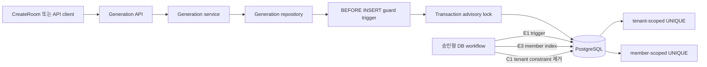
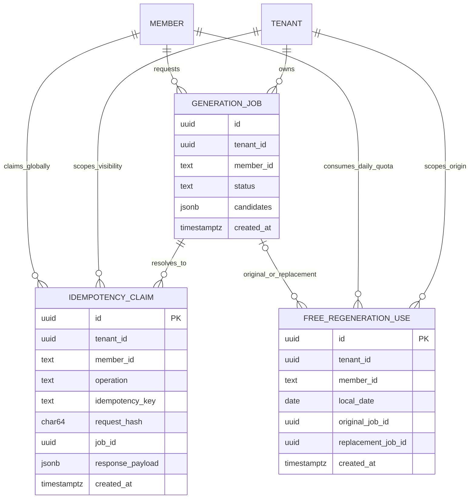
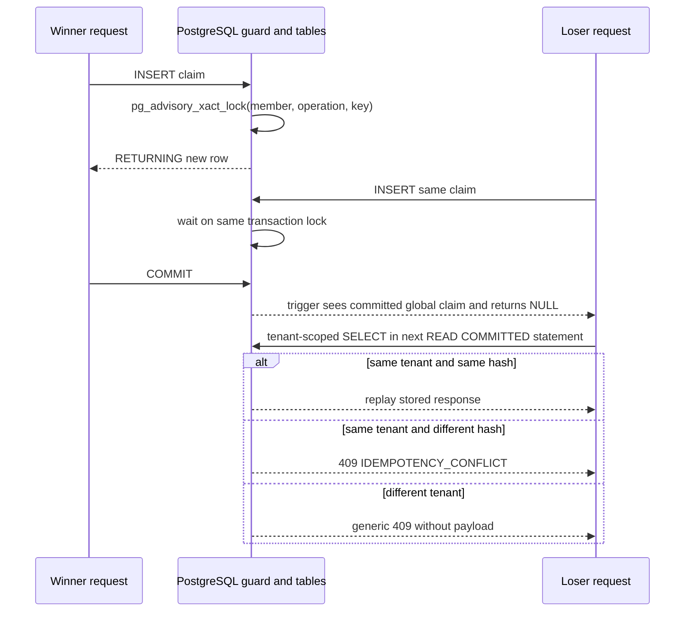

<!--
STAMP
line: osmu
artifact: generation-expand-contract
version: v1.0.2
created_at: 2026-08-29 01:14 KST
model: gpt-codex/gpt-5.6-sol
agent: tech-architect
skills: 없음. 설치된 스킬 중 PostgreSQL 동시성 기술설계 전용 스킬이 없어 dev.md, benchmarks.md, artifact-stamp.md를 직접 적용했다.
basis: PRD v8.2.1, pipeline 승인 DESIGN v18, 현행 미승인 DESIGN.md v33, docs/user-flow.md, 코드리뷰 M1/M2, 독립리뷰 v1, commit cfa74e46, 현 PostgreSQL 스키마·RLS·배포 workflow
evidence_urls: https://www.postgresql.org/docs/16/sql-insert.html, https://www.postgresql.org/docs/16/transaction-iso.html, https://www.postgresql.org/docs/16/functions-admin.html, https://www.postgresql.org/docs/16/sql-createfunction.html, https://www.postgresql.org/docs/16/sql-createindex.html
deliberation: 독립 리뷰의 NO-GO를 받아 wildcard historical replay를 폐기하고 ledger와 explicit manifest를 채택했다. privileged trigger는 운영 preflight가 S1임을 확인한 경우에만 쓰며 S2/S3에는 기본 설치하지 않는다. R27은 확인 필요로 남겨 quota contract를 확정 제품 요구로 승격하지 않았다.
-->

# OSMU Studio 생성 동시성 Expand and Contract 설계 v1.0.2

> 한 줄 결론: 현재 결함은 두 UNIQUE가 공존할 때 명시적 `ON CONFLICT` target 밖의 UNIQUE가 `23505`를 내는 동시성 결함이다. expand 단계에서 구 앱도 적용받는 회원 단위 보호 트리거를 먼저 설치하고, 애플리케이션은 targetless `ON CONFLICT DO NOTHING`과 재조회로 바꾼 뒤, 회원 단위 UNIQUE를 추가하고 기존 tenant 단위 UNIQUE를 제거한다.

## 임원 요약

| 질문 | 답 |
|---|---|
| 무엇이 문제인가 | 생성 멱등성과 하루 1회 무료 재생성에서 tenant 단위와 member 단위 UNIQUE가 공존한다. 현재 SQL은 member UNIQUE만 conflict target으로 잡아 동시 요청 때 tenant UNIQUE의 raw `23505`가 사용자 요청을 실패시킨다. |
| 무엇을 결정했는가 | wildcard historical migration replay를 폐기하고 checksum ledger와 명시 phase manifest를 도입한다. 운영 preflight가 S1이면 임시 guard trigger를 설치하고, S2이면 trigger 없이 compatibility app으로 간다. S3인데 구 앱이 남아 있으면 배포를 중단한다. |
| 결정하면 무엇이 되는가 | `20260828_010`이 매 배포마다 tenant UNIQUE를 먼저 제거하는 경로가 사라진다. S1, S2, S3 각각 허용된 transition만 실행하며 partial E3/C1도 상태 판정 뒤 안전하게 재개하거나 rollback한다. |
| 남은 리스크는 무엇인가 | R27의 회원 단위 UTC 하루 1회 무료 재생성은 상류에서 `확인 필요`다. 따라서 quota 제품 의미는 확정하지 않고 현재 구현의 회귀 방지만 조건부 설계한다. 운영 duplicate audit도 아직 미검증이다. |

## 목차

1. [결정과 범위](#0-결정과-범위)
2. [현상과 근본 원인](#1-현상과-근본-원인)
3. [설계 불변조건](#2-설계-불변조건)
4. [세 스키마 상태의 동일 동작 계약](#3-세-스키마-상태의-동일-동작-계약)
5. [SQL 동시성 계약](#4-sql-동시성-계약)
6. [재시도와 오류 계약](#5-재시도와-오류-계약)
7. [마이그레이션과 배포 순서](#6-마이그레이션과-배포-순서)
8. [Rollback](#7-rollback)
9. [운영 DB read-only duplicate audit](#8-운영-db-read-only-duplicate-audit)
10. [User flow 추적성](#9-user-flow-추적성)
11. [파일 책임](#10-파일-책임)
12. [테스트 계획과 수용 기준](#11-테스트-계획과-수용-기준)
13. [레드팀과 셀프심문](#12-레드팀과-셀프심문)
14. [게이트 판정과 미결사항](#13-게이트-판정과-미결사항)

문서 목적: 개발자와 운영자가 실제 운영 스키마 상태를 먼저 분류하고, 허용된 S1/S2/S3 transition만 실행해 생성 멱등성 결함을 수정하며, 데이터 손실 없이 단계별 배포·rollback을 수행할 수 있게 한다. R27 quota 의미는 상류 확정 전 조건부 범위다.

용어:

- `S1`: 기존 tenant-scoped UNIQUE만 있는 상태.
- `S2`: tenant-scoped UNIQUE와 member-scoped UNIQUE가 공존하는 상태.
- `S3`: 최종 member-scoped UNIQUE만 있는 상태.
- `winner`: 동일 claim 경합에서 INSERT를 commit한 transaction.
- `loser`: INSERT가 skip된 뒤 정본을 재조회하는 transaction.

## 0. 결정과 범위

### 0.1 확정 결정

- 마이그레이션 전략: `Expand and Contract Migration`.
- 생성 멱등성의 최종 유일 범위: `(member_id, operation, idempotency_key)`.
- 생성 멱등성의 회원 범위는 현재 구현과 이번 DB 결함 수정 결정 `BR-OSMU-GEN-EC-20260829`의 기술 기준이다. PRD 전체 승인으로 승격하지 않는다.
- 같은 tenant에서 같은 키와 같은 request hash가 경합하면 최초 응답 하나로 수렴한다.
- 같은 tenant에서 같은 키와 다른 request hash면 `409 IDEMPOTENCY_CONFLICT`다.
- 다른 tenant에서 같은 회원과 같은 키면 응답 본문을 누설하지 않고 `409 IDEMPOTENCY_CONFLICT`다.
- R27의 무료 재생성 제품 의미, 회원 범위, UTC 날짜 기준은 미확정이다. 현재 테이블의 중복 과금 회귀를 막는 테스트는 유지하되, R27이 정본에서 확정되기 전 C1 quota constraint 제거와 상용 과금 완료 주장을 금지한다.
- 운영 DB 변경과 배포는 이 문서 범위에서 실행하지 않는다.

### 0.2 이번 범위가 아닌 것

- 별도 회원 과금 장부 신설.
- 과금 감사 보존기간 결정.
- Studio 화면의 `다시 뽑기` 버튼을 실제 regeneration API에 연결하는 UI 작업.
- 운영 DB 중복 행의 임의 삭제 또는 자동 병합.

## 1. 현상과 근본 원인

### 1.1 배포 아키텍처



### 1.2 관련 데이터 모델



현재 공존 스키마에는 다음 UNIQUE가 함께 있다.

```sql
-- generation idempotency
UNIQUE (tenant_id, member_id, operation, idempotency_key)
UNIQUE (member_id, operation, idempotency_key)

-- free regeneration quota
UNIQUE (tenant_id, member_id, local_date)
UNIQUE (member_id, local_date)
```

현재 repository는 회원 단위 UNIQUE만 arbiter로 지정한다.

```sql
ON CONFLICT (member_id, operation, idempotency_key) DO NOTHING
ON CONFLICT (member_id, local_date) DO NOTHING
```

동일 tenant의 두 동시 요청은 두 UNIQUE를 모두 위반할 수 있다. PostgreSQL은 명시한 arbiter 밖의 UNIQUE 위반을 대체 행동으로 처리하지 않으므로 tenant 단위 제약의 `23505`가 노출된다. 로컬 실측은 생성 동시 요청에서 `23505`, 무료 재생성 동시 요청에서 성공 1건과 실패 1건을 재현했다.

배포 workflow도 DB 스키마를 새 앱 기동보다 먼저 적용한다. 기존 UNIQUE를 먼저 제거하면 구 앱의 명시적 conflict target이 사라져 `42P10`이 발생한다. 따라서 한 번의 schema 교체로 해결하면 안 된다.

## 2. 설계 불변조건

1. 모든 claim은 하나의 PostgreSQL transaction 안에서 끝난다.
2. S1에서만 회원 단위 동시성 key를 transaction advisory lock으로 직렬화한다. S2/S3는 member UNIQUE가 정본이다.
3. S1 보호 트리거는 RLS를 우회해 회원 전역 존재 여부만 검사하고, 다른 tenant의 payload나 request hash를 반환하지 않는다.
4. 애플리케이션 INSERT는 conflict target을 생략한다. 세 스키마 상태에서 같은 SQL을 쓴다.
5. `DO NOTHING RETURNING`이 빈 결과면 같은 transaction의 다음 statement에서 재조회한다. PostgreSQL `READ COMMITTED`는 statement마다 새 snapshot을 사용한다.
6. 재조회가 tenant 안에서 보이지 않으면 cross-tenant 충돌 또는 quota 소진으로 안전하게 닫는다.
7. `23505`, `42P10`, `40001`, `40P01`을 성공으로 각색하지 않는다.
8. 예상하지 않은 `23505`는 최대 1회 bounded re-read 후에도 해소되지 않으면 500과 운영 사건으로 기록한다.

## 3. 세 스키마 상태의 동일 동작 계약

| 상태 | generation UNIQUE | quota UNIQUE | 보호 트리거 | 애플리케이션 계약 |
|---|---|---|---|---|
| S1 기존 | tenant 단위만 | tenant 단위만 | preflight 확인 뒤 expand에서 설치 | targetless INSERT, 재조회 |
| S2 공존 | tenant 단위 + member 단위 | tenant 단위 + member 단위 | 기본 생략 | 동일 |
| S3 최종 | member 단위만 | member 단위만 | 설치하지 않음 | 동일. 구 앱 잔존 시 NO-GO |

보호 트리거가 S1에서도 회원 전역 중복을 막는다. 따라서 member UNIQUE가 아직 없어도 새 중복이 생기지 않는다. targetless `DO NOTHING`은 PostgreSQL 공식 계약대로 모든 사용 가능한 UNIQUE conflict를 처리하므로 S2에서 tenant UNIQUE가 먼저 적중해도 `23505`가 나지 않는다.

### 3.1 최소 대안 steelman과 최종 판정

가장 작은 수정은 trigger와 advisory lock 없이 두 INSERT만 targetless `ON CONFLICT DO NOTHING`으로 바꾸는 것이다.

이 최소안의 장점:

- 현재 S2의 직접 실패인 명시적 arbiter 밖 tenant UNIQUE `23505`를 제거한다.
- 새 privileged function과 trigger 공격면이 없다.
- repository diff와 테스트 범위가 가장 작다.

이 최소안이 성립하는 조건:

- 배포 시작 전부터 member UNIQUE가 이미 유효하다.
- S1 old-only 상태에서는 회원이 여러 tenant에서 같은 key를 쓰지 않는다는 약한 계약을 수용한다.
- 또는 E2 전까지 생성과 무료 재생성 쓰기를 중단한다.

현재 계약에서는 폐기한다. S1에는 tenant UNIQUE만 있으므로 서로 다른 tenant의 같은 회원 요청은 targetless INSERT도 둘 다 성공할 수 있다. RLS 때문에 일반 repository가 다른 tenant의 기존 행을 전역 조회할 수도 없다. 회원 전역 멱등성과 무료 몫을 S1부터 무중단으로 지키려면 DB 전역 직렬화 지점이 필요하다.

대안 비교:

| 대안 | S1 회원 전역 안전 | 구 앱 보호 | 공격면·복잡도 | 판정 |
|---|---|---|---|---|
| targetless DO NOTHING만 | 불가 | 해당 없음 | 최소 | 현재 계약에는 불충분 |
| 새 member claim table | 가능 | trigger 없으면 불가 | 새 원장과 dual-write 필요 | 과설계 |
| 앱의 SECURITY DEFINER claim function | 가능 | 구 앱은 호출하지 않음 | 중간 | 배포 창 불충분 |
| SECURITY DEFINER BEFORE INSERT trigger + xact advisory lock | 가능 | 가능 | privileged trigger 2개 | 채택 |
| write maintenance window | 가능 | 가능 | 코드 최소, 서비스 쓰기 중단 | 회장이 선택한 무중단 전략과 불일치 |

따라서 trigger와 advisory lock은 일반적인 최종 구조가 아니라, read-only preflight로 S1이 확인되고 쓰기 중단이 불가능할 때만 쓰는 임시 호환 장치다. S2/S3에는 설치하지 않는다.

## 4. SQL 동시성 계약

### 4.0 S1 동시 요청 수렴 sequence



### 4.1 Expand 보호 트리거

두 `BEFORE INSERT` trigger function을 추가한다.

- `public.guard_studio_generation_idempotency_member_scope()`
- `public.guard_studio_free_regeneration_member_scope()`

공통 보안 계약:

- `LANGUAGE plpgsql SECURITY DEFINER`.
- 확정 owner는 `osmu_generation_guard_owner`다. `NOLOGIN BYPASSRLS NOSUPERUSER NOCREATEDB NOCREATEROLE NOINHERIT`로 생성한다. 배포 DDL role은 이 role을 생성하고 함수 owner를 바꿀 권한이 있어야 한다.
- `SET search_path = pg_catalog, pg_temp`.
- table, function, operator는 schema-qualified 이름 사용.
- `REVOKE ALL ON FUNCTION ... FROM PUBLIC`.
- trigger 전용이므로 `osmu_service`에 직접 EXECUTE를 부여하지 않는다.
- 함수는 payload를 외부로 반환하지 않고 `NEW` 또는 `NULL`만 반환한다.

권한 DDL 계약:

```sql
DO $role$
BEGIN
  IF NOT EXISTS (SELECT 1 FROM pg_roles WHERE rolname = 'osmu_generation_guard_owner') THEN
    CREATE ROLE osmu_generation_guard_owner
      NOLOGIN BYPASSRLS NOSUPERUSER NOCREATEDB NOCREATEROLE NOINHERIT;
  END IF;
END $role$;

ALTER FUNCTION public.guard_studio_generation_idempotency_member_scope()
  OWNER TO osmu_generation_guard_owner;
ALTER FUNCTION public.guard_studio_free_regeneration_member_scope()
  OWNER TO osmu_generation_guard_owner;
REVOKE ALL ON FUNCTION public.guard_studio_generation_idempotency_member_scope() FROM PUBLIC, osmu_service;
REVOKE ALL ON FUNCTION public.guard_studio_free_regeneration_member_scope() FROM PUBLIC, osmu_service;
```

두 함수 정의에는 `SET search_path TO pg_catalog, pg_temp`를 직접 붙이고 모든 table reference를 `public.`으로 한정한다. owner에게 table 전체 DML을 주지 않는다. trigger function 실행에 필요한 `SELECT`만 다음처럼 부여한다.

```sql
GRANT USAGE ON SCHEMA public TO osmu_generation_guard_owner;
GRANT SELECT ON public.studio_generation_idempotency,
                public.studio_free_regeneration_uses
TO osmu_generation_guard_owner;
```

preflight는 `rolcanlogin=false`, `rolbypassrls=true`, 위험 권한 0, 함수 owner 일치, `proconfig`에 안전한 search path 존재, PUBLIC과 `osmu_service` EXECUTE 0을 모두 검사한다. 하나라도 다르면 E1을 중단한다.

generation trigger 의사 SQL:

```sql
PERFORM pg_catalog.pg_advisory_xact_lock(
  pg_catalog.hashtextextended(
    'osmu:generation-idempotency:v1|' || NEW.member_id || '|' ||
    NEW.operation || '|' || NEW.idempotency_key,
    0
  )
);

IF EXISTS (
  SELECT 1
  FROM public.studio_generation_idempotency i
  WHERE i.member_id = NEW.member_id
    AND i.operation = NEW.operation
    AND i.idempotency_key = NEW.idempotency_key
) THEN
  RETURN NULL;
END IF;
RETURN NEW;
```

quota trigger도 같은 방식으로 `osmu:free-regeneration:v1|member_id|local_date`를 잠그고 회원 날짜 행이 있으면 `RETURN NULL`한다.

advisory hash collision은 관계없는 요청을 일시 직렬화할 뿐 정확성을 훼손하지 않는다. 별도의 session advisory lock은 금지한다.

모든 generation transaction은 tenant role 설정 직후 다음을 실행한다.

```sql
SET LOCAL statement_timeout = '5000ms';
SET LOCAL lock_timeout = '1500ms';
```

`lock_timeout`은 advisory lock 대기도 1.5초 안에 끊고, 전체 transaction statement는 5초 안에 끝낸다. connection URL이나 `idle_timeout`에 의존하지 않는다. 5개 connection pool에서 동일 hot key 20요청을 넣어도 1.5초 후 대기 connection이 반환되는지를 검사한다.

### 4.2 Generation repository

```sql
INSERT INTO public.studio_generation_idempotency (...)
VALUES (...)
ON CONFLICT DO NOTHING
RETURNING request_hash, response_payload;
```

반환 행이 있으면 같은 transaction에서 job을 INSERT하고 201을 반환한다.

반환 행이 없으면 tenant-scoped RLS 아래에서 다음을 재조회한다.

```sql
SELECT request_hash, response_payload
FROM public.studio_generation_idempotency
WHERE tenant_id = $tenant_id
  AND member_id = $member_id
  AND operation = $operation
  AND idempotency_key = $key
LIMIT 1;
```

| 재조회 | 결과 |
|---|---|
| 같은 hash 행 존재 | 최초 `response_payload` 재응답, 새 job 0 |
| 다른 hash 행 존재 | `409 IDEMPOTENCY_CONFLICT` |
| 행 없음 | 다른 tenant의 회원 전역 key 충돌로 판정, payload 비노출 `409 IDEMPOTENCY_CONFLICT` |

`insert idempotency -> insert job`은 기존 deferrable FK와 같은 transaction을 유지한다. 어느 statement가 실패해도 둘 다 rollback한다.

### 4.3 Free regeneration repository

quota INSERT도 targetless로 바꾼다.

```sql
INSERT INTO public.studio_free_regeneration_uses (...)
VALUES (...)
ON CONFLICT DO NOTHING
RETURNING id;
```

claim 성공 시 같은 transaction에서 다음 순서로 저장한다.

1. regeneration idempotency INSERT, `ON CONFLICT DO NOTHING`.
2. replacement generation job INSERT.
3. commit.

claim 실패 시 tenant-scoped regeneration idempotency를 재조회한다.

| 재조회 | 결과 |
|---|---|
| 같은 operation, key, hash 존재 | 기존 replacement 응답 재생, 201 계약 유지 |
| 없거나 hash 불일치 | 무료 몫 소진, `409 PAID_REGENERATION_APPROVAL_REQUIRED` |

보호 트리거가 transaction 종료까지 advisory lock을 유지하므로 loser의 다음 SELECT는 winner commit 뒤 실행된다. `READ COMMITTED`의 statement snapshot 갱신으로 같은 tenant의 winner idempotency가 보인다.

### 4.4 무료 몫 장부 수명

현재 별도 billing ledger는 만들지 않는다. `studio_free_regeneration_uses`가 최소 장부다.

- `member_id`, `local_date`, `created_at`은 작업 공간 삭제와 무관하게 유지한다.
- live FK인 `tenant_id`, `original_job_id`, `replacement_job_id`는 `ON DELETE SET NULL`을 허용한다.
- 이번 수정은 장부의 회원 날짜 UNIQUE 보존까지만 보장한다.
- 원본 tenant와 job ID의 장기 감사 snapshot 필드는 별도 과금 장부 설계 전까지 추가하지 않는다.

## 5. 재시도와 오류 계약

| SQLSTATE 또는 상태 | repository 처리 | 공개 `StudioApiError` | 관측 사건 |
|---|---|---|---|
| targetless conflict, 반환 0 | 즉시 tenant 재조회 | replay 또는 기존 409 | 정상 metric |
| `23505` | 1회 재조회. 의미 행이 있으면 replay/409, 없으면 중단 | `500 GENERATION_DB_INVARIANT_VIOLATION`, `retryable:false` | error, constraint name과 request ID |
| `40001` | jitter 25~75ms 뒤 transaction 전체 최대 2회 재시도 | 소진 시 `503 GENERATION_DB_BUSY`, `retryable:true` | warn, attempts=2 |
| `40P01` | 같은 bounded retry | 소진 시 `503 GENERATION_DB_BUSY`, `retryable:true` | error, deadlock |
| `55P03` lock timeout | 자동 성공 처리 금지, 재시도 0 | `503 GENERATION_DB_BUSY`, `retryable:true` | warn, timeout=1500ms |
| `57014` statement timeout | 자동 성공 처리 금지, 재시도 0 | `503 GENERATION_DB_TIMEOUT`, `retryable:true` | error, timeout=5000ms |
| `42P10` | 배포 계약 위반 | `500 GENERATION_DB_DEPLOYMENT_MISMATCH`, `retryable:false` | critical, 배포 차단 |

모든 오류 body는 다음 기존 envelope를 유지한다. SQLSTATE, constraint name, 다른 tenant 식별자는 `details`에 넣지 않고 server observability에만 남긴다.

```json
{
  "error": {
    "code": "GENERATION_DB_BUSY",
    "message": "생성 요청이 몰려 잠시 후 다시 시도해야 합니다",
    "retryable": true,
    "field_errors": null,
    "details": { "retry_after_ms": 1500 }
  },
  "meta": {
    "request_id": "uuid",
    "contract_version": "existing-version"
  }
}
```

재시도는 repository transaction 전체를 다시 실행한다. job ID와 candidate ID가 새로 생성돼도 최초 commit 하나만 정본이며 loser는 저장된 response를 반환한다. 외부 모델 호출이 repository 앞에 있다면 멱등 claim 이전의 중복 비용이 생기므로, 실제 provider 호출 전 claim 상태를 `pending`으로 분리하는 후속 설계가 필요하다. 현재 `buildJob`은 로컬 구조 생성이라 이번 범위에서는 DB commit 중복만 다룬다.

## 6. 마이그레이션과 배포 순서

### 6.1 역사 migration replay 차단과 ledger

현재 `schema.sql -> rls.sql -> /db/migrations/*.sql` wildcard 실행은 폐기한다. `20260828_010_studio_generation.sql`은 checksum을 고정한 역사 파일로 보존하되 다시 실행하지 않는다. 이 파일을 constraint-neutral로 수정하면 과거 배포 증거의 checksum이 바뀌므로 금지한다.

새 runner는 `dashboard/db/migration-manifest.tsv`에 명시된 migration만 순서대로 읽고 다음 ledger를 사용한다.

```sql
CREATE TABLE IF NOT EXISTS public.osmu_schema_migrations (
  migration_id TEXT PRIMARY KEY,
  sha256 CHAR(64) NOT NULL,
  phase TEXT NOT NULL CHECK (phase IN ('baseline','expand','contract','cleanup')),
  state TEXT NOT NULL CHECK (state IN ('baselined','running','applied','failed')),
  runner_commit CHAR(40) NOT NULL,
  started_at TIMESTAMPTZ,
  applied_at TIMESTAMPTZ,
  details JSONB NOT NULL DEFAULT '{}'::jsonb
);
REVOKE ALL ON public.osmu_schema_migrations FROM PUBLIC, osmu_service;
```

runner는 전용 DB deployment role로만 실행하고 `pg_advisory_lock(hashtext('osmu-schema-migration-v1'))`을 잡는다. 연결 종료 또는 finally 블록에서 unlock한다. 같은 `migration_id`의 checksum이 ledger와 다르면 즉시 중단한다.

기존 DB의 최초 ledger 도입은 schema fingerprint가 아래 S1/S2/S3 중 정확히 하나이고 duplicate audit이 허용 범위일 때만 `20260828_010`을 `baselined`로 기록한다. SQL 본문은 실행하지 않는다. 빈 DB만 `schema.sql` bootstrap을 1회 실행하고 최종 S3 fingerprint를 기록한다. `schema.sql`을 기존 DB에 재실행하는 경로는 금지한다.

명시 manifest:

| 순서 | migration ID | 실행 조건 | wildcard 허용 |
|---:|---|---|---|
| 0 | `baseline-20260828-generation` | 기존 DB fingerprint 확인 또는 빈 DB bootstrap | 불가 |
| 1 | `20260829_020_generation_guard_expand` | S1만 | 불가 |
| 2 | `app-compatibility-cfa74e46-plus` | 앱 배포 gate, SQL 아님 | 불가 |
| 3 | `20260829_030_member_unique_expand` | S1 또는 S2, audit 0 | 불가 |
| 4 | `20260829_040_tenant_unique_contract` | 전 앱 compatibility, R27 quota는 별도 승인 | 불가 |
| 5 | `20260905_010_guard_cleanup` | 7일 관찰 gate | 불가 |

### 6.2 Preflight 상태 판정

| fingerprint | generation/quota constraint | 허용 transition |
|---|---|---|
| S1 | tenant valid, member absent | E1 guard 설치, E2, E3, C1 |
| S2 | tenant valid, member valid | guard 설치 생략, E2, C1 |
| S3 | tenant absent, member valid | 모든 실행 중 앱이 compatibility digest 이상이면 관찰만. 구 앱이 하나라도 있으면 NO-GO |
| X | invalid index, constraint definition drift, 둘 다 absent, duplicate 존재 | 자동 변경 금지, recovery state machine 또는 수동 사건 처리 |

preflight artifact는 constraint OID, 이름, `pg_get_constraintdef`, backing index OID, `indisvalid`, `indisready`, duplicate group 수, 실행 중 image digest를 저장한다. 원문 member/key 값은 저장하지 않는다.

### 6.3 Phase E1. S1 전용 guard expand

1. `osmu_generation_guard_owner` 생성과 권한 검증.
2. 두 guard function과 trigger 설치.
3. quota FK 수명 변경은 별도 migration ID로 분리한다. 동시성 E1과 한 transaction에 섞지 않는다.
4. tenant UNIQUE와 member UNIQUE는 변경하지 않는다.
5. 설치 후 구 앱 same-tenant와 cross-tenant contract test를 실행한다.

E1과 E2 사이 cross-tenant 동일 key 요청은 중복 저장 대신 구 앱 generic 500이 될 수 있다. 이 창은 standby image를 먼저 준비하고 E1 직후 traffic switch하여 제한한다.

### 6.4 Phase E2. Compatibility application

compatibility release는 targetless `ON CONFLICT DO NOTHING`, tenant 재조회, 숫자로 고정한 timeout, §5 오류 JSON과 observability를 모두 포함한다. 모든 실행 인스턴스의 image digest가 release manifest 값과 일치한 뒤에만 E3를 허용한다.

### 6.5 Phase E3. Member UNIQUE 상태기계

generation과 quota object 각각을 독립 처리한다. quota E3는 현행 데이터 보호 목적으로 허용하되 R27 제품 확정으로 간주하지 않는다.

| 관찰 상태 | 판정과 다음 SQL |
|---|---|
| index·constraint 모두 absent | duplicate audit 0 뒤 `CREATE UNIQUE INDEX CONCURRENTLY` |
| index exists, `indisvalid=false` 또는 `indisready=false` | `DROP INDEX CONCURRENTLY`, audit 재실행, index 재생성 |
| valid index, constraint absent | columns, uniqueness, predicate 없음, collation checksum 일치 확인 뒤 `ADD CONSTRAINT ... UNIQUE USING INDEX` |
| expected constraint attached | no-op, ledger `applied`로 수렴 |
| 이름은 같지만 definition 불일치 | NO-GO, 자동 DROP 금지 |

`CREATE INDEX CONCURRENTLY`는 transaction 밖에서 실행한다. runner는 statement 전 ledger를 `running`으로 기록하고, 다음 연결에서 catalog를 재판정한다. attach는 `BEGIN; SET LOCAL lock_timeout='5000ms'; ALTER TABLE ... ADD CONSTRAINT ... USING INDEX; COMMIT;`으로 실행한다. timeout이면 valid unattached index 상태를 유지하고 승인형 job에서 재시도한다.

### 6.6 Phase C1. Tenant UNIQUE contract 상태기계

C1 전 rollback용 tenant unique index를 별도 이름으로 `CREATE UNIQUE INDEX CONCURRENTLY`하여 valid 상태로 보존한다. preflight artifact의 실제 constraint OID, definition, checksum이 rollout manifest와 일치해야 한다.

| 관찰 상태 | 판정과 다음 SQL |
|---|---|
| tenant constraint expected + rollback index valid | `DROP CONSTRAINT` 실행, catalog 재검증 |
| tenant constraint absent + rollback index valid + member constraint valid | partial success 또는 applied. no-op으로 수렴 |
| tenant constraint expected + rollback index invalid | invalid index 복구 전 contract 금지 |
| tenant constraint absent + member constraint invalid/absent | critical NO-GO, 쓰기 중지와 수동 복구 |
| constraint OID/definition checksum 불일치 | 자동 DROP 금지 |

generation C1은 전 앱 compatibility 확인 뒤 실행한다. quota C1은 R27의 member scope와 UTC 기준이 상류 정본에서 확정되기 전 실행하지 않는다. rollback index는 7일 관찰 뒤 cleanup phase에서만 제거한다.

### 6.7 배포 workflow 계약

- 일반 앱 deploy에서 DB 변경을 분리한다. 앱 deploy는 ledger preflight read-only 검사만 수행한다.
- E1, E3, C1은 각각 승인 environment와 `workflow_dispatch phase=<id>`를 가진 DB workflow가 실행한다.
- workflow는 manifest에 없는 SQL, checksum이 바뀐 SQL, wildcard glob을 거부한다.
- 각 phase artifact는 대상 commit, image digest, migration checksum, pre/post catalog fingerprint, duplicate counts, ledger row, rollback manifest를 포함한다.
- phase 실패는 앱 자동 rollback을 유발하지 않는다. 상태기계가 재진입 가능한 catalog 상태를 판정한 뒤 별도 승인으로 재개한다.

## 7. Rollback

### 7.1 Rollback manifest

C1 전에 `docs/releases/osmu-generation-<release>/rollback-manifest.json`을 생성하고 release-manager가 checksum을 고정한다.

```json
{
  "release": "pending",
  "app_image_digest": "sha256:pending-at-release",
  "previous_compatible_digest": "sha256:pending-at-release",
  "forbidden_digests_after_c1": [],
  "schema_fingerprint_before": "artifact-sha256",
  "ledger_rows": ["migration-id:sha256:state"],
  "tenant_constraints": ["oid:name:definition-sha256"],
  "member_constraints": ["oid:name:definition-sha256"],
  "rollback_indexes": ["name:definition-sha256:valid"],
  "rollback_deadline_utc": "release+7d",
  "commands": ["approved-script-id-only"]
}
```

`pending` 값이 하나라도 남으면 C1은 실행할 수 없다. rollback은 ad-hoc SQL이 아니라 manifest의 승인된 script ID만 사용한다.

| 실패 시점 | rollback 또는 resume |
|---|---|
| ledger adoption 전 | 기존 workflow를 다시 실행하지 않고 DB 변경 0. 새 runner 수정 |
| E1 function 생성 중 | transaction rollback. role만 남으면 권한 preflight 후 재사용 |
| E1 완료, E2 실패 | tenant UNIQUE와 trigger 유지. 이전 digest rollback 허용 |
| E3 invalid index | `DROP INDEX CONCURRENTLY <manifest-name>`, audit 0, E3 재개 |
| E3 valid unattached index | DROP 금지. attach 단계부터 재개 |
| E3 attached | no-op. tenant UNIQUE가 남아 있어 이전 compatibility digest rollback 가능 |
| C1 constraint 하나만 drop | 남은 object는 상태기계로 계속 contract하거나, rollback index를 constraint로 attach해 원복 |
| C1 완료 | manifest의 이전 compatibility digest까지만 앱 rollback 허용. 그보다 오래된 digest 금지 |

C1 원복 SQL의 핵심은 보존한 rollback index를 다시 constraint로 attach하는 것이다.

```sql
BEGIN;
SET LOCAL lock_timeout = '5000ms';
ALTER TABLE public.studio_generation_idempotency
  ADD CONSTRAINT uq_studio_generation_idempotency_tenant_member_operation_key
  UNIQUE USING INDEX uq_studio_generation_idempotency_tenant_member_operation_key_rollback_idx;
COMMIT;
```

quota도 R27 확정 후 동일 절차를 사용한다. attach 전 member constraint valid와 duplicate audit 0을 다시 확인한다.

## 8. 운영 DB read-only duplicate audit

아래 SQL은 쓰기 없이 실행한다. 결과에 식별자 원문을 채팅이나 artifact에 남기지 않고 그룹 수만 보고한다.

```sql
-- 스키마 상태
SELECT c.conrelid::regclass AS table_name, c.conname, pg_get_constraintdef(c.oid)
FROM pg_constraint c
WHERE c.conrelid IN (
  'public.studio_generation_idempotency'::regclass,
  'public.studio_free_regeneration_uses'::regclass
)
AND c.contype IN ('u', 'f')
ORDER BY 1, 2;

-- generation member-scope duplicates
SELECT count(*) AS duplicate_groups, coalesce(sum(n - 1), 0) AS surplus_rows
FROM (
  SELECT member_id, operation, idempotency_key, count(*) AS n
  FROM public.studio_generation_idempotency
  GROUP BY member_id, operation, idempotency_key
  HAVING count(*) > 1
) d;

-- 같은 key에 다른 request hash가 있는 위험 그룹
SELECT count(*) AS divergent_hash_groups
FROM (
  SELECT member_id, operation, idempotency_key
  FROM public.studio_generation_idempotency
  GROUP BY member_id, operation, idempotency_key
  HAVING count(DISTINCT request_hash) > 1
) d;

-- free quota member-date duplicates
SELECT count(*) AS duplicate_groups, coalesce(sum(n - 1), 0) AS surplus_rows
FROM (
  SELECT member_id, local_date, count(*) AS n
  FROM public.studio_free_regeneration_uses
  GROUP BY member_id, local_date
  HAVING count(*) > 1
) d;
```

판정:

- 세 duplicate 수치가 0이면 E3 가능.
- 동일 hash generation 중복은 자동 삭제하지 않는다. canonical job과 FK를 대조한 정리 plan을 별도 작성한다.
- divergent hash가 1 이상이면 즉시 중단한다. 자동 병합 금지, 회장 회수 대상이다.
- quota 중복은 과금 사건이므로 자동 삭제 금지다.

## 9. 요구, 설계, 테스트 RTM

기반 버전은 다음처럼 분리한다. PRD 정본은 `v8.2.1`, pipeline의 마지막 승인 DESIGN 핀은 `v18`, 현재 작업본은 `DESIGN.md v33`이지만 design stage는 blocked다. 이번 문서는 v33을 승인본으로 승격하지 않는다.

| 요구 ID와 상태 | user-flow / endpoint / component | 불변조건과 SQL | repository/API branch | test ID와 파일 | rollout gate | gap |
|---|---|---|---|---|---|---|
| `NFR-OS81-04` 확정 | 생성, `POST /api/studio/v1/generations`, `CreateRoom` | 같은 key side effect 1, targetless INSERT, re-read | replay 200/201, divergent 409 | `GEN-DB-01/02/04`, `generation-db.integration.test.ts` | E2 전 S1/S2/S3 concurrent20 | 없음 |
| `NFR-OS81-02` 확정 | 생성과 재생성 API, `CreateRoom` | tenant payload leak 0, SECURITY DEFINER exists-only | cross-tenant generic 409 | `GEN-RLS-01/02` 계획, `generation-db.integration.test.ts` | E1 owner/RLS fixture | 없음 |
| `BR-OSMU-GEN-EC-20260829` 이번 기술 결정 | 동일 요청 재전송, 두 generation route | ledger/manifest, E1/E2/E3/C1 상태기계 | timeout 503, invariant 500 | `GEN-MIG-01..08` 계획, `generation-deploy-compat.contract.test.ts` | wildcard 0, checksum match | 없음 |
| `R27` 확인 필요 | 다시 뽑기, `POST /api/studio/v1/regenerations/[jobId]`, `CreateRoom` 미연결 | 현 구현은 `(member_id, UTC date)`, 제품 확정 아님 | paid approval 409은 조건부 | `GEN-DB-03/05/06/07` 기존 회귀 | quota C1과 제품 완료 금지 | **상류 결정 필요** |
| DESIGN 승인핀 v18 / 현재 v33 blocked | 전체 Studio flow | 이 DB bug 범위 밖 UI 계약 | route만 구현됨 | UI E2E 없음 | formal build 승인 금지 | **승인본 불일치** |

RTM gap: 2. `R27` 제품 의미 미확정, DESIGN v33 미승인 및 `CreateRoom` regeneration 미연결이다. 따라서 전체 eng-design 완료와 formal build stage 진입을 주장하지 않는다. 확정 NFR에 한정한 generation idempotency bug remediation만 별도 구현 후보이며, 독립 재리뷰 승인 전에는 이 문서도 NO-GO다.

## 10. 파일 책임

| 파일 | 변경 책임 |
|---|---|
| `dashboard/db/migrations/20260828_010_studio_generation.sql` | 역사 파일, checksum 고정, 새 runner에서 baselined 처리. 재실행 금지 |
| `dashboard/db/migration-manifest.tsv` | 실행 허용 ID, 순서, phase, sha256 |
| `dashboard/db/migrations/20260829_020_generation_guard_expand.sql` | S1 전용 role/function/trigger E1 |
| `dashboard/db/migrations/20260829_030_member_unique_expand.sql` | E3 catalog 상태기계 입력 SQL |
| `dashboard/db/migrations/20260829_040_tenant_unique_contract.sql` | C1 manifest-pin constraint drop/rollback attach |
| `dashboard/db/schema.sql` | 빈 DB 전용 fresh S3 bootstrap. 기존 DB 실행 금지 |
| `dashboard/src/lib/studio/generation/repository.ts` | targetless conflict, reread, error mapping |
| `dashboard/src/lib/db.ts` | generation transaction의 5000ms statement timeout, 1500ms lock timeout |
| `dashboard/src/lib/studio/generation/errors.ts`, `http.ts` | §5 공개 error code/status/retryable/details envelope |
| generation·regeneration route | 양쪽 동일한 5xx observability와 request ID 보고 |
| `dashboard/tests/studio/generation-db.integration.test.ts` | 실제 DB concurrency와 S1/S2/S3 matrix |
| `dashboard/tests/studio/generation-deploy-compat.contract.test.ts` | workflow와 migration phase 정적 계약 |
| `.github/workflows/deploy-marketing.yml` | wildcard와 기존 DB schema replay 제거, read-only ledger preflight만 유지 |
| 승인형 DB workflow | E1/E3/C1 phase runner, artifact와 rollback manifest 출력 |

새 전역 폴더 구조는 만들지 않는다. 기존 `generation` domain과 `dashboard/db/migrations` 관습을 따른다.

## 11. 테스트 계획과 수용 기준

### 11.1 스키마 matrix

각 테스트는 빈 PostgreSQL에서 다음 fixture를 독립 구성한다.

- S1: tenant UNIQUE. E1 뒤에만 guard trigger.
- S2: tenant UNIQUE + member UNIQUE. guard 불필요.
- S3: member UNIQUE. compatibility app만 허용.
- X1: invalid concurrent index.
- X2: valid unattached index.
- X3: C1 한 table만 contract된 partial state.

### 11.2 필수 테스트

1. 동일 tenant, 같은 create key/hash, 20 concurrent: 20 fulfilled, response jobId 1개, job 1행, idempotency 1행.
2. 동일 tenant, 같은 key와 다른 hash concurrent: 1 fulfilled, 나머지 `IDEMPOTENCY_CONFLICT`, 저장 1건.
3. 다른 tenant, 같은 member/key concurrent: 1 fulfilled, 1 generic conflict, payload 누설 0.
4. 같은 original free regeneration 20 concurrent: 20 fulfilled replay, replacement jobId 1개, quota 1행.
5. 다른 original, 같은 member/date concurrent: 성공 1건, 나머지 paid approval 409, quota 1행.
6. tenant 삭제 뒤 같은 member/date: paid approval 409, quota 행 유지.
7. commit `cfa74e46` legacy SQL fixture: E1 전후 same-tenant와 cross-tenant 결과, `42P10` 0, 전역 중복 0.
8. owner fixture: NOLOGIN/BYPASSRLS/위험 권한 0, 안전한 search path, PUBLIC EXECUTE 0, cross-tenant EXISTS 성공.
9. hot key 20 concurrent: lock wait 1500ms 이내 종료, statement 5000ms 이내 종료, pool 5개가 회수되고 503 envelope가 §5와 일치.
10. E3 X1 invalid index에서 drop/recreate, X2 valid unattached에서 attach-only, attached에서 no-op.
11. C1 한 table 성공 뒤 실패를 주입하고 resume와 rollback attach를 각각 검증.
12. historical migration ledger baseline 뒤 일반 deploy 2회: `20260828_010` 실행 0, wildcard 0, checksum drift 차단.
13. `42P10`과 raw `23505` 사용자 노출 0. 강제 주입 시 observability 사건 1건.
14. RLS: 다른 tenant payload, request hash, job ID 응답 노출 0.
15. 전체 Vitest, TypeScript, production build 통과.

### 11.3 수용 기준

- GEN-DB-01과 GEN-DB-03 실패 0.
- S1/S2/S3 각각 위 동시성 6종 통과.
- raw PostgreSQL `23505`, `42P10` 사용자 응답 0.
- duplicate audit 0/0/0. 운영값은 release gate에서 회수한다.
- 구 앱 호환성 contract 통과 후에만 E3.
- 모든 앱 digest가 compatibility release 이상임을 확인한 뒤에만 C1.
- E3/C1 X1/X2/X3 failure injection 뒤 재실행 수렴.
- migration ledger checksum drift, wildcard, 기존 DB schema bootstrap 호출이 모두 차단됨.
- rollback manifest에 pending 0, constraint/index catalog checksum 일치.
- R27 확정 전 quota C1 실행 0.
- 운영 DB 실제 변경과 배포는 별도 승인 전 미실행.

## 12. 레드팀과 셀프심문

레드팀 공격: advisory lock을 새 앱에만 넣으면 배포 중 살아 있는 구 앱은 lock을 모르므로 회원 전역 중복을 만들 수 있다. 수정: lock을 애플리케이션이 아니라 DB `BEFORE INSERT SECURITY DEFINER` trigger에 두어 구 앱도 동일하게 적용받게 했다.

레드팀 공격: `SECURITY DEFINER`가 RLS를 우회해 다른 tenant의 생성 결과를 노출할 수 있다. 수정: trigger는 전역 존재 여부만 보고 `NEW` 또는 `NULL`만 반환하며, payload 재조회는 invoker RLS 아래에서만 수행한다. search path와 EXECUTE 권한도 잠근다.

셀프심문: 이 결론이 틀렸다면 가장 그럴듯한 이유는 `ON CONFLICT DO NOTHING` 뒤 재조회가 winner를 보지 못하는 snapshot 문제다. 답: 기본 `READ COMMITTED`는 statement마다 새 snapshot을 만들고, advisory xact lock 때문에 loser trigger는 winner commit 뒤 진행한다. 그래도 예상하지 않은 `23505`와 빈 재조회는 1회 bounded reread 후 500으로 닫는 시험을 추가했다.

최소안 steelman: 이미 member UNIQUE가 유효한 S2/S3라면 trigger는 과설계이고 targetless `DO NOTHING`과 explicit migration manifest만이 맞다. v1.0.2는 이 안을 기본값으로 올렸다. S1이 read-only audit로 확인된 경우에만 cross-tenant race를 닫는 임시 trigger를 설치한다.

## 12.1 공식 문서 재조사 기록

2026-08-29 01:18 KST에 PostgreSQL 공식 문서만 대상으로 WebSearch 4건을 실행하고, 운영 runtime과 같은 PostgreSQL 16 문서 5건을 WebFetch로 다시 열었다.

| 공식 문서 | 확인한 계약 | 설계 반영 |
|---|---|---|
| PostgreSQL 16 INSERT | target 없는 `DO NOTHING`은 모든 usable UNIQUE constraint와 index conflict를 처리한다. concurrent unique index build 중 예상 밖 unique violation 경고가 있다 | S2 dual UNIQUE의 명시 target 제거, E3 bounded reread |
| PostgreSQL 16 Transaction Isolation | READ COMMITTED SELECT는 statement 시작 시점 snapshot을 쓰며 연속 statement는 다른 commit을 볼 수 있다 | loser의 후속 SELECT 재조회 계약 |
| PostgreSQL 16 Advisory Lock Functions | `pg_advisory_xact_lock`은 필요하면 기다리는 exclusive transaction-level lock이다 | S1 member-key 직렬화, transaction 종료 자동 해제 |
| PostgreSQL 16 CREATE FUNCTION | SECURITY DEFINER는 owner 권한으로 실행되며 안전한 search_path, PUBLIC EXECUTE 회수가 필요하다 | trigger function의 search_path와 권한 제한 |
| PostgreSQL 16 CREATE INDEX | `CREATE INDEX CONCURRENTLY`는 일반 쓰기를 막지 않지만 transaction block 안에서 실행할 수 없고 실패 시 invalid index가 남을 수 있다 | E3 승인형 별도 DB job, invalid index 검사 |

실조사 URL은 SOURCES에 보존했다. 검색 결과의 블로그나 2차 문서는 근거로 쓰지 않았다.

## 13. 게이트 판정과 미결사항

- v1.0.1 독립 리뷰 NO-GO의 배포 순서, owner, timeout, partial recovery, migration ledger, error contract, rollback manifest 결함을 v1.0.2에서 설계상 폐쇄했다.
- 독립 재리뷰 전 이 문서는 여전히 NO-GO다. formal pipeline은 design blocked, eng-design pending이다.
- RTM gap은 2다. R27과 DESIGN 승인본 불일치가 닫힐 때까지 전체 build stage 진입 불가다.
- generation idempotency NFR에 한정한 bug remediation 분리는 독립 재리뷰가 승인할 때만 가능하다.

### 13.1 미결사항

| 미결사항 | 소유자 | build 차단 여부 | 종료 증거 |
|---|---|---|---|
| 운영 duplicate audit 실측값 | release-manager 또는 승인된 DB operator | E3 차단 | 세 쿼리 모두 duplicate group 0인 read-only artifact |
| R27 회원 범위와 UTC 기준 | 회장, prd-architect | quota C1과 전체 eng-design 차단 | 요구 대장 `반영` 상태와 버전핀 PRD PATCH |
| DESIGN v33 승인 여부 | product-designer, 회장 | formal build 차단 | design 독립리뷰 통과와 approved_artifacts 갱신 |
| `CreateRoom` regeneration API 연결 | product-designer, code-builder | 이번 DB remediation 비차단, 전체 user-flow 완료 차단 | 실제 UI E2E에서 regeneration endpoint 호출과 replacement 1건 |

## 14. 개정 이력

| 버전 | 일시 | 변경 |
|---|---|---|
| v1.0.0 | 2026-08-29 00:55 KST | S1, S2, S3 Expand and Contract 초안 |
| v1.0.1 | 2026-08-29 01:18 KST | PostgreSQL 16 공식문서 재조사, 최소안 steelman, SECURITY DEFINER와 advisory lock 필요성 재판정, 다이어그램과 추적성 게이트 보강 |
| v1.0.2 | 2026-08-29 01:42 KST | 독립 리뷰 RETAKE 반영. wildcard replay 폐기, ledger/manifest, 확정 owner/권한, timeout, E3/C1 상태기계, RTM gap 2, 오류 JSON, rollback manifest 추가 |

---

SKILLS_USED: 없음

SKILLS_SKIPPED: 설치된 스킬 목록에 PostgreSQL 동시성·마이그레이션 기술설계 전용 스킬이 없다. dev.md, benchmarks.md, artifact-stamp.md와 PostgreSQL 공식 문서를 직접 적용했다.

SOURCES: `docs/qa/osmu-expand-contract-design-review-v1-gpt-codex.md` | `docs/prd-openclaw-service-v8.2.1-gpt-codex.md` | `docs/requests/회장-확정-요구사항-대장.md` | `DESIGN.md` | `pipeline-state.osmu.md` | `docs/user-flow.md` | `docs/audit/osmu-code-review-2026-08-29.md` | `dashboard/db/schema.sql` | `dashboard/db/migrations/20260828_010_studio_generation.sql` | `dashboard/db/migrations/20260829_010_studio_generation_expand_contract.sql` | `dashboard/src/lib/db.ts` | `dashboard/src/lib/studio/generation/repository.ts` | `dashboard/src/lib/studio/generation/http.ts` | `.github/workflows/deploy-marketing.yml` | https://www.postgresql.org/docs/16/sql-insert.html | https://www.postgresql.org/docs/16/transaction-iso.html | https://www.postgresql.org/docs/16/functions-admin.html | https://www.postgresql.org/docs/16/sql-createfunction.html | https://www.postgresql.org/docs/16/sql-createindex.html

MODEL: gpt-codex/gpt-5.6-sol

RUBRIC_SCORE: 완결성=5/5 정밀성=5/5 벤치마크=5/5 추적성=4/5 전문성=5/5 total=24/25

WEAKEST_LINE: R27의 회원 단위 UTC 하루 1회 무료 재생성은 상류에서 확인 필요이므로 quota C1을 실행 가능한 최종 계약으로 닫지 못했다.
