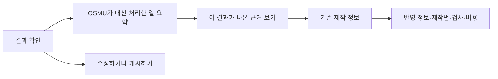

<!--
STAMP
created_at: 2026-08-24 00:46 KST
model: gpt-5.6
agent: senior-product-designer
line: osmu
skills: 없음. 설치된 스킬 중 제품 화면 영향 분석에 직접 맞는 스킬이 없어 디자인·문서 품질헌법을 적용함
basis: wiki/architecture/claude-code-와-osmu-대응.md, DESIGN.md, v46 wireframe/prototype, current Studio implementation, FDD Studio v5.0, public product documentation
decision_focus: 새 화면을 늘리지 않고도 손님이 위임한 일과 결과의 근거를 이해하게 만드는 최소 변경
filename_exception: 회장이 지정한 정확한 산출 경로를 따름
-->

# 상품 정의 변화가 화면에 주는 영향 v1

> 한 줄 결론: 상품 정의 변화는 화면과 기술설계에 영향을 준다. 다만 새 상위 화면, 새 요금제, 새 아키텍처가 지금 필요한 것은 아니다. 지금 할 일은 결과 화면에서 이미 설계된 `제작 정보`로 바로 들어가게 하고, 기능 설계 문서에 결과별 사용자 조회 계약을 보강하는 것이다.

| 항목 | 내용 |
|---|---|
| 상품 정의 | OSMU는 마케팅 콘텐츠 생성기가 아니라, 사용자가 모델 지시문과 작업 규칙을 직접 관리하지 않아도 되게 감싸고 마케팅 운영까지 연결하는 제품이다. |
| 판단 대상 | v46 화면, 현재 구현, Studio 기능 설계 문서 v5, 요금·상품 구성 |
| 이번 산출 범위 | 영향 판정과 다음 설계 요구만 다룬다. 화면 시안, 프로토타입, 코드, API 계약 확정은 하지 않는다. |
| 증거 등급 | 기존 파일과 공개 제품 문서는 근거 확인. v46 화면은 렌더 이미지로 관찰. 고객 반응과 가격 수용성은 미검증. |

## 1. 먼저 바로잡아야 할 사실

컨트롤러의 문제 제기는 방향은 맞지만, 사실 하나는 틀렸다. v46에서 “왜 이렇게 나왔는지”가 개발자용 주석에만 있는 것은 아니다. 고객용 `제작 정보` 화면이 이미 있고, 사용한 정보 묶음, 제작법 버전, 사용하지 않은 정보, 모델, 비용, 예비 처리 여부를 보여 준다.

문제는 화면의 부재보다 진입 경로와 결과 연결이다.

| 확인 대상 | 실제 확인 | 판단 |
|---|---|---|
| 현재 배포와 가까운 Studio 구현 | 아이디어, 가이드, 브랜드 정보로 모델 지시문을 조립해 텍스트·이미지·영상을 순차 생성한다. 결과별 제작 기록을 저장하거나 조회하는 화면은 없다. | 현재 구현은 새 상품 정의를 전달하지 못한다. |
| v46 프로토타입 | 고객용 `제작 정보` 화면과 `/made` 경로가 있다. `함께하기`의 `자세한 설명` 안에서도 들어갈 수 있다. | 새 상세 화면을 또 만들 이유는 없다. |
| v46 결과 흐름 | 기본 결과 화면에서 제작 정보까지 한 번에 들어가는 결과별 연결이 약하다. 전역 `/made`는 작업물이 여러 개일 때 어느 결과의 기록인지 모호하다. | 기존 화면을 결과별로 재배치해야 한다. |
| DESIGN.md | `제작 정보`, 쉬운 고객 언어, 내부 코드 비노출 원칙이 이미 있다. | 디자인 시스템을 갈아엎을 필요는 없다. |
| 기능 설계 문서 v5 | 제작 입력, 사용한 버전, 모델, 제작법, 비용, 예비 처리, 검사, 결과 계보를 저장하는 구조가 있다. | 데이터 토대는 있다. 사용자에게 안전하게 읽어 주는 계약이 빠져 있다. |

따라서 이 문서는 “없던 설명 화면을 신설”하는 안을 기각한다. 기존 `제작 정보`를 정확한 결과에 붙이고, 기본 흐름에서 발견되게 만드는 안을 채택한다.

## 2. 회장의 “영향 없다” 판단을 가장 강하게 세우기

### 2.1 가장 강한 반론

손님은 자기가 무엇을 안 하는지 배울 의무가 없다. 결과가 좋고 수정이 쉬우면 된다. 제품이 대신 처리한 규칙, 제작법, 모델 선택을 계속 설명하면 손님은 제품을 쓰기 전에 내부 구조부터 배워야 한다. 자동화가 줄여 준 인지 부담을 설명 화면이 다시 늘릴 수 있다.

이 반론은 실제 제품에서도 힘을 얻는다.

- Canva Magic Design은 사용자가 요구를 쓰고 결과를 고르는 흐름을 앞세운다. 내부 조립 과정은 기본 화면에서 숨긴다. Canva가 공개한 2025년 수치상 월간 사용자 2억 6천만 명 규모이므로, 내부 과정을 전면에 보이지 않는 방식도 큰 제품에서 성립한다. 다만 숨김이 성공 원인이라고 단정할 수는 없다.
- Grammarly는 설명을 없애지 않되, 제안 카드의 `Learn more`를 눌렀을 때 이유를 더 보여 준다. 결과와 행동이 먼저이고 설명은 요청할 때 열린다.

### 2.2 반론이 이기는 범위

회장 판단은 다음 세 가지에서는 이긴다.

1. **새 상위 화면:** 필요 없다. 기존 `제작 정보`를 재사용한다.
2. **항상 보이는 내부 설명:** 필요 없다. 기본 화면은 결과와 다음 행동에 집중한다.
3. **즉시 요금 변경:** 근거가 없다. 가격 수용성은 아직 검증되지 않았다.

### 2.3 반론이 지는 범위

OSMU는 단순 문장 교정이나 템플릿 추천보다 결과 위험이 크다. 브랜드 말투, 사실 근거, 금지 표현, 게시 채널, 예산이 함께 움직인다. 결과가 어긋났을 때 사용자가 “무엇을 고치면 다음 결과가 달라지는가”를 찾을 수 없다면, 대신 처리해 주는 제품이 아니라 다시 뽑기만 시키는 제품이 된다.

따라서 설명은 기본 화면을 차지해서는 안 되지만, 결과에서 한 번의 직접 행동으로 열려야 한다. 이 결론은 회장의 단순성 우려와 컨트롤러의 추적 가능성 우려를 동시에 만족한다.

## 3. 공개 제품 실조사

| 제품 | 공개 화면 설명에서 확인한 방식 | 무엇을 차용하는가 | 무엇은 차용하지 않는가 |
|---|---|---|---|
| OpenAI Deep Research | 작업 계획을 검토하고, 진행 중인 단계와 사용한 출처를 보며, 최종 보고서에서 인용과 활동 기록을 확인한다. | 오래 걸리는 보이지 않는 일을 짧은 단계와 출처로 드러낸다. | 모델의 숨은 사고 과정을 원문으로 노출하지 않는다. |
| GitHub Copilot coding agent | 작업 세션에서 진행, 사용량, 도구 활동, 커밋까지 추적할 수 있다. | 결과에서 해당 실행 기록으로 바로 들어가는 결과별 연결을 차용한다. | 개발자용 도구 로그를 일반 마케팅 고객에게 그대로 보여 주지 않는다. |
| Zapier run details | 실행 목록, 단계 개요, 단계별 입력·출력·상태·오류를 점층적으로 연다. | 실패한 단계와 성공한 단계를 분리하고, 자세한 내용은 펼쳐 본다. | 모든 입력값을 첫 화면에 펼치지 않는다. |
| Grammarly | 제안과 수정 행동을 먼저 보여 주고, `Learn more`에서 이유를 확장한다. | 설명을 요청할 때 여는 점층 공개를 차용한다. | 이유를 숨긴 채 수정만 강제하지 않는다. |
| Perplexity | 답변의 주장 옆에 인용을 붙이고 원문 출처로 이동시킨다. | 사실 근거는 결과와 가까운 곳에 둔다. | 출처와 제작 규칙을 한 덩어리로 섞지 않는다. |
| Canva Magic Design | 요구 입력, 생성 결과 탐색, 선택을 중심에 두고 내부 제작 과정은 감춘다. | 기본 흐름의 단순성을 차용한다. | 숨김을 근거로 수정 단서와 제작 기록까지 제거하지 않는다. |

조사에서 반복되는 원칙은 하나다. 복잡한 일을 대신하는 제품은 내부 전체를 가르치지 않는다. 대신 기다려야 하는 동안에는 진행 상태를, 결과를 믿거나 고쳐야 할 때에는 출처와 실행 기록을 선택적으로 연다.

## 4. 화면에 주는 영향

### 4.1 화면 구조 원칙

기본 주축은 세로 흐름이다. `결과 → 대신 처리한 일 한 줄 → 수정·게시` 순서를 유지한다. 상세 근거는 옆 열을 추가하지 않고 펼침 영역이나 상세 화면으로 연다. 데스크톱 1024픽셀과 모바일 390픽셀 모두 한 열 읽기 순서를 지킨다.

### 4.2 지금 바꿀 구역

#### A. 결과 화면의 `OSMU가 대신 처리한 일`

새 화면이 아니라 결과 카드 또는 결과 상세 안의 접힌 요약 구역이다.

- 제목: `OSMU가 대신 처리한 일`
- 정상 예시: `브랜드 말투와 금지 표현을 확인하고, 이 작업에 맞는 제작법 3개를 골라 반영했습니다.`
- 행동: `이 결과가 나온 근거 보기`
- 금지: `7층 조립`, `X4`, `manifest`, 모델 지시문 원문처럼 고객이 해석해야 하는 내부 용어
- 표시 원칙: 실제로 끝난 일만 말한다. 실행하지 않은 검사나 읽지 않은 자료를 일반 홍보 문구로 표시하지 않는다.

이 구역은 손님에게 기술을 가르치려는 것이 아니다. “내가 직접 하지 않아도 된 일”과 “결과를 고치려면 어디를 보면 되는지”를 한 번에 알리는 표지다.

#### B. 생성 중 화면의 짧은 단계 상태

오래 걸리는 작업에서만 실제 상태를 보여 준다.

1. 반영할 자료 고르기
2. 브랜드 말투와 금지 표현 확인
3. 이 작업에 맞는 제작법 적용
4. 결과 검사

기술 로그와 모델의 숨은 사고 과정은 보여 주지 않는다. 짧게 끝나는 작업에서는 단계 목록을 생략하고 단일 진행 표시만 쓴다.

#### C. 기존 `제작 정보`의 결과별 진입

- 모든 결과 카드와 결과 상세는 정확한 결과 식별자를 가지고 `제작 정보`로 들어간다.
- 상세 화면 상단에는 어떤 결과의 기록인지 썸네일, 제목, 생성 시각으로 확인시킨다.
- 전역 메뉴의 `/made` 단독 진입은 제거하거나 `작업물 기록` 아래의 결과 목록으로 바꾼다. 현재처럼 대상 결과가 모호한 전역 진입은 없앤다.
- `어떻게`처럼 목적이 모호한 행동 이름은 `이 결과가 나온 근거 보기`로 바꾼다.

### 4.3 기존 `제작 정보`에서 유지할 것

- 반영한 정보 묶음과 버전
- 사용한 제작법과 버전
- 반영하지 않은 정보와 이유
- 사용 모델, 비용, 예비 처리 여부
- 결과 검사와 주의 사항
- 작업물로 돌아가기

표시 순서는 고객 행동에 맞춘다.

1. 무엇을 반영했나
2. 무엇을 반영하지 않았고 왜 그런가
3. 어떤 검사를 통과하거나 통과하지 못했나
4. 비용과 기술 세부 정보

### 4.4 없애거나 숨길 것

| 대상 | 판정 | 이유 |
|---|---|---|
| 새 `자동화 소개` 상위 화면 | 만들지 않음 | 제품 사용 전에 내부 구조를 학습시키는 중복 화면이 된다. |
| 전역 `/made` 단독 메뉴 | 결과별 진입으로 대체 | 어느 작업의 기록인지 모호하다. |
| 고객 화면의 모델 지시문 원문 | 숨김 | 비밀값, 내부 규칙, 불필요한 기술 노출 위험이 있다. |
| 개발자 주석 패널 | 고객 흐름에서 제외 | 제작 검수 도구이지 고객용 설명이 아니다. |
| 운영자용 `비주얼 프롬프트` 직접 편집 | 일반 고객 기본 흐름에서 숨김 | 고급 운영 기능으로는 유지할 수 있지만 상품 가치의 기본 입력면이 되어서는 안 된다. |
| 모델의 숨은 사고 과정 | 제공하지 않음 | 검증 가능한 근거가 아니라 내부 생성 과정이며, 고객 수정 행동으로 바로 이어지지 않는다. |

### 4.5 상태와 넘침 규칙

| 상태 | 화면 처리 | 막다른 길 방지 |
|---|---|---|
| 불러오는 중 | 결과는 유지하고 제작 정보 영역에 골격 화면을 표시 | `결과로 돌아가기` 유지 |
| 기록 없음 | `이 작업에는 아직 제작 기록이 없습니다.` 표시 | `다시 불러오기`, `결과로 돌아가기` 제공 |
| 기록 오류 | `제작 기록을 불러오지 못했습니다. 결과는 보존되어 있습니다.` 표시 | 재시도와 지원 연결 제공 |
| 일부 단계 실패 | 성공, 건너뜀, 실패를 나눠 표시 | 실패 이유와 다시 실행할 범위를 안내 |
| 항목 0개 | 빈 표를 만들지 않고 한 문장으로 설명 | 다음 행동 유지 |
| 항목 1개에서 7개 | 전체 표시 | 항목별 한 줄 요약 제공 |
| 항목 8개 이상 | 처음 5개와 `나머지 N개 보기` | 펼친 뒤 다시 접을 수 있음 |
| 긴 이름과 긴 이유 | 두 줄까지 보여 주고 상세에서 전체 표시 | 가로 스크롤 금지 |

여백은 DESIGN.md의 8픽셀 배수 토큰만 쓴다. 요약 구역의 내부 여백 16, 구역 간 간격 24, 목록 항목 간 간격 8을 기본으로 한다. 새 색상이나 글자 크기는 만들지 않고 기존 정보·성공·주의·오류 토큰을 쓴다.

### 4.6 지금 만들지 않을 화면

- 여러 작업의 전체 활동 연대표
- 문장 하나, 장면 하나가 어느 규칙 때문에 생겼는지 표시하는 세부 인과 지도
- 두 제작 실행의 근거 비교 화면
- 감사 기록 다운로드와 외부 시스템 연결 화면

이 네 가지는 사용량과 고객 문의에서 실제 필요가 확인된 뒤 만든다.

## 5. 기술설계에 주는 영향

기능 설계 문서, 즉 FDD v5는 조립층의 기록 자체는 상당 부분 갖고 있다. 새 데이터 구조를 처음부터 설계할 상태는 아니다.

### 5.1 FDD v5에 이미 있는 것

| 기록 | FDD v5 근거 | 화면에 쓸 수 있는 정보 |
|---|---|---|
| 제작 작업 기록 | §3.3의 요청, 정규화 입력, 각 정보 묶음 버전, 동의, 비용, 모델·제작법 버전, 결과 식별자 | 어떤 결과에 어떤 설정이 쓰였는지 |
| 변경 불가 제작 봉투 | `production_envelopes`와 정보 묶음 버전 목록 | 제작 당시의 입력 기준 |
| 제작 시도 | `production_attempts`의 공급자, 모델, 제작법, 예비 처리, 상태 | 모델과 예비 처리 여부 |
| 결과와 검사 | `production_outputs`, `output_inspections` | 결과 검사와 주의 사항 |
| 수정 계보 | `production_recipes`, `edit_instructions` | 다시 만들지 않고 무엇을 고쳤는지 |
| 출처 사건 기록 | `provenance_events` | 제작 과정의 시간순 사건 |
| 전달 기록 | `handoff_records` | 어느 결과가 어느 단계로 넘어갔는지 |
| 계보 규칙 | §9.9의 요청부터 결과 전달까지의 연결 | 결과에서 원인을 되짚는 기반 |

### 5.2 FDD v5에 없는 것

FDD v5는 화면에서 제작 기록을 연다는 테스트 요구는 두었지만, 고객 화면이 어떤 형식으로 안전하게 읽을지 정하지 않았다.

구체적으로 다음이 빠져 있다.

1. **결과별 조회 계약:** 결과 식별자를 넣으면 해당 결과의 제작 정보를 돌려주는 읽기 계약
2. **고객용 요약 형식:** 내부 기록을 쉬운 이름과 순서로 바꾸는 버전 있는 표시 규칙
3. **실제 반영과 미반영 구분:** 최종값으로 적용된 정보, 덮여서 쓰이지 않은 정보, 정책으로 막힌 정보를 나누는 상태와 이유 코드
4. **가림 규칙:** 비밀값, 다른 고객 정보, 모델 지시문 원문, 내부 도구 로그를 응답에서 제외하는 규칙
5. **원문 삭제 뒤 행동:** 원문을 삭제했을 때 버전 식별자와 요약은 어디까지 남고, 화면은 무엇을 `확인 불가`라고 표시하는지
6. **화면 상태 계약:** 기록 없음, 일부 실패, 예비 처리, 긴 목록, 모바일에서의 반환과 오류 형식

현재 `provenance_events.data`처럼 자유로운 JSON에 담는 것만으로는 부족하다. 자유 형식은 기록에는 편하지만, 고객 화면이 버전 변화에 안전하게 의존할 수 없다.

### 5.3 지금 기술설계에 추가할 최소 계약

정확한 주소와 필드명은 기술설계 대화에서 확정한다. 다만 다음 의미는 개발 전에 고정해야 한다.

- 입력: 결과 식별자와 작업 공간 식별자
- 출력: 결과 요약, 실제 반영 정보, 미반영 정보와 이유, 제작법 버전, 모델과 예비 처리, 검사, 비용, 시각, 단계 상태
- 접근 권한: 같은 작업 공간의 허용된 사용자만 조회
- 가림: 내부 모델 지시문, 숨은 사고 과정, 비밀값, 원시 도구 로그, 다른 고객 정보는 반환하지 않음
- 변경 이력: 고객용 표시 형식의 버전을 남김
- 삭제: 삭제된 원문은 복원하지 않고 `원문 삭제로 상세 확인 불가`라고 명시
- 연결: 결과 화면의 식별자와 제작 기록의 식별자가 항상 일치

검증 항목도 추가해야 한다.

1. 결과 A에서 결과 B의 제작 기록이 열리지 않는다.
2. 예비 처리와 일부 실패가 실제 기록과 같은 상태로 보인다.
3. 원문 삭제 뒤에도 허용된 요약만 남고 삭제된 원문은 노출되지 않는다.
4. 항목 0개, 정상량, 과다량이 데스크톱 1024픽셀과 모바일 390픽셀에서 읽힌다.
5. 기록 조회가 실패해도 작업 결과와 수정·게시 행동은 사라지지 않는다.

### 5.4 나중에 기술설계할 것

- 문장과 장면 단위의 정확한 인과 연결
- 두 실행 사이의 반영 정보 차이
- 기업용 장기 보관, 내보내기, 외부 감사 연결
- 사용자가 직접 조정하는 고급 제작 규칙 편집기

판정은 “기술설계 영향 없음”이 아니라 “기존 저장 구조는 유지하고, 고객용 결과별 읽기 계약만 지금 보강”이다.

## 6. 요금과 상품 구성에 주는 영향

### 6.1 지금 요금은 바꾸지 않는다

현재 가격은 가설이며 고객의 가격 수용성 검증이 끝나지 않았다. 상품 정의가 선명해졌다는 이유만으로 가격 숫자나 새 요금제를 만들면 근거 없는 정밀함이 된다.

또한 `왜 이 결과가 나왔는지 보기`는 신뢰와 수정에 필요한 기본 기능이다. 이를 상위 요금제에만 두면 낮은 요금제 사용자는 결과를 고칠 단서를 잃는다. 제작 정보의 기본 조회는 모든 유료 상품과 실제 결과를 제공하는 무료 체험에 포함한다.

### 6.2 지금 바꿀 것은 상품 설명

| 기존 인식 위험 | 바꿀 설명 | 증명 화면 |
|---|---|---|
| 콘텐츠를 만들어 주는 도구 | 자료 선택, 브랜드 규칙, 제작법, 검사까지 대신 처리하고 결과는 사용자가 통제하는 운영 도구 | `OSMU가 대신 처리한 일` 요약 |
| 생성 횟수와 모델 중심 | 닫힌 마케팅 작업과 운영 범위 중심 | 결과, 수정, 게시, 피드백 흐름 |
| 자동화라서 내부를 모름 | 결과는 단순하게 받고 필요할 때 근거를 확인 | 결과별 `제작 정보` |

새 상품 묶음은 만들지 않는다. 기존 무료, Starter, Pro, Enterprise 가설을 유지하되, 각 상품이 대신 맡는 운영 범위를 쉬운 말로 다시 쓴다.

### 6.3 나중에 분리할 수 있는 가치

- 기업용 제작 기록 장기 보관
- 감사 파일 내보내기와 외부 시스템 연결
- 관리자 승인과 세밀한 접근 권한
- 여러 작업 공간을 가로지르는 규칙 관리

이 항목은 보관 비용, 지원 비용, 기업 고객 요구가 관찰된 뒤 상위 상품으로 검증한다. 설명을 볼 권리 자체에는 별도 요금을 붙이지 않는다.

## 7. 지금, 나중, 하지 않음

| 영역 | 지금 | 나중 | 하지 않음 |
|---|---|---|---|
| 화면 | 결과 안에 `대신 처리한 일` 한 줄과 `이 결과가 나온 근거 보기`를 추가. 기존 `제작 정보`를 결과별로 연결. | 전체 활동 연대표, 실행 비교, 문장·장면 단위 인과 지도 | 새 자동화 소개 상위 화면, 항상 열린 기술 설명 |
| 길 찾기 | 모호한 전역 `/made`를 결과 목록이나 결과별 진입으로 대체 | 검색과 필터가 필요한 제작 기록 보관함 | 대상 결과가 없는 제작 정보 화면 |
| 기술설계 | 기존 기록 구조 위에 고객용 결과별 조회·가림·삭제·오류 계약과 테스트 추가 | 기업용 감사 내보내기, 장기 보관, 세부 인과 | 숨은 사고 과정과 내부 모델 지시문 공개 |
| 요금 | 가격 숫자와 상품 수는 유지. 기본 제작 정보는 공통 제공. 상품 설명만 운영 대행 가치로 수정 | 장기 보관, 감사, 관리자 기능의 상위 상품 검증 | 결과 이유 보기 자체를 유료 잠금 |

## 8. 설계 단계 회수 여부

현재는 기획 단계를 다시 열 필요가 없다. 상품 정의, 핵심 고객, 네 방 운영 흐름, 결과 추적 구조가 이미 있고 이번 변경은 그 가치를 보이게 하는 설계 보강이다.

다음 중 하나를 원한다면 기획 단계를 다시 열어야 한다.

- 일반 고객이 모델 지시문과 하네스 규칙을 직접 편집하는 제품으로 바꾼다.
- 제작 기록을 법적 감사 증빙으로 판매한다.
- 제작 정보 조회를 별도 유료 상품으로 판다.

이 세 가지는 고객 역할, 데이터 책임, 비용, 상품 경계를 바꾸므로 화면 수정만으로 확정할 수 없다.

## 9. 레드팀과 셀프심문

### 9.1 까다로운 고객의 공격

> “대신 처리한 일을 왜 자랑하나. 결과가 별로면 과정 설명은 변명일 뿐이다.”

맞는 공격이다. 그래서 요약은 결과보다 위에 두지 않고, 결과 품질을 대신하는 신뢰 배지로 쓰지 않는다. 실제 반영 기록에서 나온 짧은 사실만 표시하고, 결과 수정과 게시 행동을 먼저 유지한다.

### 9.2 경쟁자의 공격

> “우리 제품은 아무 설명 없이 더 빠르다. OSMU는 복잡해 보인다.”

이 공격도 일부 맞다. 기본 흐름에서는 설명을 접고 한 줄만 보인다. 차별점은 더 많은 용어가 아니라, 실패했을 때 고칠 수 있고 브랜드 작업을 반복해도 기준이 남는다는 데 둔다.

### 9.3 이 결론이 틀렸다면 가장 그럴듯한 이유

가장 무거운 가정은 사용자가 결과의 근거를 보면 수정 성공률과 신뢰가 높아진다는 것이다. 실제 고객은 제작 정보를 한 번도 열지 않고 결과 품질과 속도만 평가할 수 있다. 이 경우 결과 화면의 새 요약도 잡음이다.

따라서 첫 검증은 새 상세 화면 제작이 아니다. 기존 `제작 정보`로 가는 결과별 행동 하나와 접힌 한 줄 요약만 프로토타입에 넣고 다음을 관찰한다.

- 사용자가 설명 없이도 OSMU가 대신한 일을 말할 수 있는가
- 결과가 마음에 들지 않을 때 제작 정보를 스스로 찾는가
- 제작 정보를 본 뒤 무엇을 고칠지 더 빨리 정하는가
- 설명 때문에 결과 확인과 게시 행동이 느려지는가

세 번째가 개선되지 않고 네 번째만 악화되면 한 줄 요약을 제거한다. 결과별 제작 정보 진입만 남긴다.

### 9.4 셀프심문 뒤 수정한 것

초기 결론이었던 “새 설명 화면과 자동화 현황판이 필요하다”를 철회했다. v46에 고객용 `제작 정보`가 이미 있다는 사실과 Canva·Grammarly의 단순성 사례를 반영해, 신규 화면이 아니라 결과별 연결과 점층 공개로 범위를 줄였다.

## 10. 다음 단계 가능 조건

디자인 단계에서 다음 네 가지가 v46에 반영되고 390픽셀·1024픽셀, 기록 0개·정상·과다 상태를 렌더해 확인되면 기술설계 보강으로 갈 수 있다.

1. 결과 화면의 접힌 `OSMU가 대신 처리한 일`
2. 결과별 `이 결과가 나온 근거 보기`
3. 기존 `제작 정보`의 결과 식별과 상태 화면
4. 전역 `/made`의 제거 또는 결과 기록 목록으로의 재정의

현재는 문서 판단만 근거 확인됐고, 이 네 화면 변경은 미검증이다. 따라서 다음 단계 자동 진입은 불가하며 디자인 프로토타입 반영과 승인 게이트가 먼저다.

## 11. 근거

### 11.1 내부 정본

- `wiki/architecture/claude-code-와-osmu-대응.md`: Claude Code와 OSMU의 구조 대응, 고객 계약 차이, 현재 구현 공백
- `DESIGN.md`: v46 셸, 고객 언어, 컴포넌트와 토큰 원칙
- `docs/WIREFRAMES/openclaw-auto-content-loop-v46-gpt-codex.md`: v46 화면과 상태 정의
- `docs/prototype/openclaw-auto-4room-v46.html`: 고객용 `제작 정보` 화면, `/made`, `함께하기`에서의 진입 경로
- `docs/구현현황.md`: 현재 구현 범위와 배포 상태
- `dashboard/src/app/studio/page.tsx`: 현재 Studio 입력·생성·편집 흐름
- `dashboard/src/app/api/studio/text/route.ts`: 현재 모델 지시문 조립과 반환 범위
- `studio/docs/fdd-studio-v5.0.md`: 제작 기록, 조립, 결과 계보, 테스트와 빠진 사용자 조회 계약
- `docs/plan/bm.md`, `docs/사업계획-osmu-v1.0.md`: 워크플로 폐쇄 가치, 현재 가격 가설과 상품 원칙

### 11.2 공개 제품 문서

1. [OpenAI, Introducing deep research](https://openai.com/index/introducing-deep-research/): 진행 단계, 사용 출처, 인용된 결과 표시
2. [OpenAI Help, Deep research](https://help.openai.com/en/articles/10500283-deep-research-daq): 계획 검토, 실시간 진행, 중단, 활동 기록
3. [GitHub Docs, Manage and track coding agents](https://docs.github.com/en/copilot/how-tos/copilot-on-github/use-copilot-agents/manage-and-track-agents): 세션 진행, 사용량, 도구 활동, 커밋 추적
4. [Zapier Help, View specific Zap run details](https://help.zapier.com/hc/en-us/articles/20512774106125-View-specific-Zap-run-details): 단계 개요, 입력·출력, 상태와 오류의 점층 공개
5. [Grammarly, Grouped writing suggestions](https://www.grammarly.com/blog/product/grouped-writing-suggestions/): 제안 우선, `Learn more`를 통한 이유 확장
6. [Perplexity Help, What is Perplexity?](https://www.perplexity.ai/help-center/en/articles/10352155-what-is-perplexity): 답변 안의 인용과 원문 출처 연결
7. [Canva Help, Use Magic Design](https://www.canva.com/help/use-magic-design/): 요구 입력, 결과 탐색, 선택 중심 흐름
8. [Canva Newsroom, 2025 wrap](https://www.canva.com/newsroom/news/canva-2025-wrap/): 2025년 공개 사용자와 사업 규모

---

SKILLS_USED: 없음

SKILLS_SKIPPED: 설치된 스킬 중 제품 화면 영향 분석과 독립 디자인 리뷰에 직접 맞는 스킬이 없음. 대신 `/Users/sj/.claude/standards/design.md`, `doc-review.md`, `ux-writing.md`, `planning.md`, `benchmarks.md`, `artifact-stamp.md`를 적용함.

DESIGN_SCORE: B+ (화면 영향 정의 자가평가. 픽셀 시안은 이번 산출 범위 밖이라 시각 품질은 미검증)

RUBRIC_SCORE: 완결성=5/5 정밀성=4/5 벤치마크=5/5 추적성=5/5 전문성=5/5 total=24/25

WEAKEST_LINE: 사용자가 제작 정보를 본 뒤 수정 성공률이 높아진다는 핵심 가정은 아직 고객 관찰로 검증되지 않았다.

SOURCES: 위 11.1 내부 정본 9건과 11.2 공개 제품 문서 8건

MODEL: gpt-5.6
