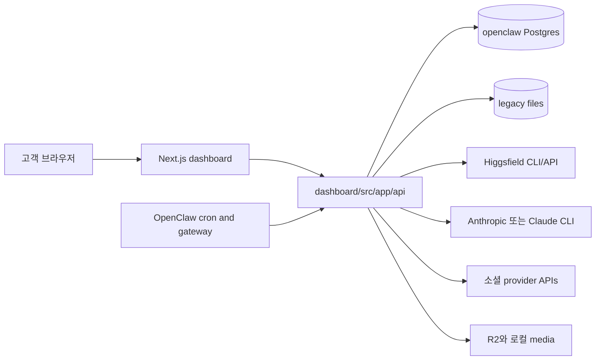
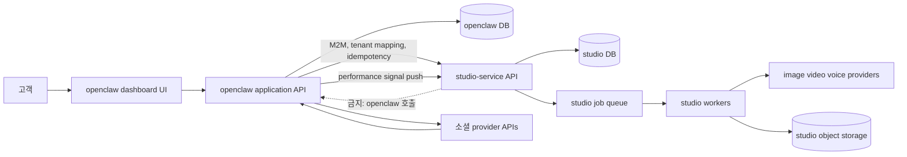
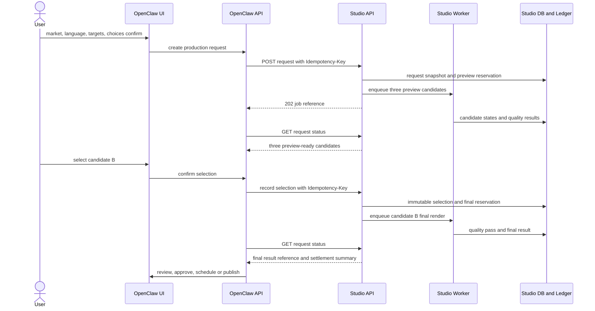
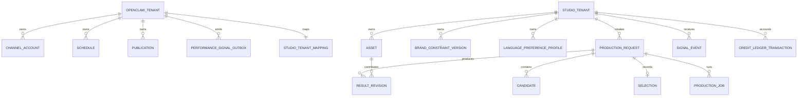
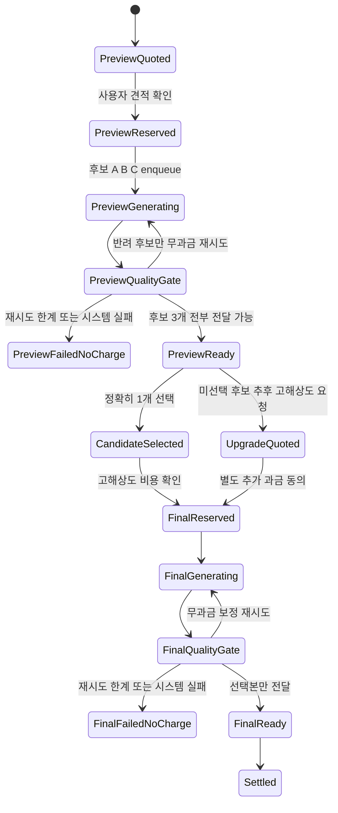

# openclaw-service + studio-service FDD 1차

| 항목 | 값 |
|---|---|
| 문서 버전 | v1.0.0 |
| 작성일 | 2026-08-16 |
| 작성자/모델 | tech-architect / gpt-codex/gpt-5.6 |
| 작업 라인 | openclaw-studio |
| 상류 산출물 핀 | `docs/prd-openclaw-service-v8.2.1-gpt-codex.md`, `studio/docs/prd-studio-service-v1.2.1-gpt-codex.md`, `DESIGN.md` v16, `docs/design-docs/user-flow-openclaw-service-v9.5-gpt-codex.md` |
| 현행 구현 정본 | `wiki/product/marketing-hub-surface-map.md`, `wiki/architecture/system-architecture.md`, `wiki/architecture/data-model.md`, `wiki/architecture/two-service-boundary.md`, `dashboard/src`, `dashboard/db/schema.sql` |
| 문서 상태 | **Draft, eng-design 합의 전. API·DB 스키마·인증·과금 확정 금지** |
| 게이트 판정 | **build stage 진입 불가** |

## 목차

- [0. 한 줄 결론과 범위](#0-한-줄-결론과-범위)
- [1. 용어와 증거 경계](#1-용어와-증거-경계)
- [2. 현행 서비스 구조](#2-현행-서비스-구조)
- [3. 현행 구현 대비 갭 분석](#3-현행-구현-대비-갭-분석)
- [4. 목표 아키텍처 초안](#4-목표-아키텍처-초안)
- [5. studio-service API 계약 초안](#5-studio-service-api-계약-초안)
- [6. 데이터 소유 경계](#6-데이터-소유-경계)
- [7. 저해상도 후보와 크레딧 상태 전이](#7-저해상도-후보와-크레딧-상태-전이)
- [8. 유저플로우 1:1 매핑](#8-유저플로우-11-매핑)
- [9. 폴더·commons 재사용 경계](#9-폴더commons-재사용-경계)
- [10. 설계 패턴과 횡단 관심사](#10-설계-패턴과-횡단-관심사)
- [11. 테스트 계획과 수용기준](#11-테스트-계획과-수용기준)
- [12. 미결정과 회장 합의 필요](#12-미결정과-회장-합의-필요)
- [13. 벤치마크 반영](#13-벤치마크-반영)
- [14. 레드팀과 셀프심문](#14-레드팀과-셀프심문)
- [15. 종료 전 자기검사](#15-종료-전-자기검사)
- [16. 개정 이력](#16-개정-이력)

## 0. 한 줄 결론과 범위

> 기존 `dashboard`의 `/studio`, 계정, 예약, 발행, 성과 경로는 보존하고, 제작·창작 정보·미디어 바이트·언어별 취향·후보 선택·크레딧 정산을 소유하는 headless `studio-service`를 단방향으로 붙인다. 다만 현재는 독립 studio-service와 핵심 엔티티가 없고, v9.5 화면 78개 중 66개가 endpoint·기존 component·기존 table 1:1 매핑을 충족하지 못하므로 build 진입을 거부한다.

### 0.1 이번 1차에서 설계하는 것

1. 현재 `dashboard/src` 대비 route·file 단위 갭.
2. 외부 접점 5개의 API 계약 초안과 각 접점의 대안 2개.
3. openclaw DB와 studio DB의 논리적 데이터 소유 경계.
4. 저해상도 후보 3개, 선택본 1개 고해상도, 미선택 후보 추가 과금의 상태 전이와 차감 후보 시점.
5. v9.5 화면 78개 전수의 기존 endpoint·component·table 매핑.

### 0.2 이번 1차에서 확정하지 않는 것

- 실제 URI, JSON 필드명, 상태 enum, DB 테이블명, 인덱스, DDL.
- 프리뷰 픽셀 수·비트레이트·파일 크기.
- 크레딧 단가, 예약 만료시간, 환불 범위, 최종 차감 정책.
- API key, HMAC, OAuth Client Credentials 중 운영 인증 방식.
- queue 제품, worker 수, 재시도 횟수, polling 간격, SLA, 배포 topology.
- 별도 `docs/folder-structure.md`, `docs/design-patterns.md`, `docs/architecture.md`, `docs/api-contract.md`, `docs/test-plan.md`의 최종본. 이번 문서 합의 뒤 분할한다.

## 1. 용어와 증거 경계

| 용어 | 이 문서의 뜻 |
|---|---|
| openclaw-service | 고객 UI, 회원·workspace, 소셜 계정, 채널 규격, 승인, 예약, 발행, 성과를 소유하는 기존 서비스 |
| studio-service | 제작, 편집, 미디어 바이트, 브랜드 제약, 취향, 후보·선택, 품질 판정, 제작 크레딧을 소유할 headless 서비스 |
| master | 채널 중립 소재와 편집 지시서의 논리적 원본 |
| derivative | master에서 targets 제약에 맞춰 만든 채널별 파일과 창작 텍스트 |
| target market | 사례·훅·문화 금기·채널 관행을 바꾸는 요청 단위 시장 제약 |
| output language | 카피·자막·음성·캡션을 바꾸는 요청 단위 언어 제약 |
| preference profile | `tenant + output language` 경계의 버전된 개인 취향 상태 |
| signal | 선택, 성과, 제안 채택처럼 취향 계산에 영향을 주는 사건 |
| asset | 제작 재료인 파일·문서·링크와 그 권리·출처 메타데이터 |
| quality rejection | 결과를 사용자에게 전달하기 전에 필수 품질 기준이 반려한 사건. 고객 정산 0이 상류 확정 |
| mapping gap | 유저플로우 한 행에 기존 endpoint·기존 frontend component·기존 table 중 하나라도 없거나 step 의미를 부분만 표현한 상태 |

증거 등급은 다음과 같다.

- **근거 확인:** 지정 문서와 현재 source를 읽어 존재와 책임을 확인했다.
- **정적 실측:** 파일·route·table 정의를 source에서 확인했다.
- **미검증:** 독립 studio-service 런타임, 실제 DB, 실제 queue, 실제 provider, 실제 크레딧 정산은 실행하지 않았다.

## 2. 현행 서비스 구조

### 2.1 현재 container와 데이터 흐름



현재 `studio-service`라는 독립 HTTP container, worker, database는 없다. `studio/`는 실험·pipeline·standards·문서 디렉터리이고, 실제 고객 요청 처리는 `dashboard/src/app/studio/page.tsx`와 `dashboard/src/app/api/studio/*`, `dashboard/src/app/api/higgsfield/*`, `dashboard/src/app/api/video/*`에 분산돼 있다.

### 2.2 현재 보존해야 할 구조

| 영역 | 현재 정본 | 보존 이유 |
|---|---|---|
| 고객 shell·25개 page route·26개 sidebar item | `wiki/product/marketing-hub-surface-map.md`, `dashboard/src/app`, `Sidebar.tsx` | studio-service 1단계는 headless이며 새 고객 shell을 만들지 않음 |
| Studio 7개 preview | `dashboard/src/app/studio/page.tsx`, `PlatformPreview.tsx` | 현재 사용자가 결과를 검수하는 유일한 고객 화면 |
| 직접 select/publish 4채널 | `StudioPage`, `/api/publish` | 영상 preview 3개를 실발행 지원으로 오인하지 않음 |
| 다계정 진실원 | `channel_accounts`, `channel-accounts.ts`, AccountManager | 유저 소셜 credential은 openclaw 밖으로 이동 금지 |
| 예약·발행 proof | `schedules`, `published_posts`, `/api/schedule`, `/api/publish` | studio는 발행하지 않음 |
| tenant RLS wrapper | `withTenant()` | openclaw 데이터 경계의 기존 commons |
| partial publish reconciliation | `StudioPage`, `/api/publish`, `published_posts` | 외부 성공 후 내부 실패 때 재발행 금지 |

## 3. 현행 구현 대비 갭 분석

### 3.1 route·file 단위 표

| route·surface | 현재 파일 | 지금 있는 것 | 없는 것 | 고쳐야 하는 것 | 판정 |
|---|---|---|---|---|---|
| `/studio` | `dashboard/src/app/studio/page.tsx` | 단일 idea, 한국어 text 변형, 이미지·영상 생성, 7 preview, 4 direct publish, draft, schedule, history | target market, output language, 4층 조립, low-res 3후보, 선택 원장, 언어별 취향, quality gate | shell과 기존 action 보존. 제작 호출만 studio client로 교체하고 새 단계는 additive component로 분리 | 변경 필요 |
| text generation | `dashboard/src/app/api/studio/text/route.ts` | idea·guide·wiki를 직접 LLM에 보내 100% 한국어 variant 생성 | targets, market, language, preference version, request snapshot, async job | studio-service 제작 요청으로 이관. dashboard의 직접 창작 prompt 소유 제거 | 경계 불일치 |
| draft history | `dashboard/src/app/api/studio/drafts/route.ts` | `drafts.payload`에 text·img·vid·includes·reconciliation 저장 | master·derivative·revision·candidate·selection identity | openclaw에는 studio result reference와 publish projection만 남기고 창작 계보는 studio 소유 | 변경 필요 |
| brand setup | `dashboard/src/app/api/studio/brand-setup/route.ts`, `BrandSetupWizard.tsx` | 6문항을 `brand_guides`로 증류 | versioned brand constraints, conflict, source lineage | UI는 보존·확장하고 저장·version 정본을 studio로 이관 | 부분 구현 |
| repo·wiki import | `RepoConnect.tsx`, `/api/brand/sync-wiki`, `/api/brand/sync-repo` | GitHub wiki와 파일을 `wiki_docs`·`brand_guides`에 저장 | 범용 asset import, rights, asset version, deletion lineage | openclaw UI는 유지. studio 소재 반입 API로 연결하고 기존 DB는 migration 전 read-only mirror 후보 | 부분 구현 |
| longform sourcing | `/api/sourcing/route.ts` | longform을 후보로 나누고 `viral_signals`와 `drafts`에 저장 | 5접점 signal envelope, profile projection, studio tenant boundary | 1단계 scope에서 롱폼 분할 실행은 비범위. signal ingestion과 혼동하지 않게 분리 | 부분 중복 |
| next suggestion | `/api/suggestions/route.ts` | `published_posts`와 `viral_signals` 상위값으로 다음 idea 5개 생성 | language-scoped profile, evidence version, sample limitation | raw signal 직접 생성 사용 금지. studio preference profile과 근거를 조회해 표시 | 경계 불일치 |
| image generation | `/api/higgsfield/image/route.ts`, `lib/higgsfield.ts` | dashboard process가 provider 호출·download·localPath 보관 | tenant-safe studio job, candidate set, quality state, ledger | media byte 소유를 studio-service로 이관. openclaw에서 file download·localPath 제거 | 경계 불일치 |
| video generation | `/api/higgsfield/video/route.ts`, `/api/video/generate/route.ts` | dashboard process가 영상·음성 합성 | async studio worker contract, candidate/final split, job recovery | studio-service worker로 이관. openclaw synchronous processing 제거 | 경계 불일치 |
| video workbench | `/videos`, `dashboard/src/app/videos/page.tsx` | 업로드, generate, repurpose, refine, provider action | studio master/revision ownership | 고객 surface는 유지하되 byte transform은 studio API로만 | 변경 필요 |
| credit display | `/api/higgsfield/status`, `/api/higgsfield/transactions` | provider 계정 credits 조회 | tenant customer credit, reserve·settle·release·refund | provider credits와 customer credits를 분리. provider status는 운영 원가 증거로만 | 미구현 |
| usage ledger | `/api/usage/record`, `usage_events`, `usage_quotas` | append event와 월별 사용량 집계 | balance invariant, reservation, reversal, idempotent settlement | openclaw usage는 유지. studio 제작 credit ledger 대체 금지 | 부분 구현 |
| schedule | `/api/schedule`, `SchedulePanel.tsx`, `schedules` | draft·platform·account·time 예약 | studio result immutable reference와 version proof | schedule payload가 studio result revision을 참조하도록 확장 후보 | 보존+확장 |
| publish | `/api/publish`, `lib/publish.ts`, `published_posts` | 계정별 provider 발행, 멱등 index, partial reconciliation | studio result provenance, policy version, output language proof | provider 호출은 보존. creative text·media transform 추가 금지 | 보존+확장 |
| channel accounts | `/api/channels/[provider]/accounts`, `channel-accounts.ts`, `channel_accounts` | tenant별 복수 계정·기본 계정·암호화 token | studio와 공유할 필요 없음 | credential이 studio request에 포함되지 않도록 adapter에서 제거 | 보존 |
| performance | `/api/metrics`, `/api/analytics`, `published_posts`, `growth_metrics` | provider 성과 수집·표시 | canonical signal delivery status와 preference projection link | 성과를 studio signal로 push하되 openclaw가 source truth 유지 | 보존+확장 |
| operator | `/operator/customers`, operator API routes | 고객·OAuth credential 관리 | OP-01부터 OP-06 제작·ledger·queue 사건 복구 | 새 BI 금지. 사건 기반 read model만 additive | 미구현 |
| studio runtime | `studio/README.md`, `studio/pipelines/*` | 실험 pipeline과 재현 스크립트 | HTTP app, worker, DB access layer, auth, migrations, queue | 새 서비스 구현 필요. 기존 pipeline을 provider adapter 후보로 재사용 | 미구현 |

### 3.2 route inventory 영향

- 고객 page route 25개는 그대로 둔다. 1단계에 새 customer page route를 추가하지 않는다.
- sidebar 26개 항목도 그대로 둔다. Studio 안의 단계 component를 확장한다.
- 변경 집중점은 `/studio`, `/videos`, Settings의 brand·data import, operator 예외함이다.
- `/api/publish`, `/api/schedule`, account routes는 studio client가 아니라 openclaw application service로 유지한다.

## 4. 목표 아키텍처 초안

### 4.1 단방향 container 구조



### 4.2 의존 규칙

1. browser는 studio-service를 직접 호출하지 않는다.
2. openclaw는 tenant identity를 studio의 외부 tenant reference로 변환한다.
3. studio는 소셜 token, provider account secret, 예약시각, 실제 발행 권한을 받지 않는다.
4. openclaw는 media bytes를 decode·crop·render하지 않는다.
5. studio는 channel name을 필수 지식으로 갖지 않고 요청의 `targets` 제약을 따른다.
6. openclaw는 studio가 반환한 immutable result reference, revision, checksum, rights, quality, cost summary만 발행 projection에 저장한다.
7. signal push 실패는 발행 성공을 뒤집지 않는다. outbox 또는 재전송 가능한 상태로 분리한다.

### 4.3 핵심 runtime sequence



## 5. studio-service API 계약 초안

> 이 절의 URI와 필드명은 비교 가능한 초안이다. 회장 합의 전 구현 계약이 아니다.

### 5.1 공통 요청 봉투 후보

```json
{
  "tenant_ref": "openclaw tenant의 외부 참조",
  "correlation_id": "openclaw 작업 추적 ID",
  "request_version": "요청 조립 규칙 버전",
  "target_market": "JP",
  "output_language": "ja-JP",
  "targets": [
    {
      "target_ref": "openclaw 내부 target 식별자",
      "aspect_ratio": "9:16",
      "max_duration_seconds": 60,
      "caption_max_characters": 2200,
      "hashtag_max_count": 30,
      "supports_first_comment": true,
      "spec_version": "openclaw catalog version"
    }
  ]
}
```

공통 헤더 후보는 `Authorization`, `Idempotency-Key`, `Content-Type`, `Traceparent`다. 사용자 Supabase JWT와 소셜 provider token은 전달 금지다.

### 5.2 접점 1: 신호 넣기

#### 대안 A: typed signal resource

`POST /v1/signals`

```json
{
  "tenant_ref": "...",
  "source": "openclaw.performance",
  "kind": "publication_metric_observed",
  "subject_ref": "published result reference",
  "output_language": "ja-JP",
  "payload": {
    "metric_window": "provider-defined period",
    "metrics": { "views": 0, "likes": 0 },
    "source_truth": "provider"
  },
  "observed_at": "RFC3339 timestamp"
}
```

- 응답 후보: `202`와 `signal_id`, `accepted_at`, `projection_status`.
- 장점: audit·idempotency·재처리가 명확하다.
- 단점: signal kind가 늘 때 schema registry와 version 관리가 필요하다.

#### 대안 B: batch event ingestion

`POST /v1/events:batchIngest`

- 장점: 성과 sync와 backlog 재전송의 round trip이 줄어든다.
- 단점: 부분 실패, event별 idempotency, 순서·재처리 결과 표현이 복잡하다.

**추천 초안:** 초기에는 A를 사용하고, outbox backlog가 실측상 병목일 때 batch를 추가한다. 최종 결정은 미결정이다.

### 5.3 접점 2: 제작 요청

#### 대안 A: production request resource

`POST /v1/production-requests`

```json
{
  "tenant_ref": "...",
  "mode": "generate",
  "target_market": "JP",
  "output_language": "ja-JP",
  "targets": [{ "target_ref": "...", "aspect_ratio": "9:16", "max_duration_seconds": 60 }],
  "request_assembly": {
    "marketing_knowledge_version": "...",
    "preference_profile_version": "ja-JP profile version",
    "brand_constraint_version": "..."
  },
  "brief": { "goal": "...", "selected_direction": "..." },
  "assets": [{ "asset_ref": "..." }],
  "quote_ref": "...",
  "candidate_policy": { "preview_candidate_count": 3, "finalize_selected_only": true }
}
```

- 응답 후보: `202`, `request_id`, `status_url`, `quote_snapshot`, `reservation_state`.
- 상태 조회 후보: `GET /v1/production-requests/{request_id}`.
- 장점: user-facing request와 async job을 분리해 여러 provider job을 한 요청 아래 묶는다.
- 단점: request·job·candidate의 관계를 별도로 설계해야 한다.

#### 대안 B: generic job resource

`POST /v1/jobs`

- 장점: image·video·voice·edit를 한 queue model로 처리하기 쉽다.
- 단점: 제품의 선택·견적·후보·revision 의미가 generic payload에 묻히고 API가 provider wrapper로 퇴행할 수 있다.

**추천 초안:** A. provider job은 내부 resource로 숨긴다. URI와 response shape는 미결정이다.

### 5.4 접점 3: 선택 기록

#### 대안 A: request 하위 selection

`POST /v1/production-requests/{request_id}/selections`

```json
{
  "candidate_ref": "candidate-B",
  "reason_axes": ["market_fit", "brand_tone"],
  "free_text_reason": "optional",
  "selected_at": "RFC3339 timestamp",
  "final_render_confirmed": true,
  "quote_ref": "final render quote"
}
```

- 응답 후보: `202`, immutable `selection_id`, `final_job_status_url`, `reservation_state`.
- 장점: 잘못된 request의 candidate를 선택하는 것을 aggregate boundary에서 막기 쉽다.
- 단점: request 외부에서 선택 이력을 조회할 때 추가 projection이 필요하다.

#### 대안 B: global selection resource

`POST /v1/selections`

- 장점: 선택·거절·추천 채택을 한 학습 event API로 통합하기 쉽다.
- 단점: candidate와 request 소속 검증을 매번 해야 하고 final render trigger가 signal ingestion과 섞인다.

**추천 초안:** A. 선택을 신호로도 투영하되 selection write 자체는 request aggregate가 소유한다. 최종 결정은 미결정이다.

### 5.5 접점 4: 취향 상태 조회

#### 대안 A: language-scoped resource GET

`GET /v1/preferences/{output_language}`

- 응답 후보: `profile_version`, `summary`, `positive_axes`, `negative_axes`, `evidence_refs`, `confidence`, `updated_at`, `limitations`.
- 장점: cache·ETag·버전 비교가 단순하고 언어 경계가 URI에 드러난다.
- 단점: 시장·브랜드·시점별 projection이 필요해지면 query가 늘어난다.

#### 대안 B: snapshot query POST

`POST /v1/preference-snapshots:resolve`

```json
{
  "tenant_ref": "...",
  "output_language": "ja-JP",
  "as_of": "optional timestamp",
  "include_evidence": true
}
```

- 장점: 과거 시점, 근거 포함 여부, 목적별 projection을 확장하기 쉽다.
- 단점: 단순 조회가 command처럼 보이고 HTTP cache 활용이 약하다.

**추천 초안:** 현재 화면에는 A가 충분하다. reproducibility 때문에 version별 조회가 필요해지면 A에 version query를 추가한다. 최종 결정은 미결정이다.

### 5.6 접점 5: 소재 반입

#### 대안 A: studio API가 multipart bytes 수신

`POST /v1/assets`

- 장점: client 구현이 단순하고 작은 파일에 적합하다.
- 단점: Next.js와 studio API가 큰 media를 중계하고 timeout·메모리·재시도 비용이 커진다.

#### 대안 B: metadata create + presigned upload + complete

1. `POST /v1/assets`로 metadata·권리·checksum·size를 등록한다.
2. studio가 upload URL과 `asset_ref`를 반환한다.
3. openclaw browser 또는 server가 object storage에 직접 업로드한다.
4. `POST /v1/assets/{asset_ref}/complete`로 checksum 검증을 요청한다.

- 장점: 큰 파일을 app server가 중계하지 않고 resumable upload와 checksum 검증이 가능하다.
- 단점: 세 단계 상태와 만료 URL 복구가 필요하다.

**추천 초안:** 문서·작은 JSON은 A, media bytes는 B. 한 endpoint가 자동 분기할지 별도 resource로 나눌지는 미결정이다.

### 5.7 서비스 간 인증 대안

| 대안 | 방식 | 장점 | 리스크·비용 | 사용 후보 시점 |
|---|---|---|---|---|
| A | key ID + HMAC signature + timestamp + nonce | 내부 proof에 작고 빠름. raw key를 요청에 그대로 보내지 않을 수 있음 | rotation·scope·revocation·audience를 자체 구현해야 함 | 내부 단일 openclaw caller |
| B | OAuth 2.0 Client Credentials, 짧은 access token, audience·scope | 표준 M2M, 짧은 token, scope·회수·감사가 명확 | authorization server 운영·비용·복잡도 | 외부 developer API 또는 caller 다수 |

정적 Bearer API key를 그대로 보내는 가장 단순한 방식은 유출 시 장기 재사용 위험이 커서 A보다 하위다. 상류의 “서버 대 서버 키” 결정은 A와 양립한다. 외부 API 판매 전에는 B 또는 workload identity를 다시 승인받아야 한다.

## 6. 데이터 소유 경계

### 6.1 논리 ERD



이 ERD는 엔티티와 소유자만 표현한다. 실제 table name·field·type·cardinality 제약은 미결정이며 DDL을 쓰지 않는다.

### 6.2 openclaw DB 소유

| 데이터 | 기존·후보 엔티티 | 수명 | 이유 |
|---|---|---|---|
| 고객·workspace·auth mapping | `tenants`, `workspaces`, auth mapping | 계정 수명과 법적 보존 | 고객 진입과 권한 소유 |
| 소셜 credential과 계정 선택 | `channel_accounts`, `integrations` rollback mirror | 연결 해제·삭제 정책까지 | studio로 전달 금지 |
| channel target spec catalog | 현재 `channel-text-limits.ts`, `constants.ts`, capability code | version 교체, 과거 version 식별 보존 | provider 규칙은 openclaw 책임 |
| 승인·예약·발행 정책 | `schedules`, 정책 후보, queue projection | 실행·감사 수명 | 발행 실행 책임 |
| publication proof와 native metrics | `published_posts`, `growth_metrics` | 감사·성과 수명 | provider source truth |
| studio tenant mapping | 신규 논리 엔티티 | 연결 수명 | 내부 openclaw tenant ID와 studio external ref 분리 |
| signal delivery outbox | 신규 논리 엔티티 | 전달·재처리·감사 후 정책 보존 | 발행 성공과 studio signal 전달 실패 분리 |
| studio result projection | 기존 `drafts` 대체·축소 후보 | 검수·예약·발행 수명 | creative 원본이 아니라 immutable reference와 checksum만 |

### 6.3 studio DB 소유

| 데이터 | 논리 엔티티 | 수명 | 이유 |
|---|---|---|---|
| studio tenant | StudioTenant | openclaw mapping과 동기 | studio isolation root |
| 소재·참고자료·권리·출처 | Asset, AssetVersion | 사용자 삭제·권리 정책까지 | 미디어·창작 재료 단독 소유 |
| 마케팅 공통 지식 | MarketingKnowledgeVersion | version 교체 후 과거 request 재현 기간 보존 | 추천 근거와 운영 해자 |
| 브랜드 제약 | BrandConstraintVersion | tenant 삭제 또는 사용자 삭제까지, version 보존 | 양 서비스 중복 정본 금지 |
| 언어별 취향 | LanguagePreferenceProfile | tenant + output language별 durable, 삭제·되돌리기 지원 | 언어 간 신호 혼합 금지 |
| raw signal과 projection checkpoint | SignalEvent, PreferenceProjection | raw event 보존정책과 profile version 이력 | 생성은 raw signal을 직접 읽지 않음 |
| request·candidate·selection·job·revision | ProductionRequest, Candidate, Selection, ProductionJob, ResultRevision | 지원·재현·삭제정책까지 | 제작 aggregate와 audit |
| 품질 판정 | QualityDecision | result와 같은 감사 수명 | 무과금 근거와 반복 반려 방지 |
| customer credit | CreditLedgerAccount, CreditLedgerTransaction | 회계·분쟁·법적 보존 | mutable balance counter 금지 |
| provider 원가 | ProviderCostEvent | 재무·원가 분석 수명 | customer credit와 분리 |

### 6.4 요청 조립 4층

| 층 | 정본 저장 위치 | request에 실리는 방식 | 수명·버전 | 금지 |
|---|---|---|---|---|
| 타깃 시장 | openclaw UI에서 선택, studio `ProductionRequest` snapshot에 확정 | 값과 선택 출처 | 요청 수명. 취향으로 자동 승격하지 않음 | 장기 preference로 조용히 저장 |
| 마케팅 공통 지식 | studio `MarketingKnowledgeVersion` | version reference와 사용 근거 | versioned durable. 과거 request 재현 기간 보존 | tenant private data와 혼합 |
| 개인 취향 | studio `LanguagePreferenceProfile` | output language와 profile version | tenant + language별 durable, 수정·복원 가능 | 한국어·일본어 profile 혼합 |
| 브랜드 제약 | studio `BrandConstraintVersion` | version reference와 충돌 결과 | tenant별 durable, 변경 이력 보존 | openclaw `brand_guides`를 영구 이중 정본으로 유지 |

openclaw는 네 층을 화면에 조립해 보여주지만, studio 소유 세 층의 원문을 복제하지 않는다. request에는 version reference와 사용자 확인 snapshot을 함께 남겨 이후 profile 변경이 과거 결과를 바꾸지 않게 한다.

## 7. 저해상도 후보와 크레딧 상태 전이

### 7.1 제품 상태 전이 초안



프리뷰 해상도 수치는 넣지 않는다. `저해상도`는 선택 가능성·원가·고해상도 전환 일관성 실험 전의 제품 단계명이다.

### 7.2 차감 시점 대안

| 정책 | preview 3개 | 선택본 final 1개 | quality rejection | 장점 | 리스크 |
|---|---|---|---|---|---|
| A. 2단 reserve·settle | preview 견적 확인 때 reserve, 3개 모두 전달 가능할 때 settle | 선택 확인 때 별도 reserve, final 전달 가능할 때 settle | 해당 단계 reserve release, 실패 attempt 정산 0 | 실제 전달 가치별 설명이 쉽고 미선택 upgrade 추가 과금이 명확 | final 실패 때 preview 정산을 유지할지 고객이 불공정하게 느낄 수 있음 |
| B. bundle reserve·final settle | preview+final 상한을 한 번 reserve | final 전달 때 사용분 전체 settle | final 미전달이면 전체 또는 일부 release 정책 필요 | 사용자에게 한 번만 비용 동의를 받음 | 장시간 큰 금액 보류, preview만 소비 후 이탈, 부분 환불 규칙이 복잡 |

**추천 초안:** 내부 proof는 A로 원가와 사용자 반응을 계측한다. 외부 판매 정책 확정은 실제 20건과 회장 D-06 합의 뒤다.

### 7.3 차감 불변조건

1. 동일 idempotency key는 같은 reservation·settlement 결과를 반환한다.
2. balance는 직접 update하지 않고 immutable ledger movement의 합으로 계산한다.
3. reserve, settle, release, reverse는 별도 사건이며 과거 사건을 수정·삭제하지 않는다.
4. preview 후보 하나가 품질 반려되면 통과한 둘을 버리지 않고 실패 후보만 재시도한다.
5. 후보 3개가 전부 선택 가능한 상태가 되기 전 preview 전달 완료로 정산하지 않는다.
6. final quality rejection은 해당 실패 attempt 고객 차감 0이다.
7. 자동 보정이 반복 상한에 도달하면 추가 차감 없이 중단하고 선택 변경·지원으로 전환한다.
8. 미선택 후보의 고해상도화는 기존 request를 변조하지 않고 별도 upgrade quote·reservation을 만든다.
9. provider 원가 발생과 customer credit 차감은 다른 원장 사건이다.
10. timeout과 webhook 누락은 실패로 추정하지 않고 상태 reconcile만 한다.

### 7.4 final 반려 시 preview 정산의 미결정

- 해석 1: preview 3개는 이미 전달된 가치이므로 preview settle은 유지하고 final reserve만 release한다.
- 해석 2: 제품 약속이 “선택 가능한 완성 경로”라면 final을 못 주는 작업 전체를 무과금으로 처리한다.
- 이 차이는 환불·마진·고객 신뢰에 직접 영향을 주므로 FDD가 확정하지 않는다.

## 8. 유저플로우 1:1 매핑

### 8.1 판정 기준과 집계

- 대상: v9.5에 남아 있는 화면 step 78개. 의사결정 ID `D-08`, `D-09`, `D-10`은 화면 step이 아니므로 제외했다.
- PASS: 현재 source에 step 의미를 직접 처리하는 endpoint, frontend component, durable table이 모두 존재한다.
- GAP: 셋 중 하나가 없거나 현재 구현이 step 의미의 일부만 표현한다.
- 결과: **PASS 12, GAP 66, 총 78**.

### 8.2 전수 매핑표

| step | endpoint 현재 매핑 | 기존 frontend component | 기존 table | 판정·gap |
|---|---|---|---|---|
| G-00 | `/api/me`, `/api/onboarding` 부분 | `AuthGate`, `OnboardingWizard` 부분 | `tenants` | GAP: 제작·연결·체험 시작 방식 선택 없음 |
| C-01 | `/api/studio/text`가 idea만 수신 | `StudioPage` 단일 입력 | `drafts` 부분 | GAP: 업계·목적 선택 state 없음 |
| C-02 | `/api/sourcing`, `/api/suggestions` 부분 | `StudioPage` | `viral_signals` 부분 | GAP: 출처 있는 사례 선택 step 없음 |
| C-03 | Higgsfield status·transactions 부분 | `StudioPage` | 없음 | GAP: 스타일별 quote·time durable state 없음 |
| C-04 | `/api/suggestions` 부분 | 없음 | 없음 | GAP: 근거 있는 추천 수락·직접선택 없음 |
| C-05 | 없음 | 없음 | 없음 | GAP: A/B/C candidate·강제선택 없음 |
| C-06 | 없음 | 없음 | 없음 | GAP: request quote confirmation 없음 |
| C-07 | `/api/higgsfield/image`, `/video` 직접 동기 호출 | `StudioPage` busy state | 없음 | GAP: durable async job·단계 복구 없음 |
| C-08 | `/api/studio/drafts` 부분 | `StudioPage`, `PlatformPreview` | `drafts` | GAP: master·derivative·revision identity 없음 |
| E-01 | 개별 field 재생성 부분 | `StudioPage` edit drawer | `drafts.payload` | GAP: 수정 지시서·revision command 없음 |
| E-02 | 없음 | 없음 | 없음 | GAP: impact·credit quote 없음 |
| E-03 | 없음 | 없음 | 없음 | GAP: original vs revision·restore 없음 |
| A-01 | `GET /api/channels/{provider}/accounts` | `AccountManager` | `channel_accounts` | PASS |
| A-02 | connect route 부분 | `SocialConnectButton` 부분 | `channel_accounts` | GAP: 추가·교체·재연결 의도 분리 없음 |
| A-03 | 없음 | 안내 일부 | 없음 | GAP: 외부 session 사전점검 state 없음 |
| A-04 | `/api/connect/{provider}`와 callback | `SocialConnectButton` | `channel_accounts` | PASS |
| A-05 | callback readback 부분 | 없음 | `channel_accounts` | GAP: 사용자 최종 확인 전 candidate state 없음 |
| A-06 | 없음 | 없음 | 없음 | GAP: 잘못 돌아온 계정 보류·폐기 state 없음 |
| A-07 | account list·default·delete routes | `AccountManager` | `channel_accounts` | PASS |
| A-08 | connect readiness·reconnect routes | `SocialConnectButton`, `AccountManager` | `channel_accounts` | PASS |
| P-01 | `/api/studio/drafts` read | `PlatformPreview` 7개 | `drafts` | PASS: current projection 기준. studio master provenance는 후속 확장 |
| P-02 | `/api/studio/drafts` read/write | `PlatformPreview` text edit | `drafts` | PASS: current projection 기준 |
| P-03 | account list, channel readiness | `StudioPage`, `SchedulePanel` selectors | `channel_accounts` | PASS |
| P-04 | `POST /api/schedule` | `SchedulePanel` | `schedules` | PASS |
| P-05 | `POST /api/publish` | `StudioPage` publish progress | `published_posts` | PASS |
| P-06 | `/api/publish` partial response·reconcile | `StudioPage` per-channel result | `published_posts`, `drafts` | PASS |
| R-01 | `/api/metrics`, `/api/analytics` | `ChannelPage` analytics | `published_posts`, `growth_metrics` | PASS |
| R-02 | `/api/suggestions` 부분 | 없음 | `published_posts`, `viral_signals` | GAP: selection과 outcome 연결 identity 없음 |
| R-03 | `POST /api/suggestions` 부분 | 없음 | 없음 | GAP: 근거·표본·한계가 있는 다음 실험 state 없음 |
| T-01 | 없음 | Studio 접근 가능할 뿐 전용 안내 없음 | 없음 | GAP |
| T-02 | `/api/studio/drafts` | `StudioPage`, `PlatformPreview` | `drafts` | PASS |
| T-03 | account routes 부분 | `ChannelConnect` 부분 | `channel_accounts` | GAP: result 보존과 연결 미루기 state 없음 |
| M-01 | 없음 | Settings에 발행 mode editor 없음 | 없음 | GAP |
| M-02 | 없음 | 없음 | 없음 | GAP |
| V-01 | `/api/queue`는 legacy draft review | `QueueList` 부분 | `queue_posts` | GAP: studio quality-passed approval projection 아님 |
| V-02 | publish·schedule routes 부분 | `UnifiedPostCard` 부분 | `queue_posts`, `schedules` | GAP: master·language·market·quality proof 승인 없음 |
| Q-01 | 없음 | 없음 | 없음 | GAP: quality reason·credit release 없음 |
| TR-00 | 없음 | landing partial | 없음 | GAP |
| TR-01 | 없음 | 없음 | 없음 | GAP: 연락처와 consent 분리 없음 |
| TR-02 | 없음 | 없음 | 없음 | GAP: verification·trial grant 없음 |
| TR-03 | 기존 Studio partial | `StudioPage` | `drafts` | GAP: trial workspace·credit identity 없음 |
| TR-04 | signup flow 부분 | `AuthGate`·login partial | `tenants` | GAP: result·selection·credit claim transfer 없음 |
| X-01 | 없음 | Settings export component 없음 | 여러 기존 table | GAP |
| X-02 | 없음 | 없음 | 없음 | GAP: export request snapshot 없음 |
| X-03 | 없음 | 없음 | 없음 | GAP: async export job·artifact 없음 |
| X-04 | 없음 | 없음 | 없음 | GAP: export history 없음 |
| O-00 | operator customers summary 부분 | `/operator/customers` page | `tenants`, credential tables | GAP: exception home 6사건 없음 |
| O-01 | `/api/alerts` 부분 | operator 통합 알람함 없음 | notification·error data 부분 | GAP |
| O-02 | error API 부분 | 없음 | 없음 | GAP: incident timeline·action state 없음 |
| O-03 | `/api/operator/customers` | `/operator/customers` | `tenants` | GAP: v9.5 internal-test 분류와 audit 없음 |
| O-04 | operator customers detail 부분 | `/operator/customers` | `tenants`, `channel_accounts` | GAP: studio status·classification history 없음 |
| O-05 | `/api/usage` 부분 | operator credit screen 없음 | `usage_events`, `usage_quotas` | GAP: customer credit ledger가 아님 |
| O-06 | 없음 | 없음 | 없음 | GAP: payment·refund evidence 없음 |
| O-07 | `/api/usage` 부분 | 없음 | `usage_events` | GAP: v9.5 비범위이며 진입 없음 |
| O-08 | analytics events 부분 | 없음 | 없음 | GAP: v9.5 비범위이며 진입 없음 |
| O-09 | raw metrics 부분 | 없음 | 없음 | GAP: v9.5 비범위이며 진입 없음 |
| O-10 | notification routes 부분 | 없음 | notification log 부분 | GAP: support case 없음 |
| O-11 | 없음 | 없음 | 없음 | GAP: support detail·evidence 없음 |
| O-12 | notification settings 부분 | `Notifications` 부분 | notification settings storage 부분 | GAP: incident threshold rule과 delivery audit 없음 |
| ML-01 | 없음 | 없음 | 없음 | GAP: target_market·output_language first screen 없음 |
| RK-01 | 없음 | 없음 | 없음 | GAP: recommendation evidence drawer 없음 |
| BO-01 | `/api/studio/brand-setup` 부분 | `BrandSetupWizard` | `brand_guides` | GAP: versioned constraint·file·conflict semantics 없음 |
| RQ-02 | 없음 | 없음 | 없음 | GAP: goal·channel question 2/3 없음 |
| RQ-03 | 없음 | 없음 | 없음 | GAP: expression·budget question 3/3 없음 |
| AS-01 | 없음 | 없음 | 없음 | GAP: 4층 request assembly snapshot 없음 |
| PF-01 | 없음 | 없음 | 없음 | GAP: language-scoped preference profile 없음 |
| LC-01 | 없음 | 없음 | 없음 | GAP: exactly 3 preview candidates 없음 |
| LC-02 | 없음 | 없음 | 없음 | GAP: selected-only final quote·consent 없음 |
| LC-03 | 없음 | 없음 | 없음 | GAP: selected candidate final async job 없음 |
| LC-04 | 없음 | 없음 | 없음 | GAP: final result·unselected upgrade path 없음 |
| FB-01 | 없음 | 없음 | 없음 | GAP: language feedback·direct edit 없음 |
| FB-02 | 없음 | 없음 | 없음 | GAP: result save와 preference projection 분리 없음 |
| OP-01 | `/api/usage` 부분 | 없음 | `usage_events` 부분 | GAP: credit balance incident가 아님 |
| OP-02 | error·status routes 부분 | 없음 | 없음 | GAP: studio failure incident projection 없음 |
| OP-03 | schedule status 부분 | 없음 | `schedules` 부분 | GAP: studio queue delay projection 없음 |
| OP-04 | account status routes | `AccountManager` 고객용만 | `channel_accounts` | GAP: operator exception workbench 없음 |
| OP-05 | analytics·error partial | 없음 | 없음 | GAP: customer journey incident 없음 |
| OP-06 | 없음 | 없음 | 없음 | GAP: ledger·quality·retry refund evidence 없음 |

### 8.3 매핑 결론

PASS 12개는 기존 account·preview·schedule·publish·performance의 보존 근거다. GAP 66개는 신규 studio-service만 만들면 자동으로 닫히지 않는다. openclaw UI projection, operator exception read model, trial·export·발행 정책 같은 별도 범위가 포함돼 있다. 따라서 이번 FDD의 4개 core scope를 build한다고 v9.5 전체가 구현 완료되는 것으로 보고하면 안 된다.

## 9. 폴더·commons 재사용 경계

### 9.1 목표 폴더 구조 대안

#### 대안 A: 현재 monorepo 안에 studio-service app 추가

```text
studio/
  app/                 HTTP composition root 후보
  domain/              request, candidate, selection, preference, ledger 규칙 후보
  application/         use case와 ports 후보
  adapters/            DB, queue, object storage, provider adapter 후보
  workers/             async media worker 후보
  migrations/          studio DB 전용 후보
  tests/               contract, domain, integration 후보
  pipelines/           기존 실험 pipeline 보존
  standards/           기존 품질 기준 보존
```

장점은 기존 실험·standards·원가 근거를 가까이 재사용하고 한 repo에서 contract를 함께 바꾸는 것이다. 단점은 dashboard와 studio deploy 경계가 폴더만으로 흐려질 수 있다는 점이다.

#### 대안 B: 별도 studio-service repo

장점은 DB·배포·보안·API 제품 경계가 강하다. 단점은 초기 contract change coordination, local development, shared type versioning 비용이 커진다.

**추천 초안:** 내부 proof는 A로 시작하되 deploy unit·DB·env·CI는 처음부터 독립시킨다. 외부 developer API 판매 전 repo 분리는 재평가한다. 최종 결정은 미결정이다.

### 9.2 dashboard에서 재사용할 commons

| commons | 재사용 | 경계 |
|---|---|---|
| `api.ts` error normalization | openclaw browser에서 openclaw BFF 호출에 재사용 | browser가 studio URL·credential을 알면 안 됨 |
| `effectiveTenantId`, `withTenant` | openclaw tenant auth·RLS에 재사용 | studio DB에 코드를 복사해 shared DB처럼 사용 금지 |
| `channel-accounts.ts` | account identity·readiness에 재사용 | token·credential을 studio adapter에 전달 금지 |
| `channel-text-limits.ts`, capabilities | `targets` 조립 input으로 재사용 | studio에 platform catalog 복제 금지 |
| `PlatformPreview` | openclaw result projection 렌더에 재사용 | studio media editor로 비대화 금지 |
| `SchedulePanel` | final result 승인 뒤 예약에 재사용 | studio job 상태와 schedule status 혼합 금지 |
| `publish.ts` | provider publish에 재사용 | creative text 생성·media transform 추가 금지 |
| `BrandSetupWizard`, `RepoConnect` | input UI와 연결 UX 재사용 | 저장 정본을 영구적으로 openclaw DB에 유지 금지 |

### 9.3 studio 기존 자산 재사용

- `studio/pipelines/*`는 provider adapter와 deterministic render 탐색의 입력이다.
- `studio/standards/image.md`, `video.md`, `voice.md`, `layout.md`는 quality rule source 후보다.
- 실험 스크립트를 request handler에서 직접 shell-out하는 구조는 운영 contract로 승격하지 않는다.
- 실험 output path와 customer object storage namespace를 분리한다.

## 10. 설계 패턴과 횡단 관심사

| 관심사 | 적용 패턴 초안 | 현재 근거 | 미결정 |
|---|---|---|---|
| 긴 작업 | Async Request-Reply, `202 + status resource` | media generation은 분 단위 | queue·worker 제품, polling cadence |
| 중복 요청 | Idempotency key + response replay | 기존 publish unique index와 reconciliation | key scope·retention |
| 서비스 간 일관성 | Outbox + at-least-once delivery + idempotent consumer | 발행 성공과 signal push 실패 분리 | outbox 위치·dispatch 주기 |
| 제작 lifecycle | Aggregate root `ProductionRequest` | candidate·selection·revision을 한 경계로 보호 | 실제 table 구조 |
| 비용 | append-only ledger + reserve·settle·release·reverse | quality reject 무과금, 분쟁 감사 | double-entry 깊이·법무·회계 |
| provider 격리 | Port and Adapter | Higgsfield·voice·image provider 교체 필요 | provider capability contract |
| raw signal | Event log + versioned projection | generation은 raw signal 직접 읽기 금지 | projection cadence·rebuild |
| media | Object reference + checksum + signed URL | openclaw byte transform 금지 | storage provider·TTL |
| 보안 | least privilege M2M, tenant binding, no user token forwarding | two-service boundary | HMAC vs OAuth |
| 관측 | correlation ID, job state history, cost event, quality reason | operator 복구 요구 | log retention·PII redaction |

### 10.1 async 상태 불변조건

- `queued`, `running`, `succeeded`, `failed`, `cancelled`, `quality_rejected`, `unknown` 후보를 구분한다.
- webhook은 primary completion hint일 수 있으나 유일한 진실원이 아니다.
- 같은 provider job callback의 중복은 no-op으로 처리한다.
- webhook이 오지 않으면 persisted provider job ID로 polling reconcile이 가능해야 한다.
- terminal state에서 늦게 온 callback이 상태를 과거로 되돌리지 못한다.
- `unknown`은 자동 재생성·재차감으로 전환하지 않는다.

## 11. 테스트 계획과 수용기준

### 11.1 요구 추적

| ID | 검증 대상 | 테스트 유형 | 종료 증거 |
|---|---|---|---|
| TC-01 | openclaw만 social credential 보유 | contract·secret scan | studio request·DB·log에 token field 0 |
| TC-02 | target market·output language·targets 전달 | contract | create request snapshot에서 세 값과 spec version 일치 |
| TC-03 | 언어별 취향 격리 | DB integration | ja-JP signal 후 ko-KR profile version·content 불변 |
| TC-04 | preview 후보 정확히 3개 | domain·integration | usable preview 3개 전까지 PreviewReady 금지 |
| TC-05 | 선택본만 final | queue integration | unselected candidate final provider job 0 |
| TC-06 | 미선택 upgrade 추가 과금 | ledger integration | 새 quote·reservation 없이는 job enqueue 0 |
| TC-07 | quality rejection 무과금 | ledger invariant | rejected attempt customer settlement 0, reservation release 확인 |
| TC-08 | duplicate request 안전 | concurrency | 같은 idempotency key 동시 20회에서 request·ledger side effect 1개 |
| TC-09 | webhook 중복 안전 | integration | 동일 provider job callback N회에서 terminal transition·settle 1회 |
| TC-10 | webhook 유실 복구 | integration | callback 0에서도 polling으로 terminal result 회수 |
| TC-11 | timeout unknown 안전 | failure injection | 자동 재생성·재차감 0, status reconcile만 허용 |
| TC-12 | signal push failure isolation | integration | publish proof 유지, outbox pending, studio profile 미변경 |
| TC-13 | openclaw media byte 금지 | architecture test | openclaw 신규 studio adapter에서 decode·crop·ffmpeg·download 0 |
| TC-14 | request reproducibility | integration | 과거 request가 4층 version snapshot과 result checksum으로 재설명 가능 |
| TC-15 | v9.5 RTM | document gate | 78행, 빈 endpoint·component·table 은 전부 GAP 표시 |

### 11.2 Given·When·Then 수용기준

1. Given 같은 tenant와 idempotency key의 production request가 이미 접수됐을 때, When openclaw가 timeout 후 재시도하면, Then studio는 새 후보·새 reservation을 만들지 않고 같은 status resource를 반환한다.
2. Given preview 후보 B가 quality gate에서 반려됐을 때, When 자동 보정이 허용되면, Then A·C는 보존하고 B만 같은 reservation 범위에서 재시도하며 고객 settlement를 만들지 않는다.
3. Given 후보 B가 선택됐을 때, When final render가 시작되면, Then A·C의 final job은 0개이고 B에만 final reservation·job이 연결된다.
4. Given final quality gate가 반려됐을 때, When 재시도 한계에 도달하면, Then final reservation은 release되고 고객 failed attempt settlement는 0이다.
5. Given output language `ja-JP` 작업에서 selection과 correction이 기록됐을 때, When preference projection이 갱신되면, Then `ja-JP` version만 증가하고 `ko-KR`는 불변이다.
6. Given provider webhook이 유실됐을 때, When reconcile worker가 provider job ID를 조회하면, Then 중복 생성 없이 기존 request가 terminal state로 진행된다.
7. Given openclaw publication이 성공하고 signal push가 실패했을 때, When 사용자와 운영자가 상태를 조회하면, Then 발행은 성공으로 유지되고 signal delivery만 재처리 가능 상태다.

### 11.3 아직 실행할 수 없는 테스트

- studio-service가 아직 없으므로 TC-01부터 TC-14는 설계 대상이며 미실행이다.
- 이 문서는 source 정적 실측과 RTM 문서 검사만 수행했다.
- build·E2E·provider·DB migration 검증을 완료로 주장하지 않는다.

## 12. 미결정과 회장 합의 필요

| ID | 무엇을 정할지 | 선택지 | 추천안 | 선택하면 | 미선택 리스크 |
|---|---|---|---|---|---|
| ED-01 | API resource 모양 | production request 중심 / generic job 중심 | production request 중심 | 제품 의미와 provider job 분리 | generic job이 provider wrapper로 굳음 |
| ED-02 | signal write | 단건 typed / batch ingest | 단건 typed 우선 | audit·오류 격리가 단순 | 초기부터 batch면 부분 실패 계약이 커짐 |
| ED-03 | asset upload | API multipart / presigned direct upload | media는 presigned | app server byte 중계 제거 | 큰 파일 timeout·메모리 위험 |
| ED-04 | M2M auth | HMAC key / OAuth Client Credentials | 내부 proof HMAC, 외부 API 전 OAuth 재승인 | 단계별 비용 통제 | static key가 외부 API까지 굳을 위험 |
| ED-05 | credit settlement | 2단 preview·final / bundle final | 내부 proof 2단 계측 | 전달 가치와 원가가 분리 관찰 | 고객이 final 실패 시 preview 차감을 불공정하게 느낄 수 있음 |
| ED-06 | final 반려 시 preview 정산 | preview 유지 / 작업 전체 release | 실제 20건과 고객 과제 뒤 결정 | 정책 설명 가능 | 임의 구현 시 환불·마진 재작업 |
| ED-07 | studio repo | monorepo 독립 deploy / 별도 repo | monorepo 독립 deploy로 시작 | 실험 자산 재사용과 빠른 contract loop | 물리 경계가 약해질 수 있음 |
| ED-08 | async completion | webhook primary+poll fallback / polling only | webhook+poll fallback | 지연과 누락을 함께 방어 | webhook 보안·운영 비용 증가 |
| ED-09 | preference raw event 보존 | 장기 append / 제한 보존+projection | 법무·삭제정책과 함께 결정 | 재구축·설명 가능성 확보 | 삭제권·비용 충돌 |
| ED-10 | candidate 품질 실험 | preview stage label만 / 픽셀 수 확정 | label만 유지 | 실측 전 품질·원가 고정 방지 | 숫자 조기 확정 시 재작업 |

이 10건은 API 계약·DB·비용·배포에 영향을 주므로 워커가 확정하지 않는다.

## 13. 벤치마크 반영

| 조사 주제 | 공식 근거에서 확인한 사실 | 차용 | 변경·차별화 |
|---|---|---|---|
| multi-tenant credit ledger·idempotency | [Modern Treasury Ledger Guarantees](https://docs.moderntreasury.com/ledgers/docs/ledgers-guarantees)는 balanced entries, immutable posted entries, ledger isolation, idempotent POST, atomic write를 명시한다 | immutable movement, tenant isolation, idempotency, atomic reserve·settle | 고객 credit와 provider cost를 분리하고 quality rejection 무과금 상태를 추가 |
| credit balance correctness | [Kong Metering & Billing correctness guarantees](https://developer.konghq.com/metering-and-billing/credits/correctness-guarantee/)는 public balance를 mutable counter가 아니라 preserved ledger movement에서 계산한다 | balance direct update 금지 | 현재 `usage_events`와 별개인 studio customer credit ledger로 한정 |
| async media job | [Azure Asynchronous Request-Reply](https://learn.microsoft.com/en-us/azure/architecture/patterns/asynchronous-request-reply)는 initial request의 idempotency key, status resource, queue worker, cancellation을 제시한다 | `202 + status resource`, duplicate key에 기존 resource 반환 | candidate set와 quality·credit 상태를 제품 aggregate로 묶음 |
| webhook와 polling | [Ideogram Webhooks](https://developer.ideogram.ai/ideogram-api/webhooks)는 signed webhook, duplicate delivery idempotency, webhook 유실 가능성, polling fallback을 명시한다 | callback 검증·no-op 중복·poll fallback | provider callback을 terminal truth가 아니라 reconcile input으로 취급 |
| 실제 media lifecycle | [LTX Async Jobs](https://docs.ltx.io/async-jobs)는 `202`, job ID, pending·processing·completed·failed terminal 상태를 설명한다 | durable job ID와 terminal state | quality_rejected·unknown·credit states를 별도 도메인 상태로 추가 |
| M2M auth | [Auth0 Client Credentials Flow](https://auth0.com/docs/get-started/authentication-and-authorization-flow/client-credentials-flow)는 사용자가 없는 backend service에 client credentials가 적합하다고 설명한다 | 외부 API 전 표준 M2M 검토 | 내부 proof는 작은 HMAC option을 비교안으로 유지 |
| API key 대비 OAuth | [AWS M2M identity guidance](https://docs.aws.amazon.com/prescriptive-guidance/latest/security-reference-architecture-identity-management/m2m-identity-management.html)는 client credentials가 resource server에 long-lived API key를 보내지 않고 time-bound access token과 scope 검증을 사용한다고 설명한다 | 짧은 token·audience·scope·signature·expiry 검증 | authorization server 비용 때문에 단계별 전환을 미결정으로 둠 |

## 14. 레드팀과 셀프심문

### 14.1 레드팀 1: 경쟁 아키텍트

공격: 독립 studio-service를 붙이면서 request, job, candidate, result, signal, preference, ledger를 모두 나누면 1인 팀이 운영할 수 없는 분산 시스템이 된다.

수정: 고객 shell과 발행 경로는 기존 dashboard에 남긴다. studio는 한 deploy unit과 한 DB로 시작할 수 있고, 논리 엔티티 분리는 microservice 수 증가를 뜻하지 않는다. queue·worker도 제품 실측 전 종류와 수를 확정하지 않는다.

### 14.2 레드팀 2: 까다로운 고객

공격: 저해상도 후보에 돈을 내고 선택한 final이 실패했는데 preview 비용은 남는다면 “반려 무과금” 약속이 거짓처럼 느껴진다.

수정: preview와 final 정산을 분리하되 final 반려 때 preview 정산을 유지할지 전체 release할지는 ED-06으로 올렸다. UI는 정책 합의 전 임의 카피를 넣지 않는다.

### 14.3 레드팀 3: 보안 담당자

공격: openclaw tenant ID를 request body에 넣고 static key 하나로 호출하면 tenant spoofing과 전 고객 침해의 blast radius가 크다.

수정: credential에 caller identity·scope를 묶고, tenant mapping은 openclaw BFF에서만 수행하며 browser direct call을 금지한다. HMAC을 쓰더라도 key ID, timestamp, nonce, request body signature, rotation, per-environment key가 필요하다. 외부 API 전 OAuth 또는 workload identity를 재검토한다.

### 14.4 레드팀 4: 운영자

공격: webhook과 polling을 둘 다 두면 중복 완료·중복 차감 race가 생긴다.

수정: provider job ID와 idempotency key에 terminal compare-and-set을 걸고, completion handler는 어떤 경로로 와도 같은 state transition과 ledger transaction을 재사용한다. late callback은 terminal state를 되돌릴 수 없다.

### 14.5 셀프심문

질문: 이 결론이 틀렸다면 가장 그럴듯한 이유는 무엇인가?

답: 가장 load-bearing한 가정은 “제작·미디어·취향을 studio로 완전히 옮겨도 기존 `/studio`의 빠른 단일 화면 경험을 유지할 수 있다”는 것이다. 독립 service의 queue와 status 조회가 체감 지연·실패 지점을 늘릴 수 있다.

수정: 브라우저에는 기존 shell과 local draft를 유지하고, create response를 받은 즉시 durable request ID를 저장한다. 각 단계는 사용자 입력과 완료된 후보를 보존하며, status polling 실패가 작업 재생성으로 이어지지 않게 한다. 실제 p50·p95 시간과 복구 성공률은 내부 proof에서 측정한 뒤 UI loading contract와 worker 구성을 결정한다.

## 15. 종료 전 자기검사

| 점검 | 결과 |
|---|---|
| 품질헌법 `doc-review.md`, `dev.md`, `benchmarks.md`, `artifact-stamp.md` 실제 Read | 통과 |
| FDD template 실제 Read | 통과 |
| 지정 WebSearch 3개 주제 각각 별도 실행 | 통과 |
| URL과 확인 사실·차용·변경 기록 | 통과, §13 |
| `미결정` 절과 회장 합의 항목 | 통과, §12의 10건 |
| 갭 분석에 실제 route·file path 인용 | 통과, §3 |
| user-flow step endpoint+component+table 1:1 전수 매핑 | 통과, 78행 |
| mapping gap 숨김 여부 | 숨김 없음. GAP 66개 |
| preview 해상도 수치 확정 금지 | 통과. 픽셀·비트레이트 미정 |
| DB schema·DDL 확정 금지 | 통과. 논리 entity·owner만 사용 |
| API 계약 확정 금지 | 통과. 모든 접점에 2안과 미결정 표시 |
| 기존 repo 관습·commons 재사용 | 통과, §9 |
| Mermaid 3종 | source 정적 문법 점검 대상. 실제 웹 렌더는 아직 미검증 |
| build stage 진입 | 불가. mapping gap 66, 미결정 10, design 미승인 |

## 16. 개정 이력

| 버전 | 날짜 | 변경 | 작성자 |
|---|---|---|---|
| v1.0.0 | 2026-08-16 | 현행 구현 갭, 외부 접점 5개 API 대안, 두 DB 소유 경계, 후보·크레딧 상태, v9.5 78-step RTM 1차 | tech-architect / gpt-codex |

---

RUBRIC_SCORE: 완결성=5/5 정밀성=4/5 벤치마크=5/5 추적성=5/5 전문성=5/5 total=24/25

WEAKEST_LINE: "프리뷰와 final의 실제 credit settlement 정책, async queue topology, M2M 인증은 실측과 회장 합의 전이라 구현 계약으로 고정하지 못했다."

SKILLS_USED: 없음. 현재 설치된 스킬 중 기술설계 FDD 전용 매칭 스킬이 없었다. `doc-review.md`, FDD template, `dev.md`, `benchmarks.md`, `artifact-stamp.md`를 품질헌법으로 적용했다.

SKILLS_SKIPPED: `pipeline`은 Stage Controller용이며 이 세션은 위임받은 tech-architect worker라 호출하지 않았다. `openai-docs`와 `plugin-management`는 OpenAI 제품·plugin 과제가 아니므로 해당 없음.

SOURCES:

- `wiki/product/marketing-hub-surface-map.md`
- `wiki/architecture/system-architecture.md`
- `wiki/architecture/data-model.md`
- `wiki/architecture/two-service-boundary.md`
- `dashboard/src/app/studio/page.tsx`
- `dashboard/src/lib/channel-accounts.ts`
- `dashboard/src/lib/publish.ts`
- `dashboard/src/app/api/studio/text/route.ts`
- `dashboard/src/app/api/studio/drafts/route.ts`
- `dashboard/src/app/api/schedule/route.ts`
- `dashboard/src/app/api/publish/route.ts`
- `dashboard/db/schema.sql`
- `docs/prd-openclaw-service-v8.2.1-gpt-codex.md`
- `studio/docs/prd-studio-service-v1.2.1-gpt-codex.md`
- `docs/제품구조-결정-2026-08-15.md` §9.6·§9.7
- `docs/design-docs/user-flow-openclaw-service-v9.5-gpt-codex.md`
- `DESIGN.md` v16
- Modern Treasury, Kong, Azure Architecture Center, Ideogram, LTX, Auth0, AWS 공식 문서. URL은 §13.

MODEL: gpt-codex/gpt-5.6

🏷 STAMP | line: openclaw-studio | 생성: 2026-08-16 00:52 KST | model: gpt-codex/gpt-5.6 | agent: tech-architect

skills: matching skill 없음, doc-review·FDD template·dev·benchmarks·artifact-stamp 적용 | 근거: 현행 코드·DB·wiki·PRD·DESIGN·user-flow + 공식 WebSearch 3주제

고민: 기존 openclaw의 계정·예약·발행 진실원을 보존하면서 studio가 제작·미디어·취향·크레딧을 단독 소유하게 하고, 아직 합의되지 않은 API·DB·과금 결정을 구현 가능한 것처럼 위장하지 않는 데 가장 큰 설계 비중을 두었다.
