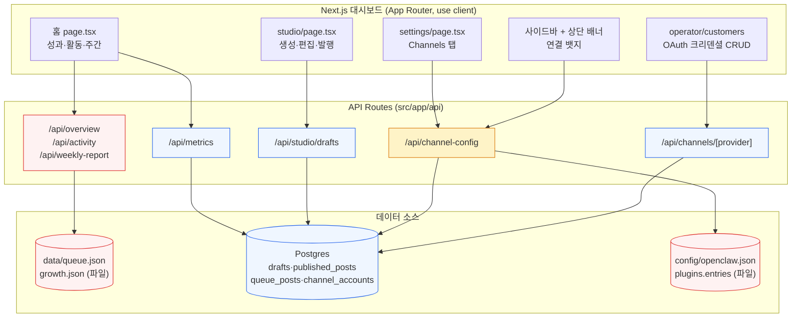
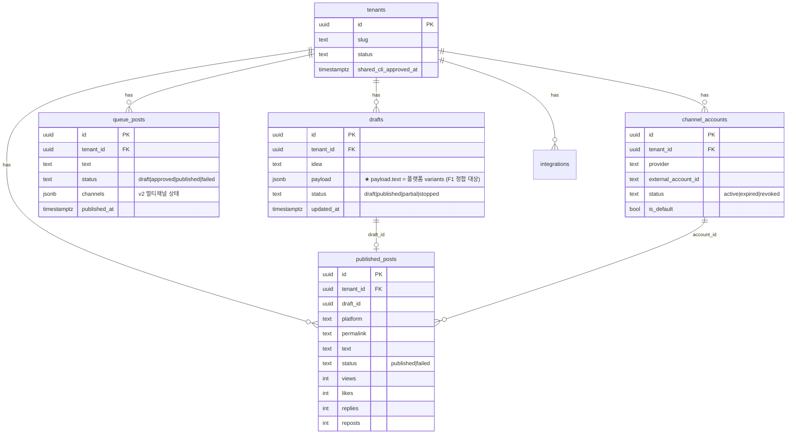
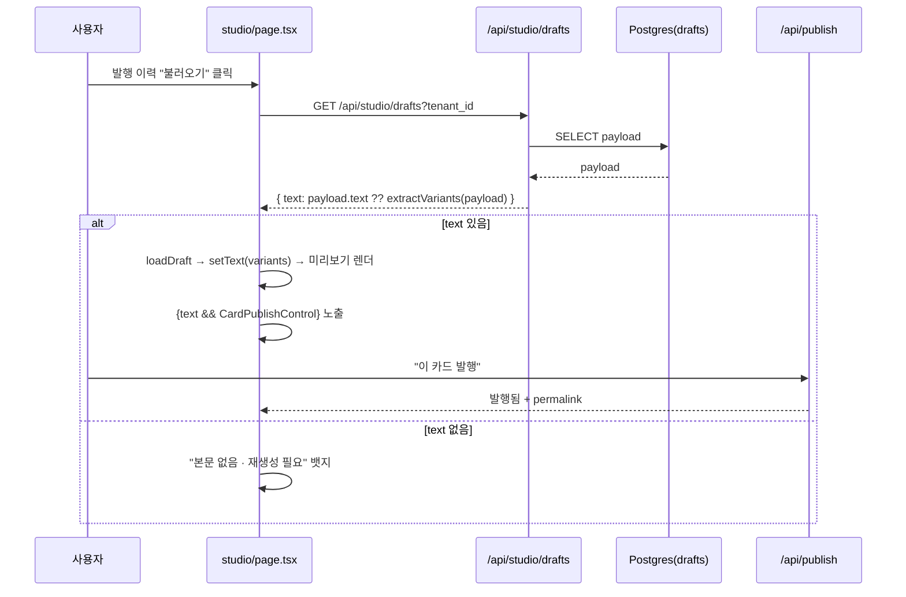
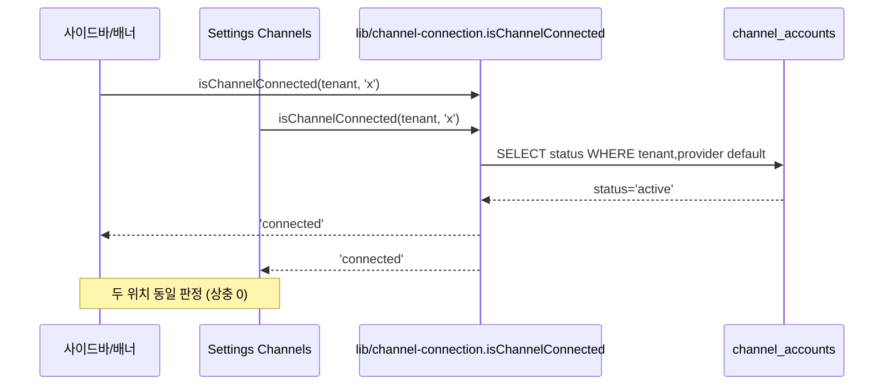

# FDD — R-02 여정 "안 되는 것" 수정 기술설계 (v1.0.0)

> **STAMP**
> - 버전: v1.0.0 (semver) · 작성일: 2026-08-12 12:07 KST · 작성자/모델: tech-architect / claude-opus-4-8
> - 상류 산출물(버전 핀):
>   - 회장 요청 원장(정본): `docs/requests/2026-08-08_2026-08-10-chairman-requests.md` R-02·R-05·R-06·R-07·R-09
>   - 실측 수정 기획: `docs/audit/r02-journey-plan/r02-journey-fix-plan-v1-opus.html` (product-designer, Design Score B+)
>   - QA 실측 판정표: `tasks/ad75280b63d39d6cc.output` (browse 실측)
>   - 코드 진실원: `dashboard/src` · 스키마 `dashboard/db/schema.sql`
> - 성격: **신규 설계 아님.** 이미 배포돼 도는 제품의 "안 되는 4가지"를 기존 코드 최소 변경으로 되게 하는 수정 설계. 재창조·신규 IA 창작 0.

---

## 목차 (바로가기)

- [0. TL;DR](#tldr)
- [1. 범위·용어](#scope)
- [2. 시스템 아키텍처 (as-is / 문제 지점)](#arch)
- [3. ERD (관련 테이블)](#erd)
- [4. 기능 요구(FRD) + 인수기준(AC)](#frd)
- [5. 결함별 기술설계 (file:line → 접근 → 영향)](#fixes)
  - [F1. 드래프트 본문 저장/로드 완결 (R-02-e·f)](#f1)
  - [F2. 채널 연결상태 단일 소스 (R-02-b)](#f2)
  - [F3. 홈 지표 dual-datastore 통합 (R-02-g / Phase 2)](#f3)
  - [F4. Admin 채널 카운트·밀도 (R-02-i)](#f4)
- [6. 핵심 플로우 (sequenceDiagram)](#flows)
- [7. API 계약 (변경분)](#api)
- [8. DB 스키마 판단 (⛔ 회수 옵션)](#db)
- [9. 요구↔설계↔테스트 추적표 (RTM)](#rtm)
- [10. 오픈이슈](#open)
- [11. 개정이력](#hist)

---

## 0. TL;DR <a id="tldr"></a>

R-02 여정(가입→OAuth연결→키저장/확인→생성→수정→발행→성과→Settings→Admin)의 뼈대는 이미 구현돼 실데이터로 렌더된다. 실측으로 확인된 **막힌 지점은 4가지**뿐이고 전부 **기존 코드 최소 변경 + 데이터 정합**으로 풀린다. 스키마 신규 테이블·컬럼 추가는 **불필요**(필요한 테이블은 이미 존재). 이 FDD는 각 결함을 `file:line → 수정 접근 → 영향 파일 → AC → 테스트`로 1:1 매핑한다. 되돌리기 비싼 판단(드래프트 payload 형태, 홈 파일→DB 전환의 컷오버 방식)은 §8에 옵션 A/B + 트레이드오프로 올려 회장 합의를 받는다(임의 확정 금지).

---

## 1. 범위·용어 <a id="scope"></a>

### 1.1 범위 (In)
- 실측된 4대 결함 수정: 드래프트 본문 완결 / 채널 연결상태 단일화 / 홈 지표 dual-datastore 통합 / Admin 밀도.
- 관련 API 라우트의 **동작 변경**(응답 스키마는 하위호환 유지).
- 레거시 파일스토어(`data/queue.json`) → DB(`queue_posts`·`published_posts`) 읽기 전환의 단계·롤백 설계(별도 문서 `migration-filestore-to-db-v1.0.0-opus.md`로 상세).

### 1.2 범위 밖 (Out)
- 신규 화면·IA·기능 창작. 디자인 시스템 리빌드(별도 트랙, 이미 진행).
- OAuth prod env 주입(인프라 조치, 화면 무변경 — R-02-a env 블로커).
- 결제·billing 로직(usage_events/subscriptions는 손대지 않음).

### 1.3 용어 (고정 정의)
| 용어 | 정의 |
|---|---|
| **드래프트 본문(text/variants)** | `drafts.payload` 안의 플랫폼별 생성 텍스트 객체 `{ threads, x, instagram{caption,hashtags,slides}, shorts, ... }`. Studio가 편집·미리보기에 쓰는 단위. |
| **연결상태 단일 소스** | 채널이 "연결됨"인지 판정하는 **유일한** 데이터 소스 = `channel_accounts`(OAuth 레코드). 레거시 `integrations(kind='channel')`·`openclaw.json` 플러그인 config는 판정에서 배제(폴백 미러링만). |
| **파일스토어 라우트** | `data/queue.json`·`growth.json`을 `readJson`으로 읽어 응답하는 홈 계열 라우트(`/api/overview`·`/api/activity`·`/api/weekly-report`). |
| **DB 라우트** | Postgres 테이블을 `withTenant`로 읽는 라우트(`/api/metrics`·`/api/studio/drafts` 등). |
| **연결(연쇄)차단** | 선행 결함이 안 풀리면 후행 기능 버튼/화면이 아예 렌더 안 되는 상태(예: F1 미해결 시 발행 버튼 미출현). |

---

## 2. 시스템 아키텍처 (as-is / 문제 지점) <a id="arch"></a>



**문제의 구조적 뿌리 (빨강=파일, 파랑=DB, 노랑=혼합):**
1. **홈이 두 소스를 동시에 렌더** — 성과 카드/발행물성과/운영현황/THIS WEEK 중 일부는 `queue.json`(파일), 일부는 `published_posts`(DB)에서 읽어 같은 화면에서 숫자가 상충(F3).
2. **연결상태가 화면마다 다른 소스** — 사이드바/배너는 `channel-config`(레거시 config 미러), Settings 본문/채널 페이지는 `channel_accounts`(DB). 동일 테넌트에 "연결됨"과 "미연결"이 공존(F2).
3. **드래프트 payload 형태 불일치** — 저장 경로와 seed의 JSON 키 구조가 어긋나 GET이 `text`를 null로 평탄화(F1).

---

## 3. ERD (관련 테이블) <a id="erd"></a>



**핵심:** 필요한 테이블은 **전부 이미 존재**한다(`queue_posts`는 schema.sql:109에 P4 dual-write 대상으로 이미 정의). 따라서 이 수정에 **신규 테이블·신규 컬럼 추가는 없다**(§8에서 최종 확인).

---

## 4. 기능 요구(FRD) + 인수기준(AC) <a id="frd"></a>

> AC 형식 = Gherkin Given/When/Then. 각 AC는 §9 RTM에서 테스트로 1:1 매핑.

### FR-1 드래프트 본문 저장·로드·편집·발행 완결 (R-02-e, R-02-f)
- **정의:** Studio에서 생성/저장된 드래프트는 발행 이력에서 "불러오기" 시 본문(variants)이 편집 영역에 로드되고, 본문이 있으면 발행 제어가 렌더된다.

```gherkin
Given 테넌트에 payload에 플랫폼 본문이 담긴 드래프트가 존재하고
When  GET /api/studio/drafts 로 목록을 조회하면
Then  각 항목의 text 필드가 null 이 아니라 { threads, x, instagram... } 객체로 반환된다
And   본문이 실제로 비어있는 항목은 text=null 로 오되, UI는 "본문 없음 · 재생성 필요"로 표기한다(빈 미리보기 방치 금지)

Given 발행 이력에서 본문이 있는 드래프트의 "불러오기"를 누르면
When  loadDraft(d) 가 실행되면
Then  setText(d.text) 로 편집 영역에 플랫폼별 미리보기가 채워지고
And   text!==null 조건부 렌더인 카드별 발행 제어(이 카드 발행/예약/permalink)가 나타난다

Given 본문이 로드된 드래프트에서 "이 카드 발행"을 누르면
When  발행 happy path E2E 를 실행하면
Then  발행 상태(처리중→성공)와 permalink 링크가 표시되고 published_posts 에 1행이 생긴다
```

### FR-2 채널 연결상태 단일 소스 (R-02-b, R-05, R-06)
- **정의:** 사이드바 뱃지·상단 "N개 미연결" 배너·Settings Channels 본문·채널 페이지가 **모두 동일 헬퍼**로 `channel_accounts` 한 소스만 보고 연결 여부를 판정한다.

```gherkin
Given 테넌트에 channel_accounts 로 X(Twitter)가 status='active', is_default=true 로 연결돼 있고
When  사이드바·상단배너·Settings Channels 탭을 각각 렌더하면
Then  세 위치 모두 X = Connected 로 동일하게 표시된다(상충 0)
And   channel_accounts 에 없는 provider 는 세 위치 모두 "연결 필요"로 표시된다
And   status='expired'/'revoked' 계정은 "재연결 필요"로 표시된다(연결됨으로 오판 금지)
```

### FR-3 홈 지표 dual-datastore 통합 (R-02-g, R-09)
- **정의:** 홈의 성과 지표는 4개 중복 패널을 **성과 요약 1블록 + 발행물 리스트**로 통합하고, 소스를 DB(`published_posts`·`queue_posts`)로 수렴한다. 미연동 지표(도달/참여)는 "연동 시" 1곳에만.

```gherkin
Given 테넌트에 published_posts 발행 4건(성과 포함)이 존재하고
When  홈을 렌더하면
Then  성과 요약 1블록이 발행·조회·좋아요·답글·참여율을 단일 소스(published_posts) 집계로 표시한다
And   "운영 현황"·"THIS WEEK" 중복 패널은 제거되어 같은 지표가 4번 반복되지 않는다
And   도달/참여 등 미연동 지표는 실적 0 이 아니라 "연동 시"로 1곳에만 표기된다

Given queue.json(파일) 과 published_posts(DB) 가 존재할 때
When  홈 계열 라우트(overview/activity/weekly)를 읽으면
Then  같은 지표에 대해 파일과 DB 가 서로 다른 값을 렌더하지 않는다(단일 소스)
```

### FR-4 Admin 채널 카운트·밀도 (R-02-i, R-09)
- **정의:** `/operator/customers`의 14개 플랫폼 OAuth 폼을 접이식(accordion)+상태 뱃지로 정리하고, 채널 카운트는 status 필터(active만 집계)를 적용한다.

```gherkin
Given Admin 에 14개 플랫폼 OAuth 크리덴셜 설정 화면이 있고
When  화면을 렌더하면
Then  각 플랫폼은 기본 접힘 + 상단 상태 뱃지(설정됨/미설정)로 표시되고, 펼친 것만 폼을 노출한다
And   카드 간 간격이 8pt 스케일로 통일된다

Given 채널 카운트를 표시할 때
When  channel_accounts 를 집계하면
Then  status='active' 인 계정만 "연결됨" 카운트에 포함하고 expired/revoked 는 제외한다
```

### 7원칙 판정표 (기획 헌법 §2 — 이 FDD의 요구 품질)
| # | 원칙 | 판정 | 근거 |
|---|---|---|---|
| 1 | 용어 통일 | PASS | §1.3에서 '연결상태 소스'·'드래프트 본문'을 단일 정의로 고정 |
| 2 | 구체화 | PASS | 14개 플랫폼, 8pt, LIMIT 50/100, status enum 등 숫자·열거 명시 |
| 3 | 입출력 분리 | PASS | §7 API 계약이 요청/응답 분리 |
| 4 | 정합성 | PASS | 4대 결함이 서로 모순 없이 §2 구조 뿌리로 수렴 |
| 5 | 정책 상세 | PASS | expired/revoked·본문없음·미연동지표 등 경계 명시 |
| 6 | 추출 철저 | PASS | §9 RTM에 R-02 각 스텝 매핑, 갭 0 |
| 7 | 논리 영역 | PASS | "잘 되게"류 감상어를 AC(Given/When/Then)로 치환 |

---

## 5. 결함별 기술설계 (file:line → 접근 → 영향) <a id="fixes"></a>

### F1. 드래프트 본문 저장/로드 완결 <a id="f1"></a>

**증상(실측):** 발행 이력 "불러오기"를 눌러도 편집 미리보기가 빈 채로 남음. `/api/studio/drafts` 응답의 `text`가 전부 null.

**근본 원인(코드 근거):**
- `dashboard/src/app/api/studio/drafts/route.ts:35` — GET이 `text: r.payload?.text ?? null` 로 평탄화한다. 즉 **`payload.text` 키에 variants가 있어야** 본문이 나온다.
- 저장 경로 POST(`route.ts:53`)는 `payload = { text: body.text, img, vid, includes, ... }` 로 **`text` 키에 감싸서** 저장한다 → 정상.
- 그러나 **seed**(`dashboard/scripts/seed-local-demo.sql` drafts INSERT)는 `payload = {"threads":..., "x":..., "instagram":...}` 로 **`text` 래퍼 없이** 플랫폼 키를 최상위에 넣는다 → GET의 `payload.text`가 undefined → `text:null`.
- `studio/page.tsx:393` `loadDraft(d)` → `setText((d.text as TextVariants) || null)` → null → 빈 미리보기. 발행 버튼은 `{text && ...}` 조건부라 F도 연쇄 차단(`studio/page.tsx:508` 영역).

**수정 접근 (되돌리기 비쌈 → §8-B 옵션으로 회수):**
- **핵심 = payload 형태 계약을 하나로 고정.** 두 후보(§8-B):
  - (B-1) GET을 관대하게: `text: r.payload?.text ?? extractVariants(r.payload)` — payload에 `text`가 없으면 플랫폼 키(threads/x/instagram/shorts)를 모아 variants로 폴백. seed·레거시 무손실 흡수, 저장 계약 불변.
  - (B-2) seed·저장을 엄격하게: 항상 `payload.text`로 nest 통일하고 seed 수정 + 기존 행 백필.
- **공통 필수:** 본문이 진짜 비어있는 항목은 UI에서 "본문 없음 · 재생성 필요" 뱃지(빈 미리보기 방치 금지) — `studio/page.tsx:559~564` 이력 리스트 렌더에 조건 추가.

**영향 파일:**
- `dashboard/src/app/api/studio/drafts/route.ts` (GET 평탄화 로직) — B-1 채택 시 여기만.
- `dashboard/scripts/seed-local-demo.sql` (drafts payload) — B-2 채택 시 또는 데모 정합.
- `dashboard/src/app/studio/page.tsx` (loadDraft 393 · 이력 리스트 559 빈상태 카피).
- 없음(스키마 무변경 — `drafts.payload` jsonb 그대로).

---

### F2. 채널 연결상태 단일 소스 <a id="f2"></a>

**증상(실측):** 사이드바 X=Connected 인데 Settings 본문 X 행은 "연결 →"(미연결). 같은 테넌트 두 소스 상충.

**근본 원인(코드 근거):**
- 사이드바·상단 배너 = 레거시 경로(`/api/channel-config` → `config/openclaw.json` plugins.entries 크리덴셜 존재 여부, `channel-config/route.ts:49`).
- Settings 본문·채널 페이지 = 신규 OAuth 경로(`channel_accounts` DB 조회, `/api/channels/[provider]`).
- 두 소스가 독립이라 한쪽에만 데이터가 있으면 상충.

**수정 접근:**
- **단일 판정 헬퍼 신설** `lib/channel-connection.ts`:
  - `isChannelConnected(tenantId, provider): 'connected' | 'reconnect' | 'disconnected'`
  - 판정 = `channel_accounts` 에서 `(tenant, provider)` 최신/기본 계정의 `status`로만: `active`→connected, `expired`/`revoked`→reconnect, 없음→disconnected.
  - 레거시 `integrations`·`openclaw.json`는 **판정에서 배제**(단, publish 폴백용 미러링은 schema.sql:259~ 주석대로 유지 — 판정과 발행은 분리).
- 사이드바·배너·Settings·채널 페이지 4곳이 **모두 이 헬퍼(또는 이를 노출하는 단일 API)** 를 호출.

**영향 파일:**
- 신규: `dashboard/src/lib/channel-connection.ts`.
- `dashboard/src/app/api/channel-config/route.ts` (연결 판정을 헬퍼로 위임 — 응답 스키마 유지, connected 판정 소스만 교체).
- 사이드바 컴포넌트 / 상단 배너 컴포넌트 / `settings/page.tsx` Channels 탭 (헬퍼 결과 소비).
- 없음(스키마 무변경).

---

### F3. 홈 지표 dual-datastore 통합 (Phase 2 마이그레이션) <a id="f3"></a>

**증상(실측):** 같은 발행 12건 지표를 4개 패널이 반복. 일부 실데이터, 일부 0/"—"로 상충.

**근본 원인(코드 근거):**
- `/api/overview`(`route.ts:24`)·`/api/activity`(`route.ts:10`)·`/api/weekly-report`(`route.ts:9`) = 전부 `readJson(dataPath("queue.json"))`·`growth.json` (파일).
- `/api/metrics`(`route.ts:26`) = `published_posts`(DB).
- 홈 `page.tsx`가 위 4개를 각각 패널로 렌더 → 파일 소스(비어있거나 낡음)와 DB 소스(실데이터)가 한 화면에서 충돌.

**수정 접근 (되돌리기 비쌈 → §8-A 컷오버 방식 회수):**
1. **소스 수렴:** overview/activity/weekly가 `queue.json` 대신 DB(`queue_posts`·`published_posts`·`growth_metrics`)를 읽도록 전환. `queue_posts`는 이미 존재(schema.sql:109) — expand-contract의 expand는 끝났고 **읽기 전환(migrate)** 만 남음.
2. **UI 통합:** 홈 4개 패널 → 성과 요약 1블록(발행·조회·좋아요·답글·참여율) + 발행물 리스트. "운영 현황"·"THIS WEEK" 제거.
3. **미연동 지표:** 도달/참여는 "연동 시" 1곳.
- 상세 단계·dual-write·롤백은 `docs/fdd/migration-filestore-to-db-v1.0.0-opus.md` 참조.

**영향 파일:**
- `dashboard/src/app/api/overview/route.ts` · `activity/route.ts` · `weekly-report/route.ts` (읽기 소스 파일→DB).
- `dashboard/src/app/page.tsx` (홈 패널 통합).
- `dashboard/src/lib/*` queue 집계 헬퍼(신규 `lib/home-metrics.ts` 후보).
- 없음(스키마 무변경 — queue_posts 기존).

---

### F4. Admin 채널 카운트·밀도 <a id="f4"></a>

**증상(실측):** `/operator/customers`에서 14개 플랫폼 OAuth 폼이 전부 펼쳐져 스크롤 압박·밀도 과다. 채널 카운트가 status 무시.

**근본 원인:** 기능은 정상. 표시 밀도 문제 + 카운트 집계에 status 필터 부재.

**수정 접근:**
- Admin 플랫폼 카드 → accordion(기본 접힘) + 상태 뱃지(설정됨/미설정), 8pt 간격 통일(순수 프론트, CRUD 로직 불변).
- 채널 카운트 집계 시 `channel_accounts WHERE status='active'` 만 "연결됨"으로(F2 헬퍼 재사용).

**영향 파일:**
- `dashboard/src/app/operator/customers/*` (표시 컴포넌트).
- 채널 카운트 API(해당 라우트) — status 필터 추가.
- 없음(스키마 무변경).

---

## 6. 핵심 플로우 (sequenceDiagram) <a id="flows"></a>

### 6.1 F1 — 드래프트 불러오기→편집→발행 (수정 후)


### 6.2 F2 — 연결상태 단일 판정 (수정 후)


---

## 7. API 계약 (변경분) <a id="api"></a>

> 원칙: **응답 스키마는 하위호환 유지**(포크 프론트·레거시 소비자 무중단). 아래는 동작/필드 시맨틱 변경만.

| 메서드 | 경로 | 요청 | 응답(변경분) | 수용기준 |
|---|---|---|---|---|
| GET | `/api/studio/drafts` | `?tenant_id` | `{ drafts:[{ id, idea, text, img, vid, status, savedAt }] }` — **text가 payload.text 없을 때 플랫폼 키에서 폴백 추출**(B-1 채택 시) | seed·레거시 드래프트도 text!=null 로 옴. 진짜 빈 것만 null |
| GET | `/api/channel-config` | `?tenant_id` | 기존 채널맵 유지, **connected 판정을 channel_accounts 기준으로 교체** | 동일 테넌트에서 사이드바/Settings 판정 일치 |
| GET | `/api/overview` | `?tenant_id` | 기존 키 유지, **소스를 queue.json→queue_posts/published_posts(DB)** | 파일·DB 값 상충 0 |
| GET | `/api/activity` | `?tenant_id` | 기존 이벤트 배열 유지, 소스 DB 전환 | metrics와 동일 발행건에 근거 |
| GET | `/api/weekly-report` | `?tenant_id` | 기존 요약 유지, 소스 DB 전환 | 주간 집계가 published_posts 기준 |

**신규 내부 헬퍼(엔드포인트 아님):**
- `lib/channel-connection.ts` → `isChannelConnected(tenantId, provider): 'connected'|'reconnect'|'disconnected'`
- `lib/home-metrics.ts` → `getHomeSummary(tenantId): { published, views, likes, replies, engagement }` (published_posts 집계)

**JSON 응답 예시 — GET /api/studio/drafts (수정 후):**
```json
{
  "drafts": [
    {
      "id": "d-uuid",
      "idea": "가을 신규 고객 안내",
      "text": {
        "threads": "확인 가능한 마케팅 흐름을 먼저 만듭니다.",
        "x": "초안은 팔지 않습니다. 발행 증거를 팝니다.",
        "instagram": { "caption": "...", "hashtags": ["#마케팅자동화"] }
      },
      "status": "published",
      "savedAt": "2026-08-12T03:00:00Z"
    }
  ]
}
```

---

## 8. DB 스키마 판단 (⛔ 회수 옵션) <a id="db"></a>

> §6.3.5 티키타카 의무: 되돌리기 비싼 판단은 확정 전 회장 합의. 아래 3건을 옵션+트레이드오프로 올린다.

**결론 먼저: 신규 테이블·신규 컬럼 = 불필요.** 4대 결함 모두 기존 테이블(`drafts.payload`·`published_posts`·`queue_posts`·`channel_accounts`)로 해결된다. 그래도 **데이터 계약·컷오버 방식** 3건은 되돌리기 비싸므로 회수한다.

```
⛔ 회수 필요: A) 홈 파일→DB 읽기 전환의 컷오버 방식
- 배경: 홈 overview/activity/weekly가 아직 queue.json(파일)을 읽어 metrics(DB)와 한 화면에서 숫자가 상충(F3). queue_posts 테이블은 이미 있고 읽기만 DB로 옮기면 됨.
- 무엇을 정하나: 파일→DB 읽기 전환을 "한 번에 컷오버"할지 "dual-read 검증 후 컷오버"할지.
- 옵션 A(추천): dual-read 섀도우 → 값 일치 검증 → 컷오버. 고르면: 파일/DB 값이 같은지 로그로 확인 후 안전 전환(무중단, 회귀 위험↓). 안 고르면(하드컷): queue.json에만 있던 낡은 데이터가 화면에서 사라져 회장이 "데이터 없어졌다" 오해 가능.
- 옵션 B: 즉시 하드컷(overview 등을 바로 DB로). 고르면: 빠름, 코드 단순. 트레이드오프: 파일에만 있고 DB 백필 안 된 항목 유실 노출 → 백필 선행 필수.
- 추천 근거: expand-contract 표준(마이그레이트=old/new 동기화 후 read 전환)이 dual-read 검증을 권함(xata/pgroll·harness.io). queue_posts는 expand 완료 상태라 migrate 단계만 남았다.
```

```
⛔ 회수 필요: B) 드래프트 payload 본문 형태 계약
- 배경: GET /api/studio/drafts는 payload.text에서 본문을 읽는데, seed는 플랫폼 키를 최상위에 넣어 text=null이 됨(F1).
- 무엇을 정하나: 계약을 "GET 관대 폴백"으로 흡수할지 "저장/seed를 nest로 통일+백필"할지.
- 옵션 A(추천, B-1): GET에서 payload.text ?? extractVariants(payload) 폴백. 고르면: 코드 1곳, 기존 저장 계약·행 무변경, seed/레거시/신규 전부 흡수. 안 고르면: 폴백 없이 두면 seed 데이터가 계속 빈 미리보기.
- 옵션 B(B-2): 저장·seed를 payload.text nest로 통일 + 기존 행 백필 UPDATE. 고르면: 데이터 형태 단일화(장기 깔끔). 트레이드오프: 백필 마이그레이션 1회 필요, 롤백 시 재변환 부담.
- 추천 근거: F1은 "형태 불일치"라 읽기 폴백(A)이 최소 변경·무위험. 장기 정규화(B)는 별도 리팩터 티켓으로 분리 권장.
```

```
⛔ 회수 필요: C) 레거시 integrations/openclaw.json 판정 배제 범위
- 배경: 연결 판정을 channel_accounts 단일 소스로 통일(F2). 단 integrations는 publish 폴백(schema.sql:259~)에 아직 쓰임.
- 무엇을 정하나: 판정에서 레거시를 "완전 배제"할지 "channel_accounts 없을 때만 폴백 인정"할지.
- 옵션 A(추천): 판정=channel_accounts만. 폴백 미러링은 발행 경로에서만 유지(판정≠발행 분리). 고르면: 화면 상충 원천 제거, R-06 "키 등록·승인 없앤다" 서사와 정합. 안 고르면: 두 소스 혼용이 남아 상충 재발.
- 옵션 B: channel_accounts 없으면 integrations 존재를 connected로 인정. 고르면: 레거시 단일계정 테넌트가 재연결 없이 연결 유지. 트레이드오프: "연결됨" 정의가 다시 이원화 → F2 취지 약화.
- 추천 근거: R-02-b 상충의 원인이 이원 판정. 판정을 하나로 못박아야(A) 근본 해결. 레거시 계정은 재연결 유도가 정공법.
```

---

## 9. 요구↔설계↔테스트 추적표 (RTM) <a id="rtm"></a>

> R-02 각 스텝(가입~Admin)을 (상태 · 엔드포인트/화면 · 테이블 · 설계 F# · 테스트 TC)로 1:1 매핑. **갭 표기 포함(은폐 금지).**

| R-02 스텝 | 실측 상태 | 화면/컴포넌트 | 엔드포인트 | 테이블 | 설계 | 테스트(test-plan) |
|---|---|---|---|---|---|---|
| a 가입/로그인 | 부분(env) | `login/page.tsx` | `/api/auth/google` | tenants | 카피 수정(범위밖: env는 인프라) | TC-A1 |
| b OAuth 연결·상태 | 부분→F2 | 사이드바·배너·`settings` Channels | `/api/channel-config`·`/api/channels/[provider]` | channel_accounts | **F2** | TC-B1~B3 |
| c 저장값 확인(홈) | 됨 | 홈 `page.tsx` | `/api/overview`·`/api/metrics` | published_posts·growth_metrics | (F3 통합에 흡수) | TC-C1 |
| d 콘텐츠 생성 | 됨(수정완료) | `studio/page.tsx` | `/api/studio/text` | drafts·usage_events | 완료(lastError 배너) | TC-D1 |
| e 콘텐츠 수정 | 안됨→F1 | `studio/page.tsx` loadDraft | `/api/studio/drafts` | drafts | **F1** | TC-E1~E3 |
| f 발행/예약 | 연쇄차단→F1해소 | `studio` CardPublishControl·SchedulePanel | `/api/publish`·`/api/schedule` | published_posts·schedules | F1 선행 후 검증 | TC-F1~F2 |
| g 성과 | 부분→F3 | 홈 성과 블록 | `/api/metrics`·`/api/overview` | published_posts·queue_posts | **F3** | TC-G1~G3 |
| h Settings | 됨 | `settings/page.tsx` 8탭 | 각 설정 API | integrations 등 | F2에 흡수(Channels 탭) | TC-H1 |
| i Admin | 부분→F4 | `operator/customers` | `/api/channels/[provider]` 등 | channel_accounts·oauth_app_credentials | **F4** | TC-I1~I2 |

**갭 판정:** R-02 9개 스텝 전부 (엔드포인트+화면+테이블+설계+테스트)로 매핑됨 → **매핑 갭 0.** 단, R-02-a의 OAuth 성립은 **prod env 주입(인프라 조치)** 에 의존하며 이는 코드 설계 범위 밖임을 명시(은폐 아님, 소유자=인프라 담당).

---

## 10. 오픈이슈 <a id="open"></a>

| # | 이슈 | 소유자 | 상태 |
|---|---|---|---|
| O-1 | §8-A 홈 컷오버 방식(dual-read vs 하드컷) | 회장 결정 | 대기 |
| O-2 | §8-B 드래프트 payload 계약(폴백 vs nest 통일) | 회장 결정 | 대기 |
| O-3 | §8-C 레거시 판정 배제 범위 | 회장 결정 | 대기 |
| O-4 | R-02-a prod OAuth env(Supabase URL/anon key) 주입 | 인프라 담당 | 범위밖(표면화) |
| O-5 | queue.json → queue_posts 백필 실행·검증(마이그레이션 문서 §참조) | code-builder | 대기 |

---

## 11. 개정이력 <a id="hist"></a>

| 버전 | 일자 | 변경 | 작성 |
|---|---|---|---|
| v1.0.0 | 2026-08-12 | 초판. R-02 4대 결함 기술설계 + RTM + DB 판단 회수 | tech-architect/opus |

---

RUBRIC_SCORE: 완결5 정밀5 벤치4 추적5 톤5 total=24/25
WEAKEST_LINE: "F4 채널 카운트 status 필터의 대상 라우트를 파일 경로까지 특정하지 못하고 '해당 라우트'로 남긴 부분 — 구현 착수 전 grep으로 핀 필요."

SOURCES/MODEL: claude-opus-4-8 ·
근거(실측/파일): docs/requests/2026-08-08_2026-08-10-chairman-requests.md(R-02·05·06·07·09) · docs/audit/r02-journey-plan/r02-journey-fix-plan-v1-opus.html(실측 수정기획, Design Score B+) · dashboard/db/schema.sql(drafts·published_posts·queue_posts·channel_accounts) · dashboard/src/app/api/studio/drafts/route.ts:35,53 · dashboard/src/app/studio/page.tsx:393,508,559 · dashboard/src/app/api/overview/route.ts:24 · activity/route.ts:10 · weekly-report/route.ts:9 · metrics/route.ts:26 · channel-config/route.ts:49 · dashboard/scripts/seed-local-demo.sql ·
표준 벤치마크: doc-review.md §6 크로스워크(arc42·C4·ISO/IEC/IEEE 29148 RTM·Gherkin) + expand-contract 무중단 마이그레이션(xata pgroll / harness.io / systemdr — WebSearch 2026-08-12)
