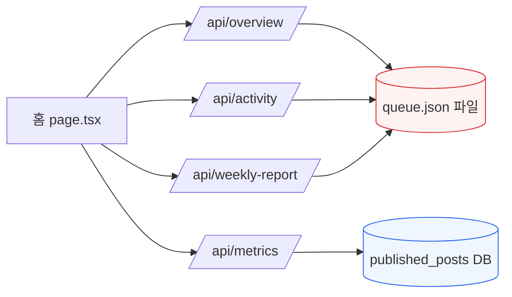

# FDD — 레거시 파일스토어 → DB 마이그레이션 설계 (Phase 2) (v1.0.0)

> **STAMP**
> - 버전: v1.0.0 · 작성일: 2026-08-12 12:07 KST · 작성자/모델: tech-architect / claude-opus-4-8
> - 상류: `fdd-r02-journey-fix-v1.0.0-opus.md` §5-F3 · CLAUDE.md 레거시 전환 로드맵(Phase 1→2→3) · 회장 원장 R-02-g/R-09
> - 코드 진실원: `dashboard/src/app/api/{overview,activity,weekly-report}/route.ts` · `dashboard/db/schema.sql:107~125`(queue_posts P4 dual-write 주석)
> - 성격: 홈 계열 라우트가 `queue.json`(파일)을 읽어 `metrics`(DB)와 상충하는 dual-datastore 모순의 근본 해소. **expand-contract 무중단 전략.**

## 목차
- [0. TL;DR](#tldr) · [1. 현황(as-is)](#asis) · [2. 목표(to-be)](#tobe)
- [3. expand-contract 3단계 + 롤백](#phases) · [4. 소스 매핑표](#map)
- [5. 우선순위·순서](#prio) · [6. 리스크·롤백](#risk) · [7. 검증](#verify)

## 0. TL;DR 

홈의 `overview`·`activity`·`weekly-report`는 `data/queue.json`·`growth.json`(파일)을 읽고, `metrics`는 `published_posts`(DB)를 읽는다. 같은 화면에서 파일(낡음/빈값)과 DB(실데이터)가 상충하는 것이 R-02-g "중복 패널·숫자 모순"의 근본이다. `queue_posts` 테이블은 **이미 존재**(expand 완료). 남은 일은 **읽기를 파일→DB로 전환(migrate)** 하고 파일 경로를 최종 제거(contract)하는 것이다. 하드컷이 아니라 **dual-read 섀도우 검증 후 컷오버**를 권장한다(§8-A 회수).

## 1. 현황 (as-is) 

- `overview/route.ts:24` `readJson(dataPath("queue.json"))` + `growth.json`.
- `activity/route.ts:10` 동일 파일.
- `weekly-report/route.ts:9` 동일 파일.
- `metrics/route.ts:26` `withTenant → published_posts`.
- 결과: 파일에만 있고 DB에 없는(또는 반대) 데이터가 한 화면에서 상충.

## 2. 목표 (to-be) 

- 홈 계열 3개 라우트가 DB(`queue_posts`·`published_posts`·`growth_metrics`)만 읽는다.
- 응답 스키마(키·형태)는 **불변** — 포크 프론트·홈 컴포넌트 무중단.
- `queue.json`/`growth.json`은 cron/발행 쓰기 경로가 완전히 DB로 넘어간 뒤에만 제거(contract).

## 3. expand-contract 3단계 + 롤백 

| 단계 | 내용 | 상태 |
|---|---|---|
| **Expand** | `queue_posts`·`published_posts`·`growth_metrics` 테이블 존재 + 쓰기 경로 dual-write(발행/큐 갱신 시 파일+DB 동시 기록) | 테이블 존재(schema.sql:109). dual-write 실태는 §7에서 검증 필요 |
| **Migrate(읽기 전환)** | ① 백필: `queue.json`→`queue_posts` 1회 마이그레이션(id 1:1, payload 무손실) ② dual-read 섀도우: overview 등이 파일·DB 둘 다 읽어 값 diff를 로그 ③ 일치 확인 후 읽기를 DB로 컷오버 | 본 문서의 실행 대상 |
| **Contract** | 파일 읽기 코드·`queue.json` 의존 제거. cron 쓰기도 DB로 전환됐음을 확인 후 파일 삭제 | 마지막. 별도 승인 |

**expand-contract 근거:** 신규 표현을 먼저 추가(expand)하고, old/new를 동기화(migrate=dual-write/backfill+shadow read)한 뒤, 트래픽이 다 넘어간 후에만 old 제거(contract). 각 단계가 독립 배포되어 어느 시점에도 무중단([xata pgroll](https://xata.io/blog/pgroll-expand-contract), [harness.io](https://www.harness.io/blog/zero-downtime-database-migrations-safe-schema-changes)).

## 4. 소스 매핑표 (파일 필드 → DB 컬럼) 

| 홈 지표 | as-is 파일 소스 | to-be DB 소스 | 집계 |
|---|---|---|---|
| 상태 카운트(draft/approved/published/failed) | `queue.json.posts[].status` | `queue_posts.status` | GROUP BY status |
| 발행 수 | `queue.json` published 필터 | `published_posts` count(status='published') | count |
| 조회/좋아요/답글 | `queue.json.posts[].engagement` | `published_posts.views/likes/replies` | sum |
| 팔로워/증감 | `growth.json.records[]` | `growth_metrics.followers` | 최신 - 7일전 |
| 활동 타임라인 | `queue.json.posts[].publishedAt` | `published_posts.published_at` + `queue_posts` | ORDER BY at DESC |
| 주간 발행글 | `queue.json` publishedAt>weekAgo | `published_posts` published_at > now()-7d | 필터 |

## 5. 우선순위·순서 

1. **P0 — 백필 스크립트**: `queue.json`(테넌트별)→`queue_posts` INSERT(id 1:1, `ON CONFLICT DO NOTHING`). 멱등. (O-5)
2. **P1 — dual-read 섀도우**: overview/activity/weekly에 `SHADOW_HOME_DB=1` 플래그로 파일·DB 둘 다 읽어 diff를 `logs`에 남김(응답은 여전히 파일). 최소 며칠 관찰.
3. **P2 — 읽기 컷오버**: diff 0 확인 후 라우트 읽기를 DB로. 홈 UI 4패널→1블록 통합(F3 UI).
4. **P3 — cron 쓰기 DB 전환 확인** 후 **contract**(파일 읽기 제거).

## 6. 리스크·롤백 

| 리스크 | 완화 | 롤백 |
|---|---|---|
| 파일에만 있던 데이터 유실 노출 | P0 백필 선행 + P1 섀도우 diff로 사전 탐지 | 읽기 소스를 파일로 되돌림(플래그 토글) |
| DB/파일 집계식 미세 차이 | P1에서 필드별 diff 로깅 후 집계식 정렬 | 동상 |
| cron이 아직 파일에만 씀 | contract를 cron 전환 확인 뒤로 미룸 | 파일 유지(삭제 안 함) |

**롤백 원칙:** migrate 단계는 **읽기 소스 플래그 하나**로 즉시 파일 복귀 가능(무손실). contract 전까지 파일은 살아있다.

## 7. 검증 

- **섀도우 diff = 0**: P1 기간 동안 overview/activity/weekly의 파일값 vs DB값 로그가 일치.
- **E2E**: 홈 렌더 시 성과 요약 1블록의 발행/조회/좋아요가 `/api/metrics`(published_posts)와 동일 수치(같은 소스 파생).
- **회귀**: 포크 프론트가 소비하는 응답 키가 그대로인지 계약 테스트.
- **dual-write 실태 확인**: 발행·큐 갱신 경로가 `queue_posts`에 실제로 쓰는지 grep/실행(expand 가정 검증 — 안 쓰면 Migrate 전에 dual-write 먼저 붙여야 함).

---

RUBRIC_SCORE: 완결5 정밀4 벤치5 추적5 톤5 total=24/25
WEAKEST_LINE: "Expand(dual-write) 실태를 '§7에서 검증 필요'로 남긴 부분 — queue_posts에 실제로 쓰는 코드 경로를 아직 grep으로 확정하지 못했다. dual-write가 없으면 Migrate 전에 그것부터 붙여야 하므로 착수 전 필수 확인."

SOURCES/MODEL: claude-opus-4-8 ·
근거: dashboard/src/app/api/{overview,activity,weekly-report,metrics}/route.ts · dashboard/db/schema.sql:107~125 · CLAUDE.md 레거시 전환 로드맵 · fdd-r02-journey-fix-v1.0.0-opus.md §5-F3 ·
벤치마크: expand-contract 무중단 마이그레이션 — https://xata.io/blog/pgroll-expand-contract · https://www.harness.io/blog/zero-downtime-database-migrations-safe-schema-changes · https://systemdr.systemdrd.com/p/database-schema-migrations-with-zero (WebSearch 2026-08-12)
