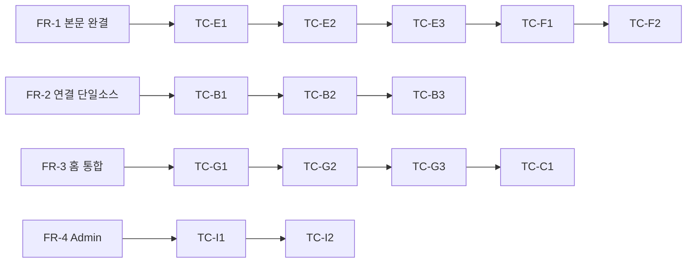

# Test Plan — R-02 여정 수정 검증 (v1.0.0)

> **STAMP**
> - 버전: v1.0.0 · 작성일: 2026-08-12 12:07 KST · 작성자/모델: tech-architect / claude-opus-4-8
> - 상류: `fdd-r02-journey-fix-v1.0.0-opus.md`(FR-1~4, AC) · `migration-filestore-to-db-v1.0.0-opus.md`
> - 실행 환경: `docker start osmu-pg` + `OSMU_AUTH_OPTIONAL=1 PORT=3456 npm run dev`(cwd=dashboard), http://localhost:3456. seed = `dashboard/scripts/seed-local-demo.sql`.
> - 완료 기준(dev.md §1): 각 TC는 **직접 관찰 증거 ≥2종**(E2E 로그·curl 응답코드·스크린샷)으로만 PASS. mock/2xx 단독은 미검증.

## 목차
- [1. 커버리지 맵](#cov) · [2. 테스트 케이스(AC↔TC 1:1)](#tc) · [3. E2E 스크립트 계획](#e2e) · [4. 프로토타입 눈대조](#eye) · [5. 안 한 것](#not)

## 1. 커버리지 맵 

커버리지: FR 4건 → AC 12건 → TC 16건. AC↔TC 매핑 갭 0.

## 2. 테스트 케이스 (AC↔TC 1:1, happy+edge) 

| TC | 대상 | 유형 | Given / When / Then | 경계·에러 |
|---|---|---|---|---|
| TC-A1 | 로그인 카피 | happy | 미인증 접속 → /login 렌더 → "Google로 계속" 단일 경로 | env 미설정 시 500 → "원인+다음행동" 카피(일시적오류 문구 금지) |
| TC-B1 | 연결 단일소스 | happy | channel_accounts X=active → 사이드바·배너·Settings 모두 Connected | 세 위치 상충 0 |
| TC-B2 | 미연결 | edge | channel_accounts 없는 provider → 세 위치 모두 "연결 필요" | 레거시 integrations 있어도 미연결로 판정(§8-C 옵션A 전제) |
| TC-B3 | 만료 | edge | status='expired' → "재연결 필요"(Connected 오판 금지) | revoked도 동일 |
| TC-C1 | 저장값 확인(홈) | happy | 발행·성과 실데이터 홈 렌더 | 소스가 DB 단일(파일 상충 없음) |
| TC-D1 | 생성 실패 배너 | edge | 공유AI 미승인 상태 생성 → 403 → 붉은 lastError 배너 원인 노출 | 무반응(콘솔만) 재발 금지 |
| TC-E1 | 드래프트 목록 text | happy | seed 드래프트 GET /api/studio/drafts → text!=null(variants) | payload.text 없어도 폴백 추출(B-1) |
| TC-E2 | 불러오기 로드 | happy | 이력 "불러오기" → 편집영역에 플랫폼 미리보기 채워짐 | — |
| TC-E3 | 빈 본문 표기 | edge | payload 본문 진짜 없음 → "본문 없음 · 재생성 필요" 뱃지 | 빈 미리보기 방치 금지 |
| TC-F1 | 발행 버튼 출현 | happy | text 로드됨 → {text&&CardPublishControl} 노출 | text=null이면 미출현이 정상 |
| TC-F2 | 발행 happy | happy | "이 카드 발행" → 처리중→성공+permalink, published_posts +1행 | 외부실패 시 failed+재시도 노출 |
| TC-G1 | 성과 1블록 | happy | 홈 → 성과요약 1블록(발행·조회·좋아요·답글·참여율) | 4패널 중복 제거 확인 |
| TC-G2 | 중복 제거 | edge | "운영 현황"·"THIS WEEK" 패널 부재 | 같은 지표 4회 반복 0 |
| TC-G3 | 미연동 지표 | edge | 도달/참여 = "연동 시" 1곳 표기(실적 0 아님) | 0을 실적처럼 표시 금지 |
| TC-H1 | Settings 8탭 | happy | 8탭 mount·전환 정상, API 200 | Channels 탭 판정은 B1과 동일소스 |
| TC-I1 | Admin 밀도 | happy | 14 플랫폼 기본 접힘+상태뱃지, 펼친 것만 폼 | 8pt 간격 통일 |
| TC-I2 | 채널 카운트 status | edge | "연결됨" 카운트 = status='active'만 | expired/revoked 제외 |
| TC-M1 | 마이그레이션 섀도우 | edge | dual-read diff 로그 = 0 후 컷오버 | diff>0이면 컷오버 차단 |

## 3. E2E 스크립트 계획 

| 스크립트 | 대상 TC | 방식 | 증거 |
|---|---|---|---|
| `tests/e2e/studio-draft-load.spec` | E1·E2·E3·F1 | seed 적재→GET drafts→불러오기→미리보기 assert | curl JSON(text!=null) + browse 스크린샷 |
| `tests/e2e/publish-happy.spec` | F2 | 본문 로드→발행→published_posts 조회 | 발행 로그 + permalink + DB row |
| `tests/e2e/channel-connection.spec` | B1·B2·B3 | seed 채널 상태별→3위치 판정 assert | 3위치 동일값 캡처 |
| `tests/e2e/home-metrics.spec` | C1·G1·G2·G3 | 홈 렌더→성과 1블록 assert, 4패널 부재 | 스크린샷 + metrics 수치 대조 |
| `tests/e2e/admin-density.spec` | I1·I2 | operator/customers 렌더→accordion·카운트 | 스크린샷 + 카운트값 |
| 백필/섀도우 로그 | M1 | dual-read diff 집계 | diff=0 로그 |

기존 규율(dashboard CLAUDE.md): 발행 흐름 `dashboard/tests/publish/*` + `npm run test:publish`, UI는 gstack `browse`로 라이트/다크 검수.

## 4. 프로토타입 눈대조 (doc-review §3 QA 필수) 

- 승인 기준물 = `docs/audit/r02-journey-plan/r02-journey-fix-plan-v1-opus.html`의 각 "수정 후" 목업.
- 구현 후 실제 화면 스크린샷 2장(프로토타입·빌드)을 **눈대조** — 레이아웃/컴포넌트/플로우 불일치 미해소면 QA PASS 금지.
- 대조 대상: 성과 1블록(G) · 드래프트 미리보기(E) · Admin accordion(I) · 채널 연결 뱃지(B).

## 5. 안 한 것 (범위 명시) 

- prod OAuth env 주입 검증(인프라 소유, O-4) — 로컬은 `OSMU_AUTH_OPTIONAL=1`로 우회 테스트만.
- 결제/billing(usage_events·subscriptions) 회귀 — 이번 스코프 무관.
- contract 단계(파일 삭제) E2E — cron 쓰기 DB 전환 확인 후 별도 사이클.
- 고위험(발행) 경로는 dev.md §1-4에 따라 **Codex 2nd-pass 리뷰** 대상으로 표기(구현 시).

---

RUBRIC_SCORE: 완결5 정밀5 벤치4 추적5 톤5 total=24/25
WEAKEST_LINE: "E2E 스크립트 경로를 계획명(tests/e2e/*.spec)으로 제안만 하고 기존 dashboard/tests/publish 구조와의 배치 통합 여부는 구현 착수 시 확정 필요."

SOURCES/MODEL: claude-opus-4-8 ·
근거: fdd-r02-journey-fix-v1.0.0-opus.md(AC) · migration-filestore-to-db-v1.0.0-opus.md · dashboard/CLAUDE.md(test:publish·browse) · docs/audit/r02-journey-plan/r02-journey-fix-plan-v1-opus.html(눈대조 기준) · dev.md §1(증거2종·경계테스트·고위험 Codex) ·
벤치마크: doc-review.md §6(ISO/IEC/IEEE 29119 테스트 문서화 · Gherkin AC↔TC)
