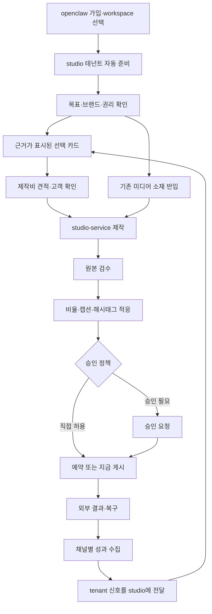

<!--
STAMP
line: openclaw-service
created_at: 2026-08-15 03:25 KST
model: gpt-codex/gpt-5.6
agent: prd-architect
skills: brand-positioning-kit
evidence: 제품구조 결정서 재개정본, PRD v7.3.5 승인본, plan 보조문서 4종, DESIGN.md v24, 최신 v24 프로토타입, studio 인수인계서·소재원가표, 프로젝트 wiki·pipeline-state, sigmine.ai·Ayrshare·Buffer·마케티 공식 페이지 실조회
deliberation: 1단계의 유일한 소비자 화면을 openclaw-service로 고정하고, studio의 5개 접점과 소재·학습신호를 분리했다. 기능 폭과 물량 경쟁 대신 선택 근거·자산 일관성·발행 proof를 포지셔닝 축으로 남겼다.
-->

# openclaw-service PRD v8.0.1

| 항목 | 값 |
|---|---|
| 문서 유형 | Product Requirements Document |
| 버전 | v8.0.1 |
| 작성일 | 2026-08-15 KST |
| 작성자·모델 | prd-architect / gpt-codex/gpt-5.6 |
| 상태 | **in-review**. plan MAJOR 개정 후보 |
| 제품 | openclaw-service, 소비자용 마케팅 운영 제품 |
| 상품명 | marketing agency 계열, 정식 명칭 미정 |
| 상류 정본 | `studio/docs/제품구조-결정-2026-08-15.md` |
| 직전 승인본 | `docs/notes/openclaw-auto-marketing-agent-prd-v7.3.5-gpt-codex.md`, SHA-256 `ae6155bb...a296e` |
| 디자인 입력 | `DESIGN.md` v24·v24.1, `docs/prototype/openclaw-auto-marketing-agent-fidelity-v24-gpt-codex.html` |
| 승인 게이트 | `/approve plan` 전 design 재개·eng-design·build 금지 |

## 목차

- [0. TL;DR](#0-tldr)
- [1. 목적·배경](#1-목적배경)
- [2. 현재 구현 상태](#2-현재-구현-상태)
- [3. v7.3.5 변경 대조표](#3-v735-변경-대조표)
- [4. 범위·서비스 경계](#4-범위서비스-경계)
- [5. 용어 정의](#5-용어-정의)
- [6. 페르소나](#6-페르소나)
- [7. One Thing·MVP 5](#7-one-thingmvp-5)
- [8. 핵심 사용자 흐름](#8-핵심-사용자-흐름)
- [9. 기능 요구사항](#9-기능-요구사항)
- [10. 비기능 요구사항](#10-비기능-요구사항)
- [11. 수용기준·RTM](#11-수용기준rtm)
- [12. BM·원가·과금](#12-bm원가과금)
- [13. 경쟁 비교·포지셔닝](#13-경쟁-비교포지셔닝)
- [14. 운영 부하](#14-운영-부하)
- [15. 리스크·레드팀·셀프심문](#15-리스크레드팀셀프심문)
- [16. 성공지표·kill-criteria](#16-성공지표kill-criteria)
- [17. 회장 결정 필요](#17-회장-결정-필요)
- [18. 기획 7원칙·게이트 판정](#18-기획-7원칙게이트-판정)
- [19. 개정 이력](#19-개정-이력)

## 0. TL;DR

1단계에서 openclaw-service는 화면·회원·인증·결제·소셜 계정·예약·발행·성과를 소유하는 유일한 소비자 제품이다. studio-service는 화면 없는 제작 API이며, 2단계에 자체 화면과 별도 상품을 갖는다. 고객은 프롬프트를 직접 작성하지 않고 근거가 표시된 선택지에 답한다. openclaw-service는 그 답을 제작 브리프로 조립해 headless studio-service에 요청하고, 받은 완성본을 비율 크롭·캡션 길이·해시태그 수준에서만 채널에 적응시킨 뒤 정확히 한 번 예약·발행한다. 창작 결정, 소재 생성, 롱폼 구간 선택·숏폼 분할, 브랜드 가이드·톤 소유권, 취향 학습 알고리즘은 studio-service 범위다.

v7.3.5의 인증·계정 진실·Studio 화면·검수·승인·예약·발행·복구·성과 계보는 유지한다. `generate-drafts`, `card-generator`, `video-generate`, `longform-to-shorts`와 브랜드 가이드·톤의 데이터 소유권은 studio-service로 이관한다. studio의 외부 접점은 신호 넣기, 제작 요청, 선택 기록, 취향 상태 조회, 소재 반입의 5개다. 기존 영상·이미지는 제작 재료인 소재이고, 발행 성과·선택은 취향을 바꾸는 사건인 학습신호다. 가입 시 studio 테넌트를 idempotent하게 자동 생성하고, 두 서비스는 소비자의 소셜 로그인 자격증명과 분리된 서버 대 서버 키로만 통신한다.

## 1. 목적·배경

### 1.1 문제

직전 승인본 v7.3.5는 브랜드 근거 수집부터 세 형식 제작, 승인, 발행, 성과 환류까지 한 제품이 소유하는 구조였다. 2026-08-15 제품 구조 결정으로 제작과 창작 판단은 재사용 가능한 headless studio-service가 맡고, openclaw-service는 소비자 경험과 채널 운영을 맡도록 경계가 바뀌었다. 경계를 문서로 다시 잠그지 않으면 두 서비스가 브랜드 가이드·생성·취향 데이터를 동시에 소유해 이중 진실과 중복 과금이 생긴다.

고객 관점에서는 제품이 둘로 보이면 안 된다. 가입, 결제, 제작 입력, 결과 검수, 채널 연결, 예약, 발행, 성과 확인은 openclaw-service의 한 화면 흐름으로 보인다. studio-service의 존재, 키, 테넌트, 공급자 모델은 운영 세부사항이다.

### 1.2 제품 목표

- 직접 프롬프트 작성 부담을 선택형 의사결정으로 바꾼다.
- 제작과 채널 운영의 책임 경계를 유지하면서 고객 여정은 하나로 연결한다.
- 잘못된 계정, 무승인 발행, 중복 발행, 거짓 성과를 0건으로 유지한다.
- studio 이용료를 openclaw-service가 대납하고 고객에게 통합 과금한다.
- 성과와 선택 이력을 다음 제안 근거로 studio-service에 되돌리되, private·타 테넌트 데이터를 섞지 않는다.

## 2. 현재 구현 상태

위키를 1차 진실원으로 사용하고 `docs/구현현황.md`, 승인 핀, 최신 디자인을 대조했다. 코드 전체 스캔은 하지 않았다.

| 영역 | 현재 상태 | 1차 근거 | v8 판단 |
|---|---|---|---|
| 로그인·workspace·역할 | **부분구현** | `wiki/product/marketing-hub-surface-map.md`, `wiki/decisions/004-social-connect-oauth-not-passwords.md`, PRD v7.3.5 §8.6 | 소비자 계정은 유지. studio 테넌트 자동 생성은 신설 |
| 소셜 OAuth·계정 진실 | **부분구현** | `wiki/decisions/004-social-connect-oauth-not-passwords.md`, `wiki/reference/channel-status.md` | 재구현 금지. studio 자격증명과 완전 분리 |
| Studio 화면·미리보기·발행 이력 | **이미구현·보존** | `wiki/product/studio.md`, `DESIGN.md` v24, v24 prototype | 1단계의 유일한 소비자 화면으로 openclaw-service에 유지. studio 자체 화면은 2단계 별도 상품 |
| 텍스트 초안 생성 | **부분구현·이관 필요** | `wiki/product/studio.md`, `wiki/reference/brand-grounding.md` | `generate-drafts`의 창작 판단은 studio-service로 이관 |
| 카드뉴스·이미지 생성 | **부분구현·이관 필요** | `wiki/product/studio.md`, README, PRD v7.3.5 §6.3 | `card-generator`와 소재 생성은 studio-service로 이관 |
| 영상 생성·롱폼 재가공 | **부분구현·이관 필요** | `wiki/product/shorts-factory.md`, PRD v7.3.5 §11 | `video-generate`, `longform-to-shorts`는 studio-service로 이관. openclaw은 완성 영상 발행과 `/videos` 관리 화면만 유지 |
| 브랜드 자료·가이드·톤 | **부분구현·소유권 변경** | `wiki/reference/brand-grounding.md`, `wiki/product/studio.md` | 입력·편집 화면은 openclaw-service. 데이터와 창작 규칙의 정본은 studio-service |
| 채널별 적응 | **부분구현** | README 멀티채널 발행 구조, `wiki/reference/channel-status.md` | 비율 크롭·캡션 길이·해시태그만 보강. 창작 편집 금지 |
| 예약·발행·복구 | **이미구현·연결 필요** | README, PRD v7.3.5 §7·§8·§18 | canonical command·idempotency·proof 계약 유지 |
| 성과 수집 | **부분구현** | `wiki/architecture/data-model.md`, PRD v7.3.5 §12, `docs/구현현황.md` | native truth 유지. studio 신호 전송 신설 |
| 구독·사용량 | **부분구현** | `wiki/architecture/data-model.md`, 소재원가표 §7 | 기존 subscription·usage 관측은 재사용 후보. studio 대납·고객 차감 원장은 미구현 |
| 선택 이력·취향 상태 | **미구현** | 제품구조 결정서 §3, 인수인계서 §3 | UI는 openclaw-service, 학습 상태·알고리즘은 studio-service |
| 기존 영상·이미지 반입 | **미구현** | 제품구조 결정서 §3 | 파일은 학습신호가 아니라 studio 제작 소재로 반입. 분석 결과만 별도 학습신호로 환원 가능 |

> ⛔ 회수 필요: `pipeline-state.osmu.md`의 승인 경로는 `docs/` 직하를 가리키지만 실제 v7.3.5와 보조문서는 `docs/notes/`, `docs/plan/`에 있다. SHA는 일치하므로 승인 내용은 식별되지만 경로 핀이 낡았다.

> ⛔ 회수 필요: `wiki/product/studio.md`와 `wiki/reference/brand-grounding.md`는 제작과 브랜드 기준을 openclaw 내부 소유로 설명한다. 2026-08-15 서비스 경계가 위키에 아직 반영되지 않았다. v8 승인과 함께 위키를 갱신해야 한다.

## 3. v7.3.5 변경 대조표

| v7.3.5 영역·기능 | 분류 | v8 처리 | 현재 상태 | 근거 |
|---|---|---|---|---|
| 로그인·workspace create/join/switch | 유지 | openclaw-service가 화면·회원·세션·역할 소유 | 부분구현 | v7.3.5 §8.6, FR096~098 |
| 소셜 OAuth와 account truth | 유지 | 소비자와 채널 사이 인증은 openclaw-service만 소유 | 부분구현 | v7.3.5 §9, ADR-004 |
| Customer Settings8·Operator Settings9 | 유지 | 소셜 연결·고객 정책·운영자 연결 앱 경계 보존 | 부분구현 | v7.3.5 §18.1 |
| Studio 3단 결과 화면 | 유지·재배선 | 텍스트→사진/카드→영상 순서와 결과 검수 UI 보존. 실행 backend만 studio-service | 이미구현·부분연결 | v7.3.5 §6.3, DESIGN v24 |
| Save·카드별 edit·Publish·SchedulePanel | 유지 | 동일 canonical record와 command로 동작 | 이미구현·연결 필요 | v7.3.5 §7.3 |
| Queue·Inbox·Calendar·`/videos` | 유지 | 제작 결과의 승인·예약·복구·결과 관리 view | 부분구현 | v7.3.5 §7.5 |
| canonical identity·version·idempotency | 유지 | 화면별 중복 record 금지 | 부분구현 | v7.3.5 §7.2 |
| result proof·uncertain·repair·partial | 유지 | 외부 결과 확인 전 `게시됨` 금지 | 부분구현 | v7.3.5 §8.4·§18 |
| native destination-format8 truth | 유지 | 채널별 수집·미수집·미지원 사실 표시 | 부분구현 | v7.3.5 §12.2 |
| `generate-drafts` | **studio로 이관** | openclaw-service는 선택 답변과 맥락을 전달하고 결과만 수신 | 부분구현 | 제품구조 결정서 §2, 인수인계서 §4 |
| `card-generator` | **studio로 이관** | 카드 구성·이미지·자막·레이아웃 제작은 studio-service | 부분구현 | 제품구조 결정서 §2 |
| `video-generate` | **studio로 이관** | 컷 분해·소재·자막·오버레이·렌더는 studio-service | 부분구현 | 제품구조 결정서 §2·§8 |
| `longform-to-shorts` | **studio로 이관** | 기존 롱폼은 소재 반입 후 studio가 후보 구간을 고르고 분할. openclaw은 완성 영상 그대로 발행 | 부분구현 | 제품구조 결정서 §3 |
| 브랜드 가이드·톤·금지선 정본 | **studio로 이관** | openclaw UI에서 입력·편집하되 studio-service가 저장·버전·적용 | 부분구현 | 제품구조 결정서 §2 |
| 취향 학습 알고리즘 | **studio로 이관** | openclaw는 선택 화면과 상태 조회만 소유 | 미구현 | 제품구조 결정서 §3 |
| 소재 공급자·Soul ID·목소리 ID | **studio로 이관** | openclaw에 공급자 세부사항 노출 금지 | 부분구현 | 제품구조 결정서 §6·§8 |
| 가입 시 studio 테넌트 자동 생성 | **신설** | 소비자에게 별도 가입·계정·키 요구 없음 | 미구현 | 제품구조 결정서 §4 |
| studio 자체 소비자 화면 | **2단계로 연기** | 1단계에는 만들지 않으며 openclaw-service가 유일한 소비자 화면 | 미구현 | 제품구조 결정서 §1 |
| 서버 대 서버 인증 | **신설** | 소셜 로그인과 별도인 서비스 자격증명 사용 | 미구현 | 제품구조 결정서 §4 |
| 선택형 제작 입력·프롬프트 조립 | **신설** | 선택지 답변을 operational brief로 컴파일 | 미구현 | 과제 요구, 인수인계서 §1·§3 |
| 선택 제안 근거 4종 | **신설** | 내장 지식·SNS 성과·트렌드·A/B/C 이력 표시 | 미구현 | 제품구조 결정서 §3 |
| 소재 반입 | **신설** | 고객 기존 영상·이미지를 studio 제작 재료로 등록. 업로드 자체는 취향 신호로 기록하지 않음 | 미구현 | 제품구조 결정서 §3 |
| channel adaptation 제한 | **신설·명문화** | 크롭·캡션 길이·해시태그만. 창작 편집 금지 | 부분구현 | 제품구조 결정서 §2 |
| studio 원가 대납·통합 과금 | **신설** | 고객은 openclaw-service에만 결제 | 미구현 | 제품구조 결정서 §4, 소재원가표 §6 |
| 성과·트렌드·선택 신호의 studio 전달 | **신설** | tenant 격리된 신호를 단방향 push | 미구현 | 제품구조 결정서 §3·§5 |

## 4. 범위·서비스 경계

### 4.1 In scope

- 소비자용 화면 전체, 회원·workspace·역할, 소셜 로그인, 결제와 고객 청구.
- 가입 직후 studio 테넌트 자동 프로비저닝과 복구 상태.
- 브랜드 자료·가이드·톤·제작 요청·취향 상태를 다루는 화면.
- 선택지 기반 제작 입력, 근거 노출, 제작비 견적, 결과 검수.
- studio-service 제작 결과 수신과 버전·권리·상태 보존.
- 비율 크롭, 캡션 길이 조정, 해시태그 적용.
- 소셜 계정 연결, 승인, 예약, 발행, 결과 확인, 안전한 복구.
- native 성과 수집과 tenant-scoped studio 신호 push.
- studio 이용료 대납, 고객 통합 청구, 예상·확정 비용 표시.

### 4.2 Non-goals

- **창작 결정:** 무엇을 말할지, 어떤 톤·화풍·컷·자막·오버레이를 쓸지 결정하지 않는다.
- **소재 생성:** 이미지·영상·음성·카드 원본을 직접 만들지 않는다.
- **취향 학습 알고리즘:** 가중치 계산, 프로파일 갱신, 추천 로직을 소유하지 않는다.
- studio-service의 자체 소비자 화면, 별도 소비자 로그인·결제.
- studio-service 2단계 단독 상품의 온보딩·화면·가격. 1단계 openclaw-service PRD의 범위를 넘는다.
- openclaw-service 내부의 롱폼 구간 선택·숏폼 분할. openclaw은 studio가 완성한 영상의 검수·적응·발행만 수행한다.
- 음악·순수 텍스트 제작 매체의 studio 1차 구현. 구조만 열고 미구현이다.
- 광고 계정·입찰·광고비 집행·billing API.
- 무승인 DM·댓글·팔로우, provider 약관 우회, 거짓 희소성·성과 보장.
- private venture 데이터를 public analytics나 다른 tenant 성과에 혼합.
- API URI, JSON 필드, DB 테이블, 키 포맷, 배포 토폴로지 확정. 이는 eng-design dialogue 대상이다.

### 4.3 책임 경계

| 작업 | openclaw-service | studio-service |
|---|---:|---:|
| 화면·회원·인증·결제 | O | X |
| 선택 질문·답변 UI | O | X |
| 선택 근거 표시 | O | 근거·제안 제공 |
| prompt/creative brief 최종 조립 | 전달·검증 | O |
| 브랜드킷·톤·금지선 정본 | 화면·전달 | O |
| 컷·화풍·자막·오버레이 | X | O |
| 이미지·영상·음성 생성 | X | O |
| 취향 프로파일·알고리즘 | 상태 표시 | O |
| 비율 크롭·캡션 길이·해시태그 | O | X |
| 계정·예약·발행·성과 | O | X |
| 성과·채널 트렌드 push | O | 수신 |
| 고객 기존 미디어 업로드·권리 확인 UI | O | 소재 수신·보관·가공 |
| 롱폼 구간 선택·숏폼 분할 | 요청·완성본 수신 | O |
| studio 자체 소비자 화면 | X, 1단계 유일 화면은 openclaw | 2단계에 O |

## 5. 용어 정의

| 용어 | 정의 |
|---|---|
| 소비자 workspace | openclaw-service의 고객·브랜드 운영 단위 |
| studio 테넌트 | 소비자 workspace와 1:1로 연결되는 studio-service 내부 격리 단위 |
| 선택 카드 | 고객이 프롬프트 대신 고르는 질문·답변 UI. 선택지마다 근거와 예상 영향이 있다 |
| 제작 브리프 | 선택 답변, 브랜드·목표·권리·금지선·출력 요구를 studio-service가 실행 가능한 형태로 조립한 입력. 물리 JSON 계약은 미정 |
| 제작 결과 | studio-service가 반환한 원본·파생물·권리·품질·버전 상태를 포함한 논리 결과 |
| 채널 적응 | 제작 결과의 의미와 창작 구성을 바꾸지 않고 비율·캡션 길이·해시태그를 채널 규격에 맞추는 일 |
| 창작 편집 | 컷 선택·순서·자막·오버레이·톤·화풍·소재를 새로 정하거나 바꾸는 일. openclaw-service 범위 밖 |
| 소재(asset) | 제작의 재료. 고객이 올린 롱폼 원본, 기존 이미지·영상, 승인된 목소리, Soul ID가 해당한다. 업로드 사실만으로 취향을 바꾸지 않는다 |
| 학습신호(signal) | 취향 프로파일을 바꾸는 사건. 발행 성과, 트렌드 관찰, A/B/C 선택·제안 채택이 해당한다. 생성 경로는 원시 신호 대신 studio가 계산한 취향 프로파일을 읽는다 |
| 소재 파생 신호 | 참조 소재에서 색감·속도·톤·컷 길이 축을 추출하는 명시적 변환 단계의 결과. 원본 파일과 별도 identity·provenance를 가진다 |
| server-to-server credential | openclaw-service가 studio-service를 호출하는 서비스 자격증명. 소비자 소셜 로그인과 무관 |
| Studio Credit(SC) | 소재원가표가 제안한 내부 견적 단위. 최종 상품·회계 단위는 회장 승인 전 미확정 |

## 6. 페르소나

### 김민서, 38세, 1인 교육·컨설팅 브랜드 대표

김민서는 서울에서 직무교육 수업과 소규모 기업 컨설팅을 혼자 운영한다. 월요일 오전 45분을 마케팅에 쓰려고 막아 두지만 상담, 세금계산서, 강의자료 수정이 밀리면 그 시간부터 사라진다. Threads, Instagram Feed, YouTube Shorts를 운영하고 가끔 Facebook과 TikTok에도 같은 내용을 옮긴다. 문제는 아이디어가 없어서가 아니다. “이번 달 신규 강의 20석”이라는 목표는 분명하지만, 어떤 각도로 말할지, 첫 문장을 어떻게 잡을지, 카드뉴스와 영상에서 무엇을 다르게 보여줄지 매번 빈 프롬프트 창 앞에서 다시 결정해야 한다. AI에게 길게 설명해도 오래된 가격, 없는 혜택, 브랜드가 쓰지 않는 과장어가 섞여 회사소개서와 지난 게시물을 다시 연다.

민서는 대행사처럼 목표만 맡기고 싶지만 통제권까지 넘기고 싶지는 않다. “저장률을 높이려면 실패담 각도가 낫다”, “지난 세 번은 실무 체크리스트 톤을 골랐다”, “이번 주 교육 키워드가 상승 중이다”처럼 왜 이 선택지가 나왔는지 보고 A/B/C 중 하나를 고르고 싶다. 선택이 쌓여 다음 제안이 달라지되, 조회수 한 번 때문에 자극적인 톤으로 자동 변하는 것은 원하지 않는다. 프롬프트 문법이나 모델 이름, studio 테넌트와 API 키를 배우고 싶지도 않다. 가입은 Google 소셜 로그인 한 번이면 끝나야 하고, 결제도 openclaw-service 한 곳에서 확인하고 싶다.

제작 뒤에는 더 실무적인 불안이 남는다. Instagram 4:5 크롭에서 중요한 문구가 잘리지 않는지, X 캡션이 제한을 넘지 않는지, 해시태그가 브랜드와 맞는지 확인하고 원하는 계정에 한 번만 예약·발행해야 한다. `j.the.great.investor`로 들어왔는데 예전 `zero_to_one_ai` 계정이 보이거나 Studio와 Calendar가 서로 다른 수정본을 가리키면 즉시 자동화를 끈다. 게시 성공 화면에는 외부 ID와 링크가 있어야 하고, 미수집 성과를 숫자 0으로 꾸며서는 안 된다. 성공은 프롬프트를 잘 쓴 날이 아니다. 목표를 선택지로 맡기고, 만든 결과를 검수해 정확한 계정에 발행한 뒤, 실제 결과가 다음 선택의 근거로 돌아와 두 번째 캠페인이 첫 번째보다 빨라지는 날이다. 현재 수작업 시간, 월 반복 빈도, 지불의사는 pilot 전 미측정 가설이다.

| 구분 | 내용 |
|---|---|
| 긴급 pain | 빈 프롬프트에서 창작 결정을 반복하고, 채널별 재작업과 발행 확인까지 혼자 PM해야 함 |
| 숨은 욕망 | 대행받되 선택권과 브랜드 통제권은 자신이 쥔 상태 |
| 가장 큰 불신 | 잘못된 계정, 중복 발행, 출처 없는 추천, 자동 취향 왜곡, 숨은 추가 결제 |
| 성공 감정 | “내가 문장을 만든 게 아니라 중요한 선택만 했는데, 왜 그렇게 됐는지 설명할 수 있다” |
| anti-persona | 직접 prompt·model·API를 세밀하게 조작하려는 개발자, 무승인 대량 발행을 원하는 운영자 |

## 7. One Thing·MVP 5

### 7.1 후보와 함정

| 후보 | 판정 | 잘못된 답 함정 |
|---|---|---|
| “프롬프트 없이 콘텐츠를 만들어 준다” | 탈락 | 생성 툴로 축소된다. 계정·발행·성과 책임이 사라진다 |
| “모든 채널에 자동 발행한다” | 탈락 | Ayrshare형 발행 인프라와 같은 링에서 싸우고 창작 차별점이 사라진다 |
| “성과를 보고 AI가 알아서 최적화한다” | 탈락 | 얇은 표본으로 브랜드를 자극적 톤에 자동 수렴시킨다 |
| “월 300개를 만든다” | 탈락 | 시그마인의 볼륨 게임을 따라가며 편당 밀도·선택 근거를 잃는다 |
| 선택→제작→채널 적응→정확한 발행→다음 선택 | **채택** | 고객 통제와 닫힌 운영 루프를 한 문장에 묶는다 |

### 7.2 One Thing

> **사업자가 선택지만 답하면 제작물을 받아 채널별로 정확히 한 번 발행하고, 검증된 결과가 다음 선택의 근거로 돌아오는 마케팅 운영 제품.**

### 7.3 MVP 기능 5

| MVP | One Thing 연결 | 고객 출력 | 합격 기준 |
|---|---|---|---|
| M1 단일 가입·통합 과금 | 시작 마찰 제거 | openclaw 계정 1개, studio 자동 준비, 통합 잔액·청구 | 별도 studio 가입·키 입력0, workspace:studio tenant 1:1 |
| M2 선택형 제작 요청 | “선택지만 답하면” | 근거가 보이는 선택 카드·소재 반입·제작비 견적 | raw prompt 필수0, 근거4종 truth, asset↔signal 혼동0 |
| M3 결과 검수·채널 적응 | “제작물을 받아 채널별로” | 원본 보존, crop·caption·hashtag preview | 창작 편집0, 채널별 diff와 blocker 노출 |
| M4 예약·정확한 발행 | “정확히 한 번 발행” | 승인·예약·proof·recovery | wrong account0, duplicate0, proof 전 published0 |
| M5 성과→다음 선택 | “결과가 다음 선택의 근거” | native truth와 studio 제안 근거 | private/cross-tenant0, false-zero0, 신호 provenance100% |

## 8. 핵심 사용자 흐름

### 8.1 선택형 제작 입력

기본 제작 화면은 큰 빈 prompt textarea를 첫 화면에 두지 않는다. 목표, audience, 핵심 제안, 증거, 표현 각도, 행동 요청의 최대 6개 선택 카드를 순서대로 보여준다. 이미 확정된 브랜드·캠페인 값은 다시 묻지 않고 “이번 요청에 적용됨”으로 접는다. 각 카드는 권장안 1개를 먼저 보여주고 대안 2개 이상, `직접 입력`, `이번에는 건너뛰기`를 제공한다. 건너뛴 값이 제작을 막으면 정확한 누락 항목을 표시하고 요청을 보내지 않는다.

각 선택지는 아래 근거 중 하나 이상을 표시한다. 근거가 없으면 `근거 없음` 또는 `아직 성과 없음`을 보여주며 가짜 추천을 만들지 않는다.

| 근거 종류 | 예 | 가용성 규칙 |
|---|---|---|
| 내장 마케팅 지식 | 오픈루프, 증거 선행, 문제-해결 각도 | 원리 이름·적용 이유·금지 오용 표시 |
| 연결된 SNS 성과 | Threads 저장률이 높았던 체크리스트 각도 | 계정·형식·기간·표본·수집 상태가 확인된 경우만 |
| 연결된 트렌드 | Google Trends, Naver DataLab, 채널 급상승 주제 | 출처·관찰시각·지역·기간 표시. stale이면 사용 금지 |
| A/B/C 선택 이력 | 최근 5회 중 4회 실무형 문장 선택 | tenant의 선택 이력만 사용. 다른 고객 데이터 금지 |

선택 완료 후 고객에게는 “조립된 prompt” 원문이 아니라 제작 의도 요약, 적용 브랜드 버전, 선택 근거, 출력 매체, 예상 비용, 금지선, 누락·가설을 보여준다. 운영자 감사에서는 exact brief version을 추적하되 prompt 내부 체계나 server key를 고객 DOM에 노출하지 않는다.

### 8.2 채널 적응

허용 범위는 세 가지다.

1. studio 결과에 포함된 안전 영역과 초점 메타데이터를 사용한 비율 크롭.
2. 채널 제한에 맞춘 캡션 길이 조정. 의미 변경과 claim 삭제 여부를 diff로 표시한다.
3. 채널·캠페인 정책에 맞춘 해시태그 추가·삭제·개수 제한.

컷 순서, 자막, 오버레이, 화풍, 목소리, 이미지·영상 소재, CTA 의미를 바꾸면 채널 적응이 아니다. 필요한 경우 openclaw-service가 studio-service에 새 revision을 요청하며 자체 편집으로 우회하지 않는다. 보호 영역이 잘리는 crop은 자동 확정하지 않고 block 또는 studio 재제작으로 보낸다.

### 8.3 studio-service 외부 접점 5개

| 접점 | 방향 | openclaw-service 책임 | studio-service 책임 |
|---|---|---|---|
| 신호 넣기 | openclaw → studio | 발행 성과·인증 필요 채널 트렌드를 tenant·source·kind·subject·관찰시각과 함께 전송 | 원시 신호를 검증·중복제거하고 취향 프로파일에 반영 |
| 제작 요청 | openclaw → studio | 목표·규격·브랜드 버전·권리·금지선·예산을 완결된 요청으로 전달 | A/B/C 결과와 원가·권리·품질 상태 반환 |
| 선택 기록 | openclaw → studio | 고객이 고른 변형 identity와 선택 시각을 기록. 파일 자체는 보내지 않음 | 신호의 특수형으로 반영하고 선택 provenance 유지 |
| 취향 상태 조회 | studio → openclaw 응답 | 조회한 프로파일을 1단계 유일 소비자 화면에 표시 | 현재 프로파일·근거·버전·한계를 반환 |
| 소재 반입 | openclaw → studio | 고객 기존 영상·이미지의 업로드·권리 확인·반입 상태 표시 | 원본을 제작 재료로 등록하고 필요 시 롱폼 구간 선택·숏폼 분할 |

접점 수는 5개다. 선택 기록은 내부적으로 학습신호의 특수형이지만 외부 계약과 감사에서는 별도 접점으로 센다. 공통 신호 봉투의 물리 필드는 eng-design에서 합의하되, 제품 계약상 tenant·출처·종류·대상·payload·관찰시각을 잃어서는 안 된다.

소재와 학습신호는 동일 저장물이나 동일 이벤트로 취급하지 않는다. 고객이 기존 영상을 올리면 그것은 소재다. 게시 후 조회·저장·댓글이 발생하면 그것은 학습신호다. 고객이 기존 영상을 “이런 느낌”의 참조로 사용하려면 studio가 색감·속도·톤·컷 길이 축을 추출하고, 그 파생값의 학습 반영 여부를 별도로 기록한다.

롱폼을 숏폼으로 쪼개는 작업은 studio-service가 소재 반입 뒤 수행한다. openclaw-service는 구간 후보를 자체 계산하거나 영상을 자르지 않는다. studio가 반환한 완성 영상을 검수하고 채널 규격에 적응해 그대로 발행한다.

## 9. 기능 요구사항

> 모든 요구는 제품 수준 계약이다. endpoint·DB table·키 포맷은 eng-design에서 회장과 합의한다.

| ID | 기능 요구 | 소유 | 현재 상태 | 위키·정본 출처 | Fit Criterion |
|---|---|---|---|---|---|
| FR-OS8-001 | 소비자는 openclaw-service에서만 가입·로그인·workspace 전환을 수행한다 | openclaw | 부분구현 | ADR-004, v7.3.5 §8.6 | studio 별도 가입 화면·소비자 키 입력0 |
| FR-OS8-002 | workspace 활성화 시 대응 studio 테넌트를 idempotent하게 자동 생성·연결한다 | openclaw orchestration | 미구현 | 제품구조 결정서 §4 | workspace당 active mapping1, retry20에도 studio tenant≤1 |
| FR-OS8-003 | openclaw와 studio는 server-to-server credential만 사용하고 소비자 OAuth credential을 studio에 전달하지 않는다 | shared boundary | 미구현 | 제품구조 결정서 §4, ADR-004 | provider access/refresh token studio 전송0 |
| FR-OS8-004 | studio 준비 실패·지연·불일치를 이름 붙은 상태로 보이고 입력을 보존한다 | openclaw | 미구현 | 제품구조 결정서 §4 | false-ready0, retry 후 같은 workspace mapping |
| FR-OS8-005 | 제작 요청은 raw prompt 대신 최대 6개 선택 카드와 직접 입력 보조로 완성한다 | openclaw UI | 미구현 | 인수인계서 §1·§3 | raw prompt 필수0, required answer completeness100% |
| FR-OS8-006 | 모든 추천 선택지는 근거4종 중 실제 사용 근거와 한계를 표시한다 | shared | 미구현 | 제품구조 결정서 §3 | provenance 표시100%, unavailable을 추천 근거로 사용0 |
| FR-OS8-007 | 선택 답변·brand version·목표·권리·금지선·출력 요구를 versioned 제작 브리프로 조립해 studio에 전달한다 | shared | 미구현 | openclaw-creative-brief, 제품구조 결정서 §3 | 누락 필수값 전송0, retry same intent duplicate job0 |
| FR-OS8-008 | openclaw은 studio 제작 상태·비용·A/B/C 결과를 같은 요청 identity로 표시하고 선택을 studio에 기록한다 | shared | 미구현 | 제품구조 결정서 §3 | candidate N, chosen1, orphan selection0 |
| FR-OS8-009 | 브랜드 자료·가이드·톤·금지선 UI는 유지하되 저장·버전·적용 정본은 studio-service로 단일화한다 | shared | 부분구현·이관 | brand-grounding wiki, 제품구조 결정서 §2 | openclaw local active truth0, active studio version1 |
| FR-OS8-010 | studio 결과 원본·revision·rights·quality 상태를 변형 없이 보존하고 검수한다 | openclaw | 부분구현 | v7.3.5 §11, DESIGN v24 | 원본 hash/version 보존, unknown rights publish0 |
| FR-OS8-011 | 채널 적응은 비율 크롭·캡션 길이·해시태그로 제한한다 | openclaw | 부분구현 | 제품구조 결정서 §2 | 컷·자막·overlay·화풍·voice mutation0 |
| FR-OS8-012 | 안전 영역을 침범하거나 의미가 바뀌는 적응은 자동 확정하지 않고 studio 재제작 또는 고객 확인으로 보낸다 | shared | 미구현 | 제품구조 결정서 §2·§8 | protected crop0, semantic deletion visible |
| FR-OS8-013 | Studio Save·edit·승인·Publish·Schedule과 Queue·Inbox·Calendar·`/videos`는 동일 canonical record/command를 사용한다 | openclaw | 부분구현 | v7.3.5 §7 | concurrent20/replay external side effect≤1 |
| FR-OS8-014 | 계정 readiness·approval·rights가 모두 유효할 때만 예약·발행하며 proof 전 `게시됨`을 표시하지 않는다 | openclaw | 부분구현 | v7.3.5 §8.4·§18 | wrong-account0, unapproved0, false-published0 |
| FR-OS8-015 | destination-format8의 성과를 collected 또는 명시적 미수집·미지원으로 보존한다 | openclaw | 부분구현 | v7.3.5 §12.2 | native8/8 truth, false-zero0 |
| FR-OS8-016 | 계정 인증 트렌드·성과·A/B/C 선택을 tenant-scoped 신호로 studio에 단방향 전달한다 | shared | 미구현 | 제품구조 결정서 §3·§5 | cross-tenant/private leak0, duplicate signal0 |
| FR-OS8-017 | studio 이용료의 예상·확정·실패 해제 내역을 고객 청구에 통합하고 생성 전 예상 비용을 표시한다 | openclaw billing | 미구현 | 소재원가표 §6·§7 | hidden charge0, failed unbilled job double-charge0 |
| FR-OS8-018 | 고객은 studio 존재·모델·공급자·server key를 몰라도 제작·결제·환불 문의를 openclaw 한 곳에서 해결한다 | openclaw | 미구현 | 제품구조 결정서 §4 | consumer-facing studio credential/split invoice0 |
| FR-OS8-019 | 1단계 소비자 화면은 openclaw-service만 제공하고 studio 자체 화면·별도 소비자 가입·결제는 2단계까지 노출하지 않는다 | openclaw | 부분구현 | 제품구조 결정서 §1 | phase1 consumer surface owner1, studio consumer route0 |
| FR-OS8-020 | 고객의 기존 영상·이미지는 학습신호가 아닌 권리 확인된 소재로 studio에 반입한다 | shared | 미구현 | 제품구조 결정서 §3 | raw asset-as-signal0, rights-unknown production0 |
| FR-OS8-021 | 롱폼 구간 선택·숏폼 분할은 studio가 수행하고 openclaw은 완성 영상의 검수·허용된 채널 적응·발행만 수행한다 | shared | 부분구현·이관 | 제품구조 결정서 §3 | openclaw segment/cut mutation0, completed-video publication path1 |

## 10. 비기능 요구사항

| ID | 범주 | 요구 | Fit Criterion |
|---|---|---|---|
| NFR-OS8-01 | 보안 | OAuth, server credential, provider token, customer BYOK의 secret class를 분리하고 최소권한·rotation·audit를 적용 | DOM·URL·log·analytics·export raw secret0 |
| NFR-OS8-02 | 테넌트 격리 | workspace와 studio tenant, 신호, 제작 결과, 성과, 결제는 동일 tenant에서만 연결 | cross-tenant read/write/link0 |
| NFR-OS8-03 | 멱등성 | 프로비저닝·제작 요청·선택 기록·결제·발행은 client retry와 concurrent20에 안전 | 각 intent의 외부 side effect≤1 |
| NFR-OS8-04 | 가용성 | studio 장애 시 기존 초안·입력·발행된 결과를 보존하고 제작만 차단 | data loss0, unsafe retry0 |
| NFR-OS8-05 | 관찰성 | 요청·tenant mapping·비용·revision·publication·signal에 안전한 correlation을 남긴다 | customer safe ID, operator trace completeness100% |
| NFR-OS8-06 | 성능 | 선택 카드와 기존 저장 결과 화면은 warm 상태에서 빠르게 열리고 장기 제작은 단계·진행을 표시 | warm p95≤2s 가설, endless loading0 |
| NFR-OS8-07 | 접근성 | 390·1024·1440에서 keyboard, focus, error association, 44px target, reduced motion을 지원 | critical action occlusion0, WCAG 2.2 AA target |
| NFR-OS8-08 | 데이터 최소화 | studio에는 제작·취향에 필요한 최소 신호만 보내고 원본 OAuth token·불필요한 개인식별자는 보내지 않는다 | payload field review100%, provider credential0 |
| NFR-OS8-09 | 비용 정합 | 예상 비용, 공급자 실제 사용, studio 청구, 고객 차감이 하나의 intent에서 대사된다 | 미대사 charged job0, variance reason100% |
| NFR-OS8-10 | 회귀 방지 | v7.3.5의 route25·destination26·Studio actions·video V01~V24를 승인 없는 삭제·rename·move 없이 보존 | preservation manifest delta0 |
| NFR-OS8-11 | 데이터 의미 격리 | 소재 원본, 소재에서 추출한 파생 축, 발행 성과·선택 학습신호를 서로 다른 identity와 provenance로 추적한다 | asset↔signal type confusion0, provenance100% |

## 11. 수용기준·RTM

| FR | AC | Given / When / Then |
|---|---|---|
| FR-OS8-001 | AC-001 단일 소비자 계정 | Given 신규 고객, When Google 로그인과 workspace 생성을 완료, Then openclaw 계정·workspace만 보이고 studio 가입·키 화면은 0개다. |
| FR-OS8-002 | AC-002 자동 프로비저닝 | Given workspace W, When activation과 retry20이 발생, Then W에 연결된 active studio tenant는 정확히 1개다. |
| FR-OS8-003 | AC-003 자격증명 분리 | Given 소셜 OAuth 연결 고객, When openclaw가 studio를 호출, Then studio 요청·로그·저장소에 provider access/refresh token은 0개다. |
| FR-OS8-004 | AC-004 프로비저닝 복구 | Given studio timeout 또는 5xx, When 고객이 제작 화면을 열고 재시도, Then 입력은 유지되고 상태·다음 행동이 보이며 phantom ready0이다. |
| FR-OS8-005 | AC-005 선택형 입력 | Given brand와 campaign fixture, When 고객이 제작을 시작, Then 최대 6개 선택 카드로 필수 맥락을 완성하고 빈 raw prompt 입력은 요구하지 않는다. |
| FR-OS8-006 | AC-006 근거4종 | Given 내장 지식·SNS 성과·트렌드·선택 이력의 available/unavailable fixture, When 추천을 표시, Then 사용 근거·한계가 보이고 unavailable 근거는 추천에 기여하지 않는다. |
| FR-OS8-007 | AC-007 브리프 완결 | Given 필수 answer 1개 누락, When 제작 요청, Then 전송0과 누락 field를 표시한다. Given 완결, Then 동일 intent의 retry는 job≤1이다. |
| FR-OS8-008 | AC-008 A/B/C 선택 | Given studio 후보 A/B/C, When B를 선택, Then B 선택 event1, A/C 선택0, 다음 상태 조회에 선택이 반영된다. |
| FR-OS8-009 | AC-009 정본 단일화 | Given legacy openclaw brand row와 studio active guide, When generation을 시작, Then studio active version1만 사용하고 legacy direct read0이다. |
| FR-OS8-010 | AC-010 원본·권리 | Given studio result와 unknown rights fixture, When 검수·승인을 시도, Then revision·원본은 보존되고 unknown rights의 external action0이다. |
| FR-OS8-011 | AC-011 적응 제한 | Given 원본과 3개 채널, When adapt를 실행, Then 변경 diff는 crop·caption length·hashtag만 포함하고 creative field diff0이다. |
| FR-OS8-012 | AC-012 보호영역 | Given crop이 자막·핵심 피사체 safe area를 침범, When preview, Then 자동 확정0이고 studio 재제작 또는 고객 확인 action이 보인다. |
| FR-OS8-013 | AC-013 canonical command | Given 같은 record를 Studio와 Calendar에서 concurrent20 실행, When provider를 관찰, Then canonical ID/version은 같고 external publication≤1이다. |
| FR-OS8-014 | AC-014 안전 발행 | Given wrong account·approval missing·rights unknown·uncertain result fixture, When 게시, Then 각 fixture의 external call0이고 correct reason·repair만 제공한다. |
| FR-OS8-015 | AC-015 성과 진실 | Given destination-format8, When 성과 화면을 열면, Then 각 항목이 collected 또는 explicit not-collected/unsupported이며 미수집을 숫자0으로 표시하지 않는다. |
| FR-OS8-016 | AC-016 신호 격리 | Given tenant A/B와 private venture fixture, When A 성과·선택을 push, Then A studio tenant만 signal1이고 B·public analytics·private cross-link0이다. |
| FR-OS8-017 | AC-017 비용 대사 | Given 견적·성공·미과금 실패·timeout fixture, When 작업이 끝나면, Then 예상·확정·해제 내역이 같은 intent에 연결되고 실패 retry의 중복 차감0이다. |
| FR-OS8-018 | AC-018 통합 지원 | Given 고객이 제작 실패·결제 내역을 확인, When 도움 경로를 열면, Then openclaw 안에서 상태·비용·문의 ID를 보고 studio 콘솔 이동 요구0이다. |
| FR-OS8-019 | AC-019 1단계 화면 단일화 | Given 1단계 신규 고객, When 가입부터 제작·결제·발행까지 탐색, Then 모든 소비자 route는 openclaw에 있고 studio 가입·결제·화면 route는 0개다. |
| FR-OS8-020 | AC-020 소재·신호 구분 | Given 롱폼 원본 V와 V 발행 성과 P, When V를 반입하고 P를 회수, Then V는 asset1·signal0, P는 signal1·asset0이며 권리 미확인 V의 제작 job은 0이다. |
| FR-OS8-021 | AC-021 롱폼 분할 경계 | Given 롱폼 V, When 숏폼 제작을 요청, Then openclaw의 segment/cut mutation은 0이고 studio 결과 완성 영상만 검수·crop·caption·hashtag·발행 경로에 진입한다. |

### 11.1 요구 추적성

| 상류 요구 | PRD 요구 | QA seed | 현재 증거 등급 |
|---|---|---|---|
| 화면·회원·인증·결제 소유 | 001~004, 017~018 | TC-001~004, 017~018 | wiki·문서 근거 확인, 신규 경로 미검증 |
| 선택형 prompt 조립·근거4종 | 005~008 | TC-005~008 | 제품 결정 근거 확인, 구현 미검증 |
| studio 연동·정본 이관 | 002~010, 016 | TC-002~010, 016 | 경계 정본 확인, 연동 미검증 |
| 채널 적응 제한 | 010~012 | TC-010~012 | 부분구현 근거 확인, 경계 E2E 미검증 |
| 예약·발행·성과 | 013~016 | TC-013~016 | 기존 기능 테스트됨 일부, production 전수 미검증 |
| 과금·원가 대납 | 017~018 | TC-017~018 | 원가 근거 확인, 소비자 과금 미구현 |
| 1단계 단일 화면·2단계 단독 상품 | 019 | TC-019 | 제품구조 결정 근거 확인, phase1 route 전수 미검증 |
| 소재 반입·소재/신호 의미 격리 | 020 | TC-020 | 제품구조 결정 근거 확인, 구현 미검증 |
| 롱폼→숏폼 studio 경계 | 021 | TC-021 | 기존 관리·발행 화면 근거 확인, 이관 E2E 미검증 |

## 12. BM·원가·과금

### 12.1 과금 원칙

- 고객은 openclaw-service에만 결제한다. studio-service 청구서는 고객에게 분리 노출하지 않는다.
- openclaw-service는 studio 이용료를 대납하고, 고객에게 제작 원가·운영 준비금·제품 마진을 포함한 제작 크레딧으로 청구한다.
- 기본 구독료는 화면·회원·채널 연결·예약·발행·성과·취향 UI 같은 운영 가치를 부담한다.
- 제작 크레딧은 외부 이미지·영상·음성 생성과 studio 작업의 변동 원가를 부담한다.
- post count만으로 과금하지 않는다. 무제한 생성 문구를 쓰지 않는다.
- 생성 전 예상 차감, 생성 후 확정 차감, 실패 시 해제·환불을 고객에게 같은 작업 단위로 보여준다.

### 12.2 원가 근거

`studio/docs/소재원가-검증표-2026-08-15.md` v1.1.0의 추천 혼합형은 Veo 3.1 Lite 8초 2개, Nano Banana 2 이미지 4~6장, ElevenLabs 1분이다.

| 항목 | 원가표 수치 | v8 사용 방식 |
|---|---:|---|
| 혼합형 직접 원가 | $1.168~$1.302 | 공급자·재시도 전 참고 원가 |
| 원화 계획값 | 약 1,635~1,823원 | 환율 1달러=1,400원 가설 |
| 20% 준비금 포함 | 약 1,962~2,188원 | 환율·재시도 방어 가설 |
| 첫 팩 후보 | 1,000 SC = 33,000원, 부가세 포함 | **회장 미승인 가격 가설** |
| 혼합형 고객 차감 후보 | 144~162 SC | 표시 약 4,752~5,346원 |

이 수치는 장기 마진이나 확정 가격이 아니다. Higgsfield 한국 계정 영수증, 실결제 100편의 성공률·후보 수·환불률·결제수수료가 없으므로 pilot 가격 후보로만 사용한다. A/B/C 후보를 모두 생성하면 해당 컷 비용이 후보 수만큼 발생하며 무료 변형처럼 표시하지 않는다.

### 12.3 가격 구조 후보

| 층 | 포함 | 확정 상태 |
|---|---|---|
| 기본 구독 | workspace, 선택 UI, studio 연동, 채널 연결, 예약·발행, 성과, 취향 상태 | 금액 미정 |
| 제작 크레딧 | 이미지·영상·음성·A/B/C 후보와 studio 이용료 | 단위·팩·markup 미정 |
| 관리형 서비스 | 전략 검수, 전용 자산·목소리·브랜드 하네스, 우선 지원 | Later, 범위·가격 미정 |

## 13. 경쟁 비교·포지셔닝

### 13.1 조사 방법·증거 경계

- 조회일: 2026-08-15 KST.
- WebSearch 국내 추가 발굴 검색어: `국내 AI SNS 마케팅 자동화 서비스 가격 콘텐츠 자동 발행`. 한국어와 `국내`를 모두 포함했다.
- WebFetch 대상: [sigmine.ai](https://sigmine.ai/), [Ayrshare 공식 가격](https://www.ayrshare.com/pricing/), [Ayrshare 제품](https://www.ayrshare.com/), [Buffer 공식 가격](https://buffer.com/pricing), [마케티](https://markety.co.kr/).
- 아래 수치는 조회 시점의 공식 랜딩·가격 페이지 표시값이다. 결제 성공, 실제 제공량, 성과 사례는 본 조사에서 구매·운영으로 검증하지 않았으므로 `공식 페이지 주장`과 `관찰된 제품 사실`을 구분한다.

### 13.2 경쟁사 실조사

| 제품·유형 | 타깃·슬로건 | 상품 구성 | 조회 가격 | 채널 | openclaw-service에 주는 압력 |
|---|---|---|---|---|---|
| [시그마인](https://sigmine.ai/), 국내 완제품 자동화 | 대표·마케팅 인력 부족 사업자. 슬로건은 “마케터를 뽑을까, 고민할 시간에 만들어보세요.”이며 첫 화면에서 월 300개를 전면에 둔다 | 블로그 매일 3개, 스레드 매일 3개, 썰쇼츠 월 90~100개. 브랜드 학습→자동 제작·발행→성과 분석·다음 전략의 폐루프 | 블로그 월 15만원, 스레드 월 15만원, 썰쇼츠 월 45만원, 3종 번들 월 75만원·약 300개 | 유료 구성 기준 블로그, Threads, TikTok, Instagram, YouTube. 페이지 상단에는 LinkedIn도 노출 | 국내 최우선 대응 대상. 물량·무노동·대행사 대체 메시지에서 이미 강함 |
| [Ayrshare](https://www.ayrshare.com/pricing/), 개발자용 소셜 API | AI 스타트업, SaaS, 에이전시, 엔터프라이즈의 제품 개발자. 제품·좌석이 아니라 active social profile 기준 | 게시·예약·이력·분석·댓글·DM·moderation, multi-tenant OAuth와 token refresh, MCP | Premium $149/월 profile1, Launch $299/월 최대10, Business $599/월 profile30 포함, Enterprise 별도 | Facebook, X, Bluesky, Instagram, LinkedIn, Reddit, Telegram, TikTok, Google Business Profile, Threads, Pinterest, Snapchat, YouTube의 13개 | 발행·OAuth·분석 인프라는 이미 구매 가능한 commodity다. 채널 수를 One Thing으로 삼으면 불리함 |
| [Buffer](https://buffer.com/pricing), 일반 SNS 관리 툴 | 개인 creator·소규모 브랜드·팀이 직접 작성·예약·분석 | Free, Essentials, Team. 아이디어, AI Assistant, 예약, 분석, inbox, 팀 승인 | Free 3채널·채널당 예약10건, Essentials 채널당 $5/월, Team 채널당 $10/월. 표시값은 연간 결제 환산 | LinkedIn, Threads, Pinterest, Bluesky, YouTube, X, Google Business Profile, Instagram, Mastodon, TikTok, Facebook | 단순 캘린더·예약·AI 보조의 소비자 가격 기대가 매우 낮다. openclaw 가격은 제작 자산과 운영 책임으로 정당화해야 함 |
| [마케티](https://markety.co.kr/), 국내 소상공인 올인원 | 온라인 셀러·오프라인 매장. 슬로건은 “상품 사진 한 장이면 마케팅 끝.” | 사진 기반 카피·해시태그·영상 생성, SNS 발행, 트렌드, 스마트스토어와 단계별 V1~V5 기능 로드맵 | Starter 무료, Lite 9.9만원, Standard 24.9만원, Pro 49.9만원, Agency 109.9만원/월 | FAQ상 현재 자동 발행은 Instagram·Facebook. 네이버 블로그·카카오톡 채널·YouTube Shorts 등은 순차 준비 | 국내 고객은 제작+발행+커머스 올인원을 비교한다. 기능 폭 경쟁은 로드맵 과잉과 운영 부하를 부름 |

### 13.3 조사 결과의 신뢰 한계

- 시그마인의 가격표와 상품 구성은 같은 공식 페이지에서 확인했다. 다만 고객 사례 영역의 “시그마인 월 $59” 표시는 월 75만원 번들과 정합하지 않아 성과·비용 사례의 독립 검증 전 근거로 사용하지 않는다.
- Ayrshare의 가격은 단순 “프로필당 $149~$599”가 아니다. Premium은 profile1, Launch는 최대10, Business는 profile30 포함이며 그 이후 profile 구간 과금이다.
- Buffer는 연간 결제 환산 기준 채널당 월 $5·$10을 표시한다. 월 결제 실청구액과 지역 세금은 결제 화면에서 별도 확인이 필요하다.
- 마케티는 같은 페이지의 요금제 카드와 상세 비교표 사이에 일부 생성·발행 한도 불일치가 있고 사업자등록번호가 `-`로 표시된다. 국내 메시지·가격 벤치마크로는 쓰되 실제 운영성과·상용 제공 범위는 미검증으로 둔다.

### 13.4 차용·차별화

| 벤치마크 | 차용 | 차별화·하지 않을 것 |
|---|---|---|
| 시그마인 | 제작→발행→성과→다음 전략이 한 고객 여정으로 이어지는 구조 | 월 300개 물량 경쟁과 `알아서 최적화` 약속을 따르지 않는다. 선택 근거·편당 밀도·정확성·고객 승인으로 분리 |
| Ayrshare | tenant profile 격리, server-side provisioning, OAuth와 API credential 분리, proof 가능한 발행 이력 | API 인프라 자체를 제품 가치로 과장하지 않는다. 1단계 유일 소비자 화면에서 선택·제작·proof·다음 선택까지 묶음 |
| Buffer | 채널 단위 가격의 단순성, 예약 상태 가시성, 팀 승인 흐름 | 캘린더·예약만으로 프리미엄을 받지 않는다. studio 제작 자산·권리·발행 책임을 통합 |
| 마케티 | 한국 소상공인이 이해하는 사진→콘텐츠→발행 진입과 원화 가격 앵커 | V1~V5 기능 백화점과 `원클릭`을 따르지 않는다. 교육 등 정확성이 돈이 되는 좁은 도메인부터 검증 |
| v7.3.5 | account truth, canonical command, proof, native truth | 제작 소유권을 studio에 분리해 중복 truth를 제거 |

### 13.5 포지셔닝

> **프롬프트를 잘 쓰는 사람을 위한 생성기가 아니라, 자기 브랜드를 고르며 가르치고 실제 발행 결과까지 책임지는 1인 사업자의 마케팅 운영 제품.**

경쟁사 치환 테스트: Ayrshare는 소비자용 제작 선택이 없고, Buffer는 원본 제작 자산과 studio 경계를 소유하지 않는다. 시그마인과 마케티는 완제품 자동화를 말하지만 사용자가 고른 취향, 소재, 성과 신호를 서로 다른 provenance로 축적하는 방식을 전면에 두지 않는다. 따라서 브랜드명만 바꿔 같은 문장을 쓸 수 없다.

톤은 정직한, 통제되는, 증거 중심의 3개를 유지한다. 반례는 각각 “성과를 보장하는 과장”, “고객 몰래 자동 변경”, “미수집을 0으로 채우는 화면”이다. 금기는 `원클릭`, `무제한 생성`, `알아서 최적화`, 가짜 희소성, 공급자 장애 은폐다.

| 브랜드 축 | v8.0.1 정의 |
|---|---|
| audience | 프롬프트·모델·API는 배우기 싫지만 브랜드 선택권과 정확한 발행 증거는 놓치기 싫은 1인 사업자 |
| anti-audience | provider·prompt를 직접 세밀하게 조작하려는 개발자, 무승인 대량 발행만 원하는 운영자 |
| promise | 중요한 선택만 하면 일관된 제작 자산을 받아 올바른 계정에 한 번 발행하고 결과를 다음 선택에 쓴다 |
| proof | v7.3.5의 account truth·canonical command·publication proof, studio 파일럿 1편, 향후 loop2회 pilot 지표 |
| enemy·tension | 빈 prompt와 서비스 간 중복 진실이 구조적 적이다. 아무것도 묻지 않는 자동화 대신 근거 있는 선택이라는 의도된 마찰을 감수한다 |
| 개봉 장면 | 월요일 오전 45분, 김민서가 빈 prompt를 쓰지 않고 근거 카드 6개 안에서 선택해 첫 캠페인 견적을 확인하는 장면 |

## 14. 운영 부하

| 운영 항목 | 부하 원인 | 측정 | 상한·조치 |
|---|---|---|---|
| studio 프로비저닝 | tenant 불일치·재시도·권한 | 실패율, 복구시간, orphan 수 | orphan1 또는 cross-link1이면 가입 자동화 OFF |
| server credential | 발급·rotation·권한·감사 | rotate 성공률, auth 401/403 | secret leak1이면 전 연동 OFF·회수 |
| 제작 분쟁 | 결과 품질, 권리, A/B/C 비용 | revision 회차, refund, support min | 평균 revision>3이면 범위·가격 재설계 |
| 비용 대사 | provider·studio·고객 차감 차이 | charged job variance, 미대사액 | 미대사 charged job1이면 신규 유료 생성 HOLD |
| OAuth·채널 심사 | provider 정책·토큰 만료 | workspace-week 지원시간 | support>60분이면 connector 확대 중단 |
| 발행 복구 | uncertain·partial·duplicate 위험 | terminalization, repair time | accepted≥20에서 24h terminal<95%면 자동 발행 OFF |
| 성과 진실 | 채널별 지원 범위와 지연 | native coverage, stale rate | permanent unsupported가 핵심 채널3+면 성과 환류 문구 제거 |
| 신호 품질 | 얇은 표본·stale trend·cross-tenant | provenance coverage, hold rate | false eligible1이면 해당 근거 유형 추천 OFF |
| 1인 운영 | 두 service 장애·배포·문의 | provider-month, incident count | 서비스별 DB 2개 운영비·복구 절차는 eng-design 전 회장 합의 |

## 15. 리스크·레드팀·셀프심문

### 15.1 리스크 등록부

| 범주 | 실패 모드 | 조기 신호 | 완화·gate |
|---|---|---|---|
| 제품 | 고객이 studio 경계를 보고 계정 2개로 인식 | 별도 로그인·키·청구 문의 | openclaw 단일 계정·통합 청구·studio 명칭 비노출 |
| 제품 | 선택 카드가 prompt form을 여러 단계로 쪼갠 것에 불과 | `직접 입력` 비율·중도 이탈 증가 | 적용된 기존 맥락은 접고, 선택 이유와 비용을 먼저 보여줌 |
| 제품 | 1단계에 studio 자체 화면까지 만들어 두 소비자 제품이 동시에 생김 | 별도 가입·결제·문의 route 등장 | phase1 studio consumer route0을 AC-019와 route audit로 차단 |
| 시장 | 시그마인이 볼륨·속도로 압도 | 1편 완성시간·가격 비교 열세 | 일반 자영업 전면전 금지, 교육·금융 등 정확성 도메인 우선 검토 |
| 시장 | Buffer의 채널당 $5와 마케티 무료 플랜이 가격 기대를 낮춤 | 예약·발행만 비교하고 이탈 | 제작 자산·권리·proof·선택 학습을 별도 가치로 실증, 단순 스케줄러 가격 경쟁 금지 |
| 시장 | Ayrshare처럼 발행 인프라가 commodity화 | 채널 수가 구매 이유가 아님 | 발행은 위생요인, 선택 학습·지식 정확성·proof를 판매 |
| 기술 | studio 장애가 제작 전체를 멈춤 | timeout·queue 증가 | 입력·견적·기존 결과 보존, 새 제작만 차단, 안전 재시도 |
| 기술 | service 간 tenant·revision drift | 결과가 다른 workspace에 보임 | 1:1 mapping, correlation, cross-tenant E2E, fail-closed |
| 기술 | 채널 crop이 창작물을 훼손 | 자막·얼굴·CTA 절단 | safe-area contract, block·studio 재제작, 자동 창작 편집0 |
| 비용 | A/B/C와 재시도가 원가 폭증 | 평균 후보 수·refund 증가 | 후보별 비용 선표시, budget cap, 공급자 청구 대사 |
| 보안 | server key 또는 OAuth token 유출 | log·DOM·export 노출 | credential class 분리, no-store, rotation, least privilege |
| 개인정보 | 성과·브랜드·선택 이력을 필요 이상 studio에 전송 | payload에 개인식별자·raw token 포함 | 최소필드, 목적·보유기간·처리위탁/제3자 제공 법률 검토 |
| 법무 | credit의 환불·양도·사용처 설계가 규제와 충돌 | 환불 민원·잔액 분쟁 | 비양도·자사 서비스 한정 가설도 법률 검토 후 확정, 약관·환불 원칙 승인 전 판매 금지 |
| 법무 | 디지털콘텐츠 제작 개시 뒤 청약철회 분쟁 | 생성 직후 환불 요구 | 제작 시작 전 가격·개시 동의·환불 조건을 명확히 하고 전자상거래 전문 검토 |
| 권리 | 생성물·인물·음성·소스 권리 불명 | proof attachment 없음 | rights unknown이면 승인·발행0 |
| 데이터 | private venture 정보가 public analytics나 타 tenant로 섞임 | cross-tenant signal link | private/public 물리·논리 격리, analytics export deny |
| 데이터 | 고객 기존 영상 파일을 성과·선택과 같은 학습신호로 저장 | 업로드만으로 취향이 변함, 원본 provenance 소실 | asset·derived signal·performance signal identity 분리, 학습 반영은 명시 이벤트 |
| 권리 | 고객이 반입한 롱폼·이미지의 소유·출연자·음원 권리가 불명 | 분할 뒤 신고·삭제 요청 | 권리 확인 전 studio job0·publication0, 원본과 파생물 계보 보존 |

법적 분류는 기능과 약관에 따라 달라진다. 국가법령정보센터의 전자금융거래법상 선불전자지급수단은 이전 가능성과 제3자 구매 사용 여부가 핵심 정의 요소다. 본 PRD는 SC의 법적 성격을 확정하지 않고 출시 전 변호사·결제사 검토를 gate로 둔다. 디지털콘텐츠 제공 개시 뒤 환불과 청약철회도 공정거래위원회 안내를 기준으로 별도 검토한다.

### 15.2 Steelman 반론

회의적인 투자자의 가장 강한 반론은 “선택지를 고르게 하는 UX는 ChatGPT prompt form을 감춘 것뿐이고, 시그마인은 이미 월 300개를 자동 발행하며 마케티는 무료 진입을 제공한다”는 것이다. 이 반론이 맞으면 고객은 근거 카드를 읽지 않고 가장 빠른 기본값만 누르며, 축적된 선택이 재구매 이유가 되지 않는다. 따라서 pilot은 생성 품질 감상보다 두 번째 캠페인 완료시간, 선택 근거 열람률, 선택 이력 재사용률, paid repeat를 본다. 이 수치가 없으면 취향 해자를 주장하지 않는다.

까다로운 고객의 가장 강한 반론은 “studio를 숨겼지만 장애와 비용은 내가 떠안는다”는 것이다. studio timeout, 공급자 실패, 후보별 추가 비용을 숨기면 단일 제품 경험이 아니라 책임 회피가 된다. openclaw-service가 견적·상태·환불·문의 소유자가 되고, studio 장애를 이름 붙여 입력과 비용을 보존해야 이 반론을 견딘다.

### 15.3 Premortem

6개월 뒤 실패했다면 openclaw와 studio 양쪽에 브랜드 가이드가 남아 어느 version이 실제 제작에 쓰였는지 설명하지 못했을 가능성이 크다. 가입 중 studio 테넌트가 두 번 생기고 A/B/C 재시도 비용이 중복 차감되며, 고객은 “한 번 눌렀는데 왜 두 번 결제됐나”를 묻는다. 동시에 채널 적응이라는 이름으로 자막과 컷을 openclaw에서 다시 바꿔 서비스 경계가 무너지고, 시그마인의 월 300개와 비교해 느리고 비싼 제품이 된다.

또 다른 실패 시나리오는 고객이 올린 기존 영상 자체를 “취향”으로 오인하고, 성과 한 건과 유행 키워드를 근거로 자극적인 선택지를 계속 추천해 브랜드가 망가지는 것이다. 소재 원본, 소재에서 추출한 축, 선택, 실제 성과를 별도 근거로 표시해야 한다. false-eligible 1건, asset-signal 혼동 1건, cross-tenant 신호 1건, private 데이터 유출 1건이면 해당 자동 추천을 즉시 끈다.

### 15.4 셀프심문

**이 결론이 틀렸다면 가장 그럴듯한 이유는?** 소비자는 창작 통제보다 “아무것도 묻지 말고 많이 만들어 달라”를 원할 수 있다. 그렇다면 선택형 흐름은 품질이 아니라 마찰이 된다. 수정은 선택을 없애는 것이 아니라 검증된 기본값을 한 번에 승인하는 빠른 경로와 근거를 펼쳐 고치는 경로를 함께 측정하는 것이다. 단, 고객 몰래 취향을 변경하거나 raw prompt를 필수화하지 않는다.

두 번째 이유는 headless studio-service 분리가 1인 운영에서 과한 서비스 경계일 수 있다는 점이다. 구조 결정은 서비스별 DB 2개를 확정했으므로 PRD가 되돌리지는 않는다. 대신 소비자 계약·화면·청구는 openclaw 한 곳으로 유지하고, 운영 부하는 eng-design에서 장애 격리·백업·배포 비용을 명시해 회장에게 다시 보여줘야 한다.

세 번째 이유는 경쟁 제품보다 기능 수가 적어 보인다는 불안 때문에 마케티의 V1~V5 폭이나 Ayrshare의 13채널을 따라갈 수 있다는 점이다. 그렇게 되면 1인 운영 부하가 먼저 폭증하고 One Thing이 다시 스케줄러로 흐려진다. 수정은 MVP5의 반복 증거와 별도 plan 승인 전 채널·커머스·studio 2단계 화면 확대를 금지하는 것이다.

## 16. 성공지표·kill-criteria

### 16.1 KPI

| 지표 | 현재 | pilot 목표 | 측정 방법 | 시점 |
|---|---:|---:|---|---|
| studio 자동 준비 | 미구현 | workspace 성공 100%, duplicate0 | 가입→mapping readback | 매 가입 |
| 선택형 제작 완료율 | 미측정 | 기준선 수집 | 제작 시작 대비 견적 확인·요청 | 첫 4주 |
| 선택 근거 활용 | 미측정 | 근거 열람·변경·선택 분포 수집 | 근거 종류별 event | 첫 30 decisions |
| 반복 가치 | 미측정 | workspace4 중 3개가 28일 내 loop2회 | create→publish proof→next selection | D+28 |
| 발행 terminalization | 부분 | accepted≥20에서 24h 내 ≥95% | publication ledger | rolling 28d |
| 발행 안전 | 결함 이력 있음 | wrong-account·unapproved·duplicate0 | audit+provider proof | 상시 |
| native truth | Threads 일부 | destination-format8 8/8 상태 truth | collected/N/A contract | R4 |
| 비용 정합 | 미구현 | charged jobs의 미대사0 | estimate→studio cost→customer charge | 첫 20 paid jobs |
| 운영 부하 | 미측정 | ≤60분/workspace-week | support log | 2주 |
| 소재·신호 정합 | 미구현 | asset↔signal 오분류0, provenance100% | 소재 반입→제작→성과 신호 audit | 첫 20 assets |

### 16.2 kill-criteria

- tenant/private/raw secret/wrong-account/unapproved/duplicate incident가 1건 발생하면 신규 자동 제작·발행 cohort를 즉시 OFF한다.
- internal1+external3 중 2개 미만이 28일 안에 선택→제작→발행 proof→다음 선택 루프를 2회 완료하면 “marketing agency” 약속을 내리고 제작 검수·발행 workbench로 축소한다.
- accepted publication 20건에서 24시간 terminalization이 95% 미만이면 자동 예약·발행을 OFF하고 수동 확인으로 전환한다.
- paid studio job 20건 중 미대사 차감이 1건이라도 남거나 공급자·studio·고객 원장의 차이를 설명하지 못하면 신규 유료 제작을 HOLD한다.
- 선택 decision 30건 뒤 근거 열람·선택 변화·재사용이 관찰되지 않으면 취향 학습을 핵심 포지셔닝에서 내리고 빠른 기본값 흐름을 우선한다.
- 핵심 채널 3개 이상이 영구 미지원이고 evidence-linked next selection이 성립하지 않으면 성과 환류 약속을 제거한다.
- support가 2주 연속 60분/workspace-week를 넘으면 connector·매체 확대를 중단하고 범위·가격을 재설계한다.

## 17. 회장 결정 필요

| # | 무엇을 정할지 | 추천안 | 선택하면 | 미선택 리스크 |
|---:|---|---|---|---|
| D-01 | 정식 상품명 | marketing agency 의미는 유지하되 영문 조어 확정은 pilot 뒤 | 고객 인터뷰에서 이름과 기대가 함께 검증됨 | 이름이 제품 범위를 먼저 고정해 리브랜딩 비용 발생 |
| D-02 | 첫 좁은 도메인 | **교육 우선**, 금융은 법무·표현 위험 검토 뒤 | 현재 파일럿·페르소나·내부 지식과 맞고 정확성 가치를 증명하기 쉬움 | 일반 자영업 시장에서 시그마인 볼륨과 정면 경쟁 |
| D-03 | 첫 충전팩과 markup | 소재원가표의 1,000 SC 33,000원을 closed pilot 가설로만 사용 | WTP·원가·환불 데이터를 빨리 얻음 | 가격 없이 결제·환불 UX와 BM 검증 불가 |
| D-04 | 실패·부분 성공 환불 원칙 | 공급자 미과금 실패는 전액 해제, 과금 성공 후 품질 불만은 승인된 재제작 정책으로 분리 | 이중차감 분쟁과 원가 누수를 구분 | 결제·원장·약관 설계가 진행 불가 |
| D-05 | 나레이션 기본 목소리 | 회장 음성뱅크 청취 후 1개 고정 ID 선택 | 영상 일관성·원가·품질 기준 확정 | 파일럿 영상과 proof asset이 미완성 |
| D-06 | Higgsfield 실제 원가 | 2026-08 한국 계정 영수증 1건으로 단가 확정 | 직접 API와 대체 라우터의 모델별 원가 비교 가능 | margin·fallback 가격을 범위값으로만 운영 |

위 항목은 product·가격·법적 계약에 영향을 주므로 이 문서가 임의 확정하지 않는다.

## 18. 기획 7원칙·게이트 판정

### 18.1 7원칙 판정

| # | 원칙 | v8 증거 | 판정 |
|---:|---|---|---|
| 1 | 용어 통일 | studio tenant, 제작 브리프, 채널 적응, 창작 편집을 §5에서 고정 | PASS |
| 2 | 구체화 | FR21, AC21, MVP5, 근거4종, studio 접점5, 선택 카드 최대6, destination-format8 | PASS |
| 3 | 입출력 분리 | 선택 답변·소재·파생 신호·성과 신호·result·adapted output·publication proof를 분리 | PASS |
| 4 | 정합성 | v7.3.5 유지·이관·신설과 서비스 경계를 양방향 대조 | PASS |
| 5 | 정책 상세 | provisioning failure, safe crop, cost release, uncertain publish, unsupported metric | PASS |
| 6 | 추출 철저 | 가입→선택→제작→검수→적응→발행→성과→다음 선택 전 단계에 FR·AC 연결 | PASS |
| 7 | 논리 영역 | duplicate0, raw token0, creative mutation0, false-zero0, cross-tenant0 | PASS |

### 18.2 게이트 판정

| 항목 | 상태 | 이유 |
|---|---|---|
| PRD 문서 구조·정본 대조 | 작성됨 | v7.3.5·개정 제품구조 결정서·현재 wiki·v24 디자인·원가·경쟁사 공식 페이지 4종 반영 |
| 회장 결정 | **미통과** | §17의 가격·환불·이름·도메인·목소리·원가 6건 미결 |
| 독립 plan critic | **미실행** | 별도 plan-critic MAJOR0 증거 없음 |
| plan 승인 | **미통과** | v8은 MAJOR 경계 변경이므로 기존 v7.3.5 승인을 승계할 수 없음 |
| design 진입 | **불가** | DESIGN v24와 prototype은 openclaw 내부 제작 소유 전제. 선택형 UI·studio 경계로 reopen 필요 |
| eng-design 진입 | **불가** | API·DB·키·원장·장애 계약의 회장 티키타카 전 |
| build 진입 | **불가** | 승인된 v8 PRD·DESIGN·FDD가 없음 |
| studio 2단계 단독 상품 | **범위 밖·진입 불가** | 별도 plan과 회장 승인 기준이 아직 정의되지 않음 |

### 18.3 자기잠식·6사업 경계

openclaw-service는 각 벤처의 브랜드 자료·성과·선택을 tenant 안에서만 처리하는 공통 마케팅 운영 제품이다. ZERO-ONE·D-EDU·데이트 서비스·해낼게·경제 콘텐츠의 도메인 지식과 계정은 합치지 않는다. 특히 private 서비스 데이터는 public analytics와 studio 공용 학습 데이터에 포함하지 않는다. 벤처 전용 LMS·매칭·투자 판단 기능은 이 제품 범위 밖이다.

## 19. 개정 이력

| 버전 | 날짜 | 변경 | 상태 |
|---|---|---|---|
| v7.3.5 | 2026-08-07 | 단일 제품이 제작·발행·성과 폐루프 전부 소유 | 승인 이력, 실제 파일은 `docs/notes/` |
| v8.0.0 | 2026-08-15 | 제작 소유권을 studio-service로 이관, openclaw-service 소비자 제품 경계·선택형 제작·자동 프로비저닝·통합 과금 신설 | in-review |
| v8.0.1 | 2026-08-15 | 경쟁사 4종 실조사, studio 1·2단계 화면 경계, 외부 접점5, 소재·학습신호 분리, 롱폼→숏폼 소유권 보강 | in-review 리테이크 |

---

### 레드팀 반영 요약

- 볼륨 자동화와 발행 API를 따라가지 않고, 근거 있는 선택·정확성·proof를 One Thing에 남겼다.
- studio를 숨기는 대신 장애·비용·환불 책임을 openclaw-service가 소유하도록 요구했다.
- 선택형 UI가 prompt form으로 퇴행하는지 pilot 지표와 kill-criteria로 반증 가능하게 만들었다.
- v7.3.5의 기존 화면·발행·복구를 삭제하지 않고 backend ownership만 재배선했다.
- 시그마인·Ayrshare·Buffer·마케티를 국내 완제품, 개발자 API, 일반 SNS 관리, 국내 올인원으로 분리해 기능 폭·채널 수·물량의 잘못된 경쟁축을 제거했다.
- 소재 반입과 성과·선택 신호를 분리하고, 롱폼 분할은 studio·완성 영상 발행은 openclaw로 AC까지 잠갔다.

RUBRIC_SCORE: 24/25 (완결성=5/5 정밀성=5/5 벤치마크=5/5 추적성=4/5 전문성=5/5)
WEAKEST_LINE: "기본 구독료와 제작 크레딧의 정확한 금액·환불 경계는 회장 결정과 법률 검토 전 확정할 수 없다." - 요구와 위험은 닫았지만 가격 계약은 아직 build-ready가 아니다.

SKILLS_USED: brand-positioning-kit - 경쟁사 치환 테스트, 타깃·anti-persona·긴장·금기를 보존하고 4개 경쟁 유형 대비 고유 포지셔닝을 재검증
SKILLS_SKIPPED: openclaw-creative-brief - 이번 리테이크는 경쟁 근거와 확정 제품 경계 보강이며 제작 브리프 신규 생성 과제가 아니므로 v8.0.0의 유효 요구를 유지

🏷 STAMP | line: openclaw-service | 생성: 2026-08-15 03:25 KST | model: gpt-codex/gpt-5.6 | agent: prd-architect

고민: 시그마인의 물량, Ayrshare의 채널 인프라, Buffer의 저가 관리, 마케티의 기능 폭을 모두 따라가면 One Thing이 사라진다. 1단계 단일 화면, studio 접점5, 소재·신호 분리, 완성 영상 발행 책임을 고객이 돈을 낼 운영 경계로 남겼다.

SOURCES:
- `/Users/sj/.claude/standards/planning.md`
- `/Users/sj/.claude/standards/doc-review.md`
- `/Users/sj/.claude/standards/benchmarks.md`
- `/Users/sj/.claude/standards/artifact-stamp.md`
- `studio/docs/제품구조-결정-2026-08-15.md`
- `docs/notes/openclaw-auto-marketing-agent-prd-v7.3.5-gpt-codex.md`
- `docs/plan/one-thing.md`
- `docs/plan/persona.md`
- `docs/plan/bm.md`
- `docs/plan/risks.md`
- `DESIGN.md` v24·v24.1
- `docs/prototype/openclaw-auto-marketing-agent-fidelity-v24-gpt-codex.html`
- `studio/docs/인수인계-스튜디오-제품논의-2026-08-15.md`
- `studio/docs/소재원가-검증표-2026-08-15.md` v1.1.0
- `wiki/product/studio.md`
- `wiki/reference/brand-grounding.md`
- `wiki/reference/channel-status.md`
- `wiki/architecture/data-model.md`
- `wiki/decisions/004-social-connect-oauth-not-passwords.md`
- `docs/구현현황.md`
- [Ayrshare Pricing](https://www.ayrshare.com/pricing/)
- [Ayrshare Product](https://www.ayrshare.com/)
- [시그마인](https://sigmine.ai/)
- [Buffer Pricing](https://buffer.com/pricing)
- [마케티](https://markety.co.kr/)
- WebSearch query: `국내 AI SNS 마케팅 자동화 서비스 가격 콘텐츠 자동 발행`
- [전자금융거래법 정의 조문](https://www.law.go.kr/LSW/lsLinkCommonInfo.do?chrClsCd=010202&lsJoLnkSeq=1024558601)
- [공정거래위원회 디지털콘텐츠 청약철회 상담사례](https://www.ftc.go.kr/www/selectExmplView.do?dscsnExmplSn=899&key=330&pageIndex=2&pageUnit=10&searchCnd=all)

MODEL: gpt-codex/gpt-5.6 / prd-architect
