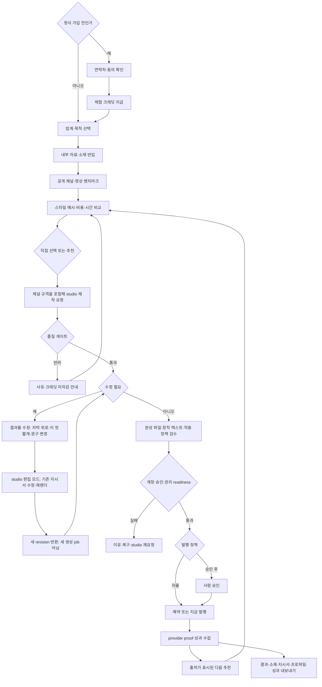

<!--
STAMP
line: openclaw-service
created_at: 2026-08-15 15:40 KST
model: gpt-codex/gpt-5.6
agent: prd-architect
skills: 없음. plan worker 단일 PRD PATCH에 직접 대응하는 생성 스킬 없음
evidence: 제품구조 결정서 2026-08-15 최신본, PRD v8.1.1, 참여형 결정 경험 벤치마킹 v3, wiki·pipeline-state·구현현황, planning·doc-review·benchmarks·artifact-stamp 표준, 시그마인·Pencil·OpenClaw 공식 페이지 실조회
deliberation: v8.1.1의 18개 장과 기존 요구를 전부 보존했다. 발행 정책을 테넌트·채널·유형별 옵션으로 확장하고, 품질 게이트 반려 무과금·연락처 기반 가입 전 체험·완전한 데이터 내보내기·내부 테스트 분리·1인 운영자 화면을 하나의 운영 계약으로 묶었다. 창작 텍스트와 모든 미디어 바이트는 studio 소유, 채널 규격과 발행은 openclaw 소유로 경계를 바로잡았다. 제작 성공 뒤 발행 실패의 크레딧 정책처럼 여전히 비싼 결정은 확정하지 않았다.
-->

# openclaw-service PRD v8.2.0

| 항목 | 값 |
|---|---|
| 문서 유형 | Product Requirements Document |
| 버전 | v8.2.0 |
| 작성일 | 2026-08-15 KST |
| 작성자·모델 | prd-architect / gpt-codex/gpt-5.6 |
| 상태 | **in-review**. plan MAJOR 개정 후보 |
| 제품 | openclaw-service, 소비자용 콘텐츠 운영·발행 제품 |
| 상품명 | marketing agency 계열, 정식 명칭 미정 |
| 상류 정본 | `docs/제품구조-결정-2026-08-15.md`, `docs/벤치마킹-참여형결정경험-2026-08-15-v3-gpt-codex.md` |
| 개정 대상 | `docs/prd-openclaw-service-v8.1.1-gpt-codex.md` |
| 직전 승인 핀 | PRD v7.3.5, `pipeline-state.osmu.md` SHA-256 `ae6155bb...a296e` |
| 승인 게이트 | 독립 plan-critic MAJOR 0, 회장 결정 반영, `/approve plan` 전 하류 진입 금지 |

## 목차

- [0. TL;DR](#0-tldr)
- [0.5 1차 목표와 출시 순서](#05-1차-목표와-출시-순서)
- [1. 목적·배경](#1-목적배경)
- [2. 현재 구현 상태](#2-현재-구현-상태)
- [3. 범위·서비스 경계](#3-범위서비스-경계)
- [4. 용어 정의](#4-용어-정의)
- [5. 핵심 페르소나](#5-핵심-페르소나)
- [6. One Thing·MVP 5](#6-one-thingmvp-5)
- [7. 핵심 사용자 흐름](#7-핵심-사용자-흐름)
- [8. 기능 요구사항](#8-기능-요구사항)
- [9. 비기능 요구사항](#9-비기능-요구사항)
- [10. 수용기준·요구 추적성](#10-수용기준요구-추적성)
- [11. BM·원가·출시 모델](#11-bm원가출시-모델)
- [12. 경쟁 벤치마크·포지셔닝](#12-경쟁-벤치마크포지셔닝)
- [13. 운영 부하](#13-운영-부하)
- [14. 리스크·레드팀·셀프심문](#14-리스크레드팀셀프심문)
- [15. 성공지표·kill-criteria](#15-성공지표kill-criteria)
- [16. 회장 결정 필요](#16-회장-결정-필요)
- [17. 기획 7원칙·게이트 판정](#17-기획-7원칙게이트-판정)
- [18. 개정 이력](#18-개정-이력)

## 0. TL;DR

openclaw-service의 첫 임무는 외부 고객 수를 늘리는 것이 아니다. openclaw-service의 기존 계정·예약·발행·성과 경로를 닫고 headless studio-service API를 연결해, 내부 첫 사용자 해줘단타와 제로원 인사이트의 시리즈 콘텐츠를 제작·발행하는 것이다. 그렇게 공개된 콘텐츠와 발행 결과가 제품의 첫 증거물이 된다.

핵심 고객은 자기가 만든 제품을 알리고 싶은 바이브 코더, 예비 창업자, 스타트업 팀이다. 이들은 좋은 예시를 보면 고를 수 있지만 업계 벤치마크, 콘텐츠 형식, 제작 방식, 프롬프트를 백지에서 정의하지 못한다. 제품은 업계·목적을 받은 뒤 잘 되는 채널과 영상을 모아 보여주고, 스타일 예시마다 예상 비용 범위·소요시간·근거를 붙여 선택하게 한다. 선택과 짧은 답변만으로 제작을 실행하고, 실제 성과와 트렌드가 다음 추천을 바꾼다.

발행은 하나의 강제 모드가 아니다. 테넌트가 채널별·콘텐츠 유형별로 `자율 발행` 또는 `승인 후 발행`을 정한다. 자율 발행도 계정·권리·품질·비용 정책을 통과해야 하며, 승인 후 발행은 사람이 최종 결과와 대상 계정을 확인하기 전 외부 부작용을 만들지 않는다. 품질 게이트에서 반려된 제작은 과금하지 않고, 반려 사유와 크레딧 미차감을 같은 화면에서 알린다.

미디어 경계는 절대적이다. openclaw-service는 미디어 바이트를 읽거나 쓰거나 변형하지 않는다. 크롭, 자르기, 재인코딩, 자막 합성, 재렌더, 롱폼 분할은 전부 studio-service가 수행한다. 캡션·해시태그·첫 댓글 같은 창작 텍스트도 studio가 만든다. openclaw-service는 채널 규격을 제작 요청에 싣고, 완성 파일의 불변 참조·승인 정책·예약시각·계정·발행 proof를 소유한다.

## 0.5 1차 목표와 출시 순서

> **1차 목표: openclaw-service를 완성하고 studio-service API를 구현해 해줘단타와 제로원 인사이트의 OSMU 콘텐츠를 제작·발행한다. 우리가 첫 사용자이며, 공개된 콘텐츠와 발행 증거가 제품의 첫 proof다.**

### 0.5.1 목표 기준

- 내부 두 벤처의 자료를 실제 근거로 반입한다.
- 백지 prompt 없이 업계·목적·사례·스타일·비용·시간을 선택한다.
- studio-service가 이미지·영상의 모든 미디어 처리를 끝낸다.
- openclaw-service가 채널 규격을 제작 요청에 싣고 studio가 창작 텍스트와 provider-ready 완성본을 함께 반환한다.
- openclaw-service가 완성 파일과 메타데이터를 정확한 계정에 한 번만 발행한다.
- 테넌트별 자율 발행과 승인 후 발행이 같은 안전 게이트·감사 이력 위에서 동작한다.
- 품질 게이트 반려 제작은 고객 크레딧을 차감하지 않으며 사유를 설명한다.
- 발행 결과와 공개 사례·트렌드가 다음 제작 추천에 출처와 함께 반영된다.
- 내부 폐루프가 직접 관찰되기 전 외부 고객용 규모·채널 수·완전자동화를 판매하지 않는다.

### 0.5.2 재정렬된 출시 순서

| 순서 | 출시 단위 | 범위 | 종료 증거 | 다음 단계 조건 |
|---:|---|---|---|---|
| 1 | openclaw 발행 코어 닫기 | 계정 진실, canonical record, 승인·예약, publication proof, 실패 복구, 미디어 변형 코드 금지 | 해줘단타·제로원 대상 계정에서 wrong-account·duplicate·false-published 0인 dry-run·실발행 증거 | 발행 대상과 결과가 한 identity로 회수됨 |
| 2 | studio-service 최소 API 연결 | 참고자료 반입, 이미지·영상 생성, studio 산출물의 저비용 편집·재렌더, 필요한 크롭·자르기·재인코딩·자막 처리, 비용·시간 범위 반환 | 동일 요청의 완성 파일 참조·편집 지시·견적·실비·상태·revision이 회수됨 | openclaw application code의 media byte read/write 0 |
| 3 | 내부 OSMU proof | 해줘단타 시리즈 3편, 제로원 인사이트 시리즈 3편을 각각 2개 이상 승인 채널에 발행 | 공개 permalink 또는 provider external ID, source label, 비용·시간 예측 대 실제값 | 6편의 제작→발행 proof 전량 |
| 4 | 추천 환류 | 성과·트렌드·선택을 tenant 신호로 studio에 전달하고 다음 추천 변경 이유 표시 | 두 번째 cycle에서 근거 ID와 변경된 추천 1개 이상 관찰 | private·cross-tenant·가짜 인과 0 |
| 5 | 운영·정책 준비 | 채널·유형별 발행 정책, 반려 무과금, 내부 테스트 분리, 데이터 내보내기, 운영자 화면 | 정책 조합 E2E, 과금 대사, export 재현, 운영자 지원 처리 증거 | 내부 테스트가 외부 운영 KPI를 오염하지 않고 1인 운영자가 막힘을 회수함 |
| 6 | 연락처 기반 가입 전 체험 | 연락처 수집과 동의 후 체험 크레딧 지급, 정식 가입 전 제작 경험 | 중복 지급·무동의 연락0, 체험 크레딧 원장·만료·전환 이력 | 체험이 제품 가치를 보여주고 지원 부하·원가 kill-criteria 통과 |
| 7 | 외부 closed pilot | 충전·환불·지원 경계가 승인된 뒤 외부 3~5 workspace | 반복 사용·운영시간·비용대사·안전 지표 | kill-criteria 통과 후에만 공개 판매 |

결제와 studio 단독 화면은 1차 내부 proof의 선행 조건이 아니다. 외부 closed pilot 전에는 결제·환불·약관을 승인해야 하며, 내부 proof를 핑계로 외부 유료 판매를 시작하지 않는다.

## 1. 목적·배경

### 1.1 고객 문제

제품을 만든 사람은 자기 제품의 강점과 사실을 알고도 그것을 시리즈 콘텐츠로 바꾸는 과정에서 멈춘다. 업계에서 어떤 채널과 영상이 잘 되는지 찾고, 스타일을 분류하고, 제작 방식과 원가를 계산하고, 채널별 계정·예약·발행을 관리해야 한다. 생성형 도구는 빈 prompt와 수십 개 모델·프리셋을 제공하지만 무엇을 고를지와 선택 비용을 대신 책임지지 않는다.

우리 내부 실험도 같은 문제를 겪었다. 해줘단타 EC0147을 만들 때 대본 구성, 영상 스타일, 컷 구성, 비용을 백지에서 정했고 경쟁 사례도 직접 모았다. 이 노동을 제품이 대신하지 못하면 openclaw-service는 저가 스케줄러, studio-service는 또 하나의 생성 도구에 머문다.

### 1.2 제품 목표

- 사용자의 정의 노동을 업계 사례와 선택 카드로 바꾼다.
- 각 선택 전에 결과 예시, 예상 비용 범위, 예상 소요시간을 보여준다.
- 노션·위키·메모·강의자료를 콘텐츠 사실과 표현 근거로 사용한다.
- 사례와 추천을 `우리 실험 로그`, `공개 사례`, `가설`로 구분한다.
- 완성 파일의 제작·변환 책임을 studio-service 한 곳에 고정한다.
- openclaw-service는 메타데이터·계정·예약·발행·성과 진실만 소유한다.
- 해줘단타와 제로원 인사이트의 실전 OSMU로 첫 제품 증거를 만든다.

### 1.3 비목표

- 모든 업종을 동시에 마케팅하는 것.
- 월 콘텐츠 수량과 채널 수로 시그마인·마케티와 경쟁하는 것.
- 고객이 raw prompt, 모델, 공급자, server key를 배워야 하는 개발자 도구.
- 성과 한 건으로 브랜드 톤과 전략을 자동 변경하는 것.
- 광고 계정·입찰·광고비 집행·attribution warehouse를 대체하는 것.

## 2. 현재 구현 상태

위키, release·handoff 기록, `pipeline-state.osmu.md` 승인 핀, `docs/구현현황.md`를 1차 진실원으로 확인했다. 신규 결정이 위키보다 최신이므로 코드 전체 검색은 하지 않았다.

| 영역 | 현재 상태 | 1차 정본·근거 | v8.1 처리 |
|---|---|---|---|
| 로그인·workspace·역할 | **부분구현** | `wiki/product/marketing-hub-surface-map.md`, ADR-004, PRD v7.3.5 | 재구현 금지. studio tenant 자동 연결만 추가 |
| 소셜 OAuth·계정 진실 | **부분구현** | `wiki/decisions/004-social-connect-oauth-not-passwords.md`, `wiki/reference/channel-status.md` | 기존 OAuth·readiness를 보존하고 studio credential과 분리. 연결 실패·토큰 만료 화면 정책은 D-08 미결정 |
| Studio 소비자 화면·미리보기 | **이미구현·보존** | `wiki/product/studio.md`, `wiki/product/marketing-hub-surface-map.md`, DESIGN v24 | openclaw-service의 유일한 1단계 소비자 화면으로 재배선 |
| Queue·Inbox·Calendar·Videos | **부분구현·보존** | surface map, `wiki/architecture/data-model.md` | 동일 canonical result의 projection으로 연결 |
| 예약·발행·proof·복구 | **부분구현** | `wiki/architecture/data-model.md`, `wiki/reference/channel-status.md`, PRD v7.3.5 | first goal의 최우선 완결 대상 |
| 성과 수집·native truth | **부분구현** | `wiki/architecture/data-model.md`, `docs/구현현황.md` | 미수집을 0으로 표시하지 않고 studio 신호로 전달 |
| 브랜드 위키·자료 반입 | **부분구현·소유권 이관 필요** | `wiki/reference/brand-grounding.md`의 wizard·repo·paste | 화면은 openclaw에 유지. 저장·버전·생성 적용 정본은 studio로 이관. Notion 경로 신설 |
| 선택형 8단계 제작 흐름 | **미구현** | 제품구조 결정서 §3.7 | MVP 핵심으로 신설 |
| 업계 채널·영상 벤치마크 수집 | **미구현** | 제품구조 결정서 §3.7 | 공개 사례의 URL·관찰일·지표 기간을 보여주는 경로 신설 |
| 스타일별 비용·시간 사전 견적 | **미구현** | 제품구조 결정서 §3.5·§3.7, 소재원가표 | 범위값·가정·실비 대사를 신설 |
| headless studio-service API | **미구현·스크립트만 부분존재** | `studio/README.md`, `pipeline-state.studio.md` | 이미지·영상 제작과 전체 미디어 변환 API를 first goal에 포함 |
| 이미지·영상·롱폼 제작 | **부분구현·이관 필요** | `wiki/product/studio.md`, `wiki/product/shorts-factory.md` | 기존 openclaw 생성 경로는 studio로 이동. openclaw 재구현 금지 |
| studio 산출물 편집·저비용 재렌더 | **부분구현·제품 연결 미구현** | 제품구조 결정서 §3.8, 2026-08-14 실험 기록 | 1단계 필수. 기존 편집 지시서를 수정해 소재 재생성 0으로 revision |
| 외부 반입물 분석·롱폼 분할 실행 | **부분 실험·1단계 범위 밖** | 제품구조 결정서 §3.8 | 소유는 studio로 고정하되 역분석이 필요한 실행은 2단계로 연기 |
| 미디어 크롭·자르기·재인코딩·자막 | **경계 불일치** | 기존 README·wiki는 openclaw 크롭을 허용. 최신 제품구조 결정서 §3.6이 이를 폐기 | openclaw 소유 0. 기존 구현이 있으면 studio로 이관 |
| 사용량·구독 원장 | **부분구현** | `wiki/architecture/data-model.md` | 내부 proof에는 관측만 사용. 외부 pilot 전 충전·환불 원장 확정 |
| 해줘단타 파일럿 제작물 | **부분구현** | `studio/README.md`의 EC0147 1편 | openclaw 경유 다채널 발행 proof는 미검증 |
| 제로원 인사이트 OSMU proof | **미구현** | 제품구조 결정서 §0.5 | first goal에서 시리즈 3편 제작·발행 |
| 테넌트 발행 정책 | **부분구현·정책 미구현** | `wiki/architecture/data-model.md`의 승인·예약, 제품구조 결정서 §9.5 | 기존 승인 경로를 보존하고 채널·유형별 자율/승인 정책을 추가 |
| 품질 게이트 반려 무과금 | **미구현** | 제품구조 결정서 §9.5 | 반려 사건, 사유, 크레딧 미차감 안내와 원가 관측 신설 |
| 연락처 기반 가입 전 체험 | **미구현** | 제품구조 결정서 §9.5, 벤치마킹 v3의 시그마인 관찰 | 연락처·동의 뒤 체험 크레딧을 지급하고 정식 tenant와 분리 추적 |
| 사용자 데이터 내보내기 | **미구현** | 제품구조 결정서 §9.5 | 결과물·소재·편집 지시서·사람이 읽는 취향 프로파일·성과 이력 export 신설 |
| 내부 테스트 tenant 표시·집계 분리 | **미구현** | 제품구조 결정서 §9.5 | 화면 배지와 운영 루프 집계 분리 신설 |
| 운영자 화면 | **부분구현·지원 범위 미완결** | `wiki/product/marketing-hub-surface-map.md`, 제품구조 결정서 §3.95 | 기존 admin shell을 보존하고 회원·크레딧·결제·환불·사용량·장애·막힘·운영 루프·지원 처리로 확장 |
| 채널 규격의 studio 요청 포함 | **미구현·경계 정정 필요** | 제품구조 결정서 §3.9 | openclaw가 규격을 요청에 싣고 studio가 창작 텍스트·완성본을 반환 |
| OpenClaw vendored runtime 갱신 절차 | **미구현** | 제품구조 결정서 §8.2, OpenClaw 공식 GitHub | MIT 제3자 런타임의 upstream 감시·검토·회귀·롤백 절차를 eng-design 전 운영 요구로 고정 |

> ⛔ 회수 필요: `wiki/product/studio.md`, `wiki/reference/brand-grounding.md`, 루트 `CLAUDE.md`와 `studio/README.md`는 openclaw가 비율 크롭 또는 제작을 소유한다고 설명한다. 최신 제품구조 결정서 §3.6과 충돌하므로 plan 승인과 함께 위키를 개정해야 한다.

> ⛔ 회수 필요: `pipeline-state.osmu.md`의 승인 artifact 경로가 실제 `docs/notes/`, `docs/plan/` 위치와 다르다. SHA는 일치하지만 다음 `/approve plan` 전에 경로 핀을 교정해야 한다.

## 3. 범위·서비스 경계

### 3.1 In scope

- openclaw-service의 화면, 회원, workspace, 역할, 소셜 인증, 승인, 예약, 발행, proof, 복구, 성과.
- studio tenant의 자동 준비와 장애 상태 표시.
- 업계·목적 선택, 업계 벤치마크 갤러리, 스타일 예시, 비용·시간 견적, 추천·선택 화면.
- 노션·위키·메모·강의자료와 기존 미디어의 반입 화면·권리 확인·상태 표시.
- studio-service 제작 요청, 완성 파일 참조·revision·권리·품질·비용 상태 수신.
- studio-service가 만든 결과물에 대한 수정 지시 입력과 저비용 revision 요청. 편집 지시서가 있는 산출물만 1단계 대상이다.
- 완성 파일과 캡션·해시태그·예약시각·계정의 검수·발행.
- 테넌트·채널·콘텐츠 유형별 자율 발행 또는 승인 후 발행 정책, 정책 충돌 표시, 일시 정지와 감사 이력.
- 품질 게이트 반려 사유와 고객 크레딧 미차감 안내.
- 연락처·동의 수집 뒤 가입 전 체험 크레딧 지급, 중복·남용 방지, 정식 가입 전환 이력.
- 결과물·소재·편집 지시서·사람이 읽을 수 있는 취향 프로파일·성과 이력 내보내기.
- 내부 테스트 tenant 배지와 외부 운영 루프 집계 분리.
- 1인 운영자가 회원·크레딧·결제·환불·사용량·장애·유저 막힘·운영 루프·지원 요청을 한 화면군에서 회수하는 기능.
- 실제 성과·트렌드·선택을 tenant-scoped 신호로 studio-service에 전달.
- 내부 해줘단타·제로원 인사이트 OSMU proof.

### 3.2 Out of scope

- openclaw application code의 이미지·영상·음성 byte read, write, decode, encode, render, transform.
- openclaw 내부 크롭, 자르기, 재인코딩, 자막·오버레이 합성, 프레임 추출, 썸네일 생성, 롱폼 분할.
- studio-service 2단계 소비자 화면·별도 가입·별도 결제.
- 외부에서 반입한 미디어의 편집 지시서 역분석과 롱폼 자동 구간 탐색·분할 실행. 소유권은 studio에 있으나 1단계에서는 기존 도구로 분할된 결과를 소재로 받는다.
- 1단계에서 OpusClip·Vizard 같은 외부 클리퍼를 대체하는 것. 사용자가 외부 도구에서 이미 분할한 숏폼 파일을 반입하면 studio 편집 모드로 자막 위치·컷 길이·문구·브랜드 스타일만 다듬는다.
- 음악 제작과 순수 텍스트 제작의 studio 1차 구현. 인터페이스 확장 가능성만 보존한다.
- private venture 데이터를 공용 analytics, 타 tenant, 공개 추천 모델에 혼합하는 것.
- API URI, JSON 필드, DB 테이블, 키 포맷, 배포 토폴로지, 포트 확정. eng-design 티키타카 대상이다.

### 3.3 책임 경계

| 작업 | openclaw-service | studio-service |
|---|---:|---:|
| 화면·회원·workspace·소셜 인증·결제 | O | X |
| 업계·목적·사례·스타일·비용·시간 선택 UI | O | 제안·견적 근거 반환 |
| 자료 연결·업로드·권리 확인 UI | O | 자료 저장·버전·검색·제작 적용 |
| 브랜드 가이드·톤·금지선 정본 | 전달·표시 | O |
| 컷·화풍·자막·오버레이·목소리 | X | O |
| 이미지·영상·음성 생성 | X | O |
| 크롭·자르기·재인코딩·재렌더 | X | O |
| 롱폼 구간 선택·숏폼 분할 | X | O |
| 완성 파일 참조·revision·권리·quality 표시 | O | 생성·반환 |
| 캡션·해시태그·첫 댓글 등 창작 텍스트 | 채널 규격 전달·표시·검수 | O |
| 채널 글자수·비율·길이·필수 메타 규격 | O, 제작 요청에 포함 | 규격에 맞는 결과 반환 |
| 예약시각·대상 계정·발행 정책 | O | X |
| 계정 readiness·승인·예약·발행·proof | O | X |
| native 성과·인증 필요 채널 트렌드 | 수집·전달 | 수신·추천 반영 |
| 취향 프로파일·추천 알고리즘 | 상태·근거 표시 | O |

### 3.4 studio-service 외부 접점 5개

| 접점 | 방향 | 제품 계약 |
|---|---|---|
| 신호 넣기 | openclaw → studio | 성과·채널 트렌드·추천 채택을 tenant·출처·관찰시각과 함께 전달 |
| 제작 요청 | openclaw → studio | 선택 답변·자료 version·목표·권리·예산을 전달하고 완성 결과를 받음 |
| 선택 기록 | openclaw → studio | 고른 예시·방식·변형 identity와 선택 시각을 기록. 파일 자체는 신호가 아님 |
| 취향 상태 조회 | studio → openclaw 응답 | 현재 프로파일·근거·version·한계를 화면에 표시 |
| 소재·참고자료 반입 | openclaw → studio | 기존 미디어와 지식 자료를 제작 재료로 등록. 권리·출처·version 보존 |

선택 기록은 학습신호의 특수형이지만 외부 감사와 추적에서는 별도 접점으로 센다. 생성 경로는 원시 신호를 직접 읽지 않고 studio-service가 산출한 취향 프로파일만 읽는다.

### 3.5 참고 자료 반입과 해자

고객은 제품·사업에 관한 내부 지식을 `자료 근거함`으로 반입한다. 화면은 openclaw-service가 소유하고, 저장·version·검색·제작 적용 정본은 studio-service가 소유한다.

| 소스 | MVP 반입 경로 | 고객 확인 | 상태 |
|---|---|---|---|
| Notion | Markdown·CSV·HTML export bundle 업로드. live OAuth connector는 별도 결정 | page 수, export 시각, 원본 경로, 누락 파일 | export는 must, live connector는 open |
| Wiki·문서 repo | GitHub repo 또는 Markdown 폴더 sync | branch, path, 문서 수, hash, 마지막 sync | 기존 부분구현 재배선 |
| 메모장·직접 메모 | paste 또는 `.txt`·`.md` 파일 | 제목, 문자수, 저장 version | 기존 paste 확장 |
| 강의자료·회사자료 | PDF·PPTX·DOCX 또는 텍스트 export | 파일명, 페이지 수, 권리·개인정보 확인, 추출 실패 | parser 범위는 eng-design에서 확정 |
| 기존 이미지·영상 | asset upload | 소유·출연자·음원 권리, duration·format, 원본 hash | studio 소재로만 등록 |

반입 자료끼리 가격·날짜·정책이 충돌하면 자동 선택하지 않는다. active knowledge 1개를 사람이 승인하기 전 제작을 hold한다. 고객 자료의 원문·embedding·요약·성과는 tenant 밖으로 나가지 않으며 public analytics나 다른 고객 추천에 섞지 않는다.

시그마인은 홈페이지 URL과 브랜드 자료를 받아 학습한다고 공개한다. 우리의 해자 후보는 홈페이지 공개정보가 아니라 노션·위키·메모·강의자료의 versioned 내부 지식, 선택 이력, 실제 발행 proof가 하나의 계보로 쌓이는 것이다. 외부 pilot에서 반복가치가 검증되기 전에는 확정 해자라고 부르지 않는다.

### 3.6 미디어 경계

> **불변 규칙: openclaw-service는 미디어 바이트를 다루지 않는다.**

| 작업 | 소유 | openclaw 동작 |
|---|---|---|
| 크롭·리사이즈·비율 변경 | studio | 필요한 규격을 요청하고 새 완성 파일 참조를 받음 |
| 자르기·구간 선택·롱폼 분할 | studio | 후보·완성 숏폼을 요청하며 자체 segment 계산 0 |
| 재인코딩·codec·bitrate·fps·container 변환 | studio | provider-ready 결과가 아니면 발행 block |
| 자막·용어칩·오버레이·썸네일 합성 | studio | 자체 render·overlay mutation 0 |
| 이미지·영상·음성 생성 | studio | 요청·상태·결과 참조만 표시 |
| 완성 파일 발행 | openclaw | 불변 asset reference 또는 provider-ready delivery handle을 계정·예약과 연결 |
| 캡션·해시태그·첫 댓글 등 창작 텍스트 | studio | openclaw가 채널 규격을 전달하고 결과를 표시·검수 |
| 예약시각·대상 계정·발행 정책 | openclaw | 채널·유형별 정책에 따라 승인 또는 자율 발행 |

openclaw application code는 미디어를 buffer·blob·canvas·FFmpeg·이미지 라이브러리로 열지 않는다. provider가 특정 규격을 요구하면 openclaw가 변환하지 않고 studio-service에 파생 완성본을 요청한다. studio가 provider-ready를 반환하지 못하면 정확한 이유와 예상 추가 비용·시간을 표시하고 발행을 막는다.

`채널 적응`이라는 용어는 v8.1.1에서 폐기했다. v8.2.0에서는 경계를 더 엄격히 한다. 캡션·해시태그·첫 댓글 같은 창작 텍스트는 studio가 채널 규격에 맞춰 생성하고, openclaw는 예약시각·대상 계정·발행 정책·proof만 수정한다. 미디어 hash는 openclaw 흐름 전후에 동일해야 한다.

### 3.7 제작 화면 설계

설계 원칙은 하나다. **유저에게 백지를 주지 않고 항상 고를 것을 준다.** raw prompt는 선택적 고급 입력일 수 있으나 필수 입력이 아니며 첫 화면의 주 행동이 아니다.

| 단계 | 사용자 행동 | 제품이 대신하는 노동 | 최소 출력·Fit Criterion |
|---:|---|---|---|
| 1 | 업계와 목적 선택 | 문제 공간을 좁힘 | 업계 1개, 목적 1개, 직접 답변은 짧은 보조값만 |
| 2 | 업계에서 잘 되는 채널·영상 보기 | 벤치마킹 수집·분류 | 채널 3개 이상 또는 가용 전량, 사례 6개 이상 또는 부족 상태. 각 사례 URL·관찰일·지표 기간 표시 |
| 3 | 스타일 예시 여러 개 비교 | 스타일 언어화 | 추천 1개를 먼저, 대안 2개 이상. 실제 preview와 적합·부적합 상황 표시 |
| 4 | 비용·시간 확인 | 모델·재시도·렌더 원가 계산 | 예시마다 예상 비용 범위, 예상 소요시간 범위, 포함 후보 수, 가정 표시 |
| 5 | 고르거나 추천받기 | 선택 피로 감소 | 선택 1개 또는 추천 1개. 추천 이유·출처·한계 표시 |
| 6 | 실행 | brief 조립과 studio 호출 | 최종 선택·자료 version·권리·예상 차감 확인 후 job 1개 |
| 7 | 성과·트렌드 기반 다음 추천 보기 | 결과 해석 | 이전 추천과 달라진 항목, 근거 ID, 바뀐 이유 1개 이상 |
| 8 | 클릭과 답변으로 계속 | 반복 workflow 유지 | 두 번째 cycle에서 이전 답변 재입력 0, 변경이 필요한 카드만 다시 선택 |

추천·사례의 근거 표시는 세 종류로 고정한다.

| 근거 라벨 | 필수 표시 | 사용 제한 |
|---|---|---|
| `우리 실험 로그` | venture, experiment ID, 날짜, 표본, 관찰 결과 | 해당 tenant 또는 공개 승인된 자사 사례만 사용 |
| `공개 사례` | 원문 URL, 게시자·채널, 관찰일, 지표 기간 | 저작물 복제 금지. 구조·원리만 참고 |
| `가설` | 가설 문장, 근거 부족 이유, 검증할 지표·기간 | `잘 된다`, `검증됨`, `추천 근거 확정` 표현 금지 |

초기 화면은 추천 1개를 먼저 펼치고 대안은 `다르게 보기` 아래에 둔다. 단, 추천을 강제하지 않으며 근거를 숨긴 자동 선택도 하지 않는다. 이 흐름에서 힉스필드와의 차별점은 프리셋 수가 아니라 업계 벤치마킹을 대신하고 선택 전에 전체 제작비·시간 범위를 예상하게 하는 것이다.

### 3.8 생성과 편집 모드

studio-service는 생성과 편집을 분리한다. openclaw-service는 두 모드의 입력·상태·비용·결과를 한 화면에서 연결하지만 미디어를 직접 수정하지 않는다.

| 모드 | 사용자 입력 | studio 동작 | openclaw 동작 | 1단계 범위 |
|---|---|---|---|---|
| 생성 | 주제, 선택, 취향 프로파일, 자료 version | 무에서 A/B/C 후보와 완성본을 제작 | 선택·견적·상태·완성 파일 참조 표시 | 필수 |
| 우리 산출물 편집 | 기존 studio revision과 수정 지시 | 기존 편집 지시서만 바꾸고 재렌더. 소재 재생성 0장 | 수정 지시, 변경 예상비용·시간, 새 revision 표시 | 필수 |
| 외부 반입물 편집 | 외부 파일과 수정·분할 지시 | 파일을 분석해 편집 지시서를 역으로 구성한 뒤 편집 | 소재 등록과 상태 표시 | 2단계. 1단계 실행 제외 |

우리 산출물 편집은 작은 수정마다 A/B/C 소재를 다시 생성해 원가가 약 3배로 커지는 것을 막는 1단계 필수 기능이다. 수정 지시는 취향의 약한 신호로 기록하되, A/B/C 선택과 같은 강한 신호로 취급하지 않는다. 외부 롱폼 쪼개기·자동 구간 탐색은 OpusClip·Vizard와 성숙 시장에서 정면 경쟁하므로 2단계로 미룬다. 단, 그 기능이 생길 때도 모든 미디어 바이트 처리는 studio가 소유한다.

### 3.9 채널 규격 전달과 발행 정책

openclaw-service는 연결된 provider가 요구하는 규격의 정본을 소유한다. 규격에는 글자수, 허용 비율, 길이, 파일 형식, 필수 메타데이터, 링크·해시태그 제한, 예약·발행 가능 상태가 포함된다. openclaw는 이 규격과 대상 채널 목록을 studio 제작·편집 요청에 싣는다. studio는 플랫폼 이름을 자체 추론하거나 별도 규격표를 유지하지 않고, 받은 제약에 맞는 미디어와 창작 텍스트를 반환한다.

| 발행 모드 | 사용자 약속 | 실행 조건 | 실패·복구 |
|---|---|---|---|
| 승인 후 발행 | 사람이 채널별 결과·계정·예약·예상 차감을 확인해야 외부 발행됨 | quality·rights·account readiness 통과 뒤 승인 사건 1개 | 승인 전 외부 부작용0, 수정하면 재승인 필요, 만료·연결 실패는 초안 보존 |
| 자율 발행 | 승인된 정책 범위 안에서 agent가 제작·예약·발행을 반복함 | tenant·채널·유형 정책 일치, quality·rights·비용·빈도·account readiness 통과, kill switch 정상 | 정책 밖 결과는 승인 대기로 강등, uncertain publish 자동 재시도 금지, 운영자 알람과 감사 이력 |

정책의 우선순위·상속·예외 표현은 eng-design에서 선택한다. 제품 계약은 `테넌트 기본값`, `채널 override`, `콘텐츠 유형 override`를 모두 표현할 수 있고, 최종 적용 정책과 근거를 발행 전에 보여준다는 데 한정한다. 자율 발행은 무제한 자동화가 아니다. 계정·권리·품질·비용·빈도 상한을 하나라도 통과하지 못하면 발행하지 않는다.

### 3.95 1인 운영자 화면과 지원 범위

운영자 화면의 목표는 관리자 기능을 많이 만드는 것이 아니라, 한 사람이 고객의 막힘과 비용·외부 부작용을 10분 안에 진단하고 안전하게 회수하는 것이다. 소비자 화면과 동일한 canonical record를 읽고, 임의 DB 수정이나 숨은 provider 호출을 정상 운영 절차로 삼지 않는다.

| 운영 영역 | 운영자가 답해야 할 질문 | 최소 행동 | 감사·안전 조건 |
|---|---|---|---|
| 회원·tenant | 누구의 어떤 workspace이며 내부 테스트인가 | 검색, 상태·역할·연결 확인, 제한 또는 복구 절차 시작 | tenant scope 고정, impersonation은 별도 권한·사유·만료 |
| 크레딧 | 왜 차감·보류·해제·무과금인가 | 원장 조회, 승인된 조정 사유 기록 | 잔액 직접 덮어쓰기0, quality 반려 차감0 |
| 결제·환불 | 어떤 결제와 제작·발행 사건이 연결됐는가 | 결제 상태 조회, 정책에 따른 환불 요청 처리 | 금액·사유·소유자·결과 감사 이력100% |
| 사용량·원가 | 어떤 tenant·job·provider가 비용을 만들었는가 | 예상 대 실비·차감 차이 조회, 이상 사용 제한 | private 데이터 공용 analytics 혼합0 |
| 장애 알람 | studio·provider·queue·metric 중 어디가 막혔는가 | 심각도·영향 tenant·재시도 안전성 확인, kill switch | uncertain external side effect 자동 재시도0 |
| 유저 막힘 | 고객이 어느 단계·상태에서 멈췄는가 | 마지막 안전 상태·복구 가능한 다음 행동 표시 | 원문 secret·private 자료 노출0 |
| 운영 루프 | 체험→제작→승인/자율→발행→성과→재사용이 어디서 끊겼는가 | 내부 테스트와 외부 고객을 분리해 funnel·대기열 조회 | 분모·기간·집계 제외 기준 표시100% |
| 지원 요청 | 고객 질문과 운영 조치가 종결됐는가 | 요청 분류·담당·상태·응답·후속 증거 기록 | split support route0, 무소유 요청0 |

운영자 기능은 최소권한으로 나눈다. 돈·환불·impersonation·발행 정책 변경은 일반 조회와 같은 권한이 아니다. 세부 role·API·DB schema는 eng-design에서 회장 합의 전 확정하지 않는다.

## 4. 용어 정의

| 용어 | 정의 |
|---|---|
| 소비자 workspace | openclaw-service의 고객·브랜드 운영 단위 |
| studio tenant | workspace와 1:1로 연결되는 studio-service 내부 격리 단위 |
| 자료 근거함 | Notion·wiki·메모·강의자료·기존 asset을 versioned 제작 근거로 반입하는 화면 |
| 벤치마크 사례 | 공개 URL 또는 승인된 자사 실험 로그에서 관찰한 채널·콘텐츠 예시 |
| 스타일 예시 | 사용자가 결과를 보고 고를 수 있도록 preview·적합상황·비용·시간을 묶은 선택 카드 |
| 제작 브리프 | 선택 답변·자료 version·목표·권리·금지선·출력 규격·예산을 studio가 실행할 수 있게 조립한 제품 수준 입력 |
| 완성 파일 | studio가 모든 미디어 처리를 끝낸 불변 결과. openclaw는 파일 참조와 상태만 소유 |
| 편집 지시서 | studio가 생성 과정에서 보존한 컷·자막·오버레이·타이밍 지시. 우리 산출물은 이 지시만 바꿔 소재 재생성 없이 재렌더 가능 |
| 창작 텍스트 | 캡션, 해시태그, 첫 댓글 등 studio가 채널 규격에 맞춰 생성하는 텍스트 결과 |
| 발행 제어정보 | 예약시각, 대상 계정, 승인·자율 발행 정책, proof. openclaw가 소유하는 전 범위 |
| 발행 정책 | tenant 기본값과 채널·콘텐츠 유형별 override로 자율 발행 또는 승인 후 발행을 선택하는 규칙 |
| 품질 게이트 반려 | studio 결과가 승인된 품질 기준을 충족하지 못해 고객에게 전달·과금하지 않는 종결 상태 |
| 내부 테스트 tenant | 자사 검증용 workspace임을 명시하며 외부 고객 운영 루프 집계에서 분리되는 tenant |
| 사람이 읽는 취향 프로파일 | 선택·수정·성과의 근거와 한계가 자연어로 설명되어 사용자가 내보낼 수 있는 현재 취향 상태 |
| 소재(asset) | 제작의 재료인 기존 이미지·영상·음성·로고·문서. 업로드만으로 취향을 바꾸지 않음 |
| 학습신호(signal) | 선택·제안 채택·성과·트렌드처럼 취향 프로파일을 바꾸는 사건 |
| publication proof | provider external ID·permalink·확인시각 또는 이름 붙은 uncertain/failed 상태 |
| first proof | 해줘단타·제로원 인사이트의 실제 제작·발행 결과와 그 계보 |

## 5. 핵심 페르소나

### 박도윤, 32세, 혼자 SaaS를 만든 바이브 코더

박도윤은 서울에서 작은 B2B SaaS를 혼자 만들고 있다. 낮에는 외주 개발을 하고 밤에는 자연어로 코드를 짜며, 가입·결제·핵심 기능까지는 완성했다. 제품을 설명하라면 고객 문제와 기능을 또렷하게 말할 수 있지만, Threads 연재 20편이나 Reels 시리즈를 백지에서 설계하라고 하면 멈춘다. 잘 만든 사례를 세 개 가져다주면 “두 번째의 담백한 화면과 첫 번째의 빠른 도입을 섞고 싶다”고 고를 수 있다. 하지만 어느 업계 채널을 봐야 하는지, 어떤 영상을 수집해야 하는지, 나레이션형·혼합형·풀영상형 중 무엇이 맞는지, 한 편에 얼마와 몇 시간이 드는지 스스로 정의하지 못한다. 개발 도구를 고를 때는 비교표를 잘 쓰지만 콘텐츠 앞에서는 빈 prompt와 무한한 프리셋이 선택지가 아니라 숙제로 느껴진다.

도윤의 제품 사실은 한곳에 있지 않다. Notion에는 고객 인터뷰와 로드맵이 있고, GitHub wiki에는 기능·제약이 있으며, 메모장에는 실패한 실험과 자주 받은 질문이 있다. 예비 고객에게 했던 온라인 강의 자료도 좋은 콘텐츠 원천이지만, 홈페이지 한 장만 크롤링하면 핵심 근거와 금기가 빠진다. AI가 없는 기능을 만들거나 오래된 가격을 쓰면 바로 신뢰를 잃기 때문에, 어떤 자료의 어느 version을 썼는지 확인하고 싶다. 그렇다고 prompt engineering, 영상 모델, codec, 플랫폼별 API와 토큰을 새로 배우고 싶지는 않다.

그가 원하는 것은 “알아서 바이럴”이 아니다. 업계에서 잘 되는 공개 채널과 영상을 먼저 보고, 스타일별 결과 예시와 예상 비용·시간을 비교한 다음 자신이 고른 한 안을 실행하고 싶다. 못 고르면 추천을 받되 `우리 실험 로그`, `공개 사례`, `가설` 중 무엇에 근거했는지 알아야 한다. 제작 뒤에는 완성 파일을 다시 크롭하거나 자막을 고치는 도구를 찾아다니지 않고, 정확한 계정과 예약시각만 확인해 한 번 발행하고 싶다. 성과가 쌓이면 다음 추천이 왜 달라졌는지 보고 다시 고른다. 성공은 콘텐츠 한 편이 우연히 터지는 것이 아니다. 제품 개발에 쓰던 판단 능력만으로 6편의 시리즈를 끝내고, 두 번째 cycle에서는 벤치마킹과 설정을 반복하지 않아 첫 cycle보다 빨라지는 상태다. 현재 수작업 시간·월 반복 빈도·지불의사는 외부 인터뷰 전 미측정 가설이다.

첫 체험에서 도윤은 결제보다 개인정보와 잠금 효과를 먼저 걱정한다. 연락처를 남겼다고 영업 연락이 강제되거나, AI가 학습한 취향과 편집 지시서를 서비스 밖으로 가져갈 수 없다면 시작하지 않는다. 한두 편은 직접 승인하고 싶지만 반복 형식이 안정된 뒤에는 특정 채널의 정기 인사이트만 자율 발행으로 바꾸고 싶다. 그래서 채널·콘텐츠 유형별 정책, 반려 무과금, 사람이 읽는 취향 프로파일과 전체 성과 이력 내보내기가 신뢰의 일부다.

| 구분 | 내용 |
|---|---|
| 긴급 pain | 제품은 만들었지만 업계 벤치마크·콘텐츠 구성·제작비·발행 운영을 백지에서 정하지 못함 |
| 숨은 욕망 | 자신은 고르는 사람으로 남고, 조사·제작·발행 운영은 제품이 대신하는 상태 |
| 가장 큰 불신 | 출처 없는 추천, 예상 밖 비용, 없는 제품 사실, 잘못된 계정, 중복 발행, 미디어 품질 훼손 |
| 성공 감정 | “내가 프롬프트를 만든 것이 아니라 선택했는데, 왜 이 결과가 나왔는지 설명할 수 있다” |
| anti-persona | prompt·모델·codec을 직접 세밀하게 조작하려는 제작 전문가, 무승인 대량 발행만 원하는 운영자, 한 번 생성 후 끝낼 사용자 |

페르소나 근거는 회장이 해줘단타 제작에서 직접 겪은 백지공포·벤치마킹 노동과 공개 경쟁사 화면이 전제하는 대표·스타트업 고객이다. 외부 바이브 코더 인터뷰·WTP 데이터는 아직 없으므로 페르소나의 반복 빈도와 결제 의사는 가설로 둔다.

## 6. One Thing·MVP 5

### 6.1 후보와 잘못된 답 함정

| 후보 | 판정 | 잘못된 답 함정 |
|---|---|---|
| “프롬프트 없이 콘텐츠를 만든다” | 탈락 | 생성기 한 개로 축소된다. 벤치마크·비용·계정·proof 책임이 사라짐 |
| “모든 SNS에 자동 발행한다” | 탈락 | Ayrshare·Buffer와 채널 수 경쟁을 하게 되고 고객의 백지공포를 해결하지 못함 |
| “월 300개를 대신 뿌린다” | 탈락 | 시그마인의 물량 전략을 따라가며 내부 지식·선택·비용 통제를 잃음 |
| “AI가 성과를 보고 알아서 최적화한다” | 탈락 | 얇은 표본으로 인과를 과장하고 브랜드를 자동 변형함 |
| “업계 사례와 비용·시간이 붙은 선택을 내부 자료 기반 제작·정확한 발행·다음 추천으로 닫는다” | **채택** | 한 번의 반복 가능한 고객 job으로 수렴 |

### 6.2 One Thing

> **자기 제품을 알리고 싶은 창업자가 업계 사례와 비용·시간이 붙은 선택지만 고르면, 내부 자료에 근거한 시리즈가 제작되어 정확한 계정에 발행되고 검증된 결과가 다음 선택을 바꾸는 제품.**

### 6.3 MVP 기능 5

| MVP | One Thing 연결 | 고객 출력 | 합격 기준 |
|---|---|---|---|
| M1 근거 있는 시작 | 업계·내부 자료 | 업계·목적 선택, 자료 근거함, active knowledge | raw prompt 필수0, source/version coverage100%, conflict hold |
| M2 벤치마크·선택 견적 | 사례와 비용·시간이 붙은 선택 | 채널·영상 사례, 스타일 3개 이상, 추천1, 비용·시간 범위 | 사례 provenance100%, hidden cost0, blank first screen0 |
| M3 studio 생성·편집 완성본 | 시리즈가 제작되고 작은 수정이 재생성 없이 반영됨 | provider-ready 이미지·영상 완성 파일, 편집 지시, rights·quality·revision | openclaw media mutation0, studio completion reference1, 우리 산출물 수정 시 소재 재생성0 |
| M4 정책에 맞는 정확한 발행 | 정확한 계정에 발행 | 채널 규격에 맞는 studio 결과, 채널·유형별 승인/자율 정책, proof·recovery | wrong-account0, policy-bypass0, duplicate0, false-published0 |
| M5 근거가 바뀌고 이동 가능한 반복 | 결과가 다음 선택을 바꿈 | 성과·트렌드·선택 근거, 다음 추천 diff, 사람이 읽는 프로파일·성과 export | private/cross-tenant0, false-zero0, evidence ID+changed recommendation1, export completeness100% |

M1부터 M5는 첫 내부 proof에서 한 번에 닫힌다. M1·M2만 데모하고 M3·M4를 수작업으로 우회하면 제품 proof가 아니다. M5가 없으면 일회성 생성 도구로 축소된다.

## 7. 핵심 사용자 흐름

모든 화면은 happy, empty, loading, source-conflict, estimate-changed, studio-timeout, rights-unknown, wrong-account, approval-missing, uncertain-publish, unsupported-metric 상태를 가진다. `studio 재요청`은 openclaw 자체 변환이 아니라 새 완성본을 요청하는 경로다.

결과물 수정은 생성 플로우의 재시작이 아니다. 사용자가 `자막을 위로`, `이 컷을 짧게`, `마지막 문구를 바꿔`처럼 수정하면 openclaw-service는 현재 studio revision과 지시를 편집 모드로 전달한다. studio-service는 기존 편집 지시서만 수정해 재렌더하고 새 revision을 반환한다. 기존 소재를 다시 생성하거나 A/B/C 생성 job을 새로 만들지 않는다.

1단계의 롱폼 경로는 반입부터 시작한다. 사용자가 OpusClip·Vizard 등 외부 도구에서 이미 분할한 숏폼 결과물을 올리면 studio 편집 모드가 자막·컷 길이·문구·브랜드 스타일을 다듬는다. 원본 롱폼에서 바이럴 구간을 찾고 여러 숏폼으로 자동 분할하는 실행은 2단계 전까지 화면과 API에 노출하지 않는다.

내부 테스트 tenant는 같은 흐름을 사용하되 모든 운영 화면에 표시된다. funnel·전환·재사용·지원 부하를 외부 고객과 섞지 않는다. 단, 품질·발행 안전·원가 대사는 내부 테스트에서도 같은 기준을 적용해 제품 결함을 숨기지 않는다.

## 8. 기능 요구사항

> 각 요구는 제품 수준 계약이다. endpoint·DB table·payload field·port는 eng-design에서 회장과 합의한다.

| ID | 기능 요구 | 소유 | 현재 상태 | 위키·정본 출처 | Fit Criterion |
|---|---|---|---|---|---|
| FR-OS81-001 | 소비자는 openclaw-service에서만 가입·로그인·workspace 전환을 한다 | openclaw | 부분구현 | ADR-004, surface map | studio 소비자 가입·키 입력0 |
| FR-OS81-002 | workspace 활성화 시 studio tenant를 idempotent하게 자동 준비한다 | shared | 미구현 | 제품구조 결정서 §4 | workspace당 active mapping1, retry20에도 tenant≤1 |
| FR-OS81-003 | consumer OAuth와 server-to-server credential을 분리한다 | shared | 미구현 | ADR-004, 제품구조 결정서 §4 | provider token studio 전송0 |
| FR-OS81-004 | studio 준비 실패·지연·불일치를 이름 붙인 상태로 표시하고 입력을 보존한다 | openclaw | 미구현 | 제품구조 결정서 §4 | phantom-ready0, data loss0 |
| FR-OS81-005 | 제작은 §3.7의 8단계 선택 흐름으로 시작하며 raw prompt를 요구하지 않는다 | openclaw | 미구현 | 제품구조 결정서 §3.7 | 8/8 단계, blank first screen0 |
| FR-OS81-006 | 업계별 공개 채널·영상 사례를 수집·분류해 URL·관찰일·지표 기간과 함께 보여준다 | shared | 미구현 | 제품구조 결정서 §3.7 | displayed case provenance100%, fabricated metric0 |
| FR-OS81-007 | 스타일 예시마다 preview·적합/부적합·예상비용 범위·소요시간 범위·가정을 표시한다 | shared | 미구현 | 제품구조 결정서 §3.5·§3.7 | style≥3 또는 부족 상태, estimate coverage100% |
| FR-OS81-008 | 추천1을 먼저 제시하고 대안2 이상·직접선택을 제공하며 추천 근거와 한계를 표시한다 | shared | 미구현 | 제품구조 결정서 §3.7 | forced choice0, evidence label100% |
| FR-OS81-009 | Notion·wiki·메모·강의자료를 자료 근거함으로 반입하고 source·version·권리·충돌을 추적한다 | shared | 부분구현·이관 | brand-grounding wiki, 제품구조 결정서 §3.7 | source/version coverage100%, conflict auto-resolve0 |
| FR-OS81-010 | 모든 사례·추천을 우리 실험 로그·공개 사례·가설 중 하나로 표시한다 | shared | 미구현 | 제품구조 결정서 §3.7 | unlabeled recommendation0, hypothesis-as-proof0 |
| FR-OS81-011 | 선택·자료 version·목표·권리·금지선·예산을 versioned 제작 브리프로 조립해 studio에 전달한다 | shared | 미구현 | 제품구조 결정서 §3 | missing-required submit0, retry duplicate job0 |
| FR-OS81-012 | studio 작업의 견적·진행·완성 파일·rights·quality·revision·실비를 한 identity로 표시한다 | shared | 미구현 | 제품구조 결정서 §3.5 | orphan result0, unexplained estimate variance0 |
| FR-OS81-013 | 브랜드 가이드·톤·금지선의 저장·version·적용 정본은 studio-service 하나다 | shared | 부분구현·이관 | brand-grounding wiki, 제품구조 결정서 §2 | openclaw active creative truth0 |
| FR-OS81-014 | openclaw는 미디어 바이트와 변환을 전혀 다루지 않는다 | shared boundary | 기존 경계 폐기·이관 | 제품구조 결정서 §3.6 | openclaw media read/write/render/transform event0 |
| FR-OS81-015 | provider 규격이 맞지 않으면 studio에 새 완성본을 요청하고 그 전 발행을 block한다 | shared | 미구현 | 제품구조 결정서 §3.6 | fallback crop/transcode0, incompatible publish0 |
| FR-OS81-016 | Studio·Queue·Inbox·Calendar·Videos는 동일 canonical record·version·command를 사용한다 | openclaw | 부분구현 | data-model wiki, v7.3.5 | concurrent20 external side effect≤1 |
| FR-OS81-017 | 계정 readiness·승인·권리·완성 규격이 유효할 때만 발행하며 proof 전 게시됨을 표시하지 않는다 | openclaw | 부분구현 | channel-status wiki, v7.3.5 | wrong-account0, false-published0 |
| FR-OS81-018 | destination-format 성과를 collected 또는 명시적 미수집·미지원으로 보존한다 | openclaw | 부분구현 | data-model wiki, v7.3.5 | false-zero0, checked_at coverage100% |
| FR-OS81-019 | 성과·채널 트렌드·선택을 tenant-scoped 신호로 studio에 단방향 전달한다 | shared | 미구현 | 제품구조 결정서 §3·§5 | duplicate signal0, cross-tenant/private leak0 |
| FR-OS81-020 | 다음 추천에서 이전과 달라진 항목·근거 ID·변경 이유를 보여주고 고객이 승인한다 | shared | 미구현 | 제품구조 결정서 §3.7 | silent preference mutation0 |
| FR-OS81-021 | 생성 전 예상비용 범위, 완료 후 실비·차감·실패 해제를 같은 intent로 대사한다 | openclaw billing | 미구현 | 소재원가표, 제품구조 결정서 §4 | hidden charge0, unreconciled paid job0 |
| FR-OS81-022 | 고객은 제작·결제·실패·환불 문의를 openclaw 한 곳에서 해결한다 | openclaw | 미구현 | 제품구조 결정서 §4 | split support route0 |
| FR-OS81-023 | 기존 미디어·자료는 asset이고 성과·선택은 signal이며 identity·provenance를 분리한다 | shared | 미구현 | 제품구조 결정서 §3 | asset-as-signal0 |
| FR-OS81-024 | 첫 release는 해줘단타3편·제로원 인사이트3편을 각 2개 이상 승인 채널에 발행해 proof를 남긴다 | shared | 미구현 | 제품구조 결정서 §0.5 | 6/6 제작 proof, 각 destination≥2, 수동 우회0 |
| FR-OS81-025 | studio가 만든 결과물은 기존 편집 지시서를 수정해 재렌더하고, 외부 반입물 역분석·롱폼 자동 분할은 2단계로 둔다 | shared | 부분구현·연결 미구현 | 제품구조 결정서 §3.8 | 우리 산출물 revision의 소재 재생성0, external reverse-edit job0 |
| FR-OS81-026 | 채널 연결 실패와 토큰 만료를 서로 다른 상태로 표시하고, 작성 중인 자료·브리프·발행 초안을 보존한다. 자동 재연결 여부와 화면 배치는 D-08 승인 전 확정하지 않는다 | openclaw | 부분구현 | ADR-004 토큰 내구성, channel-status wiki | false-connected0, draft loss0, 만료를 일반 5xx로 표시0 |
| FR-OS81-027 | 제작 크레딧 차감과 발행 시도를 서로 다른 원장 사건으로 보존한다. 제작 성공 뒤 발행 실패의 환불·재사용 정책은 D-09 승인 전 확정하지 않는다 | openclaw billing | 미구현 | 제품구조 결정서 §4, 소재원가표 | 제작비·발행상태 혼합0, 무정책 자동소멸0 |
| FR-OS81-028 | 다채널 발행에서 studio가 만든 채널별 창작 텍스트와 openclaw가 적용한 대상 계정·예약·발행 정책의 차이를 검수 전에 보여준다. 채널별 독립 작성의 세부 UX는 D-10 승인 전 확정하지 않는다 | shared | 부분구현·경계 정정 | 제품구조 결정서 §3.9, 기존 채널별 guide·metadata | 미표시 자동절단0, 승인 전 숨은 채널별 변경0 |
| FR-OS82-029 | tenant 기본값과 채널·콘텐츠 유형별 override로 자율 발행 또는 승인 후 발행을 선택하고, 최종 적용 정책과 근거를 발행 전 표시한다 | openclaw | 미구현 | 제품구조 결정서 §9.5, §3.9 | policy-unresolved publish0, applied-policy visibility100% |
| FR-OS82-030 | 승인 후 발행은 사람이 현재 revision·창작 텍스트·계정·예약·예상 차감을 승인한 뒤에만 외부 부작용을 만든다 | openclaw | 부분구현·확장 | data-model wiki의 approval, 제품구조 결정서 §9.5 | approval bypass0, stale-revision publish0 |
| FR-OS82-031 | 자율 발행은 정책 범위와 quality·rights·비용·빈도·account readiness를 모두 통과해야 하며, 범위 밖 결과는 승인 대기로 강등하고 즉시 중지할 수 있다 | openclaw | 미구현 | 제품구조 결정서 §9.5, 벤치마킹 v3 | unsafe auto-publish0, kill-switch≤1 operator action |
| FR-OS82-032 | 품질 게이트에서 반려된 제작은 고객 크레딧을 차감하지 않고, 반려 사유·다음 행동·미차감 사실을 같은 화면과 원장 사건으로 알린다 | shared billing | 미구현 | 제품구조 결정서 §9.5 | rejected-charge0, reason+no-charge notice100% |
| FR-OS82-033 | 정식 가입 전 연락처와 필수 동의를 받은 사용자에게 체험 크레딧을 지급하고, 중복 지급·만료·전환·연락 동의를 분리 추적한다 | openclaw growth | 미구현 | 제품구조 결정서 §9.5, 벤치마킹 v3 시그마인 | credit-without-contact0, duplicate grant0, consent ambiguity0 |
| FR-OS82-034 | 고객은 결과물·원본 소재·studio 편집 지시서·사람이 읽을 수 있는 취향 프로파일·성과 이력을 tenant-scoped package로 내보낼 수 있다 | shared | 미구현 | 제품구조 결정서 §9.5 | requested-scope completeness100%, secret/private cross-tenant0 |
| FR-OS82-035 | 모든 운영 화면은 내부 테스트 tenant를 명시하고, 체험·전환·재사용·지원·발행 운영 루프 집계에서 내부와 외부를 분리한다 | openclaw ops | 미구현 | 제품구조 결정서 §9.5 | unlabeled-internal0, mixed-aggregate0 |
| FR-OS82-036 | 운영자는 회원·tenant·역할·연결·내부 테스트 여부를 tenant scope 안에서 검색하고 고객의 마지막 안전 상태를 확인한다 | openclaw ops | 부분구현·확장 | surface map, 제품구조 결정서 §3.95 | cross-tenant operator view0, stuck-state coverage100% |
| FR-OS82-037 | 운영자는 크레딧·결제·환불·사용량·provider 원가를 제작·발행 사건과 대사하고 승인된 사유로만 조정한다 | openclaw ops | 부분구현·확장 | data-model wiki, 제품구조 결정서 §3.95 | direct-balance overwrite0, unexplained adjustment0 |
| FR-OS82-038 | 운영자는 장애 알람에서 영향 tenant·외부 부작용 불확실성·재시도 안전성을 보고, unsafe retry를 중지한다 | openclaw ops | 미구현 | 제품구조 결정서 §3.95 | blind retry0, unowned critical alert0 |
| FR-OS82-039 | 운영자는 체험→제작→승인/자율→발행→성과→재사용 운영 루프와 지원 요청을 한 화면군에서 조회·분류·종결한다 | openclaw ops | 미구현 | 제품구조 결정서 §3.95 | support split route0, unresolved request without owner0 |
| FR-OS82-040 | openclaw는 대상 채널의 글자수·비율·길이·형식·필수 메타 규격을 studio 요청에 포함하고, studio가 창작 텍스트와 provider-ready 미디어를 반환하기 전 발행하지 않는다 | shared boundary | 미구현·경계 정정 | 제품구조 결정서 §3.6·§3.9 | openclaw creative generation0, incompatible publish0 |
| FR-OS82-041 | vendored OpenClaw runtime은 upstream release·보안 공지를 감시하고, 차이 검토·회귀 테스트·승인·롤백 증거를 갖춘 갱신 절차로만 변경한다 | platform ops | 미구현 | 제품구조 결정서 §8.2, OpenClaw GitHub LICENSE·releases | unreviewed upstream merge0, rollback-evidence coverage100% |

## 9. 비기능 요구사항

| ID | 범주 | 요구 | Fit Criterion |
|---|---|---|---|
| NFR-OS81-01 | 보안 | OAuth·server credential·provider key·customer source token을 분리하고 최소권한·rotation·audit 적용 | DOM·URL·log·analytics·export raw secret0 |
| NFR-OS81-02 | 테넌트 격리 | workspace·studio tenant·자료·asset·signal·결과·성과·결제는 동일 tenant에서만 연결 | cross-tenant read/write/link0 |
| NFR-OS81-03 | 미디어 격리 | openclaw application process는 media byte buffer·decoder·encoder·renderer를 사용하지 않음 | forbidden dependency·runtime event0 |
| NFR-OS81-04 | 멱등성 | provisioning·brief·studio job·선택·결제·발행은 retry20·concurrent20에 안전 | intent별 외부 side effect≤1 |
| NFR-OS81-05 | 가용성 | studio 장애 시 입력·자료·견적·기존 결과·발행 이력을 보존하고 신규 제작만 차단 | data loss0, unsafe retry0 |
| NFR-OS81-06 | 관찰성 | source→choice→brief→asset→publication→metric→next recommendation 계보를 안전한 ID로 추적 | proof lineage completeness100% |
| NFR-OS81-07 | 성능 | 선택·기존 결과 화면 warm p95≤2s 가설, 장기 작업은 단계·예상시간 범위 표시 | endless loading0, stale estimate label100% |
| NFR-OS81-08 | 접근성 | 390·1024·1440에서 keyboard·focus·error association·44px target·reduced motion | critical action occlusion0, WCAG 2.2 AA target |
| NFR-OS81-09 | 데이터 최소화 | studio에는 제작에 필요한 최소 자료·신호만 보내고 OAuth token·불필요한 개인정보는 보내지 않음 | payload field review100%, provider credential0 |
| NFR-OS81-10 | 근거 무결성 | 공개 사례·실험 로그·가설의 origin·observed_at·window·limitations를 보존 | unlabeled evidence0, stale evidence misuse0 |
| NFR-OS81-11 | 비용 정합 | 예상 범위·studio 실비·provider 사용·고객 차감이 한 intent로 대사됨 | 미대사 paid job0, variance reason100% |
| NFR-OS81-12 | 회귀 방지 | v7.3.5의 route25·destination26·Studio actions·video V01~V24를 승인 없는 삭제·rename·move 없이 보존 | preservation manifest delta0 |
| NFR-OS81-13 | postAGI 경계 | postAGI private 서비스 데이터를 analytics·추천·다른 tenant에 혼합하지 않고 기존 서비스 포트·DB를 재사용하지 않음 | private leak0, port·DB collision0 |
| NFR-OS82-14 | 정책 감사성 | 적용된 tenant·채널·유형 발행 정책, 변경자·변경시각·근거·kill 사건을 보존 | untraceable policy publish0, audit coverage100% |
| NFR-OS82-15 | 데이터 이동성 | export는 공개된 manifest·사람이 읽는 설명·원본 format을 함께 제공하고 실패 시 부분 누락을 숨기지 않음 | silent omission0, manifest checksum coverage100% |
| NFR-OS82-16 | 운영 최소화 | 1인 운영자가 critical 알람·유저 막힘·돈 조정을 우선순위와 다음 안전 행동으로 회수 | unowned critical state0, manual DB normal-path0 |
| NFR-OS82-17 | 런타임 공급망 | vendored OpenClaw와 upstream 차이·license·보안 공지·검증된 version·rollback point를 추적 | unknown runtime version0, untested vendor update0 |
| NFR-OS82-18 | 개인정보·체험 | 연락처 수집 목적·필수/선택 동의·보유·철회·전환을 구분하고 체험 데이터도 tenant 수준으로 격리 | consent ambiguity0, contact leakage0 |

## 10. 수용기준·요구 추적성

### 10.1 Given / When / Then

| FR | AC | Given / When / Then |
|---|---|---|
| 001 | AC-001 단일 계정 | Given 신규 고객, When Google 로그인과 workspace 생성을 완료, Then openclaw 계정만 보이고 studio 가입·키 화면은 0개다. |
| 002 | AC-002 자동 준비 | Given workspace W, When activation과 retry20, Then W의 active studio tenant는 정확히 1개다. |
| 003 | AC-003 credential 분리 | Given 소셜 OAuth 고객, When studio 요청, Then studio request·log·store의 provider access/refresh token은 0개다. |
| 004 | AC-004 준비 실패 복구 | Given studio timeout·5xx, When 제작 화면을 재진입, Then 입력과 자료 선택은 유지되고 false-ready0이다. |
| 005 | AC-005 백지 없는 8단계 | Given 새 workspace, When 제작 시작, Then §3.7 단계8이 연결되고 빈 raw prompt 제출을 요구하지 않는다. |
| 006 | AC-006 벤치마크 provenance | Given 공개 사례와 부족 업계 fixture, When 사례 화면, Then 각 사례에 URL·관찰일·기간이 보이고 부족하면 숫자를 만들지 않는다. |
| 007 | AC-007 비용·시간 포함 스타일 | Given 스타일3과 공급자 재시도 가정, When 비교, Then preview·적합·부적합·비용범위·시간범위·가정이 3/3 보인다. |
| 008 | AC-008 선택 통제 | Given 추천1·대안2, When 사용자가 대안 선택, Then forced overwrite0이고 선택 identity1이 저장된다. |
| 009 | AC-009 자료 반입 | Given Notion export·wiki bundle·memo·course file, When 반입, Then source·version·count·권리·충돌 상태가 보인다. |
| 010 | AC-010 근거3종 | Given 실험 로그·공개 사례·가설 추천, When 표시, Then 세 라벨과 필수 필드가 보이고 가설을 검증됨으로 쓰지 않는다. |
| 011 | AC-011 브리프 완결 | Given 필수 선택 또는 rights 누락, When 실행, Then studio submit0과 누락 field를 표시한다. 완결 retry20이면 job≤1이다. |
| 012 | AC-012 studio 결과 계보 | Given estimate와 completed revision, When 결과, Then estimate·actual·asset ref·rights·quality·revision이 같은 intent다. |
| 013 | AC-013 creative truth | Given legacy openclaw guide와 studio active version, When 제작, Then studio active version1만 사용하고 legacy direct read0이다. |
| 014 | AC-014 byte boundary | Given 이미지·영상·음성 3종, When 제작·검수·발행, Then openclaw media decode·encode·crop·render·subtitle·segment event0이다. |
| 015 | AC-015 규격 불일치 | Given provider-incompatible asset, When 발행 시도, Then external call0이고 studio derivative 요청과 비용·시간 범위가 보인다. |
| 016 | AC-016 canonical command | Given 같은 result를 Studio·Calendar에서 concurrent20 실행, When provider 관찰, Then canonical ID/version은 같고 publication≤1이다. |
| 017 | AC-017 안전 발행 | Given wrong account·approval missing·rights unknown·not-ready asset, When 발행, Then external call0과 정확한 repair action이 보인다. |
| 018 | AC-018 성과 진실 | Given supported·uncollected·unsupported metrics, When 성과 화면, Then collected 또는 explicit 상태이며 미수집 숫자0은 없다. |
| 019 | AC-019 신호 격리 | Given tenant A/B와 private venture, When A 성과·선택 push, Then A studio signal1, B·public analytics·cross-link0이다. |
| 020 | AC-020 추천 변경 설명 | Given cycle1 결과와 cycle2 추천, When 비교, Then changed field·evidence ID·reason이 보이고 승인 전 profile mutation0이다. |
| 021 | AC-021 비용 대사 | Given success·provider-fail·timeout·retry, When 종료, Then estimate·actual·charge·release가 같은 intent며 duplicate charge0이다. |
| 022 | AC-022 통합 지원 | Given 제작 실패·결제 분쟁, When 도움 열기, Then openclaw 안에서 상태·비용·문의 ID가 보이고 studio console 이동0이다. |
| 023 | AC-023 asset·signal 분리 | Given 롱폼 V와 publication performance P, When 반입·회수, Then V=asset1/signal0, P=signal1/asset0이다. |
| 024 | AC-024 내부 first proof | Given 해줘단타·제로원 승인 자료와 계정, When first release 종료, Then 각 3편, 각 2채널 이상, 총6 proof와 수동 우회0이다. |
| 025 | AC-025 저비용 편집 경계 | Given studio가 만든 결과물과 자막 위치 수정, When 고객이 revision을 요청, Then 기존 편집 지시서만 바뀌고 소재 재생성0이며 openclaw media mutation0이다. 외부 롱폼 입력이면 1단계 자동 분할 job0이다. |
| 026 | AC-026 연결 복구 진실 | Given 최초 OAuth 실패·만료 토큰·provider 5xx, When 사용자가 제작 또는 발행 화면을 연다, Then 상태3종이 구분되고 연결됨 오표시0이며 작성 중 자료·브리프·초안 손실0이다. D-08 미승인 상태에서는 화면 패턴을 승인 산출물로 고정하지 않는다. |
| 027 | AC-027 제작 후 발행 실패 원장 | Given 제작은 성공해 크레딧이 사용됐고 provider 발행은 실패·uncertain, When 원장을 조회한다, Then 제작 차감과 발행 상태가 별도 사건으로 보이며 환불·재사용 처리는 D-09 승인 정책과 정확히 일치한다. 정책 미승인 상태에서 자동 소멸·자동 환불0이다. |
| 028 | AC-028 채널별 결과 검수 | Given destination2 이상과 서로 다른 길이·해시태그 제약, When 검수 화면을 연다, Then studio 창작 텍스트와 openclaw 대상 계정·예약·발행 정책 차이가 발행 전에 보인다. 독립 편집 가능 범위는 D-10 승인값과 일치한다. |
| 029 | AC-029 발행 정책 해석 | Given tenant 기본 승인, 채널 A 자율, 유형 X 승인 override, When A에서 X를 발행, Then 최종 적용 정책과 우선 근거가 보이고 정책이 모호하면 external call0이다. |
| 030 | AC-030 승인 후 발행 | Given 승인 후 발행 정책과 revision R1, When R1 승인 뒤 R2로 수정, Then R1 승인은 R2에 재사용되지 않고 R2 외부 발행은 새 승인 전 0이다. |
| 031 | AC-031 자율 발행 안전 | Given 자율 정책이지만 비용 상한 초과 또는 rights unknown, When agent가 발행을 계획, Then 승인 대기로 강등되고 즉시 중지 후 새 publication0이다. |
| 032 | AC-032 품질 반려 무과금 | Given quality gate 반려, When 고객·원장·운영자가 결과를 본다, Then 반려 사유·다음 행동·크레딧 미차감이 일치하고 고객 차감 사건0이다. |
| 033 | AC-033 가입 전 체험 | Given 미가입 연락처와 동의, When 체험을 시작·반복 요청, Then 체험 크레딧은 정책 수량1회 지급되고 동의 목적·만료·정식 가입 전환이 별도 보존된다. |
| 034 | AC-034 데이터 내보내기 | Given 결과2·소재3·편집 지시1·취향 프로파일1·성과 이력4, When 전체 export, Then manifest에 11개 항목과 provenance·누락0이 있고 raw secret·타 tenant data0이다. |
| 035 | AC-035 내부 테스트 분리 | Given 내부 tenant I와 외부 tenant E가 같은 행동을 완료, When 운영 루프를 조회, Then 전체·내부·외부가 각각 표시되고 외부 KPI 분모에 I가 포함되지 않는다. |
| 036 | AC-036 회원·막힘 조회 | Given 지원 요청 tenant T, When 운영자가 검색, Then T scope·내부 표시·마지막 안전 상태·다음 복구 행동이 보이고 다른 tenant 자료0이다. |
| 037 | AC-037 돈·사용량 대사 | Given quality 반려·성공 제작·발행 실패·환불, When 운영자가 대사, Then 크레딧·결제·환불·provider 원가가 각 사건에 연결되고 잔액 직접 덮어쓰기0이다. |
| 038 | AC-038 장애 알람 | Given studio timeout과 uncertain provider response, When critical alarm 발생, Then 영향 tenant·재시도 안전성·소유자·kill action이 보이고 자동 재시도0이다. |
| 039 | AC-039 운영 루프·지원 종결 | Given 체험 이탈과 발행 실패 지원 요청, When 운영 화면을 연다, Then 단계별 막힘·요청 담당·상태·응답·종결 증거가 한 tenant 계보로 보인다. |
| 040 | AC-040 채널 규격 계약 | Given 서로 다른 채널 규격2, When studio 제작 요청과 결과를 관찰, Then openclaw 요청에 규격2가 있고 studio 결과가 각각 충족하며 openclaw의 미디어·창작 텍스트 생성 event0이다. |
| 041 | AC-041 OpenClaw 갱신 절차 | Given upstream 새 release 또는 보안 공지, When vendored runtime 갱신 후보를 처리, Then diff·license·회귀·승인·rollback 증거가 없으면 merge·deploy0이다. |

### 10.2 요구 추적성

| 상류 요구 | PRD 요구 | QA seed | 현재 증거 등급 |
|---|---|---|---|
| 1차 목표·내부 first proof | 024, MVP1~5 | TC-024 + end-to-end 6편 manifest | 상류 결정 근거 확인, 제품 경로 미검증 |
| 백지 없는 8단계·비용·시간 | 005~008, 020 | TC-005~008, 020 | 경쟁·실험 근거 확인, 구현 미검증 |
| 참고자료 반입 | 009, 011, 013, 023 | TC-009, 011, 013, 023 | repo·paste 부분구현, Notion·정본 이관 미검증 |
| 미디어 바이트·편집 경계 | 012, 014~015, 023, 025 | TC-012, 014, 015, 023, 025 | 최신 결정 근거 확인, 기존 경계 이관·제품 연결 미검증 |
| 계정·예약·발행·proof | 001~004, 016~018, 022 | TC-001~004, 016~018, 022 | wiki·테스트 일부, production 전수 미검증 |
| 성과→다음 추천 | 010, 018~020 | TC-010, 018~020 | 설계 근거 확인, closed-loop 미구현 |
| 과금·운영 | 021~022 | TC-021~022 | usage ledger 부분구현, 충전·환불 미구현 |
| 채널 연결 복구·제작 후 발행 실패·채널별 메타데이터 | 026~028 | TC-026~028 | 기존 부분구현은 있으나 D-08~D-10 회장 결정 전 정책 미확정 |
| 테넌트 발행 정책 | 029~031 | TC-029~031 + 정책 조합표 | 상류 확정 근거 확인, 정책 저장·실행 미구현 |
| 품질 반려 무과금·가입 전 체험 | 032~033 | TC-032~033 + credit ledger replay | 상류 확정·시그마인 사례 확인, 제품 경로 미구현 |
| 데이터 이동성·내부 테스트 집계 | 034~035 | TC-034~035 + export manifest·funnel fixtures | 상류 확정 근거 확인, 미구현 |
| 1인 운영자 화면 | 036~039 | TC-036~039 + stuck·alert·support drills | 기존 admin shell 부분구현, 통합 운영 경로 미구현 |
| 채널 규격·studio 창작 경계 | 040 | TC-040 + contract fixture | 상류 확정 근거 확인, 기존 wiki 일부 충돌 |
| OpenClaw runtime 의존 | 041 | TC-041 + vendor update rehearsal | MIT·upstream release 근거 확인, 정식 갱신 절차 부재 |

## 11. BM·원가·출시 모델

### 11.1 가치 단위

고객이 돈을 내는 단위는 생성 횟수나 연결 로고 수가 아니다. 업계 사례를 고르고 내부 자료에 근거한 시리즈가 완성되어 정확한 계정에 발행되고, proof와 다음 선택까지 이어지는 운영 결과다.

- 기본 구독 후보: workspace, 자료 근거함, 선택 UI, 계정 연결, 예약·발행, 성과·proof.
- 제작 크레딧 후보: studio 이미지·영상·음성·미디어 변환의 변동 원가와 재시도.
- 관리형 서비스 후보: 자료 정리, 전략 검수, 전용 브랜드 자산, 우선 지원. Later.
- post count-only 과금, 무제한 생성 문구, 숨은 후보 비용은 금지한다.
- 품질 게이트 반려는 고객 가치 전달 전 실패이므로 과금하지 않는다. provider 실비가 발생해도 고객 크레딧으로 전가하지 않고 운영 원가로 따로 관측한다.
- 가입 전 체험은 연락처와 동의 뒤 제한된 체험 크레딧을 지급한다. 무료라는 이유로 권리·품질·tenant 격리 기준을 낮추지 않는다.
- 결과물·소재·편집 지시서·취향 프로파일·성과 이력의 내보내기는 유료 잠금 해제 수단이 아니라 기본적인 데이터 이동성이다.

### 11.2 내부 proof와 외부 판매 경계

| 단계 | 과금 | 목적 | 출시 조건 |
|---|---|---|---|
| 내부 first proof | 고객 과금 없음, 원가 전량 기록 | 해줘단타·제로원으로 product proof 생성 | 6편 proof·비용대사·운영시간 |
| 가입 전 체험 | 연락처·동의 뒤 제한 크레딧, 품질 반려 무과금 | 첫 가치 경험·전환·원가·남용 측정 | 중복 지급0, 연락 동의 오용0, 체험 원가 상한 승인 |
| closed pilot 3~5 workspace | 승인된 pack·환불 정책만 | 반복가치·WTP·support 측정 | 법률·결제사 검토, 약관, refund AC |
| 공개 판매 | 미정 | 검증된 세그먼트 확장 | kill-criteria 통과, 운영 상한 내 |

### 11.3 원가 가설

`studio/docs/소재원가-검증표-2026-08-15.md` v1.1.0의 혼합형 직접 원가는 약 1,635원에서 1,823원이며 20% 준비금 포함 계획값은 약 1,962원에서 2,188원이다. 1,000 SC=33,000원과 혼합형 144~162 SC는 회장 미승인 pilot 후보다. Higgsfield 한국 계정 실제 영수증, 100편 성공률·재시도·환불률·결제수수료가 없으므로 확정 가격으로 쓰지 않는다.

고객에게는 스타일 선택 전에 총 예상 범위를 보여준다. 범위에는 후보 수, 이미지·영상·음성·미디어 변환, 예상 재시도, 예상 소요시간이 포함된다. 실제 비용이 상한을 넘기기 전 고객 재확인 없이 추가 생성하지 않는다.

품질 반려 비용은 `고객 차감0`과 `실제 내부 원가 관측`을 동시에 지킨다. 반려를 무료 재시도라는 마케팅 문구로 숨기지 않고, 반려 사유와 다음 안전 행동을 알린다. 동일 사용자의 반복적 반려가 기준 악용인지 제품 품질 결함인지는 운영자가 분리 진단하며, 자동으로 고객 탓을 확정하지 않는다.

## 12. 경쟁 벤치마크·포지셔닝

### 12.1 조사 범위

- 조회일: 2026-08-15 KST.
- v8.1.1 조사에 더해 v8.2.0에서 실제 WebSearch를 재호출한 검색어: `시그마인 AI 마케팅 자동화 국내 공식 사이트 발행 승인 가격`, `마케티 AI 마케팅 자동화 국내 공식 가격 서비스`, `Pencil AI ads official approval publishing performance score pricing`, `OpenClaw GitHub official MIT license releases`.
- 실조회 공식 페이지: [시그마인](https://sigmine.ai/), [마케티](https://markety.co.kr/), [Pencil Platform](https://trypencil.com/the-platform), [Pencil Enterprise](https://trypencil.com/ai-for-enterprise), [Pencil Pricing](https://trypencil.com/pricing), [Pencil Media Performance Score](https://help.trypencil.com/en/articles/13869147-what-does-the-media-performance-score-show), [OpenClaw GitHub](https://github.com/openclaw/openclaw), [OpenClaw LICENSE](https://github.com/openclaw/openclaw/blob/main/LICENSE), [OpenClaw Releases](https://github.com/openclaw/openclaw/releases), [CREAGEN](https://creagen.vcat.ai/solutions), [OpusClip Pricing](https://www.opus.pro/pricing), [OpusClip credit 기준](https://help.opus.pro/docs/article/how-are-credits-consumed), [Vizard](https://vizard.ai/), [Higgsfield Pricing](https://higgsfield.ai/pricing), [Higgsfield Viral Presets](https://higgsfield.ai/viral-presets), [Ayrshare Pricing](https://www.ayrshare.com/pricing/), [Buffer Pricing](https://buffer.com/pricing).
- 공식 페이지에 적힌 상품·가격·주장은 운영 성과의 독립 검증이 아니다. 직접 구매·로그인·장기 사용하지 않은 사실은 공개 페이지 주장 또는 공개 화면 관찰로 구분한다.

| 조회 대상 | 공식 URL에서 직접 확인한 사실 | PRD에 차용 | 차용하지 않거나 차별화할 것 |
|---|---|---|---|
| 시그마인 | 홈페이지는 블로그·Threads 각 월 90~100개 15만원, 썰쇼츠 월 90~100개 45만원, 3종 약 300개 75만원을 제시한다. 브랜드 학습→자동 제작·발행→성과 분석·다음 전략 흐름과 발행 전 검수 옵션도 공개한다 | 제작부터 성과 환류까지 한 고객 여정으로 설명하는 구조 | `100개를 뿌리면 1개는 확률상 터진다`는 자사 주장과 성과 사례를 독립 proof로 사용하지 않는다. 같은 페이지의 `시그마인 월 $59` 사례는 원화 가격표와 불일치해 가격 근거에서 제외 |
| 마케티 | v3 조사에서 공식 도메인 상품 화면과 원화 가격 카드를 관찰했지만 가격 카드·상세 quota가 충돌하고 사업자 식별 필드가 비어 있었다. v8.2 재검색에서는 같은 이름의 별도 커머스 서비스 결과가 섞여 현재 운영 서비스 실체를 독립 확인하지 못했다 | 무료 진입, 원화 가격, 발행 전 수정, 진행상태를 한국 고객 언어로 보여주는 방식 | **조건부 직접 경쟁자**로만 둔다. 실제 가입·결제·발행 proof 전 가격·고객 수·운영 성과를 확정 근거로 쓰지 않음 |
| Pencil | 공식 제품 페이지는 아이디어부터 생성·승인·게시·성과까지 연결된 workflow와 사람의 oversight를 설명한다. 공식 help는 Meta 연결 데이터 기반 0~100 Media Performance Score를 설명하며 충분한 데이터가 없으면 `Insufficient data`로 숨긴다. 현재 공식 가격 페이지는 custom pricing 중심이다 | 생성→승인→게시→성과 폐루프, 부족한 표본에 점수를 만들지 않는 상태, 사람 통제 | 광고 중심 최적화·enterprise workflow를 복제하지 않는다. 비마케터의 선택 질문, 출처·비용·시간, 자료 계보와 편집 지시 이동성을 차별화 |
| CREAGEN·VCAT, 국내 추가 발굴 | 공식 솔루션 페이지는 URL 입력으로 수천·수만 개의 배너·숏폼을 자동 제작하고, 기존 디자인 가이드와 워크플로우를 반영하는 AI 앱, 컨설팅→커스텀 솔루션→POC→론칭 경로를 제시한다. 공개 가격은 확인되지 않았다 | 브랜드 가이드 보존과 대규모 반복 제작을 제품 가치로 분리해 설명하는 법 | 엔터프라이즈 대량 제작·맞춤 구축과 정면 경쟁하지 않는다. 우리는 1인 창업자의 선택 피로와 소량 first proof를 초기 wedge로 삼음 |
| OpusClip | 공식 가격 페이지는 Free 60 credits/월, Starter 월 $15·150 credits를 제시한다. Starter에는 Virality Score 기반 AI clipping, 20개 이상 언어의 animated captions, YouTube Shorts·TikTok·Instagram Reels 자동 게시, editor가 포함된다. 공식 help는 원본 영상 1분 처리에 1 credit을 쓴다고 설명한다 | 이미 분할된 숏폼 결과를 반입하는 1단계 UX와 고객이 외부 비용을 예측할 수 있는 안내 | 롱폼 구간 탐색·자동 분할을 1단계에서 재구현하지 않음. 외부 결과의 한국어 용어·브랜드 스타일 편집에 집중 |
| Vizard | 공식 페이지는 롱폼 1개를 30개 이상 clip으로 바꾸고, webinar 1개를 한 달치 social content로 재활용한다고 설명한다 | 롱폼→다수 숏폼이 별도 성숙 시장이라는 판단의 보강 근거 | 자동 분할 개수 경쟁을 하지 않고 studio 편집 지시서가 있는 저비용 수정과 반입 후 다듬기를 차별점으로 유지 |

### 12.1.1 v3 경쟁 지형과 빈자리 판정

`docs/벤치마킹-참여형결정경험-2026-08-15-v3-gpt-codex.md`는 국내외 자동화·제작·발행·성과 도구를 기능 목록이 아니라 고객의 결정 경험으로 비교했다. 가장 가까운 축은 시그마인, Pencil, Anyword다. 마케티는 공식 화면의 운영 실체를 직접 검증하기 전까지 조건부 경쟁자로 둔다.

| 경쟁 축 | 이미 잘하는 것 | 남은 빈자리 | v8.2 반영 |
|---|---|---|---|
| 시그마인 | 홈페이지·브랜드 자료에서 제작·자동/승인 발행·성과 환류, 연락처 뒤 즉시 체험 크레딧 | 고객이 왜 이 방향을 골랐는지 출처·가정·비용·시간과 함께 결정하는 경험 | 연락처 기반 가입 전 체험은 차용. 선택 카드·근거 라벨·비용·시간·export는 차별화 |
| Pencil | ideation→creation→approval→publishing→performance workflow, 사람 oversight, 데이터 부족 상태 | 광고 전문가가 아닌 창업자가 공개 사례와 내부 자료를 보고 답할 수 있는 적응형 질문 | 승인/자율 정책과 부족 상태는 차용. raw prompt 대신 선택 흐름과 자료 계보를 강화 |
| Anyword | 성과 예측과 브랜드 메시지 최적화 | 실제 제작비·시간, 미디어 수정 지시, 정확한 다채널 발행 proof까지 한 제품에서 닫는 경험 | 점수 자체를 약속하지 않고 표본·한계·변경 이유를 표시 |
| 마케티 | 공개 화면상 소상공인용 제작·발행·원화 pack | 현재 운영 실체·quota·사업자 정보의 검증 | 가입·결제·실발행 전 직접 경쟁 사실과 가격을 시장 기준으로 확정하지 않음 |

**빈자리 판정:** 비마케터가 `고를 수 있는 질문`을 받고, 선택 전에 사례 출처·예상 비용·시간을 확인하며, 선택·수정·성과를 서로 다른 강도의 신호로 쌓고, 결과·편집 지시·사람이 읽는 취향까지 가져갈 수 있는 폐루프다. `AI가 알아서 만든다`나 `성과 점수`만으로는 이 빈자리를 채우지 못한다.

차용할 것은 자동 또는 승인 후 발행의 tenant 선택, 가입 전 체험의 낮은 진입 마찰, 데이터 부족을 숫자로 위장하지 않는 상태다. 변경할 것은 연락처 수집을 마케팅 동의와 분리하고, quality 반려 무과금과 전체 데이터 이동성을 신뢰 계약으로 묶는 것이다. 차별화할 것은 선택 전 근거·비용·시간, studio 편집 지시서 기반 저비용 revision, exact account proof다.

### 12.2 경쟁사 비교

| 제품 | 공개 포지션·구성 | 공개 가격·범위 | 차용 | 차별화 |
|---|---|---|---|---|
| 시그마인 | 대표·스타트업 대상, 월 300개, 브랜드 학습→자동 제작·발행→다음 전략 | 블로그15만원, Threads15만원, 썰쇼츠45만원, 번들75만원 | 제작→발행→성과가 이어지는 고객 여정 | 물량·무노동 대신 업계 벤치마크·선택·내부 지식·비용 사전예측·proof |
| 마케티 | 공개 화면상 소상공인·셀러 대상 제작·발행. 현재 운영 실체는 미검증 | v3 공개 화면 가격은 확인했으나 quota 충돌·식별정보 공백으로 확정 근거 제외 | 한국 고객이 이해하는 원화·진행상태·무료 진입 | 조건부 경쟁자로 유지하고 기능 백화점·원클릭을 따르지 않음 |
| Pencil·Anyword | 생성·승인·게시·성과 또는 예측 점수를 연결하는 성과 중심 workflow | Pencil 현재 공식 가격은 custom, Anyword는 v3 조사표 참조 | 사람 oversight, insufficient-data 상태, 성과가 다음 판단에 연결되는 구조 | 광고 최적화 대신 비마케터 선택·내부 자료·비용·시간·편집 지시·발행 proof에 집중 |
| CREAGEN·VCAT | 기업용 대량 콘텐츠 자동 제작, 기존 가이드·워크플로우 반영, 커스텀 도입 | 공개 가격 미확인, 상담·POC형 | 브랜드 기준과 실제 워크플로우를 제품에 보존 | 엔터프라이즈 구축이 아니라 1인 창업자의 선택→제작→발행 proof |
| OpusClip·Vizard | 롱폼에서 다수 숏폼을 자동 추출·자막·재프레이밍하고 일부 채널에 게시 | OpusClip Free 60 credits, Starter $15·150 credits. Vizard 가격은 이번 공식 공개 페이지 관찰에서 미확인 | 1단계 외부 클리퍼 결과물 반입, 편집·발행 경로 연결 | 자동 분할은 2단계. 우리 studio 산출물 수정은 소재 재생성 없이 편집 지시서 재렌더 |
| Higgsfield | image·video·audio, Marketing Studio, 다수 Viral Presets, credit plan | 공식 pricing은 지역·plan·credit 기반 | preview로 고르게 하는 방식, 강한 visual catalog | 로그인 전 공개 화면에서는 업계 벤치마크 선별과 한 편 전체 비용·시간 범위 결합을 확인하지 못함. 우리 차별점은 생성 전 의사결정 지원 |
| Ayrshare | SaaS·AI 플랫폼용 full-stack social API, profile 기반 과금 | Premium $149/월 profile1, 13+ networks | profile 격리, posting·scheduling·analytics 배관 | 발행 API는 commodity로 보고 소비자 선택·자료·studio proof에 집중 |
| Buffer | creator·small team의 작성·예약·분석·승인 | Essentials 채널당 $5, Team $10, 연간 환산 | 단순 상태·캘린더·승인 가시성 | 스케줄러 가격 경쟁 금지. 제작 근거·미디어 경계·first proof를 판매 |

Higgsfield 차별 판단은 접근 가능한 공개 페이지 기준의 추론이다. 로그인 뒤 숨은 견적 기능까지 없다고 단정하지 않는다. 시그마인·마케티·CREAGEN의 성과·학습·기능 주장은 각 회사 공개 페이지의 자기진술이며 독립 검증이 아니다. 외부 pilot 전에 로그인 제품을 직접 사용해 비용·시간·선택·수정 흐름을 재감사한다.

### 12.3 포지셔닝 키트

**포지셔닝 한 문장:** 제품은 만들었지만 콘텐츠를 백지에서 정의하지 못하는 창업자에게, 업계 사례와 비용·시간이 붙은 선택을 주고 내부 자료에 근거한 시리즈의 제작·정확한 발행·다음 추천까지 닫아 주는 콘텐츠 운영 제품.

**두세 마디 훅 후보:** `백지 대신 선택`, `만들었으면, 알려야죠`, `고르면 시리즈가 된다`.

| 요소 | 정의 |
|---|---|
| audience | 자기가 만든 제품을 알리려는 바이브 코더·예비 창업자·스타트업 팀. 시리즈 연재 의지는 있지만 무엇부터 할지 모르는 사람 |
| anti-audience | 제작 도구를 직접 조작하려는 전문가, 무승인 대량 발행 운영자, 한 번 생성 후 끝낼 사람 |
| promise | 업계 사례·비용·시간을 보고 고르면 내부 자료에 근거한 시리즈가 완성되고 정확한 계정에 발행됨 |
| proof | 해줘단타 EC0147 실험, 향후 해줘단타3·제로원3의 제작→발행 proof. 그 전 외부 성과 주장은 금지 |
| enemy·tension | 빌런은 사람이 아니라 빈 prompt와 흩어진 도구다. 아무것도 묻지 않는 자동화 대신 근거가 보이는 선택의 마찰을 감수함 |
| 개봉 장면 | 새벽 1시, SaaS 배포는 끝났는데 빈 영상 prompt 앞에서 멈춘 박도윤에게 업계 사례 6개와 비용·시간이 붙은 스타일 3개가 먼저 뜨는 장면 |

**톤 3개와 반례:** 정직한(성과 보장·가짜 정밀 아님), 통제되는(무승인 자동 변경 아님), 구체적인(기능 수·추상 혁신어 나열 아님).

**금기:** `원클릭이면 다 된다`, `월 N개면 하나는 무조건 터진다`, `알아서 최적화`, 무제한 생성, 출처 없는 성공 사례, 미수집 성과를 0으로 표시, 예상비용 상한 없는 실행.

경쟁사 치환 테스트: 시그마인·마케티는 물량·사진 한 장·자동화를 전면에 둔다. Ayrshare·Buffer는 발행 배관과 스케줄링을 판다. Higgsfield는 생성 모델·프리셋 catalog를 판다. `업계 벤치마크를 대신 수집하고 내부 자료와 비용·시간이 붙은 선택을 first proof까지 닫는다`는 문장은 공개 경쟁 포지션과 그대로 치환되지 않는다.

## 13. 운영 부하

| 운영 항목 | 부하 원인 | 측정 | 상한·조치 |
|---|---|---|---|
| 벤치마크 수집 | URL 소멸, 지표 시점 차이, 저작권 | stale율, 출처 누락, 수동 검수분 | unlabeled1이면 해당 사례 추천 OFF |
| 자료 반입 | Notion export·wiki 충돌·parser 실패 | 문서수, 실패율, conflict time | active conflict>1영업일이면 제작 HOLD |
| studio provisioning | tenant mismatch·retry | 실패율, orphan, 복구시간 | orphan1·cross-link1이면 신규 가입 OFF |
| 제작·미디어 처리 | 공급자 장애·재시도·규격 | revision, failure, lead time | 평균 revision>3이면 style·가격 재설계 |
| 비용 대사 | estimate·provider·studio·customer 차이 | variance, 미대사액 | 미대사 paid job1이면 유료 제작 HOLD |
| 계정·OAuth | 토큰 만료·심사·고객 계정 혼동 | support min, reconnect율 | wrong-account1이면 자동발행 OFF |
| 발행 복구 | partial·uncertain·duplicate 위험 | terminalization, repair time | accepted20에서 24h<95%면 자동예약 OFF |
| 발행 정책 | tenant·채널·유형 override 충돌, 자율 발행 오작동 | policy fallback, approval downgrade, kill event | policy-unresolved1이면 해당 tenant 자율 발행 OFF |
| 품질 반려 | provider 원가는 발생하지만 고객 무과금, 반복 반려 | rejection rate, 내부 원가, 원인 분포 | 20건 중 반려>20%면 신규 유료 확대 HOLD |
| 가입 전 체험 | 중복 지급·저품질 lead·연락 동의 혼동 | grant/contact, activation, 원가, opt-out | 중복1 또는 동의 오용1이면 신규 지급 OFF |
| 데이터 내보내기 | 큰 파일·부분 실패·민감정보 혼입 | export size, 누락, retry, support min | silent omission1·cross-tenant1이면 export OFF |
| 내부 테스트 분리 | 자사 사용이 외부 전환·재사용 수치를 부풀림 | internal/external split coverage | mixed aggregate1이면 KPI 보고 무효 |
| 성과·추천 | 얇은 표본·stale trend·가짜 인과 | provenance, hold, recommendation diff | false-eligible1이면 해당 근거 유형 OFF |
| 1인 운영 | 두 service·DB·provider·문의 | workspace-week support | 2주 연속>60분이면 확장 중단 |

### 13.1 운영자 하루 루프

1인 운영자는 `critical 장애와 uncertain 외부 부작용`, `돈·크레딧 불일치`, `발행 대기·유저 막힘`, `일반 지원 요청`, `운영 루프 진단` 순으로 본다. 알람 수가 아니라 고객·돈·외부 발행 피해 가능성으로 우선순위를 매긴다.

| 주기 | 운영 행동 | 종료 증거 |
|---|---|---|
| 실시간 | critical 알람의 영향 tenant·재시도 안전성·kill 필요성 확인 | 소유자·상태·다음 확인시각, unsafe retry0 |
| 매일 | quality 반려·크레딧·결제·환불·provider 원가 미대사 확인 | 미대사 paid job0, rejected customer charge0 |
| 매일 | 유저 막힘과 지원 요청을 마지막 안전 상태에서 회수 | 무소유 요청0, 임의 DB 수정0 |
| 매주 | 내부 테스트를 제외한 체험→제작→발행→성과→재사용 루프 진단 | 분모·기간·이탈 단계·가설·담당 기록 |
| release 전 | OpenClaw vendor version·upstream 차이·회귀·rollback 증거 확인 | 승인된 version pin과 rehearsal evidence |

운영자 화면이 해결하지 못하고 매번 shell·DB·provider console을 오가야 하는 사건은 제품 결함으로 분류한다. 단, 운영자 화면에 secret 원문이나 private 자료 전체를 복제해 편의를 얻지 않는다.

## 14. 리스크·레드팀·셀프심문

### 14.1 리스크 등록부

| 범주 | 실패 모드 | 조기 신호 | 완화·gate |
|---|---|---|---|
| 제품 | 8단계가 긴 설문 form으로 퇴행 | 중도 이탈·직접입력 비율 증가 | 추천1 먼저, 이전 답 재사용, 클릭·짧은 답만 |
| 제품 | 벤치마크가 복제 gallery가 됨 | 원문·브랜드 자산 무단 재사용 | URL·원리·관찰만, 저작물 복제0 |
| 제품 | studio를 숨겨 장애·비용 책임도 숨김 | 실패 원인·차감 문의 증가 | openclaw가 상태·비용·환불·문의 소유 |
| 시장 | 시그마인 물량과 마케티 무료·기능 폭에 밀림 | 고객이 월 수량만 비교 | 창업자 first proof·내부 지식·선택 전 견적 실증 |
| 시장 | 바이브 코더가 콘텐츠에 돈을 내지 않음 | closed pilot repeat·WTP 낮음 | 내부 proof 뒤 3~5 workspace, kill 시 workbench 축소 |
| 기술 | openclaw에 crop·FFmpeg가 재유입 | forbidden dependency·media hash 변경 | build contract·runtime audit, studio 재요청만 허용 |
| 기술 | service 간 tenant·revision drift | 다른 workspace asset·guide 표시 | 1:1 mapping·correlation·fail-closed E2E |
| 비용 | style 후보와 재시도가 원가 폭증 | 상한 초과·refund 증가 | 선택 전 범위·후보 수·budget cap·재확인 |
| 보안 | OAuth·server key·자료 connector token 유출 | log·DOM·export 노출 | secret class 분리·no-store·rotation |
| 개인정보 | 내부 노션·강의자료가 공용 추천에 섞임 | cross-tenant citation·embedding link | tenant 격리·목적 최소화·외부 처리 법률검토 |
| 법무 | 디지털콘텐츠 개시 뒤 청약철회·환불 분쟁 | 생성 직후 환불 요구 | 개시 전 비용·미리보기·환불 조건, 전문 검토 |
| 법무 | 크레딧이 선불전자지급수단 규율과 충돌 | 양도·제3자 사용·잔액 민원 | 비양도·자사 사용 가설도 법률·결제사 검토 전 확정 금지 |
| 권리 | 공개 사례·고객 미디어의 저작권·초상·음원 문제 | 신고·삭제·권리 증빙 누락 | rights unknown이면 studio job·publication0 |
| 데이터 | asset 업로드만으로 취향이 바뀜 | provenance 없는 profile mutation | asset·derived signal·performance signal 분리 |
| 제품·안전 | 자율 발행이 잘못된 콘텐츠를 빠르게 확산 | policy override 증가·kill event·고객 불안 | 채널·유형별 opt-in, quality·rights·비용·빈도 gate, 즉시 중지, 승인 대기 강등 |
| 비용 | 품질 반려를 무과금으로 했지만 내부 provider 원가가 누적 | rejection·retry·원가 비율 증가 | 고객 차감0 유지, 반려 원인 계측, 공급자·style gate, kill-criteria |
| 개인정보 | 가입 전 연락처가 체험 목적을 넘어 영업에 사용 | opt-out·민원·동의 불일치 | 목적·필수/선택 동의 분리, 최소 보유, 철회·삭제 경로, 법률 검토 |
| 데이터 | export가 일부만 나가거나 취향 프로파일이 기계 ID뿐 | 누락 문의·vendor lock-in 불신 | manifest·사람이 읽는 설명·부분 실패 표시·tenant scope 검증 |
| 운영 | 내부 테스트가 외부 고객 KPI를 부풀림 | 내부 activity 급증과 전환 지표 동행 | tenant 배지·기본 분리 집계·보고서 분모 명시 |
| 공급망 | 제3자 MIT OpenClaw vendored 사본이 upstream 보안·호환 수정에서 장기 이탈 | upstream release 증가, diff 미검토, 보안 공지 미수신 | version inventory, release watch, diff·license·회귀·승인·rollback 절차. 절차 없으면 갱신·배포 금지 |

법적 분류는 서비스·약관·결제 구조에 따라 달라진다. 국가법령정보센터의 2026년 전자상거래법 시행령은 디지털콘텐츠의 미리보기·한시 이용·체험 또는 정보 제공을 규정하며, 전자금융거래법은 선불전자지급수단 정의·환급 규율을 둔다. 본 PRD는 법률 결론을 내리지 않고 외부 유료 pilot 전 변호사·결제사 검토를 gate로 둔다.

### 14.2 Steelman 반론

회의적인 투자자의 가장 강한 반론은 “선택지를 고르게 하는 UX는 prompt form을 여러 화면으로 쪼갠 것이고, 시그마인은 이미 월 300개를 자동 발행하며 마케티는 무료다”라는 것이다. 이 반론이 맞으면 사용자는 사례·비용을 읽지 않고 기본값만 누르며 두 번째 cycle에도 시간이 줄지 않는다. 그래서 pilot은 화면 호감도가 아니라 벤치마크 탐색시간, 견적 오차, 두 번째 cycle 완료시간, proof까지 닫힌 비율, paid repeat를 측정한다. 지표가 서지 않으면 `선택 피로 감소`를 핵심 해자로 주장하지 않는다.

까다로운 고객의 가장 강한 반론은 “내 노션과 강의자료를 넘겼는데 엉뚱한 공개 사례와 섞이고, studio 장애와 추가 비용은 내가 떠안는다”라는 것이다. 자료 source·version·tenant를 화면에 보여주고, 가설을 증거처럼 쓰지 않으며, 상한 초과 전 재확인하고, 장애·환불 문의를 openclaw 한 곳이 책임져야 이 반론을 견딘다.

가장 강한 기술 반론은 “발행 서비스가 미디어 byte를 전혀 다루지 않으면 일부 provider upload가 불가능하거나 왕복 지연이 커진다”라는 것이다. 그래도 편집 코드가 두 서비스에 갈라지는 장기 결함이 더 크다. provider-ready delivery handle 또는 완성 asset reference의 실제 방식은 eng-design에서 합의하되 openclaw application code의 미디어 decode·encode·mutation 0은 유지한다. 성능이 안 나오면 경계를 깨지 않고 studio·asset delivery를 최적화한다.

경쟁자의 가장 강한 반론은 “자율/승인 옵션, 체험 크레딧, 운영자 화면, export는 이미 SaaS 기본기이며 차별점이 아니다”라는 것이다. 맞다. v8.2의 신규 확정사항 자체를 해자로 주장하지 않는다. 이것들은 신뢰와 운영 가능성의 입장권이다. 차별점은 비마케터의 결정 경험, 출처·비용·시간이 붙은 선택, 선택·수정·성과의 분리된 신호, studio 편집 지시를 포함한 이동성, exact publication proof가 하나의 폐루프로 닫히는 데서 검증해야 한다.

회의적인 운영자의 가장 강한 반론은 “1인 운영자가 두 서비스와 여러 provider, 결제·환불·지원까지 맡으면 화면이 있어도 감당하지 못한다”라는 것이다. 기능을 더 만들기 전에 critical 알람, 돈 불일치, 유저 막힘을 한 tenant 계보로 회수하고 workspace-week 운영시간을 측정한다. 2주 연속 상한을 넘기면 채널·source·cohort 확대를 중단한다.

### 14.3 Premortem

6개월 뒤 실패했다면 내부 proof 전에 외부 고객과 채널을 늘려, 자료 parser·studio 공급자·OAuth·환불 문의가 동시에 터졌을 가능성이 크다. openclaw에 임시 crop·FFmpeg 코드가 다시 들어오고 studio에도 발행용 변환이 생겨 같은 영상의 version이 둘로 갈린다. 해줘단타와 제로원조차 6편을 같은 흐름으로 못 냈는데 랜딩에서는 마케팅 대행을 약속한다. 이를 막기 위해 release 순서를 first proof에 고정하고, media mutation 0과 proof6/6을 외부 pilot의 선행 gate로 둔다.

또 다른 실패 시나리오는 공개 조회수 한 건과 우리 실험 한 편을 과대해석해 모든 창업자에게 같은 스타일을 추천하는 것이다. 고객은 자신의 내부 자료가 아니라 유행 template가 반복된다고 느끼고 떠난다. 공개 사례·우리 실험 로그·가설을 구분하고, 변경 근거 ID·기간·표본·한계를 보여주며, 고객 승인 전 취향 profile을 바꾸지 않아야 한다.

세 번째 실패 시나리오는 자율 발행을 빨리 보여주려다 채널·유형 override를 잘못 해석하고, 내부 테스트 게시물과 고객 게시물이 섞여 잘못된 계정에 연속 발행되는 것이다. 운영 화면의 외부 KPI는 내부 테스트 덕분에 좋아 보이고, 반려된 저품질 제작의 provider 원가는 고객 모르게 쌓인다. 정책 해석 fixture, internal 표시·집계 분리, quality 반려 원가 관측, kill switch를 closed pilot 선행 gate로 둔다.

네 번째 실패 시나리오는 vendored OpenClaw를 한 번 가져온 뒤 갱신 책임자가 없어 upstream 보안·호환 수정과 멀어지는 것이다. 긴급 업데이트 때 diff·회귀·rollback 증거 없이 최신판을 합쳐 발행 코어가 흔들린다. upstream release 감시와 vendor update rehearsal을 운영 루프에 넣고, 절차 없는 갱신을 금지한다.

### 14.4 셀프심문

**이 결론이 틀렸다면 가장 그럴듯한 이유는?** 핵심 고객은 고르는 능력도 없고 완전 대행만 원할 수 있다. 그러면 선택 화면은 심리비용을 줄이지 않고 늘린다. 수정은 선택을 없애는 것이 아니라 추천1을 먼저 보여주고, 한 번에 승인하는 빠른 경로와 대안을 펼쳐 고치는 경로의 완료시간·수정률을 비교하는 것이다.

두 번째 이유는 바이브 코더가 제품 개발에는 돈을 써도 콘텐츠 제작에는 지불하지 않을 수 있다는 점이다. 내부 first proof는 제품 작동 증거이지 시장 수요 증거가 아니다. 외부 3~5 workspace의 paid repeat가 없으면 타깃·가격을 고집하지 않고, openclaw를 내부 운영 도구 또는 발행 workbench로 축소한다.

세 번째 이유는 업계 사례 수집이 저작권·플랫폼 API·지표 신뢰 문제로 유지되지 않을 수 있다는 점이다. 공개 사례 URL과 관찰 메타만 저장하고, 지표를 보장하지 않으며, 자동 수집이 막히면 가용성 부족을 표시한다. 사례가 부족한 업계에서 숫자를 만들지 않는다.

네 번째 이유는 `연락처 뒤 체험 크레딧`이 제품 가치를 보여주는 장치가 아니라 저품질 lead와 provider 원가만 늘리는 장치가 될 수 있다는 점이다. 지급량·만료·중복 방지·전환을 계측하고, 체험 cohort가 first value에 도달하지 못하거나 원가 상한을 넘으면 연락처 수를 성과로 포장하지 않고 체험 범위·진입 방식을 다시 결정한다.

다섯 번째 이유는 사람이 읽는 취향 프로파일이 실제 재사용 가능한 지식이 아니라 모델이 만든 그럴듯한 요약에 그칠 수 있다는 점이다. 각 문장을 선택·수정·성과 근거 ID와 연결하고, 근거 부족과 가설을 표시하며, 고객이 틀린 선호를 수정해 다음 추천에 반영되는지 검증한다.

## 15. 성공지표·kill-criteria

### 15.1 KPI

| 지표 | 현재 | 목표 | 측정 방법 | 시점 |
|---|---:|---:|---|---|
| 내부 first proof | EC0147 1편 제작, 통합 발행 미검증 | 해줘단타3·제로원3, 각 2채널 이상 | source→choice→asset→proof manifest | first release |
| media boundary | 기존 문서 충돌 | openclaw media mutation event0 | dependency·runtime·hash audit | 매 build·E2E |
| 벤치마킹 대행 | 미구현 | 사례 provenance100%, 수동 탐색시간 기준선 대비 감소 | task timing·source audit | 첫 12 briefs |
| 비용·시간 예측 | 미구현 | completed job의 범위 이탈0 또는 사전 재확인100% | estimate→actual | 첫 20 jobs |
| 선택형 완료 | 미측정 | 8단계 시작→job submit 기준선 수집 | funnel | 첫 30 decisions |
| 반복가치 | 미측정 | internal2/2와 external3/5가 28일 내 loop2회 | proof→next recommendation→proof | D+28 |
| 발행 안전 | 결함 이력 | wrong-account·unapproved·duplicate·false-published0 | audit+provider proof | 상시 |
| terminalization | 부분구현 | accepted20에서 24h 내≥95% | publication ledger | rolling 28d |
| 자료 근거 | repo·paste 부분 | source/version coverage100%, conflict auto-resolve0 | artifact citation audit | 첫 20 artifacts |
| 추천 진실 | 미구현 | label coverage100%, hypothesis-as-proof0 | recommendation audit | 첫 30 decisions |
| 비용 정합 | 미구현 | paid job 미대사0 | studio·provider·customer ledger | first paid20 |
| 운영 부하 | 미측정 | ≤60분/workspace-week | support log | 2주 |
| 발행 정책 안전 | 기존 승인 부분구현, 채널·유형별 옵션 미구현 | policy bypass·wrong-mode·unbounded auto-publish0 | 정책 조합 fixture+publication audit | first policy20 |
| 품질 반려 무과금 | 미구현 | rejected customer charge0, 반려 사유 표시100% | quality event→credit ledger→UI audit | first rejected20 또는 전량 |
| 가입 전 체험 | 미구현 | 중복 지급0, 동의 불일치0, first-value·전환·원가 기준선 확보 | contact→grant→artifact→signup cohort | first 30 contacts |
| 데이터 이동성 | 미구현 | export manifest completeness100%, cross-tenant·secret0 | tenant fixture export·checksum·사람 검수 | first export10 |
| 내부 테스트 분리 | 미구현 | internal label100%, 외부 KPI 혼합0 | tenant flag→funnel aggregate audit | 모든 운영 보고 |
| 운영자 회수력 | admin shell 부분구현 | critical 무소유0, 임의 DB 정상경로0, 막힘 회수시간 기준선 | alert·billing·stuck·support drill | closed pilot 전 |
| runtime 공급망 | vendored 사본 존재, 갱신 절차 없음 | unknown version0, 증거 없는 update0 | upstream watch+vendor rehearsal | release 전 |

### 15.2 kill-criteria

- private·cross-tenant·raw secret·wrong-account·unapproved·duplicate incident가 1건이면 신규 자동 제작·발행 cohort를 즉시 OFF한다.
- openclaw media mutation event가 1건이면 build·release를 차단하고 studio 경계로 되돌린다.
- 해줘단타3·제로원3 중 하나라도 제작→발행 proof가 없으면 외부 pilot과 `marketing agency` 공개 약속을 시작하지 않는다.
- 내부2와 external3/5 미만이 28일 안에 loop2회를 완료하면 선택형 marketing agency를 내려놓고 자료 기반 composer·publishing workbench로 축소한다.
- decision30 뒤 사례·비용·근거 열람이 선택 변화나 시간 단축과 연결되지 않으면 8단계를 축소하고 fast default를 우선한다.
- paid job20 중 미대사 차감1, 설명 불가 상한 초과1이면 신규 유료 제작을 HOLD한다.
- accepted publication20에서 24h terminalization<95%면 자동 예약·발행을 OFF하고 수동 확인으로 전환한다.
- support가 2주 연속 60분/workspace-week를 넘으면 source·provider·channel 확대를 중단한다.
- public case 권리 침해·가짜 지표·hypothesis-as-proof가 1건이면 해당 사례 유형 추천을 OFF한다.
- 자율 발행에서 policy bypass·wrong-mode·kill 이후 발행이 1건이면 해당 tenant의 자율 발행을 즉시 OFF하고 승인 후 발행으로 강등한다.
- 품질 반려인데 고객 크레딧 차감이 1건이면 신규 유료 제작을 HOLD하고 원장 대사·환급 증거 전 재개하지 않는다.
- 체험 연락처 중복 지급 또는 선택 동의 없는 마케팅 연락이 1건이면 신규 체험 지급·연락 자동화를 OFF한다.
- export에서 타 tenant·raw secret 노출이 1건이면 export를 즉시 OFF한다. 요청 항목 silent omission이 1건이면 해당 export를 실패로 표시하고 성공으로 종결하지 않는다.
- 내부 테스트가 외부 KPI 분모에 섞인 보고가 1건이면 그 기간의 전환·재사용 결론을 무효화하고 재집계한다.
- OpenClaw upstream 변경을 diff·회귀·승인·rollback 증거 없이 반입한 경우 release를 차단한다.

## 16. 회장 결정 필요

### 16.0 v8.2.0에서 확정되어 더 묻지 않는 정책

| 확정 ID | 정책 | 이 PRD의 실행 계약 |
|---|---|---|
| C-01 | 발행 방식은 tenant 옵션 | tenant 기본값과 채널·콘텐츠 유형별로 자율 발행 또는 승인 후 발행을 선택. 두 모드 모두 안전 gate·감사 이력 적용 |
| C-02 | 품질 게이트 반려 무과금 | 고객 차감0, 반려 사유·다음 행동·미차감 안내. 내부 provider 원가는 운영 지표로 별도 관측 |
| C-03 | 가입 전 체험 | 연락처와 필수 동의 뒤 체험 크레딧 지급. 중복·만료·정식 가입 전환·선택 마케팅 동의 분리 |
| C-04 | 사용자 데이터 이동성 | 결과물·소재·편집 지시서·사람이 읽는 취향 프로파일·성과 이력을 tenant-scoped package로 export |
| C-05 | 내부 테스트 분리 | tenant에 내부 테스트 표시. 외부 고객 운영 루프와 KPI 집계에서 기본 분리 |

이 다섯 정책은 회장 확정사항이므로 하류에서 다시 열어 임의 변경하지 않는다. DB schema·API field·권한 모델·정책 상속 표현처럼 구현 선택만 eng-design 대화 게이트에서 합의한다.

| # | 무엇을 정할지 | 추천안 | 선택하면 | 미선택 리스크 |
|---:|---|---|---|---|
| D-01 | 정식 상품명 | marketing agency 의미는 유지하고 internal proof 뒤 고객 언어로 확정 | 실제 제품 장면에 맞는 이름 검증 | 이름이 기능 범위를 먼저 고정 |
| D-02 | 첫 외부 진입 커뮤니티 | **바이브 코더·예비 창업자 커뮤니티** | first proof와 타깃이 일치 | 일반 소상공인 시장에서 물량 경쟁 |
| D-03 | Notion MVP 방식 | **export bundle 우선**, live OAuth connector는 반복수요 확인 뒤 | API 심사·운영 없이 내부 자료 반입 proof 가능 | live sync 기대 고객의 초기 불편 |
| D-04 | 첫 충전팩·markup | 1,000 SC 33,000원을 closed pilot 가설로만 사용 | WTP·원가·환불 데이터 확보 | 결제·환불 설계가 계속 미정 |
| D-05 | 품질 통과 뒤 고객 품질불만·부분 성공 처리 | quality gate 반려 무과금은 C-02로 확정. 통과 뒤 불만은 승인된 재제작·환불 정책으로 별도 결정 | 시스템 반려와 사후 주관 불만을 구분 | C-02까지 다시 열면 확정 정책이 흔들리고, 사후 불만을 방치하면 분쟁 발생 |
| D-06 | 나레이션 기본 목소리 | 회장 음성뱅크 청취 후 1개 고정 ID | 해줘단타 first proof의 일관성 확정 | 영상 시리즈 기준 미완성 |
| D-07 | Higgsfield 실제 원가 | 한국 계정 영수증 1건으로 단가 확정 | 직접 API·대체 router 비교 가능 | 비용 범위가 넓게 유지 |
| D-08 | 채널 연결 실패·토큰 만료 화면 | **영향받은 화면에서 fail-closed 복구 카드 + 전체 채널 상태센터 병행** | 작업 맥락과 전체 상태를 동시에 보며 재연결. 자동 refresh는 공식 지원·유효 refresh token이 있을 때만 | 배너만 쓰면 원인·복구 위치가 멀고, 무조건 자동 재연결은 false-connected 위험 |
| D-09 | 제작 크레딧 사용 뒤 발행 실패의 환불 | **제작 성공 비용은 유지하고 발행 재시도는 무료. 우리 결함으로 완성 파일을 쓸 수 없을 때만 크레딧 복구** | 실제 발생 제작원가와 고객 신뢰를 함께 보존하고 이중차감 방지 | 전액 환불은 원가 누수, 무조건 미환불은 우리 장애까지 고객에게 전가 |
| D-10 | studio가 반환하는 다채널 창작 텍스트의 검수·수정 단위 | **studio 공통 기본안 + 채널별 결과를 모두 표시하고 필요한 채널만 수정 요청** | studio 창작 소유권을 지키면서 빠른 검수와 플랫폼별 최적화를 함께 제공 | 공통만이면 절단·문맥 손실, 전부 별도 필수면 선택 피로와 운영시간 증가 |

### 16.1 채널 연결 실패와 토큰 만료를 화면에서 다루는 선택지

| 선택지 | 동작 | 장점 | 비용·리스크 |
|---|---|---|---|
| A. 영향 화면의 복구 카드 + 상태센터, 추천 | Studio·검수·예약 화면에서 해당 채널만 차단하고 원인·만료시각·`다시 연결`을 표시한다. Settings 상태센터에서도 전 채널을 한 번에 본다 | 실패 맥락에서 바로 고치고 전체 계정 상태도 감사 가능. 작성 중 자료·초안 보존 | 두 위치의 상태가 같은 정본을 보도록 설계·QA 필요 |
| B. 전역 배너 + Settings에서만 복구 | 어느 화면에서든 배너를 띄우고 복구는 Settings로 이동 | 구현 단순, 메시지 일관 | 사용자가 작업 맥락을 잃고 어떤 발행이 막혔는지 알기 어려움 |
| C. 자동 갱신 우선, 실패 때만 알림 | refresh token이 있으면 백그라운드 갱신 후 실패 시 재연결 | 정상 갱신의 마찰 최소 | provider별 refresh 지원이 다르고 무조건 적용하면 false-connected·무한 retry 위험 |

추천안 A는 C를 조건부 내부 동작으로 포함한다. 공식 refresh endpoint와 유효 refresh token이 있는 채널만 1회 자동 갱신하고, 나머지는 영향을 받은 화면에서 fail-closed한다. 회장 승인 전에는 특정 화면 패턴과 자동 refresh 범위를 확정 산출물로 넘기지 않는다.

### 16.2 제작 크레딧 사용 뒤 발행 실패의 환불 선택지

| 선택지 | 정책 | 장점 | 비용·리스크 |
|---|---|---|---|
| A. 발행 실패면 제작 크레딧 전액 복구 | provider 실패·토큰 만료·uncertain을 모두 환불 | 고객 설명이 단순 | 이미 발생한 studio·provider 제작원가가 반복 누수되고 악용 가능 |
| B. 제작·발행 사건 분리, 추천 | 완성 파일이 사용 가능하면 제작 차감 유지. 같은 파일의 발행 재시도는 무료. 우리 결함으로 파일을 사용할 수 없거나 잘못된 규격을 만들었으면 제작 크레딧 복구 | 실제 원가와 귀책을 일치시키고 고객이 결과물을 계속 보유 | usable 판단, 귀책 분류, uncertain reconcile과 지원 규칙이 필요 |
| C. 제작 시작 뒤 전부 미환불 | 제작 차감은 발행 결과와 무관 | 원가·원장 가장 단순 | 우리 시스템 결함·wrong format까지 고객 부담이 되어 신뢰·법적 분쟁 위험 |

C-02는 quality gate 반려 무과금을 확정하고, D-05는 gate 통과 뒤 고객의 주관적 품질불만·부분 성공을 다룬다. D-09는 제작이 성공한 뒤 발행만 실패한 경우다. 세 상태를 하나로 합치면 제작 품질과 발행 책임이 섞이므로 분리한다. D-05·D-09 승인 전에는 해당 상태를 자동 환불도 자동 미환불도 하지 않고 원장에 `policy_pending`으로 보존한다.

### 16.3 여러 채널의 창작 텍스트 검수·수정 단위 선택지

| 선택지 | 동작 | 장점 | 비용·리스크 |
|---|---|---|---|
| A. studio 공통안만 반환 | studio가 한 벌의 창작 텍스트를 만들고 각 규격에 맞춰 단순 절단 | 가장 빠르고 단순 | 플랫폼 문법·길이·링크·해시태그 차이를 잃고 숨은 절단이 발생 |
| B. studio 공통 기본안 + 채널별 결과, 추천 | openclaw가 규격을 보내고 studio가 공통 의도와 채널별 결과를 반환한다. 필요한 채널만 studio에 수정 요청 | 대다수는 한 번 승인하면서 핵심 채널은 최적화 가능 | 상속·수정 상태와 변경 차이를 명확히 보여줘야 함 |
| C. studio가 채널마다 항상 독립 작성 | 모든 destination에 독립 창작 텍스트를 생성·검수 | 세밀한 최적화·감사 용이 | 채널 수에 비례해 검수시간·생성비·선택 피로 증가. One Thing의 저마찰과 충돌 |

추천안 B에서는 studio가 생성한 채널별 차이를 발행 전에 전부 보여주고, 사용자가 공통 의도를 바꾸면 채널 규격과 현재 revision을 studio에 다시 보낸다. openclaw가 창작 텍스트를 자체 생성·절단·재작성하지 않는다. 회장 승인 전에는 상속·수정 정책을 디자인·API 계약으로 확정하지 않는다.

API 계약, DB 스키마, service port, provider-ready delivery 방식은 plan에서 확정하지 않는다. 이들은 eng-design 대화 게이트에서 선택지와 trade-off를 합의한다.

## 17. 기획 7원칙·게이트 판정

### 17.1 7원칙 판정

| # | 원칙 | v8.2 증거 | 판정 |
|---:|---|---|---|
| 1 | 용어 통일 | 완성 파일·창작 텍스트·발행 제어정보·발행 정책·quality 반려·내부 테스트·asset·signal을 §4에서 고정 | PASS |
| 2 | 구체화 | 8단계, MVP5, FR41, AC41, NFR18, first proof6편·각2채널, 운영 영역8 | PASS |
| 3 | 입출력 분리 | 자료·소재·선택·brief·채널 규격·완성 파일·창작 텍스트·발행 제어정보·proof·signal·export를 분리 | PASS |
| 4 | 정합성 | 제품구조 결정서 §0.5·§3.6·§3.9·§3.95·§9.5와 v8.1.1 전수 대조, openclaw 창작·crop 서술 제거 | PASS |
| 5 | 정책 상세 | 자율/승인 발행, quality 반려 무과금, 체험, export, 내부 테스트 분리, operator recovery, runtime update | PASS |
| 6 | 추출 철저 | 신규 확정10개를 현재 상태·범위·FR·AC·운영·리스크·KPI·gate에 연결 | PASS |
| 7 | 논리 영역 | media·creative mutation0, rejected charge0, mixed aggregate0, policy bypass0, provenance100%, proof6/6 | PASS |

### 17.2 INVEST·5단 스펙 경계

- 요구는 독립 ID와 Fit Criterion을 가지며 AC41과 1:1이다. 기존 FR-OS81 28개를 보존하고 v8.2 요구 13개를 확장했다.
- product input·output과 QA seed는 명시했다.
- 데이터 field type, API request·response, DB schema, port, retry protocol은 미작성이다. plan에서 임의 확정하면 eng-design 대화 게이트를 우회하므로, 승인된 PRD를 기반으로 다음 단계에서 작성한다.

### 17.3 게이트 판정

| 항목 | 상태 | 이유 |
|---|---|---|
| PRD v8.2.0 | **작성됨·미승인** | v8.1.1 전량 보존·확장, 신규 확정10개를 FR/AC·운영·리스크에 반영, 국내외 WebSearch와 OpenClaw 공식 GitHub 재검증 |
| current-state 위키 정합 | **미통과** | studio·brand-grounding·README가 새 경계를 미반영 |
| 신규 확정 정책 | **반영됨** | 발행 옵션·quality 반려 무과금·가입 전 체험·export·내부 테스트 분리를 C-01~C-05로 잠금 |
| 회장 결정 | **미통과** | §16의 이름·GTM·Notion·가격·사후 품질불만·목소리·실원가·연결 복구 UX·제작 후 발행 실패 크레딧·채널별 창작 텍스트 검수 단위 미결 |
| 독립 plan-critic | **미실행** | v8.2.0 기준 MAJOR0 증거 없음 |
| plan 승인 | **미통과** | `/approve plan` 미실행, approved pin은 v7.3.5 |
| design 진입 | **불가** | DESIGN v24는 새 8단계·media byte0·자료 근거함을 반영하지 않음 |
| eng-design 진입 | **불가** | PRD·design 승인과 API·DB·port·delivery 티키타카 전 |
| build 진입 | **불가** | 승인된 v8.2 PRD·DESIGN·FDD 없음 |
| studio 2단계 단독 상품 | **범위 밖** | 별도 plan과 회장 승인 필요 |

### 17.4 자기잠식·postAGI 경계

openclaw-service는 해줘단타·제로원 등 벤처가 가진 자료와 계정을 tenant 안에서만 처리하는 공통 콘텐츠 운영 제품이다. 투자 판단, 교육 커리큘럼, 데이팅, 후원·약속 같은 각 벤처의 도메인 기능을 흡수하지 않는다. postAGI private 서비스 데이터는 analytics·추천·타 tenant에 포함하지 않는다. postAGI 루트의 서비스별 DB·로컬/Stage/Prod 포트는 재사용하지 않으며, openclaw·studio의 DB·포트는 충돌 검사 후 eng-design에서 별도로 합의한다.

## 18. 개정 이력

| 버전 | 날짜 | 변경 | 상태 |
|---|---|---|---|
| v8.2.0 | 2026-08-15 | tenant·채널·유형별 자율/승인 발행, 품질 반려 무과금, 연락처 기반 가입 전 체험, 전체 데이터 export, 내부 테스트 표시·집계 분리, 1인 운영자 범위8, studio 미디어·창작 경계, 채널 규격 요청, OpenClaw 공급망 위험, 벤치마킹 v3 경쟁 지형 반영 | in-review |
| v7.3.5 | 2026-08-07 | 단일 제품이 제작·발행·성과 폐루프 소유 | plan 승인 이력 |
| v8.0.0 | 2026-08-15 | 제작 소유권을 studio-service로 이관 | in-review |
| v8.0.1 | 2026-08-15 | 경쟁사4종·외부 접점5·소재/신호 분리·롱폼 경계 보강 | 보존, in-review |
| v8.1.0 | 2026-08-15 | 1차 내부 proof 목표, 바이브 코더 타깃, media byte0, 8단계 선택 흐름, 자료 근거함, 근거3종 라벨, studio 생성·편집 모드, 출시순서 재정렬 | in-review |
| v8.1.1 | 2026-08-15 | WebSearch 실조회 보강, 국내 CREAGEN 추가 발굴, OpusClip·Vizard로 롱폼 성숙시장 확인, 결과물 수정 flow 명시, 외부 롱폼 자동 분할 2단계 잠금, 회장 결정 3건 선택지·trade-off 추가 | in-review |

---

### 레드팀 반영 요약

- 선택 UI가 긴 설문으로 퇴행할 위험을 추천1 우선·이전 답 재사용·cycle2 시간 지표로 차단했다.
- 내부 proof와 외부 시장수요 증거를 구분하고, 6편 proof 전 공개 판매를 막았다.
- 발행 provider의 미디어 요구를 이유로 openclaw에 임시 crop·FFmpeg를 넣는 경로를 금지했다.
- 시그마인 물량, 마케티 기능 폭, CREAGEN 엔터프라이즈 대량 제작, OpusClip·Vizard 자동 분할, Higgsfield preset 수, Ayrshare·Buffer 발행 배관을 따라가지 않고 벤치마킹 노동·선택 전 견적·내부 지식·proof를 남겼다.
- Notion·wiki·메모·강의자료를 versioned 근거로 받되 private 데이터를 공용 추천·analytics에 섞지 않았다.
- 채널 실패 UX, 제작 후 발행 실패의 크레딧, 채널별 캡션 정책을 추천안만 남긴 채 회장 승인 전 구현 계약으로 굳히지 않았다.
- 신규 확정사항을 해자로 과장하지 않고 운영·신뢰의 입장권으로 분류했다. 차별점은 선택 근거·비용·시간, 자료 계보, 편집 지시 이동성, exact proof의 폐루프에 남겼다.
- 자율 발행이 연속 오발행으로 번질 경로를 정책 조합·안전 gate·승인 대기 강등·kill switch·감사 이력으로 차단했다.
- 품질 반려 무과금이 내부 원가 누수로 숨는 경로를 고객 차감0과 provider 원가 관측의 이중 조건으로 분리했다.
- 가입 전 체험이 동의 오용과 저품질 lead 수집으로 퇴행하는 경로를 목적별 동의·중복·원가·first-value kill-criteria로 막았다.
- vendored OpenClaw의 upstream 이탈을 공급망 위험으로 올리고 diff·license·회귀·승인·rollback 없는 갱신과 release를 막았다.

RUBRIC_SCORE: 완결성=5/5 정밀성=5/5 벤치마크=5/5 추적성=5/5 전문성=5/5 total=25/25
WEAKEST_LINE: "자율 발행 정책의 우선순위·상속·예외 표현은 eng-design에서 선택한다." 제품 계약과 fail-closed 조건은 닫았지만, 되돌리기 비싼 API·DB 표현은 회장 티키타카 전 의도적으로 미확정이다.

SKILLS_USED: 없음. 이 작업은 부모 Stage Controller의 orchestration이 아니라 plan worker의 단일 PRD PATCH이며, 사용 가능한 스킬 중 PRD 작성 자체를 대체하는 직접 매칭 스킬이 없음
SKILLS_SKIPPED: pipeline - stage 실행·delegate·승인 변경을 요청받지 않아 호출하지 않음 / brand-positioning-kit - v8.1.1의 포지셔닝을 보존하는 확장 개정이며 신규 브랜드 정의가 아님 / openclaw-creative-brief - 제품 PRD이지 실행 에이전트용 생성 brief가 아님

🏷 STAMP | line: openclaw-service | 생성: 2026-08-15 15:40 KST | model: gpt-codex/gpt-5.6 | agent: prd-architect

고민: v8.1.1을 축약하면 현재 상태·persona·One Thing·MVP·FR/AC·리스크·결정 이력이 사라지는 회귀가 된다. 그래서 원본 18개 장을 전부 보존하고 신규 확정사항10개를 현재 상태, 서비스 경계, FR13개, AC13개, NFR5개, BM, 운영, 리스크, KPI, gate까지 수직 추적했다. 신규 기본기 자체를 해자로 부풀리지 않고 v3가 확인한 빈자리인 비마케터 결정 경험과 portable learning loop에 차별점을 남겼다.

SOURCES:
- `/Users/sj/.claude/standards/planning.md`
- `/Users/sj/.claude/standards/doc-review.md`
- `/Users/sj/.claude/standards/benchmarks.md`
- `/Users/sj/.claude/standards/artifact-stamp.md`
- `/Users/sj/.claude/standards/templates/doc-template-prd.md`
- `/Users/sj/sj_code_master/postAGI/CLAUDE.md`
- `AGENTS.md`
- `CLAUDE.md`
- `README.md`
- `docs/제품구조-결정-2026-08-15.md`
- `docs/prd-openclaw-service-v8.1.1-gpt-codex.md`
- `docs/벤치마킹-참여형결정경험-2026-08-15-v3-gpt-codex.md`
- `docs/구현현황.md`
- `CHANGELOG.md`
- `pipeline-state.osmu.md`
- `pipeline-state.studio.md`
- `wiki/architecture/two-service-boundary.md`
- `wiki/architecture/overview.md`
- `wiki/architecture/data-model.md`
- `wiki/product/vision.md`
- `wiki/product/studio.md`
- `wiki/ops/multi-tenant.md`
- `wiki/marketing/competitors.md`
- `wiki/marketing/positioning.md`
- `wiki/marketing/feedback-loop.md`
- `wiki/ops/session-state.md`
- [시그마인 공식](https://sigmine.ai/)
- [마케티 공식](https://markety.co.kr/)
- [Pencil Platform](https://trypencil.com/the-platform)
- [Pencil Enterprise](https://trypencil.com/ai-for-enterprise)
- [Pencil Pricing](https://trypencil.com/pricing)
- [Pencil Media Performance Score](https://help.trypencil.com/en/articles/13869147-what-does-the-media-performance-score-show)
- [OpenClaw GitHub](https://github.com/openclaw/openclaw)
- [OpenClaw MIT LICENSE](https://github.com/openclaw/openclaw/blob/main/LICENSE)
- [OpenClaw Releases](https://github.com/openclaw/openclaw/releases)
- WebSearch query: `시그마인 AI 마케팅 자동화 국내 공식 사이트 발행 승인 가격`
- WebSearch query: `마케티 AI 마케팅 자동화 국내 공식 가격 서비스`
- WebSearch query: `Pencil AI ads official approval publishing performance score pricing`
- WebSearch query: `OpenClaw GitHub official MIT license releases`

MODEL: gpt-codex/gpt-5.6 / prd-architect
