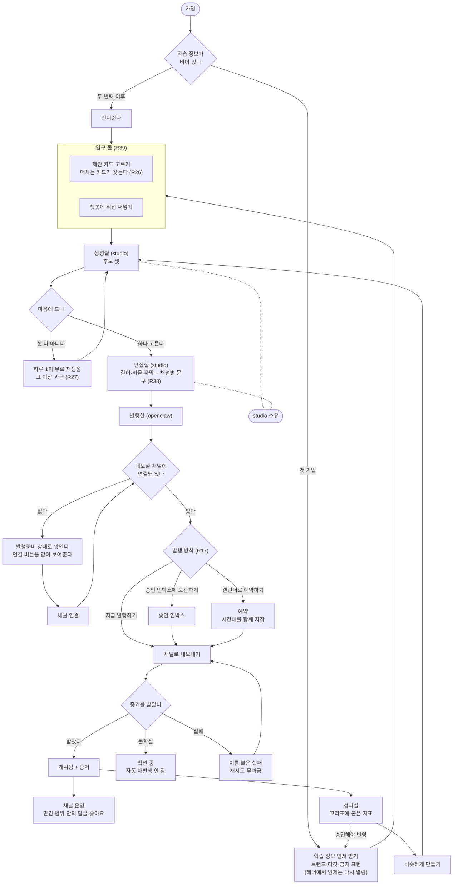
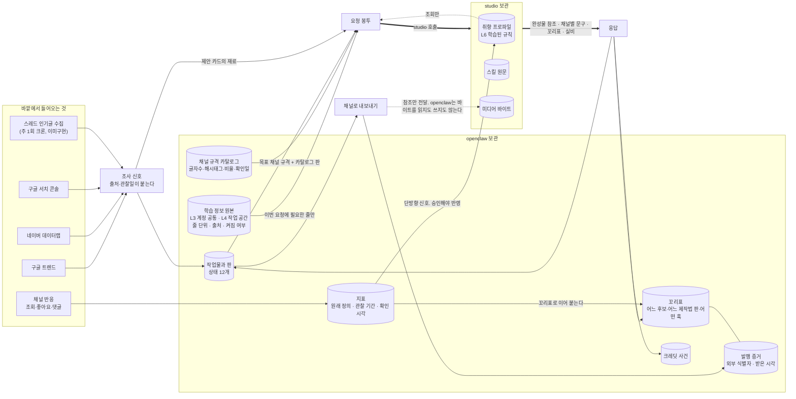
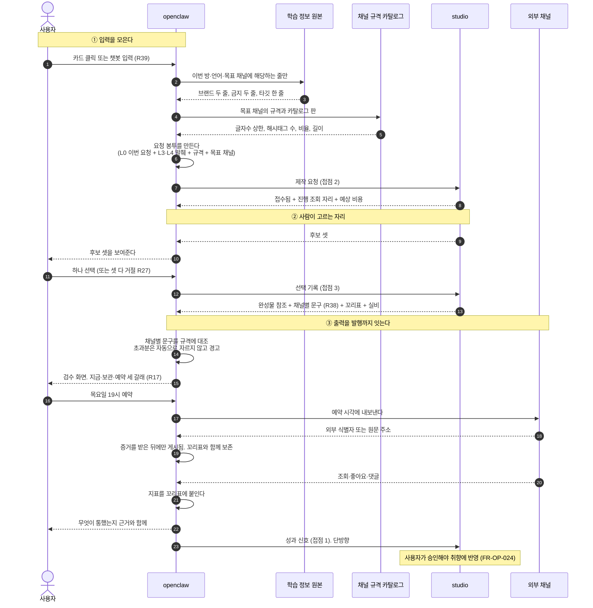
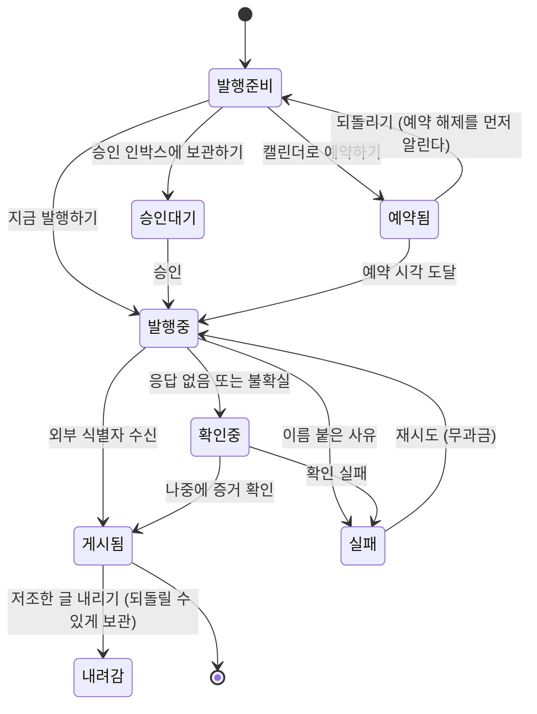
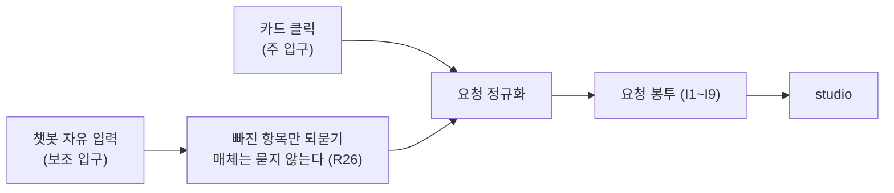

<!--
STAMP
파일: docs/prd-openclaw-v2.0.md
라인: osmu / openclaw-service (운영 범위)
판: v2.0. v1.0(docs/prd-openclaw-운영-v1.0.md)을 대체하지 않고 그 위에 얹는 보강판이다. v1.0은 남긴다
생성: 2026-08-21 KST
model: claude-opus-5[1m]
agent: prd-architect
기반 포맷: docs/prd-openclaw-운영-v1.0.md (섹션 골격·FR 표기·AC Gherkin·7원칙 판정표를 그대로 상속)
기반 산출물 (버전핀, 전부 실제 Read):
  - docs/prd-openclaw-운영-v1.0.md (전문. 페르소나·시나리오·재구현 금지 목록·Steelman·프리모템·K1~K5·M1~M7·자기심문을 이 판이 승계)
  - docs/requests/회장-확정-요구사항-대장.md (R01~R45 전량 + R31/R38 충돌 주석 + 미결 2건)
  - docs/사업계획-osmu-v0.9.md (§3.1 전체 구조, §3.2 studio 내부, §3.3 openclaw 내부와 기술 과제, §3.4 일곱 칸 L0~L6, §3.5 비용 최적화)
  - wiki/reference/channel-status.md (Live/Connected/구현완료 현황, readiness 5상태, capability SSOT, 영상 그룹 분리)
  - docs/prototype/openclaw-auto-4room-v39.html (사이드바 네 방·채널 11항목·Keyword Research 4항목·연결 상태 카드 구조)
  - docs/fdd/fdd-openclaw-studio-v1.0.0-gpt-codex.md (§2.1 현행 구조, §3.1 갭 표, §5.1~5.6 접점 5개 대안, §6 데이터 소유)
  - CLAUDE.md (아키텍처 도구 목록, 멀티채널 발행 구조, 큐 스키마 v2, 크론잡 7건)
  - dashboard/src/app/api 디렉터리 목록 (조사 소스 구현 현황 확인. 위키 미기록이라 폴백으로 확인. §3.2 회수 항목 참조)
품질헌법: /Users/sj/.claude/standards/planning.md 실제 Read 완료. 7원칙 판정표는 §11
벤치마크: 이번 판도 WebSearch 예산이 세션 한도(200/200)로 소진돼 실검색을 못 했다. 벤치마크 원천은 v1.0과 동일하게 wiki/research/2026-08-competitor-and-production-research.md의 2차 인용이다. 이 사실을 숨기지 않는다. 실검색 갱신은 다음 판의 과제다
고민 한 줄: v1.0의 결함은 기능이 부족한 것이 아니라 "무엇이 어디로 흐르는가"가 글로만 있어 판단이 안 됐던 것이다. 그래서 이 판의 지면 절반을 도식과 입출력 표에 썼고, 기능 조항은 바뀐 것(R38)만 손댔다
-->

# openclaw-service PRD v2.0 : 도식 · 플랫폼 실명 · studio 입출력

> **One Thing:** 만들 줄은 아는데 알리질 못하는 사람이, 완성물을 넘긴 그 화면에서 언제 어디로 나갈지 정하고 나간 뒤 무슨 일이 벌어졌는지까지 근거와 함께 보는 곳.

**한 줄 결론:** v1.0에서 바뀐 것은 넷이다. ①유저 플로우와 데이터 흐름과 studio 호출을 도식으로 박았다(R41) ②1단계 발행 채널 3종과 조사 소스 4종을 실명으로 골랐다(R44) ③openclaw가 만들어야 하는 것은 "studio에 보낼 입력을 모으고 받은 출력을 발행까지 잇는 것"임을 입출력 표로 확정했다 ④채널별 제목·소개·해시태그의 생성 주체를 편집실로 옮겼다(R38, R31과 충돌하며 그 사실을 §6.3에 명시했다). 나머지 기능 조항·페르소나·시나리오·안전장치는 v1.0 그대로다.

---

## 0. 이 문서의 자리

| 항목 | 내용 |
|---|---|
| 범위 | openclaw-service 중 화면과 계정, 발행실, 채널 운영, 성과실, studio 호출, 요금제와 크레딧 |
| 범위 밖 | 생성과 편집의 내부 동작 (studio PRD 소유). 경계는 §12 |
| 읽는 법 | **이 문서 하나로 완결된다.** v1.0을 함께 펼칠 필요가 없다. 기능 요구 34개, 데이터 요구 17개, 비기능 요구 15개가 전부 본문에 있다 |
| v1.0과의 관계 | v1.0을 대체하지 않고 그 위에 얹는다. v1.0 대비 실제 변경은 §2 도식 4장, §5 플랫폼 선택, §6 studio 입출력, **FR-OP-007 개정**, **FR-OP-032~034 · D16~D17 · NFR-OP-15 · K6~K7 · M8~M10 신설**이며 변경 요약은 §7.0 |
| 정본 관계 | PRD v8.2.1의 FR-OS81·FR-OS82를 대체하지 않는다 |
| 첫 고객 | 회장이 운영하는 바이브 코딩 커뮤니티 |
| 이 판이 답하지 않는 것 | 스키마와 엔드포인트. 그것은 기술설계에서 회장과 티키타카로 정한다 |

---

## 1. 사용자와 시나리오

### 1.1 페르소나

**박도윤, 32세, 혼자 SaaS를 만든 바이브 코더** (PRD v8.2.1 §5 페르소나를 세 문서가 공유한다. 새 인물을 만들면 문서마다 다른 사람을 향하게 된다.)

운영 관점에서 이 사람의 하루는 이렇다. 만드는 것은 문제가 아니다. 그는 이미 클로드로 랜딩페이지도 짜고 영상도 뽑아 봤다. 막히는 곳은 그 다음이다. 만든 것을 스레드에 올리고, 인스타에 비율을 맞춰 다시 올리고, 링크드인에는 톤을 바꿔 올려야 하는데 그걸 세 번 하다 보면 두 시간이 간다. 그래서 셋 중 하나만 올리고 나머지는 미룬다. 미룬 것은 영영 안 올라간다. 댓글이 달려도 하루 뒤에 본다. 조회수가 3천이 나온 글이 왜 나왔는지는 모른다. 다음에 뭘 올릴지는 그날 기분이 정한다.

**근거 (본인 직관 외):** 사업계획 §1.1이 "만드는 건 하는데 알리질 못하는 사람"을 별도 행으로 세우고 그 행에 "우리가 운영 중인 바이브 코딩 커뮤니티가 정확히 이 사람들"이라고 적었다. 관찰 가능한 실제 모집단이 이미 우리 손에 있다. 연구 기록 §4.4는 이 사람이 혼자 하려면 월 약 57만원의 도구값이 든다는 것을 항목별로 적었다. 지불 의사 자체는 미검증이며 이것이 kill-criteria의 대상이다 (§10).

**R40 반영:** 이 사람은 프롬프트 엔지니어링을 못 한다. 못 하는 정도가 아니라 무엇을 요청해야 하는지조차 모른다. 그래서 이 제품의 기본 입구는 빈 입력창이 아니라 **고를 수 있는 카드**다. 다만 R39에 따라 챗봇으로 직접 써넣는 두 번째 입구도 함께 연다. 두 입구가 같은 요청 봉투로 합류하는 지점이 §6.2다.

**가장 큰 불신:** 예상 밖 비용, 그리고 "올렸다고 했는데 안 올라간 것".

### 1.2 시나리오

| # | 시나리오 | 지나는 자리 |
|---|---|---|
| S1 | 첫날. 가입하고 채널을 하나만 연결한 채 첫 완성물을 받는다 | 계정 → 발행실. 연결 안 된 채널은 회색으로 남는다 |
| S2 | 완성물 하나를 채널 셋에 내보낸다. 각 채널의 제목과 해시태그를 보고 하나만 고친다 | 발행실 채널별 문구 검수 |
| S3 | 지금 올리기 싫다. 목요일 저녁 7시로 예약한다 | 발행실 → 캘린더 |
| S4 | 밤에 자는 동안 예약이 돌았고 토큰이 만료돼 실패했다 | 예약 실패 알림 → 재연결 → 재시도 (무과금) |
| S5 | 댓글이 여덟 개 달렸다. 여섯 개는 맡긴 범위 안이라 대신 답이 나갔고 둘은 사람에게 넘어왔다 | 채널 운영 대행 + 넘김함 |
| S6 | 이번 주에 뭐가 통했나 본다. 상위 3건에 꼬리표가 붙어 있다 | 성과실 |
| S7 | 통한 것과 비슷하게 다시 만든다 | 성과실 → 생성실 (맥락을 들고 새 작업물) |
| S8 | 크레딧이 다 됐다. 무엇에 얼마가 나갔는지 본다 | 요금제·사용 원장 |

---

## 2. 도식 (R41)

### 2.1 유저 플로우

첫 가입과 두 번째 이후를 한 장에 넣는다(R05). 굵은 경로가 openclaw 소유, 점선 상자가 studio 소유다.



**되돌리기(R13)는 이 그림에서 화살표를 거꾸로 그리지 않는다.** 되돌리면 앞 방 목록에 항목이 하나 새로 추가되고 원본은 그대로 남는다. 즉 되돌리기는 역방향 이동이 아니라 앞 방에서의 신규 생성이다.

### 2.2 데이터 흐름

무엇이 어디서 나서 어디에 저장되고 누가 읽는지만 그린다. 필드명은 쓰지 않는다.



**이 그림의 판정선 두 개.** ①점선으로 그린 미디어 바이트는 openclaw 안으로 절대 들어오지 않는다(NFR-OP-07). ②지표에서 취향 프로파일로 가는 화살표는 단방향이고 사용자 승인 없이는 반영되지 않는다(FR-OP-024, FR-OP-025).

### 2.3 studio 호출 흐름

openclaw가 실제로 만들어야 하는 것이 이 시퀀스다. 입력을 모으는 왼쪽 절반과 출력을 발행까지 잇는 오른쪽 절반이 전부다.



### 2.4 발행 상태 전이 (증거 규칙을 그림으로)



**확인중이 별도 상태라는 것이 이 그림의 전부다.** 확인중에서 게시됨으로 자동으로 넘어가는 화살표는 증거 수신 하나뿐이고, 확인중에서 발행중으로 돌아가는 화살표는 없다(자동 재발행 금지).

---

## 3. 현재 구현 상태 (재구현 금지 목록)

**1차 진실원은 위키다.** `wiki/reference/channel-status.md`, 루트 `CLAUDE.md`, PRD v8.2.1 §2, 프로토타입 v39를 읽어 채웠다.

### 3.1 v1.0에서 승계 (변경 없음)

| 영역 | 현재 상태 | 정본 출처 | 이 PRD의 처리 |
|---|---|---|---|
| 채널 발행 도구 | **이미구현.** Threads·X·Instagram 전용 도구 + publish extension 14종 | `CLAUDE.md` | 그대로 쓴다 |
| 채널 연결·검증 | **이미구현.** OAuth 9채널 코드 완료, 수동 입력 3채널, `verify_channel` 실호출 | channel-status wiki, ADR-004 | 그대로 쓴다 |
| readiness 5상태 | **이미구현.** 연결·미연결·오픈 준비중·발행 준비중·오류 | channel-status wiki | 발행실이 이 값을 읽는다 |
| 채널 capability SSOT | **이미구현.** `channel-capabilities.ts` 단일 소스 | channel-status wiki | 규격 카탈로그(FR-OP-008)는 이것의 확장 |
| 멀티채널 발행 크론 | **이미구현.** 2시간 주기 | `CLAUDE.md` | 그대로. 단 2시간 주기가 분 단위 예약을 못 지킨다 (FR-OP-009, M4) |
| 큐 스키마 v2 채널별 상태 | **이미구현** | `CLAUDE.md` | 발행 증거의 자리가 이미 있다 |
| 채널별 가이드·키워드 | **이미구현** | `CLAUDE.md` | 채널별 문구의 입력이 된다 |
| 반응 수집·댓글 좋아요·저조 삭제 | **이미구현(Threads).** 6시간 주기 | `CLAUDE.md` | **재구현 금지.** 얹는 것은 위임 범위와 정지 장치뿐 |
| 외부 인기글 수집 | **이미구현(Threads).** 주 1회 | `CLAUDE.md` | 성과실 둘러보기 소스 |
| 팔로워 추적 | **이미구현(Threads).** 매일 | `CLAUDE.md` | 그대로 |
| Queue·Inbox·Calendar·Videos 화면 | **부분구현** | PRD v8.2.1 §2 | 같은 작업물의 다른 창으로 재배선 |
| 발행 증거·복구 | **부분구현** | PRD v8.2.1 §2 | 최우선 완결 대상 |
| 성과 미수집 표시 | **부분구현.** 미수집을 0으로 표시 | PRD v8.2.1 §2 | 상태를 이름으로 분리 |
| 발행 세 갈래 문구 | **미구현** | R17 | 신설 |
| 상품별 크레딧·하드캡·봇 방어 | **미구현** | 사업계획 §4.4 | 신설 |
| 꼬리표 계보 | **미구현** | 사업계획 §1.5 | 신설 |

### 3.2 이번 판에서 새로 확인한 것 (조사 소스)

R44에 답하려면 조사 소스가 이미 있는지부터 봐야 했다. 위키에 그 항목이 없어 코드 경로로 확인했다.

| 조사 소스 | 현재 상태 | 확인 방식 |
|---|---|---|
| 구글 트렌드 | **이미구현.** 전용 API 경로 존재 (`api/google-trend`), 프로토타입 사이드바 Keyword Research에 항목 있음 | 코드 경로 + 프로토타입 v39 |
| 네이버 데이터랩 | **이미구현.** 조회 경로와 설정 경로가 둘 다 존재 (`api/naver-trend`, `api/naver-datalab-config`) | 코드 경로 + 프로토타입 v39 |
| 구글 서치 콘솔 | **이미구현.** 분석·설정·색인 세 경로 존재 (`api/gsc-analytics`, `api/gsc-config`, `api/gsc-index`) | 코드 경로 + 프로토타입 v39 |
| 키워드 플래너 | **이미구현.** 조회·설정 경로 존재 (`api/keyword-research`, `api/kw-planner-config`) | 코드 경로 + 프로토타입 v39 |
| 스레드 인기글 수집 | **이미구현.** 주 1회 크론 | `CLAUDE.md` |

> ⛔ **회수 필요: 위키에 조사 소스 현황이 기록돼 있지 않다**
> - 배경: R44에 답하려고 위키(`wiki/reference/`, `wiki/product/`)를 먼저 봤는데 트렌드·서치 콘솔·데이터랩 관련 페이지가 없었다. 위키가 진실원이어야 하는데 그 항목이 비어 있어 코드 경로 확인으로 폴백했다. 그 결과 이 표의 출처가 위키가 아니라 코드다.
> - 무엇을 정하나: 조사 소스 현황을 위키의 어느 페이지에 정본으로 둘지.
> - 옵션 A(추천): `wiki/reference/`에 조사 소스 페이지를 신설하고 채널 현황 페이지와 같은 격으로 유지한다 → 고르면: 다음 기획이 코드를 안 뒤져도 된다 / 안 고르면: 매 판마다 같은 폴백을 반복하고 그때마다 "이미 있는 것을 또 만들자"는 제안이 나올 위험이 남는다.
> - 옵션 B: 채널 현황 페이지 안에 절로 붙인다 → 트레이드오프: 발행 채널과 조사 소스는 수명 주기가 다른데 한 페이지에 묶으면 갱신 주체가 흐려진다.
> - 추천 근거: 채널 현황 페이지가 발행 채널만으로 이미 유지되고 있고 그 형식이 잘 작동한다. 같은 형식을 조사 소스에도 복제하는 것이 가장 싸다.

---

## 4. 제품 목표와 비목표 (v1.0 유지)

### 4.1 목표

| # | 목표 | 어떻게 알 수 있나 |
|---|---|---|
| G1 | 완성물이 사람 손으로 다른 화면에 옮겨지지 않고 발행까지 간다 | 발행 한 건에서 사용자가 파일을 내려받아 채널에 직접 올린 횟수 0 |
| G2 | 발행 결과가 참인지 거짓인지 헷갈리지 않는다 | 증거 없는 발행을 게시됨으로 표시한 건수 0 |
| G3 | 예약이 조용히 실패하지 않는다 | 실패 후 사용자 인지까지 p95 1시간 이내 |
| G4 | 대행 응대가 맡긴 범위를 넘지 않는다 | 위임 범위 밖 자동 발화 0 |
| G5 | 무엇이 통했는지 사람이 근거를 보고 판단할 수 있다 | 성과 상위 항목의 꼬리표·관찰 기간 부착률 100퍼센트 |
| G6 | 쓰는 만큼 나가는 원가가 요금을 넘지 않는다 | 계정별 상한 초과 0, 최상급 모델이 포함분으로 소비된 건수 0 |
| G7 | **(신설)** 조사 소스에서 온 값이 출처 없이 화면에 뜨지 않는다 | 출처·관찰일이 없는 조사 항목 표시 0 |

### 4.2 비목표 (이 판에서 안 한다)

| 안 하는 것 | 왜 |
|---|---|
| **성과가 취향을 자동으로 고치는 것** | 표본이 없다. 지금은 상위를 근거와 함께 보여주는 데까지다. 조용한 취향 변경 금지는 이미 확정된 원칙이다 (FR-OS81-020) |
| 발행실에서 창작 텍스트를 직접 타이핑해 고치는 것 | 경계가 깨진다. 대신 재요청 경로를 둔다 (FR-OP-014, 미결 M3) |
| 미디어 바이트를 만지는 것 (크롭, 재인코딩, 자막 합성) | 경계 판정 3기준 중 셋째에 걸린다. studio 소유 |
| 여러 사람이 결재하는 승인 체인 | 사용자는 혼자다. 승인은 단계가 아니라 발행실 안의 보관함이다 |
| 다국가 self-serve 결제와 24시간 지원 | FR-OS82-042로 이미 잠갔다 |
| 고급 BI, 경쟁사 계정 추적, 광고 성과 | 오가닉 발행과 그 반응까지만 |
| 이미 구현된 채널·크론 구조를 새로 짜는 것 | §3이 그 목록이다. 재구현 금지 |
| **1단계에서 15개 채널을 다 상품으로 파는 것 (이 판에서 추가)** | §5.1이 그 이유다. 구현이 있는 것과 우리가 책임지고 파는 것은 다르다. 구현은 지우지 않고 유지하되 1단계 약속 범위에서는 뺀다 |

---

## 5. 플랫폼 선택 (R44)

이 절이 v1.0에 없던 것이다. 회장 지적 그대로 v1.0은 어느 플랫폼을 쓸지 하나도 정하지 않았다.

### 5.1 발행 채널

**고르는 기준 셋.** ①우리 첫 고객(바이브 코딩 커뮤니티)이 실제로 쓰는 곳인가 ②우리 쪽 구현이 실제 동작까지 확인됐나 ③연결에 우리가 통제 못 하는 외부 비용이나 심사가 끼는가.

| 채널 | 구현 상태 | 1단계 판정 | 근거 |
|---|---|---|---|
| **Threads** | Live (연결 + 자동화 동작) | **1단계 확정** | 실제로 도는 유일한 채널이다. 인사이트 수집·댓글 좋아요·인기글 수집 크론이 전부 여기 붙어 있어 성과실이 첫날부터 값을 갖는다 |
| **Instagram** | Connected (연결만, 팔로워 2,390) | **1단계 확정** | 카드뉴스와 숏폼의 주 무대이고 studio 출력과 매체가 맞는다. 자동화 미시작이라 첫 작업이 "연결을 발행까지 잇기"다 |
| **X** | 구현 완료, 미연결 | **1단계 조건부** | 280자 자동 압축이 이미 있어 OSMU 효과가 가장 크다. 단 발행 API가 고객 각자 Developer Portal 등록을 요구하고 우리가 대납하지 않기로 이미 결정했다(2026-07-06). 연결 안 한 고객에게는 회색으로 남는다 |
| YouTube Shorts, TikTok | 구현 완료. 영상은 별도 발행 경로 | **2단계** | 영상 직접 발행이 텍스트 예약과 분리된 경로를 쓴다(channel-status wiki). 예약·증거·꼬리표를 텍스트와 같은 규칙으로 묶는 작업이 따로 필요하다 |
| LinkedIn, Naver Blog | 구현 완료, 미연결 | **2단계** | 타깃이 쓰긴 쓰지만 첫 고객군의 주 무대가 아니다. 네이버 블로그는 국내 검색 유입에서 가치가 큰데 그것을 살리려면 서치 콘솔·데이터랩과 묶은 별도 설계가 필요하다 |
| Facebook, Bluesky, Pinterest, Tumblr, LINE | 구현 완료, 미연결 | **유지하되 1단계 약속 밖** | 코드와 화면을 지우지 않는다. 연결하고 싶은 고객은 연결된다. 다만 우리가 성과·대행 품질을 책임진다고 말하지 않는다 |
| Telegram, Discord, Slack | 구현 완료. capability상 Settings만 | **발행 채널 아님. 알림 경로로 유지** | 이 셋은 Queue·Analytics·Growth·Popular가 구조적으로 불가능해 이미 Settings만 노출한다. 발행 대상이 아니라 예약 실패·넘김함 알림을 받는 자리로 쓴다 |

**1단계 = Threads · Instagram · X 셋.** 이 셋이 §2.1 유저 플로우의 S2("채널 셋에 내보낸다")를 그대로 실현한다.

### 5.2 조사 소스

| 소스 | 무엇에 쓰나 | 1단계 판정 | 근거와 한계 |
|---|---|---|---|
| **스레드 인기글 수집** | 성과실 둘러보기, 제안 카드의 재료 | **1단계 확정** | 주 1회 크론으로 이미 돈다. 우리 1순위 채널과 소스가 같아 관련성이 가장 높다 |
| **구글 트렌드** | 지금 뜨는 주제, 제안 카드의 시의성 | **1단계 확정** | 조회 경로가 이미 있다. **한계: 공식 계약 API가 아닌 경로에 의존할 가능성이 있어 안정성이 우리 통제 밖이다.** 이것을 미결 M8로 올린다 |
| **네이버 데이터랩** | 국내 검색 수요, 한국어 주제 선정 | **1단계 확정** | 조회·설정 경로가 이미 있다. 국내 타깃에게 구글 트렌드만으로는 부족하다 |
| **구글 서치 콘솔** | 자기 사이트·블로그가 있는 고객의 실제 유입 질의 | **1단계 조건부** | 사이트 소유 확인이 된 고객만 값을 갖는다. 바이브 코더는 자기 서비스 랜딩을 갖고 있을 확률이 높아 조건부로 넣는다. 없는 고객에게는 이 탭을 "해당 없음"으로 표시하고 빈 그래프를 보여주지 않는다 |
| 키워드 플래너 | 검색량과 경쟁도 | **2단계** | 광고 계정 연결이 전제라 진입 마찰이 크다. 구현은 유지한다 |
| 인스타그램·틱톡 해시태그 트렌드 | 숏폼 주제 | **미정** | 플랫폼이 공개 조회를 제한하는 범위를 우리가 확인하지 못했다. 확인 전에는 기획서에 넣지 않는다 |

**공통 규칙 하나.** 어느 소스에서 왔든 화면에 뜨는 조사 항목에는 출처 이름과 관찰일이 붙는다. 못 붙이면 안 보여준다(FR-OP-021, G7).

---

## 6. studio 호출: 무엇을 모아 보내고 무엇을 받아 잇는가 (회장 지적 3)

**openclaw가 만들어야 하는 것은 생성기가 아니다.** studio는 서드파티 함수이고, openclaw가 짓는 것은 그 함수의 **입력을 모으는 앞쪽**과 **출력을 발행까지 잇는 뒤쪽**이다. 이 절이 그 둘을 표로 확정한다. 필드명과 엔드포인트는 쓰지 않는다. 그것은 기술설계에서 회장과 정한다.

### 6.1 입력: 무엇을 어디서 모으나

| # | 보내는 것 | 어디서 모으나 | 누가 채우나 | 없으면 |
|---|---|---|---|---|
| I1 | 이번 요청 (주제·언어·목표 채널·비용 상한) | 카드 클릭 또는 챗봇 입력 | 사용자 (L0) | 제작을 시작하지 않는다 |
| I2 | 브랜드 사실·기본 말투·금지 표현 | 학습 정보 원본 중 계정 공통 층 | 온보딩 (L3) | 첫 가입이면 먼저 받는다 (R24) |
| I3 | 타깃·컨셉·업종 | 학습 정보 원본 중 작업 공간 층 | 작업 공간 만들 때 (L4) | 계정 공통만으로 진행하고 그 사실을 표시 |
| I4 | 목표 채널의 규격과 카탈로그 판 | 채널 규격 카탈로그 (openclaw 소유) | 우리 | 채널별 문구를 요청하지 않는다 |
| I5 | 조사 신호 (트렌드·검색 질의·인기글) | §5.2 소스 넷 | 자동 수집 + 출처·관찰일 | 신호 없이 제작한다. 제안 카드의 시의성만 낮아진다 |
| I6 | 성과 신호 (무엇이 통했나) | 지표를 꼬리표에 이어 붙인 결과 | 자동 | 계보 없음으로 표시 |
| I7 | 선택 이력 (어느 후보를 골랐나) | 후보 화면의 클릭 | 사용자 | 취향이 자라지 않는다 |
| I8 | 반입 소재 (사용자가 올린 원본) | 소재 반입 접점 | 사용자 | 없어도 된다 |
| I9 | 시장·모델 지식 (시장별 문법, 모델별 말투) | 우리가 관리하는 지식 층 (L2) | 우리 | 기본값으로 진행 |

**절대 안 보내는 것.** 사용자의 소셜 채널 자격증명, 결제 수단, 다른 워크스페이스의 어떤 값도 봉투에 실리지 않는다(FR-OP-026, NFR-OP-08·09).

### 6.2 두 입구가 하나의 봉투로 합류하는 지점 (R39)



**챗봇 입구에서도 매체를 묻지 않는다.** R26이 정한 대로 매체는 제안 카드가 갖는다. 챗봇으로 들어온 요청은 정규화 단계에서 매체를 후보로 제시하고 사용자가 고르게 한다. 자유 입력이라고 해서 사용자에게 "어떤 형식으로 만들까요"를 묻는 순간 R40 타깃(무엇을 요청해야 하는지 모르는 사람)이 막힌다.

### 6.3 출력: 무엇을 받아 어디로 잇나

| # | 받는 것 | openclaw가 하는 일 | 못 받으면 |
|---|---|---|---|
| O1 | 완성물 참조 (바이트 아님) | 발행 대상으로 등록. 바이트는 열지 않는다 | 발행 준비 완료로 넘기지 않는다 |
| O2 | **채널별 제목·소개·해시태그·첫 댓글 (R38)** | 규격 카탈로그에 대조하고 검수 화면에 올린다 | 원본만 발행하는 경로로 빠진다 (§6.4) |
| O3 | 꼬리표 (어느 후보·어느 제작법 판·어떤 훅) | 발행 증거에 함께 보존. 사후 부착 불가 | 계보 없음으로 분리 |
| O4 | 실비 | 크레딧 사건으로 대사 | 예상 범위만 남기고 차이 사유를 표시 |
| O5 | 품질 게이트 반려 사유 | 차감하지 않고 사유를 보여준다 | 반려를 성공으로 표시하지 않는다 |
| O6 | 진행 상태 (만드는 중) | 언제까지인지 범위로 말한다 | 기존 결과·이력·입력값을 보존하고 신규 제작만 막는다 |

### 6.4 원본만 받는 경로

사업계획 §3.2가 적은 대로 **원본만 받고 직접 올리려는 사람**이 있다. 이 갈래를 지운다고 R38이 완성되지 않는다.

| 갈래 | 받는 것 | 발행 | 성과 |
|---|---|---|---|
| 전체 위임 | O1 + O2 + O3 | 우리가 채널로 내보낸다 | 꼬리표에 붙는다 |
| 원본만 | O1 + O3 | 사용자가 직접 올린다 | **계보 없음으로 분리.** 우리는 그 발행을 관측하지 못한다 |

**"원본만" 갈래를 고른 사용자에게 성과실이 빈다는 사실을 고르기 전에 말한다.** 나중에 빈 화면을 보고 고장으로 오해하는 것이 더 비싸다.

---

## 7. 기능 요구사항과 수용 기준 (FR-OP-001~034 전량)

표기 규칙. **소유**는 화면과 계약의 주인, **대응**은 PRD v8.2.1의 상위 조항이다. AC는 Given/When/Then으로 쓰고 경계와 실패를 반드시 포함한다. 조항 제목 옆의 **(개정)**·**(신설)**은 v1.0 대비 변경 표시이며, 표시가 없는 조항은 v1.0과 문언이 같다.

### 7.0 이 판의 변경 요약

| 조항 | 변경 | 무엇이 바뀌었나 |
|---|---|---|
| FR-OP-007 | **개정** | 채널별 문구의 **생성 주체가 발행실에서 편집실(studio)로 이동**했다 (R38). openclaw는 규격 대조·검수·발행만 한다. R31과 충돌하며 그 사실을 조항에 명시했다 |
| FR-OP-032 | **신설** | 1단계 발행 채널을 Threads·Instagram·X 셋으로 확정하고 나머지 표시 규칙을 정했다 (R44) |
| FR-OP-033 | **신설** | 조사 소스 넷의 실명·관찰일 표시와 값 없는 소스의 처리를 정했다 (R44) |
| FR-OP-034 | **신설** | 챗봇 입구와 카드 입구가 같은 요청 봉투로 합류하는 규칙을 정했다 (R39·R26·R40) |
| 나머지 30개 | 유지 | 문언 변경 없음 |

### 7.1 화면과 계정 (사용자가 오는 유일한 입구)

**FR-OP-001 | 소비자는 openclaw-service에서만 가입·로그인하고 studio에 직접 가입하지 않는다**
소유 openclaw · 현재 부분구현 · 대응 FR-OS81-001·002·003

```gherkin
Given 소셜 로그인으로 가입한 신규 사용자
When  첫 워크스페이스를 활성화
Then  studio 테넌트가 자동으로 준비되고 사용자에게는 그 존재가 보이지 않는다
And   같은 활성화를 20회 반복해도 테넌트는 1개를 넘지 않는다
And   사용자의 소셜 계정 자격증명은 studio로 전달되지 않는다
And   studio 준비가 실패하면 "만들기 준비 중 문제"라는 이름 붙은 상태로 표시하고, 이미 입력한 값은 하나도 사라지지 않는다
```

**FR-OP-002 | 네 방은 사이드바에, 네 단계는 헤더에, 학습 정보도 헤더에 둔다**
소유 openclaw · 현재 미구현 · 근거 R08·R14·R15

```gherkin
Given 로그인한 사용자
When  어느 화면에 있든
Then  사이드바에 Studio 생성 · Studio 편집 · 발행실 · 성과실 네 항목이 보인다
And   헤더에 네 단계 진행과 학습 정보 진입점이 함께 보인다
And   방마다 붙는 숫자는 "그 방에서 내 손을 기다리는 작업물 수"이며 0이면 숫자를 숨긴다
And   기존 채널 목록과 도구 목록은 삭제되지 않고 네 방 아래 묶음으로 내려간다
```

**FR-OP-003 | 각 방은 작업물을 보관하고 사용자는 언제든 꺼내 이어서 작업한다**
소유 openclaw · 현재 미구현 · 근거 R09·R16, user-flow §3.1

```gherkin
Given 12개 상태 중 하나에 있는 작업물
When  상단 작업물 목록을 열면
Then  각 항목이 "만들던 것 · 고를 것 · 다듬을 것 · 내보낼 것 · 승인 기다리는 것 · 예약된 것 · 막힌 것 · 나간 것 · 내린 것" 중 하나의 이름을 달고 보인다
And   항목을 누르면 그 상태가 사는 방으로 이동해 하던 지점에서 이어진다
And   작업물이 0건이면 빈 목록이 아니라 "지금 만들 것" 진입 카드를 보여준다
```

**FR-OP-004 | 채널 연결은 첫 발행 직전에 요구하고, 연결 없이 만든 완성본은 발행실에 쌓인다**
소유 openclaw · 현재 미구현 · 근거 user-flow 빈틈 12

```gherkin
Given 채널을 하나도 연결하지 않은 사용자
When  가입하고 첫 작업물을 만든다
Then  가입 시점에는 연결을 요구하지 않는다
And   발행실 도착 시 "내보낼 곳이 아직 없습니다"와 연결 버튼을 함께 보여준다
And   완성본은 사라지지 않고 발행준비 상태로 발행실에 남는다
And   연결 없이 지난 완성본이 3건을 넘으면 그 사실을 한 번 알린다. 반복 알림은 하지 않는다
```

**FR-OP-005 | 채널 상태는 연결·미연결·오픈 준비중·발행 준비중·오류 다섯으로 구분해 표시한다**
소유 openclaw · 현재 **이미구현(계약)** · 근거 channel-status wiki readiness 계약

```gherkin
Given 워크스페이스의 채널 목록
When  연결 상태를 표시할 때
Then  미연결은 누를 수 있는 연결 버튼으로, 오픈 준비중은 회색 대기로 서로 다르게 보인다
And   토큰이 만료된 채널은 일반 오류가 아니라 "다시 연결해 주세요"로 따로 표시된다
And   장기 토큰 교환과 계정 신원 검증을 둘 다 통과하기 전에는 연결됨으로 표시하지 않는다
And   연결이 끊긴 채널에 예약이 걸려 있으면 그 예약 건수를 같은 자리에 함께 보여준다
```

### 7.2 발행실

**FR-OP-006 | 발행 선택지는 지금 발행하기 · 승인 인박스에 보관하기 · 캘린더로 예약하기 세 갈래이며 문구를 바꾸지 않는다**
소유 openclaw · 현재 미구현 · 근거 R17 (회장 지정 문구)

```gherkin
Given 편집 확정된 작업물이 발행실에 도착
When  발행 방식을 고를 때
Then  정확히 위 세 문구가 보이고 다른 표현으로 대체되지 않는다
And   승인 인박스는 별도 단계가 아니라 발행실 하위 보관함으로 배치된다
And   승인 인박스의 항목을 승인하면 즉시 발행으로 넘어간다
And   신규 범위의 기본 선택은 즉시 발행이 아니라 승인 후 발행이다
```

**FR-OP-007 (개정) | 채널별 제목·소개·해시태그·첫 댓글은 편집실(studio)이 만들고, 발행실(openclaw)은 그것을 받아 규격에 대조하고 검수하고 발행한다**
소유 studio(생성) / openclaw(대조·검수·발행) · 현재 미구현 · 근거 **R38 (2026-08-21 회장 최신 지시)**

> **R31과 충돌한다는 사실을 여기 명시한다.** R31(2026-08-19)은 "제목·소개·해시태그는 발행실이 쓴다. studio 단독 판매 시 역할 분리를 해치기 때문"이었고, 사업계획 §3.2도 같은 취지로 "올리는 시점에만 알 수 있는 것에 좌우되기 때문"이라 적었다. R38(2026-08-21)은 "편집실이 만든다. 플랫폼 규격에 맞춰 원본을 채널별로 편집하는 자리가 편집실이기 때문"이다. **회장 최신 지시가 R38이므로 R38을 따른다.** 두 항목 모두 대장에서 지우지 않는다. 남은 문제는 R31이 걱정한 "올리는 시점에만 알 수 있는 것"인데, 그것을 발행 직전에 갱신할지는 **미결 M9**로 남긴다.

```gherkin
Given 완성본과 내보낼 채널 3개
When  편집실이 채널별 문구를 만들어 넘기면
Then  발행실은 공통 문구 1벌과 채널별 차이를 나란히 보여주고 무엇이 다른지 표시한다
And   각 채널의 글자수 상한과 해시태그 개수 상한을 규격 카탈로그로 대조해 함께 보여준다
And   상한 초과분은 사용자 확인 없이 자동으로 잘라내지 않고 잘리기 전에 경고한다
And   openclaw는 창작 텍스트를 직접 짓지 않는다. 규격 불일치를 발견하면 편집실에 재요청한다
And   문구를 못 받은 경우(원본만 받는 경로)에도 발행 자체는 막지 않고 "채널별 문구 없음"으로 표시한다
And   발행 직전 갱신 여부는 M9 결정 전까지 화면에 확정하지 않는다
```

**FR-OP-008 | 채널 규격 카탈로그는 openclaw가 소유하고 studio가 읽는다**
소유 openclaw · 현재 **부분구현(capability SSOT 확장)** · 근거 경계 wiki §채널 지식

```gherkin
Given 채널 규격이 필요한 모든 곳
When  글자수 상한·해시태그 개수·지원 비율·길이 상한을 읽을 때
Then  기존 채널 capability 단일 소스 하나에서만 읽고 두 번째 사본을 만들지 않는다
And   플랫폼이 규칙을 바꾸면 이 카탈로그 한 곳만 고치면 된다
And   각 규격 값에 마지막 확인일이 붙고, 확인일이 90일을 넘으면 "확인 필요"로 표시한다
And   studio가 규격을 조회할 때 카탈로그 버전을 함께 받아 어느 판으로 만들었는지 남는다
```

**FR-OP-009 | 예약 발행은 사용자가 지정한 시각 기준으로 실행하고, 실행 주기가 그 정밀도를 못 지키면 그 사실을 미리 말한다**
소유 openclaw · 현재 **부분구현.** 기존 `multi-channel-publish`가 2시간 주기 · 근거 CLAUDE.md 크론 절, 사업계획 §3.3

```gherkin
Given 사용자가 목요일 19시 00분으로 예약
When  예약 실행 경로가 2시간 주기 크론뿐이면
Then  예약 화면에서 실제 발행이 지정 시각 이후 최대 몇 분 안에 일어나는지 범위로 미리 알린다
And   그 범위를 지킬 수 없는 시각(예: 분 단위 정각 필수)은 예약 자체를 받지 않고 이유를 말한다
And   예약 시각에 워크스페이스 시간대를 함께 저장하고 다른 값으로 추론하지 않는다
And   같은 예약이 두 번 실행돼도 외부 채널에 나가는 글은 1건을 넘지 않는다
```

**FR-OP-010 | 발행 결과는 증거를 받은 뒤에만 게시됨으로 표시한다**
소유 openclaw · 현재 부분구현 · 대응 FR-OS81-017

```gherkin
Given 발행을 시도한 작업물
When  채널이 외부 식별자 또는 원문 주소를 돌려주면
Then  게시됨으로 표시하고 그 증거를 함께 보여준다
When  응답이 없거나 불확실하면
Then  게시됨으로 표시하지 않고 "확인 중"이라는 별도 상태로 두며 자동으로 재발행하지 않는다
And   확인 중 상태는 나중에 증거가 확인되면 게시됨으로 올라간다
And   같은 계정이 아닌 곳에 나간 발행은 0이어야 한다
```

**FR-OP-011 | 발행 실패는 이름 붙은 상태로 구분하고 재시도는 무과금이다**
소유 openclaw · 현재 부분구현 · 근거 경계 wiki §과금, 사업계획 §3.3

```gherkin
Given 발행이 실패한 작업물
When  실패 사유를 표시할 때
Then  토큰 만료 · 호출 한도 초과 · 채널 규격 불일치 · 채널 장애 · 계정 권한 부족을 서로 다른 이름으로 구분한다
And   각 이름마다 사용자가 지금 할 수 있는 행동이 하나씩 붙는다
And   재시도에는 크레딧이 차감되지 않는다
And   규격 불일치가 사유이면 openclaw가 파일을 고치지 않고 studio에 새 완성본을 요청하며 그 전까지 발행을 막는다
```

**FR-OP-012 | 예약이 걸린 작업물을 되돌리면 예약 해제를 먼저 말한다**
소유 openclaw · 현재 미구현 · 근거 R13, user-flow §2.3 빈틈 8

```gherkin
Given 내일 18시 30분 예약이 걸린 작업물
When  사용자가 되돌리기를 누르면
Then  "이 작업물은 내일 오후 6시 30분 발행 예약이 걸려 있습니다. 되돌리면 예약이 해제됩니다"를 먼저 보여주고 확인을 받는다
And   되돌려도 발행실의 원본 항목은 덮어써지지 않고 그대로 남는다
And   앞 방 목록에 "되돌려 옴" 표시가 붙은 항목이 새로 하나 추가된다
And   이미 차감된 크레딧은 되돌려도 복구되지 않으며 그 사실을 확인 화면에 적는다
```

**FR-OP-013 | AI 생성·변형 표시는 발행 전에 확인하고 증거에 남긴다**
소유 openclaw · 현재 부분구현(TikTok 입력 존재) · 대응 FR-OS82-039

```gherkin
Given AI로 만든 완성본을 발행하려는 사용자
When  채널이 AI 표시를 요구하면
Then  발행 전에 그 요구와 적용되는 정책 판을 보여주고 표시 없이 발행하지 않는다
And   발행 증거에 그때 적용한 정책 판이 함께 보존되며 나중에 덮어쓰지 않는다
And   AI 표시를 지원하지 않는 채널은 "미지원"으로 명시하고 지원하는 척하지 않는다
```

**FR-OP-014 | 발행실에서 문구를 고치고 싶을 때의 경로를 하나로 정한다**
소유 openclaw · 현재 미구현 · 근거 user-flow 빈틈 6 (**이 PRD는 답을 확정하지 않는다. §12 M3**)

```gherkin
Given 캡션에 오타 한 글자를 발견한 사용자
When  고치려고 하면
Then  최소한 "이 부분을 이렇게 고쳐 주세요"라는 재요청 경로가 항상 존재한다
And   재요청의 왕복 소요 시간 범위를 먼저 보여준다
And   직접 타이핑 허용 여부와 그 텍스트의 판 소유는 M3 결정 전까지 화면에 확정하지 않는다
```

### 7.3 채널 운영 (맡긴 범위 안의 대행)

**FR-OP-015 | 대행은 사용자가 명시적으로 맡긴 범위 안에서만 동작한다**
소유 openclaw · 현재 **부분구현.** Threads 댓글 좋아요·저조 삭제는 이미 크론으로 동작 · 근거 사업계획 §1.2·§3.3, R11

```gherkin
Given 채널 운영 위임 설정 화면
When  사용자가 위임 범위를 정할 때
Then  좋아요 누르기 · 정형 답글 · 자유 답글 · 저조한 글 내리기를 각각 따로 켜고 끈다
And   모든 항목의 최초 기본값은 꺼짐이다
And   기존에 이미 동작하던 Threads 자동 반응은 삭제하지 않고 이 설정 아래로 편입하며, 편입 시 현재 동작 상태를 사용자에게 한 번 보여주고 유지 여부를 묻는다
And   위임 범위 밖의 발화는 0건이어야 하고, 판정이 애매하면 발화하지 않고 사람에게 넘긴다
```

**FR-OP-016 | 대행 답글의 말투와 금지 표현은 공통 학습 정보를 따른다**
소유 openclaw(집행) / 공통 학습 정보(원본) · 현재 미구현 · 근거 R32, R11

```gherkin
Given 브랜드 톤과 금지 표현이 공통 학습 정보에 저장된 상태
When  대행 답글을 만들 때
Then  그 톤과 금지선을 읽어 적용하고 금지 표현이 포함된 답글은 내보내지 않는다
And   금지 표현 검사에 걸린 답글은 폐기되지 않고 사람에게 넘어간다
And   사용자가 답글 말투를 고치면 그것은 약한 신호로 기록되며, 동의 없이 취향을 바꾸지 않는다
```

**FR-OP-017 | 넘김 조건과 정지 장치를 둔다**
소유 openclaw · 현재 미구현 · 근거 사업계획 §3.3 "응대 범위를 잘못 잡으면 사고가 난다"

```gherkin
Given 대행이 켜진 채널
When  들어온 댓글이 환불·법적 주장·인신공격·개인정보 요구·가격 확답 요구 중 하나에 해당하면
Then  자동 응답하지 않고 넘김함으로 보낸다
And   같은 글에 대행 발화가 시간당 상한을 넘으면 그 글의 대행을 멈추고 알린다
And   화면 어디서나 누를 수 있는 "대행 전부 멈춤" 스위치가 있고, 누르면 60초 안에 예정된 발화가 모두 취소된다
And   대행이 실제로 내보낸 모든 발화는 원문과 시각과 대상이 목록으로 남아 사후에 다 볼 수 있다
```

**FR-OP-018 | 저조한 글 내리기는 되돌릴 수 있게 한다**
소유 openclaw · 현재 **이미구현(Threads 저조 삭제)** · 근거 CLAUDE.md 크론 절, user-flow 보관됨 상태

```gherkin
Given 자동으로 내려간 저조한 글
When  사용자가 성과실 보관함을 열면
Then  내려간 글이 원문과 내려간 사유(지표와 기준값)와 함께 남아 있다
And   무엇을 기준으로 내렸는지 그 기준값이 사용자에게 보이고 수정할 수 있다
And   외부 채널에서 이미 삭제된 것은 복구할 수 없다는 사실을 내리기 전에 알린다
```

### 7.4 성과실

**FR-OP-019 | 지표는 채널별 원래 정의를 보존한 채 정규화하고 미수집을 0으로 표시하지 않는다**
소유 openclaw · 현재 부분구현 · 대응 FR-OS81-018, 사업계획 §3.3 "채널마다 조회수 정의가 다르다"

```gherkin
Given 채널 3곳에서 수집한 지표
When  종합 화면에 나란히 보여줄 때
Then  각 수치에 그 채널의 원래 정의 이름과 마지막 확인 시각이 붙는다
And   아직 못 받은 값은 0이 아니라 "미수집"으로, 채널이 안 주는 값은 "미지원"으로 서로 다르게 표시한다
And   정의가 다른 값을 하나의 합계로 더하지 않는다. 합계가 필요하면 그것이 무엇의 합인지 적는다
And   관찰 기간이 다른 두 건을 같은 축에 놓지 않는다
```

**FR-OP-020 | 무엇이 통했는지를 근거와 함께 제시한다**
소유 openclaw · 현재 미구현 · 근거 사업계획 §1.5, R04 성과 기반 추천

```gherkin
Given 관찰 기간 안에 발행된 글 여러 건
When  성과 상위를 보여줄 때
Then  상위 항목마다 꼬리표(어느 후보 · 어느 제작법 몇 판 · 어떤 훅)와 관찰 기간이 함께 붙는다
And   꼬리표가 없는 발행물은 상위 목록에서 "근거 없음"으로 표시하고 있는 척하지 않는다
And   표본이 통계적으로 부족하면 순위를 단정하지 않고 "표본 부족"이라고 적는다
And   시스템이 "이것 덕분입니다"라고 인과를 단정하지 않는다. 관찰만 제시하고 판단은 사람이 한다
```

**FR-OP-021 | 뜨는 글 조사는 출처와 관찰일을 달고 온다**
소유 openclaw · 현재 **이미구현(Threads 주 1회 수집)** · 대응 FR-OS81-006·010

```gherkin
Given 외부 인기글 수집 결과
When  둘러보기 화면에 보여줄 때
Then  각 사례에 원문 주소와 관찰일과 지표 기간이 붙는다
And   출처를 못 다는 항목은 보여주지 않는다
And   지어낸 수치는 0건이어야 한다
And   각 사례에서 "이런 류로 만들기"로 넘어갈 수 있고 그때 키워드와 출처를 함께 들고 간다
```

**FR-OP-022 | 성과에서 새 작업물로 갈 때 맥락을 들고 간다**
소유 openclaw · 현재 미구현 · 근거 user-flow §2.4, R04

```gherkin
Given 잘 된 발행물 또는 인기 키워드
When  "비슷하게 만들기"를 누르면
Then  새 작업물이 생성실 목록에 추가되고 원 작업물은 그대로 남는다
And   도착 화면 배너에 들고 온 맥락(원 주제와 선택 이력, 성과 수치와 관찰 기간, 키워드와 출처)이 보인다
And   이 맥락은 학습 정보에 자동 반영되지 않는다
And   되돌리기 도착 배너와 같은 문법을 쓴다
```

### 7.5 학습 환류 (지금 약속하는 데까지)

**FR-OP-023 | 발행물은 꼬리표를 달고 나가고 성과는 그 꼬리표에 붙는다**
소유 openclaw · 현재 미구현 · 근거 사업계획 §1.5·§5 "나중에 소급해서 못 붙인다"

```gherkin
Given studio에서 완성물과 꼬리표를 받은 발행실
When  발행할 때
Then  꼬리표가 발행 증거에 함께 보존되고, 나중에 수집한 지표가 그 꼬리표에 연결된다
And   꼬리표 없이 발행된 건은 성과 분석에서 "계보 없음"으로 분리된다
And   사용자가 직접 올린 완성 파일도 발행 자체는 되지만 계보 없음으로 표시된다
And   꼬리표는 사후에 붙이거나 고칠 수 없다
```

**FR-OP-024 | 성과 신호는 studio에 단방향으로 전달하되 취향을 자동으로 바꾸지 않는다**
소유 shared · 현재 미구현 · 대응 FR-OS81-019·020

```gherkin
Given 수집된 성과와 트렌드
When  studio에 신호로 전달할 때
Then  워크스페이스 범위를 벗어난 데이터가 섞이지 않고, 같은 신호가 중복 전달되지 않는다
And   전달됐다는 사실만으로 취향 프로파일이 갱신되지 않는다
And   다음 추천이 지난번과 달라졌으면 무엇이 왜 달라졌는지 보여주고 사용자가 승인해야 반영된다
And   사용자가 승인을 거절해도 이번 결과물은 그대로 나온다
And   출력 언어가 다른 신호를 서로 섞지 않는다
```

**FR-OP-025 | 자동 학습을 제품 문구로 약속하지 않는다**
소유 product gate · 현재 정책 신설 · 근거 연구 기록 §6 "성과가 학습으로 실제로 이어지는지 우리 실측 전"

```gherkin
Given 랜딩·요금제·제품 화면의 모든 문구
When  성과와 학습의 관계를 설명할 때
Then  "성과를 보고 알아서 좋아집니다"류의 자동 개선 약속이 0건이어야 한다
And   대신 "무엇이 통했는지 근거와 함께 보여드립니다"까지만 말한다
And   실측으로 신호가 확인된 뒤에 이 조항을 재개정한다
```

### 7.6 studio 호출

**FR-OP-026 | openclaw는 요청 봉투를 만들어 보내고 완성물과 꼬리표를 받는다**
소유 shared · 현재 미구현 · 근거 경계 wiki §접점 5개, 사업계획 §4.6 1단계 (봉투의 구체 항목은 §6.1·§6.3)

```gherkin
Given 발행 또는 재요청이 필요한 순간
When  studio를 호출할 때
Then  요청은 신호 넣기 · 제작 요청 · 선택 기록 · 취향 상태 조회 · 소재 반입 다섯 접점 중 하나로만 나간다
And   같은 요청을 20회 재시도해도 studio 작업은 1건을 넘지 않는다
And   사용자 소셜 자격증명은 어느 봉투에도 실리지 않는다
And   응답으로 완성물 참조와 꼬리표와 실비를 함께 받고, 셋 중 하나라도 없으면 발행 준비 완료로 넘기지 않는다
And   studio가 응답하지 않으면 "만드는 중"이 언제까지인지 범위로 말하고, 기존 결과와 발행 이력과 입력값은 보존한다
```

**FR-OP-027 | 층 항목(브랜드·타깃·금지 표현)의 원본은 openclaw가 보관한다**
소유 openclaw · 현재 부분구현·이관 필요 · 근거 R32·R34

```gherkin
Given 공통 정보와 워크스페이스 두 층으로 나뉜 학습 정보
When  사용자가 브랜드·타깃·금지 표현을 넣거나 고칠 때
Then  그 원본은 openclaw가 보관하고, 사용자는 언제든 열어 보고 고치고 지울 수 있다
And   지우면 다음 제작부터 반영되지 않는다는 것을 지우기 전에 알린다
And   각 항목은 한 줄 단위로 켜고 끄고 되돌릴 수 있으며 그 줄이 어디서 나왔는지 출처가 붙는다
And   studio에는 이번 제작에 필요한 최소 항목만 실어 보낸다
And   공통 값과 워크스페이스 값이 충돌하면 자동으로 고르지 않는다 (§12 M2 결정 전까지 제작을 멈추고 묻는다)
```

> **주의.** 여기서 openclaw가 보관하는 것은 **원본(사람이 넣고 고치는 항목)**이고, 그 항목이 취향 프로파일로 계산되는 것은 studio다. 이 둘을 같은 것으로 보면 경계가 무너진다.

### 7.7 요금제와 크레딧

**FR-OP-028 | 상품별 크레딧을 분리해 서로 바꿔 쓰지 못하게 한다**
소유 openclaw billing · 현재 미구현 · 근거 사업계획 §4.4 (원가 차이 최대 20배)

```gherkin
Given 카드뉴스 몫과 숏폼 몫이 각각 남은 계정
When  숏폼을 만들려 하는데 숏폼 몫이 0이면
Then  카드뉴스 몫으로 대신 차감하지 않고 부족을 알린 뒤 추가 결제 경로를 제시한다
And   남은 몫이 상품별로 각각 보인다
And   발행과 값만 바꾸는 재렌더는 어느 몫도 차감하지 않는다
```

**FR-OP-029 | 계정별 하드캡과 최상급 모델 격리를 둔다**
소유 openclaw billing · 현재 미구현 · 근거 사업계획 §4.4

```gherkin
Given 프로 요금제 계정
When  사용량이 요금제 한도의 1.5배에 도달하면
Then  추가 생성을 강제로 막고 그 이유와 해제 방법을 보여준다
And   최상급 영상 모델은 어느 요금제 포함분으로도 소비되지 않고 건별 추가 결제로만 실행된다
And   추가 결제 전에 예상 금액을 보여주고 사용자 확인 없이 결제되지 않는다
```

**FR-OP-030 | 봇 어뷰징을 막는다**
소유 openclaw billing · 현재 미구현 · 근거 연구 기록 §3 (다섯 시간에 수천만원 소진 사고), 사업계획 §4.4

```gherkin
Given 방금 가입한 무료 계정
When  가입 직후 짧은 시간에 생성을 연속 요청하면
Then  무료 크레딧을 한 번에 몰아 쓸 수 없게 시간당 실행 상한이 적용된다
And   짧은 시간에 몰리는 호출은 차단되고 그 사실이 운영 쪽에 표면화된다
And   같은 결제수단·같은 기기에서 반복 생성되는 신규 계정은 무료 크레딧 지급을 보류한다
And   차단 판정을 사람이 사후에 뒤집을 수 있는 경로가 있다
```

**FR-OP-031 | 돈이 움직인 자리를 사용자가 다 볼 수 있다**
소유 openclaw billing · 현재 미구현 · 대응 FR-OS81-021·027, FR-OS82-037

```gherkin
Given 크레딧을 쓴 계정
When  사용 내역을 열면
Then  후보 3개 생성 · 고해상도 승격 · 미선택 후보 추가 승격 · 문구 재생성 · 소재 교체가 각각 별도 항목으로 보인다
And   품질 게이트에 반려된 건은 차감되지 않고 반려 사유가 남는다
And   생성 전 예상 범위와 완료 후 실비가 같은 건으로 대사되고, 차이가 나면 그 이유가 붙는다
And   발행 실패로 인한 재시도는 어느 항목에도 나타나지 않는다 (무과금)
```

### 7.8 플랫폼과 입구 (이 판에서 신설)

**FR-OP-032 (신설) | 1단계 발행 채널은 Threads·Instagram·X 셋이고, 그 밖의 채널은 지우지 않되 약속 범위 밖으로 표시한다**
소유 openclaw · 현재 미구현(표시 규칙) · 근거 R44, §5.1

```gherkin
Given 채널 목록 화면
When  사용자가 내보낼 곳을 고를 때
Then  Threads·Instagram·X가 1단계 지원 채널로 먼저 보인다
And   나머지 구현 채널은 목록에서 사라지지 않고 "직접 연결 가능. 성과 지원은 준비 중"으로 구분 표시된다
And   Telegram·Discord·Slack은 발행 대상 목록에 나타나지 않고 알림 받을 곳으로만 나타난다
And   YouTube·TikTok은 텍스트 예약 목록에 섞이지 않고 영상 경로로 분리해 보여준다
And   X는 발행에 고객 본인의 개발자 등록이 필요하다는 사실을 연결 시도 전에 알린다
```

**FR-OP-033 (신설) | 조사 소스는 실명과 관찰일을 달고 오며 값이 없는 소스는 빈 그래프를 그리지 않는다**
소유 openclaw · 현재 **부분구현.** 구글 트렌드·네이버 데이터랩·서치 콘솔·인기글 수집 경로 존재 · 근거 R44, §5.2, G7

```gherkin
Given 조사 소스 넷에서 수집한 값
When  제안 카드나 성과실에 그 값을 쓸 때
Then  각 항목에 소스 실명(구글 트렌드·네이버 데이터랩·구글 서치 콘솔·스레드 인기글)과 관찰일이 붙는다
And   출처를 못 다는 항목은 화면에 나타나지 않는다
And   서치 콘솔은 사이트 소유 확인이 된 계정에서만 값을 보여주고, 아닌 계정에는 "해당 없음"으로 표시하며 0이 든 그래프를 그리지 않는다
And   소스 하나가 응답하지 않아도 나머지 소스로 화면이 서고, 어느 소스가 빠졌는지 이름으로 표시한다
And   지어낸 수치는 0건이어야 한다
```

**FR-OP-034 (신설) | 챗봇 입구와 카드 입구는 같은 요청 봉투로 합류한다**
소유 openclaw · 현재 미구현 · 근거 R39, R26, R40, §6.2

```gherkin
Given 챗봇에 "우리 신규 기능 알리고 싶은데 뭘 만들지 모르겠다"라고 쓴 사용자
When  요청을 정규화할 때
Then  매체를 묻지 않고 매체가 정해진 제안 카드를 후보로 제시한다
And   빠진 항목이 있으면 그것만 되묻고, 이미 학습 정보에 있는 항목은 다시 묻지 않는다
And   두 입구 중 어디로 들어왔든 studio에 나가는 요청 봉투의 구성은 동일하다
And   어느 입구로 들어왔는지는 꼬리표에 남아 나중에 성과를 입구별로 비교할 수 있다
```

---

## 8. 데이터 요구 (의미 수준, D1~D17 전량)

**테이블·필드명·타입을 쓰지 않는다.** 무엇을 반드시 구분해 기억해야 하는지만 적는다. 실제 구조는 기술설계에서 회장과 합의한다.

| # | 무엇을 기억하나 | 왜 이것이 따로 있어야 하나 |
|---|---|---|
| D1 | 하나의 작업물과 그것이 지금 어느 상태인지 | 상태 12개가 곧 방과 목록의 근거다. 상태를 화면에서 계산하면 두 화면이 다른 답을 낸다 |
| D2 | 작업물의 판(revision)과 그 판이 어디서 왔는지 | 되돌리기가 덮어쓰지 않으려면 앞 판이 남아야 한다 (R13) |
| D3 | 연결된 채널 계정과 그 준비 상태와 자격의 남은 수명 | 토큰 만료를 일반 오류와 구분하려면 수명이 값으로 있어야 한다 |
| D4 | 채널 규격 카탈로그와 그 값의 마지막 확인일과 판 번호 | 플랫폼 변경을 한 곳만 고쳐 따라가기 위해서다 |
| D5 | 발행 의도 하나와 그것이 향하는 채널 여럿 | 한 완성물이 채널 셋으로 갈 때 셋 중 하나만 실패할 수 있다. 의도와 결과가 1대1이면 이것을 못 적는다 |
| D6 | 발행 증거 (외부 식별자 또는 원문 주소)와 받은 시각 | 증거 없이 게시됨을 말하지 않기 위한 유일한 근거다 |
| D7 | 예약 시각과 그 시각이 어느 시간대 기준인지 | 시간대를 다른 값으로 추론하면 밤에 나갈 글이 낮에 나간다 |
| D8 | 실패의 이름과 사용자가 할 수 있는 행동 | 실패를 문자열 하나로 두면 화면이 전부 같은 말을 한다 |
| D9 | 꼬리표 (어느 후보 · 어느 제작법 판 · 어떤 훅) | 소급해서 못 붙인다. 발행 시점에 안 남기면 영원히 없다 |
| D10 | 지표 한 건과 그 채널에서의 원래 정의와 관찰 기간과 확인 시각 | 미수집과 0과 미지원을 구분하는 최소 단위다 |
| D11 | 학습 정보 항목 한 줄과 그 줄의 층(공통·워크스페이스)과 출처와 켜짐 여부 | 줄 단위 관리가 이 제품의 차별점이다. 한 덩어리로 저장하면 나중에 못 쪼갠다 |
| D12 | 위임 범위 설정과 대행이 실제로 내보낸 발화의 기록 | 사고가 났을 때 무엇이 누구 이름으로 나갔는지 되짚는 유일한 근거다 |
| D13 | 크레딧 사건 (무엇 때문에 얼마가 움직였나)과 상품 구분 | 상품별 분리와 대사가 여기서 나온다 |
| D14 | 워크스페이스와 그 지역·통화·시간대·과세 지역·적용 정책 판 | 나중에 붙이면 이전이 비싸다 |
| D15 | 발행 당시 적용된 정책 판 (AI 표시·권리·환불) | 정책이 바뀌어도 과거 발행의 근거는 그때 것으로 남아야 한다 |
| **D16 (신설)** | 조사 신호 한 건과 그 소스 실명·관찰일·질의 조건 | 소스가 넷이고 각각 정의가 다르다. 소스를 안 남기면 나중에 "이 수치가 어디 것이냐"를 못 답한다 |
| **D17 (신설)** | 요청이 어느 입구(카드·챗봇)로 들어왔는지 | R39가 두 입구를 열었으니 입구별 성과 차이를 못 재면 어느 입구를 키울지 결정할 근거가 없다 |

**격리 원칙 둘.** ①워크스페이스가 다르면 어떤 것도 서로 읽거나 연결되지 않는다 ②출력 언어가 다른 신호는 같은 프로파일로 섞이지 않는다.

---

## 9. 비기능 요구 (NFR-OP-01~15 전량)

| ID | 범주 | 요구 | 판정 기준 |
|---|---|---|---|
| NFR-OP-01 | 채널 API 한도 | 채널별 호출 한도를 한 곳에서 알고 그 아래로 스스로 조절한다. 한도에 걸리면 실패가 아니라 대기로 처리하고 사용자에게 지연 사유를 말한다 | 한도 초과로 인한 계정 제재 0건. 한도 대기 중인 건이 사용자에게 안 보이는 경우 0 |
| NFR-OP-02 | 토큰 만료 대응 | 만료 예정을 미리 감지해 알리고, 갱신 가능한 채널은 갱신하며, 불가능한 채널은 재연결을 요구한다. 만료를 일반 오류로 표시하지 않는다 | 만료로 인한 조용한 실패 0. 만료 알림이 실제 만료보다 먼저 나가는 비율 100퍼센트 |
| NFR-OP-03 | 예약 실패 처리 | 예약이 실패하면 자동 재발행하지 않고, 사유별로 재시도 가능 여부를 나눠 사용자에게 알린다 | 사용자 인지까지 p95 1시간 이내. 무단 재발행 0 |
| NFR-OP-04 | 응대 사고 방지 | 위임 범위 밖 발화 0, 넘김 조건 적중 시 자동응답 0, 전체 정지가 60초 안에 발효 | 위 셋 전부 위반 0 |
| NFR-OP-05 | 멱등성 | 발행·예약·승인·결제·studio 호출은 20회 재시도와 20건 동시 실행에서 외부 부작용 1건 이하 | 중복 발행 0 |
| NFR-OP-06 | 계보 완결성 | 브리프에서 완성물, 꼬리표, 발행 증거, 지표, 다음 제안까지 하나의 실로 이어진다 | 계보 끊김 0. 끊긴 건은 "계보 없음"으로 명시 |
| NFR-OP-07 | 미디어 격리 | openclaw 실행 과정이 미디어 바이트를 읽거나 쓰거나 변환하지 않는다 | 금지 의존·실행 사건 0 |
| NFR-OP-08 | 테넌트 격리 | 워크스페이스 간 읽기·쓰기·연결 0 | 교차 접근 0 |
| NFR-OP-09 | 비밀 보호 | 채널 자격증명이 화면·주소·로그·분석·내보내기 어디에도 원문으로 나타나지 않는다 | 노출 0 |
| NFR-OP-10 | 가용성 | studio 장애 시 기존 결과·발행 이력·예약·입력값을 보존하고 신규 제작만 막는다 | 데이터 손실 0 |
| NFR-OP-11 | 접근성 | 390·1024·1440에서 키보드 이동, 초점 표시, 오류와 입력의 연결, 44픽셀 터치 영역, 모션 축소 존중 | 핵심 동작 가림 0. WCAG 2.2 AA 목표 |
| NFR-OP-12 | 회귀 방지 | 기존 채널 route·화면·크론·큐 스키마를 승인 없이 지우거나 이름을 바꾸지 않는다 | 보존 목록 대비 차이 0 |
| NFR-OP-13 | 제3자 런타임 위험 | OpenClaw는 외부 오픈소스이고 벤더링 사본이다. 상류 갱신 절차와 장애 시 발행 경로를 문서로 둔다 | 갱신 절차 문서 존재. 런타임 장애가 예약 데이터에 손실을 주는 경우 0 |
| NFR-OP-14 | 원가 통제 | 후보·승격·추가 승격·품질 반려를 각각 다른 사건으로 대사한다 | 숨은 과금 0, 미대사 유료 작업 0 |
| **NFR-OP-15 (신설)** | 조사 소스 의존 | 조사 소스 넷 중 하나가 응답하지 않아도 제안과 성과 화면이 선다. 소스 접근 경로가 막히면 그 사실을 운영에 표면화한다 | 소스 1개 장애로 화면 전체가 못 뜨는 경우 0. 소스 장애가 사용자에게 빈 그래프로 보이는 경우 0 |

---

## 10. Steelman 반론 · Premortem · 접는 기준

### 10.1 Steelman 반론

**반론 1. "발행과 응대는 해자가 아니다. 이걸 묶어 판다는 것은 이미 성숙한 두 시장의 얇은 조합을 파는 것이다."**
이 반론이 맞는 부분이 크다. 연구 기록 §2.3이 확인했듯 Blotato는 월 29달러에 20~40계정 자동 배포와 댓글 관리를 이미 하고, Postiz는 셀프 설치하면 공짜다. 댓글 응대 전용 도구는 월 육천 원짜리도 있다. 즉 우리가 발행실과 채널 운영으로 얻는 기능적 우위는 사실상 없다. 심지어 우리 발행 구현의 대부분은 제3자 오픈소스 위에 있어서, 경쟁자가 같은 것을 벤더링하면 며칠 만에 따라온다. **우리 답은 꼬리표다.** 도구 두 개를 붙이면 만들 때의 정보와 나간 뒤의 반응 사이에서 계보가 끊긴다. FR-OP-023이 그 끊김을 막는 유일한 조항이고, 소급이 불가능하다는 점이 시간이 갈수록 벌어지는 차이를 만든다. 이것은 아직 가설이며 K2가 그 검증이다.

**반론 2. "자동 학습을 약속하지 않으면 이 제품은 그냥 대시보드다. 사람은 대시보드를 보지 않는다."**
날카롭다. 성과실이 "무엇이 통했는지 근거와 함께 보여준다"에서 멈추면, 그것을 보고 다음 행동을 하는 것은 결국 사람이다. 그런데 우리 타깃은 정확히 "그 판단을 하기 싫거나 못 하는 사람"이다. 즉 우리가 만든 화면이 우리 타깃이 안 하는 일을 요구하게 된다. 우리 답은 FR-OP-022다. 성과실의 값은 보는 데 있지 않고 "비슷하게 만들기" 버튼 하나로 다음 작업물이 되는 데 있다. 그럼에도 근거 표시가 장식이 될 위험은 남으며 이것이 M6이다.

**반론 3 (이 판에서 신설). "채널별 문구를 편집실로 옮기면 R31이 걱정한 것이 그대로 터진다."**
R31의 논리는 튼튼했다. 해시태그와 첫 댓글은 올리는 시점의 트렌드에 좌우되는데, 편집실은 발행보다 앞선 시점이다. 목요일에 만들어 다음 주 화요일에 나가는 글이면 편집실이 쓴 해시태그는 닷새 묵은 것이다. 게다가 studio를 단독으로 팔 때 studio가 채널 지식(글자수·해시태그 관행)을 갖게 되면 "studio는 채널을 모른다"는 경계 원칙이 깨진다. **우리가 R38을 따르는 이유는 그 반론을 이겨서가 아니라 회장 최신 지시이기 때문이다.** 대신 두 가지를 건다. ①studio가 채널 지식을 자체 보유하지 않고 openclaw의 규격 카탈로그를 조회해 쓴다(FR-OP-008이 이미 그렇게 돼 있다) ②발행 직전 갱신 여부를 M9로 열어 둔다. 이 둘이 없으면 R31의 우려가 실제 사고가 된다.

### 10.2 Premortem (1년 뒤 이 제품이 실패했다면)

**시나리오 A. 조용한 실패가 신뢰를 죽였다.** 2027년 봄, 사용자 마흔 명이 붙어 있었다. 그런데 인스타그램이 토큰 정책을 바꿨고, 우리 갱신 경로가 그 변경을 못 따라가 예약 발행이 2주 동안 조용히 실패했다. 화면에는 "예약됨"이 그대로 떠 있었다. 사용자는 자기 글이 나간 줄 알고 있다가 2주 뒤에야 알았다. 그 뒤로는 우리 화면을 믿지 않고 매번 채널에 직접 들어가 확인했다. 확인할 거면 우리를 쓸 이유가 없다. 방어는 FR-OP-010·011, NFR-OP-02·03이고 그중 가장 중요한 것은 "증거 없이 게시됨이라 말하지 않는다"는 한 줄이다.

**시나리오 B. 대행 답글 하나가 사고를 냈다.** 자영업 고객의 인스타에 환불 관련 항의 댓글이 달렸고, 우리 대행이 정형 답글로 "확인 후 처리해 드리겠습니다"를 붙였다. 고객은 그것을 환불 약속으로 받아들였고 분쟁이 됐다. 사업주는 자기가 하지 않은 말이 자기 계정 이름으로 나간 것에 격분했고, 그 캡처가 커뮤니티에 돌았다. 신규 가입이 멈췄다. 방어는 FR-OP-017의 넘김 조건과 전체 정지 스위치이며, 특히 **모든 위임 항목의 기본값이 꺼짐**이라는 것이 마지막 안전선이다. 사고는 기능이 있어서가 아니라 기본값이 켜져 있어서 난다.

**시나리오 C. 원가가 요금을 먹었다.** 프로 요금제 고객 셋이 최상급 영상에 몰아 썼고, 우리는 상품별 크레딧 분리를 나중에 하기로 미뤄 뒀다. 세 계정이 그달 전체 마진을 지웠다. FR-OP-028·029가 방어이고 출시 후에 붙이면 늦는다.

**시나리오 D (이 판에서 신설). 조사 소스가 조용히 끊겼다.** 구글 트렌드 조회 경로가 어느 날 막혔다. 우리는 그 값을 제안 카드의 재료로 쓰고 있었는데, 소스가 빈 결과를 돌려주자 제안이 계절성 없는 일반론으로 바뀌었다. 화면에는 아무 오류도 안 떴다. 사용자는 "이 서비스 제안이 언젠가부터 뻔해졌다"고 느끼고 나갔고, 우리는 3개월 뒤 원인을 알았다. 방어가 NFR-OP-15와 FR-OP-033의 "어느 소스가 빠졌는지 이름으로 표시한다"이며, 그 전제가 M8(구글 트렌드 접근 경로의 공식성 확인)이다.

### 10.3 접는 기준 (측정 가능)

| ID | 조건 | 그러면 |
|---|---|---|
| K1 | 커뮤니티에 연 뒤 **8주 안에 유료 전환 10명 미만**이면 | 운영 묶음 상품의 지불 의사 가설을 기각하고 만들기 단독 상품 순서를 앞당긴다 |
| K2 | 발행 100건 시점에 **꼬리표 부착률 80퍼센트 미만**이거나 **성과 상위 10건 중 꼬리표로 설명되는 건이 3건 미만**이면 | 계보 차별점 가설을 기각하고 성과실을 단순 대시보드로 축소한다 |
| K3 | 출시 후 4주 동안 **조용한 발행 실패(1시간 안에 인지 못 한 실패)가 5건 이상**이면 | 예약 자동 실행을 끄고 승인 후 수동 발행만 남긴다 |
| K4 | 대행 응대에서 **위임 범위 밖 발화가 1건이라도** 나오면 | 자유 답글을 즉시 회수하고 정형 답글만 남긴다 |
| K5 | 첫 30일에 **상위 10퍼센트 계정의 원가가 그 계정 요금의 100퍼센트를 넘으면** | 요금제를 재설계하기 전까지 신규 가입을 멈춘다 |
| K6 | **(신설)** 출시 후 4주 동안 **1단계 채널 셋 중 둘 이상에서 발행 성공률이 90퍼센트 미만**이면 | 채널을 늘리는 모든 작업을 멈추고 Threads 하나로 좁혀 성공률부터 복구한다 |
| K7 | **(신설)** 편집실이 만든 채널별 문구가 **규격 대조에서 20퍼센트 이상 걸러지면** | R38 구조를 재검토하고 M9(발행 직전 갱신)를 즉시 결정한다 |

---

## 11. 7원칙 판정표 (품질헌법 §2)

| # | 원칙 | 판정 질문 | 판정 | 근거 |
|---|---|---|---|---|
| 1 | 용어 통일 | 추상어가 하나의 정의로 고정됐나 | PASS | "학습 정보"는 원본(openclaw 보관)과 취향 프로파일(studio 계산)로 분리(§6.1 I2·I3). "조사 소스"는 §5.2의 실명 넷으로만 정의. "채널별 문구"는 제목·소개·해시태그·첫 댓글 넷으로 고정(FR-OP-007) |
| 2 | 구체화 | 개수·한도가 숫자로 박혔나 | PASS | 1단계 채널 3, 조사 소스 4, 입력 9종(I1~I9), 출력 6종(O1~O6), 상태 12개, 발행 세 갈래, readiness 5상태, 하드캡 1.5배, 정지 60초, 규격 확인일 90일, K6 90퍼센트, K7 20퍼센트 |
| 3 | 입출력 분리 | 입력=실질 데이터 / 출력=엔드유저 관점 | PASS | §6.1과 §6.3이 입력과 출력을 표로 분리. 각 FR의 AC가 Given(입력)과 Then(사용자가 보는 것)으로 분리 |
| 4 | 정합성 | 앞뒤 모순 없나 | PASS | **R31과 R38 충돌을 §7.1에 명시 표면화**하고 최신 지시를 따르는 근거와 남는 위험(M9)을 함께 적었다. FR-OP-007 개정이 FR-OP-008(규격 카탈로그 소유)과 어긋나지 않는지 교차 확인했다 |
| 5 | 정책 상세 | 경계 케이스 명시했나 | PASS | 원본만 받는 경로(§6.4), 서치 콘솔 값 없는 계정(FR-OP-033), 조사 소스 1개 장애(NFR-OP-15), 예약 중 되돌리기(FR-OP-012), 증거 미확보(FR-OP-010), 채널별 문구 미수신(FR-OP-007) |
| 6 | 추출 철저 | 유저플로우 각 스텝에 대응 기능이 있나 | **부분 PASS** | §2.1 도식의 openclaw 구간은 전부 대응 FR이 있다. 생성·편집 내부는 studio PRD 소유라 의도적 미대응이며 도식에서 점선으로 구분했다. user-flow 빈틈 1·2·4·5는 M7·M3으로 이월 |
| 7 | 논리 영역 | 감상·희망 표현이 판정 가능 문장으로 바뀌었나 | PASS | "친절하게"·"편리하게" 0건. 목표 7개 전부 관측 가능한 계수 |

---

## 12. 미결

### 12.1 회장 결정이 필요한 것

| ID | 무엇을 정하나 | 옵션과 결과 | 세션 추천 |
|---|---|---|---|
| M1 | 채널 개수 정본 | A: capability 코드에서 세어 위키에 박음 → 다시 안 어긋남 / B: 30종을 정본으로 → 근거를 못 찾음 | **A** |
| M2 | 공통 정보와 작업 공간 값이 충돌할 때 | A: 제작을 멈추고 묻는다 → 일관되나 마찰 / B: 작업 공간이 공통을 덮는다 → 매끄러우나 금지선이 조용히 뚫린다 | **A** |
| M3 | 발행실에서 캡션을 직접 타이핑하게 할 것인가 | A: 재요청만 → 경계가 깨끗하나 오타 하나에 왕복 / B: 직접 편집 허용 → 편하나 창작 텍스트 소유가 둘로 갈린다 | **B의 제한판.** 직접 편집을 허용하되 "사람이 고침"으로 표시하고 studio 신호에서 제외 |
| M4 | 예약 정밀도 | A: 크론 주기 단축 → 정밀하나 비용 증가 / B: 2시간 유지하고 범위를 정직하게 표시 → 싸나 정각을 못 준다 | **B로 출시하고 K3 결과를 보고 A 검토** |
| M5 | 되돌린 작업물의 크레딧 | A: 복구 없음 → 단순하고 원가 정합 / B: 일정 기간 무과금 → 친절하나 어뷰징 표면 | **A** |
| M6 | 성과 근거 표시가 실제로 다음 행동을 만드는가 | "비슷하게 만들기" 클릭률을 성과실 방문 대비로 측정 | 출시와 함께 계측, 4주 뒤 판정 |
| M7 | PRD v8.2.1을 4실 구조로 개정할 것인가 | 이 문서와 studio PRD는 4실 전제, 상위 PRD는 선형 8단계 | **개정** |

### 12.2 이 판에서 새로 뜬 미결

| ID | 무엇을 정하나 | 배경 | 옵션과 결과 | 세션 추천 |
|---|---|---|---|---|
| **M8** | 구글 트렌드 접근 경로의 공식성 | 조회 경로가 이미 구현돼 있으나 그것이 공식 계약 API인지 우리가 확인 못 했다. 이번 판은 WebSearch 예산 소진으로 확인하지 못했다 | A: 확인 후 비공식이면 유료 대체 소스로 교체 → 안정적이나 비용 / B: 그대로 쓰고 장애 시 이름으로 표시 → 싸나 조용한 품질 저하 위험(프리모템 D) | **A 확인 먼저.** 확인 결과에 따라 B를 임시로 병행 |
| **M9** | 채널별 문구를 발행 직전에 갱신할 것인가 | R38로 생성이 편집실로 갔는데, R31이 걱정한 "올리는 시점에만 알 수 있는 것"은 여전히 남는다 | A: 예약 발행 직전 해시태그·첫 댓글만 재요청 → 시의성을 지키나 추가 왕복 비용과 사용자가 못 본 문구가 나갈 위험 / B: 편집실이 쓴 그대로 나간다 → 사용자가 검수한 것 그대로. 대신 묵은 태그 | **B로 출시하고 K7로 판정.** 사용자가 검수하지 않은 문구가 나가는 것이 더 비싼 사고다 |
| **M10** | X를 1단계에 넣을 것인가 | 발행 API가 고객 각자 개발자 등록을 요구하고 우리가 대납하지 않기로 이미 결정했다 | A: 1단계 조건부 유지, 미등록 고객에게는 회색 → OSMU 서사는 지키나 첫 화면에서 막히는 고객이 생긴다 / B: 2단계로 미룬다 → 첫 경험이 깔끔하나 "한 번에 여러 곳"이 둘로 줄어든다 | **A.** 세 곳이라야 OSMU가 성립하고, 막히는 지점을 연결 시도 전에 미리 알리면 신뢰를 잃지 않는다 |

### 12.3 대장에 남은 미결 (그대로 이월)

방 이름 후보(A 공간형 / B 동사형 / C 직군형 / D 명사형, 세션 추천 C)와 1440 가로 스크롤 처리는 이 문서가 결정하지 않는다.

---

## 13. 범위 밖 (경계 명시)

| 무엇 | 누구 소유 | 왜 |
|---|---|---|
| 컷 분해, 소재 생성, 후보 3개 만들기, 고해상도 승격 | studio 생성실 | 미디어 바이트를 만진다 |
| 자르기, 크롭, 재인코딩, 자막 합성, 비율·길이 맞추기 | studio 편집실 | 같음 |
| 30초에 맞추려고 다시 만드는 것 | studio 생성실 | 새로 만드는 것이므로 (R30) |
| **채널별 제목·소개·해시태그·첫 댓글의 생성** | **studio 편집실 (R38로 이동)** | 원본을 채널 규격에 맞춰 편집하는 자리가 편집실이다. openclaw는 규격을 주고 받아서 대조하고 검수하고 발행한다 |
| 취향 프로파일의 계산 | studio | 창작 정보를 쓴다 |
| 롱폼을 숏폼으로 쪼개기, 외부 반입물 역분석 | studio, 2단계 | 1단계 비범위 |
| 음악·범용 텍스트 매체 | 2단계 | 1단계 비범위 |
| studio 자체 화면과 개발자 단독 판매 | 2단계 | 1단계 비범위 |
| 다국가 self-serve 결제, 24시간 지원, 고급 BI | 잠금 | FR-OS82-041·042 |
| 광고 성과, 경쟁 계정 추적, 인플루언서 매칭 | 안 함 | 오가닉 발행과 그 반응까지 |

---

## 14. 자기심문 : 이 PRD가 틀렸다면 어디서 틀렸나

**첫째, v1.0에서 이미 적은 오류가 이 판에서도 그대로다.** "이미 구현된 것을 전제로 썼다"는 말은 실은 위키를 믿은 것이지 동작을 확인한 것이 아니다. channel-status 위키 자신이 "source presence does not prove production operation"이라 적고 OAuth 거짓 성공·인스타 토큰 UI 중복·설정 상태 누락·502를 미해결 관찰로 남겼다. 이번 판은 여기에 하나를 더 얹었다. §3.2의 조사 소스 표는 **코드 경로가 존재한다는 사실만으로 "이미구현"이라 적었다.** 경로가 있다는 것과 그 경로가 지금 값을 돌려준다는 것은 다르다. 그래서 기술설계 착수 조건에 다음을 건다: 조사 소스 넷 각각에서 실제 값 1건을 받아 관찰일과 함께 화면에 띄우는 것을 확인하기 전에는 §5.2의 판정을 확정으로 쓰지 않는다.

**둘째, R38을 따른 것이 이 판의 가장 큰 미검증 결정이다.** §10.1 반론 3에서 스스로 적었듯 R31의 논리가 더 튼튼해 보이는 지점이 있다. 우리가 R38을 따르는 근거는 논증이 아니라 최신 지시라는 사실이다. 이것이 틀렸다면 K7(규격 대조 반려율 20퍼센트)에서 드러난다. 반려율이 높게 나오면 그것은 편집실이 채널 규격을 제대로 못 읽고 있다는 뜻이고, 그때는 문구 생성 위치가 아니라 규격 조회 경로가 문제일 수 있다는 것까지 함께 봐야 한다.

**셋째, 도식을 넣은 것이 판단을 돕는 대신 확정으로 오해될 수 있다.** §2의 네 장은 전부 의미 수준이며 상자 하나가 테이블 하나도 아니고 화살표 하나가 엔드포인트 하나도 아니다. 특히 §2.3의 시퀀스는 FDD 1차가 접점마다 대안 A·B를 열어 둔 상태를 반영하지 않고 하나의 흐름으로 그렸다. 이 그림을 보고 곧장 계약을 확정하면 회장과의 티키타카를 건너뛰는 것이 된다. 그래서 이 문서 어디에도 필드명과 엔드포인트를 쓰지 않았고, §0에 그 사실을 못 박았다.

**넷째, 벤치마크가 2차 인용이다.** 이번 판도 실검색을 못 했다. 경쟁 제품이 이미 "트렌드 소스를 붙인 제안"을 하고 있는지 우리는 확인 없이 §5.2를 골랐다. 이 부분은 근거 등급이 낮으며 다음 판에서 실검색으로 갱신해야 한다.

---

SKILLS_USED: 없음
SKILLS_SKIPPED: postagi-prd(대상 레포가 postAGI가 아니라 스코프 밖), document-generate(기존 문서의 개정판 1건이라 누락 문서 생성 스킬 미해당), diagram(mermaid를 문서 안에 직접 넣으라는 지시라 별도 파일 생성 스킬 미해당), spec·plan-ceo-review·plan-eng-review(대화형이라 메인세션 전용)
RUBRIC_SCORE: 해당 없음 (콘텐츠·카피 산출물 아님. 제품 요구 명세)
PRESENTATION_CHECK: 툴콜 태그 잔재 없음 확인 / mermaid 5장 문법 육안 확인 / em dash 0건 확인(기계 검사) / 마크다운 구조 확인 / **자기완결 확인: FR-OP-001~034 전량 34개 조항과 Gherkin 34블록, D1~D17, NFR-OP-01~15가 이 파일 본문에 실제로 담겨 있고 v1.0을 함께 펼치지 않아도 읽힌다**
SOURCES/MODEL: claude-opus-5[1m] | docs/prd-openclaw-운영-v1.0.md(전문) · docs/requests/회장-확정-요구사항-대장.md(R01~R45 + R31/R38 충돌 주석 + 미결 2건) · docs/사업계획-osmu-v0.9.md(§3.1~3.5) · wiki/reference/channel-status.md(Live/Connected 현황·readiness 5상태·capability SSOT·영상 그룹 분리·운영자 경계) · docs/prototype/openclaw-auto-4room-v39.html(사이드바 네 방 ROOM:create/edit/publish/perf·채널 11항목과 연결 상태·Keyword Research 4항목·연결 카드 필드 구현 여부) · docs/fdd/fdd-openclaw-studio-v1.0.0-gpt-codex.md(§2.1 현행 구조·§3.1 갭 표·§5.1~5.6 접점 5개 대안·§6 데이터 소유) · CLAUDE.md(도구 목록·멀티채널 발행 구조·큐 스키마 v2·크론잡 7건) · dashboard/src/app/api 디렉터리 목록(google-trend·naver-trend·naver-datalab-config·gsc-analytics·gsc-config·gsc-index·keyword-research·kw-planner-config 경로 존재 확인. **위키 미기록이라 코드 폴백으로 확인했고 그 사실을 §3.2 회수 항목으로 표면화**) · ~/.claude/standards/planning.md | 웹 검색: **미수행(세션 WebSearch 예산 200/200 소진).** 경쟁·원가 근거는 wiki/research/2026-08-competitor-and-production-research.md의 2차 인용이며 M8(구글 트렌드 공식성)은 확인 못 한 채 미결로 남겼다
