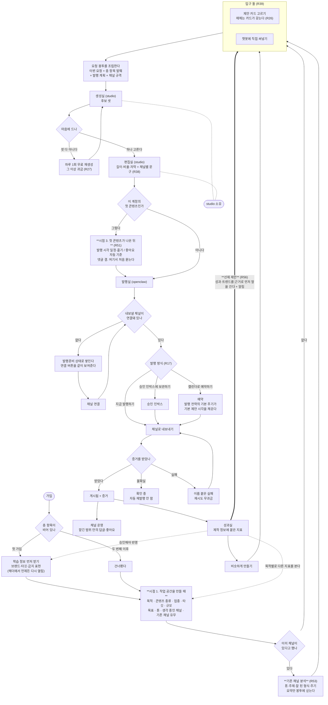
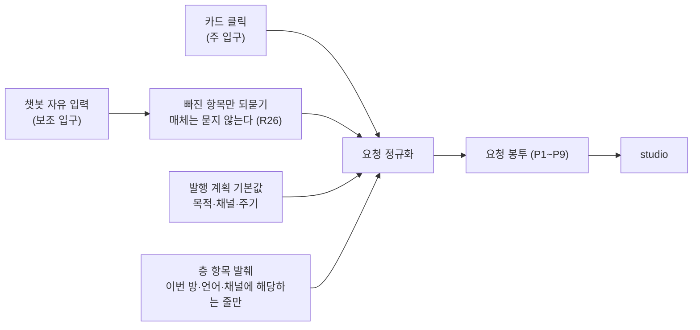
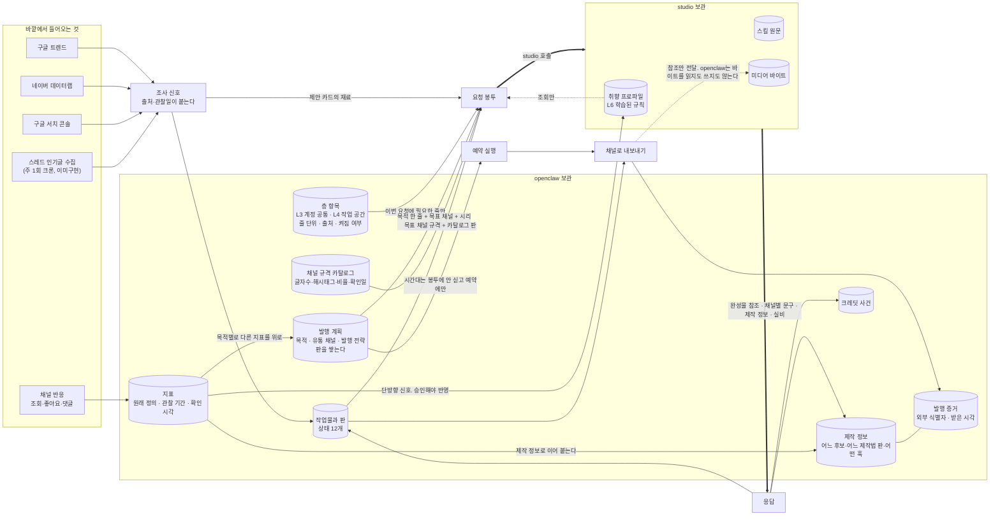
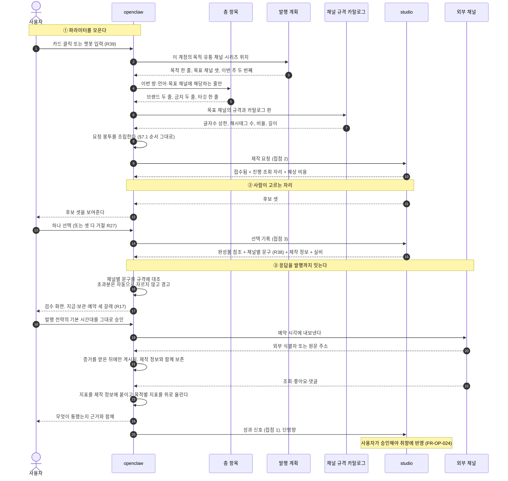
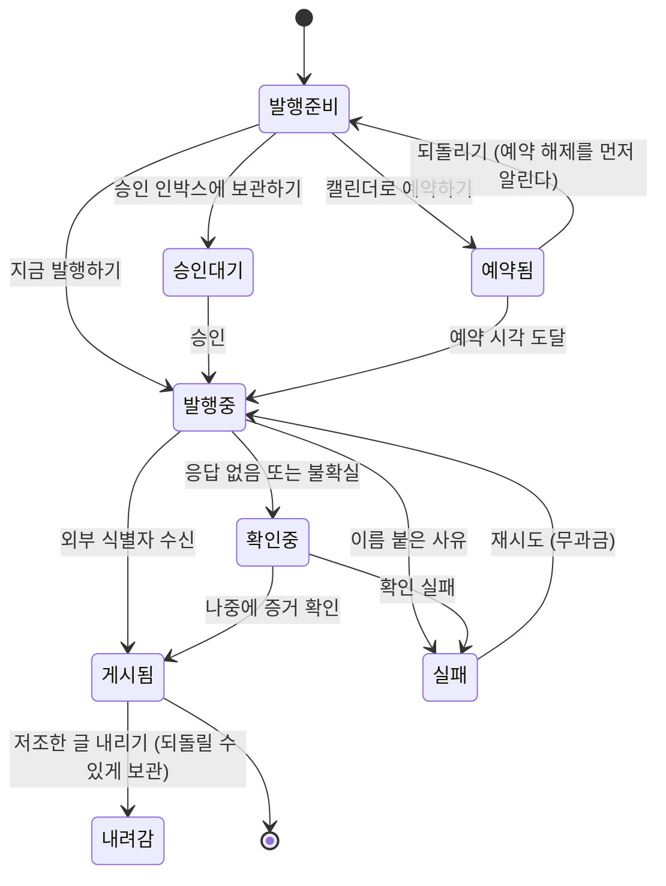
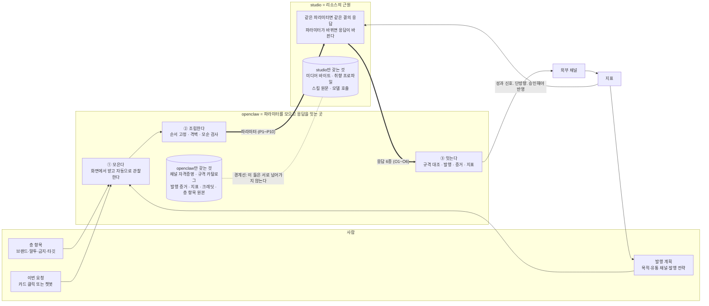

<!--
STAMP
파일: docs/prd-openclaw-v3.0.md
라인: osmu / openclaw-service (운영 범위)
판: **v3.1** (파일명은 v3.0 그대로 두고 같은 파일을 갱신하라는 지시를 따랐다). v3.0 대비 변경은 정보 수집 3단계(R51~R56) 반영이며 §0.3에 표로 적었다. v2.0(docs/prd-openclaw-v2.0.md)을 폐기하지 않는다. v2.0은 그대로 남긴다. 이 판은 v2.0의 내용을 하나도 버리지 않고 표준 목차로 재배치하고 빠진 것을 채운 자기완결 전판이다
생성: 2026-08-21 KST
model: claude-opus-5[1m]
agent: prd-architect
기반 포맷: /tmp/prd-standard-outline.md (두 기획서 공통 표준 목차 0~14장. 이 판이 그 뼈대를 그대로 따른다. studio 기획서도 같은 뼈대로 다시 쓴다)
기반 산출물 (버전핀, 전부 실제 Read):
  - docs/prd-openclaw-v2.0.md (전문. FR-OP-001~034 · D1~D17 · NFR-OP-01~15 · K1~K7 · M1~M10 · 페르소나 · S1~S8 · Steelman 3건 · Premortem 4건 · 자기심문 4건을 이 판이 전량 승계)
  - /tmp/prd-standard-outline.md (표준 목차와 "이번 판에서 반드시 새로 채울 것" 가·나·다·라)
  - docs/정보수집-3단계-설계-2026-08-21.md (회장 2026-08-21 구술 정본. 세 시점·공통 정보 항목·기존 채널 분석·학습 정보 화면·챗봇 선제 제안)
  - docs/사업계획-osmu-v0.9.md (§3.4 일곱 칸 L0~L6, 조립층 일곱 규칙, 조립 두 시점, §3.5 비용 최적화)
  - docs/requests/회장-확정-요구사항-대장.md (**R01~R56 전량**. R46~R50과 R51~R56이 신규 등록된 판을 다시 읽었다)
  - studio/docs/prd-studio-v2.0.md (§0.3 제작 정보 용어 재설계, §5.4 채널별 문구 소유, §5.5 플랫폼, §6.1 일곱 칸)
  - docs/prototype/openclaw-auto-4room-v39.html (사이드바 네 방·헤더 네 단계와 학습 정보·학습 정보 5탭·브랜드 6문항·캘린더·채널 연결 카드)
품질헌법: /Users/sj/.claude/standards/planning.md 실제 Read 완료. 7원칙 판정표는 §11.1
벤치마크: 이 판도 실검색을 못 했다(WebSearch 예산 소진). 벤치마크 원천은 wiki/research/2026-08-competitor-and-production-research.md의 2차 인용이며 그 사실을 §11.4에 명시했다
v3.1 고민 한 줄: 앞 판은 목적·채널·발행 전략을 온보딩 한 자리에서 받게 짜여 있었는데, 회장 구술은 정반대였다. 발행과 운영은 첫 콘텐츠가 나온 뒤에 처음 받는다. 만들어 보기 전에는 답할 수 없는 질문을 앞에 두는 것이 온보딩 이탈의 주범이라는 지적이고, 그 말이 맞다. / v3.0 고민 한 줄: v2.0의 결함은 내용이 아니라 순서였다. 기능 조항 34개가 문서 앞머리를 차지해 "이 제품이 무엇을 어떻게 푸나"가 안 보였다. 그래서 이 판은 큰 그림을 위에 놓고 아래로 갈수록 좁혔고, 회장이 없다고 지적한 세 가지(목적·유통 채널·발행 전략)를 받는 자리를 5장에 신설했다
-->

# openclaw-service PRD v3.1 : 무엇을 언제 받아 어떻게 두고 어떻게 보내나

> **One Thing:** 만들 줄은 아는데 알리질 못하는 사람이, 완성물을 넘긴 그 화면에서 무엇을 위해 어디로 언제 나갈지 정하고, 나간 뒤 무슨 일이 벌어졌는지까지 근거와 함께 보는 곳.

**한 줄 결론.** openclaw는 생성기가 아니다. **사용자에게서 파라미터를 받아 모으고, studio라는 리소스의 근원에 보내고, 돌아온 결과를 발행과 성과로 잇는 곳**이다. v2.0이 확정한 기능 34개는 하나도 바뀌지 않았고, 이 판이 새로 채운 것은 셋이다. ①**정보를 세 시점에 나눠 받는 설계**(5장. 목적·채널은 작업 공간 만들 때, 콘텐츠의 결은 만들 때, **발행과 운영은 첫 콘텐츠가 나온 뒤에 처음** 받는다. R51~R56) ②**데이터 정의 3열표**(6장. 어떻게 받나 / 어디에 어떤 모양으로 두나 / 언제 조립에 실리나) ③**관심사 분리 도식과 파라미터 표**(9장. 기존 채널 분석과 선제 제안의 경계 포함).

---

## 0. 이 문서를 읽는 법

### 0.1 목차 (전부 문서 내부 링크)

| 장 | 이름 | 무엇이 있나 |
|---|---|---|
| 0 | [이 문서를 읽는 법](#0-이-문서를-읽는-법) | 목차, 읽는 순서, 이 판에서 바뀐 것, 용어 |
| 1 | [문제](#1-문제) | 누가 무엇을 못 해서 막히나 |
| 2 | [이 서비스가 그 문제를 어떻게 푸나](#2-이-서비스가-그-문제를-어떻게-푸나) | [전체 흐름 도식](#21-전체-흐름-도식-한-장), [조각 연결표](#22-아래-장들이-이-그림의-어느-조각인가), [목표와 비목표](#23-목표와-비목표) |
| 3 | [사용자와 시나리오](#3-사용자와-시나리오) | [페르소나](#31-페르소나), [시나리오 S1~S9](#32-시나리오) |
| 4 | [이미 있는 것](#4-이미-있는-것-재구현-금지-목록) | [승계 목록](#41-그대로-쓰는-것), [조사 소스 현황](#42-조사-소스-현황), [새로 만들 것과 자리만 옮길 것](#43-새로-만들-것과-자리만-옮길-것) |
| 5 | [무엇을 받나 (입력 정의)](#5-무엇을-받나-입력-정의) | [세 묶음](#51-받는-것을-세-묶음으로-나눈다), **[정보를 세 시점에 나눠 받는다](#52-정보를-세-시점에-나눠-받는다-r51)** ([시점1 공통](#522-시점-1-작업-공간을-만들-때-공통-정보) · [시점2 결](#523-시점-2-만들려고-할-때-생성편집-정보-studio-쪽) · [**시점3 발행·운영**](#524-시점-3-첫-콘텐츠가-나온-뒤-발행운영-정보) · [무엇이 요청을 바꾸나](#525-세-시점의-무엇이-studio-요청을-바꾸나)), [두 입구](#53-두-입구가-하나로-합류한다-r39), [자료 반입](#54-자료-반입과-학습-입력-네-경로-r03), [안 받는 것](#55-절대-받지도-보내지도-않는-것), [**기존 채널 분석**](#56-기존-채널-분석-r53), [**학습 정보 화면**](#57-학습-정보-화면-r55), [**선제 제안과 알림**](#58-챗봇-선제-제안과-알림-r56) |
| 6 | [어떻게 저장하나 (데이터 정의)](#6-어떻게-저장하나-데이터-정의) | [층 항목 3열표](#61-층-항목-계정-공통과-작업-공간), [발행·운영 정보 3열표](#62-발행-계획-목적유통-채널발행-전략운영-방식), [발행 증거](#63-발행-증거), [성과 지표](#64-성과-지표), [스킬](#65-스킬-별도-절), [데이터 흐름 도식](#66-데이터-흐름-도식), [D1~D23](#67-반드시-구분해-기억할-것-d1d20), [**기존 채널 분석 데이터**](#68-기존-채널-분석-데이터), [**메모·기록·제안 이력**](#69-메모와-기록과-제안-이력) |
| 7 | [어떻게 조립하나](#7-어떻게-조립하나) | [조립 순서](#71-요청-봉투-조립-순서), [조립 규칙](#72-조립할-때-지킬-것), [studio 호출 시퀀스](#73-studio-호출-시퀀스) |
| 8 | [기능 요구사항](#8-기능-요구사항-fr-op-001044) | [상태 전이 도식](#80-발행-상태-전이), [화면과 계정](#81-화면과-계정), [발행실](#82-발행실), [채널 운영](#83-채널-운영), [성과실](#84-성과실), [학습 환류](#85-학습-환류), [studio 호출](#86-studio-호출), [요금제와 크레딧](#87-요금제와-크레딧), [플랫폼과 입구](#88-플랫폼과-입구), [발행 계획](#89-목적유통-채널발행-전략-신설), [**세 시점 수집과 화면**](#810-세-시점-수집과-학습-정보-화면과-선제-제안-신설) |
| 9 | [두 서비스 경계](#9-두-서비스-경계-관심사-분리) | [관심사 분리 도식](#91-관심사-분리-도식), [파라미터 표](#92-우리가-보내는-파라미터-p1p10), [응답 표](#93-우리가-받는-응답-6종), [파라미터가 응답을 어떻게 바꾸나](#94-파라미터가-응답을-어떻게-바꾸나), [원본만 받는 경로](#95-원본만-받는-경로), [**선제 제안의 경계**](#96-선제-제안의-경계) |
| 10 | [비기능 요구](#10-비기능-요구-nfr-op-0117) | NFR-OP-01~17 |
| 11 | [판정과 자기공격](#11-판정과-자기공격) | [7원칙 판정표](#111-7원칙-판정표-품질헌법-2), [Steelman](#112-steelman-반론), [Premortem](#113-premortem-1년-뒤-이-제품이-실패했다면), [접는 기준 K1~K8](#114-접는-기준-측정-가능), [벤치마크 한계](#115-벤치마크-출처와-그-한계) |
| 12 | [미결](#12-미결) | [회장이 정할 것](#121-회장-결정이-필요한-것), [실측해야 아는 것](#122-실측해야-알-수-있는-것), [대장 이월](#123-대장에-남은-미결-그대로-이월) |
| 13 | [요구사항 대장 대조](#13-요구사항-대장-대조-r01r45) | R01~R45 전량 |
| 14 | [자기심문](#14-자기심문-이-prd가-틀렸다면-어디서-틀렸나) | 이 PRD가 틀렸다면 어디서 틀렸나 |

### 0.2 읽는 순서

**처음 읽는 사람은 위에서 아래로 그냥 읽으면 된다.** 위로 갈수록 넓고 아래로 갈수록 좁다. 1장에서 문제를 보고, 2장 그림 한 장으로 전체를 잡고, 3장에서 누구를 위한 것인지 확인하고, 4장에서 이미 있는 것을 빼고, 5장부터 구체로 내려간다.

**시간이 없으면 세 곳만 본다.** [2.1 전체 흐름 도식](#21-전체-흐름-도식-한-장), [5.2 목적·유통 채널·발행 전략](#52-정보를-세-시점에-나눠-받는다-r51), [9.1 관심사 분리 도식](#91-관심사-분리-도식).

**이 문서 하나로 완결된다.** v2.0이나 v1.0을 함께 펼칠 필요가 없다. 기능 요구 38개, 데이터 요구 20개, 비기능 요구 16개가 전부 본문에 있다.

### 0.3 이 판에서 바뀐 것

**v3.1에서 바뀐 것 (회장 2026-08-21 구술, R51~R56).**

| # | 무엇 | 어디 |
|---|---|---|
| A | **정보를 한 자리에서 받지 않고 세 시점으로 나눴다.** 특히 **발행·운영 정보는 첫 콘텐츠가 나온 뒤에 처음 받는다.** 한 번에 다 받으면 지치기 때문이다 (R51) | [5.2](#52-정보를-세-시점에-나눠-받는다-r51), FR-OP-039 |
| B | 작업 공간 만들 때 받는 공통 정보 항목을 아홉으로 확정했다. 없으면 빈칸으로 두지 않고 질문으로 만들어 간다 (R52) | [5.2.2](#522-시점-1-작업-공간을-만들-때-공통-정보), FR-OP-040 |
| C | **기존 채널 분석을 신설했다.** 채널 소유자가 우리이므로 수집도 우리 몫이고, 요약을 파라미터로 넘긴다 (R53) | [5.6](#56-기존-채널-분석-r53), [6.8](#68-기존-채널-분석-데이터), FR-OP-041 |
| D | 생성 시점 추천에 근거를 붙이는 규칙과 그 근거를 우리가 대는 책임을 명시했다 (R54) | [5.2.3](#523-시점-2-만들려고-할-때-생성편집-정보-studio-쪽), FR-OP-042 |
| E | **학습 정보 화면을 절로 신설했다.** 다섯 묶음, 갱신 강조 표시, 챗봇으로 학습 정보만 고치기 (R55) | [5.7](#57-학습-정보-화면-r55), FR-OP-043 |
| F | **챗봇 선제 제안과 알림을 신설**하고, 촉발은 openclaw·생성은 studio라는 경계를 9장에 박았다 (R56) | [5.8](#58-챗봇-선제-제안과-알림-r56), [9.6](#96-선제-제안의-경계), FR-OP-044 |
| G | FR-OP-039~044, D21~D23, NFR-OP-17, S10, K9, M14 신설. **FR-OP-001~038은 하나도 지우지 않았다** | [8.10](#810-세-시점-수집과-학습-정보-화면과-선제-제안-신설) |

**v3.0에서 바뀐 것 (표준 목차 재구성).**

| # | 무엇 | 어디 |
|---|---|---|
| 1 | **표준 목차로 전면 재배치.** 위에서 전체를 보고 아래로 갈수록 구체화한다. v2.0은 기능 요구 34개가 문서 중반을 통째로 차지해 큰 그림이 안 보였다 | 전 장 |
| 2 | **목차 전 항목에 문서 내부 링크를 걸었다.** 회장이 오가며 읽는다 | [0.1](#01-목차-전부-문서-내부-링크) |
| 3 | **목적·유통 채널·발행 전략을 받는 자리를 신설했다.** 지금까지 두 기획서 어디에도 없었다 (v3.1에서 이것을 세 시점으로 다시 갈랐다) | [5.2](#52-정보를-세-시점에-나눠-받는다-r51), [8.9](#89-목적유통-채널발행-전략-신설), [9.4](#94-파라미터가-응답을-어떻게-바꾸나) |
| 4 | **데이터 정의를 3열표로 다시 썼다.** 칸마다 어떻게 받나 / 어디에 어떤 모양으로 두나 / 언제 조립에 실리나 | [6장 전체](#6-어떻게-저장하나-데이터-정의) |
| 5 | **스킬을 별도 절로 뽑았다.** 등록 경로, 추천 근거, 신뢰 경계 | [6.5](#65-스킬-별도-절) |
| 6 | **관심사 분리를 도식과 표로 못 박았다.** studio는 리소스의 근원이고 파라미터에 따라 응답이 달라진다 | [9장 전체](#9-두-서비스-경계-관심사-분리) |
| 7 | FR-OP-035~038, D18~D20, NFR-OP-16, K8, M11, S9 신설 | [8.9](#89-목적유통-채널발행-전략-신설) 외 |
| 8 | **v2.0의 무엇도 지우지 않았다.** FR-OP-001~034 전량, D1~D17, NFR-OP-01~15, K1~K7, M1~M10, S1~S8, Steelman 3건, Premortem 4건이 문언 그대로 있다 | 전 장 |

### 0.4 이 문서의 자리

| 항목 | 내용 |
|---|---|
| 범위 | openclaw-service. 화면과 계정, 발행실, 채널 운영, 성과실, studio 호출, 요금제와 크레딧, 그리고 **사용자에게서 파라미터를 받는 모든 자리** |
| 범위 밖 | 생성과 편집의 내부 동작. studio PRD 소유. 경계는 [9장](#9-두-서비스-경계-관심사-분리) |
| v2.0과의 관계 | v2.0을 폐기하지 않는다. v2.0은 남는다. 이 판이 상위 정본이며 v2.0의 내용은 전량 이 안에 있다 |
| 정본 관계 | PRD v8.2.1의 FR-OS81·FR-OS82를 대체하지 않는다 |
| 첫 고객 | 회장이 운영하는 바이브 코딩 커뮤니티 |
| **이 판이 답하지 않는 것** | **스키마와 엔드포인트와 필드명.** 이 문서 어디에도 테이블명·컬럼명·API 경로가 없다. 그것은 기술설계에서 회장과 티키타카로 정한다 |

### 0.5 용어

| 낱말 | 이 문서에서의 뜻 |
|---|---|
| **층 항목** | 사람이 넣고 고치는 학습 정보의 원본 한 줄. 계정 공통(L3)과 작업 공간(L4) 두 층. openclaw가 보관한다 |
| **취향 프로파일** | 선택과 성과에서 계산돼 자란 규칙(L6). studio가 보관한다. 층 항목과 같은 것이 아니다 |
| **제작 정보** | 이 완성물이 어느 제안 카드에서 왔고 후보 셋 중 어느 것이었고 어느 제작법 몇 판이었고 어떤 훅이었나. **사진의 촬영 정보와 같다.** 만드는 순간에만 기록되고 나중에 못 붙인다. studio PRD v2.0 §0.3이 "꼬리표"를 이 낱말로 바꿨고 이 문서도 그것을 따른다 |
| **발행 계획** | 이 판에서 신설한 묶음. 목적 · 유통 채널 · 발행 전략 셋을 함께 부르는 이름 |
| **요청 봉투** | studio에 나가는 파라미터 한 벌. 사람이 보는 화면이 아니라 우리가 조립하는 것 |
| **발행 증거** | 채널이 돌려준 외부 식별자 또는 원문 주소. 이것 없이 게시됨이라 말하지 않는다 |

---

## 1. 문제

### 1.1 누가 무엇을 못 해서 막히나

**만들 줄은 아는데 알리질 못한다.** 우리 첫 고객은 혼자 무언가를 만드는 사람이다. 만드는 것은 이미 한다. 클로드로 랜딩페이지도 짜고 영상도 뽑는다. 막히는 곳은 그 다음이다.

| 막히는 자리 | 지금 어떻게 하고 있나 | 왜 안 되나 |
|---|---|---|
| 무엇을 올릴지 | 그날 기분이 정한다 | 무엇을 요청해야 하는지조차 모른다(R40). 빈 입력창은 그 사람을 막는다 |
| 채널마다 다시 만들기 | 스레드에 올리고, 인스타에 비율 맞춰 다시 올리고, 링크드인에 톤 바꿔 올린다 | 세 번 하면 두 시간이 간다. 그래서 하나만 올리고 나머지는 미룬다. 미룬 것은 영영 안 올라간다 |
| 무엇을 위해 올리는지 | 안 정하고 올린다 | 알리려는 것과 팔려는 것과 사람을 모으려는 것은 글의 모양이 다른데, 그 구분 없이 만들어지니 매번 비슷한 글이 나온다 |
| 언제 얼마나 올릴지 | 생각날 때 올린다 | 주기가 없으니 누적이 없다. 한 달에 두 번 올린 계정은 알고리즘에서 사라진다 |
| 올린 뒤 | 댓글이 달려도 하루 뒤에 본다 | 응대 시점을 놓치면 그 글의 도달이 끝난다 |
| 무엇이 통했는지 | 모른다 | 조회수 3천이 나온 글이 왜 나왔는지 모른다. 만들 때의 정보와 나간 뒤의 반응 사이에 실이 없다 |

### 1.2 왜 지금 도구로는 안 되나

**발행 도구는 이미 많다.** 월 29달러에 20~40계정 자동 배포와 댓글 관리를 하는 곳이 있고, 셀프 설치하면 공짜인 것도 있다. **생성 도구도 이미 많다.** 문제는 그 둘 사이다.

도구 두 개를 붙이면 **만들 때 알던 것이 나간 뒤에는 사라진다.** 어느 제안에서 나왔고 후보 셋 중 무엇을 골랐고 어떤 훅을 썼는지가 발행 도구에는 안 넘어간다. 그래서 조회수 3천이 나와도 무엇 덕분인지 못 되짚는다. 이 끊김은 나중에 못 메운다. 사진을 찍고 나서 조리개값을 되살릴 수 없는 것과 같다.

**그리고 어느 도구도 "무엇을 위해 올리는가"를 묻지 않는다.** 전부 "무엇을 올릴까"만 묻는다. 목적이 없으면 같은 완성물이 알리기용으로도 팔기용으로도 쓰이고, 둘 다 어중간해진다.

### 1.3 그래서 이 제품이 답해야 하는 질문

1. 무엇을 요청해야 하는지 모르는 사람에게서 **어떻게 파라미터를 받아낼 것인가** ([5장](#5-무엇을-받나-입력-정의))
2. 받은 것을 **어디에 어떤 모양으로 두어야 다음에 다시 쓸 수 있는가** ([6장](#6-어떻게-저장하나-데이터-정의))
3. 나간 뒤의 반응을 **만들 때의 정보에 어떻게 이어 붙일 것인가** ([6.4](#64-성과-지표), [8.5](#85-학습-환류))
4. 생성을 남에게 맡기면서 **경계를 어떻게 지킬 것인가** ([9장](#9-두-서비스-경계-관심사-분리))

---

## 2. 이 서비스가 그 문제를 어떻게 푸나

### 2.1 전체 흐름 도식 한 장

첫 가입과 두 번째 이후를 한 장에 넣는다(R05). 굵은 경로가 openclaw 소유, 점선 상자가 studio 소유다. **이 판에서 새로 들어간 것은 왼쪽 위의 "발행 계획" 상자다.**



**되돌리기(R13)는 이 그림에서 화살표를 거꾸로 그리지 않는다.** 되돌리면 앞 방 목록에 항목이 하나 새로 추가되고 원본은 그대로 남는다. 되돌리기는 역방향 이동이 아니라 앞 방에서의 신규 생성이다.

**이 그림의 판정선 둘.** ①사용자가 파라미터를 넣는 자리는 **세 시점**(작업 공간 만들 때 · 만들 때 · 첫 콘텐츠가 나온 뒤)뿐이고, 그것이 합쳐져 하나의 요청 봉투가 된다. ②**시점 3 상자가 발행실 앞이 아니라 편집 뒤에 있다는 것이 이 판의 핵심 변경이다.** 만들어 본 적 없는 사람에게 운영 방식을 묻지 않는다.

### 2.2 아래 장들이 이 그림의 어느 조각인가

| 그림의 조각 | 이 문서 어디 | 무엇이 있나 |
|---|---|---|
| 학습 정보 먼저 받기 | [5.4](#54-자료-반입과-학습-입력-네-경로-r03), [6.1](#61-층-항목-계정-공통과-작업-공간) | 입력 네 경로, 층 항목 3열표 |
| **시점 1 공통 정보** | [5.2.2](#522-시점-1-작업-공간을-만들-때-공통-정보), [6.1](#61-층-항목-계정-공통과-작업-공간), FR-OP-040 | 아홉 항목, 못 고를 때 질문으로 |
| **기존 채널 분석** | [5.6](#56-기존-채널-분석-r53), [6.8](#68-기존-채널-분석-데이터), FR-OP-041 | 무엇을 긁어 무엇을 뽑아 어떻게 넘기나 |
| **시점 3 발행·운영 정보** | [5.2.4](#524-시점-3-첫-콘텐츠가-나온-뒤-발행운영-정보), [6.2](#62-발행-계획-목적유통-채널발행-전략운영-방식), [8.9](#89-목적유통-채널발행-전략-신설), FR-OP-039 | 발행 시각·좋아요·댓글, 기본값 꺼짐 |
| **학습 정보 화면** | [5.7](#57-학습-정보-화면-r55), [6.9](#69-메모와-기록과-제안-이력), FR-OP-043 | 다섯 묶음, 갱신 강조, 챗봇 편집 |
| **선제 제안과 알림** | [5.8](#58-챗봇-선제-제안과-알림-r56), [9.6](#96-선제-제안의-경계), FR-OP-044 | 촉발은 우리, 생성은 studio |
| 입구 둘 | [5.3](#53-두-입구가-하나로-합류한다-r39), [8.8](#88-플랫폼과-입구) | 합류 규칙, FR-OP-034 |
| 요청 봉투 조립 | [7장](#7-어떻게-조립하나) | 순서·규칙·나가는 모양 |
| 생성실·편집실 (점선) | [9장](#9-두-서비스-경계-관심사-분리) | 경계, 파라미터, 응답 |
| 발행실 | [8.2](#82-발행실) | FR-OP-006~014 |
| 채널로 내보내기·증거 | [6.3](#63-발행-증거), [8.2](#82-발행실) | 증거 3열표, 상태 전이 |
| 채널 운영 | [8.3](#83-채널-운영) | FR-OP-015~018 |
| 성과실 | [6.4](#64-성과-지표), [8.4](#84-성과실) | 지표 3열표, FR-OP-019~022 |
| 승인해야 반영 | [8.5](#85-학습-환류) | FR-OP-023~025 |
| 채널 연결 상태 | [4.1](#41-그대로-쓰는-것), [8.1](#81-화면과-계정) | 이미 있는 것, FR-OP-005 |
| 돈이 움직이는 자리 | [8.7](#87-요금제와-크레딧) | FR-OP-028~031 |

### 2.3 목표와 비목표

**목표.**

| # | 목표 | 어떻게 알 수 있나 |
|---|---|---|
| G1 | 완성물이 사람 손으로 다른 화면에 옮겨지지 않고 발행까지 간다 | 발행 한 건에서 사용자가 파일을 내려받아 채널에 직접 올린 횟수 0 |
| G2 | 발행 결과가 참인지 거짓인지 헷갈리지 않는다 | 증거 없는 발행을 게시됨으로 표시한 건수 0 |
| G3 | 예약이 조용히 실패하지 않는다 | 실패 후 사용자 인지까지 p95 1시간 이내 |
| G4 | 대행 응대가 맡긴 범위를 넘지 않는다 | 위임 범위 밖 자동 발화 0 |
| G5 | 무엇이 통했는지 사람이 근거를 보고 판단할 수 있다 | 성과 상위 항목의 제작 정보·관찰 기간 부착률 100퍼센트 |
| G6 | 쓰는 만큼 나가는 원가가 요금을 넘지 않는다 | 계정별 상한 초과 0, 최상급 모델이 포함분으로 소비된 건수 0 |
| G7 | 조사 소스에서 온 값이 출처 없이 화면에 뜨지 않는다 | 출처·관찰일이 없는 조사 항목 표시 0 |
| **G8 (신설)** | **사용자가 목적을 한 번도 안 정한 채로 발행까지 가는 일이 없다** | 목적 없이 나간 발행 0. 단 "지금은 안 정함"을 명시적으로 고른 것은 목적을 정한 것으로 센다 |

**비목표. 이 판에서 안 한다.**

| 안 하는 것 | 왜 |
|---|---|
| **성과가 취향을 자동으로 고치는 것** | 표본이 없다. 지금은 상위를 근거와 함께 보여주는 데까지다. 조용한 취향 변경 금지는 이미 확정된 원칙이다 (FR-OS81-020) |
| 발행실에서 창작 텍스트를 직접 타이핑해 고치는 것 | 경계가 깨진다. 대신 재요청 경로를 둔다 (FR-OP-014, 미결 M3) |
| 미디어 바이트를 만지는 것 (크롭, 재인코딩, 자막 합성) | 경계 판정 3기준 중 셋째에 걸린다. studio 소유 |
| 여러 사람이 결재하는 승인 체인 | 사용자는 혼자다. 승인은 단계가 아니라 발행실 안의 보관함이다 |
| 다국가 self-serve 결제와 24시간 지원 | FR-OS82-042로 이미 잠갔다 |
| 고급 BI, 경쟁사 계정 추적, 광고 성과 | 오가닉 발행과 그 반응까지만 |
| 이미 구현된 채널·크론 구조를 새로 짜는 것 | [4장](#4-이미-있는-것-재구현-금지-목록)이 그 목록이다. 재구현 금지 |
| 1단계에서 15개 채널을 다 상품으로 파는 것 | 구현이 있는 것과 우리가 책임지고 파는 것은 다르다. 구현은 지우지 않고 유지하되 1단계 약속 범위에서는 뺀다 |
| **목적별로 다른 요금제를 파는 것 (이 판에서 추가)** | 목적은 파라미터이지 상품이 아니다. 상품은 매체와 원가로 갈린다 |

---

## 3. 사용자와 시나리오

### 3.1 페르소나

**박도윤, 32세, 혼자 SaaS를 만든 바이브 코더.** PRD v8.2.1 §5 페르소나를 세 문서가 공유한다. 새 인물을 만들면 문서마다 다른 사람을 향하게 된다. studio 기획서도 같은 인물을 쓴다(R45).

운영 관점에서 이 사람의 하루는 이렇다. 만드는 것은 문제가 아니다. 그는 이미 클로드로 랜딩페이지도 짜고 영상도 뽑아 봤다. 막히는 곳은 그 다음이다. 만든 것을 스레드에 올리고, 인스타에 비율을 맞춰 다시 올리고, 링크드인에는 톤을 바꿔 올려야 하는데 그걸 세 번 하다 보면 두 시간이 간다. 그래서 셋 중 하나만 올리고 나머지는 미룬다. 미룬 것은 영영 안 올라간다. 댓글이 달려도 하루 뒤에 본다. 조회수가 3천이 나온 글이 왜 나왔는지는 모른다. 다음에 뭘 올릴지는 그날 기분이 정한다.

**근거 (본인 직관 외).** 사업계획 §1.1이 "만드는 건 하는데 알리질 못하는 사람"을 별도 행으로 세우고 그 행에 "우리가 운영 중인 바이브 코딩 커뮤니티가 정확히 이 사람들"이라고 적었다. 관찰 가능한 실제 모집단이 이미 우리 손에 있다. 연구 기록 §4.4는 이 사람이 혼자 하려면 월 약 57만원의 도구값이 든다는 것을 항목별로 적었다. 지불 의사 자체는 미검증이며 이것이 접는 기준의 대상이다([11.4](#114-접는-기준-측정-가능)).

**R40 반영.** 이 사람은 프롬프트 엔지니어링을 못 한다. 못 하는 정도가 아니라 무엇을 요청해야 하는지조차 모른다. 그래서 이 제품의 기본 입구는 빈 입력창이 아니라 **고를 수 있는 카드**다. 다만 R39에 따라 챗봇으로 직접 써넣는 두 번째 입구도 함께 연다.

**이 판에서 덧붙이는 관찰 하나.** 이 사람은 "무엇을 위해 올리는가"도 못 답한다. 물어보면 "그냥 알려야 하니까"라고 한다. 그래서 [5.2](#52-정보를-세-시점에-나눠-받는다-r51)의 목적 질문도 빈 입력창이 아니라 **고르는 카드 세 장**이어야 한다. 여기서 자유 입력을 요구하면 그 자리에서 이탈한다.

**가장 큰 불신.** 예상 밖 비용, 그리고 "올렸다고 했는데 안 올라간 것".

### 3.2 시나리오

| # | 시나리오 | 지나는 자리 |
|---|---|---|
| S1 | 첫날. 가입하고 채널을 하나만 연결한 채 첫 완성물을 받는다 | 계정 → 발행실. 연결 안 된 채널은 회색으로 남는다 |
| S2 | 완성물 하나를 채널 셋에 내보낸다. 각 채널의 제목과 해시태그를 보고 하나만 고친다 | 발행실 채널별 문구 검수 |
| S3 | 지금 올리기 싫다. 목요일 저녁 7시로 예약한다 | 발행실 → 캘린더 |
| S4 | 밤에 자는 동안 예약이 돌았고 토큰이 만료돼 실패했다 | 예약 실패 알림 → 재연결 → 재시도 (무과금) |
| S5 | 댓글이 여덟 개 달렸다. 여섯 개는 맡긴 범위 안이라 대신 답이 나갔고 둘은 사람에게 넘어왔다 | 채널 운영 대행 + 넘김함 |
| S6 | 이번 주에 뭐가 통했나 본다. 상위 3건에 제작 정보가 붙어 있다 | 성과실 |
| S7 | 통한 것과 비슷하게 다시 만든다 | 성과실 → 생성실 (맥락을 들고 새 작업물) |
| S8 | 크레딧이 다 됐다. 무엇에 얼마가 나갔는지 본다 | 요금제·사용 원장 |
| **S9 (신설)** | **다음 달에 유료 플랜을 연다. 목적을 알리기에서 팔기로 바꾸고, 유통 채널에 인스타를 더하고, 주 2회에서 주 4회로 올린다. 그날부터 제안 카드가 달라지고 캘린더가 주 4칸으로 채워진다** | **발행 계획 → 제안 카드 → 캘린더 → 성과실 지표 전환** |

| **S10 (v3.1 신설)** | **가입할 때 이미 스레드 계정이 있다고 답했다. 우리가 그 계정을 읽어 톤과 잘 된 형식을 뽑아 첫 제안을 만든다. 첫 콘텐츠가 나온 뒤에야 "언제 올릴지, 좋아요와 댓글은 어떻게 할지"를 처음 묻는다. 가입 화면에서는 그 질문을 하지 않았다** | **시점 1 → 기존 채널 분석 → 생성 → 편집 → 시점 3 질문 → 발행실** |

**S10이 v3.1의 핵심 시나리오다.** 물어보는 것을 늘린 것이 아니라 **묻는 시점을 뒤로 미룬 것**이고, 미룬 자리를 기존 채널 분석이 대신 메운다.

**S9가 이 판의 또 하나의 핵심 시나리오다.** 사용자가 세 가지를 고쳤을 뿐인데 제안·요청 봉투·캘린더·성과 지표가 전부 따라 바뀐다. 이것이 [9.4](#94-파라미터가-응답을-어떻게-바꾸나)가 말하는 "파라미터에 따라 응답이 달라진다"의 사용자 쪽 표현이다.

---

## 4. 이미 있는 것 (재구현 금지 목록)

**1차 진실원은 위키다.** `wiki/reference/channel-status.md`, 루트 `CLAUDE.md`, PRD v8.2.1 §2, 프로토타입 v39를 읽어 채웠다.

### 4.1 그대로 쓰는 것

| 영역 | 현재 상태 | 정본 출처 | 이 PRD의 처리 |
|---|---|---|---|
| 채널 발행 도구 | **이미구현.** Threads·X·Instagram 전용 도구 + publish extension 14종 | `CLAUDE.md` | 그대로 쓴다 |
| 채널 연결·검증 | **이미구현.** OAuth 9채널 코드 완료, 수동 입력 3채널, `verify_channel` 실호출 | channel-status wiki, ADR-004 | 그대로 쓴다 |
| readiness 5상태 | **이미구현.** 연결·미연결·오픈 준비중·발행 준비중·오류 | channel-status wiki | 발행실이 이 값을 읽는다 |
| 채널 capability 단일 소스 | **이미구현** | channel-status wiki | 규격 카탈로그(FR-OP-008)는 이것의 확장 |
| 멀티채널 발행 크론 | **이미구현.** 2시간 주기 | `CLAUDE.md` | 그대로. 단 2시간 주기가 분 단위 예약을 못 지킨다 (FR-OP-009, M4) |
| 큐 스키마 채널별 상태 | **이미구현** | `CLAUDE.md` | 발행 증거의 자리가 이미 있다 |
| 채널별 가이드·키워드 | **이미구현** | `CLAUDE.md` | 채널별 문구의 입력이 된다 |
| 반응 수집·댓글 좋아요·저조 삭제 | **이미구현(Threads).** 6시간 주기 | `CLAUDE.md` | **재구현 금지.** 얹는 것은 위임 범위와 정지 장치뿐 |
| 외부 인기글 수집 | **이미구현(Threads).** 주 1회 | `CLAUDE.md` | 성과실 둘러보기 소스 |
| 팔로워 추적 | **이미구현(Threads).** 매일 | `CLAUDE.md` | 그대로 |

### 4.2 조사 소스 현황

R44에 답하려면 조사 소스가 이미 있는지부터 봐야 했다. 위키에 그 항목이 없어 코드 경로로 확인했다.

| 조사 소스 | 현재 상태 | 확인 방식 |
|---|---|---|
| 구글 트렌드 | **이미구현.** 전용 조회 경로 존재, 프로토타입 사이드바 Keyword Research에 항목 있음 | 코드 경로 + 프로토타입 v39 |
| 네이버 데이터랩 | **이미구현.** 조회 경로와 설정 경로가 둘 다 존재 | 코드 경로 + 프로토타입 v39 |
| 구글 서치 콘솔 | **이미구현.** 분석·설정·색인 세 경로 존재 | 코드 경로 + 프로토타입 v39 |
| 키워드 플래너 | **이미구현.** 조회·설정 경로 존재 | 코드 경로 + 프로토타입 v39 |
| 스레드 인기글 수집 | **이미구현.** 주 1회 크론 | `CLAUDE.md` |

> ⛔ **회수 필요: 위키에 조사 소스 현황이 기록돼 있지 않다**
> - 배경: R44에 답하려고 위키를 먼저 봤는데 트렌드·서치 콘솔·데이터랩 관련 페이지가 없었다. 위키가 진실원이어야 하는데 그 항목이 비어 있어 코드 경로 확인으로 폴백했다. 그 결과 이 표의 출처가 위키가 아니라 코드다.
> - 무엇을 정하나: 조사 소스 현황을 위키의 어느 페이지에 정본으로 둘지.
> - 옵션 A(추천): `wiki/reference/`에 조사 소스 페이지를 신설하고 채널 현황 페이지와 같은 격으로 유지한다. 고르면: 다음 기획이 코드를 안 뒤져도 된다. 안 고르면: 매 판마다 같은 폴백을 반복하고 그때마다 "이미 있는 것을 또 만들자"는 제안이 나올 위험이 남는다.
> - 옵션 B: 채널 현황 페이지 안에 절로 붙인다. 트레이드오프: 발행 채널과 조사 소스는 수명 주기가 다른데 한 페이지에 묶으면 갱신 주체가 흐려진다.
> - 추천 근거: 채널 현황 페이지가 발행 채널만으로 이미 유지되고 있고 그 형식이 잘 작동한다. 같은 형식을 조사 소스에도 복제하는 것이 가장 싸다.

### 4.3 새로 만들 것과 자리만 옮길 것

| 무엇 | 판정 | 왜 |
|---|---|---|
| Queue·Inbox·Calendar·Videos 화면 | **자리만 옮긴다** | 화면은 있다. 같은 작업물의 다른 창으로 재배선하는 일이다 |
| 채널 목록·도구 목록 사이드바 | **자리만 옮긴다** | 네 방 아래 묶음으로 내려간다. 항목 삭제 0 (R21·R22) |
| 채널별 가이드·키워드 편집 | **자리만 옮긴다** | 층 항목과 발행 계획의 입력으로 재해석한다 |
| 발행 증거·복구 | **완결한다** | 부분구현. 최우선 |
| 성과 미수집 표시 | **고친다** | 미수집을 0으로 표시하는 것을 상태 이름으로 분리 |
| 발행 세 갈래 문구 | **새로 만든다** | R17 |
| 상품별 크레딧·하드캡·봇 방어 | **새로 만든다** | 사업계획 §4.4 |
| 제작 정보 계보 | **새로 만든다** | 사업계획 §1.5. 이것이 차별점의 전부다 |
| **발행 계획 (목적·유통 채널·발행 전략)** | **새로 만든다** | 이 판 신설. 어느 화면에도 이것을 받는 자리가 없다 |
| 조사 소스 출처·관찰일 표시 | **얹는다** | 수집 경로는 있고 표시 규칙이 없다 |

---

## 5. 무엇을 받나 (입력 정의)

**이 장이 openclaw의 절반이다.** 나머지 절반은 받은 것을 발행과 성과로 잇는 것이다. 우리는 생성기를 만들지 않으므로, 우리가 만드는 것의 품질은 곧 **얼마나 좋은 파라미터를 받아내느냐**로 결정된다.

### 5.1 받는 것을 세 묶음으로 나눈다

| 묶음 | 무엇 | 얼마나 자주 바뀌나 | 어디서 받나 | 어느 칸(L) |
|---|---|---|---|---|
| **가. 층 항목** | 브랜드 사실, 기본 말투, 금지 표현 / 타깃, 컨셉, 업종 | 거의 안 바뀐다 | 온보딩 + 헤더 학습 정보 화면 | L3 계정 공통, L4 작업 공간 |
| **나. 발행 계획 (신설)** | 목적, 유통 채널, 발행 전략 | 달 단위로 바뀐다 | 온보딩 마지막 + 발행 계획 화면 + 건별 덮어쓰기 | L3·L4에 기본값, L0에 이번 건 |
| **다. 이번 요청** | 주제, 언어, 목표 채널, 비용 상한 | 매번 바뀐다 | 제안 카드 클릭 또는 챗봇 | L0 |

**이 세 묶음의 관계가 이 제품의 구조다.** 가는 거의 안 물어본다. 나는 가끔 물어본다. 다는 매번 물어본다. 매번 물어보는 것을 줄이려고 앞의 둘을 저장한다. 앞의 둘이 비어 있으면 매번 묻는 것이 늘어나고, 그러면 R40 타깃이 이탈한다.

### 5.2 정보를 세 시점에 나눠 받는다 (R51)

> **회장 구술(2026-08-21)이 이 절을 바꿨다.** 앞 판은 목적·유통 채널·발행 전략을 온보딩 한 자리에서 받는 구조였다. **한 번에 다 받으면 지친다.** 그래서 세 시점으로 나눈다. 특히 **발행과 운영에 관한 것은 첫 콘텐츠가 나온 뒤에 처음 받는다.** 정본은 `docs/정보수집-3단계-설계-2026-08-21.md`다.

#### 5.2.1 왜 나누나, 그리고 무엇이 어느 시점인가

**가입 직후의 사용자는 아직 자기가 무엇을 원하는지 모른다.** 발행 시각을 일정하게 할지 흩을지, 좋아요를 어떤 기준으로 자동으로 누를지는 **콘텐츠를 한 번 만들어 본 사람만 답할 수 있는 질문**이다. 만들어 보기 전에 물으면 아무거나 누르고, 아무거나 누른 값으로 우리가 운영을 대행하면 사고가 난다.

| 시점 | 언제 | 누가 받나 | 무엇을 | 어디에 쌓이나 |
|---|---|---|---|---|
| **1** | 작업 공간을 만들 때 | **openclaw 화면** | 목적, 콘텐츠 종류, 업종, 타깃, 사업 규모, 목표, 톤, 발행 채널 후보, **이미 채널이 있나** | 공통 정보 (L3·L4) |
| **2** | 만들려고 할 때 | **studio 쪽** | 이번 콘텐츠의 결. 느낌, 벤치마킹 대상, 길이, 실사냐 캐릭터냐, 경쾌하냐 진중하냐 | 생성·편집 정보 |
| **3** | **첫 콘텐츠가 나온 뒤** | **openclaw 화면** | **발행 시각을 일정하게 할지 흩을지 / 좋아요를 자동으로 할지 어떤 기준으로 / 댓글을 어느 쪽에 어떤 결로** | 발행·운영 정보 |

**시점 1과 3이 openclaw 몫이고 시점 2는 studio 몫이다.** 우리가 짓는 화면은 첫 번째와 세 번째다.

**세 시점 다 공통으로 지키는 것 셋.** ①전부 고르기다. 자유 입력은 보조다(R40) ②**빈칸으로 두지 않고 질문으로 만들어 간다.** 타깃이나 톤을 못 고르는 사람에게는 되물어 채운다(R52) ③언제든 학습 정보 화면에서 다시 열어 고친다([5.7](#57-학습-정보-화면-r55)).

#### 5.2.2 시점 1. 작업 공간을 만들 때 (공통 정보)

**바로 답할 수 있는 것만 클릭으로 받는다.** 여기서 오래 붙잡으면 그 자리에서 이탈한다.

| 무엇 | 어떻게 받나 | 못 고르면 |
|---|---|---|
| **콘텐츠를 만드는 목적** | 알리기 · 팔기 · 모으기 중 1택 | "지금은 안 정함"을 명시적 선택지로 둔다. 알리기로 진행하되 그 사실을 표시하고 목적별 집계에서 뺀다 |
| **어떤 종류를 만들 것인가** | 글 · 이미지 · 숏폼 · 음악 등에서 고르기 | 첫 제안 카드가 종류를 갖고 오므로 비워도 진행된다 |
| **업종** (마케팅이면) | 고르기 | 되묻는다. 업종이 없으면 조사 소스의 질의 조건을 못 만든다 |
| **타깃** | 고르기. 없으면 **질문으로 만들어 간다** | 되묻기 두세 번으로 한 줄을 만든다. 빈칸으로 두지 않는다 |
| **사업 규모** | 고르기 | 기본값 1인으로 두고 표시 |
| **목표** | 고르기 | 목적과 다른 값이다. 목적이 "왜"라면 목표는 "얼마나" 쪽이다 |
| **톤** | 고르기. 없으면 질문으로 | 되묻기. 톤은 금지 표현과 함께 모든 방이 읽는 헌법이다(R32) |
| **발행 채널은 어디를 생각하나** | 다중 선택. **연결 여부와 별개로 받는다** | 연결 안 해도 "생각 중인 채널"로 저장한다. 연결은 첫 발행 직전에 요구한다(FR-OP-004) |
| **이미 채널이 있나** | 있다/없다 + 있으면 채널 주소 | 있으면 [5.6 기존 채널 분석](#56-기존-채널-분석-r53)으로 이어진다 |

**"발행 채널은 어디를 생각하나"와 "실제로 연결된 채널"은 다른 값이다.** 전자는 계획이고 후자는 상태다. 둘을 한 값으로 두면 "연결 안 했으니 계획도 없다"가 되어 첫 화면이 빈다.

#### 5.2.3 시점 2. 만들려고 할 때 (생성·편집 정보, studio 쪽)

이 자리는 studio 소유이므로 이 문서는 **경계와 우리가 대는 재료만** 적는다. 상세는 studio PRD 소유다.

| 무엇을 묻나 | 추천이 어떻게 붙나 | openclaw가 대는 재료 |
|---|---|---|
| 어떤 느낌으로 하고 싶은가 | 목적을 보고 후보를 좁힌다 | 공통 정보의 목적·톤 |
| 벤치마킹 중인 사이트나 콘텐츠가 있나 | **없으면 추천해 준다** | 조사 소스 넷의 인기글·트렌드 + **기존 채널 분석 결과** |
| 길이는 어느 정도로 | **목적에 맞춰 추천.** 수익화면 1분 이상, 경쟁사는 이 정도로 간다는 근거를 함께 | 채널 규격 카탈로그(길이 상한) + 성과 이력 |
| 실사 느낌인가 캐릭터 느낌인가 | 목적에 맞는 것을 보고 추천 | 이 계정에서 잘 나온 조합(제작 정보 + 지표) |
| 경쾌한가 진중한가 | 같음 | 공통 정보의 톤 |

**추천에는 근거가 반드시 붙는다(R54).** "이 목적이면 보통 이렇게 한다", "경쟁사는 이렇게 하고 있다"까지 함께 보여준다. **근거로 쓰이는 값(성과·트렌드·기존 채널 분석)이 전부 openclaw 소유이므로, 근거를 못 대면 그것은 우리 쪽 결함이다.** 출처 없는 추천은 화면에 뜨지 않는다(FR-OP-042).

#### 5.2.4 시점 3. 첫 콘텐츠가 나온 뒤 (발행·운영 정보)

**콘텐츠를 만들고 나서 처음 받는다.** 이 시점이 이 판에서 가장 크게 바뀐 자리다.

| 무엇 | 어떻게 받나 | 기본값 | 무엇을 바꾸나 |
|---|---|---|---|
| **발행 시각** | 일정한 시각·주기로 할지, 흩어서 할지 1택 + 요일 다중 선택 + 시간대 대역(아침·점심·저녁·밤) | 일정하게 · 저녁 | 캘린더의 빈칸 배치와 예약 기본 제안 시각 |
| **주당 몇 건** | 카드 3택 (가볍게 주 1~2 / 꾸준히 주 3~4 / 밀어붙이기 주 5 이상) | 꾸준히 | 캘린더 빈칸 수, 시리즈 위치 |
| **좋아요 자동** | 켜고 끄기 + 켰으면 기준 고르기 (내 글에 댓글 단 사람 / 내 태그를 쓴 글 / 내가 고른 계정) | **꺼짐** | 채널 운영 대행 범위(FR-OP-015) |
| **댓글** | 어느 쪽에 달지(내 글의 댓글 / 남의 글) + 어떤 결로(짧게 감사 / 질문에만 / 대화 이어가기) | **꺼짐** | 대행 답글의 범위와 말투(FR-OP-016·017) |
| 승인 없이 나가도 되는가 | 켜고 끄기 | **꺼짐** | 발행 세 갈래의 기본 선택 |

**시간대는 대역으로만 받는다.** 우리 실행 주기가 2시간이라 분 단위를 못 지킨다(FR-OP-009). 못 지킬 정밀도를 화면에서 받는 것이 조용한 실패의 출발점이다.

**이 시점을 놓치면 어떻게 되나.** 첫 콘텐츠가 나왔는데 사용자가 이 질문을 건너뛰면, 발행은 **승인 후 수동**으로만 돌고 대행은 전부 꺼진 채로 있는다. 그것이 안전한 기본값이다. 대행 항목의 기본값이 꺼짐이라는 것이 사고의 마지막 안전선이다([11.3 시나리오 B](#113-premortem-1년-뒤-이-제품이-실패했다면)).

**이렇게 정한 것이 학습 정보로 올라간다.** 발행·운영 정보도 [5.7 학습 정보 화면](#57-학습-정보-화면-r55)에서 언제든 열려 고쳐진다.

#### 5.2.5 세 시점의 무엇이 studio 요청을 바꾸나

**받기만 하고 안 쓰면 설문이지 파라미터가 아니다.** 이 표가 그 대조다.

| 받은 것 | 시점 | 요청 봉투에 실리나 | studio 응답이 어떻게 달라지나 | 우리 화면이 어떻게 달라지나 |
|---|---|---|---|---|
| **목적 = 알리기** | 1 | 실린다 | 훅이 궁금증형, 마무리가 팔로우 유도. 링크를 본문에 안 넣는다 | 성과실 기본 지표가 도달·새 유입 |
| **목적 = 팔기** | 1 | 실린다 | 마무리가 행동 요구형. 링크 자리와 첫 댓글 링크 여부가 채널별로 갈린다 | 성과실 기본 지표가 클릭·문의 |
| **목적 = 모으기** | 1 | 실린다 | 저장하고 싶은 형태(목록·정리·체크리스트)로 기운다 | 성과실 기본 지표가 저장·팔로우 증가 |
| **콘텐츠 종류·업종·규모·목표** | 1 | 실린다 | 매체와 어휘가 좁혀진다. 업종은 조사 소스 질의 조건도 만든다 | 제안 카드의 재료 |
| **타깃·톤** | 1 | 실린다 | 호칭과 말투 | 없음. 결과로만 보인다 |
| **발행 채널 후보** | 1 | 실린다 | 채널별 문구를 그 채널들에 대해서만 만든다 | 검수 화면 탭 수 |
| **기존 채널 분석 요약** | 1 이후 자동 | **실린다** | **그 채널의 톤·길이·잘 된 형식을 이어받아 만든다** | 첫 제안 카드에 "당신 채널을 보고 만들었습니다" 근거 표시 |
| 이번 콘텐츠의 결 | 2 | 실린다 (studio가 직접 받는다) | 느낌·길이·실사/캐릭터가 바뀐다 | studio 화면 |
| **발행 시각·주기** | 3 | **주기만 간접으로.** 이번 건이 시리즈 몇 번째인지로 실린다 | 직전 것과 겹치지 않게. 시리즈면 다음 편 시작점을 함께 남긴다 | 캘린더 빈칸 |
| **시간대 대역** | 3 | **안 실린다** | 안 바뀐다 | 예약 기본 제안 시각 |
| **좋아요 기준·댓글 결** | 3 | **안 실린다** | 안 바뀐다 | 대행 범위와 답글 말투(우리 쪽 집행) |

**한 줄로 줄이면 이렇다.** 시점 1은 **무엇을 만드는지**를 바꾸고, 시점 2는 **어떻게 보이는지**를 바꾸고, 시점 3은 **언제 어떻게 나가고 운영되는지**를 바꾼다. 시점 3에서 받은 것 중 studio로 나가는 것은 시리즈 위치 하나뿐이다.

### 5.3 두 입구가 하나로 합류한다 (R39)



**챗봇 입구에서도 매체를 묻지 않는다.** R26이 정한 대로 매체는 제안 카드가 갖는다. 챗봇으로 들어온 요청은 정규화 단계에서 매체를 후보로 제시하고 사용자가 고르게 한다. 자유 입력이라고 해서 "어떤 형식으로 만들까요"를 묻는 순간 R40 타깃이 막힌다.

**목적도 챗봇이 직접 캐묻지 않는다.** 발행 계획에 값이 있으면 그것을 쓰고, 없으면 후보 제시 전에 카드 세 장으로 한 번만 묻는다.

### 5.4 자료 반입과 학습 입력 네 경로 (R03)

| 경로 | 어떻게 받나 | 어디로 가나 | 사용자가 통제하는 것 |
|---|---|---|---|
| 직접 수정 | 학습 정보 화면에서 한 줄씩 | 층 항목 | 줄 단위 켜고 끄기, 삭제 |
| 외부 자료 반입 | 위키·노션 등 문서 주소 또는 파일 | 층 항목 후보로 들어와 **사용자가 승인해야 켜진다** | 무엇이 어느 줄이 됐는지 대조 화면 |
| 원본으로 결 학습 | 자기가 쓴 글 몇 편을 넣는다 | 말투 관련 줄의 후보 | 반영 전 미리보기 |
| 후보 선택 시 동의 학습 | 후보 셋 중 하나를 고르는 행위 | 약한 신호로만 기록 | 승인 없이 취향에 반영되지 않는다 (FR-OP-024) |

**반입한 자료의 원문은 층 항목이 아니다.** 원문은 소재로 따로 두고, 거기서 뽑은 줄만 층 항목이 된다. 원문과 줄을 섞으면 나중에 어느 줄이 어디서 왔는지 못 되짚는다.

### 5.5 절대 받지도 보내지도 않는 것

사용자의 소셜 채널 자격증명, 결제 수단, 다른 워크스페이스의 어떤 값도 요청 봉투에 실리지 않는다(FR-OP-026, NFR-OP-08·09). 자격증명이 필요한 순간 그것은 언제나 openclaw 쪽 일이다.

### 5.6 기존 채널 분석 (R53)

**이미 채널이 있는 사람에게 "당신은 어떤 톤으로 씁니까"를 묻지 않는다.** 그 답은 그 사람 채널에 이미 있다. **채널 자격증명과 채널 접근은 openclaw 소유이므로 분석 수집도 우리 몫이다.** 분석 결과를 요약해 파라미터로 넘기는 데까지가 우리 일이고, 그 요약으로 콘텐츠를 짓는 것은 studio 일이다.

| 단계 | 무엇을 하나 | 누가 |
|---|---|---|
| ① 대상 확인 | 시점 1에서 "이미 채널이 있나"에 있다고 답하면 채널 주소를 받는다. 연결까지는 요구하지 않는다 | openclaw |
| ② 수집 | 공개 범위 안의 최근 게시물과 그 반응을 읽는다. 건수 상한과 기간 상한을 둔다 | openclaw |
| ③ 추출 | 아래 표의 다섯 가지를 뽑는다 | openclaw |
| ④ 요약 전달 | 원문 전체가 아니라 **요약 몇 줄**을 요청 봉투에 싣는다 | openclaw |
| ⑤ 이어 만들기 | 그 톤과 형식을 이어받아 후보를 만든다 | studio |

**무엇을 뽑나.**

| 뽑는 것 | 무엇에 쓰나 | 층 항목으로 올리나 |
|---|---|---|
| 자주 쓰는 말투와 문장 길이 | 톤 줄의 후보 | **후보로만.** 사용자가 승인해야 층 항목이 된다 |
| 자주 다루는 주제 | 업종·타깃 줄의 후보, 제안 카드 재료 | 후보로만 |
| 잘 된 게시물의 형식 (길이·형태·훅) | 시점 2 추천의 근거 | 안 올린다. 근거로만 |
| 발행 주기와 시각의 실제 패턴 | 시점 3 발행 시각 추천의 기본값 | 안 올린다. 추천 기본값으로만 |
| 팔로워 규모와 반응 수준 | 성과 기대치의 기준선 | 안 올린다 |

**지키는 것 넷.** ①**공개 범위 밖은 안 본다.** 자격증명 없이 볼 수 없는 것은 연결 뒤에만 본다 ②분석 결과의 어느 줄도 **사용자 승인 없이 층 항목이 되지 않는다.** 조용한 학습 금지 원칙(FR-OP-024)이 여기에도 적용된다 ③분석에는 **수집한 기간과 건수와 수집 시각**이 함께 붙는다. 반년 전 톤으로 오늘 글을 짓지 않기 위해서다 ④분석에 실패하거나 값이 부족하면 **추측해서 채우지 않고** "분석할 게시물이 부족합니다"라고 말하고 일반 경로로 진행한다.

### 5.7 학습 정보 화면 (R55)

**openclaw 화면이므로 우리 소관이다.** 세 시점에 나눠 받은 것이 전부 여기로 모인다. 나눠 받는 대신, **한 곳에서 다 보인다**는 것이 이 화면의 존재 이유다.

| 요구 | 무엇을 만드나 |
|---|---|
| **언제든 볼 수 있다** | 헤더에 상시 진입점(R15). 단계와 무관하게 어느 화면에서도 열린다 |
| **무엇이 들어 있나** | 다섯 묶음. ①공통 정보(시점 1) ②생성·편집 정보(시점 2) ③발행·예약 정보(시점 3) ④**사용자가 남긴 메모와 기록** ⑤승인 대기 중인 변경 |
| **갱신되면 눈에 띄게** | 무엇이 언제 어디서 바뀌었는지 표시하고, 사용자가 확인하기 전까지 표시가 남는다. 확인하면 사라진다 |
| **챗봇으로 고칠 수 있다** | 말로 시켜서 **학습 정보만** 바꾼다. 같은 챗봇 창이라도 이 모드에서는 콘텐츠를 만들지 않는다 |
| 사용자 메모 | 사용자가 자기 말로 남기는 자유 기록. 우리가 요약하거나 고치지 않는다 |
| 기록 | 언제 무엇이 어떻게 바뀌었나. 되돌릴 수 있게 판이 남는다 |

**챗봇으로 고칠 때의 경계 셋.** ①고친 것을 **적용 전에 무엇이 어떻게 바뀌는지 보여주고 확인을 받는다.** 말 한마디로 금지 표현이 조용히 지워지면 안 된다 ②**금지 표현을 지우는 것은 확인을 한 번 더 받는다** ③학습 정보 편집 모드에서 나온 발화가 콘텐츠 생성 요청으로 넘어가지 않는다. 두 모드를 화면에서 구분해 보여준다.

**갱신 표시가 붙는 경우.** 사용자가 직접 고쳤을 때, 챗봇으로 고쳤을 때, 기존 채널 분석 결과가 후보로 올라왔을 때, 성과 신호로 취향 변경 승인이 대기할 때, 시점 3 질문에 답해 발행·운영 정보가 처음 채워졌을 때.

### 5.8 챗봇 선제 제안과 알림 (R56)

**기다리지 않고 먼저 말을 건다.** 사용자가 무엇을 만들지 고민하는 자리를 아예 없애는 것이 목표다. 이것이 백지 공포를 없애는 마지막 조각이다.

**경계를 먼저 못 박는다.** **제안을 촉발하고 알림을 보내는 것은 openclaw**다. 성과와 트렌드가 우리 소유이기 때문이다. **제안 내용을 짓는 것은 studio 호출**이다. 우리는 근거를 모아 보내고 돌아온 제안을 화면과 알림으로 잇는다([9.6](#96-선제-제안의-경계)).

| 무엇 | 어떻게 |
|---|---|
| 언제 제안하나 | ①성과 상위 건이 관측됐을 때 ②조사 소스에서 이 업종·타깃에 걸리는 신호가 떴을 때 ③계획 대비 발행이 밀렸을 때 ④시리즈의 다음 편 차례일 때 |
| 무엇을 근거로 대나 | **제안마다 근거 한 줄이 반드시 붙는다.** "지난주 이 글이 평소의 3배였습니다", "이 키워드가 지금 오르고 있습니다(출처·관찰일)" |
| 알림은 어디로 | 화면 안 표시 + 사용자가 고른 알림 경로(Telegram·Discord·Slack은 발행 대상이 아니라 이 자리를 위해 유지한다, FR-OP-032) |
| 얼마나 자주 | 상한을 둔다. 같은 근거로 반복 제안하지 않는다. 사용자가 거절한 제안은 그 주에 다시 안 올린다 |
| 거절하면 | 이유를 묻지 않는다. 약한 신호로만 기록하고 취향을 자동으로 바꾸지 않는다 |

**제안이 광고가 되지 않게 하는 선.** 근거를 못 대는 제안은 보내지 않는다. 근거 없는 알림이 두어 번 가면 사용자는 알림을 끄고, 알림이 꺼지면 이 기능 전체가 죽는다.

---

---

## 6. 어떻게 저장하나 (데이터 정의)

**테이블명·필드명·타입을 쓰지 않는다.** 무엇을 어떻게 받아 어떤 모양으로 두고 언제 조립에 싣는지만 적는다. 실제 구조는 기술설계에서 회장과 합의한다.

**세 열의 뜻.**
- **어떻게 받나**: 화면 어느 자리에서 어떤 형태로 (고르기·짧은 글·주소 붙여넣기·자동 관찰)
- **어디에 어떤 모양으로 두나**: 줄 단위인지 덩어리인지, 판을 쌓는지 덮어쓰는지, 무엇과 묶이는지
- **언제 조립에 실리나**: 항상인지, 이번 요청에 해당할 때만인지, 모델이 달라고 할 때만인지

### 6.1 층 항목 (계정 공통과 작업 공간)

| 칸 | 무엇 | 어떻게 받나 | 어디에 어떤 모양으로 두나 | 언제 조립에 실리나 |
|---|---|---|---|---|
| **L3 계정 공통 · 브랜드 사실** | 무엇을 하는 사람인지, 무엇을 파는지 | 온보딩 짧은 글 세 줄 + 외부 자료 반입 후 승인 | **줄 단위.** 줄마다 출처와 켜짐 여부가 붙는다. 고치면 덮어쓰지 않고 판을 쌓는다 | 거의 항상. 단 이번 요청과 무관한 줄은 빠진다 |
| **L3 계정 공통 · 기본 말투** | 존댓말인지, 문장 길이, 이모지 쓰는지 | 카드 고르기 + 원본으로 결 학습 | 줄 단위. 결 학습에서 온 줄은 출처가 "내 글에서 뽑음"으로 표시된다 | 항상 |
| **L3 계정 공통 · 금지 표현** | 쓰면 안 되는 말, 하면 안 되는 주장 | 짧은 글 목록 + 온보딩 6문항 | 줄 단위. **꺼도 지워지지 않는다** | **항상. 예외 없다.** 어느 방에서든 빠지지 않는다 |
| **L4 작업 공간 · 타깃** | 누구에게 말하는가 | 작업 공간 만들 때 짧은 글 | 줄 단위. 작업 공간에 묶인다 | 항상 |
| **L4 작업 공간 · 컨셉과 업종** | 이 공간의 결 | 카드 + 짧은 글 | 줄 단위 | 항상 |
| **L4 작업 공간 · 콘텐츠 종류** | 글·이미지·숏폼·음악 등 | 시점 1 카드 고르기 | 목록 하나. 나중에 늘어난다 | 항상. 매체 후보를 좁힌다 |
| **L4 작업 공간 · 사업 규모와 목표** | 1인인지 팀인지, 얼마나를 노리나 | 시점 1 카드 고르기 | 각각 한 줄 | 항상 |
| **L4 작업 공간 · 생각 중인 발행 채널** | 연결 여부와 무관한 계획 | 시점 1 다중 선택 | 목록. **연결 상태와 별개 값이다** | 항상 (목표 채널의 기본값) |
| **L4 작업 공간 · 기존 채널 보유** | 있다/없다 + 채널 주소 | 시점 1 고르기 + 주소 붙여넣기 | 주소 목록. 자격증명과 별개 | 직접은 안 실린다. 분석 요약이 대신 실린다 ([6.8](#68-기존-채널-분석-데이터)) |
| **소재 (반입 원문)** | 위키·노션 문서, 내가 쓴 글 원문 | 주소 붙여넣기 또는 파일 | **덩어리 원문.** 판 번호가 붙고 줄로 쪼개지지 않는다 | **모델이 달라고 할 때만.** 항상 싣지 않는다. 길어서 다른 것을 밀어낸다 |
| **학습 신호 (강함·약함)** | 사용자가 고친 것, 고른 것 | 자동 관찰 | 사건 단위. 어느 화면에서 났는지 함께 | **안 싣는다.** 취향 계산의 재료로만 studio에 신호로 나간다 |

**층 항목의 원본은 openclaw가 보관하고, 그것이 취향 프로파일로 계산되는 것은 studio다.** 이 둘을 같은 것으로 보면 경계가 무너진다.

**충돌 처리.** 계정 공통 값과 작업 공간 값이 부딪히면 자동으로 고르지 않는다. 제작을 멈추고 묻는다(미결 M2 결정 전까지).

### 6.2 발행 계획 (목적·유통 채널·발행 전략·운영 방식)

**주의. 이 표의 값들은 한 시점에 다 들어오지 않는다.** 목적과 채널은 시점 1에, 발행 시각과 좋아요·댓글은 **시점 3(첫 콘텐츠가 나온 뒤)** 에 들어온다. 시점 열을 함께 읽어야 한다.

| 칸 | 어떻게 받나 | 어디에 어떤 모양으로 두나 | 언제 조립에 실리나 |
|---|---|---|---|
| **목적 (계정 기본값)** | **시점 1.** 작업 공간 만들 때 카드 3장 중 1택. 이후 학습 정보 화면에서 변경 | 한 줄. **덮어쓰지 않고 판을 쌓는다.** 언제 무엇에서 무엇으로 바꿨는지가 남는다 | **항상.** 목적 없이 나가는 요청은 없다("안 정함"도 값이다) |
| **목적 (이번 건)** | 제안 카드 위 한 줄 또는 발행실에서 변경 | 그 작업물에 묶인다. 계정 기본값을 안 건드린다 | 이번 요청에만 |
| **유통 채널 묶음** | **시점 1.** 생각 중인 채널로 먼저 받고, 연결되면 실제 묶음이 된다 | 목록 + 주 채널 표시 하나. 채널 연결 상태와 별개로 둔다(연결이 끊겨도 계획은 남는다) | **항상.** 목표 채널을 정하는 값이다 |
| **이번 건 채널 예외** | 발행실 검수 화면 체크 해제 | 그 작업물에 묶인다 | 이번 요청에만 |
| **주당 건수·요일** | **시점 3.** 첫 콘텐츠가 나온 뒤 카드 1택 + 요일 다중 선택 | 한 벌. 판을 쌓는다 | **간접으로만.** 봉투에는 "이번 건이 시리즈 몇 번째인가"로 실린다 |
| **시간대 대역과 일정·흩기** | **시점 3.** 일정하게 할지 흩을지 1택 + 대역 카드 1택 + 워크스페이스 시간대 | 대역 하나 + 시간대 기준. **분 단위를 저장하지 않는다** | **안 실린다.** 발행 시각 결정에만 쓴다 |
| **좋아요 자동과 그 기준** | **시점 3.** 켜고 끄기 + 기준 고르기(댓글 단 사람 / 내 태그를 쓴 글 / 내가 고른 계정) | 켜짐 여부 + 기준 목록. 대행 위임 범위와 한 몸으로 묶인다 | **안 실린다.** 우리 쪽 집행 값이다 |
| **댓글 대상과 결** | **시점 3.** 어디에 달지 + 어떤 결로 1택씩 | 대상 + 결. 금지 표현 줄을 함께 읽는다 | 안 실린다 |
| **승인 없이 발행 허용** | **시점 3.** 켜고 끄기 | 켜짐/꺼짐 하나. 기본 꺼짐 | 안 실린다. 발행 갈래 기본 선택에만 |
| **직전 발행 이력 요약** | 자동 관찰 | 최근 몇 건의 주제와 목적만. 원문은 아니다 | **이번 요청에 시리즈가 걸렸을 때만** |

**발행 계획은 층 항목과 같은 줄 단위 관리가 아니다.** 항목 수가 적고 서로 묶여 의미를 갖기 때문에 한 벌로 다룬다. 다만 **판을 쌓는 것은 같다.** 목적을 알리기에서 팔기로 바꾼 시점을 모르면, 그 전후 성과를 비교할 수 없다. 이것이 S9가 성립하는 조건이다.

### 6.3 발행 증거

| 칸 | 어떻게 받나 | 어디에 어떤 모양으로 두나 | 언제 조립에 실리나 |
|---|---|---|---|
| **외부 식별자 또는 원문 주소** | 채널이 돌려준다. 자동 관찰 | 발행 시도 한 건에 묶인다. **받은 시각과 함께.** 나중에 덮어쓰지 않는다 | **안 실린다.** studio에 보내지 않는다 |
| **발행 의도와 채널별 결과** | 자동 | 의도 하나에 채널 여럿이 매달린다. 셋 중 하나만 실패할 수 있어야 한다 | 안 실린다 |
| **실패의 이름** | 자동. 채널 응답을 분류 | 이름 + 사용자가 지금 할 수 있는 행동 하나. 문자열 한 덩어리로 두지 않는다 | 안 실린다 |
| **적용된 정책 판 (AI 표시·권리·환불)** | 발행 시점에 자동 스냅샷 | 그 발행에 묶여 굳는다. 정책이 바뀌어도 과거 것은 그대로 | 안 실린다 |
| **제작 정보** | studio 응답으로 함께 받는다 | **발행 증거와 한 몸으로 보존.** 사후에 붙이거나 고칠 수 없다 | 안 실린다. 다만 "비슷하게 만들기"에서 다음 요청의 재료가 된다 |

**발행 증거는 studio로 나가지 않는다.** 나가는 것은 성과 신호뿐이고 그것도 단방향이다([9.3](#93-우리가-받는-응답-6종)).

### 6.4 성과 지표

| 칸 | 어떻게 받나 | 어디에 어떤 모양으로 두나 | 언제 조립에 실리나 |
|---|---|---|---|
| **채널 반응 (조회·좋아요·댓글)** | 자동 수집. 이미 도는 크론 | 한 건마다 **그 채널의 원래 정의 이름 + 관찰 기간 + 확인 시각**이 붙는다. 정의가 다른 값을 하나로 합치지 않는다 | 성과 기반 제안이 켜졌을 때만 |
| **미수집과 미지원** | 자동 판정 | **0이 아니라 각각 다른 상태 이름으로** 둔다 | 안 실린다 |
| **목적 대비 지표** | 계산 | 그 건의 목적에 해당하는 지표만 상단에 온다. 나머지는 접힌다 | 안 실린다. 화면 표시용 |
| **조사 신호 (트렌드·검색 질의·인기글)** | 소스 넷에서 자동 수집 | 한 건마다 **소스 실명 + 관찰일 + 질의 조건.** 출처 없는 항목은 저장은 하되 표시하지 않는다 | 제안 카드를 만들 때. 요청 봉투에는 요약 몇 줄만 |
| **성과 신호 (무엇이 통했나)** | 지표를 제작 정보에 이어 붙인 결과 | 제작 정보에 매달린다. 계보가 끊긴 건은 "계보 없음"으로 분리 | studio에 단방향 신호로. **취향 반영은 사용자 승인 후** |
| **입구 구분 (카드·챗봇)** | 자동 | 제작 정보에 함께 | 안 실린다. 입구별 성과 비교에만 |

### 6.5 스킬 (별도 절)

**스킬은 일곱 칸에 안 들어간다.** 층 항목은 줄 단위이고 우리가 사용자 대신 한 줄씩 고칠 수 있지만, 스킬은 **파일 원문이고 한 글자도 안 고친다.** 이 구분이 무너지면 사용자가 올린 제작법을 우리가 요약해 버리는 사고가 난다.

| | 층 항목 | 스킬 |
|---|---|---|
| 저장 형태 | 줄 단위 항목 | 파일 원문 |
| 우리가 고치나 | 사용자가 한 줄씩 | 한 글자도 안 고침 |
| 언제 실리나 | 요청 시작할 때 | **모델이 필요하다고 할 때만** |

**어떻게 받나.** 두 경로다.

| 경로 | 누가 | 검증 | 신뢰 |
|---|---|---|---|
| 우리가 등록 | 우리 | 우리가 만들고 우리가 판을 관리한다 | 그대로 쓴다 |
| 사용자가 올림 | 사용자 | 형식과 크기와 금지 표현만 본다. **내용의 품질은 판정하지 않는다** | 그 사용자의 작업 공간 안에서만 쓰인다. 다른 사용자에게 추천되지 않는다 |

**어떻게 추천하나.** 무엇을 보고 이 사람에게 이 스킬을 권하나.

| 보는 것 | 추천 근거 |
|---|---|
| 발행 계획의 목적 | 팔기면 행동 요구형 제작법을, 모으기면 정리형 제작법을 위로 올린다 |
| 유통 채널 묶음 | 인스타가 주 채널이면 카드뉴스 제작법이 먼저 온다 |
| 작업 공간의 업종 | 같은 업종에서 성과가 확인된 제작법 |
| 이 계정의 성과 이력 | 이 계정에서 잘 나온 제작법의 다음 판 |

**추천에는 근거 한 줄이 반드시 붙는다.** "이 제작법을 권합니다"만 뜨면 사용자는 왜 이게 떴는지 모른 채 고른다. 그렇게 고른 것은 성과가 나와도 재현이 안 된다.

**어디에 두나.** 원문 그대로 보관하고 판 번호를 붙인다. 어느 판으로 만들었는지가 제작 정보에 남아야 다음에 같은 결과를 재현한다.

**언제 실리나.** 조립 1차에는 **이름과 설명만** 나간다. 모델이 "이 스킬 본문이 필요하다"고 하면 그때 원문을 그대로 2차에 싣는다. 전부 미리 실으면 긴 원문이 다른 것을 밀어낸다.

**사용자가 올린 것을 어디까지 믿나.** 세 줄로 못 박는다. ①스킬 원문 안의 지시가 우리 금지 표현 규칙을 이길 수 없다. 금지선이 항상 위다. ②스킬 원문은 지시가 아니라 자료로 격벽을 쳐서 싣는다. ③사용자가 올린 스킬이 만든 결과물도 그 사용자 책임이라는 사실을 올릴 때 한 번 알린다.

### 6.6 데이터 흐름 도식

무엇이 어디서 나서 어디에 저장되고 누가 읽는지만 그린다. 필드명은 쓰지 않는다.



**이 그림의 판정선 셋.** ①점선으로 그린 미디어 바이트는 openclaw 안으로 절대 들어오지 않는다(NFR-OP-07). ②지표에서 취향 프로파일로 가는 화살표는 단방향이고 사용자 승인 없이는 반영되지 않는다(FR-OP-024, FR-OP-025). ③**발행 계획에서 나가는 화살표가 둘로 갈린다.** 목적과 채널은 요청 봉투로 가고 시간대는 예약 실행으로만 간다.

### 6.7 반드시 구분해 기억할 것 (D1~D20)

| # | 무엇을 기억하나 | 왜 이것이 따로 있어야 하나 |
|---|---|---|
| D1 | 하나의 작업물과 그것이 지금 어느 상태인지 | 상태 12개가 곧 방과 목록의 근거다. 상태를 화면에서 계산하면 두 화면이 다른 답을 낸다 |
| D2 | 작업물의 판과 그 판이 어디서 왔는지 | 되돌리기가 덮어쓰지 않으려면 앞 판이 남아야 한다 (R13) |
| D3 | 연결된 채널 계정과 그 준비 상태와 자격의 남은 수명 | 토큰 만료를 일반 오류와 구분하려면 수명이 값으로 있어야 한다 |
| D4 | 채널 규격 카탈로그와 그 값의 마지막 확인일과 판 번호 | 플랫폼 변경을 한 곳만 고쳐 따라가기 위해서다 |
| D5 | 발행 의도 하나와 그것이 향하는 채널 여럿 | 한 완성물이 채널 셋으로 갈 때 셋 중 하나만 실패할 수 있다. 의도와 결과가 1대1이면 이것을 못 적는다 |
| D6 | 발행 증거와 받은 시각 | 증거 없이 게시됨을 말하지 않기 위한 유일한 근거다 |
| D7 | 예약 시각과 그 시각이 어느 시간대 기준인지 | 시간대를 다른 값으로 추론하면 밤에 나갈 글이 낮에 나간다 |
| D8 | 실패의 이름과 사용자가 할 수 있는 행동 | 실패를 문자열 하나로 두면 화면이 전부 같은 말을 한다 |
| D9 | 제작 정보 (어느 후보 · 어느 제작법 판 · 어떤 훅) | 소급해서 못 붙인다. 발행 시점에 안 남기면 영원히 없다 |
| D10 | 지표 한 건과 그 채널에서의 원래 정의와 관찰 기간과 확인 시각 | 미수집과 0과 미지원을 구분하는 최소 단위다 |
| D11 | 층 항목 한 줄과 그 줄의 층과 출처와 켜짐 여부 | 줄 단위 관리가 이 제품의 차별점이다. 한 덩어리로 저장하면 나중에 못 쪼갠다 |
| D12 | 위임 범위 설정과 대행이 실제로 내보낸 발화의 기록 | 사고가 났을 때 무엇이 누구 이름으로 나갔는지 되짚는 유일한 근거다 |
| D13 | 크레딧 사건과 상품 구분 | 상품별 분리와 대사가 여기서 나온다 |
| D14 | 워크스페이스와 그 지역·통화·시간대·과세 지역·적용 정책 판 | 나중에 붙이면 이전이 비싸다 |
| D15 | 발행 당시 적용된 정책 판 (AI 표시·권리·환불) | 정책이 바뀌어도 과거 발행의 근거는 그때 것으로 남아야 한다 |
| D16 | 조사 신호 한 건과 그 소스 실명·관찰일·질의 조건 | 소스가 넷이고 각각 정의가 다르다. 소스를 안 남기면 나중에 "이 수치가 어디 것이냐"를 못 답한다 |
| D17 | 요청이 어느 입구(카드·챗봇)로 들어왔는지 | R39가 두 입구를 열었으니 입구별 성과 차이를 못 재면 어느 입구를 키울지 결정할 근거가 없다 |
| **D18 (신설)** | **이 건의 목적과 계정 기본 목적, 그리고 목적이 바뀐 시점** | 목적별 성과를 비교하려면 건마다 목적이 붙어야 하고, 전후 비교를 하려면 바뀐 시점이 남아야 한다. 덮어쓰면 S9가 성립하지 않는다 |
| **D19 (신설)** | **유통 채널 묶음과 주 채널, 그리고 이번 건의 예외** | 계획과 실제가 다를 수 있다. 둘을 같은 값으로 두면 "계획대로 나갔나"를 못 묻는다 |
| **D20 (신설)** | **발행 전략(주당 건수·요일·시간대 대역)과 그 계획 대비 실제 발행 건수** | 이 제품이 파는 것이 꾸준함이므로, 계획과 실적의 차이가 곧 이탈 예측 신호다 |

| **D21 (v3.1 신설)** | **각 시점의 수집 상태 (시점 1·2·3을 각각 받았나, 건너뛰었나, 언제)** | 시점 3은 첫 콘텐츠 뒤에 딱 한 번 뜨는 질문이다. 받았는지 건너뛰었는지를 모르면 두 번 묻거나 영영 안 묻는다 |
| **D22 (v3.1 신설)** | **기존 채널 분석 결과와 그 관찰 범위 (어느 채널, 몇 건, 어느 기간, 언제 수집)** | 반년 전 톤으로 오늘 글을 짓지 않기 위해서다. 범위 없이 결과만 남기면 신선도를 판정할 수 없다 |
| **D23 (v3.1 신설)** | **사용자 메모와 변경 기록, 그리고 선제 제안·알림의 발송과 반응 이력** | 메모는 우리가 요약하지 않고 원문으로 남긴다. 제안 이력이 없으면 같은 근거로 반복 제안해 알림이 꺼진다 |

**격리 원칙 둘.** ①워크스페이스가 다르면 어떤 것도 서로 읽거나 연결되지 않는다 ②출력 언어가 다른 신호는 같은 프로파일로 섞이지 않는다.

### 6.8 기존 채널 분석 데이터

| 칸 | 어떻게 받나 | 어디에 어떤 모양으로 두나 | 언제 조립에 실리나 |
|---|---|---|---|
| 분석 대상 채널 | 시점 1에서 주소 붙여넣기 | 주소 목록. 연결된 계정과 별개 값 | 안 실린다 |
| 수집한 게시물 원문 | 공개 범위 안에서 자동 수집 | **덩어리 원문.** 건수·기간 상한이 붙는다. 원문은 오래 두지 않는다 | **안 실린다.** 길어서 다른 것을 밀어낸다 |
| 말투·문장 길이 요약 | 원문에서 추출 | 몇 줄 요약 + 수집 범위 | **항상. 단 승인 전에는 "후보"로만** |
| 자주 다루는 주제 | 추출 | 목록 몇 개 | 제안 카드를 만들 때 |
| 잘 된 게시물의 형식 | 추출 (반응 상위) | 형식 몇 줄 + 그때의 지표 | 시점 2 추천의 근거로 |
| 실제 발행 주기·시각 패턴 | 추출 | 대역과 요일 분포 | **안 실린다.** 시점 3 추천 기본값으로만 |
| 승인 상태 | 사용자가 후보를 켜는 행위 | 줄마다 켜짐/꺼짐 | 켜진 줄만 층 항목으로 올라간다 |

**분석 결과는 층 항목이 아니다. 층 항목의 후보다.** 승인 없이 켜지지 않는다.

### 6.9 메모와 기록과 제안 이력

| 칸 | 어떻게 받나 | 어디에 어떤 모양으로 두나 | 언제 조립에 실리나 |
|---|---|---|---|
| 사용자 메모 | 학습 정보 화면에서 자유 입력 | **원문 그대로.** 우리가 요약하거나 고치지 않는다 | **모델이 달라고 할 때만.** 자동으로 안 싣는다 |
| 변경 기록 | 자동 | 무엇이 언제 어디서(직접·챗봇·분석·성과) 바뀌었나. 판이 쌓인다 | 안 실린다 |
| 갱신 확인 상태 | 사용자가 확인 버튼을 누르는 행위 | 확인 전까지 표시가 남는다 | 안 실린다 |
| 선제 제안 이력 | 자동 | 언제 어떤 근거로 무엇을 제안했고 사용자가 어떻게 했나 | 다음 제안을 만들 때 중복 회피용 |
| 알림 발송 이력 | 자동 | 어느 경로로 언제. 상한 계산의 근거 | 안 실린다 |

---

## 7. 어떻게 조립하나

**조립층은 openclaw가 소유한다.** 사용자가 넣은 것과 우리가 관리하는 것과 자동으로 관찰한 것을 한 벌로 묶어 studio에 보내는 일이다. 여기서 순서를 상수로 고정하지 않으면 같은 입력에서 다른 결과가 나온다.

### 7.1 요청 봉투 조립 순서

넓게 붙는 것부터 좁게 붙는 것 순으로 놓는다. 번호는 우선순위가 아니라 **놓는 순서**다.

| 순서 | 무엇 | 어디서 | 항상인가 |
|---|---|---|---|
| 1 | 안전선과 표기 의무 (L1 시스템) | 우리가 박아 둔 규칙 | 항상 |
| 2 | 시장·모델 지식 (L2) | 우리가 관리 | 항상 |
| 3 | 계정 공통 발췌 (L3) | 층 항목 중 이번 요청에 해당하는 줄만. **금지 표현은 예외 없이 전부** | 항상 |
| 4 | 작업 공간 발췌 (L4) | 층 항목 | 항상 |
| 5 | **발행 계획** | 목적 한 줄, 목표 채널 목록, 시리즈 위치 | 항상 |
| 6 | 채널 규격 카탈로그 판 | openclaw 소유 | 목표 채널이 정해졌을 때 |
| 6.5 | **기존 채널 분석 요약** | 승인된 줄 + 잘 된 형식 몇 줄 | 기존 채널이 있고 분석이 성공했을 때 |
| 7 | 조사 신호 요약 | 소스 넷. 출처·관찰일 포함 | 제안 카드에서 왔을 때 |
| 8 | 성과 신호 요약 | 제작 정보에 붙은 지표 | 성과 기반 제안일 때 |
| 9 | 이번 요청 (L0) | 카드 또는 챗봇. 주제·언어·목표 채널·비용 상한 | 항상. **맨 마지막에 놓는다** |
| (별도) | 스킬 | 1차엔 이름과 설명만, 모델이 요구하면 2차에 원문 | 요구할 때만 |

**이번 요청을 맨 마지막에 두는 이유.** 긴 자료는 위, 지시는 아래에 두는 것이 모델 제공자들의 공통 권고다. 사용자가 방금 고른 것이 앞선 자료에 묻히면 안 된다.

### 7.2 조립할 때 지킬 것

| # | 규칙 | 근거 |
|---|---|---|
| 1 | 금지 표현을 부정문으로 쓰지 않고 대체 어휘로 바꾼다 | 하지 말라 대신 하라고 쓰라는 공식 권고 |
| 2 | 조립 순서를 상수로 고정한다 | 순서만 바뀌어도 결과가 흔들린다 |
| 3 | 조각마다 격벽을 친다 | 사용자 입력이나 반입 자료가 지시문으로 둔갑하는 것을 막는다 |
| 4 | 조립 직전 모순 검사를 돌린다 | 모순된 지시를 만나면 모델이 손해를 본다. 계정 공통과 작업 공간이 부딪히면 여기서 걸린다(M2) |
| 5 | 예시는 세 개에서 다섯 개, 고르는 방식을 매번 같게 | 순서만 바꿔도 성능이 흔들린다 |
| 6 | 단계적으로 생각하라는 지시는 계산에만 켠다 | 그 밖에서는 이득이 거의 없다 |
| 7 | **목적은 한 개만 싣는다** | 둘을 실으면 절충안이 나오고 절충안은 둘 다 못 한다 ([5.2](#52-정보를-세-시점에-나눠-받는다-r51)) |

### 7.3 studio 호출 시퀀스

openclaw가 실제로 만들어야 하는 것이 이 시퀀스다. 입력을 모으는 왼쪽 절반과 출력을 발행까지 잇는 오른쪽 절반이 전부다.



---

## 8. 기능 요구사항 (FR-OP-001~044)

**표기 규칙.** **소유**는 화면과 계약의 주인, **대응**은 PRD v8.2.1의 상위 조항, **자리**는 이 조항이 [5장](#5-무엇을-받나-입력-정의)~[7장](#7-어떻게-조립하나)의 어느 자리에 해당하는지다. AC는 Given/When/Then으로 쓰고 경계와 실패를 반드시 포함한다. 001~034는 v2.0과 문언이 같고, 035~038은 v3.0 신설, **039~044가 v3.1 신설**이다.

### 8.0 발행 상태 전이



**확인중이 별도 상태라는 것이 이 그림의 전부다.** 확인중에서 게시됨으로 자동으로 넘어가는 화살표는 증거 수신 하나뿐이고, 확인중에서 발행중으로 돌아가는 화살표는 없다(자동 재발행 금지).

### 8.1 화면과 계정

**FR-OP-001 | 소비자는 openclaw-service에서만 가입·로그인하고 studio에 직접 가입하지 않는다**
소유 openclaw · 현재 부분구현 · 대응 FR-OS81-001·002·003 · 자리 [9장 경계](#9-두-서비스-경계-관심사-분리)

```gherkin
Given 소셜 로그인으로 가입한 신규 사용자
When  첫 워크스페이스를 활성화
Then  studio 테넌트가 자동으로 준비되고 사용자에게는 그 존재가 보이지 않는다
And   같은 활성화를 20회 반복해도 테넌트는 1개를 넘지 않는다
And   사용자의 소셜 계정 자격증명은 studio로 전달되지 않는다
And   studio 준비가 실패하면 "만들기 준비 중 문제"라는 이름 붙은 상태로 표시하고, 이미 입력한 값은 하나도 사라지지 않는다
```

**FR-OP-002 | 네 방은 사이드바에, 네 단계는 헤더에, 학습 정보도 헤더에 둔다**
소유 openclaw · 현재 미구현 · 근거 R08·R14·R15 · 자리 [5.7 학습 정보 화면](#57-학습-정보-화면-r55)

```gherkin
Given 로그인한 사용자
When  어느 화면에 있든
Then  사이드바에 Studio 생성 · Studio 편집 · 발행실 · 성과실 네 항목이 보인다
And   헤더에 네 단계 진행과 학습 정보 진입점이 함께 보인다
And   방마다 붙는 숫자는 "그 방에서 내 손을 기다리는 작업물 수"이며 0이면 숫자를 숨긴다
And   기존 채널 목록과 도구 목록은 삭제되지 않고 네 방 아래 묶음으로 내려간다
```

**FR-OP-003 | 각 방은 작업물을 보관하고 사용자는 언제든 꺼내 이어서 작업한다**
소유 openclaw · 현재 미구현 · 근거 R09·R16 · 자리 [6.7 D1·D2](#67-반드시-구분해-기억할-것-d1d20)

```gherkin
Given 12개 상태 중 하나에 있는 작업물
When  상단 작업물 목록을 열면
Then  각 항목이 "만들던 것 · 고를 것 · 다듬을 것 · 내보낼 것 · 승인 기다리는 것 · 예약된 것 · 막힌 것 · 나간 것 · 내린 것" 중 하나의 이름을 달고 보인다
And   항목을 누르면 그 상태가 사는 방으로 이동해 하던 지점에서 이어진다
And   작업물이 0건이면 빈 목록이 아니라 "지금 만들 것" 진입 카드를 보여준다
```

**FR-OP-004 | 채널 연결은 첫 발행 직전에 요구하고, 연결 없이 만든 완성본은 발행실에 쌓인다**
소유 openclaw · 현재 미구현 · 근거 user-flow 빈틈 12 · 자리 [5.2.2 시점 1](#522-시점-1-작업-공간을-만들-때-공통-정보)

```gherkin
Given 채널을 하나도 연결하지 않은 사용자
When  가입하고 첫 작업물을 만든다
Then  가입 시점에는 연결을 요구하지 않는다
And   발행실 도착 시 "내보낼 곳이 아직 없습니다"와 연결 버튼을 함께 보여준다
And   완성본은 사라지지 않고 발행준비 상태로 발행실에 남는다
And   연결 없이 지난 완성본이 3건을 넘으면 그 사실을 한 번 알린다. 반복 알림은 하지 않는다
```

**FR-OP-005 | 채널 상태는 연결·미연결·오픈 준비중·발행 준비중·오류 다섯으로 구분해 표시한다**
소유 openclaw · 현재 **이미구현(계약)** · 근거 channel-status wiki readiness 계약 · 자리 [4.1](#41-그대로-쓰는-것)

```gherkin
Given 워크스페이스의 채널 목록
When  연결 상태를 표시할 때
Then  미연결은 누를 수 있는 연결 버튼으로, 오픈 준비중은 회색 대기로 서로 다르게 보인다
And   토큰이 만료된 채널은 일반 오류가 아니라 "다시 연결해 주세요"로 따로 표시된다
And   장기 토큰 교환과 계정 신원 검증을 둘 다 통과하기 전에는 연결됨으로 표시하지 않는다
And   연결이 끊긴 채널에 예약이 걸려 있으면 그 예약 건수를 같은 자리에 함께 보여준다
```

### 8.2 발행실

**FR-OP-006 | 발행 선택지는 지금 발행하기 · 승인 인박스에 보관하기 · 캘린더로 예약하기 세 갈래이며 문구를 바꾸지 않는다**
소유 openclaw · 현재 미구현 · 근거 R17 (회장 지정 문구) · 자리 [5.2.2 다. 발행 전략](#522-시점-1-작업-공간을-만들-때-공통-정보)

```gherkin
Given 편집 확정된 작업물이 발행실에 도착
When  발행 방식을 고를 때
Then  정확히 위 세 문구가 보이고 다른 표현으로 대체되지 않는다
And   승인 인박스는 별도 단계가 아니라 발행실 하위 보관함으로 배치된다
And   승인 인박스의 항목을 승인하면 즉시 발행으로 넘어간다
And   신규 범위의 기본 선택은 즉시 발행이 아니라 승인 후 발행이다
```

**FR-OP-007 | 채널별 제목·소개·해시태그·첫 댓글은 편집실(studio)이 만들고, 발행실(openclaw)은 그것을 받아 규격에 대조하고 검수하고 발행한다**
소유 studio(생성) / openclaw(대조·검수·발행) · 현재 미구현 · 근거 **R38** · 자리 [9.3 응답 O2](#93-우리가-받는-응답-6종)

> **R31과 충돌한다는 사실을 여기 명시한다.** R31(08-19)은 "제목·소개·해시태그는 발행실이 쓴다. studio 단독 판매 시 역할 분리를 해치기 때문"이었고, R38(08-21)은 "편집실이 만든다. 플랫폼 규격에 맞춰 원본을 채널별로 편집하는 자리가 편집실이기 때문"이다. **회장 최신 지시가 R38이므로 R38을 따른다.** 두 항목 모두 대장에서 지우지 않는다. 남은 문제는 R31이 걱정한 "올리는 시점에만 알 수 있는 것"인데, 그것을 발행 직전에 갱신할지는 **미결 M9**로 남긴다.

```gherkin
Given 완성본과 내보낼 채널 3개
When  편집실이 채널별 문구를 만들어 넘기면
Then  발행실은 공통 문구 1벌과 채널별 차이를 나란히 보여주고 무엇이 다른지 표시한다
And   각 채널의 글자수 상한과 해시태그 개수 상한을 규격 카탈로그로 대조해 함께 보여준다
And   상한 초과분은 사용자 확인 없이 자동으로 잘라내지 않고 잘리기 전에 경고한다
And   openclaw는 창작 텍스트를 직접 짓지 않는다. 규격 불일치를 발견하면 편집실에 재요청한다
And   문구를 못 받은 경우(원본만 받는 경로)에도 발행 자체는 막지 않고 "채널별 문구 없음"으로 표시한다
And   발행 직전 갱신 여부는 M9 결정 전까지 화면에 확정하지 않는다
```

**FR-OP-008 | 채널 규격 카탈로그는 openclaw가 소유하고 studio가 읽는다**
소유 openclaw · 현재 **부분구현** · 근거 경계 wiki §채널 지식 · 자리 [9.2 파라미터 P4](#92-우리가-보내는-파라미터-p1p10)

```gherkin
Given 채널 규격이 필요한 모든 곳
When  글자수 상한·해시태그 개수·지원 비율·길이 상한을 읽을 때
Then  기존 채널 capability 단일 소스 하나에서만 읽고 두 번째 사본을 만들지 않는다
And   플랫폼이 규칙을 바꾸면 이 카탈로그 한 곳만 고치면 된다
And   각 규격 값에 마지막 확인일이 붙고, 확인일이 90일을 넘으면 "확인 필요"로 표시한다
And   studio가 규격을 조회할 때 카탈로그 버전을 함께 받아 어느 판으로 만들었는지 남는다
```

**FR-OP-009 | 예약 발행은 사용자가 지정한 시각 기준으로 실행하고, 실행 주기가 그 정밀도를 못 지키면 그 사실을 미리 말한다**
소유 openclaw · 현재 **부분구현.** 기존 발행 크론이 2시간 주기 · 근거 CLAUDE.md 크론 절 · 자리 [6.2 시간대 대역](#62-발행-계획-목적유통-채널발행-전략운영-방식)

```gherkin
Given 사용자가 목요일 19시 00분으로 예약
When  예약 실행 경로가 2시간 주기 크론뿐이면
Then  예약 화면에서 실제 발행이 지정 시각 이후 최대 몇 분 안에 일어나는지 범위로 미리 알린다
And   그 범위를 지킬 수 없는 시각(예: 분 단위 정각 필수)은 예약 자체를 받지 않고 이유를 말한다
And   예약 시각에 워크스페이스 시간대를 함께 저장하고 다른 값으로 추론하지 않는다
And   같은 예약이 두 번 실행돼도 외부 채널에 나가는 글은 1건을 넘지 않는다
```

**FR-OP-010 | 발행 결과는 증거를 받은 뒤에만 게시됨으로 표시한다**
소유 openclaw · 현재 부분구현 · 대응 FR-OS81-017 · 자리 [6.3 발행 증거](#63-발행-증거)

```gherkin
Given 발행을 시도한 작업물
When  채널이 외부 식별자 또는 원문 주소를 돌려주면
Then  게시됨으로 표시하고 그 증거를 함께 보여준다
When  응답이 없거나 불확실하면
Then  게시됨으로 표시하지 않고 "확인 중"이라는 별도 상태로 두며 자동으로 재발행하지 않는다
And   확인 중 상태는 나중에 증거가 확인되면 게시됨으로 올라간다
And   같은 계정이 아닌 곳에 나간 발행은 0이어야 한다
```

**FR-OP-011 | 발행 실패는 이름 붙은 상태로 구분하고 재시도는 무과금이다**
소유 openclaw · 현재 부분구현 · 근거 경계 wiki §과금 · 자리 [6.3 실패의 이름](#63-발행-증거)

```gherkin
Given 발행이 실패한 작업물
When  실패 사유를 표시할 때
Then  토큰 만료 · 호출 한도 초과 · 채널 규격 불일치 · 채널 장애 · 계정 권한 부족을 서로 다른 이름으로 구분한다
And   각 이름마다 사용자가 지금 할 수 있는 행동이 하나씩 붙는다
And   재시도에는 크레딧이 차감되지 않는다
And   규격 불일치가 사유이면 openclaw가 파일을 고치지 않고 studio에 새 완성본을 요청하며 그 전까지 발행을 막는다
```

**FR-OP-012 | 예약이 걸린 작업물을 되돌리면 예약 해제를 먼저 말한다**
소유 openclaw · 현재 미구현 · 근거 R13 · 자리 [2.1 되돌리기 주석](#21-전체-흐름-도식-한-장)

```gherkin
Given 내일 18시 30분 예약이 걸린 작업물
When  사용자가 되돌리기를 누르면
Then  "이 작업물은 내일 오후 6시 30분 발행 예약이 걸려 있습니다. 되돌리면 예약이 해제됩니다"를 먼저 보여주고 확인을 받는다
And   되돌려도 발행실의 원본 항목은 덮어써지지 않고 그대로 남는다
And   앞 방 목록에 "되돌려 옴" 표시가 붙은 항목이 새로 하나 추가된다
And   이미 차감된 크레딧은 되돌려도 복구되지 않으며 그 사실을 확인 화면에 적는다
```

**FR-OP-013 | AI 생성·변형 표시는 발행 전에 확인하고 증거에 남긴다**
소유 openclaw · 현재 부분구현 · 대응 FR-OS82-039 · 자리 [6.3 적용된 정책 판](#63-발행-증거)

```gherkin
Given AI로 만든 완성본을 발행하려는 사용자
When  채널이 AI 표시를 요구하면
Then  발행 전에 그 요구와 적용되는 정책 판을 보여주고 표시 없이 발행하지 않는다
And   발행 증거에 그때 적용한 정책 판이 함께 보존되며 나중에 덮어쓰지 않는다
And   AI 표시를 지원하지 않는 채널은 "미지원"으로 명시하고 지원하는 척하지 않는다
```

**FR-OP-014 | 발행실에서 문구를 고치고 싶을 때의 경로를 하나로 정한다**
소유 openclaw · 현재 미구현 · 근거 user-flow 빈틈 6 (**이 PRD는 답을 확정하지 않는다. M3**) · 자리 [9.5 경계](#95-원본만-받는-경로)

```gherkin
Given 캡션에 오타 한 글자를 발견한 사용자
When  고치려고 하면
Then  최소한 "이 부분을 이렇게 고쳐 주세요"라는 재요청 경로가 항상 존재한다
And   재요청의 왕복 소요 시간 범위를 먼저 보여준다
And   직접 타이핑 허용 여부와 그 텍스트의 판 소유는 M3 결정 전까지 화면에 확정하지 않는다
```

### 8.3 채널 운영

**FR-OP-015 | 대행은 사용자가 명시적으로 맡긴 범위 안에서만 동작한다**
소유 openclaw · 현재 **부분구현.** Threads 댓글 좋아요·저조 삭제는 이미 크론으로 동작 · 근거 R11 · 자리 [6.7 D12](#67-반드시-구분해-기억할-것-d1d20)

```gherkin
Given 채널 운영 위임 설정 화면
When  사용자가 위임 범위를 정할 때
Then  좋아요 누르기 · 정형 답글 · 자유 답글 · 저조한 글 내리기를 각각 따로 켜고 끈다
And   모든 항목의 최초 기본값은 꺼짐이다
And   기존에 이미 동작하던 Threads 자동 반응은 삭제하지 않고 이 설정 아래로 편입하며, 편입 시 현재 동작 상태를 사용자에게 한 번 보여주고 유지 여부를 묻는다
And   위임 범위 밖의 발화는 0건이어야 하고, 판정이 애매하면 발화하지 않고 사람에게 넘긴다
```

**FR-OP-016 | 대행 답글의 말투와 금지 표현은 공통 학습 정보를 따른다**
소유 openclaw(집행) / 층 항목(원본) · 현재 미구현 · 근거 R32·R11 · 자리 [6.1 금지 표현](#61-층-항목-계정-공통과-작업-공간)

```gherkin
Given 브랜드 톤과 금지 표현이 공통 학습 정보에 저장된 상태
When  대행 답글을 만들 때
Then  그 톤과 금지선을 읽어 적용하고 금지 표현이 포함된 답글은 내보내지 않는다
And   금지 표현 검사에 걸린 답글은 폐기되지 않고 사람에게 넘어간다
And   사용자가 답글 말투를 고치면 그것은 약한 신호로 기록되며, 동의 없이 취향을 바꾸지 않는다
```

**FR-OP-017 | 넘김 조건과 정지 장치를 둔다**
소유 openclaw · 현재 미구현 · 근거 사업계획 §3.3 · 자리 [11.3 시나리오 B](#113-premortem-1년-뒤-이-제품이-실패했다면)

```gherkin
Given 대행이 켜진 채널
When  들어온 댓글이 환불·법적 주장·인신공격·개인정보 요구·가격 확답 요구 중 하나에 해당하면
Then  자동 응답하지 않고 넘김함으로 보낸다
And   같은 글에 대행 발화가 시간당 상한을 넘으면 그 글의 대행을 멈추고 알린다
And   화면 어디서나 누를 수 있는 "대행 전부 멈춤" 스위치가 있고, 누르면 60초 안에 예정된 발화가 모두 취소된다
And   대행이 실제로 내보낸 모든 발화는 원문과 시각과 대상이 목록으로 남아 사후에 다 볼 수 있다
```

**FR-OP-018 | 저조한 글 내리기는 되돌릴 수 있게 한다**
소유 openclaw · 현재 **이미구현(Threads 저조 삭제)** · 근거 CLAUDE.md 크론 절 · 자리 [4.1](#41-그대로-쓰는-것)

```gherkin
Given 자동으로 내려간 저조한 글
When  사용자가 성과실 보관함을 열면
Then  내려간 글이 원문과 내려간 사유(지표와 기준값)와 함께 남아 있다
And   무엇을 기준으로 내렸는지 그 기준값이 사용자에게 보이고 수정할 수 있다
And   외부 채널에서 이미 삭제된 것은 복구할 수 없다는 사실을 내리기 전에 알린다
```

### 8.4 성과실

**FR-OP-019 | 지표는 채널별 원래 정의를 보존한 채 정규화하고 미수집을 0으로 표시하지 않는다**
소유 openclaw · 현재 부분구현 · 대응 FR-OS81-018 · 자리 [6.4 성과 지표](#64-성과-지표)

```gherkin
Given 채널 3곳에서 수집한 지표
When  종합 화면에 나란히 보여줄 때
Then  각 수치에 그 채널의 원래 정의 이름과 마지막 확인 시각이 붙는다
And   아직 못 받은 값은 0이 아니라 "미수집"으로, 채널이 안 주는 값은 "미지원"으로 서로 다르게 표시한다
And   정의가 다른 값을 하나의 합계로 더하지 않는다. 합계가 필요하면 그것이 무엇의 합인지 적는다
And   관찰 기간이 다른 두 건을 같은 축에 놓지 않는다
```

**FR-OP-020 | 무엇이 통했는지를 근거와 함께 제시한다**
소유 openclaw · 현재 미구현 · 근거 사업계획 §1.5, R04 · 자리 [6.4 성과 신호](#64-성과-지표)

```gherkin
Given 관찰 기간 안에 발행된 글 여러 건
When  성과 상위를 보여줄 때
Then  상위 항목마다 제작 정보(어느 후보 · 어느 제작법 몇 판 · 어떤 훅)와 관찰 기간이 함께 붙는다
And   제작 정보가 없는 발행물은 상위 목록에서 "근거 없음"으로 표시하고 있는 척하지 않는다
And   표본이 통계적으로 부족하면 순위를 단정하지 않고 "표본 부족"이라고 적는다
And   시스템이 "이것 덕분입니다"라고 인과를 단정하지 않는다. 관찰만 제시하고 판단은 사람이 한다
```

**FR-OP-021 | 뜨는 글 조사는 출처와 관찰일을 달고 온다**
소유 openclaw · 현재 **이미구현(Threads 주 1회 수집)** · 대응 FR-OS81-006·010 · 자리 [6.4 조사 신호](#64-성과-지표)

```gherkin
Given 외부 인기글 수집 결과
When  둘러보기 화면에 보여줄 때
Then  각 사례에 원문 주소와 관찰일과 지표 기간이 붙는다
And   출처를 못 다는 항목은 보여주지 않는다
And   지어낸 수치는 0건이어야 한다
And   각 사례에서 "이런 류로 만들기"로 넘어갈 수 있고 그때 키워드와 출처를 함께 들고 간다
```

**FR-OP-022 | 성과에서 새 작업물로 갈 때 맥락을 들고 간다**
소유 openclaw · 현재 미구현 · 근거 user-flow §2.4, R04 · 자리 [5.3 두 입구](#53-두-입구가-하나로-합류한다-r39)

```gherkin
Given 잘 된 발행물 또는 인기 키워드
When  "비슷하게 만들기"를 누르면
Then  새 작업물이 생성실 목록에 추가되고 원 작업물은 그대로 남는다
And   도착 화면 배너에 들고 온 맥락(원 주제와 선택 이력, 성과 수치와 관찰 기간, 키워드와 출처)이 보인다
And   이 맥락은 학습 정보에 자동 반영되지 않는다
And   되돌리기 도착 배너와 같은 문법을 쓴다
```

### 8.5 학습 환류

**FR-OP-023 | 발행물은 제작 정보를 달고 나가고 성과는 그 제작 정보에 붙는다**
소유 openclaw · 현재 미구현 · 근거 사업계획 §1.5·§5 "나중에 소급해서 못 붙인다" · 자리 [6.3](#63-발행-증거)

```gherkin
Given studio에서 완성물과 제작 정보를 받은 발행실
When  발행할 때
Then  제작 정보가 발행 증거에 함께 보존되고, 나중에 수집한 지표가 그 제작 정보에 연결된다
And   제작 정보 없이 발행된 건은 성과 분석에서 "계보 없음"으로 분리된다
And   사용자가 직접 올린 완성 파일도 발행 자체는 되지만 계보 없음으로 표시된다
And   제작 정보는 사후에 붙이거나 고칠 수 없다
```

**FR-OP-024 | 성과 신호는 studio에 단방향으로 전달하되 취향을 자동으로 바꾸지 않는다**
소유 shared · 현재 미구현 · 대응 FR-OS81-019·020 · 자리 [9.3](#93-우리가-받는-응답-6종)

```gherkin
Given 수집된 성과와 트렌드
When  studio에 신호로 전달할 때
Then  워크스페이스 범위를 벗어난 데이터가 섞이지 않고, 같은 신호가 중복 전달되지 않는다
And   전달됐다는 사실만으로 취향 프로파일이 갱신되지 않는다
And   다음 추천이 지난번과 달라졌으면 무엇이 왜 달라졌는지 보여주고 사용자가 승인해야 반영된다
And   사용자가 승인을 거절해도 이번 결과물은 그대로 나온다
And   출력 언어가 다른 신호를 서로 섞지 않는다
```

**FR-OP-025 | 자동 학습을 제품 문구로 약속하지 않는다**
소유 product gate · 현재 정책 신설 · 근거 연구 기록 §6 · 자리 [11.2 반론 2](#112-steelman-반론)

```gherkin
Given 랜딩·요금제·제품 화면의 모든 문구
When  성과와 학습의 관계를 설명할 때
Then  "성과를 보고 알아서 좋아집니다"류의 자동 개선 약속이 0건이어야 한다
And   대신 "무엇이 통했는지 근거와 함께 보여드립니다"까지만 말한다
And   실측으로 신호가 확인된 뒤에 이 조항을 재개정한다
```

### 8.6 studio 호출

**FR-OP-026 | openclaw는 요청 봉투를 만들어 보내고 완성물과 제작 정보를 받는다**
소유 shared · 현재 미구현 · 근거 경계 wiki §접점 5개 · 자리 [7.1](#71-요청-봉투-조립-순서), [9.2](#92-우리가-보내는-파라미터-p1p10)

```gherkin
Given 발행 또는 재요청이 필요한 순간
When  studio를 호출할 때
Then  요청은 신호 넣기 · 제작 요청 · 선택 기록 · 취향 상태 조회 · 소재 반입 다섯 접점 중 하나로만 나간다
And   같은 요청을 20회 재시도해도 studio 작업은 1건을 넘지 않는다
And   사용자 소셜 자격증명은 어느 봉투에도 실리지 않는다
And   응답으로 완성물 참조와 제작 정보와 실비를 함께 받고, 셋 중 하나라도 없으면 발행 준비 완료로 넘기지 않는다
And   studio가 응답하지 않으면 "만드는 중"이 언제까지인지 범위로 말하고, 기존 결과와 발행 이력과 입력값은 보존한다
```

**FR-OP-027 | 층 항목(브랜드·타깃·금지 표현)의 원본은 openclaw가 보관한다**
소유 openclaw · 현재 부분구현·이관 필요 · 근거 R32·R34 · 자리 [6.1](#61-층-항목-계정-공통과-작업-공간)

```gherkin
Given 공통 정보와 워크스페이스 두 층으로 나뉜 학습 정보
When  사용자가 브랜드·타깃·금지 표현을 넣거나 고칠 때
Then  그 원본은 openclaw가 보관하고, 사용자는 언제든 열어 보고 고치고 지울 수 있다
And   지우면 다음 제작부터 반영되지 않는다는 것을 지우기 전에 알린다
And   각 항목은 한 줄 단위로 켜고 끄고 되돌릴 수 있으며 그 줄이 어디서 나왔는지 출처가 붙는다
And   studio에는 이번 제작에 필요한 최소 항목만 실어 보낸다
And   공통 값과 워크스페이스 값이 충돌하면 자동으로 고르지 않는다 (M2 결정 전까지 제작을 멈추고 묻는다)
```

> **주의.** 여기서 openclaw가 보관하는 것은 **원본(사람이 넣고 고치는 항목)**이고, 그 항목이 취향 프로파일로 계산되는 것은 studio다. 이 둘을 같은 것으로 보면 경계가 무너진다.

### 8.7 요금제와 크레딧

**FR-OP-028 | 상품별 크레딧을 분리해 서로 바꿔 쓰지 못하게 한다**
소유 openclaw billing · 현재 미구현 · 근거 사업계획 §4.4 (원가 차이 최대 20배) · 자리 [6.7 D13](#67-반드시-구분해-기억할-것-d1d20)

```gherkin
Given 카드뉴스 몫과 숏폼 몫이 각각 남은 계정
When  숏폼을 만들려 하는데 숏폼 몫이 0이면
Then  카드뉴스 몫으로 대신 차감하지 않고 부족을 알린 뒤 추가 결제 경로를 제시한다
And   남은 몫이 상품별로 각각 보인다
And   발행과 값만 바꾸는 재렌더는 어느 몫도 차감하지 않는다
```

**FR-OP-029 | 계정별 하드캡과 최상급 모델 격리를 둔다**
소유 openclaw billing · 현재 미구현 · 근거 사업계획 §4.4 · 자리 [11.3 시나리오 C](#113-premortem-1년-뒤-이-제품이-실패했다면)

```gherkin
Given 프로 요금제 계정
When  사용량이 요금제 한도의 1.5배에 도달하면
Then  추가 생성을 강제로 막고 그 이유와 해제 방법을 보여준다
And   최상급 영상 모델은 어느 요금제 포함분으로도 소비되지 않고 건별 추가 결제로만 실행된다
And   추가 결제 전에 예상 금액을 보여주고 사용자 확인 없이 결제되지 않는다
```

**FR-OP-030 | 봇 어뷰징을 막는다**
소유 openclaw billing · 현재 미구현 · 근거 연구 기록 §3 (다섯 시간에 수천만원 소진 사고) · 자리 [11.3](#113-premortem-1년-뒤-이-제품이-실패했다면)

```gherkin
Given 방금 가입한 무료 계정
When  가입 직후 짧은 시간에 생성을 연속 요청하면
Then  무료 크레딧을 한 번에 몰아 쓸 수 없게 시간당 실행 상한이 적용된다
And   짧은 시간에 몰리는 호출은 차단되고 그 사실이 운영 쪽에 표면화된다
And   같은 결제수단·같은 기기에서 반복 생성되는 신규 계정은 무료 크레딧 지급을 보류한다
And   차단 판정을 사람이 사후에 뒤집을 수 있는 경로가 있다
```

**FR-OP-031 | 돈이 움직인 자리를 사용자가 다 볼 수 있다**
소유 openclaw billing · 현재 미구현 · 대응 FR-OS81-021·027, FR-OS82-037 · 자리 [9.3 응답 O4·O5](#93-우리가-받는-응답-6종)

```gherkin
Given 크레딧을 쓴 계정
When  사용 내역을 열면
Then  후보 3개 생성 · 고해상도 승격 · 미선택 후보 추가 승격 · 문구 재생성 · 소재 교체가 각각 별도 항목으로 보인다
And   품질 게이트에 반려된 건은 차감되지 않고 반려 사유가 남는다
And   생성 전 예상 범위와 완료 후 실비가 같은 건으로 대사되고, 차이가 나면 그 이유가 붙는다
And   발행 실패로 인한 재시도는 어느 항목에도 나타나지 않는다 (무과금)
```

### 8.8 플랫폼과 입구

**FR-OP-032 | 1단계 발행 채널은 Threads·Instagram·X 셋이고, 그 밖의 채널은 지우지 않되 약속 범위 밖으로 표시한다**
소유 openclaw · 현재 미구현(표시 규칙) · 근거 R44 · 자리 [5.2.2 시점 1](#522-시점-1-작업-공간을-만들-때-공통-정보)

```gherkin
Given 채널 목록 화면
When  사용자가 내보낼 곳을 고를 때
Then  Threads·Instagram·X가 1단계 지원 채널로 먼저 보인다
And   나머지 구현 채널은 목록에서 사라지지 않고 "직접 연결 가능. 성과 지원은 준비 중"으로 구분 표시된다
And   Telegram·Discord·Slack은 발행 대상 목록에 나타나지 않고 알림 받을 곳으로만 나타난다
And   YouTube·TikTok은 텍스트 예약 목록에 섞이지 않고 영상 경로로 분리해 보여준다
And   X는 발행에 고객 본인의 개발자 등록이 필요하다는 사실을 연결 시도 전에 알린다
```

**FR-OP-033 | 조사 소스는 실명과 관찰일을 달고 오며 값이 없는 소스는 빈 그래프를 그리지 않는다**
소유 openclaw · 현재 **부분구현** · 근거 R44, G7 · 자리 [6.4 조사 신호](#64-성과-지표)

```gherkin
Given 조사 소스 넷에서 수집한 값
When  제안 카드나 성과실에 그 값을 쓸 때
Then  각 항목에 소스 실명(구글 트렌드·네이버 데이터랩·구글 서치 콘솔·스레드 인기글)과 관찰일이 붙는다
And   출처를 못 다는 항목은 화면에 나타나지 않는다
And   서치 콘솔은 사이트 소유 확인이 된 계정에서만 값을 보여주고, 아닌 계정에는 "해당 없음"으로 표시하며 0이 든 그래프를 그리지 않는다
And   소스 하나가 응답하지 않아도 나머지 소스로 화면이 서고, 어느 소스가 빠졌는지 이름으로 표시한다
And   지어낸 수치는 0건이어야 한다
```

**조사 소스 넷의 판정 근거.**

| 소스 | 무엇에 쓰나 | 1단계 판정 | 근거와 한계 |
|---|---|---|---|
| **스레드 인기글 수집** | 성과실 둘러보기, 제안 카드의 재료 | **1단계 확정** | 주 1회 크론으로 이미 돈다. 우리 1순위 채널과 소스가 같아 관련성이 가장 높다 |
| **구글 트렌드** | 지금 뜨는 주제, 제안 카드의 시의성 | **1단계 확정** | 조회 경로가 이미 있다. **한계: 공식 계약 API가 아닌 경로에 의존할 가능성이 있어 안정성이 우리 통제 밖이다(M8)** |
| **네이버 데이터랩** | 국내 검색 수요, 한국어 주제 선정 | **1단계 확정** | 조회·설정 경로가 이미 있다. 국내 타깃에게 구글 트렌드만으로는 부족하다 |
| **구글 서치 콘솔** | 자기 사이트가 있는 고객의 실제 유입 질의 | **1단계 조건부** | 사이트 소유 확인이 된 고객만 값을 갖는다. 바이브 코더는 자기 서비스 랜딩을 갖고 있을 확률이 높아 조건부로 넣는다 |
| 키워드 플래너 | 검색량과 경쟁도 | **2단계** | 광고 계정 연결이 전제라 진입 마찰이 크다. 구현은 유지한다 |
| 인스타그램·틱톡 해시태그 트렌드 | 숏폼 주제 | **미정** | 플랫폼이 공개 조회를 제한하는 범위를 우리가 확인하지 못했다. 확인 전에는 기획서에 넣지 않는다 |

**FR-OP-034 | 챗봇 입구와 카드 입구는 같은 요청 봉투로 합류한다**
소유 openclaw · 현재 미구현 · 근거 R39·R26·R40 · 자리 [5.3](#53-두-입구가-하나로-합류한다-r39)

```gherkin
Given 챗봇에 "우리 신규 기능 알리고 싶은데 뭘 만들지 모르겠다"라고 쓴 사용자
When  요청을 정규화할 때
Then  매체를 묻지 않고 매체가 정해진 제안 카드를 후보로 제시한다
And   빠진 항목이 있으면 그것만 되묻고, 이미 학습 정보에 있는 항목은 다시 묻지 않는다
And   두 입구 중 어디로 들어왔든 studio에 나가는 요청 봉투의 구성은 동일하다
And   어느 입구로 들어왔는지는 제작 정보에 남아 나중에 성과를 입구별로 비교할 수 있다
```

### 8.9 목적·유통 채널·발행 전략 (신설)

**FR-OP-035 (신설) | 목적을 카드로 받고, 목적 없이 발행까지 가지 않는다**
소유 openclaw · 현재 미구현 · 근거 회장 지적(2026-08-21), G8 · 자리 [5.2.2 시점 1](#522-시점-1-작업-공간을-만들-때-공통-정보)

```gherkin
Given 첫 가입 온보딩을 마친 사용자
When  발행 계획을 처음 정할 때
Then  알리기 · 팔기 · 모으기 세 카드가 보이고 자유 입력을 요구하지 않는다
And   한 번에 하나만 고를 수 있고 두 개를 동시에 고를 수 없다
And   건너뛰면 "지금은 안 정함"으로 저장되고 기본값 알리기로 진행하되 그 사실이 화면에 한 줄로 남는다
And   목적은 계정 기본값과 이번 건 값을 따로 갖고, 이번 건을 바꿔도 계정 기본값은 안 바뀐다
And   목적을 바꾸면 언제 무엇에서 무엇으로 바꿨는지가 남고 이전 값을 덮어쓰지 않는다
And   목적 없이(값이 아예 비어) studio로 나간 요청은 0건이어야 한다
```

**FR-OP-036 (신설) | 유통 채널 묶음을 미리 받아 두고 건마다 다시 묻지 않는다**
소유 openclaw · 현재 미구현 · 근거 회장 지적, R07 · 자리 [5.2.2 시점 1](#522-시점-1-작업-공간을-만들-때-공통-정보), [6.2](#62-발행-계획-목적유통-채널발행-전략운영-방식)

```gherkin
Given 채널을 둘 이상 연결한 사용자
When  발행 계획에서 유통 채널을 정할 때
Then  연결된 채널 중에서만 고를 수 있고 미연결 채널은 회색으로 선택 불가로 보인다
And   주 채널 하나를 반드시 지정하며, 그것이 채널별 문구의 공통 초안 기준이 된다
And   그 뒤의 제작에서는 목표 채널을 다시 묻지 않고 이 묶음이 기본으로 실린다
And   발행실 검수 화면에서 이번 건만 채널을 빼거나 더할 수 있고 그것이 계획을 바꾸지 않는다
And   묶음에 있던 채널의 연결이 끊겨도 계획에서 그 채널이 사라지지 않고 "연결 필요"로 표시된다
```

**FR-OP-037 (신설) | 발행 전략을 대역으로 받고, 지킬 수 없는 정밀도를 받지 않는다**
소유 openclaw · 현재 미구현 · 근거 회장 지적, FR-OP-009와 한 몸 · 자리 [5.2.4 시점 3](#524-시점-3-첫-콘텐츠가-나온-뒤-발행운영-정보)

```gherkin
Given 발행 계획 화면
When  얼마나 자주 언제 올릴지 정할 때
Then  주당 건수는 카드 셋 중 하나로, 시간대는 아침·점심·저녁·밤 대역으로 받는다
And   분 단위 시각을 입력받는 자리를 두지 않는다
And   워크스페이스 시간대를 함께 저장하고 다른 값으로 추론하지 않는다
And   정한 주기대로 캘린더에 빈칸이 미리 그려지고, 빈칸에서 바로 제작을 시작할 수 있다
And   계획 대비 실제 발행이 2주 연속 절반 미만이면 그 사실을 한 번 알리고 계획을 낮출지 묻는다. 반복해서 묻지 않는다
And   승인 없이 발행 허용의 기본값은 꺼짐이다
```

**FR-OP-038 (신설) | 발행 계획이 요청 봉투와 화면을 실제로 바꾼다**
소유 openclaw · 현재 미구현 · 근거 회장 지적("받는 자리가 없다"의 뒷면: 받아도 안 쓰면 설문이다) · 자리 [5.2.5](#525-세-시점의-무엇이-studio-요청을-바꾸나), [9.4](#94-파라미터가-응답을-어떻게-바꾸나)

```gherkin
Given 목적이 팔기이고 유통 채널이 인스타그램과 스레드이며 주 4회인 계정
When  제작을 시작한다
Then  요청 봉투에 목적 한 줄과 목표 채널 둘과 이번 건의 시리즈 위치가 실린다
And   제안 카드의 매체가 그 채널 묶음에 맞는 것들로 좁혀진다
And   성과실의 기본 지표가 그 목적에 해당하는 것(팔기면 클릭과 문의)으로 먼저 보인다
And   예약 화면의 기본 제안 시각이 발행 전략의 대역으로 채워져 있다
And   시간대 값은 요청 봉투에 실리지 않는다
And   목적이 "지금은 안 정함"인 건은 성과 비교에서 목적별 집계에 섞이지 않는다
```


### 8.10 세 시점 수집과 학습 정보 화면과 선제 제안 (신설)

**FR-OP-039 (v3.1 신설) | 정보를 세 시점에 나눠 받고, 발행·운영 정보는 첫 콘텐츠가 나온 뒤에 처음 묻는다**
소유 openclaw · 현재 미구현 · 근거 **R51 (회장 2026-08-21 구술)** · 자리 [5.2](#52-정보를-세-시점에-나눠-받는다-r51)

```gherkin
Given 작업 공간을 막 만든 신규 사용자
When  온보딩을 진행한다
Then  발행 시각·좋아요·댓글에 관한 질문이 이 자리에서 나타나지 않는다
And   첫 콘텐츠가 편집 확정된 직후에 그 세 질문을 처음 보여준다
And   그 질문을 건너뛸 수 있고, 건너뛰면 발행은 승인 후 수동으로만 돌고 대행은 전부 꺼진 채로 남는다
And   각 시점을 받았는지 건너뛰었는지가 기록되어 같은 질문을 두 번 묻지 않는다
And   건너뛴 시점은 학습 정보 화면에서 "아직 안 정한 것"으로 보이고 거기서 언제든 채울 수 있다
And   세 시점 중 어느 것도 다른 시점의 질문을 대신 묻지 않는다
```

**FR-OP-040 (v3.1 신설) | 공통 정보는 클릭으로 받고, 못 고르는 항목은 빈칸으로 두지 않고 질문으로 만들어 간다**
소유 openclaw · 현재 미구현 · 근거 **R52** · 자리 [5.2.2](#522-시점-1-작업-공간을-만들-때-공통-정보)

```gherkin
Given 작업 공간을 만드는 사용자
When  공통 정보를 받을 때
Then  목적 · 콘텐츠 종류 · 업종 · 타깃 · 사업 규모 · 목표 · 톤 · 생각 중인 발행 채널 · 기존 채널 보유 아홉 항목을 고르기로 받는다
And   자유 입력을 필수로 요구하는 항목이 하나도 없다
And   타깃이나 톤을 못 고르는 사용자에게는 되묻는 질문으로 한 줄을 만들어 채우고 빈칸으로 남기지 않는다
And   되묻기는 항목당 세 번을 넘지 않고, 그래도 못 채우면 "아직 안 정함"으로 저장하고 그 사실을 표시한다
And   생각 중인 발행 채널은 실제 연결 상태와 별개 값으로 저장되며, 연결이 없다고 지워지지 않는다
```

**FR-OP-041 (v3.1 신설) | 기존 채널이 있으면 openclaw가 분석해 요약을 파라미터로 넘긴다**
소유 openclaw(수집·추출) / studio(이어 만들기) · 현재 미구현 · 근거 **R53** · 자리 [5.6](#56-기존-채널-분석-r53), [6.8](#68-기존-채널-분석-데이터)

```gherkin
Given 시점 1에서 "이미 채널이 있다"고 답하고 주소를 넣은 사용자
When  분석을 실행한다
Then  공개 범위 안의 게시물만 읽고, 자격증명이 필요한 범위는 채널 연결 뒤에만 읽는다
And   말투와 문장 길이, 자주 다루는 주제, 잘 된 게시물의 형식, 실제 발행 주기를 뽑는다
And   수집한 건수와 기간과 수집 시각이 결과에 함께 붙는다
And   원문 전체가 아니라 요약 몇 줄이 요청 봉투에 실린다
And   분석에서 나온 어느 줄도 사용자 승인 없이 층 항목으로 켜지지 않는다
And   게시물이 부족하거나 분석에 실패하면 추측으로 채우지 않고 그 사실을 말한 뒤 일반 경로로 진행한다
And   첫 제안 카드에 "당신 채널의 무엇을 보고 만들었는지" 근거가 표시된다
```

**FR-OP-042 (v3.1 신설) | 생성 시점 추천의 근거는 openclaw가 대고, 근거 없는 추천은 화면에 뜨지 않는다**
소유 경계 (openclaw 근거 제공 / studio 추천 생성) · 현재 미구현 · 근거 **R54** · 자리 [5.2.3](#523-시점-2-만들려고-할-때-생성편집-정보-studio-쪽)

```gherkin
Given 만들려고 할 때 붙는 추천(벤치마킹 대상·길이·실사냐 캐릭터냐·톤)
When  그 추천을 화면에 보여준다
Then  추천마다 근거 한 줄이 함께 보인다 (이 목적이면 보통 이렇게 한다, 경쟁사는 이렇게 한다, 당신 채널에서 이게 잘 됐다)
And   근거로 쓰인 값의 출처와 관찰일이 함께 표시된다
And   근거를 못 대는 추천은 화면에 나타나지 않는다
And   길이 추천은 목적을 기준으로 하며, 수익화 목적이면 그 채널에서 요구되는 최소 길이를 근거와 함께 말한다
And   openclaw는 추천 문구를 짓지 않고 근거가 되는 값(성과·조사 신호·기존 채널 분석·규격)만 제공한다
```

**FR-OP-043 (v3.1 신설) | 학습 정보 화면은 언제든 열리고, 다섯 묶음을 담고, 갱신을 눈에 띄게 하고, 챗봇으로 고칠 수 있다**
소유 openclaw · 현재 부분구현(학습 정보 화면 5탭 존재) · 근거 **R55**, R02·R15 · 자리 [5.7](#57-학습-정보-화면-r55), [6.9](#69-메모와-기록과-제안-이력)

```gherkin
Given 로그인한 사용자
When  헤더의 학습 정보를 연다
Then  공통 정보 · 생성과 편집 정보 · 발행과 예약 정보 · 사용자 메모와 기록 · 승인 대기 다섯 묶음이 보인다
And   마지막으로 확인한 뒤 바뀐 것이 있으면 무엇이 언제 어디서 바뀌었는지 눈에 띄게 표시되고, 확인하기 전까지 그 표시가 사라지지 않는다
And   챗봇으로 말해서 학습 정보를 고칠 수 있고, 그 모드에서는 콘텐츠 생성이 일어나지 않는다
And   챗봇이 고친 내용은 적용 전에 무엇이 어떻게 바뀌는지 보여주고 확인을 받는다
And   금지 표현을 지우는 변경은 확인을 한 번 더 받는다
And   사용자 메모는 원문 그대로 보존되고 우리가 요약하거나 고치지 않는다
And   모든 변경은 판으로 남아 되돌릴 수 있다
```

**FR-OP-044 (v3.1 신설) | 챗봇이 성과와 트렌드를 근거로 먼저 제안하고 알림을 준다**
소유 openclaw(촉발·알림) / studio(제안 내용 생성) · 현재 미구현 · 근거 **R56**, R04 · 자리 [5.8](#58-챗봇-선제-제안과-알림-r56), [9.6](#96-선제-제안의-경계)

```gherkin
Given 발행 이력이 있거나 조사 신호가 들어온 계정
When  제안 조건(성과 상위 관측·트렌드 적중·발행 밀림·시리즈 차례)에 걸리면
Then  사용자가 요청하지 않아도 챗봇이 먼저 콘텐츠를 제안한다
And   제안마다 근거 한 줄과 그 출처·관찰일이 함께 붙고, 근거를 못 대면 제안하지 않는다
And   제안이 생기면 사용자가 고른 알림 경로로 알림이 간다
And   같은 근거로 반복 제안하지 않고, 기간당 제안 수에 상한이 있다
And   사용자가 거절하면 이유를 묻지 않고 약한 신호로만 기록하며 그 주에 같은 제안을 다시 올리지 않는다
And   제안을 그대로 수락하면 이번 요청 봉투가 그 근거를 함께 싣고 제작 정보에 "선제 제안에서 시작"이 남는다
```

---

## 9. 두 서비스 경계 (관심사 분리)

**회장 표현 그대로 쓴다. studio는 리소스의 근원이고, 파라미터에 따라 응답이 달라진다. openclaw는 그 파라미터를 모아 보내고 응답을 받아 발행과 성과로 잇는다.**

### 9.1 관심사 분리 도식



**경계 판정 기준 셋.** 어느 쪽 일인지 헷갈리면 이 순서로 묻는다. ①**자격증명이 필요한가.** 필요하면 openclaw다. ②**미디어 바이트를 읽거나 쓰는가.** 그러면 studio다. ③**창작 텍스트를 짓는가.** 그러면 studio다. openclaw는 규격을 주고 받아서 대조할 뿐 짓지 않는다.

**한 문장 정의.**
- **studio**: 파라미터를 받아 완성물과 그 제작 정보를 돌려주는 곳. 채널이 무엇인지 모르고 규격만 받아 쓴다. 자격증명을 갖지 않는다.
- **openclaw**: 사람에게서 파라미터를 받아내고, 우리가 관리하는 값(규격·정책)을 얹어 보내고, 돌아온 것을 실제 채널로 내보내고 증거와 지표로 잇는 곳. 창작하지 않는다.

### 9.2 우리가 보내는 파라미터 (P1~P10)

| # | 보내는 것 | 어디서 모으나 | 누가 채우나 | 없으면 |
|---|---|---|---|---|
| P1 | 이번 요청 (주제·언어·목표 채널·비용 상한) | 카드 클릭 또는 챗봇 입력 | 사용자 (L0) | 제작을 시작하지 않는다 |
| P2 | 브랜드 사실·기본 말투·금지 표현 | 층 항목 중 계정 공통 | 온보딩 (L3) | 첫 가입이면 먼저 받는다 (R24) |
| P3 | 타깃·컨셉·업종 | 층 항목 중 작업 공간 | 작업 공간 만들 때 (L4) | 계정 공통만으로 진행하고 그 사실을 표시 |
| P4 | 목표 채널의 규격과 카탈로그 판 | 채널 규격 카탈로그 (openclaw 소유) | 우리 | 채널별 문구를 요청하지 않는다 |
| P5 | 조사 신호 (트렌드·검색 질의·인기글) | 소스 넷 | 자동 수집 + 출처·관찰일 | 신호 없이 제작한다. 제안 카드의 시의성만 낮아진다 |
| P6 | 성과 신호 (무엇이 통했나) | 지표를 제작 정보에 이어 붙인 결과 | 자동 | 계보 없음으로 표시 |
| P7 | 선택 이력 (어느 후보를 골랐나) | 후보 화면의 클릭 | 사용자 | 취향이 자라지 않는다 |
| P8 | 반입 소재 (사용자가 올린 원본) | 소재 반입 접점 | 사용자 | 없어도 된다 |
| P9 | 시장·모델 지식 (시장별 문법, 모델별 말투) | 우리가 관리하는 지식 층 (L2) | 우리 | 기본값으로 진행 |
| **P10 (신설)** | **발행 계획 (목적 · 목표 채널 묶음 · 시리즈 위치)** | **발행 계획 화면 + 건별 덮어쓰기** | **사용자** | **목적은 알리기로, 채널은 연결된 전부로 진행하고 그 사실을 표시한다. 시간대는 애초에 안 보낸다** |

| **P11 (v3.1 신설)** | **기존 채널 분석 요약 (톤·주제·잘 된 형식)** | **openclaw가 공개 범위에서 수집·추출** | **우리 (사용자 승인 후 층 항목화)** | **분석 없이 진행한다. 첫 제안의 개인화만 낮아진다** |

**절대 안 보내는 것.** 사용자의 소셜 채널 자격증명, 결제 수단, 다른 워크스페이스의 어떤 값, 발행 증거, 지표 원본. 나가는 것은 성과 **신호**이지 지표 원본이 아니다.

### 9.3 우리가 받는 응답 6종

| # | 받는 것 | openclaw가 하는 일 | 못 받으면 |
|---|---|---|---|
| O1 | 완성물 참조 (바이트 아님) | 발행 대상으로 등록. 바이트는 열지 않는다 | 발행 준비 완료로 넘기지 않는다 |
| O2 | **채널별 제목·소개·해시태그·첫 댓글 (R38)** | 규격 카탈로그에 대조하고 검수 화면에 올린다 | 원본만 발행하는 경로로 빠진다 ([9.5](#95-원본만-받는-경로)) |
| O3 | 제작 정보 (어느 후보·어느 제작법 판·어떤 훅) | 발행 증거에 함께 보존. 사후 부착 불가 | 계보 없음으로 분리 |
| O4 | 실비 | 크레딧 사건으로 대사 | 예상 범위만 남기고 차이 사유를 표시 |
| O5 | 품질 게이트 반려 사유 | 차감하지 않고 사유를 보여준다 | 반려를 성공으로 표시하지 않는다 |
| O6 | 진행 상태 (만드는 중) | 언제까지인지 범위로 말한다 | 기존 결과·이력·입력값을 보존하고 신규 제작만 막는다 |

### 9.4 파라미터가 응답을 어떻게 바꾸나

**같은 완성물 주제라도 파라미터가 바뀌면 다른 것이 돌아온다.** 이 표가 "studio는 리소스의 근원이고 파라미터에 따라 응답이 달라진다"의 구체다.

| 바뀌는 파라미터 | 응답의 무엇이 바뀌나 | 우리 화면의 무엇이 따라 바뀌나 |
|---|---|---|
| 목적 (P10) | 훅의 종류, 마무리 문장, 링크 위치, 후보 셋의 성격 | 성과실 기본 지표, 제안 카드의 결 |
| 목표 채널 묶음 (P10·P1) | 채널별 문구가 몇 벌 나오는지, 어느 규격에 맞추는지 | 검수 화면의 탭 수, 제안 카드의 매체 |
| 시리즈 위치 (P10) | 직전 것과의 중복 회피, 다음 편의 시작점을 함께 남기는지 | 캘린더의 다음 빈칸 |
| 층 항목 발췌 (P2·P3) | 말투, 금지 표현 회피, 타깃 호칭 | 없음 (사용자에게는 결과로만 보인다) |
| 규격 카탈로그 판 (P4) | 글자수 압축 정도, 해시태그 개수, 비율 | 규격 대조 결과와 경고 |
| 조사 신호 (P5) | 시의성 있는 주제로 기운다 | 제안 카드의 출처 표시 |
| 성과 신호 (P6) | 잘 됐던 조합 쪽으로 기운다. **승인 전에는 안 기운다** | 승인 요청 화면 |
| 선택 이력 (P7) | 취향 프로파일이 자란다 | 다음 제안 |
| 반입 소재 (P8) | 그 소재를 재료로 쓴다 | 소재 출처 표시 |
| **기존 채널 분석 요약 (P11)** | **그 채널의 톤·길이·형식을 이어받는다. 첫 결과부터 그 사람 결에 가깝다** | 첫 제안 카드의 근거 표시 |
| **시점 3 값 (시간대·좋아요·댓글)** | **안 바뀐다. 봉투에 안 실린다** | 예약 기본 시각, 대행 범위, 답글 말투 |

**우리가 안 바꾸는 것도 못 박는다.** 발행 시간대는 studio 응답을 하나도 안 바꾼다. 그래서 봉투에 싣지 않는다. 파라미터를 다 실어 보내면 studio가 알 필요 없는 것까지 알게 되고, 그 순간 "studio는 채널을 모른다"는 경계가 무너진다.

### 9.5 원본만 받는 경로

사업계획 §3.2가 적은 대로 **원본만 받고 직접 올리려는 사람**이 있다. 이 갈래를 지운다고 R38이 완성되지 않는다.

| 갈래 | 받는 것 | 발행 | 성과 |
|---|---|---|---|
| 전체 위임 | O1 + O2 + O3 | 우리가 채널로 내보낸다 | 제작 정보에 붙는다 |
| 원본만 | O1 + O3 | 사용자가 직접 올린다 | **계보 없음으로 분리.** 우리는 그 발행을 관측하지 못한다 |

**"원본만" 갈래를 고른 사용자에게 성과실이 빈다는 사실을 고르기 전에 말한다.** 나중에 빈 화면을 보고 고장으로 오해하는 것이 더 비싸다.

### 9.6 선제 제안의 경계

**제안은 두 서비스가 나눠 만든다.** 이 경계를 흐리면 "성과를 studio가 직접 읽는" 구조가 되어 [9.1](#91-관심사-분리-도식)의 경계선이 무너진다.

| 단계 | 누가 | 왜 |
|---|---|---|
| ① 제안할 때가 됐다고 판정 | **openclaw** | 성과·조사 신호·발행 계획 대비 실적이 전부 우리 소유다 |
| ② 근거를 모은다 | **openclaw** | 출처와 관찰일을 다는 것이 우리 책임이다 (FR-OP-021·033) |
| ③ 제안 내용을 짓는다 | **studio** | 창작이다. 우리는 짓지 않는다 |
| ④ 화면에 띄우고 알림을 보낸다 | **openclaw** | 알림 경로와 계정이 우리 소유다 |
| ⑤ 수락하면 제작으로 잇는다 | **openclaw → studio** | 평소의 요청 봉투에 그 근거를 함께 싣는다 |

**판정선 하나.** studio는 "언제 제안해야 하는지"를 모른다. 우리가 물어볼 때만 짓는다. 반대로 우리는 "무엇을 제안할지"를 짓지 않는다. 이 둘을 각자 자기 쪽에서 하면 같은 기능이 두 벌 생긴다.

**범위 밖 (누가 소유하나).**

| 무엇 | 누구 소유 | 왜 |
|---|---|---|
| 컷 분해, 소재 생성, 후보 3개 만들기, 고해상도 승격 | studio 생성실 | 미디어 바이트를 만진다 |
| 자르기, 크롭, 재인코딩, 자막 합성, 비율·길이 맞추기 | studio 편집실 | 같음 |
| 30초에 맞추려고 다시 만드는 것 | studio 생성실 | 새로 만드는 것이므로 (R30) |
| **채널별 제목·소개·해시태그·첫 댓글의 생성** | **studio 편집실 (R38로 이동)** | 원본을 채널 규격에 맞춰 편집하는 자리가 편집실이다. openclaw는 규격을 주고 받아서 대조하고 검수하고 발행한다 |
| 취향 프로파일의 계산 | studio | 창작 정보를 쓴다 |
| 롱폼을 숏폼으로 쪼개기, 외부 반입물 역분석 | studio, 2단계 | 1단계 비범위 |
| 음악·범용 텍스트 매체 | 2단계 | 1단계 비범위 |
| studio 자체 화면과 개발자 단독 판매 | 2단계 | 1단계 비범위 |
| 다국가 self-serve 결제, 24시간 지원, 고급 BI | 잠금 | FR-OS82-041·042 |
| 광고 성과, 경쟁 계정 추적, 인플루언서 매칭 | 안 함 | 오가닉 발행과 그 반응까지 |

---

## 10. 비기능 요구 (NFR-OP-01~17)

| ID | 범주 | 요구 | 판정 기준 |
|---|---|---|---|
| NFR-OP-01 | 채널 API 한도 | 채널별 호출 한도를 한 곳에서 알고 그 아래로 스스로 조절한다. 한도에 걸리면 실패가 아니라 대기로 처리하고 사용자에게 지연 사유를 말한다 | 한도 초과로 인한 계정 제재 0건. 한도 대기 중인 건이 사용자에게 안 보이는 경우 0 |
| NFR-OP-02 | 토큰 만료 대응 | 만료 예정을 미리 감지해 알리고, 갱신 가능한 채널은 갱신하며, 불가능한 채널은 재연결을 요구한다. 만료를 일반 오류로 표시하지 않는다 | 만료로 인한 조용한 실패 0. 만료 알림이 실제 만료보다 먼저 나가는 비율 100퍼센트 |
| NFR-OP-03 | 예약 실패 처리 | 예약이 실패하면 자동 재발행하지 않고, 사유별로 재시도 가능 여부를 나눠 사용자에게 알린다 | 사용자 인지까지 p95 1시간 이내. 무단 재발행 0 |
| NFR-OP-04 | 응대 사고 방지 | 위임 범위 밖 발화 0, 넘김 조건 적중 시 자동응답 0, 전체 정지가 60초 안에 발효 | 위 셋 전부 위반 0 |
| NFR-OP-05 | 멱등성 | 발행·예약·승인·결제·studio 호출은 20회 재시도와 20건 동시 실행에서 외부 부작용 1건 이하 | 중복 발행 0 |
| NFR-OP-06 | 계보 완결성 | 브리프에서 완성물, 제작 정보, 발행 증거, 지표, 다음 제안까지 하나의 실로 이어진다 | 계보 끊김 0. 끊긴 건은 "계보 없음"으로 명시 |
| NFR-OP-07 | 미디어 격리 | openclaw 실행 과정이 미디어 바이트를 읽거나 쓰거나 변환하지 않는다 | 금지 의존·실행 사건 0 |
| NFR-OP-08 | 테넌트 격리 | 워크스페이스 간 읽기·쓰기·연결 0 | 교차 접근 0 |
| NFR-OP-09 | 비밀 보호 | 채널 자격증명이 화면·주소·로그·분석·내보내기 어디에도 원문으로 나타나지 않는다 | 노출 0 |
| NFR-OP-10 | 가용성 | studio 장애 시 기존 결과·발행 이력·예약·입력값을 보존하고 신규 제작만 막는다 | 데이터 손실 0 |
| NFR-OP-11 | 접근성 | 390·1024·1440에서 키보드 이동, 초점 표시, 오류와 입력의 연결, 44픽셀 터치 영역, 모션 축소 존중 | 핵심 동작 가림 0. WCAG 2.2 AA 목표 |
| NFR-OP-12 | 회귀 방지 | 기존 채널 경로·화면·크론·큐 스키마를 승인 없이 지우거나 이름을 바꾸지 않는다 | 보존 목록 대비 차이 0 |
| NFR-OP-13 | 제3자 런타임 위험 | OpenClaw는 외부 오픈소스이고 벤더링 사본이다. 상류 갱신 절차와 장애 시 발행 경로를 문서로 둔다 | 갱신 절차 문서 존재. 런타임 장애가 예약 데이터에 손실을 주는 경우 0 |
| NFR-OP-14 | 원가 통제 | 후보·승격·추가 승격·품질 반려를 각각 다른 사건으로 대사한다 | 숨은 과금 0, 미대사 유료 작업 0 |
| NFR-OP-15 | 조사 소스 의존 | 조사 소스 넷 중 하나가 응답하지 않아도 제안과 성과 화면이 선다. 소스 접근 경로가 막히면 그 사실을 운영에 표면화한다 | 소스 1개 장애로 화면 전체가 못 뜨는 경우 0. 소스 장애가 사용자에게 빈 그래프로 보이는 경우 0 |
| **NFR-OP-16 (신설)** | **발행 계획 이력 보존** | 목적·유통 채널·발행 전략의 변경은 덮어쓰지 않고 시점과 함께 판으로 남는다. 과거 발행물은 그때의 계획 값을 계속 가리킨다 | 계획 변경으로 과거 발행물의 목적 표시가 바뀌는 경우 0. 목적 전후 비교가 불가능해지는 경우 0 |
| **NFR-OP-17 (v3.1 신설)** | **선제 제안과 알림의 절제** | 근거 없는 제안 0. 같은 근거의 반복 제안 0. 기간당 알림 상한을 넘는 발송 0. 사용자가 알림을 끈 뒤에도 가는 발송 0 | 위 넷 전부 위반 0. 알림 해제율이 20퍼센트를 넘으면 상한을 재설계한다 |

---

## 11. 판정과 자기공격

### 11.1 7원칙 판정표 (품질헌법 §2)

| # | 원칙 | 판정 질문 | 판정 | 근거 |
|---|---|---|---|---|
| 1 | 용어 통일 | 추상어가 하나의 정의로 고정됐나 | PASS | [0.5 용어](#05-용어)가 층 항목·취향 프로파일·제작 정보·발행 계획·요청 봉투·발행 증거를 각각 한 뜻으로 고정했다. v2.0의 "꼬리표"를 studio PRD v2.0 §0.3에 맞춰 **제작 정보**로 통일했고 옛 이름을 같이 적었다 |
| 2 | 구체화 | 개수·한도가 숫자로 박혔나 | PASS | **수집 시점 3, 공통 정보 항목 9, 되묻기 상한 3회**, 1단계 채널 3, 조사 소스 4, 파라미터 11종, 응답 6종, 상태 12개, 발행 세 갈래, readiness 5상태, 목적 3택, 주기 3택, 시간대 4대역, 하드캡 1.5배, 정지 60초, 규격 확인일 90일, K6 90퍼센트, K7 20퍼센트, K8 2주 |
| 3 | 입출력 분리 | 입력=실질 데이터 / 출력=엔드유저 관점 | PASS | [5장](#5-무엇을-받나-입력-정의)이 입력, [6장](#6-어떻게-저장하나-데이터-정의)이 보관, [9.2·9.3](#92-우리가-보내는-파라미터-p1p10)이 파라미터와 응답을 표로 분리. 각 조항 AC가 Given(입력)과 Then(사용자가 보는 것)으로 분리 |
| 4 | 정합성 | 앞뒤 모순 없나 | PASS | R31과 R38 충돌을 [8.2](#82-발행실)에 명시 표면화하고 최신 지시를 따르는 근거와 남는 위험(M9)을 함께 적었다. **발행 계획 신설이 기존 조항과 부딪히는 자리 둘을 교차 확인했다.** ①FR-OP-037의 대역 입력이 FR-OP-009의 정밀도 한계와 같은 방향인지 ②FR-OP-036의 채널 묶음이 FR-OP-004(연결 없이 쌓임)와 어긋나지 않는지. **v3.1에서 세 자리를 더 확인했다.** ③FR-OP-039(시점 3에 처음 묻는다)가 FR-OP-035~037(목적·채널·전략을 받는다)과 충돌하지 않는지. 035·036은 시점 1, 037은 시점 3으로 갈라 붙였고 [6.2](#62-발행-계획-목적유통-채널발행-전략운영-방식)에 시점 열을 넣어 표시했다 ④FR-OP-041의 채널 분석이 FR-OP-024(조용한 학습 금지)와 어긋나지 않는지. 분석 결과를 후보로만 두고 승인 전 층 항목화를 막았다 ⑤FR-OP-044의 선제 제안이 FR-OP-025(자동 학습 약속 금지)와 어긋나지 않는지. 제안은 관찰 제시이지 취향 변경이 아니다 |
| 5 | 정책 상세 | 경계 케이스 명시했나 | PASS | 원본만 받는 경로([9.5](#95-원본만-받는-경로)), 서치 콘솔 값 없는 계정(FR-OP-033), 조사 소스 1개 장애(NFR-OP-15), 예약 중 되돌리기(FR-OP-012), 증거 미확보(FR-OP-010), 채널별 문구 미수신(FR-OP-007), **목적 안 정함(FR-OP-035), 묶음 채널의 연결 끊김(FR-OP-036), 계획 대비 실적 미달(FR-OP-037), 시점 3 건너뜀(FR-OP-039), 되묻기로도 못 채움(FR-OP-040), 분석할 게시물 부족(FR-OP-041), 근거를 못 대는 추천·제안(FR-OP-042·044)** |
| 6 | 추출 철저 | 유저플로우 각 스텝에 대응 기능이 있나 | **부분 PASS** | [2.1 도식](#21-전체-흐름-도식-한-장)의 openclaw 구간은 전부 대응 조항이 있다(2.2 연결표가 그 대조표다). 생성·편집 내부는 studio PRD 소유라 의도적 미대응이며 도식에서 점선으로 구분했다. user-flow 빈틈 1·2·4·5는 M7·M3으로 이월 |
| 7 | 논리 영역 | 감상·희망 표현이 판정 가능 문장으로 바뀌었나 | PASS | "친절하게"·"편리하게" 0건. 목표 8개 전부 관측 가능한 계수. "먼저 말을 건다"도 촉발 조건 넷과 상한으로 판정 가능하게 적었다 |

### 11.2 Steelman 반론

**반론 1. "발행과 응대는 해자가 아니다. 이걸 묶어 판다는 것은 이미 성숙한 두 시장의 얇은 조합을 파는 것이다."**
이 반론이 맞는 부분이 크다. 연구 기록 §2.3이 확인했듯 Blotato는 월 29달러에 20~40계정 자동 배포와 댓글 관리를 이미 하고, Postiz는 셀프 설치하면 공짜다. 댓글 응대 전용 도구는 월 육천 원짜리도 있다. 즉 우리가 발행실과 채널 운영으로 얻는 기능적 우위는 사실상 없다. 심지어 우리 발행 구현의 대부분은 제3자 오픈소스 위에 있어서, 경쟁자가 같은 것을 벤더링하면 며칠 만에 따라온다. **우리 답은 제작 정보다.** 도구 두 개를 붙이면 만들 때의 정보와 나간 뒤의 반응 사이에서 계보가 끊긴다. FR-OP-023이 그 끊김을 막는 유일한 조항이고, 소급이 불가능하다는 점이 시간이 갈수록 벌어지는 차이를 만든다. 이것은 아직 가설이며 K2가 그 검증이다.

**반론 2. "자동 학습을 약속하지 않으면 이 제품은 그냥 대시보드다. 사람은 대시보드를 보지 않는다."**
날카롭다. 성과실이 "무엇이 통했는지 근거와 함께 보여준다"에서 멈추면, 그것을 보고 다음 행동을 하는 것은 결국 사람이다. 그런데 우리 타깃은 정확히 "그 판단을 하기 싫거나 못 하는 사람"이다. 즉 우리가 만든 화면이 우리 타깃이 안 하는 일을 요구하게 된다. 우리 답은 FR-OP-022다. 성과실의 값은 보는 데 있지 않고 "비슷하게 만들기" 버튼 하나로 다음 작업물이 되는 데 있다. 그럼에도 근거 표시가 장식이 될 위험은 남으며 이것이 M6이다.

**반론 3. "채널별 문구를 편집실로 옮기면 R31이 걱정한 것이 그대로 터진다."**
R31의 논리는 튼튼했다. 해시태그와 첫 댓글은 올리는 시점의 트렌드에 좌우되는데, 편집실은 발행보다 앞선 시점이다. 목요일에 만들어 다음 주 화요일에 나가는 글이면 편집실이 쓴 해시태그는 닷새 묵은 것이다. 게다가 studio를 단독으로 팔 때 studio가 채널 지식을 갖게 되면 "studio는 채널을 모른다"는 경계 원칙이 깨진다. **우리가 R38을 따르는 이유는 그 반론을 이겨서가 아니라 회장 최신 지시이기 때문이다.** 대신 두 가지를 건다. ①studio가 채널 지식을 자체 보유하지 않고 openclaw의 규격 카탈로그를 조회해 쓴다(FR-OP-008) ②발행 직전 갱신 여부를 M9로 열어 둔다. 이 둘이 없으면 R31의 우려가 실제 사고가 된다.

**반론 4 (이 판에서 신설). "목적을 묻는 것이 마찰만 늘린다. 사용자는 목적을 모르고, 세 장 중 하나를 아무거나 누르고 지나간다. 그러면 우리는 쓰레기 파라미터로 결과를 바꾸는 셈이다."**
이 반론이 이 판에서 가장 강하다. 실제로 우리 타깃은 "그냥 알려야 하니까"라고 답하는 사람이고([3.1](#31-페르소나)), 그런 사람에게 목적을 묻는 것은 답을 아는 척하게 만드는 일이다. 아무거나 누른 목적으로 훅과 마무리를 바꾸면, 우리는 사용자가 원하지 않은 방향으로 결과를 틀어 놓고 "당신이 골랐잖아요"라고 하는 셈이 된다. **우리 답은 세 가지다.** ①"지금은 안 정함"을 명시적 선택지로 두고 그 건을 목적별 집계에서 뺀다(FR-OP-035·038). 아무거나 누르는 것보다 안 정함을 누르는 것이 낫게 만든다. ②목적 선택 카드에 그 목적을 고르면 무엇이 달라지는지를 한 줄로 미리 보여준다. 결과를 알고 고르면 아무거나가 줄어든다. ③성과실이 목적별 실적 차이를 보여줘서, 두 달쯤 뒤에는 자기 경험으로 목적을 고르게 만든다. **그럼에도 첫 달의 목적 값은 신뢰도가 낮다는 것을 인정한다.** 이것이 K8이고, 목적 선택이 아무거나 누르기로 판명되면 목적을 요청 봉투에서 빼고 성과 태그로만 남긴다.

**반론 5 (v3.1에서 신설). "질문을 뒤로 미룬 것이 아니라 두 번 하게 만든 것이다. 온보딩에서 한 번, 첫 콘텐츠 뒤에 또 한 번. 사용자는 같은 서비스가 자꾸 캐묻는다고 느낀다."**
이 반론이 아프다. 우리는 "한 번에 다 받으면 지친다"를 근거로 나눴는데, 나누면 **접촉 횟수는 늘어난다.** 게다가 시점 3은 사용자가 첫 결과물을 보고 들뜬 순간에 끼어드는 질문이라, 그 자리에서 "또 뭘 정하라고?"가 되면 최악의 타이밍이 된다. **우리 답은 셋이다.** ①시점 3의 질문은 **셋뿐이고 전부 카드**다. 텍스트 입력이 없다 ②**건너뛰기가 1급 선택지**다. 건너뛰면 승인 후 수동으로 안전하게 돌고 아무것도 막히지 않는다(FR-OP-039) ③시점 3은 **한 번만** 뜬다. 이후로는 학습 정보 화면에서 사용자가 원할 때만 연다. **그럼에도 이것은 실측 대상이다.** 시점 3 질문의 이탈률이 높게 나오면 우리가 틀린 것이고, 그때는 질문을 없애고 기본값(승인 후 수동, 대행 꺼짐)으로 계속 굴리면서 성과실에서 사후 제안으로만 물어야 한다. K9가 그 판정이다.

### 11.3 Premortem (1년 뒤 이 제품이 실패했다면)

**시나리오 A. 조용한 실패가 신뢰를 죽였다.** 2027년 봄, 사용자 마흔 명이 붙어 있었다. 그런데 인스타그램이 토큰 정책을 바꿨고, 우리 갱신 경로가 그 변경을 못 따라가 예약 발행이 2주 동안 조용히 실패했다. 화면에는 "예약됨"이 그대로 떠 있었다. 사용자는 자기 글이 나간 줄 알고 있다가 2주 뒤에야 알았다. 그 뒤로는 우리 화면을 믿지 않고 매번 채널에 직접 들어가 확인했다. 확인할 거면 우리를 쓸 이유가 없다. 방어는 FR-OP-010·011, NFR-OP-02·03이고 그중 가장 중요한 것은 "증거 없이 게시됨이라 말하지 않는다"는 한 줄이다.

**시나리오 B. 대행 답글 하나가 사고를 냈다.** 자영업 고객의 인스타에 환불 관련 항의 댓글이 달렸고, 우리 대행이 정형 답글로 "확인 후 처리해 드리겠습니다"를 붙였다. 고객은 그것을 환불 약속으로 받아들였고 분쟁이 됐다. 사업주는 자기가 하지 않은 말이 자기 계정 이름으로 나간 것에 격분했고, 그 캡처가 커뮤니티에 돌았다. 신규 가입이 멈췄다. 방어는 FR-OP-017의 넘김 조건과 전체 정지 스위치이며, 특히 **모든 위임 항목의 기본값이 꺼짐**이라는 것이 마지막 안전선이다. 사고는 기능이 있어서가 아니라 기본값이 켜져 있어서 난다.

**시나리오 C. 원가가 요금을 먹었다.** 프로 요금제 고객 셋이 최상급 영상에 몰아 썼고, 우리는 상품별 크레딧 분리를 나중에 하기로 미뤄 뒀다. 세 계정이 그달 전체 마진을 지웠다. FR-OP-028·029가 방어이고 출시 후에 붙이면 늦는다.

**시나리오 D. 조사 소스가 조용히 끊겼다.** 구글 트렌드 조회 경로가 어느 날 막혔다. 우리는 그 값을 제안 카드의 재료로 쓰고 있었는데, 소스가 빈 결과를 돌려주자 제안이 계절성 없는 일반론으로 바뀌었다. 화면에는 아무 오류도 안 떴다. 사용자는 "이 서비스 제안이 언젠가부터 뻔해졌다"고 느끼고 나갔고, 우리는 3개월 뒤 원인을 알았다. 방어가 NFR-OP-15와 FR-OP-033의 "어느 소스가 빠졌는지 이름으로 표시한다"이며, 그 전제가 M8이다.

**시나리오 E (이 판에서 신설). 발행 계획이 죄책감 기계가 됐다.** 우리는 주 4회로 계획을 받아 캘린더에 빈칸 네 개를 그렸다. 사용자는 첫 주에 두 개를 채우고 둘째 주에 하나를 채웠다. 셋째 주에 로그인했더니 빈칸 아홉 개가 밀린 숙제처럼 쌓여 있었다. 그 사람은 그 화면을 보기 싫어서 안 들어왔고, 한 달 뒤 해지했다. **우리가 판 것은 꾸준함인데, 우리가 만든 것은 못 지킨 약속의 목록이었다.** 방어는 FR-OP-037의 마지막 두 줄이다. 2주 연속 절반 미만이면 계획을 낮추자고 한 번 묻고, 지난 빈칸은 쌓아 두지 않고 조용히 접는다. 캘린더는 앞을 보여주는 것이지 뒤를 채점하는 것이 아니다. 이 방어가 제대로 도는지가 K8의 두 번째 절이다.

**시나리오 F (v3.1에서 신설). 기존 채널 분석이 틀린 사람을 학습했다.** 사용자가 시점 1에서 자기 스레드 주소를 넣었다. 그 계정은 2년 전 취업 준비 시절에 쓰던 것이었고 지금 사업과 톤도 주제도 달랐다. 우리는 그 톤을 뽑아 첫 제안을 만들었고, 사용자는 첫 화면에서 "이건 내가 아닌데"를 봤다. 첫인상이 그것으로 끝났다. 방어는 FR-OP-041의 두 줄이다. **분석 결과는 승인 전까지 층 항목이 되지 않는다**는 것과 **수집 기간이 결과에 함께 붙는다**는 것. 화면은 "최근 6개월 게시물 20건에서 뽑았습니다"와 함께 후보를 보여주고, 사용자가 껐으면 그것으로 끝난다. 이 방어가 없으면 분석은 개인화가 아니라 오해가 된다.

### 11.4 접는 기준 (측정 가능)

| ID | 조건 | 그러면 |
|---|---|---|
| K1 | 커뮤니티에 연 뒤 **8주 안에 유료 전환 10명 미만**이면 | 운영 묶음 상품의 지불 의사 가설을 기각하고 만들기 단독 상품 순서를 앞당긴다 |
| K2 | 발행 100건 시점에 **제작 정보 부착률 80퍼센트 미만**이거나 **성과 상위 10건 중 제작 정보로 설명되는 건이 3건 미만**이면 | 계보 차별점 가설을 기각하고 성과실을 단순 대시보드로 축소한다 |
| K3 | 출시 후 4주 동안 **조용한 발행 실패(1시간 안에 인지 못 한 실패)가 5건 이상**이면 | 예약 자동 실행을 끄고 승인 후 수동 발행만 남긴다 |
| K4 | 대행 응대에서 **위임 범위 밖 발화가 1건이라도** 나오면 | 자유 답글을 즉시 회수하고 정형 답글만 남긴다 |
| K5 | 첫 30일에 **상위 10퍼센트 계정의 원가가 그 계정 요금의 100퍼센트를 넘으면** | 요금제를 재설계하기 전까지 신규 가입을 멈춘다 |
| K6 | 출시 후 4주 동안 **1단계 채널 셋 중 둘 이상에서 발행 성공률이 90퍼센트 미만**이면 | 채널을 늘리는 모든 작업을 멈추고 Threads 하나로 좁혀 성공률부터 복구한다 |
| K7 | 편집실이 만든 채널별 문구가 **규격 대조에서 20퍼센트 이상 걸러지면** | R38 구조를 재검토하고 M9(발행 직전 갱신)를 즉시 결정한다 |
| **K8 (신설)** | ①**목적을 고친 사용자가 첫 8주에 20퍼센트 미만**이거나 목적별 성과 차이가 관측되지 않으면 ②또는 **계획 대비 실적이 절반 미만인 계정의 4주 이탈률이 그렇지 않은 계정의 2배를 넘으면** | ①이면 목적을 요청 봉투에서 빼고 성과 태그로만 남긴다 ②면 캘린더의 빈칸 표시를 없애고 다음 한 칸만 보여준다 || **K9 (v3.1 신설)** | ①**첫 콘텐츠 직후 시점 3 질문에서 이탈(그 세션 종료)이 30퍼센트를 넘으면** ②또는 **기존 채널 분석 결과의 승인률이 30퍼센트 미만이면** | ①이면 시점 3 질문을 없애고 기본값(승인 후 수동·대행 꺼짐)으로 굴리며 성과실에서 사후 제안으로만 묻는다 ②면 분석을 첫 제안의 근거에서 빼고 학습 정보 화면의 참고 자료로만 남긴다 |

### 11.5 벤치마크 출처와 그 한계

**이 세션에서 실검색을 못 했다(WebSearch 예산 소진).** 근거 없는 단정을 피하기 위해 아래를 명시한다.

| 무엇을 봤나 | 출처 | 빌린 것 | 다르게 한 것 |
|---|---|---|---|
| 경쟁 55곳, 원가 구조, 어뷰징 사고 | `wiki/research/2026-08-competitor-and-production-research.md` (2026-08-21 당시 verify 통과, **2차 인용**) | 상품별 크레딧 분리, 계정 상한, 발행 도구의 기능 포화 판단 | 우리는 계보(제작 정보)를 차별점으로 걸었다 |
| 한 작성기에서 채널별 캡션이 갈라지는 구조 | Publer·Hootsuite 캡션 미리보기 (프로토타입 v39 STAMP의 실조사 기록) | 공통 초안 + 채널별 변경의 두 층 | 그 자리를 발행 도구가 아니라 편집실로 옮겼다 (R38) |
| 다시 만드는 횟수를 줄이는 프롬프트 기법 | 사업계획 §3.5 (국내 AI 영상 서비스 실물 분석) | 시리즈 연쇄(다음 편 시작점을 함께 남기기)를 발행 전략에 붙였다 | 저작권 침해가 되는 부분은 안 가져왔다 |

**이 판의 벤치마크는 2차 출처 의존이다.** 특히 **"목적을 묻는 온보딩"이 다른 제품에서 실제로 잘 도는지 우리는 확인하지 못했다.** 다음 판에서 실검색으로 갱신해야 한다.

---

## 12. 미결

### 12.1 회장 결정이 필요한 것

| ID | 무엇을 정하나 | 옵션과 결과 | 세션 추천 |
|---|---|---|---|
| M1 | 채널 개수 정본 | A: capability 코드에서 세어 위키에 박음. 다시 안 어긋남 / B: 30종을 정본으로. 근거를 못 찾음 | **A** |
| M2 | 공통 정보와 작업 공간 값이 충돌할 때 | A: 제작을 멈추고 묻는다. 일관되나 마찰 / B: 작업 공간이 공통을 덮는다. 매끄러우나 금지선이 조용히 뚫린다 | **A** |
| M3 | 발행실에서 캡션을 직접 타이핑하게 할 것인가 | A: 재요청만. 경계가 깨끗하나 오타 하나에 왕복 / B: 직접 편집 허용. 편하나 창작 텍스트 소유가 둘로 갈린다 | **B의 제한판.** 직접 편집을 허용하되 "사람이 고침"으로 표시하고 studio 신호에서 제외 |
| M4 | 예약 정밀도 | A: 크론 주기 단축. 정밀하나 비용 증가 / B: 2시간 유지하고 범위를 정직하게 표시. 싸나 정각을 못 준다 | **B로 출시하고 K3 결과를 보고 A 검토** |
| M5 | 되돌린 작업물의 크레딧 | A: 복구 없음. 단순하고 원가 정합 / B: 일정 기간 무과금. 친절하나 어뷰징 표면 | **A** |
| M7 | PRD v8.2.1을 4실 구조로 개정할 것인가 | 이 문서와 studio PRD는 4실 전제, 상위 PRD는 선형 8단계 | **개정** |
| M9 | 채널별 문구를 발행 직전에 갱신할 것인가 | A: 예약 발행 직전 해시태그·첫 댓글만 재요청. 시의성을 지키나 추가 왕복 비용과 사용자가 못 본 문구가 나갈 위험 / B: 편집실이 쓴 그대로 나간다. 사용자가 검수한 것 그대로. 대신 묵은 태그 | **B로 출시하고 K7로 판정.** 사용자가 검수하지 않은 문구가 나가는 것이 더 비싼 사고다 |
| M10 | X를 1단계에 넣을 것인가 | A: 1단계 조건부 유지, 미등록 고객에게는 회색. OSMU 서사는 지키나 첫 화면에서 막히는 고객이 생긴다 / B: 2단계로 미룬다. 첫 경험이 깔끔하나 "한 번에 여러 곳"이 둘로 줄어든다 | **A.** 세 곳이라야 OSMU가 성립하고, 막히는 지점을 연결 시도 전에 미리 알리면 신뢰를 잃지 않는다 |
| **M11 (신설)** | **목적을 몇 개까지 허용할 것인가** | 배경: 이 판은 1택으로 못 박았는데, 실제로는 "알리면서 모으기"가 흔한 조합이다. A(추천): 1택 유지. 고르면 결과가 선명해지고 성과 비교가 가능하다. 안 고르면 절충안이 나와 둘 다 못 한다 / B: 주 목적 1 + 부 목적 1. 현실에 가깝지만 요청 봉투가 복잡해지고 성과 집계가 4개 조합으로 쪼개져 표본이 부족해진다 | **A로 출시하고 K8에서 재검토** |

| **M14 (v3.1 신설)** | **시점 3을 첫 콘텐츠 직후에 띄울 것인가, 첫 발행 직후에 띄울 것인가** | 배경: 회장 구술은 "첫 콘텐츠가 나온 뒤"다. 그런데 콘텐츠가 나온 시점과 실제로 한 번 올려 본 시점은 다르고, 발행 시각·좋아요·댓글은 **올려 본 사람**이 더 잘 답한다. A(추천): 구술 그대로 첫 콘텐츠 직후. 발행 갈래를 고르기 직전이라 질문과 다음 행동이 이어진다 / B: 첫 발행 완료 직후. 답의 질은 높지만 그 전까지 대행이 전부 꺼진 채로 돌아 첫 발행 경험이 밋밋하다 | **A(구술 그대로).** 단 세 질문 옆에 "나중에 정하기"를 같은 크기로 둔다 |

### 12.2 실측해야 알 수 있는 것

| ID | 무엇을 재나 | 어떻게 | 언제 판정 |
|---|---|---|---|
| M6 | 성과 근거 표시가 실제로 다음 행동을 만드는가 | "비슷하게 만들기" 클릭률을 성과실 방문 대비로 측정 | 출시와 함께 계측, 4주 뒤 |
| M8 | 구글 트렌드 접근 경로가 공식 계약 경로인가 | 소스 접근 방식을 실제로 확인한다. 비공식이면 유료 대체 소스로 교체 | **기술설계 착수 전** |
| **M12 (신설)** | **조사 소스 넷이 지금 실제로 값을 돌려주는가** | 넷 각각에서 실제 값 1건을 받아 관찰일과 함께 화면에 띄운다 | **기술설계 착수 조건.** 확인 전에는 [4.2](#42-조사-소스-현황)의 판정을 확정으로 쓰지 않는다 |
| **M15 (v3.1 신설)** | **기존 채널 분석을 공개 범위만으로 실제로 쓸 만큼 뽑을 수 있는가** | 1단계 채널 셋 각각에서 비연결 상태로 최근 게시물과 반응을 얼마나 읽을 수 있는지 실측한다. 못 읽으면 "연결 후 분석"으로 순서를 바꿔야 한다 | **기술설계 착수 전** |
| **M13 (신설)** | **목적 선택이 아무거나 누르기인가** | 목적별 성과 차이와 목적 변경률 | 8주 뒤. K8이 판정 규칙 |

### 12.3 대장에 남은 미결 (그대로 이월)

방 이름 후보(A 공간형 / B 동사형 / C 직군형 / D 명사형, 세션 추천 C)와 1440 가로 스크롤 처리는 이 문서가 결정하지 않는다.

---

## 13. 요구사항 대장 대조 (R01~R45)

| 번호 | 요구 요약 | 이 문서 반영 위치 | 상태 |
|---|---|---|---|
| R01 | 제작은 한 화면에 하나씩 고르며 진행 | [2.1](#21-전체-흐름-도식-한-장), [5.2](#52-정보를-세-시점에-나눠-받는다-r51) 카드 중심 | 반영 |
| R02 | 학습 정보 언제든 열람·수정, 재방문 건너뛰기 | [5.7](#57-학습-정보-화면-r55), FR-OP-027 | 반영 |
| R03 | 학습 입력 경로 넷 | [5.4](#54-자료-반입과-학습-입력-네-경로-r03) | 반영 |
| R04 | 추천 유입 셋 (질문·성과·트렌드) | [6.4](#64-성과-지표), FR-OP-020·021·022 | 반영 |
| R05 | 플로우 갈래 (첫 가입·재방문·추가 입력) | [2.1](#21-전체-흐름-도식-한-장) | 반영 |
| R06 | 발행 후 세 갈래 결과 보기 | FR-OP-007 검수 화면, [6.4](#64-성과-지표) | 반영 |
| R07 | 플랫폼별 헤더 옵션 통일 | FR-OP-036 채널 묶음 | 반영 |
| R08 | 사이드바 네 방 | FR-OP-002 | 반영 |
| R09 | 작업물 목록·히스토리 상단 | FR-OP-003 | 반영 |
| R10 | 챗봇이 먼저 안내 | [5.3](#53-두-입구가-하나로-합류한다-r39), FR-OP-034 | 반영 |
| R11 | 발행 쪽 학습된 취향 (댓글 말투·시간 위임) | FR-OP-016, FR-OP-037 승인 없이 발행 | 반영 |
| R12 | 층위: 공통이 상위, 워크스페이스가 그 안 | [6.1](#61-층-항목-계정-공통과-작업-공간) | 반영 |
| R13 | 되돌리기는 덮어쓰지 않고 항목 추가 | [2.1](#21-전체-흐름-도식-한-장) 주석, FR-OP-012, D2 | 반영 |
| R14 | 네 단계를 헤더에 | FR-OP-002 | 반영 |
| R15 | 학습 정보도 헤더에 | FR-OP-002, [5.7](#57-학습-정보-화면-r55) 발행 계획도 같은 자리 | 반영 |
| R16 | 각 단계에 보관하고 이어서 작업 | FR-OP-003 | 반영 |
| R17 | 발행 선택지 세 문구 | FR-OP-006 | 반영 |
| R18 | 기기 프레임 안에 설명물 금지 | 프로토타입 규칙. 이 문서 범위 밖 | 프로토타입 소유 |
| R19 | 좌측 흐름 색인 상시 노출 | 프로토타입 규칙 | 프로토타입 소유 |
| R20 | 우측 해설 상시 노출 | 프로토타입 규칙 | 프로토타입 소유 |
| R21 | 실제 코드 화면 하나도 빼지 않음 | [4.3](#43-새로-만들-것과-자리만-옮길-것), NFR-OP-12 | 반영 |
| R22 | 이전 판 요소 사라지지 않음 | NFR-OP-12, [0.3](#03-이-판에서-바뀐-것) 8번 | 반영 |
| R23 | 방 이름 후보 비교 | [12.3](#123-대장에-남은-미결-그대로-이월) 이월 | 미결 |
| R24 | 첫 사용자에게 학습 정보 먼저 | [2.1](#21-전체-흐름-도식-한-장), P2 없으면 먼저 받는다 | 반영 |
| R25 | 챗봇이 묻고 대시보드에 후보 발표 | [5.3](#53-두-입구가-하나로-합류한다-r39), FR-OP-034 | 반영 |
| R26 | 매체는 묻지 않는다. 카드가 갖는다 | [5.3](#53-두-입구가-하나로-합류한다-r39), FR-OP-034, [5.2.5](#525-세-시점의-무엇이-studio-요청을-바꾸나) 매체 적합성 | 반영 |
| R27 | 후보 셋 거절 시 하루 1회 무료 | [2.1](#21-전체-흐름-도식-한-장), FR-OP-031 | 반영 |
| R28 | 정보 2층 분리 (없으면 생성 불가한 것은 앞에서) | [5.1](#51-받는-것을-세-묶음으로-나눈다) 세 묶음 | 반영 |
| R29 | 완성물 세 갈래 (확정·보관·다른 제안) | studio 소유. 우리 쪽 대응은 FR-OP-006 | studio 소유 |
| R30 | 크기·시간·비율은 편집실, 다시 만들면 생성실 | [9.5](#95-원본만-받는-경로) 범위 밖 표 | 반영 |
| R31 | 제목·소개·해시태그는 발행실 | FR-OP-007 주석. **R38과 충돌. R38을 따르고 둘 다 안 지운다** | 충돌 명시 |
| R32 | 브랜드 톤·금지선은 공통 학습 정보 | [6.1](#61-층-항목-계정-공통과-작업-공간), FR-OP-016·027 | 반영 |
| R33 | 편집실은 손 편집 프로그램이 아니다 | studio 소유. 우리 쪽은 FR-OP-014 재요청 경로 | studio 소유 |
| R34 | 학습 정보를 층계에 맞게 분리·계약 | [6.1](#61-층-항목-계정-공통과-작업-공간), [7.1](#71-요청-봉투-조립-순서) | 반영 |
| R35 | 타깃 = 하네스 엔지니어링 못 하는 사람 | [3.1](#31-페르소나) | 반영 |
| R36 | 약속 = 클릭만으로 만들되 쓸수록 정교해진다 | [2.3 G5](#23-목표와-비목표), FR-OP-025(과잉 약속 금지) | 반영 |
| R37 | 범위를 생성 하나로 쪼갠다 | [0.4](#04-이-문서의-자리), [9장](#9-두-서비스-경계-관심사-분리) | 반영 |
| R38 | 채널별 문구는 편집실이 만든다. 원본만 경로 유지 | FR-OP-007, [9.3 O2](#93-우리가-받는-응답-6종), [9.5](#95-원본만-받는-경로) | 반영 |
| R39 | 챗봇으로 직접 쓰는 두 번째 입구 | [5.3](#53-두-입구가-하나로-합류한다-r39), FR-OP-034, D17 | 반영 |
| R40 | 프롬프트를 못 쓰는 사람이 타깃 | [3.1](#31-페르소나), [5.2](#52-정보를-세-시점에-나눠-받는다-r51) 카드 원칙 | 반영 |
| R41 | 유저 플로우·데이터 흐름 도식 | [2.1](#21-전체-흐름-도식-한-장), [5.3](#53-두-입구가-하나로-합류한다-r39), [6.6](#66-데이터-흐름-도식), [7.3](#73-studio-호출-시퀀스), [8.0](#80-발행-상태-전이), [9.1](#91-관심사-분리-도식) **여섯 장** | 반영 |
| R42 | L0~L6 계층 반영 | [5.1](#51-받는-것을-세-묶음으로-나눈다), [6.1](#61-층-항목-계정-공통과-작업-공간), [7.1](#71-요청-봉투-조립-순서) | 반영 |
| R43 | studio 기획서는 생성과 편집을 같이 | studio PRD 소유 | studio 소유 |
| R44 | 어느 플랫폼을 쓸지 명시 | [5.2.2 시점 1](#522-시점-1-작업-공간을-만들-때-공통-정보) 채널 판정표, FR-OP-032·033 조사 소스 판정표 | 반영 |
| R45 | 두 기획서가 같은 양식, 페르소나·시나리오 양쪽 | **이 판의 표준 목차 자체.** [3장](#3-사용자와-시나리오) | 반영 |

**대장에 없지만 이 판이 답한 것.** 회장 2026-08-21 지적 다섯 건. ①목차 앵커([0.1](#01-목차-전부-문서-내부-링크)) ②위에서 아래로 구체화(전 장) ③목적·유통 채널·발행 전략([5.2](#52-정보를-세-시점에-나눠-받는다-r51)) ④데이터 정의 3열([6장](#6-어떻게-저장하나-데이터-정의)) ⑤관심사 분리([9장](#9-두-서비스-경계-관심사-분리)).

> 이 다섯 건을 요구사항 대장에 R46~R50으로 등록할지는 컨트롤러가 회장께 확인할 사항이다. 이 문서는 대장을 대신 고치지 않는다.

---

## 14. 자기심문 : 이 PRD가 틀렸다면 어디서 틀렸나

**첫째, "이미 구현됐다"는 말이 여전히 위키를 믿은 것이지 동작을 확인한 것이 아니다.** channel-status 위키 자신이 "소스가 있다고 운영에서 도는 것은 아니다"라 적고 OAuth 거짓 성공·인스타 토큰 화면 중복·설정 상태 누락을 미해결 관찰로 남겼다. 그리고 [4.2](#42-조사-소스-현황)의 조사 소스 표는 **코드 경로가 존재한다는 사실만으로 "이미구현"이라 적었다.** 경로가 있다는 것과 그 경로가 지금 값을 돌려준다는 것은 다르다. 그래서 M12를 기술설계 착수 조건으로 걸었다.

**둘째, 이 판에서 새로 신설한 발행 계획이 가장 검증이 얕다.** 회장 지적에서 출발했고 논리는 서지만, **다른 제품에서 이 질문이 실제로 잘 도는지 실검색으로 확인하지 못했다.** 목적을 묻는 온보딩이 이탈을 늘리는 사례가 있을 수 있고, 그 경우 우리는 마찰만 늘린 것이 된다. [11.2 반론 4](#112-steelman-반론)에서 이 공격을 직접 만들어 봤고 방어를 셋 걸었지만, 방어의 유효성 자체가 미검증이다. K8이 그 판정이다.

**셋째, 목적 셋(알리기·팔기·모으기)이라는 분류가 우리 임의다.** 이 셋이 MECE라는 근거가 없다. "재미"나 "기록"으로 올리는 사람이 있고, B2B는 "신뢰 쌓기"가 따로 있을 수 있다. 셋으로 못 박은 이유는 카드가 넷을 넘으면 R40 타깃이 고르기를 포기하기 때문이지, 셋이 옳아서가 아니다. 이 분류가 틀렸다면 목적별 성과 차이가 안 나오는 형태로 드러난다(M13).

**넷째, R38을 따른 것이 여전히 이 문서의 가장 큰 미검증 결정이다.** [11.2 반론 3](#112-steelman-반론)에서 스스로 적었듯 R31의 논리가 더 튼튼해 보이는 지점이 있다. 우리가 R38을 따르는 근거는 논증이 아니라 최신 지시라는 사실이다. 이것이 틀렸다면 K7에서 드러난다. 반려율이 높게 나오면 그것은 문구 생성 위치가 아니라 규격 조회 경로가 문제일 수 있다는 것까지 함께 봐야 한다.

**다섯째, 도식이 판단을 돕는 대신 확정으로 오해될 수 있다.** 이 문서의 도식 여섯 장은 전부 의미 수준이며 상자 하나가 테이블 하나도 아니고 화살표 하나가 엔드포인트 하나도 아니다. 특히 [7.3](#73-studio-호출-시퀀스)의 시퀀스는 FDD 1차가 접점마다 대안을 열어 둔 상태를 반영하지 않고 하나의 흐름으로 그렸다. 이 그림을 보고 곧장 계약을 확정하면 회장과의 티키타카를 건너뛰는 것이 된다. 그래서 이 문서 어디에도 필드명과 엔드포인트를 쓰지 않았고, [0.4](#04-이-문서의-자리)에 그 사실을 못 박았다.

**여섯째, 재배치 자체가 손실을 냈을 수 있다.** v2.0의 문장을 새 뼈대에 옮기면서 문맥이 미묘하게 달라진 자리가 있을 수 있다. 그것을 막으려고 FR·D·NFR·K·M 조항은 문언을 그대로 옮기고 번호를 유지했다. 그럼에도 표 사이 연결 문장은 새로 썼으므로, v2.0과 이 판을 나란히 놓고 조항 개수를 세는 대조가 한 번은 필요하다. **조항 수 대조: FR-OP 34개 유지 + 4개 신설 = 38개, D 17개 유지 + 3개 신설 = 20개, NFR 15개 유지 + 1개 신설 = 16개, K 7개 유지 + 1개 신설 = 8개, 시나리오 8개 유지 + 1개 신설 = 9개.**

---

SKILLS_USED: 없음
SKILLS_SKIPPED: postagi-prd(대상 레포가 postAGI가 아니라 스코프 밖), document-generate(기존 문서의 재구성판 1건이라 누락 문서 생성 스킬 미해당), diagram(mermaid를 문서 안에 직접 넣으라는 지시라 별도 파일 생성 스킬 미해당), spec·plan-ceo-review·office-hours(대화형이라 메인세션 전용)
RUBRIC_SCORE: 해당 없음 (콘텐츠·카피 산출물 아님. 제품 요구 명세)
PRESENTATION_CHECK: v3.1 갱신본. 툴콜 태그 잔재 없음 확인 / mermaid 6장 문법 육안 확인 / em dash 0건 기계 검사 / 목차 앵커 전량 문서 내부 링크 / 자기완결 확인(FR-OP-001~044 · D1~D23 · NFR-OP-01~17 · K1~K9 · M1~M15이 이 파일 본문에 전부 있고 v2.0을 함께 펼치지 않아도 읽힌다)
SOURCES/MODEL: claude-opus-5[1m] | **docs/정보수집-3단계-설계-2026-08-21.md(회장 구술 정본. 세 시점·공통 정보 9항목·기존 채널 분석·학습 정보 화면·선제 제안)** · docs/requests/회장-확정-요구사항-대장.md(R01~R56 재독) · /tmp/prd-standard-outline.md(표준 목차 0~14장 + 가·나·다·라) · docs/prd-openclaw-v2.0.md(전문. FR-OP-001~034 · D1~D17 · NFR-OP-01~15 · K1~K7 · M1~M10 · 페르소나 · S1~S8 · Steelman 3 · Premortem 4 · 자기심문 4를 전량 승계) · docs/requests/회장-확정-요구사항-대장.md(R01~R45 + R31/R38 충돌 주석 + 미결 2건) · docs/사업계획-osmu-v0.9.md(§3.4 일곱 칸 L0~L6 · 조립층 일곱 규칙 · 조립 두 시점 · §3.5 비용 최적화와 시리즈 연쇄 기법) · studio/docs/prd-studio-v2.0.md(§0.3 제작 정보 용어 재설계 · §0.4 벤치마크 한계 · §5.4 채널별 문구 소유와 R31/R38 처리 · §5.5 플랫폼 표) · docs/prototype/openclaw-auto-4room-v39.html(헤더 학습 정보 · 네 방 · 학습 정보 5탭 · 브랜드 6문항 · 캘린더 · 채널 연결 카드) · CLAUDE.md(도구 목록 · 멀티채널 발행 구조 · 크론잡 7건) · ~/.claude/standards/planning.md | 웹 검색: **미수행(세션 예산 소진).** 경쟁·원가 근거는 wiki/research/2026-08-competitor-and-production-research.md의 2차 인용이고, 이 판에서 신설한 발행 계획(목적·유통 채널·발행 전략)의 업계 벤치마크는 확인하지 못한 채 K8·M13으로 열어 두었다
