<!--
STAMP | 현재상태지도 | 갱신 2026-08-19 KST (3판) | model: claude-opus-5[1m] | agent: main(컨트롤러)
용도: 회장이 용어·정보 층·유저플로우·데이터흐름·서비스 소유를 한 화면에서 보고 판단하는 면.
3판에서 바뀐 것 (회장 2026-08-19 지적):
  - 정보 층 정의·분류(누가 관리, 어느 하네스에 대응)를 맨 위로 올림. 흐름보다 먼저 봐야 한다는 지적.
  - 흐름 도식을 시간 순서가 있는 것은 전부 sequenceDiagram으로 통일(2판은 종류가 섞여 있었음).
2판에서 바뀐 것: 로그 덤프 제거·전면 도식화 / 1판에서 바뀐 것: 용어표 신설
기반(전부 실제 Read):
  - studio/docs/학습정보-층계-계약-v0.1.md (§2.3 층 표, §2.5 하네스 대응, §2.6 서비스 소유, §3 층별 내용, §4.2 조립)
  - docs/user-flow.md (§1 네 방, §4 분기, §5 신호)
  - wiki/architecture/two-service-boundary.md (소유권 경계표, 단방향 의존)
  - docs/requests/회장-확정-요구사항-대장.md (R01~R37)
1판 백업: /tmp/현재상태지도.bak.md
-->

# OSMU 현재 상태 지도 (3판)

> 순서는 **말뜻, 정보 층 일곱, 사용자가 겪는 순서, 요청 한 건이 지나가는 길, 막힌 것**입니다.

---

## 0. 말뜻부터

| 제가 쓰던 말 | 무슨 뜻인가 | 앞으로 쓸 말 |
|---|---|---|
| 취향 요약 | 시스템이 사용자의 선택을 지켜보고 뽑아낸, 사람이 읽을 수 있는 한 줄짜리 규칙. 사용자가 승인해야 실제로 쓰인다. 예: "첫 3초에 상황을 먼저 보여주는 시작을 고른다" | **학습된 규칙** |
| 신호 | 규칙을 만들 재료가 되는 사건 하나. 예: 8월 10일에 후보 B를 골랐다 | **관찰 기록** |
| 신호 원장 | 관찰 기록이 쌓이는 창고 | **관찰 창고** |
| 조립 | 여러 층에서 필요한 것만 뽑아 모델에게 줄 지시문 한 장으로 합치는 일 | **지시문 조립** |
| 층(L0~L6) | 정보를 소유자와 수명으로 갈라 놓은 칸 | **정보 층** (번호는 그대로) |
| 금지선 | 절대 쓰지 말라고 사용자가 직접 적은 표현 | **금지 표현** |
| 워크스페이스 | 브랜드 하나를 담는 칸. 한 사람이 여럿 가질 수 있다 | **작업 공간** |
| 봉투 | 요청 한 건에 실려 studio로 가는 묶음 전체 | **요청 봉투** |

---

## 1. 정보 층 일곱: 정의와 분류

정보를 **소유자와 수명**으로 갈랐습니다. 소유자가 다르거나 갱신 주기가 다르면 다른 층입니다. 섞어 두면 하나를 고칠 때 다른 하나가 딸려 바뀝니다.

### 1.1 한 장 표

| 층 | 무엇인가 | 누가 만들고 관리하나 | 우리 하네스의 무엇 | 언제 붙나 | 저장 서비스 |
|---|---|---|---|---|---|
| **L0 이번 요청** | 이번 한 건의 조건 | 사용자가 매번 고름 | 그 턴에 친 프롬프트 | 이번만. 안 남는다 | 저장 안 함 |
| **L1 시스템** | 안전선, 법·정책 의무 | 우리 | 루트 CLAUDE.md 안전 조항 | 항상. 해제 불가 | 양쪽이 각자 자기 몫 |
| **L2 시장 지식** | 시장·매체별 문법과 금기 | 우리 (릴리즈 단위) | **스킬** | 해당 시장·매체일 때만 | 생성 문법 studio · 채널 규격 openclaw |
| **L3 계정 공통** | 사람의 사실, 금지 표현 | 사용자 (드물게 바뀜) | 전역 CLAUDE.md | 항상 | openclaw |
| **L4 작업 공간** | 타깃·컨셉·스타일 | 사용자 (공간마다) | 프로젝트 CLAUDE.md | 그 공간에서만 | openclaw |
| **L5 방별 규칙** | 네 방 각각의 취급 방식 | 사용자 (쓰면서 자람) | **서브에이전트 정의** | 그 방에서만 | 생성·편집 studio · 발행·성과 openclaw |
| **L6 학습된 규칙** | 관찰에서 뽑혀 승인된 규칙 | 자동 생성 + 사용자 승인 | 자동 메모리 | 이번 언어·이번 방 것만 | **미결 (§4 결정 1)** |
| **제작 스킬** (층이 아님) | 어떻게 만들지. 컷 구성·모션·자막 규칙·검수 목록 | 스킬 저자. 우리가 등록하거나 사용자가 올림 | **스킬** | 이번 작업에 필요한 것만, **원문 그대로** | studio 스킬 보관함 |

### 1.1-a 스킬은 파일 하나인가 폴더인가 (정정)

제가 앞서 "스킬은 폴더다"라고 한 것은 과장이었습니다. 정확히는 이렇습니다.

| | 필수인가 | 무엇 |
|---|---|---|
| `SKILL.md` 파일 하나 | **필수** | 이름과 설명(맨 위 표기) + 본문 지시 |
| 참고 문서 여러 장 | 선택 | 자세한 구성 공식, 자막 규칙 같은 것 |
| 실행 스크립트 | 선택 | 렌더, 길이 측정 |
| 템플릿과 자산 | 선택 | 시작 프로젝트, 예시 |

**최소 단위는 파일 하나입니다.** 우리가 처음 본 영상 스킬이 폴더였던 것은 렌더 스크립트와 템플릿을 함께 담았기 때문입니다. 이 구분이 중요한 이유는, 파일 하나짜리 스킬은 읽어서 넘기면 끝이지만 스크립트가 든 스킬은 **실행 환경이 있어야** 돌기 때문입니다. 사용자가 올릴 스킬을 어디까지 받을지가 여기서 갈립니다.

하네스 대응의 근거는 이름이 비슷해서가 아니라 **붙는 방식이 같다**는 것입니다. 스킬이 평소엔 안 붙어 있다가 해당 상황에만 불려 오는 것과, 시장 지식이 그 시장일 때만 실리는 것이 같습니다.

### 1.2 훅은 층이 아니라 집행 방식이다

위 일곱은 전부 "붙이는 글"입니다. 훅은 "글로 부탁하지 않고 코드로 막는 것"입니다. 우리가 CLAUDE.md에 규칙을 쓰고도 `stage-gate.sh`를 따로 둔 이유와 같습니다.

| 제품에서 훅에 해당하는 자리 | 무엇을 막나 | 왜 글이 아니라 코드인가 |
|---|---|---|
| 조립 입구 | 관찰 창고를 지시문 조립이 못 읽게 | 조건문으로 지키면 회귀한다. 권한으로 막으면 실수로도 못 샌다 |
| 출력 출구 | 금지 표현 위반 | 모델이 지시를 어길 확률은 0이 아니다. 그물이 따로 있어야 한다 |

사용자는 층의 내용만 채우고, 어디에 어떻게 붙일지와 무엇을 코드로 막을지는 우리가 대신 짭니다. R35(하네스 엔지니어링을 못 하거나 그게 뭔지도 모르는 사람)와 R36(클릭만으로 만들되 쓸수록 정교해짐)의 기술적 정체가 이것입니다.

### 1.3 층마다 무엇을 받아야 하나

요청 봉투 계약을 얼려면 이 항목들이 먼저 서야 합니다.

**L0 이번 요청** (사용자가 매번 고름, 저장 안 함)

| 항목 | 예 | 필수 |
|---|---|---|
| 주제 | 손절 타이밍 | 필수 |
| 매체 | 숏폼 / 카드 / 글 | 제안 카드가 갖고 있음 (R26) |
| 출력 언어 | 한국어 | 필수 |
| 대상 채널 | Threads, Instagram | 선택. 없으면 채널 중립 마스터만 |
| 비용 상한 | 2크레딧 | 기본값 있음 |
| 소재 첨부 | 롱폼 원본, 이미지 | 선택 |

**L1 시스템** (사용자에게 안 물음): AI 생성물 표기 의무, 적용 중인 플랫폼 정책 판, 타인 저작물 사용 금지, 테넌트 격리, 품질 게이트 필수 항목, 검수 언어 경계.

**L2 시장 지식** (사용자에게 안 물음): 시장과 매체 조합마다 훅 문법, 길이 감각, 금기, 플랫폼 관습. 우리 실험 로그가 여기로 들어옵니다.

**L3 계정 공통** (온보딩에서 받음. 모든 작업 공간이 공유)

| 항목 | 예 | 온보딩 |
|---|---|---|
| 사람 사실 | 1인 개발자, 실명 노출 여부 | 필수 |
| 기본 말투 | 담백한 1인칭 | 필수 |
| 금지 표현 | 매출 수치 노출, 경쟁사 실명 | 필수 |
| 브랜드킷 | 로고, 색, 고정 얼굴, 고정 목소리 | 선택. 영상에 필요 |
| 소재 권리 선언 | 이 사진은 내 것이다 | 소재 넣을 때만 |

**L4 작업 공간** (공간 만들 때 받음)

| 항목 | 예 | 필수 |
|---|---|---|
| 타깃 | 20~30대 주식 초보 | 필수 |
| 컨셉 | 실패담으로 배우는 매매 | 필수 |
| 업종 | 금융 콘텐츠 | 필수 |
| 그 공간만의 스타일 | 숫자를 앞에 둔다 | 선택 |
| 반입 자료 | 노션 링크, 위키 (요약만 붙고 본문은 안 붙음) | 선택 (R03) |

**L5 방별 규칙** (처음엔 기본값, 쓰면서 자람)

| 방 | 여기 사는 것 |
|---|---|
| 생성 | 후보를 몇 개 볼지, 얼마나 과감하게 갈지 |
| 편집 | 자막 위치 기본값, 컷 길이 감각 |
| 발행 | 댓글 말투, 예약 위임 범위, 승인 방식 (R11) |
| 성과 | 무엇을 좋은 결과로 볼 것인가 (**아직 정의 없음**) |

**L6 학습된 규칙** (자동으로 자람, 승인 필요): 규칙 문장, 근거, 표본 수, 승인 상태, 언어, 판 번호.

> **온보딩 최소치 = 계정 공통 필수 3줄 + 작업 공간 필수 3줄 = 여섯 줄.** 여섯 줄만 받으면 첫 생성이 됩니다. 나머지는 쓰면서 채웁니다. 백지 공포를 없애는 실제 수치가 이것입니다.

---

## 2. 사용자가 겪는 순서 (네 방)

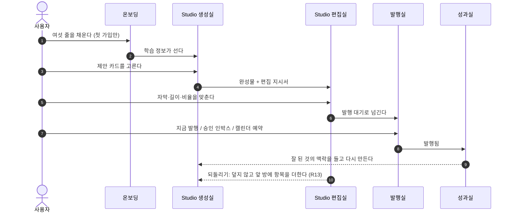

| 갈래 | 언제 | 무엇이 다른가 |
|---|---|---|
| 첫 가입 | 학습 정보 0 | 없으면 생성이 안 되는 여섯 줄만 온보딩에서 받는다 (R28 앞층) |
| 재방문 | 학습 정보 있음 | 온보딩을 건너뛰고 바로 생성실 (R02) |
| 추가 입력·추천 | 성과나 트렌드가 뭔가를 발견했을 때 | 생성 화면에서 미세 조정으로 받는다 (R28 뒷층) |

---

## 3. 요청 한 건이 지나가는 길

예시는 해줘단타 숏폼 한 편입니다.

### 3.1 전체 한 장

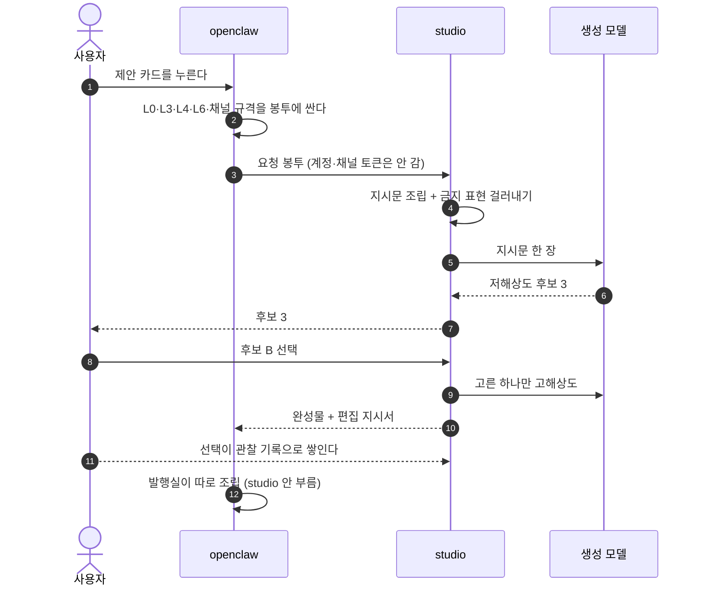

### 3.2 클로드 코드와 우리 제품, 같은 그림으로 나란히

무엇이 서버로 넘어가는지를 같은 형식으로 놓고 봅니다. 왼쪽이 지금 우리가 쓰는 도구, 오른쪽이 만들 제품입니다.

**클로드 코드에서 영상 스킬로 만들 때**

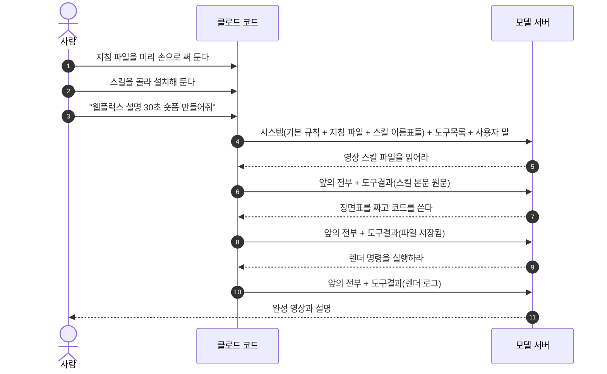

**우리 제품 생성실에서 만들 때**

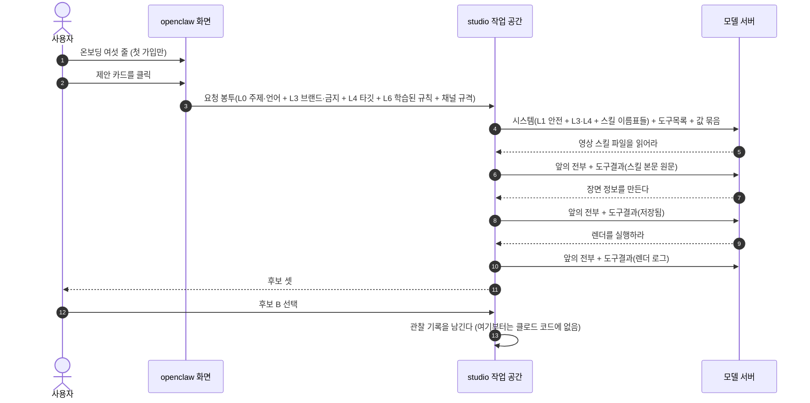

**다른 곳은 세 군데뿐입니다.**

| 클로드 코드 | 우리 | 왜 |
|---|---|---|
| 사람이 지침 파일을 손으로 씀 | 온보딩 여섯 줄과 학습된 규칙이 자동으로 들어감 | 지침 작문을 없앤다 |
| 사람이 채팅창에 요청을 침 | 제안 카드 클릭이 값 묶음이 됨 | 타이핑을 없앤다 |
| 결과 받고 끝 | 선택이 관찰 기록으로 남고 발행과 성과가 이어짐 | 생애를 끝까지 본다 |

가운데 왕복(스킬 읽고 만들고 렌더하는 부분)은 **완전히 같습니다.** 그래서 클로드 코드가 하는 방식을 그대로 쓰면 되고, 우리가 새로 만들 것은 앞의 두 칸과 뒤의 두 칸입니다.

### 3.2-a 봉투에 실리는 것

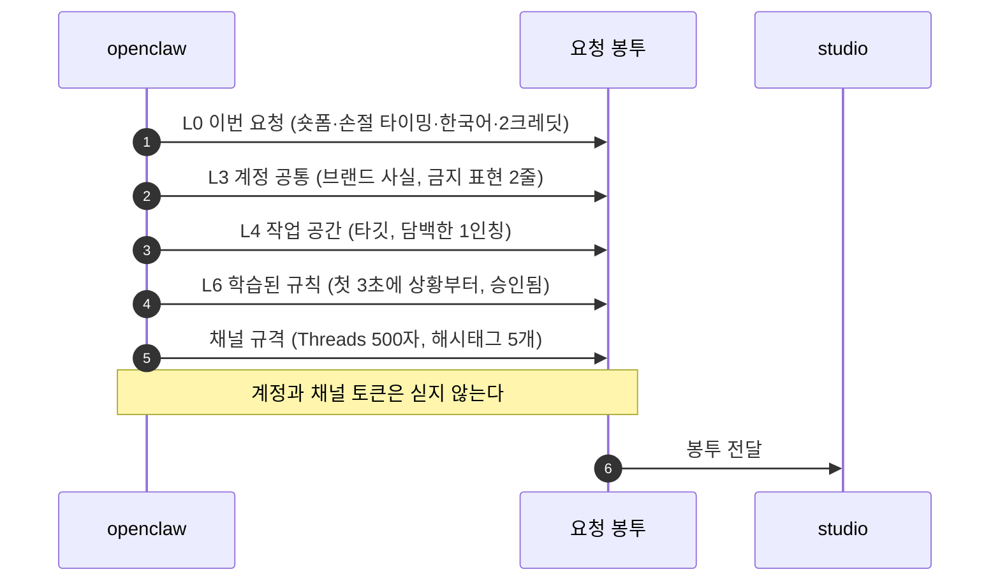

### 3.3 studio가 지시문을 만들고 검사하는 순서

금지 표현과 부딪히는 규칙은 **넣기 전에** 뺍니다. 모델이 답한 뒤에 한 번 더 검사합니다. 두 번 거는 이유는 지시문만으로는 안 지켜진다는 실측 때문입니다.

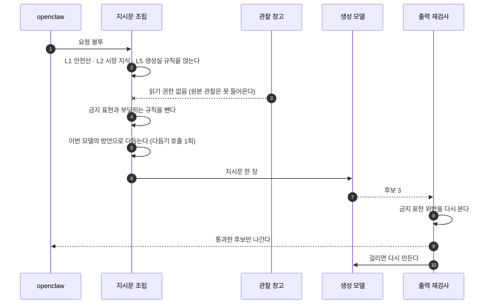

### 3.4 선택이 규칙으로 자라는 순서

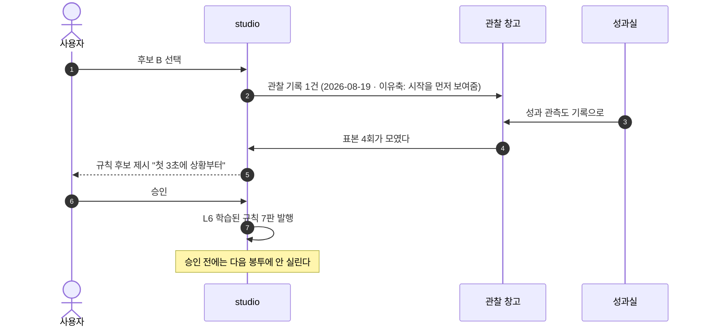

### 3.5 발행실은 studio를 안 부른다

제목과 해시태그는 여기서 씁니다(R31). 새벽 크론이 도는 자동 댓글도 여기만 읽으므로 **studio가 멈춰 있어도 발행은 돕니다.** 이것이 두 서비스를 가른 실질적 이유입니다.

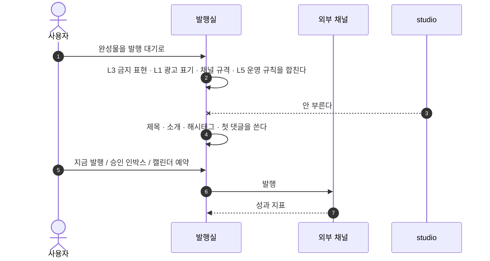

---

## 3.6 시스템 프롬프트와 스킬은 어디에 두고 어떻게 합치나

회장 문제 제기 2026-08-19: 조립한 지시문이 사람이 직접 쓴 것보다 낫다는 보장이 있는가. 그리고 remotion 같은 검증된 스킬을 L0~L6 어디에 녹일 것인가.

근거 자료: 회장 제공 대화(2026-08-19). 브라우저로 본문 확인함.

### 자료에서 확인한 사실 셋

| 사실 | 우리에게 무슨 뜻인가 |
|---|---|
| **스킬은 글이 아니라 폴더다.** SKILL.md 하나가 아니라 참고 문서(구성 공식·모션 규칙·자막 규칙·검수 목록), 실행 스크립트(길이 측정·프레임 추출·렌더), 템플릿 프로젝트가 함께 들어 있다 | L0~L6 어느 칸에도 못 넣는다. 넣는 순간 스크립트와 템플릿이 사라지고 글만 남는다 |
| **스킬에는 이번 영상 주제를 안 박는다.** 반복되는 제작법만 넣고 주제·카피·길이는 매번 프롬프트로 받는다 | 스킬이 비워 둔 그 자리가 정확히 L0~L6가 채울 자리다. 둘은 겹치지 않고 맞물린다 |
| **공식 remotion 스킬은 기능별로 쪼개져 조합해 쓴다.** 만들기·자막·렌더·문서 조회가 따로 있다 | 요청 한 건에 스킬 하나가 아니라 **여럿이 함께 붙는다.** 제가 직전에 "한 건에 하나"라고 한 것은 틀렸습니다 |

### 그래서 이렇게 나눕니다

| | L0~L6 정보 층 | 제작 스킬 |
|---|---|---|
| 담는 것 | **이번에 무엇을 말할지, 누구 목소리로.** 주제·타깃·브랜드·금지 표현·학습된 규칙 | **어떻게 만들지.** 컷 구성 공식, 모션 규칙, 자막 규칙, 검수 목록, 렌더 스크립트 |
| 생김새 | 짧은 항목들. 쪼개서 관리 | 파일 여러 개가 든 폴더 |
| 바뀌는 이유 | 사용자가 바뀌거나 학습이 자람 | 만드는 기술이 바뀜 |
| 요청 한 건에 | 층마다 필요한 것만 뽑힘 | 여러 개가 함께 붙음 |
| 어디 사나 | 계정·공간은 openclaw, 나머지는 studio | **studio.** 스크립트를 실제로 돌려야 하므로 |

L0~L6에 스킬을 녹이지 않습니다. 스킬이 **필요한 입력을 목록으로 선언**하고, L0~L6가 그 목록을 채웁니다. 자료의 표현대로 스킬은 제작법이고 주제는 프롬프트로 받는데, 우리 제품에서는 그 프롬프트를 사람이 쓰지 않고 층에서 자동으로 채워 준다는 것이 차이입니다.

### 실제로 합쳐지는 순서

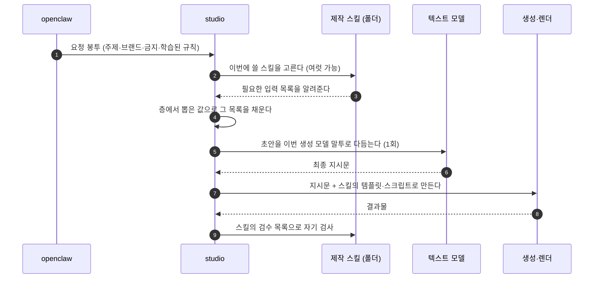

스킬과 금지 표현이 부딪히면 **금지가 이깁니다.** 스킬은 방법이고 금지는 헌법입니다.

### 스킬은 누가 넣나

| 무엇 | 누가 |
|---|---|
| 우리가 넣는 공식 스킬 | 우리. 판 번호로 갱신 |
| 사용자가 올린 스킬 | 사용자. 그 계정에서만 보임 |
| 이번에 어느 것을 쓸지 | 사용자가 고르거나, 안 고르면 작업 공간 기본값 |

### 조립이 사람보다 낫다는 보장은 지금 없다

솔직히 적습니다. 조립이 보장하는 것은 **일관성과 제약 준수**입니다. 같은 목소리가 나고 금지 표현이 안 새고 규격이 맞습니다. 그것이 곧 좋은 영상이라는 보장은 아닙니다.

그래서 답을 둘 답니다.

1. **다듬기 한 번.** 초안을 생성 모델에 바로 던지지 않고 텍스트 모델에 한 번 태워 이번 모델이 알아듣는 형태로 고칩니다. 주어진 재료 밖의 사실은 못 지어내게 묶습니다. 자료가 강조한 "무슨 코드를 써라보다 어떤 영상이 합격인지를 명시하라"가 여기서 들어갑니다. 합격 기준을 지시문에 넣는 일을 사람이 아니라 이 단계가 합니다.
2. **모델 말투를 시장 지식에서 떼어낸다.** 생성 모델마다 먹히는 표현이 다릅니다. 모델이 바뀌면 이 부분만 갈아 끼웁니다.

### 우리 자리

잘 나가는 프롬프트와 스킬은 경쟁 상대가 아니라 재료입니다. 우리만 할 수 있는 것은 그다음입니다. **어느 스킬로 만든 것이 실제로 터졌는지**를 편집과 발행과 성과까지 따라가며 압니다. 스킬 배포처는 이걸 못 합니다. 만들고 끝이기 때문입니다.

### 검증되지 않은 것

조립에 다듬기를 붙인 것이 사람이 직접 쓴 프롬프트보다 낫다는 것은 아직 실측 전입니다. 같은 주제로 세 벌을 뽑아 비교해야 합니다. 조립만, 조립에 다듬기, 사람이 직접 쓴 것. 이 실험 전에는 제품 문구에 "더 낫다"를 쓰지 않습니다.

---

## 3.7 겹치는 값은 누가 이기나 (외부 벤치마크 결과 반영)

2026-08-19 실조사. 대상은 Remotion 공식 스킬 12종, Anthropic 스킬 규격, 오픈소스 파이프라인 4종(MoneyPrinterTurbo·ShortGPT·Revideo·MoneyPrinter), 영상 모델 가이드 5종(Sora 2·Veo·Kling·Runway·Luma), 상용 도구 6종(HeyGen·Opus Clip·Argil·Synthesia·Creatomate·Shotstack·Canva).

### 확인된 사실 셋

| 사실 | 근거 | 우리에게 |
|---|---|---|
| 상용 제품은 브랜드를 **값이 아니라 번호로** 저장한다 | HeyGen brand_kit_id·color_roles, Argil styleId·voiceId, Synthesia 브랜드킷, Canva 템플릿 | 조립할 때 색상 코드와 폰트 이름을 글에 박으면 브랜드를 바꾼 뒤 과거 요청을 재현 못 한다. 번호로 두고 조립 때 펴야 한다 |
| **말투를 구조로 저장하는 영상 도구는 사실상 없다** | 상용은 전부 시각 브랜드만. HeyGen 용어집은 발음 매핑이라 문체가 아님. 오픈소스는 자유 텍스트 한 덩어리 | 우리가 이미 채널별 안내문으로 하고 있는 그 자리가 업계 빈칸이다. 여기가 실제 우위 |
| 모델마다 **같은 뜻을 다른 문법으로** 요구한다 | 대사는 Sora가 전용 블록, Veo는 따옴표와 소리 표기. 금지 표현은 Veo에 전용 칸이 있고 Runway는 넣으면 역효과가 난다고 문서에 명시. 길이 허용값도 4~20초, 4·6·8초, 5·10초로 제각각 | 지식으로 적어 두고 모델이 알아서 맞추길 기대하면 매번 틀린다. 모델별 변환기가 문법과 허용값을 강제해야 한다 |

### 겹치는 값의 우선순위

값이 두 곳 이상에서 나오면 위에서부터 이깁니다.

| 순위 | 무엇 | 근거 |
|---|---|---|
| 1 | 안전과 법 (AI 표기, 저작물) | 협상 대상이 아님 |
| 2 | 금지 표현 | 사용자가 직접 적은 절대선 |
| 3 | 이번 요청에 사람이 명시한 값 | 지금 이 사람의 의도 |
| 4 | 채널 규격 | 플랫폼이 정한 사실 |
| 5 | 작업 공간과 방 설정 | 사용자가 저장해 둔 것 |
| 6 | 학습된 규칙 | 사용자가 침묵한 자리를 채움 |
| 7 | **스킬 기본값** | 스킬 본문이 스스로 "중요하지 않은 누락에 대한 합리적 기본값"이라 적어 둠 |
| 8 | 모델별 변환 | 형식만 바꾸고 내용은 못 바꿈 |

스킬이 요구하지만 우리 층에 없는 것(기술 스택, 출력 경로, 프레임 검수 절차)은 스킬이 자기가 채웁니다. 사용자에게 안 묻습니다. 반대로 층에 있으나 스킬이 모르는 것(브랜드 사실, 금지 표현)은 항상 덧붙입니다.

### 필드 성격 세 가지

조사한 모든 도구의 입력을 성격으로 가르면 셋뿐이었습니다.

| 성격 | 예 | 우리 층 |
|---|---|---|
| 매번 바뀜 | 주제, 대본, 개수 | L0 |
| 계정에 고정 | 비율, 목소리, 자막 스타일, 폰트, 색, 로고, 언어 | L3·L4 |
| 제작법이 정함 | 전환 효과 목록, 카메라 문법, 길이 허용값, 템플릿 변수 | 스킬과 모델 |

계정 고정 항목이 압도적으로 많습니다. 한 번 받아 두면 매번 안 묻는다는 우리 약속의 근거가 여기 있습니다.

### 반론: 한 장으로 조립하는 것 자체가 스킬 동작 방식과 부딪힌다

조사에서 나온 가장 무거운 지적입니다. 스킬은 **미리 다 합쳐 주는 것을 일부러 피하는 구조**입니다. 처음에는 이름과 설명 백 자 정도만 올라가고, 발동해야 본문을 읽고, 참고 문서는 그보다 더 늦게 읽습니다. Remotion 지도 스킬은 다섯 기법 중 조건에 맞는 하나만 읽습니다.

우리가 층을 미리 한 장으로 펴서 넣으면 세 가지가 어긋납니다. 스킬이 스스로 걸러낼 분기를 우리가 다 펼쳐 넣어 길이가 부풀고, 설명 문구로 발동하는 방아쇠가 무의미해지고, 스킬 본문과 우리 글이 같은 주제를 두 번 말해 부딪힙니다.

이 반론은 "층으로 저장한 것이 틀렸다"가 아닙니다. 저장 방식은 오히려 업계 표준과 같습니다. 틀릴 수 있는 것은 **조립 결과물의 모양**입니다. 대안 둘 다 실제 선례가 있습니다.

| 안 | 무엇 | 선례 |
|---|---|---|
| **가 (추천)** 조립 결과를 글이 아니라 **값 묶음**으로 낸다. 스킬은 평소대로 발동하고 우리는 그 스킬이 요구하는 칸만 채운다 | 템플릿이 자기가 받을 칸을 스스로 알려 주고 값만 채워 넣는 방식 | Revideo 변수, HeyGen 변수, Creatomate 수정 목록, Canva 데이터셋 조회 |
| 나 | 우리 층을 **우리 스킬 폴더로 발행**한다. 브랜드는 참고 문서 한 장, 방 규칙은 또 한 장. 본문에는 언제 무엇을 읽으라고만 적는다 | 층에도 지연 읽기가 그대로 적용됨 | Anthropic 스킬 규격의 단계적 공개 |

한 장 조립을 고집할 유일한 근거는 우리 조립기가 모델의 판단보다 낫다는 것인데, 아직 검증된 바 없습니다.

---

## 3.8 프롬프트와 스킬은 다르게 다룬다 (회장 의문 2026-08-19)

회장 의문 셋: 프롬프트와 스킬을 나눠 보면 어떤가. 외부가 요구하는 정보가 우리 층과 겹치는가. 원문을 따로 두고 섞어 새 지시문을 만든다면 그 결과를 믿을 수 있는가.

### 겹침을 실제로 세어 봤다

| 외부가 요구하는 것 | 우리 층에 있나 |
|---|---|
| **프롬프트**(1회성 지시서) 목표·핵심 메시지 | 있음 (L0) |
| 프롬프트 타깃 | **있음** (L4) |
| 프롬프트 해상도·길이 | 있음 (채널 규격) |
| 프롬프트 기술 스택·출력 경로·합격 기준 | 없음 |
| **스킬**(재사용 제작법) 작업 순서 9단계 | 없음 |
| 스킬 이야기 규칙(0.3초 첫 변화, 1~3초마다 새 정보) | 없음 |
| 스킬 자막 규칙·모션 규칙·검수 목록 | 없음 |
| 스킬 렌더 스크립트·템플릿 | 없음 |
| 스킬 날조 금지 | 있음 (L1) |

**결론이 갈립니다. 프롬프트는 우리 층과 거의 다 겹치고, 스킬은 거의 안 겹칩니다.**

그래서 대응이 달라야 합니다.

| | 프롬프트 | 스킬 |
|---|---|---|
| 정체 | 이번 한 편의 지시서. 매번 새로 씀 | 반복 제작법. 폴더 |
| 우리 층과 | 대부분 겹침 | 거의 안 겹침 |
| 우리가 할 일 | **대체한다.** 사람이 쓰던 것을 층에서 자동으로 채운다 | **보존한다.** 손대지 않는다 |
| 어디 두나 | 따로 안 둔다. 층이 곧 재료다 | **스킬 보관함**(층이 아님) |

스킬을 L7이라 부르지 않는 이유가 여기 있습니다. 층은 조립되는 것이고 스킬은 조립되지 않고 실행되는 것입니다. 번호를 붙이면 섞어도 되는 것처럼 보입니다.

### 회장 의문에 대한 답: 스킬을 다시 쓰지 않는다

섞어서 새 지시문을 만들면 회장이 짚은 두 가지가 실제로 일어납니다. 스킬 본문을 우리가 고쳐 쓰는 순간 원래 효과가 깨지고, 모델이 다시 쓰는 과정에서 빠지거나 부딪히는 문장이 생깁니다.

그래서 **스킬 본문은 한 글자도 다시 쓰지 않습니다.** 조립 결과는 세 덩어리로 나가고 각각 성격이 다릅니다.

| 덩어리 | 무엇 | 어떻게 만드나 |
|---|---|---|
| 스킬 원문 | 제작법 전체 | **그대로.** 모델을 안 태운다 |
| 값 묶음 | 주제·타깃·브랜드·금지·규격 | 층에서 꺼내 칸에 넣는다. 정해진 자리에 정해진 값 |
| 우선순위 쪽지 | 값이 부딪힐 때 누가 이기는지 | 규칙표대로 |

값 묶음을 만드는 일은 확률이 개입하지 않습니다. 어느 칸에 어느 층의 값이 들어가는지가 정해져 있습니다. 다듬기가 필요하면 **값 묶음에만** 걸고 스킬 원문은 통과시키지 않습니다. 회장이 걱정한 손상과 변질이 구조로 막힙니다.

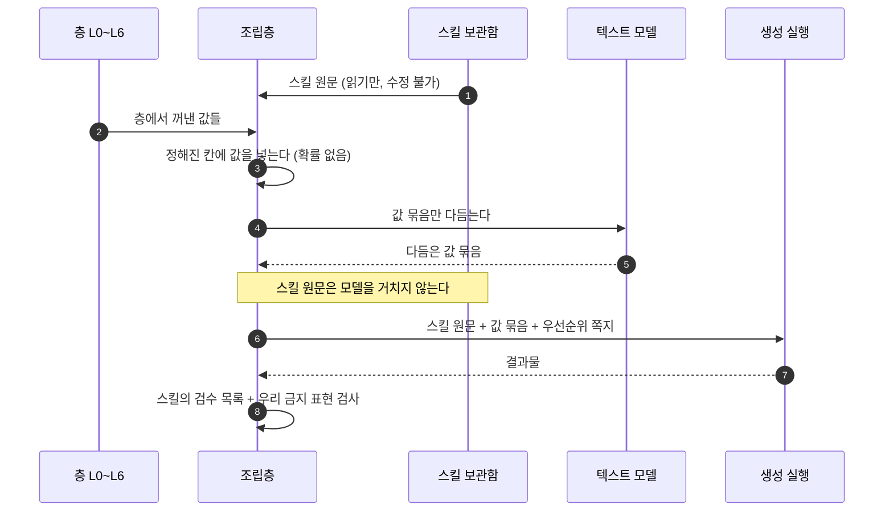

남는 위험은 하나입니다. 값과 스킬이 서로 다른 말을 할 때입니다. 그래서 넣기 전에 부딪힘을 보고, 만든 뒤에 한 번 더 봅니다. 스킬에 이미 자기 검수 목록이 들어 있으므로 검사가 두 겹이 됩니다.

### 스킬이 생성실에만 영향을 주는가

대체로 맞지만 정확히는 아닙니다.

| 방 | 영향 | 이유 |
|---|---|---|
| 생성실 | **직접 받음** | 무엇을 어떻게 만들지가 여기서 정해진다 |
| 편집실 | **부분적으로 받음** | 자막 위치와 안전여백, 재렌더 스크립트가 스킬 안에 들어 있다. 자막 오타를 고쳐 다시 뽑을 때 같은 스킬 자산을 쓴다 |
| 발행실 | 안 받음 | 제목·소개·해시태그는 발행실이 쓴다. 스킬을 읽지 않는다 |
| 성과실 | **거꾸로 영향을 준다** | 스킬이 성과를 읽는 게 아니라, 성과가 어느 스킬로 만든 것이 터졌는지 평가한다 |

편집실이 걸리는 것이 중요합니다. 스킬을 생성실 전용으로 두면 편집실이 자막 규칙을 따로 갖게 되고 두 곳이 어긋납니다.

---

## 3.9 서버로 실제로 무엇이 넘어가나

회장 지적: "대화에 들어온다"는 말로는 알 수 없다. 시스템 프롬프트와 사용자 프롬프트를 함께 넘기고 응답을 받는 구조인데, 그때 스킬이 **어떤 형태로** 넘어가는지를 봐야 한다.

### 요청 한 번의 실제 모양

한 번의 호출에 넘어가는 것은 네 덩어리입니다.

| 덩어리 | 무엇이 들어가나 | 스킬과의 관계 |
|---|---|---|
| 시스템 프롬프트 | 기본 규칙 + 사용자 지침 파일 + **설치된 스킬들의 이름과 설명 목록** | 이름표만. 본문 없음 |
| 도구 목록 | 파일 읽기, 명령 실행 같은 쓸 수 있는 도구의 정의 | 스킬을 읽을 수단 |
| 메시지 배열 | 지금까지의 모든 주고받음. 사용자 말, 모델 답, **도구 실행 결과** | 스킬 본문이 여기 들어감 |
| 이번 사용자 말 | 이번 요청 | 값 묶음 |

**스킬 본문이 들어오는 정확한 자리는 메시지 배열 안의 도구 실행 결과입니다.** 모델이 "이 파일을 읽어라"라는 도구 호출을 내고, 우리 쪽이 파일을 읽어 그 내용을 도구 결과로 되돌려 보냅니다. 그 결과가 다음 호출의 메시지 배열에 그대로 실려 갑니다. 시스템 프롬프트를 고쳐 넣는 게 아닙니다.

그래서 한 작업은 호출 한 번이 아니라 **여러 번의 왕복**입니다.

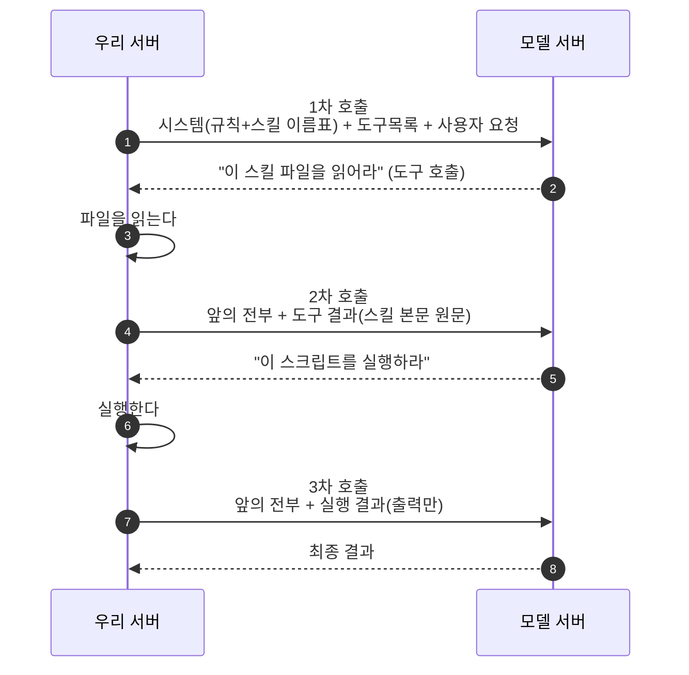

여기서 나오는 사실 셋입니다.

| 사실 | 우리에게 |
|---|---|
| 매 호출마다 **앞의 전부를 다시 보낸다** | 스킬 본문이 한 번 읽히면 그 작업이 끝날 때까지 계속 실려 간다. 길이가 곧 비용 |
| 스킬 본문은 **원문 그대로** 실린다 | 우리가 고쳐 쓸 자리가 애초에 없다 |
| 스크립트는 **출력만** 실린다 | 렌더나 측정 같은 무거운 일은 스크립트로 두는 게 이득 |

### 이것이 우리 구조에 주는 결론

**생성실은 호출 한 번짜리가 아닙니다.** 스킬이 파일을 읽고 스크립트를 돌려야 작동하므로, 파일이 있는 곳과 명령을 실행할 수 있는 곳이 필요합니다. 조립해서 한 번 던지는 구조로는 remotion 같은 스킬이 아예 돌지 않습니다.

즉 studio는 모델에 요청을 전달하는 창구가 아니라 **작업 공간을 띄우고 왕복을 관리하는 쪽**입니다. 이것이 회장이 말한 "터미널 켜고 스킬 쓰는 일을 클릭으로 추상화한다"의 기술적 실체입니다. 우리가 클릭으로 감추는 것은 프롬프트 문장이 아니라 **작업 공간과 왕복 전체**입니다.

| 클로드 코드에서 사람이 하는 일 | 우리 제품에서 |
|---|---|
| 지침 파일을 직접 쓴다 | 온보딩 여섯 줄과 학습된 규칙이 대신함 |
| 스킬을 골라 설치한다 | 보관함에서 고르거나 기본값이 붙음 |
| 채팅창에 요청을 친다 | 제안 카드를 누르면 값 묶음이 만들어짐 |
| 결과를 보고 다시 지시한다 | 후보를 고르고 편집실에서 지시 |
| 터미널과 파일을 관리한다 | 안 보임. studio가 함 |

### 발행실도 모델을 쓴다

씁니다. 제목과 소개와 해시태그와 첫 댓글은 글이므로 모델이 씁니다. 발행실 전용 스킬을 둘 수 있고, 그때도 같은 방식입니다. 시스템 자리에 브랜드와 금지 표현, 스킬 본문은 읽어서 도구 결과로, 요청 자리에 채널과 시각.

다만 발행실은 **왕복이 짧습니다.** 렌더할 것도 파일을 만들 것도 없으므로 대개 한두 번이면 끝납니다. 생성실만 왕복이 깁니다.

### 한 스킬이 생성실과 편집실 둘 다에 걸칠 때

요청은 완전히 별개로 나갑니다. 같은 스킬이라도 두 번 읽힙니다. 문제는 두 요청이 서로 다른 상태를 보면 결과가 어긋난다는 것입니다.

| 처리 | 어떻게 |
|---|---|
| 스킬이 참고 파일로 쪼개져 있으면 | 그 방에 필요한 파일만 읽힌다. 공식 스킬이 원래 이 설계다 |
| 한 덩어리면 | 통째로 읽되 요청 자리에 "이번은 고치는 작업"이라고 적는다 |
| 판이 갈리는 것을 막으려면 | **작업물에 스킬 판 번호를 붙인다.** 만든 뒤 스킬이 갱신돼도 그 작업물은 만들 때 판으로 계속 고쳐진다 |
| 작업 공간을 다시 세우는 비용 | 편집은 만들 때 쓴 파일들이 남아 있어야 싸다. 그래서 작업 공간을 얼마나 오래 살려 둘지가 원가 문제가 된다 (미결) |

---

## 3.10 클릭 추상화 벤치마크 (2026-08-20 실조사)

회장 방향 제시: 이 제품은 터미널을 켜고 스킬과 에이전트로 하네스를 거는 작업을 클릭만으로 되게 추상화하는 것이다. 그러니 클로드 코드 작업 방식과 유사하게 구현해야 하지 않나. 유사 서비스와 영상·카드뉴스 제작 스킬을 충분히 보고 뼈대를 잡자.

조사 대상은 클릭 UI로 추상화한 플랫폼 열 곳(Dify, Flowise, n8n, Gumloop, Relevance, Lindy, Zapier Agents, Cowork, OpenAI Agent Builder, Sim)과 영상·카드뉴스 제작 스킬 열 종입니다.

### 훔칠 패턴 셋

| 패턴 | 어디서 | 우리에게 |
|---|---|---|
| **사람이 쓰는 층과 에이전트가 갱신하는 층을 나눈다** | Lindy는 사람이 편집하는 것과 에이전트가 스스로 고치는 것을 별개 이름으로 두고 둘 다 모든 호출 앞에 자동으로 붙인다 | 우리 계정 정보와 학습된 규칙 구분과 정확히 같다. 남이 이미 하고 있다 |
| **다이얼 조합과 즉시 미리보기** | 캐러셀 제작 스킬 하나가 포맷 6가지, 글꼴 5가지, 바탕 8가지, 강조색 11가지, 목적 2가지 조합을 드롭다운으로 처리하고 바로 렌더해 보여 준다 | 프롬프트가 아니라 편집기가 됐다. 클릭 추상화의 가장 성공한 사례 |
| **지식을 붙여넣은 글이 아니라 살아 있는 연결로 다룬다** | Zapier는 지식 원본을 하루 한 번 자동으로 다시 읽는다 | 브랜드 위키가 바뀌면 규칙도 따라 바뀐다. 우리 반입 자료를 고정 텍스트로 두지 말라는 근거 |

### 반론: 클릭 추상화는 이 조사에서 세 번 실패 신호를 냈다

**첫째, 가장 돈이 많이 들어간 클릭 빌더가 폐기됩니다.** OpenAI의 노드 캔버스 도구가 2026년 11월 종료 예정이고, 남는 것은 채팅 임베드와 코드입니다. 중간층이 증발했습니다.

**둘째, 방향이 거꾸로 가고 있습니다.** n8n은 클릭 캔버스 위에 자연어로 워크플로를 만들어 주는 기능을 얹었고, Sim은 자연어 조종석으로 갈아탔고, Gumloop은 평문으로 설명하면 코드를 짜 줍니다. 업계가 도달한 결론은 클릭으로 프롬프트를 없애는 것이 아니라 **프롬프트로 클릭 구조물을 만드는 것**에 가깝습니다.

**셋째, 아무도 프롬프트 작문을 못 없앴습니다.** Lindy는 자기 제품 사용자에게 지시문 잘 쓰는 법 강좌를 팔고, Zapier 공식 안내는 모호하게 쓰지 말고 구체적으로 쓰라고 가르칩니다. 프롬프트 엔지니어링을 감싼 게 아니라 이름만 바꿔 사용자에게 돌려준 것입니다.

### 그런데 반론을 이기는 조건이 조사 안에 있다

캐러셀 스킬이 880가지 조합을 드롭다운으로 처리할 수 있었던 이유는 **산출물이 한 종류로 고정됐기 때문**입니다. 범용 빌더는 클릭으로 못 덮지만, 출력이 좁으면 클릭이 이깁니다.

| 우리가 이렇게 가면 | 결과 |
|---|---|
| 마케팅 콘텐츠 제작이라는 범위를 **좁게 자른다**(먼저 한 매체) | 클릭이 이긴다. 캐러셀 스킬이 증명함 |
| 범용 워크플로 빌더를 지향한다 | 위 세 실패 신호가 그대로 우리 것이 된다 |

첫 매체를 하나로 좁히자는 제안의 외부 근거가 여기서 나옵니다.

### 영상·카드뉴스 쪽에서 확인된 것

| 확인 | 뜻 |
|---|---|
| Anthropic 공식 스킬 열아홉 종에 **영상 전용 스킬이 없다** | 이 자리는 비어 있다 |
| 캐러셀 제작 스킬은 API 키 없이 브라우저 미리보기와 이미지·문서 출력까지 낸다 | 카드뉴스는 지금 당장 붙일 수 있다 |
| 영상 쪽은 Remotion 계열과 큐레이션 모음, 그리고 노드 기반 영상 워크플로 템플릿들 | 영상은 준비물이 많다. 모델 파일과 GPU와 API 키 여러 개 |
| 얼굴 없는 영상 자동화 템플릿은 주제 한 줄만 받고 나머지를 안에 박아 뒀다 | 프롬프트를 없앤 게 아니라 템플릿 저자에게 옮긴 것 |

---

## 3.11 클로드 코드와 우리 제품 대조

회장 요구: 클로드 코드에서 지침 파일·에이전트·스킬·사용자 채팅이 요청으로 나가는 구조와, 우리 제품에서 층·사용자가 올린 스킬·시스템이 등록한 스킬·에이전트가 대응되는 관계를 표와 흐름으로 대조하라.

### 자리별 대조

| 클로드 코드 | 무엇을 하나 | 우리 제품에서 같은 것 | 누가 채우나 |
|---|---|---|---|
| 사용자 전역 지침 파일 | 어느 프로젝트에서든 항상 붙는 규칙 | **L3 계정 공통** (브랜드 사실, 금지 표현, 기본 말투) | 온보딩 세 줄 |
| 프로젝트 지침 파일 | 그 폴더에서만 붙는 규칙 | **L4 작업 공간** (타깃, 컨셉, 스타일) | 공간 만들 때 세 줄 |
| 기본 시스템 프롬프트 | 제품이 박아 둔 안전·행동 규칙 | **L1 시스템** (AI 표기, 저작물, 정책) | 우리 |
| 설치된 스킬의 이름표 목록 | 무엇이 있는지만 알림 | **스킬 보관함 목록** | 우리 등록분 + 사용자 업로드분 |
| 읽어 온 스킬 본문 | 그 작업의 제작법 | **스킬 원문** (그대로) | 스킬 저자 |
| 서브에이전트 정의 | 그 역할일 때만 붙는 지시 | **L5 방별 규칙** (생성·편집·발행·성과) | 기본값 + 사용자가 자람 |
| 자동 메모리 | 쓰다 보니 쌓인 사실 | **L6 학습된 규칙** (승인 필요) | 관찰에서 자동, 사용자 승인 |
| 채팅창에 친 요청 | 이번에 뭘 할지 | **L0 값 묶음** | 제안 카드 클릭 |
| 도구 목록 | 파일 읽기, 명령 실행 | 같음. 다만 사용자에게 안 보임 | 우리 |
| 도구 실행 결과 | 읽은 파일, 실행 출력 | 같음 | 우리 작업 공간 |

### 데이터 흐름 대조

두 흐름을 같은 형식으로 나란히 놓은 그림은 §3.2에 있습니다. 여기서는 결론만 적습니다.

두 흐름의 모양은 같습니다. 다른 것은 **사람이 하던 세 가지를 우리가 대신한다**는 점입니다. 지침 파일 작문, 스킬 설치, 요청 타이핑.

그리고 클로드 코드에 없는 것이 우리에게 둘 붙습니다. **발행과 성과**입니다. 위 그림에서 그 두 칸과 되돌아가는 점선이 우리에게만 있습니다.

### 회장 가설: 라이프사이클을 끝까지 도는 것이 우리 자리인가

회장 정리: 프롬프트 치던 것과 하네스 걸던 것을 클릭으로 바꾸는 데까지가 생성실과 편집실의 출발점이고, 그 뒤 발행과 성과 기반 평가 루프까지 콘텐츠 생애를 끝까지 관리하는 것이 남들이 못 하는 부분 아닌가.

**앞선 조사가 이 가설을 지지합니다.**

| 조사에서 본 것 | 뜻 |
|---|---|
| 클릭 추상화만 한 곳들은 서로 베낄 수 있고 실제로 한 곳은 폐기됐다 | 클릭 자체는 해자가 아니다 |
| 얼굴 없는 영상 템플릿은 주제 한 줄만 받고 나머지를 안에 박아 뒀다 | 만들기까지만 하고 끝난다 |
| 스킬 배포처는 만들고 끝이다 | 무엇이 터졌는지 모른다 |
| 상용 도구는 브랜드를 저장하지만 **성과가 브랜드를 고치지는 않는다** | 되돌아오는 화살표가 없다 |

되돌아오는 화살표를 가진 제품이 정말 없는지는 지금 확인 중입니다. 있다면 우리 차별점을 다시 잡아야 합니다.

### 편집실을 캡컷처럼 만들 것인가

지금 제 판단은 **아니오에 가깝습니다.** 근거 셋입니다.

첫째, 우리 사용자는 하네스 엔지니어링을 못 하거나 그게 뭔지도 모르는 사람입니다. 타임라인 편집기는 그 사람에게 또 하나의 배워야 할 도구입니다. 클릭으로 줄이겠다고 해 놓고 더 어려운 것을 주는 셈입니다.

둘째, 앞서 회장이 확정한 것이 있습니다. 편집실은 손 편집 프로그램이 아니라 결과를 재생하며 대화로 지시하거나 준비된 선택지를 고르는 곳입니다.

셋째, 원가 구조가 그쪽입니다. 편집 지시서가 있으니 값만 바꿔 다시 렌더하면 됩니다. 타임라인을 손으로 만지면 그 지시서가 깨지고 재렌더가 아니라 재생성이 됩니다.

다만 **미리보기는 필요합니다.** 고치기 전에 어떻게 되는지 봐야 고를 수 있습니다. 그래서 지금 확인하고 있는 것은 브라우저에서 미리보기를 돌리되 최종 렌더와 같은 엔진을 쓰는 방식이 있는지입니다. 그게 되면 손 편집 없이도 눈으로 보고 고를 수 있습니다.

---

## 3.12 편집기·라이프사이클·인프라 벤치마크 (2026-08-20)

> 검증 참고: 이 조사는 자동 검증 도구에서 반려 판정이 났습니다. 조사자가 하위 위임으로 웹을 뒤져 그 흔적이 상위 기록에 안 남았기 때문입니다. 근거 자체는 URL로 붙어 있고, 아래 표시한 항목은 제가 원문을 직접 다시 확인했습니다.

### 하나. 편집실은 무엇으로 만드나

| 후보 | 편집 대상 | 프리뷰와 최종 렌더가 같은가 | 걸림돌 |
|---|---|---|---|
| Creatomate | **장면 정보 한 문서**(JSON) | **문서가 명문으로 보장**(직접 확인함) | 독점 종속 |
| Shotstack Studio | 같은 형식 + 타임라인 화면 완제품 | 형식은 같으나 보장 문구 없음 | **라이선스가 경쟁 제품 제작을 금지.** 영상 편집 SaaS면 법률 검토 먼저 |
| Polotno | 같은 형식 | 명시 없음 | 이미지·디자인 캔버스가 강점. 영상은 확인 필요 |
| Remotion | **코드** | 보장 없음, 불일치 사례 보고됨 | 임베드 금지, 타임라인은 별도 유료, 라이선스가 자유 이용 아님 |
| Descript | **글이 곧 타임라인** | 미공개 | 편집 방식 자체가 참고할 만함 |
| CapCut 웹 | 독점 | 네이티브와 코드 공유 | 임베드 불가. 그 수준 일치는 우리 범위 밖 |

**결론: 편집 정본을 장면 정보 한 문서로 못 박습니다.** 상위 후보가 전부 그 형식이고, 모델이 읽고 고치기 쉬우며, 그 문서가 곧 재편집과 판 관리와 비교 실험의 단위가 됩니다. 편집 상태를 서버 스냅샷에 의존하면 보관 기간 정책에 제품 기능이 묶입니다.

**캡컷처럼 만들지 않습니다.** 그 수준의 화면과 결과물 일치는 네이티브 코드를 브라우저로 옮겨야 나옵니다. 우리 범위가 아닙니다. 대신 프리뷰와 최종 결과가 같다는 보장을 **계약으로 요구**합니다. 사용자가 본 화면과 최종 파일이 다르면 편집실 신뢰가 무너지고, 그러면 성과 데이터도 오염됩니다. 무엇 때문에 성과가 났는지 알 수 없게 되기 때문입니다.

### 둘. 라이프사이클 루프를 닫은 제품이 있는가

**오가닉 소셜에는 없습니다.** 열여덟 개 제품을 성과가 생성으로 되먹여지는 정도로 매겼습니다.

| 정도 | 누가 |
|---|---|
| 테넌트마다 자동으로 학습하고 반영 | **이메일·푸시 카피 도구 두 곳뿐** |
| 전역 데이터로 사전 점수만 매김 | 광고 소재 도구 몇 곳 |
| 성과 상위 글을 골라 주면 사람이 다시 씀 | 소셜 관리 도구 최고점 |
| 대시보드만 | 나머지 다수 |

루프가 닫힌 두 곳이 왜 이메일인지가 답입니다. 보내는 대상을 자기가 정하고, 열람과 클릭이 즉시 정확히 귀속되고, 실험을 마음대로 쪼갤 수 있습니다. 오가닉 소셜은 지표가 늦게 오고 플랫폼 알고리즘이 잡음을 넣고 얻을 수 있는 지표가 제한적이라 신호가 약합니다.

**회장 가설은 맞습니다. 이 자리는 비어 있습니다.** 다만 비어 있는 이유가 아무도 생각을 못 해서가 아닙니다.

### 셋. 반론: 빈 자리가 기회가 아니라 경고일 수 있다

소셜 관리 도구들은 우리보다 훨씬 많은 성과 데이터를 십 년 넘게 갖고 있으면서 그것을 생성으로 되먹이지 않았습니다. 능력이 없어서가 아니라 **효과가 안 나서일 가능성**이 있습니다. 오가닉 성과는 콘텐츠 품질보다 알고리즘과 발행 시각과 계정 상태와 외부 흐름에 더 좌우되고, 테넌트 하나가 만드는 표본은 한 달에 수십에서 수백 건입니다. 통계가 안 잡힐 수 있습니다.

한 곳이 성과가 아니라 **문체만** 학습하고, 다른 곳이 성과를 생성이 아니라 **예산 배분에만** 쓰는 것은 이 한계를 아는 회사들의 합리적 선택으로 읽힙니다.

**그래서 정직한 판매 방식은 이렇습니다.** 검증 전에는 자동 학습을 약속하지 않습니다. 성과 상위 글을 근거와 함께 사람에게 보여 주고 고르게 하는 것까지만 팝니다. 우리 표본에서 학습 신호가 실제로 잡히는 것을 확인한 뒤에 자동으로 올립니다.

**대신 지금 반드시 해 둘 것이 있습니다. 태깅입니다.** 어떤 후보와 어떤 훅과 어떤 스킬로 만든 것이 발행됐는지를 만들 때 붙여 둬야 나중에 성과를 되먹일 수 있습니다. 태깅 없이 쌓인 지표는 학습 재료가 아니라 그냥 그래프입니다. 이건 나중에 붙일 수 없습니다.

### 넷. 인프라는 세 층으로 나누는 것이 이미 정답으로 수렴돼 있다

| 층 | 무엇을 두나 | 선택지 |
|---|---|---|
| 상태 | 테넌트 정보, 장면 정보 문서, 작업 큐 | 일반 데이터베이스 |
| 에이전트 왕복 | 스킬을 읽고 명령을 돌리는 작업 공간 | 멈췄다 이어서 할 수 있는 격리 환경. 한 곳은 멈춰 두면 상태가 무기한 보존되고, 다른 곳은 유지가 기본이나 지역이 하나로 제한 |
| 렌더 | 무거운 만들기 | 작업 큐. 직접 돌리거나 렌더 서비스에 맡기거나 |

**재편집을 "작업 공간 되살리기"가 아니라 "저장된 문서 다시 제출"로 정의하면 비용과 복잡도가 크게 떨어집니다.** 앞서 미결로 올린 작업 공간 보존 기간 문제가 이 정의로 대부분 사라집니다.

---

## 3.13 정면 경쟁자와 오픈소스 선행 구현 (2026-08-20)

### 하나. 회장이 준 링크의 정체는 정면 경쟁자입니다

`sigmine.ai`를 제가 직접 열어 확인했습니다.

| 항목 | 확인된 내용 |
|---|---|
| 자기 소개 | 대한민국 1등 AI 마케터, SNS 콘텐츠 자동화 |
| 만드는 것 | 카드뉴스, 블로그, 릴스, 쇼츠, 스레드, 링크드인 |
| 온보딩 | **홈페이지 주소와 브랜드 자료와 기존 채널만 주면 톤과 스타일을 학습** |
| 값 | 블로그 월 15만원(90~100개), 스레드 월 15만원, **숏폼 월 45만원(90~100편)**, 전체 75만원(약 300개) |
| 렌더 | 회장이 본 결과물 주소로 보아 우리가 후보로 본 렌더 방식을 서울에서 상용 운영 중 |

**우리가 짜고 있는 것과 포지션이 거의 같습니다.** 다채널 자동화, 브랜드 톤 학습, 구독형. 온보딩 문구는 우리가 계정 공통과 작업 공간으로 나눈 그 자리와 정확히 겹칩니다.

가격이 특히 중요합니다. 숏폼 한 편에 4,500원에서 5,000원 사이로 이미 팔고 있습니다. 이것이 우리 원가 상한선이자 가격 기준점입니다.

### 둘. 오픈소스에 영상 제작 에이전트가 이미 있습니다

여덟 개를 조사했고 성격이 셋으로 갈립니다.

| 성격 | 무엇 | 우리 방으로 치면 |
|---|---|---|
| **편집 전담** | 촬영본이 이미 있다는 전제로 컷과 자막과 크기를 다룸 | **편집실** |
| **생성 전담** | 주제 하나로 완성본까지 가지만 전부 고정 순서라 에이전트가 아니라 스크립트에 가깝고 품질 상한이 낮음 | 생성실이지만 참고만 |
| **둘 다** | 리서치와 기획부터 에셋 생성과 합성까지 전 구간. **두 곳뿐** | 생성실과 편집실 양쪽 |

둘 다 덮는 쪽 하나는 합성 계층이 우리가 후보로 본 렌더 방식이라 스택이 정확히 겹칩니다. **사실상 우리가 만들려는 것의 오픈소스 선행 구현입니다.**

다만 그것을 그대로 쓸 수 없는 이유가 있습니다. 그 도구는 **사람 승인 관문을 여섯 개** 두고 있고 승인 없이는 진행이 막힙니다. 개발자가 옆에서 지켜보며 돌리는 도구입니다. 우리 전제는 담당자가 자고 있어도 예약이 도는 것입니다. 그대로 넣으면 관문마다 멈춰서 자동화가 죽습니다. 관문을 떼어내면 비용 통제가 사라집니다.

**그래서 승인 관문 자체는 배워야 합니다.** 그 여섯 관문 중 실질적인 비용 방어는 에셋을 만들기 **전에** 비용을 보여 주고 승인받는 자리입니다. 다른 도구는 자기 검수 재렌더를 세 번으로 제한해 뒀습니다. 영상은 글과 달리 실패가 곧 돈입니다. 무한 자기교정은 재무 사고입니다.

### 셋. 렌더는 원가 문제가 아닙니다

| 무엇 | 값 |
|---|---|
| 1분 영상 렌더 | 약 0.017달러 |
| 90편이면 | 약 1.5달러 |
| 경쟁자 숏폼 요금 | 월 45만원 |

**병목은 렌더가 아니라 에셋을 만드는 API 비용입니다.** 영상 모델과 음성 모델 호출이 원가의 거의 전부입니다. 우리 실측에서도 영상 모델은 건당 5크레딧에서 95크레딧까지 벌어졌습니다. 원가 모델을 렌더가 아니라 생성 호출 기준으로 짜야 합니다.

다만 그 렌더 방식은 네 명 이상 팀이 상업적으로 쓰면 별도 유료 계약이 필요합니다. 금액은 확인 못 했습니다.

### 넷. 이 조사가 바꾸는 것

| 앞에서 정한 것 | 이 조사 뒤 |
|---|---|
| 범위를 좁히자, 첫 매체는 카드뉴스 | **유지.** 경쟁자도 카드뉴스를 팔고 숏폼은 세 배 값을 받는다. 싼 것부터 붙이고 비싼 것으로 올라가는 순서가 맞다 |
| 생성실을 왕복 루프로 | **유지.** 오픈소스 선행 구현이 전부 그 구조다 |
| 편집 정본을 장면 정보 한 문서로 | **유지.** 편집 전담 도구들도 그 형태다 |
| 성과 환류를 검증 전엔 약속하지 않는다 | **유지.** 경쟁자도 성과 환류를 내세우지 않는다 |
| 승인 관문 | **추가.** 에셋 만들기 전 비용 표시와 승인, 자기교정 횟수 상한. 앞에서 안 다뤘다 |

### 다섯. 근거로 삼기 어려운 것

조사자가 스스로 경고했습니다. 이 분야 오픈소스는 같은 내용을 복제한 계정이 여럿이고 별 개수와 도구 개수 표기가 계정마다 다릅니다. 별 개수를 채택 근거로 삼지 말고, 우리 환경에서 무인으로 한 편이 끝까지 나오는지 직접 돌려 본 뒤에 판단해야 합니다.

---

## 4. 지금 막힌 것

### 결정 1. 학습된 규칙과 관찰 창고를 어느 서비스가 갖나

제일 약한 자리입니다. 위키는 studio가 학습한다고 적었는데, 규칙을 만들려면 관찰 기록이 필요하고 기록을 가지면 studio는 무상태가 아닙니다. 무상태가 아니면 개발자용 제작 API로 파는 그림이 흔들립니다. 둘 다 가질 수 없습니다.

| 안 | 고르면 | 안 고르면 |
|---|---|---|
| A (추천) studio가 관찰 창고와 규칙을 갖는다 | 학습이 제품 심장이라는 위치가 유지되고, 편집 지시서를 이미 studio가 갖고 있어 원가 우위와 손발이 맞는다 | studio가 남이 준 규칙을 받아 쓰는 렌더 기계가 된다 |
| B openclaw가 다 갖고 studio는 무상태 | 단독 판매가 깨끗해지고 테넌트 데이터가 한 곳에 모인다 | 학습 품질을 studio가 책임질 수 없고 위키 문장을 고쳐야 한다 |

### 결정 2. 브랜드 말투가 계정 층인가 작업 공간 층인가

R32의 "공통"은 서비스 사이의 공통이고 R12의 "공통"은 작업 공간 사이의 공통입니다. 같은 낱말이 두 축을 가리켜 해석이 갈립니다.

| 안 | 고르면 | 안 고르면 |
|---|---|---|
| A (추천) 금지 표현은 L3, 말투는 L4, L3에 기본 말투 | 한 사람이 공간마다 다른 목소리를 내되 금지 표현은 어디서든 지켜진다 | 공간마다 금지 표현을 다시 써야 하고 하나 빠뜨리면 사고 |
| B 말투와 금지 표현 모두 L3 | 구조가 단순하고 같은 목소리 보장이 강하다 | 공간에 스타일을 배정한 user-flow §5.1과 부딪힌다 |

### 아직 근거가 없어 못 채운 자리

| 무엇 | 왜 못 정했나 |
|---|---|
| 층별 분량 상한 | 실측 전. 규칙이 자라면 봉투가 계속 커진다 |
| 성과실의 "좋은 결과" 기준 | PRD에 정의가 없다 |
| 관찰 창고 소유 | 결정 1이 정해져야 따라온다 |
| 방 이름 | 프로토타입에서 갈아 끼워 보기로 했고 아직 비교 안 함 |

---

## 5. 이 구조가 틀렸다면 어디서 터지나

| 터질 자리 | 증상 | 지금 대비 |
|---|---|---|
| 규칙이 무한히 자란다 | 봉투가 길어지고 비용이 오르고 최근 것이 묻힌다 | 선별 규칙 미정. 상한 필요 |
| 금지 표현이 새어 나간다 | 쓰지 말라 한 표현이 발행된다 | 두 겹으로 설계했으나 미구현 |
| 작업 공간이 섞인다 | 다른 브랜드 목소리가 난다 | 봉투에 공간 하나만 싣는 규칙 |
| 승인 전 학습이 반영된다 | 동의 안 한 규칙이 결과에 나온다 | 승인 순간에만 새 판 발행 |
