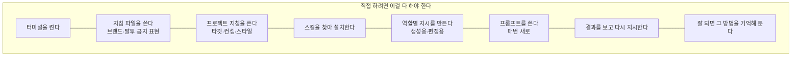
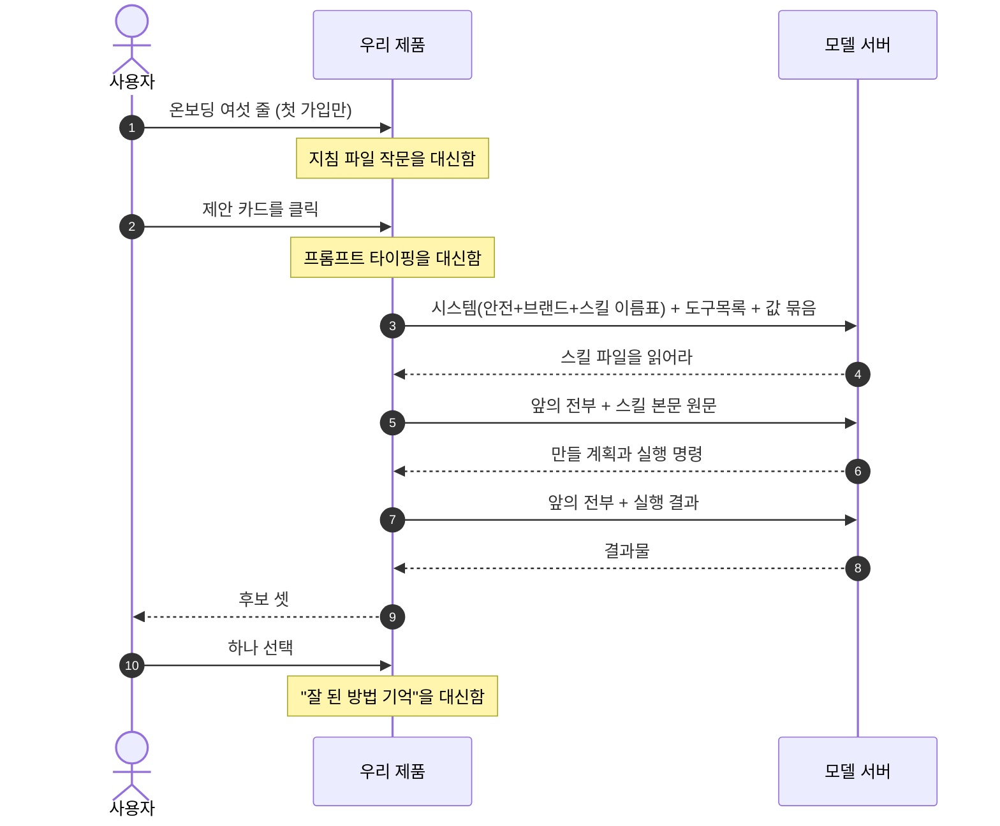
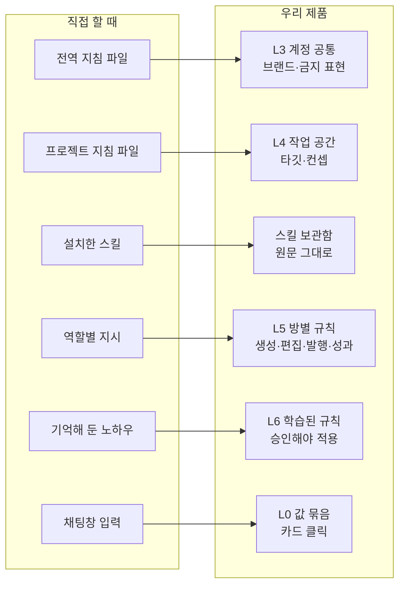
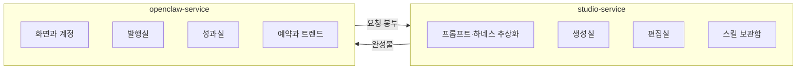
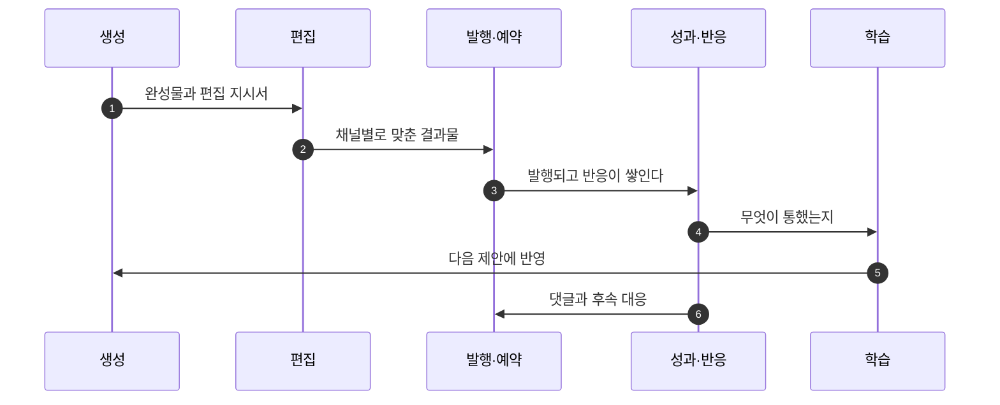

<!--
STAMP | 사업계획-osmu | v0.1 | 작성 2026-08-20 KST | model: claude-opus-5[1m] | agent: main(컨트롤러)
무엇: 현재상태지도(대화 기록에 가까운 판단면)를 사업계획서로 승격한 첫 판.
기반(전부 실제 조사·확인):
  - 경쟁자 sigmine.ai 원문 직접 확인(가격·온보딩 문구)
  - 벤치마크 4회: 도구 18종 / 클릭 추상화 플랫폼 10종 + 제작 스킬 10종 / 편집기 10종 + 라이프사이클 18종 + 인프라 9종 / 오픈소스 영상 에이전트 8종
  - Anthropic Agent Skills 공식 문서(로딩 단계·전송 형태)
  - docs/rendered/현재상태지도.md, docs/requests/회장-확정-요구사항-대장.md R01~R37
  - wiki/architecture/two-service-boundary.md
미검증: 성과 학습 신호가 실제로 잡히는지, 프리뷰-렌더 일치 실측, 영상 에셋 실원가
-->

# OSMU 사업계획 v0.1

> 한 줄: **프롬프트 엔지니어링과 하네스 엔지니어링을 클릭으로 추상화해 콘텐츠를 만들고, 그 콘텐츠의 발행부터 반응까지 생애 전체를 관리한다.**

---

## 1. 무엇을 파는가

| | 내용 |
|---|---|
| 누구에게 | 하네스 엔지니어링을 잘하면 되는데 어렵거나 못 하는, 심지어 그게 뭔지도 모르는 사람 (R35) |
| 무엇을 | 클릭만으로 콘텐츠를 만들되 쓸수록 정교해지는 도구 (R36) |
| 어디까지 | 만들기에서 끝내지 않고 발행, 예약, 반응, 댓글, 다음 방향까지 |
| 얼마에 | 대행사 월 수백만원 자리를 월 수십만원으로 |

두 서비스로 나뉩니다.

| 서비스 | 파는 것 | 성격 |
|---|---|---|
| **studio** | 프롬프트와 하네스 엔지니어링의 추상화 | 엔진. 나중에 개발자용 단독 판매 가능 |
| **openclaw** | 그 엔진을 써서 마케팅 자동화 | 고부가가치. 화면과 채널과 성과를 소유 |

---

## 2. 시장과 경쟁

### 2.1 정면 경쟁자가 이미 있다

`sigmine.ai`를 직접 확인했습니다.

| 항목 | 확인된 내용 |
|---|---|
| 포지션 | 대한민국 1등 AI 마케터, SNS 콘텐츠 자동화 |
| 포맷 | 카드뉴스, 블로그, 릴스, 쇼츠, 스레드, 링크드인 |
| 온보딩 | 홈페이지 주소와 브랜드 자료와 기존 채널만 주면 톤과 스타일을 학습 |
| 가격 | 블로그 15만원, 스레드 15만원, **숏폼 45만원(90~100편)**, 전체 75만원 |

**우리 가격 상한선이 여기서 정해집니다.** 숏폼 편당 오천 원 아래.

### 2.2 그런데 세 자리가 비어 있다

| 빈자리 | 근거 |
|---|---|
| **사용자가 외부 스킬을 가져다 쓰는 통로** | 경쟁자는 자기가 만든 방식만 판다. 좋은 제작법이 밖에서 쏟아지는데 담을 곳이 없다 |
| **성과가 다음 생성으로 돌아가는 고리** | 열여덟 개 제품을 봤고 오가닉 소셜에서 이 고리를 닫은 곳은 없다 |
| **영상 제작 공식 스킬** | 공식 스킬 열아홉 종에 영상 전용이 없다 |

### 2.3 남들이 실패한 자리도 안다

| 실패 신호 | 무엇 |
|---|---|
| 가장 자본이 많이 들어간 클릭 빌더가 폐기 | 노드 캔버스 도구가 올해 종료. 남는 건 채팅과 코드 |
| 방향이 역행 | 여러 곳이 클릭 위에 자연어를 얹거나 자연어 조종석으로 갈아탔다 |
| 아무도 프롬프트 작문을 못 없앰 | 지시문 잘 쓰는 법 강좌를 파는 곳까지 있다 |

**그래서 우리가 사는 조건은 하나입니다. 산출물을 좁게 자르는 것.** 캐러셀 제작 스킬 하나가 880가지 조합을 드롭다운으로 덮은 이유는 만드는 것이 한 종류로 고정됐기 때문입니다. 범용 빌더를 지향하는 순간 위 실패가 우리 것이 됩니다.

---

## 3. 우리가 파는 추상화의 실체

### 3.1 지금 사람이 손으로 하는 일

이것이 하네스 엔지니어링입니다. 우리 타깃은 이 여덟 칸을 못 합니다.

### 3.2 우리가 대신하는 자리

### 3.3 무엇이 무엇에 대응하는가

여기에 우리가 소유한 층이 둘 더 붙습니다. 안전과 법을 담는 층, 그리고 시장별 문법과 모델별 말투를 담는 층입니다.

### 3.4 클릭으로 바뀌는 지점

| 원래 하던 일 | 우리 화면에서 | 남는 부담 |
|---|---|---|
| 브랜드와 금지 표현을 글로 씀 | 온보딩 세 줄 입력 | 세 줄은 써야 함 |
| 타깃과 컨셉을 글로 씀 | 공간 만들 때 세 줄 | 세 줄은 써야 함 |
| 스킬을 찾아 설치 | 보관함에서 고르거나 기본값 | 없음 |
| 매번 프롬프트 작문 | 제안 카드 클릭 | 없음 |
| 결과 보고 재지시 | 후보 셋 중 선택, 편집실은 선택지 | 없음 |
| 노하우 기억 | 선택이 관찰로 쌓이고 승인하면 규칙 | 승인 클릭 |

**여섯 줄만 받으면 첫 생성이 됩니다.** 나머지는 쓰면서 채워집니다.

---

## 4. 기술 해자

### 4.1 조립은 서버가 아니라 우리가 한다

먼저 사실을 바로잡습니다. 모델 서버가 지침과 스킬을 알아서 조합해 주는 것이 아닙니다. **조합은 클라이언트가 합니다.** 서버는 받은 것을 그대로 모델에 넣습니다.

| 자리 | 무엇이 들어가나 |
|---|---|
| 시스템 자리 | 기본 규칙, 지침 파일 내용, 설치된 스킬의 이름과 설명 목록 |
| 도구 목록 | 파일 읽기, 명령 실행 |
| 메시지 배열 | 지금까지의 대화, 그리고 **도구 실행 결과로 들어온 스킬 본문 원문** |

그러니까 우리가 만들 조립층은 **클라이언트가 하던 일을 대신하는 자리**입니다. 이게 제품의 심장입니다.

### 4.2 저장은 항목으로, 전달은 글로

직접 할 때는 지침이 파일 하나입니다. 우리는 항목으로 쪼개 저장합니다. 이 차이가 문제가 되지 않으려면 세 가지가 필요합니다.

| 필요한 것 | 왜 |
|---|---|
| 항목을 글로 바꾸는 곳을 **한 군데**만 두고 결과가 매번 같게 한다 | 같은 입력에 같은 글이 나와야 결과를 설명할 수 있다 |
| 요청마다 **어느 판을 썼는지 못 박는다** | 나중에 왜 이렇게 나왔는지 되짚을 수 있다 |
| 사용자에게 **한 장의 글로도 보여준다** | 자기 규칙이 무엇인지 눈으로 봐야 고칠 마음이 든다 |

항목으로 쪼개는 것이 오히려 유리한 점이 있습니다. 한 줄만 승인하거나 되돌릴 수 있고, 어느 줄이 어느 성과에서 나왔는지 붙여 둘 수 있습니다. 파일 한 장으로는 못 합니다.

### 4.3 스킬 원문은 고치지 않는다

우리가 만드는 것은 스킬 앞에 붙는 값 묶음뿐입니다. 스킬 본문은 모델을 거치지 않고 그대로 나갑니다. 그래서 외부 스킬이 손상되지 않고, 사용자가 올린 스킬도 그대로 돕니다.

값이 겹치면 순서로 정리합니다. 안전과 법, 금지 표현, 이번에 사람이 정한 값, 채널 규격, 작업 공간 설정, 학습된 규칙, 그다음이 스킬 기본값입니다.

### 4.4 만들 때 태그를 붙인다

어떤 후보와 어떤 훅과 어떤 스킬 판으로 만들었는지를 **만드는 순간에** 붙여 둡니다. 이걸 안 하면 나중에 성과를 학습으로 되돌릴 재료가 없습니다. 소급해서 붙일 수 없습니다.

### 4.5 화면과 결과가 같아야 한다

편집 정본은 장면 정보 한 문서입니다. 사용자가 본 미리보기와 최종 파일이 다르면 편집실 신뢰가 무너지고, 무엇 때문에 성과가 났는지 알 수 없어 성과 데이터까지 오염됩니다.

---

## 5. 두 서비스의 역할

studio는 **추상화 사업**입니다. 같은 결로 나중에 기획과 개발과 디자인과 검수까지 추상화하는 제품으로 따로 세울 수 있습니다. 지금은 콘텐츠 제작 하나에 집중합니다.

openclaw는 그 엔진 위에 **마케팅 자동화**를 얹습니다. 여기가 값을 받는 자리입니다.

---

## 6. 생애 전체를 관리한다

만들기만 하는 도구와 다른 점이 여기입니다. 무엇을 언제 올렸고 어떤 반응이 왔고 다음에 무엇을 만들지가 한 줄로 이어집니다.

**다만 정직하게 답니다.** 성과가 자동으로 학습되게 하는 것은 아직 약속하지 않습니다. 오가닉 소셜에서 그 고리를 닫은 제품이 없고, 큰 회사들이 십 년 넘게 데이터를 갖고도 안 한 데는 이유가 있을 수 있습니다. 콘텐츠 품질보다 알고리즘과 시각이 성과를 더 좌우하고, 한 고객이 만드는 표본이 작습니다.

그래서 파는 순서를 이렇게 잡습니다.

| 단계 | 무엇을 약속하나 |
|---|---|
| 지금 | 성과 상위 콘텐츠를 근거와 함께 보여 주고 사람이 고른다 |
| 신호가 잡히면 | 자동으로 규칙이 자라고 승인만 하면 적용된다 |

태그는 지금부터 붙입니다. 나중에 못 붙이기 때문입니다.

---

## 7. 원가와 가격

| 항목 | 수치 |
|---|---|
| 영상 렌더 1분 | 약 0.017달러 |
| 90편 렌더 | 약 1.5달러 |
| **진짜 병목** | 영상과 음성 생성 호출. 우리 실측에서 건당 5크레딧에서 95크레딧 |
| 경쟁자 숏폼 | 월 45만원에 90~100편 |
| 대행사 | 월 수백만원 |

**렌더는 원가가 아닙니다.** 원가 모델은 생성 호출 기준으로 짜야 합니다. 그래서 만들기 전에 비용을 보여 주고 승인받는 관문과, 자기 교정 재시도 횟수 상한이 필요합니다. 영상은 실패가 곧 돈입니다.

---

## 8. 왜 이길 수 있고 왜 질 수 있나

### 이길 근거

| | |
|---|---|
| 산출물을 좁게 자른다 | 좁으면 클릭이 이긴다는 선례가 있다 |
| 외부 스킬을 담는다 | 좋은 제작법이 계속 나오는데 경쟁자는 담을 곳이 없다 |
| 생애 전체를 본다 | 만들고 끝나는 도구와 다르다 |
| 우리가 첫 사용자다 | 우리 콘텐츠가 증거물이 된다 |

### 질 근거

| | |
|---|---|
| 성과 학습이 실제로 안 될 수 있다 | 큰 회사들이 안 한 이유가 효과 부재일 수 있다 |
| 클릭 추상화는 이미 여러 곳이 실패했다 | 범위를 넓히는 순간 같은 길 |
| 경쟁자가 먼저 팔고 있다 | 가격과 편수가 이미 공개돼 있다 |
| 스킬 실행에 실행 환경이 필요하다 | 서버 비용과 운영 부담이 늘어난다 |

---

## 9. 다음 확장

같은 구조를 콘텐츠가 아닌 다른 일에 적용할 수 있습니다. 기획과 개발과 디자인과 검수를 클릭으로 추상화하는 제품. 층과 스킬과 조립층이라는 뼈대는 그대로 쓰고 담는 내용만 바뀝니다. 지금은 손대지 않습니다.

---

## 10. 지금 정해야 할 것

| 무엇 | 추천 | 안 하면 |
|---|---|---|
| 첫 매체를 하나로 좁히기 | 카드뉴스 | 검증이 셋으로 갈리고 클릭 추상화가 무너진다 |
| 생성실을 왕복 루프로 | 예 | 외부 스킬을 쓴다는 약속이 성립하지 않는다 |
| 편집 정본을 장면 정보 한 문서로 | 예 | 재편집과 비교 실험의 단위가 없어진다 |
| 만들 때 태그 붙이기 | 예 | 나중에 성과 학습 재료가 없다 |
| 성과 자동 학습을 지금 약속하기 | 아니오 | 신호가 안 잡히면 핵심 약속이 거짓이 된다 |
| 에셋 만들기 전 비용 승인 | 예 | 실패가 그대로 비용이 된다 |
| 학습된 규칙을 어느 서비스가 갖나 | studio | 학습이 제품 심장이라는 위치가 흔들린다 |
