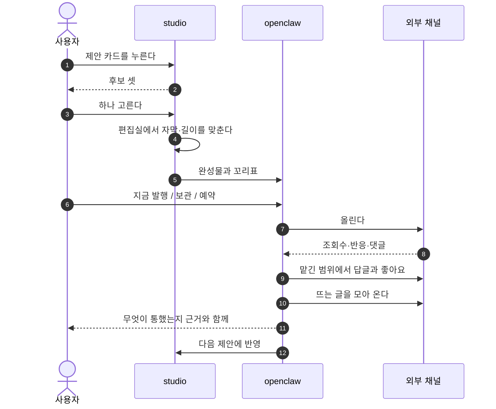
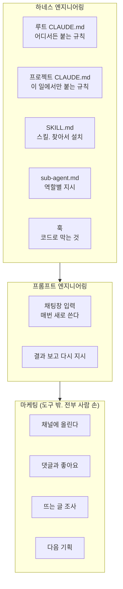
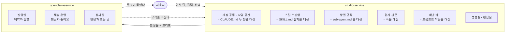
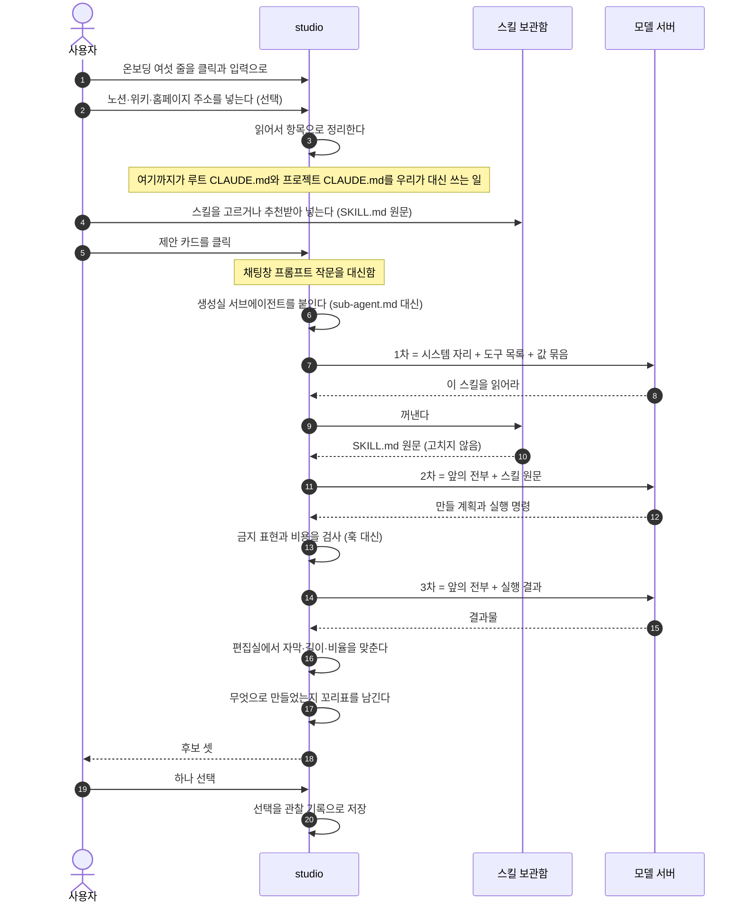
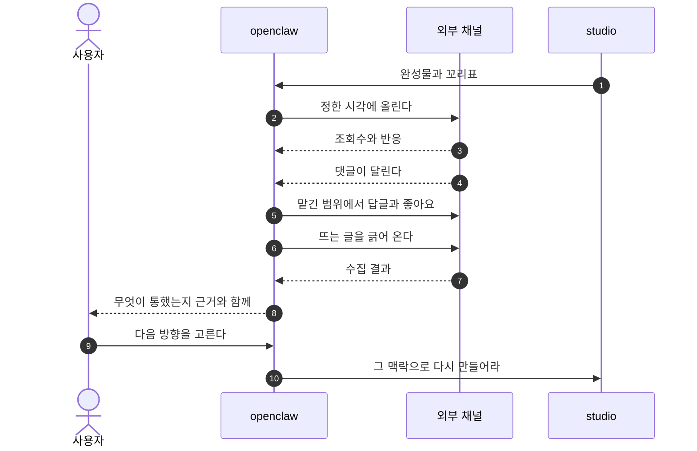
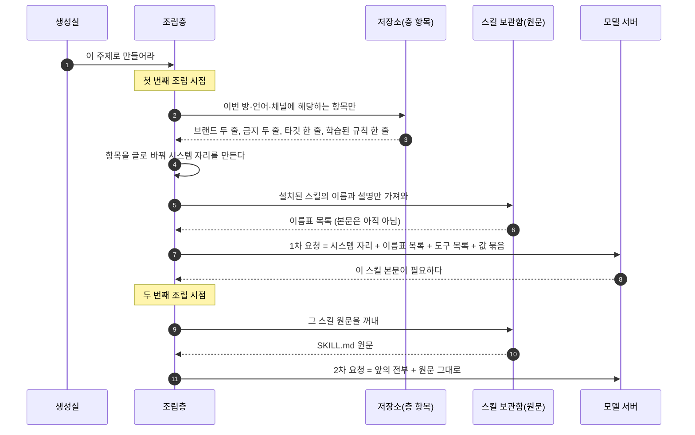
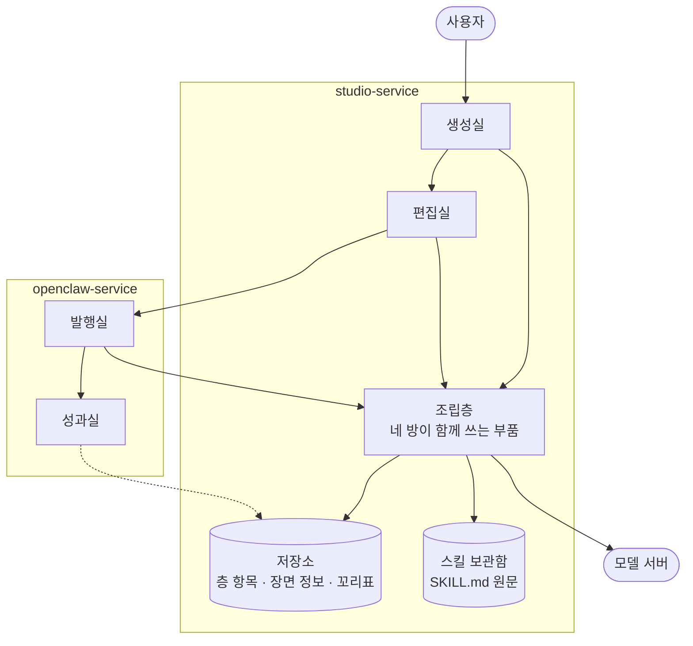

<!--
STAMP | 사업계획-osmu | v0.5 | 개정 2026-08-20 KST | model: claude-opus-5[1m] | agent: main(컨트롤러)
v0.1에서 바뀐 것 (회장 2026-08-20 지시):
  - 타깃에 프롬프트 엔지니어링을 못 하는 사람과 마케팅 감이 없는 사람을 명시
  - 경쟁을 studio 쪽과 openclaw 쪽으로 갈라 각각의 승리 지점과 시너지를 씀
  - 직접 할 때의 실제 파일 이름(루트 CLAUDE.md, 프로젝트 CLAUDE.md, SKILL.md, sub-agent.md, 채팅 입력)을 왼쪽에 두고 비교
  - 프롬프트 엔지니어링 영역과 하네스 엔지니어링 영역을 도식에 구분 표시
  - 기술 해자에 요청이 조립돼 서버로 가는 도식을 먼저 두고 설명
  - 두 서비스 역할 도식에 사용자를 넣어 상호작용을 보이게 함
  - 여러 도구를 따로 구독하던 비용을 하나로 합치는 논거 추가
기반: 벤치마크 4회 + 경쟁자 sigmine.ai 직접 확인 + Anthropic 공식 스킬 문서 + 요구사항 대장 R01~R37
v0.5에서 바뀐 것(회장 피드백): 1장에 콘텐츠 생애를 올려 두 서비스를 먼저 감 잡게 함 / 3장을 문제→해결→studio→openclaw→대응표→조립 순의 기술 구조로 재편 / 편집실 추가 / 용어를 스킬로 통일 / L0~L6 표 삽입 / 조립 시점을 명확히 서술 / 나머지 설명은 질문과 답 장으로 분리
v0.4에서 바뀐 것: 3.2에 before/after 한 장 요약 신설, studio 흐름에 하네스 표준 용어 병기와 결과 반환 추가, openclaw 흐름에 외부 채널을 실제 참여자로, 대응표를 두 서비스 뒤로 이동, 4장을 "안에서 벌어지는 일"로 다시 씀(네 방과 부품 위치·꼬리표 뜻), 생애 흐름을 앞으로 당김
v0.3에서 채운 것: 경쟁자 기능 실조사(공개 자료 기준), 대체 비용 실측 수치, 판매 문장 교정(툴값 절감이 아니라 사람 대체)
미확인: 경쟁자 앱 내부 화면(가입 필요), 성과 학습 신호 실측, 프리뷰-렌더 일치 실측
-->

# OSMU 사업계획 v0.5

> 한 줄: **프롬프트 엔지니어링과 하네스 엔지니어링을 화면으로 완전히 추상화해 콘텐츠를 만들고, 거기서 끝내지 않고 발행과 반응과 다음 기획까지 마케팅 전체를 대신 돌린다.**

---

## 1. 무엇을 파는가

### 1.1 누구에게

| 이 사람 | 무엇을 못 하나 |
|---|---|
| 프롬프트를 어떻게 써야 좋은 결과가 나오는지 모르는 사람 | 프롬프트 엔지니어링 |
| 지침 파일과 스킬과 역할을 어떻게 걸어야 하는지 모르는 사람 | 하네스 엔지니어링 |
| 무엇을 만들어 올려야 할지 감이 안 오는 사람 | 콘텐츠 기획 |
| 올린 다음 무엇을 봐야 하는지 모르는 사람 | 마케팅 운영 |

넷을 다 못 하는 사람이 대부분입니다. 그래서 마케터를 뽑거나 대행사를 씁니다.

### 1.2 무엇을 대신하는가

**마케터 또는 마케팅 대행사의 역할 전체입니다.** 만들기만이 아닙니다.

| 마케터가 하던 일 | 우리 쪽 |
|---|---|
| 무엇을 만들지 정한다 | 제안 카드 |
| 만든다 | 생성실 |
| 고친다 | 편집실 |
| 올린다, 예약한다 | 발행실 |
| 댓글과 좋아요를 관리한다 | 발행실 운영 |
| 반응을 본다 | 성과실 |
| 뜨는 것을 조사한다 | 성과실 트렌드 |
| 다음 방향을 정한다 | 성과가 학습으로 |

### 1.3 지금은 이걸 따로따로 사야 한다

공개 가격을 모아 실제로 계산했습니다. 환율은 달러당 1,400원 기준의 어림값입니다.

| 따로 내던 것 | 월 |
|---|---|
| 모델 구독(상위 요금제) | 약 28만원 |
| 영상 생성 서비스 | 약 8만원 |
| 편집 도구 두세 개 | 약 8만원 |
| 예약과 분석 도구 | 약 3.5만원 |
| 댓글과 쪽지 자동 응대 도구 | 약 8만원 |
| **도구 합계** | **약 57만원** |
| 여기에 콘텐츠 마케터 한 명(신입 기준) | 약 250만원 |
| 또는 대행사 운영 대행 | 약 35만~100만원 |

**정직하게 적습니다. 우리가 아끼게 해 주는 것은 도구값이 아닙니다.** 그 도구값 대부분은 우리도 냅니다. 모델 호출과 영상 생성 비용은 누가 쓰든 발생합니다.

**실제로 줄어드는 것은 사람 비용과 도구 사이를 오가는 시간입니다.** 마케터 한 명 월 250만원, 또는 대행사 월 35만원에서 100만원. 그 자리를 대신하는 것이 우리가 파는 값입니다. 도구를 하나로 묶는 것은 편의이지 절감이 아닙니다.

---

### 1.4 콘텐츠 한 편이 어떻게 도는가

두 서비스가 무엇을 하는지는 콘텐츠 한 편을 따라가 보면 가장 빨리 잡힙니다.



| 어디 | 무엇을 하나 |
|---|---|
| studio | 만든다, 고친다 |
| openclaw | 올린다, 예약한다, 응대한다, 조사한다, 성과를 본다 |
| 둘 사이 | 완성물과 **꼬리표**가 오간다 |


---

## 2. 시장과 경쟁

경쟁을 하나로 뭉치면 안 됩니다. 우리 두 서비스는 서로 다른 상대와 싸웁니다.

### 2.1 studio 쪽 경쟁 (만드는 도구)

정면 상대가 있습니다. `sigmine.ai`를 직접 확인했습니다.

| 항목 | 확인된 것 |
|---|---|
| 포지션 | 대한민국 1등 AI 마케터, SNS 콘텐츠 자동화 |
| 포맷 | 카드뉴스, 블로그, 릴스, 쇼츠, 스레드, 링크드인 |
| 온보딩 | 홈페이지 주소와 브랜드 자료와 기존 채널만 주면 톤과 스타일을 학습 |
| 가격 | 블로그 15만원, 스레드 15만원, 숏폼 45만원(90~100편), 전체 75만원 |

**우리 가격 상한이 여기서 정해집니다.** 숏폼 편당 오천 원 아래.

공개 자료로 기능을 파 봤습니다. 아래는 회사가 공개한 것에서 확인되거나 확인되지 않은 것이지, 실제 앱을 가입해 본 결과가 아닙니다.

| 기능 | 확인 결과 |
|---|---|
| 예약 발행 | **한다.** 여러 채널에 매일 자동 업로드 |
| 성과를 다음 생성에 반영 | **한다. 이것이 그들의 핵심 문구다.** 자기 진화 엔진, 성과를 반영한 자체 보상 모델 |
| 발행 전 검수 | 옵션으로 있다. 다만 **어떻게 고치는지는 공개돼 있지 않다** |
| 사용자가 외부 스킬을 넣기 | **근거 없음.** 반대로 자기들이 보유한 프롬프트 묶음을 쓴다고 설명한다 |
| 댓글과 쪽지 응대, 좋아요 | **언급 0건.** 공식 사이트와 블로그와 보도자료 전부에서 |
| 브랜드 정보 수정 화면 | 온보딩 때 등록은 확인. **이후 사용자가 직접 고치는 화면은 근거 없음** |
| 무료 체험 | 있다. 가입 시 크레딧 지급, 위약금 없음 |
| 회사 | 2024년 3월 설립, 시드 투자 유치(금액 비공개) |

**그들의 방어선은 발행 전까지입니다.** 만들고 올리고 성과로 다시 만드는 고리는 이미 자기들 문구로 걸어 뒀습니다. 대신 **올린 다음의 운영과 사용자가 스킬을 가져오는 통로는 공개 자료에 없습니다.**

**여기서 우리 해자를 다시 잡습니다.** 댓글 응대는 전용 도구가 이미 성숙해 있어 그들이 붙이는 데 오래 걸리지 않습니다. 그것만으로 해자를 삼으면 위험합니다. **방어 가능한 축은 외부 스킬을 원문 그대로 담는 통로입니다.** 이건 구조를 바꿔야 하는 일이라 나중에 붙이기 어렵습니다.

### 2.2 이기는 지점 (사용자가 느끼는 것)

| 사용자가 겪는 불편 | 남들 | 우리 |
|---|---|---|
| 결과가 마음에 안 드는데 고칠 방법이 재생성뿐 | 다시 뽑는다. 돈이 또 든다 | 값만 바꿔 다시 그린다 |
| 좋은 스킬을 봤는데 넣을 데가 없다 | 그 서비스가 만든 방식만 쓴다 | 가져와 넣거나 추천받아 넣는다 |
| 내 브랜드 규칙이 어디 저장됐는지 모르겠다 | 온보딩 때 한 번 학습하고 끝 | 언제든 열어 고치고 한 줄씩 승인 |
| 올리고 나면 그다음은 내 일 | 만들고 끝 | 반응과 댓글과 다음 방향까지 |
| 도구를 여러 개 구독해야 한다 | 각각 구독 | 하나로, 쓴 만큼 |

### 2.3 이기는 지점 (기술적으로 무엇이 다른가)

| 기술 항목 | 남들 | 우리 |
|---|---|---|
| 스킬을 담는 구조 | 자기들이 박아 둔 방식 하나 | 외부 스킬을 **원문 그대로** 얹는 자리를 둔다 |
| 브랜드 정보 저장 | 학습된 톤이라는 덩어리 | 항목으로 쪼개 한 줄씩 켜고 끄고 되돌린다 |
| 만든 뒤 수정 | 재생성 | 장면 정보 한 문서를 고쳐 다시 그린다 |
| 만든 것에 꼬리표 | 없음 | 어떤 후보와 스킬로 만들었는지 붙여 둔다 |
| 성과와 생성의 연결 | 끊겨 있다 | 꼬리표이 있어 이을 수 있다 |

**꼬리표가 핵심입니다.** 남들이 나중에 이 고리를 이으려 해도 과거 데이터에 꼬리표가 없어 못 잇습니다. 우리는 처음부터 붙입니다.

### 2.4 openclaw 쪽 경쟁 (운영하는 도구)

열한 곳을 조사했습니다. 결과가 분명합니다.

| 기능 | 어디에 있나 |
|---|---|
| 댓글과 쪽지 자동 응대 | 전용 도구 두 곳(해외 한 곳, 국내 한 곳) |
| 트렌드와 뜨는 글 조사 | 키워드 도구, 소셜 분석 도구 |
| 예약 발행과 분석 | 예약 도구 여러 곳 |
| 콘텐츠 생성 | 생성 전용 도구 |
| **성과를 다음 생성에 되먹임** | **열한 곳 중 한 곳뿐** |

**전부 다른 회사에 흩어져 있습니다.** 사용자는 네다섯 개를 각각 사서 손으로 오갑니다. 통합 축이 실제로 비어 있습니다.

성과를 다음 생성으로 되돌리는 고리는 앞선 조사에서 열여덟 개를 봤는데 오가닉 소셜에서 닫은 곳이 없었고, 이번 조사에서 국내 경쟁자 한 곳이 그것을 자기 핵심 문구로 걸고 있음을 확인했습니다. **그 자리는 이제 비어 있지 않습니다.**

### 2.5 남들이 실패한 자리

| 실패 신호 | 무엇 |
|---|---|
| 가장 자본이 많이 들어간 클릭 빌더가 폐기 | 노드 캔버스 도구가 올해 종료 |
| 방향이 역행 | 여러 곳이 클릭 위에 다시 자연어를 얹었다 |
| 아무도 프롬프트 작문을 못 없앰 | 지시문 잘 쓰는 법 강좌를 파는 곳까지 있다 |

**사는 조건은 하나입니다. 만드는 것을 좁게 자르는 것.** 범용 도구를 지향하면 같은 길입니다.

---

## 3. 어떻게 만들었나

### 3.1 지금은 이걸 사람이 다 한다



**앞의 둘은 어렵고 마지막 하나는 아예 도구가 없습니다.**

### 3.2 우리는 이렇게 해결한다



왼쪽 다섯 줄이 3.1의 하네스와 프롬프트 영역을 그대로 받습니다. 오른쪽이 도구가 없던 마케팅 영역을 받습니다. **점선 하나가 이 사업의 핵심입니다.** 운영에서 나온 것이 만드는 쪽 규칙을 고칩니다.

### 3.3 studio 안에서 벌어지는 일



노션과 위키와 홈페이지 주소를 넣는 것은 **지침 파일 두 장을 우리가 대신 써 주는 과정**입니다. 사용자는 클릭하고 주소만 넣고, 정리는 우리가 합니다.

### 3.4 openclaw 안에서 벌어지는 일



### 3.5 정보를 일곱 층으로 나눈 이유

지침 파일 한 장에 다 적으면 한 줄만 고칠 수 없고 어디서 나온 줄인지도 모릅니다. 그래서 **소유자와 바뀌는 속도**로 갈랐습니다.

| 층 | 무엇 | 직접 할 때 | 누가 채우나 |
|---|---|---|---|
| L0 이번 요청 | 주제, 언어, 채널, 비용 상한 | 채팅창 입력 | 카드 클릭 |
| L1 시스템 | 안전선, 표기 의무, 정책 | 도구가 박아 둔 규칙 | 우리 |
| L2 시장·모델 지식 | 시장별 문법, 모델별 말투 | 경험으로 아는 것 | 우리 |
| L3 계정 공통 | 브랜드 사실, 금지 표현, 기본 말투 | 루트 CLAUDE.md | 온보딩 세 줄 |
| L4 작업 공간 | 타깃, 컨셉, 업종 | 프로젝트 CLAUDE.md | 공간 만들 때 세 줄 |
| L5 방별 규칙 | 생성·편집·발행·성과 각각의 취급 | sub-agent.md | 기본값에서 자람 |
| L6 학습된 규칙 | 선택과 성과에서 자란 규칙 | 기억해 둔 노하우 | 자동, 승인해야 적용 |

**스킬은 층이 아닙니다.** 층은 무엇을 말할지이고 스킬은 어떻게 만들지입니다. 층은 항목으로 쪼개 저장하고, 스킬은 파일 원문 그대로 둡니다.

| | 층 | 스킬 |
|---|---|---|
| 저장 형태 | 항목(줄 단위) | 파일 원문 |
| 우리가 고치나 | 사용자가 한 줄씩 | **한 글자도 안 고침** |
| 언제 실리나 | 요청 시작할 때 전부 | 모델이 필요하다고 할 때만 |

### 3.6 그래서 언제 어떻게 조립하나

회장 질문에 대한 답입니다. **조립 시점이 둘로 나뉩니다.**



| 무엇 | 저장 형태 | 조립 시점 | 어디에 실리나 |
|---|---|---|---|
| 층 항목 | 데이터베이스의 줄들 | **요청 시작할 때 한 번** | 시스템 자리에 글로 바뀌어 |
| 스킬 | 파일 원문 | **모델이 달라고 할 때** | 대화 중간에 원문 그대로 |

**층은 미리 조립하고 스킬은 필요할 때 끼웁니다.** 스킬을 미리 다 펼쳐 넣으면 길어지고 비싸지고, 스킬이 스스로 갈라 읽는 구조도 망가집니다.

**조합은 모델 서버가 해 주는 것이 아닙니다. 우리가 합니다.** 직접 할 때는 터미널 도구가 하던 일이고, 그 자리를 우리가 대신합니다.

### 3.6-a 부품이 어디 있나



조립층은 방마다 따로 있는 게 아니라 **한 곳에 있고 어느 방에서 왔는지에 따라 다른 것을 꺼냅니다.**

### 3.7 사라지는 부담

| 직접 할 때 | 우리 화면 | 사라지는 것 |
|---|---|---|
| 루트·프로젝트 CLAUDE.md를 쓴다 | 여섯 줄, 또는 주소를 넣으면 정리해 줌 | 작문 |
| SKILL.md를 찾아 설치한다 | 보관함에서 고르거나 추천 | 탐색과 설치 |
| sub-agent.md를 만든다 | 방이 나뉘어 있음 | 설계 |
| 훅을 짠다 | 금지 표현 검사와 비용 승인이 기본 | 코딩 |
| 매번 프롬프트를 쓴다 | 카드 클릭 | 작문 |
| 결과를 보고 다시 지시한다 | 후보 중 선택, 편집은 선택지 | 지시 |
| 잘 된 방법을 기억한다 | 선택이 규칙으로 자람 | 기억 |
| 채널에 로그인해 올린다 | 예약과 발행 | 반복 노동 |
| 댓글을 직접 단다 | 맡긴 범위에서 대신 | 상주 |
| 뜨는 글을 찾아본다 | 모아서 보여줌 | 조사 |
| 다음을 정한다 | 근거와 함께 제안 | 판단 부담 |

---

## 4. 두 서비스의 관계

studio는 **추상화 사업**입니다. 같은 뼈대로 나중에 기획과 개발과 디자인과 검수를 추상화하는 제품을 따로 세울 수 있습니다.

openclaw는 그 엔진 위에 **마케팅 자동화**를 얹습니다. 값을 받는 자리입니다.

**시너지는 꼬리표에서 납니다.** 따로 산 도구 두 개로는 만든 쪽과 올린 쪽 사이에서 꼬리표가 끊깁니다. 무엇 덕분에 잘 됐는지 아무도 모릅니다. 한 몸이면 안 끊깁니다.

---

## 5. 자주 나올 질문

### 왜 지침을 파일이 아니라 항목으로 저장하나

| 상황 | 파일 한 장이면 | 항목으로 쪼개면 |
|---|---|---|
| 한 줄만 고치기 | 문서 전체를 다시 씀 | 그 줄만 끄거나 고침 |
| 어디서 나온 줄인지 | 알 수 없음 | 8월 10일 선택에서 나왔다고 붙여 둠 |
| 되돌리기 | 통째로 | 그 줄만 |

조건이 하나 있습니다. 항목을 글로 바꾸는 곳을 한 군데만 두고 **같은 입력이면 항상 같은 글**이 나와야 합니다. 안 그러면 같은 요청인데 결과가 달라져 설명을 못 합니다.

### 꼬리표가 무슨 말인가

만든 결과물에 **무엇으로 만들었는지 붙여 두는 쪽지**입니다.

```
이 영상: 후보 B / 스킬은 숏폼 제작 3판 / 훅은 질문형 / 규칙 7판 / 8월 20일
```

성과가 나왔을 때 **무엇 덕분인지 되짚기 위한 것**입니다. 질문형 훅이 좋았던 건지 그 스킬이 좋았던 건지 가릅니다. 없으면 조회수만 남고 이유가 안 남습니다. 나중에 소급해서 못 붙입니다.

### 스킬을 우리가 고치면 안 되나

안 고칩니다. 우리는 앞에 붙는 값만 만듭니다. 고치기 시작하면 외부 스킬의 효과가 깨지고, 사용자가 올린 스킬도 제대로 안 돕니다.

### 미리보기와 최종 결과가 다르면

편집실 신뢰가 무너지고 성과 해석도 오염됩니다. 무엇 때문에 잘 됐는지 알 수 없게 되기 때문입니다. 그래서 같아야 합니다.

---

## 7. 원가와 가격

| 항목 | 수치 |
|---|---|
| 영상 렌더 1분 | 약 0.017달러 |
| 90편 렌더 | 약 1.5달러 |
| 진짜 병목 | 영상과 음성 생성 호출. 우리 실측 건당 5크레딧에서 95크레딧 |
| 경쟁자 숏폼 | 월 45만원에 90~100편 |

렌더는 원가가 아닙니다. 원가는 생성 호출에서 납니다. 그래서 만들기 전에 비용을 보여 주고 승인받는 관문과 재시도 상한이 필요합니다.

---

## 8. 도전 과제 (여기서 질 수 있다)

과장하지 않고 적습니다. 이 다섯이 우리가 넘어야 할 것입니다.

| 과제 | 무엇이 문제인가 | 지금 대비 |
|---|---|---|
| **성과 학습이 실제로 안 될 수 있다** | 큰 회사들이 데이터를 갖고도 안 했다. 오가닉 성과는 알고리즘과 시각에 더 좌우되고 한 고객 표본이 작다 | 자동 학습을 약속하지 않고, 꼬리표만 지금부터 붙여 나중에 검증한다 |
| **클릭 추상화는 이미 여러 곳이 실패했다** | 범위를 넓히는 순간 같은 길 | 첫 매체를 하나로 좁힌다 |
| **경쟁자가 먼저 팔고 있다** | 가격과 편수가 공개돼 있다 | 그들이 안 하는 셋(스킬 반입, 수정, 발행 후 관리)으로 간다. 단 그 셋이 정말 비었는지 확인 중 |
| **스킬 실행에 서버가 필요하다** | 파일을 읽고 명령을 돌려야 해서 비용과 운영 부담이 는다 | 재편집을 저장된 문서 다시 제출로 정의해 부담을 줄인다 |
| **품질이 사람 손 프롬프트보다 낫다는 증거가 없다** | 조립이 보장하는 것은 일관성이지 품질이 아니다 | 같은 주제로 세 벌을 뽑아 비교하기 전에는 더 낫다고 말하지 않는다 |
| **비용 절감 논거가 부메랑이 된다** | 도구값 대부분은 우리도 낸다. 하나로 묶는 것은 편의이지 절감이 아니다 | 판매 문장을 도구값이 아니라 사람 대체로 잡는다 |
| **댓글 응대는 해자가 아니다** | 전용 도구가 이미 성숙해 경쟁자가 붙이기 쉽다 | 방어 축을 외부 스킬 반입으로 옮긴다 |
| **경쟁자가 성과 학습을 이미 내걸었다** | 우리가 비었다고 본 자리를 그들이 문구로 선점했다 | 우리는 꼬리표 기반이라는 방식 차이로 간다. 그리고 검증 전엔 약속하지 않는다 |

---

## 9. 다음 확장

같은 뼈대를 콘텐츠가 아닌 일에 적용할 수 있습니다. 기획과 개발과 디자인과 검수를 화면으로 추상화하는 제품. 층과 스킬과 조립층은 그대로 쓰고 담는 내용만 바뀝니다. 지금은 손대지 않습니다.

---

## 10. 지금 정해야 할 것

| 무엇 | 추천 | 안 하면 |
|---|---|---|
| 첫 매체를 하나로 좁히기 | 카드뉴스 | 검증이 갈리고 클릭 추상화가 무너진다 |
| 생성실을 왕복 루프로 | 예 | 외부 스킬을 쓴다는 약속이 성립하지 않는다 |
| 편집 정본을 장면 정보 한 문서로 | 예 | 재편집과 비교 실험의 단위가 없어진다 |
| 만들 때 꼬리표 붙이기 | 예 | 나중에 성과 학습 재료가 없다 |
| 성과 자동 학습을 지금 약속하기 | 아니오 | 신호가 안 잡히면 핵심 약속이 거짓이 된다 |
| 만들기 전 비용 승인 관문 | 예 | 실패가 그대로 비용이 된다 |
| 학습된 규칙을 어느 서비스가 갖나 | studio | 학습이 제품 심장이라는 위치가 흔들린다 |
