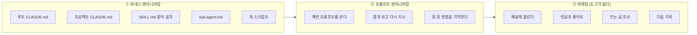
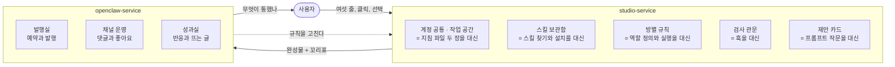
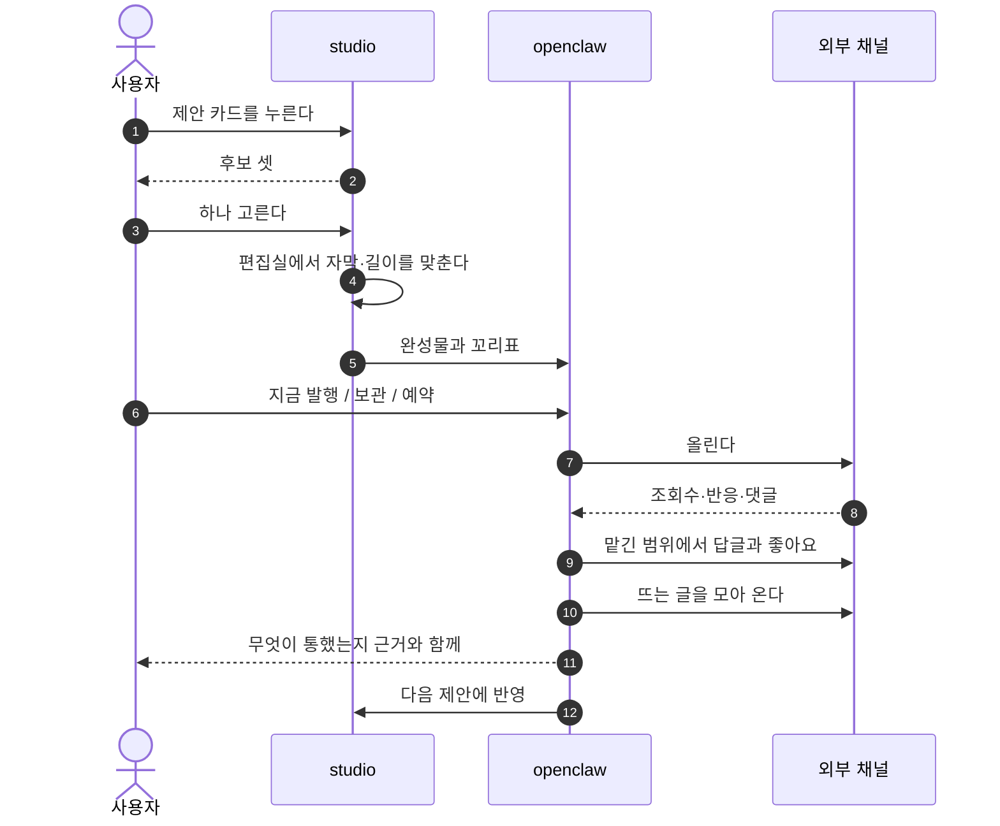
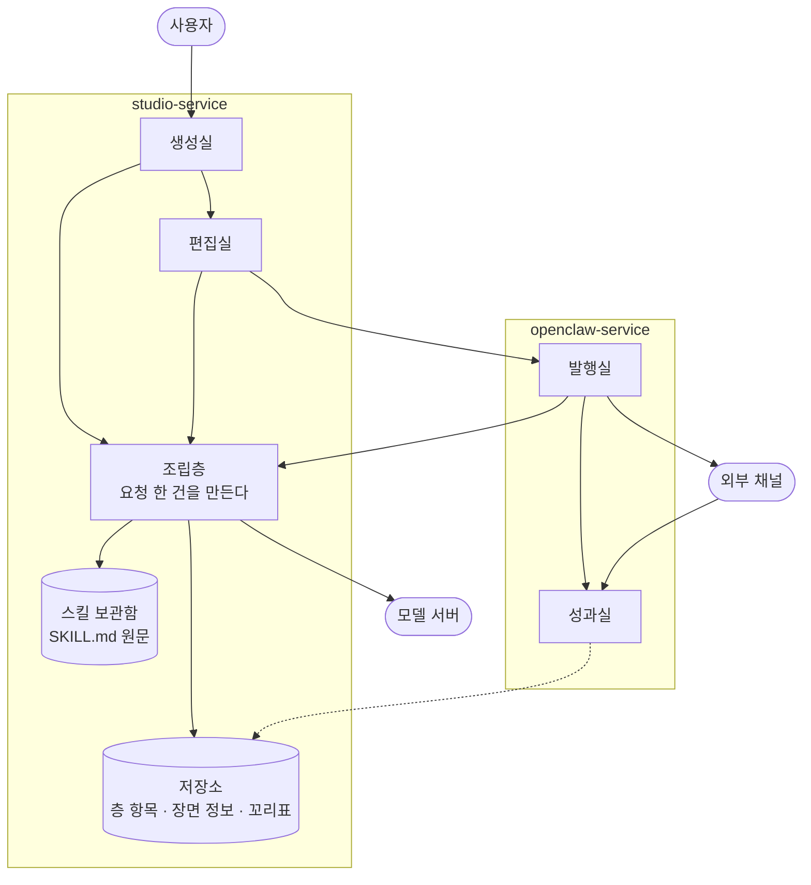
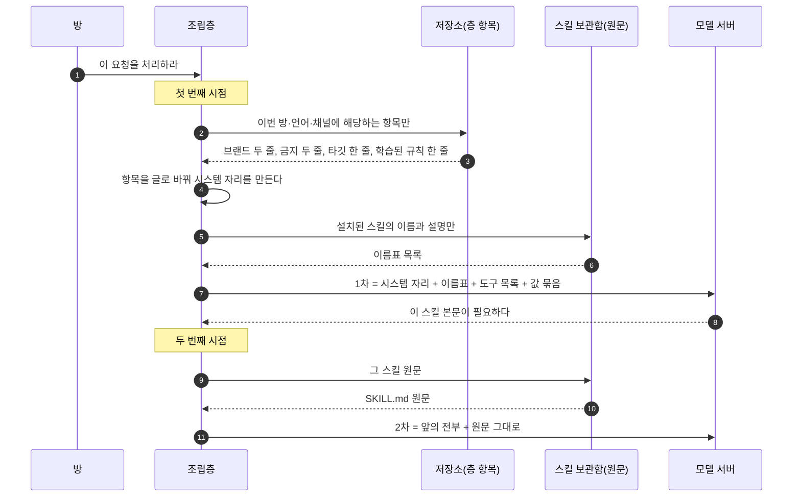
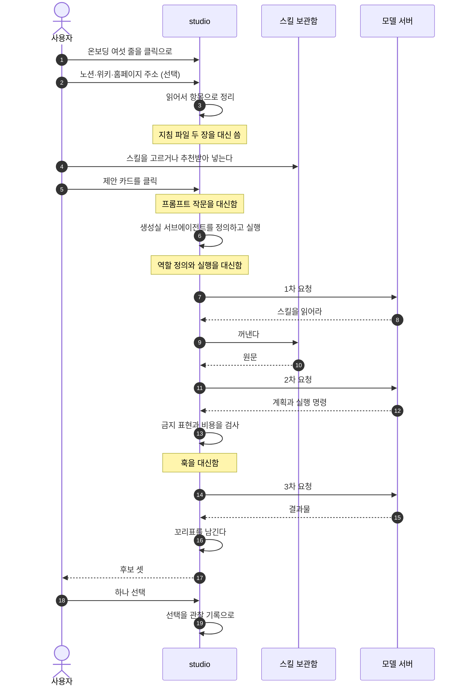
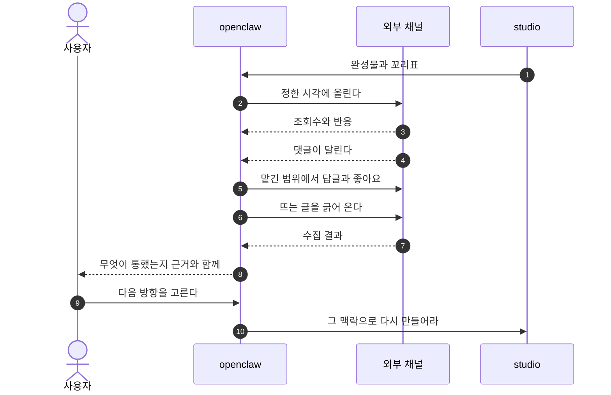

<!--
STAMP | 사업계획-osmu | v0.6 | 개정 2026-08-21 KST | model: claude-opus-5[1m] | agent: main(컨트롤러)
v0.6에서 바뀐 것 (회장 2026-08-21 지시):
  - 문제 제기를 1장으로 올림. 대행사는 못 미덥고 직접 하자니 알아야 할 것이 너무 많은 사람이 타깃
  - 직접 할 때 만지는 것과 우리가 추상화하는 구조를 1장에서 붙여 보여줌(구 3.1+3.2)
  - 콘텐츠 생애에 평가 루프와 마케터 대행 의미를 붙여 확장
  - 2장을 서비스별 3단(역할 / 경쟁사 / 차별점과 도전 과제)으로 재편. 구 8장 도전 과제를 여기로 흡수
  - 3장은 구조와 조립을 먼저 붙여 설명한 뒤 studio, openclaw 순. 각 절에 기술 도전 과제 추가
  - 원가와 가격을 비즈니스 모델과 시장 진입과 로드맵으로 확장
  - 질문과 답을 맨 뒤로
기반: 벤치마크 5회 + 경쟁자 sigmine.ai 직접 확인 + Anthropic 공식 스킬 문서 + 요구사항 대장 R01~R37
미확인: 성과 학습 신호 실측, 미리보기와 최종 일치 실측, 경쟁자 앱 내부 화면, 회장 제공 스레드 원문(접근 차단)
-->

# OSMU 사업계획 v0.6

> 한 줄: **마케팅을 남에게 통째로 맡기긴 싫고 직접 해 보자니 알아야 할 게 너무 많은 사람에게, 통제권은 주되 어려운 부분을 전부 대신하는 도구를 판다.**

---

## 1. 제품

### 1.1 누구에게

| 이 사람 | 왜 |
|---|---|
| 대행사에 월 수백만원 쓰기 아깝거나 못 미더운 사람 | 돈도 크고 우리 브랜드를 얼마나 알까 싶다 |
| 마케터를 뽑기엔 규모가 안 되는 사람 | 신입 한 명이 월 250만원이다 |
| 직접 해 보려다 막힌 사람 | 프롬프트도 도구도 채널 운영도 배울 게 너무 많다 |
| 무엇을 올려야 할지 감이 안 오는 사람 | 만들 줄 알아도 무엇을 만들지가 문제다 |

**핵심은 통제권입니다.** 남에게 다 맡기긴 싫습니다. 직접 하고 싶습니다. 그런데 직접 하려면 알아야 할 것이 너무 많습니다. 그 사이를 메웁니다.

### 1.2 무엇을 대신하는가

마케터 또는 마케팅 대행사가 하던 일 전체입니다.

| 그들이 하던 일 | 우리 쪽 |
|---|---|
| 무엇을 만들지 정한다 | 제안 카드 |
| 만든다 | 생성실 |
| 고친다 | 편집실 |
| 올리고 예약한다 | 발행실 |
| 댓글과 좋아요를 관리한다 | 채널 운영 |
| 반응을 본다 | 성과실 |
| 뜨는 것을 조사한다 | 성과실 트렌드 |
| 다음 방향을 정한다 | 성과가 학습으로 |

### 1.3 지금은 이걸 따로 사야 한다

공개 가격으로 계산했습니다. 달러당 1,400원 어림값입니다.

| 따로 내던 것 | 월 |
|---|---|
| 모델 구독(상위 요금제) | 약 28만원 |
| 영상 생성 서비스 | 약 8만원 |
| 편집 도구 두세 개 | 약 8만원 |
| 예약과 분석 도구 | 약 3.5만원 |
| 댓글과 쪽지 응대 도구 | 약 8만원 |
| **도구 합계** | **약 57만원** |
| 콘텐츠 마케터 한 명(신입) | 약 250만원 |
| 또는 대행사 운영 대행 | 약 35만~100만원 |

**정직하게 적습니다. 우리가 아끼게 해 주는 것은 도구값이 아닙니다.** 그 비용 대부분은 우리도 냅니다. 실제로 줄어드는 것은 **사람 비용과 도구 사이를 오가는 시간**입니다.

### 1.4 직접 하면 이걸 다 알아야 한다



앞의 둘은 배우기 어렵고 마지막 하나는 **아예 도구가 없어 전부 사람 손**입니다.

### 1.5 우리는 이렇게 추상화한다



왼쪽이 ①과 ②를 받고 오른쪽이 ③을 받습니다. **점선 하나가 이 사업의 핵심입니다.** 운영에서 나온 것이 만드는 쪽 규칙을 고칩니다.

### 1.6 콘텐츠 한 편이 도는 모습



**한 편이 아니라 계속 도는 것이 핵심입니다.** 올린 결과가 다음 제안을 바꾸고, 그 제안이 다시 올라갑니다. 돌수록 그 사람 계정에 맞아 갑니다. 마케터를 두는 이유가 원래 이것이고, 그 자리를 대신합니다.

### 1.7 누가 어디까지 쓰나

| 이런 사람 | 쓰는 범위 |
|---|---|
| 취미로 만드는 사람. 음악, 소설, 영상 | studio만 |
| 숏폼 부업 | studio만, 발행은 직접 |
| 브랜드나 가게를 운영하는 사람 | 둘 다 |
| 대행사를 대신하려는 사람 | 둘 다 |

**studio는 떼어 팔 수 있습니다.** 만드는 것만 필요한 사람이 있습니다.

---

## 2. 시장과 경쟁

### 2.1 만드는 쪽 (studio)

#### 2.1.1 우리 역할

프롬프트와 하네스 엔지니어링을 화면으로 추상화합니다. 외부 스킬을 원문 그대로 담고, 브랜드 규칙을 줄 단위로 관리하고, 만든 것에 꼬리표를 붙입니다.

#### 2.1.2 경쟁사

`sigmine.ai`를 직접 확인했습니다.

| 항목 | 확인된 것 |
|---|---|
| 포지션 | 대한민국 1등 AI 마케터 |
| 포맷 | 카드뉴스, 블로그, 릴스, 쇼츠, 스레드, 링크드인 |
| 온보딩 | 홈페이지 주소와 브랜드 자료를 주면 톤을 학습 |
| 가격 | 블로그 15만, 스레드 15만, 숏폼 45만(90~100편), 전체 75만 |
| 예약 발행 | 한다 |
| 성과를 다음 생성에 반영 | **한다. 자기 핵심 문구다** |
| 사용자가 외부 스킬 넣기 | **근거 없음** |
| 댓글과 쪽지 응대 | **언급 0건** |
| 브랜드 정보 수정 화면 | 근거 없음 |

공개 자료 기준이며 가입해 본 것은 아닙니다.

#### 2.1.3 차별점과 도전 과제

| 우리가 다른 점 | 왜 따라오기 어려운가 |
|---|---|
| 외부 스킬을 원문 그대로 담는 통로 | 구조를 바꿔야 하는 일이라 나중에 붙이기 어렵다 |
| 브랜드 규칙을 줄 단위로 켜고 끄고 되돌리기 | 학습된 덩어리로 저장한 쪽은 한 줄만 못 고친다 |
| 만든 것에 꼬리표 | 과거 데이터에 꼬리표가 없으면 소급이 안 된다 |
| 값만 바꿔 다시 그리는 편집 | 재생성으로 처리하면 원가가 다르다 |

| 도전 과제 | 무엇이 문제인가 | 대비 |
|---|---|---|
| 품질이 사람 손 프롬프트보다 낫다는 증거가 없다 | 조립이 보장하는 것은 일관성이지 품질이 아니다 | 같은 주제로 세 벌을 뽑아 비교하기 전에는 더 낫다고 말하지 않는다 |
| 클릭 추상화는 여러 곳이 실패했다 | 범위를 넓히면 같은 길 | 첫 매체를 하나로 좁힌다 |
| 스킬 실행에 서버가 필요하다 | 파일을 읽고 명령을 돌려야 한다 | 재편집을 저장된 문서 다시 제출로 정의해 부담을 줄인다 |
| 경쟁자가 먼저 팔고 있다 | 가격과 편수가 공개돼 있다 | 그들이 안 하는 곳으로 간다 |

### 2.2 운영하는 쪽 (openclaw)

#### 2.2.1 우리 역할

발행과 예약, 채널 응대, 성과 수집, 뜨는 글 조사, 다음 제안.

#### 2.2.2 경쟁사

열한 곳을 조사했습니다.

| 기능 | 어디에 있나 |
|---|---|
| 댓글과 쪽지 자동 응대 | 전용 도구 두 곳 |
| 트렌드와 뜨는 글 조사 | 키워드 도구, 소셜 분석 도구 |
| 예약 발행과 분석 | 예약 도구 여러 곳 |
| 콘텐츠 생성 | 생성 전용 도구 |
| **성과를 다음 생성에 되먹임** | **열한 곳 중 한 곳뿐** |

**전부 다른 회사에 흩어져 있습니다.** 사용자는 네다섯 개를 사서 손으로 오갑니다.

#### 2.2.3 차별점과 도전 과제

| 우리가 다른 점 | |
|---|---|
| 만드는 쪽과 한 몸이라 꼬리표가 안 끊긴다 | 무엇 덕분에 잘 됐는지 알 수 있다 |
| 응대와 조사와 성과가 한 곳에 | 도구를 오가지 않는다 |

| 도전 과제 | 무엇이 문제인가 | 대비 |
|---|---|---|
| 성과 학습이 실제로 안 될 수 있다 | 큰 회사들이 데이터를 갖고도 안 했다. 표본이 작고 알고리즘 영향이 크다 | 자동 학습을 약속하지 않고 꼬리표만 붙여 나중에 검증 |
| 댓글 응대는 해자가 아니다 | 전용 도구가 이미 성숙하다 | 방어 축을 스킬 반입으로 옮긴다 |
| 성과 학습을 경쟁자가 이미 내걸었다 | 우리가 비었다고 본 자리를 선점당했다 | 꼬리표 기반이라 되짚을 수 있다는 방식 차이로 간다 |
| 채널 정책이 바뀐다 | 플랫폼이 API를 바꾸면 따라가야 한다 | 채널 지식을 한 곳에만 둔다 |

### 2.3 남들이 실패한 자리

| 실패 신호 | 무엇 |
|---|---|
| 가장 자본이 많이 들어간 클릭 빌더가 폐기 | 노드 캔버스 도구가 올해 종료 |
| 방향이 역행 | 여러 곳이 클릭 위에 다시 자연어를 얹었다 |
| 아무도 프롬프트 작문을 못 없앰 | 지시문 잘 쓰는 법 강좌를 파는 곳까지 있다 |

**사는 조건은 하나입니다. 만드는 것을 좁게 자르는 것.**

---

## 3. 어떻게 만드나

### 3.1 두 서비스가 맞물리는 구조



**조립층은 네 방이 함께 쓰는 부품입니다.** 방마다 따로 있는 게 아니라 한 곳에 있고, 어느 방에서 왔는지에 따라 다른 것을 꺼냅니다.

### 3.2 정보를 일곱 층으로 나눈다

지침을 한 장에 다 적으면 한 줄만 고칠 수 없고 어디서 나온 줄인지도 모릅니다. **소유자와 바뀌는 속도**로 갈랐습니다.

| 층 | 무엇 | 직접 할 때 | 누가 채우나 |
|---|---|---|---|
| L0 이번 요청 | 주제, 언어, 채널, 비용 상한 | 채팅창 입력 | 카드 클릭 |
| L1 시스템 | 안전선, 표기 의무, 정책 | 도구가 박아 둔 규칙 | 우리 |
| L2 시장·모델 지식 | 시장별 문법, 모델별 말투 | 경험으로 아는 것 | 우리 |
| L3 계정 공통 | 브랜드 사실, 금지 표현, 기본 말투 | 루트 CLAUDE.md | 온보딩 세 줄 |
| L4 작업 공간 | 타깃, 컨셉, 업종 | 프로젝트 CLAUDE.md | 공간 만들 때 세 줄 |
| L5 방별 규칙 | 각 방의 취급 방식 | sub-agent.md | 기본값에서 자람 |
| L6 학습된 규칙 | 선택과 성과에서 자란 규칙 | 기억해 둔 노하우 | 자동, 승인해야 적용 |

**스킬은 층이 아닙니다.** 층은 무엇을 말할지이고 스킬은 어떻게 만들지입니다.

| | 층 | 스킬 |
|---|---|---|
| 저장 형태 | 항목(줄 단위) | 파일 원문 |
| 우리가 고치나 | 사용자가 한 줄씩 | **한 글자도 안 고침** |
| 언제 실리나 | 요청 시작할 때 | 모델이 필요하다고 할 때만 |

### 3.3 조립은 두 시점에 나뉜다



| 무엇 | 저장 | 조립 시점 | 어디에 |
|---|---|---|---|
| 층 항목 | 데이터베이스 줄 | 요청 시작할 때 한 번 | 시스템 자리에 글로 |
| 스킬 | 파일 원문 | 모델이 달라고 할 때 | 대화 중간에 원문 그대로 |

**조합은 모델 서버가 아니라 우리가 합니다.** 직접 할 때는 터미널 도구가 하던 일입니다.

**여기가 제품의 심장이자 가장 큰 기술 과제입니다.** 항목을 모아 붙인다고 좋은 지시문이 되지 않습니다. 모델이 알아듣는 형태로 써야 하고, 그러려면 사용자에게서 필요한 것을 잘 받아야 하고, 잘 받으려면 무엇을 물을지 잘 골라야 합니다. **프롬프트 엔지니어링을 없애는 게 아니라 우리가 대신 짊어지는 것입니다.**

### 3.3-a 조립층이 지킬 일곱 가지 (실조사 기반)

공식 가이드와 논문으로 확인한 것 중 **코드로 규칙화할 수 있는 것만** 골랐습니다.

| | 규칙 | 근거 |
|---|---|---|
| 1 | **금지 표현을 부정문으로 쓰지 않는다.** 쓰지 말라는 목록을 그대로 넣지 말고 대체 어휘 사전을 거쳐 "이 어휘로 쓴다"로 바꾼다. 불가피하면 한 요청에 세 개까지 | 공식 가이드가 하지 말라 대신 하라고 쓰라고 명시. 금지문이 쌓일수록 품질이 떨어진다는 실측도 있음 |
| 2 | **조립 순서를 상수로 못 박는다.** 긴 참조 자료 → 스킬 원문 → 브랜드 규칙 → 이번 요청 → 출력 형식. 가장 중요한 제약을 중간에 두지 않는다 | 공식 가이드가 긴 자료는 위, 지시는 아래를 권고하며 응답 품질이 최대 30퍼센트 올랐다고 적음. 중간에 둔 정보가 묻힌다는 논문도 있음 |
| 3 | **모든 조각을 태그로 격벽하고 사용자 글은 태그 안에만 넣는다.** 브랜드 위키, 스킬 원문, 이번 요청, 금지 사항을 각각 다른 태그로 | 공식 가이드 권고. 파싱 정확도와 함께 사용자 입력이 지시문으로 둔갑하는 것도 막힌다 |
| 4 | **조립 직전에 모순 검사를 돌리고 우선순위를 본문에 적는다.** 같은 자리에 반대되는 값이 오면 조립을 멈추고 한 문장만 되묻는다 | 모순된 지시를 만나면 모델이 화해시키려 애쓰다 손해가 커진다는 공식 안내 |
| 5 | **예시는 세 개에서 다섯 개, 고르는 방식은 매번 같게.** 사용자의 승인 이력에서 뽑되 무작위로 뽑지 않는다 | 공식 권고 개수. 예시 순서만 바꿔도 성능이 크게 흔들린다는 논문이 있어 재현되게 고정해야 함 |
| 6 | **단계적으로 생각하라는 지시는 기본으로 끄고 계산에만 켠다.** 글자수 검증이나 채널 분기 판정 같은 자리에만 | 백여 편 메타분석에서 수학과 기호 추론 밖에서는 평균 이득이 1퍼센트 미만 |
| 7 | **영상과 이미지는 자유 글이 아니라 일곱 칸으로 조립한다.** 피사체, 맥락, 스타일, 동작, 카메라, 구도, 분위기 | 영상 모델 공식 가이드가 이 구성을 권고. 우리 화면에서는 칸마다 선택지 서너 개로 내려간다 |

**질문을 던지는 방식도 같이 정했습니다.**

| 규칙 | 근거 |
|---|---|
| 언제 물을지는 모델이 정하지 않고 **우리가 규칙으로 정한다.** 꼭 필요한 칸이 비었을 때만 묻는다 | 되묻기를 언제·무엇을·어떻게로 나눠 다루라는 연구 |
| 질문을 매번 새로 만들지 않고 **모호한 유형별로 미리 써 둔 질문 카드**를 꺼낸다 | 모호함을 낱말 문제로만 다루면 엉뚱한 질문이 나간다는 연구 |
| 자유 입력창을 기본으로 두지 않는다. **고르게 한다** | 기억해서 쓰는 것보다 보고 고르는 것이 쉽다는 사용성 원칙 |
| 후보는 서너 개에서 여섯 개까지. 한 번에 스물넷을 보여주지 않는다 | 선택지가 많으면 고르지 못한다는 실험. 다만 반박 연구도 있어 우리 화면에서 직접 비교해 봐야 함 |
| 온보딩 필수 입력은 **네 개 이하**로 자른다. 나머지는 쓰면서 모은다 | 나눠서 모으는 방식이 이탈을 줄인다는 사례. 다만 수치는 판매용 자료라 방향만 채택 |
| **빈 화면을 보여주지 않는다.** 들어오면 주제 후보 세 개가 이미 채워져 있다 | 빈 입력창이 시작을 막는다는 사례. 도구 만드는 쪽도 이것을 문제로 부른다 |

### 3.3-b 자동 조립이 못 이기는 자리

같은 조사에서 나온 반론입니다. 무겁습니다.

**사람이 프롬프트를 쓰는 실제 과정은 한 번에 잘 쓰는 게 아니라 결과를 보고 고치는 반복입니다.** 조립층은 결과를 보기 전에 확정해야 하므로 그 반복이 원천적으로 없습니다.

| 구조적 한계 | 무슨 뜻인가 |
|---|---|
| 무엇이 모호한지는 도메인을 알아야 안다 | 이 브랜드에서 이 표현이 위험하다는 것을 사람은 안 물어도 안다. 우리는 프로필에 적립돼 있을 때만 안다. **신규 사용자와 새 주제일수록 우리가 진다** |
| 예시 순서를 자동으로 최적화할 수 없다 | 최적 순서는 과업마다 다르고 실제로 돌려 봐야 안다. 사람은 두세 번에 수렴하는데 우리는 생성 비용이 몇 배 든다 |

**그래서 제품 설계에서 포기하면 안 되는 것이 정해집니다.** AI가 초안을 내고, 사람이 고르고 고치고, 그 고침이 프로필로 돌아가는 구조. 이걸 빼고 완전 자동으로 밀면 위 두 한계가 그대로 품질 천장이 됩니다. **후보 셋과 승인 절차는 편의가 아니라 품질 장치입니다.**

### 3.4 studio 안에서



#### 편집실

고른 뒤에도 손볼 것이 남습니다. 자막 오타, 길이, 비율, 컷 길이.

| 원칙 | 내용 |
|---|---|
| 손 편집기가 아니다 | 타임라인을 직접 만지게 하지 않는다. 타깃이 배울 도구를 하나 더 얻는 셈이 된다 |
| 정본은 장면 정보 한 문서 | 값만 바꿔 다시 그린다. 재생성이 아니라 재렌더라 싸다 |
| 지시는 대화나 선택지로 | 자막을 이렇게 고쳐라, 30초로 줄여라 |
| 미리보기가 최종과 같아야 | 다르면 편집실 신뢰가 무너지고 성과 해석도 오염된다 |

#### studio 기술 과제

| 과제 | 왜 어려운가 |
|---|---|
| **좋은 지시문 쓰기** | 항목을 붙인다고 되지 않는다. 무엇을 물을지, 어떻게 붙일지가 품질을 가른다 |
| 사용자에게 무엇을 물을지 | 적게 물으면 결과가 헐겁고 많이 물으면 백지 공포가 온다 |
| 모델마다 다른 말투 | 같은 뜻인데 표기가 다르고, 어떤 모델은 특정 표기를 넣으면 반대로 작동한다 |
| 스킬을 안전하게 돌리기 | 외부에서 온 스킬이 명령을 실행한다 |
| 미리보기와 최종 일치 | 보장하는 방식을 고르거나 우리가 만들어야 한다 |
| 신규 사용자에게 약하다 | 프로필이 비어 있으면 무엇이 모호한지 모른다. 초기 질문 설계가 그만큼 중요하다 |

### 3.5 openclaw 안에서



#### openclaw 기술 과제

| 과제 | 왜 어려운가 |
|---|---|
| 채널마다 다른 규칙과 한도 | 글자수, 해시태그 수, 호출 제한이 다 다르고 자주 바뀐다 |
| 토큰 수명 관리 | 만료되면 예약이 조용히 실패한다 |
| 응대 범위 정하기 | 어디까지 대신 답할지 잘못 잡으면 사고가 난다 |
| 지표 정규화 | 채널마다 조회수 정의가 다르다 |
| 성과를 학습으로 잇기 | 꼬리표가 있어야 하고 표본이 모여야 한다 |

### 3.6 직접 하는 것보다 나은 이유

| | 직접 할 때 | 우리 |
|---|---|---|
| 시작까지 | 도구 설치, 지침 작성, 스킬 탐색 | 여섯 줄 |
| 한 편 만들기 | 프롬프트를 쓰고 결과 보고 고쳐 말한다 | 카드 클릭, 후보 중 선택 |
| 좋은 방법 유지 | 기억하거나 메모 | 규칙으로 쌓임 |
| 발행 | 채널마다 로그인 | 예약 |
| 응대 | 상주 | 맡긴 범위에서 대신 |
| 성과와 연결 | 스스로 대조 | 꼬리표로 이어짐 |
| 비용 | 도구 여러 개 월정액 | 쓴 만큼 |

---

## 4. 비즈니스 모델

### 4.1 원가 구조

| 항목 | 수치 |
|---|---|
| 영상 렌더 1분 | 약 0.017달러 |
| 90편 렌더 | 약 1.5달러 |
| **진짜 병목** | 영상과 음성 생성 호출. 실측 건당 5크레딧에서 95크레딧 |
| 경쟁자 숏폼 | 월 45만원에 90~100편 |

**렌더는 원가가 아닙니다.** 생성 호출에서 납니다. 그래서 만들기 전에 비용을 보여 주고 승인받는 관문과 재시도 상한이 필요합니다.

### 4.2 가격 방향

| 항목 | 방향 |
|---|---|
| 기준선 | 경쟁자 숏폼 편당 오천 원 아래 |
| 방식 | 충전식. 쓴 만큼 |
| 발행 | 크레딧을 쓰지 않는다. 실패 재시도 무료 |
| 편집 | 값만 바꾸는 재렌더는 크레딧을 쓰지 않는다 |
| 세일즈 문장 | 도구값 절감이 아니라 마케터 한 명 또는 대행사 대체 |

### 4.3 시장 진입 순서

| 단계 | 무엇 | 왜 |
|---|---|---|
| 1 | 우리 콘텐츠를 우리 도구로 만들어 발행 | 우리가 첫 사용자다. 그 결과물이 증거물이 된다 |
| 2 | 카드뉴스 한 종으로 좁혀 출시 | 출력이 좁아야 클릭이 이긴다. 준비물이 없어 지금 붙는다 |
| 3 | 숏폼 추가 | 값이 세 배다. 다만 준비물이 많다 |
| 4 | 스킬 보관함 공개 | 밖에서 좋은 것이 들어오게 |
| 5 | studio 단독 판매 | 만드는 것만 필요한 사람에게 |

### 4.4 로드맵

| 시기 | 무엇 | 끝났다는 증거 |
|---|---|---|
| 지금 | 생성 기획과 기술 설계 | 요청 봉투 계약이 서고 양쪽이 같은 판을 가리킴 |
| 다음 | 카드뉴스 한 편이 무인으로 나옴 | 사람이 안 붙고 한 편이 끝까지 나온 기록 |
| 그다음 | 발행과 성과 연결 | 꼬리표가 붙은 채로 올라가고 반응이 그 꼬리표에 붙음 |
| 그 뒤 | 성과가 규칙을 바꾸는 것 검증 | 같은 조건에서 신호가 잡히는지 실측 |
| 확장 | 기획과 개발과 디자인과 검수 추상화 | 별도 제품 |

---

## 5. 자주 나올 질문

### 왜 지침을 파일이 아니라 항목으로 저장하나

| 상황 | 파일 한 장이면 | 항목으로 쪼개면 |
|---|---|---|
| 한 줄만 고치기 | 문서 전체를 다시 씀 | 그 줄만 |
| 어디서 나온 줄인지 | 알 수 없음 | 8월 10일 선택에서 나왔다고 붙여 둠 |
| 되돌리기 | 통째로 | 그 줄만 |

조건이 하나 있습니다. 항목을 글로 바꾸는 곳을 한 군데만 두고 **같은 입력이면 항상 같은 글**이 나와야 합니다.

### 꼬리표가 무슨 말인가

만든 결과물에 무엇으로 만들었는지 붙여 두는 쪽지입니다.

```
이 영상: 후보 B / 스킬은 숏폼 제작 3판 / 훅은 질문형 / 규칙 7판 / 8월 20일
```

성과가 나왔을 때 **무엇 덕분인지 되짚기 위한 것**입니다. 없으면 조회수만 남고 이유가 안 남습니다. 나중에 소급해서 못 붙입니다.

### 스킬을 우리가 고치면 안 되나

안 고칩니다. 앞에 붙는 값만 만듭니다. 고치면 외부 스킬의 효과가 깨지고 사용자가 올린 것도 제대로 안 돕니다.

### 프롬프트 엔지니어링이 사라지는 것인가

사용자 쪽에서만 사라집니다. **우리가 대신 짊어집니다.** 무엇을 물을지, 어떻게 붙일지, 모델마다 어떻게 바꿔 쓸지가 전부 우리 몫이 됩니다. 이것이 제품의 가장 큰 기술 과제입니다.
