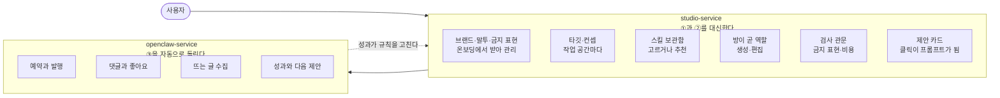
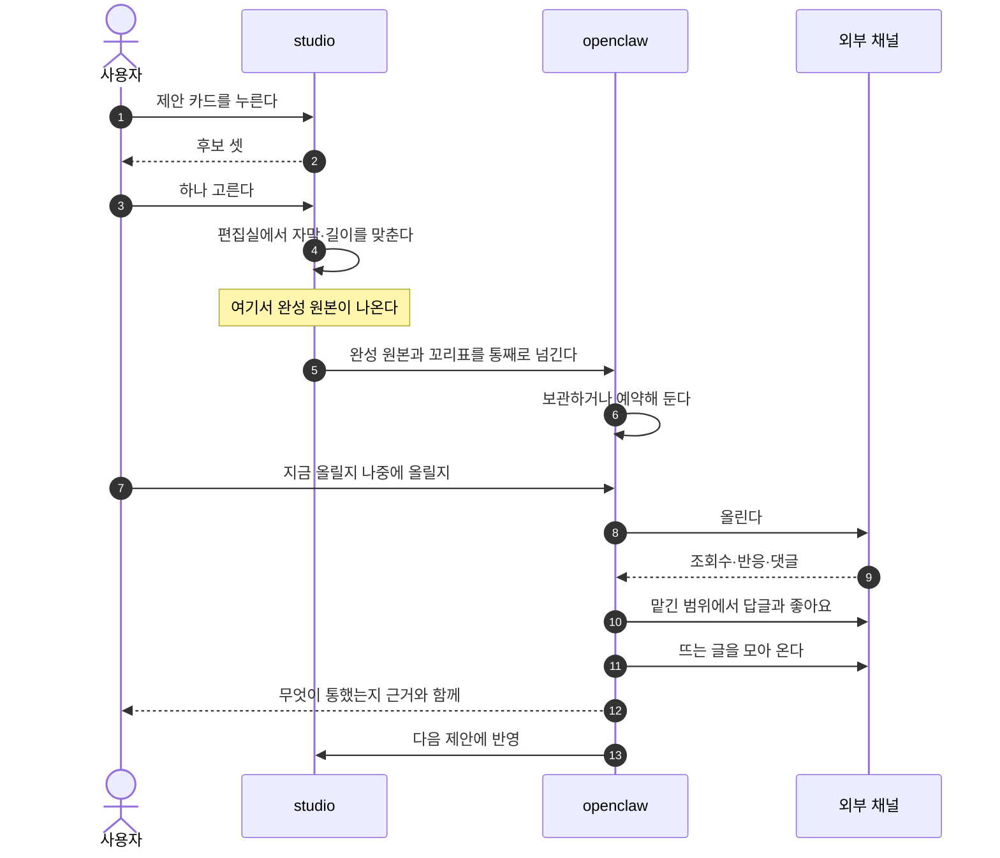
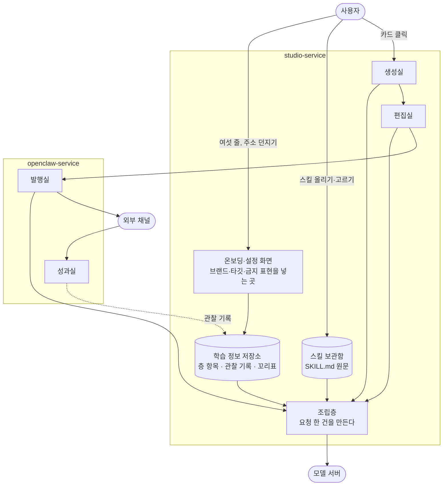
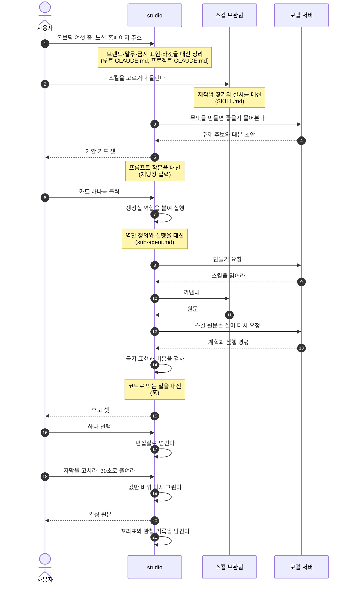
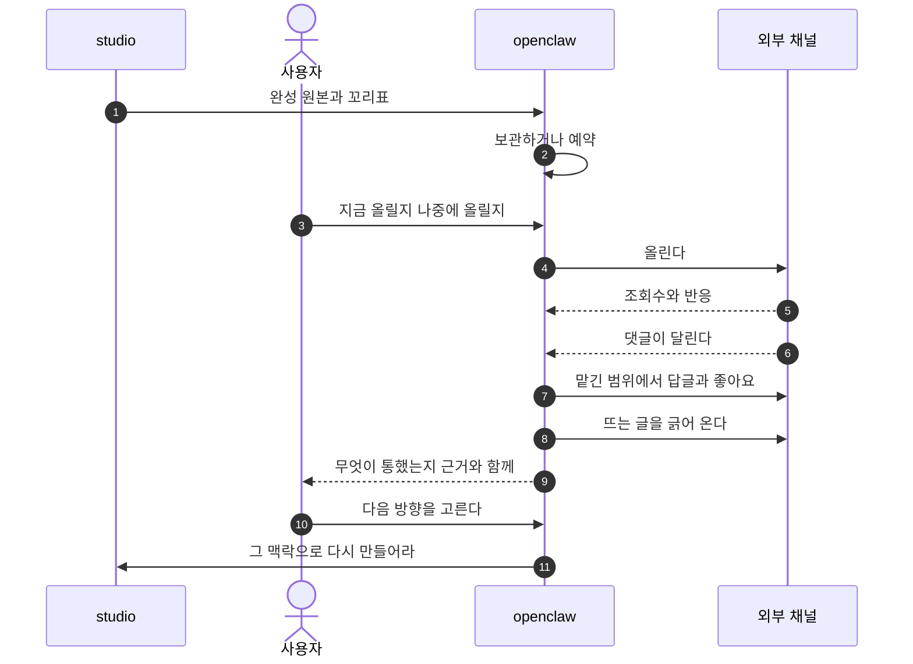
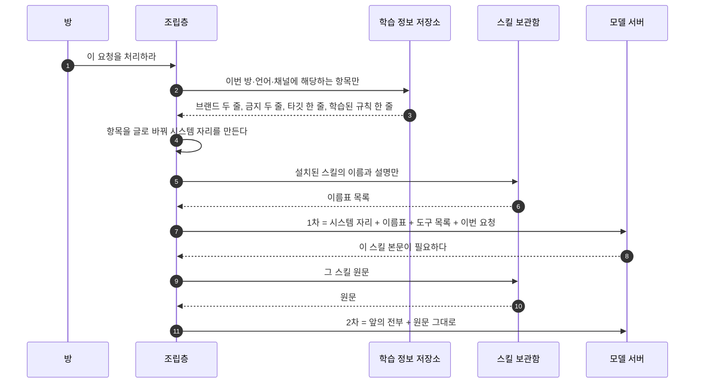

<!--
STAMP | 사업계획-osmu | v0.7 | 개정 2026-08-21 KST | model: claude-opus-5[1m] | agent: main(컨트롤러)
v0.7에서 바뀐 것 (회장 2026-08-21 2차 피드백):
  - 1장 이야기 순서 재배치: 대행사 대비 → 직접 하면 왜 더 비싼가 → 우리 해결 → 생애 → 사용 범위
  - 1.3에 실제 서비스 이름을 예시 열로 넣고 서버 비용 포함
  - 직접 할 때 도식의 용어를 사람 말로 바꾸고 파일 이름은 괄호로
  - 두 서비스 도식에서 studio를 왼쪽으로
  - 생애 도식에 원본 수신과 자동 전달을 분리해 표시
  - 3.1에 학습 정보가 어디로 들어가는지 추가, 저장소 역할 명시
  - 조립층 설명을 두 서비스 뒤로
  - 제안 카드 이전에 모델 왕복이 한 번 더 있음을 반영
  - 4장을 원가·플랜·시장 진입·중장기 로드맵으로 재편
확장 대기: 경쟁사 목록(국내외 25곳 이상)과 가격 구조 실측이 조사 중. 회신되면 2장과 4.2에 반영
-->

# OSMU 사업계획 v0.7

> 한 줄: **마케팅을 남에게 통째로 맡기긴 싫고 직접 해 보자니 알아야 할 게 너무 많은 사람에게, 통제권은 주되 어려운 부분을 전부 대신하는 도구를 판다.**

---

## 1. 제품

### 1.1 누구에게

| 이 사람 | 왜 |
|---|---|
| 대행사에 월 수백만원 쓰기 아깝거나 못 미더운 사람 | 돈도 크고 우리 브랜드를 얼마나 알까 싶다 |
| 마케터를 뽑기엔 규모가 안 되는 사람 | 신입 한 명이 월 250만원이다 |
| 직접 해 보려다 막힌 사람 | 프롬프트도 도구도 채널 운영도 배울 게 너무 많다 |
| 무엇을 올려야 할지 감이 안 오는 사람 | 만들 줄 알아도 무엇을 만들지가 문제다 |

**핵심은 통제권입니다.** 남에게 다 맡기긴 싫고 직접 하고 싶은데, 직접 하려면 알아야 할 것이 너무 많습니다. 그 사이를 메웁니다.

### 1.2 마케터가 하던 일을 전부 대신한다

| 마케터 또는 대행사가 하던 일 | 우리 쪽 |
|---|---|
| 무엇을 만들지 정한다 | 생성실 (제안 카드) |
| 만든다 | 생성실 |
| 고친다 | 편집실 |
| 올리고 예약한다 | 발행실 |
| 댓글과 좋아요를 관리한다 | 발행실 (채널 운영) |
| 반응을 본다 | 성과실 |
| 뜨는 것을 조사한다 | 성과실 (트렌드) |
| 다음 방향을 정한다 | 성과실 (학습으로) |

**그 비용이 이렇습니다.**

| 맡기는 방식 | 월 |
|---|---|
| 콘텐츠 마케터 한 명 채용(신입) | 약 250만원 |
| SNS 운영 대행 | 약 35만~100만원 |
| 국내 경쟁 서비스 통합 요금 | 75만원 |

### 1.3 그럼 직접 하면 되지 않나

두 가지 벽이 있습니다. **배울 것이 산더미이고, 도구값도 만만치 않습니다.**

#### 벽 하나. 이걸 다 알아야 한다

```mermaid
flowchart LR
  subgraph HE["① 하네스를 짜야 한다"]
    direction TB
    H1["브랜드와 말투와 금지 표현을 적는다<br/>(루트 CLAUDE.md)"]
    H2["타깃과 컨셉을 적는다<br/>(프로젝트 CLAUDE.md)"]
    H3["제작법을 찾아 설치한다<br/>(SKILL.md)"]
    H4["역할별 지시를 만든다<br/>(sub-agent.md)"]
    H5["안 되는 것을 코드로 막는다<br/>(훅)"]
  end
  subgraph PE["② 프롬프트를 써야 한다"]
    direction TB
    P1["매번 새로 쓴다"]
    P2["결과 보고 다시 지시한다"]
    P3["잘 된 방법을 기억해 둔다"]
  end
  subgraph MK["③ 마케팅은 도구가 없다"]
    direction TB
    M1["채널마다 로그인해 올린다"]
    M2["댓글과 좋아요를 단다"]
    M3["뜨는 글을 찾아본다"]
    M4["다음에 뭘 만들지 정한다"]
  end
  HE --> PE --> MK
```



#### 벽 둘. 도구값이 쌓인다

| 필요한 것 | 예 | 월 |
|---|---|---|
| 모델 구독 | Claude Max 상위 요금제 | 약 28만원 |
| 영상·이미지 생성 | Higgsfield 중간 요금제 | 약 8만원 |
| 편집 도구 | Premiere, Canva, Opel Clip 계열 두세 개 | 약 8만원 |
| 예약과 분석 | Metricool 계열 | 약 3.5만원 |
| 댓글과 쪽지 응대 | ManyChat 계열 | 약 8만원 |
| 렌더와 저장 서버 | 클라우드 | 실사용에 따라 |
| **합계** | | **약 57만원 + 서버비** |

**이 돈을 내고도 앞의 세 벽을 사람이 직접 넘어야 합니다.**

### 1.4 우리는 이렇게 해결한다



앞 그림의 ①과 ②를 왼쪽이, ③을 오른쪽이 받습니다. **점선 하나가 이 사업의 핵심입니다.**

**그리고 값이 쌉니다.** 도구를 각각 들고 있을 필요가 없고, 무엇보다 사람을 대신합니다.

### 1.5 콘텐츠 한 편이 도는 모습



**한 편이 아니라 계속 도는 것이 핵심입니다.** 올린 결과가 다음 제안을 바꾸고 그 제안이 다시 올라갑니다. 돌수록 그 계정에 맞아 갑니다. 마케터를 두는 이유가 원래 이것입니다.

### 1.6 누가 어디까지 쓰나

| 이런 사람 | 쓰는 범위 |
|---|---|
| 취미로 만드는 사람. 음악, 소설, 영상 | studio만 |
| 숏폼 부업 | studio만, 발행은 직접 |
| 브랜드나 가게를 운영하는 사람 | 둘 다 |
| 대행사를 대신하려는 사람 | 둘 다 |

**studio는 떼어 팔 수 있습니다.**

---

## 2. 시장과 경쟁

새로 서른여섯 곳을 조사했습니다. 앞서 본 열아홉 곳과 합쳐 쉰다섯 곳입니다. 가격은 각 사 공식 요금 페이지에서 확인한 것만 적었습니다.

### 2.1 만드는 쪽 (studio)

우리 역할은 프롬프트와 하네스 엔지니어링을 화면으로 추상화하는 것입니다. 외부 스킬을 원문 그대로 담고, 브랜드 규칙을 줄 단위로 관리하고, 만든 것에 꼬리표를 붙입니다.

**해외 주요 상대**

| 이름 | 무엇 | 가격 | 브랜드 정보 저장 | 발행·성과 |
|---|---|---|---|---|
| Jasper | 마케팅 카피와 캠페인 | 월 69달러부터 | 브랜드 목소리 2개, 지식 자산 5개 | 발행 안 함 |
| Copy.ai | 영업·마케팅 워크플로 | 월 29달러 또는 1,000달러부터 | 워크플로 크레딧 | 안 함 |
| Typeface | 기업용 브랜드 AI | 공개 가격 없음 | **브랜드 가이드를 그래프로 구조화** | 승인 후 발행 |
| Creatify | 상품 주소로 광고 영상 | 월 39달러부터, 무료 2편 | 브랜드 템플릿 | **성과 추적까지 함** |
| Pictory | 글을 영상으로 | 월 29달러부터 | 브랜드 킷 | 안 함 |
| InVideo | 프롬프트로 완성 영상 | 월 17달러부터 | 아바타와 목소리 | 안 함 |
| Simplified | 카피·디자인·영상·예약 전부 | 월 59달러부터 | 브랜드 킷 | **열두 채널 직접 발행** |
| Runway | 영상 생성 모델 자체 | 월 12달러부터, 무료 1회 | 없음 | 안 함 |

**국내 주요 상대**

| 이름 | 무엇 | 가격 | 무료 |
|---|---|---|---|
| Vrew | 자동 자막과 AI 영상 | 월 7,900원부터 | **월 90분** |
| 타입캐스트 | AI 성우와 배우 영상 | 월 39,000원 | 5분 |
| 뤼튼 | AI 글쓰기 | **무료 무제한** | 무제한 |
| 미리캔버스 | 템플릿 디자인 | 상위 요금제 있음 | **사실상 평생 무료** |
| 딥브레인 | 아바타 영상 | 월 24달러부터 | 영상 3편 |
| VCAT | 상품 주소로 마케팅 영상 | 미확인 | 미확인 |

### 2.2 운영하는 쪽 (openclaw)

| 이름 | 무엇 | 가격 |
|---|---|---|
| Sprout Social | 기업용 통합 관리 | 자리당 월 79~399달러 |
| Later | 예약과 인플루언서 | 월 18.75달러부터. **AI 크레딧이 월 5~100개로 인색** |
| SocialBee | 예약과 AI 생성 | 월 29달러부터. **전 요금제 AI 생성 무제한** |
| Sendible | 대행사용 | 월 1달러부터. **인원 무제한** |
| Ocoya | 생성과 발행 통합 | **월 15달러부터** |
| Blotato | 생성 후 스무 곳 이상 자동 배포 | 월 29달러부터 |
| Postiz | 오픈소스 예약 도구 | 월 29달러부터. **직접 설치하면 무료** |
| Planable | 협업과 승인 | 워크스페이스당 월 33달러. **50건 영구 무료** |

### 2.3 우리와 가장 가까운 세 곳

| | 왜 가까운가 | 무엇이 위험한가 |
|---|---|---|
| **Blotato** | AI가 글과 이미지와 영상을 만들고 스무 곳 이상 계정에 자동 배포. 우리 흐름과 사실상 같다 | 이미 팔고 있다. 다만 크레딧이 이미지와 영상에만 붙고 글은 무제한이라 과금 축이 다르다 |
| **Simplified** | 한 번 브리핑하면 완성 캠페인이 돌아온다는 문구가 우리와 정면으로 같다 | 기능 범위가 우리 목표 상태와 가장 넓게 겹친다 |
| **Ocoya** | 생성과 발행을 묶은 올인원인데 월 15달러부터 시작 | **가격 하한을 이미 눌러 놨다** |

### 2.4 한국 시장에 대한 무거운 관찰

조사자가 스스로 세운 반론이고 제가 보기에도 타당합니다.

**한국에는 SNS 운영 구독 도구라는 카테고리가 사실상 없습니다.** Sprout Social이나 Later에 해당하는 국내 구독 서비스가 안 보이고, 그 자리를 인플루언서 대행 플랫폼과 광고 대행사가 차지하고 있습니다. 국내 소상공인은 월 29달러짜리 운영 자동화를 사 본 적이 거의 없고 대신 체험단 서른 명에 100만원을 써 왔습니다.

**그리고 가격 앵커가 낮습니다.** 영상은 월 7,900원, 글쓰기는 무료 무제한, 디자인은 사실상 평생 무료. 이 조합이 한국 사용자의 기준점입니다.

| 두 해석 | 무슨 뜻 |
|---|---|
| 빈 시장이다 | 아무도 안 했으니 우리가 만든다 |
| **반복해서 실패한 시장이다** | 지불 의사가 없어서 아무도 못 살아남았다 |

**이 둘을 구분하지 못한 채 기능을 쌓으면 존재하지 않는 지불 의사를 향해 개발하게 됩니다.** 그래서 다음 조사는 경쟁사 기능 비교가 아니라 한국 소상공인이 마케팅에 실제로 얼마를 누구에게 쓰는지가 되어야 합니다.

다만 이 관찰이 우리 방향을 뒤집지는 않습니다. 우리가 대체하겠다는 것은 월 29달러짜리 도구가 아니라 **월 250만원짜리 사람과 월 100만원짜리 대행**입니다. 그 지출은 실재하는 것이 확인됐습니다. 파는 문장을 도구 절감이 아니라 사람 대체로 잡은 이유가 여기 있습니다.

### 2.5 우리가 다른 점

| 우리가 다른 점 | 왜 따라오기 어려운가 |
|---|---|
| 외부 스킬을 원문 그대로 담는 통로 | 구조를 바꿔야 하는 일이라 나중에 붙이기 어렵다 |
| 브랜드 규칙을 줄 단위로 켜고 끄고 되돌리기 | 덩어리로 저장한 쪽은 한 줄만 못 고친다 |
| 만든 것에 꼬리표 | 과거 데이터에 꼬리표가 없으면 소급이 안 된다 |
| 값만 바꿔 다시 그리는 편집 | 재생성으로 처리하면 원가가 다르다 |
| 만들기와 운영이 한 몸 | 조사한 쉰다섯 곳 중 양쪽을 제대로 다 하는 곳이 드물다 |

### 2.6 우리 도전 과제

| 과제 | 무엇이 문제인가 |
|---|---|
| **한국에 지불 의사가 있는지 모른다** | 운영 구독 카테고리 자체가 없다. 빈 시장인지 실패한 시장인지 미확인 |
| **가격 하한이 이미 눌려 있다** | 국내 앵커가 월 7,900원과 무료다 |
| 품질이 사람 손 프롬프트보다 낫다는 증거가 없다 | 조립이 보장하는 것은 일관성이지 품질이 아니다 |
| 신규 사용자에게 약하다 | 프로필이 비면 무엇이 모호한지 모른다 |
| 클릭 추상화는 여러 곳이 실패했다 | 범위를 넓히면 같은 길 |
| 스킬 실행에 서버가 필요하다 | 파일을 읽고 명령을 돌려야 한다 |
| 경쟁자들이 먼저 팔고 있다 | 국내 한 곳, 해외 여러 곳 |
| 성과 학습이 실제로 안 될 수 있다 | 큰 회사들이 데이터를 갖고도 안 했다 |
| 댓글 응대는 해자가 아니다 | 전용 도구가 이미 성숙하다 |
| 채널 정책이 바뀐다 | 플랫폼이 규칙을 바꾸면 따라가야 한다 |

### 2.7 남들이 실패한 자리

| 실패 신호 | 무엇 |
|---|---|
| 가장 자본이 많이 들어간 클릭 빌더가 폐기 | 노드 캔버스 도구가 올해 종료 |
| 방향이 역행 | 여러 곳이 클릭 위에 다시 자연어를 얹었다 |
| 아무도 프롬프트 작문을 못 없앰 | 지시문 잘 쓰는 법 강좌를 파는 곳까지 있다 |

**사는 조건은 하나입니다. 만드는 것을 좁게 자르는 것.**

---

## 3. 어떻게 만드나

### 3.1 전체 구조



| 부품 | 하는 일 |
|---|---|
| 온보딩·설정 화면 | 사용자가 브랜드와 타깃과 금지 표현을 넣는 곳 |
| 학습 정보 저장소 | 그것들을 줄 단위로 보관. 관찰 기록과 꼬리표도 여기 |
| 스킬 보관함 | 우리가 넣은 것과 사용자가 올린 것을 원문 그대로 |
| 조립층 | 요청이 올 때마다 필요한 것만 꺼내 지시문을 만든다 |

**저장소는 창고이고 조립층은 그 창고에서 꺼내 쓰는 곳입니다.** 사용자가 넣는 입구는 온보딩과 설정 화면입니다.

### 3.2 학습 정보를 일곱 칸으로 나눈다

한 장에 다 적으면 한 줄만 고칠 수 없고 어디서 나온 줄인지도 모릅니다. **소유자와 바뀌는 속도**로 갈랐습니다.

| 칸 | 무엇 | 직접 할 때 이것 | 누가 채우나 |
|---|---|---|---|
| L0 이번 요청 | 주제, 언어, 채널, 비용 상한 | 채팅창에 친 프롬프트 | 카드 클릭 |
| L1 시스템 | 안전선, 표기 의무 | 도구가 박아 둔 규칙 | 우리 |
| L2 시장·모델 지식 | 시장별 문법, 모델별 말투 | 경험으로 아는 것 | 우리 |
| L3 계정 공통 | 브랜드 사실, 금지 표현, 기본 말투 | 루트 CLAUDE.md | 온보딩 세 줄 |
| L4 작업 공간 | 타깃, 컨셉, 업종 | 프로젝트 CLAUDE.md | 공간 만들 때 세 줄 |
| L5 방별 규칙 | 각 방의 취급 방식 | sub-agent.md | 기본값에서 자람 |
| L6 학습된 규칙 | 선택과 성과에서 자란 것 | 기억해 둔 노하우, 메모리 | 자동, 승인해야 적용 |

**번호는 우선순위도 메모리 계층도 아닙니다.** 붙는 범위가 넓은 것부터 좁은 것 순으로 매긴 이름표입니다. 기술적 의미는 하나, 조립할 때 이 순서로 놓는다는 것입니다.

**스킬은 이 칸에 안 들어갑니다.** 칸은 무엇을 말할지이고 스킬은 어떻게 만들지입니다.

| | 일곱 칸 | 스킬 |
|---|---|---|
| 저장 형태 | 줄 단위 항목 | 파일 원문 |
| 우리가 고치나 | 사용자가 한 줄씩 | 한 글자도 안 고침 |
| 언제 실리나 | 요청 시작할 때 | 모델이 필요하다고 할 때만 |

### 3.3 studio 안에서



**제안 카드가 나오기 전에 모델을 한 번 다녀옵니다.** 무엇을 만들지 정하는 것도 우리가 대신하기 때문입니다. 사용자가 주제를 안 정해도 됩니다.

#### studio 기술 과제

| 방 | 과제 | 왜 어려운가 |
|---|---|---|
| 생성실 | 좋은 지시문 쓰기 | 항목을 붙인다고 되지 않는다. 무엇을 물을지, 어떻게 붙일지가 품질을 가른다 |
| 생성실 | 제안의 품질 | 무엇을 만들지 우리가 정하는데 뻔하면 안 쓴다 |
| 생성실 | 모델마다 다른 말투 | 같은 뜻인데 표기가 다르고 어떤 표기는 반대로 작동한다 |
| 생성실 | 신규 사용자 | 프로필이 비면 무엇을 물어야 할지 모른다 |
| 편집실 | 미리보기와 최종 일치 | 다르면 편집실 신뢰가 무너지고 성과 해석도 오염된다 |
| 편집실 | 손 편집 없이 고치기 | 타임라인을 안 주고 대화와 선택지로 원하는 결과를 내야 한다 |
| 공통 | 스킬을 안전하게 돌리기 | 외부에서 온 스킬이 명령을 실행한다 |

### 3.4 openclaw 안에서



#### openclaw 기술 과제

| 과제 | 왜 어려운가 |
|---|---|
| 채널마다 다른 규칙과 한도 | 글자수, 해시태그 수, 호출 제한이 다르고 자주 바뀐다 |
| 토큰 수명 관리 | 만료되면 예약이 조용히 실패한다 |
| 응대 범위 정하기 | 어디까지 대신 답할지 잘못 잡으면 사고가 난다 |
| 지표 정규화 | 채널마다 조회수 정의가 다르다 |
| 성과를 학습으로 잇기 | 꼬리표가 있어야 하고 표본이 모여야 한다 |

### 3.5 조립층이 하는 일



| 무엇 | 저장 | 조립 시점 | 어디에 |
|---|---|---|---|
| 일곱 칸 항목 | 저장소의 줄 | 요청 시작할 때 한 번 | 시스템 자리에 글로 |
| 스킬 | 파일 원문 | 모델이 달라고 할 때 | 대화 중간에 원문 그대로 |

**조합은 모델 서버가 아니라 우리가 합니다.** 여기가 제품의 심장이자 가장 큰 기술 과제입니다.

### 3.6 조립층이 지킬 일곱 가지

공식 가이드와 논문으로 확인한 것 중 **코드로 규칙화할 수 있는 것만** 골랐습니다.

| | 규칙 | 근거 |
|---|---|---|
| 1 | 금지 표현을 부정문으로 쓰지 않고 대체 어휘로 바꾼다. 불가피하면 한 요청에 세 개까지 | 하지 말라 대신 하라고 쓰라는 공식 권고, 금지문이 쌓일수록 품질 저하 실측 |
| 2 | 조립 순서를 상수로 고정한다. 긴 참조 자료 → 스킬 원문 → 브랜드 규칙 → 이번 요청 → 출력 형식 | 긴 자료는 위, 지시는 아래로 두면 응답 품질이 최대 30퍼센트 올랐다는 공식 안내 |
| 3 | 조각마다 태그로 격벽을 치고 사용자 글은 태그 안에만 넣는다 | 공식 권고. 사용자 입력이 지시문으로 둔갑하는 것도 막힌다 |
| 4 | 조립 직전 모순 검사를 돌리고 우선순위를 본문에 적는다 | 모순된 지시를 만나면 모델이 화해시키려다 손해가 커진다 |
| 5 | 예시는 세 개에서 다섯 개, 고르는 방식을 매번 같게 한다 | 순서만 바꿔도 성능이 크게 흔들린다는 논문 |
| 6 | 단계적으로 생각하라는 지시는 기본으로 끄고 계산에만 켠다 | 백여 편 메타분석에서 수학 밖에서는 이득 1퍼센트 미만 |
| 7 | 영상과 이미지는 일곱 칸으로 조립한다. 피사체·맥락·스타일·동작·카메라·구도·분위기 | 영상 모델 공식 가이드 권고 |

**질문 던지는 방식도 정했습니다.** 언제 물을지는 규칙으로 정하고, 질문은 미리 써 둔 카드에서 꺼내고, 자유 입력창을 기본으로 두지 않고, 온보딩 필수 입력은 네 개 이하로 자르고, **빈 화면을 보여주지 않습니다.**

### 3.7 자동 조립이 못 이기는 자리

**사람이 프롬프트를 쓰는 과정은 결과를 보고 고치는 반복입니다.** 조립층은 결과를 보기 전에 확정해야 하므로 그 반복이 없습니다.

| 구조적 한계 | 무슨 뜻인가 |
|---|---|
| 무엇이 모호한지는 도메인을 알아야 안다 | 프로필에 쌓여 있을 때만 안다. 신규 사용자일수록 우리가 진다 |
| 예시 순서를 자동으로 최적화할 수 없다 | 실제로 돌려 봐야 알고, 그러면 생성 비용이 몇 배 든다 |

**그래서 후보 셋과 승인 절차는 편의가 아니라 품질 장치입니다.** 이걸 빼고 완전 자동으로 밀면 저 한계가 그대로 품질 천장이 됩니다.

---

## 4. 비즈니스 모델

공개 단가로 콘텐츠 한 편 원가를 직접 계산했습니다. 환율은 달러당 1,400원 어림값입니다.

### 4.1 콘텐츠 한 편 원가

| 상품 | 구성 | 원가 |
|---|---|---|
| 카드뉴스 | 최소 | 약 130원 |
| 카드뉴스 | 고품질 | 약 420원. 예약 발행으로 묶어 돌리면 약 250원 |
| 30초 숏폼 | 이미지에 움직임을 주는 최소 구성 | 약 265원 |
| 30초 숏폼 | 실제 영상 클립 네 컷 | 약 3,400원~4,600원 |
| 30초 숏폼 | 최상급 영상 모델 | 약 23,800원 |

**두 가지가 분명해졌습니다.**

첫째, **카드뉴스와 숏폼의 원가 차이가 최대 스무 배**입니다. 하나의 크레딧으로 묶으면 무너집니다. 상품별로 나눠야 합니다.

둘째, **숏폼 원가의 대부분이 영상 생성 하나**입니다. 나머지를 다 합쳐도 오백 원이 안 됩니다. 글 생성도 음성도 렌더도 저장도 작업 공간 서버도 전부 미미합니다. **가격 설계의 전부는 어떤 영상 모델을 어느 요금제에 붙이느냐**입니다.

원가를 낮추는 레버도 확인했습니다. 브랜드 규칙을 고정해 두고 재사용하면 글 생성 입력 비용이 거의 사라집니다. 예약 발행처럼 급하지 않은 작업을 묶어 돌리면 이미지 값이 절반이 됩니다. 그리고 영상 전송은 전송료가 없는 저장소를 써야 합니다.

### 4.2 세금과 수수료

표시 가격에 부가세가 포함된 것으로 봅니다. 결제 수수료도 붙습니다. **표시가의 약 12~13퍼센트는 매출로 잡히기 전에 빠집니다.** 배수를 계산할 때 표시가가 아니라 그 뒤 금액으로 계산해야 합니다.

### 4.3 요금제

| 플랜 | 표시가(월) | 포함 편수 | 목적 |
|---|---|---|---|
| 무료 | 0원 | 카드 3편 + 숏폼 1편 | 써 보게 한다 |
| 스타터 | 19,900원 | 카드 20편 + 숏폼 3편 | 조금씩 굴려 보게 한다 |
| 프로 | 99,000원 | 카드 100편 + 숏폼 20편 + 작업 공간 추가, 다채널 트렌드 조사 | 본격적으로 쓰게 한다 |
| 기업 | 390,000원부터 | 카드 400편 + 숏폼 100편 + 최상급 영상 옵션 | 계정과 채널이 많은 곳 |

**추가 결제**

| 항목 | 가격 |
|---|---|
| 카드뉴스 한 편 | 700원 |
| 숏폼 한 편 | 3,900원 |
| 최상급 영상 숏폼 한 편 | 29,000원 |
| 충전 팩 | 5만원부터. 소진할 때까지 만료 없음 |

**배수는 이렇게 나옵니다.** 포함 편수를 다 쓰면 스타터가 2.3배, 프로가 2.7배입니다. 실제로는 다 안 쓰므로 3.5배에서 4.1배 사이가 됩니다.

이 구조에는 근거가 있습니다. 크레딧 방식 서비스의 실제 이익은 **안 쓰고 남긴 몫에서 납니다.** 그래서 구독으로 준 크레딧은 달마다 사라지게 하고 따로 산 크레딧은 만료를 두지 않는 것이 업계 표준입니다. 다 쓰는 것을 전제로 서너 배를 맞추려면 스타터를 삼만원 가까이 올려야 하는데 그러면 시작하는 사람이 없습니다.

**무료 요금제의 핵심은 숏폼 한 편입니다.** 카드뉴스는 원가가 백삼십원이라 몇 편을 주든 부담이 없지만 숏폼은 한 편에 천 원이 넘습니다. 무료 사용자 천 명이 한 편씩만 써도 월 백만원이 나갑니다. 그래서 무료 숏폼은 워터마크와 낮은 해상도와 최소 구성으로 고정해 원가를 묶습니다.

조사한 무료 요금제 사례가 이 판단을 뒷받침합니다. **원가가 큰 것일수록 아무도 무료를 안 줍니다.** 이미지와 영상 생성에 무료를 아예 안 두는 곳도 있고, 무료를 한 번만 주고 다시 안 주는 곳도 있습니다.

### 4.4 이 구조가 무너지는 지점

조사자가 세운 반론이고 타당합니다. **원가의 서너 배라는 기준선 자체가 이 사업에서는 안전장치가 아닙니다.**

보통의 소프트웨어는 한 명이 더 써도 비용이 거의 안 늘어서, 평균에 맞춰 값을 매겨도 많이 쓰는 사람이 이익을 깨지 못합니다. 우리는 반대입니다. 쓰는 만큼 그대로 돈이 나가고 상품 간 원가 차이가 스무 배입니다.

구체적인 위험은 이렇습니다. 프로 요금제에서 카드뉴스를 한 편도 안 쓰고 전부 최상급 영상에 몰아 쓰면 원가가 순식간에 요금을 넘습니다. 전체의 5퍼센트만 그렇게 해도 나머지 95퍼센트가 남긴 몫을 다 상쇄합니다.

**그래서 진짜 안전장치는 배수가 아니라 셋입니다.**

| 장치 | 무엇 |
|---|---|
| 상품별 크레딧 분리 | 카드뉴스 몫과 숏폼 몫을 서로 바꿔 쓰지 못하게 |
| 계정별 상한 | 요금제 한도의 1.5배에서 강제로 막는다 |
| 비싼 모델 격리 | 최상급 영상은 요금제에 넣지 않고 추가 결제로만 |

**배수는 결과이고 정책은 이 셋입니다.**

### 4.5 어떻게 알릴 것인가

| 순서 | 무엇 | 왜 |
|---|---|---|
| 1 | 우리 사업체들 콘텐츠를 우리 도구로 만들어 발행 | 우리가 첫 사용자다. 결과물이 곧 증거다 |
| 2 | 그 콘텐츠 자체를 마케팅 소재로 | 이 콘텐츠는 우리 도구로 만들었다고 밝히고 같은 걸 원하면 들어오라고 한다 |
| 3 | 인플루언서 제휴 | 만들어 쓰는 사람들이 먼저 반응한다 |
| 4 | 퍼포먼스 광고 | 시장성이 확인된 뒤에 |
| 5 | 마케터와 대행사 대상 영업 | 그들에게는 대체가 아니라 도구다. 한 사람이 여러 계정을 돌리게 해 준다 |

다섯 번째가 중요합니다. **대행사를 적으로 두지 않고 고객으로도 둡니다.**

### 4.6 로드맵

| 단계 | 무엇 | 끝났다는 증거 |
|---|---|---|
| 1 | studio 생성 기획과 기술 설계 | 요청 봉투 계약이 서고 양쪽이 같은 판을 가리킴 |
| 2 | studio API 개발 | 카드뉴스 한 편이 사람 손 없이 끝까지 나옴 |
| 3 | openclaw 화면을 붙여 우리 사업체에 적용 | 우리 채널에 우리 도구로 만든 것이 발행됨 |
| 4 | 성과가 규칙을 바꾸는지 검증 | 같은 조건에서 신호가 잡히는지 실측 |
| 5 | 외부 고객 확보 | 첫 유료 고객 |
| 6 | 프로덕트 빌더 | 기획·디자인·개발·인프라·검수를 같은 방식으로 추상화한 별도 제품 |
| 7 | 검수 자매 제품 | 이미 만든 제품의 성능·보안·확장·검색 노출을 점검하고 마케팅 전략까지 제시 |

여섯 번째와 일곱 번째는 **같은 고민을 가진 다른 집단**을 노립니다. 외주 주거나 채용하긴 아깝고 직접 만들자니 알아야 할 게 너무 많은 사람. 지금 우리가 콘텐츠에서 푸는 문제와 구조가 같습니다.

---

## 5. 자주 나올 질문

### 왜 지침을 파일이 아니라 항목으로 저장하나

| 상황 | 파일 한 장이면 | 항목으로 쪼개면 |
|---|---|---|
| 한 줄만 고치기 | 문서 전체를 다시 씀 | 그 줄만 |
| 어디서 나온 줄인지 | 알 수 없음 | 8월 10일 선택에서 나왔다고 붙여 둠 |
| 되돌리기 | 통째로 | 그 줄만 |

조건이 하나 있습니다. 항목을 글로 바꾸는 곳을 한 군데만 두고 **같은 입력이면 항상 같은 글**이 나와야 합니다.

### 꼬리표가 무슨 말인가

만든 결과물에 무엇으로 만들었는지 붙여 두는 쪽지입니다.

```
이 영상: 후보 B / 스킬은 숏폼 제작 3판 / 훅은 질문형 / 규칙 7판 / 8월 20일
```

성과가 나왔을 때 **무엇 덕분인지 되짚기 위한 것**입니다. 나중에 소급해서 못 붙입니다.

### 스킬을 우리가 고치면 안 되나

안 고칩니다. 앞에 붙는 값만 만듭니다. 고치면 외부 스킬의 효과가 깨지고 사용자가 올린 것도 제대로 안 돕니다.

### 프롬프트 엔지니어링이 사라지는 것인가

사용자 쪽에서만 사라집니다. **우리가 대신 짊어집니다.** 무엇을 물을지, 어떻게 붙일지, 모델마다 어떻게 바꿔 쓸지가 전부 우리 몫이 됩니다.
