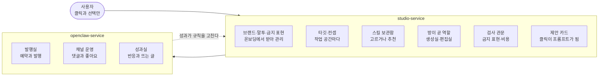
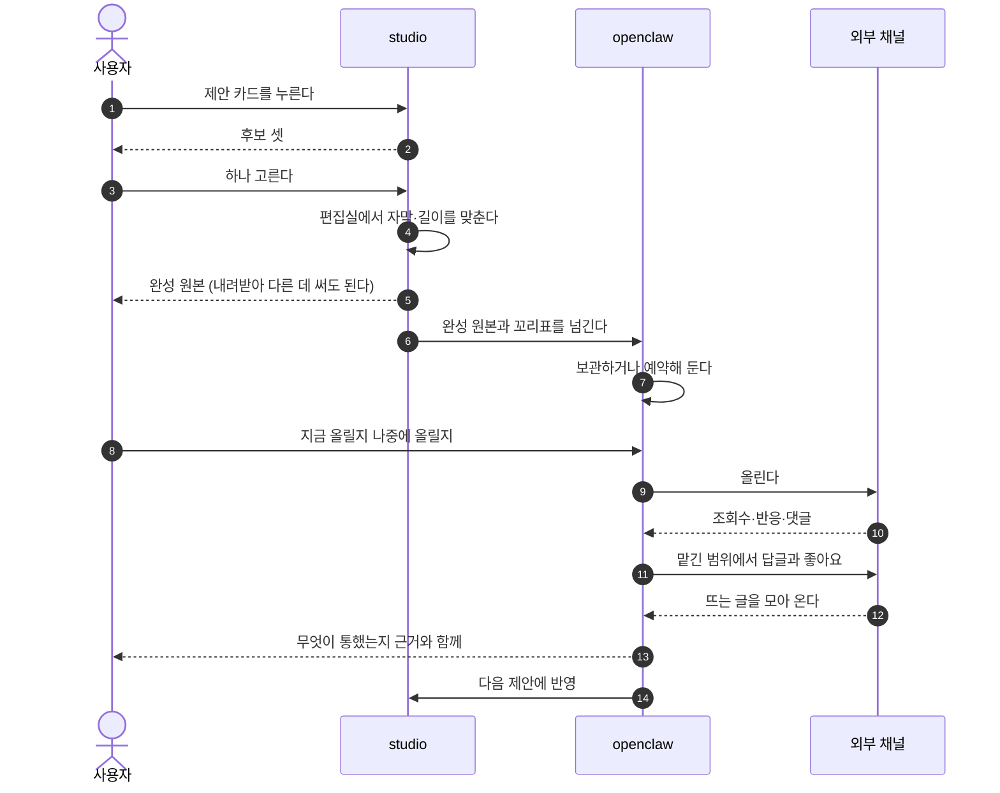
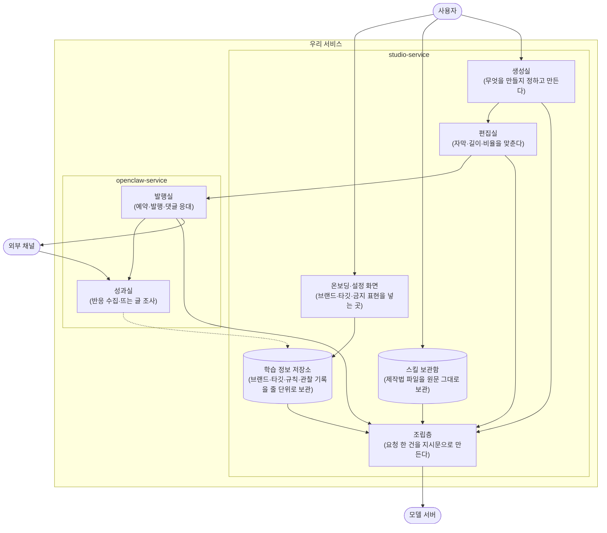
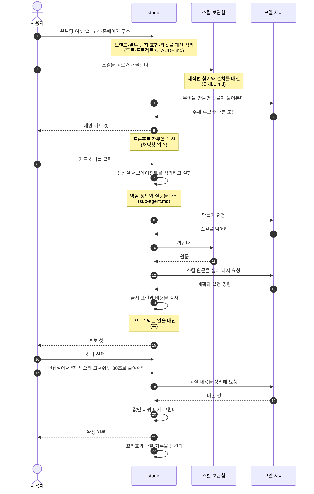
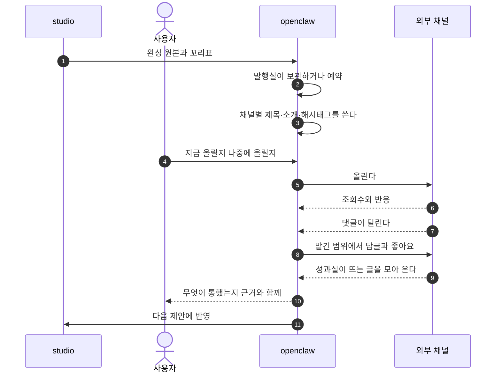
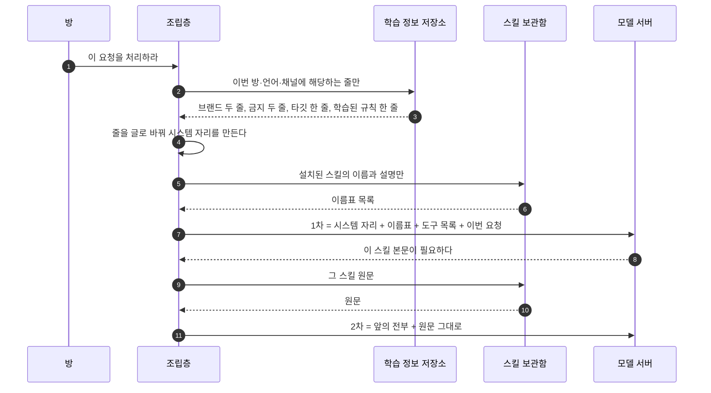

<!--
STAMP | 사업계획-osmu | v0.8 | 개정 2026-08-21 KST | model: claude-opus-5[1m] | agent: main(컨트롤러)
v0.8에서 바뀐 것 (회장 2026-08-21 3차 피드백 + 경쟁사 결과물 실물 분석):
  - 경쟁사 숏폼 실물을 내려받아 분석. 영상 생성 모델을 안 쓴다는 것을 확인하고 그 함의를 반영
  - 1.3 두 벽의 순서를 바꾸고, 마케팅에 도구가 없다는 표현을 사실에 맞게 고침
  - 1.4 사용자에서 studio를 거쳐 openclaw로 가는 순서로, 가치 문장을 명시
  - 1.5 꼬리표 주석 추가, 뜨는 글 화살표 방향 수정, 완성 원본을 밖으로 가져갈 수 있음을 표시
  - 2장 앞에 두 서비스가 무엇인지 먼저 설명, 국내외를 나눠 각각 차별점과 도전 과제
  - 3장 studio 왼쪽 openclaw 오른쪽, 방마다 하는 일 병기, 사용자는 위 외부는 아래
  - 3장에 편집실의 모델 호출과 채널별 문구 소유 문제를 넣음
  - 4장 원가에 대화 왕복과 서버와 세금과 응대 비용을 포함, 콘텐츠 종류를 넓힘
  - 4장 판매 순서를 운영까지 묶은 것 먼저, 만들기 단독을 그다음으로
-->

# OSMU 사업계획 v0.8

> 한 줄: **마케팅을 남에게 통째로 맡기긴 싫고 직접 해 보자니 알아야 할 게 너무 많은 사람에게, 통제권은 주되 어려운 부분을 전부 대신하는 도구를 판다.**

---

## 1. 제품

### 1.1 누구에게

| 이 사람 | 왜 |
|---|---|
| 대행사에 월 수백만원 쓰기 아깝거나 못 미더운 사람 | 돈도 크고 우리 브랜드를 얼마나 알까 싶다 |
| 마케터를 뽑기엔 규모가 안 되는 사람 | 신입 한 명이 월 250만원이다 |
| 직접 해 보려다 막힌 사람 | 프롬프트도 도구도 채널 운영도 배울 게 너무 많다 |
| 무엇을 올려야 할지 감이 안 오는 사람 | 만들 줄 알아도 무엇을 만들지가 문제다 |

**핵심은 통제권입니다.** 남에게 다 맡기긴 싫고 직접 하고 싶은데, 직접 하려면 알아야 할 것이 너무 많습니다. 그 사이를 메웁니다.

### 1.2 마케터가 하던 일을 전부 대신한다

| 마케터 또는 대행사가 하던 일 | 우리 쪽 |
|---|---|
| 무엇을 만들지 정한다 | 생성실 (제안 카드) |
| 만든다 | 생성실 |
| 고친다 | 편집실 |
| 올리고 예약한다 | 발행실 |
| 댓글과 좋아요를 관리한다 | 발행실 (채널 운영) |
| 반응을 본다 | 성과실 |
| 뜨는 것을 조사한다 | 성과실 (트렌드) |
| 다음 방향을 정한다 | 성과실 (학습으로) |

**그 비용이 이렇습니다.**

| 맡기는 방식 | 월 |
|---|---|
| 콘텐츠 마케터 한 명 채용(신입) | 약 250만원 |
| SNS 운영 대행 | 약 35만~100만원 |
| 국내 경쟁 서비스 통합 요금 | 75만원 |
| **우리** | **1만 9,900원에서 9만 9,000원** |

### 1.3 그럼 직접 하면 되지 않나

#### 벽 하나. 도구값부터 든다

혼자 하겠다고 마음먹어도 도구는 사야 합니다.

| 필요한 것 | 예 | 월 |
|---|---|---|
| 모델 구독 | Claude Max 상위 요금제 | 약 28만원 |
| 영상·이미지 생성 | Higgsfield 중간 요금제 | 약 8만원 |
| 편집 도구 | Premiere, Canva, Opus Clip 계열 | 약 8만원 |
| 예약과 분석 | Metricool 계열 | 약 3.5만원 |
| 댓글과 쪽지 응대 | ManyChat 계열 | 약 8만원 |
| 렌더와 저장 서버 | 클라우드 | 실사용에 따라 |
| **합계** | | **약 57만원 + 서버비** |

#### 벽 둘. 그 돈을 내고도 이걸 다 알아야 한다

```mermaid
flowchart LR
  subgraph HE["① 하네스를 짜야 한다"]
    direction TB
    H1["브랜드와 말투와 금지 표현을 적는다<br/>(루트 CLAUDE.md)"]
    H2["타깃과 컨셉을 적는다<br/>(프로젝트 CLAUDE.md)"]
    H3["제작법을 찾아 설치한다<br/>(SKILL.md)"]
    H4["역할별 지시를 만든다<br/>(sub-agent.md)"]
    H5["안 되는 것을 코드로 막는다<br/>(훅)"]
  end
  subgraph PE["② 프롬프트를 써야 한다"]
    direction TB
    P1["매번 새로 쓴다"]
    P2["결과 보고 다시 지시한다"]
    P3["잘 된 방법을 기억해 둔다"]
  end
  subgraph MK["③ 마케팅은 도구가 따로 논다"]
    direction TB
    M1["채널마다 로그인해 올린다"]
    M2["댓글과 좋아요를 단다"]
    M3["뜨는 글을 찾아본다"]
    M4["다음에 뭘 만들지 정한다"]
  end
  HE --> PE --> MK
```



**세 번째를 정확히 적자면 이렇습니다.** 예약과 분석 도구는 해외에 많습니다. 다만 국내에는 구독형이 사실상 없고, 있어도 **만드는 쪽과 끊겨 있습니다.** 만든 것을 손으로 옮겨 올리고, 반응은 다른 화면에서 보고, 다음에 뭘 만들지는 사람이 머리로 잇습니다.

### 1.4 우리는 이렇게 해결한다



여기서 파는 값이 세 겹입니다.

| | 무엇 |
|---|---|
| 첫째 | **프롬프트와 하네스 엔지니어링을 클릭만으로** 가능하게 한다 |
| 둘째 | 만들고 끝나지 않고 **올리고 응대하고 조사하는 것까지** 대신한다 |
| 셋째 | 그 결과를 다시 만들기로 돌려 **쓸수록 잘 통하는 콘텐츠**가 나오게 한다 |

### 1.5 콘텐츠 한 편이 도는 모습



> **꼬리표란**: 만든 결과물에 무엇으로 만들었는지 붙여 두는 쪽지입니다. 어느 후보를 골랐고 어떤 제작법 몇 판을 썼고 어떤 훅을 썼는지. 나중에 성과가 나왔을 때 **무엇 덕분인지 되짚기 위한 것**이고, 만들 때 안 붙이면 나중에 못 붙입니다.

**완성 원본은 사용자 것입니다.** 우리 채널로만 나가야 하는 게 아니라 내려받아 다른 곳에 써도 됩니다. 만들기만 필요한 사람이 실제로 있습니다.

**한 편이 아니라 계속 도는 것이 핵심입니다.** 올린 결과가 다음 제안을 바꾸고 그 제안이 다시 올라갑니다. 돌수록 그 계정에 맞아 갑니다.

### 1.6 누가 어디까지 쓰나

| 이런 사람 | 쓰는 범위 |
|---|---|
| 자영업자, 작은 브랜드, 스타트업 | 둘 다 |
| 대행사를 대신하려는 사람 | 둘 다 |
| 숏폼 부업 | studio만, 발행은 직접 |
| 취미로 만드는 사람. 음악, 소설, 영상 | studio만 |

---

## 2. 시장과 경쟁

### 2.0 먼저 우리가 무엇인지

| 이름 | 무엇 | 파는 방식 |
|---|---|---|
| **studio-service** | 만드는 엔진. 프롬프트와 하네스 엔지니어링을 화면으로 추상화. 외부 스킬을 담고, 브랜드 규칙을 줄 단위로 관리하고, 만든 것에 꼬리표를 붙인다 | 단독으로도 팔 수 있다 |
| **openclaw-service** | 운영하는 층. 발행과 예약, 채널 응대, 성과 수집, 뜨는 글 조사, 다음 제안 | studio 위에 얹는다 |
| **둘을 합친 것** | 만들기부터 성과까지 한 몸. 꼬리표가 중간에 안 끊긴다 | 주력 상품 |

새로 서른여섯 곳을 조사해 앞서 본 열아홉 곳과 합쳐 **쉰다섯 곳**을 봤습니다. 가격은 각 사 공식 요금 페이지에서 확인한 것만 적었습니다.

### 2.1 국내 경쟁 (만드는 쪽)

| 이름 | 무엇 | 가격 | 무료 |
|---|---|---|---|
| **sigmine.ai** | AI가 SNS 콘텐츠를 만들고 예약 발행. 성과로 다시 학습 | 블로그 15만, 스레드 15만, 숏폼 45만, 통합 75만 | 크레딧 지급 |
| Vrew | 자동 자막과 AI 영상 편집 | 월 7,900원부터 | **월 90분** |
| 타입캐스트 | AI 성우와 배우 영상 | 월 39,000원 | 5분 |
| 뤼튼 | AI 글쓰기 | **무료 무제한** | 무제한 |
| 미리캔버스 | 템플릿 디자인 | 상위 요금제 있음 | **사실상 평생 무료** |
| 딥브레인 | 아바타 영상 | 월 24달러부터 | 영상 3편 |
| VCAT | 상품 주소로 마케팅 영상 | 미확인 | 미확인 |

**국내에서 우리와 다른 점**

| | 무엇 |
|---|---|
| 외부 스킬을 담는 통로 | 국내 어디에도 없습니다. 좋은 제작법이 밖에서 쏟아지는데 담을 자리가 없습니다 |
| 만들기와 운영이 한 몸 | 국내 상대는 만들고 예약까지는 하는데 댓글 응대와 뜨는 글 조사가 빠져 있습니다 |
| 브랜드 규칙을 줄 단위로 | 한 번 학습하고 끝나는 방식과 달리 한 줄만 끄고 되돌릴 수 있습니다 |

**국내에서 우리 도전 과제**

| | 무엇 |
|---|---|
| 가격 앵커가 낮다 | 영상 월 7,900원, 글쓰기 무료, 디자인 무료가 기준점입니다 |
| 정면 상대가 먼저 팔고 있다 | 편수와 가격이 이미 공개돼 있습니다 |
| 그 상대가 성과 학습을 이미 내걸었다 | 우리가 비었다고 본 자리를 문구로 선점했습니다 |

### 2.2 해외 경쟁 (만드는 쪽)

| 이름 | 무엇 | 가격 | 발행·성과 |
|---|---|---|---|
| Jasper | 마케팅 카피와 캠페인 | 월 69달러부터 | 발행 안 함 |
| Copy.ai | 영업·마케팅 워크플로 | 월 29달러 또는 1,000달러부터 | 안 함 |
| Typeface | 기업용 브랜드 AI | 공개 가격 없음 | 승인 후 발행 |
| Creatify | 상품 주소로 광고 영상 | 월 39달러부터 | **성과 추적까지** |
| Pictory | 글을 영상으로 | 월 29달러부터 | 안 함 |
| InVideo | 프롬프트로 완성 영상 | 월 17달러부터 | 안 함 |
| Simplified | 카피·디자인·영상·예약 전부 | 월 59달러부터 | **열두 채널 직접 발행** |
| Runway | 영상 생성 모델 | 월 12달러부터 | 안 함 |

**해외에서 우리와 다른 점**

| | 무엇 |
|---|---|
| 브랜드를 값이 아니라 번호로 저장하고 줄 단위로 관리 | 기업용 한 곳이 브랜드 가이드를 구조화했지만 공개 가격이 없는 기업 상품입니다 |
| 만든 것에 꼬리표 | 성과 추적을 하는 곳이 있어도 무엇 덕분인지까지는 안 남깁니다 |
| 외부 스킬 반입 | 자기들이 만든 방식만 씁니다 |

**해외에서 우리 도전 과제**

| | 무엇 |
|---|---|
| 기능 범위가 넓게 겹치는 곳이 있다 | 한 번 브리핑하면 완성 캠페인이 온다는 문구가 우리와 같습니다 |
| 가격 하한이 눌려 있다 | 생성과 발행을 묶은 올인원이 월 15달러부터 있습니다 |
| 우리보다 사용자가 많다 | 이미 수천만 명 규모가 있습니다 |

### 2.3 운영하는 쪽 경쟁

| 이름 | 무엇 | 가격 |
|---|---|---|
| Sprout Social | 기업용 통합 관리 | 자리당 월 79~399달러 |
| Later | 예약과 인플루언서 | 월 18.75달러부터. AI 크레딧이 인색 |
| SocialBee | 예약과 AI 생성 | 월 29달러부터. 전 요금제 AI 무제한 |
| Sendible | 대행사용 | 월 1달러부터. 인원 무제한 |
| Ocoya | 생성과 발행 통합 | **월 15달러부터** |
| Blotato | 생성 후 스무 곳 이상 자동 배포 | 월 29달러부터 |
| Postiz | 오픈소스 예약 도구 | 직접 설치하면 무료 |
| Planable | 협업과 승인 | 50건 영구 무료 |

**국내에는 이 칸이 비어 있습니다.** 그 자리를 인플루언서 대행과 광고 대행사가 차지하고 있습니다.

**여기서 우리와 다른 점**

| | 무엇 |
|---|---|
| 만들기와 한 몸 | 이들은 남이 만든 것을 올려 주는 도구입니다. 무엇 덕분에 잘 됐는지 알 방법이 없습니다 |
| 성과가 다음 생성으로 돌아감 | 조사한 열한 곳 중 이걸 하는 곳은 국내 한 곳뿐이었습니다 |

**여기서 우리 도전 과제**

| | 무엇 |
|---|---|
| 댓글 응대는 해자가 아니다 | 전용 도구가 이미 성숙해 월 육천 원짜리도 있습니다 |
| 채널 정책이 바뀐다 | 플랫폼이 규칙을 바꾸면 따라가야 합니다 |
| 오픈소스가 하한을 0으로 만든다 | 직접 설치하면 공짜인 예약 도구가 있습니다 |

### 2.4 한국 시장에 대한 무거운 관찰

**한국에는 SNS 운영 구독 도구라는 카테고리가 사실상 없습니다.** 그 자리를 인플루언서 대행과 광고 대행사가 차지하고 있고, 국내 소상공인은 월 삼만원짜리 운영 자동화를 사 본 적이 거의 없습니다. 대신 체험단 서른 명에 100만원을 써 왔습니다.

**여기서 갈라집니다.**

| 이 사람들 | 무엇을 파나 |
|---|---|
| 자영업자, 작은 브랜드, 스타트업 | **마케팅에는 이미 큰돈을 쓰고 있습니다.** 도구를 안 살 뿐입니다. 그러니 도구가 아니라 **대행을 대신하는 것**으로 팔아야 합니다. 운영까지 묶은 상품 |
| 부업이나 취미로 만드는 사람 | 마케팅 예산이 없습니다. 만드는 것만 필요합니다. **만들기 단독 상품** |

**이 구분이 우리 상품 구성의 근거입니다.** 도구를 사라고 하면 월 7,900원과 경쟁하게 되고, 대행을 대신하겠다고 하면 월 100만원과 경쟁하게 됩니다.

### 2.5 우리가 다른 점 (자세히)

| 우리가 다른 점 | 무슨 뜻인가 | 왜 따라오기 어려운가 |
|---|---|---|
| **외부 스킬을 원문 그대로 담는다** | 밖에서 좋은 제작법이 나오면 그 파일을 그대로 우리 안에 넣어 쓸 수 있습니다. 우리가 고쳐 쓰지 않으므로 원래 효과가 유지됩니다 | 남들은 자기가 만든 방식 하나만 돌립니다. 외부 것을 받으려면 저장 구조와 실행 환경을 새로 짜야 합니다 |
| **브랜드 규칙을 줄 단위로 관리** | 우리 브랜드는 이렇다는 설명을 한 덩어리로 학습시키는 게 아니라 한 줄씩 저장합니다. 마음에 안 드는 한 줄만 끄거나 되돌릴 수 있고, 그 줄이 어디서 나왔는지도 남습니다 | 한 번 학습하고 끝나는 구조는 나중에 줄 단위로 못 쪼갭니다 |
| **만든 것에 꼬리표** | 어느 후보와 어떤 제작법으로 만들었는지 붙여 둡니다. 성과가 나오면 무엇 덕분인지 가릅니다 | 지금까지 안 붙인 곳은 과거 데이터에 소급할 수 없습니다 |
| **값만 바꿔 다시 그린다** | 자막 오타를 고칠 때 처음부터 다시 만드는 게 아니라 그 값만 바꿔 다시 그립니다 | 재생성으로 처리하는 곳은 고칠 때마다 원가가 다시 듭니다 |
| **만들기와 운영이 한 몸** | 만든 것이 꼬리표를 달고 올라가고 반응이 그 꼬리표에 붙습니다 | 도구 두 개를 붙이면 중간에서 꼬리표가 끊깁니다 |

### 2.6 우리 도전 과제 (사업 쪽)

| 과제 | 무엇이 문제인가 |
|---|---|
| **한국에 지불 의사가 있는지 모른다** | 운영 구독 카테고리 자체가 없습니다. 빈 시장인지 실패한 시장인지 미확인입니다 |
| **가격 하한이 이미 눌려 있다** | 국내 앵커가 월 7,900원과 무료입니다 |
| **정면 상대가 먼저 팔고 있다** | 국내 한 곳, 해외 여러 곳 |
| **성과 학습을 경쟁자가 이미 내걸었다** | 우리가 비었다고 본 자리를 문구로 선점당했습니다 |
| **댓글 응대는 해자가 아니다** | 전용 도구가 이미 성숙합니다 |
| **원가가 사용량에 그대로 붙는다** | 많이 쓰는 사용자가 마진을 깹니다 |

기술 쪽 도전 과제는 3장 각 절 아래에 적었습니다.

### 2.7 앞선 실패에서 배운 것

| 실패 사례 | 우리가 배운 것 |
|---|---|
| 가장 자본이 많이 들어간 클릭 빌더가 올해 폐기 | 클릭 추상화 자체는 해자가 아니다 |
| 여러 곳이 클릭 위에 다시 자연어를 얹었다 | 클릭으로 전부 덮으려 하면 되돌아온다 |
| 아무도 프롬프트 작문을 못 없앴다 | 없애는 게 아니라 **우리가 짊어지는 것**이다 |
| 성공한 클릭 도구는 만드는 것이 한 종류였다 | **범위를 좁게 자를 때만 이긴다** |

---

## 3. 어떻게 만드나

### 3.1 전체 구조



**조립층이 이 제품의 심장입니다.** 직접 할 때는 터미널 도구가 하던 일을 대신합니다.

| 직접 할 때 터미널 도구가 하던 일 | 우리 조립층이 하는 일 |
|---|---|
| 지침 파일 두 장을 읽어 시스템 자리에 넣는다 | 저장소에서 이번에 필요한 줄만 꺼내 글로 바꿔 넣는다 |
| 설치된 제작법의 이름표를 목록으로 넣는다 | 보관함에서 이름표만 꺼내 넣는다 |
| 모델이 요청하면 제작법 파일을 읽어 되돌려 준다 | 보관함에서 원문을 꺼내 그대로 실어 보낸다 |
| 명령을 실행하고 결과를 되돌려 준다 | 실행하고 결과를 실어 보낸다 |

**저장소에 줄 단위로 쌓아 둔 것이 요청마다 조립돼 나갑니다.** 이것이 프롬프트와 하네스 엔지니어링을 대신하는 실제 기술이고, 여기가 잘 돼야 제품이 섭니다.

### 3.2 studio 안에서



**제안 카드가 나오기 전에 모델을 한 번 다녀옵니다.** 무엇을 만들지도 우리가 정하기 때문입니다.

**편집실도 모델을 씁니다.** 자막을 직접 타이핑하게 하면 우리 타깃에게는 그것도 일입니다. 말로 시키면 우리가 정리해 값을 바꿉니다. 다만 이 왕복이 원가에 붙으므로 4장 계산에 넣었습니다.

#### 채널별 문구를 누가 쓰나

숏폼 자막과 카드뉴스 문구는 콘텐츠 안에 들어가므로 **studio가 씁니다.** 채널별 제목과 소개와 해시태그와 첫 댓글은 **발행실이 씁니다.** 올리는 시점에만 알 수 있는 것에 좌우되기 때문입니다.

다만 **원본만 받고 직접 올리려는 사람**도 있습니다. 그 경우 채널별 문구가 없는 채로 나갑니다. 기획서를 쓸 때 이 갈래를 따로 다룹니다.

#### studio 기술 과제

| 방 | 과제 | 왜 어려운가 |
|---|---|---|
| 생성실 | 좋은 지시문 쓰기 | 항목을 붙인다고 되지 않습니다 |
| 생성실 | 제안의 품질 | 무엇을 만들지 우리가 정하는데 뻔하면 안 씁니다 |
| 생성실 | 모델마다 다른 말투 | 같은 뜻인데 표기가 다르고 어떤 표기는 반대로 작동합니다 |
| 생성실 | 신규 사용자 | 프로필이 비면 무엇을 물어야 할지 모릅니다 |
| 편집실 | 미리보기와 최종 일치 | 다르면 편집실 신뢰가 무너집니다 |
| 편집실 | 말로 시키는 편집 | 손 편집 없이 원하는 결과를 내야 합니다 |
| 공통 | 스킬을 안전하게 돌리기 | 외부에서 온 스킬이 명령을 실행합니다 |

### 3.3 openclaw 안에서



#### openclaw 기술 과제

| 과제 | 왜 어려운가 |
|---|---|
| 채널마다 다른 규칙과 한도 | 글자수, 해시태그 수, 호출 제한이 다르고 자주 바뀝니다 |
| 토큰 수명 관리 | 만료되면 예약이 조용히 실패합니다 |
| 응대 범위 정하기 | 어디까지 대신 답할지 잘못 잡으면 사고가 납니다 |
| 지표 정규화 | 채널마다 조회수 정의가 다릅니다 |
| 성과를 학습으로 잇기 | 꼬리표가 있어야 하고 표본이 모여야 합니다 |

### 3.4 학습 정보와 스킬과 조립층

#### 정보를 일곱 칸으로 나눈다

| 칸 | 무엇 | 직접 할 때 이것 | 누가 채우나 |
|---|---|---|---|
| L0 이번 요청 | 주제, 언어, 채널, 비용 상한 | 채팅창에 친 프롬프트 | 카드 클릭 |
| L1 시스템 | 안전선, 표기 의무 | 도구가 박아 둔 규칙 | 우리 |
| L2 시장·모델 지식 | 시장별 문법, 모델별 말투 | 경험으로 아는 것 | 우리 |
| L3 계정 공통 | 브랜드 사실, 금지 표현, 기본 말투 | 루트 CLAUDE.md | 온보딩 세 줄 |
| L4 작업 공간 | 타깃, 컨셉, 업종 | 프로젝트 CLAUDE.md | 공간 만들 때 세 줄 |
| L5 방별 규칙 | 각 방의 취급 방식 | sub-agent.md | 기본값에서 자람 |
| L6 학습된 규칙 | 선택과 성과에서 자란 것 | 기억해 둔 노하우, 메모리 | 자동, 승인해야 적용 |

**번호는 우선순위도 메모리 계층도 아닙니다.** 붙는 범위가 넓은 것부터 좁은 것 순으로 매긴 이름표이고, 기술적 의미는 조립할 때 이 순서로 놓는다는 것 하나입니다.

**스킬은 이 칸에 안 들어갑니다.**

| | 일곱 칸 | 스킬 |
|---|---|---|
| 저장 형태 | 줄 단위 항목 | 파일 원문 |
| 우리가 고치나 | 사용자가 한 줄씩 | 한 글자도 안 고침 |
| 언제 실리나 | 요청 시작할 때 | 모델이 필요하다고 할 때만 |

#### 조립은 두 시점에 나뉜다



#### 조립층이 지킬 일곱 가지

| | 규칙 | 근거 |
|---|---|---|
| 1 | 금지 표현을 부정문으로 쓰지 않고 대체 어휘로 바꾼다 | 하지 말라 대신 하라고 쓰라는 공식 권고 |
| 2 | 조립 순서를 상수로 고정한다 | 긴 자료는 위, 지시는 아래로 두면 품질이 오른다는 공식 안내 |
| 3 | 조각마다 태그로 격벽을 친다 | 사용자 입력이 지시문으로 둔갑하는 것도 막힌다 |
| 4 | 조립 직전 모순 검사를 돌린다 | 모순된 지시를 만나면 모델이 손해를 본다 |
| 5 | 예시는 세 개에서 다섯 개, 고르는 방식을 매번 같게 | 순서만 바꿔도 성능이 흔들린다는 논문 |
| 6 | 단계적으로 생각하라는 지시는 계산에만 켠다 | 수학 밖에서는 이득이 거의 없다는 메타분석 |
| 7 | 영상과 이미지는 일곱 칸으로 조립한다 | 영상 모델 공식 가이드 |

#### 자동 조립이 못 이기는 자리

**사람이 프롬프트를 쓰는 과정은 결과를 보고 고치는 반복입니다.** 조립층은 결과를 보기 전에 확정해야 하므로 그 반복이 없습니다. 무엇이 모호한지는 도메인을 알아야 알고, 예시 순서는 실제로 돌려 봐야 압니다.

**그래서 후보 셋과 승인 절차는 편의가 아니라 품질 장치입니다.**

---

## 4. 비즈니스 모델

### 4.1 무엇을 만드는가

콘텐츠 종류를 좁히지 않습니다. 숏폼과 카드뉴스로 시작하되 **글과 음악과 그 밖의 창작물까지** 같은 구조로 열어 둡니다. 만드는 것이 무엇이든 브랜드 규칙과 스킬과 조립층은 같습니다.

### 4.2 콘텐츠 한 편 원가

| 상품 | 구성 | 생성 비용 |
|---|---|---|
| 카드뉴스 | 최소 | 약 130원 |
| 카드뉴스 | 고품질 | 약 420원. 묶어 돌리면 약 250원 |
| 30초 숏폼 | 이미지에 움직임을 주는 구성 | 약 265원 |
| 30초 숏폼 | 실제 영상 클립 네 컷 | 약 3,400~4,600원 |
| 30초 숏폼 | 최상급 영상 모델 | 약 23,800원 |

**여기에 더 붙는 것이 있습니다.**

| 항목 | 성격 |
|---|---|
| 대화 왕복 | 제안 만들 때 한 번, 만들 때 두세 번, 편집 지시할 때마다 한 번 |
| 작업 공간 서버 | 스킬이 파일을 읽고 명령을 돌리는 시간만큼 |
| 저장과 전송 | 완성물과 소재를 들고 있어야 합니다 |
| 세금과 결제 수수료 | 표시가의 약 12~13퍼센트 |
| 응대 비용 | 사람이 붙는 문의. 사용자가 늘수록 |

**두 가지가 분명합니다.** 카드뉴스와 숏폼의 원가 차이가 최대 스무 배라 하나로 묶으면 무너집니다. 그리고 숏폼 원가의 대부분이 영상 생성 하나입니다.

### 4.3 요금제

| 플랜 | 표시가(월) | 포함 편수 | 목적 |
|---|---|---|---|
| 무료 | 0원 | 카드 3편 + 숏폼 1편 | 써 보게 한다 |
| 스타터 | 19,900원 | 카드 20편 + 숏폼 3편 | 조금씩 굴려 보게 한다 |
| 프로 | 99,000원 | 카드 100편 + 숏폼 20편 + 작업 공간 추가, 다채널 트렌드 조사 | 본격적으로 쓰게 한다 |
| 기업 | 390,000원부터 | 카드 400편 + 숏폼 100편 + 최상급 영상 옵션 | 계정과 채널이 많은 곳 |

추가 결제는 카드뉴스 한 편 700원, 숏폼 한 편 3,900원, 최상급 영상 숏폼 29,000원, 충전 팩 5만원부터입니다. 발행은 크레딧을 쓰지 않고 값만 바꾸는 재렌더도 크레딧을 쓰지 않습니다.

**배수는 다 쓰면 2.3배에서 2.7배, 실제로는 3.5배에서 4.1배입니다.** 크레딧 방식의 실제 이익은 안 쓰고 남긴 몫에서 납니다.

### 4.4 이 구조가 무너지는 지점

**원가의 서너 배라는 기준선은 이 사업에서 안전장치가 아닙니다.** 보통 소프트웨어는 한 명이 더 써도 비용이 거의 안 늘지만 우리는 쓰는 만큼 그대로 나가고 상품 간 차이가 스무 배입니다. 프로 요금제에서 전부 최상급 영상에 몰아 쓰면 원가가 요금을 넘습니다.

| 진짜 안전장치 | 무엇 |
|---|---|
| 상품별 크레딧 분리 | 카드뉴스 몫과 숏폼 몫을 서로 바꿔 쓰지 못하게 |
| 계정별 상한 | 요금제 한도의 1.5배에서 강제로 막는다 |
| 비싼 모델 격리 | 최상급 영상은 요금제에 안 넣고 추가 결제로만 |

### 4.5 어떻게 알릴 것인가

| 순서 | 무엇 | 왜 |
|---|---|---|
| 1 | 우리 사업체들 콘텐츠를 우리 도구로 만들어 발행 | 우리가 첫 사용자다. 결과물이 곧 증거다 |
| 2 | 그 콘텐츠 자체를 마케팅 소재로 | 이 콘텐츠는 우리 도구로 만들었다고 밝힌다 |
| 3 | 인플루언서 제휴 | 만들어 쓰는 사람들이 먼저 반응한다 |
| 4 | 퍼포먼스 광고 | 시장성이 확인된 뒤에 |
| 5 | 마케터와 대행사 대상 영업 | 그들에게는 대체가 아니라 도구다 |

**대행사를 적으로 두지 않고 고객으로도 둡니다.**

### 4.6 로드맵

| 단계 | 무엇 | 끝났다는 증거 |
|---|---|---|
| 1 | studio 생성 기획과 기술 설계 | 요청 봉투 계약이 서고 양쪽이 같은 판을 가리킴 |
| 2 | studio API 개발 | 카드뉴스 한 편이 사람 손 없이 끝까지 나옴 |
| 3 | openclaw 화면을 붙여 우리 사업체에 적용 | 우리 채널에 우리 도구로 만든 것이 발행됨 |
| 4 | 성과가 규칙을 바꾸는지 검증 | 같은 조건에서 신호가 잡히는지 실측 |
| 5 | **운영까지 묶은 상품을 판다** | 자영업자와 대행사가 첫 고객 |
| 6 | **만들기 단독 상품을 연다** | 음악과 소설과 영상 창작자에게 studio만 |
| 7 | 프로덕트 빌더 | 기획·디자인·개발·인프라·검수를 같은 방식으로 추상화한 별도 제품 |
| 8 | 검수 자매 제품 | 이미 만든 제품의 성능·보안·확장·검색 노출을 점검하고 마케팅 전략까지 제시 |

**다섯째와 여섯째의 순서가 중요합니다.** 마케팅에 이미 돈을 쓰는 사람에게 먼저 팔고, 그다음 만들기만 필요한 사람에게 엔진을 엽니다. 일곱째와 여덟째는 같은 고민을 가진 다른 집단입니다.

---

## 5. 자주 나올 질문

### 왜 지침을 파일이 아니라 항목으로 저장하나

| 상황 | 파일 한 장이면 | 항목으로 쪼개면 |
|---|---|---|
| 한 줄만 고치기 | 문서 전체를 다시 씀 | 그 줄만 |
| 어디서 나온 줄인지 | 알 수 없음 | 8월 10일 선택에서 나왔다고 붙여 둠 |
| 되돌리기 | 통째로 | 그 줄만 |

### 꼬리표가 무슨 말인가

만든 결과물에 무엇으로 만들었는지 붙여 두는 쪽지입니다.

```
이 영상: 후보 B / 스킬은 숏폼 제작 3판 / 훅은 질문형 / 규칙 7판 / 8월 20일
```

성과가 나왔을 때 무엇 덕분인지 되짚기 위한 것이고 나중에 소급해서 못 붙입니다.

### 스킬을 우리가 고치면 안 되나

안 고칩니다. 앞에 붙는 값만 만듭니다.

### 프롬프트 엔지니어링이 사라지는 것인가

사용자 쪽에서만 사라집니다. **우리가 대신 짊어집니다.**
