<!--
STAMP | line: osmu | 사업계획-osmu | v1.4 | 개정 2026-08-24 00:25 KST | model: gpt-codex/gpt-5.6-sol | agent: tech-architect(worker)
skills: 없음. 매칭되는 기술설계 스킬이 없어 doc-review·writing·benchmarks·artifact-stamp 규격 적용
기반: 사업계획 v1.3 현재본, 학습정보 층계 계약 v1.0, 회장 확정 요구 R01~R99, DESIGN.md v24, user-flow, 구현현황, 현행 아키텍처·DB, Claude Code·Webflow·Adobe 공식 자료
v1.4에서 바뀐 것 (회장 2026-08-24 Claude Code 대응 질문):
  - 기존 §3.4 뒤에 Claude Code와 OSMU의 역할 대응 도식, 같지 않은 다섯 가지, 가장 강한 반론과 답을 §3.5로 추가
  - Claude Code에도 Desktop·Web GUI, cloud·Remote Control, managed policy, auto memory가 있음을 공식 문서로 정정
  - OSMU의 방어선을 GUI가 아니라 고객 계정·작업 공간 데이터 계약, 네 방 상태기계, 승낙형 L5, 발행 후 성과 되먹임으로 좁힘
  - 기존 §3.5 비용 최적화를 §3.6으로 이동. 기존 본문 삭제 0
  - 기술 상세와 전체 근거는 wiki/architecture/claude-code-와-osmu-대응.md로 분리
  - 새 Mermaid 도식을 mermaid-cli 11.12.0으로 PNG 렌더해 좌우 흐름과 점선 대응을 시각 확인
v1.3에서 바뀐 것 (회장 2026-08-22 3.4 가독성 지적):
  - 3.4 재구성(계층·도식화·조립층). 학습 정보 계층, 학습 정보 도식화, 조립층 도식화의 세 갈래로 재배치
  - 층과 네 방 표를 읽기·쓰기·미사용 선이 보이는 도식으로 바꾸고, 성과실의 L5 후보 쓰기만 강조
  - 조립 열 단계 표를 고정 앞부분·가변 뒷부분 경계와 studio·openclaw 담당이 보이는 파이프라인으로 교체
  - 이전 번호형 도식 이름과 중복된 요청 순환 도식을 제거하고, 정의표 한 개만 유지
v1.2에서 바뀐 것 (회장 2026-08-22 R94~R99):
  - 도식 1·2를 층 스택·변경 빈도·일반 우선순위·못 덮는 예외·U2/U3 판별 기준이 한눈에 보이는 한 장으로 합침
  - 도식 3~6을 가입 전부터 반복 사용까지의 단일 시간축으로 합치고, 같은 선택 3회 또는 성과 5건에서 L5 후보를 띄우는 확정값을 반영
  - 각 층이 조립층·studio·openclaw와 언제 무엇을 주고받는지 3.3 형식의 상호작용 도식으로 추가
  - §6.2 요구 대장 반영표를 삭제하고 정본 링크 한 줄만 남김
  - 무료 실제 영상 1편, 작업 공간 포함 수, 학습 후보 노출 조건을 본문과 §9로 옮기고 §10에서 삭제
  - 무료 영상 규격과 원가 가정을 시그마인 실물 기준으로 재계산하고, 추천안 A였던 미리보기 전용안을 폐기
v1.1에서 바뀐 것 (회장 2026-08-22 R91~R92):
  - §3.4 맨 위에 S0·S1·U2·U3·X4·L5·R6과 생성실·편집실·발행실·성과실의 읽기·쓰기·미사용 관계를 복원
  - 조립층을 입력·처리·출력·담당이 보이는 열 단계로 분해하고, 금지 표현 변환·겹침 우선순위·모순 제거·스킬 원문·본보기·모델별 최종 문장·고정 앞부분과 가변 뒷부분 경계를 명시
  - 요청 한 건이 studio 구간과 openclaw 구간을 지나 성과에서 L5 후보로 돌아오는 흐름을 Mermaid로 추가
  - §10 선택지마다 회장이 그대로 복사해 답할 수 있는 한 줄을 추가
v1.0에서 바뀐 것 (회장 2026-08-22 R79~R90):
  - 사업계획서를 학습 정보 층계의 원본으로 승격하고, 기존 §3.4에 층의 뜻·수집 시점·우선순위·원가·필라테스 원장 예시를 통합
  - 브랜드 층을 만들지 않고 개인과 작업 공간으로 복원. 여러 브랜드와 취향 분리는 작업 공간 추가·복제로 해결
  - 스킬을 X4 층으로 복원. 회장 미승인 이름 체계와 기술 구현 세칙은 본문에서 제외
  - 그림판의 시각 언어를 이어 Mermaid 여섯 장으로 층 스택·예외·수집·조립·학습 성장·시간축을 복원
  - 페르소나 1명, One Thing 후보와 함정답, MVP 5개, 구현 상태, 확정 원장, 회장 결정 대기를 보강
  - v0.9의 제품·경쟁·기술·BM 본문은 삭제하지 않고 유지
고민: v2.1의 세부 계약은 정밀하지만 회장이 사업계획에 넣을 성질이 아니라고 반려했다. 사업 판단에 필요한 일곱 층과 여섯 그림만 남기고 구현 세칙은 기술설계로 내렸다.

v0.9에서 바뀐 것 (회장 2026-08-21 4차): 1.4를 한 줄 배치로, 두 서비스에 부제, 경쟁 절에 서비스 이름 병기, 국내 운영 칸이 비었다는 것을 시장 기회로 명시, 운영 쪽부터 공략하는 순서로 변경, 바이브 코딩 커뮤니티를 첫 타깃으로 추가, 소재 엮기 옵션 채택
v0.8에서 바뀐 것 (회장 2026-08-21 3차 피드백 + 경쟁사 결과물 실물 분석):
  - 경쟁사 숏폼 실물을 내려받아 분석. 영상 생성 모델을 안 쓴다는 것을 확인하고 그 함의를 반영
  - 1.3 두 벽의 순서를 바꾸고, 마케팅에 도구가 없다는 표현을 사실에 맞게 고침
  - 1.4 사용자에서 studio를 거쳐 openclaw로 가는 순서로, 가치 문장을 명시
  - 1.5 꼬리표 주석 추가, 뜨는 글 화살표 방향 수정, 완성 원본을 밖으로 가져갈 수 있음을 표시
  - 2장 앞에 두 서비스가 무엇인지 먼저 설명, 국내외를 나눠 각각 차별점과 도전 과제
  - 3장 studio 왼쪽 openclaw 오른쪽, 방마다 하는 일 병기, 사용자는 위 외부는 아래
  - 3장에 편집실의 모델 호출과 채널별 문구 소유 문제를 넣음
  - 4장 원가에 대화 왕복과 서버와 세금과 응대 비용을 포함, 콘텐츠 종류를 넓힘
  - 4장 판매 순서를 운영까지 묶은 것 먼저, 만들기 단독을 그다음으로
-->

# OSMU 사업계획 v1.4

> 한 줄: **마케팅을 남에게 통째로 맡기긴 싫고 직접 해 보자니 알아야 할 게 너무 많은 사람에게, 통제권은 주되 어려운 부분을 전부 대신하는 도구를 판다.**

---

## 목차

- [이번 판의 결론](#이번-판의-결론)
- [1. 제품](#1-제품)
- [2. 시장과 경쟁](#2-시장과-경쟁)
- [3. 어떻게 만드나](#3-어떻게-만드나)
  - [3.4 학습 정보 계층과 조립층](#34-학습-정보-계층과-조립층)
    - [3.4.1 학습 정보 계층](#341-학습-정보-계층)
    - [3.4.2 학습 정보 도식화](#342-학습-정보-도식화)
    - [3.4.3 조립층 도식화](#343-조립층-도식화)
  - [3.5 우리가 무엇을 자동화하는가 (Claude Code 와의 대응)](#35-우리가-무엇을-자동화하는가-claude-code-와의-대응)
  - [3.6 다른 팀에서 배운 비용 최적화](#36-다른-팀에서-배운-비용-최적화-2026-08-21-실물-분석)
- [4. 비즈니스 모델](#4-비즈니스-모델)
- [5. 자주 나올 질문](#5-자주-나올-질문)
- [6. MVP와 현재 구현 상태](#6-mvp와-현재-구현-상태)
- [7. 사업 운영과 위험](#7-사업-운영과-위험)
- [8. 검증 기준](#8-검증-기준)
- [9. 확정 원장](#9-확정-원장)
- [10. 회장이 정할 것](#10-회장이-정할-것)
- [11. 벤치마크와 출처](#11-벤치마크와-출처)

## 이번 판의 결론

**사업계획서가 원본이다.** 학습 정보는 별도 계약이 아니라 이 문서 §3.4에서 제품의 핵심 원리로 관리한다. 확정된 것은 §9 원장에 남기고, 아직 합의되지 않은 값은 §10에만 둔다. 회장 확정 전 다른 기획서·기술설계·프로토타입에 전파하지 않는다.

이번 판에서 층계는 다시 단순해졌다. 사용자 범위는 **개인과 작업 공간** 둘뿐이다. 한 사람이 여러 브랜드를 굴리거나 한국어판과 영어판의 취향을 갈라 쓰려면 작업 공간을 추가하거나 복제한다. 스킬은 별도 부속물이 아니라 `X4` 층이다.

> **TL;DR** 사용자는 작업 공간을 만들 때 필요한 정보를 조금 주고, 콘텐츠를 만들고 운영하면서 규칙을 더한다. 한 번의 요청이 들어오면 시스템 지식, 개인 정보, 작업 공간 정보, 스킬, 배운 규칙, 이번 요청이 조립층에서 합쳐진다. 겹치면 최신 사용자 의도가 이기되 시스템 안전선과 사용자가 직접 적은 금지선은 누구도 넘지 못한다. 이 구조는 품질뿐 아니라 반복 요청의 원가를 낮추는 사업 장치다.

---

## 1. 제품

### 1.1 누구에게

| 이 사람 | 왜 |
|---|---|
| 대행사에 월 수백만원 쓰기 아깝거나 못 미더운 사람 | 돈도 크고 우리 브랜드를 얼마나 알까 싶다 |
| 마케터를 뽑기엔 규모가 안 되는 사람 | 신입 한 명이 월 250만원이다 |
| 직접 해 보려다 막힌 사람 | 프롬프트도 도구도 채널 운영도 배울 게 너무 많다 |
| 무엇을 올려야 할지 감이 안 오는 사람 | 만들 줄 알아도 무엇을 만들지가 문제다 |
| **만드는 건 하는데 알리질 못하는 사람** | 직접 제품이나 콘텐츠를 만들어 놓고 마케팅에서 막힌다. 우리가 운영 중인 바이브 코딩 커뮤니티가 정확히 이 사람들이다 |

**핵심은 통제권입니다.** 남에게 다 맡기긴 싫고 직접 하고 싶은데, 직접 하려면 알아야 할 것이 너무 많습니다. 그 사이를 메웁니다.

#### 대표 페르소나: 박수진, 39세, 성수동 1인 필라테스 원장

박수진은 강사 두 명과 함께 작은 필라테스 스튜디오를 운영한다. 오전 7시 첫 수업부터 오후 10시 마지막 수업까지 회원 상담, 예약 변경, 환불 문의, 수업, 강사 일정, 세금계산서까지 직접 챙긴다. 인스타그램에는 재활 사례, 자세 교정 전후, 빈 시간 할인, 원장의 운동 철학을 올려야 한다는 것을 안다. 하지만 사진을 골라 자막을 쓰고, 짧은 영상으로 자르고, 채널마다 제목과 소개를 바꾸고, 댓글에 답하고, 무엇이 회원 문의로 이어졌는지 기록하는 일은 늘 밤 11시 이후로 밀린다. 월 100만원짜리 대행은 부담스럽고, 대행사가 자기 회원의 통증과 수업 분위기를 모른 채 뻔한 문구를 쓰는 것도 싫다. 직접 하려고 뤼튼, 미리캔버스, 영상 편집기, 예약 도구를 켜 봤지만 도구가 여섯 개로 늘었을 뿐, 무엇을 만들지 정하고 서로 옮기는 일은 그대로 남았다. AI가 임의로 “완치”, “체형 교정 보장” 같은 말을 쓰거나 회원 사진 권리를 확인하지 않고 발행하는 것이 가장 두렵다. 그래서 원하는 것은 완전 자동 발행이 아니다. 자신의 통제권은 남겨 두고, 이미 적어 둔 브랜드 사실과 금지 표현을 매번 다시 설명하지 않아도 되며, “이번 달은 산후 회복 회원 모집”이라고 말하면 근거 있는 후보를 먼저 보여 주고, 고른 안을 채널별로 다듬어 예약하고, 반응을 다음 제안에 돌려주는 한 사람 몫의 마케팅 운영이다. 한국인 회원용 공간과 외국인 회원용 영어 공간의 말투가 섞이면 안 되므로, 영어판은 기존 학습 정보를 복제한 별도 작업 공간으로 시작하고 독립적으로 키우고 싶다. 성공은 게시물 수가 아니다. 월요일 45분 안에 다음 주 콘텐츠를 승인하고, 나머지는 맡긴 범위에서 돌아가며, 왜 이런 결과가 나왔는지 되짚을 수 있는 상태다.

**Pain 한 줄:** 마케팅 통제권은 놓치고 싶지 않지만, 매번 무엇을 만들지 정하고 여섯 도구 사이를 옮겨 다니며 같은 설명을 반복할 시간이 없다.

**이 페르소나는 합성 인물이다.** 기존 plan 페르소나의 1인 교육·컨설팅 대표, 회장 요구의 필라테스 원장 사례, 제품의 실제 타깃 정의를 합친 가설이다. 고객 인터뷰 증거로 오해하면 안 된다.

#### 포지셔닝

| 항목 | 이 제품의 답 |
|---|---|
| 고객 | 마케터를 고용하기엔 작고, 대행에 통제권을 넘기긴 싫으며, 프롬프트·제작·발행 운영을 배울 시간도 없는 1인 사업자와 작은 팀 |
| 반대 고객 | 무승인 대량 발행, 댓글 도배, 저작권이 불분명한 소재 재사용을 원하는 사람 |
| 약속 | 클릭과 짧은 대화만으로 콘텐츠 후보부터 채널 운영과 다음 제안까지 이어 주되, 중요한 결정과 원본 소유권은 사용자에게 남긴다 |
| 증거 자산 | 현재 Studio의 생성·편집·4채널 직접 발행, Queue·Calendar·성과 수집의 부분 구현, 자체 사업체 파일럿을 첫 검증장으로 쓸 수 있다는 점 |
| 맞서는 구조 | 도구는 많아졌는데 사람이 여전히 맥락을 반복 입력하고 도구 사이를 옮겨야 하는 단절 |
| 절대 하지 않는 것 | 사용자가 승인하지 않은 학습 규칙 자동 적용, 권리 불명 소재 사용, 미수집 성과를 0이나 성공으로 표시, 다른 작업 공간의 취향 자동 혼합 |
| 감수할 긴장 | “완전 자동”보다 한 번의 승낙을 더 요구한다. 대신 사용자가 왜 이런 결과가 나왔는지 통제하고 되돌릴 수 있다 |

톤은 세 가지다. **또렷하되 기술자처럼 말하지 않는다.** 층 코드만 던지지 않고 사용자 행동으로 번역한다. **친절하되 유치하지 않는다.** 초보라는 이유로 결과물을 초보용으로 만들지 않는다. **주도적이되 월권하지 않는다.** 먼저 후보와 근거를 내지만 권리·비용·발행 결정은 숨겨 넘지 않는다.

#### One Thing 후보와 함정답

| 후보 | 맞는 점 | 잘못된 답이 되는 지점 | 판정 |
|---|---|---|---|
| “AI로 콘텐츠를 만든다” | 생성실을 설명한다 | 뤼튼·Canva·Jasper로 치환해도 그대로다. 발행·성과·학습이 사라진다 | 기각 |
| “여러 채널에 한 번에 올린다” | 운영 자동화의 일부다 | Postiz·Buffer로 치환 가능하다. 좋은 콘텐츠를 무엇으로 만들지와 다음 제안이 없다 | 기각 |
| “마케팅을 완전 자동화한다” | 고객이 원하는 노동 절감을 강하게 말한다 | 승인·권리·금지선까지 AI가 임의로 넘는다는 오해를 만들고, 현재 미구현 범위를 완료처럼 말한다 | 기각 |
| “프롬프트 엔지니어링을 클릭으로 바꾼다” | Studio의 기술적 차별을 설명한다 | 고객은 프롬프트가 아니라 마케팅 결과를 산다. openclaw의 운영 값이 빠진다 | 보조 문장 |
| “통제권은 남기고 어려운 마케팅 운영은 대신한다” | 고객의 긴장, Studio와 openclaw의 결합, 승인 구조를 한 번에 설명한다 | 실제 반복 사용과 비용 절감이 아직 실측되지 않았다 | 채택 |

> **One Thing:** 대행에 통제권을 넘기지 않고도, 클릭과 짧은 대화만으로 브랜드에 맞는 콘텐츠를 만들고 운영하며 그 결과를 다음 제안으로 돌려준다.

**경쟁사 치환 테스트:** Buffer는 만들기와 학습 정보 조립이 빠지고, Jasper는 채널 운영과 성과 회수가 빠지며, Canva는 발행 후 학습이 빠진다. 따라서 이 문장은 세 제품 어느 하나로 그대로 치환되지 않는다.

### 1.2 마케터가 하던 일을 전부 대신한다

| 마케터 또는 대행사가 하던 일 | 우리 쪽 |
|---|---|
| 무엇을 만들지 정한다 | 생성실 (제안 카드) |
| 만든다 | 생성실 |
| 고친다 | 편집실 |
| 올리고 예약한다 | 발행실 |
| 댓글과 좋아요를 관리한다 | 발행실 (채널 운영) |
| 반응을 본다 | 성과실 |
| 뜨는 것을 조사한다 | 성과실 (트렌드) |
| 다음 방향을 정한다 | 성과실 (학습으로) |

**그 비용이 이렇습니다.**

| 맡기는 방식 | 월 |
|---|---|
| 콘텐츠 마케터 한 명 채용(신입) | 약 250만원 |
| SNS 운영 대행 | 약 35만~100만원 |
| 국내 경쟁 서비스 통합 요금 | 75만원 |
| **우리** | **1만 9,900원에서 9만 9,000원** |

### 1.3 그럼 직접 하면 되지 않나

#### 벽 하나. 도구값부터 든다

혼자 하겠다고 마음먹어도 도구는 사야 합니다.

| 필요한 것 | 예 | 월 |
|---|---|---|
| 모델 구독 | Claude Max 상위 요금제 | 약 28만원 |
| 영상·이미지 생성 | Higgsfield 중간 요금제 | 약 8만원 |
| 편집 도구 | Premiere, Canva, Opus Clip 계열 | 약 8만원 |
| 예약과 분석 | Metricool 계열 | 약 3.5만원 |
| 댓글과 쪽지 응대 | ManyChat 계열 | 약 8만원 |
| 렌더와 저장 서버 | 클라우드 | 실사용에 따라 |
| **합계** | | **약 57만원 + 서버비** |

#### 벽 둘. 그 돈을 내고도 이걸 다 알아야 한다

```mermaid
flowchart LR
  subgraph HE["① 하네스를 짜야 한다"]
    direction TB
    H1["브랜드와 말투와 금지 표현을 적는다<br/>(루트 CLAUDE.md)"]
    H2["타깃과 컨셉을 적는다<br/>(프로젝트 CLAUDE.md)"]
    H3["제작법을 찾아 설치한다<br/>(SKILL.md)"]
    H4["역할별 지시를 만든다<br/>(sub-agent.md)"]
    H5["안 되는 것을 코드로 막는다<br/>(훅)"]
  end
  subgraph PE["② 프롬프트를 써야 한다"]
    direction TB
    P1["매번 새로 쓴다"]
    P2["결과 보고 다시 지시한다"]
    P3["잘 된 방법을 기억해 둔다"]
  end
  subgraph MK["③ 마케팅은 도구가 따로 논다"]
    direction TB
    M1["채널마다 로그인해 올린다"]
    M2["댓글과 좋아요를 단다"]
    M3["뜨는 글을 찾아본다"]
    M4["다음에 뭘 만들지 정한다"]
  end
  HE --> PE --> MK
```

**세 번째를 정확히 적자면 이렇습니다.** 예약과 분석 도구는 해외에 많습니다. 다만 국내에는 구독형이 사실상 없고, 있어도 **만드는 쪽과 끊겨 있습니다.** 만든 것을 손으로 옮겨 올리고, 반응은 다른 화면에서 보고, 다음에 뭘 만들지는 사람이 머리로 잇습니다.

### 1.4 우리는 이렇게 해결한다

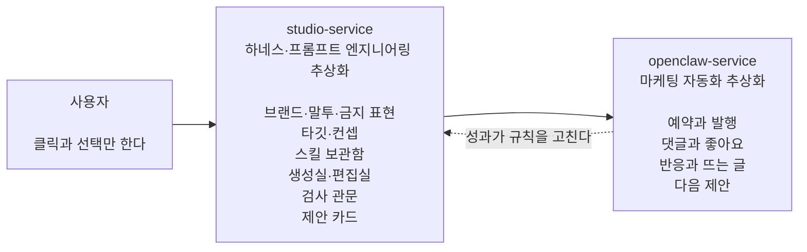

여기서 파는 값이 세 겹입니다.

| | 무엇 |
|---|---|
| 첫째 | **프롬프트와 하네스 엔지니어링을 클릭만으로** 가능하게 한다 |
| 둘째 | 만들고 끝나지 않고 **올리고 응대하고 조사하는 것까지** 대신한다 |
| 셋째 | 그 결과를 다시 만들기로 돌려 **쓸수록 잘 통하는 콘텐츠**가 나오게 한다 |

### 1.5 콘텐츠 한 편이 도는 모습

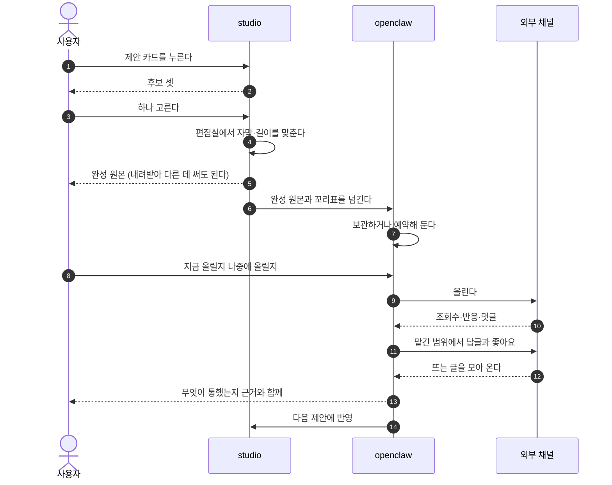

> **꼬리표란**: 만든 결과물에 무엇으로 만들었는지 붙여 두는 쪽지입니다. 어느 후보를 골랐고 어떤 제작법 몇 판을 썼고 어떤 훅을 썼는지. 나중에 성과가 나왔을 때 **무엇 덕분인지 되짚기 위한 것**이고, 만들 때 안 붙이면 나중에 못 붙입니다.

**완성 원본은 사용자 것입니다.** 우리 채널로만 나가야 하는 게 아니라 내려받아 다른 곳에 써도 됩니다. 만들기만 필요한 사람이 실제로 있습니다.

**한 편이 아니라 계속 도는 것이 핵심입니다.** 올린 결과가 다음 제안을 바꾸고 그 제안이 다시 올라갑니다. 돌수록 그 계정에 맞아 갑니다.

### 1.6 누가 어디까지 쓰나

| 이런 사람 | 쓰는 범위 |
|---|---|
| 자영업자, 작은 브랜드, 스타트업 | 둘 다 |
| 대행사를 대신하려는 사람 | 둘 다 |
| 숏폼 부업 | studio만, 발행은 직접 |
| 취미로 만드는 사람. 음악, 소설, 영상 | studio만 |

---

## 2. 시장과 경쟁

### 2.0 먼저 우리가 무엇인지

| 이름 | 무엇 | 파는 방식 |
|---|---|---|
| **studio-service** | 만드는 엔진. 프롬프트와 하네스 엔지니어링을 화면으로 추상화. 외부 스킬을 담고, 브랜드 규칙을 줄 단위로 관리하고, 만든 것에 꼬리표를 붙인다 | 단독으로도 팔 수 있다 |
| **openclaw-service** | 운영하는 층. 발행과 예약, 채널 응대, 성과 수집, 뜨는 글 조사, 다음 제안 | studio 위에 얹는다 |
| **둘을 합친 것** | 만들기부터 성과까지 한 몸. 꼬리표가 중간에 안 끊긴다 | 주력 상품 |

새로 서른여섯 곳을 조사해 앞서 본 열아홉 곳과 합쳐 **쉰다섯 곳**을 봤습니다. 가격은 각 사 공식 요금 페이지에서 확인한 것만 적었습니다.

### 2.1 국내 경쟁: 만드는 쪽 (studio-service)

| 이름 | 무엇 | 가격 | 무료 |
|---|---|---|---|
| **sigmine.ai** | AI가 SNS 콘텐츠를 만들고 예약 발행. 성과로 다시 학습 | 블로그 15만, 스레드 15만, 숏폼 45만, 통합 75만 | 크레딧 지급 |
| Vrew | 자동 자막과 AI 영상 편집 | 월 7,900원부터 | **월 90분** |
| 타입캐스트 | AI 성우와 배우 영상 | 월 39,000원 | 5분 |
| 뤼튼 | AI 글쓰기 | **무료 무제한** | 무제한 |
| 미리캔버스 | 템플릿 디자인 | 상위 요금제 있음 | **사실상 평생 무료** |
| 딥브레인 | 아바타 영상 | 월 24달러부터 | 영상 3편 |
| VCAT | 상품 주소로 마케팅 영상 | 미확인 | 미확인 |

**국내에서 우리와 다른 점**

| | 무엇 |
|---|---|
| 외부 스킬을 담는 통로 | 국내 어디에도 없습니다. 좋은 제작법이 밖에서 쏟아지는데 담을 자리가 없습니다 |
| 만들기와 운영이 한 몸 | 국내 상대는 만들고 예약까지는 하는데 댓글 응대와 뜨는 글 조사가 빠져 있습니다 |
| 브랜드 규칙을 줄 단위로 | 한 번 학습하고 끝나는 방식과 달리 한 줄만 끄고 되돌릴 수 있습니다 |

**국내에서 우리 도전 과제**

| | 무엇 |
|---|---|
| 가격 앵커가 낮다 | 영상 월 7,900원, 글쓰기 무료, 디자인 무료가 기준점입니다 |
| 정면 상대가 먼저 팔고 있다 | 편수와 가격이 이미 공개돼 있습니다 |
| 그 상대가 성과 학습을 이미 내걸었다 | 우리가 비었다고 본 자리를 문구로 선점했습니다 |

### 2.2 해외 경쟁: 만드는 쪽 (studio-service)

| 이름 | 무엇 | 가격 | 발행·성과 |
|---|---|---|---|
| Jasper | 마케팅 카피와 캠페인 | 월 69달러부터 | 발행 안 함 |
| Copy.ai | 영업·마케팅 워크플로 | 월 29달러 또는 1,000달러부터 | 안 함 |
| Typeface | 기업용 브랜드 AI | 공개 가격 없음 | 승인 후 발행 |
| Creatify | 상품 주소로 광고 영상 | 월 39달러부터 | **성과 추적까지** |
| Pictory | 글을 영상으로 | 월 29달러부터 | 안 함 |
| InVideo | 프롬프트로 완성 영상 | 월 17달러부터 | 안 함 |
| Simplified | 카피·디자인·영상·예약 전부 | 월 59달러부터 | **열두 채널 직접 발행** |
| Runway | 영상 생성 모델 | 월 12달러부터 | 안 함 |

**해외에서 우리와 다른 점**

| | 무엇 |
|---|---|
| 브랜드를 값이 아니라 번호로 저장하고 줄 단위로 관리 | 기업용 한 곳이 브랜드 가이드를 구조화했지만 공개 가격이 없는 기업 상품입니다 |
| 만든 것에 꼬리표 | 성과 추적을 하는 곳이 있어도 무엇 덕분인지까지는 안 남깁니다 |
| 외부 스킬 반입 | 자기들이 만든 방식만 씁니다 |

**해외에서 우리 도전 과제**

| | 무엇 |
|---|---|
| 기능 범위가 넓게 겹치는 곳이 있다 | 한 번 브리핑하면 완성 캠페인이 온다는 문구가 우리와 같습니다 |
| 가격 하한이 눌려 있다 | 생성과 발행을 묶은 올인원이 월 15달러부터 있습니다 |
| 우리보다 사용자가 많다 | 이미 수천만 명 규모가 있습니다 |

### 2.3 운영하는 쪽 경쟁 (openclaw-service)

| 이름 | 무엇 | 가격 |
|---|---|---|
| Sprout Social | 기업용 통합 관리 | 자리당 월 79~399달러 |
| Later | 예약과 인플루언서 | 월 18.75달러부터. AI 크레딧이 인색 |
| SocialBee | 예약과 AI 생성 | 월 29달러부터. 전 요금제 AI 무제한 |
| Sendible | 대행사용 | 월 1달러부터. 인원 무제한 |
| Ocoya | 생성과 발행 통합 | **월 15달러부터** |
| Blotato | 생성 후 스무 곳 이상 자동 배포 | 월 29달러부터 |
| Postiz | 오픈소스 예약 도구 | 직접 설치하면 무료 |
| Planable | 협업과 승인 | 50건 영구 무료 |

**국내에는 이 칸이 비어 있습니다.** 조사한 범위에서 Sprout Social이나 Later에 해당하는 국내 구독 서비스가 안 보였고, 그 자리를 인플루언서 대행과 광고 대행사가 차지하고 있습니다. 다만 이건 공개 자료 기준이라 못 찾았을 가능성도 남깁니다.

**여기가 우리 진입 지점입니다.** 만들기 도구는 국내에 넘칩니다. 영상은 월 7,900원, 글쓰기는 무료, 디자인도 무료입니다. 반면 **올리고 응대하고 성과를 보는 자리는 비어 있습니다.** 그래서 운영하는 쪽부터 들어갑니다.

**여기서 우리와 다른 점**

| | 무엇 |
|---|---|
| 만들기와 한 몸 | 이들은 남이 만든 것을 올려 주는 도구입니다. 무엇 덕분에 잘 됐는지 알 방법이 없습니다 |
| 성과가 다음 생성으로 돌아감 | 조사한 열한 곳 중 이걸 하는 곳은 국내 한 곳뿐이었습니다 |

**여기서 우리 도전 과제**

| | 무엇 |
|---|---|
| 댓글 응대는 해자가 아니다 | 전용 도구가 이미 성숙해 월 육천 원짜리도 있습니다 |
| 채널 정책이 바뀐다 | 플랫폼이 규칙을 바꾸면 따라가야 합니다 |
| 오픈소스가 하한을 0으로 만든다 | 직접 설치하면 공짜인 예약 도구가 있습니다 |

### 2.4 한국 시장에 대한 무거운 관찰

**한국에는 SNS 운영 구독 도구라는 카테고리가 사실상 없습니다.** 그 자리를 인플루언서 대행과 광고 대행사가 차지하고 있고, 국내 소상공인은 월 삼만원짜리 운영 자동화를 사 본 적이 거의 없습니다. 대신 체험단 서른 명에 100만원을 써 왔습니다.

**여기서 갈라집니다.**

| 이 사람들 | 무엇을 파나 |
|---|---|
| 자영업자, 작은 브랜드, 스타트업 | **마케팅에는 이미 큰돈을 쓰고 있습니다.** 도구를 안 살 뿐입니다. 그러니 도구가 아니라 **대행을 대신하는 것**으로 팔아야 합니다. 운영까지 묶은 상품 |
| 부업이나 취미로 만드는 사람 | 마케팅 예산이 없습니다. 만드는 것만 필요합니다. **만들기 단독 상품** |

**이 구분이 우리 상품 구성의 근거입니다.** 도구를 사라고 하면 월 7,900원과 경쟁하게 되고, 대행을 대신하겠다고 하면 월 100만원과 경쟁하게 됩니다.

### 2.5 우리가 다른 점 (자세히)

| 우리가 다른 점 | 무슨 뜻인가 | 왜 따라오기 어려운가 |
|---|---|---|
| **외부 스킬을 원문 그대로 담는다** | 밖에서 좋은 제작법이 나오면 그 파일을 그대로 우리 안에 넣어 쓸 수 있습니다. 우리가 고쳐 쓰지 않으므로 원래 효과가 유지됩니다 | 남들은 자기가 만든 방식 하나만 돌립니다. 외부 것을 받으려면 저장 구조와 실행 환경을 새로 짜야 합니다 |
| **브랜드 규칙을 줄 단위로 관리** | 우리 브랜드는 이렇다는 설명을 한 덩어리로 학습시키는 게 아니라 한 줄씩 저장합니다. 마음에 안 드는 한 줄만 끄거나 되돌릴 수 있고, 그 줄이 어디서 나왔는지도 남습니다 | 한 번 학습하고 끝나는 구조는 나중에 줄 단위로 못 쪼갭니다 |
| **만든 것에 꼬리표** | 어느 후보와 어떤 제작법으로 만들었는지 붙여 둡니다. 성과가 나오면 무엇 덕분인지 가릅니다 | 지금까지 안 붙인 곳은 과거 데이터에 소급할 수 없습니다 |
| **값만 바꿔 다시 그린다** | 자막 오타를 고칠 때 처음부터 다시 만드는 게 아니라 그 값만 바꿔 다시 그립니다 | 재생성으로 처리하는 곳은 고칠 때마다 원가가 다시 듭니다 |
| **만들기와 운영이 한 몸** | 만든 것이 꼬리표를 달고 올라가고 반응이 그 꼬리표에 붙습니다 | 도구 두 개를 붙이면 중간에서 꼬리표가 끊깁니다 |

### 2.6 우리 도전 과제 (사업 쪽)

| 과제 | 무엇이 문제인가 |
|---|---|
| **한국에 지불 의사가 있는지 모른다** | 운영 구독 카테고리 자체가 없습니다. 빈 시장인지 실패한 시장인지 미확인입니다 |
| **가격 하한이 이미 눌려 있다** | 국내 앵커가 월 7,900원과 무료입니다 |
| **정면 상대가 먼저 팔고 있다** | 국내 한 곳, 해외 여러 곳 |
| **성과 학습을 경쟁자가 이미 내걸었다** | 우리가 비었다고 본 자리를 문구로 선점당했습니다 |
| **댓글 응대는 해자가 아니다** | 전용 도구가 이미 성숙합니다 |
| **원가가 사용량에 그대로 붙는다** | 많이 쓰는 사용자가 마진을 깹니다 |

기술 쪽 도전 과제는 3장 각 절 아래에 적었습니다.

### 2.7 앞선 실패에서 배운 것

| 실패 사례 | 우리가 배운 것 |
|---|---|
| 가장 자본이 많이 들어간 클릭 빌더가 올해 폐기 | 클릭 추상화 자체는 해자가 아니다 |
| 여러 곳이 클릭 위에 다시 자연어를 얹었다 | 클릭으로 전부 덮으려 하면 되돌아온다 |
| 아무도 프롬프트 작문을 못 없앴다 | 없애는 게 아니라 **우리가 짊어지는 것**이다 |
| 성공한 클릭 도구는 만드는 것이 한 종류였다 | **범위를 좁게 자를 때만 이긴다** |

---

## 3. 어떻게 만드나

### 3.1 전체 구조

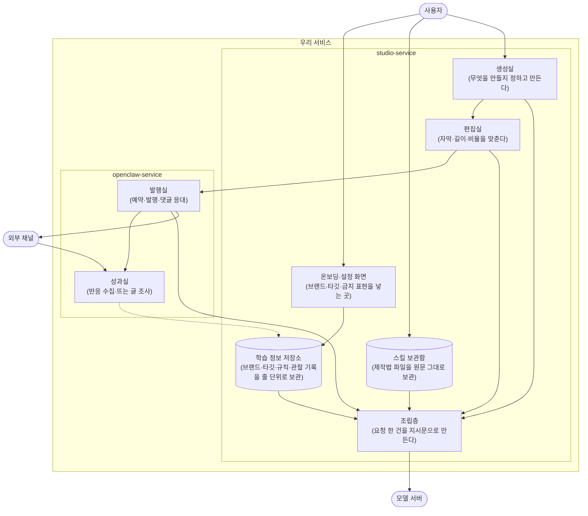

**조립층이 이 제품의 심장입니다.** 직접 할 때는 터미널 도구가 하던 일을 대신합니다.

| 직접 할 때 터미널 도구가 하던 일 | 우리 조립층이 하는 일 |
|---|---|
| 지침 파일 두 장을 읽어 시스템 자리에 넣는다 | 저장소에서 이번에 필요한 줄만 꺼내 글로 바꿔 넣는다 |
| 설치된 제작법의 이름표를 목록으로 넣는다 | 보관함에서 이름표만 꺼내 넣는다 |
| 모델이 요청하면 제작법 파일을 읽어 되돌려 준다 | 보관함에서 원문을 꺼내 그대로 실어 보낸다 |
| 명령을 실행하고 결과를 되돌려 준다 | 실행하고 결과를 실어 보낸다 |

**저장소에 줄 단위로 쌓아 둔 것이 요청마다 조립돼 나갑니다.** 이것이 프롬프트와 하네스 엔지니어링을 대신하는 실제 기술이고, 여기가 잘 돼야 제품이 섭니다.

### 3.2 studio 안에서

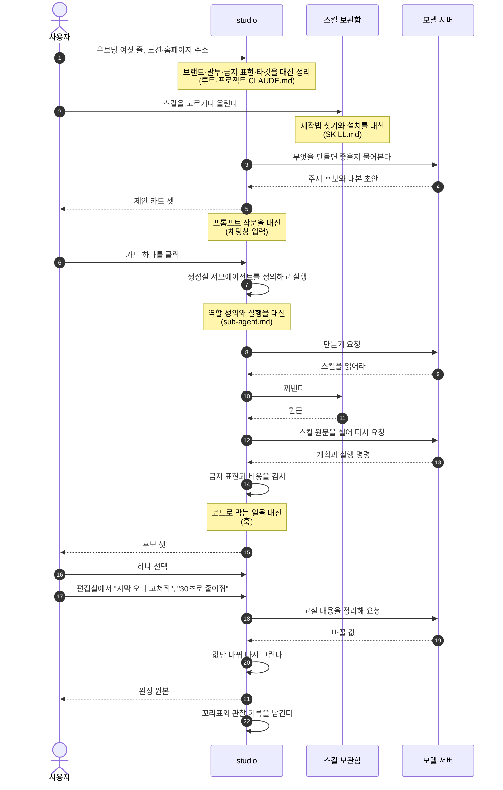

**제안 카드가 나오기 전에 모델을 한 번 다녀옵니다.** 무엇을 만들지도 우리가 정하기 때문입니다.

**편집실도 모델을 씁니다.** 자막을 직접 타이핑하게 하면 우리 타깃에게는 그것도 일입니다. 말로 시키면 우리가 정리해 값을 바꿉니다. 다만 이 왕복이 원가에 붙으므로 4장 계산에 넣었습니다.

#### 채널별 문구를 누가 쓰나

채널별 제목, 소개, 해시태그, 첫 댓글과 댓글 관리는 **발행실이 맡습니다.** 기준은 그 지식이 어느 쪽 데이터베이스에 사는가입니다. 채널 규격, 해시태그 성과, 댓글 관행 같은 플랫폼과 마케팅 지식은 openclaw가 갖기 때문입니다. 편집실은 콘텐츠 자체를 다룹니다. 영상 길이, 자막, 잘라내기, 비율입니다. studio는 플랫폼 규격에 맞춘 원본을 발행실로 보내며, 규격 자체는 저장하지 않고 요청 시점에 openclaw에서 받아 씁니다.

다만 **원본만 받고 직접 올리려는 사람**도 있습니다. 그 경우 원본과 선택한 채널별 문구를 함께 내려받을 수 있고, 실제 발행은 하지 않습니다.

#### studio 기술 과제

| 방 | 과제 | 왜 어려운가 |
|---|---|---|
| 생성실 | 좋은 지시문 쓰기 | 항목을 붙인다고 되지 않습니다 |
| 생성실 | 제안의 품질 | 무엇을 만들지 우리가 정하는데 뻔하면 안 씁니다 |
| 생성실 | 모델마다 다른 말투 | 같은 뜻인데 표기가 다르고 어떤 표기는 반대로 작동합니다 |
| 생성실 | 신규 사용자 | 프로필이 비면 무엇을 물어야 할지 모릅니다 |
| 편집실 | 미리보기와 최종 일치 | 다르면 편집실 신뢰가 무너집니다 |
| 편집실 | 말로 시키는 편집 | 손 편집 없이 원하는 결과를 내야 합니다 |
| 공통 | 스킬을 안전하게 돌리기 | 외부에서 온 스킬이 명령을 실행합니다 |

### 3.3 openclaw 안에서

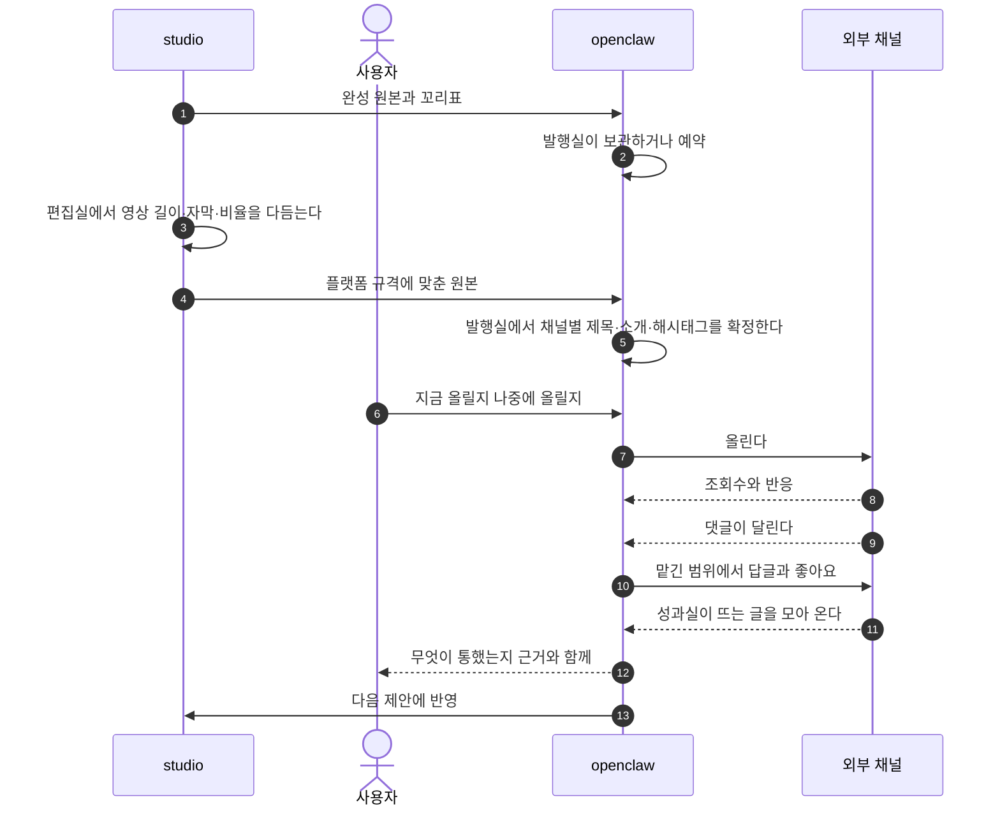

#### openclaw 기술 과제

| 과제 | 왜 어려운가 |
|---|---|
| 채널마다 다른 규칙과 한도 | 글자수, 해시태그 수, 호출 제한이 다르고 자주 바뀝니다 |
| 토큰 수명 관리 | 만료되면 예약이 조용히 실패합니다 |
| 응대 범위 정하기 | 어디까지 대신 답할지 잘못 잡으면 사고가 납니다 |
| 지표 정규화 | 채널마다 조회수 정의가 다릅니다 |
| 성과를 학습으로 잇기 | 꼬리표가 있어야 하고 표본이 모여야 합니다 |

### 3.4 학습 정보 계층과 조립층

이 절이 학습 정보 계층의 **원본**이다.
별도 계약 문서 v1.0과 v2.1은 이력과 기술설계 입력으로만 보존한다.
이 절은 무엇이 쌓이는지, 언제 네 방과 맞물리는지, 한 건의 요청으로 어떻게 조립되는지를 차례대로 보여 준다.
층의 뜻이나 우선순위를 바꾸려면 이 절과 §9 확정 원장을 먼저 고치고 회장과 합의한 뒤 하류 문서에 전파한다.

#### 3.4.1 학습 정보 계층

학습 정보는 오래 유지되는 안전선에서 매번 새로 생기는 요청까지 일곱 층으로 쌓인다. 아래 그림의 세로 스택은 무엇이 있고 얼마나 자주 바뀌는지를 보여 준다. 오른쪽 안전판은 일반 우선순위가 멈추는 예외와 `U2·U3` 판별 질문을 함께 보여 준다.

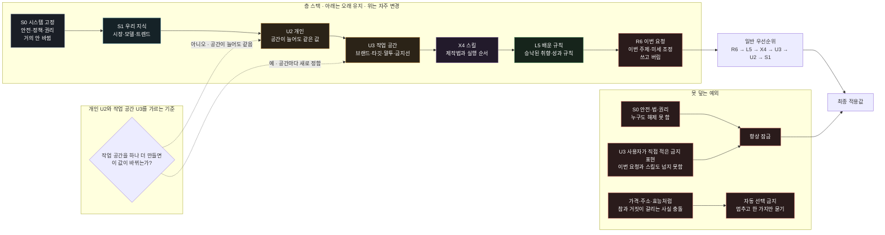

범위는 개인과 작업 공간 둘뿐이다. 브랜드 층을 따로 만들지 않는다. 한 사람이 여러 브랜드를 운영하거나 언어·취향을 갈라 쓰려면 **작업 공간을 추가하거나 복제한다.** 복제 뒤에는 두 공간이 서로 독립적으로 자란다.

| 칸 | 뜻 | 무엇이 담기나 | 언제 받나 | 누가 채우나 |
|---|---|---|---|---|
| `R6` 이번 요청 | 이번 한 번의 목표 | 주제, 원하는 결과, 이번 출력 언어, 이번만의 조정 | 요청할 때마다 | 사용자가 카드·선택지·대화로 |
| `L5` 배운 규칙 | 선택과 성과에서 자란 취향 | 잘 먹힌 훅, 선호한 구성, 반응이 좋았던 소재 | 사용과 성과가 쌓인 뒤 | 시스템이 후보를 만들고 사용자가 승낙 |
| `X4` 스킬 | 콘텐츠를 만드는 제작법 | 숏폼 구성법, 카드뉴스 순서, 영상 장면 조립법 | 필요할 때 고르거나 올림 | 우리가 제공하고 사용자도 추가 |
| `U3` 작업 공간 | 이 공간만의 브랜드와 목표 | 브랜드 사실, 금지 표현, 말투, 타깃, 컨셉, 언어, 채널 갈래, 반입 문서 요약 | 공간을 만들 때 조금, 쓰면서 보강 | 사용자와 담당이 함께 |
| `U2` 개인 | 공간이 늘어도 같은 사용자 기본값 | 화면 언어, 시간대, 알림 방식, 기본 자동화 정도, 마케팅 설명 수준 | 가입 때 최소한 | 사용자 |
| `S1` 우리 지식 | 우리가 쌓은 시장·모델 지식 | 시장별 문법, 모델별 특성, 유효기간이 있는 트렌드 신호 | 출시와 운영 중 계속 | 우리 서비스 |
| `S0` 시스템 고정 | 누구도 넘지 못하는 안전선 | 법·플랫폼 정책, AI 표기, 저작권·소재 권리, 계정 격리 | 출시 전, 정책 변경 때 | 우리 서비스. 사용자는 덮지 못함 |

**앞글자는 누가 바꾸는지를 뜻한다.** `S`는 서비스, `U`는 사용자, `X`는 우리와 사용자가 함께 채우는 스킬, `L`은 배워서 자라는 규칙, `R`은 이번 요청이다. 이름은 회장이 확정한 앞글자 방식을 그대로 쓴다.

판별 문장은 하나다.

> **작업 공간을 하나 더 만들면 이 값이 바뀌는가?** 안 바뀌면 개인 정보 `U2`, 바뀌면 작업 공간 정보 `U3`다.

**스킬은 층이지만 전권은 아니다.** 구조, 장면 순서, 길이, 컷 수, 화면 비율처럼 어떻게 만들지를 정한다. 사용자가 정한 브랜드 사실과 금지 표현은 바꿀 수 없다. 우리가 제공한 스킬은 원문을 보존하고, 사용자가 올린 스킬은 안전·권리 검사를 통과해야 한다. 검사 방법과 실행 권한은 기술설계에서 정한다.

이 그림은 다섯 문장으로 읽는다.

1. `S0` 안전·법·권리 규칙은 어떤 층도 덮지 못한다.
2. 사용자가 작업 공간에 직접 적은 금지 표현은 이번 요청과 스킬도 넘지 못한다.
3. 그 밖에는 `R6 → L5 → X4 → U3 → U2 → S1` 순으로 더 구체적인 값이 이긴다.
4. 브랜드 사실처럼 참과 거짓이 갈리는 값이 충돌하면 자동으로 고르지 않고 묻는다.
5. 개인과 작업 공간이 헷갈리면 작업 공간을 하나 더 만들 때 바뀌는지만 묻는다. 다른 판별 기준은 추가하지 않는다.

#### 3.4.2 학습 정보 도식화

학습 정보는 가입 때 한꺼번에 받는 설문이 아니다. 서비스가 미리 준비한 층, 사용자가 처음 주는 층, 만들고 고치고 발행한 뒤에 쌓이는 층이 서로 다른 시점에 들어온다. 아래 두 그림은 시간의 순서와 네 방의 읽기·쓰기 경계를 나눠 보여 준다.

##### 가. 가입 전부터 반복 사용까지의 시간축

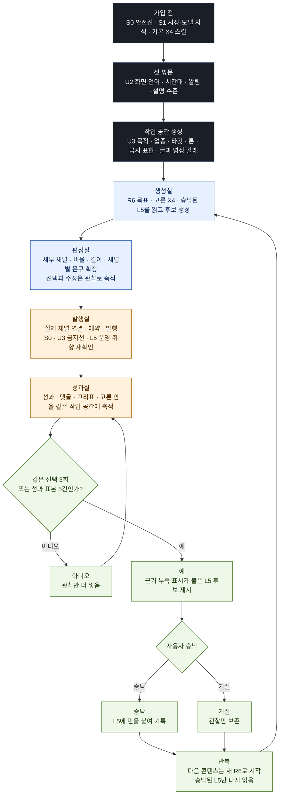

첫 사용자는 채널을 연결하지 않아도 만든다. 처음에는 글·영상 갈래만 받고 세부 채널은 편집실에서 정한다. 실제 계정 연결은 발행할 때 받는다. 같은 선택 3회 또는 비교 가능한 성과 표본 5건은 자동 학습 기준이 아니라 후보를 꺼내 보여 줄 최소 시작점이다. 후보에는 반드시 근거 부족을 표시하고, 사용자 승낙 전에는 다음 생성·편집·발행에 적용하지 않는다.

##### 나. 일곱 층과 네 방의 맞물림

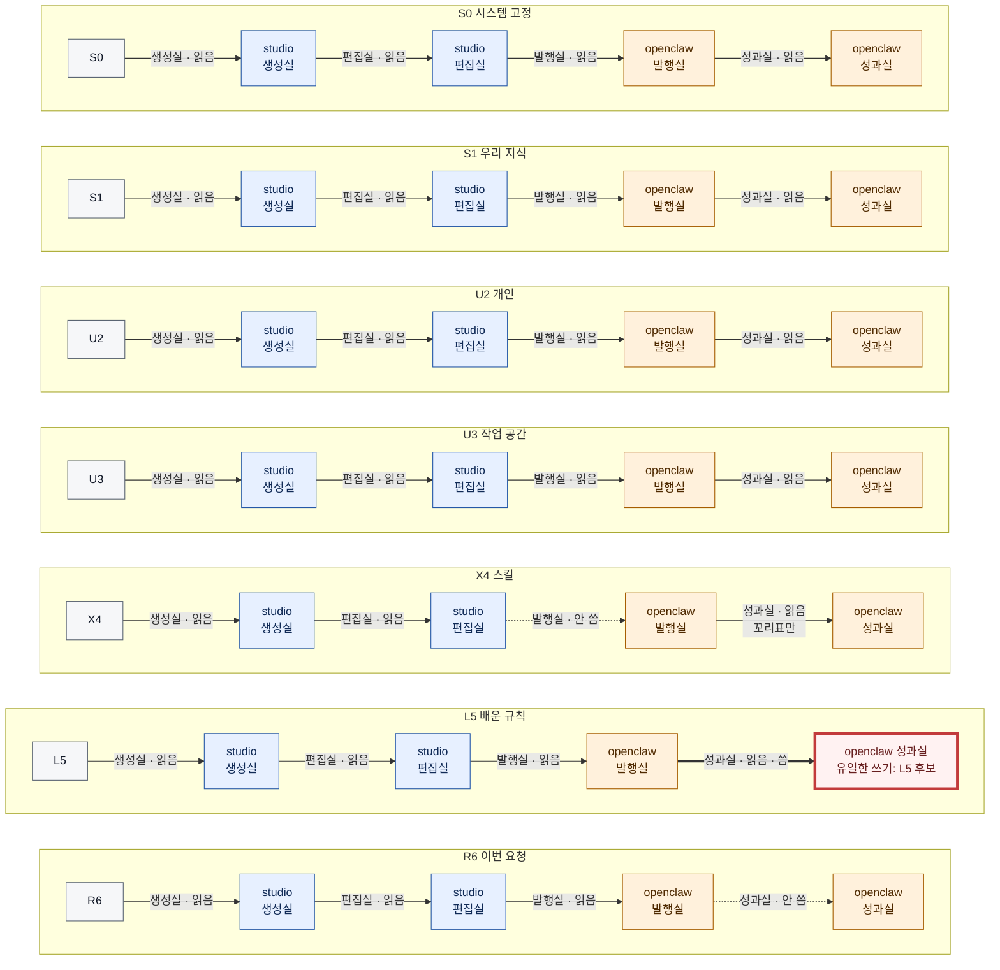

선의 “씀”은 결과물을 만든다는 뜻이 아니라 학습 정보 층의 값을 새로 기록하거나 바꾼다는 뜻이다. `S0·S1·U2·U3·X4`의 원본 수정은 네 방 밖의 정책 배포 또는 학습 정보 관리에서 일어난다. 발행실은 `X4` 원문을 쓰지 않으며 `S0` 안전선과 `U3` 금지 표현을 읽기만 한다. 확정된 발행 준비본을 자기 판단으로 고치지 않는다.

합친 상품에서는 성과실만 선택 관찰·성과·꼬리표를 모아 `L5` 후보를 쓴다. 생성실과 편집실은 선택과 수정 관찰을 남기지만 직접 `L5`를 쓰지 않는다. studio 단독 상품에는 openclaw 성과실이 없으므로 studio 안의 별도 학습 담당이 같은 역할을 한다. 같은 선택 3회부터 후보를 보여 주되 성과 5건 조건은 채널 성과가 연결된 경우에만 쓴다. 어느 경우든 사용자 승낙 뒤에만 `L5`로 기록한다.

#### 3.4.3 조립층 도식화

조립층은 일곱 층을 한 문서로 이어 붙이는 곳이 아니다. 현재 작업 공간에 유효한 값만 꺼내고, 금지선과 충돌을 해결하고, 스킬과 본보기를 보존한 채 모델이 읽을 최종 요청 한 건으로 만드는 과정이다. 저장 방식·통신 규격·재시도 수는 기술설계에서 정한다.

##### 가. 한 건의 요청을 만드는 조립 파이프라인

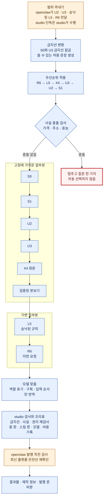

고정 앞부분에서 `X4` 스킬 원문은 요약하거나 다시 쓰지 않는다. 본보기는 이번 형식과 가까운 검증본만 붙이고 경쟁사 원문과 권리가 불명확한 자료는 제외한다. 모델 맞춤 단계는 모델마다 다른 역할 표기와 구획, 입력 순서만 바꾼다. 이미 확정된 뜻과 금지선, 스킬 원문은 바꾸지 않는다.

앞부분과 뒷부분의 경계는 품질과 원가를 함께 지키는 자리다. OpenAI·Anthropic·Google의 공식 문서는 반복되는 큰 내용을 앞에 두고 요청마다 달라지는 내용을 뒤에 두는 방식을 캐시 재사용에 유리하다고 설명한다. 다만 같은 작업 공간에서도 스킬이나 본보기가 바뀌면 앞부분이 달라질 수 있다. 캐시 이득은 보너스로만 계산하고, 캐시가 한 번도 안 돼도 상품 원가가 남도록 잡는다.

##### 나. studio와 openclaw가 주고받는 때

이 그림은 조립 순서를 다시 설명하지 않는다. 사용자가 한 건을 요청한 순간부터 누가 언제 무엇을 건네고, 성과가 언제 다음 요청의 `L5`로 돌아오는지만 보여 준다.

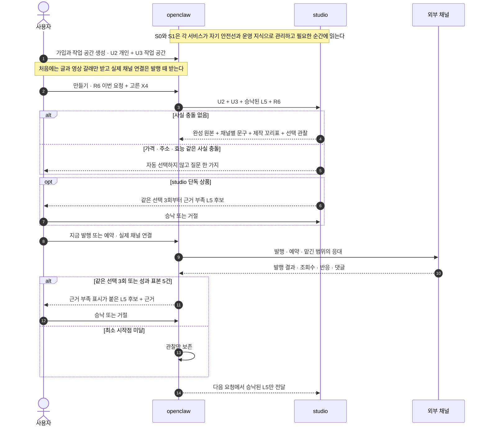

studio가 openclaw에 돌려주는 제작 꼬리표에는 사용한 층 판, `X4` 스킬 판, 모델, 비용이 들어간다. openclaw는 `X4` 원문을 실행하지 않고 스킬 이름과 판만 성과에 연결한다. 합친 상품의 성과실은 후보와 승낙 이력을 관리하고, studio 단독의 별도 학습 담당은 선택 근거만으로 같은 역할을 한다. 어느 쪽이든 거절된 후보는 관찰로만 남고 규칙으로 자라지 않는다.

성과실에서 비슷한 것 만들기를 누르면 지난 `R6`를 되살리지 않는다. 새 `R6`로 생성실을 다시 연다. 조립층은 그 새 요청에 필요한 값만 꺼내고, 결과물에는 어느 층의 어떤 값과 어떤 스킬을 썼는지 꼬리표를 붙인다. 그래야 결과가 이상할 때 원인을 찾고, 성과가 나왔을 때 무엇이 통했는지 되짚을 수 있다.

도식 문법은 Mermaid 공식 [flowchart 문법](https://mermaid.js.org/syntax/flowchart.html)의 subgraph와 선 라벨, 공식 [sequenceDiagram 문법](https://mermaid.js.org/syntax/sequenceDiagram.html)의 참여자·분기·선택 구문을 기준으로 검증한다.

#### 필라테스 원장에게 실제로 보이는 방식

박수진 원장은 가입할 때 화면 언어와 알림 방식만 정한다(`U2`). “수진 필라테스 한국어” 작업 공간을 만들면서 재활 중심, 30대 여성, 과장 표현 금지, 해요체, 인스타그램과 짧은 영상 갈래를 정한다(`U3`). “산후 회복 회원 모집”을 누르면 이번 목표와 원하는 길이가 붙고(`R6`), 숏폼 제작법(`X4`)과 이전에 승낙한 “첫 장면에 회원의 일상 불편을 먼저 보여 준다”는 규칙(`L5`)이 합쳐진다.

영어권 회원을 따로 모집하려면 브랜드 층을 새로 만드는 대신 “수진 필라테스 영어” 작업 공간을 복제한다. 로고와 사실은 복사하되 영어 표현과 금지선, 타깃, 학습 규칙은 복제 뒤 따로 자란다. 한국어 공간에서 질문형 첫 문장이 잘됐다고 영어 공간에 자동으로 옮기지 않는다. 옮기고 싶으면 공간을 복제할 때 선택하거나, 나중에 담당이 근거와 함께 제안하고 원장이 승낙한다.

#### 왜 이 순서가 원가인가

안 바뀌는 값이 요청의 앞부분에 오래 유지되면 모델 제공사의 프롬프트 캐시가 같은 앞부분을 재사용할 수 있다. OpenAI는 이전 요청과 같은 가장 긴 앞부분을 캐시한다고 설명하고, Anthropic과 Google도 공통 내용을 앞에 두고 같은 접두부를 유지하라고 안내한다. Docker도 덜 바뀌는 층을 먼저 두면 뒤쪽 변경이 앞쪽 캐시를 깨지 않는다고 권고한다. 층계의 아래를 안정적으로 두는 이유가 여기에 있다.

다만 요금제는 캐시가 한 번도 안 먹어도 남는 구조로 계산한다. 캐시는 이익과 속도 개선으로만 잡는다. 모델이 바뀌거나 접두부가 달라지면 캐시가 사라질 수 있기 때문이다.

안정된 층을 앞에 두면 반복 요청의 입력 비용과 대기시간을 낮출 가능성이 커진다. 작업 공간별로 값을 묶으면 다른 브랜드·언어가 섞여 재생성하는 비용을 줄인다. 결과에 제작 정보를 붙이면 실패 원인을 찾아 전체를 다시 만드는 대신 필요한 값만 고칠 수 있다. 캐시 없이 가격을 계산해야 벤더 변경이나 장애가 생겨도 마진 가정이 무너지지 않는다.

#### 자동 조립이 못 이기는 자리

사람이 직접 프롬프트를 쓰는 과정은 결과를 보고 다시 고치는 반복이다. 조립층은 그 반복을 전부 미리 알 수 없다. 그래서 후보 셋, 편집실, 사용자 승낙은 편의 기능이 아니라 품질 장치다.

아홉 축 분류표, 열두 칸 조건표, 목소리 여섯 칸, 서비스 간 동기화, 개정 대조표, 하류 영향표는 이 사업계획에 넣지 않는다. 필요하면 기술설계가 이 절의 약속을 구현하는 방법으로 다시 쓴다.

### 3.5 우리가 무엇을 자동화하는가 (Claude Code 와의 대응)

**판정:** 회장의 이해는 구조적으로 맞다. Claude Code가 프로젝트 지침, 스킬, 현재 대화와 도구 결과를 조립해 모델에 보내고 다음 행동을 반복하듯, OSMU도 학습 정보와 이번 요청을 조립해 제한된 도구 반복을 만든다. 다만 앱 한 덩어리가 Claude Code를 복제하는 것은 아니다. 조립층은 모델 입력 맥락 구성, OpenClaw Gateway와 Agent는 도구 반복, 네 방은 업무 상태와 사람 승낙, studio는 생성·편집 실행을 맡는다. 근거는 Anthropic의 [Claude Code 동작 설명](https://code.claude.com/docs/en/how-claude-code-works)과 [Claude Code prompt caching 설명](https://code.claude.com/docs/en/prompt-caching)이다.

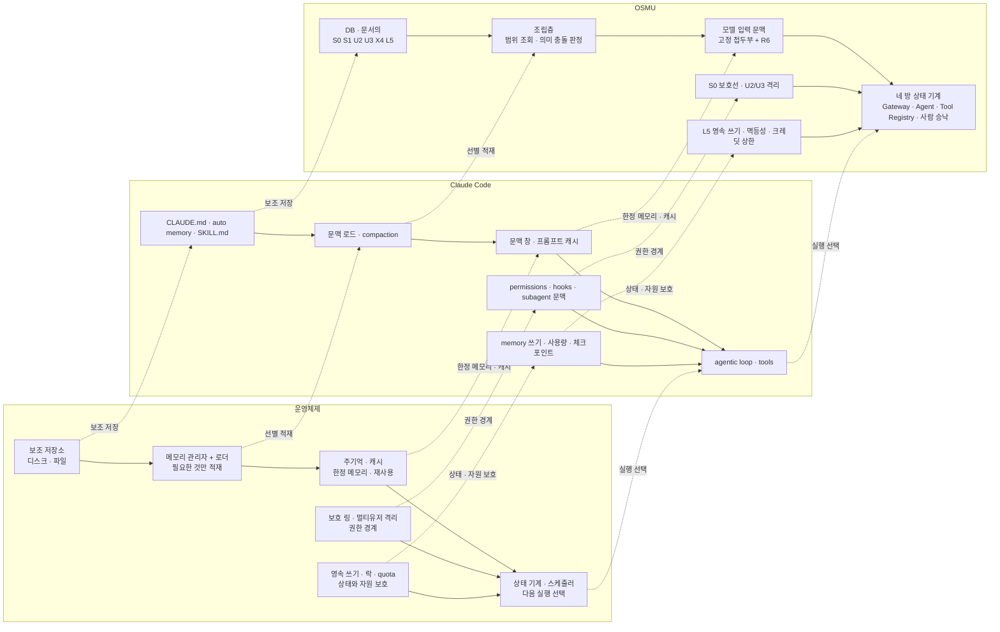

#### 같지 않은 다섯 가지

1. **코드 저장소와 세션, 고객 계정과 작업 공간.** repo는 코드 저장소, session은 한 번의 작업 대화, tenant는 고객 계정 격리 단위, workspace는 브랜드·언어·취향별 작업 공간이다. Claude Code는 local, cloud, Remote Control을 지원하므로 한 사람의 한 기계라고 단정할 수 없다. 차이는 코드 저장소와 세션 중심 에이전트인지, 고객 계정과 작업 공간을 격리하는 소비자 SaaS인지다.
2. **개발 환경 정책과 소비자 제품 안전선.** Claude Code도 조직 관리 지침과 강제 설정을 지원한다. OSMU의 `S0`는 플랫폼 정책, 저작권, AI 표시, 고객 격리를 사용자 작업 공간보다 위에서 강제하는 제품 계약이다.
3. **자유 도구 반복과 네 방의 좁은 상태기계.** Claude Code는 과업에 따라 파일·셸·웹 도구를 넓게 조합한다. OSMU는 생성실·편집실·발행실·성과실로 상태를 좁히고 발행과 학습 적용에 사람 관문을 둔다.
4. **auto memory와 증거·승낙형 `L5`.** Claude Code에도 사용자 교정과 프로젝트 맥락을 세션 간 저장하는 [auto memory](https://code.claude.com/docs/en/memory)가 있다. `L5`의 차이는 같은 선택 3회 또는 성과 5건, 근거 부족 표시, 사용자 승낙, 작업 공간 격리, 되돌리기를 한 계약으로 묶는 것이다.
5. **개발 검증과 외부 성과 되먹임.** Claude Code는 테스트와 도구 결과로 현재 과업을 검증한다. OSMU는 발행 뒤 반응과 제작 정보를 연결해 다음 요청의 규칙 후보를 만들되, 상관관계를 원인으로 단정하지 않고 승낙 전 후보로만 둔다.

#### 가장 강한 반론과 답

> 그냥 Claude Code에 GUI를 씌운 것이라면 Anthropic이 같은 GUI를 내는 순간 OSMU는 끝난다.

이 위험은 이미 일부 현실이다. Anthropic은 Claude Code Desktop, `claude.ai/code`, IDE, Remote Control을 제공하며 [Desktop](https://code.claude.com/docs/en/desktop)은 CLI와 같은 엔진을 그래픽 화면으로 실행한다. 따라서 우리 가치가 터미널을 숨기는 데 그치면 방어력은 약하다.

우리 답은 GUI가 아니다. 작업 공간별 `S0 S1 U2 U3 X4 L5 R6` 데이터 계약, 고객 계정 격리와 감사, 네 방의 상태기계와 사람 승낙, 채널 연결·예약·중복 방지·발행 증거, 제작 정보와 외부 성과를 잇는 `L5`가 답이다.

다만 이 답은 아직 설계 답이다. 구현현황과 §6의 판정대로 일곱 층과 `L5` 승낙 제품 경로는 미구현 또는 부분구현이다. 첫 작업 공간들이 생성·편집·발행·성과·승낙의 두 회차를 실제로 끝내기 전에는 사업 해자라고 주장하지 않는다.

기술 상세, 공식 근거, 선행 성공·실패 사례는 [Claude Code와 OSMU의 대응](../wiki/architecture/claude-code-와-osmu-대응.md)에 둔다.

### 3.6 다른 팀에서 배운 비용 최적화 (2026-08-21 실물 분석)

국내 한 AI 영상 서비스가 중국 전문 제작팀의 프롬프트 구조를 공개했습니다. 그 팀들이 자기 서비스를 어뷰징하다 남긴 것을 분석한 내용입니다. **핵심은 품질을 올리는 기법이 아니라 다시 만드는 횟수를 줄이는 기법**입니다.

| 그들이 하는 것 | 무엇을 노리나 | 우리가 가져올 것 |
|---|---|---|
| **완벽한 일관성 대신 90퍼센트를 한 번에** | 다시 뽑는 비용을 줄이는 것이 프롬프트 설계의 목표 | 우리 원가의 대부분이 영상 생성이므로 목표가 같다. 합격선을 완벽이 아니라 **한 번에 쓸 만한 수준**으로 잡는다 |
| **형용사 대신 상대 비율 수치** | 칼이 번쩍인다고 쓰지 않고 금속 광택 1.5, 피부 0.5, 천 0.3처럼 재질 간 비율로 지시. 절대값이 아니라 비율이라 몇 번을 만들어도 관계가 유지된다 | **우리 일곱 칸 중 스타일 칸을 형용사가 아니라 수치 비율로 표준화한다.** 재현성이 오르고 다시 뽑는 일이 준다 |
| **시작과 끝 상태를 글로 고정** | 참고 이미지를 안 넣고 각 인물의 시작 상태와 끝 상태를 한 줄씩 적는다. 컷 사이 연결을 사람이 안 봐도 된다 | 우리 장면 정보 문서에 **끝 상태 칸**을 둔다 |
| **다음 편으로 넘길 내용까지 프롬프트가 만들게 한다** | 첫 생성 한 번이면 다음 영상의 첫 장면과 첫 대사와 인물 상태 변화가 연쇄로 전달된다. 사람이 확인하는 병목이 사라진다 | **이것이 가장 큰 배움입니다.** 우리 예약 자동 운영과 정확히 맞물립니다. 한 편을 만들 때 다음 편의 시작점을 같이 남기면 시리즈가 저절로 이어집니다 |
| **연출 대신 더빙으로 흐름을 끈다** | 카메라와 구도에 프롬프트를 거의 안 쓰고, 음색과 성격은 인물에 고정된 상수로, 상태와 어조는 컷마다 바뀌는 변수로 나눈다 | **우리 층 구조와 같은 사고입니다.** 음색은 계정 공통 칸에, 어조는 이번 요청 칸에 두면 그대로 맞아떨어집니다 |
| 참고 이미지의 얼굴을 일부러 훼손 | 모델이 얼굴을 그대로 베끼지 않게 만들어 클로즈업 디테일을 살린다 | 고정 얼굴을 쓰는 브랜드에 쓸 수 있는 기법. 다만 우리 타깃에게는 우선순위가 낮다 |

**그들이 하는 것 중 우리가 안 할 것도 분명합니다.** 그 팀들은 방영 중인 시리즈의 대사를 그대로 붙여 쓰고 미공개분을 만들고 있었습니다. 저작권 침해입니다. 우리는 안 합니다.

**부수적으로 얻은 경고 하나.** 그 서비스는 이 사실을 **어뷰징으로 다섯 시간에 수천만원어치를 털리고 나서** 알았습니다. 크레딧을 주는 서비스는 봇이 붙으면 그렇게 됩니다. 우리 요금제에 계정별 상한을 두기로 한 이유가 여기서 한 번 더 확인됩니다.

---

## 4. 비즈니스 모델

### 4.1 무엇을 만드는가

콘텐츠 종류를 좁히지 않습니다. 숏폼과 카드뉴스로 시작하되 **글과 음악과 그 밖의 창작물까지** 같은 구조로 열어 둡니다. 만드는 것이 무엇이든 브랜드 규칙과 스킬과 조립층은 같습니다.

### 4.2 콘텐츠 한 편 원가

| 상품 | 구성 | 생성 비용 |
|---|---|---|
| 카드뉴스 | 최소 | 약 130원 |
| 카드뉴스 | 고품질 | 약 420원. 묶어 돌리면 약 250원 |
| 30초 숏폼 | 이미지에 움직임을 주는 구성 | 약 265원 |
| 30초 숏폼 | 실제 영상 클립 네 컷 | 약 3,400~4,600원 |
| 30초 숏폼 | 최상급 영상 모델 | 약 23,800원 |
| 30초 숏폼 | **소재 엮기**(생성 없이 기존 소재를 이어 붙임) | **약 수백 원** |
| **무료 실제 영상 1편** | **세로 1080×1920, 30fps, 90초 안팎, 컷 1초 안팎. 권리가 정리된 소재를 엮고 대본·음성·자막·타이틀을 만들어 실제 영상 파일로 렌더** | **약 900~1,500원 가설. 30초 소재 엮기 300~500원을 길이에 비례해 세 배 잡은 파일럿 예산이며 실측 전** |

**소재 엮기를 옵션으로 둡니다.** 경쟁사 결과물을 분석해 보니 영상을 만들지 않고 기존 동영상 조각을 1초 안팎으로 이어 붙이고 자막과 타이틀만 얹고 있었습니다. 원가가 열 배 이상 쌉니다. 다만 그들은 남의 저작물을 쓰고 있어 위험을 안습니다.

**우리는 저작권이 정리된 소재만 씁니다.** 사용자가 올린 자기 소재, 우리가 확보한 라이선스 소재, 사용이 허용된 공개 소재. 소재 폭이 좁아 결과물이 밋밋해질 수 있고 그건 감수합니다. 대신 고객에게 위험을 넘기지 않습니다.

**무료 영상은 미리보기가 아니라 실제 완성본 한 편이다.** 시그마인 실물과 같은 규격인 세로 `1080×1920`, `30fps`, `90초 안팎`, `1초 안팎 컷`까지 무료 범위로 준다. 워터마크 미리보기까지만 주자는 v1.1 추천안 A는 회장 결정으로 폐기됐다. 다만 “실제 영상”이 “최상급 영상 생성 모델을 무료로 무제한 호출한다”는 뜻은 아니다. 권리가 정리된 소재를 실제로 조립·렌더한 완성본까지가 무료이고, 더 긴 영상·추가 편수·고가 영상 생성 모델은 유료다.

무료 한 계정의 변동 생성원가 예산은 우선 **1,650~2,250원**으로 잡는다. 카드뉴스 세 편을 묶음 고품질 단가 250원으로 계산한 750원에, 90초 실제 영상 900~1,500원을 더한 값이다. 대화 왕복·저장·전송·고객 응대는 아래 운영비라 이 숫자에 아직 안 들어갔다. 따라서 무료 전환율을 보기 전에 “무료라 원가가 거의 0”이라고 가정하면 안 된다. 첫 파일럿에서 실제 렌더·음성·저장 원가를 편당 기록하고 이 범위를 교체한다.

**여기에 더 붙는 것이 있습니다.**

| 항목 | 성격 |
|---|---|
| 대화 왕복 | 제안 만들 때 한 번, 만들 때 두세 번, 편집 지시할 때마다 한 번 |
| 작업 공간 서버 | 스킬이 파일을 읽고 명령을 돌리는 시간만큼 |
| 저장과 전송 | 완성물과 소재를 들고 있어야 합니다 |
| 세금과 결제 수수료 | 표시가의 약 12~13퍼센트 |
| 응대 비용 | 사람이 붙는 문의. 사용자가 늘수록 |

**두 가지가 분명합니다.** 카드뉴스와 숏폼의 원가 차이가 최대 스무 배라 하나로 묶으면 무너집니다. 그리고 숏폼 원가의 대부분이 영상 생성 하나입니다.

### 4.3 요금제

| 플랜 | 표시가(월) | 기본 작업 공간 | 포함 편수 | 목적 |
|---|---|---|---|---|
| 무료 | 0원 | **1개** | 카드 3편 + **실제 영상 1편**. 1080×1920, 30fps, 90초 안팎, 1초 안팎 컷까지 | 미리보기가 아니라 실제 납품물로 품질을 확인하게 한다 |
| 스타터 | 19,900원 | **1개** | 카드 20편 + 기본 실제 영상 3편 | 한 브랜드를 조금씩 굴려 보게 한다 |
| 프로 | 99,000원 | **3개** | 카드 100편 + 기본 실제 영상 20편 + 다채널 트렌드 조사 | 여러 브랜드·언어·취향을 분리해 본격적으로 쓰게 한다 |
| 기업 | 390,000원부터 | **협의** | 카드 400편 + 기본 실제 영상 100편 + 최상급 영상 옵션 | 계정과 채널이 많은 곳. 실제 사용량에 맞춰 시작가 위로 견적 조정 |

초과 작업 공간은 월 추가 요금으로 판다. 정확한 월 단가는 공간별 저장·성과 분리·지원 시간을 파일럿에서 잰 뒤 요금 운영표에 확정한다. 이번 확정 범위는 무료·스타터 1개, 프로 3개, 기업 협의, 초과 공간은 무료가 아니라 월 과금이라는 원칙까지다.

추가 결제는 카드뉴스 한 편 700원, 기본 실제 영상 한 편 3,900원, 최상급 영상 숏폼 29,000원, 충전 팩 5만원부터입니다. 발행은 크레딧을 쓰지 않고 값만 바꾸는 재렌더도 크레딧을 쓰지 않습니다. 기본 실제 영상은 위 무료 규격과 같은 소재 엮기·대본·음성·자막·타이틀·렌더 묶음이고, 고가 영상 생성 모델은 별도 상품이다.

무료 영상 결정 뒤에는 옛 “다 쓰면 2.3~2.7배” 문장을 유지할 수 없다. 카드뉴스 묶음 단가 250원과 기본 실제 영상 900~1,500원 가설로 다시 계산하면 이렇다.

- 무료: 카드 750원 + 영상 900~1,500원 = **1,650~2,250원**. 지원·저장 전 원가다.
- 스타터: 카드 5,000원 + 영상 2,700~4,500원 = **7,700~9,500원**. 표시가에서 세금·결제비 13퍼센트를 뺀 17,313원 기준 잔여는 **7,813~9,613원**이다.
- 프로: 카드 25,000원 + 영상 18,000~30,000원 = **43,000~55,000원**. 같은 방식의 잔여는 **31,130~43,130원**이다.
- 기업 시작가: 카드 100,000원 + 영상 90,000~150,000원 = **190,000~250,000원**. 같은 방식의 잔여는 **89,300~149,300원**이다. 기업 지원 시간이 크면 시작가 390,000원으로는 부족하므로 실제 견적을 사용량과 지원 범위에 맞춘다.

이 잔여는 이익이 아니다. 모델 대화, 서버, 저장·전송, 환불, 고객 응대가 빠져 있다. 특히 기업 시작가는 영상 원가가 범위 상단이면 표시가 대비 생성원가가 1.56배뿐이다. 그래서 포함 편수를 다 쓰는 사용자를 손해 고객으로 취급하지 않고도 남도록 실제 원가를 파일럿에서 먼저 측정하고, 상단 원가가 반복되면 포함 영상 수 또는 시작가를 요금 운영표에서 조정한다.

### 4.4 이 구조가 무너지는 지점

**원가의 서너 배라는 기준선은 이 사업에서 안전장치가 아닙니다.** 보통 소프트웨어는 한 명이 더 써도 비용이 거의 안 늘지만 우리는 쓰는 만큼 그대로 나가고 상품 간 차이가 스무 배입니다. 프로 요금제에서 전부 최상급 영상에 몰아 쓰면 원가가 요금을 넘습니다.

| 진짜 안전장치 | 무엇 |
|---|---|
| 상품별 크레딧 분리 | 카드뉴스 몫과 숏폼 몫을 서로 바꿔 쓰지 못하게 |
| 계정별 상한 | 요금제 한도의 1.5배에서 강제로 막는다 |
| 비싼 모델 격리 | 최상급 영상은 요금제에 안 넣고 추가 결제로만 |
| **무료 실제 영상 1편 하드캡** | 한 계정·한 작업 공간의 첫 1편만 실제 렌더한다. 미리보기로 대체하지 않되 재가입·짧은 시간 다계정 호출·동일 소재 반복을 탐지하고 추가 생성은 결제 뒤 연다 |
| **봇 어뷰징 방어** | 가입 즉시 무료 크레딧을 몰아 쓰지 못하게 하고, 짧은 시간에 몰리는 호출을 막는다. 한 국내 서비스가 다섯 시간에 수천만원을 털렸다 |

### 4.5 어떻게 알릴 것인가

| 순서 | 무엇 | 왜 |
|---|---|---|
| 1 | 우리 사업체들 콘텐츠를 우리 도구로 만들어 발행 | 우리가 첫 사용자다. 결과물이 곧 증거다 |
| 2 | 그 콘텐츠 자체를 마케팅 소재로 | 이 콘텐츠는 우리 도구로 만들었다고 밝힌다 |
| 3 | **우리가 운영하는 바이브 코딩 커뮤니티에 먼저 연다** | 만들 줄은 아는데 알리질 못하는 사람들이 모여 있다. 첫 사용자를 찾으러 나갈 필요가 없다 |
| 4 | 인플루언서 제휴 | 만들어 쓰는 사람들이 먼저 반응한다 |
| 5 | 퍼포먼스 광고 | 시장성이 확인된 뒤에 |
| 6 | 마케터와 대행사 대상 영업 | 그들에게는 대체가 아니라 도구다 |

**대행사를 적으로 두지 않고 고객으로도 둡니다.**

### 4.6 로드맵

| 단계 | 무엇 | 끝났다는 증거 |
|---|---|---|
| 1 | studio 생성 기획과 기술 설계 | 요청 봉투 계약이 서고 양쪽이 같은 판을 가리킴 |
| 2 | studio API 개발 | 카드뉴스 한 편이 사람 손 없이 끝까지 나옴 |
| 3 | openclaw 화면을 붙여 우리 사업체에 적용 | 우리 채널에 우리 도구로 만든 것이 발행됨 |
| 4 | 성과가 규칙을 바꾸는지 검증 | 같은 조건에서 신호가 잡히는지 실측 |
| 5 | **운영까지 묶은 상품을 판다** | 자영업자와 대행사가 첫 고객 |
| 6 | **만들기 단독 상품을 연다** | 음악과 소설과 영상 창작자에게 studio만 |
| 7 | 프로덕트 빌더 | 기획·디자인·개발·인프라·검수를 같은 방식으로 추상화한 별도 제품 |
| 8 | 검수 자매 제품 | 이미 만든 제품의 성능·보안·확장·검색 노출을 점검하고 마케팅 전략까지 제시 |

**다섯째와 여섯째의 순서가 중요합니다.** 마케팅에 이미 돈을 쓰는 사람에게 먼저 팔고, 그다음 만들기만 필요한 사람에게 엔진을 엽니다. 일곱째와 여덟째는 같은 고민을 가진 다른 집단입니다.

---

## 5. 자주 나올 질문

### 왜 지침을 파일이 아니라 항목으로 저장하나

| 상황 | 파일 한 장이면 | 항목으로 쪼개면 |
|---|---|---|
| 한 줄만 고치기 | 문서 전체를 다시 씀 | 그 줄만 |
| 어디서 나온 줄인지 | 알 수 없음 | 8월 10일 선택에서 나왔다고 붙여 둠 |
| 되돌리기 | 통째로 | 그 줄만 |

### 꼬리표가 무슨 말인가

만든 결과물에 무엇으로 만들었는지 붙여 두는 쪽지입니다.

```
이 영상: 후보 B / 스킬은 숏폼 제작 3판 / 훅은 질문형 / 규칙 7판 / 8월 20일
```

성과가 나왔을 때 무엇 덕분인지 되짚기 위한 것이고 나중에 소급해서 못 붙입니다.

### 스킬을 우리가 고치면 안 되나

안 고칩니다. 앞에 붙는 값만 만듭니다.

### 프롬프트 엔지니어링이 사라지는 것인가

사용자 쪽에서만 사라집니다. **우리가 대신 짊어집니다.**

---

## 6. MVP와 현재 구현 상태

### 6.1 One Thing을 증명하는 MVP 다섯 개

| MVP | One Thing과 연결되는 이유 | 고객이 받는 결과 | 현재 상태 | 현재 상태의 1차 출처 |
|---|---|---|---|---|
| **MVP 1. 작업 공간과 학습 정보** | 브랜드 맥락을 매번 다시 설명하지 않게 한다 | 개인 기본값과 작업 공간별 브랜드·타깃·말투·금지선을 보고 고친다. 새 브랜드·새 취향은 공간을 추가하거나 복제한다. 무료·스타터 1개, 프로 3개, 기업 협의로 경계를 이해한다 | **부분구현.** workspace 격리와 브랜드 자료 경로는 있으나 이 문서의 일곱 층·복제·플랜별 상한·승낙 화면은 제품 코드로 확인되지 않음 | [구현현황](구현현황.md), [Studio 현황](../wiki/product/studio.md), [두 서비스 경계](../wiki/architecture/two-service-boundary.md) |
| **MVP 2. 근거 있는 제안·생성·편집** | 무엇을 만들지 모르는 고객의 백지 공포를 대신 짊어진다 | 담당이 근거와 후보를 먼저 보여 주고, 사용자는 카드 또는 대화로 고른 뒤 결과를 편집한다 | **이미구현 기반 있음. 재구현 금지.** Studio 텍스트 생성·초안 저장·편집·시각 미리보기와 영상 경로가 존재한다. 새 설계는 이 위에 제안·대화 흐름을 연결해야 함 | [구현현황](구현현황.md), [Studio 제품 위키](../wiki/product/studio.md), `dashboard/src/app/studio/page.tsx` |
| **MVP 3. 채널별 발행 준비본** | 한 원본을 채널마다 다시 고치는 노동을 없앤다 | 편집실에서 비율·길이를 맞추고, 발행실에서 채널별 제목·소개·해시태그를 확정한다 | **부분구현.** 7개 시각 미리보기와 4개 직접 발행 대상이 있으나 R132의 발행실 소유 계약과 첫 사용자의 채널 연결 지연은 최신 요구로서 코드 미검증 | [Studio 제품 위키](../wiki/product/studio.md), [요구 대장 R88~R89](requests/회장-확정-요구사항-대장.md) |
| **MVP 4. 발행·응대·성과 회수** | 만들고 끝나는 도구가 아니라 마케터의 운영을 대신한다 | 지금 발행, 승인 보관, 예약, 실패 복구, 반응 확인, 맡긴 범위의 댓글 응대 | **부분구현.** Threads는 라이브 이력이 있고 Studio 직접 발행은 네 채널, 나머지는 연결·심사·실 E2E가 남음. 전체 자동 운영으로 표현 금지 | [구현현황](구현현황.md), [채널 상태](../wiki/reference/channel-status.md), [포지셔닝](../wiki/product/positioning.md) |
| **MVP 5. 승낙형 학습 루프** | 쓸수록 이 계정에 맞아진다는 약속을 증명한다 | 같은 선택 3회 또는 성과 표본 5건부터 “근거 부족” 후보와 근거를 보고 승낙·거절·되돌린다. 승낙 전에는 적용되지 않는다 | **미구현.** 성과 수집과 다음 아이디어의 일부 기반은 있으나 `관찰 → 최소 시작점 → 근거 부족 후보 → 승낙 → L5 적용`의 실제 제품 경로와 실사용 증거는 없음 | [구현현황](구현현황.md), [포지셔닝](../wiki/product/positioning.md), [요구 대장 R03·R11·R36·R55~R56·R98](requests/회장-확정-요구사항-대장.md) |

**현재 구현 판정:** 이미 있는 Studio 생성·초안·미리보기·4채널 발행을 새 제품처럼 다시 만들면 회귀다. 이번 사업계획이 새로 요구하는 것은 그 기반을 학습 정보 층계와 담당의 제안 흐름에 연결하는 일이다. 코드가 아니라 위키가 정본이었고, 위키에 없는 세부만 구현현황 문서와 명시 경로로 확인했다.

회장 확정 요구 전체와 반영 상태는 사업계획 본문에 중복하지 않고 [회장 확정 요구사항 대장 R01~R99](requests/회장-확정-요구사항-대장.md)에서 추적한다.

---

## 7. 사업 운영과 위험

### 7.1 돈을 버는 구조와 운영 부하

요금 가설은 §4.3의 v1.2 재계산을 따른다. 무료, 19,900원, 99,000원, 기업 390,000원부터라는 숫자는 **판매 확정가가 아니라 원가·지불의사 검증 전 가설**이다. 고객이 사는 것은 토큰이나 게시물 개수가 아니라, 후보 선택부터 채널별 준비본·발행 증거·다음 제안까지 닫히는 운영 결과다.

| 돈을 받는 축 | 왜 돈을 낼 수 있나 | 운영 부하 |
|---|---|---|
| 기본 구독 | 매번 같은 설명과 도구 이동을 없앤다 | 모델 왕복, 저장, 고객 문의 |
| 생성 크레딧 | 이미지·영상은 쓸수록 실비가 증가한다 | 모델별 원가 변동, 실패 재생성, 어뷰징 |
| 작업 공간 추가 | 브랜드·언어·취향을 섞지 않고 따로 키운다 | 공간별 저장·검색·성과 분리, 복제·삭제 지원 |
| 운영 묶음 | 발행·예약·응대·성과 수집을 대신한다 | 채널 심사, 토큰 만료, 정책 변경, 실패 복구 |
| 기업·대행사 | 여러 계정과 승인권자를 관리한다 | 권한·감사·지원 시간, 서비스 수준 약속 |

**운영에서 가장 무거운 것은 생성이 아니라 예외다.** 연결 토큰이 만료된 예약, 권리 없는 소재, 다른 작업 공간 정보가 섞인 결과, 외부 발행은 성공했는데 우리 기록이 실패한 경우, 채널 정책이 바뀐 경우에 사람이 붙는다. 가격은 정상 요청의 평균 원가뿐 아니라 이런 예외를 처리하는 시간까지 포함해 검증해야 한다.

### 7.2 법적·시장·기술 위험

| 종류 | 가장 현실적인 사고 | 선제 장치 | 남는 위험 |
|---|---|---|---|
| 법적 | 필라테스 콘텐츠가 “완치 보장”처럼 의료 효과를 과장하거나 AI 생성물 표기를 빠뜨림 | `S0` 안전선, 금지 표현, 발행 전 검사, AI 표기 | 업종별 광고 심의 기준을 모두 내재화하려면 상시 법무 검토가 필요 |
| 저작권·초상권 | 남의 뜨는 영상을 재발행하거나 회원 사진 동의 없이 사용 | 참고와 재발행 분리, 소재 권리 확인, 출처 꼬리표 | 사용자가 거짓 권리 선언을 할 수 있음 |
| 개인정보 | 회원 사례·연락처·결제 정보가 모델 요청이나 분석에 섞임 | 필요한 값만 조립, 작업 공간 격리, 비밀값 비노출 | 원문 입력에 민감정보가 들어올 가능성 |
| 플랫폼 | API 권한·호출 한도·심사 정책이 바뀌어 예약이 실패 | 채널 상태와 마지막 확인일, 실패 이유 표시, 지원 채널만 약속 | 외부 플랫폼 변경은 우리가 통제하지 못함 |
| 시장 | 한국 고객이 월 구독 도구보다 대행을 선호하거나 무료 제작 도구로 충분하다고 판단 | “도구”가 아니라 “대행 노동을 대신한다”로 판매, 자체 사업체와 커뮤니티 파일럿 | 빈 시장이 기회가 아니라 수요 부재일 수 있음 |
| 원가 | 영상 생성과 재시도가 요금보다 커짐 | 상품별 크레딧, 비싼 모델 분리, 계정 상한, 소재 엮기 | 모델 가격과 품질이 동시에 변함 |
| 품질 | 학습 규칙 한 건이 다른 브랜드·언어에 새어 결과가 오염 | 브랜드·취향마다 작업 공간 분리, 승낙형 L5, 결과 꼬리표 | 작업 공간을 잘못 고른 사용자 실수 |
| 기술 | Studio·openclaw·외부 채널 사이 상태가 갈라짐 | 정본 명시, 멱등 발행, 실패 복구, 제품별 실제 E2E | 서비스 경계와 동기화 계약은 기술설계 미확정 |
| 운영 | 고객 한 곳이 매주 60분 넘는 지원을 요구 | 지원 시간 측정, 기업 플랜 분리, 자동화 범위 축소 | 초기에는 모든 예외가 처음이라 지원량이 높을 수 있음 |

**데이터 경계:** private 서비스 데이터는 공용 analytics에 섞지 않는다. 고객별 학습 정보와 성과는 작업 공간 범위를 벗어나지 않으며, 외부 벤치마크로 사용할 때는 권리와 비식별 기준을 별도 합의해야 한다.

### 7.3 여섯 사업과의 시너지와 자기잠식

우리 사업체들이 첫 사용자라 초기 콘텐츠·성과 데이터를 확보할 수 있고, ZERO-ONE의 바이브 코딩 커뮤니티는 첫 외부 사용자 모집 통로가 된다. 반대로 각 사업체의 기존 콘텐츠 제작·발행 자동화가 이미 따로 돌아간다면 OSMU가 그것을 다시 만들며 시간을 잡아먹을 수 있다. 파일럿에서는 기존 자동화를 끄지 않고 한 사업체 한 작업 공간에만 연결해 결과와 운영 시간을 대조한다.

---

## 8. 검증 기준

### 8.1 파일럿 성공과 중단 기준

| 판단 | 측정 창과 최소 표본 | 계속할 기준 | 미달 시 행동 |
|---|---|---|---|
| 반복 가치 | 작업 공간 3곳, 28일 | 3곳 중 2곳이 `제안 → 생성·편집 → 발행 → 결과 확인 → 다음 제안`을 2회 이상 완주 | 운영 약속을 내리고 생성·편집 도구로 축소 |
| 발행 신뢰 | 승인된 발행 20건 | 24시간 안에 성공·실패·복구 중 하나로 끝난 비율 95% 이상, 중복 발행 0 | 자동 예약 중단, 수동 승인만 유지 |
| 학습 가치 | 같은 선택 반복 3회 이상 사용자 또는 비교 가능한 성과 5건 이상 작업 공간, 전체 후보 20건 | “근거 부족” 표시와 근거가 붙은 다음 규칙 후보의 승낙률 50% 이상, 승낙 전 자동 적용 0건 | “쓸수록 좋아진다” 판매 문구 제거, 추천만 유지 |
| 운영 부하 | 작업 공간별 2주 | 주당 사람 지원 60분 이하 | 플랜 가격·온보딩·지원 범위 재설계, 신규 확대 중단 |
| 원가 | 텍스트 20건, 무료 규격 실제 영상 10건, 고가 영상 10건을 분리 측정 | 텍스트 작업 p95 5,000원 이하, 무료 규격 실제 영상 편당 1,500원 이하, 고가 영상 작업 p95 15,000원 이하 | 무료 규격은 품질·길이를 회장 확정선 아래로 몰래 낮추지 않고 소재·렌더 경로를 개선. 고가 모델은 추가 결제로만 유지 |
| 안전 | 파일럿 전 기간 | 다른 작업 공간 데이터 노출, 무승인 발행, 권리 불명 소재 발행 0건 | 해당 자동화와 신규 사용자 모집 즉시 중단 |

이 숫자는 기존 plan의 파일럿 가설을 이어받았다. 외부 고객 데이터로 검증된 표준이 아니다. 첫 파일럿 결과에 따라 바꾸되, 바꾼 이유와 전후 값을 §9 원장에 남긴다.

### 8.2 Steelman 반론

가장 강한 반대안은 “필라테스 원장은 학습 정보 층계나 제작 꼬리표에 돈을 내지 않고, 월 7,900원 편집기와 무료 글쓰기 도구로 충분하다”는 주장이다. 실제로 첫 화면에서 일곱 층을 설명하거나 승낙을 반복 요구하면 고객은 통제권을 얻기 전에 피로부터 느낀다. 우리 반박은 기능 수가 아니라 운영 완주로만 성립한다. 월요일 45분 안에 한 주치 후보를 승인하고, 발행 실패와 성과 회수까지 따로 도구를 열지 않는 장면을 실제로 보여 주지 못하면 이 사업은 여러 도구의 비싼 합집합이다.

v1.3의 네 방 맞물림 도식에도 같은 공격이 성립한다. 네 방이 모든 층을 읽는다는 이유로 매번 모든 값을 모델에 싣거나, 성과와 스킬의 상관만 보고 “이 스킬이 원인”이라고 단정하면 층계는 품질 장치가 아니라 비용과 오판을 키우는 장치가 된다. 그래서 방마다 필요한 순간의 값만 읽고, 성과실은 스킬 원문이 아니라 꼬리표만 보며, 성과에서 나온 것은 규칙이 아니라 승낙 전 후보로 제한했다. 같은 선택 3회 또는 성과 5건도 인과를 증명하는 기준이 아니라 후보를 보여 줄 최소 시작점이라 “근거 부족”을 숨기지 않는다.

### 8.3 Premortem

6개월 뒤 실패했다면, 우리는 층계와 도식을 정교하게 만들었지만 첫 고객이 첫 콘텐츠를 내기 전에 질문을 너무 많이 받았을 가능성이 크다. 동시에 영상 원가와 OAuth 지원이 예상보다 커져 19,900원 고객 한 명을 유지하는 데 매주 한 시간이 들고, 성과 표본은 적어 L5 후보가 뻔한 조언만 했을 수 있다. 이 시나리오가 보이면 작업 공간·승낙·채널 연결을 더 추가하는 대신 첫 콘텐츠까지의 질문 수를 줄이고, 생성·편집 단독 상품으로 먼저 살아남아야 한다.

### 8.4 셀프심문

**이 결론이 틀렸다면 가장 그럴듯한 이유는 무엇인가?** 고객이 원하는 것은 “통제권을 남긴 대행”이 아니라 그냥 싸고 빠른 결과물일 수 있다. 그래서 One Thing을 좋아한다는 설문이 아니라, 실제 작업 공간 3곳이 28일 안에 두 번의 운영 루프를 끝내는지로 검증한다. 층계가 품질은 올려도 첫 가치 시간을 죽인다면 학습 정보는 백그라운드로 물리고, 첫 요청에 반드시 필요한 값만 받는다.

조립 순서가 틀렸다면 가장 그럴듯한 이유는 모델마다 지시 구획과 캐시 방식이 달라 하나의 완성 문장을 공통 정답으로 고정할 수 없기 때문이다. 그래서 공통으로 고정한 것은 어떤 값이 이기고 무엇을 빼야 하는지까지이며, 실제 역할 표기와 구획은 모델 맞춤부가 맡는다. 캐시가 안 되거나 다른 모델로 넘어가도 같은 뜻과 금지선이 남는지를 먼저 판정한다.

### 8.5 기획 7원칙 판정

| 원칙 | 판정 | 근거 |
|---|---|---|
| 용어 통일 | PASS | 개인 `U2`, 작업 공간 `U3`, 스킬 `X4`, 배운 규칙 `L5`로 고정. 브랜드 층 없음 |
| 구체화 | PASS | MVP 5개, 파일럿 표본·기간·중단 수치 명시 |
| 입출력 분리 | PASS | §3.4 조립 입력과 결과물·제작 정보 출력, §6 MVP 고객 결과를 분리 |
| 정합성 | PASS | R85~R89로 v2.1 반려 내용을 되돌리고 §3.2·§3.3의 채널별 문구 소유까지 편집실로 교정 |
| 정책 상세 | PASS | 안전선·금지선·사실 충돌·작업 공간 복제·첫 채널 연결 시점 경계 명시 |
| 추출 철저 | PASS | R01~R99를 요구 대장 정본에서 추적하고, 사업 판단은 본문·§9에 반영 |
| 논리 영역 | PASS | “편리하게” 대신 완주·발행·지원·원가·안전 기준으로 판정 |

---

## 9. 확정 원장

최신 확정이 위에 온다. 이 표는 요구 대장을 링크로 대신하지 않고, 사업계획에서 무엇이 확정됐고 무엇이 열려 있는지 한눈에 보여 주는 원장이다.

| 확정일 | 상태 | 확정된 것 | 사업계획 반영 | 근거 |
|---|---|---|---|---|
| 2026-08-22 | **확정** | 결정된 항목은 “회장이 정할 것”에서 지우고 본문과 확정 원장으로 옮긴다 | §4·§6·§9로 세 결정을 이동, §10에서 삭제 | R99 |
| 2026-08-22 | **확정** | 첫 출시의 `L5` 후보는 같은 선택 3회 또는 성과 표본 5건부터 “근거 부족” 표시와 함께 보여 준다. 자동 적용하지 않고 승낙 뒤 적용한다 | §3.4.2 시간축·§3.4.3 주고받기, MVP 5, §8.1 | R98 |
| 2026-08-22 | **확정** | 작업 공간은 무료·스타터 1개, 프로 3개, 기업 협의이며 초과 공간은 월 추가 요금으로 판다 | §4.3, MVP 1, §7.1 | R97 |
| 2026-08-22 | **확정** | 무료에도 시그마인 실물 수준의 실제 영상 한 편을 준다. 1080×1920, 30fps, 90초 안팎, 1초 안팎 컷까지이며 그 이상은 유료다 | §4.2~4.4, §8.1 | R96 |
| 2026-08-22 | **확정** | 요구 대장 반영표는 사업계획에서 제거하고 정본 문서 링크 한 줄만 남긴다 | §6.1 아래 정본 링크 | R95 |
| 2026-08-22 | **확정** | 도식 1·2는 층 스택과 우선순위로 합치고, 도식 3~6은 시간축으로 합친다. 각 층과 조립층·studio·openclaw 상호작용 도식을 추가한다 | §3.4.1~3.4.3 도식 | R94 |
| 2026-08-22 | **확정** | 회장이 고를 선택지에는 그대로 복사해 답할 한 줄을 함께 준다 | 이후 §10에 미결 선택지가 생길 때 적용 | R92 |
| 2026-08-22 | **확정** | 학습 정보와 네 방의 상호작용, 조립 순서, studio·openclaw 분담을 사업계획에 둔다 | §3.4.1~3.4.3 | R91 |
| 2026-08-22 | **확정** | 새 기록은 최신이 위로 온다 | 이 원장과 상단 개정 내역을 최신순으로 유지 | R90 |
| 2026-08-22 | **확정** | 첫 사용자는 채널 연결 없이 만든다. 처음에는 글·영상 갈래만 정하고 실제 연결은 발행할 때 한다 | §3.4.2 시간축·§3.4.3 주고받기 | R89 |
| 2026-08-24 | **확정** | 채널별 제목·소개·해시태그·첫 댓글과 댓글 관리는 발행실이 맡는다. 편집실은 콘텐츠 자체(길이·자막·비율) | §3.2, §3.3, MVP 3 | R132. 기준=그 지식이 어느 DB에 사는가. R38·R88 폐기, R31 부활 |
| 2026-08-22 | 폐기됨 | 채널별 제목·소개·해시태그·첫 댓글은 편집실이 만든다 | §3.2, §3.3, MVP 3 | R88. 2026-08-24 R132로 폐기 |
| 2026-08-22 | **확정** | 취향을 분리하려면 작업 공간을 추가하거나 복제한다 | §3.4.1 계층·§3.4.2 시간축·필라테스 예시 | R87 |
| 2026-08-22 | **확정** | 스킬은 `X4` 층이다 | §3.4.1 층 표·§3.4.2~3.4.3 도식 | R86 |
| 2026-08-22 | **확정** | 브랜드 층을 만들지 않는다. 여러 브랜드는 여러 작업 공간으로 운영한다 | §3.4 범위, §7.1 작업 공간 BM | R85 |
| 2026-08-22 | **확정** | 학습 정보 층계는 사업계획 조립층 설명에 녹이고, 논의 후 확정된 것만 하류에 전파한다 | §3.4 원본 선언, §9 원장 | R84 |
| 2026-08-22 | **확정** | 사업계획서가 원본이며 확정 원장을 건다 | 이 문서 전체, §9 | R83 |
| 2026-08-22 | **확정** | 기술설계 본문에 논의 중인 선택지를 섞지 않는다 | §3.4에서 구현 세칙 제외, §10만 결정 대기 | R82 |
| 2026-08-21 | **확정 유지** | 이름은 `S0 S1 U2 U3 X4 L5 R6` 앞글자 방식으로 쓴다 | §3.4 | R69, R57 |
| 2026-08-21 | **확정 유지** | 정보를 세 시점 이상으로 나눠 받고, 성과·트렌드 근거의 제안을 먼저 건넨다 | §3.4.2 시간축·§3.4.3 주고받기 | R51~R56 |
| 2026-08-19~21 | **확정 유지** | 학습 정보는 열람·수정·반입·승낙·되돌리기가 가능하며 한 화면 한 선택으로 진행한다 | §1, §3.4, MVP 1·2·5 | R01~R05, R24~R30 |
| 2026-08-22 | **게이트 대기** | 이 v1.2를 확정하고 하류에 전파할지 | 회장 검토 뒤 plan 재승인 필요 | pipeline-state.osmu.md는 현재 design 진행 중이나 이 v1.2는 미핀·미승인 |

---

## 10. 회장이 정할 것

현재 남은 회장 결정은 없다. v1.1에 있던 무료 실제 영상, 작업 공간 과금, 학습 규칙 후보 노출 세 건은 모두 확정되어 §4·§6·§8·§9로 옮겼다. 이후 새 미결이 생기면 이 절에만 두고, 선택지마다 회장이 그대로 복사해 붙일 한 줄을 붙인다. 결정되는 즉시 다시 본문과 §9로 옮기고 이 절에서는 지운다.

---

## 11. 벤치마크와 출처

### 11.1 이번 판에 실제로 조사한 최고 사례

| 벤치마크 | 확인한 사실 | 차용한 것 | 다르게 한 것 |
|---|---|---|---|
| [시그마인 공식 서비스](https://sigmine.ai/)·[공식 요금제](https://sigmine.ai/pricing) | 공식 서비스는 썰쇼츠 90~100개를 월 45만원에 제작·발행한다고 밝히고, 현재 셀프서브 요금제는 월 20달러에 2,000크레딧부터 시작한다. 회장 제공 실물은 1080×1920, 30fps, 87초, 1초 안팎 컷의 Remotion 렌더였다 | 무료 사용자가 실제 납품 품질을 판단할 수 있도록 같은 급의 90초 안팎 완성본 한 편을 기준선으로 채택 | 타사 저작물을 섞지 않고 사용자 소재·라이선스 소재·허용 소재만 사용. 고가 생성 모델은 무료 기본 범위에서 분리 |
| [OpenAI Prompt Caching](https://developers.openai.com/api/docs/guides/prompt-caching) | 정확히 같은 앞부분만 재사용되므로 고정 지시·본보기는 앞에, 사용자별 가변값은 뒤에 두라고 안내한다. `cached_tokens`로 적중량을 확인한다 | §3.4.2에서 고정에 가까운 앞부분과 가변 뒷부분을 가르는 원리 | 캐시 적중을 요금제 마진에 넣지 않고 이익으로만 잡는다 |
| [Anthropic Prompt Caching](https://platform.claude.com/docs/en/build-with-claude/prompt-caching) | 고정 내용은 앞에 두고 마지막 고정 블록 뒤에 경계를 두며, 도구·시스템·메시지 순서의 전체 앞부분을 재사용한다 | `S0`부터 본보기까지 반복 가능한 구간을 앞에 유지하는 교차 근거 | 특정 모델의 구획·순서를 사업 계약으로 고정하지 않고 모델 맞춤부가 번역한다 |
| [Google Gemini Context Caching](https://ai.google.dev/gemini-api/docs/caching) | 크고 공통인 내용을 요청 앞에 두고 짧은 시간에 비슷한 앞부분을 보내라고 권고한다 | 모델이 달라도 공통 앞부분이 원가에 중요하다는 교차 확인 | 예비 모델 전환 시 캐시 이득 0을 가정한다 |
| [Docker Build Cache](https://docs.docker.com/build/cache/invalidation/) | 덜 자주 바뀌는 명령을 먼저 두면 뒤쪽 변경이 앞쪽 캐시를 불필요하게 깨지 않는다 | 층 스택을 회장이 이해할 수 있는 비용 비유로 사용 | Docker 층과 학습 정보의 우선순위가 같다고 과장하지 않는다 |
| [ChatGPT Projects](https://help.openai.com/en/articles/10169521-using-projects-in-chatgpt) | 프로젝트 지침은 그 프로젝트 안에서 전역 지침보다 우선하고, 프로젝트 전용 메모리는 다른 프로젝트 맥락을 참조하지 않는다 | 브랜드·언어·취향을 작업 공간으로 분리하는 시장 검증 | 우리는 브랜드 층을 추가하지 않고 작업 공간 복제 자체를 상품 단위로 삼는다 |
| [Canva Brand Kit](https://www.canva.com/pro/brand-kit/) | Canva는 한 계정에서 여러 브랜드 키트를 분리 관리한다 | 다브랜드 사용자의 분리 욕구가 실제라는 점 | Canva와 달리 별도 브랜드 층을 만들지 않는다. 우리 구조에서는 브랜드마다 작업 공간을 추가한다 |

### 11.2 출처 지위

**상류 정본:** `docs/사업계획-osmu-v1.0.md`의 기존 본문, `docs/requests/회장-확정-요구사항-대장.md` R01~R99, `pipeline-state.osmu.md` approved_artifacts와 현재 단계.

**학습 정보 입력:** `docs/학습정보-층계-계약-v1.0.md`, `docs/학습정보-층계-계약-v2.1.md`, `docs/rendered/학습정보-층계-v3.html`, `docs/rendered/학습정보-층계-v4.html`. v3·v4의 어두운 카드, 소유자별 색, 변경 빈도 축, 예외 안전판, 세로 시간축, 두 서비스 왕복 표현을 §3.4 도식들의 시각 언어로 이어 썼다. v2.1의 브랜드 층 신설·스킬 층 제거·취향 조건 세분화는 R85~R87로 반려되어 채택하지 않았다.

**현황 정본:** `docs/구현현황.md`, `wiki/product/studio.md`, `wiki/product/positioning.md`, `wiki/marketing/positioning.md`, `wiki/architecture/two-service-boundary.md`, `CHANGELOG.md`. 현황 문서에 학습 정보 일곱 층의 제품 코드 구현 완료 기록이 없어 해당 부분은 미구현 또는 부분구현으로 판정했다.

**⛔ 회수 필요:** 가장 비슷한 기존 서비스 문서인 `studio/README.md`는 2026-08-15 경계라 채널별 캡션·해시태그를 openclaw 몫으로 적고 있다. 최신 확정 R88은 채널별 제목·소개·해시태그·첫 댓글을 편집실 몫으로 바꿨으므로 이 사업계획은 R88을 따랐다. plan 승인 뒤 `studio/README.md`와 하류 PRD·기술설계를 같은 소유 경계로 갱신해야 한다.

**시장·원가 주의:** 2026-08-22 시그마인 공식 서비스·요금 페이지를 다시 확인했다. B2B 썰쇼츠 월 45만원과 별도로 셀프서브 월 20달러 요금제가 함께 존재한다. 무료 실제 영상 900~1,500원은 경쟁사 가격이 아니라 내부 30초 소재 엮기 원가를 길이에 비례해 세 배 한 가설이므로, 판매·투자 자료에서는 실측값으로 바꾸기 전 확정 원가처럼 쓰지 않는다.

---

**자가점검 결과**

- One Thing: 한 문장, “그리고”로 두 제품을 붙이지 않음.
- 페르소나: 박수진 1명, 600자 이상, Pain·공포·행동·성공 장면·미측정 경계 포함.
- MVP: 5개 전부 One Thing과 연결하고 현재 상태와 위키 출처 표시.
- 도식: 기존 1·2를 층 스택+우선순위+예외+U2/U3 기준 한 장으로, 기존 3~6을 수집+조립+학습+누적 시간축 한 장으로 합침. 층↔조립층↔studio↔openclaw 상호작용 한 장을 추가해 §3.4 도식은 7종에서 고밀도 4종으로 축소.
- 네 방 맞물림: 일곱 층마다 읽음·씀·안 씀과 시점·목적·서비스 몫을 한 표에 명시.
- 조립층: 입력·처리·출력·담당을 열 단계로 분해하고 고정 앞부분과 가변 뒷부분의 경계를 명시.
- 결정 이동: 무료 실제 영상·작업 공간 과금·학습 후보 노출을 §4·§6·§8·§9에 반영하고 §10에서 삭제. §10의 남은 결정 0건.
- 사업계획 불필요 표: 구 §6.2 요구 대장 반영표 삭제, 요구 대장 정본 링크 한 줄만 유지.
- 회장 반려: 브랜드 층 0, 스킬 `X4` 복원, 취향 조건표 대신 작업 공간 복제, 미승인 이름 체계 본문 0.
- 버린 구현 세칙: 아홉 축·열두 조건·목소리 여섯 칸·동기화·대조표·하류 매트릭스 본문 0.
- 기존 문서 보존: 회장이 명시 삭제한 구 §6.2 표와 결정 완료된 구 §10 선택지, 합치라고 지시한 구 도식 1~6만 제거. 제품·시장·기술·운영·위험 본문은 보존하고 v1.2 내용을 확장.
- Claude Code 대응: 공식 구조를 근거로 역할 대응 7건을 모두 연결하고, GUI·관리 정책·auto memory가 이미 있다는 반박을 반영. 기술 상세는 wiki 정본으로 분리.
- 선행 사례: Webflow 성공과 Adobe Muse 종료를 공식 자료로 대조. GUI만이 아니라 hosting·운영까지 소유해야 한다는 교훈을 wiki에 기록.
- 공정 경계: 이번 절은 설명 보강이며 user-flow·API·DB·화면 계약을 새로 확정하지 않음. 기존 user-flow gap 17건 중 막힘 6건 유지.
- 긴 대시: 본문 사용 0.

RUBRIC_SCORE: 완결성=5/5 정밀성=4/5 벤치마크=5/5 추적성=5/5 전문성=5/5 total=24/25
RUBRIC_SCORE: hook=4/5 detail=5/5 rhythm=4/5 voice=5/5 slop=5/5 total=23/25
WEAKEST_LINE: "첫 작업 공간들이 생성·편집·발행·성과·승낙의 두 회차를 실제로 끝내기 전에는 사업 해자라고 주장하지 않는다." 제품 E2E 증거가 아직 없어 Claude Code와의 차별화 결론이 조건부다.

SKILLS_USED: 없음
SKILLS_SKIPPED: 매칭되는 기술설계 스킬이 설치 목록에 없음. `doc-review.md`, `writing.md`, `benchmarks.md`, `artifact-stamp.md`를 적용

SOURCES: `docs/사업계획-osmu-v1.0.md` v1.3 본문 / `wiki/architecture/claude-code-와-osmu-대응.md` / `DESIGN.md` v24 / `docs/user-flow.md` / `docs/구현현황.md` / `wiki/architecture/system-architecture.md` / `wiki/architecture/data-model.md` / `dashboard/db/schema.sql` / `pipeline-state.osmu.md` / `docs/rendered/학습정보-층계-v3.html` / `docs/rendered/학습정보-층계-v4.html` / `wiki/research/2026-08-competitor-and-production-research.md` §2·§4 / `docs/학습정보-층계-계약-v1.0.md` / `docs/prd-openclaw-운영-v2.0.md` / `studio/docs/prd-studio-생성-v2.0.md` / `docs/requests/회장-확정-요구사항-대장.md` R01~R99 / Claude Code 공식 동작·prompt caching·memory·skills·hooks·subagents·Desktop·Remote Control 문서 / Anthropic Prompt Caching / Webflow 공식 성장·고객 자료 / Adobe Muse 공식 튜토리얼·서비스 종료 / 기존 v1.0~v1.3 출처
MODEL: gpt-codex/gpt-5.6-sol / tech-architect(worker)

🏷 STAMP | line: osmu | version: v1.4 | 개정: 2026-08-24 00:25 KST | model: gpt-codex/gpt-5.6-sol | agent: tech-architect(worker)
skills: 없음 | 근거: 상류·현황·아키텍처 문서 + Claude Code·Anthropic·Webflow·Adobe 공식 자료
도식 검증: `@mermaid-js/mermaid-cli@11.12.0` PNG 1708×628 렌더 성공, wiki 도식과 SHA-256 동일
고민: Claude Code에 GUI·cloud·managed policy·auto memory가 이미 있다는 사실을 반영해 GUI를 해자에서 제외했다. OSMU의 차이를 작업 공간 데이터 계약, 네 방, 승낙형 L5, 발행 후 성과 되먹임으로 좁혔고 아직 미구현인 범위는 해자라고 주장하지 않았다.
SOURCES/MODEL: Claude Code·Anthropic·Webflow·Adobe 공식 자료 + OSMU 상류·현황·아키텍처 문서 | gpt-codex/gpt-5.6-sol · tech-architect(worker)
