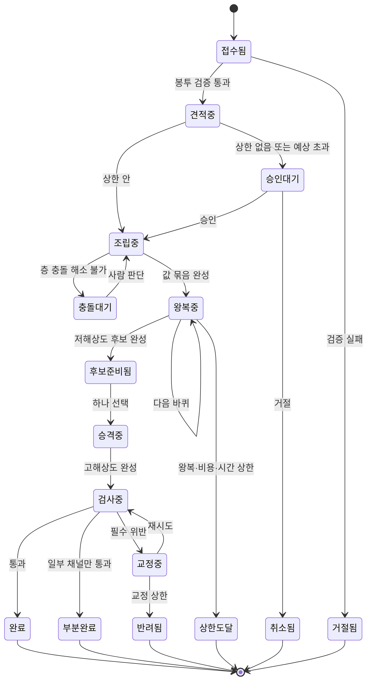

<!--
STAMP
문서: studio-service 생성 범위 API 계약
판: v1.0
작성: 2026-08-21 22:55 KST
model: claude-opus-5[1m]
agent: tech-architect (서브에이전트)
기반 산출물 (버전 핀):
  - docs/학습정보-층계-계약-v1.0.md §8 실리는 값과 모는 값, §10 봉투와 돌려주는 것 ★계약의 진실원
  - studio/docs/fdd-studio-생성-v2.0.md §5.1 선택 1(봉투) 추천 채택, §7 캐시 경계, §9.2 상한 집행
  - docs/prd-openclaw-운영-v1.0.md §4.6 FR-OP-026 (다섯 접점, 20회 재시도 1건, 자격증명 미탑재, 응답 3종)
  - studio/docs/prd-studio-생성-v1.0.md (FR-GEN 전량)
  - wiki/architecture/two-service-boundary.md (단방향 의존, 접점 5개)
성격: **추천 기준 계약.** 이 계약은 FDD v2.0 §5.1의 "안 A(값 전량 주입)" 위에 서 있다. 회장이 안 B나 C를 고르면 §2가 통째로 바뀐다.
고민한 것: 계약 v1.0 §8이 실리는 값과 모는 값을 갈라 놓았으므로 봉투를 한 덩어리로 두면 안 됐다. 두 칸으로 나누고, 조립층 함수가 실리는 값 칸만 받게 타입으로 막는 것이 이 문서의 중심 결정이다.
-->

# API 계약: studio-service 생성 범위 v1.0

> ⚠️ **이 계약은 확정이 아니다.** FDD v2.0 §5.1의 추천안(봉투에 값을 전량 주입) 위에 서 있다. 회장이 그 선택을 뒤집으면 §2가 폐기된다. 필드 이름과 타입은 회장 티키타카를 거쳐야 확정된다.

---

## 목차

- [1. 계약의 전제 다섯](#전제)
- [2. 봉투 (openclaw → studio)](#봉투)
- [3. 돌려주는 것 (studio → openclaw)](#반환)
- [4. 엔드포인트 카탈로그](#엔드포인트)
- [5. 판 번호와 식별자 규격](#판번호)
- [6. 오류 규격](#오류)
- [7. 스킬 업로드 검사 계약](#검사)
- [8. 흐름 단계 대 엔드포인트 대조표](#대조)
- [9. 미결](#미결)
- [SOURCES](#sources)

---

## 1. 계약의 전제 다섯 <a id="전제"></a>

| # | 전제 | 근거 |
|---|---|---|
| 1 | **호출 방향은 openclaw에서 studio로만.** studio는 openclaw를 부르지 않는다 | 경계 wiki 단방향 의존 |
| 2 | **사용자 소셜 자격증명은 어느 봉투에도 실리지 않는다** | FR-OP-026 |
| 3 | **같은 봉투를 20회 재시도해도 작업은 1건을 넘지 않는다** | FR-OP-026 |
| 4 | **응답에 완성물 참조·꼬리표·실비가 함께 온다.** 셋 중 하나라도 없으면 발행 준비 완료로 넘기지 않는다 | FR-OP-026 |
| 5 | **studio는 사용자가 누구인지 모른다.** 봉투에 사용자 이름·이메일·소셜 계정 식별자를 싣지 않는다. 테넌트와 작업 공간의 불투명 식별자만 싣는다 | 계약 v1.0 §10, FDD P5 |

**전제 5가 이 계약의 가장 강한 제약이다.** 봉투 어디에도 사람을 특정하는 값이 없어야 하고, 그래야 studio를 개발자용 제작 API로 그대로 팔 수 있다.

---

## 2. 봉투 (openclaw → studio) <a id="봉투"></a>

### 2.1 두 칸으로 갈린다

계약 v1.0 §8이 실리는 값과 모는 값을 갈라 놓았다. 봉투도 그렇게 갈린다.

| 칸 | 담는 것 | 모델에 실리나 | 조립층이 읽나 |
|---|---|---|---|
| `carried` | U2 실리는 값, U3, L5, R6, 고른 스킬 | **예** | **예** |
| `control` | 자동화 정도, 지식 수준, 비용 상한, 확인 단계 수, 요청 식별자, 규격 판 핀 | **아니오** | **아니오** |

**이 분리를 타입으로 강제한다.** 조립층 함수의 인자는 `carried`만 받는다. `control`은 접수기와 비용 관문과 왕복 실행기만 읽는다. 계약 v1.0 §8이 경고한 둘(앞부분이 길어져 캐시 이득이 줄고, 모델이 "알아서 해주세요"를 내용 지시로 오해)을 코드 구조로 막는 방법이다.

### 2.2 봉투 전문

```json
{
  "envelope_version": "1.0",
  "request_id": "req_01J8ZC7Q4N2M6VXK3PW9RTAB",
  "tenant_ref": "tn_9f3a2c",
  "workspace_ref": "ws_41b7e0",
  "intent": "production",

  "carried": {
    "u2": {
      "purpose": "marketing",
      "channels": ["threads", "instagram"],
      "makes": ["card_news", "short_form"],
      "primary_language": "ko",
      "languages": ["ko", "en", "ja"],
      "brand_facts": [
        { "item_ref": "u2i_0a11", "version": 3, "axis": "brand.identity",
          "text": "1인 개발자가 만든 마케팅 자동화 도구다", "origin": "onboarding" }
      ],
      "lexicon": {
        "ko": [
          { "item_ref": "u2i_0b02", "version": 2, "term": "무조건", "kind": "forbidden",
            "allow_phrase": "대부분의 경우", "confirmed_at": "2026-08-14T04:11:00Z" }
        ],
        "en": [
          { "item_ref": "u2i_0b02", "version": 2, "term": "guaranteed", "kind": "forbidden",
            "allow_phrase": "in most cases", "confirmed_at": "2026-08-14T04:12:00Z" }
        ],
        "ja": []
      },
      "base_tone": [
        { "item_ref": "u2i_0c07", "version": 1, "axis": "tone.formality",
          "value": "plain_coach", "origin": "onboarding" }
      ],
      "brand_kit_ref": "bk_77c1",
      "material_rights": [
        { "item_ref": "u2i_0d03", "version": 1, "asset_ref": "as_5512",
          "basis": "user_owned", "scope": "commercial_unlimited" }
      ]
    },

    "u3": {
      "target": [
        { "item_ref": "u3i_1a04", "version": 2, "axis": "audience.who",
          "text": "직접 만들지만 알리질 못하는 1인 창작자", "origin": "onboarding" }
      ],
      "concept": [
        { "item_ref": "u3i_1b01", "version": 1, "axis": "concept.angle",
          "text": "만든 걸 알리는 법", "origin": "onboarding" }
      ],
      "goal": [
        { "item_ref": "u3i_1c02", "version": 1, "axis": "goal.outcome",
          "text": "무료 체험 가입", "origin": "onboarding" }
      ],
      "tone_adjust": [
        { "item_ref": "u3i_1d09", "version": 1, "axis": "tone.formality",
          "value": "slightly_warmer", "origin": "onboarding" }
      ],
      "imported_summaries": [
        { "item_ref": "u3i_1e05", "version": 1, "source_url_hash": "sha256:0f2b...",
          "summary": "회사 소개 페이지에서 뽑은 제품 한 줄 정의 3개", "approved": true }
      ],
      "channel_readings": [
        { "item_ref": "u3i_1f02", "version": 1, "channel": "threads",
          "summary": "지난 30건 중 질문형 첫 문장이 평균보다 반응이 높았다",
          "observed_from": "2026-07-20", "observed_to": "2026-08-19" }
      ]
    },

    "l5": [
      { "rule_ref": "l5r_2a08", "version": 4,
        "kind": "tone_preference",
        "text": "첫 문장을 질문으로 여는 것을 좋아한다",
        "scope": "all_workspaces",
        "learned_in_workspace_ref": "ws_41b7e0",
        "evidence_count": 11,
        "consented_at": "2026-08-11T13:02:00Z" },
      { "rule_ref": "l5r_2b13", "version": 1,
        "kind": "topic_signal",
        "text": "재활 사례가 반응이 좋았다",
        "scope": "origin_workspace_first",
        "learned_in_workspace_ref": "ws_41b7e0",
        "evidence_count": 4,
        "consented_at": "2026-08-18T09:40:00Z" }
    ],

    "r6": {
      "topic": "혼자 만든 도구를 처음 알릴 때 저지르는 실수 3가지",
      "medium": "card_news",
      "target_channels": ["threads"],
      "output_language": "ko",
      "one_off_adjust": ["조금 더 짧게"],
      "user_typed": "이번엔 사례 하나만 깊게 들어가자",
      "proposal_card_ref": "pc_31d9",
      "previous_round_card_refs": ["pc_2f01", "pc_2f02", "pc_2f03"]
    },

    "skills": [
      { "skill_ref": "sk_our_cardnews_v7", "version": "7",
        "origin": "ours", "body": null, "body_ref": "studio_local" },
      { "skill_ref": "sk_user_9a12", "version": "3",
        "origin": "user_uploaded",
        "body": "# 3컷 카드뉴스 제작법\n...",
        "body_sha256": "sha256:41ab...",
        "inspection_ref": "insp_77a2",
        "inspected_at": "2026-08-20T07:11:00Z" }
    ]
  },

  "control": {
    "automation_level": "hands_off",
    "marketing_literacy": "beginner",
    "confirmation_steps": 1,
    "cost_ceiling": { "currency": "KRW", "amount": 1500, "scope": "this_request" },
    "spent_so_far": { "currency": "KRW", "amount": 0 },
    "channel_spec_pin": { "catalog_version": "2026-08-19", "channels": ["threads"] },
    "model_policy": { "primary": "default", "allow_fallback": true },
    "deadline_hint": "2026-08-21T14:00:00Z"
  }
}
```

### 2.3 필드 규칙

| 필드 | 규칙 |
|---|---|
| `envelope_version` | 봉투 구조가 바뀌면 올린다. studio는 자기가 아는 판보다 높은 봉투를 받으면 `409 envelope_version_unsupported`로 거절한다. 조용히 무시하지 않는다 |
| `request_id` | **openclaw가 만든다.** 중복 방지의 주체가 openclaw여야 재시도가 안전하다(FDD v1.0 미결 C의 답). 같은 값으로 20회 와도 작업은 1건 |
| `tenant_ref` `workspace_ref` | 불투명 식별자. 사람을 특정하는 값 금지(전제 5) |
| `intent` | `production` / `proposal` / `signal` / `import` / `inspection` 중 하나 |
| `carried.*.item_ref` + `version` | **모든 층 항목이 참조와 판을 함께 갖는다.** 꼬리표가 이 쌍을 가리킨다(§5) |
| `carried.*.axis` | 모순 검사가 축 비교로 돌기 위해 필요하다(FDD §6.1). 축이 없는 항목은 모순 검사 대상에서 빠지고 그 사실이 우선순위 쪽지에 남는다 |
| `carried.u2.lexicon` | **언어 코드별 객체.** 빈 배열과 키 부재를 구분한다. 키가 없으면 "그 언어는 금지 표현이 준비되지 않음"이고, 빈 배열이면 "준비했는데 금지어가 없음"이다. R6이 키 없는 언어를 고르면 `409 lexicon_missing_for_language` |
| `carried.l5[].scope` | `all_workspaces`(말투·후크 취향) 또는 `origin_workspace_first`(소재 지식). 계약 v1.0 §5 |
| `carried.l5[].consented_at` | **필수.** 값이 없는 규칙은 승낙 안 된 것이므로 studio가 `422 unconsented_rule`로 거절한다. 승인 전 미반영을 계약으로 막는다 |
| `carried.r6.previous_round_card_refs` | 직전 회차 카드 참조. AC-GEN-005의 "직전 회차와 동일한 카드 묶음이 다시 나오지 않는다"를 조립 입력으로 성립시킨다(FDD v1.0 미결 L의 답: **openclaw가 요청 기록으로 갖고 봉투에 실어 준다.** studio는 저장하지 않는다) |
| `carried.skills[].body` | 우리 스킬은 `null`이고 `body_ref: "studio_local"`. 사용자 스킬은 원문을 싣고 지문을 함께 싣는다 |
| `carried.skills[].inspection_ref` | **사용자 스킬은 필수.** 검사 기록 없는 사용자 스킬은 `422 skill_not_inspected`로 거절한다 |
| `control.cost_ceiling` | 이 요청의 절대 상한. studio는 이 값과 자기 누적을 비교하고 openclaw를 되부르지 않는다 |
| `control.automation_level` `marketing_literacy` | **모델에 안 간다.** 확인 단계 수와 화면 문구를 openclaw가 정하는 데 쓰고, studio는 확인 단계 수만 읽는다 |
| `control.channel_spec_pin` | 채널 규격은 studio가 저장하지 않고 판 번호로 받아 쓴다(경계 wiki) |

### 2.4 봉투 크기 상한

| 항목 | 상한 | 근거 |
|---|---|---|
| 봉투 전체 | 실측 후 확정 (미결) | 층별 항목 수 상한과 같은 자리 |
| `carried.skills[].body` 한 개 | **500줄** | 벤치마크 B2의 권고를 상한으로 강제. 스킬 크기가 곧 매 요청 비용 |
| `carried.u3.imported_summaries[].summary` | 요약과 참조만. 원문 전량 금지 | 계약 v1.0 §2 U3, PRD FR-GEN-002 |
| `carried.l5` 항목 수 | 실측 후 확정 (미결) | 넘칠 때 자동으로 버리지 않고 무엇을 뺄지 사용자에게 묻는다(PRD §9.1) |

---

## 3. 돌려주는 것 (studio → openclaw) <a id="반환"></a>

계약 v1.0 §10이 정한 것: **완성물 + 제작 정보(어느 층의 어떤 값이 실렸나, 어떤 스킬을 썼나, 장면 정보, 든 비용과 모델, 예비 모델 여부).**

```json
{
  "request_id": "req_01J8ZC7Q4N2M6VXK3PW9RTAB",
  "production_ref": "pr_01J8ZCB1",
  "state": "completed",

  "artifacts": [
    {
      "artifact_ref": "af_01J8ZCB4",
      "medium": "card_news",
      "channel": "threads",
      "kind": "master",
      "fetch": { "url": "https://.../af_01J8ZCB4?sig=...", "expires_at": "2026-08-21T15:00:00Z" },
      "bytes": 1841022,
      "checksum": "sha256:9c02...",
      "scene_doc_ref": "sc_01J8ZCB2"
    }
  ],

  "provenance": {
    "provenance_ref": "pv_01J8ZCB7",
    "created_at": "2026-08-21T13:41:07Z",
    "sealed": true,
    "from_proposal_card": "pc_31d9",
    "chosen_candidate": "cd_01J8ZCB3",
    "not_chosen_candidates": ["cd_01J8ZCB5", "cd_01J8ZCB6"],
    "skills_used": [
      { "skill_ref": "sk_our_cardnews_v7", "version": "7",
        "stored_sha256": "sha256:aa01...", "carried_sha256": "sha256:aa01...",
        "domain_gate_removed_count": 0 },
      { "skill_ref": "sk_user_9a12", "version": "3",
        "stored_sha256": "sha256:41ab...", "carried_sha256": "sha256:7d55...",
        "domain_gate_removed_count": 2,
        "domain_gate_removed_reason": ["tone_directive", "lexicon_directive"] }
    ],
    "hook_or_angle": "질문형 첫 문장 + 실수 나열",
    "layer_versions": {
      "S0": [{ "item_ref": "s0i_0001", "version": 12 }],
      "S1": [{ "item_ref": "s1i_0311", "version": 5 }],
      "U2": [{ "item_ref": "u2i_0a11", "version": 3 }, { "item_ref": "u2i_0b02", "version": 2 }],
      "U3": [{ "item_ref": "u3i_1a04", "version": 2 }],
      "X4": [{ "skill_ref": "sk_our_cardnews_v7", "version": "7" }],
      "L5": [{ "rule_ref": "l5r_2a08", "version": 4 }],
      "R6": "not_stored"
    },
    "excluded": [
      { "item_ref": "l5r_2c04", "reason": "conflict_with_u2_lexicon",
        "conflicting_with": "u2i_0b02", "axis": "tone.formality" }
    ],
    "priority_notes": [
      { "axis": "tone.formality", "winner": "u3i_1d09", "loser": "u2i_0c07",
        "rule": "U3 overrides U2 within its workspace, marked" }
    ],
    "human_readable": "이 카드뉴스는 '만든 걸 알리는 법' 컨셉으로, 질문형 첫 문장 취향과 3컷 카드뉴스 제작법을 써서 만들었습니다. 사용자 스킬 중 말투를 지정한 문장 2개는 제외했습니다."
  },

  "production_info": {
    "model_primary": "modelA",
    "model_served": "modelB",
    "fallback_used": true,
    "fallback_reason": "primary_unavailable",
    "cache_read_tokens": 0,
    "cache_write_tokens": 0,
    "roundtrips": 4,
    "workspace_used": true,
    "workspace_expires_at": "2026-08-28T13:41:07Z",
    "lexicon_check": {
      "assembly_pass": true,
      "output_pass": true,
      "languages_checked": ["ko"],
      "depth_by_language": { "ko": "meaning" },
      "note": "ko는 뜻 대조까지 돌았다. 목록에 없는 언어는 검사하지 않았다"
    },
    "quality_gate": { "required_pass": true, "advisory_violations": 1 }
  },

  "cost": {
    "currency": "KRW",
    "estimated_range": { "min": 130, "max": 420 },
    "actual": 388,
    "ceiling": 1500,
    "items": [
      { "kind": "model_call", "amount": 41, "model": "modelB", "roundtrip": 1 },
      { "kind": "model_call", "amount": 39, "model": "modelB", "roundtrip": 2 },
      { "kind": "asset_generation", "amount": 240, "provider": "imgX", "count": 3 },
      { "kind": "render", "amount": 68 }
    ],
    "rejected_uncharged": [
      { "kind": "asset_generation", "amount": 60, "reason": "output_gate_rejected" }
    ]
  },

  "next_episode_seed": {
    "seed_ref": "ns_01J8ZCB9",
    "opening_scene": "두 번째 실수: 만든 사람만 아는 말로 설명한다",
    "first_line": "이 기능 설명, 너만 알아듣는 거 아닐까?",
    "state_change": "인식 → 자기 점검"
  }
}
```

### 3.1 반환물 규칙

| 규칙 | 내용 |
|---|---|
| 셋이 함께 온다 | `artifacts` + `provenance` + `cost`. 하나라도 없으면 openclaw가 발행 준비 완료로 넘기지 않는다(FR-OP-026) |
| **예비 모델 여부는 필수 필드다** | `production_info.fallback_used`. 계약 v1.0 §7 부수 규칙. 나중에 품질 차이를 따질 때 필요하다 |
| 꼬리표는 봉인된다 | `provenance.sealed: true`. 이후 수정 시도는 `409 provenance_sealed` |
| 조립 문자열은 안 돌려준다 | 계약 P3. 대신 `layer_versions`로 되분해한다 |
| 사람이 읽는 문장이 함께 온다 | `provenance.human_readable`. FR-GEN-040의 마지막 수용 기준 |
| 검사 강도를 숨기지 않는다 | `lexicon_check.depth_by_language`. 어느 언어를 어느 깊이까지 봤는지 정직하게 |
| 반려분은 무과금으로 분리 | `cost.rejected_uncharged`. 우리 실비는 원장에 남되 사용자에게 안 간다 |
| 완성물은 서명 URL로 | 바이트를 응답에 싣지 않는다. 만료 시각을 함께 준다 |

### 3.2 부분 실패의 모양

부분 실패는 오류가 아니라 **상태**다. `state: "partial"`로 오고 성공분은 그대로 담긴다.

```json
{
  "request_id": "req_...",
  "state": "partial",
  "artifacts": [ { "artifact_ref": "af_A", "channel": "threads", "...": "..." } ],
  "failures": [
    { "scope": "channel", "channel": "instagram", "code": "asset_generation_failed",
      "message": "이미지 공급자가 3회 재시도 후에도 응답하지 않았습니다",
      "retry_estimate": { "currency": "KRW", "min": 80, "max": 240 },
      "charged": false }
  ],
  "provenance": { "...": "성공분에 대해서만" },
  "cost": { "actual": 210, "...": "..." }
}
```

**성공분을 버리지 않는다.** user-flow §2.1이 "부족 사유와 재시도 비용을 보여주고 몰래 채우지 않는다"고 못 박았다.

---

## 4. 엔드포인트 카탈로그 <a id="엔드포인트"></a>

공통 헤더: `X-Studio-Envelope-Version`, `X-Request-Id`(= 봉투 `request_id`), 서버 대 서버 키. 사용자 자격증명 헤더는 없다.

| # | 접점 | 메서드 · 경로 | 무엇 | 요청 | 응답 | 멱등 |
|---|---|---|---|---|---|---|
| 1 | 제작 요청 | `POST /v1/productions` | 봉투를 받아 제작 시작 | 봉투 전문(§2) | `202` + `{production_ref, state:"estimating", estimate}` | 예 (`request_id`) |
| 2 | 제작 요청 | `GET /v1/productions/{production_ref}` | 진행과 결과 조회 | 없음 | `200` + §3 전문 (state에 따라 부분) | 예 |
| 3 | 제작 요청 | `GET /v1/productions/{production_ref}/events` | 진행 단계 스트림 | 없음 | `200` SSE. `stage`·`roundtrip`·`cost_tick` 이벤트 | 예 |
| 4 | 선택 기록 | `POST /v1/productions/{production_ref}/decisions` | 비용 승인, 후보 선택, 고해상도 승격, 확정/보관/재제안 | `{decision, candidate_ref?, approved_ceiling?, reason_axis?}` | `200` + 갱신된 state | 예 (`decision_id`) |
| 5 | 제작 요청 | `POST /v1/productions/{production_ref}/cancel` | 중단 | `{reason}` | `200` + `{state:"cancelled", cost}` | 예 |
| 6 | 제작 요청 | `POST /v1/proposals` | 제안 카드 3장 이상 | 봉투(`intent:"proposal"`, `r6.topic` 없이) | `202` → 조회 시 `{cards:[...]}` | 예 |
| 7 | 신호 넣기 | `POST /v1/signals` | 트렌드 신호를 S1에 넣는다 | `{tenant_ref, source, kind, subject_ref, payload, observed_at, expires_at}` | `202` | 예 |
| 8 | 소재 반입 | `POST /v1/materials` | 소재 바이트 등록 | multipart + `{rights_basis, tenant_ref}` | `201` + `{asset_ref}` | 예 |
| 9 | 소재 반입 | `POST /v1/materials/imports` | 주소를 읽어 항목 후보로 정리 | `{url, tenant_ref, workspace_ref}` | `202` → `{items:[{axis, text, source_span}], unreadable:[...]}` | 예 |
| 10 | **스킬 검사 (신규)** | `POST /v1/skills/inspections` | 업로드 스킬 3종 검사 | `{body, filename, tenant_ref}` | `200` + §7 결과 | 예 (본문 지문) |
| 11 | 제작 요청 | `GET /v1/skills` | 우리 스킬 이름표 목록 | `?medium=&language=` | `200` + `[{skill_ref, version, name, description, requires}]` | 예 |
| 12 | 신규 보조 | `POST /v1/lexicon/translations` | 금지 표현을 다루는 언어로 옮긴 후보 | `{terms:[...], from, to:[...]}` | `200` + `{candidates:[{lang, term, allow_phrase, confidence}]}` | 예 |
| 13 | 신규 보조 | `POST /v1/recheck` | 금지 표현이 늘었을 때 대기 중인 것 재검사 | `{artifact_refs:[...], lexicon}` | `200` + `{flagged:[{artifact_ref, term, span}]}` | 예 |

**접점이 다섯에서 일곱이 됐다.** 신호 넣기·제작 요청·선택 기록·소재 반입은 그대로이고, **취향 상태 조회가 사라졌으며**(L5가 openclaw 소유가 되어 조회 방향이 없어졌다), **스킬 검사와 어휘 보조 둘이 새로 생겼다.** 이 변화는 FDD §12.1 회수 1의 대상이다.

### 4.1 제작 상태 기계



**종료 상태는 여섯이다.** `완료` `부분완료` `반려됨` `상한도달` `취소됨` `거절됨`. 이 중 사용자에게 과금되는 것은 `완료` `부분완료` `상한도달`뿐이다.

---

## 5. 판 번호와 식별자 규격 <a id="판번호"></a>

꼬리표가 openclaw 소유 항목을 정확히 가리키려면 판 번호 규격이 계약이어야 한다.

| 종류 | 형식 | 만드는 쪽 | 규칙 |
|---|---|---|---|
| 요청 식별자 | `req_` + ULID | **openclaw** | 재시도 시 동일. 중복 방지의 열쇠 |
| 테넌트·작업 공간 참조 | `tn_` / `ws_` + 불투명 문자열 | openclaw | 사람을 특정하지 않는다 |
| 층 항목 참조 | `u2i_` `u3i_` `l5r_` `s0i_` `s1i_` + 불투명 | 그 층 소유자 | 항목 자체는 불변, 판이 쌓인다 |
| 층 항목 판 | 1부터 시작하는 정수 | 그 층 소유자 | **되돌리기는 판을 되돌리지 않고 새 판을 붙인다**(R13) |
| 스킬 참조·판 | `sk_` + 불투명, 판은 문자열 | 우리 것은 studio, 사용자 것은 openclaw | 새 판이 올라와도 이전 판이 지워지지 않고 공존(FR-GEN-030) |
| 제작·완성물·꼬리표 참조 | `pr_` `af_` `pv_` + ULID | studio | 꼬리표는 생성 시점 전용, 봉인 |
| 채널 규격 판 | 날짜 문자열 | openclaw | studio는 저장하지 않고 핀으로 받는다 |

**한 가지를 못 박는다.** 항목 판을 정수로 하는 이유는 **비교 가능해야** 하기 때문이다. 꼬리표에 실린 판이 현재 판보다 낮으면 "그 뒤에 사용자가 값을 고쳤다"를 즉시 알 수 있고, 그것이 계약 v1.0 §6(사용자가 나중에 값을 바꾸면)의 재검사 대상을 고르는 방법이다.

---

## 6. 오류 규격 <a id="오류"></a>

```json
{
  "error": {
    "code": "lexicon_missing_for_language",
    "message": "이번 요청의 출력 언어(ja)에 금지 표현 목록이 준비되지 않았습니다",
    "user_action": "ask_user_to_proceed",
    "details": { "language": "ja", "available": ["ko", "en"] },
    "request_id": "req_01J8ZC7Q4N2M6VXK3PW9RTAB"
  }
}
```

`user_action`은 openclaw 화면이 무엇을 할지 정하는 값이다. `ask_user_to_proceed` / `ask_user_to_fix` / `show_and_stop` / `retry_later` / `contact_us` 다섯.

| HTTP | code | 언제 | user_action |
|---|---|---|---|
| 400 | `envelope_malformed` | 봉투 구조 오류 | contact_us |
| 409 | `envelope_version_unsupported` | studio가 모르는 판 | contact_us |
| 409 | `lexicon_missing_for_language` | R6 언어에 금지 표현 없음 (계약 §4) | ask_user_to_proceed |
| 409 | `provenance_sealed` | 꼬리표 수정 시도 | show_and_stop |
| 409 | `layer_conflict_unresolvable` | 층 충돌 해소 불가 | ask_user_to_fix |
| 422 | `unconsented_rule` | `consented_at` 없는 L5 | contact_us |
| 422 | `skill_not_inspected` | 검사 기록 없는 사용자 스킬 | ask_user_to_fix |
| 422 | `skill_body_too_long` | 스킬 본문 500줄 초과 | ask_user_to_fix |
| 402 | `ceiling_exceeded` | 상한 초과로 중단 | ask_user_to_proceed |
| 403 | `sandbox_violation` | 스킬이 격리 경계 침범 | show_and_stop |
| 424 | `skill_body_unreadable` | 스킬 원문 못 읽음. **지어내지 않는다** | ask_user_to_proceed |
| 424 | `skill_fingerprint_mismatch` | 저장본과 지문 불일치 | contact_us |
| 429 | `rate_limited` | 속도 상한 | retry_later |
| 503 | `model_unavailable` | 주 모델과 예비 모델 모두 불가 | retry_later |

**`model_unavailable`이 나오는 조건을 좁게 정의한다.** 주 모델이 죽었을 때는 오류가 아니라 예비 모델 전환이다. 둘 다 죽었을 때만 이 오류다.

---

## 7. 스킬 업로드 검사 계약 <a id="검사"></a>

계약 v1.0 §3이 확정한 3종. 요청과 응답 전문이다.

```json
// POST /v1/skills/inspections
{ "tenant_ref": "tn_9f3a2c", "filename": "3cut-cardnews.md",
  "body": "# 3컷 카드뉴스 제작법\n항상 존댓말로 쓴다.\n1컷: 문제 제시\n..." }
```

```json
// 200
{
  "inspection_ref": "insp_77a2",
  "body_sha256": "sha256:41ab...",
  "verdict": "conditional",
  "checks": [
    { "check": "s0_bypass", "result": "pass", "hits": [] },
    { "check": "role_impersonation", "result": "pass", "hits": [] },
    { "check": "out_of_domain", "result": "flagged",
      "hits": [
        { "line": 2, "text": "항상 존댓말로 쓴다.",
          "domain": "tone", "why": "말투는 스킬이 정할 수 없습니다" }
      ] },
    { "check": "syntax", "result": "pass",
      "detail": { "lines": 42, "limit": 500, "xml_tags": 0, "reserved_words": 0 } }
  ],
  "offer": {
    "action": "register_without_lines",
    "lines_to_remove": [2],
    "message": "이 스킬의 2번째 줄은 말투를 지정합니다. 말투는 스킬이 정할 수 없으므로 그 줄을 빼고 등록할 수 있습니다."
  }
}
```

| verdict | 뜻 | openclaw가 할 일 |
|---|---|---|
| `pass` | 3종 전부 통과 | 등록 |
| `conditional` | 영역 밖 지시만 걸림 | 사용자에게 `offer`를 보이고 선택받는다 |
| `reject` | S0 우회 또는 역할 사칭 | **등록 불가.** 걸린 문장을 인용해 보인다. 예외 없음 |

**세 검사의 강도가 다른 이유를 계약에 명시한다.** S0 우회와 역할 사칭에 고칠 여지를 주면 우회 시도를 반복 학습시키는 셈이다. 영역 밖 지시는 좋은 제작법이 한 줄 때문에 통째로 버려지는 것을 막아야 한다.

---

## 8. 흐름 단계 대 엔드포인트 대조표 <a id="대조"></a>

FDD v2.0 §4.2 매핑표의 엔드포인트 열만 뽑아 역방향으로 확인한 것이다. **엔드포인트 13개 중 흐름에 안 걸리는 것이 없고, 흐름 24행 중 studio 처리가 필요한데 엔드포인트가 없는 행도 없다.**

| 엔드포인트 | 걸리는 흐름 행 |
|---|---|
| `POST /v1/productions` | 4, 4b |
| `GET /v1/productions/{ref}` | 5, 6f, 6k |
| `GET /v1/productions/{ref}/events` | 6a~6h (진행 단계 표시) |
| `POST /v1/productions/{ref}/decisions` | 5, 6f, 6i |
| `POST /v1/productions/{ref}/cancel` | 실패 처리 (사용자 중단) |
| `POST /v1/proposals` | 3, 3b |
| `POST /v1/signals` | 2 |
| `POST /v1/materials` | 소재 등록 (FR-GEN-052) |
| `POST /v1/materials/imports` | O6 |
| `POST /v1/skills/inspections` | X1 |
| `GET /v1/skills` | 3 (선택기 입력) |
| `POST /v1/lexicon/translations` | O4 |
| `POST /v1/recheck` | X2 |

**엔드포인트가 없는 흐름 행 11개는 전부 openclaw 화면 소유**이며 FDD §4.2에 그 사실이 행마다 적혀 있다. 매핑 갭 0.

---

## 9. 미결 <a id="미결"></a>

| # | 무엇 | 누가 정하나 |
|---|---|---|
| A1 | **선택 1(봉투)의 확정.** 이 계약 전체가 여기 매달려 있다 | 회장 |
| A2 | **접점 개수 변경 승인.** 다섯에서 일곱으로. 취향 상태 조회 폐기, 스킬 검사와 어휘 보조 신설 | 회장 (FDD §12.1 회수 1) |
| A3 | 봉투 전체 크기 상한과 `carried.l5` 항목 수 상한 | 실측 후 |
| A4 | 필드 이름의 언어. 지금은 영문 스네이크 표기인데, 층 이름(S0·U2 등)만 계약 표기를 그대로 썼다 | 회장 티키타카 |
| A5 | 완성물 서명 URL의 유효 기간 | 실측 후 (작업 공간 재사용 기한과 함께) |
| A6 | `production_info.cache_read_tokens`를 openclaw에 돌려줄지. 원가 계획에는 안 쓰지만 이익 추정에는 쓴다 | 회장 |

---

## SOURCES <a id="sources"></a>

| # | 경로 | 무엇을 가져왔나 |
|---|---|---|
| 1 | `docs/학습정보-층계-계약-v1.0.md` (v1.0) | §8 실리는 값과 모는 값(봉투 두 칸 분리의 근거), §10 봉투와 반환물 목록, §4 언어별 금지 표현, §5 L5 범위와 꼬리표, §7 예비 모델 기록 |
| 2 | `studio/docs/fdd-studio-생성-v2.0.md` (v2.0) | §5.1 봉투 선택, §7 캐시 경계, §9.2 상한 집행, §4.2 매핑표(대조표의 원본), §10 실패 처리 |
| 3 | `docs/prd-openclaw-운영-v1.0.md` §4.6~4.7 (v1.0) | FR-OP-026 다섯 접점·20회 재시도 1건·자격증명 미탑재·응답 3종, FR-OP-027 층 원본 소유, FR-OP-031 비용 항목 분해 |
| 4 | `studio/docs/prd-studio-생성-v1.0.md` (v1.0) | FR-GEN-002·012·020·023·030·040·052·060, NFR-GEN-003 |
| 5 | `wiki/architecture/two-service-boundary.md` | 단방향 의존, 접점 5개, 채널 규격 카탈로그 소유 |
| 6 | `docs/user-flow.md` §2.1 | 부분 실패 시 몰래 채우지 않는다 |

벤치마크: `claude-api` 스킬로 조회한 프롬프트 캐시 규격(https://platform.claude.com/docs/en/build-with-claude/prompt-caching)이 §2.1의 두 칸 분리를 뒷받침한다. 변덕스러운 값을 앞부분에 섞으면 캐시가 조용히 깨진다는 규격이, 모는 값을 봉투의 별도 칸으로 빼는 설계를 원가 근거로 만든다. Agent Skills 작성 규격(https://platform.claude.com/docs/en/agents-and-tools/agent-skills/best-practices)이 §2.4의 500줄 상한과 §7의 구문 검사 항목(XML 태그 불가, 예약어 불가)의 출처다.

MODEL: claude-opus-5[1m] / agent: tech-architect

SKILLS_USED: claude-api (§2.1 두 칸 분리와 §2.4 크기 상한의 원가 근거)
SKILLS_SKIPPED: document-generate(FDD와 한 벌로 이어 쓰는 계약 문서라 신규 문서군 생성 도구가 안 맞음), diagram(mermaid를 문서 안에 직접 실음), spec(대화형이라 메인세션 전용)

PRESENTATION_CHECK: 툴콜 태그 잔재 없음 / JSON 예시 문법 확인 / mermaid stateDiagram-v2 1종 확인 / 목차 앵커 대조 완료 / 긴 대시 0

RUBRIC_SCORE: 완결5 정밀5 벤치4 추적5 톤5 total=24/25
WEAKEST_LINE: "필드 이름의 언어. 지금은 영문 스네이크 표기인데, 층 이름만 계약 표기를 그대로 썼다."
