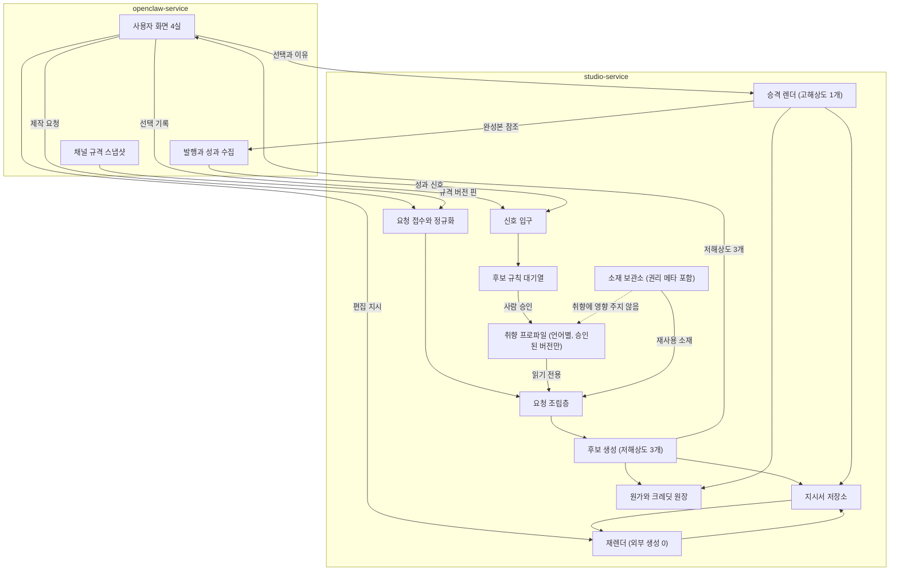
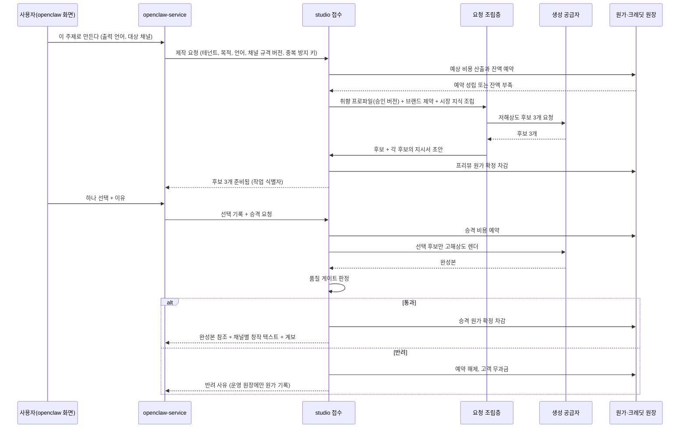
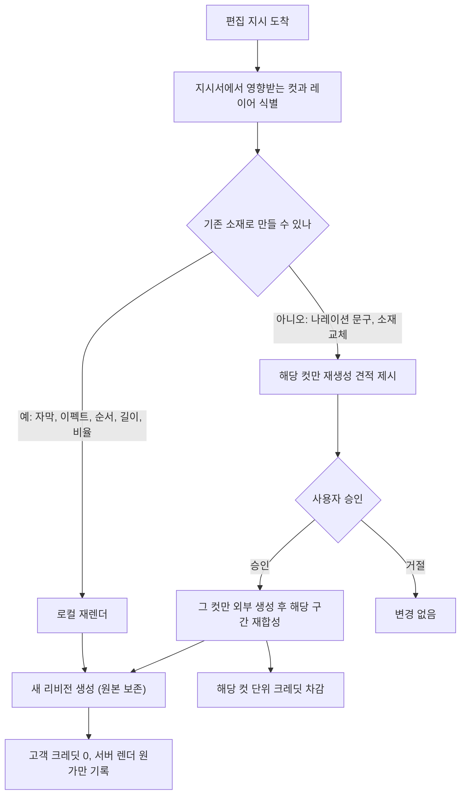
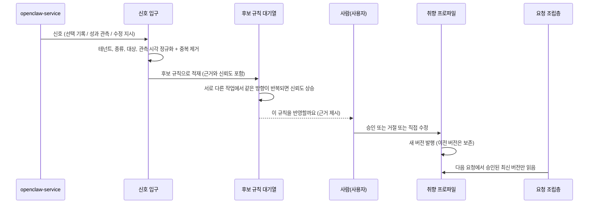

<!--
STAMP | line: osmu | eng-design-studio-service | v0.1 | 생성 2026-08-18 (KST, 분단위는 문서 끝 푸터)
model: claude-opus-5[1m] | agent: tech-architect
기반(버전 핀): studio/docs/prd-studio-service-v1.2.1-gpt-codex.md · docs/prd-openclaw-service-v8.2.1-gpt-codex.md ·
  wiki/architecture/two-service-boundary.md(2026-08-18 점검) · docs/제품구조-결정-2026-08-15.md §9.6 §9.7 §9.8 ·
  docs/requests/회장-확정-요구사항-대장.md(R01~R23) · docs/requests/2026-08-17-회장-4실-구조-구상.md ·
  studio/docs/소재원가-검증표-2026-08-15.md · docs/design-docs/channel-capability-and-readiness-contract-v1-opus.md ·
  wiki/architecture/data-model.md(기존 구현 실측)
성격: **확정 문서가 아니다.** 루트 하네스 6.3.5(기술설계 티키타카 의무)에 따라 API 계약·DB 스키마·엔티티·아키텍처를
  회장 합의 전에 확정하지 않는다. 이 문서는 회장이 고르기 위한 선택지 묶음이다.
고민: 4실 구조(생성·편집·발행·성과)를 자원 모델에 그대로 박을지, 자원은 하나로 두고 4실을 상태의 뷰로 볼지에서
  후자를 택해 선택지 A로 제시했다. 전자로 가면 되돌리기(R13)가 방마다 사본을 만든다.
-->

# studio-service 기술설계 선택지 v0.1

> **한 줄 결론**: studio 안의 흐름은 "작업물 하나가 후보 여러 개를 낳고, 그중 하나만 고해상도로 승격되며, 그 뒤 모든 수정은 재생성이 아니라 지시서 재렌더로 처리된다"로 그릴 수 있다. 다만 그 흐름을 코드로 굳히려면 **되돌리기 비용이 큰 결정 8개**를 회장이 먼저 골라야 하고, 그 과정에서 **PRD가 답하지 않는 빈틈 16개**가 드러났다. 이 문서는 그 8개와 16개를 회장 앞에 올린다.

- **회장이 골라야 할 것: 8개** (§3)
- **PRD 빈틈: 16개** (§4)
- **기존 구현 대비 신규 항목: 6개 / 확장 항목: 4개** (§2.4)

## 목차

- [1. 이 문서의 범위와 읽는 법](#범위)
- [2. 현재 구현 실측과 재사용 경계](#현재)
- [3. studio-service 유저플로우 (서비스 관점)](#플로우)
- [4. 회장이 골라야 할 것 8개](#선택)
- [5. PRD 빈틈 16개](#빈틈)
- [6. openclaw-service 접점 5개 계약 초안 (의미 수준)](#접점)
- [7. 벤치마크: 무엇을 보고 무엇을 차용했나](#벤치)
- [8. 레드팀 자기공격](#레드팀)

---

## 1. 이 문서의 범위와 읽는 법 

**범위 안**: studio-service 내부의 요청 흐름, 자원 모델 후보, 두 서비스 접점의 의미 수준 계약, PRD 빈틈 목록.

**범위 밖(의도적으로 안 씀)**: URL 경로, HTTP 메서드, JSON 필드명, 테이블 정의, 인덱스, 마이그레이션. 회장이 §3을 고르기 전에 이것들을 쓰면 그 순간 되돌리기 비싼 결정이 코드로 굳는다. 회장 선택 뒤 v1.0에서 FDD·API 계약·ERD·test-plan으로 분할 산출한다.

**용어** (이 문서 안에서만 통용, 최종 명칭 아님)

| 말 | 뜻 |
|---|---|
| 작업물 | 사용자가 "이 주제로 만든다"고 시작한 한 건. 채널 중립 마스터. |
| 후보 | 같은 작업물에서 나온 서로 다른 방향의 안(A/B/C). 저해상도 프리뷰 상태로 태어난다. |
| 승격 | 선택된 후보 하나를 목표 채널 규격의 고해상도·고품질 결과로 다시 만드는 것. |
| 지시서 | 그 결과를 다시 만들 수 있게 하는 제작 기록(컷 순서, 대본, 자막, 소재 참조, 모델, 인코딩 파라미터). |
| 재렌더 | 소재를 새로 만들지 않고 지시서만 바꿔 다시 합성하는 것. 외부 생성 비용 0. |
| 취향 프로파일 | 선택과 수정에서 누적된, 사람이 읽을 수 있는 규칙 묶음. 언어별로 갈린다. |

---

## 2. 현재 구현 실측과 재사용 경계 

재창조 금지 규율에 따라 먼저 실측했다. 아래는 코드와 위키에서 확인한 사실이다.

### 2.1 이미 있는 것 (근거 확인)

| 있는 것 | 근거 | 이번 설계에서의 위치 |
|---|---|---|
| `drafts` (Studio 생성·편집 이력, 상태와 플랫폼 변형은 payload 안) | wiki/architecture/data-model.md:15 | 작업물 후보 자원의 전신. 그대로 쓰면 후보·리비전이 payload 안에 숨는다 |
| `queue_posts`, `schedules`, `published_posts` | 같은 문서 12~21행 | 전부 openclaw 쪽. studio는 안 만진다 |
| `channel_accounts`, `oauth_app_credentials` | 같은 문서 36~70행 | openclaw 단독. studio로 넘어오면 경계 실패 |
| `usage_events`, `usage_quotas`, `subscriptions` | 같은 문서 85~96행 | 사용량 감사 원장으로 재사용 가능. 선불 잔액의 금전 이동은 섞으면 안 됨(소재원가 검증표 7.2) |
| R2 버킷(이미지·영상), `images/` API, `videos/` | 같은 문서 105~108행 | 미디어 바이트 경계의 기존 구현. 선택 H의 출발점 |
| Higgsfield 이미지·영상·상태·거래 API 4종 | 소재원가 검증표 7.1, dashboard/src/app/api/higgsfield/ | 공급자 어댑터의 선례 |
| 채널 capability/readiness 계약 v1 | docs/design-docs/channel-capability-and-readiness-contract-v1-opus.md | 채널 규격 스냅샷 제공자가 openclaw임을 뒷받침 |

### 2.2 확장이 필요한 것 (4개)

`drafts`(후보·리비전·지시서를 담을 수 있게), `usage_events`(공급자 원가와 고객 크레딧 분리 기록), R2 경계(승격본·프리뷰·소재의 수명 분리), readiness 계약(발행 가능 판정을 studio 인계 조건으로 읽기).

### 2.3 아직 없는 것 (6개, 전부 이 문서의 선택 대상)

취향 프로파일 저장소, 학습 신호 입구, 지시서 정본 저장소, 선불 잔액 원장과 예약·확정, 두 서비스 사이 서버 인증, 후보 승격 작업 큐.

### 2.4 회수 필요

⛔ **회수 필요: `docs/구현현황.md`가 없다**
- 배경: 재창조 금지 규율은 "구현현황 문서를 먼저 읽고 있으면 확장 설계"를 요구하는데 이 레포에는 그 파일이 없다. 대신 `wiki/architecture/data-model.md`를 진실원으로 삼아 위 표를 만들었다.
- 무엇을 정하나: data-model.md를 구현현황 정본으로 승격할지, 별도 파일을 만들지.
- 옵션 A(추천): data-model.md를 정본으로 인정하고 이 문서가 그것을 인용한다. 고르면 문서 하나가 줄고 갱신 지점이 하나로 유지된다. 안 고르면 두 문서가 어긋날 때 어느 쪽이 진실인지 다툰다.
- 옵션 B: 별도 구현현황 문서 신설. 고르면 코드 실측 결과를 위키와 분리해 자주 갱신할 수 있다. 트레이드오프: 갱신 주체가 둘이 되어 어긋난다.
- 추천 근거: data-model.md가 이미 RLS·롤백 스위치까지 실제 구현 수준으로 기술돼 있어 실질적 구현현황 문서다.

---

## 3. studio-service 유저플로우 (서비스 관점) 

화면 흐름이 아니라 **요청이 studio 안에서 어떻게 흐르는가**다.

### 3.1 전체 지도

읽는 법: 점선 하나가 이 그림의 핵심이다. **소재 보관소에서 취향 프로파일로 가는 실선이 없다.** 소재 반입은 재료를 늘릴 뿐 취향을 바꾸지 않는다(§3.5).

### 3.2 제작 요청에서 승격까지

### 3.3 편집 요청이 재렌더로 처리되는 경로

원가 차이가 벌어지는 지점이다. 판정은 PRD 3.8.1의 편집 크레딧 판정표를 그대로 따른다.

불변조건 셋. ①원본 파일, 원본 소재, 부모 지시서를 덮어쓰지 않는다. ②영향 없는 컷의 외부 생성 호출 수는 0이어야 한다. ③새 리비전은 앞 방의 작업 목록에 항목으로 추가된다(요구사항 대장 R13).

### 3.4 학습 신호가 취향 프로파일 버전을 올리기까지

**승인 전 미반영이 강제되는 지점은 마지막 화살표 하나다.** 요청 조립층은 대기열을 읽을 권한이 없고 승인된 버전만 읽는다. 이 규칙을 코드가 아니라 데이터 접근 경계로 만들면 실수로 새는 경로가 없어진다. 어느 층에 강제를 둘지는 선택 E다.

### 3.5 소재 반입이 취향을 바꾸지 않는 규칙은 어디서 강제되나

세 지점에서 각각 강제 가능하다. 어디에 둘지는 선택 B와 묶여 있다.

| 강제 지점 | 방식 | 강도 |
|---|---|---|
| 입구 분리 | 소재 반입과 신호 반입이 애초에 다른 입구다. 소재 입구에는 취향 대기열로 가는 코드 경로가 없다 | 가장 강함. 실수로도 못 샌다 |
| 대기열 적재 규칙 | 한 입구로 받되 종류가 소재면 대기열에 적재하지 않는다 | 중간. 조건문 하나가 지키므로 회귀 위험 |
| 프로파일 쓰기 권한 | 프로파일 쓰기는 사람 승인 경로에서만 가능 | 보완용. 단독으로는 소재가 대기열을 오염시키는 것을 못 막는다 |

추천은 입구 분리와 프로파일 쓰기 권한을 **둘 다** 두는 것이다. wiki가 "모든 학습 신호는 입구 하나"라고 한 것은 신호에 관한 문장이고, 소재는 애초에 신호가 아니다.

---

## 4. 회장이 골라야 할 것 8개 

각 항목은 되돌리기 비용 순으로 놓았다. 위에 있을수록 나중에 바꾸기 비싸다.

### A. 작업물과 후보를 담는 자원 단위

**무엇을 정하나**: 사용자의 한 건을 시스템이 무엇으로 셀 것인가. 이 선택이 되돌리기와 목록 화면과 과금 단위를 전부 결정한다.

| 안 | 구조 | 장점 | 단점 | 되돌리기 비용 |
|---|---|---|---|---|
| A1 단층 | 지금 `drafts`처럼 한 건이 한 행, 후보와 리비전은 그 안 데이터 | 기존 구현 그대로. 가장 빠름 | 후보별 과금·후보별 승격·리비전 되돌리기를 데이터 안에서 뒤져야 함. 목록·성과 연결이 약함 | 낮음(지금은) / 나중에 쪼개면 매우 높음 |
| A2 3층 (추천) | 작업물 → 후보 → 렌더 리비전 | 후보 3개 중 하나만 승격, 미선택 후보의 나중 승격, 편집 리비전 누적이 전부 자연스럽게 표현됨. 과금 단위가 렌더에 붙어 원장과 1:1 | 층이 늘어 처음 구현이 느리고 화면도 셋을 구분해야 함 | 높음. 나중에 층을 늘리는 것보다 처음에 두는 것이 싸다 |
| A3 4층 | 작업물 → 후보 → 렌더 → 채널 파생 | 채널별 규격 변형까지 자원으로 셈 | 1단계에 과함. 채널 파생은 재렌더라 리비전의 한 종류로 볼 수 있음 | 매우 높음 |

**추천: A2.** 근거는 셋이다. ①회장 확정 D5(저해상도 3개 중 하나만 승격, 미선택 후보는 나중에 추가 과금)는 후보가 독립적으로 살아 있어야 표현된다. ②요구사항 대장 R13(되돌리면 덮어쓰지 않고 앞 방 목록에 추가)은 리비전이 자원이어야 목록에 뜬다. ③소재원가 검증표가 지적한 과금 매핑 갭 5개는 과금 단위가 렌더일 때 닫힌다.

**A2를 고를 때 따라오는 것**: `drafts`는 버리지 않고 작업물 층으로 재사용하고, 후보와 렌더를 그 아래로 붙인다. 기존 Studio 화면은 계속 동작한다.

### B. 학습 신호를 받는 입구의 형태

wiki에 공통 봉투 `{테넌트, 출처, 종류, 대상 참조, 내용, 관측 시각}`이 이미 정의돼 있다. 그대로 갈지가 질문이다.

| 안 | 내용 | 장점 | 단점 |
|---|---|---|---|
| B1 | 공통 봉투 하나, 내용은 자유 형식 | 새 신호 종류 추가가 공짜. 입구 하나라 감사 쉬움 | 내용이 자유라 어떤 종류가 어떤 모양인지 아무도 모름. 소비 쪽이 방어 코드로 덮임 |
| B2 | 종류별로 입구를 나눔 | 각 신호의 모양이 명확 | 종류가 늘 때마다 입구가 늘고 계약이 갈라짐. wiki 결정과 충돌 |
| B3 (추천) | 공통 봉투 하나 + 종류별 내용 규격을 등록부에 선언 | 입구는 하나로 유지하면서 각 종류의 모양이 문서로 강제됨. 규격 위반은 입구에서 거절 | 등록부 관리 부담. 규격 변경 시 버전을 매겨야 함 |

**추천: B3.** wiki의 "입구 하나" 결정을 지키면서, 자유 형식이 만드는 부패를 막는다. 되돌리기 비용은 중간이다. B1로 시작해 나중에 B3로 가면 이미 들어온 자유 형식 신호를 소급 정리해야 한다.

### C. 두 서비스 사이 인증 방식

wiki 결정은 "서버 대 서버 키"까지다. 구체 형태는 비어 있다.

| 안 | 내용 | 장점 | 단점 |
|---|---|---|---|
| C1 | 고정 공유 키를 헤더에 실음 | 가장 단순. 하루면 됨 | 키 하나가 새면 전부 열림. 요청 위변조·재전송을 못 막음. 테넌트 위조 가능 |
| C2 (추천) | 공유 키 + 요청 서명(내용 해시와 시각을 함께 서명) + 시각 유효창 | 재전송과 본문 변조를 막음. 키 교체가 가능. 외부 의존 0 | 양쪽에 서명 구현 필요. 시계 오차 관리 |
| C3 | 표준 토큰 발급 방식(클라이언트 자격증명으로 단기 토큰) | 나중에 외부 개발자에게 API를 팔 때 그대로 씀. 권한 범위 분리 가능 | 토큰 발급 서버가 하나 더 생김. 1단계에는 과함 |

**추천: 1단계 C2, 외부 API 판매 시점에 C3로 승격.** 근거: 1단계 소비자는 openclaw 하나뿐이라 토큰 서버의 이득이 없고, 반대로 C1은 테넌트 위조를 못 막는데 studio가 테넌트 격리를 팔고 있어 모순이다. C2에서 C3로 가는 이행은 비교적 싸다. 서명 검증층 뒤에 토큰 검증층을 병렬로 붙이면 된다.

**함께 정할 것**: studio가 테넌트를 스스로 믿을 것인가, openclaw가 주장하는 테넌트를 그대로 받을 것인가. C2에서는 서명 안에 테넌트가 들어가므로 "openclaw가 주장하되 서명으로 보증"이 된다.

### D. 크레딧 차감 시점

| 안 | 내용 | 장점 | 단점 |
|---|---|---|---|
| D1 요청 시 선차감 | 요청 접수와 동시에 깎음 | 잔액 초과 방지가 확실 | 실패·반려 시 환불 처리가 필요하고 사용자 체감이 나쁨. PRD의 무과금 반려와 충돌 |
| D2 완료 시 후차감 | 성공했을 때만 깎음 | 사용자 체감 최선 | 동시 요청이 잔액을 넘길 수 있음(초과 판매). 원가는 이미 나감 |
| D3 (추천) 예약 후 확정 | 요청 시 잔액을 잡아두고, 성공 시 확정 차감, 실패·반려 시 해제 | 초과 판매를 막으면서 무과금 반려를 지킴. 결제 업계의 승인·매입 구조와 같음 | 예약이 새는 경우(응답 유실)를 청소하는 장치가 필요. 구현이 셋 중 가장 큼 |

**추천: D3.** 근거는 PRD FR-052(품질 게이트 반려 무과금)와 FR-053(미선택 후보의 나중 승격은 별도 과금)이 D1·D2 어느 쪽으로도 동시에 만족되지 않기 때문이다. 선불 지갑 업계 문헌도 지갑 원장 + 멱등 소비 + 잔액 실시간 조회를 기본형으로 본다(§7).

**함께 정할 것**: 예약 유효 시간(응답이 안 오면 몇 분 뒤 해제할지)과 부분 실패 처리(후보 3개 중 1개만 실패했을 때 3분의 1만 해제할지, 전량 해제할지).

### E. 취향 프로파일 버전 관리와 승인 전 미반영의 강제 지점

| 안 | 내용 | 장점 | 단점 |
|---|---|---|---|
| E1 | 현재값 하나를 덮어쓰고 변경 기록만 남김 | 단순. 읽기 빠름 | 과거 결과가 어느 취향으로 만들어졌는지 재현 불가. "왜 이렇게 나왔나"를 설명 못 함 |
| E2 (추천) | 승인될 때마다 새 버전을 발행하고 이전 버전 보존. 결과에는 사용된 버전을 핀 | 결과 계보가 설명 가능해짐(D6의 요구). 되돌리기가 버전 되돌리기로 끝남 | 저장량 증가. 버전 폭증을 막는 정리 정책 필요 |
| E3 | 신호를 원장으로 두고 매번 다시 계산 | 규칙 산정 로직을 고치면 과거까지 일괄 개선 | 계산 비용과 비결정성. 같은 요청이 시점에 따라 달라져 설명이 더 어려워짐 |

**추천: E2.** 강제 지점은 **요청 조립층의 읽기 경로를 승인된 버전으로 한정**하는 것이다. 대기열은 사람 승인 화면만 읽을 수 있다. 이렇게 두면 "승인 전 미반영"이 조건문이 아니라 접근 경계가 된다.

**함께 정할 것**: 프로파일의 소유 범위. 회장 확정 R12는 "공통 정보가 상위, 워크스페이스가 그 안"인데, studio 프로파일이 테넌트 단위인지 워크스페이스 단위인지, 상위 공통과 하위가 충돌할 때 어느 쪽이 이기는지가 PRD에 없다(빈틈 8).

### F. 편집 지시서를 어떤 형태로 보관해 재렌더를 가능하게 하나

이 선택이 "수정이 재생성이 아니라 재렌더"라는 원가 우위를 실제로 만들거나 무너뜨린다.

| 안 | 내용 | 장점 | 단점 |
|---|---|---|---|
| F1 | 자유 형식 기록 한 덩어리 | 빠름. 공급자가 바뀌어도 아무거나 담김 | 어느 컷이 어느 소재를 썼는지 기계가 못 읽어 영향 범위 판정이 불가. 결국 전체 재생성으로 후퇴 |
| F2 (추천) | 컷 배열로 정규화된 문서 + 버전. 각 컷이 쓰는 소재를 참조로 가리킴 | 영향받는 컷 판정이 가능해져 편집 크레딧 판정표가 기계적으로 성립 | 규격을 처음에 잘 잡아야 하고 공급자별 차이를 흡수할 층이 필요 |
| F3 | 렌더 그래프와 결과 캐시(입력이 같으면 결과 재사용) | 재렌더 원가 최소. 부분 갱신이 자동 | 1단계에 과한 복잡도. 캐시 무효화 규칙이 새 결함 원천 |

**추천: F2로 시작하되, 각 컷과 소재에 내용 해시를 처음부터 붙여 둔다.** 해시가 있으면 나중에 F3로 갈 때 지시서를 다시 만들지 않아도 된다. 해시를 안 붙이고 F2를 하면 F3 이행 때 과거 자산 전부를 다시 해싱해야 한다.

### G. 미디어 바이트 저장과 전달 경로

회장이 언급한 R2 다이렉트를 전제로 한 선택지다.

| 안 | 내용 | 장점 | 단점 |
|---|---|---|---|
| G1 (추천) | studio만 버킷에 쓰고, openclaw에는 만료 있는 서명된 접근 링크와 바이트 해시만 넘긴다 | 미디어 단독 소유 경계가 물리적으로 지켜짐. 대용량이 서비스 사이를 흐르지 않음. 기존 R2 구현 재사용 | 링크 만료·재발급 규칙이 필요. openclaw가 발행 시점에 링크를 다시 받아야 할 수 있음 |
| G2 | studio가 openclaw로 바이트를 직접 전달 | 링크 수명 관리가 없음 | 대용량 전송 비용과 실패. openclaw가 바이트를 갖게 되어 경계가 흐려짐 |
| G3 | 공유 버킷을 두고 접두어로만 나눔 | 구현 최단 | 경계가 규칙일 뿐 강제되지 않음. 사고 시 상호 오염 |

**추천: G1.** wiki가 "openclaw는 완성 파일의 바이트 해시를 받아 저장 또는 전달한다"고 이미 규정했고, G1이 그 문장을 그대로 구현한다.

**함께 정할 것**: 링크 유효 시간, 예약 발행이 링크 만료 후에 실행될 때 재발급을 누가 요청하는지, 프리뷰·승격본·소재의 보존 기간이 각각 다른지.

### H. 후보 승격을 어떻게 재현하나 (PRD가 답하지 않아 여기 추가)

저해상도 후보를 고른 뒤 고해상도로 만들 때, 같은 결과가 나온다는 보장이 필요하다.

| 안 | 내용 | 장점 | 단점 |
|---|---|---|---|
| H1 | 같은 지시서와 같은 난수 씨앗으로 고해상도 재생성 | 진짜 고품질. 채널 규격 충족 | 공급자가 씨앗 재현을 보장하지 않으면 다른 그림이 나옴. 사용자가 고른 것과 달라짐 |
| H2 | 저해상도 결과를 확대·보정 | 선택한 그림이 그대로 유지됨. 원가 낮음 | 원본 해상도의 한계. 영상 움직임 품질은 안 올라감 |
| H3 (추천) | 컷 종류별로 갈라 적용: 정지 이미지 컷은 재생성, 움직임 컷은 공급자가 씨앗 재현을 보장하는 경우에만 재생성하고 아니면 확대 | 품질과 일치를 둘 다 잡음 | 규칙이 복잡하고 공급자별 실측이 선행돼야 함 |

**추천: H3. 단 실측 전에는 확정 금지.** PRD 3.12가 요구한 실험(프리뷰 판단 가능성, 절감폭, 승격 후 방향 유지)에 **"승격 결과가 고른 후보와 같은가"** 항목을 추가해야 한다.

---

## 5. PRD 빈틈 16개 

설계하다 막힌 지점이다. 추측으로 메우지 않았다.

| 번호 | 무엇이 비었나 | 왜 지금 필요한가 | 회장에게 던지는 질문 |
|---:|---|---|---|
| 1 | 승격 재현성. 고른 후보와 승격본이 달라졌을 때의 처리 | 선택 H가 여기 걸림 | 달라지면 무과금 재시도인가, 그대로 인정인가 |
| 2 | 예약된 크레딧의 유효 시간과 부분 실패 처리 | 선택 D가 여기 걸림 | 후보 3개 중 1개 실패면 3분의 1만 돌려주나 |
| 3 | 품질 게이트 반려의 운영 한도. 고객은 무과금인데 공급자 원가는 우리가 먹는다 | 반려율이 높으면 마진이 사라짐 | 월 반려 원가 상한을 두나, 반복 반려 계정을 제한하나 |
| 4 | 취향 규칙 승격 임계. "서로 다른 작업에서 반복되면"의 반복 횟수 | 선택 E의 대기열 로직 | 2회인가 3회인가, 아니면 사용자가 매번 승인하나 |
| 5 | 신호 정정과 철회. 성과 수치가 나중에 바뀌는 경우 | 성과는 시간에 따라 변함 | 같은 대상의 나중 관측이 앞 관측을 대체하나 누적하나 |
| 6 | 소재 권리 만료 시 이미 만든 파생물 처리 | 보존정책이 PRD 입력 5종에 있으나 파생물은 없음 | 소재를 지우면 그 소재로 만든 완성본도 지우나 |
| 7 | 발행 후 되돌리기. R13은 앞 방 목록에 추가라 했으나 이미 발행된 건과의 관계가 미정 | 4실 구조의 핵심 동선 | 발행된 콘텐츠를 편집실로 되돌리면 발행된 것은 어떻게 되나 |
| 8 | 취향 프로파일의 소유 범위. 공통 상위와 워크스페이스 하위의 충돌 해소 규칙 | R12가 "고민된다"로 표시됨 | 워크스페이스가 공통을 덮어쓰나, 더할 수만 있나 |
| 9 | 두 서비스 사이 작업물 식별자의 정본. 누가 만들고 누가 따라가나 | 접점 5개 전부가 이 식별자를 씀 | studio가 발급하고 openclaw가 보관인가, 반대인가 |
| 10 | **발행 운영 취향의 소유 서비스.** 회장 R11은 발행 쪽에도 학습된 취향이 있다고 확정했는데, wiki 경계는 창작 정보는 전부 studio 단독이라고 한다 | 두 정본이 충돌한다. 지금 정하지 않으면 학습 저장소가 두 벌 생긴다 | 댓글 말투와 발행 시간 취향은 studio 프로파일의 한 종류인가, openclaw가 따로 갖나 |
| 11 | 언어별 프로파일의 갈림 기준. 출력 언어인가 대상 시장인가 | 영어권 미국과 영어권 싱가포르는 다름 | 언어로 가르나 시장으로 가르나 |
| 12 | 미선택 후보의 보존 기간과 나중 승격의 유효 기간 | 저장 원가와 D5 추가 과금 상품 | 30일인가 무기한인가 |
| 13 | 중복 방지 키의 범위와 수명. 같은 키로 다시 오면 같은 결과를 주나 새로 만드나 | 접점 전부에 영향 | 같은 결과 반환이 기본인가 |
| 14 | 채널 규격 스냅샷을 누가 핀하나. 요청 시점인가 승격 시점인가 | 요청과 발행 사이에 규격이 바뀔 수 있음 | 요청 시점 고정 후 어긋나면 재작성 요청인가 |
| 15 | 챗봇 진행 상태(R10)의 소속. 작업물에 붙나 별도로 사나 | 4실 UX의 뼈대 | 대화가 작업물의 일부인가, 작업물을 만드는 도구일 뿐인가 |
| 16 | 원가 원장과 고객 크레딧 원장의 분리 수준. 소재원가 검증표는 섞지 말라 했으나 어디까지 분리인지 미정 | 선택 D 구현 직전에 필요 | 서버 렌더 원가도 원장에 남기나, 회계에만 남기나 |

이 중 **10번은 두 정본의 충돌**이라 다른 15개와 성격이 다르다. 회장 확정(R11)과 wiki 경계 문장 중 하나를 고쳐야 한다.

---

## 6. openclaw-service 접점 5개 계약 초안 (의미 수준) 

필드 스펙을 확정하지 않았다. "이 접점에서 오가야 하는 정보"만 적고, 형태는 선택 B·C와 함께 정한다.

### 6.1 신호 넣기

| 방향 | 오가야 하는 정보 |
|---|---|
| openclaw → studio | 누구의 것인가, 무엇에 관한 신호인가(어느 작업물·렌더·발행물), 어떤 종류인가(선택·성과·수정 지시·사용자 평가), 관측된 값, 언제 관측됐나, 중복 판별 근거 |
| studio → openclaw | 받았다는 사실, 정규화 후 무엇으로 해석했나, 거절했다면 이유 |

미정: 종류 목록의 정본 소유(선택 B), 같은 대상의 재관측 처리(빈틈 5).

### 6.2 제작 요청

| 방향 | 오가야 하는 정보 |
|---|---|
| openclaw → studio | 누구, 어떤 워크스페이스, 무엇을 만드나(주제와 목적), 출력 언어, 대상 채널과 그 규격 스냅샷의 버전, 쓸 소재 참조, 참고자료, 중복 방지 키, 사용자가 허용한 비용 상한 |
| studio → openclaw | 작업물 식별자, 현재 상태, 예상 비용과 시간의 범위, 잔액 부족이면 그 사실, 진행 상황을 어떻게 알 것인가(알림 또는 조회) |

미정: 식별자 정본(빈틈 9), 규격 핀 시점(빈틈 14), 비동기 결과 통지 방식(§7 벤치마크의 두 방식 중 선택 필요. 이 선택은 되돌리기가 싸서 이번 8개에 넣지 않았다).

### 6.3 선택 기록

| 방향 | 오가야 하는 정보 |
|---|---|
| openclaw → studio | 어느 작업물의 어느 후보를 골랐나, 왜 골랐나(이유축과 자유 메모), 고르지 않은 후보들, 승격을 지금 진행할지 |
| studio → openclaw | 기록됐다는 사실, 이 선택이 취향 대기열에 무엇으로 들어갔나, 승격 작업의 상태 |

미정: 선택과 승격을 한 번에 볼지 두 번으로 나눌지. 나누면 "고르기만 하고 나중에 승격"이 자연스럽고, 합치면 화면이 단순하다. 회장 확정 D5는 나중 승격을 허용하므로 나누는 쪽이 정합적이다.

### 6.4 취향 상태 조회

| 방향 | 오가야 하는 정보 |
|---|---|
| openclaw → studio | 누구, 어떤 워크스페이스, 어떤 언어, 어떤 작업 맥락 |
| studio → openclaw | 사람이 읽을 수 있는 규칙 목록, 각 규칙의 근거(어느 선택에서 나왔나), 신뢰도, 적용 범위, 현재 버전, 승인 대기 중인 후보 규칙(별도 구획으로 구분) |

이 접점은 D6(학습 정보는 항상 보이고 수정 가능)의 실행 지점이다. 따라서 **읽기만이 아니라 수정도 여기서 일어난다.** 수정 방향의 정보(어느 규칙을 지우거나 고치나, 누가 승인했나)도 이 접점에 포함되어야 한다. PRD 2.2 표는 출력만 적어 이 부분이 비어 있다(빈틈으로 §5에 넣지 않고 여기서 지적한다. 회장이 D6를 이미 확정했으므로 빈틈이 아니라 PRD 표의 누락이다).

### 6.5 소재 반입

| 방향 | 오가야 하는 정보 |
|---|---|
| openclaw → studio | 누구의 것인가, 무엇을 넣나(파일 또는 참조), 어디서 왔나, 권리 선언, 보존 기간, 용도 제한 |
| studio → openclaw | 소재 식별자, 검증 상태(통과·보류·거절)와 그 이유, 어떤 용도로 쓸 수 있나 |

강제 규칙: 이 접점은 취향 대기열로 가는 경로를 갖지 않는다(§3.5).

---

## 7. 벤치마크: 무엇을 보고 무엇을 차용했나 

| 참고 | 무엇을 봤나 | 차용 | 다르게 한 것 |
|---|---|---|---|
| 비동기 생성 작업 패턴 (Replicate·MiniMax·BytePlus가 수렴한 형태. [Zuplo 비동기 REST 가이드](https://zuplo.com/learning-center/asynchronous-operations-in-rest-apis-managing-long-running-tasks), [WaveSpeed 작업 폴링 패턴](https://wavespeed.ai/blog/developer-friction/async-job-polling-pattern-for-ai-video-apis/)) | 요청은 즉시 식별자만 돌려주고 결과는 조회 또는 통지로 받는다. 대기·처리·성공·실패의 상태 모형 | §3.2의 접수와 결과 분리, 상태 모형 | 업계는 작업 하나가 결과 하나다. 우리는 **작업 하나가 후보 셋을 낳고 그중 하나만 승격**하므로 자원을 3층으로 제안했다(선택 A) |
| 선불 크레딧 지갑 설계 ([Kong 선불 크레딧 과금](https://konghq.com/blog/engineering/prepaid-credits-api-metering-billing), [Lago 선불 크레딧 구현 가이드](https://getlago.com/blog/prepaid-credit-api-implementation-guide), [Moesif 선불 과금 가이드](https://www.moesif.com/blog/technical/api-development/Mastering-Prepaid-Usage-Billing-in-Real-Time/)) | 지갑 원장을 정본으로 두고 소비는 멱등해야 하며 잔액 조회는 실시간·정합적이어야 한다 | 선택 D의 예약·확정 구조, 중복 방지 키 요구 | 업계 지갑은 대개 소비 시점 1회 차감이다. 우리는 **품질 게이트 반려 무과금**이라는 제품 약속이 있어 결제의 승인·매입처럼 2단계로 나눴다 |
| 문서 표준 (arc42 + C4, ISO/IEC/IEEE 29148 추적성) | 아키텍처 문서의 장 구조와 요구·설계·테스트 양방향 매핑 | §1 범위·용어, §6 접점 계약, 빈틈 표의 추적 형식 | 이 문서는 FDD가 아니라 **선택 전 단계**라 API 계약표와 ERD를 의도적으로 비웠다. v1.0에서 채운다 |
| 우리 레포 기존 구현 (data-model.md, higgsfield API 4종, capability 계약 v1) | 이미 있는 테이블·경계·라우트 | §2 재사용 경계 | 새 아키텍처를 짓지 않고 `drafts`·R2·`usage_events`를 확장 대상으로 명시 |

---

## 8. 레드팀 자기공격 

**공격 1 (회의적 투자자)**: "재렌더가 싸다는 게 진짜 해자인가. 경쟁사가 지시서를 저장하기 시작하면 6개월이면 따라잡힌다."
→ 인정한다. 지시서 자체는 복제 가능하다. 복제되지 않는 것은 §9.7이 말한 **요청 조립 규칙의 누적**이고, 그것은 선택 E(취향 버전과 근거 보존)가 제대로 서야 축적된다. 그래서 E를 되돌리기 비싼 상위 결정에 넣었다.

**공격 2 (까다로운 개발자)**: "3층 자원(선택 A2)은 과설계다. 1단계 사용자가 우리 자신뿐인데 왜 지금 층을 늘리나."
→ 반박한다. 층을 늘리는 시점은 데이터가 쌓이기 전이어야 싸다. 그리고 A2가 필요한 이유는 규모가 아니라 **회장이 이미 확정한 제품 규칙**(미선택 후보 나중 승격, 되돌리기 시 목록 추가)이다. 규칙이 먼저 있고 구조가 따라간 것이지 미래 규모를 상상한 것이 아니다.

**공격 3 (자기심문)**: "이 결론이 틀렸다면 가장 그럴듯한 이유는?"
→ 저해상도 후보 방식 자체가 실측에서 무너지는 경우다. 프리뷰로 판단이 안 되면 후보 3개 구조가 의미를 잃고 자원 3층의 중간 층도 얇아진다. 그래서 선택 A의 최종 확정은 PRD 3.12 실험 뒤로 미루는 것이 안전하다. 실험 전에 A2를 코드로 굳히지 말고, **A2를 전제로 화면과 계약만 먼저 합의**하는 것이 이번 문서의 위치다.

**공격 4 (자기심문)**: "0번 게이트를 지켰나. 매칭 스킬을 실제로 호출했나?"
→ 호출하지 않았고 사유를 푸터에 선언했다. 이 산출물은 문서 생성이 아니라 회장 결정 수집이 목적이라 문서 자동 생성 스킬의 산출 형태와 맞지 않는다.

---

## 다음 단계

회장이 §4의 8개를 고르면 v1.0에서 분할 산출한다: `fdd-studio-service-v1.0.md`(기능 설계), `api-contract-studio-v1.0.md`(접점 5개 계약), `architecture-studio-v1.0.md`(아키텍처와 ERD), `test-plan-studio-v1.0.md`. 유저플로우 각 스텝과 엔드포인트·컴포넌트·테이블의 1:1 매핑표는 그때 싣는다. **지금은 매핑 갭이 열려 있고**(소재원가 검증표가 지적한 과금 5개 + 이 문서의 빈틈 16개), 갭이 있는 상태에서 기술설계 완료를 주장하지 않는다.

---

RUBRIC_SCORE: 완결4 정밀4 벤치5 추적5 톤5 total=23/25
WEAKEST_LINE: "추천: H3. 단 실측 전에는 확정 금지." (실측 없이 추천을 낸 유일한 항목이라, 회장이 고를 근거가 다른 항목보다 얇다)

SKILLS_USED: 없음
SKILLS_SKIPPED: document-generate(이 산출물은 코드베이스에서 문서를 생성하는 작업이 아니라 회장 결정을 받기 위한 선택지 제시라 해당 스킬의 산출 형태와 맞지 않음) · diagram(다이어그램 파일 산출 요구가 없고 문서 내 mermaid로 요구됨) · spec(대화형이라 메인 세션 전용)

SOURCES/MODEL: claude-opus-5[1m] / tech-architect
읽은 근거: studio/docs/prd-studio-service-v1.2.1-gpt-codex.md(2.1~3.12, FR 목록) · wiki/architecture/two-service-boundary.md · docs/제품구조-결정-2026-08-15.md(9.6~9.8) · docs/requests/회장-확정-요구사항-대장.md · docs/requests/2026-08-17-회장-4실-구조-구상.md · studio/docs/소재원가-검증표-2026-08-15.md(7.1~8) · docs/design-docs/channel-capability-and-readiness-contract-v1-opus.md · wiki/architecture/data-model.md · docs/user-flow.md
웹 근거: [Zuplo 비동기 REST](https://zuplo.com/learning-center/asynchronous-operations-in-rest-apis-managing-long-running-tasks) · [WaveSpeed 작업 폴링 패턴](https://wavespeed.ai/blog/developer-friction/async-job-polling-pattern-for-ai-video-apis/) · [Kong 선불 크레딧](https://konghq.com/blog/engineering/prepaid-credits-api-metering-billing) · [Lago 선불 크레딧 구현](https://getlago.com/blog/prepaid-credit-api-implementation-guide) · [Moesif 선불 과금](https://www.moesif.com/blog/technical/api-development/Mastering-Prepaid-Usage-Billing-in-Real-Time/)
PRESENTATION_CHECK: 툴콜 잔재 없음 확인 · mermaid 4개 렌더 검증(문서 끝 STAMP 참조)

🏷 STAMP | line: osmu | 생성: 2026-08-18 KST | model: claude-opus-5[1m] | agent: tech-architect
mermaid 검증: flowchart 2개, sequenceDiagram 2개를 mermaid-cli로 실제 렌더해 확인함(렌더 산출 경로는 릴레이 보고 참조)
고민: 4실 구조를 자원 모델에 그대로 박는 안을 버리고, 자원은 3층으로 두고 4실은 상태의 뷰로 보는 안을 추천으로 택했다. 전자는 되돌리기마다 방별 사본이 생긴다.
