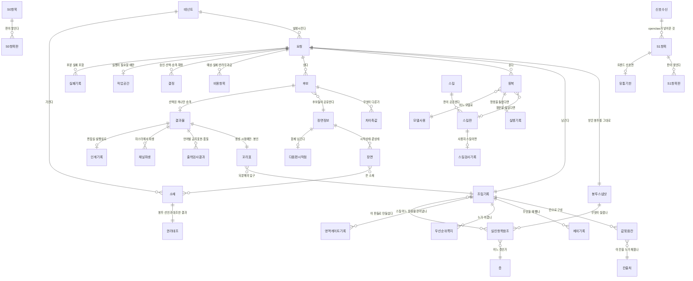
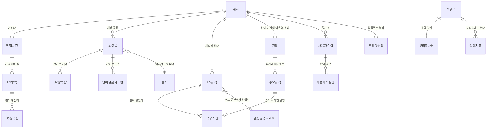

<!--
STAMP
문서: studio-service 생성 범위 저장 구조 (ERD)
판: v1.0
작성: 2026-08-21 23:05 KST
model: claude-opus-5[1m]
agent: tech-architect (서브에이전트)
기반 산출물 (버전 핀):
  - docs/학습정보-층계-계약-v1.0.md §10 분담 (어느 층이 어느 서비스에 사나) ★소유 경계의 진실원
  - studio/docs/fdd-studio-생성-v2.0.md §3.3, §5.2~5.4 (항목 판 누적, 꼬리표 불변, 장면 정보 독립), §6.2 영역 게이트
  - studio/docs/api-contract-studio-생성-v1.0.md §5 판 번호 규격
  - studio/docs/prd-studio-생성-v1.0.md §9 데이터 요구 (줄 단위, 상한, 되분해 금지)
성격: **추천 기준 설계.** 필드 타입은 일부러 비웠다. 회장 티키타카 원칙상 스키마 확정은 합의 대상이고, 이 문서는 **개체·관계·제약**까지만 못 박는다.
고민한 것: L5가 openclaw로 간 뒤 studio에 남는 것이 무엇인지가 이 문서의 절반이었다. 답은 셋이다. 우리 지식(S0·S1·우리 스킬), 이번 제작의 기록, 미디어 바이트와 그것에 붙는 것들. 사용자 것은 하나도 안 남는다.
-->

# ERD: studio-service 생성 범위 v1.0

> **이 문서가 정하는 것**: 어떤 개체가 존재하고, 무엇이 무엇을 가리키고, 어떤 제약이 구조로 강제되는가.
> **이 문서가 일부러 안 정하는 것**: 필드 타입, 인덱스, 테이블 물리명. 회장 합의 뒤에 채운다.

---

## 목차

- [1. 소유 경계 먼저](#소유)
- [2. studio 저장 구조](#studio)
- [3. openclaw 저장 구조 (참조용)](#openclaw)
- [4. 구조로 강제하는 제약 아홉](#제약)
- [5. 수명과 정리](#수명)
- [6. 미결](#미결)
- [SOURCES](#sources)

---

## 1. 소유 경계 먼저 

계약 v1.0 §10이 정한 것을 저장 관점으로 옮긴다. **어느 서비스가 무엇을 갖는지를 먼저 못 박지 않으면 ERD가 두 서비스를 뭉갠 지도가 된다.**

| 무엇 | studio | openclaw | 근거 |
|---|---|---|---|
| S0 시스템 고정 | ✅ 저장 | | 계약 §10 |
| S1 시장·모델 지식 | ✅ 저장 | 트렌드 신호만 모아 넘김 | 계약 §10 |
| U2 계정 공통 | 봉투 스냅샷만 | ✅ 원본 저장 | 계약 §10 |
| U3 작업 공간 | 봉투 스냅샷만 | ✅ 원본 저장 | 계약 §10 |
| X4 우리 스킬 | ✅ 저장 | | 계약 §10 |
| X4 사용자 스킬 | 검사 기록만 | ✅ 원본 저장 | 계약 §10 |
| L5 학습된 규칙 | 봉투 스냅샷만 | ✅ 원본 저장 | 계약 §10 |
| R6 이번 요청 | 요청 기록 안에만 | | 계약 §2 "저장하지 않는다" |
| 관찰 기록 | | ✅ 저장 | 계약 §10 |
| 후보 규칙 대기열 | | ✅ 저장 | 계약 §10 |
| 미디어 바이트 (소재·후보·결과물) | ✅ 저장 | | 경계 wiki 기준 3 |
| 장면 정보 | ✅ 저장 | | FDD §5.4 |
| 꼬리표 | ✅ 저장 | 발행 증거에 사본 보존 | FR-OP-023 |
| 비용 원장 (실비) | ✅ 저장 | ✅ 크레딧 원장 별도 | FDD §9.2 |
| 크레딧·결제 | | ✅ 저장 | FR-OP-028~030 |

**한 줄 요약: studio는 우리 지식과 이번 제작의 기록과 미디어를 갖는다. 사용자에 관한 값은 하나도 영구 보관하지 않는다.**

⚠️ **봉투 스냅샷이 예외처럼 보이지만 아니다.** 스냅샷은 "이 제작에 무엇이 실렸나"의 증거이고, 꼬리표가 성립하려면 필요하다. 다만 **참조와 판 번호만 남기고 내용 원문은 남기지 않는 것을 원칙**으로 한다(§4 제약 6). 이 구분이 "사용자 값을 studio가 갖는다"와 "이 제작에 무엇이 실렸는지를 studio가 안다"를 가른다.

---

## 2. studio 저장 구조 

### 2.1 개체 설명

| 개체 | 무엇 | 왜 존재하나 |
|---|---|---|
| `요청` | 봉투 하나에 대응하는 제작 건. 상태 기계를 갖는다 | 중복 방지의 단위(`request_id`) |
| `봉투스냅샷` | 받은 봉투를 그대로 보존 | "이 제작에 무엇이 실렸나"의 증거 |
| `실린항목참조` | 층 항목 참조 + 판 번호. **내용은 안 담는다** | 꼬리표가 가리키는 대상. §4 제약 6 |
| `조립기록` | 이 요청에서 조립이 무엇을 어떻게 했나 | 꼬리표의 되분해 입구 |
| `값묶음칸` | 값 묶음을 이루는 칸 하나 (말투 칸, 구조 칸, 브랜드 사실 칸 등) | **영역 게이트의 주 방어가 여기 산다.** §4 제약 3 |
| `칸출처` | 이 칸을 어느 층이 채웠나 | 같음 |
| `제외기록` | 모순 검사가 뺀 항목과 사유 | AC-GEN-011 |
| `우선순위쪽지` | 층이 부딪혔을 때 누가 이겼고 왜인지 | FR-GEN-010 |
| `영역게이트기록` | 스킬의 어느 문장을 왜 걷어냈나 | 계약 §3. 제거된 문장이 사라지지 않아야 감사가 된다 |
| `왕복` | 모델 호출 한 바퀴 | 비용과 상한의 단위 |
| `모델사용` | 어느 모델이 이 바퀴를 처리했나. 예비 모델 여부 | **계약 §7 부수 규칙** |
| `실행기록` | 명령 실행의 출력과 종료 코드. **코드 본문은 안 담는다** | FR-GEN-031 |
| `스킬` / `스킬판` | 우리 스킬 원문과 판 | 판 공존(FR-GEN-030) |
| `스킬검사기록` | 사용자 스킬 3종 검사의 결과 | 계약 §3 |
| `후보` / `차이축값` | 저해상도 후보와 그 차이 축 | "최소 두 축이 다르다"를 검사하려면 축이 값으로 있어야 한다 |
| `장면정보` / `장면` | 후보들이 공유하는 독립 문서. 장면마다 시작 상태와 끝 상태 | **편집 원가 우위의 물리적 실체.** FDD §5.4 |
| `다음편시작점` | 다음 편의 시작 장면·첫 대사·상태 변화 | FR-GEN-070 기법 4 |
| `결과물` / `채널파생` | 고해상도 마스터와 채널별 파생 | 채널 중립 마스터 하나에 파생 여럿(경계 wiki) |
| `꼬리표` | 생성 시점에만 쓰이고 봉인 | FR-GEN-040 |
| `출력검사결과` | 언어별 금지 표현 검사와 품질 게이트 결과. **어느 언어를 어느 깊이까지 봤나** | 계약 §4, FDD §6.4 |
| `소재` / `권리대조` | 미디어 바이트와, 봉투의 권리 선언과 대조한 결과 | FR-GEN-052. FDD §4.3 갭 2의 답 |
| `비용항목` | 예상·실제·반려 무과금을 각각 분리 | PRD §9.5, FR-OP-031 |
| `실패기록` | 부분 실패 포함. 범위(요청 전체·채널·후보)를 갖는다 | api-contract §3.2 |
| `S0항목` `S1항목` + 각 판 | 우리 지식. 항목별 판 누적 | FDD §5.2 |
| `유통기한` | 트렌드 신호에만 붙는다 | 계약 §2 S1 |
| `신호수신` | openclaw가 넣어준 트렌드 신호의 수신 기록 | FDD §4.3 갭 1의 답 |
| `작업공간` | 격리 실행 환경. 수명 상한과 재사용 기한을 각각 갖는다 | FDD §8.2 |
| `인계기록` | 편집실·발행실로 넘어간 사실 | FR-OP-026 |

---

## 3. openclaw 저장 구조 (참조용) 

**이 문서의 범위 밖이지만, studio 쪽 참조가 어디를 가리키는지 알아야 계약이 성립한다.** openclaw PRD가 정본이고 여기는 대응만 적는다.

**세 가지만 못 박는다.**
1. **`후보규칙`이 `관찰`과 `L5규칙판` 사이에 끼어 있다.** 승인 전 반영이 구조적으로 불가능해야 하기 때문이다(FR-GEN-022).
2. **`L5규칙`은 계정에 매달리고 `얻은공간꼬리표`를 갖는다.** 계약 §5. 공간에 매달지 않는다.
3. **`언어별금지표현`이 `U2항목` 아래 있다.** 계약 §4. 언어가 U2이므로 금지 표현도 U2에 언어별로 산다.

---

## 4. 구조로 강제하는 제약 아홉 

> P2("차단은 글이 아니라 코드로 한다")를 저장 구조로 옮긴 것이다. 아래는 전부 **규칙이 아니라 구조**여야 한다.

| # | 제약 | 어떻게 강제하나 | 어기면 |
|---|---|---|---|
| 1 | **되돌리기는 덮어쓰기가 아니다** | 항목 판은 추가 전용. 갱신·삭제 권한을 주지 않는다 | R13 위반 |
| 2 | **꼬리표는 생성 시점에만 쓰인다** | 꼬리표 저장소를 추가 전용으로 두고 봉인 표시 뒤 쓰기를 거부한다 | FR-GEN-040 위반 |
| 3 | **말투·어휘·브랜드 사실·금지 표현 칸은 스킬이 채울 수 없다** | `값묶음칸`이 허용 출처 집합을 갖는다. `칸출처`가 그 집합 밖이면 삽입이 실패한다 | **계약 §3 위반.** 영역 게이트의 주 방어 |
| 4 | **승낙 안 된 규칙은 실릴 수 없다** | `실린항목참조`가 L5를 가리킬 때 `consented_at`이 필수. 없으면 삽입 실패 | 계약 §5, FR-GEN-022 위반 |
| 5 | **조립 결과 문자열을 통째로 저장하지 않는다** | `조립기록`에 문자열 칸을 만들지 않는다. 칸 목록과 판 참조만 | P3, PRD §9.3 위반 |
| 6 | **studio는 사용자 값의 내용을 영구 보관하지 않는다** | `실린항목참조`에 내용 칸을 만들지 않는다. 참조와 판만 | **P5 위반.** 개발자용 판매가 흔들린다 |
| 7 | **후보 셋은 장면 정보를 공유한다** | `후보`가 `장면정보`를 참조한다. 후보마다 사본을 만들지 않는다 | 편집 원가 우위 상실, 차이 축 비교 모호 |
| 8 | **실행 결과는 출력만 남는다** | `실행기록`에 코드 본문 칸을 만들지 않는다 | FR-GEN-031 위반 |
| 9 | **반려분은 사용자 과금과 분리된다** | `비용항목`이 `charged_to_user` 구분을 갖고, 반려는 항상 거짓 | FR-GEN-060 위반 |

**제약 3이 이 판의 신규이자 핵심이다.** 계약 §3의 "영역 밖 문장은 걸러낸다"를 문자열 검사로만 구현하면 우회된다. 칸의 허용 출처를 구조로 두면 우회할 대상이 없다.

**제약 6이 가장 자주 흔들릴 자리다.** 디버깅할 때 "실린 내용을 보고 싶다"는 유혹이 항상 온다. 그때 필요한 것은 봉투 스냅샷을 **짧은 기간만** 원문으로 보관하는 것이고(§5), 영구 보관이 아니다.

---

## 5. 수명과 정리 

| 개체 | 얼마나 사나 | 왜 |
|---|---|---|
| `요청` `조립기록` `꼬리표` | 영구 (또는 테넌트 해지까지) | 감사와 되분해의 뼈대 |
| `봉투스냅샷`의 원문 부분 | **짧게.** 문제 조사에 필요한 기간만 | 제약 6. 값은 이 기간이 지나면 참조와 판만 남고 내용은 지운다 |
| `실린항목참조` | 영구 | 꼬리표가 가리키는 대상 |
| `왕복` `실행기록` | 중간. 원가 분석 기간 | 부피가 크고 개별 가치는 낮다 |
| `후보`(미선택) | 재승격 가능 기간 | 미선택 후보를 나중에 승격하려면 새 견적과 승인(FR-GEN-020) |
| `장면정보` `소재` | **편집 재사용 기한까지.** 그 뒤 저비용 보관으로 | 편집 원가 우위의 물리적 전제 |
| `결과물` | 사용자가 지울 때까지 | 사용자 것 |
| `작업공간` | 수명 상한(짧음)까지. 소재는 별도 저장소로 옮김 | FDD §8.2의 두 축 분리 |
| `S0항목판` `S1항목판` | 영구. 단 트렌드 신호는 유통 기한 뒤 비활성 | 계약 §2 S1 |
| `스킬검사기록` | 영구 | 어느 판이 어떤 검사를 통과했는지의 증거 |

⚠️ **정리 규칙 하나를 못 박는다.** 어떤 개체를 지우든 **꼬리표가 가리키는 참조는 끊기지 않아야 한다.** 그래서 정리는 "행을 지운다"가 아니라 "내용을 비우고 참조는 남긴다"가 기본이다. 되분해했을 때 "이 항목은 정리되어 내용이 없습니다"가 나오는 것과, 참조가 깨져 아무것도 안 나오는 것은 전혀 다르다.

---

## 6. 미결 

| # | 무엇 | 누가 정하나 |
|---|---|---|
| E1 | 필드 타입과 물리 테이블 이름 | 회장 티키타카 |
| E2 | 저장소를 몇 개 쓸지 (관계형 하나인가, 미디어는 객체 저장소 분리인가) | 회장 |
| E3 | `봉투스냅샷` 원문 보관 기간의 구체 값 | 회장 (개인정보 정책과 함께) |
| E4 | `층 항목 판`을 언제까지 쌓나 | 실측 후 |
| E5 | `값묶음칸`의 칸 목록 확정. 지금은 개념 수준(말투·어휘·브랜드 사실·금지 표현·구조·순서·길이·구성)만 | 회장 + 실측 |
| E6 | 후보 미선택분 재승격 가능 기간 | 실측 후 |

---

## SOURCES 

| # | 경로 | 무엇을 가져왔나 |
|---|---|---|
| 1 | `docs/학습정보-층계-계약-v1.0.md` (v1.0) | §10 분담표(§1 소유 경계의 진실원), §2 층 정의와 S1 유통 기한, §3 스킬 영역과 검사, §4 언어별 금지 표현, §5 L5는 계정에 살고 꼬리표를 단다 |
| 2 | `studio/docs/fdd-studio-생성-v2.0.md` (v2.0) | §3.3 못 박는 것 넷, §5.2 항목별 판 누적, §5.3 꼬리표 불변, §5.4 장면 정보 독립, §6.2 영역 게이트 세 겹, §8.2 작업 공간 두 축 |
| 3 | `studio/docs/api-contract-studio-생성-v1.0.md` (v1.0) | §5 판 번호와 식별자 규격, §2 봉투 필드(스냅샷이 무엇을 담는지) |
| 4 | `studio/docs/prd-studio-생성-v1.0.md` (v1.0) | §9.1 줄 단위와 상한, §9.3 조립 문자열 통짜 저장 금지, §9.4 관찰 기록, §9.5 비용 원장 분리, §9.6 데이터 경계 |
| 5 | `wiki/architecture/two-service-boundary.md` | 판정 기준 3(미디어 바이트), 채널 중립 마스터와 파생, 편집 원가 우위 |
| 6 | `docs/prd-openclaw-운영-v1.0.md` §4.5~4.7 | FR-OP-023 꼬리표 사본, 027 층 원본 소유, 028~031 크레딧 원장 |

벤치마크: 문서 구조 표준은 doc-review.md §6의 크로스워크(ISO/IEC/IEEE 29148 추적성, arc42 빌딩블록 뷰)를 따랐다. 저장 구조 자체의 외부 벤치마크는 이 판에서 새로 못 돌렸다(WebSearch 예산 소진). FDD v2.0의 B1·B2 실조사가 §4 제약 3(스킬이 못 채우는 칸)과 §2의 스킬 판 공존 구조의 근거를 제공한다.

MODEL: claude-opus-5[1m] / agent: tech-architect

SKILLS_USED: 없음 (이 문서에 매칭되는 산출 스킬이 없다. diagram은 별도 다이어그램 파일 산출용인데 과제가 문서 내 mermaid를 요구했다)
SKILLS_SKIPPED: diagram(mermaid를 문서 안에 직접 실었고 별도 파일 산출이 과제가 아님), document-generate(FDD와 한 벌로 이어 쓰는 문서라 신규 문서군 생성 도구가 안 맞음)

PRESENTATION_CHECK: 툴콜 태그 잔재 없음 / mermaid erDiagram 2종 문법 확인 / 목차 앵커 대조 완료 / 긴 대시 0

RUBRIC_SCORE: 완결5 정밀4 벤치4 추적5 톤5 total=23/25
WEAKEST_LINE: "필드 타입과 물리 테이블 이름은 회장 티키타카 뒤에 채운다."
