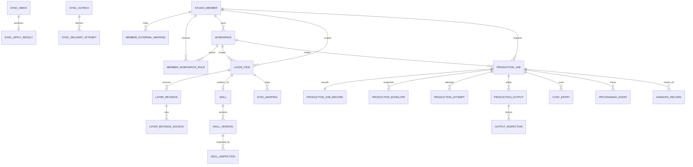

<!--
STAMP
line: studio
artifact: erd-studio-생성
version: v3.0
created_at: 2026-08-22 22:40 KST
model: gpt-codex/gpt-5.6
agent: tech-architect
skills: 없음. 데이터 설계 전용 설치 스킬이 없어 dev.md와 doc-review.md를 직접 적용했다.
basis: 사업계획 v1.2 §3.4, 회장 확정 R01~R99, FDD v4.0, API 계약 v3.0, 기존 ERD v2.0, 현 dashboard PostgreSQL 스키마
evidence_urls: https://www.postgresql.org/docs/18/ddl-rowsecurity.html, https://docs.aws.amazon.com/prescriptive-guidance/latest/cloud-design-patterns/transactional-outbox.html
deliberation: 기존 tenants, workspace_guides, drafts, usage_events를 파괴하지 않고 새 Studio 정규화 저장소로 확장한 뒤 호환 뷰로 전환한다.
-->

# Studio 생성 데이터 설계 v3.0

> 한 줄 결론: Studio는 자체 회원, 작업 공간, `S0 S1 U2 U3 X4 L5 R6`, 동기화, 제작 작업과 부분 결과를 자기 PostgreSQL에 저장하고 모든 범위 행을 회원과 작업 공간으로 격리한다.

| 항목 | 값 |
|---|---|
| 저장소 | PostgreSQL |
| 식별자 | UUID, 신규 시간 정렬 식별자는 UUID v7 권고 |
| 시간 | `timestamptz` UTC |
| 구조 값 | 검증된 `jsonb`, 핵심 조회 필드는 정규 열 |
| 과거 판 | 불변, 갱신 대신 새 판 추가 |
| 삭제 | tombstone 우선, 정책에 따른 물리 정리 후 감사 유지 |
| 격리 | Studio 회원, 작업 공간, 작업 공간 멤버십과 PostgreSQL 행 격리 |
| 기존 DB | `dashboard/db/schema.sql`의 기존 테이블 보존 |

## 목차

- [0. 논의와 미결](#논의)
- [1. 소유 경계](#소유)
- [2. 전체 개체 관계](#전체)
- [3. 회원과 범위](#회원)
- [4. 층 항목과 판](#층)
- [5. 작업 공간 목소리](#목소리)
- [6. 스킬 면](#스킬)
- [7. 동기화](#동기화)
- [8. 제작 작업과 결과](#작업)
- [9. 비용과 작업 기록](#기록)
- [10. 수명과 삭제](#수명)
- [11. 격리와 인덱스](#격리)
- [12. 기존 테이블 전환](#전환)
- [13. 마이그레이션 순서](#마이그레이션)
- [14. 데이터 불변조건](#불변조건)
- [15. 회수 목록](#회수)
- [16. 자기심문과 레드팀](#자기심문)
- [SOURCES, MODEL, RUBRIC](#sources)

## 0. 논의와 미결 

본문에는 확정된 데이터 계약만 둔다. build를 막는 스키마 미결정은 없다. 원문 보유 기간과 호환 판 제거 시점은 운영 설정이며 테이블 기본값에 일수로 고정하지 않는다. 브랜드 테이블과 브랜드 층은 만들지 않는다.

### 회장이 정할 것

없음.

## 1. 소유 경계 

### 1.1 서비스별 저장 책임

| 데이터 | 독립 Studio 정본 | 합친 배치 추천 정본 | Studio에 남는 것 |
|---|---|---|---|
| Studio 회원 | Studio | Studio 회원과 openclaw 매핑 | 정본 |
| 개인 U2 | Studio | openclaw | 정본 또는 투영본 |
| 작업 공간 U3 | Studio | Studio 정본 | openclaw에 발행·성과용 투영본 전송 |
| 창작 규칙 L5 | Studio | Studio | 정본 |
| R6 | 작업 | 작업 | 작업 기록 |
| 시스템 S0 | Studio 운영 | Studio 운영 | 정본 또는 외부 규칙 투영 |
| 시장 S1 | Studio | Studio, openclaw 신호 반입 | 정본 |
| 스킬 X4 | Studio | Studio | 정본 |
| 제작 작업과 결과 | Studio | Studio | 정본 |
| 발행과 성과 | 없음 | openclaw | 인계 참조만 |

### 1.2 정본과 투영본 표기

`layer_items`의 `replica_kind`와 `authority_service`가 소유를 나타낸다.

`projection`은 값을 읽을 수 있다는 뜻이지 바꿀 수 있다는 뜻이 아니다.

`authority_item_id`가 없는 projection은 허용하지 않는다.

### 1.3 기존 전제 폐기

다음을 폐기한다.

- 사용자 값이 전부 openclaw에만 있다는 전제
- Studio가 회원을 모른다는 전제
- Studio가 사용자 값을 영속 저장하지 않는다는 전제
- X4가 층이라는 전제
- L5가 계정에만 매달린다는 전제

### 1.4 표기

| 표기 | 뜻 |
|---|---|
| PK | 표 안에서 행을 유일하게 식별하는 기본키 |
| FK | 다른 표의 행을 가리키는 외래키 |
| NN | null을 허용하지 않는 제약 |
| UQ | 중복값을 허용하지 않는 고유 제약 |
| CHECK | 값의 범위와 조합을 검사하는 제약 |
| JSONB | PostgreSQL의 이진 JSON 자료형 |
| UUID | 충돌 가능성이 매우 낮은 128비트 식별자 |
| RLS | PostgreSQL의 행 단위 접근 통제 |

## 2. 전체 개체 관계 

## 3. 회원과 범위 

### 3.1 `studio_members`

Studio 독립 회원 정본이다.

| 열 | 타입 | 제약 | 설명 |
|---|---|---|---|
| id | uuid | PK | 내부 회원 식별자 |
| status | text | NN, CHECK | active, paused, deletion_pending, deleted |
| display_name | text | NN | 표시명 |
| primary_email_hash | text | nullable | 이메일 원문 대신 정규화 해시 |
| auth_subject | text | UQ, nullable | Studio 인증 주체 |
| created_at | timestamptz | NN | 생성 |
| updated_at | timestamptz | NN | 갱신 |
| deleted_at | timestamptz | nullable | 삭제 |

인덱스:

- unique `(auth_subject)` where auth_subject is not null
- `(status, created_at)`

### 3.2 `member_external_mappings`

openclaw 같은 외부 회원과 Studio 회원을 잇는다.

| 열 | 타입 | 제약 | 설명 |
|---|---|---|---|
| id | uuid | PK | 매핑 |
| studio_member_id | uuid | FK, NN | Studio 회원 |
| source_service | text | NN | openclaw 등 |
| source_member_id | text | NN | 외부 회원 식별자 |
| mapping_status | text | NN, CHECK | active, conflicted, detached |
| mapped_at | timestamptz | NN | 연결 |
| detached_at | timestamptz | nullable | 해제 |

고유 제약:

- `(source_service, source_member_id)`
- `(studio_member_id, source_service)` where mapping_status=active

### 3.2.1 `member_entitlements`

Studio 자체 요금제 권한 정본이다.

| 열 | 타입 | 제약 | 설명 |
|---|---|---|---|
| studio_member_id | uuid | PK, FK | Studio 회원 |
| plan_code | text | NN, CHECK | free, starter, pro, enterprise |
| workspace_limit | integer | nullable | free=1, starter=1, pro=3, enterprise=협의값 |
| free_actual_video_limit | integer | NN | free=1, 나머지는 상품 설정 |
| free_actual_video_used | integer | NN, >=0 | 실제 렌더 성공 후만 증가 |
| valid_from | timestamptz | NN | 권한 시작 |
| valid_until | timestamptz | nullable | 권한 만료 |
| updated_at | timestamptz | NN | 갱신 |

`workspace_limit` 검사는 active·deleting 작업 공간을 모두 세며 동시 생성은 잠금 행으로 직렬화한다. 무료 영상 권한은 1080×1920, 30fps, 90초 안팡의 실제 렌더가 성공한 거래에서만 소비한다.

### 3.3 `workspaces`

작업 공간은 브랜드, 언어, 취향, 소재, 학습 정보를 격리하는 최상위 사용자 범위다.

| 열 | 타입 | 제약 | 설명 |
|---|---|---|---|
| id | uuid | PK | 작업 공간 |
| studio_member_id | uuid | FK, NN | 소유 회원 |
| name | text | NN | 표시 이름 |
| default_language | text | NN | BCP 47 |
| authority_service | text | NN | studio 또는 openclaw |
| authority_workspace_id | text | nullable | 외부 정본 식별자 |
| status | text | NN, CHECK | active, held, deleting, deleted |
| created_at | timestamptz | NN | 생성 |
| updated_at | timestamptz | NN | 갱신 |
| deleted_at | timestamptz | nullable | 삭제 |

고유 제약:

- `(studio_member_id, lower(name))` where status != deleted
- `(authority_service, authority_workspace_id)` where authority_workspace_id is not null

### 3.4 `member_workspace_roles`

| 열 | 타입 | 제약 | 설명 |
|---|---|---|---|
| studio_member_id | uuid | PK 일부, FK | 회원 |
| workspace_id | uuid | PK 일부, FK | 작업 공간 |
| role | text | NN, CHECK | owner, editor, viewer |
| granted_by | uuid | FK | 부여자 |
| created_at | timestamptz | NN | 생성 |

복합 PK `(studio_member_id, workspace_id)`.

작업 공간 owner는 최소 한 명이어야 한다.

마지막 owner 제거는 서비스 로직과 지연 제약 시험으로 막는다.

## 4. 층 항목과 판 

### 4.1 `layer_items`

| 열 | 타입 | 제약 | 설명 |
|---|---|---|---|
| id | uuid | PK | 안정 항목 식별자 |
| studio_member_id | uuid | FK, NN | 격리 기준 |
| workspace_id | uuid | FK, nullable | 작업 공간 범위 |
| layer_code | text | NN, CHECK | S0, S1, U2, U3, X4, L5 |
| scope_kind | text | NN, CHECK | system, member, workspace |
| item_kind | text | NN | workspace_fact 등 |
| replica_kind | text | NN, CHECK | canonical, projection |
| authority_service | text | NN | studio, openclaw, external |
| authority_item_id | text | nullable | 투영본이면 필수 |
| stopping_class | text | NN, CHECK | forbidden_phrase, workspace_fact, material_rights, non_stopping |
| current_revision | bigint | NN, 기본 0 | 적용 최신 판 |
| status | text | NN, CHECK | active, held, deleted |
| created_at | timestamptz | NN | 생성 |
| updated_at | timestamptz | NN | 갱신 |
| deleted_at | timestamptz | nullable | 삭제 |

범위 CHECK:

- system이면 studio_member_id와 workspace_id가 null을 허용
- member이면 studio_member_id NN, workspace_id null
- workspace이면 studio_member_id와 workspace_id 둘 다 NN
- U2는 member
- U3는 workspace
- X4는 system, member, workspace 중 설치 범위 하나
- L5는 workspace. 승낙 전 후보는 `learning_candidates`에만 저장

투영 CHECK:

- replica_kind=projection이면 authority_service != studio
- projection이면 authority_item_id NN
- canonical이고 authority_service=studio면 authority_item_id는 id 문자열과 같거나 null 허용

인덱스:

- `(studio_member_id, layer_code, status)`
- `(workspace_id, layer_code, status)` where workspace_id is not null
- unique `(authority_service, authority_item_id)` where authority_item_id is not null
- `(stopping_class, status)` where replica_kind=projection

### 4.2 `layer_revisions`

| 열 | 타입 | 제약 | 설명 |
|---|---|---|---|
| id | uuid | PK | 불변 판 식별자 |
| layer_item_id | uuid | FK, NN | 항목 |
| revision | bigint | NN, >0 | 항목별 단조 증가 |
| value_schema | text | NN | 값 스키마 식별자 |
| value | jsonb | NN | 검증된 구조 값 |
| value_hash | text | NN | 정규 JSON SHA-256 |
| authority_revision | bigint | nullable | 외부 정본 판 |
| authority_updated_at | timestamptz | nullable | 정본 갱신 시각 |
| received_at | timestamptz | nullable | 투영 수신 시각 |
| consent_state | text | NN, CHECK | granted, denied, not_required, pending |
| created_by_member_id | uuid | FK, nullable | 사람 작성 |
| created_by_event_id | uuid | nullable | 동기화 작성 |
| created_at | timestamptz | NN | 생성 |

고유 제약 `(layer_item_id, revision)`.

과거 행 UPDATE와 DELETE 권한은 애플리케이션 역할에 주지 않는다.

### 4.3 `layer_revision_sources`

| 열 | 타입 | 제약 | 설명 |
|---|---|---|---|
| id | uuid | PK | 출처 |
| layer_revision_id | uuid | FK, NN | 판 |
| source_kind | text | NN | url, document, user_input, sync, copy |
| source_ref | text | NN | 불투명 참조 |
| source_hash | text | nullable | 내용 지문 |
| copied_from_item_id | uuid | FK, nullable | 명시 복사 원본 |
| captured_at | timestamptz | NN | 수집 |

명시 복사는 `source_kind=copy`와 copied_from_item_id를 요구한다.

### 4.4 `l5_conditions`

L5 판마다 정확히 한 행이다.

| 열 | 타입 | 제약 | 설명 |
|---|---|---|---|
| layer_revision_id | uuid | PK, FK | L5 판 |
| workspace_id | uuid | FK, NN | 배운 규칙을 승낙한 작업 공간 |
| candidate_id | uuid | FK, NN, UQ | 승낙된 후보 |
| evidence_kind | text | NN, CHECK | repeated_choice, performance |
| evidence_count | integer | NN | repeated_choice는 3 이상, performance는 5 이상 |
| evidence_summary | jsonb | NN | 선택 또는 성과 근거 참조 |
| accepted_by_member_id | uuid | FK, NN | 승낙자 |
| accepted_at | timestamptz | NN | 승낙 시각 |
| rollback_state | text | NN, CHECK | active, reverted |

승낙 전 `learning_candidates`에는 `evidence_sufficient=false`와 표시 문구 `근거 부족`을 저장할 수 있다. `l5_conditions`에는 승낙된 후보만 들어간다.

### 4.5 S0와 S1 특수값

S0 외부 항목은 `last_verified_at`과 `verification_due_at`을 value 안이 아니라 별도 메타 열로 두는 것이 조회에 유리하다.

따라서 `layer_revisions`에 다음 선택 열을 추가한다.

- `last_verified_at timestamptz`
- `verification_due_at timestamptz`

S1에는 `valid_until timestamptz`를 추가한다.

만료된 S1은 삭제하지 않고 봉투에서 제외한다.

## 5. U3 작업 공간 문맥 

U3는 별도 프로파일 테이블이 아니라 `layer_items` 하나와 불변 `layer_revisions`로 저장한다. `value_schema=studio.u3-workspace-context/1.0`의 `value` 등록값은 다음을 포함한다.

| 값 | 자료형 | 멈춤 여부 | 설명 |
|---|---|---|---|
| workspace_facts | jsonb 배열 | 예 | 브랜드·상품·인물 사실과 출처 |
| expression_rules | text[] | 아니오 | 말투·어휘·리듬·표기 선호 |
| forbidden_phrases | jsonb 배열 | 예 | 언어, 확인 상태, 문구 |
| material_rights | jsonb 배열 | 예 | 소재 식별자, 허용 용도, 만료 |
| goals | text[] | 아니오 | 이 공간의 제작 목표 |
| free_note | text | 아니오 | 구조화 값을 덮지 않는 보조 설명 |

멈춤 값 세 종류가 낡고 동기화 실패 이력이 있으면 해당 값을 쓰는 작만 막는다. 자유 서술은 브랜드 사실·금지 표현·소재 권리를 상쇄할 수 없다.

## 6. X4 스킬 층 

### 6.1 `skills`

| 열 | 타입 | 제약 | 설명 |
|---|---|---|---|
| id | uuid | PK | 스킬 |
| layer_item_id | uuid | FK, NN, UQ | `layer_code=X4`인 층 항목 |
| studio_member_id | uuid | FK, nullable | 사용자 소유면 필수 |
| workspace_id | uuid | FK, nullable | 작업 공간 전용 |
| owner_kind | text | NN, CHECK | studio, member |
| name | text | NN | 표시명 |
| status | text | NN, CHECK | draft, held, active, rejected, deleted |
| current_revision | bigint | NN | 최신 판 |
| created_at | timestamptz | NN | 생성 |
| deleted_at | timestamptz | nullable | 삭제 |

Studio 공용 스킬은 studio_member_id와 workspace_id가 null이다.

사용자 스킬은 studio_member_id가 NN이다.

### 6.2 `skill_versions`

| 열 | 타입 | 제약 | 선언 칸 |
|---|---|---|---|
| id | uuid | PK | 판 |
| skill_id | uuid | FK, NN | 판 |
| revision | bigint | NN | 판 |
| read_fields | text[] | NN | 1 |
| write_fields | text[] | NN | 2 |
| write_modes | jsonb | NN | 3 |
| permissions | jsonb | NN | 4 |
| io_schema | text | NN | 5 |
| conflict_action | text | NN, CHECK | 6 |
| source_uri | text | nullable | 7 |
| source_version | text | NN | 7 |
| license | text | nullable | 7 |
| content_hash | text | NN | 7 |
| sandbox_class | text | NN, CHECK | 8 |
| network_allowlist | text[] | NN | 8 |
| body_storage_ref | text | NN | 본문 |
| created_at | timestamptz | NN | 생성 |

고유 `(skill_id, revision)`.

write_modes의 모든 키는 write_fields에 있어야 한다.

모든 write_fields는 default 또는 force 중 하나를 가진다.

### 6.3 `skill_inspections`

| 열 | 타입 | 제약 |
|---|---|---|
| id | uuid | PK |
| skill_version_id | uuid | FK, NN |
| s0_bypass_result | text | NN |
| impersonation_result | text | NN |
| undeclared_force_result | text | NN |
| license_result | text | NN |
| permission_result | text | NN |
| overall_status | text | NN, CHECK |
| report | jsonb | NN |
| inspected_at | timestamptz | NN |

active skill_version은 accepted 또는 승인된 downgraded 검사 결과를 요구한다.

### 6.4 `skill_applications`

| 열 | 타입 | 제약 |
|---|---|---|
| id | uuid | PK |
| production_envelope_id | uuid | FK, NN |
| skill_version_id | uuid | FK, NN |
| field_path | text | NN |
| user_filled | boolean | NN |
| write_mode | text | NN, CHECK |
| action | text | NN, CHECK |
| reason | text | NN |
| created_at | timestamptz | NN |

고유 `(production_envelope_id, skill_version_id, field_path)`.

## 7. 동기화 

### 7.1 `sync_mappings`

| 열 | 타입 | 제약 |
|---|---|---|
| id | uuid | PK |
| source_service | text | NN |
| source_member_id | text | NN |
| source_workspace_id | text | nullable |
| source_item_id | text | NN |
| local_member_id | uuid | FK, NN |
| local_workspace_id | uuid | FK, nullable |
| local_item_id | uuid | FK, NN |
| status | text | NN, CHECK |
| mapped_at | timestamptz | NN |
| detached_at | timestamptz | nullable |

고유 `(source_service, source_item_id)`.

고유 `(source_service, local_item_id)` where status=active.

### 7.2 `sync_inbox`

| 열 | 타입 | 제약 |
|---|---|---|
| id | uuid | PK |
| source_service | text | NN |
| event_id | text | NN |
| event_type | text | NN |
| subject | text | NN |
| contract_version | text | NN |
| payload | jsonb | NN |
| payload_hash | text | NN |
| status | text | NN, CHECK |
| received_at | timestamptz | NN |
| processed_at | timestamptz | nullable |
| failure_code | text | nullable |

고유 `(source_service, event_id)`.

중복 사건은 기존 행을 읽고 같은 apply 결과를 반환한다.

### 7.3 `sync_apply_results`

| 열 | 타입 | 제약 |
|---|---|---|
| sync_inbox_id | uuid | PK, FK |
| local_item_id | uuid | FK, nullable |
| applied_revision | bigint | nullable |
| result | text | NN, CHECK |
| warning | jsonb | NN, 기본 빈 배열 |
| acknowledged_at | timestamptz | NN |

### 7.4 `sync_outbox`

| 열 | 타입 | 제약 |
|---|---|---|
| id | uuid | PK |
| event_id | uuid | NN, UQ |
| aggregate_type | text | NN |
| aggregate_id | uuid | NN |
| aggregate_revision | bigint | NN |
| event_type | text | NN |
| destination_service | text | NN |
| payload | jsonb | NN |
| payload_hash | text | NN |
| priority | smallint | NN |
| status | text | NN, CHECK |
| next_attempt_at | timestamptz | NN |
| created_at | timestamptz | NN |
| succeeded_at | timestamptz | nullable |

인덱스 `(status, priority desc, next_attempt_at)`.

정본 판과 같은 트랜잭션에서 저장한다.

### 7.5 `sync_delivery_attempts`

| 열 | 타입 | 제약 |
|---|---|---|
| id | uuid | PK |
| sync_outbox_id | uuid | FK, NN |
| attempt_no | integer | NN |
| started_at | timestamptz | NN |
| finished_at | timestamptz | nullable |
| http_status | integer | nullable |
| result | text | NN |
| error_code | text | nullable |
| response_hash | text | nullable |

고유 `(sync_outbox_id, attempt_no)`.

### 7.6 `sync_comparisons`

| 열 | 타입 | 제약 |
|---|---|---|
| id | uuid | PK |
| local_item_id | uuid | FK, NN |
| reason | text | NN, CHECK |
| local_revision | bigint | NN |
| authority_revision | bigint | nullable |
| result | text | NN, CHECK |
| compared_at | timestamptz | NN |
| repair_event_id | uuid | nullable |

reason은 세 값만 허용한다.

- failed_push_history
- immediate_production_after_change
- periodic_window_elapsed

### 7.7 `projection_sync_states`

항목당 한 행으로 빠른 판정을 돕는다.

| 열 | 타입 | 제약 |
|---|---|---|
| layer_item_id | uuid | PK, FK |
| last_push_succeeded_at | timestamptz | nullable |
| last_failed_at | timestamptz | nullable |
| has_failed_push | boolean | NN |
| retry_state | text | NN, CHECK |
| retry_count | integer | NN |
| next_retry_at | timestamptz | nullable |
| dead_lettered_at | timestamptz | nullable |
| periodic_compare_due_at | timestamptz | NN |
| updated_at | timestamptz | NN |

## 8. 제작 작업과 결과 

### 8.1 `production_jobs`

| 열 | 타입 | 제약 |
|---|---|---|
| id | uuid | PK |
| studio_member_id | uuid | FK, NN |
| workspace_id | uuid | FK, NN |
| idempotency_key | text | NN |
| request_fingerprint | text | NN |
| status | text | NN, CHECK |
| proposal_set_id | uuid | nullable |
| current_envelope_id | uuid | nullable |
| approved_cost_ceiling_minor | bigint | NN, >=0 |
| currency | char(3) | NN |
| created_at | timestamptz | NN |
| updated_at | timestamptz | NN |
| finished_at | timestamptz | nullable |

고유 `(studio_member_id, idempotency_key)`.

닫힌 FK로 workspace와 workspace가 같은 member에 속함을 강제한다.

### 8.2 `request_raw_inputs`

| 열 | 타입 | 제약 |
|---|---|---|
| id | uuid | PK |
| production_job_id | uuid | FK, NN, UQ |
| ciphertext | bytea | NN |
| content_type | text | NN |
| byte_length | bigint | NN |
| byte_hash | text | NN |
| encryption_key_ref | text | NN |
| retention_until | timestamptz | nullable |
| deleted_at | timestamptz | nullable |

원문 보유를 거절하면 ciphertext 대신 삭제 사건만 남긴다.

### 8.3 `normalized_inputs`

| 열 | 타입 | 제약 |
|---|---|---|
| id | uuid | PK |
| production_job_id | uuid | FK, NN, UQ |
| schema_version | text | NN |
| value | jsonb | NN |
| fingerprint | text | NN |
| transformation_log | jsonb | NN |
| raw_input_id | uuid | FK, nullable |
| created_at | timestamptz | NN |

### 8.4 `production_envelopes`

| 열 | 타입 | 제약 |
|---|---|---|
| id | uuid | PK |
| production_job_id | uuid | FK, NN |
| contract_version | text | NN |
| envelope | jsonb | NN |
| envelope_hash | text | NN, UQ |
| layer_version_manifest | jsonb | NN |
| workspace_context_hash | text | NN |
| x4_skill_manifest | jsonb | NN |
| created_at | timestamptz | NN |

봉투는 UPDATE 금지다.

새 조립은 새 envelope 행이다.

### 8.5 `production_attempts`

| 열 | 타입 | 제약 |
|---|---|---|
| id | uuid | PK |
| production_job_id | uuid | FK, NN |
| production_envelope_id | uuid | FK, NN |
| provider | text | NN |
| model | text | NN |
| skill_version_ids | uuid[] | NN |
| fallback | boolean | NN |
| attempt_no | integer | NN |
| status | text | NN, CHECK |
| provider_request_id | text | nullable |
| started_at | timestamptz | NN |
| finished_at | timestamptz | nullable |
| failure_code | text | nullable |

고유 `(production_job_id, attempt_no)`.

provider_request_id는 공급자 안에서 고유한 경우 부분 고유 인덱스를 둔다.

### 8.6 `production_outputs`

| 열 | 타입 | 제약 |
|---|---|---|
| id | uuid | PK |
| production_job_id | uuid | FK, NN |
| production_attempt_id | uuid | FK, nullable |
| parent_output_id | uuid | FK, nullable |
| slot | text | NN |
| output_kind | text | NN |
| status | text | NN, CHECK |
| storage_ref | text | nullable |
| content_hash | text | nullable |
| media_type | text | nullable |
| failure_code | text | nullable |
| retryable | boolean | NN |
| created_at | timestamptz | NN |
| finalized_at | timestamptz | nullable |

고유 `(production_job_id, slot, parent_output_id)`를 정책에 맞게 둔다.

부분 실패 시 성공 행은 유지한다.

### 8.7 `output_inspections`

| 열 | 타입 | 제약 |
|---|---|---|
| id | uuid | PK |
| production_output_id | uuid | FK, NN |
| inspection_type | text | NN |
| result | text | NN, CHECK |
| blocking | boolean | NN |
| matched_refs | jsonb | NN |
| rules_revision_manifest | jsonb | NN |
| inspected_at | timestamptz | NN |

검사 종류:

- schema
- language
- forbidden_phrase
- workspace_fact
- material_rights
- skill_output
- channel_spec
- quality

### 8.8 `production_decisions`

후보 선택, 충돌 해소, disposition을 사건으로 저장한다.

| 열 | 타입 | 제약 |
|---|---|---|
| id | uuid | PK |
| production_job_id | uuid | FK, NN |
| decision_type | text | NN |
| selected_output_id | uuid | FK, nullable |
| axes | text[] | NN |
| note | text | nullable |
| decided_by | uuid | FK, NN |
| created_at | timestamptz | NN |

### 8.9 `execution_workspaces`

| 열 | 타입 | 제약 |
|---|---|---|
| id | uuid | PK |
| production_job_id | uuid | FK, NN |
| sandbox_class | text | NN |
| storage_ref | text | NN |
| expires_at | timestamptz | NN |
| state | text | NN, CHECK |
| destroyed_at | timestamptz | nullable |

실행 공간에 회원이나 작업 공간 간 공유 참조를 허용하지 않는다.

### 8.10 `translation_reviews`

언어별 금지 표현 후보와 사람 확인을 분리한다.

| 열 | 타입 | 제약 |
|---|---|---|
| id | uuid | PK |
| studio_member_id | uuid | FK, NN |
| workspace_id | uuid | FK, NN |
| source_language | text | NN |
| source_phrase | text | NN |
| target_language | text | NN |
| candidate_phrase | text | NN |
| model | text | NN |
| status | text | NN, CHECK |
| reviewed_by | uuid | FK, nullable |
| reviewed_at | timestamptz | nullable |
| promoted_layer_revision_id | uuid | FK, nullable |
| created_at | timestamptz | NN |

status는 pending_review, accepted, rejected다.

accepted 뒤에만 U3 forbidden_phrase_set 판에 승격한다.

### 8.11 `material_imports`

| 열 | 타입 | 제약 |
|---|---|---|
| id | uuid | PK |
| studio_member_id | uuid | FK, NN |
| workspace_id | uuid | FK, NN |
| workspace_id | uuid | FK, nullable |
| source_kind | text | NN, CHECK |
| source_uri | text | nullable |
| upload_ref | text | nullable |
| text_cipher_ref | text | nullable |
| content_hash | text | nullable |
| rights_owner | text | NN, CHECK |
| commercial_use | boolean | NN |
| license | text | nullable |
| rights_status | text | NN, CHECK |
| status | text | NN, CHECK |
| created_at | timestamptz | NN |
| finished_at | timestamptz | nullable |

source_uri, upload_ref, text_cipher_ref 중 정확히 하나가 있어야 한다.

rights_status=confirmed 전에는 봉투 material_refs에 들어갈 수 없다.

### 8.12 `market_signals`

S1 원본 수집과 항목 승격 사이의 대기 표다.

| 열 | 타입 | 제약 |
|---|---|---|
| id | uuid | PK |
| studio_member_id | uuid | FK, nullable |
| market | text | NN |
| language | text | NN |
| channel | text | nullable |
| format | text | nullable |
| title | text | NN |
| summary | text | NN |
| source_url | text | NN |
| source_checked_at | timestamptz | NN |
| valid_until | timestamptz | NN |
| status | text | NN, CHECK |
| promoted_layer_revision_id | uuid | FK, nullable |
| created_at | timestamptz | NN |

만료 신호는 삭제하지 않고 기본 조회에서 제외한다.

### 8.13 `reference_views`

어떤 사례를 사용자에게 보여 줬는지 기록한다.

| 열 | 타입 | 제약 |
|---|---|---|
| id | uuid | PK |
| studio_member_id | uuid | FK, NN |
| workspace_id | uuid | FK, NN |
| market_signal_id | uuid | FK, NN |
| production_job_id | uuid | FK, nullable |
| shown_at | timestamptz | NN |

이 표는 학습 규칙이 아니다.

사례를 봤다는 사실만으로 L5를 만들지 않는다.

### 8.14 `proposal_sets`

| 열 | 타입 | 제약 |
|---|---|---|
| id | uuid | PK |
| studio_member_id | uuid | FK, NN |
| workspace_id | uuid | FK, NN |
| production_job_id | uuid | FK, nullable |
| retry_of | uuid | FK, nullable |
| status | text | NN, CHECK |
| difference_axes | jsonb | NN |
| proposals | jsonb | NN |
| created_at | timestamptz | NN |

전체 거절 재시도는 새 행을 만들고 retry_of를 잇는다.

### 8.15 `request_adjustments`

R6를 일반 층과 분리한다.

| 열 | 타입 | 제약 |
|---|---|---|
| id | uuid | PK |
| production_job_id | uuid | FK, NN |
| revision | bigint | NN |
| value | jsonb | NN |
| value_hash | text | NN |
| created_by | uuid | FK, NN |
| created_at | timestamptz | NN |

고유 `(production_job_id, revision)`.

작업 밖 조회나 다른 작업 상속을 허용하지 않는다.

### 8.16 `learning_candidates`

| 열 | 타입 | 제약 |
|---|---|---|
| id | uuid | PK |
| studio_member_id | uuid | FK, NN |
| workspace_id | uuid | FK, nullable |
| source_job_ids | uuid[] | NN |
| proposed_rule | jsonb | NN |
| evidence_kind | text | NN, CHECK |
| evidence_count | integer | NN, >=0 |
| evidence_refs | jsonb | NN |
| evidence_sufficient | boolean | NN |
| display_notice | text | NN | 승낙 전에는 `근거 부족` |
| confidence | numeric(5,4) | NN |
| status | text | NN, CHECK |
| decided_by | uuid | FK, nullable |
| decided_at | timestamptz | nullable |
| promoted_layer_revision_id | uuid | FK, nullable |
| created_at | timestamptz | NN |

status는 pending, accepted, rejected, edited다. `repeated_choice`는 3회, `performance`는 비교 가능한 성과 5건에서만 `evidence_sufficient=true`가 된다.

accepted 또는 edited 뒤에만 L5 판이 생긴다.

### 8.17 `production_conflicts`

| 열 | 타입 | 제약 |
|---|---|---|
| id | uuid | PK |
| production_job_id | uuid | FK, NN |
| field_path | text | NN |
| contender_manifest | jsonb | NN |
| automatic_resolution | text | nullable |
| requires_member | boolean | NN |
| status | text | NN, CHECK |
| created_at | timestamptz | NN |
| resolved_at | timestamptz | nullable |

### 8.18 `conflict_decisions`

| 열 | 타입 | 제약 |
|---|---|---|
| id | uuid | PK |
| production_conflict_id | uuid | FK, NN, UQ |
| choice | text | NN, CHECK |
| selected_revision_ids | uuid[] | NN |
| merged_value | jsonb | nullable |
| note | text | nullable |
| decided_by | uuid | FK, NN |
| decided_at | timestamptz | NN |

선택은 새 봉투에 반영하며 과거 봉투를 수정하지 않는다.

## 9. 비용과 작업 기록 

### 9.1 `production_job_records`

계약 v2.1의 일곱 항목을 고정한다.

| 열 | 타입 | 계약 항목 |
|---|---|---|
| production_job_id | uuid PK, FK | 요청 식별자 |
| normalized_input_id | uuid FK, NN | 정규화 입력 |
| layer_version_manifest | jsonb NN | 각 층 판 |
| consent_manifest | jsonb NN | 동의 상태 |
| cost_summary | jsonb NN | 비용 |
| execution_version_manifest | jsonb NN | 모델과 스킬 판 |
| result_ids | uuid[] NN | 결과 식별자 |
| updated_at | timestamptz NN | 갱신 |

이 표는 조회 최적화 스냅샷이다.

원장은 각 원본 테이블이다.

결과 ids와 비용 summary는 트랜잭션 안에서 원장과 함께 갱신한다.

### 9.2 `cost_entries`

| 열 | 타입 | 제약 |
|---|---|---|
| id | uuid | PK |
| production_job_id | uuid | FK, NN |
| production_attempt_id | uuid | FK, nullable |
| production_output_id | uuid | FK, nullable |
| entry_type | text | NN, CHECK |
| amount_minor | bigint | NN |
| currency | char(3) | NN |
| provider | text | nullable |
| model | text | nullable |
| customer_billable | boolean | NN |
| created_at | timestamptz | NN |

entry_type:

- estimate_min
- estimate_max
- reservation
- actual
- reservation_release
- refund
- operator_cost

비용 행은 수정하지 않고 상쇄 행을 추가한다.

### 9.3 `provenance_events`

| 열 | 타입 | 제약 |
|---|---|---|
| id | uuid | PK |
| production_job_id | uuid | FK, NN |
| sequence_no | bigint | NN |
| event_type | text | NN |
| subject_type | text | NN |
| subject_id | text | NN |
| data | jsonb | NN |
| created_at | timestamptz | NN |

고유 `(production_job_id, sequence_no)`.

추가 전용이다.

### 9.4 `handoff_records`

| 열 | 타입 | 제약 |
|---|---|---|
| id | uuid | PK |
| production_job_id | uuid | FK, NN |
| destination_service | text | NN |
| output_ids | uuid[] | NN |
| provenance_snapshot | jsonb | NN |
| status | text | NN, CHECK |
| idempotency_key | text | NN |
| created_at | timestamptz | NN |
| acknowledged_at | timestamptz | nullable |

고유 `(destination_service, idempotency_key)`.

## 10. 수명과 삭제 

### 10.1 삭제 원칙

1. 정본 삭제는 새 tombstone 판이다.
2. 투영 삭제는 sync 사건으로 적용한다.
3. 작업 공간 삭제는 소속 U3, 작업 공간 설치 X4, L5를 비활성화한다.
4. 결과와 계보는 보유 정책 동안 남는다.
5. 원문 삭제는 ciphertext를 지우고 삭제 감사만 남긴다.
6. 비용 원장은 상쇄만 허용한다.

### 10.2 보유표

| 표 | 기본 보유 | 정리 방식 |
|---|---|---|
| studio_members | 계정 수명 | 익명화와 tombstone |
| member_external_mappings | 연결 수명 | detached |
| workspaces, workspaces | 계정 수명 | deleted 상태 |
| layer_revisions | 계보 수명 | 민감 value 가림 가능 |
| request_raw_inputs | 설정된 `retention_until`까지 | ciphertext 물리 삭제 |
| normalized_inputs | 작업 계보 수명 | 정책 삭제 |
| production_envelopes | 결과 계보 수명 | 민감 조각 가림 |
| production_outputs | 상품 정책 | 바이트와 메타 분리 삭제 |
| cost_entries | 회계 정책 | 유지 |
| sync_inbox | 운영 정책 | payload 축약 후 식별자 유지 |
| sync_outbox | 운영 정책 | 성공 사건 축약 |
| dead letter | 해결과 감사 정책 | 해결 표시 뒤 보관 |
| execution_workspaces | 짧은 만료 | 즉시 파괴 |

## 11. 격리와 인덱스 

### 11.1 행 격리 정책

모든 회원 범위 표는 다음 중 하나를 만족해야 한다.

- `studio_member_id` 직접 열 보유
- 닫힌 외래키로 studio_member_id가 불변 연결

성능과 정책 단순성을 위해 다음 고위험 표는 직접 열을 둔다.

- workspaces
- layer_items
- skills
- production_jobs

하위 표는 부모 FK와 보안 뷰를 쓸 수 있지만 DB 정책 시험이 필수다.

### 11.2 작업 공간 범위 정책

작업 공간 자료는 `member_workspace_roles`를 통해 접근한다.

owner와 editor는 쓰기, viewer는 읽기다.

작업 생성은 editor 이상이다.

다른 작업 공간 식별자 입력은 0행으로 처리된다.

### 11.3 필수 인덱스 목록

| 질의 | 인덱스 |
|---|---|
| 회원 작업 공간 목록 | workspaces(member_id, status, created_at) |
| 작업 공간 작업 공간 | workspaces(workspace_id, status, created_at) |
| 봉투 층 조회 | layer_items(member_id, workspace_id, workspace_id, layer_code, status) |
| 최신 판 | layer_revisions(layer_item_id, revision desc) |
| 조건 L5 | l5_conditions(workspace_id, workspace_id, language, channel, format) |
| 실패 밀기 | projection_sync_states(has_failed_push, periodic_compare_due_at) |
| 수신 중복 | sync_inbox(source_service, event_id) unique |
| 아웃박스 전달 | sync_outbox(status, priority desc, next_attempt_at) |
| 작업 목록 | production_jobs(member_id, status, updated_at desc) |
| 작업 공간 작업 목록 | production_jobs(workspace_id, updated_at desc) |
| 결과 목록 | production_outputs(job_id, status, created_at) |
| 비용 합계 | cost_entries(job_id, entry_type, created_at) |
| 계보 순서 | provenance_events(job_id, sequence_no) unique |

### 11.4 개인정보와 로그

이메일 원문을 업무 테이블에 복제하지 않는다.

동기화 payload와 봉투에 불필요한 개인정보를 넣지 않는다.

로그 식별자는 해시 또는 내부 UUID다.

원문 테이블 접근은 별도 감사 사건을 남긴다.

## 12. 기존 테이블 전환 

### 12.1 `tenants`

현 `tenants`는 openclaw 워크스페이스와 회원을 동시에 나타낸다.

새 Studio에서 직접 재사용하지 않는다.

합친 배치 전환 시 다음으로 매핑한다.

- owner_auth_id -> studio_members.auth_subject 또는 external mapping
- tenants.id -> 외부 member, workspace, workspace 매핑 후보
- tenants.name -> 초기 작업 공간 또는 작업 공간 표시명

자동으로 한 tenant를 한 작업 공간로 확정하지 않는다.

백필 보고서에서 사용자가 확인한다.

### 12.2 `workspace_guides`

현 행 하나에 prompt_guide와 visual_rules가 섞여 있다.

다음으로 분해한다.

- 브랜드 사실 U3 항목
- 목소리 U3 프로파일
- 금지 표현 U3 항목
- 작업 공간 키트 U3 항목
- 출처 layer_revision_sources

원본 prompt_guide는 `legacy_source`로 보존한다.

작업 공간 표현 규칙은 자동 추출 결과를 `pending_review`로 두고 정본으로 확정하지 않는다.

### 12.3 `drafts`

현 payload JSONB를 다음으로 분해한다.

- production_jobs
- normalized_inputs
- production_outputs
- provenance_events의 legacy_import

과거 draft를 새 엔진으로 재현 가능하다고 주장하지 않는다.

원본 payload hash를 보존한다.

### 12.4 `usage_events`

기존 사용량 화면은 유지한다.

새 cost_entries의 billable actual을 usage_events로 투영할 수 있다.

두 원장을 이중 정본으로 두지 않는다.

새 작업 비용 정본은 cost_entries다.

기존 usage_events는 청구 화면 호환 투영이다.

### 12.5 `wiki_docs`

자료 원문은 자동으로 브랜드 사실이 아니다.

wiki_docs는 source로 남고 사람이 승인한 항목만 U3 판이 된다.

해시와 source path를 layer_revision_sources에 연결한다.

## 13. 마이그레이션 순서 

### 13.1 확장

1. 새 enum 대신 CHECK 기반 text 열로 호환성 확보
2. 회원과 매핑 표
3. 작업 공간과 작업 공간 멤버십 표
4. 층 항목과 판 표
5. 목소리 표
6. 스킬 표
7. 동기화 표
8. 작업과 결과 표
9. 비용과 계보 표
10. 인덱스와 행 정책

### 13.2 백필

1. tenants를 외부 회원 매핑 후보로 읽는다.
2. workspace_guides를 legacy U3 source로 적재한다.
3. 목소리 자동 추출은 pending review로 둔다.
4. drafts를 legacy 작업과 결과로 적재한다.
5. row count와 hash를 비교한다.
6. 사용자 확인이 필요한 매핑은 held로 둔다.

### 13.3 이중 기록

기존 API가 새 명령을 호출하고 성공 뒤 기존 모양을 반환한다.

한 트랜잭션으로 묶을 수 없는 두 저장소라면 아웃박스와 보상 사건을 쓴다.

조용한 best effort 이중 쓰기는 금지한다.

### 13.4 읽기 전환

새 저장소를 그림자로 읽어 다음을 비교한다.

- 작업 공간 표시명
- prompt_guide 호환 투영
- 최근 초안 수
- 결과 텍스트 hash
- 사용량 합계

불일치 0과 승인 뒤 새 읽기로 바꾼다.

### 13.5 축소

기존 열과 표 삭제는 별도 migration과 별도 승인이다.

두 판 동시 수용 기간과 롤백 훈련 전에는 실행하지 않는다.

## 14. 데이터 불변조건 

1. `workspaces.studio_member_id`는 null이 아니다.
2. 작업 공간 멤버십의 회원과 작의 회원은 같은 작업 공간 권한으로 검증된다.
3. U2는 member 범위다.
4. U3는 workspace 범위다.
5. X4는 층이며 `skills.layer_item_id`로 X4 항목과 1:1 연결된다.
6. projection은 외부 authority_item_id를 가진다.
7. 항목 판은 단조 증가한다.
8. 과거 판은 수정하지 않는다.
9. 작업 공간 간 자동 상속 행은 없다.
10. 명시 복사는 새 item id를 만든다.
11. L5는 같은 선택 3회 또는 성과 5건의 근거와 회원 승낙을 모두 가진다.
12. skill_version은 조립 입출력, 권한, 무결성, 라이선스, 검사 판을 가진다.
13. U3 `free_note`는 브랜드 사실·금지 표현·소재 권리를 상쇄하지 못한다.
14. 작은 하나의 member와 workspace만 가진다.
15. 봉투 안 모든 workspace 범위 항목은 작의 workspace와 같다.
16. sync event 중복은 한 apply 결과만 만든다.
17. 정본 revision 역행은 적용하지 않는다.
18. delete event는 tombstone을 만든다.
19. 성공 output은 실패 output 삭제의 연쇄 대상이 아니다.
20. 비용 actual과 환불은 추가 행이다.
21. 작업 기록 일곱 항목은 빈 키가 없다.
22. 원문과 정규화 입력은 다른 저장 대상이다.
23. engine은 이 스키마에 접근할 자격이 없다.
24. 발행 계정과 SNS 토큰은 이 스키마에 없다.

## 15. 상류 갭과 보정 

| 이전 갭 | 보정 |
|---|---|
| 작업 공간 아래 별도 브랜드 개체 | 제거. 브랜드·언어·취향은 작업 공간 여러 개로 분리 |
| 스킬을 층 밖에 저장 | `skills.layer_item_id`로 X4 층 항목에 1:1 연결 |
| 임의의 표현 칸과 조건 축 | U3 정보는 사실·표현·금지·권리로, L5 근거는 3회 선택 또는 5건 성과로 제한 |
| 원문 보유 숫자를 테이블에 고정 | 설정된 `retention_until`만 저장 |

남은 스키마 갭은 0개다. 운영 수치는 설정과 실측 결과로 정하며 데이터 계약을 바꾸지 않는다.

## 16. 자기심문과 레드팀 

### 16.1 이 구조가 틀렸다면

가장 그럴듯한 이유는 정규화 표가 너무 많아 초기 개발 속도와 조회 복잡성을 악화하는 것이다.

하지만 작업 공간 격리, 과거 판, 부분 성공, 동기화 재시도는 JSONB 한 행으로는 제약하기 어렵다.

수정은 값 본문은 jsonb에 두되 소유, 범위, 판, 상태, 비용, 동기화는 정규 열로 둔 것이다.

두 번째 이유는 Studio 회원과 기존 tenants의 관계가 아직 확정되지 않았다는 것이다.

그래서 tenants를 새 Studio 회원으로 직접 바꾸지 않고 external mapping으로 흡수한다.

### 16.2 경쟁자 공격

공격: `PostgreSQL 한 개에 회원과 작업 공간를 같이 두면 물리 격리가 아니다.`

응답: 현재 사업 단계의 공유 DB 선택을 유지하되 비우회 애플리케이션 역할, 행 정책, 닫힌 FK, 작업 공간 단위 시험을 강제한다. 고위험 등급의 물리 분리는 기존 private tier 패턴을 별도 ADR로 확장할 수 있다.

공격: `projection_sync_states는 sync_inbox와 중복이다.`

응답: inbox는 감사 원장, sync state는 제작 전 빠른 판정 투영이다. 원장은 inbox와 layer revision이고 state는 재생성 가능하다.

### 16.3 까다로운 고객 공격

공격: `삭제했는데 과거 결과에 내 원문이 남는다.`

수정: 계보는 유지하되 원문 ciphertext와 민감 value는 물리 삭제할 수 있고 hash, 판 식별자, 삭제 사건만 남긴다.

공격: `작업 공간 복사가 계속 연결되어 원본 변경이 따라오면 싫다.`

수정: copy는 독립 item id와 revision을 만들고 copied_from만 남긴다. 동기화 관계를 만들지 않는다.

## SOURCES, MODEL, RUBRIC 

SOURCES:

- `docs/사업계획-osmu-v1.0.md` 내부 판 v1.2 §3.4
- `docs/requests/회장-확정-요구사항-대장.md` R01~R99
- `studio/docs/fdd-studio-생성-v4.0.md`
- `studio/docs/api-contract-studio-생성-v3.0.md`
- `studio/docs/erd-studio-생성-v2.0.md`
- `dashboard/db/schema.sql`
- `dashboard/db/rls.sql`
- `dashboard/src/lib/db.ts`
- `dashboard/src/lib/tenant-auth.ts`
- `wiki/architecture/data-model.md`
- PostgreSQL Row Security: https://www.postgresql.org/docs/18/ddl-rowsecurity.html
- AWS Transactional Outbox: https://docs.aws.amazon.com/prescriptive-guidance/latest/cloud-design-patterns/transactional-outbox.html
- AWS EventBridge Retry and Dead Letter Queue: https://docs.aws.amazon.com/eventbridge/latest/userguide/eb-rule-retry-policy.html
- `/Users/sj/.claude/standards/dev.md`
- `/Users/sj/.claude/standards/doc-review.md`

MODEL: gpt-codex/gpt-5.6

RUBRIC_SCORE: 완결성=5/5 정밀성=5/5 벤치마크=5/5 추적성=5/5 전문성=5/5 total=25/25

WEAKEST_LINE: 운영 보유 기간과 호환 판 제거 시점은 실측 전이므로 스키마 기본 숫자로 고정하지 않았다.

SKILLS_USED: 없음

SKILLS_SKIPPED: 설치된 스킬 목록에 ERD 또는 PostgreSQL 스키마 설계 전용 매칭 스킬이 없다. dev.md와 doc-review.md를 직접 적용했다.
