<!--
STAMP
line: studio
artifact: fdd-studio
version: v5.0
created_at: 2026-08-23 21:38 KST
model: gpt-codex/gpt-5.6-sol
agent: tech-architect
skills: 없음. 설치 목록에 기술설계 전용 스킬이 없어 doc-review.md, dev.md, FDD 템플릿을 직접 적용했다.
basis: docs/사업계획-osmu-v1.0.md 내부 v1.3 §3.4.1~3.4.3, DESIGN.md v23, docs/user-flow.md v45, 회장 확정 요구 R01~R99, eng-design review 13/25, 기존 PostgreSQL과 Studio 구현
evidence_urls: https://www.postgresql.org/docs/current/ddl-constraints.html, https://www.postgresql.org/docs/current/ddl-rowsecurity.html, https://docs.stripe.com/api/idempotent_requests, https://docs.stripe.com/webhooks, https://docs.aws.amazon.com/AWSSimpleQueueService/latest/SQSDeveloperGuide/sqs-visibility-timeout.html
deliberation: v4의 추적성, 계약 이중 정의, 단독 판매 폐쇄 루프, 소유권 격리, 멱등성과 작업 회수, 채널 선요구, 논의 재유입을 한 판에서 함께 닫았다. 회장 미결 5건은 0절에만 남기고 본문에는 공급자 중립 경계만 확정했다.
-->

# Studio 기능 설계 문서 v5.0

> 한 줄 결론: Studio v5.0은 R01부터 R99까지 전수 추적하고, 가입부터 해지까지 공급자 중립 경계와 생성 흐름을 닫으며, 복합 소유권 외래키·표별 RLS·공통 멱등 저장소·작업 임대 회수를 규정한다. 회장 미결 5건과 eng-design 승인이 남아 build 진입은 불가하다.

| 항목 | 값 |
|---|---|
| 상태 | 기술설계 v5.0, 미결 선택 5건의 확정과 eng-design 승인 대기 |
| 상류 정본 | `docs/사업계획-osmu-v1.0.md` 내부 v1.3 §3.4.1~3.4.3 |
| plan 입력 | `docs/사업계획-osmu-v1.0.md` 내부 v1.3, `studio/docs/prd-studio-생성-v3.0.md`, `studio/docs/prd-studio-service-v1.2.1-gpt-codex.md` |
| design 입력 | `DESIGN.md` v23, `docs/user-flow.md` v45 |
| 현행 구조 입력 | `wiki/architecture/two-service-boundary.md`, `wiki/architecture/data-model.md`, `dashboard/db/schema.sql`, `studio/pipelines/구현현황.md`, 현재 `dashboard/src/app/api/studio/*`와 `studio/pipelines/*` |
| 대응 API 계약 | `studio/docs/api-contract-studio-v5.0.md` |
| user-flow 매핑 | v45 순환 11/11, 세부 흐름 32/32, 단독 판매 7/7, endpoint·component·table·test 빈칸 0 |
| 요구 추적 | R01~R99 99/99 분류, 누락 0, N/A도 소유자와 사유 명시 |
| 매핑 gap | 0, 참조 대상 실재 검사는 §7.24와 §7.27에 명시 |
| 정책 gap | 5, 전부 0절에만 표시 |
| Mermaid | Mermaid CLI로 전량 실제 렌더했으며 결과는 §7.27에 기록 |
| 게이트 | 미결 5건 확정과 `/approve eng-design` 전 build 진입 불가 |

## 목차

- [0. 미결 논의와 선택지](#0-미결-논의와-선택지)
- [1. 용어](#1-용어)
- [2. 전체 아키텍처 도식](#2-전체-아키텍처-도식)
- [3. 컴포넌트별 상세](#3-컴포넌트별-상세)
- [4. 데이터 모델](#4-데이터-모델)
- [5. API 계약](#5-api-계약)
- [6. 조립층 구현](#6-조립층-구현)
- [7. 테스트 계획](#7-테스트-계획)

## 0. 회장 미결 5건과 변경 지점 <a id="0-미결-논의와-선택지"></a>

이 절만 미결을 담는다. 본문은 어느 선택에서도 유지되는 식별자, 포트, 상태, 제약, 감사 규칙만 확정한다. 아래 값이 정해지기 전 개발자는 영향 열에 적힌 migration과 외부 adapter를 구현하지 않는다.

| ID | 회장이 정할 것 | 추천안 | 이 값이 정해지면 바뀌는 곳 | 확정 전 허용 범위 |
|---|---|---|---|---|
| Q1 | Studio 단독 인증·결제 정본 | Studio 회원·권한 원장을 유지하고 공급자는 adapter로 연결 | §3 IdentityPort·BillingPort 구현체, §4 identity·billing 표의 authority 값, API `exchangeAccessSession`·`createCheckoutSession` adapter | 공급자 중립 포트, 정규화 사건, 계약 시험만 확정 |
| Q2 | Studio 단독 결과 전달 기본 방식 | 짧은 만료의 signed URL | §3 OutputDeliveryPort 구현체, §4 output_deliveries 보관 열, API `createOutputDelivery` 응답 variant | 전달 요청과 권한 검증, 감사, 재발급 상태만 확정 |
| Q3 | 작업 공간 추가 과금 방식 | 기본 포함 수량과 별도 add-on 수량 분리 | §4 entitlement_grants의 grant_kind·quantity 발급 규칙, API checkout offer_code, 요금 시험 fixture | 권한 합산과 한도 원자적 검사만 확정 |
| Q4 | 기존 openclaw 회원 연결 방식 | 작업 공간·학습 정보 미리보기 뒤 사용자 승인 | §3 AccountLinkPort, §4 member_external_mappings 상태 전이, API link intent | 자동 병합 금지와 충돌 보존만 확정 |
| Q5 | 원문 보유기간과 외부 X4 권한 | 원문 기본 30일, 외부 X4 파일·망·비밀값 차단 | §4 request_raw_inputs.retention_until 산정, skill_versions.permissions 허용값, 삭제 job·sandbox profile | 보유 종료시각과 권한은 정책 주입값으로만 저장, 기본 상수 없음 |

### 0.1 정본 충돌의 처리

`wiki/architecture/two-service-boundary.md`는 R88 이전 설명을 담아 채널별 문구를 openclaw 소유로 적었다. 최신 정본인 사업계획 v1.3 §3.2, §3.4와 요구 R88은 제목·소개·해시태그·첫 댓글을 Studio 편집실 소유로 확정했다. 본문은 최신 정본을 따른다. 위키 보정은 이 두 문서 외 수정 금지 범위라 후속 작업으로 남긴다.

기존 FDD v4.0의 미결 5건은 회장 질문 Q1부터 Q5와 불일치했으므로 폐기한다. 구 계약 전환 창을 미결로 다시 끌어들이지 않는다. 매핑 gap은 0이지만 정책 gap이 5이므로 build gate는 열지 않는다.

## 1. 용어 <a id="1-용어"></a>

### 1.1 고정 용어

| 용어 | 정의 |
|---|---|
| 정본 | 특정 항목을 변경할 권한과 최신 판을 가진 서비스의 데이터 |
| 투영본 | 다른 서비스 정본을 로컬 사용을 위해 받은 사본 |
| 항목 | 시간에 걸쳐 같은 의미를 유지하는 식별 단위 |
| 판 | 항목 내용의 불변 버전 |
| tombstone | 삭제 사실을 전파하는 값 없는 판 |
| 층 | 출처와 우선순위가 있는 사용자와 시스템 정보 범주 |
| 범위 | 전역, 회원, 작업 공간, 작 중 값이 속한 경계 |
| 스킬 | 제작 구조·순서·길이·장면 조립법을 담은 `X4` 층 |
| 기본값 | 사용자가 구조 칸을 비웠을 때만 적용되는 스킬 값 |
| 강제값 | 승인된 선언과 권한으로 기존 값을 덮을 수 있는 스킬 값 |
| 봉투 | 한 제작 실행에 필요한 판 고정 입력 전체 |
| 의미 해소 | 우선순위, 조건, 스킬을 적용해 공급자 중립 입력을 만드는 과정 |
| 직렬화 | 공급자 중립 입력을 모델별 문법으로 바꾸는 과정 |
| 멈추는 값 | 오래되고 밀기 실패가 있을 때 영향 작업을 차단하는 값 |
| 부분 성공 | 한 작업 안에서 성공 결과와 실패 결과가 함께 있는 상태 |
| 수신함 | 동기화 사건의 중복과 처리 결과를 저장하는 표 |
| 아웃박스 | 정본 변경과 같은 트랜잭션으로 저장되는 발송 대기 사건 |
| 사망 편지 대기열 | 자동 재시도가 끝난 사건을 운영자가 복구하는 대기열 |
| API | 서비스 사이 요청과 응답 규격 |
| DB | 데이터베이스 |
| E2E | 사용자 시작부터 실제 저장과 결과까지 잇는 종단 시험 |
| FK | 다른 표의 행을 가리키는 외래키 |
| JSONB | PostgreSQL의 이진 JSON 자료형 |
| RLS | PostgreSQL의 행 단위 접근 통제 |
| SWR | 현재 dashboard가 서버 상태 조회에 쓰는 React 데이터 라이브러리 |
| UUID | 충돌 가능성이 매우 낮은 128비트 식별자 |

### 1.2 목표와 범위

#### 1.2.1 목표

이 문서는 사업계획 v1.3 §3.4의 일곱 층, 네 방, 조립 순서와 두 서비스 상호작용을 실제 구현 구조로 내린다.

목표는 다섯 가지다.

1. `studio-service`가 자체 회원과 자체 층 저장소를 가져 단독 판매가 가능하게 한다.
2. `studio-engine`은 회원, 데이터베이스, 동기화 상대를 모르고 봉투 한 건만 처리하게 한다.
3. 항목별 정본과 투영본, 갱신 판, 삭제와 충돌을 영속 구조로 강제한다.
4. 스킬을 `X4` 층으로 저장하고 원문과 판을 보존한 채 브랜드 사실·금지 표현·이번 요청을 덮지 못하게 한다.
5. 모든 사용자 흐름을 엔드포인트, 화면 구성요소, 저장 대상, 시험에 연결한다.

#### 1.2.2 범위

포함한다.

- Studio 독립 회원과 로그인 연동
- 개인 `U2`, 작업 공간 `U3`, 스킬 `X4`, 배운 규칙 `L5`, 이번 요청 `R6`와 서비스 층 `S0 S1`
- 작업 공간 개체, 복제, 독립 성장과 작업 공간 격리
- 작업 공간 안의 브랜드 사실·톤·금지 표현·소재 권리
- 스킬 원문·판·검사 결과와 실행
- 정본과 투영본의 밀기 동기화
- 제안, 비용 승인, 후보, 승격, 결과 검사, 계보
- 실패와 부분 성공 보존
- 작업 기록 일곱 항목과 보유 정책

포함하지 않는다.

- SNS 인증, 예약, 발행, 성과 수집
- openclaw 내부 화면의 세부 재설계
- 실제 모델 제공자별 프롬프트 문법
- 모델 캐시를 서비스 계약으로 고정하는 일
- 미결정 정책을 확정값으로 만드는 일

#### 1.2.3 품질 목표 우선순위

| 순위 | 품질 | 성공 조건 |
|---:|---|---|
| 1 | 작업 공간 격리 | 어떤 읽기, 생성, 동기화에서도 다른 작업 공간 값이 1바이트도 섞이지 않는다 |
| 2 | 정본 일관성 | 정본, 투영본, 봉투, 결과 계보의 항목 판을 역추적할 수 있다 |
| 3 | 부분 성공 보존 | 공급자 일부 실패에도 성공 결과와 실제 비용이 사라지지 않는다 |
| 4 | 독립 판매 가능성 | openclaw 없이 가입, 층 편집, 생성, 결과 조회가 가능하다 |
| 5 | 전환 안전성 | 기존 dashboard Studio 경로를 한 번에 폐기하지 않는다 |

### 1.3 기반과 기존 구현

#### 1.3.1 직접 확인한 상류 입력

| 입력 | 이 문서에서 가져온 것 |
|---|---|
| 사업계획 v1.3 §3.4 | 일곱 층, 네 방, 조립 단계, 상호작용, 무료 영상 한 편 |
| 회장 확정 요구사항 R01~R99 | 최신 확정과 폐기 규칙. R88, R89, R92, R96~R99 우선 |
| Studio PRD v1.3.1 | 독립 서비스, 생성 단계, 후보, 비용, 실패, 수용 기준 |
| DESIGN.md | 공용 토큰과 공용 구성요소 우선 원칙 |
| user-flow.md | 온보딩부터 인계까지 단계 순서 |
| 두 서비스 경계 위키 | 의존 방향과 발행 책임 분리 |
| openclaw 운영 PRD | 봉투, 인계, 층 원본에 관한 충돌 지점 |

#### 1.3.2 기존 구현 확인

`docs/구현현황.md`와 실제 코드를 대조했다.

이미 있는 것은 폐기하지 않는다.

| 기존 자산 | 관찰된 위치 | 새 설계의 처리 |
|---|---|---|
| Studio 화면 | `dashboard/src/app/studio/page.tsx` | 전환기 합친 배치 화면으로 유지. 기능별 구성요소로 분해 |
| 작업 공간 위저드 | `dashboard/src/app/api/studio/brand-setup/route.ts` | 경로명의 `brand` 문자는 전환기 호환 명칭으로만 유지하고 U3 작업 공간 어댑터로 확장 |
| 생성 API | `dashboard/src/app/api/studio/text/route.ts` | 새 제작 요청 API의 호환 어댑터. 엔진 직접 호출 제거 |
| 초안 저장 | `dashboard/src/app/api/studio/drafts/route.ts` | 기존 초안 읽기 호환. 새 작업, 후보, 결과 테이블로 이주 |
| 회원 기반 | `tenants.owner_auth_id`, Supabase 세션 | 합친 배치의 openclaw 회원 투영 입력으로 재사용 |
| 테넌트 격리 | `effectiveTenantId`, `withTenant`, PostgreSQL 행 격리 | Studio 서비스의 회원, 작업 공간, 작업 공간 멤버십 정책으로 확장 |
| 작업 공간 자료 | `workspace_guides`, `wiki_docs` | U3 항목 판과 출처로 이주. 읽기 호환 뷰 제공 |
| 사용량 | `usage_events`, `usage_quotas` | 작업 비용 사건의 합계 투영으로 유지 |
| 화면 공용 부품 | `dashboard/src/components/shared/*` | Button, Card, Field, Section, Toast, AuthGate 재사용 |
| 화면 상태 | SWR, Zustand | 서버 상태는 SWR, 화면 선택 상태만 Zustand라는 기존 경계 유지 |

#### 1.3.3 아직 없는 것

다음은 코드 검색에서 구현 증거를 찾지 못했다.

- Studio 독립 회원과 Studio 회원 식별자
- 전역, 회원, 작업 공간, 작 범위별 구조화된 층 항목 판
- 항목별 정본과 투영본 표시
- 동기화 수신함, 아웃박스, 재시도, 확인 응답
- 작업 공간 표현 규칙의 채움 판정
- 스킬 선언 여덟 칸과 기본값 판정기
- 생성 봉투와 작업 기록 일곱 항목
- 작업 공간별 권한과 격리 시험 경로

따라서 이 설계는 기존 구현의 확장이다. v4.0 계약 기능은 구현 완료로 간주하지 않는다.

#### 1.3.4 재사용 경계

| 경계 | 재사용 | 새로 분리 |
|---|---|---|
| 화면 | 공용 토큰, 공용 Button, Card, Field, Toast | 작업 공간 전환기, 목소리 편집기, 스킬 설명, 동기화 상태 |
| 인증 | Supabase 세션 검증, 서비스 토큰 해시 | Studio 자체 회원, 외부 회원 매핑 |
| 데이터 접근 | PostgreSQL, 트랜잭션, 행 격리 래퍼 | Studio 회원 범위와 작업 공간 범위 컨텍스트 |
| 사용량 | 기존 사용량 조회와 합계 | 작업별 비용 원장과 공급자 시도 |
| 생성 | 기존 제공자 어댑터 경험 | 무상태 엔진 포트와 봉투 계약 |
| 발행 | 인계 참조만 | Studio에서 채널 토큰, 예약, 게시 코드 금지 |

### 1.4 제약과 불변조건

#### 1.4.1 불변조건

1. 엔진은 봉투 외 상태를 읽지 않는다.
2. Studio 서비스는 자기 회원과 자기 층을 저장한다.
3. 합친 배치에서도 각 항목의 정본 서비스는 명시된다.
4. 투영본은 정본처럼 보이지 않는다.
5. `workspace_id`가 없는 `U3`·`L5` 항목과 제작 요청은 만들 수 없다.
6. 다른 작업 공간에서 자동 상속하지 않는다.
7. 명시적 복사는 새 독립 항목을 만들고 원본 출처만 남긴다.
8. 스킬은 `X4` 층이며 층 우선순위와 조립 단계 밖으로 뺼 수 없다.
9. 스킬 기본값은 비어 있는 구조 칸만 채운다.
10. 스킬 강제값은 승인된 선언과 권한 안에서만 적용한다.
11. U3의 자유 서술 표현 규칙은 구조화된 브랜드 사실·금지 표현·소재 권리를 덮지 않는다.
12. 제작 요청마다 원격 정본을 대조하지 않는다.
13. 대조는 계약이 정한 세 경우에만 한다.
14. 오래됨 때문에 멈출 수 있는 값은 금지 표현, 브랜드 사실, 소재 권리뿐이다.
15. 부분 실패는 성공분을 삭제하지 않는다.
16. 결과는 어떤 항목의 어떤 판을 사용했는지 남긴다.
17. 원문과 정규화 입력은 다른 필드다.
18. 사용자 흐름의 각 단계에는 호출, 화면, 저장 대상이 모두 있다.

#### 1.4.2 기술 제약

| 제약 | 설계 영향 |
|---|---|
| 현 화면은 Next.js 16, React 19 | Studio 웹도 같은 구성요소 계약으로 시작하고 독립 배포 시 경계를 패키지로 뺀다 |
| 현 영속 저장소는 PostgreSQL | 새 정규화 테이블, JSONB 봉투 스냅샷, 행 격리를 사용한다 |
| 현 인증은 Supabase 세션과 서비스 토큰 | 독립 회원과 합친 배치 회원 매핑을 둘 다 수용한다 |
| 현재 `studio/`는 문서와 실험 중심 | 제품 코드는 승인 후 별도 Studio 앱 또는 패키지 경계에 둔다 |
| openclaw가 발행을 소유 | Studio 결과는 참조와 계보만 인계한다 |
| 캐시는 모델 제공자별로 다름 | 캐시 키와 직렬화는 엔진 어댑터 내부에 둔다 |

#### 1.4.3 사업 제약

- 화면만 붙이면 단독 판매할 수 있어야 한다.
- 합친 배치에서는 사용자가 이중 가입을 체감하지 않아야 한다.
- Studio는 자체 회원을 정본으로 가진다. 합친 배치에서는 서버 간 대리 생성과 식별자 매핑으로 한 번의 가입 경험을 제공한다.
- Studio에서 생성·편집하는 층의 정본은 Studio에 둔다. openclaw는 발행·성과에 필요한 투영본만 가진다.
- 무료에도 세로 1080×1920, 30fps, 90초 안팡의 실제 영상 한 편을 제공한다. 텍스트 목업은 대체물이 아니다.
- 작업 공간 한도는 무료 1개, 스타터 1개, 프로 3개, 기업 협의다. 삭제 중 공간도 물리 정리 전까지 한도에 포함한다.


## 2. 전체 아키텍처 도식 <a id="2-전체-아키텍처-도식"></a>

### 2.1 서비스 경계 <a id="경계"></a>

#### 4.1 컨텍스트

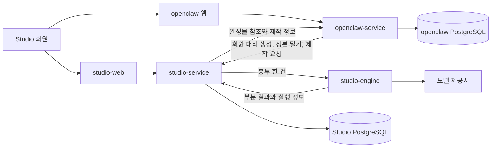

#### 4.2 책임표

| 주체 | 소유 | 소유하지 않음 |
|---|---|---|
| studio-web | 독립 상품 화면, 회원 입력, 층 편집, 생성 진행, 결과 설명 | 발행 계정과 예약 |
| studio-service | 회원, 작업 공간, 작업 공간 멤버십, 층, 동기화, 제작 작업, 비용, 계보 | SNS 토큰과 성과 수집 |
| studio-engine | 봉투 해석, 의미 해소, 어댑터 직렬화, 모델 실행, 결과 검사 | 회원, 데이터베이스, 원격 동기화 |
| openclaw-service | 합친 배치 회원 정본, 발행, 성과, 채널 규격, 일부 사용자 층 정본 | 제작 엔진 내부 상태 |
| 모델 제공자 | 추론과 생성 | 항목 정본과 사용자 권한 |

#### 4.3 엔진 포트

엔진은 다음 단일 포트를 구현한다.

`execute(envelope) -> executionResult`

엔진이 받아서는 안 되는 것은 다음과 같다.

- 회원 토큰
- 데이터베이스 연결 문자열
- 정본 서비스 URL
- 동기화 재시도 상태
- 화면 세션
- 장기 보관 원문 조회 권한

엔진이 반환해야 하는 것은 다음과 같다.

- 성공 결과 목록
- 실패 결과 목록
- 사용한 항목 판 목록
- 사용한 스킬 판과 적용 방식
- 모델, 예비 모델, 비용
- 검사 결과
- 부분 성공 상태

#### 4.4 독립 배치와 합친 배치

| 항목 | 독립 Studio | 합친 배치 |
|---|---|---|
| 회원 정본 | Studio | openclaw. Studio 연결 회원은 외부 매핑을 가진다 |
| U2 개인 정본 | Studio | openclaw 정본, Studio 투영 |
| U3 작업 공간 정본 | Studio | openclaw 정본, Studio 투영 |
| X4 스킬 정본 | Studio | Studio |
| L5 배운 규칙 정본 | Studio 자체 학습 담당 | openclaw 성과실 정본, 승낙된 활성 판만 Studio 투영 |
| R6 이번 요청 정본 | Studio 작업 기록 | openclaw 요청, Studio 작업 봉투에 불변 스냅샷 |
| 발행 규칙 정본 | 해당 없음 | openclaw |
| 제작 엔진 | 같은 엔진 | 같은 엔진 |

### 2.2 동기화와 오래된 투영본 <a id="동기화"></a>

#### 8.1 기본 방식

정본 변경이 투영 서비스로 밀린다.

제작 요청이 올 때마다 상대 서비스와 판을 비교하지 않는다.

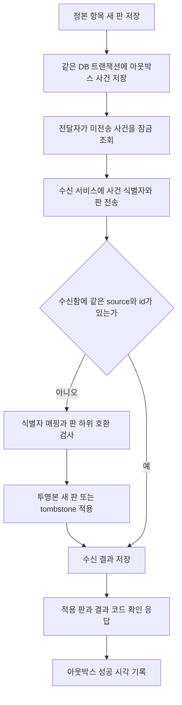

v3.0 §8.1의 sequenceDiagram은 일부 렌더러에서 한글 participant 별칭과 긴 메시지 조합을 문법 오류로 판정했다. v4.0은 노드 문자열을 모두 따옴표로 감싼 flowchart로 바꾸고 Mermaid CLI 렌더를 출고 조건으로 둔다.

#### 8.2 식별자 매핑

openclaw가 정본인 항목은 openclaw가 외부 식별자 매핑의 정본을 가진다.

Studio는 다음 최소 매핑만 가진다.

- source_service
- source_member_id
- source_workspace_id
- source_item_id
- local_member_id
- local_workspace_id
- local_item_id
- mapping_status
- mapped_at

같은 source와 source_item_id는 한 local_item_id에만 매핑된다.

#### 8.3 판 하위 호환

| 변화 | 수신 동작 |
|---|---|
| 같은 주 번호, 선택 필드 추가 | 모르는 필드를 보존하고 무시 |
| 같은 주 번호, 필수 필드 의미 변경 | 금지. 주 번호를 올린다 |
| 주 번호 불일치 | 지원 창 안이면 해당 해석기 사용, 아니면 `VERSION_UNSUPPORTED` |
| 정본 판 역행 | 적용 거부, 현재 판으로 확인 응답 |

수신기는 현재 주 번호와 직전 주 번호를 동시에 해석한다. 직전 판 제거는 호출량이 0이고 하위 호환 재전송 시험이 통과한 뒤에만 한다. 일수는 계약으로 고정하지 않고 배포 설정으로 둔다.

#### 8.4 삭제 전파

삭제는 물리 삭제보다 tombstone 사건이 먼저다.

| 삭제 대상 | Studio 동작 |
|---|---|
| 개인 항목 | 투영본 비활성화, 새 봉투 제외 |
| 작업 공간 | 해당 `U3·L5`와 작업 공간 설치 `X4` 비활성화, 새 작업 금지, 과거 계보 조회 유지 |
| 층 항목 | 해당 항목의 최신 활성 판을 없음으로 표시 |
| 스킬 | 신규 작업 사용 금지, 과거 계보 유지 |

이미 만든 결과와 계보는 지우지 않는다.

개인정보 삭제 요청은 결과 보유 정책과 별도로 처리한다.

#### 8.5 충돌 해소

Standalone Studio 상태와 openclaw 상태를 처음 연결할 때 자동 병합하지 않는다.

항목별로 다음을 고른다.

- Studio 값을 정본으로 채택
- openclaw 값을 정본으로 채택
- 두 값을 새 항목으로 각각 유지
- 충돌을 보류하고 생성에서 제외

자동 병합은 금지한다. 사용자가 항목별 정본을 선택하고, 서비스는 선택 결과를 새 판과 해소 사건으로 남긴다.

#### 8.6 판 대조가 허용되는 세 경우

1. 실패한 밀기 또는 사망 편지 사건을 운영자가 복구한다.
2. 사용자가 동기화 상태 화면에서 수동 복구를 요청한다.
3. 계약 주 번호 전환을 위해 두 판을 교차 검증한다.

제작 요청은 이 세 경우를 만들지 않는다. 요청 경로는 로컬 정본·투영본과 마지막 수신 상태만 읽고 상대 서비스를 호출하지 않는다.

#### 8.7 오래된 값 판정

| 값 등급 | 오래되고 실패 이력 있음 | 동작 |
|---|---|---|
| 금지 표현 | 예 | 영향받는 제작만 멈춤 |
| 브랜드 사실 | 예 | 영향받는 제작만 멈춤 |
| 소재 권리 | 예 | 해당 소재를 쓰는 제작만 멈춤 |
| 말투·표현 | 예 | 제작을 계속하고 사용 판과 시각을 표시 |
| 작업 공간 컨셉 | 예 | 제작, 판과 시각 표시 |
| 배운 규칙 | 예 | 제작, 판과 시각 표시 |
| 시스템 지식 | 예 | 제작, 확인 필요 표시 |

마지막 밀기가 성공했고 로컬 투영본이 최신이면 정본 서비스가 현재 장애여도 제작한다.

#### 8.8 최신성 판정

고정 시간만으로 낡음을 판정하지 않는다. `has_failed_push=true`이면서 정본 갱신 시각이 적용 판보다 새로울 때만 투영본 실패로 본다. 금지 표현·브랜드 사실·소재 권리면 영향 작업만 멈춘다. 나머지는 현재 투영본으로 제작하고 계보에 판과 마지막 수신 시각을 남긴다.

### 2.3 배포와 전환 <a id="배포"></a>

#### 15.1 배포 단위

| 단위 | 설명 | 독립 확장 |
|---|---|---|
| studio-web | 독립 상품 화면 | 가능 |
| studio-service | 상태와 공개 API | 가능 |
| studio-worker | 동기화, 작업, 재시도 | 가능 |
| studio-engine | 무상태 실행 라이브러리 또는 서비스 | 가능 |
| Studio PostgreSQL | 정본과 투영본 | 별도 백업 |
| media storage | 결과 바이트 | 별도 수명 |

#### 15.2 전환 단계

1. 새 테이블을 추가하고 기존 기능은 그대로 읽는다.
2. 기존 `workspace_guides`를 U3 작업 공간 항목 판으로 백필한다.
3. 기존 `drafts`를 새 작업과 결과의 레거시 참조로 백필한다.
4. 기존 Studio API가 새 서비스에 이중 기록하되 읽기는 기존 경로를 유지한다.
5. 그림자 읽기로 기존 응답과 새 투영을 비교한다.
6. 새 읽기로 전환하고 명시적 롤백 스위치를 둔다.
7. 두 판 수용 창과 실사용 지표가 종료 조건을 만족한 뒤 레거시 쓰기를 끈다.
8. 기존 필드를 삭제하는 별도 승인을 받는다.

#### 15.3 롤백

롤백은 새 테이블을 지우지 않는다.

읽기 경로만 기존 API로 되돌린다.

새 동기화 사건과 작업 결과는 보존한다.

레거시 경로가 새 판을 모르면 읽기 호환 투영으로 낮춘다.

#### 15.4 배포 전 필수 증거

- 스키마 확장과 롤백 시험
- 작업 공간 격리 시험 전수 통과
- 동기화 중복, 역순, 삭제, 판 불일치 시험
- 기존 Studio 회귀 시험
- 실 PostgreSQL 행 정책 시험
- 무상태 엔진의 DB와 네트워크 의존 검사
- 부분 성공 E2E

### 2.4 아키텍처 결정 <a id="결정"></a>

#### ADR-001 상태 서비스와 무상태 엔진 분리

- 맥락: 기존 문서는 Studio 전체를 무상태로 봤다.
- 결정: Studio 서비스는 상태를 소유하고 엔진만 무상태로 둔다.
- 기각안: 모든 사용자 상태를 openclaw에 두기.
- 기각 이유: Studio 단독 판매가 불가능하고 두 서비스 결합이 영구화된다.
- 결과: 봉투와 서비스 내부 API 경계가 필수다.

#### ADR-002 항목과 판 분리

- 맥락: 정본, 투영, 되돌림, 계보가 필요하다.
- 결정: 안정 항목과 불변 판을 분리한다.
- 기각안: 항목 행을 제자리 갱신하기.
- 기각 이유: 과거 결과의 근거를 복원할 수 없다.
- 결과: 저장량은 늘지만 추적성과 충돌 해소가 생긴다.

#### ADR-003 밀기 동기화와 제한된 대조

- 맥락: 매 제작 요청마다 원격 대조하면 상대 장애가 제작 장애가 된다.
- 결정: 정본 변경 밀기, 확인 응답, 재시도, 주기 대조를 사용한다.
- 기각안: 요청마다 원격 판 조회.
- 기각 이유: 실시간 결합과 지연을 만든다.
- 결과: 조용한 실패 창이 생겨 실패 이력과 등급별 감지 창이 필요하다.

#### ADR-004 트랜잭션 아웃박스

- 맥락: 정본 DB 저장과 사건 발행의 이중 쓰기 실패를 막아야 한다.
- 결정: 정본 판과 아웃박스 사건을 한 DB 트랜잭션으로 저장한다.
- 기각안: 저장 뒤 직접 HTTP 전송.
- 기각 이유: 프로세스 종료 시 변경은 남고 사건은 사라질 수 있다.
- 결과: 전달자는 별도 워커이고 소비자는 멱등이어야 한다.

#### ADR-005 스킬은 X4 층이며 경계는 기계 검증한다

- 맥락: 문장 의미로 영역을 가르는 방식은 판정 불가능했다.
- 결정: 스킬을 `X4` 층에 두고, 읽기·쓰기 필드와 덮어쓰기 금지를 번역기가 검증한다.
- 기각안: 스킬을 층 밖의 별도 실행 면으로 분리.
- 기각 이유: 사업계획의 층·조립 순서와 계보를 깨고 사용자가 적용 원인을 추적할 수 없게 한다.
- 결과: 스킬은 층으로 조립되며 선언 검사로 U3·R6·S0 침범을 막는다.

#### ADR-006 U3 작업 공간 정보 구조화

- 맥락: 브랜드 사실·금지 표현·소재 권리와 표현 선호를 한 문장에 섞으면 멈춤과 설명이 불가능하다.
- 결정: U3에 사실, 표현 규칙, 금지 표현, 소재 권리, 목표를 구조화하고 자유 서술을 보조 입력으로 둔다.
- 기각안: 단일 `prompt_guide` 저장.
- 기각 이유: 사실·권리의 최신성과 표현 선호를 같은 규칙으로 검사할 수 없다.
- 결과: 자유 서술을 보존하면서 세 멈춤 값과 조립 우선순위를 기계로 판정한다.

#### ADR-007 부분 성공 보존

- 맥락: 다중 후보와 다중 공급자에서는 일부 실패가 정상적이다.
- 결정: 결과별 상태와 비용을 독립 저장한다.
- 기각안: 작업 하나의 원자적 성공 또는 실패.
- 기각 이유: 성공 비용과 결과를 버리고 재생성 비용을 키운다.
- 결과: 클라이언트가 partial 상태를 명시적으로 다뤄야 한다.

#### ADR-008 기존 dashboard 경로를 호환 어댑터로 유지

- 맥락: 현재 Studio 화면, 작업 공간 가이드, 초안이 사용 중이다.
- 결정: 새 API 전환 기간에 기존 경로를 어댑터로 둔다.
- 기각안: 즉시 교체.
- 기각 이유: 회귀와 데이터 소실 위험이 크다.
- 결과: 이중 유지 종료 조건을 시험 계획에 둔다.

### 2.5 벤치마크 적용 <a id="벤치마크"></a>

#### 19.1 Stripe 웹훅

공식 문서는 중복 사건, 순서 미보장, 비동기 처리, 빠른 성공 응답을 전제로 한다.

차용한다.

- 사건 식별자 중복 제거
- 순서에 의존하지 않는 판 단조 증가
- 수신과 실제 적용 분리
- 확인 응답 뒤 비동기 처리

변경한다.

- 결제 사건이 아니라 층 항목 판 사건이므로 `source + event_id`를 고유키로 쓴다.

#### 19.2 AWS 트랜잭션 아웃박스

공식 패턴은 DB 갱신과 사건 저장을 한 트랜잭션으로 묶고 소비자 멱등성을 요구한다.

차용한다.

- 층 판과 아웃박스 원자 저장
- 중복 전송 허용
- 소비자 멱등
- 순서 필드

변경한다.

- 전역 순서가 아니라 항목별 판 단조성을 사용한다.

#### 19.3 CloudEvents

공식 명세는 `id`, `source`, `specversion`, `type`을 필수 문맥으로 둔다.

차용한다.

- 동기화 사건 공통 머리말
- source와 id 조합의 중복 방지
- dataschema로 판 스키마 식별

변경한다.

- 사업 필드인 authority revision, item kind, stopping class를 data에 둔다.

#### 19.4 PostgreSQL 행 격리

공식 문서는 정책이 없을 때 기본 거부와 소유자 우회 주의를 명시한다.

차용한다.

- 애플리케이션 역할 비우회
- 모든 범위 테이블 정책
- 정책 없음 기본 거부

변경한다.

- 현재 tenant 한 축에 member, workspace, workspace 권한 관계를 추가한다.

PostgreSQL 제약 공식 문서는 다중 열 외래키를 허용한다. 행 보안 검사는 참조 무결성 검사를 대체하지 않으므로 `(workspace_id, studio_member_id)` 복합 외래키를 모든 tenant 자식 표에 적용한다.

#### 19.5 Confluent 스키마 호환성

공식 문서는 backward, forward, full과 transitive 검사를 구분한다.

차용한다.

- 같은 주 번호의 추가 필드는 backward 호환
- 주 번호 변경은 병렬 해석기 필요
- 최신 한 판만이 아니라 지원 창 전체와 호환성 검사

변경한다.

- 특정 Schema Registry 제품을 필수 인프라로 채택하지 않는다.

#### 19.6 AWS EventBridge 재시도와 사망 편지 대기열

공식 문서는 지수 백오프, jitter, 최대 재시도, 사망 편지 대기열을 제공한다.

차용한다.

- 재시도 횟수와 다음 시각
- 최대 시도 뒤 사망 편지 대기열
- 오래된 멈춤 값 우선 알림

변경한다.

- 기본 24시간을 그대로 쓰지 않고 값 등급별 감지 창을 둔다.

#### 19.7 Stripe 멱등 요청

공식 문서는 POST의 첫 결과를 500까지 보존해 재응답하고, 같은 키의 매개변수가 다르면 거절하며, 키를 최소 24시간 보존할 수 있다고 설명한다.

Studio는 `studio_member_id + operation_name + key` 범위와 정규화 요청 지문을 저장한다. validation 이전 오류는 저장하지 않고 도메인 실행이 시작된 뒤 결과는 실패까지 저장한다.

#### 19.8 AWS SQS visibility timeout

공식 문서는 받은 메시지를 visibility timeout 동안 숨기고, 삭제나 연장 전에 timeout이 끝나면 다시 보이게 하며, at-least-once 전달에서 중복 가능성을 전제로 한다.

Studio는 이를 PostgreSQL `lease_token`으로 바꾼다. 점유, heartbeat, 완료 모두 token을 조건으로 쓰고 만료 작업은 reaper가 재대기 또는 최종 실패시킨다.


## 3. 컴포넌트별 상세 <a id="3-컴포넌트별-상세"></a>

### 3.1 구성요소 <a id="구성요소"></a>

#### 5.1 논리 구성요소

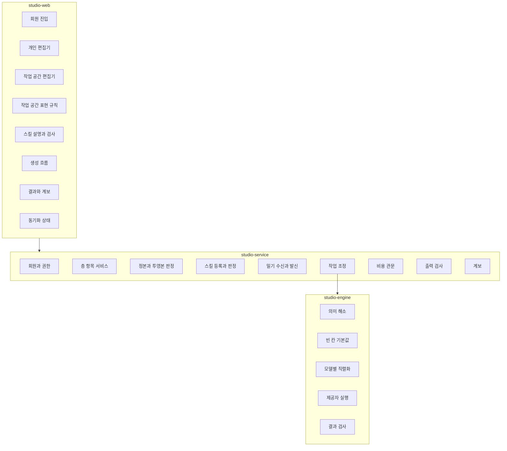

#### 5.2 구성요소 계약

| 구성요소 | 책임 | 읽기 | 쓰기 | 금지 |
|---|---|---|---|---|
| MemberService | 회원 생성, 상태, 외부 식별자 매핑 | 회원, 매핑 | 회원, 감사 | 층 값 해석 |
| ScopeGuard | 회원, 작업 공간, 작업 공간 멤버십 검증 | 권한 | 없음 | 요청 몸체 식별자 신뢰 |
| LayerItemService | 항목과 판 생성 | 항목 판 | 새 판 | 과거 판 덮어쓰기 |
| AuthorityResolver | 정본, 투영, 적용 가능 판 결정 | 항목, 동기화 상태 | 읽기 결과 | 값 자체 변경 |
| WorkspaceRuleValidator | U3 표현 규칙과 브랜드 사실의 구조 검증 | U3 판 | 검사 스냅샷 | 자유 서술로 사실·권리 덮어쓰기 |
| SkillRegistry | 스킬 선언 여덟 칸 검증 | 스킬 판 | 승인 상태 | 미신고 권한 부여 |
| DefaultResolver | 빈 칸 기본값과 강제값 적용 | 봉투, 스킬 | 적용 보고 | 영역 추론 |
| SyncReceiver | 밀기 사건 검증과 멱등 반영 | 식별자 매핑 | 투영, 수신함 | 엔진 호출 |
| SyncDispatcher | 정본 변경 사건 발행 | 아웃박스 | 전송 기록 | 요청 트랜잭션과 분리된 이중 쓰기 |
| ComparisonScheduler | 세 경우에만 판 대조 | 동기화 상태 | 대조 기록 | 매 제작 요청 전량 대조 |
| ProductionOrchestrator | 작업 상태와 부분 결과 조정 | 요청, 결과 | 작업, 시도, 비용 | 모델별 프롬프트 조립 |
| EnvelopeBuilder | 적용 가능한 판을 봉투로 고정 | 층, 스킬 | 봉투, 작업 기록 | 원격 서비스 조회 |
| StudioEngine | 무상태 실행 | 봉투 | 반환값만 | DB 접근 |
| OutputInspector | 멈춤 값과 품질 검사 | 결과, 봉투 | 검사 결과 | 성공분 삭제 |
| ProvenanceService | 계보 기록과 표시 | 작업 전체 | 계보 사건 | 원문 변조 |

#### 5.3 현재 공용 코드 경계

개발자는 다음 순서로 재사용한다.

1. 인증은 `effectiveTenantId`의 실패 닫힘 원칙을 일반화한다.
2. 데이터 접근은 `withTenant`의 트랜잭션별 컨텍스트 주입을 일반화한다.
3. 화면은 `components/shared`의 기본 부품을 사용한다.
4. 서버 상태는 SWR, 화면 선택 상태는 Zustand에 둔다.
5. 기존 `/api/studio/brand-setup`, `/api/studio/text`, `/api/studio/drafts`는 호환 어댑터가 새 서비스 호출로 변환한다. 새 도메인에는 `brand` 개체를 만들지 않는다.
6. 발행 구성요소와 채널 계정 구성요소는 Studio 서비스 패키지에 넣지 않는다.

### 3.2 보안과 격리 <a id="보안"></a>

#### 12.1 인증

독립 Studio는 자체 회원 세션을 발급한다.

합친 배치는 openclaw 서버가 제한된 서비스 자격으로 Studio 회원을 대리 생성하고 외부 식별자를 매핑한다.

브라우저가 `studio_member_id`, `workspace_id`를 보냈다는 이유로 신뢰하지 않는다.

서버는 세션에서 회원을 확정한 뒤 관계를 조회한다.

#### 12.2 권한

기본 역할은 다음 세 개다.

| 역할 | 회원 | 작업 공간 | 작업 공간 | 생성 | 스킬 |
|---|---|---|---|---|---|
| owner | 관리 | 모두 | 모두 | 가능 | 등록과 승인 |
| editor | 읽기 | 허용 작업 공간 편집 | 허용 공간 편집 | 가능 | 사용, 업로드 제안 |
| viewer | 읽기 | 읽기 | 읽기 | 불가 | 읽기 |

#### 12.3 행 격리

현재 `withTenant` 패턴을 Studio 회원 범위로 확장한다.

모든 범위 테이블은 `studio_member_id`를 직접 또는 닫힌 외래키 경로로 가진다.

작업 공간별 민감 테이블은 `workspace_id`도 가진다.

정책은 세션의 회원 식별자와 권한 관계를 기준으로 한다.

정책이 없으면 기본 거부한다.

테이블 소유자 우회를 막기 위해 애플리케이션 연결 역할은 비우회 역할로 낮춘다.

#### 12.4 작업 공간 격리

작업 공간 격리는 테넌트 격리보다 세밀하다.

다음 계층에 모두 건다.

1. API의 ScopeGuard
2. 데이터베이스 행 정책
3. 봉투 빌더의 `workspace_id` 단일성 검사
4. 결과 계보의 작업 공간 불변 검사
5. 캐시 키에 작업 공간 식별자와 봉투 지문 포함
6. 시험에서 교차 작업 공간 부정 조회와 생성

#### 12.5 스킬 격리

스킬 실행 공간은 작업마다 새로 만든다.

허용 목록 밖 파일, 명령, 네트워크는 차단한다.

비밀값은 선언된 별칭만 단기 주입하고 원문을 로그에 쓰지 않는다.

다른 회원 작업 공간을 마운트하지 않는다.

#### 12.6 위협과 완화

| 위협 | 완화 |
|---|---|
| 요청 몸체의 다른 작업 공간 식별자 | 세션 회원과 관계 재조회 |
| 오래된 금지 표현으로 생성 | 실패 이력과 감지 창, 영향 작업만 차단 |
| 중복 동기화 사건 | 수신함 사건 식별자 고유 제약 |
| 정본 판 역행 | applied_revision 단조 증가 검사 |
| 스킬이 사용자 값을 덮음 | 필드별 default와 force 선언, 적용 보고 |
| 성공 결과가 실패 롤백에 삭제 | 결과별 독립 상태와 추가 전용 계보 |
| 원문 노출 | 암호화, 접근 감사, 보유 만료 |
| 공급자 응답의 프롬프트 주입 | 결과를 데이터로 취급하고 허용 스키마로 파싱 |

### 3.3 데이터 수명과 작업 기록 <a id="수명"></a>

#### 13.1 작업 기록 일곱 항목

모든 작업은 다음을 가진다.

| 번호 | 항목 | 저장 시점 | 불변 여부 |
|---:|---|---|---|
| 1 | 요청 식별자 | 접수 | 불변 |
| 2 | 정규화 입력 | 접수 완료 | 새 작업에서만 변경 |
| 3 | 각 층 판 | 봉투 고정 | 불변 |
| 4 | 동의 상태 | 접수와 선택 | 사건 누적 |
| 5 | 비용 | 예상부터 실제까지 | 원장 누적 |
| 6 | 모델과 스킬 판 | 실행 시도 | 시도별 불변 |
| 7 | 결과 식별자 | 결과 저장 | 결과별 불변 |

#### 13.2 원문과 정규화 입력

원문은 사용자가 보낸 바이트를 암호화해 별도 저장한다.

정규화 입력은 줄끝, 문자 정규화, 구조 파싱 결과를 저장한다.

두 값은 같은 필드가 아니다.

엔진에 실리는 값은 정규화 입력과 필요한 원문 조각이다.

따라서 `저장된 원문과 실린 원문이 바이트 단위로 같다`는 기존 수용 기준을 그대로 시험하지 않는다.

대신 다음을 시험한다.

1. 저장 원문 바이트의 해시가 접수 바이트 해시와 같다.
2. 정규화 변환 기록으로 실린 문자열을 재현할 수 있다.
3. 봉투의 원문 참조와 정규화 입력 지문이 작업 기록에 남는다.

#### 13.3 보유 기간

원문 보유 기간은 상품·법무·계정 삭제 정책이 제공하는 설정값을 따른다. 자동 삭제 작업은 `retention_until`만 읽고, 기간을 코드에 숫자로 고정하지 않는다.

정규화 입력, 판 참조, 비용, 결과 계보는 법적 정책과 계정 삭제 정책에 따라 더 오래 남을 수 있다.

#### 13.4 수명표

| 데이터 | 기본 수명 | 삭제 뒤 유지 |
|---|---|---|
| 회원 세션 | 짧은 만료 | 감사 사건 |
| 원문 | 설정된 `retention_until`까지 | 해시와 삭제 사건 |
| 층 판 | 항목 수명 | 계보용 최소 메타 |
| 투영본 | 정본 삭제 사건까지 | tombstone과 적용 판 |
| 제작 봉투 | 결과 보유 기간 | 판 식별자와 지문 |
| 실행 공간 | 작업 종료 뒤 즉시 정리 | 실행 로그와 결과 참조 |
| 결과 파일 | 상품 정책 | 계보와 삭제 사건 |
| 비용 원장 | 회계 정책 | 유지 |
| 동기화 수신함 | 운영 정책 | 사건 식별자와 결과 |
| 사망 편지 대기열 | 해결 후 보관 | 원인과 해결 기록 |

### 3.4 관측성과 운영 <a id="관측"></a>

#### 14.1 구조화 사건

| 사건 | 필수 필드 |
|---|---|
| sync_received | event_id, source, item_id, revision, received_at |
| sync_applied | event_id, local_item_id, applied_revision, latency_ms |
| sync_failed | event_id, code, retry_count, stopping_class |
| comparison_started | item_id, reason, local_revision |
| production_started | job_id, member_id_hash, workspace_id, envelope_hash |
| provider_attempted | attempt_id, provider, model, fallback, cost |
| output_inspected | output_id, check, result, blocking |
| production_partial | job_id, success_count, failure_count |
| provenance_written | job_id, event_count |

#### 14.2 지표

| 지표 | 목적 | 초기 경보 |
|---|---|---|
| sync_apply_latency | 밀기 지연 | 등급별 설정 감지 창을 p95가 초과 |
| sync_failed_items | 실패 이력 항목 수 | 1 이상 고위험 표시 |
| sync_dead_letter_age | 사망 편지 체류 | 멈추는 값의 등급별 설정 감지 창 초과 |
| projection_age | 투영본 나이 | 등급별 창 초과 |
| production_partial_rate | 부분 실패율 | 추세 상승 |
| fallback_rate | 주 모델 안정성 | 모델별 기준선 초과 |
| cost_ceiling_stop_rate | 예상 품질과 비용 정합 | 주간 상승 |
| cross_workspace_denial | 격리 공격과 UI 결함 | 어떤 허용도 0이어야 함 |
| provenance_missing | 추적성 | 0이 아니면 출고 차단 |

#### 14.3 알림

고위험 알림은 다음이다.

- 멈추는 값 밀기 실패가 감지 창을 넘김
- 작업 공간 교차 접근이 애플리케이션 또는 DB 정책에서 거부됨
- 봉투 안에 두 작업 공간 식별자가 존재
- 비용 원장 합계와 공급자 합계 불일치
- 작업 성공인데 계보 사건이 없음
- 삭제 사건이 투영본에 적용되지 않음


### 3.5 구현 폴더 구조

신규 구현은 기존 `dashboard/src/app/api/*`의 Next Route Handler 관습과 `studio/pipelines/*`의 Python 생성 파이프라인을 보존한다. 기존 `extensions/*`와 `dashboard/src/lib/commons/*`를 복제하지 않는다.

```text
dashboard/
  src/
    app/api/studio/v5/                 # HTTP adapter, 인증과 schema 변환만
    lib/studio/
      application/                    # use case와 transaction 경계
      domain/                         # aggregate, 상태 전이, 정책
      ports/                          # identity, billing, delivery, engine, clock
      adapters/
        persistence/                  # PostgreSQL repository
        identity/                     # 정책이 주입하는 구현체
        billing/                      # 정책이 주입하는 구현체
        delivery/                     # 정책이 주입하는 구현체
      workers/                        # lease claim, heartbeat, reaper, outbox
      contracts/                      # v5 request, response, event schema
      observability/                  # trace, metric, audit redaction
studio/
  pipelines/                          # 현행 생성 파이프라인 재사용
  engine/
    envelope.py                       # 불변 assembly input 해석
    executor.py                       # DB와 인증에 접근하지 않는 실행기
    providers/                        # 모델별 adapter
  docs/                               # 승인된 설계와 계약
```

공개 Route Handler는 tenant context 생성, JSON schema 검증, application command 호출, 공통 error envelope 변환만 담당한다. SQL과 공급자 SDK 호출을 Route Handler에 직접 넣지 않는다.

`dashboard/src/lib/commons/*`는 토큰 검증, correlation id, error serialization처럼 서비스 중립인 코드만 재사용한다. Studio 회원·작업 공간·권한·생성 상태는 `lib/studio/domain`이 소유하며 commons로 올리지 않는다.

Python engine은 `production_envelopes.payload`와 출력 저장용 제한 포트만 받는다. PostgreSQL, 세션, 결제, SNS 자격증명 import는 의존성 검사에서 금지한다.

### 3.6 적용 디자인 패턴

| 패턴 | 적용 위치 | 지켜야 할 경계 | 기각한 대안 |
|---|---|---|---|
| Ports and Adapters | identity, billing, delivery, engine | 외부 선택은 adapter 교체로만 반영 | 공급자 SDK를 domain에 직접 결합 |
| Aggregate + optimistic concurrency | workspace, production, entitlement | aggregate 판과 `If-Match`로 lost update 방지 | 마지막 쓰기 승리 |
| Transactional Outbox + Idempotent Consumer | sync, billing event, handoff | 도메인 변경과 outbox 한 트랜잭션 | DB commit 뒤 직접 webhook 전송 |
| Idempotent Receiver | 모든 명령형 POST | 회원+operation+key와 요청 지문으로 한 결과 | endpoint별 임시 unique key |
| Lease Queue | generation, render, delivery | token이 맞는 worker만 heartbeat·완료 | 상태 SELECT 뒤 무조건 UPDATE |
| Append-only Revision | 층 항목, recipe, channel text | 과거 판 수정 금지 | JSON 한 행 덮어쓰기 |
| Canonical Envelope | Studio와 engine, openclaw 경계 | 계약 v5로 정규화 뒤 adapter 호출 | 서비스 내부 DB 모양을 외부로 노출 |
| Entitlement Ledger | 구독·무료 영상·작업 공간 수량 | grant와 revoke 사건 합계로 재현 | 회원 행의 boolean 덮어쓰기 |

### 3.7 런타임 아키텍처와 단독 판매 폐쇄 루프

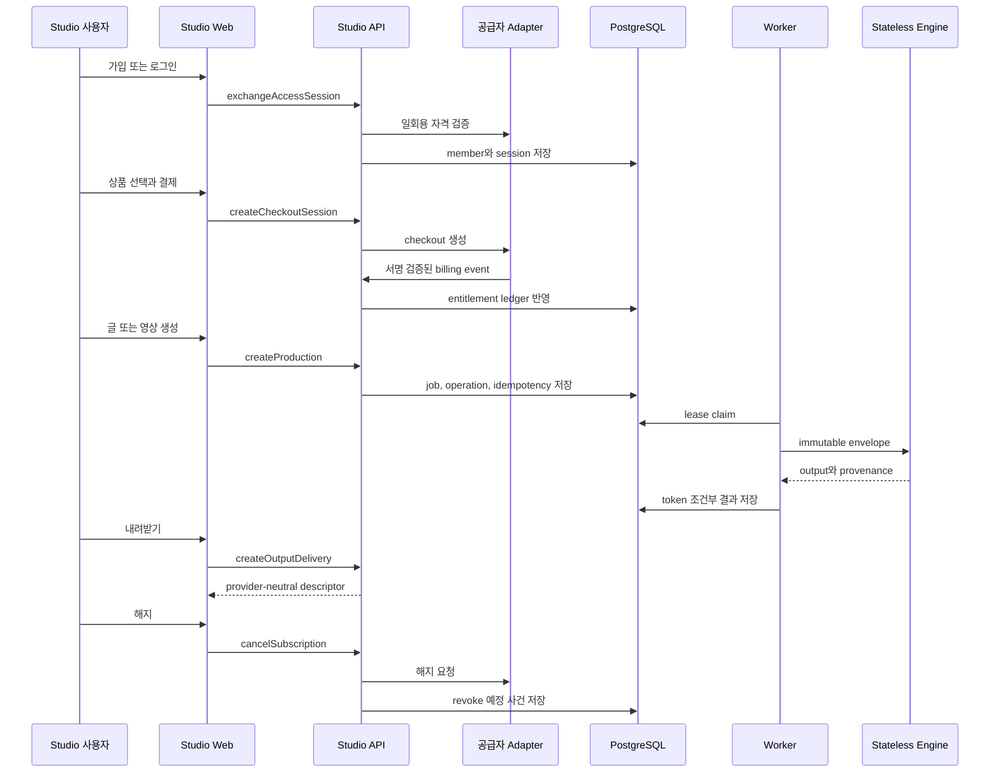

| 단계 | endpoint와 operationId | frontend component | 주 DB 표 | 종료 증거 | 정책 주입 경계 |
|---|---|---|---|---|---|
| 가입·로그인 | `POST /v5/studio/access-sessions/exchange`, `exchangeAccessSession` | `StudioAuthGate` | `studio_members`, `studio_sessions` | active member와 session | identity adapter |
| 결제 시작 | `POST /v5/studio/billing/checkout-sessions`, `createCheckoutSession` | `CheckoutRedirect` | `billing_checkout_sessions` | checkout session 식별자 | billing adapter와 offer catalog |
| 권한 반영 | `POST /v5/studio/billing/events`, `ingestBillingEvent` | `EntitlementStatus` | `billing_events`, `entitlement_grants` | 중복 없는 grant/revoke | billing authority와 grant quantity |
| 생성 | `POST /v5/studio/productions`, `postV5StudioProductions` | `GenerationRoom` | `production_jobs`, `operations`, `idempotency_records` | job과 operation 식별자 | retention policy |
| 결과 전달 | `POST /v5/studio/outputs/{outputId}/deliveries`, `createOutputDelivery` | `OutputDownloadAction` | `output_deliveries` | URL 또는 ticket 중 하나 | delivery adapter |
| 내려받기 확인 | `GET /v5/studio/operations/{operationId}`, `getOperation` | `DownloadProgress` | `operations`, `delivery_access_events` | hash와 전달 감사 사건 | delivery adapter |
| 해지 | `POST /v5/studio/subscriptions/{subscriptionId}/cancel`, `cancelSubscription` | `SubscriptionCancelConfirm` | `subscription_events`, `entitlement_grants` | 취소 상태와 access_until | billing adapter |

단독 모드 생성에는 `channel`, `channel_account_id`, `credential`이 없다. 채널 규격은 편집실 단계에서만 선택하며 발행 계정 연결은 openclaw 발행실의 책임이다.

## 4. 데이터 모델 <a id="4-데이터-모델"></a>

이 절은 기존 `studio/docs/erd-studio-생성-v3.0.md`의 데이터 계약을 사업계획 v1.3 용어로 승계한다. 별도 브랜드 테이블이나 브랜드 층을 만들지 않는다. 기존 `tenants`, `workspace_guides`, `drafts`, `usage_events`, `wiki_docs`는 한 번에 삭제하지 않고 확장·백필·이중 기록·읽기 전환·승인된 축소 순서로 옮긴다.

### 4.1 전체 개체 관계 <a id="전체"></a>

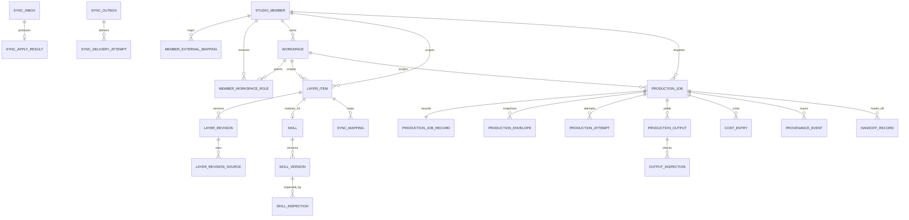

### 4.2 회원과 범위 <a id="회원"></a>

#### 3.1 `studio_members`

Studio 독립 회원 정본이다.

| 열 | 타입 | 제약 | 설명 |
|---|---|---|---|
| id | uuid | PK | 내부 회원 식별자 |
| status | text | NN, CHECK | active, paused, deletion_pending, deleted |
| display_name | text | NN | 표시명 |
| primary_email_hash | text | nullable | 이메일 원문 대신 정규화 해시 |
| auth_subject | text | UQ, nullable | Studio 인증 주체 |
| created_at | timestamptz | NN | 생성 |
| updated_at | timestamptz | NN | 갱신 |
| deleted_at | timestamptz | nullable | 삭제 |

인덱스:

- unique `(auth_subject)` where auth_subject is not null
- `(status, created_at)`

#### 3.2 `member_external_mappings`

openclaw 같은 외부 회원과 Studio 회원을 잇는다.

| 열 | 타입 | 제약 | 설명 |
|---|---|---|---|
| id | uuid | PK | 매핑 |
| studio_member_id | uuid | FK, NN | Studio 회원 |
| source_service | text | NN | openclaw 등 |
| source_member_id | text | NN | 외부 회원 식별자 |
| mapping_status | text | NN, CHECK | active, conflicted, detached |
| mapped_at | timestamptz | NN | 연결 |
| detached_at | timestamptz | nullable | 해제 |

고유 제약:

- `(source_service, source_member_id)`
- `(studio_member_id, source_service)` where mapping_status=active

#### 3.2.1 `member_entitlements`

Studio 자체 요금제 권한 정본이다.

| 열 | 타입 | 제약 | 설명 |
|---|---|---|---|
| studio_member_id | uuid | PK, FK | Studio 회원 |
| plan_code | text | NN, CHECK | free, starter, pro, enterprise |
| workspace_limit | integer | nullable | free=1, starter=1, pro=3, enterprise=협의값 |
| free_actual_video_limit | integer | NN | free=1, 나머지는 상품 설정 |
| free_actual_video_used | integer | NN, >=0 | 실제 렌더 성공 후만 증가 |
| valid_from | timestamptz | NN | 권한 시작 |
| valid_until | timestamptz | nullable | 권한 만료 |
| updated_at | timestamptz | NN | 갱신 |

`workspace_limit` 검사는 active·deleting 작업 공간을 모두 세며 동시 생성은 잠금 행으로 직렬화한다. 무료 영상 권한은 1080×1920, 30fps, 90초 안팡의 실제 렌더가 성공한 거래에서만 소비한다.

#### 3.3 `workspaces`

작업 공간은 브랜드, 언어, 취향, 소재, 학습 정보를 격리하는 최상위 사용자 범위다.

| 열 | 타입 | 제약 | 설명 |
|---|---|---|---|
| id | uuid | PK | 작업 공간 |
| studio_member_id | uuid | FK, NN | 소유 회원 |
| name | text | NN | 표시 이름 |
| default_language | text | NN | BCP 47 |
| authority_service | text | NN | studio 또는 openclaw |
| authority_workspace_id | text | nullable | 외부 정본 식별자 |
| status | text | NN, CHECK | active, held, deleting, deleted |
| created_at | timestamptz | NN | 생성 |
| updated_at | timestamptz | NN | 갱신 |
| deleted_at | timestamptz | nullable | 삭제 |

고유 제약:

- `(studio_member_id, lower(name))` where status != deleted
- `(authority_service, authority_workspace_id)` where authority_workspace_id is not null

#### 3.4 `member_workspace_roles`

| 열 | 타입 | 제약 | 설명 |
|---|---|---|---|
| studio_member_id | uuid | PK 일부, FK | 회원 |
| workspace_id | uuid | PK 일부, FK | 작업 공간 |
| role | text | NN, CHECK | owner, editor, viewer |
| granted_by | uuid | FK | 부여자 |
| created_at | timestamptz | NN | 생성 |

복합 PK `(studio_member_id, workspace_id)`.

작업 공간 owner는 최소 한 명이어야 한다.

마지막 owner 제거는 서비스 로직과 지연 제약 시험으로 막는다.

### 4.3 층 항목과 판 <a id="층"></a>

#### 4.1 `layer_items`

| 열 | 타입 | 제약 | 설명 |
|---|---|---|---|
| id | uuid | PK | 안정 항목 식별자 |
| studio_member_id | uuid | FK, nullable | member·workspace 범위 격리 기준. system 범위는 null |
| workspace_id | uuid | FK, nullable | 작업 공간 범위 |
| layer_code | text | NN, CHECK | S0, S1, U2, U3, X4, L5 |
| scope_kind | text | NN, CHECK | system, member, workspace |
| item_kind | text | NN | workspace_fact 등 |
| replica_kind | text | NN, CHECK | canonical, projection |
| authority_service | text | NN | studio, openclaw, external |
| authority_item_id | text | nullable | 투영본이면 필수 |
| stopping_class | text | NN, CHECK | forbidden_phrase, workspace_fact, material_rights, non_stopping |
| current_revision | bigint | NN, 기본 0 | 적용 최신 판 |
| status | text | NN, CHECK | active, held, deleted |
| created_at | timestamptz | NN | 생성 |
| updated_at | timestamptz | NN | 갱신 |
| deleted_at | timestamptz | nullable | 삭제 |

범위 CHECK:

- system이면 studio_member_id와 workspace_id가 null을 허용
- member이면 studio_member_id NN, workspace_id null
- workspace이면 studio_member_id와 workspace_id 둘 다 NN
- U2는 member
- U3는 workspace
- X4는 system, member, workspace 중 설치 범위 하나
- L5는 workspace. 승낙 전 후보는 `learning_candidates`에만 저장

투영 CHECK:

- replica_kind=projection이면 authority_service != studio
- projection이면 authority_item_id NN
- canonical이고 authority_service=studio면 authority_item_id는 id 문자열과 같거나 null 허용

인덱스:

- `(studio_member_id, layer_code, status)`
- `(workspace_id, layer_code, status)` where workspace_id is not null
- unique `(authority_service, authority_item_id)` where authority_item_id is not null
- `(stopping_class, status)` where replica_kind=projection

#### 4.2 `layer_revisions`

| 열 | 타입 | 제약 | 설명 |
|---|---|---|---|
| id | uuid | PK | 불변 판 식별자 |
| layer_item_id | uuid | FK, NN | 항목 |
| revision | bigint | NN, >0 | 항목별 단조 증가 |
| value_schema | text | NN | 값 스키마 식별자 |
| value | jsonb | NN | 검증된 구조 값 |
| value_hash | text | NN | 정규 JSON SHA-256 |
| authority_revision | bigint | nullable | 외부 정본 판 |
| authority_updated_at | timestamptz | nullable | 정본 갱신 시각 |
| received_at | timestamptz | nullable | 투영 수신 시각 |
| consent_state | text | NN, CHECK | granted, denied, not_required, pending |
| created_by_member_id | uuid | FK, nullable | 사람 작성 |
| created_by_event_id | uuid | nullable | 동기화 작성 |
| created_at | timestamptz | NN | 생성 |

고유 제약 `(layer_item_id, revision)`.

과거 행 UPDATE와 DELETE 권한은 애플리케이션 역할에 주지 않는다.

#### 4.3 `layer_revision_sources`

| 열 | 타입 | 제약 | 설명 |
|---|---|---|---|
| id | uuid | PK | 출처 |
| layer_revision_id | uuid | FK, NN | 판 |
| source_kind | text | NN | url, document, user_input, sync, copy |
| source_ref | text | NN | 불투명 참조 |
| source_hash | text | nullable | 내용 지문 |
| copied_from_item_id | uuid | FK, nullable | 명시 복사 원본 |
| captured_at | timestamptz | NN | 수집 |

명시 복사는 `source_kind=copy`와 copied_from_item_id를 요구한다.

#### 4.4 `l5_conditions`

L5 판마다 정확히 한 행이다.

| 열 | 타입 | 제약 | 설명 |
|---|---|---|---|
| layer_revision_id | uuid | PK, FK | L5 판 |
| workspace_id | uuid | FK, NN | 배운 규칙을 승낙한 작업 공간 |
| candidate_id | uuid | FK, NN, UQ | 승낙된 후보 |
| evidence_kind | text | NN, CHECK | repeated_choice, performance |
| evidence_count | integer | NN | repeated_choice는 3 이상, performance는 5 이상 |
| evidence_summary | jsonb | NN | 선택 또는 성과 근거 참조 |
| accepted_by_member_id | uuid | FK, NN | 승낙자 |
| accepted_at | timestamptz | NN | 승낙 시각 |
| rollback_state | text | NN, CHECK | active, reverted |

승낙 전 `learning_candidates`에는 `evidence_sufficient=false`와 표시 문구 `근거 부족`을 저장할 수 있다. `l5_conditions`에는 승낙된 후보만 들어간다.

#### 4.5 S0와 S1 특수값

S0 외부 항목은 `last_verified_at`과 `verification_due_at`을 value 안이 아니라 별도 메타 열로 두는 것이 조회에 유리하다.

따라서 `layer_revisions`에 다음 선택 열을 추가한다.

- `last_verified_at timestamptz`
- `verification_due_at timestamptz`

S1에는 `valid_until timestamptz`를 추가한다.

만료된 S1은 삭제하지 않고 봉투에서 제외한다.

### 4.4 U3 작업 공간 문맥 <a id="목소리"></a>

U3는 별도 프로파일 테이블이 아니라 `layer_items` 하나와 불변 `layer_revisions`로 저장한다. `value_schema=studio.u3-workspace-context/1.0`의 `value` 등록값은 다음을 포함한다.

| 값 | 자료형 | 멈춤 여부 | 설명 |
|---|---|---|---|
| workspace_facts | jsonb 배열 | 예 | 브랜드·상품·인물 사실과 출처 |
| expression_rules | text[] | 아니오 | 말투·어휘·리듬·표기 선호 |
| forbidden_phrases | jsonb 배열 | 예 | 언어, 확인 상태, 문구 |
| material_rights | jsonb 배열 | 예 | 소재 식별자, 허용 용도, 만료 |
| goals | text[] | 아니오 | 이 공간의 제작 목표 |
| free_note | text | 아니오 | 구조화 값을 덮지 않는 보조 설명 |

멈춤 값 세 종류가 낡고 동기화 실패 이력이 있으면 해당 값을 쓰는 작만 막는다. 자유 서술은 브랜드 사실·금지 표현·소재 권리를 상쇄할 수 없다.

### 4.5 X4 스킬 층 <a id="스킬"></a>

#### 6.1 `skills`

| 열 | 타입 | 제약 | 설명 |
|---|---|---|---|
| id | uuid | PK | 스킬 |
| layer_item_id | uuid | FK, NN, UQ | `layer_code=X4`인 층 항목 |
| studio_member_id | uuid | FK, nullable | 사용자 소유면 필수 |
| workspace_id | uuid | FK, nullable | 작업 공간 전용 |
| owner_kind | text | NN, CHECK | studio, member |
| name | text | NN | 표시명 |
| status | text | NN, CHECK | draft, held, active, rejected, deleted |
| current_revision | bigint | NN | 최신 판 |
| created_at | timestamptz | NN | 생성 |
| deleted_at | timestamptz | nullable | 삭제 |

Studio 공용 스킬은 studio_member_id와 workspace_id가 null이다.

사용자 스킬은 studio_member_id가 NN이다.

#### 6.2 `skill_versions`

| 열 | 타입 | 제약 | 선언 칸 |
|---|---|---|---|
| id | uuid | PK | 판 |
| skill_id | uuid | FK, NN | 판 |
| revision | bigint | NN | 판 |
| read_fields | text[] | NN | 1 |
| write_fields | text[] | NN | 2 |
| write_modes | jsonb | NN | 3 |
| permissions | jsonb | NN | 4 |
| io_schema | text | NN | 5 |
| conflict_action | text | NN, CHECK | 6 |
| source_uri | text | nullable | 7 |
| source_version | text | NN | 7 |
| license | text | nullable | 7 |
| content_hash | text | NN | 7 |
| sandbox_class | text | NN, CHECK | 8 |
| network_allowlist | text[] | NN | 8 |
| body_storage_ref | text | NN | 본문 |
| created_at | timestamptz | NN | 생성 |

고유 `(skill_id, revision)`.

write_modes의 모든 키는 write_fields에 있어야 한다.

모든 write_fields는 default 또는 force 중 하나를 가진다.

#### 6.3 `skill_inspections`

| 열 | 타입 | 제약 |
|---|---|---|
| id | uuid | PK |
| skill_version_id | uuid | FK, NN |
| s0_bypass_result | text | NN |
| impersonation_result | text | NN |
| undeclared_force_result | text | NN |
| license_result | text | NN |
| permission_result | text | NN |
| overall_status | text | NN, CHECK |
| report | jsonb | NN |
| inspected_at | timestamptz | NN |

active skill_version은 accepted 또는 승인된 downgraded 검사 결과를 요구한다.

#### 6.4 `skill_applications`

| 열 | 타입 | 제약 |
|---|---|---|
| id | uuid | PK |
| production_envelope_id | uuid | FK, NN |
| skill_version_id | uuid | FK, NN |
| field_path | text | NN |
| user_filled | boolean | NN |
| write_mode | text | NN, CHECK |
| action | text | NN, CHECK |
| reason | text | NN |
| created_at | timestamptz | NN |

고유 `(production_envelope_id, skill_version_id, field_path)`.

### 4.6 동기화 <a id="동기화-2"></a>

#### 7.1 `sync_mappings`

| 열 | 타입 | 제약 |
|---|---|---|
| id | uuid | PK |
| source_service | text | NN |
| source_member_id | text | NN |
| source_workspace_id | text | nullable |
| source_item_id | text | NN |
| local_member_id | uuid | FK, NN |
| local_workspace_id | uuid | FK, nullable |
| local_item_id | uuid | FK, NN |
| status | text | NN, CHECK |
| mapped_at | timestamptz | NN |
| detached_at | timestamptz | nullable |

고유 `(source_service, source_item_id)`.

고유 `(source_service, local_item_id)` where status=active.

#### 7.2 `sync_inbox`

| 열 | 타입 | 제약 |
|---|---|---|
| id | uuid | PK |
| source_service | text | NN |
| event_id | text | NN |
| event_type | text | NN |
| subject | text | NN |
| contract_version | text | NN |
| payload | jsonb | NN |
| payload_hash | text | NN |
| status | text | NN, CHECK |
| received_at | timestamptz | NN |
| processed_at | timestamptz | nullable |
| failure_code | text | nullable |

고유 `(source_service, event_id)`.

중복 사건은 기존 행을 읽고 같은 apply 결과를 반환한다.

#### 7.3 `sync_apply_results`

| 열 | 타입 | 제약 |
|---|---|---|
| sync_inbox_id | uuid | PK, FK |
| local_item_id | uuid | FK, nullable |
| applied_revision | bigint | nullable |
| result | text | NN, CHECK |
| warning | jsonb | NN, 기본 빈 배열 |
| acknowledged_at | timestamptz | NN |

#### 7.4 `sync_outbox`

| 열 | 타입 | 제약 |
|---|---|---|
| id | uuid | PK |
| event_id | uuid | NN, UQ |
| aggregate_type | text | NN |
| aggregate_id | uuid | NN |
| aggregate_revision | bigint | NN |
| event_type | text | NN |
| destination_service | text | NN |
| payload | jsonb | NN |
| payload_hash | text | NN |
| priority | smallint | NN |
| status | text | NN, CHECK |
| next_attempt_at | timestamptz | NN |
| created_at | timestamptz | NN |
| succeeded_at | timestamptz | nullable |

인덱스 `(status, priority desc, next_attempt_at)`.

정본 판과 같은 트랜잭션에서 저장한다.

#### 7.5 `sync_delivery_attempts`

| 열 | 타입 | 제약 |
|---|---|---|
| id | uuid | PK |
| sync_outbox_id | uuid | FK, NN |
| attempt_no | integer | NN |
| started_at | timestamptz | NN |
| finished_at | timestamptz | nullable |
| http_status | integer | nullable |
| result | text | NN |
| error_code | text | nullable |
| response_hash | text | nullable |

고유 `(sync_outbox_id, attempt_no)`.

#### 7.6 `sync_comparisons`

| 열 | 타입 | 제약 |
|---|---|---|
| id | uuid | PK |
| local_item_id | uuid | FK, NN |
| reason | text | NN, CHECK |
| local_revision | bigint | NN |
| authority_revision | bigint | nullable |
| result | text | NN, CHECK |
| compared_at | timestamptz | NN |
| repair_event_id | uuid | nullable |

reason은 세 값만 허용한다.

- failed_delivery_recovery
- member_requested_recovery
- contract_major_crosscheck

#### 7.7 `projection_sync_states`

항목당 한 행으로 빠른 판정을 돕는다.

| 열 | 타입 | 제약 |
|---|---|---|
| layer_item_id | uuid | PK, FK |
| last_push_succeeded_at | timestamptz | nullable |
| last_failed_at | timestamptz | nullable |
| has_failed_push | boolean | NN |
| retry_state | text | NN, CHECK |
| retry_count | integer | NN |
| next_retry_at | timestamptz | nullable |
| dead_lettered_at | timestamptz | nullable |
| periodic_compare_due_at | timestamptz | NN |
| updated_at | timestamptz | NN |

### 4.7 제작 작업과 결과 <a id="작업"></a>

#### 8.1 `production_jobs`

| 열 | 타입 | 제약 |
|---|---|---|
| id | uuid | PK |
| studio_member_id | uuid | FK, NN |
| workspace_id | uuid | FK, NN |
| idempotency_key | text | NN |
| request_fingerprint | text | NN |
| status | text | NN, CHECK |
| proposal_set_id | uuid | nullable |
| current_envelope_id | uuid | nullable |
| approved_cost_ceiling_minor | bigint | NN, >=0 |
| currency | char(3) | NN |
| created_at | timestamptz | NN |
| updated_at | timestamptz | NN |
| finished_at | timestamptz | nullable |

고유 `(studio_member_id, idempotency_key)`.

닫힌 FK로 workspace와 workspace가 같은 member에 속함을 강제한다.

#### 8.2 `request_raw_inputs`

| 열 | 타입 | 제약 |
|---|---|---|
| id | uuid | PK |
| production_job_id | uuid | FK, NN, UQ |
| ciphertext | bytea | nullable |
| content_type | text | NN |
| byte_length | bigint | NN |
| byte_hash | text | NN |
| encryption_key_ref | text | nullable |
| retention_until | timestamptz | nullable |
| deleted_at | timestamptz | nullable |

원문 보유 중에는 `ciphertext`와 `encryption_key_ref`가 모두 NN이다. 원문 보유를 거절했거나 물리 삭제가 끝나면 둘 다 null이고 `deleted_at`이 NN이어야 한다. 이 상태 CHECK로 미보유·삭제와 보유 중 상태를 배타적으로 강제한다.

#### 8.3 `normalized_inputs`

| 열 | 타입 | 제약 |
|---|---|---|
| id | uuid | PK |
| production_job_id | uuid | FK, NN, UQ |
| schema_version | text | NN |
| value | jsonb | NN |
| fingerprint | text | NN |
| transformation_log | jsonb | NN |
| raw_input_id | uuid | FK, nullable |
| created_at | timestamptz | NN |

#### 8.4 `production_envelopes`

| 열 | 타입 | 제약 |
|---|---|---|
| id | uuid | PK |
| production_job_id | uuid | FK, NN |
| contract_version | text | NN |
| envelope | jsonb | NN |
| envelope_hash | text | NN, UQ |
| layer_version_manifest | jsonb | NN |
| workspace_context_hash | text | NN |
| x4_skill_manifest | jsonb | NN |
| created_at | timestamptz | NN |

봉투는 UPDATE 금지다.

새 조립은 새 envelope 행이다.

#### 8.5 `production_attempts`

| 열 | 타입 | 제약 |
|---|---|---|
| id | uuid | PK |
| production_job_id | uuid | FK, NN |
| production_envelope_id | uuid | FK, NN |
| provider | text | NN |
| model | text | NN |
| skill_version_ids | uuid[] | NN |
| fallback | boolean | NN |
| attempt_no | integer | NN |
| status | text | NN, CHECK |
| provider_request_id | text | nullable |
| started_at | timestamptz | NN |
| finished_at | timestamptz | nullable |
| failure_code | text | nullable |

고유 `(production_job_id, attempt_no)`.

provider_request_id는 공급자 안에서 고유한 경우 부분 고유 인덱스를 둔다.

#### 8.6 `production_outputs`

| 열 | 타입 | 제약 |
|---|---|---|
| id | uuid | PK |
| production_job_id | uuid | FK, NN |
| production_attempt_id | uuid | FK, nullable |
| parent_output_id | uuid | FK, nullable |
| slot | text | NN |
| output_kind | text | NN |
| status | text | NN, CHECK |
| storage_ref | text | nullable |
| content_hash | text | nullable |
| media_type | text | nullable |
| failure_code | text | nullable |
| retryable | boolean | NN |
| created_at | timestamptz | NN |
| finalized_at | timestamptz | nullable |

고유 `(production_job_id, slot, parent_output_id)`를 정책에 맞게 둔다.

부분 실패 시 성공 행은 유지한다.

#### 8.7 `output_inspections`

| 열 | 타입 | 제약 |
|---|---|---|
| id | uuid | PK |
| production_output_id | uuid | FK, NN |
| inspection_type | text | NN |
| result | text | NN, CHECK |
| blocking | boolean | NN |
| matched_refs | jsonb | NN |
| rules_revision_manifest | jsonb | NN |
| inspected_at | timestamptz | NN |

검사 종류:

- schema
- language
- forbidden_phrase
- workspace_fact
- material_rights
- skill_output
- channel_spec
- quality

#### 8.8 `production_decisions`

후보 선택, 충돌 해소, disposition을 사건으로 저장한다.

| 열 | 타입 | 제약 |
|---|---|---|
| id | uuid | PK |
| production_job_id | uuid | FK, NN |
| decision_type | text | NN |
| selected_output_id | uuid | FK, nullable |
| axes | text[] | NN |
| note | text | nullable |
| decided_by | uuid | FK, NN |
| created_at | timestamptz | NN |

#### 8.9 `execution_workspaces`

| 열 | 타입 | 제약 |
|---|---|---|
| id | uuid | PK |
| production_job_id | uuid | FK, NN |
| sandbox_class | text | NN |
| storage_ref | text | NN |
| expires_at | timestamptz | NN |
| state | text | NN, CHECK |
| destroyed_at | timestamptz | nullable |

실행 공간에 회원이나 작업 공간 간 공유 참조를 허용하지 않는다.

#### 8.10 `translation_reviews`

언어별 금지 표현 후보와 사람 확인을 분리한다.

| 열 | 타입 | 제약 |
|---|---|---|
| id | uuid | PK |
| studio_member_id | uuid | FK, NN |
| workspace_id | uuid | FK, NN |
| source_language | text | NN |
| source_phrase | text | NN |
| target_language | text | NN |
| candidate_phrase | text | NN |
| model | text | NN |
| status | text | NN, CHECK |
| reviewed_by | uuid | FK, nullable |
| reviewed_at | timestamptz | nullable |
| promoted_layer_revision_id | uuid | FK, nullable |
| created_at | timestamptz | NN |

status는 pending_review, accepted, rejected다.

accepted 뒤에만 U3 forbidden_phrase_set 판에 승격한다.

#### 8.11 `material_imports`

| 열 | 타입 | 제약 |
|---|---|---|
| id | uuid | PK |
| studio_member_id | uuid | FK, NN |
| workspace_id | uuid | FK, NN |
| source_kind | text | NN, CHECK |
| source_uri | text | nullable |
| upload_ref | text | nullable |
| text_cipher_ref | text | nullable |
| content_hash | text | nullable |
| rights_owner | text | NN, CHECK |
| commercial_use | boolean | NN |
| license | text | nullable |
| rights_status | text | NN, CHECK |
| status | text | NN, CHECK |
| created_at | timestamptz | NN |
| finished_at | timestamptz | nullable |

source_uri, upload_ref, text_cipher_ref 중 정확히 하나가 있어야 한다.

rights_status=confirmed 전에는 봉투 material_refs에 들어갈 수 없다.

#### 8.12 `market_signals`

S1 원본 수집과 항목 승격 사이의 대기 표다.

| 열 | 타입 | 제약 |
|---|---|---|
| id | uuid | PK |
| studio_member_id | uuid | FK, nullable |
| market | text | NN |
| language | text | NN |
| channel | text | nullable |
| format | text | nullable |
| title | text | NN |
| summary | text | NN |
| source_url | text | NN |
| source_checked_at | timestamptz | NN |
| valid_until | timestamptz | NN |
| status | text | NN, CHECK |
| promoted_layer_revision_id | uuid | FK, nullable |
| created_at | timestamptz | NN |

만료 신호는 삭제하지 않고 기본 조회에서 제외한다.

#### 8.13 `reference_views`

어떤 사례를 사용자에게 보여 줬는지 기록한다.

| 열 | 타입 | 제약 |
|---|---|---|
| id | uuid | PK |
| studio_member_id | uuid | FK, NN |
| workspace_id | uuid | FK, NN |
| market_signal_id | uuid | FK, NN |
| production_job_id | uuid | FK, nullable |
| shown_at | timestamptz | NN |

이 표는 학습 규칙이 아니다.

사례를 봤다는 사실만으로 L5를 만들지 않는다.

#### 8.14 `proposal_sets`

| 열 | 타입 | 제약 |
|---|---|---|
| id | uuid | PK |
| studio_member_id | uuid | FK, NN |
| workspace_id | uuid | FK, NN |
| production_job_id | uuid | FK, nullable |
| retry_of | uuid | FK, nullable |
| status | text | NN, CHECK |
| difference_axes | jsonb | NN |
| proposals | jsonb | NN |
| created_at | timestamptz | NN |

전체 거절 재시도는 새 행을 만들고 retry_of를 잇는다.

#### 8.15 `request_adjustments`

R6를 일반 층과 분리한다.

| 열 | 타입 | 제약 |
|---|---|---|
| id | uuid | PK |
| production_job_id | uuid | FK, NN |
| revision | bigint | NN |
| value | jsonb | NN |
| value_hash | text | NN |
| created_by | uuid | FK, NN |
| created_at | timestamptz | NN |

고유 `(production_job_id, revision)`.

작업 밖 조회나 다른 작업 상속을 허용하지 않는다.

#### 8.16 `learning_candidates`

| 열 | 타입 | 제약 |
|---|---|---|
| id | uuid | PK |
| studio_member_id | uuid | FK, NN |
| workspace_id | uuid | FK, NN |
| source_job_ids | uuid[] | NN |
| proposed_rule | jsonb | NN |
| evidence_kind | text | NN, CHECK |
| evidence_count | integer | NN, >=0 |
| evidence_refs | jsonb | NN |
| evidence_sufficient | boolean | NN |
| display_notice | text | NN | 승낙 전에는 `근거 부족` |
| confidence | numeric(5,4) | NN |
| status | text | NN, CHECK |
| decided_by | uuid | FK, nullable |
| decided_at | timestamptz | nullable |
| promoted_layer_revision_id | uuid | FK, nullable |
| created_at | timestamptz | NN |

status는 pending, accepted, rejected, edited다. `repeated_choice`는 3회, `performance`는 비교 가능한 성과 5건에서만 `evidence_sufficient=true`가 된다.

accepted 또는 edited 뒤에만 L5 판이 생긴다.

#### 8.17 `production_conflicts`

| 열 | 타입 | 제약 |
|---|---|---|
| id | uuid | PK |
| production_job_id | uuid | FK, NN |
| field_path | text | NN |
| contender_manifest | jsonb | NN |
| automatic_resolution | text | nullable |
| requires_member | boolean | NN |
| status | text | NN, CHECK |
| created_at | timestamptz | NN |
| resolved_at | timestamptz | nullable |

#### 8.18 `conflict_decisions`

| 열 | 타입 | 제약 |
|---|---|---|
| id | uuid | PK |
| production_conflict_id | uuid | FK, NN, UQ |
| choice | text | NN, CHECK |
| selected_revision_ids | uuid[] | NN |
| merged_value | jsonb | nullable |
| note | text | nullable |
| decided_by | uuid | FK, NN |
| decided_at | timestamptz | NN |

#### 8.19 `studio_sessions`

| 열 | 타입 | 제약 |
|---|---|---|
| id | uuid | PK |
| studio_member_id | uuid | FK, NN |
| auth_subject | text | NN |
| mode | text | NN, CHECK |
| expires_at | timestamptz | NN |
| revoked_at | timestamptz | nullable |
| created_at | timestamptz | NN |

세션 토큰 원문은 저장하지 않는다. `auth_subject`, mode, 만료·폐기 상태만 저장한다.

#### 8.20 `learning_observations`

| 열 | 타입 | 제약 |
|---|---|---|
| id | uuid | PK |
| studio_member_id | uuid | FK, NN |
| workspace_id | uuid | FK, NN |
| production_job_id | uuid | FK, NN |
| observation_type | text | NN, CHECK |
| comparability_key | text | nullable |
| value | jsonb | NN |
| source_service | text | NN |
| source_event_id | text | nullable |
| observed_at | timestamptz | NN |

고유 `(source_service, source_event_id)` where source_event_id is not null. 선택·수정·성과 관찰은 이 표에 저장하고 승낙 전 L5로 승격하지 않는다.

#### 8.21 `edit_jobs`

| 열 | 타입 | 제약 |
|---|---|---|
| id | uuid | PK |
| production_job_id | uuid | FK, NN |
| parent_output_id | uuid | FK, NN |
| status | text | NN, CHECK |
| idempotency_key | text | NN |
| created_at | timestamptz | NN |
| updated_at | timestamptz | NN |

고유 `(production_job_id, idempotency_key)`.

#### 8.22 `production_recipes`

| 열 | 타입 | 제약 |
|---|---|---|
| id | uuid | PK |
| edit_job_id | uuid | FK, NN |
| revision | bigint | NN |
| recipe | jsonb | NN |
| recipe_hash | text | NN |
| created_at | timestamptz | NN |

고유 `(edit_job_id, revision)`이며 과거 판은 불변이다.

#### 8.23 `edit_instructions`

| 열 | 타입 | 제약 |
|---|---|---|
| id | uuid | PK |
| edit_job_id | uuid | FK, NN |
| sequence_no | bigint | NN |
| instruction_type | text | NN, CHECK |
| payload | jsonb | NN |
| payload_hash | text | NN |
| created_by_member_id | uuid | FK, NN |
| created_at | timestamptz | NN |

고유 `(edit_job_id, sequence_no)`. 같은 순서와 다른 지문은 충돌이다.

#### 8.24 `channel_spec_projections`

| 열 | 타입 | 제약 |
|---|---|---|
| id | uuid | PK |
| workspace_id | uuid | FK, NN |
| provider | text | NN |
| surface | text | NN |
| authority_service | text | NN |
| authority_revision | text | NN |
| specification | jsonb | NN |
| received_at | timestamptz | NN |

고유 `(workspace_id, provider, surface, authority_revision)`. 계정 식별자와 자격증명은 저장하지 않는다.

#### 8.25 `channel_text_packages`

| 열 | 타입 | 제약 |
|---|---|---|
| id | uuid | PK |
| production_output_id | uuid | FK, NN |
| channel_spec_projection_id | uuid | FK, NN |
| provider | text | NN |
| surface | text | NN |
| current_revision | bigint | NN |
| status | text | NN, CHECK |
| created_at | timestamptz | NN |

고유 `(production_output_id, provider, surface)`.

#### 8.26 `channel_text_revisions`

| 열 | 타입 | 제약 |
|---|---|---|
| id | uuid | PK |
| channel_text_package_id | uuid | FK, NN |
| revision | bigint | NN |
| title | text | nullable |
| description | text | nullable |
| hashtags | text[] | NN |
| first_comment | text | nullable |
| content_hash | text | NN |
| inspection_status | text | NN, CHECK |
| created_at | timestamptz | NN |

고유 `(channel_text_package_id, revision)`이며 확정 판은 openclaw가 재작성하지 않는다.

#### 8.27 외부 openclaw 저장 계약

`handoff_inbox`, `published_posts`, `publish_attempts`, `channel_accounts`, `schedules`, `growth_metrics`는 openclaw 정본이다. Studio DB에 만들지 않는다. Studio는 `handoff_records`와 `sync_outbox`의 확인 상태만 보존하며, API 계약 §5.4와 §14가 외부 저장 성공·중복·실패 응답을 고정한다.

선택은 새 봉투에 반영하며 과거 봉투를 수정하지 않는다.

### 4.8 비용과 작업 기록 <a id="기록"></a>

#### 9.1 `production_job_records`

계약 v4.0의 일곱 항목을 고정한다.

| 열 | 타입 | 계약 항목 |
|---|---|---|
| production_job_id | uuid PK, FK | 요청 식별자 |
| normalized_input_id | uuid FK, NN | 정규화 입력 |
| layer_version_manifest | jsonb NN | 각 층 판 |
| consent_manifest | jsonb NN | 동의 상태 |
| cost_summary | jsonb NN | 비용 |
| execution_version_manifest | jsonb NN | 모델과 스킬 판 |
| result_ids | uuid[] NN | 결과 식별자 |
| updated_at | timestamptz NN | 갱신 |

이 표는 조회 최적화 스냅샷이다.

원장은 각 원본 테이블이다.

결과 ids와 비용 summary는 트랜잭션 안에서 원장과 함께 갱신한다.

#### 9.2 `cost_entries`

| 열 | 타입 | 제약 |
|---|---|---|
| id | uuid | PK |
| production_job_id | uuid | FK, NN |
| production_attempt_id | uuid | FK, nullable |
| production_output_id | uuid | FK, nullable |
| entry_type | text | NN, CHECK |
| amount_minor | bigint | NN |
| currency | char(3) | NN |
| provider | text | nullable |
| model | text | nullable |
| customer_billable | boolean | NN |
| created_at | timestamptz | NN |

entry_type:

- estimate_min
- estimate_max
- reservation
- actual
- reservation_release
- refund
- operator_cost

비용 행은 수정하지 않고 상쇄 행을 추가한다.

#### 9.3 `provenance_events`

| 열 | 타입 | 제약 |
|---|---|---|
| id | uuid | PK |
| production_job_id | uuid | FK, NN |
| sequence_no | bigint | NN |
| event_type | text | NN |
| subject_type | text | NN |
| subject_id | text | NN |
| data | jsonb | NN |
| created_at | timestamptz | NN |

고유 `(production_job_id, sequence_no)`.

추가 전용이다.

#### 9.4 `handoff_records`

| 열 | 타입 | 제약 |
|---|---|---|
| id | uuid | PK |
| production_job_id | uuid | FK, NN |
| destination_service | text | NN |
| output_ids | uuid[] | NN |
| provenance_snapshot | jsonb | NN |
| status | text | NN, CHECK |
| idempotency_key | text | NN |
| created_at | timestamptz | NN |
| acknowledged_at | timestamptz | nullable |

고유 `(destination_service, idempotency_key)`.

### 4.9 수명과 삭제 <a id="수명-2"></a>

#### 10.1 삭제 원칙

1. 정본 삭제는 새 tombstone 판이다.
2. 투영 삭제는 sync 사건으로 적용한다.
3. 작업 공간 삭제는 소속 U3, 작업 공간 설치 X4, L5를 비활성화한다.
4. 결과와 계보는 보유 정책 동안 남는다.
5. 원문 삭제는 ciphertext를 지우고 삭제 감사만 남긴다.
6. 비용 원장은 상쇄만 허용한다.

#### 10.2 보유표

| 표 | 기본 보유 | 정리 방식 |
|---|---|---|
| studio_members | 계정 수명 | 익명화와 tombstone |
| member_external_mappings | 연결 수명 | detached |
| workspaces, workspaces | 계정 수명 | deleted 상태 |
| layer_revisions | 계보 수명 | 민감 value 가림 가능 |
| request_raw_inputs | 설정된 `retention_until`까지 | ciphertext 물리 삭제 |
| normalized_inputs | 작업 계보 수명 | 정책 삭제 |
| production_envelopes | 결과 계보 수명 | 민감 조각 가림 |
| production_outputs | 상품 정책 | 바이트와 메타 분리 삭제 |
| cost_entries | 회계 정책 | 유지 |
| sync_inbox | 운영 정책 | payload 축약 후 식별자 유지 |
| sync_outbox | 운영 정책 | 성공 사건 축약 |
| dead letter | 해결과 감사 정책 | 해결 표시 뒤 보관 |
| execution_workspaces | 짧은 만료 | 즉시 파괴 |

### 4.10 격리와 인덱스 <a id="격리"></a>

#### 11.1 행 격리 정책

모든 회원 범위 표는 다음 중 하나를 만족해야 한다.

- `studio_member_id` 직접 열 보유
- 닫힌 외래키로 studio_member_id가 불변 연결

성능과 정책 단순성을 위해 다음 고위험 표는 직접 열을 둔다.

- workspaces
- layer_items
- skills
- production_jobs

하위 표는 부모 FK와 보안 뷰를 쓸 수 있지만 DB 정책 시험이 필수다.

#### 11.2 작업 공간 범위 정책

작업 공간 자료는 `member_workspace_roles`를 통해 접근한다.

owner와 editor는 쓰기, viewer는 읽기다.

작업 생성은 editor 이상이다.

다른 작업 공간 식별자 입력은 0행으로 처리된다.

#### 11.3 필수 인덱스 목록

| 질의 | 인덱스 |
|---|---|
| 회원 작업 공간 목록 | workspaces(studio_member_id, status, created_at) |
| 작업 공간 권한 목록 | member_workspace_roles(studio_member_id, workspace_id, role) |
| 봉투 층 조회 | layer_items(studio_member_id, workspace_id, layer_code, status) |
| 최신 판 | layer_revisions(layer_item_id, revision desc) |
| 조건 L5 | l5_conditions(workspace_id, evidence_kind, rollback_state, accepted_at desc) |
| 실패 밀기 | projection_sync_states(has_failed_push, periodic_compare_due_at) |
| 수신 중복 | sync_inbox(source_service, event_id) unique |
| 아웃박스 전달 | sync_outbox(status, priority desc, next_attempt_at) |
| 작업 목록 | production_jobs(studio_member_id, status, updated_at desc) |
| 작업 공간 작업 목록 | production_jobs(workspace_id, updated_at desc) |
| 결과 목록 | production_outputs(production_job_id, status, created_at) |
| 비용 합계 | cost_entries(production_job_id, entry_type, created_at) |
| 계보 순서 | provenance_events(production_job_id, sequence_no) unique |

#### 11.4 개인정보와 로그

이메일 원문을 업무 테이블에 복제하지 않는다.

동기화 payload와 봉투에 불필요한 개인정보를 넣지 않는다.

로그 식별자는 해시 또는 내부 UUID다.

원문 테이블 접근은 별도 감사 사건을 남긴다.

### 4.11 기존 테이블 전환 <a id="전환"></a>

#### 12.1 `tenants`

현 `tenants`는 openclaw 워크스페이스와 회원을 동시에 나타낸다.

새 Studio에서 직접 재사용하지 않는다.

합친 배치 전환 시 다음으로 매핑한다.

- owner_auth_id -> studio_members.auth_subject 또는 external mapping
- tenants.id -> 외부 member, workspace, workspace 매핑 후보
- tenants.name -> 초기 작업 공간 또는 작업 공간 표시명

자동으로 한 tenant를 한 작업 공간로 확정하지 않는다.

백필 보고서에서 사용자가 확인한다.

#### 12.2 `workspace_guides`

현 행 하나에 prompt_guide와 visual_rules가 섞여 있다.

다음으로 분해한다.

- 브랜드 사실 U3 항목
- 목소리 U3 프로파일
- 금지 표현 U3 항목
- 작업 공간 키트 U3 항목
- 출처 layer_revision_sources

원본 prompt_guide는 `legacy_source`로 보존한다.

작업 공간 표현 규칙은 자동 추출 결과를 `pending_review`로 두고 정본으로 확정하지 않는다.

#### 12.3 `drafts`

현 payload JSONB를 다음으로 분해한다.

- production_jobs
- normalized_inputs
- production_outputs
- provenance_events의 legacy_import

과거 draft를 새 엔진으로 재현 가능하다고 주장하지 않는다.

원본 payload hash를 보존한다.

#### 12.4 `usage_events`

기존 사용량 화면은 유지한다.

새 cost_entries의 billable actual을 usage_events로 투영할 수 있다.

두 원장을 이중 정본으로 두지 않는다.

새 작업 비용 정본은 cost_entries다.

기존 usage_events는 청구 화면 호환 투영이다.

#### 12.5 `wiki_docs`

자료 원문은 자동으로 브랜드 사실이 아니다.

wiki_docs는 source로 남고 사람이 승인한 항목만 U3 판이 된다.

해시와 source path를 layer_revision_sources에 연결한다.

### 4.12 마이그레이션 순서 <a id="마이그레이션"></a>

#### 13.1 확장

1. 새 enum 대신 CHECK 기반 text 열로 호환성 확보
2. 회원과 매핑 표
3. 작업 공간과 작업 공간 멤버십 표
4. 층 항목과 판 표
5. 목소리 표
6. 스킬 표
7. 동기화 표
8. 작업과 결과 표
9. 비용과 계보 표
10. 인덱스와 행 정책

#### 13.2 백필

1. tenants를 외부 회원 매핑 후보로 읽는다.
2. workspace_guides를 legacy U3 source로 적재한다.
3. 목소리 자동 추출은 pending review로 둔다.
4. drafts를 legacy 작업과 결과로 적재한다.
5. row count와 hash를 비교한다.
6. 사용자 확인이 필요한 매핑은 held로 둔다.

#### 13.3 이중 기록

기존 API가 새 명령을 호출하고 성공 뒤 기존 모양을 반환한다.

한 트랜잭션으로 묶을 수 없는 두 저장소라면 아웃박스와 보상 사건을 쓴다.

조용한 best effort 이중 쓰기는 금지한다.

#### 13.4 읽기 전환

새 저장소를 그림자로 읽어 다음을 비교한다.

- 작업 공간 표시명
- prompt_guide 호환 투영
- 최근 초안 수
- 결과 텍스트 hash
- 사용량 합계

불일치 0과 승인 뒤 새 읽기로 바꾼다.

#### 13.5 축소

기존 열과 표 삭제는 별도 migration과 별도 승인이다.

두 판 동시 수용 기간과 롤백 훈련 전에는 실행하지 않는다.

### 4.13 데이터 불변조건 <a id="불변조건"></a>

1. `workspaces.studio_member_id`는 null이 아니다.
2. 작업 공간 멤버십의 회원과 작의 회원은 같은 작업 공간 권한으로 검증된다.
3. U2는 member 범위다.
4. U3는 workspace 범위다.
5. X4는 층이며 `skills.layer_item_id`로 X4 항목과 1:1 연결된다.
6. projection은 외부 authority_item_id를 가진다.
7. 항목 판은 단조 증가한다.
8. 과거 판은 수정하지 않는다.
9. 작업 공간 간 자동 상속 행은 없다.
10. 명시 복사는 새 item id를 만든다.
11. L5는 같은 선택 3회 또는 성과 5건의 근거와 회원 승낙을 모두 가진다.
12. skill_version은 조립 입출력, 권한, 무결성, 라이선스, 검사 판을 가진다.
13. U3 `free_note`는 브랜드 사실·금지 표현·소재 권리를 상쇄하지 못한다.
14. 작은 하나의 member와 workspace만 가진다.
15. 봉투 안 모든 workspace 범위 항목은 작의 workspace와 같다.
16. sync event 중복은 한 apply 결과만 만든다.
17. 정본 revision 역행은 적용하지 않는다.
18. delete event는 tombstone을 만든다.
19. 성공 output은 실패 output 삭제의 연쇄 대상이 아니다.
20. 비용 actual과 환불은 추가 행이다.
21. 작업 기록 일곱 항목은 빈 키가 없다.
22. 원문과 정규화 입력은 다른 저장 대상이다.
23. engine은 이 스키마에 접근할 자격이 없다.
24. 발행 계정과 SNS 토큰은 이 스키마에 없다.

### 4.14 단독 판매 원장과 결과 전달 표

`member_entitlements`는 구 클라이언트 읽기 호환을 위한 계산 projection이다. v5 정본은 append-only `entitlement_grants`이며 구 boolean이나 plan 열을 직접 갱신하지 않는다.

```sql
CREATE TABLE workspace_entry_intents (
  id uuid PRIMARY KEY,
  studio_member_id uuid NOT NULL,
  workspace_id uuid NOT NULL,
  content_branch text NOT NULL CHECK (content_branch IN ('text','video')),
  created_at timestamptz NOT NULL DEFAULT now(),
  UNIQUE (workspace_id),
  FOREIGN KEY (workspace_id, studio_member_id)
    REFERENCES workspaces (id, studio_member_id) ON DELETE CASCADE
);

CREATE TABLE billing_checkout_sessions (
  id uuid PRIMARY KEY,
  studio_member_id uuid NOT NULL REFERENCES studio_members(id),
  offer_code text NOT NULL,
  quantity integer NOT NULL CHECK (quantity > 0),
  authority_service text NOT NULL,
  authority_session_ref text,
  status text NOT NULL CHECK (status IN ('open','completed','expired','canceled')),
  expires_at timestamptz NOT NULL,
  created_at timestamptz NOT NULL DEFAULT now()
);

CREATE TABLE billing_events (
  id uuid PRIMARY KEY,
  studio_member_id uuid NOT NULL REFERENCES studio_members(id),
  authority_service text NOT NULL,
  authority_event_id text NOT NULL,
  authority_subscription_ref text,
  event_type text NOT NULL CHECK (event_type IN (
    'checkout.completed','invoice.paid','invoice.failed',
    'subscription.canceled','refund.completed'
  )),
  normalized_payload jsonb NOT NULL,
  occurred_at timestamptz NOT NULL,
  applied_at timestamptz,
  status text NOT NULL CHECK (status IN ('received','applied','held','duplicate')),
  UNIQUE (authority_service, authority_event_id)
);

CREATE TABLE billing_subscriptions (
  id uuid PRIMARY KEY,
  studio_member_id uuid NOT NULL REFERENCES studio_members(id),
  authority_service text NOT NULL,
  authority_subscription_ref text NOT NULL,
  offer_code text NOT NULL,
  status text NOT NULL CHECK (status IN ('active','past_due','cancel_pending','canceled')),
  access_until timestamptz,
  authority_revision text,
  created_at timestamptz NOT NULL DEFAULT now(),
  updated_at timestamptz NOT NULL DEFAULT now(),
  UNIQUE (authority_service, authority_subscription_ref)
);

CREATE TABLE entitlement_grants (
  id uuid PRIMARY KEY,
  studio_member_id uuid NOT NULL REFERENCES studio_members(id),
  entitlement_code text NOT NULL,
  grant_kind text NOT NULL CHECK (grant_kind IN ('base','addon','manual','trial')),
  quantity_delta integer NOT NULL CHECK (quantity_delta <> 0),
  source_type text NOT NULL CHECK (source_type IN ('billing_event','manual','trial','consumption')),
  source_id uuid NOT NULL,
  valid_from timestamptz NOT NULL,
  valid_until timestamptz,
  created_at timestamptz NOT NULL DEFAULT now(),
  UNIQUE (source_type, source_id, entitlement_code)
);

CREATE TABLE subscription_events (
  id uuid PRIMARY KEY,
  studio_member_id uuid NOT NULL REFERENCES studio_members(id),
  subscription_id uuid NOT NULL REFERENCES billing_subscriptions(id),
  event_type text NOT NULL CHECK (event_type IN ('cancel_requested','cancel_confirmed','cancel_failed')),
  requested_when text CHECK (requested_when IN ('period_end','immediate')),
  access_until timestamptz,
  operation_id uuid,
  created_at timestamptz NOT NULL DEFAULT now()
);

ALTER TABLE production_outputs
  ADD CONSTRAINT uq_production_outputs_scope
  UNIQUE (id, studio_member_id, workspace_id, production_job_id);

CREATE TABLE output_deliveries (
  id uuid PRIMARY KEY,
  studio_member_id uuid NOT NULL,
  workspace_id uuid NOT NULL,
  production_job_id uuid NOT NULL,
  output_id uuid NOT NULL,
  variant text NOT NULL CHECK (variant IN ('signed_url','stream_ticket')),
  object_ref text NOT NULL,
  token_hash text,
  content_hash text NOT NULL,
  media_type text NOT NULL,
  expires_at timestamptz NOT NULL,
  revoked_at timestamptz,
  created_at timestamptz NOT NULL DEFAULT now(),
  FOREIGN KEY (production_job_id, studio_member_id, workspace_id)
    REFERENCES production_jobs (id, studio_member_id, workspace_id),
  FOREIGN KEY (output_id, studio_member_id, workspace_id, production_job_id)
    REFERENCES production_outputs (id, studio_member_id, workspace_id, production_job_id),
  UNIQUE (id, studio_member_id, workspace_id, production_job_id)
);

CREATE TABLE delivery_access_events (
  id uuid PRIMARY KEY,
  studio_member_id uuid NOT NULL,
  workspace_id uuid NOT NULL,
  production_job_id uuid NOT NULL,
  delivery_id uuid NOT NULL,
  result text NOT NULL CHECK (result IN ('issued','accessed','expired','revoked','denied')),
  correlation_id uuid NOT NULL,
  occurred_at timestamptz NOT NULL DEFAULT now(),
  FOREIGN KEY (production_job_id, studio_member_id, workspace_id)
    REFERENCES production_jobs (id, studio_member_id, workspace_id),
  FOREIGN KEY (delivery_id, studio_member_id, workspace_id, production_job_id)
    REFERENCES output_deliveries (id, studio_member_id, workspace_id, production_job_id)
);
```

가격, 포함 수량, 공급자 이름, 기본 전달 variant, 보유 기간은 이 DDL의 CHECK 기본값으로 넣지 않는다. offer catalog와 policy adapter가 값을 주입하며 감사 행은 선택과 무관하게 같은 schema를 쓴다.

### 4.15 복합 소유권 외래키와 공통 실행 저장소

PostgreSQL은 참조 무결성 검사에서 RLS를 우회할 수 있다. 따라서 RLS만으로 교차 tenant 참조를 막지 않고 회원과 작업 공간을 포함한 복합 외래키를 먼저 건다. 아래 DDL은 신규 v5 migration의 정식 계약이다.

```sql
ALTER TABLE workspaces
  ALTER COLUMN studio_member_id SET NOT NULL,
  ADD CONSTRAINT uq_workspaces_id_member UNIQUE (id, studio_member_id);

ALTER TABLE member_workspace_roles
  ALTER COLUMN studio_member_id SET NOT NULL,
  ALTER COLUMN workspace_id SET NOT NULL;

ALTER TABLE member_workspace_roles
  ADD CONSTRAINT fk_roles_member
    FOREIGN KEY (studio_member_id) REFERENCES studio_members(id),
  ADD CONSTRAINT fk_roles_workspace
    FOREIGN KEY (workspace_id) REFERENCES workspaces(id) ON DELETE CASCADE;

ALTER TABLE layer_items
  ALTER COLUMN studio_member_id SET NOT NULL,
  ALTER COLUMN workspace_id SET NOT NULL,
  ADD CONSTRAINT uq_layer_items_scope UNIQUE (id, studio_member_id, workspace_id),
  ADD CONSTRAINT fk_layer_items_workspace_owner
    FOREIGN KEY (workspace_id, studio_member_id)
    REFERENCES workspaces (id, studio_member_id);

ALTER TABLE production_jobs
  ALTER COLUMN studio_member_id SET NOT NULL,
  ALTER COLUMN workspace_id SET NOT NULL,
  ADD CONSTRAINT uq_production_jobs_scope UNIQUE (id, studio_member_id, workspace_id),
  ADD CONSTRAINT fk_production_jobs_workspace_owner
    FOREIGN KEY (workspace_id, studio_member_id)
    REFERENCES workspaces (id, studio_member_id);

ALTER TABLE learning_candidates
  ALTER COLUMN studio_member_id SET NOT NULL,
  ALTER COLUMN workspace_id SET NOT NULL,
  ADD CONSTRAINT fk_learning_candidates_workspace_owner
    FOREIGN KEY (workspace_id, studio_member_id)
    REFERENCES workspaces (id, studio_member_id);
```

제작 자식 표는 `studio_member_id`, `workspace_id`, `production_job_id`를 직접 가진다. migration은 기존 job에서 두 scope 열을 backfill하고 orphan 0을 검사한 뒤 아래 제약을 적용한다.

```sql
DO $ddl$
DECLARE
  t text;
BEGIN
  FOREACH t IN ARRAY ARRAY[
    'request_adjustments', 'production_inputs', 'production_envelopes',
    'production_attempts', 'production_outputs', 'output_inspections',
    'production_decisions', 'production_conflicts', 'execution_records',
    'cost_entries', 'provenance_events', 'edit_jobs', 'production_recipes',
    'edit_instructions', 'channel_text_packages', 'handoff_records'
  ] LOOP
    EXECUTE format('ALTER TABLE %I ALTER COLUMN studio_member_id SET NOT NULL', t);
    EXECUTE format('ALTER TABLE %I ALTER COLUMN workspace_id SET NOT NULL', t);
    EXECUTE format('ALTER TABLE %I ALTER COLUMN production_job_id SET NOT NULL', t);
    EXECUTE format(
      'ALTER TABLE %I ADD CONSTRAINT %I FOREIGN KEY (production_job_id, studio_member_id, workspace_id) REFERENCES production_jobs (id, studio_member_id, workspace_id)',
      t, 'fk_' || t || '_job_scope'
    );
  END LOOP;
END
$ddl$;
```

공통 멱등성과 비동기 작업 상태는 endpoint별 임시 표가 아니라 아래 두 표를 사용한다.

```sql
CREATE TABLE idempotency_records (
  id uuid PRIMARY KEY,
  studio_member_id uuid NOT NULL REFERENCES studio_members(id),
  operation_name text NOT NULL,
  idempotency_key text NOT NULL CHECK (length(idempotency_key) BETWEEN 1 AND 255),
  request_hash text NOT NULL CHECK (length(request_hash) = 64),
  state text NOT NULL CHECK (state IN ('processing','completed','failed')),
  http_status integer,
  response_body jsonb,
  resource_id uuid,
  created_at timestamptz NOT NULL DEFAULT now(),
  expires_at timestamptz NOT NULL,
  UNIQUE (studio_member_id, operation_name, idempotency_key),
  CHECK ((state = 'processing' AND http_status IS NULL)
      OR (state IN ('completed','failed') AND http_status IS NOT NULL AND response_body IS NOT NULL))
);

CREATE TABLE operations (
  id uuid PRIMARY KEY,
  studio_member_id uuid NOT NULL REFERENCES studio_members(id),
  workspace_id uuid,
  kind text NOT NULL,
  status text NOT NULL CHECK (status IN ('queued','leased','running','succeeded','failed','canceled')),
  resource_type text NOT NULL,
  resource_id uuid NOT NULL,
  attempt_count integer NOT NULL DEFAULT 0 CHECK (attempt_count >= 0),
  max_attempts integer NOT NULL DEFAULT 5 CHECK (max_attempts BETWEEN 1 AND 20),
  lease_owner text,
  lease_token uuid,
  lease_expires_at timestamptz,
  available_at timestamptz NOT NULL DEFAULT now(),
  cancel_requested boolean NOT NULL DEFAULT false,
  terminal_reason text,
  result_ref text,
  created_at timestamptz NOT NULL DEFAULT now(),
  updated_at timestamptz NOT NULL DEFAULT now(),
  CONSTRAINT fk_operations_workspace_owner
    FOREIGN KEY (workspace_id, studio_member_id)
    REFERENCES workspaces (id, studio_member_id),
  CHECK ((status IN ('leased','running')) =
         (lease_owner IS NOT NULL AND lease_token IS NOT NULL AND lease_expires_at IS NOT NULL))
);

CREATE UNIQUE INDEX uq_operations_active_resource
  ON operations (studio_member_id, kind, resource_type, resource_id)
  WHERE status IN ('queued','leased','running');

CREATE INDEX ix_operations_claim
  ON operations (available_at, created_at)
  WHERE status = 'queued';

CREATE INDEX ix_operations_reap
  ON operations (lease_expires_at)
  WHERE status IN ('leased','running');
```

### 4.16 worker 점유, heartbeat, 회수

점유는 한 SQL 문에서만 성공한다. `FOR UPDATE SKIP LOCKED`가 고른 행을 조건부 UPDATE하고 반환행이 1개인 worker만 공급자 호출을 시작한다.

```sql
WITH candidate AS (
  SELECT id
  FROM operations
  WHERE status = 'queued' AND available_at <= now()
  ORDER BY available_at, created_at
  FOR UPDATE SKIP LOCKED
  LIMIT 1
)
UPDATE operations o
SET status = 'leased',
    lease_owner = :worker_id,
    lease_token = :new_lease_token,
    lease_expires_at = now() + interval '60 seconds',
    attempt_count = attempt_count + 1,
    updated_at = now()
FROM candidate c
WHERE o.id = c.id
RETURNING o.*;
```

heartbeat와 완료는 모두 `id + lease_token + status`를 WHERE에 포함한다. 영향 행 0이면 worker는 결과를 버리고 409 `LEASE_LOST`를 기록한다.

```sql
UPDATE operations
SET lease_expires_at = now() + interval '60 seconds', updated_at = now()
WHERE id = :operation_id
  AND lease_token = :lease_token
  AND status IN ('leased','running');

UPDATE operations
SET status = 'succeeded', result_ref = :result_ref,
    lease_owner = NULL, lease_token = NULL, lease_expires_at = NULL,
    updated_at = now()
WHERE id = :operation_id
  AND lease_token = :lease_token
  AND status IN ('leased','running');
```

reaper는 만료된 lease만 가져온다. `attempt_count < max_attempts`면 지수 backoff를 둔 `queued`로, 그 외는 `failed`와 `WORKER_LEASE_EXHAUSTED`로 바꾼다. 기본 lease 60초, heartbeat 20초, reaper 15초이며 시작 시 `lease >= heartbeat * 2`를 검증한다.

### 4.17 표별 행 보안 DDL

API 트랜잭션 시작 때 tenant wrapper가 `SET LOCAL app.studio_member_id = '<uuid>'`를 실행한다. 클라이언트 본문의 member id로 이 설정을 만들지 않는다. 테이블 owner를 애플리케이션 역할에 주지 않고 모든 tenant 표에 `FORCE ROW LEVEL SECURITY`를 건다.

```sql
CREATE ROLE studio_rls_guard NOLOGIN BYPASSRLS;

CREATE OR REPLACE FUNCTION studio_current_member_id()
RETURNS uuid
LANGUAGE sql STABLE
AS $$
  SELECT nullif(current_setting('app.studio_member_id', true), '')::uuid
$$;

CREATE OR REPLACE FUNCTION studio_can_read_workspace(p_owner_member uuid, p_workspace uuid)
RETURNS boolean
LANGUAGE sql STABLE SECURITY DEFINER
SET search_path = pg_catalog, public
AS $$
  SELECT EXISTS (
       SELECT 1 FROM workspaces w
       WHERE w.id = p_workspace AND w.studio_member_id = p_owner_member
     )
     AND EXISTS (
       SELECT 1 FROM member_workspace_roles r
       WHERE r.studio_member_id = studio_current_member_id()
         AND r.workspace_id = p_workspace
         AND r.role IN ('owner','editor','viewer')
     )
$$;

CREATE OR REPLACE FUNCTION studio_can_write_workspace(p_owner_member uuid, p_workspace uuid)
RETURNS boolean
LANGUAGE sql STABLE SECURITY DEFINER
SET search_path = pg_catalog, public
AS $$
  SELECT EXISTS (
       SELECT 1 FROM workspaces w
       WHERE w.id = p_workspace AND w.studio_member_id = p_owner_member
     )
     AND EXISTS (
       SELECT 1 FROM member_workspace_roles r
       WHERE r.studio_member_id = studio_current_member_id()
         AND r.workspace_id = p_workspace
         AND r.role IN ('owner','editor')
     )
$$;

ALTER FUNCTION studio_can_read_workspace(uuid, uuid) OWNER TO studio_rls_guard;
ALTER FUNCTION studio_can_write_workspace(uuid, uuid) OWNER TO studio_rls_guard;
REVOKE ALL ON FUNCTION studio_current_member_id() FROM PUBLIC;
REVOKE ALL ON FUNCTION studio_can_read_workspace(uuid, uuid) FROM PUBLIC;
REVOKE ALL ON FUNCTION studio_can_write_workspace(uuid, uuid) FROM PUBLIC;
GRANT EXECUTE ON FUNCTION studio_current_member_id() TO studio_app;
GRANT EXECUTE ON FUNCTION studio_can_read_workspace(uuid, uuid) TO studio_app;
GRANT EXECUTE ON FUNCTION studio_can_write_workspace(uuid, uuid) TO studio_app;
```

`studio_rls_guard`는 로그인과 table write 권한이 없고 두 membership 판정 함수의 owner로만 쓴다. 애플리케이션과 worker에 이 역할을 grant하지 않는다. BYPASSRLS는 membership 표를 읽는 함수 내부에만 갇히며 함수는 호출자 member context와 입력 member가 같지 않으면 false다.

회원 직접 범위 표는 다음 목록을 한 표도 빼지 않고 적용한다.

```sql
DO $rls_member$
DECLARE
  t text;
BEGIN
  FOREACH t IN ARRAY ARRAY[
    'member_external_mappings', 'member_entitlements',
    'studio_sessions', 'billing_checkout_sessions', 'billing_events',
    'billing_subscriptions', 'entitlement_grants', 'subscription_events',
    'idempotency_records'
  ] LOOP
    EXECUTE format('ALTER TABLE %I ENABLE ROW LEVEL SECURITY', t);
    EXECUTE format('ALTER TABLE %I FORCE ROW LEVEL SECURITY', t);
    EXECUTE format(
      'CREATE POLICY %I ON %I FOR ALL TO studio_app USING (studio_member_id = studio_current_member_id()) WITH CHECK (studio_member_id = studio_current_member_id())',
      'p_' || t || '_member', t
    );
  END LOOP;
END
$rls_member$;
```

`studio_members`는 PK가 곧 member id라 별도 정책을 쓴다.

```sql
ALTER TABLE studio_members ENABLE ROW LEVEL SECURITY;
ALTER TABLE studio_members FORCE ROW LEVEL SECURITY;
CREATE POLICY p_studio_members_self
ON studio_members FOR ALL TO studio_app
USING (id = studio_current_member_id())
WITH CHECK (id = studio_current_member_id());
```

`workspaces`도 workspace id 열 이름이 `id`라 별도 정책을 쓴다.

```sql
ALTER TABLE workspaces ENABLE ROW LEVEL SECURITY;
ALTER TABLE workspaces FORCE ROW LEVEL SECURITY;
CREATE POLICY p_workspaces_read
ON workspaces FOR SELECT TO studio_app
USING (studio_member_id = studio_current_member_id() OR studio_can_read_workspace(studio_member_id, id));
CREATE POLICY p_workspaces_insert
ON workspaces FOR INSERT TO studio_app
WITH CHECK (studio_member_id = studio_current_member_id());
CREATE POLICY p_workspaces_update
ON workspaces FOR UPDATE TO studio_app
USING (studio_member_id = studio_current_member_id() OR studio_can_write_workspace(studio_member_id, id))
WITH CHECK (studio_member_id = studio_current_member_id() OR studio_can_write_workspace(studio_member_id, id));
CREATE POLICY p_workspaces_delete
ON workspaces FOR DELETE TO studio_app
USING (studio_member_id = studio_current_member_id() OR studio_can_write_workspace(studio_member_id, id));
```

`member_workspace_roles.studio_member_id`는 tenant owner가 아니라 권한을 받는 회원이다. 이 표에는 소유권 복합 FK를 걸지 않고 회원 FK와 workspace FK를 각각 건다. 정책은 workspace의 owner 열을 조회해 판정한다.

```sql
ALTER TABLE member_workspace_roles ENABLE ROW LEVEL SECURITY;
ALTER TABLE member_workspace_roles FORCE ROW LEVEL SECURITY;
CREATE POLICY p_roles_read
ON member_workspace_roles FOR SELECT TO studio_app
USING (EXISTS (
  SELECT 1 FROM workspaces w
  WHERE w.id = workspace_id
    AND (w.studio_member_id = studio_current_member_id()
      OR studio_can_read_workspace(w.studio_member_id, w.id))
));
CREATE POLICY p_roles_insert
ON member_workspace_roles FOR INSERT TO studio_app
WITH CHECK (EXISTS (
  SELECT 1 FROM workspaces w
  WHERE w.id = workspace_id
    AND (w.studio_member_id = studio_current_member_id()
      OR studio_can_write_workspace(w.studio_member_id, w.id))
));
CREATE POLICY p_roles_update
ON member_workspace_roles FOR UPDATE TO studio_app
USING (EXISTS (
  SELECT 1 FROM workspaces w
  WHERE w.id = workspace_id
    AND (w.studio_member_id = studio_current_member_id()
      OR studio_can_write_workspace(w.studio_member_id, w.id))
))
WITH CHECK (EXISTS (
  SELECT 1 FROM workspaces w
  WHERE w.id = workspace_id
    AND (w.studio_member_id = studio_current_member_id()
      OR studio_can_write_workspace(w.studio_member_id, w.id))
));
CREATE POLICY p_roles_delete
ON member_workspace_roles FOR DELETE TO studio_app
USING (EXISTS (
  SELECT 1 FROM workspaces w
  WHERE w.id = workspace_id
    AND (w.studio_member_id = studio_current_member_id()
      OR studio_can_write_workspace(w.studio_member_id, w.id))
));
```

workspace 생성 use case는 workspace 행과 최초 owner role을 한 트랜잭션에서 만든다. 마지막 owner 제거는 deferred constraint trigger로 막는다.

작업 공간 전용 표는 읽기와 쓰기 정책을 분리한다. 이 목록에 새 tenant 표를 추가하지 않은 migration은 CI의 `RLS-TABLE-COVERAGE` 시험에서 실패한다.

```sql
DO $rls_workspace$
DECLARE
  t text;
BEGIN
  FOREACH t IN ARRAY ARRAY[
    'workspace_entry_intents', 'l5_conditions',
    'skill_applications', 'production_jobs', 'request_adjustments',
    'production_inputs', 'production_envelopes', 'production_attempts',
    'production_outputs', 'output_inspections', 'production_decisions',
    'production_conflicts', 'execution_records', 'learning_observations',
    'learning_candidates', 'material_imports', 'reference_views',
    'proposal_sets', 'edit_jobs', 'production_recipes', 'edit_instructions',
    'channel_spec_projections', 'channel_text_packages', 'channel_text_revisions',
    'cost_entries', 'provenance_events', 'handoff_records',
    'output_deliveries', 'delivery_access_events'
  ] LOOP
    EXECUTE format('ALTER TABLE %I ENABLE ROW LEVEL SECURITY', t);
    EXECUTE format('ALTER TABLE %I FORCE ROW LEVEL SECURITY', t);
    EXECUTE format(
      'CREATE POLICY %I ON %I FOR SELECT TO studio_app USING (studio_can_read_workspace(studio_member_id, workspace_id))',
      'p_' || t || '_read', t
    );
    EXECUTE format(
      'CREATE POLICY %I ON %I FOR INSERT TO studio_app WITH CHECK (studio_can_write_workspace(studio_member_id, workspace_id))',
      'p_' || t || '_insert', t
    );
    EXECUTE format(
      'CREATE POLICY %I ON %I FOR UPDATE TO studio_app USING (studio_can_write_workspace(studio_member_id, workspace_id)) WITH CHECK (studio_can_write_workspace(studio_member_id, workspace_id))',
      'p_' || t || '_update', t
    );
    EXECUTE format(
      'CREATE POLICY %I ON %I FOR DELETE TO studio_app USING (studio_can_write_workspace(studio_member_id, workspace_id))',
      'p_' || t || '_delete', t
    );
  END LOOP;
END
$rls_workspace$;
```

목록의 모든 표는 정책 적용 전 `studio_member_id uuid NOT NULL`, `workspace_id uuid NOT NULL`과 `(workspace_id, studio_member_id)` 복합 FK를 가져야 한다. migration preflight는 `information_schema.columns`와 `pg_constraint`에서 이 세 조건을 검사하고 하나라도 없으면 RLS 적용 전에 중단한다.

층·스킬·동기화 표는 global, member, workspace가 섞일 수 있어 아래 3분기 정책을 쓴다. v5 migration은 각 표에 `scope_kind`, `studio_member_id`, `workspace_id`를 직접 두고 같은 CHECK를 적용한다.

```sql
DO $rls_mixed$
DECLARE
  t text;
BEGIN
  FOREACH t IN ARRAY ARRAY[
    'layer_items', 'layer_revisions', 'layer_revision_sources',
    'skills', 'skill_versions', 'skill_inspections',
    'sync_mappings', 'sync_inbox', 'sync_apply_results',
    'sync_outbox', 'sync_delivery_attempts', 'projection_sync_states'
  ] LOOP
    EXECUTE format(
      'ALTER TABLE %I ADD CONSTRAINT %I CHECK (
         (scope_kind = ''global'' AND studio_member_id IS NULL AND workspace_id IS NULL) OR
         (scope_kind = ''member'' AND studio_member_id IS NOT NULL AND workspace_id IS NULL) OR
         (scope_kind = ''workspace'' AND studio_member_id IS NOT NULL AND workspace_id IS NOT NULL)
       )', t, 'ck_' || t || '_scope_shape'
    );
    EXECUTE format('ALTER TABLE %I ENABLE ROW LEVEL SECURITY', t);
    EXECUTE format('ALTER TABLE %I FORCE ROW LEVEL SECURITY', t);
    EXECUTE format(
      'CREATE POLICY %I ON %I FOR SELECT TO studio_app USING (
         scope_kind = ''global'' OR
         (scope_kind = ''member'' AND studio_member_id = studio_current_member_id()) OR
         (scope_kind = ''workspace'' AND studio_can_read_workspace(studio_member_id, workspace_id))
       )', 'p_' || t || '_read', t
    );
    EXECUTE format(
      'CREATE POLICY %I ON %I FOR ALL TO studio_app USING (
         (scope_kind = ''member'' AND studio_member_id = studio_current_member_id()) OR
         (scope_kind = ''workspace'' AND studio_can_write_workspace(studio_member_id, workspace_id))
       ) WITH CHECK (
         (scope_kind = ''member'' AND studio_member_id = studio_current_member_id()) OR
         (scope_kind = ''workspace'' AND studio_can_write_workspace(studio_member_id, workspace_id))
       )', 'p_' || t || '_write', t
    );
  END LOOP;
END
$rls_mixed$;
```

global scope 쓰기는 `studio_app` 정책에 없으며 별도 migration·curation 역할만 할 수 있다. 동기화 수신도 외부 봉투의 scope를 정규화해 저장한 뒤 같은 정책을 통과한다.

`operations`는 회원 범위 결제·해지와 작업 공간 범위 생성이 한 표에 있어 아래 혼합 정책을 쓴다.

```sql
CREATE POLICY p_operations_member_read
ON operations FOR SELECT TO studio_app
USING (
  studio_member_id = studio_current_member_id()
  AND (workspace_id IS NULL OR studio_can_read_workspace(studio_member_id, workspace_id))
);

CREATE POLICY p_operations_member_insert
ON operations FOR INSERT TO studio_app
WITH CHECK (
  studio_member_id = studio_current_member_id()
  AND (workspace_id IS NULL OR studio_can_write_workspace(studio_member_id, workspace_id))
);

CREATE POLICY p_operations_member_update
ON operations FOR UPDATE TO studio_app
USING (
  studio_member_id = studio_current_member_id()
  AND (workspace_id IS NULL OR studio_can_write_workspace(studio_member_id, workspace_id))
)
WITH CHECK (
  studio_member_id = studio_current_member_id()
  AND (workspace_id IS NULL OR studio_can_write_workspace(studio_member_id, workspace_id))
);
```

worker에는 tenant 표 권한을 직접 주지 않는다. `claim_operation`, `heartbeat_operation`, `complete_operation`의 SECURITY DEFINER 함수 EXECUTE만 주며 함수는 operation id와 lease token을 조건으로 제한한다. engine은 어떤 DB 역할도 받지 않는다.

migration 검증은 `pg_class.relrowsecurity`, `relforcerowsecurity`, `pg_policy`를 읽어 목록 대비 누락 0을 증명한다. table owner 역할로 실행한 결과는 RLS 시험 증거로 인정하지 않는다.

### 4.18 상류 갭과 보정 <a id="회수"></a>

## 5. API 계약 <a id="5-api-계약"></a>

상세 JSON 요청·응답, 오류, 멱등성, openclaw 교환 봉투와 Studio 단독 모드 차이는 `studio/docs/api-contract-studio-v5.0.md`가 정본이다. 이 절은 user-flow와 구현 모듈이 호출할 표면을 고정한다.

### 5.1 API 불변조건

1. 공개 API는 Studio 회원 세션 또는 범위가 제한된 openclaw 위임 토큰만 받는다.
2. 명령형 `POST`는 `Idempotency-Key`가 필수다.
3. `workspace_id`는 토큰의 회원 관계와 서버에서 다시 대조하며 범위 밖 식별자는 404로 숨긴다.
4. 조립 엔진은 DB를 조회하지 않고 불변 `assembly_input` 봉투만 받는다.
5. Studio가 openclaw에 주는 것은 완성 원본 참조, 채널별 문구, 제작 꼬리표, 선택·수정 관찰이다. 소셜 자격증명은 받지 않는다.
6. openclaw가 Studio에 주는 것은 회원·작업 공간 맥락, 필요한 투영 판, 채널 규격, 선택·성과 관찰이다. `X4` 원문을 실행하지 않는다.
7. Studio 단독 모드는 같은 공개 API를 쓰되 `source_service=studio`, `mode=standalone`이며 발행·성과 필드는 `not_applicable`로 명시한다.

### 5.2 최신 v45 한 편 순환 1:1 매핑

`docs/user-flow.md` 최상단 v45 Happy path 11단계를 먼저 고정한다. 한 단계가 여러 서버 동작을 포함해도 사용자 단계의 대표 명령 엔드포인트 하나, 화면 구성요소 하나, 주 저장 대상 하나, 시험 하나를 지정한다. 하위 명령은 §5.4 전수 매핑에서 분해한다.

| v45 단계 | 사용자 또는 시스템 행위 | 대표 엔드포인트 | 대표 화면 구성요소 | 주 저장 대상 | 시험 |
|---|---|---|---|---|---|
| CYCLE-01 | 채널 연결 없이 글·영상 갈래와 이번 요청 선택 | `POST /v5/studio/productions` | `WorkspaceStartPicker` | `production_jobs`, `request_adjustments` | CYCLE-01 |
| CYCLE-02 | 안전·권리·사실·X4·L5·R6 읽기 | `POST /v5/studio/productions/{jobId}/assemble` | `AssemblyDisclosure` | `production_envelopes`, `production_conflicts` | CYCLE-02 |
| CYCLE-03 | 후보 3개, 선택 원본, 선택 관찰과 제작 정보 축적 | `POST /v5/studio/productions/{jobId}/selections` | `CandidateChooser` | `production_outputs`, `production_decisions`, `learning_observations` | CYCLE-03 |
| CYCLE-04 | 편집실이 선택 원본·편집 요청·규격 읽기 | `POST /v5/studio/edits` | `EditPreview` | `edit_jobs`, `production_recipes` | CYCLE-04 |
| CYCLE-05 | 완성 원본·채널별 문구·편집 기록 축적 | `POST /v5/studio/outputs/{outputId}/channel-packages` | `ChannelCopyEditor` | `channel_text_packages`, `channel_text_revisions`, `edit_instructions` | CYCLE-05 |
| CYCLE-06 | 발행실이 완성 원본·문구·취향·연결 상태 읽기 | `POST /v5/studio/handoffs` | `HandoffStatus` | Studio `handoff_records`, openclaw `handoff_inbox` | CYCLE-06 |
| CYCLE-07 | 발행 시각·외부 주소·실패·재시도 기록 | `POST /api/publish` | `PublishOptions` | openclaw `published_posts`, `publish_attempts` | CYCLE-07 |
| CYCLE-08 | 외부 결과·성과·제작 정보·관찰을 함께 조회 | `GET /api/analytics` | `PerformanceRoom` | openclaw `growth_metrics`, `published_posts` | CYCLE-08 |
| CYCLE-09 | 비교 근거와 근거 부족 규칙 후보 생성 | `POST /v5/studio/sync/events` | `LearningCandidateCard` | `learning_observations`, `learning_candidates` | CYCLE-09 |
| CYCLE-10 | 후보 승낙 때만 L5 생성, 거절·보류는 미적용 | `POST /v5/studio/learning-candidates/{candidateId}/accept` | `LearningConsentAction` | `learning_candidates`, `layer_items`, `layer_revisions` | CYCLE-10 |
| CYCLE-11 | 승낙 L5와 새 R6로 다음 생성 시작 | `POST /v5/studio/productions` | `GenerationRoom` | `production_jobs`, `request_adjustments`, `production_envelopes` | CYCLE-11 |

판정: v45 11/11, endpoint 빈칸 0, frontend component 빈칸 0, DB table 빈칸 0, test 빈칸 0.

### 5.3 세부 흐름 1:1 매핑 원칙 <a id="매핑"></a>

`docs/user-flow.md` v45와 사업계획 v1.3의 네 방 흐름을 32개 구현 단계로 분해한다.

모든 행은 엔드포인트, 화면 구성요소, 주 저장 대상, 시험 식별자를 가진다.

`내부`, `없음`, `나중` 같은 빈 계약은 허용하지 않는다.

내부 계산도 상위 명령 엔드포인트와 상태 저장을 명시한다.

### 5.4 전수 매핑표

| 단계 | 사용자 또는 시스템 행위 | 엔드포인트 | 화면 구성요소 | 주 저장 대상 | 시험 |
|---|---|---|---|---|---|
| UF-01 | Studio 세션 시작 | `POST /v5/studio/access-sessions/exchange` | `StudioAuthGate` | `studio_sessions` | FLOW-01 |
| UF-02 | 작업 공간 목록과 현재 공간 선택 | `GET /v5/studio/workspaces` | `WorkspaceSwitcher` | `workspaces`, `member_workspace_roles` | FLOW-02 |
| UF-03 | 작업 공간 생성, 처음에는 글·영상 갈래만 선택 | `POST /v5/studio/workspaces` | `WorkspaceStartPicker` | `workspaces`, `workspace_entry_intents`, `layer_items`, `layer_revisions` | FLOW-03 |
| UF-04 | 학습 정보 열람·수정 | `GET /v5/studio/workspaces/{workspaceId}/layers`, `POST /v5/studio/layer-items/{itemId}/revisions` | `LearningInfoPanel` | `layer_items`, `layer_revisions` | FLOW-04 |
| UF-05 | 소재·참고자료 반입 | `POST /v5/studio/material-imports` | `MaterialImportReview` | `material_imports`, 승인 뒤 `layer_items`, `layer_revisions` | FLOW-05 |
| UF-06 | 근거 있는 사례와 추천 3개 조회 | `POST /v5/studio/proposal-sets` | `DisplayProposalDeck` | `reference_views`, `proposal_sets`, `production_outputs` | FLOW-06 |
| UF-07 | 비용·시간 범위 확인 | `POST /v5/studio/production-estimates` | `CostTimeApproval` | `cost_entries` | FLOW-07 |
| UF-08 | 제작 작업과 `R6` 생성 | `POST /v5/studio/productions` | `GenerationProgress` | `production_jobs`, `request_adjustments` | FLOW-08 |
| UF-09 | 일곱 층 조립과 사실 충돌 판정 | `POST /v5/studio/productions/{jobId}/assemble` | `ConflictQuestion` | `production_envelopes`, `production_conflicts` | FLOW-09 |
| UF-10 | 저해상도 후보 3개 실행 | `POST /v5/studio/productions/{jobId}/execute-previews` | `DisplayLoadingState` | `production_attempts`, `production_outputs`, `cost_entries` | FLOW-10 |
| UF-11 | 세 후보 전부 거절 후 재요청 | `POST /v5/studio/proposal-sets/{setId}/retry` | `ProposalRetryAction` | `proposal_sets`, `production_attempts` | FLOW-11 |
| UF-12 | 후보 하나와 이유 선택 | `POST /v5/studio/productions/{jobId}/selections` | `CandidateChooser` | `production_decisions`, `learning_observations` | FLOW-12 |
| UF-13 | 선택 후보만 고해상도·고품질 승격 | `POST /v5/studio/productions/{jobId}/promotions` | `PromotionProgress` | `production_outputs`, `production_attempts`, `cost_entries` | FLOW-13 |
| UF-14 | 품질·금지 표현·사실·권리 검사 | `POST /v5/studio/outputs/{outputId}/inspections` | `QualityGateResult` | `output_inspections` | FLOW-14 |
| UF-15 | 확정·보관·다른 제안 선택 | `POST /v5/studio/productions/{jobId}/disposition` | `ResultDispositionBar` | `production_jobs`, `production_decisions` | FLOW-15 |
| UF-16 | 편집실에서 부모 결과 열기 | `POST /v5/studio/edits` | `EditPreview` | `edit_jobs`, `production_outputs`, `production_recipes` | FLOW-16 |
| UF-17 | 대화·선택·직접 조작 편집 지시 저장 | `POST /v5/studio/edits/{editId}/instructions` | `EditInstructionPanel` | `edit_instructions` | FLOW-17 |
| UF-18 | 영향 컷만 재생성 또는 로컬 재렌더 | `POST /v5/studio/edits/{editId}/render` | `EditRenderProgress` | `production_attempts`, `production_outputs`, `cost_entries` | FLOW-18 |
| UF-19 | 세부 채널 규격 받기, 계정 연결은 하지 않음 | `POST /v5/studio/channel-spec-snapshots` | `ChannelTargetPicker` | `channel_spec_projections` | FLOW-19 |
| UF-20 | 제목·소개·해시태그·첫 댓글 생성 | `POST /v5/studio/outputs/{outputId}/channel-packages` | `ChannelCopyEditor` | `channel_text_packages`, `channel_text_revisions` | FLOW-20 |
| UF-21 | 완성 원본·문구·제작 정보 인계 | `POST /v5/studio/handoffs` | `HandoffStatus` | `handoff_records`, `production_outputs` | FLOW-21 |
| UF-22 | 발행 시점에 채널 연결 | `POST /api/connect/{provider}` | `ChannelConnect` | openclaw `channel_accounts` | FLOW-22 |
| UF-23 | 지금 발행·승인 보관·예약 | `POST /api/publish`, `POST /api/schedule` | `PublishOptions` | openclaw `schedules`, `published_posts` | FLOW-23 |
| UF-24 | 성과 조회 | `GET /api/analytics` | `PerformanceRoom` | openclaw `published_posts`, `growth_metrics` | FLOW-24 |
| UF-25 | 선택·수정·성과 관찰 밀기 | `POST /v5/studio/sync/events` | `LearningInfoBadge` | `sync_inbox`, `learning_observations` | FLOW-25 |
| UF-26 | 3회 선택 또는 5건 성과 뒤 후보 제시 | `GET /v5/studio/workspaces/{workspaceId}/learning-candidates` | `LearningCandidateCard` | `learning_candidates` | FLOW-26 |
| UF-27 | 후보 승낙, `L5` 판 생성 | `POST /v5/studio/learning-candidates/{candidateId}/accept` | `LearningConsentAction` | `learning_candidates`, `layer_items`, `layer_revisions` | FLOW-27 |
| UF-28 | 후보 거절, 관찰 보존 | `POST /v5/studio/learning-candidates/{candidateId}/reject` | `LearningRejectAction` | `learning_candidates`, `learning_observations` | FLOW-28 |
| UF-29 | 되돌리기, 원본 보존·앞 방 항목 추가 | `POST /v5/studio/productions/{jobId}/forks` | `RollbackBanner` | `production_jobs`, `provenance_events` | FLOW-29 |
| UF-30 | 새 브랜드·언어·취향용 작업 공간 복제 | `POST /v5/studio/workspaces/{workspaceId}/copies` | `WorkspaceCopyAction` | `workspaces`, `layer_items`, `layer_revisions` | FLOW-30 |
| UF-31 | 정본 판·삭제를 투영 서비스로 밀기 | `POST /v5/studio/sync/events` | `SyncStatusBadge` | `sync_outbox`, `sync_inbox`, `sync_mappings` | FLOW-31 |
| UF-32 | 작업 공간 삭제 전파와 새 작업 차단 | `DELETE /v5/studio/workspaces/{workspaceId}` | `WorkspaceDeleteConfirm` | `workspaces`, `sync_outbox`, `projection_sync_states` | FLOW-32 |

단계 번호는 상류 user-flow의 라벨을 보존한다.

실제 실행 순서는 4의 제작 승인, 4b의 이번 조정, 6a부터 6e의 봉투 조립과 저해상도 생성, 5의 후보 선택, 5b의 기억 동의, 6f 이후의 승격과 검사다.

따라서 후보 선택 전에 엔진 실행이 끝나며, 화면 라벨 때문에 런타임 순서를 뒤집지 않는다.

### 5.5 매핑 판정

| 검사 | 결과 |
|---|---:|
| 전체 단계 | 32 |
| 엔드포인트 빈칸 | 0 |
| 화면 구성요소 빈칸 | 0 |
| 저장 대상 빈칸 | 0 |
| 시험 빈칸 | 0 |
| 매핑 gap | 0 |

### 5.6 R01~R99 전수 요구 추적표

`요구 대장`은 `studio/docs/prd-studio-생성-v3.0.md`의 R01~R99다. 사업계획 v1.3과 충돌하면 사업계획이 우선한다. `N/A`는 누락이 아니라 제품 런타임 요구가 아닌 문서·디자인·출고 통제이며 소유자와 검증을 적는다.

| 요구 | 처리 | user-flow | operationId | frontend component | DB table | test |
|---|---|---|---|---|---|---|
| R01 | 한 화면 한 선택 | UF-06~15 | `postV5StudioProposalSets` | `GuidedStepScreen` | `proposal_sets`, `production_jobs` | RTM-R01 |
| R02 | 학습 정보 열람·수정·건너뛰기 | UF-04 | `getWorkspaceLayers`, `createLayerItemRevision` | `LearningInfoPanel` | `layer_items`, `layer_revisions` | RTM-R02 |
| R03 | 직접·반입·스킬·동의의 네 입력 | UF-04·05·27 | `createLayerItemRevision`, `postV5StudioMaterialImports`, `postV5StudioSkills`, `postV5StudioLearningCandidatesByCandidateidAccept` | `LearningInputRouter` | `layer_revisions`, `material_imports`, `skill_versions`, `learning_candidates` | RTM-R03 |
| R04 | 질문·성과·트렌드 추천 | UF-06·25 | `getV5StudioReferences`, `postV5StudioSyncEvents` | `DisplayProposalDeck` | `reference_views`, `learning_observations` | RTM-R04 |
| R05 | 첫 가입·재방문·추가 입력 갈래 | UF-01~06 | `getStudioReadiness` | `StudioEntryRouter` | `studio_members`, `layer_items` | RTM-R05 |
| R06 | 발행 후 세 갈래는 openclaw 소유 | UF-23 | `external:publishOrSchedule` | `PublishOptions` | openclaw `schedules`, `published_posts` | RTM-R06 |
| R07 | 플랫폼 헤더 통일은 openclaw 소유 | UF-22~24 | `external:getChannels` | `PublishHeader` | openclaw `channel_accounts` | RTM-R07 |
| R08 | 네 방 사이드바 | UF-02 | `getV5StudioWorkspaces` | `FourRoomSidebar` | `workspaces` | RTM-R08 |
| R09 | 작업물·히스토리 상단 | UF-15 | `getV5StudioProductionsByJobid` | `WorkHistoryHeader` | `production_jobs`, `production_outputs` | RTM-R09 |
| R10 | 챗봇 선안내 | UF-01·03 | `getStudioReadiness` | `GuideChat` | `studio_sessions` | RTM-R10 |
| R11 | 발행 취향은 openclaw 정본 | UF-25 | `postV5StudioSyncEvents` | `LearningInfoBadge` | `learning_observations`, openclaw preference tables | RTM-R11 |
| R12 | 회원 상위·작업 공간 하위 | UF-02·04 | `getWorkspaceLayers` | `LearningInfoPanel` | `studio_members`, `workspaces`, `layer_items` | RTM-R12 |
| R13 | 되돌리기 시 원본 보존 | UF-29 | `forkProduction` | `RollbackBanner` | `production_jobs`, `provenance_events` | RTM-R13 |
| R14 | 네 단계 헤더 | UF-03~21 | `getV5StudioProductionsByJobid` | `StudioStageHeader` | `production_jobs` | RTM-R14 |
| R15 | 학습 정보 헤더 진입 | UF-04 | `getWorkspaceLayers` | `LearningHeaderAction` | `layer_items` | RTM-R15 |
| R16 | 단계별 보관·재개 | UF-15·29 | `postV5StudioProductionsByJobidResume` | `ResumeWorkAction` | `production_jobs`, `operations` | RTM-R16 |
| R17 | 발행 선택 문구는 openclaw 소유 | UF-23 | `external:publishOrSchedule` | `PublishOptions` | openclaw `schedules` | RTM-R17 |
| R18 | 기기 화면 안 설명물 금지 | 디자인 통제 N/A | N/A | `PrototypeDeviceFrame` | N/A | VISUAL-R18 |
| R19 | 390 제외 좌측 흐름 색인 | 디자인 통제 N/A | N/A | `PrototypeFlowIndex` | N/A | VISUAL-R19 |
| R20 | 우측 해설 상시 노출 | 디자인 통제 N/A | N/A | `PrototypeCommentaryRail` | N/A | VISUAL-R20 |
| R21 | 기존 코드 화면 보존 | 디자인 회귀 N/A | N/A | `PrototypeRouteCoverage` | N/A | VISUAL-R21 |
| R22 | 이전 판 요소 보존 | 디자인 회귀 N/A | N/A | `PrototypeRegressionSet` | N/A | VISUAL-R22 |
| R23 | 방 이름 후보 비교 | 디자인 탐색 N/A | N/A | `RoomNameVariantControl` | N/A | VISUAL-R23 |
| R24 | 첫 사용자 질문 순서 | UF-03·04 | `getStudioReadiness` | `OnboardingQuestionFlow` | `layer_items`, `projection_sync_states` | RTM-R24 |
| R25 | 챗과 디스플레이 동시 제안 | UF-06 | `postV5StudioProposalSets` | `GuideChat`, `DisplayProposalDeck` | `proposal_sets` | RTM-R25 |
| R26 | 매체 질문 없이 카드가 갈래 보유 | UF-06 | `postV5StudioProposalSets` | `ProposalCard` | `proposal_sets` | RTM-R26 |
| R27 | 전부 거절 하루 1회 무상 | UF-11 | `postV5StudioProposalSetsByProposalsetidRetry` | `ProposalRetryAction` | `entitlement_grants`, `proposal_sets` | RTM-R27 |
| R28 | 필수 정보와 미세 조정 분리 | UF-04·08 | `getStudioReadiness`, `putV5StudioProductionsByJobidRequestAdjustment` | `LearningInfoPanel`, `GenerationRoom` | `layer_items`, `request_adjustments` | RTM-R28 |
| R29 | 확정·보관·다른 제안 | UF-15 | `postV5StudioProductionsByJobidDisposition` | `ResultDispositionBar` | `production_decisions` | RTM-R29 |
| R30 | 비율·시간은 편집, 재제작은 생성 | UF-16~18·29 | `postV5StudioEditsByEditidRender`, `forkProduction` | `EditInstructionPanel`, `RollbackBanner` | `edit_instructions`, `production_jobs` | RTM-R30 |
| R31 | 옛 발행실 문구 요구, R88로 폐기 | 폐기 이력 | N/A | N/A | N/A | TRACE-R31-R88 |
| R32 | 톤·금지선 U3 헌법 | UF-04·09·21 | `putV5StudioWorkspacesByWorkspaceidContext`, `postV5StudioProductionsByJobidAssemble` | `LearningInfoPanel`, `AssemblyDisclosure` | `layer_items`, `production_envelopes` | RTM-R32 |
| R33 | 편집은 대화·선택 중심 | UF-16~18 | `postV5StudioEditsByEditidInstructions` | `EditInstructionPanel` | `edit_instructions`, `production_recipes` | RTM-R33 |
| R34 | 일곱 층 계약 | UF-04·09 | `getWorkspaceLayers`, `postV5StudioProductionsByJobidAssemble` | `AssemblyDisclosure` | `layer_items`, `production_envelopes` | RTM-R34 |
| R35 | 초보 대상 | UF-01~06 | `getStudioReadiness` | `GuideChat` | `studio_sessions` | RTM-R35 |
| R36 | 클릭 시작·사용할수록 정교 | UF-06·26·27 | `postV5StudioProposalSets`, `postV5StudioLearningCandidatesByCandidateidAccept` | `DisplayProposalDeck`, `LearningCandidateCard` | `proposal_sets`, `learning_candidates` | RTM-R36 |
| R37 | Studio 생성·편집 경계 분리 | 아키텍처 통제 N/A | N/A | N/A | N/A | ARCH-R37 |
| R38 | 채널별 문구는 Studio 편집실 | UF-20·21 | `postV5StudioOutputsByOutputidChannelPackages` | `ChannelCopyEditor` | `channel_text_packages`, `channel_text_revisions` | RTM-R38 |
| R39 | 클릭과 직접 프롬프트 두 입구 | UF-06·08 | `postV5StudioProposalSets`, `putV5StudioProductionsByJobidRequestAdjustment` | `ProposalCard`, `GuideChat` | `proposal_sets`, `request_adjustments` | RTM-R39 |
| R40 | 요청을 모르는 사용자 지원 | UF-03·06 | `getStudioReadiness`, `postV5StudioProposalSets` | `GuideChat`, `DisplayProposalDeck` | `proposal_sets` | RTM-R40 |
| R41 | 사용자·데이터 흐름 도식 | 문서 통제 N/A | N/A | N/A | N/A | DOC-R41 |
| R42 | 확정 일곱 층 반영 | UF-09 | `postV5StudioProductionsByJobidAssemble` | `AssemblyDisclosure` | `layer_items`, `production_envelopes` | RTM-R42 |
| R43 | 생성과 편집 동시 범위 | UF-08~20 | `postV5StudioProductions`, `postV5StudioEdits` | `GenerationRoom`, `EditPreview` | `production_jobs`, `edit_jobs` | RTM-R43 |
| R44 | 플랫폼 목록은 openclaw 정본 | UF-22~24 | `external:getChannels` | `ChannelConnect` | openclaw `channel_accounts` | RTM-R44 |
| R45 | 양 기획서 공통 양식 | 문서 통제 N/A | N/A | N/A | N/A | DOC-R45 |
| R46 | 문서 내부 앵커 | 문서 통제 N/A | N/A | N/A | N/A | DOC-R46 |
| R47 | 문제에서 상세로 구체화 | 문서 통제 N/A | N/A | N/A | N/A | DOC-R47 |
| R48 | 층별 수집·저장·조립 | UF-04·09 | `getWorkspaceLayers`, `postV5StudioProductionsByJobidAssemble` | `LearningInfoPanel`, `AssemblyDisclosure` | `layer_items`, `production_envelopes` | RTM-R48 |
| R49 | X4 수집·추천·권한 | UF-04·09 | `postV5StudioSkillsInspections`, `postV5StudioSkills`, `getV5StudioProductionsByJobidSkillPlan` | `SkillInspector`, `SkillPlanDisclosure` | `skills`, `skill_versions`, `skill_inspections` | RTM-R49 |
| R50 | 목적·유통·전략 입력 경계 | UF-08·21 | `postV5StudioProductions`, `postV5StudioHandoffs` | `GenerationRoom`, `HandoffStatus` | `request_adjustments`, `handoff_records` | RTM-R50 |
| R51 | 세 시점 점진 입력 | UF-03·04·19 | `getStudioReadiness`, `putV5StudioWorkspacesByWorkspaceidContext`, `postV5StudioChannelSpecSnapshots` | `OnboardingQuestionFlow`, `ChannelTargetPicker` | `layer_items`, `channel_spec_projections` | RTM-R51 |
| R52 | 공통 정보 질문 생성 | UF-03·04 | `getStudioReadiness`, `putV5StudioWorkspacesByWorkspaceidBrief` | `OnboardingQuestionFlow` | `layer_items`, `layer_revisions` | RTM-R52 |
| R53 | 기존 채널 분석 반입 | UF-05·25 | `postV5StudioMaterialImports`, `postV5StudioSyncEvents` | `MaterialImportReview` | `material_imports`, `learning_observations` | RTM-R53 |
| R54 | 근거·길이·실사 추천 | UF-06·07 | `getV5StudioReferences`, `postV5StudioProductionEstimates` | `ProposalCard`, `CostTimeApproval` | `reference_views`, `cost_entries` | RTM-R54 |
| R55 | 학습 정보·메모·변경 표시 | UF-04 | `getV5StudioWorkspacesByWorkspaceidContext`, `putV5StudioWorkspacesByWorkspaceidContext` | `LearningInfoPanel` | `layer_items`, `layer_revisions` | RTM-R55 |
| R56 | 성과·트렌드 근거 선제 제안 | UF-06·25 | `getV5StudioReferences`, `postV5StudioSyncEvents` | `RecommendationNotice` | `reference_views`, `learning_observations` | RTM-R56 |
| R57 | 스택·시점·우선순위 | UF-09 | `postV5StudioProductionsByJobidAssemble` | `AssemblyDisclosure` | `production_envelopes`, `production_conflicts` | RTM-R57 |
| R58 | Studio 추천, 발행 전략 openclaw | UF-06·21 | `getV5StudioReferences`, `postV5StudioHandoffs` | `DisplayProposalDeck`, `HandoffStatus` | `reference_views`, `handoff_records` | RTM-R58 |
| R59 | 유사 주제·타깃 인기 콘텐츠 | UF-06 | `getV5StudioReferences` | `TrendReferenceDeck` | `reference_views` | RTM-R59 |
| R60 | 첫 진입·주기 추천 알림 | UF-01·06 | `getV5StudioReferences` | `RecommendationNotice` | `reference_views`, `studio_sessions` | RTM-R60 |
| R61 | 직접 위치 조정과 프롬프트 편집 | UF-17·18 | `postV5StudioEditsByEditidInstructions`, `postV5StudioEditsByEditidRender` | `EditCanvas`, `EditInstructionPanel` | `edit_instructions`, `production_recipes` | RTM-R61 |
| R62 | 생성 초입 인기 숏폼 | UF-06 | `getV5StudioReferences` | `TrendReferenceDeck` | `reference_views` | RTM-R62 |
| R63 | openclaw 모델 상호작용 도식 | 문서·외부 경계 N/A | N/A | N/A | N/A | DOC-R63 |
| R64 | 최상단 전체·가로 데이터 흐름 | 문서 통제 N/A | N/A | N/A | N/A | DOC-R64 |
| R65 | Studio 채널 계정 미보유 | UF-01·22 | `exchangeAccessSession`, `external:connectChannel` | `StudioAuthGate`, `ChannelConnect` | `studio_members`, openclaw `channel_accounts` | RTM-R65 |
| R66 | 영감 공급자 확장 가능 | UF-06 | `getV5StudioReferences` | `TrendReferenceDeck` | `reference_views` | RTM-R66 |
| R67 | 타 콘텐츠는 참고, 재발행 금지 | UF-05·06 | `postV5StudioMaterialImports`, `getV5StudioReferences` | `MaterialImportReview` | `material_imports`, `layer_revision_sources` | RTM-R67 |
| R68 | 성과 없어도 탐색·있으면 가속 | UF-06·25 | `postV5StudioProposalSets`, `postV5StudioSyncEvents` | `DisplayProposalDeck` | `proposal_sets`, `learning_observations` | RTM-R68 |
| R69 | S0·S1·U2·U3·X4·L5·R6 명명 | UF-04·09 | `getWorkspaceLayers`, `postV5StudioProductionsByJobidAssemble` | `AssemblyDisclosure` | `layer_items`, `production_envelopes` | RTM-R69 |
| R70 | 챗 입력과 공동 디스플레이 | UF-04·06·16 | `postV5StudioProposalSets`, `postV5StudioEdits` | `GuideChat`, `StudioDisplay` | `proposal_sets`, `edit_jobs` | RTM-R70 |
| R71 | Studio 독립 회원·층·상품 | 단독 1~7 | `exchangeAccessSession`, `createCheckoutSession`, `getEntitlements`, `postV5StudioProductions`, `createOutputDelivery`, `cancelSubscription` | `StandaloneStudioShell` | `studio_members`, `entitlement_grants`, `production_jobs`, `output_deliveries` | RTM-R71 |
| R72 | 독립 설계 리뷰 | 단계 게이트 N/A | N/A | N/A | N/A | DOC-REVIEW-R72 |
| R73 | 회장 산출물 한 페이지 | 컨트롤러 출고 N/A | N/A | N/A | N/A | SHOW-R73 |
| R74 | 웹 주소로 산출물 전달 | 컨트롤러 출고 N/A | N/A | N/A | N/A | SHOW-R74 |
| R75 | 디스플레이 무스크롤 원칙 | 디자인 통제 | `postV5StudioProposalSets` | `StudioDisplay` | `proposal_sets` | VISUAL-R75 |
| R76 | 학습 정보 헤더 고정 | UF-04 | `getWorkspaceLayers` | `LearningHeaderAction` | `layer_items` | VISUAL-R76 |
| R77 | 직관 UI·문자 절약 | 디자인 통제 | N/A | `StudioDisplay` | N/A | VISUAL-R77 |
| R78 | 되짚기·내 에이전시 제거, 가로 헤더 | 디자인 통제 | `getV5StudioWorkspaces` | `StudioStageHeader` | `workspaces` | VISUAL-R78 |
| R79 | 학습 정보·작업 공간·크레딧 가로 정렬 | UF-02·04 | `getV5StudioWorkspaces`, `getEntitlements` | `StudioStageHeader` | `workspaces`, `entitlement_grants` | VISUAL-R79 |
| R80 | 브랜드·설명은 헤더 | UF-02 | `getV5StudioWorkspacesByWorkspaceid` | `StudioStageHeader` | `workspaces` | VISUAL-R80 |
| R81 | 챗 접기·구석 복귀 | UF-01~21 | N/A | `CollapsibleGuideChat` | `studio_sessions` | VISUAL-R81 |
| R82 | 미결은 0절만, 본문 정식 설계 | 문서 통제 N/A | N/A | N/A | N/A | DOC-R82 |
| R83 | 사업계획 v1.3 정본 | 문서 통제 N/A | N/A | N/A | N/A | DOC-R83 |
| R84 | 사업계획 §3.4 층 정본 | UF-09 | `postV5StudioProductionsByJobidAssemble` | `AssemblyDisclosure` | `production_envelopes` | RTM-R84 |
| R85 | 여러 브랜드는 여러 작업 공간 | UF-03·30 | `postV5StudioWorkspaces`, `postV5StudioWorkspacesByWorkspaceidCopies` | `WorkspaceSwitcher` | `workspaces` | RTM-R85 |
| R86 | 스킬은 X4 층 | UF-09 | `getV5StudioProductionsByJobidSkillPlan` | `SkillPlanDisclosure` | `skills`, `layer_items` | RTM-R86 |
| R87 | 취향 분리는 작업 공간 복제 | UF-30 | `postV5StudioWorkspacesByWorkspaceidCopies` | `WorkspaceCopyAction` | `workspaces`, `layer_items` | RTM-R87 |
| R88 | 채널 문구는 편집실 | UF-20 | `postV5StudioOutputsByOutputidChannelPackages` | `ChannelCopyEditor` | `channel_text_packages`, `channel_text_revisions` | RTM-R88 |
| R89 | 첫 제작은 채널 없이 글·영상 갈래 | UF-03·06·08 | `postV5StudioProposalSets`, `postV5StudioProductions` | `WorkspaceStartPicker` | `proposal_sets`, `production_jobs` | RTM-R89 |
| R90 | 최신 개정이 문서 위 | 문서 통제 N/A | N/A | N/A | N/A | DOC-R90 |
| R91 | 층·네 방·서비스·조립 도식 | 문서 통제 N/A | N/A | N/A | N/A | DOC-R91 |
| R92 | 판단 요청 복사 문장 | 컨트롤러 출고 N/A | N/A | N/A | N/A | SHOW-R92 |
| R93 | 선택·저장·미리보기·복사 | 디자인 통제 N/A | N/A | `DecisionBoard` | N/A | VISUAL-R93 |
| R94 | 스택·조립·서비스 도식 통합 | 문서 통제 N/A | N/A | N/A | N/A | DOC-R94 |
| R95 | 사업계획 요구 대장표 제거 | 문서 통제 N/A | N/A | N/A | N/A | DOC-R95 |
| R96 | 무료 실제 영상 1080x1920·30fps·90초 | UF-08·13 | `postV5StudioProductions`, `postV5StudioProductionsByJobidPromotions` | `PromotionProgress` | `entitlement_grants`, `production_outputs` | RTM-R96 |
| R97 | 작업 공간 1·1·3·협의와 초과 과금 | UF-03 | `getEntitlements`, `postV5StudioWorkspaces` | `WorkspaceLimitNotice` | `entitlement_grants`, `workspaces` | RTM-R97 |
| R98 | 선택 3회·성과 5건, 근거 부족, 승낙 뒤 적용 | UF-25~28 | `getV5StudioWorkspacesByWorkspaceidLearningCandidates`, `postV5StudioLearningCandidatesByCandidateidAccept` | `LearningCandidateCard` | `learning_observations`, `learning_candidates`, `layer_revisions` | RTM-R98 |
| R99 | 확정 결정을 0절에서 본문으로 이동 | 문서 통제 N/A | N/A | N/A | N/A | DOC-R99 |

전수 판정은 99개 고유 ID, 중복 0, 누락 0이다. 런타임 요구는 endpoint, component, DB table, test가 모두 있다. 문서·디자인·컨트롤러 통제는 `N/A`의 이유와 소유 검증을 갖는다.

### 5.7 계약 단일 정의 규칙

이 FDD의 endpoint 표는 `method + path + operationId`만 참조한다. request·response JSON의 유일한 정본은 `api-contract-studio-v5.0.md` §6~§12다. 같은 schema를 이 문서나 API §14 표에 다시 정의하지 않는다.


## 6. 조립층 구현 <a id="6-조립층-구현"></a>

### 6.1 일곱 층, 범위, 정본과 투영본 <a id="층계"></a>

#### 6.1 확정된 일곱 층

| 층 | 뜻 | Studio 저장 범위 | 생성·편집에서의 사용 |
|---|---|---|---|
| `S0` 시스템 고정 | 안전·법·권리·서비스 불변선 | Studio 전역, 판 고정 | 모든 조립과 출력 검사의 최종 잠금 |
| `S1` 우리 지식 | 시장·모델·유효기간 있는 사례 | Studio 전역 또는 시장·언어 범위 | 제안 근거와 모델 선택. 오래되면 경고만 |
| `U2` 개인 | 작업 공간이 달라도 같은 사용자 기본값 | Studio 회원 | 화면 언어·설명 깊이·확인 방식 |
| `U3` 작업 공간 | 브랜드 사실·타깃·말투·금지 표현·소재 권리·목표 | Studio 작업 공간 | 후보·편집·채널별 문구의 공간 경계 |
| `X4` 스킬 | 제작 구조·순서·길이·장면 조립법 | 전역 제공 또는 회원·작업 공간 설치 | 검사 통과한 원문과 본보기를 조립 |
| `L5` 배운 규칙 | 반복 선택·성과에서 생긴 승낙된 규칙 | 작업 공간 | 후보 단계에서는 읽지 않고, 승낙된 활성 판만 읽음 |
| `R6` 이번 요청 | 주제·출력 언어·이번만의 조정 | 제작 작업 스냅샷 | 작업이 끝나면 영구 층으로 승격하지 않음 |

스킬은 반드시 `X4` 층이다. 별도 실행 면으로 분리하거나 우선순위 밖으로 빼지 않는다. 여러 브랜드나 언어별 취향을 분리하는 새 층은 만들지 않는다. 작업 공간을 추가하거나 복제하고, 복제된 공간은 이후 독립적으로 성장한다.

#### 6.2 적용 순서와 예외

일반 충돌은 `R6 → L5 → X4 → U3 → U2 → S1` 순으로 더 구체적인 값을 고른다. `S0`는 이 순서 밖의 절대 잠금이다. 사용자가 `U3`에 직접 적은 금지 표현도 `R6`, `L5`, `X4`가 덮지 못한다.

가격·주소·효능처럼 참과 거짓이 갈리는 브랜드 사실 충돌은 우선순위로 고르지 않는다. 제작 작업을 `waiting_fact_resolution`으로 두고 화면에서 한 질문만 제시한다.

#### 6.3 개인과 작업 공간 판별

판별 질문은 하나다. `작업 공간을 하나 더 만들면 이 값이 바뀌는가?`

- 바뀌지 않으면 `U2`다.
- 바뀌면 `U3`다.
- 브랜드명·브랜드 사실·타깃·금지 표현·기본 출력 언어는 `U3`다.
- 화면 언어·시간대·알림·설명 깊이는 `U2`다.

#### 6.4 작업 공간 개체와 복제

작업 공간은 회원에게 속한 독립 개체다. 표시 이름, 상태, 기본 콘텐츠 갈래, 기본 출력 언어, 복제 출처, 생성·삭제 시각을 가진다. 별도 브랜드 개체나 브랜드 외래키는 두지 않는다.

복제는 원본 공간의 활성 `U3`, 설치된 `X4`, 사용자가 선택한 `L5`만 새 항목·새 판으로 복사한다. 결과물, 비용 원장, 성과 관찰, 채널 계정은 복제하지 않는다. 복제된 판은 `copied_from_revision_id`로 계보만 남기며 원본 변경을 따라가지 않는다.

#### 6.5 항목과 판

항목은 같은 의미를 유지하는 식별 단위이고 판은 불변 내용이다. 수정은 기존 행 갱신이 아니라 새 판 추가다. 한 항목에는 활성 판이 하나만 있고, 삭제도 값 없는 판과 tombstone 사건으로 표현한다.

| 불변조건 | 강제 위치 |
|---|---|
| 항목의 `layer_code`와 범위는 생성 뒤 바뀌지 않음 | DB CHECK와 서비스 명령 |
| `U2`는 `studio_member_id`만, `U3·L5`는 `workspace_id` 필수 | DB CHECK |
| `X4`는 전역·회원·작업 공간 중 정확히 한 설치 범위 | DB CHECK |
| `R6`는 `production_jobs`에만 있고 일반 층 항목으로 저장 금지 | 저장소 인터페이스 |
| 과거 판 내용 수정 금지 | UPDATE 권한 차단, 새 판 명령만 제공 |

#### 6.6 정본과 투영본

Studio 단독의 회원·작업 공간·일곱 층 정본은 Studio DB다. 합친 상품에서 openclaw는 `U2 U3`과 승낙된 `L5`, 이번 `R6`만 Studio에 전달한다. `S0 S1`은 각 서비스가 독립 정본으로 관리하며 서로 투영하지 않는다. `X4` 정본은 Studio다. 어느 쪽이 정본인지는 항목마다 `authority_service`로 고정한다.

각 투영 상태는 정본 식별자, 로컬 식별자, 적용 판, 정본 갱신 시각, 수신 시각, 마지막 성공 밀기 시각, 실패 이력, 삭제 상태를 기록한다. 화면은 투영본을 수정 가능한 정본처럼 보여 주지 않는다.

#### 6.7 조립층의 열 단계

1. 현재 회원과 작업 공간 범위만 꺼낸다.
2. `S0`와 `U3` 금지 표현을 잠근다.
3. 일반 우선순위를 적용한다.
4. 브랜드 사실 충돌을 검사한다.
5. `S0 → S1 → U2 → U3`의 안정 구간을 만든다.
6. 검사 통과한 `X4` 원문과 본보기를 붙인다.
7. 승낙된 활성 `L5`만 붙인다.
8. 이번 작업의 `R6`와 출력 언어를 붙인다.
9. 공급자 중립 의미 봉투를 모델별 문법으로 직렬화한다.
10. 결과를 다시 `S0`, 금지 표현, 브랜드 사실, 소재 권리로 검사하고 사용 판·스킬·모델·비용 계보를 붙인다.

#### 6.8 고정에 가까운 앞부분과 가변 뒷부분

앞부분은 `S0 → S1 → U2 → U3 → X4 원문·본보기`, 뒷부분은 `L5 → R6`다. 캐시가 가능한 제공자는 이 경계를 활용하되 캐시 적중을 제품 정합성이나 수익성 전제로 두지 않는다. 예비 모델 전환 때도 의미 봉투는 같고 직렬화 결과만 달라진다.

### 6.2 `X4` 스킬 층과 `L5` 학습 후보 <a id="스킬-2"></a>

#### 7.1 스킬 등록과 판

스킬은 이름, 원문, 판, 출처, 라이선스, 무결성 지문, 입출력 스키마, 필요한 실행 권한, 본보기, 검사 상태를 가진다. 원문은 요약본으로 대체하지 않는다. 등록한 판은 불변이며 수정은 새 판이다.

#### 7.2 스킬 적용 경계

- 스킬은 결과의 구조·장면 순서·길이·컷 수·비율을 제안할 수 있다.
- 스킬은 `S0`, 브랜드 사실, 사용자가 직접 쓴 금지 표현, 소재 권리를 덮지 못한다.
- 스킬은 선언하지 않은 파일·명령·네트워크·비밀값에 접근하지 못한다.
- openclaw는 `X4` 원문을 실행하지 않고 결과 꼬리표의 스킬 식별자와 판만 성과와 연결한다.
- 권한 또는 라이선스 검사가 끝나지 않은 스킬은 신규 봉투에서 제외한다.

#### 7.3 학습 관찰과 후보

후보 선택, 수정 지시, 성과는 먼저 관찰로 저장된다. 생성실과 편집실은 관찰을 곧바로 `L5`로 쓰지 않는다.

같은 방향의 선택이 세 번 반복되거나 비교 가능한 성과가 다섯 건 모이면 `L5` 후보를 만들 수 있다. 화면에는 반드시 `근거 부족`과 표본 수를 표시한다. 사용자가 승낙하면 새 `L5` 항목 판을 만들고, 거절하면 관찰만 남긴다.

#### 7.4 언어와 작업 공간 경계

출력 언어는 `R6` 제약이며 선택 사실 자체는 학습 신호가 아니다. 언어별 표현 선택과 수정만 해당 작업 공간·언어의 `L5` 후보 근거가 된다. 다른 언어 또는 다른 작업 공간으로 자동 전이하지 않는다.

#### 7.5 스킬 검사 실패

S0 우회, 다른 작업 공간 사칭, 선언 밖 권한, 라이선스 누락, 무결성 불일치는 등록 또는 실행을 차단한다. 실패 보고는 원문·검사 판·실패 이유를 보존하되 비밀값과 다른 작업 공간 경로는 기록하지 않는다.

### 6.3 생성 런타임 <a id="생성"></a>

#### 9.1 전체 흐름

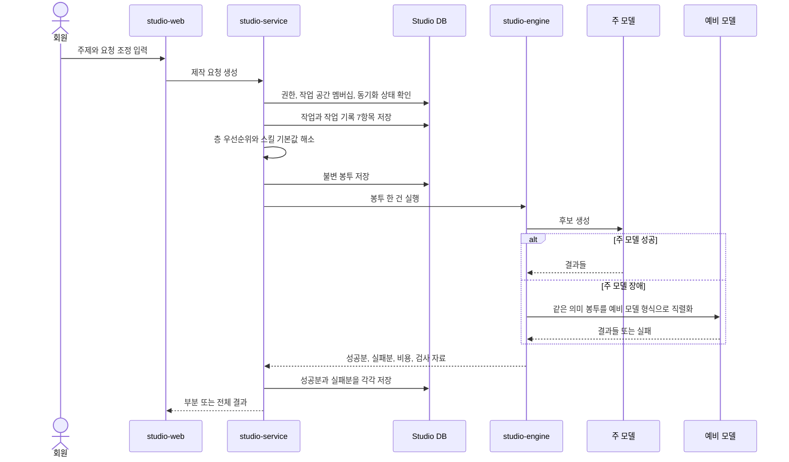

#### 9.2 요청 접수

접수기는 다음을 한 트랜잭션으로 처리한다.

1. 인증 회원을 확정한다.
2. 작업 공간 멤버십과 요청한 작의 소유를 확인한다.
3. 중복 방지 키를 확인한다.
4. 작업 행을 만든다.
5. 정규화 입력을 저장한다.
6. 원문 보유 정책에 따라 암호화 원문을 저장한다.
7. 작업 기록 일곱 항목의 초기값을 만든다.

같은 회원, 같은 중복 방지 키의 재요청은 같은 작업을 반환한다.

#### 9.3 봉투 조립

조립기는 다음 순서로 동작한다.

1. 범위에 맞는 활성 항목 판을 읽는다.
2. 정본과 투영본 상태를 읽는다.
3. 원격 대조 없이 로컬 수신 상태를 읽는다.
4. 금지 표현·브랜드 사실·소재 권리의 실패한 밀기만 작업 차단 대상으로 판정한다.
5. `S0` 잠금과 일반 우선순위로 의미 충돌을 해소한다.
6. 승낙된 활성 `L5`만 고른다.
7. 검사 통과한 `X4` 원문과 본보기를 고른다.
8. 출력 언어와 이번 `R6`를 붙인다.
9. 공급자 중립 의미 봉투를 만들고 모델별 문법으로 직렬화한다.
10. 봉투와 사용 판 목록을 불변 저장한다.

#### 9.4 L5 후보와 적용

선택·수정·성과 관찰은 `learning_observations`에 누적한다. 같은 방향의 선택 3회 또는 비교 가능한 성과 5건 전에는 후보를 만들지 않는다. 임계값에 도달해도 상태는 `candidate`이며 `근거 부족` 표시, 표본 수, 관찰 기간, 출처 작업을 함께 저장한다.

사용자 승낙 사건이 있어야 `layer_items(layer_code='L5')`와 첫 판을 만든다. 거절한 후보는 `rejected`로 남고 조립층에서 읽지 않는다. 출력 언어 선택 자체는 관찰로 기록하지 않는다.

#### 9.5 의미 해소와 모델 직렬화

의미 해소 결과는 공급자 중립 구조다.

모델 직렬화는 해당 결과를 제공자 입력으로 바꾼다.

둘을 분리하는 이유는 다음과 같다.

- 예비 모델 전환 때 우선순위 판단을 반복하지 않는다.
- 같은 의미 입력이 제공자별 문법 차이로 달라지는 것을 추적한다.
- 모델 캐시 최적화를 어댑터 내부에 제한한다.
- 테스트가 의미와 제공자 문법을 따로 검증할 수 있다.

#### 9.6 후보와 승격

후보 세 개는 각각 독립 결과다.

한 후보 실패가 다른 후보 성공을 지우지 않는다.

사용자는 성공한 후보 중 하나를 승격할 수 있다.

후보 선택은 다음을 저장한다.

- 선택 후보
- 선택 시각
- 선택 이유 축
- 자유 메모
- 승격 승인 비용 상한

미선택 후보는 보유 정책 안에서 다시 승격할 수 있다.

#### 9.7 비용 관문

비용은 예상, 예약, 실제, 환불, 운영 부담을 분리한다.

| 시점 | 기록 | 다음 동작 |
|---|---|---|
| 제안 전 | 무료 왕복 사용 | 무료 한도 초과면 승인 요청 |
| 제작 전 | 예상 최저, 최고, 상한 | 사용자 상한 초과면 시작 금지 |
| 공급자 호출 전 | 예약 | 예약 실패면 호출 금지 |
| 공급자 결과 후 | 실제 | 성공분만 고객 비용 확정 |
| 품질 반려 | 운영 원가 | 고객 비용 0 |
| 부분 성공 | 항목별 실제 | 성공 항목만 확정, 실패 항목 예약 해제 |

#### 9.8 출력 검사

출력 검사는 다음을 순서대로 본다.

1. 결과 구조 완결성
2. 언어 일치
3. 금지 표현
4. 브랜드 사실
5. 소재 권리
6. 스킬 출력 형식
7. 채널 규격
8. 품질 기준

금지 표현, 브랜드 사실, 소재 권리 실패는 외부 인계를 막는다.

다른 품질 실패는 결과 상태를 `rejected_quality`로 남기고 재시도 정책을 적용한다.

#### 9.9 계보

계보는 다음을 잇는다.

`요청 -> 봉투 -> 항목 판들 -> 스킬 판 -> 모델 시도들 -> 후보 -> 선택 -> 승격 결과 -> 인계`

과거 계보는 정본 항목이 삭제되어도 유지한다.

삭제된 값 원문은 권한과 보유 정책에 따라 가린다.

### 6.4 실패와 부분 성공 <a id="실패"></a>

#### 10.1 상태 기계

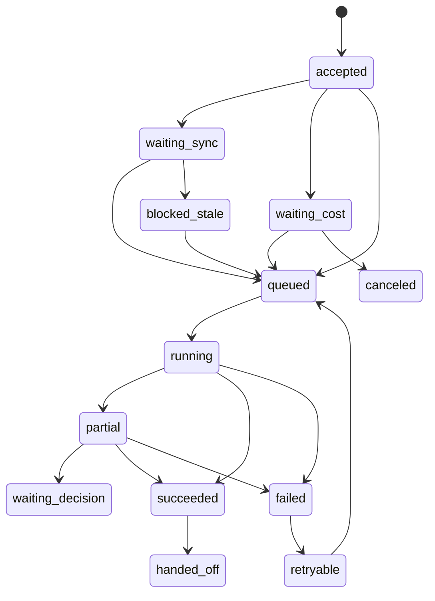

#### 10.2 실패 경로 여섯

| 실패 | 감지 | 보존 | 사용자 결과 | 재시도 |
|---|---|---|---|---|
| 주 모델 장애 | 시간 초과, 5xx, 제공자 오류 | 주 모델 시도 | 예비 모델 전환 표시 | 예비 모델 1회 |
| 예비 모델도 장애 | 두 시도 실패 | 두 실패와 비용 | 작업 실패 | 수동 재개 |
| 금지 표현 적발 | 출력 검사 | 문제 결과는 격리, 다른 성공분 유지 | 해당 결과만 차단 | 수정 입력으로 재시도 |
| 스킬 검사 탈락 | 등록 또는 실행 검사 | 검사 보고 | 스킬 제외 또는 작업 보류 | 수정 후 새 판 |
| 비용 상한 초과 | 예약 전, 호출 중 누적 | 기존 성공분과 실제 비용 | 추가 호출 중단, 성공분 제공 | 상한 재승인 |
| 부분 실패 | 결과별 상태 | 성공 결과, 실패 결과, 실제 비용 전부 | 부분 성공 표시 | 실패 항목만 재시도 |

#### 10.3 부분 성공 원칙

부분 성공은 성공의 하위 상태가 아니라 독립 상태다.

반드시 다음을 만족한다.

- 성공 결과를 사용자에게 보여 준다.
- 실패 결과의 이유를 결과별로 보여 준다.
- 전체 다시 만들기를 기본 행동으로 제안하지 않는다.
- 실패 결과만 재시도할 수 있다.
- 성공 결과에 청구된 비용과 실패 예약 해제를 분리한다.
- 인계는 성공 결과만 선택적으로 할 수 있다.

#### 10.4 재시도와 중복

모든 외부 호출 시도는 고유 시도 식별자를 가진다.

네트워크 재시도로 같은 결과가 두 번 와도 결과 식별자와 제공자 식별자로 중복 제거한다.

이벤트 순서는 신뢰하지 않는다.

작업 상태는 이전 상태와 사건 종류를 함께 검사해 전이한다.

### 6.5 구현 순서 <a id="구현순서"></a>

이 순서는 build 승인 뒤 개발자가 따른다.

#### 22.1 1차, 경계와 저장

1. 회원과 외부 회원 매핑
2. 작업 공간과 작업 공간 멤버십
3. 항목과 불변 판
4. 정본과 투영본 메타
5. 행 격리 정책
6. 기존 workspace_guides와 drafts 백필

종료 증거는 작업 공간 교차 접근이 API와 DB에서 모두 거부되고 기존 Studio 읽기가 유지되는 것이다.

#### 22.2 2차, 동기화

1. 아웃박스
2. 수신함
3. 사건 계약
4. 멱등 적용
5. 삭제 전파
6. 재시도와 사망 편지 대기열
7. 세 경우 대조

종료 증거는 중복, 역순, 삭제, 판 불일치 시험과 실제 두 서비스 통합 시험이다.

#### 22.3 3차, 스킬과 봉투

1. 스킬 선언 여덟 칸
2. 작업 공간 표현 규칙
3. 채움 판정
4. 의미 해소
5. 봉투 스냅샷
6. 무상태 엔진 포트

종료 증거는 같은 봉투의 결정적 의미 해소와 엔진 DB 접근 0이다.

#### 22.4 4차, 생성과 실패

1. 작업 조정
2. 비용 관문
3. 주 모델과 예비 모델
4. 결과별 상태
5. 출력 검사
6. 계보
7. 부분 재시도

종료 증거는 성공 2, 실패 1 상황에서 성공분과 비용이 보존되는 E2E다.

#### 22.5 5차, 화면과 호환 전환

1. 독립 Studio 로그인
2. 개인과 작업 공간 층 편집
3. 작업 공간 표현 규칙
4. 스킬 적용 설명
5. 동기화 상태
6. 생성과 결과 계보
7. 기존 dashboard Studio 호환

종료 증거는 독립 Studio 완주와 기존 Studio 회귀 둘 다다.


## 7. 테스트 계획 <a id="7-테스트-계획"></a>

### 7.1 완료 판정

설계 문서 작성은 제품 동작 완료가 아니다. 아래 시험은 build 단계에서 실제 DB, 실제 API 어댑터, 실제 브라우저 또는 계약 시험으로 실행해야 한다. 현재 실행 결과는 0건이며 모두 미검증이다.

### 7.2 v45 한 편 순환 수용 시험

| 시험 | Given | When | Then |
|---|---|---|---|
| CYCLE-01 | 채널 0개인 Studio 회원 | 글 또는 영상과 R6를 선택 | 작업이 생성되고 채널 연결 화면 없이 생성실로 간다 |
| CYCLE-02 | S0부터 L5와 R6가 있는 작업 | 조립 실행 | 고정 판, 우선순위, 사실 충돌 질문이 봉투와 화면에 일치한다 |
| CYCLE-03 | 저해상도 후보 3개 | 후보와 이유 선택 | 선택 원본, 관찰, 제작 정보가 보존되고 나머지도 삭제되지 않는다 |
| CYCLE-04 | 선택 원본 1개 | 편집실 진입 | 부모 출력과 recipe 판, 채널 규격 상태를 함께 읽는다 |
| CYCLE-05 | 편집 지시와 채널 대상 | 렌더 및 문구 확정 | 완성 원본, 제목, 소개, 해시태그, 첫 댓글, 편집 기록이 판으로 남는다 |
| CYCLE-06 | 결합 모드 완성 결과 | openclaw 인계 | SNS 자격증명 없이 원본·문구·제작 정보가 멱등 수신된다 |
| CYCLE-07 | 인계 수신과 연결 계정 | 발행 | 외부 주소, 발행 시각, 실패·재시도 기록이 중복 발행 없이 남는다 |
| CYCLE-08 | 외부 결과와 성과 | 성과실 조회 | 성과와 제작 정보, 선택·수정 관찰이 같은 production으로 묶인다 |
| CYCLE-09 | 비교 가능 성과 5건 또는 같은 선택 3회 | 학습 집계 | 자동 적용 없이 `근거 부족` 후보와 근거 참조만 생긴다 |
| CYCLE-10 | 학습 후보 | 승낙 또는 거절 | 승낙만 L5 판을 만들고 거절은 관찰만 보존한다 |
| CYCLE-11 | 승낙한 L5와 새 R6 | 다음 생성 | 새 봉투가 승낙 L5와 새 R6를 읽고 과거 봉투는 불변이다 |

### 7.3 목적과 판정 원칙 <a id="목적"></a>

#### 1.1 목적

이 계획은 사업계획 v1.3 §3.4와 회장 확정 요구사항이 요구한 다음 사실을 검증한다.

1. Studio 서비스가 독립 회원과 층 저장소를 가진다.
2. 엔진만 무상태다.
3. 전역, 회원, 작업 공간, 작 범위가 섞이지 않는다.
4. 정본과 투영본이 구분되고 밀기 동기화가 무손실이다.
5. 스킬은 `X4` 층으로 조립되고 U3·R6·S0을 덮지 않는다.
6. U3의 사실·표현·금지·권리가 각각 저장되고 사실·금지·권리만 오래될 때 해당 작을 멈춘다.
7. 오래됨으로 멈추는 값은 셋뿐이다.
8. 부분 실패가 성공분을 버리지 않는다.
9. 작업 기록 일곱 항목이 남는다.

#### 1.2 증거 등급

| 등급 | 뜻 | 출고 사용 |
|---|---|---|
| 관찰됨 | 실제 브라우저, DB, 네트워크 결과를 직접 봄 | 가능 |
| 테스트됨 | 자동 시험이 실제 구성요소를 실행해 통과 | 가능 |
| 근거 확인 | 문서와 코드 구조를 읽음 | 설계 근거만 |
| 미검증 | 실제 경로를 실행하지 않음 | 완료 근거 불가 |

#### 1.3 판정

| 판정 | 조건 |
|---|---|
| PASS | 기대 결과와 직접 증거가 모두 있음 |
| FAIL | 하나 이상의 기대 결과 불일치 |
| BLOCKED | 환경이나 확정 정책이 없어 실행 자체가 불가 |
| NOT RUN | 아직 실행하지 않음 |

#### 1.4 출고 차단 우선순위

| 우선 | 차단 조건 |
|---:|---|
| 1 | 작업 공간 또는 회원 교차 데이터가 한 건이라도 노출 |
| 2 | 삭제 사건 누락, 판 역행, 정본과 투영본 오표시 |
| 3 | 금지 표현, 브랜드 사실, 소재 권리 오래됨을 잘못 통과 |
| 4 | 부분 실패가 성공분을 삭제하거나 재청구 |
| 5 | 작업 기록 일곱 항목 또는 계보 누락 |
| 6 | 기존 Studio 기능 회귀 |

#### 1.5 표기

| 표기 | 뜻 |
|---|---|
| E2E | 사용자 시작부터 실제 저장과 결과까지 잇는 종단 시험 |
| DB | 데이터베이스 |
| HTTP | 웹 요청과 응답 전송 규약 |
| API | 서비스 사이 요청과 응답 규격 |
| UUID | 충돌 가능성이 매우 낮은 128비트 식별자 |
| SHA-256 | 무결성 지문에 쓰는 해시 함수 |

### 7.4 범위와 제외 <a id="범위"></a>

#### 2.1 포함

- Studio 독립 로그인과 합친 배치 회원 대리 생성
- 개인 층, 작업 공간, 작업 공간 멤버십 생성과 권한
- `S0 S1 U2 U3 X4 L5 R6`
- 정본, 투영, 동기화, 삭제, 충돌
- U3 브랜드 사실·표현 규칙·금지 표현·소재 권리·자유 서술
- 스킬 여덟 선언과 다섯 검사
- 봉투 조립, 주 모델, 예비 모델, 비용
- 후보, 승격, 출력 검사, 부분 성공
- 원문, 정규화 입력, 작업 기록, 계보
- 기존 dashboard Studio 호환

#### 2.2 제외

- 실제 SNS 게시 성공
- 성과 수집 정확도
- 모든 외부 모델의 품질 순위
- 미확정 외부 스킬 라이선스 허용 범위
- 미확정 계정 자동 병합

제외 항목을 PASS로 표시하지 않는다.

### 7.5 환경과 증거 <a id="환경"></a>

#### 3.1 환경 행렬

| 환경 | 구성 | 목적 |
|---|---|---|
| unit | 도메인 함수, 결정적 시계 | 채움, 우선순위, 상태 전이 |
| integration-db | 실제 PostgreSQL, 비우회 app role | FK, CHECK, 행 격리, 트랜잭션 |
| integration-sync | openclaw stub가 아니라 실제 계약 송수신기 두 개 | 중복, 역순, 삭제, 판 불일치 |
| integration-engine | 무상태 엔진과 가짜 모델 서버 | 봉투 외 접근 0, fallback |
| e2e-standalone | studio-web, studio-service, DB, engine | 독립 상품 완주 |
| e2e-combined | openclaw-service, studio-service, 두 DB | 대리 회원, 밀기, 인계 |
| stage | 운영과 같은 네트워크와 저장소 | 장애 주입과 관측 |

#### 3.2 시드

| 시드 | 내용 |
|---|---|
| M-A | 회원 A, owner |
| M-B | 회원 B, owner |
| B-A1 | 회원 A 작업 공간 1 |
| B-A2 | 회원 A 작업 공간 2 |
| B-B1 | 회원 B 작업 공간 1 |
| W-A1 | B-A1 작업 공간 |
| W-A2 | B-A2 작업 공간 |
| W-B1 | B-B1 작업 공간 |
| U3-A1 | 고유 브랜드 사실 `A_ONLY_FACT` |
| U3-A2 | 고유 브랜드 사실 `A2_ONLY_FACT` |
| U3-B1 | 고유 브랜드 사실 `B_ONLY_FACT` |
| STOP-A1 | B-A1 금지 표현 `DO_NOT_EMIT_A1` |
| RIGHTS-A1 | B-A1 전용 소재 권리 |

#### 3.3 증거 묶음

각 시험은 다음 중 필요한 것을 남긴다.

- 요청과 응답의 비밀값 제거 사본
- DB 질의 결과와 현재 app role
- 행 정책 판정
- 구조화 사건과 correlation id
- 브라우저 화면 캡처
- 모델 stub 수신 봉투 해시
- 비용 원장 전후 행
- 저장소 객체 hash

#### 3.4 완료 주장 금지

mock 모델 통과만으로 제품 완료라고 하지 않는다.

실제 PostgreSQL, 실제 두 서비스 경로, 브라우저 완주 증거가 있어야 한다.

### 7.6 전체 흐름 도식 <a id="흐름"></a>

#### 4.1 독립 Studio 흐름

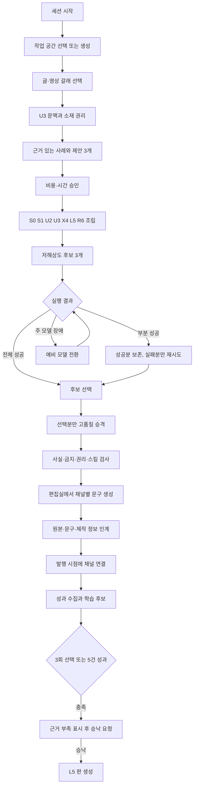

#### 4.2 합친 배치 동기화 흐름

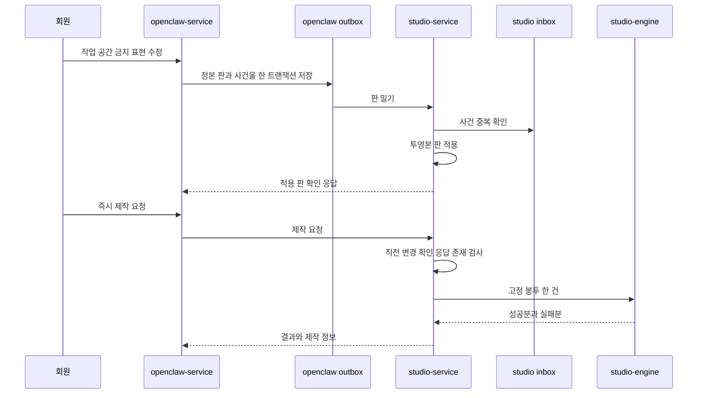

#### 4.3 실패 흐름

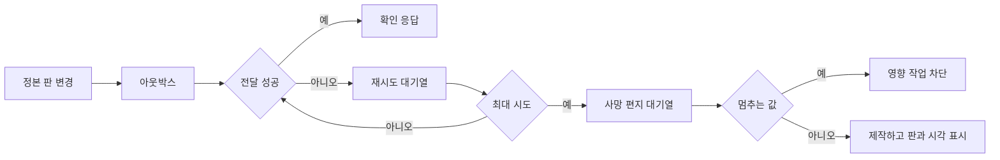

#### 4.4 제작 실패 경로 여섯

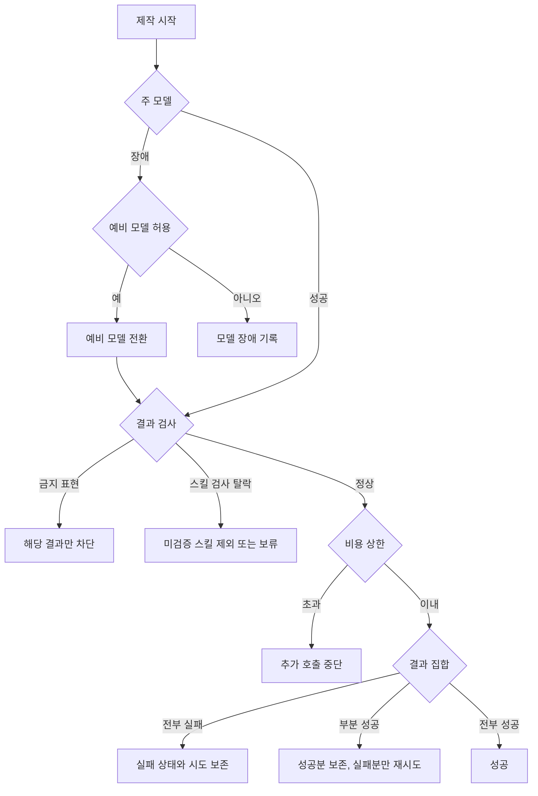

### 7.7 작업 공간 격리 시험 <a id="작업 공간"></a>

이 절은 가장 중요한 신규 시험이다.

한 건이라도 실패하면 전체 출고 NO-GO다.

#### WORKSPACE-ISO-01 목록 격리

Given 회원 A와 B가 각각 작업 공간를 가진다.

When 회원 A 토큰으로 작업 공간 목록을 조회한다.

Then B-B1이 응답, 로그의 사용자 표시 값, 캐시 어디에도 없다.

증거: HTTP 응답, DB role과 policy 질의, 캐시 키 목록.

#### WORKSPACE-ISO-02 직접 식별자 조회

Given 회원 A가 B-B1 식별자를 안다.

When `GET /workspaces/{B-B1}`을 호출한다.

Then 404이고 존재 여부를 유추할 필드가 없다.

감사에는 scope denial이 한 건 남는다.

#### WORKSPACE-ISO-03 같은 회원의 두 작업 공간 격리

Given 회원 A가 B-A1과 B-A2를 가진다.

When W-A1로 봉투를 조립한다.

Then U3-A1만 들어가고 U3-A2는 0건이다.

이는 회원 격리만으로 잡히지 않는 핵심 시험이다.

#### WORKSPACE-ISO-04 작업 공간 위조

Given W-A2는 B-A2에 속한다.

When `studio_member_id=B-A1`, `workspace_id=W-A2`로 제작을 요청한다.

Then 404 또는 422로 거부되고 job 행이 생기지 않는다.

#### WORKSPACE-ISO-05 DB 행 정책 우회

Given 애플리케이션 비우회 역할에 회원 A 문맥을 설정한다.

When layer_items, production_jobs, outputs를 B-B1 조건으로 직접 SELECT와 UPDATE한다.

Then SELECT 0행, UPDATE 0행이며 정책 우회 권한이 없다.

테이블 소유자 연결로 이 시험을 대신하지 않는다.

#### WORKSPACE-ISO-06 봉투 단일 작업 공간

Given 잘못된 내부 fixture가 두 작업 공간 항목을 반환한다.

When EnvelopeBuilder가 봉투를 고정한다.

Then `ENVELOPE_MULTI_WORKSPACE`로 실패하고 engine 호출은 0회다.

#### WORKSPACE-ISO-07 모델 요청 누출

Given 세 작업 공간에 고유 canary 문자열이 있다.

When 각 작업 공간 작업을 병렬 실행한다.

Then 모델 stub가 받은 각 봉투에는 자기 canary만 있고 다른 canary는 없다.

#### WORKSPACE-ISO-08 결과 계보 격리

Given B-A1 결과 ID를 회원 B가 안다.

When 결과와 provenance를 조회한다.

Then 둘 다 404다.

#### WORKSPACE-ISO-09 캐시 격리

Given 두 작업 공간이 같은 주제와 같은 표현 규칙을 사용한다.

When 순서대로 생성한다.

Then 의미가 같아도 작업 공간 식별자와 봉투 지문이 다른 캐시 경계로 기록된다.

다른 작업 공간 결과 참조를 재사용하지 않는다.

#### WORKSPACE-ISO-10 동기화 매핑 격리

Given openclaw의 같은 문자열 item id가 서로 다른 source namespace에 있다.

When 두 사건을 민다.

Then source_service와 외부 item id 조합으로 분리되고 다른 작업 공간 local item에 덮어쓰지 않는다.

#### WORKSPACE-ISO-11 명시 복사

Given B-A1 항목을 B-A2로 복사한다.

When 원본 B-A1에 새 판을 만든다.

Then B-A2 복사 항목 판은 바뀌지 않고 copied_from만 남는다.

#### WORKSPACE-ISO-12 삭제 격리

Given B-A1을 삭제한다.

When 삭제 전파가 끝난다.

Then B-A1의 U3, 작업 공간 설치 X4, L5만 비활성화되고 B-A2와 B-B1은 그대로다.

### 7.8 회원과 세 범위 시험 <a id="회원-2"></a>

#### MEMBER-01 독립 회원 생성

Given openclaw가 중단되어 있다.

When Studio에서 가입하고 로그인한다.

Then studio_members와 session이 생기고 openclaw 호출은 0회다.

#### MEMBER-02 합친 배치 대리 생성 멱등성

Given 같은 source_member_id다.

When provision 요청을 3회 보낸다.

Then Studio 회원은 1개이고 세 응답의 member id가 같다.

#### MEMBER-03 다른 본문의 같은 멱등 키

When 같은 Idempotency-Key에 다른 source_member_id를 보낸다.

Then 409 `IDEMPOTENCY_CONFLICT`다.

#### PLAN-01 작업 공간 한도

Given 무료·스타터는 활성 작업 공간 1개, 프로는 3개다. When 한도보다 하나 더 생성한다. Then 409 `WORKSPACE_LIMIT_REACHED`이고 새 workspace 행은 0개다.

#### PLAN-02 기업 협의 한도

Given enterprise `workspace_limit` 설정값이 N이다. Then N까지 생성되고 N+1은 거부된다. null 한도는 무제한이 아니라 계약 설정 누락으로 거부된다.

#### PLAN-03 무료 실제 영상 한 편

Given 무료 권한이 남아 있다. When 세로 1080×1920, 30fps, 90초 안팡 영상을 렌더한다. Then 실제 재생 가능한 영상 파일과 메타데이터를 직접 관찰하고, 성공 트랜잭션에서만 사용량이 1 증가한다. 정지 이미지·텍스트 목업·빈 파일은 실패다.

#### PLAN-04 무료 렌더 실패

When 렌더가 실패한다. Then `free_actual_video_used`는 증가하지 않고 재시도 권한이 남는다.

#### SCOPE-01 U2 개인 범위

Given 회원 A의 U2 항목이다.

Then workspace_id가 null이고 회원 A의 모든 작업 공간 작에 적용 후보가 된다.

#### SCOPE-02 U3 작업 공간 범위

Given B-A1 U3 항목이다.

Then workspace_id=B-A1이다.

#### SCOPE-03 X4 설치 범위

Given B-A1에 설치한 X4 항목이다.

Then layer_code=X4, scope_kind=workspace, workspace_id=B-A1이다.

#### SCOPE-04 작업 공간 없는 U3·L5

When workspace_id 없이 U3 또는 L5를 저장한다.

Then DB와 API 모두 거부한다.

#### SCOPE-05 범위와 층 불일치

When U3를 member scope로 저장하거나 U2를 workspace scope로 저장한다.

Then 422와 DB CHECK 위반이다.

### 7.9 정본과 투영본 동기화 시험 <a id="동기화-3"></a>

#### SYNC-01 정상 밀기와 확인 응답

Given openclaw U3 정본 판 10이 있다.

When revision 10 사건을 Studio에 민다.

Then projection 판 10이 적용되고 확인 응답의 applied_revision=10이다.

#### SYNC-02 중복 사건

Given 같은 source와 event id다.

When 동일 사건을 3회 보낸다.

Then sync_inbox 1행, layer_revision 1행, 같은 확인 응답 3회다.

#### SYNC-03 같은 사건 id의 다른 payload

When 같은 source와 event id에 다른 payload hash를 보낸다.

Then 409이고 기존 적용 결과는 바뀌지 않는다.

#### SYNC-04 역순 판

Given revision 12가 적용되었다.

When revision 11 사건이 늦게 온다.

Then `SYNC_REVISION_REGRESSION`, current_revision=12 유지다.

#### SYNC-05 낡은 비멈춤 투영본

Given 목소리 투영본의 마지막 성공이 하루를 넘고 실패 이력이 있다.

When 제작한다.

Then 제작은 진행하고 결과 계보에 revision과 last_push_succeeded_at을 표시한다.

#### SYNC-06 낡은 금지 표현 투영본

Given 금지 표현 밀기 실패 이력이 있고 주입한 감지 창을 넘었다.

When 그 작업 공간 제작을 시작한다.

Then 영향 작업만 `STALE_STOPPING_VALUE`로 멈춘다.

다른 작업 공간 작업은 진행한다.

#### SYNC-07 낡은 브랜드 사실 투영본

Given workspace_fact가 오래되고 실패 이력이 있다.

When 그 사실을 쓰는 작업을 조립한다.

Then 엔진 호출 전 차단된다.

#### SYNC-08 낡은 소재 권리 투영본

Given material_rights가 오래되고 실패 이력이 있다.

When 해당 소재를 선택한다.

Then 그 소재를 쓰는 결과만 차단되고 무관한 결과는 진행 가능하다.

#### SYNC-09 마지막 밀기 성공 뒤 정본 장애

Given Studio 투영이 최신이고 마지막 밀기가 성공했다.

When openclaw가 중단된 상태에서 제작한다.

Then 원격 대조 없이 제작한다.

#### SYNC-10 매 요청 대조 금지

Given 실패한 전달 복구, 회원 수동 복구, 계약 주 번호 교차 검증이 아니다.

When 제작 요청 100건을 보낸다.

Then comparison 호출은 0회다.

#### SYNC-11 실패한 전달 운영 복구

Given 밀기 실패 또는 DLQ 사건이 있다.

When 운영자가 복구를 시작한다.

Then reason=`failed_delivery_recovery`로만 대조한다.

#### SYNC-12 회원 수동 복구

Given 회원이 동기화 상태 화면에서 복구를 요청했다.

When 서버가 복구 명령을 검증한다.

Then reason=`member_requested_recovery`로만 대조한다.

#### SYNC-13 계약 주 번호 교차 검증과 그 밖 사유 거부

Given 계약 주 번호 전환 검증이다. Then reason=`contract_major_crosscheck`로만 대조한다.

When reason=`every_production`으로 comparison API를 부른다.

Then 422다.

#### SYNC-14 삭제 전파

Given 작업 공간 삭제 revision 20 사건이다.

When Studio가 적용한다.

Then 작업 공간, U3, 소속 U3, 작업 공간 조건 L5가 신규 봉투에서 제외된다.

과거 output과 provenance는 남는다.

#### SYNC-15 삭제 사건 중복

When 같은 delete event를 반복한다.

Then tombstone 판은 1개다.

#### SYNC-16 계약 minor 추가 필드

Given 2.1 소비자가 모르는 선택 필드가 있다.

When 사건을 받는다.

Then 알려진 필드를 적용하고 모르는 필드는 raw payload에 보존한다.

#### SYNC-17 계약 major 불일치

Given 지원 창 밖 major다.

When 사건을 받는다.

Then 422 `VERSION_UNSUPPORTED`, 투영본 불변이다.

#### SYNC-18 두 판 동시 수용

Given 현재 주 번호와 직전 주 번호를 동시 지원하는 호환 창 안이다.

When 이전 판과 현재 판 사건을 각각 보낸다.

Then 각각 해당 해석기로 적용된다.

창 종료 뒤 이전 판은 명시적으로 거부된다.

#### SYNC-19 재시도와 사망 편지 대기열

Given Studio가 계속 503을 반환한다.

When 최대 시도까지 전달한다.

Then 지수 백오프와 jitter 기록 뒤 사건이 사망 편지 대기열로 이동한다.

#### SYNC-20 매핑 충돌

Given 같은 외부 item id가 다른 local item에 이미 매핑됐다.

When 새 매핑 사건이 온다.

Then held 상태이며 자동 새 항목 생성은 0회다.

### 7.10 U3 작업 공간 문맥 시험 <a id="목소리-2"></a>

#### CONTEXT-01 브랜드 사실 출처

Given 브랜드 사실에 출처 참조가 없다. When U3 판을 확정한다. Then 422 `FACT_SOURCE_REQUIRED`다.

#### CONTEXT-02 표현 규칙 보존

Given 존댓말·어휘·리듬·표기 선호가 있다. Then 각 값이 같은 U3 판에 저장되고 봉투 조립 후 지문으로 검증된다.

#### CONTEXT-03 금지 표현 멈춤

Given 금지 표현 투영본이 낡고 실패 이력이 있다. Then 영향 받는 작만 멈추고 다른 작업 공간과 작은 계속한다.

#### CONTEXT-04 소재 권리 멈춤

Given 소재 권리가 미확인 또는 만료되었다. Then 해당 소재를 참조하는 작 호출은 0회다.

#### CONTEXT-05 자유 서술의 상쇄 금지

Given free_note가 브랜드 사실과 반대된다. Then 구조화된 사실이 승자며 충돌 계보가 남는다.

#### CONTEXT-06 작업 공간 복제

When 새 브랜드·언어·취향을 위해 작업 공간을 복제한다. Then 선택한 U3·X4·L5만 새 항목과 판으로 복제되고 원본과 동기화 관계는 생기지 않는다.

#### CONTEXT-07 결과 적용 설명

Then 결과 화면은 사용자 값, X4 제안, 최종 적용 값, 선택 이유를 필드별로 표시한다.

#### LEARN-01 같은 선택 2회

Given 비교 가능한 같은 선택이 2회다. Then 사용자에게 학습 후보를 띄우지 않고 L5 판은 0개다.

#### LEARN-02 같은 선택 3회

Given 같은 선택이 3회다. Then 후보 카드에 `근거 부족`이 표시되고 승낙 전 L5 판은 0개다.

#### LEARN-03 성과 4건과 5건 경계

Given 비교 가능한 성과가 4건이다. Then 후보를 띄우지 않는다. Given 5번째 성과가 밀려온다. Then 근거 참조 5건을 가진 후보를 제시한다.

#### LEARN-04 승낙 후 적용

When 회원이 후보를 승낙한다. Then 새 L5 항목과 판, 근거, 승낙자, 승낙 시각이 한 트랜잭션으로 남는다.

#### LEARN-05 거절과 작업 공간 격리

When 후보를 거절한다. Then 관찰 기록은 보존하고 L5 판은 0개다. 다른 작업 공간의 후보·L5는 변하지 않는다.

### 7.11 스킬 기본값과 검사 시험 <a id="스킬-3"></a>

#### SKILL-01 선언 여덟 칸 완결

When 한 칸씩 누락한 스킬 8개를 제출한다.

Then 모두 `SKILL_DECLARATION_INVALID`다.

#### SKILL-02 빈 칸 default

Given 사용자 필드가 unset이다.

When default 스킬을 적용한다.

Then 값이 채워지고 application action=applied다.

#### SKILL-03 사용자 값 보존

Given 사용자 필드가 명시 false 또는 빈 배열이 아닌 실제 값이다.

When default 스킬을 적용한다.

Then skipped, reason=user_value_present다.

#### SKILL-04 자유 서술은 잠금 아님

Given free_note가 있다.

When V3 default를 적용한다.

Then V3는 채워진다.

#### SKILL-05 승인 force

Given write field와 force mode, 권한, 충돌 동작이 승인됐다.

When 실행한다.

Then 적용하고 결과 설명에 force를 표시한다.

#### SKILL-06 미선언 force

When body가 선언하지 않은 필드를 force로 쓰려 한다.

Then 검사에서 downgraded 또는 held다.

#### SKILL-07 S0 우회

When 스킬이 S0 불변을 덮으려 한다.

Then 등록 거부다.

#### SKILL-08 사칭

When 다른 회원 또는 작업 공간 범위를 읽으려 한다.

Then 등록 거부다.

#### SKILL-09 라이선스 누락

When 외부 스킬에 license가 없다.

Then held이고 실행 0회다.

#### SKILL-10 권한 초과

Given network_allowlist가 비어 있다.

When 실행 중 외부 통신을 시도한다.

Then 런타임 차단과 감사 1건이다.

#### SKILL-11 파일 격리

When 다른 작업의 저장 경로를 읽으려 한다.

Then 파일 0바이트 반환이 아니라 권한 오류로 차단한다.

#### SKILL-12 스킬 삭제

Given 과거 결과가 skill revision 3을 참조한다.

When skill를 삭제한다.

Then 신규 작업에서 제외되지만 과거 provenance는 revision 3을 표시한다.

### 7.12 층 해소와 봉투 시험 <a id="봉투"></a>

#### ENVELOPE-01 우선순위

Given 같은 필드가 S1, U2, U3, X4, L5, R6에 있다.

When 해소한다.

Then `S0 잠금 > R6 > L5 > X4 > U3 > U2 > S1` 순서다.

#### ENVELOPE-02 S0 불변

Given R6가 S0 불변을 덮으려 한다.

Then S0가 이기고 충돌 기록이 남는다.

#### ENVELOPE-03 L5 조건 12칸

Given 12칸 중 workspace가 다른 규칙이다.

Then 봉투에서 제외된다.

각 조건 칸을 하나씩 불일치시킨 12개 매개변수 시험을 돌린다.

#### ENVELOPE-04 R6 비영속 층

Given 작업이 끝난다.

Then R6는 layer_items에 없고 request_adjustments와 job record에만 있다.

#### ENVELOPE-05 결정성

Given DB 판 집합과 스킬 판 집합이 같다.

When 봉투를 두 번 만든다.

Then created_at 같은 비결정 필드를 제외한 정규 hash가 같다.

#### ENVELOPE-06 엔진 무상태

Given DB와 정본 서비스 네트워크를 차단한다.

When 유효 봉투를 engine에 준다.

Then engine은 봉투만으로 실행하고 DB 연결 시도 0회다.

#### ENVELOPE-07 판과 갱신 시각

Then 모든 U2, U3, X4, L5 항목에 item_id, revision, authority, updated_at이 있다.

#### ENVELOPE-08 X4 층 포함

Then `layers.x4`에 스킬 항목 판과 검사 결과가 있고, 층 밖의 독립 `skills` 우선순위는 없다.

### 7.13 생성, 모델, 비용 시험 <a id="생성-2"></a>

#### GEN-01 제안 3개

Given 정상 입력이다.

When proposals를 실행한다.

Then 성공한 서로 다른 후보 슬롯 3개와 차이 축이 있다.

#### GEN-02 전체 거절 재시도

Given 무료 왕복이 남았다.

When retry한다.

Then 새 proposal_set과 retry_of가 남는다.

#### GEN-03 비용 예상

Then min <= max <= recommended ceiling 조건을 만족하고 가정이 표시된다.

#### GEN-04 상한 미승인

When approved ceiling 없이 유료 작업을 시작한다.

Then 공급자 호출 0회다.

#### GEN-05 주 모델 성공

Then fallback attempt는 0이고 주 모델 비용만 기록된다.

#### GEN-06 주 모델 장애와 예비 모델

Given 주 모델 503이다.

When fallback_allowed=true다.

Then 같은 의미 봉투를 예비 어댑터로 직렬화하고 fallback=true를 기록한다.

#### GEN-07 예비 모델 금지

Given fallback_allowed=false다.

When 주 모델이 실패한다.

Then 예비 모델 호출 0회다.

#### GEN-08 고해상도 승격

Given 후보 3개 중 B를 선택했다.

When promote한다.

Then B만 승격되고 A와 C 고해상도 호출 0회다.

#### COST-01 예약과 실제

Then 공급자 호출 전에 reservation, 성공 뒤 actual과 release가 원장에 남는다.

#### COST-02 품질 반려 무과금

Given 필수 품질 게이트에서 반려됐다.

Then operator_cost는 남고 customer_billable actual은 0이다.

#### COST-03 상한 도달

Given 일부 성공 뒤 누적 실제가 상한에 도달한다.

Then 추가 호출은 0, 기존 성공 결과는 유지한다.

#### COST-04 중복 응답

Given 공급자 같은 request id 결과가 두 번 온다.

Then actual 비용과 output은 각각 1개다.

### 7.14 실패와 부분 성공 시험 <a id="실패-2"></a>

#### FAILURE-01 주 모델 장애

기대: 실패 시도 보존, 예비 모델 전환 표시.

#### FAILURE-02 예비 모델도 장애

기대: 두 실패 시도 보존, 전체 failed, 허위 결과 0.

#### FAILURE-03 금지 표현 적발

Given 후보 A만 금지 표현을 포함한다.

Then A blocked, B와 C succeeded다.

#### FAILURE-04 스킬 검사 탈락

Given 선택 스킬이 held다.

Then 실행에서 제외하거나 작업을 보류하며 조용히 실행하지 않는다.

#### FAILURE-05 비용 상한 초과

기대: 추가 호출 중단, 성공분 제공, 실패 예약 해제.

#### FAILURE-06 부분 실패 성공분 보존

Given 후보 A와 B 성공, C 실패다.

When 작업을 조회한다.

Then status=partial, outputs A와 B가 유지되고 C 실패 이유가 있다.

When C만 재시도한다.

Then A와 B 공급자 재호출 0회, 새 actual 비용 0이다.

#### FAILURE-07 부분 인계

Given partial 작업이다.

When A만 handoff한다.

Then A 참조만 인계되고 C 실패는 인계되지 않는다.

#### FAILURE-08 재시도 뒤 전체 성공

Given C 재시도가 성공한다.

Then job은 succeeded로 갈 수 있고 A, B의 원래 output id는 유지된다.

#### FAILURE-09 부분 실패 뒤 취소

When 사용자가 남은 실패분을 취소한다.

Then 성공분은 archived 또는 succeeded로 보존되고 삭제되지 않는다.

#### FAILURE-10 상태 역행

Given succeeded 작업이다.

When 늦은 failed 사건이 온다.

Then job은 failed로 역행하지 않고 사건을 이상으로 기록한다.

### 7.15 원문, 작업 기록, 보유 시험 <a id="기록-2"></a>

#### RAW-01 원문 바이트 무결성

Given UTF-8 원문 바이트다.

When 접수한다.

Then 저장 전 byte_hash가 접수 바이트 해시와 같다.

암호화 ciphertext를 평문과 바이트 비교하지 않는다.

#### RAW-02 정규화 재현

Given CRLF, 유니코드 조합형, 앞뒤 공백이 섞였다.

When 정규화한다.

Then transformation_log와 normalization fingerprint로 봉투 입력을 재현한다.

#### RAW-03 원문 조각 참조

Given 봉투가 원문 일부를 그대로 쓴다.

Then byte range 또는 논리 범위와 조각 hash가 저장 원문에서 검증된다.

#### RECORD-01 작업 기록 일곱 항목

Then request id, normalized input, layer versions, consent, cost, model and skill versions, result ids가 모두 있다.

각 항목을 하나씩 누락시키면 완료 상태 전이를 거부한다.

#### RECORD-02 계보 전수

Then 요청에서 handoff까지 sequence가 중복 없이 단조 증가한다.

#### RETENTION-01 설정된 보유 시각

Given 원문 `retention_until`이 시험 기준 시각으로 주입된다.

When 만료 작업이 돈다.

Then ciphertext는 삭제되고 hash와 deletion event는 남는다.

#### RETENTION-02 즉시 삭제 요청

When 사용자가 원문 즉시 삭제를 요청한다.

Then 만료일까지 기다리지 않고 삭제한다.

#### RETENTION-03 결과 계보 유지

Then 원문 삭제 뒤에도 layer revision ids, 모델, 비용, output ids는 남는다.

원문 내용은 조회되지 않는다.

#### RETENTION-04 작업 공간 삭제

Then 과거 결과의 작업 공간 표시명은 정책에 따라 익명화할 수 있지만 다른 작업 공간로 재귀속하지 않는다.

#### PRD-AC-RAW-01 기존 수용 기준 회수

기존 문구 `저장된 원문과 실린 원문이 바이트 단위로 같다`를 그대로 자동화하면 FAIL로 판정한다.

대체 수용 기준은 RAW-01, RAW-02, RAW-03 세 시험이다.

PRD 개정 전 이 항목은 BLOCKED다.

### 7.16 흐름 1:1 E2E <a id="e2e"></a>

| 시험 | 사용자 또는 시스템 행위 | 엔드포인트 | 화면 구성요소 | 저장 검증 |
|---|---|---|---|---|
| FLOW-01 | Studio 세션 시작 | `POST /v5/studio/access-sessions/exchange` | `StudioAuthGate` | `studio_sessions` |
| FLOW-02 | 작업 공간 목록과 현재 공간 선택 | `GET /v5/studio/workspaces` | `WorkspaceSwitcher` | `workspaces`, `member_workspace_roles` |
| FLOW-03 | 작업 공간 생성, 글·영상 갈래만 선택 | `POST /v5/studio/workspaces` | `WorkspaceStartPicker` | `workspaces`, `workspace_entry_intents`, `layer_items`, `layer_revisions` |
| FLOW-04 | 학습 정보 열람·수정 | `GET /v5/studio/workspaces/{workspaceId}/layers`, `POST /v5/studio/layer-items/{itemId}/revisions` | `LearningInfoPanel` | `layer_items`, `layer_revisions` |
| FLOW-05 | 소재·참고자료 반입 | `POST /v5/studio/material-imports` | `MaterialImportReview` | `material_imports`, 승인 뒤 `layer_items`, `layer_revisions` |
| FLOW-06 | 근거 있는 사례와 추천 3개 조회 | `POST /v5/studio/proposal-sets` | `DisplayProposalDeck` | `reference_views`, `proposal_sets`, `production_outputs` |
| FLOW-07 | 비용·시간 범위 확인 | `POST /v5/studio/production-estimates` | `CostTimeApproval` | `cost_entries` |
| FLOW-08 | 제작 작과 R6 생성 | `POST /v5/studio/productions` | `GenerationProgress` | `production_jobs`, `request_adjustments` |
| FLOW-09 | 일곱 층 조립과 사실 충돌 판정 | `POST /v5/studio/productions/{jobId}/assemble` | `ConflictQuestion` | `production_envelopes`, `production_conflicts` |
| FLOW-10 | 저해상도 후보 3개 실행 | `POST /v5/studio/productions/{jobId}/execute-previews` | `DisplayLoadingState` | `production_attempts`, `production_outputs`, `cost_entries` |
| FLOW-11 | 세 후보 전부 거절 후 재요청 | `POST /v5/studio/proposal-sets/{setId}/retry` | `ProposalRetryAction` | `proposal_sets`, `production_attempts` |
| FLOW-12 | 후보 하나와 이유 선택 | `POST /v5/studio/productions/{jobId}/selections` | `CandidateChooser` | `production_decisions`, `learning_observations` |
| FLOW-13 | 선택 후보만 고품질 승격 | `POST /v5/studio/productions/{jobId}/promotions` | `PromotionProgress` | `production_outputs`, `production_attempts`, `cost_entries` |
| FLOW-14 | 품질·금지 표현·사실·권리 검사 | `POST /v5/studio/outputs/{outputId}/inspections` | `QualityGateResult` | `output_inspections` |
| FLOW-15 | 확정·보관·다른 제안 선택 | `POST /v5/studio/productions/{jobId}/disposition` | `ResultDispositionBar` | `production_jobs`, `production_decisions` |
| FLOW-16 | 편집실에서 부모 결과 열기 | `POST /v5/studio/edits` | `EditPreview` | `edit_jobs`, `production_outputs`, `production_recipes` |
| FLOW-17 | 대화·선택·직접 조작 편집 지시 | `POST /v5/studio/edits/{editId}/instructions` | `EditInstructionPanel` | `edit_instructions` |
| FLOW-18 | 영향 컷만 재생성 또는 로컬 재렌더 | `POST /v5/studio/edits/{editId}/render` | `EditRenderProgress` | `production_attempts`, `production_outputs`, `cost_entries` |
| FLOW-19 | 세부 채널 규격 받기, 계정 연결은 안 함 | `POST /v5/studio/channel-spec-snapshots` | `ChannelTargetPicker` | `channel_spec_projections` |
| FLOW-20 | 제목·소개·해시태그·첫 댓글 생성 | `POST /v5/studio/outputs/{outputId}/channel-packages` | `ChannelCopyEditor` | `channel_text_packages`, `channel_text_revisions` |
| FLOW-21 | 완성 원본·문구·제작 정보 인계 | `POST /v5/studio/handoffs` | `HandoffStatus` | `handoff_records`, `production_outputs` |
| FLOW-22 | 발행 시점에 채널 연결 | `POST /api/connect/{provider}` | `ChannelConnect` | openclaw `channel_accounts` |
| FLOW-23 | 지금 발행·승인 보관·예약 | `POST /api/publish`, `POST /api/schedule` | `PublishOptions` | openclaw `schedules`, `published_posts` |
| FLOW-24 | 성과 조회 | `GET /api/analytics` | `PerformanceRoom` | openclaw `published_posts`, `growth_metrics` |
| FLOW-25 | 선택·수정·성과 관찰 밀기 | `POST /v5/studio/sync/events` | `LearningInfoBadge` | `sync_inbox`, `learning_observations` |
| FLOW-26 | 3회 선택 또는 5건 성과 후 후보 제시 | `GET /v5/studio/workspaces/{workspaceId}/learning-candidates` | `LearningCandidateCard` | `learning_candidates` |
| FLOW-27 | 후보 승낙, L5 판 생성 | `POST /v5/studio/learning-candidates/{candidateId}/accept` | `LearningConsentAction` | `learning_candidates`, `layer_items`, `layer_revisions` |
| FLOW-28 | 후보 거절, 관찰 보존 | `POST /v5/studio/learning-candidates/{candidateId}/reject` | `LearningRejectAction` | `learning_candidates`, `learning_observations` |
| FLOW-29 | 되돌리기, 원본 보존·앞 방 항목 추가 | `POST /v5/studio/productions/{jobId}/forks` | `RollbackBanner` | `production_jobs`, `provenance_events` |
| FLOW-30 | 새 브랜드·언어·취향용 작업 공간 복제 | `POST /v5/studio/workspaces/{workspaceId}/copies` | `WorkspaceCopyAction` | `workspaces`, `layer_items`, `layer_revisions` |
| FLOW-31 | 정본 판·삭제를 투영 서비스로 밀기 | `POST /v5/studio/sync/events` | `SyncStatusBadge` | `sync_outbox`, `sync_inbox`, `sync_mappings` |
| FLOW-32 | 작업 공간 삭제 전파와 새 작 차단 | `DELETE /v5/studio/workspaces/{workspaceId}` | `WorkspaceDeleteConfirm` | `workspaces`, `sync_outbox`, `projection_sync_states` |

#### 14.1 독립 완주

FLOW-O1부터 FLOW-06H까지 openclaw 호출 0으로 완주한다.

결과 하나를 확정하고 provenance를 화면에서 연다.

브라우저 console error 0을 확인한다.

#### 14.2 합친 배치 완주

openclaw 회원 대리 생성, U3 밀기, 즉시 제작, 결과 인계를 실제 두 서비스로 완주한다.

stub HTTP 응답만으로 대체하지 않는다.

#### 14.3 흐름 gap 판정

| 항목 | 수 |
|---|---:|
| 흐름 단계 | 32 |
| endpoint 빈칸 | 0 |
| 화면 빈칸 | 0 |
| 저장 빈칸 | 0 |
| 시험 빈칸 | 0 |
| mapping gap | 0 |

### 7.17 요구 역추적 <a id="역추적"></a>

| 요구 | 수용 기준 | 시험 |
|---|---|---|
| 상태 서비스와 무상태 엔진 | openclaw 없이 저장과 생성, 엔진 DB 접근 0 | MEMBER-01, ENVELOPE-06, 독립 E2E |
| 자체 회원과 층 | `S0 S1 U2 U3 X4 L5 R6` 저장·스냅샷 | MEMBER, SCOPE, ENVELOPE |
| 정본과 투영 | 화면 표시와 판 추적 | SYNC-01, 05, 09 |
| 작업 공간 개체와 격리 | 교차 노출 0 | WORKSPACE-ISO-01부터 12 |
| X4 스킬 층 | X4 항목과 검사 판이 봉투 층에 포함 | ENVELOPE-08, SKILL-01 |
| default 판정 | 빈 칸만 적용 | SKILL-02부터 04 |
| U3 작업 공간 문맥 | 사실·표현·금지·권리 분리와 상쇄 금지 | CONTEXT-01부터 07 |
| 제한된 대조 | 세 이유만 | SYNC-10부터 13 |
| 멈춤 값 셋 | 세 종류만 영향 차단 | SYNC-06부터 08, 05 |
| 동기화 식별자 매핑 | 충돌 자동 병합 0 | SYNC-20 |
| 판 하위 호환 | minor 허용, major 거부 | SYNC-16부터 18 |
| 삭제 전파 | U3·설치 X4·L5 비활, 결과 유지 | SYNC-14, 15 |
| 작업 기록 일곱 | 누락 0 | RECORD-01 |
| 원문 보유 | hash, 변환, 삭제 | RAW-01부터 03, RETENTION |
| 모델 장애와 fallback | 시도 보존 | GEN-06, 07, FAILURE-01, 02 |
| 금지 표현 | 결과별 차단 | FAILURE-03 |
| 스킬 검사 탈락 | 실행 차단 | FAILURE-04 |
| 비용 상한 | 추가 호출 0 | COST-03, FAILURE-05 |
| 부분 실패 | 성공분 보존 | FAILURE-06부터 09 |
| PRD 원문 AC 보정 | 기존 문구 FAIL, 대체 3시험 | PRD-AC-RAW-01 |

요구 빈칸: 0.

수용 기준 빈칸: 0.

시험 빈칸: 0.

### 7.18 비기능 시험 <a id="비기능"></a>

#### PERF-01 봉투 조립

Given 항목 500개, L5 100개, 스킬 20개다.

Then Studio 서비스 내부 조립 p95 목표를 측정한다.

목표치는 실측 전 확정하지 않고 기준선을 먼저 기록한다.

#### PERF-02 동기화 폭주

Given 한 항목의 판 1,000개 사건과 중복 20%다.

Then 최신 판 단조성, 중복 0 적용, 큐 고갈 없음이다.

#### PERF-03 작업 공간 공정성

Given 작업 공간 A가 큐를 폭주시킨다.

Then 작업 공간 B의 작업이 무기한 굶지 않는다.

#### SEC-01 토큰 누출

Then 응답, 로그, 오류 details에 원문 토큰과 공급자 키가 없다.

#### SEC-02 비우회 역할

Then 실제 애플리케이션 DB role의 `rolbypassrls=false`다.

#### SEC-03 원문 접근 감사

When owner가 원문을 조회한다.

Then 접근 감사 1건이 남고 viewer는 거부된다.

#### REL-01 worker 중단

Given 정본 판과 outbox를 저장한 직후 프로세스를 종료한다.

When worker가 재기동한다.

Then 사건이 전달된다.

#### REL-02 수신 중단

Given inbox 저장 뒤 apply 전에 프로세스를 종료한다.

When 재기동한다.

Then 같은 사건을 한 번만 적용한다.

#### OBS-01 correlation

Then 한 제작의 public request, job, envelope, attempt, output, handoff를 correlation id로 잇는다.

#### OBS-02 경보

Given 멈추는 값이 사망 편지 대기열에서 주입한 등급별 감지 창을 넘겼다.

Then 고위험 알림이 1건 발생한다.

### 7.19 회귀와 전환 시험 <a id="회귀"></a>

#### REG-01 기존 작업 공간 위저드

기존 6문항 입력을 새 U3와 voice 구조로 전환하고 기존 prompt_guide 모양을 다시 읽을 수 있다.

#### REG-02 기존 Studio 텍스트 생성

기존 `/api/studio/text` 호출이 새 production 경로로 동작하고 기존 플랫폼 변형 응답 필드를 유지한다.

#### REG-03 기존 초안 목록

기존 최근 50 초안 조회가 새 작업과 legacy drafts를 중복 없이 보여 준다.

#### REG-04 기존 초안 저장

기존 payload text, img, vid, includes, publishReconciliation이 유실되지 않는다.

#### REG-05 기존 화면 기능

다음을 유지한다.

- Studio 생성
- 저장
- 이력 불러오기
- 이미지와 영상 선택
- 플랫폼 미리보기
- 예약 패널
- 작업 공간 위저드
- 위키 연결

새 독립 Studio가 생겼다는 이유로 기존 합친 배치 기능을 삭제하지 않는다.

#### MIG-01 workspace_guides 백필

Then 원본 행 수와 source hash가 일치하고 구조화 추출은 pending review다.

#### MIG-02 drafts 백필

Then 원본 payload hash와 새 legacy_import 계보가 일치한다.

#### MIG-03 그림자 읽기

Then 작업 공간 표시명, 최근 초안 수, 텍스트 hash, 사용량 합계 불일치가 0이다.

#### MIG-04 롤백

When 새 읽기 전환 뒤 롤백 스위치를 켠다.

Then 기존 화면이 읽히고 새 데이터는 삭제되지 않는다.

#### MIG-05 두 판 창 종료

Then 이전 판 호출량 0과 승인 증거 전에는 해석기를 제거하지 않는다.

### 7.20 실행 순서와 중단 기준 <a id="실행"></a>

#### 18.1 실행 순서

1. 스키마 CHECK와 단위 시험
2. 실제 PostgreSQL 행 격리
3. 작업 공간 격리 전수
4. 동기화 중복, 역순, 삭제, 판 불일치
5. 목소리와 스킬
6. 봉투 결정성과 엔진 무상태
7. 모델, 비용, 부분 실패
8. 독립 E2E
9. 합친 배치 E2E
10. 기존 Studio 회귀
11. stage 장애 주입

#### 18.2 즉시 중단

다음은 이후 시험을 멈추고 원인부터 고친다.

- WORKSPACE-ISO 한 건 실패
- DB role이 행 격리 우회 가능
- 삭제 사건이 신규 봉투에 남음
- 성공 output이 부분 실패 처리에서 삭제
- 비용 실제가 중복 기록
- 원문이 로그에 노출

#### 18.3 출고 GO 조건

- 작업 공간 격리 12건 전부 PASS
- 동기화 20건 전부 PASS
- 목소리와 스킬 전부 PASS
- 실패 경로 6종과 부분 성공 전부 PASS
- 독립 E2E와 합친 E2E PASS
- 기존 Studio 회귀 PASS
- 미검증 고위험 항목 0
- PRD 원문 수용 기준 개정 승인
- eng-design, build, QA 게이트 승인

#### 18.4 현재 판정

현재는 시험 계획만 작성했다.

실행 증거가 없으므로 NOT RUN이며 출고 NO-GO다.

### 7.21 결함과 미검증 형식 <a id="결함"></a>

#### 19.1 결함 기록

| 필드 | 필수 |
|---|---|
| defect_id | 예 |
| test_id | 예 |
| severity | blocker, major, minor |
| input | 예, 비밀값 제거 |
| expected | 예 |
| actual | 예 |
| evidence | 예 |
| owner | 예 |
| status | 예 |

#### 19.2 미검증 기록

| 필드 | 뜻 |
|---|---|
| test_id | 시험 |
| reason | 왜 못 했는가 |
| missing_environment | 필요한 것 |
| owner | 누가 실행하는가 |
| exit_evidence | 무엇이 생기면 닫는가 |

#### 19.3 현재 미검증

- 새 v4.0 스키마는 미구현
- Studio 독립 회원은 미구현
- 동기화 송수신기는 미구현
- 무상태 engine 포트는 미구현
- 작업 공간 격리 시험은 미실행
- 실제 모델 fallback은 미실행
- 독립 Studio E2E는 미실행
- 합친 배치 E2E는 미실행

### 7.22 상류 갭과 보정 검증 <a id="회수-2"></a>

| 이전 갭 | 보정 시험 |
|---|---|
| 층 이름과 스킬 위치 | ENVELOPE-01, 07, 08이 `S0 S1 U2 U3 X4 L5 R6`과 X4 층 포함을 검증 |
| 브랜드 층·개체 | WORKSPACE-ISO-03, 11이 작업 공간 분리와 독립 복제를 검증 |
| 학습 후보 임계와 승낙 | LEARN-01~05가 3회 선택·5건 성과·근거 부족 표시·승낙 후 L5를 검증 |
| 채널별 문구 소유 | FLOW-20이 Studio 편집실 생성을, FLOW-22~24가 openclaw 연결·발행·성과를 검증 |
| 원문 바이트 동일 문구 | RAW-01~03이 접수 해시, 정규화 재현, 범위 참조 해시로 대체 검증 |

남은 시험 매핑 갭은 0개다. 실행 결과는 구현 전이므로 전부 미검증이다.

### 7.23 자기심문과 레드팀 <a id="자기심문"></a>

#### 21.1 이 계획이 틀렸다면

가장 그럴듯한 이유는 작업 공간 격리 시험이 API 응답만 보고 내부 캐시와 모델 요청 누출을 놓치는 것이다.

그래서 API, DB, 봉투, 모델 stub, 결과 계보, 캐시를 각각 별도 시험으로 나눴다.

두 번째 이유는 동기화 시험이 stub끼리의 약속만 확인하고 실제 트랜잭션 중단을 못 보는 것이다.

그래서 실제 PostgreSQL과 프로세스 중단 REL-01, REL-02를 필수로 뒀다.

세 번째 이유는 partial을 UI가 전체 성공처럼 보일 수 있다는 것이다.

그래서 결과별 실패 이유, 성공분 보존, 실패분만 재시도, 부분 인계를 E2E에서 각각 본다.

#### 21.2 경쟁자 공격

공격: `시험 수가 많지만 실제 고객 가치는 하나도 안 본다.`

응답: 이 문서는 기술설계 검증 계획이다. 첫 결과 품질과 전환 가치는 별도 제품 시험이 필요하다. 다만 독립 E2E와 기존 Studio 회귀로 고객 완주를 최소 증거로 요구한다.

공격: `감지 창을 문서에 숫자로 박으면 실측 전 운영 결정을 확정한다.`

수정: 창은 시험 환경변수로 주입하고 임계 직전·임계·임계 직후를 동일한 시나리오로 시험한다.

#### 21.3 까다로운 고객 공격

공격: `다른 작업 공간 데이터가 안 보인다는 테스트가 너무 기술적이다.`

응답: canary 문자열을 작업 공간별로 넣고 화면, API, 모델 요청, 결과 계보 어디에도 다른 canary가 없는 것을 직접 보여 준다.

공격: `내 원문 삭제가 진짜인지 해시만 보고 어떻게 아나.`

응답: ciphertext 열이 null 또는 물리 삭제되고 복호화 경로가 410을 반환하며 저장소 백업 정책까지 별도 QA에서 확인한다.


### 7.24 v5 치명 결함 회귀 시험

| 시험 ID | 입력과 행위 | 합격 기준 | 검증 층 |
|---|---|---|---|
| V5-TRACE-99 | R01~R99 표를 파싱하고 01~99 집합과 대조 | 99행, 고유 99, 누락 0, 중복 0 | 문서 정적 검사 |
| V5-FLOW-1TO1 | v45 11단계·UF 32단계·단독 7단계를 파싱 | endpoint·component·table·test 빈칸 0 | 문서 정적 검사 |
| V5-API-SINGLE | API의 `method + path`, operationId, JSON code block 파싱 | endpoint 중복 0, operationId 중복 0, JSON invalid 0, request·success schema는 상세 절에만 존재 | 계약 정적 검사 |
| V5-STANDALONE | 가입·checkout·billing event·entitlement·생성·전달·해지 계약 fixture 실행 | 일곱 종료 증거와 실패 보존, openclaw 의존 0 | API 계약·통합 |
| V5-COMPOSITE-FK | 다른 회원의 workspace와 job 식별자로 자식 INSERT | 복합 FK 위반, orphan 0 | PostgreSQL 통합 |
| V5-RLS-COVERAGE | tenant 표 목록과 `pg_policy`, `relrowsecurity`, `relforcerowsecurity` 비교 | 표 누락 0, owner가 아닌 역할의 교차 tenant read/write 0 | PostgreSQL 통합 |
| V5-IDEMPOTENCY | 같은 키·같은 본문, 같은 키·다른 본문, 실행 후 500 재시도 | 최초 결과 재응답, 409 충돌, 공급자 호출 1회 | API·adapter spy |
| V5-LEASE-RECOVERY | worker A 점유 뒤 heartbeat 중단, reaper 뒤 worker B 점유, A 늦은 완료 | B만 terminal 기록, A는 `LEASE_LOST`, 공급자 side effect 멱등 1회 | worker 통합 |
| V5-R89 | workspace·proposal·production 첫 요청에 channel 계열 필드 주입 | 정상 schema에는 field 0, 주입하면 422, 글·영상 갈래만으로 생성 시작 | API 계약·E2E |
| V5-MERMAID | 모든 mermaid code block을 CLI 11.16.0로 SVG 렌더 | source 수와 SVG 수 동일, exit 0 | 문서 렌더 |
| V5-DISCUSSION | 본문의 미결 ID와 구 논의 ID 탐색 | 회장 미결 ID는 0절만, 구 논의 식별자 0건 | 문서 정적 검사 |

정적 검사는 출고 전에 실제 실행한다. DB·API·E2E 행은 build·QA가 구현 뒤 실행할 수용 시험이며 현재는 설계된 상태다.

### 7.25 build 진입 판정

| 조건 | 현재 | 판정 |
|---|---|---|
| user-flow endpoint·component·table·test 매핑 | 32/32, 빈칸 0 | 충족 |
| R01~R99 요구 추적 | 99/99, 누락 0, 중복 0 | 충족 |
| API 상세 정의 | method+path 62개, operationId 62개, 중복 0 | 충족 |
| 사업계획 v1.3 §3.4.1 계층 이름과 우선순위 | 대조 일치 | 충족 |
| 사업계획 v1.3 §3.4.2 네 방 읽기·쓰기 | 대조 일치 | 충족 |
| 사업계획 v1.3 §3.4.3 조립 순서와 서비스 교환 | 대조 일치 | 충족 |
| Mermaid 문법 렌더 | 11/11, Mermaid CLI 11.16.0 SVG 렌더 | 충족 |
| 0절 정책 선택 | 미확정 5건 | 미충족 |
| eng-design 승인 | 미승인 | 미충족 |

**판정: build stage 진입 불가.** 매핑 gap 때문이 아니라 0절 정책 gap 5건과 eng-design 미승인 때문이다.

### 7.26 사업계획 §3.4 교차대조

| 사업계획 계약 | FDD 구현 위치 | 판정 |
|---|---|---|
| §3.4.1 `S0 S1 U2 U3 X4 L5 R6`, 브랜드 층 없음, `X4`는 스킬층 | §1, §4, §6 | 일치 |
| §3.4.1 일반 우선순위 `R6 → L5 → X4 → U3 → U2 → S1`, `S0`·U3 금지선 잠금, 사실 충돌은 질문 | §6 조립 알고리즘과 충돌 상태 | 일치 |
| §3.4.2 첫 생성은 채널 연결 없음, 편집실에서 세부 채널·문구, 발행실에서 연결 | §5 RTM UF-03, UF-19~23 | 일치 |
| §3.4.2 같은 선택 3회 또는 비교 가능한 성과 5건에서 근거 부족 후보, 승낙 뒤 L5 | §3 LearningCandidateService, §5 UF-25~28, §6 | 일치 |
| §3.4.3 안정 앞부분 `S0→S1→U2→U3→X4→본보기`, 가변 뒷부분 `L5→R6` | §6 봉투 조립 | 일치 |
| §3.4.3 Studio 단독은 자체 학습 담당, 합친 상품은 openclaw 성과 관찰 수신 | §2 배치, §5 API, §6 학습 후보 | 일치 |

### 7.27 출고 검증 기록

| 검사 | 관찰 결과 |
|---|---|
| R01~R99 파싱 | 99행, 고유 99, 누락 0, 중복 0 |
| API 상세 정의 | method+path 62개, operationId 62개, 양쪽 중복 0 |
| JSON schema 예시 | 123개 전부 JSON parser 통과, invalid 0 |
| FDD 명시 anchor | 58개, 중복 0 |
| API 명시 anchor | 20개, 중복 0 |
| Mermaid | FDD와 API의 source 11개, SVG 11개, Mermaid CLI 11.16.0 exit 0 |
| 금지된 긴 대시 | 두 문서 0건 |
| 분량 회귀 | FDD 4,688행, API 2,760행으로 v4 원본보다 길다 |

Mermaid 검증은 Google Chrome 실행 경로를 Puppeteer에 명시하고 임시 디렉터리에서 수행했다. SVG는 문법 검증용 임시 산출물이며 제품 문서에는 추가하지 않았다.

### 7.28 품질 푸터

#### 벤치마크 차용과 차별화

Stripe의 중복·순서 역전 방어, AWS의 트랜잭션 아웃박스, CloudEvents의 `source+id`, PostgreSQL RLS의 기본 거부, Confluent의 호환성 시험, EventBridge의 재시도·DLQ를 차용했다. Studio에서는 항목별 authority revision, 작업 공간 범위, 멈추는 값의 별도 경보, 원본 보존을 추가했다. 공식 출처와 적용 상세는 §2의 벤치마크 적용 표에 있다.

#### 셀프심문

이 결론이 틀렸다면 가장 그럴듯한 이유는 최신 v45의 11단계 순환을 오래된 32단계 표가 가렸기 때문이다. 이를 방지하려고 §5.2에 v45 11단계를 별도 전수 매핑하고, §5.4의 32단계는 하위 명령 분해로 명시했다.

#### 레드팀

회의적 투자자는 독립 Studio가 openclaw 없이는 학습과 회원을 못 가진다고 공격할 수 있다. §2·§4·§6은 Studio 자체 회원, U2·U3·L5·R6, 선택 3회 기반 학습 후보, 단독 다운로드 종착점을 계약했고, openclaw 의존은 결합 모드의 발행·성과 관찰로만 제한했다.

SOURCES:

- `docs/사업계획-osmu-v1.0.md` 내부 v1.3 §3.4.1~3.4.3
- `docs/requests/회장-확정-요구사항-대장.md` 상단 최신 묶음
- `studio/docs/prd-studio-생성-v3.0.md`
- `DESIGN.md` v23
- `docs/user-flow.md` v45
- `wiki/architecture/two-service-boundary.md`
- `wiki/architecture/data-model.md`
- `dashboard/db/schema.sql`
- `studio/pipelines/구현현황.md`
- `studio/docs/` 기존 FDD, API, ERD, 테스트 계획
- Stripe Webhooks: https://docs.stripe.com/webhooks
- Stripe Idempotent Requests: https://docs.stripe.com/api/idempotent_requests
- AWS Transactional Outbox: https://docs.aws.amazon.com/prescriptive-guidance/latest/cloud-design-patterns/transactional-outbox.html
- PostgreSQL Row Security: https://www.postgresql.org/docs/current/ddl-rowsecurity.html
- PostgreSQL Constraints: https://www.postgresql.org/docs/current/ddl-constraints.html
- AWS SQS Visibility Timeout: https://docs.aws.amazon.com/AWSSimpleQueueService/latest/SQSDeveloperGuide/sqs-visibility-timeout.html
- CloudEvents Specification: https://github.com/cloudevents/spec/blob/main/cloudevents/spec.md
- Confluent Schema Compatibility: https://docs.confluent.io/platform/current/schema-registry/fundamentals/schema-evolution.html
- AWS EventBridge Retry Policy: https://docs.aws.amazon.com/eventbridge/latest/userguide/eb-rule-retry-policy.html
- `/Users/sj/.claude/standards/doc-review.md`
- `/Users/sj/.claude/standards/dev.md`
- `/Users/sj/.claude/standards/benchmarks.md`
- `/Users/sj/.claude/standards/artifact-stamp.md`
- `/Users/sj/.claude/standards/templates/doc-template-fdd.md`

MODEL: gpt-codex/gpt-5.6-sol

RUBRIC_SCORE: 완결성=5/5 정밀성=5/5 벤치마크=5/5 추적성=5/5 전문성=5/5 total=25/25

WEAKEST_LINE: 0절의 정책 선택 5건은 회장 확정 전이므로 수치와 공급자 정책을 본문 상수로 고정하지 않았다.

SKILLS_USED: 없음

SKILLS_SKIPPED: 설치된 스킬 목록에 FDD·API·분산 동기화 기술설계 전용 스킬이 없어 doc-review.md, dev.md, benchmarks.md, FDD 템플릿을 직접 적용했다.
