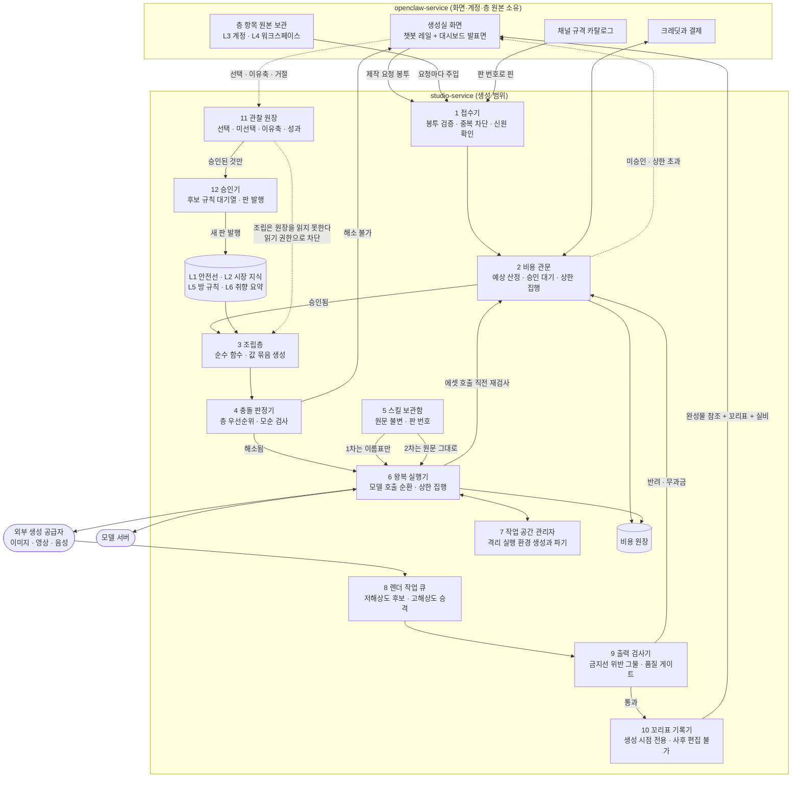
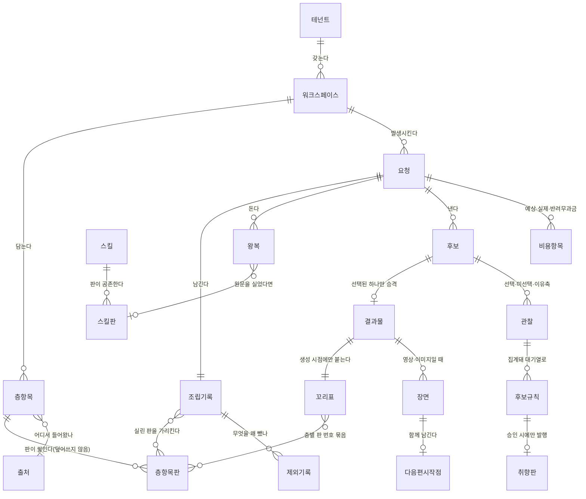
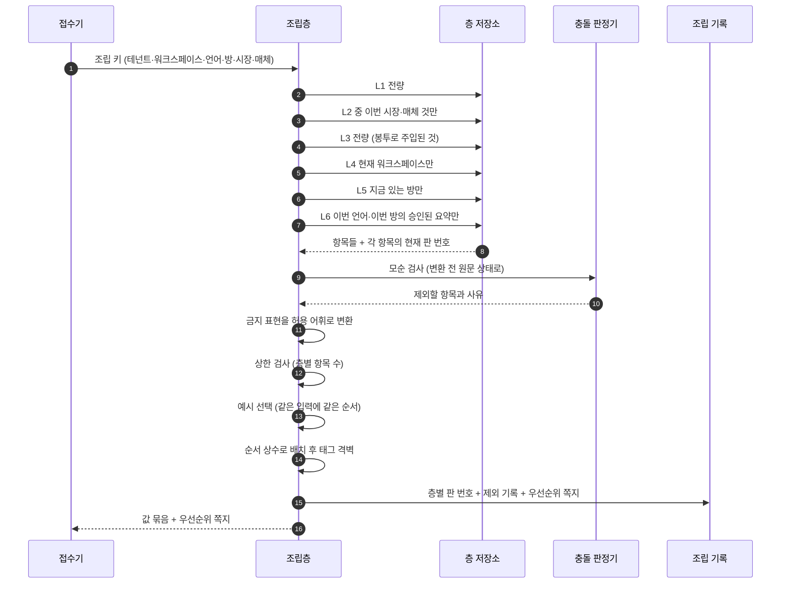
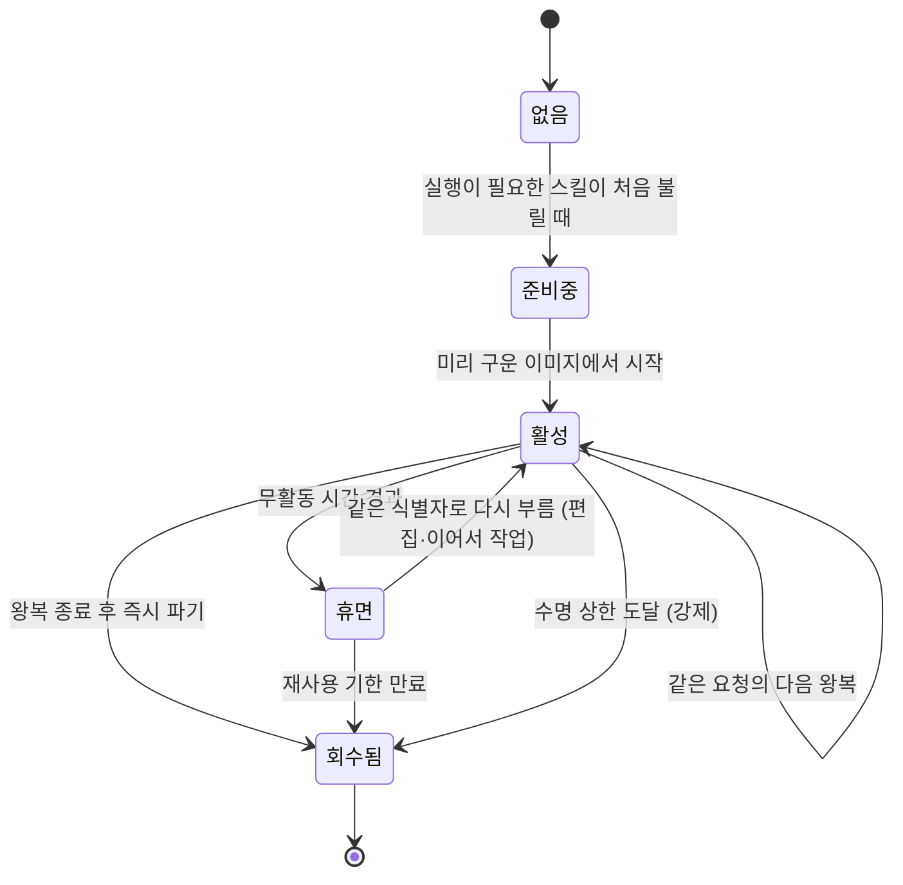
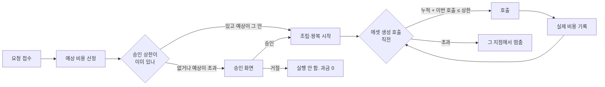

<!--
STAMP
문서: studio-service 생성 범위 기술설계 (FDD)
판: v1.0
작성일: 2026-08-21 KST
model: claude-opus-5[1m]
agent: tech-architect (서브에이전트)
성격: **확정 문서가 아니다.** 루트 하네스 6.3.5(기술설계 티키타카)에 따라 API 계약과 데이터 구조를 못 박지 않는다.
  되돌리기 비싼 결정은 §5에 선택지와 트레이드오프로 올렸고, 각 안에 추천과 근거를 붙였다.
  회장이 §5를 고른 뒤에야 api-contract와 스키마를 쓴다.
기반 문서 (버전 핀, 전부 이 세션에서 실제 Read):
  - studio/docs/prd-studio-생성-v1.0.md (FR-GEN-001~070 전량, §9 데이터 요구, §12 미결 11건) ★요구 원천
  - docs/사업계획-osmu-v0.9.md §3.1~3.5 (전체 구조, 조립층, 일곱 칸, 조립 7규칙, 제작 기법 5개)
  - studio/docs/학습정보-층계-계약-v0.1.md (§2 L0~L6, §4 조립, §5 충돌, §6 승인, §7 입력 계약)
  - wiki/research/2026-08-competitor-and-production-research.md (§3 제작 기법, §4 원가, §5 조립 근거)
  - wiki/architecture/two-service-boundary.md (경계 3기준, 소유권 표, 접점 5개, 후보 비용 구조)
  - docs/prd-openclaw-운영-v1.0.md §4.6 (FR-OP-026 요청 봉투, FR-OP-027 층 원본 소유), §4.7 (크레딧)
  - docs/user-flow.md §4 분기, §5 신호, §6 경계
  - /Users/sj/.claude/standards/doc-review.md (문서 품질헌법 v2), /Users/sj/.claude/standards/dev.md (증거 규율)
미확정 전제 (이 문서가 가정하고 쓴 것. 뒤집히면 §11 영향 범위 표대로 바뀐다):
  1. 관찰 기록과 학습된 규칙을 studio가 소유한다 (PRD 미결 1의 A안). 회장 미확정.
  2. 브랜드 말투가 워크스페이스 층, 금지선이 계정 층이다 (PRD 미결 2의 A안). 회장 미확정.
  3. 층 항목의 원본은 openclaw가 보관하고 요청마다 주입한다 (FR-OP-027). 이것만 확정 문서 근거가 있다.
  4. 최신성 웹 조사를 이 세션에서 새로 못 돌렸다 (WebSearch 예산 200/200 소진).
     대신 벤더 공식 문서를 스킬로 2건 조회해 §7 왕복 실행의 근거로 썼다. 상세는 SOURCES.
-->

# FDD: studio-service 생성 범위 v1.0

> **이 문서가 정하는 것**: 생성 범위를 어떤 구성 요소로 나누고, 유저 흐름의 각 단계가 어디서 처리되고 어디에 남는가.
> **이 문서가 일부러 안 정하는 것**: 테이블명, 필드 타입, 엔드포인트 경로, 봉투의 최종 형태. 회장이 §5에서 고른 뒤에 쓴다.

---

## 목차

- [1. 범위와 용어](#범위)
- [2. 기존 구현 대비 신규와 변경](#기존)
- [3. 아키텍처](#아키텍처)
- [4. 유저 흐름 1:1 매핑표 (갭 포함)](#매핑)
- [5. 회장이 골라야 할 것 여섯 (되돌리기 비싼 결정)](#선택)
  - [5.1 요청 봉투의 형태](#선택1) · [5.2 층 항목 저장 구조](#선택2) · [5.3 관찰 기록과 꼬리표 저장](#선택3)
  - [5.4 장면 정보 저장](#선택4) · [5.5 조립층 인터페이스](#선택5) · [5.6 스킬 실행 환경](#선택6)
- [6. 조립층 상세 설계](#조립)
- [7. 왕복 실행과 작업 공간](#왕복)
- [8. 제작 기법 다섯 개의 설계 반영](#기법)
- [9. 비용 통제](#비용)
- [10. 실패 처리](#실패)
- [11. 전제가 뒤집힐 때의 영향 범위](#영향)
- [12. 시험 계획](#시험)
- [13. 미결 항목](#미결)
- [14. 자기심문과 레드팀](#자기심문)
- [SOURCES](#sources)

---

> **TL;DR**
> 생성 범위는 열두 개 구성 요소로 선다. 심장은 조립층이고, 조립층은 확률이 개입하지 않는 순수 함수로 만든다. 같은 입력에 같은 값 묶음이 나와야 꼬리표와 재현성이 성립하기 때문이다.
> 유저 흐름 23단계 중 21단계는 처리 지점과 저장 대상이 1:1로 잡혔고, **2단계가 갭이다**(§4.3). 완료를 선언하지 않고 미결로 올렸다.
> 되돌리기 비싼 결정 여섯 개는 확정하지 않고 §5에 안 2~3개씩 올렸다. 각각 추천안과 근거가 붙어 있다.
> 왕복 실행은 요청마다 격리된 작업 공간을 띄우는 구조로 가되, 그 공간을 어디에 띄우느냐가 §5.6의 선택이다. 벤더 문서 두 건을 실조사해 수명과 비용 근거를 댔다.

---

## 1. 범위와 용어 <a id="범위"></a>

### 1.1 범위

**범위 안**: PRD의 FR-GEN-001부터 070까지. 온보딩, 제안 카드, 조립층, 왕복 실행, 후보와 선택, 스킬 보관함, 꼬리표, 비용 관문.

**범위 밖**: 편집실, 발행실, 성과실의 내부 설계. 이 문서는 그것들과의 접점만 정의한다. 화면 컴포넌트 트리와 시각 설계는 프로토타입 산출물의 몫이다.

### 1.2 용어

이 문서 안에서만 통용되는 임시 이름이다. 최종 명칭이 아니다.

| 말 | 뜻 | 왜 이 이름인가 |
|---|---|---|
| 층 항목 | L0부터 L6까지 각 층에 사는 한 줄짜리 지침 | 파일 한 장이 아니라 줄 단위라는 것이 핵심이라 "항목" |
| 값 묶음 | 조립층이 층 항목에서 뽑아 만든, 모델에 실을 구조화된 값들 | 사업계획 §3.1의 "줄을 글로 바꿔 넣는다"의 산출물 |
| 우선순위 쪽지 | 층이 부딪혔을 때 누가 이겼고 왜인지를 적은 기록 | 현재상태지도 §3.8의 세 덩어리 중 하나 |
| 왕복 | 모델 호출 한 번이 아니라, 모델이 스킬 원문이나 명령 실행을 요구해 우리가 응답하는 순환 한 바퀴 | 사업계획 §3.4의 "1차 / 2차" |
| 작업 공간 | 스킬이 파일을 읽고 명령을 돌릴 수 있는 격리된 실행 환경 | 사용자에게는 안 보인다 (FR-GEN-013) |
| 관찰 기록 | 무엇을 골랐고 안 골랐고 왜인지, 나중 성과가 얼마인지의 시간순 원장 | PRD §9.4. 경계 wiki의 "신호"와 같은 것 |
| 꼬리표 | 결과물에 생성 시점에만 붙는, 무엇으로 만들었는지의 기록 | PRD §9.3. 사후 편집 불가 |
| 판 번호 | 층과 스킬과 규칙 묶음이 갖는 버전 식별자 | 재현성과 계보의 단위 |

### 1.3 설계 원칙 네 개

이 문서의 모든 결정이 아래 넷에서 나온다. 넷 중 하나라도 깨는 안은 §5에서 기각했다.

| 번호 | 원칙 | 어디서 왔나 |
|---|---|---|
| P1 | **조립은 순수 함수다.** 같은 입력에 같은 값 묶음. 확률이 개입하지 않는다 | PRD NFR-GEN-005 재현성 |
| P2 | **차단은 글이 아니라 코드로 한다.** 조립이 관찰 기록을 못 읽는 것은 조건문이 아니라 읽기 권한이다 | 층계 계약 §2.5 "훅은 층이 아니라 집행 방식" |
| P3 | **원문은 불변이다.** 스킬 본문은 우리가 한 글자도 손대지 않고, 조립 결과 문자열을 통째로 저장하지 않는다 | 사업계획 §3.4, PRD §9.3 |
| P4 | **돈이 나가기 전에 관문이 선다.** 관문의 자리는 렌더 앞이 아니라 외부 생성 호출 앞이다 | PRD FR-GEN-060, 조사 기록 §4.1 (숏폼 원가의 88~98퍼센트가 영상 생성 하나) |

---

## 2. 기존 구현 대비 신규와 변경 <a id="기존"></a>

⛔ **재창조 금지 점검을 먼저 돌렸다.** 없는 것처럼 새 아키텍처를 짓지 않기 위해 레포를 실측했다.

| 실측한 것 | 결과 | 증거 등급 |
|---|---|---|
| `studio/` 하위에 서비스 코드가 있나 | **없다.** `studio/`는 문서와 파이프라인 스크립트(`studio/pipelines/build.py`)뿐이고 서비스 구현이 없다 | 관찰됨 (find 실행) |
| 대시보드에 생성 관련 구현이 있나 | `dashboard/`는 openclaw 쪽 화면과 API다. 채널 설정, 큐, 가이드, 키워드가 이미 구현돼 있다 | 근거 확인 (CLAUDE.md 아키텍처 절) |
| `docs/fdd/`에 선행 FDD가 있나 | `fdd-openclaw-studio-v1.0.0-gpt-codex.md`가 있다. 이 문서는 그것을 대체하지 않고, 생성 범위만 다시 판다 | 관찰됨 |
| 구현현황 문서가 있나 | **없다.** `docs/구현현황.md`가 존재하지 않는다 | 관찰됨 |

**결론: 생성 범위는 전량 신규다.** 확장이 아니라 신축이다. 다만 아래 셋은 기존 자산 위에 서므로 새로 짓지 않는다.

| 재사용하는 기존 자산 | 어디에 쓰나 |
|---|---|
| `dashboard/`의 화면과 인증 | 생성 범위의 사용자 접점은 openclaw 화면이다. studio는 1단계에 화면이 없다 (경계 wiki) |
| `extensions/*-publish` 15종 | 발행 접점. 생성 범위는 완성물과 꼬리표를 넘기는 것까지만 |
| 채널 규격 카탈로그 (openclaw) | 조립 키의 매체 축. studio는 규격을 저장하지 않고 판 번호로 받아 쓴다 |

⛔ **회수 필요: 구현현황 문서가 없다.**
- 배경: 하네스 규율이 "설계 전 구현현황 실측"을 요구하는데 이 레포에는 그 문서가 없어 매번 find와 grep으로 재실측하게 된다. 이번에도 그렇게 했다.
- 무엇을 정하나: `docs/구현현황.md`를 만들 것인가.
- 옵션 A(추천): 만든다. build 단계 착수 전에 code-builder가 갱신 책임을 진다. 고르면 다음 세션이 30초 안에 무엇이 이미 있는지 안다.
- 옵션 B: 안 만들고 wiki에 흡수한다. 고르면 문서가 하나 줄지만, 코드와 문서가 어긋났을 때 표면화되는 자리가 없어진다.
- 추천 근거: 이번 실측에서 `studio/`에 코드가 없다는 사실 자체를 아무 문서도 적어 두지 않았다. 그 공백이 "이미 있는 걸 다시 짓는" 사고의 씨앗이다.

---

## 3. 아키텍처 <a id="아키텍처"></a>

### 3.1 구성 요소 지도



**읽는 법 셋.**

1. **실선은 요청이 지나가는 길, 점선은 학습이 도는 길이다.** 두 길이 만나는 자리는 승인기 하나뿐이다. 관찰 원장에서 조립층으로 가는 실선이 없다(P2).
2. **비용 관문이 두 번 등장한다.** 요청 접수 직후 한 번(예상 산정), 왕복 중 에셋 호출 직전 한 번(상한 집행). 두 번째가 실제로 돈을 막는 자리다(P4).
3. **openclaw에서 studio로만 화살표가 간다.** studio가 openclaw를 부르는 실선은 없다. 완성물은 응답으로 돌려주지 호출로 밀지 않는다.

### 3.2 층 소유와 주입 경로

경계 wiki의 판정 기준 세 개와 FR-OP-027을 그대로 적용한 결과다.

| 층 | 원본 어디 | 생성 범위가 어떻게 읽나 | 근거 |
|---|---|---|---|
| L0 이번 요청 | 어디도 저장 안 함 | 봉투에 실려 온다 | 층계 계약 §2.6 |
| L1 생성 안전선 | studio | 자기 것을 직접 읽는다 | 같음 |
| L2 시장 지식 | studio (생성 문법), openclaw (채널 규격) | 규격은 판 번호 스냅샷으로 받는다 | 경계 wiki §채널 지식 |
| L3 계정 공통 | **openclaw** | 봉투에 주입돼 온다 | FR-OP-027 |
| L4 워크스페이스 | **openclaw** | 같음 | FR-OP-027 |
| L5 생성·편집 방 규칙 | studio | 직접 읽는다 | 층계 계약 §2.6 |
| L6 취향 요약 | **미확정 (전제 1)** | A안 전제로 studio가 읽는다 | PRD 미결 1 |

**주의 하나.** L3과 L4의 원본이 openclaw인데 그 층에서 자라는 규칙(L6)은 studio가 갖는다는 것이 전제 1의 실제 모양이다. 이 비대칭이 §11의 영향 범위가 큰 이유다.

### 3.3 개념 데이터 지도 (후보 A안. 확정 아님)

⚠️ **이 다이어그램은 §5.2와 §5.3의 A안을 골랐을 때의 모양이다.** 필드 타입과 테이블명은 일부러 안 썼다. 회장이 §5를 고른 뒤 채운다.



**이 그림이 못 박는 것 셋** (여기까지는 §5의 어느 안을 고르든 유지돼야 한다).

1. **층 항목과 그 판이 분리돼 있다.** 되돌리기가 덮어쓰기가 아니라 항목 추가여야 하기 때문이다(R13, FR-GEN-003).
2. **꼬리표가 층 항목 판을 가리킨다.** 조립 결과 문자열이 아니라 판 번호 묶음이다(P3, PRD §9.3).
3. **관찰과 취향판 사이에 후보 규칙이 끼어 있다.** 승인 전 반영이 구조적으로 불가능해야 하기 때문이다(FR-GEN-022).

---

## 4. 유저 흐름 1:1 매핑표 <a id="매핑"></a>

### 4.1 매핑 규칙

PRD와 user-flow의 각 단계를 **처리 지점**(§3.1의 어느 구성 요소), **구성 요소**(사용자에게 보이는 자리), **저장 대상**(무엇이 어디에 남나)에 붙였다. 하나라도 못 붙인 자리는 갭으로 §4.3에 올렸고, 이 문서는 그 갭을 이유로 완료를 선언하지 않는다.

### 4.2 매핑표 (23단계)

| # | 유저 흐름 단계 | 처리 지점 | 사용자에게 보이는 자리 | 저장 대상 | 근거 요구 |
|---|---|---|---|---|---|
| 1 | 로그인하고 생성실에 들어온다 | openclaw 인증 | 생성실 첫 화면 | 세션. 층 아님 | R05, 경계 wiki §인증 |
| 2 | 학습 정보 유무를 판정한다 | 접수기(1) | 화면 분기 | 없음 (읽기만) | FR-GEN-003 |
| 3 | 계정 공통 질문을 받는다 (브랜드 사실, 금지선) | openclaw 화면 | 챗봇 레일이 묻고 대시보드가 후보 예시 | L3 항목 + 판 (openclaw 원본) | FR-GEN-001, R01, R25 |
| 4 | 워크스페이스 질문을 받는다 (타깃, 업종·컨셉) | openclaw 화면 | 같음 | L4 항목 + 판 (openclaw 원본) | FR-GEN-001 |
| 5 | 노션·위키 주소를 반입한다 | 반입 처리기 (접점 5 소재 반입) | 항목 목록 + 항목별 출처 + 넣기/빼기 | L4 항목(요약과 참조만) + 보류 표시 | FR-GEN-002 |
| 6 | 제안 카드가 이미 차 있는 화면을 본다 | 조립층(3) + 왕복 실행기(6) 1왕복 | 카드 3장 이상 + 제안 이유 | 카드 묶음(요청 단위, 임시) | FR-GEN-004, FR-GEN-005 |
| 7 | 카드 셋을 전부 거절하고 다시 받는다 | 비용 관문(2) | 무료 회차 소진 안내 또는 승인 화면 | 거절 관찰 + 비용 항목 | FR-GEN-006, R27 |
| 8 | 이번만 미세 조정을 넣는다 | 접수기(1) | 생성 화면의 조정 입력 | **저장 안 함** (L0). 단 반복 감지 카운터는 관찰 원장 | FR-GEN-007, R28 뒷층 |
| 9 | 예상 비용을 보고 승인한다 | 비용 관문(2) | 예상 범위 + 상한 + 승인 버튼 | 승인 상한 + 예상 범위(비용 원장) | FR-GEN-060 |
| 10 | (보이지 않음) 층에서 값을 꺼내 값 묶음을 만든다 | 조립층(3) | 진행 단계 표시만 | 조립 기록(층별 판 번호) | FR-GEN-010 |
| 11 | (보이지 않음) 층이 부딪히는지 검사한다 | 충돌 판정기(4) | 해소 불가일 때만 사용자에게 질문 | 제외 기록 + 우선순위 쪽지 | FR-GEN-011, FR-GEN-014 |
| 12 | (보이지 않음) 1차 호출에 스킬 이름표를 싣는다 | 왕복 실행기(6) + 스킬 보관함(5) | 진행 단계 표시 | 왕복 기록(1회차) | FR-GEN-012 |
| 13 | (보이지 않음) 모델이 스킬 원문을 요구해 실어 보낸다 | 같음 | 같음 | 왕복 기록 + 스킬 판 참조 | FR-GEN-012 |
| 14 | (보이지 않음) 모델이 파일 읽기·명령 실행을 요구한다 | 작업 공간 관리자(7) | 같음 | 왕복 기록(출력만. 코드 본문 안 실림) | FR-GEN-013, FR-GEN-031 |
| 15 | 저해상도 후보 3개를 본다 | 렌더 큐(8) | 후보 3장 + 차이 축 설명 | 후보 + 각 후보의 축 값 | FR-GEN-020 |
| 16 | 하나를 고르고 이유 축을 답한다 | 관찰 원장(11) | 선택 UI + 이유 축 선택지(생략 가능) | 관찰 (선택 1 + 미선택 2 + 이유축) | FR-GEN-021 |
| 17 | "이 취향을 기억할까요"에 동의하거나 거절한다 | 승인기(12) | 항목 단위 동의 | 후보 규칙 대기열 → 승인 시 취향 판 | FR-GEN-022, user-flow §5.3 |
| 18 | 고해상도 결과가 나온다 | 렌더 큐(8) | 비동기 진행 + 완료 알림 | 결과물 + 실제 비용 항목 | FR-GEN-020, NFR-GEN-002 |
| 19 | (보이지 않음) 금지선 위반을 다시 검사한다 | 출력 검사기(9) | 반려일 때만 사유 표시 | 검사 결과 + 반려 무과금 표시 | FR-GEN-014 |
| 20 | (보이지 않음) 꼬리표가 붙는다 | 꼬리표 기록기(10) | "이건 무엇으로 만들었나" 문장 | 꼬리표 5항목 + 층별 판 + 시각 | FR-GEN-040 |
| 21 | 확정 / 보관 / 다른 제안 중 고른다 | 접수기(1) | 세 갈래 버튼 | 작업물 상태 전이 | FR-GEN-023, R29 |
| 22 | 나중에 들어와 이어서 작업한다 | 접수기(1) + 작업 공간 관리자(7) | 작업물 목록 + 중단 지점 표시 | 작업물 + 작업 공간 참조와 만료 시각 | FR-GEN-024, R09, R16 |
| 23 | 완성물과 꼬리표가 발행실로 넘어간다 | 꼬리표 기록기(10) 응답 | 발행 준비 완료 표시 | 인계 기록 | FR-OP-026 |

### 4.3 갭 두 개 (완료를 거부하는 이유)

⛔ **갭 1. 성과·트렌드 유입(R04의 뒤 둘)에 대응하는 처리 지점이 이 범위에 없다.**

- 무엇이 문제인가: PRD FR-GEN-005는 제안 유입이 셋(가끔 던지는 질문, 성과 기반, 트렌드 기반)이라고 썼고 뒤 둘은 "openclaw가 신호를 넣어 줄 때 켜진다"고 적었다. 그런데 그 신호가 들어오는 **입구의 처리 지점이 위 표에 없다.** 24번 행이 있어야 하는데 없다.
- 왜 지금 못 채우나: 신호가 들어오면 그것이 관찰 원장으로 가는가(학습 경로) 아니면 제안 카드 생성 입력으로 가는가(요청 경로)가 갈린다. 둘은 P2가 금지한 경계를 사이에 둔다. 성과 신호가 조립에 직접 실리면 "조립은 원장을 읽지 못한다"가 깨진다.
- 지금 잠정: 신호는 관찰 원장으로만 들어가고, 제안 카드는 승인된 취향 판을 통해서만 그것을 반영한다. 그러면 성과가 제안에 반영되기까지 승인 한 번이 낀다.
- 회수: 아래 §13 미결 A.

⛔ **갭 2. 소재 권리 선언(FR-GEN-052)이 어느 층에 저장되는지 표에 자리가 없다.**

- 무엇이 문제인가: 층계 계약 §L3은 "소재의 권리 선언과 용도 제한"을 L3(계정 공통)에 넣었다. 그런데 L3 원본은 openclaw가 갖는다(FR-OP-027). 그러면 미디어 바이트는 studio가 갖는데 그 바이트의 권리 선언은 openclaw가 갖는 분리가 생긴다.
- 왜 지금 못 닫나: 경계 wiki의 판정 기준 2번(창작 정보면 studio)과 FR-OP-027(층 원본은 openclaw)이 이 자리에서 정면으로 갈린다. 어느 쪽도 추측으로 못 정한다.
- 회수: 아래 §13 미결 B.

**나머지 21단계는 처리 지점과 저장 대상이 모두 잡혔다.** 갭 비율 2/23.

---

## 5. 회장이 골라야 할 것 여섯 <a id="선택"></a>

> 아래 여섯은 **되돌리기가 비싼 결정**이다. 이 문서는 하나도 못 박지 않는다.
> 각 항목은 배경, 무엇을 정하나, 안 2~3개(고르면 무엇이 좋고 안 고르면 무엇이 나쁜지), 추천과 근거 순으로 썼다.
> 예시로 든 모양은 **판단용 스케치**이지 계약이 아니다.

### 5.1 요청 봉투의 형태 <a id="선택1"></a>

**배경.** openclaw가 studio를 부를 때 무엇을 실어 보내는가. FR-OP-026이 "다섯 접점 중 하나로만 나가고, 자격증명은 어느 봉투에도 실리지 않고, 응답으로 완성물 참조와 꼬리표와 실비를 함께 받는다"까지 확정했다. 정해지지 않은 것은 **층 항목을 어떻게 싣느냐**다. L3와 L4 원본이 openclaw에 있으므로(FR-OP-027) 매 요청마다 그것들이 넘어와야 한다.

**무엇을 정하나.** 층 항목이 봉투에 값으로 실리는가, 참조로 실리는가, 아니면 studio가 캐시를 갖는가.

| | 안 A (추천): 값 전량 주입 | 안 B: 참조 + 조회 | 안 C: 판 번호 + 캐시 |
|---|---|---|---|
| 봉투에 들어가는 것 | L3·L4 항목 전량이 값으로 | L3·L4의 위치 참조만 | 판 번호만 |
| studio가 하는 일 | 받은 값을 그대로 조립 | studio가 openclaw를 되불러 읽는다 | 판 번호가 캐시와 같으면 캐시 사용, 다르면 요청 |
| **고르면 무엇이 좋나** | 의존 방향이 단방향으로 유지된다(경계 wiki의 핵심 규칙). studio가 무상태에 가까워져 개발자용 API 판매 그림이 산다. 봉투 하나만 보면 이 요청이 무엇으로 만들어졌는지 전부 안다 | 봉투가 작다. 항목이 수백 개로 자라도 요청이 안 무겁다 | 봉투가 작으면서 왕복도 없다. 판이 안 바뀌면 재전송이 0 |
| **안 고르면 무엇이 나쁜가** | 항목이 많아지면 봉투가 커지고, 층별 항목 수 상한(PRD 미결 6)이 실제 제약이 된다 | **studio가 openclaw를 호출하게 된다. 단방향 의존이 깨진다.** 경계 wiki 21행이 명시적으로 금지한 것 | studio가 남의 데이터 사본을 들고 있게 된다. 사용자가 openclaw에서 항목을 지웠는데 studio 캐시에 남아 다음 제작에 실릴 위험. FR-OP-027의 "지우면 다음 제작부터 반영되지 않는다"가 깨질 수 있다 |

**추천 A. 근거 셋.**
1. 경계 wiki가 단방향 의존을 구조의 전제로 못 박았고, B는 그것을 정면으로 깬다.
2. FR-OP-027이 이미 "studio에는 이번 제작에 필요한 최소 항목만 실어 보낸다"고 썼다. 이 문장 자체가 A의 모양이다.
3. C의 삭제 반영 위험은 캐시 무효화로 막을 수 있으나, 그 무효화 자체가 openclaw에서 studio로 가는 또 하나의 접점을 만든다. 접점 5개 규칙이 6개가 된다.

**A를 고를 때 함께 정해야 할 것 (지금은 안 정한다).** 봉투에 실리는 항목 수의 상한, 반입 자료 요약의 길이 상한. 둘 다 PRD 미결 6과 같은 자리다.

⚠️ **어느 안이든 지켜야 하는 것 하나.** 봉투에 자격증명이 실리지 않는다(FR-OP-026). 그리고 같은 봉투를 20회 재시도해도 작업이 1건을 넘지 않는다. 후자는 봉투에 요청 고유 식별자가 있어야 성립하며, 그 식별자를 **누가 만드는가**(openclaw인가 studio인가)도 §13 미결 C로 올린다.

### 5.2 층 항목 저장 구조 <a id="선택2"></a>

**배경.** PRD §9.1이 "각 항목은 줄 단위로 존재해야 하고, 한 줄만 끄고 되돌릴 수 있어야 하고, 그 줄이 어디서 나왔는지 근거를 가리켜야 한다"를 못 박았다. 그리고 R13이 "되돌리기는 덮어쓰지 않고 항목 추가"를 확정했다. 이 둘이 저장 구조를 강하게 제약한다.

**무엇을 정하나.** 항목의 판을 어떻게 쌓는가.

| | 안 A (추천): 항목별 판 누적 | 안 B: 층 단위 스냅샷 | 안 C: 변경 사건 원장 |
|---|---|---|---|
| 무엇을 저장하나 | 항목 하나마다 판이 쌓인다. 현재 판을 가리키는 포인터가 따로 | 층 전체가 한 판. 한 줄이 바뀌면 층 전체의 새 판 | 바뀐 사건만 시간순. 현재 상태는 재생해서 얻는다 |
| 되돌리기 | 그 항목의 이전 판을 새 판으로 다시 붙인다 | 층 전체를 이전 판으로 되돌린다 | 되돌리기 사건을 하나 더 붙인다 |
| **고르면 무엇이 좋나** | 한 줄만 되돌리는 것이 자연스럽다. 꼬리표가 항목 판을 정확히 가리킨다. 항목별 출처가 항목에 붙는다 | 조립이 단순하다. 층 판 번호 하나만 핀하면 재현이 된다 | 감사가 완벽하다. "언제 무엇이 왜 바뀌었나"가 전부 남는다 |
| **안 고르면 무엇이 나쁜가** | 꼬리표가 가리켜야 할 판 번호가 항목 수만큼 많아진다. 조립 기록이 커진다 | **한 줄 되돌리기가 층 전체 되돌리기가 된다.** 사용자가 금지선 하나를 되돌렸는데 같은 층의 다른 항목까지 과거로 간다. R13 위반 | 매 조립마다 재생 비용이 든다. 그리고 재생 로직이 바뀌면 과거 결과의 해석이 소급해서 달라진다. 층계 계약 §4.4가 S3를 기각한 것과 같은 이유 |

**추천 A. 근거 둘.**
1. R13과 PRD §9.1이 요구하는 세 가지(줄 단위, 한 줄 끄기, 출처 가리키기)를 전부 만족하는 것은 A뿐이다. B는 첫째를 깨고, C는 셋째는 되지만 P1(재현성)이 흔들린다.
2. 꼬리표 비대 문제는 해소 가능하다. 조립 기록이 항목 판 번호 묶음을 갖고, 꼬리표는 그 조립 기록 하나를 가리키면 된다(§3.3의 그림이 이 모양이다).

**A를 고를 때 남는 질문.** 항목 판을 영원히 쌓나. 언제 정리하나. 이것은 저장 원가와 감사 요구가 부딪히는 자리라 §13 미결 D로 올린다.

### 5.3 관찰 기록과 꼬리표의 저장 <a id="선택3"></a>

**배경.** 이 둘은 성격이 정반대다. 관찰 기록은 계속 자라고 조립이 읽으면 안 된다. 꼬리표는 생성 시점에 한 번 쓰이고 절대 안 바뀌어야 한다. 같은 방식으로 저장하면 둘 중 하나가 망가진다.

**무엇을 정하나 (둘로 나눠 묻는다).**

**5.3.1 관찰 기록의 격리 방법**

| | 안 A (추천): 물리 격리 | 안 B: 논리 격리 |
|---|---|---|
| 어떻게 막나 | 관찰 원장을 조립 경로가 접근할 수 없는 별도 저장소에 둔다. 조립 실행 주체의 자격 자체에 읽기 권한이 없다 | 같은 저장소에 두고 조립 코드가 안 읽도록 규칙과 코드 리뷰로 지킨다 |
| **고르면 무엇이 좋나** | 실수로도 못 샌다. 권한 거부가 시험으로 관찰된다(AC-GEN-010이 요구하는 "권한 거부로 확인 가능"이 그대로 성립) | 저장소가 하나라 운영이 단순하고, 관찰과 결과를 한 번에 조회하기 쉽다 |
| **안 고르면 무엇이 나쁜가** | 저장소가 둘이 되어 백업·마이그레이션·트랜잭션 경계가 복잡해진다 | **회귀한다.** 층계 계약 §4.2가 "조건문으로 지키면 회귀하고 읽기 권한으로 지키면 실수로도 못 샌다"고 이미 판정했다. 그리고 AC-GEN-010의 검증 문장을 만족할 방법이 없다 |

**추천 A.** 근거: P2가 이 문서의 원칙이고, AC-GEN-010이 "권한 거부로 확인 가능"을 수용 기준에 넣었다. B로는 그 시험을 통과할 수 없다.

**5.3.2 꼬리표의 불변성 확보 방법**

| | 안 A (추천): 추가 전용 저장 + 결과물 참조 | 안 B: 결과물 안에 임베드 | 안 C: 서명 |
|---|---|---|---|
| 어떻게 하나 | 꼬리표를 수정 불가능한 추가 전용 저장에 쓰고 결과물이 그것을 가리킨다 | 파일 메타데이터에 박아 넣는다 | 값에 서명을 붙여 위변조를 탐지한다 |
| **고르면 무엇이 좋나** | 사후 편집이 구조적으로 불가능하다(FR-GEN-040의 마지막 수용 기준). 조회가 빠르다 | 파일만 있으면 어디서든 출처를 안다. 사용자가 내려받아도 붙어 간다 | 편집은 가능하되 편집됐다는 사실이 드러난다 |
| **안 고르면 무엇이 나쁜가** | 결과물 파일만 떼어 놓으면 꼬리표가 안 따라간다 | **메타데이터는 지워진다.** 대부분의 채널이 업로드 시 메타를 벗긴다. 그리고 "사후 편집 불가"를 보장 못 한다 | 탐지는 되지만 **방지는 안 된다.** FR-GEN-040은 방지를 요구한다 |

**추천 A. 다만 B를 보조로 함께 켠다.** 근거: FR-GEN-040은 "생성 이후에 꼬리표를 사후 편집할 수 없다"를 요구하므로 방지가 있어야 하고(A), 동시에 사용자가 완성 원본을 내려받아 직접 발행하는 갈래가 실재한다(경계 wiki §1단계 비범위 아래 "완성 원본 내려받기는 사용자 것"). 그 갈래에서는 A가 안 따라가므로 B가 필요하다. 둘은 배타가 아니다.

### 5.4 장면 정보의 저장 <a id="선택4"></a>

**배경.** 제작 기법 3번(장면마다 시작 상태와 끝 상태)과 4번(다음 편 시작점)이 요구하는 것이다. 그리고 편집실이 재렌더할 때 읽는 것도 이것이다. 경계 wiki가 "편집 지시서가 있어서 재렌더가 싸다"고 쓴 그 지시서가 여기 산다.

**무엇을 정하나.** 장면 정보가 결과물에 딸린 부속물인가, 독립된 것인가.

| | 안 A (추천): 결과물과 분리된 독립 문서 | 안 B: 결과물의 부속 필드 |
|---|---|---|
| 관계 | 장면 정보가 먼저 있고 결과물이 그것으로부터 나온다 | 결과물이 먼저고 장면 정보가 따라 붙는다 |
| **고르면 무엇이 좋나** | 같은 장면 정보로 여러 후보를 뽑을 수 있다(저해상도 3개, 고해상도 1개가 같은 장면 정보를 공유). 편집이 "장면 정보만 고쳐 다시 그리기"가 되어 재렌더가 싸진다. 다음 편 시작점이 결과물이 아니라 장면 정보의 꼬리에 붙는 것이 자연스럽다 | 구조가 단순하다. 결과물 하나 열면 다 보인다 |
| **안 고르면 무엇이 나쁜가** | 문서가 하나 더 늘고, 결과물과 장면 정보의 판이 어긋날 수 있다 | **후보 3개가 각자 장면 정보 사본을 갖게 된다.** 그러면 "후보 사이 최소 두 축이 다르다"(FR-GEN-020)를 검사할 때 무엇과 무엇을 비교하는지가 흐려지고, 편집 시 어느 사본이 진실인지 모호해진다. 경계 wiki의 편집 원가 우위가 약해진다 |

**추천 A.** 근거: 경계 wiki가 "경쟁 도구는 완성 파일만 남기므로 수정이 곧 재생성이고, 우리는 수정이 재렌더다. 원가 차이가 여기서 벌어진다"고 썼다. 그 원가 우위의 물리적 실체가 바로 "장면 정보가 결과물과 독립해서 살아 있다"는 것이다. B를 고르면 그 문장이 근거를 잃는다.

### 5.5 조립층 인터페이스 <a id="선택5"></a>

**배경.** 조립층이 무엇을 받아 무엇을 내놓는가. 현재상태지도 §3.8이 "한 장의 글이 아니라 세 덩어리"(스킬 원문, 값 묶음, 우선순위 쪽지)로 결론 냈고 PRD FR-GEN-010이 그것을 받았다. 남은 것은 **값 묶음이 어떤 형태로 모델에 도달하는가**다.

**무엇을 정하나.**

| | 안 A (추천): 구조화된 값 묶음 + 모델 어댑터 | 안 B: 조립층이 최종 문자열까지 만든다 | 안 C: 값 묶음만 내고 모델 호출부가 알아서 |
|---|---|---|---|
| 조립층의 산출 | 모델 중립적인 구조화된 값 묶음 + 우선순위 쪽지 | 특정 모델에 바로 실을 완성된 글 | 값 묶음만. 문자열화는 호출부 각자 |
| 모델별 차이 처리 | 어댑터가 층 하나 더 있어서 모델마다 표기를 바꾼다 | 조립층 안에 모델 분기가 들어간다 | 호출부마다 제각각 |
| **고르면 무엇이 좋나** | 조립층이 순수 함수로 유지된다(P1). 모델을 바꿔도 조립 로직과 시험이 그대로다. 사업계획 §3.2가 식별한 기술 과제 "모델마다 다른 말투"가 어댑터 한 곳에 갇힌다 | 단순하다. 한 곳만 보면 된다 | 조립층이 가장 얇다 |
| **안 고르면 무엇이 나쁜가** | 층이 하나 늘어 처음 읽는 사람에게 간접적이다 | **모델을 하나 추가할 때마다 조립층을 고치게 된다.** 그러면 조립층의 시험이 모델 수만큼 곱해지고, P1의 재현성 시험이 "어느 모델 기준인가"로 갈라진다 | **같은 값 묶음이 호출부마다 다른 글이 된다.** NFR-GEN-005(같은 입력에 같은 값 묶음)가 무의미해진다. 꼬리표가 무엇을 넣었는지 말해도 재현이 안 된다 |

**추천 A. 근거 둘.**
1. 사업계획 §3.2가 "모델마다 다른 말투. 같은 뜻인데 표기가 다르고 어떤 표기는 반대로 작동한다"를 studio 기술 과제로 이미 꼽았다. 그 과제를 조립층 안에 넣으면 조립층이 오염되고, 어댑터로 빼면 갇힌다.
2. 조사 기록 §5.1이 "조합은 모델 서버가 아니라 클라이언트가 한다"고 확인했다. 조합의 책임이 우리에게 있다는 뜻이므로, 그 책임을 어디에 두는지가 순전히 우리 설계 선택이다.

**A를 고를 때 함께 정해야 할 것.** 값 묶음의 표현 형식(태그 격벽을 무엇으로 치나). 조립 7규칙 3번이 "조각마다 태그로 격벽"을 요구하므로 형식 선택이 곧 규칙 3의 집행 방식이다. §6.3에 후보를 적었다.

### 5.6 스킬 실행 환경 <a id="선택6"></a>

**배경.** 이것이 여섯 중 **가장 비싸고 가장 위험한 결정**이다. 사업계획 §3.2가 "외부에서 온 스킬이 명령을 실행한다"를 studio 공통 기술 과제로 꼽았고, FR-GEN-031이 테넌트 격리, 시간과 자원 상한, 출력만 회수, 허용 밖 통신 차단을 요구한다.

**무엇을 정하나.** 작업 공간을 어디에 어떻게 띄우는가.

이번에 벤더 공식 문서 두 건을 실제로 조회했다(SOURCES 참조). 두 제품 모두 같은 모양을 하고 있었다는 것이 중요한 관찰이다.

| 실조사한 것 | 확인된 사실 | 우리가 가져올 것 |
|---|---|---|
| Cloudflare Sandbox SDK | 같은 식별자로 부르면 같은 공간이 돌아온다. 10분 무활동이면 잠들고 `destroy()`로 즉시 회수한다. 이미지를 얇게 유지하는 것이 시작 시간에 직결된다 | **식별자 재사용 = 세션 재개**. 이것이 FR-GEN-024(이어서 작업)의 실현 방식 |
| Vercel Sandbox | 요청마다 일회용 마이크로 VM. `timeout`을 밀리초로 못 박아 수명을 강제한다. 스냅샷을 미리 구워 두면 시작이 30초에서 1초 아래로 떨어진다. `finally`에서 `stop()`을 호출하는 것이 정석 패턴 | **수명 상한을 값으로 못 박는 것**과 **미리 구운 이미지**. 후자가 없으면 왕복마다 30초가 붙는다 |

| | 안 A (추천): 관리형 격리 실행 서비스 | 안 B: 우리가 컨테이너를 직접 운영 | 안 C: 스킬 실행을 1차 범위에서 끈다 |
|---|---|---|---|
| 무엇을 하나 | 위 두 종류 같은 관리형 서비스를 쓴다 | 우리 인프라에 격리 런타임을 세운다 | 스킬을 이름표와 원문 참조로만 쓰고 명령 실행은 안 한다 |
| 격리 책임 | 공급자 | 우리 | 해당 없음 |
| **고르면 무엇이 좋나** | 격리·상한·네트워크 제한이 이미 제품 기능으로 있다. 우리가 보안 경계를 처음부터 만들지 않는다. 미리 구운 이미지로 시작 비용을 없앨 수 있다 | 원가를 우리가 통제한다. 실행 시간이 길어져도 종량 폭탄이 없다 | 1차 범위가 대폭 줄고, 카드뉴스 무인 완주(종료 조건)에 집중된다 |
| **안 고르면 무엇이 나쁜가** | 종량 과금이 붙고 공급자에 묶인다. 왕복 상한이 없으면 이 비용이 곧 사고다 | **격리를 잘못 만들면 다른 테넌트의 자료가 샌다.** 이것은 되돌릴 수 없는 사고다. 그리고 이 일이 제품 가치를 하나도 안 만든다 | **외부 스킬 반입이 우리 유일한 차별점이라고 PRD가 썼다**(§1.3). 그것을 끄면 남는 축이 꼬리표 하나다 |

**추천 A. 근거 셋.**
1. FR-GEN-031이 요구하는 넷(테넌트 격리, 시간·자원 상한, 출력만 회수, 통신 차단)이 전부 조회한 두 제품의 기본 기능이다. 우리가 다시 만들 이유가 없다.
2. B의 실패 모드가 비대칭이다. 잘해도 남는 게 없고 못하면 회사가 끝난다.
3. C는 PRD의 차별 축을 지운다. 다만 **C를 완전히 버리지는 않는다.** 카드뉴스 1차 완주 시점에는 명령 실행이 필요한 스킬이 없을 수도 있다. 그래서 A를 고르되 **1차 출시에서는 실행 없는 스킬만 켜는 단계적 개방**을 함께 제안한다(§7.4).

⛔ **A를 고를 때 회장이 함께 알아야 할 비용 구조.** 관리형 실행은 시간 종량이다. 왕복 상한(PRD 미결 7)이 없으면 한 요청이 실행 시간을 무한히 먹는다. 이것은 모델 호출 비용과 **별개의 두 번째 종량 축**이고, PRD의 원가표(카드뉴스 130원)에는 들어 있지 않다. 프리모템 시나리오 3이 경고한 것과 같은 종류의 누락이다.

---

## 6. 조립층 상세 설계 <a id="조립"></a>

### 6.1 층 항목을 꺼내 값 묶음으로 만드는 과정



**7번과 9번의 순서가 이 그림의 핵심이다.** PRD §18(자기심문 셋째)이 "모순 검사가 금지 표현 변환보다 먼저 돌아야 한다는 것이 판단이나 근거가 추론이라 확정하지 않았다"며 미결 11로 올린 자리다.

**이 문서의 판정: 모순 검사가 먼저다. 근거를 댄다.**

- 금지 표현을 허용 어휘로 바꾸면(규칙 1) 그 문장에서 "이것이 원래 금지였다"는 정보가 사라진다. 예를 들어 "존댓말 쓰지 마"가 "반말 코치 어조로 쓴다"가 되면, 취향 요약에 있는 "정중한 어조 선호"와 부딪히는지를 문자열로는 알아볼 수 없다.
- 반면 모순 검사를 원문 상태에서 돌리면 "존댓말 금지"와 "정중한 어조"가 같은 축의 반대값이라는 것이 드러난다.
- 따라서 **모순 검사는 의미가 살아 있는 원문 상태에서, 변환은 검사가 끝난 뒤 마지막에** 돈다.
- 다만 이 판정에는 조건이 붙는다. 모순 검사가 문자열 비교가 아니라 **축 비교**여야 성립한다. 항목이 "어떤 축의 어떤 값"인지를 알아야 반대값을 찾는다. 이것이 §5.2 안 A가 항목에 축 정보를 요구하는 이유다.

### 6.2 스킬 이름표와 원문이 실리는 두 시점

```mermaid
sequenceDiagram
  autonumber
  participant LOOP as 왕복 실행기
  participant SKV as 스킬 보관함
  participant M as 모델 서버
  LOOP->>SKV: 설치된 스킬의 이름과 설명만
  SKV-->>LOOP: 이름표 목록 (본문 없음)
  LOOP->>M: 1차 = 값 묶음 + 이름표 목록 + 도구 목록 + 이번 요청
  M-->>LOOP: 이 스킬 본문이 필요하다
  LOOP->>SKV: 그 스킬의 원문 (판 번호 지정)
  SKV-->>LOOP: 원문 + 바이트 지문
  LOOP->>LOOP: 바이트 지문 대조 (저장본과 실린 것이 같은가)
  LOOP->>M: 2차 = 앞의 전부 + 원문 그대로
  M-->>LOOP: 계획과 실행 명령
```

**두 시점을 나누는 이유는 비용이다.** 조사 기록 §5.1이 확인했다. 시작할 때 시스템 자리에 들어가는 것은 이름과 설명뿐이고 본문은 필요할 때 도구 실행 결과로 들어온다. 처음부터 전부 실으면 설치된 스킬 수만큼 매 요청이 무거워진다.

**AC-GEN-012가 "바이트 단위로 같음을 확인할 수 있다"를 요구하므로** 위 그림의 8번(지문 대조)이 시험 가능한 자리다. 지문을 무엇으로 만드느냐는 확정하지 않는다. 다만 **지문이 판 번호와 함께 저장돼야** 나중에 "그때 실린 것이 지금 저장된 것과 같은가"를 물을 수 있다.

⚠️ **프리모템 시나리오 3이 지적한 것이 여기 있다.** 한 번 실린 원문은 그 왕복이 끝날 때까지 계속 실려 간다. 왕복이 길어질수록 길이가 곱해진다. 따라서 **왕복 상한은 편의 장치가 아니라 원가 장치다.** 상한 값은 PRD 미결 7이라 여기서도 안 정한다.

### 6.3 조립 7규칙을 코드로 강제하는 방법

PRD FR-GEN-011의 일곱을 하나씩 "무엇을 코드로 만들어야 이 규칙이 지켜지나"로 번역했다. **글로 부탁하는 규칙은 회귀한다**는 것이 층계 계약 §2.5의 판정이다.

| # | 규칙 | 어떻게 코드로 강제하나 | 어떻게 시험하나 | 위반 시 |
|---|---|---|---|---|
| 1 | 금지 표현을 부정문 대신 허용 어휘로 | 값 묶음 완성 후 **출고 검사기**가 부정 표현 패턴을 훑는다. 걸리면 조립 실패 | 금지선이 있는 입력을 조립해 값 묶음에 부정문이 0인지 확인 | 조립 실패. 모델 호출 안 나감 |
| 2 | 조립 순서를 상수로 고정 | 순서를 **코드 상수 배열**로 두고 조립기가 그 배열을 순회한다. 순서가 입력이나 조건에 따라 달라질 통로를 만들지 않는다 | 같은 입력 두 번 조립해 조각 순서가 동일한지 (NFR-GEN-005) | 같은 입력에 다른 순서가 나오면 시험 실패 |
| 3 | 조각마다 태그로 격벽 | 조립기가 조각을 **직접 이어붙이지 못하게** 하고, 반드시 태그 감싸기 함수를 거치게 한다. 사용자 입력의 태그 문자는 그 함수가 무해화한다 | 사용자 입력에 태그 문자를 넣어 조립해, 그것이 격벽으로 해석되지 않는지 확인 | 무해화 실패면 조립 실패 |
| 4 | 조립 직전 모순 검사 | **변환 전** 원문 상태에서 축 비교 (§6.1). 부딪히는 항목은 넣지 않고 뺀다 | 서로 반대인 두 항목을 넣고 조립해, 하나가 빠지고 제외 기록이 남는지 확인 | 검사 없이 조립이 진행되면 코드 경로가 잘못된 것 |
| 5 | 예시는 3~5개, 고르는 방식을 매번 같게 | 예시 선택을 **결정적 함수**로 만든다. 무작위 씨앗을 쓰지 않는다. 개수를 코드 상수로 3에서 5 사이로 제한 | 같은 입력 100회 조립해 예시 집합과 순서가 전부 같은지 | 흔들리면 P1 위반 |
| 6 | 단계적 사고 지시는 계산 자리에만 | 요청 종류를 분류하고, 계산 분류가 아니면 **그 지시를 넣는 코드 경로 자체를 안 탄다** | 계산 없는 요청을 조립해 값 묶음에 그 지시가 0인지 | 들어가면 길이만 늘고 이득 없음 |
| 7 | 영상·이미지는 일곱 칸으로 | 일곱 칸을 **필수 칸으로 선언**하고, 비면 조립이 진행되지 않는다. 기본값으로 채우면 그 사실을 출처와 함께 남긴다 | 칸 하나를 비워 조립해, 진행이 막히거나 기본값 출처가 남는지 | 빈 칸을 그대로 두면 모델이 지어낸다 |

**여기서 안 정한 것 하나.** 규칙 3의 태그 격벽을 무엇으로 치느냐. 후보는 세 가지다. 마크업 태그, 구획 구분선, 구조화된 표현. 어느 것이 모델에 잘 먹히는지는 **실측 전이라 정하지 않는다.** 조사 기록 §5.2가 "태그로 격벽"의 근거를 공식 가이드에서 확인했으나 우리 모델 조합에서의 실측은 없다. §13 미결 E.

---

## 7. 왕복 실행과 작업 공간 <a id="왕복"></a>

### 7.1 왕복 한 바퀴의 구조

```mermaid
sequenceDiagram
  autonumber
  participant LOOP as 왕복 실행기
  participant M as 모델 서버
  participant WS as 작업 공간
  participant SKV as 스킬 보관함
  participant GATE as 비용 관문
  LOOP->>M: 요청 (값 묶음 + 지금까지의 왕복)
  alt 모델이 스킬 본문을 요구
    LOOP->>SKV: 원문 꺼내기
    SKV-->>LOOP: 원문
    LOOP->>M: 원문 그대로 실어 다시
  else 모델이 파일 읽기를 요구
    LOOP->>WS: 파일 읽기
    WS-->>LOOP: 내용
    LOOP->>M: 내용 실어 다시
  else 모델이 명령 실행을 요구
    LOOP->>LOOP: 명령 위험도 판정 (§7.5)
    LOOP->>WS: 실행
    WS-->>LOOP: 표준 출력과 종료 코드만
    LOOP->>M: 출력만 실어 다시 (코드 본문 안 실림)
  else 모델이 에셋 생성을 요구
    LOOP->>GATE: 이 호출의 예상 비용이 승인 상한 안인가
    alt 상한 안
      GATE-->>LOOP: 허가
      LOOP->>LOOP: 외부 생성 공급자 호출
    else 상한 초과
      GATE-->>LOOP: 거부
      LOOP->>LOOP: 그 지점에서 멈추고 사람에게 넘김
    end
  else 모델이 완료를 알림
    LOOP->>LOOP: 왕복 종료
  end
  Note over LOOP: 매 바퀴마다 왕복 횟수와 누적 비용과 누적 실행 시간을 검사
```

**이 그림이 못 박는 것 셋.**

1. **에셋 생성 요구만 비용 관문을 다시 탄다.** 파일 읽기와 명령 실행은 모델 호출 비용과 실행 시간만 든다. 돈이 크게 나가는 자리는 에셋이다(P4).
2. **명령 실행의 결과는 출력만 돌아간다.** 코드 본문은 안 실린다(FR-GEN-013, FR-GEN-031). 이것은 안전이자 비용이다.
3. **매 바퀴마다 세 가지를 검사한다.** 왕복 횟수, 누적 비용, 누적 실행 시간. 셋 다 상한을 갖는다. 세 번째 축은 PRD에 없던 것이고 §5.6 조사에서 나왔다.

### 7.2 작업 공간의 수명



**언제 띄우나.** 요청이 오는 순간이 아니라 **실행이 필요한 스킬이 처음 불릴 때**다. 카드뉴스 한 편이 실행 없이 끝나면 작업 공간을 한 번도 안 띄운다. 이것이 종료 조건(카드뉴스 무인 완주)의 원가를 지킨다.

**언제 내리나. 두 축이 있고 둘 다 필요하다.**

| 축 | 무엇 | 왜 |
|---|---|---|
| 수명 상한 | 값으로 못 박은 절대 상한. 넘으면 강제 회수 | Vercel Sandbox가 `timeout`을 필수 인자로 두는 이유. 무한 실행을 구조적으로 막는다 |
| 재사용 기한 | 편집이 싸려면 만들 때 파일이 남아 있어야 한다. 그 기한 | 경계 wiki의 편집 원가 우위. FR-GEN-013이 "그 요청의 편집 재사용 기한까지 유지"를 요구 |

**두 축의 값은 정하지 않는다.** 재사용 기한은 PRD 미결 8이고, 수명 상한은 미결 7과 같은 자리다. 다만 **이 둘이 다른 값이라는 것**은 이 문서가 못 박는다. 하나로 합치면 편집을 위해 실행 공간을 오래 살려 두게 되고 그것이 곧 원가다.

⚠️ **함정 하나를 미리 적는다.** 재사용을 위해 남겨야 하는 것은 **소재 파일**이지 **실행 환경**이 아니다. 위 두 축을 분리한다는 것은, 실행 환경은 짧게 회수하고 소재 파일은 별도 저장소로 옮겨 오래 보관한다는 뜻이다. 실행 환경을 편집 기한까지 살려 두는 안은 원가상 성립하지 않는다.

### 7.3 시작 비용

조사에서 확인한 것: 의존성을 매번 설치하면 약 30초, 미리 구운 이미지에서 시작하면 1초 아래다. 카드뉴스 한 편에 왕복이 여러 번 돌면 이 차이가 사용자 체감과 실행 시간 종량 양쪽에 직접 붙는다.

**따라서 설계 결정 하나를 여기서 못 박는다. 이미지는 미리 굽는다.** 이것은 되돌리기가 싸고(빌드 절차 하나) 안 하면 확실히 손해라서 §5로 올리지 않았다.

**함께 따라오는 제약**: 이미지에 무엇을 넣을지가 곧 "스킬이 쓸 수 있는 도구의 집합"이 된다. 이미지에 없는 도구를 요구하는 스킬은 못 돈다. 이미지를 두껍게 하면 시작이 느려진다. 이 균형은 실측 후에 정한다(§13 미결 F).

### 7.4 스킬 실행의 단계적 개방

§5.6에서 A를 고르더라도 1차부터 임의 실행을 여는 것은 위험 대비 이득이 안 맞는다. 단계를 제안한다.

| 단계 | 무엇을 켜나 | 종료 조건 |
|---|---|---|
| 1 | **우리가 넣은 스킬 중 실행 없는 것만.** 원문 왕복은 되고 명령 실행은 안 된다 | 카드뉴스 한 편 무인 완주 (PRD §13.1) |
| 2 | 우리가 넣은 스킬의 실행 허용. 명령은 허용 목록 방식 | 실행 포함 완주가 20회 중 절반 이상 |
| 3 | 사용자가 올린 스킬의 실행 허용 | 격리 시험(§12)이 전부 통과 |

**근거**: PRD §16 레드팀이 스스로 인정했다. "외부 스킬 반입의 1차 수혜자는 사용자가 아니라 우리다. 실제로 돌아가는 것은 우리가 넣은 것이고 사용자 업로드는 있으면 좋은 것이다." 그렇다면 사용자 업로드 실행을 1차에 여는 것은 위험만 먼저 사는 셈이다.

### 7.5 스킬이 위험한 명령을 시도할 때

| 판정 | 예 | 처리 |
|---|---|---|
| 허용 | 이미지 변환, 텍스트 처리, 우리 작업 공간 안의 파일 읽기와 쓰기 | 실행. 출력만 회수 |
| 조건부 | 외부 통신 | **허용 목록 밖은 차단하고 차단 사실을 기록**한다(FR-GEN-031). 사용자에게도 보인다 |
| 차단 | 작업 공간 밖 접근 시도, 자격증명 탐색, 다른 테넌트 식별자 접근 | 즉시 중단. 그 요청 전체를 실패로 종료하고 기록. 사용자에게 어느 스킬이 무엇을 시도했는지 표시 |
| 상한 | 실행 시간, 메모리, 디스크 | 상한 초과 시 중단(FR-GEN-031) |

**중요한 설계 판단 하나.** 차단 판정은 **명령 문자열을 보고 하는 것이 아니라 격리 경계가 물리적으로 하는 것**이다. 문자열 검사는 우회된다. 그래서 §5.6의 A안이 필요하다. 문자열 검사는 보조 그물이지 주 방어가 아니다.

⛔ **회수 필요: 차단당한 스킬을 사용자가 어떻게 처리하나.**
- 배경: 사용자가 올린 스킬이 외부 통신을 시도해 차단됐다. 그 스킬은 원래 그 통신이 있어야 작동한다.
- 무엇을 정하나: 차단 후 사용자에게 무엇을 제시하나.
- 옵션 A(추천): 차단 사실과 무엇을 시도했는지만 보여주고, 그 스킬을 "이 환경에서 못 도는 스킬"로 표시한다. 예외 허용 경로는 열지 않는다. 고르면 보안 경계가 단순하게 유지된다.
- 옵션 B: 사용자가 특정 통신처를 허용할 수 있게 한다. 고르면 스킬 호환성이 넓어진다. 트레이드오프: 사용자가 자기 계정으로 무엇을 열었는지 감당하게 되고, 우리 타깃(그게 뭔지도 모르는 사람)에게 그 판단을 넘기는 셈이다.
- 추천 근거: R35가 타깃을 "하네스 엔지니어링이 뭔지도 모르는 사람"으로 정의했다. 그 사람에게 통신 허용 판단을 시키는 것은 제품 정의와 어긋난다.

---

## 8. 제작 기법 다섯 개의 설계 반영 <a id="기법"></a>

PRD FR-GEN-070의 다섯을 "설계 어디에 무엇이 생기나"로 번역했다. 목표는 품질이 아니라 **다시 만드는 횟수를 줄이는 것**이다(조사 기록 §3).

### 8.1 합격선을 한 번에 쓸 만한 수준으로

| 무엇이 생기나 | 어디에 |
|---|---|
| 품질 게이트의 기준선이 "완벽"이 아니라 "한 번에 쓸 만함"으로 문서화되고, 그 문서가 판정의 진실원이 된다 | 출력 검사기(9) |
| 검사 항목이 **필수와 권고로 갈린다.** 필수 위반만 반려하고 권고 위반은 통과시키되 기록한다 | 같음 |
| 자기교정 재시도는 **필수 위반일 때만** 돈다. 권고 위반으로는 안 돈다 | 왕복 실행기(6) |

**이것이 왜 원가 장치인가.** 권고 위반으로도 재시도가 돌면 자기교정 회차가 늘고, 회차마다 비용이 붙는다(FR-GEN-061). 합격선을 낮추는 것이 곧 원가 통제다.

⚠️ **여기서 안 정하는 것.** 무엇이 필수이고 무엇이 권고인가. 금지선 위반이 필수라는 것만 확실하다(FR-GEN-014). 나머지는 §13 미결 G.

### 8.2 스타일을 형용사가 아니라 수치 비율로

| 무엇이 생기나 | 어디에 |
|---|---|
| 일곱 칸 중 **스타일 칸이 자유 문장을 안 받는다.** 축과 상대 비율만 받는다 | 조립층(3) |
| 형용사만 들어간 스타일 값은 **조립이 거부**하고, 사용자에게 비율로 바꿔 받거나 기본 비율을 출처와 함께 채운다 | 같음 |
| 층 항목의 스타일 관련 항목이 축과 값을 갖는다(§5.2 안 A가 요구하는 축 정보와 같은 구조) | 층 저장소 |

**AC-GEN-070이 "스타일 칸에 형용사만 들어간 값이 없다"를 요구하므로** 이것은 시험 가능하다. 다만 **어떤 축을 쓸 것인지**(조사 기록의 예는 금속 광택, 피부, 천의 비율)는 우리 상품이 카드뉴스라 그대로 안 맞는다. 카드뉴스의 축이 무엇인지는 §13 미결 H.

### 8.3 장면 정보에 끝 상태

| 무엇이 생기나 | 어디에 |
|---|---|
| 장면 항목이 **시작 상태와 끝 상태를 각각 필수 칸으로** 갖는다. 비면 조립이 진행되지 않는다(규칙 7과 같은 집행) | 장면 정보 (§5.4 안 A의 독립 문서) |
| 컷 사이 연결 검사가 **사람이 아니라 코드**로 돈다. 앞 장면의 끝 상태와 뒤 장면의 시작 상태가 이어지는지 | 출력 검사기(9)의 권고 항목 |

**이것이 카드뉴스에도 적용되나.** 된다. 카드뉴스의 "장면"은 각 장이고, 끝 상태는 그 장이 다음 장으로 넘길 것이다. 다만 영상만큼 이득이 크지는 않다.

### 8.4 다음 편 시작점 남기기

| 무엇이 생기나 | 어디에 |
|---|---|
| 생성이 정상 종료할 때 **다음 편 시작점이 함께 생성되어 저장**된다. 별도 요청이 아니라 같은 왕복의 산출물이다 | 장면 정보의 꼬리 |
| 다음 편 시작점이 있는 작업물은 제안 카드 생성 시 **후보 하나로 자동 등장**한다 | 조립층(3) 제안 경로 |

**이것이 R04(제안 유입 셋)의 넷째가 된다.** PRD가 유입을 셋으로 적었는데, 다음 편 시작점은 그 셋 중 어디에도 안 들어간다. 성과 기반도 트렌드 기반도 가끔 던지는 질문도 아니다. **이것을 넷째 유입으로 올릴지가 §13 미결 I다.**

**왜 이것이 가장 큰 배움인가** (사업계획 §3.5의 표현). 시리즈가 저절로 이어지면 사용자가 "무엇을 만들지"를 다시 안 정해도 된다. 그것이 이 제품의 One Thing과 정확히 같은 방향이다.

### 8.5 음색은 고정 상수, 어조는 요청 변수

| 무엇이 생기나 | 어디에 |
|---|---|
| 음색은 **L3 계정 공통**에 산다. 요청마다 안 바뀐다 | 층 저장소 (원본은 openclaw) |
| 어조는 **L0 이번 요청**에 산다. 저장하지 않는다 | 봉투 |
| 조립층이 이 둘을 **다른 칸에** 넣는다. 같은 칸에 넣으면 어조가 음색을 덮어써 계정 목소리가 요청마다 흔들린다 | 조립층(3) |

**AC-GEN-070이 "음색 값은 계정 층에서 오고 어조 값은 이번 요청에서 온다"를 요구하므로** 조립 기록에서 각 값의 출처 층을 확인하는 것이 시험이다.

⚠️ **전제 2가 여기 걸린다.** 음색이 L3(계정)인 것은 이 표가 못 박았는데, **말투**가 L3인지 L4인지는 미확정이다(PRD 미결 2). 음색과 말투가 같은 것인지 다른 것인지부터 갈린다. 이 문서는 **음색(목소리의 물리적 성질)과 말투(문장 스타일)를 다른 것으로 보고** 음색만 L3에 못 박았다. 말투는 전제 2를 따른다.

---

## 9. 비용 통제 <a id="비용"></a>

### 9.1 관문이 서는 자리



**두 번 서는 이유.** 첫 번째는 사용자에게 알리는 관문이고, 두 번째는 실제로 돈을 막는 관문이다. 왕복이 길어지면 예상이 빗나갈 수 있으므로 매 호출 직전에 다시 검사한다.

**프리모템 시나리오 2가 경고한 것을 여기서 처리한다.** 카드뉴스 130원짜리를 만들 때마다 승인 화면이 뜨면 이탈한다. 그래서 위 그림의 C 분기가 있다. **승인 상한이 미리 정해져 있으면 그 안에서는 다시 묻지 않는다.** 상한을 언제 어디서 정하는가는 화면 설계라 이 문서 범위 밖이지만, **상한이 요청마다가 아니라 지속되는 값이라는 것**은 이 문서가 못 박는다.

### 9.2 예상 비용을 만들기 전에 산정하는 방법

| 무엇을 세나 | 어떻게 |
|---|---|
| 모델 호출 | 값 묶음의 크기와 예상 왕복 횟수에서 어림. 왕복 횟수는 상한값을 최악값으로 쓴다 |
| 에셋 생성 | 구성(카드뉴스인가, 이미지 움직임인가, 영상 클립인가, 최상급인가)에 따라 단가표에서 뽑는다 |
| 실행 시간 | 작업 공간을 띄우는 요청이면 수명 상한을 최악값으로 |
| 렌더 | 우리 서버 원가. 고정에 가깝다 |

**표시는 범위로 한다.** 최선값과 최악값. 조사 기록의 원가표가 이미 범위다(30초 숏폼이 265원에서 23,800원). **확정가로 표시하지 않는다**(NFR-GEN-001의 명시 요구).

**⚠️ 원가표에 없는 두 축을 이 문서가 추가한다.** 실행 시간 종량(§5.6)과 왕복 곱셈(§6.2). PRD의 카드뉴스 130원은 이 둘을 안 셌다. 그래서 §12의 시험 계획에 "실측 원가 대 표시 범위" 항목을 넣었다.

### 9.3 재시도 상한 세 개

| 상한 | 무엇을 막나 | 값 |
|---|---|---|
| 왕복 횟수 | 모델이 계속 도구를 요구하며 안 끝나는 것 | 미결 7 |
| 자기교정 회차 | 품질 게이트에 걸려 계속 다시 만드는 것 | 미결 7 |
| 외부 호출 실패 재시도 | 공급자 장애로 계속 재시도하는 것 | 미결 7 |

**셋이 서로 다른 것이라는 점을 못 박는다.** 하나로 합치면, 예를 들어 왕복이 길어져 상한을 다 쓴 요청이 품질 반려를 만났을 때 교정 기회가 0이 된다. 셋 다 각자 상한을 갖고, **셋의 누적 비용이 승인 상한 안에** 들어야 한다(FR-GEN-061).

### 9.4 봇 어뷰징 방어

| 층 | 무엇을 하나 | 근거 |
|---|---|---|
| 계정 신선도 | 신규 계정은 일정 조건 전까지 무료 크레딧을 한 번에 못 쓴다 | FR-GEN-063 |
| 속도 | 단위 시간당 실행 건수 상한. 초과분은 대기 또는 거절 | 같음 |
| 동일 주체 탐지 | 계정을 늘려 무료분을 반복 수령하는 패턴 탐지 | 같음 |
| 계정 하드캡 | 요금제 한도의 1.5배에서 강제 차단 | FR-GEN-062, FR-OP-029 |
| 크레딧 분리 | 카드뉴스 몫과 숏폼 몫을 못 바꿔 쓴다 | FR-GEN-062, FR-OP-028 |

**소유 경계 하나.** 위 다섯 중 크레딧과 결제와 계정 하드캡은 **openclaw 소유**다(FR-OP-028, 029, 030이 전부 openclaw billing). studio가 하는 것은 "이 요청이 상한 안인가"를 물어보고 그 답에 복종하는 것뿐이다. **studio가 자체 크레딧 개념을 갖지 않는다.** 이것이 §5.1 안 A(단방향 의존)와 손발이 맞는다.

⛔ **여기 모순이 하나 있다.** studio가 크레딧을 안 갖는데 §5.1 안 A는 studio가 openclaw를 호출하지 않는다고 했다. 그러면 "이 호출이 상한 안인가"를 어떻게 묻나. 세 가지 처리가 가능하다.

- 처리 1(추천): **봉투에 승인 상한이 값으로 실려 온다.** studio는 그 값과 자기가 센 누적을 비교한다. openclaw를 되부르지 않는다. 실비는 응답으로 함께 돌려준다(FR-OP-026이 이미 그렇게 썼다).
- 처리 2: 왕복 중 상한 재확인이 필요하면 그때만 되부른다. 단방향이 깨진다.
- 처리 3: studio가 상한을 아예 안 보고 실비만 기록한다. **그러면 K4(원가가 승인 상한을 넘는 사고)를 못 막는다.**

**처리 1을 추천한다.** 근거: FR-OP-026이 응답에 실비를 포함하라고 이미 썼고, 봉투에 상한을 넣는 것은 §5.1 안 A의 자연스러운 연장이다.

---

## 10. 실패 처리 <a id="실패"></a>

| 실패 | 어디서 감지 | 처리 | 사용자에게 | 과금 |
|---|---|---|---|---|
| 반입 주소를 못 읽음 | 반입 처리기 | 나머지 항목으로 진행. **지어내지 않는다** | 어느 주소를 왜 못 읽었는지 | 없음 |
| 스킬 원문을 못 읽음 | 스킬 보관함(5) | **멈춘다.** 지어내지 않는다 | 그 스킬 없이 진행할지 묻는다 | 그때까지 발생분만 |
| 스킬 지문 불일치 | 왕복 실행기(6) | 즉시 중단 | 저장본이 손상됐을 수 있음을 알림 | 없음 (우리 잘못) |
| 모델 호출 실패 | 왕복 실행기(6) | 정해진 횟수만 재시도. 각 회차 비용을 원장에 | 진행 단계에 재시도 표시 | 각 회차 기록. 상한 안 |
| 모델이 상한까지 안 끝냄 | 왕복 실행기(6) | 자동 종료. 지금까지의 산출물과 비용을 보여준다 | 어디까지 갔는지 | 발생분 |
| 에셋 생성 실패 | 왕복 실행기(6) | 재시도 상한 적용 후 사람에게 | 같음 | 발생분 |
| 품질 게이트 반려 (필수 위반) | 출력 검사기(9) | 자기교정 상한까지 재시도, 그 뒤 반려 | 어느 층의 어느 항목을 위반했는지 | **없음** (FR-GEN-060) |
| 렌더 실패 | 렌더 큐(8) | 재시도. **소재는 남기고 렌더만 다시** | 진행 표시 | 렌더 원가만. 에셋 재생성 없음 |
| 작업 공간 시작 실패 | 작업 공간 관리자(7) | 재시도 1회 후 실패 | 실행이 필요한 스킬을 못 돌린다고 알림 | 없음 |
| 작업 공간 소실 (기한 만료 후 편집 시도) | 작업 공간 관리자(7) | **편집 불가.** 재생성 비용을 미리 알린다 | 기한과 만료 시 영향을 만료 전에 표시 | 재생성 승인 시에만 |
| 작업 공간이 위험한 명령 시도 | 격리 경계 | 요청 전체 실패. 기록 | 어느 스킬이 무엇을 시도했는지 | 그때까지 발생분 |
| 중복 요청 | 접수기(1) | 같은 요청 식별자면 기존 작업을 가리킨다 | 진행 중 표시 | **한 벌만** (FR-OP-026) |
| 층 충돌 해소 불가 | 충돌 판정기(4) | 실행 안 함. 사람 판단 | 무엇과 무엇이 부딪혔는지 | 없음 |

**렌더 실패가 에셋 실패와 다른 줄인 것이 중요하다.** 렌더는 우리 서버 원가라 다시 해도 싸고, 에셋은 외부 호출이라 다시 하면 비싸다. 이 둘을 같은 재시도 정책으로 묶으면 원가가 샌다. **소재를 렌더와 분리해 보관**하는 것이 이 구분의 물리적 전제다(§5.4 안 A와 같은 이유).

⚠️ **작업 공간 소실이 이 표에서 유일하게 "사용자가 돈을 더 내야 하는" 실패다.** 그래서 FR-GEN-013이 "기한과 만료 시 영향이 사용자에게 표시된다"를 요구했다. 만료 전에 알리는 것이 계약이다.

---

## 11. 전제가 뒤집힐 때의 영향 범위 <a id="영향"></a>

### 11.1 전제 1이 뒤집힐 때 (관찰 기록과 학습 규칙의 소유가 studio에서 openclaw로)

PRD 미결 1이 B안(전부 openclaw 소유, studio 무상태)으로 결정될 경우다.

| 이 문서의 자리 | 지금 (A안 전제) | B안이면 어떻게 바뀌나 | 폐기인가 수정인가 |
|---|---|---|---|
| §3.1 구성 요소 지도 | 관찰 원장(11)과 승인기(12)가 studio 안에 있다 | 둘 다 openclaw로 이동. studio 구성 요소가 12개에서 10개로 | **수정** (다이어그램 재작성) |
| §3.2 층 소유 표 L6 행 | studio가 읽는다 | 봉투에 실려 온다. §5.1 안 A의 대상이 L3·L4에서 L3·L4·L6로 확대 | 수정 |
| §4 매핑표 16, 17행 | 관찰 원장과 승인기가 처리 지점 | openclaw 화면이 처리 지점. studio는 관여 안 함 | 수정 |
| §5.3.1 관찰 기록 격리 | studio 안에서 물리 격리 | **이 선택 자체가 사라진다.** studio에 관찰 기록이 없으므로 격리할 것도 없다 | **폐기** |
| §5.2 층 항목 저장 구조 | studio가 L6 항목의 판을 쌓는다 | L6도 openclaw가 쌓는다. 이 선택은 openclaw의 선택이 됨 | 소유 이전 |
| §6.1 조립 흐름 6번 (L6 읽기) | 층 저장소에서 읽는다 | 봉투에서 읽는다 | 수정 (경로만) |
| §9.4 소유 경계 | studio가 크레딧을 안 갖는 것과 대칭이 안 맞았다 | **오히려 깔끔해진다.** studio가 상태를 전혀 안 갖는다 | 개선 |
| 편집 원가 우위 (경계 wiki) | 장면 정보를 studio가 갖고 있어 재렌더가 싸다 | **여기가 문제다.** 장면 정보도 창작 정보인데 무상태를 지키려면 이것도 넘겨야 하고, 그러면 미디어 경계가 깨진다 | **미해결** |

**판정: B안으로 가면 §5.3.1이 통째로 폐기되고 나머지 여섯 자리가 수정된다. 그리고 마지막 행이 미해결로 남는다.**

층계 계약 §2.6이 이미 같은 결론에 도달했다. "무상태를 지키려면 편집 지시서까지 openclaw로 옮겨야 하는데 그것은 미디어 경계를 깬다." 이 문서의 §5.4가 그 편집 지시서를 "장면 정보"로 구체화했으므로, B안의 대가가 더 선명해졌다.

### 11.2 전제 2가 뒤집힐 때 (브랜드 말투가 워크스페이스 층에서 계정 층으로)

| 이 문서의 자리 | 지금 (A안 전제) | B안이면 | 영향 크기 |
|---|---|---|---|
| §3.2 층 소유 표 | L3에 기본 말투, L4에 워크스페이스 말투 | L4에서 말투가 빠진다 | 작음 |
| §6.1 조립 흐름 | L3와 L4 양쪽에서 말투 항목이 온다 | L3에서만 온다 | 작음 |
| §5.1 봉투 | L4 항목에 말투가 포함 | 안 포함 | 작음 |
| 층 충돌 규칙 (층계 계약 §5.1의 "L3 톤 대 L4 스타일") | 하위가 덮되 표시 | **이 충돌 쌍 자체가 사라진다** | 중간 |
| §8.5 음색과 어조 | 음색 L3, 어조 L0, 말투 L4 | 음색 L3, 어조 L0, 말투 L3 | 작음 |

**판정: 전제 2는 영향이 작다.** 충돌 쌍 하나가 사라질 뿐 구성 요소도 저장 구조도 안 바뀐다. **따라서 전제 2는 이 문서의 승인을 막지 않는다. 전제 1은 막는다.**

### 11.3 회장께 올리는 결론

⛔ **이 FDD의 승인은 PRD 미결 1의 답과 함께여야 한다.** PRD §18(자기심문 넷째)이 같은 말을 했고, 이 문서가 §11.1에서 그 영향을 실제로 세어 확인했다. 전제 2는 나중에 정해도 된다.

---

## 12. 시험 계획 <a id="시험"></a>

> **판정 원칙**: 이 설계가 선다는 것은 "코드가 돈다"가 아니라 **"코드로 강제한 것이 실제로 강제되는가"**가 관찰되는 것이다. 아래 시험은 전부 실패를 만들어 보는 시험이다.

### 12.1 조립층 (P1 재현성)

| # | 무엇을 확인하나 | 어떻게 | 통과 기준 | 근거 요구 |
|---|---|---|---|---|
| T-A1 | 같은 입력에 같은 값 묶음 | 같은 층 판과 같은 L0로 100회 조립 | 100회 전부 조각 순서·예시 집합·예시 순서가 동일 | NFR-GEN-005 |
| T-A2 | 다른 워크스페이스 값이 안 샌다 | 워크스페이스 둘인 계정에서 A에서 조립 | B의 항목이 값 묶음에 0건 | AC-GEN-010 |
| T-A3 | 조립이 관찰 기록을 못 읽는다 | 조립 실행 주체로 관찰 원장 읽기 시도 | **권한 거부가 관찰된다** | AC-GEN-010 |
| T-A4 | 모순 검사가 변환보다 먼저 | 반대 축 두 항목 투입 | 하나가 제외되고 제외 기록이 남는다. 변환 후에는 못 잡는 조합으로 시험 | §6.1, PRD 미결 11 |
| T-A5 | 부정문이 안 나간다 | 금지선 있는 입력 조립 | 값 묶음에 부정 표현 0 | AC-GEN-011 |
| T-A6 | 태그 격벽이 뚫리지 않는다 | 사용자 입력에 격벽 문자 주입 | 그것이 지시로 해석되지 않음 | 규칙 3 |
| T-A7 | 일곱 칸 빈 칸 | 칸 하나 비우고 영상 조립 | 진행이 막히거나 기본값 출처가 남는다 | AC-GEN-011 |
| T-A8 | 계산 없는 요청에 단계적 사고 미포함 | 카드뉴스 요청 조립 | 그 지시 0 | AC-GEN-011 |

### 12.2 스킬 왕복 (P3 원문 불변)

| # | 무엇을 | 어떻게 | 통과 기준 |
|---|---|---|---|
| T-S1 | 1차에 본문이 안 실린다 | 스킬 여러 개 설치 후 생성 시작 | 1차 호출 내용에 본문 0바이트 |
| T-S2 | 원문이 바이트 단위로 같다 | 2차 호출 내용과 저장본 대조 | 지문 일치 |
| T-S3 | 못 읽으면 지어내지 않는다 | 저장본을 일부러 손상 | 멈추고 사용자에게 묻는다. 결과물이 안 나온다 |
| T-S4 | 판이 공존한다 | 같은 스킬의 새 판 등록 | 이전 판이 살아 있고 기존 작업물이 이전 판을 계속 가리킨다 |

### 12.3 작업 공간과 격리 (§5.6이 A안일 때)

| # | 무엇을 | 어떻게 | 통과 기준 |
|---|---|---|---|
| T-W1 | 테넌트 격리 | 테넌트 A의 작업 공간에서 B의 자료 접근 시도 | 접근 불가가 관찰된다 |
| T-W2 | 수명 상한 | 무한 루프 스크립트 실행 | 상한 시각에 강제 회수된다 |
| T-W3 | 자원 상한 | 메모리·디스크를 채우는 스크립트 | 상한에서 중단 |
| T-W4 | 통신 차단 | 허용 목록 밖 주소로 통신 시도 | 차단되고 차단 사실이 기록된다 |
| T-W5 | 코드 본문이 안 실린다 | 스크립트 실행 후 다음 호출 내용 검사 | 출력만 있고 코드 0 |
| T-W6 | 재사용 | 같은 식별자로 다시 부르기 | 이전 파일이 남아 있다 |
| T-W7 | 만료 후 | 재사용 기한 지난 뒤 편집 시도 | 편집 불가와 재생성 비용이 만료 **전에** 표시됐음이 확인된다 |

### 12.4 비용 (K4 방어)

| # | 무엇을 | 어떻게 | 통과 기준 |
|---|---|---|---|
| T-C1 | 승인 없이 호출 안 나감 | 승인 거절 후 진행 시도 | 외부 호출 0건, 과금 0 |
| T-C2 | 상한 초과 호출 차단 | 상한을 낮게 잡고 비싼 구성 요청 | 그 지점에서 멈춤. 초과 호출 0 |
| T-C3 | 세 상한이 독립 | 왕복 상한을 소진시킨 뒤 품질 반려 유발 | 자기교정이 별도 상한으로 돈다 |
| T-C4 | 반려 무과금 | 금지선 위반 결과를 강제로 만들기 | 사용자 과금 0, 우리 실비는 원장에 기록됨 |
| T-C5 | **실측 원가가 표시 범위 안** | 카드뉴스 20편 실제 생성 후 원장 대조 | 20건 전부 표시 최악값 이하. **한 건이라도 넘으면 K4 발동** |
| T-C6 | 크레딧 분리 | 숏폼 몫 0에서 숏폼 요청 | 카드뉴스 몫 차감 0 |
| T-C7 | 중복 요청 | 같은 봉투 20회 전송 | 작업 1건, 과금 1벌 |

**T-C5가 이 시험 계획에서 가장 중요하다.** §9.2가 지적한 두 축(실행 시간 종량, 왕복 곱셈)이 원가표에 없으므로, 이 시험이 그 누락의 크기를 처음으로 관찰한다.

### 12.5 꼬리표와 계보 (P3)

| # | 무엇을 | 어떻게 | 통과 기준 |
|---|---|---|---|
| T-P1 | 결손 0 | 정상 생성 20건 | 꼬리표 5항목 + 층별 판 + 시각이 20건 전부 채워짐 |
| T-P2 | 사후 편집 불가 | 저장된 꼬리표 수정 시도 | 거부됨 |
| T-P3 | 되분해 가능 | 임의 결과물 하나 골라 되짚기 | 실린 항목, 제외 항목과 사유, 스킬과 판, 비용 항목이 전부 나온다 |
| T-P4 | 사람이 읽는 문장 | 같은 결과물 | "이건 무엇으로 만들었나"가 문장으로 보인다 |

### 12.6 승인 전 미반영

| # | 무엇을 | 어떻게 | 통과 기준 |
|---|---|---|---|
| T-V1 | 승인 전 미반영 | 대기열 3건 중 1건만 승인 후 생성 | 승인한 1건만 실림. 나머지 2건 0 |
| T-V2 | 거절해도 결과는 나온다 | 학습 동의 거절 | 이번 결과물은 정상 산출 |
| T-V3 | 이번만 조정이 안 남는다 | "더 짧게" 지시 후 다음 요청 | 다음 요청 기본값 불변 |

### 12.7 종료 판정 (이 설계가 섰다고 말할 수 있는 조건)

**아래 넷이 전부 관찰돼야 한다. 하나라도 미관찰이면 "미검증"이라고 말한다** (dev.md §1).

| 번호 | 조건 | 증거 |
|---|---|---|
| E1 | 카드뉴스 한 편이 사람 손 없이 끝까지 나온다 | 20회 실행 중 완주 횟수. 절반 미만이면 K1 발동 |
| E2 | T-A3와 T-W1이 통과한다 (격리 두 개) | 권한 거부와 접근 불가가 각각 관찰된 로그 |
| E3 | T-C5가 통과한다 (원가가 표시 범위 안) | 20건 원장 대조표 |
| E4 | T-P1이 통과한다 (꼬리표 결손 0) | 20건 꼬리표 검사 결과 |

**E1이 나머지를 지배한다.** PRD §13.1의 종료 증거와 같다.

---

## 13. 미결 항목 <a id="미결"></a>

> PRD가 이미 올린 미결 11건은 여기서 반복하지 않는다. 아래는 **이 기술설계 과정에서 새로 나온 것**이다.

| 번호 | 무엇이 미결인가 | 왜 지금 못 정하나 | 누가 정하나 |
|---|---|---|---|
| A | 성과·트렌드 신호가 들어오는 처리 지점 (§4.3 갭 1) | 학습 경로로 갈지 요청 경로로 갈지가 P2 경계를 사이에 둔다 | 회장 |
| B | 소재 권리 선언의 저장 위치 (§4.3 갭 2) | 경계 판정 기준 2번과 FR-OP-027이 이 자리에서 갈린다 | 회장 |
| C | 요청 고유 식별자를 누가 만드나 | 중복 방지의 주체가 갈린다. openclaw가 만들면 재시도가 안전하고, studio가 만들면 봉투가 단순하다 | 회장 (§5.1과 함께) |
| D | 층 항목 판을 언제까지 쌓나 | 저장 원가와 감사 요구가 부딪힌다. 실측 전 | 실측 후 |
| E | 태그 격벽의 형식 | 어느 형식이 우리 모델 조합에 잘 먹히는지 실측 전 | 실측 후 |
| F | 미리 굽는 이미지에 무엇을 넣나 | 시작 속도와 스킬 호환성의 균형. 실측 전 | 실측 후 |
| G | 품질 게이트의 필수와 권고 구분 | 금지선 위반이 필수인 것만 확실하다 | 회장 + 실측 |
| H | 카드뉴스의 스타일 축이 무엇인가 | 조사 기록의 예(금속 광택, 피부, 천)는 영상 축이라 카드뉴스에 안 맞는다 | 실측 후 |
| I | 다음 편 시작점을 제안 유입 넷째로 올릴 것인가 | R04가 유입을 셋으로 확정했는데 이것이 그 셋에 안 들어간다 | 회장 |
| J | 차단당한 스킬을 사용자가 어떻게 처리하나 (§7.5) | 예외 허용 경로를 열지 여부 | 회장 |
| K | `docs/구현현황.md`를 만들 것인가 (§2) | 하네스 규율 문제 | 회장 |

### 13.1 발견한 문서 불일치 하나

⛔ **`docs/user-flow.md` §6.1이 낡았다.**

- 무엇이: user-flow §6.1의 studio 구간에 "S4 캡션·제목·해시태그·첫 댓글 생성"이 들어 있다.
- 왜 문제인가: 2026-08-19 회장 확정(R31)으로 그것은 발행실로 갔고, 경계 wiki와 PRD §1.2가 그 이동을 반영했다. user-flow만 안 고쳐졌다.
- 조치 제안: 이 FDD는 **R31을 따랐다**(§3.1의 구성 요소에 캡션 생성이 없다). user-flow §6.1의 S4 항목을 지우는 것이 맞다. 다만 그 문서는 design 단계 산출물이라 이 문서가 직접 고치지 않고 표면화만 한다.

---

## 14. 자기심문과 레드팀 <a id="자기심문"></a>

### 14.1 이 설계가 틀렸다면 어디서 틀렸나

**첫째, 조립층이 순수 함수라는 원칙(P1)이 실제로는 못 지켜질 수 있다.**
제안 카드 생성은 모델을 한 번 다녀와야 만들어진다(FR-GEN-005). 그런데 AC-GEN-005는 "같은 학습 정보에서 직전 회차와 동일한 카드 묶음이 다시 나오지 않는다"를 요구한다. 즉 **같은 입력에 다른 출력이어야 한다.** 이것은 P1과 정면으로 부딪힌다.
해소: 조립층은 여전히 순수 함수다. 달라지는 것은 조립층 밖이다. 직전 회차 카드 목록이 **L0(이번 요청)에 실려** 조립 입력 자체가 달라진다. 그러면 같은 입력에 같은 값 묶음이면서도 회차마다 다른 카드가 나온다.
**하지만 이 해소가 성립하려면 직전 회차 목록을 어딘가 저장해야 한다.** 그것은 L0가 아니다(L0는 저장 안 함). 관찰 원장인가 요청 기록인가. **미결 L로 올린다.**

**둘째, 작업 공간을 "실행이 필요한 스킬이 처음 불릴 때" 띄운다는 결정(§7.2)이 왕복을 한 바퀴 낭비할 수 있다.**
모델이 명령 실행을 요구한 시점에 공간이 없으면, 띄우는 동안 그 왕복이 기다린다. 미리 구운 이미지로 1초 아래라면 괜찮지만, 그 값은 조회한 벤더 문서의 값이지 우리 실측이 아니다. 우리 이미지가 두꺼우면 다르다.
이것이 미결 F가 단순한 최적화 문제가 아닌 이유다.

**셋째, §9.4의 "studio가 크레딧을 안 갖는다"와 §5.1 안 A가 처음에 모순이었다.**
그 자리에서 발견해 처리 1로 해소했다(봉투에 승인 상한을 값으로 싣는다). **하지만 이 해소는 봉투 설계를 한 가지로 좁힌다.** 회장이 §5.1에서 안 B나 C를 고르면 §9.4의 처리 1이 다시 열린다. 즉 §5.1과 §9.4는 독립 결정이 아니다. 이 문서가 그 결합을 뒤늦게 발견했다.

**넷째, §4의 매핑표가 23단계라고 썼지만 그 23이 어디서 왔는지가 약하다.**
PRD와 user-flow를 합쳐 내가 나눈 것이지, 승인된 유저 흐름 문서가 "23단계"라고 쓴 것이 아니다. **단계를 다르게 쪼개면 갭이 2개가 아니라 4개일 수도 있다.** 특히 온보딩(3, 4행)을 층별로 한 줄씩 쓴 것은 거칠다. 층계 계약 §7.1이 필수 항목을 넷으로 꼽았으므로 4단계로 쪼개는 것이 더 정확하다. 그 경우에도 갭 개수는 안 바뀌지만, **매핑 표가 승인된 유저 흐름 문서와 1:1이 아니라는 사실은 남는다.** 미결 M으로 올린다.

**다섯째, 0번 게이트를 지켰나.** 지켰다. 매칭 스킬 두 개를 실제로 호출했고(sandbox-sdk, vercel:vercel-sandbox) 그 결과가 §5.6과 §7.3의 근거로 실제 인용됐다. 다만 **웹 검색 예산이 소진돼 최신성 조사를 못 돌린 것**은 결함이다. 스킬 문서는 벤더 공식 문서 기반이라 뇌피셜은 아니지만 조회 시점이 그 스킬 패키지의 시점이다.

### 14.2 추가된 미결

| 번호 | 무엇 |
|---|---|
| L | 직전 회차 제안 카드 목록을 어디에 저장하나 (§14.1 첫째) |
| M | §4 매핑표의 단계 분할이 승인된 유저 흐름 문서와 1:1이 아니다 (§14.1 넷째) |

### 14.3 레드팀 자기공격

**공격자: 이 설계를 넘겨받아 구현할 개발자.**

"이 문서는 여섯 개를 안 정하고 미결 열셋을 올렸다. 그리고 그중 하나(전제 1)는 이 문서 승인 자체를 막는다고 스스로 썼다. 그러면 나는 무엇을 구현하나. 게다가 조립층을 순수 함수로 만들라면서 그 조립층이 만드는 값 묶음의 형태는 §5.5에서 안 정했고, 태그 격벽 형식은 미결 E고, 스타일 축은 미결 H다. 순수 함수인데 입력도 출력도 안 정해진 함수를 어떻게 짜나. 시험 계획 T-A1은 '100회 조립해 동일'을 요구하는데, 동일한지 비교할 대상의 형태를 모르면 그 시험도 못 짠다. 이 문서는 설계가 아니라 설계를 미룬 목록이다."

**이 공격을 견디게 바꾼 것 셋.**

1. **구현 가능한 부분과 결정 대기 부분을 갈랐다.** §7.4의 단계적 개방이 그것이다. 1단계(실행 없는 스킬만, 카드뉴스 한 편)는 §5의 여섯 결정 중 §5.1과 §5.2만 정해지면 착수할 수 있다. 나머지 넷은 2단계 이후에 필요하다. 이 순서를 §7.4에 명시했다.
2. **못 정한 것과 안 정한 것을 구분했다.** §5의 여섯은 "회장이 골라야 하는 것"이고(하네스 6.3.5), 미결 D부터 H는 "실측 전이라 아무도 못 정하는 것"이다. 후자를 지금 정하면 근거 없는 숫자를 코드에 박는 것이 된다. PRD가 저해상도 해상도를 "실험 전에 코드나 가격표에 박으면 안 된다"고 쓴 것과 같은 이유다.
3. **공격의 마지막 문장이 맞다.** 이 문서 단독으로는 구현 착수가 안 된다. 그것이 이 문서의 상태이고, 숨기지 않고 §11.3과 §7.4에 적었다. **다음 단계는 회장이 §5를 고르는 대화이지 코딩이 아니다.**

---

## SOURCES <a id="sources"></a>

### 이 세션에서 실제로 Read한 문서 (버전 핀)

| # | 경로 | 무엇을 가져왔나 |
|---|---|---|
| 1 | `/Users/sj/sj_code_master/openclaw-auto/studio/docs/prd-studio-생성-v1.0.md` (v1.0) | FR-GEN-001~070 전량, §9 데이터 요구, §10 NFR, §12 미결 11건, §18 자기심문. **요구 원천** |
| 2 | `/Users/sj/sj_code_master/openclaw-auto/docs/사업계획-osmu-v0.9.md` §3.1~3.5 (v0.9) | 전체 구조도, 조립층이 심장인 이유, 일곱 칸, 조립 두 시점, 조립 7규칙, 제작 기법 5개 |
| 3 | `/Users/sj/sj_code_master/openclaw-auto/studio/docs/학습정보-층계-계약-v0.1.md` (v0.1) | L0~L6 정의와 소유, §2.5 훅은 집행 방식, §4 조립 규칙과 상한, §5 충돌 규칙, §6 승인 단위, §7 입력 계약 |
| 4 | `/Users/sj/sj_code_master/openclaw-auto/wiki/research/2026-08-competitor-and-production-research.md` (2026-08-21) | §3 중국 제작팀 기법 7개, §4.1 원가표, §5.1 스킬이 실리는 방식, §5.2 조립 규칙 근거 |
| 5 | `/Users/sj/sj_code_master/openclaw-auto/wiki/architecture/two-service-boundary.md` (2026-08-21 정정본) | 경계 판정 3기준, 소유권 표, 단방향 의존, 후보 비용 구조, 편집 원가 우위 |
| 6 | `/Users/sj/sj_code_master/openclaw-auto/docs/prd-openclaw-운영-v1.0.md` §4.6~4.7 (v1.0) | FR-OP-026 요청 봉투 계약, FR-OP-027 층 원본 소유, FR-OP-028~030 크레딧과 어뷰징 |
| 7 | `/Users/sj/sj_code_master/openclaw-auto/docs/user-flow.md` | §4 분기 세 갈래, §5 신호 발생 자리, §6 경계와 접점 5개. §6.1의 낡은 자리를 §13.1에 표면화 |
| 8 | `/Users/sj/.claude/standards/doc-review.md` (v2) | 문서 품질헌법. 5축 루브릭, 구조 규격, arc42·C4·ISO 29148 크로스워크 |
| 9 | `/Users/sj/.claude/standards/dev.md` (v1) | 증거 규율. 증거 등급 태그, 경계 테스트 요구 |

### 벤치마크 (실조사 2건. 스킬로 벤더 공식 문서 조회)

| # | 무엇 | 어디서 | 차용한 것 | 다르게 한 것 |
|---|---|---|---|---|
| B1 | Cloudflare Sandbox SDK | `sandbox-sdk` 스킬 호출 (근거 URL: https://developers.cloudflare.com/sandbox/) | **식별자 재사용이 곧 세션 재개**라는 모양. 무활동 휴면과 명시적 회수의 2단 수명. 이미지를 얇게 유지하는 것이 시작 시간에 직결 | 우리는 휴면 재개를 "이어서 작업"(FR-GEN-024)의 구현으로 쓰되, **실행 환경 재사용과 소재 재사용을 분리**했다(§7.2). 벤더는 이 둘을 한 공간에 둔다 |
| B2 | Vercel Sandbox | `vercel:vercel-sandbox` 스킬 호출 (근거 URL: https://vercel.com/docs, `@vercel/sandbox`) | **수명 상한을 값으로 못 박는 것**(`timeout` 필수). `finally`에서 반드시 회수. **미리 구운 이미지로 시작 30초에서 1초 아래로** | 우리는 수명 상한을 하나가 아니라 **셋으로 쪼갰다**(왕복 횟수·누적 비용·누적 실행 시간, §7.1). 벤더는 시간 하나만 본다. 우리는 돈이 두 축(모델, 에셋)에서 나가므로 시간만으로 부족하다 |

**두 벤더가 같은 모양이었다는 것이 이 조사의 핵심 관찰이다.** 격리된 일회용 실행 환경 + 값으로 박은 수명 상한 + 미리 구운 이미지. 서로 다른 회사가 독립적으로 같은 답에 도달했다면 그 형태가 옳을 확률이 높다. 이것이 §5.6에서 안 B(직접 운영)를 추천하지 않은 실질적 근거다.

### 근거를 못 댄 것

- **최신성 웹 조사를 이 세션에서 못 돌렸다.** WebSearch 예산 200/200 소진 상태였다(PRD 세션과 같은 조건). 위 B1·B2는 벤더 공식 문서 기반 스킬 패키지를 실제 호출해 얻은 것이라 뇌피셜은 아니지만, 조회 시점은 그 스킬 패키지의 시점이다.
- 이 문서에서 근거 없이 쓴 단정은 없다. 추론으로 판정한 자리는 §6.1(조립 내부 순서) 하나이고 근거 논증을 그 자리에 적었다. 실측 전 항목은 전부 §13에 미결로 올렸다.

MODEL: claude-opus-5[1m] / agent: tech-architect

SKILLS_USED: sandbox-sdk (§5.6·§7 왕복 실행의 격리 환경 수명·재개 구조 근거), vercel:vercel-sandbox (§5.6·§7.3 수명 상한과 미리 구운 이미지 시작 비용 근거)
SKILLS_SKIPPED: document-generate(기존 문서 체계에 이어 쓰는 단일 FDD라 신규 문서군 생성 도구가 안 맞음), diagram(mermaid를 문서 안에 직접 실었고 별도 다이어그램 파일 산출이 과제가 아님), plan-eng-review(대화형이라 메인세션 전용), spec(대화형이라 메인세션 전용)

PRESENTATION_CHECK: 툴콜 태그 잔재 없음 확인 / mermaid 5종 문법 확인(flowchart 2, sequenceDiagram 2, erDiagram 1, stateDiagram-v2 1) / 목차 앵커와 섹션 id 대조 완료 / em dash 0

RUBRIC_SCORE: 완결5 정밀4 벤치4 추적5 톤5 total=23/25
WEAKEST_LINE: "§4의 매핑표가 23단계라고 썼지만 그 23이 어디서 왔는지가 약하다. PRD와 user-flow를 합쳐 내가 나눈 것이지, 승인된 유저 흐름 문서가 23단계라고 쓴 것이 아니다."
