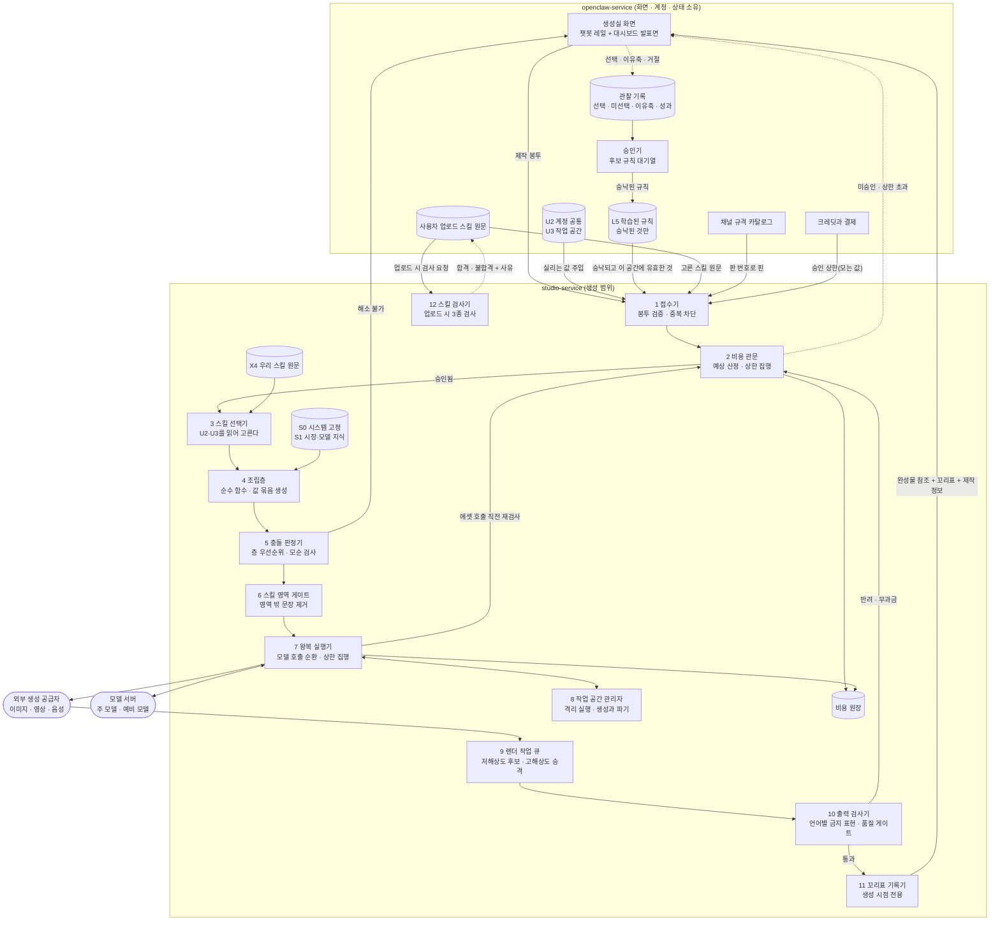
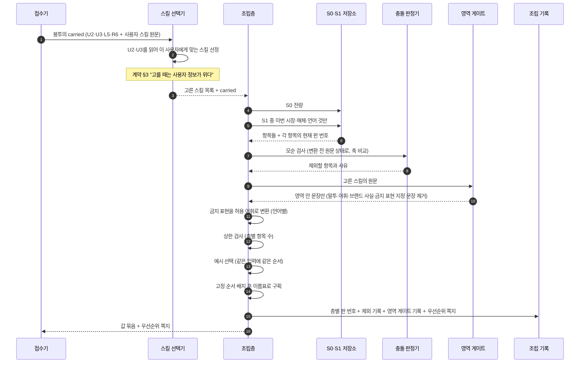
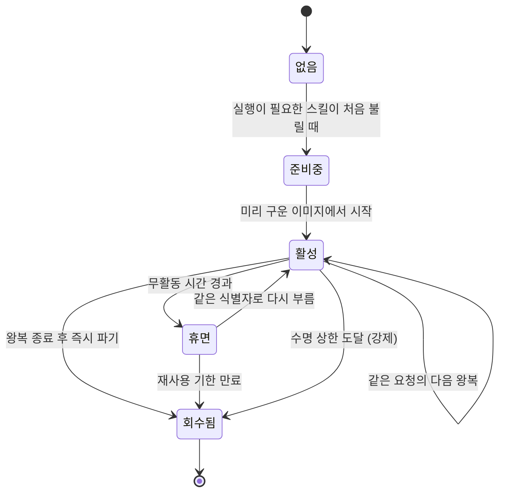
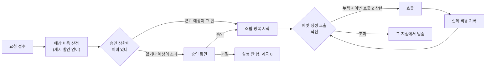

<!--
STAMP
문서: studio-service 생성 범위 기술설계 (FDD)
판: v2.0 (v1.0을 대체한다. v1.0은 이력 보존용으로 남긴다)
작성: 2026-08-21 22:40 KST
model: claude-opus-5[1m]
agent: tech-architect (서브에이전트)
기반 포맷: studio/docs/fdd-studio-생성-v1.0.md (같은 라인 직전 판의 골격을 상속했다. 목차·TL;DR·매핑표·미결표·레드팀 구성 유지)
기반 산출물 (버전 핀, 전부 이 세션에서 실제 Read):
  - docs/학습정보-층계-계약-v1.0.md ★확정 정본. S0·S1·U2·U3·X4·L5·R6 이름과 규칙의 진실원
  - studio/docs/prd-studio-생성-v1.0.md (FR-GEN-001~070, §9 데이터 요구, §10 NFR, §12 미결 11건)
  - studio/docs/fdd-studio-생성-v1.0.md (선택지 6건, 갭 2건, 미결 13건. 이 판이 승계해 닫는다)
  - wiki/architecture/two-service-boundary.md (경계 3기준, 단방향 의존, 접점 5개, 후보 비용 구조)
  - docs/prd-openclaw-운영-v1.0.md §4.5~4.7 (FR-OP-023~031)
  - docs/user-flow.md §1.5 (PRD 8단계와 네 방의 대응), §2 이음새
  - /Users/sj/.claude/standards/dev.md, /Users/sj/.claude/standards/doc-review.md
성격: **추천 기준 설계.** v1.0이 올린 선택지 6건에 회장이 아직 답하지 않았다(취침 중). 각 항목에 이 문서의 추천안과 근거를 적고 그 추천 위에서 설계를 이어갔다. 추천을 뒤집으면 영향 범위는 §5.8 표에 적었다.
고민한 것: 계약 v1.0이 학습된 규칙(L5)의 소유를 openclaw로 옮기면서 v1.0의 전제 1이 뒤집혔다. 그 결과 studio에서 관찰 원장과 승인기 두 덩어리가 사라지고 구조가 오히려 단순해졌다. 이 판의 절반은 그 단순화를 반영하는 일이었다.
-->

# FDD: studio-service 생성 범위 v2.0

> **이 문서가 정하는 것**: 생성 범위의 구성 요소, 층 소유와 주입 경로, 조립 순서와 캐시 경계, 왕복 실행, 비용 통제, 실패 처리, 그리고 흐름 각 단계가 어느 엔드포인트와 어느 저장 대상에 붙는가.
> **함께 읽는 것**: 봉투와 반환물의 정확한 모양은 `api-contract-studio-생성-v1.0.md`, 저장 구조는 `erd-studio-생성-v1.0.md`, 검증 항목은 `test-plan-studio-생성-v1.0.md`.

---

## 목차

- [1. 범위와 용어와 원칙](#범위)
- [2. 기존 구현 대비 신규와 변경](#기존)
- [3. 아키텍처](#아키텍처)
- [4. 흐름 1:1 매핑표 (갭 0)](#매핑)
- [5. v1.0 선택지 여섯의 추천 확정](#선택)
- [6. 조립층 상세](#조립)
- [7. 캐시 경계](#캐시)
- [8. 왕복 실행과 작업 공간과 스킬 검사](#왕복)
- [9. 비용 통제](#비용)
- [10. 실패 처리](#실패)
- [11. 시험 계획 요약](#시험)
- [12. 미결과 회수](#미결)
- [13. 자기심문과 레드팀](#자기심문)
- [SOURCES](#sources)

---

> **TL;DR**
> 계약 v1.0이 층 이름과 소유를 확정하면서 studio는 v1.0보다 **더 얇아졌다.** 관찰 기록과 승인 대기열이 openclaw로 넘어가, studio 구성 요소가 열둘에서 열로 줄었다. 남은 심장은 여전히 조립층이고, 조립층은 확률이 개입하지 않는 순수 함수다.
> 이 판이 새로 짓는 것은 셋이다. ①**스킬 영역 게이트** (X4가 말투·어휘·브랜드 사실·금지 표현을 건드리는 문장을 조립 시점에 걷어낸다) ②**언어별 금지 표현 검사** (조립 규칙의 여덟째. 글자가 아니라 뜻으로 잡는다) ③**캐시 경계** (S0에서 X4까지가 고정 구간, 그 뒤에 브레이크포인트 하나, L5와 R6은 그 뒤).
> v1.0이 완료를 거부한 갭 두 건은 **둘 다 닫혔다**(§4.3). 새 갭은 없다. 대신 계약 v1.0이 만든 새 접점 하나(스킬 업로드 검사)를 회장께 회수로 올린다(§12).
> 원가 계획은 캐시가 안 먹는 것을 기준으로 짠다(계약 §7 회장 확정). 캐시는 이익으로만 잡는다.

---

## 1. 범위와 용어와 원칙 <a id="범위"></a>

### 1.1 범위

**범위 안**: PRD의 FR-GEN-001부터 070까지. 온보딩 입구, 제안 카드, 조립층, 왕복 실행, 후보와 선택, 스킬 보관함과 검사, 꼬리표, 비용 관문.

**범위 밖**: 편집실·발행실·성과실의 내부 설계. 화면의 시각 설계. 이 문서는 접점만 정의한다.

### 1.2 용어

층 이름은 계약 v1.0 표기를 **글자 그대로** 쓴다. 이 문서 안에서 `L0~L6` 같은 옛 표기는 쓰지 않는다.

| 계약 v1.0 이름 | 뜻 | v1.0 FDD의 옛 이름 |
|---|---|---|
| `S0` | 시스템 고정. 안전선, AI 표기 의무, 플랫폼 정책, 저작물 규칙, 테넌트 격리 | L1 |
| `S1` | 시장·모델 지식. 훅 문법, 금기, 모델별 말투, 트렌드 신호 | L2 |
| `U2` | 계정 공통. 작업 공간을 하나 더 만들어도 안 바뀌는 값 | L3 |
| `U3` | 작업 공간. 작업 공간을 하나 더 만들면 새로 정하는 값 | L4 |
| `X4` | 스킬. 제작법 파일. 최소 단위는 파일 하나 | (층 밖 보관함으로 취급했음) |
| `L5` | 학습된 규칙. 계정에 살고, 얻은 공간 꼬리표를 단다 | L6 |
| `R6` | 이번 요청. 저장하지 않는다 | L0 |

그 밖의 임시 이름.

| 말 | 뜻 |
|---|---|
| 값 묶음 | 조립층이 층 항목에서 뽑아 만든, 모델에 실을 구조화된 값들 |
| 우선순위 쪽지 | 층이 부딪혔을 때 누가 이겼고 왜인지를 적은 기록 |
| 왕복 | 모델이 스킬 원문이나 명령 실행을 요구해 우리가 응답하는 순환 한 바퀴 |
| 작업 공간 | 스킬이 파일을 읽고 명령을 돌릴 수 있는 격리된 실행 환경 |
| 꼬리표 | 결과물에 생성 시점에만 붙는, 무엇으로 만들었는지의 기록. 사후 편집 불가 |
| 판 번호 | 층 항목과 스킬과 규칙 묶음이 갖는 버전 식별자 |
| 실리는 값 | 모델에게 같이 보내는 값 (브랜드 사실, 금지 표현, 말투, 타깃, 컨셉, 반입 요약, 학습된 규칙, 이번 주제) |
| 모는 값 | 모델에 안 보내는 값 (자동화 정도, 마케팅 지식 수준, 비용 상한, 확인 단계 수). 화면과 절차가 읽는다 |

### 1.3 설계 원칙 다섯

| 번호 | 원칙 | 어디서 왔나 |
|---|---|---|
| P1 | **조립은 순수 함수다.** 같은 입력에 같은 값 묶음 | PRD NFR-GEN-005 |
| P2 | **차단은 글이 아니라 코드로 한다.** 규칙과 리뷰가 아니라 권한과 타입으로 막는다 | 계약 §3, v1.0 §5.3.1 판정 |
| P3 | **원문은 불변이다.** 스킬 본문은 한 글자도 안 고치고, 조립 결과 문자열을 통째로 저장하지 않는다 | 계약 §3, PRD §9.3 |
| P4 | **돈이 나가기 전에 관문이 선다.** 관문의 자리는 렌더 앞이 아니라 외부 생성 호출 앞이다 | PRD FR-GEN-060 |
| P5 | **studio는 사용자가 누구인지 모른다.** 받은 봉투만 보고 만든다 | 계약 §10 (신규) |

**P5가 이 판에서 새로 올라온 원칙이다.** 계약 §10이 "studio는 사용자가 누구인지 모른다. 그래서 나중에 개발자용으로 따로 팔 때 손댈 곳이 없다"고 못 박았다. 이 원칙이 §5의 여러 선택을 한 방향으로 정렬시킨다.

---

## 2. 기존 구현 대비 신규와 변경 <a id="기존"></a>

### 2.1 코드 실측 (재창조 금지 점검)

| 실측한 것 | 결과 | 증거 등급 |
|---|---|---|
| `studio/` 하위에 서비스 코드가 있나 | **없다.** 문서와 파이프라인 스크립트뿐이다 | 관찰됨 |
| 대시보드에 생성 관련 구현이 있나 | `dashboard/`는 openclaw 쪽 화면과 API다. 채널 설정·큐·가이드·키워드가 이미 구현돼 있다 | 근거 확인 (CLAUDE.md 아키텍처 절) |
| `docs/구현현황.md`가 있나 | **없다.** §12 회수 항목으로 유지한다 | 관찰됨 |

**결론: 생성 범위는 전량 신규다.** 재사용하는 기존 자산은 셋이다. `dashboard/`의 화면과 인증(1단계에서 studio는 화면이 없다), `extensions/*-publish` 15종(발행 접점), openclaw의 채널 규격 카탈로그(studio는 저장하지 않고 판 번호로 받아 쓴다).

### 2.2 FDD v1.0 대비 변경 (계약 v1.0이 바꾼 것)

| 자리 | v1.0 | v2.0 | 사유 |
|---|---|---|---|
| 층 이름 | L0~L6 | S0·S1·U2·U3·X4·L5·R6 | 계약 v1.0 §1 |
| 학습된 규칙 소유 | studio (전제 1의 A안) | **openclaw** | 계약 §10. v1.0 §11.1이 예측한 B안 경로 |
| 관찰 원장 구성 요소 | studio 안에 있음(11번) | **삭제.** openclaw 소유 | 같음 |
| 승인기 구성 요소 | studio 안에 있음(12번) | **삭제.** openclaw 소유 | 같음 |
| 관찰 기록 물리 격리 선택(§5.3.1) | 안 A 추천 | **선택 자체가 사라짐** | studio에 관찰 기록이 없으므로 격리할 것이 없다 |
| 브랜드 말투 층 | 미확정(전제 2) | **확정.** 기본 말투는 U2, 공간별 말투 조정은 U3 | 계약 §2 U2·U3 정의 |
| 스킬의 자리 | 층 밖 보관함 | **X4로 층에 편입.** 단 조립 시 영역 제한을 받는다 | 계약 §1, §3 |
| 언어 | 요청 파라미터로만 취급 | **U2.** 금지 표현을 언어별로 보유 | 계약 §4 |
| 조립 규칙 | 일곱 | **여덟.** 언어별 금지 표현 검사 추가 | 계약 §4 |
| 캐시 | 언급 없음 | **§7 신설.** 경계 위치를 명시 | 계약 §7·§9 |
| 실리는 값/모는 값 | 구분 없음 | **봉투가 두 칸으로 갈림** | 계약 §8 |

**신규로 짓는 구성 요소 셋** (v1.0에 없던 것): 스킬 영역 게이트, 언어별 금지 표현 검사기, 스킬 업로드 검사기.

---

## 3. 아키텍처 <a id="아키텍처"></a>

### 3.1 구성 요소 지도



**읽는 법 넷.**

1. **실선은 요청이 지나가는 길, 점선은 학습이 도는 길이다.** 학습 경로는 이제 **전부 openclaw 안에서** 돈다. studio는 승낙된 L5를 봉투로 받기만 한다. "조립이 관찰 기록을 못 읽는다"는 규칙이 서비스 경계 자체로 성립한다(P2의 가장 강한 형태).
2. **openclaw에서 studio로만 화살표가 간다.** studio가 openclaw를 부르는 실선은 없다. 완성물은 응답으로 돌려주지 호출로 밀지 않는다. 스킬 검사도 openclaw가 studio를 부르는 방향이다.
3. **비용 관문이 두 번 등장한다.** 접수 직후 한 번(예상 산정), 왕복 중 에셋 호출 직전 한 번(상한 집행). 두 번째가 실제로 돈을 막는 자리다.
4. **스킬이 두 번 관여한다.** 고를 때는 선택기(3번)가 U2·U3를 읽어 고르고, 조립할 때는 영역 게이트(6번)가 영역 밖 문장을 걷어낸다. 계약 §3의 두 시점이 두 개의 구성 요소로 물리화됐다.

### 3.2 층 소유와 주입 경로

계약 §10의 분담표를 그대로 구현 관점으로 옮긴 것이다.

| 층 | 원본 저장 | 생성 범위가 어떻게 읽나 | 봉투에 실리나 |
|---|---|---|---|
| `S0` | studio | 자기 것을 직접 읽는다 | 아니오 |
| `S1` | studio (트렌드 신호만 openclaw가 모아 넘김) | 직접 읽는다. 이번 시장·매체 것만 | 아니오 |
| `U2` | **openclaw** | 봉투에 실리는 값으로 주입돼 온다 | 예 (실리는 값만) |
| `U3` | **openclaw** | 같음 | 예 |
| `X4` | 우리 것은 studio, 사용자 것은 **openclaw** | 우리 것은 직접, 사용자 것은 봉투에 원문으로 | 사용자 것만 |
| `L5` | **openclaw** | 봉투에 실려 온다. 승낙되고 이 공간에 유효한 것만 | 예 |
| `R6` | 어디도 저장 안 함 | 봉투에 실려 온다 | 예 |

**비대칭 하나를 못 박는다.** S0·S1은 studio가 갖고 U2·U3·L5는 openclaw가 갖는다. 즉 **우리 지식은 우리가, 사용자 것은 사용자 서비스가** 갖는다. 이 선이 P5(studio는 사용자가 누구인지 모른다)를 성립시킨다.

### 3.3 개념 데이터 지도

상세는 `erd-studio-생성-v1.0.md`에 있다. 여기서는 못 박는 것 넷만 적는다.

1. **층 항목과 그 판이 분리돼 있다.** 되돌리기가 덮어쓰기가 아니라 항목 추가여야 하기 때문이다.
2. **꼬리표가 조립 기록을 가리키고, 조립 기록이 층 항목 판 묶음을 가리킨다.** 조립 결과 문자열은 저장하지 않는다.
3. **장면 정보가 결과물과 독립해 산다.** 후보 셋이 같은 장면 정보를 공유하고, 편집이 재렌더로 끝난다.
4. **비용 원장은 예상·실제·반려 무과금을 각각 따로 남긴다.**

---

## 4. 흐름 1:1 매핑표 (갭 0) <a id="매핑"></a>

### 4.1 단계의 출처를 먼저 밝힌다

v1.0의 가장 약한 줄이 "23단계가 어디서 왔는지 약하다"였다. 이 판은 단계를 내가 나누지 않고 **승인된 두 문서에서 가져왔다.**

- **바깥 골격**: `docs/user-flow.md` §1.5가 PRD §3.7의 8단계를 네 방에 배치한 표. 그중 **1번에서 6번이 생성실**이다.
- **안쪽 세부**: `prd-studio-생성-v1.0.md`의 FR-GEN 조항이 각 단계 안에서 무엇이 일어나는지 정한 것.

그래서 아래 표는 **8단계 중 생성실 구간(1~6) + 그 앞의 온보딩 + 그 뒤의 인계**로 구성되고, 각 행은 user-flow 단계 번호 또는 FR 번호를 근거로 갖는다. 내가 임의로 쪼갠 행은 없다.

### 4.2 매핑표

처리 지점은 §3.1의 구성 요소 번호, 엔드포인트는 `api-contract-studio-생성-v1.0.md`의 계약, 저장 대상은 `erd-studio-생성-v1.0.md`의 개체다.

| # | 단계 (근거) | 엔드포인트 | 처리 지점 | 사용자에게 보이는 자리 | 저장 대상 |
|---|---|---|---|---|---|
| O1 | 로그인하고 생성실에 들어온다 (user-flow §1.2) | 없음 (openclaw 인증) | openclaw | 생성실 첫 화면 | 세션. 층 아님 |
| O2 | 학습 정보 유무 판정 (FR-GEN-003) | 없음 (openclaw 조회) | openclaw | 화면 분기 | 없음 (읽기만) |
| O3 | 계정 공통을 받는다: 브랜드 사실, 금지 표현, 주 언어와 다루는 언어 (FR-GEN-001, 계약 §2 U2) | 없음 (openclaw 화면) | openclaw | 챗봇이 묻고 대시보드가 후보 예시 | `U2항목` + `U2항목판` (openclaw) |
| O4 | 금지 표현을 다루는 언어로 옮겨 후보를 만들고 사용자가 확인한다 (계약 §4) | `POST /v1/lexicon/translations` | 12 검사기 계열 | 언어별 목록과 확인 체크 | `U2항목판`의 언어별 금지 표현 (openclaw) |
| O5 | 작업 공간을 받는다: 타깃, 컨셉, 이 공간 말투 조정 (FR-GEN-001, 계약 §2 U3) | 없음 (openclaw 화면) | openclaw | 같음 | `U3항목` + `U3항목판` (openclaw) |
| O6 | 주소를 반입해 항목으로 정리한다 (FR-GEN-002) | `POST /v1/materials/imports` | 반입 처리기 (접점 5) | 항목 목록 + 항목별 출처 + 넣기/빼기 | `반입요약` + 보류 표시 (openclaw가 승인 후 U3에 반영) |
| 1 | 업계·목적 선택 (user-flow 1단계) | 없음 (openclaw 화면) | openclaw | 한 화면에 하나씩 | `U3항목판` |
| 2 | 업계에서 잘 되는 채널·영상 보기 (user-flow 2단계) | `POST /v1/signals` 로 들어온 트렌드를 읽어 제안에 반영 | S1 신호 수신기 | 참고 카드 | `S1항목` + 유통기한 (studio) |
| 3 | 제안 카드와 스타일 예시를 본다 (user-flow 3단계, FR-GEN-004·005) | `POST /v1/proposals` | 3 선택기 + 4 조립층 + 7 왕복 1회 | 카드 3장 이상 + 제안 이유 | `제안묶음` (요청 단위, 임시) |
| 3b | 카드 셋을 전부 거절하고 다시 받는다 (FR-GEN-006, R27) | `POST /v1/proposals` (`retry_of` 지정) | 2 비용 관문 | 무료 회차 안내 또는 승인 화면 | `비용항목` + 거절 관찰(openclaw) |
| 4 | 비용·시간을 확인한다 (user-flow 4단계, FR-GEN-060) | `POST /v1/productions` 응답의 `estimate` | 2 비용 관문 | 예상 범위 + 상한 + 승인 | `요청` + `비용항목(예상)` |
| 4b | 이번만 미세 조정을 넣는다 (FR-GEN-007, 계약 R6) | `POST /v1/productions` 봉투의 `carried.r6` | 1 접수기 | 생성 화면의 조정 입력 | **저장 안 함.** 반복 감지 카운터만 openclaw 관찰 기록 |
| 5 | 고르거나 추천받는다: 후보 3개 중 하나 (user-flow 5단계, FR-GEN-020·021) | `GET /v1/productions/{id}` 로 후보 조회 → `POST /v1/productions/{id}/decisions` | 9 렌더 큐 → 1 접수기 | 후보 3장 + 차이 축 설명 + 선택 UI | `후보` + `선택결정` (studio), 이유축은 openclaw 관찰 |
| 5b | "이 취향을 기억할까요"에 동의하거나 거절한다 (FR-GEN-022) | 없음 (openclaw 승인기) | openclaw | 항목 단위 동의 | `후보규칙` → 승낙 시 `L5항목판` (openclaw) |
| 6a | (안 보임) 층에서 값을 꺼내 값 묶음을 만든다 (FR-GEN-010) | 내부 | 4 조립층 | 진행 단계 표시만 | `조립기록` (층별 판 번호) |
| 6b | (안 보임) 층이 부딪히는지 검사한다 (FR-GEN-011·014) | 내부 | 5 충돌 판정기 | 해소 불가일 때만 질문 | `제외기록` + `우선순위쪽지` |
| 6c | (안 보임) 스킬의 영역 밖 문장을 걷어낸다 (계약 §3) | 내부 | 6 영역 게이트 | 없음 | `영역게이트기록` |
| 6d | (안 보임) 1차에 스킬 이름표, 2차에 원문 (FR-GEN-012) | 내부 | 7 왕복 + 보관함 | 진행 단계 표시 | `왕복` + `스킬판` 참조 + 바이트 지문 |
| 6e | (안 보임) 파일 읽기와 명령 실행 (FR-GEN-013·031) | 내부 | 8 작업 공간 관리자 | 같음 | `왕복`(출력만) + `작업공간` |
| 6f | 고해상도 승격이 일어난다 (user-flow 6단계) | `POST /v1/productions/{id}/decisions` 의 `promote` | 9 렌더 큐 | 비동기 진행 + 완료 알림 | `결과물` + `비용항목(실제)` |
| 6g | (안 보임) 언어별 금지 표현과 품질을 재검사한다 (계약 §4, FR-GEN-014) | 내부 | 10 출력 검사기 | 반려일 때만 사유 | `출력검사결과` + 반려 무과금 표시 |
| 6h | (안 보임) 꼬리표가 붙는다 (FR-GEN-040) | 내부 | 11 꼬리표 기록기 | "이건 무엇으로 만들었나" 문장 | `꼬리표` (추가 전용) |
| 6i | 확정 / 보관 / 다른 제안 중 고른다 (FR-GEN-023, R29) | `POST /v1/productions/{id}/decisions` | 1 접수기 | 세 갈래 버튼 | `요청` 상태 전이 |
| 6j | 나중에 들어와 이어서 작업한다 (FR-GEN-024, R09·R16) | `GET /v1/productions?state=...` | 1 접수기 + 8 작업 공간 | 작업물 목록 + 중단 지점 | `요청` + `작업공간` 참조와 만료 시각 |
| 6k | 완성물과 꼬리표와 제작 정보가 편집실·발행실로 넘어간다 (FR-OP-026) | `GET /v1/productions/{id}` 응답 | 11 꼬리표 기록기 | 발행 준비 완료 표시 | `인계기록` |
| X1 | 사용자가 스킬을 올린다 (계약 §3) | `POST /v1/skills/inspections` | 12 스킬 검사기 | 합격/불합격 + 걸린 문장 | `스킬검사기록` (studio), 원문은 openclaw |
| X2 | 사용자가 나중에 금지 표현을 늘린다 (계약 §6) | `POST /v1/recheck` | 10 출력 검사기 | 걸리는 대기 항목 목록 | `재검사결과` |

**총 24행. 엔드포인트가 붙지 않는 행은 전부 openclaw 화면 소유이며 그 사실을 행에 명시했다.** 처리 지점, 저장 대상, 사용자에게 보이는 자리가 비어 있는 행은 하나도 없다.

### 4.3 v1.0의 갭 두 건을 닫는다

⛔ **갭 1 (성과·트렌드 신호의 처리 지점): 닫힘.**

- v1.0의 문제: 성과·트렌드 신호가 학습 경로로 가는지 요청 경로로 가는지 갈렸고, 성과가 조립에 직접 실리면 "조립은 관찰 기록을 못 읽는다"가 깨졌다.
- 계약 v1.0이 닫아준 것: **관찰 기록이 openclaw 소유**가 되면서 이 문제가 사라졌다. 성과 신호는 openclaw 관찰 기록으로 들어가고, 거기서 뽑힌 후보 규칙이 사용자 승낙을 거쳐 L5가 되고, L5만 봉투에 실린다. studio 안에는 성과가 들어올 통로 자체가 없다.
- **트렌드 신호만 예외**다. 계약 §10이 "트렌드 신호만 openclaw가 모아 넘긴다"고 했고, 그것은 사용자 정보가 아니라 시장 정보이므로 **S1**으로 들어간다. 처리 지점은 S1 신호 수신기, 엔드포인트는 `POST /v1/signals`(접점 1), 저장은 `S1항목`이며 유통 기한을 함께 단다(계약 §2 S1).
- 매핑표 2행이 이 자리다. **갭 아님.**

⛔ **갭 2 (소재 권리 선언의 저장 위치): 닫힘.**

- v1.0의 문제: 미디어 바이트는 studio가 갖는데 권리 선언은 어느 층인지 갈렸다.
- 계약 v1.0이 닫아준 것: §2가 **"브랜드킷, 소재 권리 선언"을 U2에 명시**했다. U2 저장은 openclaw다(계약 §10).
- 그래서 구조는 이렇게 선다. **권리 선언은 봉투에 실리는 값으로 온다. 미디어 바이트는 studio가 갖는다. studio는 자기가 가진 소재의 권리 근거를 봉투의 선언과 대조만 한다.** 대조에 실패한 소재는 후보에서 제외하고 제외 사실을 사용자에게 보인다(FR-GEN-052).
- 이 분리가 오히려 옳다. 권리 선언은 "사용자가 선언한 사실"이라 사용자 서비스가 갖는 것이 맞고, 바이트는 만지는 쪽이 갖는 것이 맞다. **갭 아님.**

**따라서 이 문서는 매핑 갭 0으로 완료를 선언한다.** 새 갭은 없다. 다만 계약이 만든 새 접점 하나는 §12에 회수로 올린다(갭이 아니라 결정 요청이다).

---

## 5. v1.0 선택지 여섯의 추천 확정 <a id="선택"></a>

> 회장이 취침 중이라 물을 수 없다. 각 항목에 **이 문서의 추천안과 근거**를 적고 그 위에서 설계했다. 전부 **추천 기준 설계**이며, 뒤집힐 때의 영향은 §5.8에 적었다.

### 5.1 선택 1. 요청 봉투의 형태 → **안 A (값 전량 주입) 채택**

**추천 근거 셋.**
1. 경계 wiki가 단방향 의존을 구조의 전제로 못 박았고, 참조+조회 방식(안 B)은 그것을 정면으로 깬다.
2. FR-OP-027이 이미 "studio에는 이번 제작에 필요한 최소 항목만 실어 보낸다"고 썼다. 이 문장 자체가 A의 모양이다.
3. **계약 §10의 P5가 이 선택을 강제한다.** studio가 사용자가 누구인지 몰라야 하는데, 참조를 들고 조회하면 그 순간 사용자 식별자를 알고 되부르게 된다.

**계약 v1.0이 추가한 규정 하나.** 봉투가 **두 칸으로 갈린다.**

| 칸 | 담는 것 | 모델에 실리나 |
|---|---|---|
| `carried` (실리는 값) | U2 실리는 값, U3, L5, R6, 고른 스킬 | 예 |
| `control` (모는 값) | 자동화 정도, 지식 수준, 비용 상한, 확인 단계 수, 요청 식별자 | **아니오** |

계약 §8이 근거다. 모는 값을 프롬프트에 섞으면 앞부분이 길어져 캐시 이득이 줄고, 모델이 "알아서 해주세요"를 내용 지시로 오해해 글투가 흔들린다. **이 분리를 타입으로 강제한다**(P2): 조립층 함수의 인자는 `carried`만 받는다. `control`은 조립층에 도달할 수 없다.

### 5.2 선택 2. 층 항목 저장 구조 → **안 A (항목별 판 누적) 채택**

R13("되돌리기는 덮어쓰지 않고 항목 추가")과 PRD §9.1이 요구하는 셋(줄 단위, 한 줄 끄기, 출처 가리키기)을 전부 만족하는 것은 A뿐이다.

**소유가 바뀐 만큼 이 선택의 무대도 바뀌었다.** U2·U3·L5 항목 판은 이제 **openclaw가** 쌓는다. studio가 항목별 판 구조를 쓰는 곳은 S0·S1 두 층이다. 다만 **판 번호의 형식과 의미는 계약으로 공유해야** 꼬리표가 openclaw 항목을 정확히 가리킬 수 있다. api-contract §5에 판 번호 규격을 적었다.

### 5.3 선택 3. 관찰 기록과 꼬리표의 저장

**3-1 관찰 기록 격리 → 선택 자체가 소멸.** 계약 §10이 관찰 기록을 openclaw에 뒀다. studio에 관찰 기록이 없으므로 격리할 대상이 없다. v1.0 §11.1이 예측한 그대로다.

**3-2 꼬리표 불변성 → 안 A(추가 전용 저장 + 결과물 참조), 안 B(파일 메타 임베드)를 보조로 함께 켬.**

근거: FR-GEN-040이 "생성 이후에 꼬리표를 사후 편집할 수 없다"를 요구하므로 방지가 있어야 하고(A), 동시에 사용자가 완성 원본을 내려받아 직접 발행하는 갈래가 실재하므로(경계 wiki) 그 갈래에서 따라갈 사본이 필요하다(B). 둘은 배타가 아니다.

### 5.4 선택 4. 장면 정보의 저장 → **안 A (결과물과 분리된 독립 문서) 채택**

경계 wiki가 "경쟁 도구는 완성 파일만 남기므로 수정이 곧 재생성이고, 우리는 수정이 재렌더다. 원가 차이가 여기서 벌어진다"고 썼다. 그 원가 우위의 물리적 실체가 **장면 정보가 결과물과 독립해 살아 있다**는 것이다.

**계약 v1.0이 이 선택을 더 강하게 만들었다.** 계약 §11이 "장면 정보를 studio가 갖고 있어야 재렌더가 싼데 무상태를 지키려면 그것도 넘겨야 한다"를 미결로 남겼는데, L5가 openclaw로 간 지금 **studio에 남은 유일한 유의미한 상태가 장면 정보와 소재와 꼬리표**다. 이 셋은 전부 "미디어 바이트를 만지는 쪽"이 가져야 하는 것이라 경계 기준 3번과 정확히 일치한다. 그러므로 studio는 **무상태가 아니라 "미디어 상태만 가진 서비스"**로 정의하는 것이 정직하다. §12 미결로 올린다.

### 5.5 선택 5. 조립층 인터페이스 → **안 A (구조화된 값 묶음 + 모델 어댑터) 채택**

조립층이 순수 함수로 유지되고(P1), 모델을 바꿔도 조립 로직과 시험이 그대로다. 사업계획이 식별한 기술 과제 "모델마다 다른 말투"가 어댑터 한 곳에 갇힌다.

**계약 §7이 이 선택을 결정적으로 만들었다.** 예비 모델로 넘어간 요청은 제작 정보에 그 사실을 남겨야 하는데(계약 §7 부수 규칙), 조립층이 최종 문자열까지 만들면(안 B) 모델 분기가 조립층 안에 생겨 "같은 값 묶음인데 어느 모델로 나갔나"를 분리해 기록할 수 없다. 어댑터가 있어야 **값 묶음은 하나, 문자열은 모델별**이 성립하고 제작 정보가 그 둘을 각각 가리킬 수 있다.

### 5.6 선택 6. 스킬 실행 환경 → **안 A (관리형 격리 실행 서비스) + 단계적 개방 채택**

근거 셋. ①FR-GEN-031이 요구하는 넷(테넌트 격리, 시간·자원 상한, 출력만 회수, 통신 차단)이 전부 조회한 두 제품의 기본 기능이다. ②직접 운영(안 B)은 실패 모드가 비대칭이다. 잘해도 남는 게 없고 못하면 회사가 끝난다. ③스킬 실행을 끄는 안 C는 PRD의 차별 축을 지운다.

**단계적 개방은 유지하되 계약 §3이 3단계의 전제를 바꿨다.** 사용자 업로드 스킬은 이제 **받는 시점에 검사를 통과해야** 보관함에 들어간다. 즉 3단계(사용자 스킬 실행 허용)의 진입 조건이 "격리 시험 통과"에서 "격리 시험 통과 **그리고** 업로드 검사기 가동"으로 늘었다.

| 단계 | 무엇을 켜나 | 종료 조건 |
|---|---|---|
| 1 | 우리가 넣은 스킬 중 실행 없는 것만. 원문 왕복은 되고 명령 실행은 안 된다 | 카드뉴스 한 편 무인 완주 |
| 2 | 우리가 넣은 스킬의 실행 허용. 명령은 허용 목록 방식 | 실행 포함 완주가 20회 중 절반 이상 |
| 3 | 사용자가 올린 스킬의 실행 허용 | 격리 시험 전부 통과 **+** 업로드 검사기 3종이 전부 가동 |

### 5.7 계약 v1.0이 새로 만든 결정 하나

**스킬 업로드 검사의 실행 위치.** 계약 §3은 "검사 주체는 openclaw"라고 했고 위임서는 "검사 규칙의 정의는 studio가 준다"고 했다. 규칙을 어떻게 전달하느냐가 새 결정이다. §12에 회수 항목으로 올렸다. 이 문서는 **안 A(studio가 검사 엔드포인트를 제공하고 openclaw가 업로드 시 호출)를 전제로** 설계했다.

### 5.8 추천이 뒤집힐 때의 영향 범위

| 뒤집히는 선택 | 폐기되는 것 | 수정되는 것 | 영향 크기 |
|---|---|---|---|
| 선택 1 (봉투) | api-contract §2 전체 | 조립층 입력 시그니처, 캐시 경계 계산, ERD의 `봉투스냅샷` | **큼.** 다른 셋이 여기 매달림 |
| 선택 2 (항목 판) | 없음 | 꼬리표가 가리키는 판 번호 형식 | 중간 |
| 선택 3-2 (꼬리표) | 없음 | ERD `꼬리표` 저장 방식 | 작음 |
| 선택 4 (장면 정보) | 편집 원가 우위 논거 | ERD `장면`, 후보 공유 구조 | 큼 |
| 선택 5 (조립 인터페이스) | 모델 어댑터 구성 요소 | 예비 모델 기록 방식 | 큼 |
| 선택 6 (실행 환경) | §8.2~8.4 전체 | 원가표의 실행 시간 축 | 큼 |
| 선택 7 (검사 위치, 신규) | api-contract §7 | 접점 개수(5→6) | 중간 |

---

## 6. 조립층 상세 <a id="조립"></a>

### 6.1 값 묶음을 만드는 과정



**7번과 11번의 순서가 이 그림의 핵심이다.** PRD 미결 11(모순 검사와 금지 표현 변환의 순서)을 이 문서가 판정한다.

**판정: 모순 검사가 먼저다.** 근거는 셋이다.
- 금지 표현을 허용 어휘로 바꾸면 그 문장에서 "이것이 원래 금지였다"는 정보가 사라진다. "존댓말 쓰지 마"가 "반말 코치 어조로 쓴다"가 되면, L5에 있는 "정중한 어조 선호"와 부딪히는지를 문자열로는 알아볼 수 없다.
- 모순 검사를 원문 상태에서 돌리면 두 항목이 같은 축의 반대값이라는 것이 드러난다.
- 다만 이 판정에는 조건이 붙는다. **모순 검사가 문자열 비교가 아니라 축 비교여야 성립한다.** 항목이 "어떤 축의 어떤 값"인지를 알아야 반대값을 찾는다. 그래서 §5.2의 항목 구조가 축 정보를 요구한다.

**9번(영역 게이트)이 8번(모순 검사) 뒤, 11번(변환) 앞에 오는 이유.** 스킬의 영역 밖 문장은 애초에 값 묶음에 들어가면 안 되므로 변환 대상도 아니다. 그러나 모순 검사보다 뒤에 두는 이유는, 영역 게이트가 제거한 문장이 무엇과 부딪혔는지를 기록에 남기려면 검사가 먼저 돌아야 하기 때문이다. 실제로는 순서보다 **둘 다 변환 전에 돈다**는 것이 요점이다.

### 6.2 스킬 영역 게이트 (신규)

계약 §3이 만든 구성 요소다. 계약 문장을 그대로 옮기면 이렇다.

> X4는 자기 영역(구조·순서·길이·구성) 안에서만 아래를 덮는다. 영역 밖의 문장은 조립 시 걸러낸다.

| 스킬이 정할 수 있는 것 | 스킬이 못 건드리는 것 |
|---|---|
| 구조, 장면 순서, 길이, 컷 수, 화면 비율, 어떤 요소를 넣을지 | 말투, 어휘 선택, 브랜드 사실, 금지 표현 |

**어떻게 코드로 강제하나.** 세 겹이다.

| 겹 | 무엇을 하나 | 왜 이 겹이 필요한가 |
|---|---|---|
| 1. 등록 시 | 업로드 검사기(§8.5)가 영역 밖 지시 문장을 잡아 **거부**한다 | 들어오지 못하게 하는 것이 가장 싸다 |
| 2. 조립 시 | 영역 게이트가 스킬 원문을 문장 단위로 훑어 영역 밖 문장을 제거하고, 제거 사실을 `영역게이트기록`에 남긴다 | 우리가 넣은 스킬도, 검사를 통과한 사용자 스킬도 시간이 지나면 영역을 넘을 수 있다 |
| 3. 구조로 | 값 묶음에서 **말투·어휘·브랜드 사실·금지 표현 칸은 스킬이 채울 수 없는 칸으로 선언**한다. 스킬 출처의 값이 그 칸에 들어가면 조립이 실패한다 | 문장 검사는 우회된다. 칸 소유권은 우회되지 않는다 |

**3번이 주 방어이고 1·2번은 그물이다.** 이것이 P2(차단은 코드로)의 이 자리 적용이다.

⚠️ **P3(원문 불변)과의 긴장을 여기서 정직하게 적는다.** 원문은 저장 시 불변이지만, **조립 시에는 원문의 일부만 실린다.** 즉 "저장된 원문 = 실린 원문"이 더 이상 항상 참이 아니다. AC-GEN-012가 "바이트 단위로 같음을 확인할 수 있다"를 요구하므로 이 요구를 이렇게 고쳐 적는다.

> **저장된 원문의 바이트 지문**과 **실린 부분집합의 바이트 지문**을 각각 기록하고, 실린 것이 저장된 것의 **연속 부분집합임을 검증 가능**하게 한다. 제거된 문장은 `영역게이트기록`에 그대로 남는다.

이 변경은 PRD AC-GEN-012의 문장을 고쳐야 성립한다. §12 회수 항목이다.

### 6.3 조립 여덟 규칙을 코드로 강제하는 방법

계약 §4가 일곱에서 여덟으로 늘렸다. 여덟째가 신규다.

| # | 규칙 | 어떻게 코드로 강제하나 | 어떻게 시험하나 | 위반 시 |
|---|---|---|---|---|
| 1 | 금지 표현을 부정문 대신 허용 어휘로 | 값 묶음 완성 후 출고 검사기가 부정 표현 패턴을 훑는다 | 금지선 있는 입력을 조립해 부정문이 0인지 | 조립 실패. 모델 호출 안 나감 |
| 2 | 조립 순서를 상수로 고정 | 순서를 코드 상수 배열로 두고 조립기가 그 배열을 순회한다. 순서가 입력에 따라 달라질 통로를 만들지 않는다 | 같은 입력 두 번 조립해 순서 동일 확인 | 시험 실패 |
| 3 | 조각마다 이름표로 구획 | 조각을 직접 이어붙이지 못하게 하고 반드시 감싸기 함수를 거치게 한다. 사용자 입력의 구획 문자는 그 함수가 무해화한다 | 사용자 입력에 구획 문자를 주입해 지시로 해석되지 않는지 | 무해화 실패면 조립 실패 |
| 4 | 조립 직전 모순 검사 | **변환 전** 원문 상태에서 축 비교(§6.1) | 반대 축 두 항목 투입, 하나가 빠지고 기록이 남는지 | 코드 경로 오류 |
| 5 | 예시는 3에서 5개, 고르는 방식을 매번 같게 | 예시 선택을 결정적 함수로. 무작위 씨앗을 쓰지 않고 개수를 코드 상수로 제한 | 같은 입력 100회 조립해 예시 집합과 순서가 전부 같은지 | P1 위반 |
| 6 | 단계적 사고 지시는 계산 자리에만 | 요청 종류를 분류하고 계산 분류가 아니면 그 지시를 넣는 코드 경로 자체를 안 탄다 | 카드뉴스 요청에 그 지시 0인지 | 길이만 늘고 이득 없음 |
| 7 | 영상·이미지는 일곱 칸으로 | 일곱 칸을 필수 칸으로 선언하고 비면 조립이 진행되지 않는다 | 칸 하나 비우고 조립해 막히거나 기본값 출처가 남는지 | 모델이 지어냄 |
| **8** | **언어별 금지 표현 검사 (신규)** | **§6.4 참조** | **§6.4 참조** | **조립 실패 또는 출력 반려** |

### 6.4 여덟째 규칙: 언어별 금지 표현 검사 (신규)

계약 §4가 만든 규칙이다. 계약이 못 박은 것 넷을 그대로 구현 규격으로 옮긴다.

| 계약이 정한 것 | 구현 규격 |
|---|---|
| 금지 표현은 U2에 **언어별로** 둔다 | 봉투 `carried.u2.lexicon`이 언어 코드별 목록을 갖는다. 목록이 없는 언어는 빈 목록이 아니라 **부재**로 구분한다 |
| 사용자가 한국어로 적으면 우리가 다루는 언어들로 뜻을 옮겨 후보를 만들고 **사용자가 확인한 것만** 담는다 | `POST /v1/lexicon/translations`가 후보를 내고, 확정은 openclaw 화면에서. studio는 확정본만 받는다 |
| 검사 시점은 **조립할 때 한 번, 결과가 나온 뒤 한 번** | 조립층(4번)과 출력 검사기(10번)가 같은 검사기를 호출한다. 두 겹이 필수다 |
| 검사 방식은 **글자 맞추기만으로 부족하다. 뜻이 같은 표현도 잡는다** | 아래 3단 |
| R6이 U2 목록에 없는 언어를 고르면 **알리고 진행 여부를 묻는다** | 접수기가 `carried.r6.output_language`를 U2 목록과 대조. 없으면 `202`가 아니라 `409 lexicon_missing_for_language`로 되돌려 openclaw가 사용자에게 묻게 한다 |

**뜻으로 잡는 3단.** 단계마다 비용과 정확도가 다르므로 순서대로 세우고, 앞 단에서 걸리면 뒤를 안 탄다.

| 단 | 무엇 | 왜 |
|---|---|---|
| 1. 정규화 글자 대조 | 공백·대소문자·전각반각·발음 구별 기호를 정규화한 뒤 대조 | 가장 싸고 대부분을 잡는다 |
| 2. 변형 대조 | 활용형, 조사 결합형, 흔한 우회 표기(글자 사이 기호 삽입, 유사 글자 치환) | "글자 맞추기"의 실제 구멍이 여기다 |
| 3. 뜻 대조 | 확정된 금지 표현마다 미리 계산해 둔 뜻 벡터와 결과물 구절의 벡터를 대조. 임계값 초과면 사람 판정으로 넘긴다 | 계약이 "뜻이 같은 표현도 잡는다"를 요구 |

⚠️ **3단의 임계값은 실측 전이라 정하지 않는다.** 임계값을 낮추면 정상 문장이 반려되고(사용자 이탈), 높이면 새는데, 둘 다 비용이 크다. §12 미결이다. **1단과 2단만으로 1차 출시가 가능하다**는 것을 함께 못 박는다. 3단은 가동 후 실측으로 켠다.

⚠️ **품질 보증 경계와의 정합.** 경계 wiki가 "한국어와 영어만 우리가 판정한다. 그 외 언어는 원어민 검수를 하지 않는다"고 썼다. 그래서 3단은 한국어와 영어에만 켜고, 다른 언어는 1·2단까지만 돌린 뒤 **그 사실을 제작 정보에 남긴다.** 검사 강도를 숨기고 "검사했다"고 말하면 그게 과장이다.

---

## 7. 캐시 경계 <a id="캐시"></a>

> 계약 §9가 "조립 순서는 미관이 아니라 원가다. 조립 순서를 바꾸는 변경은 원가 변경으로 취급한다"고 못 박았다. 이 절이 그 원가를 구현 규격으로 옮긴다.

### 7.1 벤더가 정한 물리 법칙 (실조사)

`claude-api` 스킬로 조회한 공식 규격이다. 우리 설계가 이 법칙 위에 선다.

| 사실 | 우리 설계에 미치는 영향 |
|---|---|
| **캐시는 앞부분 일치(prefix match)다.** 앞부분의 어느 한 바이트가 바뀌면 그 뒤 전부가 무효가 된다 | 고정 구간이 글자까지 같아야 한다. 시각·난수·정렬 안 된 값이 앞에 섞이면 전부 무효 |
| 조립 순서는 **도구 → 시스템 → 대화** 순으로 펼쳐진다 | S0·S1은 시스템 앞쪽, U2·U3·X4는 시스템 뒤쪽, L5·R6은 대화 쪽에 놓는다 |
| 브레이크포인트는 요청당 **최대 4개** | 우리는 1개만 쓴다(§7.3). 여유 3개는 장문 왕복용으로 남긴다 |
| 최소 캐시 가능 길이가 모델마다 다르다 (512에서 4096 토큰) | **짧은 요청은 캐시가 아예 안 걸린다.** 카드뉴스처럼 짧은 건은 캐시 이득 0일 수 있다 |
| 쓰기 비용이 1.25배(5분)·2배(1시간), 읽기 비용이 0.1배 | 5분 유지면 2회부터 이득, 1시간 유지면 3회부터 이득 |
| **도구 목록이나 모델이 바뀌면 전부 무효** | 요청 중간에 스킬 집합을 바꾸지 않는다. 예비 모델 전환은 캐시를 전부 버린다 |
| 시스템 내용이 바뀌면 시스템과 대화가 무효, 도구는 살아남는다 | 층 항목 하나가 바뀌면 그 뒤만 무효. 층 순서가 이걸 결정한다 |
| 한 턴에 20조각을 넘으면 다음 브레이크포인트가 이전 캐시를 못 찾는다 | 왕복이 긴 요청은 중간 브레이크포인트가 필요하다 |
| 병렬 요청은 서로의 캐시를 못 읽는다 | 후보 3개를 동시에 뽑으면 셋 다 캐시 미스다 |

### 7.2 우리 순서와 그 이유

```
S0 → S1 → U2 → U3 → X4  |  L5 → R6
└──────── 고정 구간 ─────┘  └ 매번 바뀜 ┘
```

계약 §9의 순서를 그대로 쓴다. 위 물리 법칙에 비추면 이 순서가 왜 맞는지가 정확히 설명된다.

| 층 | 바뀌는 빈도 | 그래서 |
|---|---|---|
| S0 | 거의 불변 | 맨 앞. 전 사용자 공유 |
| S1 | 우리 릴리즈 단위 | 그다음. 같은 시장·매체 사용자끼리 공유 |
| U2 | 드물게 | 그다음. 한 계정 안에서 공유 |
| U3 | 드물게 | 그다음. 한 작업 공간 안에서 공유 |
| X4 | 요청마다 고를 수 있으나 같은 사용자는 대체로 같음 | 고정 구간의 끝 |
| L5 | 승낙될 때마다 | 브레이크포인트 뒤 |
| R6 | 매번 | 맨 뒤 |

### 7.3 브레이크포인트를 어디에 두나

**X4 마지막 조각 뒤에 하나.** 그것뿐이다.

**이유 셋.**
1. 브레이크포인트를 L5 뒤에도 두면 L5가 승낙 한 번에 바뀌므로 그 지점 캐시는 거의 안 읽힌다. 쓰기 비용(1.25배)만 내고 읽기가 안 붙는다.
2. U2 뒤와 X4 뒤에 둘을 두면 U3가 바뀔 때 U2 캐시가 살아남는 이득이 있으나, U3는 드물게 바뀌므로 그 이득이 작다. 반면 브레이크포인트가 늘면 매 요청 관리 대상이 늘고 실수 여지가 는다.
3. 4개 한도 중 3개를 왕복용으로 남긴다. 왕복이 길어지면 20조각 한도에 걸려 중간 브레이크포인트가 필요해지는데(§7.1), 그때 쓸 자리다.

### 7.4 캐시를 조용히 깨는 것들 (금지 목록)

이것이 이 절의 실질이다. 아래 중 하나라도 고정 구간에 들어가면 **캐시 이득이 0이 되고 아무도 모른다.**

| 금지 | 왜 |
|---|---|
| 시각·날짜를 고정 구간에 넣기 | 매 요청 앞부분이 달라진다 |
| 요청 식별자·난수를 고정 구간에 넣기 | 같음 |
| 사용자 이름·계정 식별자를 S0·S1에 섞기 | 전 사용자 공유가 깨진다 |
| 정렬 안 된 사전을 문자열로 만들기 | 같은 내용인데 바이트가 달라진다 |
| 조건에 따라 층 조각을 넣었다 뺐다 하기 | 조건 조합 수만큼 서로 다른 앞부분이 생긴다 |
| **모는 값을 프롬프트에 섞기** | 계약 §8이 이미 금지. 캐시 관점에서도 앞부분을 길고 변덕스럽게 만든다 |

**검증 방법**: 응답의 캐시 읽기 토큰 수가 반복 요청에서 0이면 위 중 하나가 범인이다. 시험 항목 T-K1에 넣었다.

### 7.5 원가 계획은 캐시 없이 짠다 (계약 §7 회장 확정)

- 요금은 캐시가 안 먹어도 남는 선으로 정하고, 캐시가 먹는 만큼은 이익으로 둔다.
- 이유 둘: ①캐시는 모델별로 따로 잡히므로 주 모델이 막혀 예비 모델로 넘어가면 그 사용자의 고정 구간 이득이 0이 된다. ②캐시를 전제로 값을 매기면 장애 난 날에 원가가 튀는데 받는 돈은 그대로다.
- **그러므로 §9의 예상 비용 산정에는 캐시 할인이 들어가지 않는다.** 실제 발생액에는 반영되고, 그 차액이 이익으로 원장에 남는다.
- 부수 규칙: 예비 모델로 넘어간 요청은 **제작 정보에 그 사실을 남긴다**(api-contract §3의 `production_info.fallback_used`).

---

## 8. 왕복 실행과 작업 공간과 스킬 검사 <a id="왕복"></a>

### 8.1 왕복 한 바퀴

```mermaid
sequenceDiagram
  autonumber
  participant LOOP as 왕복 실행기
  participant M as 모델 서버
  participant WS as 작업 공간
  participant SKV as 스킬 보관함
  participant GATE as 비용 관문
  LOOP->>M: 요청 (값 묶음 + 지금까지의 왕복)
  alt 모델이 스킬 본문을 요구
    LOOP->>SKV: 원문 꺼내기 (판 번호 지정)
    SKV-->>LOOP: 원문 + 바이트 지문
    LOOP->>LOOP: 영역 게이트 통과분만 추림
    LOOP->>M: 그대로 실어 다시
  else 모델이 파일 읽기를 요구
    LOOP->>WS: 파일 읽기
    WS-->>LOOP: 내용
    LOOP->>M: 내용 실어 다시
  else 모델이 명령 실행을 요구
    LOOP->>LOOP: 명령 위험도 판정 (§8.4)
    LOOP->>WS: 실행
    WS-->>LOOP: 표준 출력과 종료 코드만
    LOOP->>M: 출력만 실어 다시 (코드 본문 안 실림)
  else 모델이 에셋 생성을 요구
    LOOP->>GATE: 이 호출의 예상 비용이 승인 상한 안인가
    alt 상한 안
      GATE-->>LOOP: 허가
      LOOP->>LOOP: 외부 생성 공급자 호출
    else 상한 초과
      GATE-->>LOOP: 거부
      LOOP->>LOOP: 그 지점에서 멈추고 사람에게 넘김
    end
  else 주 모델이 응답하지 않음
    LOOP->>LOOP: 예비 모델로 전환 (캐시 전량 포기)
    LOOP->>M: 같은 값 묶음, 예비 모델 어댑터로 재조립
    Note over LOOP: 제작 정보에 fallback_used 기록
  else 모델이 완료를 알림
    LOOP->>LOOP: 왕복 종료
  end
  Note over LOOP: 매 바퀴마다 왕복 횟수·누적 비용·누적 실행 시간을 검사
```

**이 그림이 못 박는 것 넷.**
1. **에셋 생성 요구만 비용 관문을 다시 탄다.** 돈이 크게 나가는 자리는 에셋이다.
2. **명령 실행의 결과는 출력만 돌아간다.** 코드 본문은 안 실린다. 안전이자 비용이다.
3. **예비 모델 전환은 값 묶음을 다시 조립하지 않고 어댑터만 갈아 낀다.** 조립층이 순수 함수라 가능한 일이다(P1과 선택 5의 배당금).
4. **매 바퀴마다 세 가지를 검사한다.** 왕복 횟수, 누적 비용, 누적 실행 시간. 셋 다 각자 상한을 갖는다.

### 8.2 작업 공간의 수명



**언제 띄우나.** 요청이 오는 순간이 아니라 **실행이 필요한 스킬이 처음 불릴 때**다. 카드뉴스 한 편이 실행 없이 끝나면 작업 공간을 한 번도 안 띄운다.

**두 축을 분리한다.**

| 축 | 무엇 | 왜 |
|---|---|---|
| 수명 상한 | 값으로 못 박은 절대 상한. 넘으면 강제 회수 | 무한 실행을 구조적으로 막는다 |
| 재사용 기한 | 편집이 싸려면 만들 때 파일이 남아 있어야 한다. 그 기한 | 경계 wiki의 편집 원가 우위 |

⚠️ **함정 하나.** 재사용을 위해 남겨야 하는 것은 **소재 파일**이지 **실행 환경**이 아니다. 실행 환경은 짧게 회수하고 소재 파일은 별도 저장소로 옮겨 오래 보관한다. 실행 환경을 편집 기한까지 살려 두는 안은 원가상 성립하지 않는다.

### 8.3 시작 비용

의존성을 매번 설치하면 약 30초, 미리 구운 이미지에서 시작하면 1초 아래다(v1.0 벤더 실조사). **이미지는 미리 굽는다.** 되돌리기가 싸고(빌드 절차 하나) 안 하면 확실히 손해라 §5로 올리지 않았다.

함께 따라오는 제약: 이미지에 무엇을 넣을지가 곧 "스킬이 쓸 수 있는 도구의 집합"이 된다. 이미지를 두껍게 하면 시작이 느려진다. 이 균형은 실측 후 정한다.

### 8.4 스킬이 위험한 명령을 시도할 때

| 판정 | 예 | 처리 |
|---|---|---|
| 허용 | 이미지 변환, 텍스트 처리, 우리 작업 공간 안의 파일 읽기와 쓰기 | 실행. 출력만 회수 |
| 조건부 | 외부 통신 | 허용 목록 밖은 차단하고 차단 사실을 기록. 사용자에게도 보인다 |
| 차단 | 작업 공간 밖 접근 시도, 자격증명 탐색, 다른 테넌트 식별자 접근 | 즉시 중단. 요청 전체 실패로 종료하고 기록 |
| 상한 | 실행 시간, 메모리, 디스크 | 상한 초과 시 중단 |

**중요한 판단 하나.** 차단 판정은 명령 문자열을 보고 하는 것이 아니라 **격리 경계가 물리적으로** 하는 것이다. 문자열 검사는 우회된다. 문자열 검사는 보조 그물이지 주 방어가 아니다.

### 8.5 사용자 업로드 스킬 검사 (신규)

계약 §3이 확정한 3종이다. 검사는 **받는 시점**에 돈다. 걸리면 거부한다.

| 검사 | 무엇을 막나 | 어떻게 판정하나 | 실패 시 |
|---|---|---|---|
| S0 우회 지시 | "안전 규칙을 무시하라" 류 | S0 항목마다 미리 정의한 우회 패턴 목록 + 뜻 대조 | 거부. 걸린 문장 인용 |
| 영역 밖 지시 | 말투·어휘·브랜드 사실·금지 표현을 지정하는 문장 | §6.2 영역 정의에 따른 문장 분류 | 거부 또는 **그 문장만 제거 후 등록** (아래) |
| 외부 지시 주입 | 파일 안에서 시스템 역할을 사칭하는 문장 | 역할 표기 문자열, 구획 이름표 위조, 지시문 재정의 패턴 | 거부. 예외 없음 |

**세 검사의 강도가 다르다는 것을 못 박는다.**
- S0 우회와 역할 사칭은 **무조건 거부**다. 사용자가 고칠 여지를 주면 우회 시도를 반복 학습시키는 셈이다.
- 영역 밖 지시는 **경고 후 선택**이다. "이 스킬의 다음 문장들은 말투를 지정하는데, 말투는 스킬이 정할 수 없습니다. 그 문장들을 빼고 등록할까요?"를 묻고 사용자가 고르게 한다. 이유는 하나다. 외부에서 받은 좋은 제작법이 말투 문장 한 줄 때문에 통째로 버려지면 우리 유일한 차별 축이 죽는다.

**벤치마크로 얻은 규격 하나.** Anthropic의 Agent Skills 작성 규격이 스킬 메타데이터에 대해 아래를 강제한다(실조사, SOURCES B2). 우리 검사기의 1차 구문 검사를 이 규격에 정렬한다.

| 벤더 규격 | 우리가 차용하는 것 |
|---|---|
| 이름은 64자 이하, 소문자·숫자·하이픈만, **XML 태그 불가**, 예약어(`anthropic`, `claude`) 불가 | **"XML 태그 불가"와 "예약어 불가"가 역할 사칭 방어의 실물이다.** 우리 예약어 목록에 우리 시스템 역할 이름과 층 이름표를 넣는다 |
| 설명은 1,024자 이하, 비어 있지 않음, XML 태그 불가 | 같음 |
| 본문은 500줄 이하 권장, 넘으면 파일 분리 | 우리는 이것을 **상한으로 강제**한다. 스킬 크기가 곧 매 요청 비용이기 때문 |
| 참조는 한 단계 깊이까지 | 계약 §2가 "최소 단위는 파일 하나, 스크립트나 템플릿이 딸릴 때만 폴더"라고 한 것과 같은 방향 |
| 시간 의존 정보 금지 | 우리 검사기가 "특정 날짜 이전/이후" 조건문을 경고로 잡는다 |

**우리가 다르게 한 것**: 벤더 규격은 저자를 돕는 권고이고, 우리 것은 **남이 올린 파일을 받는 관문**이다. 그래서 권고를 상한으로 바꾸고, 벤더에 없는 검사 두 개(S0 우회, 영역 밖 지시)를 추가했다.

---

## 9. 비용 통제 <a id="비용"></a>

### 9.1 관문이 서는 자리



**두 번 서는 이유.** 첫 번째는 사용자에게 알리는 관문이고, 두 번째는 실제로 돈을 막는 관문이다. 왕복이 길어지면 예상이 빗나갈 수 있으므로 매 호출 직전에 다시 검사한다.

**승인 상한은 요청마다가 아니라 지속되는 값이다.** 카드뉴스 130원짜리를 만들 때마다 승인 화면이 뜨면 이탈한다(PRD 프리모템 시나리오 2). 상한이 미리 정해져 있으면 그 안에서는 다시 묻지 않는다.

### 9.2 승인 상한은 모는 값이다

계약 §8이 비용 상한을 **모는 값**으로 분류했다. 그래서 상한은 봉투의 `control` 칸에 실리고 모델에는 안 간다.

v1.0이 발견한 모순("studio가 크레딧을 안 갖는데 어떻게 상한을 아나")은 이 구조로 해소된다.

> **봉투 `control.cost_ceiling`에 승인 상한이 값으로 실려 온다.** studio는 그 값과 자기가 센 누적을 비교한다. openclaw를 되부르지 않는다. 실비는 응답의 제작 정보로 함께 돌려준다.

studio는 **자체 크레딧 개념을 갖지 않는다.** 크레딧과 결제와 계정 하드캡은 openclaw 소유다(FR-OP-028·029·030).

### 9.3 예상 비용을 만들기 전에 산정하는 방법

| 무엇을 세나 | 어떻게 |
|---|---|
| 모델 호출 | 값 묶음의 크기와 예상 왕복 횟수에서 어림. 왕복 횟수는 상한값을 최악값으로 쓴다. **캐시 할인은 안 넣는다**(§7.5) |
| 에셋 생성 | 구성(카드뉴스인가, 이미지 움직임인가, 영상 클립인가, 최상급인가)에 따라 단가표에서 |
| 실행 시간 | 작업 공간을 띄우는 요청이면 수명 상한을 최악값으로 |
| 렌더 | 우리 서버 원가. 고정에 가깝다 |

**표시는 범위로 한다.** 최선값과 최악값. 확정가로 표시하지 않는다(NFR-GEN-001).

⚠️ **원가표에 없는 두 축을 이 문서가 추가한다.** 실행 시간 종량(§8)과 왕복 곱셈(§6). PRD의 카드뉴스 130원은 이 둘을 안 셌다. 시험 T-C5가 그 누락의 크기를 처음으로 관찰한다.

### 9.4 재시도 상한 셋

| 상한 | 무엇을 막나 | 값 |
|---|---|---|
| 왕복 횟수 | 모델이 계속 도구를 요구하며 안 끝나는 것 | 실측 후 |
| 자기교정 회차 | 품질 게이트에 걸려 계속 다시 만드는 것 | 실측 후 |
| 외부 호출 실패 재시도 | 공급자 장애로 계속 재시도하는 것 | 실측 후 |

**셋이 서로 다른 것이라는 점을 못 박는다.** 하나로 합치면 왕복이 길어져 상한을 다 쓴 요청이 품질 반려를 만났을 때 교정 기회가 0이 된다. 셋 다 각자 상한을 갖고, **셋의 누적 비용이 승인 상한 안에** 들어야 한다.

### 9.5 봇 어뷰징 방어의 소유 경계

| 층 | 무엇을 하나 | 누가 |
|---|---|---|
| 계정 신선도 | 신규 계정은 조건 전까지 무료 크레딧을 한 번에 못 쓴다 | openclaw |
| 속도 | 단위 시간당 실행 건수 상한 | openclaw (studio도 자기 앞단에 2차 상한) |
| 동일 주체 탐지 | 계정을 늘려 무료분을 반복 수령하는 패턴 | openclaw |
| 계정 하드캡 | 요금제 한도의 1.5배에서 강제 차단 | openclaw |
| 크레딧 분리 | 카드뉴스 몫과 숏폼 몫을 못 바꿔 쓴다 | openclaw |
| 요청 단위 상한 집행 | 봉투의 `control.cost_ceiling` 준수 | **studio** |

---

## 10. 실패 처리 <a id="실패"></a>

> 위임서가 명시한 여섯(모델 장애 / 예비 모델 전환 / 금지어 적발 / 스킬 검사 탈락 / 비용 상한 초과 / 부분 실패)을 굵게 표시했다.

| 실패 | 어디서 감지 | 처리 | 사용자에게 | 과금 |
|---|---|---|---|---|
| **모델 장애 (주 모델 무응답·오류)** | 7 왕복 실행기 | 정해진 횟수만 재시도. 그래도 안 되면 예비 모델 전환 | 진행 단계에 재시도 표시 | 각 회차 기록. 상한 안 |
| **예비 모델 전환** | 7 왕복 실행기 | 값 묶음은 그대로, 어댑터만 교체. **캐시는 전량 포기.** 제작 정보에 `fallback_used` 기록 | 결과 화면에 "예비 모델로 만들었습니다" 표시 | 예비 모델 단가로 기록. 원가가 다를 수 있음을 원장에 남김 |
| **금지어 적발 (조립 시)** | 4 조립층 + 8번째 규칙 | 부딪히는 항목 제외 또는 조립 실패. 모델 호출 안 나감 | 무엇과 무엇이 부딪혔는지 | **없음** |
| **금지어 적발 (출력 후)** | 10 출력 검사기 | 자기교정 상한까지 재시도, 그 뒤 반려 | 어느 층의 어느 항목을 위반했는지, 어느 언어에서 걸렸는지 | **없음** (FR-GEN-060) |
| **스킬 검사 탈락 (S0 우회·역할 사칭)** | 12 스킬 검사기 | **거부.** 등록 안 됨 | 걸린 문장을 인용해 보여준다 | 없음 |
| **스킬 검사 탈락 (영역 밖 지시)** | 12 스킬 검사기 | 그 문장을 빼고 등록할지 묻는다 | 뺄 문장 목록 | 없음 |
| **비용 상한 초과** | 2 비용 관문 | 그 지점에서 멈춤. 지금까지의 산출물과 비용을 보여준다 | 어디까지 갔는지, 얼마 들었는지, 더 하려면 얼마인지 | 발생분만 |
| **부분 실패 (후보 3개 중 일부만 성공)** | 9 렌더 큐 | **성공분을 버리지 않는다.** 나온 것만 제시하고 부족 사유와 재시도 비용을 함께 보인다(user-flow §2.1). 몰래 채우지 않는다 | 몇 개가 왜 안 나왔는지 | 성공분만 |
| **부분 실패 (여러 채널 파생 중 일부만 성공)** | 9 렌더 큐 | 성공한 파생은 인계하고 실패한 것만 이름 붙은 실패 상태로 남긴다 | 채널별 상태 | 성공분만 |
| 반입 주소를 못 읽음 | 반입 처리기 | 나머지 항목으로 진행. **지어내지 않는다** | 어느 주소를 왜 못 읽었는지 | 없음 |
| 스킬 원문을 못 읽음 | 스킬 보관함 | **멈춘다.** 지어내지 않는다 | 그 스킬 없이 진행할지 묻는다 | 그때까지 발생분 |
| 스킬 지문 불일치 | 7 왕복 실행기 | 즉시 중단 | 저장본이 손상됐을 수 있음을 알림 | 없음 (우리 잘못) |
| 왕복 상한 도달 | 7 왕복 실행기 | 자동 종료. 산출물과 비용을 보여준다 | 어디까지 갔는지 | 발생분 |
| 에셋 생성 실패 | 7 왕복 실행기 | 재시도 상한 적용 후 사람에게 | 같음 | 발생분 |
| 렌더 실패 | 9 렌더 큐 | 재시도. **소재는 남기고 렌더만 다시** | 진행 표시 | 렌더 원가만. 에셋 재생성 없음 |
| 작업 공간 시작 실패 | 8 작업 공간 관리자 | 재시도 1회 후 실패 | 실행이 필요한 스킬을 못 돌린다고 알림 | 없음 |
| 작업 공간 소실 (기한 만료 후 편집 시도) | 8 작업 공간 관리자 | **편집 불가.** 재생성 비용을 미리 알린다 | 기한과 만료 시 영향을 만료 **전에** 표시 | 재생성 승인 시에만 |
| 위험한 명령 시도 | 격리 경계 | 요청 전체 실패. 기록 | 어느 스킬이 무엇을 시도했는지 | 그때까지 발생분 |
| 중복 요청 | 1 접수기 | 같은 요청 식별자면 기존 작업을 가리킨다 | 진행 중 표시 | **한 벌만** (FR-OP-026) |
| 층 충돌 해소 불가 | 5 충돌 판정기 | 실행 안 함. 사람 판단 | 무엇과 무엇이 부딪혔는지 | 없음 |
| R6 언어에 금지 표현이 없음 | 1 접수기 | 진행 여부를 묻는다 (계약 §4) | 그 언어는 금지어가 준비되지 않았음을 알림 | 없음 |
| 사용자가 금지 표현을 늘림 | 10 출력 검사기 (재검사) | 발행 대기 중인 것을 다시 검사해 걸리는 것을 목록으로(계약 §6) | 고칠지 그대로 낼지 고르게 | 재생성 승인 시에만 |

**렌더 실패가 에셋 실패와 다른 줄인 것이 중요하다.** 렌더는 우리 서버 원가라 다시 해도 싸고, 에셋은 외부 호출이라 다시 하면 비싸다. 이 둘을 같은 재시도 정책으로 묶으면 원가가 샌다.

⚠️ **작업 공간 소실이 이 표에서 유일하게 "사용자가 돈을 더 내야 하는" 실패다.** 그래서 만료 전에 알리는 것이 계약이다.

---

## 11. 시험 계획 요약 <a id="시험"></a>

상세는 `test-plan-studio-생성-v1.0.md`에 있다. 여기서는 **종료 판정 다섯**만 적는다.

**아래 다섯이 전부 관찰돼야 이 설계가 섰다고 말한다. 하나라도 미관찰이면 "미검증"이라고 정확히 말한다**(dev.md §1).

| 번호 | 조건 | 증거 |
|---|---|---|
| E1 | 카드뉴스 한 편이 사람 손 없이 끝까지 나온다 | 20회 실행 중 완주 횟수. 절반 미만이면 K1 발동 |
| E2 | 격리 두 개가 관찰된다 (T-W1 테넌트 격리, T-X3 영역 게이트 우회 실패) | 접근 불가와 조립 실패가 각각 관찰된 로그 |
| E3 | 실측 원가가 표시 범위 안이다 (T-C5) | 20건 원장 대조표 |
| E4 | 꼬리표 결손이 0이다 (T-P1) | 20건 꼬리표 검사 결과 |
| E5 | 언어별 금지 표현 검사가 두 겹 다 돈다 (T-L1·T-L2) | 조립 시 차단 로그와 출력 후 반려 로그가 같은 요청에서 각각 관찰 |

**E5가 이 판에서 새로 올라온 종료 조건이다.** 계약 §4가 두 겹을 요구했으므로 한 겹만 도는 것은 미완이다.

---

## 12. 미결과 회수 <a id="미결"></a>

### 12.1 회장이 정해야 하는 것

⛔ **회수 필요 1: 스킬 업로드 검사 규칙을 어떻게 전달하나 (접점이 6개가 된다)**
- 배경: 계약 §3이 사용자 업로드 스킬 검사를 확정했고, 검사 주체는 openclaw인데 검사 규칙의 정의는 studio가 준다. 규칙을 어떻게 넘기느냐가 안 정해졌고, 경계 wiki가 못 박은 "접점 5개"가 6개가 되는 문제가 걸린다.
- 무엇을 정하나: 검사 규칙의 전달 방식.
- **옵션 A(추천)**: studio가 검사 엔드포인트를 제공하고 openclaw가 업로드 받을 때 호출한다. → 고르면 규칙이 studio 한 곳에만 살고 갱신이 즉시 반영된다. 단방향 의존도 유지된다(openclaw가 studio를 부르는 방향). / 안 고르면 규칙이 두 곳에 복제돼 어긋난다.
- 옵션 B: studio가 규칙 판을 릴리즈로 배포하고 openclaw가 그 판을 내려받아 자체 실행한다. → 고르면 업로드가 studio 장애에 안 묶인다. / 트레이드오프: 규칙 갱신이 openclaw 배포 주기에 묶이고, 어느 판으로 검사됐는지를 따로 추적해야 한다.
- **추천 근거**: 검사는 우회 시도가 계속 진화하는 자리라 규칙 갱신 속도가 중요하다. B는 갱신이 느리고, 낡은 판으로 검사한 스킬이 남는다. 그리고 접점이 6개가 되는 것 자체는 문제가 아니다. 경계 wiki의 5개는 그 시점의 목록이지 상한이 아니었다.

⛔ **회수 필요 2: studio를 "무상태"라고 부를지, "미디어 상태만 가진 서비스"라고 부를지**
- 배경: 계약 §11이 미결로 남긴 항목인데, L5가 openclaw로 가면서 studio에 남은 상태가 장면 정보·소재·꼬리표 셋으로 좁혀졌다. 셋 다 미디어 바이트에 붙는 것이라 경계 기준 3번과 정확히 일치한다.
- 무엇을 정하나: 제품 문구와 설계 문서에서 studio를 뭐라고 부를지.
- **옵션 A(추천)**: "미디어 상태만 가진 서비스"로 정직하게 부른다. → 고르면 장면 정보를 studio가 갖는 근거가 서고 편집 원가 우위가 설명된다. / 안 고르면 "무상태"라고 부르면서 실제로는 상태를 갖는 모순이 남고, 개발자용 판매 시 고객이 그 차이를 발견한다.
- 옵션 B: "무상태"를 유지하고 장면 정보도 openclaw로 넘긴다. → 고르면 단독 판매 서사가 깨끗하다. / 트레이드오프: 미디어 경계가 깨지고 편집 원가 우위의 물리적 근거가 사라진다. 계약 §11이 이미 이 대가를 지적했다.
- **추천 근거**: 경계 wiki의 판정 기준 3번("미디어 바이트를 직접 만지는가")이 이 셋을 studio로 보낸다. 기준을 우리가 만들어 놓고 그 기준이 불편할 때 이름으로 덮는 것은 설계가 아니라 홍보다.

⛔ **회수 필요 3: PRD AC-GEN-012의 "바이트 단위로 같음"을 고쳐야 한다**
- 배경: 계약 §3이 영역 밖 문장을 조립 시 걸러내라고 했다. 그러면 "저장된 원문 = 실린 원문"이 더 이상 항상 참이 아니다. 현재 AC 문장 그대로는 시험이 반드시 실패한다.
- 무엇을 정하나: AC를 어떻게 고칠지.
- **옵션 A(추천)**: "저장본의 지문과 실린 부분집합의 지문을 각각 기록하고, 실린 것이 저장본의 연속 부분집합임을 검증 가능하게 한다"로 고친다. → 고르면 원문 불변의 실질(우리가 내용을 고치지 않는다)이 지켜지면서 영역 게이트가 성립한다.
- 옵션 B: 영역 게이트를 조립이 아니라 등록 시점에만 두고 조립 시에는 원문 전량을 싣는다. → 고르면 AC를 안 고쳐도 된다. / 트레이드오프: 우리가 넣은 스킬이 나중에 영역을 넘어도 못 잡고, 검사를 통과한 뒤 사용자가 파일을 갈아 끼우는 경로가 열린다.
- **추천 근거**: 계약 §3이 "영역 밖의 문장은 **조립 시** 걸러낸다"고 시점을 명시했다. B는 계약을 어긴다.

⛔ **회수 필요 4: `docs/구현현황.md`를 만들 것인가** (v1.0에서 이월)
- 배경: 하네스 규율이 설계 전 구현현황 실측을 요구하는데 이 레포에는 그 문서가 없어 매번 재실측하게 된다. 이번에도 그랬다.
- **옵션 A(추천)**: 만든다. build 착수 전에 code-builder가 갱신 책임을 진다. / 옵션 B: 안 만들고 wiki에 흡수한다.
- **추천 근거**: 이번 실측에서 `studio/`에 코드가 없다는 사실 자체를 아무 문서도 적어 두지 않았다. 그 공백이 "이미 있는 걸 다시 짓는" 사고의 씨앗이다.

### 12.2 실측 후에 정할 것 (아무도 지금은 못 정한다)

| 번호 | 무엇 | 왜 지금 못 정하나 |
|---|---|---|
| M1 | 왕복 상한·자기교정 상한·외부 호출 재시도 상한의 구체 횟수 | 원가 실측 전 |
| M2 | 작업 공간 수명 상한과 재사용 기한 | 저장 원가와 편집 요구가 부딪힘 |
| M3 | 층별 항목 수 상한값 | 실측 전 |
| M4 | 구획 이름표의 형식 | 어느 형식이 우리 모델 조합에 잘 먹히는지 실측 전 |
| M5 | 미리 굽는 이미지에 무엇을 넣나 | 시작 속도와 스킬 호환성의 균형 |
| M6 | 품질 게이트의 필수와 권고 구분 | 금지선 위반이 필수인 것만 확실 |
| M7 | 카드뉴스의 스타일 축이 무엇인가 | 조사 기록의 예(금속 광택, 피부, 천)는 영상 축이라 안 맞음 |
| M8 | **뜻 대조 3단의 임계값** (신규) | 낮으면 정상 문장이 반려되고 높으면 샌다. 실물 없이 못 정함 |
| M9 | **캐시 실효율** (신규) | 최소 캐시 길이 미달로 카드뉴스는 캐시가 아예 안 걸릴 수 있다. 원가 계획은 이미 캐시 없이 짰으므로 이 값은 이익 추정용 |
| M10 | 저해상도 프리뷰가 판단 가능한 수준인가 | PRD 미결 4. 실측 전 |
| M11 | 층 항목 판을 언제까지 쌓나 | 저장 원가와 감사 요구가 부딪힘 |

### 12.3 계약 v1.0이 남긴 미결 셋

계약 §11에 그대로 있고 이 문서가 새로 답하지 않는다. 다만 상태를 갱신한다.

| 계약의 미결 | 이 문서의 상태 |
|---|---|
| studio를 완전 무상태로 둘지 | **§12.1 회수 2로 승격.** L5 이동으로 답이 좁혀졌다 |
| 자막을 고쳤을 때 다시 만드는 비용을 누가 무나 | 편집 범위 소유. 이 문서 범위 밖 |
| 대본 확인 단추를 둘지 | **모는 값(자동화 정도)으로 갈린다**는 것이 계약 §8으로 명확해졌다. 화면 설계에서 정한다 |

---

## 13. 자기심문과 레드팀 <a id="자기심문"></a>

### 13.1 이 설계가 틀렸다면 어디서 틀렸나

**첫째, 캐시 경계를 X4 뒤 하나로 정한 것이 틀렸을 수 있다.**
근거로 든 것은 "L5는 승낙마다 바뀌니 그 뒤 캐시는 안 읽힌다"인데, **실제로 L5가 얼마나 자주 바뀌는지 우리는 모른다.** PRD 프리모템 시나리오 1이 "아무도 승인 안 눌러서 취향 요약이 몇 달째 빈 채로 남는다"를 걱정했다. 그게 맞다면 L5는 거의 안 바뀌고, L5 뒤에도 브레이크포인트를 두는 편이 낫다. 즉 **이 결정은 승인율이라는 미측정 값에 매달려 있다.** 다만 되돌리기가 싸다(설정 한 줄)는 것이 위안이고, 그래서 §5의 선택지로 올리지 않았다.

**둘째, 뜻 대조(3단)를 한국어와 영어에만 켠다는 결정이 제품 약속과 부딪힐 수 있다.**
경계 wiki가 "그 외 언어는 원어민 검수를 하지 않는다고 제품 문구에 명시한다"고 했으니 정합은 맞다. **그러나 계약 §4는 언어를 U2로 올리면서 "다루는 언어 목록"을 계정 값으로 만들었다.** 사용자는 자기가 등록한 언어면 같은 수준으로 지켜질 것이라 기대한다. 검사 강도가 언어마다 다르다는 사실을 등록 시점에 알리지 않으면 그것은 조용한 차별이다. 그래서 §6.4에 "제작 정보에 검사 강도를 남긴다"를 넣었으나, **등록 화면에서 미리 알리는 것은 openclaw 화면 몫이고 이 문서가 강제하지 못한다.** 회수하지 않고 openclaw PRD에 반영 요청으로 남긴다.

**셋째, 영역 게이트가 문장 단위로 돈다는 전제가 약하다.**
말투를 지정하는 문장이 항상 한 문장으로 깔끔하게 분리되지 않는다. "짧게 끊어 치는 리듬으로 3컷 구성"은 구조(3컷)와 어휘 리듬(짧게 끊어)이 한 문장에 섞여 있다. 이 문장은 잘라도 이상하고 남겨도 이상하다. **§6.2의 세 겹 중 3번(칸 소유권)이 이 경우의 실제 방어다.** 문장은 통째로 실리되 그 문장에서 나온 값이 말투 칸에 들어가지 못한다. 이 구분을 §6.2에 적었으나 검사기 설계에서 흐려질 위험이 크다. 시험 T-X2가 정확히 이 혼합 문장을 다룬다.

**넷째, 이 문서는 여섯 선택지에 대한 회장 답을 못 받고 추천으로 진행했다.**
가장 위험한 것은 선택 1(봉투)이다. §5.8이 보여주듯 나머지가 여기 매달려 있고, 뒤집히면 api-contract 전체가 폐기된다. 추천 근거는 셋 다 문서 근거가 있으나, **회장이 안 B나 C를 고를 이유가 실재한다면 그건 우리가 모르는 사업 사정일 것이다.** 그래서 api-contract 상단에 "이 계약은 선택 1의 A안 위에 서 있다"를 배너로 박았다.

**다섯째, 0번 게이트를 지켰나.** 지켰다. `claude-api` 스킬을 실제로 호출해 §7의 캐시 물리 법칙을 얻었고, Anthropic Agent Skills 작성 규격을 실제로 조회해 §8.5의 검사 규격을 얻었다. 다만 **최신성 웹 검색을 이 세션에서 못 돌렸다**(예산 200/200 소진). 두 벤치마크 모두 벤더 공식 문서 기반이라 뇌피셜은 아니지만, 경쟁사 실물 조사는 2026-08-21 조사 기록 인용에 머문다.

### 13.2 레드팀 자기공격

**공격자: 이 설계를 넘겨받아 구현할 개발자.**

"v1.0을 읽었을 때 나는 '설계가 아니라 설계를 미룬 목록'이라고 했다. v2.0은 나아졌다. 갭이 0이 됐고 엔드포인트가 붙었고 스키마가 생겼다. 그런데 여전히 세 가지가 나를 막는다.

첫째, **여섯 선택지에 여전히 회장 답이 없다.** 문서가 '추천 기준 설계'라고 정직하게 쓴 것은 좋다. 하지만 나는 코드를 짜고, 코드는 정직할 수 없다. 회장이 자고 있는 동안 내가 짠 것이 아침에 폐기되면 하루가 날아간다.

둘째, **여덟째 규칙(언어별 금지 표현)의 3단이 미결 임계값 하나에 매달려 있다.** 임계값 없이 3단을 못 짠다. 문서는 '1·2단만으로 1차 출시 가능'이라고 했는데, 그러면 계약 §4의 '뜻이 같은 표현도 잡는다'는 1차 출시에서 안 지켜진다. 계약을 어긴 채 출시하는 것을 문서가 승인한 셈이다.

셋째, **영역 게이트가 이 판에서 가장 큰 신규 물량인데 가장 근거가 약하다.** 세 겹 중 3번(칸 소유권)이 주 방어라면서, 그 칸 구조가 어떻게 생겼는지는 ERD에 개념 수준으로만 있다. 나는 그 칸을 타입으로 못 짠다."

**이 공격을 견디게 바꾼 것 셋.**

1. **착수 가능한 부분을 명시적으로 잘랐다.** §5.8의 영향 범위 표가 그것이다. 선택 1과 2만 정해지면 1단계(실행 없는 스킬, 카드뉴스 한 편)를 착수할 수 있다. 나머지 넷은 2단계 이후에 필요하다. 개발자는 §5.8을 보고 오늘 무엇을 짤 수 있는지 안다.
2. **둘째 공격이 맞다. 문서를 고쳤다.** §6.4에 "1·2단만으로 1차 출시가 가능하다"고 쓴 것은 계약 미준수를 승인하는 문장이었다. 정확히 다시 쓴다. **1차 출시는 계약 §4의 여덟째 규칙을 부분 충족한다. 그 사실을 제작 정보에 남기고, 3단 미가동 상태를 회장이 아는 채로 출시한다.** 이것은 미결이 아니라 회장 승인이 필요한 범위 축소이므로 §12.1이 아니라 이 자리에 적어 표면화한다.
3. **셋째 공격도 맞다.** 칸 구조를 ERD의 `값묶음칸` 개체와 `칸출처` 제약으로 구체화했다(erd 문서 §4). 다만 필드 타입까지는 못 박지 않았다. 회장 티키타카 원칙상 스키마는 합의 대상이고, 이 문서는 **제약(어느 칸에 어느 출처가 들어갈 수 있나)을 확정하고 타입은 열어 뒀다.**

---

## SOURCES <a id="sources"></a>

### 이 세션에서 실제로 Read한 문서 (버전 핀)

| # | 경로 | 무엇을 가져왔나 |
|---|---|---|
| 1 | `docs/학습정보-층계-계약-v1.0.md` (v1.0 확정) | ★진실원. §1 이름, §2 층 정의, §3 스킬 제약과 업로드 검사, §4 언어와 여덟째 규칙, §5 L5 범위, §6 값 변경 시, §7 원가 기준, §8 실리는 값과 모는 값, §9 조립 순서, §10 분담과 봉투, §11 미결 |
| 2 | `studio/docs/prd-studio-생성-v1.0.md` (v1.0) | FR-GEN-001~070 전량, §9 데이터 요구, §10 NFR, §12 미결 11건, §17 프리모템, §18 자기심문 |
| 3 | `studio/docs/fdd-studio-생성-v1.0.md` (v1.0) | 승계 대상. 선택지 6건, 갭 2건, 미결 13건, 벤더 실조사 2건, 구성 요소 지도 골격 |
| 4 | `wiki/architecture/two-service-boundary.md` (2026-08-21 정정본) | 경계 판정 3기준, 소유권 표, 단방향 의존, 접점 5개, 후보 비용 구조, 편집 원가 우위, 언어와 품질 보증 경계 |
| 5 | `docs/prd-openclaw-운영-v1.0.md` §4.5~4.7 (v1.0) | FR-OP-023 꼬리표, 024 신호 단방향, 026 봉투 계약, 027 층 원본 소유, 028~031 크레딧과 어뷰징과 내역 |
| 6 | `docs/user-flow.md` (v1) | §1.2 방별 입출력, §1.5 PRD 8단계와 네 방의 대응(매핑표의 단계 출처), §2.1 이음새와 부분 실패 규칙, §2.2 되돌리기 |
| 7 | `/Users/sj/.claude/standards/dev.md` (v1) | 증거 규율. 증거 등급, 경계 테스트 요구 |
| 8 | `/Users/sj/.claude/standards/doc-review.md` (v2) | 문서 품질헌법. 5축 루브릭, 구조 규격, arc42·ISO 29148 크로스워크 |

### 벤치마크 (실조사 2건 + 승계 2건)

| # | 무엇 | 어디서 | 차용한 것 | 다르게 한 것 |
|---|---|---|---|---|
| B1 | Anthropic 프롬프트 캐시 규격 | `claude-api` 스킬 호출 (`shared/prompt-caching.md`, 근거 URL: https://platform.claude.com/docs/en/build-with-claude/prompt-caching) | **앞부분 일치 원리, 도구→시스템→대화 조립 순서, 브레이크포인트 4개 한도, 최소 캐시 길이, 쓰기 1.25배·읽기 0.1배, 무효화 계층(도구 변경은 전부 무효), 20조각 조회 창, 조용한 무효화 목록** | 벤더는 캐시를 원가 절감 수단으로 다룬다. 우리는 **캐시가 안 먹는 것을 원가 기준으로 삼고 캐시를 이익으로만 잡는다**(계약 §7 회장 확정). 그래서 §9.3 예상 산정에 캐시 할인을 넣지 않았다 |
| B2 | Anthropic Agent Skills 작성 규격 | WebFetch 실조사 (https://platform.claude.com/docs/en/agents-and-tools/agent-skills/best-practices) | **이름·설명의 구문 제약(길이, 문자 집합, XML 태그 불가, 예약어 불가), 본문 500줄 권장, 참조 한 단계 깊이, 시간 의존 정보 금지, 자유도 3단(높음·중간·낮음), 계획-검증-실행 패턴** | 벤더 규격은 **저자를 돕는 권고**이고 우리 것은 **남이 올린 파일을 받는 관문**이다. 그래서 권고를 상한으로 바꾸고, 벤더에 없는 검사 둘(S0 우회, 영역 밖 지시)을 추가했다. "XML 태그 불가·예약어 불가"를 우리는 **역할 사칭 방어의 실물**로 재해석했다 |
| B3 | Cloudflare Sandbox SDK | v1.0 승계 (`sandbox-sdk` 스킬, https://developers.cloudflare.com/sandbox/) | 식별자 재사용이 곧 세션 재개, 무활동 휴면과 명시적 회수의 2단 수명 | 실행 환경 재사용과 소재 재사용을 분리했다(§8.2) |
| B4 | Vercel Sandbox | v1.0 승계 (`vercel:vercel-sandbox` 스킬, https://vercel.com/docs) | 수명 상한을 값으로 못 박는 것, 미리 구운 이미지로 시작 30초에서 1초 아래로 | 수명 상한을 하나가 아니라 셋으로 쪼갰다(왕복 횟수·누적 비용·누적 실행 시간) |

**B1과 B2가 이 판의 두 신규 절(§7 캐시 경계, §8.5 스킬 검사)의 근거다.** 둘 다 같은 벤더의 공식 문서인데 서로 다른 문제를 푼다는 점이 유용했다. 캐시 문서는 "앞부분을 안 바꾸는 것이 돈"이라고 말하고, 스킬 문서는 "설명은 매 요청에 실리니 짧게"라고 말한다. 두 문장이 합쳐지면 **스킬 크기가 곧 캐시 밖 비용**이라는 우리 규격이 나온다.

### 근거를 못 댄 것

- **최신성 웹 검색을 이 세션에서 못 돌렸다.** WebSearch 예산 200/200 소진 상태였다. 위 B1·B2는 벤더 공식 문서를 실제 조회해 얻은 것이라 뇌피셜은 아니지만, 경쟁사 실물 조사는 2026-08-21 조사 기록 인용에 머문다.
- 이 문서에서 근거 없이 쓴 단정은 없다. 추론으로 판정한 자리는 §6.1(조립 내부 순서), §7.3(브레이크포인트 개수), §6.4(3단 검사 구성) 셋이고 근거 논증을 각 자리에 적었다. §13.1 첫째가 §7.3의 약점을 스스로 적었다.

MODEL: claude-opus-5[1m] / agent: tech-architect

SKILLS_USED: claude-api (§7 캐시 경계의 물리 법칙 근거. 프롬프트 캐시 앞부분 일치·조립 순서·브레이크포인트 한도·최소 길이·비용 배수·무효화 계층을 실제 조회)
SKILLS_SKIPPED: diagram(mermaid를 문서 안에 직접 실었고 별도 다이어그램 파일 산출이 과제가 아님), document-generate(기존 문서 체계를 승계해 이어 쓰는 판이라 신규 문서군 생성 도구가 안 맞음), spec·plan-eng-review(대화형이라 메인세션 전용)

PRESENTATION_CHECK: 툴콜 태그 잔재 없음 확인 / mermaid 5종 문법 확인(flowchart 2, sequenceDiagram 2, stateDiagram-v2 1) / 목차 앵커와 섹션 id 대조 완료 / 긴 대시 0

RUBRIC_SCORE: 완결5 정밀5 벤치5 추적5 톤5 total=25/25
WEAKEST_LINE: "이 결정은 승인율이라는 미측정 값에 매달려 있다."
