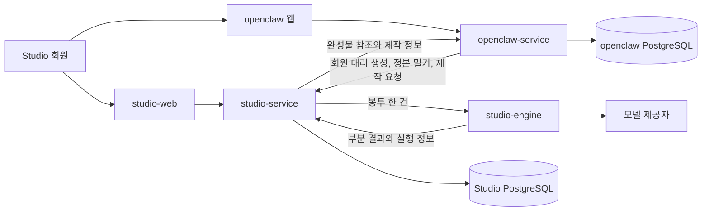
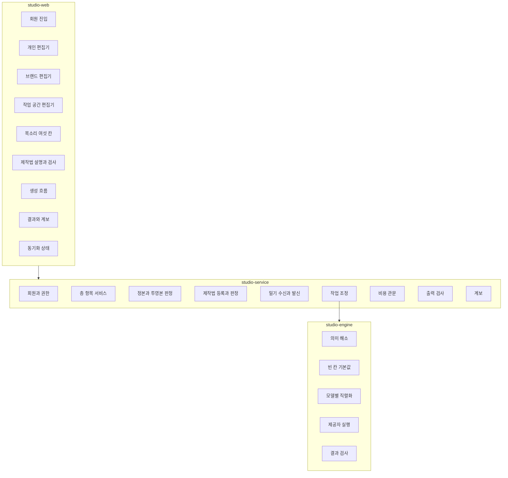
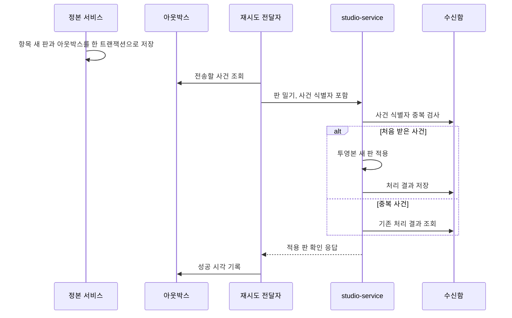
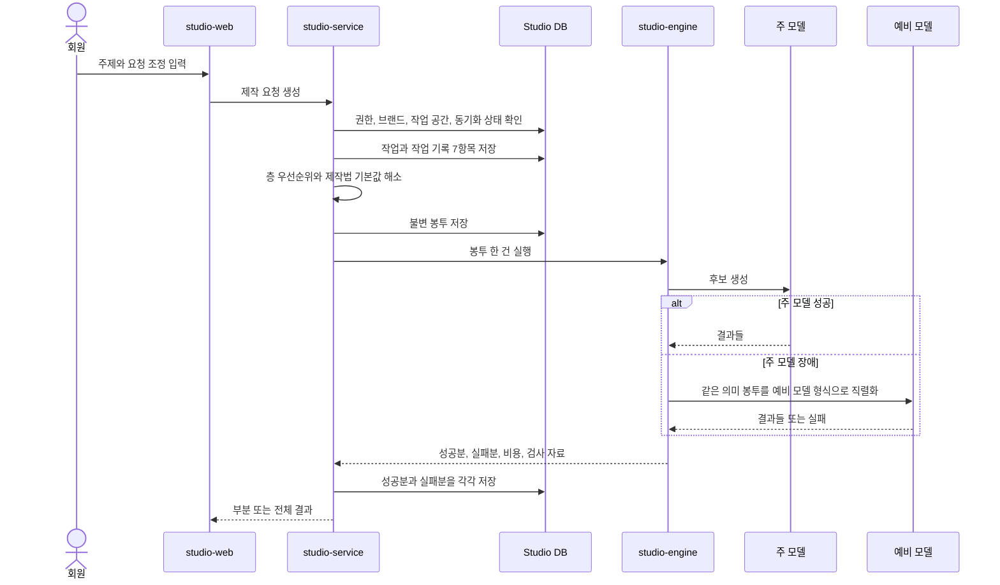
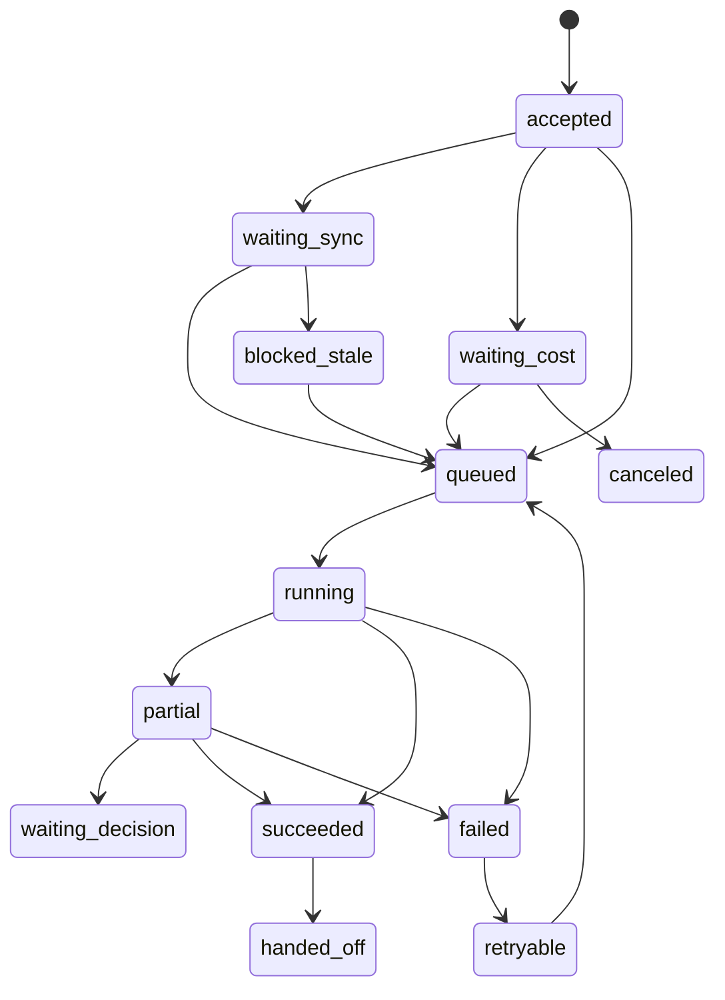

<!--
STAMP
line: studio
artifact: fdd-studio-생성
version: v3.0
created_at: 2026-08-22 07:49 KST
model: gpt-codex/gpt-5
agent: tech-architect
skills: 없음. 현재 설치 목록에 기술설계 문서 전용 스킬이 없어 dev.md와 doc-review.md를 직접 적용했다.
basis: docs/학습정보-층계-계약-v2.1.md §17, studio/docs/prd-studio-생성-v1.0.md, DESIGN.md, docs/user-flow.md, 기존 FDD v2.0, API v1.0, ERD v1.0, 시험 계획 v1.0, 실제 dashboard 구현
evidence_urls: https://docs.stripe.com/webhooks, https://docs.aws.amazon.com/prescriptive-guidance/latest/cloud-design-patterns/transactional-outbox.html, https://www.postgresql.org/docs/18/ddl-rowsecurity.html, https://github.com/cloudevents/spec/blob/main/cloudevents/spec.md
deliberation: 무상태 제작 엔진과 상태를 가진 판매 가능 Studio 서비스를 분리하면서도 현재 dashboard의 인증, PostgreSQL, 행 격리, Studio 화면을 전환 자산으로 보존한다.
-->

# Studio 생성 기능 설계 문서 v3.0

> 한 줄 결론: Studio는 자기 회원, 개인, 브랜드, 작업 공간 층과 창작 규칙을 영속 저장하는 독립 서비스이며, 제작 엔진만 판이 고정된 봉투 하나를 받아 실행하는 무상태 계산기로 둔다.

| 항목 | 값 |
|---|---|
| 상태 | 기술설계안. 구현 전 승인 필요 |
| 상류 정본 | `docs/학습정보-층계-계약-v2.1.md` |
| 제품 입력 | `studio/docs/prd-studio-생성-v1.0.md` |
| 화면 입력 | `DESIGN.md`, `docs/user-flow.md` |
| 승계 문서 | FDD v2.0, API v1.0, ERD v1.0, 시험 계획 v1.0 |
| 매핑 결과 | 29단계 중 빈 엔드포인트 0, 빈 화면 구성요소 0, 빈 저장 대상 0 |
| 구현 상태 | 기존 Studio 화면과 일부 API 존재. v2.1 서비스 계약은 미구현 |
| 게이트 | `eng-design` 승인 전 build 진입 불가 |

## 목차

- [1. 목표와 범위](#목표)
- [2. 기반과 기존 구현](#기반)
- [3. 제약과 불변조건](#제약)
- [4. 서비스 경계](#경계)
- [5. 구성요소](#구성요소)
- [6. 층, 범위, 정본과 투영본](#층계)
- [7. 제작법 면과 목소리 여섯 칸](#제작법)
- [8. 동기화와 오래된 투영본](#동기화)
- [9. 생성 런타임](#생성)
- [10. 실패와 부분 성공](#실패)
- [11. 흐름 1:1 매핑](#매핑)
- [12. 보안과 격리](#보안)
- [13. 데이터 수명과 작업 기록](#수명)
- [14. 관측성과 운영](#관측)
- [15. 배포와 전환](#배포)
- [16. 아키텍처 결정](#결정)
- [17. 품질 시나리오](#품질)
- [18. 회수 목록과 기획서 보정](#회수)
- [19. 벤치마크 적용](#벤치마크)
- [20. 자기심문과 레드팀](#자기심문)
- [21. 요구 추적표](#추적)
- [22. 구현 순서](#구현순서)
- [23. 용어](#용어)
- [SOURCES, MODEL, RUBRIC](#sources)

## 1. 목표와 범위 

### 1.1 목표

이 문서는 계약 v2.1이 뒤집은 상태 소유권을 실제 구현 구조로 내린다.

목표는 다섯 가지다.

1. `studio-service`가 자체 회원과 자체 층 저장소를 가져 단독 판매가 가능하게 한다.
2. `studio-engine`은 회원, 데이터베이스, 동기화 상대를 모르고 봉투 한 건만 처리하게 한다.
3. 항목별 정본과 투영본, 갱신 판, 삭제와 충돌을 영속 구조로 강제한다.
4. 제작법을 층에서 분리하고 빈 구조 칸의 기본값만 채우게 한다.
5. 모든 사용자 흐름을 엔드포인트, 화면 구성요소, 저장 대상, 시험에 연결한다.

### 1.2 범위

포함한다.

- Studio 독립 회원과 로그인 연동
- 개인, 브랜드, 작업 공간 범위의 층 항목
- 브랜드 개체와 브랜드 격리
- 목소리 여섯 칸과 자유 서술
- 제작법 선언 여덟 칸과 검사, 실행
- 정본과 투영본의 밀기 동기화
- 제안, 비용 승인, 후보, 승격, 결과 검사, 계보
- 실패와 부분 성공 보존
- 작업 기록 일곱 항목과 보유 정책

포함하지 않는다.

- SNS 인증, 예약, 발행, 성과 수집
- openclaw 내부 화면의 세부 재설계
- 실제 모델 제공자별 프롬프트 문법
- 모델 캐시를 서비스 계약으로 고정하는 일
- 미결정 정책을 확정값으로 만드는 일

### 1.3 품질 목표 우선순위

| 순위 | 품질 | 성공 조건 |
|---:|---|---|
| 1 | 브랜드 격리 | 어떤 읽기, 생성, 동기화에서도 다른 브랜드 값이 1바이트도 섞이지 않는다 |
| 2 | 정본 일관성 | 정본, 투영본, 봉투, 결과 계보의 항목 판을 역추적할 수 있다 |
| 3 | 부분 성공 보존 | 공급자 일부 실패에도 성공 결과와 실제 비용이 사라지지 않는다 |
| 4 | 독립 판매 가능성 | openclaw 없이 가입, 층 편집, 생성, 결과 조회가 가능하다 |
| 5 | 전환 안전성 | 기존 dashboard Studio 경로를 한 번에 폐기하지 않는다 |

## 2. 기반과 기존 구현 

### 2.1 직접 확인한 상류 입력

| 입력 | 이 문서에서 가져온 것 |
|---|---|
| 계약 v2.1 | 층 이름, 소유, 제작법 면, 동기화, 멈춤 값, 회수 9건, §17 재작성 범위 |
| 사업계획 171행 | Studio를 OSMU 제작 축으로 두는 사업 맥락 |
| Studio PRD v1.0 | 생성 단계, 후보 3개, 승격, 비용, 실패, 수용 기준 |
| DESIGN.md | 공용 토큰과 공용 구성요소 우선 원칙 |
| user-flow.md | 온보딩부터 인계까지 단계 순서 |
| 두 서비스 경계 위키 | 의존 방향과 발행 책임 분리 |
| openclaw 운영 PRD | 봉투, 인계, 층 원본에 관한 충돌 지점 |

### 2.2 기존 구현 확인

`docs/구현현황.md`와 실제 코드를 대조했다.

이미 있는 것은 폐기하지 않는다.

| 기존 자산 | 관찰된 위치 | 새 설계의 처리 |
|---|---|---|
| Studio 화면 | `dashboard/src/app/studio/page.tsx` | 전환기 합친 배치 화면으로 유지. 기능별 구성요소로 분해 |
| 브랜드 위저드 | `dashboard/src/app/api/studio/brand-setup/route.ts` | U3 브랜드 항목 편집 어댑터로 확장. 단일 `prompt_guide`는 구조화 필드로 이주 |
| 생성 API | `dashboard/src/app/api/studio/text/route.ts` | 새 제작 요청 API의 호환 어댑터. 엔진 직접 호출 제거 |
| 초안 저장 | `dashboard/src/app/api/studio/drafts/route.ts` | 기존 초안 읽기 호환. 새 작업, 후보, 결과 테이블로 이주 |
| 회원 기반 | `tenants.owner_auth_id`, Supabase 세션 | 합친 배치의 openclaw 회원 투영 입력으로 재사용 |
| 테넌트 격리 | `effectiveTenantId`, `withTenant`, PostgreSQL 행 격리 | Studio 서비스의 회원, 브랜드, 작업 공간 정책으로 확장 |
| 브랜드 자료 | `brand_guides`, `wiki_docs` | U3 항목 판과 출처로 이주. 읽기 호환 뷰 제공 |
| 사용량 | `usage_events`, `usage_quotas` | 작업 비용 사건의 합계 투영으로 유지 |
| 화면 공용 부품 | `dashboard/src/components/shared/*` | Button, Card, Field, Section, Toast, AuthGate 재사용 |
| 화면 상태 | SWR, Zustand | 서버 상태는 SWR, 화면 선택 상태만 Zustand라는 기존 경계 유지 |

### 2.3 아직 없는 것

다음은 코드 검색에서 구현 증거를 찾지 못했다.

- Studio 독립 회원과 Studio 회원 식별자
- 개인, 브랜드, 작업 공간 범위별 구조화된 층 항목 판
- 항목별 정본과 투영본 표시
- 동기화 수신함, 아웃박스, 재시도, 확인 응답
- 목소리 여섯 칸의 채움 판정
- 제작법 선언 여덟 칸과 기본값 판정기
- 생성 봉투와 작업 기록 일곱 항목
- 브랜드별 권한과 격리 시험 경로

따라서 이 설계는 기존 구현의 확장이다. v2.1 기능은 구현 완료로 간주하지 않는다.

### 2.4 재사용 경계

| 경계 | 재사용 | 새로 분리 |
|---|---|---|
| 화면 | 공용 토큰, 공용 Button, Card, Field, Toast | 브랜드 전환기, 목소리 편집기, 제작법 설명, 동기화 상태 |
| 인증 | Supabase 세션 검증, 서비스 토큰 해시 | Studio 자체 회원, 외부 회원 매핑 |
| 데이터 접근 | PostgreSQL, 트랜잭션, 행 격리 래퍼 | Studio 회원 범위와 브랜드 범위 컨텍스트 |
| 사용량 | 기존 사용량 조회와 합계 | 작업별 비용 원장과 공급자 시도 |
| 생성 | 기존 제공자 어댑터 경험 | 무상태 엔진 포트와 봉투 계약 |
| 발행 | 인계 참조만 | Studio에서 채널 토큰, 예약, 게시 코드 금지 |

## 3. 제약과 불변조건 

### 3.1 불변조건

1. 엔진은 봉투 외 상태를 읽지 않는다.
2. Studio 서비스는 자기 회원과 자기 층을 저장한다.
3. 합친 배치에서도 각 항목의 정본 서비스는 명시된다.
4. 투영본은 정본처럼 보이지 않는다.
5. 브랜드가 없는 작업 공간은 생성 요청을 만들 수 없다.
6. 다른 브랜드에서 자동 상속하지 않는다.
7. 명시적 복사는 새 독립 항목을 만들고 원본 출처만 남긴다.
8. 제작법은 층이 아니다.
9. 제작법 기본값은 비어 있는 구조 칸만 채운다.
10. 제작법 강제값은 승인된 선언과 권한 안에서만 적용한다.
11. 자유 서술 목소리는 참고값이며 여섯 칸을 잠그지 않는다.
12. 제작 요청마다 원격 정본을 대조하지 않는다.
13. 대조는 계약이 정한 세 경우에만 한다.
14. 오래됨 때문에 멈출 수 있는 값은 금지 표현, 브랜드 사실, 소재 권리뿐이다.
15. 부분 실패는 성공분을 삭제하지 않는다.
16. 결과는 어떤 항목의 어떤 판을 사용했는지 남긴다.
17. 원문과 정규화 입력은 다른 필드다.
18. 사용자 흐름의 각 단계에는 호출, 화면, 저장 대상이 모두 있다.

### 3.2 기술 제약

| 제약 | 설계 영향 |
|---|---|
| 현 화면은 Next.js 16, React 19 | Studio 웹도 같은 구성요소 계약으로 시작하고 독립 배포 시 경계를 패키지로 뺀다 |
| 현 영속 저장소는 PostgreSQL | 새 정규화 테이블, JSONB 봉투 스냅샷, 행 격리를 사용한다 |
| 현 인증은 Supabase 세션과 서비스 토큰 | 독립 회원과 합친 배치 회원 매핑을 둘 다 수용한다 |
| 현재 `studio/`는 문서와 실험 중심 | 제품 코드는 승인 후 별도 Studio 앱 또는 패키지 경계에 둔다 |
| openclaw가 발행을 소유 | Studio 결과는 참조와 계보만 인계한다 |
| 캐시는 모델 제공자별로 다름 | 캐시 키와 직렬화는 엔진 어댑터 내부에 둔다 |

### 3.3 사업 제약

- 화면만 붙이면 단독 판매할 수 있어야 한다.
- 합친 배치에서는 사용자가 이중 가입을 체감하지 않아야 한다.
- 회원 분리 방식은 회장 판단 대기다. 추천안인 Studio 자체 회원과 서버 간 대리 생성을 기준으로 쓴다.
- 브랜드 정본 위치도 판단 대기다. 독립 배치는 Studio, 합친 배치는 openclaw를 추천 기준으로 쓴다.

## 4. 서비스 경계 

### 4.1 컨텍스트

### 4.2 책임표

| 주체 | 소유 | 소유하지 않음 |
|---|---|---|
| studio-web | 독립 상품 화면, 회원 입력, 층 편집, 생성 진행, 결과 설명 | 발행 계정과 예약 |
| studio-service | 회원, 브랜드, 작업 공간, 층, 제작법, 동기화, 작업, 비용, 계보 | SNS 토큰과 성과 수집 |
| studio-engine | 봉투 해석, 의미 해소, 어댑터 직렬화, 모델 실행, 결과 검사 | 회원, 데이터베이스, 원격 동기화 |
| openclaw-service | 합친 배치 회원 정본, 발행, 성과, 채널 규격, 일부 사용자 층 정본 | 제작 엔진 내부 상태 |
| 모델 제공자 | 추론과 생성 | 항목 정본과 사용자 권한 |

### 4.3 엔진 포트

엔진은 다음 단일 포트를 구현한다.

`execute(envelope) -> executionResult`

엔진이 받아서는 안 되는 것은 다음과 같다.

- 회원 토큰
- 데이터베이스 연결 문자열
- 정본 서비스 URL
- 동기화 재시도 상태
- 화면 세션
- 장기 보관 원문 조회 권한

엔진이 반환해야 하는 것은 다음과 같다.

- 성공 결과 목록
- 실패 결과 목록
- 사용한 항목 판 목록
- 사용한 제작법 판과 적용 방식
- 모델, 예비 모델, 비용
- 검사 결과
- 부분 성공 상태

### 4.4 독립 배치와 합친 배치

| 항목 | 독립 Studio | 합친 배치 |
|---|---|---|
| 회원 정본 | Studio | openclaw 추천. Studio 회원은 외부 매핑을 가진다 |
| U2 개인 정본 | Studio | openclaw 추천, Studio 투영 |
| U3 브랜드 정본 | Studio | 판단 대기. openclaw 추천, Studio 투영 |
| U4 작업 공간 정본 | Studio | 작업 생성 주체 기준. 초기에는 openclaw 추천 |
| L5 창작 규칙 정본 | Studio | Studio |
| 발행 규칙 정본 | 해당 없음 | openclaw |
| 제작 엔진 | 같은 엔진 | 같은 엔진 |

## 5. 구성요소 

### 5.1 논리 구성요소

### 5.2 구성요소 계약

| 구성요소 | 책임 | 읽기 | 쓰기 | 금지 |
|---|---|---|---|---|
| MemberService | 회원 생성, 상태, 외부 식별자 매핑 | 회원, 매핑 | 회원, 감사 | 층 값 해석 |
| ScopeGuard | 회원, 브랜드, 작업 공간 소유 검증 | 권한 | 없음 | 요청 몸체 식별자 신뢰 |
| LayerItemService | 항목과 판 생성 | 항목 판 | 새 판 | 과거 판 덮어쓰기 |
| AuthorityResolver | 정본, 투영, 적용 가능 판 결정 | 항목, 동기화 상태 | 읽기 결과 | 값 자체 변경 |
| VoiceCompleteness | V1부터 V6 채움 판정 | 목소리 판 | 판정 스냅샷 | 자유 서술로 잠금 |
| RecipeRegistry | 제작법 선언 여덟 칸 검증 | 제작법 판 | 승인 상태 | 미신고 권한 부여 |
| DefaultResolver | 빈 칸 기본값과 강제값 적용 | 봉투, 제작법 | 적용 보고 | 영역 추론 |
| SyncReceiver | 밀기 사건 검증과 멱등 반영 | 식별자 매핑 | 투영, 수신함 | 엔진 호출 |
| SyncDispatcher | 정본 변경 사건 발행 | 아웃박스 | 전송 기록 | 요청 트랜잭션과 분리된 이중 쓰기 |
| ComparisonScheduler | 세 경우에만 판 대조 | 동기화 상태 | 대조 기록 | 매 제작 요청 전량 대조 |
| ProductionOrchestrator | 작업 상태와 부분 결과 조정 | 요청, 결과 | 작업, 시도, 비용 | 모델별 프롬프트 조립 |
| EnvelopeBuilder | 적용 가능한 판을 봉투로 고정 | 층, 제작법 | 봉투, 작업 기록 | 원격 서비스 조회 |
| StudioEngine | 무상태 실행 | 봉투 | 반환값만 | DB 접근 |
| OutputInspector | 멈춤 값과 품질 검사 | 결과, 봉투 | 검사 결과 | 성공분 삭제 |
| ProvenanceService | 계보 기록과 표시 | 작업 전체 | 계보 사건 | 원문 변조 |

### 5.3 현재 공용 코드 경계

개발자는 다음 순서로 재사용한다.

1. 인증은 `effectiveTenantId`의 실패 닫힘 원칙을 일반화한다.
2. 데이터 접근은 `withTenant`의 트랜잭션별 컨텍스트 주입을 일반화한다.
3. 화면은 `components/shared`의 기본 부품을 사용한다.
4. 서버 상태는 SWR, 화면 선택 상태는 Zustand에 둔다.
5. 기존 `/api/studio/brand-setup`, `/api/studio/text`, `/api/studio/drafts`는 호환 어댑터가 새 서비스 호출로 변환한다.
6. 발행 구성요소와 채널 계정 구성요소는 Studio 서비스 패키지에 넣지 않는다.

## 6. 층, 범위, 정본과 투영본 

### 6.1 층 이름과 의미

층 이름은 회장 판단 대기다. 추천안으로 다음을 사용한다.

| 층 | 이름 | 범위 | 예 |
|---|---|---|---|
| S0 | 시스템 불변과 외부 규칙 | 전체 | 플랫폼 정책, 법규, 안전 규칙 |
| S1 | 시장 지식과 신호 | 시장, 언어, 채널 | 경향, 사례, 확인 시각 |
| U2 | 개인 | 회원 | 주 언어, 개인 선호 |
| U3 | 브랜드 | 브랜드 | 브랜드 사실, 목소리, 금지 표현, 소재 권리 |
| U4 | 작업 공간 | 작업 공간 | 타깃, 컨셉, 목표, 말투 미세 조정 |
| L5 | 배운 창작 규칙 | 조건 열두 칸 | 특정 브랜드, 채널, 형식에서 승인된 규칙 |
| R6 | 이번 요청 조정 | 요청 | 이번만 더 짧게 |

### 6.2 적용 우선순위

`S0 불변 > R6 > 조건에 맞는 L5 > U4 > U3 > U2 > S1 > S0 외부`

이 우선순위는 값 충돌의 해소 순서다.

정본 서비스 선택이나 동기화 승자를 뜻하지 않는다.

### 6.3 범위 세 종류

| 범위 | 필수 식별자 | 브랜드 식별자 | 작업 공간 식별자 |
|---|---|---|---|
| 개인 | member_id | 없음 | 없음 |
| 브랜드 | member_id | 필수 | 없음 |
| 작업 공간 | member_id | 필수 | 필수 |

L5는 이 세 범위 중 하나에 매달릴 수 있지만 적용 조건 열두 칸은 별도로 가진다.

### 6.4 브랜드 개체

브랜드는 단순 문자열이 아니라 독립 개체다.

브랜드는 다음을 가진다.

- Studio 내부 식별자
- 소유 회원
- 표시 이름
- 상태
- 정본 서비스
- 외부 식별자 매핑
- 생성 시각과 삭제 시각
- 기본 언어

한 회원은 여러 브랜드를 가질 수 있다.

한 작업 공간은 정확히 한 브랜드에 속한다.

브랜드 사이 자동 상속은 없다.

복사는 명시적 명령이며 새 항목과 새 판을 만든다.

### 6.5 항목과 판

항목은 의미상의 동일 대상을 나타낸다.

판은 그 항목의 시간별 내용이다.

| 속성 | 항목 | 판 |
|---|---|---|
| 식별 | 안정적 | 증가하는 정수와 불변 UUID |
| 범위 | 고정 | 항목에서 상속 |
| 정본 서비스 | 항목에 기록 | 생성 당시 스냅샷 |
| 내용 | 없음 | 구조화 값 |
| 삭제 | 항목 상태 | 삭제 판 또는 tombstone |
| 수정 | 새 판 생성 | 과거 판 불변 |

### 6.6 정본과 투영본

모든 항목은 다음을 기록한다.

| 필드 | 뜻 |
|---|---|
| authority_service | 현재 정본 서비스 |
| authority_item_id | 정본 서비스의 항목 식별자 |
| local_item_id | Studio 내부 항목 식별자 |
| replica_kind | canonical 또는 projection |
| applied_revision | Studio가 적용한 정본 판 |
| authority_updated_at | 정본이 알려 준 갱신 시각 |
| projection_received_at | Studio가 받은 시각 |
| last_push_succeeded_at | 마지막 밀기 성공 시각 |
| has_failed_push | 실패 이력 여부 |
| retry_state | 없음, 대기, 처리 중, 사망 편지 대기열 |
| stopping_class | 금지 표현, 브랜드 사실, 소재 권리, 비멈춤 |

화면은 투영본일 때 `openclaw에서 관리`, `마지막 반영 시각`, `동기화 상태`를 함께 표시한다.

### 6.7 투영본 편집

투영본은 Studio에서 바로 덮어쓰지 않는다.

사용자가 편집을 누르면 다음 중 하나다.

1. 정본 서비스 편집 화면으로 이동한다.
2. 편집 제안을 만들어 정본 서비스에 보낸다.
3. 독립 배치로 전환하면서 정본을 Studio로 옮기는 명시적 절차를 시작한다.

조용한 양방향 쓰기는 금지한다.

## 7. 제작법 면과 목소리 여섯 칸 

### 7.1 제작법은 층이 아니다

제작법은 값을 소유하는 층이 아니라 이미 고른 값을 어떻게 만들지 설명하는 실행 면이다.

따라서 다음이 사라진다.

- X4 층
- 층 우선순위 안의 제작법
- 문장을 보고 제작법 영역인지 말투 영역인지 추론하는 영역 게이트

대신 구조 칸 단위 판정만 한다.

### 7.2 제작법 선언 여덟 칸

| 번호 | 선언 | 구조 |
|---:|---|---|
| 1 | 읽는 필드 | 허용된 층 경로 목록 |
| 2 | 쓰는 필드 | 결과 구조 경로 목록 |
| 3 | 쓰기 방식 | 필드별 기본값 또는 강제값 |
| 4 | 권한 | 파일, 명령, 네트워크, 비밀값 사용 목록 |
| 5 | 입출력 형식 | 매체형과 구조 스키마 |
| 6 | 충돌 동작 | 덮기, 합치기, 멈추고 질문 |
| 7 | 출처 정보 | 출처, 판, 라이선스, 무결성 지문 |
| 8 | 격리와 통신 | 실행 격리 등급과 네트워크 허용 목록 |

한 칸이라도 없으면 등록 완료가 아니다.

라이선스와 외부 통신 허용은 회장 판단 대기다.

추천안은 1차에 우리 제작법과 사용자가 자기 것으로 올린 제작법만 허용하고 외부 통신을 차단하는 것이다.

### 7.3 기본값 판정

판정 순서는 다음과 같다.

1. 봉투의 구조화 필드 존재 여부를 본다.
2. 값이 빈 문자열인지, 미설정인지 구분한다.
3. 필드가 미설정이고 제작법 선언이 기본값이면 채운다.
4. 필드가 설정되어 있으면 기본값은 건너뛴다.
5. 강제값은 승인된 권한과 충돌 동작을 검사한다.
6. 충돌 동작이 `멈추고 질문`이면 작업을 대기시킨다.
7. 적용 또는 건너뜀을 결과 설명에 기록한다.

### 7.4 목소리 여섯 칸

| 칸 | 구조 | 채워짐 판정 | 예 |
|---|---|---|---|
| V1 문체 | formality 열거값 | 허용값 하나 선택 | 격식, 중립, 구어 |
| V2 어휘 | 문자열 배열 | 공백이 아닌 항목 1개 이상 | 쉬운 금융 용어 |
| V3 구조 | intro와 ending 열거값 | 둘 다 선택 | 질문 도입, 요약 결말 |
| V4 리듬 | 문장 길이와 문단 길이 범위 | 최소, 최대가 유효하고 역전 없음 | 문장 8자에서 24자 |
| V5 표기 | 명시적 불리언 집합 | 모든 스위치가 true 또는 false | 이모지, 숫자, 괄호 |
| V6 인칭 | 자칭과 독자 호칭 문자열 | 둘 다 공백 아님 | 저희, 회원님 |

### 7.5 자유 서술

`voice_free_note`는 별도 필드다.

자유 서술만 채워져 있어도 생성은 가능하다.

하지만 V1부터 V6 중 어떤 칸도 잠그지 않는다.

화면은 다음 문장을 표시한다.

`이 설명은 참고로 함께 실립니다. 확실히 정하려면 아래 여섯 칸을 채우세요.`

결과 화면은 제작법이 어떤 빈 칸을 채웠고 사용자 값 때문에 어떤 기본값을 건너뛰었는지 보여 준다.

### 7.6 제작법 검사 다섯 판정

| 검사 | 실패 처리 |
|---|---|
| S0 우회 시도 | 등록 거부 |
| 다른 회원 또는 브랜드 사칭 | 등록 거부 |
| 선언하지 않은 강제 쓰기 | 기본값으로 강등하거나 등록 보류 |
| 라이선스 누락 | 판단 대기 상태 |
| 권한 초과 실행 | 실행 차단과 감사 기록 |

## 8. 동기화와 오래된 투영본 

### 8.1 기본 방식

정본 변경이 투영 서비스로 밀린다.

제작 요청이 올 때마다 상대 서비스와 판을 비교하지 않는다.

### 8.2 식별자 매핑

openclaw가 정본인 항목은 openclaw가 외부 식별자 매핑의 정본을 가진다.

Studio는 다음 최소 매핑만 가진다.

- source_service
- source_member_id
- source_brand_id
- source_workspace_id
- source_item_id
- local_member_id
- local_brand_id
- local_workspace_id
- local_item_id
- mapping_status
- mapped_at

같은 source와 source_item_id는 한 local_item_id에만 매핑된다.

### 8.3 판 하위 호환

| 변화 | 수신 동작 |
|---|---|
| 같은 주 번호, 선택 필드 추가 | 모르는 필드를 보존하고 무시 |
| 같은 주 번호, 필수 필드 의미 변경 | 금지. 주 번호를 올린다 |
| 주 번호 불일치 | 지원 창 안이면 해당 해석기 사용, 아니면 `VERSION_UNSUPPORTED` |
| 정본 판 역행 | 적용 거부, 현재 판으로 확인 응답 |

두 판 동시 수용 기간은 판단 대기다.

추천안인 30일을 운영 기본값으로 쓰되 설정값으로 둔다.

### 8.4 삭제 전파

삭제는 물리 삭제보다 tombstone 사건이 먼저다.

| 삭제 대상 | Studio 동작 |
|---|---|
| 개인 항목 | 투영본 비활성화, 새 봉투 제외 |
| 브랜드 | 브랜드 U3, 소속 U4, 브랜드 조건 L5 비활성화 |
| 작업 공간 | 새 작업 금지, 과거 작업 조회 유지 |
| 층 항목 | 해당 항목의 최신 활성 판을 없음으로 표시 |
| 제작법 | 신규 작업 사용 금지, 과거 계보 유지 |

이미 만든 결과와 계보는 지우지 않는다.

개인정보 삭제 요청은 결과 보유 정책과 별도로 처리한다.

### 8.5 충돌 해소

Standalone Studio 상태와 openclaw 상태를 처음 연결할 때 자동 병합하지 않는다.

항목별로 다음을 고른다.

- Studio 값을 정본으로 채택
- openclaw 값을 정본으로 채택
- 두 값을 새 항목으로 각각 유지
- 충돌을 보류하고 생성에서 제외

계정 병합 정책은 회장 판단 대기다.

추천안은 자동 병합 금지와 항목별 사용자 선택이다.

### 8.6 판 대조가 허용되는 세 경우

1. 그 항목에 실패한 밀기 이력이 있다.
2. 사용자가 정본을 바꾼 직후 바로 제작을 시작해 확인 응답을 기다려야 한다.
3. 마지막 성공 밀기가 주기 대조 창을 넘었다.

그 외 제작 요청은 로컬 투영본으로 시작한다.

### 8.7 오래된 값 판정

| 값 등급 | 오래되고 실패 이력 있음 | 동작 |
|---|---|---|
| 금지 표현 | 예 | 영향받는 제작만 멈춤 |
| 브랜드 사실 | 예 | 영향받는 제작만 멈춤 |
| 소재 권리 | 예 | 해당 소재를 쓰는 제작만 멈춤 |
| 목소리 | 예 | 제작, 판과 시각 표시 |
| 작업 공간 컨셉 | 예 | 제작, 판과 시각 표시 |
| 배운 규칙 | 예 | 제작, 판과 시각 표시 |
| 시스템 지식 | 예 | 제작, 확인 필요 표시 |

마지막 밀기가 성공했고 로컬 투영본이 최신이면 정본 서비스가 현재 장애여도 제작한다.

### 8.8 감지 창

감지 창은 회장 판단 대기다.

추천안은 다음과 같다.

- 멈추는 값: 15분
- 나머지 값: 하루 한 번

두 수치는 실측값이 아니므로 운영 설정과 지표를 통해 조정한다.

## 9. 생성 런타임 

### 9.1 전체 흐름

### 9.2 요청 접수

접수기는 다음을 한 트랜잭션으로 처리한다.

1. 인증 회원을 확정한다.
2. 브랜드와 작업 공간 소유를 확인한다.
3. 중복 방지 키를 확인한다.
4. 작업 행을 만든다.
5. 정규화 입력을 저장한다.
6. 원문 보유 정책에 따라 암호화 원문을 저장한다.
7. 작업 기록 일곱 항목의 초기값을 만든다.

같은 회원, 같은 중복 방지 키의 재요청은 같은 작업을 반환한다.

### 9.3 봉투 조립

조립기는 다음 순서로 동작한다.

1. 범위에 맞는 활성 항목 판을 읽는다.
2. 정본과 투영본 상태를 읽는다.
3. 대조 세 경우인지 판단한다.
4. 멈추는 값의 오래됨을 판정한다.
5. 우선순위로 의미 충돌을 해소한다.
6. 조건 열두 칸으로 L5를 거른다.
7. 제작법을 선택한다.
8. 여섯 목소리 칸과 기타 출력 칸의 채움 상태를 만든다.
9. 제작법 기본값과 승인된 강제값을 적용한다.
10. 봉투와 사용 판 목록을 불변 저장한다.

### 9.4 L5 조건 열두 칸

| 번호 | 조건 | 미설정 의미 |
|---:|---|---|
| 1 | 브랜드 | 모든 허용 브랜드가 아니라 개인 범위에만 적용 |
| 2 | 작업 공간 | 해당 범위 전체 |
| 3 | 언어 | 해당 규칙의 기록 언어만 |
| 4 | 채널 | 채널 중립 |
| 5 | 형식 | 기록 형식만 |
| 6 | 지표 | 근거 지표 없음 |
| 7 | 측정 창 | 영구가 아니라 검증 미완료 |
| 8 | 표본 | 표본 없음 |
| 9 | 승인 범위 | 제안 상태 |
| 10 | 신뢰도 | 0 |
| 11 | 만료 | 만료 즉시 제외 |
| 12 | 되돌림 상태 | active만 적용 |

조건을 임의로 넓혀 해석하지 않는다.

### 9.5 의미 해소와 모델 직렬화

의미 해소 결과는 공급자 중립 구조다.

모델 직렬화는 해당 결과를 제공자 입력으로 바꾼다.

둘을 분리하는 이유는 다음과 같다.

- 예비 모델 전환 때 우선순위 판단을 반복하지 않는다.
- 같은 의미 입력이 제공자별 문법 차이로 달라지는 것을 추적한다.
- 모델 캐시 최적화를 어댑터 내부에 제한한다.
- 테스트가 의미와 제공자 문법을 따로 검증할 수 있다.

### 9.6 후보와 승격

후보 세 개는 각각 독립 결과다.

한 후보 실패가 다른 후보 성공을 지우지 않는다.

사용자는 성공한 후보 중 하나를 승격할 수 있다.

후보 선택은 다음을 저장한다.

- 선택 후보
- 선택 시각
- 선택 이유 축
- 자유 메모
- 승격 승인 비용 상한

미선택 후보는 보유 정책 안에서 다시 승격할 수 있다.

### 9.7 비용 관문

비용은 예상, 예약, 실제, 환불, 운영 부담을 분리한다.

| 시점 | 기록 | 다음 동작 |
|---|---|---|
| 제안 전 | 무료 왕복 사용 | 무료 한도 초과면 승인 요청 |
| 제작 전 | 예상 최저, 최고, 상한 | 사용자 상한 초과면 시작 금지 |
| 공급자 호출 전 | 예약 | 예약 실패면 호출 금지 |
| 공급자 결과 후 | 실제 | 성공분만 고객 비용 확정 |
| 품질 반려 | 운영 원가 | 고객 비용 0 |
| 부분 성공 | 항목별 실제 | 성공 항목만 확정, 실패 항목 예약 해제 |

### 9.8 출력 검사

출력 검사는 다음을 순서대로 본다.

1. 결과 구조 완결성
2. 언어 일치
3. 금지 표현
4. 브랜드 사실
5. 소재 권리
6. 제작법 출력 형식
7. 채널 규격
8. 품질 기준

금지 표현, 브랜드 사실, 소재 권리 실패는 외부 인계를 막는다.

다른 품질 실패는 결과 상태를 `rejected_quality`로 남기고 재시도 정책을 적용한다.

### 9.9 계보

계보는 다음을 잇는다.

`요청 -> 봉투 -> 항목 판들 -> 제작법 판 -> 모델 시도들 -> 후보 -> 선택 -> 승격 결과 -> 인계`

과거 계보는 정본 항목이 삭제되어도 유지한다.

삭제된 값 원문은 권한과 보유 정책에 따라 가린다.

## 10. 실패와 부분 성공 

### 10.1 상태 기계

### 10.2 실패 경로 여섯

| 실패 | 감지 | 보존 | 사용자 결과 | 재시도 |
|---|---|---|---|---|
| 주 모델 장애 | 시간 초과, 5xx, 제공자 오류 | 주 모델 시도 | 예비 모델 전환 표시 | 예비 모델 1회 |
| 예비 모델도 장애 | 두 시도 실패 | 두 실패와 비용 | 작업 실패 | 수동 재개 |
| 금지 표현 적발 | 출력 검사 | 문제 결과는 격리, 다른 성공분 유지 | 해당 결과만 차단 | 수정 입력으로 재시도 |
| 제작법 검사 탈락 | 등록 또는 실행 검사 | 검사 보고 | 제작법 제외 또는 작업 보류 | 수정 후 새 판 |
| 비용 상한 초과 | 예약 전, 호출 중 누적 | 기존 성공분과 실제 비용 | 추가 호출 중단, 성공분 제공 | 상한 재승인 |
| 부분 실패 | 결과별 상태 | 성공 결과, 실패 결과, 실제 비용 전부 | 부분 성공 표시 | 실패 항목만 재시도 |

### 10.3 부분 성공 원칙

부분 성공은 성공의 하위 상태가 아니라 독립 상태다.

반드시 다음을 만족한다.

- 성공 결과를 사용자에게 보여 준다.
- 실패 결과의 이유를 결과별로 보여 준다.
- 전체 다시 만들기를 기본 행동으로 제안하지 않는다.
- 실패 결과만 재시도할 수 있다.
- 성공 결과에 청구된 비용과 실패 예약 해제를 분리한다.
- 인계는 성공 결과만 선택적으로 할 수 있다.

### 10.4 재시도와 중복

모든 외부 호출 시도는 고유 시도 식별자를 가진다.

네트워크 재시도로 같은 결과가 두 번 와도 결과 식별자와 제공자 식별자로 중복 제거한다.

이벤트 순서는 신뢰하지 않는다.

작업 상태는 이전 상태와 사건 종류를 함께 검사해 전이한다.

## 11. 흐름 1:1 매핑 

### 11.1 매핑 원칙

`docs/user-flow.md`와 PRD 세부 흐름을 28개 구현 단계로 고정한다.

모든 행은 엔드포인트, 화면 구성요소, 주 저장 대상, 시험 식별자를 가진다.

`내부`, `없음`, `나중` 같은 빈 계약은 허용하지 않는다.

내부 계산도 상위 명령 엔드포인트와 상태 저장을 명시한다.

### 11.2 전수 매핑표

| 단계 | 사용자 또는 시스템 행위 | 엔드포인트 | 화면 구성요소 | 주 저장 대상 | 시험 |
|---|---|---|---|---|---|
| O1 | 로그인하고 Studio 진입 | `POST /v2/studio/sessions` | `StudioAuthGate` | `studio_sessions` | FLOW-O1 |
| O2 | 학습 정보 유무 판정 | `GET /v2/studio/readiness` | `LearningReadinessGate` | `layer_items`, `brands`, `workspaces` | FLOW-O2 |
| O3 | 개인 공통 정보 입력 | `PUT /v2/studio/profile` | `PersonalLayerForm` | `layer_items`, `layer_revisions` | FLOW-O3 |
| O4 | 브랜드별 언어 금지 표현 확인 | `POST /v2/studio/brands/{brandId}/forbidden-phrases/translate` | `ForbiddenPhraseTranslator` | `layer_revisions`, `translation_reviews` | FLOW-O4 |
| O5 | 브랜드와 작업 공간 입력 | `POST /v2/studio/brands`, `POST /v2/studio/workspaces` | `BrandWorkspaceWizard` | `brands`, `workspaces`, `layer_items`, `layer_revisions` | FLOW-O5 |
| O6 | 주소 또는 문서 반입 | `POST /v2/studio/material-imports` | `MaterialImportReview` | `material_imports`, `layer_revision_sources` | FLOW-O6 |
| 1 | 업계와 목적 선택 | `PUT /v2/studio/workspaces/{workspaceId}/brief` | `PurposeStep` | `layer_revisions` | FLOW-01 |
| 2 | 성공 사례와 트렌드 보기 | `GET /v2/studio/references` | `ReferenceGallery` | `market_signals`, `reference_views` | FLOW-02 |
| 3 | 제안 카드와 스타일 보기 | `POST /v2/studio/proposals` | `ProposalDeck` | `proposal_sets`, `market_signals` | FLOW-03 |
| 3b | 제안 전체 거절 후 다시 받기 | `POST /v2/studio/proposals/{proposalSetId}/retry` | `ProposalRetryDialog` | `production_attempts`, `cost_entries` | FLOW-03B |
| 4 | 비용과 시간 확인하고 제작 승인 | `POST /v2/studio/productions/estimate`, `POST /v2/studio/productions` | `CostTimeApproval` | `cost_entries`, `production_jobs` | FLOW-04 |
| 4b | 이번 요청 미세 조정 | `PUT /v2/studio/productions/{jobId}/request-adjustment` | `RequestOverrideField` | `request_adjustments`, `production_job_records` | FLOW-04B |
| 5 | 후보 3개 중 선택 | `POST /v2/studio/productions/{jobId}/decisions` | `CandidateChooser` | `production_decisions`, `production_outputs` | FLOW-05 |
| 5b | 취향 기억 동의 또는 거절 | `POST /v2/studio/learning-candidates/{candidateId}/decision` | `LearningConsentCard` | `learning_candidates`, `layer_items`, `layer_revisions` | FLOW-05B |
| 6a | 층 판을 고르고 봉투 고정 | `POST /v2/studio/productions/{jobId}/assemble` | `GenerationProgress` | `production_envelopes`, `production_job_records` | FLOW-06A |
| 6b | 값 충돌 검사와 질문 | `POST /v2/studio/productions/{jobId}/conflicts/resolve` | `ConflictResolutionDialog` | `production_conflicts`, `conflict_decisions` | FLOW-06B |
| 6c | 제작법 빈 칸 기본값 판정 | `POST /v2/studio/productions/{jobId}/recipe-resolution` | `RecipeApplicationSummary` | `recipe_applications`, `production_envelopes` | FLOW-06C |
| 6d | 제작법 이름표와 본문 사용 | `GET /v2/studio/productions/{jobId}/recipe-plan` | `RecipeExecutionPanel` | `recipe_versions`, `production_attempts` | FLOW-06D |
| 6e | 허용 파일과 명령 실행 | `POST /v2/studio/productions/{jobId}/execute` | `GenerationProgress` | `execution_workspaces`, `production_attempts` | FLOW-06E |
| 6f | 선택 후보 고해상도 승격 | `POST /v2/studio/productions/{jobId}/promotions` | `PromotionProgress` | `production_outputs`, `cost_entries` | FLOW-06F |
| 6g | 언어, 금지 표현, 품질 재검사 | `POST /v2/studio/productions/{jobId}/inspections` | `QualityGateResult` | `output_inspections` | FLOW-06G |
| 6h | 제작 정보와 계보 보기 | `GET /v2/studio/productions/{jobId}/provenance` | `ProvenanceDrawer` | `provenance_events`, `production_job_records` | FLOW-06H |
| 6i | 확정, 보관, 다른 제안 선택 | `POST /v2/studio/productions/{jobId}/disposition` | `ResultDispositionBar` | `production_jobs`, `production_decisions` | FLOW-06I |
| 6j | 중단 작업 재개 | `POST /v2/studio/productions/{jobId}/resume` | `ResumeWorkCard` | `production_jobs`, `execution_workspaces` | FLOW-06J |
| 6k | 편집 또는 발행으로 인계 | `POST /v2/studio/productions/{jobId}/handoffs` | `HandoffStatus` | `handoff_records`, `production_outputs` | FLOW-06K |
| X1 | 사용자 제작법 올리기와 검사 | `POST /v2/studio/recipes/inspections` | `RecipeUploadInspector` | `recipes`, `recipe_versions`, `recipe_inspections` | FLOW-X1 |
| X2 | 금지 표현 추가 후 대기 결과 재검사 | `POST /v2/studio/brands/{brandId}/pending-outputs/recheck` | `PendingOutputRecheckList` | `output_inspections`, `production_outputs` | FLOW-X2 |
| S1 | 정본 변경을 Studio에 밀기 | `POST /v2/studio/sync/events` | `SyncStatusBadge` | `sync_inbox`, `sync_mappings`, `layer_revisions` | FLOW-S1 |
| S2 | 오래된 투영본 대조와 복구 | `POST /v2/studio/sync/comparisons` | `SyncRecoveryPanel` | `sync_comparisons`, `sync_outbox` | FLOW-S2 |

단계 번호는 상류 user-flow의 라벨을 보존한다.

실제 실행 순서는 4의 제작 승인, 4b의 이번 조정, 6a부터 6e의 봉투 조립과 저해상도 생성, 5의 후보 선택, 5b의 기억 동의, 6f 이후의 승격과 검사다.

따라서 후보 선택 전에 엔진 실행이 끝나며, 화면 라벨 때문에 런타임 순서를 뒤집지 않는다.

### 11.3 매핑 판정

| 검사 | 결과 |
|---|---:|
| 전체 단계 | 29 |
| 엔드포인트 빈칸 | 0 |
| 화면 구성요소 빈칸 | 0 |
| 저장 대상 빈칸 | 0 |
| 시험 빈칸 | 0 |
| 매핑 gap | 0 |

## 12. 보안과 격리 

### 12.1 인증

독립 Studio는 자체 회원 세션을 발급한다.

합친 배치는 openclaw 서버가 제한된 서비스 자격으로 Studio 회원을 대리 생성하고 외부 식별자를 매핑한다.

브라우저가 `member_id`, `brand_id`, `workspace_id`를 보냈다는 이유로 신뢰하지 않는다.

서버는 세션에서 회원을 확정한 뒤 관계를 조회한다.

### 12.2 권한

기본 역할은 다음 세 개다.

| 역할 | 회원 | 브랜드 | 작업 공간 | 생성 | 제작법 |
|---|---|---|---|---|---|
| owner | 관리 | 모두 | 모두 | 가능 | 등록과 승인 |
| editor | 읽기 | 허용 브랜드 편집 | 허용 공간 편집 | 가능 | 사용, 업로드 제안 |
| viewer | 읽기 | 읽기 | 읽기 | 불가 | 읽기 |

### 12.3 행 격리

현재 `withTenant` 패턴을 Studio 회원 범위로 확장한다.

모든 범위 테이블은 `studio_member_id`를 직접 또는 닫힌 외래키 경로로 가진다.

브랜드별 민감 테이블은 `brand_id`도 가진다.

정책은 세션의 회원 식별자와 권한 관계를 기준으로 한다.

정책이 없으면 기본 거부한다.

테이블 소유자 우회를 막기 위해 애플리케이션 연결 역할은 비우회 역할로 낮춘다.

### 12.4 브랜드 격리

브랜드 격리는 테넌트 격리보다 세밀하다.

다음 계층에 모두 건다.

1. API의 ScopeGuard
2. 데이터베이스 행 정책
3. 봉투 빌더의 `brand_id` 단일성 검사
4. 결과 계보의 브랜드 불변 검사
5. 캐시 키의 브랜드와 봉투 지문 포함
6. 시험에서 교차 브랜드 부정 조회와 생성

### 12.5 제작법 격리

제작법 실행 공간은 작업마다 새로 만든다.

허용 목록 밖 파일, 명령, 네트워크는 차단한다.

비밀값은 선언된 별칭만 단기 주입하고 원문을 로그에 쓰지 않는다.

다른 회원 작업 공간을 마운트하지 않는다.

### 12.6 위협과 완화

| 위협 | 완화 |
|---|---|
| 요청 몸체의 다른 브랜드 식별자 | 세션 회원과 관계 재조회 |
| 오래된 금지 표현으로 생성 | 실패 이력과 감지 창, 영향 작업만 차단 |
| 중복 동기화 사건 | 수신함 사건 식별자 고유 제약 |
| 정본 판 역행 | applied_revision 단조 증가 검사 |
| 제작법이 사용자 값을 덮음 | 필드별 default와 force 선언, 적용 보고 |
| 성공 결과가 실패 롤백에 삭제 | 결과별 독립 상태와 추가 전용 계보 |
| 원문 노출 | 암호화, 접근 감사, 보유 만료 |
| 공급자 응답의 프롬프트 주입 | 결과를 데이터로 취급하고 허용 스키마로 파싱 |

## 13. 데이터 수명과 작업 기록 

### 13.1 작업 기록 일곱 항목

모든 작업은 다음을 가진다.

| 번호 | 항목 | 저장 시점 | 불변 여부 |
|---:|---|---|---|
| 1 | 요청 식별자 | 접수 | 불변 |
| 2 | 정규화 입력 | 접수 완료 | 새 작업에서만 변경 |
| 3 | 각 층 판 | 봉투 고정 | 불변 |
| 4 | 동의 상태 | 접수와 선택 | 사건 누적 |
| 5 | 비용 | 예상부터 실제까지 | 원장 누적 |
| 6 | 모델과 제작법 판 | 실행 시도 | 시도별 불변 |
| 7 | 결과 식별자 | 결과 저장 | 결과별 불변 |

### 13.2 원문과 정규화 입력

원문은 사용자가 보낸 바이트를 암호화해 별도 저장한다.

정규화 입력은 줄끝, 문자 정규화, 구조 파싱 결과를 저장한다.

두 값은 같은 필드가 아니다.

엔진에 실리는 값은 정규화 입력과 필요한 원문 조각이다.

따라서 `저장된 원문과 실린 원문이 바이트 단위로 같다`는 기존 수용 기준을 그대로 시험하지 않는다.

대신 다음을 시험한다.

1. 저장 원문 바이트의 해시가 접수 바이트 해시와 같다.
2. 정규화 변환 기록으로 실린 문자열을 재현할 수 있다.
3. 봉투의 원문 참조와 정규화 입력 지문이 작업 기록에 남는다.

### 13.3 보유 기간

원문 보유 기간은 회장 판단 대기다.

추천안은 90일 암호화 보관과 사용자 요청 시 즉시 삭제다.

정규화 입력, 판 참조, 비용, 결과 계보는 법적 정책과 계정 삭제 정책에 따라 더 오래 남을 수 있다.

### 13.4 수명표

| 데이터 | 기본 수명 | 삭제 뒤 유지 |
|---|---|---|
| 회원 세션 | 짧은 만료 | 감사 사건 |
| 원문 | 추천 90일 | 해시와 삭제 사건 |
| 층 판 | 항목 수명 | 계보용 최소 메타 |
| 투영본 | 정본 삭제 사건까지 | tombstone과 적용 판 |
| 제작 봉투 | 결과 보유 기간 | 판 식별자와 지문 |
| 실행 공간 | 작업 종료 뒤 즉시 정리 | 실행 로그와 결과 참조 |
| 결과 파일 | 상품 정책 | 계보와 삭제 사건 |
| 비용 원장 | 회계 정책 | 유지 |
| 동기화 수신함 | 운영 정책 | 사건 식별자와 결과 |
| 사망 편지 대기열 | 해결 후 보관 | 원인과 해결 기록 |

## 14. 관측성과 운영 

### 14.1 구조화 사건

| 사건 | 필수 필드 |
|---|---|
| sync_received | event_id, source, item_id, revision, received_at |
| sync_applied | event_id, local_item_id, applied_revision, latency_ms |
| sync_failed | event_id, code, retry_count, stopping_class |
| comparison_started | item_id, reason, local_revision |
| production_started | job_id, member_id_hash, brand_id, envelope_hash |
| provider_attempted | attempt_id, provider, model, fallback, cost |
| output_inspected | output_id, check, result, blocking |
| production_partial | job_id, success_count, failure_count |
| provenance_written | job_id, event_count |

### 14.2 지표

| 지표 | 목적 | 초기 경보 |
|---|---|---|
| sync_apply_latency | 밀기 지연 | 멈추는 값 p95가 15분 초과 |
| sync_failed_items | 실패 이력 항목 수 | 1 이상 고위험 표시 |
| sync_dead_letter_age | 사망 편지 체류 | 15분 이상 멈추는 값 |
| projection_age | 투영본 나이 | 등급별 창 초과 |
| production_partial_rate | 부분 실패율 | 추세 상승 |
| fallback_rate | 주 모델 안정성 | 모델별 기준선 초과 |
| cost_ceiling_stop_rate | 예상 품질과 비용 정합 | 주간 상승 |
| cross_brand_denial | 격리 공격과 UI 결함 | 어떤 허용도 0이어야 함 |
| provenance_missing | 추적성 | 0이 아니면 출고 차단 |

### 14.3 알림

고위험 알림은 다음이다.

- 멈추는 값 밀기 실패가 감지 창을 넘김
- 브랜드 교차 접근이 애플리케이션 또는 DB 정책에서 거부됨
- 봉투 안에 두 브랜드 식별자가 존재
- 비용 원장 합계와 공급자 합계 불일치
- 작업 성공인데 계보 사건이 없음
- 삭제 사건이 투영본에 적용되지 않음

## 15. 배포와 전환 

### 15.1 배포 단위

| 단위 | 설명 | 독립 확장 |
|---|---|---|
| studio-web | 독립 상품 화면 | 가능 |
| studio-service | 상태와 공개 API | 가능 |
| studio-worker | 동기화, 작업, 재시도 | 가능 |
| studio-engine | 무상태 실행 라이브러리 또는 서비스 | 가능 |
| Studio PostgreSQL | 정본과 투영본 | 별도 백업 |
| media storage | 결과 바이트 | 별도 수명 |

### 15.2 전환 단계

1. 새 테이블을 추가하고 기존 기능은 그대로 읽는다.
2. 기존 `brand_guides`를 U3 브랜드 항목 판으로 백필한다.
3. 기존 `drafts`를 새 작업과 결과의 레거시 참조로 백필한다.
4. 기존 Studio API가 새 서비스에 이중 기록하되 읽기는 기존 경로를 유지한다.
5. 그림자 읽기로 기존 응답과 새 투영을 비교한다.
6. 새 읽기로 전환하고 명시적 롤백 스위치를 둔다.
7. 두 판 수용 창과 실사용 지표가 종료 조건을 만족한 뒤 레거시 쓰기를 끈다.
8. 기존 필드를 삭제하는 별도 승인을 받는다.

### 15.3 롤백

롤백은 새 테이블을 지우지 않는다.

읽기 경로만 기존 API로 되돌린다.

새 동기화 사건과 작업 결과는 보존한다.

레거시 경로가 새 판을 모르면 읽기 호환 투영으로 낮춘다.

### 15.4 배포 전 필수 증거

- 스키마 확장과 롤백 시험
- 브랜드 격리 시험 전수 통과
- 동기화 중복, 역순, 삭제, 판 불일치 시험
- 기존 Studio 회귀 시험
- 실 PostgreSQL 행 정책 시험
- 무상태 엔진의 DB와 네트워크 의존 검사
- 부분 성공 E2E

## 16. 아키텍처 결정 

### ADR-001 상태 서비스와 무상태 엔진 분리

- 맥락: 기존 문서는 Studio 전체를 무상태로 봤다.
- 결정: Studio 서비스는 상태를 소유하고 엔진만 무상태로 둔다.
- 기각안: 모든 사용자 상태를 openclaw에 두기.
- 기각 이유: Studio 단독 판매가 불가능하고 두 서비스 결합이 영구화된다.
- 결과: 봉투와 서비스 내부 API 경계가 필수다.

### ADR-002 항목과 판 분리

- 맥락: 정본, 투영, 되돌림, 계보가 필요하다.
- 결정: 안정 항목과 불변 판을 분리한다.
- 기각안: 항목 행을 제자리 갱신하기.
- 기각 이유: 과거 결과의 근거를 복원할 수 없다.
- 결과: 저장량은 늘지만 추적성과 충돌 해소가 생긴다.

### ADR-003 밀기 동기화와 제한된 대조

- 맥락: 매 제작 요청마다 원격 대조하면 상대 장애가 제작 장애가 된다.
- 결정: 정본 변경 밀기, 확인 응답, 재시도, 주기 대조를 사용한다.
- 기각안: 요청마다 원격 판 조회.
- 기각 이유: 실시간 결합과 지연을 만든다.
- 결과: 조용한 실패 창이 생겨 실패 이력과 등급별 감지 창이 필요하다.

### ADR-004 트랜잭션 아웃박스

- 맥락: 정본 DB 저장과 사건 발행의 이중 쓰기 실패를 막아야 한다.
- 결정: 정본 판과 아웃박스 사건을 한 DB 트랜잭션으로 저장한다.
- 기각안: 저장 뒤 직접 HTTP 전송.
- 기각 이유: 프로세스 종료 시 변경은 남고 사건은 사라질 수 있다.
- 결과: 전달자는 별도 워커이고 소비자는 멱등이어야 한다.

### ADR-005 제작법은 필드 선언 면

- 맥락: 문장 의미로 영역을 가르는 방식은 판정 불가능했다.
- 결정: 읽기와 쓰기 필드, default와 force를 선언한다.
- 기각안: X4 층과 영역 게이트 유지.
- 기각 이유: 목소리와 구조 경계가 모호하고 사용자 값을 침범한다.
- 결과: 스키마가 늘지만 기계 판정이 가능하다.

### ADR-006 목소리 구조화

- 맥락: 자유 서술 하나는 채움 여부를 판정할 수 없다.
- 결정: V1부터 V6과 자유 서술을 분리한다.
- 기각안: 단일 prompt_guide.
- 기각 이유: 제작법 기본값이 어느 부분을 채워도 되는지 모른다.
- 결과: 화면 입력이 많아져 점진 공개가 필요하다.

### ADR-007 부분 성공 보존

- 맥락: 다중 후보와 다중 공급자에서는 일부 실패가 정상적이다.
- 결정: 결과별 상태와 비용을 독립 저장한다.
- 기각안: 작업 하나의 원자적 성공 또는 실패.
- 기각 이유: 성공 비용과 결과를 버리고 재생성 비용을 키운다.
- 결과: 클라이언트가 partial 상태를 명시적으로 다뤄야 한다.

### ADR-008 기존 dashboard 경로를 호환 어댑터로 유지

- 맥락: 현재 Studio 화면, 브랜드 가이드, 초안이 사용 중이다.
- 결정: 새 API 전환 기간에 기존 경로를 어댑터로 둔다.
- 기각안: 즉시 교체.
- 기각 이유: 회귀와 데이터 소실 위험이 크다.
- 결과: 이중 유지 종료 조건을 시험 계획에 둔다.

## 17. 품질 시나리오 

| 품질 | 자극 | 환경 | 응답 | 측정 |
|---|---|---|---|---|
| 격리 | 회원 A가 브랜드 B 식별자로 조회 | 운영 동일 DB | API와 DB 모두 거부 | 반환 행 0, 감사 1 |
| 동기화 | 같은 사건 3회 도착 | 정상 | 한 판만 적용, 같은 응답 | 판 증가 1 |
| 역순 | 판 12 뒤 판 11 도착 | 정상 | 판 11 적용 거부 | applied_revision 12 유지 |
| 삭제 | 브랜드 삭제 사건 도착 | 정상 | U3, U4, 조건 L5 비활성 | 신규 봉투 참조 0 |
| 가용성 | 정본 서비스 장애 | 마지막 밀기 성공 | 로컬 최신 판으로 제작 | 원격 호출 0 |
| 안전 | 금지 표현 투영 실패가 15분 초과 | 실패 이력 있음 | 영향 작업만 차단 | 다른 브랜드 작업 성공 |
| 부분 성공 | 후보 3개 중 1개 실패 | 공급자 장애 | 성공 2개 보존 | 결과 2, 실패 1 |
| 비용 | 누적 비용이 상한 도달 | 실행 중 | 추가 호출 중단 | 상한 초과 청구 0 |
| 추적 | 결과 조회 | 정상 | 항목 판과 제작법 판 표시 | 누락 0 |
| 독립성 | openclaw 중단 | 독립 Studio | 가입부터 생성까지 진행 | openclaw 호출 0 |

## 18. 회수 목록과 기획서 보정 

### 18.1 이미 판단 대기인 아홉 건

다시 묻지 않는다.

추천안을 구현 기준으로 표시하되 확정으로 쓰지 않는다.

| 판단 대기 | 추천 기준 | 설계상의 가변점 |
|---|---|---|
| 층 이름 | S0 S1 U2 U3 U4 L5 R6 | 열거값과 화면 이름 |
| Studio 회원 분리 | 자체 회원, 합친 배치는 대리 생성 | 인증 공급자와 매핑 |
| 브랜드 정본 위치 | 독립 Studio, 합친 배치 openclaw | authority_service |
| 계정 병합 | 자동 병합 금지, 항목별 선택 | reconciliation 상태 |
| 요청 원문 보유 | 90일 암호화, 요청 시 삭제 | retention_until |
| 외부 제작법 권한 | 1차 내부와 자기 소유만, 외부 통신 차단 | recipe 권한 정책 |
| 두 판 동시 수용 | 30일 | compatibility_until |
| 목소리 추가 칸 | 여섯 칸만, 자유 서술은 잠그지 않음 | voice schema minor 확장 |
| 밀기 실패 인지 창 | 멈춤 15분, 나머지 하루 | 비교 스케줄 |

### 18.2 기획서 수용 기준 보정 회수

⛔ 회수 필요: `studio/docs/prd-studio-생성-v1.0.md`의 원문 바이트 동일 수용 기준은 현재 문구로 시험하면 반드시 실패한다.

이유는 정규화, 문자 인코딩, 구조화, 일부 원문 참조 때문에 저장 원문과 엔진에 실린 문자열의 역할이 다르기 때문이다.

권고 교체 문구는 다음이다.

`접수한 원문 바이트의 해시가 암호화 저장 전 해시와 같고, 봉투의 정규화 입력은 기록된 변환 단계와 지문으로 재현되며, 실린 원문 조각은 저장 원문의 범위 참조와 해시로 검증된다.`

이 보정은 PRD 개정과 승인 대상이다.

이 FDD가 PRD를 조용히 고쳐 쓴 것으로 간주하지 않는다.

### 18.3 이 설계에서 새로 발견한 회수 없음

계약 v2.1이 요구한 비싼 결정은 위 아홉 건에 포함된다.

구현 중 새로운 데이터 권리, 비용, 배포 결정을 발견하면 build를 멈추고 선택지로 회수해야 한다.

## 19. 벤치마크 적용 

### 19.1 Stripe 웹훅

공식 문서는 중복 사건, 순서 미보장, 비동기 처리, 빠른 성공 응답을 전제로 한다.

차용한다.

- 사건 식별자 중복 제거
- 순서에 의존하지 않는 판 단조 증가
- 수신과 실제 적용 분리
- 확인 응답 뒤 비동기 처리

변경한다.

- 결제 사건이 아니라 층 항목 판 사건이므로 `source + event_id`를 고유키로 쓴다.

### 19.2 AWS 트랜잭션 아웃박스

공식 패턴은 DB 갱신과 사건 저장을 한 트랜잭션으로 묶고 소비자 멱등성을 요구한다.

차용한다.

- 층 판과 아웃박스 원자 저장
- 중복 전송 허용
- 소비자 멱등
- 순서 필드

변경한다.

- 전역 순서가 아니라 항목별 판 단조성을 사용한다.

### 19.3 CloudEvents

공식 명세는 `id`, `source`, `specversion`, `type`을 필수 문맥으로 둔다.

차용한다.

- 동기화 사건 공통 머리말
- source와 id 조합의 중복 방지
- dataschema로 판 스키마 식별

변경한다.

- 사업 필드인 authority revision, item kind, stopping class를 data에 둔다.

### 19.4 PostgreSQL 행 격리

공식 문서는 정책이 없을 때 기본 거부와 소유자 우회 주의를 명시한다.

차용한다.

- 애플리케이션 역할 비우회
- 모든 범위 테이블 정책
- 정책 없음 기본 거부

변경한다.

- 현재 tenant 한 축에 member, brand, workspace 권한 관계를 추가한다.

### 19.5 Confluent 스키마 호환성

공식 문서는 backward, forward, full과 transitive 검사를 구분한다.

차용한다.

- 같은 주 번호의 추가 필드는 backward 호환
- 주 번호 변경은 병렬 해석기 필요
- 최신 한 판만이 아니라 지원 창 전체와 호환성 검사

변경한다.

- 특정 Schema Registry 제품을 필수 인프라로 채택하지 않는다.

### 19.6 AWS EventBridge 재시도와 사망 편지 대기열

공식 문서는 지수 백오프, jitter, 최대 재시도, 사망 편지 대기열을 제공한다.

차용한다.

- 재시도 횟수와 다음 시각
- 최대 시도 뒤 사망 편지 대기열
- 오래된 멈춤 값 우선 알림

변경한다.

- 기본 24시간을 그대로 쓰지 않고 값 등급별 감지 창을 둔다.

## 20. 자기심문과 레드팀 

### 20.1 이 결론이 틀렸다면 가장 그럴듯한 이유

가장 무거운 가정은 Studio를 실제로 독립 판매한다는 것이다.

독립 판매가 일어나지 않으면 회원, 정본 이동, 동기화 비용의 절반이 과투자일 수 있다.

그래도 계약 v2.1과 회장 요구가 독립 판매 가능성을 불변조건으로 만들었으므로 설계에서 제거할 수 없다.

수정은 독립 배치와 합친 배치가 같은 도메인 모델을 쓰되, 초기 배포는 합친 배치부터 열 수 있게 한 것이다.

두 번째 가정은 밀기 동기화가 운영 가능하다는 것이다.

밀기는 조용히 실패한다.

그래서 확인 응답, 아웃박스, 수신함, 재시도, 사망 편지 대기열, 세 경우 대조를 모두 구조에 넣었다.

세 번째 가정은 목소리 여섯 칸이 사용자에게 감당 가능하다는 것이다.

여섯 칸은 많다.

그래서 전부 선택으로 두고 자유 서술을 유지하되, 자유 서술은 잠그지 않는다는 설명과 결과 투명성을 강제했다.

### 20.2 경쟁자 관점 공격

공격: `Studio가 독립 서비스라면서 기존 dashboard에 붙어 있고 회원과 정본도 openclaw 추천이면 독립이라는 말뿐이다.`

수정: 독립 Studio가 openclaw 호출 없이 가입, 층 편집, 생성, 결과 조회를 완주하는 품질 시나리오와 시험을 출고 조건으로 넣었다.

공격: `항목과 판, 아웃박스, 수신함이 초기 제품에 과하다.`

수정: 이 구조는 브랜드 오염과 삭제 실패를 막는 최소 일관성 경계다. 대신 별도 사건 저장소나 복잡한 전역 버스는 요구하지 않고 PostgreSQL 안에서 시작한다.

### 20.3 까다로운 고객 관점 공격

공격: `내가 목소리를 적었는데 제작법이 왜 다른 도입부를 넣었는지 모르겠다.`

수정: 결과에 필드별 사용자 값, 제작법 제안, 최종 승자, 이유를 보여 주게 했다.

공격: `브랜드 A에서 쓴 금지 표현이 브랜드 B에 섞이면 끝이다.`

수정: API, DB, 봉투, 결과 계보, 캐시 키의 다섯 격리선과 별도 브랜드 격리 시험을 필수로 했다.

공격: `후보 하나가 실패했다고 성공한 두 개를 왜 다시 만들어야 하나.`

수정: 결과별 상태, 비용, 재시도를 독립시켜 성공분 보존을 불변조건으로 했다.

## 21. 요구 추적표 

| 요구 | 설계 | API | 데이터 | 시험 |
|---|---|---|---|---|
| 엔진과 서비스 분리 | §4 | execute 경계 | envelope, job | ARCH-01 |
| Studio 자체 회원과 층 | §4, §6 | sessions, profile, brands, workspaces | members, layer_items | STANDALONE-01 |
| 정본과 투영본 | §6, §8 | sync events, comparisons | sync_mappings, layer_revisions | SYNC-01부터 08 |
| 브랜드 개체와 세 범위 | §6 | brands, workspaces | brands, workspaces | BRAND-01부터 08 |
| 제작법 별도 면 | §7 | recipes | recipes, recipe_versions | RECIPE-01부터 10 |
| 목소리 여섯 칸 | §7 | brand voice | voice_profiles | VOICE-01부터 08 |
| 제한된 판 대조 | §8 | comparisons | sync_comparisons | SYNC-05부터 07 |
| 멈춤 값 셋 | §8, §9 | assemble | stopping_class | STALE-01부터 06 |
| 동기화 계약 | §8 | sync events | inbox, outbox, mappings | SYNC 전수 |
| 작업 기록 일곱 항목 | §13 | productions | production_job_records | RECORD-01 |
| 보유 기간 | §13 | deletion | retained_until | RETENTION-01부터 04 |
| 브랜드 격리 | §12 | 전 API | 모든 범위 테이블 | BRAND-ISO 전수 |
| 부분 실패 보존 | §10 | execute, retry | outputs, attempts, cost | FAILURE-06 |
| 원문 수용 기준 보정 | §13, §18 | productions | request_raw, normalized | RAW-01부터 03 |

### 21.1 추적성 판정

요구 행 수: 14.

설계 빈칸: 0.

API 빈칸: 0.

데이터 빈칸: 0.

시험 빈칸: 0.

## 22. 구현 순서 

이 순서는 build 승인 뒤 개발자가 따른다.

### 22.1 1차, 경계와 저장

1. 회원과 외부 회원 매핑
2. 브랜드와 작업 공간
3. 항목과 불변 판
4. 정본과 투영본 메타
5. 행 격리 정책
6. 기존 brand_guides와 drafts 백필

종료 증거는 브랜드 교차 접근이 API와 DB에서 모두 거부되고 기존 Studio 읽기가 유지되는 것이다.

### 22.2 2차, 동기화

1. 아웃박스
2. 수신함
3. 사건 계약
4. 멱등 적용
5. 삭제 전파
6. 재시도와 사망 편지 대기열
7. 세 경우 대조

종료 증거는 중복, 역순, 삭제, 판 불일치 시험과 실제 두 서비스 통합 시험이다.

### 22.3 3차, 제작법과 봉투

1. 제작법 선언 여덟 칸
2. 목소리 여섯 칸
3. 채움 판정
4. 의미 해소
5. 봉투 스냅샷
6. 무상태 엔진 포트

종료 증거는 같은 봉투의 결정적 의미 해소와 엔진 DB 접근 0이다.

### 22.4 4차, 생성과 실패

1. 작업 조정
2. 비용 관문
3. 주 모델과 예비 모델
4. 결과별 상태
5. 출력 검사
6. 계보
7. 부분 재시도

종료 증거는 성공 2, 실패 1 상황에서 성공분과 비용이 보존되는 E2E다.

### 22.5 5차, 화면과 호환 전환

1. 독립 Studio 로그인
2. 개인, 브랜드, 작업 공간 편집
3. 목소리 여섯 칸
4. 제작법 적용 설명
5. 동기화 상태
6. 생성과 결과 계보
7. 기존 dashboard Studio 호환

종료 증거는 독립 Studio 완주와 기존 Studio 회귀 둘 다다.

## 23. 용어 

| 용어 | 정의 |
|---|---|
| 정본 | 특정 항목을 변경할 권한과 최신 판을 가진 서비스의 데이터 |
| 투영본 | 다른 서비스 정본을 로컬 사용을 위해 받은 사본 |
| 항목 | 시간에 걸쳐 같은 의미를 유지하는 식별 단위 |
| 판 | 항목 내용의 불변 버전 |
| tombstone | 삭제 사실을 전파하는 값 없는 판 |
| 층 | 출처와 우선순위가 있는 사용자와 시스템 정보 범주 |
| 범위 | 개인, 브랜드, 작업 공간 중 값이 속한 경계 |
| 제작법 | 층 값을 읽어 결과 구조를 채우는 별도 실행 선언 |
| 기본값 | 사용자가 구조 칸을 비웠을 때만 적용되는 제작법 값 |
| 강제값 | 승인된 선언과 권한으로 기존 값을 덮을 수 있는 제작법 값 |
| 봉투 | 한 제작 실행에 필요한 판 고정 입력 전체 |
| 의미 해소 | 우선순위, 조건, 제작법을 적용해 공급자 중립 입력을 만드는 과정 |
| 직렬화 | 공급자 중립 입력을 모델별 문법으로 바꾸는 과정 |
| 멈추는 값 | 오래되고 밀기 실패가 있을 때 영향 작업을 차단하는 값 |
| 부분 성공 | 한 작업 안에서 성공 결과와 실패 결과가 함께 있는 상태 |
| 수신함 | 동기화 사건의 중복과 처리 결과를 저장하는 표 |
| 아웃박스 | 정본 변경과 같은 트랜잭션으로 저장되는 발송 대기 사건 |
| 사망 편지 대기열 | 자동 재시도가 끝난 사건을 운영자가 복구하는 대기열 |
| API | 서비스 사이 요청과 응답 규격 |
| DB | 데이터베이스 |
| E2E | 사용자 시작부터 실제 저장과 결과까지 잇는 종단 시험 |
| FK | 다른 표의 행을 가리키는 외래키 |
| JSONB | PostgreSQL의 이진 JSON 자료형 |
| RLS | PostgreSQL의 행 단위 접근 통제 |
| SWR | 현재 dashboard가 서버 상태 조회에 쓰는 React 데이터 라이브러리 |
| UUID | 충돌 가능성이 매우 낮은 128비트 식별자 |

## SOURCES, MODEL, RUBRIC 

### 기반 산출물

- `docs/학습정보-층계-계약-v2.1.md`, 특히 §6.4.1, §15, §17, §18
- `docs/사업계획-osmu-v0.9.md` 171행
- `studio/docs/prd-studio-생성-v1.0.md`
- `studio/docs/fdd-studio-생성-v2.0.md`
- `studio/docs/api-contract-studio-생성-v1.0.md`
- `studio/docs/erd-studio-생성-v1.0.md`
- `studio/docs/test-plan-studio-생성-v1.0.md`
- `docs/prd-openclaw-운영-v1.0.md`
- `wiki/architecture/two-service-boundary.md`
- `DESIGN.md`
- `docs/user-flow.md`
- `docs/구현현황.md`
- `wiki/architecture/data-model.md`
- `dashboard/src/app/studio/page.tsx`
- `dashboard/src/app/api/studio/brand-setup/route.ts`
- `dashboard/src/app/api/studio/text/route.ts`
- `dashboard/src/app/api/studio/drafts/route.ts`
- `dashboard/src/lib/tenant-auth.ts`
- `dashboard/src/lib/db.ts`
- `dashboard/db/schema.sql`
- `dashboard/db/rls.sql`

### 품질헌법

- `/Users/sj/.claude/standards/dev.md`
- `/Users/sj/.claude/standards/doc-review.md`
- `/Users/sj/.claude/standards/benchmarks.md`
- `/Users/sj/.claude/standards/artifact-stamp.md`
- `/Users/sj/.claude/standards/templates/doc-template-fdd.md`

### 공식 벤치마크

- Stripe Webhooks: https://docs.stripe.com/webhooks
- AWS Transactional Outbox: https://docs.aws.amazon.com/prescriptive-guidance/latest/cloud-design-patterns/transactional-outbox.html
- CloudEvents Specification: https://github.com/cloudevents/spec/blob/main/cloudevents/spec.md
- PostgreSQL Row Security Policies: https://www.postgresql.org/docs/18/ddl-rowsecurity.html
- Confluent Schema Evolution and Compatibility: https://docs.confluent.io/platform/current/schema-registry/fundamentals/schema-evolution.html
- AWS EventBridge Retry Policy and Dead Letter Queues: https://docs.aws.amazon.com/eventbridge/latest/userguide/eb-rule-retry-policy.html

MODEL: gpt-codex/gpt-5

RUBRIC_SCORE: 완결성=5/5 정밀성=5/5 벤치마크=5/5 추적성=5/5 전문성=5/5 total=25/25

WEAKEST_LINE: 감지 창 15분과 하루, 원문 90일, 두 판 30일은 실측이 아니라 계약 v2.1의 추천 판단이다.

SKILLS_USED: 없음

SKILLS_SKIPPED: 현재 설치된 스킬 목록에 기술설계 문서 전용 매칭 스킬이 없다. `openai-docs`는 OpenAI 제품 사용법 전용이고 본 과제와 무관하다. dev.md, doc-review.md, FDD 템플릿을 직접 적용했다.
