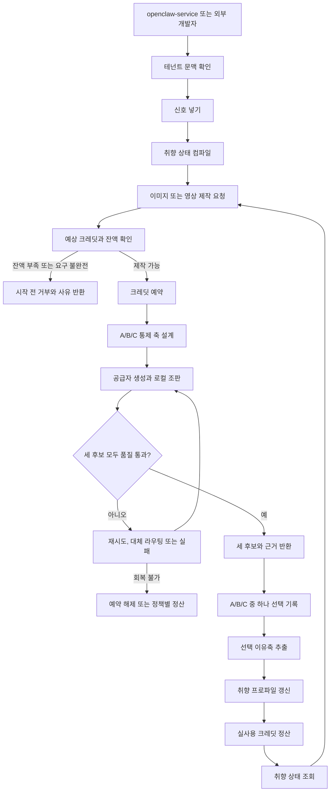

# studio-service PRD v1.0.0

> STAMP
> 생성시각: 2026-08-15 03:11 KST
> 모델: gpt-codex/GPT-5
> 에이전트: prd-architect worker
> 작업 라인: studio-service
> 사용 스킬: brand-positioning-kit (경쟁축, 포지셔닝 문장, 해자 검증)
> 근거 URL: https://www.ayrshare.com/docs/apis/overview, https://www.ayrshare.com/pricing/, https://sigmine.ai/
> 고민 한 줄: 세 후보를 모두 만들어 고르게 하는 취향 학습이 차별점이지만, 세 배에 가까운 제작원가와 강제 선택의 노이즈를 동시에 통제하지 못하면 해자가 아니라 비용 구조가 된다.

상태: Draft, plan gate 미승인

정본: [제품구조 결정](./제품구조-결정-2026-08-15.md)

문서 목적: studio-service의 제품 요구사항을 확정한다. 전송 형식, 엔드포인트, 인증 방식, DB 스키마, 큐 및 배포 구조는 기술설계 단계에서 회장과 합의한다.

## 목차

1. TL;DR
2. 배경과 현재 상태
3. 제품 경계와 비범위
4. 페르소나
5. One Thing
6. 목표와 성공지표
7. MVP 범위
8. 기능 요구사항
9. 취향 학습 루프
10. 품질 게이트
11. 충전식 과금과 BM
12. 경쟁 비교와 포지셔닝
13. 사용자 흐름
14. 비기능 요구사항
15. 인수 기준과 추적성
16. 운영, 법적, 시장, 기술 리스크
17. 레드팀, 프리모텀, 중단 기준
18. 회장 결정 필요
19. 단계 진입 조건
20. 개정 이력

## 1. TL;DR

studio-service는 화면 없이 이미지와 영상을 제작하는 멀티테넌트 API 제품이다. 첫 고객은 openclaw-service이며, 두 번째 고객은 자기 서비스에 제작 기능을 넣으려는 외부 개발자다. studio-service는 신호를 받아 취향 상태를 갱신하고, 품질 게이트를 통과한 A/B/C 후보를 제시하며, 사용자의 강제 선택과 선택 이유를 다음 생성에 반영한다.

**One Thing:** 사용자가 A/B/C 중 하나를 고를 때마다 그 선택 이유가 다음 이미지와 영상에 반영되어, 반복 제작의 수정 부담을 줄이는 headless 제작 API.

첫 구현 매체는 이미지와 영상뿐이다. 자체 화면, 채널 발행, 성과 수집, 음악과 텍스트 매체는 만들지 않는다. openclaw-service가 화면, 소비자 인증, 결제 화면, 채널 연결과 성과 수집을 소유한다.

## 2. 배경과 현재 상태

### 2.1 문제

범용 생성 API는 한 번의 결과를 만들 수 있지만, 같은 사람과 브랜드를 장기간 일관되게 유지하고 사용자가 무엇을 선호했는지 다음 제작에 누적하는 책임은 소비자에게 남긴다. 반대로 완성형 마케팅 자동화 도구는 발행과 성과 최적화까지 제공하지만, 외부 서비스가 자기 워크플로에 제작과 취향 상태만 조립하기 어렵다.

studio-service는 이 틈을 겨냥한다. 원본 신호와 채널 자격증명을 소유하지 않고, 테넌트별로 컴파일된 취향 상태와 제작 이력만 사용해 이미지와 영상을 만든다. 모델 호출 자체보다 선택 학습, 재사용 자산, 로컬 조판, 품질 실패 기록을 제품 자산으로 누적한다.

### 2.2 위키 우선 구현 현황

| 요구 영역 | 현재 상태 | 재사용 또는 연결 방향 | 근거 |
|---|---|---|---|
| 기존 OpenClaw Studio 화면과 초안 저장 | 이미 구현 | studio-service로 옮기지 않는다. openclaw-service가 화면을 유지하고 새 제작 API의 첫 소비자가 된다. | [제품 위키](../../wiki/product/studio.md), [전체 구현현황](../../docs/구현현황.md) |
| 이미지 및 영상 시험 제작 | 부분 구현 | Higgsfield 실험, 이미지 비교, PIL 및 FFmpeg 조립 결과를 공급자 어댑터와 품질 규칙의 실측 근거로 재사용한다. | [파이프라인 구현현황](../pipelines/구현현황.md), [실험 로그](../experiments/실험로그-힉스필드.md) |
| 범용 headless 제작 요청 | 미구현 | EC0147에 고정된 로컬 스크립트를 일반 서비스로 확장한다. 기존 화면을 복제하지 않는다. | [파이프라인 구현현황](../pipelines/구현현황.md), [제품구조 결정](./제품구조-결정-2026-08-15.md) |
| 신호 입력 | 미구현 | openclaw-service와 외부 개발자가 동일한 요구 수준으로 신호를 넣을 수 있게 한다. | [제품구조 결정](./제품구조-결정-2026-08-15.md) |
| A/B/C 선택 기록과 이유축 추출 | 부분 구현 | 실험 비교 방식은 있으나, 테넌트별 선택 기록과 자동 프로파일 갱신은 없다. | [이미지 비교](../experiments/이미지모델-비교와-전편소재-2026-08-14.md), [제품논의 인수인계](./인수인계-스튜디오-제품논의-2026-08-15.md) |
| 취향 상태 조회와 다음 생성 편향 | 미구현 | 원신호를 생성 경로에서 직접 읽지 않고, 컴파일된 취향 상태만 읽게 한다. | [제품구조 결정](./제품구조-결정-2026-08-15.md) |
| 강제 품질 게이트 | 부분 구현 | 이미지, 영상, 음성, 레이아웃 규약과 수동 실측은 있다. 런타임에서 끌 수 없는 게이트는 없다. | [이미지 규약](../standards/image.md), [영상 규약](../standards/video.md), [음성 규약](../standards/voice.md), [레이아웃 규약](../standards/layout.md) |
| 충전식 크레딧 | 미구현 | 검증된 원가표를 견적 기준으로 사용하되, 잔액 원장과 결제 계약은 기술설계 전에 별도 합의한다. | [소재원가 검증표](./소재원가-검증표-2026-08-15.md) |
| 테넌트 분리와 독립 DB | 결정만 완료 | studio-service는 자기 DB를 소유한다. 스키마는 이 PRD에서 확정하지 않는다. | [제품구조 결정](./제품구조-결정-2026-08-15.md), [멀티테넌트 위키](../../wiki/ops/multi-tenant.md) |

⛔ 회수 필요: [wiki/product/studio.md](../../wiki/product/studio.md)는 기존 화면형 OpenClaw Studio만 설명하며 2026-08-15 확정된 headless studio-service 경계가 아직 반영되지 않았다. 이 PRD가 승인되면 위키를 두 서비스 경계에 맞게 갱신해야 한다.

⛔ 회수 필요: 이 PRD 위임문은 외부 접점을 신호 넣기, 제작 요청, 선택 기록, 취향 상태 조회의 4개로 고정했으나, 작업 중 갱신된 [제품구조 결정](./제품구조-결정-2026-08-15.md)의 `외부 접점 4개` 표에는 다섯 번째 행 `소재 반입`이 추가됐다. 표 제목과 행 수도 서로 맞지 않는다. v1.0.0은 회장의 현재 직접 지시대로 네 접점만 요구사항화하고, 소재 반입을 제작 요청에 합칠지 독립 접점으로 둘지는 회장 결정 전 확정하지 않는다.

### 2.3 확인된 실측 기반

- 이미지 비교에서는 44개 결과를 다뤘고, EC0147 교육 그래픽에서는 Nano Banana 2가 우세했다. 이 결과를 모든 주제에 일반화하지 않는다.
- 모션 실험에서는 동작별 우승 모델이 달랐다. 모델 하나를 고정하지 않고 컷과 동작에 맞춰 공급자를 선택해야 한다.
- 음성 후보 81개는 기술 검사를 통과했지만, 40개 후보의 최종 사람 순위는 완료되지 않았다. 최종 음성 ID는 미결정이다.
- 로컬 렌더러는 PIL과 FFmpeg로 한글 자막과 레이아웃을 안정적으로 합성했으나 EC0147 입력에 고정되어 있다.
- Higgsfield 무료 크레딧은 0으로 확인되어 실제 제작 호출이 막힌 사례가 있다. 공급자 장애와 잔액 부족을 정상 실패 경로로 다뤄야 한다.

### 2.4 전제와 가설

| 구분 | 내용 | 검증 또는 처리 |
|---|---|---|
| 확정 전제 | studio-service는 자체 화면이 없는 headless 제작 API이며 이미지와 영상만 먼저 구현한다. | 제품구조 결정 정본을 따른다. |
| 확정 전제 | 첫 고객은 openclaw-service이고 외부 개발자는 두 번째 고객이다. | 동일한 네 접점과 테넌트 경계를 제공하되 소비자 UI는 만들지 않는다. |
| 확정 전제 | 품질 게이트와 실측 제작 규칙 9종은 고객이 끌 수 없다. | 모든 AC와 공급자 라우팅에 제약으로 적용한다. |
| 핵심 가설 | 통제된 A/B/C 선택 이유는 다음 제작의 수동 수정 부담을 줄인다. | 내부 40건과 유효 선택 50회에서 수정 감소와 선택 반영률을 측정한다. |
| 시장 가설 | 외부 개발자는 발행 기능보다 품질, 취향 상태, 원가 정산이 묶인 제작 계층에 비용을 낸다. | 파일럿 3개 팀의 통합 시간, 견적 이탈, 가격 인상 의사로 검증한다. |
| 비용 가설 | 단일 혼합형 결과의 144에서 162 credits와 1,000 credits 33,000원이 초기 실험에 쓸 수 있다. | 실제 Higgsfield 영수증과 첫 100건 원가 전에는 정식 가격으로 확정하지 않는다. |

## 3. 제품 경계와 비범위

### 3.1 제품 경계

| 주체 | 소유 책임 | 소유하지 않는 것 |
|---|---|---|
| studio-service | 테넌트별 신호 수용, 취향 상태, 이미지와 영상 제작, 선택 학습, 품질 게이트, 제작 크레딧 집행과 감사 | 자체 화면, 소비자 로그인, 채널 자격증명, 채널 발행, 성과 수집 |
| openclaw-service | 소비자 화면, 회원과 인증, 결제 화면, 캠페인 흐름, 채널 연결, 발행과 예약, 성과 수집 | 제작 모델 선택과 품질 규칙의 내부 구현 |
| 외부 개발자 서비스 | 자기 사용자 경험, 자기 채널과 데이터 수집, studio-service에 보낼 최소 신호 선정 | studio-service 내부 취향 계산과 품질 판정 |
| studio-engine, 향후 오픈소스 | 공급자 어댑터, 조립과 검사 같은 재사용 가능한 제작 코어 | 호스팅 테넌트, 과금, 비공개 취향 데이터 |

의존 방향은 openclaw-service 또는 외부 개발자 서비스에서 studio-service로 한 방향이다. studio-service는 호출자의 DB, 채널 토큰, 내부 분석 저장소를 직접 조회하지 않는다.

### 3.2 Non-goals

이번 MVP와 1단계 headless 범위는 다음을 하지 않는다. 제품구조 결정서가 언급한 2단계 자체 화면과 소비자 단독 상품은 이 PRD의 미래 비범위이며, 별도 PRD와 plan 승인이 필요하다.

1. studio-service 자체 화면을 만들지 않는다.
2. SNS 채널 연결, 예약, 발행을 하지 않는다.
3. 채널 성과를 직접 수집하거나 플랫폼 자격증명을 보관하지 않는다.
4. 음악 생성과 텍스트 단독 매체를 지원하지 않는다.
5. 소비자 회원가입, 로그인, 결제 화면을 제공하지 않는다.
6. 범용 마케팅 자동화, 캠페인 전략 수립, 댓글과 DM 운영을 제공하지 않는다.
7. 사용자의 원신호나 다른 테넌트의 비공개 데이터를 전역 분석 또는 교차 테넌트 학습에 섞지 않는다.
8. API 경로, 전송 형식, 필드명, 타입, DB 엔티티, 인덱스, 큐, 배포 토폴로지를 이 문서에서 확정하지 않는다.

## 4. 페르소나

### 4.1 페르소나 O-1: 오픈클로, 내부 캠페인 오케스트레이터

오픈클로는 사람이 아니라 studio-service의 첫 고객인 openclaw-service를 대표하는 조직 및 시스템 페르소나다. 소비자는 OpenClaw 화면에서 브랜드 자료를 올리고, 캠페인을 만들고, 채널을 연결하고, 결과를 고른다. 오픈클로는 이 상호작용을 받아 여러 종류의 신호로 정리하고 studio-service에 전달해야 한다. 그러나 제작 모델마다 서로 다른 파라미터와 실패 양식이 있고, 세로 영상의 자막 안전영역, 인물 일관성, 한글 조판, 동작별 모델 선택까지 직접 떠안으면 채널 발행 제품이 제작 엔진으로 비대해진다. 현재 OpenClaw에는 Studio 화면, 초안 저장, 일부 생성과 발행 흐름이 이미 있으므로 새 서비스를 도입한다고 화면과 사용자 계정을 다시 만들어서는 안 된다. 오픈클로가 원하는 것은 한 번의 멋진 결과보다 같은 얼굴, 목소리, 색감, 정보 밀도를 다음 제작에도 유지하는 것이다. 제작 요청을 보낸 뒤 품질을 통과한 세 후보와 비용 근거를 받아 자기 화면에 보여주고, 소비자가 고른 A/B/C와 이유를 다시 기록하며, 다음 요청 전에 현재 취향 상태를 설명 가능하게 조회해야 한다. 채널 성과는 오픈클로가 수집하고 필요한 요약 신호만 보낸다. 소비자의 채널 토큰, 비공개 원문, 다른 사업체 데이터는 studio-service나 공용 analytics로 새어 나가면 안 된다. 성공은 제작 기능이 많아지는 것이 아니라 OpenClaw의 수동 수정 횟수와 공급자별 예외 코드가 줄고, 소비자가 선택할수록 결과가 자기 브랜드다워지는 것으로 판단한다.

- 핵심 pain: 채널 제품이 모델별 제작 예외와 반복 수정까지 떠안아, 발행 가치보다 제작 운영 부하가 커진다.
- 오늘의 대안: 화면 안에서 개별 생성 API를 부르고 사람이 결과를 고쳐 저장한다.
- 채택 조건: 기존 화면과 인증을 유지한 채 서버 간 호출로 연결되고, 테넌트 격리, 비용 예측, 품질 통과, 취향 누적을 한 흐름에서 증명해야 한다.
- 이탈 조건: 결과를 매번 다시 손봐야 하거나, 세 후보 때문에 비용만 늘고 다음 결과가 달라지지 않으면 내부 서비스로 분리할 이유가 없다.

### 4.2 페르소나 D-1: 박도윤, 34세, B2B SaaS 백엔드 개발자

도윤은 직원 8명인 한국 B2B SaaS 팀에서 고객 교육과 세일즈 콘텐츠 기능을 맡은 백엔드 개발자다. 전담 영상 제작자도, 프롬프트 엔지니어도 없고, 마케팅 담당자 한 명은 릴리스마다 카드뉴스와 짧은 설명 영상을 외주로 주문한다. 고객은 자기 서비스 안에서 제품 데이터로 이미지를 만들고 세로 영상을 내려받고 싶어 하지만, 도윤의 팀은 편집 화면이나 SNS 발행 제품을 새로 만들 생각이 없다. 범용 이미지와 영상 API를 직접 붙여 본 적은 있으나, 한글이 깨지고 세로 안전영역을 벗어나고 같은 인물이 장면마다 달라졌다. 실패를 걸러내는 코드와 재시도 비용, 공급자 교체, 원가 정산이 본 기능보다 커져 실험을 멈췄다. Ayrshare 같은 통합 API는 채널 발행에는 유용하지만 결과물의 취향과 품질을 대신 관리하지 않는다. 시그마인 같은 완성형 자동화 서비스는 빠르게 많은 콘텐츠를 내지만, 도윤의 제품 안에 headless 제작 능력만 넣는 용도와는 맞지 않는다. 도윤은 API 이름보다 예측 가능한 행동을 산다. 어떤 신호가 반영됐고 왜 후보가 달라졌는지, 세 후보가 모두 같은 품질선 위에 있는지, 사용자의 선택이 다음 요청을 어떻게 바꿨는지, 실패하거나 재시도했을 때 크레딧이 어떻게 정산됐는지를 확인해야 한다. 첫 자격증명을 받은 뒤 한 시간 안에 테스트 결과를 받고, 운영에서는 중복 요청이 이중 과금되지 않으며, 비공개 고객 자료가 다른 고객의 결과나 공용 분석에 섞이지 않아야 한다. 도윤에게 성공은 생성 모델을 많이 제공하는 것이 아니라 두 주 안에 자기 제품에 안정적으로 붙이고 공급자 운영을 외부화하는 것이다.

- 핵심 pain: 생성 API를 붙이는 시간보다 품질 실패, 공급자 차이, 한글 조판, 재시도 과금 예외를 운영하는 시간이 더 든다.
- 오늘의 대안: 범용 생성 API와 FFmpeg를 직접 조립하거나 결과물을 외주로 받는다.
- 채택 조건: 문서화된 요구 흐름, 격리된 취향 상태, 예측 가능한 크레딧, 품질 통과한 세 후보, 감사 가능한 오류를 제공해야 한다.
- 이탈 조건: SDK나 화면이 없어서가 아니라, 결과 품질과 비용을 스스로 다시 검증해야 하면 직접 조립보다 나을 것이 없다.

## 5. One Thing

### 5.1 후보와 잘못된 답의 함정

| 후보 | 매력 | 잘못된 답의 함정 | 판정 |
|---|---|---|---|
| 가장 싼 이미지와 영상 API | 구매 이유가 즉시 보인다. | 공급자 가격이 바뀌면 사라지는 우위이며, 품질 재시도와 세 후보 비용을 숨긴다. | 기각 |
| 가장 좋은 프롬프트를 써 주는 API | 현재 실험 자산을 설명하기 쉽다. | 모델이 좋아질수록 평준화되고, 고객의 반복 선택이 자산으로 남지 않는다. | 기각 |
| 발행까지 끝내는 AI 마케팅 API | 완성형 가치가 커 보인다. | openclaw-service와 경계를 침범하고 Ayrshare, 시그마인과 정면 경쟁한다. | 기각 |
| 같은 얼굴과 톤을 유지하는 제작 API | 자산 누적과 일관성을 말할 수 있다. | 사용자의 선택이 왜 다음 결과를 바꿨는지 없으면 정적인 브랜드 프리셋에 그친다. | 보조 가치 |
| 선택할수록 수정 부담이 줄어드는 제작 API | 선택 학습, 자산, 품질 게이트를 한 인과로 묶는다. | 선택이 무작위이거나 후보 품질이 낮으면 비용만 세 배가 된다. 통제 실험이 필수다. | 채택 |

### 5.2 채택 문장

**사용자가 A/B/C 중 하나를 고를 때마다 그 선택 이유가 다음 이미지와 영상에 반영되어, 반복 제작의 수정 부담을 줄이는 headless 제작 API.**

### 5.3 7원칙 점검

| 원칙 | 판정 | 근거 |
|---|---|---|
| One Thing이 한 문장인가 | PASS | 선택, 학습, 다음 제작, 수정 부담의 단일 인과다. |
| 나머지는 One Thing의 배관인가 | PASS | 신호, 품질, 과금은 학습 가능한 제작을 안전하게 제공하는 배관이다. |
| 한 명에게 미친 제품인가 | PASS | 첫 고객 openclaw-service에 먼저 dogfood하고 외부 개발자에게 같은 경계를 판다. |
| 숫자와 한계가 있는가 | PASS | 외부 접점 4개, 후보 3개, 제작 규칙 9종, 매체 2종으로 제한한다. |
| Kill Criteria가 있는가 | PASS | 100건, 3개 파일럿 팀, 수정 감소, 선택 반영률, 게이트 유출률로 중단선을 둔다. |
| 설계가 단순한가 | PASS | 자체 화면과 채널 책임을 제거하고 한 방향 의존으로 고정한다. |
| 인과가 연결되는가 | PASS | 세 후보 통과, 강제 선택, 이유축 추출, 프로파일 갱신, 다음 편향 순서가 명시돼 있다. |

## 6. 목표와 성공지표

### 6.1 목표

1. openclaw-service가 기존 화면과 사용자 계정을 유지하면서 이미지와 영상 제작을 studio-service로 위임한다.
2. 선택 한 번이 감사 가능한 이유축과 취향 상태 변화로 이어지고, 다음 후보의 통제 변수에 반영된다.
3. 모든 공개 후보가 동일한 강제 품질선을 통과하며 고객이 게이트를 끌 수 없다.
4. 요청 전 예상 비용과 요청 후 실제 비용, 실패 환급을 크레딧 단위로 추적한다.
5. 외부 개발자가 채널 발행이나 편집 화면 없이 자기 서비스에 같은 제작 루프를 붙일 수 있다.

### 6.2 성공지표

| 지표 | 기준선 | MVP 목표 | 측정 창 | 의미 |
|---|---:|---:|---|---|
| 취향 반영 추적 완전성 | 0% | 선택이 기록된 작업의 100%에서 선택, 이유축, 프로파일 변화, 다음 생성 적용을 연결 | 첫 100건 | 학습 루프가 말이 아니라 감사 가능한가 |
| 선택 반영률 | 미측정 | 다음 생성의 통제 축 중 95% 이상이 직전 유효 선택과 모순되지 않음 | 유효 선택 50회 이후 | 프로파일이 실제 생성에 쓰이는가 |
| 수동 수정 부담 | 기준선 미측정 | 같은 콘텐츠 유형에서 첫 20건 대비 다음 20건의 수동 수정 횟수 20% 이상 감소 | 내부 dogfood 40건 | One Thing이 사용자 부담을 줄이는가 |
| 품질 게이트 유출 | 미측정 | 차단 규칙 위반 결과가 공개 후보에 포함된 비율 0%, 100건 기준 | 첫 100건 | 강제 품질선이 작동하는가 |
| 이중 과금 | 원장 없음 | 같은 요청의 재전송과 재시도에서 이중 정산 0건, 100회 장애 주입 기준 | 기술 QA | 충전식 과금이 신뢰 가능한가 |
| 외부 통합 시간 | 해당 없음 | 자격증명 수령부터 첫 품질 통과 A/B/C 수령까지 중앙값 60분 이내 | 파일럿 3개 팀 | headless 제품의 도입 가치가 있는가 |
| 단위경제 가시성 | 건별 원가표만 존재 | 모든 완료와 실패 작업에서 견적, 예약, 실사용, 환급 사유가 연결됨 | 첫 100건 | 마진을 추정할 데이터가 생기는가 |

기준선이 없는 지표는 출시 전에 내부 dogfood 첫 20건으로 측정한다. 기준선 없이 개선율을 홍보하지 않는다.

## 7. MVP 범위

| MVP 기능 | One Thing 연결 | 포함 요구사항 | 명시적 제한 |
|---|---|---|---|
| MVP-1. 신호 수용과 취향 컴파일 | 다음 생성이 과거 선택을 읽을 기반을 만든다. | FR-001, FR-010 | 원신호 직접 생성 참조 금지, 전역 학습 금지 |
| MVP-2. 통제된 이미지 및 영상 A/B/C 제작 | 비교 가능한 세 후보가 선택 학습의 입력이 된다. | FR-020, FR-021, FR-060, FR-061 | 이미지와 영상만, 세 후보 모두 품질 통과 |
| MVP-3. 선택, 이유축, 취향 상태 | 선택을 다음 생성 편향으로 바꾼다. | FR-030, FR-031, FR-032, FR-033 | 별점과 좋아요만으로 학습하지 않음 |
| MVP-4. 끌 수 없는 품질 게이트 | 나쁜 후보를 억지로 고르는 노이즈를 줄인다. | FR-040, FR-041 | 고객 우회 옵션 없음, 실패 시 재생성 또는 실패 반환 |
| MVP-5. 충전식 견적과 정산 | 세 후보와 재시도의 비용을 신뢰 가능하게 만든다. | FR-050, FR-051, FR-052 | 결제 화면 없음, 가격과 환불 정책은 회장 결정 전 가설 |

## 8. 기능 요구사항

### 8.1 공통 테넌트 경계

#### FR-001. 테넌트 격리와 호출 주체 연결

- studio-service는 openclaw-service의 각 고객과 외부 개발자의 각 고객을 서로 구분된 테넌트 문맥으로 처리할 수 있어야 한다.
- openclaw-service 소비자는 studio-service에 별도로 로그인하지 않는다. 사용자 비밀번호와 채널 자격증명은 studio-service로 전달하지 않는다.
- 모든 신호, 제작 작업, 선택, 취향 상태, 자산, 비용 이력은 정확히 한 테넌트에 귀속되어야 한다.
- 호출 주체가 다른 테넌트의 상태나 결과를 읽거나 갱신하려 하면 내용 존재 여부를 노출하지 않고 거부해야 한다.
- 구체적인 인증 수단, 자동 프로비저닝 방식, 키 수명은 기술설계에서 정한다.

### 8.2 외부 접점 4개

아래 네 접점은 제품이 할 수 있어야 하는 일만 정의한다. 경로, 프로토콜, 필드명, 타입, 동기 및 비동기 방식은 확정하지 않는다.

#### FR-010. 신호 넣기

- 호출자는 제작 결과, 사용자 선택, 브랜드 지침, 캠페인 맥락, 호출자가 수집한 성과 요약처럼 출처가 다른 신호를 넣을 수 있어야 한다.
- 신호는 최소한 테넌트, 출처, 종류, 대상 참조, 관찰 시점, 내용의 의미를 보존해야 한다. 이는 의미 요구사항이며 전송 필드명을 확정하지 않는다.
- 같은 신호가 재전송되어도 취향 가중치가 중복 반영되지 않아야 한다.
- 출처가 불명확하거나 테넌트 문맥이 없는 신호는 취향 상태에 반영하지 않고 거부 사유를 남겨야 한다.
- private 서비스 데이터는 전역 analytics, 다른 테넌트 프로파일, 공용 모델 학습 데이터로 보내지 않는다.

#### FR-020. 제작 요청

- 호출자는 이미지 또는 영상, 제작 목적, 대상, 전달할 메시지, 사용할 수 있는 자산, 희망 제약을 제출할 수 있어야 한다.
- studio-service는 현재 취향 상태, 승인된 자산, 품질 규칙, 공급자 능력, 예상 크레딧을 조합해 제작 가능 여부를 판단해야 한다.
- 제작이 시작되기 전에 예상 크레딧 범위와 예상 후보 수를 확인할 수 있어야 한다.
- 완료 결과에는 세 후보, 적용된 취향 근거, 사용 자산과 모델의 출처, 품질 판정, 실제 크레딧 근거가 연결되어야 한다.
- 유효한 세 후보를 만들 수 없으면 부족한 후보를 공개하지 않고 재생성하거나 실패로 종료해야 한다.

#### FR-021. 비교 가능한 A/B/C 후보

- 한 선택 라운드는 품질 게이트를 모두 통과한 A, B, C 세 후보를 제공해야 한다.
- 세 후보는 무작위로 모든 요소를 바꾸지 않는다. 한 라운드에서 한 개에서 세 개의 설명 가능한 이유축만 통제해 달라야 한다.
- 후보 차이는 예를 들어 정보 밀도, 인물 중심성, 색감, 컷 템포, 카피 톤, 시각적 사실성처럼 사용자가 구분할 수 있는 축이어야 한다.
- 세 후보의 제작 비용이 달라지면 후보별 비용 근거를 보여줄 수 있어야 한다.
- 한 후보라도 품질선에 못 미치면 사용자가 나쁜 결과를 억지로 고르게 하지 않고 세트 자체를 완성하지 않은 것으로 처리한다.

#### FR-030. 선택 기록

- 호출자는 한 선택 라운드에서 A, B, C 중 정확히 하나를 선택해 기록할 수 있어야 한다.
- 같은 라운드에 서로 다른 선택이 중복 제출되면 최초 확정 여부와 변경 권한을 확인하고, 조용히 덮어쓰지 않아야 한다.
- 품질 통과 후보가 세 개 미만인 라운드의 선택은 학습 근거로 받지 않는다.
- 사용자가 선택하지 않고 작업을 종료할 수는 있으나, 그 라운드는 취향 학습에 기여하지 않는다. 강제 선택은 프로파일 갱신을 원하는 비교 라운드에 적용한다.
- 별점, 좋아요, 다운로드만으로 A/B/C 선택을 추정하지 않는다.

#### FR-033. 취향 상태 조회

- 호출자는 현재 취향 상태가 어떤 이유축과 근거 수로 구성됐는지 조회할 수 있어야 한다.
- 상태는 현재 선호 방향, 신뢰도, 반대 근거, 마지막 갱신 시점, 다음 생성에 적용 가능한지 설명할 수 있어야 한다.
- 민감정보나 추론이 금지된 속성을 취향축으로 노출하지 않는다.
- 근거가 없는 새 테넌트는 빈 상태와 시작 방법을 명확히 반환해야 한다.
- 조회 결과는 설명용이며, 내부 저장 구조나 DB 스키마를 외부 계약으로 고정하지 않는다.

### 8.3 이유축과 프로파일

#### FR-031. 선택 이유축 추출

- 선택된 후보와 나머지 후보의 통제 차이를 바탕으로 하나 이상의 이유축 후보를 추출해야 한다.
- 후보 간 통제되지 않은 차이가 너무 많아 원인을 분리할 수 없으면 프로파일을 강하게 갱신하지 않고 낮은 신뢰도로 기록해야 한다.
- 얼굴, 음성, 민족, 건강, 정치성향 같은 민감하거나 부적절한 속성을 선택 이유로 추론하지 않는다.
- 호출자가 명시적 이유를 함께 제공하면 모델 추론보다 우선하되, 품질 규칙과 법적 제한을 넘을 수 없다.

#### FR-032. 프로파일 갱신과 다음 생성 편향

- 유효한 선택은 이유축별 방향, 가중치, 신뢰도, 근거 수를 갱신해야 한다.
- 한 번의 선택이 장기 취향을 영구 확정하지 않는다. 반복 근거가 쌓일수록 신뢰도가 높아지고, 상충 선택이 들어오면 낮아져야 한다.
- 갱신 이력은 되돌리기와 감사를 지원해야 한다.
- 다음 제작은 원신호 전체를 직접 조회하지 않고, 컴파일된 현재 취향 상태와 이번 요청의 명시적 제약만 읽어야 한다.
- 요청의 명시적 요구와 취향 상태가 충돌하면 명시적 요구가 우선하며, 충돌 사실을 결과 근거에 남긴다.

### 8.4 품질과 제작 공급자

#### FR-040. 강제 품질 게이트

- 모든 공개 후보는 이미지, 영상, 음성, 레이아웃 규약 중 해당되는 검사를 통과해야 한다.
- 호출자와 최종 사용자는 품질 게이트를 끌 수 없다.
- 검사 실패는 공급자 재시도, 다른 공급자 라우팅, 로컬 재합성, 작업 실패 중 하나로 처리한다. 실패 결과를 성공 후보로 낮춰 반환하지 않는다.
- 판정은 PASS, FIX, REJECT와 근거를 남겨야 한다. 어떤 검사가 자동이고 어떤 검사가 사람 확인인지 구분해야 한다.
- 공급자 변경이나 모델 버전 변경 후에는 회귀 샘플을 다시 통과하기 전 기본 경로로 승격하지 않는다.

#### FR-041. 실측 제작 규칙 9종

다음 규칙은 고객이 끌 수 없는 제작 제약이다.

1. 이미지와 영상 프롬프트에 읽혀야 할 텍스트 생성을 요청하지 않는다.
2. 자막, 용어 칩, 정보 오버레이는 로컬 조판으로 합성한다.
3. 한 작품의 음성은 승인된 고정 voice ID를 사용한다.
4. 말하기 속도는 생성 파라미터로 조절하며 후반 속도 증가로 해결하지 않는다.
5. 넓은 실내 군중 장면은 세로 구도를 자주 깨뜨리므로 기본 경로에서 제외하고 별도 검증한다.
6. 시각 스타일만 바뀐다는 이유로 공급자 크레딧이 달라졌다고 간주하지 않는다. 실제 공급자 과금 근거로 계산한다.
7. 모션 엔진은 동작별 강점이 다르므로 컷과 동작에 맞춰 라우팅한다.
8. 승인된 Soul ID는 영구 재사용 자산으로 취급하되 권리와 삭제 요청을 존중한다.
9. 결과 파일명에는 제작 날짜와 사용 모델 식별자를 포함한다.

세부 판정 기준은 [image.md](../standards/image.md), [video.md](../standards/video.md), [voice.md](../standards/voice.md), [layout.md](../standards/layout.md)를 따른다. 규약과 이 PRD가 충돌하면 회장 결정 전 더 엄격한 쪽을 임시 적용하고 충돌을 기록한다.

#### FR-060. 공급자 어댑터와 품질 우선 라우팅

- 이미지와 영상 공급자를 교체하거나 추가할 때 호출자의 제품 흐름을 다시 설계하지 않아야 한다.
- 라우팅은 최저 단가 하나가 아니라 매체, 컷, 동작, 품질 실측, 예상 비용, 가용성을 함께 고려해야 한다.
- 공급자 장애 시 품질 동등성이 검증된 경로만 대체할 수 있다. 검증되지 않은 저품질 경로로 조용히 강등하지 않는다.
- 신규 공급자는 고정 회귀 세트와 원가 측정을 통과하기 전 실사용 기본 경로가 될 수 없다.

#### FR-061. 자산과 제작 근거

- 각 결과는 입력 자산, 사용 권리 상태, 공급자와 모델 식별, 생성 시점, 로컬 합성 단계, 품질 판정과 연결되어야 한다.
- 사용자 원본과 승인 자산은 테넌트 경계를 넘지 않는다.
- 삭제 요청이 들어오면 재사용 자산과 파생 결과에 미치는 범위를 설명하고 처리 상태를 추적할 수 있어야 한다.
- 결과물 권리와 공급자별 라이선스 차이는 외부 개발자가 확인할 수 있어야 한다.

### 8.5 충전식 과금

#### FR-050. 사전 견적과 잔액 확인

- 제작 시작 전에 예상 크레딧 범위, 포함 후보 수, 공급자 구성, 재시도 정책을 제시할 수 있어야 한다.
- 잔액이 예상 상한보다 부족하면 제작을 시작하지 않고 필요한 충전량을 알려야 한다.
- 견적은 보장이 아니라 범위임을 명시하되, 고객 동의 없이 상한을 넘겨 정산하지 않는다.
- 품질 게이트 때문에 생긴 재시도 비용을 고객과 서비스 중 누가 부담하는지 정책 근거와 함께 계산해야 한다.

#### FR-051. 예약, 정산, 해제

- 작업 시작 시 예상 상한을 사용할 수 없게 예약하고, 성공 시 실제 사용량만 확정 정산하며, 차액은 즉시 해제해야 한다.
- 공급자 호출 전에 실패한 작업은 공급자 원가가 없으면 전액 해제해야 한다.
- 공급자 원가가 발생했으나 품질 게이트에서 실패한 경우의 고객 부담은 환불 정책에 따라 일관되게 처리해야 한다.
- 같은 작업과 같은 재시도가 반복 전달되어도 두 번 예약하거나 정산하지 않아야 한다.

#### FR-052. 사용 이력과 환불 감사

- 모든 잔액 변화는 작업, 사유, 이전 및 이후 잔액, 공급자 원가 근거, 처리 시점과 연결되어야 한다.
- 외부 개발자와 openclaw-service는 자기 테넌트의 견적, 예약, 정산, 해제, 환불 상태를 확인할 수 있어야 한다.
- 잔액을 직접 덮어쓰는 운영 경로를 허용하지 않는다. 수정은 반대 거래와 사유 기록으로 남아야 한다.
- 결제 취소, 크레딧 만료, 프로모션 크레딧, 현금 환불의 우선순위는 회장 결정과 법률 검토 후 확정한다.

## 9. 취향 학습 루프

### 9.1 필수 순환

1. 호출자가 현재 제작 목적과 필요한 신호를 넣는다.
2. studio-service가 원신호를 테넌트별 취향 상태로 컴파일한다.
3. 현재 취향과 이번 요청을 읽어 한 개에서 세 개 이유축만 다른 A/B/C를 설계한다.
4. 세 후보를 제작하고 모두 강제 품질 게이트에 통과시킨다.
5. 사용자는 A/B/C 중 정확히 하나를 고른다.
6. 선택된 후보와 비교 후보의 통제 차이에서 이유축을 추출한다.
7. 이유축, 가중치, 신뢰도, 반대 근거를 포함해 프로파일을 갱신한다.
8. 다음 생성은 갱신된 프로파일로 후보 분포를 편향한다.
9. 호출자는 현재 취향 상태와 이번 변화의 근거를 조회한다.

### 9.2 학습 안전장치

- 세 후보 모두 품질을 통과하지 않으면 선택을 요구하지 않는다.
- 후보 간 차이가 너무 커 인과를 분리할 수 없으면 강한 학습을 하지 않는다.
- 한 번의 선택보다 반복 선택을 더 강한 근거로 본다.
- 상충 선택을 삭제하거나 평균으로 숨기지 않고 신뢰도 하락의 근거로 남긴다.
- 특정 캠페인의 일시적 요구와 장기 브랜드 취향을 구분할 수 있어야 한다. 구분 방식은 기술설계에서 합의한다.
- 민감속성, 비공개 원문, 다른 테넌트 행동을 취향 학습 입력으로 사용하지 않는다.

## 10. 품질 게이트

### 10.1 공개 후보 공통선

| 매체 | 필수 판정 | 공개 차단 조건 |
|---|---|---|
| 이미지 | 의도 장면 일치, 원치 않는 문자와 숫자 및 로고 없음, 9:16 안전 크롭, 치명적 해부 및 렌더 결함 없음, 브랜드 팔레트 적합 | 의미 왜곡, 읽을 수 없는 생성 텍스트, 안전영역 이탈, 치명적 손과 얼굴 결함 |
| 영상 | 실제 9:16, 시작과 동작과 종료 일치, 금지 동작 0프레임, 생성 문자와 로고 없음, 물리 및 얼굴 일관성, 지정 샘플 프레임과 마지막 1초 검사 | 금지 동작, 세로 구도 붕괴, 종료 프레임 실패, 자막 가림, 얼굴과 물체 급변 |
| 음성 | 승인 voice ID, 반복 생성에서 동일 인물성, 한국어 발음, 의미 기반 운율, 한 작품 한 음성 | ID 불일치, 발음과 운율 결함, 후반 속도 증가로 인한 품질 저하 |
| 레이아웃 | 1080x1920, 25fps, 상단 288px, 중앙 1248px, 하단 384px, 텍스트 x 90px에서 990px, 자막 최대 2줄, PIL 한글 합성 | UI 안전영역 침범, 3줄 이상 자막, 생성 모델에 맡긴 한글 오버레이 |

플랫폼별 UI 안전영역 수치는 실제 미리보기 검증 전 확정하지 않는다. 좋아요와 댓글 아이콘은 A/B 실측 없이 기본 배치하지 않는다.

### 10.2 게이트 운영 원칙

- 자동 검사는 파일, 해상도, 프레임, 금지 문자열, 구성 메타데이터처럼 기계가 확실히 판정할 수 있는 항목을 맡는다.
- 시각적 의미, 물리성, 인물 동일성, 한국어 발음은 자동 판정만으로 완료라고 하지 않는다. MVP 기준 샘플은 사람 판정을 포함한다.
- 게이트 실패율, 재시도 횟수, 공급자별 실패 원인, FIX와 REJECT 사유를 운영 데이터로 남긴다.
- 고객은 더 빠른 결과를 위해 게이트를 끌 수 없다. 속도 등급이 생기더라도 검사 생략이 아니라 공급자와 대기열 정책으로 차등한다.

## 11. 충전식 과금과 BM

### 11.1 원가 근거

[소재원가 검증표 v1.1.0](./소재원가-검증표-2026-08-15.md)의 2026-08-15 가정은 다음과 같다.

- 권장 혼합형 40초에서 60초 영상 1개는 Veo Lite 8초 영상 2개, Nano Banana 이미지 4개에서 6개, ElevenLabs 음성 1분으로 구성한다.
- 재시도 전 직접 원가는 1.168달러에서 1.302달러, 환율 1달러당 1,400원 가정에서 1,635원에서 1,823원이다.
- 내부 가설은 공급자 원가 0.01달러를 1 studio credit로 두고 20% 버퍼를 더하는 방식이다.
- 이 가설에서 단일 혼합형 결과는 144에서 162 credits다.
- 1,000 credits를 부가세 포함 33,000원에 파는 안은 검증 가설이며 확정 가격이 아니다.

A/B/C가 완성 영상 세 개를 각각 만드는 구조라면 단순 계산상 432에서 486 credits가 필요하다. 이는 단일 결과 원가의 3배 계산이며, 재시도와 공통 자산 재사용 전 수치다. 따라서 제품은 후보별 전체 제작과 저비용 비교 프리뷰를 구분할 필요가 있지만, 어느 방식을 MVP 기본값으로 할지는 회장 결정이 필요하다.

### 11.2 BM 요구사항

- MVP 기본 과금 단위는 선충전 studio credit 사용량이다.
- openclaw-service도 비용을 숨긴 무료 내부 호출로 취급하지 않고 테넌트별 사용량을 같은 원장 원칙으로 측정한다.
- 외부 개발자는 제작 전 견적과 잔액, 제작 후 실제 사용량과 환급 근거를 확인할 수 있어야 한다.
- 공급자 가격과 환율이 바뀌어도 기존 거래의 근거가 소급 변경되지 않아야 한다.
- 첫 100건의 유료 또는 내부 정산 작업이 쌓이기 전 목표 마진을 확정하지 않는다.
- 향후 기본 구독료와 사용량을 결합할 수 있지만, 구독 가격과 포함량은 이번 MVP에서 확정하지 않는다.
- BYOK는 향후 개발자 등급 후보이며 MVP 비범위다. 도입하더라도 품질 게이트와 사용 감사는 동일하게 적용한다.

### 11.3 과금 경계

studio-service는 크레딧 견적, 예약, 정산, 해제, 환불 상태를 책임진다. openclaw-service는 소비자에게 보이는 결제 화면과 자기 상품 가격을 책임진다. 결제대행사 연동 주체, 현금 환불, 크레딧 만료, 부가세 문서 발행은 회장 결정과 법률 검토 후 확정한다.

## 12. 경쟁 비교와 포지셔닝

### 12.1 실조사 요약

| 비교 대상 | 공식 자료에서 확인한 중심 가치 | 과금 및 범위 | studio-service와 다른 축 | 차용할 점 | 의도적으로 하지 않을 점 |
|---|---|---|---|---|---|
| Ayrshare | 하나의 REST API로 여러 소셜 네트워크의 발행, 예약, 분석, 댓글, DM, 광고 기능을 연결한다. 사용자별 프로필 구조를 제공한다. | 2026-08-15 공식 가격 기준 Premium 149달러, Launch 299달러, Business 599달러 월 과금. 활성 소셜 프로필 수를 중심으로 과금한다. | Ayrshare는 채널 연결과 발행 인프라다. studio-service는 채널 자격증명과 발행을 소유하지 않고 제작, 취향, 품질을 담당한다. | 개발자 중심 설명, 다중 고객 격리, 사용량과 한도의 투명성 | 채널 API를 복제하거나 경쟁하지 않음 |
| 시그마인 | 웹사이트와 기존 채널을 바탕으로 브랜드를 학습하고, 블로그, Threads, 숏폼을 매일 자동 생성 및 발행하며 월간 성과를 다음 전략에 반영한다고 설명한다. | 공식 페이지는 블로그 15만원, Threads 15만원, 숏폼 45만원, 통합 75만원과 월 약 300개 콘텐츠를 제시한다. 이는 시그마인의 마케팅 주장으로 독립 검증하지 않았다. | 시그마인은 완성형 마케팅 자동화와 양, 성과 피드백이 중심이다. studio-service는 외부 개발자가 조립하는 headless 제작 API이며, 사용자 A/B/C 선택 이유를 작품 단위로 학습한다. | 브랜드 입력 온보딩과 학습 상태를 사용자가 이해할 수 있게 설명하는 방식 | 월 300개 자동 발행과 성과 최적화를 MVP 약속으로 삼지 않음 |

출처:

- [Ayrshare API Overview](https://www.ayrshare.com/docs/apis/overview)
- [Ayrshare Pricing](https://www.ayrshare.com/pricing/)
- [Sigmine 공식 사이트](https://sigmine.ai/)

### 12.2 채택한 포지셔닝

**외부 개발자를 위한 취향 학습형 이미지 및 영상 제작 API. 세 후보 중 사용자가 고른 이유가 다음 결과에 누적되고, 모든 후보는 끌 수 없는 제작 품질선을 통과한다.**

보조 설명:

- Ayrshare가 만든 콘텐츠를 채널로 보내는 배관이라면, studio-service는 보내기 전 결과를 만들고 취향을 축적하는 제작 계층이다.
- 시그마인이 완성형 자동 마케팅과 양을 판다면, studio-service는 개발자가 자기 제품 경험에 조립할 수 있는 제작 통제력과 선택 근거를 판다.
- 모델 수, 한 번 클릭, 바이럴 보장, 최저가를 핵심 약속으로 사용하지 않는다.

### 12.3 해자 가설

초기 해자는 모델이나 프롬프트가 아니다. 테넌트별 선택 이유축, 재사용 가능한 인물과 음성 자산, 한국어 로컬 조판, 공급자별 실패 로그, 동작별 라우팅 실측이 함께 쌓이는 운영 자산이다. 현재는 EC0147 한 사례와 소수 실험에 의존하므로 강한 해자라고 부르지 않는다. 첫 100건에서 수정 감소와 품질 유출 0을 증명해야 포지셔닝을 유지한다.

## 13. 사용자 흐름

오류와 빈 상태:

- 새 테넌트에 취향 근거가 없으면 빈 상태로 시작하고, 이번 요청의 명시적 제약만 사용한다.
- 세 후보를 모두 통과시키지 못하면 선택 단계로 넘어가지 않는다.
- 중복 신호, 중복 선택, 중복 제작 요청은 중복 학습과 이중 과금을 만들지 않는다.
- 공급자 장애와 잔액 부족은 성공 결과를 가장하지 않고 복구 가능 여부와 비용 상태를 반환한다.

## 14. 비기능 요구사항

### NFR-001. 개인정보와 테넌트 격리

- 교차 테넌트 원신호, 취향 상태, 자산, 결과, 비용 데이터 노출은 허용하지 않는다.
- private 서비스 데이터는 postAGI 공용 analytics나 다른 테넌트 학습에 섞지 않는다.
- 얼굴, 음성, 고객 업로드 자산은 목적 최소화, 권리 확인, 삭제 처리, 접근 감사를 지원해야 한다.
- 공급자에게 보내는 데이터는 제작에 필요한 최소 범위로 제한한다.

### NFR-002. 신뢰성과 중복 안전

- 동일 의미 요청의 재전송은 중복 신호 반영, 중복 선택 반영, 이중 크레딧 정산을 만들지 않아야 한다.
- 공급자 타임아웃과 부분 성공에서도 잔액과 작업 상태가 모순되지 않아야 한다.
- 장애 주입 100회에서 이중 정산 0건을 기술설계 및 QA 합격선으로 둔다.

### NFR-003. 감사 가능성

- 결과, 적용 취향, 품질 판정, 공급자 사용, 크레딧 변화가 한 작업 문맥에서 연결되어야 한다.
- 운영자가 수동 수정한 경우 주체, 사유, 전후 상태를 남겨야 한다.
- 감사 보존 기간은 회장 결정과 개인정보 검토 전 확정하지 않는다.

### NFR-004. 응답성과 비동기 처리 기대

- 신호 수용과 취향 상태 조회는 정상 부하에서 p95 1초 이내를 제품 목표로 둔다.
- 제작 요청 접수와 사전 검증 결과는 공급자 생성 시간을 제외하고 p95 2초 이내를 목표로 둔다.
- 실제 이미지와 영상 완성 시간은 공급자 실측 전 출시 약속으로 고정하지 않는다. 파일럿에서 매체별 p50과 p95를 측정한다.

### NFR-005. 공급자 변경 안전

- 모델 버전, 가격, 가용성 변화가 발생하면 회귀 세트와 원가표를 다시 평가해야 한다.
- 검증되지 않은 공급자 대체를 자동 성공으로 처리하지 않는다.
- 공급자 비밀값은 저장소, 결과 메타데이터, 오류 응답에 노출하지 않는다.

### NFR-006. 접근성과 설명 가능성

- 자체 화면은 없지만 외부 개발자가 사용자에게 후보 차이, 품질 판정, 비용, 취향 상태를 설명할 수 있는 의미 정보를 제공해야 한다.
- 내부 모델 추론 원문을 노출하지 않고도 선택 이유축과 근거 수를 이해할 수 있어야 한다.
- 오류는 재시도 가능, 입력 수정 필요, 잔액 필요, 권한 없음, 공급자 장애를 구분할 수 있어야 한다. 구체 오류 계약은 기술설계에서 정한다.

## 15. 인수 기준과 추적성

### 15.1 Given, When, Then 인수 기준

| AC | 연결 요구 | Given | When | Then |
|---|---|---|---|---|
| AC-001 | FR-001 | 테넌트 A와 B에 서로 다른 취향과 자산이 있다. | A의 호출 주체가 B의 상태를 읽거나 갱신한다. | 요청을 거부하고 B의 존재와 내용을 노출하지 않으며 감사 흔적을 남긴다. |
| AC-010 | FR-010 | 유효한 테넌트와 출처가 있는 신호가 한 번 반영됐다. | 같은 신호가 다시 전달된다. | 수용 결과는 재현되지만 프로파일 근거 수와 크레딧은 증가하지 않는다. |
| AC-020 | FR-020 | 유효한 이미지 요청과 충분한 잔액이 있다. | 제작을 시작한다. | 시작 전 견적이 남고 완료 결과, 품질 판정, 실제 사용량이 같은 작업으로 연결된다. |
| AC-021 | FR-021 | 세 후보 중 하나가 품질 게이트에 실패했다. | 후보 세트를 반환하려 한다. | 실패 후보를 포함한 세트를 공개하지 않고 재생성 또는 전체 실패로 처리한다. |
| AC-030 | FR-030 | A/B/C 세 후보가 모두 품질을 통과했다. | 사용자가 B를 선택해 두 번 제출한다. | 선택은 정확히 한 번 확정되고 중복 제출로 학습 가중치가 늘지 않는다. |
| AC-031 | FR-031 | 후보는 정보 밀도만 통제해 다르고 사용자가 고밀도 후보를 선택했다. | 이유축을 추출한다. | 정보 밀도 선호를 근거와 신뢰도와 함께 기록하고 민감속성을 추론하지 않는다. |
| AC-032 | FR-032 | 동일 방향 선택이 세 번 누적된 프로파일이 있다. | 같은 유형의 다음 제작을 요청한다. | 명시적 요구와 충돌하지 않는 범위에서 해당 방향 후보 비중이 높아지고 적용 근거가 남는다. |
| AC-033 | FR-033 | 선택 이력이 없는 새 테넌트다. | 취향 상태를 조회한다. | 빈 상태, 근거 0, 시작 방법을 반환하며 다른 테넌트의 기본값을 복사하지 않는다. |
| AC-040 | FR-040 | 고객이 빠른 결과를 이유로 품질 검사 생략을 요청한다. | 제작을 실행한다. | 생략 요청을 무시하거나 거부하고 동일한 필수 검사를 수행한다. |
| AC-041 | FR-041 | 한글 자막이 필요한 세로 영상 요청이다. | 후보를 제작한다. | 생성 프롬프트에 자막 렌더를 맡기지 않고 로컬 합성하며, 레이아웃 안전영역과 2줄 제한을 검사한다. |
| AC-050 | FR-050 | 예상 상한보다 잔액이 적다. | 제작 시작을 요청한다. | 공급자 호출과 크레딧 예약 없이 부족량과 시작 불가 사유를 반환한다. |
| AC-051 | FR-051 | 162 credits가 예약됐고 실제 사용량은 148 credits다. | 작업이 성공 정산된다. | 148만 확정하고 14를 해제하며 동일 요청 재전송에도 추가 정산하지 않는다. |
| AC-052 | FR-052 | 품질 실패로 환불이 승인됐다. | 운영자가 잔액을 보정한다. | 원거래와 연결된 반대 거래, 사유, 처리 주체가 남고 잔액 직접 덮어쓰기는 불가하다. |
| AC-060 | FR-060 | 기본 영상 공급자가 장애이고 대체 공급자는 해당 동작 회귀 검증을 통과하지 않았다. | 자동 대체를 시도한다. | 저품질 성공으로 반환하지 않고 대기, 재시도 또는 실패 중 정책에 맞는 상태로 종료한다. |
| AC-061 | FR-061 | 권리 확인이 없는 얼굴 자산이 입력됐다. | 영구 재사용 자산으로 등록하려 한다. | 등록을 거부하거나 권리 확인 대기 상태로 두며 다른 테넌트 제작에 사용하지 않는다. |
| AC-N01 | NFR-001 | private 신호가 있는 테넌트다. | 공용 analytics 내보내기를 실행한다. | 원신호, 자산, 취향축, 사용자 식별 정보가 전송되지 않는다. |
| AC-N02 | NFR-002 | 공급자 응답 직후 네트워크가 끊겨 같은 작업이 재전송됐다. | 복구 처리를 수행한다. | 결과와 정산은 하나만 남고 예약 잔액이 고립되지 않는다. |
| AC-N03 | NFR-004 | 정상 부하에서 신호와 상태 조회를 각각 100회 실행한다. | 지연을 측정한다. | 각 기능의 p95가 1초 이내이며 제작 접수의 공급자 제외 p95가 2초 이내다. |

### 15.2 요구사항 추적표

| 요구 묶음 | 상류 근거 | MVP | 인수 기준 | 기술설계에서 이어받을 것 |
|---|---|---|---|---|
| 테넌트 경계 | 제품구조 결정, 멀티테넌트 위키 | MVP-1 | AC-001, AC-N01 | 인증, 프로비저닝, 저장 격리, 권한 테스트 |
| 신호와 취향 컴파일 | 제품구조 결정, 제품논의 인수인계 | MVP-1 | AC-010 | 신호 계약, 중복 키, 컴파일 주기, 보존 정책 |
| 제작과 A/B/C | 제품구조 결정, 이미지 및 영상 실험 | MVP-2 | AC-020, AC-021 | 작업 상태, 후보 계약, 비동기 흐름, 시간 제한 |
| 선택과 프로파일 | 제품구조 결정, 비교 실험 | MVP-3 | AC-030부터 AC-033 | 이유축 표현, 가중치 갱신, 되돌리기, 설명 계약 |
| 품질 게이트 | studio standards 4종 | MVP-4 | AC-040, AC-041 | 자동 및 사람 검사 경계, 재시도 정책, 회귀 픽스처 |
| 과금 | 소재원가 검증표 | MVP-5 | AC-050부터 AC-052, AC-N02 | 원장 무결성, 예약과 정산 계약, 결제 연동 경계 |
| 공급자와 자산 | 실험 로그, 모션 벤치마크 | MVP-2 | AC-060, AC-061 | 어댑터, 라우팅 정책, 권리 메타데이터, 삭제 처리 |
| 성능과 운영 | 제품 경계, 파일럿 목표 | 전 MVP | AC-N03 | SLO 계측, 큐 용량, 장애 복구, 경보 |

## 16. 운영, 법적, 시장, 기술 리스크

| 분류 | 구체 리스크 | 조기 신호 | 완화 | 잔여 판단 |
|---|---|---|---|---|
| 운영 | 1인 운영에서 세 후보와 사람 품질 검수가 지원 부하를 세 배로 만든다. | 100건 전 작업당 사람 검수 10분 초과, 재시도율 20% 초과 | 자동 판정 가능한 항목부터 분리하고 동작별 검증 공급자를 좁힌다. | 사람 검수 대상과 유료 SLA |
| BM | A/B/C 전체 제작이 단일 결과 144에서 162 credits의 약 세 배가 되어 외부 개발자가 가격을 거부한다. | 견적 후 이탈 50% 초과, 선택 없이 다운로드만 하는 비율 40% 초과 | 저비용 프리뷰와 최종 렌더 분리 실험, 공통 자산 재사용, 원가 상한 동의 | MVP 기본 후보 제작 방식 |
| 시장 | 시그마인의 월 300개 자동화가 고객에게 더 명확한 결과로 보인다. | 인터뷰에서 학습보다 발행량을 우선하는 응답이 과반 | 개발자 API와 수정 부담 감소에 좁게 포지셔닝하고 교육 콘텐츠부터 증명 | 초기 수직시장 |
| 시장 | Ayrshare 또는 모델 공급자가 제작 기능을 추가해 기능 묶음을 흡수한다. | 경쟁사가 테넌트별 선택 학습과 강제 품질 게이트를 출시 | 모델 중립 취향 이력, 한국어 조판, 실패 데이터의 이동 가능성을 강화 | 데이터 내보내기 범위 |
| 기술 | 한 사례 EC0147의 규칙을 다른 주제에 일반화해 품질이 무너진다. | 신규 주제 게이트 실패율이 기준의 두 배 | 교육과 금융 중 한 수직시장 회귀 세트를 먼저 구축 | 초기 수직시장 결정 |
| 기술 | 강제 선택이 실제 선호가 아니라 그나마 덜 나쁜 후보를 학습한다. | 선택 후 다음 결과에서 되돌리기 비율 30% 초과 | 세 후보 모두 게이트 통과, 통제 축 제한, 낮은 신뢰도, 명시 이유 우선 | 선택 변경 및 무효화 정책 |
| 기술 | 공급자 모델과 가격 변화가 라우팅과 원가표를 빠르게 낡게 만든다. | 회귀 실패, 공급자 단가 10% 이상 변동 | 버전별 회귀, 원가 스냅샷, 검증 없는 자동 강등 금지 | 가격 갱신 주기 |
| 개인정보 | 얼굴, 음성, 고객 원문이 공급자나 다른 테넌트에 노출된다. | 권리 메타데이터 없는 자산, 삭제 요청 처리 지연 | 최소 전송, 테넌트 격리, 권리 확인, 접근 감사, 삭제 경로 | 보존 기간과 공급자 지역 |
| 법적 | 얼굴과 음성 자산 처리에 대한 동의와 생성물 권리가 불명확하다. | 제3자 얼굴 등록, 공급자별 상업 이용 조건 충돌 | 자산 등록 전 권리 확인, 공급자 라이선스 표시, 삭제와 이의제기 절차 | 법률 검토 필요 |
| 법적 | 디지털 콘텐츠는 제공 시작 후 청약철회 제한이 생길 수 있으나 사전 고지와 시험 제공 요건을 충족하지 못한다. | 결제 후 즉시 생성, 환불 거절 민원 | 견적과 제공 개시 동의, 프리뷰 또는 충분한 정보, 실패 환불 정책을 결제 화면에 반영 | 전자상거래 법률 검토 |
| 법적 | studio credit가 양도 가능하거나 제3자 사용처로 확장되면 선불전자지급수단 규율 가능성이 커진다. | 크레딧 양도, 현금 환전, 외부 사용처 제안 | MVP는 양도 불가, studio-service 제작에만 사용한다. 다만 법적 분류는 자문 없이 단정하지 않는다. | 전자금융 법률 검토 |

법적 참고:

- [개인정보보호위원회 생성형 AI 개인정보 처리 안내서 목록](https://www.pipc.go.kr/np/cop/bbs/selectBoardList.do?bbsId=BS217&etc1=%ED%98%84%EC%9E%AC+%EC%95%88%EB%82%B4%EC%84%9C&mCode=D010030020)
- [전자상거래법 디지털콘텐츠 청약철회 관련 법령정보](https://law.go.kr/LSW/lsLinkCommonInfo.do?lspttninfSeq=63484)
- [전자금융거래법 선불전자지급수단 정의 관련 법령정보](https://www.law.go.kr/LSW/lsLinkCommonInfo.do?chrClsCd=010202&lsJoLnkSeq=1024558601)

법령 적용 판단은 제품 요구사항의 리스크 식별이며 법률 자문이 아니다.

## 17. 레드팀, 프리모텀, 중단 기준

### 17.1 Steelman 반대안

회의적인 외부 개발자는 Ayrshare로 발행을 해결하고 범용 생성 API 하나를 직접 붙이는 편이 더 싸고 통제하기 쉽다고 말할 수 있다. 시그마인은 이미 브랜드 학습, 대량 자동 생성, 발행, 성과 반영을 한 상품으로 설명하므로, studio-service의 A/B/C 선택은 사용자가 해야 할 일을 늘리는 불완전한 자동화로 보일 수 있다.

이 반론은 강하다. studio-service가 독립 제품으로 살아남으려면 모델 선택 수가 아니라 세 후보가 모두 쓸 만하고, 선택 후 실제 수정 부담이 줄며, 공급자 예외와 정산을 직접 운영할 때보다 통합이 빨라진다는 증거가 필요하다. 그 증거가 없으면 studio-engine을 OpenClaw 내부 모듈로 유지하고 외부 API 사업을 중단하는 편이 낫다.

### 17.2 프리모텀

출시 6개월 뒤 내부 제작 200건과 외부 파일럿 3개 팀을 확보했지만 서비스가 실패했다고 가정한다. 가장 그럴듯한 시나리오는 세 후보가 충분히 다르지 않거나 모두 미묘하게 나빠 사용자가 무작위로 고르고, 이유축이 노이즈를 학습해 수동 수정이 줄지 않는 경우다. 동시에 세 후보와 재시도 비용이 단일 생성의 세 배 이상이 되어 외부 개발자는 더 싼 범용 API로 돌아간다.

두 번째 시나리오는 품질 규칙이 문서에는 있으나 사람 검수에 의존해 1인 운영이 병목이 되는 경우다. 공급자 업데이트가 올 때마다 회귀 샘플이 깨지고 환불 문의가 쌓이면, 취향 데이터가 늘기 전에 운영 부하가 제품을 압도한다. 따라서 자동화율보다 먼저 게이트 유출 0, 작업당 검수시간, 재시도율, 정산 예외를 함께 측정해야 한다.

### 17.3 Kill Criteria

다음 중 하나가 발생하면 외부 유료 출시를 중단하고 내부 모듈 유지 또는 범위 축소를 결정한다.

1. 내부 dogfood 100건 이후에도 같은 콘텐츠 유형의 수동 수정 횟수가 첫 20건 대비 20% 이상 줄지 않는다.
2. 유효 선택 50회 이후 선택 반영률이 80% 미만이거나, 선택 되돌리기와 무효화가 30%를 넘는다.
3. 첫 100건에서 강제 차단 규칙 위반 결과가 공개 후보로 한 건이라도 유출된다.
4. 외부 파일럿 3개 팀 중 2개 이상이 자격증명 수령 후 2시간 안에 첫 품질 통과 A/B/C를 만들지 못한다.
5. 첫 100건에서 재시도와 환불을 포함한 실제 공급자 원가가 고객 사용액의 60%를 지속적으로 넘고, 가격 인상 의사가 파일럿 고객 절반 미만이다.
6. 한 작업당 사람 품질 검수 중앙값이 10분을 넘고 4주 안에 절반 이하로 줄일 자동화 경로가 없다.
7. 테넌트 간 비공개 데이터 노출, 이중 정산, 권리 없는 얼굴과 음성 재사용이 한 건이라도 재현되면 외부 호출을 즉시 중지하고 원인과 재발방지 검증 전 재개하지 않는다.

### 17.4 셀프심문과 수정

**이 결론이 틀렸다면 가장 그럴듯한 이유는?** 사용자의 명시 선택이 성과 데이터보다 취향을 더 잘 학습한다는 핵심 가정이 틀릴 수 있다. 후보가 통제되지 않았거나 사용자가 빨리 끝내려고 아무거나 고르면 선택은 선호가 아니라 인터페이스 피로를 기록한다.

**답과 반영:** 선택 자체를 진실로 간주하지 않는다. 세 후보 모두 품질을 통과시키고, 한 라운드에서 이유축을 한 개에서 세 개로 제한하며, 반복 근거가 쌓이기 전 신뢰도를 낮게 유지한다. 선택 이후 수정과 되돌리기를 반대 근거로 기록하고, openclaw-service가 수집한 성과 요약은 별도 출처 신호로 받을 수 있게 한다. 단, studio-service가 직접 성과를 수집하지는 않는다.

## 18. 회장 결정 필요

아래 항목은 이 PRD가 임의로 확정하지 않는다.

| 결정 | 추천안 | 선택하면 | 미선택 또는 지연 리스크 |
|---|---|---|---|
| 외부 접점 4개와 소재 반입의 관계 | 소재 반입을 독립 다섯 번째 접점으로 확정하는 안을 추천한다. 소재는 여러 제작에서 재사용되고 권리, 삭제, 보존 수명주기가 제작 요청과 다르다. | 롱폼 원본, 기존 이미지와 영상, Soul ID의 등록과 권리 처리를 기술설계가 일관되게 이어받는다. | 현재 결정서의 `4개` 제목과 5개 행이 충돌해 API 책임을 임의로 정하게 된다. |
| 첫 수직시장 | 교육 콘텐츠부터 시작 | EC0147 이미지와 영상 실험 자산을 회귀 세트로 재사용하고 정확성 검사를 좁힐 수 있다. | 교육과 금융을 동시에 하면 회귀 표본과 법적 검토가 분산된다. |
| A/B/C 제작 방식 | 저비용 비교 프리뷰 3개 후 선택본만 최종 렌더하는 실험을 우선 | 취향 선택은 유지하면서 완성본 세 개의 432에서 486 credits 부담을 줄일 가능성이 있다. | 완성본 3개가 기본이면 가격 이탈과 검수 부하가 커진다. 프리뷰가 부정확하면 선택 신뢰가 낮아진다. |
| 최종 내레이션 음성 | 40개 사람 비교를 끝낸 뒤 voice ID 하나를 고정 | 음성 규약의 반복 동일성과 회귀 검사가 가능해진다. | 미결정 상태에서는 영상 품질 기준과 비용 측정이 흔들린다. |
| 실제 Higgsfield 한국 결제 원가 | 영수증 기준 원화당 credit를 확보한 뒤 원가표 갱신 | 직접 API와 구독 경로의 실제 단가를 비교할 수 있다. | 가설 단가로 가격을 확정하면 마진과 환불 정책이 틀릴 수 있다. |
| 외부 크레딧 가격과 환불 | 첫 100건 전에는 1,000 credits 33,000원을 제한 파일럿 가설로만 사용하고 실패 환불 원칙을 먼저 확정 | 실제 원가와 지불의사를 모아 정식 가격을 정할 수 있다. | 가격을 즉시 고정하면 공급자 변동과 A/B/C 원가를 흡수하지 못한다. |
| 결제대행사와 법적 구조 | openclaw-service 결제와 정산 책임을 먼저 정의하고 법률 검토 | 결제 화면, 세금 문서, 현금 환불, 크레딧 만료의 소유자가 선다. | studio-service와 openclaw-service가 잔액과 환불을 이중 관리할 수 있다. |
| 제품 공식명 | 기술 식별자 studio-service와 고객 표시명을 분리해 승인 | 문서, 도메인, 가격표를 안정적으로 맞출 수 있다. | API 계약과 마케팅 자산에 임시 이름이 굳어진다. |
| 데이터 보존과 삭제 | 신호, 선택, 자산, 결과, 감사 이력별 보존기간을 법률 검토와 함께 승인 | 삭제 요청과 취향 복원 범위를 기술설계에 반영할 수 있다. | DB와 백업 설계가 임의 정책을 내장하게 된다. |

## 19. 단계 진입 조건

### 19.1 plan gate 합격 전 필수

- 회장이 One Thing, 첫 수직시장, A/B/C 제작 방식, 가격 가설의 상태를 확인한다.
- 회장이 외부 접점 4개와 소재 반입의 관계를 확정하고 제품구조 결정서의 제목과 표를 일치시킨다.
- plan-critic이 One Thing, 운영 부하, 자기잠식, Kill Criteria를 독립 비평한다.
- 이 PRD를 `pipeline-state.studio.md`의 approved_artifacts에 버전 고정한다.
- `wiki/product/studio.md`를 headless studio-service와 화면형 openclaw-service 경계에 맞게 갱신한다.
- Mermaid 흐름 렌더와 문서 링크 검사를 통과한다.

### 19.2 다음 stage

plan 승인 전에는 design과 eng-design에 진입할 수 없다. studio-service에는 자체 화면이 없으므로 design 단계의 핵심 산출물은 소비자 UI가 아니라 외부 개발자의 작업 흐름, 상태, 오류와 설명 정보가 openclaw-service 화면에서 어떻게 전달되는지에 대한 서비스 경험 계약이다. API 계약, DB 스키마, 원장 구조, 인증, 큐와 배포 구조는 그다음 eng-design에서 회장과 선택지 및 트레이드오프를 합의한 뒤 작성한다.

## 20. 개정 이력

| 버전 | 일자 | 변경 |
|---|---|---|
| 1.0.0 | 2026-08-15 | headless studio-service의 첫 PRD. 이미지와 영상, 외부 접점 4개, A/B/C 취향 학습, 강제 품질 게이트, 충전식 과금, 제품 경계를 정의했다. |

## 자체 품질 평가

| planning 및 doc-review 축 | 점수 | 근거 |
|---|---:|---|
| 기획 원칙과 One Thing | 5/5 | 후보와 잘못된 답을 비교하고 단일 인과 문장, 7원칙, 5개 MVP 연결을 명시했다. |
| 요구사항 구체성과 추적성 | 5/5 | FR, NFR, 상류 근거, MVP, Given/When/Then AC, 기술설계 인계를 연결했다. |
| 페르소나와 여정 | 4/5 | 내부 시스템 고객과 외부 개발자를 각각 구체화하고 Mermaid 정상, 오류, 빈 상태 흐름을 포함했다. 구문 파싱은 통과했으나 현재 샌드박스에서 Chromium이 실행되지 않아 시각 렌더 확인은 남았다. |
| 리스크와 반대 검증 | 5/5 | steelman, 두 개의 프리모텀 시나리오, 측정 가능한 Kill Criteria, 법적 및 운영 리스크를 포함했다. |
| 범위, BM, 결정 경계 | 5/5 | headless 경계, Non-goals, 실측 원가, 미확정 가격, 회장 결정과 eng-design 영역을 분리했다. |

RUBRIC_BREAKDOWN: one_thing=5/5 traceability=5/5 persona_flow=4/5 red_team=5/5 scope_bm=5/5

RUBRIC_SCORE: 24/25

WEAKEST_LINE: 외부 파일럿 통합 시간과 수동 수정 감소 목표는 아직 기준선이 없어, dogfood와 3개 파일럿에서 수치가 틀리면 즉시 교정해야 한다.

SKILLS_USED: brand-positioning-kit, Ayrshare와 시그마인의 경쟁축을 기능 나열이 아닌 고객 전환 이유, 대체재, 포지셔닝 경계로 정리하는 데 사용했다.

SKILLS_SKIPPED: 없음. PRD 구조와 인수 기준은 필독 planning.md 및 doc-review.md를 적용했고, 별도 PRD 전용 설치 스킬은 제공 목록에 없었다.

## SOURCES

### 내부 정본과 근거

- [제품구조 결정 2026-08-15](./제품구조-결정-2026-08-15.md)
- [제품논의 인수인계 2026-08-15](./인수인계-스튜디오-제품논의-2026-08-15.md)
- [소재원가 검증표 2026-08-15](./소재원가-검증표-2026-08-15.md)
- [포지셔닝과 해자 정리 2026-08-15](./포지셔닝-해자-정리-2026-08-15.md)
- [이미지 품질 규약](../standards/image.md)
- [영상 품질 규약](../standards/video.md)
- [음성 품질 규약](../standards/voice.md)
- [레이아웃 품질 규약](../standards/layout.md)
- [Higgsfield 실험 문서 모음](../experiments/)
- [Studio 파이프라인 구현현황](../pipelines/구현현황.md)
- [OpenClaw Studio 제품 위키](../../wiki/product/studio.md)
- [멀티테넌트 운영 위키](../../wiki/ops/multi-tenant.md)
- `/Users/sj/.claude/standards/planning.md`
- `/Users/sj/.claude/standards/doc-review.md`
- `/Users/sj/.claude/standards/benchmarks.md`
- `/Users/sj/.claude/standards/branding.md`
- `/Users/sj/.claude/standards/writing.md`
- `/Users/sj/.claude/standards/artifact-stamp.md`

### 외부 벤치마크와 법령

- [Ayrshare API Overview](https://www.ayrshare.com/docs/apis/overview)
- [Ayrshare Pricing](https://www.ayrshare.com/pricing/)
- [Sigmine 공식 사이트](https://sigmine.ai/)
- [개인정보보호위원회 생성형 AI 개인정보 처리 안내서 목록](https://www.pipc.go.kr/np/cop/bbs/selectBoardList.do?bbsId=BS217&etc1=%ED%98%84%EC%9E%AC+%EC%95%88%EB%82%B4%EC%84%9C&mCode=D010030020)
- [전자상거래법 디지털콘텐츠 청약철회 관련 법령정보](https://law.go.kr/LSW/lsLinkCommonInfo.do?lspttninfSeq=63484)
- [전자금융거래법 선불전자지급수단 정의 관련 법령정보](https://www.law.go.kr/LSW/lsLinkCommonInfo.do?chrClsCd=010202&lsJoLnkSeq=1024558601)

MODEL: gpt-codex/GPT-5
