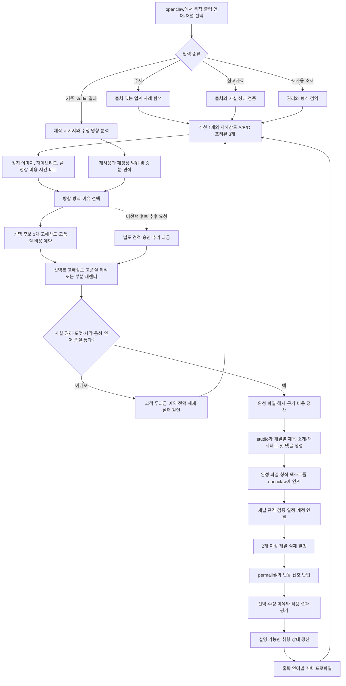

# studio-service PRD v1.2.1

| 항목 | 값 |
|---|---|
| 버전 | v1.2.1 |
| 생성 시각 | 2026-08-15 19:51 KST |
| 모델 | gpt-codex/GPT-5 |
| 에이전트 | prd-architect worker |
| 작업 라인 | studio-service |
| 상태 | Draft, plan gate 미승인 |
| 스킬 | 없음. 설치 목록에 PRD 작성 전용 스킬이 없어 planning.md와 doc-review.md를 직접 적용 |
| 근거 URL | https://replicate.com/prunaai/p-video, https://fal.ai/docs/documentation/model-apis/pricing, https://docs.dev.runwayml.com/guides/pricing/, https://pika.art/pricing?interval=month, https://home.kling.ai/quickstart/klingai-video-3-model-user-guide, https://elevenlabs.io/pricing/api, https://ai.google.dev/gemini-api/docs/pricing |
| 고민 한 줄 | 저해상도 후보 3개가 선택을 돕되 낭비를 만들지 않게 하면서, 실측 전 프리뷰 픽셀 수를 계약으로 굳히지 않는 경계를 세웠다. |
| 상류 정본 | [승인된 PRD v1.1.2](./prd-studio-service-v1.1.2-gpt-codex.md), [제품구조 결정 2026-08-15 §9.6](../../docs/제품구조-결정-2026-08-15.md), [소재원가 검증표](./소재원가-검증표-2026-08-15.md), [제품구상 레드팀](../../docs/레드팀-제품구상-2026-08-15-gpt-codex.md), [두 서비스 경계 위키](../../wiki/architecture/two-service-boundary.md) |
| 승인 게이트 | [pipeline-state.studio.md](../../pipeline-state.studio.md)의 plan. `/approve plan` 전 design 진입 금지 |

## 목차

- [TL;DR](#tldr)
- [0.5 1차 목표와 종료 증거](#05-1차-목표와-종료-증거)
- [1. 문제와 현재 구현 상태](#1-문제와-현재-구현-상태)
- [2. 제품 경계와 비범위](#2-제품-경계와-비범위)
- [3. 핵심 제품 설계](#3-핵심-제품-설계)
- [4. 페르소나](#4-페르소나)
- [5. One Thing](#5-one-thing)
- [6. 목표, 성공지표, MVP 기능 5개](#6-목표-성공지표-mvp-기능-5개)
- [7. 기능 요구사항](#7-기능-요구사항)
- [8. 비기능 요구사항](#8-비기능-요구사항)
- [9. 사용자 흐름과 취향 학습 루프](#9-사용자-흐름과-취향-학습-루프)
- [10. 수용기준과 추적성](#10-수용기준과-추적성)
- [11. BM과 운영 모델](#11-bm과-운영-모델)
- [12. 경쟁 벤치마크와 포지셔닝](#12-경쟁-벤치마크와-포지셔닝)
- [13. 운영, 법적, 시장, 기술 리스크](#13-운영-법적-시장-기술-리스크)
- [14. 레드팀, 프리모텀, 셀프심문, 중단 기준](#14-레드팀-프리모텀-셀프심문-중단-기준)
- [15. 회장 결정 필요](#15-회장-결정-필요)
- [16. 기획 7원칙 판정](#16-기획-7원칙-판정)
- [17. 개정 이력과 게이트](#17-개정-이력과-게이트)
- [부록 A. 상세 요구사항 원장](#부록-a-상세-요구사항-원장)
- [부록 B. 경쟁 조사 증거 원장](#부록-b-경쟁-조사-증거-원장)
- [SOURCES, MODEL, STAMP](#sources-model-stamp)

## TL;DR

studio-service는 1단계에서 화면 없는 멀티테넌트 이미지·영상 제작 서비스다. 소비자에게 단독 판매하는 studio 제품은 1단계 비범위다. 사용자가 빈 프롬프트에서 제작 명세를 발명하게 하지 않는다. 업종, 목적, 참고자료, 출력 언어를 받으면 출처 있는 사례와 저해상도 A/B/C 프리뷰 3개, 제작 방식별 비용·시간·좋고 나쁨을 먼저 보여준다. 사용자가 하나를 고르면 그 하나만 고해상도·고품질로 렌더한다. 미선택 후보를 나중에 고해상도·고품질로 만들면 별도 작업으로 추가 과금한다. 저해상도 프리뷰의 구체 픽셀 수는 실측 전이므로 이 PRD에서 확정하지 않는다.

1차 목표는 범용 SaaS 출시가 아니다. openclaw-service와 studio-service를 연결해 해줘단타와 제로원 인사이트용 실제 콘텐츠 2건을 만들고, 각 결과를 2개 이상 채널에 발행하는 것이다. studio는 생성, 크롭, 컷, 재인코딩, 자막 합성을 포함한 모든 미디어 바이트와 채널별 제목·소개·해시태그·첫 댓글을 소유한다. openclaw는 글자수 상한, 해시태그 개수, 지원 비율 같은 채널 규격과 일정·계정·발행 실행만 제공한다.

출력 언어는 채널 규격과 같은 급의 요청 제약이다. 영어, 일본어, 태국어 등 요청된 언어로 결과를 만들되, 언어 선택 자체를 취향 학습 신호로 쓰지 않는다. 취향 프로파일은 언어별로 분리해 한 언어의 표현 선호가 다른 언어 결과를 오염시키지 않는다. 필수 품질 게이트에 반려된 결과는 고객에게 과금하지 않고 예약액을 전액 해제한다.

**One Thing:** 사용자가 근거와 비용이 붙은 저해상도 A/B/C를 고르면 선택한 하나만 고해상도·고품질로 만들고, 그 선택과 수정은 언어별로 다음 결과를 개선하는 headless 제작 서비스.

이번 v1.2.1은 승인된 v1.1.2의 17개 본장과 부록을 삭제 없이 보존·확장한다. 제품구조 결정 §9.6의 출력 언어, 언어별 취향 분리, 저해상도 후보 3개와 선택본 1개 고해상도·고품질 렌더, 미선택 후보 추가 과금, 1단계 headless, 소비자 단독 판매 비범위, 품질 반려 무과금을 요구, 흐름, BM, 수용기준에 연결했다. 원가 근거는 Replicate, fal, Runway, Pika, Kling, ElevenLabs, Google의 공식 문서를 5개 검색 축으로 실조회했다. 공급자마다 초당 가격과 크레딧 구조가 다르므로 프리뷰의 구체 픽셀 수와 판매가는 실험·회장 승인 전까지 미결정으로 둔다.

---

## 0.5 1차 목표와 종료 증거

### 0.5.1 1차 목표

**openclaw-service가 요청하고 studio-service가 완성한 해줘단타와 제로원 인사이트 콘텐츠를 실제로 발행해, 서비스 경계와 선택 학습의 가치가 동시에 작동하는지 검증한다.**

이 목표는 “영상이 생성되었다”가 아니라 다음 네 연결이 실제로 관찰되어야 끝난다.

1. 출처 있는 입력이 제작 요청으로 바뀐다.
2. 비용·시간 범위가 보이는 선택지 중 사용자가 하나를 고른다.
3. studio가 완성 미디어를 만들고 openclaw가 바이트를 손대지 않고 발행한다.
4. 선택 이유가 다음 결과에 적용되어 수정 횟수 또는 수정 시간이 줄어든다.

### 0.5.2 우선순위 판단식

MVP 항목은 아래 세 질문을 모두 통과해야 한다.

| 질문 | 통과 기준 | 실패 시 처리 |
|---|---|---|
| 해줘단타 또는 제로원 인사이트 제작에 지금 필요한가 | 두 내부 트랙 중 하나의 실제 발행 흐름에 직접 등장 | Phase 2 이후로 이동 |
| studio와 openclaw의 경계를 증명하는가 | 미디어 바이트 변경은 studio, 발행 메타데이터는 openclaw로 감사 가능 | 경계 재설계 후 plan 재검토 |
| 선택 학습이 다음 부담을 줄이는지 계측하는가 | 선택 이유, 적용 규칙, 다음 결과, 수정량이 연결 | 단순 생성 기능으로 보고 MVP 제외 |

### 0.5.3 1차 종료 증거

| 증거 | 합격선 | 증거 형태 |
|---|---|---|
| 해줘단타 실제 발행 | studio 완성 파일 1건을 openclaw가 미디어 수정 없이 2개 이상 채널에 발행 | 제작 작업 ID, 파일 해시, 채널 permalink, 발행 작업 ID |
| 제로원 인사이트 실제 발행 | 동일 기준 1건. 참고자료의 핵심 사실과 결과 내용이 검수 일치 | 출처 목록, 사실 검수표, 파일 해시, permalink |
| 미디어 경계 | 크롭, 자르기, 재인코딩, 자막 합성 발생 건 100%가 studio 실행 흔적에 존재 | 변환 원장, openclaw 발행 원장 대조 |
| 선택 학습 | 두 트랙 합산 유효 선택 10회 이상, 선택 이유와 다음 적용이 100% 연결 | 선택 원장과 맛 프로파일 변경 이력 |
| 부담 감소 | 같은 포맷의 2회차 이후 중앙값 수정 횟수 또는 사람 수정 시간이 1회차 대비 30% 이상 감소 | 작업별 수정 횟수와 소요시간 |
| 원가 투명성 | 모든 작업에 사전 범위와 실제값이 있고 범위 이탈 원인이 표시 | 견적, 예약, 정산, 환불 원장 |

---

## 1. 문제와 현재 구현 상태

### 1.1 해결할 문제

현재 제작 도구의 다수는 빈 프롬프트, 모델 목록, 템플릿 카탈로그 중 하나를 첫 화면으로 준다. 이 구조는 제작 방향을 언어로 정의할 수 있는 숙련자에게는 빠르지만, 좋은 결과를 보면 고를 수 있으나 백지에서 명세를 만들지 못하는 고객에게는 시작 비용을 떠넘긴다. “어떤 톤이 좋아요?”, “원하는 영상을 설명하세요”라는 질문이 친절해 보여도 고객은 업계 평균, 가능한 결과, 품질과 비용의 교환관계를 모른다.

문제는 생성 능력 부족보다 결정 보조와 반복 수정의 부재다. 처음에는 업계 사례와 출처를 찾아야 하고, 다음에는 제작 방식과 가격을 추측해야 하며, 결과가 마음에 들지 않으면 같은 취향을 다시 설명해야 한다. 도구를 바꿀 때마다 이 판단 기록이 사라진다. studio-service는 이 세 비용을 사례, 선택지, 선택 이유 원장으로 줄인다.

### 1.2 위키 우선 현재 구현 상태

| 요구 영역 | 상태 | 확인 사실 | 보존·연결 방향 | 정본 출처 |
|---|---|---|---|---|
| OpenClaw Studio 화면, 초안 저장, 시각 미리보기 | 이미 구현 | 위키에 초안과 7개 시각 미리보기, 직접 발행 흐름이 기록되어 있다 | studio 자체 UI로 복제하지 않는다. openclaw가 입력, 선택, 발행 화면을 계속 소유한다 | [Studio 위키](../../wiki/product/studio.md) |
| 위키 기반 후보 생성 | 이미 구현 | `wiki_path`와 브랜드 지식 기반 초안 흐름이 있다 | 참고자료 반입의 첫 소비자로 연결한다 | [Studio 위키](../../wiki/product/studio.md), [멀티테넌트 위키](../../wiki/ops/multi-tenant.md) |
| EC0147 이미지·영상 시험 제작 | 부분 구현 | 현재 `build.py`가 EC0147에 고정되고 이미지, TTS, 합성, 품질 검사 실험이 존재한다 | 렌더러와 측정 규칙을 보존하되 범용 작업 입력으로 확장한다 | [파이프라인 README](../pipelines/README.md), [구현현황](../pipelines/구현현황.md) |
| 사람 음성·최종 품질 판단 | 부분 구현 | 최종 음성 선택과 인간 품질 판단은 구현현황에서 미완료다 | voice 결정과 사람 검수 게이트를 열어 둔다 | [구현현황](../pipelines/구현현황.md) |
| 영상 생성과 발행 | 부분 구현 | 운영자 전용 생성과 일부 발행 경로가 위키에 존재한다 | studio가 완성 파일을 만들고 openclaw는 발행만 수행한다 | [시스템 아키텍처](../../wiki/architecture/system-architecture.md), [Studio 위키](../../wiki/product/studio.md) |
| 5번째 접점인 소재 반입 | 부분 구현 | 파일, URL, 위키 경로가 흩어져 있고 권리와 삭제 맥락이 하나로 묶이지 않았다 | 자산 출처, 사용권, 보존기간, 삭제 상태를 가진 소재 반입으로 묶는다 | [Shorts Factory](../../wiki/product/shorts-factory.md), [제품구조 결정](../../docs/제품구조-결정-2026-08-15.md) |
| 4종 입력과 8단계 선택 유도 | 부분 구현 | 업종, 위키 연결, 파일 입력 일부는 있으나 사례, 복수 추천, 비용·시간, 선택 누적은 없다 | 기존 입력을 유지하며 비어 있는 결정 보조 단계를 연결한다 | [멀티테넌트 위키](../../wiki/ops/multi-tenant.md), [제품구조 결정](../../docs/제품구조-결정-2026-08-15.md) |
| 테넌트별 선택 이유와 취향 프로파일 | 미구현 | 위키에 운영 구현 증거가 없다 | 데이터 모델과 API는 eng-design 대화에서 확정한다 | [제품구조 결정](../../docs/제품구조-결정-2026-08-15.md) |
| 범용 headless studio-service | 미구현 | pipeline은 plan 단계이고 승인 산출물이 없다 | `studio/`를 서비스 루트로 사용하되 계약과 스키마는 후속 단계에서 합의한다 | [pipeline-state.studio](../../pipeline-state.studio.md) |
| 충전식 견적·예약·정산 | 미구현 | 원가 검증표는 있으나 고객 가격과 환불 정책은 미승인이다 | 원가와 판매가격을 분리하고 quote, reserve, settle, refund 상태를 요구한다 | [소재원가 검증표](./소재원가-검증표-2026-08-15.md) |
| studio 생성물 저비용 수정 | 미구현 | 최신 결정은 제작 지시서를 보존해 소재 재생성 없이 재렌더하는 방식을 1차 필수로 정했다 | 생성 결과와 지시서 버전을 함께 보존한다 | [제품구조 결정](../../docs/제품구조-결정-2026-08-15.md) |
| 생성·편집 두 모드 계약 | 미구현 | 최신 위키와 결정서는 생성과 편집을 분리하고 편집을 1차 필수로 확정했다 | 생성 결과가 편집 모드의 원본이 되며 수정은 새 생성 작업으로 취급하지 않는다 | [두 서비스 경계 위키](../../wiki/architecture/two-service-boundary.md), [제품구조 결정](../../docs/제품구조-결정-2026-08-15.md) |
| 채널별 창작 텍스트 | 부분 구현 | 기존 openclaw 화면에는 채널별 텍스트 변형과 미리보기가 있으나 독립 studio-service의 창작 텍스트 계약은 없다 | 제목·소개·해시태그·첫 댓글은 studio가 생성하고 openclaw는 버전된 채널 규격만 제공한다 | [두 서비스 경계 위키](../../wiki/architecture/two-service-boundary.md), [Studio 위키](../../wiki/product/studio.md) |
| 출력 언어 요청 제약 | 미구현 | 위키와 구현현황에 영어·일본어·태국어 등 출력 언어를 채널 규격급 요청 제약으로 받는 계약이 없다 | 언어를 요청 제약으로 전달하고 결과·검수·비용 계보에 보존한다. 언어 선택 자체는 학습 신호에서 제외한다 | [제품구조 결정 §9.6](../../docs/제품구조-결정-2026-08-15.md) |
| 언어별 취향 프로파일 | 미구현 | 테넌트별 취향 자체가 미구현이며 언어별 분리 기록도 없다 | 같은 tenant 안에서도 출력 언어별 규칙·근거·신뢰도를 분리한다 | [제품구조 결정 §9.6](../../docs/제품구조-결정-2026-08-15.md) |
| 저해상도 후보 3개와 선택본 고해상도·고품질 렌더 | 미구현 | 실험 자산에는 여러 해상도·모델 산출물이 있으나 저해상도 3개를 먼저 만들고 선택 1개만 고해상도·고품질화하는 제품 계약은 없다 | 프리뷰 픽셀 수는 실측 후 정하고, 선택 전 후보 비용과 선택 후 고해상도 비용을 분리한다 | [제품구조 결정 §9.6](../../docs/제품구조-결정-2026-08-15.md), [소재원가 검증표](./소재원가-검증표-2026-08-15.md) |
| 품질 게이트 반려 무과금 | 미구현 | 일부 품질 측정은 있으나 필수 게이트 반려 시 고객 과금 0과 예약 전액 해제를 보장하는 원장이 없다 | 고객 정산은 0으로 하고 공급자 직접비는 studio 운영손실로 별도 기록한다 | [제품구조 결정 §9.6](../../docs/제품구조-결정-2026-08-15.md) |
| 외부 장편 영상 역설계·자동 클리핑 | 미구현 | 최신 결정에서 Phase 2로 분리됐다 | MVP에서 제외한다. 이미 잘린 외부 소재의 스타일링만 1차 허용한다 | [제품구조 결정](../../docs/제품구조-결정-2026-08-15.md) |

### 1.3 현재 상태 결함과 회수

⛔ 회수 필요: [Studio 위키](../../wiki/product/studio.md)는 화면 중심 기존 구현을 설명하지만 2026-08-15에 확정된 headless 서비스 경계, 두 가지 모드, studio 단독 미디어 바이트 소유를 아직 모두 반영하지 않았다. 이 PRD가 plan 승인되면 wiki compiler가 최신 결정과 승인 버전을 근거로 갱신해야 한다.

⛔ 회수 필요: 루트 [docs/구현현황.md](../../docs/구현현황.md)는 존재하며 기존 OSMU Studio 화면, 디자인 토큰, 발행 UI의 구현과 검증을 기록한다. 그러나 2026-08-15에 확정된 headless studio-service, 생성·편집 두 모드, 편집 크레딧 구분, 채널별 창작 텍스트 소유권은 아직 기록하지 않는다. studio 제작 실험은 [studio/pipelines/구현현황.md](../pipelines/구현현황.md)에 분리돼 있다. 위키와 두 구현현황 문서를 승인 PRD 기준으로 정합화해야 한다.

⛔ 회수 필요: 위키와 구현현황에 출력 언어 요청, 언어별 취향 분리, 저해상도 후보 3개 뒤 선택본 1개 고해상도·고품질 렌더, 품질 반려 무과금이 기록되어 있지 않았다. 위키가 비어 있어 `studio/`, Studio API·화면, 구현현황 범위에서 해당 기능 키워드만 좁게 검색했지만 서비스 계약 구현 증거를 찾지 못했다. plan 승인 뒤 wiki compiler가 이 네 정책과 구현 상태를 정본에 반영해야 한다.

### 1.4 사실, 결정, 가설 분리

| 구분 | 내용 |
|---|---|
| 관찰 사실 | EC0147 고정 파이프라인이 있고 이미지, 음성, 합성, 일부 품질 측정이 부분 구현됐다 |
| 회장 결정 | studio는 openclaw-auto 안의 독립 headless 서비스이고 미디어 바이트를 단독 소유한다 |
| 회장 결정 | studio에는 신규 생성 모드와 기존 결과 수정 모드가 있다 |
| 회장 결정 | 자체 생성물 수정은 지시서 재렌더로 1차 필수, 외부 장편 역설계는 2차다 |
| 회장 결정 | 편집은 원본과 제작 지시서를 유지하고 수정 지시만 반영하며, 수정 지시는 A/B/C 선택보다 약한 학습 신호다 |
| 회장 결정 | 자막·이펙트·컷·오버레이·비율의 로컬 편집은 고객 크레딧 0이고, 나레이션 문구 수정과 소재 교체만 해당 컷 단위 과금이다. 단 서버 렌더 비용은 남는다 |
| 회장 결정 | 채널별 제목·소개·해시태그·첫 댓글은 studio가 만들고, openclaw는 채널 규격 정보만 제공한다 |
| 회장 결정 | 출력 언어는 채널 규격과 같은 급의 요청 제약이며 학습 신호가 아니다. 취향 프로파일은 언어별로 분리한다 |
| 회장 결정 | 저해상도 후보 3개를 제시하고 선택된 하나만 고해상도·고품질로 렌더한다. 미선택 후보의 추후 고해상도·고품질 렌더는 추가 과금한다 |
| 회장 결정 | 저해상도 프리뷰의 구체 픽셀 수는 실측 전이므로 확정하지 않는다 |
| 회장 결정 | studio는 1단계 headless이며 소비자 단독 판매는 비범위다 |
| 회장 결정 | 필수 품질 게이트 반려분은 고객에게 과금하지 않는다 |
| 제품 가설 | A/B/C 선택과 이유 누적이 반복 수정 부담을 30% 이상 줄인다 |
| 사업 가설 | 원가 범위 선공개와 사용량 충전식이 단순 월 구독보다 초기 신뢰를 높인다 |
| 미결정 | 첫 수직시장, 공식 명칭, 최종 음성, 한국 Higgsfield 원가, 판매가격, 품질 반려 외 환불정책, 보존기간, 저해상도 프리뷰의 구체 픽셀 수 |

---

## 2. 제품 경계와 비범위

### 2.1 제품 경계

studio-service는 다음 다섯 책임을 가진다.

1. 참고자료, 소재, 신호, 제작 요청을 받아 제작 가능한 작업으로 정규화한다.
2. 출력 언어와 채널 규격을 제작 제약으로 고정하고, 근거 있는 사례와 저해상도 A/B/C 추천, 제작 방식별 예상 비용·시간을 산출한다.
3. 저해상도 후보 3개 중 선택된 하나만 이미지와 영상의 생성, 크롭, 컷, 재인코딩, 자막 합성을 거쳐 고해상도·고품질 완성 파일로 만든다.
4. 선택 이유와 수정 지시를 출력 언어별 취향 프로파일과 다음 렌더 규칙에 누적한다.
5. 필수 품질 게이트에 반려된 결과는 인계하지 않고 고객 과금 없이 원인을 운영 원장에 남긴다.

openclaw-service는 계정, 인증, 결제 화면, 게시 UI, 버전된 채널 규격, 일정, 채널 계정, 발행 결과를 소유한다. 채널별 제목, 소개, 해시태그, 첫 댓글은 창작물이므로 studio-service가 소유한다. 의존 방향은 `openclaw-service -> studio-service`다. studio는 social API 토큰을 요구하지 않고, openclaw는 미디어 바이트나 창작 텍스트를 임의 변경하지 않는다.

### 2.2 외부 접점 5개

| 접점 | 목적 | 최소 입력 | 최소 출력 | 소유 경계 |
|---|---|---|---|---|
| 신호 반입 | 반응·성과를 다음 제작 문맥에 반영 | tenant, 콘텐츠 ID, 채널, 관측값, 기간 | 정규화된 신호 | openclaw가 수집, studio가 제작 판단에 소비 |
| 제작 요청 | 새 이미지·영상 또는 수정본 생성 | tenant, 목적, 입력 종류, 출력 언어, 채널 규격, idempotency key | 작업 ID, 상태 | openclaw 호출, studio 실행 |
| 선택 기록 | A/B/C와 이유를 누적 | 후보 ID, 선택, 이유축, 자유 메모 | 선택 원장 ID | studio 소유, openclaw UI 입력 |
| 취향 상태 출력 | 다음 요청에 적용될 설명 가능한 취향을 제공 | tenant, 브랜드, 출력 언어, 작업 맥락 | 언어별 규칙, 신뢰도, 근거 선택 | studio 소유 |
| 소재 반입 | 재사용 파일·URL·위키 자산을 등록 | 출처, 권리, 파일 또는 참조, 삭제정책 | 자산 ID, 검증 상태 | studio가 미디어 처리와 권리 메타데이터 소유 |

이 표는 PRD 수준 책임 경계다. URL, 필드 타입, 데이터베이스 테이블, 동기·비동기 방식은 기술설계에서 회장과 선택지를 합의하기 전 확정하지 않는다.

### 2.3 미디어 바이트 단독 소유

다음 행위가 한 번이라도 발생하면 studio 작업으로 기록되어야 한다.

- 이미지 생성, 리사이즈, 크롭, 포맷 변환, 압축
- 영상 생성, 컷 편집, 길이 조정, 비율 변환, 재인코딩
- 자막 생성, 위치 조정, 합성
- 음성 생성, 음량 정규화, 오디오 합성
- 로고·브랜드 요소 합성
- 기존 studio 생성물의 지시서 기반 재렌더

openclaw는 완성 파일의 바이트 해시를 받아 저장 또는 전달하고 게시 메타데이터를 붙인다. openclaw가 크롭이나 재인코딩을 수행하면 서비스 경계 실패다.

채널별 창작 텍스트도 같은 원칙을 따른다. openclaw는 글자수 상한, 해시태그 개수, 지원 비율, 금지 포맷 같은 규격 스냅샷을 studio에 제공한다. studio는 그 규격 안에서 제목, 소개, 해시태그, 첫 댓글을 각각 창작하고 근거·브랜드 톤·규격 버전을 결과 계보에 남긴다. openclaw는 검증과 발행만 하며, 규격 초과를 이유로 문장을 몰래 자르거나 새 문구를 만들지 않는다.

### 2.4 Non-goals

| 비범위 | 이유 | 재검토 조건 |
|---|---|---|
| studio 자체 최종 사용자 UI | 1단계는 headless로 확정됐고 첫 화면은 openclaw가 소유한다 | Phase 2 제품 결정과 별도 plan 승인 전에는 금지 |
| 소비자 대상 studio 단독 판매 | 1단계는 openclaw가 호출하는 제작 서비스 검증에 집중한다 | Phase 2에서 고객, 유통, 지원부하, 가격을 새로 검증하고 회장이 승인할 때 |
| SNS 발행·예약·댓글 관리 | openclaw 책임 | 의존 방향을 바꾸는 별도 제품 결정 전에는 금지 |
| 외부 장편 영상 자동 분석·클리핑 | Vrew 등 성숙 도구가 있고 역지시서 비용이 큼 | Phase 2 승인과 차별화 증거가 생길 때 |
| 외부 원본 전체 재편집 | 소유권, 역설계, 비용 예측이 어렵다 | 권리·보존 정책과 역지시서 품질이 검증될 때 |
| 음악 생성 | 1차 실제 발행 증거와 직접 연결이 약함 | 사용자 인터뷰에서 반복 수요가 확인될 때 |
| 템플릿 마켓 | 공급자·검수·권리 운영 부하가 큼 | 월 활성 제작자가 100명 이상일 때 |
| 팀 협업·승인 워크플로 | 초기 단일 운영자 검증을 흐림 | 복수 좌석 고객이 10곳 이상일 때 |
| 범용 광고 성과 최적화 | private 성과 데이터 혼합 위험 | 테넌트 격리와 데이터 권리가 별도 승인될 때 |
| 개발자 SDK 다종 제공 | API 계약 전 조기 최적화 | 첫 외부 API 고객 계약 후 |
| postAGI 기존 서비스의 포트·DB 재사용 | 루트 서비스 규칙과 충돌 가능 | 기술설계에서 별도 할당 승인 후 |

---

## 3. 핵심 제품 설계

### 3.1 두 가지 모드

| 모드 | 입력 | 시스템 책임 | 결과 | 단계 |
|---|---|---|---|---|
| 신규 생성 | 주제, 목적, 참고자료, 출력 언어, 해당 언어 취향 상태 | 사례 조사, 저해상도 A/B/C 방향, 방식·비용·시간 제시, 선택본 고해상도·고품질 생성 | 완성 파일, 제작 지시서, 근거, 비용 원장 | Phase 1 |
| studio 생성물 수정 | 기존 결과 ID, 수정 지시 | 기존 소재와 제작 지시서를 재사용하고 필요한 레이어만 재렌더 | 수정본, 변경점, 증분 비용 | Phase 1 필수 |
| 이미 잘린 외부 소재 스타일링 | 권리 확인된 짧은 파일, 스타일 지시 | 길이 분석 없이 자막·비율·브랜드 요소를 적용 | 스타일링 완성본 | Phase 1 제한 허용 |
| 외부 장편 역설계 | 외부 영상, 수정 지시 | 장면 분석, 역지시서 생성, 클립 추출, 재구성 | 다수 클립 또는 수정본 | Phase 2 |

수정 지시는 선택 이유보다 약한 취향 신호다. 단일 작업의 국소 요구일 수 있기 때문이다. 동일한 수정 방향이 서로 다른 작업에서 반복되면 취향 규칙의 신뢰도를 올린다. 한 번의 “자막을 크게”가 모든 브랜드 작업의 영구 규칙이 되어서는 안 된다.

#### 3.1.1 모드 전환 불변조건

1. 신규 생성이 품질 게이트를 통과하면 완성 파일만 남기지 않고 원본 자산 참조와 제작 지시서 버전을 함께 고정한다.
2. 사용자가 결과 화면에서 “수정”을 선택하면 새 생성 입력으로 돌아가지 않고 해당 결과의 편집 모드를 연다.
3. 편집 모드는 부모 결과 ID, 부모 지시서 버전, 수정 지시, 영향 컷, 재사용 자산, 새 결과 버전을 한 계보로 남긴다.
4. 수정 지시가 기존 자산 재사용 범위를 넘을 때만 해당 컷의 재생성 견적을 제시한다. 전체 작업 재생성을 기본값으로 삼지 않는다.
5. 편집 결과는 원본을 덮어쓰지 않는다. 원본과 이전 수정본을 유지하고 새 리비전으로 저장해 비교·되돌리기가 가능해야 한다.
6. 수정 지시는 즉시 작업에는 강하게 적용하지만 취향 프로파일에는 약한 신호로만 들어간다. 서로 다른 작업에서 같은 방향이 반복되기 전에는 전역 규칙으로 승격하지 않는다.

### 3.2 입력 5종

| 입력 종류 | 예시 | 최소 검증 | 실패 처리 |
|---|---|---|---|
| 주제·한 줄 목표 | “초보자가 RSI를 오해하는 이유” | 목적과 금지 주장 확인 | 사례 질문으로 보완 |
| 출력 언어·채널 제약 | 영어, 일본어, 태국어, 대상 채널 규격 버전 | 지원 가능 언어, 언어별 검수 범위, 채널 규격 시점 | 지원·검수 범위와 대체안을 설명하고 예약 전 중단 |
| 참고자료 | 위키 문서, 기사 URL, 텍스트 노트 | 출처 접근, 사실 시점, 사용 가능성 | 출처별 실패 표시, 무근거 생성 금지 |
| 재사용 소재 | 이미지, 짧은 영상, 로고, 음성 | 권리 선언, 형식, 용량, 보존기간 | 검역 보류 또는 거절 |
| 기존 결과·수정 지시 | studio 결과 ID, “첫 3초를 더 빠르게” | 원본 지시서 존재, tenant 소유 | 재생성 필요 여부와 비용 차이 표시 |

### 3.3 백지 제거 8단계

1. **목적 확인:** 판매, 설명, 교육, 신뢰, 유입 중 하나와 성공 행동을 고른다.
2. **입력 연결:** 주제, 참고자료, 재사용 소재, 기존 결과 중 가능한 것을 연결한다.
3. **업계 사례 제시:** 실제 접근 가능한 출처, 사례 캡처 또는 설명, 적용 가능성을 보여준다.
4. **추천 방향 A/B/C:** 구조, 톤, 첫 장면, 핵심 차이를 한눈에 비교한다.
5. **제작 방식 비교:** 정지 이미지 내레이션, 하이브리드, 풀 생성 영상의 비용·시간·장단점을 보여준다.
6. **선택과 이유:** 후보, 방식, 이유축, 금지 요소를 기록한다.
7. **생성·검수·수정:** 품질 게이트를 통과시키고 studio 생성물은 지시서 기반으로 저비용 수정한다.
8. **발행 인계·학습:** 완성 파일과 근거를 openclaw에 넘기고 선택·수정 신호를 다음 작업에 적용한다.

### 3.4 제작 방식 3종

| 방식 | 구성 | 좋은 경우 | 나쁜 경우 | 고객에게 보여줄 값 |
|---|---|---|---|---|
| 정지 이미지 내레이션 | 이미지, 패닝·줌, TTS, 자막 | 설명형, 빠른 검증, 낮은 원가 | 장면 변화가 중요한 제품 데모 | 예상 범위, 완성 예시, 동적 장면 한계 |
| 하이브리드 | 핵심 장면 일부 생성 영상, 나머지 이미지·텍스트 | 비용과 시각 몰입 균형 | 전 구간 일관된 실사 움직임이 필요한 경우 | 핵심 영상 초, 이미지 수, 예상 증분 비용 |
| 풀 생성 영상 | 다수 생성 클립, 음성, 자막, 편집 | 광고형 임팩트와 움직임이 핵심 | 긴 설명, 비용 민감, 캐릭터 일관성 요구 | 모델, 초수, 재시도 가정, 원가 범위 |

내부 원가 가설의 하이브리드 직접비는 약 1,635원에서 1,823원 범위지만, 이는 고객 판매가격이 아니다. Higgsfield 한국 실제 단가와 실패 재시도율이 미검증이므로 UI와 계약에서 확정가격처럼 표시하면 안 된다.

### 3.5 추천 방식

초기 화면은 세 방식의 표를 먼저 던지지 않는다. 목적, 분량, 예산 민감도, 시각적 움직임 필요를 바탕으로 추천 한 개를 먼저 보여주고 “다른 방식 비교”를 펼치면 세 가지를 비교한다. 추천에는 이유, 예측 범위, 품질 한계가 함께 있어야 한다.

추천이 틀렸다고 사용자가 바꾸면 그 선택 자체를 이유축으로 기록한다. “하이브리드는 비싸서 정지 이미지 선택”과 “풀 영상은 과해서 하이브리드 선택”은 동일한 저비용 선호가 아니다.

### 3.6 A/B/C의 의미

A/B/C는 같은 문장의 색상 차이가 아니다. 최소 두 개 이상의 제작 축이 달라야 한다.

| 축 | 허용 예시 | 무효 예시 |
|---|---|---|
| 구조 | 문제 폭로형, 단계 설명형, 사례 전환형 | 제목 단어만 변경 |
| 첫 장면 | 숫자, 질문, 실패 장면 | 동일 장면에 색상만 변경 |
| 증거 | 데이터, 실제 사례, 전문가 설명 | 출처 없는 수치 교체 |
| 시각 문법 | 카드형, 실사 하이브리드, 타이포 중심 | 폰트 크기 2px 차이 |
| 말투 | 단호한 코치, 차분한 해설, 동료형 | 같은 대본에 감탄사만 추가 |

### 3.7 선택 이유축

기본 이유축은 `구조`, `속도`, `시각 밀도`, `신뢰감`, `친근함`, `비용`, `수정 용이성`, `브랜드 일치`, `금지 요소`다. 사용자는 복수 선택과 자유 메모를 함께 쓸 수 있다. 시스템은 자유 메모를 즉시 영구 취향으로 확정하지 않고 후보 규칙으로 보관한다.

### 3.8 제작 지시서와 저비용 수정

모든 studio 생성 결과에는 재현 가능한 제작 지시서가 붙는다. 지시서에는 원본 소재 참조, 장면 순서, 대본, 자막, 음성, 레이아웃, 모델·공급자, 크롭·인코딩 파라미터, 품질 판정, 비용 항목이 포함되어야 한다. 실제 저장 형식과 필드는 eng-design에서 정한다.

수정 요청은 지시서의 영향을 받는 부분을 식별한다. “마지막 CTA 삭제”라면 원본 이미지나 음성을 전부 재생성하지 않고 타임라인과 자막만 다시 렌더한다. 재사용할 수 없는 경우에는 재생성 이유와 추가 비용을 생성 전에 보여준다. 이 비용 구조가 단순 생성 도구와 구별되는 핵심 가설이다.

#### 3.8.1 편집 크레딧 판정표

| 편집 지시 | 실행 수단 | 고객 크레딧 | 실제 비용 처리 | 과금 단위 |
|---|---|---:|---|---|
| 자막 크기·글꼴·색·위치·문구 변경 | 로컬 FFmpeg·PIL과 기존 자막 레이어 재렌더 | 0 | 서버 CPU·GPU·저장·전송 비용은 운영 원가로 측정 | 해당 없음 |
| 이펙트 추가 | 로컬 FFmpeg 필터와 기존 타임라인 재렌더 | 0 | 서버 렌더 비용은 남음 | 해당 없음 |
| 컷 순서·길이 변경, 컷 삭제 | 기존 컷 자산과 타임라인 재조립 | 0 | 서버 렌더 비용은 남음 | 해당 없음 |
| 오버레이·용어칩·말풍선 배치 변경 | 로컬 PIL·FFmpeg 합성 | 0 | 서버 렌더 비용은 남음 | 해당 없음 |
| 채널별 비율 변경·크롭 | 기존 자산의 로컬 변환 | 0 | 서버 렌더 비용은 남음 | 해당 없음 |
| 나레이션 문구 수정 | 영향을 받는 컷의 음성만 재생성하고 해당 구간 재합성 | 발생 | 외부 음성 공급자 비용과 서버 렌더 비용 | 해당 컷 |
| 이미지·영상 소재 교체 | 영향을 받는 컷의 소재만 재생성하고 해당 구간 재합성 | 발생 | 외부 생성 공급자 비용과 서버 렌더 비용 | 해당 컷 |

여기서 “크레딧 0”은 고객의 생성 크레딧을 차감하지 않는다는 뜻이다. 서버 렌더 비용이 0이라는 뜻이 아니다. BM과 원가 원장은 고객 크레딧, 외부 모델 직접비, 서버 렌더 원가를 분리해야 한다. 이 구분을 숨기고 “무료 수정”이라고 표현하면 비용 과장이다.

#### 3.8.2 원본 유지와 수정 범위

편집은 원본 파일, 원본 소재, 부모 제작 지시서를 삭제하거나 덮어쓰지 않는다. 수정 지시가 미치는 컷과 레이어만 새 리비전에 반영한다. 예를 들어 “2번 컷 자막을 위로 옮기고 0.5초 줄여 줘”는 2번 컷의 자막 좌표와 타임라인만 바꾸며, 1번·3번 이후 컷의 이미지·음성 생성 호출은 0이어야 한다. 반대로 “2번 컷 나레이션 문장을 바꿔 줘”는 2번 컷 음성만 재생성하고 다른 컷은 재사용한다.

### 3.9 테넌트와 private 데이터 경계

각 요청, 자산, 선택, 취향, 제작 지시서, 비용 원장, 결과 파일은 tenant 범위 밖에서 조회되거나 학습에 섞이면 안 된다. 전체 서비스 analytics에는 작업 성공률, 지연 구간, 공급자 오류율처럼 개인·브랜드 내용을 복원할 수 없는 운영 측정만 포함한다. private 서비스의 콘텐츠 본문, 파일, 선택 메모, 채널 성과는 테넌트 동의 없이 교차 학습하거나 공용 analytics로 복제하지 않는다.

### 3.10 채널별 창작 텍스트

studio는 완성 미디어와 함께 대상 채널별 창작 텍스트 패키지를 만든다. 최소 항목은 제목, 소개 또는 본문, 해시태그, 첫 댓글이다. 채널에 해당 항목이 없으면 “해당 없음”과 규격 근거를 남긴다. 같은 문장을 기계적으로 잘라 여러 채널에 복사하지 않고, studio가 보유한 브랜드 톤과 참고자료를 유지하면서 채널 규격에 맞게 각각 창작한다.

openclaw는 이 문구를 창작하지 않는다. 대상 채널의 글자수 상한, 해시태그 허용 개수, 지원 비율, 필수·금지 필드, 규격 확인 시점을 studio에 제공한다. studio는 해당 규격 버전을 핀해 문구를 만들고, openclaw는 규격 검증, 사용자 승인, 예약, 계정 선택, 발행 실행을 담당한다. 규격이 바뀌어 재작성해야 하면 openclaw가 직접 자르지 않고 studio에 새 텍스트 리비전을 요청한다.

### 3.11 출력 언어와 언어별 취향 경계

출력 언어는 영상 비율, 길이, 채널 규격처럼 요청마다 명시되는 제작 제약이다. 영어, 일본어, 태국어 등 지원 언어는 요청 시점에 선택하거나 호출자가 전달한다. 어떤 언어를 골랐다는 사실 자체는 선호가 아니므로 취향 점수에 넣지 않는다. 언어별 결과의 문장 길이, 존대, 어휘 난도, 훅 표현, 자막 밀도에 대한 선택과 수정만 해당 언어 프로파일의 근거가 된다.

같은 tenant와 브랜드라도 한국어에서 “짧고 단호함”을 골랐다고 일본어에 같은 말투를 자동 이식하지 않는다. 언어별 프로파일은 근거 선택, 신뢰도, 적용 범위를 따로 가진다. 여러 언어에 공통 적용할 브랜드 규칙은 사용자가 공통 규칙임을 명시했거나 별도 검토를 통과한 경우에만 공유한다. 실제 엔티티, 저장 키, API 필드명은 기술설계 대화에서 확정한다.

한국어와 영어는 내부 의미·금칙어·자막 검수를 필수로 한다. 일본어, 태국어 등 내부 원어민 검수가 없는 언어는 생성 가능 여부와 검수 한계를 견적 전에 공개하고, 사람이 승인하기 전 발행 인계하지 않는다. 이 경계는 지원 언어 목록을 임의 확정하는 것이 아니라 언어별 검수 책임을 숨기지 않기 위한 제품 요구다.

### 3.12 저해상도 후보와 선택본 고해상도·고품질 렌더

신규 생성의 A/B/C는 선택 전에 저해상도 프리뷰 3개로 제공한다. 사용자가 하나를 확정하면 선택된 후보 하나만 목표 채널 규격을 만족하는 고해상도·고품질 결과로 렌더한다. 선택하지 않은 두 후보는 프리뷰 상태로 남으며, 나중에 고해상도·고품질로 요청하면 새로운 견적과 승인을 거치는 추가 과금 작업이다. 품질 게이트에 실패한 프리뷰나 선택본은 고객 과금 대상이 아니다.

“저해상도”는 고해상도 완료본보다 낮은 해상도의 선택용 프리뷰라는 뜻이지만, 특정 픽셀 숫자를 뜻하지 않는다. 프리뷰가 방향, 장면 구성, 말투, 움직임을 판단할 만큼 선명하면서도 고해상도·고품질 렌더보다 충분히 싸야 한다. Replicate P-Video의 공식 예시는 같은 720p에서 standard가 초당 $0.02, draft가 $0.005이고 같은 1080p에서 $0.04와 $0.01로 4배 차이를 보인다. 이는 초안 모드도 추가 원가 절감 축이 될 수 있음을 지지하지만, 회장이 확정한 저해상도 후보 원칙을 대체하거나 모든 공급자에 일반화하지 않는다.

프리뷰 구체 해상도는 다음 실험 전까지 미결정이다.

| 실험 항목 | 고정 조건 | 비교 조건 | 합격선 | 결정 권한 |
|---|---|---|---|---|
| 방향 선택 가능성 | 동일 제작 지시, 모델 계열, 길이, 후보 의미축 | 프리뷰 해상도·초안 모드 | 회장이 A/B/C 차이와 선택 이유를 무리 없이 판별 | 실측 증거를 본 회장 |
| 비용 절감 | 동일 공급자 가격 시점과 재시도 정책 | 프리뷰 3개 총원가 대 고품질 3개 총원가 | 품질 선택 정확도를 해치지 않으면서 의미 있는 절감. 구체 문턱은 실험 전 미확정 | plan 또는 eng-design 재합의 |
| 선택본 품질 | 선택된 프리뷰와 고품질 결과의 제작 의도 | 프리뷰 대 고품질 | 고품질화 뒤 후보의 핵심 방향이 바뀌지 않음 | 사람 품질 검수 |
| 실패 비용 | 같은 요청군 | 프리뷰·고품질 단계별 실패율과 반려율 | 무료 반려가 마진을 소진하지 않는 운영 한도 도출 | BM 승인 |

실험 전 코드·API·가격표에 `480p`, `720p` 같은 값을 제품 계약으로 고정하면 안 된다. 구현 기본값이 필요해지는 시점에는 후보 해상도, 모델, 원가, 선택 정확도, 품질 반려율을 함께 제시해 회장과 합의한다.

---

## 4. 페르소나

### 4.1 1차 사람 페르소나: 김하린, 26세, 조별과제 팀장 겸 예비 1인 창업자

김하린은 서울에서 직장을 다니며 퇴근 후에는 금융 초보자를 위한 짧은 교육 콘텐츠를 만들고, 주말에는 친구들과 소규모 온라인 클래스 아이디어를 검증한다. 영상 편집자는 아니지만 인스타그램 릴스와 유튜브 쇼츠를 매일 보고, 결과물 두세 개를 나란히 놓으면 “이건 너무 광고 같고, 이건 믿을 만하며, 이 버전은 첫 3초가 느리다”라고 구체적으로 고를 수 있다. 반대로 빈 입력창에서 원하는 영상의 장면 수, 시각 문법, 음성 톤, 생성 모델을 설명하라고 하면 무엇부터 정해야 하는지 몰라 멈춘다. 검색으로 레퍼런스를 찾다가 한 시간을 쓰고도 출처가 진짜인지, 자기 업종에 맞는지 판단하지 못한 경험이 반복됐다.

그녀의 하루는 여유롭지 않다. 회사 업무가 끝난 뒤 90분 안에 주제를 고르고, 자료를 확인하고, 콘텐츠 한 편의 초안을 만들어야 한다. 기존 AI 도구로 만든 첫 결과가 마음에 들지 않으면 “좀 더 세련되게” 같은 모호한 수정 지시를 반복하고, 도구는 앞선 선택을 기억하지 못한다. 이미지 한 장을 바꾸려 했는데 영상 전체가 다시 생성되어 크레딧이 빠진 경험 때문에 비용 표시도 믿지 않는다. 월 구독은 싸 보여도 몇 편을 만들 수 있는지, 실패한 생성에도 비용이 드는지, 수정은 새 제작으로 계산되는지 알 수 없으면 결제를 미룬다.

김하린이 원하는 것은 전문가용 편집 자유도가 아니다. 자기 업계에서 실제로 쓰이는 사례와 출처, 서로 의미 있게 다른 세 방향, 각 방향의 예상 비용과 시간, 왜 이 방향을 추천하는지에 대한 설명이다. 처음에는 시스템이 한 개를 추천해 주고, 원하면 다른 방식을 비교할 수 있어야 한다. 선택한 뒤에는 이유를 “신뢰감 있음”, “첫 장면 빠름”, “비용이 낮음”, “광고 같아서 싫음”처럼 남기고 싶다. 다음 작업에서 같은 설명을 반복하지 않고 결과가 더 가까워지는 것이 성공이다.

김하린은 같은 금융 개념을 한국어와 영어로 시험하고, 반응이 확인되면 일본어·태국어 채널까지 넓히고 싶다. 그러나 한국어에서 단호한 표현을 골랐다는 이유로 일본어 결과까지 공격적으로 바뀌거나, 언어를 바꿨다는 사실이 취향으로 오해되는 것은 원하지 않는다. 세 후보를 모두 최고 화질로 만드는 비용도 납득하기 어렵다. 방향을 판단할 수 있는 저해상도 후보 3개를 먼저 보고 선택한 하나에만 고해상도 비용을 집중하고 싶으며, 시스템 품질 기준에서 탈락한 결과 때문에 잔액이 줄어드는 것은 서비스 책임 전가라고 본다.

그녀는 완전 자동 발행을 원하지 않는다. 금융이나 교육 콘텐츠의 사실 오류와 과장 표현은 자기 평판을 직접 해치기 때문에 근거를 확인하고 최종본을 고르는 권한을 유지하려 한다. 또한 회사 자료나 유료 강의 초안을 다른 고객의 추천 학습에 쓰는 것을 받아들이지 않는다. 결과 파일과 제작 근거가 함께 남고, openclaw에서 어떤 채널에 언제 발행됐는지 추적되며, 삭제를 요청하면 자기 자산과 파생물이 어디까지 사라지는지 알아야 한다.

김하린의 가장 큰 pain은 “만들 수 없음”이 아니다. **볼 줄은 알지만 처음부터 정의하지 못해, 사례 탐색과 반복 수정과 언어별 재설명과 불투명한 크레딧에 매번 같은 시간을 다시 쓰는 것**이다. 그녀의 성공 장면은 20분 안에 근거와 비용이 붙은 저해상도 A/B/C를 보고 하나를 고른 뒤, 선택본만 고해상도·고품질로 받고, 두 번째 콘텐츠부터 수정이 한 번 이하로 줄며, 예상한 비용 범위 안에서 실제 게시물까지 나오는 것이다.

### 4.2 시스템 고객: 오픈클로, 내부 캠페인 오케스트레이터

openclaw-service는 사람 대신 제작 요청, 채널 규격, 발행 계정, 일정, 게시 결과를 연결하는 첫 시스템 고객이다. studio에 완성 미디어와 채널별 창작 텍스트를 요청하되 생성 모델, 편집 내부, 제목·소개·해시태그·첫 댓글 생성을 재구현하지 않는다. studio 결과의 파일·텍스트 해시와 근거를 보존한 채 일정과 계정을 연결해 발행하고 채널 성과를 신호 접점으로 되돌린다.

### 4.3 반페르소나

- 프레임 단위 수동 편집, 복합 키프레임, 색보정 자유도가 핵심인 전문 영상 편집자
- 출처와 승인 없이 대량 자동 발행만 원하는 스팸 운영자
- 모든 생성물을 즉시 공용 학습에 제공해도 된다고 가정하는 데이터 중개자
- 월 수천 편을 최저 단가로 뽑는 것만 중요하고 선택 이유나 브랜드 일관성은 중요하지 않은 공장형 운영자

---

## 5. One Thing

### 5.1 후보 비교와 잘못된 답의 함정

| 후보 | 매력 | load-bearing 약점 | 잘못된 답의 함정 | 판정 |
|---|---|---|---|---|
| 한 줄 입력으로 모든 플랫폼 콘텐츠 자동 생성 | 데모가 쉽고 즉시 이해됨 | Markety, Sigmine, InVideo가 이미 유사 약속을 한다 | 생성량을 가치로 착각하고 선택·수정 부담을 숨김 | 기각 |
| 월 300개 콘텐츠 자동 발행 | 수량과 ROI를 광고하기 쉬움 | 발행은 openclaw 책임이고 품질·권리 사고가 커짐 | 빈도 최적화가 studio 경계를 침범 | 기각 |
| 가장 저렴한 AI 영상 생성 API | 가격 비교가 쉬움 | 공급자 가격 변동과 실패율에 취약 | 원가 경쟁은 지속 가능한 고객 가치가 아님 | 기각 |
| 한국어 템플릿과 음성 최다 | 국내 친화적 | Vrew가 200개 이상 음성과 방대한 소재를 공식 제공 | 자산 수가 선택 품질과 수정비 감소를 보장하지 않음 | 보조 역량 |
| 한 API로 이미지·영상·자막 처리 | 기술 경계가 명확 | 고객은 API 통합 자체보다 결과와 운영 부담에 비용을 냄 | 내부 아키텍처를 고객 가치로 오인 | 보조 역량 |
| 업계 사례와 A/B/C를 먼저 보여주는 제작 도구 | 백지 부담을 직접 줄임 | 추천이 피상적이면 일반 템플릿과 다르지 않음 | 사례 출처와 의미 있는 차이를 강제하지 않으면 위장 선택 | 유력 |
| 선택 이유를 다음 제작에 누적하는 도구 | 반복 사용 가치가 커짐 | 선택 데이터가 적으면 초반 효용이 약함 | 한 번의 수정 지시를 영구 취향으로 과적합 | 유력 |
| 제작 지시서를 보존해 수정비를 낮추는 도구 | 실제 비용과 시간을 직접 줄임 | 자체 생성물에만 강하고 외부 영상에는 약함 | “수정 무료”로 과장하면 원가·환불 사고 | 유력 |
| 모든 언어에 하나의 글로벌 취향을 적용하는 도구 | 학습 데이터가 빨리 쌓이는 것처럼 보임 | 언어마다 말투·문장 길이·문화적 금기가 다름 | 언어 선택을 선호로 오인하고 교차 언어 오염을 만듦 | 기각 |
| 세 후보를 모두 최고 품질로 만드는 비교 도구 | 후보 간 화질 조건이 같아 보임 | 선택하지 않을 결과 두 개에도 가장 비싼 렌더 비용이 듦 | 비교 공정성을 원가 낭비와 혼동 | 기각 |
| 근거, 선택, 수정비를 한 순환으로 묶는 headless studio | openclaw와 경계를 지키며 세 가치를 연결 | 구현 범위가 넓어질 수 있어 MVP 증거가 필요 | 각 요소를 모두 만들다 핵심 발행 증거를 놓칠 위험 | 채택 |

### 5.2 채택 문장

**사용자가 근거와 비용이 붙은 저해상도 A/B/C를 고르면 선택한 하나만 고해상도·고품질로 만들고, 그 선택과 수정은 언어별로 다음 결과를 개선하는 headless 제작 서비스.**

### 5.3 One Thing 인과

`출처 있는 사례`가 무엇을 만들지 모르는 첫 번째 백지 부담을 줄인다. `비용·시간이 보이는 저해상도 A/B/C`가 결정을 가능하게 하고 선택되지 않을 고해상도 렌더 비용을 막는다. `선택한 하나의 고해상도·고품질 렌더`와 `원본을 유지하는 편집 모드`가 비용과 수정 부담을 줄인다. `언어별 선택 이유와 약한 수정 신호, 제작 지시서`가 교차 언어 오염 없이 다음 결과를 개선한다. 이 고리가 끊기면 studio는 기존 생성 API의 얇은 래퍼가 된다.

### 5.4 7원칙 점검

| 원칙 | 질문 | 판정 | 근거 또는 보완 |
|---|---|---|---|
| 불가피성 | 이 문제가 지금 반복되는가 | 통과 | 기존 실험에서 수작업 레퍼런스·품질 판단·재생성이 반복됨 |
| 단일성 | 한 문장으로 우선순위를 자를 수 있는가 | 통과 | 선택 이유가 다음 수정 부담을 줄이는가로 기능을 판단 |
| 관찰 가능성 | 결과를 실제 행동으로 측정 가능한가 | 통과 | 선택, 수정, 비용, 파일 해시, 게시 permalink로 연결 |
| 차별성 | 경쟁사가 쉽게 같은 문장을 주장할 수 없는가 | 조건부 | InVideo도 비용 계획을 보여준다. 제작 지시서 재렌더와 테넌트별 이유 학습이 함께 증명돼야 함 |
| 경계성 | 하지 않을 일을 자르는가 | 통과 | 발행, UI, 외부 장편 역설계, 팀 협업 제외 |
| 경제성 | 원가와 고객가치가 연결되는가 | 조건부 | 저비용 수정과 예약·정산은 설계됐으나 실제 실패율 미검증 |
| 학습성 | 사용이 누적될수록 좋아지는가 | 통과 가설 | 이유축과 적용 이력이 있지만 10회 이상 실제 검증 필요 |

---

## 6. 목표, 성공지표, MVP 기능 5개

### 6.1 목표

1. 해줘단타와 제로원 인사이트에서 실제 게시물 2건을 만든다.
2. openclaw와 studio의 미디어 경계를 파일 해시와 실행 원장으로 증명한다.
3. 선택 이유가 다음 제작에 적용되어 수정 부담이 줄어드는지 측정한다.
4. 생성 전 견적과 생성 후 실제 원가의 차이를 측정하고 실패 비용을 설명한다.
5. private 콘텐츠와 선택 데이터를 테넌트 밖 analytics에 섞지 않는다.
6. 출력 언어를 요청 제약으로 보존하고 언어별 취향 프로파일의 교차 오염을 0건으로 유지한다.
7. 후보 3개를 저비용으로 비교한 뒤 선택된 하나만 고품질로 렌더해 미선택 고품질 비용을 제거한다.

### 6.2 성공지표

| 지표 | 정의 | 1차 합격선 | 실패 해석 |
|---|---|---|---|
| Time to first grounded choice | 입력 완료부터 출처 있는 A/B/C 중 첫 선택까지 | 중앙값 20분 이하 | 사례 탐색이나 선택지가 여전히 어렵다 |
| Choice reason completion | 후보 선택 중 이유축 또는 메모가 남은 비율 | 90% 이상 | 학습 신호 UX가 부담스럽거나 무의미하다 |
| Preference application trace | 다음 결과에 적용된 규칙이 근거 선택까지 연결되는 비율 | 100% | 설명 가능한 학습이 아니다 |
| Revision burden reduction | 같은 포맷 2회차 이후 사람 수정 횟수 또는 시간 감소 | 중앙값 30% 이상 | One Thing이 성립하지 않는다 |
| Quote accuracy | 사전 견적 범위 안에 실제 직접비가 들어온 비율 | 80% 이상 | 고객 신뢰와 마진 통제가 불가능하다 |
| Media boundary integrity | openclaw가 미디어 바이트를 변경하지 않은 발행 비율 | 100% | 서비스 경계가 깨졌다 |
| Publish evidence | studio 완성 파일이 실제 여러 채널에 발행된 내부 트랙 수 | 2개 트랙, 각 2채널 이상 | 생성 데모만 있고 제품 순환이 없다 |
| Grounding pass | 출처 요구 문장 중 근거 연결과 사실 검수를 통과한 비율 | 100% | 교육·금융 콘텐츠로 사용할 수 없다 |
| Tenant isolation incident | 교차 테넌트 노출·학습·analytics 혼입 | 0건 | 즉시 중단 및 사고 대응 |
| Language constraint trace | 요청 언어가 후보, 선택본, 텍스트, 검수, 인계까지 같은 제약으로 연결된 비율 | 100% | 요청 제약이 중간 단계에서 유실됐다 |
| Cross-language preference contamination | 한 언어의 근거 없는 취향 규칙이 다른 언어 결과에 적용된 건수 | 0건 | 언어별 프로파일 경계가 깨졌다 |
| Preview decision adequacy | 저해상도 프리뷰만 보고 고른 방향이 고해상도·고품질화 뒤에도 유지된 비율 | 내부 실제 선택의 90% 이상 | 프리뷰 품질이 선택용으로 부족하다 |
| Unselected high-quality waste | 선택 전에 미선택 후보에 고품질 렌더를 실행한 건수 | 0건 | 단계형 원가 통제가 실패했다 |
| Quality-reject charge incident | 필수 품질 게이트 반려 결과에 고객 과금이 발생한 건수 | 0건 | 서비스 실패 비용을 고객에게 전가했다 |

### 6.3 MVP 기능 5개

| MVP 기능 | One Thing 연결 | 포함 요구 | 제외 경계 |
|---|---|---|---|
| 1. 근거·소재 반입과 사례 추천 | 백지 부담을 줄임 | 4종 입력, 5접점, 출처 상태, 권리 메타데이터 | 범용 웹 크롤러, 권리 자동 판정 |
| 2. 저해상도 A/B/C와 제작 방식 견적 | 선택을 가능하게 하고 미선택 고해상도 비용을 막음 | 의미 있는 세 방향, 추천 1개, 저해상도 프리뷰 3개, 선택본 1개 고해상도·고품질 렌더, 비용·시간 범위 | 프리뷰 픽셀 수 임의 확정, 무제한 변형, 선택 전 고해상도 3개 |
| 3. 언어 제약을 지키는 완성 미디어·창작 텍스트와 품질 게이트 | studio 경계와 언어별 품질을 증명 | 이미지·영상·음성·자막·인코딩, 출력 언어, 제목·소개·해시태그·첫 댓글, 공급자 근거, 품질 규칙 | 발행 실행, 채널 계정 관리, 1단계 소비자 studio UI |
| 4. 선택 이유·언어별 취향 학습·저비용 편집 | 다음 수정 부담을 줄이고 언어 간 오염을 막음 | 원본 유지, 언어별 이유축, 약한 수정 신호, 적용 이력, 제작 지시서 부분 재렌더, 편집 크레딧 판정 | 외부 장편 역설계·자동 클리핑, 언어 선택 자체의 학습 |
| 5. 견적·예약·정산과 openclaw 인계 | 비용 신뢰와 실제 사용을 증명 | quote, reserve, settle, refund, 품질 반려 무과금, 미선택 후보 고품질 추가 과금, 컷 단위 과금, 파일 해시, 발행 인계 | 최종 판매가격과 PG 계약의 임의 확정 |

---

## 7. 기능 요구사항

모든 기능 요구사항은 원자적으로 식별한다. API 필드와 데이터베이스 엔티티는 이 문서의 범위가 아니다. 각 요구의 “현재 상태”는 2026-08-15 위키와 구현현황 기준이며, 승인 전 코드를 지시하지 않는다.

### FR-001 테넌트 경계

| 필드 | 내용 |
|---|---|
| 설명 | 모든 요청, 자산, 후보, 선택, 취향, 지시서, 비용, 결과를 tenant 범위로 격리한다 |
| 근거 | private 데이터 교차 혼입 금지, 독립 과금과 삭제 책임 |
| Fit criterion | 교차 tenant ID로 조회·수정·생성·결과 접근이 모두 거부되고 감사 기록이 남는다 |
| 우선순위 | Must |
| 현재 상태 | 부분 구현. 기존 멀티테넌트 흐름은 있으나 studio 전체 자산 원장은 미구현 |
| 출처 | [멀티테넌트 위키](../../wiki/ops/multi-tenant.md), [제품구조 결정](../../docs/제품구조-결정-2026-08-15.md) |

### FR-010 참고자료 반입

| 필드 | 내용 |
|---|---|
| 설명 | 텍스트, 접근 가능한 URL, 위키 경로를 제작 참고자료로 등록하고 출처·시점·접근 상태를 보존한다 |
| 근거 | 교육·금융 콘텐츠의 사실 추적과 백지 제거 |
| Fit criterion | 결과의 출처 요구 문장을 원본 참고자료까지 추적할 수 있고 접근 실패 자료는 근거로 사용하지 않는다 |
| 우선순위 | Must |
| 현재 상태 | 부분 구현. 위키 경로와 URL 입력이 흩어져 있음 |

### FR-011 소재 반입

| 필드 | 내용 |
|---|---|
| 설명 | 이미지, 짧은 영상, 로고, 음성 등 재사용 소재를 권리 선언, 출처, 보존기간과 함께 등록한다 |
| 근거 | 5번째 외부 접점 확정, 파생물 삭제와 권리 대응 |
| Fit criterion | 권리 선언이 없거나 형식 검역이 실패한 소재는 제작에 쓰이지 않는다 |
| 우선순위 | Must |
| 현재 상태 | 부분 구현. 파일 흐름은 있으나 통합 권리·삭제 맥락 미구현 |

### FR-012 신호 반입

| 필드 | 내용 |
|---|---|
| 설명 | openclaw가 채널별 반응과 게시 결과를 정규화해 특정 결과·기간과 연결한다 |
| 근거 | 제작 후 학습 순환과 성과 해석 |
| Fit criterion | 신호는 tenant, 원본 결과, 채널, 관측 기간과 연결되며 다른 tenant의 추천에 사용되지 않는다 |
| 우선순위 | Should. 1차는 발행 성공과 기본 반응만 |
| 현재 상태 | 미구현 |

### FR-013 출력 언어 제약과 언어별 취향 분리

| 필드 | 내용 |
|---|---|
| 설명 | 영어, 일본어, 태국어 등 출력 언어를 채널 규격급 요청 제약으로 받아 후보, 선택본, 창작 텍스트, 검수, 인계에 일관되게 적용하고 취향 상태는 언어별로 분리한다 |
| 근거 | 제품구조 결정 §9.6. 언어 선택은 학습 신호가 아니며 언어 간 표현 선호 오염을 막아야 함 |
| Fit criterion | 요청 언어가 모든 결과 계보에 남고, 한국어 선택·수정 근거가 사용자 명시 없이 일본어 취향 규칙으로 적용되는 건수가 0이다 |
| 우선순위 | Must |
| 현재 상태 | 미구현. 위키와 구현현황에 서비스 계약 증거 없음 |
| 미결정 경계 | 실제 API 필드명, 지원 언어 목록, 언어 코드 표준, fallback은 eng-design 대화에서 확정 |
| 출처 | [제품구조 결정 §9.6](../../docs/제품구조-결정-2026-08-15.md). 위키 미기록은 §1.3에서 회수 |

### FR-020 출처 있는 업계 사례

| 필드 | 내용 |
|---|---|
| 설명 | 업종·목적과 관련된 접근 가능한 실제 사례를 출처 URL, 확인 시점, 차용 가능 요소와 함께 보여준다 |
| 근거 | 사용자가 백지에서 스타일을 발명하지 않게 함 |
| Fit criterion | 사례마다 실제 접근 URL, 확인 사실, 적용 또는 비적용 이유가 있고 접근 불가 사례는 추천 근거에서 제외된다 |
| 우선순위 | Must |
| 현재 상태 | 미구현 |

### FR-021 추천 1개와 A/B/C 방향

| 필드 | 내용 |
|---|---|
| 설명 | 목적에 가장 맞는 추천 한 개를 먼저 제시하고, 사용자가 펼치면 최소 두 제작축이 다른 저해상도 A/B/C 프리뷰 3개를 비교한다 |
| 근거 | 선택 피로 감소와 의미 있는 비교 |
| Fit criterion | 후보 쌍마다 구조, 첫 장면, 증거, 시각 문법, 말투 중 두 축 이상이 다르고 추천 이유와 후보 단계 예상비용이 표시된다 |
| 우선순위 | Must |
| 현재 상태 | 미구현 |

### FR-022 제작 방식·비용·시간 프리뷰

| 필드 | 내용 |
|---|---|
| 설명 | 정지 이미지 내레이션, 하이브리드, 풀 영상의 예상 비용·시간 범위와 장단점·예시를 생성 전에 제시한다 |
| 근거 | 크레딧 불신과 방식 선택 부담 감소 |
| Fit criterion | 예약 전 예상 범위, 가정, 범위 이탈 가능 요인이 보이고 사용자가 명시적으로 방식을 선택한다 |
| 우선순위 | Must |
| 현재 상태 | 미구현. 원가 가설만 존재 |

### FR-023 8단계 진행 상태

| 필드 | 내용 |
|---|---|
| 설명 | 목적부터 발행 인계·학습까지 8단계의 현재 상태, 남은 결정, 실패 원인을 제공한다 |
| 근거 | 긴 비동기 작업의 불안과 중복 요청 방지 |
| Fit criterion | 각 작업이 대기, 진행, 사용자결정대기, 검수실패, 완료, 취소 중 설명 가능한 상태를 가진다 |
| 우선순위 | Must |
| 현재 상태 | 부분 구현. 기존 작업 상태는 있으나 8단계 통합 미구현 |

### FR-030 완성 미디어 제작

| 필드 | 내용 |
|---|---|
| 설명 | 선택된 방향과 방식으로 이미지·영상·음성·자막·변환을 수행해 게시 가능한 완성 파일을 만든다 |
| 근거 | studio 단독 미디어 바이트 책임 |
| Fit criterion | 모든 미디어 변환이 studio 작업 원장에 있고 결과 파일이 목표 채널 제약을 통과한다 |
| 우선순위 | Must |
| 현재 상태 | 부분 구현. EC0147 고정 실험 존재 |

### FR-031 비교 가능한 A/B/C 제작

| 필드 | 내용 |
|---|---|
| 설명 | 동일 목표에서 비교 가능한 저해상도 프리뷰 세 개를 생성하고 차이를 구조화한다 |
| 근거 | 선택 행동을 학습 신호로 쓰기 위함 |
| Fit criterion | 각 후보는 동일한 사실·목표·출력 언어 경계를 지키며 차이축과 프리뷰 비용을 가진다. 프리뷰의 구체 해상도는 승인된 실험 전 계약에 고정하지 않는다 |
| 우선순위 | Must |
| 현재 상태 | 부분 구현. 기존 7개 시각 미리보기는 있으나 의미축·비용 연결 미구현 |

### FR-037 선택본 고해상도·고품질 렌더와 미선택 후보 추가 과금

| 필드 | 내용 |
|---|---|
| 설명 | 저해상도 프리뷰 A/B/C 중 사용자가 확정한 하나만 고해상도·고품질로 렌더하고, 미선택 후보의 추후 고해상도·고품질화는 새 견적과 승인을 받는 유료 작업으로 처리한다 |
| 근거 | 선택하지 않을 후보의 고품질 원가를 제거하면서 방향 비교권을 보존 |
| Fit criterion | 최초 선택 전 고품질 렌더 호출은 0건이고 선택 후 정확히 한 후보만 고품질화된다. 미선택 후보 고품질화는 기존 결제의 숨은 차감이 아니라 별도 quote·reserve·settle 계보를 가진다 |
| 우선순위 | Must |
| 현재 상태 | 미구현. 모델별 산출 실험은 있으나 단계형 제품 계약 없음 |
| 미결정 경계 | 프리뷰 해상도, 모델별 draft 사용 여부, 고품질 목표 해상도는 실측 뒤 승인 |
| 출처 | [제품구조 결정 §9.6](../../docs/제품구조-결정-2026-08-15.md), [소재원가 검증표](./소재원가-검증표-2026-08-15.md). 위키 미기록은 §1.3에서 회수 |

### FR-032 선택과 이유 기록

| 필드 | 내용 |
|---|---|
| 설명 | 선택, 비선택, 이유축, 자유 메모, 금지 요소, 작업 맥락을 보존한다 |
| 근거 | “무엇”뿐 아니라 “왜”를 다음 제작에 적용 |
| Fit criterion | 유효 선택 100%가 tenant, 후보 세트, 이유, 시점과 연결되고 사용자가 수정할 수 있다 |
| 우선순위 | Must |
| 현재 상태 | 미구현 |

### FR-033 설명 가능한 취향 상태

| 필드 | 내용 |
|---|---|
| 설명 | 반복 선택과 수정에서 규칙 후보, 적용 범위, 신뢰도, 근거 선택을 계산해 제공한다 |
| 근거 | 과적합 없이 반복 부담 감소 |
| Fit criterion | 모든 적용 규칙은 근거 선택으로 역추적되고 사용자가 끄거나 교정할 수 있다 |
| 우선순위 | Must |
| 현재 상태 | 미구현 |

### FR-034 studio 생성물 수정

| 필드 | 내용 |
|---|---|
| 설명 | 기존 제작 지시서와 소재를 재사용해 영향을 받는 부분만 재렌더하고 변경점과 증분 비용을 보여준다 |
| 근거 | 최신 제품결정의 Phase 1 필수, 저비용 수정 해자 |
| Fit criterion | CTA 삭제처럼 국소 수정인 시험에서 원본과 부모 지시서를 유지한 새 리비전이 생성되고, 영향 없는 컷의 생성 호출은 0이며 비용 항목이 기존 작업과 분리된다 |
| 우선순위 | Must |
| 현재 상태 | 미구현 |

### FR-036 편집 크레딧과 컷 단위 과금

| 필드 | 내용 |
|---|---|
| 설명 | 로컬 FFmpeg·PIL로 끝나는 편집은 고객 크레딧 0으로 처리하고, 나레이션 문구 수정과 소재 교체만 영향을 받는 컷 단위로 과금한다 |
| 근거 | 수정이 재생성이 아니라 재렌더라는 원가 우위의 실체와 과금 투명성 |
| Fit criterion | 자막·이펙트·컷·오버레이·비율 편집은 고객 크레딧 차감 0이고 서버 렌더 원가만 별도 기록된다. 나레이션·소재 변경은 영향 컷 외 생성 호출과 과금이 0이다 |
| 우선순위 | Must |
| 현재 상태 | 미구현 |

### FR-035 외부 짧은 소재 스타일링

| 필드 | 내용 |
|---|---|
| 설명 | 사용권이 확인된 이미 잘린 외부 소재에 자막, 비율, 브랜드 요소를 적용한다 |
| 근거 | Phase 1에서 외부 소재 활용의 최소 경계 |
| Fit criterion | 장편 분석이나 자동 클리핑 없이 입력된 구간만 처리하고 권리·변환 원장이 남는다 |
| 우선순위 | Could. 내부 2건에 필요할 때만 |
| 현재 상태 | 부분 구현 가능한 렌더 실험은 있으나 범용 흐름 미구현 |

### FR-040 강제 품질 게이트

| 필드 | 내용 |
|---|---|
| 설명 | 사실, 권리, 포맷, 시각 안전영역, 음성·자막, 출력 언어, 브랜드 금지요소를 통과하지 못한 결과를 공개 후보나 openclaw 인계 대상으로 내보내지 않는다 |
| 근거 | 자동 생성이 평판·법적 사고로 이어지는 것을 방지 |
| Fit criterion | 필수 검사 하나라도 실패하면 상태가 검수실패이며 openclaw 인계와 고객 정산이 차단된다 |
| 우선순위 | Must |
| 현재 상태 | 부분 구현. EC0147 규칙 일부 존재 |

### FR-041 실측 제작 규칙

| 필드 | 내용 |
|---|---|
| 설명 | 장면별 길이, 자막 가독성, 안전영역, 오디오 피크, 무음, 파일 형식, 해상도, 길이, 파일크기를 기계 측정한다 |
| 근거 | “보기 좋음” 자기인증 방지 |
| Fit criterion | 9개 측정값이 결과마다 저장되고 문턱 위반 시 공개 후보가 되지 않는다 |
| 우선순위 | Must |
| 현재 상태 | 부분 구현. 자막·오디오·구간 실험 일부 존재 |

### FR-042 공급자 라우팅과 근거

| 필드 | 내용 |
|---|---|
| 설명 | 작업 특성과 비용 한도에 맞춰 공급자를 선택하고 모델, 버전, 입력, 재시도, 비용을 기록한다 |
| 근거 | 공급자 교체, 비용 재현, 실패 분석 |
| Fit criterion | 결과에서 공급자와 비용 항목을 역추적할 수 있고 특정 공급자 장애 시 승인된 대체 경로가 있다 |
| 우선순위 | Must |
| 현재 상태 | 부분 구현. 공급자별 실험은 있으나 범용 정책 미구현 |

### FR-043 제작 지시서 보존

| 필드 | 내용 |
|---|---|
| 설명 | 결과를 재현·수정할 수 있는 소재, 장면, 대본, 자막, 음성, 렌더, 공급자, 품질 정보의 버전을 보존한다 |
| 근거 | 저비용 수정과 감사 가능성 |
| Fit criterion | 각 결과가 정확히 한 지시서 버전을 가리키고 수정본이 부모 버전과 변경점을 가리킨다 |
| 우선순위 | Must |
| 현재 상태 | 부분 구현. 실험 설정 파일은 있으나 서비스 원장 미구현 |

### FR-044 채널별 창작 텍스트 패키지

| 필드 | 내용 |
|---|---|
| 설명 | openclaw가 제공한 버전된 채널 규격 안에서 제목, 소개·본문, 해시태그, 첫 댓글을 채널별로 창작한다 |
| 근거 | 창작 결정과 브랜드 톤을 studio 한 곳에 유지하고 openclaw를 순수 발행 엔진으로 보존 |
| Fit criterion | 내부 실제 발행 대상 채널마다 studio가 만든 텍스트 패키지, 근거, 브랜드 톤, 채널 규격 버전이 연결된다. openclaw의 임의 생성·잘라내기·재작성은 0건이다 |
| 우선순위 | Must |
| 현재 상태 | 부분 구현. 기존 openclaw 화면의 텍스트 변형은 있으나 studio-service 계약과 규격 버전 계보는 미구현 |

### FR-050 견적·예약·정산·환불

| 필드 | 내용 |
|---|---|
| 설명 | 생성 전 quote, 승인 후 reserve, 실제 실행 후 settle, 미사용·실패분 refund를 분리한다 |
| 근거 | 불투명한 크레딧 차감 방지 |
| Fit criterion | 재시도와 실패를 포함한 모든 잔액 변화가 작업·사유·원가 항목에 연결되고 잔액이 음수가 되지 않는다 |
| 우선순위 | Must |
| 현재 상태 | 미구현. 가격과 환불 결정 필요 |

### FR-051 원가와 판매가격 분리

| 필드 | 내용 |
|---|---|
| 설명 | 공급자 직접비, 실패 충당, 운영비, 마진, 고객 표시 크레딧을 분리해 기록한다 |
| 근거 | 가격 변경과 공급자 변동에도 원가 판단 유지 |
| Fit criterion | 고객 가격을 바꾸지 않고 원가 가정을 비교할 수 있으며 반대도 가능하다 |
| 우선순위 | Must |
| 현재 상태 | 미구현 |

### FR-052 품질 게이트 반려 무과금

| 필드 | 내용 |
|---|---|
| 설명 | 필수 품질 게이트가 반려한 프리뷰·고품질 결과는 고객 정산액을 0으로 하고 해당 예약액을 전액 해제한다 |
| 근거 | 고객이 사용할 수 없는 서비스 실패 결과에 비용을 전가하지 않는 회장 확정 |
| Fit criterion | `quality_failed`인 모든 작업의 고객 정산액이 0이고 예약액 전액이 복구된다. 공급자 직접비와 서버비는 고객 원장이 아니라 studio 운영손실·실패율 원장에 남는다 |
| 우선순위 | Must |
| 현재 상태 | 미구현 |
| 출처 | [제품구조 결정 §9.6](../../docs/제품구조-결정-2026-08-15.md). 위키 미기록은 §1.3에서 회수 |

### FR-053 미선택 후보 고품질화의 별도 과금

| 필드 | 내용 |
|---|---|
| 설명 | 최초 선택에서 제외된 후보를 나중에 고품질로 만들면 원래 선택본과 분리된 추가 quote, reserve, settle을 요구한다 |
| 근거 | 고객에게 추가 비용을 사전에 설명하고 후보 재사용성과 원가 책임을 동시에 보존 |
| Fit criterion | 추가 작업 실행 전 가격 범위와 대상 후보가 표시되고 명시 승인 없이는 고품질 호출과 잔액 차감이 모두 0이다 |
| 우선순위 | Must |
| 현재 상태 | 미구현 |
| 출처 | [제품구조 결정 §9.6](../../docs/제품구조-결정-2026-08-15.md). 위키 미기록은 §1.3에서 회수 |

### FR-060 openclaw 인계

| 필드 | 내용 |
|---|---|
| 설명 | 품질 통과 완성 파일, 해시, 채널별 제목·소개·해시태그·첫 댓글, 근거, 권리, 비용, 선택 맥락, 적용 채널 규격 버전을 openclaw에 넘긴다 |
| 근거 | 실제 발행과 서비스 경계 증명 |
| Fit criterion | openclaw가 미디어 바이트와 창작 텍스트를 임의 변경하지 않고 게시하며 studio 작업과 permalink를 연결한다 |
| 우선순위 | Must |
| 현재 상태 | 부분 구현. 기존 발행 흐름 있으나 독립 서비스 인계 미구현 |

### FR-061 발행 결과와 신호 연결

| 필드 | 내용 |
|---|---|
| 설명 | openclaw의 게시 결과, permalink, 실패, 기본 반응을 원본 studio 결과에 연결한다 |
| 근거 | 생성이 아니라 실제 사용 증거와 학습 순환 |
| Fit criterion | 내부 2건 모두 studio 작업에서 각 채널 permalink까지 추적된다 |
| 우선순위 | Must |
| 현재 상태 | 부분 구현. 게시 결과는 있으나 studio 원장 연결 미구현 |

---

## 8. 비기능 요구사항

### NFR-001 개인정보와 테넌트 격리

- private 콘텐츠 본문, 파일, 선택 메모, 성과는 다른 tenant 추천이나 공용 analytics에 사용하지 않는다.
- 운영 analytics는 내용을 복원할 수 없는 성공률, 지연, 오류율, 비용 분포만 허용한다.
- 교차 tenant 접근 시험은 읽기, 쓰기, 비동기 결과, 삭제, 캐시를 포함한다.
- 교차 노출 1건은 즉시 중단 기준이다.

### NFR-002 보안과 권리

- 비밀값 실값은 문서, 로그, 제작 지시서, 결과 메타데이터에 쓰지 않는다.
- 외부 URL과 파일은 형식, 크기, 악성 입력, 접근 권한을 검역한다.
- 소재마다 권리 선언, 출처, 허용 용도, 보존기간, 삭제 상태를 가진다.
- 권리 불명 소재는 사람 확인 전 생성에 사용하지 않는다.

### NFR-003 신뢰성과 중복 안전

- 제작과 비용 예약은 동일 요청 중복에 안전해야 한다.
- 공급자 타임아웃, 재시도, 부분 성공, 취소 후 늦은 결과를 구별한다.
- 재시도는 횟수와 비용을 사전 견적 또는 승인 정책에 반영한다.
- 실패가 완료로 표시되거나 비용만 차감되는 상태를 허용하지 않는다.

### NFR-004 감사 가능성

- 입력 출처, 선택, 이유, 적용 취향, 공급자, 지시서, 품질 판정, 비용, 파일 해시, 게시 결과를 한 작업 계보로 추적한다.
- 사람의 최종 승인과 정책 우회가 있으면 주체와 이유를 남긴다.
- 감사 기록 보존기간과 사용자 삭제권의 충돌은 회장 결정 후 법적 검토한다.

### NFR-005 응답성과 비동기 기대

- 즉시 응답은 작업 접수, 견적, 상태 설명까지다. 장기 생성 완료를 동기 요청으로 약속하지 않는다.
- 사용자는 대기, 생성, 검수, 수정, 인계 중 어디인지 확인할 수 있다.
- 예상시간은 단일 숫자가 아니라 관측 기반 범위로 표시한다.
- 시간 범위 정확도 목표는 실측 20건 후 승인한다.

### NFR-006 공급자 변경 안전

- 고객가치는 특정 모델명에 종속되지 않는다.
- 공급자마다 기능, 비용 단위, 실패·환불, 콘텐츠 정책을 버전 관리한다.
- 대체 공급자가 품질 또는 비용 문턱을 넘지 못하면 자동 전환하지 않는다.
- 공급자 약관이 고객 자료 학습을 허용하는지 확인하고 tenant 정책과 충돌하면 사용하지 않는다.

### NFR-007 접근성과 설명 가능성

- 색만으로 A/B/C 차이나 품질 상태를 전달하지 않는다.
- 추천 이유, 비용 가정, 적용된 취향 규칙을 사람이 읽을 수 있게 보여준다.
- 사용자는 취향 규칙을 끄고 선택 이유를 수정할 수 있다.
- 영상에는 자막 검수와 읽기 가능한 안전영역을 강제한다.

### NFR-008 성능과 용량

- 목표 파일 형식, 해상도, 길이, 크기는 대상 채널의 최신 제약을 기술설계에서 핀한다.
- 동시성·큐 용량·파일 보존량은 내부 2트랙 실측 전 확정하지 않는다.
- 작업이 지연되면 큐 위치가 아니라 원인 범주와 갱신 시각을 제공한다.
- 대용량 입력은 전체 수신 전에 허용 범위를 검증한다.

### NFR-009 포트와 데이터베이스

- postAGI 루트에 이미 할당된 서비스 포트와 DB를 studio가 임의 재사용하지 않는다.
- studio와 openclaw의 데이터베이스는 최신 제품결정대로 서비스별 분리를 전제로 한다.
- 실제 포트, 데이터베이스 제품, 스키마, 연결 방식은 eng-design에서 선택지와 운영비를 회장과 합의한다.
- private 서비스 데이터를 공용 analytics 저장소에 복제하지 않는다.

### NFR-010 편집 원가와 채널 규격 감사

- 고객 크레딧, 외부 모델 직접비, 서버 렌더 비용을 서로 다른 원가 항목으로 기록한다.
- 크레딧 0 편집도 렌더 시간, 사용 자원, 저장·전송량을 운영 원가에 남긴다.
- 나레이션·소재 교체는 영향 컷과 재생성 호출을 연결하며 영향 밖 컷의 과금은 0이어야 한다.
- 채널별 창작 텍스트에는 openclaw가 제공한 규격 버전과 확인 시점을 핀한다.
- openclaw는 studio 결과가 규격을 벗어나면 자동 절단하지 않고 재작성 요청으로 돌려보낸다.

### NFR-011 언어 경계와 검수 설명 가능성

- 요청 출력 언어는 후보, 고품질 결과, 채널 창작 텍스트, 품질 판정, 인계 계보에 동일하게 남는다.
- 언어 선택 이벤트는 취향 학습 입력에서 제외한다.
- 취향 규칙은 tenant, 브랜드, 출력 언어 범위를 벗어나 자동 적용하지 않는다.
- 공통 브랜드 규칙과 언어별 표현 규칙을 구분하고, 공유 적용에는 사용자 명시 또는 검토 근거가 있어야 한다.
- 내부 원어민 검수가 없는 언어는 그 한계를 견적과 승인 전에 표시하며, 사람 승인 없이 발행 인계하지 않는다.

### NFR-012 단계형 렌더 원가·품질 안전

- 저해상도 후보 프리뷰 3개와 선택본 고해상도·고품질 렌더의 공급자 호출, 직접비, 실패, 품질 상태를 단계별로 구분한다.
- 선택 전 고해상도 호출은 0이어야 한다. 미선택 후보의 추후 고해상도·고품질화는 별도 승인 없이는 실행하지 않는다.
- 프리뷰 해상도는 실험 결과와 승인 근거 없이 제품 상수, 고객 약속, API 필수값으로 고정하지 않는다.
- `quality_failed`의 고객 정산액은 0이고 예약액은 전액 해제한다. 공급자·서버 직접비는 운영손실로 관측한다.
- 무료 반려율, 프리뷰 선택 정확도, 선택본 고품질 전환 실패율을 모델·언어·콘텐츠 유형별로 측정하되 private 본문과 파일은 공용 analytics에 넣지 않는다.

---

## 9. 사용자 흐름과 취향 학습 루프

### 9.1 필수 순환

`출력 언어가 포함된 입력 -> 근거 있는 저해상도 추천 3개 -> 비용이 보이는 선택 -> 선택본 1개 고해상도·고품질 제작 -> 품질 검수 -> 채널별 창작 텍스트 -> 실제 발행 -> 수정·성과 관찰 -> 언어별 취향 갱신`이 생성 순환이다. 결과 파일 생성까지만 끝나면 제품 학습이 아니다. 게시 성공만 보고 선택 이유가 없으면 콘텐츠 자동화일 뿐 One Thing을 검증하지 못한다.

### 9.2 생성 모드 사용자 흐름

1. 사용자는 openclaw 화면에서 목적, 주제, 참고자료, 재사용 소재, 출력 언어를 선택한다.
2. openclaw는 대상 채널의 규격 스냅샷과 출력 언어를 studio에 제공한다.
3. studio는 출처 있는 사례, 추천 1개, 의미축이 다른 저해상도 A/B/C 프리뷰 3개, 제작 방식별 비용·시간 범위를 반환한다.
4. 사용자는 프리뷰와 방식을 고르고 이유축 또는 메모를 남긴다. 언어 선택 자체는 이유축에 들어가지 않는다.
5. studio는 선택본 1개의 고해상도·고품질 비용만 예약하고 미디어와 제작 지시서를 만든 뒤 강제 품질 게이트를 실행한다.
6. 필수 품질 게이트가 반려하면 고객 정산액을 0으로 하고 예약액을 전액 해제한다. 통과하면 실제 비용을 정산한다.
7. 미선택 후보를 나중에 고해상도·고품질로 만들 때는 별도 견적과 승인을 받는다.
8. studio는 품질 통과 결과에 대해 채널별 제목, 소개·본문, 해시태그, 첫 댓글을 창작한다.
9. openclaw는 파일과 문구를 임의 변경하지 않고 규격을 검증하며, 사용자 승인 뒤 예약·발행한다.
10. studio는 선택 이유를 강한 신호로, 발행 성과를 보조 신호로 해당 출력 언어의 취향 상태에 반영한다.

### 9.3 편집 모드 사용자 흐름, Phase 1 필수

1. 사용자는 기존 studio 결과에서 “수정”을 선택하고 “자막을 위로”, “이 컷을 0.5초 줄여”, “소개 문구를 더 짧게”처럼 지시한다.
2. studio는 원본 결과와 부모 제작 지시서를 불러오되 덮어쓰지 않는다.
3. studio는 수정 지시를 영향 컷·레이어로 분해하고 크레딧 0 편집인지 컷 단위 재생성인지 판정한다.
4. 자막·이펙트·컷·오버레이·비율 편집이면 고객 크레딧 0을 표시한다. 동시에 서버 렌더 비용은 운영 원가로 남는다고 구분한다.
5. 나레이션 문구 수정이나 소재 교체면 영향 컷의 외부 모델 비용만 견적하고 사용자 승인 뒤 실행한다.
6. studio는 영향 없는 컷과 원본 소재를 재사용해 새 결과·새 지시서 리비전을 만들고 변경점을 제시한다.
7. 채널별 창작 텍스트가 수정 대상이면 studio가 해당 채널 문구만 새 리비전으로 만든다. openclaw는 직접 고치지 않는다.
8. 사용자가 수정본을 승인하면 openclaw가 규격 검증과 발행을 수행한다.
9. 수정 지시는 현재 작업에는 강하게 적용하지만 취향 프로파일에는 약한 신호로 기록한다. 서로 다른 작업에서 반복될 때만 신뢰도를 올린다.

### 9.4 학습 안전장치

1. 한 번의 선택은 후보 규칙이다. 서로 다른 작업에서 반복돼야 신뢰도를 올린다.
2. 수정 지시는 작업 국소 신호로 시작한다. 반복되지 않으면 전역 취향으로 승격하지 않는다.
3. 성과 신호는 인과가 아니라 보조 증거다. 조회수가 높다는 이유만으로 모든 시각 취향을 덮지 않는다.
4. 사용자가 직접 고친 규칙은 자동 추론보다 우선한다.
5. tenant 밖 데이터는 규칙 계산에 쓰지 않는다.
6. 적용된 규칙은 결과마다 공개하고 끌 수 있어야 한다.
7. 출력 언어 선택은 취향 신호로 기록하지 않는다.
8. 한 언어의 규칙을 다른 언어로 옮기려면 공통 브랜드 규칙이라는 명시 근거가 있어야 한다.

---

## 10. 수용기준과 추적성

### 10.1 Given, When, Then 수용기준

| AC | Given | When | Then | 요구 연결 |
|---|---|---|---|---|
| AC-001 | tenant A와 B가 각자 자산을 가진 상태 | A의 자격으로 B의 자산·결과·취향을 조회 또는 수정 | 모든 경로가 거부되고 교차 접근 감사 기록이 남는다 | FR-001, NFR-001 |
| AC-002 | 접근 가능한 참고자료와 끊어진 URL이 함께 등록됨 | 사례 추천을 요청 | 접근 가능한 근거만 후보에 쓰고 실패 URL은 이유와 함께 제외된다 | FR-010, FR-020 |
| AC-003 | 권리 선언 없는 영상 파일이 등록됨 | 제작에 사용하려 함 | 작업이 권리 확인 대기로 멈추고 비용 예약이 발생하지 않는다 | FR-011, NFR-002 |
| AC-004 | 목적과 업종이 입력됨 | 추천을 요청 | 추천 1개와 최소 두 축이 다른 A/B/C, 출처, 차용점이 표시된다 | FR-020, FR-021 |
| AC-005 | 동일 목표의 세 방향이 준비됨 | 차이 검사를 수행 | 제목·색만 바뀐 후보는 공개되지 않고 구조화된 차이축이 남는다 | FR-021, FR-031 |
| AC-006 | 세 제작 방식이 가능함 | 생성 전 비교를 펼침 | 각 방식의 예상비용·시간 범위, 장단점, 가정이 보인다 | FR-022 |
| AC-007 | 사용자가 B와 “신뢰감, 낮은 비용”을 선택 | 선택을 확정 | 후보 세트, 이유축, 자유 메모, 시점이 원장에 남는다 | FR-032 |
| AC-008 | 같은 tenant의 다음 작업이 시작됨 | 취향 규칙이 적용 | 어떤 과거 선택에서 나온 규칙인지 보이고 사용자가 끌 수 있다 | FR-033 |
| AC-009 | 기존 결과에서 마지막 CTA만 삭제 요청 | 수정 견적을 승인 | 원본 이미지·음성 생성 호출 없이 영향 레이어만 재렌더되고 증분 비용이 남는다 | FR-034, FR-043 |
| AC-010 | 장편 외부 영상이 입력됨 | 자동 클리핑을 요청 | Phase 1에서는 지원하지 않음을 설명하고 비용을 예약하지 않는다 | Non-goal |
| AC-011 | 품질 검사 하나가 문턱 미달 | openclaw 인계를 시도 | 인계가 차단되고 실패 항목과 수정 선택지가 표시된다 | FR-040, FR-041 |
| AC-012 | 공급자 1차 시도가 실패 | 승인된 재시도 정책이 실행 | 재시도 횟수, 비용, 결과가 작업 원장에 남고 견적 범위 이탈 시 추가 승인을 요구한다 | FR-042, FR-050 |
| AC-013 | quote가 승인됨 | 작업이 접수되고 일부 단계 전 실패 | 미사용 예약액은 환불되고 실제 사용분만 사유와 함께 정산된다 | FR-050, FR-051 |
| AC-014 | 품질 통과 완성 파일이 있음 | openclaw가 2채널에 발행 | openclaw의 미디어 해시가 studio 결과 해시와 같고 permalink가 작업에 연결된다 | FR-060, FR-061 |
| AC-015 | private 금융 초안과 선택 메모가 있음 | 전체 analytics를 조회 | 본문·파일·메모·tenant 식별 가능한 성과가 존재하지 않는다 | NFR-001 |
| AC-016 | 사용자가 삭제를 요청 | 승인된 보존정책에 따라 처리 | 원본, 파생물, 취향 근거, 비용 감사기록별 처리 결과와 예외 근거가 제공된다 | NFR-002, 결정 D-09 |
| AC-017 | 기존 결과에서 자막 크기·글꼴·색·위치·문구, 이펙트, 컷 순서·길이·삭제, 오버레이, 비율 중 하나를 수정 | 편집 견적을 확인하고 실행 | 고객 크레딧 차감은 0이고 원본·부모 지시서는 보존되며 새 리비전과 서버 렌더 원가만 기록된다 | FR-034, FR-036, FR-043, NFR-010 |
| AC-018 | 3번 컷의 나레이션 문구 또는 소재만 바꾸는 수정 요청 | 사용자가 컷 단위 견적을 승인 | 3번 컷만 외부 모델을 다시 호출하고 다른 컷의 생성 호출·고객 크레딧 차감은 0이며 새 리비전이 만들어진다 | FR-034, FR-036, FR-043 |
| AC-019 | openclaw가 대상 채널 규격을 제공하고 품질 통과 미디어가 있음 | studio가 발행 패키지를 만들고 openclaw에 인계 | studio가 채널별 제목·소개·해시태그·첫 댓글과 규격 버전을 만들고 openclaw는 임의 절단·재작성 없이 검증·발행한다 | FR-044, FR-060, NFR-010 |
| AC-020 | 출력 언어가 일본어인 요청과 한국어 취향 이력이 있음 | A/B/C와 다음 작업을 생성 | 요청 언어가 전 계보에 유지되고, 한국어 규칙은 공통 규칙 근거 없이 일본어 결과에 적용되지 않는다 | FR-013, FR-033, NFR-011 |
| AC-021 | 의미축이 다른 A/B/C 제작 지시가 있음 | 선택 전 후보를 생성 | 저해상도 프리뷰 3개가 제공되고 고해상도 렌더 호출은 0이며, 프리뷰 픽셀 수는 미승인 상수로 계약되지 않는다 | FR-021, FR-031, FR-037, NFR-012 |
| AC-022 | 사용자가 프리뷰 B를 선택 | 고해상도·고품질 제작을 승인 | B만 고해상도·고품질로 렌더되고 A·C의 고해상도 호출과 과금은 0이다 | FR-037, FR-050, NFR-012 |
| AC-023 | 사용자가 이전에 미선택한 A를 나중에 고품질로 요청 | 추가 작업을 확인 | 별도 견적과 명시 승인 전 호출·차감은 0이며 승인 후 원래 선택본과 분리된 정산 계보가 생긴다 | FR-037, FR-053 |
| AC-024 | 필수 품질 게이트가 프리뷰 또는 선택본을 반려 | 정산을 마감 | 고객 정산액은 0이고 예약액은 전액 복구되며 공급자·서버비는 studio 운영손실로 기록된다 | FR-040, FR-052, NFR-012 |
| AC-025 | 1단계 studio 기능이 openclaw에서 호출 가능 | 소비자용 studio 단독 가입·구매·대시보드를 요청 | 비범위임을 반환하고 별도 소비자 제품 흐름을 만들지 않는다 | Non-goal, 제품구조 결정 §9.6 |

### 10.2 요구사항 추적표

| 목표 | MVP | 기능 요구 | 수용기준 | 종료 증거 |
|---|---|---|---|---|
| 백지 부담 감소 | MVP-1, MVP-2 | FR-010, 011, 020, 021, 022, 023, 031 | AC-002~006, 021 | 첫 근거 선택 20분 이하, 저비용 후보 선택 가능성 90% 이상 |
| 반복 수정 감소 | MVP-4 | FR-032, 033, 034, 036, 043 | AC-007~010, 017, 018 | 수정 부담 30% 감소, 국소 편집의 영향 밖 생성 호출 0 |
| 출력 언어와 취향 격리 | MVP-3, MVP-4 | FR-013, 033, 044 | AC-020 | 언어 제약 추적 100%, 교차 언어 취향 오염 0건 |
| 품질과 경계 증명 | MVP-3, MVP-5 | FR-030, 040, 041, 042, 044, 052, 060, 061 | AC-011, 012, 014, 019, 024, 025 | 파일 해시 동일, 품질 반려 무과금, 실제 2트랙 발행, 1단계 headless 유지 |
| 비용 신뢰 | MVP-2, MVP-4, MVP-5 | FR-022, 036, 037, 050, 051, 052, 053 | AC-006, 012, 013, 017, 018, 021~024 | 견적 적중 80% 이상, 선택 전 고품질 낭비 0건, 반려 과금 0건 |
| private 데이터 보호 | 전체 | FR-001, 011, NFR-001~003 | AC-001, 003, 015, 016 | 교차 사고 0건 |

---

## 11. BM과 운영 모델

### 11.1 BM 가설

| 층 | 고객이 지불하는 가치 | 과금 가설 | 승인 상태 |
|---|---|---|---|
| 생성·수정 사용량 | 실제 공급자와 렌더 원가 | 선불 충전 후 작업별 정산 | 구조 채택, 가격 미결정 |
| 선택·취향 원장 | 반복 수정시간 감소 | 기본 사용료 또는 상위 플랜 | 가설 |
| 고품질 제작 방식 | 풀 영상, 고가 공급자, 긴 분량 | 작업별 추가 크레딧 | 가설 |
| 미선택 후보 고해상도·고품질화 | 보관된 후보 방향을 다시 기획하지 않고 고해상도·고품질 결과로 전환 | 별도 작업 견적과 추가 사용량 | 과금 원칙 확정, 가격 미결정 |
| API 운영 | 외부 서비스의 자동 제작 | 월 기본료 + 사용량 | 외부 고객 이후 |
| 운영 대행 | 사람 검수와 캠페인 운영 | 별도 서비스 계약 | studio 제품 밖, 파트너 옵션 |

가격은 공급자 원가에 고정 마진을 얹는 것으로만 정하지 않는다. 고객이 줄인 탐색·수정시간, 실패 생성 방지, 근거 감사 가능성이 지불 가치다. 그러나 실제 수정 감소 증거 없이 취향 학습 프리미엄을 받으면 과장이다.

### 11.2 비용 원장 상태

1. **quote:** 방식, 길이, 공급자 가정, 재시도 가정, 범위, 만료시각을 제시한다.
2. **reserve:** 사용자가 승인한 최대 범위만 잠근다.
3. **settle:** 실제 공급자·렌더 사용량과 정책에 따른 판매 크레딧을 확정한다.
4. **refund:** 미사용 예약, 시스템 실패, 정책상 보상분을 사유와 함께 되돌린다.
5. **adjustment:** 사람 승인으로 조정한 경우 주체와 이유를 남긴다.

필수 품질 게이트 반려는 일반 환불 후보가 아니라 고객 정산 0의 확정 규칙이다. 예약액은 전액 해제하고, 이미 발생한 공급자·서버 직접비는 studio의 실패 원가로 기록한다. 사용자 변심, 사용 가능한 결과에 대한 주관적 불만, 외부 공급자 정책 위반 등 나머지 환불 범주는 D-06 결정 전까지 임의 확정하지 않는다.

### 11.2.1 저해상도 후보 3개와 선택본 1개의 단위경제

단계형 렌더는 “프리뷰가 싸다”는 문구가 아니라 다음 원가 식으로 검증한다.

`작업 직접비 = 저해상도 후보 프리뷰 3개 비용 + 선택본 고해상도·고품질 1개 비용 + 음성·편집·검수 비용 + 실패 원가`

비교 기준은 `고품질 후보 3개 비용 + 음성·편집·검수 비용 + 실패 원가`다. Replicate P-Video 공식 가격에서 5초 720p 초안 1개는 $0.025, 표준은 $0.10이므로 초안 3개와 선택본 표준 1개는 $0.175다. 표준 3개 $0.30보다 $0.125 낮다. 같은 1080p 예시는 초안 3개와 표준 1개가 $0.35, 표준 3개가 $0.60이다. 이 계산은 P-Video의 공개 단가만 사용한 예시이며 음성, 편집, 재시도, 저장, 판매 마진은 포함하지 않는다.

이 예시는 프리뷰 해상도를 정하지 않는다. P-Video는 동일 해상도 안에서도 draft와 standard의 가격 차이를 제공하므로 “저해상도”라는 제품 표현을 픽셀 수 하나로 서둘러 번역하지 않아도 된다. 실제 라우팅은 후보의 선택 가능성, 고품질 전환 일관성, 모델별 성공률, 총원가를 함께 측정해야 한다.

### 11.3 편집 원가 우위와 BM 반영

studio의 원가 우위는 생성 공급자를 더 싸게 사는 데 있지 않다. 자체 생성 결과에 원본 소재와 제작 지시서가 남아 있으므로, 대부분의 후속 수정은 외부 모델을 다시 호출하지 않고 로컬 FFmpeg·PIL 재렌더로 끝난다. 경쟁 도구가 완성 파일만 남겨 수정이 전체 재생성이 되는 경우와 비교해, studio는 수정 범위와 과금을 컷·레이어 수준으로 줄인다.

| BM 분류 | 고객 크레딧 | 포함 작업 | 고객 표시 | 내부 원가 원장 |
|---|---:|---|---|---|
| 로컬 편집 | 0 | 자막 크기·글꼴·색·위치·문구, 이펙트 추가, 컷 순서·길이·삭제, 오버레이 배치, 비율 변경 | “생성 크레딧 0. 서버 재렌더는 실행됩니다” | 렌더 시간, CPU·GPU, 저장, 전송을 기록 |
| 나레이션 수정 | 해당 컷만 차감 | 나레이션 문구 변경과 해당 컷 음성 재생성 | 영향 컷, 공급자, 예상·실제 크레딧 | 음성 공급자 직접비와 재합성 렌더 원가 |
| 소재 교체 | 해당 컷만 차감 | 이미지·영상 소재를 다른 결과로 교체 | 영향 컷, 공급자, 예상·실제 크레딧 | 생성 공급자 직접비와 재합성 렌더 원가 |

“크레딧 0”과 “원가 0”은 다르다. 로컬 편집은 고객 생성 크레딧을 차감하지 않지만 서버 렌더 비용이 발생한다. 초기 BM은 이 서버 렌더 비용을 기본 사용료나 생성 마진 안에서 흡수할 수 있는지 내부 20건으로 측정한다. 측정 전에는 “무제한 무료 수정”을 판매 문구로 쓰지 않는다. 반복 편집으로 서버 원가가 과도해지면 횟수 제한을 임의 확정하지 말고 회장에게 사용료 구조 선택지를 다시 올린다.

가격표와 사용내역은 최소 세 줄을 분리해야 한다. 첫째는 고객 생성 크레딧 차감, 둘째는 외부 공급자 직접비, 셋째는 서버 렌더 원가다. 이 구분이 있어야 “자막 위치만 바꿨는데 왜 영상 전체 크레딧이 빠졌나”라는 불신을 제거하고, 국소 편집이 실제로 공헌이익을 높이는지 판단할 수 있다.

### 11.4 운영 부하

| 부하 | 발생 장면 | 1차 완화 | 소유자 후보 |
|---|---|---|---|
| 사례 출처 검수 | URL 변경, 유료벽, 오래된 사례 | 접근 시점 저장, 실패 표시, 내부 검수 큐 | 콘텐츠 운영 |
| 권리 확인 | 고객 업로드와 외부 소재 | 권리 선언 필수, 불명확 자산 보류 | 운영·법무 |
| 공급자 가격 변화 | 크레딧·초당 단가 변경 | 공급자 원가 버전, 견적 만료 | studio 운영 |
| 실패 재시도 | 생성 오류·품질 미달 | 재시도 상한과 추가 승인 | studio 운영 |
| 무료 품질 반려 | 고객 과금 0이지만 공급자·서버비 발생 | 모델·언어·유형별 반려율과 실패 원가 분리, 임계 초과 시 자동 생성 중지 | studio 운영·재무 |
| 다국어 품질 검수 | 내부 원어민이 없는 일본어·태국어 등 | 검수 범위 사전 고지, 사람 승인 큐, 지원 언어별 운영 용량 | 콘텐츠 운영 |
| 프리뷰 해상도 실험 | 낮은 품질이면 선택 왜곡, 높은 품질이면 원가 절감 소멸 | 동일 조건 A/B/C 판별 실험과 회장 승인 | 제품·studio 운영 |
| 사람 품질 검수 | 금융·교육 사실과 브랜드 톤 | 위험유형별 검수, 근거 표 | 편집 책임자 |
| 환불 문의 | 결과 불만과 시스템 실패 혼재 | 기술 실패·품질 불만·변심 분리 정책 | 고객지원 |
| 삭제 요청 | 원본·파생물·취향·감사 원장 | 계보 기반 삭제 결과표 | 개인정보 책임자 |
| 외부 고객 온보딩 | API 키, 한도, 테넌트 | openclaw 계정·결제 UI 재사용 | openclaw 운영 |

### 11.5 운영 한도

- Phase 1은 해줘단타와 제로원 인사이트 두 내부 트랙만 production-like 고객으로 본다.
- 사람 검수 용량을 넘는 자동 대량발행은 허용하지 않는다.
- 공급자별 일일 비용 한도와 작업별 최대 예약액을 둔다. 구체 금액은 회장 승인 후 정한다.
- 선택 이유가 없는 작업은 취향 학습 표본에서 제외한다.
- 실제 20건 전에는 시간 SLA와 견적 적중 약속을 마케팅 문구로 사용하지 않는다.
- 로컬 편집은 고객 크레딧 0이지만 렌더 원가를 누락하지 않는다. 작업별 렌더 시간과 자원 사용량이 없으면 BM 검증 표본에서 제외한다.
- 나레이션 문구 수정과 소재 교체는 해당 컷 밖의 공급자 호출이 0임을 원장으로 증명하지 못하면 컷 단위 과금 성공으로 세지 않는다.
- 필수 품질 반려는 고객 과금 0으로 고정한다. 주간 무료 반려율과 실패 원가가 승인 한도를 넘으면 원인을 고칠 때까지 해당 모델·언어·유형의 자동 생성 접수를 중지한다. 구체 한도는 20건 실측 후 승인한다.
- 1단계에는 소비자용 studio 가입, 구매, 독립 대시보드, 직접 고객지원 흐름을 만들지 않는다.
- 프리뷰의 구체 해상도는 선택 가능성·원가 실험과 회장 승인 전까지 운영 계약에 넣지 않는다.

---

## 12. 경쟁 벤치마크와 포지셔닝

### 12.1 WebSearch 실조회 기록

v1.1.2 워커는 2026-08-15에 시그마인, 마케티, 국내 추가 도구 Vrew, 해외 도구 InVideo의 **네 축을 각각 별도 WebSearch 호출**로 다시 조사하고 공식 페이지를 열어 확인했다. 검색 호출을 한 번에 묶지 않았다. 가격은 접속 시점 표시이며 환율·세금·연간 결제 조건에 따라 달라질 수 있다. 공급자 자체 성과 주장은 독립 검증 사실로 취급하지 않는다. 아래 6번 Ayrshare는 v1.1.1에서 확인한 발행 경계 보조 출처이며 이번 네 번의 검색 증거 수에는 넣지 않는다.

| 조회 | 검색어 | 확인 URL | 확인 사실 | PRD 반영 |
|---|---|---|---|---|
| 1 | `site:sigmine.ai 시그마인 AI 콘텐츠 자동화 가격 요금제 공식` | https://sigmine.ai/pricing | Starter $20/월·2,000 credits·소셜 채널 1개, Pro 기본 예시 $40·4,000 credits·채널 1개, 추가 채널당 $5, Business $200·20,000 credits가 표시됨 | 국내 제품도 크레딧과 채널을 결합한다. studio는 고객 크레딧, 외부 모델 직접비, 서버 렌더 원가를 분리해야 함 |
| 1 | 동일 검색의 공식 홈 | https://sigmine.ai/ | 블로그 월 15만원, Threads 월 15만원, 숏폼 월 45만원, 묶음 월 75만원과 월 90~100개 또는 약 300개 관리형 상품이 별도 표시됨 | 동일 브랜드에 셀프서비스와 관리형 가격면이 공존한다. 제품 가격과 운영대행을 섞지 않음 |
| 2 | `site:markety.co.kr 마케티 국내 AI 콘텐츠 제작 요금제 가격 공식` | https://markety.co.kr/ | 상품 사진 한 장에서 카피·해시태그·홍보 영상을 만들고 Instagram·Facebook에 게시한다는 약속, Starter 무료·Lite 99,000원·Standard 249,000원·Pro 499,000원·Agency 1,099,000원 표기가 확인됨 | “한 장으로 자동 제작”과 다채널 발행은 차별점이 아님. 원본 유지 편집과 컷 단위 과금으로 위치 전환 |
| 2 | 동일 공식 홈의 기능·FAQ | https://markety.co.kr/ | 현재 자동 게시 채널은 Instagram·Facebook이며 네이버·카카오·YouTube Shorts는 예정으로 표시됨. 상단 요약과 상세표의 생성·게시 수량이 서로 다름 | 경쟁사 수량은 검증 없이 인용하지 않는다. studio도 요금·한도 단일 정본 필요 |
| 3 | `국내 한국어 AI 콘텐츠 제작 도구 영상 편집 자동 자막 요금제 공식 Vrew` | https://vrew.ai/ko/ | 국내 VoyagerX의 Vrew는 자동 자막, 텍스트 기반 컷 편집, 텍스트로 영상 만들기, 긴 영상에서 숏폼 만들기를 공식 제공함. 같은 페이지가 AI 목소리를 상단 “500여 개”, 하단 “약 200+”로 다르게 표기함 | 한국어 편집과 장편 클리핑은 이미 성숙한 기준. Phase 1 외부 장편 역설계는 제외하고 공식 수량도 충돌 사실을 함께 기록 |
| 3 | 동일 공식 홈의 데이터 보호 | https://vrew.ai/ko/ | 사용자 창작물을 AI 모델 학습에 사용하지 않는다고 명시하고 ISO/IEC 27001·27701 인증을 표시함 | private 콘텐츠의 테넌트 외 학습 금지는 국내 신뢰 기본선으로 유지 |
| 4 | `site:invideo.io AI video generator official pricing credits editing plans` | https://help.invideo.io/en/articles/11528140-invideo-plans-and-credits-everything-you-need-to-know | 생성·미디어·AI 기능에는 크레딧을 쓰지만 다운로드·export에는 쓰지 않으며 모델·해상도·길이·오디오에 따라 초당 비용이 달라진다고 공식 설명함 | “생성 전 비용 표시”나 “export 무료”만으로 차별화하지 않음. studio는 로컬 편집 크레딧 0과 서버 렌더 원가를 함께 공개 |
| 4 | 동일 검색의 공식 품질 도움말 | https://help.invideo.io/en/articles/12680004/basic-pro-and-ultra-choosing-your-generation-quality | Autopilot 기준 Basic 2 credits/분, Pro 80 credits/분, Ultra 160 credits/분이 설명됨 | 제작 방식과 품질 수준별 비용 차이를 범위와 가정으로 보여줌 |
| 6 | `site:ayrshare.com pricing social media API 2026 official active profiles` | https://www.ayrshare.com/pricing/ | Premium $149·profile 1개, Launch $299·최대 10개, Business $599·30개, 13개 이상 네트워크가 표시됨 | 발행 인프라는 성숙한 profile 기반 시장. studio가 발행 기능을 재구현하지 않는 근거 |
| 6 | 동일 검색의 SaaS 공식 페이지 | https://www.ayrshare.com/use-cases/saas-platforms/ | 멀티테넌트 SaaS에 13개 이상 네트워크를 한 API와 사용자별 profile로 제공한다고 설명함 | openclaw가 발행 오케스트레이션을 소유하고 studio는 완성 파일에 집중 |

#### 12.1.1 v1.2.1 영상·음성 원가 공식 자료 실조회

v1.2.1 워커는 2026-08-15에 아래 5개 주제를 **각각 별도 WebSearch 호출**로 조사하고 공식 문서를 열어 확인했다. 사용자 요구의 최소 4회를 충족하기 위해 검색 호출을 합치지 않았다. 표의 가격은 조회 시점 표시이며 세금, 환율, 구독 할인, 모델 상태에 따라 바뀔 수 있다. 공식 달러 단가가 확인되지 않은 Pika·Kling 크레딧은 임의 환산하지 않는다.

| 조회 | 실제 검색 주제 | 공식 URL | 확인 사실 | 차용·변경·차별화 |
|---|---|---|---|---|
| 1 | Replicate·fal 영상 생성 API의 preview·draft·저비용 모드 | https://replicate.com/prunaai/p-video | P-Video 720p standard $0.02/초, draft $0.005/초, 1080p standard $0.04/초, draft $0.01/초이며 draft는 4배 빠른 저품질 모드로 설명됨 | draft 단계의 원가 절감 가능성은 차용한다. 그러나 동일 해상도에도 품질 모드가 있으므로 “저해상도”를 특정 픽셀 수로 확정하지 않는다 |
| 1 | 동일 주제의 fal 공식 가격 문서 | https://fal.ai/docs/documentation/model-apis/pricing | 영상은 초당 또는 영상당, 이미지는 이미지당 또는 megapixel당 과금하며 성공한 출력만 과금하고 HTTP 5xx와 queue 대기는 과금하지 않는다고 설명 | 공급자 무과금과 studio 고객 무과금을 구분한다. 성공 출력이어도 내부 필수 품질 게이트 반려면 고객 정산은 0이다 |
| 1 | 동일 주제의 Replicate 일반 가격 | https://replicate.com/pricing | 공개 모델은 사용량 기반이고 예시 Wan 2.1 I2V가 480p $0.09/초, 720p $0.25/초로 표시됨 | 해상도와 모델에 따라 원가가 크게 달라진다는 근거로만 사용하고 판매가나 프리뷰 해상도를 고정하지 않는다 |
| 2 | Runway·Pika·Kling 영상 모델의 초당·크레딧 가격 | https://docs.dev.runwayml.com/guides/pricing/ | 1 credit=$0.01, Gen-4.5 12 credits/초=$0.12/초, Gen-4 Turbo 5 credits/초=$0.05/초, Veo 3.1 audio 40 credits/초=$0.40/초, fast no-audio 10 credits/초=$0.10/초 | 고객에게 모델 목록을 먼저 노출하지 않고 견적 엔진의 원가 버전과 방식 비교에 사용한다 |
| 2 | 동일 주제의 Pika 공식 가격 | https://pika.art/pricing?interval=month | Pika 2.5 T2V·I2V 5초는 480p 12, 720p 20, 1080p 40 credits이며 10초는 24, 40, 80 credits로 표시됨 | 해상도·길이별 계단형 비용을 확인했다. 구독 플랜별 credit 가치가 달라 달러 단가로 임의 정규화하지 않는다 |
| 2 | 동일 주제의 Kling 공식 사용자 가이드 | https://home.kling.ai/quickstart/klingai-video-3-model-user-guide | Kling Video 3.0은 무음 720p 6 credits/초·1080p 8 credits/초, native audio 720p 9 credits/초·1080p 12 credits/초, voice control은 2 credits/초 추가로 설명됨 | 오디오와 해상도가 원가축임을 반영한다. 공식 개발자 달러/credit가 확인되지 않아 달러 환산과 공급자 우열은 미결정이다 |
| 3 | ElevenLabs TTS 문자·크레딧 과금 | https://elevenlabs.io/pricing/api | Flash·Turbo는 1,000자당 $0.05, Multilingual v2·v3는 1,000자당 $0.10으로 표시됨 | 나레이션 문구 변경을 영향 컷의 문자 기반 직접비로 견적하는 근거로 차용한다 |
| 3 | 동일 주제의 ElevenLabs credits 설명 | https://help.elevenlabs.io/hc/en-us/articles/27562020846481-What-are-credits | 셀프서비스에서 Flash·Turbo는 문자당 0.5 credit, 다른 모델은 문자당 1 credit이며 일부 공유 음성은 multiplier가 있을 수 있음 | 모델과 음성에 따른 배수를 원가 버전에 남기고 “문자 수만 같으면 비용 동일”로 단정하지 않는다 |
| 4 | AI 영상 생성 clip 원가 공식 벤치마크 | https://ai.google.dev/gemini-api/docs/pricing | Veo 3.1 Standard audio는 720p·1080p 모두 $0.40/초, Fast audio는 720p $0.10/초·1080p $0.12/초, Lite audio는 720p $0.05/초·1080p $0.08/초이며 성공 생성만 과금된다고 표시됨 | 5~8초 한 clip도 모델·모드에 따라 직접비가 크게 달라짐을 견적 범위에 반영한다. Google의 성공 과금 여부와 내부 품질 반려 무과금은 별도 원장으로 관리한다 |
| 4 | 동일 주제의 OpenAI Sora 공식 모델 페이지 | https://developers.openai.com/api/docs/models/sora-2 | Sora 2는 720x1280 또는 1280x720에서 $0.10/초로 표시되지만 현재 Legacy 표기가 있음 | 가격만 보고 장기 기본 공급자로 고정하지 않는다. 모델 생명주기와 대체 경로를 NFR-006에 반영한다 |
| 5 | Kling 3.0 공식 모델 가격 재확인 | https://kling.ai/dev/pricing | 공식 개발자 가격 페이지의 존재를 확인했지만 검색 결과에서 안정적인 달러/credit 단가를 추출하지 못함 | 확인하지 못한 달러 단가를 추정하지 않고 Kling 사용자 가이드의 원시 credits/초만 비용 원장 후보로 쓴다 |

#### 12.1.2 비교 가능한 clip·문자 원가 환산

아래 환산은 공식 단가의 단순 곱이며 판매가격, 세금, 환율, 실패 재시도, 저장, 편집, 사람 검수, 마진을 포함하지 않는다.

| 공급자·모드 | 공식 단가 | 5초 또는 8초 예시 | 해석 한계 |
|---|---:|---:|---|
| Replicate P-Video 720p draft | $0.005/초 | 5초 $0.025 | 특정 모델의 draft 예시. studio 프리뷰 표준 아님 |
| Replicate P-Video 720p standard | $0.02/초 | 5초 $0.10 | draft 대비 4배지만 다른 모델에 일반화 금지 |
| Replicate P-Video 1080p draft | $0.01/초 | 5초 $0.05 | 프리뷰 픽셀 확정 근거 아님 |
| Replicate P-Video 1080p standard | $0.04/초 | 5초 $0.20 | 음성·편집·실패비 제외 |
| Runway Gen-4 Turbo | $0.05/초 | 5초 $0.25 | 1 credit=$0.01 기준 |
| Runway Gen-4.5 | $0.12/초 | 5초 $0.60 | 모델·가격 변경 가능 |
| Runway Veo 3.1 Fast, no audio | $0.10/초 | 5초 $0.50 | 오디오 포함 시 단가가 달라짐 |
| Runway Veo 3.1, audio | $0.40/초 | 5초 $2.00 | 선택 전 후보 3개를 모두 만들면 원가가 빠르게 증가 |
| Pika 2.5 5초 | 480p 12, 720p 20, 1080p 40 credits | 5초 12·20·40 credits | 플랜별 달러/credit 차이 때문에 달러 환산 안 함 |
| Kling 3.0 무음 | 720p 6, 1080p 8 credits/초 | 5초 30·40 credits | 개발자 달러/credit 미확인 |
| Kling 3.0 native audio | 720p 9, 1080p 12 credits/초 | 5초 45·60 credits | voice control 추가분 제외 |
| Google Veo 3.1 Lite audio | 720p $0.05, 1080p $0.08/초 | 8초 $0.40·$0.64 | 성공 생성 과금. 내부 품질 반려는 고객 무과금 |
| Google Veo 3.1 Fast audio | 720p $0.10, 1080p $0.12/초 | 8초 $0.80·$0.96 | 세금·실패비 제외 |
| Google Veo 3.1 Standard audio | $0.40/초 | 8초 $3.20 | 후보 3개 고품질 선생성에 부적합할 수 있음 |
| ElevenLabs Flash·Turbo | $0.05/1,000자 | 1,000자 $0.05 | 공유 음성 multiplier 가능 |
| ElevenLabs Multilingual v2·v3 | $0.10/1,000자 | 1,000자 $0.10 | 언어·음성별 실제 품질 검수 필요 |

이 표가 지지하는 결론은 하나다. 후보 3개를 모두 최고 품질로 만들면 공급자 원가가 3배 가까이 선발생할 수 있으므로 저비용 선택 단계와 고품질 완료 단계를 분리해야 한다. 어느 공급자·해상도·모드를 쓸지는 비용만으로 결정하지 않고 선택 가능성과 최종 일관성을 실측한다.

### 12.2 경쟁사별 차용, 변경, 차별화

| 서비스 | 강한 약속 | 차용 | 변경 | 차별화 또는 경계 |
|---|---|---|---|---|
| Sigmine | 콘텐츠 생성·게시·성과 피드백과 대량 관리형 상품 | 생성 이후 성과 피드백 순환 | 운영대행 가격을 studio 사용량 가격과 분리 | 선택 이유와 제작 지시서 수정 계보를 제품 중심에 둠 |
| Markety | 사진 한 장에서 다채널 콘텐츠와 영상 | 시작 입력을 단순화 | 한 장 자동생성 대신 출처·선택 이유를 요구 | 수량 약속보다 원본 유지 편집, 크레딧 0 로컬 수정, 컷 단위 과금을 증명 |
| Vrew | 강한 한국어 자막·텍스트 편집·긴 영상 쇼츠화 | 자막 가독성, 쉬운 컷 편집, 데이터 보호를 기본선으로 채택 | 자산 수와 장편 클리핑 경쟁을 하지 않음 | 장편 클리핑은 2차, studio 생성물의 지시서 재렌더와 약한 수정 학습에 집중 |
| InVideo | 다수 모델, 에이전트 생성, 품질별 크레딧 계획 | 생성 전 모델·길이·비용 설명 | 모델 카탈로그를 고객 첫 선택으로 노출하지 않음 | 업계 근거, A/B/C 이유, 테넌트 취향, 원본 유지 부분 수정 비용을 결합 |
| Replicate P-Video | 같은 해상도 안의 draft·standard 비용 차이 | 저비용 후보와 고품질 완료의 단계 분리 | 특정 draft 해상도를 제품 표준으로 고정하지 않음 | 선택 정확도·고품질 전환 일관성·실패율을 함께 승인 조건으로 둠 |
| fal | 성공 출력 중심 과금과 단위별 공개 가격 | 공급자 성공·실패 비용을 분리 기록 | 공급자가 과금한 성공 출력도 내부 필수 품질 실패면 고객에게 과금하지 않음 | 공급자 청구와 고객 정산을 두 원장으로 분리 |
| Runway·Pika·Kling·Google | 길이·해상도·오디오·모드별 가격 차이 | 견적의 원가 축과 버전 관리 | 달러와 credit를 근거 없이 섞지 않음 | 원가가 낮아도 선택용 품질이 부족하면 후보 경로에서 제외 |
| ElevenLabs | 문자·모델·음성별 TTS 과금 | 나레이션 수정의 영향 컷 단위 견적 | 영상 전체 재생성 비용으로 뭉개지 않음 | 언어별 음성 품질과 문자 비용을 해당 컷 계보에 연결 |
| Ayrshare | 멀티테넌트 다채널 발행 API | profile 기반 발행 경계의 성숙함을 참고 | 발행 기능을 studio에 넣지 않음 | openclaw와 파일 해시 인계로 책임을 분리 |

### 12.3 경쟁 주장 검증 주의

- Sigmine의 생산량과 성과 수치는 공급자 주장이다. 독립적으로 검증되지 않았으므로 시장 사실처럼 쓰지 않는다.
- Markety는 동일 페이지 안에서도 플랜별 생성·게시 수량이 상단 요약과 상세표에서 다르게 보인다. 정확한 계약 한도로 인용하지 않는다.
- InVideo의 모델·품질별 크레딧은 변경될 수 있다. 현재 도움말의 2·80·160 credits/분을 영구 계약값으로 쓰지 않는다.
- Vrew 공식 홈은 AI 목소리를 “500여 개”와 “약 200+”로 다르게 표기한다. 기능 수·자산 수를 확정 경쟁사 수치나 실제 품질 우위로 사용하지 않는다.
- Ayrshare의 네트워크 수와 가용성은 플랫폼 정책에 따라 변한다. 예를 들어 X 연동은 2026-03-31 이후 고객 키 요구가 공지되어 있으므로 연결 수만으로 운영 안정성을 단정하지 않는다.

### 12.4 포지셔닝 키트

**핵심 타깃:** 결과를 보면 고를 수 있지만 빈 프롬프트에서 제작 방향을 정의하지 못하고, 반복 수정과 크레딧 불확실성에 지친 1인 운영자와 그 제작을 호출하는 서비스.

**반타깃:** 프레임 단위 편집 자유도, 최저가 대량 생성, 무검수 자동 게시가 핵심인 고객.

**적:** 고객에게 “원하는 스타일을 설명하세요”라고 되묻고, 실패와 전체 재생성 비용을 불투명한 크레딧으로 떠넘기는 제작 방식.

**긴장:** 자동화가 강해질수록 사용자의 결정권과 근거가 사라질 수 있다. studio는 자동화를 늘리되 선택 근거, 비용, 수정 계보를 더 잘 보이게 해야 한다.

**약속:** 업계 근거와 비용을 보고 고르면, 다음 결과가 더 가까워지고 국소 수정은 전체 재생성보다 싸진다.

**증거 순서:** 실제 출처와 A/B/C 차이, 사전·실제 비용 원장, 제작 지시서 재사용률, 수정 부담 감소, 파일 해시와 실제 permalink.

**톤:** 구체적, 차분한, 투명한.

- 구체적의 반대 예: “AI가 알아서 멋지게 만듭니다.”
- 차분한의 반대 예: “콘텐츠 제작의 모든 것이 완전히 혁명적으로 바뀝니다.”
- 투명한의 반대 예: “무제한 수정”이라고 쓰고 실제로는 매번 전체 크레딧을 차감함.

**금기:** 출처 없는 성과 수치, 존재하지 않는 희소성, 무제한·완전 자동 과장, 실패 비용 은폐, 사용자 자료의 묵시적 공용 학습, 경쟁사 고객 수·매출의 무근거 추정.

**첫 장면:** 김하린이 빈 프롬프트 앞에서 멈춘 화면이 아니라, 자기 업계의 실제 출처 세 개와 의미 있게 다른 A/B/C, 예상비용 범위를 한 화면에서 보고 “B, 신뢰감 있고 수정이 싸서”를 고르는 장면으로 시작한다.

### 12.5 대체 테스트

브랜드명을 InVideo나 Markety로 바꿨을 때도 “AI로 콘텐츠를 빠르게 만든다”는 문장은 그대로 성립하므로 금지한다. “선택 이유를 다음 제작 규칙과 제작 지시서 부분 재렌더에 연결한다”는 약속은 현재 조사한 경쟁사의 핵심 가격·상품 설명에서 동일하게 확인되지 않았다. 다만 경쟁사가 기술적으로 구현할 수 없는 것은 아니므로, 실제 수정 부담 30% 감소와 원가 투명성 증거가 없으면 포지셔닝은 방어되지 않는다.

---

## 13. 운영, 법적, 시장, 기술 리스크

| 영역 | 구체 시나리오 | 영향 | 선행 완화 | 잔여 판단 |
|---|---|---|---|---|
| 법적, 저작권 | 업계 사례를 모방해 구성·이미지가 실질적으로 유사해짐 | 삭제, 손해, 평판 | 사례는 원리·구조만 차용하고 출처·금지요소·유사성 검수 | 유사성 문턱과 사람 검수 책임 |
| 법적, 초상·상표 | 고객 업로드에 타인 얼굴·상표 사용권이 없음 | 게시 중단·분쟁 | 권리 선언, 출처, 보류 상태 | 증빙 보존기간 |
| 법적, AI 표시 | 채널·지역별 AI 생성물 표시 의무가 바뀜 | 게시 거절·제재 | 생성 계보와 공급자 보존, openclaw에 표시 메타데이터 제공 | 대상 시장별 정책 검토 |
| 법적, 개인정보 | 얼굴·음성·내부 자료가 공급자 학습 또는 다른 tenant에 노출 | 중대 사고 | 공급자 약관 검토, tenant 격리, 학습 금지 옵션 | DPA와 삭제 범위 |
| 법적, 결제 | 선불 크레딧이 전자금융·환불 의무와 충돌 | 서비스 중단·과징금 | 가격·환불·소멸을 법률 검토 전 확정하지 않음 | PG 구조와 약관 |
| 시장 | InVideo·Vrew가 선택 학습과 부분 수정 기능을 빠르게 추가 | 차별성 약화 | 실제 내부 워크플로 계보와 openclaw 연동을 빠르게 검증 | 외부 고객 지불의사 |
| 시장 | 고객이 A/B/C 이유 입력을 귀찮아함 | 학습 데이터 부족 | 이유축 1클릭, 자유 메모 선택, 효과 공개 | 90% 입력률 여부 |
| 시장 | 범용 타깃으로 메시지가 흐려짐 | 획득비 증가 | 첫 수직시장 한 곳 승인 | D-02 결정 |
| 시장 | 1단계 headless 범위를 잊고 소비자용 studio UI·지원·판매를 동시에 만듦 | 내부 발행 검증 지연, 지원비 폭증 | 소비자 단독 판매를 Non-goal과 AC-025로 차단 | Phase 2 별도 승인 |
| 기술 | 생성 공급자 가격·한도 급변 | 견적 실패·마진 손실 | 원가 버전, 견적 만료, 공급자 추상화 | 한국 실제 단가 |
| 기술 | 저비용 프리뷰가 흐리거나 움직임이 달라 잘못된 후보를 선택 | 고품질화 뒤 방향 번복, 신뢰 하락 | 동일 조건 선택 가능성 실험, 프리뷰 해상도 미확정 유지 | 회장 실측 승인 |
| 기술 | 한 언어의 취향 규칙이 다른 언어에 적용 | 어색한 말투·문화적 오류·브랜드 훼손 | 언어별 프로파일과 공통 규칙 명시 근거 | 언어 코드·fallback 계약 |
| 기술 | 모델 비결정성으로 부분 수정이 전체 모양을 바꿈 | 수정 신뢰 붕괴 | 지시서 레이어 분리, 재사용 가능한 소재 고정 | 수정 가능 범위 표준 |
| 기술 | openclaw가 편의를 위해 미디어를 재인코딩 | 책임 경계·해시 추적 실패 | 해시 비교와 경계 테스트 | 채널 업로드 제약 해결 방식 |
| 기술 | openclaw가 채널 글자수 초과를 이유로 제목·소개·해시태그·첫 댓글을 직접 자르거나 다시 씀 | 브랜드 톤과 창작 계보가 두 서비스에 분산 | 버전된 채널 규격 입력, studio 재작성 요청, 텍스트 해시 대조 | 규격 변경 시 재작성 SLA |
| BM | 크레딧 0 편집을 원가 0으로 오인해 서버 렌더 비용이 누적 | 편집 사용량이 늘수록 공헌이익 악화 | 고객 크레딧·외부 모델비·서버 렌더 원가 분리, 내부 20건 측정 | 기본료에 흡수할지 별도 사용료로 둘지 회장 결정 |
| 기술 | 외부 URL이 악성·대용량·접근 불안정 | 보안·지연 | 검역, 용량 한도, 접근 실패 분리 | 저장 프록시 정책 |
| 운영 | 사람 검수가 병목 | 납기 지연 | 위험 유형별 검수, 자동 측정, 내부 2트랙 제한 | 검수 인력 비용 |
| 운영 | 실패·불만 환불이 섞임 | 지원 부하·마진 악화 | 기술 실패, 품질 불만, 변심 분리 | 환불 기준 D-06 |
| 운영 | 필수 품질 반려 무과금이 반복되지만 공급자비는 계속 발생 | 고객 신뢰는 지키지만 공헌이익 붕괴 | 모델·언어·유형별 반려율과 운영손실 측정, 임계 초과 자동 중지 | 20건 뒤 반려율 상한 승인 |
| 운영 | 내부 검수자가 모르는 일본어·태국어 결과를 자동 통과 | 의미 오류·금칙어 사고 | 검수 한계 사전 고지와 사람 승인 전 인계 차단 | 언어별 검수 운영모델 |
| 운영 | 선택 신호가 서로 충돌 | 취향 결과가 흔들림 | 적용 범위, 신뢰도, 최근성, 사용자 교정 | 충돌 해결 UX |
| 데이터 | 채널 성과를 교차 tenant 학습에 사용 | private 데이터 침해 | tenant 내부만 사용, 공용 analytics 비식별 운영치 제한 | 익명화 허용 범위 |

---

## 14. 레드팀, 프리모텀, 셀프심문, 중단 기준

이 절은 [제품구상 레드팀](../../docs/레드팀-제품구상-2026-08-15-gpt-codex.md)의 “공급자 래퍼 위험, 자동화 과장, 원가·품질·소유 경계 실패” 공격을 승인본의 One Thing과 최신 §9.6 결정에 맞춰 확장한다. v1.2.1에서는 특히 저해상도 프리뷰가 오히려 호출 수를 늘릴 가능성, 고해상도 전환 때 방향이 변할 가능성, 무료 품질 반려가 studio 손실을 키울 가능성, 언어별 프로파일이 현지화 품질의 충분조건이 아니라는 점을 추가 공격한다.

### 14.1 Steelman 반대안

**반대안 1, studio-service를 만들지 말고 InVideo 또는 Vrew를 openclaw에 연결한다.** 이미 생성, 자막, 한국어 음성, 쇼츠화, 비용 계획 기능이 성숙했다. 내부 콘텐츠 두 건을 만드는 것이 목표라면 새로운 서비스, 비용 원장, 취향 상태를 만드는 것보다 기존 도구를 사람이 쓰고 openclaw가 발행만 하는 편이 빠르고 싸다.

이 반대안은 강하다. 따라서 1차에서 “영상 생성 성공”만 증명하면 studio는 중단해야 한다. 자체 생성물 지시서 재사용으로 수정 부담이 30% 이상 줄고, 선택 이유가 다음 결과에 추적 가능하게 적용되며, openclaw와 파일 해시 경계가 운영상 이득을 만드는 세 증거가 함께 있어야 독립 서비스가 정당화된다.

**반대안 2, 취향 학습을 버리고 템플릿만 제공한다.** 초기 데이터가 적은 상황에서 개인화는 과적합되기 쉽고 설명·교정 UX를 추가한다. 해줘단타와 제로원 인사이트 각각에 승인 템플릿 두세 개를 두면 더 예측 가능하고 운영도 쉽다.

이 반대안도 초기에는 맞을 수 있다. 그래서 취향 규칙은 템플릿을 없애지 않고 그 위에서 후보·신뢰도·근거로 작동해야 한다. 유효 선택 10회 이후에도 수정 감소가 없으면 자동 취향 적용은 끄고 선택 원장만 보존한다.

**반대안 3, studio와 openclaw를 한 서비스로 합친다.** 첫 고객이 openclaw뿐이면 독립 API와 별도 DB가 과설계다. 한 코드베이스에서 생성부터 발행까지 처리하면 네트워크·인증·원장 연결이 단순해진다.

합치는 안은 단기 구현비가 낮지만 미디어 바이트와 발행 책임이 다시 섞이고 외부 제작 고객 경로를 닫는다. 최신 제품결정은 분리를 선택했다. 다만 실제 구현에서 서비스 간 실패와 운영비가 고객가치보다 크면 아키텍처를 고집하지 말고 eng-design 재논의를 열어야 한다.

**반대안 4, 회의적 투자자 관점에서는 저비용 프리뷰 3개가 원가 절감이 아니라 호출 수 증가다.** 단일 추천을 바로 고품질로 만들면 한 번이면 끝나지만, A/B/C 프리뷰와 선택본을 합치면 최소 네 번의 생성 단계가 생긴다. Replicate의 draft 가격이 싸더라도 다른 모델에는 동일한 비율이 없고 무료 품질 반려까지 붙으면 gross margin이 악화될 수 있다.

이 공격은 타당하다. 따라서 후보 3개를 항상 영상 완성본으로 만들 필요는 없으며, 선택을 판별하는 최소 표현과 비용을 실험해야 한다. 프리뷰 3개와 고품질 1개의 총원가가 고품질 3개보다 낮다는 것만으로는 부족하다. 단일 추천 고품질 경로와 비교해 선택 번복, 수정 부담, 반려율까지 포함한 공헌이익이 좋아야 한다. 개선이 없으면 영상 프리뷰를 스토리보드·키프레임 수준으로 축소하거나 A/B/C 적용 대상을 고비용 작업에 제한한다.

**반대안 5, 까다로운 다국어 고객 관점에서는 언어별 프로파일만으로 현지화 품질을 보장할 수 없다.** 일본어 존대, 태국어 자막 분절, 지역별 금칙어는 단순 번역과 선호 분리보다 깊다. 내부 검수자가 언어를 모르는 상태에서 “지원 언어”로 판매하면 분리 저장은 안전장치가 아니라 품질 책임 회피가 된다.

이 공격도 타당하다. 출력 언어 파라미터와 지원 품질을 같은 말로 취급하지 않는다. 언어별 검수 능력, 사람 승인, 금칙어·자막 측정이 준비되지 않은 언어는 생성 가능하더라도 자동 발행 가능으로 표시하지 않는다. 언어 프로파일은 오염 방지 장치이며 현지화 품질의 충분조건이 아니다.

### 14.2 프리모텀

**시나리오 1, 3개월 뒤 생성 데모는 많지만 실제 게시물이 없다.** 팀이 공급자와 렌더 품질을 다듬느라 openclaw 인계, 파일 해시, 채널 발행을 뒤로 미뤘다. 결과적으로 서비스 경계와 고객 순환은 미검증이고 PRD의 핵심 증거가 없다.

대응은 두 내부 트랙의 실제 게시를 첫 마일스톤으로 고정하는 것이다. 공개 후보가 완벽해질 때까지 기다리지 않고 승인된 품질선의 작은 콘텐츠를 만들되, 사실·권리 게이트는 낮추지 않는다. 각 트랙의 2채널 permalink가 없으면 build 완료로 보고하지 않는다.

**시나리오 2, A/B/C가 이름만 다르고 사용자는 이유를 남기지 않는다.** 후보가 의미 있게 다르지 않아 선택 데이터가 잡음이 되고, 이유 입력은 번거로운 설문처럼 느껴진다. 취향 상태는 잘못된 규칙을 반복해 수정 부담을 더 늘린다.

대응은 두 개 이상 제작축 차이를 공개 전 검사하고 이유축을 선택 직후 한 번의 클릭으로 받는 것이다. 적용 규칙의 근거와 끄기 기능을 제공한다. 이유 입력률 70% 미만이 20건 연속이면 자동 취향 기능을 확장하지 않는다.

**시나리오 3, 저비용 수정을 약속했지만 매번 전체 생성이 다시 돈다.** 제작 지시서가 재현 가능하지 않거나 모델 비결정성 때문에 국소 변경이 전체 결과를 바꾼다. 고객은 같은 콘텐츠에 두 번 결제했다고 느끼고 환불이 늘어난다.

대응은 Phase 1 수정 범위를 CTA, 자막, 장면 순서, 음성, 브랜드 요소처럼 재사용 가능한 레이어로 명시한다. 재생성이 필요한 수정은 승인 전에 범위와 추가비용을 알린다. 국소 수정 시험 10건 중 70% 이상이 원본 소재 재생성 없이 끝나지 않으면 “저비용 수정” 마케팅을 금지한다.

**시나리오 4, 가격은 싸지만 실패 재시도와 사람 검수로 적자가 난다.** 공급자 공식 단가만 원가로 보고 실패율, 렌더, 저장, 지원, 환불을 빠뜨렸다. 한국 Higgsfield 단가도 예상과 달라 하이브리드 상품의 마진이 사라진다.

대응은 직접비, 실패 충당, 운영비, 판매가격을 분리하고 작업별 실제값을 저장하는 것이다. 20건 실측 전 외부 가격을 고정하지 않는다. 실패·환불 포함 공헌이익이 승인 하한 아래면 판매를 중단하고 공급자·방식·가격을 재검토한다.

**시나리오 5, private 자료가 추천이나 analytics에 섞인다.** 빠른 개인화를 위해 여러 tenant의 선택과 성과를 한 모델 입력으로 합쳤고, 금융 초안이나 내부 캠페인이 다른 고객 결과에 흔적으로 나타난다. 기술 사고를 넘어 사업 신뢰가 끝난다.

대응은 tenant 내부 신호만 제작 판단에 사용하고 공용 analytics를 비식별 운영 측정으로 제한하는 것이다. 교차 tenant 시나리오를 캐시와 비동기 결과까지 시험한다. 노출 1건이면 자동 생성을 중단하고 사고 대응과 데이터 계보 감사를 먼저 수행한다.

**시나리오 6, 채널별 창작 텍스트가 openclaw에서 다시 만들어져 브랜드 톤이 갈라진다.** studio는 영상과 근거를 만들었지만 openclaw가 글자수 제한에 맞춘다는 이유로 제목, 소개, 해시태그, 첫 댓글을 별도 생성한다. 어느 문구가 실제 브랜드 규칙과 참고자료를 썼는지 설명할 수 없고, 같은 캠페인의 영상과 게시글이 다른 목소리를 낸다.

대응은 openclaw를 규격 공급자와 발행 실행자로 제한하는 것이다. studio가 버전된 채널 규격을 받아 채널별 창작 텍스트를 만들고, openclaw는 임의 절단·재작성 없이 검증한다. 규격이 바뀌면 studio에 텍스트 리비전을 요청하고 파일·텍스트 해시를 발행 원장에 함께 남긴다.

**시나리오 7, 크레딧 0 편집이 인기를 끌수록 서버 렌더 적자가 커진다.** 고객에게 생성 크레딧을 받지 않는다는 이유로 FFmpeg·PIL 재렌더의 CPU·GPU·저장·전송 비용을 원가에서 빼 버렸다. 사용자는 자막과 컷을 여러 번 고치고, 외부 모델비는 0이지만 서버 비용과 대기열이 계속 늘어난다.

대응은 고객 크레딧 0과 원가 0을 분리하는 것이다. 모든 편집에 렌더 시간과 자원 사용량을 기록하고 내부 20건에서 생성 마진으로 흡수 가능한지 본다. 흡수가 안 되면 무제한 수정 약속을 하지 않고 기본 사용료, 공정사용 한도, 렌더 사용량 중 어떤 BM을 택할지 회장 결정으로 다시 올린다.

**시나리오 8, 프리뷰에서 고른 B가 고품질 렌더에서 다른 영상처럼 바뀐다.** 저비용 모드가 움직임과 인물 일관성을 충분히 보존하지 못해 사용자는 구조와 톤이 아니라 우연한 초안 결과를 선택했다. 고품질화 후 방향이 달라져 A나 C를 다시 뽑고 싶어지고, 추가 과금 원칙은 불공정하게 느껴진다.

대응은 프리뷰와 고품질 결과의 제작 의도 일관성을 별도 품질 지표로 두는 것이다. 동일 지시·모델 계열에서 선택 이유가 유지되는지 사람이 대조하고, 20건 중 10%를 넘게 방향 번복이 발생하면 해당 preview 모드를 중단한다. 공급자나 시스템이 방향을 바꾼 실패는 미선택 후보 추가 과금이 아니라 품질 반려 무과금으로 처리한다.

**시나리오 9, 품질 반려 무과금이 악용되거나 내부 실패를 가린다.** 품질 기준을 지나치게 엄격하게 두면 고객 잔액은 보호되지만 studio는 공급자비를 반복 지출한다. 반대로 운영자가 손실을 줄이려 기준을 낮추면 하자가 있는 결과가 통과한다.

대응은 품질 문턱과 비용 문턱을 분리하는 것이다. 품질 반려는 무과금 원칙을 유지하되 모델·언어·유형별 반려율과 직접비를 공개 운영지표로 남긴다. 승인 상한을 넘으면 품질 기준을 낮추지 않고 해당 경로의 접수를 멈춰 공급자·프롬프트·프리뷰 단계를 고친다.

### 14.3 셀프심문

**이 결론이 틀렸다면 가장 그럴듯한 이유는 무엇인가?** 고객의 진짜 pain이 백지와 반복 수정이 아니라 단순히 “시간이 없어서 사람에게 맡기고 싶음”일 수 있다. Sigmine처럼 월 90~100개를 대행하는 상품이 이 수요를 더 직접 해결하며, A/B/C와 이유 입력은 고객에게 또 다른 일을 시킬 수 있다.

**답:** 자동화를 늘리는 것만으로 반박할 수 없다. 그래서 1차는 외부 시장 규모를 주장하지 않고 내부 두 트랙에서 선택 시간, 이유 입력률, 수정 부담을 측정한다. 이유 입력률이 낮거나 수정 감소가 없으면 취향 제품 가설을 축소하고, studio를 제작 지시서와 품질·원가 원장 중심의 내부 엔진으로 제한한다.

**두 번째 자문, v1.2.1의 단계형 렌더 결론이 틀렸다면 가장 그럴듯한 이유는 무엇인가?** “저비용 프리뷰”가 사용자가 실제로 고르는 품질 요소를 보존하지 못해 선택 단계를 하나 더 늘릴 뿐일 수 있다. 또한 언어별 취향 분리는 안전하지만 표본을 쪼개 개인화 속도를 늦출 수 있다.

**답:** 비용표만으로 단계형 렌더를 정당화하지 않는다. 같은 요청에서 프리뷰 선택과 고품질 선택의 일치율, 수정 부담, 총원가를 함께 본다. 언어별 표본이 적어도 잘못된 전이를 막는 안전성이 우선이며, 공통 규칙은 사용자의 명시 근거가 있을 때만 공유한다.

**수정:** v1.2.1은 프리뷰 해상도를 확정하지 않고 선택 가능성 실험과 회장 승인을 gate로 추가했다. 품질 반려 고객 무과금과 studio 운영손실을 분리했고, 프리뷰에서 고품질로 방향이 바뀐 경우를 고객의 추가 구매가 아닌 시스템 품질 실패로 판정하도록 수정했다. 또한 “지원 언어”와 “자동 발행 가능한 검수 언어”를 구분해 언어별 프로파일이 현지화 품질을 보장한다는 과장을 제거했다.

### 14.4 Kill Criteria

| KC | 관측 창 | 중단 또는 축소 문턱 | 조치 |
|---|---|---|---|
| KC-01 실제 사용 실패 | plan 승인 후 내부 파일럿 6주 | 두 트랙 중 하나라도 studio 파일의 2채널 실제 게시 증거가 없음 | 범용 기능 중단, 인계·발행 병목만 해결 |
| KC-02 선택 가치 실패 | 유효 추천 세트 20건 | 근거 있는 첫 선택 중앙값이 30분 초과 | 사례·선택 UI 재설계, 모델 확장 중단 |
| KC-03 이유 신호 실패 | 연속 선택 20건 | 이유 입력률 70% 미만 | 취향 자동 적용 중단, 선택 원장만 유지 |
| KC-04 수정 가치 실패 | 동일 포맷 반복 10쌍 | 수정 횟수·시간 중앙값 감소가 10% 미만 | One Thing 재검토, 템플릿 중심으로 축소 |
| KC-05 부분 재렌더 실패 | 국소 수정 10건 | 원본 소재 재생성 없이 끝나는 비율 70% 미만 | 저비용 수정 약속 중단, 지원 범위 축소 |
| KC-06 비용 신뢰 실패 | 정산 작업 20건 | 견적 범위 적중률 70% 미만 또는 원인불명 차감 1건 | 외부 결제 중단, 원가·재시도 모델 재설계 |
| KC-07 품질 실패 | 실제 게시 후보 20건 | 사람 검수 반려 40% 초과 | 자동 공개 후보 생성 중단, 템플릿·공급자 축소 |
| KC-08 테넌트 사고 | 상시 | 교차 tenant 노출·학습·analytics 혼입 1건 | 즉시 전체 처리 중단, 사고 대응 후 재승인 |
| KC-09 단위경제 실패 | 실패·환불 포함 20건 | 승인된 공헌이익 하한 미달이 2주 지속 | 방식·가격·공급자 재결정, 외부 판매 금지 |
| KC-10 운영 병목 | 파일럿 4주 | 사람 검수·지원이 콘텐츠당 30분을 3주 연속 초과 | 자동화보다 범위 축소, 고위험 포맷 제외 |
| KC-11 채널 창작 경계 실패 | 실제 발행 20건 | openclaw의 임의 문구 생성·절단·재작성 1건 또는 규격 버전 누락 5% 초과 | 발행 자동화를 중단하고 studio 재작성 계약과 규격 정본 보강 |
| KC-12 렌더 원가 실패 | 크레딧 0 편집 20건 | 서버 렌더 원가가 승인된 흡수 한도를 2주 연속 초과 | “무료 수정” 확장 중단, BM과 공정사용 정책 회장 재결정 |
| KC-13 프리뷰 선택 실패 | 같은 조건의 프리뷰·고품질 대조 20건 | 고품질화 뒤 선택 방향 번복이 10% 초과 | 해당 해상도·draft 경로 중단, 프리뷰 표현 또는 모델 재설계 |
| KC-14 단계형 원가 실패 | 후보 세트 20건 | 프리뷰 3개+선택본 1개의 실패 포함 총원가·수정부담이 단일 추천 경로보다 개선되지 않음 | 모든 작업 A/B/C 강제 중단, 고비용·고불확실 작업으로 범위 축소 |
| KC-15 언어 경계 실패 | 다국어 작업 상시 | 교차 언어 취향 오염 1건 또는 미검수 언어의 자동 인계 1건 | 다국어 자동 적용·인계 중단, 데이터 계보 감사 후 재승인 |
| KC-16 무료 반려 원가 실패 | 모델·언어·유형별 20건 | 필수 품질 반려율 40% 초과 또는 실패 원가가 승인 하한을 2주 연속 초과 | 품질 문턱은 유지하고 해당 생성 경로 접수 중단, 공급자·지시·재시도 수정 |

Kill은 제품 전체 폐기만 뜻하지 않는다. 취향 자동 적용, 풀 영상 방식, 외부 판매 등 실패한 가설 단위를 축소하고, 파일 해시 인계나 지시서 원장처럼 증명된 기반은 남길 수 있다.

---

## 15. 회장 결정 필요

### 15.1 v1.0.0 회장 결정 9건 보존·대조

| ID | 무엇을 정할지 | v1.0.0 상태 | 최신 상태 | 추천안 | 선택하면 | 미선택 리스크 |
|---|---|---|---|---|---|---|
| D-01 | 외부 접점 5번째를 소재 반입으로 둘지 | 미결정 | **해결됨**. 소재 반입으로 결정 | 최신 결정을 유지 | 권리·삭제·재사용 원장이 한 경계로 묶임 | 다시 열면 API 경계와 PRD 전면 수정 |
| D-02 | 첫 외부 수직시장을 어디로 할지 | 미결정 | **미결정** | 교육 또는 금융 중 내부 파일럿에서 수정감소가 큰 한 곳을 선택 | 사례·품질·법적 규칙을 좁혀 검증 | 범용 사례 추천이 피상적이고 획득 메시지 약화 |
| D-03 | 정지 이미지·하이브리드·풀 영상 중 기본값 | 미결정 | **부분 해결**. 고객 선택, 추천 1개 우선은 결정 | 내부 두 트랙은 하이브리드를 기본 추천하되 고객이 변경 | 경계·원가·선택 데이터를 비교 가능 | 기본 추천이 없으면 선택 피로, 확정하면 파일럿 편향 위험 |
| D-04 | 최종 내레이션 음성 | 미결정 | **미결정** | 내부 2트랙 블라인드 청취 후 트랙별 1개 승인 | 음성 일관성과 검수선 형성 | 코드·문구에서 임의 음성을 박으면 재작업 |
| D-05 | Higgsfield 한국 실제 단가 | 미결정 | **미결정** | 실제 결제 원장 3건으로 단가·실패비를 확인 | 하이브리드 견적 정확도 향상 | 추정 1,635~1,823원을 고객가로 오인할 위험 |
| D-06 | 외부 크레딧 가격과 실패·환불 기준 | 미결정 | **부분 해결**. 필수 품질 게이트 반려는 고객 무과금 확정. 판매가격, 사용자 변심, 사용 가능한 결과의 주관적 불만, 기타 실패 환불은 미결정 | 20건 원가 실측 후 남은 quote/reserve/settle/refund 정책 승인 | 고객 신뢰와 마진 통제 | 품질 반려까지 다시 열면 확정사항 위반, 나머지를 조기 확정하면 환불 분쟁·적자 |
| D-07 | PG·선불 크레딧 법적 구조 | 미결정 | **미결정** | 외부 판매 전 PG·전자상거래·소멸·환불 법률 검토 | 결제 운영 가능 | 임의 구현 시 법적·회계 재작업 |
| D-08 | 공식 제품명 | 미결정 | **미결정** | plan 동안 `studio-service` 작업명 유지, 외부 출시 전 결정 | 문서·도메인·메시지 정렬 | 지금 이름 확정 시 포지셔닝 검증 전 브랜드 비용 발생 |
| D-09 | 원본·파생물·취향·감사 원장 보존·삭제기간 | 미결정 | **미결정** | 데이터 종류별 분리 정책과 사용자 삭제 결과표 승인 | 권리·개인정보 대응 가능 | 구현 후 역으로 삭제 계보를 붙이면 누락 위험 |

### 15.2 v1.1.x에서 추가로 드러난 결정

| ID | 무엇을 정할지 | 추천안 | 선택하면 | 미선택 리스크 | 결정 시점 |
|---|---|---|---|---|---|
| D-10 | Phase 1 대외 마케팅을 시작할지 | 내부 2트랙 종료 증거 전에는 대외 판매 문구 금지 | 검증되지 않은 약속 방지 | 조기 판매 시 환불·평판 위험 | plan 승인 후 파일럿 종료 |
| D-11 | 예상시간 범위를 어떤 문턱으로 약속할지 | 실제 20건의 중앙값·상위 구간을 본 뒤 정함 | 현실적 범위 공개 | 임의 SLA로 지원 부하 | QA 전 |
| D-12 | 공헌이익 하한 | 실패·환불·사람검수 포함 원가표를 본 뒤 승인 | KC-09 실행 가능 | 매출은 나도 적자인 상품 유지 | 외부 가격 승인 시 |
| D-13 | 크레딧 0 로컬 편집의 서버 렌더 비용을 어떤 BM으로 흡수할지 | 내부 20건 원가 측정 전에는 생성 마진에 임시 귀속하고, 이후 기본 사용료·공정사용 한도·렌더 사용량 중 선택 | 고객 생성 크레딧 0 약속과 단위경제를 함께 유지 | 원가 0으로 오인하면 사용량 증가가 적자로 연결되고, 조기 한도 확정은 원가 우위를 약화 | 내부 20건 정산 후, 외부 판매 전 |
| D-14 | 출력 언어를 어떤 성격으로 받을지 | **해결됨**. 채널 규격급 요청 제약으로 받고 학습 신호에서 제외 | 요청마다 다국어 결과를 명시적으로 통제 | 언어 선택을 선호로 오인 | 2026-08-15 회장 확정 |
| D-15 | 취향 프로파일을 언어 간 공유할지 | **해결됨**. 언어별로 분리하고 공통 규칙은 명시 근거가 있을 때만 공유 | 교차 언어 오염 차단 | 표본은 빠르게 합쳐지나 표현 오류 증가 | 2026-08-15 회장 확정 |
| D-16 | 후보와 고해상도·고품질 렌더 순서를 어떻게 둘지 | **해결됨**. 저해상도 3개 뒤 선택본 1개만 고해상도·고품질화. 미선택 후보 추후 고해상도·고품질화는 추가 과금 | 선택권과 원가 절감을 동시에 검증 | 후보 3개 고해상도 선생성 비용 낭비 | 2026-08-15 회장 확정 |
| D-17 | studio의 1단계 판매·UI 범위 | **해결됨**. headless이며 소비자 단독 판매 비범위 | openclaw 연결과 실제 발행 증거에 집중 | 소비자 UI·지원·판매가 MVP를 잠식 | 2026-08-15 회장 확정 |
| D-18 | 필수 품질 게이트 반려의 고객 과금 | **해결됨**. 고객 정산 0, 예약 전액 해제 | 서비스 실패 비용을 고객에게 전가하지 않음 | 단기 마진은 보호돼도 신뢰와 환불 분쟁 악화 | 2026-08-15 회장 확정 |
| D-19 | 저해상도 프리뷰의 구체 픽셀 수 | **미결정 유지가 확정**. 실측 전 픽셀 수를 정하지 않음 | 선택 가능성·원가·전환 일관성을 보고 결정 | 지금 정하면 품질 또는 원가 한쪽을 추정으로 고정 | 프리뷰 대조 실험 뒤 회장 승인 |

### 15.3 지금 회장에게 필요한 결정의 우선순위

1. **D-02 첫 수직시장:** 추천은 교육 또는 금융 중 내부 파일럿에서 수정부담 감소가 큰 쪽을 선택하는 것이다. 지금 임의 확정하지 않는다.
2. **D-04 음성, D-05 한국 원가:** 내부 실제 발행 전에 관찰 증거가 필요하다.
3. **D-06 남은 범위, D-07, D-09:** 품질 반려 무과금은 다시 묻지 않는다. 그 외 환불, 외부 결제, 데이터 보존은 설계 전에 반드시 회장 결정과 법적 검토가 필요하다.
4. **D-08 제품명:** 내부 작업명은 유지하되 외부 출시 전 확정한다.
5. **D-13 서버 렌더 BM:** 크레딧 0 편집 20건의 실제 렌더 원가를 본 뒤 회장이 흡수 방식을 결정한다. 지금 임의로 횟수 제한이나 추가 크레딧을 확정하지 않는다.
6. **D-19 프리뷰 해상도:** 지금 회장에게 숫자를 고르게 하지 않는다. 동일 조건 실험에서 선택 가능성, 고품질 전환 일관성, 실패 포함 원가를 제시한 뒤 결정받는다.

---

## 16. 기획 7원칙 판정

| 원칙 | 점검 결과 | 남은 결함 | gate 영향 |
|---|---|---|---|
| 문제 증거 | 위키, EC0147 부분 구현, 공식 경쟁사 페이지로 현재 상태와 대안을 확인 | 실제 사용자 인터뷰는 없음 | 내부 파일럿을 고객 증거로 제한 |
| 페르소나 | 김하린 1명을 상황·행동·불신·성공장면까지 600자 이상 구체화 | 실제 인터뷰 기반이 아닌 내부 가설 | plan 승인 후 인터뷰 또는 사용 관찰 필요 |
| One Thing | 11개 후보와 기각 함정, 한 문장, 인과, 대체 테스트 제시 | 차별성은 실제 수정감소와 단계형 원가 개선으로만 성립 | KC-04, KC-05, KC-13, KC-14로 방어 |
| MVP 절단 | 5개 기능을 One Thing과 연결하고 UI·발행·장편 편집을 제외 | 기능 5가지는 구현량이 여전히 큼 | 두 내부 발행 증거 순서 고정 |
| 추적성 | 목표, FR, AC, 종료증거와 기존·신규 결정 원장 연결 | API·DB는 미설계 | eng-design 대화로 이관 |
| 사업·운영 | BM, 단계형 후보 원가, 무료 반려 손실, 다국어 검수, 법·시장·기술 위험 제시 | 실제 PG·가격·프리뷰 해상도 미결정 | 소비자 판매 금지, 내부 실측 우선 |
| 반대 검증 | Steelman 5개, 프리모텀 9개, 셀프심문 2개, KC 16개 | 실측 전 가설 | plan gate 뒤 파일럿으로 검증 |

---

## 17. 개정 이력과 게이트

### 17.1 개정 이력

| 버전 | 변경 |
|---|---|
| v1.0.0 | 23장 상세 PRD. 4접점, O-1·D-1 페르소나, 품질·과금·위험·9개 결정 원장 포함 |
| v1.1.0 | 내부 2트랙 목표, 5접점, 4입력, 8단계, 미디어 바이트 경계, 김하린 페르소나 반영. 일부 상세가 축약됨 |
| v1.1.1 | 경쟁 URL과 확인 사실을 문서에 넣고 v1.0.0 상세를 복원했으나, 워커 트랜스크립트의 실제 WebSearch 호출이 0회여서 검증 게이트에서 반려됨 |
| v1.1.2 | 시그마인·마케티·국내 Vrew·해외 InVideo를 네 번의 별도 WebSearch로 재조사. 생성·편집 두 모드를 기능요구와 사용자 흐름으로 분리하고 편집을 Phase 1 필수로 확정. 원본 유지·약한 수정 신호·로컬 편집 크레딧 0·서버 렌더 원가·나레이션/소재의 컷 단위 과금을 BM·FR·AC·KC에 연결. 채널별 제목·소개·해시태그·첫 댓글은 studio, 채널 규격은 openclaw 소유로 정정 |
| v1.2.1 | 승인된 v1.1.2를 기반으로 §9.6 확정 5건을 확장 반영. 출력 언어를 요청 제약으로 고정하고 취향을 언어별로 분리. 저해상도 후보 3개 뒤 선택본 1개만 고해상도·고품질화하며 미선택 후보 추후 고해상도·고품질은 추가 과금. 프리뷰 픽셀 수는 실측 전 미결정. 1단계 headless와 소비자 단독 판매 비범위, 필수 품질 반려 고객 무과금을 FR·NFR·AC·BM·리스크·KC에 연결. Replicate·fal·Runway·Pika·Kling·ElevenLabs·Google 공식 원가를 5개 별도 WebSearch 주제로 재조사 |

### 17.2 v1.0.0 유효 내용 복원 감사

| v1.0.0 유효 내용 | v1.1.0·v1.1.1 상태 | v1.1.2 보존과 v1.2.1 확장 |
|---|---|---|
| One Thing 후보 비교와 기각 함정 | 후보 수와 검증이 축약됨 | 후보 9개, 함정, 보조역량, 7원칙, 대체 테스트 복원 |
| 상세 외부 접점·취향 루프 | 요약 위주 | 5접점, 4입력, 8단계, 이유축, 안전장치 복원·확장 |
| 품질 게이트와 9개 실측 규칙 | 단일 요구로 축약 | FR-040~043, NFR, AC로 복원 |
| quote·reserve·settle·refund | 설명 축약 | BM과 FR-050~051, AC-013으로 복원 |
| Given/When/Then과 RTM | 12개 안팎으로 축약 | AC 16개와 목표 추적표로 복원 |
| Steelman·프리모텀·Kill Criteria | 시나리오와 대응이 짧아짐 | Steelman 3개, 프리모텀 5개, KC 10개로 복원 |
| 회장 결정 9건 | 6건으로 줄어듦 | 9건 전부 상태·추천·선택·미선택 위험으로 복원 |
| persona와 운영 상세 | 1차 고객은 강화됐으나 시스템 맥락 축약 | 김하린 600자 이상, 시스템 고객, 반페르소나 복원 |
| 경쟁 벤치마크 | v1.1.1 문서에는 URL이 있었으나 워커 트랜스크립트 WebSearch 0회로 반려 | v1.1.2 워커가 시그마인·마케티·국내 Vrew·해외 InVideo를 별도 WebSearch 4회 호출하고 URL·확인사실·차용·변경·주의를 재검증 |
| 생성과 편집의 모드 분리 | 생성 결과 수정이 FR-034 한 항목에만 있어 모드 전환과 원본 유지가 흐림 | §3.1 불변조건, §9.2 생성 흐름, §9.3 편집 흐름, FR-034·036, AC-017·018로 Phase 1 필수 편집을 추적 |
| 편집 비용 원가 우위 | “저비용 수정” 수준으로만 표현 | 자막·이펙트·컷·오버레이·비율은 크레딧 0, 나레이션·소재는 해당 컷 과금, 서버 렌더 비용은 별도라는 판정표와 BM을 추가 |
| 채널별 창작 텍스트 소유 | openclaw가 캡션·해시태그를 만든다고 적어 최신 경계와 충돌 | studio가 제목·소개·해시태그·첫 댓글을 만들고 openclaw는 버전된 채널 규격·발행만 맡도록 TL;DR·경계·FR·흐름·AC·리스크를 정정 |
| 출력 언어와 언어별 취향 | 기존 승인본에 채널 규격은 있었으나 출력 언어와 언어별 프로파일 계약이 없음 | FR-013, NFR-011, AC-020과 언어별 검수·오염 KC로 확장 |
| 단계형 후보 렌더 | A/B/C 비용과 결과 비교는 있었으나 저비용 3개 뒤 선택본 1개라는 원가 순서가 없음 | FR-037·053, NFR-012, AC-021~023, 공식 단가 환산, 프리뷰 실험 gate로 확장 |
| 품질 실패 비용 | 품질 실패의 인계 차단은 있었으나 “사용분 정산 후보”라 확정사항과 충돌 | FR-052, AC-024, 원장 상태를 고객 0·예약 전액 해제·studio 운영손실로 정정 |
| 1단계 headless 범위 | headless였지만 소비자 UI 재검토 조건이 있어 범위가 열려 있었음 | 소비자 단독 판매·UI를 1단계 Non-goal과 AC-025로 고정, Phase 2 별도 승인만 허용 |

분량 회귀 검증 결과는 원본 v1.1.2가 H2 23개, 전체 H2~H4 절 133개, 1,348줄, 124,686 bytes다. 개정본 v1.2.1은 H2 23개, 전체 H2~H4 절 146개, 1,629줄, 172,537 bytes다. 본장 수는 보존했고 세부 절 13개와 281줄을 추가해 원본보다 짧아지지 않았다.

### 17.3 plan gate 미통과 항목

- [ ] plan-critic 독립 비평과 verify-agent-quality 통과
- [ ] 회장 D-02, D-04~D-05, D-06 남은 범위, D-07~D-09 결정 또는 다음 단계 이관 범위 승인
- [ ] 저해상도 프리뷰 픽셀 수 대조 실험과 선택 가능성·고해상도 전환 일관성·실패 포함 원가에 대한 회장 승인
- [ ] `wiki/product/studio.md`와 구현현황에 headless 경계·두 모드·편집 비용·채널별 창작 텍스트·출력 언어·단계형 렌더·품질 반려 무과금 갱신
- [x] Mermaid 실제 렌더 확인. 2026-08-15 `@mermaid-js/mermaid-cli` 렌더 성공 후 출력 이미지를 직접 확인했으며 구문 오류와 잘린 노드는 없었다
- [ ] `/approve plan`의 산출물·증거 재검증

### 17.4 다음 stage 진입 여부

**현재 design 진입 불가.** 이 문서는 plan 산출물 Draft다. 문서 자체 검증, 독립 비평, 회장 결정 범위 확인 후 Stage Controller의 `/approve plan`이 성공해야 design으로 진입한다. 승인 없이 API 계약, DB 스키마, 포트, 화면을 확정하지 않는다.

---

## 부록 A. 상세 요구사항 원장

### A.1 품질 측정 9개

| 측정 | 최소 기록 | 실패 예시 | 실패 처리 |
|---|---|---|---|
| 장면별 길이 | 시작·끝·전환 | 정보 카드가 읽기 전에 전환 | 장면 연장 또는 문장 축약 |
| 자막 가독성 | 글자수, 행수, 표시시간 | 한 화면 4행, 초당 글자 과다 | 재분할·타이밍 조정 |
| 안전영역 | 채널별 가림 영역 | CTA가 플랫폼 UI에 가림 | 위치 조정 |
| 오디오 피크 | peak와 clipping | 음성 왜곡 | 정규화·재생성 |
| 무음·누락 | 무음 구간·대본 대비 | 장면에 음성이 빠짐 | 합성 재실행 |
| 파일 형식 | codec·container | 목표 채널 비지원 | studio 재인코딩 |
| 해상도·비율 | width·height·ratio | 세로 영상이 가로로 출력 | studio 비율 변환 |
| 길이 | 총 duration | 채널 상한 초과 | 승인된 컷 재편집 |
| 파일 크기 | bytes | 업로드 상한 초과 | 품질 문턱 안에서 압축 |

### A.2 공개 후보 공통선

1. 출처가 필요한 사실은 참고자료 또는 승인된 정본에 연결된다.
2. 금지 주장, 투자 확정 표현, 의료·법률 단정은 위험 유형에 맞게 차단한다.
3. 소재 사용권과 AI 생성 계보를 확인할 수 있다.
4. 브랜드 금지 색, 로고 오용, 이름 오탈자가 없다.
5. 자막은 화면과 플랫폼 UI에 가리지 않고 읽을 시간이 있다.
6. 음성과 자막의 핵심 문장이 일치하고 무음·잘림이 없다.
7. 파일은 목표 채널의 형식·비율·길이·크기 문턱을 통과한다.
8. A/B/C 차이가 최소 두 제작축에서 설명된다.
9. 사전 견적과 실제 원가, 재시도, 환불이 작업에 연결된다.
10. 요청 출력 언어가 후보·자막·음성·창작 텍스트·검수에 일관되게 적용된다.
11. 품질 실패 결과는 openclaw 인계와 고객 과금 대상이 아니다.

### A.3 이유축 해석 규칙

| 입력 | 즉시 효과 | 누적 효과 | 금지 해석 |
|---|---|---|---|
| 후보 선택 | 해당 작업 방향 확정 | 반복 시 규칙 신뢰도 상승 | 비선택 후보의 모든 요소를 싫어한다고 단정 |
| 구조 이유 | 다음 추천 구조 가중치 | 같은 목적에서 반복될 때 범위 확장 | 모든 콘텐츠에 전역 적용 |
| 비용 이유 | 방식 추천과 예산 민감도 조정 | 다른 작업에서도 반복 시 예산 규칙 | 품질보다 무조건 싼 것을 선호한다고 단정 |
| 금지 요소 | 다음 후보에서 우선 회피 | 사용자가 해제할 때까지 유지 | 유사하지만 다른 요소까지 광범위 차단 |
| 수정 지시 | 현재 지시서 변경 | 반복 시 후보 취향 규칙 | 한 번의 수정으로 영구 브랜드 규칙 생성 |
| 성과 신호 | 결과 평가 보조 | 선택 이유와 함께 반복될 때 가중 | 조회수 하나로 인과 확정 |
| 출력 언어 선택 | 해당 작업의 언어 제약 | 없음 | 언어를 골랐다는 사실을 취향으로 기록 |
| 언어별 표현 선택 | 해당 언어 작업의 표현 확정 | 같은 언어의 다른 작업에서 반복될 때 해당 언어 규칙 | 사용자 명시 없이 다른 언어에 전이 |

### A.4 제작 상태 의미

| 상태 | 사용자 의미 | 비용 의미 | 가능한 다음 행동 |
|---|---|---|---|
| draft | 입력과 방향이 미완성 | 비용 없음 | 입력 보완, 삭제 |
| quoted | 범위와 가정이 제시됨 | 미예약 | 승인, 방식 변경, 만료 |
| reserved | 최대 범위 승인 | 잔액 잠금 | 실행, 취소 |
| running | 공급자·렌더 실행 중 | 실제 사용 누적 | 상태 확인, 정책상 취소 |
| awaiting_choice | A/B/C 또는 수정 선택 대기 | 추가 사용 없음 | 선택·이유 입력 |
| quality_failed | 필수 품질 미달 | 고객 정산 0, 예약 전액 해제. 발생 직접비는 studio 운영손실 | 원인 확인, 무과금 수정·재시도 정책 적용 |
| ready | 품질 통과 완성 파일 | 정산 가능 | openclaw 인계 |
| handed_off | openclaw가 파일을 받음 | 정산 완료 | 발행 결과 대기 |
| published | permalink 연결 | 추가 studio 비용 없음 | 신호 반입 |
| cancelled | 사용자 또는 정책 취소 | 미사용분 환불 | 재요청 |
| failed | 시스템 실패 | 정책상 환불 | 원인 확인, 재시도 |

### A.5 모호성 방지 용어

| 용어 | 이 문서의 뜻 | 뜻하지 않는 것 |
|---|---|---|
| 사례 | 실제 접근 출처와 적용 가능성이 확인된 외부 또는 내부 결과 | 출처 없는 가상 예시 |
| 후보 | 동일 목표와 사실 경계에서 의미축이 다른 제작 방향 또는 결과 | 색상만 다른 복제본 |
| 저해상도 프리뷰 | 고해상도·고품질 완료 전에 방향 선택을 돕는 비용 절감 후보. 구체 픽셀 수는 실측 전 미결정 | 무조건 480p 또는 품질 게이트가 면제된 결과 |
| 고해상도·고품질 렌더 | 선택된 후보를 목표 채널 규격과 필수 품질선에 맞춰 완성하는 단계 | 선택 전 후보 3개를 모두 최고 품질로 만드는 것 |
| 출력 언어 | 요청마다 전달되는 채널 규격급 제작 제약 | 사용자 취향 학습 신호 |
| 언어별 취향 | 특정 언어의 선택·수정 근거에서 나온 규칙 | 번역기 언어 설정 또는 모든 언어 공통 규칙 |
| 선택 이유 | 사용자가 고른 이유축과 메모 | 모델이 임의 생성한 선호 설명 |
| 취향 상태 | 근거 선택, 범위, 신뢰도를 가진 설명 가능한 규칙 묶음 | 사용자가 열람·교정 못 하는 임베딩 하나 |
| 제작 지시서 | 결과 재현과 수정에 필요한 버전된 작업 설명 | 고객에게 모델 프롬프트만 노출하는 것 |
| 수정 | 기존 결과·지시서의 일부를 바꾸는 작업 | 외부 장편 영상 전체 역설계 |
| 완성 파일 | 품질 게이트를 통과해 openclaw에 넘길 수 있는 미디어 | 공급자가 응답한 미검수 원본 |
| 직접비 | 공급자와 렌더에 실제 발생한 측정 가능 비용 | 판매가격 또는 마진 포함 가격 |
| 크레딧 | 고객에게 표시하는 사용 단위 | 공급자 크레딧과 동일하다는 뜻 |
| 완료 | 실제 게시와 계보까지 관찰된 상태 | 코드·빌드·생성 응답만 성공한 상태 |

### A.5.1 단계형 후보 과금 판정

| 사건 | 고객 과금 | 예약 처리 | 내부 원가 | 다음 행동 |
|---|---:|---|---|---|
| 저해상도 프리뷰 3개 정상 제공 | 승인된 후보 단계 금액 | 후보 단계 실제값 정산 | 공급자·서버비 기록 | 한 후보 선택 |
| 프리뷰가 필수 품질 게이트에서 반려 | 0 | 해당 예약 전액 해제 | studio 실패 원가 | 원인 수정 뒤 무과금 재시도 또는 중단 |
| 선택된 후보 1개 고품질 통과 | 승인된 고품질 단계 금액 | 실제값 정산 | 공급자·서버·검수비 기록 | openclaw 인계 |
| 선택된 후보 고품질이 필수 품질 게이트에서 반려 | 0 | 해당 예약 전액 해제 | studio 실패 원가 | 품질 원인 수정, 고객에게 다른 후보 구매 강요 금지 |
| 미선택 후보의 추후 고품질 요청 | 새 견적 승인 후 과금 | 별도 예약·정산 | 원래 작업과 분리 기록 | 고품질 생성 |
| 프리뷰와 고품질 결과의 핵심 방향 불일치 | 0 | 고품질 예약 전액 해제 | studio 품질 실패 원가 | preview 경로 중단·교정 |

### A.6 편집 영향 판정 예시

| 사용자 지시 | 편집 모드 해석 | 재사용 | 재생성 | 고객 크레딧 | 학습 신호 |
|---|---|---|---|---:|---|
| “자막을 위로 올려 줘” | 자막 좌표 변경 | 전체 원본 소재·음성 | 없음 | 0 | 약함, 자막 위치 후보 |
| “자막 글꼴과 색을 바꿔 줘” | 자막 스타일 변경 | 전체 원본 소재·음성 | 없음 | 0 | 약함, 시각 문법 후보 |
| “2번 컷을 0.5초 줄여 줘” | 타임라인 길이 변경 | 모든 컷 소재·음성 | 없음 | 0 | 약함, 속도 후보 |
| “3번 컷을 삭제하고 4번을 앞으로” | 컷 삭제·순서 변경 | 남은 컷 전부 | 없음 | 0 | 약함, 구조 후보 |
| “용어칩을 오른쪽 아래로” | 오버레이 배치 변경 | 전체 원본 소재·음성 | 없음 | 0 | 약함, 레이아웃 후보 |
| “릴스 비율로 바꿔 줘” | 비율 변경·크롭 | 전체 원본 소재·음성 | 없음 | 0 | 채널 국소 신호, 전역 취향 아님 |
| “2번 컷 나레이션을 이 문장으로” | 음성 문구 변경 | 다른 컷 전부, 2번 컷 시각 소재 | 2번 컷 음성 | 해당 컷 | 약함, 말투 후보 |
| “2번 컷 이미지를 다른 장면으로” | 소재 교체 | 다른 컷 전부 | 2번 컷 이미지·영상 | 해당 컷 | 약함, 시각 선호 후보 |

### A.7 채널별 창작 텍스트 패키지

| 항목 | studio 책임 | openclaw 책임 | 금지 |
|---|---|---|---|
| 제목 | 브랜드 톤과 참고자료를 반영해 채널별 생성 | 상한·필수 여부 제공, 발행 전 검증 | 임의 제목 재작성 |
| 소개·본문 | 채널별 길이·문법에 맞춰 독립 창작 | 규격 버전 제공, 사용자 승인·발행 | 단순 잘라내기로 CTA·근거 유실 |
| 해시태그 | 허용 개수와 브랜드·주제에 맞춰 생성 | 채널별 허용 개수·금지 규칙 제공 | openclaw의 자동 추가·교체 |
| 첫 댓글 | 채널이 지원하고 전략상 필요할 때 생성 | 지원 여부와 발행 순서 제공 | 채널 미지원인데 가상 필드 생성 |
| 규격 변경 | 새 규격으로 텍스트 리비전 생성 | 변경 감지 후 studio에 재작성 요청 | openclaw에서 즉석 절단·재창작 |

---

## 부록 B. 경쟁 조사 증거 원장

v1.1.2 실제 검색 호출은 네 번이다. 1회는 시그마인, 2회는 마케티, 3회는 한국어와 “국내”를 포함한 Vrew 추가 발굴, 4회는 InVideo다. 각 검색 뒤 공급자 공식 페이지를 다시 열어 아래 사실을 대조했다.

v1.2.1 추가 검색 호출은 다섯 번이다. 1회는 Replicate·fal의 draft·preview 가격, 2회는 Runway·Pika·Kling의 초당·크레딧 가격, 3회는 ElevenLabs 문자·credits 가격, 4회는 AI 영상 clip 공식 원가 벤치마크, 5회는 Kling 3.0 공식 가격 재확인이다. 아래 B.6에 원가 근거와 추정 금지선을 남긴다.

### B.1 Sigmine 확인 메모

- 공식 가격 페이지 https://sigmine.ai/pricing 에서 셀프서비스형 플랜과 크레딧·채널 단위를 확인했다.
- 공식 홈 https://sigmine.ai/ 에서 블로그, Threads, 숏폼, 묶음의 관리형 월 가격과 생산량 주장을 확인했다.
- 두 가격면은 구매 형태가 다르다. studio가 API 사용량과 사람 운영대행을 한 가격표에 섞으면 고객은 무엇에 지불하는지 알기 어렵다.
- 성과 향상과 생산량은 공급자 주장이다. 독립 검증 없이 시장 평균으로 사용하지 않는다.

### B.2 Markety 확인 메모

- 공식 홈 https://markety.co.kr/ 에서 사진 한 장을 콘텐츠와 영상으로 바꾸고 Instagram·Facebook에 게시한다는 약속을 확인했다.
- Starter 무료, Lite 99,000원, Standard 249,000원, Pro 499,000원, Agency 1,099,000원 표기를 확인했다.
- 현재 게시 채널과 예정 채널이 구분되어 있었다. roadmap 기능을 현재 기능처럼 비교하지 않는다.
- 동일 페이지 안에서 플랜별 생성·게시 수량의 요약과 상세 값이 일치하지 않아 수량을 확정 경쟁사 사실로 쓰지 않았다.
- footer의 일부 사업자 정보 필드가 대시로 표시되어 운영 성숙도는 추가 확인이 필요하다. 이 사실로 서비스 신뢰도를 단정하지 않는다.

### B.3 Vrew 확인 메모

- 공식 홈 https://vrew.ai/ko/ 에서 자동 자막, 텍스트 기반 컷 편집, 텍스트로 영상 만들기, 긴 영상에서 숏폼 만들기를 확인했다.
- 같은 공식 홈은 AI 목소리를 상단에서 “500여 개”, 하단에서 “약 200+”로 다르게 표기한다. 정확한 수량을 경쟁사 확정 사실로 사용하지 않는다.
- 사용자 창작물을 AI 모델 학습에 사용하지 않는다는 문구와 ISO/IEC 27001·27701 인증 표기를 확인했다.
- 국내 한국어 제작 도구의 기본선이 높으므로 음성 수, 자막, 장편 클리핑을 studio의 1차 차별점으로 삼지 않는다. studio도 private 데이터 정책을 모호하게 두면 국내 신뢰 기준에서 뒤처진다.

### B.4 InVideo 확인 메모

- 공식 크레딧 도움말 https://help.invideo.io/en/articles/11528140-invideo-plans-and-credits-everything-you-need-to-know 에서 생성·미디어·AI 기능은 크레딧을 쓰고 다운로드·export는 쓰지 않음을 확인했다.
- 같은 도움말에서 모델·해상도·길이·오디오에 따라 초당 비용이 달라지며 공급자 목록가가 반영된다고 설명한다.
- 품질 도움말 https://help.invideo.io/en/articles/12680004-basic-pro-and-ultra-choosing-your-generation-quality 에서 Autopilot의 Basic, Pro, Ultra가 각각 2, 80, 160 credits/분임을 확인했다.
- 따라서 “생성 전에 비용을 보여준다”거나 “export는 크레딧 0”이라는 기능만으로 studio의 차별성을 주장하지 않는다. studio는 원본·지시서 유지, 국소 편집, 컷 단위 재생성, 서버 렌더 원가 분리를 함께 증명해야 한다.

### B.5 Ayrshare 확인 메모

- 공식 가격 https://www.ayrshare.com/pricing/ 에서 profile 수 기반 플랜과 13개 이상 네트워크 지원을 확인했다.
- SaaS 사용 사례 https://www.ayrshare.com/use-cases/saas-platforms/ 에서 멀티테넌트 플랫폼을 위한 단일 발행 API와 사용자 profile 구조를 확인했다.
- 발행 API 시장이 이미 성숙했으므로 studio가 social 연결을 재구현하는 것은 One Thing을 약화한다.
- 플랫폼 정책은 계속 변한다. X는 2026-03-31 이후 고객 자체 키가 필요하다는 공지를 가격 페이지에서 확인했으므로 채널 수를 영구 기능처럼 약속하지 않는다.

### B.6 영상·음성 API 원가 확인 메모

- Replicate P-Video 공식 페이지에서 720p·1080p 각각의 draft와 standard 초당 단가, draft의 4배 속도 설명을 확인했다. 이 값은 단계형 렌더의 가능성 증거이지 studio 프리뷰 해상도 결정이 아니다.
- fal 공식 가격 문서에서 성공 출력 과금, HTTP 5xx 무과금, queue 대기 무과금을 확인했다. 공급자 무과금 조건과 studio의 내부 품질 반려 고객 무과금은 별도 규칙이다.
- Runway 공식 개발자 문서에서 1 credit=$0.01과 Gen-4.5·Gen-4 Turbo·Veo 3.1의 credits/초를 확인했다.
- Pika 공식 가격에서 Pika 2.5 5초·10초의 480p·720p·1080p credits를 확인했다. 플랜별 달러/credit 조건 때문에 달러로 임의 환산하지 않았다.
- Kling 공식 사용자 가이드에서 Video 3.0의 720p·1080p, audio·no-audio credits/초를 확인했다. 개발자 달러/credit를 안정적으로 확인하지 못해 원시 credits만 기록했다.
- ElevenLabs 공식 API 가격에서 Flash·Turbo와 Multilingual v2·v3의 1,000자당 달러 가격을 확인했다. credits 도움말의 모델·공유 음성 배수도 함께 기록했다.
- Google Gemini API 공식 가격에서 Veo 3.1 Standard·Fast·Lite의 해상도·초당 가격과 성공 생성 과금 조건을 확인했다.
- OpenAI Sora 2 공식 모델 페이지에서 $0.10/초와 Legacy 표기를 함께 확인했다. 가격이 있어도 수명주기 위험 때문에 기본 공급자로 고정하지 않는다.

---

## SOURCES, MODEL, STAMP

### 내부 정본과 근거

- `/Users/sj/sj_code_master/postAGI/CLAUDE.md`
- `/Users/sj/sj_code_master/openclaw-auto/AGENTS.md`
- `/Users/sj/sj_code_master/openclaw-auto/CLAUDE.md`
- `/Users/sj/sj_code_master/openclaw-auto/studio/README.md`
- `/Users/sj/sj_code_master/openclaw-auto/studio/pipelines/README.md`
- `/Users/sj/sj_code_master/openclaw-auto/studio/pipelines/구현현황.md`
- `/Users/sj/sj_code_master/openclaw-auto/docs/구현현황.md`
- `/Users/sj/sj_code_master/openclaw-auto/wiki/architecture/two-service-boundary.md`
- `/Users/sj/sj_code_master/openclaw-auto/wiki/product/studio.md`
- `/Users/sj/sj_code_master/openclaw-auto/wiki/product/positioning.md`
- `/Users/sj/sj_code_master/openclaw-auto/wiki/marketing/positioning.md`
- `/Users/sj/sj_code_master/openclaw-auto/wiki/ops/multi-tenant.md`
- `/Users/sj/sj_code_master/openclaw-auto/docs/제품구조-결정-2026-08-15.md`
- `/Users/sj/sj_code_master/openclaw-auto/docs/레드팀-제품구상-2026-08-15-gpt-codex.md`
- `/Users/sj/sj_code_master/openclaw-auto/studio/docs/소재원가-검증표-2026-08-15.md`
- `/Users/sj/sj_code_master/openclaw-auto/pipeline-state.studio.md`
- `/Users/sj/sj_code_master/openclaw-auto/studio/docs/prd-studio-service-v1.1.2-gpt-codex.md`
- `/Users/sj/.claude/standards/planning.md`
- `/Users/sj/.claude/standards/doc-review.md`
- `/Users/sj/.claude/standards/benchmarks.md`
- `/Users/sj/.claude/standards/artifact-stamp.md`

### 외부 공식 출처

- https://sigmine.ai/pricing
- https://sigmine.ai/
- https://markety.co.kr/
- https://vrew.ai/ko/
- https://help.invideo.io/en/articles/11528140-invideo-plans-and-credits-everything-you-need-to-know
- https://help.invideo.io/en/articles/12680004-basic-pro-and-ultra-choosing-your-generation-quality
- https://www.ayrshare.com/pricing/
- https://www.ayrshare.com/use-cases/saas-platforms/
- https://replicate.com/prunaai/p-video
- https://replicate.com/pricing
- https://fal.ai/docs/documentation/model-apis/pricing
- https://docs.dev.runwayml.com/guides/pricing/
- https://pika.art/pricing?interval=month
- https://home.kling.ai/quickstart/klingai-video-3-model-user-guide
- https://kling.ai/dev/pricing
- https://elevenlabs.io/pricing/api
- https://help.elevenlabs.io/hc/en-us/articles/27562020846481-What-are-credits
- https://ai.google.dev/gemini-api/docs/pricing
- https://developers.openai.com/api/docs/models/sora-2

### 품질 선언

SKILLS_USED: 없음. 현재 설치 목록에 PRD 작성 전용 스킬이 없어 planning.md, doc-review.md, benchmarks.md, artifact-stamp.md를 직접 적용했다.

SKILLS_SKIPPED: pipeline은 부모 Stage Controller가 단계 오케스트레이션을 소유하므로 worker가 호출하지 않았다. brand-positioning-kit은 이번 개정의 핵심이 승인된 정책·원가·요구 추적 확장이며 승인본의 페르소나와 포지셔닝을 보존해야 하므로 호출하지 않았다.

RUBRIC_SCORE: 완결성=5/5 정밀성=5/5 벤치마크=5/5 추적성=5/5 전문성=4/5 total=24/25

WEAKEST_LINE: 저해상도 프리뷰의 구체 픽셀 수와 모델별 draft 경로는 선택 가능성·고해상도 전환 일관성·실패 포함 원가 실측과 회장 결정 전이라 확정할 수 없다.

RUBRIC_SCORE: hook=4/5 detail=5/5 rhythm=4/5 voice=5/5 slop=5/5 total=23/25

WEAKEST_LINE: 포지셔닝의 차별성은 경쟁 기능표가 아니라 실제 수정 부담 30% 감소, 단계형 렌더 총원가 개선, 교차 언어 오염 0, 품질 반려 과금 0으로 증명되어야 한다.

MODEL: gpt-codex/GPT-5

STAMP: 2026-08-15 19:51 KST / gpt-codex/GPT-5 / prd-architect worker / SKILLS_USED 없음, planning·doc-review·benchmarks·artifact-stamp 직접 적용 / Replicate·fal·Runway·Pika·Kling·ElevenLabs·Google·OpenAI 공식 출처를 별도 WebSearch 5회와 페이지 열람으로 검증 / 고민: 저해상도 후보 선택과 고해상도·고품질 완료를 분리하되 프리뷰 픽셀 수는 실측 없이 고정하지 않음 / plan gate unapproved
