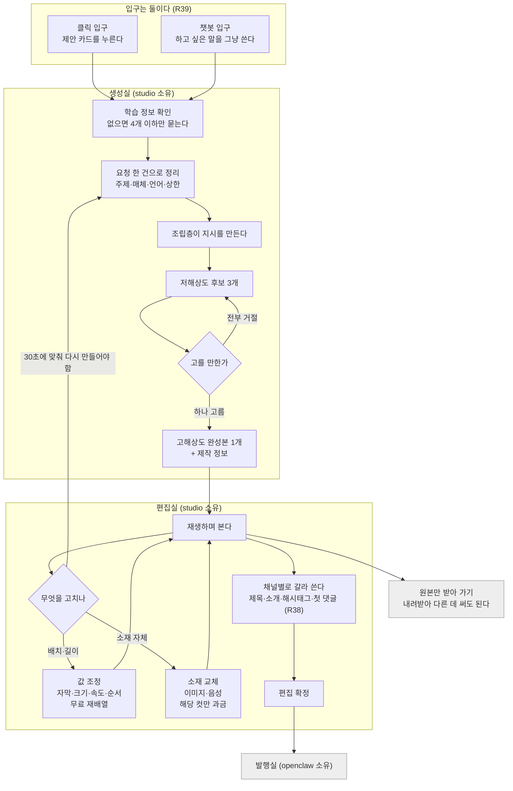
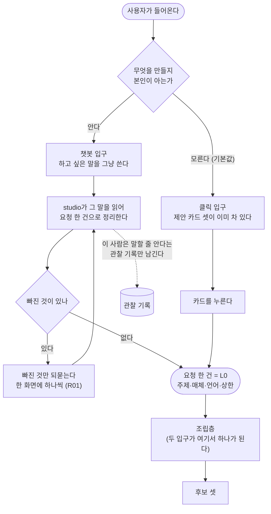
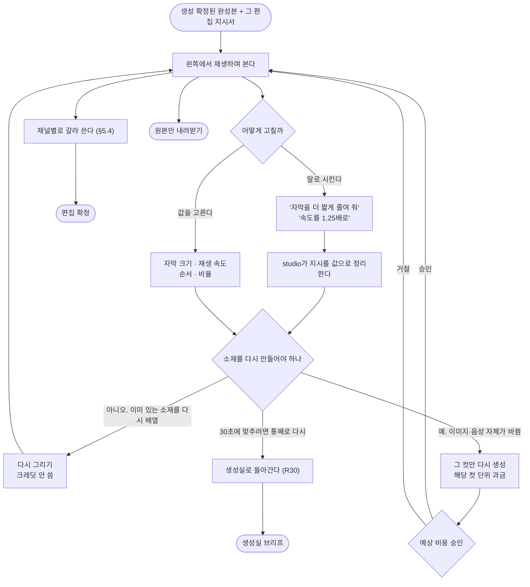
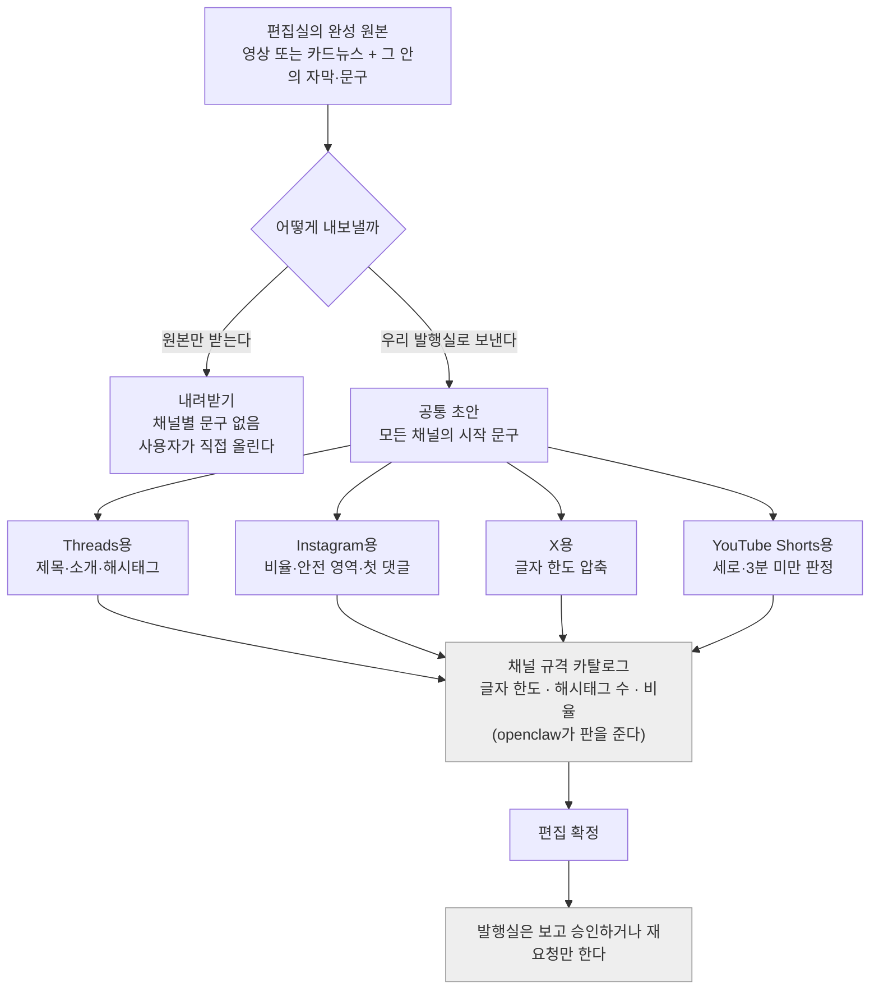
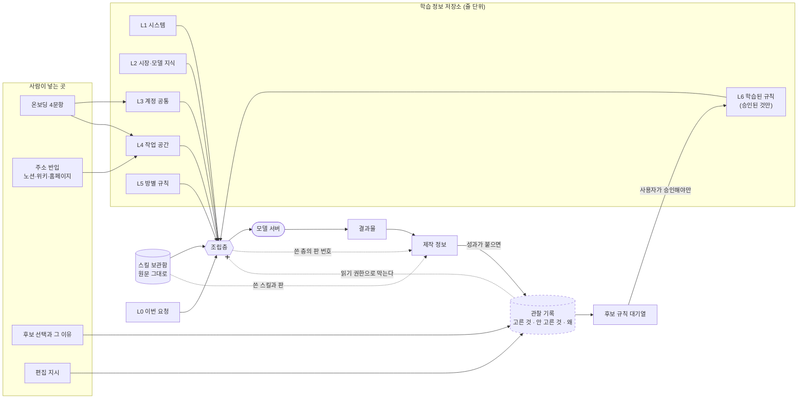
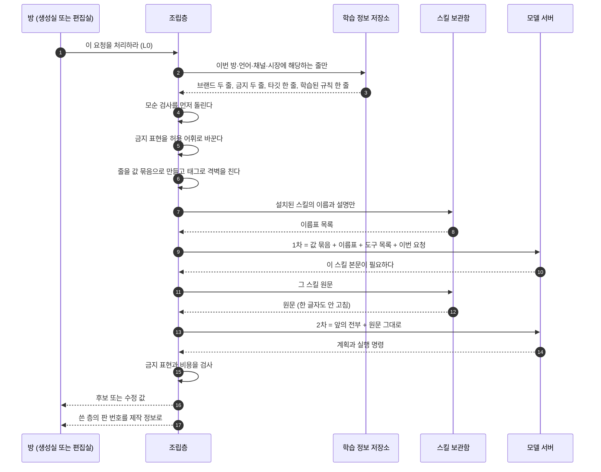
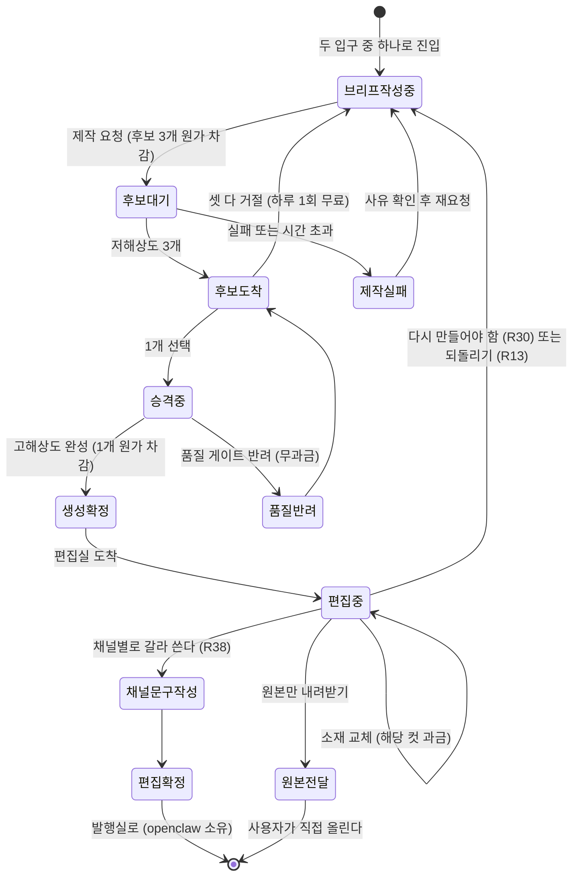

<!--
STAMP
문서: studio-service PRD (생성실 + 편집실)
파일: studio/docs/prd-studio-v2.0.md
라인: osmu / studio-service
판: v2.0 (전면 재작성). v1.0(studio/docs/prd-studio-생성-v1.0.md)은 남겨 두고 이 문서가 그것을 대체한다
생성: 2026-08-21 KST
model: claude-opus-5[1m]
agent: prd-architect (서브에이전트)
기반 포맷: docs/prd-openclaw-운영-v1.0.md v1.0 (섹션 골격·페르소나·현재 구현 상태·Steelman·Premortem·7원칙 판정표 구성을 그대로 상속. R45 "두 기획서가 같은 양식")
품질헌법: /Users/sj/.claude/standards/planning.md 실제 Read 완료. §2 7원칙 판정표는 §10에 첨부
기반 산출물 (버전핀, 전부 이 세션에서 실제 Read):
  - docs/사업계획-osmu-v0.9.md (§1 제품, §3.1 전체 구조, §3.2 studio 안에서, §3.4 일곱 칸·조립 두 시점·조립 7규칙, §3.5 제작 기법 5개, §4 원가·요금제, §5 FAQ)
  - docs/requests/회장-확정-요구사항-대장.md (R01~R45 전량 + 미결 2건 + R31/R38 충돌 주석)
  - studio/docs/prd-studio-생성-v1.0.md (v1.0 전문. 살릴 내용을 옮겨 왔다)
  - docs/prd-openclaw-운영-v1.0.md (양식 정본)
  - docs/user-flow.md (§1 네 방, §3 상태 기계, §3.2 크레딧 이동 자리)
  - studio/docs/학습정보-층계-계약-v0.1.md (§2.3 층 표, §2.5 하네스 대응, §2.6 층별 소유, §4 조립과 상한)
  - docs/prototype/openclaw-auto-4room-v39.html (편집실 조작 실물, 채널별 문구 탭, 무료·과금 표시, 챗 지시 예시)
  - wiki/product/studio.md (현재 구현 상태 1차 진실원)
반려 사유 8건 반영 위치: ①도식 = §0.2와 본문 7장 ②L0~L6 = §6.1 ③편집 = §5 전체 ④페르소나 = §2.1 ⑤타깃 확장 = §2.0 ⑥두 입구 = §4.1 FR-GEN-001A/001B ⑦채널 문구 편집실 소유 = §5.4 ⑧용어 재설계 = §0.3
미확인: WebSearch 예산 소진(200/200)으로 이번 판도 실검색을 못 했다. 벤치마크는 §0.4에 출처와 함께 명시
고민 한 줄: v1.0이 반려된 진짜 이유는 항목 누락이 아니라 "읽는 사람이 그림 없이 흐름을 못 세운다"였다. 그래서 이 판은 글보다 도식을 먼저 놓고 글이 도식을 설명하게 뒤집었다
-->

# studio-service PRD v2.0: 생성실 · 편집실

> **One Thing:** 무엇을 요청해야 하는지조차 모르는 사람이, 빈 화면 대신 이미 채워진 제안 카드를 누르거나 그냥 말로 시켜서, 자기 브랜드 규칙과 외부 제작법이 실린 결과물을 채널별 문구까지 붙여 받는 곳.

**한 줄 결론:** 이 PRD는 studio의 두 방을 정한다. **생성실**은 무엇을 만들지 정하고 만드는 곳이고, **편집실**은 만든 것을 재생하며 말로 고치고 채널 규격에 맞춰 갈라 내는 곳이다. 입구는 클릭과 챗봇 둘이고, 두 입구 모두 같은 조립층으로 들어간다. **채널별 제목·소개·해시태그는 편집실이 만든다**(R38). 자동 학습은 이 판에서 약속하지 않는다.

---

## 0. 이 문서의 자리

### 0.1 범위표

| 항목 | 내용 |
|---|---|
| 범위 | studio-service의 **생성실**과 **편집실**. 온보딩과 학습 정보 입구, 제안 카드, 조립층, 후보와 선택, 편집 조정, 채널별 문구, 제작 정보, 비용 관문 |
| 범위 밖 | 발행·예약·댓글 응대·성과 수집·트렌드 조사. openclaw 소유이며 경계는 §11에 적는다 |
| 정본 관계 | `prd-studio-생성-v1.0.md`를 **대체한다.** v1.0의 FR-GEN 번호는 유지했고 편집 요구는 FR-EDT로 새로 붙였다. `prd-studio-service-v1.2.1-gpt-codex.md`의 상위 FR은 대체하지 않는다 |
| 개발 순서 | studio가 먼저다. openclaw 운영 PRD가 "studio API가 이미 준비돼 있다"를 전제로 서 있다 |
| 파는 순서 | 운영을 묶은 상품이 먼저다. 만드는 순서와 파는 순서가 반대라는 것을 혼동하지 않는다 |
| 첫 고객 | 회장이 운영하는 바이브 코딩 커뮤니티. 만들 줄은 아는데 알리질 못하는 사람이 이미 모여 있다 |
| 이 문서로 안 하는 것 | 스키마·필드명·엔드포인트 확정. 회장 티키타카 규칙에 따라 기술설계에서 합의한다 |

### 0.2 도식 색인 (R41)

기능 나열만으로는 판단이 안 된다는 지적을 받아, 이 판은 도식을 먼저 놓는다.

| 번호 | 도식 | 무엇을 보여주나 | 어디 |
|---|---|---|---|
| 도식 1 | **유저 플로우 전체** | 두 입구에서 시작해 생성실과 편집실을 지나 발행실 문 앞까지 | §1.3 |
| 도식 2 | **두 입구 갈래** | 클릭 입구와 챗봇 입구가 어디서 합쳐지나 | §4.1 |
| 도식 3 | **데이터 흐름** | L0~L6과 스킬 보관함이 조립층을 거쳐 모델로 갔다가 결과와 제작 정보로 돌아오는 길 | §6.2 |
| 도식 4 | **조립 흐름** | 1차 호출과 2차 호출의 왕복 (사업계획 §3.4 "조립은 두 시점에 나뉜다") | §6.3 |
| 도식 5 | **편집실 조정 갈래** | 무료로 다시 그리는 것과 크레딧이 붙는 것이 갈리는 자리 | §5.1 |
| 도식 6 | **채널별 문구 소유** | 원본 하나가 채널별로 갈라지는 자리와 원본만 받아 가는 경로 | §5.4 |
| 도식 7 | **작업물 상태 기계 (studio 구간)** | 각 단계에서 무엇으로 보관되고 어떻게 꺼내는가 | §7.1 |

### 0.3 용어 재설계: 꼬리표를 버리고 "제작 정보"로 쓴다 (반려 8건 중 8번)

회장께 "꼬리표"를 세 번 설명해 세 번 실패했다. 실패한 것은 개념이 아니라 낱말이다. 그래서 낱말을 바꾼다.

**사진을 한 장 찍으면 카메라가 알아서 붙여 두는 촬영 정보가 있다.** 찍은 날짜, 어느 렌즈, 조리개 얼마, 감도 얼마. 평소엔 아무도 안 본다. 그런데 몇 달 뒤 유난히 잘 나온 사진 한 장을 발견하면 그때 그 정보를 열어 본다. **"아, 이 렌즈로 이 설정에서 찍었구나."** 그래야 다음에 같은 사진을 또 찍는다.

**우리 것도 똑같다. 이름을 "제작 정보"로 한다.**

| 사진 | 우리 |
|---|---|
| 찍은 날짜 | 만든 날짜 |
| 어느 렌즈로 | 어느 제작법(스킬) 몇 판으로 |
| 조리개·셔터·감도 | 어느 제안 카드에서 왔고, 후보 셋 중 어느 것을 골랐고, 어떤 훅을 썼고, 어느 규칙 판이었나 |
| 나중에 못 붙인다 (찍는 순간에만 기록된다) | 나중에 못 붙인다 (만드는 순간에만 기록된다) |
| 잘 나온 사진의 설정을 다시 쓴다 | 잘 터진 콘텐츠의 조합을 다시 쓴다 |

이 표가 제품 화면과 문서에서 쓸 유일한 설명이다. 이후 이 문서는 **제작 정보**만 쓴다. 사업계획 §1.5와 §5의 "꼬리표"는 같은 것을 가리키는 옛 이름이다.

> ⛔ **회수 필요: 이 낱말을 확정해 주십시오**
> - 배경: "꼬리표"가 세 번 실패했다. 문서·화면·API 이름이 갈리기 전에 하나로 못 박아야 한다. 지금 세 문서(사업계획·v1.0 PRD·openclaw PRD)가 전부 "꼬리표"를 쓰고 있어 확정 즉시 일괄 교체가 필요하다.
> - 무엇을 정하나: 이 개념의 공식 명칭.
> - 옵션 A(추천): **제작 정보**. 고르면: 사진의 촬영 정보라는 누구나 아는 비유가 그대로 붙어 설명이 한 문장에서 끝난다. 안 고르면: 설명이 네 번째로 실패한다.
> - 옵션 B: **만든 내역**. 고르면: 더 쉬운 말이다. 트레이드오프: "내역"이 비용 내역·사용 내역과 헷갈린다. 우리 화면에 비용 원장이 실제로 있어서 충돌한다.
> - 옵션 C: 꼬리표 유지. 트레이드오프: 이미 세 번 실패한 낱말을 네 번째 쓰는 것이다.
> - 추천 근거: A는 낱말 자체가 설명을 안 요구한다. B와 C는 매번 설명이 따라붙어야 한다.

### 0.4 벤치마크 출처와 그 한계

**이 세션에서 실검색을 못 했다(WebSearch 예산 200/200 소진).** 근거 없는 단정을 피하기 위해 아래를 명시한다.

| 무엇을 봤나 | 출처 | 빌린 것 | 다르게 한 것 |
|---|---|---|---|
| 클립 선택 시 우측 속성 패널에서 속도·자막·오디오를 고치면 즉시 반영 | CapCut (프로토타입 v39 STAMP에 기록된 실조사) | 편집실의 **왼쪽 미리보기 즉시 반영** 구조를 그대로 가져왔다 | 손으로 타임라인을 만지지 않는다. 값 조정과 말 지시 둘로만 준다 (R33) |
| 글을 고치면 영상이 따라 잘린다 | Descript (같은 STAMP) | 대본이 곧 편집 대상이라는 사고 | 우리는 대본을 사람이 타이핑하지 않고 말로 시킨다. 타깃이 타이핑을 일로 느낀다 |
| 한 작성기에서 채널별 캡션·해시태그가 갈라진다 | Publer, Hootsuite 캡션 미리보기 (같은 STAMP) | **공통 초안 + 채널별 변경**의 두 층 구조 | 그들은 발행 도구 안에 있고, 우리는 그 자리를 편집실로 옮겼다 (R38) |
| 경쟁 55곳, 원가 구조, 어뷰징 사고 | `wiki/research/2026-08-competitor-and-production-research.md` (2026-08-21, 당시 verify 통과) | 상품별 크레딧 분리, 계정 상한 | 조사 시점 이후 변화는 미확인이다 |

**이 판의 벤치마크는 2차 출처 의존이다.** 다음 판에서 실검색으로 갱신해야 한다.

---

## 1. 제품 목표와 비목표

### 1.1 목표

| # | 목표 | 어떻게 알 수 있나 |
|---|---|---|
| G1 | 프롬프트를 한 글자도 쓰지 않고 카드뉴스 한 편이 끝까지 나온다 | 사람 개입 없이 완주한 요청의 비율. 실측 20회 중 절반 미만이면 실패 |
| G2 | 프롬프트를 직접 쓰고 싶은 사람도 같은 결과 품질을 얻는다 | 챗봇 입구로 들어온 요청과 클릭 입구로 들어온 요청의 완주율 차이 |
| G3 | 첫 진입에서 사용자가 채워야 하는 필수 칸이 4개 이하다 | 온보딩 필수 입력 개수. 5개면 실패 |
| G4 | 만든 것에 제작 정보가 빠짐없이 붙는다 | 제작 정보 결손율 0퍼센트 |
| G5 | 편집실에서 사람이 글자를 타이핑하지 않고도 원하는 수정이 끝난다 | 편집 세션 중 자유 타이핑 없이 종료한 비율 |
| G6 | 한 편의 실제 원가가 승인 화면에 표시한 상한을 넘지 않는다 | 상한 초과 건수 0 |
| G7 | 사용자가 고른 것이 다음 제안을 바꾼다 | 승인된 규칙이 붙은 요청의 비율 |

**G1이 나머지를 지배한다.** 사업계획 §4.6 로드맵 2단계의 종료 증거가 "카드뉴스 한 편이 사람 손 없이 끝까지 나옴"이기 때문이다.

### 1.2 비목표 (이 판에서 안 한다)

| 안 하는 것 | 왜 |
|---|---|
| 프레임·타임라인을 손으로 만지는 편집 도구 | R33. 편집실은 재생하며 대화 지시 또는 선택지로 조정한다. 손 편집은 우리 타깃에게 그 자체가 일이다 |
| 채널 계정 연결, 예약, 발행, 댓글 응대 | 자격증명이 필요하면 openclaw다 |
| 성과 지표 수집, 트렌드 조사 | openclaw 성과실. studio는 그 신호를 **받는 입구**만 연다 |
| 성과가 취향을 자동으로 고치는 것 | 표본이 없다. 승인 없이 반영하지 않는다 |
| 롱폼을 쪼개 숏폼 만들기 | 1단계 비범위 |
| 음악·소설 등 비영상 매체 | 구조는 같으나 1차 상품은 카드뉴스와 숏폼이다 |
| 다국가 결제, 24시간 지원 | 경계 위키가 이미 잠갔다 |

### 1.3 도식 1. 유저 플로우 전체



이 그림에서 읽어야 할 것 세 가지.

첫째, **두 입구가 학습 정보 확인에서 곧바로 합쳐진다.** 챗봇으로 들어와도 같은 조립층을 지난다. 입구만 둘이고 엔진은 하나다.

둘째, **편집실에서 생성실로 돌아가는 화살표가 하나 있다.** 크기·시간·비율 조정은 편집실이지만 30초에 맞춰 다시 만들어야 하면 생성실이다(R30). 이 화살표가 두 방을 가르는 실제 기준선이다.

셋째, **발행실로 안 가는 출구가 있다.** 완성 원본은 사용자 것이다. 만들기만 필요한 사람이 실재한다.

---

## 2. 사용자와 시나리오

### 2.0 타깃 (R35 + R40)

**하네스 엔지니어링을 잘하면 되는데 어렵거나 못 하는 사람.** 여기까지가 R35였고, 회장 08-21 지시로 두 층이 더 붙었다.

| 층 | 이 사람은 | 우리가 대신하는 것 |
|---|---|---|
| 1층 | 하네스 엔지니어링을 못 한다. 브랜드 규칙 파일, 제작법 설치, 역할 정의, 금지선 훅을 짜야 한다는 것을 안다. 그런데 어렵다 | 그 다섯 가지를 화면과 항목으로 바꾼다 |
| 2층 (R40) | **프롬프트 엔지니어링을 못 한다.** 채팅창은 쓸 줄 아는데, 원하는 결과가 안 나오고 왜 안 나오는지 모른다. 다시 지시하는 법도 모른다 | 조립층이 지시를 대신 쓴다. 사용자는 결과만 보고 고른다 |
| 3층 (R40) | **무엇을 요청해야 하는지조차 모른다.** 빈 채팅창 앞에서 무슨 말을 쳐야 할지 모른다. 만들 줄 알아도 무엇을 만들지가 문제다 | 제안 카드가 먼저 채워져 있다. 요청 자체를 우리가 준다 |

**3층이 제일 크고 제일 안 팔린 시장이다.** 사업계획 §1.1의 다섯 행 중 "무엇을 올려야 할지 감이 안 오는 사람"이 이 층이고, 조사한 55곳 중 이 사람에게 **요청 자체를 대신 만들어 주는** 곳이 없었다. 다른 도구는 전부 "무엇을 만들지는 네가 정해라"에서 시작한다.

**근거 (본인 직관 외):** 사업계획 §1.1이 "만드는 건 하는데 알리질 못하는 사람"을 별도 행으로 세우고 그 행에 "우리가 운영 중인 바이브 코딩 커뮤니티가 정확히 이 사람들"이라고 적었다. 관찰 가능한 실제 모집단이 이미 손에 있다. 조사 기록 §5.3은 "빈 입력창은 시작을 막는다"와 "보고 고르는 것이 기억해 쓰는 것보다 쉽다"를 못 박았다. **지불 의사 자체는 미검증이며 이것이 접는 기준의 대상이다(§10.1 K5).**

### 2.1 페르소나

**박도윤, 32세, 혼자 SaaS를 만든 바이브 코더.** (openclaw 운영 PRD §2.1과 **같은 인물이다.** 새 인물을 만들면 두 문서가 다른 사람을 향하게 된다.)

만드는 것은 문제가 아니다. 그는 클로드로 랜딩페이지도 짜고 영상도 뽑아 봤다. 막히는 곳은 그 앞이다. 화면을 열면 첫 질문이 "무엇을 만들까요"인데 그가 답을 모른다. 지난달에 올린 글 세 개는 전부 제품 업데이트 공지였고 아무도 안 봤다. 마케팅 잘하는 사람이 쓴 글을 보면 "이건 어떻게 이런 각도가 나오지" 싶은데, 그 각도를 자기가 만들 줄 모른다.

그래서 채팅창에 이렇게 친다. "우리 제품 홍보 영상 만들어 줘." 결과가 밋밋하게 나온다. 그는 왜 밋밋한지 모르고, 다음 지시를 어떻게 바꿔야 하는지도 모른다. 두세 번 다시 시켜 보다가 창을 닫는다. **그의 문제는 도구가 없는 게 아니라 요청을 못 쓰는 것이고, 더 정확히는 무엇을 요청해야 할지를 모르는 것이다.**

편집도 같다. 어쩌다 쓸 만한 영상이 나와도 자막이 화면 밖으로 나가 있다. 그걸 고치려면 편집 프로그램을 열어야 하는데, 열면 타임라인이 나오고 트랙이 나오고 키프레임이 나온다. 그는 개발자다. 못 배울 것은 아니다. 다만 이걸 배우려고 저녁을 쓸 생각이 없다.

**결제 의향의 실제 모양:** 그는 월 57만원의 도구값을 낼 생각이 없다. 그렇다고 대행사에 월 250만원을 쓸 규모도 아니다. 그가 실제로 하는 것은 아무것도 안 하는 것이다. 이 사람에게 2만원짜리가 붙는지가 이 사업의 실제 질문이다.

**가장 큰 불신:** 예상 밖 비용, 그리고 "만들어 놨는데 못 쓰는 것".

### 2.2 약속 (R36)

**클릭만으로 만들되 쓸수록 정교하고 터지는 콘텐츠가 된다.**

앞 절(클릭만으로)은 이 문서가 책임진다. 뒤 절은 관찰 기록이 쌓이고 승인되는 경로까지만 책임지고, 실제로 더 터지는지는 성과실이 붙은 뒤 실측한다. **검증 전까지 제품 문구에 "더 잘 터진다"를 쓰지 않는다.**

### 2.3 시나리오

| # | 시나리오 | 지나는 자리 | 입구 |
|---|---|---|---|
| S1 | 첫날. 학습 정보가 0이다. 네 개만 묻고 그 자리에서 제안 카드 셋이 찬다 | 온보딩 → 생성실 | 클릭 |
| S2 | 재방문. 온보딩이 안 뜨고 카드부터 열린다 | 생성실 | 클릭 |
| S3 | 카드 셋이 다 마음에 안 든다. 오늘 한 번은 무료로 다시 뽑는다 | 생성실 재생성 | 클릭 |
| S4 | **"우리 신제품을 좀 웃기게 소개하는 걸로 만들어 줘"라고 그냥 쓴다** | 챗봇 입구 → 같은 조립층 | 챗봇 |
| S5 | 후보 셋 중 하나를 고른다. 왜 골랐는지 축도 함께 남는다 | 생성실 선택 | 둘 다 |
| S6 | 고해상도가 나왔는데 마음에 안 든다. 확정·보관·다른 제안 셋 중 고른다 | 생성실 결과 | 둘 다 |
| S7 | 자막이 길다. **"자막을 더 짧게 줄여 줘"라고 말한다.** 무료다 | 편집실 값 조정 | 챗봇 |
| S8 | 첫 컷 이미지가 별로다. 바꾸면 그 컷만 과금된다는 것을 먼저 본다 | 편집실 소재 교체 | 둘 다 |
| S9 | 스레드용과 인스타그램용 문구가 갈라져 나온다. 인스타 것만 한 줄 고친다 | **편집실 채널별 문구 (R38)** | 둘 다 |
| S10 | 발행은 직접 하겠다. 원본만 내려받는다 | 편집실 → 원본 내려받기 | 둘 다 |
| S11 | 30초로 맞추려니 컷 하나를 다시 만들어야 한다. 생성실로 돌아간다 | 편집실 → 생성실 (R30) | 둘 다 |

### 2.4 반페르소나

| 이런 사람은 우리 것이 아니다 | 왜 |
|---|---|
| 프레임 단위로 직접 만지고 싶은 영상 편집자 | R33이 손 편집을 명시적으로 배제했다 |
| 자기 프롬프트가 이미 잘 도는 사람 | 조립층이 그 사람보다 낫다는 근거가 아직 없다 (미결 M5) |
| 남의 저작물로 싸게 뽑고 싶은 사람 | 소재 엮기는 권리가 정리된 소재만 쓴다 |
| 여러 명이 결재하는 팀 | 승인 체인을 만들지 않는다. 사용자는 혼자다 |

---

## 3. 현재 구현 상태 (재구현 금지 목록)

**1차 진실원은 위키다.** `wiki/product/studio.md`, `wiki/product/marketing-hub-surface-map.md`, 루트 `CLAUDE.md`를 읽어 채웠다. 코드 통째 스캔은 하지 않았다.

| 영역 | 현재 상태 | 정본 출처 | 이 PRD의 처리 |
|---|---|---|---|
| Studio 화면과 아이디어 입력 | **이미구현.** `dashboard/src/app/studio/page.tsx` + PlatformPreview·RepoConnect·BrandSetupWizard | wiki/product/studio.md | 그대로 쓴다. 새 화면 안 만든다. 제안 카드(§4.2)가 이 입력 자리를 대체한다 |
| 채널별 텍스트 변형 생성 | **이미구현.** 아이디어 하나에서 Threads·Facebook·X·Instagram·Shorts 문구를 각각 낸다 | 같은 곳 | **R38의 기반이 이미 있다.** 편집실이 이 기능의 주인이 된다(§5.4). 새로 만드는 것이 아니라 자리를 옮기는 것이다 |
| 공통 초안 + 채널별 변경 | **이미구현.** "Common from copy" + per-channel overrides | 같은 곳 | 그대로 쓴다. 편집실 채널별 문구의 두 층 구조가 이것이다 |
| 채널별 글자수 한도 | **이미구현.** `channel-text-limits.ts` 단일 소스, 값마다 공식 출처 URL. Threads·Facebook은 초과 시 발행 전 거절, 자르지 않는다 | 같은 곳 | 그대로 쓴다. 편집실 미리보기가 이 값을 읽는다 |
| 플랫폼 미리보기 | **이미구현.** 일곱 개(Threads·X·Facebook·Instagram·Shorts·Reels·TikTok) | 같은 곳 | 그대로 쓴다 |
| 브랜드 위키 그라운딩 | **이미구현.** 테넌트 브랜드 위키를 "사실만, 창작 금지"로 주입. `wiki_path` 소싱 | 같은 곳 | **학습 정보 반입(FR-GEN-002)의 기반이 이미 있다.** 새 반입기 만들지 않는다 |
| 초안 저장·복원 | **이미구현.** `POST /api/studio/drafts` | 같은 곳 | 작업물 보관(FR-GEN-024)이 이것 위에 선다 |
| 이미지·영상 생성 | **부분구현.** Higgsfield 경로가 있으나 **크레딧 풀과 생성 로그가 테넌트 격리가 안 돼 있어 운영자 전용으로 잠겨 있다** | 같은 곳 | 이 격리가 §8 비용 관문의 전제다. 격리 전에는 고객에게 열 수 없다 |
| 영상 나레이션 결과 표시 | **이미구현.** 나레이션이 빠진 결과를 성공처럼 보이지 않게 사유를 번역해 경고 | 같은 곳 | 그대로 쓴다. 실패를 이름으로 부르는 원칙의 선례다 |
| 카드뉴스·이미지 관리 | **부분구현.** Images 화면에 권리·자르기·대체 텍스트 관리 | 같은 곳 | 소재 권리 확인(FR-GEN-052)이 이것과 이어진다 |
| 학습 정보 층 저장소 (L0~L6) | **미구현** | 층계 계약 v0.1 | 신설 (§6) |
| 조립층 | **미구현** | 사업계획 §3.1 "이 제품의 심장" | 신설 (§6.3, §6.4) |
| 제안 카드 | **미구현** | R26, 사업계획 §3.2 | 신설 (§4.2) |
| 챗봇 입구 | **미구현** | R39 (08-21 신규) | 신설 (§4.1) |
| 편집실 (재생하며 말로 지시) | **미구현.** 프로토타입 v39에 화면과 조작만 있다 | R33, 프로토타입 v39 | 신설 (§5) |
| 제작 정보 | **미구현** | 사업계획 §1.5 | 신설 (§7.2) |
| 스킬 보관함 | **미구현** | 사업계획 §3.4 | 신설 (§7.3) |
| 상품별 크레딧 분리·계정 상한·봇 방어 | **미구현** | 사업계획 §4.4 | 신설 (§8) |

> ⛔ **회수 필요: Higgsfield 크레딧 풀이 테넌트 격리가 안 돼 있다**
> - 배경: 위키가 "크레딧 풀과 생성 로그가 테넌트 격리되지 않아 프록시 허용목록을 닫아 뒀다"고 적었다. 그런데 이 PRD의 상품 원가 전체가 그 생성 호출 위에 서 있다. 격리 없이는 고객에게 생성 기능을 열 수 없다.
> - 무엇을 정하나: 격리를 studio 1차 범위 안에서 푸는가, 아니면 1차는 우리가 대신 돌리는 운영자 대행으로 가는가.
> - 옵션 A(추천): 1차 범위 안에서 테넌트별 크레딧과 생성 로그를 분리한다 → 고르면: 셀프서브가 첫날부터 성립한다 / 안 고르면: 사용자가 늘 때마다 사람이 붙는다.
> - 옵션 B: 1차는 운영자 대행, 격리는 2차 → 고르면: 개발이 빨라진다 / 트레이드오프: 사업계획의 셀프서브 전제가 깨지고 응대 원가가 사용자 수에 비례한다.
> - 추천 근거: 자동 메모리의 "OSMU는 셀프서브 플랫폼(코어만 짓고 담당자 직접 온보딩)"과 B가 정면으로 부딪힌다.

---

## 4. 기능 요구사항: 생성실

표기 규칙. **소유**는 화면과 계약의 주인, **현재**는 §3 대조, **근거**는 요구 번호다. AC는 Given/When/Then으로 쓰고 경계와 실패를 반드시 포함한다.

### 4.1 두 입구 (R39)

#### 도식 2. 두 입구 갈래



**FR-GEN-001A | 클릭 입구는 기본값이고, 진입 순간 제안 카드가 이미 차 있다**
소유 studio · 현재 미구현 · 근거 R25·R26, 조사 기록 §5.3

```gherkin
Given 학습 정보가 필수 항목까지 채워진 사용자
When  생성실에 진입한다
Then  주제 후보가 3개 이상 이미 보이고 사용자가 입력한 것은 없다
And   후보를 만들지 못한 경우에도 빈 화면을 보이지 않고, 무엇이 부족한지와 다음 한 걸음을 보여준다
And   한 화면에 보이는 후보는 3개에서 5개다. 더 많으면 고르는 것이 일이 된다
And   매체를 묻는 질문이 사용자에게 나가지 않는다 (R26)
```

**FR-GEN-001B | 챗봇 입구로 프롬프트를 직접 쓸 수 있고, 그 요청은 같은 조립층으로 들어간다**
소유 studio · 현재 미구현 · 근거 **R39 (08-21 신규)**

이것은 v1.0이 빠뜨린 것이다. v1.0은 클릭만 다뤘고 회장 지시는 두 입구를 다 주라는 것이다.

```gherkin
Given 사용자가 채팅 입력창에 "우리 신제품을 좀 웃기게 소개하는 걸로 만들어 줘"라고 쓴다
When  요청이 접수된다
Then  studio가 그 문장을 읽어 이번 요청(L0)의 칸을 채운다. 주제, 매체, 언어, 톤 조정
And   채워지지 않은 필수 칸이 있으면 그것만 한 화면에 하나씩 되묻는다 (R01)
And   사용자가 쓴 문장이 지시문으로 둔갑하지 않는다. 조립층에서 태그로 격벽이 쳐진 채 실린다
And   같은 요청을 클릭 입구로 만들었을 때와 조립 결과의 구조가 같다. 입구만 다르고 엔진은 하나다
And   사용자가 쓴 문장은 그 자체로 학습 정보에 저장되지 않는다. 이번 요청 층이기 때문이다
```

**FR-GEN-001C | 챗봇이 먼저 안내하고, 후보와 예시는 대시보드 영역에 발표하듯 띄운다**
소유 studio · 현재 미구현 · 근거 R10·R25

```gherkin
Given 어느 입구로 들어왔든
When  사용자가 다음에 무엇을 할지 정해야 하는 자리에 선다
Then  챗봇이 텍스트로 먼저 묻거나 안내한다
And   후보안과 예시 화면은 채팅 말풍선 안이 아니라 대시보드 영역에 크게 뜬다
And   질문에는 항상 고를 수 있는 후보가 함께 붙는다. 빈 입력창만 단독으로 제시하지 않는다
```

**FR-GEN-002 | 첫 진입 필수 입력은 4개 이하이고 무엇이 필수인지는 입력 계약이 정한다**
소유 studio · 현재 미구현 · 근거 R24·R01·R12·R28 앞층

층계 계약 §7.1이 근거를 댄 넷이다. 브랜드 사실, 절대 금지선, 타깃, 업종과 컨셉. 앞 둘은 계정 공통 층(L3), 뒤 둘은 워크스페이스 층(L4)이다. 받는 순서는 층 순서를 따른다. 앞 답이 뒤 질문의 선택지를 좁히기 때문이다.

```gherkin
Given 학습 정보가 하나도 없는 신규 사용자
When  생성실에 처음 진입
Then  필수 입력이 4개 이하로 제시되고 각 화면에 질문은 하나만 있다
And   계정 공통 층 질문이 워크스페이스 층 질문보다 먼저 나온다
And   입력 계약이 필수로 선언하지 않은 항목은 이 단계에서 묻지 않는다
And   사용자가 온보딩을 중단해도 그때까지 답한 항목은 사라지지 않는다
```

**FR-GEN-003 | 주소를 넣으면 학습 정보 항목으로 정리해 보여주되 자동 확정하지 않는다**
소유 studio · 현재 **부분구현(브랜드 위키 그라운딩·`wiki_path` 소싱이 이미 있다)** · 근거 R03

```gherkin
Given 사용자가 노션·위키·홈페이지 주소를 붙여 넣음
When  반입을 실행
Then  읽은 내용이 항목 목록으로 쪼개져 제시되고 각 항목에 출처가 붙는다
And   사용자가 항목별로 넣기와 빼기를 고를 수 있고, 승인 전에는 저장되지 않는다
And   반입 자료의 본문은 요청에 통째로 실리지 않는다. 요약과 참조만 붙는다
And   주소 접근에 실패하면 그 사실을 표시하고 못 읽은 내용을 지어내지 않는다
And   기존 값과 충돌하는 항목은 보류로 표시되고 승인 전에는 생성에 실리지 않는다
```

**FR-GEN-004 | 학습 정보는 언제든 열람·수정할 수 있고 재방문 시 건너뛴다**
소유 studio · 현재 미구현 · 근거 R02·R15·R13

```gherkin
Given 학습 정보가 이미 채워진 재방문 사용자
When  생성실에 진입
Then  온보딩 질문이 뜨지 않고 곧바로 제안 카드 화면이 열린다
And   헤더에서 학습 정보를 열어 항목 단위로 수정·비활성·되돌리기를 할 수 있다
And   되돌리기는 기존 항목을 덮어쓰지 않고 이전 판을 남긴다 (R13)
And   어느 항목이 언제 어디서 들어왔는지가 항목마다 보인다
```

### 4.2 제안 카드

**FR-GEN-005 | 제안 카드는 매체를 이미 갖고 있고 왜 제안했는지를 함께 보여준다**
소유 studio · 현재 미구현 · 근거 R26·R04, 사업계획 §3.2

제안 카드가 나오기 전에 모델을 한 번 다녀온다. **무엇을 만들지도 우리가 정하기 때문이다.** 이것이 §2.0의 3층 타깃에게 파는 실제 값이다.

```gherkin
Given 학습 정보가 필수 항목까지 채워진 사용자
When  제안 카드를 요청하거나 화면에 진입
Then  카드가 3개 이상 제시되고 각 카드는 주제·매체·대본 초안 요지·제안 이유를 갖는다
And   카드 3개는 서로 최소 두 개 축이 다르다 (주제 자체 또는 매체 또는 각도)
And   같은 학습 정보에서 직전 회차와 동일한 카드 묶음이 다시 나오지 않는다
And   제안 이유가 없는 카드는 표시되지 않는다. 이유 없는 추천은 뻔한 제안과 구별되지 않는다
```

제안의 유입은 셋이다(R04). 가끔 던지는 질문, 성과 기반, 트렌드 기반. **이 범위에서는 첫째만 자체적으로 만들 수 있고 뒤 둘은 openclaw가 신호를 넣어 줄 때 켜진다.**

**FR-GEN-006 | 카드 셋을 전부 거절하면 하루 1회는 무료, 그 이상은 과금한다**
소유 studio · 현재 미구현 · 근거 R27

```gherkin
Given 오늘 무료 재생성을 쓰지 않은 사용자가 카드 셋을 전부 거절
When  새 후보를 요청
Then  과금 없이 새 카드 셋이 나오고 무료 회차 소진을 알린다
And   같은 날 두 번째 요청에는 예상 비용과 승인 화면이 먼저 뜬다
And   승인하지 않으면 카드가 만들어지지 않고 과금도 없다
And   무료 회차는 사용자 기준으로 세며 워크스페이스를 늘려 회피할 수 없다
```

**FR-GEN-007 | 이번 한 번만의 조정은 생성 화면에서 받고 학습 정보에 저장하지 않는다**
소유 studio · 현재 미구현 · 근거 R28 뒷층

```gherkin
Given 사용자가 이번 건에만 "더 짧게"를 지시
When  생성이 실행되고 끝난다
Then  이번 결과에는 반영되고 다음 요청의 기본값은 바뀌지 않는다
And   같은 방향 지시가 서로 다른 작업에서 반복되면 후보 규칙 대기열에 항목이 생긴다
And   대기열 항목은 사용자가 승인하기 전까지 어떤 요청에도 실리지 않는다
```

### 4.3 후보와 선택

**FR-GEN-020 | 후보는 저해상도 3개로 내고 고른 하나만 고해상도로 만든다**
소유 studio · 현재 미구현 · 근거 원가 구조 (셋 다 완성본으로 뽑으면 원가 3배)

```gherkin
Given 사용자가 제안 카드 하나를 눌러 생성을 실행
When  후보가 나온다
Then  후보 3개가 저해상도 프리뷰로 제시되고 각 후보의 차이 축이 글로 설명된다
And   후보 사이에 최소 두 개 축이 다르다
And   고해상도 렌더는 선택 전에는 한 건도 실행되지 않는다
And   미선택 후보를 나중에 고해상도로 만들려면 새 견적과 승인을 거친다
```

**FR-GEN-021 | 선택은 그 자리에서 관찰 기록이 되고, 무엇을 골랐는지만이 아니라 왜 골랐는지 축을 받는다**
소유 studio · 현재 미구현 · 근거 R03 동의 학습 경로

"비싸서 싼 쪽"과 "과해서 중간"은 같은 저비용 선호가 아니다.

```gherkin
Given 후보 3개가 제시된 상태
When  사용자가 하나를 고른다
Then  선택과 이유 축이 관찰 기록에 남고 고르지 않은 둘도 함께 기록된다
And   이유를 고르지 않아도 선택 자체는 기록되며 생성이 막히지 않는다
And   사용자가 쓴 자유 메모는 즉시 규칙이 되지 않고 후보 규칙으로 보관된다
And   관찰 기록은 조립 경로에서 읽히지 않는다
```

**FR-GEN-022 | 자동으로 자란 규칙은 승인하는 순간에만 반영된다**
소유 studio · 현재 미구현 · 근거 층계 계약 §6

```gherkin
Given 후보 규칙 대기열에 항목 3개가 있고 사용자가 그중 1개만 승인
When  다음 생성이 실행된다
Then  승인한 1개만 실리고 나머지 2개는 실리지 않는다
And   승인 시점에 새 판 번호가 발행되고 이후 결과에 그 판 번호가 핀된다
And   승인 이력에서 각 항목의 근거 관찰을 되짚을 수 있다
```

**FR-GEN-023 | 고해상도 결과가 마음에 안 들 때 확정·보관·다른 제안 셋을 준다**
소유 studio · 현재 미구현 · 근거 R29

```gherkin
Given 고해상도 결과가 나왔고 사용자가 만족하지 못한다
When  결과 화면을 본다
Then  확정 / 보관 / 다른 제안 받기 세 갈래가 모두 제시된다
And   보관을 고르면 작업물 목록에 남고 나중에 이어서 작업할 수 있다 (R16)
And   다른 제안 받기는 비용이 드는 경우 승인 화면을 먼저 띄운다
And   확정 이전에는 편집실 인계가 일어나지 않는다
```

---

## 5. 기능 요구사항: 편집실 (R43: v1.0이 통째로 빠뜨린 것)

**편집실은 손 편집 프로그램이 아니다.** 결과를 재생하며 대화 지시 또는 선택지로 조정한다(R33). 새로 창작하지 않는다. 자막을 고치고 속도를 조절하고 이미지와 음성을 바꾸고 순서를 바꾸는 곳이다.

### 5.1 도식 5. 편집실 조정 갈래 (돈이 갈리는 자리)



**이 그림의 핵심은 가운데 마름모 하나다.** 이미 있는 소재를 다시 배열하는 것이면 무료, 소재 자체를 다시 만들어야 하면 그 컷만 과금. 사용자 불신의 대부분이 여기서 생기므로 이 경계를 화면에 먼저 보여준다.

### 5.2 편집 조정

**FR-EDT-001 | 편집실은 말로 시키는 것과 값을 고르는 것 둘 다 받는다**
소유 studio · 현재 미구현(프로토타입 v39에 조작 실물 있음) · 근거 R33·R39

```gherkin
Given 생성 확정된 완성본이 편집실에 도착
When  사용자가 "자막을 더 짧게 줄여 줘"라고 말한다
Then  studio가 그 지시를 바꿀 값으로 정리하고 무엇을 바꿀지 먼저 보여준다
And   같은 조정을 값 선택으로도 할 수 있다 (자막 크기·재생 속도·순서·비율)
And   사용자가 타임라인·트랙·키프레임을 만지는 화면은 제공하지 않는다
And   지시를 값으로 정리하지 못하면 지어내지 않고 무엇이 모호한지 되묻는다
```

**FR-EDT-002 | 조정 결과는 왼쪽 미리보기에 그 자리에서 반영된다**
소유 studio · 현재 미구현 · 근거 프로토타입 v39, CapCut 벤치마크

미리보기와 최종이 다르면 편집실 신뢰가 통째로 무너진다(사업계획 §3.2 기술 과제).

```gherkin
Given 사용자가 자막 크기를 바꾼다
When  값이 바뀐 직후
Then  왼쪽 미리보기가 그 자리에서 바뀌고 사용자가 다시 실행을 누르지 않는다
And   자막 문구를 타자 중일 때 커서가 튀지 않는다
And   미리보기에서 본 것과 최종 산출물이 다르면 그것은 결함이다. 다르면 편집 확정을 막는다
And   현재 길이·속도·자막 크기·목소리가 미리보기 옆에 항상 함께 보인다
```

**FR-EDT-003 | 무료인 조정과 과금되는 조정을 누르기 전에 구분해 보여준다**
소유 studio · 현재 미구현 · 근거 user-flow §3.2, 경계 위키 편집 비용

```gherkin
Given 편집실 화면
When  조정 항목들이 표시된다
Then  자막 고치기·크기·속도·순서 바꾸기에는 "추가 크레딧 없음"이 붙는다
And   이미지 교체·음성 교체에는 그 컷의 예상 비용이 붙는다
And   과금되는 조정은 실행 전에 예상 비용과 승인 화면을 먼저 띄운다
And   승인하지 않으면 실행되지 않고 과금도 없다
And   같은 화면에서 지금까지 이 작업물에 쓴 누적 비용을 볼 수 있다
```

**FR-EDT-004 | 크기·재생 시간·비율은 편집실이 하고, 다시 만들어야 하면 생성실로 돌려보낸다**
소유 studio · 현재 미구현 · 근거 **R30**

```gherkin
Given 45초짜리 결과물을 30초로 줄이려 한다
When  사용자가 그것을 지시한다
Then  속도 조절과 컷 정리로 가능하면 편집실에서 처리하고 크레딧을 쓰지 않는다
And   소재를 다시 만들어야만 가능하면 그 사실과 예상 비용을 알리고 생성실로 돌아가는 경로를 준다
And   생성실로 돌아갈 때 지금까지의 편집 내용이 사라지지 않는다
And   어느 쪽인지를 사용자가 판단하게 하지 않는다. studio가 판정해 알려준다
```

**FR-EDT-005 | 되돌리기는 덮어쓰지 않고 앞 방 목록에 항목을 추가한다**
소유 studio · 현재 미구현 · 근거 **R13**

```gherkin
Given 편집 중인 작업물을 되돌린다
When  되돌리기를 실행
Then  기존 편집본이 사라지지 않고 앞 단계 목록에 새 항목이 추가된다
And   어느 판에서 되돌렸는지가 두 항목 모두에 남는다
And   되돌린 항목도 언제든 다시 꺼내 이어서 작업할 수 있다
```

### 5.3 편집실이 지키는 금지선

**FR-EDT-006 | 편집 결과도 금지선 재검사를 통과해야 한다**
소유 studio · 현재 미구현 · 근거 층계 계약 §2.5 출력 출구

편집으로 문구가 바뀌면 생성 시점에 통과한 검사가 무효가 된다. 편집실에도 같은 그물이 있어야 한다.

```gherkin
Given 편집으로 자막 문구가 바뀌었다
When  편집 확정을 시도
Then  바뀐 문구가 금지선 재검사를 다시 통과해야 확정된다
And   위반이면 어느 층의 어느 항목을 위반했는지 표시하고 확정을 막는다
And   재검사 자체는 사용자에게 과금되지 않는다
And   AI 생성물 표시 의무는 편집으로 해제할 수 없다
```

### 5.4 채널별 문구는 편집실이 만든다 (R38: 반려 8건 중 7번)

#### 도식 6. 채널별 문구 소유



**왜 편집실인가.** 플랫폼 규격에 맞춰 원본을 채널별로 편집하는 자리가 편집실이기 때문이다(R38 원문). 글자 한도, 해시태그 개수, 비율, 안전 영역은 전부 규격이고, 규격에 맞춰 원본을 가공하는 것이 편집의 정의다. 그리고 §3이 확인했듯 **채널별 텍스트 변형과 공통 초안 더하기 채널별 변경 구조는 studio에 이미 구현돼 있다.** 새로 만드는 것이 아니라 이미 있는 것의 자리를 이름 붙이는 것이다.

> **R31과 R38의 충돌을 이 문서가 어떻게 처리했나 (숨기지 않는다)**
>
> - **R31 (08-19):** 제목·소개·해시태그는 **발행실**이 쓴다. studio 단독 판매 시 역할 분리를 해치기 때문.
> - **R38 (08-21):** 채널별 제목·소개·해시태그는 **편집실**이 만든다. 원본만 받는 경로도 유지.
> - **이 문서는 R38을 따른다.** 회장 최신 지시이고 대장 주석이 그렇게 지시했다.
> - **R31이 걱정한 것은 여전히 유효하다.** studio를 단독으로 파는 고객은 발행실이 없다. 그래서 도식 6의 왼쪽 갈래(원본만 내려받기)를 R38이 명시적으로 유지시켰다. **단독 판매 고객은 채널별 문구 없이 원본만 받는다.** 역할 분리는 이 갈래로 지켜진다.
> - **아직 안 정한 것:** 발행 직전에 최신 트렌드를 반영해 문구를 갱신할지. 이것은 미결 M1이다. 두 항목 모두 대장에서 지우지 않는다.

**FR-EDT-010 | 편집실이 공통 초안 하나에서 채널별 문구를 갈라 낸다**
소유 studio · 현재 **부분구현(채널별 변형 생성과 공통 초안 구조가 이미 있다)** · 근거 **R38**

```gherkin
Given 편집 중인 작업물과 사용자가 고른 대상 채널들
When  채널별 문구를 만든다
Then  공통 초안 하나가 먼저 서고 채널별 문구는 그것에서 달라진 부분으로 만들어진다
And   무엇이 공통에서 상속된 것이고 무엇이 채널별 변경인지 화면에서 구분돼 보인다
And   한 채널의 문구를 고쳐도 다른 채널의 문구는 바뀌지 않는다
And   각 채널 문구가 그 채널의 글자 한도 안에 있는지 실시간으로 표시된다
And   한도를 넘으면 말없이 자르지 않는다. 초과 사실을 보여주고 사용자가 줄이거나 다시 쓰게 한다
```

**FR-EDT-011 | 채널 규격은 studio가 저장하지 않고 요청 시점에 판을 받아 쓴다**
소유 studio(사용) / openclaw(소유) · 현재 부분구현(`channel-text-limits.ts`가 단일 소스) · 근거 층계 계약 §2.6 L2

```gherkin
Given 채널별 문구를 만들거나 미리보기를 그린다
When  글자 한도·해시태그 수·비율이 필요하다
Then  studio는 자기 안에 그 값을 복제해 두지 않고 규격 카탈로그의 현재 판을 받아 쓴다
And   그 요청에 쓰인 규격 판 번호가 제작 정보에 함께 남는다
And   규격을 받지 못하면 추측값으로 그리지 않고 그 사실을 표시한다
```

**FR-EDT-012 | 원본만 받아 가는 경로를 항상 유지한다**
소유 studio · 현재 미구현 · 근거 **R38 후단**, 사업계획 §1.5

```gherkin
Given 채널을 하나도 연결하지 않았거나 직접 올리려는 사용자
When  편집실에서 결과를 가져가려 한다
Then  채널별 문구 없이 완성 원본만 내려받는 경로가 제시된다
And   그 경로를 쓰는 데 발행실 연결이나 채널 연결이 요구되지 않는다
And   내려받은 원본에도 제작 정보가 함께 따라간다
And   이 경로로 나간 작업물도 작업물 목록에 남아 나중에 이어서 편집할 수 있다
```

**FR-EDT-013 | 발행실은 채널별 문구를 보고 승인하거나 재요청만 한다**
소유 경계 · 현재 미구현 · 근거 R38 + openclaw PRD §4.2

```gherkin
Given 편집 확정된 작업물이 발행실에 도착
When  발행실에서 문구를 바꾸고 싶다
Then  발행실 화면에서 글자를 직접 타이핑해 고치는 자리는 없다
And   대신 편집실로 되돌리거나 재요청하는 경로가 제시된다
And   되돌리면 앞 방 목록에 항목이 추가되고 기존 항목을 덮어쓰지 않는다 (R13)
```

### 5.5 어느 플랫폼을 쓰나 (R44)

| 플랫폼 | studio가 쓰는 방식 | 현재 상태 | 소유 |
|---|---|---|---|
| **Threads** | 문구 변형 생성, 미리보기, 글자 한도 검사. 발행은 openclaw | 이미구현(생성·미리보기) | 문구 = studio, 발행 = openclaw |
| **Instagram** | 카드뉴스 비율·안전 영역, 캡션, 첫 댓글, Reels 규격 | 이미구현(미리보기) | 같음 |
| **X** | 글자 한도 압축 변형 | 이미구현 | 같음 |
| **Facebook** | 문구 변형, 한도 초과 시 발행 전 거절 | 이미구현 | 같음 |
| **YouTube Shorts** | 세로 또는 정사각 + 3분 미만이면 자동 쇼츠 판정. `#Shorts`는 필수가 아니다 | 이미구현(생성·미리보기 전용, 발행 미지원) | 같음 |
| **TikTok** | 9:16, 자막 안전 영역 | 이미구현(생성·미리보기 전용) | 같음 |
| **Bluesky** | 문구 변형 | 부분구현 | 같음 |
| **Google 트렌드 / 서치 콘솔** | **studio는 직접 붙지 않는다.** 트렌드 기반 제안(R04 셋째 유입)이 켜질 때 openclaw 성과실이 신호로 넘겨 준다 | 미구현 | **openclaw** |
| **모델 제공자 (Claude · Higgsfield · Midjourney 계열)** | 조립층이 호출한다. 사용자에게 보이지 않는다 | 부분구현(테넌트 격리 미완, §3 회수 항목) | studio |

**규칙 하나를 못 박는다.** studio는 어느 플랫폼의 계정 자격증명도 갖지 않는다. 자격증명이 필요한 순간 그것은 openclaw다. studio가 플랫폼에 대해 아는 것은 **규격뿐**이고 그 규격조차 저장하지 않고 받아 쓴다(FR-EDT-011).

---

## 6. 학습 정보 일곱 칸과 조립층 (R42: 반려 8건 중 2번)

### 6.1 정보를 일곱 칸으로 나눈다

v1.0이 이 표를 통째로 빠뜨렸다. 사업계획 §3.4의 원본을 그대로 옮기고 층계 계약 v0.1의 소유·범위를 합쳤다.

| 칸 | 무엇이 사나 | 직접 할 때 이것 | 누가 채우나 | 얼마나 자주 바뀌나 | 요청에 붙는 범위 | 소유 |
|---|---|---|---|---|---|---|
| **L0 이번 요청** | 주제, 출력 언어, 대상 채널, 비용 상한, 이번만의 조정 | 채팅창에 친 프롬프트 | 카드 클릭 또는 챗봇 입력 | 매번 | 항상 전량 | 어디도 저장 안 함 |
| **L1 시스템** | 안전선, AI 표기 의무 | 도구가 박아 둔 규칙 | 우리 | 거의 불변 | 항상 전량 | 양쪽이 각자 자기 몫 |
| **L2 시장·모델 지식** | 시장별 훅 문법, 길이 감각, 금기, 매체 관습, 모델별 말투 | 경험으로 아는 것 | 우리 | 우리 릴리즈 단위 | 이번 시장·매체 것만 | 생성 문법 = studio, 채널 규격 = openclaw |
| **L3 계정 공통** | 브랜드 사실, 절대 금지선, 기본 말투, 음색 | 루트 CLAUDE.md | 온보딩 | 드물게 | 항상 전량 | openclaw (계정이 거기 있다) |
| **L4 작업 공간** | 타깃, 컨셉, 업종, 그 공간의 스타일 | 프로젝트 CLAUDE.md | 공간 만들 때 | 드물게 | 현재 공간 하나만 | openclaw |
| **L5 방별 규칙** | 생성실·편집실 각각의 취급 방식 | 서브에이전트 정의 | 기본값에서 자람 | 꾸준히 | 지금 있는 방만 | 생성·편집 = studio |
| **L6 학습된 규칙** | 선택·수정·성과에서 집계된 승인 규칙 | 자동 메모리 | 자동 생성 + 사용자 승인 | 계속 | 이번 언어·이번 방 요약만 | **미결 M2** |

**번호는 우선순위도 메모리 계층도 아니다.** 붙는 범위가 넓은 것부터 좁은 것 순으로 매긴 이름표이고, 기술적 의미는 **조립할 때 이 순서로 놓는다는 것 하나**다.

**스킬은 이 칸에 안 들어간다.**

| | 일곱 칸 | 스킬 |
|---|---|---|
| 저장 형태 | 줄 단위 항목 | 파일 원문 |
| 우리가 고치나 | 사용자가 한 줄씩 | 한 글자도 안 고침 |
| 언제 실리나 | 요청 시작할 때 | 모델이 필요하다고 할 때만 |

**각 항목은 줄 단위로 존재해야 한다.** 한 줄만 끄고 되돌릴 수 있어야 하고, 그 줄이 어디서 나왔는지 근거를 가리켜야 한다. 파일 한 장으로 저장하면 이 셋이 전부 불가능해진다.

**층별 항목 수에 상한을 둔다.** 상한이 없으면 취향이 쌓일수록 요청이 커지고 어느 순간 안전선이 뒤로 밀린다. 넘칠 때 자동으로 버리지 않고 무엇을 뺄지 사용자에게 묻는다. 자동으로 버리면 사용자가 직접 쓴 금지선이 조용히 사라질 수 있다. 구체 상한값은 실측 전이라 미결이다(M6).

### 6.2 도식 3. 데이터 흐름



**이 그림에서 봐야 할 것 셋.**

첫째, **관찰 기록에서 조립층으로 가는 화살표가 끊겨 있다.** 조립 경로는 관찰 기록을 읽지 못한다. 조립이 읽는 것은 승인된 L6뿐이다. 이 차단은 조건문이 아니라 **읽기 권한**으로 건다.

둘째, **대기열에서 L6으로 가는 길에 승인이 서 있다.** 승인 전 반영은 구조적으로 불가능해야 한다.

셋째, **제작 정보가 결과물과 조립층과 스킬 보관함 셋에서 동시에 만들어진다.** 그래서 나중에 못 붙인다. 만드는 순간에만 이 셋이 한자리에 있다.

### 6.3 도식 4. 조립 흐름 (조립은 두 시점에 나뉜다)



**1차에 스킬 본문을 안 싣는 이유.** 스킬이 열 개면 본문 열 개가 매 요청마다 실려 간다. 길이가 곧 비용이다. 이름표만 먼저 보내고 모델이 필요하다고 할 때만 원문을 꺼낸다.

**조립 순서가 이 그림에서 하나 확정됐다.** 모순 검사가 금지 표현 변환보다 **먼저** 돈다. v1.0의 자기심문이 이 순서를 미결로 남겼는데, 이유는 이렇다. 금지 표현을 허용 어휘로 바꾸면 원래 금지였다는 사실이 문장에서 사라지고, 그 상태에서는 무엇과 무엇이 부딪히는지 검사할 수 없다. **다만 이것은 이 문서의 판단이며 기술설계에서 확정한다(미결 M7).**

### 6.4 조립층 요구사항

**FR-GEN-010 | 조립층은 층에서 값을 꺼내 값 묶음으로 만든다. 확률이 개입하지 않는다**
소유 studio · 현재 미구현 · 근거 사업계획 §3.1 "조립층이 이 제품의 심장"

조립 결과는 한 장의 글이 아니라 세 덩어리로 나간다. 스킬 원문, 값 묶음, 우선순위 쪽지.

```gherkin
Given 워크스페이스가 둘 이상인 사용자가 그중 하나에서 생성을 실행
When  조립층이 값 묶음을 만든다
Then  현재 워크스페이스의 값만 실리고 다른 워크스페이스의 값은 한 항목도 실리지 않는다
And   관찰 기록 원본은 조립 경로에서 읽히지 않는다 (권한 거부로 확인 가능)
And   조립에 쓰인 각 층의 판 번호가 결과에 함께 기록된다
And   값이 부딪히면 우선순위 쪽지에 누가 이겼는지와 왜인지가 남는다
And   같은 층 판과 같은 L0로 두 번 조립하면 값 묶음이 동일하다
```

**FR-GEN-011 | 조립층은 일곱 규칙을 항상 지킨다**
소유 studio · 현재 미구현 · 근거 사업계획 §3.4

| # | 규칙 | 무엇을 뜻하나 | 근거 |
|---|---|---|---|
| 1 | 금지 표현을 부정문이 아니라 대체 어휘로 | "존댓말 쓰지 마"가 아니라 "반말 코치 어조로 쓴다" | 하지 말라 대신 하라고 쓰라는 공식 권고 |
| 2 | 조립 순서를 상수로 고정 | 긴 자료가 위, 지시가 아래. 요청마다 안 흔들린다 | 긴 자료를 위에 두면 품질이 오른다는 공식 안내 |
| 3 | 조각마다 태그로 격벽 | 사용자 입력이 지시문으로 둔갑하는 것도 막힌다 | 같음 |
| 4 | 조립 직전 모순 검사 | 부딪히는 항목은 넣고 지키라 하지 않고 조립 단계에서 뺀다 | 모순 지시를 만나면 모델이 손해를 본다 |
| 5 | 예시는 3~5개, 고르는 방식을 매번 같게 | 순서만 바뀌어도 결과가 흔들린다 | 예시 순서 민감성 논문 |
| 6 | 단계적 사고 지시는 계산에만 | 그 밖에서는 이득이 거의 없고 길이만 는다 | 메타분석 |
| 7 | 영상·이미지는 일곱 칸으로 조립 | 칸이 비면 모델이 지어낸다 | 영상 모델 공식 가이드 |

```gherkin
Given 사용자의 금지선에 특정 표현 금지가 있고 학습된 규칙에 그와 부딪히는 항목이 있다
When  조립이 실행된다
Then  모순 검사가 먼저 돌아 부딪히는 항목이 값 묶음에서 제외되고 제외 사실이 기록된다
And   그 다음에 금지 표현이 허용 어휘 문장으로 변환돼 실린다. 부정문으로 실리지 않는다
And   같은 입력을 두 번 조립하면 조각 순서와 예시 선택이 동일하다
And   영상·이미지 요청에서 일곱 칸 중 빈 칸이 있으면 기본값 출처를 밝히거나 사용자에게 묻는다
And   계산이 없는 요청에는 단계적 사고 지시가 실리지 않는다
```

**FR-GEN-012 | 스킬은 이름표 먼저, 원문은 요청받을 때만. 원문은 한 글자도 안 고친다**
소유 studio · 현재 미구현 · 근거 사업계획 §3.4

```gherkin
Given 보관함에 스킬 여러 개가 설치돼 있다
When  생성 요청이 시작된다
Then  첫 호출에 실린 스킬 정보는 이름과 설명뿐이고 본문은 실리지 않는다
And   모델이 특정 스킬을 요청하면 그 원문이 바뀌지 않은 채 다음 호출에 실린다
And   저장된 원문과 실린 원문이 바이트 단위로 같음을 확인할 수 있다
And   스킬을 읽지 못하면 지어내지 않고 그 사실과 함께 작업을 멈춘다
```

**FR-GEN-013 | 왕복과 작업 공간은 studio가 관리하고 사용자에게 보이지 않는다**
소유 studio · 현재 미구현 · 근거 사업계획 §3.2

```gherkin
Given 파일 읽기와 스크립트 실행을 요구하는 스킬로 생성을 실행
When  왕복이 진행된다
Then  사용자 화면에는 진행 단계만 보이고 터미널·파일 개념이 노출되지 않는다
And   스크립트 실행 결과는 출력만 다음 호출에 실리고 코드 본문은 실리지 않는다
And   왕복이 미리 정한 횟수 상한에 닿으면 자동으로 멈추고 사용자에게 알린다
And   작업 공간은 그 요청의 편집 재사용 기한까지 유지되고 기한과 만료 영향이 표시된다
```

**FR-GEN-014 | 층이 부딪힐 때의 판정과 금지선 두 겹**
소유 studio · 현재 미구현 · 근거 층계 계약 §5.1

시스템 안전선이 절대 우선, 사용자가 직접 쓴 금지선이 자동으로 자란 취향을 이긴다. 워크스페이스 스타일은 계정 기본 톤을 덮되 덮었다는 사실을 표시한다. 이번 요청은 누적된 것을 이기되 금지선을 넘으면 거절한다.

**금지선은 두 겹으로 지킨다.** 조립 단계에서 부딪히는 항목을 빼고, 결과가 나온 뒤 위반 여부를 다시 검사한다. 지시로만 지키면 샌다.

```gherkin
Given 결과물에 금지 표현이 포함된 상태로 생성이 끝났다
When  출력 재검사가 돈다
Then  그 결과는 반려되고 사용자에게 과금되지 않는다
And   반려 사유에 어느 층의 어느 항목을 위반했는지가 표시된다
Given 이번 요청의 지시가 사용자 금지선과 정면으로 부딪힌다
When  조립을 시도
Then  생성을 실행하지 않고 무엇이 부딪혔는지 알리며 사용자 판단을 받는다
And   자동으로 자란 취향이 금지선을 반복해 침범하면 금지선을 고칠지 사용자에게 올린다
```

**FR-GEN-070 | 제작 기법 다섯 개를 조립 규격에 박는다**
소유 studio · 현재 미구현 · 근거 사업계획 §3.5

목표는 품질 향상이 아니라 **다시 만드는 횟수를 줄이는 것**이다. 우리 원가의 대부분이 생성 호출이므로 목표가 같다.

| # | 기법 | 우리 규격에서의 자리 |
|---|---|---|
| 1 | 90퍼센트를 한 번에 | 합격선을 완벽이 아니라 한 번에 쓸 만한 수준으로. 품질 게이트 기준선이 이 값이다 |
| 2 | 스타일을 형용사가 아니라 상대 비율 수치로 | 일곱 칸 중 스타일 칸을 수치 비율로 표준화. 절대값이 아니라 비율이라 여러 번 만들어도 관계가 유지된다 |
| 3 | 장면마다 끝 상태 칸 | 시작 상태와 끝 상태를 각각 한 줄. 컷 사이 연결을 사람이 확인하는 병목이 사라진다 |
| 4 | 한 편 만들 때 다음 편 시작점 남기기 | 결과물과 함께 다음 편의 시작 장면·첫 대사·상태 변화를 남긴다. 시리즈가 저절로 이어진다 |
| 5 | 음색은 계정 고정 상수, 어조는 요청 변수 | 음색은 L3, 어조는 L0. 우리 층 구조와 그대로 맞물린다 |

```gherkin
Given 영상 또는 이미지 생성 요청
When  값 묶음이 만들어진다
Then  스타일 칸에 형용사만 들어간 값이 없고 상대 비율 수치가 들어간다
And   각 장면 항목에 시작 상태와 끝 상태가 모두 채워진다
And   음색 값은 L3에서 오고 어조 값은 L0에서 온다
Given 생성이 정상 종료
Then  다음 편 시작점이 함께 남고 사용자가 그것으로 이어서 만들 수 있다
And   품질 게이트 합격선이 한 번에 쓸 만한 수준으로 문서화돼 있고 그 기준으로 판정된다
```

---

## 7. 작업물과 제작 정보와 스킬 보관함

### 7.1 도식 7. 작업물 상태 기계 (studio 구간)



**목록에서 보이는 이름은 상태 이름과 다르다.** 사용자는 "승격중"을 모른다.

| 상태 | 보관되는 방 | 목록에서 보이는 이름 | 꺼내는 행동 |
|---|---|---|---|
| 브리프작성중 | 생성실 | 만들던 것 | 이어서 고르기 |
| 후보대기 | 생성실 | 만드는 중 | 기다리기. 완료 알림 |
| 후보도착 | 생성실 | 고를 것 | 후보 비교 열기 |
| 제작실패·품질반려 | 생성실 | 확인 필요 | 사유 보고 다시 요청 |
| 생성확정·편집중·채널문구작성 | 편집실 | 다듬을 것 | 편집 이어서 |
| 편집확정 | 발행실 | 내보낼 것 | 미리보기 열기 |
| 원본전달 | 편집실 | 내려받은 것 | 다시 편집 가능 |

**FR-GEN-024 | 각 단계의 작업물을 보관하고 언제든 꺼내 이어서 작업한다**
소유 studio · 현재 부분구현(초안 저장·복원이 이미 있다) · 근거 R09·R16

```gherkin
Given 생성 또는 편집 도중 사용자가 이탈했다
When  나중에 다시 들어온다
Then  중단 지점의 작업물이 목록에 남아 있고 그 지점부터 이어서 진행할 수 있다
And   목록의 각 항목이 위 표의 보이는 이름을 달고 있다
And   항목을 누르면 그 상태가 사는 방으로 이동해 하던 지점에서 이어진다
And   작업물이 0건이면 빈 목록이 아니라 "지금 만들 것" 진입 카드를 보여준다
And   되돌리기는 앞 단계 목록에 항목을 추가하는 방식이며 기존 항목을 덮어쓰지 않는다 (R13)
```

### 7.2 제작 정보

**FR-GEN-040 | 만드는 순간에 제작 정보를 붙인다. 나중에 못 붙인다**
소유 studio · 현재 미구현 · 근거 사업계획 §1.5, §0.3의 사진 촬영 정보 비유

담는 것은 의미 수준으로 다섯이다. 어느 제안 카드에서 왔나, 어느 후보를 골랐나, 어느 스킬의 몇 판을 썼나, 어떤 훅 또는 각도를 썼나, 어느 규칙 판으로 만들었나. 여기에 조립에 쓰인 층별 판 번호와 시각과 채널 규격 판이 함께 남는다.

**조립 결과 문자열 자체를 통째로 저장하지 않는다.** 그렇게 하면 어느 층이 이 결과를 만들었는지 다시 분해할 수 없다.

```gherkin
Given 생성이 정상 종료
When  결과가 저장된다
Then  제작 정보 다섯 항목과 층별 판 번호와 생성 시각이 빠짐없이 붙는다
And   항목 하나라도 비면 그 결과는 완료로 표시되지 않는다
And   결과 화면에서 "이건 무엇으로 만들었나"를 사람이 읽을 수 있는 문장으로 볼 수 있다
And   생성 이후에 제작 정보를 사후 편집할 수 없다
Given 편집실에서 소재가 교체되거나 채널별 문구가 만들어졌다
When  편집이 확정된다
Then  그 편집 내역도 제작 정보에 이어 붙고 원래 생성 정보를 덮어쓰지 않는다
```

### 7.3 스킬 보관함

**FR-GEN-030 | 보관함은 원문 불변이고 판 번호로 공존한다**
소유 studio · 현재 미구현 · 근거 사업계획 §3.4

우리가 넣은 것과 사용자가 올린 것 두 종류가 있다. 우리가 고쳐 쓰는 순간 원래 효과가 깨지므로 한 글자도 손대지 않는다.

스킬은 자기가 필요로 하는 입력을 목록으로 선언하고 층이 그 목록을 채운다. 스킬이 요구하지만 우리 층에 없는 것은 스킬이 스스로 채우며 사용자에게 묻지 않는다. 반대로 층에 있으나 스킬이 모르는 것(브랜드 사실, 금지 표현)은 항상 덧붙인다.

```gherkin
Given 사용자가 외부에서 받은 제작법 파일을 올린다
When  보관함에 등록된다
Then  원문이 그대로 저장되고 등록 과정에서 내용이 수정되지 않는다
And   그 스킬이 요구하는 입력 목록이 표시되고 층에서 채울 수 있는 것과 없는 것이 구분돼 보인다
And   같은 스킬의 새 판이 올라와도 이전 판이 지워지지 않고 판 번호로 공존한다
And   이미 만든 작업물은 만들 때의 판으로 계속 편집된다
```

**FR-GEN-031 | 외부 스킬 실행은 테넌트 격리 안에서만 돈다**
소유 studio · 현재 미구현 · 근거 사업계획 §3.2 공통 기술 과제

```gherkin
Given 사용자가 올린 스킬이 스크립트 실행을 요구
When  실행된다
Then  그 실행은 다른 테넌트의 자료에 접근할 수 없다
And   실행 시간과 자원에 상한이 걸리고 초과 시 중단된다
And   실행 결과는 출력만 다음 호출에 실린다
And   허용 범위 밖 외부 통신은 차단되고 차단 사실이 기록된다
```

---

## 8. 상품과 비용 관문

**FR-GEN-050 | 카드뉴스가 먼저다**
소유 studio · 현재 부분구현 · 근거 사업계획 §4.2 원가표

```gherkin
Given 1차 범위의 studio
When  제안 카드가 매체를 결정한다
Then  카드뉴스가 기본 매체로 나올 수 있고 사람 손 없이 끝까지 완주한다
And   완주 실패 시 어느 단계에서 멈췄는지가 기록된다
```

**FR-GEN-051 | 숏폼은 카드뉴스 무인 완주 뒤에 켠다**
소유 studio · 현재 미구현 · 근거 원가 폭 (30초 숏폼 약 265원에서 약 23,800원)

```gherkin
Given 사용자가 숏폼 카드를 고른다
When  구성을 정한다
Then  구성별 예상 비용 범위가 함께 보이고 사용자가 상한을 정할 수 있다
And   최상급 영상 구성은 요금제 포함분으로 실행되지 않고 별도 승인과 결제를 거친다
```

**FR-GEN-052 | 소재 엮기는 권리가 정리된 소재만 쓴다**
소유 studio · 현재 부분구현(Images 권리 관리) · 근거 사업계획 §4.2

소재 폭이 좁아 결과물이 밋밋해질 수 있고 그것은 감수한다. 고객에게 위험을 넘기지 않는다.

```gherkin
Given 소재 엮기 옵션으로 생성을 요청
When  소재를 고른다
Then  권리 근거가 확인된 소재만 후보에 나온다
And   사용자가 올린 소재는 권리 선언 없이 사용되지 않는다
And   각 결과물에 어떤 소재를 어떤 권리 근거로 썼는지가 제작 정보와 함께 남는다
And   권리 근거를 확인할 수 없는 소재는 자동 제외되고 제외 사실이 사용자에게 보인다
```

**FR-GEN-060 | 비용 관문은 렌더 앞이 아니라 생성 호출 앞에 선다**
소유 studio · 현재 미구현 · 근거 숏폼 원가의 대부분이 영상 생성 하나

```gherkin
Given 사용자가 후보 생성을 실행하려 한다
When  외부 생성 호출이 발생하기 직전
Then  예상 비용 범위와 상한이 표시되고 사용자 승인 없이는 호출이 나가지 않는다
And   승인한 상한을 넘는 호출은 실행되지 않고 그 지점에서 멈춘다
And   실제 발생 비용이 원장에 항목별로 남고 사용자에게 표시된다
And   품질 게이트 반려분은 사용자에게 과금되지 않는다
And   미리 정한 상한 안의 조정은 매번 다시 묻지 않는다
```

마지막 조항이 프리모템 시나리오 2의 대비다. 130원짜리 카드뉴스를 만들 때마다 승인 화면을 띄우면 클릭만으로 만든다던 약속이 승인 클릭의 연속이 된다.

**FR-GEN-061 | 자기교정 재시도에 상한을 둔다**
소유 studio · 현재 미구현

```gherkin
Given 생성이 품질 검사에 걸려 자기교정을 시도
When  교정이 반복된다
Then  미리 정한 횟수에서 자동으로 멈추고 사람에게 상황을 넘긴다
And   교정 각 회차의 비용이 원장에 개별로 남는다
And   상한에 닿은 요청의 누적 비용이 승인 상한을 넘지 않는다
```

**FR-GEN-062 | 상품별 크레딧을 분리하고 계정 상한을 둔다**
소유 studio · 현재 미구현 · 근거 사업계획 §4.4

```gherkin
Given 카드뉴스 몫이 남고 숏폼 몫이 소진된 사용자
When  숏폼 생성을 요청
Then  카드뉴스 몫으로 대체 실행되지 않고 추가 결제 경로가 제시된다
And   계정 누적 사용량이 요금제 한도의 1.5배에 닿으면 추가 실행이 차단된다
And   최상급 영상 구성은 요금제 크레딧으로 실행되지 않는다
```

**FR-GEN-063 | 봇 어뷰징을 막는다**
소유 studio · 현재 미구현 · 근거 실제 사고 (한 국내 서비스가 5시간에 수천만원어치를 털렸다)

```gherkin
Given 가입 직후 계정이 무료 크레딧 전량을 즉시 소진하려 한다
When  연속 생성 요청이 들어온다
Then  단위 시간당 실행 건수 상한에 걸려 초과분이 대기 또는 거절된다
And   신규 계정은 일정 조건을 만족하기 전까지 무료 크레딧을 한 번에 전부 쓸 수 없다
And   같은 주체가 계정을 늘려 무료분을 반복 수령하는 패턴이 탐지되면 차단되고 기록된다
And   정상 사용자가 상한에 걸리면 왜 걸렸고 언제 풀리는지가 표시된다
```

---

## 9. 데이터 요구와 비기능 요구

### 9.1 데이터 (의미 수준)

> 테이블·필드명·타입을 쓰지 않는다. 기술설계에서 회장과 합의한다. 여기서는 **무엇이 존재해야 하는가**와 **누가 소유하고 얼마나 오래 사는가**만 정한다.

| 무엇 | 성격 | 소유와 수명 |
|---|---|---|
| 일곱 층 항목 | 줄 단위. 한 줄만 끄고 되돌릴 수 있어야 하고 출처를 가리켜야 한다 | §6.1 표 |
| 스킬 보관함 | 파일 원문. 판 번호를 갖고 작업물은 만들 때의 판을 가리킨다 | studio |
| 제작 정보 | 생성·편집 시점에만 붙고 사후 편집 불가. 조립 문자열 통짜 저장 금지 | studio |
| 관찰 기록 | 고른 것·안 고른 것·왜·나중의 성과가 시간순으로. **조립 경로가 읽지 못한다** | 미결 M2 |
| 채널별 문구 | 공통 초안과 채널별 변경이 분리 저장된다. 어느 쪽이 상속이고 어느 쪽이 변경인지 구분 가능해야 한다 | studio (편집실) |
| 비용 원장 | 고객 크레딧, 외부 모델 직접비, 서버 렌더 원가를 **분리**해 남긴다. 요청마다 승인 상한·예상 범위·실제 발생액·반려 무과금분이 대조 가능해야 한다 | studio |
| 작업 공간 | 편집 재사용 기한까지 유지. 기한과 만료 영향을 사용자에게 표시 | studio, 미결 M8 |

**데이터 경계.** 각 요청, 소재, 선택, 취향, 지시서, 원장, 결과 파일은 테넌트 범위 밖에서 조회되거나 학습에 섞이면 안 된다. 전체 서비스 측정에는 개인과 브랜드 내용을 복원할 수 없는 운영 지표만 들어간다.

### 9.2 비기능 요구

| 번호 | 요구 | 내용 |
|---|---|---|
| NFR-001 | 원가 상한 | 요청 한 건은 승인 상한을 절대 안 넘는다. 계정은 요금제 한도의 1.5배에서 강제 차단. 무료 재생성 하루 1회. 최상급 영상은 추가 결제 전용 |
| NFR-002 | 응답 시간 | 구체 수치는 실측 전이라 안 정한다. **규칙 하나를 못 박는다. 사용자를 빈 화면에서 기다리게 하지 않는다.** 진입 후보를 즉시 못 만들면 직전 회차를 먼저 띄우고 갱신한다. 후보 생성과 고해상도 렌더는 비동기이고 화면을 떠나도 진행된다 |
| NFR-003 | 편집 반영 | 값 조정은 왼쪽 미리보기에 그 자리에서 반영된다. 사용자가 재실행을 누르지 않는다 |
| NFR-004 | 실패 처리 | 반입 실패는 표시하고 지어내지 않는다. 스킬 원문을 못 읽으면 멈춘다. 생성 호출 실패는 정해진 횟수만 재시도하고 각 회차 비용을 남긴다. 품질 반려는 무과금. 중복 요청은 결과와 과금이 두 벌 생기지 않는다. 작업 공간 소실은 미리 알린다 |
| NFR-005 | 감사 가능성 | "이 결과가 왜 이렇게 나왔나"에 층별 판 번호, 실린 항목, 제외된 항목과 사유, 쓰인 스킬과 판, 비용 항목을 되짚을 수 있다. 요청에는 요약만 실리고 근거는 조회할 때만 펼친다 |
| NFR-006 | 재현성 | 같은 층 판과 같은 L0로 조립하면 값 묶음이 동일하다. **결과물은 모델이 만들어 동일하지 않을 수 있지만 무엇을 넣었는가는 동일해야 한다** |
| NFR-007 | 안전과 권리 | 외부 스킬 실행은 테넌트 격리 안에서만. 소재는 권리 근거가 확인된 것만. AI 생성물 표시는 L1에서 오며 사용자가 해제할 수 없고 편집으로도 못 뗀다 |

원가 참고값(2026-08-21 조사 기준, 환율 1,400원 어림): 카드뉴스 약 130원에서 420원, 30초 숏폼은 구성에 따라 약 265원에서 약 23,800원, 소재 엮기 약 수백 원. **이 값은 판매가가 아니고 실단가와 재시도율이 미검증이므로 화면에 확정가처럼 표시하지 않는다.**

---

## 10. 판정과 자기공격

### 10.1 7원칙 판정표 (품질헌법 §2)

| # | 원칙 | 판정 질문 | 판정 | 근거 |
|---|---|---|---|---|
| 1 | 용어 통일 | 추상어가 하나의 정의로 고정됐나 | PASS | 층·조립·스킬·**제작 정보**·관찰 기록을 각각 한 뜻으로 고정했다. 특히 꼬리표를 제작 정보로 재설계하고 §0.3에 정의를 박았다 |
| 2 | 구체화 | 개수·한도가 숫자로 박혔나 | PASS | 필수 입력 4개 이하, 후보 3개 이상 한 화면 3~5개, 차이 축 2개 이상, 예시 3~5개, 무료 재생성 하루 1회, 계정 상한 1.5배, 층 일곱, 조립 7규칙, 제작 기법 5개 |
| 3 | 입출력 분리 | 입력과 출력을 나눠 썼나 | PASS | 각 FR이 무엇을 받고 무엇을 내는지 나눠 썼고 §1.3·§6.2 도식이 그것을 그림으로 보인다. 필드 수준 분리는 회장 티키타카 규칙에 따라 기술설계로 미뤘다 |
| 4 | 정합성 | 앞뒤 모순 없나 | PASS | **R31과 R38의 충돌을 §5.4 박스에서 명시 해소했다.** v1.0이 R31 기준으로 쓴 §1.2와 §11 항목을 전부 R38 기준으로 고쳤다 |
| 5 | 정책 상세 | 경계 케이스 명시했나 | PASS | NFR-004에 반입 실패·스킬 못 읽음·호출 실패·반려·상한 도달·중복·작업 공간 소실. 편집 쪽은 한도 초과 시 자르지 않음, 되돌리기 시 덮어쓰지 않음, 원본만 받는 경로 |
| 6 | 추출 철저 | 유저플로우 각 스텝에 대응 기능이 있나 | PASS | §1.3 도식 1의 모든 노드에 FR이 대응한다. 두 입구·후보·선택·편집 값 조정·소재 교체·채널별 문구·원본 내려받기·생성실 복귀 전부 |
| 7 | 논리 영역 | 감상 표현이 판정 가능 문장으로 바뀌었나 | PASS | "친절하게"는 화면당 질문 1개 + 후보 동반 제시로, "쉬운 편집"은 타임라인 미제공 + 말 지시 수용 + 즉시 미리보기 반영으로, "빠르게"는 빈 화면 금지 규칙으로 바꿨다. 수치 목표는 실측 전이라 미결로 올렸다 |

### 10.2 kill-criteria (측정 가능)

| # | 기준 | 조치 |
|---|---|---|
| K1 | 카드뉴스 무인 완주율이 실측 20회 중 절반 미만 | 조립 구조를 재설계한다. 그대로 숏폼으로 안 넘어간다 |
| K2 | 조립본과 사람 작성본 비교에서 조립본이 열세 판정 | 조립 결과를 한 장 글이 아니라 값 묶음만 내는 쪽으로 좁힌다 |
| K3 | 저해상도 프리뷰로 후보를 고를 수 없다는 판정 | 후보 3개 구조 자체를 재검토한다. 고해상도 3개는 원가상 불가하므로 후보 수를 줄이는 안이 먼저다 |
| K4 | 요청 한 건의 실제 원가가 승인 상한을 넘는 사고가 **한 건이라도** 발생 | 그 시점에 생성 실행을 멈추고 관문을 고친 뒤 재개한다 |
| K5 | 첫 진입에서 제안 카드까지 도달 못 하고 이탈하는 비율이 절반 초과 | 필수 입력을 더 줄이거나 온보딩을 생성 뒤로 미룬다 |
| K6 | **편집 세션의 절반 이상에서 사용자가 결국 자유 타이핑으로 문구를 고친다** | 말로 시키는 편집이 작동하지 않는 것이다. 편집실을 선택지 중심으로 재설계한다 |
| K7 | **챗봇 입구로 들어온 요청의 완주율이 클릭 입구의 절반 미만** | 두 입구를 다 준다는 R39가 형식만 남은 것이다. 챗봇 입구를 클릭 입구로 유도하는 경로로 바꾼다 |

K1·K4·K6·K7은 이 범위 안에서 측정 가능하다. K2·K3은 미결 M5·M4 실험을, K5는 첫 사용자 유입을 전제로 한다.

### 10.3 Steelman 반론 (가장 강한 반대를 내가 만든다)

**반론자: 이미 팔고 있는 국내 경쟁사의 제품 책임자.**

"당신들 문서에서 가장 약한 곳은 조립층이 심장이라고 써 놓고 그것이 사람보다 낫다는 증거가 한 줄도 없다는 것이다. 우리는 대본 생성, 음성 합성, 소재 엮기, 자막, 렌더를 이미 돌리고 있고 편당 4,500원에 월 90에서 100편을 낸다. 당신들은 그걸 하려고 층을 일곱 개로 쪼개고 승인 대기열을 만들고 제작 정보를 붙이고 관찰 기록을 격리한다. 그 복잡도 전부가 사용자에게는 안 보이는데 개발 기간에는 그대로 보인다. **우리가 90편을 내는 동안 당신들은 첫 한 편의 무인 완주를 증명하고 있을 것이다.**"

"그리고 이번 판에서 편집실을 붙이면서 범위가 더 늘었다. 말로 시키는 편집은 우리도 검토했다가 접었다. 사용자가 '자막을 좀 더 예쁘게'라고 하면 그게 무슨 값인지 정할 수 없기 때문이다. 당신들은 그걸 '모호하면 되묻는다'로 넘겼는데, 되묻기가 두 번 반복되면 사용자는 그냥 자기가 타이핑하는 게 빠르다고 판단한다. 그 순간 당신들의 편집실은 느린 편집기가 된다."

**이 반론을 견디게 바꾼 것 셋.**

첫째, **범위를 넓힌 게 아니라 이미 있던 것에 이름을 붙였다.** §3이 확인했듯 채널별 텍스트 변형·공통 초안 구조·글자 한도 검사·일곱 플랫폼 미리보기는 이미 구현돼 있다. 편집실의 신규 개발분은 말로 시키는 조정과 무료·과금 경계 표시 둘이고 나머지는 배치 문제다.

둘째, **되묻기가 느린 편집기를 만든다는 지적이 맞다.** 그래서 K6을 접는 기준으로 넣었다. 편집 세션의 절반 이상에서 사용자가 결국 타이핑하면 그것은 실패로 판정하고 선택지 중심으로 재설계한다. 이 판은 그 실패 가능성을 숨기지 않았다.

셋째, **조립층이 사람보다 낫다는 보장은 여전히 없다.** 미결 M5로 올렸고 K2에 접는 조건을 달았다. 조립이 보장하는 것은 일관성과 제약 준수뿐이며 그것이 곧 좋은 콘텐츠라는 주장은 이 문서 어디에도 없다.

### 10.4 Premortem (1년 뒤 이 제품이 실패했다면)

**시나리오 1. 챗봇 입구가 클릭 입구를 죽였다.** 두 입구를 다 주자 사용자의 다수가 챗봇 쪽으로 갔다. 익숙하기 때문이다. 그런데 우리 타깃은 정의상 프롬프트를 못 쓰는 사람이다. 그들이 챗봇에 "영상 만들어 줘"라고 치고 밋밋한 결과를 받고 나간다. 제안 카드는 화면 위에 그대로 떠 있었는데 아무도 안 눌렀다. **1년 뒤 우리는 다른 채팅형 생성 도구와 구별되지 않는 제품이 돼 있다.** 대비: 클릭 입구를 기본값으로 못 박았고(FR-GEN-001A), 챗봇 요청도 빠진 칸은 되물어 같은 조립층을 지나게 했다(FR-GEN-001B). 그리고 K7로 두 입구의 완주율 격차를 측정한다.

**시나리오 2. 채널별 문구가 편집실로 오면서 편집실이 무거워졌다.** R38로 제목·소개·해시태그가 편집실에 붙었다. 그런데 사용자는 편집실에 자막 고치러 왔지 채널 다섯 개의 문구를 검수하러 온 게 아니다. 편집 확정 버튼 앞에 채널 탭 다섯 개가 서 있고 각각 글자 한도 경고가 붙어 있다. 사용자는 그걸 다 보다가 지쳐 확정을 미룬다. **작업물이 편집실에 쌓이고 발행이 안 나간다.** 대비: 공통 초안 하나만 확정해도 진행되게 하고 채널별 변경은 선택으로 두는 것이 기술설계 입력이다. 다만 이 판은 그 기본값을 정하지 않았다. 미결 M3으로 올린다.

**시나리오 3. 승인 대기열이 아무도 안 누르는 화면이 됐다.** 사용자는 만들러 왔지 규칙을 승인하러 오지 않았다. 후보 규칙이 수십 개 쌓이고 아무도 승인하지 않아 L6은 몇 달째 빈 채로 남는다. 그러면 "쓸수록 정교해진다"(R36)는 약속이 작동하지 않고 우리는 제안 카드를 잘 만드는 평범한 생성 도구가 된다. 대비: 승인을 별도 화면 작업으로 두지 않고 선택하는 그 순간 항목 단위로 동의를 받는 경로(FR-GEN-021)를 주 경로로 삼았다. 별도 대기열은 보조다.

---

## 11. 범위 밖 (경계 명시)

| 항목 | 어디 소유 | studio와의 접점 |
|---|---|---|
| 채널 연결, 예약, 발행, 발행 증거 | openclaw 발행실 | studio는 편집 확정본과 제작 정보를 넘기는 것까지 |
| 발행실에서 문구 직접 타이핑 수정 | **금지** | 편집실로 되돌리거나 재요청 (FR-EDT-013) |
| 댓글·좋아요 대행과 그 위임 범위 | openclaw | 없음 |
| 성과 수집, 지표 정규화, 트렌드 조사 | openclaw 성과실 | 성과가 관찰 기록으로 들어오는 **입구만** studio가 연다 |
| Google 트렌드 · 서치 콘솔 | openclaw | 트렌드 기반 제안(R04 셋째)이 신호로 넘어온다 |
| 채널 규격 카탈로그 | openclaw | studio가 요청 시점에 판을 받아 쓴다. 저장하지 않는다 |
| 발행 운영 취향 (댓글 말투, 발행 시간) | 미결 M2 | 학습 저장소를 하나로 유지할지의 문제 |
| 발행 직전 문구 갱신 | **미결 M1** | R31과 R38 충돌의 잔여분 |
| 요금제 결제와 청구 화면 | openclaw | studio는 원가 원장만 남긴다 |
| 완성 원본 내려받기 | 사용자 것 | 우리 채널로만 나가야 하는 것이 아니다 (FR-EDT-012) |

---

## 12. 미결 항목

> 이 PRD가 추측으로 닫지 않은 것이다. 각 항목은 회장이 정해야 다음 단계가 선다.

**M1. 발행 직전에 채널별 문구를 최신 트렌드로 갱신하나 (R31과 R38의 잔여분)**
- 배경: R38로 문구 작성이 편집실로 왔다. 그런데 R31이 발행실을 지목한 원래 이유는 "올리는 시점에만 알 수 있는 것에 좌우되기 때문"이었다. 편집과 발행 사이에 사흘이 뜨면 그 사흘의 트렌드가 반영 안 된다.
- 무엇을 정하나: 발행 직전 갱신 제안을 띄울지 여부.
- 옵션 A(추천): 갱신하지 않는다. 발행실은 보고 승인하거나 편집실로 되돌린다 → 고르면: 경계가 한 줄로 깨끗하다. studio 단독 판매도 안 흔들린다 / 안 고르면: 발행실이 문구를 만들 수 있게 되고 R38이 사실상 되돌려진다.
- 옵션 B: 예약이 오래 걸린 건에만 발행실이 갱신을 제안하고 실제 작성은 편집실에 재요청 → 고르면: 신선도와 경계를 둘 다 챙긴다 / 트레이드오프: 두 방을 왕복하는 흐름이 하나 더 생긴다.
- 추천 근거: 이 판의 첫 상품은 카드뉴스이고 예약 간격이 길지 않다. 신선도 문제가 실제로 생기는지 관찰한 뒤 B를 붙여도 늦지 않다.

**M2. 관찰 기록과 학습된 규칙(L6)을 어느 서비스가 갖나**
- 배경: 위키는 studio가 학습한다고 적었는데, 규칙을 만들려면 관찰 기록이 필요하고 기록을 가지면 studio는 무상태가 아니다. 무상태가 아니면 제작 API로 파는 그림이 흔들린다. R11(발행 쪽 학습 취향)까지 얽혀 있다.
- 옵션 A(추천): studio가 소유하고 L3·L4는 openclaw가 요청마다 주입한다 → 고르면: 학습이 제품 심장이라는 위치가 유지되고 편집 원가 우위와 손발이 맞는다 / 안 고르면: studio는 남이 준 요약을 받아 쓰는 렌더 기계가 된다.
- 옵션 B: 전부 openclaw가 갖고 studio는 무상태 → 고르면: 단독 판매가 깨끗하다 / 트레이드오프: 학습 품질을 studio가 책임질 수 없다.
- **이 PRD는 A를 전제로 썼다.** B로 결정되면 §6.2 도식과 FR-GEN-021·022를 고쳐야 한다.

**M3. 편집 확정에 채널별 문구가 필수인가**
- 배경: 프리모템 시나리오 2. 채널 탭 다섯 개를 다 검수해야 확정되면 작업물이 편집실에 쌓인다.
- 옵션 A(추천): 공통 초안만 확정해도 진행되고 채널별 변경은 선택 → 고르면: 확정이 안 막힌다 / 안 고르면: 발행이 안 나간다.
- 옵션 B: 대상 채널로 고른 것은 전부 검수 필수 → 트레이드오프: 품질은 높지만 이탈이 는다.

**M4. 저해상도 프리뷰가 판단 가능한 수준인가**: 실측 전이다. 프리뷰 해상도를 제품 계약으로 고정하기 전에 실물 비교가 필요하다. 이 실험 전에 코드나 가격표에 특정 해상도 값을 박으면 안 된다.

**M5. 조립한 지시문이 사람이 쓴 것보다 나은가**: 실측 전이다. 조립만, 조립에 다듬기, 사람이 직접 쓴 것 세 벌을 같은 주제로 뽑아 비교해야 한다. 그 전에는 제품 문구에 "더 낫다"를 쓰지 않는다.

**M6. 층별 항목 수 상한값**: 상한을 둔다는 것은 정했으나 값은 실측 전이다.

**M7. 조립 내 처리 순서**: 이 판은 모순 검사가 금지 표현 변환보다 먼저 돈다고 §6.3에 적었으나 근거가 추론이다. 기술설계에서 확정한다.

**M8. 왕복 상한·자기교정 상한의 횟수와 작업 공간 유지 기간**: 상한이 있어야 한다는 것은 정했으나 값은 실측 전이다. 편집이 싸려면 만들 때 파일이 남아 있어야 하는데 오래 살릴수록 저장 원가가 든다.

**M9. 무엇이 좋은 결과인지의 정의**: 성과실의 판정 기준이 아직 없다. 관찰 기록이 성과를 받는 입구는 열지만 그 성과가 좋은지 나쁜지를 누가 어떤 기준으로 정하는지는 미정이다.

**M10. 방 이름**: 회장 대장의 미결이다. 이 문서는 생성실·편집실·발행실·성과실로 썼고 확정 시 일괄 교체한다.

**M11. "제작 정보" 낱말 확정**: §0.3의 회수 항목이다.

**M12. Higgsfield 크레딧 테넌트 격리 시점**: §3의 회수 항목이다.

---

## 13. R01~R45 반영 대조

| 번호 | 요구 | 이 PRD에서 | v1.0 대비 |
|---|---|---|---|
| R01 | 한 화면에 하나씩 | FR-GEN-002, FR-GEN-001B | 유지 |
| R02 | 학습 정보 열람·수정·건너뛰기 | FR-GEN-004 | 유지 |
| R03 | 학습 입력 네 경로 | FR-GEN-002·003·030·021 | 유지 |
| R04 | 추천 유입 셋 | FR-GEN-005. 성과·트렌드는 openclaw 신호 | 유지 |
| R05 | 플로우 갈래 | §2.3 시나리오 표 | 유지 |
| R06 | 발행 후 세 갈래 | 범위 밖 §11 | 유지 |
| R07 | 플랫폼별 헤더 옵션 통일 | 범위 밖 | 유지 |
| R08 | 네 방 | §11, §1.3 도식 | 유지 |
| R09 | 작업물 목록·히스토리 상단 | FR-GEN-024, §7.1 표 | 유지 |
| R10 | 챗봇이 먼저 안내 | FR-GEN-001C | 유지 |
| R11 | 발행 쪽 학습 취향 | 미결 M2 | 유지 |
| R12 | 공통이 상위, 워크스페이스가 그 안 | §6.1 L3·L4 | **표로 명시 (v1.0은 표 자체가 없었다)** |
| R13 | 되돌리기는 덮어쓰지 않는다 | FR-GEN-004, FR-EDT-005, FR-EDT-013 | **편집실까지 확장** |
| R14 | 네 단계 헤더 | 화면 구조. 기능은 FR-GEN-024가 뒷받침 | 유지 |
| R15 | 학습 정보도 헤더에 | FR-GEN-004 | 유지 |
| R16 | 단계별 보관과 이어서 작업 | FR-GEN-024, §7.1 상태 기계 | **도식 추가** |
| R17 | 발행 선택지 문구 | 범위 밖 | 유지 |
| R18~R23 | 프로토타입 규칙과 방 이름 | 화면 산출물 규칙. 방 이름은 미결 M10 | 유지 |
| R24 | 입력 계약이 질문 순서를 정한다 | FR-GEN-002 | 유지 |
| R25 | 챗봇이 묻고 대시보드가 후보를 띄운다 | FR-GEN-001C | 유지 |
| R26 | 매체를 묻지 않는다 | FR-GEN-005 | 유지 |
| R27 | 하루 1회 무료 재생성 | FR-GEN-006 | 유지 |
| R28 | 정보 2층 분리 | FR-GEN-002(앞층), FR-GEN-007(뒷층) | 유지 |
| R29 | 확정·보관·다른 제안 | FR-GEN-023 | 유지 |
| R30 | 크기·시간·비율은 편집실, 재제작은 생성실 | **FR-EDT-004 + 도식 1·5의 복귀 화살표** | **신규 (v1.0은 경계 표 한 줄뿐)** |
| R31 | 제목·소개·해시태그는 발행실 | §5.4 충돌 박스. **R38로 대체되되 지우지 않음** | **정정** |
| R32 | 톤·금지선은 공통 학습 정보 | §6.1 L3, FR-GEN-014 | 유지 |
| R33 | 편집실은 손 편집이 아니다 | **§5 전체, FR-EDT-001** | **신규 (v1.0은 비목표 한 줄)** |
| R34 | 학습 정보를 층계에 맞게 분리·계약 | §6.1 일곱 칸 표, §6.2 도식 | **신규** |
| R35 | 타깃 | §2.0 1층 | 유지 |
| R36 | 약속 | §2.2 | 유지 |
| R37 | 범위를 쪼갠다 | 이 문서가 studio 두 방을 맡는다 | 확장 |
| **R38** | **채널별 문구는 편집실이 만든다. 원본 경로 유지** | **§5.4 전체, FR-EDT-010·011·012·013, 도식 6** | **신규** |
| **R39** | **챗봇으로 프롬프트 직접 쓰기. 두 입구** | **FR-GEN-001A·001B, 도식 2, K7** | **신규** |
| **R40** | **프롬프트 못 쓰는 사람, 무엇을 요청할지 모르는 사람** | **§2.0 2층·3층, §2.1 페르소나** | **신규** |
| **R41** | **유저 플로우·데이터 흐름 도식** | **§0.2 도식 색인, 도식 7장** | **신규** |
| **R42** | **L0~L6 학습 정보 계층** | **§6.1 일곱 칸 표 + 조립 순서** | **신규** |
| **R43** | **생성과 편집을 같이** | **§5 편집실 전체 + FR-EDT 13개** | **신규** |
| **R44** | **어느 플랫폼을 쓰는지 명시** | **§5.5 플랫폼 표** | **신규** |
| **R45** | **두 기획서가 같은 양식. 페르소나와 시나리오** | **§2.1 페르소나(openclaw와 동일 인물), §2.3 시나리오 11개, 섹션 골격 상속** | **신규** |

**미반영 없음.**

---

## 14. 자기심문: 이 PRD가 틀렸다면 어디서 틀렸나

**첫째, 채널별 문구를 편집실에 둔 것이 사용자 흐름상 이른 것일 수 있다.** R38의 논리(규격에 맞춰 원본을 가공하는 자리가 편집실)는 옳다. 그런데 사용자가 편집실에 들어올 때는 아직 어느 채널로 나갈지 안 정했을 수 있다. 채널을 안 정했는데 채널별 문구를 만들 수는 없다. 그러면 편집실 안에서 "어느 채널로 나갈까요"를 먼저 물어야 하는데, 그 질문은 발행 결정에 가깝다. **즉 R38을 따르면 발행 결정의 일부가 편집실로 딸려 온다.** 이 문서는 그것을 M3(공통 초안만으로도 확정 가능)으로 완화했으나 근본 해소는 아니다.

**둘째, 두 입구를 다 주는 것이 타깃 정의와 긴장한다.** §2.0은 타깃을 "프롬프트를 못 쓰는 사람"으로 정의했다. 그런데 R39는 프롬프트를 직접 쓰는 입구를 요구한다. 두 요구가 논리적으로 모순은 아니다. 못 쓰는 사람에게 강요하지 않되 쓸 줄 아는 사람을 막지도 않는 것이니까. **다만 화면 하나에 두 입구가 나란히 있으면 못 쓰는 사람도 채팅창을 먼저 본다.** 채팅창이 더 익숙하기 때문이다. 프리모템 시나리오 1이 이것이고 K7이 그 측정이다. 이 문서는 클릭을 기본값으로 못 박는 것 이상의 대비를 못 했다.

**셋째, 필수 입력 4개 이하가 실제로는 6개일 수 있다.** 층계 계약 §7.1이 "없으면 생성이 안 되는 것"으로 아홉 개를 꼽았고 그중 학습 정보에 저장할 것이 넷이다. 나머지 다섯 중 주제·출력 언어·대상 채널은 L0라 온보딩이 아니라 카드가 채운다고 가정했다. **이 가정이 틀리면 온보딩 입력은 넷을 넘는다.** 특히 출력 언어를 카드가 대신 정할 수 있는지가 확인되지 않았다.

**넷째, 편집실의 "말로 시키면 값으로 정리한다"가 이 문서에서 가장 검증 안 된 주장이다.** Steelman이 정확히 여기를 찔렀다. "자막을 더 짧게"는 값으로 바뀐다. "좀 더 세련되게"는 안 바뀐다. 이 문서는 그 경계를 "정리하지 못하면 되묻는다"로 넘겼는데, 어떤 지시가 정리 가능하고 어떤 것이 아닌지의 목록이 없다. **그 목록 없이 기술설계로 넘기면 개발자가 임의로 정하게 된다.** K6이 사후 판정이지 사전 설계는 아니다. 미결로 올려야 했으나 이 판에서는 M3에 섞어 두었고, 이것이 이 문서의 가장 큰 남은 구멍이다.

**다섯째, 이 문서는 M2(관찰 기록 소유)를 A안 전제로 썼다.** B안으로 정해지면 §6.2 도식과 FR-GEN-021·022가 통째로 바뀐다. **따라서 이 PRD의 승인은 M1·M2·M3의 답과 함께여야 한다.**

---

## SOURCES

이 세션에서 실제 Read한 문서만 적는다.

1. `/Users/sj/sj_code_master/openclaw-auto/docs/사업계획-osmu-v0.9.md`: §1 제품과 타깃과 콘텐츠 한 편이 도는 모습, §3.1 전체 구조와 조립층, §3.2 studio 안에서와 기술 과제, §3.4 일곱 칸·조립 두 시점·조립 7규칙, §3.5 제작 기법 5개, §4 원가와 요금제와 안전장치, §5 FAQ(꼬리표 원문)
2. `/Users/sj/sj_code_master/openclaw-auto/docs/requests/회장-확정-요구사항-대장.md`: R01~R45 전량, 미결 2건, R31/R38 충돌 주석
3. `/Users/sj/sj_code_master/openclaw-auto/studio/docs/prd-studio-생성-v1.0.md`: 전문. FR-GEN 번호 체계와 살릴 조항
4. `/Users/sj/sj_code_master/openclaw-auto/docs/prd-openclaw-운영-v1.0.md`: 양식 정본(§0 자리 표, §2 페르소나, §3 현재 구현 상태, §7 Steelman, §8 Premortem, §9 판정표, §10 미결)
5. `/Users/sj/sj_code_master/openclaw-auto/docs/user-flow.md`: §1 네 방과 방별 입출력, §3 상태 기계, §3.1 상태별 보관, §3.2 크레딧이 움직이는 자리
6. `/Users/sj/sj_code_master/openclaw-auto/studio/docs/학습정보-층계-계약-v0.1.md`: §2.3 층 표, §2.5 하네스 대응, §2.6 층별 소유, §4 조립과 상한
7. `/Users/sj/sj_code_master/openclaw-auto/docs/prototype/openclaw-auto-4room-v39.html`: 편집실 조작 실물(자막 문구·크기·속도·목소리·순서, 무료 표시, 챗 지시 예시), 채널별 문구 탭과 글자 한도, v36 STAMP의 벤치마크 실조사 기록
8. `/Users/sj/sj_code_master/openclaw-auto/wiki/product/studio.md`: 현재 구현 상태 1차 진실원(채널 변형, 공통 초안+채널별 변경, `channel-text-limits.ts`, 일곱 미리보기, 브랜드 위키 그라운딩, Higgsfield 격리 미완)
9. `/Users/sj/.claude/standards/planning.md`: 기획 품질헌법 (합격선, 7원칙 판정표, AC Gherkin 규격, kill-criteria 규격)

**벤치마크 최신성:** 이 세션에서 WebSearch를 새로 돌리지 못했다(예산 200/200 소진). 경쟁 지형과 편집 도구 패턴은 §0.4의 2차 출처(프로토타입 v39 STAMP의 실조사 기록, 2026-08-21 조사 기록)를 인용했고 그 시점 이후 변화는 미확인이다. 근거 없이 쓴 단정은 없으며 실측 전 항목은 전부 §12에 미결로 올렸다.

MODEL: claude-opus-5[1m] / agent: prd-architect

SKILLS_USED: 없음
SKILLS_SKIPPED: postagi-prd(대상이 postAGI 서비스가 아니라 스코프 밖), document-generate(기존 문서 체계에 이어 쓰는 단일 PRD라 신규 문서군 생성 도구가 맞지 않음), diagram(mermaid 소스를 문서에 인라인으로 넣는 것이 요구였고 별도 SVG·excalidraw 산출은 요구되지 않음), spec(대화형이라 메인세션 전용)

PRESENTATION_CHECK: 툴콜 태그 잔재 없음 확인 / em dash 미사용 확인 / mermaid 블록 7개 문법 육안 확인 / 마크다운 구조 육안 확인
