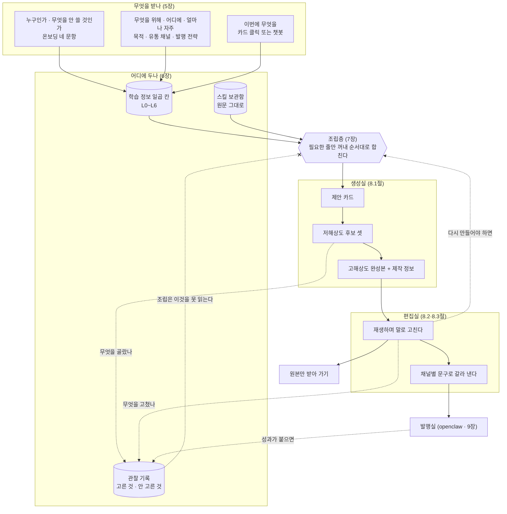
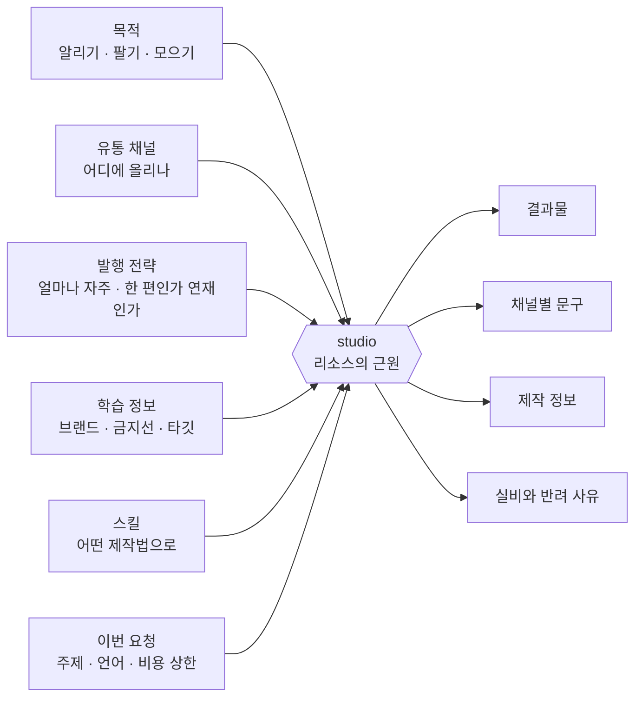
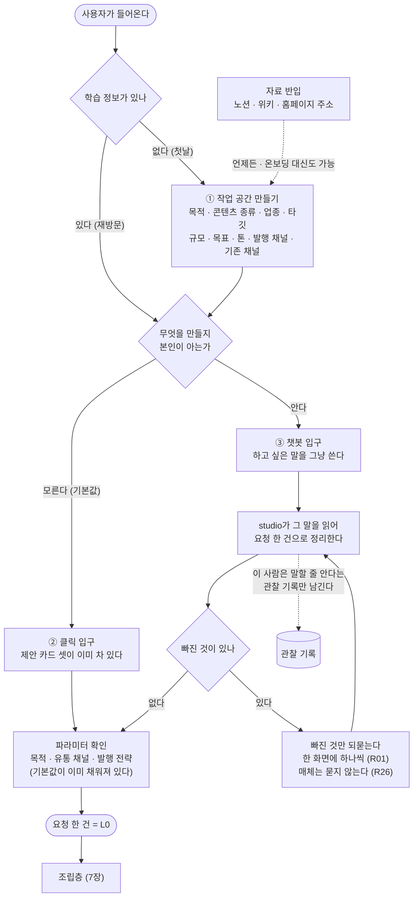
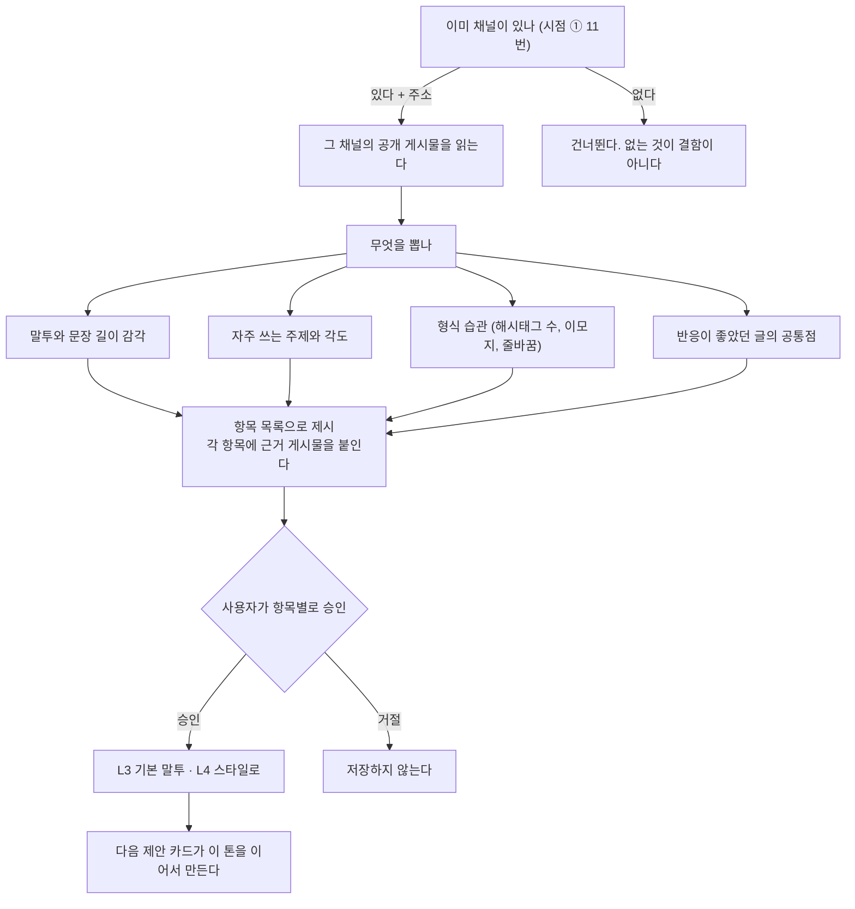
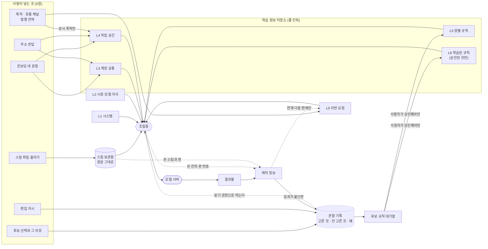
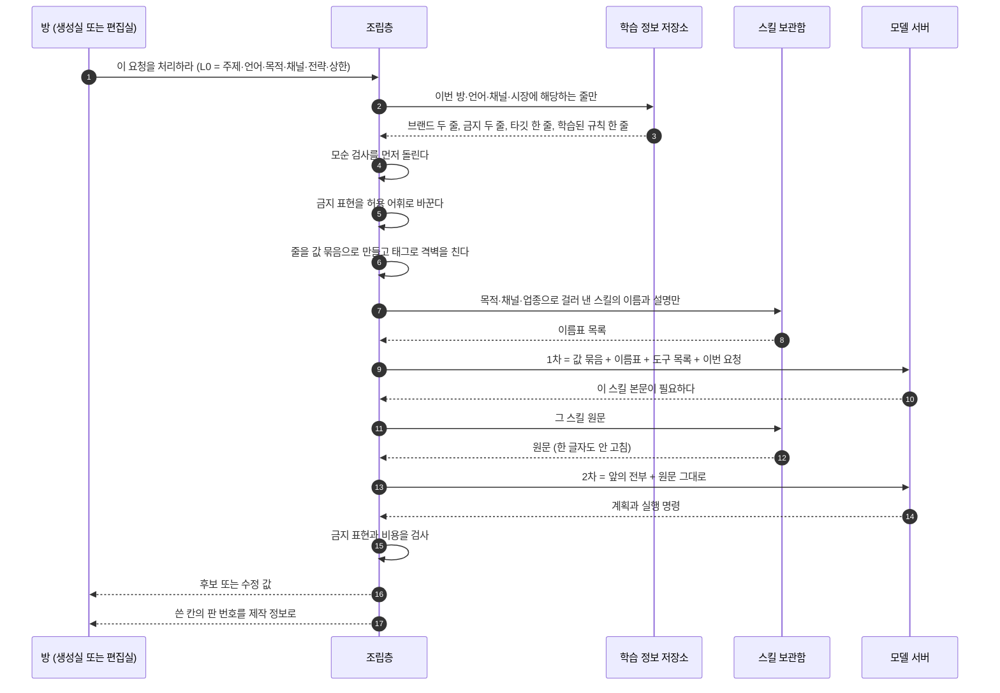
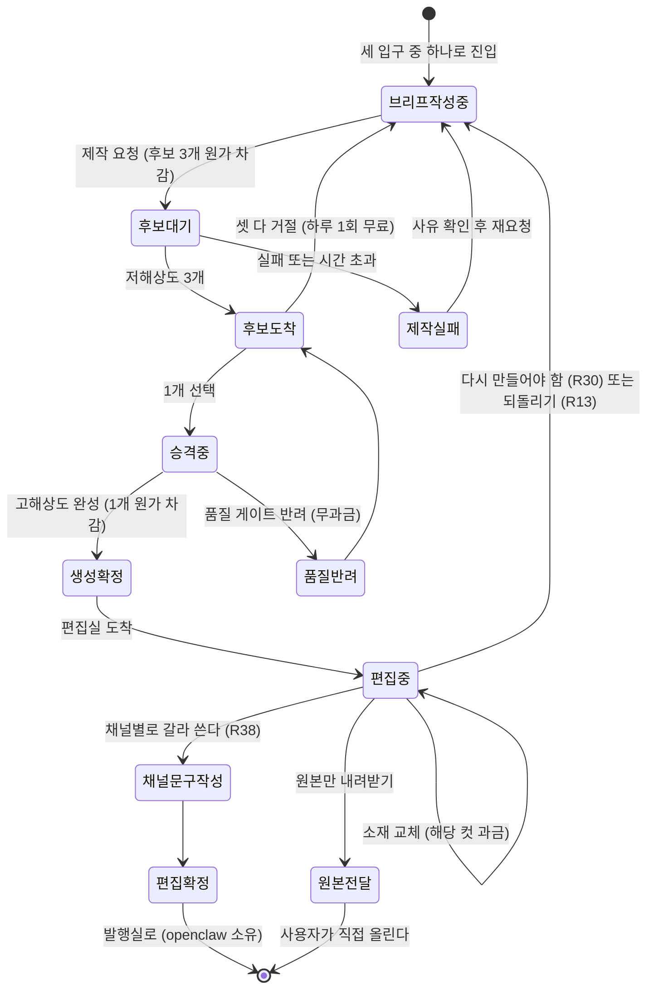
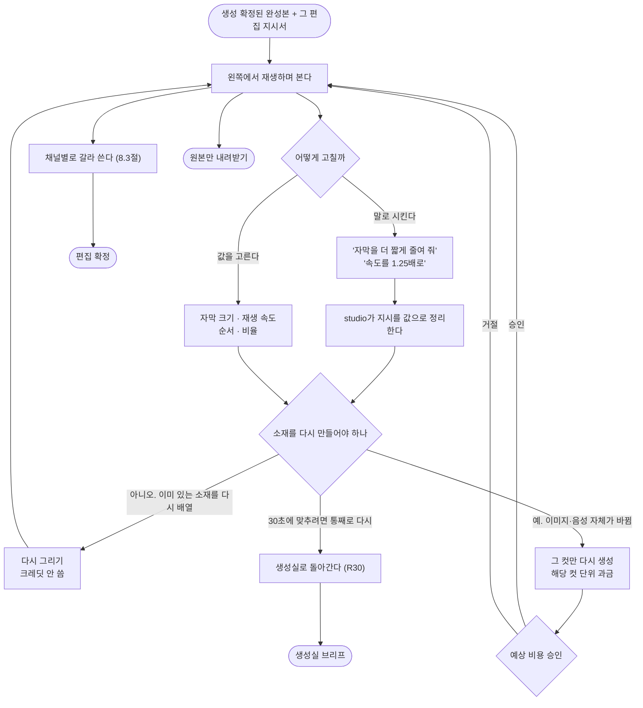
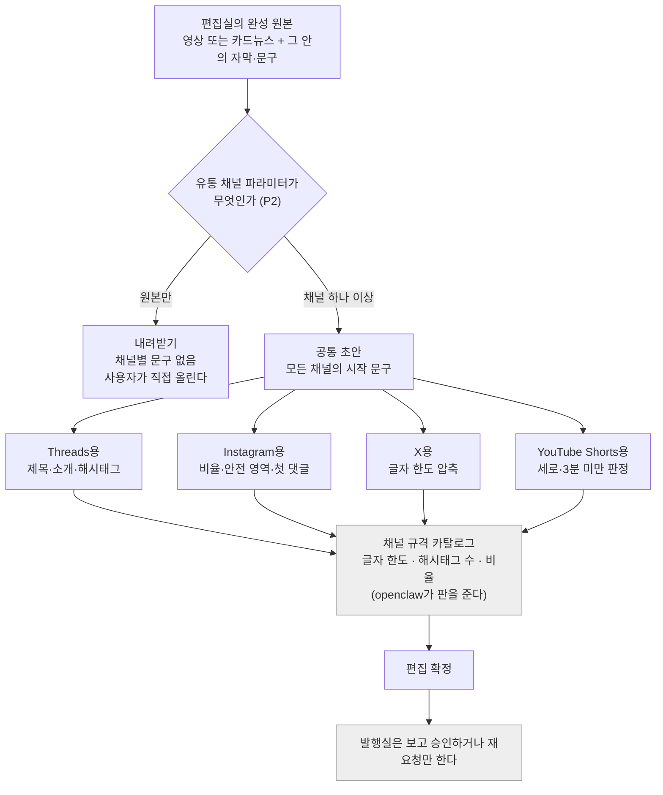
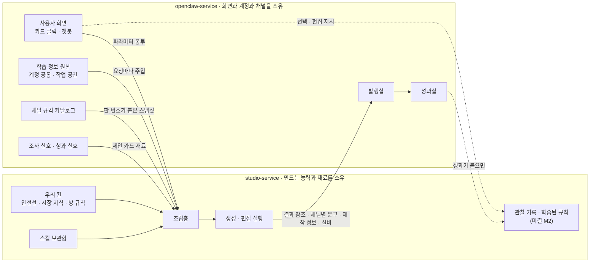

<!--
STAMP
문서: studio-service PRD (생성실 + 편집실)
파일: studio/docs/prd-studio-v3.0.md
라인: osmu / studio-service
판: v3.0 (구조 재배치 + 데이터 정의 신설). v2.0(studio/docs/prd-studio-v2.0.md)은 남겨 둔다
생성: 2026-08-21 KST
model: claude-opus-5[1m]
agent: prd-architect (서브에이전트)
기반 포맷: /tmp/prd-standard-outline.md (2026-08-21 회장 지시 표준 목차 0~14장). openclaw 기획서도 같은 뼈대로 다시 쓴다
품질헌법: /Users/sj/.claude/standards/planning.md 실제 Read 완료. 7원칙 판정표는 11장에 첨부
기반 산출물 (버전핀, 전부 이 세션에서 실제 Read):
  - studio/docs/prd-studio-v2.0.md (전문. 이 판의 내용 원천. 조항은 하나도 버리지 않았다)
  - /tmp/prd-standard-outline.md (표준 목차, 신규 채울 것 가·나·다·라)
  - docs/사업계획-osmu-v0.9.md (기준점)
  - docs/requests/회장-확정-요구사항-대장.md (R01~R56 전량 + 미결 2건 + R31/R38 충돌 주석)
  - studio/docs/학습정보-층계-계약-v0.1.md (§2.3 층 표, §2.5 하네스 대응, §2.6 층별 소유, §4 조립·상한, §7 입력 계약)
  - docs/정보수집-3단계-설계-2026-08-21.md (회장 구술 정리본. 5장의 뼈대)
  - docs/prd-openclaw-v2.0.md (§6.1 입력 I1~I9, §6.2 봉투 합류, §6.3 출력 O1~O6, §6.4 원본만 받는 경로)
회장 지적 5건 반영 위치:
  ① 목차 앵커 = 0장 목차 (문서 내부 링크 전량)
  ② 위에서 아래로 구체화 = 표준 목차 0~14장 순서 그대로 재배치
  ③ L0~L6 데이터 정의 3열 = 6장 (어떻게 받나 / 어디에 어떤 모양으로 두나 / 언제 조립에 실리나)
  ④ 스킬 데이터 정의 = 6.4절 (받는 두 경로 · 추천 근거 · 두는 자리 · 싣는 시점 · 믿는 범위)
  ⑤ 목적·유통 채널·발행 전략 = 5.4절 + 5.5절 (셋이 결과를 어떻게 바꾸나)
미확인: WebSearch 예산 소진(200/200)으로 이번 판도 실검색을 못 했다. 벤치마크는 0.5절에 출처와 한계를 함께 명시
고민 한 줄: v2.0이 반려된 이유는 내용 부족이 아니라 "받는 자리와 두는 자리가 문서 안에서 흩어져 있어 어디서 무엇이 들어오는지 눈으로 못 따라간다"였다. 그래서 이 판은 입력(5장)·저장(6장)·조립(7장)을 세 장으로 갈라 세우고 기능 요구는 그 세 장의 자리를 가리키게 뒤로 뺐다
-->

# studio-service PRD v3.0: 생성실 · 편집실

> **One Thing:** 무엇을 요청해야 하는지조차 모르는 사람이, 빈 화면 대신 이미 채워진 제안 카드를 누르거나 그냥 말로 시켜서, 자기 브랜드 규칙과 외부 제작법이 실린 결과물을 채널별 문구까지 붙여 받는 곳.

**한 줄 결론:** studio는 두 방이다. **생성실**은 무엇을 만들지 정하고 만드는 곳, **편집실**은 만든 것을 재생하며 말로 고치고 채널 규격에 맞춰 갈라 내는 곳이다. **studio는 리소스의 근원이고, 받은 파라미터에 따라 응답이 달라진다.** 그 파라미터는 이번 요청·학습 정보 일곱 칸·스킬, 그리고 이 판에서 새로 받는 **목적·유통 채널·발행 전략** 셋이다.

---

## 0. 이 문서를 읽는 법 <a id="ch0"></a>

### 0.1 목차 (누르면 그 장으로 간다) <a id="ch0-1"></a>

| 장 | 이름 | 이 장이 답하는 질문 |
|---|---|---|
| [0](#ch0) | [이 문서를 읽는 법](#ch0) | 어디부터 읽나. 이 판에서 무엇이 바뀌었나 |
| [1](#ch1) | [문제](#ch1) | 누가 무엇을 못 해서 막히나 |
| [2](#ch2) | [이 서비스가 그 문제를 어떻게 푸나](#ch2) | 전체가 한 장의 그림으로 어떻게 도나 |
| [3](#ch3) | [사용자와 시나리오](#ch3) | 누구를 위해 만드나. 그 사람이 어떤 길을 걷나 |
| [4](#ch4) | [이미 있는 것](#ch4) | 무엇을 새로 만들고 무엇을 자리만 옮기나 |
| [5](#ch5) | [무엇을 받나 (입력 정의)](#ch5) | 사용자에게 무엇을 묻고 어떻게 받나 |
| [6](#ch6) | [어떻게 저장하나 (데이터 정의)](#ch6) | 받은 것을 어디에 어떤 모양으로 두나 |
| [7](#ch7) | [어떻게 조립하나](#ch7) | 둔 것을 언제 꺼내 어떤 순서로 합치나 |
| [8](#ch8) | [기능 요구사항](#ch8) | 무엇을 만들면 다 만든 것인가 |
| [9](#ch9) | [두 서비스 경계](#ch9) | 무엇을 넘기고 무엇을 받나 |
| [10](#ch10) | [비기능 요구](#ch10) | 얼마나 안전하고 얼마나 되짚을 수 있나 |
| [11](#ch11) | [판정과 자기공격](#ch11) | 이 기획이 통과 기준을 넘었나. 어디서 무너지나 |
| [12](#ch12) | [미결](#ch12) | 회장이 정할 것과 실측해야 알 것 |
| [13](#ch13) | [요구사항 대장 대조](#ch13) | R01~R56이 어디에 들어갔나 |
| [14](#ch14) | [자기심문](#ch14) | 이 문서가 틀렸다면 어디서 틀렸나 |

**절 단위 색인 (자주 오갈 자리)**

- 5장: [세 시점과 세 입구](#ch5-1) · [시점① 공통 정보](#ch5-2) · [자료 반입](#ch5-3) · [목적·유통 채널·발행 전략](#ch5-4) · [파라미터가 결과를 바꾸는 표](#ch5-5) · [기존 채널 분석](#ch5-7) · [시점② 생성·편집 정보와 추천](#ch5-6) · [시점③ 발행·운영](#ch5-10) · [학습 정보 화면](#ch5-8) · [챗봇 선제 제안](#ch5-9)
- 6장: [L0~L6 데이터 정의 3열 표](#ch6-2) · [부속 저장소](#ch6-3) · [스킬](#ch6-4) · [데이터 흐름 도식](#ch6-5) · [상한과 경계](#ch6-6)
- 7장: [조립 흐름 도식](#ch7-1) · [조립 일곱 규칙](#ch7-2) · [제작 기법 다섯](#ch7-3) · [제작 정보](#ch7-4) · [작업물 상태 기계](#ch7-5)
- 8장: [생성실 요구](#ch8-1) · [편집실 요구](#ch8-2) · [채널별 문구](#ch8-3) · [비용 관문](#ch8-4)

### 0.2 읽는 순서 <a id="ch0-2"></a>

| 누가 | 어디부터 | 왜 |
|---|---|---|
| 회장 (판단) | 2장 도식 → 5.4절 → 6.2절 → 12장 | 그림으로 전체를 보고, 새로 받는 파라미터와 데이터 정의를 확인하고, 정할 것만 정한다 |
| 기술설계 | 5장 → 6장 → 7장 → 9장 | 입력·저장·조립·경계가 설계의 재료다. 8장은 그 재료로 만들 것의 목록이다 |
| 디자인 | 2장 → 3장 → 5장 → 8장 | 흐름과 사람을 먼저 보고 화면이 받아야 할 것을 본다 |
| QA | 8장 → 11.2절 | 수용 기준이 곧 테스트 케이스의 씨앗이고, 접는 기준이 실패 판정선이다 |

### 0.3 이 판에서 바뀐 것 <a id="ch0-3"></a>

**v2.0의 조항은 하나도 버리지 않았다.** 기능 요구 번호(FR-GEN·FR-EDT), 도식 일곱 장, Steelman, Premortem, 접는 기준, 7원칙 판정표, 미결 M1~M12, R01~R45 대조가 전부 살아 있다. 바뀐 것은 **자리와 새로 채운 것**이다.

| # | 무엇이 바뀌었나 | v2.0에서는 | v3.0에서는 |
|---|---|---|---|
| 1 | **목차에 문서 내부 링크** | 없었다. 위에서 아래로 훑어야 했다 | [0.1절](#ch0-1)에서 각 장·주요 절로 바로 뛴다 |
| 2 | **위에서 아래로 구체화** | 기능 요구(4~5장)가 데이터 정의(6장)보다 앞에 있었다. 무엇으로 만드는지 모르고 기능부터 읽었다 | 문제 → 전체 그림 → 사람 → 이미 있는 것 → 입력 → 저장 → 조립 → 기능. 기능은 앞 세 장의 자리를 가리킨다 |
| 3 | **데이터 정의** | 일곱 칸 표가 "무엇이 사나·누가 채우나" 수준이었다. 어디에 어떤 모양으로 두는지가 없었다 | [6.2절](#ch6-2)이 칸마다 **어떻게 받나 / 어디에 어떤 모양으로 두나 / 언제 조립에 실리나** 세 열을 채운다 |
| 4 | **스킬 데이터 정의** | 보관함 요구(FR-GEN-030) 한 조항뿐. 어떻게 받고 어떻게 추천하는지가 없었다 | [6.4절](#ch6-4)이 받는 두 경로·추천 근거·두는 자리·싣는 시점·믿는 범위를 같은 3열로 |
| 5 | **목적·유통 채널·발행 전략** | 받는 자리가 문서 어디에도 없었다 | [5.4절](#ch5-4)에서 받고 [5.5절](#ch5-5)에서 이 셋이 결과를 어떻게 바꾸는지 표로 |
| 6 | 미결 신설 | 편집 지시의 정리 가능 목록이 자기심문에만 있고 미결로 안 올라갔다 | M13(발행 전략 원본 소유)·M14(정리 가능한 편집 지시 목록)·M15(채널 분석 주체)·M16(선제 제안 빈도)로 승격 |
| 7 | **정보 수집 설계 (회장 구술 08-21, R51~R56)** | 온보딩을 네 문항으로만 잡았고 언제 무엇을 받는지의 시점 설계가 없었다. 기존 채널 분석·학습 정보 화면·선제 제안이 통째로 없었다 | **세 시점으로 갈라 받고([5.1.1](#ch5-1)·[5.2](#ch5-2)·[5.7](#ch5-6)·[5.8절](#ch5-10)), 기존 채널 분석([5.6절](#ch5-7)), 학습 정보 화면([5.9절](#ch5-8)), 챗봇 선제 제안([5.10절](#ch5-9))을 신설. 대응 기능 요구 FR-GEN-009·016·017·018·019** |

### 0.4 범위 <a id="ch0-4"></a>

| 항목 | 내용 |
|---|---|
| 범위 | studio-service의 **생성실**과 **편집실**. 온보딩과 학습 정보 입구, 목적·유통·발행 전략 수령, 제안 카드, 조립층, 후보와 선택, 편집 조정, 채널별 문구, 제작 정보, 비용 관문 |
| 범위 밖 | 발행·예약·댓글 응대·성과 수집·트렌드 조사. openclaw 소유이며 경계는 [9장](#ch9) |
| 정본 관계 | `prd-studio-v2.0.md`를 **대체한다.** v2.0은 남겨 둔다. FR 번호는 전부 유지했다 |
| 개발 순서 | studio가 먼저다. openclaw PRD가 "studio API가 준비돼 있다"를 전제로 서 있다 |
| 파는 순서 | 운영을 묶은 상품이 먼저다. 만드는 순서와 파는 순서가 반대라는 것을 혼동하지 않는다 |
| 첫 고객 | 회장이 운영하는 바이브 코딩 커뮤니티. 만들 줄은 아는데 알리질 못하는 사람이 이미 모여 있다 |
| 이 문서로 안 하는 것 | 표·필드 이름·타입·엔드포인트 확정. 의미 수준까지만 쓰고 기술설계에서 회장과 상의한다 |

### 0.5 벤치마크 출처와 그 한계 <a id="ch0-5"></a>

**이 세션에서도 실검색을 못 했다(WebSearch 예산 200/200 소진).** 근거 없는 단정을 피하기 위해 무엇을 어디서 빌렸는지 그대로 적는다.

| 무엇을 봤나 | 출처 | 빌린 것 | 다르게 한 것 |
|---|---|---|---|
| 클립을 고르면 우측 패널에서 속도·자막·오디오를 고치고 즉시 반영된다 | CapCut (프로토타입 v39 STAMP의 실조사 기록) | 편집실의 **왼쪽 미리보기 즉시 반영** 구조 | 손으로 타임라인을 만지지 않는다. 값 조정과 말 지시 둘로만 준다 (R33) |
| 글을 고치면 영상이 따라 잘린다 | Descript (같은 STAMP) | 대본이 곧 편집 대상이라는 사고 | 대본을 사람이 타이핑하지 않고 말로 시킨다 |
| 한 작성기에서 채널별 캡션·해시태그가 갈라진다 | Publer, Hootsuite 캡션 미리보기 (같은 STAMP) | **공통 초안 + 채널별 변경**의 두 층 구조 | 그들은 발행 도구 안에 있고 우리는 그 자리를 편집실로 옮겼다 (R38) |
| 캠페인 목적을 먼저 고르고 그 목적이 소재 형식과 배치를 바꾼다 | 광고 플랫폼의 캠페인 목적 선택 관행 (프로토타입 v39 STAMP 기록 및 사업계획 §2 경쟁 조사) | **목적을 맨 앞에서 받는다**는 순서 | 우리는 광고 집행이 아니라 콘텐츠 제작이므로 목적이 예산 배분이 아니라 **훅 각도·마무리 형태·제안 카드 선정**을 바꾼다 ([5.5절](#ch5-5)) |
| 경쟁 55곳, 원가 구조, 어뷰징 사고 | `wiki/research/2026-08-competitor-and-production-research.md` (2026-08-21, 당시 verify 통과) | 상품별 크레딧 분리, 계정 상한 | 조사 시점 이후 변화는 미확인이다 |

**이 판의 벤치마크는 2차 출처 의존이다.** 다음 판에서 실검색으로 갱신해야 한다. 위 넷째 행(캠페인 목적)은 이번 판에서 새로 쓴 5.4절의 근거인데 **2차 출처라 특히 약하다.** 실검색 전까지 이 절의 목적 분류는 확정이 아니라 제안으로 읽어야 한다.

---

## 1. 문제 <a id="ch1"></a>

### 1.1 누가 무엇을 못 해서 막히나 <a id="ch1-1"></a>

**만들 줄은 아는데 알리질 못한다.** 혼자 제품을 만든 사람이 그 제품을 알리려는 순간 세 겹으로 막힌다.

| 층 | 이 사람은 | 지금 어떻게 하고 있나 | 왜 안 되나 |
|---|---|---|---|
| 1층 (R35) | **하네스 엔지니어링을 못 한다.** 브랜드 규칙 파일, 제작법 설치, 역할 정의, 금지선 훅을 짜야 한다는 것은 안다 | 안 짠다. 매번 채팅창에 브랜드 설명을 다시 친다 | 매번 다시 설명하니 결과가 매번 다르다. 어제 잘 나온 것을 오늘 재현 못 한다 |
| 2층 (R40) | **프롬프트 엔지니어링을 못 한다.** 채팅창은 쓸 줄 안다 | "우리 제품 홍보 영상 만들어 줘"라고 친다 | 결과가 밋밋하다. **왜 밋밋한지 모르고 다시 지시하는 법도 모른다.** 두세 번 해 보다 창을 닫는다 |
| 3층 (R40) | **무엇을 요청해야 하는지조차 모른다** | 빈 채팅창을 열어 두고 아무것도 안 친다 | 도구가 전부 "무엇을 만들지는 네가 정해라"에서 시작한다. 그 자리가 비어 있다 |

**3층이 제일 크고 제일 안 팔린 시장이다.** 사업계획 §1.1의 다섯 행 중 "무엇을 올려야 할지 감이 안 오는 사람"이 이 층이고, 조사한 55곳 중 이 사람에게 **요청 자체를 대신 만들어 주는** 곳이 없었다.

### 1.2 이 문제 위에 또 하나가 있다 (이번 판에서 새로 세운 것) <a id="ch1-2"></a>

위 세 층은 "무엇을 만들까"의 문제다. 그런데 그 앞에 더 큰 것이 있다. **무엇을 위해 만드는지, 어디에 올릴 것인지, 얼마나 자주 낼 것인지를 아무도 안 묻고 있다.**

같은 주제라도 사람을 모으려고 만드는 것과 물건을 팔려고 만드는 것은 다른 물건이다. 스레드에 올릴 것과 인스타그램 카드뉴스로 낼 것도 다른 물건이다. 한 편만 낼 것과 여덟 편 연재의 1편으로 낼 것도 다른 물건이다. **v2.0까지 우리 문서에는 이 셋을 받는 자리가 한 곳도 없었다.** 받지 않으면 조립층이 셋 다 기본값으로 놓고 만든다. 그러면 무엇을 만들어도 "그냥 소개 영상"이 나온다. 2층 사용자가 창을 닫는 그 결과와 같은 물건이다.

이것이 [5.4절](#ch5-4)이 신설된 이유다.

### 1.3 지금 시장은 이 문제를 어떻게 풀고 있나 <a id="ch1-3"></a>

| 경로 | 값 | 왜 우리 타깃에게 안 맞나 |
|---|---|---|
| 도구를 산다 (생성 도구 여러 개) | 월 수십만원 규모 | 도구를 사도 무엇을 만들지는 여전히 본인이 정한다. 3층 문제가 그대로 남는다 |
| 대행사에 맡긴다 | 월 250만원 규모 | 혼자 만든 제품의 규모가 아니다 |
| 아무것도 안 한다 | 0원 | **실제로 대부분이 이것을 고른다.** 우리 경쟁자는 다른 도구가 아니라 "안 함"이다 |

---

## 2. 이 서비스가 그 문제를 어떻게 푸나 <a id="ch2"></a>

### 2.1 전체 흐름 한 장 <a id="ch2-1"></a>



### 2.2 아래 장들이 이 그림의 어느 조각인가 <a id="ch2-2"></a>

| 그림의 조각 | 어느 장이 정하나 | 그 장이 정하는 것 |
|---|---|---|
| 왼쪽 위 "무엇을 받나" 상자 셋 | [5장](#ch5) | 화면 어느 자리에서 무엇을 묻나 |
| 가운데 "어디에 두나" 원통 셋 | [6장](#ch6) | 받은 것을 어떤 모양으로 두나. 칸마다 3열 |
| 마름모 "조립층" | [7장](#ch7) | 언제 무엇을 꺼내 어떤 순서로 합치나 |
| 생성실·편집실 상자 | [8장](#ch8) | 각 화면이 만족해야 할 조건 |
| 오른쪽 "발행실" 회색 상자 | [9장](#ch9) | 무엇을 넘기고 무엇을 받나 |
| 점선 화살표 전부 (관찰·성과) | [6.3절](#ch6-3) | 학습이 도는 길. 조립으로 새지 않는다 |

**이 그림에서 읽어야 할 것 넷.**

첫째, **입력이 셋으로 갈린다.** 사람 자체에 관한 것(온보딩), 이 콘텐츠로 무엇을 하려는지(목적·채널·전략), 이번에 만들 것(주제). 셋의 수명이 다르므로 두는 자리도 다르다.

둘째, **관찰 기록에서 조립층으로 가는 화살표가 끊겨 있다.** 조립이 읽는 것은 승인된 규칙뿐이다.

셋째, **편집실에서 조립층으로 돌아가는 점선이 있다.** 30초에 맞춰 다시 만들어야 하면 생성실이다(R30). 이 화살표가 두 방을 가르는 실제 기준선이다.

넷째, **발행실로 안 가는 출구가 있다.** 완성 원본은 사용자 것이다.

### 2.3 studio는 리소스의 근원이다 (회장 표현) <a id="ch2-3"></a>

**studio는 화면을 소유하지 않는다. studio가 소유하는 것은 만드는 능력과 그 능력이 참고하는 재료다.** 그래서 studio는 사용자를 직접 상대하는 것이 아니라 **파라미터를 받는다.** 같은 "우리 제품 소개"라는 주제여도 실려 온 파라미터가 다르면 다른 것이 나와야 한다.



파라미터 하나가 결과의 무엇을 바꾸는지는 [5.5절](#ch5-5) 표가 정하고, 넘기고 받는 목록은 [9장](#ch9)이 정한다.

---

## 3. 사용자와 시나리오 <a id="ch3"></a>

### 3.1 페르소나 <a id="ch3-1"></a>

**박도윤, 32세, 혼자 SaaS를 만든 바이브 코더.** (openclaw PRD §1.1과 **같은 인물이다.** 새 인물을 만들면 두 문서가 다른 사람을 향하게 된다. R45.)

만드는 것은 문제가 아니다. 그는 클로드로 랜딩페이지도 짜고 영상도 뽑아 봤다. 막히는 곳은 그 앞이다. 화면을 열면 첫 질문이 "무엇을 만들까요"인데 그가 답을 모른다. 지난달에 올린 글 세 개는 전부 제품 업데이트 공지였고 아무도 안 봤다. 마케팅 잘하는 사람이 쓴 글을 보면 "이건 어떻게 이런 각도가 나오지" 싶은데, 그 각도를 자기가 만들 줄 모른다.

그래서 채팅창에 이렇게 친다. "우리 제품 홍보 영상 만들어 줘." 결과가 밋밋하게 나온다. 그는 왜 밋밋한지 모르고, 다음 지시를 어떻게 바꿔야 하는지도 모른다. 두세 번 다시 시켜 보다가 창을 닫는다. **그의 문제는 도구가 없는 게 아니라 요청을 못 쓰는 것이고, 더 정확히는 무엇을 요청해야 할지를 모르는 것이다.**

**그가 한 번도 스스로 물어보지 않은 것 셋이 있다.** 이 영상으로 무엇을 하려는 건지(사람을 모으려는 건지 결제를 받으려는 건지), 어디에 올릴 건지(스레드인지 인스타그램인지 둘 다인지), 얼마나 자주 낼 건지(이번 한 번인지 매주인지). 그는 이 셋을 안 정한 채로 "홍보 영상"이라고만 쳤다. **그래서 밋밋한 것이 나왔다.** 도구가 물어봤어야 할 것을 아무도 안 물었다.

편집도 같다. 어쩌다 쓸 만한 영상이 나와도 자막이 화면 밖으로 나가 있다. 그걸 고치려면 편집 프로그램을 열어야 하는데, 열면 타임라인이 나오고 트랙이 나오고 키프레임이 나온다. 그는 개발자다. 못 배울 것은 아니다. 다만 이걸 배우려고 저녁을 쓸 생각이 없다.

**결제 의향의 실제 모양:** 그는 월 57만원의 도구값을 낼 생각이 없다. 그렇다고 대행사에 월 250만원을 쓸 규모도 아니다. 그가 실제로 하는 것은 아무것도 안 하는 것이다. 이 사람에게 2만원짜리가 붙는지가 이 사업의 실제 질문이다.

**가장 큰 불신:** 예상 밖 비용, 그리고 "만들어 놨는데 못 쓰는 것".

**페르소나 근거 (본인 직관 외):** 사업계획 §1.1이 "만드는 건 하는데 알리질 못하는 사람"을 별도 행으로 세우고 "우리가 운영 중인 바이브 코딩 커뮤니티가 정확히 이 사람들"이라고 적었다. 관찰 가능한 실제 모집단이 손에 있다. 조사 기록 §5.3은 "빈 입력창은 시작을 막는다"와 "보고 고르는 것이 기억해 쓰는 것보다 쉽다"를 못 박았다. **지불 의사 자체는 미검증이며 이것이 접는 기준의 대상이다([11.2절](#ch11-2) K5).**

### 3.2 약속 (R36) <a id="ch3-2"></a>

**클릭만으로 만들되 쓸수록 정교하고 터지는 콘텐츠가 된다.**

앞 절(클릭만으로)은 이 문서가 책임진다. 뒤 절은 관찰 기록이 쌓이고 승인되는 경로까지만 책임지고, 실제로 더 터지는지는 성과실이 붙은 뒤 실측한다. **검증 전까지 제품 문구에 "더 잘 터진다"를 쓰지 않는다.**

### 3.3 시나리오 <a id="ch3-3"></a>

| # | 시나리오 | 지나는 자리 | 입구 |
|---|---|---|---|
| S1 | 첫날. 학습 정보가 0이다. 네 개만 묻고 그 자리에서 제안 카드 셋이 찬다 | 온보딩 → 생성실 | 클릭 |
| S2 | 재방문. 온보딩이 안 뜨고 카드부터 열린다 | 생성실 | 클릭 |
| S3 | 카드 셋이 다 마음에 안 든다. 오늘 한 번은 무료로 다시 뽑는다 | 생성실 재생성 | 클릭 |
| S4 | "우리 신제품을 좀 웃기게 소개하는 걸로 만들어 줘"라고 그냥 쓴다 | 챗봇 입구 → 같은 조립층 | 챗봇 |
| **S5 (신설)** | **"이번 건은 파는 게 목적이고 인스타그램에 낼 거야"라고 목적과 채널을 바꾼다. 같은 주제인데 마무리가 결제 유도로 바뀌고 비율이 세로로 바뀐다** | **생성실 파라미터 ([5.4절](#ch5-4))** | 둘 다 |
| **S6 (신설)** | **"이건 8주 연재의 1편이야"라고 정한다. 결과와 함께 다음 편 시작점이 남는다** | **발행 전략 ([5.4절](#ch5-4)), 제작 기법 4 ([7.3절](#ch7-3))** | 둘 다 |
| S7 | 후보 셋 중 하나를 고른다. 왜 골랐는지 축도 함께 남는다 | 생성실 선택 | 둘 다 |
| S8 | 고해상도가 나왔는데 마음에 안 든다. 확정·보관·다른 제안 셋 중 고른다 | 생성실 결과 | 둘 다 |
| S9 | 자막이 길다. "자막을 더 짧게 줄여 줘"라고 말한다. 무료다 | 편집실 값 조정 | 챗봇 |
| S10 | 첫 컷 이미지가 별로다. 바꾸면 그 컷만 과금된다는 것을 먼저 본다 | 편집실 소재 교체 | 둘 다 |
| S11 | 스레드용과 인스타그램용 문구가 갈라져 나온다. 인스타 것만 한 줄 고친다 | 편집실 채널별 문구 (R38) | 둘 다 |
| S12 | 발행은 직접 하겠다. 원본만 내려받는다 | 편집실 → 원본 내려받기 | 둘 다 |
| S13 | 30초로 맞추려니 컷 하나를 다시 만들어야 한다. 생성실로 돌아간다 | 편집실 → 생성실 (R30) | 둘 다 |
| **S15 (신설)** | **이미 스레드를 1년 하고 있다. 주소를 넣으니 말투와 자주 쓰는 각도가 항목으로 뽑혀 나온다. 셋만 승인한다. 다음 카드가 그 톤으로 나온다** | **기존 채널 분석 ([5.6절](#ch5-7))** | 클릭 |
| **S16 (신설)** | **아무것도 안 하고 있는데 알림이 온다. "지난주 그 글이 잘 됐는데 같은 각도로 하나 더 어떠세요." 눌러서 그대로 만든다** | **선제 제안 ([5.10절](#ch5-9))** | 챗봇 |
| **S17 (신설)** | **타깃이 바뀌었다. 학습 정보 화면을 열어 챗봇에게 "타깃을 1인 개발자로 바꿔 줘"라고 말한다. 무엇이 바뀔지 보고 확인한다** | **학습 정보 화면 ([5.9절](#ch5-8))** | 챗봇 |
| **S14 (신설)** | **외부에서 받은 제작법 파일을 올린다. 이 사람의 목적·채널에 맞는 스킬이 다음 요청부터 후보로 뜬다** | **스킬 보관함 ([6.4절](#ch6-4))** | 둘 다 |

### 3.4 반페르소나 <a id="ch3-4"></a>

| 이런 사람은 우리 것이 아니다 | 왜 |
|---|---|
| 프레임 단위로 직접 만지고 싶은 영상 편집자 | R33이 손 편집을 명시적으로 배제했다 |
| 자기 프롬프트가 이미 잘 도는 사람 | 조립층이 그 사람보다 낫다는 근거가 아직 없다 (미결 M5) |
| 남의 저작물로 싸게 뽑고 싶은 사람 | 소재 엮기는 권리가 정리된 소재만 쓴다 |
| 여러 명이 결재하는 팀 | 승인 체인을 만들지 않는다. 사용자는 혼자다 |

---

## 4. 이미 있는 것 <a id="ch4"></a>

**1차 진실원은 위키다.** `wiki/product/studio.md`, `wiki/product/marketing-hub-surface-map.md`, 루트 `CLAUDE.md`를 읽어 채웠다(v2.0 §3에서 승계). 코드 통째 스캔은 하지 않았다.

### 4.1 자리만 옮기면 되는 것 (재구현 금지) <a id="ch4-1"></a>

| 영역 | 현재 상태 | 이 PRD의 처리 |
|---|---|---|
| Studio 화면과 아이디어 입력 | **이미구현.** `dashboard/src/app/studio/page.tsx` + PlatformPreview·RepoConnect·BrandSetupWizard | 그대로 쓴다. 새 화면 안 만든다. 제안 카드([8.1절](#ch8-1))가 이 입력 자리를 대체한다 |
| 채널별 텍스트 변형 생성 | **이미구현.** 아이디어 하나에서 Threads·Facebook·X·Instagram·Shorts 문구를 각각 낸다 | **R38의 기반이 이미 있다.** 편집실이 이 기능의 주인이 된다([8.3절](#ch8-3)). 새로 만드는 것이 아니라 자리를 옮기는 것이다 |
| 공통 초안 + 채널별 변경 | **이미구현.** 공통 문구에서 채널별로 덮어쓰는 두 층 구조 | 그대로 쓴다. 편집실 채널별 문구의 두 층 구조가 이것이다 |
| 채널별 글자수 한도 | **이미구현.** `channel-text-limits.ts` 단일 소스, 값마다 공식 출처 URL. Threads·Facebook은 초과 시 발행 전 거절, 자르지 않는다 | 그대로 쓴다. 편집실 미리보기가 이 값을 읽는다 |
| 플랫폼 미리보기 | **이미구현.** 일곱 개(Threads·X·Facebook·Instagram·Shorts·Reels·TikTok) | 그대로 쓴다 |
| 브랜드 위키 그라운딩 | **이미구현.** 테넌트 브랜드 위키를 "사실만, 창작 금지"로 주입. `wiki_path` 소싱 | **자료 반입([5.3절](#ch5-3))의 기반이 이미 있다.** 새 반입기 만들지 않는다 |
| 초안 저장·복원 | **이미구현.** 초안 저장 접점 | 작업물 보관(FR-GEN-024)이 이것 위에 선다 |
| 영상 나레이션 결과 표시 | **이미구현.** 나레이션이 빠진 결과를 성공처럼 보이지 않게 사유를 번역해 경고 | 그대로 쓴다. 실패를 이름으로 부르는 원칙의 선례다 |
| 이미지·영상 생성 | **부분구현.** Higgsfield 경로가 있으나 **크레딧 풀과 생성 로그가 테넌트 격리가 안 돼 운영자 전용으로 잠겨 있다** | 이 격리가 [8.4절](#ch8-4) 비용 관문의 전제다. 격리 전에는 고객에게 열 수 없다 |
| 카드뉴스·이미지 관리 | **부분구현.** Images 화면에 권리·자르기·대체 텍스트 관리 | 소재 권리 확인(FR-GEN-052)이 이것과 이어진다 |

### 4.2 새로 만들 것 <a id="ch4-2"></a>

| 영역 | 정본 출처 | 어디에 정의됐나 |
|---|---|---|
| 학습 정보 일곱 칸 저장소 (L0~L6) | 층계 계약 v0.1 | [6.2절](#ch6-2) |
| **목적·유통 채널·발행 전략 수령** | **회장 지적 5 (08-21)** | **[5.4절](#ch5-4)** |
| **세 시점 수집 설계** | **R51·R52 (회장 구술 08-21)** | **[5.1.1](#ch5-1)·[5.2](#ch5-2)·[5.7](#ch5-6)·[5.8절](#ch5-10)** |
| **기존 채널 분석** | **R53** | **[5.6절](#ch5-7)** |
| **학습 정보 화면 (갱신 표시·챗봇 수정·메모)** | **R55** | **[5.9절](#ch5-8)** |
| **챗봇 선제 제안과 알림** | **R56** | **[5.10절](#ch5-9)** |
| 조립층 | 사업계획 §3.1 "이 제품의 심장" | [7장](#ch7) |
| 제안 카드 | R26, 사업계획 §3.2 | [8.1절](#ch8-1) |
| 챗봇 입구 | R39 | [5.1절](#ch5-1), [8.1절](#ch8-1) |
| 편집실 (재생하며 말로 지시) | R33, 프로토타입 v39 | [8.2절](#ch8-2) |
| 제작 정보 | 사업계획 §1.5 | [7.4절](#ch7-4) |
| 스킬 보관함과 추천 | 사업계획 §3.4 + 회장 지적 4 | [6.4절](#ch6-4) |
| 상품별 크레딧 분리·계정 상한·봇 방어 | 사업계획 §4.4 | [8.4절](#ch8-4) |

### 4.3 용어: 꼬리표를 버리고 "제작 정보"로 쓴다 <a id="ch4-3"></a>

**사진을 한 장 찍으면 카메라가 알아서 붙여 두는 촬영 정보가 있다.** 찍은 날짜, 어느 렌즈, 조리개 얼마, 감도 얼마. 평소엔 아무도 안 본다. 그런데 몇 달 뒤 유난히 잘 나온 사진 한 장을 발견하면 그때 그 정보를 열어 본다. **"아, 이 렌즈로 이 설정에서 찍었구나."** 그래야 다음에 같은 사진을 또 찍는다.

| 사진 | 우리 |
|---|---|
| 찍은 날짜 | 만든 날짜 |
| 어느 렌즈로 | 어느 제작법(스킬) 몇 판으로 |
| 조리개·셔터·감도 | 어느 제안 카드에서 왔고, 후보 셋 중 어느 것을 골랐고, 어떤 훅을 썼고, 어느 규칙 판이었나 |
| 나중에 못 붙인다 (찍는 순간에만 기록된다) | 나중에 못 붙인다 (만드는 순간에만 기록된다) |
| 잘 나온 사진의 설정을 다시 쓴다 | 잘 터진 콘텐츠의 조합을 다시 쓴다 |

이 표가 제품 화면과 문서에서 쓸 유일한 설명이다. 이후 이 문서는 **제작 정보**만 쓴다. 사업계획 §1.5와 §5의 "꼬리표"는 같은 것을 가리키는 옛 이름이다. 낱말 확정은 미결 M11이다([12장](#ch12)).

---

## 5. 무엇을 받나 (입력 정의) <a id="ch5"></a>

> 이 장은 **사용자에게 무엇을 묻고 어떻게 받는가**만 정한다. 받은 것을 어디에 두는지는 [6장](#ch6), 언제 꺼내 쓰는지는 [7장](#ch7)이다.

### 5.1 언제 받나: 세 시점 · 어디서 받나: 세 입구 <a id="ch5-1"></a>

#### 5.1.1 한 번에 다 받으면 지친다 (R51)

**정보를 세 시점에 나눠 받는다.** 이것이 회장이 2026-08-21에 구술한 수집 설계이며, 이 장의 뼈대다.

| 시점 | 언제 | 무엇을 받나 | 어디에 쌓이나 | 이 문서 어디 |
|---|---|---|---|---|
| **①** | **작업 공간을 만들 때** | 바로 답할 수 있는 것만. **클릭으로** | 공통 정보 (L3·L4) | [5.2절](#ch5-2) |
| **②** | **만들려고 할 때** | 이번 콘텐츠의 결. **추천을 곁들여** | 생성·편집 정보 (L0, 반복되면 L5·L6) | [5.7절](#ch5-6) |
| **③** | **첫 콘텐츠가 나온 뒤** | 올리고 운영하는 방식 | 발행·운영 정보 (openclaw) | [5.8절](#ch5-10) |

**왜 나누나.** 첫 화면에서 열두 가지를 물으면 3층 타깃이 거기서 나간다. 그리고 **발행 방식은 만들어 보기 전에는 대답할 수 없는 질문이다.** 아직 아무것도 안 만든 사람에게 "댓글을 어떤 결로 달까요"를 묻는 것은 답을 강요하는 것이지 받는 것이 아니다.

**빈칸으로 두지 않는다 (R52 후단).** 사용자가 "타깃이 누군지 모르겠다"고 하면 그 칸을 비워 두고 넘어가는 것이 아니라 **질문을 통해 만들어 간다.** 예를 들어 만든 것이 무엇인지 되묻고, 누가 그것을 쓸지 후보를 보여 주고 고르게 한다. 빈칸은 나중에 조립층이 지어내는 자리가 된다.

#### 5.1.2 받는 입구는 셋이다



**입구마다 성격이 다르다.**

| 자리 | 언제 받나 | 얼마나 자주 바뀌나 | 안 받으면 |
|---|---|---|---|
| ① 작업 공간 만들기 | 시점 ①. 공간마다 한 번 | 드물게 (학습 정보 화면에서 언제든 수정, [5.9절](#ch5-8)) | 생성이 안 된다. 브랜드 사실과 금지선이 없으면 지어낸다 |
| ② 클릭 입구 (제안 카드) | 시점 ②. 매 요청 | 매번 | 3층 타깃이 빈 화면 앞에 선다 |
| ③ 챗봇 입구 | 시점 ②. 매 요청 + **챗봇이 먼저 거는 제안** ([5.10절](#ch5-9)) | 매번 | 프롬프트를 쓸 줄 아는 사람을 막게 된다 (R39) |
| 파라미터 ([5.4절](#ch5-4)) | 시점 ①에 상시값, 시점 ②에 이번 값 | 목적·채널은 가끔, 발행 전략은 드물게 | **같은 것만 나온다.** [1.2절](#ch1-2)이 이것을 설명한다 |

### 5.2 시점 ①: 작업 공간을 만들 때 받는 공통 정보 (R52) <a id="ch5-2"></a>

**바로 답할 수 있는 것만 클릭으로 받는다.** 타이핑을 요구하는 칸은 브랜드 사실 하나뿐이고 그것도 주소 붙여넣기로 대신할 수 있다([5.3절](#ch5-3)).

| # | 무엇을 묻나 | 어떻게 받나 | 어느 칸으로 | 없다고 하면 |
|---|---|---|---|---|
| 1 | **콘텐츠를 만드는 목적** | 고르기 (알리기·팔기·모으기, [5.4절](#ch5-4) P1) | L4 상시 목적 | 되묻는다. 이것 없이는 제안 카드의 각도가 안 선다 |
| 2 | **어떤 종류를 만들 것인가** | 고르기 (글·이미지·숏폼·음악 등) | L4 | 카드뉴스를 기본으로 두고 진행한다 (FR-GEN-050) |
| 3 | 당신은 누구이고 무엇을 만들었나 (브랜드 사실) | 짧은 글 **또는 주소 붙여넣기** | L3 | 지어내지 않는다. 브랜드 사실 없이는 생성이 막힌다 |
| 4 | 절대 쓰지 않을 표현 (금지선) | 예시에서 고르기 + 직접 추가 | L3 | 기본 금지선만 적용하고 그 사실을 표시한다 |
| 5 | **마케팅이라면 업종** | 고르기 | L4 | 후보를 좁히지 못한다. 되묻는다 |
| 6 | **타깃** | 고르기 | L4 | **빈칸으로 두지 않고 질문으로 만들어 간다.** 만든 것이 무엇인지 되묻고 그것을 쓸 사람 후보를 보여 준다 |
| 7 | **사업 규모** | 고르기 | L4 | 기본값으로 진행. 분량과 비용 상한 제안이 무뎌진다 |
| 8 | **목표** | 고르기 | L4 | 목적(1번)으로 대신한다 |
| 9 | **톤** | 고르기 | L3 기본 말투 / L4 공간 스타일 | **질문으로 만들어 간다.** 예시 문장 두세 개를 보여 주고 어느 쪽이 자기 같은지 고르게 한다 |
| 10 | **발행 채널은 어디를 생각하나** | 고르기 ([5.4절](#ch5-4) P2) | L0 기본값 제안 | 원본만 만드는 경로로 진행한다 (FR-GEN-008) |
| 11 | **이미 채널이 있나** | 있다 / 없다 + 주소 | 있으면 **채널 분석**으로 간다 ([5.6절](#ch5-7)) | 없으면 분석을 건너뛴다. 없는 것이 결함이 아니다 |

**층계 계약 §7.1이 "없으면 생성이 안 된다"고 못 박은 것은 이 중 넷이다.** 브랜드 사실(3번), 금지선(4번), 타깃(6번), 업종·컨셉(5번). 나머지 일곱은 없으면 기본값으로 진행하되 그 사실을 표시한다. **필수 4개 이하 규칙(FR-GEN-002)은 이 넷을 가리키는 것이지 화면에 항목이 넷만 뜬다는 뜻이 아니다.**

**규칙 넷.** 한 화면에 질문 하나만 둔다(R01). 질문에는 항상 고를 수 있는 후보가 붙는다. 빈 입력창만 단독으로 제시하지 않는다(R25). 중단해도 그때까지 답한 것은 사라지지 않는다.

**매체는 묻지 않는다(R26).** 2번의 "콘텐츠 종류"는 이 공간에서 대체로 무엇을 만들 것인가이지 이번 한 편의 매체가 아니다. 이번 한 편의 매체는 제안 카드가 갖는다.

### 5.3 자료 반입 <a id="ch5-3"></a>

주소를 붙여 넣으면 읽어서 **항목 목록으로 쪼개 보여주되 자동 확정하지 않는다**(R03). 이미 있는 브랜드 위키 그라운딩 위에 선다([4.1절](#ch4-1)).

| 받는 것 | 어떻게 | 승인 전에는 |
|---|---|---|
| 노션·위키·홈페이지 주소 | 붙여넣기 | 저장되지 않는다 |
| 읽어 낸 항목 | 항목마다 출처가 붙어 목록으로 제시 | 생성에 실리지 않는다 |
| 기존 값과 충돌하는 항목 | 보류로 표시 | 사용자가 고를 때까지 멈춘다 |
| 읽기 실패 | 실패 사실을 표시 | **못 읽은 내용을 지어내지 않는다** |

**반입 자료의 본문은 요청에 통째로 실리지 않는다.** 요약과 참조만 붙는다([6.6절](#ch6-6) 상한 규칙).

### 5.4 목적과 유통 채널과 발행 전략 (회장 지적 5 · 신설) <a id="ch5-4"></a>

**이 셋을 받는 자리가 v2.0까지 우리 두 기획서 어디에도 없었다.** [1.2절](#ch1-2)이 왜 이것이 문제인지를 적었다. 여기서 받는 자리를 만든다.

> **주의.** 아래 값 목록은 **의미 수준의 분류이지 확정된 선택지 집합이 아니다.** 실제 값 목록과 이름은 기술설계에서 회장과 정한다.

#### 5.4.1 무엇을 받나

| # | 파라미터 | 무엇을 묻는 것인가 | 값의 성격 (의미 수준) | 기본값 |
|---|---|---|---|---|
| **P1** | **목적** | 이 콘텐츠로 무엇을 하려는가 | **알리기**(존재를 알린다) · **팔기**(결제나 신청을 받는다) · **모으기**(구독·팔로우·명단을 얻는다) | 작업 공간을 만들 때 고른 상시 목적 |
| **P2** | **유통 채널** | 어디에 올릴 것인가 | 주 채널 하나 + 곁들일 채널 여럿. 어디에도 안 올리고 원본만 받는 것도 값이다 | 지난번에 쓴 채널 |
| **P3** | **발행 전략** | 얼마나 자주, 언제, 한 편인가 연재인가 | **한 편만** · **연재의 몇 편째** · **정기 발행 중 이번 회차**. 여기에 시점 감각(지금 낼 것인가 예약할 것인가)이 붙는다 | 한 편만 |

#### 5.4.2 어떻게 받나

| 파라미터 | 첫날 | 매 요청 | 화면 어디 |
|---|---|---|---|
| P1 목적 | 작업 공간을 만들 때 상시 목적을 하나 고른다 | 제안 카드가 목적을 이미 갖고 있고, 카드 위에서 이번 건만 바꿀 수 있다 | 생성실 카드 영역. 고르기 |
| P2 유통 채널 | 온보딩에서 묻지 않는다. 첫 요청 때 후보로 뜬다 | 카드에 붙어 있고 요청마다 바꿀 수 있다 | 생성실 카드 영역 + 편집실 채널별 문구 탭 |
| P3 발행 전략 | 묻지 않는다. 기본값은 한 편만 | 연재로 만들 때만 고른다 | 생성실. 고르기 |

**세 파라미터 모두 사용자가 타이핑하지 않는다.** 전부 고르기이고 전부 기본값이 미리 차 있다. **이것이 3층 타깃을 막지 않는 유일한 방법이다.** 목적을 빈칸으로 물으면 "무엇을 요청해야 하는지 모르는 사람"이 거기서 멈춘다.

**챗봇 입구로 들어와도 같다.** "이번 건은 파는 게 목적이고 인스타에 낼 거야"라는 문장에서 P1과 P2를 읽어 채운다. 못 읽으면 그것만 되묻는다(R01).

#### 5.4.3 어디에 두나

| 파라미터 | 상시값 | 이번 요청값 |
|---|---|---|
| P1 목적 | 작업 공간 칸(L4). 이 공간의 상시 목적 | 이번 요청 칸(L0). 저장하지 않는다 |
| P2 유통 채널 | 두지 않는다. 직전 사용 채널은 편의를 위한 기본값 제안일 뿐 | L0 |
| P3 발행 전략 | **미결 M13.** 연재 계획과 발행 주기의 원본이 studio에 있어야 하는가 openclaw 캘린더에 있어야 하는가 | L0 (이번 회차 번호) |

세 열 전체 정의는 [6.2절](#ch6-2) 표에 L0·L4 행으로 들어가 있다.

### 5.5 이 셋이 결과를 어떻게 바꾸나 <a id="ch5-5"></a>

**받기만 하고 결과가 안 바뀌면 받을 이유가 없다.** 파라미터가 조립층에서 무엇을 바꾸는지를 못 박는다. 이것이 [2.3절](#ch2-3)의 "파라미터에 따라 응답이 달라진다"의 실제 내용이다.

| 파라미터 값 | 제안 카드가 바뀐다 | 조립이 바뀐다 | 결과물이 바뀐다 |
|---|---|---|---|
| **P1 = 알리기** | 각도가 "이런 게 있다"에 몰린다. 발견 가능성이 높은 주제를 먼저 올린다 | 훅을 세게, 마무리는 열어 둔다 | 결말에 행동 요구가 없다. 기억에 남는 한 문장으로 끝난다 |
| **P1 = 팔기** | 각도가 "이 문제를 이렇게 푼다"에 몰린다 | 마무리에 행동 요구 한 줄이 들어간다. 근거(사실·수치)를 브랜드 사실 칸에서 더 끌어온다 | 결말이 결제·신청으로 이어지는 한 줄로 끝난다. 근거 없는 효능 문구는 금지선 검사에서 걸린다 |
| **P1 = 모으기** | 각도가 "이걸 계속 보면 뭐가 좋다"에 몰린다 | 다음 편 예고를 마무리에 붙인다. 제작 기법 4(다음 편 시작점)가 켜진다 | 결말이 구독·팔로우 이유 한 줄이다 |
| **P2 = 스레드 중심** | 글 중심 카드가 위로 온다 | 채널 규격 칸에서 글자 한도를 받아 길이를 잡는다 | 짧은 글 + 이미지 한 장. 첫 줄이 승부처라 훅이 앞으로 당겨진다 |
| **P2 = 인스타그램 중심** | 카드뉴스·릴스 카드가 위로 온다 | 비율과 자막 안전 영역이 조립에 실린다 | 세로 또는 정사각. 자막이 안전 영역 안에 든다. 첫 댓글용 문구가 따로 난다 |
| **P2 = 여러 채널** | 카드 하나가 여러 채널을 갖는다 | 공통 초안 하나를 먼저 세운다 | 원본 하나 + 채널별 문구 여러 벌 ([8.3절](#ch8-3)) |
| **P2 = 원본만** | 채널 표시가 안 붙는다 | 채널 규격을 받아 오지 않는다 | 채널별 문구를 만들지 않는다. 원본과 제작 정보만 나간다 |
| **P3 = 한 편만** | 단발 주제가 뜬다 | 다음 편 시작점을 안 남긴다 | 그 자체로 완결된다 |
| **P3 = 연재의 N편째** | 지난 편과 이어지는 주제만 후보에 올린다 | 지난 편의 제작 정보에서 훅·스타일·인물 설정을 이어받는다. **직전 편과 같은 카드 묶음이 다시 나오지 않는다** | 시작이 지난 편을 잇고 끝에 다음 편 시작점이 남는다 (제작 기법 4) |
| **P3 = 정기 발행 중 이번 회차** | 카드가 회차 간격에 맞는 분량으로 제안된다 | 비용 상한이 회차 예산 안에서 잡힌다 | 분량과 원가가 회차마다 고르게 된다 |

**한 줄로 줄이면 이렇다.** 목적은 **마무리와 각도**를 바꾸고, 유통 채널은 **매체와 규격**을 바꾸고, 발행 전략은 **앞뒤 연결과 예산 배분**을 바꾼다.

**아직 모르는 것.** 이 세 파라미터가 실제로 결과 품질을 얼마나 바꾸는지는 실측 전이다. 목적만 바꿔 뽑은 두 벌을 비교하는 실험이 필요하다(미결 M5에 함께 묶는다).

### 5.6 이미 채널이 있으면 그 채널을 분석한다 (R53) <a id="ch5-7"></a>

**이것이 우리 온보딩의 핵심 기능이다.** 이미 스레드나 인스타그램을 하고 있는 사람에게 "당신의 톤은 무엇입니까"를 묻는 것은 이상하다. **그 사람의 톤은 이미 채널에 있다.** 물어볼 것을 읽어 오면 된다.



| 항목 | 정의 |
|---|---|
| **어떻게 받나** | 시점 ① 11번에서 "있다"를 고르고 채널 주소를 붙여 넣는다. **자격증명은 받지 않는다.** 공개된 것만 읽는다 |
| **무엇을 뽑나** | 말투와 문장 길이 감각, 자주 쓰는 주제와 각도, 형식 습관(해시태그 수·이모지·줄바꿈), 반응이 좋았던 글의 공통점. **넷 다 의미 수준이고 지표 수집이 아니다** |
| **어디에 두나** | 뽑은 것은 곧바로 칸에 안 들어간다. **항목 목록으로 제시되고 항목마다 근거 게시물을 가리킨다.** 승인한 것만 말투는 L3로, 주제·각도·형식은 L4로 들어간다. 반입 자료와 같은 규칙이다([5.3절](#ch5-3)) |
| **언제 조립에 실리나** | 승인돼 L3·L4에 들어간 뒤부터 그 칸의 규칙대로. 분석 원문은 절대 안 실린다. 실리는 것은 승인된 줄뿐이다 |
| **못 읽으면** | 비공개거나 접근이 막히면 그 사실을 표시하고 **지어내지 않는다.** 채널 없는 사람과 같은 경로로 진행한다 |
| **어디까지 믿나** | 뽑은 것은 전부 **제안이지 사실이 아니다.** 사용자가 승인하기 전에는 한 줄도 저장되지 않고 생성에 실리지 않는다. 남의 채널 주소를 넣는 경우도 있으므로 "이것이 당신 것이 맞나"를 확인한다 |
| **소유 경계** | 공개 게시물 읽기는 자격증명이 필요 없으므로 studio가 할 수 있다. **다만 이미 채널을 연결한 사용자라면 openclaw가 가진 연결로 더 정확히 읽을 수 있다.** 어느 쪽이 읽을지는 미결 M15 |

**이 기능이 왜 큰가.** 시점 ①의 열한 질문 중 톤·타깃·주제·형식 넷이 이 분석 하나로 미리 채워진다. 이미 채널이 있는 사람에게는 **온보딩이 확인 절차로 줄어든다.**

### 5.7 시점 ②: 만들려고 할 때 받는 생성·편집 정보 (R54) <a id="ch5-6"></a>

**이 자리의 특징은 질문마다 추천이 근거와 함께 붙는다는 것이다.** 사용자가 모르는 것을 묻고 답을 기다리지 않는다. 우리가 먼저 답을 놓고 이유를 댄다.

| # | 무엇을 묻나 | 어떻게 받나 | 추천이 어떻게 붙나 | 무엇을 근거로 |
|---|---|---|---|---|
| 1 | 어떤 느낌으로 하고 싶은가 | 고르기 (예시 이미지·문장을 보고) | 목적과 톤에 맞는 것을 미리 골라 둔다 | L4 목적·톤, L2 시장 지식 |
| 2 | **벤치마킹 중인 사이트나 콘텐츠가 있나** | 주소 붙여넣기 또는 **없다** | **없으면 추천한다.** 같은 업종·같은 목적에서 잘 도는 것을 몇 개 보여 준다 | L2 시장 지식, openclaw 조사 신호(I5) |
| 3 | **길이는 어느 정도로** | 고르기 | **목적 기준으로 추천한다.** "수익화가 목적이면 1분 이상이어야 한다", "경쟁사는 이 정도 길이로 간다"를 근거와 함께 | 목적(P1), L2 길이 감각, 조사 신호 |
| 4 | **실사 느낌인가 캐릭터 느낌인가** | 고르기 | 목적에 맞는 쪽을 미리 골라 둔다 | 목적(P1), 업종, L2 |
| 5 | **경쾌한가 진중한가** | 고르기 | 목적과 톤을 보고 미리 골라 둔다 | 목적(P1), L3 기본 말투 |

**추천에는 반드시 근거가 붙는다.** "이 목적이면 보통 이렇게 한다", "같은 업종의 이 채널은 이렇게 하고 있다". **근거 없는 추천은 표시하지 않는다.** 제안 카드와 스킬 추천에 이미 적용한 규칙과 같다(FR-GEN-005, FR-GEN-015).

**받은 것을 어디에 두나.** 이 다섯은 **이번 요청(L0)이다.** 저장하지 않는다. 다만 **같은 방향을 서로 다른 작업에서 반복해 고르면** 후보 규칙 대기열에 올라가고 승인되면 L5·L6이 된다(FR-GEN-007). 이것이 "쓸수록 정교해진다"(R36)가 실제로 작동하는 자리다.

**이 다섯을 안 고르면.** 추천값이 그대로 실린다. 사용자가 아무것도 안 만져도 요청이 완성되는 것이 기본 상태다. **고르는 것은 바꾸고 싶은 사람의 몫이다.**

### 5.8 시점 ③: 첫 콘텐츠가 나온 뒤 받는 발행·운영 정보 (경계) <a id="ch5-10"></a>

**이 시점은 openclaw 소유다.** studio는 여기서 아무것도 안 받는다. 그런데 이 문서에 적는 이유는 **왜 시점 ①에서 안 묻는지**가 studio의 설계 근거이기 때문이다.

| 무엇 | 내용 | 소유 |
|---|---|---|
| 발행 시각 | 일정한 시각·주기로 할 것인가 흩어서 할 것인가 | openclaw |
| 좋아요 | 자동으로 할 것인가. 한다면 어떤 기준으로 | openclaw |
| 댓글 | 어느 쪽에 어떤 결로 달 것인가 | openclaw |

**정한 것은 학습 정보로 올라간다.** 발행 방 규칙(L5)과 발행 취향(L6)이며, 원본이 어디 사는지는 미결 M2다.

**studio에 미치는 영향 하나.** 발행 주기가 정해지면 그것이 발행 전략 파라미터(P3)의 기본값이 된다([5.4절](#ch5-4)). 즉 시점 ③이 지나야 P3가 의미 있는 값을 갖는다. **첫 콘텐츠까지는 P3가 "한 편만"인 것이 정상이다.**

### 5.9 학습 정보 화면 (R55) <a id="ch5-8"></a>

**받은 것을 사용자가 언제든 보고 고칠 수 있어야 한다.** 안 보이면 그것은 우리가 몰래 갖고 있는 것이지 사용자의 것이 아니다.

| 무엇 | 어떻게 |
|---|---|
| **언제든 볼 수 있다** | 헤더에서 아무 때나 연다 (R15). 만들다 말고 열어도 하던 작업이 안 없어진다 |
| **무엇이 들어 있나** | 공통 정보(시점 ①), 생성·편집 정보(시점 ②에서 반복돼 승인된 것), 발행·예약 정보(시점 ③, openclaw 소유분은 읽기로), **사용자가 남긴 메모와 기록** |
| **갱신되면 눈에 띄게 한다** | 바뀐 항목에 표시가 붙어 사용자가 확인하게 만든다. 자동으로 자란 규칙이 승인 대기 중이면 그것도 여기서 보인다 |
| **챗봇으로 고칠 수 있다** | 말로 시켜 **학습 정보만** 바꾼다. "우리 타깃을 1인 개발자로 바꿔 줘"가 통한다 |
| **되돌리기** | 고쳐도 이전 판이 남는다 (R13) |
| 항목마다 무엇이 보이나 | 언제 어디서 들어왔는지(직접 씀·반입·채널 분석·자란 것), 근거, 지금 켜져 있는지 |

**사용자가 남긴 메모와 기록 (새 데이터).**

| 항목 | 정의 |
|---|---|
| 어떻게 받나 | 학습 정보 화면에서 항목 옆에 **자유롭게 적는다.** 또는 챗봇에게 "이거 기억해 둬"라고 말한다 |
| 어디에 두나 | 항목에 붙는 메모, 또는 어디에도 안 붙는 독립 메모. **줄 단위이고 사용자 소유다** |
| 언제 조립에 실리나 | **바로 안 실린다.** 메모는 규칙이 아니다. 규칙으로 올리려면 항목으로 승인해야 한다 |
| 왜 안 싣나 | 메모는 "나중에 생각해 볼 것"이 섞여 들어오는 자리다. 그대로 실으면 사용자가 안 정한 것이 결과를 바꾼다 |

**챗봇으로 고칠 때의 경계.** 챗봇이 학습 정보를 고칠 수 있다는 것은 **말로 시킨 것이 곧바로 반영된다는 뜻이 아니다.** 무엇을 어떻게 바꿀지 먼저 보여 주고 사용자가 확인한 뒤 반영한다. 금지선을 지우는 지시는 특히 그렇다.

### 5.10 챗봇이 먼저 제안한다 (R56) <a id="ch5-9"></a>

**기다리지 않고 먼저 말을 건다. 이것이 백지 공포를 없애는 마지막 조각이다.**

[1.1절](#ch1-1)의 3층 타깃은 "무엇을 요청해야 하는지 모르는 사람"이다. 제안 카드가 그 사람이 **들어왔을 때** 빈 화면을 안 보게 한다. 선제 제안은 그보다 앞이다. **그 사람이 들어올 이유를 만든다.**

| 무엇 | 어떻게 |
|---|---|
| 언제 던지나 | 성과 신호나 트렌드 신호가 들어와 제안할 거리가 생겼을 때 |
| 무엇을 근거로 | **성과** (무엇이 통했나, openclaw 성과실 I6) 와 **트렌드** (지금 무엇이 도나, openclaw 조사 신호 I5) |
| 어떻게 보이나 | 챗봇이 먼저 말을 건다. "지난주 그 글이 잘 됐는데 같은 각도로 하나 더 어떠세요" |
| 알림 | **제안이 생기면 알린다.** 안 알리면 사용자가 안 들어와서 못 본다 |
| 근거 표시 | 제안마다 왜 이걸 제안하는지가 붙는다. 근거 없는 제안은 안 던진다 |
| 얼마나 자주 | 상한을 둔다. 값은 미결 M16 |

**데이터 정의.**

| 항목 | 정의 |
|---|---|
| 어떻게 받나 | 받는 것이 아니라 **만드는 것이다.** openclaw가 넘긴 성과·트렌드 신호를 재료로 studio 조립층이 제안을 만든다 |
| 어디에 두나 | **선제 제안 대기열.** 아직 사용자가 안 본 제안이 쌓인다. 본 것과 안 본 것, 수락한 것과 무시한 것이 구분된다 |
| 언제 조립에 실리나 | 제안 자체는 안 실린다. **사용자가 수락하면 그 제안이 L0의 주제·목적·채널을 채운다.** 즉 제안 카드와 같은 자리로 들어간다 |
| 무시하면 | 무시도 신호다. 반복해 무시되는 종류는 덜 던진다. **다만 그 판단이 자동으로 취향이 되지는 않는다.** 후보 규칙으로만 올라간다 |
| 소유 경계 | 성과·트렌드 신호의 원본은 openclaw, **제안을 만드는 것은 studio**(조립층이 하는 일이다). 알림을 실제로 보내는 것은 화면과 계정을 가진 openclaw |

---

## 6. 어떻게 저장하나 (데이터 정의) <a id="ch6"></a>

> **표 이름·필드 이름·타입을 쓰지 않는다.** 의미 수준까지만 쓰고 기술설계에서 회장과 상의한다(루트 하네스 6.3.5 티키타카 규칙).

### 6.1 왜 일곱 칸으로 나누나 <a id="ch6-1"></a>

**소유자와 수명이 다르면 다른 칸이다.** 한 파일에 뭉쳐 두면 세 가지가 동시에 불가능해진다. 한 줄만 끄기, 그 줄이 어디서 왔는지 가리키기, 이번 요청에 해당하는 줄만 뽑기.

**번호는 우선순위도 메모리 계층도 아니다.** 붙는 범위가 넓은 것부터 좁은 것 순으로 매긴 이름표이고, 기술적 의미는 **조립할 때 이 순서로 놓는다는 것 하나**다.

### 6.2 칸마다 세 가지: 어떻게 받나 / 어디에 어떤 모양으로 두나 / 언제 조립에 실리나 <a id="ch6-2"></a>

**표준 목차 "가" 항목이 요구한 표다.** 일곱 칸 전부를 덮는다.

| 칸 | 무엇이 사나 | **어떻게 받나** | **어디에 어떤 모양으로 두나** | **언제 조립에 실리나** |
|---|---|---|---|---|
| **L0 이번 요청** | 주제, 출력 언어, 목적(P1), 유통 채널(P2), 발행 전략 회차(P3), 비용 상한, 이번만의 조정 | 제안 카드를 **누른다**. 또는 챗봇에 **그냥 쓴다**. 파라미터는 기본값이 차 있고 **고르기**로 덮는다 ([5.4절](#ch5-4)) | **어디에도 저장하지 않는다.** 요청이 끝나면 사라진다. 무엇을 보냈는지는 제작 정보에만 남는다 | **항상 전량.** 이번 요청이 없으면 조립 자체가 없다 |
| **L1 시스템** | 안전선, AI 생성물 표시 의무 | 사용자에게 안 묻는다. **우리가 쓴다** | 우리 릴리즈 자산. 줄 단위. 판 번호를 갖는다. 사용자가 못 고친다 | **항상 전량, 맨 앞에.** 사용자가 해제할 수 없다 |
| **L2 시장·모델 지식** | 시장별 훅 문법, 길이 감각, 금기, 매체 관습, 모델별 말투 | 사용자에게 안 묻는다. **우리가 쓰고 우리 릴리즈로 갱신**한다. 각 줄은 공개 출처 또는 승인된 자사 실험 기록을 달고 들어온다 | 우리 자산. **시장과 매체를 키로 갈라 둔 줄 묶음.** 성능이 아니라 출처로 관리한다 | **이번 시장·이번 매체에 해당하는 줄만.** 전량 싣지 않는다. 조합당 항목 수를 고정한다 |
| **L3 계정 공통** | 브랜드 사실, 절대 금지선, 기본 말투, 고정 음색 | **온보딩 1·2번 문항**(고르기 + 짧은 글). 그리고 **주소 반입**([5.3절](#ch5-3))의 항목별 승인 | 사용자 소유. **줄 단위 항목.** 줄마다 출처(직접 씀·반입·언제)가 붙는다. 고치면 덮어쓰지 않고 이전 판을 남긴다 (R13) | **항상 전량.** 작업 공간을 옮겨도 따라간다. 금지선은 조립 맨 앞 구획에 놓인다 |
| **L4 작업 공간** | 타깃, 컨셉, 업종, 그 공간의 스타일, **상시 목적(P1)** | **온보딩 3·4번 문항**(고르기). 상시 목적은 **작업 공간 만들 때 고른다.** 반입 자료의 항목별 승인도 여기로 | 사용자 소유. 줄 단위. **작업 공간마다 따로.** 반입 자료는 본문이 아니라 **요약과 원본 참조**로 둔다 | **현재 작업 공간 것만.** 다른 공간의 줄은 한 항목도 안 실린다. 이것은 조건문이 아니라 격리로 지킨다 |
| **L5 방별 규칙** | 생성실·편집실 각각의 취급 방식 | 사용자가 직접 안 쓴다. **반복된 행동에서 자란다.** 자란 것은 후보로 올라오고 **승인해야** 이 칸에 들어온다 | 사용자 소유(자람). 줄 단위. **방마다 따로.** 줄마다 근거 관찰을 가리킨다 | **지금 있는 방 것만.** 생성실 요청에 편집실 규칙이 안 실린다 |
| **L6 학습된 규칙** | 선택·수정·성과에서 집계된 승인 규칙 | 사용자가 직접 안 쓴다. **후보를 고를 때 그 자리에서 항목 단위로 동의**를 받는다. 별도 승인 화면은 보조 | 소유는 **미결 M2**. 줄 단위 요약. **승인한 항목들이 모여 한 판으로 발행**된다. 줄마다 근거·신뢰도·적용 범위가 붙는다 | **이번 언어·이번 방의 승인된 요약만.** 원본 관찰은 절대 안 실린다. 미승인 후보는 어떤 요청에도 안 실린다 |

**세 시점이 이 표의 어디로 들어가나 (R51).**

| 시점 | 들어가는 칸 | 근거 |
|---|---|---|
| ① 작업 공간 만들 때 | **L3와 L4.** 브랜드 사실·금지선·톤 기본은 L3, 목적·종류·업종·타깃·규모·목표·공간 스타일은 L4 | [5.2절](#ch5-2) 열한 항목의 "어느 칸으로" 열 |
| ② 만들려고 할 때 | **L0.** 저장하지 않는다. 반복되면 후보 규칙을 거쳐 L5·L6 | [5.7절](#ch5-6) |
| ③ 첫 콘텐츠가 나온 뒤 | **openclaw 쪽 L5·L6.** studio는 안 받는다 | [5.8절](#ch5-10) |
| 기존 채널 분석 | 승인 뒤 **L3(말투)와 L4(주제·각도·형식)** | [5.6절](#ch5-7) |

**표를 세로로 한 번 더 읽는 법.**

- **어떻게 받나** 열을 보면 사용자가 실제로 타이핑하는 자리가 거의 없다. 온보딩 1번과 금지선 직접 추가뿐이다. 나머지는 고르기·붙여넣기·자동이다. 이것이 R36(클릭만으로)의 데이터 쪽 근거다.
- **어디에 두나** 열의 공통 규칙이 하나 있다. **전부 줄 단위다.** 한 줄만 끄고, 한 줄만 되돌리고, 한 줄의 출처를 가리킬 수 있어야 한다.
- **언제 실리나** 열을 보면 **전량 실리는 것은 L0·L1·L3 셋뿐이다.** 나머지 넷은 조건부다. 이 조건이 곧 요청이 무거워지는 것을 막는 장치다.

### 6.3 일곱 칸에 안 들어가는 부속 저장소 <a id="ch6-3"></a>

**같은 세 열로 이어서 채운다.** 이것들은 학습 정보가 아니지만 저장은 되어야 한다.

| 무엇 | **어떻게 받나** | **어디에 어떤 모양으로 두나** | **언제 조립에 실리나** |
|---|---|---|---|
| **관찰 기록** | **자동 관찰.** 어느 후보를 골랐나, 안 고른 둘은 무엇인가, 왜 골랐는지 축(고르기), 편집에서 무엇을 고쳤나, 나중에 성과가 붙으면 그것도 | 시간순 기록. 고른 것과 안 고른 것이 함께 남는다. **소유는 미결 M2** | **절대 안 실린다.** 조립 경로는 이것을 읽지 못한다. 조건문이 아니라 **읽기 권한**으로 막는다 |
| **후보 규칙 대기열** | 관찰 기록에서 같은 방향이 반복될 때 **자동으로 항목이 생긴다** | 승인 대기 구획. L5·L6과 물리적으로 갈라 둔다 | **절대 안 실린다.** 승인되는 순간 L5 또는 L6으로 옮겨 간 뒤에야 실린다 |
| **제작 정보** | 받는 것이 아니라 **만들어진다.** 조립층·결과물·스킬 보관함 셋에서 동시에 ([7.4절](#ch7-4)) | 결과물에 붙어 산다. **사후 편집 불가.** 조립 결과 문자열을 통짜로 저장하지 않는다 | 조립에 안 실린다. 단 **연재의 다음 편**을 만들 때 지난 편의 제작 정보에서 훅·스타일·인물 설정을 읽어 L0에 싣는다 ([5.5절](#ch5-5) P3) |
| **채널별 문구** | 편집실에서 **공통 초안 하나에서 갈라 낸다.** 사용자가 채널별로 한 줄씩 고친다 | 공통 초안과 채널별 변경을 **분리 저장.** 무엇이 상속이고 무엇이 변경인지 구분 가능해야 한다 | 생성 조립에는 안 실린다. **채널별 문구 만들 때만** 채널 규격 판과 함께 실린다 |
| **비용 원장** | 자동. 승인 상한·예상 범위·실제 발생액·반려 무과금분 | 요청마다 항목별로. **고객 크레딧·외부 모델 직접비·서버 렌더 원가를 분리**해 남긴다 | 안 실린다. 단 **비용 상한 값**은 L0로 실린다 |
| **작업 공간 (파일)** | 생성 왕복 중 자동 생성 | 편집 재사용 기한까지 유지. 기한과 만료 영향을 사용자에게 표시 (미결 M8) | 안 실린다. 실행 결과의 **출력만** 다음 호출에 실린다. 코드 본문은 안 실린다 |
| **작업물** | 각 단계에서 자동 보관 | 상태별로 보관되고 목록에서 보이는 이름은 상태 이름과 다르다 ([7.5절](#ch7-5)) | 안 실린다 |
| **기존 채널 분석 결과** (R53) | 채널 주소를 붙여 넣으면 **공개 게시물을 읽어 뽑는다.** 자격증명은 안 받는다 | 곧바로 칸에 안 들어간다. **항목 목록 + 항목마다 근거 게시물.** 승인한 것만 L3(말투)·L4(주제·각도·형식)로 | 분석 원문은 **절대 안 실린다.** 승인돼 L3·L4에 들어간 줄만 그 칸의 규칙대로 실린다 |
| **사용자가 남긴 메모와 기록** (R55) | 학습 정보 화면에서 **자유롭게 적는다.** 또는 챗봇에게 기억해 달라고 말한다 | 항목에 붙는 메모 또는 독립 메모. 줄 단위. 사용자 소유 | **안 실린다.** 메모는 규칙이 아니다. 규칙으로 올리려면 항목으로 승인해야 한다 |
| **선제 제안 대기열** (R56) | 받는 것이 아니라 만드는 것. openclaw가 넘긴 성과·트렌드 신호로 조립층이 만든다 | 본 것·안 본 것, 수락한 것·무시한 것이 구분된다. 제안마다 근거가 붙는다 | 제안 자체는 안 실린다. **수락하면 그 제안이 L0의 주제·목적·채널을 채운다** |

### 6.4 스킬: 어떻게 받고 어떻게 추천하나 (회장 지적 4 · 신설) <a id="ch6-4"></a>

**표준 목차 "나" 항목이 요구한 절이다.** v2.0에는 보관함 요구 한 조항뿐이었고 받는 경로와 추천 근거가 없었다.

#### 6.4.1 스킬은 일곱 칸에 안 들어간다

| | 일곱 칸 | 스킬 |
|---|---|---|
| 저장 형태 | 줄 단위 항목 | **파일 원문** |
| 우리가 고치나 | 사용자가 한 줄씩 고친다 | **한 글자도 안 고친다** |
| 언제 실리나 | 요청 시작할 때 | **모델이 필요하다고 할 때만** |
| 왜 다른가 | 우리가 뜻을 알고 쪼갠 것 | 남이 만든 완성품. 쪼개는 순간 효과가 깨진다 |

#### 6.4.2 어떻게 받나 (두 경로)

| 경로 | 누가 | 어떻게 받나 | 무엇을 확인하나 |
|---|---|---|---|
| **우리가 등록** | 우리 | 우리 릴리즈에 실어 넣는다. 시장·매체·목적별로 기본 제작법을 갖춘다 | 우리가 만들었거나 권리를 확인한 것만 |
| **사용자가 올림** | 사용자 | 편집기 없이 **파일을 그대로 올린다.** 등록 과정에서 내용이 수정되지 않는다 | 그 스킬이 요구하는 입력 목록을 표시하고, 우리 칸에서 채울 수 있는 것과 없는 것을 구분해 보여준다 |

#### 6.4.3 어떻게 추천하나 (무엇을 보고 이 사람에게 이걸 권하나)

**추천 근거는 넷이고, 넷 다 이미 우리가 갖고 있는 것이다.** 새로 물어보지 않는다.

| 보는 것 | 어디서 오나 | 어떻게 추천으로 바뀌나 |
|---|---|---|
| **이번 요청의 목적과 채널** (P1·P2) | L0 ([5.4절](#ch5-4)) | 그 목적·그 채널을 대상으로 선언한 스킬을 위로 올린다. 팔기 목적에 "발견 최적화" 스킬을 권하지 않는다 |
| **업종과 타깃** | L4 | 스킬이 선언한 적용 시장과 대조한다 |
| **지금까지 무엇을 골랐나** | 관찰 기록 → 승인된 L6 | 같은 방향을 반복해 고른 사람에게 그 방향을 잘 내는 스킬을 권한다. **승인된 요약만 보고 원본 관찰은 안 본다** |
| **직전에 무엇이 반려됐나** | 비용 원장과 품질 게이트 기록 | 같은 이유로 반복 반려되면 그 약점을 메우는 스킬을 권한다 |

**추천에는 항상 이유가 붙는다.** 이유 없는 추천은 뻔한 목록과 구별되지 않는다(제안 카드와 같은 규칙, FR-GEN-005).

**추천이 곧 설치가 아니다.** 권하고, 사용자가 켜야 실린다.

#### 6.4.4 어디에 두나 · 언제 실리나

| 항목 | 내용 |
|---|---|
| **어디에 두나** | 보관함에 **원문 그대로.** 판 번호를 갖고 이전 판이 지워지지 않는다. 이미 만든 작업물은 만들 때의 판으로 계속 편집된다 |
| **언제 실리나 (1차)** | **이름과 설명만.** 본문은 안 실린다. 스킬이 열 개면 본문 열 개가 매 요청마다 실려 가고 길이가 곧 비용이기 때문이다 |
| **언제 실리나 (2차)** | 모델이 특정 스킬을 지목했을 때 **그 원문만.** 저장된 원문과 실린 원문이 같음을 확인할 수 있어야 한다 |
| **못 읽으면** | 지어내지 않고 그 사실과 함께 작업을 멈춘다 |

#### 6.4.5 사용자가 올린 것을 어디까지 믿나

**믿는 것과 안 믿는 것을 나눈다.**

| 무엇 | 믿나 | 왜 |
|---|---|---|
| 스킬 본문의 제작 지시 | **믿는다.** 한 글자도 안 고치고 그대로 싣는다 | 고쳐 쓰는 순간 원래 효과가 깨진다 |
| 스킬이 선언한 필요 입력 목록 | 믿는다. 우리 칸에서 채운다 | 못 채우는 것은 스킬이 스스로 채우며 사용자에게 묻지 않는다 |
| 스킬이 요구하는 스크립트 실행 | **격리 안에서만 믿는다.** 다른 테넌트 자료에 못 닿고, 시간·자원 상한이 걸리고, 허용 범위 밖 외부 통신은 차단된다 | 남이 쓴 코드다 |
| 스킬이 안전선·금지선을 넘으라고 지시하는 경우 | **안 믿는다.** L1과 L3 금지선이 이긴다 | 안전선은 협상 대상이 아니다 |
| 스킬이 우리 칸에 있는 값을 무시하라고 하는 경우 | **안 믿는다.** 브랜드 사실과 금지 표현은 스킬이 몰라도 항상 덧붙인다 | 스킬은 남의 브랜드를 모른다 |
| 스킬 본문이 다른 사용자에게 새는 것 | 막는다. 사용자가 올린 스킬은 그 테넌트 안에서만 산다 | 권리와 격리 |

### 6.5 데이터 흐름 한 장 <a id="ch6-5"></a>



**이 그림에서 봐야 할 것 넷.**

첫째, **관찰 기록에서 조립층으로 가는 화살표가 끊겨 있다.** 조립이 읽는 것은 승인된 것뿐이고, 이 차단은 조건문이 아니라 **읽기 권한**으로 건다.

둘째, **대기열에서 L5·L6으로 가는 길에 승인이 서 있다.** 승인 전 반영은 구조적으로 불가능해야 한다.

셋째, **제작 정보가 결과물·조립층·스킬 보관함 셋에서 동시에 만들어진다.** 그래서 나중에 못 붙인다. 만드는 순간에만 이 셋이 한자리에 있다.

넷째, **제작 정보에서 L0으로 돌아가는 점선이 하나 있다.** 연재의 다음 편을 만들 때만 열린다. [5.5절](#ch5-5) P3이 이 화살표다.

### 6.6 상한과 경계 <a id="ch6-6"></a>

**칸마다 항목 수에 상한을 둔다.** 상한이 없으면 취향이 쌓일수록 요청이 커지고 어느 순간 안전선이 뒤로 밀린다. 이것은 실측된 현상이다(층계 계약 §11).

| 칸 | 상한 방식 |
|---|---|
| L0 | 상한 불필요. 전량 |
| L1 | 상한 불필요. 작고 고정이며 항상 맨 앞 |
| L2 | 시장·매체 조합당 항목 수 고정 |
| L3 | 항목 수 상한. 넘치면 **무엇을 뺄지 사용자에게 묻는다** |
| L4 | 반입 자료 본문은 안 싣고 **요약과 참조만** |
| L5 | 방마다 항목 수 상한 |
| L6 | 항목 수 상한 + 선별 규칙 (미결 M6) |

**넘칠 때 자동으로 버리지 않는다.** 자동으로 버리면 사용자가 직접 쓴 금지선이 조용히 사라질 수 있다. 구체 상한값은 실측 전이라 미결 M6이다.

**데이터 경계.** 각 요청, 소재, 선택, 취향, 지시서, 원장, 결과 파일은 테넌트 범위 밖에서 조회되거나 학습에 섞이면 안 된다. 전체 서비스 측정에는 개인과 브랜드 내용을 복원할 수 없는 운영 지표만 들어간다.

---

## 7. 어떻게 조립하나 <a id="ch7"></a>

> 조립층은 **이 제품의 심장**이다(사업계획 §3.1). 6장이 둔 것을 꺼내 순서대로 합쳐 모델에 보내는 자리다. **확률이 개입하지 않는다.** 같은 칸 판과 같은 이번 요청이면 같은 값 묶음이 나온다.

### 7.1 조립은 두 시점에 나뉜다 <a id="ch7-1"></a>



**1차에 스킬 본문을 안 싣는 이유.** 스킬이 열 개면 본문 열 개가 매 요청마다 실려 간다. 길이가 곧 비용이다. 이름표만 먼저 보내고 모델이 필요하다고 할 때만 원문을 꺼낸다.

**조립 순서 하나가 이 그림에서 확정됐다.** 모순 검사가 금지 표현 변환보다 **먼저** 돈다. 금지 표현을 허용 어휘로 바꾸면 원래 금지였다는 사실이 문장에서 사라지고, 그 상태에서는 무엇과 무엇이 부딪히는지 검사할 수 없기 때문이다. **다만 이것은 이 문서의 판단이며 기술설계에서 확정한다(미결 M7).**

### 7.2 조립 일곱 규칙 <a id="ch7-2"></a>

| # | 규칙 | 무엇을 뜻하나 | 근거 |
|---|---|---|---|
| 1 | 금지 표현을 부정문이 아니라 대체 어휘로 | "존댓말 쓰지 마"가 아니라 "반말 코치 어조로 쓴다" | 하지 말라 대신 하라고 쓰라는 공식 권고 |
| 2 | 조립 순서를 상수로 고정 | 긴 자료가 위, 지시가 아래. 요청마다 안 흔들린다 | 긴 자료를 위에 두면 품질이 오른다는 공식 안내 |
| 3 | 조각마다 태그로 격벽 | 사용자 입력이 지시문으로 둔갑하는 것도 막힌다 | 같음 |
| 4 | 조립 직전 모순 검사 | 부딪히는 항목은 넣고 지키라 하지 않고 조립 단계에서 뺀다 | 모순 지시를 만나면 모델이 손해를 본다 |
| 5 | 예시는 3~5개, 고르는 방식을 매번 같게 | 순서만 바뀌어도 결과가 흔들린다 | 예시 순서 민감성 연구 |
| 6 | 단계적 사고 지시는 계산에만 | 그 밖에서는 이득이 거의 없고 길이만 는다 | 메타분석 |
| 7 | 영상·이미지는 일곱 칸으로 조립 | 칸이 비면 모델이 지어낸다 | 영상 모델 공식 가이드 |

**칸이 부딪힐 때의 판정.** 시스템 안전선이 절대 우선. 사용자가 직접 쓴 금지선이 자동으로 자란 취향을 이긴다. 작업 공간 스타일은 계정 기본 톤을 덮되 덮었다는 사실을 표시한다. 이번 요청은 누적된 것을 이기되 금지선을 넘으면 거절한다.

**금지선은 두 겹으로 지킨다.** 조립 단계에서 부딪히는 항목을 빼고, 결과가 나온 뒤 위반 여부를 다시 검사한다. 지시로만 지키면 샌다.

### 7.3 제작 기법 다섯을 조립 규격에 박는다 <a id="ch7-3"></a>

목표는 품질 향상이 아니라 **다시 만드는 횟수를 줄이는 것**이다. 우리 원가의 대부분이 생성 호출이므로 목표가 같다.

| # | 기법 | 우리 규격에서의 자리 |
|---|---|---|
| 1 | 90퍼센트를 한 번에 | 합격선을 완벽이 아니라 한 번에 쓸 만한 수준으로. 품질 게이트 기준선이 이 값이다 |
| 2 | 스타일을 형용사가 아니라 상대 비율 수치로 | 일곱 칸 중 스타일 칸을 수치 비율로 표준화. 절대값이 아니라 비율이라 여러 번 만들어도 관계가 유지된다 |
| 3 | 장면마다 끝 상태 칸 | 시작 상태와 끝 상태를 각각 한 줄. 컷 사이 연결을 사람이 확인하는 병목이 사라진다 |
| 4 | 한 편 만들 때 다음 편 시작점 남기기 | 결과물과 함께 다음 편의 시작 장면·첫 대사·상태 변화를 남긴다. **발행 전략이 연재일 때 켜진다** ([5.5절](#ch5-5) P3) |
| 5 | 음색은 계정 고정 상수, 어조는 요청 변수 | 음색은 L3, 어조는 L0. 우리 칸 구조와 그대로 맞물린다 |

### 7.4 제작 정보 <a id="ch7-4"></a>

담는 것은 의미 수준으로 다섯이다. **어느 제안 카드에서 왔나, 어느 후보를 골랐나, 어느 스킬의 몇 판을 썼나, 어떤 훅 또는 각도를 썼나, 어느 규칙 판으로 만들었나.** 여기에 조립에 쓰인 칸별 판 번호, 시각, 채널 규격 판, 그리고 이번 판에서 추가된 **목적·유통 채널·발행 전략 값**이 함께 남는다.

**목적·채널·전략을 제작 정보에 남기는 이유.** 나중에 잘 터진 것을 발견했을 때 "무슨 목적으로 어디에 낸 것이었나"를 모르면 그 조합을 다시 못 쓴다. [4.3절](#ch4-3)의 촬영 정보 비유가 그대로 적용된다.

**조립 결과 문자열 자체를 통째로 저장하지 않는다.** 그렇게 하면 어느 칸이 이 결과를 만들었는지 다시 분해할 수 없다.

### 7.5 작업물 상태 기계 (studio 구간) <a id="ch7-5"></a>



**목록에서 보이는 이름은 상태 이름과 다르다.** 사용자는 "승격중"을 모른다.

| 상태 | 보관되는 방 | 목록에서 보이는 이름 | 꺼내는 행동 |
|---|---|---|---|
| 브리프작성중 | 생성실 | 만들던 것 | 이어서 고르기 |
| 후보대기 | 생성실 | 만드는 중 | 기다리기. 완료 알림 |
| 후보도착 | 생성실 | 고를 것 | 후보 비교 열기 |
| 제작실패·품질반려 | 생성실 | 확인 필요 | 사유 보고 다시 요청 |
| 생성확정·편집중·채널문구작성 | 편집실 | 다듬을 것 | 편집 이어서 |
| 편집확정 | 발행실 | 내보낼 것 | 미리보기 열기 |
| 원본전달 | 편집실 | 내려받은 것 | 다시 편집 가능 |

---

## 8. 기능 요구사항 <a id="ch8"></a>

표기 규칙. **소유**는 화면과 계약의 주인, **현재**는 [4장](#ch4) 대조, **근거**는 요구 번호, **자리**는 이 조항이 [5](#ch5)·[6](#ch6)·[7](#ch7)장의 어느 자리를 구현하는가다. AC는 Given/When/Then으로 쓰고 경계와 실패를 반드시 포함한다.

### 8.1 생성실 <a id="ch8-1"></a>

#### 세 입구

**FR-GEN-001A | 클릭 입구는 기본값이고, 진입 순간 제안 카드가 이미 차 있다**
소유 studio · 현재 미구현 · 근거 R25·R26 · **자리 [5.1절](#ch5-1) ②**

```gherkin
Given 학습 정보가 필수 항목까지 채워진 사용자
When  생성실에 진입한다
Then  주제 후보가 3개 이상 이미 보이고 사용자가 입력한 것은 없다
And   후보를 만들지 못한 경우에도 빈 화면을 보이지 않고, 무엇이 부족한지와 다음 한 걸음을 보여준다
And   한 화면에 보이는 후보는 3개에서 5개다. 더 많으면 고르는 것이 일이 된다
And   매체를 묻는 질문이 사용자에게 나가지 않는다 (R26)
```

**FR-GEN-001B | 챗봇 입구로 프롬프트를 직접 쓸 수 있고, 그 요청은 같은 조립층으로 들어간다**
소유 studio · 현재 미구현 · 근거 R39 · **자리 [5.1절](#ch5-1) ③**

```gherkin
Given 사용자가 채팅 입력창에 "우리 신제품을 좀 웃기게 소개하는 걸로 만들어 줘"라고 쓴다
When  요청이 접수된다
Then  studio가 그 문장을 읽어 이번 요청(L0)의 칸을 채운다. 주제, 매체, 언어, 톤 조정
And   문장에 목적·유통 채널·발행 전략이 들어 있으면 그것도 읽어 채운다 (5.4절)
And   채워지지 않은 필수 칸이 있으면 그것만 한 화면에 하나씩 되묻는다 (R01)
And   사용자가 쓴 문장이 지시문으로 둔갑하지 않는다. 조립층에서 태그로 격벽이 쳐진 채 실린다
And   같은 요청을 클릭 입구로 만들었을 때와 조립 결과의 구조가 같다. 입구만 다르고 엔진은 하나다
And   사용자가 쓴 문장은 그 자체로 학습 정보에 저장되지 않는다. 이번 요청 칸이기 때문이다
```

**FR-GEN-001C | 챗봇이 먼저 안내하고, 후보와 예시는 대시보드 영역에 발표하듯 띄운다**
소유 studio · 현재 미구현 · 근거 R10·R25 · **자리 [5.1절](#ch5-1)**

```gherkin
Given 어느 입구로 들어왔든
When  사용자가 다음에 무엇을 할지 정해야 하는 자리에 선다
Then  챗봇이 텍스트로 먼저 묻거나 안내한다
And   후보안과 예시 화면은 채팅 말풍선 안이 아니라 대시보드 영역에 크게 뜬다
And   질문에는 항상 고를 수 있는 후보가 함께 붙는다. 빈 입력창만 단독으로 제시하지 않는다
```

#### 온보딩과 학습 정보

**FR-GEN-002 | 첫 진입 필수 입력은 4개 이하이고 무엇이 필수인지는 입력 계약이 정한다**
소유 studio · 현재 미구현 · 근거 R24·R01·R12·R28 앞층 · **자리 [5.2절](#ch5-2)**

```gherkin
Given 학습 정보가 하나도 없는 신규 사용자
When  생성실에 처음 진입
Then  필수 입력이 4개 이하로 제시되고 각 화면에 질문은 하나만 있다
And   계정 공통 칸 질문이 작업 공간 칸 질문보다 먼저 나온다
And   입력 계약이 필수로 선언하지 않은 항목은 이 단계에서 묻지 않는다
And   사용자가 온보딩을 중단해도 그때까지 답한 항목은 사라지지 않는다
```

**FR-GEN-003 | 주소를 넣으면 학습 정보 항목으로 정리해 보여주되 자동 확정하지 않는다**
소유 studio · 현재 **부분구현** · 근거 R03 · **자리 [5.3절](#ch5-3)**

```gherkin
Given 사용자가 노션·위키·홈페이지 주소를 붙여 넣음
When  반입을 실행
Then  읽은 내용이 항목 목록으로 쪼개져 제시되고 각 항목에 출처가 붙는다
And   사용자가 항목별로 넣기와 빼기를 고를 수 있고, 승인 전에는 저장되지 않는다
And   반입 자료의 본문은 요청에 통째로 실리지 않는다. 요약과 참조만 붙는다
And   주소 접근에 실패하면 그 사실을 표시하고 못 읽은 내용을 지어내지 않는다
And   기존 값과 충돌하는 항목은 보류로 표시되고 승인 전에는 생성에 실리지 않는다
```

**FR-GEN-004 | 학습 정보는 언제든 열람·수정할 수 있고 재방문 시 건너뛴다**
소유 studio · 현재 미구현 · 근거 R02·R15·R13 · **자리 [6.2절](#ch6-2) L3·L4**

```gherkin
Given 학습 정보가 이미 채워진 재방문 사용자
When  생성실에 진입
Then  온보딩 질문이 뜨지 않고 곧바로 제안 카드 화면이 열린다
And   헤더에서 학습 정보를 열어 항목 단위로 수정·비활성·되돌리기를 할 수 있다
And   되돌리기는 기존 항목을 덮어쓰지 않고 이전 판을 남긴다 (R13)
And   어느 항목이 언제 어디서 들어왔는지가 항목마다 보인다
```

#### 목적·유통 채널·발행 전략 (신설)

**FR-GEN-008 | 목적과 유통 채널과 발행 전략을 받고, 그 값이 결과를 실제로 바꾼다**
소유 studio · 현재 미구현 · 근거 **회장 지적 5 (08-21)** · **자리 [5.4절](#ch5-4)·[5.5절](#ch5-5)**

```gherkin
Given 생성실에 진입한 사용자
When  제안 카드가 표시된다
Then  각 카드가 목적과 유통 채널을 이미 갖고 있고 사용자가 빈칸을 채우지 않는다
And   발행 전략의 기본값은 한 편만이며 연재로 바꾸는 것은 선택이다
And   사용자가 목적을 바꾸면 카드 묶음이 그 목적에 맞게 다시 제시된다
And   같은 주제·같은 학습 정보에서 목적만 다르면 결과의 마무리 형태가 다르다
And   같은 주제에서 유통 채널만 다르면 비율과 길이와 규격이 다르다
And   세 값이 제작 정보에 함께 남는다 (7.4절)
Given 사용자가 유통 채널을 하나도 고르지 않았다
When  생성을 실행한다
Then  채널 규격을 받아 오지 않고 원본만 만드는 경로로 진행하며 그 사실을 알린다
And   채널별 문구를 만들지 않는다
```

**FR-GEN-009 | 정보를 세 시점에 나눠 받고, 아직 답할 수 없는 것을 앞에서 묻지 않는다**
소유 studio(①②) / 경계(③) · 현재 미구현 · 근거 **R51·R52** · **자리 [5.1.1절](#ch5-1)·[5.2절](#ch5-2)·[5.7절](#ch5-6)**

```gherkin
Given 작업 공간을 새로 만드는 사용자
When  공통 정보를 받는다
Then  묻는 것은 바로 답할 수 있는 것뿐이고 모두 고르기로 답할 수 있다
And   발행 시각·좋아요·댓글 운영 방식을 이 시점에 묻지 않는다
And   사용자가 모른다고 답한 항목은 빈칸으로 두지 않고 되묻기로 만들어 간다
And   되묻기에도 답을 못 얻으면 기본값으로 진행하고 그 항목이 기본값임을 표시한다
And   필수 넷(브랜드 사실·금지선·타깃·업종)이 안 채워지면 생성으로 넘어가지 않는다
Given 첫 콘텐츠가 아직 안 나온 사용자
When  발행 전략 파라미터를 본다
Then  기본값이 한 편만이고 그것이 정상 상태로 표시된다
```

**FR-GEN-016 | 이미 채널이 있으면 그 채널을 분석해 톤을 이어받는다**
소유 studio · 현재 미구현 · 근거 **R53** · **자리 [5.6절](#ch5-7)·[6.3절](#ch6-3)**

```gherkin
Given 사용자가 이미 채널이 있다고 답하고 주소를 붙여 넣었다
When  분석이 실행된다
Then  말투·주제와 각도·형식 습관·반응이 좋았던 글의 공통점이 항목 목록으로 제시된다
And   각 항목에 근거가 된 게시물이 함께 표시된다
And   승인하기 전에는 한 항목도 저장되지 않고 생성에 실리지 않는다
And   승인한 항목만 말투는 계정 공통 칸으로, 주제와 형식은 작업 공간 칸으로 들어간다
And   분석 원문 자체는 어떤 요청에도 실리지 않는다
And   그 다음 제안 카드가 승인된 톤을 이어서 만들어진다
Given 채널이 비공개이거나 읽을 수 없다
When  분석을 시도한다
Then  못 읽었다는 사실을 표시하고 내용을 지어내지 않는다
And   채널이 없는 사용자와 같은 경로로 진행된다
And   분석에 채널 자격증명을 요구하지 않는다
```

**FR-GEN-017 | 학습 정보 화면에서 전부 보고 챗봇으로 고칠 수 있다**
소유 studio · 현재 미구현 · 근거 **R55**·R15·R13 · **자리 [5.9절](#ch5-8)**

```gherkin
Given 사용자가 아무 때나 학습 정보 화면을 연다
When  화면이 열린다
Then  공통 정보·생성과 편집 정보·발행과 예약 정보·사용자가 남긴 메모와 기록이 모두 보인다
And   만들던 작업이 사라지지 않는다
And   마지막으로 본 뒤에 바뀐 항목에 표시가 붙어 눈에 띈다
And   승인 대기 중인 자란 규칙도 같은 화면에서 보인다
And   각 항목에 언제 어디서 들어왔는지(직접 씀·반입·채널 분석·자란 것)가 붙는다
Given 사용자가 챗봇에게 "우리 타깃을 1인 개발자로 바꿔 줘"라고 말한다
When  지시가 접수된다
Then  무엇을 어떻게 바꿀지 먼저 보여주고 확인을 받은 뒤 반영한다
And   학습 정보 외의 것은 이 경로로 바뀌지 않는다
And   금지선을 지우거나 약화하는 지시는 반드시 확인을 거친다
And   고쳐도 이전 판이 남고 되돌릴 수 있다 (R13)
Given 사용자가 항목 옆에 메모를 남긴다
When  다음 생성이 실행된다
Then  그 메모는 요청에 실리지 않는다
And   메모를 규칙으로 올리려면 항목으로 승인하는 절차를 거친다
```

**FR-GEN-018 | 챗봇이 성과와 트렌드를 근거로 먼저 제안하고 알린다**
소유 studio(제안 생성) / openclaw(신호·알림 발송) · 현재 미구현 · 근거 **R56**·R04 · **자리 [5.10절](#ch5-9)**

```gherkin
Given 성과 신호 또는 트렌드 신호가 들어와 제안할 거리가 생겼다
When  선제 제안이 만들어진다
Then  챗봇이 먼저 말을 걸고 제안마다 왜 이걸 제안하는지 근거가 붙는다
And   근거를 댈 수 없는 제안은 만들어지지 않는다
And   제안이 생기면 알림이 나간다
And   단위 기간당 제안 횟수에 상한이 있고 상한을 넘으면 쌓아 두었다가 묶어서 알린다
And   사용자가 제안을 수락하면 그 제안이 이번 요청의 주제·목적·채널을 채운다
And   무시한 제안은 기록되되 그것만으로 취향이 바뀌지 않는다. 후보 규칙으로만 올라간다
Given 성과 신호도 트렌드 신호도 없는 신규 사용자
When  선제 제안 시점이 온다
Then  근거 없는 제안을 지어내지 않고 제안을 던지지 않는다
```

**FR-GEN-019 | 만들려고 할 때 묻는 것에는 근거 붙은 추천이 함께 나온다**
소유 studio · 현재 미구현 · 근거 **R54** · **자리 [5.7절](#ch5-6)**

```gherkin
Given 사용자가 이번 콘텐츠의 결을 정하는 자리에 섰다
When  느낌·벤치마킹 대상·길이·실사와 캐릭터·경쾌함과 진중함을 묻는다
Then  각 항목에 목적을 근거로 한 추천값이 미리 골라져 있다
And   각 추천에 왜 그렇게 추천하는지가 함께 표시된다
And   벤치마킹 대상이 없다고 답하면 같은 업종·같은 목적의 참고 대상을 추천한다
And   길이 추천에는 목적 기준과 비교 근거가 함께 표시된다
And   근거를 댈 수 없는 항목은 추천값 없이 사용자에게 고르게 한다
And   사용자가 아무것도 바꾸지 않아도 요청이 완성되어 생성이 실행된다
And   이 다섯 항목은 학습 정보에 저장되지 않고 이번 요청에만 실린다
And   같은 방향이 서로 다른 작업에서 반복되면 후보 규칙 대기열에 항목이 생긴다
```

#### 제안 카드

**FR-GEN-005 | 제안 카드는 매체를 이미 갖고 있고 왜 제안했는지를 함께 보여준다**
소유 studio · 현재 미구현 · 근거 R26·R04 · **자리 [5.1절](#ch5-1) ② + [7.1절](#ch7-1)**

제안 카드가 나오기 전에 모델을 한 번 다녀온다. **무엇을 만들지도 우리가 정하기 때문이다.** 이것이 [1.1절](#ch1-1) 3층 타깃에게 파는 실제 값이다.

```gherkin
Given 학습 정보가 필수 항목까지 채워진 사용자
When  제안 카드를 요청하거나 화면에 진입
Then  카드가 3개 이상 제시되고 각 카드는 주제·매체·목적·대본 초안 요지·제안 이유를 갖는다
And   카드 3개는 서로 최소 두 개 축이 다르다 (주제 자체 또는 매체 또는 각도)
And   같은 학습 정보에서 직전 회차와 동일한 카드 묶음이 다시 나오지 않는다
And   제안 이유가 없는 카드는 표시되지 않는다. 이유 없는 추천은 뻔한 제안과 구별되지 않는다
```

제안의 유입은 셋이다(R04). 가끔 던지는 질문, 성과 기반, 트렌드 기반. **이 범위에서는 첫째만 자체적으로 만들 수 있고 뒤 둘은 openclaw가 신호를 넣어 줄 때 켜진다.**

**FR-GEN-006 | 카드 셋을 전부 거절하면 하루 1회는 무료, 그 이상은 과금한다**
소유 studio · 현재 미구현 · 근거 R27 · **자리 [8.4절](#ch8-4)**

```gherkin
Given 오늘 무료 재생성을 쓰지 않은 사용자가 카드 셋을 전부 거절
When  새 후보를 요청
Then  과금 없이 새 카드 셋이 나오고 무료 회차 소진을 알린다
And   같은 날 두 번째 요청에는 예상 비용과 승인 화면이 먼저 뜬다
And   승인하지 않으면 카드가 만들어지지 않고 과금도 없다
And   무료 회차는 사용자 기준으로 세며 워크스페이스를 늘려 회피할 수 없다
```

**FR-GEN-007 | 이번 한 번만의 조정은 생성 화면에서 받고 학습 정보에 저장하지 않는다**
소유 studio · 현재 미구현 · 근거 R28 뒷층 · **자리 [6.2절](#ch6-2) L0**

```gherkin
Given 사용자가 이번 건에만 "더 짧게"를 지시
When  생성이 실행되고 끝난다
Then  이번 결과에는 반영되고 다음 요청의 기본값은 바뀌지 않는다
And   같은 방향 지시가 서로 다른 작업에서 반복되면 후보 규칙 대기열에 항목이 생긴다
And   대기열 항목은 사용자가 승인하기 전까지 어떤 요청에도 실리지 않는다
```

#### 후보와 선택

**FR-GEN-020 | 후보는 저해상도 3개로 내고 고른 하나만 고해상도로 만든다**
소유 studio · 현재 미구현 · 근거 원가 구조 · **자리 [7.5절](#ch7-5) 상태 기계**

```gherkin
Given 사용자가 제안 카드 하나를 눌러 생성을 실행
When  후보가 나온다
Then  후보 3개가 저해상도 프리뷰로 제시되고 각 후보의 차이 축이 글로 설명된다
And   후보 사이에 최소 두 개 축이 다르다
And   고해상도 렌더는 선택 전에는 한 건도 실행되지 않는다
And   미선택 후보를 나중에 고해상도로 만들려면 새 견적과 승인을 거친다
```

**FR-GEN-021 | 선택은 그 자리에서 관찰 기록이 되고, 무엇을 골랐는지만이 아니라 왜 골랐는지 축을 받는다**
소유 studio · 현재 미구현 · 근거 R03 동의 학습 경로 · **자리 [6.3절](#ch6-3) 관찰 기록**

"비싸서 싼 쪽"과 "과해서 중간"은 같은 저비용 선호가 아니다.

```gherkin
Given 후보 3개가 제시된 상태
When  사용자가 하나를 고른다
Then  선택과 이유 축이 관찰 기록에 남고 고르지 않은 둘도 함께 기록된다
And   이유를 고르지 않아도 선택 자체는 기록되며 생성이 막히지 않는다
And   사용자가 쓴 자유 메모는 즉시 규칙이 되지 않고 후보 규칙으로 보관된다
And   관찰 기록은 조립 경로에서 읽히지 않는다
```

**FR-GEN-022 | 자동으로 자란 규칙은 승인하는 순간에만 반영된다**
소유 studio · 현재 미구현 · 근거 층계 계약 §6 · **자리 [6.3절](#ch6-3) 후보 규칙 대기열**

```gherkin
Given 후보 규칙 대기열에 항목 3개가 있고 사용자가 그중 1개만 승인
When  다음 생성이 실행된다
Then  승인한 1개만 실리고 나머지 2개는 실리지 않는다
And   승인 시점에 새 판 번호가 발행되고 이후 결과에 그 판 번호가 핀된다
And   승인 이력에서 각 항목의 근거 관찰을 되짚을 수 있다
```

**FR-GEN-023 | 고해상도 결과가 마음에 안 들 때 확정·보관·다른 제안 셋을 준다**
소유 studio · 현재 미구현 · 근거 R29 · **자리 [7.5절](#ch7-5)**

```gherkin
Given 고해상도 결과가 나왔고 사용자가 만족하지 못한다
When  결과 화면을 본다
Then  확정 / 보관 / 다른 제안 받기 세 갈래가 모두 제시된다
And   보관을 고르면 작업물 목록에 남고 나중에 이어서 작업할 수 있다 (R16)
And   다른 제안 받기는 비용이 드는 경우 승인 화면을 먼저 띄운다
And   확정 이전에는 편집실 인계가 일어나지 않는다
```

**FR-GEN-024 | 각 단계의 작업물을 보관하고 언제든 꺼내 이어서 작업한다**
소유 studio · 현재 부분구현 · 근거 R09·R16 · **자리 [7.5절](#ch7-5)**

```gherkin
Given 생성 또는 편집 도중 사용자가 이탈했다
When  나중에 다시 들어온다
Then  중단 지점의 작업물이 목록에 남아 있고 그 지점부터 이어서 진행할 수 있다
And   목록의 각 항목이 7.5절 표의 보이는 이름을 달고 있다
And   항목을 누르면 그 상태가 사는 방으로 이동해 하던 지점에서 이어진다
And   작업물이 0건이면 빈 목록이 아니라 "지금 만들 것" 진입 카드를 보여준다
And   되돌리기는 앞 단계 목록에 항목을 추가하는 방식이며 기존 항목을 덮어쓰지 않는다 (R13)
```

#### 조립층

**FR-GEN-010 | 조립층은 칸에서 값을 꺼내 값 묶음으로 만든다. 확률이 개입하지 않는다**
소유 studio · 현재 미구현 · 근거 사업계획 §3.1 · **자리 [7.1절](#ch7-1)**

조립 결과는 한 장의 글이 아니라 세 덩어리로 나간다. 스킬 원문, 값 묶음, 우선순위 쪽지.

```gherkin
Given 워크스페이스가 둘 이상인 사용자가 그중 하나에서 생성을 실행
When  조립층이 값 묶음을 만든다
Then  현재 워크스페이스의 값만 실리고 다른 워크스페이스의 값은 한 항목도 실리지 않는다
And   관찰 기록 원본은 조립 경로에서 읽히지 않는다 (권한 거부로 확인 가능)
And   조립에 쓰인 각 칸의 판 번호가 결과에 함께 기록된다
And   값이 부딪히면 우선순위 쪽지에 누가 이겼는지와 왜인지가 남는다
And   같은 칸 판과 같은 L0로 두 번 조립하면 값 묶음이 동일하다
```

**FR-GEN-011 | 조립층은 일곱 규칙을 항상 지킨다**
소유 studio · 현재 미구현 · 근거 사업계획 §3.4 · **자리 [7.2절](#ch7-2)**

```gherkin
Given 사용자의 금지선에 특정 표현 금지가 있고 학습된 규칙에 그와 부딪히는 항목이 있다
When  조립이 실행된다
Then  모순 검사가 먼저 돌아 부딪히는 항목이 값 묶음에서 제외되고 제외 사실이 기록된다
And   그 다음에 금지 표현이 허용 어휘 문장으로 변환돼 실린다. 부정문으로 실리지 않는다
And   같은 입력을 두 번 조립하면 조각 순서와 예시 선택이 동일하다
And   영상·이미지 요청에서 일곱 칸 중 빈 칸이 있으면 기본값 출처를 밝히거나 사용자에게 묻는다
And   계산이 없는 요청에는 단계적 사고 지시가 실리지 않는다
```

**FR-GEN-012 | 스킬은 이름표 먼저, 원문은 요청받을 때만. 원문은 한 글자도 안 고친다**
소유 studio · 현재 미구현 · 근거 사업계획 §3.4 · **자리 [6.4.4절](#ch6-4)**

```gherkin
Given 보관함에 스킬 여러 개가 설치돼 있다
When  생성 요청이 시작된다
Then  첫 호출에 실린 스킬 정보는 이름과 설명뿐이고 본문은 실리지 않는다
And   모델이 특정 스킬을 요청하면 그 원문이 바뀌지 않은 채 다음 호출에 실린다
And   저장된 원문과 실린 원문이 같음을 확인할 수 있다
And   스킬을 읽지 못하면 지어내지 않고 그 사실과 함께 작업을 멈춘다
```

**FR-GEN-015 | 스킬 추천은 이미 가진 것만 보고 하며 이유를 함께 보여준다**
소유 studio · 현재 미구현 · 근거 **회장 지적 4 (08-21)** · **자리 [6.4.3절](#ch6-4)**

```gherkin
Given 사용자가 이번 요청의 목적과 유통 채널을 정했다
When  스킬 후보가 제시된다
Then  그 목적·채널·업종에 맞는 스킬이 먼저 오고 각 추천에 이유가 붙는다
And   추천을 위해 사용자에게 새로 묻는 질문이 없다
And   추천 근거로 승인된 학습 규칙은 읽되 원본 관찰 기록은 읽지 않는다
And   추천했다는 것만으로 요청에 실리지 않는다. 사용자가 켜야 실린다
And   켤 수 있는 스킬이 하나도 없으면 빈 목록 대신 기본 제작법으로 진행한다고 알린다
```

**FR-GEN-013 | 왕복과 작업 공간은 studio가 관리하고 사용자에게 보이지 않는다**
소유 studio · 현재 미구현 · 근거 사업계획 §3.2 · **자리 [6.3절](#ch6-3) 작업 공간**

```gherkin
Given 파일 읽기와 스크립트 실행을 요구하는 스킬로 생성을 실행
When  왕복이 진행된다
Then  사용자 화면에는 진행 단계만 보이고 터미널·파일 개념이 노출되지 않는다
And   스크립트 실행 결과는 출력만 다음 호출에 실리고 코드 본문은 실리지 않는다
And   왕복이 미리 정한 횟수 상한에 닿으면 자동으로 멈추고 사용자에게 알린다
And   작업 공간은 그 요청의 편집 재사용 기한까지 유지되고 기한과 만료 영향이 표시된다
```

**FR-GEN-014 | 칸이 부딪힐 때의 판정과 금지선 두 겹**
소유 studio · 현재 미구현 · 근거 층계 계약 §5.1 · **자리 [7.2절](#ch7-2)**

```gherkin
Given 결과물에 금지 표현이 포함된 상태로 생성이 끝났다
When  출력 재검사가 돈다
Then  그 결과는 반려되고 사용자에게 과금되지 않는다
And   반려 사유에 어느 칸의 어느 항목을 위반했는지가 표시된다
Given 이번 요청의 지시가 사용자 금지선과 정면으로 부딪힌다
When  조립을 시도
Then  생성을 실행하지 않고 무엇이 부딪혔는지 알리며 사용자 판단을 받는다
And   자동으로 자란 취향이 금지선을 반복해 침범하면 금지선을 고칠지 사용자에게 올린다
```

**FR-GEN-070 | 제작 기법 다섯 개를 조립 규격에 박는다**
소유 studio · 현재 미구현 · 근거 사업계획 §3.5 · **자리 [7.3절](#ch7-3)**

```gherkin
Given 영상 또는 이미지 생성 요청
When  값 묶음이 만들어진다
Then  스타일 칸에 형용사만 들어간 값이 없고 상대 비율 수치가 들어간다
And   각 장면 항목에 시작 상태와 끝 상태가 모두 채워진다
And   음색 값은 L3에서 오고 어조 값은 L0에서 온다
Given 생성이 정상 종료되고 발행 전략이 연재다
Then  다음 편 시작점이 함께 남고 사용자가 그것으로 이어서 만들 수 있다
And   품질 게이트 합격선이 한 번에 쓸 만한 수준으로 문서화돼 있고 그 기준으로 판정된다
```

#### 제작 정보와 스킬 보관함

**FR-GEN-040 | 만드는 순간에 제작 정보를 붙인다. 나중에 못 붙인다**
소유 studio · 현재 미구현 · 근거 사업계획 §1.5 · **자리 [7.4절](#ch7-4)**

```gherkin
Given 생성이 정상 종료
When  결과가 저장된다
Then  제작 정보 다섯 항목과 칸별 판 번호와 생성 시각이 빠짐없이 붙는다
And   이번 요청의 목적·유통 채널·발행 전략 값도 함께 붙는다
And   항목 하나라도 비면 그 결과는 완료로 표시되지 않는다
And   결과 화면에서 "이건 무엇으로 만들었나"를 사람이 읽을 수 있는 문장으로 볼 수 있다
And   생성 이후에 제작 정보를 사후 편집할 수 없다
Given 편집실에서 소재가 교체되거나 채널별 문구가 만들어졌다
When  편집이 확정된다
Then  그 편집 내역도 제작 정보에 이어 붙고 원래 생성 정보를 덮어쓰지 않는다
```

**FR-GEN-030 | 보관함은 원문 불변이고 판 번호로 공존한다**
소유 studio · 현재 미구현 · 근거 사업계획 §3.4 · **자리 [6.4절](#ch6-4)**

```gherkin
Given 사용자가 외부에서 받은 제작법 파일을 올린다
When  보관함에 등록된다
Then  원문이 그대로 저장되고 등록 과정에서 내용이 수정되지 않는다
And   그 스킬이 요구하는 입력 목록이 표시되고 칸에서 채울 수 있는 것과 없는 것이 구분돼 보인다
And   같은 스킬의 새 판이 올라와도 이전 판이 지워지지 않고 판 번호로 공존한다
And   이미 만든 작업물은 만들 때의 판으로 계속 편집된다
```

**FR-GEN-031 | 외부 스킬 실행은 테넌트 격리 안에서만 돈다**
소유 studio · 현재 미구현 · 근거 사업계획 §3.2 · **자리 [6.4.5절](#ch6-4)**

```gherkin
Given 사용자가 올린 스킬이 스크립트 실행을 요구
When  실행된다
Then  그 실행은 다른 테넌트의 자료에 접근할 수 없다
And   실행 시간과 자원에 상한이 걸리고 초과 시 중단된다
And   실행 결과는 출력만 다음 호출에 실린다
And   허용 범위 밖 외부 통신은 차단되고 차단 사실이 기록된다
```

### 8.2 편집실 <a id="ch8-2"></a>

**편집실은 손 편집 프로그램이 아니다.** 결과를 재생하며 대화 지시 또는 선택지로 조정한다(R33). 새로 창작하지 않는다.



**이 그림의 핵심은 가운데 마름모 하나다.** 이미 있는 소재를 다시 배열하는 것이면 무료, 소재 자체를 다시 만들어야 하면 그 컷만 과금. 사용자 불신의 대부분이 여기서 생기므로 이 경계를 화면에 먼저 보여준다.

**FR-EDT-001 | 편집실은 말로 시키는 것과 값을 고르는 것 둘 다 받는다**
소유 studio · 현재 미구현 · 근거 R33·R39 · **자리 [5.1절](#ch5-1) ③의 편집실판**

```gherkin
Given 생성 확정된 완성본이 편집실에 도착
When  사용자가 "자막을 더 짧게 줄여 줘"라고 말한다
Then  studio가 그 지시를 바꿀 값으로 정리하고 무엇을 바꿀지 먼저 보여준다
And   같은 조정을 값 선택으로도 할 수 있다 (자막 크기·재생 속도·순서·비율)
And   사용자가 타임라인·트랙·키프레임을 만지는 화면은 제공하지 않는다
And   지시를 값으로 정리하지 못하면 지어내지 않고 무엇이 모호한지 되묻는다
And   되묻기가 같은 지시에서 두 번 반복되면 값 후보를 직접 제시해 고르게 한다 (미결 M14)
```

**FR-EDT-002 | 조정 결과는 왼쪽 미리보기에 그 자리에서 반영된다**
소유 studio · 현재 미구현 · 근거 프로토타입 v39, CapCut 벤치마크 · **자리 [10장](#ch10) NFR-003**

```gherkin
Given 사용자가 자막 크기를 바꾼다
When  값이 바뀐 직후
Then  왼쪽 미리보기가 그 자리에서 바뀌고 사용자가 다시 실행을 누르지 않는다
And   자막 문구를 타자 중일 때 커서가 튀지 않는다
And   미리보기에서 본 것과 최종 산출물이 다르면 그것은 결함이다. 다르면 편집 확정을 막는다
And   현재 길이·속도·자막 크기·목소리가 미리보기 옆에 항상 함께 보인다
```

**FR-EDT-003 | 무료인 조정과 과금되는 조정을 누르기 전에 구분해 보여준다**
소유 studio · 현재 미구현 · 근거 user-flow §3.2 · **자리 [8.4절](#ch8-4)**

```gherkin
Given 편집실 화면
When  조정 항목들이 표시된다
Then  자막 고치기·크기·속도·순서 바꾸기에는 "추가 크레딧 없음"이 붙는다
And   이미지 교체·음성 교체에는 그 컷의 예상 비용이 붙는다
And   과금되는 조정은 실행 전에 예상 비용과 승인 화면을 먼저 띄운다
And   승인하지 않으면 실행되지 않고 과금도 없다
And   같은 화면에서 지금까지 이 작업물에 쓴 누적 비용을 볼 수 있다
```

**FR-EDT-004 | 크기·재생 시간·비율은 편집실이 하고, 다시 만들어야 하면 생성실로 돌려보낸다**
소유 studio · 현재 미구현 · 근거 **R30** · **자리 [2.1절](#ch2-1) 복귀 점선**

```gherkin
Given 45초짜리 결과물을 30초로 줄이려 한다
When  사용자가 그것을 지시한다
Then  속도 조절과 컷 정리로 가능하면 편집실에서 처리하고 크레딧을 쓰지 않는다
And   소재를 다시 만들어야만 가능하면 그 사실과 예상 비용을 알리고 생성실로 돌아가는 경로를 준다
And   생성실로 돌아갈 때 지금까지의 편집 내용이 사라지지 않는다
And   어느 쪽인지를 사용자가 판단하게 하지 않는다. studio가 판정해 알려준다
```

**FR-EDT-005 | 되돌리기는 덮어쓰지 않고 앞 방 목록에 항목을 추가한다**
소유 studio · 현재 미구현 · 근거 **R13** · **자리 [7.5절](#ch7-5)**

```gherkin
Given 편집 중인 작업물을 되돌린다
When  되돌리기를 실행
Then  기존 편집본이 사라지지 않고 앞 단계 목록에 새 항목이 추가된다
And   어느 판에서 되돌렸는지가 두 항목 모두에 남는다
And   되돌린 항목도 언제든 다시 꺼내 이어서 작업할 수 있다
```

**FR-EDT-006 | 편집 결과도 금지선 재검사를 통과해야 한다**
소유 studio · 현재 미구현 · 근거 층계 계약 §2.5 · **자리 [7.2절](#ch7-2) 두 겹 중 바깥 겹**

편집으로 문구가 바뀌면 생성 시점에 통과한 검사가 무효가 된다.

```gherkin
Given 편집으로 자막 문구가 바뀌었다
When  편집 확정을 시도
Then  바뀐 문구가 금지선 재검사를 다시 통과해야 확정된다
And   위반이면 어느 칸의 어느 항목을 위반했는지 표시하고 확정을 막는다
And   재검사 자체는 사용자에게 과금되지 않는다
And   AI 생성물 표시 의무는 편집으로 해제할 수 없다
```

### 8.3 채널별 문구는 편집실이 만든다 (R38) <a id="ch8-3"></a>



**왜 편집실인가.** 플랫폼 규격에 맞춰 원본을 채널별로 편집하는 자리가 편집실이기 때문이다(R38 원문). 글자 한도, 해시태그 개수, 비율, 안전 영역은 전부 규격이고, 규격에 맞춰 원본을 가공하는 것이 편집의 정의다. 그리고 [4.1절](#ch4-1)이 확인했듯 **채널별 텍스트 변형과 공통 초안 더하기 채널별 변경 구조는 이미 구현돼 있다.** 새로 만드는 것이 아니라 이미 있는 것의 자리를 이름 붙이는 것이다.

> **R31과 R38의 충돌을 이 문서가 어떻게 처리했나 (숨기지 않는다)**
>
> - **R31 (08-19):** 제목·소개·해시태그는 **발행실**이 쓴다. studio 단독 판매 시 역할 분리를 해치기 때문.
> - **R38 (08-21):** 채널별 제목·소개·해시태그는 **편집실**이 만든다. 원본만 받는 경로도 유지.
> - **이 문서는 R38을 따른다.** 회장 최신 지시이고 대장 주석이 그렇게 지시했다.
> - **R31이 걱정한 것은 여전히 유효하다.** studio를 단독으로 파는 고객은 발행실이 없다. 그래서 위 도식의 왼쪽 갈래(원본만 내려받기)를 R38이 명시적으로 유지시켰다. **단독 판매 고객은 채널별 문구 없이 원본만 받는다.** 역할 분리는 이 갈래로 지켜진다.
> - **아직 안 정한 것:** 발행 직전에 최신 트렌드를 반영해 문구를 갱신할지. 미결 M1이다. 두 항목 모두 대장에서 지우지 않는다.

**FR-EDT-010 | 편집실이 공통 초안 하나에서 채널별 문구를 갈라 낸다**
소유 studio · 현재 **부분구현** · 근거 **R38** · **자리 [6.3절](#ch6-3) 채널별 문구**

```gherkin
Given 편집 중인 작업물과 유통 채널 파라미터로 고른 채널들
When  채널별 문구를 만든다
Then  공통 초안 하나가 먼저 서고 채널별 문구는 그것에서 달라진 부분으로 만들어진다
And   무엇이 공통에서 상속된 것이고 무엇이 채널별 변경인지 화면에서 구분돼 보인다
And   한 채널의 문구를 고쳐도 다른 채널의 문구는 바뀌지 않는다
And   각 채널 문구가 그 채널의 글자 한도 안에 있는지 실시간으로 표시된다
And   한도를 넘으면 말없이 자르지 않는다. 초과 사실을 보여주고 사용자가 줄이거나 다시 쓰게 한다
```

**FR-EDT-011 | 채널 규격은 studio가 저장하지 않고 요청 시점에 판을 받아 쓴다**
소유 studio(사용) / openclaw(소유) · 현재 부분구현 · 근거 층계 계약 §2.6 · **자리 [9장](#ch9)**

```gherkin
Given 채널별 문구를 만들거나 미리보기를 그린다
When  글자 한도·해시태그 수·비율이 필요하다
Then  studio는 자기 안에 그 값을 복제해 두지 않고 규격 카탈로그의 현재 판을 받아 쓴다
And   그 요청에 쓰인 규격 판 번호가 제작 정보에 함께 남는다
And   규격을 받지 못하면 추측값으로 그리지 않고 그 사실을 표시한다
```

**FR-EDT-012 | 원본만 받아 가는 경로를 항상 유지한다**
소유 studio · 현재 미구현 · 근거 **R38 후단** · **자리 [5.4절](#ch5-4) P2의 원본만 값**

```gherkin
Given 채널을 하나도 연결하지 않았거나 직접 올리려는 사용자
When  편집실에서 결과를 가져가려 한다
Then  채널별 문구 없이 완성 원본만 내려받는 경로가 제시된다
And   그 경로를 쓰는 데 발행실 연결이나 채널 연결이 요구되지 않는다
And   내려받은 원본에도 제작 정보가 함께 따라간다
And   이 경로로 나간 작업물도 작업물 목록에 남아 나중에 이어서 편집할 수 있다
```

**FR-EDT-013 | 발행실은 채널별 문구를 보고 승인하거나 재요청만 한다**
소유 경계 · 현재 미구현 · 근거 R38 + openclaw PRD · **자리 [9장](#ch9)**

```gherkin
Given 편집 확정된 작업물이 발행실에 도착
When  발행실에서 문구를 바꾸고 싶다
Then  발행실 화면에서 글자를 직접 타이핑해 고치는 자리는 없다
And   대신 편집실로 되돌리거나 재요청하는 경로가 제시된다
And   되돌리면 앞 방 목록에 항목이 추가되고 기존 항목을 덮어쓰지 않는다 (R13)
```

### 8.4 상품과 비용 관문 <a id="ch8-4"></a>

**FR-GEN-050 | 카드뉴스가 먼저다**
소유 studio · 현재 부분구현 · 근거 사업계획 §4.2

```gherkin
Given 1차 범위의 studio
When  제안 카드가 매체를 결정한다
Then  카드뉴스가 기본 매체로 나올 수 있고 사람 손 없이 끝까지 완주한다
And   완주 실패 시 어느 단계에서 멈췄는지가 기록된다
```

**FR-GEN-051 | 숏폼은 카드뉴스 무인 완주 뒤에 켠다**
소유 studio · 현재 미구현 · 근거 원가 폭 (30초 숏폼 약 265원에서 약 23,800원)

```gherkin
Given 사용자가 숏폼 카드를 고른다
When  구성을 정한다
Then  구성별 예상 비용 범위가 함께 보이고 사용자가 상한을 정할 수 있다
And   최상급 영상 구성은 요금제 포함분으로 실행되지 않고 별도 승인과 결제를 거친다
```

**FR-GEN-052 | 소재 엮기는 권리가 정리된 소재만 쓴다**
소유 studio · 현재 부분구현 · 근거 사업계획 §4.2

```gherkin
Given 소재 엮기 옵션으로 생성을 요청
When  소재를 고른다
Then  권리 근거가 확인된 소재만 후보에 나온다
And   사용자가 올린 소재는 권리 선언 없이 사용되지 않는다
And   각 결과물에 어떤 소재를 어떤 권리 근거로 썼는지가 제작 정보와 함께 남는다
And   권리 근거를 확인할 수 없는 소재는 자동 제외되고 제외 사실이 사용자에게 보인다
```

**FR-GEN-060 | 비용 관문은 렌더 앞이 아니라 생성 호출 앞에 선다**
소유 studio · 현재 미구현 · 근거 숏폼 원가의 대부분이 영상 생성 하나

```gherkin
Given 사용자가 후보 생성을 실행하려 한다
When  외부 생성 호출이 발생하기 직전
Then  예상 비용 범위와 상한이 표시되고 사용자 승인 없이는 호출이 나가지 않는다
And   승인한 상한을 넘는 호출은 실행되지 않고 그 지점에서 멈춘다
And   실제 발생 비용이 원장에 항목별로 남고 사용자에게 표시된다
And   품질 게이트 반려분은 사용자에게 과금되지 않는다
And   미리 정한 상한 안의 조정은 매번 다시 묻지 않는다
```

마지막 조항이 프리모템 시나리오 2의 대비다. 130원짜리 카드뉴스를 만들 때마다 승인 화면을 띄우면 클릭만으로 만든다던 약속이 승인 클릭의 연속이 된다.

**FR-GEN-061 | 자기교정 재시도에 상한을 둔다**
소유 studio · 현재 미구현

```gherkin
Given 생성이 품질 검사에 걸려 자기교정을 시도
When  교정이 반복된다
Then  미리 정한 횟수에서 자동으로 멈추고 사람에게 상황을 넘긴다
And   교정 각 회차의 비용이 원장에 개별로 남는다
And   상한에 닿은 요청의 누적 비용이 승인 상한을 넘지 않는다
```

**FR-GEN-062 | 상품별 크레딧을 분리하고 계정 상한을 둔다**
소유 studio · 현재 미구현 · 근거 사업계획 §4.4

```gherkin
Given 카드뉴스 몫이 남고 숏폼 몫이 소진된 사용자
When  숏폼 생성을 요청
Then  카드뉴스 몫으로 대체 실행되지 않고 추가 결제 경로가 제시된다
And   계정 누적 사용량이 요금제 한도의 1.5배에 닿으면 추가 실행이 차단된다
And   최상급 영상 구성은 요금제 크레딧으로 실행되지 않는다
```

**FR-GEN-063 | 봇 어뷰징을 막는다**
소유 studio · 현재 미구현 · 근거 실제 사고 (한 국내 서비스가 5시간에 수천만원어치를 털렸다)

```gherkin
Given 가입 직후 계정이 무료 크레딧 전량을 즉시 소진하려 한다
When  연속 생성 요청이 들어온다
Then  단위 시간당 실행 건수 상한에 걸려 초과분이 대기 또는 거절된다
And   신규 계정은 일정 조건을 만족하기 전까지 무료 크레딧을 한 번에 전부 쓸 수 없다
And   같은 주체가 계정을 늘려 무료분을 반복 수령하는 패턴이 탐지되면 차단되고 기록된다
And   정상 사용자가 상한에 걸리면 왜 걸렸고 언제 풀리는지가 표시된다
```

---

## 9. 두 서비스 경계 <a id="ch9"></a>

**studio는 리소스의 근원이고 파라미터에 따라 응답이 달라진다. openclaw는 그 파라미터를 모아 보내고 응답을 받아 발행과 성과로 잇는다.** 이것이 회장이 정한 관심사 분리다.

### 9.1 관계 한 장 <a id="ch9-1"></a>



**화살표가 한 방향이다.** openclaw가 studio를 부르고 studio는 openclaw를 부르지 않는다. studio가 openclaw에서 받는 것은 전부 요청에 실려 온 것이다.

### 9.2 무엇을 받나 (파라미터) <a id="ch9-2"></a>

openclaw PRD §6.1의 I1~I9과 같은 목록이다. **두 문서가 같은 것을 가리켜야 한다.**

| # | 받는 것 | 어느 칸으로 | 없으면 studio는 |
|---|---|---|---|
| I1 | 이번 요청 (주제·언어·비용 상한) | L0 | 제작을 시작하지 않는다 |
| **I1b** | **목적 · 유통 채널 · 발행 전략** ([5.4절](#ch5-4)) | **L0 (상시 목적은 L4)** | **기본값으로 진행하고 그 사실을 결과에 표시한다** |
| I2 | 브랜드 사실·기본 말투·금지 표현 | L3 | 브랜드를 지어내지 않는다. 못 만든다고 답한다 |
| I3 | 타깃·컨셉·업종 | L4 | 계정 공통만으로 진행하고 그 사실을 표시 |
| I4 | 목표 채널의 규격과 카탈로그 판 | 저장 안 함. 요청 시점 사용 | 채널별 문구를 만들지 않는다 |
| I5 | 조사 신호 (트렌드·검색 질의·인기글) | 제안 카드 재료 | 신호 없이 제안한다. 시의성만 낮아진다 |
| I6 | 성과 신호 | 관찰 기록 | 계보 없음으로 표시 |
| I7 | 선택 이력 | 관찰 기록 | 취향이 자라지 않는다 |
| I8 | 반입 소재 | 소재 보관 | 없어도 된다 |
| I9 | 시장·모델 지식 | L2 (우리 것) | 우리가 갖고 있다 |

**절대 안 받는 것.** 사용자의 소셜 채널 자격증명, 결제 수단, 다른 워크스페이스의 어떤 값도 봉투에 실리지 않는다.

### 9.3 무엇을 돌려주나 (응답) <a id="ch9-3"></a>

| # | 돌려주는 것 | openclaw가 하는 일 | 못 주면 |
|---|---|---|---|
| O1 | 완성물 참조 (바이트 아님) | 발행 대상으로 등록 | 발행 준비 완료로 넘기지 않는다 |
| O2 | **채널별 제목·소개·해시태그·첫 댓글** (R38) | 규격 카탈로그에 대조하고 검수 화면에 올린다 | 원본만 발행하는 경로로 빠진다 |
| O3 | 제작 정보 | 발행 증거에 함께 보존. 사후 부착 불가 | 계보 없음으로 분리 |
| O4 | 실비 | 크레딧 사건으로 대사 | 예상 범위만 남기고 차이 사유를 표시 |
| O5 | 품질 게이트 반려 사유 | 차감하지 않고 사유를 보여준다 | 반려를 성공으로 표시하지 않는다 |
| O6 | 진행 상태 | 언제까지인지 범위로 말한다 | 기존 결과·이력·입력값을 보존하고 신규 제작만 막는다 |

### 9.4 어느 플랫폼을 쓰나 (R44) <a id="ch9-4"></a>

| 플랫폼 | studio가 쓰는 방식 | 현재 상태 | 소유 |
|---|---|---|---|
| **Threads** | 문구 변형 생성, 미리보기, 글자 한도 검사. 발행은 openclaw | 이미구현(생성·미리보기) | 문구 = studio, 발행 = openclaw |
| **Instagram** | 카드뉴스 비율·안전 영역, 캡션, 첫 댓글, Reels 규격 | 이미구현(미리보기) | 같음 |
| **X** | 글자 한도 압축 변형 | 이미구현 | 같음 |
| **Facebook** | 문구 변형, 한도 초과 시 발행 전 거절 | 이미구현 | 같음 |
| **YouTube Shorts** | 세로 또는 정사각 + 3분 미만이면 자동 쇼츠 판정. 해시태그는 필수가 아니다 | 이미구현(생성·미리보기 전용, 발행 미지원) | 같음 |
| **TikTok** | 9:16, 자막 안전 영역 | 이미구현(생성·미리보기 전용) | 같음 |
| **Bluesky** | 문구 변형 | 부분구현 | 같음 |
| **Google 트렌드 / 서치 콘솔** | **studio는 직접 붙지 않는다.** 트렌드 기반 제안(R04 셋째)이 켜질 때 openclaw 성과실이 신호로 넘겨 준다 | 미구현 | **openclaw** |
| **모델 제공자 (Claude · Higgsfield · Midjourney 계열)** | 조립층이 호출한다. 사용자에게 보이지 않는다 | 부분구현(테넌트 격리 미완) | studio |

**규칙 하나를 못 박는다.** studio는 어느 플랫폼의 계정 자격증명도 갖지 않는다. 자격증명이 필요한 순간 그것은 openclaw다. studio가 플랫폼에 대해 아는 것은 **규격뿐**이고 그 규격조차 저장하지 않고 받아 쓴다(FR-EDT-011).

### 9.5 범위 밖 (경계 명시) <a id="ch9-5"></a>

| 항목 | 어디 소유 | studio와의 접점 |
|---|---|---|
| 채널 연결, 예약, 발행, 발행 증거 | openclaw 발행실 | studio는 편집 확정본과 제작 정보를 넘기는 것까지 |
| 발행실에서 문구 직접 타이핑 수정 | **금지** | 편집실로 되돌리거나 재요청 (FR-EDT-013) |
| 댓글·좋아요 대행과 그 위임 범위 | openclaw | 없음 |
| 성과 수집, 지표 정규화, 트렌드 조사 | openclaw 성과실 | 성과가 관찰 기록으로 들어오는 **입구만** studio가 연다 |
| Google 트렌드 · 서치 콘솔 | openclaw | 트렌드 기반 제안이 신호로 넘어온다 |
| 채널 규격 카탈로그 | openclaw | studio가 요청 시점에 판을 받아 쓴다. 저장하지 않는다 |
| **발행 캘린더와 예약 시각** | **openclaw** | **발행 전략(P3)의 회차 번호만 파라미터로 받는다. 미결 M13** |
| 발행 운영 취향 (댓글 말투, 발행 시간) | 미결 M2 | 학습 저장소를 하나로 유지할지의 문제 |
| 발행 직전 문구 갱신 | **미결 M1** | R31과 R38 충돌의 잔여분 |
| 요금제 결제와 청구 화면 | openclaw | studio는 원가 원장만 남긴다 |
| 완성 원본 내려받기 | 사용자 것 | 우리 채널로만 나가야 하는 것이 아니다 (FR-EDT-012) |
| 롱폼 쪼개기, 음악·소설 등 비영상 매체, 다국가 결제, 24시간 지원 | 1차 비범위 | 없음 |
| 성과가 취향을 자동으로 고치는 것 | **안 한다** | 표본이 없다. 승인 없이 반영하지 않는다 |

---

## 10. 비기능 요구 <a id="ch10"></a>

| 번호 | 요구 | 내용 |
|---|---|---|
| NFR-001 | 원가 상한 | 요청 한 건은 승인 상한을 절대 안 넘는다. 계정은 요금제 한도의 1.5배에서 강제 차단. 무료 재생성 하루 1회. 최상급 영상은 추가 결제 전용 |
| NFR-002 | 응답 시간 | 구체 수치는 실측 전이라 안 정한다. **규칙 하나를 못 박는다. 사용자를 빈 화면에서 기다리게 하지 않는다.** 진입 후보를 즉시 못 만들면 직전 회차를 먼저 띄우고 갱신한다. 후보 생성과 고해상도 렌더는 비동기이고 화면을 떠나도 진행된다 |
| NFR-003 | 편집 반영 | 값 조정은 왼쪽 미리보기에 그 자리에서 반영된다. 사용자가 재실행을 누르지 않는다 |
| NFR-004 | 실패 처리 | 반입 실패는 표시하고 지어내지 않는다. 스킬 원문을 못 읽으면 멈춘다. 생성 호출 실패는 정해진 횟수만 재시도하고 각 회차 비용을 남긴다. 품질 반려는 무과금. 중복 요청은 결과와 과금이 두 벌 생기지 않는다. 작업 공간 소실은 미리 알린다 |
| NFR-005 | 감사 가능성 | "이 결과가 왜 이렇게 나왔나"에 칸별 판 번호, 실린 항목, 제외된 항목과 사유, 쓰인 스킬과 판, 목적·채널·전략 값, 비용 항목을 되짚을 수 있다. 요청에는 요약만 실리고 근거는 조회할 때만 펼친다 |
| NFR-006 | 재현성 | 같은 칸 판과 같은 L0로 조립하면 값 묶음이 동일하다. **결과물은 모델이 만들어 동일하지 않을 수 있지만 무엇을 넣었는가는 동일해야 한다** |
| NFR-007 | 안전과 권리 | 외부 스킬 실행은 테넌트 격리 안에서만. 소재는 권리 근거가 확인된 것만. AI 생성물 표시는 L1에서 오며 사용자가 해제할 수 없고 편집으로도 못 뗀다 |
| NFR-008 | 격리 | 각 요청·소재·선택·취향·지시서·원장·결과 파일은 테넌트 범위 밖에서 조회되거나 학습에 섞이지 않는다. 다른 작업 공간의 값은 조건문이 아니라 격리로 막는다 |

원가 참고값(2026-08-21 조사 기준, 환율 1,400원 어림): 카드뉴스 약 130원에서 420원, 30초 숏폼은 구성에 따라 약 265원에서 약 23,800원, 소재 엮기 약 수백 원. **이 값은 판매가가 아니고 실단가와 재시도율이 미검증이므로 화면에 확정가처럼 표시하지 않는다.**

---

## 11. 판정과 자기공격 <a id="ch11"></a>

### 11.1 7원칙 판정표 (품질헌법 §2) <a id="ch11-1"></a>

| # | 원칙 | 판정 질문 | 판정 | 근거 |
|---|---|---|---|---|
| 1 | 용어 통일 | 추상어가 하나의 정의로 고정됐나 | PASS | 칸·조립·스킬·**제작 정보**·관찰 기록·**목적·유통 채널·발행 전략**을 각각 한 뜻으로 고정했다. 제작 정보 정의는 [4.3절](#ch4-3), 파라미터 셋은 [5.4.1절](#ch5-4) |
| 2 | 구체화 | 개수·한도가 숫자로 박혔나 | PASS | 필수 입력 4개 이하, 후보 3개 이상 한 화면 3~5개, 차이 축 2개 이상, 예시 3~5개, 무료 재생성 하루 1회, 계정 상한 1.5배, 칸 일곱, 조립 7규칙, 제작 기법 5개, 파라미터 3개, 되묻기 2회 후 후보 제시 |
| 3 | 입출력 분리 | 입력과 출력을 나눠 썼나 | PASS | **이번 판의 가장 큰 개선.** 입력([5장](#ch5))·저장([6장](#ch6))·조립([7장](#ch7))을 세 장으로 갈랐고 [6.2절](#ch6-2)이 칸마다 받는 법과 두는 법을 열로 분리했다. 필드 수준 분리는 티키타카 규칙에 따라 기술설계로 미뤘다 |
| 4 | 정합성 | 앞뒤 모순 없나 | PASS | R31과 R38의 충돌을 [8.3절](#ch8-3) 박스에서 명시 해소. 발행 전략(P3)과 openclaw 캘린더 소유의 긴장을 미결 M13으로 표면화. v2.0의 모든 조항이 새 자리에서 서로 안 부딪히는지 [13장](#ch13)에서 대조 |
| 5 | 정책 상세 | 경계 케이스 명시했나 | PASS | NFR-004에 반입 실패·스킬 못 읽음·호출 실패·반려·상한 도달·중복·작업 공간 소실. 편집 쪽은 한도 초과 시 자르지 않음, 되돌리기 시 덮어쓰지 않음. **신설: 유통 채널 0개일 때(FR-GEN-008 두 번째 블록), 켤 스킬이 하나도 없을 때(FR-GEN-015), 되묻기 2회 반복(FR-EDT-001)** |
| 6 | 추출 철저 | 유저플로우 각 스텝에 대응 기능이 있나 | PASS | [2.1절](#ch2-1) 도식의 모든 노드에 FR이 대응하고 [8장](#ch8) 각 조항이 **자리** 필드로 5~7장의 어느 지점인지 가리킨다. 역방향(5~7장의 각 자리에 FR이 있나)도 성립: 파라미터=FR-GEN-008, 세 시점=FR-GEN-009, 스킬 추천=FR-GEN-015, 채널 분석=FR-GEN-016, 학습 정보 화면=FR-GEN-017, 선제 제안=FR-GEN-018, 근거 붙은 추천=FR-GEN-019 |
| 7 | 논리 영역 | 감상 표현이 판정 가능 문장으로 바뀌었나 | PASS | "친절하게"는 화면당 질문 1개 + 후보 동반 제시로, "쉬운 편집"은 타임라인 미제공 + 말 지시 수용 + 즉시 미리보기 반영으로, "빠르게"는 빈 화면 금지 규칙으로, **"목적에 맞는 결과"는 [5.5절](#ch5-5) 표의 마무리·규격·연결 변화로** 바꿨다. 수치 목표는 실측 전이라 미결로 올렸다 |

### 11.2 접는 기준 (측정 가능) <a id="ch11-2"></a>

| # | 기준 | 조치 |
|---|---|---|
| K1 | 카드뉴스 무인 완주율이 실측 20회 중 절반 미만 | 조립 구조를 재설계한다. 그대로 숏폼으로 안 넘어간다 |
| K2 | 조립본과 사람 작성본 비교에서 조립본이 열세 판정 | 조립 결과를 한 장 글이 아니라 값 묶음만 내는 쪽으로 좁힌다 |
| K3 | 저해상도 프리뷰로 후보를 고를 수 없다는 판정 | 후보 3개 구조 자체를 재검토한다. 고해상도 3개는 원가상 불가하므로 후보 수를 줄이는 안이 먼저다 |
| K4 | 요청 한 건의 실제 원가가 승인 상한을 넘는 사고가 **한 건이라도** 발생 | 그 시점에 생성 실행을 멈추고 관문을 고친 뒤 재개한다 |
| K5 | 첫 진입에서 제안 카드까지 도달 못 하고 이탈하는 비율이 절반 초과 | 필수 입력을 더 줄이거나 온보딩을 생성 뒤로 미룬다 |
| K6 | 편집 세션의 절반 이상에서 사용자가 결국 자유 타이핑으로 문구를 고친다 | 말로 시키는 편집이 작동하지 않는 것이다. 편집실을 선택지 중심으로 재설계한다 |
| K7 | 챗봇 입구로 들어온 요청의 완주율이 클릭 입구의 절반 미만 | 두 입구를 다 준다는 R39가 형식만 남은 것이다. 챗봇 입구를 클릭 입구로 유도하는 경로로 바꾼다 |
| **K8 (신설)** | **같은 주제·같은 학습 정보에서 목적만 바꿔 뽑은 두 벌을 블라인드로 보여 줬을 때 어느 것이 어느 목적인지 절반도 못 맞힌다** | **파라미터가 결과를 실제로 안 바꾸는 것이다. [5.5절](#ch5-5) 표를 조립 규칙으로 더 강하게 박거나 목적 분류 자체를 재설계한다** |
| **K9 (신설)** | **스킬 추천 수락률이 10회 중 1회 미만** | **추천 근거 넷([6.4.3절](#ch6-4))이 이 사람을 못 맞히는 것이다. 추천을 끄고 기본 제작법만 쓰는 쪽이 낫다** |

| **K10 (신설)** | **기존 채널을 가진 사용자의 분석 항목 승인률이 10항목 중 2항목 미만** | **분석이 그 사람의 톤을 못 읽는 것이다. 채널 분석을 끄고 톤을 예시 고르기로만 받는다** |
| **K11 (신설)** | **선제 제안 알림의 수락률이 20회 중 1회 미만이거나 알림 끄기 비율이 절반 초과** | **먼저 거는 말이 방해가 된 것이다. 알림을 끄고 들어왔을 때만 제안한다** |

K1·K4·K6·K7·K8·K9·K10·K11은 이 범위 안에서 측정 가능하다. K2·K3은 미결 M5·M4 실험을, K5는 첫 사용자 유입을 전제로 한다.

### 11.3 Steelman 반론 (가장 강한 반대를 내가 만든다) <a id="ch11-3"></a>

**반론자: 이미 팔고 있는 국내 경쟁사의 제품 책임자.**

"당신들 문서에서 가장 약한 곳은 조립층이 심장이라고 써 놓고 그것이 사람보다 낫다는 증거가 한 줄도 없다는 것이다. 우리는 대본 생성, 음성 합성, 소재 엮기, 자막, 렌더를 이미 돌리고 있고 편당 4,500원에 월 90에서 100편을 낸다. 당신들은 그걸 하려고 칸을 일곱 개로 쪼개고 승인 대기열을 만들고 제작 정보를 붙이고 관찰 기록을 격리한다. 그 복잡도 전부가 사용자에게는 안 보이는데 개발 기간에는 그대로 보인다. **우리가 90편을 내는 동안 당신들은 첫 한 편의 무인 완주를 증명하고 있을 것이다.**"

"그리고 이번 판에서 파라미터를 셋이나 더 받겠다고 했다. 목적, 채널, 발행 전략. 겉보기엔 정교해 보이지만 실제로는 **사용자가 정해야 할 것이 셋 늘어난 것**이다. 당신들 타깃은 정의상 '무엇을 요청해야 하는지 모르는 사람'인데 그 사람에게 '이걸로 무엇을 하려고 하십니까'라고 물으면 거기서 멈춘다. 기본값을 채워 둔다고 했는데, 기본값이 채워져 있으면 아무도 안 바꾼다. 아무도 안 바꾸면 그 파라미터는 없는 것과 같고, 당신들은 안 쓰이는 기능에 개발 기간을 쓴 것이다."

**이 반론을 견디게 바꾼 것 넷.**

첫째, **범위를 넓힌 게 아니라 이미 있던 것에 이름을 붙였다.** [4.1절](#ch4-1)이 확인했듯 채널별 텍스트 변형·공통 초안 구조·글자 한도 검사·일곱 플랫폼 미리보기는 이미 구현돼 있다. 편집실의 신규 개발분은 말로 시키는 조정과 무료·과금 경계 표시 둘이고 나머지는 배치 문제다.

둘째, **파라미터가 질문이 아니라 카드의 속성이라는 지적이 이 반론의 핵심을 비껴간다.** [5.4.2절](#ch5-4)이 못 박은 대로 목적과 채널은 **제안 카드가 이미 갖고 나온다.** 사용자에게 "무엇을 하려 하십니까"를 묻는 화면은 없다. 카드를 고르면 목적도 함께 골라진다. 바꾸고 싶은 사람만 바꾼다.

셋째, **"아무도 안 바꾸면 없는 것과 같다"는 지적은 절반만 맞다.** 안 바꿔도 값은 실린다. 카드마다 목적이 다르므로 다른 카드를 고르는 것이 곧 다른 목적을 고르는 것이다. 다만 **사용자가 명시적으로 바꾸는 비율이 낮을 것이라는 예측 자체는 맞을 수 있어서** K8을 접는 기준으로 넣었다. 목적이 결과를 실제로 안 바꾸면 이 기능은 접는다.

넷째, **조립층이 사람보다 낫다는 보장은 여전히 없다.** 미결 M5로 올렸고 K2에 접는 조건을 달았다. 조립이 보장하는 것은 일관성과 제약 준수뿐이며 그것이 곧 좋은 콘텐츠라는 주장은 이 문서 어디에도 없다.

### 11.4 Premortem (1년 뒤 이 제품이 실패했다면) <a id="ch11-4"></a>

**시나리오 1. 챗봇 입구가 클릭 입구를 죽였다.** 두 입구를 다 주자 사용자의 다수가 챗봇 쪽으로 갔다. 익숙하기 때문이다. 그런데 우리 타깃은 정의상 프롬프트를 못 쓰는 사람이다. 그들이 챗봇에 "영상 만들어 줘"라고 치고 밋밋한 결과를 받고 나간다. 제안 카드는 화면 위에 그대로 떠 있었는데 아무도 안 눌렀다. **1년 뒤 우리는 다른 채팅형 생성 도구와 구별되지 않는 제품이 돼 있다.** 대비: 클릭 입구를 기본값으로 못 박았고(FR-GEN-001A), 챗봇 요청도 빠진 칸은 되물어 같은 조립층을 지나게 했다(FR-GEN-001B). K7로 두 입구의 완주율 격차를 측정한다.

**시나리오 2. 채널별 문구가 편집실로 오면서 편집실이 무거워졌다.** R38로 제목·소개·해시태그가 편집실에 붙었다. 그런데 사용자는 편집실에 자막 고치러 왔지 채널 다섯 개의 문구를 검수하러 온 게 아니다. 편집 확정 버튼 앞에 채널 탭 다섯 개가 서 있고 각각 글자 한도 경고가 붙어 있다. 사용자는 그걸 다 보다가 지쳐 확정을 미룬다. **작업물이 편집실에 쌓이고 발행이 안 나간다.** 대비: 공통 초안 하나만 확정해도 진행되게 하는 것이 기술설계 입력이다. 다만 이 판도 그 기본값을 정하지 않았다. 미결 M3이다.

**시나리오 3. 승인 대기열이 아무도 안 누르는 화면이 됐다.** 사용자는 만들러 왔지 규칙을 승인하러 오지 않았다. 후보 규칙이 수십 개 쌓이고 아무도 승인하지 않아 L6은 몇 달째 빈 채로 남는다. 그러면 "쓸수록 정교해진다"(R36)는 약속이 작동하지 않고 우리는 제안 카드를 잘 만드는 평범한 생성 도구가 된다. 대비: 승인을 별도 화면 작업으로 두지 않고 선택하는 그 순간 항목 단위로 동의를 받는 경로(FR-GEN-021)를 주 경로로 삼았다. 별도 대기열은 보조다.

**시나리오 4 (신설). 파라미터를 받았는데 조립이 그것을 안 썼다.** 목적·채널·전략을 받아 L0에 실었다. 그런데 조립층이 그 값을 실제로 쓰는 자리는 [5.5절](#ch5-5) 표에만 있고 개발 시점에는 "일단 프롬프트 끝에 목적을 한 줄 붙인다"로 구현됐다. 모델은 그 한 줄을 거의 무시했다. 결과는 목적을 바꿔도 똑같이 나왔고 사용자는 파라미터를 신뢰하지 않게 됐다. **1년 뒤 그 셋은 화면에 남아 있지만 아무 일도 안 하는 장식이 됐다.** 대비: K8이 정확히 이것을 측정한다. 그리고 [5.5절](#ch5-5) 표를 감상이 아니라 **조립 규칙**으로 쓰게 FR-GEN-008의 수용 기준에 "같은 주제에서 목적만 다르면 마무리 형태가 다르다"를 박았다. 다만 **어떤 조립 조각이 어느 값에서 나오는지의 대응은 기술설계에서 정해야 하고, 이 판은 그것을 정하지 않았다.**

---

## 12. 미결 <a id="ch12"></a>

> 이 PRD가 추측으로 닫지 않은 것이다.

### 12.1 회장이 정해야 하는 것 <a id="ch12-1"></a>

**M1. 발행 직전에 채널별 문구를 최신 트렌드로 갱신하나 (R31과 R38의 잔여분)**
- 배경: R38로 문구 작성이 편집실로 왔다. 그런데 R31이 발행실을 지목한 원래 이유는 "올리는 시점에만 알 수 있는 것에 좌우되기 때문"이었다. 편집과 발행 사이에 사흘이 뜨면 그 사흘의 트렌드가 반영 안 된다.
- 무엇을 정하나: 발행 직전 갱신 제안을 띄울지 여부.
- 옵션 A(추천): 갱신하지 않는다. 발행실은 보고 승인하거나 편집실로 되돌린다. 고르면 경계가 한 줄로 깨끗하고 studio 단독 판매도 안 흔들린다. 안 고르면 발행실이 문구를 만들 수 있게 되고 R38이 사실상 되돌려진다.
- 옵션 B: 예약이 오래 걸린 건에만 발행실이 갱신을 제안하고 실제 작성은 편집실에 재요청한다. 고르면 신선도와 경계를 둘 다 챙긴다. 트레이드오프: 두 방을 왕복하는 흐름이 하나 더 생긴다.
- 추천 근거: 첫 상품은 카드뉴스이고 예약 간격이 길지 않다. 신선도 문제가 실제로 생기는지 관찰한 뒤 B를 붙여도 늦지 않다.

**M2. 관찰 기록과 학습된 규칙(L6)을 어느 서비스가 갖나**
- 배경: 위키는 studio가 학습한다고 적었는데, 규칙을 만들려면 관찰 기록이 필요하고 기록을 가지면 studio는 무상태가 아니다. 무상태가 아니면 제작 API로 파는 그림이 흔들린다. R11까지 얽혀 있다.
- 옵션 A(추천): studio가 소유하고 L3·L4는 openclaw가 요청마다 주입한다. 고르면 학습이 제품 심장이라는 위치가 유지되고 편집 원가 우위와 손발이 맞는다. 안 고르면 studio는 남이 준 요약을 받아 쓰는 렌더 기계가 된다.
- 옵션 B: 전부 openclaw가 갖고 studio는 무상태. 고르면 단독 판매가 깨끗하다. 트레이드오프: 학습 품질을 studio가 책임질 수 없다.
- **이 PRD는 A를 전제로 썼다.** B로 결정되면 [6.5절](#ch6-5) 도식과 FR-GEN-021·022를 고쳐야 한다.

**M3. 편집 확정에 채널별 문구가 필수인가**
- 배경: 프리모템 시나리오 2. 채널 탭 다섯 개를 다 검수해야 확정되면 작업물이 편집실에 쌓인다.
- 옵션 A(추천): 공통 초안만 확정해도 진행되고 채널별 변경은 선택. 고르면 확정이 안 막힌다. 안 고르면 발행이 안 나간다.
- 옵션 B: 유통 채널로 고른 것은 전부 검수 필수. 트레이드오프: 품질은 높지만 이탈이 는다.

**M11. "제작 정보" 낱말 확정**
- 배경: "꼬리표"가 세 번 실패했다. 지금 세 문서가 전부 "꼬리표"를 쓰고 있어 확정 즉시 일괄 교체가 필요하다.
- 옵션 A(추천): **제작 정보.** 사진의 촬영 정보라는 비유가 그대로 붙어 설명이 한 문장에서 끝난다.
- 옵션 B: 만든 내역. 더 쉬운 말이지만 "내역"이 비용 내역·사용 내역과 헷갈리고 우리 화면에 비용 원장이 실제로 있어 충돌한다.
- 옵션 C: 꼬리표 유지. 이미 세 번 실패한 낱말을 네 번째 쓰는 것이다.
- 추천 근거: A는 낱말 자체가 설명을 안 요구한다.

**M12. Higgsfield 크레딧 테넌트 격리 시점**
- 배경: 위키가 "크레딧 풀과 생성 로그가 테넌트 격리되지 않아 프록시 허용목록을 닫아 뒀다"고 적었다. 그런데 이 PRD의 상품 원가 전체가 그 생성 호출 위에 서 있다.
- 옵션 A(추천): 1차 범위 안에서 테넌트별 크레딧과 생성 로그를 분리한다. 고르면 셀프서브가 첫날부터 성립한다. 안 고르면 사용자가 늘 때마다 사람이 붙는다.
- 옵션 B: 1차는 운영자 대행, 격리는 2차. 고르면 개발이 빨라진다. 트레이드오프: 셀프서브 전제가 깨지고 응대 원가가 사용자 수에 비례한다.
- 추천 근거: "OSMU는 셀프서브 플랫폼"이라는 전제와 B가 정면으로 부딪힌다.

**M13. 발행 전략의 원본을 누가 갖나 (이번 판 신설)**
- 배경: [5.4절](#ch5-4)에서 발행 전략(얼마나 자주, 연재인가)을 파라미터로 받기로 했다. 그런데 발행 주기와 예약 시각의 원본은 openclaw 캘린더에 있는 것이 자연스럽다. 두 곳에 같은 것이 살면 어긋난다.
- 무엇을 정하나: 연재 계획과 발행 주기의 원본 자리.
- 옵션 A(추천): **원본은 openclaw 캘린더에 두고 studio는 이번 회차 번호와 지난 편 참조만 파라미터로 받는다.** 고르면 발행 일정이 한 곳에만 살고 studio가 일정 관리를 안 한다. 안 고르면 studio가 캘린더 비슷한 것을 또 만들게 된다.
- 옵션 B: 연재 계획은 studio가 갖고 발행 시각만 openclaw가 갖는다. 고르면 다음 편 시작점(제작 기법 4)과 계획이 한곳에 있다. 트레이드오프: studio가 상태를 더 갖게 되고 단독 판매 그림이 더 흐려진다.
- 추천 근거: 자격증명과 시각이 필요한 것은 openclaw라는 기존 판정 기준이 A를 가리킨다. 다음 편 시작점은 제작 정보에 붙어 있으므로 계획을 studio가 갖지 않아도 이어진다.

**M15. 기존 채널 분석을 studio가 하나 openclaw가 하나 (이번 판 신설)**
- 배경: [5.6절](#ch5-7)의 채널 분석은 공개 게시물만 읽으므로 자격증명이 필요 없고 studio가 할 수 있다. 그런데 이미 채널을 연결한 사용자라면 openclaw가 가진 연결로 훨씬 정확히 읽을 수 있다(비공개 지표까지).
- 무엇을 정하나: 분석 실행 주체와, 연결된 사용자에게 더 깊이 읽을지 여부.
- 옵션 A(추천): **공개 읽기는 studio가 하고, 채널이 연결된 경우 openclaw가 읽어 재료만 넘긴다.** 고르면 온보딩 시점(아직 채널 연결 전)에도 분석이 되고, 연결 뒤에는 더 정확해진다. 안 고르면 채널을 연결하기 전에는 분석을 못 해서 온보딩의 핵심 기능이 늦게 켜진다.
- 옵션 B: 전부 openclaw가 하고 studio는 결과만 받는다. 고르면 플랫폼 접근이 한 곳에 모인다. 트레이드오프: 채널 연결이 온보딩의 선행 조건이 되어 첫날 장벽이 생긴다.
- 추천 근거: R53의 취지는 "이미 있는 사람에게 다시 안 묻는다"인데, 채널 연결을 먼저 요구하면 그 취지가 깨진다.

**M16. 선제 제안을 얼마나 자주 던지나 (이번 판 신설)**
- 배경: [5.10절](#ch5-9)이 알림을 준다고 정했다. 알림은 너무 잦으면 꺼지고 너무 뜸하면 없는 것과 같다.
- 무엇을 정하나: 단위 기간당 제안 상한과 알림 방식.
- 옵션 A(추천): **주 1회 묶어서 알린다. 성과가 크게 튄 건은 예외로 즉시.** 고르면 알림 피로가 낮고 사용자가 끄지 않는다. 안 고르면 트렌드 신선도를 놓친다.
- 옵션 B: 제안이 생길 때마다 즉시. 고르면 시의성이 산다. 트레이드오프: 끄는 비율이 오르고 그러면 이 기능 전체가 죽는다(K11).
- 추천 근거: 첫 상품이 카드뉴스라 시의성 압박이 낮다. 실측 뒤 B로 좁혀 갈 수 있다.

### 12.2 실측해야 알 수 있는 것 <a id="ch12-2"></a>

| # | 무엇 | 왜 지금 못 정하나 |
|---|---|---|
| M4 | 저해상도 프리뷰가 판단 가능한 수준인가 | 실물 비교 전이다. 이 실험 전에 코드나 가격표에 특정 해상도 값을 박으면 안 된다 |
| M5 | 조립한 지시문이 사람이 쓴 것보다 나은가 | 조립만·조립에 다듬기·사람이 직접 쓴 것 세 벌을 같은 주제로 뽑아 비교해야 한다. **이번 판에서 하나 더 붙는다: 목적만 바꿔 뽑은 두 벌 비교(K8)** |
| M6 | 칸별 항목 수 상한값 | 상한을 둔다는 것은 정했으나 값은 실측 전이다 |
| M7 | 조립 내 처리 순서 | 모순 검사가 금지 표현 변환보다 먼저 돈다고 [7.1절](#ch7-1)에 적었으나 근거가 추론이다. 기술설계에서 확정한다 |
| M8 | 왕복 상한·자기교정 상한 횟수와 작업 공간 유지 기간 | 상한이 있어야 한다는 것은 정했으나 값은 실측 전이다. 편집이 싸려면 만들 때 파일이 남아 있어야 하는데 오래 살릴수록 저장 원가가 든다 |
| M9 | 무엇이 좋은 결과인지의 정의 | 성과실의 판정 기준이 아직 없다 |
| M10 | 방 이름 | 회장 대장의 미결이다. 이 문서는 생성실·편집실·발행실·성과실로 썼고 확정 시 일괄 교체한다 |
| **M14 (신설)** | **말로 시키는 편집 중 무엇이 값으로 정리 가능한가의 목록** | **"자막을 더 짧게"는 값으로 바뀌고 "좀 더 세련되게"는 안 바뀐다. 그 경계 목록이 없으면 개발자가 임의로 정하게 된다.** v2.0 자기심문 넷째가 이것을 지적했으나 미결로 안 올려 놓쳤다. 이번 판에서 승격한다. 실물 지시 표본 30건을 모아 정리 가능·불가능으로 갈라야 한다 |

---

## 13. 요구사항 대장 대조 (R01~R56 전량) <a id="ch13"></a>

| 번호 | 요구 | 이 PRD에서 | v2.0 대비 |
|---|---|---|---|
| R01 | 한 화면에 하나씩 | FR-GEN-002, FR-GEN-001B, [5.2절](#ch5-2) | 유지 |
| R02 | 학습 정보 열람·수정·건너뛰기 | FR-GEN-004 | 유지 |
| R03 | 학습 입력 네 경로 | FR-GEN-002·003·030·021, [5.2](#ch5-2)·[5.3절](#ch5-3) | 유지 |
| R04 | 추천 유입 셋 | FR-GEN-005. 성과·트렌드는 openclaw 신호 | 유지 |
| R05 | 플로우 갈래 | [3.3절](#ch3-3) 시나리오 표 (14개로 확장) | **시나리오 3개 추가** |
| R06 | 발행 후 세 갈래 | 범위 밖 [9.5절](#ch9-5) | 유지 |
| R07 | 플랫폼별 헤더 옵션 통일 | 범위 밖 | 유지 |
| R08 | 네 방 | [9.5절](#ch9-5), [2.1절](#ch2-1) 도식 | 유지 |
| R09 | 작업물 목록·히스토리 상단 | FR-GEN-024, [7.5절](#ch7-5) 표 | 유지 |
| R10 | 챗봇이 먼저 안내 | FR-GEN-001C | 유지 |
| R11 | 발행 쪽 학습 취향 | 미결 M2 | 유지 |
| R12 | 공통이 상위, 워크스페이스가 그 안 | [6.2절](#ch6-2) L3·L4 행 | **3열로 확장 (받는 법·두는 법·싣는 법)** |
| R13 | 되돌리기는 덮어쓰지 않는다 | FR-GEN-004, FR-EDT-005, FR-EDT-013, [6.2절](#ch6-2) L3 | 유지 |
| R14 | 네 단계 헤더 | 화면 구조. 기능은 FR-GEN-024가 뒷받침 | 유지 |
| R15 | 학습 정보도 헤더에 | FR-GEN-004 | 유지 |
| R16 | 단계별 보관과 이어서 작업 | FR-GEN-024, [7.5절](#ch7-5) 상태 기계 | 유지 |
| R17 | 발행 선택지 문구 | 범위 밖 | 유지 |
| R18~R23 | 프로토타입 규칙과 방 이름 | 화면 산출물 규칙. 방 이름은 미결 M10 | 유지 |
| R24 | 입력 계약이 질문 순서를 정한다 | FR-GEN-002, [5.2절](#ch5-2) 순서 표 | **순서 근거를 표로** |
| R25 | 챗봇이 묻고 대시보드가 후보를 띄운다 | FR-GEN-001C | 유지 |
| R26 | 매체를 묻지 않는다 | FR-GEN-005, [5.1절](#ch5-1)·[5.2절](#ch5-2) | 유지 |
| R27 | 하루 1회 무료 재생성 | FR-GEN-006 | 유지 |
| R28 | 정보 2층 분리 | FR-GEN-002(앞층), FR-GEN-007(뒷층), [6.2절](#ch6-2) L0 대 L3·L4 | 유지 |
| R29 | 확정·보관·다른 제안 | FR-GEN-023 | 유지 |
| R30 | 크기·시간·비율은 편집실, 재제작은 생성실 | FR-EDT-004 + [2.1절](#ch2-1)·[8.2절](#ch8-2) 복귀 화살표 | 유지 |
| R31 | 제목·소개·해시태그는 발행실 | [8.3절](#ch8-3) 충돌 박스. R38로 대체되되 지우지 않음 | 유지 |
| R32 | 톤·금지선은 공통 학습 정보 | [6.2절](#ch6-2) L3 행, FR-GEN-014 | 유지 |
| R33 | 편집실은 손 편집이 아니다 | [8.2절](#ch8-2) 전체, FR-EDT-001 | 유지 |
| R34 | 학습 정보를 층계에 맞게 분리·계약 | **[6장](#ch6) 전체. 특히 [6.2절](#ch6-2) 3열 표** | **이번 판의 핵심 보강** |
| R35 | 타깃 | [1.1절](#ch1-1) 1층 | 유지 |
| R36 | 약속 | [3.2절](#ch3-2) | 유지 |
| R37 | 범위를 쪼갠다 | 이 문서가 studio 두 방을 맡는다 | 유지 |
| **R46** | **목차에 문서 내부 링크** | **[0.1절](#ch0-1) 앵커 목차 + 절 단위 색인. 본문 상호 참조 전량 링크** | **신규 (회장 지적 1)** |
| **R47** | **위에서 전체, 아래로 구체화** | **표준 목차 0~14장 순서. 문제 → 전체 흐름 → 사람 → 이미 있는 것 → 입력 → 저장 → 조립 → 기능** | **신규 (회장 지적 2)** |
| **R48** | **L0~L6 칸마다 데이터 정의 3열** | **[6.2절](#ch6-2) 일곱 칸 + [6.3절](#ch6-3) 부속 저장소 열 개** | **신규 (회장 지적 3)** |
| **R49** | **스킬을 어떻게 받고 추천하나** | **[6.4절](#ch6-4) 전체 (받는 두 경로·추천 근거 넷·두는 자리·싣는 시점·믿는 범위), FR-GEN-015** | **신규 (회장 지적 4)** |
| **R50** | **목적·유통 채널·발행 전략을 파라미터로** | **[5.4절](#ch5-4)·[5.5절](#ch5-5), FR-GEN-008, [2.3절](#ch2-3) 도식, [9.2절](#ch9-2) I1b** | **신규 (회장 지적 5)** |
| **R51** | **정보를 세 시점에 나눠 받는다** | **[5.1.1절](#ch5-1) 시점 표, [5.2](#ch5-2)·[5.7](#ch5-6)·[5.8절](#ch5-10), [6.2절](#ch6-2) 시점 대응 표, FR-GEN-009** | **신규 (회장 구술 08-21)** |
| **R52** | **공통 정보 열한 항목. 없으면 질문으로 만들어 간다** | **[5.2절](#ch5-2) 열한 항목 표, FR-GEN-009** | **신규** |
| **R53** | **기존 채널을 분석해 톤을 이어 만든다** | **[5.6절](#ch5-7) 전체 + 도식, [6.3절](#ch6-3) 채널 분석 결과 행, FR-GEN-016** | **신규** |
| **R54** | **생성 시점 입력에 근거 붙은 추천** | **[5.7절](#ch5-6) 다섯 항목 표, FR-GEN-019** | **신규** |
| **R55** | **학습 정보 화면. 갱신 표시. 챗봇으로 수정. 메모와 기록** | **[5.9절](#ch5-8) 전체, [6.3절](#ch6-3) 메모 행, FR-GEN-017** | **신규** |
| **R56** | **챗봇이 성과·트렌드 근거로 먼저 제안하고 알린다** | **[5.10절](#ch5-9) 전체, [6.3절](#ch6-3) 선제 제안 대기열 행, FR-GEN-018** | **신규** |
| R38 | 채널별 문구는 편집실. 원본 경로 유지 | [8.3절](#ch8-3) 전체, FR-EDT-010·011·012·013 | 유지 |
| R39 | 챗봇으로 프롬프트 직접 쓰기. 두 입구 | FR-GEN-001A·001B, [5.1절](#ch5-1) 도식, K7 | 유지 |
| R40 | 프롬프트 못 쓰는 사람, 무엇을 요청할지 모르는 사람 | [1.1절](#ch1-1) 2층·3층, [3.1절](#ch3-1) 페르소나 | 유지 |
| R41 | 유저 플로우·데이터 흐름 도식 | [2.1](#ch2-1)·[5.1](#ch5-1)·[6.5](#ch6-5)·[7.1](#ch7-1)·[7.5](#ch7-5)·[8.2](#ch8-2)·[8.3](#ch8-3)·[9.1](#ch9-1)·[2.3절](#ch2-3) **도식 9장** | **2장 추가 (파라미터 그림, 경계 그림)** |
| R42 | L0~L6 학습 정보 계층 | **[6.2절](#ch6-2) 3열 표 + [6.3절](#ch6-3) 부속 저장소** | **회장 지적 3 반영** |
| R43 | 생성과 편집을 같이 | [8.1](#ch8-1)·[8.2](#ch8-2)·[8.3절](#ch8-3) | 유지 |
| R44 | 어느 플랫폼을 쓰는지 명시 | [9.4절](#ch9-4) 플랫폼 표 | 유지 |
| R45 | 두 기획서가 같은 양식. 페르소나와 시나리오 | **표준 목차 0~14장 골격을 openclaw 기획서와 공유.** [3.1절](#ch3-1) 페르소나 동일 인물, [3.3절](#ch3-3) 시나리오 14개 | **표준 목차로 정렬** |

**미반영 없음. v2.0에서 빠진 조항 없음.** v2.0의 FR 전량이 이 문서에 있고, 여기에 일곱이 신설됐다. FR-GEN-008(파라미터), FR-GEN-009(세 시점 수집), FR-GEN-015(스킬 추천), FR-GEN-016(기존 채널 분석), FR-GEN-017(학습 정보 화면과 챗봇 수정), FR-GEN-018(선제 제안과 알림), FR-GEN-019(근거 붙은 추천).

---

## 14. 자기심문: 이 PRD가 틀렸다면 어디서 틀렸나 <a id="ch14"></a>

**첫째, 파라미터 셋을 "카드가 이미 갖고 있다"로 푼 것이 실은 문제를 뒤로 미룬 것일 수 있다.** [5.4.2절](#ch5-4)은 사용자가 목적을 안 고르게 하려고 카드에 목적을 실었다. 그런데 그러면 **카드를 만드는 쪽이 목적을 정하는 것**이고, 카드를 만드는 것은 우리다. 우리가 이 사용자의 목적을 무엇으로 추정하는가는 L4의 상시 목적 하나에 걸려 있는데, 그 상시 목적은 작업 공간 만들 때 한 번 고른 값이다. **한 번 고른 값으로 매번의 목적을 추정하는 것이 맞는지 확인되지 않았다.** 사람은 같은 브랜드로 어떤 주는 모으고 어떤 주는 판다. K8이 사후 판정이지 이 추정 자체를 검증하지는 않는다.

**둘째, 데이터 정의 3열 표에서 "언제 조립에 실리나" 열이 가장 약하다.** [6.2절](#ch6-2)은 L2를 "이번 시장·이번 매체에 해당하는 줄만"이라고 적었다. 그런데 **무엇이 "해당한다"인지를 판정하는 규칙이 이 문서에 없다.** 시장과 매체를 키로 갈라 둔다고 썼지만 한 줄이 여러 시장에 걸치면 어떻게 되는지, 걸치는 줄을 여러 벌 복제해 두는지 하나만 두고 여러 키로 가리키는지가 안 정해졌다. 이것은 표·필드 얘기가 아니라 **의미 수준에서도 안 정해진 것**이라 미결로 올렸어야 했는데 못 올렸다.

**셋째, 스킬 추천 근거 넷이 전부 우리가 이미 가진 것뿐이라 처음 온 사람에게는 아무것도 못 준다.** [6.4.3절](#ch6-4)의 넷 중 셋(업종·타깃, 지금까지 고른 것, 직전 반려)이 사용 이력을 요구한다. 첫날 사용자에게 남는 근거는 목적과 채널 하나뿐이다. 그러면 첫날 추천은 사실상 "이 목적에 쓰는 기본 제작법"이고 그것은 추천이 아니라 기본값이다. **정직하게 말하면 스킬 추천은 재방문 사용자에게만 작동한다.** K9이 이것을 측정하지만 첫날과 재방문을 갈라 재지 않으면 한 숫자에 섞여 원인을 못 찾는다.

**넷째, 채널별 문구를 편집실에 둔 것이 사용자 흐름상 이른 것일 수 있다.** R38의 논리(규격에 맞춰 원본을 가공하는 자리가 편집실)는 옳다. 그런데 이번 판에서 유통 채널을 생성실에서 먼저 받게 했으므로([5.4절](#ch5-4)), **채널 결정이 생성실로 앞당겨졌다.** 그러면 편집실은 이미 정해진 채널에 맞춰 갈라 내기만 하면 되므로 v2.0의 걱정(편집실에서 "어느 채널로 나갈까요"를 물어야 한다)은 줄었다. 다만 **생성실에서 채널을 고르게 한 것 자체가 R26(매체를 묻지 않는다)과 긴장한다.** 채널과 매체는 다른 것이지만 사용자 눈에는 비슷하게 보인다. 카드가 채널도 함께 갖고 나오므로 형식적으로는 안 묻지만, 화면에 채널 선택이 보이는 순간 3층 사용자가 거기서 멈출 가능성은 남는다.

**다섯째, 이 문서는 M2(관찰 기록 소유)를 A안 전제로 썼다.** B안으로 정해지면 [6.5절](#ch6-5) 도식과 FR-GEN-021·022가 통째로 바뀐다. **따라서 이 PRD의 승인은 M1·M2·M3·M13의 답과 함께여야 한다.**

**여섯째, 시점 ①에서 묻는 것이 열한 개로 늘었다.** 회장 구술이 공통 정보로 꼽은 항목이 열하나이고 [5.2절](#ch5-2)이 그것을 그대로 받았다. **그런데 이 문서는 다른 자리에서 "필수 입력 4개 이하"(FR-GEN-002)를 목표로 걸어 두었다.** 둘을 "필수 넷 + 나머지는 기본값 진행"으로 화해시켰지만, 화면에 항목이 열한 개 보이는 것과 넷 보이는 것은 사용자에게 전혀 다른 경험이다. 전부 고르기라 빠르다는 것이 이 화해의 전제인데, **고르기 열한 번이 타이핑 네 번보다 가벼운지는 확인되지 않았다.** K5(제안 카드 도달 전 이탈률)가 이것을 잡지만 원인이 항목 수인지 다른 것인지는 못 가른다.

**일곱째, 선제 제안이 studio 것인지가 흔들린다.** [5.10절](#ch5-9)은 제안 만들기를 studio가, 신호와 알림 발송을 openclaw가 한다고 갈랐다. 그런데 **제안을 언제 던질지 정하는 것**은 사용자가 언제 들어오는지를 아는 쪽이 해야 하고 그것은 openclaw다. 즉 만드는 쪽과 던질 때를 정하는 쪽이 갈려 있다. 미결 M16이 빈도를 다루지만 **판단 주체가 어디인지는 안 정했다.** 이 채로 기술설계에 넘기면 양쪽이 서로 상대가 할 줄 알고 아무도 안 만드는 자리가 생긴다.

**여덟째, 벤치마크가 이번에도 2차 출처다.** [0.5절](#ch0-5)이 밝힌 대로 WebSearch 예산이 소진돼 실검색을 못 했다. 특히 이번 판에서 새로 쓴 목적 분류(알리기·팔기·모으기)는 광고 플랫폼 관행을 2차로 인용한 것이라 **우리 제품에 맞는 분류인지 검증되지 않았다.** 콘텐츠 제작의 목적이 셋으로 갈리는지 넷인지 둘인지는 실조사로 확인해야 한다.

---

## SOURCES

이 세션에서 실제 Read한 문서만 적는다.

1. `/tmp/prd-standard-outline.md`: 두 기획서 공통 표준 목차 0~14장, 이번 판에서 새로 채울 것 가·나·다·라
2. `/Users/sj/sj_code_master/openclaw-auto/studio/docs/prd-studio-v2.0.md`: 전문. 이 판의 내용 원천. FR 조항·도식·Steelman·Premortem·접는 기준·7원칙 판정표·미결 M1~M12·R 대조표를 승계
3. `/Users/sj/sj_code_master/openclaw-auto/docs/requests/회장-확정-요구사항-대장.md`: R01~R56 전량(R46~R56은 08-21 신규 등록분), 미결 2건, R31/R38 충돌 주석
4. `/Users/sj/sj_code_master/openclaw-auto/studio/docs/학습정보-층계-계약-v0.1.md`: §2.3 층 표, §2.5 하네스 대응, §2.6 층별 소유와 L6 회수 항목, §4.3 층별 상한, §4.4 취향 요약 시점, §5.1 충돌 규칙, §6 승인 단위, §7.1 없으면 생성이 안 되는 것, §7.2 받는 순서
5. `/Users/sj/sj_code_master/openclaw-auto/docs/prd-openclaw-v2.0.md`: §6.1 입력 I1~I9, §6.2 두 입구 봉투 합류, §6.3 출력 O1~O6, §6.4 원본만 받는 경로, 목차 골격
6. `/Users/sj/sj_code_master/openclaw-auto/docs/사업계획-osmu-v0.9.md`: 목적·유통·발행 전략을 받는 자리가 없다는 것을 확인(검색으로 대조). 원가·요금제·경쟁 조사 인용은 v2.0 경유
7. `/Users/sj/sj_code_master/openclaw-auto/docs/정보수집-3단계-설계-2026-08-21.md`: 회장 구술 정리본 전문. 세 시점 표, 시점 ① 공통 정보 아홉 항목과 기존 채널 보유, 시점 ② 추천 다섯, 시점 ③ 발행·운영 셋, 학습 정보 화면 넷, 챗봇 선제 제안. **이 문서가 [5장](#ch5)의 뼈대다**
8. `/Users/sj/.claude/standards/planning.md`: 기획 품질헌법 (합격선, 7원칙 판정표, AC Gherkin 규격, kill-criteria 규격, 페르소나 근거 요구)

**벤치마크 최신성:** 이 세션에서 WebSearch를 새로 돌리지 못했다(예산 200/200 소진, 실제 호출 시도 후 거부 응답 확인). 경쟁 지형·편집 도구 패턴·캠페인 목적 관행은 [0.5절](#ch0-5)의 2차 출처를 인용했고 그 시점 이후 변화는 미확인이다. 근거 없이 쓴 단정은 없으며 실측 전 항목은 전부 [12장](#ch12)에 미결로 올렸다.

MODEL: claude-opus-5[1m] / agent: prd-architect

SKILLS_USED: 없음
SKILLS_SKIPPED: postagi-prd(대상이 postAGI 서비스가 아니라 스코프 밖), document-generate(기존 문서 체계에 이어 쓰는 단일 PRD 재구성이라 신규 문서군 생성 도구가 맞지 않음), diagram(mermaid 소스를 문서에 인라인으로 넣는 것이 요구였고 별도 SVG·excalidraw 산출은 요구되지 않음), spec(대화형이라 메인세션 전용)

PRESENTATION_CHECK: 툴콜 태그 잔재 없음 확인 / em dash 미사용 확인 / mermaid 블록 9개 문법 육안 확인 / 앵커 링크 대상 존재 확인 / 마크다운 구조 육안 확인
