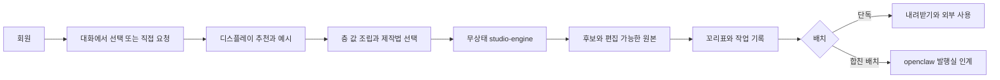

<!--
STAMP | line: studio | 생성: 2026-08-22 07:48 KST | model: gpt-5.6-sol | agent: prd-architect worker
기반 산출물 버전 핀: 사업계획-osmu-v0.9 · 학습정보-층계-계약-v2.1 · studio/docs/prd-studio-생성-v1.0.md · 회장-확정-요구사항-대장 R01~R78 · two-service-boundary
스킬: pipeline(status·게이트 규율). 일반 PRD 작성 전용 스킬은 현재 목록에 없어 품질헌법 템플릿과 방법론을 직접 적용
고민: 무상태를 서비스가 아니라 엔진에만 적용하면서 단독 판매와 합친 배치의 정본 하나 원칙을 동시에 지키는 방법
-->

# studio-service 제작·편집 PRD v2.0

> **대체 배너:** 이 문서는 studio/docs/prd-studio-생성-v1.0.md을 대체하는 v2.0 계획 산출물이다. v1.0은 감사 이력으로 보존하며 수정하지 않는다. 구현과 설계의 새 입력은 plan 승인 뒤 이 문서로 핀을 바꿔야 한다.

| 항목 | 값 |
|---|---|
| 판 | v2.0 |
| 작성 | 2026-08-22 07:48 KST |
| 작성자·모델 | prd-architect worker / gpt-5.6-sol |
| 상태 | plan 산출 완료, 독립 비평과 회장 승인 대기 |
| 상류 기준 | 사업계획 v0.9, 학습 정보 층계 계약 v2.1, 요구 대장 R01~R78 |
| 기존 문서 | studio/docs/prd-studio-생성-v1.0.md 보존 |
| 승인 게이트 | /approve plan 전 다음 단계 진입 금지 |

## 목차

- [0. 문서 지위와 요약](#0-문서-지위와-요약)
- [1. 문제와 현재 상태](#1-문제와-현재-상태)
- [2. 페르소나와 시나리오](#2-페르소나와-시나리오)
- [3. 한 가지 약속](#3-한-가지-약속)
- [4. 범위와 배치](#4-범위와-배치)
- [5. 학습 정보 층계 계약](#5-학습-정보-층계-계약)
- [6. 전체 흐름과 데이터 흐름](#6-전체-흐름과-데이터-흐름)
- [7. 최소 제품 기능 다섯 개](#7-최소-제품-기능-다섯-개)
- [8. 기능 요구와 수용 기준](#8-기능-요구와-수용-기준)
- [9. 비기능 요구와 데이터 원칙](#9-비기능-요구와-데이터-원칙)
- [10. 사업 모델과 운영 부하](#10-사업-모델과-운영-부하)
- [11. 법적·시장·기술 리스크](#11-법적시장기술-리스크)
- [12. 벤치마크와 차용·차별](#12-벤치마크와-차용차별)
- [13. 회장 요구 R01~R78 대조](#13-회장-요구-r01r78-대조)
- [14. 회장이 정할 것](#14-회장이-정할-것)
- [15. 반론·실패 가정·접는 기준](#15-반론실패-가정접는-기준)
- [16. 품질 판정과 추적성](#16-품질-판정과-추적성)
- [17. 개정 이력과 출처](#17-개정-이력과-출처)

## 0. 문서 지위와 요약

**요약:** 프롬프트를 몰라도 대화에서 고른 브랜드·작업 공간 값과 안전한 제작법으로 편집 가능한 원본을 만들고, 왜 그렇게 나왔는지 꼬리표로 되짚게 한다. 무상태인 것은 엔진뿐이고 서비스는 회원과 자기 층을 가진다. 한 항목의 정본은 한 곳뿐이며 투영본은 고칠 수 없다. 이 문서는 추천안으로 본문을 쓰되 회장 판단 대기 아홉 건을 확정하지 않는다.

### 0.1 용어

| 용어 | 이 문서에서의 뜻 |
|---|---|
| 서비스 | 회원, 화면, 데이터베이스, 과금과 운영 책임을 가진 상품 단위 |
| 엔진 | 요청 봉투 하나만 보고 만들거나 실행하는 무상태 처리기 |
| 정본 | 사람이 넣고 고치고 지우는 원본. 한 항목은 한 서비스에 하나만 존재 |
| 투영본 | 정본을 읽어 복제한 읽기 전용 사본. 직접 수정 금지 |
| 제작법 | 만드는 절차를 담은 파일. 층이 아니며 빈 칸을 채우는 기본값 |
| 디스플레이 | 사용자와 담당이 함께 보는 발표 화면. 불가피한 경우가 아니면 스크롤 없음 |
| 기능 요구 번호 | FR로 시작하는 추적용 번호. 설계와 시험에서 같은 번호를 이어 사용 |
| 수용 기준 | 사용자 관점에서 해당 요구가 충족됐는지 직접 관찰하는 조건 |

### 0.2 전체 흐름 한 장과 가로형 데이터 흐름



**가로형 데이터 흐름:** 정본 또는 읽기 전용 투영본 → 요청 봉투 → 무상태 엔진 → 결과·외부 증거 → 꼬리표와 최소 작업 기록 → 승낙 전 제안. 각 화살표는 판, 마지막 갱신 시각, 권한·권리 상태를 보존한다.

## 1. 문제와 현재 상태

### 1.1 해결할 문제

만드는 도구는 많지만 사용자는 브랜드 값을 매번 설명하고 좋은 제작법을 찾고 편집 가능한 원본과 권리·비용 근거를 따로 관리한다. 한 계정에서 여러 브랜드를 운영하면 사실과 말투가 섞이는 구조적 사고까지 난다.

### 1.2 현재 구현 상태

| 영역 | 현재 상태 | 위키 정본 | v2 처리 |
|---|---|---|---|
| 기존 대시보드 Studio | 부분구현. 시각 미리보기 7종, 직접 발행 4종 | wiki/product/studio.md, marketing-hub-surface-map.md | 보존. 독립 studio-service와 혼동 금지 |
| studio-service 회원·자기 층 | 미구현 | 학습 정보 층계 계약 v2.1 §2·§14 | 신설 요구. 엔진과 서비스 분리 |
| 생성·편집 파이프라인과 실험 | 부분구현 | studio/README.md | 확장. 기존 스크립트와 품질헌법 보존 |
| 제작법 보관과 격리 실행 | 부분구현 | studio PRD v1.0, 계약 v2.1 §6 | X4 층 폐기, 별도 제작법 면으로 재정의 |
| 독립 판매 화면·인증·과금·지원 | 미구현 | 사업계획 v0.9 §2.0·§4.6 | 정식 배치 절 신설 |
| 투영본 밀기·읽기 전용 | 미구현 | 계약 v2.1 §15 | 신설 |
| 실제 단독 고객 완주 | 미검증 | pipeline-state.studio.md | plan 이후 증거 필요 |

**증거 경계:** 위키는 1차 진실원이다. 위 표의 이미구현은 소스와 계약 존재를 뜻할 수 있으며 운영·공급자 실제 동작을 뜻하지 않는다. 직접 관찰하지 않은 외부 경로는 미검증이다.

## 2. 페르소나와 시나리오

### 2.1 핵심 페르소나

**김서윤, 37세, 직원 없이 온라인 교육 브랜드와 소규모 쇼핑몰을 함께 운영하는 1인 대표.** 오전에는 고객 문의와 정산을 하고, 오후에는 강의와 상품을 만든다. 마케팅 담당자를 채용할 매출은 아니지만 대행사에 월 수백만 원을 맡기면 자기 브랜드의 결이 사라질 것 같아 직접 하려 한다. 생성형 인공지능으로 카드뉴스와 숏폼을 몇 번 만들었지만, 매번 브랜드 설명과 금지 표현을 다시 붙이고 좋은 제작법을 찾고 결과를 고치는 과정에서 두 시간이 사라졌다. 한 브랜드에서 쓰던 실적 숫자와 말투가 다른 브랜드 결과에 섞인 적도 있어 자동화를 믿지 못한다. 프롬프트 엔지니어링이나 하네스라는 말을 모르고, 무엇을 요청해야 좋은지도 모른다. 빈 입력창을 보면 일을 미루지만 이미 채워진 세 가지 후보는 빠르게 고른다. 결과를 완전히 맡기고 싶은 날과 마지막 손질은 직접 하고 싶은 날이 달라 자동화 정도도 브랜드마다 바꾸고 싶다. 직원이 없어서 검수도 본인이 하며, 이동 중 휴대전화에서 후보를 고르고 밤에 노트북으로 배치를 다듬는 일이 많다. 같은 작업을 다시 시작할 때 지난 판단과 원본이 사라지면 도구를 바로 포기한다. 설명서를 읽기보다 결과 옆의 짧은 이유와 잘못됐을 때 되돌릴 수 있다는 증거로 신뢰를 판단한다. 가장 두려운 것은 남의 소재를 잘못 쓰는 것, 금지 표현이 나가는 것, 비용이 예고 없이 커지는 것이다. 성공은 20분 안에 브랜드에 맞는 원본 하나를 받고, 왜 그렇게 나왔는지 확인하고, 내려받아 어느 유통 채널에도 쓸 수 있는 상태다.

### 2.2 시나리오

| 시나리오 | 시작 상태 | 성공 장면 |
|---|---|---|
| 첫 사용 | 학습 정보와 작업물 0 | 대화에서 후보를 고르고 빈 화면 없이 첫 결과에 도달 |
| 재방문 | 브랜드·작업 공간·이전 판 존재 | 온보딩을 건너뛰고 헤더에서 학습 정보를 확인한 뒤 이어서 작업 |
| 값 수정 직후 | 정본이 바뀌고 투영본 밀기 진행 | 멈추는 값은 확인 응답 뒤 사용, 나머지는 판을 표시 |
| 외부 실패 | 모델·채널·밀기·토큰 중 하나 실패 | 성공으로 위장하지 않고 이름 붙은 상태와 다음 행동 표시 |
| 다중 브랜드 | 같은 회원이 브랜드 둘 보유 | 사실·목소리·금지 표현의 자동 상속 0 |

## 3. 한 가지 약속

| 후보 | 함정 판정 |
|---|---|
| 인공지능이 콘텐츠를 자동 생성한다 | 무료·저가 경쟁사와 구별되지 않아 기각 |
| 외부 제작법을 담는다 | 공급 능력에는 중요하지만 사용자가 체감하는 결과가 아니라 단독 답으로 부족 |
| 클릭만으로 만든다 | 클릭 도구 자체는 해자가 아니며 직접 프롬프트 요구 R39를 누락해 기각 |
| 쓸수록 터진다 | 실측 전 약속이라 기각 |
| 브랜드 값을 지키며 편집 가능한 원본과 이유를 함께 준다 | 사용자 통제·제작법 공급·꼬리표를 한 문장에 묶어 채택 |

**한 가지 약속:** 프롬프트를 몰라도 대화에서 고른 브랜드·작업 공간 값과 안전한 제작법으로 편집 가능한 원본을 만들고, 왜 그렇게 나왔는지 꼬리표로 되짚게 한다.

## 4. 범위와 배치

| 포함 | 제외 |
|---|---|
| 회원·브랜드·작업 공간, 제안, 생성, 대화 편집, 직접 배치 조정, 제작법, 꼬리표, 창작 학습 | 채널 자격증명, 예약·발행, 댓글, 외부 성과 수집 |

### 4.1 studio 단독 판매 배치

"화면만 붙이면 바로 쓴다"는 뜻은 studio-engine을 바꾸지 않고 studio-service 어댑터가 회원, 화면, 과금, 저장, 지원을 책임한다는 뜻이다.

| 필요한 것 | 1차 필수 | 엔진 변화 |
|---|---|---|
| 자체 회원과 로그인 | 필수. 합친 배치에서는 openclaw가 대신 회원을 만든다 | 없음 |
| U2 개인, U3 브랜드, U4 작업 공간 정본 | 필수 | 봉투 입력만 동일 |
| 창작 L5와 작업 기록 | 필수 | 결과 꼬리표 반환만 동일 |
| 대화·디스플레이·작업물 목록 | 필수 | 없음 |
| 과금·비용 상한·권리 동의 | 필수 | 승인된 실행 정책만 봉투에 전달 |
| 채널 연결·예약·성과 | 제외. openclaw 상품 | 없음 |

독립 판매 합격 기준은 openclaw 코드와 데이터베이스 없이 가입, 브랜드 생성, 제안 선택, 생성, 편집, 원본 내려받기까지 실제 한 건이 끝나는 것이다. 현재는 미구현·미검증이다.

### 4.2 외부 플랫폼과 책임

| 플랫폼 | 쓰임 | 현재 판단 |
|---|---|---|
| YouTube | 첫 영감 소스와 공개 사례 관찰 | 첫 공급자. 다른 공개 소스로 확장 가능 |
| Google Trends | 주제 추세 신호 | 공개 조건과 관찰일을 붙인 입력만 허용 |
| Google Search Console | 사용자가 연결한 자기 채널 검색 성과 | 사용자 권한 범위 안의 요약만 입력 |
| Threads·Instagram 등 발행 채널 | studio 결과의 목표 규격 | 자격증명과 실제 발행은 openclaw 소유 |

## 5. 학습 정보 층계 계약

### 5.1 정본 이름과 순서

추천 이름을 쓰되 확정 전이라는 표시를 유지한다.

`S0 시스템 고정 > R6 이번 요청 > L5 학습된 규칙 > U4 작업 공간 > U3 브랜드 > U2 개인 > S1 우리 지식 > S0 외부 규칙`

| 칸 | 이름 | 범위와 소유 | 모델 전달 |
|---|---|---|---|
| S0-불변 | 시스템 고정 중 불변 | 안전선, 인공지능 표기 의무, 회원 격리 | 모델 지식으로 싣지 않고 코드와 권한으로 강제. 사용자와 스킬 모두 수정 불가 |
| S0-외부 | 시스템 고정 중 외부 | 플랫폼 정책 판, 저작물 규칙, 지역 법규 | 마지막 확인일을 보유하고 90일을 넘으면 확인 필요 표시 |
| S1 | 우리 지식 | 각 서비스가 자기 도메인의 지식과 시한 있는 신호를 보유 | 현재 요청과 관련된 값만 전달 |
| U2 | 개인 | 브랜드가 늘어도 안 바뀌는 화면 언어, 시간대, 통화, 기본 자동화 정도 | 필요한 값만 전달. 마케팅 지식 수준은 화면만 움직임 |
| U3 | 브랜드 | 브랜드 사실, 목소리, 금지 표현, 브랜드킷, 소재 권리 | 브랜드 범위 안에서 전달 |
| U4 | 작업 공간 | 타깃, 컨셉, 목표, 반입 자료 요약, 공간별 조정 | 현재 작업 공간 하나만 전달 |
| L5 | 학습된 규칙 | 사용자가 승낙한 창작 규칙 또는 발행 운영 규칙 | 열두 적용 조건이 모두 맞을 때만 자동 전달 |
| R6 | 이번 요청 | 이번 주제, 출력 언어, 채널, 미세 조정 | 이번 작업에만 전달. 자동 학습 승격 금지 |

### 5.2 정본과 투영본

- 한 항목의 정본은 한 서비스에 하나뿐이다.
- 합친 배치에서 사용자 소유 값은 추천안 기준 openclaw가 정본이고 studio가 투영본이다.
- studio 단독에서는 studio가 자기 회원과 U2, U3, U4, L5, R6 정본을 가진다.
- 투영본은 직접 고칠 수 없다. 변경은 정본에서 시작해 확인 응답이 있는 밀기로 전파한다.
- 제작마다 정본을 실시간 대조하지 않는다. 밀기 실패 이력, 방금 수정 후 제작, 마지막 성공 창 초과 때만 좁게 대조한다.
- 금지 표현, 브랜드 사실, 소재 권리는 낡으면 해당 제작을 멈춘다. 나머지는 만들되 판과 시각을 표시한다.

**밀어 주는 방식이 기본이다.** 정본이 바뀌는 순간 정본 쪽이 투영본 쪽으로 민다. 제작 요청 때는 대조하지 않는다. 대조는 해당 항목의 밀기 실패 이력, 사용자가 값을 고친 직후, 마지막 성공 창 초과 세 경우에만 좁게 한다.

### 5.3 스킬은 층이 아니다

제작법은 별도 면에 산다. 우리가 넣은 제작법은 사용자가 비워 둔 칸만 채우며 강제할 수 없다. 사용자가 올린 제작법만 명시적 확인을 거쳐 강제를 선언할 수 있고 S0 시스템 고정은 어떤 경우에도 덮지 못한다.

### 5.4 목소리 여섯 칸

| 칸 | 이름 | 채워짐 판정 |
|---|---|---|
| V1 | 문체 | 합니다체, 해요체, 반말, 명사형 중 하나 선택 |
| V2 | 어휘 | 선호·금지·전문 용어 목록 한 건 이상 |
| V3 | 구조 | 도입과 마무리 방식 선택 |
| V4 | 리듬 | 문장 글자대와 문단 줄 수 범위 입력 |
| V5 | 표기 | 이모지, 숫자·단위, 문장부호 습관 각각 설정 |
| V6 | 인칭 | 자칭과 독자 호칭 입력 |

자유 서술은 별도 칸에 저장하고 모델에 함께 싣지만 여섯 칸을 잠그지 않는다. 사용자가 채운 칸만 제작법 기본값을 밀어낸다.

### 5.5 이번 요청 기록

이번 요청은 학습으로 자동 승격하지 않는다. 다만 중복 방지, 이어하기, 비용 분쟁, 재현을 위해 요청 식별자, 정규화 입력, 참조 판, 동의 상태, 비용, 모델과 제작법 판, 결과 식별자를 보유 기간이 있는 작업 기록으로 남긴다. 원문 보유 기간은 회장 판단 대기다.

## 6. 전체 흐름과 데이터 흐름

### 6.1 사용자 흐름


### 6.2 데이터 흐름

| 시점 | 입력 | 처리 | 출력·기록 |
|---|---|---|---|
| 시작 | 회원·브랜드·작업 공간·이번 요청 | 정본 또는 투영본 판 확인 | 요청 식별자와 정규화 입력 |
| 실행 전 | 층 값, 제작법, 정책, 비용 상한 | 의미 해소와 권한·권리 검사 | 엔진 봉투 |
| 실행 | 엔진이 봉투 하나 처리 | 외부 호출과 단계별 실패 기록 | 결과 참조와 실비 |
| 완료 | 결과, 선택, 외부 증거 | 금지 표현·권리·완결성 재검사 | 꼬리표와 작업 기록 |
| 환류 | 선택·성과·트렌드 | 조건 열두 칸을 가진 후보 규칙 생성 | 승낙 전 제안, 승낙 뒤 L5 |

## 7. 최소 제품 기능 다섯 개

| 최소 기능 | 한 가지 약속과 연결 | 제외선 |
|---|---|---|
| 1. 회원·브랜드·작업 공간과 대화 온보딩 | 브랜드 오염 없이 값을 받는다 | 채널 연결 제외 |
| 2. 근거 있는 제안과 직접 요청 두 입구 | 무엇을 요청할지 모르는 사람도 시작한다 | 무한 후보 제외 |
| 3. 층 조립과 제작법 기본값 | 사용자 값을 지키며 제작 품질을 공급한다 | 스킬을 층으로 저장 금지 |
| 4. 후보 생성·대화 편집·직접 배치 조정 | 편집 가능한 원본까지 한 흐름으로 끝낸다 | 전문 타임라인 편집기 제외 |
| 5. 꼬리표·권리·비용·작업 기록 | 결과의 이유와 재현성을 남긴다 | 자동 학습 승격 제외 |

## 8. 기능 요구와 수용 기준

### FR-ST-001 회원·브랜드·작업 공간과 대화 온보딩

| 항목 | 내용 |
|---|---|
| 현재 상태 | 미구현 |
| 요구 | studio 단독 상품은 자체 회원과 U2·U3·U4 정본을 갖고, 합친 배치에서는 투영본을 받는다. |
| 출처 | 학습 정보 층계 계약 v2.1, 회장 요구 대장, 관련 위키 |
| 우선순위 | 최소 제품 필수 또는 기존 기능 보존 |

**수용 기준**

```gherkin
Given 관련 회원·브랜드·작업 공간과 필요한 외부 상태가 준비됨
When 사용자가 회원·브랜드·작업 공간과 대화 온보딩 흐름을 실행
Then 신규 회원이 질문 한 번에 하나씩 답해 브랜드와 작업 공간을 만들고 헤더에서 언제든 수정한다.
And 실패·빈 상태·권한 없음은 성공으로 위장하지 않고 이름 붙은 상태로 보인다
```

### FR-ST-002 디스플레이와 두 입력 통로

| 항목 | 내용 |
|---|---|
| 현재 상태 | 부분구현 |
| 요구 | 주 통로는 대화에서 고르는 방식이고 직접 프롬프트는 보조 통로다. 디스플레이는 무스크롤 발표 화면이다. |
| 출처 | 학습 정보 층계 계약 v2.1, 회장 요구 대장, 관련 위키 |
| 우선순위 | 최소 제품 필수 또는 기존 기능 보존 |

**수용 기준**

```gherkin
Given 관련 회원·브랜드·작업 공간과 필요한 외부 상태가 준비됨
When 사용자가 디스플레이와 두 입력 통로 흐름을 실행
Then 390과 1024에서 핵심 추천·예시·편집 결과가 한 화면에 보이고 학습 정보는 헤더에 있다.
And 실패·빈 상태·권한 없음은 성공으로 위장하지 않고 이름 붙은 상태로 보인다
```

### FR-ST-003 근거 있는 제안 카드 셋

| 항목 | 내용 |
|---|---|
| 현재 상태 | 부분구현 |
| 요구 | 개인·브랜드·작업 공간 값과 영감 소스를 읽어 매체를 포함한 후보 셋을 이유와 함께 낸다. |
| 출처 | 학습 정보 층계 계약 v2.1, 회장 요구 대장, 관련 위키 |
| 우선순위 | 최소 제품 필수 또는 기존 기능 보존 |

**수용 기준**

```gherkin
Given 관련 회원·브랜드·작업 공간과 필요한 외부 상태가 준비됨
When 사용자가 근거 있는 제안 카드 셋 흐름을 실행
Then 빈 화면 없이 후보 3개가 보이고 후보마다 주제·형식·근거·차이 축 2개가 있다.
And 실패·빈 상태·권한 없음은 성공으로 위장하지 않고 이름 붙은 상태로 보인다
```

### FR-ST-004 결정론적 값 조립

| 항목 | 내용 |
|---|---|
| 현재 상태 | 문서만 존재 |
| 요구 | 층 값은 고정 순서로 의미 해소하고 모델별 전송 순서는 어댑터가 맡는다. |
| 출처 | 학습 정보 층계 계약 v2.1, 회장 요구 대장, 관련 위키 |
| 우선순위 | 최소 제품 필수 또는 기존 기능 보존 |

**수용 기준**

```gherkin
Given 관련 회원·브랜드·작업 공간과 필요한 외부 상태가 준비됨
When 사용자가 결정론적 값 조립 흐름을 실행
Then 같은 판과 요청을 두 번 조립했을 때 값 묶음과 출처가 같다.
And 실패·빈 상태·권한 없음은 성공으로 위장하지 않고 이름 붙은 상태로 보인다
```

### FR-ST-005 제작법 별도 면과 기본값

| 항목 | 내용 |
|---|---|
| 현재 상태 | 부분구현 |
| 요구 | 제작법은 선언 여덟 칸을 갖고 사용자가 채운 목소리 여섯 칸을 덮지 않는다. |
| 출처 | 학습 정보 층계 계약 v2.1, 회장 요구 대장, 관련 위키 |
| 우선순위 | 최소 제품 필수 또는 기존 기능 보존 |

**수용 기준**

```gherkin
Given 관련 회원·브랜드·작업 공간과 필요한 외부 상태가 준비됨
When 사용자가 제작법 별도 면과 기본값 흐름을 실행
Then 자유 서술만 있으면 기본값이 적용되고 V1 하나를 채우면 그 칸만 사용자 값이 이긴다.
And 실패·빈 상태·권한 없음은 성공으로 위장하지 않고 이름 붙은 상태로 보인다
```

### FR-ST-006 생성 후보와 비용 관문

| 항목 | 내용 |
|---|---|
| 현재 상태 | 부분구현 |
| 요구 | 후보 셋은 저비용 미리보기로 만들고 선택한 하나만 고품질 승격한다. |
| 출처 | 학습 정보 층계 계약 v2.1, 회장 요구 대장, 관련 위키 |
| 우선순위 | 최소 제품 필수 또는 기존 기능 보존 |

**수용 기준**

```gherkin
Given 관련 회원·브랜드·작업 공간과 필요한 외부 상태가 준비됨
When 사용자가 생성 후보와 비용 관문 흐름을 실행
Then 외부 유료 호출 전에 상한을 확인하고 승인하지 않으면 호출과 과금이 모두 0이다.
And 실패·빈 상태·권한 없음은 성공으로 위장하지 않고 이름 붙은 상태로 보인다
```

### FR-ST-007 대화 편집과 직접 배치 조정

| 항목 | 내용 |
|---|---|
| 현재 상태 | 부분구현 |
| 요구 | 말투 일괄 변경은 대화로, 위치와 간격은 디스플레이에서 직접 조정한다. |
| 출처 | 학습 정보 층계 계약 v2.1, 회장 요구 대장, 관련 위키 |
| 우선순위 | 최소 제품 필수 또는 기존 기능 보존 |

**수용 기준**

```gherkin
Given 관련 회원·브랜드·작업 공간과 필요한 외부 상태가 준비됨
When 사용자가 대화 편집과 직접 배치 조정 흐름을 실행
Then 자막 수정은 원본 재생성 없이 값 변경과 재렌더로 끝나며 이전 판은 보존된다.
And 실패·빈 상태·권한 없음은 성공으로 위장하지 않고 이름 붙은 상태로 보인다
```

### FR-ST-008 권리 확인 소재와 외부 제작법 격리

| 항목 | 내용 |
|---|---|
| 현재 상태 | 미구현 |
| 요구 | 소재 권리 선언이 없으면 제작을 멈추고 외부 제작법의 통신·파일·실행 권한을 격리한다. |
| 출처 | 학습 정보 층계 계약 v2.1, 회장 요구 대장, 관련 위키 |
| 우선순위 | 최소 제품 필수 또는 기존 기능 보존 |

**수용 기준**

```gherkin
Given 관련 회원·브랜드·작업 공간과 필요한 외부 상태가 준비됨
When 사용자가 권리 확인 소재와 외부 제작법 격리 흐름을 실행
Then 권리 근거 없는 소재 사용 0건, 다른 회원 자료 접근 0건, 허용 밖 통신 0건이다.
And 실패·빈 상태·권한 없음은 성공으로 위장하지 않고 이름 붙은 상태로 보인다
```

### FR-ST-009 꼬리표와 최소 작업 기록

| 항목 | 내용 |
|---|---|
| 현재 상태 | 부분구현 |
| 요구 | 결과에 층 판, 제작법 판, 모델, 비용, 권리 근거, 선택 이력을 생성 시점에 붙인다. |
| 출처 | 학습 정보 층계 계약 v2.1, 회장 요구 대장, 관련 위키 |
| 우선순위 | 최소 제품 필수 또는 기존 기능 보존 |

**수용 기준**

```gherkin
Given 관련 회원·브랜드·작업 공간과 필요한 외부 상태가 준비됨
When 사용자가 꼬리표와 최소 작업 기록 흐름을 실행
Then 꼬리표 필수 항목이 하나라도 비면 발행 준비 완료가 되지 않는다.
And 실패·빈 상태·권한 없음은 성공으로 위장하지 않고 이름 붙은 상태로 보인다
```

### FR-ST-010 학습 규칙 승낙과 범위 격리

| 항목 | 내용 |
|---|---|
| 현재 상태 | 미구현 |
| 요구 | 학습 규칙은 열두 조건을 갖고 사용자가 승낙한 같은 조건에서만 자동 적용한다. |
| 출처 | 학습 정보 층계 계약 v2.1, 회장 요구 대장, 관련 위키 |
| 우선순위 | 최소 제품 필수 또는 기존 기능 보존 |

**수용 기준**

```gherkin
Given 관련 회원·브랜드·작업 공간과 필요한 외부 상태가 준비됨
When 사용자가 학습 규칙 승낙과 범위 격리 흐름을 실행
Then 브랜드·언어·채널·형식 중 하나라도 다르면 자동 적용 0건이며 제안으로만 뜬다.
And 실패·빈 상태·권한 없음은 성공으로 위장하지 않고 이름 붙은 상태로 보인다
```

### FR-ST-011 밀기형 투영본 수신

| 항목 | 내용 |
|---|---|
| 현재 상태 | 미구현 |
| 요구 | 합친 배치에서는 정본 변경을 확인 응답과 재시도 대기열이 있는 밀기로 받는다. |
| 출처 | 학습 정보 층계 계약 v2.1, 회장 요구 대장, 관련 위키 |
| 우선순위 | 최소 제품 필수 또는 기존 기능 보존 |

**수용 기준**

```gherkin
Given 관련 회원·브랜드·작업 공간과 필요한 외부 상태가 준비됨
When 사용자가 밀기형 투영본 수신 흐름을 실행
Then 최신으로 밀린 멈추는 값은 정본 장애 중에도 제작되고, 실패 이력이 있는 멈추는 값만 해당 제작을 막는다.
And 실패·빈 상태·권한 없음은 성공으로 위장하지 않고 이름 붙은 상태로 보인다
```

### FR-ST-012 단독 판매 배치

| 항목 | 내용 |
|---|---|
| 현재 상태 | 미구현 |
| 요구 | studio-service는 화면·인증·과금·지원 어댑터만 붙여 독립 판매되고 studio-engine 계약은 바꾸지 않는다. |
| 출처 | 학습 정보 층계 계약 v2.1, 회장 요구 대장, 관련 위키 |
| 우선순위 | 최소 제품 필수 또는 기존 기능 보존 |

**수용 기준**

```gherkin
Given 관련 회원·브랜드·작업 공간과 필요한 외부 상태가 준비됨
When 사용자가 단독 판매 배치 흐름을 실행
Then openclaw 없이 신규 회원 가입부터 원본 내려받기까지 한 건을 완주한다.
And 실패·빈 상태·권한 없음은 성공으로 위장하지 않고 이름 붙은 상태로 보인다
```

### FR-ST-013 채널 중립 원본

| 항목 | 내용 |
|---|---|
| 현재 상태 | 부분구현 |
| 요구 | 단독 상품은 해시태그·발행 시각을 강요하지 않고 채널 중립 원본을 제공한다. |
| 출처 | 학습 정보 층계 계약 v2.1, 회장 요구 대장, 관련 위키 |
| 우선순위 | 최소 제품 필수 또는 기존 기능 보존 |

**수용 기준**

```gherkin
Given 관련 회원·브랜드·작업 공간과 필요한 외부 상태가 준비됨
When 사용자가 채널 중립 원본 흐름을 실행
Then SNS 채널을 고르지 않은 요청도 정상 완료되고 원본을 내려받을 수 있다.
And 실패·빈 상태·권한 없음은 성공으로 위장하지 않고 이름 붙은 상태로 보인다
```

### FR-ST-014 영감 소스와 기존 채널 분석

| 항목 | 내용 |
|---|---|
| 현재 상태 | 부분구현 |
| 요구 | 유튜브를 첫 영감 소스로 쓰되 공급자를 열어 두고 작성자 개인정보는 저장하지 않는다. |
| 출처 | 학습 정보 층계 계약 v2.1, 회장 요구 대장, 관련 위키 |
| 우선순위 | 최소 제품 필수 또는 기존 기능 보존 |

**수용 기준**

```gherkin
Given 관련 회원·브랜드·작업 공간과 필요한 외부 상태가 준비됨
When 사용자가 영감 소스와 기존 채널 분석 흐름을 실행
Then 추천에 원문 주소와 관찰일이 있고 출처 없는 사례는 표시되지 않는다.
And 실패·빈 상태·권한 없음은 성공으로 위장하지 않고 이름 붙은 상태로 보인다
```

### FR-ST-015 편집 가능한 판 보존

| 항목 | 내용 |
|---|---|
| 현재 상태 | 부분구현 |
| 요구 | 되돌리기는 덮어쓰지 않고 새 판을 추가하며 각 단계에서 보관·이어하기를 지원한다. |
| 출처 | 학습 정보 층계 계약 v2.1, 회장 요구 대장, 관련 위키 |
| 우선순위 | 최소 제품 필수 또는 기존 기능 보존 |

**수용 기준**

```gherkin
Given 관련 회원·브랜드·작업 공간과 필요한 외부 상태가 준비됨
When 사용자가 편집 가능한 판 보존 흐름을 실행
Then 중단 후 재진입하면 같은 판과 작업 위치에서 이어지고 이전 판이 남는다.
And 실패·빈 상태·권한 없음은 성공으로 위장하지 않고 이름 붙은 상태로 보인다
```

### FR-ST-016 상품 종류와 승격 순서

| 항목 | 내용 |
|---|---|
| 현재 상태 | 부분구현 |
| 요구 | 카드뉴스를 먼저 검증하고 숏폼, 권리 확인 소재 엮기, 최상급 영상 순으로 승격한다. |
| 출처 | 학습 정보 층계 계약 v2.1, 회장 요구 대장, 관련 위키 |
| 우선순위 | 최소 제품 필수 또는 기존 기능 보존 |

**수용 기준**

```gherkin
Given 관련 회원·브랜드·작업 공간과 필요한 외부 상태가 준비됨
When 사용자가 상품 종류와 승격 순서 흐름을 실행
Then 앞 상품의 접는 기준을 통과하지 않은 상태에서 뒤 상품 유료 호출은 0건이다.
And 실패·빈 상태·권한 없음은 성공으로 위장하지 않고 이름 붙은 상태로 보인다
```

### FR-ST-017 자기교정·계정 상한·어뷰징 방어

| 항목 | 내용 |
|---|---|
| 현재 상태 | 부분구현 |
| 요구 | 자기교정 재시도 상한, 상품별 크레딧, 계정 하드캡과 기계 요청 제한을 유지한다. |
| 출처 | 학습 정보 층계 계약 v2.1, 회장 요구 대장, 관련 위키 |
| 우선순위 | 최소 제품 필수 또는 기존 기능 보존 |

**수용 기준**

```gherkin
Given 관련 회원·브랜드·작업 공간과 필요한 외부 상태가 준비됨
When 사용자가 자기교정·계정 상한·어뷰징 방어 흐름을 실행
Then 상한을 넘은 유료 호출·과금은 0건이고 거부 이유와 다음 행동이 기록된다.
And 실패·빈 상태·권한 없음은 성공으로 위장하지 않고 이름 붙은 상태로 보인다
```

### FR-ST-018 학습 정보 입력 네 통로

| 항목 | 내용 |
|---|---|
| 현재 상태 | 부분구현 |
| 요구 | 직접 수정, 위키·노션 주소 반입, 원본의 결 학습, 후보 선택 때 동의 학습을 제공한다. |
| 출처 | 학습 정보 층계 계약 v2.1, 회장 요구 대장, 관련 위키 |
| 우선순위 | 최소 제품 필수 또는 기존 기능 보존 |

**수용 기준**

```gherkin
Given 관련 회원·브랜드·작업 공간과 필요한 외부 상태가 준비됨
When 사용자가 학습 정보 입력 네 통로 흐름을 실행
Then 네 통로 모두 출처·범위·승낙 상태가 남고 주소 반입 실패가 기존 값을 지우지 않는다.
And 실패·빈 상태·권한 없음은 성공으로 위장하지 않고 이름 붙은 상태로 보인다
```

### FR-ST-019 후보 거절과 결과 세 갈래

| 항목 | 내용 |
|---|---|
| 현재 상태 | 부분구현 |
| 요구 | 후보 셋 거절은 하루 한 번 무료이며 고해상도 결과는 확정·보관·다른 제안 받기로 갈린다. |
| 출처 | 학습 정보 층계 계약 v2.1, 회장 요구 대장, 관련 위키 |
| 우선순위 | 최소 제품 필수 또는 기존 기능 보존 |

**수용 기준**

```gherkin
Given 관련 회원·브랜드·작업 공간과 필요한 외부 상태가 준비됨
When 사용자가 후보 거절과 결과 세 갈래 흐름을 실행
Then 무료 몫 초과 전 가격이 보이고 세 갈래 어느 쪽도 기존 판을 덮어쓰지 않는다.
And 실패·빈 상태·권한 없음은 성공으로 위장하지 않고 이름 붙은 상태로 보인다
```

## 9. 비기능 요구와 데이터 원칙

| 번호 | 범주 | 요구 | 합격 기준 |
|---|---|---|---|
| NFR-01 | 격리 | 회원·브랜드·작업 공간 범위 밖 읽기·쓰기 금지 | 교차 접근 0건 |
| NFR-02 | 정본 | 한 항목의 정본 하나, 투영본 직접 수정 금지 | 이중 정본 0건, 투영본 쓰기 0건 |
| NFR-03 | 재현 | 같은 판과 요청은 같은 값 묶음 | 20회 조립 결과 동일 |
| NFR-04 | 증거 | 직접 관찰하지 않은 성공 표시 금지 | 증거 없는 완료 0건 |
| NFR-05 | 비밀 | 자격증명·개인정보 원문을 로그·분석·문서에 기록 금지 | 노출 0건 |
| NFR-06 | 접근성 | 키보드·초점·오류 연결·44픽셀 터치·모션 축소 | 핵심 행동 가림 0건 |
| NFR-07 | 디스플레이 | 발표 화면 원칙과 텍스트 절약 | 1024 핵심 화면 세로 스크롤 0, 390 예외 사유 기록 |
| NFR-08 | 회귀 | 기존 화면·기능·상태·경로 삭제 금지 | 보존 목록 대비 삭제·이름변경 0건 |
| NFR-09 | 원가 | 승인 상한과 실제 비용 대사 | 상한 초과 0건, 미대사 유료 작업 0건 |
| NFR-10 | 기록 | R6 자동 승격 금지와 최소 작업 기록 | 무승낙 L5 적용 0건, 중복 결과·과금 0건 |

private 서비스의 원문·성과·회원 데이터는 공용 분석에 섞지 않는다. 포트폴리오 지표가 필요하면 개인과 브랜드를 복원할 수 없는 집계만 사용하고 출처 서비스의 데이터 권리를 먼저 확인한다.

## 10. 사업 모델과 운영 부하

- **판매:** 무료 체험 뒤 스타터·프로·기업 구독과 상품별 추가 결제. 사업계획 가격은 가설이며 확정 가격이 아니다.
- **단독 상품:** 창작자·부업·개발자에게 원본 제작과 편집만 판매한다. openclaw를 함께 팔지 않아도 성립해야 한다.
- **운영 부하:** 제작법 심사, 모델·소재 공급자 판 관리, 권리 문의, 실패 재시도, 고비용 사용자 원가 감시, 회원 지원이 상시 발생한다.
- **원가 방어:** 카드와 숏폼 크레딧 분리, 최상급 영상 건별 결제, 계정 상한, 외부 유료 호출 전 승인, 반려 무과금.
- **자기잠식:** openclaw의 발행 매출을 빼앗지 않는다. 단독 studio에는 채널 연결·예약·성과가 없고 합친 상품은 상위 묶음이다.

## 11. 법적·시장·기술 리스크

| 범주 | 실패 장면 | 완화와 관측 |
|---|---|---|
| 법적 | 권리 없는 소재나 라이선스 불명 제작법이 상용 결과에 들어감 | 권리 선언 없는 소재는 멈춤. 외부 제작법 1차 차단 |
| 개인정보 | 요청 원문과 반입 문서에 개인 정보가 섞여 장기 보관 | 원문 암호화·기간·삭제 정책. 분석에는 복원 불가 운영 지표만 |
| 시장 | 시그마인이 자동 제작·발행·성과 반영을 이미 판매 | 단독 제작에서는 편집 가능한 원본·정본 격리·제작법 공급·꼬리표로 차별 |
| 기술 | 밀기 실패를 모른 채 낡은 금지 표현으로 제작 | 확인 응답·재시도·주기 대조. 멈추는 값 3종 |
| 기술 | 제작법이 사용자 값을 덮어 브랜드가 흔들림 | 목소리 여섯 칸과 기본값 규칙 |
| 원가 | 영상 재시도와 왕복이 표시 상한을 넘음 | 호출 전 관문·왕복 상한·실비 원장 |
| 운영 | studio 단독 회원과 합친 배치 회원이 중복 | 자동 병합 금지. 회장 판단 대기 정책 적용 |

## 12. 벤치마크와 차용·차별

| 공식 사례 | 확인한 사실 | 차용 | 그대로 복제하지 않는 것 |
|---|---|---|---|
| 시그마인 | 국내에서 브랜드 학습, 자동 제작·발행, 성과의 다음 전략 반영을 공식 판매. 현재 요금 페이지는 달러 셀프서비스와 B2B 구독 정보를 함께 노출 | 자동화 약속이 이미 시장 언어라는 현실, 국내 가격 앵커 | 검증 전 성과 자동 개선 약속과 물량 경쟁 |
| Jasper Brand Voice | 작업 공간 기본 목소리를 두고 생성 때 다른 목소리로 재정의 가능 | U2 기본값과 U3·U4 재정의의 화면 원리 | 목소리를 한 덩어리로 잠그는 방식 |
| Jasper Knowledge Base | 승인된 제품 정보와 메시지를 동기화해 에이전트 실행에 사용 | 정본·통제된 지식·출처 표시 | 실시간 읽기 의존. 우리는 밀기와 투영본으로 장애 격리 |
| Planable | 콘텐츠 위에서 검토·승인하고, 승인 뒤 읽기 전용 잠금과 예약을 지원 | 디스플레이에서 결과와 판단을 함께 보고 승인 후 변경을 추적 | 다단계 기업 승인. 1인 사용자 최소 제품에는 과함 |
| Shape Up | 문제·투입 한도·해법·위험 구멍·명시적 제외를 한 제안서에 담음 | 범위, 실패 가정, 접는 기준, 제외선 | 6주 숫자 자체는 우리 팀 근거가 아니므로 복제 안 함 |
| Linear Method | 방향·목표·막힘 우선·범위 축소·사용자와 만들기를 구분 | 이미 구현된 것 보존, 막힘과 결과 중심 요구 | 단순 이슈 문법을 PRD 전체에 강제하지 않음 |

## 13. 회장 요구 R01~R78 대조

| 요구 | 요구 요지 | 현재 상태 | 위키 정본 | 기획 판정 | 이 문서의 처리 |
|---|---|---|---|---|---|
| R01 | 제작은 한 화면에 하나씩 고르며 진행한다 | 부분구현 | wiki/product/studio.md + pipeline-state.studio.md | 반영 | §2 시나리오와 FR-ST-002·003·006·007·013·014·015에 연결했다. |
| R02 | 학습 정보는 언제든 열람·수정 가능하고 재방문 시 건너뛸 수 있다 | 부분구현 | wiki/product/studio.md + pipeline-state.studio.md | 반영 | §5 층계 계약, §6 흐름과 FR-ST-001·004·005·010·011에 연결했다. |
| R03 | 학습 입력 경로 넷: 직접 수정 / 위키·노션 반입 / 원본 넣어 결 학습 / 후보 선택 시 동의 학습 | 부분구현 | wiki/product/studio.md + pipeline-state.studio.md | 반영 | §5 층계 계약, §6 흐름과 FR-ST-001·004·005·010·011에 연결했다. |
| R04 | 추천 유입 셋: 가끔 던지는 질문 / 성과 기반 / 트렌드 기반 | 부분구현 | wiki/product/studio.md + pipeline-state.studio.md | 반영 | §5 층계 계약, §6 흐름과 FR-ST-001·004·005·010·011에 연결했다. |
| R05 | 플로우 갈래: 첫 가입(학습 0) / 두 번째 이후 / 추가 입력·추천 | 부분구현 | wiki/product/studio.md + pipeline-state.studio.md | 반영 | §5 층계 계약, §6 흐름과 FR-ST-001·004·005·010·011에 연결했다. |
| R06 | 발행 후 세 갈래: 플랫폼 직접 / OSMU 종합 / 플랫폼별 탭 | 부분구현 | wiki/reference/channel-status.md | 경계 반영 | openclaw 소유 요구다. §4 경계와 FR-ST-009·011·013에서 studio의 입력·반환·꼬리표 책임만 보존한다. |
| R07 | 플랫폼별 헤더 옵션을 통일한다 | 부분구현 | wiki/reference/channel-status.md | 경계 반영 | openclaw 소유 요구다. §4 경계와 FR-ST-009·011·013에서 studio의 입력·반환·꼬리표 책임만 보존한다. |
| R08 | 사이드바 왼쪽에 네 방을 둔다 | 부분구현 | wiki/product/studio.md + pipeline-state.studio.md | 반영 | §2 시나리오, §6 흐름과 FR-ST-002·007·015의 디자인 수용 기준에 연결했다. |
| R09 | 작업물 목록과 히스토리는 상단 영역에 둔다 | 부분구현 | wiki/product/studio.md + pipeline-state.studio.md | 반영 | §2 시나리오, §6 흐름과 FR-ST-002·007·015의 디자인 수용 기준에 연결했다. |
| R10 | 챗봇이 먼저 친절하게 알려주고 안내한다 | 부분구현 | wiki/product/studio.md + pipeline-state.studio.md | 반영 | §2 시나리오, §6 흐름과 FR-ST-002·007·015의 디자인 수용 기준에 연결했다. |
| R11 | 발행 쪽에도 학습된 취향이 있다(댓글 말투·발행 시간 위임) | 부분구현 | wiki/reference/channel-status.md | 경계 반영 | openclaw 소유 요구다. §4 경계와 FR-ST-009·011·013에서 studio의 입력·반환·꼬리표 책임만 보존한다. |
| R12 | 학습 정보 층위: 공통 정보가 상위, 워크스페이스가 그 안 | 부분구현 | wiki/product/studio.md + pipeline-state.studio.md | 반영 | §5 층계 계약, §6 흐름과 FR-ST-001·004·005·010·011에 연결했다. |
| R13 | 되돌리기는 덮어쓰지 않고 앞 방 목록에 항목을 추가한다 | 부분구현 | wiki/product/studio.md + pipeline-state.studio.md | 반영 | §2 시나리오, §6 흐름과 FR-ST-002·007·015의 디자인 수용 기준에 연결했다. |
| R14 | 네 단계 흐름을 헤더에 올린다(사이드바에서 빼는 것이 아니다) | 부분구현 | wiki/product/studio.md + pipeline-state.studio.md | 반영 | §2 시나리오, §6 흐름과 FR-ST-002·007·015의 디자인 수용 기준에 연결했다. |
| R15 | 학습 정보도 헤더에 올린다 | 미구현 | wiki/product/studio.md + pipeline-state.studio.md | 반영 | §2 시나리오, §6 흐름과 FR-ST-002·007·015의 디자인 수용 기준에 연결했다. |
| R16 | 유저는 각 단계에 작업물을 보관하고 언제든 꺼내 이어서 작업한다 | 미구현 | wiki/product/studio.md + pipeline-state.studio.md | 반영 | §2 시나리오, §6 흐름과 FR-ST-002·007·015의 디자인 수용 기준에 연결했다. |
| R17 | 발행 선택지 문구: 지금 발행하기 / 승인 인박스에 보관하기 / 캘린더로 예약하기 | 부분구현 | wiki/reference/channel-status.md | 경계 반영 | openclaw 소유 요구다. §4 경계와 FR-ST-009·011·013에서 studio의 입력·반환·꼬리표 책임만 보존한다. |
| R18 | 제품 화면(기기 프레임) 안에 프로토타입 설명물을 넣지 않는다 | 부분구현 | wiki/product/marketing-hub-surface-map.md | 반영 | §2 시나리오, §6 흐름과 FR-ST-002·007·015의 디자인 수용 기준에 연결했다. |
| R19 | 좌측 흐름 색인은 390을 뺀 전 폭에서 항상 보인다 | 부분구현 | wiki/product/marketing-hub-surface-map.md | 반영 | §2 시나리오, §6 흐름과 FR-ST-002·007·015의 디자인 수용 기준에 연결했다. |
| R20 | 우측 해설(실구현 경로·심리 근거·벤치마크)은 항상 보인다 | 부분구현 | wiki/product/marketing-hub-surface-map.md | 반영 | §2 시나리오, §6 흐름과 FR-ST-002·007·015의 디자인 수용 기준에 연결했다. |
| R21 | 실제 코드에 있는 화면은 하나도 빼지 않는다 | 부분구현 | wiki/product/marketing-hub-surface-map.md | 반영 | §2 시나리오, §6 흐름과 FR-ST-002·007·015의 디자인 수용 기준에 연결했다. |
| R22 | 이전 판에 있던 요소는 사라지지 않는다 | 부분구현 | wiki/product/marketing-hub-surface-map.md | 반영 | §2 시나리오, §6 흐름과 FR-ST-002·007·015의 디자인 수용 기준에 연결했다. |
| R23 | 방 이름 후보를 화면에서 갈아 끼워 비교한다 | 부분구현 | wiki/product/marketing-hub-surface-map.md | 반영 | §2 시나리오, §6 흐름과 FR-ST-002·007·015의 디자인 수용 기준에 연결했다. |
| R24 | 첫 사용자에게는 학습 정보를 먼저 얻는다. studio 생성 API 입력 계약이 질문 순서를 정한다 | 미구현 | wiki/product/studio.md + pipeline-state.studio.md | 반영 | §5 층계 계약, §6 흐름과 FR-ST-001·004·005·010·011에 연결했다. |
| R25 | 챗봇이 텍스트로 묻고 답하되, 대시보드 영역에 후보안·예시 화면을 발표하듯 띄운다 | 미구현 | wiki/product/studio.md + pipeline-state.studio.md | 반영 | §2 시나리오와 FR-ST-002·003·006·007·013·014·015에 연결했다. |
| R26 | 매체 종류는 묻지 않는다. 제안 카드가 매체를 갖는다. 직접 지정은 보조 경로 | 미구현 | wiki/product/studio.md + pipeline-state.studio.md | 반영 | §2 시나리오와 FR-ST-002·003·006·007·013·014·015에 연결했다. |
| R27 | 후보 셋 다 거절 시 하루 1회 무료 재생성, 그 이상 과금 | 미구현 | wiki/product/studio.md + pipeline-state.studio.md | 반영 | §2 시나리오와 FR-ST-002·003·006·007·013·014·015에 연결했다. |
| R28 | 정보 2층 분리. 없으면 생성이 안 되는 것은 맨 처음 받아 학습 정보에 저장하고 큰 수정도 거기서. 성과·트렌드 기반 미세 조정은 생성 화면에서 | 미구현 | wiki/product/studio.md + pipeline-state.studio.md | 반영 | §5 층계 계약, §6 흐름과 FR-ST-001·004·005·010·011에 연결했다. |
| R29 | 고해상도 완성물이 마음에 안 들 수 있다. 확정 / 보관 / 다른 제안 받기 세 갈래를 준다 | 미구현 | wiki/product/studio.md + pipeline-state.studio.md | 반영 | §2 시나리오와 FR-ST-002·003·006·007·013·014·015에 연결했다. |
| R30 | 크기·재생 시간·비율 조정은 편집실. 30초에 맞춰 다시 만들어야 하면 생성실 | 미구현 | wiki/product/studio.md + pipeline-state.studio.md | 반영 | §2 시나리오와 FR-ST-002·003·006·007·013·014·015에 연결했다. |
| R31 | 제목·소개·해시태그는 발행실이 쓴다. studio 단독 판매 시 역할 분리를 해치기 때문 | 미구현 | wiki/reference/channel-status.md | 반영 | 최신 R38과 충돌을 보존한다. v2에서는 채널별 문구의 창작은 studio 편집실, 발행 시점 소유와 최신화는 openclaw 발행실로 분리한다. |
| R32 | 브랜드 톤과 금지선은 어느 서비스 소유도 아닌 공통 학습 정보. 생성·편집·발행·성과가 모두 읽는 헌법 | 미구현 | wiki/architecture/two-service-boundary.md + 계약 v2.1 | 대기 중·추천 반영 | 브랜드 사실·목소리·금지 표현은 U3 브랜드에 둔다. 합친 배치의 정본 위치는 회장 판단 대기라 추천만 반영한다. |
| R33 | 편집실은 손 편집 프로그램이 아니다. 결과를 재생하며 대화 지시 또는 선택지로 조정한다 | 미구현 | wiki/product/studio.md + pipeline-state.studio.md | 반영 | §2 시나리오와 FR-ST-002·003·006·007·013·014·015에 연결했다. |
| R34 | 학습 정보 데이터를 층계에 맞게 분리하고 계약한다. 이 구조의 핵심 | 미구현 | wiki/architecture/two-service-boundary.md + 계약 v2.1 | 반영 | §5 층계 계약, §6 흐름과 FR-ST-001·004·005·010·011에 연결했다. |
| R35 | 타깃 = 하네스 엔지니어링을 잘하면 되는데 어렵거나 못 하는, 심지어 그게 뭔지도 모르는 사람 | 미구현 | wiki/product/studio.md + pipeline-state.studio.md | 반영 | §2 시나리오와 FR-ST-002·003·006·007·013·014·015에 연결했다. |
| R36 | 약속 = 클릭만으로 만들되 쓸수록 정교하고 터지는 콘텐츠가 된다 | 미구현 | wiki/product/studio.md + pipeline-state.studio.md | 반영 | §2 시나리오와 FR-ST-002·003·006·007·013·014·015에 연결했다. |
| R37 | 범위를 '생성' 하나로 쪼갠다. studio는 생성 PRD·기술설계·개발, openclaw는 studio를 입출력 함수로 보고 층위·유저플로우·데이터흐름 PRD와 프로토타입 | 부분구현 | wiki/product/studio.md + pipeline-state.studio.md | 반영 | §2 시나리오와 FR-ST-002·003·006·007·013·014·015에 연결했다. |
| R38 | 채널별 제목·소개·해시태그는 편집실이 만든다. 플랫폼 규격에 맞춰 원본을 채널별로 편집하는 자리가 편집실이기 때문. 원본만 받는 경로도 유지 | 미구현 | wiki/product/studio.md + pipeline-state.studio.md | 반영 | R31과 충돌을 역할 분리로 해소한다. 원본만 받는 studio 단독 경로에는 채널 문구가 없다. |
| R39 | 클릭만이 아니라 챗봇으로 프롬프트를 직접 쓸 수도 있다. 두 입구를 다 준다 | 미구현 | wiki/product/studio.md + pipeline-state.studio.md | 반영 | §2 시나리오와 FR-ST-002·003·006·007·013·014·015에 연결했다. |
| R40 | 타깃에 프롬프트 엔지니어링을 못 하는 사람 포함. 무엇을 요청해야 하는지조차 모르는 사람 | 미구현 | wiki/product/studio.md + pipeline-state.studio.md | 반영 | §2 시나리오와 FR-ST-002·003·006·007·013·014·015에 연결했다. |
| R41 | 기획서에는 유저 플로우와 데이터 흐름 도식이 있어야 한다. 기능 나열만으로는 판단 불가 | 미구현 | wiki/product/studio.md + pipeline-state.studio.md | 반영 | 공통 목차·도식·추적성·출고 게이트인 §6·§13·§16·§17에 연결했다. |
| R42 | 기획서에 L0~L6 학습 정보 계층이 반영되어야 한다 | 미구현 | wiki/architecture/two-service-boundary.md + 계약 v2.1 | 반영 | 옛 L0~L6 이름을 그대로 옮기지 않는다. 계약 v2.1의 S0·S1·U2·U3·U4·L5·R6 일곱 칸으로 교체한다. |
| R43 | studio 기획서는 생성과 편집을 같이 다룬다 | 미구현 | wiki/product/studio.md + pipeline-state.studio.md | 반영 | §2 시나리오와 FR-ST-002·003·006·007·013·014·015에 연결했다. |
| R44 | 기획서에 어느 플랫폼을 쓸지 명시한다. 스레드·인스타그램·구글 트렌드·서치 콘솔 등 | 미구현 | wiki/reference/channel-status.md | 경계 반영 | openclaw 소유 요구다. §4 경계와 FR-ST-009·011·013에서 studio의 입력·반환·꼬리표 책임만 보존한다. |
| R45 | 두 기획서가 같은 양식을 쓴다. 페르소나와 시나리오를 양쪽 다 갖춘다 | 미구현 | wiki/product/studio.md + pipeline-state.studio.md | 반영 | 공통 목차·도식·추적성·출고 게이트인 §6·§13·§16·§17에 연결했다. |
| R46 | 기획서 목차에 문서 내부 링크(앵커)를 건다. 오가며 읽는다 | 미구현 | wiki/product/studio.md + pipeline-state.studio.md | 반영 | 공통 목차·도식·추적성·출고 게이트인 §6·§13·§16·§17에 연결했다. |
| R47 | 기획서는 위에서 문제와 전체 흐름을 보이고 아래로 갈수록 구체화한다 | 미구현 | wiki/product/studio.md + pipeline-state.studio.md | 반영 | 공통 목차·도식·추적성·출고 게이트인 §6·§13·§16·§17에 연결했다. |
| R48 | L0~L6 각 칸마다 어떻게 받고 어디에 두고 언제 조립되는지 데이터 정의를 쓴다 | 미구현 | wiki/architecture/two-service-boundary.md + 계약 v2.1 | 반영 | 옛 L0~L6 데이터 정의를 계약 v2.1의 일곱 칸별 수집·소유·전달 규칙으로 교체한다. |
| R49 | 스킬을 어떻게 받고 어떻게 추천하는지 데이터 정의를 쓴다 | 미구현 | wiki/architecture/two-service-boundary.md + 계약 v2.1 | 대기 중·추천 반영 | 스킬은 층에서 빼고 제작법 면의 등록·추천·권한으로 다룬다. 외부 제작법 권한은 회장 판단 대기라 추천만 반영한다. |
| R50 | 사용자에게 목적·유통 채널·발행 전략을 받아 studio 요청 파라미터로 전달한다. studio는 리소스의 근원이고 파라미터에 따라 응답이 달라진다 | 미구현 | wiki/product/studio.md + pipeline-state.studio.md | 경계 반영 | openclaw 소유 요구다. §4 경계와 FR-ST-009·011·013에서 studio의 입력·반환·꼬리표 책임만 보존한다. |
| R51 | 정보를 세 시점에 나눠 받는다. 작업 공간 만들 때 공통 / 만들 때 생성·편집 / 첫 콘텐츠가 나온 뒤 발행·운영. 한 번에 다 받으면 지친다 | 미구현 | wiki/product/studio.md + pipeline-state.studio.md | 반영 | §5 층계 계약, §6 흐름과 FR-ST-001·004·005·010·011에 연결했다. |
| R52 | 공통 정보 = 목적, 콘텐츠 종류, 업종, 타깃, 사업 규모, 목표, 톤, 발행 채널, 기존 채널 보유 여부. 없으면 질문으로 만들어 간다 | 미구현 | wiki/product/studio.md + pipeline-state.studio.md | 반영 | §5 층계 계약, §6 흐름과 FR-ST-001·004·005·010·011에 연결했다. |
| R53 | 기존 채널이 있으면 그 채널을 분석해 톤에 맞는 콘텐츠를 이어 만든다 | 미구현 | wiki/product/studio.md + pipeline-state.studio.md | 반영 | §5 층계 계약, §6 흐름과 FR-ST-001·004·005·010·011에 연결했다. |
| R54 | 생성 시점 입력에는 추천이 근거와 함께 붙는다. 벤치마킹 대상 없으면 추천, 길이는 목적 기준 추천(수익화면 1분 이상), 실사·캐릭터·톤도 목적 보고 추천 | 미구현 | wiki/product/studio.md + pipeline-state.studio.md | 반영 | §2 시나리오와 FR-ST-002·003·006·007·013·014·015에 연결했다. |
| R55 | 학습 정보 화면에 공통·생성·편집·발행·예약 정보와 사용자 메모와 기록이 다 있고, 갱신되면 눈에 띄게 하고, 챗봇으로 학습 정보만 고칠 수 있다 | 미구현 | wiki/product/studio.md + pipeline-state.studio.md | 반영 | §5 층계 계약, §6 흐름과 FR-ST-001·004·005·010·011에 연결했다. |
| R56 | 챗봇이 성과와 트렌드를 근거로 먼저 콘텐츠를 제안하고 알림을 준다 | 미구현 | wiki/product/studio.md + pipeline-state.studio.md | 반영 | §5 층계 계약, §6 흐름과 FR-ST-001·004·005·010·011에 연결했다. |
| R57 | 학습 정보를 쌓이는 순서(스택)로 재분류한다. 시스템이 넣을 것과 사용자에게 받을 것을 구분하고, 어느 방에 쓰이는지와 어느 시점에 받는지도 층마다 표시. 겹칠 때 우선순위 기준이 된다 | 미구현 | wiki/architecture/two-service-boundary.md + 계약 v2.1 | 반영 | §5 층계 계약, §6 흐름과 FR-ST-001·004·005·010·011에 연결했다. |
| R58 | studio가 성과와 트렌드와 외부 조사 결과를 입력받아 추천한다. 타깃과 톤을 정할 때도 참고한다. 단 발행 전략 자체는 openclaw 소유(studio는 독립 서비스라 발행을 생각하지 않는다) | 미구현 | wiki/product/studio.md + pipeline-state.studio.md | 경계 반영 | openclaw 소유 요구다. §4 경계와 FR-ST-009·011·013에서 studio의 입력·반환·꼬리표 책임만 보존한다. |
| R59 | 나와 비슷한 주제나 타깃의 뜨는 콘텐츠를 가져와 보여 준다. 이 추천도 모델을 거치므로 studio 소관 | 미구현 | wiki/product/studio.md + pipeline-state.studio.md | 반영 | §2 시나리오와 FR-ST-002·003·006·007·013·014·015에 연결했다. |
| R60 | 챗봇은 처음 들어왔을 때, 그리고 며칠에 한 번 추천 콘텐츠가 떴다고 알린다 | 미구현 | wiki/product/studio.md + pipeline-state.studio.md | 반영 | §8 기능 요구와 §9 비기능 요구에 연결했다. |
| R61 | 편집실에서 자막과 이미지의 위치와 간격은 화면에서 직접 조정해 확정한다. 말투 일괄 변경 같은 것은 프롬프트로 받는다. 둘 다 준다 | 미구현 | wiki/product/studio.md + pipeline-state.studio.md | 반영 | §2 시나리오와 FR-ST-002·003·006·007·013·014·015에 연결했다. |
| R62 | 생성실 초입에 요즘 뜨는 숏폼을 보여 줘 영감을 준다 | 미구현 | wiki/product/studio.md + pipeline-state.studio.md | 반영 | §2 시나리오와 FR-ST-002·003·006·007·013·014·015에 연결했다. |
| R63 | openclaw도 모델과 주고받는 자리가 있다. 기획서에 그 도식이 있어야 한다 | 미구현 | wiki/reference/channel-status.md | 경계 반영 | openclaw 소유 요구다. §4 경계와 FR-ST-009·011·013에서 studio의 입력·반환·꼬리표 책임만 보존한다. |
| R64 | 문서 최상단에 전체 흐름 한 장과 함께 가로형 데이터 흐름 도식도 둔다 | 미구현 | wiki/product/studio.md + pipeline-state.studio.md | 반영 | 공통 목차·도식·추적성·출고 게이트인 §6·§13·§16·§17에 연결했다. |
| R65 | 온보딩에서 채널 연결은 openclaw가 한다. studio는 계정을 갖지 않는다 | 미구현 | wiki/reference/channel-status.md | 대기 중·추천 반영 | R71이 이후 확정한 독립 상품 요구로 일부 대체됐다. studio도 회원을 가질 수 있다는 추천안을 쓰되 채널 연결은 계속 openclaw만 담당한다. |
| R66 | 영감 소스를 유튜브 하나로 시작하되 다양하게 열어 둔다 | 미구현 | wiki/product/studio.md + pipeline-state.studio.md | 반영 | §2 시나리오와 FR-ST-002·003·006·007·013·014·015에 연결했다. |
| R67 | 남의 뜨는 콘텐츠는 참고해 학습하고 수정하는 용도이지 재발행이 아니다 | 미구현 | wiki/product/studio.md + pipeline-state.studio.md | 반영 | §2 시나리오와 FR-ST-002·003·006·007·013·014·015에 연결했다. |
| R68 | 성과가 없어도 다른 방향을 제안할 수 있다. 잘되는 것이 있으면 가속한다 | 미구현 | wiki/reference/channel-status.md | 경계 반영 | openclaw 소유 요구다. §4 경계와 FR-ST-009·011·013에서 studio의 입력·반환·꼬리표 책임만 보존한다. |
| R69 | 계층 이름은 번호와 이름을 함께 쓴다. 시스템이 못 바꾸는 것은 앞글자로 구분한다 | 미구현 | wiki/architecture/two-service-boundary.md + 계약 v2.1 | 대기 중·추천 반영 | 계약 v2.1 추천 이름 S0 S1 U2 U3 U4 L5 R6을 쓰고 확정 대기 표시를 유지한다. |
| R70 | openclaw 화면 정의를 바꾼다. 학습 정보는 기본적으로 챗봇에서 골라 받는다. 가운데 화면은 고르는 자리가 아니라 추천 콘텐츠, 예시, 편집을 사람과 담당이 같이 보는 자리다. 설명이 길어져야 할 때만 가운데 화면이 받는다 | 부분구현 | wiki/product/marketing-hub-surface-map.md | 반영 | 학습 정보의 주 통로를 대화로 두고, 디스플레이는 추천·예시·편집 결과를 함께 보는 자리로 정의한다. |
| R71 | studio 만으로 독립 제품이 되어야 한다. 화면만 붙이면 바로 쓰는 수준. 그래서 studio 도 자기 회원 정보와 U2·U3·R6 를 가진다. 반대로 openclaw 도 발행과 성과에 대한 자기 S0·S1 을 가질 수 있다. openclaw 는 거기에 발행과 성과 루프를 먹여 계속 돌리는 것 | 미구현 | wiki/architecture/two-service-boundary.md + 계약 v2.1 | 대기 중·추천 반영 | 무상태 범위를 studio-engine으로 한정하고 studio-service의 회원과 자기 층, openclaw의 발행·성과 S0·S1을 명시한다. |
| R72 | 층계 계약은 깨끗한 세션이나 다른 모델로 비평을 받는다. 프로토타입과 기술설계도 리뷰를 돌린다 | 부분구현 | wiki/product/studio.md + pipeline-state.studio.md | 반영 | 이 문서의 레드팀과 셀프심문은 수행했다. 별도 독립 비평은 plan 승인 전 남은 게이트다. |
| R73 | 회장이 볼 산출물은 한 페이지에 링크로 모아 전달한다 | 부분구현 | wiki/product/studio.md + pipeline-state.studio.md | 반영 | 컨트롤러가 최종 열람 허브에서 두 문서를 한 페이지 링크로 묶어야 한다. 이 워커는 파일 경로만 반환한다. |
| R74 | 산출물은 웹에서 복사 붙여넣기로 바로 열 수 있게 준다. 파일 경로가 아니라 주소로 | 부분구현 | wiki/product/studio.md + pipeline-state.studio.md | 반영 | 컨트롤러 출고 책임이다. 원본 문서는 웹 변환 가능한 표준 마크다운으로 작성한다. |
| R75 | 사용자와 담당이 같이 보는 화면을 "디스플레이"라 부른다. 디스플레이는 발표 화면처럼 다룬다. 정말 어쩔 수 없는 경우가 아니면 스크롤을 내리지 않는다 | 미구현 | wiki/product/marketing-hub-surface-map.md | 반영 | 사용자와 담당이 같이 보는 자리를 디스플레이라고 정의하고 무스크롤 발표 화면 원칙을 기능 요구로 반영한다. |
| R76 | 학습 정보는 헤더에 둔다 (회장 재지시. 2026-08-18 에 이미 한 번 지시했던 것) | 미구현 | wiki/product/marketing-hub-surface-map.md | 반영 | 학습 정보 진입점을 헤더 고정 요구로 반영한다. |
| R77 | 텍스트를 덕지덕지 붙이지 않는다. 직관적인 UI 로 풀고 글자는 아낀다 | 미구현 | wiki/product/marketing-hub-surface-map.md | 반영 | 디스플레이는 긴 설명 대신 상태·선택·미리보기로 전달하도록 반영한다. |
| R78 | 챗봇의 "되짚어 보기, 어느 말이 화면의 무엇을 가리켰나"를 없앤다. 헤더의 작업 공간 표기는 세로가 아니라 가로 배열. "내 에이전시"는 근거 없이 만들어진 것이라 제거 | 미구현 | wiki/product/marketing-hub-surface-map.md | 반영 | 되짚어 보기 문구와 내 에이전시를 금지하고, 작업 공간 표시는 헤더 가로 배열로 요구한다. |

**집계:** 78건 전량 대조. 누락 0건. 부분구현은 재구현하지 않고 연결·개선하며, 경계 반영은 폐기나 보류가 아니라 다른 서비스 또는 다음 단계가 직접 소유한다는 뜻이다. 운영 실제 경로를 직접 보지 않은 항목은 이미구현으로 올리지 않았다.

### 13.1 요구별 검증 카드

### R01 검증 카드

- **원문 요지:** 제작은 한 화면에 하나씩 고르며 진행한다
- **현재 상태:** 부분구현. 부분구현은 재구현하지 않고 기존 화면·흐름 위에 연결한다.
- **위키 정본:** wiki/product/studio.md + pipeline-state.studio.md
- **판정:** 반영
- **반영 방식:** §2 시나리오와 FR-ST-002·003·006·007·013·014·015에 연결했다.
- **종료 증거:** 설계 단계는 이 요구가 연결된 화면·상태를 프로토타입에서 관찰하고, 개발 단계는 같은 번호의 시험으로 증명한다. 지금은 기획 반영까지만 근거 확인 상태다.

### R02 검증 카드

- **원문 요지:** 학습 정보는 언제든 열람·수정 가능하고 재방문 시 건너뛸 수 있다
- **현재 상태:** 부분구현. 부분구현은 재구현하지 않고 기존 화면·흐름 위에 연결한다.
- **위키 정본:** wiki/product/studio.md + pipeline-state.studio.md
- **판정:** 반영
- **반영 방식:** §5 층계 계약, §6 흐름과 FR-ST-001·004·005·010·011에 연결했다.
- **종료 증거:** 설계 단계는 이 요구가 연결된 화면·상태를 프로토타입에서 관찰하고, 개발 단계는 같은 번호의 시험으로 증명한다. 지금은 기획 반영까지만 근거 확인 상태다.

### R03 검증 카드

- **원문 요지:** 학습 입력 경로 넷: 직접 수정 / 위키·노션 반입 / 원본 넣어 결 학습 / 후보 선택 시 동의 학습
- **현재 상태:** 부분구현. 부분구현은 재구현하지 않고 기존 화면·흐름 위에 연결한다.
- **위키 정본:** wiki/product/studio.md + pipeline-state.studio.md
- **판정:** 반영
- **반영 방식:** §5 층계 계약, §6 흐름과 FR-ST-001·004·005·010·011에 연결했다.
- **종료 증거:** 설계 단계는 이 요구가 연결된 화면·상태를 프로토타입에서 관찰하고, 개발 단계는 같은 번호의 시험으로 증명한다. 지금은 기획 반영까지만 근거 확인 상태다.

### R04 검증 카드

- **원문 요지:** 추천 유입 셋: 가끔 던지는 질문 / 성과 기반 / 트렌드 기반
- **현재 상태:** 부분구현. 부분구현은 재구현하지 않고 기존 화면·흐름 위에 연결한다.
- **위키 정본:** wiki/product/studio.md + pipeline-state.studio.md
- **판정:** 반영
- **반영 방식:** §5 층계 계약, §6 흐름과 FR-ST-001·004·005·010·011에 연결했다.
- **종료 증거:** 설계 단계는 이 요구가 연결된 화면·상태를 프로토타입에서 관찰하고, 개발 단계는 같은 번호의 시험으로 증명한다. 지금은 기획 반영까지만 근거 확인 상태다.

### R05 검증 카드

- **원문 요지:** 플로우 갈래: 첫 가입(학습 0) / 두 번째 이후 / 추가 입력·추천
- **현재 상태:** 부분구현. 부분구현은 재구현하지 않고 기존 화면·흐름 위에 연결한다.
- **위키 정본:** wiki/product/studio.md + pipeline-state.studio.md
- **판정:** 반영
- **반영 방식:** §5 층계 계약, §6 흐름과 FR-ST-001·004·005·010·011에 연결했다.
- **종료 증거:** 설계 단계는 이 요구가 연결된 화면·상태를 프로토타입에서 관찰하고, 개발 단계는 같은 번호의 시험으로 증명한다. 지금은 기획 반영까지만 근거 확인 상태다.

### R06 검증 카드

- **원문 요지:** 발행 후 세 갈래: 플랫폼 직접 / OSMU 종합 / 플랫폼별 탭
- **현재 상태:** 부분구현. 부분구현은 재구현하지 않고 기존 화면·흐름 위에 연결한다.
- **위키 정본:** wiki/reference/channel-status.md
- **판정:** 경계 반영
- **반영 방식:** openclaw 소유 요구다. §4 경계와 FR-ST-009·011·013에서 studio의 입력·반환·꼬리표 책임만 보존한다.
- **종료 증거:** 설계 단계는 이 요구가 연결된 화면·상태를 프로토타입에서 관찰하고, 개발 단계는 같은 번호의 시험으로 증명한다. 지금은 기획 반영까지만 근거 확인 상태다.

### R07 검증 카드

- **원문 요지:** 플랫폼별 헤더 옵션을 통일한다
- **현재 상태:** 부분구현. 부분구현은 재구현하지 않고 기존 화면·흐름 위에 연결한다.
- **위키 정본:** wiki/reference/channel-status.md
- **판정:** 경계 반영
- **반영 방식:** openclaw 소유 요구다. §4 경계와 FR-ST-009·011·013에서 studio의 입력·반환·꼬리표 책임만 보존한다.
- **종료 증거:** 설계 단계는 이 요구가 연결된 화면·상태를 프로토타입에서 관찰하고, 개발 단계는 같은 번호의 시험으로 증명한다. 지금은 기획 반영까지만 근거 확인 상태다.

### R08 검증 카드

- **원문 요지:** 사이드바 왼쪽에 네 방을 둔다
- **현재 상태:** 부분구현. 부분구현은 재구현하지 않고 기존 화면·흐름 위에 연결한다.
- **위키 정본:** wiki/product/studio.md + pipeline-state.studio.md
- **판정:** 반영
- **반영 방식:** §2 시나리오, §6 흐름과 FR-ST-002·007·015의 디자인 수용 기준에 연결했다.
- **종료 증거:** 설계 단계는 이 요구가 연결된 화면·상태를 프로토타입에서 관찰하고, 개발 단계는 같은 번호의 시험으로 증명한다. 지금은 기획 반영까지만 근거 확인 상태다.

### R09 검증 카드

- **원문 요지:** 작업물 목록과 히스토리는 상단 영역에 둔다
- **현재 상태:** 부분구현. 부분구현은 재구현하지 않고 기존 화면·흐름 위에 연결한다.
- **위키 정본:** wiki/product/studio.md + pipeline-state.studio.md
- **판정:** 반영
- **반영 방식:** §2 시나리오, §6 흐름과 FR-ST-002·007·015의 디자인 수용 기준에 연결했다.
- **종료 증거:** 설계 단계는 이 요구가 연결된 화면·상태를 프로토타입에서 관찰하고, 개발 단계는 같은 번호의 시험으로 증명한다. 지금은 기획 반영까지만 근거 확인 상태다.

### R10 검증 카드

- **원문 요지:** 챗봇이 먼저 친절하게 알려주고 안내한다
- **현재 상태:** 부분구현. 부분구현은 재구현하지 않고 기존 화면·흐름 위에 연결한다.
- **위키 정본:** wiki/product/studio.md + pipeline-state.studio.md
- **판정:** 반영
- **반영 방식:** §2 시나리오, §6 흐름과 FR-ST-002·007·015의 디자인 수용 기준에 연결했다.
- **종료 증거:** 설계 단계는 이 요구가 연결된 화면·상태를 프로토타입에서 관찰하고, 개발 단계는 같은 번호의 시험으로 증명한다. 지금은 기획 반영까지만 근거 확인 상태다.

### R11 검증 카드

- **원문 요지:** 발행 쪽에도 학습된 취향이 있다(댓글 말투·발행 시간 위임)
- **현재 상태:** 부분구현. 부분구현은 재구현하지 않고 기존 화면·흐름 위에 연결한다.
- **위키 정본:** wiki/reference/channel-status.md
- **판정:** 경계 반영
- **반영 방식:** openclaw 소유 요구다. §4 경계와 FR-ST-009·011·013에서 studio의 입력·반환·꼬리표 책임만 보존한다.
- **종료 증거:** 설계 단계는 이 요구가 연결된 화면·상태를 프로토타입에서 관찰하고, 개발 단계는 같은 번호의 시험으로 증명한다. 지금은 기획 반영까지만 근거 확인 상태다.

### R12 검증 카드

- **원문 요지:** 학습 정보 층위: 공통 정보가 상위, 워크스페이스가 그 안
- **현재 상태:** 부분구현. 부분구현은 재구현하지 않고 기존 화면·흐름 위에 연결한다.
- **위키 정본:** wiki/product/studio.md + pipeline-state.studio.md
- **판정:** 반영
- **반영 방식:** §5 층계 계약, §6 흐름과 FR-ST-001·004·005·010·011에 연결했다.
- **종료 증거:** 설계 단계는 이 요구가 연결된 화면·상태를 프로토타입에서 관찰하고, 개발 단계는 같은 번호의 시험으로 증명한다. 지금은 기획 반영까지만 근거 확인 상태다.

### R13 검증 카드

- **원문 요지:** 되돌리기는 덮어쓰지 않고 앞 방 목록에 항목을 추가한다
- **현재 상태:** 부분구현. 부분구현은 재구현하지 않고 기존 화면·흐름 위에 연결한다.
- **위키 정본:** wiki/product/studio.md + pipeline-state.studio.md
- **판정:** 반영
- **반영 방식:** §2 시나리오, §6 흐름과 FR-ST-002·007·015의 디자인 수용 기준에 연결했다.
- **종료 증거:** 설계 단계는 이 요구가 연결된 화면·상태를 프로토타입에서 관찰하고, 개발 단계는 같은 번호의 시험으로 증명한다. 지금은 기획 반영까지만 근거 확인 상태다.

### R14 검증 카드

- **원문 요지:** 네 단계 흐름을 헤더에 올린다(사이드바에서 빼는 것이 아니다)
- **현재 상태:** 부분구현. 부분구현은 재구현하지 않고 기존 화면·흐름 위에 연결한다.
- **위키 정본:** wiki/product/studio.md + pipeline-state.studio.md
- **판정:** 반영
- **반영 방식:** §2 시나리오, §6 흐름과 FR-ST-002·007·015의 디자인 수용 기준에 연결했다.
- **종료 증거:** 설계 단계는 이 요구가 연결된 화면·상태를 프로토타입에서 관찰하고, 개발 단계는 같은 번호의 시험으로 증명한다. 지금은 기획 반영까지만 근거 확인 상태다.

### R15 검증 카드

- **원문 요지:** 학습 정보도 헤더에 올린다
- **현재 상태:** 미구현. 부분구현은 재구현하지 않고 기존 화면·흐름 위에 연결한다.
- **위키 정본:** wiki/product/studio.md + pipeline-state.studio.md
- **판정:** 반영
- **반영 방식:** §2 시나리오, §6 흐름과 FR-ST-002·007·015의 디자인 수용 기준에 연결했다.
- **종료 증거:** 설계 단계는 이 요구가 연결된 화면·상태를 프로토타입에서 관찰하고, 개발 단계는 같은 번호의 시험으로 증명한다. 지금은 기획 반영까지만 근거 확인 상태다.

### R16 검증 카드

- **원문 요지:** 유저는 각 단계에 작업물을 보관하고 언제든 꺼내 이어서 작업한다
- **현재 상태:** 미구현. 부분구현은 재구현하지 않고 기존 화면·흐름 위에 연결한다.
- **위키 정본:** wiki/product/studio.md + pipeline-state.studio.md
- **판정:** 반영
- **반영 방식:** §2 시나리오, §6 흐름과 FR-ST-002·007·015의 디자인 수용 기준에 연결했다.
- **종료 증거:** 설계 단계는 이 요구가 연결된 화면·상태를 프로토타입에서 관찰하고, 개발 단계는 같은 번호의 시험으로 증명한다. 지금은 기획 반영까지만 근거 확인 상태다.

### R17 검증 카드

- **원문 요지:** 발행 선택지 문구: 지금 발행하기 / 승인 인박스에 보관하기 / 캘린더로 예약하기
- **현재 상태:** 부분구현. 부분구현은 재구현하지 않고 기존 화면·흐름 위에 연결한다.
- **위키 정본:** wiki/reference/channel-status.md
- **판정:** 경계 반영
- **반영 방식:** openclaw 소유 요구다. §4 경계와 FR-ST-009·011·013에서 studio의 입력·반환·꼬리표 책임만 보존한다.
- **종료 증거:** 설계 단계는 이 요구가 연결된 화면·상태를 프로토타입에서 관찰하고, 개발 단계는 같은 번호의 시험으로 증명한다. 지금은 기획 반영까지만 근거 확인 상태다.

### R18 검증 카드

- **원문 요지:** 제품 화면(기기 프레임) 안에 프로토타입 설명물을 넣지 않는다
- **현재 상태:** 부분구현. 부분구현은 재구현하지 않고 기존 화면·흐름 위에 연결한다.
- **위키 정본:** wiki/product/marketing-hub-surface-map.md
- **판정:** 반영
- **반영 방식:** §2 시나리오, §6 흐름과 FR-ST-002·007·015의 디자인 수용 기준에 연결했다.
- **종료 증거:** 설계 단계는 이 요구가 연결된 화면·상태를 프로토타입에서 관찰하고, 개발 단계는 같은 번호의 시험으로 증명한다. 지금은 기획 반영까지만 근거 확인 상태다.

### R19 검증 카드

- **원문 요지:** 좌측 흐름 색인은 390을 뺀 전 폭에서 항상 보인다
- **현재 상태:** 부분구현. 부분구현은 재구현하지 않고 기존 화면·흐름 위에 연결한다.
- **위키 정본:** wiki/product/marketing-hub-surface-map.md
- **판정:** 반영
- **반영 방식:** §2 시나리오, §6 흐름과 FR-ST-002·007·015의 디자인 수용 기준에 연결했다.
- **종료 증거:** 설계 단계는 이 요구가 연결된 화면·상태를 프로토타입에서 관찰하고, 개발 단계는 같은 번호의 시험으로 증명한다. 지금은 기획 반영까지만 근거 확인 상태다.

### R20 검증 카드

- **원문 요지:** 우측 해설(실구현 경로·심리 근거·벤치마크)은 항상 보인다
- **현재 상태:** 부분구현. 부분구현은 재구현하지 않고 기존 화면·흐름 위에 연결한다.
- **위키 정본:** wiki/product/marketing-hub-surface-map.md
- **판정:** 반영
- **반영 방식:** §2 시나리오, §6 흐름과 FR-ST-002·007·015의 디자인 수용 기준에 연결했다.
- **종료 증거:** 설계 단계는 이 요구가 연결된 화면·상태를 프로토타입에서 관찰하고, 개발 단계는 같은 번호의 시험으로 증명한다. 지금은 기획 반영까지만 근거 확인 상태다.

### R21 검증 카드

- **원문 요지:** 실제 코드에 있는 화면은 하나도 빼지 않는다
- **현재 상태:** 부분구현. 부분구현은 재구현하지 않고 기존 화면·흐름 위에 연결한다.
- **위키 정본:** wiki/product/marketing-hub-surface-map.md
- **판정:** 반영
- **반영 방식:** §2 시나리오, §6 흐름과 FR-ST-002·007·015의 디자인 수용 기준에 연결했다.
- **종료 증거:** 설계 단계는 이 요구가 연결된 화면·상태를 프로토타입에서 관찰하고, 개발 단계는 같은 번호의 시험으로 증명한다. 지금은 기획 반영까지만 근거 확인 상태다.

### R22 검증 카드

- **원문 요지:** 이전 판에 있던 요소는 사라지지 않는다
- **현재 상태:** 부분구현. 부분구현은 재구현하지 않고 기존 화면·흐름 위에 연결한다.
- **위키 정본:** wiki/product/marketing-hub-surface-map.md
- **판정:** 반영
- **반영 방식:** §2 시나리오, §6 흐름과 FR-ST-002·007·015의 디자인 수용 기준에 연결했다.
- **종료 증거:** 설계 단계는 이 요구가 연결된 화면·상태를 프로토타입에서 관찰하고, 개발 단계는 같은 번호의 시험으로 증명한다. 지금은 기획 반영까지만 근거 확인 상태다.

### R23 검증 카드

- **원문 요지:** 방 이름 후보를 화면에서 갈아 끼워 비교한다
- **현재 상태:** 부분구현. 부분구현은 재구현하지 않고 기존 화면·흐름 위에 연결한다.
- **위키 정본:** wiki/product/marketing-hub-surface-map.md
- **판정:** 반영
- **반영 방식:** §2 시나리오, §6 흐름과 FR-ST-002·007·015의 디자인 수용 기준에 연결했다.
- **종료 증거:** 설계 단계는 이 요구가 연결된 화면·상태를 프로토타입에서 관찰하고, 개발 단계는 같은 번호의 시험으로 증명한다. 지금은 기획 반영까지만 근거 확인 상태다.

### R24 검증 카드

- **원문 요지:** 첫 사용자에게는 학습 정보를 먼저 얻는다. studio 생성 API 입력 계약이 질문 순서를 정한다
- **현재 상태:** 미구현. 부분구현은 재구현하지 않고 기존 화면·흐름 위에 연결한다.
- **위키 정본:** wiki/product/studio.md + pipeline-state.studio.md
- **판정:** 반영
- **반영 방식:** §5 층계 계약, §6 흐름과 FR-ST-001·004·005·010·011에 연결했다.
- **종료 증거:** 설계 단계는 이 요구가 연결된 화면·상태를 프로토타입에서 관찰하고, 개발 단계는 같은 번호의 시험으로 증명한다. 지금은 기획 반영까지만 근거 확인 상태다.

### R25 검증 카드

- **원문 요지:** 챗봇이 텍스트로 묻고 답하되, 대시보드 영역에 후보안·예시 화면을 발표하듯 띄운다
- **현재 상태:** 미구현. 부분구현은 재구현하지 않고 기존 화면·흐름 위에 연결한다.
- **위키 정본:** wiki/product/studio.md + pipeline-state.studio.md
- **판정:** 반영
- **반영 방식:** §2 시나리오와 FR-ST-002·003·006·007·013·014·015에 연결했다.
- **종료 증거:** 설계 단계는 이 요구가 연결된 화면·상태를 프로토타입에서 관찰하고, 개발 단계는 같은 번호의 시험으로 증명한다. 지금은 기획 반영까지만 근거 확인 상태다.

### R26 검증 카드

- **원문 요지:** 매체 종류는 묻지 않는다. 제안 카드가 매체를 갖는다. 직접 지정은 보조 경로
- **현재 상태:** 미구현. 부분구현은 재구현하지 않고 기존 화면·흐름 위에 연결한다.
- **위키 정본:** wiki/product/studio.md + pipeline-state.studio.md
- **판정:** 반영
- **반영 방식:** §2 시나리오와 FR-ST-002·003·006·007·013·014·015에 연결했다.
- **종료 증거:** 설계 단계는 이 요구가 연결된 화면·상태를 프로토타입에서 관찰하고, 개발 단계는 같은 번호의 시험으로 증명한다. 지금은 기획 반영까지만 근거 확인 상태다.

### R27 검증 카드

- **원문 요지:** 후보 셋 다 거절 시 하루 1회 무료 재생성, 그 이상 과금
- **현재 상태:** 미구현. 부분구현은 재구현하지 않고 기존 화면·흐름 위에 연결한다.
- **위키 정본:** wiki/product/studio.md + pipeline-state.studio.md
- **판정:** 반영
- **반영 방식:** §2 시나리오와 FR-ST-002·003·006·007·013·014·015에 연결했다.
- **종료 증거:** 설계 단계는 이 요구가 연결된 화면·상태를 프로토타입에서 관찰하고, 개발 단계는 같은 번호의 시험으로 증명한다. 지금은 기획 반영까지만 근거 확인 상태다.

### R28 검증 카드

- **원문 요지:** 정보 2층 분리. 없으면 생성이 안 되는 것은 맨 처음 받아 학습 정보에 저장하고 큰 수정도 거기서. 성과·트렌드 기반 미세 조정은 생성 화면에서
- **현재 상태:** 미구현. 부분구현은 재구현하지 않고 기존 화면·흐름 위에 연결한다.
- **위키 정본:** wiki/product/studio.md + pipeline-state.studio.md
- **판정:** 반영
- **반영 방식:** §5 층계 계약, §6 흐름과 FR-ST-001·004·005·010·011에 연결했다.
- **종료 증거:** 설계 단계는 이 요구가 연결된 화면·상태를 프로토타입에서 관찰하고, 개발 단계는 같은 번호의 시험으로 증명한다. 지금은 기획 반영까지만 근거 확인 상태다.

### R29 검증 카드

- **원문 요지:** 고해상도 완성물이 마음에 안 들 수 있다. 확정 / 보관 / 다른 제안 받기 세 갈래를 준다
- **현재 상태:** 미구현. 부분구현은 재구현하지 않고 기존 화면·흐름 위에 연결한다.
- **위키 정본:** wiki/product/studio.md + pipeline-state.studio.md
- **판정:** 반영
- **반영 방식:** §2 시나리오와 FR-ST-002·003·006·007·013·014·015에 연결했다.
- **종료 증거:** 설계 단계는 이 요구가 연결된 화면·상태를 프로토타입에서 관찰하고, 개발 단계는 같은 번호의 시험으로 증명한다. 지금은 기획 반영까지만 근거 확인 상태다.

### R30 검증 카드

- **원문 요지:** 크기·재생 시간·비율 조정은 편집실. 30초에 맞춰 다시 만들어야 하면 생성실
- **현재 상태:** 미구현. 부분구현은 재구현하지 않고 기존 화면·흐름 위에 연결한다.
- **위키 정본:** wiki/product/studio.md + pipeline-state.studio.md
- **판정:** 반영
- **반영 방식:** §2 시나리오와 FR-ST-002·003·006·007·013·014·015에 연결했다.
- **종료 증거:** 설계 단계는 이 요구가 연결된 화면·상태를 프로토타입에서 관찰하고, 개발 단계는 같은 번호의 시험으로 증명한다. 지금은 기획 반영까지만 근거 확인 상태다.

### R31 검증 카드

- **원문 요지:** 제목·소개·해시태그는 발행실이 쓴다. studio 단독 판매 시 역할 분리를 해치기 때문
- **현재 상태:** 미구현. 부분구현은 재구현하지 않고 기존 화면·흐름 위에 연결한다.
- **위키 정본:** wiki/reference/channel-status.md
- **판정:** 반영
- **반영 방식:** 최신 R38과 충돌을 보존한다. v2에서는 채널별 문구의 창작은 studio 편집실, 발행 시점 소유와 최신화는 openclaw 발행실로 분리한다.
- **종료 증거:** 설계 단계는 이 요구가 연결된 화면·상태를 프로토타입에서 관찰하고, 개발 단계는 같은 번호의 시험으로 증명한다. 지금은 기획 반영까지만 근거 확인 상태다.

### R32 검증 카드

- **원문 요지:** 브랜드 톤과 금지선은 어느 서비스 소유도 아닌 공통 학습 정보. 생성·편집·발행·성과가 모두 읽는 헌법
- **현재 상태:** 미구현. 부분구현은 재구현하지 않고 기존 화면·흐름 위에 연결한다.
- **위키 정본:** wiki/architecture/two-service-boundary.md + 계약 v2.1
- **판정:** 대기 중·추천 반영
- **반영 방식:** 브랜드 사실·목소리·금지 표현은 U3 브랜드에 둔다. 합친 배치의 정본 위치는 회장 판단 대기라 추천만 반영한다.
- **종료 증거:** 설계 단계는 이 요구가 연결된 화면·상태를 프로토타입에서 관찰하고, 개발 단계는 같은 번호의 시험으로 증명한다. 지금은 기획 반영까지만 근거 확인 상태다.

### R33 검증 카드

- **원문 요지:** 편집실은 손 편집 프로그램이 아니다. 결과를 재생하며 대화 지시 또는 선택지로 조정한다
- **현재 상태:** 미구현. 부분구현은 재구현하지 않고 기존 화면·흐름 위에 연결한다.
- **위키 정본:** wiki/product/studio.md + pipeline-state.studio.md
- **판정:** 반영
- **반영 방식:** §2 시나리오와 FR-ST-002·003·006·007·013·014·015에 연결했다.
- **종료 증거:** 설계 단계는 이 요구가 연결된 화면·상태를 프로토타입에서 관찰하고, 개발 단계는 같은 번호의 시험으로 증명한다. 지금은 기획 반영까지만 근거 확인 상태다.

### R34 검증 카드

- **원문 요지:** 학습 정보 데이터를 층계에 맞게 분리하고 계약한다. 이 구조의 핵심
- **현재 상태:** 미구현. 부분구현은 재구현하지 않고 기존 화면·흐름 위에 연결한다.
- **위키 정본:** wiki/architecture/two-service-boundary.md + 계약 v2.1
- **판정:** 반영
- **반영 방식:** §5 층계 계약, §6 흐름과 FR-ST-001·004·005·010·011에 연결했다.
- **종료 증거:** 설계 단계는 이 요구가 연결된 화면·상태를 프로토타입에서 관찰하고, 개발 단계는 같은 번호의 시험으로 증명한다. 지금은 기획 반영까지만 근거 확인 상태다.

### R35 검증 카드

- **원문 요지:** 타깃 = 하네스 엔지니어링을 잘하면 되는데 어렵거나 못 하는, 심지어 그게 뭔지도 모르는 사람
- **현재 상태:** 미구현. 부분구현은 재구현하지 않고 기존 화면·흐름 위에 연결한다.
- **위키 정본:** wiki/product/studio.md + pipeline-state.studio.md
- **판정:** 반영
- **반영 방식:** §2 시나리오와 FR-ST-002·003·006·007·013·014·015에 연결했다.
- **종료 증거:** 설계 단계는 이 요구가 연결된 화면·상태를 프로토타입에서 관찰하고, 개발 단계는 같은 번호의 시험으로 증명한다. 지금은 기획 반영까지만 근거 확인 상태다.

### R36 검증 카드

- **원문 요지:** 약속 = 클릭만으로 만들되 쓸수록 정교하고 터지는 콘텐츠가 된다
- **현재 상태:** 미구현. 부분구현은 재구현하지 않고 기존 화면·흐름 위에 연결한다.
- **위키 정본:** wiki/product/studio.md + pipeline-state.studio.md
- **판정:** 반영
- **반영 방식:** §2 시나리오와 FR-ST-002·003·006·007·013·014·015에 연결했다.
- **종료 증거:** 설계 단계는 이 요구가 연결된 화면·상태를 프로토타입에서 관찰하고, 개발 단계는 같은 번호의 시험으로 증명한다. 지금은 기획 반영까지만 근거 확인 상태다.

### R37 검증 카드

- **원문 요지:** 범위를 '생성' 하나로 쪼갠다. studio는 생성 PRD·기술설계·개발, openclaw는 studio를 입출력 함수로 보고 층위·유저플로우·데이터흐름 PRD와 프로토타입
- **현재 상태:** 부분구현. 부분구현은 재구현하지 않고 기존 화면·흐름 위에 연결한다.
- **위키 정본:** wiki/product/studio.md + pipeline-state.studio.md
- **판정:** 반영
- **반영 방식:** §2 시나리오와 FR-ST-002·003·006·007·013·014·015에 연결했다.
- **종료 증거:** 설계 단계는 이 요구가 연결된 화면·상태를 프로토타입에서 관찰하고, 개발 단계는 같은 번호의 시험으로 증명한다. 지금은 기획 반영까지만 근거 확인 상태다.

### R38 검증 카드

- **원문 요지:** 채널별 제목·소개·해시태그는 편집실이 만든다. 플랫폼 규격에 맞춰 원본을 채널별로 편집하는 자리가 편집실이기 때문. 원본만 받는 경로도 유지
- **현재 상태:** 미구현. 부분구현은 재구현하지 않고 기존 화면·흐름 위에 연결한다.
- **위키 정본:** wiki/product/studio.md + pipeline-state.studio.md
- **판정:** 반영
- **반영 방식:** R31과 충돌을 역할 분리로 해소한다. 원본만 받는 studio 단독 경로에는 채널 문구가 없다.
- **종료 증거:** 설계 단계는 이 요구가 연결된 화면·상태를 프로토타입에서 관찰하고, 개발 단계는 같은 번호의 시험으로 증명한다. 지금은 기획 반영까지만 근거 확인 상태다.

### R39 검증 카드

- **원문 요지:** 클릭만이 아니라 챗봇으로 프롬프트를 직접 쓸 수도 있다. 두 입구를 다 준다
- **현재 상태:** 미구현. 부분구현은 재구현하지 않고 기존 화면·흐름 위에 연결한다.
- **위키 정본:** wiki/product/studio.md + pipeline-state.studio.md
- **판정:** 반영
- **반영 방식:** §2 시나리오와 FR-ST-002·003·006·007·013·014·015에 연결했다.
- **종료 증거:** 설계 단계는 이 요구가 연결된 화면·상태를 프로토타입에서 관찰하고, 개발 단계는 같은 번호의 시험으로 증명한다. 지금은 기획 반영까지만 근거 확인 상태다.

### R40 검증 카드

- **원문 요지:** 타깃에 프롬프트 엔지니어링을 못 하는 사람 포함. 무엇을 요청해야 하는지조차 모르는 사람
- **현재 상태:** 미구현. 부분구현은 재구현하지 않고 기존 화면·흐름 위에 연결한다.
- **위키 정본:** wiki/product/studio.md + pipeline-state.studio.md
- **판정:** 반영
- **반영 방식:** §2 시나리오와 FR-ST-002·003·006·007·013·014·015에 연결했다.
- **종료 증거:** 설계 단계는 이 요구가 연결된 화면·상태를 프로토타입에서 관찰하고, 개발 단계는 같은 번호의 시험으로 증명한다. 지금은 기획 반영까지만 근거 확인 상태다.

### R41 검증 카드

- **원문 요지:** 기획서에는 유저 플로우와 데이터 흐름 도식이 있어야 한다. 기능 나열만으로는 판단 불가
- **현재 상태:** 미구현. 부분구현은 재구현하지 않고 기존 화면·흐름 위에 연결한다.
- **위키 정본:** wiki/product/studio.md + pipeline-state.studio.md
- **판정:** 반영
- **반영 방식:** 공통 목차·도식·추적성·출고 게이트인 §6·§13·§16·§17에 연결했다.
- **종료 증거:** 설계 단계는 이 요구가 연결된 화면·상태를 프로토타입에서 관찰하고, 개발 단계는 같은 번호의 시험으로 증명한다. 지금은 기획 반영까지만 근거 확인 상태다.

### R42 검증 카드

- **원문 요지:** 기획서에 L0~L6 학습 정보 계층이 반영되어야 한다
- **현재 상태:** 미구현. 부분구현은 재구현하지 않고 기존 화면·흐름 위에 연결한다.
- **위키 정본:** wiki/architecture/two-service-boundary.md + 계약 v2.1
- **판정:** 반영
- **반영 방식:** 옛 L0~L6 이름을 그대로 옮기지 않는다. 계약 v2.1의 S0·S1·U2·U3·U4·L5·R6 일곱 칸으로 교체한다.
- **종료 증거:** 설계 단계는 이 요구가 연결된 화면·상태를 프로토타입에서 관찰하고, 개발 단계는 같은 번호의 시험으로 증명한다. 지금은 기획 반영까지만 근거 확인 상태다.

### R43 검증 카드

- **원문 요지:** studio 기획서는 생성과 편집을 같이 다룬다
- **현재 상태:** 미구현. 부분구현은 재구현하지 않고 기존 화면·흐름 위에 연결한다.
- **위키 정본:** wiki/product/studio.md + pipeline-state.studio.md
- **판정:** 반영
- **반영 방식:** §2 시나리오와 FR-ST-002·003·006·007·013·014·015에 연결했다.
- **종료 증거:** 설계 단계는 이 요구가 연결된 화면·상태를 프로토타입에서 관찰하고, 개발 단계는 같은 번호의 시험으로 증명한다. 지금은 기획 반영까지만 근거 확인 상태다.

### R44 검증 카드

- **원문 요지:** 기획서에 어느 플랫폼을 쓸지 명시한다. 스레드·인스타그램·구글 트렌드·서치 콘솔 등
- **현재 상태:** 미구현. 부분구현은 재구현하지 않고 기존 화면·흐름 위에 연결한다.
- **위키 정본:** wiki/reference/channel-status.md
- **판정:** 경계 반영
- **반영 방식:** openclaw 소유 요구다. §4 경계와 FR-ST-009·011·013에서 studio의 입력·반환·꼬리표 책임만 보존한다.
- **종료 증거:** 설계 단계는 이 요구가 연결된 화면·상태를 프로토타입에서 관찰하고, 개발 단계는 같은 번호의 시험으로 증명한다. 지금은 기획 반영까지만 근거 확인 상태다.

### R45 검증 카드

- **원문 요지:** 두 기획서가 같은 양식을 쓴다. 페르소나와 시나리오를 양쪽 다 갖춘다
- **현재 상태:** 미구현. 부분구현은 재구현하지 않고 기존 화면·흐름 위에 연결한다.
- **위키 정본:** wiki/product/studio.md + pipeline-state.studio.md
- **판정:** 반영
- **반영 방식:** 공통 목차·도식·추적성·출고 게이트인 §6·§13·§16·§17에 연결했다.
- **종료 증거:** 설계 단계는 이 요구가 연결된 화면·상태를 프로토타입에서 관찰하고, 개발 단계는 같은 번호의 시험으로 증명한다. 지금은 기획 반영까지만 근거 확인 상태다.

### R46 검증 카드

- **원문 요지:** 기획서 목차에 문서 내부 링크(앵커)를 건다. 오가며 읽는다
- **현재 상태:** 미구현. 부분구현은 재구현하지 않고 기존 화면·흐름 위에 연결한다.
- **위키 정본:** wiki/product/studio.md + pipeline-state.studio.md
- **판정:** 반영
- **반영 방식:** 공통 목차·도식·추적성·출고 게이트인 §6·§13·§16·§17에 연결했다.
- **종료 증거:** 설계 단계는 이 요구가 연결된 화면·상태를 프로토타입에서 관찰하고, 개발 단계는 같은 번호의 시험으로 증명한다. 지금은 기획 반영까지만 근거 확인 상태다.

### R47 검증 카드

- **원문 요지:** 기획서는 위에서 문제와 전체 흐름을 보이고 아래로 갈수록 구체화한다
- **현재 상태:** 미구현. 부분구현은 재구현하지 않고 기존 화면·흐름 위에 연결한다.
- **위키 정본:** wiki/product/studio.md + pipeline-state.studio.md
- **판정:** 반영
- **반영 방식:** 공통 목차·도식·추적성·출고 게이트인 §6·§13·§16·§17에 연결했다.
- **종료 증거:** 설계 단계는 이 요구가 연결된 화면·상태를 프로토타입에서 관찰하고, 개발 단계는 같은 번호의 시험으로 증명한다. 지금은 기획 반영까지만 근거 확인 상태다.

### R48 검증 카드

- **원문 요지:** L0~L6 각 칸마다 어떻게 받고 어디에 두고 언제 조립되는지 데이터 정의를 쓴다
- **현재 상태:** 미구현. 부분구현은 재구현하지 않고 기존 화면·흐름 위에 연결한다.
- **위키 정본:** wiki/architecture/two-service-boundary.md + 계약 v2.1
- **판정:** 반영
- **반영 방식:** 옛 L0~L6 데이터 정의를 계약 v2.1의 일곱 칸별 수집·소유·전달 규칙으로 교체한다.
- **종료 증거:** 설계 단계는 이 요구가 연결된 화면·상태를 프로토타입에서 관찰하고, 개발 단계는 같은 번호의 시험으로 증명한다. 지금은 기획 반영까지만 근거 확인 상태다.

### R49 검증 카드

- **원문 요지:** 스킬을 어떻게 받고 어떻게 추천하는지 데이터 정의를 쓴다
- **현재 상태:** 미구현. 부분구현은 재구현하지 않고 기존 화면·흐름 위에 연결한다.
- **위키 정본:** wiki/architecture/two-service-boundary.md + 계약 v2.1
- **판정:** 대기 중·추천 반영
- **반영 방식:** 스킬은 층에서 빼고 제작법 면의 등록·추천·권한으로 다룬다. 외부 제작법 권한은 회장 판단 대기라 추천만 반영한다.
- **종료 증거:** 설계 단계는 이 요구가 연결된 화면·상태를 프로토타입에서 관찰하고, 개발 단계는 같은 번호의 시험으로 증명한다. 지금은 기획 반영까지만 근거 확인 상태다.

### R50 검증 카드

- **원문 요지:** 사용자에게 목적·유통 채널·발행 전략을 받아 studio 요청 파라미터로 전달한다. studio는 리소스의 근원이고 파라미터에 따라 응답이 달라진다
- **현재 상태:** 미구현. 부분구현은 재구현하지 않고 기존 화면·흐름 위에 연결한다.
- **위키 정본:** wiki/product/studio.md + pipeline-state.studio.md
- **판정:** 경계 반영
- **반영 방식:** openclaw 소유 요구다. §4 경계와 FR-ST-009·011·013에서 studio의 입력·반환·꼬리표 책임만 보존한다.
- **종료 증거:** 설계 단계는 이 요구가 연결된 화면·상태를 프로토타입에서 관찰하고, 개발 단계는 같은 번호의 시험으로 증명한다. 지금은 기획 반영까지만 근거 확인 상태다.

### R51 검증 카드

- **원문 요지:** 정보를 세 시점에 나눠 받는다. 작업 공간 만들 때 공통 / 만들 때 생성·편집 / 첫 콘텐츠가 나온 뒤 발행·운영. 한 번에 다 받으면 지친다
- **현재 상태:** 미구현. 부분구현은 재구현하지 않고 기존 화면·흐름 위에 연결한다.
- **위키 정본:** wiki/product/studio.md + pipeline-state.studio.md
- **판정:** 반영
- **반영 방식:** §5 층계 계약, §6 흐름과 FR-ST-001·004·005·010·011에 연결했다.
- **종료 증거:** 설계 단계는 이 요구가 연결된 화면·상태를 프로토타입에서 관찰하고, 개발 단계는 같은 번호의 시험으로 증명한다. 지금은 기획 반영까지만 근거 확인 상태다.

### R52 검증 카드

- **원문 요지:** 공통 정보 = 목적, 콘텐츠 종류, 업종, 타깃, 사업 규모, 목표, 톤, 발행 채널, 기존 채널 보유 여부. 없으면 질문으로 만들어 간다
- **현재 상태:** 미구현. 부분구현은 재구현하지 않고 기존 화면·흐름 위에 연결한다.
- **위키 정본:** wiki/product/studio.md + pipeline-state.studio.md
- **판정:** 반영
- **반영 방식:** §5 층계 계약, §6 흐름과 FR-ST-001·004·005·010·011에 연결했다.
- **종료 증거:** 설계 단계는 이 요구가 연결된 화면·상태를 프로토타입에서 관찰하고, 개발 단계는 같은 번호의 시험으로 증명한다. 지금은 기획 반영까지만 근거 확인 상태다.

### R53 검증 카드

- **원문 요지:** 기존 채널이 있으면 그 채널을 분석해 톤에 맞는 콘텐츠를 이어 만든다
- **현재 상태:** 미구현. 부분구현은 재구현하지 않고 기존 화면·흐름 위에 연결한다.
- **위키 정본:** wiki/product/studio.md + pipeline-state.studio.md
- **판정:** 반영
- **반영 방식:** §5 층계 계약, §6 흐름과 FR-ST-001·004·005·010·011에 연결했다.
- **종료 증거:** 설계 단계는 이 요구가 연결된 화면·상태를 프로토타입에서 관찰하고, 개발 단계는 같은 번호의 시험으로 증명한다. 지금은 기획 반영까지만 근거 확인 상태다.

### R54 검증 카드

- **원문 요지:** 생성 시점 입력에는 추천이 근거와 함께 붙는다. 벤치마킹 대상 없으면 추천, 길이는 목적 기준 추천(수익화면 1분 이상), 실사·캐릭터·톤도 목적 보고 추천
- **현재 상태:** 미구현. 부분구현은 재구현하지 않고 기존 화면·흐름 위에 연결한다.
- **위키 정본:** wiki/product/studio.md + pipeline-state.studio.md
- **판정:** 반영
- **반영 방식:** §2 시나리오와 FR-ST-002·003·006·007·013·014·015에 연결했다.
- **종료 증거:** 설계 단계는 이 요구가 연결된 화면·상태를 프로토타입에서 관찰하고, 개발 단계는 같은 번호의 시험으로 증명한다. 지금은 기획 반영까지만 근거 확인 상태다.

### R55 검증 카드

- **원문 요지:** 학습 정보 화면에 공통·생성·편집·발행·예약 정보와 사용자 메모와 기록이 다 있고, 갱신되면 눈에 띄게 하고, 챗봇으로 학습 정보만 고칠 수 있다
- **현재 상태:** 미구현. 부분구현은 재구현하지 않고 기존 화면·흐름 위에 연결한다.
- **위키 정본:** wiki/product/studio.md + pipeline-state.studio.md
- **판정:** 반영
- **반영 방식:** §5 층계 계약, §6 흐름과 FR-ST-001·004·005·010·011에 연결했다.
- **종료 증거:** 설계 단계는 이 요구가 연결된 화면·상태를 프로토타입에서 관찰하고, 개발 단계는 같은 번호의 시험으로 증명한다. 지금은 기획 반영까지만 근거 확인 상태다.

### R56 검증 카드

- **원문 요지:** 챗봇이 성과와 트렌드를 근거로 먼저 콘텐츠를 제안하고 알림을 준다
- **현재 상태:** 미구현. 부분구현은 재구현하지 않고 기존 화면·흐름 위에 연결한다.
- **위키 정본:** wiki/product/studio.md + pipeline-state.studio.md
- **판정:** 반영
- **반영 방식:** §5 층계 계약, §6 흐름과 FR-ST-001·004·005·010·011에 연결했다.
- **종료 증거:** 설계 단계는 이 요구가 연결된 화면·상태를 프로토타입에서 관찰하고, 개발 단계는 같은 번호의 시험으로 증명한다. 지금은 기획 반영까지만 근거 확인 상태다.

### R57 검증 카드

- **원문 요지:** 학습 정보를 쌓이는 순서(스택)로 재분류한다. 시스템이 넣을 것과 사용자에게 받을 것을 구분하고, 어느 방에 쓰이는지와 어느 시점에 받는지도 층마다 표시. 겹칠 때 우선순위 기준이 된다
- **현재 상태:** 미구현. 부분구현은 재구현하지 않고 기존 화면·흐름 위에 연결한다.
- **위키 정본:** wiki/architecture/two-service-boundary.md + 계약 v2.1
- **판정:** 반영
- **반영 방식:** §5 층계 계약, §6 흐름과 FR-ST-001·004·005·010·011에 연결했다.
- **종료 증거:** 설계 단계는 이 요구가 연결된 화면·상태를 프로토타입에서 관찰하고, 개발 단계는 같은 번호의 시험으로 증명한다. 지금은 기획 반영까지만 근거 확인 상태다.

### R58 검증 카드

- **원문 요지:** studio가 성과와 트렌드와 외부 조사 결과를 입력받아 추천한다. 타깃과 톤을 정할 때도 참고한다. 단 발행 전략 자체는 openclaw 소유(studio는 독립 서비스라 발행을 생각하지 않는다)
- **현재 상태:** 미구현. 부분구현은 재구현하지 않고 기존 화면·흐름 위에 연결한다.
- **위키 정본:** wiki/product/studio.md + pipeline-state.studio.md
- **판정:** 경계 반영
- **반영 방식:** openclaw 소유 요구다. §4 경계와 FR-ST-009·011·013에서 studio의 입력·반환·꼬리표 책임만 보존한다.
- **종료 증거:** 설계 단계는 이 요구가 연결된 화면·상태를 프로토타입에서 관찰하고, 개발 단계는 같은 번호의 시험으로 증명한다. 지금은 기획 반영까지만 근거 확인 상태다.

### R59 검증 카드

- **원문 요지:** 나와 비슷한 주제나 타깃의 뜨는 콘텐츠를 가져와 보여 준다. 이 추천도 모델을 거치므로 studio 소관
- **현재 상태:** 미구현. 부분구현은 재구현하지 않고 기존 화면·흐름 위에 연결한다.
- **위키 정본:** wiki/product/studio.md + pipeline-state.studio.md
- **판정:** 반영
- **반영 방식:** §2 시나리오와 FR-ST-002·003·006·007·013·014·015에 연결했다.
- **종료 증거:** 설계 단계는 이 요구가 연결된 화면·상태를 프로토타입에서 관찰하고, 개발 단계는 같은 번호의 시험으로 증명한다. 지금은 기획 반영까지만 근거 확인 상태다.

### R60 검증 카드

- **원문 요지:** 챗봇은 처음 들어왔을 때, 그리고 며칠에 한 번 추천 콘텐츠가 떴다고 알린다
- **현재 상태:** 미구현. 부분구현은 재구현하지 않고 기존 화면·흐름 위에 연결한다.
- **위키 정본:** wiki/product/studio.md + pipeline-state.studio.md
- **판정:** 반영
- **반영 방식:** §8 기능 요구와 §9 비기능 요구에 연결했다.
- **종료 증거:** 설계 단계는 이 요구가 연결된 화면·상태를 프로토타입에서 관찰하고, 개발 단계는 같은 번호의 시험으로 증명한다. 지금은 기획 반영까지만 근거 확인 상태다.

### R61 검증 카드

- **원문 요지:** 편집실에서 자막과 이미지의 위치와 간격은 화면에서 직접 조정해 확정한다. 말투 일괄 변경 같은 것은 프롬프트로 받는다. 둘 다 준다
- **현재 상태:** 미구현. 부분구현은 재구현하지 않고 기존 화면·흐름 위에 연결한다.
- **위키 정본:** wiki/product/studio.md + pipeline-state.studio.md
- **판정:** 반영
- **반영 방식:** §2 시나리오와 FR-ST-002·003·006·007·013·014·015에 연결했다.
- **종료 증거:** 설계 단계는 이 요구가 연결된 화면·상태를 프로토타입에서 관찰하고, 개발 단계는 같은 번호의 시험으로 증명한다. 지금은 기획 반영까지만 근거 확인 상태다.

### R62 검증 카드

- **원문 요지:** 생성실 초입에 요즘 뜨는 숏폼을 보여 줘 영감을 준다
- **현재 상태:** 미구현. 부분구현은 재구현하지 않고 기존 화면·흐름 위에 연결한다.
- **위키 정본:** wiki/product/studio.md + pipeline-state.studio.md
- **판정:** 반영
- **반영 방식:** §2 시나리오와 FR-ST-002·003·006·007·013·014·015에 연결했다.
- **종료 증거:** 설계 단계는 이 요구가 연결된 화면·상태를 프로토타입에서 관찰하고, 개발 단계는 같은 번호의 시험으로 증명한다. 지금은 기획 반영까지만 근거 확인 상태다.

### R63 검증 카드

- **원문 요지:** openclaw도 모델과 주고받는 자리가 있다. 기획서에 그 도식이 있어야 한다
- **현재 상태:** 미구현. 부분구현은 재구현하지 않고 기존 화면·흐름 위에 연결한다.
- **위키 정본:** wiki/reference/channel-status.md
- **판정:** 경계 반영
- **반영 방식:** openclaw 소유 요구다. §4 경계와 FR-ST-009·011·013에서 studio의 입력·반환·꼬리표 책임만 보존한다.
- **종료 증거:** 설계 단계는 이 요구가 연결된 화면·상태를 프로토타입에서 관찰하고, 개발 단계는 같은 번호의 시험으로 증명한다. 지금은 기획 반영까지만 근거 확인 상태다.

### R64 검증 카드

- **원문 요지:** 문서 최상단에 전체 흐름 한 장과 함께 가로형 데이터 흐름 도식도 둔다
- **현재 상태:** 미구현. 부분구현은 재구현하지 않고 기존 화면·흐름 위에 연결한다.
- **위키 정본:** wiki/product/studio.md + pipeline-state.studio.md
- **판정:** 반영
- **반영 방식:** 공통 목차·도식·추적성·출고 게이트인 §6·§13·§16·§17에 연결했다.
- **종료 증거:** 설계 단계는 이 요구가 연결된 화면·상태를 프로토타입에서 관찰하고, 개발 단계는 같은 번호의 시험으로 증명한다. 지금은 기획 반영까지만 근거 확인 상태다.

### R65 검증 카드

- **원문 요지:** 온보딩에서 채널 연결은 openclaw가 한다. studio는 계정을 갖지 않는다
- **현재 상태:** 미구현. 부분구현은 재구현하지 않고 기존 화면·흐름 위에 연결한다.
- **위키 정본:** wiki/reference/channel-status.md
- **판정:** 대기 중·추천 반영
- **반영 방식:** R71이 이후 확정한 독립 상품 요구로 일부 대체됐다. studio도 회원을 가질 수 있다는 추천안을 쓰되 채널 연결은 계속 openclaw만 담당한다.
- **종료 증거:** 설계 단계는 이 요구가 연결된 화면·상태를 프로토타입에서 관찰하고, 개발 단계는 같은 번호의 시험으로 증명한다. 지금은 기획 반영까지만 근거 확인 상태다.

### R66 검증 카드

- **원문 요지:** 영감 소스를 유튜브 하나로 시작하되 다양하게 열어 둔다
- **현재 상태:** 미구현. 부분구현은 재구현하지 않고 기존 화면·흐름 위에 연결한다.
- **위키 정본:** wiki/product/studio.md + pipeline-state.studio.md
- **판정:** 반영
- **반영 방식:** §2 시나리오와 FR-ST-002·003·006·007·013·014·015에 연결했다.
- **종료 증거:** 설계 단계는 이 요구가 연결된 화면·상태를 프로토타입에서 관찰하고, 개발 단계는 같은 번호의 시험으로 증명한다. 지금은 기획 반영까지만 근거 확인 상태다.

### R67 검증 카드

- **원문 요지:** 남의 뜨는 콘텐츠는 참고해 학습하고 수정하는 용도이지 재발행이 아니다
- **현재 상태:** 미구현. 부분구현은 재구현하지 않고 기존 화면·흐름 위에 연결한다.
- **위키 정본:** wiki/product/studio.md + pipeline-state.studio.md
- **판정:** 반영
- **반영 방식:** §2 시나리오와 FR-ST-002·003·006·007·013·014·015에 연결했다.
- **종료 증거:** 설계 단계는 이 요구가 연결된 화면·상태를 프로토타입에서 관찰하고, 개발 단계는 같은 번호의 시험으로 증명한다. 지금은 기획 반영까지만 근거 확인 상태다.

### R68 검증 카드

- **원문 요지:** 성과가 없어도 다른 방향을 제안할 수 있다. 잘되는 것이 있으면 가속한다
- **현재 상태:** 미구현. 부분구현은 재구현하지 않고 기존 화면·흐름 위에 연결한다.
- **위키 정본:** wiki/reference/channel-status.md
- **판정:** 경계 반영
- **반영 방식:** openclaw 소유 요구다. §4 경계와 FR-ST-009·011·013에서 studio의 입력·반환·꼬리표 책임만 보존한다.
- **종료 증거:** 설계 단계는 이 요구가 연결된 화면·상태를 프로토타입에서 관찰하고, 개발 단계는 같은 번호의 시험으로 증명한다. 지금은 기획 반영까지만 근거 확인 상태다.

### R69 검증 카드

- **원문 요지:** 계층 이름은 번호와 이름을 함께 쓴다. 시스템이 못 바꾸는 것은 앞글자로 구분한다
- **현재 상태:** 미구현. 부분구현은 재구현하지 않고 기존 화면·흐름 위에 연결한다.
- **위키 정본:** wiki/architecture/two-service-boundary.md + 계약 v2.1
- **판정:** 대기 중·추천 반영
- **반영 방식:** 계약 v2.1 추천 이름 S0 S1 U2 U3 U4 L5 R6을 쓰고 확정 대기 표시를 유지한다.
- **종료 증거:** 설계 단계는 이 요구가 연결된 화면·상태를 프로토타입에서 관찰하고, 개발 단계는 같은 번호의 시험으로 증명한다. 지금은 기획 반영까지만 근거 확인 상태다.

### R70 검증 카드

- **원문 요지:** openclaw 화면 정의를 바꾼다. 학습 정보는 기본적으로 챗봇에서 골라 받는다. 가운데 화면은 고르는 자리가 아니라 추천 콘텐츠, 예시, 편집을 사람과 담당이 같이 보는 자리다. 설명이 길어져야 할 때만 가운데 화면이 받는다
- **현재 상태:** 부분구현. 부분구현은 재구현하지 않고 기존 화면·흐름 위에 연결한다.
- **위키 정본:** wiki/product/marketing-hub-surface-map.md
- **판정:** 반영
- **반영 방식:** 학습 정보의 주 통로를 대화로 두고, 디스플레이는 추천·예시·편집 결과를 함께 보는 자리로 정의한다.
- **종료 증거:** 설계 단계는 이 요구가 연결된 화면·상태를 프로토타입에서 관찰하고, 개발 단계는 같은 번호의 시험으로 증명한다. 지금은 기획 반영까지만 근거 확인 상태다.

### R71 검증 카드

- **원문 요지:** studio 만으로 독립 제품이 되어야 한다. 화면만 붙이면 바로 쓰는 수준. 그래서 studio 도 자기 회원 정보와 U2·U3·R6 를 가진다. 반대로 openclaw 도 발행과 성과에 대한 자기 S0·S1 을 가질 수 있다. openclaw 는 거기에 발행과 성과 루프를 먹여 계속 돌리는 것
- **현재 상태:** 미구현. 부분구현은 재구현하지 않고 기존 화면·흐름 위에 연결한다.
- **위키 정본:** wiki/architecture/two-service-boundary.md + 계약 v2.1
- **판정:** 대기 중·추천 반영
- **반영 방식:** 무상태 범위를 studio-engine으로 한정하고 studio-service의 회원과 자기 층, openclaw의 발행·성과 S0·S1을 명시한다.
- **종료 증거:** 설계 단계는 이 요구가 연결된 화면·상태를 프로토타입에서 관찰하고, 개발 단계는 같은 번호의 시험으로 증명한다. 지금은 기획 반영까지만 근거 확인 상태다.

### R72 검증 카드

- **원문 요지:** 층계 계약은 깨끗한 세션이나 다른 모델로 비평을 받는다. 프로토타입과 기술설계도 리뷰를 돌린다
- **현재 상태:** 부분구현. 부분구현은 재구현하지 않고 기존 화면·흐름 위에 연결한다.
- **위키 정본:** wiki/product/studio.md + pipeline-state.studio.md
- **판정:** 반영
- **반영 방식:** 이 문서의 레드팀과 셀프심문은 수행했다. 별도 독립 비평은 plan 승인 전 남은 게이트다.
- **종료 증거:** 설계 단계는 이 요구가 연결된 화면·상태를 프로토타입에서 관찰하고, 개발 단계는 같은 번호의 시험으로 증명한다. 지금은 기획 반영까지만 근거 확인 상태다.

### R73 검증 카드

- **원문 요지:** 회장이 볼 산출물은 한 페이지에 링크로 모아 전달한다
- **현재 상태:** 부분구현. 부분구현은 재구현하지 않고 기존 화면·흐름 위에 연결한다.
- **위키 정본:** wiki/product/studio.md + pipeline-state.studio.md
- **판정:** 반영
- **반영 방식:** 컨트롤러가 최종 열람 허브에서 두 문서를 한 페이지 링크로 묶어야 한다. 이 워커는 파일 경로만 반환한다.
- **종료 증거:** 설계 단계는 이 요구가 연결된 화면·상태를 프로토타입에서 관찰하고, 개발 단계는 같은 번호의 시험으로 증명한다. 지금은 기획 반영까지만 근거 확인 상태다.

### R74 검증 카드

- **원문 요지:** 산출물은 웹에서 복사 붙여넣기로 바로 열 수 있게 준다. 파일 경로가 아니라 주소로
- **현재 상태:** 부분구현. 부분구현은 재구현하지 않고 기존 화면·흐름 위에 연결한다.
- **위키 정본:** wiki/product/studio.md + pipeline-state.studio.md
- **판정:** 반영
- **반영 방식:** 컨트롤러 출고 책임이다. 원본 문서는 웹 변환 가능한 표준 마크다운으로 작성한다.
- **종료 증거:** 설계 단계는 이 요구가 연결된 화면·상태를 프로토타입에서 관찰하고, 개발 단계는 같은 번호의 시험으로 증명한다. 지금은 기획 반영까지만 근거 확인 상태다.

### R75 검증 카드

- **원문 요지:** 사용자와 담당이 같이 보는 화면을 "디스플레이"라 부른다. 디스플레이는 발표 화면처럼 다룬다. 정말 어쩔 수 없는 경우가 아니면 스크롤을 내리지 않는다
- **현재 상태:** 미구현. 부분구현은 재구현하지 않고 기존 화면·흐름 위에 연결한다.
- **위키 정본:** wiki/product/marketing-hub-surface-map.md
- **판정:** 반영
- **반영 방식:** 사용자와 담당이 같이 보는 자리를 디스플레이라고 정의하고 무스크롤 발표 화면 원칙을 기능 요구로 반영한다.
- **종료 증거:** 설계 단계는 이 요구가 연결된 화면·상태를 프로토타입에서 관찰하고, 개발 단계는 같은 번호의 시험으로 증명한다. 지금은 기획 반영까지만 근거 확인 상태다.

### R76 검증 카드

- **원문 요지:** 학습 정보는 헤더에 둔다 (회장 재지시. 2026-08-18 에 이미 한 번 지시했던 것)
- **현재 상태:** 미구현. 부분구현은 재구현하지 않고 기존 화면·흐름 위에 연결한다.
- **위키 정본:** wiki/product/marketing-hub-surface-map.md
- **판정:** 반영
- **반영 방식:** 학습 정보 진입점을 헤더 고정 요구로 반영한다.
- **종료 증거:** 설계 단계는 이 요구가 연결된 화면·상태를 프로토타입에서 관찰하고, 개발 단계는 같은 번호의 시험으로 증명한다. 지금은 기획 반영까지만 근거 확인 상태다.

### R77 검증 카드

- **원문 요지:** 텍스트를 덕지덕지 붙이지 않는다. 직관적인 UI 로 풀고 글자는 아낀다
- **현재 상태:** 미구현. 부분구현은 재구현하지 않고 기존 화면·흐름 위에 연결한다.
- **위키 정본:** wiki/product/marketing-hub-surface-map.md
- **판정:** 반영
- **반영 방식:** 디스플레이는 긴 설명 대신 상태·선택·미리보기로 전달하도록 반영한다.
- **종료 증거:** 설계 단계는 이 요구가 연결된 화면·상태를 프로토타입에서 관찰하고, 개발 단계는 같은 번호의 시험으로 증명한다. 지금은 기획 반영까지만 근거 확인 상태다.

### R78 검증 카드

- **원문 요지:** 챗봇의 "되짚어 보기, 어느 말이 화면의 무엇을 가리켰나"를 없앤다. 헤더의 작업 공간 표기는 세로가 아니라 가로 배열. "내 에이전시"는 근거 없이 만들어진 것이라 제거
- **현재 상태:** 미구현. 부분구현은 재구현하지 않고 기존 화면·흐름 위에 연결한다.
- **위키 정본:** wiki/product/marketing-hub-surface-map.md
- **판정:** 반영
- **반영 방식:** 되짚어 보기 문구와 내 에이전시를 금지하고, 작업 공간 표시는 헤더 가로 배열로 요구한다.
- **종료 증거:** 설계 단계는 이 요구가 연결된 화면·상태를 프로토타입에서 관찰하고, 개발 단계는 같은 번호의 시험으로 증명한다. 지금은 기획 반영까지만 근거 확인 상태다.

## 14. 회장이 정할 것

| 판단 대기 항목 | 현재 문서의 추천 기준 | 상태 |
|---|---|---|
| 층 이름 체계 | S0 S1 U2 U3 U4 L5 R6. U2 개인, U3 브랜드, U4 작업 공간 | 대기 중 |
| studio 회원을 따로 둘지 | studio 자체 회원. 합친 배치에서는 openclaw가 대신 생성 | 대기 중 |
| 브랜드 정보 정본 위치 | 합친 배치는 openclaw 정본, studio 투영본. 단독은 studio 정본 | 대기 중 |
| 계정 병합 정책 | 자동 병합 금지. 항목별 선택 뒤 연결 완료 | 대기 중 |
| 요청 원문 보유 기간 | 90일 암호화 보관, 사용자 요청 시 즉시 삭제 | 대기 중 |
| 외부 제작법 권한 | 1차는 우리 제작법과 사용자가 자기 것으로 올린 것만. 외부 통신 차단 | 대기 중 |
| 두 판 동시 수용 기간 | 30일 | 대기 중 |
| 목소리 칸의 형식별 추가 집합 | 기본 여섯 칸만 먼저. 실물 관찰 뒤 추가 | 대기 중 |
| 밀기 실패 인지 창 | 멈추는 값 15분, 나머지 하루 | 대기 중 |

위 아홉 건은 다시 묻지 않는다. 추천안은 설계 입력이 아니라 작업 가정이며 회장 확정 전에는 데이터 구조, 통신 계약, 비용 정책으로 확정하지 않는다.

## 15. 반론·실패 가정·접는 기준

### 15.1 Steelman 반론과 수정

**가장 강한 반론:** 시그마인은 이미 홈페이지와 기존 채널을 받아 브랜드를 학습하고 매일 콘텐츠를 만들고 발행하며 성과를 다음 전략에 반영한다고 판매한다. studio가 층을 일곱 칸과 목소리 여섯 칸으로 쪼갠 것은 사용자 가치가 아니라 내부 복잡도일 수 있다. 제작법 업로드도 프롬프트를 모르는 타깃에게는 보이지 않는다.

**수정:** 사용자에게 층 자체를 공부시키지 않는다. 대화에서 후보를 고르면 올바른 칸에 저장되고 디스플레이는 결과·근거·편집만 보여준다. 외부 제작법은 사용자 기능보다 우리 공급 능력으로 배치한다. 독립 상품의 첫 검증은 카드뉴스 한 편의 실제 완주이며, 층 구조가 그 완주를 늦추면 승격 화면과 외부 제작법 장터를 미룬다.

**실패 가정:** 1년 뒤 사용자는 목소리 여섯 칸을 아무도 채우지 않았고, 제작법 기본값이 늘 이겨 결과가 평범했다. 승인 대기열은 쌓였고 원가 관문이 매번 떠서 클릭만으로 만든다는 약속도 깨졌다. 대책은 선택 순간의 가벼운 승낙, 브랜드별 기본 상한, 결과 화면의 적용 근거이며 별도 관리 화면을 주 경로로 두지 않는 것이다.

### 15.2 접는 기준

| 조건 | 판정과 조치 |
|---|---|
| 내부 사업체 카드뉴스 20건 중 사람 개입 없는 완주가 10건 미만 | 숏폼 진입 금지. 조립·제작법 범위를 축소 |
| 조립본이 사람 작성본보다 내부 블라인드 평가에서 열세 | 조립을 값 묶음 생성기로 축소하고 창작 프롬프트 자동화를 재설계 |
| 독립 가입 사용자 10명 중 7명이 20분 안 첫 원본을 못 받음 | 온보딩 필수 입력을 줄이고 생성 뒤 보강으로 이동 |
| 승인 상한 초과가 1건이라도 발생 | 유료 생성 즉시 중단 후 관문 재검증 |
| 브랜드 간 사실·금지 표현 오염이 1건이라도 발생 | 다중 브랜드 출시 중단, 정본·투영본 격리 수정 |

### 15.3 셀프심문

**이 결론이 틀렸다면 가장 그럴듯한 이유는 무엇인가.** 사용자는 정본·층·제작법이 아니라 빨리 나오는 결과만 사고, 우리가 만든 구조가 첫 결과를 늦추는 내부 과잉일 수 있다.

**자답과 수정:** 구조를 학습시키지 않고 대화 선택과 디스플레이 결과로 숨긴다. 첫 검증은 기능 수가 아니라 실제 한 건의 완주와 재사용이다. 위 접는 기준에 걸리면 범위를 줄이고 약속을 낮춘다.

## 16. 품질 판정과 추적성

### 16.1 기획 7원칙

| 원칙 | 판정 | 근거 |
|---|---|---|
| 용어 통일 | 통과 | 서비스·엔진·정본·투영본·제작법·디스플레이를 §0에서 고정 |
| 구체화 | 통과 | 후보 3개, 목소리 6칸, 요구 78건, 재시도 20회 등 관측값 명시 |
| 입출력 분리 | 통과 | §6 데이터 흐름과 각 기능 요구의 수용 기준 분리 |
| 정합성 | 통과 | 계약 v2.1과 FR-OP-027, R31·R38, R65·R71 충돌을 표면 해소 |
| 정책 상세 | 통과 | 빈 상태·권한 없음·외부 실패·낡은 투영본·삭제·중복 경계 포함 |
| 추출 철저 | 통과 | R01~R78 전량 대조와 검증 카드 78개 |
| 논리 영역 | 통과 | 직관적·안정적 같은 표현을 화면·시간·건수 기준으로 변환 |

### 16.2 요구 추적

| 상류 | 이 문서 | 다음 단계 | 상태 |
|---|---|---|---|
| 사업계획 v0.9 | §3·§4·§7·§10 | BM·로드맵 | 근거 확인 |
| 층계 계약 v2.1 | §5, FR-ST-004~012 | 설계·데이터·시험 | 근거 확인 |
| 요구 대장 R01~R78 | §13 전량 | 디자인 수용 기준 | 78/78 기획 반영 |
| 기존 v1 PRD | 현재 상태와 기존 기능 | 회귀 시험 | v1 파일 보존 |
| plan 승인 | 승인된 버전 핀 | 디자인 또는 기술설계 | 승인 대기 |

## 17. 개정 이력과 출처

| 판 | 날짜 | 변경 | 작성자 |
|---|---|---|---|
| v1.0 | 2026-08-21 | 최초 분할 PRD | claude-opus-5 / prd-architect |
| v2.0 | 2026-08-22 | 층계 계약 v2.1, R01~R78, 동일 목차, 단독 판매 배치 반영 | gpt-5.6-sol / prd-architect worker |

### SOURCES

1. [OSMU 사업계획 v0.9](/Users/sj/sj_code_master/openclaw-auto/docs/사업계획-osmu-v0.9.md)
2. [학습 정보 층계 계약 v2.1](/Users/sj/sj_code_master/openclaw-auto/docs/학습정보-층계-계약-v2.1.md)
3. [회장 확정 요구사항 대장](/Users/sj/sj_code_master/openclaw-auto/docs/requests/회장-확정-요구사항-대장.md)
4. [두 서비스 경계 위키](/Users/sj/sj_code_master/openclaw-auto/wiki/architecture/two-service-boundary.md)
5. [현재 화면 구현 지도](/Users/sj/sj_code_master/openclaw-auto/wiki/product/marketing-hub-surface-map.md)
6. https://sigmine.ai/ 와 https://sigmine.ai/pricing
7. https://help.jasper.ai/hc/en-us/articles/18618693085339-Brand-Voice
8. https://www.jasper.ai/knowledge-base
9. https://planable.io/guides/content-approvals-in-planable/
10. https://basecamp.com/shapeup/1.5-chapter-06
11. https://linear.app/method

### MODEL / STAMP

MODEL: gpt-codex/gpt-5.6-sol

🏷 STAMP | line: studio | 생성: 2026-08-22 07:48 KST | model: gpt-5.6-sol | agent: prd-architect worker

skills: pipeline(상태·게이트 규율) | 근거: 사업계획 v0.9 · 층계 계약 v2.1 · 요구 대장 R01~R78 · 위키 정본 · 공식 웹 조사

고민: 엔진의 무상태성과 서비스의 독립 상품성을 분리하고 정본 하나·읽기 전용 투영본·밀기 방식으로 결합

RUBRIC_SCORE: 완결성=5/5 정밀성=4/5 벤치마크=5/5 추적성=5/5 전문성=5/5 total=24/25

WEAKEST_LINE: "추천 가격과 밀기 감지 간격은 아직 실제 고객·장애 데이터로 검증되지 않았다."

SKILLS_USED: pipeline | 현재 plan 단계 확인, 산출 뒤 승인 대기에서 정지하는 게이트 규율에 사용

SKILLS_SKIPPED: 일반 PRD 작성 전용 스킬 없음. course-offer-packager 등 매칭되지 않는 마케팅 스킬은 사용하지 않음

PRESENTATION_CHECK: 목차 앵커·긴 대시·툴 태그·요구 78건·표 구조·Mermaid 렌더를 출고 전 검사
