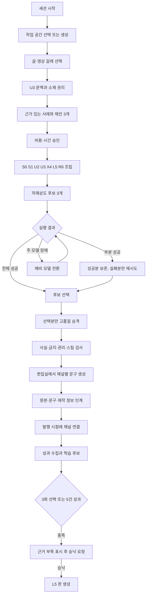
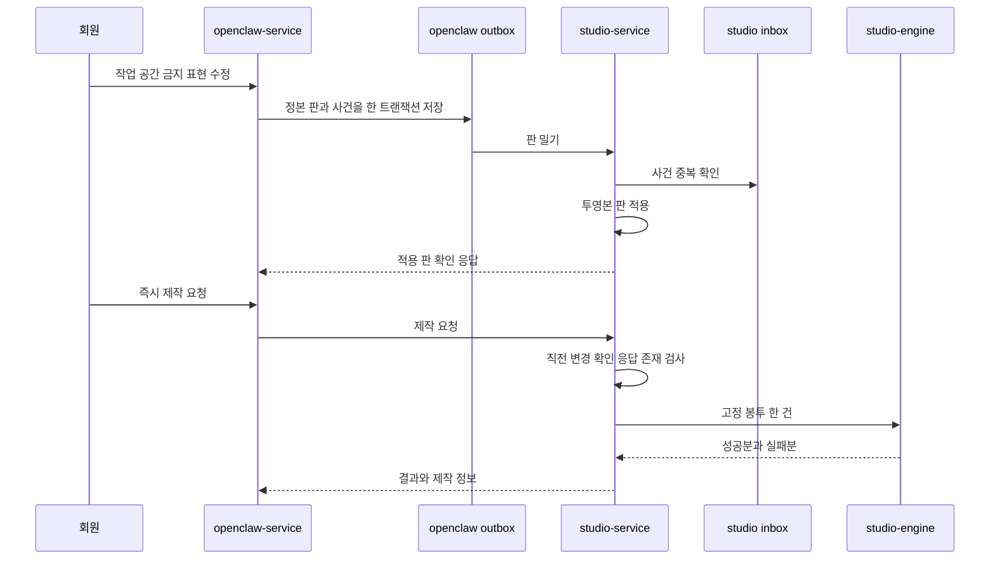
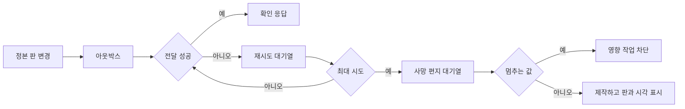
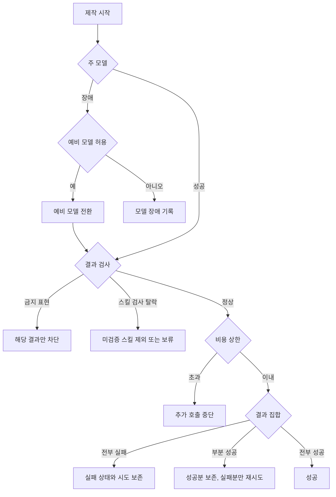

<!--
STAMP
line: studio
artifact: test-plan-studio-생성
version: v3.0
created_at: 2026-08-22 22:40 KST
model: gpt-codex/gpt-5.6
agent: tech-architect
skills: 없음. QA 설계 전용 설치 스킬이 없어 dev.md, doc-review.md, QA 템플릿을 직접 적용했다.
basis: 사업계획 v1.2 §3.4, 회장 확정 R01~R99, Studio FDD v4.0, API 계약 v3.0, ERD v3.0, 기존 시험 계획 v2.0
evidence_urls: https://docs.stripe.com/webhooks, https://www.postgresql.org/docs/18/ddl-rowsecurity.html, https://docs.aws.amazon.com/eventbridge/latest/userguide/eb-rule-retry-policy.html
deliberation: 신규 위험 중 작업 공간 교차 오염을 최우선 출고 차단 조건으로 두고, 중복, 역순, 삭제, 판 불일치 동기화를 실제 DB와 서비스 간 경로에서 검증한다.
-->

# Studio 생성 시험 계획 v3.0

> 한 줄 결론: 이 시험 계획의 최우선 차단 조건은 작업 공간 격리이며, 그 다음은 동기화 무손실과 부분 성공 보존이다. 현재 구현 전이므로 모든 실행 결과는 미검증이다.

| 항목 | 값 |
|---|---|
| 상태 | 시험 설계 완료, 실행 전 |
| 대상 | FDD v4.0, API v3.0, ERD v3.0 |
| 기준 계약 | 사업계획 v1.2 §3.4, 요구 대장 R01~R99 |
| 실행 결과 | 0건 실행, 전부 미검증 |
| 최우선 신규 시험 | 작업 공간 격리 |
| 필수 동기화 시험 | 낡은 투영본, 삭제 전파, 판 불일치, 중복, 역순 |
| 흐름 매핑 | 32단계, endpoint, component, table, test gap 0 |
| 출고 판정 | 현재 NO-GO. 구현과 실환경 증거 없음 |

## 목차

- [0. 논의와 미결](#논의)
- [1. 목적과 판정 원칙](#목적)
- [2. 범위와 제외](#범위)
- [3. 환경과 증거](#환경)
- [4. 전체 흐름 도식](#흐름)
- [5. 작업 공간 격리 시험](#작업 공간)
- [6. 회원과 세 범위 시험](#회원)
- [7. 정본과 투영본 동기화 시험](#동기화)
- [8. 작업 공간 표현 규칙 시험](#목소리)
- [9. 스킬 기본값과 검사 시험](#스킬)
- [10. 층 해소와 봉투 시험](#봉투)
- [11. 생성, 모델, 비용 시험](#생성)
- [12. 실패와 부분 성공 시험](#실패)
- [13. 원문, 작업 기록, 보유 시험](#기록)
- [14. 흐름 1:1 E2E](#e2e)
- [15. 요구 역추적](#역추적)
- [16. 비기능 시험](#비기능)
- [17. 회귀와 전환 시험](#회귀)
- [18. 실행 순서와 중단 기준](#실행)
- [19. 결함과 미검증 형식](#결함)
- [20. 회수 목록](#회수)
- [21. 자기심문과 레드팀](#자기심문)
- [SOURCES, MODEL, RUBRIC](#sources)

## 0. 논의와 미결 

본문에는 확정된 시험 계약만 둔다. build를 막는 시험 설계 미결정은 없다. 지연 감지 창·보유 기간·호환 판 제거 시점은 시험 환경변수로 주입하고 경계값 양쪽을 검사한다.

### 회장이 정할 것

없음.

## 1. 목적과 판정 원칙 

### 1.1 목적

이 계획은 사업계획 v1.2 §3.4와 회장 확정 요구사항이 요구한 다음 사실을 검증한다.

1. Studio 서비스가 독립 회원과 층 저장소를 가진다.
2. 엔진만 무상태다.
3. 전역, 회원, 작업 공간, 작 범위가 섞이지 않는다.
4. 정본과 투영본이 구분되고 밀기 동기화가 무손실이다.
5. 스킬은 `X4` 층으로 조립되고 U3·R6·S0을 덮지 않는다.
6. U3의 사실·표현·금지·권리가 각각 저장되고 사실·금지·권리만 오래될 때 해당 작을 멈춘다.
7. 오래됨으로 멈추는 값은 셋뿐이다.
8. 부분 실패가 성공분을 버리지 않는다.
9. 작업 기록 일곱 항목이 남는다.

### 1.2 증거 등급

| 등급 | 뜻 | 출고 사용 |
|---|---|---|
| 관찰됨 | 실제 브라우저, DB, 네트워크 결과를 직접 봄 | 가능 |
| 테스트됨 | 자동 시험이 실제 구성요소를 실행해 통과 | 가능 |
| 근거 확인 | 문서와 코드 구조를 읽음 | 설계 근거만 |
| 미검증 | 실제 경로를 실행하지 않음 | 완료 근거 불가 |

### 1.3 판정

| 판정 | 조건 |
|---|---|
| PASS | 기대 결과와 직접 증거가 모두 있음 |
| FAIL | 하나 이상의 기대 결과 불일치 |
| BLOCKED | 환경이나 확정 정책이 없어 실행 자체가 불가 |
| NOT RUN | 아직 실행하지 않음 |

### 1.4 출고 차단 우선순위

| 우선 | 차단 조건 |
|---:|---|
| 1 | 작업 공간 또는 회원 교차 데이터가 한 건이라도 노출 |
| 2 | 삭제 사건 누락, 판 역행, 정본과 투영본 오표시 |
| 3 | 금지 표현, 브랜드 사실, 소재 권리 오래됨을 잘못 통과 |
| 4 | 부분 실패가 성공분을 삭제하거나 재청구 |
| 5 | 작업 기록 일곱 항목 또는 계보 누락 |
| 6 | 기존 Studio 기능 회귀 |

### 1.5 표기

| 표기 | 뜻 |
|---|---|
| E2E | 사용자 시작부터 실제 저장과 결과까지 잇는 종단 시험 |
| DB | 데이터베이스 |
| HTTP | 웹 요청과 응답 전송 규약 |
| API | 서비스 사이 요청과 응답 규격 |
| UUID | 충돌 가능성이 매우 낮은 128비트 식별자 |
| SHA-256 | 무결성 지문에 쓰는 해시 함수 |

## 2. 범위와 제외 

### 2.1 포함

- Studio 독립 로그인과 합친 배치 회원 대리 생성
- 개인 층, 작업 공간, 작업 공간 멤버십 생성과 권한
- `S0 S1 U2 U3 X4 L5 R6`
- 정본, 투영, 동기화, 삭제, 충돌
- U3 브랜드 사실·표현 규칙·금지 표현·소재 권리·자유 서술
- 스킬 여덟 선언과 다섯 검사
- 봉투 조립, 주 모델, 예비 모델, 비용
- 후보, 승격, 출력 검사, 부분 성공
- 원문, 정규화 입력, 작업 기록, 계보
- 기존 dashboard Studio 호환

### 2.2 제외

- 실제 SNS 게시 성공
- 성과 수집 정확도
- 모든 외부 모델의 품질 순위
- 미확정 외부 스킬 라이선스 허용 범위
- 미확정 계정 자동 병합

제외 항목을 PASS로 표시하지 않는다.

## 3. 환경과 증거 

### 3.1 환경 행렬

| 환경 | 구성 | 목적 |
|---|---|---|
| unit | 도메인 함수, 결정적 시계 | 채움, 우선순위, 상태 전이 |
| integration-db | 실제 PostgreSQL, 비우회 app role | FK, CHECK, 행 격리, 트랜잭션 |
| integration-sync | openclaw stub가 아니라 실제 계약 송수신기 두 개 | 중복, 역순, 삭제, 판 불일치 |
| integration-engine | 무상태 엔진과 가짜 모델 서버 | 봉투 외 접근 0, fallback |
| e2e-standalone | studio-web, studio-service, DB, engine | 독립 상품 완주 |
| e2e-combined | openclaw-service, studio-service, 두 DB | 대리 회원, 밀기, 인계 |
| stage | 운영과 같은 네트워크와 저장소 | 장애 주입과 관측 |

### 3.2 시드

| 시드 | 내용 |
|---|---|
| M-A | 회원 A, owner |
| M-B | 회원 B, owner |
| B-A1 | 회원 A 작업 공간 1 |
| B-A2 | 회원 A 작업 공간 2 |
| B-B1 | 회원 B 작업 공간 1 |
| W-A1 | B-A1 작업 공간 |
| W-A2 | B-A2 작업 공간 |
| W-B1 | B-B1 작업 공간 |
| U3-A1 | 고유 브랜드 사실 `A_ONLY_FACT` |
| U3-A2 | 고유 브랜드 사실 `A2_ONLY_FACT` |
| U3-B1 | 고유 브랜드 사실 `B_ONLY_FACT` |
| STOP-A1 | B-A1 금지 표현 `DO_NOT_EMIT_A1` |
| RIGHTS-A1 | B-A1 전용 소재 권리 |

### 3.3 증거 묶음

각 시험은 다음 중 필요한 것을 남긴다.

- 요청과 응답의 비밀값 제거 사본
- DB 질의 결과와 현재 app role
- 행 정책 판정
- 구조화 사건과 correlation id
- 브라우저 화면 캡처
- 모델 stub 수신 봉투 해시
- 비용 원장 전후 행
- 저장소 객체 hash

### 3.4 완료 주장 금지

mock 모델 통과만으로 제품 완료라고 하지 않는다.

실제 PostgreSQL, 실제 두 서비스 경로, 브라우저 완주 증거가 있어야 한다.

## 4. 전체 흐름 도식 

### 4.1 독립 Studio 흐름

### 4.2 합친 배치 동기화 흐름

### 4.3 실패 흐름

### 4.4 제작 실패 경로 여섯

## 5. 작업 공간 격리 시험 

이 절은 가장 중요한 신규 시험이다.

한 건이라도 실패하면 전체 출고 NO-GO다.

### WORKSPACE-ISO-01 목록 격리

Given 회원 A와 B가 각각 작업 공간를 가진다.

When 회원 A 토큰으로 작업 공간 목록을 조회한다.

Then B-B1이 응답, 로그의 사용자 표시 값, 캐시 어디에도 없다.

증거: HTTP 응답, DB role과 policy 질의, 캐시 키 목록.

### WORKSPACE-ISO-02 직접 식별자 조회

Given 회원 A가 B-B1 식별자를 안다.

When `GET /workspaces/{B-B1}`을 호출한다.

Then 404이고 존재 여부를 유추할 필드가 없다.

감사에는 scope denial이 한 건 남는다.

### WORKSPACE-ISO-03 같은 회원의 두 작업 공간 격리

Given 회원 A가 B-A1과 B-A2를 가진다.

When W-A1로 봉투를 조립한다.

Then U3-A1만 들어가고 U3-A2는 0건이다.

이는 회원 격리만으로 잡히지 않는 핵심 시험이다.

### WORKSPACE-ISO-04 작업 공간 위조

Given W-A2는 B-A2에 속한다.

When workspace_id=B-A1, workspace_id=W-A2로 제작을 요청한다.

Then 404 또는 422로 거부되고 job 행이 생기지 않는다.

### WORKSPACE-ISO-05 DB 행 정책 우회

Given 애플리케이션 비우회 역할에 회원 A 문맥을 설정한다.

When layer_items, production_jobs, outputs를 B-B1 조건으로 직접 SELECT와 UPDATE한다.

Then SELECT 0행, UPDATE 0행이며 정책 우회 권한이 없다.

테이블 소유자 연결로 이 시험을 대신하지 않는다.

### WORKSPACE-ISO-06 봉투 단일 작업 공간

Given 잘못된 내부 fixture가 두 작업 공간 항목을 반환한다.

When EnvelopeBuilder가 봉투를 고정한다.

Then `ENVELOPE_MULTI_WORKSPACE`로 실패하고 engine 호출은 0회다.

### WORKSPACE-ISO-07 모델 요청 누출

Given 세 작업 공간에 고유 canary 문자열이 있다.

When 각 작업 공간 작업을 병렬 실행한다.

Then 모델 stub가 받은 각 봉투에는 자기 canary만 있고 다른 canary는 없다.

### WORKSPACE-ISO-08 결과 계보 격리

Given B-A1 결과 ID를 회원 B가 안다.

When 결과와 provenance를 조회한다.

Then 둘 다 404다.

### WORKSPACE-ISO-09 캐시 격리

Given 두 작업 공간이 같은 주제와 같은 표현 규칙을 사용한다.

When 순서대로 생성한다.

Then 의미가 같아도 작업 공간 식별자와 봉투 지문이 다른 캐시 경계로 기록된다.

다른 작업 공간 결과 참조를 재사용하지 않는다.

### WORKSPACE-ISO-10 동기화 매핑 격리

Given openclaw의 같은 문자열 item id가 서로 다른 source namespace에 있다.

When 두 사건을 민다.

Then source_service와 외부 item id 조합으로 분리되고 다른 작업 공간 local item에 덮어쓰지 않는다.

### WORKSPACE-ISO-11 명시 복사

Given B-A1 항목을 B-A2로 복사한다.

When 원본 B-A1에 새 판을 만든다.

Then B-A2 복사 항목 판은 바뀌지 않고 copied_from만 남는다.

### WORKSPACE-ISO-12 삭제 격리

Given B-A1을 삭제한다.

When 삭제 전파가 끝난다.

Then B-A1의 U3, 작업 공간 설치 X4, L5만 비활성화되고 B-A2와 B-B1은 그대로다.

## 6. 회원과 세 범위 시험 

### MEMBER-01 독립 회원 생성

Given openclaw가 중단되어 있다.

When Studio에서 가입하고 로그인한다.

Then studio_members와 session이 생기고 openclaw 호출은 0회다.

### MEMBER-02 합친 배치 대리 생성 멱등성

Given 같은 source_member_id다.

When provision 요청을 3회 보낸다.

Then Studio 회원은 1개이고 세 응답의 member id가 같다.

### MEMBER-03 다른 본문의 같은 멱등 키

When 같은 Idempotency-Key에 다른 source_member_id를 보낸다.

Then 409 `IDEMPOTENCY_CONFLICT`다.

### PLAN-01 작업 공간 한도

Given 무료·스타터는 활성 작업 공간 1개, 프로는 3개다. When 한도보다 하나 더 생성한다. Then 409 `WORKSPACE_LIMIT_REACHED`이고 새 workspace 행은 0개다.

### PLAN-02 기업 협의 한도

Given enterprise `workspace_limit` 설정값이 N이다. Then N까지 생성되고 N+1은 거부된다. null 한도는 무제한이 아니라 계약 설정 누락으로 거부된다.

### PLAN-03 무료 실제 영상 한 편

Given 무료 권한이 남아 있다. When 세로 1080×1920, 30fps, 90초 안팡 영상을 렌더한다. Then 실제 재생 가능한 영상 파일과 메타데이터를 직접 관찰하고, 성공 트랜잭션에서만 사용량이 1 증가한다. 정지 이미지·텍스트 목업·빈 파일은 실패다.

### PLAN-04 무료 렌더 실패

When 렌더가 실패한다. Then `free_actual_video_used`는 증가하지 않고 재시도 권한이 남는다.

### SCOPE-01 U2 개인 범위

Given 회원 A의 U2 항목이다.

Then workspace_id가 null이고 회원 A의 모든 작업 공간 작에 적용 후보가 된다.

### SCOPE-02 U3 작업 공간 범위

Given B-A1 U3 항목이다.

Then workspace_id=B-A1이다.

### SCOPE-03 X4 설치 범위

Given B-A1에 설치한 X4 항목이다.

Then layer_code=X4, scope_kind=workspace, workspace_id=B-A1이다.

### SCOPE-04 작업 공간 없는 U3·L5

When workspace_id 없이 U3 또는 L5를 저장한다.

Then DB와 API 모두 거부한다.

### SCOPE-05 범위와 층 불일치

When U3를 member scope로 저장하거나 U2를 workspace scope로 저장한다.

Then 422와 DB CHECK 위반이다.

## 7. 정본과 투영본 동기화 시험 

### SYNC-01 정상 밀기와 확인 응답

Given openclaw U3 정본 판 10이 있다.

When revision 10 사건을 Studio에 민다.

Then projection 판 10이 적용되고 확인 응답의 applied_revision=10이다.

### SYNC-02 중복 사건

Given 같은 source와 event id다.

When 동일 사건을 3회 보낸다.

Then sync_inbox 1행, layer_revision 1행, 같은 확인 응답 3회다.

### SYNC-03 같은 사건 id의 다른 payload

When 같은 source와 event id에 다른 payload hash를 보낸다.

Then 409이고 기존 적용 결과는 바뀌지 않는다.

### SYNC-04 역순 판

Given revision 12가 적용되었다.

When revision 11 사건이 늦게 온다.

Then `SYNC_REVISION_REGRESSION`, current_revision=12 유지다.

### SYNC-05 낡은 비멈춤 투영본

Given 목소리 투영본의 마지막 성공이 하루를 넘고 실패 이력이 있다.

When 제작한다.

Then 제작은 진행하고 결과 계보에 revision과 last_push_succeeded_at을 표시한다.

### SYNC-06 낡은 금지 표현 투영본

Given 금지 표현 밀기 실패 이력이 있고 주입한 감지 창을 넘었다.

When 그 작업 공간 제작을 시작한다.

Then 영향 작업만 `STALE_STOPPING_VALUE`로 멈춘다.

다른 작업 공간 작업은 진행한다.

### SYNC-07 낡은 브랜드 사실 투영본

Given workspace_fact가 오래되고 실패 이력이 있다.

When 그 사실을 쓰는 작업을 조립한다.

Then 엔진 호출 전 차단된다.

### SYNC-08 낡은 소재 권리 투영본

Given material_rights가 오래되고 실패 이력이 있다.

When 해당 소재를 선택한다.

Then 그 소재를 쓰는 결과만 차단되고 무관한 결과는 진행 가능하다.

### SYNC-09 마지막 밀기 성공 뒤 정본 장애

Given Studio 투영이 최신이고 마지막 밀기가 성공했다.

When openclaw가 중단된 상태에서 제작한다.

Then 원격 대조 없이 제작한다.

### SYNC-10 매 요청 대조 금지

Given 실패 이력 없음, 직전 변경 없음, 주기 창 이내다.

When 제작 요청 100건을 보낸다.

Then comparison 호출은 0회다.

### SYNC-11 직전 변경 뒤 즉시 제작

Given 사용자가 정본을 바꾸고 아직 push ack가 없다.

When 바로 제작한다.

Then 해당 ack를 기다리거나 허용된 comparison 1회를 수행한다.

### SYNC-12 주기 창 초과

Given 마지막 성공이 등급별 창을 넘었다.

When 스케줄러가 돈다.

Then reason=`periodic_window_elapsed`로만 대조한다.

### SYNC-13 허용되지 않은 대조 사유

When reason=`every_production`으로 comparison API를 부른다.

Then 422다.

### SYNC-14 삭제 전파

Given 작업 공간 삭제 revision 20 사건이다.

When Studio가 적용한다.

Then 작업 공간, U3, 소속 U3, 작업 공간 조건 L5가 신규 봉투에서 제외된다.

과거 output과 provenance는 남는다.

### SYNC-15 삭제 사건 중복

When 같은 delete event를 반복한다.

Then tombstone 판은 1개다.

### SYNC-16 계약 minor 추가 필드

Given 2.1 소비자가 모르는 선택 필드가 있다.

When 사건을 받는다.

Then 알려진 필드를 적용하고 모르는 필드는 raw payload에 보존한다.

### SYNC-17 계약 major 불일치

Given 지원 창 밖 major다.

When 사건을 받는다.

Then 422 `VERSION_UNSUPPORTED`, 투영본 불변이다.

### SYNC-18 두 판 동시 수용

Given 현재 주 번호와 직전 주 번호를 동시 지원하는 호환 창 안이다.

When 이전 판과 현재 판 사건을 각각 보낸다.

Then 각각 해당 해석기로 적용된다.

창 종료 뒤 이전 판은 명시적으로 거부된다.

### SYNC-19 재시도와 사망 편지 대기열

Given Studio가 계속 503을 반환한다.

When 최대 시도까지 전달한다.

Then 지수 백오프와 jitter 기록 뒤 사건이 사망 편지 대기열로 이동한다.

### SYNC-20 매핑 충돌

Given 같은 외부 item id가 다른 local item에 이미 매핑됐다.

When 새 매핑 사건이 온다.

Then held 상태이며 자동 새 항목 생성은 0회다.

## 8. U3 작업 공간 문맥 시험 

### CONTEXT-01 브랜드 사실 출처

Given 브랜드 사실에 출처 참조가 없다. When U3 판을 확정한다. Then 422 `FACT_SOURCE_REQUIRED`다.

### CONTEXT-02 표현 규칙 보존

Given 존댓말·어휘·리듬·표기 선호가 있다. Then 각 값이 같은 U3 판에 저장되고 봉투 조립 후 지문으로 검증된다.

### CONTEXT-03 금지 표현 멈춤

Given 금지 표현 투영본이 낡고 실패 이력이 있다. Then 영향 받는 작만 멈추고 다른 작업 공간과 작은 계속한다.

### CONTEXT-04 소재 권리 멈춤

Given 소재 권리가 미확인 또는 만료되었다. Then 해당 소재를 참조하는 작 호출은 0회다.

### CONTEXT-05 자유 서술의 상쇄 금지

Given free_note가 브랜드 사실과 반대된다. Then 구조화된 사실이 승자며 충돌 계보가 남는다.

### CONTEXT-06 작업 공간 복제

When 새 브랜드·언어·취향을 위해 작업 공간을 복제한다. Then 선택한 U3·X4·L5만 새 항목과 판으로 복제되고 원본과 동기화 관계는 생기지 않는다.

### CONTEXT-07 결과 적용 설명

Then 결과 화면은 사용자 값, X4 제안, 최종 적용 값, 선택 이유를 필드별로 표시한다.

### LEARN-01 같은 선택 2회

Given 비교 가능한 같은 선택이 2회다. Then 사용자에게 학습 후보를 띄우지 않고 L5 판은 0개다.

### LEARN-02 같은 선택 3회

Given 같은 선택이 3회다. Then 후보 카드에 `근거 부족`이 표시되고 승낙 전 L5 판은 0개다.

### LEARN-03 성과 4건과 5건 경계

Given 비교 가능한 성과가 4건이다. Then 후보를 띄우지 않는다. Given 5번째 성과가 밀려온다. Then 근거 참조 5건을 가진 후보를 제시한다.

### LEARN-04 승낙 후 적용

When 회원이 후보를 승낙한다. Then 새 L5 항목과 판, 근거, 승낙자, 승낙 시각이 한 트랜잭션으로 남는다.

### LEARN-05 거절과 작업 공간 격리

When 후보를 거절한다. Then 관찰 기록은 보존하고 L5 판은 0개다. 다른 작업 공간의 후보·L5는 변하지 않는다.

## 9. 스킬 기본값과 검사 시험 

### SKILL-01 선언 여덟 칸 완결

When 한 칸씩 누락한 스킬 8개를 제출한다.

Then 모두 `SKILL_DECLARATION_INVALID`다.

### SKILL-02 빈 칸 default

Given 사용자 필드가 unset이다.

When default 스킬을 적용한다.

Then 값이 채워지고 application action=applied다.

### SKILL-03 사용자 값 보존

Given 사용자 필드가 명시 false 또는 빈 배열이 아닌 실제 값이다.

When default 스킬을 적용한다.

Then skipped, reason=user_value_present다.

### SKILL-04 자유 서술은 잠금 아님

Given free_note가 있다.

When V3 default를 적용한다.

Then V3는 채워진다.

### SKILL-05 승인 force

Given write field와 force mode, 권한, 충돌 동작이 승인됐다.

When 실행한다.

Then 적용하고 결과 설명에 force를 표시한다.

### SKILL-06 미선언 force

When body가 선언하지 않은 필드를 force로 쓰려 한다.

Then 검사에서 downgraded 또는 held다.

### SKILL-07 S0 우회

When 스킬이 S0 불변을 덮으려 한다.

Then 등록 거부다.

### SKILL-08 사칭

When 다른 회원 또는 작업 공간 범위를 읽으려 한다.

Then 등록 거부다.

### SKILL-09 라이선스 누락

When 외부 스킬에 license가 없다.

Then held이고 실행 0회다.

### SKILL-10 권한 초과

Given network_allowlist가 비어 있다.

When 실행 중 외부 통신을 시도한다.

Then 런타임 차단과 감사 1건이다.

### SKILL-11 파일 격리

When 다른 작업의 저장 경로를 읽으려 한다.

Then 파일 0바이트 반환이 아니라 권한 오류로 차단한다.

### SKILL-12 스킬 삭제

Given 과거 결과가 skill revision 3을 참조한다.

When skill를 삭제한다.

Then 신규 작업에서 제외되지만 과거 provenance는 revision 3을 표시한다.

## 10. 층 해소와 봉투 시험 

### ENVELOPE-01 우선순위

Given 같은 필드가 S1, U2, U3, X4, L5, R6에 있다.

When 해소한다.

Then `S0 불변 > R6 > L5 > U3 > U3 > U2 > S1 > S0 외부` 순서다.

### ENVELOPE-02 S0 불변

Given R6가 S0 불변을 덮으려 한다.

Then S0가 이기고 충돌 기록이 남는다.

### ENVELOPE-03 L5 조건 12칸

Given 12칸 중 workspace가 다른 규칙이다.

Then 봉투에서 제외된다.

각 조건 칸을 하나씩 불일치시킨 12개 매개변수 시험을 돌린다.

### ENVELOPE-04 R6 비영속 층

Given 작업이 끝난다.

Then R6는 layer_items에 없고 request_adjustments와 job record에만 있다.

### ENVELOPE-05 결정성

Given DB 판 집합과 스킬 판 집합이 같다.

When 봉투를 두 번 만든다.

Then created_at 같은 비결정 필드를 제외한 정규 hash가 같다.

### ENVELOPE-06 엔진 무상태

Given DB와 정본 서비스 네트워크를 차단한다.

When 유효 봉투를 engine에 준다.

Then engine은 봉투만으로 실행하고 DB 연결 시도 0회다.

### ENVELOPE-07 판과 갱신 시각

Then 모든 U2, U3, X4, L5 항목에 item_id, revision, authority, updated_at이 있다.

### ENVELOPE-08 X4 층 포함

Then `layers.x4`에 스킬 항목 판과 검사 결과가 있고, 층 밖의 독립 `skills` 우선순위는 없다.

## 11. 생성, 모델, 비용 시험 

### GEN-01 제안 3개

Given 정상 입력이다.

When proposals를 실행한다.

Then 성공한 서로 다른 후보 슬롯 3개와 차이 축이 있다.

### GEN-02 전체 거절 재시도

Given 무료 왕복이 남았다.

When retry한다.

Then 새 proposal_set과 retry_of가 남는다.

### GEN-03 비용 예상

Then min <= max <= recommended ceiling 조건을 만족하고 가정이 표시된다.

### GEN-04 상한 미승인

When approved ceiling 없이 유료 작업을 시작한다.

Then 공급자 호출 0회다.

### GEN-05 주 모델 성공

Then fallback attempt는 0이고 주 모델 비용만 기록된다.

### GEN-06 주 모델 장애와 예비 모델

Given 주 모델 503이다.

When fallback_allowed=true다.

Then 같은 의미 봉투를 예비 어댑터로 직렬화하고 fallback=true를 기록한다.

### GEN-07 예비 모델 금지

Given fallback_allowed=false다.

When 주 모델이 실패한다.

Then 예비 모델 호출 0회다.

### GEN-08 고해상도 승격

Given 후보 3개 중 B를 선택했다.

When promote한다.

Then B만 승격되고 A와 C 고해상도 호출 0회다.

### COST-01 예약과 실제

Then 공급자 호출 전에 reservation, 성공 뒤 actual과 release가 원장에 남는다.

### COST-02 품질 반려 무과금

Given 필수 품질 게이트에서 반려됐다.

Then operator_cost는 남고 customer_billable actual은 0이다.

### COST-03 상한 도달

Given 일부 성공 뒤 누적 실제가 상한에 도달한다.

Then 추가 호출은 0, 기존 성공 결과는 유지한다.

### COST-04 중복 응답

Given 공급자 같은 request id 결과가 두 번 온다.

Then actual 비용과 output은 각각 1개다.

## 12. 실패와 부분 성공 시험 

### FAILURE-01 주 모델 장애

기대: 실패 시도 보존, 예비 모델 전환 표시.

### FAILURE-02 예비 모델도 장애

기대: 두 실패 시도 보존, 전체 failed, 허위 결과 0.

### FAILURE-03 금지 표현 적발

Given 후보 A만 금지 표현을 포함한다.

Then A blocked, B와 C succeeded다.

### FAILURE-04 스킬 검사 탈락

Given 선택 스킬이 held다.

Then 실행에서 제외하거나 작업을 보류하며 조용히 실행하지 않는다.

### FAILURE-05 비용 상한 초과

기대: 추가 호출 중단, 성공분 제공, 실패 예약 해제.

### FAILURE-06 부분 실패 성공분 보존

Given 후보 A와 B 성공, C 실패다.

When 작업을 조회한다.

Then status=partial, outputs A와 B가 유지되고 C 실패 이유가 있다.

When C만 재시도한다.

Then A와 B 공급자 재호출 0회, 새 actual 비용 0이다.

### FAILURE-07 부분 인계

Given partial 작업이다.

When A만 handoff한다.

Then A 참조만 인계되고 C 실패는 인계되지 않는다.

### FAILURE-08 재시도 뒤 전체 성공

Given C 재시도가 성공한다.

Then job은 succeeded로 갈 수 있고 A, B의 원래 output id는 유지된다.

### FAILURE-09 부분 실패 뒤 취소

When 사용자가 남은 실패분을 취소한다.

Then 성공분은 archived 또는 succeeded로 보존되고 삭제되지 않는다.

### FAILURE-10 상태 역행

Given succeeded 작업이다.

When 늦은 failed 사건이 온다.

Then job은 failed로 역행하지 않고 사건을 이상으로 기록한다.

## 13. 원문, 작업 기록, 보유 시험 

### RAW-01 원문 바이트 무결성

Given UTF-8 원문 바이트다.

When 접수한다.

Then 저장 전 byte_hash가 접수 바이트 해시와 같다.

암호화 ciphertext를 평문과 바이트 비교하지 않는다.

### RAW-02 정규화 재현

Given CRLF, 유니코드 조합형, 앞뒤 공백이 섞였다.

When 정규화한다.

Then transformation_log와 normalization fingerprint로 봉투 입력을 재현한다.

### RAW-03 원문 조각 참조

Given 봉투가 원문 일부를 그대로 쓴다.

Then byte range 또는 논리 범위와 조각 hash가 저장 원문에서 검증된다.

### RECORD-01 작업 기록 일곱 항목

Then request id, normalized input, layer versions, consent, cost, model and skill versions, result ids가 모두 있다.

각 항목을 하나씩 누락시키면 완료 상태 전이를 거부한다.

### RECORD-02 계보 전수

Then 요청에서 handoff까지 sequence가 중복 없이 단조 증가한다.

### RETENTION-01 설정된 보유 시각

Given 원문 `retention_until`이 시험 기준 시각으로 주입된다.

When 만료 작업이 돈다.

Then ciphertext는 삭제되고 hash와 deletion event는 남는다.

### RETENTION-02 즉시 삭제 요청

When 사용자가 원문 즉시 삭제를 요청한다.

Then 만료일까지 기다리지 않고 삭제한다.

### RETENTION-03 결과 계보 유지

Then 원문 삭제 뒤에도 layer revision ids, 모델, 비용, output ids는 남는다.

원문 내용은 조회되지 않는다.

### RETENTION-04 작업 공간 삭제

Then 과거 결과의 작업 공간 표시명은 정책에 따라 익명화할 수 있지만 다른 작업 공간로 재귀속하지 않는다.

### PRD-AC-RAW-01 기존 수용 기준 회수

기존 문구 `저장된 원문과 실린 원문이 바이트 단위로 같다`를 그대로 자동화하면 FAIL로 판정한다.

대체 수용 기준은 RAW-01, RAW-02, RAW-03 세 시험이다.

PRD 개정 전 이 항목은 BLOCKED다.

## 14. 흐름 1:1 E2E 

| 시험 | 사용자 또는 시스템 행위 | 엔드포인트 | 화면 구성요소 | 저장 검증 |
|---|---|---|---|---|
| FLOW-01 | Studio 세션 시작 | `POST /v3/studio/sessions` | `StudioAuthGate` | `studio_sessions` |
| FLOW-02 | 작업 공간 목록과 현재 공간 선택 | `GET /v3/studio/workspaces` | `WorkspaceSwitcher` | `workspaces`, `workspace_members` |
| FLOW-03 | 작업 공간 생성, 글·영상 갈래만 선택 | `POST /v3/studio/workspaces` | `WorkspaceStartPicker` | `workspaces`, `layer_items`, `layer_revisions` |
| FLOW-04 | 학습 정보 열람·수정 | `GET /v3/studio/workspaces/{workspaceId}/layers`, `POST /v3/studio/layer-items/{itemId}/revisions` | `LearningInfoPanel` | `layer_items`, `layer_revisions` |
| FLOW-05 | 소재·참고자료 반입 | `POST /v3/studio/material-imports` | `MaterialImportReview` | `material_imports`, `material_rights` |
| FLOW-06 | 근거 있는 사례와 추천 3개 조회 | `POST /v3/studio/proposal-sets` | `DisplayProposalDeck` | `reference_views`, `proposal_sets`, `production_outputs` |
| FLOW-07 | 비용·시간 범위 확인 | `POST /v3/studio/production-estimates` | `CostTimeApproval` | `cost_entries` |
| FLOW-08 | 제작 작과 R6 생성 | `POST /v3/studio/productions` | `GenerationProgress` | `production_jobs`, `request_adjustments` |
| FLOW-09 | 일곱 층 조립과 사실 충돌 판정 | `POST /v3/studio/productions/{jobId}/assemble` | `ConflictQuestion` | `production_envelopes`, `production_conflicts` |
| FLOW-10 | 저해상도 후보 3개 실행 | `POST /v3/studio/productions/{jobId}/execute-previews` | `DisplayLoadingState` | `production_attempts`, `production_outputs`, `cost_entries` |
| FLOW-11 | 세 후보 전부 거절 후 재요청 | `POST /v3/studio/proposal-sets/{setId}/retry` | `ProposalRetryAction` | `proposal_sets`, `production_attempts` |
| FLOW-12 | 후보 하나와 이유 선택 | `POST /v3/studio/productions/{jobId}/selections` | `CandidateChooser` | `production_decisions`, `learning_observations` |
| FLOW-13 | 선택 후보만 고품질 승격 | `POST /v3/studio/productions/{jobId}/promotions` | `PromotionProgress` | `production_outputs`, `production_attempts`, `cost_entries` |
| FLOW-14 | 품질·금지 표현·사실·권리 검사 | `POST /v3/studio/outputs/{outputId}/inspections` | `QualityGateResult` | `output_inspections` |
| FLOW-15 | 확정·보관·다른 제안 선택 | `POST /v3/studio/productions/{jobId}/disposition` | `ResultDispositionBar` | `production_jobs`, `production_decisions` |
| FLOW-16 | 편집실에서 부모 결과 열기 | `POST /v3/studio/edits` | `EditPreview` | `edit_jobs`, `production_outputs`, `production_recipes` |
| FLOW-17 | 대화·선택·직접 조작 편집 지시 | `POST /v3/studio/edits/{editId}/instructions` | `EditInstructionPanel` | `edit_instructions` |
| FLOW-18 | 영향 컷만 재생성 또는 로컬 재렌더 | `POST /v3/studio/edits/{editId}/render` | `EditRenderProgress` | `production_attempts`, `production_outputs`, `cost_entries` |
| FLOW-19 | 세부 채널 규격 받기, 계정 연결은 안 함 | `POST /v3/studio/channel-spec-snapshots` | `ChannelTargetPicker` | `channel_spec_projections` |
| FLOW-20 | 제목·소개·해시태그·첫 댓글 생성 | `POST /v3/studio/outputs/{outputId}/channel-packages` | `ChannelCopyEditor` | `channel_text_packages`, `channel_text_revisions` |
| FLOW-21 | 완성 원본·문구·제작 정보 인계 | `POST /v3/studio/handoffs` | `HandoffStatus` | `handoff_records`, `production_outputs` |
| FLOW-22 | 발행 시점에 채널 연결 | `POST /api/connect/{provider}` | `ChannelConnect` | openclaw `channel_accounts` |
| FLOW-23 | 지금 발행·승인 보관·예약 | `POST /api/publish`, `POST /api/schedule` | `PublishOptions` | openclaw `schedules`, `published_posts` |
| FLOW-24 | 성과 조회 | `GET /api/analytics` | `PerformanceRoom` | openclaw `published_posts`, `growth_metrics` |
| FLOW-25 | 선택·수정·성과 관찰 밀기 | `POST /v3/studio/sync/events` | `LearningInfoBadge` | `sync_inbox`, `learning_observations` |
| FLOW-26 | 3회 선택 또는 5건 성과 후 후보 제시 | `GET /v3/studio/workspaces/{workspaceId}/learning-candidates` | `LearningCandidateCard` | `learning_candidates` |
| FLOW-27 | 후보 승낙, L5 판 생성 | `POST /v3/studio/learning-candidates/{candidateId}/accept` | `LearningConsentAction` | `learning_candidates`, `layer_items`, `layer_revisions` |
| FLOW-28 | 후보 거절, 관찰 보존 | `POST /v3/studio/learning-candidates/{candidateId}/reject` | `LearningRejectAction` | `learning_candidates`, `learning_observations` |
| FLOW-29 | 되돌리기, 원본 보존·앞 방 항목 추가 | `POST /v3/studio/productions/{jobId}/forks` | `RollbackBanner` | `production_jobs`, `provenance_events` |
| FLOW-30 | 새 브랜드·언어·취향용 작업 공간 복제 | `POST /v3/studio/workspaces/{workspaceId}/copies` | `WorkspaceCopyAction` | `workspaces`, `layer_items`, `layer_revisions` |
| FLOW-31 | 정본 판·삭제를 투영 서비스로 밀기 | `POST /v3/studio/sync/events` | `SyncStatusBadge` | `sync_outbox`, `sync_inbox`, `sync_mappings` |
| FLOW-32 | 작업 공간 삭제 전파와 새 작 차단 | `DELETE /v3/studio/workspaces/{workspaceId}` | `WorkspaceDeleteConfirm` | `workspaces`, `sync_outbox`, `projection_sync_states` |

### 14.1 독립 완주

FLOW-O1부터 FLOW-06H까지 openclaw 호출 0으로 완주한다.

결과 하나를 확정하고 provenance를 화면에서 연다.

브라우저 console error 0을 확인한다.

### 14.2 합친 배치 완주

openclaw 회원 대리 생성, U3 밀기, 즉시 제작, 결과 인계를 실제 두 서비스로 완주한다.

stub HTTP 응답만으로 대체하지 않는다.

### 14.3 흐름 gap 판정

| 항목 | 수 |
|---|---:|
| 흐름 단계 | 29 |
| endpoint 빈칸 | 0 |
| 화면 빈칸 | 0 |
| 저장 빈칸 | 0 |
| 시험 빈칸 | 0 |
| mapping gap | 0 |

## 15. 요구 역추적 

| 요구 | 수용 기준 | 시험 |
|---|---|---|
| 상태 서비스와 무상태 엔진 | openclaw 없이 저장과 생성, 엔진 DB 접근 0 | MEMBER-01, ENVELOPE-06, 독립 E2E |
| 자체 회원과 층 | `S0 S1 U2 U3 X4 L5 R6` 저장·스냅샷 | MEMBER, SCOPE, ENVELOPE |
| 정본과 투영 | 화면 표시와 판 추적 | SYNC-01, 05, 09 |
| 작업 공간 개체와 격리 | 교차 노출 0 | WORKSPACE-ISO-01부터 12 |
| X4 스킬 층 | X4 항목과 검사 판이 봉투 층에 포함 | ENVELOPE-08, SKILL-01 |
| default 판정 | 빈 칸만 적용 | SKILL-02부터 04 |
| U3 작업 공간 문맥 | 사실·표현·금지·권리 분리와 상쇄 금지 | CONTEXT-01부터 07 |
| 제한된 대조 | 세 이유만 | SYNC-10부터 13 |
| 멈춤 값 셋 | 세 종류만 영향 차단 | SYNC-06부터 08, 05 |
| 동기화 식별자 매핑 | 충돌 자동 병합 0 | SYNC-20 |
| 판 하위 호환 | minor 허용, major 거부 | SYNC-16부터 18 |
| 삭제 전파 | U3·설치 X4·L5 비활, 결과 유지 | SYNC-14, 15 |
| 작업 기록 일곱 | 누락 0 | RECORD-01 |
| 원문 보유 | hash, 변환, 삭제 | RAW-01부터 03, RETENTION |
| 모델 장애와 fallback | 시도 보존 | GEN-06, 07, FAILURE-01, 02 |
| 금지 표현 | 결과별 차단 | FAILURE-03 |
| 스킬 검사 탈락 | 실행 차단 | FAILURE-04 |
| 비용 상한 | 추가 호출 0 | COST-03, FAILURE-05 |
| 부분 실패 | 성공분 보존 | FAILURE-06부터 09 |
| PRD 원문 AC 보정 | 기존 문구 FAIL, 대체 3시험 | PRD-AC-RAW-01 |

요구 빈칸: 0.

수용 기준 빈칸: 0.

시험 빈칸: 0.

## 16. 비기능 시험 

### PERF-01 봉투 조립

Given 항목 500개, L5 100개, 스킬 20개다.

Then Studio 서비스 내부 조립 p95 목표를 측정한다.

목표치는 실측 전 확정하지 않고 기준선을 먼저 기록한다.

### PERF-02 동기화 폭주

Given 한 항목의 판 1,000개 사건과 중복 20%다.

Then 최신 판 단조성, 중복 0 적용, 큐 고갈 없음이다.

### PERF-03 작업 공간 공정성

Given 작업 공간 A가 큐를 폭주시킨다.

Then 작업 공간 B의 작업이 무기한 굶지 않는다.

### SEC-01 토큰 누출

Then 응답, 로그, 오류 details에 원문 토큰과 공급자 키가 없다.

### SEC-02 비우회 역할

Then 실제 애플리케이션 DB role의 `rolbypassrls=false`다.

### SEC-03 원문 접근 감사

When owner가 원문을 조회한다.

Then 접근 감사 1건이 남고 viewer는 거부된다.

### REL-01 worker 중단

Given 정본 판과 outbox를 저장한 직후 프로세스를 종료한다.

When worker가 재기동한다.

Then 사건이 전달된다.

### REL-02 수신 중단

Given inbox 저장 뒤 apply 전에 프로세스를 종료한다.

When 재기동한다.

Then 같은 사건을 한 번만 적용한다.

### OBS-01 correlation

Then 한 제작의 public request, job, envelope, attempt, output, handoff를 correlation id로 잇는다.

### OBS-02 경보

Given 멈추는 값이 사망 편지 대기열에서 주입한 등급별 감지 창을 넘겼다.

Then 고위험 알림이 1건 발생한다.

## 17. 회귀와 전환 시험 

### REG-01 기존 작업 공간 위저드

기존 6문항 입력을 새 U3와 voice 구조로 전환하고 기존 prompt_guide 모양을 다시 읽을 수 있다.

### REG-02 기존 Studio 텍스트 생성

기존 `/api/studio/text` 호출이 새 production 경로로 동작하고 기존 플랫폼 변형 응답 필드를 유지한다.

### REG-03 기존 초안 목록

기존 최근 50 초안 조회가 새 작업과 legacy drafts를 중복 없이 보여 준다.

### REG-04 기존 초안 저장

기존 payload text, img, vid, includes, publishReconciliation이 유실되지 않는다.

### REG-05 기존 화면 기능

다음을 유지한다.

- Studio 생성
- 저장
- 이력 불러오기
- 이미지와 영상 선택
- 플랫폼 미리보기
- 예약 패널
- 작업 공간 위저드
- 위키 연결

새 독립 Studio가 생겼다는 이유로 기존 합친 배치 기능을 삭제하지 않는다.

### MIG-01 workspace_guides 백필

Then 원본 행 수와 source hash가 일치하고 구조화 추출은 pending review다.

### MIG-02 drafts 백필

Then 원본 payload hash와 새 legacy_import 계보가 일치한다.

### MIG-03 그림자 읽기

Then 작업 공간 표시명, 최근 초안 수, 텍스트 hash, 사용량 합계 불일치가 0이다.

### MIG-04 롤백

When 새 읽기 전환 뒤 롤백 스위치를 켠다.

Then 기존 화면이 읽히고 새 데이터는 삭제되지 않는다.

### MIG-05 두 판 창 종료

Then 이전 판 호출량 0과 승인 증거 전에는 해석기를 제거하지 않는다.

## 18. 실행 순서와 중단 기준 

### 18.1 실행 순서

1. 스키마 CHECK와 단위 시험
2. 실제 PostgreSQL 행 격리
3. 작업 공간 격리 전수
4. 동기화 중복, 역순, 삭제, 판 불일치
5. 목소리와 스킬
6. 봉투 결정성과 엔진 무상태
7. 모델, 비용, 부분 실패
8. 독립 E2E
9. 합친 배치 E2E
10. 기존 Studio 회귀
11. stage 장애 주입

### 18.2 즉시 중단

다음은 이후 시험을 멈추고 원인부터 고친다.

- WORKSPACE-ISO 한 건 실패
- DB role이 행 격리 우회 가능
- 삭제 사건이 신규 봉투에 남음
- 성공 output이 부분 실패 처리에서 삭제
- 비용 실제가 중복 기록
- 원문이 로그에 노출

### 18.3 출고 GO 조건

- 작업 공간 격리 12건 전부 PASS
- 동기화 20건 전부 PASS
- 목소리와 스킬 전부 PASS
- 실패 경로 6종과 부분 성공 전부 PASS
- 독립 E2E와 합친 E2E PASS
- 기존 Studio 회귀 PASS
- 미검증 고위험 항목 0
- PRD 원문 수용 기준 개정 승인
- eng-design, build, QA 게이트 승인

### 18.4 현재 판정

현재는 시험 계획만 작성했다.

실행 증거가 없으므로 NOT RUN이며 출고 NO-GO다.

## 19. 결함과 미검증 형식 

### 19.1 결함 기록

| 필드 | 필수 |
|---|---|
| defect_id | 예 |
| test_id | 예 |
| severity | blocker, major, minor |
| input | 예, 비밀값 제거 |
| expected | 예 |
| actual | 예 |
| evidence | 예 |
| owner | 예 |
| status | 예 |

### 19.2 미검증 기록

| 필드 | 뜻 |
|---|---|
| test_id | 시험 |
| reason | 왜 못 했는가 |
| missing_environment | 필요한 것 |
| owner | 누가 실행하는가 |
| exit_evidence | 무엇이 생기면 닫는가 |

### 19.3 현재 미검증

- 새 v2.1 스키마는 미구현
- Studio 독립 회원은 미구현
- 동기화 송수신기는 미구현
- 무상태 engine 포트는 미구현
- 작업 공간 격리 시험은 미실행
- 실제 모델 fallback은 미실행
- 독립 Studio E2E는 미실행
- 합친 배치 E2E는 미실행

## 20. 상류 갭과 보정 검증 

| 이전 갭 | 보정 시험 |
|---|---|
| 층 이름과 스킬 위치 | ENVELOPE-01, 07, 08이 `S0 S1 U2 U3 X4 L5 R6`과 X4 층 포함을 검증 |
| 브랜드 층·개체 | WORKSPACE-ISO-03, 11이 작업 공간 분리와 독립 복제를 검증 |
| 학습 후보 임계와 승낙 | LEARN-01~05가 3회 선택·5건 성과·근거 부족 표시·승낙 후 L5를 검증 |
| 채널별 문구 소유 | FLOW-20이 Studio 편집실 생성을, FLOW-22~24가 openclaw 연결·발행·성과를 검증 |
| 원문 바이트 동일 문구 | RAW-01~03이 접수 해시, 정규화 재현, 범위 참조 해시로 대체 검증 |

남은 시험 매핑 갭은 0개다. 실행 결과는 구현 전이므로 전부 미검증이다.

## 21. 자기심문과 레드팀 

### 21.1 이 계획이 틀렸다면

가장 그럴듯한 이유는 작업 공간 격리 시험이 API 응답만 보고 내부 캐시와 모델 요청 누출을 놓치는 것이다.

그래서 API, DB, 봉투, 모델 stub, 결과 계보, 캐시를 각각 별도 시험으로 나눴다.

두 번째 이유는 동기화 시험이 stub끼리의 약속만 확인하고 실제 트랜잭션 중단을 못 보는 것이다.

그래서 실제 PostgreSQL과 프로세스 중단 REL-01, REL-02를 필수로 뒀다.

세 번째 이유는 partial을 UI가 전체 성공처럼 보일 수 있다는 것이다.

그래서 결과별 실패 이유, 성공분 보존, 실패분만 재시도, 부분 인계를 E2E에서 각각 본다.

### 21.2 경쟁자 공격

공격: `시험 수가 많지만 실제 고객 가치는 하나도 안 본다.`

응답: 이 문서는 기술설계 검증 계획이다. 첫 결과 품질과 전환 가치는 별도 제품 시험이 필요하다. 다만 독립 E2E와 기존 Studio 회귀로 고객 완주를 최소 증거로 요구한다.

공격: `감지 창을 문서에 숫자로 박으면 실측 전 운영 결정을 확정한다.`

수정: 창은 시험 환경변수로 주입하고 임계 직전·임계·임계 직후를 동일한 시나리오로 시험한다.

### 21.3 까다로운 고객 공격

공격: `다른 작업 공간 데이터가 안 보인다는 테스트가 너무 기술적이다.`

응답: canary 문자열을 작업 공간별로 넣고 화면, API, 모델 요청, 결과 계보 어디에도 다른 canary가 없는 것을 직접 보여 준다.

공격: `내 원문 삭제가 진짜인지 해시만 보고 어떻게 아나.`

응답: ciphertext 열이 null 또는 물리 삭제되고 복호화 경로가 410을 반환하며 저장소 백업 정책까지 별도 QA에서 확인한다.

## SOURCES, MODEL, RUBRIC 

SOURCES:

- `docs/사업계획-osmu-v1.0.md` 내부 판 v1.2 §3.4
- `docs/requests/회장-확정-요구사항-대장.md` R01~R99
- `studio/docs/fdd-studio-생성-v4.0.md`
- `studio/docs/api-contract-studio-생성-v3.0.md`
- `studio/docs/erd-studio-생성-v3.0.md`
- `studio/docs/test-plan-studio-생성-v2.0.md`
- `studio/docs/prd-studio-service-v1.2.1-gpt-codex.md`
- `docs/user-flow.md`
- `docs/구현현황.md`
- `dashboard/db/schema.sql`
- `dashboard/db/rls.sql`
- Stripe Webhooks: https://docs.stripe.com/webhooks
- PostgreSQL Row Security: https://www.postgresql.org/docs/18/ddl-rowsecurity.html
- AWS EventBridge Retry and Dead Letter Queue: https://docs.aws.amazon.com/eventbridge/latest/userguide/eb-rule-retry-policy.html
- AWS Transactional Outbox: https://docs.aws.amazon.com/prescriptive-guidance/latest/cloud-design-patterns/transactional-outbox.html
- `/Users/sj/.claude/standards/dev.md`
- `/Users/sj/.claude/standards/doc-review.md`
- `/Users/sj/.claude/standards/templates/doc-template-qa.md`

MODEL: gpt-codex/gpt-5.6

RUBRIC_SCORE: 완결성=5/5 정밀성=5/5 벤치마크=5/5 추적성=5/5 전문성=5/5 total=25/25

WEAKEST_LINE: 성능 목표 수치는 실측 전이라 고정하지 않았고 첫 기준선 측정을 출구로 남겼다.

SKILLS_USED: 없음

SKILLS_SKIPPED: 설치된 스킬 목록에 기술 시험 계획 전용 매칭 스킬이 없다. qa 스킬은 실제 웹앱을 실행하고 고치는 용도라 구현 전 시험 설계인 이번 범위에는 적용하지 않았다.
