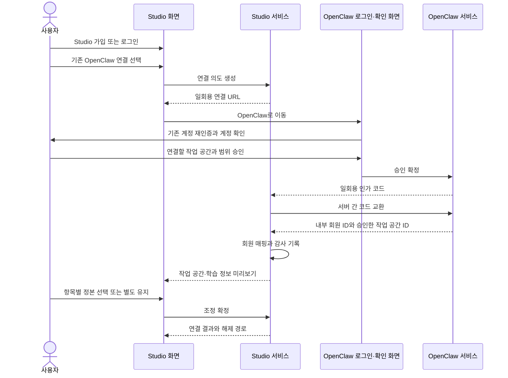

# 조사 보고서: 기존 OpenClaw 회원과 Studio 계정 연결 Q4 v1

| 항목 | 값 |
| --- | --- |
| 문서 버전 | v1.0.0 |
| 작성일 | 2026-08-23 |
| 작성자 | tech-architect, gpt-codex/GPT-5 |
| 조사 질문 | 이미 OpenClaw를 쓰던 사람과 새 Studio 계정을 어떻게 안전하게 잇는가 |
| 기반 산출물 | `studio/docs/fdd-studio-v5.0.md`, `studio/docs/api-contract-studio-v5.0.md`, `studio/docs/erd-studio-생성-v3.0.md`, `studio/docs/prd-studio-v3.0.md`, `DESIGN.md`, `docs/user-flow.md`, `docs/구현현황.md`, `wiki/architecture/two-service-boundary.md`, 현행 `dashboard` 인증·테넌트 코드 |
| 상태 | 조사 결론 확정. 구현·배포는 하지 않음 |

## 목차

- [1. 결론](#1-결론)
- [2. 조사 범위와 용어](#2-조사-범위와-용어)
- [3. 근거 조사](#3-근거-조사)
- [4. 우리 설계로 옮긴 절차](#4-우리-설계로-옮긴-절차)
- [5. 반드시 지킬 판정 규칙](#5-반드시-지킬-판정-규칙)
- [6. 남는 위험과 대응](#6-남는-위험과-대응)
- [7. 회장께 남는 선택](#7-회장께-남는-선택)
- [8. 현재 문서와 구현에 미치는 영향](#8-현재-문서와-구현에-미치는-영향)
- [9. 수용 기준](#9-수용-기준)
- [10. 레드팀과 셀프심문](#10-레드팀과-셀프심문)
- [11. 출처](#11-출처)

> **요약:** 계정을 자동 병합하지 않는다. Studio에 로그인한 사용자가 OpenClaw에서도 기존 계정 소유권을 다시 증명하고, 연결할 작업 공간과 데이터 범위를 확인한 뒤 승인할 때만 두 서비스의 변경 불가능한 내부 회원 식별자를 매핑한다. 이메일이 같다는 사실은 연결 화면을 제안하는 단서로만 쓰고, 연결·병합·데이터 공개의 근거로 쓰지 않는다.

## 1. 결론

**결론 한 줄: 같은 이메일로 자동 병합하지 말고, Studio 로그인과 기존 OpenClaw 재인증을 모두 통과한 사용자가 작업 공간·학습 정보 미리보기를 확인하고 명시 승인했을 때만 두 서비스의 내부 회원 ID를 연결한다.**

이 방식의 핵심은 `계정 연결`과 `데이터 병합`을 분리하는 것이다.

- 계정 연결은 `이 Studio 회원이 이 OpenClaw 회원도 통제한다`는 관계만 기록한다.
- 작업 공간 연결은 사용자가 고른 OpenClaw 작업 공간만 Studio 작업 공간과 잇는다.
- 학습 정보 조정은 항목별로 Studio 값, OpenClaw 값, 둘 다 유지, 보류 중 하나를 사용자가 정한다.
- 기존 회원 행과 작업 공간 원본은 삭제하거나 덮어쓰지 않는다.
- 이메일이 달라도 양쪽 계정에 실제로 로그인할 수 있으면 연결할 수 있다.
- 이메일이 같아도 기존 OpenClaw 계정에 로그인하지 못하면 연결할 수 없다. 먼저 OpenClaw 계정 복구를 거쳐야 한다.

## 2. 조사 범위와 용어

### 2.1 조사 범위

이번 조사는 다음 질문만 닫는다.

1. 같은 이메일을 자동 병합 근거로 써도 되는가.
2. 사용자가 무엇을 다시 증명해야 하는가.
3. 어느 화면에서 무엇을 보여 주고 무엇을 승인받아야 하는가.
4. 어떤 식별자와 감사 기록을 남겨야 하는가.
5. 연결 뒤 기존 작업 공간과 학습 정보 충돌을 어떻게 다뤄야 하는가.

Studio의 인증 공급자, 결제 공급자, 보유 기간은 이번 조사 범위가 아니다.

### 2.2 용어

| 용어 | 이 문서에서의 뜻 |
| --- | --- |
| 계정 연결 | Studio 회원과 OpenClaw 회원이 같은 사용자의 통제 아래 있다는 관계를 기록하는 것 |
| 자동 병합 | 이메일 같은 속성만 보고 별도 확인 없이 회원이나 데이터를 한 계정으로 합치는 것 |
| 재인증 | 이미 로그인되어 있어도 비밀번호, 소셜 로그인, 다중 인증 등으로 계정 통제권을 다시 확인하는 것 |
| 내부 회원 ID | 이메일과 달리 서비스 안에서 바뀌지 않는 회원 식별자 |
| OpenID Connect | 소셜 로그인 제공자가 사용자의 인증 결과를 표준 토큰으로 전달하는 규격 |
| `iss + sub` | 로그인 제공자 식별자와 그 제공자 안의 사용자 식별자를 합친 값. OpenID Connect가 보장하는 안정적인 사용자 키 |
| PKCE | 인가 코드를 가로챈 공격자가 토큰으로 바꾸지 못하게 시작 브라우저와 교환 요청을 묶는 보호 방식 |
| 조정 | 두 서비스에 같은 종류의 값이 있을 때 사용자가 정본과 보존 방식을 항목별로 정하는 절차 |

## 3. 근거 조사

### 3.1 보안 사고와 표준

| 사례 | 확인한 실제 방식·사실 | 우리 적용 | 기각·제한 |
| --- | --- | --- | --- |
| [USENIX Security 2022 계정 사전 탈취 연구](https://www.usenix.org/conference/usenixsecurity22/presentation/sudhodanan) | 공격자가 피해자 이메일로 비밀번호 계정을 먼저 만들고, 나중에 피해자가 소셜 로그인할 때 서비스가 이메일 일치만 보고 연결하면 공격자와 피해자가 같은 계정에 접근할 수 있다. 연구진은 인기 서비스 75곳 중 최소 35곳에서 한 가지 이상의 사전 탈취 취약점을 확인했다. | 이메일 자동 병합 금지의 직접 근거로 채택한다. 미검증 계정은 기능·데이터 접근 전에 이메일 소유권을 확인하고, 계정 연결은 양쪽 인증 뒤에만 허용한다. | `email_verified=true` 하나만으로 기존 별도 계정의 소유권까지 증명됐다고 보지 않는다. |
| [OpenID Connect Core 1.0 §5.1, §5.7](https://openid.net/specs/openid-connect-core-1_0-18.html#ClaimStability) | 이메일은 선호 주소일 뿐 고유성을 신뢰하면 안 된다. 발급자 `iss`와 사용자 `sub`의 조합만 안정적이고 고유한 사용자 식별자로 보장된다. `email_verified`는 인증 제공자가 그 시점에 이메일 통제권을 확인했다는 뜻이다. | 인증 제공자 계정 식별은 `iss + sub`, 서비스 사이 연결은 각 서비스의 변경 불가능한 내부 회원 ID로 저장한다. 이메일은 표시·알림·연결 후보 탐지에만 쓴다. | 이메일, 전화번호, 표시 이름을 회원 ID나 자동 연결 키로 쓰는 안을 기각한다. |
| [RFC 9700 OAuth 2.0 보안 권고](https://www.rfc-editor.org/rfc/rfc9700.html) | PKCE challenge 또는 OpenID Connect nonce는 거래마다 새로 만들고 시작한 클라이언트와 브라우저에 안전하게 묶어야 한다. 토큰 권한은 최소 범위와 특정 대상 서버로 제한해야 한다. | 연결 왕복에 일회용 인가 코드, PKCE S256, `state`, `nonce`, 정확한 redirect URI, Studio 전용 audience, 짧은 만료를 적용한다. | RFC 9700은 계정 병합 규격이 아니다. 이메일 병합 근거로 인용하지 않고, 두 서비스 사이 연결 인가 왕복의 보안 규격으로만 적용한다. |
| [Google OpenID Connect](https://developers.google.com/identity/openid-connect/openid-connect) | Google도 이메일은 계정에 고유하지 않고 바뀔 수 있으므로 사용자 레코드 연결의 기본 키로 쓰지 말고 `sub`를 쓰라고 명시한다. `nonce`는 재사용 공격 방지용이고 `state`는 요청과 응답의 연결을 높인다. | 현 OpenClaw Google 로그인도 이메일이 아니라 검증된 공급자 subject와 내부 회원 ID를 기준으로 정리한다. 연결 화면에서 Google 계정 선택을 다시 보여 잘못 로그인된 브라우저 세션을 줄인다. | 같은 Gmail 주소라는 이유만으로 Studio와 OpenClaw 회원 행을 합치는 안을 기각한다. |

### 3.2 큰 제품의 실제 처리

| 제품 | 확인한 실제 방식 | 우리 적용 | 기각·차이 |
| --- | --- | --- | --- |
| [Google Cloud Identity Platform](https://docs.cloud.google.com/identity-platform/docs/link-accounts) | 같은 이메일이 다른 로그인 제공자에 이미 있으면 `account-exists-with-different-credential` 오류를 내고, 사용자가 기존 제공자로 먼저 로그인한 뒤 새 자격증명을 연결하도록 안내한다. 수동 연결도 먼저 현재 사용자를 로그인시킨 뒤 새 제공자 로그인을 다시 받는다. | `먼저 기존 계정으로 로그인, 그 다음 연결` 순서를 그대로 채택한다. 이메일 일치는 자동 성공이 아니라 추가 인증이 필요한 충돌 신호다. | Google 제품의 설정 한 번으로 같은 이메일을 묶는 옵션은 우리 기본값으로 쓰지 않는다. 우리는 서로 다른 서비스의 작업 공간과 학습 정보를 연결하므로 영향이 더 크다. |
| [Slack 계정 중복 처리](https://slack.com/help/articles/360002069588-Fix-and-prevent-duplicate-accounts), [Slack 로그인](https://slack.com/help/articles/212681477-Sign-in-to-Slack-Sign-in-to-Slack-Sign-in-to-Slack-Sign-in-to-Slack) | 같은 이메일로 여러 작업 공간에 로그인할 수 있지만 작업 공간별 계정은 별개다. SSO 중복 계정은 중복 계정을 비활성화하고 SSO binding email로 다시 묶는다. Slack은 SSO 식별자에 이메일 대신 사번처럼 고유하고 바뀌지 않는 값을 권한다. | 같은 이메일이어도 작업 공간·회원 경계를 유지하고, 연결은 명시적인 재결선 절차로 처리한다. 잘못 연결했을 때 분리 가능한 상태와 감사 기록을 둔다. | 운영자가 일상적으로 계정을 대신 병합하는 절차는 기각한다. 일반 연결은 사용자가 양쪽 계정을 직접 인증해야 한다. |
| [Notion 로그인](https://www.notion.com/en-gb/help/log-in-and-out) | Google·Apple·Microsoft 계정의 이메일이 Notion 계정 이메일과 같을 때 해당 제공자로 로그인할 수 있다. Apple에서 이메일 숨기기를 선택하면 기존 계정과 연결되지 않고 새 계정이 생긴다. 새 기기 로그인 알림과 원격 로그아웃도 제공한다. | 연결 후 새 연결 알림, 세션 목록, 원격 해제 기능을 채택한다. 연결 화면은 어떤 제공자와 어떤 계정이 연결되는지 분명히 보여 준다. | Notion의 같은 이메일 로그인은 한 제품 안의 로그인 수단 추가다. 두 서비스의 사적 작업 공간을 결합하는 우리 상황에 이메일 일치 규칙을 그대로 적용하지 않는다. |
| [Figma SAML SSO](https://help.figma.com/hc/en-us/articles/360040532333-Guide-to-SAML-SSO) | 조직 도메인을 먼저 검증하고, 기존 파일 접근을 유지하려면 사용자가 올바른 회사 이메일 계정을 갖고 있어야 한다고 경고한다. 도메인이 검증되지 않았으면 새 기기·브라우저에서 이메일 코드를 다시 요구할 수 있다. | 연결 전에 현재 계정과 작업 공간을 보여 주고, 검증되지 않은 경로에서는 추가 인증을 요구하는 원리를 채택한다. | 기업 도메인 소유가 곧 개인 계정 소유라는 해석은 기각한다. 개인·소규모 사업자 대상 기본 흐름에는 도메인 자동 포획을 쓰지 않는다. |

### 3.3 국내 서비스 사례

| 사례 | 확인한 실제 방식 | 우리 적용 | 기각·차이 |
| --- | --- | --- | --- |
| [카카오 로그인 기존 회원 연동](https://developers.kakao.com/docs/latest/ko/kakaologin/common#user-mapping) | 일부 정보만 맞으면 기존 계정 단서를 보여 주고 이메일 인증 등으로 계정을 확인한 뒤 연동 의사를 묻는다. 모든 판단 기준이 맞아도 마스킹된 계정 ID·가입일·닉네임을 보여 주고 동의를 받는다. 사용자가 거절하면 신규 회원으로 처리한다. 카카오는 이메일·전화번호를 서비스 회원 ID로 쓰지 말라고 명시한다. | `계정 단서 표시, 기존 계정 인증, 연결 의사 확인, 내부 회원 ID 매핑` 순서를 거의 그대로 채택한다. 연결 거절 시 Studio 단독 계정을 그대로 유지한다. | 이름·이메일·생일 같은 속성의 전부 일치를 우리 자동 연결 기준으로 쓰지 않는다. 두 서비스에 직접 로그인할 수 있다는 증명을 더 강한 기준으로 쓴다. |

### 3.4 조사에서 도출한 공통 원칙

1. 속성 일치는 계정 후보를 찾는 신호다. 계정 소유권 증명이 아니다.
2. 연결 전에 기존 계정으로 다시 로그인시킨다.
3. 사용자가 어느 계정과 어느 데이터가 연결되는지 보고 동의해야 한다.
4. 이메일 대신 변경 불가능한 내부 회원 ID를 저장한다.
5. 자동 덮어쓰기보다 별도 보존과 명시적 조정이 안전하다.
6. 잘못 연결했을 때 해제하고 복구할 수 있어야 한다.

## 4. 우리 설계로 옮긴 절차

### 4.1 전체 흐름

### 4.2 화면·확인·기록 1:1 절차

| 단계 | 화면 | 사용자에게 보여 줄 것 | 반드시 확인할 것 | 기록할 것 |
| --- | --- | --- | --- | --- |
| 1 | Studio 가입·로그인 완료 화면 또는 `설정 > 연결된 서비스` | `기존 OpenClaw를 쓰셨나요?`와 `OpenClaw 연결` 버튼. 같은 이메일 계정이 있을 수 있다는 문구는 보여도 계정 존재 여부·작업 공간 이름은 아직 공개하지 않는다. | Studio 세션이 유효하고 `studio_member_id`가 확정됐는가. | 연결 시작 사건. Studio 회원 ID, 시작 시각, 요청 상관 ID. 이메일 원문은 연결 로그에 쓰지 않는다. |
| 2 | Studio 연결 시작 확인 | `계정은 합치지 않고 연결만 합니다`, `OpenClaw에서 다시 로그인합니다`, `승인 전에는 데이터가 이동하지 않습니다` 세 문장 | 사용자가 연결을 직접 시작했는가. | 일회용 `link_intent_id`, Studio 회원 ID, PKCE challenge, `state` 해시, `nonce` 해시, 만료 시각, 허용된 반환 주소 식별자, 상태 `pending`. 원문 code·token은 저장하지 않는다. |
| 3 | OpenClaw 로그인 화면 | Google 계정 선택 화면과 현재 선택한 계정. 기존 브라우저 세션이 있어도 연결 같은 고위험 행동에는 10분 이내의 최근 인증을 요구한다. | OpenClaw 계정을 실제로 통제하는가. 인증 결과의 발급자, subject, audience, nonce가 유효하고 `auth_time`이 현재보다 10분 이상 오래되지 않았는가. | OpenClaw 내부 회원 ID, 인증 시각, 인증 방법, 연결 의도 ID. Google 이메일은 표시용일 뿐 매핑 키가 아니다. |
| 4 | OpenClaw 연결 승인 화면 | 마스킹한 계정 단서, 가입일, 닉네임, 연결 가능한 작업 공간 목록, 각 공간의 이름·역할·학습 정보 항목 수·제작물 수. `선택한 공간만 Studio에 연결됩니다` 문구 | 현재 로그인한 OpenClaw 회원이 선택한 작업 공간의 owner 또는 연결 권한 보유자인가. 사용자가 연결 범위를 체크하고 승인했는가. | 승인한 OpenClaw 작업 공간 ID 목록, 권한 스냅샷, 동의 문구 버전, 동의 시각, OpenClaw 회원 ID. |
| 5 | 서버 간 연결 교환 | 사용자 화면에는 `연결 확인 중`만 표시한다. | 인가 코드가 미사용·미만료인가. Studio audience와 정확한 반환 주소인가. PKCE verifier, state, nonce, 브라우저 세션이 시작 거래와 맞는가. | 코드는 성공·실패와 상관없이 1회 소비한다. 성공 시 `studio_member_id ↔ openclaw_member_id` 매핑과 매핑 시각을 기록한다. 실패 시 안정된 오류 코드만 기록한다. |
| 6 | 작업 공간 연결 미리보기 | OpenClaw 공간별로 `새 Studio 작업 공간으로 연결`을 기본 제안한다. 기존 Studio 공간에 붙이려면 양쪽 이름·항목 수·최신 변경 시각을 나란히 보여 준다. | 사용자가 공간별 연결 대상을 확인했는가. 다른 회원의 Studio 공간을 고르지 않았는가. | OpenClaw 작업 공간 ID와 Studio 작업 공간 ID 매핑. 정본 서비스, 연결 상태, 승인자, 승인 시각. |
| 7 | 학습 정보 조정 화면 | 충돌 항목마다 Studio 값, OpenClaw 값, 출처, 최신 판 시각, 추천을 보여 준다. 선택지는 `Studio 값을 따른다`, `OpenClaw 값을 따른다`, `둘 다 별도 항목으로 남긴다`, `보류하고 생성에서 제외한다`다. | 사용자가 충돌 항목을 직접 결정했는가. 미선택 항목을 임의로 최신 값으로 처리하지 않았는가. | 항목별 결정, 선택한 정본, 새 판 ID, 이전 판 ID, 결정자, 시각, 보류 사유. 기존 판은 수정·삭제하지 않는다. |
| 8 | 연결 완료 화면 | 연결된 OpenClaw 계정 단서, 연결된 작업 공간 수, 반영·보류 항목 수, 현재 정본, `연결 해제` 경로, 두 계정은 별도로 유지된다는 문구 | 저장된 회원 매핑·작업 공간 매핑·조정 결과가 화면 요약과 일치하는가. | 완료 사건, 결과 수치, 감사 상관 ID. 양쪽 계정에 보안 알림을 보낸 사실을 기록한다. |
| 9 | `설정 > 연결된 서비스 > OpenClaw` | 연결 계정 단서, 연결 시각, 작업 공간별 상태, 마지막 동기화, 연결 해제 버튼 | 해제 사용자가 현재 Studio 회원과 OpenClaw 계정을 다시 통제하는가. 해제 영향과 보존 데이터를 확인했는가. | `detached` 상태, 해제자, 해제 시각, 해제 사유, 이후 투영 중단과 tombstone 전달 결과. 회원·작업 공간 원본을 자동 삭제하지 않는다. |

### 4.2.1 Q4 흐름의 endpoint·component·DB table 추적

아래 표는 4.2의 아홉 단계를 후속 FDD·API·ERD 개정에 그대로 옮길 계약이다. `기존`은 v5 계약 또는 현 OpenClaw 구조를 재사용하고, `신규`는 Q4 때문에 추가할 이름이다. 신규 이름을 다른 이름으로 바꾸더라도 한 단계의 endpoint·component·DB table과 수용 기준을 함께 바꿔야 한다. 한 열만 따로 바꾸면 추적 gap이다.

| 단계 | endpoint와 operationId | frontend component | 주 DB table | 수용 기준 | 재사용 경계 |
| --- | --- | --- | --- | --- | --- |
| 1 | `POST /v5/studio/access-sessions/exchange`, `exchangeAccessSession` | `StudioAuthGate`, `OpenClawLinkEntry` | 기존 `studio_members`, `studio_sessions` | Q4-AC-01 | 기존 Studio 인증 뒤에만 연결 진입점을 연다. |
| 2 | `POST /v5/studio/member-links/openclaw/intents`, `createOpenClawLinkIntent` | `OpenClawLinkIntro` | 신규 `member_link_intents` | Q4-AC-04, Q4-AC-05 | 기존 멱등성·세션 경계를 재사용하고 일회용 의도만 별도 저장한다. |
| 3 | `GET /api/studio-links/authorize`, `authorizeStudioLink` | `OpenClawReauthGate` | 기존 OpenClaw `tenants`, 신규 `member_link_intents` | Q4-AC-03, Q4-AC-05 | 기존 Google OAuth adapter를 재사용하되 최근 인증·PKCE·nonce 검사를 생략하지 않는다. |
| 4 | `POST /api/studio-links/{intentId}/consent`, `consentStudioLink` | `OpenClawWorkspaceConsent` | 기존 OpenClaw `tenants`, 신규 `member_link_intent_workspaces` | Q4-AC-06 | 현행에서는 tenant를 작업 공간으로 읽는다. 향후 복수 작업 공간 모델이 생기면 같은 권한 검사를 workspace ID에 적용한다. |
| 5 | `POST /v5/studio/member-links/openclaw/exchange`, `exchangeOpenClawMemberLink` | `OpenClawLinkPending` | 신규 `member_link_intents`, 기존 `member_external_mappings` | Q4-AC-02, Q4-AC-04, Q4-AC-05, Q4-AC-08 | `member_external_mappings`의 active·conflicted·detached 상태를 재사용한다. code·token 원문은 저장하지 않는다. |
| 6 | `GET /v5/studio/member-links/openclaw/{mappingId}/preview`, `getOpenClawLinkPreview` | `WorkspaceLinkPreview` | 신규 `workspace_external_mappings`, 기존 `workspaces` | Q4-AC-06 | 승인한 OpenClaw 작업 공간만 조회한다. 클라이언트가 보낸 작업 공간 ID는 신뢰하지 않는다. |
| 7 | `POST /v5/studio/reconciliations`, `createReconciliation`; `POST /v5/studio/reconciliations/{id}/decisions`, `decideReconciliation` | `LearningReconciliationPanel` | 신규 `reconciliation_sessions`, `reconciliation_decisions`, 기존 학습 정보 revision 표 | Q4-AC-07 | v5의 자동 병합 없는 조정 API와 불변 판 저장 원칙을 재사용한다. |
| 8 | `GET /v5/studio/member-links/openclaw/{mappingId}`, `getOpenClawMemberLink` | `ConnectedOpenClawSummary` | 기존 `member_external_mappings`, 신규 `workspace_external_mappings`, `member_link_events` | Q4-AC-02, Q4-AC-06 | 연결 결과는 저장된 매핑과 조정 집계에서 읽는다. 화면용 별도 정본을 만들지 않는다. |
| 9 | `DELETE /v5/studio/member-links/openclaw/{mappingId}`, `detachOpenClawMemberLink` | `OpenClawLinkSettings`, `OpenClawLinkDetachConfirm` | 기존 `member_external_mappings`, `sync_outbox`, 신규 `member_link_events` | Q4-AC-09 | 기존 원본 삭제 없이 detached 전이와 동기화 중단 사건만 기록한다. |

Q4 범위 추적 결과는 9/9다. endpoint 빈칸 0, frontend component 빈칸 0, DB table 빈칸 0, 수용 기준 빈칸 0이다. 이 표는 조사 결론을 구현 가능한 계약으로 옮긴 것이며, 실제 API·ERD 정본은 eng-design 개정과 승인 뒤에만 바뀐다.

### 4.3 기본값

- 같은 이메일이 탐지돼도 `연결 제안`까지만 한다.
- 연결 버튼을 누르지 않으면 Studio 단독 계정과 데이터는 그대로다.
- 첫 작업 공간은 `새 Studio 작업 공간으로 연결`이 기본이다.
- 기존 Studio 작업 공간과 합치는 행동은 별도 미리보기와 항목별 조정을 요구한다.
- 연결 승인 범위는 사용자가 고른 작업 공간으로 한정한다.
- OpenClaw의 소셜 채널 토큰·쿠키·비밀값은 Studio로 보내지 않는다.
- 연결 뒤에도 Studio 회원과 OpenClaw 회원은 각각의 서비스에서 독립적으로 로그인·탈퇴·복구한다.

최근 인증 10분은 공개 규격이 정한 수치가 아니라 이 연결의 데이터 노출 위험을 기준으로 둔 우리 초기 설계값이다. 공급자가 `auth_time` 확인 또는 동등한 강제 재인증을 제공하지 않으면 계정 선택 화면만으로 대체하지 않고 연결을 거부한다.

### 4.4 최소 기록 모델

| 기록 | 최소 필드 | 불변조건 |
| --- | --- | --- |
| 연결 의도 | intent ID, Studio 회원 ID, state·nonce 해시, PKCE challenge, 만료, 상태, 반환 주소 식별자 | 10분 이내 만료, 1회 소비, 원문 token 저장 0 |
| 회원 매핑 | Studio 회원 ID, source service=`openclaw`, OpenClaw 내부 회원 ID, 상태, 연결·해제 시각 | OpenClaw 회원 하나는 활성 Studio 회원 하나에만 연결. Studio 회원 하나도 활성 OpenClaw 회원 하나에만 연결 |
| 작업 공간 매핑 | Studio 작업 공간 ID, OpenClaw 작업 공간 ID, 정본 서비스, 상태, 마지막 적용 판 | 승인한 공간만 생성. 교차 회원 매핑 금지 |
| 조정 결정 | 항목 키, 양쪽 판 ID, 선택 행동, 새 판 ID, 결정자, 결정 시각 | 기존 판 덮어쓰기 0, 미선택 자동 적용 0 |
| 감사 사건 | 상관 ID, 사건 종류, 양쪽 내부 회원 ID, 결과 코드, 인증 시각, 동의 문구 버전, 기기·IP의 최소 감사값 | 이메일·OAuth code·access token·refresh token·쿠키 원문 0 |

현재 `member_external_mappings`의 `active`, `conflicted`, `detached` 상태는 연결 결과를 담을 수 있다. 연결 시작과 승인 왕복을 안전하게 다루려면 별도 일회용 연결 의도 기록이 필요하다. 작업 공간 매핑과 항목별 조정 결정도 회원 매핑 한 행에 뭉치지 않는다.

## 5. 반드시 지킬 판정 규칙

### 5.1 연결 허용표

| 상황 | 결과 |
| --- | --- |
| 이메일 같음, 양쪽 계정 인증 성공, 사용자 승인 | 연결 허용 |
| 이메일 다름, 양쪽 계정 인증 성공, 사용자 승인 | 연결 허용 |
| 이메일 같음, OpenClaw 인증 실패 | 연결 거부. OpenClaw 계정 복구 안내 |
| 이메일 같음, 사용자 승인 없음 | 연결 거부 |
| `iss + sub` 같음, 사용자 승인 없음 | 연결 거부. 같은 로그인 주체여도 데이터 권리 이전은 별도 동의 필요 |
| OpenClaw 회원이 다른 Studio 회원에 이미 활성 연결 | 자동 재할당 금지. 충돌 상태로 보류 |
| Studio 회원이 다른 OpenClaw 회원에 이미 활성 연결 | 자동 교체 금지. 기존 연결 해제와 양쪽 재인증 필요 |
| 인가 코드 재사용·만료·브라우저 불일치 | 연결 거부, 기존 데이터 변경 0 |
| 사용자가 조정 도중 취소 | 회원 연결은 유지할 수 있으나 미선택 작업 공간·학습 정보는 생성에서 제외. 화면에 `조정 대기` 표시 |

### 5.2 사용자 존재 여부 노출 방지

로그인 전 `이 이메일의 OpenClaw 계정이 있습니다`라고 알려 주지 않는다. 공격자가 이메일만 넣어 회원 존재 여부와 작업 공간 정보를 알아낼 수 있기 때문이다.

연결할 계정 단서와 작업 공간 목록은 OpenClaw 재인증 성공 뒤에만 보여 준다. 실패 응답은 `계정을 찾을 수 없음`과 `인증 실패`를 외부에 구분해 노출하지 않는다.

### 5.3 지원팀 예외 금지

지원팀이 이메일 일치만 보고 계정을 연결하거나 매핑 대상을 바꾸면 안 된다. 사용자가 양쪽 계정 소유권을 증명할 수 없으면 연결이 아니라 각 서비스의 계정 복구 절차로 보낸다.

법적·운영상 강제 복구가 필요하면 일반 연결 API와 분리된 운영 절차, 두 사람 승인, 변경 전후 스냅샷, 사용자 알림을 요구한다. 이 예외는 기본 제품 흐름이 아니다.

## 6. 남는 위험과 대응

| 위험 | 남는 이유 | 대응 | 실패 시 동작 |
| --- | --- | --- | --- |
| 계정 사전 탈취 | 공격자가 피해자 이메일을 먼저 등록할 수 있다. | 미검증 계정의 기능 사용 차단, 이메일 자동 병합 금지, 기존 OpenClaw 재인증 | 연결 거부, 데이터 변경 0 |
| 잘못 로그인된 브라우저 계정 | 사용자가 개인 Google과 회사 Google을 동시에 쓸 수 있다. | 계정 선택 강제, 마스킹 계정 단서·가입일·작업 공간 이름 표시, 최근 인증 요구 | 승인 전 취소 가능, 연결 0 |
| 연결 요청 위조와 재사용 | 공격자가 다른 브라우저의 인가 코드를 가져올 수 있다. | PKCE S256, state, nonce, 정확한 반환 주소, Studio audience, 10분 만료, 1회 소비 | 안정 오류, 모든 매핑 0 |
| 회원 매핑 충돌 | 한 OpenClaw 회원이 이미 다른 Studio 회원에 연결됐을 수 있다. | 양방향 활성 연결 고유 제약, 자동 재할당 금지 | `conflicted` 또는 별도 충돌 사건, 운영 검토 |
| 작업 공간 과다 공개 | 계정 연결만으로 모든 작업 공간을 넘길 수 있다. | 작업 공간별 체크와 역할 검사, 선택 범위가 든 인가 코드 | 선택하지 않은 공간 투영 0 |
| 학습 정보 덮어쓰기 | 같은 항목의 양쪽 값이 다를 수 있다. | 항목별 미리보기·정본 선택·판 보존·보류 | 미선택 항목 생성 제외 |
| 연결 해제 뒤 오래된 투영본 사용 | 연결을 끊어도 Studio에 사본이 남을 수 있다. | 해제 사건, 신규 동기화 중단, 멈추는 값은 생성 차단, 보유 정책에 따른 삭제 | 영향 작업만 차단, 과거 계보는 정책에 따라 보존 |
| 한 서비스 탈퇴 뒤 고아 매핑 | 두 서비스의 탈퇴 시점이 다르다. | 탈퇴·해제 webhook 또는 서버 간 사건, `detached`·tombstone 기록 | 로그인 대체 금지, 상대 서비스 단독 계정 유지 |
| 지원팀 계정 오연결 | 사람이 이메일과 이름을 보고 잘못 판단할 수 있다. | 이메일 기반 수동 병합 금지, 양쪽 인증 없이는 복구 절차만 제공 | 연결 0, 감사 사건 기록 |
| 개인정보 과수집 | 연결 편의를 위해 이메일·프로필을 양쪽에 복제할 수 있다. | 내부 회원 ID와 선택한 작업 공간 ID만 전달, 표시용 정보는 최소·단기 | 필요 없는 값 저장 0 |

## 7. 회장께 남는 선택

**없다.**

Q4는 취향 선택이 아니라 계정 탈취와 작업 공간 노출을 막기 위한 보안 경계다. 업계 사례와 표준은 이메일 자동 병합을 지지하지 않는다. 사용자 승인 없는 병합도 지지하지 않는다.

따라서 기존 FDD의 Q4는 `회장 미결`에서 제거하고 다음으로 확정해야 한다.

> 기존 OpenClaw 회원 연결은 Studio와 OpenClaw 양쪽의 인증, 연결할 작업 공간·학습 정보 미리보기, 사용자 명시 승인을 거친 내부 회원 ID 매핑으로 처리한다. 자동 병합은 하지 않는다.

## 8. 현재 문서와 구현에 미치는 영향

### 8.1 기존 구현 확인

| 현재 상태 | 근거 | 영향 |
| --- | --- | --- |
| OpenClaw 고객 로그인은 Google OAuth 단일 경로다. | `dashboard/src/app/login/page.tsx`, `dashboard/src/app/api/auth/google/route.ts` | OpenClaw 쪽 재인증에 기존 Google 로그인 어댑터를 재사용할 수 있다. 연결 전용 최근 인증과 one-time handoff는 아직 없다. |
| OpenClaw는 Supabase Auth user ID를 `tenants.owner_auth_id`에 1:1로 붙이고 첫 로그인에 테넌트를 자동 생성한다. | `dashboard/src/lib/tenant-auth.ts`, `dashboard/db/schema.sql` | 이메일을 연결 키로 쓰지 않아도 된다. 다만 현재 한 회원·한 테넌트 구조는 작업 공간 복수 선택과 회원 역할 구조로 확장해야 한다. |
| OpenClaw 테넌트 데이터는 `tenant_id`와 행 단위 접근 통제로 격리한다. | `dashboard/src/lib/db.ts`, `dashboard/db/rls.sql` | 연결 인가 코드가 승인한 tenant 범위를 서버가 다시 검사해야 한다. 클라이언트가 보낸 ID를 신뢰하면 안 된다. |
| Studio 설계에는 독립 `studio_members`와 `member_external_mappings`가 있다. | `studio/docs/erd-studio-생성-v3.0.md` | 회원 연결 결과 저장 구조는 방향이 맞다. 연결 의도, 작업 공간 매핑, 항목별 조정 기록을 분리 보강해야 한다. |
| Studio API 설계에는 자동 병합 없는 조정 API가 있다. | `studio/docs/api-contract-studio-v5.0.md` | `POST /reconciliations` 원칙을 유지한다. 그 앞단에 양쪽 인증과 연결 동의 계약을 확정해야 한다. |

### 8.2 문서 반영 지시

이 조사 뒤 기술설계 개정에서 해야 할 일은 다음과 같다.

1. `studio/docs/fdd-studio-v5.0.md`의 Q4를 미결 목록에서 제거한다.
2. `AccountLinkPort` 계약을 양쪽 인증, 작업 공간별 동의, 일회용 인가 코드 교환으로 확정한다.
3. `member_external_mappings`에 이메일이 아닌 OpenClaw 내부 회원 ID를 넣는다고 명시한다.
4. 연결 의도, 작업 공간 매핑, 조정 결정, 해제 감사의 저장 대상을 ERD에 추가한다.
5. API 계약에 연결 시작, OpenClaw 승인, 코드 교환, 상태 조회, 해제를 분리한다.
6. 테스트 계획에 아래 9절의 경계 사례를 전부 넣는다.

### 8.3 공정 판정

| 항목 | 판정 | 근거 |
| --- | --- | --- |
| Q4 조사 매핑 gap | 0건 | 이메일 후보 탐지부터 양쪽 인증, 작업 공간 승인, 조정, 완료, 해제까지 화면·확인·기록이 1:1로 닫혔다. |
| 전체 기술설계 정책 gap | 4건 | 현 FDD v5.0의 Q1, Q2, Q3, Q5는 이번 조사 범위 밖이며 여전히 미결이다. |
| build stage 진입 | 불가 | `pipeline-state.osmu.md`는 design 진행 중, eng-design 미승인, build 미착수다. Q4 조사만으로 전체 설계 게이트를 통과할 수 없다. |

## 9. 수용 기준

| ID | Given | When | Then |
| --- | --- | --- | --- |
| Q4-AC-01 | 같은 이메일의 Studio·OpenClaw 계정이 있다. | Studio 로그인만 성공한다. | OpenClaw 데이터와 계정 존재 여부는 공개되지 않고 연결 행은 0개다. |
| Q4-AC-02 | 이메일은 다르지만 사용자가 양쪽 계정을 통제한다. | Studio 로그인, OpenClaw 재인증, 작업 공간 승인까지 성공한다. | 내부 회원 ID 매핑 1개와 승인한 작업 공간 매핑만 생성된다. |
| Q4-AC-03 | 이메일이 같고 `email_verified=true`다. | OpenClaw 재인증이 실패한다. | 자동 병합 0, 데이터 변경 0, 계정 복구 안내가 나온다. |
| Q4-AC-04 | 유효한 연결 의도가 있다. | 인가 코드를 두 번 교환한다. | 첫 교환만 성공하고 두 번째는 재사용 오류다. 매핑은 1개다. |
| Q4-AC-05 | 다른 브라우저에서 시작한 연결 의도의 code가 있다. | 현재 브라우저에서 교환한다. | state·PKCE·세션 결합 검사에 실패하고 매핑 0이다. |
| Q4-AC-06 | OpenClaw 작업 공간이 3개다. | 사용자가 2개만 선택해 승인한다. | Studio에는 2개만 보이고 세 번째 공간의 이름·데이터·존재 정보는 저장·노출되지 않는다. |
| Q4-AC-07 | 같은 학습 정보 항목이 양쪽에서 다르다. | 사용자가 결정을 보류한다. | 기존 판은 모두 남고 새 생성에는 해당 항목이 제외된다. |
| Q4-AC-08 | OpenClaw 회원이 다른 Studio 회원에 이미 연결돼 있다. | 새 Studio 회원이 연결을 시도한다. | 자동 재할당 0, 충돌 상태와 복구 경로만 생긴다. |
| Q4-AC-09 | 연결이 활성 상태다. | 사용자가 양쪽 재인증 뒤 연결을 해제한다. | 회원 매핑은 detached가 되고 새 동기화가 멈춘다. 두 서비스의 원본 계정과 과거 판은 정책에 따라 유지된다. |
| Q4-AC-10 | 공격자가 이메일 목록을 가지고 있다. | 연결 시작·실패 응답을 반복 조회한다. | 회원 존재 여부를 구분할 수 없는 동일 응답이 나오고 비율 제한과 감사 사건이 남는다. |

## 10. 레드팀과 셀프심문

### 10.1 레드팀 공격

**공격:** 두 서비스가 모두 Google 로그인을 쓰고 이메일도 같은데, 굳이 OpenClaw 재인증과 작업 공간 승인을 다시 받으면 전환율만 낮아진다. `iss + sub`가 같으면 자동으로 연결해도 되지 않는가.

**방어:** `iss + sub`는 로그인 주체를 식별하지만, OpenClaw의 어느 작업 공간과 학습 정보를 Studio에 공개·투영할지에 대한 데이터 권한까지 부여하지 않는다. 브라우저에는 개인·회사 Google 세션이 동시에 있을 수 있고, 현재 OpenClaw 구현의 Supabase 내부 user ID와 Studio의 향후 인증 주체가 동일한 프로젝트·subject 체계를 쓴다는 보장도 아직 없다. 연결은 한번 잘못되면 사적 작업 공간과 제작 이력이 노출되는 고위험 행동이므로, 전환 한 단계보다 양쪽 통제권과 범위 동의가 우선이다.

**수정 반영:** 같은 제공자 subject 일치는 `재인증을 쉽게 하는 신호`로만 사용하고, 연결 승인 생략 조건으로 사용하지 않는다.

### 10.2 셀프심문

**이 결론이 틀렸다면 가장 그럴듯한 이유는 무엇인가:** OpenClaw가 Studio를 호출하는 합친 배치에서는 이미 OpenClaw가 회원 정본이므로, 별도 Studio 계정과 연결 절차 자체가 불필요할 수 있다.

**자답:** 합친 배치에서 OpenClaw가 처음 Studio 회원을 대리 생성하는 경우에는 별도 연결 화면이 필요 없다. 그러나 질문은 이미 OpenClaw를 쓰던 사람이 이후 Studio 단독 계정을 만든 경우다. 이때는 두 서비스에 독립 회원과 독립 작업 공간이 실제로 존재하므로 자동 대리 생성 경로로 덮으면 기존 Studio 데이터나 OpenClaw 데이터를 잘못 귀속할 수 있다.

**수정 반영:** 신규 합친 배치 대리 생성과 기존 두 계정 연결을 분리한다. 전자는 서버 간 멱등 생성, 후자는 이 문서의 양쪽 인증·명시 승인·조정 절차다.

### 10.3 남은 실행 전제

OpenClaw가 연결 전용 최근 인증, 일회용 인가 코드, 작업 공간별 동의 화면을 제공할 수 있어야 한다. 구현 시 이 셋 중 하나라도 빠지면 이메일 비교로 내려가지 않고 연결 기능을 닫아야 한다.

## 11. 출처

### 11.1 외부 근거

1. Sudhodanan, Paverd, `Pre-hijacked accounts`, USENIX Security 2022: <https://www.usenix.org/conference/usenixsecurity22/presentation/sudhodanan>
2. OpenID Connect Core 1.0, Claim Stability and Uniqueness: <https://openid.net/specs/openid-connect-core-1_0-18.html#ClaimStability>
3. RFC 9700, Best Current Practice for OAuth 2.0 Security: <https://www.rfc-editor.org/rfc/rfc9700.html>
4. Google OpenID Connect: <https://developers.google.com/identity/openid-connect/openid-connect>
5. Google Cloud Identity Platform, Linking multiple providers: <https://docs.cloud.google.com/identity-platform/docs/link-accounts>
6. Slack, Fix and prevent duplicate accounts: <https://slack.com/help/articles/360002069588-Fix-and-prevent-duplicate-accounts>
7. Slack, Sign in to Slack: <https://slack.com/help/articles/212681477-Sign-in-to-Slack-Sign-in-to-Slack-Sign-in-to-Slack-Sign-in-to-Slack>
8. Notion, Log in and out: <https://www.notion.com/en-gb/help/log-in-and-out>
9. Figma, Guide to SAML SSO: <https://help.figma.com/hc/en-us/articles/360040532333-Guide-to-SAML-SSO>
10. Kakao Developers, 카카오 로그인 기존 회원 연동: <https://developers.kakao.com/docs/latest/ko/kakaologin/common#user-mapping>

### 11.2 내부 근거

- `studio/docs/fdd-studio-v5.0.md`
- `studio/docs/api-contract-studio-v5.0.md`
- `studio/docs/erd-studio-생성-v3.0.md`
- `studio/docs/prd-studio-v3.0.md`
- `DESIGN.md`
- `docs/user-flow.md`
- `docs/구현현황.md`
- `wiki/architecture/two-service-boundary.md`
- `pipeline-state.osmu.md`
- `dashboard/src/app/login/page.tsx`
- `dashboard/src/app/api/auth/google/route.ts`
- `dashboard/src/lib/tenant-auth.ts`
- `dashboard/src/lib/db.ts`
- `dashboard/db/schema.sql`
- `dashboard/db/rls.sql`
- `/Users/sj/.claude/standards/doc-review.md`
- `/Users/sj/.claude/standards/benchmarks.md`
- `/Users/sj/.claude/standards/artifact-stamp.md`

---

RUBRIC_SCORE: 완결성=5/5 정밀성=5/5 벤치마크반영=5/5 추적성=5/5 전문성톤=5/5 total=25/25

WEAKEST_LINE: "최근 인증 10분은 공개 규격이 정한 수치가 아니라 이 연결의 데이터 노출 위험을 기준으로 둔 우리 초기 설계값이다."

SKILLS_USED: 없음

SKILLS_SKIPPED: 이 조사와 직접 매칭되는 설치 스킬 없음. `doc-review.md`, `benchmarks.md`, `artifact-stamp.md` 품질헌법을 적용해 직접 조사함.

SOURCES: USENIX Security 2022 · OpenID Connect Core 1.0 · RFC 9700 · Google Identity Platform · Google OIDC · Slack · Notion · Figma · Kakao Developers · 위 11.2 내부 파일

MODEL: gpt-codex/GPT-5 · agent: tech-architect

🏷 STAMP | line: studio-q4 | 생성: 2026-08-23 22:01 KST | model: gpt-codex/GPT-5 | agent: tech-architect

skills: 없음 | 근거: 공식 표준·보안 연구·공식 제품 문서 10건과 현 서비스 인증·테넌트·Studio 설계

고민: 같은 로그인 주체 확인과 사적 작업 공간 데이터 연결 동의를 분리했다. 전환 편의보다 양쪽 통제권과 선택 범위 증명을 우선했다.
