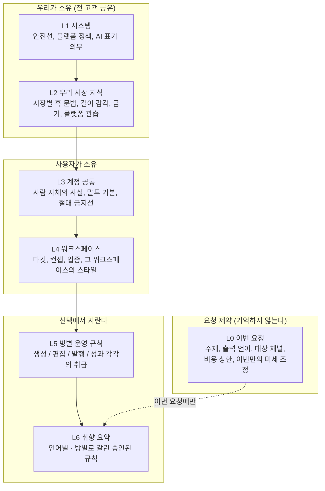
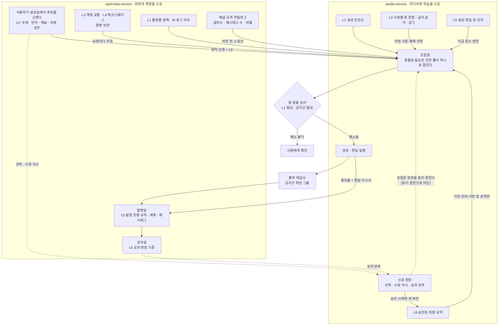
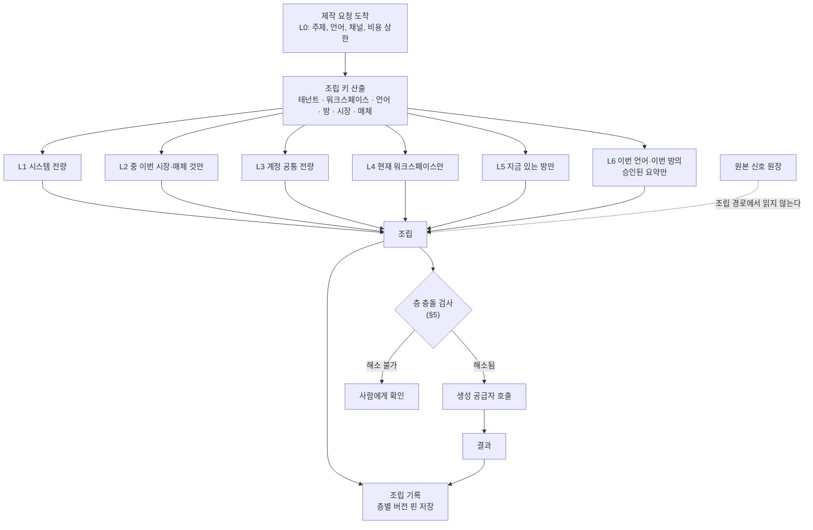
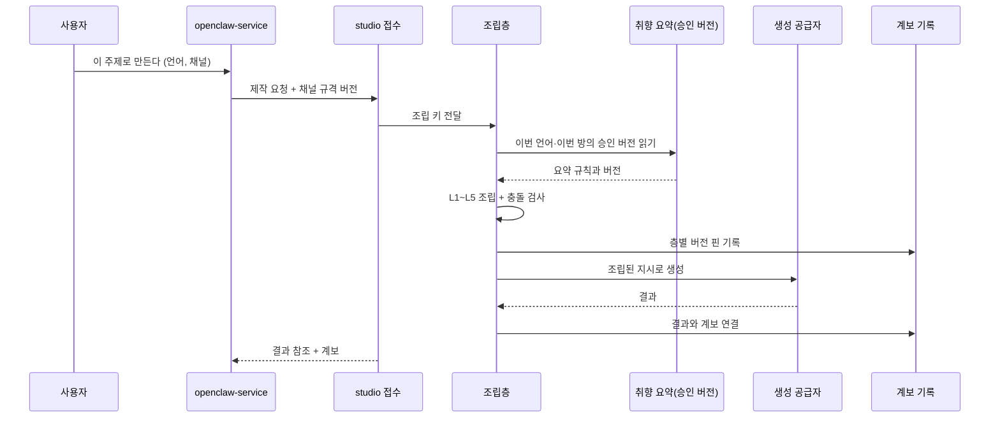

<!--
STAMP | line: studio(osmu) | 학습정보-층계-계약 | v0.1 | 생성 2026-08-19 KST (분단위는 문서 끝 푸터)
model: claude-opus-5[1m] | agent: tech-architect
성격: 확정 문서가 아니다. 루트 하네스 6.3.5(기술설계 티키타카)에 따라 스키마와 필드를 확정하지 않는다.
  이 문서는 층의 의미, 각 층에 사는 것, 조립 규칙, 충돌 규칙을 회장이 고르도록 올린 계약 초안이다.
기반(버전 핀, 전부 실제 Read):
  - docs/requests/회장-확정-요구사항-대장.md (R01~R34 전량)
  - wiki/architecture/two-service-boundary.md (2026-08-19 개정본)
  - docs/prd-openclaw-service-v8.2.1-gpt-codex.md (§2.2 접점, §3.6, §3.8, §3.11, FR-OS82-031, 용어 정의)
  - studio/docs/prd-studio-service-v1.2.1-gpt-codex.md (§2.2, §3.8, §3.10, §3.11, FR-013, FR-033)
  - studio/docs/eng-design-studio-service-v0.1-선택지.md (선택 B, 선택 E, 빈틈 8·10·11)
  - docs/user-flow.md (§5.1, §7 빈틈 4·5·6)
  - docs/제품구조-결정-2026-08-15.md §9.6 D1·D5, §9.7 요청 조립층, §9.8 D6
근거 URL: 문서 끝 SOURCES 참조
고민 한 줄: 컨트롤러가 준 5층에서 "우리가 축적하는 시장 지식"이 대상 특화 안에 숨어 있었다.
  소유자와 수명이 달라(전 고객 공유, 우리 릴리즈로 갱신) 층을 하나 늘리는 쪽을 추천으로 택했다.
-->

# 학습 정보 층계 계약 v0.1

> **한 줄 결론**: 학습 정보는 "누가 소유하고 언제 바뀌는가"로 갈리며, 그 기준을 적용하면 층은 다섯이 아니라 **여섯**이고 그 위에 **학습이 아닌 요청 제약 한 층**이 따로 있다. 요청에 들어갈 때는 위 세 층이 항상 붙고 아래 세 층은 이번 대상만 뽑아 붙으며, 취향은 원본 신호가 아니라 **승인된 요약만** 붙는다. 다만 이 구조가 서려면 회장이 먼저 골라야 할 것이 8개 있고, 근거가 없어 채우지 못한 자리가 8개 있다.

- **회장이 골라야 할 것: 8개** ([§7](#선택))
- **미정의로 남긴 것: 8개** ([§8](#미정의))
- 기존 결정 대비 **신규 제안 2개**(층 하나 추가, 요청 제약 층 분리) / **확인 요청 1개**(R32의 "공통" 범위)

## 목차

- [1. 이 문서의 범위](#범위)
- [2. 층 정의: 여섯 층과 그 위의 요청 제약](#층)
  - [2.5 우리 하네스의 무엇에 대응하나](#층) · [2.6 층마다 어느 서비스가 소유하나](#층) · [2.7 한 요청의 전체 그림](#층)
- [3. 각 층에 실제로 무엇이 사는가](#내용)
- [4. 조립 규칙: 학습 정보가 요청에 들어가는 방식](#조립)
- [5. 충돌 규칙: 층이 부딪힐 때](#충돌)
- [6. 자란 규칙의 승인](#승인)
- [7. 생성 입력 계약과의 연결 (R24·R28)](#입력)
- [8. 두 서비스 사이의 읽기 경로 (R31·R32)](#두서비스)
- [9. 회장이 골라야 할 것 8개](#선택)
- [10. 미정의로 남긴 것 8개](#미정의)
- [11. 벤치마크](#벤치)
- [12. 레드팀 자기공격](#레드팀)

---

## 1. 이 문서의 범위 

**범위 안**: 층의 의미와 경계, 각 층에 사는 항목 목록, 요청 조립 규칙과 분량 상한의 선택지, 층 충돌 해소 규칙, 자란 규칙의 승인 단위, 생성 입력 계약과의 연결, 두 서비스 사이 읽기 경로.

**범위 밖(의도적으로 안 씀)**: 테이블, 필드명, 타입, 저장 형식, 문자 수 확정값, 엔드포인트. 회장이 §9를 고르기 전에 이것들을 쓰면 되돌리기 비싼 결정이 그대로 굳는다. 선택 후 `fdd-studio-*` 와 `api-contract-studio-*` 에서 채운다.

**말의 뜻** (이 문서 안에서만 통용, 최종 명칭 아님)

| 말 | 뜻 |
|---|---|
| 학습 정보 | 사용자가 다시 말하지 않아도 시스템이 기억해 다음 요청에 반영하는 모든 것 |
| 요청 제약 | 이번 한 번만 유효한 값. 기억하지 않는다. 출력 언어와 대상 채널이 여기 속한다 |
| 취향 요약 | 누적된 신호를 사람이 읽을 수 있는 규칙 묶음으로 집계한 것. 요청에 실제로 붙는 것은 이것뿐이다 |
| 신호 | 취향을 바꾸는 사건. 후보 선택, 수정 지시, 성과 관측 |
| 조립 | 요청 한 건을 만들 때 여러 층에서 필요한 것만 뽑아 하나의 지시로 합치는 일 |

---

## 2. 층 정의: 여섯 층과 그 위의 요청 제약 

### 2.1 층을 가르는 기준

컨트롤러가 준 5층 표를 그대로 받지 않았다. 제품구조 결정서 §9.7이 이미 "네 층은 서로 다른 수명과 소유자를 가지므로 섞어서 저장하면 안 된다"고 못 박았으므로, **소유자와 수명이 다르면 다른 층**이라는 기준을 그대로 적용해 다시 갈랐다. 그 결과 두 가지가 달라진다.

1. **우리가 축적하는 시장 지식을 독립 층으로 뺀다.** §9.7의 "마케팅 공통 지식"은 우리 자산이고 테넌트와 무관하며 우리 릴리즈로 갱신된다. 컨트롤러 표에서는 이것이 "대상 특화"에 섞여 있었는데, 대상 특화에는 사용자가 고른 플랫폼 관습도 함께 들어가 소유자가 둘이 된다.
2. **출력 언어와 대상 채널은 학습 정보가 아니다.** PRD studio §3.11과 제품구조 §9.6 D1이 "출력 언어는 취향이 아니라 요청 제약"이라고 확정했다. 이것을 학습 층 안에 두면 다음 요청에 자동으로 따라붙는다. 그래서 학습 층 바깥에 요청 제약 층을 따로 세운다.

### 2.2 층계 그림

### 2.3 층 표

| 층 | 무엇 | 소유자 | 바뀌는 속도 | 요청에 붙는 방식 |
|---|---|---|---|---|
| L0 요청 제약 | 이번 한 건의 조건 | 사용자(요청마다) | 매번 | 항상, 전량 |
| L1 시스템 | 우리 서비스의 안전선과 법·정책 의무 | 우리 | 거의 불변 | 항상, 전량 |
| L2 우리 시장 지식 | 시장·매체별로 통하는 문법과 금기 | 우리 | 우리 릴리즈 단위 | 이번 시장·매체에 해당하는 것만 |
| L3 계정 공통 | 사람 자체의 사실과 절대 금지선 | 사용자 | 드물게 | 항상, 전량 |
| L4 워크스페이스 | 이 워크스페이스의 타깃·컨셉·스타일 | 사용자 | 드물게 | 현재 워크스페이스만 |
| L5 방별 운영 규칙 | 생성·편집·발행·성과 각 방의 취급 방식 | 사용자(자람) | 꾸준히 | 지금 있는 방만 |
| L6 취향 요약 | 선택·수정·성과에서 집계된 승인 규칙 | 자동 생성, 사용자 승인 | 계속 | 이번 언어·이번 방 것만, 요약만 |

**컨트롤러 표와의 대응**: 컨트롤러의 "워크스페이스 공통"은 L3과 L4로 쪼갰다(R12가 이미 "공통 정보가 상위, 워크스페이스가 그 안"이라고 2층을 요구했고, user-flow §5.1이 각각에 무엇이 들어가는지까지 적었다). 컨트롤러의 "대상 특화"는 L2(우리가 아는 것)와 L0(이번에 고른 채널)으로 갈렸다. 채널 규격 자체는 어느 층에도 저장하지 않는다. openclaw가 소유한 규격 스냅샷을 요청 시점에 버전 핀으로 받는다(두 서비스 경계 위키, PRD studio §3.10).

### 2.4 확인이 필요한 자리 하나

⛔ **회수 필요: R32의 "공통"이 어느 층인지 두 해석이 가능하다**

- 배경: R32는 "브랜드 톤과 금지선은 어느 서비스 소유도 아닌 공통 학습 정보"라고 확정했다. 여기서 "공통"은 **서비스 사이의 공통**(생성·편집·발행·성과가 모두 읽는다)이라는 뜻이다. 그런데 R12의 "공통 정보"는 **워크스페이스 사이의 공통**(계정 층)이라는 뜻이다. 같은 낱말이 두 축을 가리킨다.
- 무엇을 정하나: 브랜드 톤이 L3(계정 공통, 모든 워크스페이스가 공유)인가 L4(워크스페이스마다 따로)인가.
- 옵션 A(추천): **금지선은 L3, 톤은 L4에 두고 L3에 기본 톤을 둔다.** 고르면 한 사람이 "내 SaaS 알리기"와 "부업 채널"에서 서로 다른 목소리를 낼 수 있으면서, 절대 쓰지 않을 표현은 워크스페이스와 무관하게 지켜진다. 안 고르면 워크스페이스마다 금지선을 다시 써야 하고 하나를 빠뜨리는 순간 사고가 난다.
- 옵션 B: 톤과 금지선을 모두 L3에 둔다. 고르면 구조가 단순해지고 "같은 목소리" 보장이 강해진다. 트레이드오프: user-flow §5.1이 이미 워크스페이스에 "그 워크스페이스에서만 통하는 스타일"을 배정했으므로 그것과 부딪힌다.
- 추천 근거: user-flow §5.1의 배정(공통에는 실명·말투의 기본·절대 금지, 워크스페이스에는 타깃·컨셉·스타일)이 이미 A와 같은 선을 긋고 있다. R32는 "서비스 사이"를 말한 문장이지 "워크스페이스 사이"를 말한 문장이 아니다.

### 2.5 우리 하네스의 무엇에 대응하나 (회장 질문: "학습정보 = 스킬이야?")

**아니다. 스킬은 일곱 층 중 한 층에만 대응한다.** 우리가 손으로 하는 하네스 엔지니어링을 층별로 갈라 보면 이렇게 대응한다. 대응이 성립하는 이유는 "언제 붙는가"가 같기 때문이다. 이름이 비슷해서가 아니다.

| 층 | 우리 하네스의 무엇 | 왜 그것에 대응하나 (붙는 방식이 같다) |
|---|---|---|
| L0 요청 제약 | 그 턴에 친 프롬프트, 슬래시 명령의 인자 | 이번 한 번만 유효하고 다음 턴에 남지 않는다 |
| L1 시스템 | 루트 CLAUDE.md의 안전·불변 조항 | 프로젝트를 옮겨도 항상 전량 붙는다. 사용자가 해제하지 못한다 |
| L2 우리 시장 지식 | **스킬** | 평소엔 안 붙어 있다가 해당 상황일 때만 불려 온다. 우리가 쓰고 우리가 갱신한다 |
| L3 계정 공통 | 사용자 전역 CLAUDE.md | 어느 프로젝트에서 일하든 항상 붙는다. 사용자가 직접 쓴다 |
| L4 워크스페이스 | 프로젝트 CLAUDE.md | 그 폴더 안에서만 붙는다. 폴더를 옮기면 안 붙는다 |
| L5 방별 운영 규칙 | **서브에이전트 정의** | 그 역할로 일할 때만 붙는다. 생성·편집·발행·성과가 각각 다른 역할이다 |
| L6 취향 요약 | 자동 메모리 | 쓰다 보면 자란다. 사람이 확인해야 남는다 |

**훅은 층이 아니다. 집행 방식이다.** 위 일곱은 전부 "붙이는 글"이고, 훅은 "글로 부탁하지 않고 코드로 막는 것"이다. 우리 하네스가 CLAUDE.md에 규칙을 쓰고도 `stage-gate.sh`를 따로 둔 이유와 같다. 지시 계층만으로는 안 지켜진다는 것이 §5.2의 실측 근거다.

제품에서 훅에 해당하는 것은 두 자리다.

| 자리 | 무엇을 막나 | 왜 글이 아니라 코드여야 하나 |
|---|---|---|
| 조립 입구 | 원본 신호 원장을 조립이 읽지 못하게 하는 읽기 권한 (§4.2 점선) | 조건문으로 지키면 회귀한다. 권한으로 막으면 실수로도 못 샌다 |
| 출력 출구 | L1·L3 금지선 위반 재검사 | 모델이 지시를 어길 확률은 0이 아니다. 어겼을 때 잡는 그물이 따로 있어야 한다 |

**그래서 우리 제품의 약속이 여기서 정의된다.** 사용자가 하는 일은 위 표의 왼쪽 칸을 채우는 것뿐이고, 오른쪽 칸(어디에 어떻게 붙일지, 무엇을 코드로 막을지)은 우리가 대신 짠다. 이것이 R35(하네스 엔지니어링을 못 하거나 그게 뭔지도 모르는 사람)와 R36(클릭만으로 만들되 쓸수록 정교해짐)의 기술적 정체다.

### 2.6 층마다 어느 서비스가 소유하나

층이 일곱인데 서비스는 둘이므로, 층마다 **원본을 어디에 두는가**를 정해야 한다. 판정 기준은 위키의 세 기준(자격증명이면 openclaw, 창작 정보면 studio, 미디어 바이트면 studio)이다.

| 층 | 원본 저장 | 다른 쪽은 어떻게 보나 | 판정 근거 |
|---|---|---|---|
| L0 요청 제약 | 어디도 저장 안 함 | openclaw 화면이 받아 요청 파라미터로 실어 보낸다 | 기억하지 않는 것이 정의다 |
| L1 시스템 | 양쪽이 각자 자기 몫 | 공유하지 않는다 | studio는 생성 안전선, openclaw는 플랫폼 정책과 AI 표기 의무. 성격이 다르다 |
| L2 우리 시장 지식 | 생성 문법은 studio, 채널 규격은 openclaw | studio가 요청 시점에 규격 스냅샷을 버전 핀으로 받는다 | 위키: 플랫폼 지식이 두 곳에 복제되지 않는다 |
| L3 계정 공통 | **openclaw** | 요청마다 주입 | 계정과 화면이 openclaw에 있다. studio 단독 판매 시 계정 개념 자체가 없다 |
| L4 워크스페이스 | **openclaw** | 요청마다 주입 | 같음 |
| L5 방별 운영 규칙 | 생성·편집은 studio, 발행·성과는 openclaw | 서로 읽지 않는다 | 방이 곧 그 서비스의 역할이다. R11(발행 운영 취향)이 openclaw에 사는 근거 |
| L6 취향 요약 | **미결. 아래 선택** | | |

⛔ **회수 필요: L6 취향 요약을 어느 서비스가 소유하나. 이것이 이 구조에서 가장 약한 자리다.**

- 무엇을 정하나: 신호 원장(어느 후보를 골랐나, 성과가 얼마였나)과 거기서 집계된 취향 요약을 openclaw가 갖나 studio가 갖나.
- 문제의 핵심: 위키는 "studio가 취향을 학습한다"고 적었다. 그런데 취향 요약을 만들려면 **신호 이력**이 필요하고, 이력을 가지면 studio는 무상태가 아니게 된다. 무상태가 아니면 개발자용 제작 API로 파는 그림이 흔들린다. 둘 다 가질 수 없다.
- 옵션 A(추천): **신호 원장과 L6 요약을 studio가 소유한다.** L3·L4는 openclaw가 갖고 요청마다 주입한다. 고르면 학습이 제품의 심장이라는 위치가 유지되고, 신호에서 요약을 만드는 로직이 생성 로직과 같은 곳에 있어 손발이 맞는다. 안 고르면 studio는 매번 남이 준 요약을 받아 쓰는 렌더 기계가 된다.
- 옵션 B: **전부 openclaw가 소유하고 studio는 완전 무상태.** 고르면 studio 단독 판매가 깨끗해지고 테넌트 데이터가 한 곳에 모인다. 트레이드오프: 학습 품질을 studio가 책임질 수 없고, 위키의 "studio = 취향 학습" 문장을 고쳐야 한다.
- 추천 근거: 편집 비용 구조(편집 지시서를 studio가 갖고 있어 재렌더가 싸다)가 이미 studio에 상태를 요구하고 있다. 상태 없는 studio는 이 원가 우위도 못 낸다. 무상태를 지키려면 편집 지시서까지 openclaw로 옮겨야 하는데 그것은 미디어 경계를 깬다.

### 2.7 한 요청이 두 서비스와 일곱 층을 어떻게 지나가나

이것이 회장이 요구한 전체 그림이다. 위 §2.5 대응과 §2.6 소유를 한 장에 겹쳐 놓은 것이며, 세로 칸이 서비스 경계, 가로 흐름이 요청 한 건의 생애다.

읽는 법 세 가지.

1. **실선은 요청이 지나가는 길, 점선은 학습이 도는 길이다.** 두 길이 만나는 자리는 딱 하나, L6 취향 요약이다. 신호가 요청으로 직접 새지 않는다.
2. **openclaw에서 studio로만 화살표가 간다.** studio가 openclaw를 부르는 실선은 없다. 위키의 단방향 의존이 그림에서도 성립한다.
3. **금지선은 두 번 걸린다.** 조립 전 충돌 검사에서 한 번, 생성 후 출력 재검사에서 한 번. 지시로만 지키면 새기 때문이다(§5.2).

---

## 3. 각 층에 실제로 무엇이 사는가 

근거가 있는 것만 적었다. 근거를 못 찾은 자리는 **미정의**로 표시하고 §10에 질문으로 올렸다.

### L1 시스템 (우리 소유, 전 고객 공통)

| 항목 | 근거 |
|---|---|
| AI 생성물 표시 의무와 플랫폼별 적용 여부 | PRD openclaw FR-OS81-039, AC-039 |
| 적용 중인 플랫폼 정책 버전 | PRD openclaw §3.6, 발행 메타데이터 정의 |
| 승인 후 발행이 신규 범위의 기본값이라는 규칙 | PRD openclaw FR-OS81-038 |
| 테넌트 격리 원칙(다른 고객의 내용이 섞이지 않는다) | PRD studio §3.13, FR-005 |
| 품질 게이트의 필수 항목과 반려 무과금 | PRD studio §3.8, 제품구조 §9.6 |
| 품질 보증 언어 경계(한국어·영어만 검수, 그 외는 미제공 고지) | 제품구조 §9.6 D1, PRD studio §3.11 |

### L2 우리 시장 지식 (우리 소유, 테넌트 무관)

| 항목 | 근거 |
|---|---|
| 시장별로 통하는 훅 문법 | 제품구조 §9.7 "마케팅 공통 지식" |
| 시장별 길이 감각 | 같음 |
| 시장별 금기 | 같음 |
| 매체·플랫폼 관습 | 같음 |
| 우리 실험 로그(벤처, 실험 번호, 날짜, 표본, 관찰) | PRD openclaw 자료 종류 표 |

**주의**: 이 층은 성능이 아니라 **출처**로 관리된다. 근거 없는 성과 점수는 비범위로 잠겨 있다(PRD openclaw 죽인 범위 표). 즉 여기 들어오는 항목은 공개 URL 또는 승인된 자사 실험 로그를 달고 들어와야 한다.

### L3 계정 공통 (사용자 소유, 모든 워크스페이스가 공유)

| 항목 | 근거 |
|---|---|
| 사람 자체의 사실(실명 등) | user-flow §5.1 |
| 말투의 기본 | user-flow §5.1 |
| 절대 쓰지 않을 표현(금지선) | user-flow §5.1, R32 |
| 브랜드 사실과 브랜드킷, 고정 목소리와 얼굴 | 제품구조 §9.7 "브랜드 제약" |
| 소재의 권리 선언과 용도 제한 | PRD openclaw 반입 자료 표, PRD studio 소재 정의 |

### L4 워크스페이스 (사용자 소유, 워크스페이스마다)

| 항목 | 근거 |
|---|---|
| 타깃 | user-flow §5.1 |
| 컨셉 | user-flow §5.1 |
| 업종 | user-flow §5.1 |
| 그 워크스페이스에서만 통하는 스타일 | user-flow §5.1 |
| 반입한 지식 자료(위키·노션)와 그 버전 | R03, PRD openclaw §3.5 반입 자료 |
| 타깃 시장 | 제품구조 §9.7 (단, 요청마다 고르는 경우 L0로 간다. §10 질문 3) |

### L5 방별 운영 규칙 (선택에서 자란다)

| 방 | 여기 사는 것 | 근거 |
|---|---|---|
| 생성 | 선호하는 구조·속도·시각 밀도·신뢰감·친근함, 이유축에서 반복된 방향 | PRD studio §3.8 이유축 9종 |
| 편집 | 반복된 수정 방향(자막 위치, 컷 길이 감각). 단 약한 신호 | PRD studio §3.8, PRD openclaw §3.8 |
| 발행 | 댓글 말투, 발행 시간 위임 범위, 승인 방식 | R11 |
| 성과 | 무엇을 좋은 결과로 볼 것인가의 기준 | 미정의 (§10 질문 5) |

### L6 취향 요약 (자동으로 자라고 사람이 승인한다)

| 항목 | 근거 |
|---|---|
| 사람이 읽을 수 있는 규칙 목록 | 제품구조 §9.8 D6, PRD studio FR-033 |
| 각 규칙의 근거(어느 선택에서 나왔나) | 같음 |
| 규칙별 신뢰도 | PRD studio FR-033, §2.2 취향 상태 출력 |
| 적용 범위 | 같음 |
| 현재 버전과 이전 버전 | 선택 E2(직전 선택지 문서) |
| 출력 언어별 분리 | FR-OS82-031, PRD studio FR-013 |
| 승인 대기 중인 후보 규칙(별도 구획) | PRD openclaw FR-OS81-020, 직전 선택지 §6.4 |

---

## 4. 조립 규칙: 학습 정보가 요청에 들어가는 방식 

회장 질문의 본체다. 컨트롤러 잠정안을 검증한 결과 **네 줄 중 셋은 그대로 서고, 하나는 조건을 붙여야 선다.**

### 4.1 잠정안 검증 결과

| 컨트롤러 잠정안 | 판정 | 근거와 보정 |
|---|---|---|
| 시스템·워크스페이스 공통은 항상 붙인다 | 성립 | L1·L3은 항상. 단 L4(워크스페이스)는 "현재 워크스페이스만"이라 조건부다. 워크스페이스가 둘인데 둘 다 붙이면 목소리가 섞인다 |
| 단계별은 그 방에서만 붙인다 | 성립 | L5는 지금 있는 방 것만 |
| 대상 특화는 이번 요청 대상만 꺼내 붙인다 | 성립 | L2를 이번 시장·매체 키로 잘라 붙인다 |
| 취향은 집계 요약만, 원본 신호는 안 붙인다 | 성립하되 조건 필요 | 요약도 무한히 자란다. 규칙 수가 늘면 요약 자체가 커지므로 **요약에도 상한과 선별 규칙**이 필요하다(§4.3) |

### 4.2 조립 흐름

핵심은 점선이다. **원본 신호 원장에서 조립으로 가는 실선이 없다.** 이 규칙은 PRD가 이미 정한 것이고("생성 경로는 신호를 직접 읽지 않고 취향 프로파일만 읽는다"), 이 문서는 그것을 조립층의 읽기 권한 경계로 옮긴다. 조건문으로 지키면 회귀하고, 읽기 권한으로 지키면 실수로도 못 샌다.

### 4.3 층별 분량과 상한

분량은 확정하지 않는다. 다만 **상한을 두는 방식**은 지금 골라야 한다. 상한이 없으면 취향이 쌓일수록 요청이 커지고, 어느 순간 시스템 안전선이 뒤로 밀려 무시된다. 이것은 실측된 현상이다(§11 벤치마크의 계층 실패 연구).

| 층 | 성격 | 상한 방식 후보 |
|---|---|---|
| L0 | 매번 다름 | 상한 불필요. 전량 |
| L1 | 작고 고정 | 상한 불필요. 항상 맨 앞 |
| L2 | 우리가 쓰므로 우리가 통제 | 시장·매체 조합당 항목 수 고정 |
| L3 | 사용자가 쓰지만 짧음 | 항목 수 상한 + 초과 시 사용자에게 정리 요구 |
| L4 | 반입 자료가 붙으면 커진다 | 자료 본문은 안 붙이고 요약과 참조만 |
| L5 | 방마다 몇 줄 | 항목 수 상한 |
| L6 | 계속 자란다 | **선별 규칙 필요**. 후보는 §9 선택 4 |

**추천**: 층별 항목 수 상한을 두되, 넘칠 때 자동으로 버리지 않고 **사용자에게 "무엇을 뺄지" 묻는다**. 자동으로 버리면 사용자가 직접 쓴 금지선이 조용히 사라질 수 있다.

### 4.4 취향 요약을 언제 어떻게 만드는가

| 안 | 언제 만드나 | 장점 | 단점 |
|---|---|---|---|
| S1 | 신호가 들어올 때마다 즉시 갱신 | 최신 | 승인 전 반영이 새어 들어갈 통로가 생긴다. PRD의 승인 전 미반영과 충돌 |
| S2 (추천) | 사람이 승인하는 순간에만 새 버전 발행 | 승인 전 미반영이 구조적으로 지켜진다. 결과마다 어느 버전으로 만들었는지 핀할 수 있다 | 승인이 밀리면 취향이 오래 낡는다 |
| S3 | 요청할 때마다 신호에서 다시 계산 | 산정 로직 개선이 과거까지 소급된다 | 같은 요청이 시점마다 달라져 설명이 불가능해진다. 조립 경로가 원본 신호를 읽게 되어 PRD 규칙 위반 |

**추천 S2.** 근거: 승인 전 미반영(PRD openclaw FR-OS81-020, AC-020)을 지키는 유일한 안이고, 결과 계보에 버전을 핀하는 직전 선택지 E2와 그대로 맞물린다.

### 4.5 근거를 되짚는 경로

"이 값이 왜 나왔나"를 물었을 때 원본을 어떻게 꺼내는가. 요청에는 요약만 붙지만, **요약 항목마다 근거 신호를 가리키는 참조를 달아 둔다.** 그 참조는 조립에 붙지 않고 취향 상태 조회 접점에서만 펼쳐진다. 즉 근거는 요청을 무겁게 하지 않으면서 언제든 되짚을 수 있다.

### 4.6 조립 결과를 재현 가능하게 남기는 방법

결과마다 **층별 버전 핀 묶음**을 남긴다. 남길 것은 여섯 층 각각의 버전 또는 스냅샷 식별자, 이번 요청의 L0 값, 채널 규격 스냅샷 버전, 조립 시각이다. 조립 결과 문자열 자체를 통째로 저장하는 방식은 추천하지 않는다. 그렇게 하면 "어느 층이 이 결과를 만들었나"를 다시 분해할 수 없고, 제품구조 §9.7이 경고한 "하나의 프롬프트 문자열로 뭉쳐 저장" 그 자체가 된다.

---

## 5. 충돌 규칙: 층이 부딪힐 때 

user-flow 막힘 4번의 답이다. 세 가지를 구분해야 한다. **금지 규칙끼리의 충돌**, **선호끼리의 충돌**, **사실끼리의 충돌**은 답이 서로 다르다.

### 5.1 층 쌍별 규칙

| 층 쌍 | 성격 | 옵션 | 추천 |
|---|---|---|---|
| L1 시스템 대 나머지 전부 | 안전·법·정책 | 절대 우선 / 사용자 해제 허용 | **절대 우선.** 사용자 해제 불가. AI 표기 의무와 플랫폼 정책은 협상 대상이 아니다 |
| L3 금지선 대 L6 취향 | 사용자가 직접 쓴 금지 대 자동으로 자란 선호 | 금지선 절대 우선 / 취향이 덮음 / 사람에게 물음 | **금지선 절대 우선.** §5.2 참조 |
| L3 톤 기본 대 L4 워크스페이스 스타일 | 선호 대 선호 | 상위 우선 / 하위가 덮음 / 물음 | **하위가 덮되 덮었다는 사실을 표시.** 워크스페이스는 목적이 다르라고 나눈 것이다 |
| L4 대 L6 | 사용자가 쓴 스타일 대 자란 취향 | 상위 우선 / 하위가 덮음 / 물음 | **사용자가 직접 쓴 L4 우선.** 취향은 L4가 침묵한 자리를 채운다 |
| L2 시장 지식 대 L4·L6 | 우리 지식 대 사용자 것 | 우리 우선 / 사용자 우선 | **사용자 우선.** L2는 기본값 제공자이지 규범이 아니다 |
| L0 요청 제약 대 L2·L5·L6 | 이번 요청 대 누적된 것 | 이번 요청 우선 / 누적 우선 | **이번 요청 우선.** 단 이번 요청이 L1·L3 금지선을 넘으면 거절 |
| L4 워크스페이스 대 L4 다른 워크스페이스 | 격리 대상 | 섞음 / 격리 | **격리.** 애초에 조립에 하나만 들어간다 |

### 5.2 금지선은 절대인가

**추천: 절대다. 단 절대성을 우선순위가 아니라 두 겹으로 만든다.**

이유는 벤치마크에서 나왔다. 계층을 선언하는 것만으로는 낮은 층이 높은 층을 이기는 일이 실제로 일어난다는 연구가 있다(§11). 즉 "금지선을 맨 앞에 두었으니 지켜질 것"은 근거 없는 낙관이다. 그래서 두 겹으로 간다.

1. **조립 우선순위**: 금지선을 조립의 맨 앞에 두고, 취향 요약에서 금지선과 부딪히는 항목은 **조립 단계에서 아예 뺀다**. 부딪히는 것을 넣고 "지켜라"라고 쓰지 않는다.
2. **출력 검증**: 결과가 나온 뒤 금지선 위반을 검사한다. 위반이면 필수 품질 게이트 반려로 처리한다. 반려는 이미 무과금 규칙이 서 있다(PRD studio §3.8).

**사람에게 묻는 경우는 하나로 한정한다.** 자동으로 자란 취향이 금지선과 반복해서 부딪히면(즉 사용자의 실제 행동이 자기가 쓴 금지선과 어긋나면) 조용히 무시하지 않고 "금지선을 고칠까요"를 사용자에게 올린다. 이것은 PRD가 이미 자료 충돌에서 쓰는 방식과 같은 형태다(반입 자료가 충돌하면 자동 선택하지 않고 사람이 승인할 때까지 제작을 멈춘다).

---

## 6. 자란 규칙의 승인 

### 6.1 승인은 어느 층에 적용되나

우리 하네스는 사람이 규칙을 쓰지만, 이 제품은 규칙이 자란다. 그래서 승인은 **자란 층에만** 필요하다.

| 층 | 어떻게 생기나 | 승인 필요한가 |
|---|---|---|
| L1 시스템 | 우리가 쓴다 | 사용자 승인 아님. 다만 바뀌면 고지한다 |
| L2 우리 시장 지식 | 우리가 쓴다 | 사용자 승인 아님. 출처를 표시한다 |
| L3 계정 공통 | 사용자가 직접 쓴다 | 쓰는 행위가 곧 승인 |
| L4 워크스페이스 | 사용자가 직접 쓴다. 단 반입 자료는 자동으로 들어온다 | 직접 쓴 것은 승인 불요. **반입 자료가 충돌하면 승인 필요**(PRD openclaw §3.5) |
| L5 방별 운영 규칙 | 반복된 행동에서 자란다 | **승인 필요** |
| L6 취향 요약 | 신호에서 자란다 | **승인 필요** |

즉 전 층이 아니라 **L5와 L6, 그리고 L4의 반입 자료 충돌**에만 적용한다. 근거는 PRD가 승인을 요구한 자리가 정확히 그곳이기 때문이다(FR-OS81-020은 추천 변경의 승인, §3.5는 자료 충돌의 승인).

### 6.2 승인 단위

| 안 | 단위 | 장점 | 단점 |
|---|---|---|---|
| V1 | 항목 하나씩 승인 | 무엇에 동의했는지 정확하다. R03의 "후보 선택 시 동의 학습"과 그대로 맞는다 | 항목이 많아지면 승인 피로 |
| V2 | 묶음 단위로 승인(한 번에 여러 항목) | 피로가 적다 | 묶음 안의 한 항목만 싫을 때 표현이 안 된다 |
| V3 (추천) | **항목 단위로 승인하되, 승인된 항목들이 모여 하나의 버전으로 발행된다** | 동의는 항목 단위라 정확하고, 결과에 핀하는 것은 버전 하나라 계보가 단순하다 | 승인 화면과 버전 발행 시점을 분리해 설계해야 한다 |

**추천 V3.** R03이 확정한 네 입력 경로 중 "후보 선택 시 동의 학습"은 그 자리에서 항목 하나에 동의하는 형태다. 반면 결과 계보는 버전 하나를 가리켜야 재현이 된다(§4.6). 둘 다 만족하는 것은 V3뿐이다.

**승인을 거절했을 때**는 아직 정하지 못했다(§10 질문 2). user-flow 빈틈 5번과 같은 자리다.

---

## 7. 생성 입력 계약과의 연결 (R24·R28) 

R24는 "생성 API 입력 계약이 질문 순서를 정한다"를 확정했다. 이 문장의 실제 의미는 **화면이 질문을 지어내지 못하게 계약이 진실원이 된다**는 것이다. 그러면 계약은 두 가지를 말해야 한다. 무엇이 없으면 생성이 아예 안 되는가, 그리고 그것들을 어떤 순서로 받는가.

### 7.1 없으면 생성이 안 되는 것

PRD studio §2.2 제작 요청 입력과 §3.8 생성 모드 입력에서 근거가 있는 것만 뽑았다.

| 없으면 안 되는 것 | 어느 층에 저장되나 | 근거 |
|---|---|---|
| 누구의 것인가(테넌트와 워크스페이스) | 층이 아니라 요청의 신원 | PRD studio §2.2 |
| 무엇을 만드나(주제와 목적) | L0. 저장하지 않는다 | PRD studio §3.8 |
| 출력 언어 | L0. 저장하지 않는다(취향 아님) | PRD studio §3.11, FR-013 |
| 대상 채널과 그 규격 스냅샷 버전 | L0 | 두 서비스 경계 위키 |
| 브랜드 사실과 고정 요소 | **L3** | 제품구조 §9.7 브랜드 제약 |
| 금지선 | **L3** | R32, user-flow §5.1 |
| 타깃 | **L4** | user-flow §5.1, 제품구조 §9.7 |
| 업종과 컨셉 | **L4** | user-flow §5.1 |
| 비용 상한 | L0 | PRD studio 비용 원장, 직전 선택지 §6.2 |

굵게 표시한 넷이 **R28이 말한 "맨 처음 받아 학습 정보에 저장"의 대상**이다. 나머지는 요청마다 받으므로 학습 정보에 저장하지 않는다.

### 7.2 받는 순서

순서는 계약의 필수 여부가 아니라 **층의 순서**를 따르는 것을 추천한다. 위에서 아래로 물으면 앞 답이 뒤 질문의 선택지를 좁혀 준다.

1. L3 계정 공통: 당신은 누구이고, 절대 쓰지 않을 표현은 무엇인가
2. L4 워크스페이스: 이 워크스페이스는 누구에게 무엇을 말하는가
3. L0 이번 요청: 무엇을, 어느 언어로, 어디에 낼 것인가

**근거**: R01(한 화면에 하나씩)과 R05(첫 가입은 학습 0에서 시작)가 이 순서를 요구한다. 그리고 R02가 재방문 시 건너뛰기를 확정했으므로, 1과 2는 이미 채워져 있으면 건너뛰고 3만 묻는다. 두 번째 이후 사용자는 곧바로 3에서 시작한다.

**주의 하나.** 이 순서는 "질문을 세 번 던진다"는 뜻이 아니다. R25가 확정한 대로 챗봇이 텍스트로 묻고 대시보드가 후보안을 띄우는 형태이므로, 각 층의 질문은 후보를 보여 주고 고르게 하는 방식으로 나갈 수 있다. 계약이 정하는 것은 **무엇을 받아야 하는가와 그 순서**이지 화면 형태가 아니다.

### 7.3 성과·트렌드 기반 미세 조정은 계약의 어느 자리인가

R28은 이것을 생성 화면에서 받는다고 확정했다. 계약에서의 자리는 **L0 이번 요청의 조정값**이다. 학습 정보에 쓰지 않는다.

다만 같은 방향의 조정이 서로 다른 작업에서 반복되면 후보 규칙으로 대기열에 올라가고, 승인되면 L6가 된다. 이것은 PRD가 수정 지시에 이미 적용한 규칙과 같다("한 번의 자막을 크게가 모든 브랜드 작업의 영구 규칙이 되어서는 안 된다", PRD studio §3.8). 반복 횟수는 미정의다(§10 질문 1).

---

## 8. 두 서비스 사이의 읽기 경로 (R31·R32) 

2026-08-19 개정으로 제목·소개·해시태그·첫 댓글이 발행실로 갔고, 톤과 금지선이 공통 학습 정보로 올라갔다. 그러면 발행실도 학습 정보를 읽어야 한다.

### 8.1 발행실이 읽어야 하는 층

| 층 | 발행실이 읽나 | 이유 |
|---|---|---|
| L1 시스템 | 읽는다 | AI 표기 의무와 플랫폼 정책이 발행 시점의 판단이다 |
| L2 우리 시장 지식 | 읽는다 | 해시태그 관습과 길이 감각이 여기 있다 |
| L3 계정 공통(톤 기본, 금지선) | **읽는다** | R32가 확정한 지점이다. 이것을 안 읽으면 캡션 목소리가 갈린다 |
| L4 워크스페이스 | 읽는다 | 타깃과 컨셉이 캡션의 대상을 정한다 |
| L5 발행 방 규칙 | 읽는다 | 댓글 말투와 발행 시간 위임(R11) |
| L5 생성·편집 방 규칙 | 읽지 않는다 | 캡션 작성과 무관하고, 읽으면 방 경계가 흐려진다 |
| L6 취향 요약 | **발행 방 것만 읽는다** | 생성 취향까지 읽으면 발행실이 창작 판단을 하게 된다 |

### 8.2 어느 경로로 읽나

**기존 접점 5개 중 취향 상태 조회를 그대로 쓴다.** 새 접점을 만들지 않는다. 그 접점은 이미 "어떤 작업 맥락"을 입력으로 받게 설계돼 있으므로(직전 선택지 §6.4), 작업 맥락에 방을 넣으면 발행실은 자기 방 것만 받는다.

이 선택의 이점은 **읽기 경로가 하나뿐이라 무엇을 읽었는지 감사할 수 있다**는 것이다. 발행실이 studio 데이터를 직접 들여다보는 경로를 따로 내면 경계가 규칙일 뿐 강제되지 않는다.

### 8.3 남아 있는 충돌 하나

⛔ **회수 필요: 발행 운영 취향(R11)을 어느 서비스가 소유하나**

- 배경: R11은 발행 쪽에도 학습된 취향이 있다고 확정했는데, 두 서비스 경계 위키는 "창작 정보를 읽거나 쓰면 studio"라고 판정 기준을 세워 뒀다. 직전 선택지 문서에서 빈틈 10번으로 올렸으나 아직 답이 없고, 이번 층계 계약은 이 답 없이는 L5·L6의 저장 위치를 못 정한다.
- 무엇을 정하나: 댓글 말투와 발행 시간 취향이 studio 취향 프로파일의 한 종류인가, openclaw가 따로 갖는가.
- 옵션 A(추천): **studio가 전부 소유하고 발행실은 조회해서 읽는다.** 고르면 학습 저장소가 하나로 유지되고, 층계 계약이 서비스 경계와 무관하게 성립한다. 안 고르면 취향 저장소가 두 벌이 되어 "어느 쪽이 진실인가"가 매번 문제가 된다.
- 옵션 B: openclaw가 발행 취향을 따로 갖는다. 고르면 발행실이 자기 데이터로 빠르게 움직인다. 트레이드오프: 같은 사람의 취향이 두 곳에 나뉘고, 학습 정보 화면(R02, R15)이 두 서비스를 합쳐 보여 줘야 한다.
- 추천 근거: R02와 R15가 학습 정보를 하나의 열람·수정 지점으로 확정했다. 저장소가 둘이면 그 화면이 두 서비스를 합치는 일을 하게 되고, 그 순간 화면이 계약보다 복잡해진다.

---

## 9. 회장이 골라야 할 것 8개 

되돌리기 비용이 큰 순서다.

| 번호 | 무엇을 정하나 | 옵션 | 추천 | 안 고르면 |
|---:|---|---|---|---|
| 1 | 층을 여섯으로 갈 것인가 | 컨트롤러 5층 유지 / 6층(우리 시장 지식 분리 + 요청 제약 분리) | **6층** | 우리 자산과 사용자 자산이 한 층에 섞여 갱신 주체가 둘이 된다 |
| 2 | R32의 톤과 금지선이 계정 층인가 워크스페이스 층인가 | 금지선 L3·톤 L4 / 둘 다 L3 | **금지선 L3, 톤 L4** | 워크스페이스마다 금지선을 다시 써야 하고 빠뜨리면 사고 |
| 3 | 금지선은 절대인가 | 절대(2겹 강제) / 취향이 덮을 수 있음 / 매번 물음 | **절대, 조립 배제 + 출력 검증 2겹** | 자란 취향이 사용자가 쓴 금지를 조용히 넘는다 |
| 4 | 취향 요약이 넘칠 때 무엇을 뺄 것인가 | 오래된 것부터 / 신뢰도 낮은 것부터 / 사용자에게 물음 | **사용자에게 물음** | 자동으로 버리면 중요한 규칙이 소리 없이 사라진다 |
| 5 | 취향 요약을 언제 만드나 | 신호마다 즉시 / 승인 시점에만 / 요청마다 재계산 | **승인 시점에만** | 승인 전 미반영이 새고, 결과 재현이 불가능해진다 |
| 6 | 승인 단위 | 항목 / 묶음 / 항목 승인 후 버전 발행 | **항목 승인 후 버전 발행** | 동의 정확성과 계보 단순성 중 하나를 잃는다 |
| 7 | 발행실이 읽는 범위 | L1~L4 + 발행 방만 / 전 층 | **발행 방까지만** | 발행실이 창작 판단을 하게 되어 R31이 지키려던 역할 분리가 무너진다 |
| 8 | 발행 운영 취향의 소유 서비스(R11 대 경계 위키) | studio 단독 소유 / openclaw 별도 보유 | **studio 단독** | 취향 저장소가 두 벌이 되고 학습 정보 화면이 둘을 합치게 된다 |

---

## 10. 미정의로 남긴 것 8개 

근거를 못 찾아 추측으로 메우지 않은 자리다.

| 번호 | 무엇이 비었나 | 왜 지금 필요한가 | 질문 |
|---:|---|---|---|
| 1 | 후보 규칙이 승격되는 반복 횟수 | L6가 자라는 속도를 정한다 | 서로 다른 작업에서 2회인가 3회인가, 아니면 매번 사용자가 승인하나 |
| 2 | 학습 동의를 거절했을 때의 처리 | R03의 동의 학습과 직결. user-flow 빈틈 5번과 같은 자리 | 신호로 아예 안 쓰나, 기록은 하되 요약 갱신만 안 하나 |
| 3 | 타깃 시장이 L4인가 L0인가 | 제품구조 §9.7은 요청 파라미터라 했고 user-flow §5.1은 워크스페이스 속성이라 했다 | 워크스페이스가 시장을 고정하나, 요청마다 바꾸나 |
| 4 | 언어별 프로파일의 갈림 기준 | 언어인가 시장인가. 영어권 미국과 싱가포르가 다르다 | 언어로 가르나 시장으로 가르나(직전 선택지 빈틈 11 재상정) |
| 5 | 성과 방의 운영 규칙에 무엇이 사는가 | L5의 네 방 중 성과 방만 근거를 못 찾았다 | 무엇을 좋은 결과로 볼지의 기준을 사용자가 정하나, 우리가 정하나 |
| 6 | 요약의 압축 방식 | 상한에 걸렸을 때 어떻게 줄이나 | 규칙을 합치나, 신뢰도 낮은 것을 감추나 |
| 7 | 워크스페이스 전환과 개수 | L4가 "현재 워크스페이스만"이라는 규칙이 성립하려면 전환 개념이 필요한데 PRD에 없다 | 워크스페이스를 몇 개까지 두나, 전환은 어디서 하나 |
| 8 | 챗봇 대화가 어느 층에 속하나 | R10·R25의 대화가 학습 정보인지 작업 도구인지 | 대화 내용이 층으로 저장되나, 층을 채우는 입력 수단일 뿐인가(직전 선택지 빈틈 15 재상정) |

---

## 11. 벤치마크 

| 참고 | 무엇을 봤나 | 차용 | 다르게 한 것 |
|---|---|---|---|
| 문맥 조립과 계층 기억 설계 ([mem0 문맥 엔지니어링 가이드](https://mem0.ai/blog/context-engineering-ai-agents-guide), [Supermemory 문맥 엔지니어링 정리](https://supermemory.ai/blog/what-is-context-engineering-complete-guide/), [LLM 에이전트 외부화 리뷰](https://arxiv.org/html/2604.08224v1)) | 작업 문맥·일화 기록·의미 기억·개인화 기억을 서로 다른 저장소로 나누고, 조립 시점에 순서와 우선순위를 정하는 방식 | 층을 소유자와 수명으로 가르는 기준, 조립 시점에 층을 뽑아 순서대로 붙이는 구조, 원본 기록과 요약을 분리해 요약만 붙이는 규칙 | 업계 사례는 대개 개인화 기억을 자동으로 갱신한다. 우리는 **사람 승인 전 미반영**이라는 제품 약속이 있어 갱신 시점을 승인에 묶었다(§4.4 S2) |
| 지시 계층과 그 실패 ([OpenAI 지시 계층 연구](https://openai.com/index/the-instruction-hierarchy/), [계층 실패 실측 연구](https://arxiv.org/html/2502.15851v4)) | 높은 권한의 지시가 낮은 지시를 이기도록 계층을 두는 방식과, 계층 선언만으로는 실제로 지켜지지 않는다는 실측 | §5의 층 우선순위 표, 그리고 **금지선을 우선순위만으로 지키지 않는다**는 §5.2의 2겹 구조 | 업계 논의는 주로 공격 방어가 목적이다. 우리 문제는 공격이 아니라 **자기가 쓴 금지선과 자기 행동이 어긋나는 경우**라, 무시하지 않고 사람에게 되묻는 경로를 추가했다 |
| 우리 레포 기존 결정 (제품구조 §9.7 네 입력 층, PRD studio §3.11, 두 서비스 경계 위키) | 이미 확정된 층 구분과 언어 격리 규칙 | 층 정의의 출발점 전체 | 새 구조를 짓지 않고 §9.7의 네 층을 여섯으로 정밀화하고 요청 제약을 분리했다 |

---

## 12. 레드팀 자기공격 

**공격 1 (까다로운 개발자)**: "층을 여섯으로 나누면 조립할 때마다 여섯 곳을 읽는다. 느리고 복잡하다."
반박한다. 읽는 곳의 수가 아니라 **갱신 주체의 수**가 복잡도를 만든다. 여섯 층은 갱신 주체가 셋(우리, 사용자, 자동)으로 깔끔하게 나뉘지만, 다섯 층으로 뭉치면 한 층 안에 주체가 둘이 들어가 갱신 충돌이 데이터 안에서 벌어진다. 읽기는 조립 키 하나로 한 번에 뽑아 오면 되고 그건 구현 문제다.

**공격 2 (회의적 투자자)**: "층계 계약이 해자라는데, 층을 나누는 건 누구나 한다."
부분적으로 인정한다. 층 구분 자체는 복제 가능하다. 복제되지 않는 것은 L2(우리가 축적한 시장 지식)와 L6(고객별로 자란 규칙)의 **내용**이고, 그것이 쌓이려면 근거를 되짚을 수 있어야 한다(§4.5). 그래서 근거 참조를 요약 항목마다 다는 것을 뺄 수 없는 항목으로 넣었다.

**공격 3 (자기심문)**: "이 결론이 틀렸다면 가장 그럴듯한 이유는?"
층을 이렇게 나눠 놓고 실제로 조립해 보면 **L5와 L6의 경계가 흐릴 가능성**이 가장 크다. "발행 시간 위임"이 방별 운영 규칙인지 취향인지는 지금 근거만으로는 확실하지 않다. 둘을 합치는 쪽이 맞을 수도 있으므로, 이 둘은 저장 구조를 같게 두고 구획만 다르게 하는 방식이 안전하다. 즉 §9 선택 1을 고르더라도 L5와 L6를 물리적으로 다른 곳에 두는 결정은 나중으로 미룰 수 있다.

**공격 4 (자기심문)**: "0번 게이트를 지켰나. 매칭 스킬을 실제로 호출했나?"
호출하지 않았고 사유를 푸터에 선언했다. 이 산출물은 코드베이스에서 문서를 뽑는 작업이 아니라 회장 결정을 받기 위한 계약 초안이다.

---

## 다음 단계

회장이 §9의 8개를 고르면, 그 결과를 직전 선택지 문서(선택 B 신호 입구, 선택 E 취향 버전 관리)의 답과 합쳐 `fdd-studio-service-*`와 `api-contract-studio-*`에서 필드 수준으로 내린다. **지금은 미정의 8개가 열려 있으므로 기술설계 완료를 주장하지 않는다.**

---

RUBRIC_SCORE: 완결4 정밀4 벤치5 추적5 톤5 total=23/25
WEAKEST_LINE: "무엇을 좋은 결과로 볼 것인가의 기준" (L5 성과 방만 근거를 못 찾아 층 정의가 다른 세 방보다 얇다)

SKILLS_USED: 없음
SKILLS_SKIPPED: document-generate(코드베이스에서 문서를 생성하는 작업이 아니라 회장 결정을 받기 위한 계약 초안이라 산출 형태가 맞지 않음) · diagram(다이어그램 파일 산출 요구가 없고 문서 내 mermaid로 요구됨) · spec(대화형이라 메인 세션 전용)

SOURCES/MODEL: claude-opus-5[1m] / tech-architect
읽은 근거: docs/requests/회장-확정-요구사항-대장.md(R01~R34 전량) · wiki/architecture/two-service-boundary.md(2026-08-19 개정본) · docs/prd-openclaw-service-v8.2.1-gpt-codex.md · studio/docs/prd-studio-service-v1.2.1-gpt-codex.md · studio/docs/eng-design-studio-service-v0.1-선택지.md · docs/user-flow.md · docs/제품구조-결정-2026-08-15.md §9.6 §9.7 §9.8 · ~/.claude/standards/doc-review.md · ~/.claude/standards/dev.md
웹 근거: [mem0 문맥 엔지니어링](https://mem0.ai/blog/context-engineering-ai-agents-guide) · [Supermemory 문맥 엔지니어링](https://supermemory.ai/blog/what-is-context-engineering-complete-guide/) · [LLM 에이전트 외부화 리뷰](https://arxiv.org/html/2604.08224v1) · [OpenAI 지시 계층](https://openai.com/index/the-instruction-hierarchy/) · [지시 계층 실패 실측](https://arxiv.org/html/2502.15851v4)
PRESENTATION_CHECK: 툴콜 잔재 없음 확인 · 목차 앵커와 mermaid 3종 문법 확인 · 산출물은 열지 않고 저장만 함

🏷 STAMP | line: studio(osmu) | 학습정보-층계-계약 v0.1 | 생성 2026-08-19 KST | model: claude-opus-5[1m] | agent: tech-architect
확정 금지 준수: 테이블·필드·타입·문자수 확정값을 쓰지 않았다. 층의 의미와 조립 규칙만 적고 되돌리기 비싼 것은 §9의 선택으로 남겼다.
고민: 컨트롤러의 5층에서 "우리가 축적하는 시장 지식"을 독립 층으로 빼고 "요청 제약"을 학습 층 밖으로 분리했다. 기준은 소유자와 수명이며 그 기준은 제품구조 §9.7이 이미 세운 것이다.
