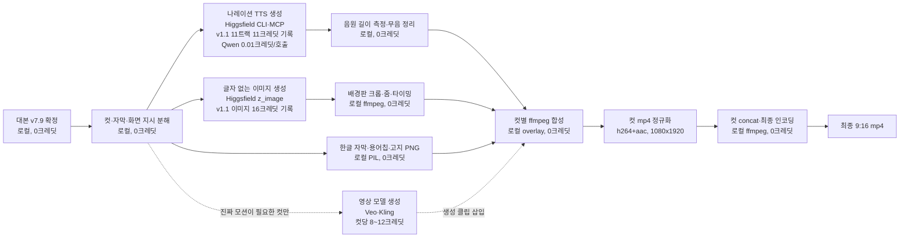

---
STAMP
생성시각: 2026-08-14 03:11 KST
모델: GPT-5 Codex (gpt-5)
에이전트: content-growth-marketer
스킬: 없음. 기존 생성·편집 메커니즘을 기술 문서로 고정하는 과업이라 직접 대응 스킬이 없음
근거: 실험로그-힉스필드.md, session-state.osmu.md의 2026-08-14 d~i, EC0147-힉스필드-프롬프트팩.md, generated 파일·ffprobe 실측, Higgsfield CLI 1.1.23 `generate` 도움말과 모델 스키마
렌더 검증: mermaid-cli 11.16.0으로 2400x1600 PNG 렌더 성공, 한글 라벨·화살표·분기 직접 확인
고민 한 줄: 힉스필드가 “영상 제작”을 한다는 말이 자막·레이아웃·편집까지 포함하는 것처럼 읽힐 위험이 있었다. 생성 자산과 로컬 편집 책임을 도구 경계로 잘라 적었다.
---

# EC0147 영상 제작 메커니즘 플로우

## 1. 한 줄 결론

힉스필드는 원재료를 만든다. 나레이션 음성과 글자 없는 화면 이미지 또는 영상 클립이 그 원재료다. 완성품의 한글 자막, 용어칩, 오버레이, 레이아웃, 타이밍, 줌, 컷 전환, 인코딩은 우리 로컬 파이프라인이 만든다.

## 2. 누가 무엇을 하는가

| 작업 | 힉스필드 MCP·CLI | 우리 로컬 | 이번 EC0147 근거 |
|---|---|---|---|
| 대본 확정 | 하지 않음 | EC0147 v7.9 대본을 진실원으로 사용 | session-state g |
| 컷 분해 | 생성 프롬프트의 입력으로 받을 뿐, 최종 편집 컷표는 만들지 않음 | 대사를 자막 2줄 단위와 화면 지시로 분해 | v7.9 10컷, 나레이션 11트랙, 이미지 18장 |
| 나레이션 음성 생성 | `seed_audio`, `qwen_audio_tts`, `text2speech_v2` 등으로 음성 파일 생성. 크레딧 사용 | 음원 길이 측정, 무음 제거, 필요 시 정규화, 타임라인 배치 | v1.1 `seed_audio`, v1.2 Qwen Arthur |
| 화면 이미지 생성 | `z_image` 등으로 글자 없는 9:16 배경판 생성. 크레딧 사용 | 이미지 선택, 크롭, 화면별 배치 | v1.1 `z_image` 18장 |
| 진짜 모션 영상 생성 | Kling·Veo 등으로 9:16 영상 클립 생성. 크레딧 사용 | 필요한 구간에 배치, 길이 조정, 컷 연결 | 1차·2차 4회 엔진 실험 |
| 한글 자막 렌더 | 하지 않음 | PIL로 투명 PNG 자막 렌더 | 로컬 ffmpeg에 libass·drawtext 없음. PIL overlay 성공 |
| 용어칩·숫자·고지 오버레이 | 하지 않음 | PIL 또는 이미지 레이어로 생성·배치 | “32”를 0.15초에 투입, 용어칩·고지 합성 |
| 레이아웃 | 하지 않음 | 1080x1920 안전영역과 레이어 위치 결정 | 전편 1080x1920 |
| 타이밍 | 생성물 자체 길이만 반환 | 대사 길이, 자막 노출, 컷 길이, 첫 훅 시점 결정 | 컷1 7.67초 압축, 전편 120초·134.286초 |
| 줌·팬 | 생성 영상 안의 카메라 모션은 가능 | 정지 이미지에는 ffmpeg `zoompan` 적용 | 이미지 기반 전편 구조 |
| 컷 전환·concat | 하지 않음 | 컷별 mp4를 정규화하고 concat | 10컷 전편 조립 |
| 최종 인코딩 | 생성 클립을 반환할 뿐 최종 편집본을 인코딩하지 않음 | h264+aac, 1080x1920 최종 mp4 출력 | v1.2 ffprobe 관찰 |

이번에 연결한 Higgsfield MCP와 CLI는 이미지·영상·오디오 생성 잡을 제출하고 결과를 받는 인터페이스다. CLI 1.1.23의 `generate` 명령은 `create`, `cost`, `get`, `list`, `wait`, `workflow`를 제공하지만 한글 자막 렌더, 화면 레이아웃, 컷 편집, 최종 concat 명령은 제공하지 않는다. MCP도 공식 안내상 모델 선택·파라미터 설정·생성·결과 반환을 연결하는 생성 표면이다. 따라서 자막과 편집은 로컬 책임이다.

## 3. 파이프라인 플로우



### 단계별 책임과 크레딧

| 단계 | 도구 | 입력 | 출력 | 크레딧 |
|---|---|---|---|---|
| 1. 대본·컷 분해 | 로컬 문서 | EC0147 v7.9 | 컷별 VO·화면·자막 명세 | 0 |
| 2A. 나레이션 생성 | Higgsfield CLI·MCP | 컷별 대사, voice 설정 | wav·mp3 | `seed_audio` v1.1 기록 11, Qwen 0.01/호출 |
| 2B. 배경 이미지 생성 | Higgsfield `z_image` | 글자 없는 화면 프롬프트 | 9:16 이미지 | v1.1 기록 16 |
| 2C. 모션 영상 생성, 선택 | Veo·Kling | 모션이 필요한 컷 프롬프트 | 9:16 mp4 | 통상 8~12/컷. 10초 Kling 실측은 15 |
| 3. 자막·오버레이 렌더 | 로컬 Python PIL | 한글 대사·용어·고지 | 투명 PNG | 0 |
| 4. 컷별 합성 | 로컬 ffmpeg | 이미지·음성·PNG | 컷 mp4 | 0 |
| 5. concat·최종 인코딩 | 로컬 ffmpeg | 정규화된 컷 mp4 | 최종 1080x1920 mp4 | 0 |

## 4. 왜 이 구조인가

### 4.1 한글은 생성 모델에 맡기면 깨진다

2차 실험까지 총 4회 모두 생성 화면 안 어딘가에 깨진 한글이 나타났다.

| 생성물 | 깨진 글자 위치 | 관찰 결과 |
|---|---|---|
| Kling 10초 v1 | 컷3 TV | “no readable text” 지시를 어기고 깨진 한글 생성 |
| Kling 8초 A | 컷1 메뉴판 | 배경 소품에 자동 생성 |
| Kling 8초 B | 컷1 간판 | 텍스트 소품 제거 뒤에도 배경 간판에서 발생 |
| Veo 8초 C | 컷1 폰 UI | “like a phone recording”을 실제 UI로 해석하고 깨진 글자 생성 |

부정형 프롬프트만으로는 완전히 막히지 않았다. TV를 뺀 컷3에서는 사라졌지만, 카페 같은 공간에서는 메뉴판과 간판이 자동으로 생겼다. 그래서 생성 이미지는 글자가 전혀 없는 배경판으로만 쓰고, 한글·숫자·용어칩·투자 고지는 로컬 PIL 레이어로 얹는다.

### 4.2 편집 책임을 로컬에 두면 재생성 없이 고칠 수 있다

자막 오타, 숫자 위치, 첫 훅 시점, 컷 길이, 줌 속도를 바꿀 때 힉스필드 생성물을 다시 만들 필요가 없다. 로컬 PNG와 ffmpeg 타임라인만 고치면 크레딧 0으로 재조립할 수 있다. 실제 v1.2 기록도 “재조립·속도조정 크레딧 0”으로 남아 있다.

### 4.3 실사 영상보다 대본의 화면 지시와 맞다

EC0147 v7.9는 아이콘, 아이소메트릭, 종이 질감, 달력, 계기판, 헤드라인 목업 중심이다. 실사 카페·인물 영상으로 시작한 1차·2차는 이 화면 설계와 어긋났다. 이미지 기반 조립은 대본에 맞고, 컷1 기준 약 4크레딧으로 실사 영상 8초 1회 8~12크레딧보다 저렴했다.

## 5. 단계별 실제 명령어 예시

아래 명령은 현재 Higgsfield CLI 1.1.23의 `generate create <job_type> --name value` 문법과 `model get` 스키마에 맞춘 예시다. 이 보고서 작성 중에는 `model get`과 `--help`만 조회했고 생성 명령은 실행하지 않았다.

### 5.1 모델 파라미터와 비용 확인

```bash
higgsfield model get kling3_0 --json
higgsfield model get qwen_audio_tts --json
higgsfield model get text2speech_v2 --json

higgsfield generate cost kling3_0 \
  --prompt 'Crowded Korean cafe, vertical composition, no text, no signs, no UI.' \
  --aspect_ratio 9:16 \
  --duration 8 \
  --mode std \
  --sound off
```

### 5.2 모션 영상 생성

```bash
higgsfield generate create kling3_0 \
  --prompt 'Crowded Korean cafe, narrow close-up sequence, vertical 9:16, no text, no letters, no numbers, no signs, no UI.' \
  --aspect_ratio 9:16 \
  --duration 8 \
  --mode std \
  --sound off \
  --wait \
  --wait-timeout 20m
```

```bash
higgsfield generate create veo3_1_lite \
  --prompt 'Crowded Korean cafe, narrow close-up sequence, vertical framing, no text, no letters, no numbers, no signs, no UI.' \
  --aspect_ratio 9:16 \
  --duration 8 \
  --generate_audio false \
  --wait \
  --wait-timeout 20m
```

### 5.3 나레이션 생성

v1.2에 사용한 Qwen 계열 명령 구조다. Arthur UUID는 실험 기록에 남은 비밀값이 아닌 voice preset 식별자다.

```bash
higgsfield generate create qwen_audio_tts \
  --prompt '토요일 2시, 카페 웨이팅이 32번이었음.' \
  --voice_id '30fc8796-ceb6-4a66-b3a7-4a145ef7f346' \
  --voice_type preset \
  --language ko \
  --speech_rate 2.0 \
  --seed 7 \
  --format wav \
  --wait
```

이 명령은 재현용 기록이지 추천 설정이 아니다. `speech_rate 2.0`은 회장 청취에서 부자연스러움의 악화 요인으로 판정됐다.

다음 벤치 후보인 `text2speech_v2`는 `elevenlabs`, `minimax`, `seed_speech` 변종과 고정 `voice_id`를 받는다. 변종별 voice 호환성이 아직 미검증이므로, 이 문서에는 실행 가능한 척하는 임의 voice_id 명령을 넣지 않았다. 생성 전 `model get text2speech_v2 --json`과 voice 목록을 대조한다.

### 5.4 글자 없는 배경 이미지 생성

```bash
higgsfield generate create z_image \
  --prompt 'Warm editorial illustration of a crowded Korean cafe, paper texture, navy and cream palette, empty clean surfaces, no text, no letters, no numbers, no signage, no logos, no UI.' \
  --aspect_ratio 9:16 \
  --wait
```

### 5.5 PIL로 한글 자막 PNG 렌더

```python
from PIL import Image, ImageDraw, ImageFont

canvas = Image.new("RGBA", (1080, 1920), (0, 0, 0, 0))
draw = ImageDraw.Draw(canvas)
font = ImageFont.truetype("/System/Library/Fonts/AppleSDGothicNeo.ttc", 64)
text = "토요일 2시, 카페 웨이팅이 32번이었음."
draw.rounded_rectangle((90, 1420, 990, 1660), radius=28, fill=(10, 24, 48, 220))
draw.multiline_text((130, 1475), text, font=font, fill="white", spacing=16, align="center")
canvas.save("subtitle-cut01.png")
```

### 5.6 정지 이미지·자막·음성 합성

```bash
ffmpeg -y \
  -loop 1 -i background-cut01.png \
  -i subtitle-cut01.png \
  -i narration-cut01.wav \
  -filter_complex "[0:v]scale=1080:1920,zoompan=z='min(zoom+0.0008,1.06)':x='iw/2-(iw/zoom/2)':y='ih/2-(ih/zoom/2)':d=300:s=1080x1920:fps=25[base];[base][1:v]overlay=0:0[v]" \
  -map "[v]" -map 2:a \
  -c:v libx264 -pix_fmt yuv420p -r 25 \
  -c:a aac -b:a 192k -shortest \
  cut01.mp4
```

### 5.7 컷 concat

`concat.txt`의 각 줄은 같은 규격으로 인코딩된 컷을 가리킨다.

```text
file 'cut01.mp4'
file 'cut02.mp4'
file 'cut03.mp4'
```

```bash
ffmpeg -y -f concat -safe 0 -i concat.txt -c copy EC0147-final-9x16.mp4
```

코덱·프레임레이트·해상도가 다르면 `-c copy` concat 전에 1080x1920, 25fps, h264+aac로 각 컷을 정규화해야 한다.

## 6. 이 구조의 한계

| 한계 | 영향 | 대응 |
|---|---|---|
| 화면이 정지 이미지의 줌·팬 중심 | 사람 행동, 물체 변형, 카메라 이동이 서사의 핵심인 컷은 가짜 모션처럼 보임 | 모션이 의미를 만드는 컷만 Veo·Kling으로 생성 |
| 진짜 모션은 컷당 8~12크레딧 | 전편을 영상 모델로 만들면 비용이 빠르게 증가 | 이미지 기본, 모션 예외 원칙. 생성 전 cost 확인 |
| 생성 배경에도 글자 흔적이 생길 수 있음 | 카페·거리·폰·TV 장면에서 깨진 한글 재발 | 글자 소품 자체를 장면에서 제거하고 생성 후 육안 검수 |
| TTS 자연스러움과 목소리 일관성이 아직 충돌 | 전편이 산만하거나 로봇처럼 들릴 수 있음 | 전편 전 3문장 음성 벤치. `text2speech_v2` 변종 비교 |
| 이미지 18장만으로 120초 이상을 버티기 어려움 | 시각적 반복과 이탈 가능성 | 컷 안에서 크롭·줌·오버레이 변화. 그래도 부족한 컷만 모션 생성 |
| 로컬 렌더 코드가 별도 자산 | 레이아웃·폰트·타이밍 규칙이 코드에 분산될 수 있음 | 자막·용어칩·안전영역을 템플릿화하고 버전 고정 |

## 7. 레드팀과 셀프심문

**레드팀 공격:** “힉스필드가 영상 생성 툴인데 편집까지 못 한다고 잘라 말하면 과장 아닌가.” 이번 문서의 범위는 연결한 MCP와 CLI 1.1.23이다. 이 표면은 생성 잡과 결과 조회를 제공하지만, 한글 자막·레이아웃·컷 concat을 제공하지 않는다. 웹 제품의 다른 편집 기능 존재 여부와 섞지 않고 도구 경계를 한정했다.

**셀프심문:** “이 구조가 틀렸다면 가장 그럴듯한 이유는 무엇인가.” 정지 이미지 줌만으로 120초 경제 설명의 시각적 리듬을 유지할 수 있다는 가정이 틀릴 수 있다. 해결은 전편을 영상 모델로 되돌리는 것이 아니라, 이탈이 큰 컷만 모션 예외로 승격하는 것이다.

RUBRIC_SCORE: hook=4/5 detail=5/5 rhythm=4/5 voice=4/5 slop=5/5 total=22/25
WEAKEST_LINE: “힉스필드는 원재료를 만든다.”: 기억에는 남지만 MCP·CLI 범위를 생략하면 플랫폼 전체 기능을 축소해 읽을 수 있어 바로 다음 문장에서 범위를 구체화했다.

SKILLS_USED: 없음. 기존 힉스필드 생성·로컬 편집 경계를 문서화하는 기술 과업이며, 직접 대응하는 가용 마케팅 스킬이 없음.
SKILLS_SKIPPED: openclaw-creative-brief. 자동 생성 에이전트용 프롬프트가 아니라 현재 제작 파이프라인의 관찰 기록과 실행 명령을 고정하는 문서라 스킵. 나머지 마케팅 스킬도 과업과 무관해 스킵.

SOURCES: `/Users/sj/OSMU-archive/haejo-danta/_experiment/실험로그-힉스필드.md`; `/Users/sj/sj_code_master/haejo-danta/session-state.osmu.md` 2026-08-14 d~i; `/Users/sj/OSMU-archive/haejo-danta/_experiment/EC0147-힉스필드-프롬프트팩.md`; `/Users/sj/OSMU-archive/haejo-danta/_experiment/generated/` 파일명과 ffprobe 실측; Higgsfield CLI 1.1.23 `generate --help`, `generate create --help`, `model get` 로컬 조회; [Higgsfield MCP 공식 안내](https://higgsfield.ai/blog/Generate-AI-Videos-From-Claude-with-Higgsfield-MCP).
MODEL: GPT-5 Codex (gpt-5), content-growth-marketer, 2026-08-14 03:11 KST
