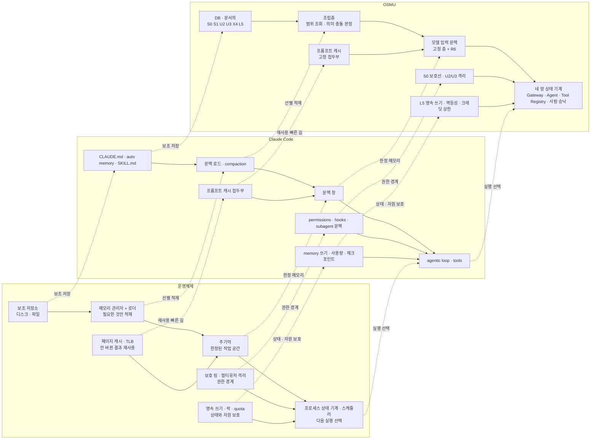

<!--
STAMP
line: osmu
artifact: claude-code-와-osmu-대응
version: v1.1
created_at: 2026-08-24 01:18 KST
model: gpt-codex/gpt-5.6-sol
agent: tech-architect(worker)
skills: 없음. 매칭되는 기술설계 스킬이 설치 목록에 없어 doc-review·writing·benchmarks·artifact-stamp 규격을 적용
evidence: MemGPT 논문, Claude Code 문맥 창·압축 공식 문서, Anthropic 프롬프트 캐싱 공식 문서, Linux 커널 메모리·TLB·cgroup 공식 문서, 기존 Claude Code·Webflow·Adobe 공식 자료, OSMU 상류·구현·아키텍처 문서
diagram_verification: @mermaid-js/mermaid-cli 11.12.0 PNG 렌더 성공, 784×162, 시각 확인 완료
deliberation: 운영체제를 비유가 아닌 원형으로 두되, TLB와 프롬프트 캐시의 대상이 다르고 실제 커널 보호 링과 OSMU S0의 제품 정책도 동일하지 않다는 한계를 드러냈다.
-->

# Claude Code와 OSMU의 대응

> **판정:** 회장 인식은 구조적으로 맞다. 다만 우리 앱 한 덩어리가 Claude Code 런타임을 그대로 대신하는 것은 아니다. OSMU 전체가 조립층, OpenClaw Gateway와 Agent, 네 방, studio로 역할을 나눠 **콘텐츠 운영에 한정된 에이전트 하네스**를 이룬다는 표현이 정확하다. 이 대응은 목표 설계 기준이며, `L5` 승낙 경로와 일곱 층의 제품 구현은 아직 미구현 또는 부분구현이다.

**용어.** repo는 코드와 문서를 함께 보관하는 **코드 저장소**, session은 한 번 이어지는 **작업 대화**, tenant는 다른 고객 데이터와 분리되는 **고객 계정 격리 단위**, workspace는 고객이 브랜드·언어·취향별로 나누는 **작업 공간**이다. 이후 본문은 한국어 뜻말을 우선 쓴다.

## 목차

- [1. 회장 질문에 대한 답](#1-회장-질문에-대한-답)
- [2. 용어 대응](#2-용어-대응)
- [3. 대응 관계 도식](#3-대응-관계-도식)
- [4. 같지 않은 다섯 가지](#4-같지-않은-다섯-가지)
- [5. 운영체제 관점에서 우리가 무엇을 새로 만들었나](#5-운영체제-관점에서-우리가-무엇을-새로-만들었나)
- [6. 가장 강한 반론](#6-가장-강한-반론)
- [7. 선행 사례](#7-선행-사례)
- [8. 우리 설계에 주는 시사점](#8-우리-설계에-주는-시사점)
- [9. 추적성과 현재 공정](#9-추적성과-현재-공정)
- [10. 레드팀과 셀프심문](#10-레드팀과-셀프심문)
- [11. 출처](#11-출처)

## 1. 회장 질문에 대한 답

### 1.1 OSMU가 Claude Code와 사실상 같은 일을 하는가

**구조적 역할은 비슷하고, 제품 계약은 다르다.** Claude Code는 모델 앞에서 프로젝트 맥락을 모으고, 도구를 실행하고, 결과를 읽어 다음 행동을 정하는 개발용 에이전트 하네스다. Anthropic 공식 문서는 이 반복을 `맥락 수집 → 행동 → 검증`으로 설명한다.

OSMU도 필요한 정보를 조립해 모델에 보내고, 도구 결과를 다음 행동에 반영한다면 같은 에이전트 하네스 계열이다. 그러나 개발 저장소 전반을 자유롭게 다루는 Claude Code와 달리, OSMU는 생성실·편집실·발행실·성과실로 업무를 좁히고 사람의 승낙을 끼운다.

### 1.2 디스크 파일과 DB의 대응이 맞는가

**맞다. 저장 매체보다 중요한 것은 요청 시점에 유효한 맥락을 골라 모델 입력으로 조립하는 역할이다.** Claude Code는 세션 시작 때 프로젝트 루트와 사용자 범위의 `CLAUDE.md`를 읽고 메모리에 유지한다. 스킬은 설명을 먼저 노출하고 본문은 호출될 때 불러온다. OSMU는 요청 때 현재 고객 계정과 작업 공간에 허용된 `S0 S1 U2 U3 X4 L5`와 이번 요청 `R6`을 조회해 조립한다.

단순히 파일을 DB로 옮겼다고 말하면 부족하다. OSMU DB에는 고객 계정 격리, 작업 공간 범위, 수정 권한, 승낙 이력, 감사 가능한 판 정보가 붙어야 한다.

### 1.3 조립층이 context builder인가

**개념적으로 맞다.** context builder는 모델이 읽을 요청을 만드는 구성기다. OSMU 조립층은 현재 범위의 값만 꺼내고, 안전선과 금지 표현을 잠그고, 충돌 우선순위를 적용하고, 스킬과 본보기와 이번 요청을 모델별 입력 형식으로 바꾼다.

Claude Code 공식 문서는 매 턴 모델이 이전 요청을 기억하지 않으므로 시스템 지시, 프로젝트 맥락, 이전 대화와 도구 결과, 새 메시지를 다시 보낸다고 설명한다. 요청의 순서는 `system prompt → project context → conversation`이며, 같은 앞부분이 프롬프트 캐시의 재사용 단위가 된다. OSMU의 고정 앞부분과 가변 뒷부분 구분은 이 원리와 대응한다.

### 1.4 우리 앱이 에이전트 런타임이고 에이전틱 루프를 대신 구성하는가

**OSMU 전체가 역할을 분담한다는 조건에서 맞다.** 현재 정본 아키텍처의 역할은 다음과 같다.

| OSMU 부분 | 런타임 역할 |
|---|---|
| 조립층 | 이번 모델 호출에 필요한 맥락 구성 |
| OpenClaw Gateway + Claude Agent + Tool Registry | 모델 호출, 도구 실행, 도구 결과를 읽고 다음 행동을 정하는 반복 |
| 네 방 대시보드 | 생성·편집·발행·성과의 업무 상태기계와 사람 승낙 |
| studio | 생성·편집 실행과 결과물 revision |
| openclaw-service | 계정 연결, 예약, 발행, 성과 회수 |

모델을 한 번 호출해 결과만 반환하면 에이전틱 루프가 아니다. 도구 결과와 외부 상태를 읽고 다음 행동을 다시 고르는 반복이 실제로 돌아야 에이전틱 루프라고 부를 수 있다.

## 2. 용어 대응

| 운영체제 | Claude Code | OSMU |
|---|---|---|
| **주기억**, 즉 현재 프로세스가 바로 쓰는 한정된 메모리 | **문맥 창**. 대화, 파일, 명령 결과, `CLAUDE.md`, auto memory, 로드된 스킬이 한도 안에 같이 올라간다. 차면 오래된 도구 결과를 비우고 대화를 요약한다 | **모델에 넘기는 제한된 문맥**. `S0 S1 U2 U3 X4 L5 R6` 전부를 저장하는 곳이 아니라, 이번 요청에 필요한 판만 적재하는 실행 공간이다 |
| **메모리 관리자 + 로더**, 즉 디스크에서 필요한 것만 골라 주기억에 적재하는 부품 | 세션 시작과 파일 읽기에 맞춰 `CLAUDE.md`, rules, skill 설명과 본문을 적재하고, 문맥이 차면 compaction, 즉 요약으로 자리를 비운다 | **조립층 / context builder**. DB와 문서에서 요청 범위에 허용된 판만 골라 우선순위·충돌·권한을 판정한 뒤 모델 입력으로 직렬화한다 |
| **탐색 경로 `PATH` 또는 오버라이드 순서**, 즉 더 구체적인 설정을 먼저 적용하는 규칙 | managed, user, project, local, path-scoped 지침이 범위와 위치에 따라 겹친다. 정확한 병합 규칙은 OSMU 층계와 같지 않지만 구체 범위 탐색이라는 역할은 비슷하다 | `R6 → L5 → X4 → U3 → U2 → S1`. 더 구체적인 요청이 앞선다. `S0`는 오버라이드 대상이 아닌 별도 안전선이다 |
| **커널 모드 / 보호 링**, 즉 일반 사용자가 건드릴 수 없는 영역 | **직접 대응 없음.** managed settings와 권한 정책은 있지만 대화형 코딩 세션 내부에 커널 보호 링처럼 절대적인 권한 경계가 있는 것은 아니다. 개발자는 허용된 도구 안에서 사실상 root로 행동한다 | `S0`. 플랫폼 안전, 고객 격리, 저작권, AI 표시 같은 하드라인이다. 단, 현재는 실제 CPU 특권 링이 아니라 제품·DB 정책이므로 구현과 우회 테스트가 있어야 같은 강도를 주장할 수 있다 |
| **멀티유저 권한과 프로세스 격리**, 즉 한 사용자의 메모리와 행동이 다른 사용자에게 안 넘어가게 막는 경계 | **제품 수준 직접 대응 없음.** subagent의 별도 문맥은 작업 격리지, 고객 간 데이터 격리가 아니다. Claude Code의 기본 실행 단위는 한 사용자의 하나의 코드 저장소와 세션이다 | `U2` 개인과 `U3` 작업 공간. tenant, user, workspace 키와 RLS, 즉 DB가 행마다 접근 가능 범위를 검사하는 정책으로 격리해야 한다 |
| **페이지 캐시 / TLB**. 페이지 캐시는 디스크에서 읽은 데이터를 재사용하고, TLB는 가상 주소와 실제 주소의 변환 결과를 재사용한다 | **프롬프트 캐시 접두부**. 도구, system, messages 순의 동일한 접두부를 재처리하지 않는다. 내용 재사용이므로 페이지 캐시에 더 가깝고, TLB와는 빠른 조회라는 점만 비슷하다 | 조립층이 안 바뀌는 `S0 S1 U2 U3 X4 L5`를 앞에, 이번 `R6`와 도구 결과를 뒤에 둔다. 접두부가 정확히 같아야 적중하며, 성능과 비용 최적화일 뿐 정확성 장치는 아니다 |
| **프로세스 상태 기계와 스케줄러**, 즉 준비·실행·대기·종료 상태와 다음 실행 대상을 정하는 부품 | agentic loop가 도구 결과를 읽고 다음 행동을 고른다. hooks, permissions, subagents가 실행 전후의 제약과 분업을 더한다 | 생성실·편집실·발행실·성과실의 **네 방 파이프라인**. 상태 전이와 대기열을 제한하지만 발행과 규칙 적용 중간에 사람 승낙을 기다리는 **협조형 스케줄러**다 |
| **동적 링크 라이브러리**, 즉 실행 파일에 항상 박아 넣지 않고 필요할 때 연결하는 코드 모듈 | 세션 시작에는 `SKILL.md` 설명만 보고 호출할 때 본문을 적재한다. 원문은 디스크에 남는다 | `X4` 스킬 원문을 보존하고 요청에 필요할 때만 조립한다. 손님이 올린 스킬은 서명·권리·도구 범위를 검증하지 않은 **서드파티 모듈**로 취급해야 한다 |
| **영속 저장소로의 쓰기**, 즉 전원이 끊겨도 남는 상태 변경 | auto memory와 `CLAUDE.md` 갱신이 세션 밖에 남는다. 단, OSMU `L5`처럼 성과 근거와 사람 승낙을 필수 조건으로 묶지는 않는다 | `L5` 승낙 기록. 같은 선택 3회 또는 성과 5건과 같은 근거를 후보로 보여 준 뒤, 사람이 승낙해야만 해당 작업 공간의 영속 상태를 바꾼다 |
| **자원 할당량 quota와 cgroup**, 즉 프로세스 묶음별로 CPU·메모리·입출력 상한을 나누는 장치 | 세션 사용량, 모델별 문맥 한도, 허용된 도구 범위가 실행 가능 자원을 제한한다. 단, 소비자별 원가 원장은 코드 세션의 기본 계약이 아니다 | workspace·job별 크레딧, 모델 비용, 동시 실행 수, 재시도 횟수 상한. 단순 노출 수치가 아니라 초과 시 실행을 막는 강제 점이 있어야 cgroup 비유가 성립한다 |
| **락과 트랜잭션**, 즉 같은 자원을 두 작업이 동시에 바꾸지 못하게 하고 쓰기 전체를 하나로 성공·실패시키는 장치 | 세션 체크포인트, 파일 쓰기, 도구 허용은 부분 대응하지만 외부 게시까지 하나의 트랜잭션으로 묶지는 않는다 | job key, publication key, idempotency key, DB unique constraint로 중복 실행을 막고, 외부 발행 성공 뒤 DB 쓰기 실패는 재발행이 아닌 영속성 복구로 분기한다 |
| **대응 없음.** 운영체제는 실행 성과가 사회·시장에서 어떻게 받아들여졌는지를 알지 못한다 | 테스트와 도구 결과로 현재 개발 과업을 검증하지만, 사용자·시장 성과를 다음 세션의 프로젝트 규칙으로 자동 전환하지는 않는다 | **성과 되먹임**. 발행 성과와 제작 정보를 연결해 다음 적재 후보를 바꾼다. 이것이 운영체제 대응을 넘어 OSMU가 더 가진 축이다 |

`#`로 메모를 남기는 단축 동작을 `L5`와 그대로 동일시하면 안 된다. Claude Code의 메모는 사용자가 직접 지시하거나 모델이 유용성을 판단해 기록한다. `L5`는 같은 선택 3회 또는 성과 표본 5건을 최소 시작점으로 삼고, 근거 부족을 표시하며, 사용자가 승낙한 뒤 해당 작업 공간에만 적용하는 제품 계약이다.

### 실조사 판정

- **선행 사례 있음.** [MemGPT 논문](https://arxiv.org/abs/2310.08560)은 제한된 LLM 문맥 창을 운영체제의 주기억에 비유하고, 빠른 기억층과 느린 기억층 사이로 정보를 옮기는 `virtual context management`, 즉 가상 문맥 관리를 제안했다. 따라서 문맥 창과 운영체제 메모리의 연결은 우리만의 비유가 아니다.
- **Claude Code 공식 동작.** [문맥 창 공식 설명](https://code.claude.com/docs/en/context-window)과 [Claude Code 동작 설명](https://code.claude.com/docs/en/how-claude-code-works)에 따르면 문맥 창에는 대화, 파일, 명령 결과, `CLAUDE.md`, auto memory, 스킬, system 지시가 올라간다. 한도에 가까워지면 오래된 도구 결과를 먼저 제거하고 대화를 요약하며, 루트 `CLAUDE.md`와 auto memory는 디스크에서 다시 적재한다.
- **프롬프트 캐시 접두부 규칙.** [Anthropic 공식 프롬프트 캐싱 문서](https://platform.claude.com/docs/en/build-with-claude/prompt-caching)는 `tools → system → messages` 순서의 접두부 전체를 캐시하며, 캐시 중단점 앞의 어느 블록이든 바뀌면 다른 해시가 된다고 설명한다. 안 바뀌는 것을 앞에 두어야 적중한다는 원칙이 공식 근거를 가진다.

## 3. 대응 관계 도식

도식은 역할 대응을 뜻한다. 실행 환경, 데이터 소유, 권한 책임이 동일하다는 뜻이 아니다.

## 4. 같지 않은 다섯 가지

### 4.1 바탕: 코드 저장소·세션과 고객 계정·작업 공간

Claude Code는 local, Anthropic cloud, self-hosted cloud, Remote Control을 지원하므로 “한 사람의 한 기계”라고 단정할 수 없다. 정확한 차이는 **코드 저장소와 세션 중심 개발 에이전트**와 **고객 계정과 작업 공간 중심 소비자 SaaS**다. OSMU는 여러 고객의 데이터, 소셜 자격증명, 비용, 발행 결과를 서비스 안에서 격리하고 감사해야 한다.

### 4.2 덮어쓰기: 개발 환경 정책과 소비자 제품 안전선

Claude Code도 조직 관리 `CLAUDE.md`와 managed settings를 지원하므로 사용자가 모든 규칙을 마음대로 덮는다고 말할 수 없다. 차이는 OSMU의 `S0`가 플랫폼 정책, 저작권, AI 표시, 고객 격리를 사용자 작업 공간보다 상위에서 강제하는 **소비자 SaaS 제품 계약**이라는 점이다.

### 4.3 루프: 자유 도구 반복과 네 방의 좁은 상태기계

Claude Code는 파일, 셸, 웹, MCP 도구를 과업에 따라 폭넓게 조합한다. OSMU는 생성실·편집실·발행실·성과실로 상태를 고정하고, 발행과 `L5` 적용에 사람 관문을 둔다. 같은 루프를 옮긴 것이 아니라 업무 범위와 실패 상태를 좁힌 것이다.

### 4.4 학습: auto memory와 증거·승낙형 `L5`

Claude Code에는 자동 학습이 없다는 주장은 틀리다. auto memory가 기본 켜져 있고, 모델이 유용하다고 판단한 사용자 교정·선호·프로젝트 맥락을 세션 간 저장한다. OSMU의 새로움은 기억의 존재가 아니라 같은 선택 3회 또는 성과 5건, 근거 부족 표시, 사용자 승낙, 작업 공간 격리, 되돌리기를 하나의 제품 계약으로 묶는 데 있다.

### 4.5 되먹임: 개발 결과와 외부 채널 성과

Claude Code는 테스트와 도구 결과를 읽어 현재 개발 과업을 검증한다. OSMU는 발행 뒤 조회수·반응·댓글과 제작 꼬리표를 연결해 다음 요청의 규칙 후보를 만든다. 단, 상관관계를 원인으로 단정하지 않고 후보로만 보여 준 뒤 승낙을 받아야 한다.

## 5. 운영체제 관점에서 우리가 무엇을 새로 만들었나

운영체제 원형은 맥락 관리를 정확히 보게 해 주지만, OSMU를 전부 설명하지는 못한다. 비유가 깨지는 아래 세 지점이 우리가 새로 설계한 핵심이다.

### 5.1 사람에게 묻는 협조형 스케줄러

운영체제 스케줄러는 실행할 프로세스를 고를 때 사용자에게 의미를 묻지 않는다. OSMU는 발행, 외부 계정 사용, 장기 규칙 `L5` 적용 앞에서 사람 승낙을 기다린다.

이것은 **상시로 걸면 성능 저하**다. 동일한 안전한 작업까지 매번 물으면 대기열만 늘고 처리량이 줄어든다. 그러나 **되돌리기 비싼 쓰기에만 걸면 품질 장치**다. 상태 전이 규칙은 읽기·초안·재시도 같은 가역 작업은 자동 진행하고, 발행·과금·규칙 승격만 대기 상태로 두어야 한다.

### 5.2 뜻을 보는 메모리 관리자

일반 운영체제는 무엇을 메모리에 남길지 정할 때 내용의 뜻을 판독하지 않는다. LRU, 즉 가장 오래 쓰지 않은 페이지를 먼저 내리는 규칙처럼 접근 시점과 빈도 같은 기계적 신호를 쓴다.

OSMU 조립층은 **뜻을 보고 고른다**. 요청과 관계있는 사실을 고르고, 서로 다른 판의 브랜드 사실이 충돌하면 임의로 하나를 폐기하지 않고 멈춰 사람에게 묻는다. 이것은 단순 메모리 회수가 아니라 **의미 선택과 충돌 중재**다. 오분류하면 잘못된 브랜드 사실을 정확히 실행하는 결과가 나오므로, 캐시 적중률보다 출처·판·충돌 보류율을 함께 관측해야 한다.

### 5.3 세상의 결과가 다음 적재를 바꾼다

운영체제는 프로세스가 종료 코드 0을 냈는지는 알 수 있지만, 그 실행 결과가 시장과 사용자에게 어떻게 받아들여졌는지는 모른다. OSMU는 발행 증거, 조회수, 반응, 댓글과 제작 정보를 연결해 다음 조립에 쓸 규칙 후보를 바꾼다.

단, 성과가 좋았다는 상관관계를 성공 요인으로 단정하면 이 축은 학습이 아니라 오염이 된다. 그래서 성과 표본을 규칙으로 직접 쓰지 않고, 근거·관찰 기간·반례를 가진 `L5` 후보로 올린 뒤 사람 승낙을 받는다.

### 5.4 비유의 한계를 설계 경계로 바꾼다

| 비유가 깨지는 지점 | 정직한 판정 | 설계에 주는 제약 |
|---|---|---|
| `S0` ≠ CPU 보호 링 | 보호 링은 하드웨어와 커널이 강제한다. `S0`는 현재 제품 정책과 DB 권한이다 | `S0`를 안전선이라 부르려면 하류 모든 쓰기 경로의 우회 0을 테스트해야 한다 |
| 프롬프트 캐시 ≠ TLB | TLB는 주소 변환을 캐싱한다. 프롬프트 캐시는 동일한 입력 접두부의 처리분을 재사용하며 출력 생성 결과를 캐싱하는 것은 아니다 | TLB는 빠른 조회만 설명하는 보조 비유로 쓰고, 정확한 원형은 페이지 캐시와 접두부 캐시로 둔다 |
| 네 방 ≠ 선점형 OS 스케줄러 | 운영체제는 대기 프로세스에게 CPU를 배정한다. 네 방은 업무 상태와 사람 승낙을 관리한다 | 처리량만 최적화하지 말고 승낙 대기 시간, 승낙 후 되돌리기, 무승낙 외부 쓰기 0을 측정한다 |
| 메모리 관리 ≠ 의미 중재 | 운영체제는 요청의 브랜드 사실이 어느 판에서 왔는지 이해하지 않는다 | 조립층에 provenance, 즉 정보의 출처·판·승낙 상태를 필수 입력으로 둔다 |
| OS 실행 결과 ≠ 세상의 성과 | 종료 코드와 시장 반응은 다르다 | 성과 신호는 자동 규칙이 아니라 출처가 있는 후보로만 적재한다 |

## 6. 가장 강한 반론

### 반론

> 그냥 Claude Code에 GUI를 씌운 것이라면 Anthropic이 같은 GUI를 내는 순간 OSMU는 끝난다.

이 반론은 가정이 아니라 일부 현실이다. Anthropic은 이미 Claude Code Desktop, `claude.ai/code`, IDE, Remote Control을 제공한다. 공식 문서는 Desktop이 CLI와 같은 엔진을 그래픽 인터페이스로 실행하며, 어느 표면에서도 underlying agentic loop는 같다고 밝힌다. 스킬과 플러그인도 Desktop에서 설치하고 실행할 수 있다.

따라서 OSMU의 가치가 “터미널을 숨기고 버튼으로 Claude Code를 실행한다”면 방어력은 약하다. Anthropic은 런타임과 모델, GUI, 배포 채널을 모두 갖고 있으므로 우리가 이기기 어렵다.

### 답

우리 답은 GUI가 아니다. 다음 다섯 가지를 실제 제품과 운영 증거로 소유하는 것이다.

1. 업종·사용자·작업 공간을 분리하는 `S0 S1 U2 U3 X4 L5 R6` 데이터 계약.
2. 고객 계정 격리, 소셜 자격증명, 권한, 감사, 비용 원장.
3. 생성·편집·발행·성과로 좁힌 업무 상태기계와 사람 승낙.
4. 채널 연결, 예약, 중복 방지, 발행 증거, 성과 정규화의 계속되는 운영.
5. 제작 정보와 외부 성과를 연결하되 근거 부족을 숨기지 않는 `L5` 후보·승낙·되돌리기.

### 현재 답의 강도

**설계 답은 타당하지만 사업 해자는 아직 약하다.** `docs/구현현황.md`와 사업계획 §6은 일곱 층, 작업 공간 복제, `L5` 승낙 제품 경로를 미구현 또는 부분구현으로 판정한다. 지금은 Claude Code GUI와 다른 구조를 문서로 정의한 상태이지, 고객이 반복 사용하고 성과가 다음 제작을 바꾸는 폐루프를 증명한 상태가 아니다.

Anthropic이 업종별 데이터 모델과 채널 운영까지 내려오지 않을 것이라는 기대만으로는 부족하다. 첫 작업 공간들이 28일 안에 생성·편집·발행·성과·승낙의 두 회차를 끝내고, 다른 작업 공간으로 데이터가 새지 않으며, 운영 시간이 실제로 줄었다는 증거가 있어야 반론을 견딘다.

## 7. 선행 사례

| 판정 | 사례 | 개발 행위를 어떻게 GUI로 바꿨나 | 결과와 한계 | OSMU가 가져올 것 |
|---|---|---|---|---|
| 성공 | Webflow | HTML·CSS·CMS·배포를 시각 편집, CMS, hosting으로 묶음 | Webflow 공식 2019 기록은 유료 고객 45,000곳 이상과 수십억 page view를 밝혔다. 단순 편집기가 아니라 제작부터 hosting·운영까지 소유했다 | 모델 호출 버튼이 아니라 제작·발행·성과까지 닫힌 운영 결과를 판다 |
| 실패 | Adobe Muse | 디자이너가 코드를 쓰지 않고 responsive site를 만들고 web-ready code를 내보냄 | Adobe는 2018년 기능 개발을 멈추고 2020년 지원을 종료했다. 복잡한 사이트는 개발팀 협업으로, 단순 사이트는 template DIY 도구로 갈라지는 시장 변화를 이유로 들었다 | 범용 GUI 중간지대에 머물지 않는다. 한 고객의 반복 업무와 운영 책임을 좁게 소유한다 |

두 사례의 공통 교훈은 “코드를 안 보여 준다”만으로는 사업이 되지 않는다는 것이다. Webflow는 생산물의 배포와 CMS 운영까지 붙였고, Muse는 복잡한 개발과 쉬운 template 도구 사이에서 독립 가치가 약해졌다. OSMU도 Claude Code 화면을 쉽게 만드는 데서 멈추면 Muse 쪽 위험에 가깝다.

## 8. 우리 설계에 주는 시사점

1. 제품 문구는 “Claude Code를 GUI로 바꿨다”가 아니라 “콘텐츠 운영의 생성·편집·발행·성과를 한 작업 공간에서 닫는다”로 둔다.
2. 조립층, 도구 루프, 업무 상태기계, studio 실행을 한 런타임이라고 뭉개지 않는다. 각자 입력·출력·실패 책임을 문서와 telemetry에서 분리한다.
3. `S0 S1 U2 U3 X4 L5 R6`는 모델 입력용 prompt 조각이 아니라 권한, 판, 근거, 승낙, 되돌리기를 가진 데이터 계약이어야 한다.
4. cache hit는 원가 절감 보너스다. 캐시가 0이어도 요금제가 남아야 하며, 층별 판과 모델별 `cached_tokens`를 관측해야 한다.
5. 한 번 호출과 agentic loop를 제품 지표에서 구분한다. 도구 결과를 읽고 다음 행동을 고른 횟수, 사람 승낙 대기, 복구 분기를 기록한다.
6. `L5`는 자동 메모리보다 낫다고 주장하기 전에 후보 근거, 승낙률, 되돌리기, 작업 공간 간 누출 0을 직접 증명한다.
7. Anthropic GUI보다 화면을 예쁘게 만드는 경쟁은 피한다. 채널 정책 변화, OAuth, 정확히 한 번 발행, 성과 회수라는 도메인 운영을 해자로 만든다.

## 9. 추적성과 현재 공정

| 항목 | 수치 | 판정 |
|---|---:|---|
| 운영체제·Claude Code·OSMU 3열 대응 | 12건 | 요구된 항목 전부를 §2와 §3에 연결 |
| 직접 대응 없음 판정 | 3건 | Claude Code의 커널 보호 링, Claude Code의 제품형 멀티유저 격리, 운영체제의 시장 성과 되먹임은 억지로 맞추지 않음 |
| 기존 user-flow의 endpoint·frontend component·DB table RTM 미해소 | 17건 | 기존 `docs/user-flow.md`가 기록한 전체 gap. 이 중 6건은 화면 확정을 막는 막힘 |
| 새 user-flow step | 0건 | 이번 작업은 설명 문서 보강이며 API·DB·화면 계약을 추가하지 않음 |

build stage 진입은 불가하다. `pipeline-state.osmu.md`의 현재 단계는 design이고, design 산출물은 미승인이다. 필수 `design_spec`도 미산출이며, 기존 user-flow 17건에 대한 endpoint·component·table 1:1 추적표가 없다. `L5` 승낙형 제품 경로도 미구현 또는 부분구현이다.

## 10. 레드팀과 셀프심문

### 레드팀

회의적인 경쟁자는 “결국 Claude Code가 context를 만들고 도구를 도는데 OSMU는 작업 이름과 DB만 바꾼 것”이라고 공격할 수 있다. 현재 구현만 보면 이 공격은 일부 맞다. 그래서 GUI, context 조립, 자동 메모리 존재 자체를 차별점에서 제외하고, 고객 계정 격리·네 방 상태기계·발행 운영·성과 되먹임·승낙형 `L5`의 실사용 증거만 차별점으로 남겼다.

Adobe Muse 사례는 런타임 변화에 뒤처진 GUI가 얼마나 빨리 중간지대를 잃는지 보여 준다. OSMU가 모델 공급자 한 곳과 화면 한 벌에 묶이면 같은 실패를 반복한다. 모델 맞춤부를 분리하고, 모델이 바뀌어도 작업 공간 계약과 발행 증거가 남게 해야 한다.

운영체제 전문가는 “`S0`를 보호 링이라 부르고 `U2/U3`를 프로세스 격리라 부르면 실제 커널과 같은 강제력이 있는 것처럼 오해시킨다”고 공격할 수 있다. 이 공격은 맞다. 그래서 각 대응에 직접 대응 없음과 부분 대응을 표시했고, 비유를 제품 완성 증거로 쓰지 않도록 우회 0·누출 0·중복 실행 0의 구현 테스트를 별도 조건으로 남겼다.

### 셀프심문

**이 결론이 틀렸다면 가장 그럴듯한 이유는 무엇인가?** OSMU의 네 방과 `L5`가 고객 가치가 아니라 내부 시스템 설명일 가능성이다. 고객이 원하는 것이 싸고 빠른 결과물뿐이라면, 승낙과 층계는 첫 가치 시간을 늦추는 마찰이 된다.

기술적으로 가장 잘 부서지는 가정은 “층 순서와 출처만 있으면 의미 충돌을 안전하게 중재할 수 있다”는 것이다. 충돌 검출이 놓치면 우선순위가 오히려 잘못된 사실을 빠르게 확정한다. 따라서 조립층의 핵심 검증은 토큰 수나 캐시 적중률이 아니라 서로 다른 판·권한·시점의 충돌 테스트다.

수정한 결론은 “구조가 다르므로 이긴다”가 아니다. 첫 고객이 층 이름을 몰라도 한 주치 콘텐츠를 끝내고, 발행 실패를 복구하고, 다음 회차 제안이 근거와 함께 나아지는 장면이 관찰될 때만 차별화가 성립한다.

## 11. 출처

### Claude Code와 Anthropic 공식 문서

- [How Claude Code works](https://code.claude.com/docs/en/how-claude-code-works): agentic loop, 실행 환경, 인터페이스, context window.
- [Explore the context window](https://code.claude.com/docs/en/context-window): 문맥 적재 대상, compaction, 루트 `CLAUDE.md`·auto memory·skill 재적재 규칙.
- [How Claude Code uses prompt caching](https://code.claude.com/docs/en/prompt-caching): 매 턴 전체 context 재전송, `system → project context → conversation`, 세션 시작 `CLAUDE.md` 적재, 자동 캐시.
- [How Claude remembers your project](https://code.claude.com/docs/en/memory): `CLAUDE.md`, managed instructions, auto memory의 기본 동작과 범위.
- [Extend Claude with skills](https://code.claude.com/docs/en/skills): skill 위치, discovery, 본문 on-demand loading.
- [Automate actions with hooks](https://code.claude.com/docs/en/hooks-guide): `PreToolUse`, `Stop`, 차단과 감사.
- [Create custom subagents](https://code.claude.com/docs/en/sub-agents): 격리 context, 별도 도구·권한, 결과 회수.
- [Claude Code Desktop](https://code.claude.com/docs/en/desktop): CLI와 같은 엔진의 GUI, 공통 설정·스킬·훅.
- [Claude Code Remote Control](https://code.claude.com/docs/en/remote-control): web UI와 local execution의 분리.
- [Anthropic Prompt Caching](https://platform.claude.com/docs/en/build-with-claude/prompt-caching): 정적 앞부분, 정확한 prefix 일치, cache hierarchy.

### 운영체제 원형과 LLM 문맥 선행 연구

- [MemGPT: Towards LLMs as Operating Systems](https://arxiv.org/abs/2310.08560): 한정된 LLM 문맥 창을 주기억에 대응시킨 virtual context management 선행 사례.
- [Linux 메모리 개념](https://www.kernel.org/doc/html/latest/admin-guide/mm/concepts.html): 페이지 캐시, reclaim, backing storage 동작.
- [Linux page tables](https://www.kernel.org/doc/html/latest/mm/page_tables.html): MMU와 TLB가 가상·물리 주소 변환을 재사용하는 경계.
- [Linux cgroup v2](https://www.kernel.org/doc/html/latest/admin-guide/cgroup-v2.html): 프로세스 계층, 자원 분배, 상한, 상위 제약을 하위가 넘지 못하는 규칙.

### 선행 사례 공식 자료

- [Webflow 공식 성장 기록](https://webflow.com/blog/webflow-series-a-funding): 유료 고객, visual CMS, hosting, 사용 범위.
- [Webflow 고객 사례](https://webflow.com/customers): code-heavy build를 visual workflow로 바꾼 운영 결과.
- [Adobe Muse 공식 튜토리얼](https://helpx.adobe.com/pdf/muse_reference.pdf): 코드를 쓰지 않는 full-featured website 제작.
- [Adobe Muse 서비스 종료](https://helpx.adobe.com/in/muse/kb/adobe-muse-end-of-service.html): 기능 개발·지원 종료와 복잡한 사이트·단순 DIY 사이트로 갈린 시장 변화 판단.

### OSMU 상류와 현행 구조

- `docs/사업계획-osmu-v1.0.md` v1.4 §3.4·§6·§8.
- `docs/prd-openclaw-service-v8.2.1-gpt-codex.md`.
- `DESIGN.md` v24.
- `docs/user-flow.md`.
- `docs/구현현황.md`.
- `wiki/architecture/system-architecture.md`.
- `wiki/architecture/data-model.md`.
- `dashboard/db/schema.sql`.
- `pipeline-state.osmu.md`.

RUBRIC_SCORE: 완결성=5/5 정밀성=5/5 벤치마크=5/5 추적성=5/5 전문성=5/5 total=25/25
RUBRIC_SCORE: hook=4/5 detail=5/5 rhythm=4/5 voice=5/5 slop=5/5 total=23/25
WEAKEST_LINE: "첫 고객이 층 이름을 몰라도 한 주치 콘텐츠를 끝내고, 발행 실패를 복구하고, 다음 회차 제안이 근거와 함께 나아지는 장면이 관찰될 때만 차별화가 성립한다." 현재 제품 E2E 증거가 없어 조건부 결론이다.

SKILLS_USED: 없음
SKILLS_SKIPPED: 매칭되는 기술설계 스킬이 설치 목록에 없음. `doc-review.md`, `writing.md`, `benchmarks.md`, `artifact-stamp.md`를 적용

SOURCES: MemGPT 논문 1건 · Claude Code 공식 문서 9건 · Anthropic Platform 공식 문서 1건 · Linux 커널 공식 문서 3건 · Webflow 공식 자료 2건 · Adobe 공식 자료 2건 · OSMU 상류·현황·아키텍처 문서 9종
MODEL: gpt-codex/gpt-5.6-sol · agent: tech-architect(worker)

🏷 STAMP | line: osmu | 생성: 2026-08-24 01:18 KST | model: gpt-codex/gpt-5.6-sol | agent: tech-architect(worker)
skills: 없음 | 근거: MemGPT · Claude Code · Anthropic · Linux 커널 · Webflow · Adobe 실조사 + OSMU 정본 9종
도식 검증: `@mermaid-js/mermaid-cli@11.12.0` PNG 784×162 렌더 성공, 운영체제·Claude Code·OSMU 3열과 역할별 점선 대응 시각 확인
고민: 운영체제 원형을 따르되 사람 승낙, 의미 충돌 중재, 시장 성과 되먹임은 운영체제에 없는 OSMU의 별도 축으로 분리했다. S0·TLB 비유의 한계도 구현 제약으로 박았다.
SOURCES/MODEL: MemGPT·Claude Code·Anthropic·Linux 커널·Webflow·Adobe 실조사 + OSMU 정본 9종 | gpt-codex/gpt-5.6-sol · tech-architect(worker)
